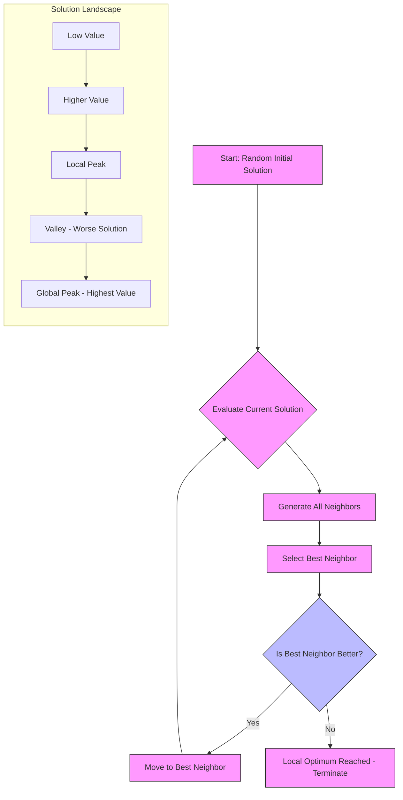

# Paper 1 – [6181]-121

## Q1a: Explain Hill Climbing with a suitable diagram

Hill Climbing is a local search optimization algorithm that belongs to the family of iterative improvement techniques. It is used to find the maximum or minimum of a function by iteratively moving in the direction of increasing value (for maximization) or decreasing value (for minimization). The algorithm starts with an arbitrary solution and attempts to improve it by making incremental changes, moving to neighboring states that offer better objective function values until no further improvement is possible.

### How Hill Climbing Works

The basic Hill Climbing algorithm operates as follows:
1. **Initialization**: Start with a randomly generated solution (current state)
2. **Evaluation**: Calculate the objective function value for the current state
3. **Neighbor Generation**: Generate all possible neighboring states by making small changes to the current state
4. **Selection**: Choose the neighbor with the best objective function value
5. **Termination Check**: If the best neighbor is better than the current state, move to that neighbor and repeat from step 2; otherwise, terminate as a local optimum has been reached

### Types of Hill Climbing

1. **Simple Hill Climbing**: Evaluates neighbors one by one and moves to the first neighbor that improves the current state
2. **Steepest-Ascent Hill Climbing**: Evaluates all neighbors and moves to the neighbor with the highest improvement
3. **Stochastic Hill Climbing**: Selects a random neighbor and moves to it if it improves the current state
4. **Random-Restart Hill Climbing**: Repeatedly applies Hill Climbing from random starting positions to avoid getting stuck in poor local optima

### Problem: Local Optima vs Global Optima

One of the main limitations of Hill Climbing is its tendency to get stuck in local optima rather than finding the global optimum. This occurs because the algorithm only considers immediate neighbors and cannot "see" better solutions that might require temporarily moving to worse states.

Consider a landscape with multiple peaks:
- A **local peak** is a solution that is better than its immediate neighbors but may not be the best overall solution
- The **global peak** is the absolute best solution in the entire search space

Hill Climbing can become trapped on a local peak because any move to a neighboring state would decrease the objective function value, causing the algorithm to terminate prematurely.

### Visual Representation

Below is an ASCII representation showing both local and global peaks:

```
Objective Function Value
    ^
    |                           ___
    |                          /   \      Global Peak
    |                         /     \     _________
    |                        /       \___/         \_____
    |                       /                            \
    |                      /                              \
    |                     /                                \
    |                    /                                  \
    |                   /                                    \
    |                  /                                      \
    |                 /                                        \
    |                /                                          \
    |_______________/__________________________________________\__________> Solution Space
                   Local Peak
```

In this diagram:
- The x-axis represents the solution space
- The y-axis represents the objective function value (to be maximized)
- The algorithm starts at some point and climbs upward
- It reaches the local peak and stops, unaware that continuing (even through a valley) would lead to the higher global peak
- To reach the global peak from the local peak, the algorithm would need to temporarily accept worse solutions (go downhill), which Hill Climbing does not allow

Here's a Mermaid diagram illustrating the Hill Climbing process:



### Example: Traveling Salesman Problem (TSP)

To illustrate Hill Climbing, consider the Traveling Salesman Problem where we want to find the shortest route visiting all cities exactly once:

1. **Initial Solution**: Randomly order the cities (e.g., A→C→B→D→E→A)
2. **Neighbor Generation**: Create neighbors by swapping pairs of cities (e.g., A→B→C→D→E→A by swapping B and C)
3. **Evaluation**: Calculate the total distance for each neighbor
4. **Selection**: Choose the neighbor with the shortest distance
5. **Iteration**: Repeat until no neighbor improves the solution

For TSP, Hill Climbing might get stuck in a local optimum where no single swap improves the route, even though multiple simultaneous swaps could lead to a better solution.

### Advantages of Hill Climbing

1. **Simplicity**: Easy to understand and implement
2. **Memory Efficiency**: Only needs to store the current state and its neighbors
3. **Speed**: Can converge quickly for smooth, unimodal functions
4. **No Parameters**: Unlike many optimization algorithms, it doesn't require tuning of learning rates, population sizes, etc.

### Disadvantages of Hill Climbing

1. **Local Optima Problem**: Easily gets stuck in suboptimal solutions
2. **Plateaus**: Flat regions where all neighbors have equal value can cause aimless wandering
3. **Ridges**: Narrow paths to better solutions that require specific sequences of moves
4. **No Guarantee**: No assurance of finding the global optimum
5. **Sensitivity to Initial State**: Starting point significantly affects the final solution

### Variants to Address Limitations

1. **Simulated Annealing**: Allows occasional moves to worse states to escape local optima
2. **Tabu Search**: Uses memory structures to avoid revisiting recently explored solutions
3. **Genetic Algorithms**: Maintains a population of solutions to explore multiple regions simultaneously
4. **Random Restart**: Runs multiple times from different random starting points

### When to Use Hill Climbing

Hill Climbing is most effective when:
- The search space is relatively smooth with few local optima
- Gradient information is available or easy to approximate
- Computational resources are limited
- A good approximate solution is acceptable rather than requiring the absolute optimum
- The problem has a single, broad peak rather than many sharp peaks

### Conclusion

Hill Climbing is a fundamental optimization technique that provides a simple yet powerful approach to finding local optima in complex search spaces. While its susceptibility to getting trapped in local optima limits its effectiveness for multimodal functions, understanding its mechanics provides a foundation for more advanced optimization algorithms. The key insight from Hill Climbing is that local improvement strategies can be highly effective but require mechanisms to explore beyond immediate neighborhoods to find globally optimal solutions. By combining Hill Climbing with techniques like random restarts or accepting occasional downward moves, we can create more robust optimization algorithms that balance exploitation of good solutions with exploration of potentially better regions in the search space.

## Q1b: Describe Evolutionary Programming

Evolutionary Programming (EP) is a stochastic optimization algorithm inspired by biological evolution, specifically designed for optimizing numerical functions and solving complex problems where traditional mathematical methods may fail. Developed by Lawrence J. Fogel in the 1960s, EP focuses on evolving behavioral characteristics rather than genetic structures, making it distinct from other evolutionary algorithms like Genetic Algorithms.

### Core Principles of Evolutionary Programming

Evolutionary Programming is based on the Darwinian principles of natural selection and survival of the fittest. Unlike Genetic Algorithms that manipulate encoded representations of solutions (genotypes), EP operates directly on the phenotypic level - the actual behavioral characteristics or performance of solutions. This approach emphasizes the relationship between an organism's behavior and its environment rather than its underlying genetic makeup.

The fundamental steps in Evolutionary Programming are:

1. **Initialization**: Create an initial population of potential solutions, typically represented as real-valued vectors
2. **Evaluation**: Assess the fitness of each individual in the population using an objective function
3. **Selection**: Choose parents for reproduction based on their fitness values
4. **Mutation**: Generate offspring by applying random mutations to the selected parents
5. **Survival Selection**: Determine which individuals (parents and/or offspring) survive to the next generation
6. **Termination Check**: Repeat steps 2-5 until a stopping criterion is met

### Representation in Evolutionary Programming

In EP, individuals are typically represented as vectors of real numbers. For example, to optimize a function f(x₁, x₂, ..., xₙ), each individual would be represented as:
```
X = [x₁, x₂, x₃, ..., xₙ]
```

Each component xᵢ represents a parameter in the solution space. Unlike Genetic Algorithms that might use binary or other discrete representations, EP primarily works with continuous real-valued representations, making it particularly suitable for numerical optimization problems.

### Mutation Operators

The mutation operation is central to Evolutionary Programming and differs significantly from crossover-focused approaches like Genetic Algorithms. In EP, mutation is the primary mechanism for generating variation:

1. **Gaussian Mutation**: The most common approach where each parameter is perturbed by adding a random Gaussian (normal) distributed value:
   ```
   xᵢ' = xᵢ + N(0, σᵢ)
   ```
   where N(0, σᵢ) is a random number drawn from a normal distribution with mean 0 and standard deviation σᵢ.

2. **Adaptive Mutation**: The mutation step size (σᵢ) can itself evolve, allowing the algorithm to adjust its exploration rate based on success:
   ```
   σᵢ' = σᵢ * exp(τ' * N(0,1) + τ * Nᵢ(0,1))
   ```
   where τ and τ' are learning parameters, N(0,1) is a standard normal variable, and Nᵢ(0,1) is parameter-specific normal noise.

3. **Cauchy Mutation**: Uses Cauchy distribution instead of Gaussian for heavier tails, enabling larger jumps that can help escape local optima.

### Selection Mechanisms

EP employs various selection strategies:

1. **Fitness-Proportional Selection**: Individuals are selected with probability proportional to their fitness (roulette wheel selection).
2. **Tournament Selection**: Random subsets of individuals compete, and the winner is selected for reproduction.
3. **Truncation Selection**: Only the best individuals (above a certain threshold) are allowed to reproduce.
4. **(μ + λ) Selection**: Parents and offspring compete together for survival, selecting the best μ from the combined pool.
5. **(μ, λ) Selection**: Only offspring compete for survival, discarding the parents after generating λ offspring.

### Algorithm Flow

Here's a detailed flow of the Evolutionary Programming algorithm:

```mermaid
flowchart TD
    A[Initialize Population P₀] --> B[Evaluate Fitness of P₀]
    B --> C[Select Parents from P₀]
    C --> D[Apply Mutation to Generate Offspring O₀]
    D --> E[Evaluate Fitness of O₀]
    E --> F{Survival Selection}
    F -->|(μ+λ)| G[Combine P₀ and O₀, Select Best μ]
    F -->|(μ,λ)| H[Select Best μ from O₀ Only]
    G --> I[Form New Population P₁]
    H --> I
    I --> J{Termination Condition Met?}
    J -->|No| C
    J -->|Yes| K[Return Best Solution]
    
    style A fill:#e1f5fe,stroke:#01579b
    style B fill:#e8f5e8,stroke:#2e7d32
    style C fill:#fff3e0,stroke:#ef6c00
    style D fill:#f3e5f5,stroke:#6a1b9a
    style E fill:#e8f5e8,stroke:#2e7d32
    style F fill:#ffebee,stroke:#c62828
    style G,H fill:#e3f2fd,stroke:#1565c0
    style I fill:#fce4ec,stroke:#c2185b
    style J fill:#fffde7,stroke:#f57f17
    style K fill:#e8f5e8,stroke:#2e7d32
```

### Comparison with Genetic Algorithms

While both Evolutionary Programming and Genetic Algorithms are evolutionary computation techniques, they differ in several key aspects:

| Aspect | Evolutionary Programming | Genetic Algorithms |
|--------|--------------------------|-------------------|
| **Representation** | Primarily real-valued vectors | Often binary or discrete encodings |
| **Primary Operator** | Mutation | Crossover (recombination) |
| **Focus** | Phenotypic behavior | Genetic makeup (genotype) |
| **Mutation Role** | Main source of variation | Secondary operator |
| **Selection** | Often tournament or truncation | Fitness-proportional common |
| **Application** | Numerical optimization, time series prediction | Combinatorial optimization, scheduling |
| **Theoretical Basis** | Behavioral adaptation | Genetic inheritance |

### Advantages of Evolutionary Programming

1. **Effective for Continuous Optimization**: Naturally handles real-valued parameters without needing encoding/decoding
2. **Fewer Assumptions**: Makes minimal assumptions about the problem structure
3. **Global Search Capability**: Good at escaping local optima through mutation
4. **Simplicity**: Conceptually straightforward with fewer parameters to tune than GAs
5. **Adaptability**: Can adapt mutation rates during evolution
6. **Robustness**: Performs well across various problem types without significant modification

### Limitations of Evolutionary Programming

1. **Slower Convergence**: May converge slower than gradient-based methods for smooth functions
2. **Mutation-Dependent**: Performance heavily depends on effective mutation strategy design
3. **No Explicit Recombination**: Lacks the beneficial effects of crossover found in GAs
4. **Parameter Sensitivity**: Still requires tuning of population size, mutation parameters, etc.
5. **Theoretical Understanding**: Less developed theoretical foundation compared to some other EC methods

### Applications of Evolutionary Programming

Evolutionary Programming has been successfully applied to numerous domains:

1. **Time Series Prediction**: Forecasting stock prices, weather patterns, and economic indicators
2. **Neural Network Training**: Optimizing weights and architectures of artificial neural networks
3. **Control Systems**: Designing controllers for complex dynamical systems
4. **Signal Processing**: Filter design and spectral analysis
5. **Bioinformatics**: Protein structure prediction and gene expression analysis
6. **Engineering Design**: Structural optimization, circuit design, and parameter estimation
7. **Game Playing**: Developing strategies for complex games
8. **Financial Modeling**: Portfolio optimization and risk management

### Example: Optimizing a Mathematical Function

Consider optimizing the Rastrigin function, a common benchmark for optimization algorithms:
```
f(x) = 10n + Σ[xᵢ² - 10cos(2πxᵢ)] for i=1 to n
```

This function has many local minima, making it challenging for gradient-based methods.

Using Evolutionary Programming:
1. Initialize a population of random vectors in the search space (typically [-5.12, 5.12]ⁿ)
2. Evaluate each individual using the Rastrigin function
3. Select the best individuals as parents
4. Generate offspring by adding Gaussian noise to each parameter
5. Evaluate offspring fitness
6. Select survivors for the next generation using (μ+λ) or (μ,λ) selection
7. Repeat until convergence or maximum generations reached

EP's mutation-based approach allows it to effectively navigate the complex multimodal landscape of the Rastrigin function, often finding solutions close to the global optimum at f(0,0,...,0) = 0.

### Variants and Extensions

Several variants of Evolutionary Programming have been developed:

1. **Fast Evolutionary Programming (FEP)**: Uses Cauchy mutations for faster convergence
2. **Self-Adaptive EP**: Encodes mutation parameters within the individuals themselves
3. **Hierarchical EP**: Uses multiple levels of evolution with different time scales
4. **EP with Local Search**: Combines EP with gradient-based local refinement
5. **Multi-Objective EP**: Extends EP to handle multiple conflicting objectives

### Conclusion

Evolutionary Programming represents a powerful and biologically inspired approach to optimization that focuses on evolving behavioral characteristics through mutation and selection. Its strength lies in its simplicity, effectiveness for continuous optimization problems, and ability to handle complex, multimodal fitness landscapes without requiring gradient information. While it may not always be the fastest convergent method, its robustness and generality make it a valuable tool in the evolutionary computation toolkit. EP's emphasis on phenotypic evolution rather than genotypic manipulation provides a unique perspective on how evolutionary principles can be applied to artificial problem-solving, complementing other evolutionary techniques like Genetic Algorithms and Evolution Strategies. As computational power continues to grow and hybrid approaches evolve, EP remains relevant for problems where its characteristics align well with the problem structure, particularly in numerical optimization, adaptive control, and pattern recognition applications.

## Q1c: Explain the Artificial Hummingbird Algorithm

The Artificial Hummingbird Algorithm (AHA) is a novel metaheuristic optimization algorithm inspired by the foraging behavior of hummingbirds in nature. Proposed in 2022, AHA mimics two primary behaviors of hummingbirds: guided foraging and territorial foraging, to solve complex optimization problems. Hummingbirds are known for their remarkable hovering ability, rapid wing movements, and efficient nectar extraction strategies, making them an excellent inspiration for optimization algorithms.

### Biological Inspiration

Hummingbirds exhibit unique foraging behaviors that translate well to optimization principles:

1. **Guided Foraging**: Hummingbirds remember the locations of flowers with high nectar content and use visual and spatial memory to guide their search for food sources
2. **Territorial Foraging**: Hummingbirds defend territories around high-quality food sources, preventing other birds from accessing these resources
3. **Hovering Ability**: Their unique ability to hover in place allows precise exploitation of food sources
4. **Long-Distance Migration**: Some species undertake impressive migratory journeys, demonstrating robust navigation capabilities
5. **High Metabolic Rate**: Requires constant feeding, driving efficient search strategies

These behaviors map to optimization concepts as follows:
- Flower locations represent potential solutions in the search space
- Nectar quantity corresponds to the objective function value (fitness)
- Memory of flower locations represents the algorithm's ability to remember good solutions
- Territorial behavior balances exploration and exploitation
- Hovering ability enables fine-tuning around promising regions

### Algorithm Mechanics

The Artificial Hummingbird Algorithm operates through two main phases that mimic hummingbird foraging behaviors:

#### 1. Guided Foraging Phase (Exploration)
In this phase, hummingbirds (search agents) explore the search space guided by their memory of profitable food sources:

- Each hummingbird maintains a memory of the best flower (solution) it has visited
- Hummingbirds move toward remembered high-nectar flowers with some random variation
- This mimics the birds' spatial memory and visual guidance systems
- The movement equation incorporates both deterministic (toward best memory) and stochastic (random exploration) components

Mathematically, the position update for guided foraging can be expressed as:
```
Xᵢ(t+1) = Xᵢ(t) + S * M * (Xₘₑₘ - Xᵢ(t)) + rand * (Xᵤₚₚₑᵣ - Xₗₒᴡₑᵣ)
```
Where:
- Xᵢ(t) is the current position of hummingbird i
- Xₘₑₘ is the memorized best position
- S is the step size factor
- M is the memory factor
- rand is a random number between 0 and 1
- Xᵤₚₚₑᵣ and Xₗₒᴡₑᵣ define the search space boundaries

#### 2. Territorial Foraging Phase (Exploitation)
In this phase, hummingbirds defend territories around high-quality food sources:

- Hummingbirds selectively exploit flowers within their remembered territory
- They perform local search around the best remembered flowers
- The territorial behavior prevents premature convergence by maintaining diversity
- This phase resembles intensive local search in promising regions

The territorial foraging movement is modeled as:
```
Xᵢ(t+1) = Xᵢ(t) + TF * (Xₘₑₘ - Xᵢ(t)) + rand * (Xₘₑₘ - Xᵢ(t))
```
Where TF is the territorial factor controlling the exploitation intensity.

### Algorithm Flow

Here's a detailed flow of the Artificial Hummingbird Algorithm:

```mermaid
flowchart TD
    A[Initialize Hummingbird Population] --> B[Evaluate Fitness (Nectar Amount)]
    B --> C[Update Memory (Best Flowers Visited)]
    C --> D{Guided Foraging Phase?}
    D -->|Yes| E[Move Toward Remembered Best Flowers<br>with Random Variation]
    D -->|No| F[Territorial Foraging Phase<br>Local Search Around Best Memories]
    E --> G[Update Fitness and Memory]
    F --> G
    G --> H{Termination Condition Met?}
    H -->|No| C
    H -->|I[Return Best Solution Found]]
    
    subgraph "Foraging Cycles"
        direction TB
        E -->|Alternate| F
        F -->|Alternate| E
    end
    
    classDef init fill:#e1f5fe,stroke:#01579b;
    classDef eval fill:#e8f5e8,stroke:#2e7d32;
    classDef memory fill:#fff3e0,stroke:#ef6c00;
    classDef forage fill:#f3e5f5,stroke:#6a1b9a;
    classDef update fill:#e8f5e8,stroke:#2e7d32;
    classDef term fill:#ffebee,stroke:#c62828;
    classDef result fill:#e8f5e8,stroke:#2e7d32;
    class A init;
    class B,G eval;
    class C memory;
    class E,F forage;
    class H term;
    class I result;
```

### Key Parameters

The performance of AHA depends on several key parameters:

1. **Population Size (N)**: Number of hummingbirds in the search
2. **Memory Factor (M)**: Controls influence of memory on movement (typically 0.5-1.5)
3. **Step Size (S)**: Determines movement magnitude during guided foraging
4. **Territorial Factor (TF)**: Controls exploitation intensity in territorial phase
5. **Switching Probability**: Probability of switching between foraging phases
6. **Maximum Iterations**: Stopping criterion for the algorithm

### Exploration-Exploitation Balance

AHA effectively balances exploration and exploitation through its dual-phase approach:

- **Guided Foraging (Exploration)**: Enables broad search across the solution space by combining memory-based direction with random variation
- **Territorial Foraging (Exploitation)**: Focuses search around promising regions identified through memory
- **Dynamic Switching**: The algorithm alternates between phases, preventing stagnation in either extreme
- **Memory Utilization**: Leverages historical information to guide both exploration and exploitation
- **Adaptive Behavior**: The balance shifts naturally as promising regions are discovered

### Advantages of Artificial Hummingbird Algorithm

1. **Strong Global Search Capability**: The guided foraging phase enables effective exploration of large search spaces
2. **Effective Local Refinement**: Territorial foraging provides precise exploitation of promising regions
3. **Memory-Based Learning**: Utilizes historical information to inform search decisions
4. **Few Parameters**: Requires tuning of relatively few parameters compared to some metaheuristics
5. **Simplicity**: Conceptually straightforward with clear biological inspiration
6. **Robustness**: Performs well across various types of optimization problems
7. **No Gradient Information Required**: Works with black-box objective functions
8. **Balanced Exploration-Exploitation**: Dual-phase mechanism naturally maintains this balance

### Limitations of Artificial Hummingbird Algorithm

1. **Relatively New**: As a recent algorithm (2022), it has less extensive validation than established methods
2. **Parameter Sensitivity**: Performance can be sensitive to parameter settings, particularly the switching probability
3. **Theoretical Analysis**: Limited theoretical convergence analysis compared to some classical methods
4. **Benchmark Performance**: May not outperform specialized algorithms on certain problem types
5. **Memory Overhead**: Requires storing memory information for each search agent
6. **Scaling Challenges**: May face challenges with very high-dimensional problems without modification

### Applications of Artificial Hummingbird Algorithm

Despite its recent introduction, AHA has shown promise in various domains:

1. **Engineering Design Optimization**: Structural design, mechanical systems, and electrical circuits
2. **Feature Selection**: Identifying optimal subsets of features in machine learning and data mining
3. **Parameter Tuning**: Optimizing hyperparameters of machine learning models
4. **Wireless Sensor Networks**: Optimizing node placement and routing protocols
5. **Image Processing**: Parameter optimization for image segmentation and enhancement algorithms
6. **Scheduling Problems**: Job shop scheduling, task allocation, and resource management
7. **Power Systems**: Optimal power flow, unit commitment, and renewable energy integration
8. **Chemical Engineering**: Process optimization and reaction condition tuning
9. **Robotics**: Path planning and control parameter optimization
10. **Financial Modeling**: Portfolio optimization and risk management strategies

### Example Application: Constrained Engineering Design

Consider optimizing a welded beam design problem with constraints on stress, deflection, buckling, and side constraints:

Objective: Minimize fabrication cost
Variables: Beam dimensions (height, length, thickness, width)
Constraints: Shear stress, bending stress, buckling load, deflection, side constraints

Using AHA:
1. Initialize population of random beam designs within feasible bounds
2. Evaluate each design using cost function (objective) and check constraint violations
3. Apply penalty method or feasibility rules to handle constraints
4. Update memory with best feasible solutions found
5. Perform guided foraging to explore new regions of design space
6. Perform territorial foraging to refine promising designs
7. Alternate between phases until convergence
8. Return the best feasible design found

The algorithm's ability to remember good solutions helps it navigate the complex constrained search space effectively, while the dual-phase approach balances finding feasible regions with optimizing within them.

### Comparison with Other Metaheuristics

| Algorithm | Inspiration | Exploration Mechanism | Exploitation Mechanism | Memory Usage |
|-----------|-------------|----------------------|------------------------|--------------|
| AHA | Hummingbird Foraging | Guided foraging with random variation | Territorial local search | Explicit memory of best solutions |
| PSO | Bird/Fish Flocking | Velocity toward personal/global best | Inertia and cognitive/social components | Personal & global best positions |
| GA | Natural Selection | Crossover and mutation | Selection pressure | Implicit through population |
| SSA | Sparrow Foraging | Producer-scrounger paradigm | Anti-predator vigilance | Memory of food sources and danger |
| WOA | Whale Hunting | Encircling prey with bubble-net | Exploitation phase | Best solution position |
| AHA Advantage | | Balanced guided+random walk | Focused territorial search | Explicit, dedicated memory mechanism |

### Variants and Hybridizations

Several extensions of the basic AHA have been proposed:

1. **Improved AHA**: Enhanced memory mechanisms or adaptive parameter control
2. **Binary AHA**: Adapted for discrete optimization problems
3. **Multi-Objective AHA**: Extended to handle multiple conflicting objectives using Pareto dominance
4. **Hybrid AHA**: Combined with local search operators or other metaheuristics
5. **Chaotic AHA**: Incorporates chaotic maps to enhance exploration
6. **Adaptive AHA**: Dynamically adjusts parameters based on search progress

### Conclusion

The Artificial Hummingbird Algorithm represents a promising addition to the metaheuristic optimization literature, drawing inspiration from the sophisticated foraging behaviors of hummingbirds. By decomposing the foraging process into guided (exploration) and territorial (exploitation) phases, AHA achieves an effective balance between global search and local refinement. The explicit memory mechanism allows the algorithm to leverage historical search information, mimicking how hummingbirds remember profitable flower locations.

AHA's strengths lie in its conceptual simplicity, strong global exploration capability, effective local exploitation, and minimal parameter requirements. While relatively new compared to established algorithms like Genetic Algorithms or Particle Swarm Optimization, initial results suggest it performs competitively across various benchmark problems and real-world applications.

As with any optimization algorithm, AHA's effectiveness depends on proper parameter tuning and problem characteristics. Its memory-based approach particularly benefits problems where good solutions exhibit some regularity or where historical information can effectively guide future search. Continued research into theoretical properties, parameter adaptation strategies, and hybrid approaches will further establish AHA's position in the optimization toolkit.

The algorithm exemplifies how careful observation of natural behaviors can inspire effective computational techniques, contributing to the growing field of bio-inspired optimization methods. As researchers continue to explore and refine AHA, it has the potential to become a valuable resource for solving complex optimization challenges across science, engineering, and industry domains.

## Q2a: Explain Simulated Annealing with a suitable diagram

Simulated Annealing (SA) is a probabilistic optimization algorithm inspired by the annealing process in metallurgy. Annealing involves heating a material to a high temperature and then slowly cooling it to reduce defects and achieve a low-energy crystalline state. Similarly, Simulated Annealing starts with a high "temperature" that allows exploration of the search space and gradually cools down to focus on exploitation of promising regions, enabling escape from local optima to find better global solutions.

### Core Concept of Simulated Annealing

The key innovation of Simulated Annealing over simple Hill Climbing is its acceptance criterion: unlike Hill Climbing which only accepts improvements, SA sometimes accepts worse solutions based on a probability that decreases over time. This allows the algorithm to escape local optima by occasionally moving "uphill" (to worse solutions) early in the search when the temperature is high, and gradually becoming more selective as the temperature decreases.

### How Simulated Annealing Works

The Simulated Annealing algorithm follows these steps:

1. **Initialization**: Start with an initial solution and set an initial high temperature
2. **Iteration**: Repeat until the system "cools" (temperature reaches minimum):
   a. Generate a random neighbor of the current solution
   b. Calculate the change in objective function (ΔE = E_neighbor - E_current)
   c. If ΔE < 0 (neighbor is better): Accept the neighbor as the new current solution
   d. If ΔE ≥ 0 (neighbor is worse): Accept the neighbor with probability P = e^(-ΔE/T)
   e. Decrease the temperature according to a cooling schedule
3. **Termination**: Stop when temperature is sufficiently low or after a fixed number of iterations

### Temperature and Acceptance Probability

The temperature parameter T controls the probability of accepting worse solutions:
- **High Temperature**: e^(-ΔE/T) ≈ 1, so almost all moves are accepted (high exploration)
- **Low Temperature**: e^(-ΔE/T) ≈ 0 for ΔE > 0, so only improving moves are accepted (high exploitation)

The acceptance probability function creates a balance:
- Early in the search (high T): The algorithm behaves like a random search, exploring widely
- Late in the search (low T): The algorithm behaves like Hill Climbing, refining the current solution

### Cooling Schedule

The cooling schedule determines how temperature decreases over time. Common schedules include:

1. **Exponential Cooling**: Tₖ₊₁ = α * Tₖ where 0 < α < 1 (typically α = 0.8-0.99)
2. **Linear Cooling**: Tₖ₊₁ = Tₖ - ΔT where ΔT is a constant decrement
3. **Logarithmic Cooling**: Tₖ = T₀ / log(1 + k) which guarantees convergence to global optimum but is slow
4. **Adaptive Cooling**: Adjusts temperature based on search progress or acceptance rate

### Visual Representation

Below is an ASCII representation showing how Simulated Annealing escapes local optima:

```
Objective Function Value
    ^
    |                           ___
    |                          /   \      Global Peak
    |                         /     \     _________
    |                        /       \___/         \_____
    |                       /                            \      High Temp: Accepts uphill moves
    |                      /                              \     (can jump from local to global)
    |                     /                                \
    |                    /                                  \   
    |                   /                                    \  
    |                  /                                      \ 
    |                 /                                        \ 
    |                /                                          \ 
    |_______________/__________________________________________\__________> Solution Space
                   Local Peak (can escape with sufficient "energy")
```

In this diagram:
- At high temperature, the algorithm has enough "energy" to jump from the local peak, through the valley, and reach the global peak
- As temperature decreases, the algorithm becomes less likely to accept uphill moves
- The annealing process mimics how metals cool: atoms have enough energy to rearrange at high temperatures, but settle into stable positions as they cool

Here's a Mermaid diagram illustrating the Simulated Annealing process:

```mermaid
flowchart TD
    A[Start: Initial Solution & High Temperature] --> B[Generate Random Neighbor]
    B --> C{Calculate ΔE = E_neighbor - E_current}
    C -->|ΔE < 0| D[Accept Neighbor (Improvement)]
    C -->|ΔE ≥ 0| E[Accept with Probability P = e^(-ΔE/T)]
    D --> F[Set Neighbor as Current Solution]
    E --> F
    F --> G{Decrease Temperature}
    G --> H{Termination Condition Met?}
    H -->|No| B
    H -->|Yes| I[Return Best Solution Found]
    
    subgraph "Temperature Effects"
        direction TB
        J[High Temp: High Acceptance of Worse Solutions] --> K[Medium Temp: Balanced Acceptance]
        K --> L[Low Temp: Low Acceptance of Worse Solutions]
    end
    
    classDef process fill:#f9f,stroke:#333;
    classDef decision fill:#bbf,stroke:#333;
    classDef temp fill:#e8f5e8,stroke:#2e7d32;
    class A,B,C,D,E,F,G,H,I process;
    class C,E decision;
    class G,H decision;
    class J,K,L temp;
```

### Example: Traveling Salesman Problem (TSP)

To illustrate Simulated Annealing, consider the Traveling Salesman Problem:

1. **Initial Solution**: Randomly order the cities (e.g., A→C→B→D→E→A)
2. **Neighbor Generation**: Create neighbor by swapping two cities or reversing a subsequence
3. **Evaluation**: Calculate tour length for current and neighbor solutions
4. **Acceptance**: 
   - If neighbor is shorter: Always accept
   - If neighbor is longer: Accept with probability e^(-ΔL/T) where ΔL = length_increase
5. **Cooling**: Reduce temperature using exponential schedule: T = T * 0.95
6. **Iteration**: Repeat until temperature is very low or maximum iterations reached

As the algorithm progresses:
- **Early Stage (High T)**: Accepts many longer tours, exploring diverse routes
- **Middle Stage (Medium T)**: Becomes more selective, refining promising routes
- **Late Stage (Low T)**: Behaves like Hill Climbing, making only improving moves

### Advantages of Simulated Annealing

1. **Global Optimization Capability**: Can escape local optima and find near-global optima
2. **Simplicity**: Conceptually simple and easy to implement
3. **Flexibility**: Can be applied to a wide range of optimization problems
4. **No Gradient Required**: Works with black-box objective functions
5. **Theoretical Guarantee**: With appropriate cooling schedule, converges to global optimum with probability 1
6. **Robustness**: Less sensitive to initial solution than Hill Climbing

### Limitations of Simulated Annealing

1. **Cooling Schedule Sensitivity**: Performance heavily depends on proper temperature decrement
2. **Computationally Expensive**: May require many function evaluations for complex problems
3. **Parameter Tuning**: Requires setting initial temperature, cooling rate, and stopping criteria
4. **No Reuse of Information**: Doesn't explicitly remember good solutions found during search
5. **Slow Convergence**: Can be slower than problem-specific heuristics for large instances

### Variants and Improvements

Several enhancements to basic Simulated Annealing have been developed:

1. **Adaptive Simulated Annealing**: Adjusts cooling schedule based on search progress
2. **Simulated Annealing with Restart**: Periodically restarts from best solution found
3. **Hybrid SA**: Combines SA with local search or other optimization techniques
4. **Parallel SA**: Runs multiple SA instances simultaneously for better exploration
5. **Quantum-Inspired SA**: Uses quantum tunneling concepts to enhance escape from local optima

### Applications of Simulated Annealing

Simulated Annealing has been successfully applied to numerous domains:

1. **VLSI Design**: Circuit partitioning, placement, and routing
2. **Scheduling**: Job shop scheduling, timetabling, and resource allocation
3. **Network Design**: Telecommunications network optimization and routing
4. **Protein Folding**: Finding low-energy conformations of protein chains
5. **Image Processing**: Image restoration, compression, and feature selection
6. **Traveling Salesman Problem**: Finding near-optimal tours
7. **Graph Coloring**: Minimizing colors needed for graph coloring
8. **Financial Optimization**: Portfolio optimization and risk management
9. **Machine Learning**: Training neural networks and feature selection
10. **Engineering Design**: Structural optimization and parameter tuning

### Example: Protein Folding Application

Consider the problem of predicting the 3D structure of a protein from its amino acid sequence:

Objective: Minimize the energy of the protein conformation
Variables: Dihedral angles (phi, psi) for each amino acid residue
Constraints: Steric hindrance, bond lengths, and angles

Using Simulated Annealing:
1. Start with a random or extended protein conformation
2. Generate neighbor by randomly adjusting one or more dihedral angles
3. Calculate energy change using a force field or knowledge-based potential
4. Accept/reject based on SA criterion with current temperature
5. Gradually cool the system from high to low temperature
6. Return the lowest energy conformation found

At high temperatures, the protein chain can explore many conformations, overcoming energy barriers. As temperature decreases, it settles into lower energy states, ideally reaching the native folded conformation.

### Comparison with Hill Climbing

| Aspect | Hill Climbing | Simulated Annealing |
|--------|---------------|---------------------|
| **Acceptance Criterion** | Only better solutions | Probabilistic acceptance of worse solutions |
| **Escape Local Optima** | No | Yes (through uphill moves) |
| **Temperature Parameter** | None | Key control parameter |
| **Exploration vs Exploitation** | Pure exploitation | Balanced exploration/exploitation |
| **Deterministic vs Probabilistic** | Deterministic | Probabilistic |
| **Guarantee of Global Optimum** | No | Yes (with proper cooling) |
| **Computational Complexity** | Lower per iteration | Higher per iteration |
| **Sensitivity to Initial State** | High | Reduced |

### Conclusion

Simulated Annealing is a powerful metaheuristic optimization technique that effectively balances exploration and exploitation through its temperature-controlled acceptance criterion. By allowing occasional uphill moves early in the search and gradually becoming more selective, SA can escape local optima and find high-quality solutions in complex multimodal search spaces.

The algorithm's strength lies in its simplicity, flexibility, and theoretical foundation rooted in statistical mechanics. While it requires careful tuning of the cooling schedule and parameters, its ability to handle a wide range of optimization problems makes it a valuable tool in the optimization toolkit.

As with all optimization methods, the effectiveness of Simulated Annealing depends on problem characteristics and proper parameter selection. Its probabilistic nature provides robustness against getting trapped in poor local optima, making it particularly suitable for problems where the global optimum is separated from local optima by significant barriers in the solution space.

The annealing metaphor provides an intuitive understanding of how controlled randomness and gradual focusing can lead to effective optimization, inspiring numerous variants and hybrid approaches that continue to find applications across science, engineering, and industry.