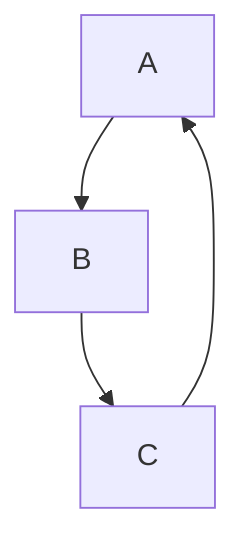

# Learning Docs Next.js Viewer

This repo includes a new Next.js app that renders markdown files from the repository and supports Mermaid diagrams.

## Setup

1. Install dependencies:

```bash
npm install
```

2. Run the development server:

```bash
npm run dev
```

3. Open http://localhost:3000

## Features

- Renders markdown files from the repository
- Supports Mermaid diagrams in code blocks labeled `mermaid`
- Automatically discovers `.md` and `.mdx` files in the repository

## Mermaid example

Use a code block like this in any markdown file:

```markdown

```


<!-- Paper 1 – [6181]-121
Q1
a) Explain Hill Climbing with a suitable diagram.
b) Describe Evolutionary Programming.
c) Explain the Artificial Hummingbird Algorithm.
OR
Q2
a) Explain Simulated Annealing with a suitable diagram.
b) Describe Genetic Programming.
c) Differentiate between Standard PSO and Binary PSO.
Q3
a) Describe any two fuzzy set operations.
b) Explain Rank Ordering Method of Membership Value Assignment.
c) Describe applications of Fuzzy Logic Control System.
OR
Q4
a) Describe any two properties of fuzzy sets.
b) Explain Weighted Average Method of Defuzzification.
c) Explain System Architecture and Operation of Fuzzy Logic Control System.
Q5
a) Describe Encoding and Selection in Genetic Algorithm.
b) Define the terms “Individual” and “Genes” in Genetic Algorithm.
c) Design a solution to the Traveling Salesman Problem using Genetic Algorithm.
OR
Q6
a) Describe Crossover (Recombination) and Mutation in Genetic Algorithm.
b) Define the terms “Fitness” and “Population” in Genetic Algorithm.
c) Mention the advantages and limitations of Genetic Algorithms.
Q7
a) Explain Hybrid Systems for Speech and Language Processing.
b) Describe Fuzzy Sets and Genetic Algorithms in Game Playing.
OR
Q8
a) Explain Hybrid Systems for Decision Making.
b) Describe Soft Computing for Color Recipe Prediction.  solve these all in answer1.md and diagram should explain all theory, for eg, "it should show both local peak and global peak and not only global peak, everything just we had said in theory" keep answers long about 600 words for each question, and solve one question at a time dont solve all in one request  answer in @clg/sc/answer/answer1.md  and first create a todo list for each question solve each and every question even OR questions also, keep answer long and one answer should be minimum 600 words long and should include diagrams, ascii and mermaid diagram those should explain what we says in theory, and be a professional and  not a lazy one or bulshit -->