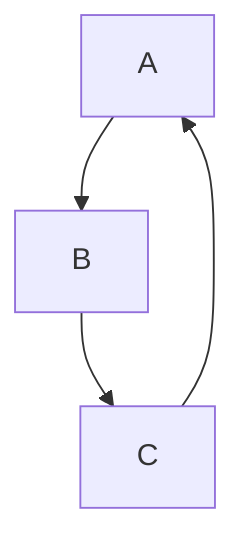

# Learning Docs Next.js Viewer

This repo includes a premium Next.js app that renders markdown files from the repository and supports Mermaid diagrams with interactive features.

## Features

- **Premium Dark Theme** — Glossy glassmorphism design with ambient glow effects
- **Interactive Markdown Viewer** — Code block copy-to-clipboard, sortable tables, hover-reactive images
- **Interactive Sidebar** — Live search with fuzzy matching, collapsible folder tree, category filter tabs
- **Mermaid Diagrams** — Interactive diagram rendering with smooth transitions and copy-to-clipboard support
- **Home Page** — Interactive category cards, quick-start guides, featured docs
- **Breadcrumb Navigation** — Visual breadcrumb trail for easy page navigation
- **Reusable Components** — `InteractiveCard`, `DocCard` for consistent premium design

## Setup

1. Install dependencies:

```bash
npm install
```

2. Run the development server:

```bash
npm run dev
```

3. Open http://localhost:3000

## Mermaid Example

Use a code block like this in any markdown file:

```markdown

```