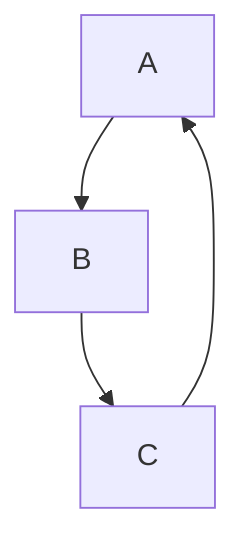

# Learning Docs Next.js Viewer

This repo includes a new Next.js app that renders markdown files from the repository and supports Mermaid diagrams.

## Setup

1. Install dependencies:

```bash
npm install
```

2. Run the development server:

```bash
npm run dev
```

3. Open http://localhost:3000

## Features

- Renders markdown files from the repository
- Supports Mermaid diagrams in code blocks labeled `mermaid`
- Automatically discovers `.md` and `.mdx` files in the repository

## Mermaid example

Use a code block like this in any markdown file:

```markdown

```
