# Deep Learning (410251) - Semester VIII
## Paper 1: [6004]-494 Solution (First Half: Units I & II)
### ⚠️ Assumed Weightage: Each Sub-Question is solved for a full 10 Marks standard.

---

## UNIT I - Convolutional Neural Networks (CNN)

### Q.1 a) Explain Pooling Layer with its need and different types. [Assumed 10 Marks]

---

### 🔍 1. Formal Mathematical Definition
In a Convolutional Neural Network (CNN), the **Pooling Layer** (or spatial down-sampling layer) is a deterministic, parameter-free operation applied to a 3D input tensor $X \in \mathbb{R}^{H_{in} \times W_{in} \times C}$ to produce an output tensor $Y \in \mathbb{R}^{H_{out} \times W_{out} \times C}$.

It operates independently on each channel (slice) of the input tensor. For a given spatial region (neighborhood) $R \subset \mathbb{R}^{H \times W}$, the pooling operation applies a static mathematical reduction function $g(\cdot)$ to aggregate the values within that region into a single scalar value.

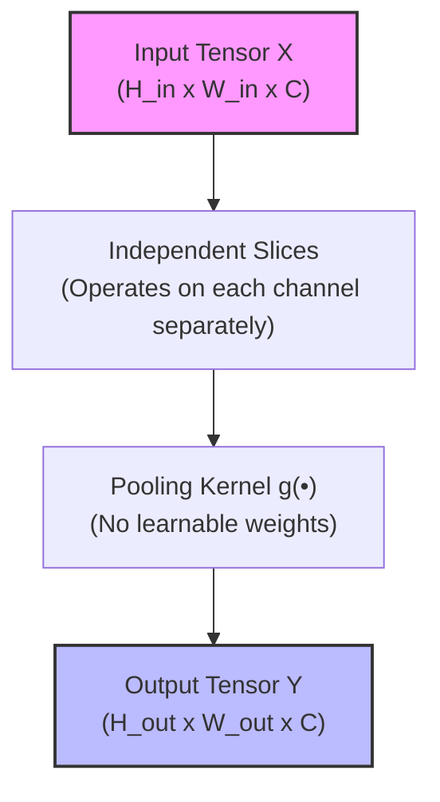

---

### ⚙️ 2. Hyperparameters of Pooling
The pooling layer is governed by three static, non-trainable hyperparameters:
1. **Filter/Kernel Size ($f \times f$):** The spatial dimensions of the sliding window that aggregates features (typically $2 \times 2$ or $3 \times 3$).
2. **Stride ($s$):** The step size by which the window shifts across the input space (typically $s = f$ to prevent overlap).
3. **Padding ($p$):** The number of zero-value borders added to the input. In pooling layers, padding is almost always set to **0** (Valid Pooling) to avoid introducing artificial edge distortions.

#### Output Dimension Formula:
The spatial dimensions of the output tensor are calculated using the floor function:
$$H_{out} = \lfloor \frac{H_{in} - f}{s} \rfloor + 1$$
$$W_{out} = \lfloor \frac{W_{in} - f}{s} \rfloor + 1$$
$$\text{Output Channels: } C_{out} = C_{in}$$

---

### 🚀 3. The Core "Need" for Pooling in CNNs

A CNN requires periodic pooling layers between its convolutional layers for four major reasons:

#### A) Spatial Dimensionality Reduction
As images progress through deep layers, the number of channels (depth) increases. If the spatial dimensions (height and width) remained constant, the computational overhead (floating-point operations, or FLOPs) and GPU memory utilization would explode. Pooling shrinks spatial maps, keeping the computational footprint manageable.

#### B) Translation Invariance
If an object moves slightly in the input image, its corresponding activations in the feature map shift by a corresponding distance. Because pooling aggregates local neighborhoods into a single value, a small shift in the input does not alter the pooled output. This makes the CNN robust to translations, minor rotations, and distortions of objects.

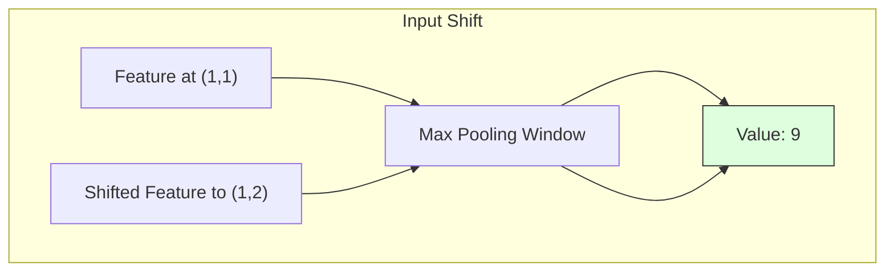

#### C) Prevention of Overfitting
By discarding high-frequency spatial details and retaining only the most critical summarized features, pooling acts as a regularizer. It prevents subsequent layers (especially the heavy Fully Connected layers) from memorizing noise or highly specific pixel configurations of the training set.

#### D) Extension of the Receptive Field
As the spatial grid is down-sampled, a $3 \times 3$ convolutional filter applied after a pooling layer covers a much larger relative area of the original input image than it would have before pooling. This enables deeper convolutional layers to extract global, semantic representations.

---

### 🛠️ 4. Detailed Taxonomy of Pooling Types

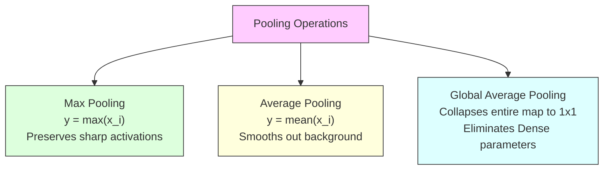

#### A) Max Pooling
* **Mathematical Formula:** 
  $$y = \max_{(i, j) \in R} x_{i,j}$$
* **Mechanism:** It extracts the maximum activation value within the pooling window.
* **Feature Preservation:** It is highly effective at preserving prominent, high-contrast features (such as sharp edges, corners, and textures) because it selects the "loudest" activation.

#### B) Average Pooling
* **Mathematical Formula:** 
  $$y = \frac{1}{|R|} \sum_{(i, j) \in R} x_{i,j}$$
* **Mechanism:** It computes the arithmetic mean of all activation values in the window.
* **Feature Preservation:** It acts as a low-pass smoothing filter. It preserves the overall background or continuous contextual signals rather than isolated high-contrast features.

#### C) Global Average Pooling (GAP)
* **Mathematical Formula:** 
  $$y_c = \frac{1}{H \times W} \sum_{i=1}^{H} \sum_{j=1}^{W} x_{i,j,c}$$
* **Mechanism:** Instead of using a sliding window, GAP computes the average value of the *entire* 2D feature map for each channel, mapping an input tensor of $H \times W \times C$ directly to a $1 \times 1 \times C$ vector.
* **Design Advantage:** It is placed at the end of modern CNN architectures (such as ResNet) to replace highly parameterized Fully Connected layers before the final classification. This eliminates millions of trainable parameters, drastically lowering the risk of overfitting.

---

### 📝 5. Complete Numerical Example
Consider a $4 \times 4$ single-channel feature map, processed by a $2 \times 2$ pooling filter with a stride $s = 2$:

```text
Input Feature Map (4x4):
┌───────────┬───────────┐
│  1 │  3   │  2 │  1   │  <-- Quad I (Red)    | Quad II (Blue)
│  2 │  9   │  0 │  4   │
├───────────┼───────────┤
│  5 │  6   │  3 │  2   │  <-- Quad III (Grn)  | Quad IV (Yel)
│  1 │  0   │  7 │  8   │
└───────────┴───────────┘
```

#### Max Pooling Computation:
* **Quad I (Red):** $\max(1, 3, 2, 9) = \mathbf{9}$
* **Quad II (Blue):** $\max(2, 1, 0, 4) = \mathbf{4}$
* **Quad III (Green):** $\max(5, 6, 1, 0) = \mathbf{6}$
* **Quad IV (Yellow):** $\max(3, 2, 7, 8) = \mathbf{8}$

$$\text{Max Pooled Output: } \begin{bmatrix} 9 & 4 \\ 6 & 8 \end{bmatrix}$$

#### Average Pooling Computation:
* **Quad I (Red):** $\frac{1+3+2+9}{4} = \frac{15}{4} = \mathbf{3.75}$
* **Quad II (Blue):** $\frac{2+1+0+4}{4} = \frac{7}{4} = \mathbf{1.75}$
* **Quad III (Green):** $\frac{5+6+1+0}{4} = \frac{12}{4} = \mathbf{3.0}$
* **Quad IV (Yellow):** $\frac{3+2+7+8}{4} = \frac{20}{4} = \mathbf{5.0}$

$$\text{Average Pooled Output: } \begin{bmatrix} 3.75 & 1.75 \\ 3.0 & 5.0 \end{bmatrix}$$

---

### Q.1 b) Draw and explain CNN architecture in detail. [Assumed 10 Marks]

---

### 🔍 1. System Conception
A **Convolutional Neural Network (CNN)** is a specialized deep neural network architecture designed to process spatial, grid-structured data (such as 2D images, video frames, or spectrograms). Based on the biological mechanisms of the human visual cortex, CNNs extract feature representations directly from raw pixels by utilizing localized receptive fields, parameter sharing, and spatial hierarchies.

---

### 🗺️ 2. Detailed Architectural Pipeline

Below is the complete tensor transformation pipeline of a standard CNN classifying a $224 \times 224 \times 3$ input image into one of 10 target classes:

```mermaid
graph LR
    Input["Input Image<br/>(224x224x3)"] --> Conv1["Convolution Layer 1<br/>(3x3 Filter, 32 channels)<br/>[224x224x32]"]
    Conv1 --> Act1["Activation Layer<br/>(ReLU)<br/>[224x224x32]"]
    Act1 --> Pool1["Pooling Layer 1<br/>(2x2 Max Pool, Stride 2)<br/>[112x112x32]"]
    Pool1 --> Conv2["Convolution Layer 2<br/>(3x3 Filter, 64 channels)<br/>[112x112x64]"]
    Conv2 --> Act2["Activation Layer<br/>(ReLU)<br/>[112x112x64]"]
    Act2 --> Pool2["Pooling Layer 2<br/>(2x2 Max Pool, Stride 2)<br/>[56x56x64]"]
    Pool2 --> Flatten["Flattening Layer<br/>(3D to 1D unrolling)<br/>[1D Vector: 200,704]"]
    Flatten --> FC["Fully Connected Layer<br/>(Dense: 128 units)<br/>[128]"]
    FC --> Softmax["Softmax Output Layer<br/>(10 class logits)<br/>[10]"]
    
    style Input fill:#fff,stroke:#333
    style Conv1 fill:#ddf,stroke:#333
    style Pool1 fill:#ffd,stroke:#333
    style Flatten fill:#fdf,stroke:#333
    style FC fill:#ffd,stroke:#333
    style Softmax fill:#dff,stroke:#333
```

---

### ⚙️ 3. Layer-by-Layer Functional Breakdown

#### A) Input Layer
* **Role:** Holds raw pixel intensities. Represented as $H \times W \times C$ tensor.

#### B) Convolutional Layer (Feature Extraction)
* **Role:** Slides kernels across the input, computing dot products to produce Feature Maps.
  $$Y(i,j) = \sum_{m=1}^{f} \sum_{n=1}^{f} \sum_{c=1}^{C_{in}} X(i+m-1, j+n-1, c) \cdot K(m, n, c) + b$$

#### C) Activation (ReLU) Layer
* **Role:** Applies $f(x) = \max(0, x)$ to introduce non-linearity.

#### D) Pooling Layer (Down-Sampling)
* **Role:** Down-samples spatial dimensions while preserving depth, using Max or Average pooling.

#### E) Flattening Layer
* **Role:** Unrolls the 3D tensor output from the final pooling layer into a long 1D column vector.

#### F) Fully Connected (FC / Dense) Layer
* **Role:** Connects all flattened features to classify the image.
  $$\mathbf{z} = \mathbf{W} \cdot \mathbf{a} + \mathbf{b}$$

#### G) Softmax Output Layer
* **Role:** Normalizes logits into probabilities summing to 1.0.
  $$P(y = i \mid \mathbf{z}) = \frac{e^{z_i}}{\sum_{j=1}^{K} e^{z_j}}$$

---

### Q.1 c) Explain ReLU Layer in detail. What are the advantages of ReLU over Sigmoid? [Assumed 10 Marks]

---

### 📈 1. Mathematical Foundation of ReLU
The **Rectified Linear Unit (ReLU)** is a piecewise linear activation function defined mathematically as:
$$f(x) = \max(0, x)$$

#### Derivative (Gradient) of ReLU:
The derivative of ReLU is defined as:
$$f'(x) = \begin{cases} 1 & \text{if } x > 0 \\ 0 & \text{if } x < 0 \end{cases}$$

```mermaid
graph TD
    subgraph Negative Input (x < 0)
        NegIn[Input x < 0] --> NegOut[Output = 0] --> NegGrad[Gradient = 0]
    end
    subgraph Positive Input (x >= 0)
        PosIn[Input x >= 0] --> PosOut[Output = x] --> PosGrad[Gradient = 1]
    end
    
    style NegOut fill:#fdd,stroke:#333
    style PosOut fill:#dfd,stroke:#333
```

ReLU is highly popular because it resolves the **vanishing gradient problem** for positive inputs and is extremely computationally efficient on GPUs.

---

### 🥊 2. Advantages of ReLU over Sigmoid

The introduction of ReLU in 2012 (AlexNet) replaced the **Sigmoid** function:
$$\sigma(x) = \frac{1}{1 + e^{-x}}$$

Below is a detailed analysis of why ReLU outperformed Sigmoid and revolutionized deep learning:

#### A) Alleviation of the Vanishing Gradient Problem
* **The Sigmoid Issue:** The Sigmoid function squashes inputs into a range between $0$ and $1$. The derivative of Sigmoid peaks at only **$0.25$**. During backpropagation, as gradients are multiplied layer-by-layer back to the start of a deep network, this fractional multiplication causes the gradient to decay exponentially (vanish). Early layers fail to update, preventing convergence.
* **The ReLU Advantage:** For all positive activations ($x > 0$), the derivative of ReLU is always **$1.0$**. This allows the backpropagated gradient to flow backward through hundreds of layers without decaying, resolving the vanishing gradient problem.

#### B) Superior Computational Efficiency
* **The Sigmoid Issue:** Sigmoid relies on complex floating-point mathematical operations: calculating Euler's constant $e^{-x}$ and performing division. These operations are computationally expensive for GPUs when processing millions of neurons over many training epochs.
* **The ReLU Advantage:** ReLU requires no complex math. It is implemented as a simple conditional check at the hardware level: `if (x < 0) return 0; else return x;`. This hardware-level simplicity makes ReLU-based networks up to **6 times faster** to train.

#### C) Sparse Activation and Representational Efficiency
* **The Sigmoid Issue:** Sigmoid outputs a non-zero value for almost all inputs, meaning virtually every neuron in the network is active at any given time.
* **The ReLU Advantage:** Because ReLU maps all negative inputs to 0, it deactivates a significant proportion of the network's neurons (often 50% or more) in any given forward pass. This creates a sparse representation, making the network computationally lighter and more memory-efficient.

---

## UNIT I - Convolutional Neural Networks (Continued)

### Q.2 a) Explain all the features of Pooling Layer. [Assumed 10 Marks]

---

### ⚙️ Core Technical Features of a Pooling Layer

Unlike convolutional layers which utilize learned parameters to extract features, the pooling layer acts as a static structural component with unique characteristics:

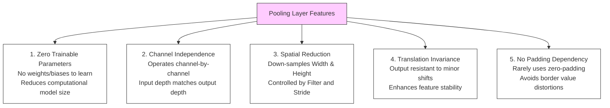

---

### 🔍 Detailed Analysis of Each Feature

#### 1. Zero Trainable Parameters
* **Mechanism:** A pooling layer is a static, deterministic mathematical operator (like taking the maximum or the average). It adds **zero trainable parameters** to the model. This makes pooling extremely lightweight, preventing model files from expanding and reducing the risk of overfitting by limiting the model's capacity to memorize specific training noise.

#### 2. Channel-by-Channel Independence (Depth Preservation)
* **Mechanism:** Pooling does not perform any cross-channel operations. It processes each channel (feature map) of the input tensor independently.
* **Impact:** If the input tensor has dimensions $H_{in} \times W_{in} \times C$, the output tensor will have dimensions $H_{out} \times W_{out} \times C$. The channel depth ($C$) remains completely unchanged.

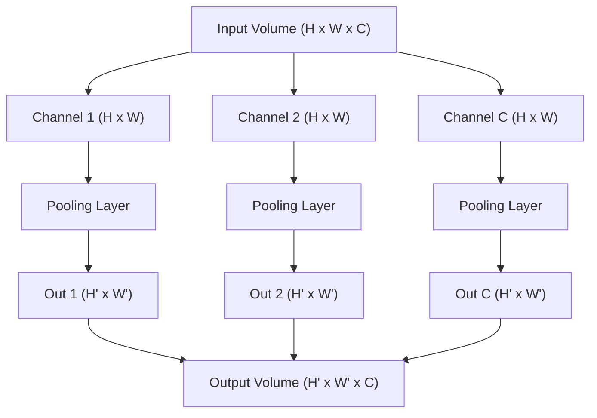

#### 3. Spatial Dimension Reduction (Controlled Shrinkage)
* **Mechanism:** Pooling reduces the spatial resolution of the feature maps using a sliding window of filter size $f \times f$ and stride $s$.
* **Dimension Equation:**
  $$H_{out} = \lfloor \frac{H_{in} - f}{s} \rfloor + 1$$
  $$W_{out} = \lfloor \frac{W_{in} - f}{s} \rfloor + 1$$

#### 4. Local Translation Invariance
* **Mechanism:** Because pooling summarizes a local neighborhood into a single value, a slight shift of an object in the input image (which shifts its corresponding activations in the feature map) will still result in the same pooled output.

#### 5. No Padding Dependency
* **Mechanism:** Unlike Convolution layers, which frequently use zero-padding to preserve image borders, Pooling layers almost never use padding ($p=0$). Adding zeros around a border during pooling would skew average pooling calculations and distort edge detections in max pooling.

---

### Q.2 b) Explain Dropout Layer in Convolutional Neural Network. [Assumed 10 Marks]

---

### 🔍 1. Theoretical Conception
**Dropout** is a stochastic regularization technique introduced by Geoffrey Hinton in 2012 to prevent deep neural networks from **overfitting**. 

During training, deep networks can develop fragile co-dependencies (co-adaptations) between weights, where certain neurons rely heavily on the outputs of other specific neurons to correct errors. This results in a network that performs exceptionally well on the training data but generalizes poorly to unseen test data. Dropout breaks these co-adaptations by randomly deactivating (dropping out) a fraction of neurons during each training step.

---

### ⚙️ 2. Mathematical Formulation

Dropout behaves differently depending on whether the network is in the training phase or the testing (inference) phase:

```mermaid
graph TD
    subgraph Training Phase (Dropout ACTIVE)
        TrainIn[Input Activations] --> TrainDrop[Zero out random fraction p of activations]
        TrainDrop --> TrainScale[Inverted Dropout: Divide active units by 1-p]
    end
    subgraph Testing Phase (Dropout DEACTIVATED)
        TestIn[Input Activations] --> TestNoDrop[Keep all neurons active]
        TestNoDrop --> TestOut[Use standard outputs without scaling]
    end
    
    style TrainDrop fill:#fdd,stroke:#333
    style TestNoDrop fill:#dfd,stroke:#333
```

#### A) During the Training Phase (Dropout ON)
At each training step, for a given layer, we generate a vector of independent and identically distributed (IID) Bernoulli random variables $\mathbf{r}$, where each element has a probability $p$ of being $0$ and a probability $1-p$ of being $1$:
$$r_j \sim \text{Bernoulli}(1-p)$$

The input activations $\mathbf{h}$ are multiplied element-wise by this mask to yield the regularized activations $\mathbf{\tilde{h}}$:
$$\mathbf{\tilde{h}} = \mathbf{r} * \mathbf{h}$$

##### Inverted Dropout Scaling:
Because a fraction $p$ of neurons are shut down, the expected total signal strength entering the next layer is reduced. To compensate, modern deep learning libraries apply **Inverted Dropout** during training. The active activations are scaled up by dividing them by $1-p$:
$$\mathbf{\tilde{h}} = \frac{\mathbf{r} * \mathbf{h}}{1 - p}$$
This ensures that the scale of the outputs remains consistent between the training and testing phases.

#### B) During the Testing/Inference Phase (Dropout OFF)
During evaluation, **Dropout is deactivated** ($p = 0$). All neurons remain active to exploit the full representational power of the trained network. Thanks to Inverted Dropout scaling during training, the network's outputs do not require any post-training scaling during inference.

---

### Q.2 c) Explain working of Convolution Layer with its features. [Assumed 10 Marks]

---

### ⚙️ 1. Mathematical Mechanics of the Convolution Layer
The **Convolutional Layer** is the core building block of a CNN. It acts as a local feature scanner that preserves spatial relationships. 

Mathematically, a 2D convolution operation (technically implemented as cross-correlation) takes an input tensor $X \in \mathbb{R}^{H \times W \times C}$ and slides a set of learnable kernels (filters) $K \in \mathbb{R}^{f \times f \times C}$ across it to produce an output feature map $Y$.

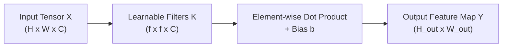

At each local position $(i, j)$ of the input, the output activation is calculated as the sum of element-wise multiplications of the filter weights with the overlapping input values, plus a bias term $b$:

$$Y(i, j) = \sum_{m=1}^{f} \sum_{n=1}^{f} \sum_{c=1}^{C} X(i+m-1, j+n-1, c) \cdot K(m, n, c) + b$$

---

### 📝 2. Complete Numerical Trace

Let's compute a step-by-step example of a single-channel $3 \times 3$ input region ($X$) convolved with a $3 \times 3$ filter ($K$) with a bias $b = 0$:

```text
       Input Region (X)                  Filter Weights (K)
     ┌───┬───┬───┐                     ┌───┬───┬───┐
     │ 2 │ 0 │ 1 │                     │ 1 │ 0 │-1 │
     ├───┼───┼───┤                     ├───┼───┼───┤
     │ 3 │ 0 │ 0 │         ✖️           │ 1 │ 0 │-1 │
     ├───┼───┼───┤                     ├───┼───┼───┤
     │ 1 │ 1 │ 1 │                     │ 1 │ 0 │-1 │
     └───┴───┴───┘                     └───┴───┴───┘
```

#### Step-by-Step Multiplication & Summation:
We multiply overlapping elements one-by-one:

$$\text{Product}_{(1,1)} = 2 \times 1 = 2$$
$$\text{Product}_{(1,2)} = 0 \times 0 = 0$$
$$\text{Product}_{(1,3)} = 1 \times -1 = -1$$
$$\text{Product}_{(2,1)} = 3 \times 1 = 3$$
$$\text{Product}_{(2,2)} = 0 \times 0 = 0$$
$$\text{Product}_{(2,3)} = 0 \times -1 = 0$$
$$\text{Product}_{(3,1)} = 1 \times 1 = 1$$
$$\text{Product}_{(3,2)} = 1 \times 0 = 0$$
$$\text{Product}_{(3,3)} = 1 \times -1 = -1$$

Now we sum these products:
$$\text{Output Value} = 2 + 0 + (-1) + 3 + 0 + 0 + 1 + 0 + (-1) = \mathbf{4}$$

The computed value **$4$** is written into the corresponding cell of the output feature map.

---

## UNIT II - Recurrent Neural Networks (RNN)

### Q.3 a) What is RNN? What is need of RNN? Explain in brief about working of Recurrent Neural Network. [Assumed 10 Marks]

---

### 🔍 1. System Conception
A **Recurrent Neural Network (RNN)** is a class of artificial neural networks designed specifically to process **sequential data** or **time-series data** where the order of elements matters. 

Unlike traditional feedforward networks (which assume all inputs and outputs are independent of each other), RNNs feature internal feedback loops. This allows information to persist across time steps, giving the network a form of "memory" to capture sequential dependencies.

---

### 🚀 2. The Imperative Need for RNNs

Traditional architectures (like MLPs or CNNs) are poorly suited for sequential tasks due to three major limitations:

#### A) Order Sensitivity
In sequence processing (such as natural language or financial forecasting), the order of elements determines the meaning:
* *"The cat ate the fish"* vs. *"The fish ate the cat"*
RNNs process tokens step-by-step chronologically, preserving this temporal order.

#### B) Variable-Length Inputs and Outputs
Standard CNNs/MLPs require fixed-size inputs and produce fixed-size outputs. However, sentences can be of arbitrary lengths. RNNs run recurrent loops, enabling them to process inputs and generate outputs of any arbitrary length.

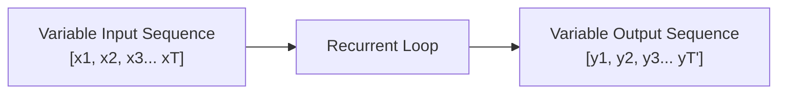

#### C) Dynamic Temporal Context
To predict the next word in a sentence like: *"I grew up in France... I speak fluent ______"*, the model must look back and connect the current prediction with the word "France" from many steps ago. RNNs maintain a running hidden state that acts as a memory, carrying previous contextual clues forward across time.

---

### Q.3 b) How LSTM and Bidirectional LSTM works. [Assumed 10 Marks]

---

### Part 1: Long Short-Term Memory (LSTM)

#### 🔍 Why LSTM?
Standard RNNs suffer from **vanishing gradients** over long sequences, which limits their effective memory to a few steps. **LSTM** resolves this by introducing a dedicated **Cell State ($C_t$)** that acts as a linear conveyor belt running through the sequence, protected by three gating mechanisms.

* **The Cell State ($C_t$):** Runs linearly through the sequence like a conveyor belt, allowing gradients to flow backward through time without decaying.
* **The Hidden State ($h_t$):** The output state used for immediate predictions.

$$\text{Forget Gate: } \mathbf{f}_t = \sigma(\mathbf{W}_f \cdot [\mathbf{h}_{t-1}, \mathbf{x}_t] + \mathbf{b}_f)$$
$$\text{Input Gate: } \mathbf{i}_t = \sigma(\mathbf{W}_i \cdot [\mathbf{h}_{t-1}, \mathbf{x}_t] + \mathbf{b}_i)$$
$$\text{Candidate State: } \mathbf{\tilde{C}}_t = \tanh(\mathbf{W}_c \cdot [\mathbf{h}_{t-1}, \mathbf{x}_t] + \mathbf{b}_c)$$
$$\text{Cell State Update: } \mathbf{C}_t = \mathbf{f}_t \odot \mathbf{C}_{t-1} + \mathbf{i}_t \odot \mathbf{\tilde{C}}_t$$
$$\text{Output Gate: } \mathbf{o}_t = \sigma(\mathbf{W}_o \cdot [\mathbf{h}_{t-1}, \mathbf{x}_t] + \mathbf{b}_o)$$
$$\text{Hidden State Output: } \mathbf{h}_t = \mathbf{o}_t \odot \tanh(\mathbf{C}_t)$$

---

### Part 2: Bidirectional LSTM (Bi-LSTM)

#### 🔍 Working Mechanism
A standard LSTM only processes sequences from left-to-right (past to future), which limits its contextual understanding. A **Bidirectional LSTM** resolves this by processing the input sequence in **both directions** simultaneously using two independent LSTM layers:

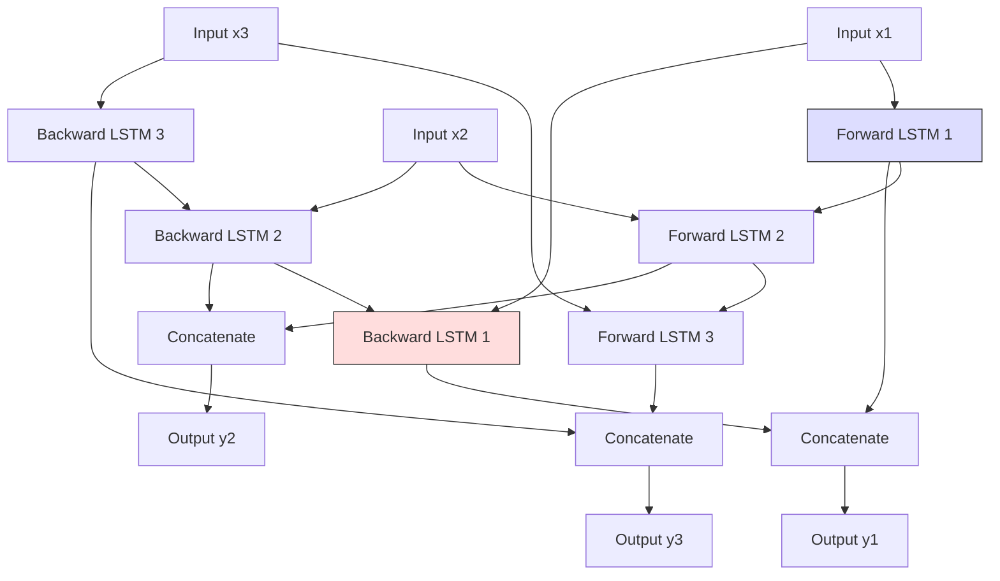

* **The Forward LSTM Layer ($\vec{h}_t$):** Processes input from left-to-right (chronological order).
* **The Backward LSTM Layer ($\overleftarrow{h}_t$):** Processes input from right-to-left (reverse chronological order).
* **Combination:** At each time step $t$, the hidden state outputs from both layers are concatenated:
  $$y_t = [\vec{h}_t \,\|\, \overleftarrow{h}_t]$$

---

### Q.3 c) Explain Unfolding Computational Graphs with example. [Assumed 10 Marks]

---

### 🔍 1. Formal Mathematical Concept
A **Computational Graph** is a directed acyclic graph (DAG) where nodes represent operations or variables, and edges represent the flow of data. 

For recurrent networks, which contain internal loops (cyclic dependencies), standard backpropagation cannot be directly applied because gradients would loop infinitely. **Unfolding** (or unrolling) is the mathematical process of mapping a cyclic computational graph into an acyclic directed graph by replicating the recurrent network structure across consecutive time steps.

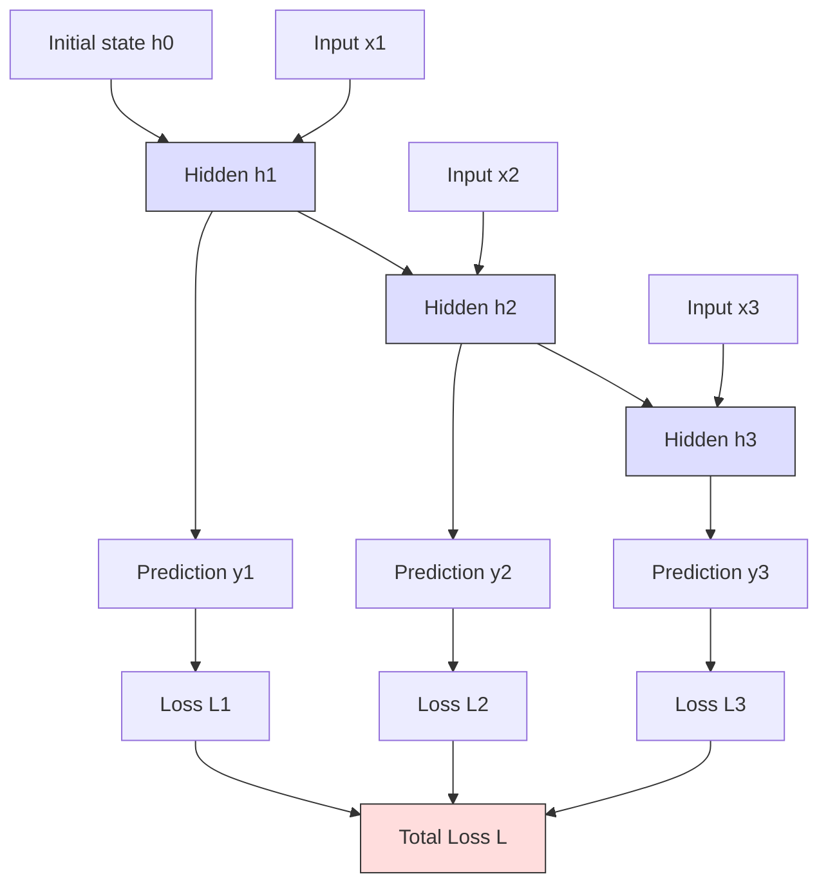

#### Step-by-Step Mathematical Calculations:

1. **Step 1 ($t = 1$):**
   $$h_1 = \tanh(W_{xh} \cdot x_1 + W_{hh} \cdot h_0 + b_h)$$
   $$y_1 = \text{Softmax}(W_{hy} \cdot h_1 + b_y)$$
2. **Step 2 ($t = 2$):**
   $$h_2 = \tanh(W_{xh} \cdot x_2 + W_{hh} \cdot h_1 + b_h)$$
   $$y_2 = \text{Softmax}(W_{hy} \cdot h_2 + b_y)$$
3. **Step 3 ($t = 3$):**
   $$h_3 = \tanh(W_{xh} \cdot x_3 + W_{hh} \cdot h_2 + b_h)$$
   $$y_3 = \text{Softmax}(W_{hy} \cdot h_3 + b_y)$$

#### Loss Aggregation:
The individual losses are summed to calculate the **Total Loss ($L$)**:
$$L = L_1 + L_2 + L_3$$

---

### Q.4 a) What are types of RNN? How to train RNN — explain in brief. [Assumed 10 Marks]

---

### Part 1: Types of RNN Architectures

RNNs are classified based on the ratio and mapping between input sequences and output sequences:

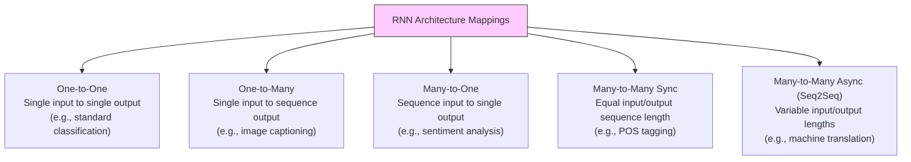

* **One-to-One:** Standard feedforward network baseline.
* **One-to-Many:** Image Captioning (1 Image $\to$ "A", "white", "cat").
* **Many-to-One:** Sentiment Analysis ("I", "love", "deep", "learning" $\to$ Positive).
* **Many-to-Many Sync:** POS Tagging ("She", "eats" $\to$ "Pronoun", "Verb").
* **Many-to-Many Async:** Machine Translation ("Je t'aime" $\to$ "I love you").

---

### Part 2: Training RNNs (Backpropagation Through Time)

RNNs are trained using **Backpropagation Through Time (BPTT)**, which is executed in four sequential steps:
1. **Forward Pass:** The sequence is processed step-by-step from $t=1$ to $T$, calculating the hidden state sequence $h_t$ and output predictions $y_t$.
2. **Loss Aggregation:** The loss at each individual step is computed and summed to find the total training error: $L = \sum_{t=1}^{T} L_t$.
3. **Backward Propagation Through Time:** We calculate the derivatives of the Total Loss $L$ with respect to the shared weight parameters ($W_{xh}, W_{hh}, W_{hy}$). The gradients flow backwards chronologically from the final time step $T$ down to $t=1$.
4. **Optimization Step:** The accumulated gradients are used by an optimizer (like Adam or SGD) to update the shared weights:
   $$W \leftarrow W - \eta \cdot \frac{\partial L}{\partial W}$$

---

### Q.4 b) Explain Encoder-Decoder Sequence to Sequence architecture with its application. [Assumed 10 Marks]

---

### 🔍 1. Introduction to Sequence-to-Sequence (Seq2Seq)
The **Encoder-Decoder (Sequence-to-Sequence)** model is an architecture designed to convert an input sequence from one domain into an output sequence in another domain, where the two sequences can be of completely different lengths (Many-to-Many asynchronous).

It is composed of two primary recurrent networks: an **Encoder** and a **Decoder**, bridged by a bottleneck representation called the **Context Vector**.

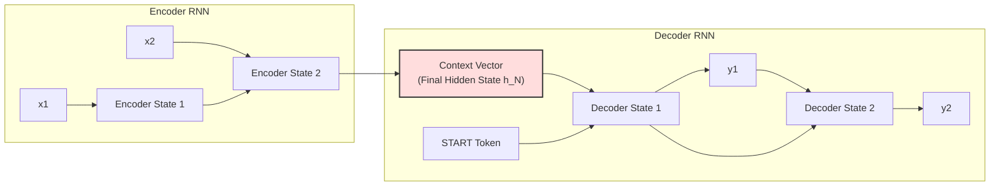

---

### ⚙️ 2. Detailed Functional Workflow

#### A) The Encoder (Information Compression)
* **Role:** Reads and processes the input sequence word-by-word.
* **Mechanism:** Processes the input tokens ($x_1, x_2, \dots, x_N$) step-by-step. At each step, it updates its hidden state. It continues until it processes the entire sequence, culminating in an **`<EOS>` (End of Sequence)** token.
* **Output:** The final hidden state of the Encoder, containing a dense mathematical summary of the full input sequence.

#### B) The Context Vector (The Bottleneck)
* **Role:** The information bridge between input and output.
* **Mechanism:** It is a fixed-size vector of floating-point numbers. It holds the compressed semantic meaning of the entire source sequence, serving as the starting state for the decoder.

#### C) The Decoder (Information Generation)
* **Role:** Translates the Context Vector back into a readable output sequence.
* **Mechanism:** 
  1. It initializes its hidden state using the **Context Vector**.
  2. It receives a **`<SOS>` (Start of Sequence)** token as its first input.
  3. It predicts the first output token $y_1$.
  4. In the next step, the prediction $y_1$ is fed back into the decoder as the input, combined with the updated hidden state, to predict $y_2$.
  5. It continues generating tokens sequentially until it produces the **`<EOS>`** token, ending the generation.

---

### Q.4 c) Differentiate between Recurrent and Recursive Neural Network. [Assumed 10 Marks]

---

### 📐 1. Structural Paradigm Comparison
* **Recurrent Neural Network (RNN):** Processes data sequentially over time. The topology is a **linear chain** where each hidden state connects directly to the next.
* **Recursive Neural Network:** Processes data hierarchically over a structure. The topology is a **directed acyclic tree**, where child node representations are combined hierarchically to form parent nodes.

```mermaid
graph TD
    subgraph Recurrent (Linear Chain)
        R_X1[x1] --> R_H1[h1]
        R_H1 --> R_H2[h2]
        R_X2[x2] --> R_H2
        R_H2 --> R_H3[h3]
        R_X3[x3] --> R_H3
    end
    subgraph Recursive (Tree Hierarchy)
        Leaf1[Word 1: The] --> Branch1[Noun Phrase]
        Leaf2[Word 2: Cat] --> Branch1
        Leaf3[Word 3: Ate] --> Branch2[Verb Phrase]
        Leaf4[Word 4: Fish] --> Branch2
        Branch1 --> Root[Sentence S]
        Branch2 --> Root
    end
    
    style R_H3 fill:#ddf,stroke:#333
    style Root fill:#fdd,stroke:#333
```

---

### 📊 2. Key Differences: Recurrent vs. Recursive

| Comparison Parameter | Recurrent Neural Network (RNN) | Recursive Neural Network |
| :--- | :--- | :--- |
| **Topology** | **Linear Chain** (1D timeline sequential structure). | **Hierarchical Tree** (directed acyclic tree structure). |
| **Primary Data Type** | Time-series, audio streams, text sequences (flat structures). | Grammatical parse trees, computer program syntax trees, molecular networks. |
| **Dimension Process** | Processes across **temporal steps** ($t = 1, 2, 3 \dots$). | Processes across **structural hierarchy** (parent-child nodes). |
| **Weight Sharing** | Shared weights across **all time steps** in the sequence. | Shared weights across **all node transitions** in the tree. |
| **Computational Efficiency** | **High.** It is highly optimized and parallelizable on modern GPUs. | **Low.** Generating variable tree structures dynamically is computationally heavy and difficult to parallelize. |
| **Complexity** | $O(T)$ where $T$ is sequence length. | $O(N^2)$ or $O(N^3)$ due to structural parsing requirements. |
