# Deep Learning (410251) - Semester VIII
## Paper 1: [6004]-494 Solution (Second Half: Units III & IV)
### ⚠️ Assumed Weightage: Each Sub-Question is solved for a full 10 Marks standard.

---

## UNIT III - Generative Models & GAN

### Q.5 a) Explain Boltzmann Machine in details. [Assumed 10 Marks]

---

### 🔍 1. System Conception
A **Boltzmann Machine** is an energy-based, undirected graphical model (a stochastic recurrent neural network) designed to learn the underlying probability distribution of a given dataset in an unsupervised fashion. Introduced by Geoffrey Hinton and Terry Sejnowski in 1985, it is rooted in the principles of statistical mechanics and thermodynamics.

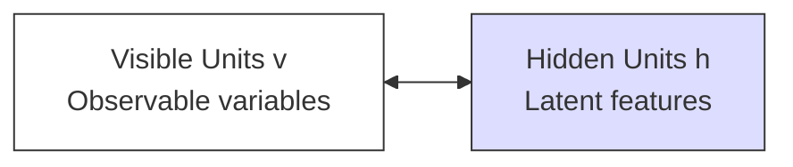

---

### ⚙️ 2. Core Architectural Components
A Boltzmann Machine is composed of binary stochastic units $s_i \in \{0, 1\}$ or $\{-1, 1\}$ divided into two distinct layers:
1. **Visible Units ($\mathbf{v}$):** The input layer representing the observable data variables from the environment.
2. **Hidden Units ($\mathbf{h}$):** Latent variables that capture complex, high-order statistical correlations and dependencies among the visible units.

#### Topological Characteristics:
* **Undirected Connections:** The connections between units are undirected and symmetric, meaning the weight $w_{ij}$ from unit $i$ to unit $j$ is identical to the weight $w_{ji}$ from unit $j$ to unit $i$ ($w_{ij} = w_{ji}$).
* **No Self-Connections:** A unit is never connected to itself ($w_{ii} = 0$).
* **Stochastic Behavior:** Units update their states probabilistically based on the states of their neighbors and their own internal biases.

---

### ⚡ 3. Mathematical Foundations: The Energy Concept

Boltzmann Machines are **energy-based models**. The network assigns a scalar energy value to every possible joint configuration of visible units $v$ and hidden units $h$.

#### A) Energy Function of a State:
The energy of a specific joint state configuration $(v, h)$ is defined mathematically as:

$$E(v, h) = -\sum_{i} a_i v_i - \sum_{j} b_j h_j - \sum_{i} \sum_{j} w_{ij} v_i h_j$$

*Where:*
* $v_i$ is the binary state of visible unit $i$.
* $h_j$ is the binary state of hidden unit $j$.
* $w_{ij}$ is the symmetric weight between visible unit $i$ and hidden unit $j$.
* $a_i$ is the bias term for visible unit $i$.
* $b_j$ is the bias term for hidden unit $j$.

#### B) Probabilistic State Distribution (Gibbs/Boltzmann Distribution):
The probability of the network occupying a specific joint configuration $(v, h)$ is inversely proportional to its energy, governed by the Boltzmann distribution:

$$P(v, h) = \frac{e^{-E(v, h)}}{Z}$$

*Where $Z$ is the **Partition Function**, which acts as a normalizing constant summing the raw probabilities of all possible configurations:*
$$Z = \sum_{\mathbf{v}'} \sum_{\mathbf{h}'} e^{-E(\mathbf{v}', \mathbf{h}')}$$

---

### Q.5 b) Explain GAN (Generative Adversarial Network) architecture with an example. [Assumed 10 Marks]

---

### 🔍 1. System Conception
A **Generative Adversarial Network (GAN)** is a class of generative deep learning models introduced by Ian Goodfellow in 2014. It operates on a game-theoretic framework where two neural networks are trained simultaneously in a zero-sum, minimax game:
1. **The Generator ($G$):** A generative network that learns to capture the data distribution to synthesize realistic, fake data samples from random noise.
2. **The Discriminator ($D$):** A discriminative network that acts as a binary classifier, learning to distinguish between real data from the training set and fake data generated by the Generator.

---

### 🗺️ 2. Detailed Architectural Pipeline

The diagram below represents the closed-loop adversarial training process of a GAN:

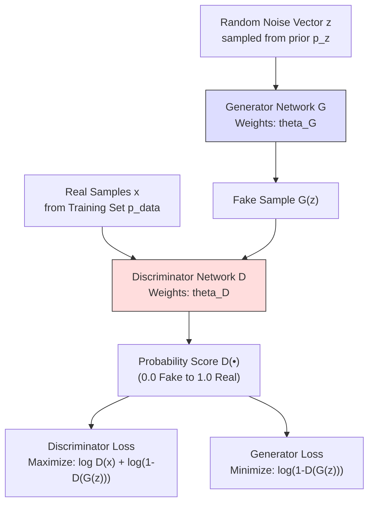

---

### 🧮 3. The Minimax Objective Function
The adversarial game is trained using a single minimax objective function with the value function $V(D, G)$:

$$\min_{G} \max_{D} V(D, G) = \mathbb{E}_{x \sim p_{\text{data}}}[\log D(x)] + \mathbb{E}_{z \sim p_{z}}[\log (1 - D(G(z)))]$$

#### Detailed Breakdown of Mathematical Terms:
* **$\max_{D}$:** The Discriminator attempts to maximize this value function. It wants $D(x)$ to be near $1$ (making $\log D(x) \to 0$) and $D(G(z))$ to be near $0$ (making $\log(1 - D(G(z))) \to 0$).
* **$\min_{G}$:** The Generator attempts to minimize this value function. It wants $D(G(z))$ to be near $1$, which drives $(1 - D(G(z))) \to 0$ and causes the second term to become highly negative ($-\infty$).
* **$\mathbb{E}_{x \sim p_{\text{data}}}$:** Represents the expected value (average) over the real training dataset.
* **$\mathbb{E}_{z \sim p_{z}}$:** Represents the expected value over the random noise input vector prior.

---

### Q.5 c) Do GANs find real or fake images? If yes explain it in detail. [Assumed 10 Marks]

---

### 🔍 1. Core Paradigm Clarification
The question **"Do GANs find real or fake images?"** targets the operational dynamics of Generative Adversarial Networks during training and inference.

The direct answer is: **Yes, the Discriminator network actively learns to identify ("find") real and fake images during training. However, the ultimate goal of the overall GAN framework is to synthesize new, highly realistic fake images that are indistinguishable from real ones.**

During the training process, the system must explicitly find, evaluate, and learn from the differences between both types of images.

---

### ⚙️ 2. Step-by-Step Discriminator Classification Mechanics
The Discriminator is a binary convolutional classifier trained to find structural flaws, high-frequency anomalies, or color inconsistencies in generated images.

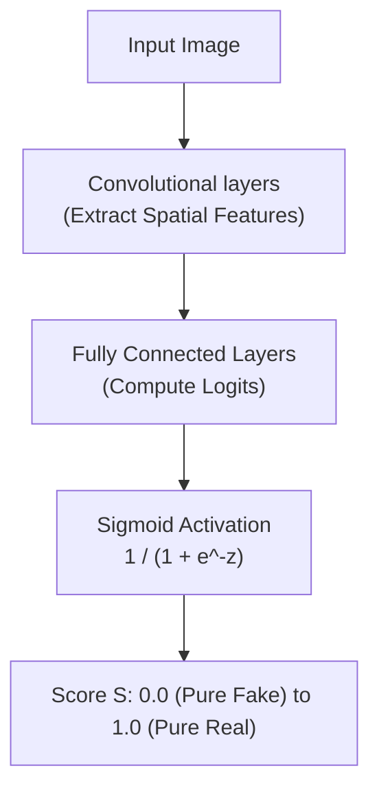

1. **Spatial Feature Extraction:** The input image is passed through convolutional layers to extract structural features like edge alignments, textures, and shapes.
2. **Logit Score Computation:** Fully connected layers compress these features into a raw scalar logit score.
3. **Sigmoid Normalization:** The logit is passed through a Sigmoid activation function to map it to a probability score $S \in [0, 1]$:
   $$S = D(x) = \frac{1}{1 + e^{-\text{logit}}}$$
4. **Classification:**
   * If $S \ge 0.5$, the image is classified as **Real**.
   * If $S < 0.5$, the image is classified as **Fake**.

---

### Q.6 a) Differentiate generative and discriminative models in GAN. [Assumed 10 Marks]

---

### 📐 1. Structural Paradigm Comparison
In a GAN, the Generator and Discriminator represent the two fundamental classes of models in machine learning:
* The **Generator ($G$)** is a **Generative Model**—it learns the underlying probability distribution of the data to create new samples.
* The **Discriminator ($D$)** is a **Discriminative Model**—it learns to separate classes by establishing a decision boundary.

```mermaid
graph TD
    subgraph Discriminative Model (Discriminator)
        D_Data[Data Space X] --> Boundary[Learn Decision Boundary] --> D_Class[Classify: Real vs Fake]
    end
    subgraph Generative Model (Generator)
        G_Latent[Latent Space Z] --> G_Dist[Learn Probability Distribution] --> G_Sample[Generate New Samples]
    end
```

---

### 📊 2. Key Differences: Generative vs. Discriminative

| Feature Parameter | Generative Model (The Generator) | Discriminative Model (The Discriminator) |
| :--- | :--- | :--- |
| **Mathematical Modeling** | Models the joint probability **$P(X, Y)$** or the data distribution **$P(X)$**. | Models the conditional probability **$P(Y \mid X)$**. |
| **Core Question Asked** | *"How was this data generated? What does a typical sample look like?"* | *"What features distinguish class A (Real) from class B (Fake)?"* |
| **Output Space** | High-dimensional data samples (e.g., synthetic images, text, audio). | A single scalar probability score between $0.0$ and $1.0$ (classification). |
| **Input Source** | Low-dimensional random noise vector $z$ sampled from a prior distribution (Gaussian). | High-dimensional images (both real training samples and fake generated samples). |
| **Primary Goal** | To populate the data space with new, realistic samples. | To find a clean, mathematical decision boundary separating classes. |

---

### Q.6 b) What are applications of GAN? Explain any four in detail. [Assumed 10 Marks]

---

### 🚀 Four Major Applications of GANs

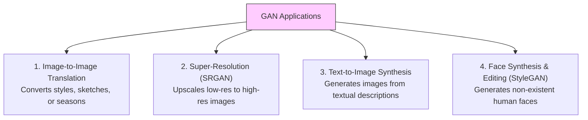

---

### 🔍 Detailed Analysis of the Applications

#### A) Image-to-Image Translation (Pix2Pix & CycleGAN)
* **Description:** Translates an input image from a source domain (e.g. a hand-drawn sketch) to a target domain (e.g. a photo-realistic object) while preserving the underlying structural geometry.
* **Paired (Pix2Pix) vs. Unpaired (CycleGAN):**
  * **Pix2Pix** requires pairs of matching images to learn the direct mapping.
  * **CycleGAN** can learn style translation without paired images by using a **Cycle Consistency Loss**:
    $$L_{cyc}(G, F) = \mathbb{E}_{x \sim p_{\text{data}}(x)}[\|F(G(x)) - x\|_1] + \mathbb{E}_{y \sim p_{\text{data}}(y)}[\|G(F(y)) - y\|_1]$$

#### B) Super-Resolution (SRGAN)
* **Description:** Reconstructs high-resolution (HR) images from highly pixelated, low-resolution (LR) inputs, restoring lost textures and finer details.
* **Mechanism:** SRGAN utilizes a discriminator to penalize blurry outputs, combined with a **Perceptual Loss** (comparing high-level feature activations extracted by a pre-trained VGG network), forcing the generator to synthesize sharp, high-frequency details.

---

### Q.6 c) Write Short Note on Deep Generative Model and Deep Belief Networks. [Assumed 10 Marks]

---

### Part 1: Deep Generative Models (DGMs)

#### 🔍 Core Concept
A **Deep Generative Model (DGM)** is a class of unsupervised deep learning algorithms designed to approximate and generate samples from complex, high-dimensional real-world data distributions (such as natural images, speech, or text). 

Unlike discriminative models that predict labels given data, DGMs learn the joint probability distribution of the data space, allowing them to synthesize entirely new samples that share the statistical characteristics of the training dataset.

---

### Part 2: Deep Belief Networks (DBNs)

#### 🔍 Core Concept
Introduced by Geoffrey Hinton in 2006, a **Deep Belief Network (DBN)** is a generative graphical model composed of multiple layers of latent, stochastic variables. It was one of the first successful architectures to train deep networks, overcoming the challenges of random weight initialization.

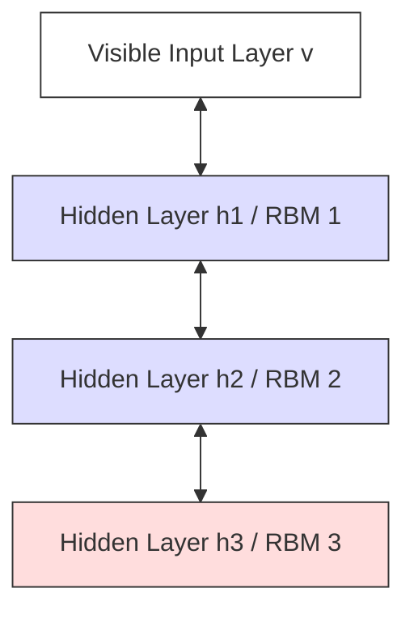

#### ⚙️ Architectural Structure:
* **Stacked RBMs:** A DBN is constructed by stacking multiple **Restricted Boltzmann Machines (RBMs)** on top of each other.
* **Connections:** The connections between the top two hidden layers are undirected, forming a symmetric associative memory. The connections in the lower layers are directed, running downwards to generate outputs.

---
---

## UNIT IV - Reinforcement Learning

### Q.7 a) Explain Markov Decision Process with Markov property. [Assumed 10 Marks]

---

### 🔍 1. The Markov Property
A stochastic process possesses the **Markov Property** if the conditional probability distribution of future states depends solely on the current state and action, and is completely independent of the historical path (past states and actions) that led to it.

#### Mathematical Equation:
$$\mathbb{P}(S_{t+1} = s' \mid S_t = s, A_t = a, S_{t-1} = s_{t-1}, \dots, S_0 = s_0) = \mathbb{P}(S_{t+1} = s' \mid S_t = s, A_t = a)$$

In simple terms: **"The future is independent of the past, given the present."**

---

### 📐 2. What is a Markov Decision Process (MDP)?
A **Markov Decision Process (MDP)** is a mathematical framework used to model decision-making in environments where outcomes are partly random and partly under the control of a decision-making agent. It serves as the formal foundation for almost all reinforcement learning problems.

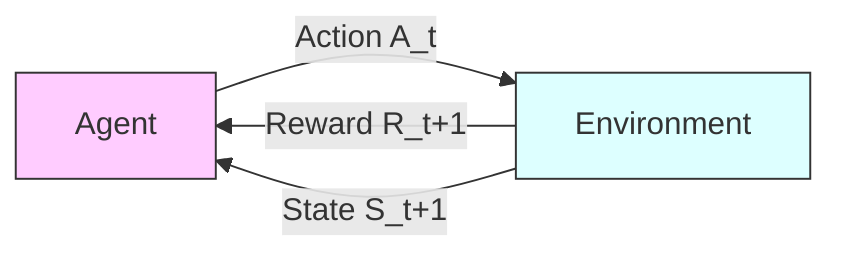

---

### ⚙️ 3. The Five Core Components of an MDP $(S, A, P, R, \gamma)$

An MDP is formally defined by a 5-tuple:
1. **State Space ($S$):** A finite set containing all valid states that the environment can occupy.
2. **Action Space ($A$):** A finite set of all actions available to the agent from a given state.
3. **Transition Probability Function ($P$):** Specifies the probability of landing in a future state $s'$ given that the agent takes action $a$ in current state $s$:
   $$P(s' \mid s, a) = \mathbb{P}(S_{t+1} = s' \mid S_t = s, A_t = a)$$
4. **Reward Function ($R$):** A feedback signal returned by the environment immediately after the transition:
   $$R(s, a, s') = \mathbb{E}[R_{t+1} \mid S_t = s, A_t = a, S_{t+1} = s']$$
5. **Discount Factor ($\gamma$):** A scalar value $\gamma \in [0, 1)$ that determines the present value of future rewards. It ensures mathematical convergence of infinite horizon returns:
   $$G_t = \sum_{k=0}^{\infty} \gamma^k R_{t+k+1} \le \frac{R_{\max}}{1 - \gamma}$$

---

### Q.7 b) Explain in detail Dynamic Programming algorithms for reinforcement learning. [Assumed 10 Marks]

---

### Algorithm 1: Policy Iteration

Policy Iteration alternates between two distinct phases until the policy stabilizes:

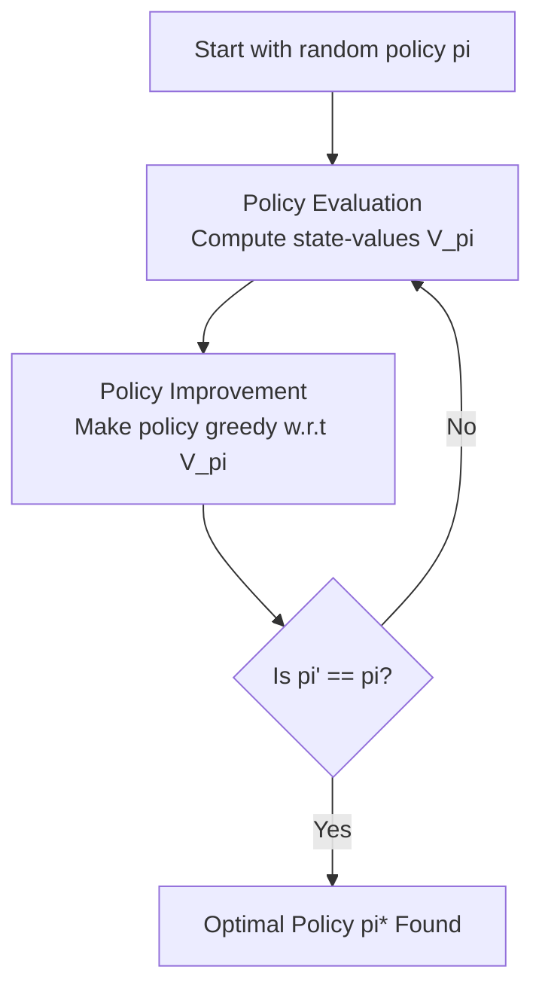

#### Phase 1: Policy Evaluation
Computes the state-value function $V^\pi(s)$ for the current policy $\pi$. It iteratively applies the Bellman Expectation Equation across all states:
$$V_{k+1}(s) = \sum_{a \in A} \pi(a \mid s) \sum_{s' \in S} P(s' \mid s, a) \left[ R(s, a, s') + \gamma V_k(s') \right]$$

#### Phase 2: Policy Improvement
Updates the policy to be greedy with respect to the newly calculated value function:
$$\pi'(s) = \arg\max_{a \in A} \sum_{s' \in S} P(s' \mid s, a) \left[ R(s, a, s') + \gamma V^\pi(s') \right]$$

---

### Algorithm 2: Value Iteration

Unlike Policy Iteration, **Value Iteration** does not wait for the policy evaluation to fully converge. Instead, it combines evaluation and policy improvement into a single update step by applying the **Bellman Optimality Equation** directly:

$$V_{k+1}(s) = \max_{a \in A} \sum_{s' \in S} P(s' \mid s, a) \left[ R(s, a, s') + \gamma V_k(s') \right]$$

The optimal policy is then extracted in a single step:
$$\pi^*(s) = \arg\max_{a \in A} \sum_{s' \in S} P(s' \mid s, a) \left[ R(s, a, s') + \gamma V^*(s') \right]$$

---

### Q.7 c) Explain Simple Reinforcement Learning for Tic-Tac-Toe. [Assumed 10 Marks]

---

### 🔍 1. Formulating Tic-Tac-Toe as an RL Problem
The game of Tic-Tac-Toe can be modeled as a simple reinforcement learning problem where an agent learns an optimal playing strategy through trial-and-error interactions against an opponent.

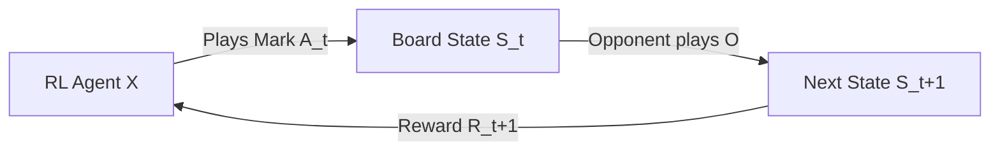

* **States ($S$):** Every possible configuration of the board (all combinations of X's, O's, and empty cells).
* **Actions ($A$):** Selecting an empty cell to place the agent's mark.
* **Rewards ($R$):** 
  * $+1.0$ if the agent wins the game (terminal state).
  * $-1.0$ if the agent loses (terminal state).
  * $0.0$ for draw states or intermediate moves.

#### The Value Update Rule (Temporal Difference):
After making a move from state $s$, the board transitions to a new state $s'$. The value of state $s$ is updated to become closer to the value of state $s'$ using the TD-learning rule:

$$V(s) \leftarrow V(s) + \alpha \left[ V(s') - V(s) \right]$$

*Where:*
* $\alpha \in (0, 1]$ is the learning rate.
* $V(s') - V(s)$ is the temporal difference error between the actual future state value and the current estimate.

---

### Q.8 a) Write Short Note on Q Learning and Deep Q-Networks. [Assumed 10 Marks]

---

### Part 1: Q-Learning (Tabular Off-Policy Temporal Difference)

#### 🔍 Core Concept
**Q-Learning** is a model-free, off-policy Temporal Difference control algorithm. It learns an action-value function **$Q(s, a)$**, which estimates the expected cumulative future reward of taking action $a$ in state $s$ and behaving optimally thereafter.

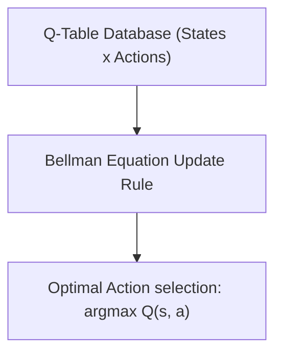

#### The Q-Value Update Equation:
$$Q(s, a) \leftarrow Q(s, a) + \alpha \left[ R(s, a) + \gamma \max_{a'} Q(s', a') - Q(s, a) \right]$$

---

### Part 2: Deep Q-Networks (DQN)

#### 🔍 Why DQN?
In complex environments (such as playing Atari games from raw screen pixels), the number of possible states is infinite or continuous. It is impossible to fit a tabular $Q(s, a)$ table into computer memory. 

To solve this, **Deep Q-Networks (DQN)** replace the lookup table with a **Deep Neural Network** (the Q-Network) parameterized by weights $\theta$ to approximate the Q-values: $Q(s, a; \theta) \approx Q^*(s, a)$.

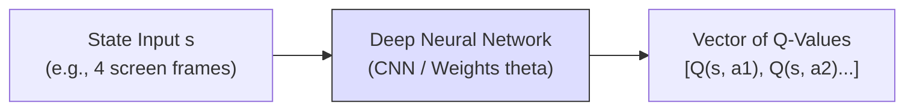

#### ⚙️ Key Stability Innovations in DQN:

1. **Experience Replay Memory:**
   * **The Solution:** The agent stores transitions $(s, a, r, s')$ in a massive replay buffer. During training, it samples random mini-batches from this buffer. This breaks temporal correlations and stabilizes gradient updates.
2. **Target Network ($\theta^-$):**
   * **The Solution:** A separate copy of the network weights ($\theta^-$) is maintained solely to calculate targets. These target weights are held stable and only updated to match the online weights ($\theta$) periodically.

$$\text{Loss } L_i(\theta_i) = \mathbb{E} \left[ \left( R + \gamma \max_{a'} Q(s', a'; \theta_i^-) - Q(s, a; \theta_i) \right)^2 \right]$$

---

### Q.8 b) What are the challenges of reinforcement learning? Explain any four in detail. [Assumed 10 Marks]

---

### 🚀 Four Foundational Challenges of Reinforcement Learning

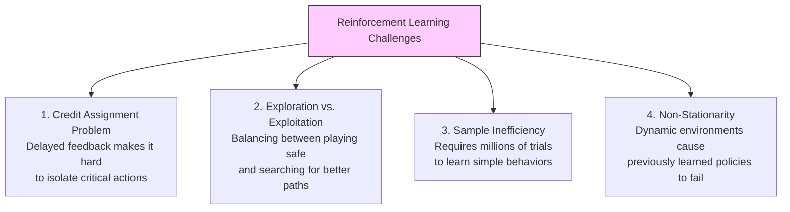

---

### 🔍 Detailed Analysis of the Challenges

#### 1. The Credit Assignment Problem (Delayed Rewards)
* **Explanation:** In many real-world environments, the reward signal is sparse and highly delayed. An agent may perform hundreds of individual actions before receiving any feedback. It is difficult to isolate *which* specific action or sequence of actions was responsible for that win or loss.

#### 2. The Exploration vs. Exploitation Dilemma
* **Explanation:** The agent must balance two competing strategies to maximize its cumulative reward:
  * **Exploitation:** Selecting actions already known to yield high rewards based on current knowledge.
  * **Exploration:** Trying new, unvisited, or low-value actions to discover if they lead to even better strategies.

#### 3. Extreme Sample Inefficiency
* **Explanation:** Unlike human learners, RL agents learn from scratch and typically require millions of interaction steps with the environment to learn basic behaviors, making physical real-world training slow and expensive.

#### 4. Non-Stationarity
* **Explanation:** In RL, as the agent updates its policy, its trajectory path changes, which continuously shifts the distribution of incoming state inputs. This non-stationarity can cause training instability or model collapse.

---

### Q.8 c) What is deep reinforcement learning? Explain in detail. [Assumed 10 Marks]

---

### 🔍 1. What is Deep Reinforcement Learning (DRL)?
**Deep Reinforcement Learning (DRL)** is a field of artificial intelligence that combines the sensory representation capabilities of **Deep Learning (DL)** with the decision-making frameworks of **Reinforcement Learning (RL)**. 

It allows agents to learn optimal decision-making policies directly from high-dimensional, raw sensory inputs (such as image pixel matrices, video frames, or raw audio waveforms) without requiring handcrafted features.

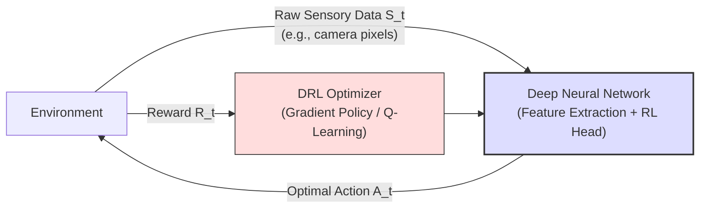

---

### 🛠️ 2. Classification of Core DRL Algorithms

DRL algorithms are classified into three major paradigms:

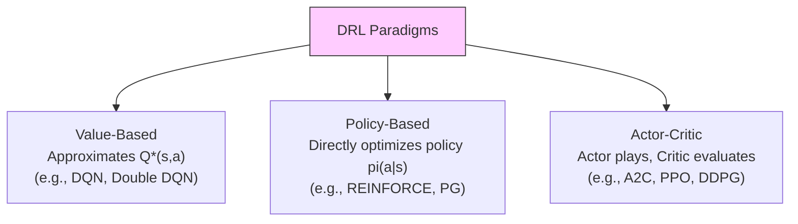

1. **Value-Based Methods:** The network learns to predict the expected returns of actions (e.g., DQN).
2. **Policy-Based Methods:** The network directly outputs a probability distribution over the action space, trained to increase the probability of actions that lead to high rewards (e.g., REINFORCE).
3. **Actor-Critic Methods:** Combines both approaches:
   * **The Actor:** A policy network that selects actions.
   * **The Critic:** A value network that evaluates how good the actor's actions were, reducing gradient variance.
