# Deep Learning (410251) - Semester VIII
## Paper 2: [6263]-95 Solution (First Half: Units I & II)
### ⚠️ Assumed Weightage: Each Sub-Question is solved for a full 10 Marks standard.

---

## UNIT I - Convolutional Neural Networks (CNN)

### Q.1 a) Explain CNN architecture with its application. [Assumed 10 Marks]

---

### 🔍 1. System Conception
A **Convolutional Neural Network (CNN)** is a specialized deep learning architecture designed to process spatial, grid-structured data (such as 2D images, video frames, or spectrograms). Based on the biological mechanisms of the human visual cortex, CNNs extract feature representations directly from raw pixels by utilizing localized receptive fields, parameter sharing, and spatial hierarchies.

---

### 🗺️ 2. Detailed Architectural Pipeline

Below is the complete tensor transformation pipeline of a standard CNN classifying a $224 \times 224 \times 3$ input image into one of 10 target classes:

```mermaid
graph LR
    Input["Input Image<br/>(224x224x3)"] --> Conv1["Convolution Layer 1<br/>(3x3 Filter, 32 channels)<br/>[224x224x32]"]
    Conv1 --> Act1["Activation Layer<br/>(ReLU)<br/>[224x224x32]"]
    Act1 --> Pool1["Pooling Layer 1<br/>(2x2 Max Pool, Stride 2)<br/>[112x112x32]"]
    Pool1 --> Conv2["Convolution Layer 2<br/>(3x3 Filter, 64 channels)<br/>[112x112x64]"]
    Conv2 --> Act2["Activation Layer<br/>(ReLU)<br/>[112x112x64]"]
    Act2 --> Pool2["Pooling Layer 2<br/>(2x2 Max Pool, Stride 2)<br/>[56x56x64]"]
    Pool2 --> Flatten["Flattening Layer<br/>(3D to 1D unrolling)<br/>[1D Vector: 200,704]"]
    Flatten --> FC["Fully Connected Layer<br/>(Dense: 128 units)<br/>[128]"]
    FC --> Softmax["Softmax Output Layer<br/>(10 class logits)<br/>[10]"]
    
    style Input fill:#fff,stroke:#333
    style Conv1 fill:#ddf,stroke:#333
    style Pool1 fill:#ffd,stroke:#333
    style Flatten fill:#fdf,stroke:#333
    style FC fill:#ffd,stroke:#333
    style Softmax fill:#dff,stroke:#333
```

---

### ⚙️ 3. Layer-by-Layer Functional Breakdown

#### A) Input Layer
* **Role:** Holds raw pixel intensities. Represented as $H \times W \times C$ tensor.

#### B) Convolutional Layer (Feature Extraction)
* **Role:** Slides kernels across the input, computing dot products to produce Feature Maps.
  $$Y(i,j) = \sum_{m=1}^{f} \sum_{n=1}^{f} \sum_{c=1}^{C_{in}} X(i+m-1, j+n-1, c) \cdot K(m, n, c) + b$$

#### C) Activation (ReLU) Layer
* **Role:** Applies $f(x) = \max(0, x)$ to introduce non-linearity.

#### D) Pooling Layer (Down-Sampling)
* **Role:** Down-samples spatial dimensions while preserving depth, using Max or Average pooling.

#### E) Flattening Layer
* **Role:** Bridges the spatial feature extraction layers with the dense classification layers.
* **Mechanism:** Converts the final 3D feature tensor into a long 1D column vector.

#### F) Fully Connected (FC / Dense) Layer
* **Role:** Performs high-level reasoning and global classification.
  $$\mathbf{z} = \mathbf{W} \cdot \mathbf{a} + \mathbf{b}$$

#### G) Softmax Output Layer
* **Role:** Translates raw logits ($\mathbf{z}$) into a normalized probability distribution over class labels.
  $$P(y = i \mid \mathbf{z}) = \frac{e^{z_i}}{\sum_{j=1}^{K} e^{z_j}}$$

---

### 🚀 4. Real-World Applications of CNNs

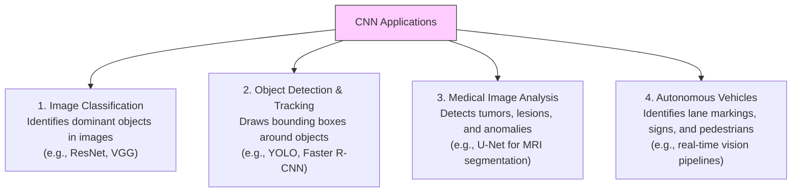

---

### Q.1 b) What is Padding? Enlist and explain types of padding. [Assumed 10 Marks]

---

### 🔍 1. Concept Definition
In a Convolutional Neural Network (CNN), **Padding** refers to the practice of adding extra border values (typically zeros) around the outer perimeter of an input tensor $X \in \mathbb{R}^{H \times W \times C}$ before convolving it with a filter.

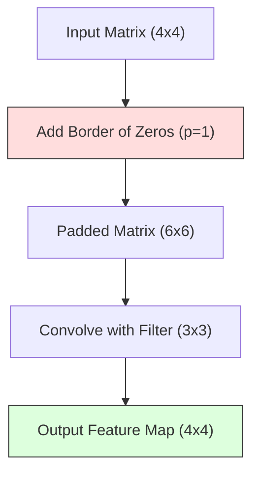

---

### 🚀 2. The Core Problems Padding Solves

#### A) Spatial Dimension Shrinkage
Every time a convolutional filter of size $f \times f$ is applied to an image of size $H \times W$, the output feature map shrinks to:
$$\text{Output Size} = (H - f + 1) \times (W - f + 1)$$
Padding wraps the borders, preventing the spatial dimensions of feature maps from shrinking due to successive convolutional layers.

#### B) Border Information Loss
Center pixels are heavily processed because the convolutional window overlaps them multiple times. However, pixels located at the outer edges and corners are only scanned once or twice. Padding wraps the borders, allowing the filter to center on edge pixels, which prevents critical border information from being discarded.

---

### 📐 3. General Dimension Math with Padding
For any input of height $H$, filter size $f$, padding $p$, and stride $s$, the output height $H_{out}$ is:

$$H_{out} = \lfloor \frac{H_{in} - f + 2p}{s} \rfloor + 1$$

---

### Q.1 c) Explain Dropout Layer in Convolutional Neural Network. [Assumed 10 Marks]

---

### 🔍 1. Theoretical Conception
**Dropout** is a stochastic regularization technique introduced by Geoffrey Hinton in 2012 to prevent deep neural networks from **overfitting**. 

During training, deep networks can develop fragile co-dependencies (co-adaptations) between weights, where certain neurons rely heavily on the outputs of other specific neurons to correct errors. This results in a network that performs exceptionally well on the training data but generalizes poorly to unseen test data. Dropout breaks these co-adaptations by randomly deactivating (dropping out) a fraction of neurons during each training step.

---

### ⚙️ 2. Mathematical Formulation

Dropout behaves differently depending on whether the network is in the training phase or the testing (inference) phase:

```mermaid
graph TD
    subgraph Training Phase (Dropout ACTIVE)
        TrainIn[Input Activations] --> TrainDrop[Zero out random fraction p of activations]
        TrainDrop --> TrainScale[Inverted Dropout: Divide active units by 1-p]
    end
    subgraph Testing Phase (Dropout DEACTIVATED)
        TestIn[Input Activations] --> TestNoDrop[Keep all neurons active]
        TestNoDrop --> TestOut[Use standard outputs without scaling]
    end
    
    style TrainDrop fill:#fdd,stroke:#333
    style TestNoDrop fill:#dfd,stroke:#333
```

#### A) During the Training Phase (Dropout ON)
At each training step, for a given layer, we generate a vector of independent and identically distributed (IID) Bernoulli random variables $\mathbf{r}$, where each element has a probability $p$ of being $0$ and a probability $1-p$ of being $1$:
$$r_j \sim \text{Bernoulli}(1-p)$$

The input activations $\mathbf{h}$ are multiplied element-wise by this mask to yield the regularized activations $\mathbf{\tilde{h}}$:
$$\mathbf{\tilde{h}} = \mathbf{r} * \mathbf{h}$$

##### Inverted Dropout Scaling:
Because a fraction $p$ of neurons are shut down, the expected total signal strength entering the next layer is reduced. To compensate, modern deep learning libraries apply **Inverted Dropout** during training. The active activations are scaled up by dividing them by $1-p$:
$$\mathbf{\tilde{h}} = \frac{\mathbf{r} * \mathbf{h}}{1 - p}$$
This ensures that the scale of the outputs remains consistent between the training and testing phases.

#### B) During the Testing/Inference Phase (Dropout OFF)
During evaluation, **Dropout is deactivated** ($p = 0$). All neurons remain active to exploit the full representational power of the trained network. Thanks to Inverted Dropout scaling during training, the network's outputs do not require any post-training scaling during inference.

---

## UNIT I - Convolutional Neural Networks (Continued)

### Q.2 a) Define ReLU. Explain disadvantages of ReLU. [Assumed 10 Marks]

---

### 📈 1. Mathematical Foundation of ReLU
The **Rectified Linear Unit (ReLU)** is a piecewise linear activation function defined mathematically as:
$$f(x) = \max(0, x)$$

#### Derivative (Gradient) of ReLU:
The derivative of ReLU is defined as:
$$f'(x) = \begin{cases} 1 & \text{if } x > 0 \\ 0 & \text{if } x < 0 \end{cases}$$

```mermaid
graph TD
    subgraph Negative Input (x < 0)
        NegIn[Input x < 0] --> NegOut[Output = 0] --> NegGrad[Gradient = 0]
    end
    subgraph Positive Input (x >= 0)
        PosIn[Input x >= 0] --> PosOut[Output = x] --> PosGrad[Gradient = 1]
    end
    
    style NegOut fill:#fdd,stroke:#333
    style PosOut fill:#dfd,stroke:#333
```

---

### ⚠️ 2. In-Depth Analysis of the Disadvantages of ReLU

Despite its widespread use, ReLU has three major mathematical and operational disadvantages:

#### A) The "Dying ReLU" Problem (Permanent Neuron Deactivation)
* **The Mechanism:** During training, if a large gradient update shifts a neuron's weights such that the input $x$ to the ReLU function is always negative ($x < 0$), the ReLU output will always be $0$. 
* **The Impact:** Since the output is constant, its gradient is exactly **$0$**. During backpropagation, no gradient can flow backward through this neuron. The weights will never update again, and the neuron becomes permanently deactivated ("dead"). If a large portion of the network dies, performance degrades significantly.

#### B) Non-Zero Centered Outputs
* **The Mechanism:** ReLU outputs are either $0$ or positive ($f(x) \ge 0$). They can never be negative.
* **The Impact:** If all outputs of a layer are positive, then during backpropagation, the gradients calculated for the weights in the next layer will all have the **same sign** (either all positive or all negative). This forces the weight updates to swing back and forth ("zig-zag") in a highly inefficient manner, slowing down training and convergence.

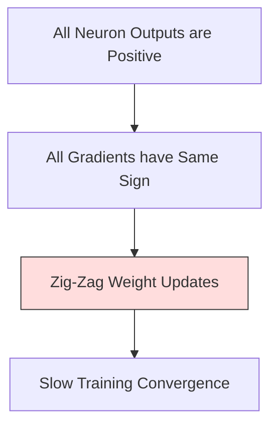

#### C) Unbounded Output (Risk of Gradient Explosion)
* **The Mechanism:** For positive inputs, ReLU is completely unbounded ($f(x) = x$).
* **The Impact:** Without proper weight initialization, regularizations, or Batch Normalization layers, activation values can grow exponentially as they pass through deep layers, potentially leading to numerical instability and **exploding gradients**.

---

### Q.2 b) What is Strides in CNN? Explain in brief. [Assumed 10 Marks]

---

### 🔍 1. Concept Definition
In a Convolutional Neural Network (CNN), the **Stride ($s$)** is a hyperparameter that defines the step size (the number of pixels) by which a convolutional filter shifts horizontally and vertically as it slides across the input tensor.

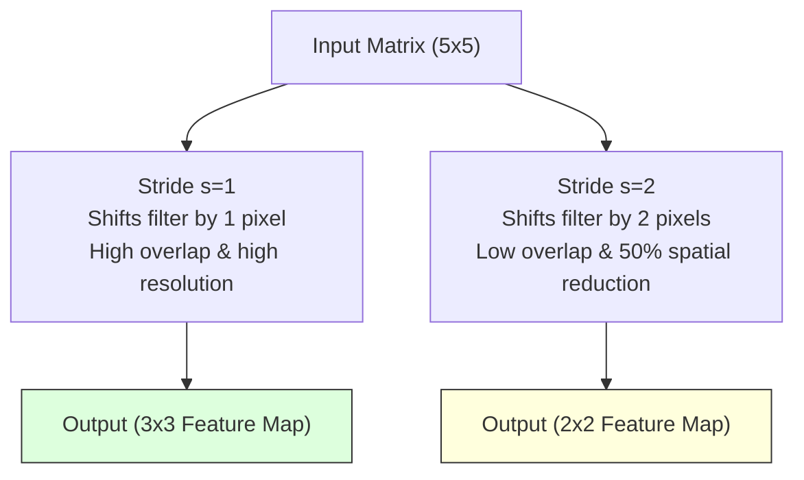

---

### ⚙️ 2. Operational Mechanics: Stride 1 vs. Stride 2

#### A) Stride = 1
* **Behavior:** The filter slides step-by-step, shifting by exactly 1 pixel at a time.
* **Overlaps:** Adjacent output pixels share a massive amount of receptive field information, resulting in highly detailed, redundant feature maps.

#### B) Stride = 2 (Spatial Down-Sampling)
* **Behavior:** The filter jumps, shifting by 2 pixels at a time.
* **Overlaps:** Receptive fields share very little overlapping information, which reduces spatial redundancy.
* **Output Size:** Shrinks the spatial dimensions of the output feature map by approximately **50%**.

---

### Q.2 c) Explain Pooling Layer with its different types. [Assumed 10 Marks]

---

### 🔍 1. Formal Mathematical Definition
In a Convolutional Neural Network (CNN), the **Pooling Layer** (or spatial down-sampling layer) is a deterministic, parameter-free operation applied to a 3D input tensor $X \in \mathbb{R}^{H_{in} \times W_{in} \times C}$ to produce an output tensor $Y \in \mathbb{R}^{H_{out} \times W_{out} \times C}$.

It operates independently on each channel (slice) of the input tensor. For a given spatial region (neighborhood) $R \subset \mathbb{R}^{H \times W}$, the pooling operation applies a static mathematical reduction function $g(\cdot)$ to aggregate the values within that region into a single scalar value.

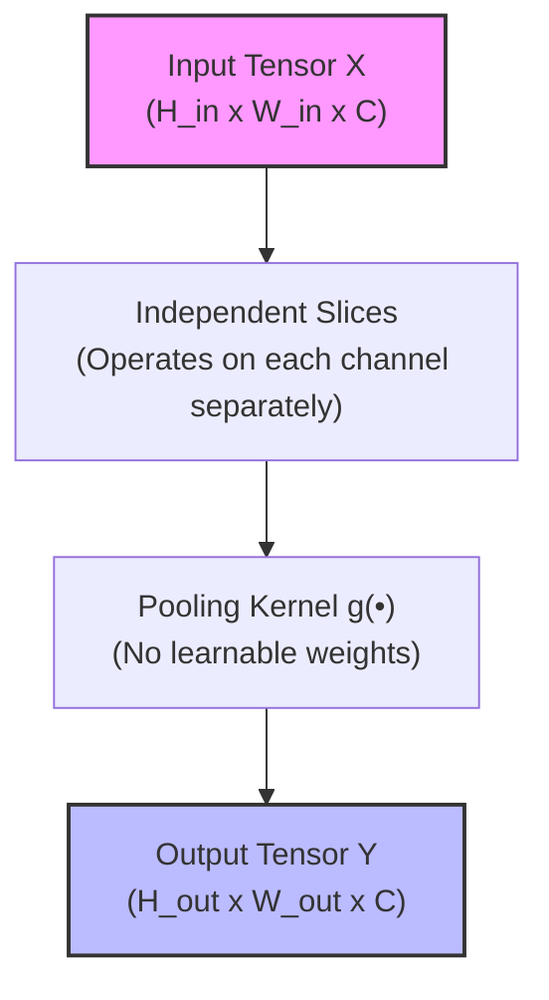

---

### 🛠️ 2. Different Types of Pooling

#### A) Max Pooling
* **Mathematical Formula:** 
  $$y = \max_{(i, j) \in R} x_{i,j}$$
* **Mechanism:** It extracts the maximum activation value within the pooling window.

#### B) Average Pooling
* **Mathematical Formula:** 
  $$y = \frac{1}{|R|} \sum_{(i, j) \in R} x_{i,j}$$
* **Mechanism:** It computes the arithmetic mean of all activation values in the window.

#### C) Global Average Pooling (GAP)
* **Mathematical Formula:** 
  $$y_c = \frac{1}{H \times W} \sum_{i=1}^{H} \sum_{j=1}^{W} x_{i,j,c}$$
* **Mechanism:** Instead of using a sliding window, GAP computes the average value of the *entire* 2D feature map for each channel, mapping an input tensor of $H \times W \times C$ directly to a $1 \times 1 \times C$ vector.

---
---

## UNIT II - Recurrent Neural Networks (RNN)

### Q.3 a) Explain RNN with its types. [Assumed 10 Marks]

---

### ⚙️ 1. Types of RNN Architectures (Input-Output Mapping)

RNNs are highly flexible and can be wired in different configurations to process various sequence lengths:

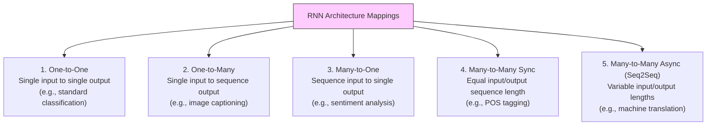

#### 1. One-to-One (Standard Baseline)
* **Description:** A single vector is mapped directly to a single prediction. This represents standard feedforward neural networks.

#### 2. One-to-Many
* **Description:** A single static input yields a sequential series of outputs.
* **Example:** **Image Captioning**. (Input: 1 Image $\rightarrow$ Output: "A", "dog", "playing", "with", "frisbee").

#### 3. Many-to-One
* **Description:** A sequence of inputs is compressed to produce a single final output vector.
* **Example:** **Sentiment Analysis**. (Input sequence: "I", "hate", "this", "movie" $\rightarrow$ Output: Negative).

#### 4. Many-to-Many (Synchronous)
* **Description:** The input and output sequences have the same length, with outputs generated in sync at each time step.
* **Example:** **Part-of-Speech (POS) Tagging**. (Input: "She", "eats", "apples" $\rightarrow$ Output: "Pronoun", "Verb", "Noun").

#### 5. Many-to-Many (Asynchronous / Sequence-to-Sequence)
* **Description:** The input sequence is fully processed first (encoded) before the network starts generating a variable-length output sequence (decoded).
* **Example:** **Machine Translation**. (Input French: "Je t'aime" [3 words] $\rightarrow$ Output English: "I love you" [3 words]).

---

### Q.3 b) Explain in brief Encoder Decoder architecture. [Assumed 10 Marks]

---

### 🗺️ Detailed Architectural Pipeline

The Seq2Seq model consists of two primary recurrent networks: an **Encoder** and a **Decoder**, bridged by a bottleneck vector called the **Context Vector**.

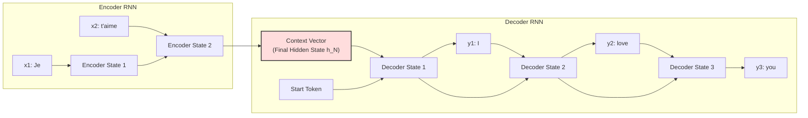

* **The Encoder RNN:** Reads and compresses the input sequence.
* **The Context Vector:** Serves as the information bridge, holding the compressed semantic meaning of the entire source sequence.
* **The Decoder RNN:** Autoregressively translates the Context Vector back into a variable-length output sequence, starting with `<SOS>` and ending with `<EOS>`.

---

### Q.3 c) Explain Different types of Deep Learning. [Assumed 10 Marks]

---

### 🔍 1. Conceptual Classification of Deep Learning

To provide a comprehensive answer, we categorize **"Types of Deep Learning"** under two distinct classification schemes:
* **Scheme A (Learning Paradigms):** Based on the nature of the data and learning signals used.
* **Scheme B (Architectural Models):** Based on the neural network architectures designed to process specific data structures.

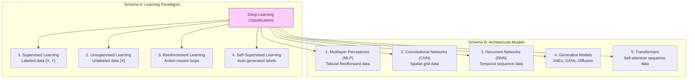

---

### Q.4 a) Write Short Note on Performance Matrices. [Assumed 10 Marks]

---

### 🔍 1. Concept Definition
In deep learning, **Performance Matrices** (also referred to as **Performance Metrics**) are mathematical frameworks used to evaluate, analyze, and optimize the prediction capabilities of trained models.

To ensure comprehensive evaluation, metrics are split into two categories: **Classification Metrics** (for categorizing data) and **Generative/Sequential Metrics** (for translation and text models).

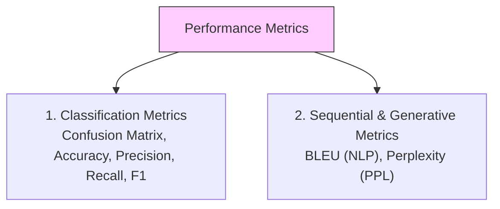

---

### 📊 2. Classification Performance Metrics

The foundation of classification metrics is the **Confusion Matrix**, which tabulates model predictions against actual ground-truth classes:

```text
                  Actual Positive      Actual Negative
Predicted Pos.   True Positive (TP)   False Positive (FP) <-- Type I Error
Predicted Neg.   False Negative (FN)  True Negative (TN)  <-- Type II Error
```

#### A) Accuracy
* **Formula:**
  $$\text{Accuracy} = \frac{\text{TP} + \text{TN}}{\text{TP} + \text{TN} + \text{FP} + \text{FN}}$$

#### B) Precision (Positive Predictive Value)
* **Formula:**
  $$\text{Precision} = \frac{\text{TP}}{\text{TP} + \text{FP}}$$

#### C) Recall (Sensitivity / True Positive Rate)
* **Formula:**
  $$\text{Recall} = \frac{\text{TP}}{\text{TP} + \text{FN}}$$

#### D) F1-Score
* **Formula:**
  $$\text{F1-Score} = 2 \times \frac{\text{Precision} \times \text{Recall}}{\text{Precision} + \text{Recall}}$$

---

### Q.4 b) Compare implicit and explicit memory. [Assumed 10 Marks]

---

### 🔍 1. Theoretical Conception
In deep learning, memory systems are divided into two fundamental paradigms:
* **Implicit Memory:** Knowledge stored implicitly within the **synaptic connection weights** ($\mathbf{W}, \mathbf{b}$) of the neural network. This memory is learned slowly over many epochs of gradient descent.
* **Explicit Memory:** Knowledge stored in a dedicated, addressable **external memory buffer** separate from the network weights. This memory can be read from and written to dynamically at runtime, similar to RAM in a computer.

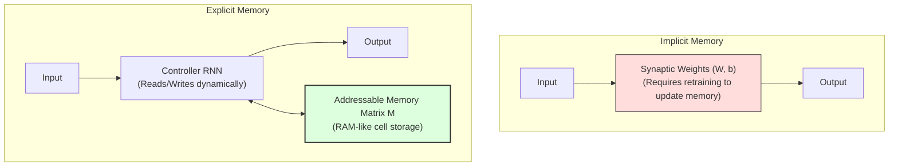

---

### 📊 2. Key Differences: Implicit vs. Explicit Memory

| Feature Parameter | Implicit Memory | Explicit Memory |
| :--- | :--- | :--- |
| **Storage Location** | Neural synaptic weight matrices ($\mathbf{W}, \mathbf{b}$). | External addressable memory matrix ($\mathbf{M}$). |
| **Update Mechanism** | Learned slowly via backpropagation and gradient descent. | Read and written dynamically in a single forward pass. |
| **One-Shot Learning** | Extremely poor (requires multiple training steps). | High (new facts can be instantly written to memory). |
| **Catastrophic Forgetting**| High risk (overwriting weights destroys old features). | Low risk (isolated cells protect old information). |
| **Access Style** | Global and parallel (all weights activate at once). | Localized (retrieved via soft-addressing attention). |
| **Hardware Analogy** | Fixed-logic circuit layout. | Dynamic Random Access Memory (RAM). |
| **Example Architectures**| Standard CNNs, MLPs, vanilla RNNs. | Memory Networks, Neural Turing Machines (NTMs). |

---

### Q.4 c) What are default baseline models? Explain in brief. [Assumed 10 Marks]

---

### 🔍 1. Definition and Core Purpose
In deep learning engineering, a **Default Baseline Model** is a simple, easily implemented, and computationally inexpensive model used as a benchmark to evaluate the true effectiveness of more complex deep learning architectures.

When developing a state-of-the-art model, a baseline model is essential for three main reasons:

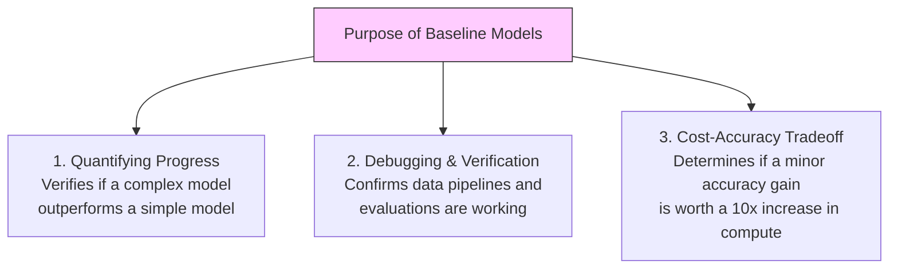
---
