# Deep Learning (410251) - Semester VIII
## Paper 2: [6263]-95 Solution (Second Half: Units III & IV)
### ⚠️ Assumed Weightage: Each Sub-Question is solved for a full 10 Marks standard.

---

## UNIT III - Generative Models & GAN

### Q.5 a) State and explain different types of GAN. [Assumed 10 Marks]

---

### 🔍 1. Introduction to the GAN Taxonomy
Since the inception of the Generative Adversarial Network (GAN) by Ian Goodfellow in 2014, multiple architectural and mathematical modifications have been introduced to stabilize training, support conditional generation, and enhance output fidelity.

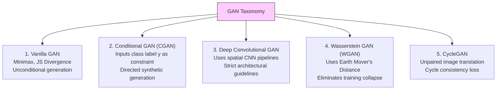

---

### ⚙️ 2. Detailed Technical Analysis of Each Type

#### A) Vanilla GAN (Standard GAN)
* **Objective:** The baseline model which uses a standard minimax objective with no class labels or constraints. It maps random noise $z \sim p_z$ to fake samples $G(z)$.
* **Mathematical Loss:** 
  $$\min_G \max_D V(D, G) = \mathbb{E}_{x \sim p_{data}}[\log D(x)] + \mathbb{E}_{z \sim p_z}[\log(1 - D(G(z)))]$$

#### B) Conditional GAN (CGAN)
* **Objective:** Introduces an auxiliary conditioning variable $y$ (such as class labels or text embeddings) to direct the generation process, allowing us to generate specific classes of data:
  $$\min_G \max_D V(D, G) = \mathbb{E}_{x \sim p_{data}}[\log D(x \mid y)] + \mathbb{E}_{z \sim p_z}[\log(1 - D(G(z \mid y) \mid y))]$$

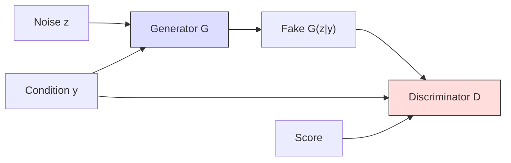

#### C) Deep Convolutional GAN (DCGAN)
* **Objective:** Replaces standard fully connected networks with deep spatial Convolutional networks, establishing strict structural guidelines to stabilize training (no spatial pooling layers, use of BatchNorm, LeakyReLU, and specific output layers).

#### D) Wasserstein GAN (WGAN)
* **Objective:** Stabilizes training by replacing the Jensen-Shannon Divergence with the **Wasserstein-1 (Earth Mover's) Distance**, using a real-valued Critic rather than a binary classifier to calculate gradients.
  $$\min_G \max_{D} \mathbb{E}_{x \sim p_{data}}[D(x)] - \mathbb{E}_{\tilde{x} \sim p_g}[D(\tilde{x})]$$

#### E) Cycle-Consistent GAN (CycleGAN)
* **Objective:** Translates images from a source domain $X$ to a target domain $Y$ without requiring paired training data (unpaired training).
* **Mechanism:** Uses two generators ($G \colon X \to Y$ and $F \colon Y \to X$) and two discriminators. It introduces a **Cycle Consistency Loss** to ensure that an image translated to the target domain and back matches the original image:
  $$L_{cyc}(G, F) = \mathbb{E}_{x \sim p_{data}(x)}[\|F(G(x)) - x\|_1] + \mathbb{E}_{y \sim p_{data}(y)}[\|G(F(y)) - y\|_1]$$

---

### Q.5 b) What is Boltzmann Machine? Explain its objectives. [Assumed 10 Marks]

---

### 🔍 1. System Conception
A **Boltzmann Machine** is an energy-based, undirected graphical model (a stochastic recurrent neural network) designed to learn the underlying probability distribution of a given dataset in an unsupervised fashion. Introduced by Geoffrey Hinton and Terry Sejnowski in 1985, it is rooted in the principles of statistical mechanics and thermodynamics.

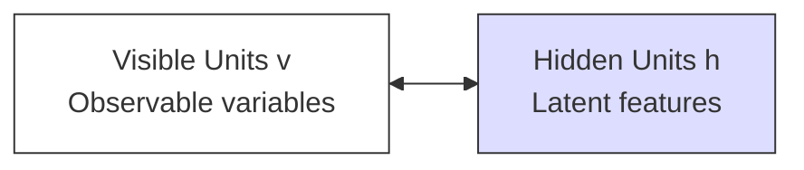

---

### 🚀 2. The Core Objectives of a Boltzmann Machine

The fundamental objective of a Boltzmann Machine is to model the probability distribution of real-world datasets. This global goal can be broken down into three key objective layers:

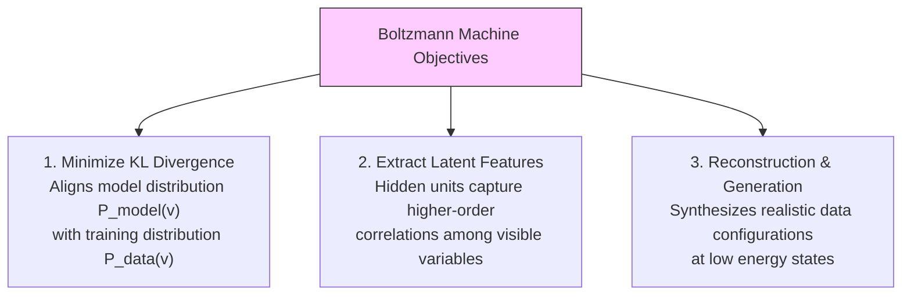

#### A) Minimizing Kullback-Leibler (KL) Divergence
To align the model's visible probability distribution $P_{\text{model}}(v)$ with the true training data distribution $P_{\text{data}}(v)$, the network is optimized to minimize the KL Divergence:
$$\text{Minimize: } KL(P_{\text{data}} \parallel P_{\text{model}}) = \sum_{v} P_{\text{data}}(v) \log \frac{P_{\text{data}}(v)}{P_{\text{model}}(v)}$$

#### B) Designing the Energy Landscape
As an energy-based model, the joint probability of visible state $v$ and hidden state $h$ is defined by the **Gibbs/Boltzmann Distribution**:
$$P_{\text{model}}(v, h) = \frac{e^{-E(v, h)}}{Z}$$

---

### Q.5 c) Write short Note on Deep Generative Model and Deep Belief Networks. [Assumed 10 Marks]

---

### Part 1: Deep Generative Models (DGMs)

#### 🔍 Core Concept
A **Deep Generative Model (DGM)** is a class of unsupervised deep learning algorithms designed to approximate and generate samples from complex, high-dimensional real-world data distributions (such as natural images, speech, or text). 

Unlike discriminative models that predict labels given data, DGMs learn the joint probability distribution of the data space, allowing them to synthesize entirely new samples that share the statistical characteristics of the training dataset.

---

### Part 2: Deep Belief Networks (DBNs)

#### 🔍 Core Concept
Introduced by Geoffrey Hinton in 2006, a **Deep Belief Network (DBN)** is a generative graphical model composed of multiple layers of latent, stochastic variables. It was one of the first successful architectures to train deep networks, overcoming the challenges of random weight initialization.

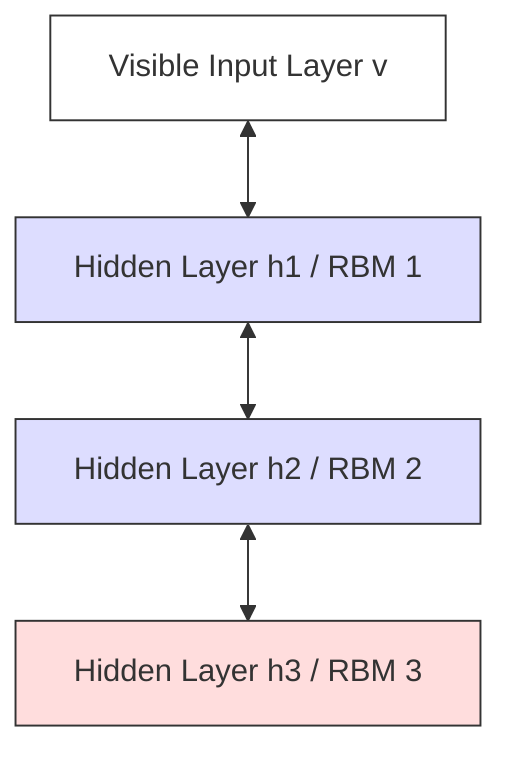

#### ⚙️ Architectural Structure:
* **Stacked RBMs:** A DBN is constructed by stacking multiple **Restricted Boltzmann Machines (RBMs)** on top of each other.
* **Connections:** The connections between the top two hidden layers are undirected, forming a symmetric associative memory. The connections in the lower layers are directed, running downwards to generate outputs.

---
---

## UNIT III - Generative Models & GAN (Continued)

### Q.6 a) Define Boltzmann Machine? State and Explain its types. [Assumed 10 Marks]

---

### ⚙️ 1. Different Types of Boltzmann Machines

#### A) General Boltzmann Machine (Fully Connected)
* **Structure:** All units (visible-to-visible, hidden-to-hidden, and visible-to-hidden) can be fully connected with undirected, symmetric connections.
* **Limitation:** Calculating the partition function $Z$ to normalize state probabilities has NP-hard exponential complexity $O(2^N)$, making training intractable for practical datasets.

#### B) Restricted Boltzmann Machine (RBM)
* **Structure:** Connections are restricted to form a **bipartite graph**. No connections are allowed within the same layer (no visible-to-visible or hidden-to-hidden connections).
* **Advantage:** Because intra-layer connections are forbidden, the activations of hidden units are conditionally independent of each other given the visible layer:
  $$P(h \mid v) = \prod_{j=1}^{|h|} P(h_j \mid v)$$

#### C) Deep Boltzmann Machine (DBM)
* **Structure:** A multi-layered generative network constructed by stacking multiple RBMs on top of each other. All connections remain completely undirected throughout the stack.

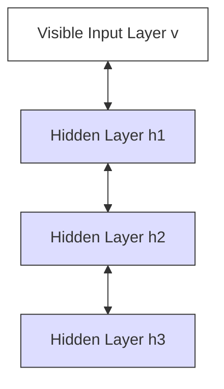

#### D) Deep Belief Network (DBN)
* **Structure:** Only the **top two layers are undirected**, forming an associative memory. The **lower layers are directed** (pointing downwards toward the visible input).

```mermaid
graph TD
    v_dbn[Visible Input Layer v] <-- Directed -- h1_dbn[Hidden Layer h1]
    h1_dbn <-- Directed -- h2_dbn[Hidden Layer h2]
    h2_dbn <--> h3_dbn[Hidden Layer h3 / Top Associative Memory]
    
    style v_dbn fill:#fff,stroke:#333
    style h1_dbn fill:#ddf,stroke:#333
    style h2_dbn fill:#ddf,stroke:#333
    style h3_dbn fill:#fdd,stroke:#333
```

---

### Q.6 b) Explain Discriminator Network. [Assumed 10 Marks]

---

### 🔍 1. The Core Role of the Discriminator
In a Generative Adversarial Network (GAN), the **Discriminator Network ($D$)** acts as a binary classifier and a dynamic supervisor. Its primary role is to evaluate input samples and determine whether they are real (coming from the training set) or fake (created by the Generator).

Rather than using a static loss function (like Mean Squared Error), a GAN uses the Discriminator as an **adaptive loss function** that continuously learns and updates its criteria to provide meaningful gradients to guide the Generator's training.

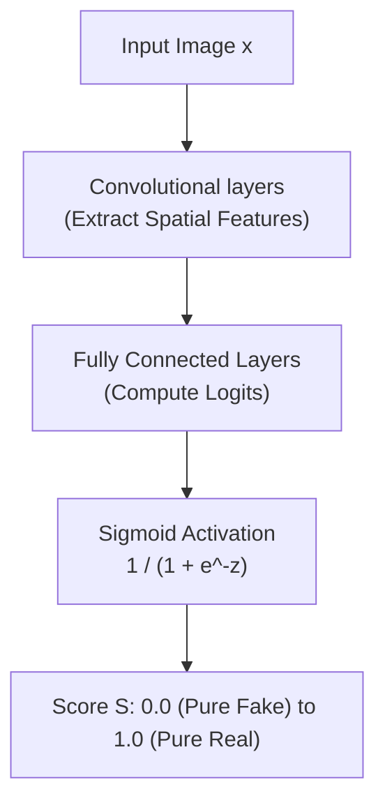

* **Inputs:** High-dimensional data samples (such as a $28 \times 28 \times 1$ image) from both the real training dataset and the Generator's fake outputs.
* **Outputs:** A single scalar probability score $D(x) \in [0, 1]$ indicating the probability that the input sample came from the real training set rather than the Generator.

---

### Q.6 c) Enlist and Explain applications of GAN. [Assumed 10 Marks]

---

### 🚀 Four Major Applications of GANs

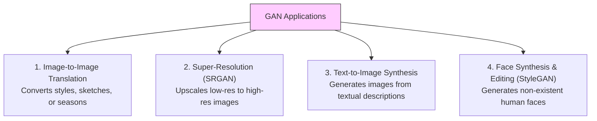

---

### 🔍 Detailed Analysis of the Applications

#### A) Image-to-Image Translation (Pix2Pix & CycleGAN)
* **Description:** Translates an input image from a source domain (e.g. a hand-drawn sketch) to a target domain (e.g. a photo-realistic object) while preserving the underlying structural geometry.
* **CycleGAN** can learn style translation without paired images by using a **Cycle Consistency Loss**:
  $$L_{cyc}(G, F) = \mathbb{E}_{x \sim p_{\text{data}}(x)}[\|F(G(x)) - x\|_1]$$

#### B) Super-Resolution (SRGAN)
* **Description:** Reconstructs high-resolution (HR) images from highly pixelated, low-resolution (LR) inputs, restoring lost textures and finer details.
* **Mechanism:** SRGAN utilizes a discriminator to penalize blurry outputs, combined with a **Perceptual Loss** (comparing high-level feature activations extracted by a pre-trained VGG network), forcing the generator to synthesize sharp, high-frequency details.

---
---

## UNIT IV - Reinforcement Learning

### Q.7 a) What is Reinforcement Learning? State and explain its advantages and disadvantages. [Assumed 10 Marks]

---

### 🔍 1. Formal Definition of Reinforcement Learning
**Reinforcement Learning (RL)** is an autonomous learning paradigm where an **Agent** learns to make a sequence of optimal decisions within an interactive, dynamic **Environment** through trial-and-error interactions. 

The framework is formalized as a **Markov Decision Process (MDP)**. The agent receives feedback in the form of numerical **Rewards**, and its goal is to learn a policy $\pi(a \mid s)$ that maximizes the expected cumulative return over time:
$$G_t = \sum_{k=0}^{\infty} \gamma^k R_{t+k+1}$$

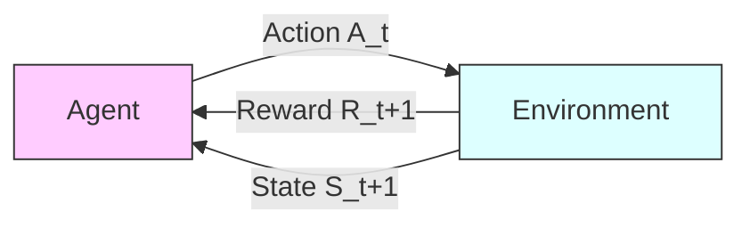

---

### 🚀 2. Advantages of Reinforcement Learning
* **No Labeled Datasets Required:** Learns directly from environment feedback, making it ideal for tasks where human labeling is impossible or too expensive.
* **Long-Term Sequential Planning:** Learns to value actions that have delayed rewards, optimizing for long-term expected returns.
* **Discovery of Novel, Super-Human Solutions:** Not constrained by human demonstrations, allowing agents to discover creative, superior strategies (e.g. AlphaGo).

---

### ⚠️ 3. Disadvantages of Reinforcement Learning
* **Extreme Sample Inefficiency:** Requires millions of interaction steps, making training slow and computationally expensive.
* **Difficulty of Reward Design (Reward Hacking):** If reward functions are misaligned, agents find loopholes to maximize scores without actually solving the task.
* **Safety Risks During Exploration:** Taking random exploratory actions in real-world physical systems (like self-driving cars) can result in catastrophic failures.

---

### Q.7 b) What are different types of Reinforcement Learning? Explain in brief. [Assumed 10 Marks]

---

### 🔍 1. Classification Dimensions of Reinforcement Learning
To provide a comprehensive, 10-mark standard answer, we categorize **"Types of Reinforcement Learning"** across three major mathematical dimensions:

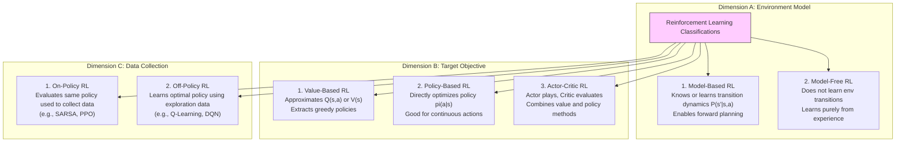

---

### Q.7 c) Compare Active and Passive Reinforcement Learning. [Assumed 10 Marks]

---

### 🔍 1. Conceptual Definitions
The distinction between Active and Passive Reinforcement Learning lies in the agent's control over its decision-making policy:
* **Passive Reinforcement Learning:** The agent's policy $\pi$ is **fixed and static**. The agent simply executes this fixed policy, observes the resulting transition and reward states, and learns the state value function $V^\pi(s)$. It acts purely as an observer and evaluator.
* **Active Reinforcement Learning:** The agent's policy is **flexible and updated dynamically**. The agent must actively decide what actions to take, balancing exploration and exploitation to discover the optimal policy $\pi^*$.

```mermaid
graph TD
    subgraph Passive RL (Fixed Policy Evaluation)
        P_Env[Environment] -->|State s, Reward r| P_Agent[Agent]
        P_Agent -->|Execute Fixed Policy pi| P_Env
        P_Agent -->|Learn Value V_pi| P_Agent
    end
    subgraph Active RL (Policy Optimization)
        A_Env[Environment] -->|State s, Reward r| A_Agent[Agent]
        A_Agent -->|Explore / Exploit Choice| A_Env
        A_Agent -->|Update Policy pi -> pi*| A_Agent
    end
    
    style P_Agent fill:#fdd,stroke:#333
    style A_Agent fill:#dfd,stroke:#333
```

---

### 📊 2. Comparative Analysis: Passive vs. Active RL

| Comparison Parameter | Passive Reinforcement Learning | Active Reinforcement Learning |
| :--- | :--- | :--- |
| **Policy Control** | **Fixed and static** ($\pi$ never changes). | **Dynamic and adaptive** (aims to learn optimal policy $\pi^*$). |
| **Agent's Primary Goal** | To evaluate how good the fixed policy is by learning $V^\pi(s)$. | To optimize actions to maximize cumulative rewards. |
| **Exploration Requirement** | **None.** The agent simply follows pre-defined fixed paths. | **High.** The agent must use exploration to discover unvisited states. |
| **Bellman Equation** | Uses the **Bellman Expectation Equation** for policy evaluation. | Uses the **Bellman Optimality Equation** for policy improvement. |

---
---

## UNIT IV - Reinforcement Learning (Continued)

### Q.8 a) Write short note on Deep Q-Learning. [Assumed 10 Marks]

---

### 🔍 1. Introduction to Deep Q-Learning (DQN)
**Deep Q-Learning (DQN)**, introduced by DeepMind in 2013, replaces the tabular $Q(s, a)$ lookup table of traditional Q-learning with a **Deep Neural Network** (parameterized by weights $\theta$) to approximate the optimal Q-values in continuous or massive state spaces:
$$Q(s, a; \theta) \approx Q^*(s, a)$$

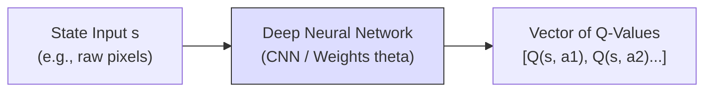

#### Key Stability Innovations in DQN:
* **Experience Replay Memory:** Stores transitions $(s, a, r, s')$ in a massive replay buffer. During training, it samples random mini-batches from this buffer. This breaks temporal correlations, satisfying the IID assumption.
* **Target Network ($\theta^-$):** A separate copy of the network weights ($\theta^-$) is maintained solely to calculate targets. These target weights are held stable and only updated to match the online weights ($\theta$) periodically.

$$\text{Loss } L_i(\theta_i) = \mathbb{E} \left[ \left( R + \gamma \max_{a'} Q(s', a'; \theta_i^-) - Q(s, a; \theta_i) \right)^2 \right]$$

---

### Q.8 b) What are different characteristics of Reinforcement Learning? [Assumed 10 Marks]

---

### 🔍 Unique Characteristics of Reinforcement Learning

Reinforcement Learning is defined by five unique mathematical and operational characteristics:

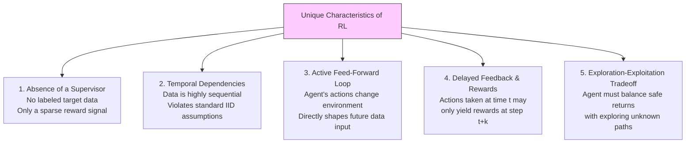

---

### Q.8 c) Explain in detail Dynamic Programming algorithms for reinforcement learning. [Assumed 10 Marks]

---

### Algorithm 1: Policy Iteration

Policy Iteration alternates between two distinct phases until the policy stabilizes:

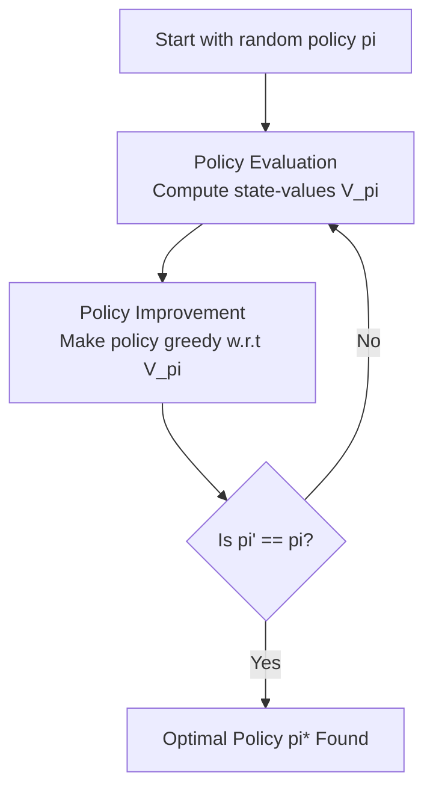

#### Phase 1: Policy Evaluation
Computes the state-value function $V^\pi(s)$ for the current policy $\pi$. It iteratively applies the Bellman Expectation Equation across all states:
$$V_{k+1}(s) = \sum_{a \in A} \pi(a \mid s) \sum_{s' \in S} P(s' \mid s, a) \left[ R(s, a, s') + \gamma V_k(s') \right]$$

#### Phase 2: Policy Improvement
Updates the policy to be greedy with respect to the newly calculated value function:
$$\pi'(s) = \arg\max_{a \in A} \sum_{s' \in S} P(s' \mid s, a) \left[ R(s, a, s') + \gamma V^\pi(s') \right]$$

---

### Algorithm 2: Value Iteration

Unlike Policy Iteration, **Value Iteration** does not wait for the policy evaluation to fully converge. Instead, it combines evaluation and policy improvement into a single update step by applying the **Bellman Optimality Equation** directly:

$$V_{k+1}(s) = \max_{a \in A} \sum_{s' \in S} P(s' \mid s, a) \left[ R(s, a, s') + \gamma V_k(s') \right]$$

The optimal policy is then extracted in a single step:
$$\pi^*(s) = \arg\max_{a \in A} \sum_{s' \in S} P(s' \mid s, a) \left[ R(s, a, s') + \gamma V^*(s') \right]$$
