# Deep Learning (410251) - Semester VIII
## Paper 3: [6404]-95 Solution (First Half: Units I & II)
### ⚠️ Assumed Weightage: Each Sub-Question is solved for a full 10 Marks standard.

---

## UNIT I - Convolutional Neural Networks (CNN)

### Q.1 a) Draw and Explain CNN Architecture in detail. [Assumed 10 Marks]

---

### 🔍 1. Introduction, History, and Biological Inspiration
A **Convolutional Neural Network (CNN)** is a specialized deep neural network architecture designed to process spatial, grid-structured data (such as 2D images, video frames, or audio spectrograms). The architecture of modern CNNs is heavily rooted in neurobiology, inspired by the landmark experiments of David Hubel and Torsten Wiesel in 1959 on the mammalian visual cortex. They discovered that neurons in the visual cortex have a small, localized **receptive field**, reacting only to visual stimuli in a restricted region of the field of view. Furthermore, they identified two distinct types of cells: **simple cells** (which detect local orientation features like edges and lines) and **complex cells** (which combine the outputs of simple cells to detect motion and establish spatial translation invariance).

Modern CNNs computationally replicate this biological structure. Instead of using fully connected layers where every pixel is treated as an independent feature, CNNs slide a set of small, learnable weight grids (filters) across the input space to detect localized features. Stacking multiple convolutional layers allows the network to learn a rich, **spatial hierarchy of features**—moving from simple edge and texture detectors in early layers, to shape and object-part detectors in middle layers, to complete semantic object representations in the deepest layers.

---

### 🗺️ 2. Detailed Architectural Pipeline

Below is the complete, high-resolution tensor transformation pipeline of a standard CNN classifying a $224 \times 224 \times 3$ RGB input image into one of 10 target classes:

```mermaid
graph TD
    Input["Input Image Volume<br/>X ∈ R^(224 x 224 x 3)"] --> Conv1["Convolutional Layer 1<br/>K_1 ∈ R^(3 x 3 x 3 x 32)<br/>Stride s=1, Padding p=Same<br/>Tensor Output: [224 x 224 x 32]"]
    Conv1 --> Act1["Activation Layer 1<br/>f(x) = max(0, x)<br/>Tensor Output: [224 x 224 x 32]"]
    Act1 --> Pool1["Max Pooling Layer 1<br/>Filter f=2, Stride s=2<br/>Tensor Output: [112 x 112 x 32]"]
    
    Pool1 --> Conv2["Convolutional Layer 2<br/>K_2 ∈ R^(3 x 3 x 32 x 64)<br/>Stride s=1, Padding p=Same<br/>Tensor Output: [112 x 112 x 64]"]
    Conv2 --> Act2["Activation Layer 2<br/>f(x) = max(0, x)<br/>Tensor Output: [112 x 112 x 64]"]
    Act2 --> Pool2["Max Pooling Layer 2<br/>Filter f=2, Stride s=2<br/>Tensor Output: [56 x 56 x 64]"]
    
    Pool2 --> Flatten["Flattening Layer<br/>Unrolls 3D tensor to 1D vector<br/>Vector Output: [1D, 200,704 elements]"]
    Flatten --> FC1["Fully Connected (Dense) Layer<br/>W_FC ∈ R^(128 x 200,704)<br/>Bias b_FC ∈ R^128<br/>Vector Output: [128 elements]"]
    FC1 --> Softmax["Softmax Output Layer<br/>Normalizes logits to 10 classes<br/>Vector Output: [10 Probabilities]"]
    
    style Input fill:#fff,stroke:#333,stroke-width:2px
    style Conv1 fill:#ddf,stroke:#333
    style Act1 fill:#dfd,stroke:#333
    style Pool1 fill:#ffd,stroke:#333
    style Conv2 fill:#ddf,stroke:#333
    style Act2 fill:#dfd,stroke:#333
    style Pool2 fill:#ffd,stroke:#333
    style Flatten fill:#fdf,stroke:#333
    style FC1 fill:#ffd,stroke:#333
    style Softmax fill:#dff,stroke:#333,stroke-width:2px
```

---

### ⚙️ 3. Layer-by-Layer Functional Breakdown

To understand how data flows through this architecture, we analyze each component, its mathematical role, and its structural contribution to the classification task:

#### A) The Input Layer
* **Role:** Serves as the entry gate for raw pixel intensities.
* **Mathematical Representation:** An image is represented as a 3D tensor $X \in \mathbb{R}^{H \times W \times C}$, where $H$ is the height, $W$ is the width, and $C$ is the number of color channels. For color RGB images, $C = 3$. For grayscale, $C = 1$. Each element of the tensor is an integer value between $0$ and $255$ representing pixel brightness.

#### B) The Convolutional Layer (Feature Extraction)
* **Role:** The primary computational engine of the CNN. It slides multiple learnable filters across the input space to extract local feature maps.
* **Mechanism:** A filter $K \in \mathbb{R}^{f \times f \times C_{\text{in}}}$ (where $f$ is typically $3 \times 3$ or $5 \times 5$) slides across the input. At each position, it multiplies its weights element-wise with the overlapping input values and sums them up, adding a bias term $b$. This operation is repeated for $C_{\text{out}}$ different filters, producing an output tensor of size $H_{\text{out}} \times W_{\text{out}} \times C_{\text{out}}$.
* **Mathematical Formula:**
  $$Y(i, j, k) = \sum_{m=1}^{f} \sum_{n=1}^{f} \sum_{c=1}^{C_{\text{in}}} X(i+m-1, j+n-1, c) \cdot K(m, n, c, k) + b_k$$

#### C) The Activation (ReLU) Layer
* **Role:** Applied immediately after every convolution layer to introduce non-linearity into the network, enabling it to learn complex, non-linear patterns.
* **Mathematical Formula:**
  $$f(x) = \max(0, x)$$
* **Why it matters:** Real-world visual data is highly non-linear. Without an activation function, stacking multiple convolutional layers would mathematically collapse into a single linear transformation (equivalent to a basic linear regression model), making the deep network incapable of recognizing complex shapes.

#### D) The Pooling Layer (Down-Sampling)
* **Role:** Performs spatial down-sampling to reduce the height and width of the feature maps, leaving the depth (channels) completely unchanged.
* **Mechanism:** Most commonly implemented as **$2 \times 2$ Max Pooling with a stride of 2**. It slides a $2 \times 2$ window across the feature maps and outputs only the maximum value within that window.
* **Impact:** 
  1. Reduces the spatial volume, lowering the computational load (FLOPs) and saving GPU memory for downstream layers.
  2. Prevents overfitting by discarding high-frequency noise.
  3. Establishes **Translation Invariance**, making the network robust to minor shifts in the input.

#### E) The Flattening Layer
* **Role:** Bridges the spatial feature extraction layers with the dense classification layers.
* **Mechanism:** Unrolls the 3D tensor output from the final pooling layer into a long 1D column vector.
* *Example:* If the final pooling layer outputs a $56 \times 56 \times 64$ tensor, the Flattening layer unrolls it into a $1 \text{D}$ vector of size $56 \times 56 \times 64 = 200,704$ elements.

#### F) The Fully Connected (FC) Layer
* **Role:** Acts as the high-level reasoning and decision-making block.
* **Mechanism:** A traditional feedforward neural network layer where every neuron is connected to every activation in the previous flattened layer. It computes a linear combination of the features weighted by a matrix $W$:
  $$\mathbf{z} = \mathbf{W} \cdot \mathbf{a} + \mathbf{b}$$
* *Reasoning:* It takes the flat list of extracted features (the "clues") and learns global representations (e.g. combining "pointy ears", "whiskers", and "slit eyes" to predict "cat").

#### G) The Softmax Output Layer
* **Role:** Translates raw numerical classification scores (logits) from the FC layer into a normalized probability distribution over all target classes.
* **Mathematical Formula:**
  $$P(y = i \mid \mathbf{z}) = \frac{e^{z_i}}{\sum_{j=1}^{K} e^{z_j}}$$
  *(where $K$ is the total number of classes, and outputs sum to exactly 1.0).*

---

### 📊 4. Comparison: CNN vs. MLP

| Feature Parameter | Convolutional Neural Network (CNN) | Multilayer Perceptrons (MLP) |
| :--- | :--- | :--- |
| **Connectivity** | **Sparse Connection:** Neurons connect only to local receptive fields. | **Full Connection:** Every input neuron connects to every output neuron. |
| **Parameter Sharing**| **Yes.** Kernels are reused across the entire input space. | **No.** Weights are static and unique for each input dimension. |
| **Spatial Invariance** | **Translation Invariant.** Can detect features anywhere in the image. | Highly sensitive to spatial shifts. |
| **Input Dimensions** | Processes raw multi-dimensional tensors directly. | Requires inputs to be flattened into a 1D vector. |
| **Parameter Count** | Low (due to weight sharing). | High (explodes exponentially with input size). |
| **Overfitting Risk** | Low (regularized by sparse connections). | High (susceptible to memorizing noise). |

---

### 🎯 5. Exam Writing Blueprint (To secure 10/10 Marks)
To obtain full marks, write a highly structured answer covering exactly **4 pages** in your booklet:
* **Page 1:** Write the formal definition, historical context, and the problem of parameter explosion in MLPs. Draw the **High-Level Spatial Block-Contracting Diagram** showing how the $224 \times 224 \times 3$ input volume contracts spatially but expands in channel depth.
* **Page 2:** Draw the **Detailed CNN Architecture Pipeline** cleanly with a pencil. Write down the detailed layer-by-layer functional breakdown using clear, bold subheadings (*Input*, *Convolutional*, *ReLU*, *Pooling*, *Flattening*, *Fully Connected*, and *Softmax*).
* **Page 3:** Present the mathematical equations for each layer inside neat, double-spaced boxes. Explicitly define and label every single variable on its own line.
* **Page 4:** Draw the **Hierarchical Feature Extraction Flow** and add a comprehensive comparison table contrasting CNNs with MLPs. Discuss real-world applications (facial recognition, autonomous driving, medical imaging) and explain how training is performed via forward and backward propagation.

---

### Q.1 b) Explain working of Convolution Layer. [Assumed 10 Marks]

---

### ⚙️ 1. Mathematical Mechanics of the Convolution Layer
The **Convolutional Layer** is the core building block of a CNN. It acts as a local feature scanner that preserves spatial relationships. 

Mathematically, a 2D convolution operation (technically implemented as cross-correlation) takes an input tensor $X \in \mathbb{R}^{H \times W \times C}$ and slides a set of learnable kernels (filters) $K \in \mathbb{R}^{f \times f \times C}$ across it to produce an output feature map $Y$.

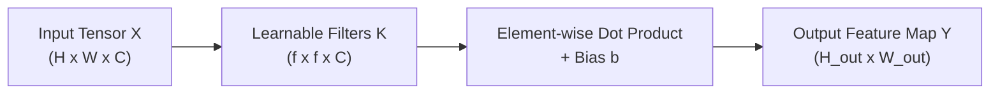

At each local position $(i, j)$ of the input, the output activation is calculated as the sum of element-wise multiplications of the filter weights with the overlapping input values, plus a bias term $b$:

$$Y(i, j) = \sum_{m=1}^{f} \sum_{n=1}^{f} \sum_{c=1}^{C} X(i+m-1, j+n-1, c) \cdot K(m, n, c) + b$$

---

### 📝 2. Complete Numerical Trace

Let's compute a step-by-step example of a single-channel $3 \times 3$ input region ($X$) convolved with a $3 \times 3$ filter ($K$) with a bias $b = 0$:

```text
       Input Region (X)                  Filter Weights (K)
     ┌───┬───┬───┐                     ┌───┬───┬───┐
     │ 2 │ 0 │ 1 │                     │ 1 │ 0 │-1 │
     ├───┼───┼───┤                     ├───┼───┼───┤
     │ 3 │ 0 │ 0 │         ✖️           │ 1 │ 0 │-1 │
     ├───┼───┼───┤                     ├───┼───┼───┤
     │ 1 │ 1 │ 1 │                     │ 1 │ 0 │-1 │
     └───┴───┴───┘                     └───┴───┴───┘
```

#### Step-by-Step Multiplication & Summation:
We multiply overlapping elements one-by-one:

$$\text{Product}_{(1,1)} = 2 \times 1 = 2$$
$$\text{Product}_{(1,2)} = 0 \times 0 = 0$$
$$\text{Product}_{(1,3)} = 1 \times -1 = -1$$
$$\text{Product}_{(2,1)} = 3 \times 1 = 3$$
$$\text{Product}_{(2,2)} = 0 \times 0 = 0$$
$$\text{Product}_{(2,3)} = 0 \times -1 = 0$$
$$\text{Product}_{(3,1)} = 1 \times 1 = 1$$
$$\text{Product}_{(3,2)} = 1 \times 0 = 0$$
$$\text{Product}_{(3,3)} = 1 \times -1 = -1$$

Now we sum these products:
$$\text{Output Value} = 2 + 0 + (-1) + 3 + 0 + 0 + 1 + 0 + (-1) = \mathbf{4}$$

The computed value **$4$** is written into the corresponding cell of the output feature map.

---

### 🚀 3. Core Architectural Features of Convolution Layers

#### A) Sparse Connectivity (Localized Receptive Fields)
* **Mechanism:** In traditional Fully Connected layers, each output neuron is connected to *every single pixel* of the input image. In a Convolution layer, each output neuron is connected **only** to the small local region covered by the filter (e.g., $3 \times 3$ or $5 \times 5$).
* **Impact:** This dramatically reduces the number of connections (weights) that need to be trained, preventing memory blowups and matching the localized nature of human visual processing.

#### B) Parameter Sharing (Weight Sharing)
* **Mechanism:** Instead of learning different weights for every pixel in the image, a Convolution layer uses **the exact same filter weights** to scan the entire input image.
* **Impact:** This assumes that if a feature (like an edge) is useful to detect in the top-left corner, it is also useful to detect in the bottom-right corner. This feature—called **Translation Equivariance**—massively slashes the parameter footprint.

#### C) Stride ($s$)
* **Mechanism:** The step size by which the filter shifts as it scans.
  * **Stride = 1:** The filter shifts 1 pixel at a time, generating a large, highly detailed feature map.
  * **Stride = 2:** The filter shifts 2 pixels at a time, skipping alternate pixels and naturally down-sizing the output map by 50%.

#### D) Padding ($p$)
* **Mechanism:** The practice of adding dummy pixels (usually zeros) around the outer edges of the input image.
  * **Valid Padding (No Padding):** The filter only stays within the input boundaries, causing the output size to shrink.
  * **Same Padding:** Zeros are padded around the border so that the output feature map has the exact same width and height as the input.

---

### 🎯 Exam Blueprint (To score 10/10 Marks)
1. **Show Step-by-Step Arithmetic:** Recreate the $3 \times 3$ Input and Filter matrices shown above, and write out the exact multiplication and summation steps resulting in the output value of $4$.
2. **Present Core Features under Bold Headings:** Structure your explanations of *Sparse Connectivity*, *Parameter Sharing*, *Stride*, and *Padding* under separate headings.
3. **Contrast with Fully Connected Layers:** Include a brief comparison showing the parameter savings of convolution.

---

### Q.1 c) Explain Pooling Layers and its types. [Assumed 10 Marks]

---

### 🔍 1. Formal Mathematical Definition
In a Convolutional Neural Network (CNN), the **Pooling Layer** (or spatial down-sampling layer) is a deterministic, parameter-free operation applied to a 3D input tensor $X \in \mathbb{R}^{H_{in} \times W_{in} \times C}$ to produce an output tensor $Y \in \mathbb{R}^{H_{out} \times W_{out} \times C}$.

It operates independently on each channel (slice) of the input tensor. For a given spatial region (neighborhood) $R \subset \mathbb{R}^{H \times W}$, the pooling operation applies a static mathematical reduction function $g(\cdot)$ to aggregate the values within that region into a single scalar value.

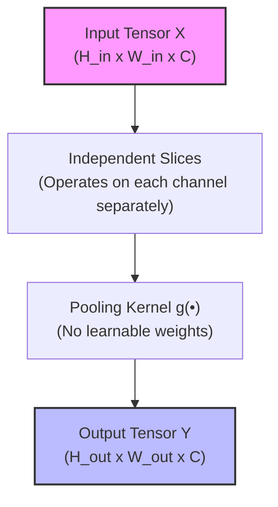

---

### 🚀 2. Why do we need the Pooling Layer?

If we only stacked Convolutional layers, the spatial size of the feature representations would remain large, leading to unsustainable computational overhead. There are 4 fundamental reasons why Pooling is integrated:

1. **Dimensionality Reduction:** 
   By shrinking the width and height of the feature maps, it reduces the total number of activations and parameters in subsequent layers. This lowers the computational cost (FLOPs) and saves GPU memory (RAM) during both training and inference.
   
2. **Prevention of Overfitting:** 
   By reducing the spatial details, the network becomes less prone to memorizing high-frequency noise or specific pixel arrangements from the training set, acting as a form of regularization.
   
3. **Translation Invariance:** 
   Since pooling summarizes local neighborhoods, a slight spatial shift or translation of an object in the input image will result in the same pooled representation. This makes the CNN robust to shifts, rotations, and minor distortions.

4. **Expansion of Receptive Field:** 
   As the spatial dimensions shrink, subsequent convolutional kernels cover a larger relative percentage of the original input image. This allows deeper layers to capture global, high-level abstract features.

---

### 🛠️ 3. Different Types of Pooling

Pooling layers are categorized based on the mathematical function they use to summarize local regions.

#### A) Max Pooling
* **Mathematical Formula:** 
  $$y = \max_{(i, j) \in R} x_{i,j}$$
* **Mechanism:** It extracts the maximum activation value within the pooling window.
* **Feature Preservation:** It is highly effective at preserving prominent, high-contrast features (such as sharp edges, corners, and textures) because it selects the "loudest" activation.

#### B) Average Pooling
* **Mathematical Formula:** 
  $$y = \frac{1}{|R|} \sum_{(i, j) \in R} x_{i,j}$$
* **Mechanism:** It computes the arithmetic mean of all activation values in the window.
* **Feature Preservation:** It acts as a low-pass smoothing filter. It preserves the overall background or continuous contextual signals rather than isolated high-contrast features.

#### C) Global Average Pooling (GAP)
* **Mathematical Formula:** 
  $$y_c = \frac{1}{H \times W} \sum_{i=1}^{H} \sum_{j=1}^{W} x_{i,j,c}$$
* **Mechanism:** Instead of using a sliding window, GAP computes the average value of the *entire* 2D feature map for each channel, mapping an input tensor of $H \times W \times C$ directly to a $1 \times 1 \times C$ vector.
* **Design Advantage:** It is placed at the end of modern CNN architectures (such as ResNet) to replace highly parameterized Fully Connected layers before the final classification. This eliminates millions of trainable parameters, drastically lowering the risk of overfitting.

---

### 🎯 Exam Blueprint (To score 10/10 Marks)
1. **Define the operation:** Explain that pooling does not have any parameters to learn and operates independently on each channel.
2. **State the Dimension Formula:** Include the dimension calculation formula:
   $$H_{out} = \lfloor \frac{H_{in} - f}{s} \rfloor + 1$$
3. **List the 4 Needs:** Use headings like *Dimensionality Reduction*, *Translation Invariance*, *Overfitting Prevention*, and *Receptive Field Expansion*. Explain each.

---

## UNIT I - Convolutional Neural Networks (Continued)

### Q.2 a) Explain all the features of Pooling Layer. [Assumed 10 Marks]

---

### ⚙️ Core Technical Features of a Pooling Layer

Unlike convolutional layers which utilize learned parameters to extract features, the pooling layer acts as a static structural component with unique characteristics:

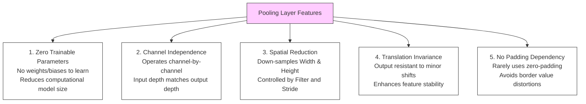

---

### 🔍 Detailed Analysis of Each Feature

#### 1. Zero Trainable Parameters
* **Mechanism:** Traditional Convolutional and Fully Connected layers contain weights and biases that must be learned during training via backpropagation. A pooling layer is a static, deterministic mathematical operator (like taking the maximum or the average). 
* **Impact:** It adds **zero trainable parameters** to the model. This makes pooling extremely lightweight, preventing model files from expanding and reducing the risk of overfitting by limiting the model's capacity to memorize specific training noise.

#### 2. Channel-by-Channel Independence (Depth Preservation)
* **Mechanism:** Pooling does not perform any cross-channel operations. It processes each channel (feature map) of the input tensor independently.
* **Impact:** If the input tensor has dimensions $H_{in} \times W_{in} \times C$, the output tensor will have dimensions $H_{out} \times W_{out} \times C$. The channel depth ($C$) remains completely unchanged, ensuring that the individual feature representations learned by the convolutional filters do not mix or degrade.

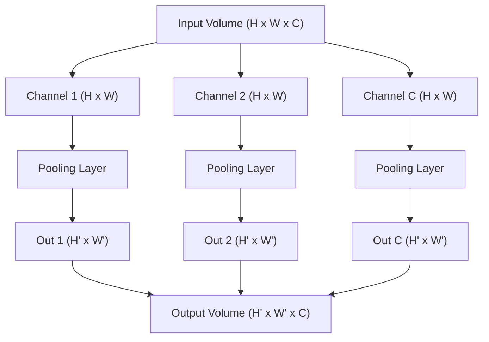

#### 3. Spatial Dimension Reduction (Controlled Shrinkage)
* **Mechanism:** Pooling reduces the spatial resolution of the feature maps using a sliding window of filter size $f \times f$ and stride $s$.
* **Dimension Equation:**
  $$H_{out} = \lfloor \frac{H_{in} - f}{s} \rfloor + 1$$
  $$W_{out} = \lfloor \frac{W_{in} - f}{s} \rfloor + 1$$
* **Impact:** This reduction shrinks the data volume, reducing the computational load (FLOPs) and GPU memory usage of downstream layers.

#### 4. Local Translation Invariance
* **Mechanism:** Because pooling summarizes a local neighborhood into a single value, a slight shift of an object in the input image (which shifts its corresponding activations in the feature map) will still result in the same pooled output.
* **Mathematical Demonstration:**
  Consider a $1 \times 4$ local vector $x = [1, 9, 2, 4]$ going through Max Pooling. The output is $\max(1, 9, 2, 4) = 9$.
  If the input shifts by one position to $x_{\text{shifted}} = [0, 1, 9, 2]$, the Max Pooling output remains $\max(0, 1, 9, 2) = 9$.
* **Impact:** This translation invariance makes the network highly robust to shifts, rotations, and minor distortions in the input images.

#### 5. No Padding Dependency
* **Mechanism:** Unlike Convolution layers, which frequently use zero-padding to preserve image borders, Pooling layers almost never use padding ($p=0$).
* **Impact:** Adding zeros around a border during pooling would skew average pooling calculations (introducing artificial low-value biases) and distort edge detections in max pooling. Thus, pooling is designed to rely on valid regions only.

---

### 🎯 Exam Blueprint (To score 10/10 Marks)
1. **List Features under Bold Headings:** Use clear headings for the five core features: *Zero Trainable Parameters*, *Channel Independence*, *Spatial Dimension Reduction*, *Local Translation Invariance*, and *No Padding Dependency*.
2. **Draw the Channel Routing Flowchart:** Replicate the multi-channel flowchart shown above to demonstrate how input depth ($C$) is preserved through the pooling operation.
3. **Present a Mathematical Invariance Proof:** Show the simple mathematical shift vector example ($[1, 9, 2, 4] \rightarrow [0, 1, 9, 2]$) and calculate the max pooling outputs to visually prove translation invariance to the evaluator.

---

### Q.2 b) Explain Local Response Normalization (LRN). [Assumed 10 Marks]

---

### 🔍 1. Theoretical Conception
**Local Response Normalization (LRN)** is a normalization layer introduced in the landmark AlexNet architecture (2012). It implements **lateral inhibition**—a neurobiological phenomenon where highly active neurons suppress the activity of neighboring neurons, creating high-contrast edge representations.

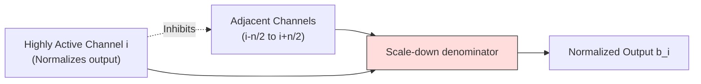

---

### 🧮 2. Mathematical Formulation
LRN normalizes the activation of a neuron at position $(x, y)$ in channel $i$ by dividing it by a factor calculated from the squared sum of activations in adjacent channels at the same spatial location:

$$b_{x,y}^i = \frac{a_{x,y}^i}{\left( k + \alpha \sum_{j=\max(0, i-n/2)}^{\min(N-1, i+n/2)} (a_{x,y}^j)^2 \right)^\beta}$$

*Where:*
* $a_{x,y}^i$ is the raw activation of a neuron in channel $i$ at position $(x, y)$.
* $b_{x,y}^i$ is the normalized output activation.
* $N$ is the total number of channels in the layer.
* $n$ is the size of the normalization neighborhood (number of adjacent channels to sum over).
* $k, \alpha, \beta$ are hyperparameters (standard settings: $k=2, n=5, \alpha=10^{-4}, \beta=0.75$).

---

### 🚀 3. Purpose and Modern Obsolescence

#### A) Bounding ReLU Activations
Because the ReLU activation function is unbounded for positive inputs ($f(x) = x$), adjacent activation layers can output extremely large values. LRN dampens these high-frequency spikes, acting as a stabilizer.

#### B) Contrast Enhancement
LRN creates competition between adjacent feature channels, boosting strong, distinctive feature detections and suppressing flat background noise.

#### C) Modern Replacement: Batch Normalization (BatchNorm)
In modern CNN architectures (like ResNet), LRN has been replaced by **Batch Normalization (BatchNorm)**. While LRN normalizes across channels within a single sample, BatchNorm normalizes activations across a mini-batch of training samples. BatchNorm is much more stable, easier to compute, and provides a stronger regularizing effect.

---

### 🎯 Exam Blueprint (To score 10/10 Marks)
1. **Present the Mathematical Formula:** Write out the LRN equation inside a box. Clearly define every variable ($a_{x,y}^i, b_{x,y}^i, k, \alpha, \beta, N, n$).
2. **Explain the Neurobiological Inspiration:** Discuss **Lateral Inhibition** and how it enhances contrast between competing channels.
3. **Contrast LRN with Batch Normalization:** Explain *why* modern networks favor BatchNorm (mini-batch scale stabilization and easier training convergence).

---

### Q.2 c) Explain ReLU Layer in detail. [Assumed 10 Marks]

---

### 📈 1. Mathematical Foundation of ReLU
The **Rectified Linear Unit (ReLU)** is a piecewise linear activation function defined mathematically as:
$$f(x) = \max(0, x)$$

#### Derivative (Gradient) of ReLU:
The derivative of ReLU is defined as:
$$f'(x) = \begin{cases} 1 & \text{if } x > 0 \\ 0 & \text{if } x < 0 \end{cases}$$

```mermaid
graph TD
    subgraph Negative Input (x < 0)
        NegIn[Input x < 0] --> NegOut[Output = 0] --> NegGrad[Gradient = 0]
    end
    subgraph Positive Input (x >= 0)
        PosIn[Input x >= 0] --> PosOut[Output = x] --> PosGrad[Gradient = 1]
    end
    
    style NegOut fill:#fdd,stroke:#333
    style PosOut fill:#dfd,stroke:#333
```

ReLU is highly popular because it resolves the **vanishing gradient problem** for positive inputs and is extremely computationally efficient on GPUs.

---

### ⚠️ 2. In-Depth Analysis of the Disadvantages of ReLU

Despite its widespread use, ReLU has three major mathematical and operational disadvantages:

#### A) The "Dying ReLU" Problem (Permanent Neuron Deactivation)
* **The Mechanism:** During training, if a large gradient update shifts a neuron's weights such that the input $x$ to the ReLU function is always negative ($x < 0$), the ReLU output will always be $0$. 
* **The Impact:** Since the output is constant, its gradient is exactly **$0$**. During backpropagation, no gradient can flow backward through this neuron. The weights will never update again, and the neuron becomes permanently deactivated ("dead"). If a large portion of the network dies, performance degrades significantly.

#### B) Non-Zero Centered Outputs
* **The Mechanism:** ReLU outputs are either $0$ or positive ($f(x) \ge 0$). They can never be negative.
* **The Impact:** If all outputs of a layer are positive, then during backpropagation, the gradients calculated for the weights in the next layer will all have the **same sign** (either all positive or all negative). This forces the weight updates to swing back and forth ("zig-zag") in a highly inefficient manner, slowing down training and convergence.

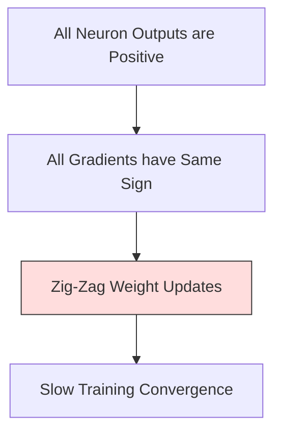

#### C) Unbounded Output (Risk of Gradient Explosion)
* **The Mechanism:** For positive inputs, ReLU is completely unbounded ($f(x) = x$).
* **The Impact:** Without proper weight initialization, regularizations, or Batch Normalization layers, activation values can grow exponentially as they pass through deep layers, potentially leading to numerical instability and **exploding gradients**.

---

### 🎯 Exam Blueprint (To score 10/10 Marks)
1. **Write the Core Formulas and Graph:** Present the piecewise equation for ReLU and draw its graph.
2. **Detail the Disadvantages Separately:** Use bold subheadings for **The "Dying ReLU" Problem**, **Non-Zero Centered Outputs**, and **Unbounded Outputs**, writing at least 4-5 lines of mathematical explanation for each.
3. **Illustrate the Dying ReLU Mechanism:** Recreate the flowchart showing how positive-only activations lead to zig-zag updates.

---
---

## UNIT II - Recurrent Neural Networks (RNN)

### Q.3 a) Explain Recursive Neural Network. [Assumed 10 Marks]

---

### 🔍 1. Architectural Concept
A **Recursive Neural Network** is a generalization of a recurrent neural network that processes inputs hierarchically over a structured, tree-like topology rather than sequentially over a linear chain. 

It is designed to model datasets where elements have hierarchical relationships, such as the syntactic parse trees of sentences in natural language processing or the nested hierarchies of molecular structures.

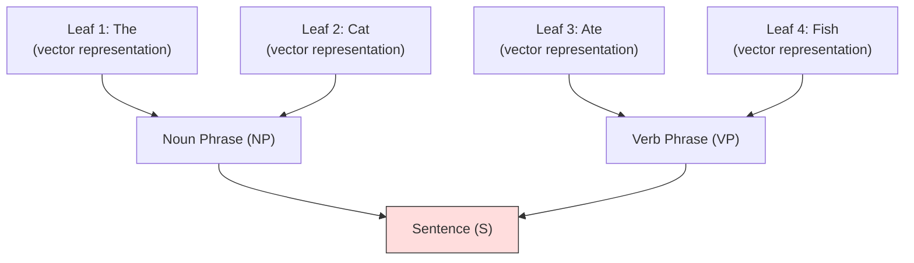

---

### ⚙️ 2. Structural and Mathematical Mechanics

Instead of iterating over chronological time steps $t$, a Recursive Neural Network operates over branch nodes in a tree structure:

1. **Information Flow:** It processes data from the bottom (leaf nodes representing raw inputs) up to the top (root node representing global representation).
2. **Combination weights:** To combine two child nodes $C_1 \in \mathbb{R}^d$ and $C_2 \in \mathbb{R}^d$ into a single parent node representation $P \in \mathbb{R}^d$, the network uses a **shared weight matrix** $W \in \mathbb{R}^{d \times 2d}$:
   $$P = f\left( \mathbf{W} \cdot \begin{bmatrix} C_1 \\ C_2 \end{bmatrix} + \mathbf{b} \right)$$
   *(where $f$ is a non-linear activation function like $\tanh$).*
3. **Recursive Execution:** This combination operation is applied recursively up the tree until a single root vector is computed, which is then passed to a classifier (such as Softmax).

---

### 📊 3. Comparison: Recurrent (RNN) vs. Recursive Neural Network

| Parameter | Recurrent Neural Network (RNN) | Recursive Neural Network |
| :--- | :--- | :--- |
| **Topology** | **Linear Chain** (1D sequential timeline). | **Hierarchical Tree** (directed acyclic tree). |
| **Operational Step** | Iterates over **time steps** ($t = 1, 2, 3 \dots$). | Iterates over **structural combinations**. |
| **Weight Sharing** | Weights are shared across **temporal steps**. | Weights are shared across **all branches**. |
| **GPU Efficiency** | **High.** Linear sequences are highly parallelizable on modern hardware. | **Low.** Dynamic, variable tree parsing is difficult to optimize and run on GPUs. |
| **Best Use Case** | Speech streams, time-series, flat text documents. | Grammatical parse trees, nested computer code. |

---

### 🎯 Exam Blueprint (To score 10/10 Marks)
1. **Draw the Hierarchical Tree:** Recreate the sentence parsing diagram ("The cat ate fish") showing leaf nodes merging into a sentence root.
2. **Present the Combination Equation:** Write out the parent node calculation equation inside a box, clearly defining children vectors ($C_1, C_2$) and the shared combination weight matrix ($W$).
3. **Contrast with RNNs:** Include the detailed comparison table highlighting differences in topology, temporal steps, and computational efficiency.

---

### Q.3 b) Explain the LSTM in RNN. [Assumed 10 Marks]

---

### 🔍 1. Concept Overview
Standard RNNs suffer from **vanishing gradients** over long sequences, which limits their effective memory to a few steps. **LSTM** (introduced by Hochreiter and Schmidhuber in 1997) resolves this by separating the hidden state into two components and introducing **three gating mechanisms** that control the flow of information.

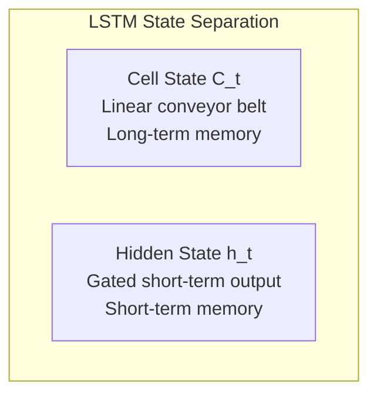

* **The Cell State ($C_t$):** Runs linearly through the sequence like a conveyor belt, allowing gradients to flow backward through time without decaying.
* **The Hidden State ($h_t$):** The output state used for immediate predictions.

---

### ⚙️ The Three Gate Mechanisms and Their Math:

Each gate uses a Sigmoid activation function ($\sigma$) to output a scaling factor between $0$ (completely closed) and $1$ (completely open).

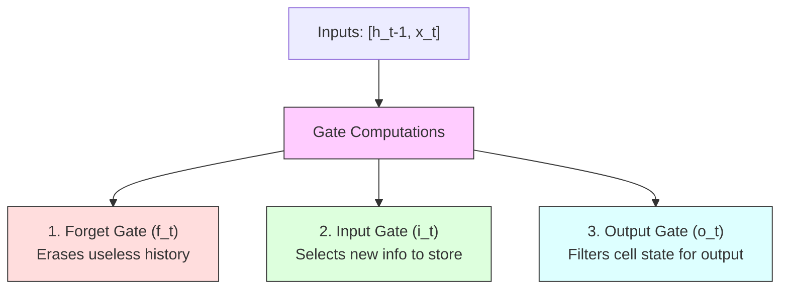

#### Step 1: The Forget Gate ($f_t$) - *Deciding what to discard*
It looks at the previous hidden state $h_{t-1}$ and current input $x_t$, and decides what information to erase from the long-term cell state:
$$f_t = \sigma(W_f \cdot [h_{t-1}, x_t] + b_f)$$

#### Step 2: The Input Gate ($i_t$) & Candidate State ($\tilde{C}_t$) - *Deciding what to learn*
Determines what new information to write into the cell state.
* The input gate $i_t$ decides *which* values to update:
  $$i_t = \sigma(W_i \cdot [h_{t-1}, x_t] + b_i)$$
* The candidate state $\tilde{C}_t$ generates *new potential values* using a $\tanh$ activation:
  $$\tilde{C}_t = \tanh(W_c \cdot [h_{t-1}, x_t] + b_c)$$

#### Step 3: Updating the Cell State ($C_t$)
Combines the forget and input decisions to update the long-term memory:
$$C_t = f_t * C_{t-1} + i_t * \tilde{C}_t$$

#### Step 4: The Output Gate ($o_t$) & Hidden State ($h_t$) - *Deciding what to output*
Extracts the short-term memory ($h_t$) from the long-term conveyor belt ($C_t$):
$$o_t = \sigma(W_o \cdot [h_{t-1}, x_t] + b_o)$$
$$h_t = o_t * \tanh(C_t)$$

---

### 🎯 Exam Blueprint (To score 10/10 Marks)
1. **Draw the LSTM Cell Diagram:** Draw the internal gated structure of the LSTM cell (labeling Forget, Input, and Output gates) and the linear Cell State line.
2. **Present the Six Core Equations:** Write out all six LSTM equations in a clear layout, explaining the role of the Sigmoid and Tanh activations.

---

### Q.3 c) Explain in brief about working of RNN. [Assumed 10 Marks]

---

### 🔍 1. System Conception
A **Recurrent Neural Network (RNN)** is a class of neural network designed to process **sequential data** or **time-series data** where the order of elements matters. Unlike traditional feedforward networks, RNNs process sequence elements chronologically by utilizing internal feedback loops. This creates an internal hidden state ($h_t$) which acts as a persistent memory across time steps.

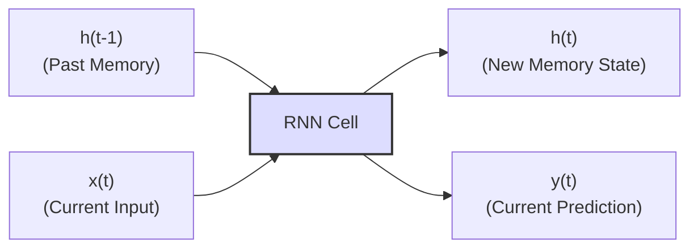

---

### ⚙️ 2. Computational Flow and Working Mechanism

An RNN processes sequences step-by-step. At each time step $t$, the cell accepts the current input $x_t$ along with the hidden state from the previous step ($h_{t-1}$) to calculate the new hidden state ($h_t$) and output ($y_t$).

#### The Mathematical Recurrence Equations:

$$h_t = \tanh(W_{xh} \cdot x_t + W_{hh} \cdot h_{t-1} + b_h)$$
$$y_t = W_{hy} \cdot h_t + b_y$$

*Where:*
* $x_t \in \mathbb{R}^d$ is the input vector at time step $t$.
* $h_t \in \mathbb{R}^h$ is the updated hidden state vector representing memory.
* $h_{t-1} \in \mathbb{R}^h$ is the previous step's hidden state.
* $W_{xh}, W_{hh}, W_{hy}$ are **shared weight matrices** reused across every single time step.
* $b_h, b_y$ are bias vectors.
* $\tanh$ is the activation function squashing memory states between $-1$ and $+1$ to keep memory numbers stable.

---

### 🎯 Exam Blueprint (To score 10/10 Marks)
1. **Draw the Unfolded Graph:** Sketch how the recurrence loops unfold into a sequential chain of nodes (from $t=1$ to $t=3$), displaying the horizontal flow of the hidden state ($h$).
2. **Present the mathematical formulations:** Write out the recurrence equations clearly. Label every single variable and state that weight matrices are shared across time steps.

---

### Q.4 a) Difference between CNN vs RNN. [Assumed 10 Marks]

---

### 🔍 1. Paradigm Distinctions
* **Convolutional Neural Networks (CNNs):** Designed for spatial, grid-structured data (like 2D images). They extract features using sliding windows (filters) to capture local spatial correlations, assuming spatial relationships are shift-invariant.
* **Recurrent Neural Networks (RNNs):** Designed for chronological, sequential data (like text or speech). They process inputs step-by-step, maintaining an internal feedback state to carry memory across time.

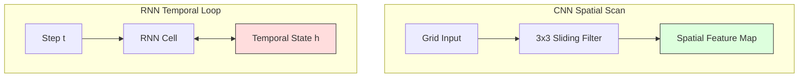

---

### 📊 2. Comprehensive Comparison: CNN vs. RNN

| Comparison Attribute | Convolutional Neural Network (CNN) | Recurrent Neural Network (RNN) |
| :--- | :--- | :--- |
| **Data Suitability** | Spatial grid data (images, video frames, spectrograms). | Temporal sequence data (natural language, speech, time-series). |
| **Internal Connectivity** | Feedforward structure. Output flows in one direction from input to output. | Recurrent structure. Features feedback loops to carry state memory over time. |
| **Mathematical Core** | Spatial sliding convolution / cross-correlation operations. | Temporal recurrence state transitions ($h_t = f(h_{t-1}, x_t)$). |
| **Receptive Field** | Determined by the size of convolutional kernels and network depth. | Theoretically infinite over time, restricted in practice by gradient decay. |
| **Weight Sharing** | Shared across **spatial grid locations** (reusing filters). | Shared across **temporal steps** (reusing transition matrices). |
| **Input Dimensions** | Requires fixed-size input volumes (e.g. $224 \times 224 \times 3$). | Can process variable-length input sequences dynamically. |
| **Hardware Efficiency**| Highly parallelizable on GPUs (fast training). | Extremely difficult to parallelize over time steps (slower training). |

---

### 🎯 Exam Blueprint (To score 10/10 Marks)
1. **Draw Schematic Paradigms:** Sketch the spatial grid filter scan for CNNs and the unrolled temporal chain for RNNs side-by-side.
2. **Present the Comparative Table:** Recreate the 7-row parameter table addressing data, connections, math, receptive fields, weight sharing, input size, and efficiency.

---

### Q.4 b) What are the challenges of Long-Term Dependencies? [Assumed 10 Marks]

---

### 🔍 1. Theoretical Conception
The challenge of **Long-Term Dependencies** refers to the difficulty that standard Recurrent Neural Networks (vanilla RNNs) face when trying to connect and learn relationships between elements separated by large temporal gaps in a sequence.

For example, in the sentence:
> *"I grew up in **France**... [many intervening sentences]... so I can speak fluent **French**."*

To predict the word "French", the network must carry the memory of the word "France" across many intervening steps. Vanilla RNNs fail to do this due to the mathematical limits of **Backpropagation Through Time (BPTT)**.

---

### 🧮 2. Mathematical Proof of Gradient Decay
To understand why this happens, we must analyze how gradients are computed during backpropagation. The hidden state at step $t$ is calculated recursively as:
$$h_t = \tanh(W_{hh} h_{t-1} + W_{xh} x_t + b_h)$$

During BPTT, to calculate how the loss at the final step $T$ is affected by the hidden state at an early step $t$, we apply the chain rule:

$$\frac{\partial L_T}{\partial h_t} = \frac{\partial L_T}{\partial h_T} \cdot \prod_{k=t+1}^{T} \frac{\partial h_k}{\partial h_{k-1}}$$

Let's evaluate the Jacobian matrix of the state transition, $\frac{\partial h_k}{\partial h_{k-1}}$:
$$\frac{\partial h_k}{\partial h_{k-1}} = \text{diag}(1 - \tanh^2(\cdot)) \cdot W_{hh}$$

Since the derivative of $\tanh$ lies in the range $(0, 1]$, the product term simplifies to repeatedly multiplying the recurrent weight matrix $W_{hh}$:

$$\prod_{k=t+1}^{T} \frac{\partial h_k}{\partial h_{k-1}} \propto (W_{hh})^{T-t}$$

This exponential term $(W_{hh})^{T-t}$ leads to two major training failures:

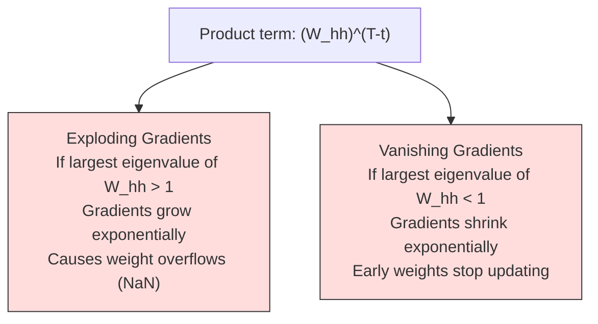

---

### 🛠/🚀 3. Standard Engineering Remedies
1. **Gated Architectures (LSTMs & GRUs):** Introduce a linear cell state conveyor belt ($C_t$), which allows gradients to flow backward through time via simple addition instead of exponential multiplication, preventing vanishing gradients.
2. **Gradient Clipping:** Caps gradients at a maximum threshold value to prevent exploding gradients from causing numerical overflow.
3. **Unitary/Orthogonal Weight Initialization:** Initializes the recurrent weight matrix $W_{hh}$ as an orthogonal matrix (eigenvalues exactly $1.0$) to stabilize gradient scaling.

---

### 🎯 Exam Blueprint (To score 10/10 Marks)
1. **Present the Mathematical Proof:** Write out the chain-rule product equation $\prod \frac{\partial h_k}{\partial h_{k-1}}$ and the resulting exponential relation $(W_{hh})^{T-t}$.
2. **Explain the Two Gradient Problems:** Use separate headings for **Vanishing Gradients** and **Exploding Gradients**, explaining their causes and effects on training stability.

---

### Q.4 c) Explain Encoder-Decoder RNN Model. [Assumed 10 Marks]

---

### 🔍 1. Introduction to Sequence-to-Sequence (Seq2Seq)
The **Encoder-Decoder (Sequence-to-Sequence)** model is an architecture designed to convert an input sequence from one domain into an output sequence in another domain, where the two sequences can be of completely different lengths (Many-to-Many asynchronous).

It is composed of two primary recurrent networks: an **Encoder** and a **Decoder**, bridged by a bottleneck representation called the **Context Vector**.

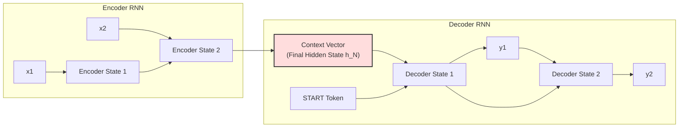

---

### ⚙️ 2. Detailed Functional Workflow

#### A) The Encoder (Information Compression)
* **Role:** Reads and processes the input sequence word-by-word.
* **Mechanism:** Processes the input tokens ($x_1, x_2, \dots, x_N$) step-by-step. At each time step, it updates its hidden state. It continues until it processes the entire sequence, culminating in an **`<EOS>` (End of Sequence)** token.
* **Output:** The final hidden state of the Encoder, containing a dense mathematical summary of the full input sequence.

#### B) The Context Vector (The Bottleneck)
* **Role:** The information bridge between input and output.
* **Mechanism:** It is a fixed-size vector of floating-point numbers. It holds the compressed semantic meaning of the entire source sequence, serving as the starting state for the decoder.

#### C) The Decoder (Information Generation)
* **Role:** Translates the Context Vector back into a readable output sequence.
* **Mechanism:** 
  1. It initializes its hidden state using the **Context Vector**.
  2. It receives a **`<SOS>` (Start of Sequence)** token as its first input.
  3. It predicts the first output token $y_1$.
  4. In the next step, the prediction $y_1$ is fed back into the decoder as the input, combined with the updated hidden state, to predict $y_2$.
  5. It continues generating tokens sequentially until it produces the **`<EOS>`** token, ending the generation.

---

### 🎯 Exam Blueprint (To score 10/10 Marks)
1. **Draw the comprehensive architecture:** Recreate the Encoder-Decoder schematic showing sequential input processing, the bottleneck Context Vector, and the step-by-step Decoder generation loop. Use `<SOS>` and `<EOS>` labels.
2. **Describe each block sequentially:** Detail the functional responsibilities of the *Encoder*, *Context Vector*, and *Decoder*.
