# Deep Learning (410251) - Semester VIII
## Paper 3: [6404]-95 Solution (Second Half: Units III & IV)
### ⚠️ Assumed Weightage: Each Sub-Question is solved for a full 10 Marks standard.

---

## UNIT III - Generative Models & GAN

### Q.5 a) Explain Deep Generative Model. [Assumed 10 Marks]

---

### 🔍 1. Conceptual Definition
A **Deep Generative Model (DGM)** is a class of unsupervised deep learning algorithms designed to approximate and generate samples from complex, high-dimensional real-world data distributions (such as natural images, speech, or text). 

Unlike discriminative models that predict labels given data, DGMs learn the joint probability distribution of the data space, allowing them to synthesize entirely new samples that share the statistical characteristics of the training dataset.

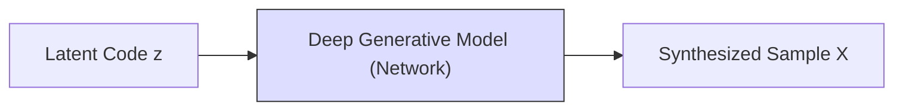

---

### 🛠️ 2. Core Methodological Taxonomy

Deep Generative Models are classified based on how they define and optimize the data likelihood:

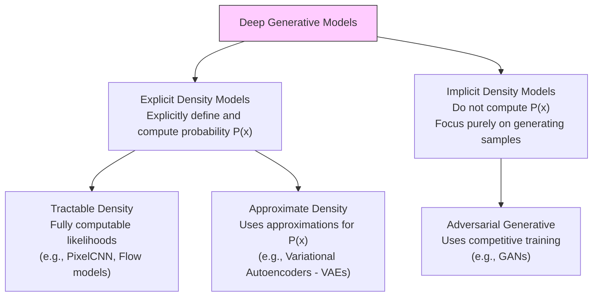

#### A) Variational Autoencoders (VAEs) - *Explicit Approximate Density*
* **Mechanism:** Maps input data $x$ to a low-dimensional latent space representation $z$ using an encoder network $q_\phi(z \mid x)$, and reconstructs the data using a decoder network $p_\theta(x \mid z)$.
* **Optimization Goal:** Maximizes the **Evidence Lower Bound (ELBO)**, balancing reconstruction quality with latent space regularization (via Kullback-Leibler divergence):
  $$\text{ELBO}(\theta, \phi; x) = \mathbb{E}_{q_\phi(z \mid x)}[\log p_\theta(x \mid z)] - KL(q_\phi(z \mid x) \parallel p(z))$$

#### B) Generative Adversarial Networks (GANs) - *Implicit Density*
* **Mechanism:** Skips explicit likelihood calculations entirely. Instead, it sets up an adversarial game between a Generator ($G$) and a Discriminator ($D$) to refine generated samples until they match the real data distribution.

#### C) Diffusion Models - *Reversible Noise Mapping*
* **Mechanism:** Generates data by reversing a progressive noise-addition process. It learns to gradually remove Gaussian noise from a starting latent vector until a clean, high-fidelity sample is restored.

---

### 🎯 Exam Blueprint (To score 10/10 Marks)
1. **Define Deep Generative Modeling:** Contrast the generative objective ($P(X)$ or $P(X,Y)$) with the discriminative objective ($P(Y \mid X)$).
2. **Draw the Taxonomy Tree:** Recreate the Mermaid tree diagram classifying models into *Explicit Tractable*, *Explicit Approximate*, and *Implicit* density frameworks.
3. **Explain VAEs and the ELBO equation:** Write down the ELBO optimization formula inside a box and explain the role of its reconstruction and regularization terms.

---

### Q.5 b) Explain Boltzmann Machine in details. [Assumed 10 Marks]

---

### 🔍 1. System Conception
A **Boltzmann Machine** is an energy-based, undirected graphical model (a stochastic recurrent neural network) designed to learn the underlying probability distribution of a given dataset in an unsupervised fashion. Introduced by Geoffrey Hinton and Terry Sejnowski in 1985, it is rooted in the principles of statistical mechanics and thermodynamics.

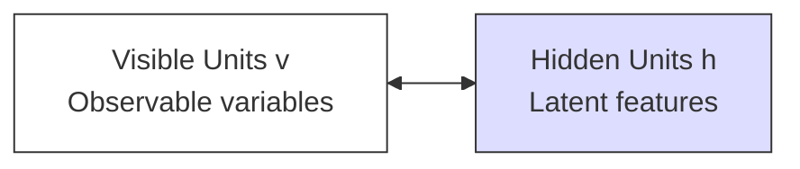

---

### ⚙️ 2. Core Architectural Components
A Boltzmann Machine is composed of binary stochastic units $s_i \in \{0, 1\}$ or $\{-1, 1\}$ divided into two distinct layers:
1. **Visible Units ($\mathbf{v}$):** The input layer representing the observable data variables from the environment.
2. **Hidden Units ($\mathbf{h}$):** Latent variables that capture complex, high-order statistical correlations and dependencies among the visible units.

#### Topological Characteristics:
* **Undirected Connections:** The connections between units are undirected and symmetric, meaning the weight $w_{ij}$ from unit $i$ to unit $j$ is identical to the weight $w_{ji}$ from unit $j$ to unit $i$ ($w_{ij} = w_{ji}$).
* **No Self-Connections:** A unit is never connected to itself ($w_{ii} = 0$).
* **Stochastic Behavior:** Units update their states probabilistically based on the states of their neighbors and their own internal biases.

---

### ⚡ 3. Mathematical Foundations: The Energy Concept

Boltzmann Machines are **energy-based models**. The network assigns a scalar energy value to every possible joint configuration of visible units $v$ and hidden units $h$.

#### A) Energy Function of a State:
The energy of a specific joint state configuration $(v, h)$ is defined mathematically as:

$$E(v, h) = -\sum_{i} a_i v_i - \sum_{j} b_j h_j - \sum_{i} \sum_{j} w_{ij} v_i h_j$$

*Where:*
* $v_i$ is the binary state of visible unit $i$.
* $h_j$ is the binary state of hidden unit $j$.
* $w_{ij}$ is the symmetric weight between visible unit $i$ and hidden unit $j$.
* $a_i$ is the bias term for visible unit $i$.
* $b_j$ is the bias term for hidden unit $j$.

#### B) Probabilistic State Distribution (Gibbs/Boltzmann Distribution):
The probability of the network occupying a specific joint configuration $(v, h)$ is inversely proportional to its energy, governed by the Boltzmann distribution:

$$P(v, h) = \frac{e^{-E(v, h)}}{Z}$$

*Where $Z$ is the **Partition Function**, which acts as a normalizing constant summing the raw probabilities of all possible configurations:*
$$Z = \sum_{\mathbf{v}'} \sum_{\mathbf{h}'} e^{-E(\mathbf{v}', \mathbf{h}')}$$

---

### 🎯 Exam Blueprint (To score 10/10 Marks)
1. **Present the Mathematical Formulas:** Write out the formal equations for the Energy function $E(v,h)$, the Boltzmann Probability distribution $P(v,h)$, and the Partition Function $Z$ inside prominent boxes.
2. **Explain the partition function bottleneck:** Specifically explain *why* General Boltzmann Machines are computationally intractable ($O(2^N)$ state space) and how RBMs solve this via conditional independence.

---

### Q.5 c) Explain in brief GAN with an example. [Assumed 10 Marks]

---

### 🔍 1. System Conception
A **Generative Adversarial Network (GAN)** is a class of generative deep learning models introduced by Ian Goodfellow in 2014. It operates on a game-theoretic framework where two neural networks are trained simultaneously in a zero-sum, minimax game:
1. **The Generator ($G$):** A generative network that learns to capture the data distribution to synthesize realistic, fake data samples from random noise.
2. **The Discriminator ($D$):** A discriminative network that acts as a binary classifier, learning to distinguish between real data from the training set and fake data generated by the Generator.

---

### 🗺️ 2. Detailed Architectural Pipeline

The diagram below represents the closed-loop adversarial training process of a GAN:

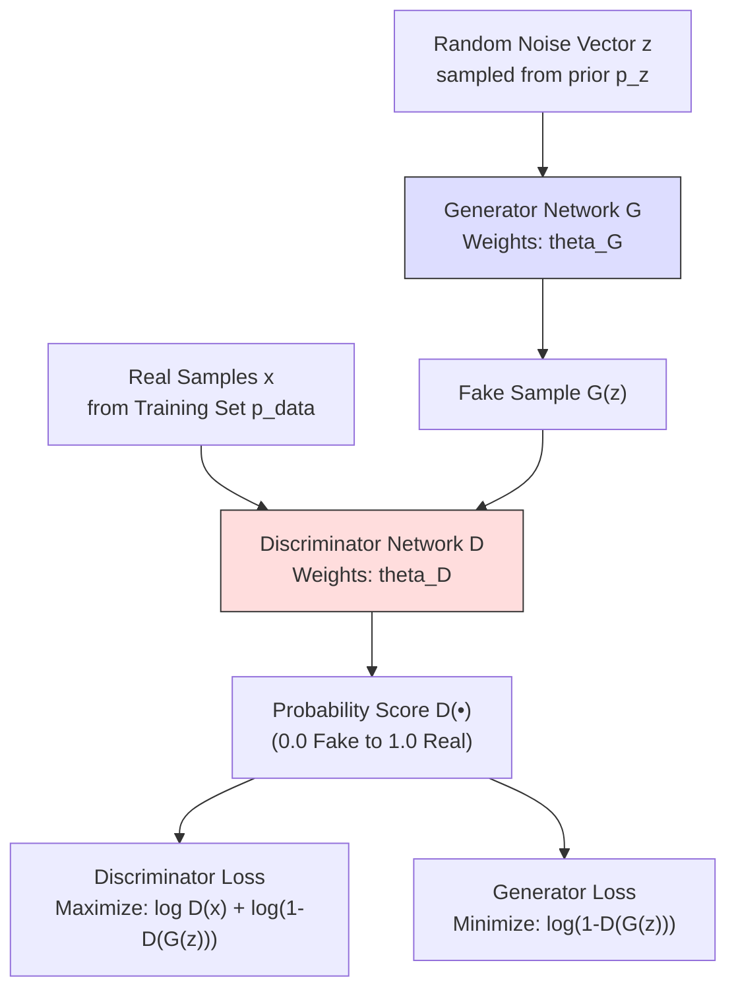

---

### 🧮 3. The Minimax Objective Function
The adversarial game is trained using a single minimax objective function with the value function $V(D, G)$:

$$\min_{G} \max_{D} V(D, G) = \mathbb{E}_{x \sim p_{\text{data}}}[\log D(x)] + \mathbb{E}_{z \sim p_{z}}[\log (1 - D(G(z)))]$$

#### Detailed Breakdown of Mathematical Terms:
* **$\max_{D}$:** The Discriminator attempts to maximize this value function. It wants $D(x)$ to be near $1$ (making $\log D(x) \to 0$) and $D(G(z))$ to be near $0$ (making $\log(1 - D(G(z))) \to 0$).
* **$\min_{G}$:** The Generator attempts to minimize this value function. It wants $D(G(z))$ to be near $1$, which drives $(1 - D(G(z))) \to 0$ and causes the second term to become highly negative ($-\infty$).
* **$\mathbb{E}_{x \sim p_{\text{data}}}$:** Represents the expected value (average) over the real training dataset.
* **$\mathbb{E}_{z \sim p_{z}}$:** Represents the expected value over the random noise input vector prior.

---

### 📝 4. Concrete Example: Handwritten Digit Generation (MNIST)
Consider training a GAN to generate realistic $28 \times 28$ grayscale images of handwritten digits:

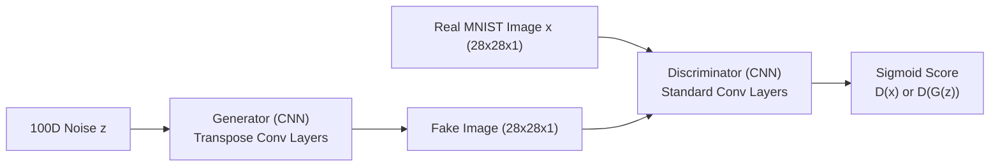

1. **Input:** A random $100$-dimensional vector of noise $z$ is fed to the **Generator**.
2. **Generation:** The Generator passes $z$ through a series of Transposed Convolution (Deconvolution) layers up-sampling the vector into a $28 \times 28 \times 1$ image of a fake digit.
3. **Discrimination:** The **Discriminator** receives a mixture of these generated fake digits and real handwritten digit images from the MNIST dataset. It runs standard Convolutional layers with a Sigmoid activation function to output a prediction between $0.0$ and $1.0$.
4. **Gradient Updates:** 
   * If the Discriminator correctly identifies the fake, the Generator receives a strong loss penalty, updating its weights to generate more convincing digits next time.
   * If the Generator successfully fools the Discriminator, the Discriminator is penalized, updating its weights to become more critical in its classification.

---

### 🎯 Exam Blueprint (To score 10/10 Marks)
1. **Draw the Full GAN Pipeline:** Recreate the block diagram showing the parallel flows of real samples and random noise leading to the generator, discriminator, and final loss calculations.
2. **Present the Minimax Formula:** Write the minimax equation in a prominent box. Explain every single mathematical term ($\mathbb{E}_{x \sim p_{data}}, D(x), D(G(z))$) in detail.

---

### Q.6 a) Explain Deep Belief Networks in detail. [Assumed 10 Marks]

---

### 🔍 1. Concept Definition
A **Deep Belief Network (DBN)** is a generative graphical model composed of multiple layers of latent, stochastic variables. Introduced by Geoffrey Hinton in 2006, it was one of the first successful architectures to train deep networks, overcoming the challenges of random weight initialization.

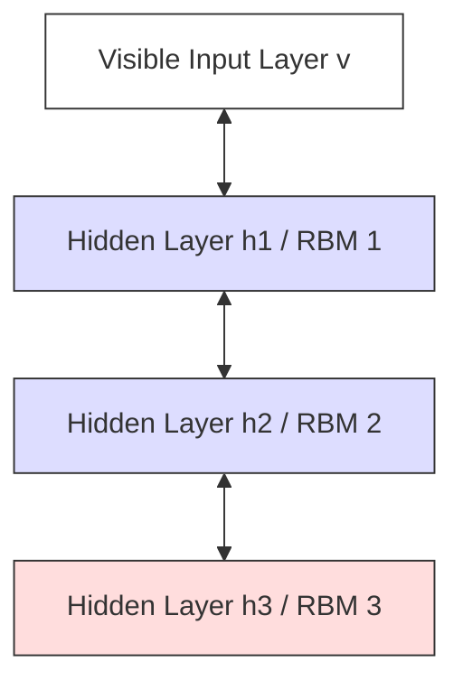

---

### ⚙️ 2. Architectural Structure
A DBN is constructed by stacking multiple **Restricted Boltzmann Machines (RBMs)** on top of each other:
* **The Top Two Layers:** Form an undirected associative memory, with symmetric connections ($\leftrightarrow$) similar to a standard RBM.
* **The Lower Layers:** Have directed connections ($\to$) pointing downwards toward the visible input layer, acting as a sigmoid belief network.

---

### 🛠️ 3. The Two-Stage Training Procedure:

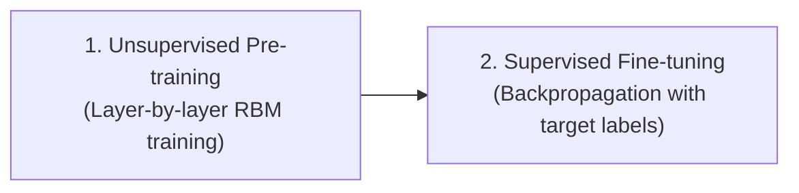

#### A) Unsupervised Pre-training (Greedy Layer-by-Layer):
* The first RBM is trained on the raw inputs using Contrastive Divergence.
* Once trained, its weights are frozen, and its hidden activations are used as inputs to train the second RBM.
* This process is repeated layer-by-layer up the stack.
* *Purpose:* This unsupervised pre-training acts as a smart weight initialization technique, placing the model's parameters in a favorable region of the parameter space and resolving the vanishing gradient issues of random initialization.

#### B) Supervised Fine-tuning:
* A classification layer (like Softmax) is added to the top of the network.
* The entire network is trained on labeled data using standard **Backpropagation** to fine-tune the pre-trained weights for the target task.

---

### 🎯 Exam Blueprint (To score 10/10 Marks)
1. **Draw the DBN Stack:** Recreate the stacked RBM diagram shown above, showing visible inputs at the bottom and multiple hidden layers rising hierarchically.
2. **Outline the 2-Stage training pipeline:** Use a flowchart or distinct subheadings to explain **Unsupervised Pre-training** (layer-by-layer RBM training) and **Supervised Fine-tuning** (backpropagation). This distinction is highly scored!

---

### Q.6 b) What is Generative Adversarial Network? Explain its components. [Assumed 10 Marks]

---

### ⚙️ 1. Detailed Component Mechanics

#### A) The Generator ($G$)
* **Objective:** Map a low-dimensional latent noise vector $z$ (sampled from a simple prior distribution $p_z$, such as a Gaussian) to a high-dimensional synthetic sample $G(z)$ that mimics the real data distribution $p_{data}$.
* **Mathematical Function:** $G(z; \theta_G) \colon Z \to X$.
* **Goal:** Maximize the probability that the Discriminator classifies its generated output as real: $D(G(z)) \to 1.0$.

#### B) The Discriminator ($D$)
* **Objective:** Act as a supervisor that evaluates input samples and classifies them as real or fake.
* **Mathematical Function:** $D(x; \theta_D) \colon X \to [0, 1]$.
* **Goal:** Output a probability score near $1.0$ for real training samples ($D(x) \to 1.0$) and a score near $0.0$ for fake generated samples ($D(G(z)) \to 0.0$).

---

### 🧮 2. The Minimax Objective Function
The adversarial game is trained using a single minimax objective function with the value function $V(D, G)$:

$$\min_{G} \max_{D} V(D, G) = \mathbb{E}_{x \sim p_{\text{data}}}[\log D(x)] + \mathbb{E}_{z \sim p_{z}}[\log (1 - D(G(z)))]$$

#### Detailed Breakdown of Mathematical Terms:
* **$\max_{D}$:** The Discriminator attempts to maximize this value function. It wants $D(x)$ to be near $1$ (making $\log D(x) \to 0$) and $D(G(z))$ to be near $0$ (making $\log(1 - D(G(z))) \to 0$).
* **$\min_{G}$:** The Generator attempts to minimize this value function. It wants $D(G(z))$ to be near $1$, which drives $(1 - D(G(z))) \to 0$.

```mermaid
graph TD
    Noise[Random Noise Vector z] --> Gen[Generator Network G] --> Fake[Fake Image G(z)] --> Disc[Discriminator Network D]
    Real[Real Dataset x] --> Disc
    Disc --> Score[Real / Fake Score]
    Score --> LossD[Update Discriminator D]
    Score --> LossG[Update Generator G]
    
    style Gen fill:#ddf,stroke:#333
    style Disc fill:#fdd,stroke:#333
```

---

### 🎯 Exam Blueprint (To score 10/10 Marks)
1. **Explain the Minimax Framework:** Write out Ian Goodfellow's objective equation inside a prominent box and define its individual terms.
2. **Detail Generator & Discriminator Roles:** Explain their inputs, outputs, and mathematical objectives under separate headings.

---

### Q.6 c) Explain types of GAN. [Assumed 10 Marks]

---

### ⚙️ 1. Different Types of GAN architectures

#### A) Vanilla GAN
* **Objective:** The baseline model which uses a standard minimax objective with no class labels or constraints. It maps random noise $z \sim p_z$ to fake samples $G(z)$.
* **Limitation:** Highly unstable training, prone to **mode collapse** (where the generator outputs identical samples), and suffers from vanishing gradients when the discriminator becomes too strong.

#### B) Conditional GAN (CGAN)
* **Objective:** Introduces an auxiliary conditioning variable $y$ (such as class labels or text embeddings) to direct the generation process, allowing us to generate specific classes of data:
  $$\min_G \max_D V(D, G) = \mathbb{E}_{x \sim p_{data}}[\log D(x \mid y)] + \mathbb{E}_{z \sim p_z}[\log(1 - D(G(z \mid y) \mid y))]$$

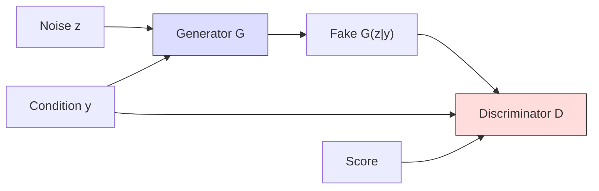

#### C) Deep Convolutional GAN (DCGAN)
* **Objective:** Replaces standard fully connected networks with deep spatial Convolutional networks, establishing strict structural guidelines to stabilize training (no spatial pooling layers, use of BatchNorm, LeakyReLU, and specific output layers).

#### D) Wasserstein GAN (WGAN)
* **Objective:** Stabilizes training by replacing the Jensen-Shannon Divergence with the **Wasserstein-1 (Earth Mover's) Distance**, using a real-valued Critic rather than a binary classifier to calculate gradients.
  $$\min_G \max_{D \in \mathcal{D}} \mathbb{E}_{x \sim p_{data}}[D(x)] - \mathbb{E}_{\tilde{x} \sim p_g}[D(\tilde{x})]$$

---

### 🎯 Exam Blueprint (To score 10/10 Marks)
1. **Enlist types:** Present the classifications of Vanilla, Conditional, Deep Convolutional, and Wasserstein GANs.
2. **Present CGAN and WGAN Math:** Write down the conditional minimax equation and the WGAN objective equation clearly inside boxes.

---
---

## UNIT IV - Reinforcement Learning

### Q.7 a) Explain Markov Decision Process. [Assumed 10 Marks]

---

### 🔍 1. The Markov Property
A stochastic process has the **Markov Property** if the conditional probability distribution of future states depends solely on the current state and action, and is completely independent of the historical path (past states and actions) that led to it.

#### Mathematical Equation:
$$\mathbb{P}(S_{t+1} = s' \mid S_t = s, A_t = a, S_{t-1} = s_{t-1}, \dots, S_0 = s_0) = \mathbb{P}(S_{t+1} = s' \mid S_t = s, A_t = a)$$

In simple terms: **"The future is independent of the past, given the present."**

---

### 📐 2. What is a Markov Decision Process (MDP)?
A **Markov Decision Process (MDP)** is a mathematical framework used to model decision-making in environments where outcomes are partly random and partly under the control of a decision-making agent. It serves as the formal foundation for almost all reinforcement learning problems.

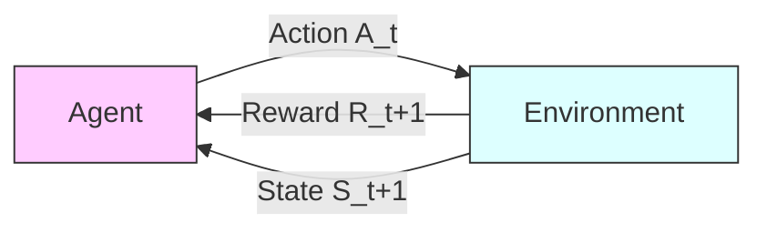

---

### ⚙️ 3. The Five Core Components of an MDP $(S, A, P, R, \gamma)$

An MDP is formally defined by a 5-tuple:
1. **State Space ($S$):** A finite set containing all valid states that the environment can occupy.
2. **Action Space ($A$):** A finite set of all actions available to the agent from a given state.
3. **Transition Probability Function ($P$):** Specifies the probability of landing in a future state $s'$ given that the agent takes action $a$ in current state $s$:
   $$P(s' \mid s, a) = \mathbb{P}(S_{t+1} = s' \mid S_t = s, A_t = a)$$
4. **Reward Function ($R$):** A feedback signal returned by the environment immediately after the transition:
   $$R(s, a, s') = \mathbb{E}[R_{t+1} \mid S_t = s, A_t = a, S_{t+1} = s']$$
5. **Discount Factor ($\gamma$):** A scalar value $\gamma \in [0, 1)$ that determines the present value of future rewards. It ensures mathematical convergence of infinite horizon returns:
   $$G_t = \sum_{k=0}^{\infty} \gamma^k R_{t+k+1} \le \frac{R_{\max}}{1 - \gamma}$$

---

### 🎯 Exam Blueprint (To score 10/10 Marks)
1. **Present the Markov Property First:** Write the mathematical equation clearly at the beginning and state its core meaning in words.
2. **Draw the Agent-Environment Loop:** Recreate the standard closed-loop interaction flowchart showing states, actions, and rewards.
3. **List the 5-Tuple $(S, A, P, R, \gamma)$:** Use structured subheadings for each component. Write down the exact mathematical notations.

---

### Q.7 b) Explain Deep Reinforcement Learning. [Assumed 10 Marks]

---

### 🔍 1. What is Deep Reinforcement Learning (DRL)?
**Deep Reinforcement Learning (DRL)** is a field of artificial intelligence that combines the sensory representation capabilities of **Deep Learning (DL)** with the decision-making frameworks of **Reinforcement Learning (RL)**. 

It allows agents to learn optimal decision-making policies directly from high-dimensional, raw sensory inputs (such as image pixel matrices, video frames, or raw audio waveforms) without requiring handcrafted features.

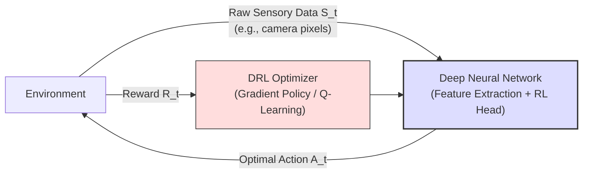

---

### 🛠️ 2. Classification of Core DRL Algorithms

DRL algorithms are classified into three major paradigms:

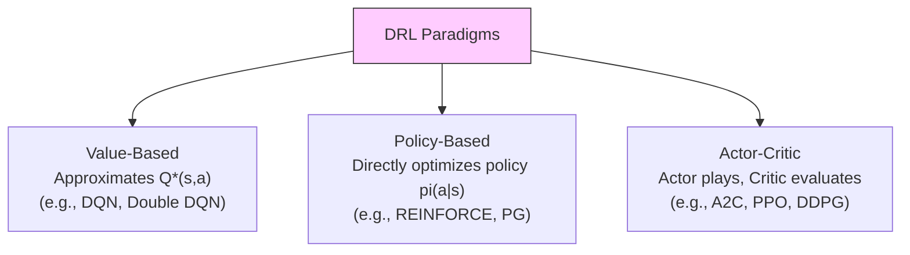

1. **Value-Based Methods:** The network learns to predict the expected returns of actions (e.g., DQN).
2. **Policy-Based Methods:** The network directly outputs a probability distribution over the action space, trained to increase the probability of actions that lead to high rewards (e.g., REINFORCE).
3. **Actor-Critic Methods:** Combines both approaches:
   * **The Actor:** A policy network that selects actions.
   * **The Critic:** A value network that evaluates how good the actor's actions were, reducing gradient variance.

---

### 🎯 Exam Blueprint (To score 10/10 Marks)
1. **Define DRL as a synergy:** Clearly explain DRL as the intersection of Deep Learning (feature extraction) and Reinforcement Learning (decision optimization).
2. **Draw the DRL interaction pipeline:** Replicate the system diagram showing the closed-loop flow of raw sensory data, neural network processing, and optimizer feedback.

---

### Q.7 c) What are the challenges of Reinforcement Learning? [Assumed 10 Marks]

---

### 🚀 Four Foundational Challenges of Reinforcement Learning

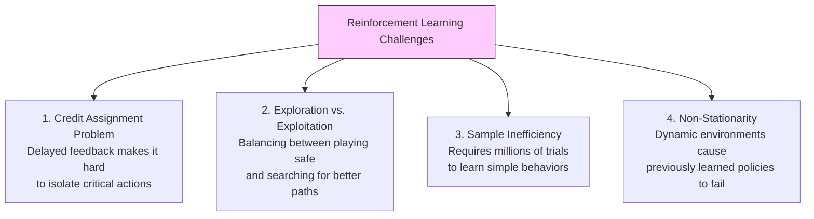

---

### 🔍 Detailed Analysis of the Challenges

#### 1. The Credit Assignment Problem (Delayed Rewards)
* **Explanation:** In many real-world environments, the reward signal is sparse and highly delayed. An agent may perform hundreds of individual actions before receiving any feedback. It is difficult to isolate *which* specific action or sequence of actions was responsible for that win or loss.

#### 2. The Exploration vs. Exploitation Dilemma
* **Explanation:** The agent must balance two competing strategies to maximize its cumulative reward:
  * **Exploitation:** Selecting actions already known to yield high rewards.
  * **Exploration:** Trying new, unvisited, or low-value actions to discover if they lead to even better strategies.

#### 3. Extreme Sample Inefficiency
* **Explanation:** Unlike human learners, RL agents learn from scratch and typically require millions of interaction steps with the environment to learn basic behaviors, making physical real-world training slow and expensive.

#### 4. Non-Stationarity
* **Explanation:** In RL, as the agent updates its policy, its trajectory path changes, which continuously shifts the distribution of incoming state inputs. This non-stationarity can cause training instability or model collapse.

---

### 🎯 Exam Blueprint (To score 10/10 Marks)
1. **Present a summary diagram:** Recreate the taxonomy of challenges shown in the Mermaid flowchart to structure your answer.
2. **Use clear, bold headers for each challenge:** Dedicate a detailed paragraph to explaining each of the four challenges.

---

### Q.8 a) Explain the process of Deep Q-Learning. [Assumed 10 Marks]

---

### 🔍 1. Introduction to Deep Q-Learning (DQN)
**Deep Q-Learning (DQN)**, introduced by DeepMind in 2013, replaces the Q-value lookup table with a **Deep Neural Network** (parameterized by weights $\theta$) to approximate the optimal Q-values in continuous or massive state spaces:
$$Q(s, a; \theta) \approx Q^*(s, a)$$

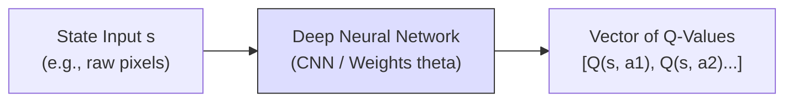

---

### ⚙️ 2. Key Stability Innovations in DQN

To prevent training from oscillating or diverging, DQN introduces two critical stabilization techniques:

#### A) Experience Replay Memory ($\mathcal{D}$)
* **The Mechanism:** Instead of training on transitions in real-time, the agent stores its experience tuple $e_t = (s_t, a_t, r_{t+1}, s_{t+1})$ in a massive replay buffer $\mathcal{D}$. During training, the network samples random mini-batches of transitions from this buffer.
* **The Impact:** Sampling randomly breaks the temporal correlation between consecutive steps, satisfying the IID assumption and stabilizing gradient descent.

#### B) Target Network ($\theta^-$)
* **The Problem:** In standard Q-updates, updating the network weights $\theta$ also changes the target value $R + \gamma \max_{a'} Q(s', a'; \theta)$, causing the target to shift constantly. This leads to severe training oscillations.
* **The Solution:** DQN maintains a duplicate copy of the network weights ($\theta^-$) solely to calculate target values. These target weights are held stable and only updated to match the online weights ($\theta$) periodically.

$$\text{Loss } L_i(\theta_i) = \mathbb{E} \left[ \left( R + \gamma \max_{a'} Q(s', a'; \theta_i^-) - Q(s, a; \theta_i) \right)^2 \right]$$

---

### 🎯 Exam Blueprint (To score 10/10 Marks)
1. **Explain the DQN Formula:** Write the loss equation clearly and label the *target* and *prediction* parts.
2. **Detail the Stability Innovations:** Use separate, bold subheadings for **Experience Replay Memory** and **Target Network**, detailing the problems they solve.

---

### Q.8 b) Explain Reinforcement Learning for Tic-Tac-Toe game. [Assumed 10 Marks]

---

### 🔍 1. Formulating Tic-Tac-Toe as an RL Problem
The game of Tic-Tac-Toe can be modeled as a simple reinforcement learning problem where an agent learns an optimal playing strategy through trial-and-error interactions against an opponent.

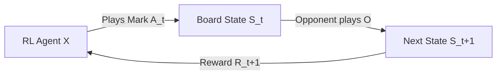

* **States ($S$):** Every possible configuration of the board (all combinations of X's, O's, and empty cells).
* **Actions ($A$):** Selecting an empty cell to place the agent's mark.
* **Rewards ($R$):** 
  * $+1.0$ if the agent wins the game (terminal state).
  * $-1.0$ if the agent loses (terminal state).
  * $0.0$ for draw states or intermediate moves.

---

### ⚙️ 2. Tabular Value Function Learning

The agent maintains a **Value Table** storing a value $V(s) \in [0, 1]$ for every possible board state $s$. This represents the probability of winning the game from that state.

During play, the agent uses an **$\epsilon$-Greedy Policy** to make moves:
* With probability $\epsilon$: Explore by playing a random valid move.
* With probability $1-\epsilon$: Exploit by choosing the move leading to state $s'$ with $\max V(s')$.

#### The Value Update Rule (Temporal Difference):
After making a move from state $s$, the board transitions to a new state $s'$. The value of state $s$ is updated to become closer to the value of state $s'$ using the TD-learning rule:

$$V(s) \leftarrow V(s) + \alpha \left[ V(s') - V(s) \right]$$

*Where:*
* $\alpha \in (0, 1]$ is the learning rate.
* $V(s') - V(s)$ is the temporal difference error between the actual future state value and the current estimate.

---

### 🎯 Exam Blueprint (To score 10/10 Marks)
1. **Define the RL variables for the game:** Explicitly define the states ($S$), actions ($A$), and terminal rewards ($+1.0, 0.0, -1.0$).
2. **Write the TD Update Equation:** Present the $V(s) \leftarrow V(s) + \alpha [V(s') - V(s)]$ equation and explain what each term represents.

---

### Q.8 c) Explain Dynamic Programming algorithm for reinforcement learning. [Assumed 10 Marks]

---

### Algorithm 1: Policy Iteration

Policy Iteration alternates between two distinct phases until the policy stabilizes:

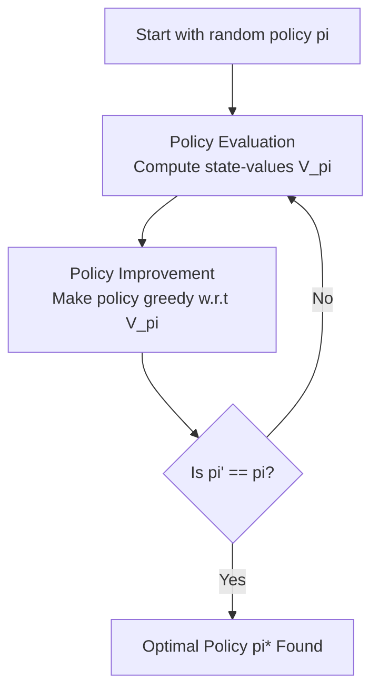

#### Phase 1: Policy Evaluation
Computes the state-value function $V^\pi(s)$ for the current policy $\pi$. It iteratively applies the Bellman Expectation Equation across all states:
$$V_{k+1}(s) = \sum_{a \in A} \pi(a \mid s) \sum_{s' \in S} P(s' \mid s, a) \left[ R(s, a, s') + \gamma V_k(s') \right]$$

#### Phase 2: Policy Improvement
Updates the policy to be greedy with respect to the newly calculated value function:
$$\pi'(s) = \arg\max_{a \in A} \sum_{s' \in S} P(s' \mid s, a) \left[ R(s, a, s') + \gamma V^\pi(s') \right]$$

---

### Algorithm 2: Value Iteration

Unlike Policy Iteration, **Value Iteration** does not wait for the policy evaluation to fully converge. Instead, it combines evaluation and policy improvement into a single update step by applying the **Bellman Optimality Equation** directly:

$$V_{k+1}(s) = \max_{a \in A} \sum_{s' \in S} P(s' \mid s, a) \left[ R(s, a, s') + \gamma V_k(s') \right]$$

The optimal policy is then extracted in a single step:
$$\pi^*(s) = \arg\max_{a \in A} \sum_{s' \in S} P(s' \mid s, a) \left[ R(s, a, s') + \gamma V^*(s') \right]$$

---

### 🎯 Exam Blueprint (To score 10/10 Marks)
1. **Draw the Policy Iteration flowchart:** Recreate the evaluation-improvement feedback loop showing the convergence check.
2. **Present the mathematical updates:** Write out both the Bellman Expectation update (for policy evaluation) and the Bellman Optimality update (for value iteration) in clear boxes.
