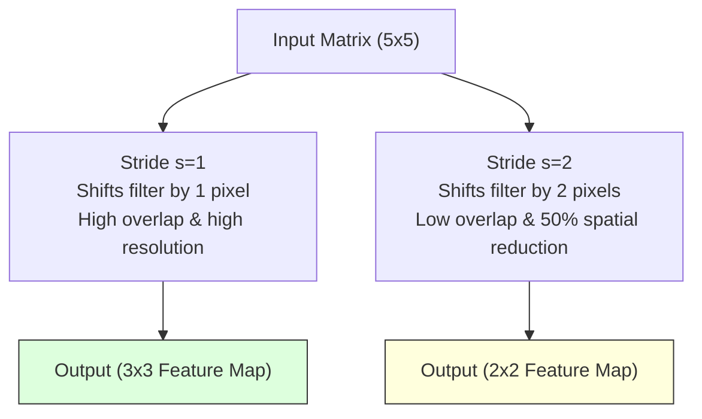
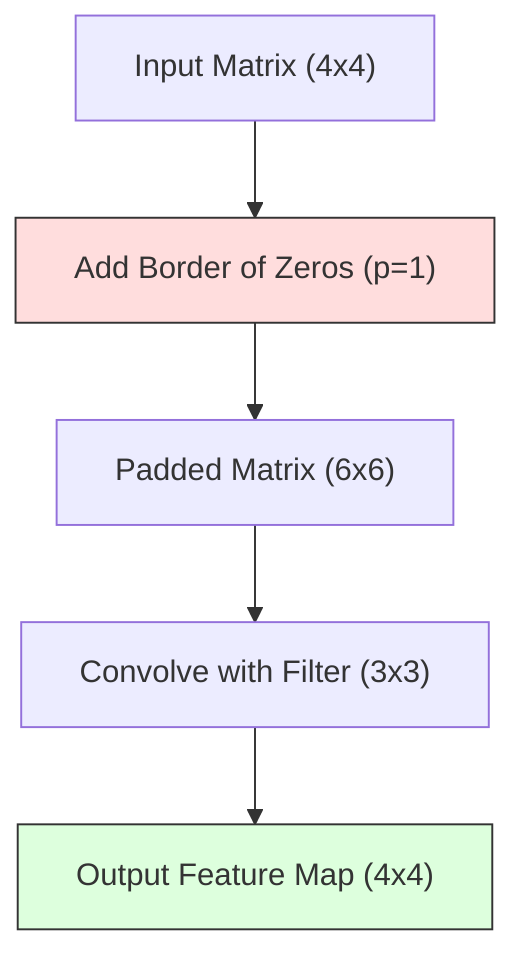
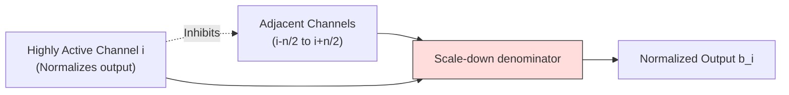
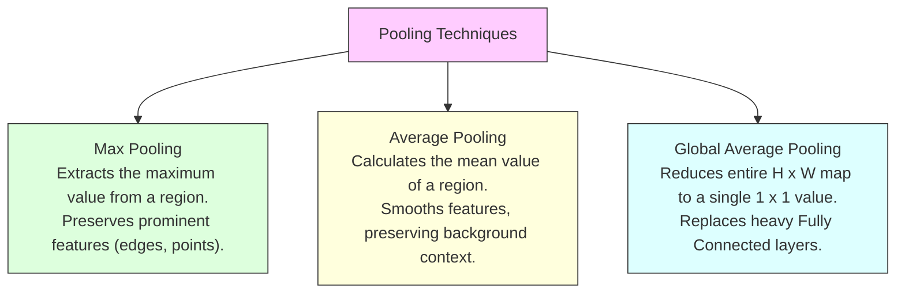
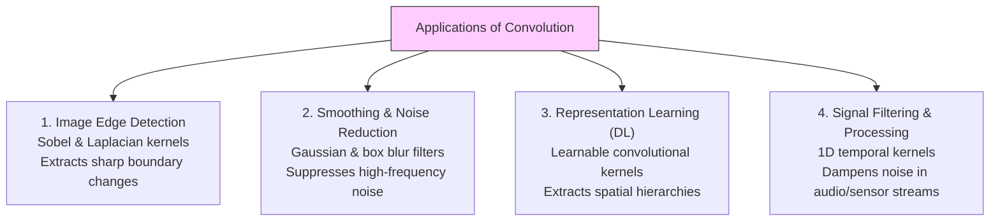
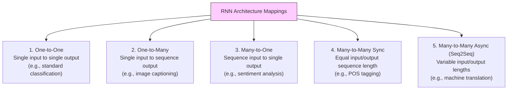
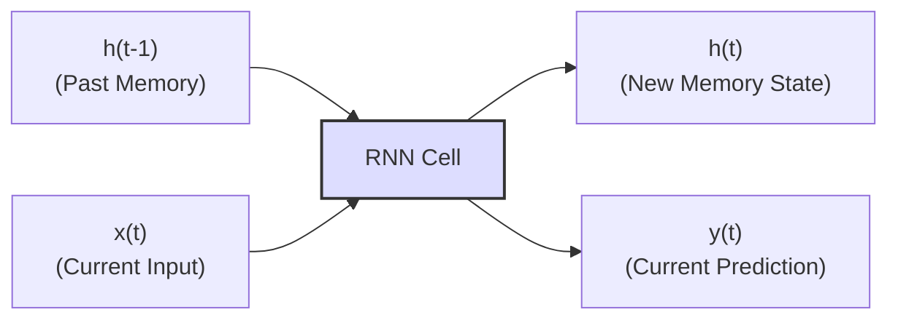
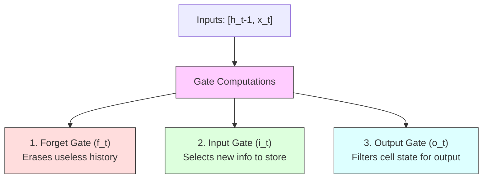
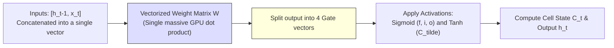

# Deep Learning (410251) - Semester VIII
## Paper 4: [6181]-115 Solution (First Half: Units I & II)
### ⚠️ Assumed Weightage: Each Sub-Question is solved for a full 10 Marks standard.

---

## UNIT I - Convolutional Neural Networks (CNN)

### Q.1 a) Explain Stride Convolution with example. [Assumed 10 Marks]

---

### 🔍 1. Concept Definition
In a Convolutional Neural Network (CNN), the **Stride ($s$)** is a key sliding hyperparameter that defines the step size (the number of pixels) by which a convolutional filter shifts horizontally and vertically as it scans the input matrix. Stride controls both the spatial overlap of adjacent receptive fields and the resolution of the output feature maps.



---

### ⚙️ 2. Operational Mechanics: Stride 1 vs. Stride 2

#### A) Stride = 1 (Standard Feature Scanning)
* **Behavior:** The filter slides step-by-step, shifting by exactly 1 pixel at a time.
* **Overlaps:** Receptive fields share massive overlapping regions, retaining fine spatial details and generating highly redundant activations.
* **Output Size:** Yields a large, detailed output feature map.

#### B) Stride = 2 (Spatial Down-Sampling)
* **Behavior:** The filter jumps, shifting by 2 pixels at a time, skipping alternate pixels during the scan.
* **Overlaps:** Receptive fields share very little overlapping information, which reduces spatial redundancy.
* **Output Size:** Shrinks the spatial dimensions of the output feature map by approximately **50%**.

---

### 📐 3. Dimension Mathematics with Floor Notation
The spatial output dimensions of a convolutional layer are calculated using the floor function to discard incomplete boundary overlaps:

$$W_{out} = \lfloor \frac{W_{in} - f + 2p}{s} \rfloor + 1$$

*Where:*
* $W_{in}$ is the input width/height.
* $f$ is the filter size.
* $p$ is the padding size.
* $s$ is the stride value.
* $\lfloor \dots \rfloor$ represents the floor function (rounding down to the nearest integer).

---

### 📝 4. Complete Numerical Trace

Consider convolving a $5 \times 5$ single-channel input matrix with a $3 \times 3$ filter (assuming zero padding, $p=0$):

#### Trace A: Stride $s = 1$
$$\text{Output Width} = \lfloor \frac{5 - 3 + 0}{1} \rfloor + 1 = 2 + 1 = \mathbf{3}$$
The resulting output is a **$3 \times 3$** feature map.

#### Trace B: Stride $s = 2$
$$\text{Output Width} = \lfloor \frac{5 - 3 + 0}{2} \rfloor + 1 = \lfloor \frac{2}{2} \rfloor + 1 = 1 + 1 = \mathbf{2}$$
The resulting output is a **$2 \times 2$** feature map.

---

### 🎯 Exam Blueprint (To score 10/10 Marks)
1. **Define Stride Clearly:** Define stride as the step-shift hyperparameter of the filter.
2. **Present the Dimension Formula:** Write out the floor function equation clearly inside a prominent box.
3. **Show a Comparative Numerical Trace:** Recreate the $5 \times 5$ input convolved with a $3 \times 3$ filter, showing the calculations for both Stride 1 and Stride 2.

---

### Q.1 b) Explain Padding and its types. [Assumed 10 Marks]

---

### 🔍 1. Concept Definition
In a Convolutional Neural Network (CNN), **Padding** refers to the practice of adding extra border values (typically zeros) around the outer perimeter of an input tensor $X \in \mathbb{R}^{H \times W \times C}$ before convolving it with a filter.



---

### 🚀 2. The Core Problems Padding Solves

#### A) Spatial Dimension Shrinkage
Every time a convolutional filter of size $f \times f$ is applied to an image of size $H \times W$, the output feature map shrinks to:
$$\text{Output Size} = (H - f + 1) \times (W - f + 1)$$
If we convolve a $32 \times 32$ image with a $5 \times 5$ filter, it shrinks to $28 \times 28$. After a few successive convolutional layers, the spatial size would drop to $0$, preventing us from building deep network architectures. Padding wraps the borders, preventing this shrinkage.

#### B) Border Information Loss
Center pixels are heavily processed because the convolutional window overlaps them multiple times. However, pixels located at the outer edges and corners are only scanned once or twice. Padding wraps the borders, allowing the filter to center on edge pixels, which prevents critical border information from being discarded.

---

### 🛠️ 3. Detailed Types of Padding

#### 1. Valid Padding (No Padding)
* **Mechanism:** The padding parameter $p$ is set to exactly $0$. The filter only stays within the strict boundaries of the input.
* **Output Dimension:**
  $$H_{out} = \lfloor \frac{H_{in} - f}{s} \rfloor + 1$$

#### 2. Same Padding (Zero Padding)
* **Mechanism:** Wraps the input in a border of zeros. The padding size $p$ is calculated specifically to ensure the output spatial dimensions are identical to the input dimensions when the stride is $1$:
  $$p = \frac{f - 1}{2}$$
  *(For a $3 \times 3$ filter, $p = 1$; for a $5 \times 5$ filter, $p = 2$).*

#### 3. Reflection Padding
* **Mechanism:** Instead of padding with dummy zeros, the border is filled with the mirrored values of the pixels inside the image edge.
* **Example:** For an edge row $[a, b, c]$ with 1-pixel reflection padding, the row becomes $[\mathbf{b}, a, b, c, \mathbf{b}]$.
* **Use Case:** Extensively used in generative models, style transfer, and image restoration to prevent sharp artificial black borders (which zeros introduce) from corrupting calculations.

#### 4. Replication Padding (Edge Clamp)
* **Mechanism:** Replicates the exact values of the outermost pixels to pad the border.
* **Example:** The edge row $[a, b, c]$ with 1-pixel replication padding becomes $[\mathbf{a}, a, b, c, \mathbf{c}]$.

---

### 🎯 Exam Blueprint (To score 10/10 Marks)
1. **Define the Core Purpose:** Explain padding as border wrapping, detailing the twin challenges it solves (*Spatial Shrinkage* and *Border Information Loss*).
2. **Present the Output Dimension Formula:** Highlight the general formula in a prominent box and explain all its variables ($H_{in}, f, p, s$).
3. **List and Explain the 4 Types:** Use bold subheadings for *Valid*, *Same*, *Reflection*, and *Replication* padding.

---

### Q.1 c) Explain Local Response Normalization (LRN) and need of it. [Assumed 10 Marks]

---

### 🔍 1. Theoretical Conception
**Local Response Normalization (LRN)** is a normalization layer introduced in the landmark AlexNet architecture (2012). It implements **lateral inhibition**—a neurobiological phenomenon where highly active neurons suppress the activity of neighboring neurons, creating high-contrast edge representations.



---

### 🧮 2. Mathematical Formulation
LRN normalizes the activation of a neuron at position $(x, y)$ in channel $i$ by dividing it by a factor calculated from the squared sum of activations in adjacent channels at the same spatial location:

$$b_{x,y}^i = \frac{a_{x,y}^i}{\left( k + \alpha \sum_{j=\max(0, i-n/2)}^{\min(N-1, i+n/2)} (a_{x,y}^j)^2 \right)^\beta}$$

*Where:*
* $a_{x,y}^i$ is the raw activation of a neuron in channel $i$ at position $(x, y)$.
* $b_{x,y}^i$ is the normalized output activation.
* $N$ is the total number of channels in the layer.
* $n$ is the size of the normalization neighborhood (number of adjacent channels to sum over).
* $k, \alpha, \beta$ are hyperparameters (standard settings: $k=2, n=5, \alpha=10^{-4}, \beta=0.75$).

---

### 🚀 3. Need of LRN in CNNs

#### A) Bounding ReLU Activations
Because the ReLU activation function is unbounded for positive inputs ($f(x) = x$), adjacent activation layers can output extremely large values. LRN dampens these high-frequency spikes, acting as a stabilizer.

#### B) Contrast Enhancement
LRN creates competition between adjacent feature channels, boosting strong, distinctive feature detections and suppressing flat background noise.

#### C) Modern Replacement: Batch Normalization (BatchNorm)
In modern CNN architectures (like ResNet), LRN has been replaced by **Batch Normalization (BatchNorm)**. While LRN normalizes across channels within a single sample, BatchNorm normalizes activations across a mini-batch of training samples. BatchNorm is much more stable, easier to compute, and provides a stronger regularizing effect.

---

### 🎯 Exam Blueprint (To score 10/10 Marks)
1. **Present the Mathematical Formula:** Write out the LRN equation inside a box. Clearly define every variable ($a_{x,y}^i, b_{x,y}^i, k, \alpha, \beta, N, n$).
2. **Explain the Neurobiological Inspiration:** Discuss **Lateral Inhibition** and how it enhances contrast between competing channels.

---

### Q.2 a) Explain ReLU Layer and its advantages. [Assumed 10 Marks]

---

### 📈 1. Mathematical Foundation of ReLU
The **Rectified Linear Unit (ReLU)** is a piecewise linear activation function defined mathematically as:
$$f(x) = \max(0, x)$$

#### Derivative (Gradient) of ReLU:
The derivative of ReLU is defined as:
$$f'(x) = \begin{cases} 1 & \text{if } x > 0 \\ 0 & \text{if } x < 0 \end{cases}$$

```mermaid
graph TD
    subgraph Negative Input (x < 0)
        NegIn[Input x < 0] --> NegOut[Output = 0] --> NegGrad[Gradient = 0]
    end
    subgraph Positive Input (x >= 0)
        PosIn[Input x >= 0] --> PosOut[Output = x] --> PosGrad[Gradient = 1]
    end
    
    style NegOut fill:#fdd,stroke:#333
    style PosOut fill:#dfd,stroke:#333
```

ReLU is highly popular because it resolves the **vanishing gradient problem** for positive inputs and is extremely computationally efficient on GPUs.

---

### 🥊 2. Advantages of ReLU over Sigmoid

The introduction of ReLU in 2012 (AlexNet) replaced the **Sigmoid** function:
$$\sigma(x) = \frac{1}{1 + e^{-x}}$$

Below is a detailed analysis of why ReLU outperformed Sigmoid and revolutionized deep learning:

#### A) Alleviation of the Vanishing Gradient Problem
* **The Sigmoid Issue:** The Sigmoid function squashes inputs into a range between $0$ and $1$. The derivative of Sigmoid peaks at only **$0.25$**. During backpropagation, as gradients are multiplied layer-by-layer back to the start of a deep network, this fractional multiplication causes the gradient to decay exponentially (vanish). Early layers fail to update, preventing convergence.
* **The ReLU Advantage:** For all positive activations ($x > 0$), the derivative of ReLU is always **$1.0$**. This allows the backpropagated gradient to flow backward through hundreds of layers without decaying, resolving the vanishing gradient problem.

#### B) Superior Computational Efficiency
* **The Sigmoid Issue:** Sigmoid relies on complex floating-point mathematical operations: calculating Euler's constant $e^{-x}$ and performing division. These operations are computationally expensive for GPUs when processing millions of neurons over many training epochs.
* **The ReLU Advantage:** ReLU requires no complex math. It is implemented as a simple conditional check at the hardware level: `if (x < 0) return 0; else return x;`. This hardware-level simplicity makes ReLU-based networks up to **6 times faster** to train.

#### C) Sparse Activation and Representational Efficiency
* **The Sigmoid Issue:** Sigmoid outputs a non-zero value for almost all inputs, meaning virtually every neuron in the network is active at any given time.
* **The ReLU Advantage:** Because ReLU maps all negative inputs to 0, it deactivates a significant proportion of the network's neurons (often 50% or more) in any given forward pass. This creates a sparse representation, making the network computationally lighter and more memory-efficient.

---

### 🎯 Exam Blueprint (To score 10/10 Marks)
1. **Write the Core Formulas and Graph:** Present the piecewise equation for ReLU and draw its graph.
2. **Detail the Advantages Separately:** Use bold subheadings for **The Alleviation of Vanishing Gradients**, **Computational Efficiency**, and **Sparse Activation**, writing at least 4-5 lines of explanation for each.

---

### Q.2 b) Explain Pooling Layers and its types with examples. [Assumed 10 Marks]

---

### 🛠️ 1. Different Types of Pooling

Pooling layers are categorized based on the mathematical function they use to summarize local regions.



#### Mathematical Example of Max vs. Average Pooling:
Consider a $4 \times 4$ Input Feature Map processed by a $2 \times 2$ Filter with a Stride ($s$) of 2 (no overlap):

```text
Input Feature Map (4x4):
┌───────────┬───────────┐
│  1 │  3   │  2 │  1   │  <-- Top-Left (Red)   | Top-Right (Blue)
│  2 │  9   │  0 │  4   │
├───────────┼───────────┤
│  5 │  6   │  3 │  2   │  <-- Bottom-Left (Grn) | Bottom-Right (Yel)
│  1 │  0   │  7 │  8   │
└───────────┴───────────┘
```

##### A) Max Pooling Example
Selects the maximum value in each $2\times 2$ window:
* **Top-Left (Red):** $\max(1, 3, 2, 9) = \mathbf{9}$
* **Top-Right (Blue):** $\max(2, 1, 0, 4) = \mathbf{4}$
* **Bottom-Left (Green):** $\max(5, 6, 1, 0) = \mathbf{6}$
* **Bottom-Right (Yellow):** $\max(3, 2, 7, 8) = \mathbf{8}$

$$\text{Max Pooled Output: } \begin{bmatrix} 9 & 4 \\ 6 & 8 \end{bmatrix}$$

##### B) Average Pooling Example
Calculates the mean of all values in each $2\times 2$ window:
* **Top-Left (Red):** $(1 + 3 + 2 + 9) / 4 = 15 / 4 = \mathbf{3.75}$
* **Top-Right (Blue):** $(2 + 1 + 0 + 4) / 4 = 7 / 4 = \mathbf{1.75}$
* **Bottom-Left (Green):** $(5 + 6 + 1 + 0) / 4 = 12 / 4 = \mathbf{3.0}$
* **Bottom-Right (Yellow):** $(3 + 2 + 7 + 8) / 4 = 20 / 4 = \mathbf{5.0}$

$$\text{Average Pooled Output: } \begin{bmatrix} 3.75 & 1.75 \\ 3.0 & 5.0 \end{bmatrix}$$

---

### 🎯 Exam Blueprint (To score 10/10 Marks)
1. **Define the operation:** Explain that pooling does not have any parameters to learn and operates independently on each channel.
2. **Draw visual grids:** Recreate the $4 \times 4$ to $2 \times 2$ Max & Average pooling grids shown above. Use clear boxes and outline the regions.

---

### Q.2 c) What are the applications of Convolution with examples? [Assumed 10 Marks]

---

### 🚀 1. Enlisting and Detailing Key Applications of Convolution



#### A) Edge Detection in Computer Vision
* **Mechanism:** Convolution is used to find spatial boundaries (edges) in images. Edge detection kernels calculate the gradient of image intensity at each pixel, highlighting areas of rapid brightness changes.
* **Example (Sobel Filters):** The Sobel kernels $G_x$ and $G_y$ find horizontal and vertical edges, respectively:
  $$G_x = \begin{bmatrix} -1 & 0 & 1 \\ -2 & 0 & 2 \\ -1 & 0 & 1 \end{bmatrix}, \quad G_y = \begin{bmatrix} -1 & -2 & -1 \\ 0 & 0 & 0 \\ 1 & 2 & 1 \end{bmatrix}$$
  Convolving an image with these kernels highlights its boundaries, forming the foundation of early edge detection algorithms.

#### B) Image Smoothing and Noise Reduction (Blurring)
* **Mechanism:** Convolution acts as a low-pass filter to smooth out pixel transitions and suppress high-frequency noise.
* **Example (Gaussian Blur):** A Gaussian kernel convolves the image with a 2D Gaussian bell-curve distribution. Neighboring pixels are averaged with weights that decrease with distance from the center, smoothing out noise while preserving overall structure:
  $$K_{\text{Gaussian}} = \frac{1}{16} \begin{bmatrix} 1 & 2 & 1 \\ 2 & 4 & 2 \\ 1 & 2 & 1 \end{bmatrix}$$

#### C) Automated Feature Extraction in Deep Learning
* **Mechanism:** Instead of using hand-coded kernels (like Sobel or Gaussian filters), deep CNNs initialize convolutional kernels randomly. During training, the weights of these kernels are optimized via backpropagation.

#### D) 1D Signal Processing and Noise Filtering
* **Mechanism:** In temporal signal processing (such as audio streams or sensor data), 1D convolution is used to filter out noise, extract specific frequencies, or perform echo cancellation.

---

### 🎯 Exam Blueprint (To score 10/10 Marks)
1. **Define Convolution Mathematically:** Write down the 2D discrete cross-correlation equation inside a box.
2. **Present the Applications Taxonomy Tree:** Recreate the Mermaid tree diagram classifying the different applications of convolution.

---
---

## UNIT II - Recurrent Neural Networks (RNN)

### Q.3 a) Draw CNN architecture and explain its working. [Assumed 10 Marks]

---

### 🗺️ 1. CNN Architecture Blueprint

A Convolutional Neural Network consists of a sequence of layers that process input images, extract spatial hierarchies of features, and map them to class probabilities.

```mermaid
graph LR
    Input["Input Image<br/>(e.g., 224x224x3)"] --> Conv["Convolution Layer<br/>(Extracts Features)"]
    Conv --> ReLU["ReLU Layer<br/>(Non-linearity)"]
    ReLU --> Pool["Pooling Layer<br/>(Down-sampling)"]
    Pool --> Flatten["Flattening Layer<br/>(3D to 1D vector)"]
    Flatten --> FC["Fully Connected<br/>(Classification)"]
    FC --> Softmax["Softmax Layer<br/>(Probability Output)"]
    
    style Input fill:#fff,stroke:#333,stroke-width:1px
    style Conv fill:#ddf,stroke:#333,stroke-width:1px
    style ReLU fill:#dfd,stroke:#333,stroke-width:1px
    style Pool fill:#fdd,stroke:#333,stroke-width:1px
    style Flatten fill:#fdf,stroke:#333,stroke-width:1px
    style FC fill:#ffd,stroke:#333,stroke-width:1px
    style Softmax fill:#dff,stroke:#333,stroke-width:1px
```



---

### ⚙️ 2. Detailed Layer-by-Layer Breakdown

* **Input Layer:** Holds raw pixel intensities. Represented as $H \times W \times C$ tensor.
* **Convolutional Layer:** slides learnable kernels across the input, computing dot products to produce Feature Maps.
* **Activation (ReLU) Layer:** Applies $f(x) = \max(0, x)$ to introduce non-linearity.
* **Pooling Layer:** Down-samples spatial dimensions while preserving depth, using Max or Average pooling.
* **Flattening Layer:** Unrolls the 3D tensor output from the final pooling layer into a long 1D column vector.
* **Fully Connected Layer:** Connects all flattened features to classify the image.
* **Softmax Layer:** Normalizes logits into probabilities summing to 1.0.

---

### Q.3 b) Explain the types of Recurrent Neural Network. [Assumed 10 Marks]

---

### ⚙️ 1. Types of RNN Architectures (Input-Output Mapping)

RNNs are highly flexible and can be wired in different configurations to process various sequence lengths:



#### 1. One-to-One (Standard Baseline)
* **Description:** A single vector is mapped directly to a single prediction. This represents standard feedforward neural networks.

#### 2. One-to-Many
* **Description:** A single static input yields a sequential series of outputs.
* **Example:** **Image Captioning**. (Input: 1 Image $\rightarrow$ Output: "A", "dog", "playing", "with", "frisbee").

#### 3. Many-to-One
* **Description:** A sequence of inputs is compressed to produce a single final output vector.
* **Example:** **Sentiment Analysis**. (Input sequence: "I", "hate", "this", "movie" $\rightarrow$ Output: Negative).

#### 4. Many-to-Many (Synchronous)
* **Description:** The input and output sequences have the same length, with outputs generated in sync at each time step.
* **Example:** **Part-of-Speech (POS) Tagging**. (Input: "She", "eats", "apples" $\rightarrow$ Output: "Pronoun", "Verb", "Noun").

#### 5. Many-to-Many (Asynchronous / Sequence-to-Sequence)
* **Description:** The input sequence is fully processed first (encoded) before the network starts generating a variable-length output sequence (decoded).
* **Example:** **Machine Translation**. (Input French: "Je t'aime" [3 words] $\rightarrow$ Output English: "I love you" [3 words]).

---

### Q.3 c) Justify RNN is better suited to treat sequential data than a feedforward neural network. [Assumed 10 Marks]

---

### 🚀 1. Five Critical Reasons Why RNNs Outperform MLPs on Sequential Data

Standard feedforward networks fail completely on sequential tasks due to five fundamental limitations:

#### A) Failure to Preserve Temporal Order
* **The MLP Limit:** MLPs treat inputs as a single, static "bag of features." If we feed sentences into an MLP, it discards word order, making it unable to distinguish between:
  * *"The cat ate the fish"* and *"The fish ate the cat"*
* **The RNN Advantage:** RNNs process words step-by-step chronologically, preserving the precise temporal ordering of the sequence.

#### B) Inability to Handle Variable-Length Inputs
* **The MLP Limit:** MLPs require a fixed-size input layer (e.g. exactly 100 features). However, sequential data (like sentences or audio files) is naturally variable in length.
* **The RNN Advantage:** RNNs run recurrent loops, enabling them to process input sequences of any arbitrary length.

#### C) Loss of Temporal Context (No Internal Memory)
* **The MLP Limit:** An MLP processes each sample in isolation and has no memory of what it saw in the previous step.
* **The RNN Advantage:** RNNs maintain a running hidden state ($h_t$) that accumulates context over time, carrying information from earlier steps to inform current predictions.

#### D) Parameter Explosion over Long Sequences
* **The MLP Limit:** To process a sequence with an MLP, we would have to concatenate all elements into a single massive input vector. This causes the number of weights in the first fully connected layer to explode, leading to overfitting.
* **The RNN Advantage:** RNNs share weight matrices ($W_{hh}, W_{xh}, W_{hy}$) across all time steps, keeping the parameter footprint small regardless of sequence length.

#### E) Translation Invariance Over Time
* **The MLP Limit:** If a sequence pattern shifts in time (e.g., a critical word appears at the start of one sentence but at the end of another), an MLP must learn to detect it at both positions separately.
* **The RNN Advantage:** Because weights are shared across time steps, a feature learned at one temporal position is automatically recognized at any other position in the sequence.

---

### Q.4 a) Explain Recurrent Neural Network with its architecture. [Assumed 10 Marks]

---

### 🔍 1. System Conception
A **Recurrent Neural Network (RNN)** is a class of neural network designed to process **sequential data** or **time-series data** where the order of elements matters. Unlike traditional feedforward networks, RNNs process sequence elements chronologically by utilizing internal feedback loops. This creates an internal hidden state ($h_t$) which acts as a persistent memory across time steps.



---

### ⚙️ 2. Computational Flow and Working Mechanism

An RNN processes sequences step-by-step. At each time step $t$, the cell accepts the current input $x_t$ along with the hidden state from the previous step ($h_{t-1}$) to calculate the new hidden state ($h_t$) and output ($y_t$).

#### The Mathematical Recurrence Equations:

$$h_t = \tanh(W_{xh} \cdot x_t + W_{hh} \cdot h_{t-1} + b_h)$$
$$y_t = W_{hy} \cdot h_t + b_y$$

*Where:*
* $x_t \in \mathbb{R}^d$ is the input vector at time step $t$.
* $h_t \in \mathbb{R}^h$ is the updated hidden state vector representing memory.
* $h_{t-1} \in \mathbb{R}^h$ is the previous step's hidden state.
* $W_{xh}, W_{hh}, W_{hy}$ are **shared weight matrices** reused across every single time step.
* $b_h, b_y$ are bias vectors.
* $\tanh$ is the activation function squashing memory states between $-1$ and $+1$ to keep memory stable.

---

### Q.4 b) Draw and explain architecture for Long Short-Term Memory (LSTM). [Assumed 10 Marks]

---

### ⚙️ The Three Gate Mechanisms of LSTM:

The LSTM cell state conveyor belt ($C_t$) allows long-term gradients to flow back through time without decaying, controlled by three gates:



#### Step 1: The Forget Gate ($f_t$) - *Deciding what to discard*
It looks at the previous hidden state $h_{t-1}$ and current input $x_t$, and decides what information to erase from the long-term cell state:
$$f_t = \sigma(W_f \cdot [h_{t-1}, x_t] + b_f)$$

#### Step 2: The Input Gate ($i_t$) & Candidate State ($\tilde{C}_t$) - *Deciding what to learn*
Determines what new information to write into the cell state.
* The input gate $i_t$ decides *which* values to update:
  $$i_t = \sigma(W_i \cdot [h_{t-1}, x_t] + b_i)$$
* The candidate state $\tilde{C}_t$ generates *new potential values* using a $\tanh$ activation:
  $$\tilde{C}_t = \tanh(W_c \cdot [h_{t-1}, x_t] + b_c)$$

#### Step 3: Updating the Cell State ($C_t$)
Combines the forget and input decisions to update the long-term memory:
$$C_t = f_t * C_{t-1} + i_t * \tilde{C}_t$$

#### Step 4: The Output Gate ($o_t$) & Hidden State ($h_t$) - *Deciding what to output*
Extracts the short-term memory ($h_t$) from the long-term conveyor belt ($C_t$):
$$o_t = \sigma(W_o \cdot [h_{t-1}, x_t] + b_o)$$
$$h_t = o_t * \tanh(C_t)$$

---

### Q.4 c) Explain how the memory cell in the LSTM is implemented computationally. [Assumed 10 Marks]

---

### ⚙️ 1. Step-by-Step Computational Vectorization

Rather than computing each gate equation separately using individual slow matrix multiplications, modern deep learning frameworks (such as PyTorch or TensorFlow) optimize performance by **concatenating inputs** and **vectorizing the calculations** into a single parallel GPU operation.



#### Step 1: Input Concatenation
At time step $t$, the cell receives the current input vector $x_t \in \mathbb{R}^d$ and the previous hidden state $h_{t-1} \in \mathbb{R}^h$.
The network concatenates these two vectors into a single, high-dimensional vector:
$$\mathbf{I}_t = \begin{bmatrix} h_{t-1} \\ x_t \end{bmatrix} \in \mathbb{R}^{h + d}$$

#### Step 2: Single Vectorized Matrix Multiplication
Instead of performing four separate matrix multiplications for the gates, we combine all weight matrices into a single, massive weight matrix $\mathbf{W} \in \mathbb{R}^{4h \times (h+d)}$ and a single bias vector $\mathbf{b} \in \mathbb{R}^{4h}$:

$$\mathbf{z} = \mathbf{W} \cdot \mathbf{I}_t + \mathbf{b} \in \mathbb{R}^{4h}$$

This single, optimized dot product is executed in parallel on the GPU, maximizing hardware efficiency.

#### Step 3: Splitting and Applying Activations
The computed vector $\mathbf{z}$ of size $4h$ is split into four separate vectors of size $h$, representing the raw activations for each gate:

$$\begin{bmatrix} \mathbf{z}_f \\ \mathbf{z}_i \\ \mathbf{z}_{\tilde{C}} \\ \mathbf{z}_o \end{bmatrix} \xrightarrow{\text{Split}} \text{Four vectors, each of size } h$$

Now, we apply the corresponding activation functions in parallel:
* **Forget Gate:** $f_t = \sigma(\mathbf{z}_f) \in \mathbb{R}^h$
* **Input Gate:** $i_t = \sigma(\mathbf{z}_i) \in \mathbb{R}^h$
* **Candidate Cell State:** $\tilde{C}_t = \tanh(\mathbf{z}_{\tilde{C}}) \in \mathbb{R}^h$
* **Output Gate:** $o_t = \sigma(\mathbf{z}_o) \in \mathbb{R}^h$

#### Step 4: Element-Wise State Update
We compute the new cell state $C_t$ and output hidden state $h_t$ using fast, element-wise vector operations:

$$C_t = f_t \odot C_{t-1} + i_t \odot \tilde{C}_t$$
$$h_t = o_t \odot \tanh(C_t)$$
*(where $\odot$ represents the Hadamard/element-wise product).*
