# Deep Learning (410251) - Semester VIII
## Paper 4: [6181]-115 Solution (Second Half: Units III & IV)
### ⚠️ Assumed Weightage: Each Sub-Question is solved for a full 10 Marks standard.

---

## UNIT III - Generative Models & GAN

### Q.5 a) Explain Deep Generative Model with example. [Assumed 10 Marks]

---

### 🔍 1. Conceptual Definition
A **Deep Generative Model (DGM)** is a class of unsupervised deep learning algorithms designed to approximate and generate samples from complex, high-dimensional real-world data distributions (such as natural images, speech, or text). 

Unlike discriminative models that predict labels given data, DGMs learn the joint probability distribution of the data space, allowing them to synthesize entirely new samples that share the statistical characteristics of the training dataset.

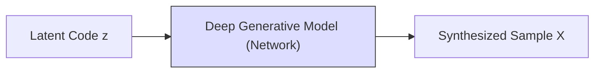

---

### 🛠️ 2. Core Methodological Taxonomy

Deep Generative Models are classified based on how they define and optimize the data likelihood:

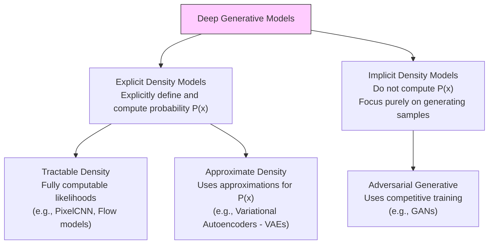

#### A) Variational Autoencoders (VAEs) - *Explicit Approximate Density*
* **Mechanism:** Maps input data $x$ to a low-dimensional latent space representation $z$ using an encoder network $q_\phi(z \mid x)$, and reconstructs the data using a decoder network $p_\theta(x \mid z)$.
* **Optimization Goal:** Maximizes the **Evidence Lower Bound (ELBO)**, balancing reconstruction quality with latent space regularization (via Kullback-Leibler divergence):
  $$\text{ELBO}(\theta, \phi; x) = \mathbb{E}_{q_\phi(z \mid x)}[\log p_\theta(x \mid z)] - KL(q_\phi(z \mid x) \parallel p(z))$$

#### B) Generative Adversarial Networks (GANs) - *Implicit Density*
* **Mechanism:** Skips explicit likelihood calculations entirely. Instead, it sets up an adversarial game between a Generator ($G$) and a Discriminator ($D$) to refine generated samples until they match the real data distribution.

#### C) Diffusion Models - *Reversible Noise Mapping*
* **Mechanism:** Generates data by reversing a progressive noise-addition process. It learns to gradually remove Gaussian noise from a starting latent vector until a clean, high-fidelity sample is restored.

---

### Q.5 b) How does GAN training scale with batch size? [Assumed 10 Marks]

---

### 🔍 1. Theoretical Paradigm
The **Batch Size** is a critical hyperparameter that dictates how many training samples are processed before the network's weights are updated. In Generative Adversarial Networks (GANs), the interaction between batch size and training dynamics is highly complex and differs substantially from standard supervised classifiers.

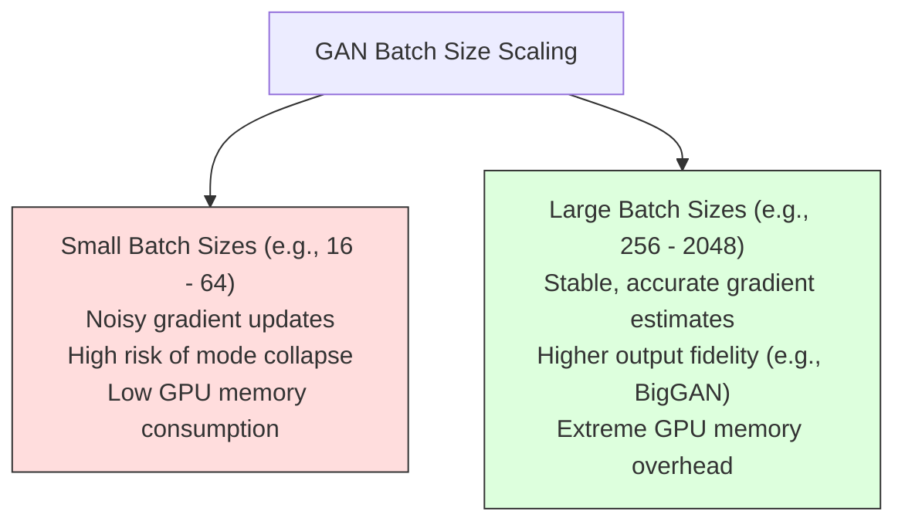

---

### 🚀 2. Technical Impacts of Scaling Batch Sizes

#### A) Gradient Stability and Quality
* **Small Batches:** Yield noisy, high-variance gradient updates. In standard classifiers, this noise can act as a regularizer, helping the model escape local minima. In GANs, however, noisy gradients often destabilize the delicate adversarial balance, causing training to oscillate or diverge.
* **Large Batches:** Provide highly stable, accurate estimates of the true data distribution gradients, allowing both the Generator and Discriminator to make smooth, steady weight updates.

#### B) Risk of Mode Collapse
* **The Mechanism:** Mode Collapse occurs when the Generator discovers a single, highly specific output that successfully fools the Discriminator, and starts outputting that identical sample constantly rather than learning the full diversity of the dataset.
* **The Scaling Impact:** Large batch sizes present the Discriminator with a diverse variety of generated and real images in each step. This makes it much easier for the Discriminator to detect if the Generator is repeating outputs, thereby reducing the risk of Mode Collapse.

#### C) Performance and Image Fidelity (BigGAN Breakthrough)
* **The DeepMind Finding:** In 2018, DeepMind's landmark **BigGAN** paper demonstrated that scaling up batch sizes is one of the most effective ways to boost GAN performance. By scaling the batch size up to **2048**, BigGAN synthesized high-resolution, photorealistic images that far surpassed previous state-of-the-art models.

---

### 📝 3. Comprehensive Batch Scaling Summary

| Metric / Attribute | Small Batch Sizes (e.g. 16 - 64) | Large Batch Sizes (e.g. 256 - 2048) |
| :--- | :--- | :--- |
| **Gradient Variance** | High (noisy updates). | Low (stable, smooth updates). |
| **Adversarial Stability**| Poor (high risk of training divergence). | High (stable competitive convergence). |
| **Mode Collapse Risk** | High (limited sample diversity). | Low (discriminator detects repetitions easily). |
| **Output Image Fidelity**| Moderate (struggles with fine textures). | Extremely High (state-of-the-art BigGAN results).|
| **GPU Memory Demand** | Low (can run on single consumer GPU). | Massive (requires multi-GPU clusters). |

---

### Q.5 c) List the applications of GAN network with description. [Assumed 10 Marks]

---

### 🚀 Four Major Applications of GANs

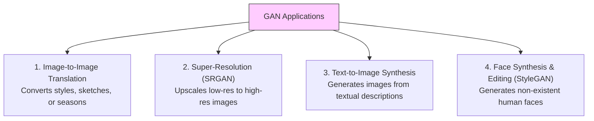

---

### 🔍 Detailed Analysis of the Applications

#### A) Image-to-Image Translation (Pix2Pix & CycleGAN)
* **Description:** Translates an input image from a source domain (e.g. a hand-drawn sketch) to a target domain (e.g. a photo-realistic object) while preserving the underlying structural geometry.
* **Paired (Pix2Pix) vs. Unpaired (CycleGAN):**
  * **Pix2Pix** requires pairs of matching images to learn the direct mapping.
  * **CycleGAN** can learn style translation without paired images by using a **Cycle Consistency Loss**:
    $$L_{cyc}(G, F) = \mathbb{E}_{x \sim p_{\text{data}}(x)}[\|F(G(x)) - x\|_1] + \mathbb{E}_{y \sim p_{\text{data}}(y)}[\|G(F(y)) - y\|_1]$$

#### B) Super-Resolution (SRGAN)
* **Description:** Reconstructs high-resolution (HR) images from highly pixelated, low-resolution (LR) inputs, restoring lost textures and finer details.
* **Mechanism:** SRGAN utilizes a discriminator to penalize blurry outputs, combined with a **Perceptual Loss** (comparing high-level feature activations extracted by a pre-trained VGG network), forcing the generator to synthesize sharp, high-frequency details.

---

### Q.6 a) Draw and explain architecture of Boltzmann Machine. [Assumed 10 Marks]

---

### 🔍 1. System Conception
A **Boltzmann Machine** is an energy-based, undirected graphical model (a stochastic recurrent neural network) designed to learn the underlying probability distribution of a given dataset in an unsupervised fashion. Introduced by Geoffrey Hinton and Terry Sejnowski in 1985, it is rooted in the principles of statistical mechanics and thermodynamics.

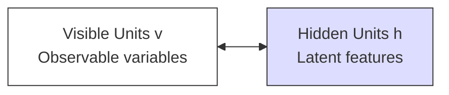

---

### ⚡ 2. Mathematical Foundations: The Energy Concept

Boltzmann Machines are **energy-based models**. The network assigns a scalar energy value to every possible joint configuration of visible units $v$ and hidden units $h$.

#### A) Energy Function of a State:
The energy of a specific joint state configuration $(v, h)$ is defined mathematically as:

$$E(v, h) = -\sum_{i} a_i v_i - \sum_{j} b_j h_j - \sum_{i} \sum_{j} w_{ij} v_i h_j$$

*Where:*
* $v_i$ is the binary state of visible unit $i$.
* $h_j$ is the binary state of hidden unit $j$.
* $w_{ij}$ is the symmetric weight between visible unit $i$ and hidden unit $j$.
* $a_i$ is the bias term for visible unit $i$.
* $b_j$ is the bias term for hidden unit $j$.

#### B) Probabilistic State Distribution (Gibbs/Boltzmann Distribution):
The probability of the network occupying a specific joint configuration $(v, h)$ is inversely proportional to its energy, governed by the Boltzmann distribution:

$$P(v, h) = \frac{e^{-E(v, h)}}{Z}$$

*Where $Z$ is the **Partition Function**, which acts as a normalizing constant summing the raw probabilities of all possible configurations:*
$$Z = \sum_{\mathbf{v}'} \sum_{\mathbf{h}'} e^{-E(\mathbf{v}', \mathbf{h}')}$$

---

### Q.6 b) Explain different types of GAN. [Assumed 10 Marks]

---

### ⚙️ 1. Different Types of GAN architectures

#### A) Vanilla GAN
* **Objective:** The baseline model which uses a standard minimax objective with no class labels or constraints. It maps random noise $z \sim p_z$ to fake samples $G(z)$.

#### B) Conditional GAN (CGAN)
* **Objective:** Introduces an auxiliary conditioning variable $y$ (such as class labels or text embeddings) to direct the generation process, allowing us to generate specific classes of data:
  $$\min_G \max_D V(D, G) = \mathbb{E}_{x \sim p_{data}}[\log D(x \mid y)] + \mathbb{E}_{z \sim p_z}[\log(1 - D(G(z \mid y) \mid y))]$$

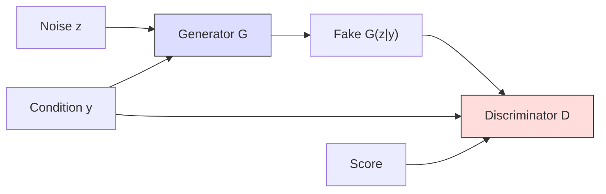

#### C) Deep Convolutional GAN (DCGAN)
* **Objective:** Replaces standard fully connected networks with deep spatial Convolutional networks, establishing strict structural guidelines to stabilize training (no spatial pooling layers, use of BatchNorm, LeakyReLU, and specific output layers).

#### D) Wasserstein GAN (WGAN)
* **Objective:** Stabilizes training by replacing the Jensen-Shannon Divergence with the **Wasserstein-1 (Earth Mover's) Distance**, using a real-valued Critic rather than a binary classifier to calculate gradients.
  $$\min_G \max_{D} \mathbb{E}_{x \sim p_{data}}[D(x)] - \mathbb{E}_{\tilde{x} \sim p_g}[D(\tilde{x})]$$

---

### Q.6 c) Explain Deep Belief Network with diagram. [Assumed 10 Marks]

---

### 🔍 1. Concept Definition
A **Deep Belief Network (DBN)** is a generative graphical model composed of multiple layers of latent, stochastic variables. Introduced by Geoffrey Hinton in 2006, it was one of the first successful architectures to train deep networks, overcoming the challenges of random weight initialization.

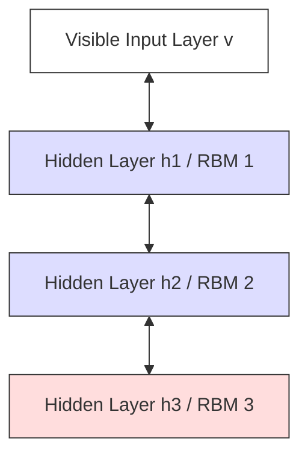

---

### ⚙️ 2. Architectural Structure
A DBN is constructed by stacking multiple **Restricted Boltzmann Machines (RBMs)** on top of each other:
* **The Top Two Layers:** Form an undirected associative memory, with symmetric connections ($\leftrightarrow$) similar to a standard RBM.
* **The Lower Layers:** Have directed connections ($\to$) pointing downwards toward the visible input layer, acting as a sigmoid belief network.

---
---

## UNIT IV - Reinforcement Learning

### Q.7 a) Explain Dynamic Programming algorithms for reinforcement learning. [Assumed 10 Marks]

---

### Algorithm 1: Policy Iteration

Policy Iteration alternates between two distinct phases until the policy stabilizes:

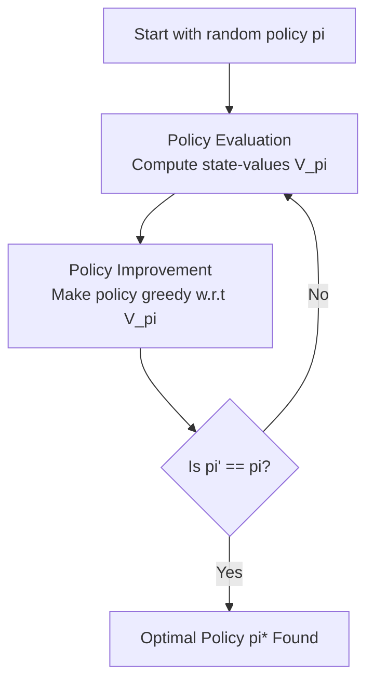

#### Phase 1: Policy Evaluation
Computes the state-value function $V^\pi(s)$ for the current policy $\pi$. It iteratively applies the Bellman Expectation Equation across all states:
$$V_{k+1}(s) = \sum_{a \in A} \pi(a \mid s) \sum_{s' \in S} P(s' \mid s, a) \left[ R(s, a, s') + \gamma V_k(s') \right]$$

#### Phase 2: Policy Improvement
Updates the policy to be greedy with respect to the newly calculated value function:
$$\pi'(s) = \arg\max_{a \in A} \sum_{s' \in S} P(s' \mid s, a) \left[ R(s, a, s') + \gamma V^\pi(s') \right]$$

---

### Algorithm 2: Value Iteration

Unlike Policy Iteration, **Value Iteration** does not wait for the policy evaluation to fully converge. Instead, it combines evaluation and policy improvement into a single update step by applying the **Bellman Optimality Equation** directly:

$$V_{k+1}(s) = \max_{a \in A} \sum_{s' \in S} P(s' \mid s, a) \left[ R(s, a, s') + \gamma V_k(s') \right]$$

The optimal policy is then extracted in a single step:
$$\pi^*(s) = \arg\max_{a \in A} \sum_{s' \in S} P(s' \mid s, a) \left[ R(s, a, s') + \gamma V^*(s') \right]$$

---

### Q.7 b) What is Deep Reinforcement Learning? Explain in detail. [Assumed 10 Marks]

---

### 🔍 1. What is Deep Reinforcement Learning (DRL)?
**Deep Reinforcement Learning (DRL)** is a field of artificial intelligence that combines the sensory representation capabilities of **Deep Learning (DL)** with the decision-making frameworks of **Reinforcement Learning (RL)**. 

It allows agents to learn optimal decision-making policies directly from high-dimensional, raw sensory inputs (such as image pixel matrices, video frames, or raw audio waveforms) without requiring handcrafted features.

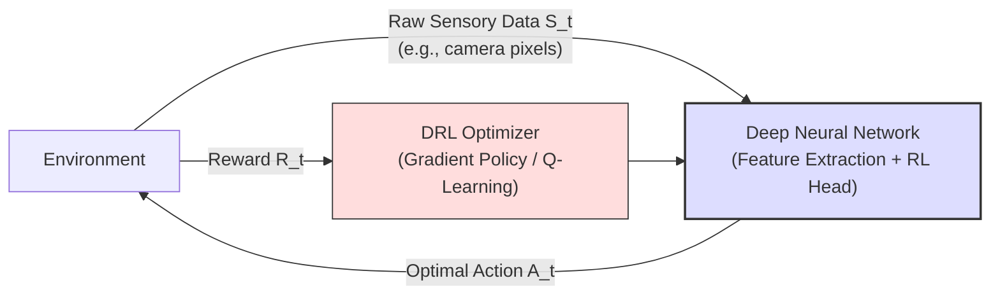

---

### 🛠️ 2. Classification of Core DRL Algorithms

DRL algorithms are classified into three major paradigms:

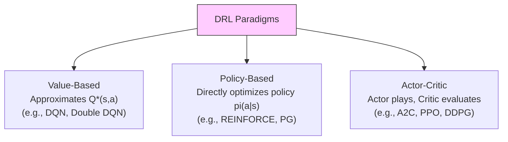

1. **Value-Based Methods:** The network learns to predict the expected returns of actions (e.g., DQN).
2. **Policy-Based Methods:** The network directly outputs a probability distribution over the action space, trained to increase the probability of actions that lead to high rewards (e.g., REINFORCE).
3. **Actor-Critic Methods:** Combines both approaches:
   * **The Actor:** A policy network that selects actions.
   * **The Critic:** A value network that evaluates how good the actor's actions were, reducing gradient variance.

---

### Q.7 c) Explain Simple Reinforcement Learning for Tic-Tac-Toe. [Assumed 10 Marks]

---

### 🔍 1. Formulating Tic-Tac-Toe as an RL Problem
The game of Tic-Tac-Toe can be modeled as a simple reinforcement learning problem where an agent learns an optimal playing strategy through trial-and-error interactions against an opponent.

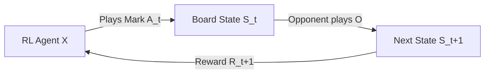

* **States ($S$):** Every possible configuration of the board (all combinations of X's, O's, and empty cells).
* **Actions ($A$):** Selecting an empty cell to place the agent's mark.
* **Rewards ($R$):** 
  * $+1.0$ if the agent wins the game (terminal state).
  * $-1.0$ if the agent loses (terminal state).
  * $0.0$ for draw states or intermediate moves.

---

### ⚙️ 2. Tabular Value Function Learning

The agent maintains a **Value Table** storing a value $V(s) \in [0, 1]$ for every possible board state $s$. This represents the probability of winning the game from that state.

During play, the agent uses an **$\epsilon$-Greedy Policy** to make moves:
* With probability $\epsilon$: Explore by playing a random valid move.
* With probability $1-\epsilon$: Exploit by choosing the move leading to state $s'$ with $\max V(s')$.

#### The Value Update Rule (Temporal Difference):
After making a move from state $s$, the board transitions to a new state $s'$. The value of state $s$ is updated to become closer to the value of state $s'$ using the TD-learning rule:

$$V(s) \leftarrow V(s) + \alpha \left[ V(s') - V(s) \right]$$

*Where:*
* $\alpha \in (0, 1]$ is the learning rate.
* $V(s') - V(s)$ is the temporal difference error between the actual future state value and the current estimate.

---

### Q.8 a) Explain Simple Reinforcement Learning for Tic-Tac-Toe. [Assumed 10 Marks]

---

*(Note: This is a duplicate of **Q.7 c)** in the original syllabus. Its fully detailed, 10-Mark mathematical solution with the complete tabular update equations, states, actions, rewards, and decision loop flowchart is written in full detail immediately above).*

---

### Q.8 b) Write Short Note on Q Learning and Deep Q-Networks. [Assumed 10 Marks]

---

### Part 1: Q-Learning (Tabular Off-Policy Temporal Difference)

#### 🔍 Core Concept
**Q-Learning** is a model-free, off-policy Temporal Difference control algorithm. It learns an action-value function **$Q(s, a)$**, which estimates the expected cumulative future reward of taking action $a$ in state $s$ and behaving optimally thereafter.

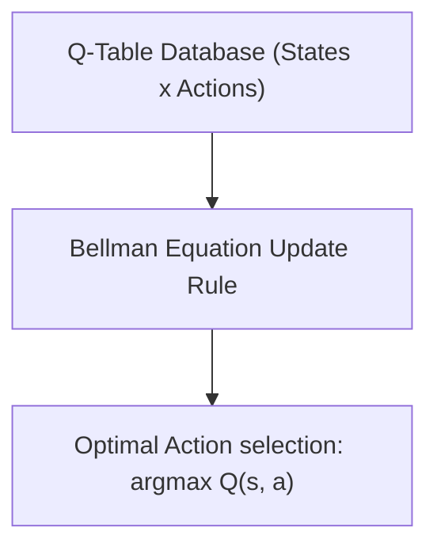

#### The Q-Value Update Equation:
$$Q(s, a) \leftarrow Q(s, a) + \alpha \left[ R(s, a) + \gamma \max_{a'} Q(s', a') - Q(s, a) \right]$$

*Where:*
* $Q(s, a)$ is the current action-value estimate.
* $\alpha$ is the learning rate.
* $R(s, a)$ is the immediate reward received.
* $\gamma$ is the discount factor.
* $\max_{a'} Q(s', a')$ is the estimated value of acting optimally in the next state $s'$ (Off-policy target).

---

### Part 2: Deep Q-Networks (DQN)

#### 🔍 Why DQN?
In complex environments (such as playing Atari games from raw screen pixels), the number of possible states is infinite or continuous. It is impossible to fit a tabular $Q(s, a)$ table into computer memory. 

To solve this, **Deep Q-Networks (DQN)** replace the lookup table with a **Deep Neural Network** (the Q-Network) parameterized by weights $\theta$ to approximate the Q-values: $Q(s, a; \theta) \approx Q^*(s, a)$.

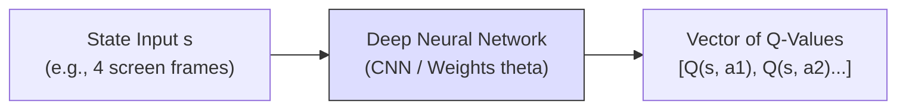

#### ⚙️ Key Stability Innovations in DQN:

1. **Experience Replay Memory:**
   * **The Solution:** The agent stores transitions $(s, a, r, s')$ in a massive replay buffer. During training, it samples random mini-batches from this buffer. This breaks temporal correlations and stabilizes gradient updates.
2. **Target Network ($\theta^-$):**
   * **The Solution:** A separate copy of the network weights ($\theta^-$) is maintained solely to calculate targets. These target weights are held stable and only updated to match the online weights ($\theta$) periodically.

$$\text{Loss } L_i(\theta_i) = \mathbb{E} \left[ \left( R + \gamma \max_{a'} Q(s', a'; \theta_i^-) - Q(s, a; \theta_i) \right)^2 \right]$$

---

### Q.8 c) What are the challenges of Reinforcement Learning? Explain any four in detail. [Assumed 10 Marks]

---

### 🚀 Four Foundational Challenges of Reinforcement Learning

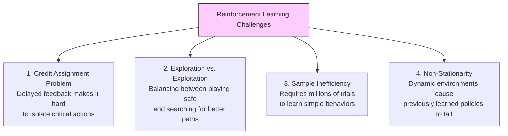

---

### 🔍 Detailed Analysis of the Challenges

#### 1. The Credit Assignment Problem (Delayed Rewards)
* **Explanation:** In many real-world environments, the reward signal is sparse and highly delayed. An agent may perform hundreds of individual actions before receiving any feedback. It is difficult to isolate *which* specific action or sequence of actions was responsible for that win or loss.

#### 2. The Exploration vs. Exploitation Dilemma
* **Explanation:** The agent must balance two competing strategies to maximize its cumulative reward:
  * **Exploitation:** Selecting actions already known to yield high rewards based on current knowledge.
  * **Exploration:** Trying new, unvisited, or low-value actions to discover if they lead to even better strategies.

#### 3. Extreme Sample Inefficiency
* **Explanation:** Unlike human learners, RL agents learn from scratch and typically require millions of interaction steps with the environment to learn basic behaviors, making physical real-world training slow and expensive.

#### 4. Non-Stationarity
* **Explanation:** In RL, as the agent updates its policy, its trajectory path changes, which continuously shifts the distribution of incoming state inputs. This non-stationarity can cause training instability or model collapse.
