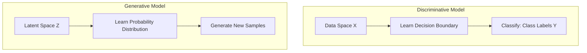
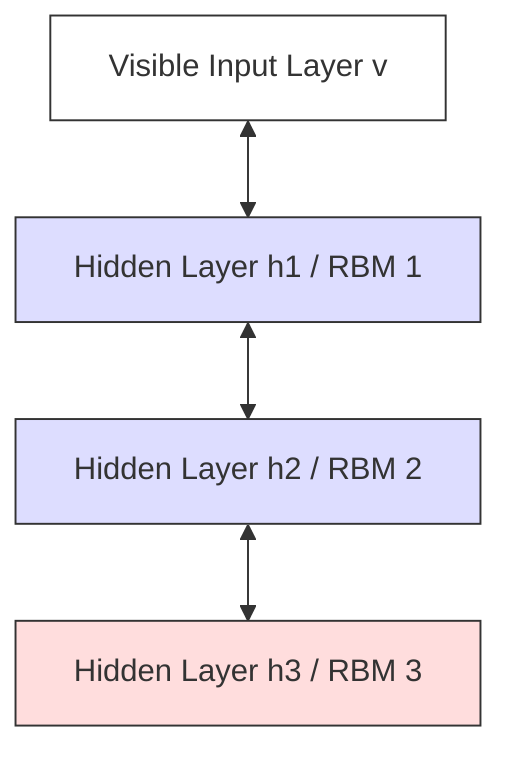
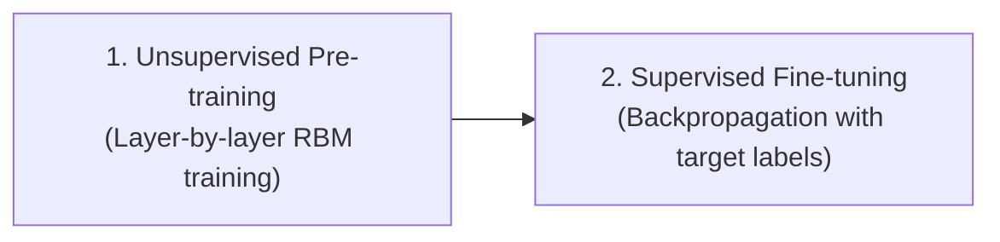
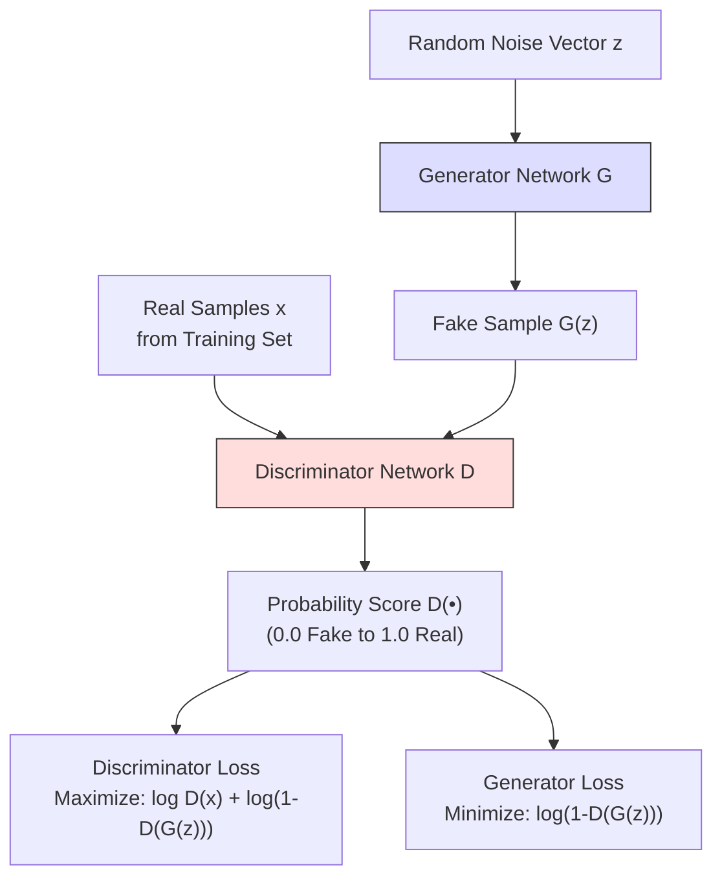
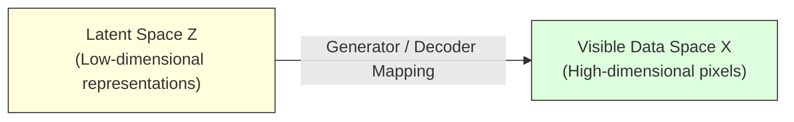
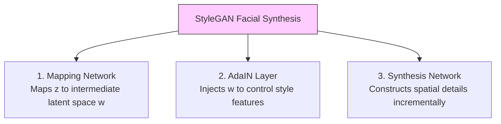
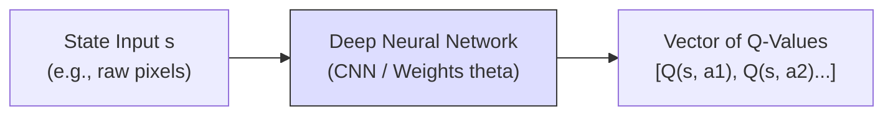
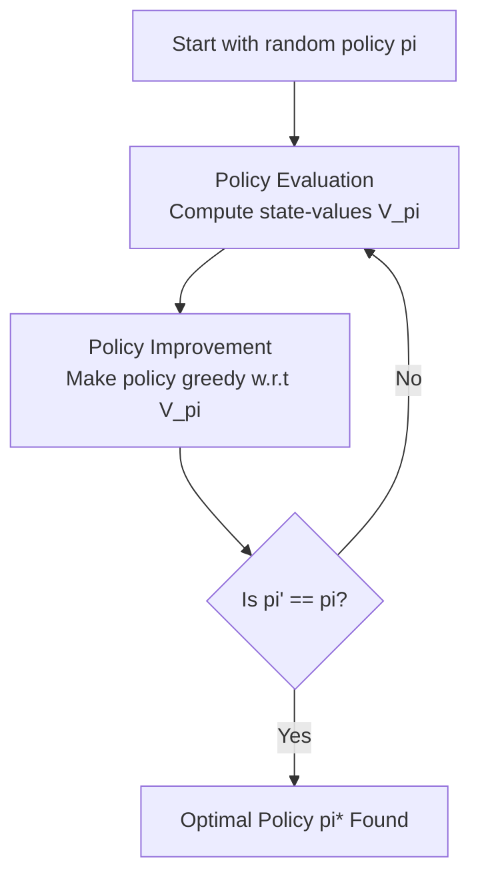
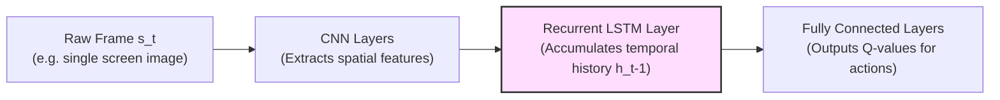
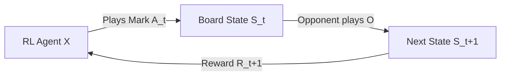

# Deep Learning (410251) - Semester VIII
## Paper 5: [6354]-499 Solution (Second Half: Units III & IV)
### ⚠️ Assumed Weightage: Each Sub-Question is solved for a full 10 Marks standard.

---

## UNIT III - Generative Models & GAN

### Q.5 a) How do deep generative models differ from discriminative models in terms of their learning and inference mechanisms? [Assumed 10 Marks]

---

### 📐 1. Structural Paradigm Comparison
* The **Generative Model** learns the underlying probability distribution of the data to create new samples.
* The **Discriminative Model** learns to separate classes by establishing a decision boundary.

---

### 📊 2. Key Differences: Generative vs. Discriminative

| Feature Parameter | Generative Model | Discriminative Model |
| :--- | :--- | :--- |
| **Mathematical Modeling** | Models the joint probability **$P(X, Y)$** or the data distribution **$P(X)$**. | Models the conditional probability **$P(Y \mid X)$**. |
| **Core Question Asked** | *"How was this data generated? What does a typical sample look like?"* | *"What features distinguish class A from class B?"* |
| **Output Space** | High-dimensional data samples (e.g., synthetic images, text, audio). | A single scalar probability score or class label (classification). |
| **Input Source** | Low-dimensional random noise vector $z$ sampled from a prior distribution (Gaussian). | High-dimensional images or tabular data features. |
| **Primary Goal** | To populate the data space with new, realistic samples. | To find a clean, mathematical decision boundary separating classes. |

---

### Q.5 b) How are Deep Belief Networks structured, and how do they leverage the concept of Restricted Boltzmann Machines? [Assumed 10 Marks]

---

### 🔍 1. Concept Definition
A **Deep Belief Network (DBN)** is a generative graphical model composed of multiple layers of latent, stochastic variables. Introduced by Geoffrey Hinton in 2006, it was one of the first successful architectures to train deep networks, overcoming the challenges of random weight initialization.

---

### ⚙️ 2. Architectural Structure
A DBN is constructed by stacking multiple **Restricted Boltzmann Machines (RBMs)** on top of each other:
* **The Top Two Layers:** Form an undirected associative memory, with symmetric connections ($\leftrightarrow$) similar to a standard RBM.
* **The Lower Layers:** Have directed connections ($\to$) pointing downwards toward the visible input layer, acting as a sigmoid belief network.

---

### 🛠️ 3. The Two-Stage Training Procedure:

#### A) Unsupervised Pre-training (Greedy Layer-by-Layer):
* The first RBM is trained on the raw inputs using Contrastive Divergence.
* Once trained, its weights are frozen, and its hidden activations are used as inputs to train the second RBM.
* This process is repeated layer-by-layer up the stack.
* *Purpose:* This unsupervised pre-training acts as a smart weight initialization technique, placing the model's parameters in a favorable region of the parameter space and resolving the vanishing gradient issues of random initialization.

#### B) Supervised Fine-tuning:
* A classification layer (like Softmax) is added to the top of the network.
* The entire network is trained on labeled data using standard **Backpropagation** to fine-tune the pre-trained weights for the target task.

---

### Q.5 c) What is a Generative Adversarial Network (GAN), and how does it work? [Assumed 10 Marks]

---

### 🔍 1. System Conception
A **Generative Adversarial Network (GAN)** is a class of generative deep learning models introduced by Ian Goodfellow in 2014. It operates on a game-theoretic framework where two neural networks are trained simultaneously in a zero-sum, minimax game:
1. **The Generator ($G$):** A generative network that learns to capture the data distribution to synthesize realistic, fake data samples from random noise.
2. **The Discriminator ($D$):** A discriminative network that acts as a binary classifier, learning to distinguish between real data from the training set and fake data generated by the Generator.

---

### 🧮 2. The Minimax Objective Function
The adversarial game is trained using a single minimax objective function with the value function $V(D, G)$:

$$\min_{G} \max_{D} V(D, G) = \mathbb{E}_{x \sim p_{\text{data}}}[\log D(x)] + \mathbb{E}_{z \sim p_{z}}[\log (1 - D(G(z)))]$$

* **$\max_{D}$:** The Discriminator attempts to maximize this value function. It wants $D(x)$ to be near $1$ (making $\log D(x) \to 0$) and $D(G(z))$ to be near $0$ (making $\log(1 - D(G(z))) \to 0$).
* **$\min_{G}$:** The Generator attempts to minimize this value function. It wants $D(G(z))$ to be near $1$, which drives $(1 - D(G(z))) \to 0$ and causes the second term to become highly negative ($-\infty$).

---

### Q.6 a) Explain the concept of latent variables in deep generative models and their role in capturing complex data distributions. [Assumed 10 Marks]

---

### 🔍 1. Concept Definition
In deep generative modeling, a **Latent Variable ($\mathbf{z}$)** is a hidden, unobserved variable that captures the underlying, abstract structure of the observable data. 

For instance, when generating human faces, raw pixels are the visible variables ($x$). However, properties like "facial angle", "gender", "lighting direction", or "presence of glasses" are not explicitly labeled at the pixel level; they are represented implicitly as coordinates in a low-dimensional **Latent Space ($Z$)**.

---

### ⚙️ 2. The Core Role of Latent Variables

Latent variables play three vital roles in generative architectures:

#### A) Dimensionality Reduction and Representation
Real-world data (such as a $1024 \times 1024$ color image, which has over 3 million pixels) is highly complex and redundant. Latent variables compress this high-dimensional space into a dense, low-dimensional coordinate system (typically $100$ to $512$ dimensions), retaining only the core semantic attributes of the data.

#### B) Disentanglement of Features
A well-trained generative model learns to **disentangle** features in the latent space. This means different dimensions of the latent vector $z$ correspond to independent real-world factors.
* For example, shifting coordinate $z_1$ might change only the "hair color", while shifting $z_2$ changes only the "facial angle".

#### C) Defining Probability Manifolds
DGMs assume that high-dimensional data points lie on a lower-dimensional manifold embedded within the high-dimensional space. Latent variables allow the model to define and sample from this smooth probability manifold, enabling interpolations (e.g. smoothly morphing one face into another by linearly traversing between two latent vectors: $z_{\text{interp}} = (1-\lambda)z_1 + \lambda z_2$).

---

### Q.6 b) What are the fundamental characteristics of Boltzmann Machines, and how do they model probabilistic dependencies? [Assumed 10 Marks]

---

### 🔍 1. System Conception
A **Boltzmann Machine** is an energy-based, undirected graphical model (a stochastic recurrent neural network) designed to learn the underlying probability distribution of a given dataset in an unsupervised fashion.

#### Topological Characteristics:
* **Undirected Connections:** The connections between units are undirected and symmetric, meaning the weight $w_{ij}$ from unit $i$ to unit $j$ is identical to the weight $w_{ji}$ from unit $j$ to unit $i$ ($w_{ij} = w_{ji}$).
* **No Self-Connections:** A unit is never connected to itself ($w_{ii} = 0$).
* **Stochastic Behavior:** Units update their states probabilistically based on the states of their neighbors and their own internal biases.

---

### ⚡ 2. Mathematical Foundations: The Energy Concept

Boltzmann Machines are **energy-based models**. The network assigns a scalar energy value to every possible joint configuration of visible units $v$ and hidden units $h$.

#### A) Energy Function of a State:
The energy of a specific joint state configuration $(v, h)$ is defined mathematically as:

$$E(v, h) = -\sum_{i} a_i v_i - \sum_{j} b_j h_j - \sum_{i} \sum_{j} w_{ij} v_i h_j$$

*Where:*
* $v_i$ is the binary state of visible unit $i$.
* $h_j$ is the binary state of hidden unit $j$.
* $w_{ij}$ is the symmetric weight between visible unit $i$ and hidden unit $j$.
* $a_i$ is the bias term for visible unit $i$.
* $b_j$ is the bias term for hidden unit $j$.

#### B) Probabilistic State Distribution (Gibbs/Boltzmann Distribution):
The probability of the network occupying a specific joint configuration $(v, h)$ is inversely proportional to its energy, governed by the Boltzmann distribution:

$$P(v, h) = \frac{e^{-E(v, h)}}{Z}$$

*Where $Z$ is the **Partition Function**, which acts as a normalizing constant summing the raw probabilities of all possible configurations:*
$$Z = \sum_{\mathbf{v}'} \sum_{\mathbf{h}'} e^{-E(\mathbf{v}', \mathbf{h}')}$$

---

### Q.6 c) How can GANs be used in generating realistic images, such as human faces or artistic images? [Assumed 10 Marks]

---

### 🚀 GAN Image Generation Mechanics

1. **Mapping Network (Latent Disentanglement):** StyleGAN maps a standard latent vector $z$ to an intermediate latent space $w \in W$ using an MLP. This decouples factors of variation so that independent characteristics (e.g. skin tone, hair texture) are represented along different axes.
2. **Style Injection (AdaIN):** The intermediate vector $w$ is translated into scaling and shifting parameters, which are injected into the convolutional feature maps at each resolution scale using **Adaptive Instance Normalization (AdaIN)**:
   $$\text{AdaIN}(x_i, y) = y_{s,i} \left( \frac{x_i - \mu(x_i)}{\sigma(x_i)} \right) + y_{b,i}$$
3. **Multi-Scale Spatial Synthesis:** Features are synthesized progressively from low-resolution ($4 \times 4$) up to high-resolution ($1024 \times 1024$), allowing the model to construct fine spatial details incrementally.

---
---

## UNIT IV - Reinforcement Learning

### Q.7 a) Explain objectives and challenges of deep reinforcement learning in comparison to traditional reinforcement learning methods. [Assumed 10 Marks]

---

### 📊 Comparative Analysis: Traditional RL vs. Deep RL

| Parameter | Traditional Reinforcement Learning | Deep Reinforcement Learning (DRL) |
| :--- | :--- | :--- |
| **State representation** | Hand-crafted state variables, discrete state spaces. | Auto-extracted features directly from high-dimensional pixels or sensory data. |
| **Scalability** | Suffers from the **Curse of Dimensionality** in large state spaces. | Highly scalable, using deep networks as function approximators. |
| **Stability** | Highly stable with guaranteed mathematical convergence. | Prone to divergence, requiring stabilization techniques (experience replay, target networks). |
| **Typical Algorithms** | Tabular Q-learning, SARSA, Dynamic Programming. | Deep Q-Networks (DQN), PPO, Actor-Critic (A3C). |

---

### Q.7 b) Describe the concept of Deep Q-Networks (DQN) and how they combine Q-learning with deep neural networks. [Assumed 10 Marks]

---

### 🔍 1. Introduction to Deep Q-Networks (DQN)
**Deep Q-Learning (DQN)** replaces the tabular $Q(s, a)$ lookup table of traditional Q-learning with a **Deep Neural Network** parameterized by weights $\theta$ to approximate the Q-values in continuous or massive state spaces:
$$Q(s, a; \theta) \approx Q^*(s, a)$$

---

### ⚙️ 2. Key Stability Innovations in DQN

#### A) Experience Replay Memory ($\mathcal{D}$)
* **The Solution:** The agent stores transitions $(s, a, r, s')$ in a massive replay buffer. During training, it samples random mini-batches from this buffer. This breaks temporal correlations and stabilizes gradient updates.

#### B) Target Network ($\theta^-$)
* **The Solution:** A separate copy of the network weights ($\theta^-$) is maintained solely to calculate targets. These target weights are held stable and only updated to match the online weights ($\theta$) periodically.

$$\text{Loss } L_i(\theta_i) = \mathbb{E} \left[ \left( R + \gamma \max_{a'} Q(s', a'; \theta_i^-) - Q(s, a; \theta_i) \right)^2 \right]$$

---

### Q.7 c) Explain how Dynamic Programming algorithms such as policy iteration and value iteration are used in reinforcement learning. [Assumed 10 Marks]

---

### Algorithm 1: Policy Iteration

Policy Iteration alternates between two distinct phases until the policy stabilizes:

#### Phase 1: Policy Evaluation
Computes the state-value function $V^\pi(s)$ for the current policy $\pi$. It iteratively applies the Bellman Expectation Equation across all states:
$$V_{k+1}(s) = \sum_{a \in A} \pi(a \mid s) \sum_{s' \in S} P(s' \mid s, a) \left[ R(s, a, s') + \gamma V_k(s') \right]$$

#### Phase 2: Policy Improvement
Updates the policy to be greedy with respect to the newly calculated value function:
$$\pi'(s) = \arg\max_{a \in A} \sum_{s' \in S} P(s' \mid s, a) \left[ R(s, a, s') + \gamma V^\pi(s') \right]$$

---

### Algorithm 2: Value Iteration

Unlike Policy Iteration, **Value Iteration** does not wait for the policy evaluation to fully converge. Instead, it combines evaluation and policy improvement into a single update step by applying the **Bellman Optimality Equation** directly:

$$V_{k+1}(s) = \max_{a \in A} \sum_{s' \in S} P(s' \mid s, a) \left[ R(s, a, s') + \gamma V_k(s') \right]$$

The optimal policy is then extracted in a single step:
$$\pi^*(s) = \arg\max_{a \in A} \sum_{s' \in S} P(s' \mid s, a) \left[ R(s, a, s') + \gamma V^*(s') \right]$$

---

### Q.8 a) What are the key components of a Markov Decision Process (MDP), and how do they relate to the decision-making process of an agent? [Assumed 10 Marks]

---

### 📐 Markov Decision Process (MDP) tuple
An MDP is formally defined by a 5-tuple $(S, A, P, R, \gamma)$:
1. **State Space ($S$):** A finite set containing all valid states that the environment can occupy.
2. **Action Space ($A$):** A finite set of all actions available to the agent from a given state.
3. **Transition Probability Function ($P$):** Specifies the probability of landing in a future state $s'$ given that the agent takes action $a$ in current state $s$:
   $$P(s' \mid s, a) = \mathbb{P}(S_{t+1} = s' \mid S_t = s, A_t = a)$$
4. **Reward Function ($R$):** A feedback signal returned by the environment immediately after the transition:
   $$R(s, a, s') = \mathbb{E}[R_{t+1} \mid S_t = s, A_t = a, S_{t+1} = s']$$
5. **Discount Factor ($\gamma$):** A scalar value $\gamma \in [0, 1)$ that determines the present value of future rewards. It ensures mathematical convergence of infinite horizon returns:
   $$G_t = \sum_{k=0}^{\infty} \gamma^k R_{t+k+1} \le \frac{R_{\max}}{1 - \gamma}$$

---

### Q.8 b) How do Deep Q Recurrent Networks (DQRN) extend the capabilities of DQNs in handling sequential decision-making problems? [Assumed 10 Marks]

---

### 🔍 1. Introduction: The Limit of DQN in POMDPs
A standard **Deep Q-Network (DQN)** assumes that the environment is a fully observable Markov Decision Process (MDP). This means that a single observation frame $s_t$ contains all the information needed to define the complete state of the environment.

However, many real-world environments are **Partially Observable Markov Decision Processes (POMDPs)**. Under partial observability, a single screen frame is not enough to define the state. 

Introduced by Hausknecht and Stone in 2015, the **Deep Recurrent Q-Network (DQRN)** resolves partial observability by replacing the first fully connected layer of a standard DQN with an **LSTM layer**.

* **Spatial Processing (CNN):** The raw frame is passed through convolutional layers to extract spatial features.
* **Temporal Integration (LSTM):** The spatial features are fed into an LSTM recurrent layer. The LSTM maintains a persistent hidden state ($h_t$) that accumulates memory of past frames over time, resolving state partial observability.

---

### Q.8 c) How can reinforcement learning be applied to learn to play Tic-Tac-Toe? [Assumed 10 Marks]

---

### 🔍 1. Formulating Tic-Tac-Toe as an RL Problem
The game of Tic-Tac-Toe can be modeled as a simple reinforcement learning problem where an agent learns an optimal playing strategy through trial-and-error interactions against an opponent.

* **States ($S$):** Every possible configuration of the board (all combinations of X's, O's, and empty cells).
* **Actions ($A$):** Selecting an empty cell to place the agent's mark.
* **Rewards ($R$):** 
  * $+1.0$ if the agent wins the game (terminal state).
  * $-1.0$ if the agent loses (terminal state).
  * $0.0$ for draw states or intermediate moves.

#### The Value Update Rule (Temporal Difference):
After making a move from state $s$, the board transitions to a new state $s'$. The value of state $s$ is updated to become closer to the value of state $s'$ using the TD-learning rule:

$$V(s) \leftarrow V(s) + \alpha \left[ V(s') - V(s) \right]$$

*Where:*
* $\alpha \in (0, 1]$ is the learning rate.
* $V(s') - V(s)$ is the temporal difference error between the actual future state value and the current estimate.
