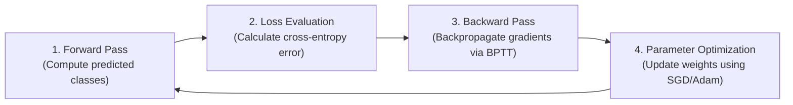
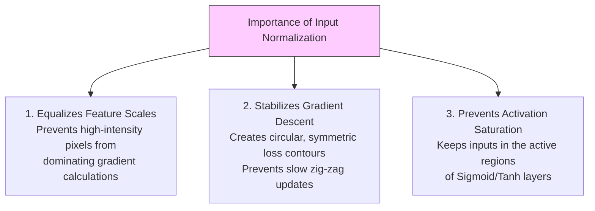
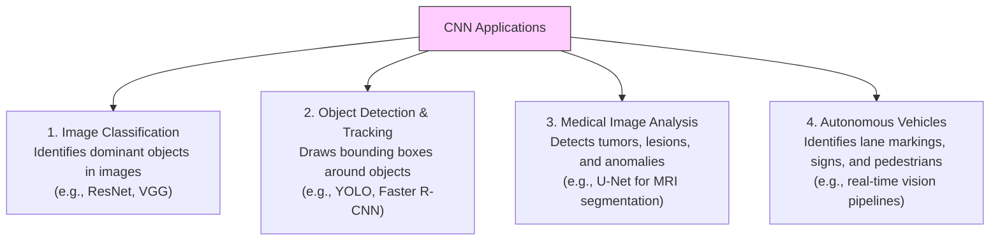
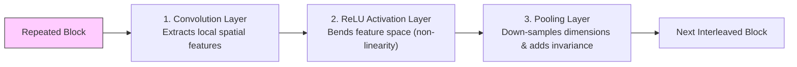
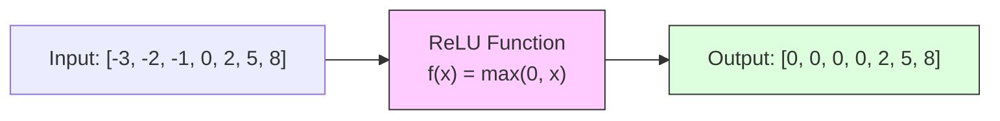
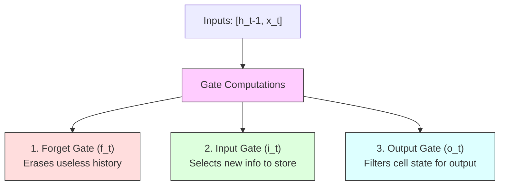
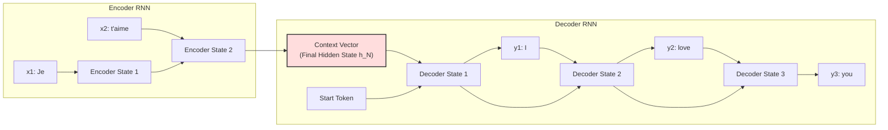
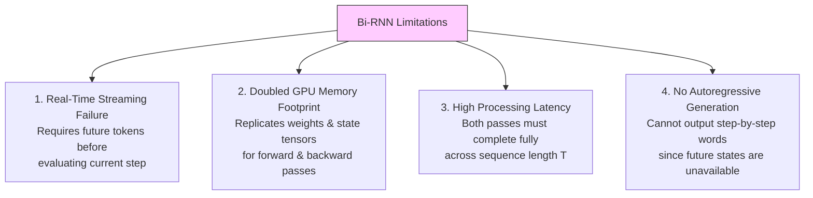
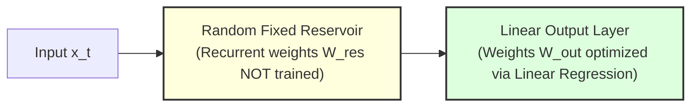

# Deep Learning (410251) - Semester VIII
## Paper 6: [6584]-82 Solution (First Half: Units I & II)
### ⚠️ Assumed Weightage: Each Sub-Question is solved for a full 10 Marks standard.

---

## UNIT I - Convolutional Neural Networks (CNN)

### Q.1 a) List the main steps involved in training a CNN for image classification. Why normalization is important before training a CNN. [Assumed 10 Marks]

---

### Part 1: Main Steps in Training a CNN for Image Classification

Training a CNN is a closed-loop parameter optimization process executed in four major steps:



1. **The Forward Pass:** Input images are passed through successive Convolution, ReLU, Pooling, and Fully Connected layers. The output logits are passed through a Softmax function to produce predicted probabilities: $\hat{\mathbf{y}} = f(\mathbf{x}; \mathbf{W})$.
2. **Loss Function Evaluation:** The predictions are compared with the true labels using a loss function, typically **Categorical Cross-Entropy**:
   $$L = -\sum_{c=1}^{K} y_c \log(\hat{y}_c)$$
3. **The Backward Pass (Backpropagation):** The gradient of the loss with respect to each weight ($\nabla_{\mathbf{W}} L$) is calculated from the output layer back to the input layer using the calculus chain rule.
4. **Parameter Optimization (The Weight Update):** An optimization algorithm (like SGD or Adam) uses these gradients to update the weights, moving them in the direction that minimizes the loss:
   $$\mathbf{W} \leftarrow \mathbf{W} - \eta \cdot \nabla_{\mathbf{W}} L$$

---

### Part 2: The Critical Importance of Input Normalization

Before training a CNN, the input raw pixel intensities (ranging from $[0, 255]$) are normalized (usually scaled to a range of $[0, 1]$ or standardized to have a mean of $0$ and a standard deviation of $1$). This is highly critical for three reasons:



#### A) Equalizing Feature Scales
If different features have vastly different numerical scales (e.g. pixel value $255$ vs. a binary channel value $1$), the weights associated with the larger values will receive massive gradients, dominating the training process. Normalizing ensures all features contribute equally to learning.

#### B) Stabilizing and Accelerating Gradient Descent
When features are not normalized, the loss function contours become highly stretched and elongated (elliptical). This causes gradient descent to oscillate and "zig-zag" back and forth, requiring a very small learning rate and taking a long time to converge. 
Normalization creates symmetric, circular loss contours, allowing the optimizer to make smooth, direct updates toward the global minimum, enabling much faster training.

#### C) Preventing Activation Saturation
For layers using bounded activations like Sigmoid or Tanh, feeding large unnormalized values ($> 10$ or $< -10$) pushes the neurons into the flat "saturated" regions of the activation curves, where the derivative is near-zero. This causes vanishing gradients, halting the learning process.

---

### Q.1 b) Given an input of size 64×64, kernel size 5×5, stride=2, and 'same' padding: [Assumed 10 Marks]
### i) What will be the size of the output feature map?
### ii) How does padding help retain the spatial size?

---

### 🧮 Part i) Size of the Output Feature Map Calculation

We are given the following hyperparameters:
* **Input Width/Height ($W_{\text{in}}$):** $64 \times 64$
* **Kernel/Filter Size ($f$):** $5 \times 5$
* **Stride ($s$):** $2$
* **Padding Type ($p$):** "same"

#### Mathematical Explanation of "Same" Padding:
Under the "same" padding paradigm, the padding $p$ is calculated automatically to ensure that the output spatial size is equal to the input size divided by the stride, rounded up:

$$\text{Output Size } W_{\text{out}} = \lceil \frac{W_{\text{in}}}{s} \rceil$$

Plugging in our values:
$$W_{\text{out}} = \lceil \frac{64}{2} \rceil = \lceil 32.0 \rceil = \mathbf{32}$$

Thus, the size of the output feature map is exactly **$32 \times 32$**.

#### Derivation of the Padding Size ($p$):
To verify this, we can calculate the exact number of padding pixels required. The general output spatial dimension formula is:
$$W_{\text{out}} = \lfloor \frac{W_{\text{in}} - f + 2p}{s} \rfloor + 1$$

We plug in our known values and solve for $p$:
$$32 = \lfloor \frac{64 - 5 + 2p}{2} \rfloor + 1$$
$$31 = \lfloor \frac{59 + 2p}{2} \rfloor$$

To satisfy this floor division, the term $(59 + 2p)$ must be at least $62$:
$$59 + 2p \ge 62 \implies 2p \ge 3 \implies p = \mathbf{2}$$

Thus, the network automatically applies **2 pixels of padding** around all outer borders of the $64 \times 64$ image to yield a $32 \times 32$ output feature map when convolved with a $5 \times 5$ filter at stride 2.

---

### 🛡️ Part ii) How Padding Helps Retain Spatial Size

Padding prevents the spatial dimensions of feature maps from shrinking due to two main mechanisms:

#### A) Centering the Kernel on Edge Pixels
During a standard convolution without padding (Valid Padding), the filter must stay completely within the boundaries of the input image. This means the outermost center position the filter can occupy is offset from the actual image edge by $\frac{f-1}{2}$ pixels, causing the output feature map to shrink.
By wrapping the borders in padding, we allow the filter's center to align directly over the outermost edge pixels of the actual image. This enables edge pixels to be processed as "center" pixels, preserving the spatial resolution.

#### B) Balancing the Filter-Size Contraction
The filter size $f$ naturally shrinks the spatial map by $(f-1)$ pixels. Adding a padding border of size $p$ adds $2p$ pixels to the height and width. By setting $2p = f-1$ (Same Padding), the spatial padding perfectly counteracts the filter-size contraction, maintaining an output size equal to the input.

---

### Q.1 c) What are CNNs primarily used for in deep learning? List at least four real-world applications. [Assumed 10 Marks]

---

### 🚀 Real-World Applications of CNNs



#### A) Image Classification
* **Role:** Assigns a single categorical label to an input image (e.g. classifying a scan as "dog" or "cat"). Standard architectures include ResNet and VGG.

#### B) Object Detection & Tracking
* **Role:** Identifies the presence and spatial locations of multiple objects in an image or video, drawing coordinates (bounding boxes) around them. Used heavily in surveillance and retail (e.g. YOLO, Faster R-CNN).

#### C) Medical Image Segmentation
* **Role:** Analyzes CT, MRI, or X-ray scans at the pixel level to detect tumors, tissue boundaries, or anomalies, enabling doctors to plan surgeries or diagnose diseases (e.g. U-Net).

#### D) Autonomous Driving (Robotic Vision)
* **Role:** Evaluates high-resolution camera feeds in real-time to identify lanes, pedestrians, traffic signs, and other vehicles, guiding steering and acceleration decisions.

---

### Q.2 a) What is Interleaving Between Layers in CNN? Why is Interleaving Important? Explain the role of each interleaving layer. [Assumed 10 Marks]

---

### 🔍 1. Concept Definition
In a Convolutional Neural Network (CNN), **Interleaving** refers to the alternating sequential stacking of Convolutional (Conv), Activation (ReLU), and Pooling (Pool) layers. 

Rather than grouping similar layers together, a CNN interleaves them in repeated blocks: **[Conv $\to$ ReLU $\to$ Pool] $\to$ [Conv $\to$ ReLU $\to$ Pool]**.



---

### 🚀 2. Why Interleaving is Important

#### A) Incremental Non-Linearity Insertion
If we stacked multiple Convolution layers without intervening Activation layers, they would mathematically collapse into a single linear layer, losing the ability to learn complex shapes. Interleaving a ReLU layer after *each* Convolution layer ensures that the network injects non-linear "bends" step-by-step, allowing it to approximate highly intricate, squiggly decision boundaries.

#### B) Controlled Receptive Field and Dimension Scaling
If we stacked all Pooling layers at the very beginning, we would lose fine spatial details (like thin edges) before the filters could extract them. Conversely, if we stacked all Pooling layers at the very end, the GPU memory would blow up due to the massive un-pooled activations. 
Interleaving pooling layers periodically ensures that we extract detailed local features first, down-sample to reduce spatial redundancy, expand our receptive field, and then extract higher-level abstract features in a stable, memory-efficient manner.

---

### Q.2 b) What is the ReLU activation function? Write its mathematical expression and describe how it transforms the input x=[–3,–2,–1,0,2,5,8]. [Assumed 10 Marks]

---

### 📈 1. Mathematical Definition of ReLU
The **Rectified Linear Unit (ReLU)** is a piecewise linear activation function defined mathematically as:
$$f(x) = \max(0, x)$$

Which evaluates to:
* $f(x) = 0$ when $x < 0$
* $f(x) = x$ when $x \ge 0$

---

### 🧮 2. Step-by-Step Vector Transformation Trace

We are given the following input vector of raw activations:
$$\mathbf{x} = [-3, -2, -1, 0, 2, 5, 8]$$

Applying the ReLU activation function $f(x) = \max(0, x)$ to each element of the vector step-by-step:

1. **For $x_1 = -3$:** Since $-3 < 0$, the output is $\max(0, -3) = \mathbf{0}$.
2. **For $x_2 = -2$:** Since $-2 < 0$, the output is $\max(0, -2) = \mathbf{0}$.
3. **For $x_3 = -1$:** Since $-1 < 0$, the output is $\max(0, -1) = \mathbf{0}$.
4. **For $x_4 = 0$:** Since $0 \ge 0$, the output is $\max(0, 0) = \mathbf{0}$.
5. **For $x_5 = 2$:** Since $2 > 0$, the output is $\max(0, 2) = \mathbf{2}$.
6. **For $x_6 = 5$:** Since $5 > 0$, the output is $\max(0, 5) = \mathbf{5}$.
7. **For $x_7 = 8$:** Since $8 > 0$, the output is $\max(0, 8) = \mathbf{8}$.

#### Final Transformed Output Vector:
$$f(\mathbf{x}) = [\mathbf{0}, \mathbf{0}, \mathbf{0}, \mathbf{0}, \mathbf{2}, \mathbf{5}, \mathbf{8}]$$



---

### Q.2 c) Explain how input data flows through a typical CNN architecture from the raw image to the final output layer. [Assumed 10 Marks]

---

### 🗺️ CNN Spatial Transformation Pipeline

A Convolutional Neural Network consists of a sequence of layers that process input images, extract spatial hierarchies of features, and map them to class probabilities.

```mermaid
graph LR
    Input["Input Image<br/>(e.g., 224x224x3)"] --> Conv["Convolution Layer<br/>(Extracts Features)"]
    Conv --> ReLU["ReLU Layer<br/>(Non-linearity)"]
    ReLU --> Pool["Pooling Layer<br/>(Down-sampling)"]
    Pool --> Flatten["Flattening Layer<br/>(3D to 1D vector)"]
    Flatten --> FC["Fully Connected<br/>(Classification)"]
    FC --> Softmax["Softmax Layer<br/>(Probability Output)"]
    
    style Input fill:#fff,stroke:#333,stroke-width:1px
    style Conv fill:#ddf,stroke:#333,stroke-width:1px
    style ReLU fill:#dfd,stroke:#333,stroke-width:1px
    style Pool fill:#fdd,stroke:#333,stroke-width:1px
    style Flatten fill:#fdf,stroke:#333,stroke-width:1px
    style FC fill:#ffd,stroke:#333,stroke-width:1px
    style Softmax fill:#dff,stroke:#333,stroke-width:1px
```



* **Step 1: Input ingestion:** The 3D tensor $H \times W \times 3$ (RGB pixels) enters the network.
* **Step 2: Local Feature Scan:** Convolution filters slide across the image, producing 2D activation grids (feature maps).
* **Step 3: Thresholding:** ReLU replaces negative activation values with $0$ in-place.
* **Step 4: Spatial Down-Sampling:** Max Pooling slides across each feature map independently to shrink height and width, leaving depth unchanged.
* **Step 5: Structural Unrolling:** The final spatial block is flattened into a long 1D feature vector.
* **Step 6: Reasoning & Prediction:** Fully Connected layers map features to raw logits, which Softmax normalizes into class probabilities.

---
---

## UNIT II - Recurrent Neural Networks (RNN)

### Q.3 a) How is the computational graph of an RNN different from that of a feedforward neural network? [Assumed 10 Marks]

---

### 📐 Structural Comparison
* **Feedforward Neural Network (MLP):** Processes all inputs at once in one direction. The topology is an acyclic, static graph where outputs have no feedback loops.
* **Recurrent Neural Network (RNN):** Processes data sequentially over time. The topology is a **cyclic graph** with internal feedback connections that loop states over consecutive steps.

```mermaid
graph TD
    subgraph Recurrent (Linear Chain)
        R_X1[x1] --> R_H1[h1]
        R_H1 --> R_H2[h2]
        R_X2[x2] --> R_H2
        R_H2 --> R_H3[h3]
        R_X3[x3] --> R_H3
    end
    subgraph Feedforward (Static)
        F_In1[Input x1] --> F_H1[Dense Hidden State]
        F_In2[Input x2] --> F_H1
        F_H1 --> F_Out[Output Prediction]
    end
    
    style R_H3 fill:#ddf,stroke:#333
    style F_Out fill:#fdd,stroke:#333
```

---

### Q.3 b) List the types of RNN and explain LSTM three gates. [Assumed 10 Marks]

---

### ⚙️ The Three Gate Mechanisms of LSTM:

The LSTM cell state conveyor belt ($C_t$) allows long-term gradients to flow back through time without decaying, controlled by three gates:



* **Forget Gate ($f_t$):** $f_t = \sigma(W_f \cdot [h_{t-1}, x_t] + b_f)$ (outputs between 0 and 1, scaling what to erase from $C_{t-1}$).
* **Input Gate ($i_t$):** $i_t = \sigma(W_i \cdot [h_{t-1}, x_t] + b_i)$ and candidate $\tilde{C}_t = \tanh(W_c \cdot [h_{t-1}, x_t] + b_c)$. Updates cell state: $C_t = f_t * C_{t-1} + i_t * \tilde{C}_t$.
* **Output Gate ($o_t$):** $o_t = \sigma(W_o \cdot [h_{t-1}, x_t] + b_o)$ and output $h_t = o_t * \tanh(C_t)$.

---

### Q.3 c) What is Encoder-Decoder architecture, and how does it work in sequence-to-sequence learning? [Assumed 10 Marks]

---

### 🗺️ Detailed Architectural Pipeline

The Seq2Seq model consists of two primary recurrent networks: an **Encoder** and a **Decoder**, bridged by a bottleneck vector called the **Context Vector**.



* **The Encoder RNN:** Reads and compresses the input sequence.
* **The Context Vector:** Serves as the information bridge, holding the compressed semantic meaning of the entire source sequence.
* **The Decoder RNN:** Autoregressively translates the Context Vector back into a variable-length output sequence, starting with `<SOS>` and ending with `<EOS>`.

---

### Q.4 a) What are limitations of Bidirectional RNNs, and how do they differ from standard RNNs? [Assumed 10 Marks]

---

### ⚠️ Four Critical Limitations of Bidirectional RNNs



1. **Incompatible with Real-Time Streaming:** Because the backward layer must process the sequence from end to start, a Bi-RNN requires access to the entire future sequence. It cannot be used for live tasks like streaming audio translation.
2. **Doubled Computational & Memory Overhead:** Duplicates the entire network structure, running two separate sets of recurrent matrices and hidden state tensors, doubling GPU memory and FLOPs.
3. **Increased Latency:** The forward and backward layers must complete their entire sequential passes across the full sequence length $T$ before decoding can begin.
4. **Not Applicable to Autoregressive Decoding:** Generative models output tokens one-by-one, where future words do not yet exist. Thus, Bi-RNNs cannot be used in generative text decoder heads.

---

### Q.4 b) Explain any seven Challenges of Long-Term Dependencies. [Assumed 10 Marks]

---

### 🚀 Seven Core Challenges of Long-Term Dependencies

Standard recurrent networks struggle to model dependencies separated by large temporal gaps due to seven fundamental mathematical and computational challenges:

1. **Vanishing Gradients:** Jacobian multiplications of weights decay gradients exponentially to near-zero over time, causing early weights to stop updating.
2. **Exploding Gradients:** Conversely, if eigenvalues of $W_{hh} > 1$, gradients grow exponentially, leading to numerical overflow (NaN errors) and model collapse.
3. **GPU Memory Consumption:** BPTT requires storing the complete history of hidden activations for *every* time step in GPU memory to compute derivatives.
4. **The Information Bottleneck (Loss of Context):** An RNN compresses an entire historical sequence into a single, fixed-size hidden state vector $h_t$, progressively overwriting older details.
5. **Sequential Processing Latency:** Because step $t$ requires the hidden state $h_{t-1}$ from the previous step, RNN calculations must be executed sequentially, preventing GPU parallelization.
6. **Numerical Training Instabilities:** The combination of vanishing and exploding gradients makes the optimization landscape highly erratic, prone to sudden divergence.
7. **Overfitting to Short-Term Patterns:** Because gradients from nearby steps are much stronger than gradients from distant steps, the model naturally prioritizes learning immediate, short-term correlations.

---

### Q.4 c) How Echo State Network differs from Traditional RNNs? [Assumed 10 Marks]

---

### 🔍 1. Concept Definition
An **Echo State Network (ESN)** is a class of recurrent neural networks that falls under the paradigm of **Reservoir Computing**. 

To completely bypass the difficulty of training recurrent weights (which causes vanishing and exploding gradients in standard RNNs), an ESN uses a large, random, fixed recurrent layer called the **Reservoir**. During training, only the linear output layer is optimized, which makes training extremely fast and stable.



* **Recurrent Weights are Frozen:** The input weight matrix $W_{\text{in}}$ and the reservoir recurrent matrix $W_{\text{res}}$ are randomly initialized and locked. They are never updated.
* **Linear Regression Learning:** Only the output weights $W_{\text{out}}$ are trained. Since the mapping is purely linear, it is solved in a single step using **Linear Least Squares Regression**, bypassing BPTT and gradient vanishing completely.
* **Fading Memory Echo:** The reservoir is scaled so that its spectral radius is slightly less than 1.0, ensuring that the reservoir states act as a fading "echo" of past inputs.
