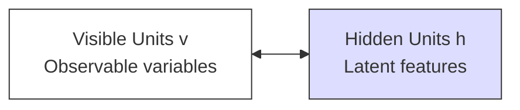
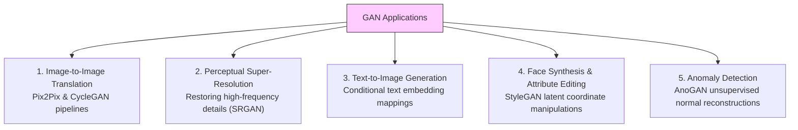
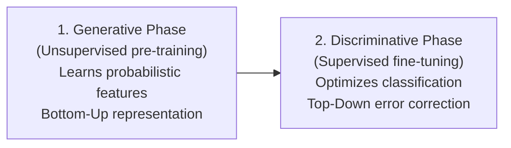
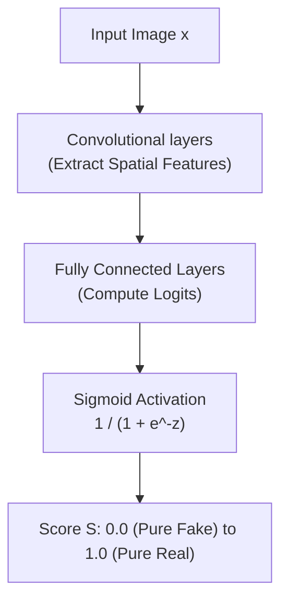
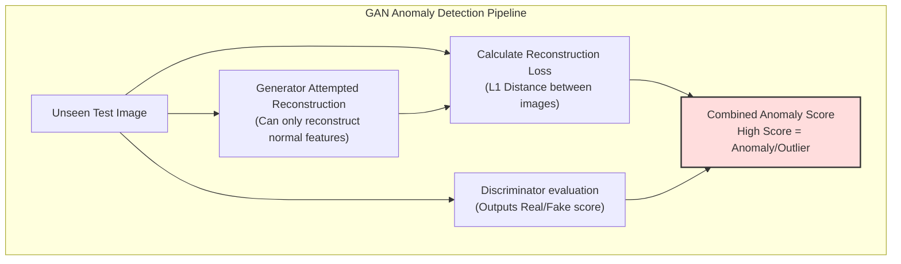
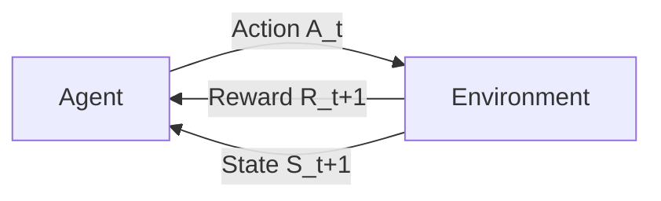
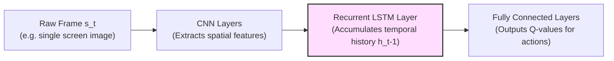
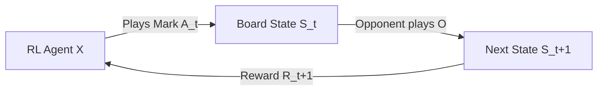

# Deep Learning (410251) - Semester VIII
## Paper 6: [6584]-82 Solution (Second Half: Units III & IV)
### ⚠️ Assumed Weightage: Each Sub-Question is solved for a full 10 Marks standard.

---

## UNIT III - Generative Models & GAN

### Q.5 a) What is a Boltzmann Machine? Describe its structure and components. [Assumed 10 Marks]

---

### 🔍 1. System Conception
A **Boltzmann Machine** is an energy-based, undirected graphical model (a stochastic recurrent neural network) designed to learn the underlying probability distribution of a given dataset in an unsupervised fashion. Introduced by Geoffrey Hinton and Terry Sejnowski in 1985, it is rooted in the principles of statistical mechanics and thermodynamics.

---

### ⚡ 2. Mathematical Foundations: The Energy Concept

Boltzmann Machines are **energy-based models**. The network assigns a scalar energy value to every possible joint configuration of visible units $v$ and hidden units $h$.

#### A) Energy Function of a State:
The energy of a specific joint state configuration $(v, h)$ is defined mathematically as:

$$E(v, h) = -\sum_{i} a_i v_i - \sum_{j} b_j h_j - \sum_{i} \sum_{j} w_{ij} v_i h_j$$

*Where:*
* $v_i$ is the binary state of visible unit $i$.
* $h_j$ is the binary state of hidden unit $j$.
* $w_{ij}$ is the symmetric weight between visible unit $i$ and hidden unit $j$.
* $a_i$ is the bias term for visible unit $i$.
* $b_j$ is the bias term for hidden unit $j$.

#### B) Probabilistic State Distribution (Gibbs/Boltzmann Distribution):
The probability of the network occupying a specific joint configuration $(v, h)$ is inversely proportional to its energy, governed by the Boltzmann distribution:

$$P(v, h) = \frac{e^{-E(v, h)}}{Z}$$

*Where $Z$ is the **Partition Function**, which acts as a normalizing constant summing the raw probabilities of all possible configurations:*
$$Z = \sum_{\mathbf{v}'} \sum_{\mathbf{h}'} e^{-E(\mathbf{v}', \mathbf{h}')}$$

---

### Q.5 b) List at least five real-world applications of GANs and describe any one in detail. [Assumed 10 Marks]

---

### 🚀 GAN Application Taxonomy

#### Detailed Focus: Image-to-Image Translation (CycleGAN)
CycleGAN translates images from a source domain $X$ (e.g. photos of summer) to a target domain $Y$ (e.g. winter) without requiring paired training data (unpaired training).

It utilizes two generators ($G \colon X \to Y$ and $F \colon Y \to X$) and two discriminators. To prevent the generators from hallucinating completely new images, CycleGAN introduces a **Cycle Consistency Loss** ensuring that translating from $X$ to $Y$ and back to $X$ returns the original image:
$$L_{cyc}(G, F) = \mathbb{E}_{x \sim p_{\text{data}}(x)}[\|F(G(x)) - x\|_1] + \mathbb{E}_{y \sim p_{\text{data}}(y)}[\|G(F(y)) - y\|_1]$$

---

### Q.5 c) Describe the difference between generative and discriminative phases in Deep Belief Networks (DBNs). [Assumed 10 Marks]

---

### 🔍 1. Conceptual Overview of DBN Phases
A **Deep Belief Network (DBN)** is a hybrid generative model trained in two distinct operational phases: the **Generative Phase** (unsupervised pre-training) and the **Discriminative Phase** (supervised fine-tuning). 

#### A) The Generative Phase (Unsupervised Pre-training)
* **Goal:** To initialize the network's weights by learning the underlying probability distribution of the input data without using any target labels.
* **Mechanism:** The network is treated as a stack of **Restricted Boltzmann Machines (RBMs)**, trained layer-by-layer from bottom to top in a greedy fashion using **Contrastive Divergence**.
* **Impact:** This phase extracts robust, latent feature representations from the inputs, initializing the weights in a highly favorable region of the parameter space and resolving the vanishing gradient problems associated with random initialization.

#### B) The Discriminative Phase (Supervised Fine-tuning)
* **Goal:** To optimize the pre-trained weights specifically for a supervised classification or regression task.
* **Mechanism:** A classification layer (such as a Softmax classifier) is added on top of the final hidden layer, and the entire network is trained simultaneously using **Backpropagation** to minimize classification error on labeled data $\{X_i, Y_i\}$.
* **Impact:** This phase performs fine adjustments on the feature-extraction weights learned during the generative phase, optimizing them to separate classes and maximize prediction accuracy.

---

### Q.6 a) What is the role of the discriminator in a GAN? What are the inputs and outputs of a discriminator network? [Assumed 10 Marks]

---

### 🔍 1. The Core Role of the Discriminator
In a Generative Adversarial Network (GAN), the **Discriminator Network ($D$)** acts as a binary classifier and a dynamic supervisor. Its primary role is to evaluate input samples and determine whether they are real (coming from the training set) or fake (created by the Generator).

Rather than using a static loss function (like Mean Squared Error), a GAN uses the Discriminator as an **adaptive loss function** that continuously learns and updates its criteria to provide meaningful gradients to guide the Generator's training.

* **Inputs:** High-dimensional data samples (such as a $28 \times 28 \times 1$ image) from both the real training dataset and the Generator's fake outputs.
* **Outputs:** A single scalar probability score $D(x) \in [0, 1]$ indicating the probability that the input sample came from the real training set rather than the Generator.

---

### Q.6 b) Explain the following terms: i) Deep Belief Network, ii) Deep Generative Model. [Assumed 10 Marks]

---

### i) Deep Belief Network (DBN)
A **Deep Belief Network (DBN)** is a generative graphical model composed of multiple layers of latent, stochastic variables. Constructed by stacking multiple **Restricted Boltzmann Machines (RBMs)** on top of each other, its top two layers form an undirected associative memory, while its lower layers contain directed connections pointing downwards to act as a sigmoid belief network. It is trained using unsupervised greedy layer-by-layer pre-training followed by backpropagation fine-tuning.

### ii) Deep Generative Model (DGM)
A **Deep Generative Model (DGM)** is a class of unsupervised deep learning algorithms designed to approximate and generate samples from complex, high-dimensional real-world data distributions. Unlike discriminative models that predict labels given data, DGMs learn the joint probability distribution of the data space ($P(X)$ or $P(X, Y)$), allowing them to synthesize entirely new samples that share the statistical characteristics of the training dataset.

---

### Q.6 c) Discuss the role of GANs in anomaly detection. How do they help identify outliers in data? [Assumed 10 Marks]

---

### 🔍 1. Concept Definition
**Anomaly Detection** is the task of identifying rare items, events, or observations that raise suspicion by differing significantly from the majority of the data. 

While traditional classifiers require labeled datasets containing both normal and abnormal classes, **GANs perform unsupervised anomaly detection** by being trained exclusively on normal data. They learn the probability distribution of "normality," flagging any out-of-distribution samples as anomalies.

#### The Anomaly Score Calculation:
The anomaly score $A(x)$ of an unseen test sample $x$ is calculated by combining two factors:
1. **Reconstruction Loss ($L_R$):** The pixel-wise difference between the input image $x$ and its healthy reconstruction $G(z^*)$:
   $$L_R(x) = \sum |x - G(z^*)|$$
2. **Discriminator Feature Loss ($L_D$):** Measures the difference in high-level features extracted by the discriminator, reflecting how "unrealistic" the input looks:
   $$L_D(x) = \sum |f_D(x) - f_D(G(z^*))|$$

$$\text{Total Anomaly Score: } A(x) = (1 - \lambda) L_R(x) + \lambda L_D(x)$$

---
---

## UNIT IV - Reinforcement Learning

### Q.7 a) What is Dynamic Programming in the context of reinforcement learning? How does it differ from traditional DP in computer science? [Assumed 10 Marks]

---

### 📊 1. Key Differences: DP in RL vs. DP in Computer Science

While both share the core principle of dividing complex problems into overlapping sub-problems (Richard Bellman, 1957), their objectives, mathematical structures, and execution methods differ significantly:

| Comparison Attribute | Dynamic Programming in RL | Traditional DP in Computer Science |
| :--- | :--- | :--- |
| **Mathematical Foundation** | Based on the **Bellman Expectation and Optimality Equations** (stochastic expectation). | Based on the **Bellman Principle of Optimality** applied to deterministic recurrence relations. |
| **Handling of Stochasticity**| **High.** Designed to handle probabilistic state transitions $P(s' \mid s, a)$ and expected rewards. | **Low.** Typically deals with deterministic, exact transitions with single, exact solutions. |
| **Execution Style** | **Iterative sweeps/updates** across the entire state space until convergence. | **Memoization** (caching top-down) or **Tabulation** (filling tables bottom-up) in a single pass. |
| **Action & Control** | Optimizes decision-making policies ($\pi$) to govern agent actions. | Solves static, non-agent optimization problems (e.g. alignment, scheduling). |
| **Common Algorithms** | Policy Iteration, Value Iteration. | Floyd-Warshall (shortest path), Knapsack problem solver, Fibonacci memoization. |

---

### Q.7 b) Define the terms: state, action, reward, and policy in the context of Reinforcement Learning. [Assumed 10 Marks]

---

### ⚙️ Core RL Terminology

1. **State ($S$):** A comprehensive mathematical representation of the environment at a specific time step $t$, containing all necessary parameters required for the agent to make decisions.
2. **Action ($A$):** The set of all possible decisions or moves available to the agent from its current state.
3. **Reward ($R$):** A scalar numerical feedback signal returned by the environment immediately after the agent executes an action, representing the immediate quality of the decision.
4. **Policy ($\pi$):** The decision-making brain of the agent. It is a mapping from states to actions, representing the probability of selecting action $a$ given state $s$:
   $$\pi(a \mid s) = \mathbb{P}(A_t = a \mid S_t = s)$$

---

### Q.7 c) What is a Markov Decision Process (MDP)? Define its components. [Assumed 10 Marks]

---

### 📐 Markov Decision Process (MDP) tuple
An MDP is formally defined by a 5-tuple $(S, A, P, R, \gamma)$:
1. **State Space ($S$):** A finite set containing all valid states that the environment can occupy.
2. **Action Space ($A$):** A finite set of all actions available to the agent from a given state.
3. **Transition Probability Function ($P$):** Specifies the probability of landing in a future state $s'$ given that the agent takes action $a$ in current state $s$:
   $$P(s' \mid s, a) = \mathbb{P}(S_{t+1} = s' \mid S_t = s, A_t = a)$$
4. **Reward Function ($R$):** A feedback signal returned by the environment immediately after the transition:
   $$R(s, a, s') = \mathbb{E}[R_{t+1} \mid S_t = s, A_t = a, S_{t+1} = s']$$
5. **Discount Factor ($\gamma$):** A scalar value $\gamma \in [0, 1)$ that determines the present value of future rewards. It ensures mathematical convergence of infinite horizon returns:
   $$G_t = \sum_{k=0}^{\infty} \gamma^k R_{t+k+1} \le \frac{R_{\max}}{1 - \gamma}$$

---

### Q.8 a) How does the recurrent layer in Deep Recurrent Q-Networks (DQRN) help in decision-making over sequences? [Assumed 10 Marks]

---

### 🔍 1. Introduction: The Limit of DQN in POMDPs
A standard **Deep Q-Network (DQN)** assumes that the environment is a fully observable Markov Decision Process (MDP). This means that a single observation frame $s_t$ contains all the information needed to define the complete state of the environment.

However, many real-world environments are **Partially Observable Markov Decision Processes (POMDPs)**. Under partial observability, a single screen frame is not enough to define the state. 

Introduced by Hausknecht and Stone in 2015, the **Deep Recurrent Q-Network (DQRN)** resolves partial observability by replacing the first fully connected layer of a standard DQN with an **LSTM layer**.

* **Spatial Processing (CNN):** The raw frame is passed through convolutional layers to extract spatial features.
* **Temporal Integration (LSTM):** The spatial features are fed into an LSTM recurrent layer. The LSTM maintains a persistent hidden state ($h_t$) that accumulates memory of past frames over time, resolving state partial observability.

---

### Q.8 b) What is Q-Learning? How does it differ from other reinforcement learning algorithms? [Assumed 10 Marks]

---

### 🔍 1. What is Q-Learning?
**Q-Learning** is a model-free, off-policy Temporal Difference control algorithm. It learns an action-value function **$Q(s, a)$**, which estimates the expected cumulative future reward of taking action $a$ in state $s$ and behaving optimally thereafter.

#### The Q-Value Update Equation:
$$Q(s, a) \leftarrow Q(s, a) + \alpha \left[ R(s, a) + \gamma \max_{a'} Q(s', a') - Q(s, a) \right]$$

---

### 📊 2. Key Differences: Q-Learning vs. Other RL Algorithms

#### A) Q-Learning (Off-Policy) vs. SARSA (On-Policy)
* **SARSA** is **On-Policy**. It updates its Q-values based on the *actual* next action $a'$ chosen by its exploratory policy (e.g., $\epsilon$-greedy).
* **Q-Learning** is **Off-Policy**. It updates its Q-values assuming it will take the *absolute optimal* greedy action $\max_{a'} Q(s', a')$ next, completely independent of its current exploration policy.

#### B) Q-Learning (Model-Free) vs. Dynamic Programming (Model-Based)
* **Dynamic Programming** requires a perfect mathematical model of the environment, including the transition probabilities $P(s' \mid s, a)$.
* **Q-Learning** is **Model-Free**. It requires no environmental transition coordinates, learning purely from raw trial-and-error experience.

#### C) Q-Learning (Value-Based) vs. Policy Gradients (Policy-Based)
* **Policy Gradient** methods directly parameterize and optimize the policy $\pi_\theta(a \mid s)$ using gradient ascent, without relying on Q-value tables.
* **Q-Learning** only learns the action-value function $Q(s, a)$. The policy is extracted greedily from these values.

---

### Q.8 c) How can the game of Tic-Tac-Toe be formulated as a reinforcement learning problem? [Assumed 10 Marks]

---

### 🔍 1. Formulating Tic-Tac-Toe as an RL Problem
The game of Tic-Tac-Toe can be modeled as a simple reinforcement learning problem where an agent learns an optimal playing strategy through trial-and-error interactions against an opponent.

* **States ($S$):** Every possible configuration of the board (all combinations of X's, O's, and empty cells).
* **Actions ($A$):** Selecting an empty cell to place the agent's mark.
* **Rewards ($R$):** 
  * $+1.0$ if the agent wins the game (terminal state).
  * $-1.0$ if the agent loses (terminal state).
  * $0.0$ for draw states or intermediate moves.

#### The Value Update Rule (Temporal Difference):
After making a move from state $s$, the board transitions to a new state $s'$. The value of state $s$ is updated to become closer to the value of state $s'$ using the TD-learning rule:

$$V(s) \leftarrow V(s) + \alpha \left[ V(s') - V(s) \right]$$

*Where:*
* $\alpha \in (0, 1]$ is the learning rate.
* $V(s') - V(s)$ is the temporal difference error between the actual future state value and the current estimate.
