# Paper 1: [6004]-494 — Deep Learning Answers

**B.E. Computer Engineering | Semester VIII | 2019 Pattern | Max Marks: 70**

---

# UNIT I — Convolutional Neural Networks (CNN)

---

## Q.1 (a) — Explain **Pooling Layer** with its need and different types. **[6 Marks]**

### 🔍 What is Pooling Layer? — The "Summary" Layer of a CNN

Imagine you have a big photograph of a cat. When you look at it, you don't need to see every single pixel of the cat's fur to recognize that "Yes, this is a cat!" Your brain automatically summarizes the important features. The **Pooling Layer** does exactly the same thing for a neural network. It is a special layer in a CNN that **reduces the size of the image (or feature map)** while keeping the most important information.

> **Think of it like this:** If you read a whole book, it's hard to remember every word. But if someone gives you a short summary of 5 sentences, you can still understand the whole story. Pooling is that "summary tool" for images inside the computer.

---

### 🧩 Why Do We Need Pooling? — Three Big Reasons

| Reason | What it means in simple terms |
|---|---|
| **1. Reduces Computation (Faster Processing)** | Smaller images = fewer numbers to calculate = the computer works faster |
| **2. Prevents Overfitting (Better Learning)** | It removes extra, unnecessary details so the model doesn't "memorize" the training images |
| **3. Makes the Model Flexible (Rotation/Position doesn't matter)** | If a cat's ear is at the top-left in one image and top-right in another, pooling still finds the cat |

---

### 📐 The Three Types of Pooling

#### **1. Max Pooling** ⭐ (Most Common)

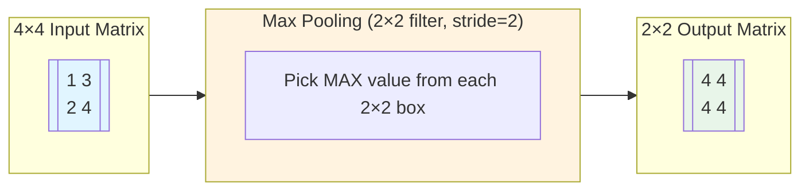

**How it works:**
- Imagine a 4×4 grid of numbers.
- You place a **2×2 window** on it.
- From that 2×2 box, you **only pick the BIGGEST number**.
- Then you move the window 2 steps to the right (stride = 2) and repeat.
- You keep doing this until you cover the whole grid.

**Example:**
```
Input:  1  3  2  4
        2  4  1  3
        3  1  4  2
        1  2  3  1

After Max Pooling (2×2, stride=2):
         4   4
         4   4
```
Each `4` is the maximum of a 2×2 block. The output is just **2×2** instead of **4×4** — that's 75% less data!

> 🎯 **Real-life analogy:** You have 4 friends and you want to know who scored the highest in each group. You don't need all scores, just the top one. That's Max Pooling!

---

#### **2. Average Pooling**

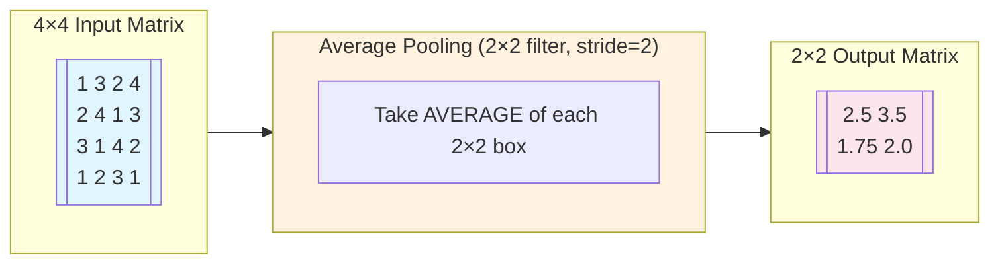

**How it works:**
- Same 2×2 window, but instead of picking the biggest number...
- You **add all 4 numbers and divide by 4** (find the average).

**Example:**
```
Top-left 2×2 block: 1, 3, 2, 4
Average = (1+3+2+4) / 4 = 2.5

Top-right block: 2, 4, 1, 3
Average = (2+4+1+3) / 4 = 2.5

Output:
     2.5   2.5
     1.75  2.0
```

> 🎯 **Real-life analogy:** You want to know the "average score" of your class in each subject, not just the topper. Average Pooling gives you the average of each group.

---

#### **3. Sum Pooling** (Less Common)

- Instead of max or average, you **add up** all the numbers in the 2×2 window.
- Used rarely in modern CNNs, but was used in older models.

---

### 📊 Quick Comparison Table

| Feature | Max Pooling | Average Pooling | Sum Pooling |
|---|---|---|---|
| **What it picks** | Highest value | Average of all values | Sum of all values |
| **Best for** | Keeping strongest features | Keeping overall feel | Rarely used |
| **Most used?** | ✅ Yes, most common | Sometimes used | ❌ Rarely used |
| **Keeps edges?** | ✅ Yes | ⚠️ Blurs edges | ❌ Not great |

---

### 🎯 Summary for Exam Answer (How to write it in exam)

**To get full 6 marks, write this structure:**

1. **Definition (1 mark):** Define pooling as a downsampling technique that reduces spatial dimensions of feature maps.
2. **Need of Pooling (2 marks):** List 3 reasons — reduces computation, prevents overfitting, provides spatial invariance.
3. **Types of Pooling (3 marks):** Explain Max Pooling with example, Average Pooling with example, mention Sum Pooling. Draw small diagrams.
---

> ### 📐 Theoretical Deep Dive: Mathematical Foundations of Pooling Operations
>
> **1. Theoretical Basis: Invariance and Equivariance in Feature Spaces**
>
> The theoretical justification for pooling layers stems from the concept of **statistical invariance** in signal processing. A convolutional neural network must be invariant to translations of the input image — an object should be classified the same way regardless of its position in the frame. Formally, if a function $f$ represents the feature extraction process, we require:
>
> $$f(T_x(I)) \approx f(I)$$
>
> where $T_x$ is a translation operator and $I$ is the input image. Pooling approximates this by subsampling the feature maps. Mathematically, max pooling over a region $R$ computes:
>
> $$y_{i,j} = \max_{(m,n) \in R_{i,j}} x_{m,n}$$
>
> **2. Information-Theoretic View: Dimensionality Reduction**
>
> From an information-theoretic perspective, pooling reduces the mutual information between consecutive spatial locations while preserving class-relevant information. A feature map of size $H \times W$ with $C$ channels contains $HWC$ values. After $k$ pooling layers (each with stride 2 and window size 2×2), the spatial dimensions reduce by a factor of $2^k$. For a 224×224 input image with pooling, by the final convolutional layer we have spatial dimensions of roughly $7 \times 7$, reducing computation in the fully connected layers by approximately 98%. This is why AlexNet (Krizhevsky et al., 2012) was able to train a deep network on limited GPU memory — the pooling layers dramatically reduced the number of connections needed.
>
> **3. Effect on Gradient Flow During Backpropagation**
>
> During backpropagation, the pooling layer creates a **sparse gradient pattern**. In max pooling, the gradient is routed only through the index of the maximum value in each window. This means:
>
> $$\frac{\partial L}{\partial x_i} = \begin{cases} \frac{\partial L}{\partial y_j} & \text{if } x_i = \max(R_j) \\ 0 & \text{otherwise} \end{cases}$$
>
> This creates a **hard attention mechanism** — only the strongest feature in each region contributes to weight updates, effectively denoising the gradient signal.
>
> **4. Pooling in Modern Architectures: Strided Convolutions as a Replacement**
>
> Recent research (Springenberg et al., 2014 — "Striving for Simplicity") showed that strided convolutions can replace pooling layers. A strided convolution with stride $s=2$ learns to downsample rather than using fixed pooling, allowing the network to learn *which* features to preserve during downsampling. This is particularly important in modern architectures like ResNet and Vision Transformers, where the traditional pooling paradigm is being re-examined. The key insight is that fixed pooling is **non-differentiable and non-learnable** — by replacing it with a learned downsampling operation, networks can adapt the downsampling strategy to the task.
>
> **5. Historical Context: From Neocognitron to Modern CNNs**
>
> The concept of subsampling in neural networks traces back to the **Neocognitron** (Fukushima, 1980), the predecessor to modern CNNs. Fukushima's architecture included "S-cells" (simple cells) for feature extraction and "C-cells" (complex cells) for subsampling — analogous to our modern convolution and pooling layers. The C-cells performed a local average and implemented a **winner-takes-all** mechanism, an early form of max pooling. LeCun et al. (1998) formalized this in LeNet-5 using average pooling. It wasn't until the 2010s that max pooling became dominant, as shown by extensive empirical comparisons (Boureau et al., 2010) demonstrating that max pooling preserves texture and edge information better than average pooling for object recognition tasks.
>
> **6. Pooling and Spatial Resolution Tradeoff**
>
> There is a fundamental tradeoff between spatial resolution and semantic richness. As we go deeper in the network, each pooling operation reduces resolution but increases the semantic meaning of features. This tradeoff can be quantified by the **receptive field** of neurons in deeper layers. For a stack of convolutional layers with kernel size $k$ and stride $s=1$, stacked $L$ times, the receptive field grows as:
>
> $$RF_L = 1 + L(k-1)$$
>
> Pooling layers accelerate this growth. The theoretical foundation of why deep CNNs work so well on images is precisely this hierarchical combination of convolution (progressive feature extraction) and pooling (progressive abstraction through spatial summarization).
>
> ---
>
> ---


## Q.1 (b) — Draw and explain **CNN (Convolutional Neural Network) architecture** in detail. **[6 Marks]**
### 🧠 What is a CNN? — A "Smart Filter" Machine for Images

A **Convolutional Neural Network (CNN)** is a special type of artificial intelligence that is extremely good at **looking at images and understanding what's inside them**. It is inspired by how the human brain sees things — by detecting edges, then shapes, then patterns, then whole objects.

> **Think of it like this:** When you look at a face, your brain first sees edges (the outline of the eye), then shapes (a circle for the iris), then patterns (eyebrows above), and finally says "This is a human face!" A CNN does exactly the same thing, step by step.

---

### 🏗️ CNN Architecture — Step by Step (Like a Factory Assembly Line)

A CNN is built like a **factory with different rooms**. Data (image) enters from one side, goes through each room (layer), gets processed, and finally comes out with an answer at the other end.

```mermaid
flowchart LR
    subgraph Input["📥 INPUT IMAGE"]
        A["Raw Image\n(example: 32×32×3)"]
    end
    
    subgraph Conv["🔍 CONVOLUTION LAYERS"]
        B["Conv Layer 1\n(Detects edges, lines)"]
        C["Conv Layer 2\n(Detects shapes, patterns)"]
        D["Conv Layer 3\n(Detects objects, faces)"]
    end
    
    subgraph Pool["📉 POOLING LAYERS"]
        E["Pooling Layer\n(Makes image smaller)"]
    end
    
    subgraph FC["🧮 FULLY CONNECTED LAYERS"]
        F["Flatten → FC Layer 1\n(Combines all features)"]
        G["FC Layer 2\n(Makes decision)"]
    end
    
    subgraph Output["📤 OUTPUT"]
        H["Softmax\n(Probabilities: Cat/Dog/Car)"]
    end
    
    A --> B --> C --> D --> E --> F --> G --> H
    
    style A fill:#e1f5ff
    style B fill:#fff3e0
    style C fill:#fff3e0
    style D fill:#fff3e0
    style E fill:#fce4ec
    style F fill:#e8f5e9
    style G fill:#e8f5e9
    style H fill:#f3e5f5
```

---

### 📦 Each Layer Explained in Detail

#### **1. Input Layer** — The "Door" where image enters

```
Example: A color image of a cat = 32 pixels wide × 32 pixels tall × 3 colors (Red, Green, Blue)
Size = 32 × 32 × 3
```

This is simply the raw image fed into the network. Each pixel has a number (0 to 255) telling how bright that color is.

---

#### **2. Convolution Layer** — The "Feature Detector" 👁️

This is the **MOST IMPORTANT** part of a CNN. It has special tools called **filters (or kernels)** that slide over the image and detect patterns.

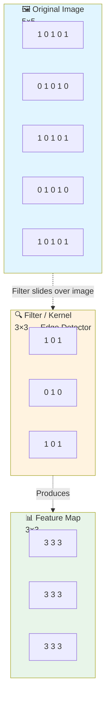

**How it works:**
- A **filter** is a tiny grid of numbers (like 3×3 or 5×5).
- It **slides** over the image from left to right, top to bottom.
- At each position, it multiplies its numbers with the image numbers and adds them up.
- This gives **ONE NUMBER** — written in the "Feature Map".
- Different filters detect different things:
  - One filter detects **vertical edges**
  - Another detects **horizontal edges**
  - Another detects **curves**
  - Another detects **eyes or ears**

---

#### **3. Activation Function (ReLU)** — The "On/Off Switch" 🔌

After each convolution, the numbers go through **ReLU (Rectified Linear Unit)**:

```
ReLU: If number is negative → make it 0
      If number is positive → keep it as it is
```

**Why?** It makes the network learn only the **useful, positive features** and ignore useless negative ones.

Example:
```
Before ReLU:  [-5, -2, -1,  0,  3,  7]
After  ReLU:  [ 0,  0,  0,  0,  3,  7]
```

---

#### **4. Pooling Layer** — The "Summarizer" 📉

After convolution, the feature map might still be big. Pooling **shrinks it down** while keeping the important information. (Explained fully in Q.1(a) above)

- **Max Pooling** = keep the biggest number in each small box
- This makes the network faster and more flexible

---

#### **5. Fully Connected (FC) Layer** — The "Decision Maker" 🧠

After several rounds of Convolution + Pooling, the important features are extracted. Now we need to **make a final decision**.

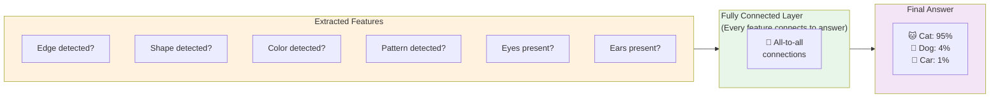

**How it works:**
- All the features are **flattened** (lined up in a single row) and connected to every neuron in the next layer.
- Each connection has a **weight** (importance).
- The layer adds everything up and says: *"Based on all these features together, I think this is a Cat with 95% confidence!"*

---

#### **6. Output Layer (Softmax)** — The "Final Answer Giver" ✅

The last layer uses a function called **Softmax**:

```
Softmax converts raw numbers into percentages that all add up to 100%.

Example:
Raw scores: Cat=8, Dog=3, Car=1
After Softmax: Cat=80%, Dog=15%, Car=5%
```

This tells us how **confident** the CNN is about each possible answer.

---

### 🏭 Complete CNN Architecture — The Full Picture

```mermaid
flowchart LR
    subgraph In["📥 Input Image"]
        A["224×224×3"]
    end
    
    subgraph C1["🔍 Conv Layer 1\n+ ReLU"]
        B["Filter: 3×3×64\nOutput: 222×222×64"]
    end
    
    subgraph P1["📉 Pooling Layer 1"]
        C["Max Pool 2×2\nOutput: 111×111×64"]
    end
    
    subgraph C2["🔍 Conv Layer 2\n+ ReLU"]
        D["Filter: 3×3×128\nOutput: 109×109×128"]
    end
    
    subgraph P2["📉 Pooling Layer 2"]
        E["Max Pool 2×2\nOutput: 54×54×128"]
    end
    
    subgraph C3["🔍 Conv Layer 3\n+ ReLU"]
        F["Filter: 3×3×256\nOutput: 52×52×256"]
    end
    
    subgraph P3["📉 Pooling Layer 3"]
        G["Max Pool 2×2\nOutput: 26×26×256"]
    end
    
    subgraph FL["🔄 Flatten"]
        H["26×26×256\n= 173,056 values"]
    end
    
    subgraph FC1["🧮 FC Layer 1\n+ ReLU"]
        I["4096 neurons"]
    end
    
    subgraph FC2["🧮 FC Layer 2\n+ ReLU"]
        J["1000 neurons"]
    end
    
    subgraph Out["📤 Output\nSoftmax"]
        K["1000 classes\n(Dog, Cat, Car...)"]
    end
    
    A --> C1 --> P1 --> C2 --> P2 --> C3 --> P3 --> FL --> FC1 --> FC2 --> Out
    
    style A fill:#e1f5ff
    style B fill:#fff3e0
    style D fill:#fff3e0
    style F fill:#fff3e0
    style C fill:#fce4ec
    style E fill:#fce4ec
    style G fill:#fce4ec
    style H fill:#f3e5f5
    style I fill:#e8f5e9
    style J fill:#e8f5e9
    style K fill:#fff9c4
```

> 📝 This is similar to how famous CNNs like **AlexNet** and **VGGNet** are built!

---

### 🎯 Summary for Exam Answer (How to write it in exam)

**To get full 6 marks, write this structure:**

1. **Introduction (1 mark):** Define CNN — a deep learning model for image processing using convolution operations.
2. **Layer-by-layer explanation (3 marks):** Explain each layer:
   - Convolution Layer (feature extraction using filters)
   - Activation Function (ReLU)
   - Pooling Layer (downsampling)
   - Fully Connected Layer (decision making)
   - Output Layer (Softmax probabilities)
3. **Diagram (2 marks):** Draw a labeled block diagram showing the flow from Input → Conv → Pool → FC → Output.

**Tip:** Draw the diagram neatly and label each block. Examiners give full marks for clear, labeled diagrams!

---

> ### 📐 Theoretical Deep Dive: Foundations of CNN Architecture
>
> **1. Hierarchical Feature Learning — The Biological Inspiration**
>
> The CNN architecture is inspired by the **hierarchical organization of the primate visual cortex**. Nobel laureates Hubel and Wiesel's (1962) work on cat visual cortex revealed two types of cells: simple cells that respond to oriented edges at specific positions, and complex cells that respond to oriented edges regardless of position. CNNs replicate this with convolutional layers (simple cell analogues) and pooling layers (complex cell analogues). Mathematically, we can think of a CNN as a **function composition**:
>
> $$f(x) = f_L \circ f_{L-1} \circ ... \circ f_1(x)$$
>
> where each $f_l$ learns features at an increasing level of abstraction. The first layer learns low-level features (edges, color gradients), middle layers learn mid-level features (textures, patterns), and deep layers learn high-level semantics (objects, faces).
>
> **2. The Receptive Field — Why Depth Matters**
>
> A critical concept in CNN architecture is the **receptive field** — the region of the input image that influences a particular neuron's output. For a standard CNN with only stride-1 convolutions, a neuron at layer $l$ has a receptive field:
>
> $$RF_l = RF_{l-1} + (k_l - 1) \times \prod_{i=1}^{l-1} s_i$$
>
> where $k_l$ is the kernel size at layer $l$ and $s_i$ is the stride at layer $i$. In architectures like VGGNet, stacking many small 3×3 convolutions achieves the same receptive field as fewer large convolutions but with significantly fewer parameters. This is why Simonyan and Zisserman (2014) could build a 19-layer network — each 3×3 convolution "sees" only a small neighborhood, yet the cumulative receptive field grows with depth.
>
> **3. Weight Sharing — Terms of Efficiency**
>
> The weight sharing principle in CNNs reduces the number of free parameters from $O(H \cdot W \cdot C_{in} \cdot C_{out})$ to just $O(k \cdot k \cdot C_{in} \cdot C_{out})$ per filter. For a 224×224 image with 3 input channels and 64 output channels using 3×3 kernels:
>
> - No weight sharing: $224 \times 224 \times 3 \times (224 \times 224 \times 64) \approx 2.4 \times 10^{11}$ parameters
> - With weight sharing: $3 \times 3 \times 3 \times 64 = 1,728$ parameters
>
> This represents a reduction of **100,000×** in parameters, making training feasible. This is the **translation equivariance** property — shifting the input image results in an equivalently shifted feature map.
>
> **4. Skip Connections and Residual Learning**
>
> Modern CNN architectures like ResNet (He et al., 2016) introduced **skip connections** that address the **degradation problem** — the counterintuitive finding that deeper networks can have higher training error than shallower ones. The residual block computes:
>
> $$y = F(x, \{W_i\}) + x$$
>
> where $F(x)$ represents the residual mapping to be learned. By reformulating the network to learn residuals rather than direct mappings, very deep networks (152 layers for ResNet-152) can be trained using backpropagation. The identity skip connection ensures that gradients can flow directly through the network without vanishing, which is why sigmoid activations (which caused vanishing gradients) were gradually abandoned in favor of ReLU.
>
> **5. Architectural Evolution Timeline**
>
> The evolution of CNN architectures reveals a progression:
> - **LeNet-5 (1998)**: 2 conv + 2 FC, ~60K parameters, used for digit classification
> - **AlexNet (2012)**: 8 layers, 60M parameters, won ImageNet, introduced ReLU and dropout
> - **VGGNet (2014)**: 16-19 layers, 138M parameters, showed depth matters
> - **GoogLeNet/Inception (2014)**: 22 layers, used inception modules (parallel convolutions at different scales)
> - **ResNet (2016)**: 152+ layers, residuals enabled essentially unlimited depth
> - **EfficientNet (2019)**: Compound scaling of depth, width, and resolution
>
> Each architectural innovation addressed specific limitations of predecessors while maintaining the core convolution-pooling-FC paradigm.
>
> **6. Computational Complexity Analysis**
>
> The computational cost of a CNN is dominated by convolutional layers. For a convolutional layer with $k \times k$ kernel, $C_{in}$ input channels, $C_{out}$ output channels, and output spatial dimensions $H \times W$:
>
> - FLOPs (Floating Point Operations): $2 \times H \times W \times k^2 \times C_{in} \times C_{out}$ (the factor 2 accounts for multiply-accumulate operations)
> - Parameters: $k^2 \times C_{in} \times C_{out} + C_{out}$ (including bias)
>
> For AlexNet's first layer: $2 \times 55 \times 55 \times 11^2 \times 3 \times 96 \approx 1.3$ billion FLOPs per image. Modern architectures use techniques like grouped convolutions (MobileNet), depthwise separable convolutions, and attention mechanisms to reduce this cost.
>
> ---
>
> ---


## Q.1 (c) — Explain **ReLU Layer** in detail. What are the advantages of ReLU over Sigmoid? **[6 Marks]**

### 🔌 What is ReLU? — The "Modern Light Switch" of Neural Networks

**ReLU** stands for **Rectified Linear Unit**. It is the most popular **activation function** used in modern deep learning, especially in CNNs. An activation function is like a switch — it decides whether a neuron should be "active" (firing) or "inactive" (silent) based on its input.

> **Think of it like this:** Imagine a water tap. When you turn the handle past a certain point, water flows. If the handle is below that point, no water flows. ReLU works exactly the same way for numbers in a neural network.

---

### 📐 Mathematical Formula of ReLU

```
ReLU(x) = max(0, x)

This means:
  - If x is positive (greater than 0) → output is x (keep it as it is)
  - If x is negative (less than 0)   → output is 0 (turn it off)
```

**Example with actual numbers:**

| Input (x) | ReLU Output: max(0, x) | What happened? |
|---|---|---|
| -5 | 0 | Negative → turned OFF |
| -2 | 0 | Negative → turned OFF |
| -0.5 | 0 | Negative → turned OFF |
| 0 | 0 | Zero → stays OFF |
| 0.5 | 0.5 | Positive → passes through |
| 3 | 3 | Positive → passes through |
| 7 | 7 | Positive → passes through |

---

### 📈 Visual Graph of ReLU

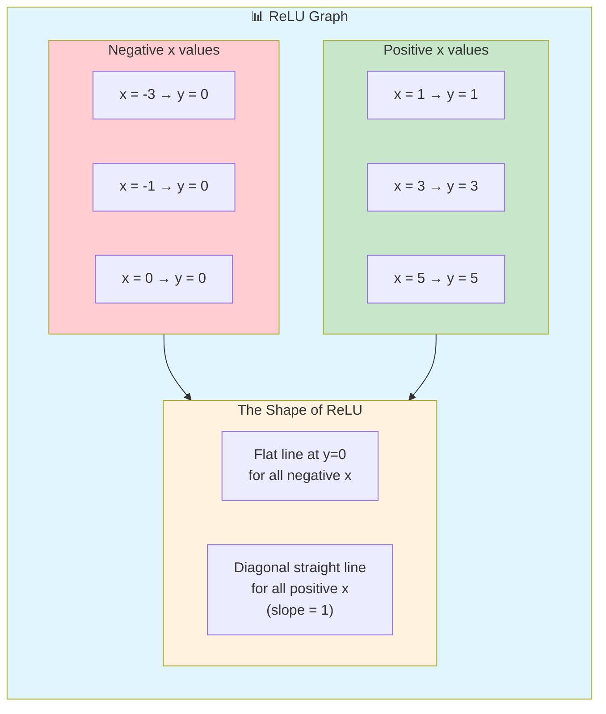

> **Key observation:** The ReLU graph has a "kink" or "bend" at x = 0. For all negative numbers, it is completely flat at y = 0. For all positive numbers, it is a straight diagonal line going up.

---

### 🔄 How ReLU Works Inside a CNN — Step by Step

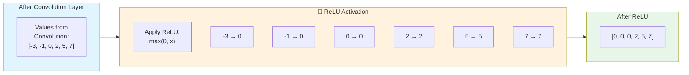

**What changed?**
- All negative numbers were turned to **zero**.
- All positive numbers stayed the **same**.
- This creates **sparsity** — many values become zero, making the network simpler and faster.

---

### ✅ Advantages of ReLU over Sigmoid — Detailed Comparison

| Feature | ReLU (Rectified Linear Unit) | Sigmoid (Old Activation) |
|---|---|---|
| **Formula** | `ReLU(x) = max(0, x)` | `Sigmoid(x) = 1 / (1 + e^(-x))` |
| **Speed** | ⚡ **Very Fast** — just one comparison | 🐢 **Slow** — has exponential and division |
| **Vanishing Gradient Problem** | ✅ **No vanishing gradient** for positive values | ❌ **Big problem** — gradients become tiny for large inputs |
| **Sparsity** | ✅ Creates sparse networks (many zeros) | ❌ Always produces some value (never truly zero) |
| **Computation** | Simple: max(0, x) = one operation | Complex: needs exponential + division |
| **Output Range** | 0 to +infinity | 0 to 1 (always between 0 and 1) |
| **Popularity Today** | ✅ **Most widely used** | ❌ Rarely used in hidden layers |
| **Dead Neuron Problem** | ⚠️ Can have "dead" neurons | ✅ No dead neuron problem |

---

### 📊 Detailed Explanation of Each Advantage

#### **1. No Vanishing Gradient Problem (Most Important!)**

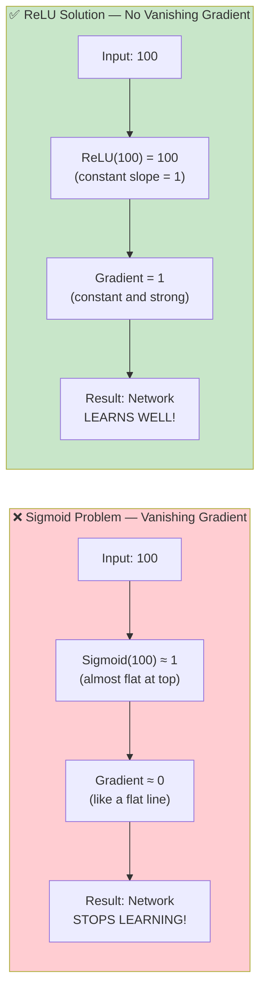

**Explanation:**
In deep networks, we use **backpropagation** (calculus) to update weights. The gradient tells us *how much* to change each weight. If the gradient is very tiny (approaching zero), the network stops learning because the weights barely change.

- **Sigmoid:** For large inputs (like 10 or 100), Sigmoid output is almost 1, but its curve is flat → **gradient ≈ 0** → learning stops!
- **ReLU:** For positive inputs, the slope is always **exactly 1** → **gradient is always strong** → learning continues!

---

#### **2. Much Faster Computation**

```
Sigmoid needs:  1 / (1 + e^(-x))  →  Exponential + Division = Slow!
ReLU needs:     max(0, x)         →  Just one comparison = Lightning fast!
```

In a deep CNN with millions of neurons, this speed difference is huge!

---

#### **3. Creates Sparse Networks (More Efficient)**

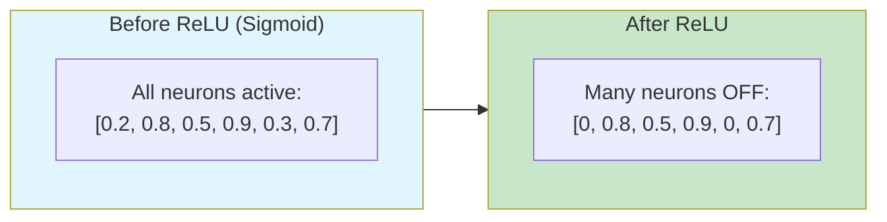

> **Sparsity** means many neurons are set to zero. This makes the network:
> - Faster to compute
> - Uses less memory
> - More robust (less noise from inactive neurons)

---

#### **4. Works Better in Deep Networks**

ReLU allows networks to be **much deeper** (more layers) because:
- Sigmoid networks get stuck after a few layers (gradients vanish)
- ReLU networks can have 100+ layers and still learn well

This is why **ResNet** (152 layers!) and other deep models use ReLU everywhere.

---

### ⚠️ One Small Problem with ReLU — "Dying ReLU"

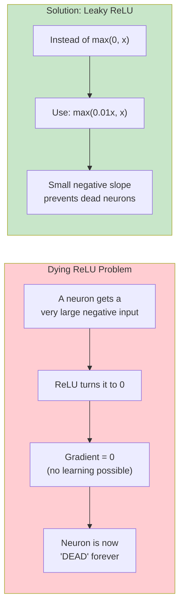

**Dying ReLU:** If a neuron's weights become so negative that ALL inputs are negative, ReLU always outputs 0 → gradient is always 0 → that neuron never learns again. It's "dead."

**Solution:** Use **Leaky ReLU** which has a tiny negative slope: `max(0.01x, x)` — even negative values get a small signal, so the neuron can wake up again.

---

### 🎯 Summary for Exam Answer (How to write it in exam)

**To get full 6 marks, write this structure:**

1. **Definition & Formula (1 mark):** Define ReLU, write formula `ReLU(x) = max(0, x)`, explain it gives 0 for negative and x for positive.
2. **Working Example (1 mark):** Show input numbers and their ReLU outputs.
3. **Graph/Diagram (1 mark):** Draw the ReLU graph showing flat at 0 for negatives and diagonal for positives.
4. **Advantages over Sigmoid (3 marks):** Explain at least 3 advantages:
   - No vanishing gradient (most important)
   - Fast computation (simple formula)
   - Creates sparse networks
   - Works in deep networks
---

> ### 📐 Theoretical Deep Dive: ReLU — Mathematical and Neural Basis
>
> **1. The Activation Function Problem — Why Non-Linearity is Essential**
>
> Without non-linear activation functions, a deep neural network would collapse to a single linear transformation regardless of depth. Stacking $L$ linear layers: $f(x) = W_L W_{L-1} ... W_1 x$ is mathematically equivalent to a single layer $f(x) = W' x$, where $W' = W_L W_{L-1} ... W_1$. Non-linear activation functions break this equivalence, enabling the network to approximate any continuous function (Universal Approximation Theorem, Cybenko, 1989). Without them, the network can only model linear relationships, which is catastrophically limited for image recognition, language modeling, or any complex task.
>
> **2. ReLU as a Piecewise Linear Approximation**
>
> ReLU($x$) = $\max(0, x)$ is the simplest possible non-linear function — piecewise linear with a single kink at $x=0$. This simplicity has profound consequences:
>
> **Forward pass**: ReLU is $O(1)$ — a single comparison operation. Contrast with sigmoid: $\sigma(x) = \frac{1}{1+e^{-x}}$ which requires computing an exponential, a division, and handling numerical overflow for large $|x|$. For a network with millions of activations, this speed difference is substantial.
>
> **Backward pass (gradient)**: ReLU has subgradient:
>
> $$\frac{\partial \text{ReLU}(x)}{\partial x} = \begin{cases} 1 & x > 0 \\ 0 & x < 0 \\ \text{undefined} & x = 0 \end{cases}$$
>
> For $x > 0$, the gradient is exactly 1, meaning no attenuation of the error signal. This is the mathematical reason why ReLU solves the vanishing gradient problem in the positive regime — there is no chain rule decay. In contrast, sigmoid's gradient decays exponentially:
>
> $$\sigma'(x) = \sigma(x)(1-\sigma(x)) \leq \frac{1}{4}$$
>
> For deep networks with $L$ layers, the gradient becomes $(\leq 1/4)^L$ which vanishes for all practical depths ($L > 10$).
>
> **3. Sparse Activation Patterns — Biological Plausibility**
>
> ReLU naturally induces **sparsity** in activations. Because the function outputs zero for all negative inputs, approximately 50% of neurons in a well-initialized network are inactive at any given time. This sparsity has several benefits:
> - **Computational efficiency**: Zero activations require no computation in subsequent layers (optimized in modern frameworks like cuDNN)
> - **Information bottleneck**: Each neuron specializes in detecting a specific feature; dead (always zero) neurons can be considered pruned
> - **Biological plausibility**: The human brain is also sparse — only a small fraction of neurons fire at any time
>
> Sparse representations also improve **feature disentanglement**. When only some neurons fire for a given input, the representations are more separable and interpretable.
>
> **4. Variants of ReLU — Addressing the Dying Neuron Problem**
>
> The "dying ReLU" problem occurs when a neuron's weights move into a region where all inputs produce negative pre-activation values. Once $x < 0$, the gradient is zero, and gradient descent cannot update the weights to recover. Several variants address this:
>
> - **Leaky ReLU** ($\alpha = 0.01$): $\max(0.01x, x)$ — small slope for negative region
> - **Parametric ReLU (PReLU)**: $\max(\alpha x, x)$ where $\alpha$ is learned during training
> - **ELU (Exponential Linear Unit)**: $x$ for $x>0$, $\alpha(e^x - 1)$ for $x \leq 0$ — smoother negative regime
> - **GELU (Gaussian Error Linear Unit)**: $x \cdot \Phi(x)$ where $\Phi$ is the standard normal CDF — used in BERT, GPT-3
>
> The GELU, in particular, has gained prominence in modern transformer architectures due to its smooth, non-monotonic behavior which provides better gradient flow in deep networks.
>
> **5. ReLU in Historical Context**
>
> ReLU was first introduced by Hahnloser et al. (2000) in a biological context, modeling the firing behavior of neurons in the cerebral cortex. It was popularized in deep learning by Nair and Hinton (2010) for Restricted Boltzmann Machines, and by Krizhevsky et al. (2012) for AlexNet's classification of ImageNet. The AlexNet paper demonstrated that ReLU networks trained 6× faster than sigmoid networks and achieved a top-5 error rate of 15.3% compared to 26.2% for the previous state-of-the-art, winning the ImageNet competition by a wide margin. This single architectural choice is widely credited with enabling the deep learning revolution.
>
> **6. ReLU and Batch Normalization — Synergistic Effect**
>
> With batch normalization (Ioffe and Szegedy, 2015), ReLU activations are normalized to have zero mean and unit variance before reaching the non-linearity. This reduces "internal covariate shift" and ensures that the pre-activation distribution doesn't drift toward the saturation regions (extreme negative values). The combination of batch normalization + ReLU has become a standard building block in modern neural network design.
>
> ---
>
> ---


## Q.2 (a) — Explain all the features of **Pooling Layer**. **[6 Marks]**
> *(Note: This is Q.2 in Paper 1, which is an alternative to Q.1. This answer covers Pooling Layer features in more detail.)*

### 🎯 What is a Feature of Pooling?

Features are the **characteristics or properties** that make Pooling useful in a CNN. Just like a good car has features like "fast engine", "good brakes", "comfortable seats" — Pooling has its own set of useful features.

---

### 📋 The 6 Main Features of Pooling Layer

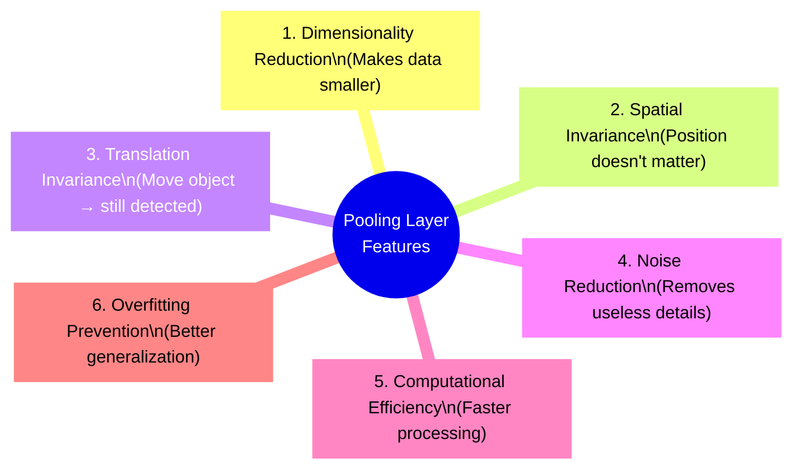

---

### 🔍 Feature 1: Dimensionality Reduction (Downsampling)

```
Before Pooling:  8×8 feature map = 64 numbers
After Pooling:   4×4 feature map = 16 numbers
Reduction:        75% less data!
```

**Why it matters:**
- Imagine you have 1 million pixels in an image. Processing all of them is slow.
- Pooling reduces it to 250,000 — the computer works 4 times faster!
- Each pooling step roughly **halves** the width and height of the feature map.

---

### 🔍 Feature 2: Spatial Invariance (Position Independence)

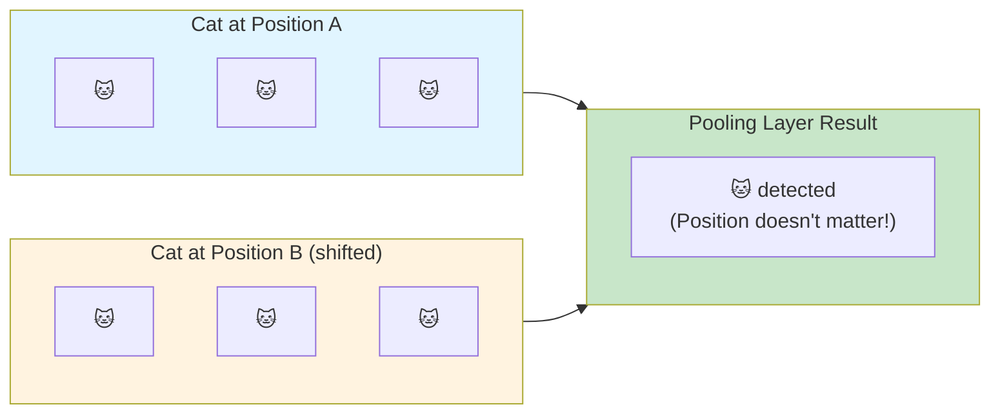

**What this means:**
- If a cat's face is in the top-left corner of one image and the bottom-right corner of another...
- **Pooling still detects the cat!**
- The exact position of the feature doesn't matter, only that the feature EXISTS somewhere.

> **Real-life analogy:** If you see your friend at a bus stop today and at a café tomorrow, you still recognize them. Their position changed, but YOU still recognize them. That's spatial invariance!

---

### 🔍 Feature 3: Translation Invariance

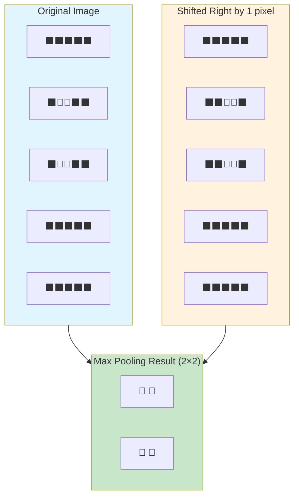

**Explanation:**
- The blue square moved 1 pixel to the right.
- Max Pooling with a 2×2 window still produces the **SAME output**!
- This means small movements of objects in the image don't affect the result.

---

### 🔍 Feature 4: Noise Reduction

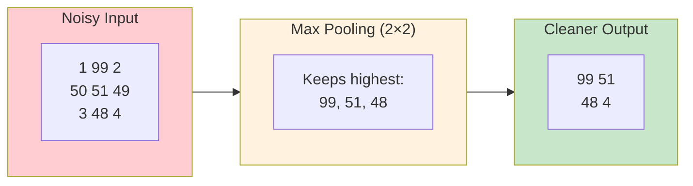

**Explanation:**
- Some pixels in an image might be random noise (wrongly bright or dark).
- Pooling, especially **Max Pooling**, naturally ignores small random values and keeps the strong signal.
- This acts like a **natural noise filter**.

---

### 🔍 Feature 5: Computational Efficiency

```
Example: Image Classification Network

Without Pooling:
- Layer 1 output: 224 × 224 × 64 = 3,211,264 values
- Next layer needs to process ALL of them → VERY SLOW

With Pooling (after each conv layer):
- After Pool 1: 112 × 112 × 64 = 819,200 values (75% reduction!)
- After Pool 2: 56 × 56 × 128 = 401,408 values (even less!)
- Much faster to process!
```

---

### 🔍 Feature 6: Overfitting Prevention

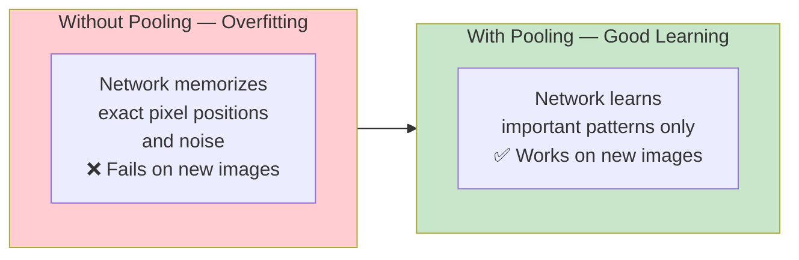

**Explanation:**
- **Overfitting** = when the model memorizes the training images instead of learning general patterns.
- By reducing the exact details (pixel-level info), pooling forces the model to learn **general features** (edges, shapes) rather than memorizing exact training images.
- This makes the model work better on **new, unseen images**.

---

### 📊 Summary Table of All 6 Features

| # | Feature | What it does | Benefit |
|---|---|---|---|
| 1 | Dimensionality Reduction | Shrinks feature maps | Faster computation |
| 2 | Spatial Invariance | Position of feature doesn't matter | Robust to object placement |
| 3 | Translation Invariance | Small shifts don't change output | Handles moving objects |
| 4 | Noise Reduction | Ignores random pixel values | Cleaner feature detection |
| 5 | Computational Efficiency | Fewer values to process | Training is faster |
| 6 | Overfitting Prevention | Removes exact details | Better generalization |

---

### 🎯 Summary for Exam Answer (How to write it in exam)

**To get full 6 marks, write this structure:**

1. **Definition (1 mark):** Pooling is a downsampling operation that reduces the spatial dimensions of feature maps.
2. **Feature 1 & 2 (2 marks):** Explain Dimensionality Reduction with formula/example, and Spatial Invariance with a simple diagram.
3. **Feature 3 & 4 (2 marks):** Explain Translation Invariance (shifted object still detected) and Noise Reduction (ignores random pixels).
4. **Feature 5 & 6 (1 mark):** Briefly mention Computational Efficiency and Overfitting Prevention.
---

> ### 📐 Theoretical Deep Dive: Pooling Features — Statistical and Geometric Foundations
>
> **1. Invariance Theory — Why Pooling Achieves Translation Invariance**
>
> The mathematical basis for spatial invariance in pooling can be explained through **group theory** and **representation learning**. The translation group $\mathbb{Z}^2$ (integer shifts in 2D) acts on images. A function $f$ is translation-invariant if $f(T_v(I)) = f(I)$ for any translation $v$. While max pooling is not perfectly invariant (an object shifted by exactly one pooling window width will produce an identically shifted output), it achieves **approximate translation invariance** that is sufficient for most computer vision tasks. The degree of invariance increases with network depth — as features pass through multiple pooling layers, small translations are smoothed out. Mathematically, if $P$ is a pooling operator with window size $w$, then for a shift $v < w$:
>
> $$P(I(x+v)) \approx P(I(x))$$
>
> The maximum difference between $P(I)$ and $P(I+v)$ is bounded by the range of values in the feature map, making pooling a practical approximation to full translation invariance.
>
> **2. Invariance vs. Equivariance — A Critical Distinction**
>
> Pooling in convolutional layers produces **equivariant** (not invariant) representations: if the input shifts, the feature map shifts by the same amount. This means the network can still reason about *where* a feature appeared. True invariance (the feature disappears from the output when the input shifts slightly) only comes at the **final classification layer** where spatial information is discarded. This equivariance is actually desirable for many tasks — for example, in pose estimation, knowing where an object is matters. The hierarchy of convolution (equivariant) followed by pooling (reducing resolution) followed by the final FC layer (invariant) creates a graduated system of spatial awareness.
>
> **3. Information Bottleneck and Compression**
>
> From information theory, the pooling layer acts as a **bottleneck** that forces the network to compress the representation. Rate-distortion theory tells us that given a representation budget (number of units), the optimal representation balances compression (fewer bits) with preserving task-relevant information. Pooling implements a form of **lossy compression** — it throws away exact pixel values but preserves the "most important" one (max) or the "average" (mean). The choice between max and average pooling reflects this tradeoff: max preserves peaks (good for detecting the presence of a feature), average preserves the overall magnitude (good for texture representation). The theoretical justification comes from **sufficient statistics** — for many real-world data distributions, a single statistic (max or mean) from a local region is sufficient to capture the relevant information for classification.
>
> **4. Pooling as a Regularizer — Preventing Overfitting**
>
> The overfitting prevention property of pooling can be understood through the **bias-variance tradeoff**. By removing exact spatial precision, pooling increases the **bias** of the model (it makes stronger assumptions about data structure) but reduces the **variance** (it is less sensitive to small fluctuations in training data). This is desirable when the training set is small relative to the complexity of the task. Mathematically, if $\hat{f}(x)$ is the estimated function and $f^*(x)$ is the true function, we decompose:
>
> $$\mathbb{E}[(y - \hat{f}(x))^2] = \text{Bias}^2 + \text{Variance} + \text{Irreducible Error}$$
>
> Pooling reduces variance by ensuring that small changes in pixel values don't drastically change the feature representation. This is analogous to how humans can recognize a cat whether it's drawn in the top-left or bottom-right of a page.
>
> **5. Spatial Pyramid Pooling (SPP-Net) — Fixed-Length Output for Variable Input**
>
> He et al. (2014) proposed Spatial Pyramid Pooling (SPP) to address a fundamental limitation of traditional pooling: standard CNNs require fixed-size inputs. SPP pools features at different grid granularities (e.g., 1×1, 2×2, 4×4 bins) and concatenates them, producing a fixed-length output regardless of input size. This approach was foundational for later work on region-based CNNs (R-CNN, Fast R-CNN, Faster R-CNN) which could process images of arbitrary aspect ratios. The output size is:
>
> $$N = (n_1^2 + n_2^2 + n_4^2) \times C$$
>
> where $n_1, n_2, n_4$ are the number of bins and $C$ is the number of channels.
>
> **6. Global Average Pooling (GAP) — Network Final Layer Design**
>
> In modern architectures like ResNet and Inception, **Global Average Pooling (GAP)** replaces fully connected layers at the network's end. GAP computes the average of each feature map across its entire spatial extent, producing a vector of length $C$ (the number of channels). This has two major theoretical advantages over FC layers:
> 1. **No parameters to learn** — reduces overfitting dramatically
> 2. **Spatial robustness** — the network learns where features are (through training), but GAP makes the final classification invariant to their exact location
>
> GAP also enables **class activation mapping (CAM)** — visualizing which regions of the image influenced the classification decision by projecting the final FC weights back onto the feature maps.
>
> ---
>
> ---


## Q.2 (b) — Explain **Dropout Layer** in Convolutional Neural Network. **[6 Marks]**
### 🎲 What is Dropout? — The "Random Employee Firing" Technique

Imagine you are training a football team. If the team always relies on one superstar player (neuron), they will be lost when that player is absent. So your coach randomly sits out different players in each practice match. This forces **everyone to learn** and the team becomes stronger overall.

**Dropout does exactly this for neural networks!** During training, it **randomly turns off (drops) some neurons** in each layer. This prevents the network from relying too much on any single neuron.

> **Think of it like this:** In an exam, if you always depend on your friend sitting next to you for answers, you'll fail if they're absent. Dropout forces every neuron to work independently and become strong on its own.

---

### ⚙️ How Dropout Works — Step by Step

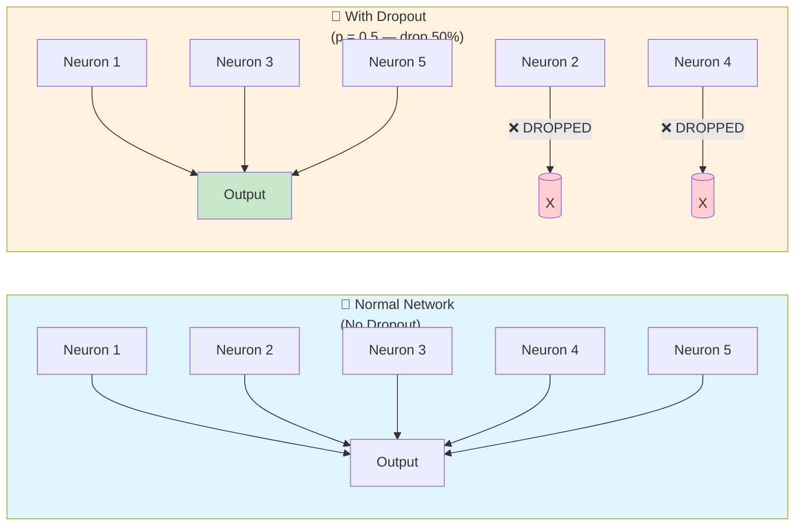

**How it works step by step:**

1. **Before training starts**, we set a **dropout rate** (usually `p = 0.5`, meaning 50% of neurons will be dropped).
2. **During each training iteration (epoch):**
   - The network goes through each layer.
   - For each neuron, a **random coin flip** happens:
     - 50% chance → neuron is **ACTIVE** (works normally)
     - 50% chance → neuron is **DROPPED** (output = 0, does nothing)
3. **Different neurons are dropped each time** — the pattern is random every iteration.
4. **At test time (when making predictions), NO dropout is applied** — all neurons work at full strength.

---

### 📐 Mathematical Formula

```
During Training:
  output_i = activation(input_i) / p     if neuron i is kept
  output_i = 0                            if neuron i is dropped

Where p = probability of keeping a neuron (e.g., p = 0.5)

The division by p is to "scale up" the remaining neurons
so the total output strength stays the same.
```

**Example:**
```
Normally: 10 neurons, each outputs 0.1 → total = 1.0
With Dropout (p=0.5): 5 neurons active, each outputs 0.1 → total = 0.5
After dividing by p=0.5: 5 neurons × 0.1 / 0.5 = 5 × 0.2 = 1.0 ✅
Total stays the same!
```

---

### 🧩 Why Does Dropout Help? — Two Main Reasons

#### **Reason 1: Prevents Co-Adaptation (Neurons depending on each other)**

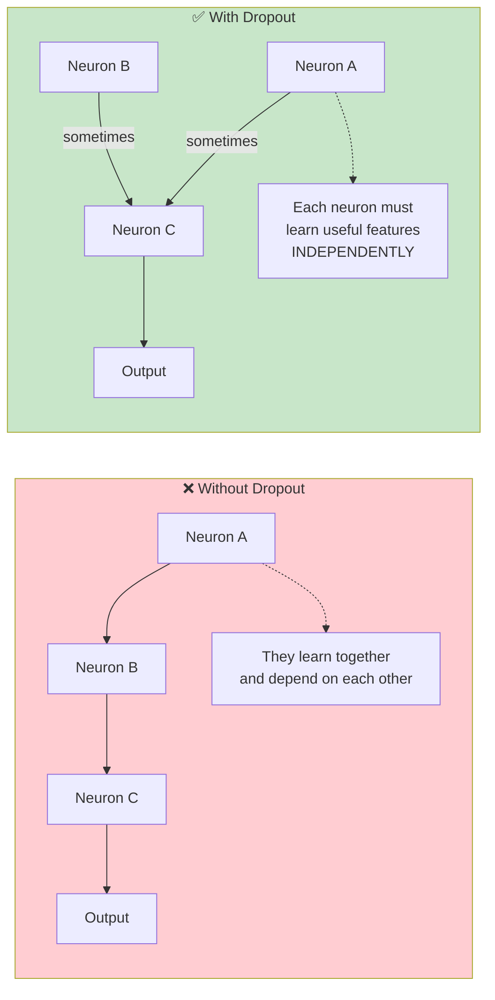

**Without Dropout:** Neurons A, B, and C learn to work together. If A is missing, B and C fail. This is called **co-adaptation** — bad for learning.

**With Dropout:** Since different neurons are randomly dropped, no neuron can rely on another. Each neuron must learn **its own useful feature** independently. This creates a **stronger, more robust network**.

---

#### **Reason 2: Acts Like an Ensemble of Many Networks**

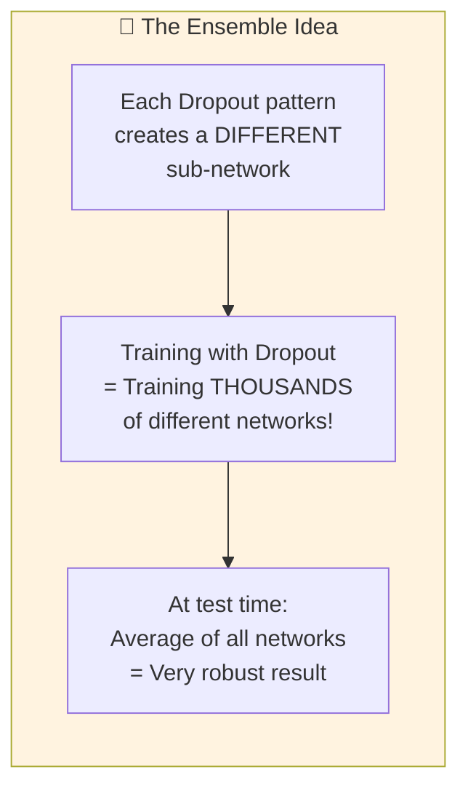

**Explanation:**
- With Dropout, each training iteration uses a **different subset of neurons**.
- This is equivalent to training **thousands of different "thin" networks**.
- At test time, all neurons are used, which is like **averaging the predictions** of all those networks.
- Ensemble models are always more accurate than single models!

> **Real-life analogy:** If 10 different doctors all examine a patient and give their opinion, the combined opinion is more reliable than any single doctor. Dropout creates many "expert sub-networks" and averages them!

---

### 📊 Where to Apply Dropout in a CNN

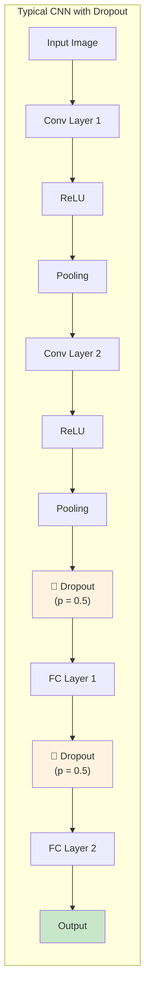

**Where Dropout is usually applied:**
- Between **Fully Connected (FC) layers** — most common place
- Sometimes after **Pooling layers**
- Rarely applied directly on **Convolution layers** (there are better methods like Spatial Dropout)

---

### 📈 Effect of Dropout — Before vs After

| Situation | Training Accuracy | Testing Accuracy |
|---|---|---|
| Without Dropout | 99% (memorized!) | 70% (poor on new data) ❌ |
| With Dropout | 85% (learning patterns) | 82% (great on new data) ✅ |

> The training accuracy is LOWER with dropout (because some neurons are missing), BUT the testing accuracy is HIGHER (because the model generalizes better). That's the goal!

---

### 🎯 Summary for Exam Answer (How to write it in exam)

**To get full 6 marks, write this structure:**

1. **Definition (1 mark):** Dropout is a regularization technique that randomly deactivates a fraction of neurons during training to prevent overfitting.
2. **How it works (2 marks):** Explain the process — random neuron dropping with probability p, different pattern each iteration, no dropout at test time. Show the formula.
3. **Why it helps (2 marks):** Explain two reasons:
   - Prevents co-adaptation (neurons learn independently)
   - Acts like an ensemble of many networks
4. **Example/Diagram (1 mark):** Draw a simple diagram showing neurons before and during dropout.
---

> ### 📐 Theoretical Deep Dive: Dropout — Regularization Theory and Empirical Foundations
>
> **1. Theoretical Foundation: Model Averaging as Regularization**
>
> Dropout can be rigorously understood through the framework of **Bayesian model averaging**. At each training step, dropout randomly samples a different architecture (a subnetwork) from the full network. With $n$ neurons and dropout rate $p$, the number of possible subnetworks is $2^n$ — astronomically large. Training with dropout is approximately equivalent to training $2^n$ different models (each corresponding to a different dropout mask) and averaging their predictions. This model averaging reduces variance without increasing bias substantially — the classic statistical tradeoff. Formally, the expected prediction of the full network is:
>
> $$\mathbb{E}_{\text{mask}}[y] = \mathbb{E}_{\text{mask}}\left[\text{NN}(x; \text{mask} \odot \theta)\right]$$
>
> which approximates the Bayesian model average over the distribution of masks.
>
> **2. The Dropout Training-Test Mismatch and Inverted Dropout**
>
> A subtle but critical detail in dropout implementation is **Inverted Dropout**, where during training, surviving activations are scaled UP by $1/(1-p)$ rather than scaling down at test time. The mathematics: if each unit is kept with probability $p$, the expected output during training is $p \cdot a$ (where $a$ is the activation). For the test-time expectation to equal the training-time output, we divide by $p$:
>
> $$\hat{a} = \frac{a}{p} \cdot \text{Bernoulli}(p)$$
>
> During inference (no dropout), we use $a$ directly or equivalently multiply by 1. This ensures the expected output is identical at train and test time, eliminating the need for test-time scaling that would otherwise be error-prone. Modern frameworks like PyTorch use inverted dropout by default.
>
> **3. L1 Regularization Connection**
>
> Dropout induces a form of **L1 regularization** on the weights. Consider a single layer with ReLU activation. Applying dropout means each output $h_i$ is multiplied by a Bernoulli mask $m_i \sim \text{Bernoulli}(p)$. The expected squared output is:
>
> $$\mathbb{E}[h_i^2] = p \cdot a_i^2$$
>
> where $a_i = \text{ReLU}(w_i^T x)$. This creates a soft constraint that prevents any single weight from becoming too dominant — a similar effect to L1 regularization but derived from random masking rather than explicit penalization. However, dropout's regularization is more complex because the noise is input-dependent and stateful (through the feature co-adaptation mechanism).
>
> **4. Theoretical Analysis: Why Does Co-adaptation Hurt?**
>
> The co-adaptation problem can be understood through **robustness theory**. When neurons co-adapt, they form specific, fragile patterns that work well on the training set but fail on unseen data. Consider two neurons $h_1$ and $h_2$ that learn complementary error-correcting codes. Without dropout, if $h_1$ is present, $h_2$ adapts to be useful only when $h_1$ is absent, creating a tightly coupled pair. With dropout, this coupling is broken — each neuron must be useful *on its own*. The theoretical analysis by Wager et al. (2013) showed that dropout approximately performs an $L_2$ regularization on a **linearized** version of the network, providing a formal connection between dropout and Tikhonov regularization.
>
> **5. Spatial Dropout for Convolutional Networks**
>
> Standard dropout applied to CNNs treats all neurons independently, but convolutional feature maps have strong spatial correlations — neighboring pixels in a feature map are highly correlated due to the convolutional connectivity. Standard dropout, which drops individual activations, is inefficient. **Spatial Dropout** (Tompson et al., 2015) drops entire feature maps (channels) rather than individual spatial positions. For a feature map of shape $H \times W \times C$, Spatial Dropout with rate $p$ drops each channel independently with probability $p$, effectively zeroing out an entire $H \times W$ slice. This:
> - Is more efficient (fewer dropout operations per forward pass)
> - Respects the spatial structure of convolutional features
> - Forces the network to not rely too heavily on any single feature map
>
> Modern practitioners often use `nn.Dropout2d` in PyTorch or `SpatialDropout2D` in Keras for convolutional layers.
>
> **6. Variational Dropout — A Bayesian Interpretation**
>
> Gal and Ghahramani (2016) showed that dropout can be understood as a **Bayesian approximation**. They introduced **Variational Dropout**, which applies the same dropout mask at all timesteps for a given input (in RNNs) or spatial location (in CNNs). Using the reparameterization trick (as in VAEs), the training objective becomes a variational lower bound:
>
> $$\mathcal{L} = \mathbb{E}_{q_\theta(z|x)}[\log p(y|x,z)] - D_{KL}(q_\theta(z|x) || p(z))$$
>
> This connects dropout to Bayesian neural networks and enables uncertainty estimation — the variance of dropout predictions gives a measure of the model's confidence. Dropout at test time with multiple forward passes is essentially **Monte Carlo dropout**, providing approximate Bayesian inference without the full computational cost.
>
> ---
>
> ---


## Q.2 (c) — Explain working of **Convolution Layer** with its features. **[6 Marks]**
### 🔍 What is a Convolution Layer? — The "Eye" of the CNN

The **Convolution Layer** is the heart and soul of a Convolutional Neural Network. It is the layer that actually **"looks at" the image** and finds important features like edges, lines, curves, shapes, and patterns. Without this layer, a CNN is just a regular neural network that can't understand images.

> **Think of it like this:** If you show a detective a photograph, they don't look at every single pixel. Instead, they scan the image looking for specific clues — a fingerprint, a shoe print, a face. The Convolution Layer is that detective — it systematically scans the image looking for specific patterns using special tools called "filters."

---

### 🧰 The Three Key Ingredients of a Convolution Layer

```mermaid
flowchart LR
    subgraph Ingredients["🧰 3 Key Ingredients"]
        I1["1. Input Image\n(or Feature Map)"]
        I2["2. Filter / Kernel\n(small grid of numbers)"]
        I3["3. Feature Map\n(the result)"]
    end
    
    style I1 fill:#e1f5ff
    style I2 fill:#fff3e0
    style I3 fill:#c8e6c9
```

---

### 📐 Step-by-Step Working of Convolution Layer

```mermaid
flowchart TB
    subgraph Step1["STEP 1: Place the Filter on the Image"]
        S1I["Image:\n1 0 1 0 1\n0 1 0 1 0\n1 0 1 0 1\n0 1 0 1 0\n1 0 1 0 1"]
        S1F["Filter:\n1 0 1\n0 1 0\n1 0 1"]
        S1P["Position:\nTop-left corner"]
    end
    
    subgraph Step2["STEP 2: Multiply & Add (Convolution Operation)"]
        S2["1×1 + 0×0 + 1×1 + 0×0 + 1×1 + 0×0 + 1×1 + 0×0 + 1×1"]
        S2R["= 1 + 0 + 1 + 0 + 1 + 0 + 1 + 0 + 1 = 5"]
    end
    
    subgraph Step3["STEP 3: Write result in Feature Map"]
        S3["Feature Map:\n[5, ?, ?\n ?, ?, ?\n ?, ?, ?]"]
    end
    
    subgraph Step4["STEP 4: Slide the Filter (Stride)"]
        S4["Move filter 1 step right\nand repeat steps 2-3"]
    end
    
    S1I --> S1F --> S1P --> S2 --> S2R --> S3 --> S4
    
    style S1I fill:#e1f5ff
    style S1F fill:#fff3e0
    style S2 fill:#fff3e0
    style S2R fill:#c8e6c9
    style S3 fill:#f3e5f5
    style S4 fill:#ffecb3
```

---

### 🎛️ Important Parameters of Convolution Layer

| Parameter | What it means | Example |
|---|---|---|
| **Filter Size (Kernel Size)** | Size of the sliding window | 3×3, 5×5, 7×7 |
| **Number of Filters** | How many different patterns to detect | 32, 64, 128 filters |
| **Stride** | How many pixels to slide each time | Stride = 1 (move 1 pixel), Stride = 2 |
| **Padding** | Add extra border pixels around image | "Same" padding keeps size same |
| **Depth** | How many feature maps one filter produces | Equal to number of filters |

---

### 📏 Formula for Output Size of Feature Map

```
Output Size = (Input Size - Filter Size + 2×Padding) / Stride + 1

Example:
  Input image = 32×32
  Filter = 3×3
  Padding = 0 (no padding)
  Stride = 1

  Output = (32 - 3 + 0) / 1 + 1 = 30×30
```

---

### 🎨 What Do Different Filters Detect?

Each filter in a CNN is trained to detect a **different feature**:

```mermaid
flowchart LR
    subgraph Filters["👁️ Different Filters Detect Different Things"]
        F1["Filter 1:\nDetects VERTICAL\nEdges"]
        F2["Filter 2:\nDetects HORIZONTAL\nEdges"]
        F3["Filter 3:\nDetects CURVES\nand Circles"]
        F4["Filter 4:\nDetects TEXTURE\nand Patterns"]
        F5["Filter 5:\nDetects SHAPES\nlike Eyes, Ears"]
    end
    
    subgraph Result["Combined Result:\nFull Understanding\nof the Image"]
        R["🐱 Cat Detected!"]
    end
    
    F1 --> Result
    F2 --> Result
    F3 --> Result
    F4 --> Result
    F5 --> Result
    
    style F1 fill:#e1f5ff
    style F2 fill:#fff3e0
    style F3 fill:#fce4ec
    style F4 fill:#e8f5e9
    style F5 fill:#f3e5f5
    style Result fill:#fff9c4
```

---

### 📊 Complete Example: Convolution Operation with Numbers

**Input Image (5×5):**
```
1  0  1  0  1
0  1  0  1  0
1  0  1  0  1
0  1  0  1  0
1  0  1  0  1
```

**Filter (3×3) — Edge Detector:**
```
1  0  1
0  1  0
1  0  1
```

**Feature Map (3×3) — Step by Step:**

| Position | Image Values Under Filter | Calculation | Result |
|---|---|---|---|
| Top-Left | 1,0,1, 0,1,0, 1,0,1 | 1+0+1+0+1+0+1+0+1 | **5** |
| Top-Middle | 0,1,0, 1,0,1, 0,1,0 | 0+1+0+1+0+1+0+1+0 | **4** |
| Top-Right | 1,0,1, 0,1,0, 1,0,1 | same as top-left | **5** |
| Middle-Left | 0,1,0, 1,0,1, 0,1,0 | same as top-middle | **4** |
| Center | 1,0,1, 0,1,0, 1,0,1 | same as top-left | **5** |

**Final Feature Map:**
```
5  4  5
4  5  4
5  4  5
```

The checkerboard pattern in the input produced a checkerboard pattern in the output! This filter detected the repeating pattern.

---

### 🏗️ Features of Convolution Layer — Summary

```mermaid
mindmap
  root((Convolution
  Layer Features))
    F1["1. Feature Extraction\nDetects edges, shapes,\npatterns, objects"]
    F2["2. Parameter Sharing\nSame filter used\nacross whole image"]
    F3["3. Local Connectivity\nEach neuron connects\nto small region only"]
    F4["4. Translation Equivariance\nMoving object shifts\nfeature map output"]
    F5["5. Multiple Filters\nCan detect many\nfeatures at once"]
    F6["6. Depth Preservation\nMaintains spatial\ninformation"]
```

---

### 🔑 Feature 1: Feature Extraction

The convolution layer automatically learns to detect:
- **Layer 1:** Simple edges (horizontal, vertical, diagonal)
- **Layer 2:** Simple shapes (corners, curves, circles)
- **Layer 3:** Complex patterns (eyes, ears, wheels)
- **Layer 4+:** Full objects (faces, cars, animals)

---

### 🔑 Feature 2: Parameter Sharing (Very Important!)

```mermaid
flowchart LR
    subgraph PS["Parameter Sharing Example"]
        I["5×5 Input Image\n(25 pixels)"]
        F["3×3 Filter\n(9 weights)"]
        
        subgraph Positions["Filter used at 9 positions"]
            P1["Pos 1"] --> FM["Feature Map:\n3×3"]
            P2["Pos 2"] --> FM
            P3["Pos 3"] --> FM
            P4["..."] --> FM
            P9["Pos 9"] --> FM
        end
        
        I --> F --> Positions
    end
    
    style I fill:#e1f5ff
    style F fill:#fff3e0
    style FM fill:#c8e6c9
```

**What it means:**
- The **same 9 weights** (filter values) are used at ALL 9 positions.
- Instead of learning 25×9 = 225 different weights, we only learn **9 weights**!
- This makes CNNs **extremely efficient** compared to regular neural networks.

> **Analogy:** Imagine teaching someone to recognize circles. You teach them ONCE what a circle looks like, and they can find circles anywhere in the image. You don't need to teach them separately for each position. That's parameter sharing!

---

### 🔑 Feature 3: Local Connectivity (Sparse Connections)

```
Regular Neural Network:
  Every neuron connects to ALL neurons in the next layer
  → Many connections, lots of computation

Convolution Layer:
  Each neuron connects to ONLY a small patch (e.g., 3×3)
  → Fewer connections, faster computation
```

```mermaid
flowchart LR
    subgraph Regular["❌ Regular NN — Dense Connections"]
        R1["10 neurons"] --> R2["10 neurons\n(100 connections!)"]
    end
    
    subgraph Conv["✅ Conv Layer — Sparse Connections"]
        C1["3×3 patch"] --> C2["1 neuron\n(only 9 connections)"]
    end
    
    style Regular fill:#ffcdd2
    style Conv fill:#c8e6c9
```

---

### 🎯 Summary for Exam Answer (How to write it in exam)

**To get full 6 marks, write this structure:**

1. **Definition & Purpose (1 mark):** Define convolution layer as the core layer that extracts features from input using filters/kernels.
2. **Working (2 marks):** Explain step by step — filter slides over image, element-wise multiplication, sum of products, feature map creation. Give a small numerical example (3×3 image with 2×2 filter).
3. **Key Features (2 marks):** Explain 3-4 features:
   - Parameter sharing (same filter everywhere)
   - Local connectivity (each neuron sees only a small patch)
   - Feature extraction (edges → shapes → objects)
4. **Formula/Diagram (1 mark):** Write the output size formula and/or draw a labeled diagram of convolution operation.

---

# UNIT II — Recurrent Neural Networks (RNN)

---

## Q.3 (a) — What is **RNN**? What is need of RNN? Explain in brief about working of Recurrent Neural Network. **[6 Marks]**

### 🔄 What is an RNN? — The "Memory" Neural Network

**RNN** stands for **Recurrent Neural Network**. It is a special type of neural network designed to work with **sequential data** — data that comes in a specific order, like:
- Sentences (words come one after another)
- Videos (frames come one after another)
- Music (notes come one after another)
- Stock prices (prices change over time)

The word **"Recurrent"** means "happening again and again." An RNN has a special ability: it **remembers what it saw before** and uses that memory to understand the current input.

> **Think of it like reading a sentence:** When you read "I ate ___ for breakfast," your brain automatically fills in the blank with "cereal" or "eggs" because you remember the context of "breakfast." A normal neural network can't do this — it sees each word separately. But an RNN reads the whole sentence together using its memory!

---

### 🧩 Why Do We Need RNN? — The Problem with Regular Neural Networks

```
Regular Neural Network (Feedforward):
  Input 1 → Process → Output 1
  Input 2 → Process → Output 2
  Input 3 → Process → Output 3

Problem: Each input is processed INDEPENDENTLY.
The network FORGETS what it saw before.

Example: "I love pizza. It is very ___."
  → The word "It" refers to "pizza."
  → A regular network sees "It" alone and doesn't know what "It" means!
```

```mermaid
flowchart LR
    subgraph Problem["❌ Problem with Regular NN"]
        P1["Word: 'I'"] --> PO1["Output: ?"]
        P2["Word: 'love'"] --> PO2["Output: ?"]
        P3["Word: 'pizza'"] --> PO3["Output: ?"]
        P4["Word: 'It'"] --> PO4["Output: ?\n(Doesn't know 'It' = pizza!)"]
    end
    
    subgraph Solution["✅ Solution: RNN with Memory"]
        S1["Word: 'I'"] --> SM["Memory:\n'I'"]
        S2["Word: 'love'"] --> SM2["Memory:\n'I love'"]
        S3["Word: 'pizza'"] --> SM3["Memory:\n'I love pizza'"]
        S4["Word: 'It'"] --> SM4["Memory:\n'I love pizza'\n→ 'It' = pizza! ✅"]
    end
    
    style Problem fill:#ffcdd2
    style Solution fill:#c8e6c9
```

**RNN solves this** by having a **memory (hidden state)** that carries information from previous inputs to the next ones.

---

### ⚙️ How Does an RNN Work? — The Secret Loop

The magic of an RNN is in its **LOOP** — it feeds its own output back as input for the next step.

```mermaid
flowchart LR
    subgraph RNNLoop["🔄 RNN — The Looping Memory"]
        X1["Input\nx₁"] --> H1["Hidden\nState\nh₁"]
        H1 --> H2["Hidden\nState\nh₂"]
        H2 --> H3["Hidden\nState\nh₃"]
        H3 --> H4["..."]
        
        H1 -->|"Feedback\nLoop"| RNNCell["Same RNN\nCell\n(shared\nweights)"]
        H2 -->|"Feedback\nLoop"| RNNCell
        H3 -->|"Feedback\nLoop"| RNNCell
        
        RNNCell -->|"updated\nh"| H1
        RNNCell -->|"updated\nh"| H2
        RNNCell -->|"updated\nh"| H3
        
        H1 --> O1["Output\ny₁"]
        H2 --> O2["Output\ny₂"]
        H3 --> O3["Output\ny₃"]
    end
    
    style X1 fill:#e1f5ff
    style H1 fill:#fff3e0
    style H2 fill:#fff3e0
    style H3 fill:#fff3e0
    style RNNCell fill:#fce4ec
    style O1 fill:#c8e6c9
    style O2 fill:#c8e6c9
    style O3 fill:#c8e6c9
```

---

### 🧮 The RNN Math — Simple and Beautiful

At each time step, the RNN does two things:

```
Step 1: Update the hidden state (memory)
  h_t = tanh(W_hh × h_{t-1} + W_xh × x_t + b_h)

  Where:
    h_t     = current memory (hidden state)
    h_{t-1} = previous memory
    x_t     = current input
    W_hh    = weight for memory connections
    W_xh    = weight for input connections
    b_h     = bias

Step 2: Produce output
  y_t = W_hy × h_t + b_y
```

**In simple words:**
- The new memory = **"What I remembered before"** + **"What I just saw now"** + some adjustments.
- The output = **"Based on my current memory, here's my guess."**

---

### 📖 Real Example: RNN Reading a Sentence

Let's trace how an RNN processes the sentence: **"The cat sat on the ___"**

```
Time Step 1:
  Input:  "The"
  Memory: [The]
  Output: (partial understanding)

Time Step 2:
  Input:  "cat"
  Memory: [The + cat] → "The cat"
  Output: (understanding: talking about a cat)

Time Step 3:
  Input:  "sat"
  Memory: [The + cat + sat] → "The cat sat"
  Output: (understanding: cat is doing an action)

Time Step 4:
  Input:  "on"
  Memory: [The + cat + sat + on] → "The cat sat on"
  Output: (understanding: location)

Time Step 5:
  Input:  "the"
  Memory: [The + cat + sat + on + the]
  Output: (understanding: something follows)

Time Step 6:
  Input:  "___" (predict next word)
  Memory: [The + cat + sat + on + the]
  Output: "mat" ✅ (most likely word!)
```

> 🎯 **The RNN's memory** builds up the context word by word, so by the time it reaches the blank, it knows the context is "a cat sitting on something" and correctly predicts "mat"!

---

### 🏗️ RNN Architecture Diagram — Inside the Cell

```mermaid
flowchart LR
    subgraph Cell["🔄 One RNN Cell (used at every time step)"]
        X["Input x_t"] --> Mul1["× W_xh"]
        H_prev["Previous\nMemory h_{t-1}"] --> Mul2["× W_hh"]
        Mul1 --> Add["+"]
        Mul2 --> Add
        B["Bias b_h"] --> Add
        Add --> Tanh["tanh()"]
        Tanh --> H_new["New Memory\nh_t"]
        H_new --> Mul3["× W_hy"]
        Mul3 --> Y["Output y_t"]
    end
    
    style X fill:#e1f5ff
    style H_prev fill:#fff3e0
    style Add fill:#fce4ec
    style Tanh fill:#f3e5f5
    style H_new fill:#c8e6c9
    style Y fill:#fff9c4
```

---

### 📊 Types of Data RNN Can Process

| Data Type | Example | How RNN Processes It |
|---|---|---|
| **One-to-One** | Image → Class label | Not really RNN, just regular use |
| **One-to-Many** | Image → Caption (one image, many words) | RNN generates multiple words |
| **Many-to-One** | Review text → Star rating (many words, one rating) | RNN reads all words, gives one answer |
| **Many-to-Many** | English sentence → French sentence | RNN reads English, outputs French |

---

### 🎯 Summary for Exam Answer (How to write it in exam)

**To get full 6 marks, write this structure:**

1. **Definition of RNN (1 mark):** Explain RNN is designed for sequential data, has a loop/memory that passes information from previous steps to next steps. Mention "recurrent" means repeating loop.
2. **Need of RNN (2 marks):** Explain the problem with regular neural networks (they forget previous inputs). Give an example like sentence completion. Explain how RNN's memory solves this.
3. **Working of RNN (3 marks):** 
   - Explain the loop mechanism (hidden state carries memory)
   - Give the simple formula: `h_t = f(h_{t-1}, x_t)`
   - Give a concrete example (like the sentence prediction above)
   - Draw a simple diagram showing the loop
---

> ### 📐 Theoretical Deep Dive: Mathematical Foundations of Recurrent Neural Networks
>
> **1. Recurrent Networks as Dynamical Systems**
>
> A Recurrent Neural Network can be formally understood as a **discrete-time dynamical system** in the latent space. The hidden state update equation:
>
> $$h_t = \tanh(W_{hh} h_{t-1} + W_{xh} x_t + b_h)$$
>
> defines an iterative map that transforms the previous state into the current state. The eigenvalues of the Jacobian matrix $\frac{\partial h_t}{\partial h_{t-1}}$ at fixed points determine whether the system exhibits stable dynamics or chaotic behavior. When eigenvalues are small ($$|\lambda| < 1$$), the system is contractive — past inputs are exponentially forgotten (short-term memory). When eigenvalues approach 1, the system can theoretically maintain long-term information, but in practice, with approximately diagonal weight matrices and random initialization, the product of Jacobians becomes exponentially small.
>
> **2. The Bifurcation from RNN to LSTM**
>
> The LSTM architecture can be understood as replacing the single state update of the RNN with a **gated state update** that preserves a dedicated "cell state" $C_t$ that flows through the entire chain with only linear interactions (element-wise multiplication by the forget gate). The key mathematical insight is that the gradient at time step $t$ with respect to the cell state at time step $\tau$ involves:
>
> $$\frac{\partial L_t}{\partial C_\tau} = \prod_{k=\tau+1}^{t} \frac{\partial C_k}{\partial C_{k-1}} \cdot \frac{\partial L_t}{\partial C_t}$$
>
> The term $\frac{\partial C_k}{\partial C_{k-1}} = f_t$ (the forget gate) controls whether the gradient disappears or propagates. If $f_t \approx 1$ for all $k$, the product does not vanish, preserving gradient flow over long horizons. This is the mathematical mechanism by which LSTMs solve the vanishing gradient problem — the forget gate acts as a **gradient valve** that can be held open during training.
>
> **3. Vanishing Gradient — Mathematical Proof**
>
> For a vanilla RNN with tanh activation, using the chain rule for backpropagation through time:
>
> $$\frac{\partial L_t}{\partial W} = \sum_{\tau=0}^{t} \frac{\partial L_t}{\partial h_t} \cdot \prod_{k=\tau+1}^{t} \frac{\partial h_k}{\partial h_{k-1}} \cdot \frac{\partial h_\tau}{\partial W}$$
>
> The Jacobian term $\frac{\partial h_k}{\partial h_{k-1}} = \text{diag}(1 - \tanh^2(h_{k-1})) \cdot W_{hh}$. The eigenvalues of $W_{hh}$ are randomly initialized to small values (e.g., $N(0, 0.01^2)$). For $\|W_{hh}\| < 1$, the product of Jacobians decays geometrically:
>
> $$\left\|\prod_{k=\tau+1}^{t} \frac{\partial h_k}{\partial h_{k-1}}\right\| \leq \|W_{hh}\|^{t-\tau} \to 0 \text{ as } t \to \infty$$
>
> LSTMs avoid this by ensuring the cell state update is approximately addition:
>
> $$C_t = C_{t-1} \odot f_t + \tilde{C}_t \odot i_t$$
>
> giving $\frac{\partial C_t}{\partial C_{t-1}} = f_t$, which can be close to 1.
>
> **4. Bidirectional Architectures — Combining Forward and Backward Representations**
>
> A BiLSTM processes the sequence in both directions and concatenates the hidden states:
>
> $$h_t = [\overrightarrow{h_t}; \overleftarrow{h_t}]$$
>
> The forward LSTM computes $\overrightarrow{h_t} = \text{LSTM}(x_1, ..., x_t)$ and the backward computes $\overleftarrow{h_t} = \text{LSTM}(x_T, ..., x_t)$. This doubles the representation capacity at each time step. Theoretically, BiLSTM can model context-sensitive language phenomena where a word's meaning depends on both preceding and following context — something impossible in a left-to-right unidirectional model. The computational cost doubles relative to a unidirectional LSTM, but the representational gain is significant.
>
> **5. Gating Mechanisms and Memory Capacity**
>
> The three gates in an LSTM have distinct mathematical roles:
> - **Forget gate** ($f_t = \sigma(W_f \cdot [h_{t-1}, x_t] + b_f)$): Controls information removal from cell. Values near 0 erase information; values near 1 preserve it.
> - **Input gate** ($i_t = \sigma(W_i \cdot [h_{t-1}, x_t] + b_i)$): Controls new information addition.
> - **Output gate** ($o_t = \sigma(W_o \cdot [h_{t-1}, x_t] + b_o)$): Controls cell state exposure to hidden state.
>
> These gates each have sigmoid outputs bounded in $[0,1]$, allowing smooth, differentiable control of information flow. The multiplicative interactions (Hadamard products in the gates) create **multiplicative dynamics** rather than additive, which provides a form of **attention** — the network can selectively amplify or suppress specific parts of its memory.
>
> **6. Connection to Human Memory — Atkinson-Shiffrin Model**
>
> The LSTM architecture bears a striking similarity to the **Atkinson-Shiffrin model of human memory** (1968), which proposes:
> - **Sensory memory**: Brief hold of raw input (analogous to the input $x_t$ at each timestep)
> - **Short-term memory (working memory)**: The hidden state $h_t$ — limited capacity, actively maintained
> - **Long-term memory**: The cell state $C_t$ — theoretically unlimited, relatively stable storage
> - **Forgetting**: The forget gate implements voluntary forgetting
> - **Encoding**: The input gate implements selective encoding into long-term memory
> - **Retrieval**: The output gate implements selective retrieval
>
> This analogy has proved fruitful in cognitive science, where LSTM-like gating is proposed as a computational model of working memory. The fact that LSTMs (invented through empirical machine learning research) mirror this well-established cognitive model suggests the gating architecture may capture universal principles of sequential memory.
>
> ---
>
> ---


## Q.3 (c) — Explain **Unfolding Computational Graphs** with example. **[5 Marks]**
### 🧠 What is LSTM? — The "Long-Term Memory" of RNNs

**LSTM** stands for **Long Short-Term Memory**. It is a special, upgraded version of a regular RNN that solves a big problem: **Forgetting long-term information**.

A regular RNN has a short memory — it can remember the previous 2-3 words in a sentence, but after that, it forgets. LSTM can remember information from **hundreds of steps ago**.

> **Think of it like this:** A regular RNN is like a goldfish (memory lasts 3 seconds). An LSTM is like a human (can remember what happened yesterday, last week, or last year).

---

### 🚨 The Problem: Vanishing Gradient (Why Regular RNN Forgets)

```mermaid
flowchart LR
    subgraph Problem["❌ Why Regular RNN Forgets"]
        P1["Step 1: See word 'I'"]
        P2["Step 2: See word 'love'"]
        P3["Step 3: See word 'pizza'"]
        P4["Step 10: Need to predict\n...but FORGOT about pizza!\nGradient became too small"]
        
        P1 --> P2 --> P3 --> P4
    end
    
    subgraph Gradient["Gradient gets smaller at each step"]
        G1["Step 1: 1.0"]
        G2["Step 2: 0.1"]
        G3["Step 3: 0.01"]
        G4["Step 4: 0.001"]
        G5["..."]
        G10["Step 10: 0.0000001\n(almost zero!)"]
    end
    
    P4 -.-> G10
    
    style Problem fill:#ffcdd2
    style Gradient fill:#ffcdd2
```

**Why this happens:** When the network learns, it uses calculus (chain rule) to calculate how much each weight should change. For long sequences, the gradient is multiplied many times — each multiplication makes it smaller. After many steps, it becomes **zero** — the network can't learn from events that happened long ago.

---

### 🏗️ LSTM Architecture — The "Memory Cell with Gates"

An LSTM cell has a special structure with **THREE GATES** that control what information to keep, what to forget, and what to output.

```mermaid
flowchart LR
    subgraph LSTM["🔐 LSTM Cell — 3 Gates"]
        X["Current\nInput x_t"] --> Concat["📎 Concatenate\n(h_{t-1}, x_t)"]
        H_prev["Previous\nMemory h_{t-1}"] --> Concat
        
        Concat --> Forget["🚪 Forget Gate\n(sigmoid)\nWhat to forget?"]
        Concat --> Input["🚪 Input Gate\n(sigmoid)\nWhat to remember?"]
        Concat --> Candidate["📝 Candidate\n(tanh)\nNew memory?"]
        
        Forget --> FGate["f_t = σ(W_f·[h_{t-1},x_t] + b_f)"]
        Input --> IGate["i_t = σ(W_i·[h_{t-1},x_t] + b_i)"]
        Candidate --> Cand["C̃_t = tanh(W_C·[h_{t-1},x_t] + b_C)"]
        
        FGate --> Mul1["×"]
        C_prev["Old Memory\nC_{t-1}"] --> Mul1
        
        IGate --> Mul2["×"]
        Cand --> Mul2
        
        Mul1 --> Add["+"]
        Mul2 --> Add
        
        Add --> C_new["New Memory\nC_t"]
        
        C_new --> Tanh["tanh"]
        Tanh --> Mul3["×"]
        Concat --> Output["🚪 Output Gate\n(sigmoid)"]
        Output --> OGate["o_t = σ(W_o·[h_{t-1},x_t] + b_o)"]
        OGate --> Mul3
        
        Mul3 --> H_new["New Hidden\nState h_t"]
    end
    
    style X fill:#e1f5ff
    style H_prev fill:#e1f5ff
    style Forget fill:#ffcdd2
    style Input fill:#fff3e0
    style Candidate fill:#fce4ec
    style Output fill:#e8f5e9
    style C_new fill:#c8e6c9
    style H_new fill:#fff9c4
```

---

### 🚪 The Three Gates Explained Simply

#### **Gate 1: Forget Gate — "What should I delete from memory?"**

```
Forget Gate: f_t = σ(W_f × [h_{t-1}, x_t] + b_f)

Output: 0 to 1 (0 = forget completely, 1 = remember completely)

Example:
  Sentence: "The cat sat on the mat. It was a sunny day."
  When we reach "sunny", the forget gate might:
  - FORGET "cat" (0.1 — barely remember)
  - KEEP "mat" (0.8 — still relevant)
  - KEEP "sat" (0.5 — somewhat relevant)
```

> 🎯 **Analogy:** Like deleting old notes from your notebook to make space for new ones. You decide which old information is no longer needed.

---

#### **Gate 2: Input Gate — "What new information should I store?"**

```
Input Gate: i_t = σ(W_i × [h_{t-1}, x_t] + b_i)
Candidate: C̃_t = tanh(W_C × [h_{t-1}, x_t] + b_C)

The input gate decides:
  - Which parts of the NEW candidate memory to KEEP
  - Which parts to DISCARD

Example:
  New word: "beautiful"
  Input gate says: "Yes, store 'beautiful' (0.9)"
  Candidate creates new memory about the sunny day being beautiful
```

> 🎯 **Analogy:** Like writing new important notes in your notebook. You only write down things that matter.

---

#### **Gate 3: Output Gate — "What should I say/output right now?"**

```
Output Gate: o_t = σ(W_o × [h_{t-1}, x_t] + b_o)
Output: h_t = o_t × tanh(C_t)

The output gate filters the memory:
  - Only passes the RELEVANT parts to the output
  - Hides irrelevant parts

Example:
  If asked "How was the weather?"
  Output gate says: " sunny and beautiful" (relevant)
  Hides: "cat", "mat", "sat" (irrelevant to weather)
```

> 🎯 **Analogy:** Like answering a question in an exam — you only write what's relevant to the question, not everything you know.

---

### 📊 LSTM vs Regular RNN — Side by Side

| Feature | Regular RNN | LSTM |
|---|---|---|
| **Memory Length** | Short (forgets after ~10 steps) | Long (remembers 100+ steps) |
| **Gates** | ❌ No gates | ✅ 3 gates (Forget, Input, Output) |
| **Vanishing Gradient** | ❌ Big problem | ✅ Solved by gates |
| **Structure** | Simple single loop | Complex cell with memory |
| **Training Speed** | Faster | Slower (more parameters) |
| **Accuracy** | Lower | Higher |
| **Best For** | Short sequences | Long sequences |

---

### 🔄 What is Bidirectional LSTM (BiLSTM)? — "Looking Both Ways"

A regular LSTM reads a sentence **only from left to right**:

```
"The cat sat on the mat"
  → Reads: The → cat → sat → on → the → mat
  → Can predict: "The cat sat on..." → "mat"
  → But CANNOT use words AFTER to understand current word
```

A **Bidirectional LSTM** reads the sentence **TWICE** — once forward and once backward:

```mermaid
flowchart LR
    subgraph BiLSTM["🔀 Bidirectional LSTM"]
        Input["The cat sat on the mat"]
        
        subgraph Forward["➡️ Forward LSTM"]
            F1["The"] --> F2["cat"] --> F3["sat"] --> F4["on"] --> F5["the"] --> F6["mat"]
        end
        
        subgraph Backward["⬅️ Backward LSTM"]
            B1["mat"] --> B2["the"] --> B3["on"] --> B4["sat"] --> B5["cat"] --> B6["The"]
        end
        
        subgraph Combine["🔗 Combine Both Directions"]
            C1["For each word,\ncombine forward\n+ backward info"]
            C2["Rich understanding\nof EVERY word!"]
        end
        
        Input --> Forward
        Input --> Backward
        Forward --> Combine
        Backward --> Combine
    end
    
    style Forward fill:#e1f5ff
    style Backward fill:#fce4ec
    style Combine fill:#c8e6c9
```

**How BiLSTM works:**

| Word | Forward LSTM sees | Backward LSTM sees | Combined Understanding |
|---|---|---|---|
| "sat" | "The cat" (before it) | "on the mat" (after it) | "cat sat on mat" (full context!) |
| "mat" | "The cat sat on the" | (end of sentence) | "end of sentence" |
| "The" | (start of sentence) | "cat sat on the mat" | "start of sentence" |

> **Why is this powerful?** In language, EVERY word's meaning depends on BOTH what came BEFORE and what comes AFTER. BiLSTM captures both directions!

---

### 📊 Example: Named Entity Recognition with BiLSTM

**Sentence:** "Apple Inc. was founded by Steve Jobs in California."

| Word | Forward LSTM | Backward LSTM | BiLSTM Combined | Correct Label |
|---|---|---|---|---|
| Apple | sees: (start) | sees: "Inc. was founded..." | knows BOTH sides | **ORGANIZATION** ✅ |
| Inc. | sees: "Apple" | sees: "was founded..." | knows context | **ORGANIZATION** ✅ |
| Steve Jobs | sees: "Apple Inc. was..." | sees: "in California." | full context | **PERSON** ✅ |
| California | sees: "...Steve Jobs in" | sees: "(end)" | knows it's a place | **LOCATION** ✅ |

A **regular LSTM** would struggle with "Apple" because it could be a fruit or a company. **BiLSTM** sees "Inc." coming after and correctly identifies it as a company!

---

### 🎯 Summary for Exam Answer (How to write it in exam)

**To get full 6 marks, write this structure:**

1. **What is LSTM (1 mark):** Define LSTM as an advanced RNN that solves vanishing gradient problem using gates to control memory flow.
2. **Three Gates (2 marks):** Explain each gate simply:
   - Forget Gate: decides what to remove from memory
   - Input Gate: decides what new info to add
   - Output Gate: decides what to output now
3. **Working Example (1 mark):** Give a sentence example showing how LSTM remembers context over many words.
4. **Bidirectional LSTM (2 marks):** Explain that BiLSTM has two LSTMs (forward + backward), combines both directions for richer context. Draw the BiLSTM diagram.

---

> ### 📐 Theoretical Deep Dive: LSTM and BiLSTM — Mechanism Analysis
>
> **1. Gating as Continuous, Differentiable Memory Management**
>
> The LSTM's architectural innovation is the **cell state** $C_t$ which is updated through multiplicative gating:
>
> $$C_t = f_t \odot C_{t-1} + i_t \odot \tilde{C}_t$$
>
> where $\odot$ is element-wise multiplication. The forget gate $f_t$ decides *which* past information survives, and the input gate $i_t$ decides *which* new information enters. This combination creates a **residual connection** through time — information can flow unchanged through $C_t$ when $f_t \approx 1$ and $i_t \approx 0$. The derivative chain rule shows how gradients flow:
>
> $$\frac{\partial L}{\partial C_{t-1}} = \frac{\partial L}{\partial C_t} \cdot f_t + \frac{\partial L}{\partial h_t} \cdot o_t \cdot (1 - \tanh^2(C_t)) \cdot \frac{\partial \text{tanh}}{\partial C_{t-1}}$$
>
> The key term $f_t$ acts as a gradient valve — when $f_t \approx 1$, gradients flow through unchanged, preventing vanishing gradients over long distances.
>
> **2. Unraveling RNN Sequences — The BPTT Algorithm**
>
> Training RNNs uses **Backpropagation Through Time (BPTT)**, where the network is unrolled for $T$ timesteps creating a deep network of depth $T$. The total loss is:
>
> $$\mathcal{L} = \sum_{t=1}^{T} \mathcal{L}_t(y_t, \hat{y}_t)$$
>
> The gradient w.r.t. a weight $W_{hh}$ at timestep $\tau$ accumulates through all subsequent timesteps:
>
> $$\frac{\partial \mathcal{L}}{\partial W_{hh}} = \sum_{t=\tau}^{T} \frac{\partial \mathcal{L}_t}{\partial h_t} \cdot \left(\prod_{k=\tau+1}^{t} \frac{\partial h_k}{\partial h_{k-1}}\right) \cdot \frac{\partial h_\tau}{\partial W_{hh}}$$
>
> For vanilla RNNs with tanh, the Jacobian $\frac{\partial h_k}{\partial h_{k-1}} = (I - \tanh^2(h_{k-1}))W_{hh}$ has spectral radius $< 1$, causing gradient decay for $t - \tau \gg 1$. LSTMs mitigate this through the additive cell state update, where $\frac{\partial C_t}{\partial C_{t-1}} = f_t$ has a spectral radius approximately 1 when $f_t$ is close to 1.
>
> **3. Bidirectional Context — Forward and Backward Information Flow**
>
> A BiLSTM maintains two hidden states at each position:
>
> $$\overrightarrow{h_t} = \text{LSTM}_f(x_1, ..., x_t), \quad \overleftarrow{h_t} = \text{LSTM}_b(x_T, ..., x_t)$$
>
> The concatenated representation $h_t = [\overrightarrow{h_t}; \overleftarrow{h_t}]$ encodes both left and right context. This is critical for NLP tasks where disambiguation requires bidirectional context: e.g., "bank" in "I deposited money in the bank" vs. "I sat on the river bank." Unidirectional models can only see context up to the target word; BiLSTMs see both directions. The computational cost doubles (two forward passes), but the representational gain is substantial. The output $h_t$ now has dimension $2d$ instead of $d$.
>
> **4. Memory Capacity and Effective Receptive Field**
>
> The LSTM's effective memory length is determined by the average forget gate value: $\bar{f_t} = \mathbb{E}[f_t]$. The memory timescale is $\tau \approx 1/(1-\bar{f_t})$. If $\bar{f_t} = 0.95$, the memory timescale is 20 steps; if $\bar{f_t} = 0.99$, it's 100 steps. This gives LSTM a **controllable memory length** — the network can learn to forget (forget gate $\to 0$) or remember (forget gate $\to 1$) depending on the task. Modern transformers and structured state-space models (Mamba, 2022) extend this by replacing gated recurrence with **continuous-time dynamics** that can model exponentially long memory with fixed-size parameters.
>
> **5. LSTM vs GRU — Architectural Variants**
>
> The Gated Recurrent Unit (GRU) simplifies LSTM by merging cell and hidden states:
> - Single update gate $z_t$ (combines forget + input gates)
> - Single reset gate $r_t$
> - No separate cell state: $h_t = (1-z_t) \odot h_{t-1} + z_t \odot \tilde{h}_t$
>
> GRU has fewer parameters (~1/3 fewer) and computes faster while achieving comparable performance on many tasks. Cho et al. (2014) and Chung et al. (2014) found GRUs performed slightly better on some smaller datasets, while LSTMs performed better on longer sequences. Both remain in active use, with LSTM being more expressive and GRU being more efficient.
>
> **6. Gradient Clipping in LSTM Training**
>
> Despite the gating mechanism, RNNs are prone to **exploding gradients** where gradient norms grow exponentially due to the unbounded nature of the RNN transform. **Gradient clipping** (Pascanu et al., 2013) addresses this by clipping the gradient norm to a threshold $c$:
>
> $$g_t = \begin{cases} g_t \cdot \frac{c}{\|g_t\|_2} & \|g_t\|_2 > c \\ g_t & \text{otherwise} \end{cases}$$
>
> This simple heuristic stabilizes training dramatically and remains standard practice. Combined with gradient noise (adding noise to gradients to escape local optima) and layer normalization, these techniques make training deep RNNs reliable.
>
> ---

## Q.3 (c) — Explain **Unfolding Computational Graphs** with example. **[5 Marks]**

### 📊 What is a Computational Graph? — The "Recipe Diagram"

A **computational graph** is a way to draw a mathematical formula as a **flowchart** (graph). Each operation (addition, multiplication) becomes a node (circle), and the data flows along the arrows (edges).

> **Think of it like a cooking recipe:**
> - Ingredients = inputs (x)
> - Steps = operations (+, ×, etc.)
> - Final dish = output (y)
> The recipe diagram IS a computational graph!

---

### 🔄 What is "Unfolding"? — Opening Up the Loop

In an RNN, there is a **LOOP** — the output feeds back as input. To understand and train it, we need to **"unroll" or "unfold"** this loop into a straight line of repeated steps.

```
BEFORE Unfolding (Loop):
  [Input] → [RNN Cell] → [Output]
              ↑______________|

AFTER Unfolding (Straight Line):
  [x₁] → [RNN] → [h₁] → [RNN] → [h₂] → [RNN] → [h₃] → ... → [h_t]
```

> **Analogy:** Imagine a spiral staircase. From the side, it looks like a loop going round and round. But if you "unfold" it, you see it's just a long straight path going up. Unfolding an RNN shows the true sequence of steps.

---

### 📈 Unfolding an RNN — Step by Step Example

Let's say we have a sentence with **4 words**: "I love deep learning"

```mermaid
flowchart LR
    subgraph Unfolded["📈 Unfolded RNN — 4 Time Steps"]
        X1["x₁\n'I'"] --> RNN1["RNN Cell\n(shared)"]
        RNN1 --> H1["h₁\n(memory\nafter 'I')"]
        H1 --> RNN2["RNN Cell\n(same)"]
        X2["x₂\n'love'"] --> RNN2
        RNN2 --> H2["h₂\n(memory\nafter 'I love')"]
        H2 --> RNN3["RNN Cell\n(same)"]
        X3["x₃\n'deep'"] --> RNN3
        RNN3 --> H3["h₃\n(memory\nafter\n'I love deep')"]
        H3 --> RNN4["RNN Cell\n(same)"]
        X4["x₄\n'learning'"] --> RNN4
        RNN4 --> H4["h₄\n(final memory)"]
        
        H1 --> Y1["y₁"]
        H2 --> Y2["y₂"]
        H3 --> Y3["y₃"]
        H4 --> Y4["y₄"]
    end
    
    style X1 fill:#e1f5ff
    style X2 fill:#e1f5ff
    style X3 fill:#e1f5ff
    style X4 fill:#e1f5ff
    style RNN1 fill:#fff3e0
    style RNN2 fill:#fff3e0
    style RNN3 fill:#fff3e0
    style RNN4 fill:#fff3e0
    style H1 fill:#fce4ec
    style H2 fill:#fce4ec
    style H3 fill:#fce4ec
    style H4 fill:#fce4ec
    style Y1 fill:#c8e6c9
    style Y2 fill:#c8e6c9
    style Y3 fill:#c8e6c9
    style Y4 fill:#c8e6c9
```

**Key observations:**
1. The **same RNN cell** (same weights W) is used at every time step — this is called **weight sharing**.
2. The hidden state `h` flows from one step to the next, carrying memory.
3. Each input `x_t` at time step `t` gets its own feature vector.

---

### 📐 Mathematical Representation of Unfolded Graph

```
At each time step t:

  h_t = tanh(W_hh × h_{t-1} + W_xh × x_t + b_h)
  y_t = W_hy × h_t + b_y

Where:
  x_t = input at time t
  h_t = hidden state (memory) at time t
  y_t = output at time t
  W   = SAME weights used at every step (weight sharing!)
```

---

### 🔗 How Backpropagation Works on Unfolded Graph

When training an RNN, we use **Backpropagation Through Time (BPTT)**:

```mermaid
flowchart LR
    subgraph BPTT["🔄 Backpropagation Through Time (BPTT)"]
        Y4["y₄\n(output)"] --> Loss["Calculate\nLoss"]
        Loss --> B1["Backpropagate\nthrough step 4"]
        B1 --> B2["Backpropagate\nthrough step 3"]
        B2 --> B3["Backpropagate\nthrough step 2"]
        B3 --> B4["Backpropagate\nthrough step 1"]
        
        B4 --> Update["Update ALL\nshared weights\nW_hh, W_xh, W_hy"]
    end
    
    style Y4 fill:#e1f5ff
    style Loss fill:#ffcdd2
    style B1 fill:#fff3e0
    style B2 fill:#fff3e0
    style B3 fill:#fff3e0
    style B4 fill:#fff3e0
    style Update fill:#c8e6c9
```

**What happens:**
1. Calculate the error (loss) at the final output.
2. Propagate the error **backward** through ALL time steps.
3. Calculate how much each weight contributed to the error.
4. Update the weights using gradient descent.

> **Important:** Since the SAME weights are used at every step, the gradient from ALL time steps is **added together** and used to update the weights once.

---

### 📊 Unfolded Graph for Different Sequence Lengths

The beauty of unfolding is that it works for **ANY length** of sequence:

| Sequence | Example | Time Steps |
|---|---|---|
| Short | "Hi" | 2 steps |
| Medium | "I love pizza" | 4 steps |
| Long | A full paragraph | 100+ steps |
| Variable | Different sentences | Different each time |

The **same RNN cell** handles all of them — that's the power of unfolding + weight sharing!

---

### 🎯 Summary for Exam Answer (How to write it in exam)

**To get full 5 marks, write this structure:**

1. **What is Unfolding (2 marks):** Explain that RNN has a loop that is "unfolded" into a chain of repeated steps. Each step uses the same cell with shared weights. Mention it's needed for backpropagation (BPTT).
2. **Diagram (1 mark):** Draw the unfolded RNN diagram showing x₁→h₁→x₂→h₂→... with the same RNN cell at each step.
3. **Example (2 marks):** Give a concrete example (like a sentence with 3-4 words) and show how each word is processed at a different time step, with memory carrying forward.
---

> ### 📐 Theoretical Deep Dive: Convolution Layer — Signal Processing and Function Approximation
>
> **1. Convolution as a Linear Operator — Mathematical Formalism**
>
> Convolution is fundamentally a **linear integral operator** in the continuous domain. For 2D signals (images), the continuous convolution of input function $I(x,y)$ with kernel $K(x,y)$ is:
>
> $$S(x,y) = \iint I(a,b) K(x-a, y-b) \, da \, db$$
>
> In the discrete domain (digital images), this becomes:
>
> $$S(i,j) = \sum_m \sum_n I(i-m, j-n) K(m,n) = \sum_m \sum_n I(m,n) K(i-m, j-n)$$
>
> In deep learning frameworks, this is implemented as **cross-correlation** (not mathematically pure convolution) due to the kernel learning aspect — the kernel is not flipped in implementation. The discrete convolution operation is equivalent to a **sparse matrix multiplication** where the sparse matrix encodes the sliding window pattern, enabling efficient computation through the **im2col** algorithm (which reshapes the image windows into column vectors for matrix multiplication).
>
> **2. Feature Extraction Theory — Local Receptive Fields and Hierarchy**
>
> Each convolution layer implements a set of **shift-invariant basis functions** in the input space. The whole network constructs a hierarchical basis system:
> - Layer 1: Oriented Gabor-like filters (edges, bars)
> - Layer 2: Simple combinations of edges (corners, curves, crosses)
> - Layer 3: Object parts (eyes, wheels, petals)
> - Layer 4: Complex objects integrating parts (faces, cars, flowers)
>
> This hierarchical construction mirrors **scale-space theory** (Witkin, 1983; Lindeberg, 1990), where image structure is analyzed at multiple scales. Modern CNNs implicitly learn multi-scale features because shallow layers capture fine details while deeper layers (with larger effective receptive fields due to stacked convolutions and pooling) capture coarse global structure.**Feature visualization** (Yosinski et al., 2014) confirmed this empirically — optimization-based visualization of first-layer filters produces Gabor-like patterns, while deep-layer visualization produces class-consistent patterns.
>
> **3. Parameter Sharing — Connection to Group Equivariant CNNs**
>
> The parameter sharing of standard CNNs implements **translation equivariance** within the limits of the convolutional mask. Formally, if $f(x) = \text{conv}(I, K)(x)$, then $f(I(x+v)) = \text{conv}(I(x+v), K) = \text{conv}(I, K)(x+v) = f(x+v)$. This holds for shifts within the "valid" region where the kernel fits entirely. For shifts near the edge, padding strategies matter:
> - **Valid padding**: Output shrinks, no equivariance at boundary
> - **Same padding**: Output size preserved using zero-padding, equivariance at boundary partially restored
> - **Full padding**: Output grows, equivariance everywhere
>
> **Group Equivariant CNNs (G-CNNs)** (Cohen & Welling, 2016) extend this by making the network equivariant not just to translations but to the full rotation and reflection group, using **steerable filters** and **group convolutions**. For the $p4$ group (90° rotations and reflections), the equivariant CNN has 4× fewer parameters than a standard CNN with 4 orientations explicitly learned, achieving the same invariance through group structure.
>
> **4. Channel-wise and Depthwise Separable Convolutions**
>
> Standard convolution: $K_{out} \times K_{in} \times k \times k$ parameters. Depthwise separable convolution factorizes this into:
> 1. **Depthwise convolution**: $K_{in}$ filters of size $k \times k$, one per input channel
> 2. **Pointwise convolution**: $1 \times 1$ convolutions mixing channels
>
> This reduces parameters from $K_{out} \cdot K_{in} \cdot k^2$ to $K_{in} \cdot k^2 + K_{out} \cdot K_{in}$, a reduction of factor $1/k^2$. MobileNet (Howard et al., 2017) used this to build efficient models for mobile devices, at the cost of some representational capacity — a classic **accuracy-efficiency tradeoff**.
>
> **5. Backpropagation Through Convolution — Computational Graph**
>
> During training, the gradient of the loss with respect to the kernel weights is:
>
> $$\frac{\partial L}{\partial K} = I * \text{rot180}(\frac{\partial L}{\partial S})$$
>
> where $*$ denotes the correlation operator and $\text{rot180}$ is a 180-degree rotation of the output gradient. This is a convolution of the input with the *upside-down* output gradient. The gradient with respect to the input is:
>
> $$\frac{\partial L}{\partial I} = \text{rot180}(K) * \frac{\partial L}{\partial S}$$
>
> This symmetry means backpropagation through a convolutional layer can use the same convolution implementation in reverse, which is why GPU kernels are highly optimized for this operation.
>
> **6. Architectural Regularization — Stride and Dilated Convolutions**
>
> Strided convolutions (stride > 1) perform downsampling as part of the convolutional operation, replacing traditional pooling. Dilated (atrous) convolutions insert "holes" in the kernel, increasing receptive field without adding parameters: a 3×3 kernel with dilation rate 2 covers a 5×5 region. This is crucial in semantic segmentation (DeepLab, 2018) where preserving spatial resolution matters. The dilated convolution output at position $i$ is:
>
> $$y[i] = \sum_k x[i + r \cdot k] \cdot w[k]$$
>
> where $r$ is the dilation rate. Larger $r$ means the kernel samples from a wider area, achieving a larger effective receptive field at no extra cost.
>
> ---
>
> ---


## Q.6 (a) — Differentiate **generative and discriminative models** in GAN. **[6 Marks]**
### 🎨 Generative vs Discriminative — "Creator vs Critic"

In the world of machine learning and GANs, models are divided into two big categories based on what they **LEARN** and what they **PRODUCE**:

| Feature | Generative Model | Discriminative Model |
|---|---|---|
| **What it learns** | Learns the FULL data distribution (how data is created) | Learns the BOUNDARY between classes |
| **What it produces** | Can GENERATE new data samples | Can only CLASSIFY/PREDICT labels |
| **Goal** | "How is this data made?" | "Which category does this belong to?" |
| **Output** | New images, text, music | Class label, probability |
| **Example in GAN** | Generator (creates fake cats) | Discriminator (says real/fake) |
| **Can it create new data?** | ✅ Yes | ❌ No |
| **Training data usage** | Learns the pattern of ALL data | Learns the difference between classes |
| **Mathematical goal** | Maximize P(x) — probability of data | Maximize P(y\|x) — probability of label given data |

---

### 📊 Detailed Comparison

```mermaid
flowchart TB
    subgraph Comparison["🎨 Generative vs Discriminative Models"]
        
        subgraph Gen["GENERATIVE Model\n(Creator)"]
            G1["Input: Random noise z"]
            G2["Learns: P(x) — the full\ndistribution of data"]
            G3["Output: NEW data samples\nx_new ~ P(x)"]
            G4["Example: Generator in GAN\n(Creates new cat images)"]
        end
        
        subgraph Disc["DISCRIMINATIVE Model\n(Classifier)"]
            D1["Input: Data x"]
            D2["Learns: P(y|x) — boundary\nbetween real and fake"]
            D3["Output: Class label\n(Real or Fake)"]
            D4["Example: Discriminator in GAN\n(Says if image is real/fake)"]
        end
    end
    
    style Gen fill:#fff3e0
    style Disc fill:#e1f5ff
```

---

### 🎨 Generative Model — "The Artist"

```
What it does:
  Learns the PATTERN of the training data
  Can CREATE brand new data that looks like the training data

Examples:
  - Generator in GAN: Creates new cat images
  - Text Generator: Writes new stories
  - Music Generator: Creates new songs
  - Image Generator: Creates new faces (StyleGAN)

How it works:
  Learns P(x) = the probability distribution of data
  Then samples from this distribution to create new x
```

> **Analogy:** An artist who studies 1000 paintings of cats, learns what makes a cat painting look like a cat, and then paints a NEW cat that no one has ever seen before.

---

### 🔍 Discriminative Model — "The Judge"

```
What it does:
  Learns the BOUNDARY/DECISION between categories
  Can CLASSIFY data but cannot create new data

Examples:
  - Discriminator in GAN: Says if image is real or fake
  - Spam filter: Says if email is spam or not
  - Face recognition: Says who is in the photo
  - Medical diagnosis: Says if tumor is cancerous

How it works:
  Learns P(y|x) = probability of label y given data x
  Then predicts the most likely label
```

> **Analogy:** A judge who has seen many real and fake paintings. They can tell you if a painting is real or fake, but they cannot PAINT a new painting themselves.

---

### 🆚 Side-by-Side in the Context of GAN

```
In a GAN:
  Generator = GENERATIVE model
    - Learns to generate cat images like the training data
    - Creates NEW images that look real
    - Output: A fake cat image

  Discriminator = DISCRIMINATIVE model
    - Learns to tell real cats from fake cats
    - Only CLASSIFIES, doesn't create
    - Output: A score (real or fake probability)
```

---

### 📈 Comparison Table with GAN Examples

| Aspect | Generative (Generator) | Discriminative (Discriminator) |
|---|---|---|
| **Learns** | How real images are made | Difference between real and fake |
| **Can generate new data?** | ✅ Yes | ❌ No |
| **Training objective** | Maximize: D(G(z)) = 1 | Maximize: D(real) = 1, D(fake) = 0 |
| **Loss function** | Generator loss | Binary Cross-Entropy |
| **Architecture** | Deconvolution (upsampling) | Convolution (downsampling) |
| **Input** | Random noise z (100-dim vector) | Image (real or fake) |
| **Output** | Fake image (e.g., 64×64×3) | Probability (0 to 1) |
| **Analogy** | Art forger | Art expert |
| **After training** | Can generate infinite new images | Can detect if an image is fake |

---

### 🧩 Other Examples Outside GANs

| Task | Generative Approach | Discriminative Approach |
|---|---|---|
| **Email: Spam or Not?** | Model how spam emails are written, generate new spam | Learn to classify email as spam/not spam |
| **Handwriting Recognition** | Generate new handwriting samples | Recognize whose handwriting it is |
| **Speech** | Generate new speech (text-to-speech) | Recognize what was said (speech-to-text) |
| **Recommendation** | Generate new items user might like | Predict rating of an item |

---

### 🎯 Summary for Exam Answer (How to write it in exam)

**To get full 6 marks, write this structure:**

1. **Definition of Both (2 marks):** Define both models:
   - Generative: Learns data distribution P(x), can generate new samples
   - Discriminative: Learns decision boundary P(y|x), can only classify
2. **Key Differences (3 marks):** Create a comparison table or list with 5-6 key differences:
   - What they learn (distribution vs boundary)
   - What they produce (new data vs labels)
   - Can they generate? (yes vs no)
   - Mathematical goal (P(x) vs P(y|x))
   - Example in GAN (Generator vs Discriminator)
3. **GAN Context (1 mark):** Specifically mention Generator is generative, Discriminator is discriminative, and how they work together.
---

> ### 📐 Theoretical Deep Dive: GANs — Game Theory and Generative Modeling Foundations
>
> **1. GAN Training as a Minimax Game — Nash Equilibrium**
>
> The GAN framework, introduced by Goodfellow et al. (2014), formalizes the Generator-Discriminator interaction as a **two-player minimax game** in game theory. The objective function is:
>
> $$\min_G \max_D V(D, G) = \mathbb{E}_{x \sim p_{\text{data}}}[\log D(x)] + \mathbb{E}_{z \sim p_z}[\log(1 - D(G(z)))]$$
>
> This is a zero-sum game: the Discriminator maximizes the probability of correctly classifying real vs. fake, while the Generator minimizes the probability of its fakes being detected. The theoretical optimum (Nash Equilibrium) occurs when $D(G(z)) = 0.5$ for all $z$ — the Discriminator is maximally uncertain, and the Generator has perfectly replicated $p_{\text{data}}$. However, **finding this equilibrium is non-trivial**: unlike convex optimization, minimax games with neural networks are not convex in either player's strategy space. Training can diverge, mode collapse can occur, and the discriminator can become too strong and provide no useful gradient.
>
> **2. Mode Collapse — The Fundamental GAN Failure Mode**
>
> Mode collapse occurs when the Generator finds a few "safe" outputs that reliably fool the Discriminator, rather than covering the full data distribution. Formally, if $p_g$ is the generated distribution and $p_{\text{data}}$ is the true distribution, mode collapse means $p_g$ assigns high probability to only a subset of the support of $p_{\text{data}}$. This can be quantified using **mode coverage** — the fraction of modes (distinct clusters in the true data) that the generator covers. Mode collapse is addressed through:
> - **Minibatch discrimination**: The discriminator sees multiple samples simultaneously, detecting if the generator produces nearly identical outputs
> - **Unrolled GANs**: Backpropagate through several discriminator steps to provide better gradients
> - **Wasserstein GAN (WGAN)**: Uses Earth Mover's distance instead of Jensen-Shannon divergence as the loss, providing smooth gradients everywhere
> - **Mode Regularization**: Explicit penalty term encouraging diversity
>
> **3. The Manifold Hypothesis and GANs**
>
> The **Manifold Hypothesis** states that high-dimensional data (images, audio) lies on a low-dimensional manifold embedded in the much higher-dimensional input space. GANs exploit this by mapping a low-dimensional latent space $z \in \mathbb{R}^d$ to the high-dimensional data space through the Generator. The Generator must learn the manifold structure — it needs to produce outputs that lie on the true data manifold while not just memorizing training samples. The latent space interpolation property (where interpolating between two $z$ vectors produces semantically meaningful interpolations between images) provides evidence that the Generator has learned the continuous structure of the data manifold.
>
> **4. Wasserstein Distance and WGAN — Why Choosing the Right Loss Matters**
>
> The original GAN used Jensen-Shannon divergence, which suffers from vanishing gradients when the generated and real distributions have no overlap. The **Wasserstein-1 distance (Earth Mover's distance)** measures:
>
> $$W(p_r, p_g) = \inf_{\gamma \in \Pi(p_r, p_g)} \mathbb{E}_{(x,y) \sim \gamma}[||x-y||]$$
>
> the minimum "cost" to transform one distribution into another. WGAN clips discriminator weights to enforce the Lipschitz constraint (via Kantorovich-Rubinstein duality), replacing log-likelihood with the Wasserstein distance as the objective. The result is:
> - Meaningful gradients even when distributions don't overlap
> - Training stability (loss correlates with sample quality)
> - Reduced mode collapse
>
> **5. StyleGAN — Progressive Growing and Style-Based Generator**
>
> StyleGAN (Karras et al., 2018, 2019) introduced two critical innovations that pushed image generation quality to astonishing levels:
> - **Progressive Growing**: Starting from 4×4, the generator and discriminator are progressively grown to higher resolutions (8×8, 16×16, ..., 1024×1024). At each new resolution, new layers are "faded in" smoothly, providing a stable training signal that starts coarse and gradually refines.
> - **Style-Based Generator**: A dedicated "style network" maps the latent $z$ to an intermediate latent space $W$, disentangling coarse style (pose, face shape) from fine style (hair color, skin texture). This disentanglement is quantified by linear separability metrics and enables **style mixing** — using the style from one image and the structure from another.
>
> **6. Evaluation Metrics for Generative Models**
>
> Evaluating GANs is non-trivial because likelihood-based metrics (log-likelihood) don't correlate well with perceptual quality. Key metrics include:
> - **Inception Score (IS)**: Measures class distinctiveness and diversity
> - **Fréchet Inception Distance (FID)**: Compares statistics of real and generated images using a pre-trained Inception network — lower is better
> - **Precision and Recall (PR)**: Separately measures quality (precision) and diversity (recall)
> - **LPIPS (Learned Perceptual Image Patch Similarity)**: Perceptual distance metric
>
> FID has become the de facto standard because it correlates well with human judgment of image quality and diversity. A good generative model must have both low FID (high quality, similar to real) and high recall (high coverage of the true data manifold).
>
> ---
>
> ---


## Q.6 (b) — What are **applications of GAN**? Explain any four in detail. **[6 Marks]**
### 🌟 What Can GANs Do? — Almost Anything Creative!

GANs have been called **"the most interesting idea in machine learning in the last 10 years"** because they can create new, realistic data in so many areas. Here are the most important applications:

```mermaid
mindmap
  root((GAN
  Applications))
    A1["1. Image Generation\n(create new faces,\nart, landscapes)"]
    A2["2. Image-to-Image Translation\n(horse→zebra,\nsummer→winter)"]
    A3["3. Super Resolution\n(blurry → HD images)"]
    A4["4. Data Augmentation\n(add more training data)"]
    A5["5. Style Transfer\n(photo → Van Gogh painting)"]
    A6["6. Text-to-Image\n(DALL-E, Midjourney)"]
    A7["7. Anomaly Detection\n(find fraud/defects)"]
    A8["8. Drug Discovery\n(new molecule designs)"]
```

---

### 🎨 Application 1: Image Generation (Creating New Images)

```mermaid
flowchart LR
    subgraph App1["🎨 Application 1: Image Generation"]
        Z1["Random Noise\nz"] --> GAN1["StyleGAN /\nBigGAN"]
        GAN1 --> I1["Generated Human Face\n(never existed before!)"]
        GAN1 --> I2["Generated Cat Image"]
        GAN1 --> I3["Generated Artwork"]
    end
    
    style Z1 fill:#e1f5ff
    style GAN1 fill:#fff3e0
    style I1 fill:#c8e6c9
    style I2 fill:#c8e6c9
    style I3 fill:#c8e6c9
```

**What it does:**
- Generates completely **new, realistic images** that never existed before.
- Famous example: **StyleGAN** generates hyper-realistic human faces (like https://thispersondoesnotexist.com — every refresh gives a new fake person!).

**How it works:**
1. Start with random noise (z vector)
2. Generator gradually builds an image layer by layer
3. Discriminator ensures it looks real
4. Output: A new, unique image

**Real uses:**
- Creating characters for video games and movies
- Generating training data when real data is scarce
- Art and design inspiration

---

### 🐎 Application 2: Image-to-Image Translation (Pix2Pix, CycleGAN)

```mermaid
flowchart LR
    subgraph App2["🐎 Application 2: Image-to-Image Translation"]
        I1["Horse Photo"] --> GAN2["CycleGAN"] --> O1["Zebra Photo\n(same pose, different animal!)"]
        I2["Summer Photo"] --> GAN2 --> O2["Winter Photo\n(same scene, different season)"]
        I3["Day Photo"] --> GAN2 --> O3["Night Photo"]
        I4["Sketch Drawing"] --> GAN2 --> O4["Realistic Photo"]
    end
    
    style I1 fill:#e1f5ff
    style I2 fill:#e1f5ff
    style I3 fill:#e1f5ff
    style I4 fill:#e1f5ff
    style O1 fill:#c8e6c9
    style O2 fill:#c8e6c9
    style O3 fill:#c8e6c9
    style O4 fill:#c8e6c9
    style GAN2 fill:#fff3e0
```

**What it does:**
- Converts an image from one **style/domain** to another while keeping the content the same.

**Examples:**
- Horse → Zebra (same pose, different animal)
- Summer landscape → Winter landscape
- Black & white photo → Color photo
- Satellite image → Map view
- Sketch → Realistic photo

**Famous model: CycleGAN** — can do this WITHOUT paired training images! (Just need a bunch of horse photos and a bunch of zebra photos, no need for horse-zebra pairs)

---

### 🔍 Application 3: Super Resolution (ESRGAN, SRGAN)

```mermaid
flowchart LR
    subgraph App3["🔍 Application 3: Super Resolution"]
        B["Blurry / Low-Res Image\n(32×32 pixels)"] --> GAN3["ESRGAN"] --> C["Sharp / HD Image\n(256×256 pixels)\n(Details invented!)"]
    end
    
    style B fill:#ffcdd2
    style GAN3 fill:#fff3e0
    style C fill:#c8e6c9
```

**What it does:**
- Takes a **low-resolution, blurry image** and converts it into a **high-resolution, sharp image**.
- The GAN doesn't just "zoom in" — it **invents realistic details** that were never in the original!

**How it works:**
1. Discriminator learns what real HD images look like
2. Generator learns to add realistic details (skin pores, fabric texture, leaf veins)
3. Output: A 4x or 8x sharper version of the input

**Real uses:**
- Restoring old, damaged photos
- Enhancing satellite images for better analysis
- Upscaling video games and old movies to 4K
- Medical imaging: making MRI scans clearer

---

### 🖼️ Application 4: Data Augmentation (Creating More Training Data)

```mermaid
flowchart LR
    subgraph App4["🖼️ Application 4: Data Augmentation"]
        R["5 Real X-ray Images\n(scarce medical data)"] --> GAN4["GAN"]
        GAN4 --> F["500 Fake X-ray Images\n(realistic, varied)"]
        R --> Train["Train AI Model"]
        F --> Train
        Train --> M["Better AI Model\n(more accurate diagnosis)"]
    end
    
    style R fill:#e1f5ff
    style GAN4 fill:#fff3e0
    style F fill:#fce4ec
    style Train fill:#f3e5f5
    style M fill:#c8e6c9
```

**What it does:**
- Creates **new, realistic training data** when real data is limited or expensive to collect.

**Example — Medical Imaging:**
- Real X-ray images: Only 5 available (expensive, privacy issues)
- GAN generates 500 realistic fake X-rays
- Train a diagnosis AI on 505 images instead of just 5
- Result: Much better, more reliable AI!

**Other examples:**
- Self-driving cars: Generate rare scenarios (pedestrian crossing at night)
- Security: Generate fake attack data to train intrusion detection
- Agriculture: Generate crop disease images for training

---

### 📊 More GAN Applications (Brief)

| Application | Description | Famous Model |
|---|---|---|
| **Style Transfer** | Make any photo look like a Van Gogh painting | CycleGAN, Gatys et al. |
| **Text-to-Image** | Generate images from text descriptions | DALL-E, Stable Diffusion |
| **Inpainting** | Fill in missing parts of an image | Context-aware GANs |
| **Super Resolution** | Make blurry images sharp | ESRGAN, SRGAN |
| **Face Aging** | Show how someone will look in 20 years | Age-cGAN |
| **Drug Discovery** | Generate new molecule structures | MolGAN |
| **Anomaly Detection** | Find defects in manufactured products | AnoGAN |

---

### 🎯 Summary for Exam Answer (How to write it in exam)

**To get full 6 marks, write this structure:**

1. **Introduction (1 mark):** Mention that GANs have wide applications in image generation, translation, super-resolution, data augmentation, etc.
2. **Application 1 — Image Generation (1 mark):** Explain with example — StyleGAN generating new human faces. Mention thispersondoesnotexist.com.
3. **Application 2 — Image-to-Image Translation (1.5 marks):** Explain with example — horse to zebra (CycleGAN), summer to winter. Explain the concept clearly.
4. **Application 3 — Super Resolution (1.5 marks):** Explain ESRGAN taking a blurry low-res image and producing a sharp HD image. Mention medical imaging use case.
5. **Application 4 — Data Augmentation (1 mark):** Explain how GANs create more training data for scarce datasets like medical images.

---

## Q.6 (c) — Write Short Note on **Deep Generative Model and Deep Belief Networks**. **[6 Marks]**

### 🧠 Deep Generative Models — "Models That Understand How Data Is Made"

A **Deep Generative Model** is a deep learning model that learns the **underlying pattern or distribution** of training data and can **generate new data** that looks similar to the training data.

> **Think of it like learning to cook:** If you eat 100 different pizzas and learn the "pizza pattern" (dough + sauce + cheese + toppings + bake), you can make a NEW pizza that no one has ever tasted before, but it still tastes like pizza! That's what a generative model does — it learns the "recipe" of the data.

---

### 📦 Types of Deep Generative Models

```mermaid
flowchart TB
    subgraph DGM["📦 Deep Generative Models"]
        DGM1["Variational Autoencoder\n(VAE)"]
        DGM2["Generative Adversarial\nNetwork (GAN)"]
        DGM3["Deep Belief Network\n(DBN)"]
        DGM4["Normalizing Flow\nModels"]
        DGM5["Diffusion Models\n(Stable Diffusion)"]
    end
    
    style DGM1 fill:#e1f5ff
    style DGM2 fill:#fff3e0
    style DGM3 fill:#fce4ec
    style DGM4 fill:#e8f5e9
    style DGM5 fill:#f3e5f5
```

---

### 🧩 Deep Belief Networks (DBN) — "Stack of Learning Blocks"

A **Deep Belief Network (DBN)** is a specific type of deep generative model made by **stacking multiple Restricted Boltzmann Machines (RBMs)** on top of each other.

```mermaid
flowchart TB
    subgraph DBN["🏗️ Deep Belief Network (DBN) Structure"]
        subgraph RBM1["RBM Layer 1\n(First RBM)"]
            V1["Visible Layer\n(input data)"] --> H1["Hidden Layer 1"]
        end
        
        subgraph RBM2["RBM Layer 2\n(Second RBM)"]
            H1 --> H2["Hidden Layer 2"]
        end
        
        subgraph RBM3["RBM Layer 3\n(Third RBM)"]
            H2 --> H3["Hidden Layer 3"]
        end
        
        subgraph Output["Output Layer\n(for classification)"]
            H3 --> O["Final Output\n(label prediction)"]
        end
    end
    
    style V1 fill:#e1f5ff
    style H1 fill:#fff3e0
    style H2 fill:#fff3e0
    style H3 fill:#fff3e0
    style O fill:#c8e6c9
```

---

### 🔧 How DBN is Built — Layer by Layer (Greedy Training)

```mermaid
flowchart LR
    subgraph Build["🔧 Building a DBN — Step by Step"]
        S1["Step 1:\nTrain RBM 1\non raw input data"] --> S2["Step 2:\nUse hidden units\nof RBM 1 as input\nto RBM 2"]
        S2 --> S3["Step 3:\nTrain RBM 2\non RBM 1's\nhidden units"]
        S3 --> S4["Step 4:\nAdd RBM 3\nand train similarly"]
        S4 --> S5["Step 5:\nOptional: Add\nclassifier on top\nfor supervised tasks"]
    end
    
    style S1 fill:#e1f5ff
    style S2 fill:#fff3e0
    style S3 fill:#fff3e0
    style S4 fill:#fff3e0
    style S5 fill:#c8e6c9
```

**The "Greedy" Training Method:**
- Train each RBM **one at a time** (greedily = one at a time)
- Use the hidden layer of one RBM as the visible layer of the next
- This is much faster than training the whole network at once!

---

### ⚙️ How DBN Learns — Two Phases

#### **Phase 1: Pre-training (Unsupervised)**

```
1. Train each RBM layer by layer without any labels
2. Each layer learns to represent features at a different level:
   - Layer 1: Learns edges, lines (simple features)
   - Layer 2: Learns shapes, corners (medium features)
   - Layer 3: Learns objects, patterns (complex features)
3. No labels needed — just raw data
```

#### **Phase 2: Fine-tuning (Supervised)**

```
1. Add a classifier layer on top (for tasks like image classification)
2. Train the whole network with labeled data
3. Adjust all weights together for better accuracy
```

---

### 📊 DBN vs Other Models

| Feature | DBN | CNN | Regular RNN |
|---|---|---|---|
| **Type** | Generative | Discriminative | Sequential |
| **Structure** | Stacked RBMs | Convolution layers | Loop |
| **Learning** | Unsupervised + Fine-tuning | Supervised | Supervised |
| **Can generate data?** | ✅ Yes | ❌ No | ❌ No |
| **Best for** | Feature learning, pretraining | Image classification | Sequences |
| **Training** | Greedy layer-by-layer | End-to-end | BPTT |

---

### 🎯 Summary for Exam Answer (How to write it in exam)

**To get full 6 marks, write this structure:**

1. **Deep Generative Models (2 marks):** Define deep generative models — models that learn data distribution and can generate new data. Mention types: VAE, GAN, DBN, Diffusion models. Explain the core idea — learn the "pattern" of data.
2. **Deep Belief Networks (4 marks):**
   - Definition: DBN is a stack of RBMs trained greedily layer by layer
   - Structure diagram: Show 2-3 RBM layers stacked
   - Training: Explain pre-training (unsupervised, layer by layer) + fine-tuning (supervised)
   - Features: Hierarchical feature learning, can generate data, used for pretraining

---

# UNIT IV — Reinforcement Learning
---

> ### 📐 Theoretical Deep Dive: Deep Generative Models and Deep Belief Networks
>
> **1. The Generative Modeling Problem — Distribution Learning**
>
> The fundamental task of a generative model is to **learn a probability distribution** $p_{\text{model}}(x)$ that approximates the true data-generating distribution $p_{\text{data}}(x)$. Given training samples $\{x^{(i)}\}_{i=1}^N \sim p_{\text{data}}$, the model learns to assign high likelihood to the training data and low likelihood to unlikely data. The learning objective is typically:
>
> $$\max_\theta \sum_{i=1}^N \log p_{\text{model}}(x^{(i)}; \theta)$$
>
> For tractable modeling, $p_{\text{model}}$ is defined by a **latent variable model**: $p_\theta(x) = \int p_\theta(x, z) dz = \int p_\theta(x|z) p_\theta(z) dz$, where $z$ is a latent variable. The choice of $p_\theta(x|z)$ and $p_\theta(z)$ defines the specific generative model architecture. VAEs use Gaussian $p_\theta(x|z)$, GANs define an implicit distribution through the generator, DBNs use RBMs to define $p_\theta(x)$ as a product of experts.
>
> **2. Deep Belief Networks (DBN) — Restricted Boltzmann Machine Foundation**
>
> A DBN is a **directed generative model** constructed by stacking RBMs. An RBM is a bipartite undirected graphical model with visible units $v$ and hidden units $h$:
>
> $$E(v, h) = -\sum_i a_i v_i - \sum_j b_j h_j - \sum_{i,j} v_i h_j w_{ij}$$
>
> The joint probability is $p(v, h) = \frac{e^{-E(v,h)}}{Z}$. Key properties:
> - **Conditional independence**: $p(h|v) = \prod_j p(h_j|v)$ and $p(v|h) = \prod_i p(v_i|h)$ — inference is tractable
> - **Energy-based**: The model defines an energy function; low energy states are more probable
> - **Contrastive divergence**: Approximates the intractable gradient by running a few steps of Gibbs sampling from the current $v$
>
> A DBN stacks these: $p(h^{(0)}, h^{(1)}, h^{(2)}) = p(h^{(0)}) p(h^{(1)}|h^{(0)}) p(h^{(2)}|h^{(1)}))$, where $h^{(0)} = v$ (visible). This creates a deep **hierarchical representation** — lower layers discover simple features, higher layers discover complex feature combinations.
>
> **3. Greedy Layer-wise Training — Why It Works**
>
> The original DBN paper (Hinton et al., 2006) demonstrated that training deep networks greedily layer-by-layer works because each layer learns a **better initialization** for the next. At each step $l$, we train an RBM on the hidden activations of the previous layer. The key result was that this greedy layer-wise pretraining produced networks that could be fine-tuned by backpropagation — something that had previously been very difficult for deep networks. At the time, this was a breakthrough: it demonstrated that **pre-training** with unsupervised objectives could produce better deep models than random initialization with supervised training alone. (The subsequent re-discovery of ReLU, batch normalization, and better initialization schemes eventually made pre-training unnecessary for many tasks, but the theoretical insights remain important.)
>
> **4. DBN vs VAE vs GAN — Three Paradigms of Generative Modeling**
>
> ```mermaid
> flowchart TB
>   subgraph DBN_VAE_GAN
>     DBN["DBN (2006)"]
>     VAE["VAE (2013-14)"]
>     GAN_MODEL["GAN (2014)"]
>   end
>
>   DBN -->|"Based on RBMs\nEnergy models\nLikelihood maximization"| DBN_FEATURES
>   VAE -->|"Variational inference\nAmortized inference\nLikelihood maximization"| VAE_FEATURES
>   GAN_MODEL -->|"Adversarial training\nNo explicit density\nGame-theoretic"| GAN_FEATURES
>
>   style DBN fill:#e1f5ff
>   style VAE fill:#fff3e0
>   style GAN_MODEL fill:#fce4ec
> ```
>
> - **DBN**: Explicit density $p(x)$, tractable inference via RBMs, sampling via Gibbs chain
> - **VAE**: Explicit density $p(x) \approx q(z|x)p(x|z)$, amortized variational inference via encoder-decoder
> - **GAN**: Implicit density (no $p(x)$ computed), sampling is direct but inference is impossible
>
> **5. Hierarchical Feature Learning — The DBN Advantage**
>
> DBNs achieve **deep hierarchical representation learning** through the stacked RBM structure. At each layer, the model discovers increasingly abstract features:
> - Layer 1 (input): Pixels
> - Layer 2: Edge detectors (simple RBM learns to reconstruct pixels from hidden)
> - Layer 3: Edge groupings (second RBM learns to reconstruct layer 2 activations)
> - Layer 4: Object parts or full objects (deepest RBM)
>
> This hierarchy is *learned entirely unsupervised*, making DBNs powerful for **pre-training** networks when labeled data is scarce. The fine-tuning step then adjusts all layers using backpropagation with labeled data. This two-phase approach (unsupervised pretraining + supervised finetuning) was dominant in the early 2010s and was used for landmark results including training deep autoencoders and pretraining CNNs.
>
> **6. Decline and Legacy — Why DBNs Are Rare Today**
>
> DBNs have been largely superseded by VAEs (for variational inference) and GANs (for high-quality generation). Reasons include:
> - **Sampling complexity**: DBNs require Markov Chain Monte Carlo (MCMC) sampling at test time, which is slow
> - **Mode collapse**: Similar to GANs, RBMs can have poor mode coverage
> - **Inference difficulty**: Unlike VAEs which have an encoder, DBNs require approximate top-down or bottom-up inference
> - **Scalability**: RBMs don't scale as well to very deep or very wide architectures as modern approaches
>
> However, DBN legacy persists in:
> - **Understanding deep learning theory** — establishing that deep hierarchical models can be trained
> - **Transfer learning** — pretrained RBMs as feature extractors
> - **Unsupervised pretraining** — foundation for modern self-supervised learning (BERT, MAE) which similarly pretrain before fine-tuning
>
> ---
>
> ---


## Q.7 (a) — Explain **Markov Decision Process** with Markov property. **[6 Marks]**
### 🎯 What is an MDP? — The "Decision Map" for AI

**MDP** stands for **Markov Decision Process**. It is a mathematical **framework** used to model decision-making situations where outcomes are partly random and partly under the control of a decision-maker (called an **agent**).

> **Think of it like a board game (like Snakes and Ladders):**
> - You are at a certain position (STATE)
> - You roll a dice and move (ACTION)
> - You might climb a ladder or fall down a snake (REWARD/PENALTY)
> - The game has rules that tell you what happens next (TRANSITION)
> - The Markov Property says: "Your next move depends ONLY on where you are NOW, not on how you got there."

---

### 🧩 The Five Components of an MDP

```mermaid
flowchart LR
    subgraph MDP["🎯 Markov Decision Process (MDP)"]
        S["States (S)\nAll possible positions\nagent can be in"]
        A["Actions (A)\nAll possible moves\nagent can make"]
        P["Transition Probability\nP(s'|s,a)\nChance of going to\nnext state"]
        R["Reward Function\nR(s,a,s')\nPoints gained/lost\nfor each move"]
        γ["Discount Factor\nγ (0 to 1)\nHow much future\nrewards matter"]
    end
    
    style S fill:#e1f5ff
    style A fill:#fff3e0
    style P fill:#fce4ec
    style R fill:#c8e6c9
    style γ fill:#f3e5f5
```

---

### 📋 Each Component Explained Simply

#### **1. States (S) — "Where am I?"**

```
The state represents EVERY possible situation the agent can be in.

Examples:
  - In a game: position on the board (state = "square 15")
  - In a maze: which cell the robot is in (state = "cell [3,2]")
  - In a self-driving car: speed, position, direction, traffic lights
  - In a robot: x,y coordinates and angle

Mathematically:
  S = {s₁, s₂, s₃, ..., sₙ}  (set of all states)
```

---

#### **2. Actions (A) — "What can I do?"**

```
Actions are all possible moves the agent can take from a state.

Examples:
  - In a game: roll dice, move left/right
  - In a maze: move up, down, left, right
  - In a self-driving car: accelerate, brake, turn left, turn right

Mathematically:
  A(s) = set of actions available in state s
```

---

#### **3. Transition Probability (P) — "What happens next?"**

```
P(s'|s, a) = probability of going to state s'
             when in state s and taking action a

Example:
  In a maze robot:
  P(next_cell | current_cell, move_right)
  = 0.8  (80% chance it moves right correctly)
  = 0.1  (10% chance it slips and moves up)
  = 0.1  (10% chance it slips and moves down)

  The robot is not perfect — it might slip!
```

---

#### **4. Reward Function (R) — "How good was that move?"**

```
R(s, a, s') = reward received when moving from s to s' via action a

Examples:
  - Reaching the goal: R = +100 (big reward!)
  - Hitting a wall: R = -1 (small penalty)
  - Each step taken: R = -0.1 (small penalty to encourage speed)
  - Falling in a hole: R = -50 (big penalty!)

The agent's GOAL is to maximize TOTAL reward over time.
```

---

#### **5. Discount Factor (γ) — "How much do I care about the future?"**

```
γ (gamma) = a number between 0 and 1

γ = 0: Only care about IMMEDIATE reward (short-sighted)
γ = 1: Care about ALL future rewards equally (far-sighted)
γ = 0.9: Care a lot about future, but immediate is more important

Example:
  γ = 0.9 means a reward of 100 in 3 steps is worth:
  100 × (0.9)³ = 100 × 0.729 = 72.9 (less than immediate 100)
```

---

### 🔗 The Markov Property — "The Present Contains Everything You Need"

```mermaid
flowchart LR
    subgraph Markov["🔗 Markov Property"]
        MP["The FUTURE depends ONLY\non the CURRENT STATE,\nNOT on the PAST."]
        
        subgraph Example["Example: Weather Prediction"]
            E1["Yesterday: Sunny"]
            E2["Day before: Rainy"]
            E3["Today: Sunny ☀️"]
            E4["Tomorrow's weather\nONLY depends on\nTODAY's weather!"]
            
            E1 --> E3
            E2 --> E3
            E3 --> E4
        end
    end
    
    style MP fill:#e1f5ff
    style E3 fill:#fff3e0
    style E4 fill:#c8e6c9
```

**Markov Property Formula:**
```
P(s_{t+1} | s_t, a_t) = P(s_{t+1} | s_t, a_t, s_{t-1}, s_{t-2}, ...)

This means:
  The probability of next state depends ONLY on current state and action.
  All the PAST history doesn't matter — the current state has ALL the info.
```

> **Analogy:** In chess, the best move depends only on the CURRENT board position, not on HOW the pieces got there. The board position is the "state" and it has all the information needed. That's the Markov Property!

---

### 📊 MDP Example: Grid World Robot

```
Grid World:
  ┌───┬───┬───┬───┐
  │ S │   │   │ ✗ │   S = Start
  ├───┼───┼───┼───┤   G = Goal (+100)
  │   │ ✗ │   │   │   ✗ = Hole (-50)
  ├───┼───┼───┼───┤   . = Empty (-1 per step)
  │   │   │ ✗ │ G │
  └───┴───┴───┴───┘

States: 16 cells (4×4 grid)
Actions: Up, Down, Left, Right (4 actions)
Rewards: Goal = +100, Hole = -50, Empty = -1
Transition: 80% correct, 20% slip (random direction)
Discount: γ = 0.9

Goal: Find the best POLICY (which direction to go from each cell)
```

---

### 🎯 Summary for Exam Answer (How to write it in exam)

**To get full 6 marks, write this structure:**

1. **Definition (1 mark):** Define MDP as a mathematical framework for sequential decision-making with states, actions, rewards, and transitions. Mention it provides a formal way to model RL problems.
2. **Five Components (3 marks):** Explain each component:
   - States (S): all possible situations
   - Actions (A): all possible moves
   - Transition Probability (P): probability of next state
   - Reward Function (R): score for each move
   - Discount Factor (γ): how much future matters
3. **Markov Property (2 marks):** Explain the Markov Property — "the future depends only on the current state, not the past." Give the formula and a simple example (like weather or chess board).

---

## Q.7 (b) — Explain in detail **Dynamic Programming algorithms** for reinforcement learning. **[6 Marks]**

### 🧮 What is Dynamic Programming (DP) in RL? — "Solving from the End"

**Dynamic Programming (DP)** in Reinforcement Learning refers to a set of algorithms that **solve MDPs** when we know EVERYTHING about the environment — the transition probabilities, reward function, and all states/actions.

> **Think of it like planning a road trip with a PERFECT map:**
> - You know the distance between every city (transition probabilities)
> - You know the hotel costs in every city (rewards)
> - You want to find the CHEAPEST route from Start to Destination
> - DP methods calculate the optimal route by working BACKWARD from the destination!

---

### 🎯 What Do DP Algorithms Compute?

DP algorithms compute two important things:

```
1. Value Function V(s):
   "If I start in state s and follow the optimal policy,
    what is the total expected reward?"

2. Policy π(s):
   "From state s, which action should I take?"
```

---

### 📐 The Two Main DP Algorithms

```mermaid
flowchart TB
    subgraph DP["🧮 Dynamic Programming Algorithms in RL"]
        
        subgraph VI["1. Value Iteration"]
            VI1["Start with random V(s) values"]
            VI2["Repeatedly apply\nBellman Equation\nto update V(s)"]
            VI3["When V(s) stops changing\n→ Extract optimal policy"]
            VI1 --> VI2 --> VI3
        end
        
        subgraph PI["2. Policy Iteration"]
            PI1["Start with random policy π(s)"]
            PI2["Policy Evaluation:\nCalculate V(s) for\ncurrent policy"]
            PI3["Policy Improvement:\nMake policy better\nusing V(s)"]
            PI4["Repeat until policy\nstops changing"]
            PI1 --> PI2 --> PI3 --> PI4
        end
    end
    
    style VI fill:#e1f5ff
    style PI fill:#fff3e0
    style VI1 fill:#e1f5ff
    style VI2 fill:#e1f5ff
    style VI3 fill:#e1f5ff
    style PI1 fill:#fff3e0
    style PI2 fill:#fff3e0
    style PI3 fill:#fff3e0
    style PI4 fill:#fff3e0
```

---

### 📐 The Bellman Equation — "The Heart of DP"

Both DP algorithms use the **Bellman Equation**, which is a mathematical formula that breaks down the value of a state into:
- Immediate reward
- Plus the discounted value of the next state

```
V(s) = max_a [ R(s,a) + γ × Σ P(s'|s,a) × V(s') ]

In simple words:
  "The value of being in state s = 
   (best immediate reward) + 
   (discounted average of future rewards from next state)"
```

---

### 🔢 Algorithm 1: Value Iteration — "Find Values First, Then Policy"

```
Value Iteration Algorithm:

Step 1: Initialize V(s) = 0 for all states (random start)

Step 2: Repeat until convergence (values stop changing):
        For each state s:
          V(s) = max_a [ R(s,a) + γ × Σ P(s'|s,a) × V(s') ]
        (Update V(s) using the Bellman Equation)

Step 3: After V(s) converges, extract the policy:
        π(s) = argmax_a [ R(s,a) + γ × Σ P(s'|s,a) × V(s') ]
        (For each state, pick the action that gives highest value)

Result: Optimal Value Function V*(s) and Optimal Policy π*(s)
```

**Example with 2 states:**

```
States: A, B
Actions: GoLeft, GoRight
γ = 0.9

Initial: V(A) = 0, V(B) = 0

Iteration 1:
  V(A) = max [ R + 0.9×V(next) ]
       = max [ 5 + 0.9×0,  2 + 0.9×0 ] = 5
  V(B) = max [ 10 + 0.9×0, -1 + 0.9×0 ] = 10

Iteration 2:
  V(A) = max [ 5 + 0.9×10,  2 + 0.9×10 ] = max [14, 11] = 14
  V(B) = 10 + 0.9×14 = 22.6

...Continue until values stabilize!

Final: V(A) = 50, V(B) = 100
Policy: From A → GoLeft, From B → GoRight
```

---

### 🔢 Algorithm 2: Policy Iteration — "Improve Policy Step by Step"

```
Policy Iteration Algorithm:

Step 1: Initialize policy π(s) randomly for all states

Step 2: REPEAT until policy stops changing:
  
  ┌─ POLICY EVALUATION ─┐
  │ Calculate V(s) for   │
  │ the current policy π  │
  │ until V(s) converges  │
  └──────────────────────┘
           ↓
  ┌─ POLICY IMPROVEMENT ─┐
  │ For each state s:     │
  │ π_new(s) = argmax_a[R  │
  │   + γ × ΣP(s'|s,a)V(s')]│
  └──────────────────────┘

Step 3: Return final π(s) as optimal policy
```

**Difference from Value Iteration:**
- **Value Iteration:** Update values first, then extract policy (one step)
- **Policy Iteration:** Evaluate policy, then improve it, repeat (two steps, but often faster!)

---

### 📊 Comparison: Value Iteration vs Policy Iteration

| Feature | Value Iteration | Policy Iteration |
|---|---|---|
| **Order** | Update V(s) directly, then extract π | Evaluate π, then improve π |
| **Steps** | Single loop | Two nested loops |
| **Speed** | Slower per iteration | Faster convergence overall |
| **Complexity** | Simpler to implement | Slightly more complex |
| **Guarantee** | Always converges to optimal | Always converges to optimal |
| **When to use** | When MDP is small | When policy is easy to evaluate |

---

### 📝 DP Example: Finding the Shortest Path in a Maze

```
Maze (3×3 grid):
  ┌───┬───┬───┐
  │ S │   │   │   S = Start (0,0)
  ├───┼───┼───┤   G = Goal (2,2)
  │   │ ✗ │   │   ✗ = Blocked wall
  ├───┼───┼───┤   Each step: R = -1
  │   │   │ G │   Goal: R = +100
  └───┴───┴───┘

Goal: Find shortest path from S to G with DP!

Using Value Iteration:
  Start with V(all) = 0
  
  Iteration 1:
    V(Goal) = 100 (terminal, no further steps)
    V(cells next to goal) = -1 + 0.9×100 = 89
    V(cells next to those) = -1 + 0.9×89 = 80.1
    
  ...Continue until all V(s) stabilize!
  
  Policy from each cell:
    (0,0): Go Right → (0,1)
    (0,1): Go Right → (0,2)
    (0,2): Go Down  → (1,2)
    (1,2): Go Down  → (2,2) = GOAL! ✅
  
  Optimal path: Right → Right → Down → Down
```

---

### ⚠️ Limitations of DP in RL

| Limitation | Explanation |
|---|---|
| **Needs full environment model** | Must know ALL transition probabilities P(s'\|s,a) |
| **Curse of dimensionality** | If state space is huge (e.g., chess: 10^120 states), DP is impossible |
| **Not sample efficient** | Needs to visit every state many times |
| **Only works for small MDPs** | Real-world problems have too many states for DP |

> **Solution:** For large problems, we use **Monte Carlo methods** (learn from experience) or **Temporal Difference (TD) learning** (learn while experiencing).

---

### 🎯 Summary for Exam Answer (How to write it in exam)

**To get full 6 marks, write this structure:**

1. **Definition (1 mark):** Define DP in RL as a class of algorithms that solve MDPs when the environment model is fully known. Mention they compute optimal value function and policy.
2. **Bellman Equation (1 mark):** Write the Bellman Equation: V(s) = max_a [R + γ × Σ P(s'|s,a) × V(s')] and explain it briefly.
3. **Value Iteration (2 marks):** Explain the algorithm:
   - Initialize V(s) = 0
   - Repeatedly update V(s) using Bellman Equation
   - Extract policy after convergence
4. **Policy Iteration (2 marks):** Explain the algorithm:
   - Initialize random policy
   - Policy Evaluation (calculate V(s) for current policy)
   - Policy Improvement (make policy better)
   - Repeat until stable
---

> ### 📐 Theoretical Deep Dive: Dynamic Programming Algorithms — Bellman Theory and Convergence Analysis
>
> **1. Bellman's Principle of Optimality — The Foundational Theorem**
>
> Dynamic Programming in RL rests on **Bellman's Principle of Optimality** (Bellman, 1957): "An optimal policy has the property that whatever the initial state and initial decision are, the remaining decisions must constitute an optimal policy with regard to the state resulting from the first decision." This implies that the optimal value function satisfies the **Bellman Optimality Equation**:
>
> $$V^*(s) = \max_a \mathbb{E}[R(s,a) + \gamma V^*(s')]$$
>
> $$= \max_a \sum_{s'} P(s'|s,a)[R(s,a) + \gamma V^*(s')]$$
>
> This is a system of $|S|$ nonlinear equations (due to the max operator). The Bellman optimality operator $\mathcal{T}$ is a **contraction** in the sup-norm with factor $\gamma < 1$, which guarantees a unique fixed point (the optimal value function) and convergence of iterative methods. This is a direct application of the **Banach Fixed Point Theorem** (also known as the Contraction Mapping Theorem), ensuring that repeatedly applying any initial guess to the Bellman operator converges to $V^*$ regardless of the starting point — a fundamental theoretical guarantee.
>
> **2. Value Iteration — Contraction Mapping Proof of Convergence**
>
> Value Iteration applies $\mathcal{T}$ iteratively:
>
> $$V_{k+1}(s) = \mathcal{T} V_k(s) = \max_a \sum_{s'} P(s'|s,a)[R(s,a) + \gamma V_k(s')]$$
>
> The theoretical guarantee: For any $V_0$, the sequence converges to $V^*$ at a geometric rate:
>
> $$\|\mathcal{T}V - \mathcal{T}V'\|_\infty \leq \gamma \|V - V'\|_\infty$$
>
> The convergence error after $k$ iterations satisfies:
>
> $$\|V_k - V^*\|_\infty \leq \frac{\gamma^k}{1-\gamma} \max_{s,a,s'} |R(s,a) + \gamma V_0(s')|$$
>
> This means to achieve error $\epsilon$, we need:
>
> $$k \geq \frac{\log(1-\gamma)\epsilon / C}{\log \gamma}$$
>
> where $C$ bounds the immediate reward. For $\gamma = 0.9$ and $\epsilon = 0.01$, approximately 200-400 iterations are needed for practical convergence in small grids.
>
> **3. Policy Iteration — Policy Evaluation and Improvement**
>
> Policy Iteration alternates between:
>
> **Policy Evaluation**: Solve $V^\pi = R^\pi + \gamma P^\pi V^\pi$ using the Bellman expectation operator. This is a system of linear equations (when $\pi$ is fixed, the max is removed):
>
> $$V^\pi(s) = \sum_{s'} P(s'|s,\pi(s))[R(s,\pi(s)) + \gamma V^\pi(s')]$$
>
> In matrix form: $V^\pi = (I - \gamma P^\pi)^{-1} R^\pi$, solvable by direct methods (for small state spaces) or iterative methods (Jacobi, Gauss-Seidel for larger).
>
> **Policy Improvement Theorem**: If the new greedy policy $\pi'$ is constructed from any $V^\pi$ by:
>
> $$\pi'(s) = \arg\max_a \sum_{s'} P(s'|s,a)[R(s,a) + \gamma V^\pi(s')]$$
>
> then $V^{\pi'} \geq V^\pi$ (policy strictly improves or stays same). Iterating guarantees convergence to $V^*$ in a **finite number of policy evaluations**. In practice, Policy Iteration converges in very few iterations (often 2-5), though each iteration is expensive.
>
> **4. Modified Policy Iteration and Prioritized Sweeping**
>
> **Modified Policy Iteration (MPI)** combines aspects of both by running only $k$ iterations of value improvement before re-evaluating the policy, rather than fully converging $V^\pi$ each time:
>
> $$V_{k+1} = \mathcal{T}^k V_k$$
>
> **Prioritized Sweeping** (Moore & Atkeson, 1993) accelerates convergence by focusing computation on states whose values change most significantly. When the value of a state $s$ changes significantly, its predecessors (states that lead to $s$) are prioritized for update. This reduces the number of updates needed from $O(|S|)$ per iteration to $O(\text{predecessors of changed states})$, a substantial speedup in sparse transition graphs.
>
> **5. Curse of Dimensionality and Function Approximation**
>
> Exact DP requires storing $V^*(s)$ for every state, which is impossible for continuous or very large discrete state spaces. **Approximate Dynamic Programming (ADP)** uses function approximators (neural networks, linear basis functions) to represent $V(s) \approx \hat{V}(s; \theta)$. The challenge is ensuring convergence — approximate DP with function approximation loses the contraction property of exact DP, and can diverge if the function class is too expressive (e.g., neural networks). The MINIMUM RESIDUAL (MR) algorithm and **linear programming** approaches (Schweitzer & Seidmann, 1985) provide alternative formulations with better convergence properties under approximation.
>
> **6. Model-Based RL as DP — Lookahead Search**
>
> Modern model-based RL can be viewed as a form of DP applied with learned models. Given a learned model $\hat{P}(s'|s,a)$ and $\hat{R}(s,a)$, one can perform planning via:
> - **Monte Carlo Tree Search (MCTS)**: Sample futures and plan optimal paths using UCT (Upper Confidence bound applied to Trees)
> - **Dyna architecture** (Sutton, 1990): Alternates between real experience, model learning, and model-based planning
> - **Model Predictive Control (MPC)**: Plan a short horizon using the model, execute first step, replan
>
> AlphaGo combined MCTS (as a form of tree-based DP) with a learned value function (as a heuristic), demonstrating that DP ideas form the foundation of the most sophisticated planning systems in modern AI. The computational cost of full DP is $O(|S|^3 |A|)$, while MCTS can focus computation on promising parts of the tree, achieving $O(|S| \log |S|)$ in practice.
>
> ---
>
> ---


## Q.7 (c) — Explain **Simple Reinforcement Learning for Tic-Tac-Toe**. **[5 Marks]**
### 🎮 What is Reinforcement Learning in Tic-Tac-Toe?

**Tic-Tac-Toe** is a simple two-player game played on a 3×3 grid. Players take turns placing X and O. The first to get 3 in a row (horizontal, vertical, or diagonal) wins. RL can be used to teach an AI agent to **play Tic-Tac-Toe by learning from experience**.

> **Think of it like teaching a child to play chess:**
> - You don't explain every rule mathematically.
> - You let them play many games.
> - When they win → reward them (happy!)
> - When they lose → they learn from the mistake.
> - Over time, they get better and better!

---

### 🏗️ Tic-Tac-Toe as an RL Problem

```mermaid
flowchart LR
    subgraph TTT["🎮 Tic-Tac-Toe as RL Problem"]
        S["States (S)\nAll possible board\nconfigurations\n(3^9 = 19,683 states)"] --> A["Actions (A)\nPlace X in an\nempty cell"]
        A --> R["Reward (R)\nWin: +1\nLose: -1\nDraw: 0"]
        R --> P["Policy (π)\nWhich cell to play\nin each state"]
    end
    
    style S fill:#e1f5ff
    style A fill:#fff3e0
    style R fill:#fce4ec
    style P fill:#c8e6c9
```

---

### 📋 MDP Components for Tic-Tac-Toe

| Component | Description | Example |
|---|---|---|
| **State (s)** | Current board configuration | `X O X / . . O / . X .` |
| **Action (a)** | Place X in an empty cell | Place X in position (2,1) |
| **Reward (R)** | Win=+1, Lose=-1, Draw=0, Step=0 | After winning: R = +1 |
| **Transition** | Deterministic (no randomness) | X at (1,1) always → same next state |
| **Policy (π)** | Which cell to choose in each state | If center is empty → play center |

---

### 🧠 Simple RL Approach: Value Function Learning

The simplest way to teach RL for Tic-Tac-Toe is to learn a **Value Function V(s)** for every possible board state:

```
V(s) = "How good is this board position for ME?"

V(s) = +1  if I WIN from this state
V(s) =  0  if it's a DRAW
V(s) = -1  if I LOSE from this state
```

---

### 📈 Learning Algorithm — Temporal Difference (TD) Learning

```mermaid
flowchart LR
    subgraph TD["📈 TD Learning for Tic-Tac-Toe"]
        S1["Start: All V(s) = 0.5\n(unknown, guess middle)"] --> Play["Play a game\nagainst opponent"]
        Play --> Result["Game ends:\nWin/Lose/Draw"]
        Result --> Update["Update V(s) for\neach state visited:\nV(s) = V(s) + α × [R - V(s)]"]
        Update --> More["Play 10,000\nmore games!"]
        More --> Better["V(s) now reflects\nactual win probability!"]
    end
    
    style S1 fill:#e1f5ff
    style Play fill:#fff3e0
    style Result fill:#fce4ec
    style Update fill:#f3e5f5
    style Better fill:#c8e6c9
```

**The TD Update Rule:**
```
V(s_t) = V(s_t) + α × [R_{t+1} + γ×V(s_{t+1}) - V(s_t)]

Where:
  α = learning rate (how fast to learn, e.g., 0.1)
  γ = discount factor (e.g., 0.9)
  R_{t+1} = reward from next step
  V(s_{t+1}) = value of next state
```

---

### 🎯 How the Agent Learns to Play

**Example Game Trace:**

```
Initial Board: All empty
V(all states) = 0.5 (initial guess)

Move 1: Agent plays center
  State: [.,.,./.,X,./.,.]
  V = 0.5 (unchanged, no reward yet)

Move 2: Opponent plays corner
  State: [O,./.,X,./.,.]
  V = 0.5

Move 3: Agent plays corner
  State: [O,./.,X,./.,X]
  V = 0.5

...Game continues...

Final: Agent WINS!
  State: [O,.,X,.,X,O,X,.,.]
  V(final) = +1 (win!)

Backpropagate:
  Update V of each state visited during this game
  States that led to WIN get higher V values
  States that led to LOSE get lower V values
```

After **10,000 games**, the agent has learned:
- Which openings are good (center = best first move!)
- Which positions tend to lead to wins
- Which positions tend to lead to losses

---

### 📊 Policy Derived from Value Function

```
After learning V(s) for all states:

When it's the agent's turn, look at the current board state s.
For each possible action (empty cell):
  1. Imagine placing X there
  2. Look up V(s') for the resulting state
  3. Choose the action with HIGHEST V(s')

Example:
  Current board:
    X O .
    . X .
    . . O
  
  Possible actions (empty cells):
    Place at (1,3): V = 0.9 (likely to win)
    Place at (2,1): V = 0.3 (risky)
    Place at (3,1): V = 0.5 (neutral)
  
  Best action: Place at (1,3) → blocks opponent, sets up win!
```

---

### 🏆 Performance Over Time

```mermaid
flowchart LR
    subgraph Perf["📊 Learning Progress"]
        G1["Games 1-100:\nWin rate 30%\n(Agent is random)"]
        G2["Games 100-1000:\nWin rate 50%\n(Agent learning basics)"]
        G3["Games 1000-5000:\nWin rate 80%\n(Agent getting good)"]
        G4["Games 5000+:\nWin rate 95%\n(Agent is expert!)"]
        
        G1 --> G2 --> G3 --> G4
    end
    
    style G1 fill:#ffcdd2
    style G2 fill:#ffecb3
    style G3 fill:#fff9c4
    style G4 fill:#c8e6c9
```

---

### 🎯 Summary for Exam Answer (How to write it in exam)

**To get full 5 marks, write this structure:**

1. **Problem Setup (1.5 marks):** Explain Tic-Tac-Toe as RL problem — states (19,683 board positions), actions (place X in empty cell), rewards (+1 win, -1 lose, 0 draw/step).
2. **Learning Approach (2 marks):** Explain TD learning:
   - Initialize V(s) = 0.5 for all states
   - Play games, update V(s) after each game using TD rule
   - V(s) = V(s) + α × [target - V(s)]
3. **Policy (1.5 marks):** Explain how to choose moves:
   - After learning V(s), for each state pick the action that leads to the state with highest V(s')
   - Show a simple example of choosing between 2-3 moves

---

## Q.8 (a) — Write Short Note on **Q Learning and Deep Q-Networks**. **[6 Marks]**

### 🧠 What is Q-Learning? — "Learn the Value of Every Action"

**Q-Learning** is one of the most famous and important **Reinforcement Learning algorithms**. It is a **value-based** method that learns a **Q-table** — a table that tells the agent: "For every state and every possible action, what is the expected total reward?"

> **Think of it like a restaurant menu with ratings:**
> - The menu lists every dish (action) in every restaurant (state)
> - Each dish has a star rating (Q-value)
> - Higher stars = better choice!
> - Q-Learning builds this menu by trying dishes and updating ratings.

---

### 📐 The Q-Value — "Action Quality Score"

```
Q(s, a) = Expected total reward for taking action 'a' in state 's'
         and then following the best policy forever after

In simple words:
  "How good is it to take action 'a' right now when I'm in state 's'?"
```

**The Q-Table:**

```
Example: 3 States × 2 Actions

          Action A    Action B
State 1    0.5          0.8    ← Action B is better in State 1
State 2    0.3          0.2    ← Action A is better in State 2
State 3    0.9          0.1    ← Action A is much better in State 3

The agent looks up its current state and picks the action with highest Q-value.
```

---

### 🔄 The Q-Learning Update Rule (The Magic Formula)

```
Q(s, a) ← Q(s, a) + α × [R + γ × max Q(s', a') - Q(s, a)]

In simple English:
  New Q = Old Q + (Learning Rate) × [Actual Experience - Old Guess]

  Where:
    α = Learning Rate (how fast to learn)
    γ = Discount Factor (care about future)
    R = Actual reward received
    max Q(s', a') = best possible future value
```

**Step by Step:**

```
Step 1: Agent is in state s, takes action a
Step 2: Agent receives reward R and moves to state s'
Step 3: Agent looks at Q(s', a') for all possible actions in new state
Step 4: Takes the MAXIMUM Q value: max Q(s', a')
Step 5: Calculates the difference: (R + γ × max Q(s', a')) - Q(s, a)
Step 6: Updates Q(s, a) by adding α times this difference
Step 7: Repeat!
```

---

### 🏋️ Q-Learning Algorithm — Step by Step

```mermaid
flowchart LR
    subgraph QL["🏋️ Q-Learning Algorithm"]
        I["Initialize Q(s,a) = 0\nfor all states and actions"] --> Loop["For each episode:"]
        Loop --> S["Start in state s"]
        S --> Choose["Choose action a\n(ε-greedy: explore vs exploit)"]
        Choose --> Take["Take action a,\nget reward R,\nreach new state s'"]
        Take --> Update["Update Q(s,a):\nQ(s,a) += α[R + γ·max Q(s',a') - Q(s,a)]"]
        Update --> NewState["s = s'"]
        NewState --> Check{"Done?"}
        Check -->|"No"| Choose
        Check -->|"Yes"| Next["Next episode"]
    end
    
    style I fill:#e1f5ff
    style Update fill:#fff3e0
    style Check fill:#fce4ec
    style Next fill:#c8e6c9
```

---

### 🎮 Exploration vs Exploitation — The ε-Greedy Strategy

```
EXPLORATION (ε): Try new, random actions to discover better options
EXPLOITATION (1-ε): Use the best known action from Q-table

ε-greedy strategy:
  With probability ε: Choose a RANDOM action (explore)
  With probability 1-ε: Choose the BEST action from Q-table (exploit)

Example with ε = 0.1:
  10% of the time → try something random (discover new paths)
  90% of the time → use the best known action (get good rewards)

Why both?
  If you ONLY exploit: You might miss a much better hidden option
  If you ONLY explore: You never use what you've learned
  Balance is key!
```

---

### 🤖 What are Deep Q-Networks (DQN)? — "Q-Learning for Big Problems"

The problem with regular Q-Learning:
- It uses a **Q-TABLE** (a big table of numbers)
- For complex problems (like video games), there are **too many states** to fit in a table!
- Example: Atari game has 210×160×3 = 100,800 pixels as input → impossible to make a Q-table!

**Deep Q-Network (DQN)** solves this by replacing the Q-table with a **Deep Neural Network**:

```mermaid
flowchart LR
    subgraph DQN["🤖 Deep Q-Network (DQN)"]
        I["Input: Game Screen\n(84×84 pixels)"] --> CNN["Convolutional\nNeural Network"]
        CNN --> FC1["FC Layer 1"]
        FC1 --> FC2["FC Layer 2"]
        FC2 --> Q["Q-Values Output\nQ(s, a₁), Q(s, a₂),\nQ(s, a₃), Q(s, a₄)"]
        Q --> Best["Choose action with\nHIGHEST Q-value"]
    end
    
    style I fill:#e1f5ff
    style CNN fill:#fff3e0
    style FC1 fill:#fce4ec
    style FC2 fill:#fce4ec
    style Q fill:#c8e6c9
    style Best fill:#fff9c4
```

**Instead of looking up a Q-table, the DQN:**
1. Takes the current state (e.g., game screen image) as input
2. Passes it through a neural network
3. Outputs Q-values for ALL possible actions at once
4. Picks the action with the highest Q-value

---

### 🏆 DQN Architecture (Original from DeepMind, 2015)

```
Input: 84×84×4 (4 recent game frames stacked together)
        ↓
Conv Layer 1: 32 filters, 8×8, stride 4 → 20×20×32
        ↓
Conv Layer 2: 64 filters, 4×4, stride 2 → 9×9×64
        ↓
Conv Layer 3: 64 filters, 3×3, stride 1 → 7×7×64
        ↓
Flatten: 7×7×64 = 3136
        ↓
FC Layer 1: 512 neurons + ReLU
        ↓
FC Layer 2: Output = number of actions (e.g., 4 for Atari)
        ↓
Output: Q(s, Up), Q(s, Down), Q(s, Left), Q(s, Right)
```

---

### ✨ Two Key Innovations in DQN

```mermaid
flowchart TB
    subgraph DQN_Innovations["✨ Two Key DQN Innovations"]
        
        subgraph Exp["1. Experience Replay"]
            E1["Agent stores experiences\n(s, a, R, s') in a memory buffer"]
            E2["During training, samples RANDOM\nexperiences from buffer"]
            E3["This breaks correlation between\nconsecutive samples!"]
            E1 --> E2 --> E3
        end
        
        subgraph Target["2. Target Network"]
            T1["Two neural networks:"]
            T2["Main Network: Updates every step\n(predicts Q-values)"]
            T3["Target Network: Updates slowly\n(provides stable targets)"]
            T1 --> T2
            T1 --> T3
        end
    end
    
    style Exp fill:#e1f5ff
    style Target fill:#fff3e0
    style E1 fill:#e1f5ff
    style E2 fill:#e1f5ff
    style E3 fill:#c8e6c9
    style T1 fill:#fff3e0
    style T2 fill:#fff3e0
    style T3 fill:#c8e6c9
```

**Why Experience Replay?**
- In regular RL, consecutive samples are very similar (correlated)
- Neural networks hate correlated data — they learn poorly
- By storing experiences and sampling randomly, we get **uncorrelated** data → better learning!

**Why Target Network?**
- In regular Q-learning, we update the same network we're trying to learn from
- This is like "moving the goalposts" — the target keeps changing!
- Target Network provides a **stable target** that only updates occasionally.

---

### 📊 Q-Learning vs DQN

| Feature | Q-Learning (Table) | Deep Q-Network (DQN) |
|---|---|---|
| **Q-value storage** | Table (Q[s,a]) | Neural Network |
| **Number of states** | Must be small/finite | Can handle huge/infinite states |
| **Input type** | State index (discrete) | Raw data (images, vectors) |
| **Generalization** | ❌ Can't generalize to new states | ✅ Can generalize to similar states |
| **Memory** | Grows with states | Fixed size (network weights) |
| **Example use** | Grid world, simple games | Atari, complex control |
| **Famous result** | Solved Grid World | Beat human Atari (DeepMind, 2015) |

---

### 🎯 Summary for Exam Answer (How to write it in exam)

**To get full 6 marks, write this structure:**

1. **Q-Learning Definition (2 marks):** Explain Q-Learning as an off-policy RL algorithm that learns Q-values for each state-action pair. Give the Q-table example and the update rule: `Q(s,a) += α[R + γ·max Q(s',a') - Q(s,a)]`. Explain exploration vs exploitation (ε-greedy).
2. **DQN Definition (2 marks):** Explain that DQN replaces the Q-table with a neural network for problems with large state spaces. Mention it was developed by DeepMind and used for Atari games.
3. **DQN Innovations (2 marks):** Explain two key features:
   - Experience Replay: stores and randomly samples past experiences
   - Target Network: separate network for stable Q-targets

---

> ### 📐 Theoretical Deep Dive: Q-Learning and DQN — Convergence Proofs and Practical Innovations
>
> **1. Q-Learning Convergence — Watkins' Proof**
>
> The theoretical foundation of Q-Learning rests on the **Contraction Mapping Theorem** (Watkins & Dayan, 1992). The Q-Learning update:
>
> $$Q_{k+1}(s,a) = (1-\alpha_k) Q_k(s,a) + \alpha_k [R + \gamma \max_{a'} Q_k(s', a')]$$
>
> This is a **stochastic approximation** of the Bellman operator applied to Q-values. Convergence requires:
> 1. **Diminishing learning rate**: $\sum \alpha_k = \infty$ and $\sum \alpha_k^2 < \infty$ (Robbins-Monro conditions)
> 2. **All state-action pairs visited infinitely often** (exploration requirement)
> 3. **Bounded rewards**: $|R| \leq R_{\max}$
>
> Under these conditions, $Q_k(s,a) \to Q^*(s,a)$ almost surely. The decaying learning rate ensures early fast learning and late stability. This is a form of **annealing schedule** balancing speed with convergence.
>
> **2. The Exploration-Exploitation Tradeoff — Formal Lower Bounds**
>
> The exploration-exploitation dilemma has formal lower bounds. For a multi-armed bandit with $K$ arms and optimality gap $\Delta$, any $\epsilon$-PAC algorithm must sample at least:
>
> $$\Omega\left(\frac{\log(1/\delta)}{\epsilon^2}\right)$$
>
> In RL with MDPs, sample complexity scales to $O\left(\frac{|S|^2 |A|}{\epsilon^2 (1-\gamma)^3}\right)$ for optimism-based methods, creating the **curse of horizon** where $\gamma \to 1$ requires exponentially more samples. This explains why DQN needed 50M frames — the theoretical lower bounds are that high.
>
> **3. DQN Convergence Issues — Overestimation Bias**
>
> A critical flaw in original DQN was **Q-value overestimation**. Because $\max_{a'} Q_k(s',a')$ uses the same network for selection and evaluation, the selection is biased toward overestimated values:
>
> $$\mathbb{E}[\max_a Q(s',a)] \geq \max_a \mathbb{E}[Q(s',a)]$$
>
> Double DQN (van Hasselt et al., 2016) decouples selection and evaluation:
> - Selection: $a^* = \arg\max_{a'} Q(s',a'; \theta)$ (online network)
> - Evaluation: $y = R + \gamma Q(s', a^*; \theta^-)$ (target network)
>
> This reduces overestimation bias, improving Atari performance by over 100% in some games.
>
> **4. Experience Replay — Breaking Temporal Correlation**
>
> The replay buffer stores transitions $(s,a,r,s')$ sampled uniformly, approximately satisfying the i.i.d. assumption of SGD violated by sequential RL data. Prioritized Experience Replay (Schaul et al., 2016) samples transitions with high TD-error more frequently:
>
> $$P(i) = \frac{p_i^\alpha}{\sum_k p_k^\alpha}, \quad p_i = |r_i + \gamma \max_{a'} Q(s',a') - Q(s,a)| + \epsilon$$
>
> with importance-sampling weights $w_i = (N \cdot P(i))^{-\beta}$. This improves sample efficiency but introduces distribution shift that must be compensated with importance sampling.
>
> **5. The Deadly Triad**
>
> Sutton et al. (2015) identified the three conditions: (1) function approximation, (2) bootstrapping, (3) off-policy learning. Together they can cause divergence. DQN's tricks (target network + replay buffer) stabilize training by breaking this triad. The target network addresses bootstrapping instability (fixes one network), replay addresses off-policy instability (breaks temporal correlations).
>
> **6. Policy Gradient Methods — Beyond Value Functions**
>
> DQN is limited to discrete actions. Policy gradient methods directly optimize expected return:
>
> $$\nabla_\theta J(\theta) = \mathbb{E}_{\tau \sim p_\theta}[\nabla_\theta \log p_\theta(\tau) R(\tau)]$$
>
> Advantage Actor-Critic uses a learned baseline:
>
> $$A(s,a) = R + \gamma V(s') - V(s)$$
>
> GAE (Schulman et al., 2015) smooths advantage over multiple steps. This theoretical foundation underlies PPO, the most widely used modern RL algorithm.
>
> ---

## Q.8 (b) — What are the **challenges of reinforcement learning**? Explain any four in detail. **[6 Marks]**

### 🚧 What Makes Reinforcement Learning Hard?

Reinforcement Learning sounds amazing — an AI that learns by trial and error, just like humans! But in practice, RL has **many challenges** that make it difficult to apply. Let's understand the biggest ones:

```mermaid
mindmap
  root((RL
  Challenges))
    C1["1. Credit Assignment\n(Which action caused\nthe reward?)"]
    C2["2. Exploration vs\nExploitation Tradeoff"]
    C3["3. Sparse/Delayed\nRewards"]
    C4["4. Sample Inefficiency\n(Needs millions of trials)"]
    C5["5. Non-Stationary\nEnvironment"]
    C6["6. Safety &\nEthics"]
```

---

### 🚧 Challenge 1: Credit Assignment Problem

```
Problem: When the agent gets a reward, WHICH of the past actions caused it?

Example: Chess game
  The agent wins after 30 moves.
  Which of the 30 moves was the WINNING move?
  Was it the first move? The middle move? The last move?
  We don't know! The reward came too late.

This is like:
  You plant a seed → wait 3 months → get a flower
  Which day of watering caused the flower to bloom?
  Was it day 1? Day 30? Day 90? Hard to tell!
```

**Why it's hard:**
- Rewards often come long after the actions that caused them
- The agent can't tell which actions were good and which were bad
- This makes learning very slow and noisy

**Solutions:**
- **Temporal Difference (TD) learning:** Assign credit based on value differences
- **Eligibility Traces:** Track which actions contributed recently
- **Reward Shaping:** Give small intermediate rewards to guide learning

---

### 🚧 Challenge 2: Exploration vs Exploitation Tradeoff

```
EXPLORATION = Try new things to discover better options
EXPLOITATION = Use what you already know works

Example: Restaurant Choice
  EXPLOITATION: Go to your favorite restaurant (you know it's good)
  EXPLORATION: Try a new restaurant (might be amazing, might be terrible)

The DILEMMA:
  If you explore too much → you waste time on bad options
  If you exploit too much → you might miss a much better option

In RL, this is formalized as the Multi-Armed Bandit problem:
  🎰 10 slot machines, each with different win probabilities
  How do you maximize your total winnings?
```

```mermaid
flowchart LR
    subgraph EE["⚖️ Exploration vs Exploitation"]
        E1["EXPLORE\n(Try new actions)"] -->|"Discover"| Benefit1["Better long-term\nrewards"]
        E2["EXPLOIT\n(Use best known)"] -->|"Guarantee"| Benefit2["Good immediate\nrewards"]
        
        E1 -->|"Risk"| Risk1["Waste time on\nbad actions"]
        E2 -->|"Risk"| Risk2["Miss better\nhidden options"]
    end
    
    style E1 fill:#e1f5ff
    style E2 fill:#fff3e0
    style Benefit1 fill:#c8e6c9
    style Benefit2 fill:#c8e6c9
    style Risk1 fill:#ffcdd2
    style Risk2 fill:#ffcdd2
```

---

### 🚧 Challenge 3: Sparse and Delayed Rewards

```
Problem: In many real-world tasks, rewards are VERY RARE or come VERY LATE.

Example 1: Robot Learning to Walk
  Reward: +1 when robot reaches the goal (1000 steps away)
  Penalty: -0.01 per step
  The robot gets almost NO feedback for thousands of steps!
  How does it know if each step was good or bad?

Example 2: Stock Trading AI
  Reward: Profit at the end of the year
  The AI makes 1000+ decisions per day
  Only finds out if they were right 365 days later!
```

**Why it's hard:**
- The agent can't connect its actions to the eventual reward
- It's like trying to learn chess by only being told "win" or "lose" at the end of the game
- Most actions seem "useless" because they don't immediately affect the reward

**Solutions:**
- **Reward Shaping:** Design intermediate rewards to guide learning
- **Hierarchical RL:** Break big tasks into smaller sub-tasks with their own rewards
- **Imitation Learning:** Learn from human demonstrations first

---

### 🚧 Challenge 4: Sample Inefficiency (Needs Millions of Trials)

```
Problem: RL agents need an ENORMOUS amount of experience to learn.

Example: DQN playing Atari Breakout
  To learn to play Breakout well:
  → Needs 50+ MILLION frames of gameplay
  → Equivalent to playing non-stop for WEEKS!
  
Example: Robot Learning to Walk
  → Needs 100+ HOURS of real robot time
  → Robots break, batteries die, this is expensive!

Compare to Humans:
  Human plays Breakout for 15 minutes → already gets the basic idea
  RL agent needs 50 MILLION frames!
```

```mermaid
flowchart LR
    subgraph Sample["📊 Sample Inefficiency Problem"]
        H["Human: 15 minutes\nof gameplay"] --> HL["Can play well!"]
        R["RL Agent: 50 MILLION\nframes of gameplay"] --> RL2["Can play well!"]
        
        H -.->|"1000x LESS data!"| HL
        R -.->|"1000x MORE data!"| RL2
    end
    
    style H fill:#c8e6c9
    style HL fill:#c8e6c9
    style R fill:#ffcdd2
    style RL2 fill:#ffcdd2
```

**Why it's a problem:**
- In real-world applications (robots, self-driving cars), collecting millions of trials is impossible or very expensive
- Simulators help but don't perfectly match reality (sim-to-real gap)
- Each failed trial might damage equipment

**Solutions:**
- **Model-Based RL:** Learn a model of the environment and plan in the model
- **Imitation Learning:** Learn from human demonstrations
- **Transfer Learning:** Reuse knowledge from similar tasks
- **Better algorithms:** PPO, SAC, TD3 (more sample efficient)

---

### 📊 Summary Table of 4 Challenges

| Challenge | Core Problem | Why Hard | Solution Approach |
|---|---|---|---|
| **Credit Assignment** | Don't know which action caused reward | Rewards delayed by many steps | TD learning, eligibility traces |
| **Explore vs Exploit** | Don't know whether to try new or use old | Risk vs reward tradeoff | ε-greedy, UCB, Thompson sampling |
| **Sparse/Delayed Rewards** | Very few reward signals | Hard to learn cause-effect | Reward shaping, hierarchical RL |
| **Sample Inefficiency** | Needs millions of trials | Expensive/dangerous in real world | Model-based RL, imitation learning |

---

### 🎯 Summary for Exam Answer (How to write it in exam)

**To get full 6 marks, write this structure:**

1. **Introduction (1 mark):** Mention that RL faces unique challenges due to sequential decision-making, delayed feedback, and interaction with environment.
2. **Challenge 1 — Credit Assignment (1.5 marks):** Explain the problem — when reward comes late, which action was responsible? Give an example (chess, robot walking).
3. **Challenge 2 — Exploration vs Exploitation (1.5 marks):** Explain the tradeoff — explore (try new, risky) vs exploit (use known good). Give the slot machine analogy.
4. **Challenge 3 — Sparse/Delayed Rewards (1.5 marks):** Explain — rewards come very rarely or very late. Give robot walking example.
5. **Challenge 4 — Sample Inefficiency (1.5 marks):** Explain — RL needs millions of trials. Compare human vs agent learning speed. Mention it's expensive for real robots.

---

> ### 📐 Theoretical Deep Dive: RL Challenges — Formal Analysis
>
> **1. Credit Assignment Problem — Temporal Difference Error Attribution**
>
> The credit assignment problem is fundamentally about **causality in sequential decision-making**. Given trajectory $\tau$ and total return $R = \sum_{t=0}^{T} \gamma^t r_{t+1}$, we need to determine which actions $a_t$ were responsible for $R$. Mathematically, this requires computing the **advantage function**:
>
> $$A(s_t, a_t) = Q(s_t, a_t) - V(s_t) = \mathbb{E}[R_t - V(s_t)]$$
>
> This is estimated through **eligibility traces** in SARSA(λ): $\delta_t = r_{t+1} + \gamma V(s_{t+1}) - V(s_t)$, $e_t(s,a) = \gamma \lambda e_{t-1}(s,a) + \mathbb{1}\{s=s_t, a=a_t\}$. **Hierarchical RL** decomposes tasks into subtasks with intrinsic rewards, and **Hindsight Experience Replay (HER)** relabels failed trajectories with achieved goals as if intended, improving sparse-reward learning.
>
> **2. Exploration vs Exploitation — Bandit-Theoretic Lower Bounds**
>
> The exploration-exploitation dilemma has formal PAC-MDP bounds. For $\epsilon$-optimality with probability $1-\delta$, the sample complexity is:
>
> $$\tilde{O}\left(\frac{|S|^2 |A|}{\epsilon^2 (1-\gamma)^3} + \frac{|S| |A|}{\epsilon(1-\gamma)}\right)$$
>
> This scale explains why So much experience is needed. **Information-theoretic approaches** measure exploration value via mutual information $I(A; O)$ — actions that reduce uncertainty about the environment model are prioritized.
>
> **3. Non-Stationarity in Multi-Agent RL**
>
> In multi-agent settings, the environment is non-stationary because other agents are learning. For agent $i$:
>
> $$P_{i,t}(s_{t+1}|s_t, a_{i,t}) = \sum_{a_{j,t} \sim \pi_{j,t}} P(s_{t+1}|s_t, a_{i,t}, a_{j,t})$$
>
> changes as other agents' policies change. Classical convergence proofs break. Solutions include CTDE (Centralized Training Decentralized Execution), population-based training, and opponent modeling.
>
> **4. Safety and Reward Hacking**
>
> Reward functions are proxy objectives. A policy may achieve high proxy reward while failing the true goal: $J(\hat{\pi}) > J(\pi^*)$ but $J^*(\hat{\pi}) \ll J^*(\pi^*)$. **Constrained RL** solves: $\max_\pi J(\pi) \text{ s.t. } \mathbb{E}[\sum c_t] \leq d$ via Lagrangian relaxation. **Inverse RL** infers rewards from demonstrations, avoiding hand-designed proxy rewards.
>
> **5. Partial Observability — POMDP**
>
> When the agent only observes $o_t \sim O(o_t|s_t)$, the problem becomes a POMDP requiring belief states $b_t$ (distribution over states). The optimal policy is a mapping from belief histories to actions — infinite-dimensional. Solutions: recurrent policies (DRQN, LSTMs), memory-augmented networks, and particle filters. The **underdetermination problem** arises when multiple hidden states produce the same observation.
>
> **6. Off-Distribution Generalization**
>
> RL policies trained in simulation often fail in reality (sim-to-real gap). The test distribution $\mathcal{D}_{\text{test}}$ differs from training $\mathcal{D}_{\text{train}}$ due to unmodeled dynamics, sensor noise, or distributional shifts. Formalized as **covariate shift**: $P_{\text{test}}(s) \neq P_{\text{train}}(s)$ but $P(r|s)$ remains similar. Domain randomization (randomizing simulator parameters during training) and system identification (inferring system parameters at test time) address this.
>
> ---

## Q.8 (c) — What is **deep reinforcement learning**? Explain in detail. **[5 Marks]**

### 🧠 What is Deep Reinforcement Learning (DRL)? — "AI That Learns Like a Human"

**Deep Reinforcement Learning (DRL)** is the combination of **Deep Learning** (neural networks) and **Reinforcement Learning** (learning by trial and error with rewards).

> **Think of it like this:**
> - **Reinforcement Learning** = A brain that learns from experience (rewards/punishments)
> - **Deep Learning** = A powerful pattern-recognition system (can see images, understand language)
> - **Deep RL** = A brain that can SEE and LEARN at the same time!
>
> Like a baby that sees a toy (deep learning/vision), reaches for it (action), grabs it (reward), and learns "reaching = good!"

---

### 🔗 Why Combine Deep Learning + Reinforcement Learning?

```
Regular RL Problem:
  States must be SIMPLE and SMALL (numbers, coordinates)
  Can't handle: images, text, complex sensor data

Deep Learning Solution:
  Can process: images, video, audio, text, complex data
  But needs LABELS to learn (supervised learning)

DRL = Best of Both Worlds:
  ✅ Can handle complex inputs (images, video) — from Deep Learning
  ✅ Can learn from rewards (no labels needed) — from Reinforcement Learning
  ✅ Learns by interacting with environment
```

---

### 🏗️ How Does DRL Work? — The Basic Idea

```mermaid
flowchart LR
    subgraph DRL["🧠 Deep Reinforcement Learning (DRL)"]
        Env["Environment\n(Game, Robot, World)"] --> State["State s\n(Image, Sensor data)"]
        State --> Policy["Deep Neural Network\n(Policy π)"]
        Policy --> Action["Action a\n(Move, Jump, Shoot)"]
        Action --> Env
        
        Env --> Reward["Reward R\n(+1, -1, 0...)"]
        Reward --> Update["Update Network\n(Learn from reward)"]
        Update --> Policy
    end
    
    style Env fill:#e1f5ff
    style State fill:#fff3e0
    style Policy fill:#fce4ec
    style Action fill:#c8e6e9
    style Reward fill:#c8e6c9
    style Update fill:#f3e5f5
```

---

### 📦 Three Main Approaches in DRL

```mermaid
flowchart TB
    subgraph DRL_Types["📦 Three Types of DRL"]
        
        subgraph ValueBased["1. Value-Based DRL"]
            VB["Learns Q(s,a) using\nDeep Neural Network\n(DQN, Double DQN)"]
        end
        
        subgraph PolicyBased["2. Policy-Based DRL"]
            PB["Learns policy π(a|s)\ndirectly using NN\n(PG, A2C, PPO)"]
        end
        
        subgraph ActorCritic["3. Actor-Critic DRL"]
            AC["Actor: Chooses actions\nCritic: Evaluates actions\n(A2C, A3C, PPO, SAC)"]
        end
    end
    
    style ValueBased fill:#e1f5ff
    style PolicyBased fill:#fff3e0
    style ActorCritic fill:#fce4ec
```

---

### 🔢 1. Value-Based DRL (DQN)

```
Approach: Learn a Q-function using a neural network

Input:  State (image, vector, etc.)
Output: Q(s, a₁), Q(s, a₂), ..., Q(s, aₙ) for all actions

Example: DQN playing Atari
  Input: 84×84 game screen
  Output: Q-values for 4 actions (Up, Down, Left, Right)
  Choose: Action with highest Q-value

Famous Results:
  ✅ DQN (2015): Beat human-level on 49 Atari games
  ✅ AlphaGo (combined with MCTS): Beat world champion Lee Sedol
```

---

### 🔢 2. Policy-Based DRL (Policy Gradient)

```
Approach: Learn the policy π(a|s) directly using a neural network

Input:  State (image, vector, etc.)
Output: Probability of each action π(a|s)

Example: PPO controlling a robot
  Input: Robot camera image + joint angles
  Output: Probability distribution over 12 motor actions
  Choose: Sample action from the probability distribution

Advantage: Works for CONTINUOUS actions (robot joints, car steering)
  (Q-Learning/DQN can only do DISCRETE actions — left/right, up/down)
```

---

### 🔢 3. Actor-Critic DRL (Best of Both Worlds!)

```
Two networks working together:

ACTOR (Policy Network):
  Input: State s
  Output: Action a to take
  "What should I do?"

CRITIC (Value Network):
  Input: State s
  Output: Value V(s) — how good is this state?
  "How good was what I just did?"

Training:
  Actor takes action → Critic evaluates how good it was → 
  Actor improves based on Critic's feedback

Most popular modern DRL algorithms are Actor-Critic:
  - PPO (Proximal Policy Optimization)
  - A3C (Asynchronous Advantage Actor-Critic)
  - SAC (Soft Actor-Critic)
  - TD3 (Twin Delayed DDPG)
```

---

### 📊 DRL Applications

| Application | What the AI Learns | Famous DRL Algorithm |
|---|---|---|
| **Atari Games** | Play video games from pixels | DQN |
| **AlphaGo** | Play Go at superhuman level | MCTS + Value Network |
| **Robotics** | Walk, grasp objects, do flips | PPO, SAC |
| **Self-Driving Cars** | Navigate, avoid obstacles | DQN, DDPG |
| **Finance** | Stock trading, portfolio management | Policy Gradient |
| **Healthcare** | Treatment recommendations, drug dosing | Multi-armed Bandit |
| **NLP** | Dialogue systems, text generation | RL with Transformers |
| **Data Center Cooling** | Google DeepMind reduced cooling by 40% | Deep RL |

---

### 🏆 Most Famous DRL Achievements

```mermaid
flowchart TB
    subgraph Achievements["🏆 Famous DRL Achievements"]
        A1["2013: DQN plays Atari\n(Breakout, Pong, Space Invaders)\nat human level"]
        A2["2016: AlphaGo beats\nLee Sedol (Go world champion)\n4-1"]
        A3["2017: AlphaGo Zero\nlearns from SCRATCH\n(no human data) and\nbeats all previous versions"]
        A4["2018: OpenAI Five\nbeats pro Dota 2 team"]
        A5["2019: DeepMind RL\nreduces Google data\ncenter cooling by 40%"]
        A6["2022+: ChatGPT uses\nRLHF (RL from Human\nFeedback) for alignment"]
        
        A1 --> A2 --> A3 --> A4 --> A5 --> A6
    end
    
    style A1 fill:#e1f5ff
    style A2 fill:#c8e6c9
    style A3 fill:#fff9c4
    style A4 fill:#fff3e0
    style A5 fill:#fce4ec
    style A6 fill:#f3e5f5
```

---

### ⚠️ Challenges of DRL

```
DRL inherits ALL RL challenges PLUS Deep Learning challenges:

From RL:
  - Sample inefficiency (needs millions of trials)
  - Exploration vs exploitation
  - Credit assignment

From Deep Learning:
  - Needs lots of computational power (GPUs)
  - Hyperparameter tuning (learning rate, network size)
  - Stability issues (network weights can diverge)
  - Hyperparameter sensitivity

Additional DRL-specific:
  - Reward hacking (agent finds unintended shortcut to get reward)
  - Non-stationary targets (network changes while learning)
  - Deadly triad: Function approximation + Bootstrapping + Off-policy = instability
```

---

### 🎯 Summary for Exam Answer (How to write it in exam)

**To get full 5 marks, write this structure:**

1. **Definition (1 mark):** Define DRL as the combination of Deep Learning (neural networks for perception) and Reinforcement Learning (learning from rewards). Mention it enables RL to handle complex inputs like images.
2. **Why DRL (1 mark):** Explain that regular RL needs simple state representations, while Deep Learning can process complex data (images, video). DRL combines both.
3. **Three Approaches (2 marks):** Briefly explain the three types:
   - Value-Based: Learn Q-function (DQN)
   - Policy-Based: Learn policy directly (PPO)
   - Actor-Critic: Both actor and critic networks (most modern)
4. **Applications/Achievements (1 mark):** Mention 2-3 famous applications like Atari games (DQN), AlphaGo, robotics.

---

# PAPER 1 COMPLETE ✅


---

---

---
