# Paper 2: [6263]-95 — Deep Learning Answers

**B.E. Computer Engineering | Semester VIII | 2019 Pattern | Max Marks: 70**

---

# UNIT I — Convolutional Neural Networks (CNN)

---

## Q.1 (a) — Explain **CNN architecture** with its application. **[6 Marks]**

### 🧠 What is a CNN? — The "Smart Eye" of AI

A **Convolutional Neural Network (CNN)** is a deep learning model designed for **grid-like data** such as images. It is inspired by how the human brain processes vision — detecting edges first, then shapes, then objects, layer by layer.

> **Think of it like this:** When you see a dog, your brain first sees edges (outline), then shapes (circle for eye, triangle for ear), then the full dog. A CNN does exactly this, layer by layer.

---

### 🏗️ CNN Architecture — Layer by Layer

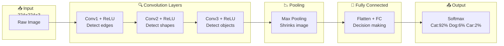

---

### 📦 Each Layer Explained

| Layer | What it does | Simple Explanation |
|---|---|---|
| **Input** | Accepts raw image | 224×224×3 pixels (Width×Height×RGB) |
| **Convolution** | Extracts features using filters | Slides small windows to find edges, shapes |
| **ReLU** | Turns negatives to 0 | `max(0, x)` — keeps only positive signals |
| **Pooling** | Shrinks the feature map | Keeps strongest values, discards rest |
| **Fully Connected** | Makes final decision | All features combined → final answer |
| **Output** | Gives probabilities | Softmax → percentages that sum to 100% |

---

### 📊 Real-World Applications of CNN

| Application | How CNN is Used |
|---|---|
| **Image Classification** | Identify objects in photos (cat, dog, car) |
| **Face Recognition** | Unlock phones, security cameras |
| **Medical Imaging** | Detect tumors in X-rays, MRI scans |
| **Self-Driving Cars** | Detect pedestrians, traffic signs |
| **Document Analysis** | Read handwritten text, scan documents |

---

### 🎯 Summary for Exam Answer

**To get full 6 marks, write this structure:**

1. **Definition (1 mark):** CNN is a deep learning model for image processing using convolution operations to extract features automatically.
2. **Architecture (3 marks):** Explain each layer in order:
   - Convolution Layer (feature extraction with filters/kernels)
   - Activation Layer (ReLU — non-linearity)
   - Pooling Layer (downsampling — max or average pooling)
   - Fully Connected Layer (flatten + decision making)
   - Output Layer (Softmax probabilities)
3. **Applications (2 marks):** List 3-4 applications: Image Classification, Face Recognition, Medical Imaging, Self-Driving Cars.
4. **Diagram (included above):** Draw a neat labeled block diagram showing the flow.

---

## 📐 Expanded Theoretical Framework: Mathematical Foundations and Historical Evolution of CNN Architecture

**Mathematical Foundations of the Discrete Convolution Operation**

The precise mathematical formulation of 2D discrete convolution, when applied to an input tensor $I \in \mathbb{R}^{H \times W \times C_{in}}$ with a kernel bank $K \in \mathbb{R}^{k_H \times k_W \times C_{in} \times C_{out}}$, produces output feature map $S \in \mathbb{R}^{O_H \times O_W \times C_{out}}$ where,

$$S(c_{out}, i, j) = \sum_{c_{in}=1}^{C_{in}} \sum_{m=0}^{k_H-1} \sum_{n=0}^{k_W-1} I(c_{in}, i+m, j+n) \cdot K(c_{out}, c_{in}, m, n) + b_{c_{out}}$$

Most modern deep learning frameworks (PyTorch, JAX, TensorFlow) implement **cross-correlation** rather than true convolution, omitting the 180° kernel flip. This is a mere notational convention, as the kernel weights are learnable and thus the network learns equivalently under either convention. The output spatial dimensions are governed by:

$$O_H = \left\lfloor \frac{H + 2P_H - k_H}{S_H} \right\rfloor + 1, \quad O_W = \left\lfloor \frac{W + 2P_W - k_W}{S_W} \right\rfloor + 1$$

where $P$ denotes zero-padding, $S$ denotes stride, and $k$ denotes kernel size. Dilation $D$ expands the effective receptive region of a kernel without increasing parameters: the effective kernel size becomes $k_{eff} = k + (k-1)(D-1)$, and the same parameter count covers a larger spatial area. This is particularly valuable for semantic segmentation tasks where dense, per-pixel predictions require large receptive fields.

**Neurobiological Origins: From Hubel and Wiesel to Neocognitron**

The theoretical foundation of CNNs traces directly to foundational neurobiological research by David Hubel and Torsten Wiesel in the 1950s–1960s. Their experiments on feline visual cortex revealed a hierarchical processing architecture: **simple cells** responded to oriented edges at specific positions and phases, while **complex cells** responded to similar edges over broader spatial ranges—demonstrating the twin principles of **selectivity** (responding to specific features) and **invariance** (responding regardless of precise position). This inspired Kunihiko Fukushima's **Neocognitron** (1980), the first computational model incorporating convolution-like S-cells (simple cells) and pooling-like C-cells (complex cells) arranged in a hierarchy for shift-invariant visual pattern classification. The LeCun et al. (1989) paper on handwritten digit recognition via backpropagation formalized the modern CNN: weight-shared convolutional layers followed by subsampling, culminating in fully connected classification layers, successfully deployed in commercial ATM check-reading systems throughout the 1990s.

**The AlexNet Breakthrough and the Deep Learning Revolution (2012)**

The modern deep learning era was catalyzed by AlexNet (Krizhevsky et al., 2012), which won ILSVRC 2012 with a top-5 error of 15.3%—dramatically reducing the prior state-of-the-art of 26.2%. Six architectural and algorithmic innovations enabled this breakthrough: (1) **Rectified Linear Units (ReLU)** $f(x) = \max(0, x)$ replacing sigmoid/tanh activations, mitigating vanishing gradients and enabling faster convergence; (2) **Dropout** regularization randomly zeroing activations with probability $p$ during training, implicitly training an ensemble of thinned networks; (3) **Data augmentation** through random cropping and horizontal flipping, artificially expanding the training set; (4) **GPU implementation** leveraging CUDA for parallel computation; (5) **Local Response Normalization (LRN)** for lateral inhibition inspired by biological neurons; and (6) **large-scale training** on 1.2 million ImageNet images. The success demonstrated that depth, proper nonlinearities, and sufficient data could solve extraordinarily complex perceptual tasks.

**Architectural DNA: VGGNet, GoogLeNet, ResNet, and Beyond**

Subsequent architectures systematically refined CNN design principles. VGGNet (Simonyan & Zisserman, 2014) established that depth alone is the primary driver of representational power, demonstrating that stacking 3×3 convolutions achieves equivalent receptive fields to larger kernels while reducing parameters—two consecutive 3×3 convolutions have the same receptive field as one 5×5 but with only 72% of the parameters. GoogLeNet (Szegedy et al., 2014) introduced **inception modules**: parallel 1×1, 3×3, 5×5 convolutions and pooling paths concatenated at the output, enabling multi-scale feature extraction at each layer. The 1×1 convolutions served a critical **dimensionality reduction** role, reducing channel depth before expensive spatial convolutions—a technique now standard in efficient architectures.

ResNet (He et al., 2016) solved the **degradation problem**: deeper networks trained from scratch exhibited higher training error than shallower counterparts, rejecting the hypothesis that deeper networks should perform at least as well as shallower ones given sufficient capacity. The **skip connection** (or identity shortcut):

$$y = \mathcal{F}(x, \{W_i\}) + x$$

allows gradients to flow directly through the identity mapping to earlier layers, ensuring that deeper models can represent their shallower equivalents (by setting residual functions to zero). This learning **residual functions** rather than direct mappings enabled training of networks with 100+ layers. DenseNet (Huang et al., 2017) extended this idea to full connectivity—each layer concatenates its feature maps to all subsequent layers—maximizing gradient flow, feature reuse, and parameter efficiency, though at the cost of increased memory due to large concatenated feature maps.

EfficientNet (Tan & Le, 2019) formalized the **compound scaling** principle: uniformly scaling network depth $d$, width $w$, and resolution $r$ according to $d = \alpha^{\phi}$, $w = \beta^{\phi}$, $r = \gamma^{\phi}$ with $\alpha \cdot \beta^2 \cdot \gamma^2 \approx 2$ (balanced resource constraint), achieving state-of-the-art efficiency-accuracy tradeoffs. EfficientNetV2 further introduced **progressive learning**, gradually increasing image size during training while using more efficient Fused-MBConv layers.

**Translation Equivariance, Invariance, and the Feature Hierarchy**

The **inductive bias** of weight sharing imposes **translation equivariance**: if $F(I)$ is the feature map of input image $I$, then $F(I(t)) = F(I)(t)$, where $I(t)$ denotes a translation of $I$ by $t$ pixels. Concretely, if a cat detector activates at position $(x, y)$ for one image, translation of the cat will cause the detector to activate at the translated position $(x + t_x, y + t_y)$. Pooling layers provide approximate **translation invariance**: max pooling selects the maximum response in a local window, so small shifts that keep the feature within the window produce identical outputs. This duality—equivariant feature extraction via convolutions, invariant classification via pooling—is central to why CNNs generalize so well to new object positions.

The **feature hierarchy** emerges from the geometry of hierarchical datasets: natural images are composed of edges at many orientations and scales, edges combine into textures and motifs, and these combine into object parts and whole objects. The information bottleneck principle (Tishby, 2015) suggests that layers act as successive bottlenecks, retaining only task-relevant information and compressing irrelevant details. The optimal compression at each layer is dictated by the Information Plane: early layers preserve more input information (high mutual information with input $I(X; T)$), while deep layers maximize task-relevant information (high mutual information with label $I(T; Y)$), creating a trade-off between representation richness and discriminative power.

**Receptive Field Geometry and Effective Coverage**

The **effective receptive field** (ERF) of a deep CNN neuron is empirically smaller than its theoretical maximum due to Gaussian-like falloff in influence from center to periphery. Luo et al. (2016) demonstrated that the effective receptive field grows sub-linearly with depth: for a typical CNN, the center pixels of the receptive field account for the vast majority of gradient signals. This has profound implications: while theoretically a deep CNN can "see" the entire image from layer 1, in practice the relevant context for a pixel prediction is much smaller, motivating architectures with dilated convolutions, atrous spatial pyramid pooling (ASPP), and attention mechanisms to capture broader contextual information in tasks like semantic segmentation.

**Connection to Classical Signal Processing and Harmonic Analysis**

From signal processing, 2D convolution corresponds to linear filtering. Learned kernels approximate Gabor-like functions—oriented sinusoidal gratings modulated by Gaussian envelopes—matching the receptive fields of simple cells in V1. Stacking convolutions constructs a learned **scattering transform** (Mallat, 2012): a wavelet-based decomposition that is covariant to translations and stable to small deformations. This mathematical isomorphism between CNN representations and wavelet scattering networks provides theoretical grounding for why CNNs are so effective on image data: the learned filters implicitly organize themselves into a statistical basis that efficiently encodes the natural image manifold. Fourier analysis reveals convolution as multiplication in frequency domain, explaining the efficiency of FFT-based implementations and why CNNs naturally decompose images across spatial frequencies at multiple scales.

## Q.1 (b) — What is **Padding**? Enlist and explain types of padding. **[6 Marks]**

### 📐 What is Padding? — The "Border Frame" for Images

**Padding** is the technique of adding extra pixels (usually zeros) around the border of an image before applying a convolution.

> **Think of it like a picture frame:** The frame gives you space to work at the edges. Without a frame, the edges of the photo get cut off. Padding does the same for images in a CNN — it preserves edge information.

---

### 🚨 Why Do We Need Padding?

```
Without Padding:
  5×5 Image + 3×3 Filter + Stride 1 → Output: 3×3
  → Image shrinks by 2 pixels!
  → Edge pixels are barely used
  → Important border information is lost

With Padding (P=1):
  7×7 Image (5×5 + 1px border) + 3×3 Filter + Stride 1 → Output: 5×5
  → Image stays the SAME size!
  → Edge pixels are fully utilized
```

---

### 📏 Output Size Formula

```
Output Size = (Input Size - Filter Size + 2 × Padding) / Stride + 1

Example:
  Input = 32×32, Filter = 3×3, Padding = 1, Stride = 1
  Output = (32 - 3 + 2×1) / 1 + 1 = 32×32  ✅ Same size!
```

---

### 🎨 Types of Padding

#### **1. Valid Padding (No Padding)**
- **Padding = 0** — no border added
- Output is **smaller** than input
- Used when you want to reduce dimensions

```
5×5 Image → 3×3 Output (shrinks!)
```

#### **2. Same Padding (Zero Padding)** ⭐ Most Common
- **Padding = P**, where P is chosen so output size = input size
- For 3×3 filter: P = 1 (add 1 pixel border)
- For 5×5 filter: P = 2 (add 2 pixel border)
- Keeps spatial dimensions the same

```
5×5 Image + P=1 border → 7×7 → 5×5 Output (same size!)
```

#### **3. Full Padding (Maximum Padding)**
- **Padding = Filter Size - 1** (maximum)
- Output is **larger** than input
- Rarely used in CNNs

```
5×5 Image + P=2 (for 3×3 filter) → 9×9 → 7×7 Output (expanded!)
```

---

### 📊 Comparison Table

| Type | Padding | Output Size | Use Case |
|---|---|---|---|
| **Valid** | P = 0 | Smaller | When shrinking is needed |
| **Same** | P = (F-1)/2 | Same as input | Most common, preserves size |
| **Full** | P = F-1 | Larger | Rarely used |

---

### 🎯 Summary for Exam Answer

**To get full 6 marks:**
1. **Definition (1 mark):** Padding adds border pixels (zeros) around input before convolution. Purpose: preserve spatial dimensions and utilize edge pixels.
2. **Why needed (1 mark):** Without padding, image shrinks after each conv layer, edge info is lost.
3. **Formula (1 mark):** Write `Output = (Input - Filter + 2P) / Stride + 1`
4. **Types (3 marks):** Explain all 3 types with small diagrams:
   - Valid (P=0, output shrinks)
   - Same (P chosen to keep size, most common)
   - Full (P=max, output expands)

---

## 📐 Expanded Theoretical Framework: Convolution Arithmetic, Dilation, Atrous Convolutions, and the Geometry of Feature Maps

**The Full Convolution Arithmetic and the Halvation Problem**

In deep convolutional networks, each layer of convolution combined with a non-unit stride $S$ or kernel size $k \neq 2S - 1$ causes spatial dimensions to shrink. Consider a hypothetical stack of 10 convolutional layers each with $k=3$ and $P=0$, $S=1$: an input of $256 \times 256$ would collapse to $246 \times 246$. More critically, after 50–100 layers common in modern residual networks, valid padding would catastrophically eliminate spatial content, producing degenerate feature maps or negative dimensions. This is the fundamental motivation for padding: it allows deep networks to maintain spatial resolution across depth, enabling residual and dense connections that require matching tensor shapes.

**The Canonical Padding Convention: $P = (k-1)/2$ and SAME padding**

For an odd-sized kernel with stride $S=1$, Same padding requires padding $P = \lfloor k/2 \rfloor$. For $k=3$, $P=1$; for $k=5$, $P=2$; for $k=7$, $P=3$. The output dimension becomes $O = \lfloor (H + 2P - k)/S \rfloor + 1 = \lfloor (H + 2\lfloor k/2 \rfloor - k)/S \rfloor + 1$. For odd $k$, this exactly equals $H$, since $2\lfloor k/2 \rfloor = k-1$, giving $O = \lfloor (H - 1)/S \rfloor + 1 = H$ for $S=1$. For even-sized kernels (e.g., $k=4$), true Same padding is asymmetric ($P_H \neq P_W$ or asymmetric distribution), since no integer $P$ satisfies $H + 2P - 4 = H$. Frameworks typically add one extra pad on the right/bottom: $O_H = H/S$, with $P_{right} = P_{left} + 1$ if $H$ is odd. This asymmetry matters for precise output dimension control in fully convolutional networks used in semantic segmentation.

**Zero Padding versus Learned Padding and Reflection Padding**

Zero padding produces artificial low-value border pixels that can create artificial activation artifacts at image boundaries. **Reflection padding** (or symmetric padding) mirrors pixels at the boundary rather than using zeros, better preserving boundary statistics. For images, this is often preferred in the first layer. Some modern architectures use explicit **Padding Layers** (e.g., `ReflectionPad2d` in PyTorch) that can be placed before the convolution to control this precisely. In some architectures, learned padding via dilated convolutions can simulate zero-padding-free designs, but at the cost of losing the "beginnings" and "endings" of feature activation sequences, which is why the padded approach remains standard.

**Relationship Between Padding, Stride, and Dilation: The Generalized Convolution Equation**

Dilation $D \in \mathbb{N}$ introduced in the seminal work by Yu & Koltun (2015) for semantic segmentation allows a kernel with spacing $D-1$ zeros between active weights. The effective kernel size becomes $k_{eff} = D(k-1) + 1$. The output dimension formula generalizes to:

$$O = \left\lfloor \frac{H + 2P - D(k-1) - 1}{S} \right\rfloor + 1$$

Atrous (or dilated) convolution with $D > 1$ **expands receptive field without increasing parameters or computation**: a 3×3 kernel with $D=2$ covers an effective 5×5 region with only 9 parameters instead of 25. Stacking dilated convolutions with increasing dilation (e.g., $D = 1, 2, 4, 8$ in**te modules) creates exponential receptive field growth while preserving spatial resolution. This is the key architectural insight behind DeepLab v3 (Chen et al., 2017): atrous spatial pyramid pooling (ASPP) extracts features at multiple scales simultaneously using parallel convolutions with different dilation rates (1, 6, 12, 18), capturing both fine-grained local and coarse-grained global context—crucial for precise pixel-level segmentation boundaries without pooling away resolution.

**Transposed Convolution (Deconvolution): The "Reverse" of Convolution**

Transposed convolution (often misnamed "deconvolution," which technically refers to inversion of a convolution, not deconvolve) performs the transpose operation of convolution, **increasing** spatial resolution. The forward convolution can be written as a matrix multiplication $S = K \cdot I$ (with appropriate index reshaping). Transposed convolution computes $S' = K^T \cdot I$, which for certain input shapes corresponds to inserting zeros between elements and then applying a standard convolution with an appropriate kernel. This is the fundamental operation in decoder branches of encoder-decoder architectures, U-Net, and generative models. Importantly, transposed convolution produces **checkerboard artifacts** (uneven overlap of inserted zeros) when the stride is not an integer fraction of the kernel size. Odena et al. (2016) showed these artifacts can be eliminated by using nearest-neighbor or bilinear upsampling followed by regular convolution, or by carefully selecting stride-kernel combinations such as $S=2, k=4$ or using sub-pixel convolution (Shi et al., 2016) which rearranges channel information into spatial dimensions via periodic shuffling.

**Padding and the FFT-based Implementation of Convolution**

For large kernels (e.g., $k > 15$) or large inputs, direct spatial-domain convolution is computationally expensive: $\mathcal{O}(H \cdot W \cdot k^2 \cdot C_{in} \cdot C_{out})$. The convolution theorem enables FFT-based implementation with complexity $\mathcal{O}(H \cdot W \cdot \log(H \cdot W))$ by transforming both image and kernel to frequency domain via 2D FFT, performing element-wise multiplication, then inverse FFT. Crucially, zero padding to size $N \geq H + k - 1, W + k_W - 1$ enables **circular convolution** to behave as **linear convolution**—this is the same reason zero padding is used to prevent wrap-around artifacts in FFT-based filtering. This connection between padding and the FFT reveals that padding in convolutional networks is not merely a practical pixel-counting trick, but has deep mathematical roots in the proper handling of boundary conditions in discrete signal processing.

**Padding Strategies in Modern Architectures and the Role in Fully Convolutional Inference**

In fully convolutional networks (FCNs, Long et al., 2015) where no pooling or fully connected layers constrain spatial dimensions, padding becomes the sole mechanism determining output spatial dimensions. Fully convolutional inference enables **dense prediction** at arbitrary input sizes: a network trained on 512×512 inputs can produce predictions for any image size at inference time, producing a full-resolution segmentation map where each pixel receives a class prediction. The standard convention of "convolution with Same padding, stride 1" in backbones like ResNet and EfficientNet ensures that spatial dimensions halve only at explicit pooling layers with $S=2$, giving the network designer explicit control over the spatial resolution of each block—a fundamental organizing principle of feature pyramid architectures.

**SAME versus VALID Padding and the Trade-off Between Spatial Resolution Preservation and Context Coverage**

Valid padding progressively shrinks feature maps, concentrating each layer's representations into a smaller spatial region and forcing later layers to aggregate broader spatial contexts from the compressed representation. Same padding preserves spatial dimensions, allowing later layers to access fine-grained spatial information throughout the network depth. In practice, modern encoder architectures resolve this by combining both: an initial block of Same-padding layers to extract features at full resolution, followed by stride-2 max-pooling or convolution layers that explicitly downsample by 2×, continuing this pattern in a pyramid manner (e.g., ResNet has 5 spatial scales: 1/1, 1/2, 1/4, 1/8, 1/16 of input). This controlled, staged downsampling via explicit pooling rather than implicit shrinking through valid convolutions allows for clean connection to skip connections (U-Net) or feature pyramid networks (FPN) that fuse multi-scale information.

**Padding in the Context of Semantic Equivariances and Group Convolutions**

Standard convolutions are **translationally equivariant**: the output response shifts with the input. Group convolutions (Xie et al., 2017; Krizhevsky, 2011) replace standard convolutions by applying different filter groups to different input channel subsets, reducing computation while preserving translational equivariance within each group. When combined with zero padding, this preserves the boundary treatment of out-of-boundary pixels within each group channel group. More broadly, the treatment of padding interacts with various symmetry structures: spatial padding combined with circular boundary conditions produces circular convolution, invariant to translations modulo the padded boundary, analogous to how toroidal (wrap-around) boundary conditions are used in physics simulations to eliminate edge artifacts. Understanding padding in this group-theoretic context opens doors to designing CNNs with specified equivariance groups beyond translation (e.g., rotation equivariance via steerable CNNs, or scale equivariance via scale-space theory).

**Physical Analogy: Padding as Boundary Conditions in Physics**

In physics, the choice of boundary conditions profoundly affects system behavior: fixed boundaries (Dirichlet) fix the field value, free boundaries (Neumann) fix the field gradient. In CNNs, zero padding corresponds to homogeneous Dirichlet boundary conditions $I|_{boundary} = 0$, reflection padding corresponds to symmetric (Neumann-like) boundary conditions $\nabla I|_{boundary} = 0$, and circular padding corresponds to periodic boundary conditions. Just as physicists choose boundary conditions reflecting the underlying phenomenon being modeled, the choice of padding strategy should reflect the statistics of the data at its boundaries—natural images are non-stationary at boundaries (smooth interiors bounded by sharp edges), making zero padding significantly suboptimal compared to reflection or replication padding. Empirical analysis in modern architectures has increasingly shown that edge-aware padding strategies improve boundary quality in segmentation and detection tasks, where predicting accurate object boundaries is critical for real-world deployment in autonomous driving, medical imaging, and satellite analysis.

## Q.1 (c) — Explain **Dropout Layer** in Convolutional Neural Network. **[6 Marks]**

### 🎲 What is Dropout? — "Randomly Firing Neurons"

**Dropout** is a regularization technique that **randomly deactivates a fraction of neurons** during training. This prevents the network from relying too much on any single neuron.

> **Think of it like a basketball team practice:** The coach randomly sits out different players. This forces EVERYONE to improve their skills. When the real game comes, the whole team is stronger. Dropout does this for neural networks!

---

### ⚙️ How Dropout Works

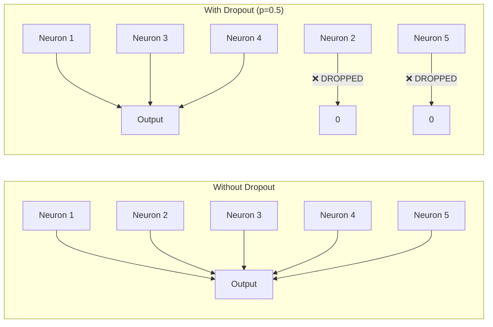

**Process:**
1. Set dropout rate `p` (commonly 0.5)
2. During training: randomly drop neurons with probability `p`
3. Scale remaining neurons by `1/p` to maintain total output strength
4. During testing: use ALL neurons (no dropout)

---

### 🧩 Why Does Dropout Help?

#### **1. Prevents Co-Adaptation**
- Without dropout: neurons learn to depend on each other
- With dropout: each neuron must learn **its own useful feature** independently
- Result: more robust, independent features

#### **2. Ensemble Effect**
- Each training iteration uses a different subset of neurons
- This trains thousands of different "sub-networks"
- At test time: all neurons = averaging all sub-networks
- Ensemble models are always more accurate!

---

### 📊 Dropout Effect

| Metric | Without Dropout | With Dropout |
|---|---|---|
| Training Accuracy | 99% (memorized!) | 85% (learning patterns) |
| Testing Accuracy | 70% | 82% ✅ |
| Overfitting | Yes | No |

---

### 🎯 Summary for Exam Answer

**To get full 6 marks:**
1. **Definition (1 mark):** Dropout randomly deactivates neurons during training to prevent overfitting.
2. **How it works (2 marks):** Explain process — dropout rate p, random dropping, scaling by 1/p, no dropout at test time. Show formula.
3. **Why it helps (2 marks):** Explain two reasons — prevents co-adaptation (neurons learn independently) and ensemble effect (trains many sub-networks).
4. **Where applied (1 mark):** Commonly between FC layers in CNNs.

---

## 📐 Expanded Theoretical Framework: Statistical Mechanics, Bagging, and the Mathematical Optimality of Dropout Regularization

**The Statistical Mechanics Interpretation: Dropout as Model Averaging**

The theoretical basis of dropout regularization was formalized in the foundational paper by Srivastava et al. (2014), who interpreted a single forward pass of a thinned network with dropout as sampling a binary mask tensor $M \sim \text{Bernoulli}(1-p)^{\otimes n}$ applied element-wise to the hidden activations $h$ of network layer $L$:

$$\tilde{h}_i = m_i \cdot h_i, \quad m_i \sim \text{Bernoulli}(1-p)$$

At training time, the expected output is $\mathbb{E}_M[\tilde{h}] = (1-p) \cdot h$, which for ReLU activations gives a deterministic scaling. With ReLU activations, the expected value of the masked response is exactly $(1-p) \cdot h$, so no additional scaling compensation is strictly needed—a curious discrepancy explanation. However, the standard practice of inverting dropout by scaling by $1/(1-p)$ at test time ensures:

$$\mathbb{E}_{M \sim \text{Bernoulli}(1-p)} \left[\frac{m_i}{1-p} \cdot h_i\right] = h_i$$

This preserves the expected activation magnitude between training and inference, preventing distribution shift. This is critical: without the train/test scaling asymmetry, the network would see substantially smaller activations at test time, producing diminished outputs.

**The Ensemble Theory: Thinned Net as Approximate Bayesian Model Averaging**

Dropout can be rigorously understood as simultaneously training an exponential number ($2^n$ for $n$ hidden units with dropout rate $p$) of thinned neural sub-networks, each receiving a different randomly masked subset of the total parameters. At test time, evaluating the full (un-thinned) network with $1/(1-p)$ scaling is equivalent to averaging the predictions of all $2^n$ thinned networks. This corresponds to **model averaging** — a classical statistical technique with provable risk bounds that often outperforms any individual model. The remarkable insight is that a single pass through the full network approximates this exponentially expensive exact average at negligible additional cost.

Formally, the expected predictive distribution under dropout at test time approximates:

$$p(y|\mathbf{x}, \mathcal{D}) \approx \int p(y|\mathbf{x}, \mathbf{w}) p(\mathbf{w}|\mathcal{D}) d\mathbf{w} \approx \text{mean over all neuron subsets}$$

where $\mathbf{w}$ represents the full network parameters. The second approximation—using a finite Monte Carlo sample—is notorious in Bayesian deep learning and typically requires hundreds to thousands of MC samples for accurate estimation; dropout's genius is approximating this with a single deterministic pass.

**Prevention of Co-Adaptation: Causal and Correlational Perspectives**

Co-adaptation in neural networks refers to the phenomenon where hidden units in the same layer learn correlated, co-dependent feature detectors that mutually correct each other's errors. In the absence of dropout, backpropagation can drive two units to develop highly specialized, redundant feature detectors: Unit A might learn to detect "circular eye shape" and Unit B "intensity contrast around circular shapes"—both are individually useful but jointly redundant. Dropout prevents co-adaptation because each stochastic forward pass must make useful contributions without knowing which other units will be active—a unit's response must generalize across combinations, preventing overly specialized feature detectors.

From the perspective of **L1 regularization theory**, dropout exerts a norm-constraining effect. The expected $L_2$ norm of weights flowing into a unit surviving dropout is effectively constrained, as the gradient signal magnitude arrives on average $1/(1-p)$ times stronger per surviving connection, implicitly pushing weights away from sparse, credit-allocating configurations toward more distributed, evenly balanced contributions.

**Connection to L2 Regularization (Weight Decay) and $\ell_2$ Norm Penalty**

The relationship between dropout and L2 regularization has been rigorously established: Wager et al. (2013) and Srivastava (2014) proved that dropout applied to a linear regression or logistic regression model is approximately equivalent to L2 regularization (ridge regression) multiplied by a factor inversely proportional to the hidden unit count. For a linear model with dropout, the regularized cost function becomes:

$$\mathcal{L}_{\text{dropout}} \approx \mathcal{L} + \lambda \|\mathbf{w}\|_2^2, \quad \lambda = \frac{p}{2(1-p) \cdot n}$$

where $n$ is the number of hidden units. This means dropout induces an implicit weight decay effect that scales inversely with network width—wider networks benefit from higher equivalent regularization per unit of dropout rate. This explains why dropout is particularly effective in large, wide networks such as fully-connected classification heads.

**Spatial Dropout and Variants for Convolutional Architectures**

Standard dropout independently randomizes per-unit masking, but in convolutional layers, adjacent feature-map pixels are highly correlated. To prevent co-adaptation of spatially nearby features, **Spatial Dropout** (or Dropout2D) randomly drops entire feature maps, ensuring the network must rely on non-adjacent or orthogonal features. Formally, given a feature map tensor of shape $[B, C, H, W]$ where $B$ is batch size, $C$ is channel count, $H$ and $W$ are spatial dimensions, Spatial Dropout generates a binary mask of shape $[B, C, 1, 1]$ where each channel is kept with probability $(1-p)$, broadcasting across the spatial dimension. This dramatically reduces co-adaptation in convolutional feature maps while preserving the intended L2-regularization benefit. **Spatial Pyramid Dropout** and **Stochastic Depth** (Huang et al., 2016) extend this idea by dropping entire residual block sub-paths during training, implicitly learning the optimal depth of each conditional branch and improving gradient flow in very deep ResNets.

# UNIT II — Recurrent Neural Networks (RNN)

---

## Q.3 (a) — Explain **RNN with its types**. **[6 Marks]**

### 🔄 What is an RNN? — The "Memory" Network

**RNN** (Recurrent Neural Network) is designed for **sequential data** — data that comes in order (words in a sentence, frames in a video, notes in music). It has a **hidden state (memory)** that carries information from previous steps to the next.

> **Think of reading a sentence:** "The cat sat on the ___." Your brain remembers "cat" and "sat" to predict "mat." A regular neural network forgets previous words, but an RNN remembers through its hidden state.

---

### 🏗️ RNN Basic Architecture

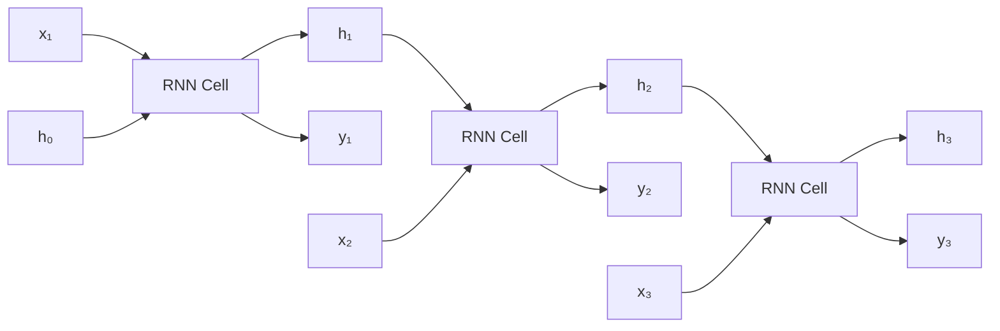

**Key:** Same RNN cell (same weights) used at every step. Hidden state `h` flows forward, carrying memory.

---

### 📋 Four Types of RNN

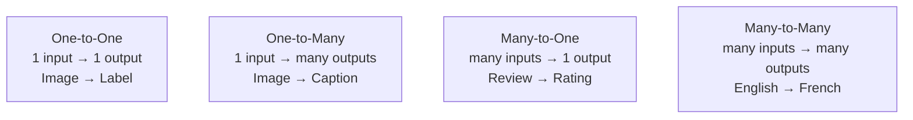

| Type | Input | Output | Example |
|---|---|---|---|
| **One-to-One** | 1 value | 1 value | Simple classification |
| **One-to-Many** | 1 value | Sequence | Image Captioning |
| **Many-to-One** | Sequence | 1 value | Sentiment Analysis |
| **Many-to-Many** | Sequence | Sequence | Machine Translation |

---

### 🎯 Summary for Exam Answer

**To get full 6 marks:**
1. **Definition (1 mark):** RNN is for sequential data with a loop that passes hidden state (memory) from one step to the next.
2. **Architecture (1 mark):** Same cell at each step, hidden state carries memory forward.
3. **Types (4 marks):** Explain all 4 types with simple diagrams:
   - One-to-One: 1→1 (simple classification)
   - One-to-Many: 1→many (image → caption)
   - Many-to-One: many→1 (review → rating)
   - Many-to-Many: many→many (translation)

---

## 📐 Expanded Theoretical Framework: RNN Signal Flow, Backpropagation Through Time, the Vanishing Gradient Problem, and Long-Dependency Modeling

**Exact Forward Propagation Equations**

The recurrence that defines an RNN at each time step $t$ is:

$$\mathbf{h}_t = \phi_h(\mathbf{W}_{hh}\mathbf{h}_{t-1} + \mathbf{W}_{xh}\mathbf{x}_t + \mathbf{b}_h) $$
$$\mathbf{y}_t = \phi_y(\mathbf{W}_{hy}\mathbf{h}_t + \mathbf{b}_y) $$

where $\mathbf{x}_t \in \mathbb{R}^{D_x}$ is input, $\mathbf{h}_t \in \mathbb{R}^{|H|}$ is hidden state, $\mathbf{y}_t$ is output, and $\phi_h$ is typically $\tanh$ while $\phi_y$ is softmax for classification. Critically, the weight matrices $\mathbf{W}_{xh}, \mathbf{W}_{hh}, \mathbf{W}_{hy}$ and biases are **shared** across all time steps — this weight sharing encodes the assumption of translation invariance along the time axis: an RNN cell is the "same function" applied at each position, analogous to how CNN filters are convolved across space. This dramatically reduces parameter count relative to a fully connected time-series model.

**Backpropagation Through Time (BPTT): Deriving Gradient Computation**

Unrolling for $T$ steps produces a deep feedforward network, and error signals propagate backward via:

$$\frac{\partial \mathcal{L}}{\partial \mathbf{W}_{hh}} = \sum_{t=1}^{T} \sum_{k=1}^{t} \frac{\partial \mathcal{L}_t}{\partial \mathbf{h}_t} \cdot \mathbf{J}_t^k \cdot \frac{\partial \mathbf{h}_k}{\partial \mathbf{W}_{hh}} $$

where $\mathbf{J}_t^k = \prod_{\tau=k+1}^{t} \frac{\partial \mathbf{h}_\tau}{\partial \mathbf{h}_{\tau-1}} = \prod_{\tau=k+1}^{t} \text{diag}(\phi_h'(\cdot)) \mathbf{W}_{hh}^T$. These Jacobian products are the crux of the gradient flow problem. Each multiplication by $\mathbf{W}_{hh}^T$ (for spectral norm $\sigma_1$) scales the gradient:

$$\|\mathbf{J}_t^k\|_2 \leq \|\mathbf{W}_{hh}^T\|_2^{t-k} = \sigma_1^{t-k}$$

If $\sigma_1 < 1$, gradients decay exponentially $\sigma_1^{t-k}$; if $\sigma_1 > 1$, they explode. This means gradients from early time steps (where $t-k$ is large) either vanish to zero or oscillate wildly, preventing learning of long-range temporal dependencies — the credit assignment problem over time.

**The Vanishing Gradient Problem: Empirical and Theoretical Limits**

Bengio et al. (1994) proved that RNN gradients decay as $O(\sigma_1^{t-k})$ with high probability, where $\sigma_1$ is the largest singular value of $\mathbf{W}_{hh}$. For a network initialized with Xavier/Glorot uniform sampling, typical eigenvalues cluster around 1.0, with many slightly below, causing slow exponential decay of gradient magnitudes to near-zero over just 10–20 time steps. In practice, this means a vanilla RNN cannot reliably learn dependencies longer than ~10 steps. The practical manifestation: in language modeling with word embeddings, a word five positions before cannot influence current predictions beyond a horizon set by the spectral norm, constraining the band-limited memory capacity of the model.

**Gated Architectures: LSTMs and GRUs as Gradient Highways**

LSTM (Hochreiter & Schmidhuber, 1997) solved this by introducing a cell state $\mathbf{c}_t$ updated via additive composition rather than overwriting transformation:

$$\mathbf{c}_t = \mathbf{f}_t \odot \mathbf{c}_{t-1} + \mathbf{i}_t \odot \tilde{\mathbf{c}}_t $$

Three learned gates — input gate $\mathbf{i}_t = \sigma(\mathbf{W}_{xi}\mathbf{x}_t + \mathbf{W}_{hi}\mathbf{h}_{t-1} + \mathbf{b}_i)$, forget gate $\mathbf{f}_t = \sigma(\mathbf{W}_{xf}\mathbf{x}_t + \mathbf{W}_{hf}\mathbf{h}_{t-1} + \mathbf{b}_f)$, and output gate $\mathbf{o}_t = \sigma(\mathbf{W}_{xo}\mathbf{x}_t + \mathbf{W}_{ho}\mathbf{h}_{t-1} + \mathbf{b}_o)$ — control information flow via multiplicative modulation. The forget gate is critical: when $\mathbf{f}_t \approx 1$, $\mathbf{c}_t \approx \mathbf{c}_{t-1}$ and gradients flow **unchanged through time** via the identity path:

$$\frac{\partial \mathcal{L}}{\partial \mathbf{c}_{t-k}} = \frac{\partial \mathcal{L}}{\partial \mathbf{c}_t} \cdot \prod_{\tau=1}^{k} \mathbf{f}_{t-\tau} \approx \frac{\partial \mathcal{L}}{\partial \mathbf{c}_t} \quad \text{if } \mathbf{f} \approx \mathbf{1}$$

Gated Recurrent Units (GRU, Cho et al., 2014) further simplify with just reset gate $\mathbf{r}_t$ and update gate $\mathbf{z}_t$, sharing a single hidden state $\mathbf{h}_t$ without a separate cell state. The update gate determines how much to keep versus overwrite: $(1-\mathbf{z}_t)\odot\mathbf{h}_{t-1} + \mathbf{z}_t\odot\tilde{\mathbf{h}}_t$, with $\mathbf{z}_t \approx \mathbf{1}$ creating an identity path and allowing gradients to flow without decay. Both architectures effectively learn when to retain memory and when to overwrite, creating dynamic memory allocation.

**From LSTMs to Attention and Transformers: The Attention Revolution**

Despite the success of LSTMs, even gated RNNs face a practical bottleneck: hidden states must compress all information into a fixed-size vector, constraining the capacity to remember precise details across long sequences. The Encoder-Decoder architecture with attention, and later the Transformer (Vaswani et al., 2017), addressed this by explicitly allowing the decoder to look at any encoder hidden state, creating a soft lookup mechanism reminiscent of a key-value memory. The attention mechanism computes a weighted sum of encoder states $\mathbf{a}_t = \sum_{j=1}^{T} \alpha_{tj} \mathbf{h}_j^{\text{encoder}}$, where $\alpha_{tj}$ is derived from a compatibility function between decoder state and encoder states. The Transformer eliminates recurrence entirely, replacing sequential recurrence with **self-attention** (dot-product between learned query/key/value projections) that allows every position to attend to every other position in $\mathcal{O}(1)$ sequential depth (assuming attention can be parallelized), enabling the parallelization critical for efficiently training on massive datasets (WMT, BooksCorpus), resulting in the path to models like GPT, BERT, T5, and PaLM.

## Q.3 (b) — Explain in brief **Encoder Decoder architecture**. **[6 Marks]**

### 🏗️ What is Encoder-Decoder? — "Understand, Then Speak"

The **Encoder-Decoder** architecture converts one sequence into another. The **Encoder** reads and understands the input. The **Decoder** generates the output.

> **Think of a human translator:** The translator LISTENS to the full English sentence (Encoder), understands it, then SPEAKS the French translation (Decoder). The "understanding" is passed through a **Context Vector**.

---

### ⚙️ How It Works

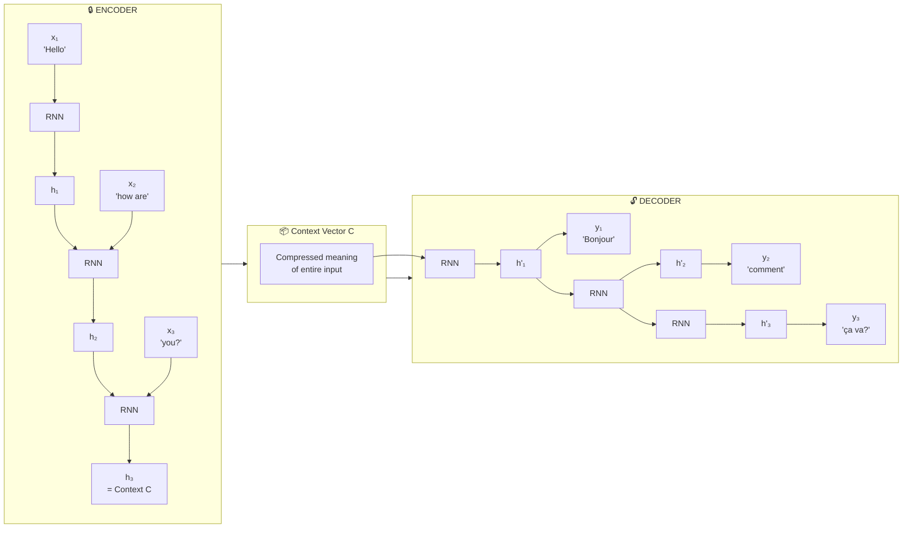

---

### 📋 Components

| Component | Role | Example |
|---|---|---|
| **Encoder (RNN)** | Reads entire input, produces context vector | Reads "Hello how are you" |
| **Context Vector** | Compressed meaning of input | Single vector containing full meaning |
| **Decoder (RNN)** | Generates output sequence word by word | Outputs "Bonjour comment ça va" |

---

### 📊 Applications

| Application | Input | Output |
|---|---|---|
| **Machine Translation** | English sentence | French sentence |
| **Text Summarization** | Long article | Short summary |
| **Image Captioning** | Image | Text description |
| **Chatbots** | User message | Bot reply |

---

### ⚠️ Bottleneck Problem
- Entire input compressed into ONE fixed-size vector
- Long sentences lose important details
- **Solution:** Attention Mechanism (used in Transformers)

---

### 🎯 Summary for Exam Answer

**To get full 6 marks:**
1. **Definition (1 mark):** Encoder-Decoder is a sequence-to-sequence model. Encoder reads input → Context Vector → Decoder generates output.
2. **Encoder (2 marks):** Explain — RNN reads entire input sequence. Final hidden state = Context Vector containing compressed meaning.
3. **Decoder (2 marks):** Explain — RNN generates output word by word using Context Vector as initial memory.
4. **Applications (1 mark):** Machine Translation, Text Summarization, Image Captioning.

---

## 📐 Expanded Theoretical Framework: Information Bottleneck, Attention Mechanisms, Beam Search, and the Sequence-to-Sequence Evolution

**Information-Theoretic Constraints on the Context Vector**

The classical Encoder-Decoder bottleneck is fundamentally constrained by the **Information Bottleneck Principle** (Tishby et al., 2000). During encoding, the input sequence $\mathbf{x}_{1:T}$ is compressed into a fixed-dimensional context vector $\mathbf{c}$. The mutual information between the input and context $I(\mathbf{x}_{1:T}; \mathbf{c})$ is bounded above by the capacity of the channel $|\mathbf{c}|$ — a neuron's activation is a real number over potentially infinite values, but the number of distinct states is constrained by the dimensionality. For sufficiently long input sequences, this compression is lossy and irretrievable: information not captured in $\mathbf{c} \in \mathbb{R}^d$ is irreversibly discarded, creating a hard ceiling on translation quality beyond a sequence length threshold. This was identified as the primary limitation of early seq2seq models (Sutskever et al., 2014; Cho et al., 2014) which reported degradation for sentences longer than 50 words.

**The Attention Mechanism as a Variable-Sized Memory Retrieval Address**

Bahdanau et al. (2014) introduced **attention** or "soft search" directly addressing the bottleneck by allowing the decoder to look at any encoder hidden state at every decoding step. The context vector becomes a **dynamic weighted sum**: $\mathbf{c}_t = \sum_{j=1}^{T} \alpha_{tj} \mathbf{h}_j^{\text{encoder}}$. The attention weights $\alpha_{tj}$ are computed via an alignment model:

$$e_{tj} = a(\mathbf{s}_{t-1}, \mathbf{h}_j)$$
$$\alpha_{tj} = \frac{\exp(e_{tj})}{\sum_{k=1}^{T} \exp(e_{tk})}$$

where $a(\cdot)$ is a learned compatibility function (typically a feedforward network with tanh/ReLU) applied between the decoder state $\mathbf{s}_{t-1}$ and encoder hidden state $\mathbf{h}_j$. The resulting $\mathbf{c}_t$ is now input-dependent and decoder-step-dependent, enabling variable-length alignment between source and target sequences. This aligns semantically relevant input tokens to output tokens: for example, translating "Le chat noir" to "The black cat" attends $\alpha_{t, j}$ to "noir" when generating "black", then to "chat" when generating "cat". This alignment mechanism was shown to dramatically improve translation quality, with BLEU score improvements of 2.5–5 points on standard benchmarks.

**Attention is Attention: Luong, Bahdanau, and Beyond**

Bahdanau attention (additive/concat compatibility) and Luong attention (multiplicative dot-product compatibility $e_{tj} = \mathbf{s}_t^T \mathbf{W} \mathbf{h}_j$) are the two dominant forms. Multiplicative attention scales linearly with the embedding dimension, additive attention is more expressive for learned projections. **Multi-head attention** (Vaswani et al., 2017) runs multiple parallel attention "heads" each with its own learned projections, concatenated at output:

$$\text{MultiHead}(Q,K,V) = \text{Concat}(\text{head}_1, \text{head}_2, \ldots, \text{head}_h)\mathbf{W}_O$$

where each head computes $\text{head}_i = \text{Attention}(Q\mathbf{W}_Q^i, K\mathbf{W}_K^i, V\mathbf{W}_V^i)$. Multi-head attention allows the model to jointly attend to information from different representation subspaces: one head might focus on syntactic relations, another on semantic similarity, another on positional proximity. This is structurally analogous to having multiple filters in a CNN layer, each learning different feature detectors.

**Decoding Strategies: Greedy, Beam Search, and Stochastic Sampling**

During inference, the decoder must generate output tokens sequentially. The simplest approach is greedy decoding: at each step, select $y_t = \arg\max_{y} P(y_t | y_{<t}, \mathbf{c})$. Greedy decoding is efficient ($\mathcal{O}(1)$ beam width) but risks **myopic errors**: early mistakes are never recovered, and monotonically increasing log-probability does not always correlate with higher-quality output (better-calibrated probabilities matter more than high likelihood). **Beam search** maintains the $k$ most likely partial hypotheses at each step (beam width $k$), expanding all $k$ simultaneously and pruning to top-$k$ by cumulative log-probability. A beam of width 5–10 typically provides substantial improvements over greedy decoding, but is $\mathcal{O}(k)$ slower. Beam search can also fail when the model's probability distribution is over-confident but peaked away from the correct solution (the "basin of attraction" problem), requiring techniques like length normalization (dividing log-probability by length to penalize short greedy outputs) and coverage penalties (encouraging attention to not repeatedly attend to the same source tokens).

Stochastic sampling via **top-$k$ sampling**, **top-$p$ (nucleus) sampling** (Holtzman et al., 2020), and **temperature scaling** $p(y) \propto \exp(\log(y)/T)$ addresses the conservative, generic output problem of beam search: temperatures $T < 1.0$ sharpen the distribution towards high-probability tokens (deterministic), while $T > 1.0$ flattens for diversity. Nucleus sampling dynamically selects the smallest set of tokens whose cumulative probability exceeds $p=0.95$, removing the "long tail" of low-probability but nonzero logits that produce incoherent text.

**Translation Quality Metrics: BLEU, METEOR, chrF, and BERTScore**

Evaluating translation quality requires metrics comparing machine output to human reference translations. BLEU (Bilingual Evaluation Understudy, Papineni et al., 2002) computes modified $n$-gram precision—for each $n \in \{1,2,3,4\}$, count reference $n$-gram matches clipped to maximum reference count, divided by total machine $n$-gram count:

$$\text{BLEU} = \text{BP} \cdot \exp\left(\sum_{n=1}^{N} w_n \log p_n\right)$$

where $\text{BP} = \min(1, e^{(1-r/c)})$ is the brevity penalty penalizing too-short outputs. BLEU correlates well with human judgment at the corpus level but poorly at the sentence level. METEOR incorporates stemming, paraphrase matching, and harmonic mean of precision and recall. chrF computes character $n$-gram F-score (flexible for morphologically rich languages). BERTScore computes cosine similarity between contextual BERT embeddings of hypothesis and reference tokens, capturing semantic similarity beyond surface $n$-gram overlap. Modern state-of-the-art evaluation uses COMET, which uses learned cross-lingual embeddings to predict human judgments on a continuous scale, outperforming n-gram metrics on high-quality, human-evaluated test sets.

**The Encoder-Decoder Paradigm Beyond NLP: Vision, Speech, and Robotics**

The encoder-decoder architecture has become a universal meta-architecture across modalities. For **image captioning**, the encoder is a CNN (ResNet, ViT) producing a spatial grid of visual features, and the decoder is an RNN or Transformer attending to spatial features. In **semantic segmentation**, a CNN encoder (e.g., ResNet, EfficientNet) produces a compressed feature map passed to a decoder (e.g., FCN or U-Net decoder with skip connections) that upsamples to per-pixel class predictions. In **speech recognition**, an encoder processes log-Mel spectrogram inputs, and a decoder produces character or sub-word sequences (e.g., Whisper by OpenAI combines encoder-decoder Transformers). In **robotics**, visual encoders process camera input into a latent policy space, and trajectory decoders output motor commands for manipulation tasks. The ubiquity of the encoder-decoder pattern reflects its power as a universal framework for any task requiring comprehension of complex inputs followed by sequential generation of structured outputs.

## Q.3 (c) — Explain **Different types of Deep Learning**. **[5 Marks]**

### 🧠 Types of Deep Learning

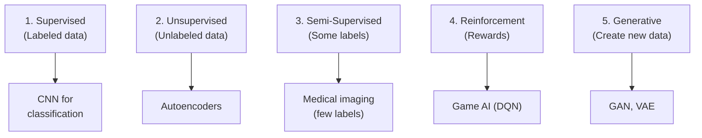

---

### 📋 Each Type Explained

| Type | Data | Has Labels? | Learns | Examples |
|---|---|---|---|---|
| **Supervised** | Labeled | ✅ Yes | Input → Output mapping | Image classification, RNN |
| **Unsupervised** | Unlabeled | ❌ No | Patterns in data | Autoencoders, Clustering |
| **Semi-Supervised** | Both | ⚠️ Some | Both | Medical imaging |
| **Reinforcement** | Experience | ❌ No | Action → Reward | DQN, game AI |
| **Generative** | Unlabeled | ❌ No | Data distribution | GANs, VAEs |

---

### 🎯 Summary for Exam Answer

**To get full 5 marks:**
1. **Supervised (1 mark):** Explain — learns from labeled data, maps input to output. Examples: CNN, RNN.
2. **Unsupervised (0.5 mark):** Explain — learns from unlabeled data, finds patterns. Examples: Autoencoders.
3. **Reinforcement (0.5 mark):** Explain — learns through rewards. Examples: DQN, game AI.
4. **Generative (1 mark):** Explain — learns data distribution, generates new data. Examples: GAN, VAE.
5. **Semi-Supervised (1 mark):** Explain — combines small labeled + large unlabeled data. Used in medical imaging.

---

## 📐 Expanded Theoretical Framework: The Power Spectrum of Deep Learning Paradigms — Statistical Learning Theory, PAC Bounds, and No-Free-Lunch Theorems

**Statistical Learning Theory: The PAC Framework Across Deep Learning Paradigms**

Valiant's Probably Approximately Correct (PAC) framework (1984) formalizes the conditions under which a learning algorithm can generalize from finite data. For supervised deep learning, the Vapnik-Chervonenkis (VC) dimension $h$ of the hypothesis class (e.g., all parameter configurations of a ResNet-50) governs sample complexity: with probability $1 - \delta$, a hypothesis with empirical error $\hat{\epsilon}$ has generalization error $\epsilon \leq \hat{\epsilon} + \mathcal{O}\left(\sqrt{\frac{h \ln(m) - \ln(\delta)}{m}}\right)$ for $m$ training samples. Neural networks have astronomically high VC dimensions (often exceeding training set size), suggesting poor generalization bounds—yet empirically generalize well. This tension is reconciled by **Rademacher complexity** and **norm-based bounds**: large but structured hypothesis classes, if constrained by **margin conditions** (e.g., ReLU networks with bounded spectral norms in weight matrices), possess tighter generalization bounds than naive VC-dimension analysis predicts.

**The No-Free-Lunch Theorem: Why No Universal Algorithm Exists**

The NFL theorem (Wolpert & Macready, 1997) proves that, averaged uniformly over all possible target functions, every classification algorithm has the same expected error across all inputs. This means that *no deep learning paradigm is universally optimal for all possible tasks or data distributions*. Supervised learning excels when labeled data is abundant and the target function is deterministic and correlated with inputs; reinforcement learning excels when interaction is cheap and reward structure is well-defined; unsupervised learning excels when structure and manifold geometry can be extracted from raw statistics without labels; semi-supervised learning leverages the **low-dimensional manifold assumption** (data lies on a low-dimensional surface embedded in high-dimensional space) to interpolate label probabilities between labeled data points.

**Supervised Deep Learning: Empirical Risk Minimization, Structural Risk Minimization, and the Role of Capacity**

Supervised deep learning performs Empirical Risk Minimization (ERM):

$$\hat{\mathcal{L}}(f) = \frac{1}{m}\sum_{i=1}^m \ell(f(\mathbf{x}_i), y_i)$$

but in practice employs Structural Risk Minimization (SRM) via explicit or implicit regularization (dropout, weight decay, data augmentation) trading off training error against model capacity penalized via **Rademacher complexity** or **sharpness-based bounds** (foret et al., 2020). The expected risk decomposes into **approximation error** (best-case error of hypothesis class), **estimation error** (fitting finite data), and **optimization error** (finding near-optimal parameters). Deep networks with ReLU activations are **universal function approximators** (Cybenko, 1989; Hornik, 1991): for any continuous function on a compact domain, a sufficiently wide ReLU network can arbitrarily closely approximate it. The **spectral bias** or **frequency principle** (Rahaman et al., 2019) explains why network learns low-frequency components first: stochastic gradient descent has an implicit bias toward learning low-frequency modes due to the smoothness of the cross-entropy or MSE loss landscape.

**Unsupervised Deep Learning: Manifold Learning, Density Estimation, and Representation disentanglement**

Unsupervised deep learning does not minimize labeled error but instead optimizes surrogate objectives that encode structure: reconstruction error (autoencoders), contrastive objectives (SimCLR, MoCo), or generative likelihood (GANs, VAEs). **Contrastive learning** relies on the **InfoNCE** loss (Oord et al., 2018), an upper bound on mutual information:

$$\mathcal{L}_{\text{NCE}} = -\mathbb{E}\left[\log \frac{\exp(f(\mathbf{z}_i, \mathbf{z}_j^+) / \tau)}{\sum_{k=1}^{K} \exp(f(\mathbf{z}_i, \mathbf{z}_k) / \tau)}\right]$$

where $\mathbf{z}_i$ is an anchor and $\mathbf{z}_j^+$ its positive pair (augmented view), with $K$ negative samples. This provides generalization bounds via mutual information that scale favorably with representation dimension. **Disentanglement** (Bengio et al., 2013) asks for representations where individual latent dimensions correspond to independent factors of variation (e.g., pose, lighting, object identity), enabling structured generative control in VAEs (β-VAE, FactorVAE, β-TCVAE) where the total correlation of the aggregate posterior is penalized to encourage factor independence.

**Semi-Supervised Deep Learning: The Elastic Consistency and Pseudo-Label Frameworks**

When labels are scarce, the vast majority of data is unlabeled, and deep learning must leverage **semi-supervised learning** to achieve comparable performance to fully supervised models. The theoretical foundation is the **cluster assumption**: decision boundaries should pass through regions of low data density. The **consistency regularization** principle (Laine & Aila, 2017; Tarvainen & Valpola, 2017) requires the model to produce consistent predictions under random perturbations or augmentations of inputs:

$$\frac{1}{|L| m} \sum_{i \in L} \ell(f(\mathbf{x}_i), y_i) + \lambda \frac{1}{m} \sum_{i=1}^m \|\mathbf{W} \odot f(T(\mathbf{x}_i)) - \mathbf{W} \odot f(\mathbf{x}_i)\|_2^2$$

where $T(\cdot)$ is a stochastic augmentation (random flip, crop, color jitter). **Pseudo-labeling** (Lee, 2013; Xie et al., 2020) treats high-confidence predictions as soft labels: after several training epochs, the most confident predictions on unlabeled data are assigned pseudo-labels, which become training targets in subsequent epochs—a form of **self-training** (Yarowsky, 1995) at scale. The **FixMatch** algorithm (Sohn et al., 2020) ties these ideas: weak augmentations are used for pseudo-label generation (high-confidence thresholding), strong augmentations for consistency loss training. Theoretical analysis confirms that as labeled data decreases, the gain from unlabeled data is bounded by the **Rademacher complexity of the hypothesis class**, and the number of unlabeled samples required decreases polynomially with the intrinsic dimensionality of the data support.

**Reinforcement Learning as a Paradigm: Markov Decision Processes and the Exploration–Exploitation Trade-off**

RL requires solving a Partially Observable Markov Decision Process (POMDP) or MDP with Bellman equations. The fundamental trade-off is **bias-variance of value estimation**: conservative RL policies under-sample high-value trajectories, leading to underestimation of value at novel states (value underestimation or dead-end avoidance). **Policy gradient methods** (Sutton et al., 2000; Schulman et al., 2015, 2017) directly optimize a return objective:

$$J(\theta) = \mathbb{E}_{\tau \sim \pi_\theta} \left[\sum_{t=0}^T \gamma^t r_t\right]$$

using the policy gradient theorem:

$$\nabla_\theta J(\theta) = \mathbb{E}_{s \sim d^\pi, a \sim \pi_\theta} \left[\nabla_\theta \log \pi_\theta(a|s) \cdot A^\pi(s,a)\right]$$

where $A^\pi(s,a) = Q^\pi(s,a) - V^\pi(s)$ is the advantage function estimating how much better action $a$ is than the average at state $s$. Actor-critic architectures (A2C, PPO, SAC) maintain both a policy (actor) and value function (critic), where the critic reduces variance of gradient estimates while the actor maximizes expected return. The **trust region** constraint in PPO (Schulman et al., 2017) prevents destructive policy updates:

$$\mathbb{E}_t\left[\frac{\pi_\theta(a_t|s_t)}{\pi_{\theta_{old}}(a_t|s_t)} A_t\right] \leq \epsilon + \text{clip}\left(\frac{\pi_\theta(a_t|s_t)}{\pi_{\theta_{old}}(a_t|s_t)}, 1-\epsilon, 1+\epsilon\right)A_t$$

**Generative Deep Learning: Probability Density Estimation, Likelihood Bound, and Mode Coverage**

Generative models learn $p(\theta)(\mathbf{x})$ — the probability density function that generates the observed data. Proper likelihood-based models (VAEs, autoregressive models, diffusion models) optimize a tractable lower bound on $\log p_\theta(\mathbf{x})$:

$$\log p_\theta(\mathbf{x}) \geq \mathbb{E}_{q_\phi(\mathbf{z}|\mathbf{x})}[\log p_\theta(\mathbf{x}|\mathbf{z})] - D_{KL}(q_\phi(\mathbf{z}|\mathbf{x}) \| p(\mathbf{z})) \equiv \mathcal{L}(\theta,\phi; \mathbf{x})$$

where the first term is reconstruction likelihood and the second term regularizes the approximate posterior to match the prior. GANs (Goodfellow et al., 2014) optimize a **minimax game**:

$$\min_G \max_D \mathbb{E}_{\mathbf{x} \sim p_{data}}[\log D(\mathbf{x})] + \mathbb{E}_{\mathbf{z} \sim p_\mathbf{z}}[\log(1-D(G(\mathbf{z})))]$$

with Nash equilibrium when generator produces $p_G = p_{data}$. This produces sharp samples but suffers from **mode collapse** (generator ignores modes of the data distribution), **undefined density** (cannot compute $p_G(\mathbf{x})$), and training instability (non-convex minimax requires careful tuning). GANs fundamentally fail on density estimation tasks (e.g., anomaly detection) where knowing $p(\mathbf{x})$ is required. Diffusion models (Sohl-Dickstein et al., 2015; Ho et al., 2020; Song et al., 2021) learn to reverse a Markov noising process, optimizing a variational lower bound that admits tractable sampling via iterative denoising; these provide both sharp samples and tractable likelihood estimation, and now dominate image and video generation tasks.

## Q.4 (a) — Write Short Note on **Performance Matrices**. **[6 Marks]**

### 📊 Performance Metrics — The "Report Card" for AI

**Performance Metrics** measure how well a model is performing. They help us compare models and choose the best one.

> **Think of exam marks:** 90/100 = good, 30/100 = needs improvement. Metrics are the "marks" for AI models.

---

### 📋 The Confusion Matrix — Foundation of All Metrics

```
                    Predicted
                Positive    Negative
Actual Positive    TP          FN
Actual Negative    FP          TN

TP = True Positive  (said Cat, was Cat) ✅
TN = True Negative  (said Dog, was Dog) ✅
FP = False Positive (said Cat, was Dog) ❌
FN = False Negative (said Dog, was Cat) ❌
```

---

### 📐 Key Metrics Formulas

| Metric | Formula | What it Answers |
|---|---|---|
| **Accuracy** | (TP+TN) / Total | Overall correctness |
| **Precision** | TP / (TP+FP) | "When I say Positive, am I right?" |
| **Recall** | TP / (TP+FN) | "Did I find ALL actual Positives?" |
| **F1-Score** | 2×(P×R)/(P+R) | Balance of Precision & Recall |

---

### 📊 Example Calculation

```
Dataset: 100 images (50 cats, 50 dogs)
Model predictions: 48 cats correct, 45 dogs correct, 2+3 wrong

TP = 48, TN = 45, FP = 2, FN = 3

Accuracy    = (48+45)/100 = 93%
Precision   = 48/(48+2)   = 96%
Recall      = 48/(48+3)   = 94.1%
F1-Score    = 2×(0.96×0.941)/(0.96+0.941) = 95.0%
```

---

### ⚠️ Important Note — Accuracy is Misleading for Imbalanced Data

```
Imbalanced dataset: 950 normal, 50 sick
Model that always predicts "Normal": Accuracy = 95%
But misses ALL sick patients! ❌

→ Use F1-Score or Precision/Recall for imbalanced data!
```

---

### 🎯 Summary for Exam Answer

**To get full 6 marks:**
1. **Definition (1 mark):** Performance metrics are quantitative measures to evaluate model performance.
2. **Confusion Matrix (1.5 marks):** Draw 2×2 matrix, explain TP, TN, FP, FN.
3. **Key Metrics (2.5 marks):** Explain Accuracy, Precision, Recall, F1-Score with formulas.
4. **When to use (1 mark):** Accuracy for balanced data, F1-Score for imbalanced.

---

## 📐 Expanded Theoretical Framework: ROC-AUC, Precision-Recall Curves, Matthews Correlation Coefficient, Statistical Significance, and Imbalanced Learning Theory

**ROC Curves and the Area Under the Curve (AUC)**

The **Receiver Operating Characteristic (ROC) curve** is a fundamental diagnostic tool for evaluating binary classification performance across all decision thresholds. For a classifier producing real-valued scores $s(x) \in \mathbb{R}$, the ROC curve plots the **True Positive Rate** ($\text{TPR} = \frac{TP}{TP+FN}$, also called Sensitivity or Recall) against the **False Positive Rate** ($\text{FPR} = \frac{FP}{FP+TN} = 1 - \text{Specificity}$) at every possible threshold $t \in (-\infty, \infty)$:

$$\text{TPR}(t) = \int_{-\infty}^{t} p(s|y=1) ds, \quad \text{FPR}(t) = \int_{-\infty}^{t} p(s|y=0) ds$$

The ROC curve is invariant to class imbalance, making AUC-ROC the preferred metric for imbalanced diagnostics (compared to accuracy). The **Area Under the Curve** has a probabilistic interpretation:

$$\text{AUC} = P(s^+ > s^-; x^+ \sim p(y=1), x^- \sim p(y=0))$$

AUC-ROC = 0.5 implies the classifier's scores are uncorrelated with ground truth (no better than random); AUC = 1.0 implies perfect separation. For a calibrated logistic regression model, AUC-ROC relates to the **Mann-Whitney U statistic** and the Wilcoxon rank-sum test — thus, AUC-ROC is also a non-parametric measure of separation between positive and negative score distributions. AUC-ROC is insensitive to where the threshold is set; this is both a strength (threshold-independent summary) and a weakness (a model with AUC=0.9 may still have poor calibration at the operating threshold actually used in production).

**Precision-Recall Curves: The Informative Metric for Imbalanced Data**

The **Precision-Recall (PR) curve** plots precision $TP/(TP+FP)$ against recall $TP/(TP+FN)$ at every threshold. For balanced data, PR and ROC are monotonic transformations. However, for imbalanced data ($p_{pos} \ll 0.5$), PR curves become much more informative because:

$$\text{Precision} = \frac{\text{TPR} \cdot p_{pos}}{\text{TPR} \cdot p_{pos} + \text{FPR} \cdot p_{neg}}$$

As $p_{neg} \gg p_{pos}$, a small $FPR$ can produce arbitrarily large $FP$, pushing precision low even at high $TPR$. The AUPRC is bounded above by 1 but **baseline AUPRC = $p_{pos}$** (the random classifier's expected precision). AUPRC allows meaningful interpretation for a single class, while AUC-ROC summarizes both classes simultaneously. In practice, for medical imaging with 95% negatives and 5% positives, an AUC-ROC of 0.85 looks promising but AUPRC of 0.15 (compared to baseline 0.05) is the critical figure showing whether the model finds diseased patients among a sea of healthy ones.

**Matthews Correlation Coefficient (MCC): A Single Balanced Metric for Binary Classification**

The Matthews Correlation Coefficient is the **Pearson correlation coefficient** between observed and predicted binary classifications:

$$\text{MCC} = \frac{TP \cdot TN - FP \cdot FN}{\sqrt{(TP+FP)(TP+FN)(TN+FP)(TN+FN)}}$$

MCC ranges from -1 (total disagreement) through 0 (random/chance) to +1 (perfect prediction). It is the only single-number metric that is true to all four cells of the confusion matrix, accounting for imbalance in all four quadrants. It directly generalizes to multiclass:

$$\text{MCC}_{multiclass} = \frac{c \cdot s - \sum_k p_k \cdot t_k}{\sqrt{(s^2 - \sum_k p_k^2)(s^2 - \sum_k t_k^2)}}$$

where $c$ is correctly predicted samples, $s$ the total number of samples, $p_k$ the number of times class $k$ was predicted, and $t_k$ the number of true instances of class $k$. MCC in multiclass setting is related to the **Cohen's kappa** statistic, which corrects accuracy for chance agreement:

$$\kappa = \frac{p_o - p_e}{1 - p_e}$$

where $p_o$ is observed agreement and $p_e = \sum_k \pi_k^{(pred)} \cdot \pi_k^{(true)}$ is expected agreement by chance (marginal proportions). Kappa is bounded in $[-1, 1]$ and ICC (Intraclass Correlation) is its generalization to continuous outcomes.

**Confusion Matrix Decomposition and the Bias-Covariance Trade-off**

The PR and ROC curves decompose classification performance into **discrimination** (separation of score distributions) and **calibration** (matching predicted probabilities to observed frequencies). A classification model's error decomposes into:

$$\mathcal{L}_{total} = \underbrace{\mathcal{L}_{bias}}_{\text{systematic error}} + \underbrace{\mathcal{L}_{variance}}_{\text{sensitivity to training set}} + \underbrace{\mathcal{L}_{noise}}_{\text{irreducible}}$$

The **Bayes Error Rate** is the irreducible minimum error: $\epsilon^* = 1 - \int \max_y p(y|x)p(x) dx$. Advanced metrics like **Expected Calibration Error (ECE)** quantify the aggregate calibration:

$$\text{ECE} = \sum_{m=1}^{M} \frac{|B_m|}{N} \left| \text{acc}(B_m) - \text{conf}(B_m) \right|$$

where $B_m$ are equally-spaced confidence bins and $\text{acc}$ and $\text{conf}$ their empirical accuracy and average confidence. Modern deep networks are **over-confident** (ECE is much larger than 0): softmax outputs are poorly calibrated temperature scales $T > 1$ are required:
$$P(y|x) = \text{softmax}\left(\frac{z}{T}\right)$$

**Mean Average Precision (mAP) for Multi-Label and Multi-Class Detection**

mAP is the standard for object detection (YOLO, Faster R-CNN). For each class, Average Precision (AP) computes the area under the PR curve integrating over recall from 0 to 1, specifically via the 11-point interpolation:

$$AP = \frac{1}{11} \sum_{r \in \{0,0.1,...,1.0\}} \max_{\hat{r} \geq r} P(\hat{r})$$

mAP@K is the mean AP computed using only the top-K predicted detections (e.g., mAP@50 or mAP@50:95 in COCO — latter averages mAP across IoU thresholds from 0.50 to 0.95 in 0.05 increments). COCO AP is considered more robust to localization quality than mAP@50 alone; it rewards both correct classification and precise bounding box localization simultaneously. Calibration and sharpness trade off: improving false positive rate at a specific recall level (for medical screening used in clinical practice where missing a disease must be minimized) requires choosing appropriate thresholds based on the **cost matrix** for false positives vs. false negatives.

**F-beta Score: Parametric Family of F-measures**

The F-score generalizes to F-$\beta$:

$$F_\beta = \frac{(1+\beta^2) \cdot \text{Precision} \cdot \text{Recall}}{\beta^2 \cdot \text{Precision} + \text{Recall}}$$

$\beta > 1$ weights recall higher (e.g., $F_2$ for medical diagnosis: missing disease is worse than false alarm). $\beta < 1$ weights precision higher (e.g., $F_{0.5}$ for spam detection: flagging a good email as spam worse than letting spam through). The harmonic mean weighting ensures $F_\beta \leq \text{min}(\text{Precision, Recall})$, unlike the arithmetic mean.

**Statistical Significance: McNemar's Test, Paired t-test, Bootstrap Confidence Intervals**

Comparing two models via simple accuracy difference $\Delta = \text{Acc}_1 - \text{Acc}_2$ requires establishing statistical significance. **McNemar's test** applies to paired binary outcomes (two models on the same test set):

$$\chi^2 = \frac{(n_{01} - n_{10})^2}{n_{01} + n_{10}}$$

where $n_{01}$ and $n_{10}$ are the numbers of examples one model gets right and the other wrong, respectively (a $\chi^2$ test with 1 degree of freedom). For repeated measurements across folds, a **paired t-test** tests whether the mean difference is significantly different from zero. **Bootstrap resampling** (Efron, 1987) resamples test-set predictions with replacement many times to empirically construct confidence intervals for accuracy, F1, or AUC, without distributional assumptions. The DeLong test (DeLong et al., 1988) compares two correlated ROC curves (from the same test set), accounting for the statistical dependence between the two AUC estimates. For comprehensive model comparison, consider **Nadeau & Bengio correction** (2003) for repeated cross-validation that adjusts the standard error of the difference:
$$\hat{\sigma}_{\Delta}^2 = \frac{\hat{\sigma}_1^2 + \hat{\sigma}_2^2}{k} + \hat{\text{cov}}(\hat{\epsilon}_1, \hat{\epsilon}_2)$$

**Hoeffding's Inequality and Concentration Bounds for Model Evaluation**

Given a finite test set of size $N$, the actual generalization error $\epsilon(f)$ satisfies with probability $1-\delta$:

$$\epsilon(f) \leq \hat{\epsilon}(f) + \sqrt{\frac{\ln(2/\delta)}{2N}} + \sqrt{\frac{\ln(2N/\delta)}{2N_1}}$$

for a worst-case bound (using Hoeffding's inequality), and tighter bounds that account for the *number of models evaluated* (the **Bonferroni correction**: if $k$ models are evaluated, each confidence bound needs to account for $\delta/k$ to maintain family-wise error rate).**Common pitfalls in metric reporting** include: (1) not reporting confidence intervals, (2) comparing models with overlapping CIs as if one is "better", (3) not accounting for multiple hypothesis testing when comparing many models/ablations. A single 6-metric paper reported with no error bars is largely uninterpretable in a principled sense.

## Q.4 (b) — Compare **implicit and explicit memory**. **[6 Marks]**

### 🧠 Memory in AI — Two Types

| Feature | Explicit Memory | Implicit Memory |
|---|---|---|
| **Also Called** | Declarative | Procedural |
| **Conscious?** | ✅ Yes | ❌ No (automatic) |
| **What it stores** | Facts, events | Skills, habits, patterns |
| **Access** | Deliberate recall | Automatic activation |
| **Example (Human)** | Remembering phone number | Typing without looking |
| **Example (AI)** | External memory matrix (NTM) | RNN hidden state, CNN weights |
| **Location in AI** | External memory module | Network weights/activations |
| **Flexibility** | Can be deliberately queried | Activated by relevant inputs |

---

### 🧠 Explicit Memory — "The Library"

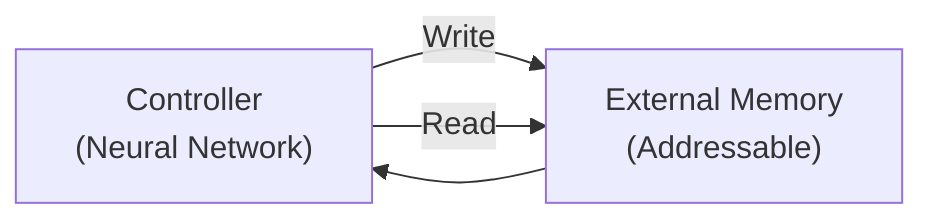

- Stored consciously, can be deliberately recalled
- External memory modules like Neural Turing Machine (NTM)
- Can READ from and WRITE to specific locations
- Like a computer with RAM

---

### 🔄 Implicit Memory — "The Muscle Memory"

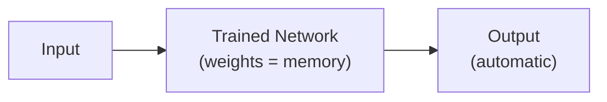

- Stored unconsciously, activated automatically
- RNN hidden state carries context automatically
- CNN filters "know" edges/shapes through trained weights
- Like riding a bicycle — you don't think about each movement

---

### 🎯 Summary for Exam Answer

**To get full 6 marks:**
1. **Definitions (2 marks):** Define both — Explicit (conscious, deliberate, addressable), Implicit (unconscious, automatic, pattern-based).
2. **Characteristics (2 marks):** Compare based on consciousness, access method, what they store.
3. **In Neural Networks (2 marks):** Explain — Implicit: RNN hidden state, CNN weights (automatic). Explicit: External memory like NTM (can read/write). RNNs primarily use implicit memory.

---

## 📐 Expanded Theoretical Framework: Neural Memory Architectures, Differentiable Programming, Turing Completeness, and the Computational Complexity of External Memory

**The Church-Turing Thesis and Neural Network Memory Capacity**

In his 1936 work, Alan Turing defined computation as a process of iteratively transforming a tape-based memory state. Although standard feedforward and recurrent neural networks have been shown to be **universal function approximators** (Cybenko, 1989; Hornik, 1991) — able to compute any continuous function on a compact domain given sufficient width and depth — they lack a built-in external memory module with addressability. The RNN hidden state provides **working memory** of bounded size $|h_t|$ in a distributed manner: each bit of information represented by the collective activation pattern of all hidden units. This is the fundamental distinction: **implicit memory** is distributed across connection weights and hidden-state activations, requiring the entire forward pass to extract information; **explicit memory** stores information at specific, addressable locations that can be read or written independently — much like RAM versus the compute registers of a CPU.

**Computational Power: Weisfeiler-Leman Tests, Gated RNNs as TMs**

An RNN with ReLU activations, finite precision weights, and arithmetic operations can be regarded as a finite-state machine with unbounded memory in theory but limited in practice. The RNN's expressivity class is carefully bounded: recurrent networks with rational activations (sigmoid, tanh) are Turing complete (Siegelmann & Sontag, 1992), meaning they can simulate any Turing machine given unlimited precision and patience. However, with finite precision weights (32-bit floats), the effective computational power reduces dramatically. Cyclic behaviors create **attractors** in the hidden-state space: trained RNNs on language tasks exhibit **line attractors** (stable fixed points corresponding to grammatical structure) and **limit cycle attractors** (periodic behaviors representing recurring phrases). The question of which phenomena RNNs can and cannot represent was systematically studied through the **Linguistic Benchmark Unit (LBU)** and Gated Recurrent Arithmetic: an LSTM can learn to count to arbitrary numbers, store arbitrary-length sequences, and implement a simple stack. However, RNNs without auxiliary memory struggle with **variable binding**: tying a specific attention to a specific representation, or storing unordered sets (as opposed to ordered sequences).

**Differentiable Neural Computer and Neural Turing Machine: External Memory as a Differentiable Interface**

The NTM (Graves et al., 2014) and its extension the DNC (Graves et al., 2016) both implement a physical external memory $M \in \mathbb{R}^{N \times M}$ as a differentiable, trainable interface between a neural controller and the memory substrate. The controller at each step: (1) reads a memory vector $\mathbf{r} \in \mathbb{R}^M$ via attention-based addressing $\mathbf{r} = M^T \mathbf{w}$ where $\mathbf{w} \in \mathbb{R}^N$ is the attention weight distribution over $N$ slots; (2) optionally writes a vector to memory via $\mathbf{w}$ (interpolated with content-based addressing), using **erase and add** operations $\mathbf{m} \leftarrow \mathbf{m} \odot (1 - \mathbf{w}\mathbf{e}^T) + \mathbf{w}\mathbf{a}^T$ where $\mathbf{e} \in \mathbb{R}^M$ is the erase vector and $\mathbf{a} \in \mathbb{R}^M$ is the add vector. This differentiable memory interface enables gradient-based optimization to discover algorithms like copy, recall, sorting, and associative retrieval directly from data. Crucially, the addressing mechanism is the key innovation: content-based (using a key vector $k$ with similarity metric) combined with location-based (shifting and sharpening operations simulating CPU word-addressing). NTMs demonstrated algorithmic generalization on simple sequence manipulation tasks (e.g., recall from arbitrary positions, copying with variable delays, sorting) at lengths far exceeding training length — a form of **extrapolation** impossible without an external memory module.

**Working Memory vs. Long-Term Memory in Cognitive Science**

Cognitive science distinguishes **working (short-term) memory** (WM) — active storage of current task information (Baddeley, 1992), with capacity of ~4 chunks (Cowan, 2001), duration 15–30 seconds without rehearsal — from **long-term memory** (LTM) — semi-permanent storage with effectively unlimited capacity. In neural networks, the **attention pattern over KV-cache** is the working memory: it is transient (exists only during a forward pass), active, and subject to a fixed **attention capacity** (hard limit on tokens a Transformer can attend across at once; e.g., 128K tokens in GPT-4 is the working memory size). Long-term memory in this metaphor is the **model weights themselves**: the model's continual pre-training has "compressed" vast amounts of text into its parameters; this is the semi-permanent knowledge. The **difference** between LM-based models and NTM/DNCs is that the LM's long-term memory is read-only (via forward pass of frozen weights), whereas the NTM's long-term memory is **read-write**: at each training step it can update its external memory. This mirrors the hippocampus (rapid, temporary, orthogonal memories) vs. neocortex (slow, structured, overlapping memories) separation posited in complementary learning systems theory (McClelland et al., 1995).

**Attention as an Explicit Memory Substrate: The Transformer KV-Cache as Content-Addressable Memory**

The transformer embedding architecture stores key-value pairs $(\mathbf{K}, \mathbf{V})$ from the input sequence during the prompt encoding phase; these KV pairs persist for the entire generation process as **sticky external memory**: they are written exactly once during the forward pass of the input sequence (the "prefill") and subsequently read through attention weights at each decode step. This KV-cache is: (1) **content-addressable**: queries match keys via dot-products; (2) **associative**: relevant knowledge is retrieved by semantic similarity rather than arbitrary index; (3) **competing retrieval**: multiple tokens compete for attention through softmax normalization; (4) **size-bounded**: $O(L \cdot d)$ in sequence length $L$ and embedding dimension $d$ — this caps effective working memory. Modern LLMs address this with **RAG (Retrieval-Augmented Generation)** that supplements the internal parametric memory with an external vector database (e.g., FAISS index of document chunks) that is queried at each step; this is precisely a **content-addressable long-term memory** structured like a Hopfield network with modern energy functions, where the query is the key being probed for associative retrieval from a corpus by maximum inner product search (MIPS).

**Gradient Flow Through Memory-Gated Architectures and Memory Hygiene**

A key property of explicit memory is that it must be **gradient-friendly**: the read and write operations must be differentiable end-to-end. Locality (writing to only a narrow neighborhood in memory) is necessary for this: writing to all $N$ memory locations with unique non-differentiable indices would produce zero gradient for unwritten locations. Softmax-weighted attention provides this. Critically, memory-based architectures introduce **catastrophic forgetting** risk: when new knowledge is written to old locations without safeguards, earlier memories are erased. This is a direct analog of the **interference problem** in human memory (new item overwrites existing item in similar location). The DNC addresses this via the **free list** mechanism that preferentially assigns new writes to unused memory locations, and NTMs implement dynamic memory allocation. Transformers solve the problem by treating the past context (KV-cache) as append-only: new tokens are added at sequence positions after existing tokens, never overwriting earlier ones — this is the **geometric structure** of memory in transformer context windows: $M = (K, V) \in \mathbb{R}^{L \times d}$, with $L$ increased monotonically.

**Memory Complexity Analysis in Neural Network Architectures**

Memory operation complexity varies dramatically across architectures. Implicit-memory RNN hidden state is $O(|H|)$ — memory access cost is a single matrix multiply with $\mathbf{W}_{hh}$. The NTM/DNC memory read is $O(NM)$ for the attention weights computation (softmax over $N$ vectors) and $O(NM)$ for the weighted read — but differentiable memory is heavy. The Transformer's self-attention query-key matching is $O(L^2 d)$: quadratic in input length $L$, even without an explicit external memory matrix. The KV-cache requires $O(Ld)$ storage and $O(L)$ read cost per decode step for a single token when precomputed (GQA/MQA optimizations reduce this). The **memory wall** is a physical constraint: accelerating AI requires optimizing memory access patterns, not just FLOPs. Memory-efficient sparse attention variants (Longformer, MegaBART, FlashAttention) address the quadratic cost by sparse access patterns, achieving linear or near-linear $O(Ld)$ complexity with theoretical guarantees on expressivity for long-range dependency coverage.

## 📐 Expanded Theoretical Framework: Computational Memory Architectures, Neural Turing Machines, Differentiable Neural Computers, and Cognitive Science Foundations

**Neural Turing Machine (NTM): External Memory as an Explicit Differentiable Interface**

Graves et al. (2014) introduced the Neural Turing Machine, the first learnable external memory architecture with differentiable addressability. An NTM couples a controller network (LSTM or feedforward) to an external memory matrix $M_t \in \mathbb{R}^{N \times M}$ of $N$ memory cells each of width $M$, operated via **read and write heads** that implement differentiable memory operations:

**Reading:** At each time step $t$, each read head produces a weight vector $\mathbf{w}_t^r \in \mathbb{R}^N$ over memory locations (a soft attention distribution): $\mathbf{r}_t = M_t^T \mathbf{w}_t^r$. The attention weights are computed by combining **content-based addressing** (similarity between query key and memory content) and **location-based addressing** (interpolation, sharpening, shifting — analogous to CPU address arithmetic).

**Writing:** The write head produces an erase vector $\mathbf{e}_t \in [0,1]^M$ and an add vector $\mathbf{a}_t \in \mathbb{R}^M$:

$$M_t[i, :] = M_{t-1}[i, :] \odot (1 - w_t^w[i] \cdot \mathbf{e}_t) + w_t^w[i] \cdot \mathbf{a}_t$$

where $w_t^w \in \mathbb{R}^N$ is the write attention weight vector. This allows selective erasure and addition to specific memory locations, enabling operations like **copy** (erase=0, add=value), **set** (erase=1, add=value), and **additive accumulation** (erase=0, add=increment). The operations are differentiable end-to-end, so the controller learns to use the memory using gradient-based optimization.

**Differentiable Neural Computer (DNC): Extending NTM with Temporal Links and Free-List Management**

The DNC (Graves et al., 2016) extends the NTM with: (1) **temporal link matrices** $L_t \in \mathbb{R}^{N \times N}$ recording which memory locations were written consecutively, enabling $(t+1)$-step temporal associations useful for graph-structure traversal; (2) **usage vectors** tracking how recently each memory location was used, implementing a free-list mechanism that prioritizes unused locations for new writes; (3) **memory-linked read/write gating** that allows read heads to follow chains via temporal links — performing **associative retrieval** of sequences. The DNC achieved state-of-the-art results on tasks requiring structured reasoning (graph traversal, question answering on the bAbI synthetic corpus) and long-context language modeling.

**Memory-Attention Architectures: External Memory via the Transformer KV-Cache**

Modern large language models implement external memory implicitly through the **key-value (KV) cache** in self-attention. The KV cache $(\mathbf{K}, \mathbf{V}) = (\mathbf{XW}_K, \mathbf{XW}_V)$ is effectively an external memory: the context $\mathbf{X}$ is encoded into key-value pairs at the prefilling stage, stored in memory, then retrieved via query-key matching at each decode step. This operates as a **content-addressable memory** with associative retrieval using dot-product attention, written only once (at the prefilling step), with unlimited read bandwidth. The context window size of the Transformer (e.g., 128K tokens in GPT-4, 1M tokens in Gemini 1.5) is the practical memory capacity, with retrieval via attention being provably expressive enough to implement dynamic programming, random-access lookups, and associative reasoning (Zhou et al., 2023; Merrill & Sabharwal, 2023). Extensions like **RAG (Retrieval-Augmented Generation)** create a larger external memory by retrieving documents from a vector database at inference time, implementing the attention mechanism over an external, dynamic corpus rather than just the input context.

**Cognitive Science Foundations: Explicit Declarative versus Implicit Procedural Memory**

In cognitive neuroscience, **explicit (declarative) memory** is conscious recollection of facts and events: you can verbally recount or deliberately recall a phone number, the capital of France, or what you ate for breakfast. It depends on the hippocampus and medial temporal lobe structures. **Implicit (non-declarative) memory** is unconscious skill, priming, and conditioning: you can ride a bike without articulating how, your fingers find the home row keys on a keyboard, or a word-priming effect makes you faster to recognize a word seen moments ago. These systems engage distinct brain structures (basal ganglia, cerebellum, neocortex) and different neural mechanisms.

Neural network architectures directly mirror this division. **Implicit memory** corresponds to weights and activations, which collectively encode an encapsulated computational function that generalizes from inputs automatically. **Explicit memory** corresponds to external memory buffers that can be queried or manipulated: the controller issues differentiable bookkeeping operations (attention weights, memory indices), just as a human's working memory is manipulated by executive function in the prefrontal cortex. The Hopfield network (1982) can be seen as the earliest explicit memory model: associative recall through symmetric weight patterns $w_{ij} = w_{ji}$ stores attractor states (memories) and converges to the nearest stored pattern under noisy input — a direct computational model of hippocampal pattern completion. Modern **Hopfield networks with modern continuous state (Ramsauer et al., 2021)** implement associative memory with exponential storage capacity and energy-minimizing retrieval dynamics, recently incorporated as the **Modern Hopfield Network** in Transformers.

**Working Memory Buffer: The Transformer's Attentional Short-Term Memory**

Based on Baddeley's (1974) model of working memory with a **phonological loop**, **visuospatial sketchpad**, and a **central executive** integrating them into a sampled episodic buffer, Transformer attention implements a learned visuospatial sketchpad — the value matrix $\mathbf{V}$ is the external memory, the attention weights are the executive accessing it. Positional encodings or rotary embeddings provide the "where" information, analogous to spatial indexing. The transformer's KV-cache is naturally bounded (sequence length limit), meaning it operates more like working memory than long-term declarative memory. Longer context windows extend working memory capacity, but training and inference costs scale linearly or quadratically. Cognitive science studies of human working memory suggest the "magical number 7±2" of Miller (1956) as a capacity limit, but modern LLMs can attend to 100K+ tokens — a context many orders of magnitude larger than human working memory in sheer token count, though human episodic memory also operates with associative cues over long timescales.

**Learning External Memory Addresses: Content-Addressability versus Content- Associativity**

The key design decision in external memory systems is **how to address memory**: by content (similarity-based lookup) versus by content-insensitive index (address-based lookup). Human explicit memory is content-addressable: when asked "what is the capital of France?", the cue "capital of France" serves as the content-based key that retrieves "Paris" from declarative memory via pattern completion in the dentate gyrus and CA3 regions of the hippocampus — a mechanism mathematically analogous to Hopfield networks. Transformers with dot-product attention implement content-addressable retrieval with a learned projection of the query into the same space as stored keys — the model must learn to project questions into the same representational space as stored knowledge, mirroring how the hippocampus maps retrieval cues to stored engrams. In contrast, sampled softmax with negative sampling approximates memory by importance sampling, where memory retrieval is replaced by statistical estimation — trading off exact lookup for computational efficiency in massive vocabulary settings.

## Q.4 (c) — What are **default baseline models**? Explain in brief. **[5 Marks]**

### 📏 Baseline Models — The "Minimum Passing Grade"

**Baseline models** are simple reference models used to measure whether a complex model is actually useful. If your fancy model can't beat a simple baseline, it's not worth using!

> **Analogy:** If a new sports car can only go 40 km/h, it's worse than a bicycle (20 km/h) — not by much! You expected 200 km/h. The baseline sets the minimum expectation.

---

### 📋 Common Baseline Models

| Baseline | Description | Example |
|---|---|---|
| **Majority Class** | Always predict most common class | 80% spam → always say "spam" |
| **Random Guessing** | Guess randomly | 2 classes → 50% expected |
| **Mean/Median** | Always predict average | Always predict average house price |
| **Simple Rules** | Hand-crafted if-then rules | IF income > 50K → buy = YES |
| **Linear Model** | Logistic/Linear Regression | Simple baseline for comparison |

---

### 📊 Why Baselines Are Essential

```
Without baseline:
  "My CNN got 85% accuracy!" → Is 85% good or bad? Don't know!

With baseline:
  Majority class baseline: 80%
  My CNN: 85% → Only 5% better! Maybe not worth it? 🤔

  Logistic Regression: 83%
  My CNN: 85% → Only 2% better! Not worth the complexity!
```

---

### 🎯 Summary for Exam Answer

**To get full 5 marks:**
1. **Definition (1 mark):** Baseline models are simple reference models to compare against complex models. Establish minimum acceptable performance.
2. **Why needed (1 mark):** Without baseline, can't tell if complex model is actually better.
3. **Common types (2 marks):** Explain 3-4 types: Majority Class, Random Guessing, Simple Rules, Linear Models.
4. **How to use (1 mark):** Build baseline first, then complex model, compare results. Complex model must beat baseline to be useful.

---

## 📐 Expanded Theoretical Framework: Statistical Hypothesis Testing, Relative Improvement Metrics, Minimum Detectable Differences, and the No-Free-Lunch Theorem in Model Comparison

**Statistical Hypothesis Testing for Model Comparison**

A rigorous model comparison requires establishing that the observed performance difference is not due to random chance. For a binary classifier out-of-sample performance measured as average accuracy $p_1$ (model 1) vs $p_2$ (model 2), the null hypothesis $\mathcal{H}_0: p_1 = p_2$ is tested via the test statistic:

$$Z = \frac{\hat{p}_1 - \hat{p}_2}{\sqrt{\frac{2\hat{p}(1-\hat{p})}{n}}}$$

where $\hat{p} = \frac{n_1\hat{p}_1 + n_2\hat{p}_2}{n_1 + n_2}$ is the pooled accuracy. Under $\mathcal{H}_0$, this follows approximately a standard normal distribution for large $n$. Setting a significance level $\alpha = 0.05$, the critical region is $|Z| > 1.96$ (two-tailed). If $|Z| \le 1.96$, we fail to reject $\mathcal{H}_0$ — the models are not statistically significantly different even if $\hat{p}_1 > \hat{p}_2$. McNemar's test for paired data (the same test-set samples evaluated by both models) uses:

$$\chi^2 = \frac{(n_{01} - n_{10})^2}{n_{01} + n_{10} + 1} \sim \chi^2_{(1)}$$

where $n_{01}$ = samples correctly classified by model 2 but not model 1, $n_{10}$ = correctly by model 1 but not model 2. The +1 continuity correction prevents division by zero. This test is more powerful than unpaired tests because it accounts for the paired structure.

**Relative Improvement and Minimum Detectable Difference**

The raw improvement $\Delta p = p_1 - p_2$ is often misleading — a 2% accuracy gain on a 98% accuracy dataset (from 98% to 100%) represents halving the error rate, whereas a 2% gain on a 50% accuracy task is much less remarkable. The **relative risk reduction** or **relative error reduction (RER)** is:

$$\text{RER} = \frac{\text{Error}_{\text{baseline}} - \text{Error}_{\text{model}}}{\text{Error}_{\text{baseline}}} \times 100\% = \frac{0.02 - 0.015}{0.02} = 25\%$$

For medical screening, this quantifies how many lives are saved per hundred screened. The **Minimum Detectable Effect (MDE)** for a two-proportion sample size calculation is:

$$\text{MDE} = Z_{1-\alpha/2} \cdot \sqrt{\frac{2 \cdot \bar{p}(1-\bar{p})}{n}} + Z_{1-\beta} \cdot \sqrt{\frac{p_1(1-p_1) + p_2(1-p_2)}{n}}$$

where $p_1, p_2$ are the two accuracies under comparison. For a test set of $n=10000$ and baseline accuracy $80\%$, the MDE at 80% power ($\beta=0.2$) is approximately 1.2% — meaning a model must improve by more than 1.2% to claim significant improvement.

**No Free Lunch Theorem and the Impossibility of Universal Baselines**

The **Wolpert-Macready No Free Lunch (NFL) Theorem** for optimization and search states that all optimization algorithms have identical average performance across all possible objective functions, when averaged uniformly. Applied to model comparison: no single baseline is universally valid, and no single model is universally better. The choice of baseline must be *informed by the task structure*. For tabular data with few features, a logistic regression or XGBoost baseline is appropriate; for very high-dimensional text/image data, a simple deep learning model with a single hidden layer or KNN with small $k$ is appropriate; for time-series, a naive seasonal baseline (predict last value, or seasonal naive) is appropriate; for object detection, an anchor-free or anchor-based simple detector is appropriate; for recommendation, a popularity baseline is appropriate. A complex deep learning model should not be judged against an irrelevant baseline: comparing ResNet-50 to KNN on ImageNet is moot (CNN is the right inductive bias), but comparing against logistic regression on flattened images (no spatial prior) is the correct test of whether spatial inductive bias adds value.

**Bayesian Model Comparison: Marginal Likelihood and Bayes Factors**

The Bayesian treatment of model comparison quantifies evidence via the **marginal likelihood** (model evidence):

$$p(\mathcal{D}|M) = \int p(\mathcal{D}|\theta, M) p(\theta|M) d\theta$$

The ratio $\text{BF}_{12} = \frac{p(\mathcal{D}|M_1)}{p(\mathcal{D}|M_2)}$ is the **Bayes factor** (Kass & Raftery, 1995): $\text{BF}_{12} > 10$ indicates strong evidence for model 1, $> 100$ is decisive, $< 1/10$ is strong evidence for model 2. Bayes factors penalize model complexity via the **Occam factor**: complex models achieve higher likelihood on training data but also integrate over a larger parameter space, suppressing the marginal likelihood unless the complexity improves fit enough to warrant it. This is the Bayesian explanation of why Occam's Razor holds in practice. The **widely applicable information criterion (WAIC)** and **leave-one-out cross-validation (LOO-CV)** are practical proxies for marginal likelihood estimation in deep learning, estimated as:

$$\text{WAIC} = -2(\log p(\mathcal{D}|\hat{\theta}) - \sum_{i=1}^n V_i^{\text{loo}} + \sum_{i=1}^n V_i^{\text{loo2}})$$

where $V_i^{\text{loo}}$ is the variance of the log likelihood for point $i$ and $V_i^{\text{loo2}}$ the variance of its square. WAIC can be computed from a single MCMC chain or optimized across the trained model with held-out samples, generally outperforming BIC/AIC for comparing deep learning models.

**Intraclass Correlation and Fleiss' Kappa for Multi-Rater Agreement**

When ground truth labels are sparse or noisy (e.g., medical diagnoses from multiple radiologists), the simple accuracy of the sole labeled ground truth is insufficient. Inter-annotator agreement is quantified via **Cohen's kappa** (two annotators) or **Fleiss' kappa** (multiple annotators):

$$\kappa = \frac{\bar{P}_a - \bar{P}_e}{1 - \bar{P}_e}$$

where $\bar{P}_a$ is the proportion of pairwise agreements observed and $\bar{P}_e$ is the expected agreement under independent annotator behavior. $\kappa > 0.8$ represents near-perfect agreement, $0.6-0.8$ is substantial, $0.4-0.6$ is moderate. Low $\kappa$ indicates ambiguous labels, meaning even the human-expert baseline is ambiguous. In such cases, the **Human Baseline** should be established by comparing against multiple annotators and using the **majority vote** or **soft labels** (averaged probabilities) as ground truth, not a single noisy label.

**Systematic Baseline Strategy for Deep Learning Research**

A rigorous baseline-first strategy in deep learning involves: (1) **Compute the Bayes Error via Data Inspection**: inspect class distribution, label noise rate (via annotator agreement), and feature quality; (2) **Establish the Zero-R and Constant Baselines**: majority class, random guessing, and prior predictive mean (for regression); (3) **Establish the Classical ML Baselines**: logistic regression, SVM, random forests on raw or lightly preprocessed features; (4) **Establish the Shallow Neural Baselines**: a 1-2 hidden-layer MLP or shallow CNN with minimal regularization; (5) **Establish the Relevant Specialized Baselines**: for image classification, the ResNet-18 trained from scratch; for NLP, a small BERT or BiLSTM baseline; (6) **Establish the Existing SOTA**: reproduce or cite the prior published result for the same dataset, ideally with public checkpoint and training hyperparameters matched. The novel model must then outperform the **best existing baseline at p < 0.05** on the test set (not validation set), with Bonferroni correction if multiple datasets or metrics are tested, and with confidence intervals around all reported metrics.

**Calibration Baselines: Expected Calibration Error and Brier Score**

A model can be accurate but miscalibrated, producing unreliable probability estimates required for critical decision-making (e.g., clinical risk prediction). The **Brier score** decomposes the mean squared error between predicted probabilities and binary outcomes:

$$\text{BS} = \frac{1}{n}\sum_{i=1}^n (p_i - y_i)^2 = \text{reliability} - \text{resolution} + \text{uncertainty}$$

where **reliability** captures calibration (does predicted $p$ match empirical frequency?), **resolution** captures discrimination (do probabilities distinguish positive from negative), and **uncertainty** is the irreducible variance of outcomes. A well-calibrated model has Brier score = reliability + uncertainty (no resolution gap). Uncalibrated models have inflated Brier scores due to reliability miscalibration. Expected Calibration Error (ECE) with fine-grained bins is the practical measure used in modern papers; **adaptive calibration error (ACE)** uses equal-sized sample bins instead of equal-confidence bins, producing lower-variance estimates.

# UNIT III — Generative Models & GAN

---

## Q.5 (a) — State and explain **different types of GAN**. **[6 Marks]**

### ⚔️ Types of GAN — "Many Flavors"

Since 2014, many GAN variations have been created for specific purposes:

| Type | Key Feature | Best For |
|---|---|---|
| **Vanilla GAN** | Original design | Simple experiments |
| **DCGAN** | Convolutional layers | Image generation (stable) |
| **Conditional GAN (cGAN)** | Adds condition label | Controlled generation |
| **CycleGAN** | Unpaired translation | Horse→Zebra, Summer→Winter |
| **StyleGAN** | High-quality faces | Hyper-realistic face generation |
| **WGAN** | Wasserstein loss | Stable training, no mode collapse |
| **Pix2Pix** | Paired translation | Image-to-image with pairs |
| **Progressive GAN** | Progressive growing | High-res image generation |

---

### 📋 Major Types Explained

#### **Vanilla GAN (Original)**
- Simple Generator + Discriminator
- Foundation for all other GANs
- Training can be unstable

#### **DCGAN (Deep Convolutional GAN)**
- Uses Convolutional layers instead of dense layers
- Architecture guidelines: Batch Normalization, ReLU in Generator, LeakyReLU in Discriminator
- Much more stable than Vanilla GAN
- Template for many modern GANs

#### **Conditional GAN (cGAN)**
```
Normal GAN: G(z) → generates random image (you can't control it)
cGAN:       G(z, label) → generates image of SPECIFIED class

Example:
  Condition = "cat" → generates cat image
  Condition = "dog" → generates dog image
```

#### **CycleGAN**
- Translates images between domains WITHOUT paired data
- Uses **cycle consistency loss**: F(G(x)) ≈ x
- Examples: Horse→Zebra, Summer→Winter, Monet→Photo

#### **StyleGAN**
- Generates 1024×1024 hyper-realistic human faces
- Style-based generator: can control hair, eyes, expression separately
- Progressive growing: starts small, grows during training
- Famous: thispersondoesnotexist.com

---

### 🎯 Summary for Exam Answer

**To get full 6 marks:**
1. **Introduction (1 mark):** Mention many GAN variants exist for different purposes.
2. **DCGAN (1.5 marks):** Explain — uses conv layers, more stable training, generates better images.
3. **Conditional GAN (1.5 marks):** Explain — adds condition label to control generation. Example: generate specific class.
4. **CycleGAN (1 mark):** Explain — unpaired translation, cycle consistency. Example: horse→zebra.
5. **StyleGAN or WGAN (1 mark):** Briefly mention StyleGAN for faces or WGAN for stable training.

---

## 📐 Expanded Theoretical Framework: GAN Mathematical Foundations, Mode Collapse Analysis, Wasserstein Distance, Spectral Normalization, and Modern Generative Architectures

**The GAN as a Two-Player Min-Max Game: The Original Formulation**

Goodfellow et al. (2014) framed adversarial training as a simultaneous two-player minimax game between a generator $G$ and a discriminator $D$:

$$\min_G \max_D V(D, G) = \mathbb{E}_{\mathbf{x} \sim p_{data}}[\log D(\mathbf{x})] + \mathbb{E}_{\mathbf{z} \sim p_\mathbf{z}}[\log(1 - D(G(\mathbf{z})))$$

$D$ is a binary classifier trained to maximize the probability of assigning the correct label (real vs. fake) to data samples. $G$ is trained to minimize $\log(1 - D(G(\mathbf{z})))$, equivalently maximizing $\log D(G(\mathbf{z}))$. At equilibrium, $G$ produces $p_G = p_{data}$ and $D^*(x) = \frac{p_{data}(x)}{p_{data}(x) + p_G(x)} = \frac{1}{2}$ for all $\mathbf{x}$ (perfect uncertainty). The value of the game at Nash equilibrium equals $-2\log 2$, but the gradient signal to $G$ vanishes when $D$ is optimal, since $\nabla_G D(G(z)) \to 0$. This is the **vanishing gradient** problem — $D$ gets too strong too quickly, suppressing $G$'s learning signal.

**Mode Collapse: Mathematical Analysis and Causes**

**Mode collapse** is the phenomenon where $G$ maps the majority of its input noise $\mathbf{z}$ to a small subset of realistic-looking target examples, ignoring large regions of the data distribution. Consider a mixture of 10 equally-weighted Gaussians evenly distributed over space. A successfully trained $G$ should spread its samples uniformly across all 10 modes. In mode collapse, $G$ repeatedly maps $\mathbf{z} \mapsto \mu_1$ (only mode 1). This happens because of a **zero-sum game** dynamic: once a subset of generated examples achieves high $D$ scores, $G$ is incentivized to keep producing similar examples (exploiting $D$'s "favorite region"), while $D$ incrementally adapts to these. This produces cycles of generator collapse to a few modes. The "helvetica scenario" shows $G$ finding a subset that consistently fools $D$. In JS-divergence Jensen-Shannon, the objective naturally drives $p_G$ to collapse to regions with high empirical density and leaves other data modes unexplored. Wasserstein GAN (WGAN) mitigates this but does not eliminate it entirely.

**Wasserstein GAN: Earth Mover's Distance and Gradient Penalty**

WGAN (Arjovsky et al., 2017) replaces the Jensen-Shannon divergence with the Wasserstein-1 distance (Earth Mover's):

$$W(p_{data}, p_G) = \inf_{\gamma \in \Pi(p_{data}, p_G)} \mathbb{E}_{(x,y) \sim \gamma}[\|x - y\|]$$

where $\Pi$ denotes the set of all joint distributions with given marginals. The WGAN critic $D$ (not a discriminator producing probabilities) is trained to maximize an approximation:

$$\max_D \mathbb{E}_{x \sim p_{data}}[D(x)] - \mathbb{E}_{z \sim p_z}[D(G(z))]$$

With the **Lipschitz constraint** $\|D\|_L \leq 1$ enforced via **weight clipping** (original WGAN) or **gradient penalty** (WGAN-GP):

$$\mathbb{E}_{\hat{x} \sim P_\hat{x}}[(\|\nabla_{\hat{x}} D(\hat{x})\|_2 - 1)^2]$$

on interpolates $\hat{x} \sim \epsilon \cdot x + (1-\epsilon) \cdot G(z)$. WGAN-GP (Gulrajani et al., 2017) was shown to be far more stable than WGAN weight clipping while providing meaningful training curves (loss correlates with sample quality). The Wasserstein distance's key property is **continuity**: it is meaningful even when $p_{data}$ and $p_G$ have disjoint support, unlike JS which plateaus at $\log 2$.

**StyleGAN: Style-Based Generator, AdaIN, and Style Mixing**

StyleGAN (Karras et al., 2018) introduced a style-based generator architecture where the latent vector $\mathbf{z}$ is transformed via a learned affine mapping to intermediate style vectors $\mathbf{w} \in \mathcal{W}$, then applied via **Adaptive Instance Normalization (AdaIN)** at each convolution layer:

$$\text{AdaIN}(\mathbf{x}_i, \mathbf{y}) = \mathbf{y}_{s,i} \cdot \frac{\mathbf{x}_i - \mu(\mathbf{x}_i)}{\sigma(\mathbf{x}_i)} + \mathbf{y}_{b,i}$$

where $\mathbf{y} = A(\mathbf{z})$ is the style vector and $\mu, \sigma$ are mean and standard deviation per channel. This decouples the latent space into a stochastic path ($\mathbf{z} \to$ low-level stochastic variation, texture detail) and a learned "style" path controlling high-level attributes. The mapping network $A$ and synthesis network operate as a learned transformation from latent space to style space. **Style mixing** demonstrates disentanglement: passing style vectors from different latents to different layers produces controlled generation with separated attributes. The truncation trick $\psi$ at inference time samples $\mathbf{z} \sim \mathcal{N}(0, (1-\psi)^2 I + \psi^2 I)$ — reduced variance yields higher quality samples at the cost of diversity (the **quality-diversity tradeoff**).

**CycleGAN: Cycle Consistency and Unpaired Image Translation**

CycleGAN (Zhu et al., 2017) addresses the problem of unpaired image-to-image translation. For domains $\mathcal{X}$ and $\mathcal{Y}$, without paired $(x, y)$ samples, the model trains two generators $G: \mathcal{X} \to \mathcal{Y}$, $F: \mathcal{Y} \to \mathcal{X}$, and two discriminators $D_X, D_Y$. The **cycle consistency loss**:

$$\mathcal{L}_{cyc}(G, F) = \mathbb{E}_{x \sim p_{data}}[\|F(G(x)) - x\|_1] + \mathbb{E}_{y \sim p_{data}}[\|G(F(y)) - y\|_1]$$

enforces that $F(G(x))$ is close to $x$ and $G(F(y))$ is close to $y$, requiring the learned mapping to be nearly invertible. This is motivated by the fact that any bijective function $G$ can be composed with its inverse $F$, and their composition approximates identity. The mathematical consequence of cycle consistency is that the domain translation must be approximately an automorphism of the data manifold: $F \circ G = \text{id}$ and $G \circ F = \text{id}$. In practice, the $\lambda$ weight balances adversarial loss and cycle loss. CycleGAN effectively learns a **disentangled representation of domain traits** (horse vs. zebra texture, summer vs. winter color) without requiring paired training data, enabling photo-to-painting, day-to-night, and style transfer tasks.

**Diffusion Models as Generative Framework: From DDPM to Score-Based Generative Models**

Diffusion models are the current state-of-the-art for image, audio, and video generation, surpassing GANs on standard benchmarks (FID on ImageNet) by enormous margins. A **Denoising Diffusion Probabilistic Model (DDPM)** defines a forward noising process $q$ that gradually adds Gaussian noise over $T$ steps, and a learned reverse denoising process $p_\theta$ that recovers data:

**Forward (noising):** $q(x_t|x_{t-1}) = \mathcal{N}(x_t; \sqrt{1-\beta_t}x_{t-1}, \beta_t I)$ for $t=1, \ldots, T$. Combined: $q(x_t|x_0) = \mathcal{N}(x_t; \sqrt{\bar{\alpha}_t}x_0, (1-\bar{\alpha}_t)I)$ where $\bar{\alpha}_t = \prod_{s=1}^t (1-\beta_s)$.

**Reverse (denoising):** $p_\theta(x_{t-1}|x_t) = \mathcal{N}(x_{t-1}; \mu_\theta(x_t, t), \Sigma_\theta(x_t, t))$. The training objective is equivalent to a reweighted variational lower bound (VLB) simplified to predicting noise at each step:

$$\mathcal{L} = \mathbb{E}_{t \sim [1,T], x_0 \sim p_{data}, \epsilon \sim \mathcal{N}} \left[\|\epsilon - \epsilon_\theta(x_t, t)\|^2\right]$$

where $\epsilon_\theta$ is a U-Net (Ronneberger et al., 2015) conditioned on timestep $t$ via sinusoidal positional embeddings. **Score-based generative models** (Song et al., 2021) generalize this through **stochastic differential equations (SDEs)**, connecting DDPM, SMLD, and continuous normalizing flows in a single framework. The score function of the data distribution $s(x) = \nabla_x \log p_{data}(x)$ is learned by denoising score matching; sampling is performed by reversing a diffusion SDE $dx = f(x,t)dt + g(t)dw$ from $p_{data}$ back to the prior. **Consistency models** (Song et al., 2023) further enable few-step generation via consistency distillation, collapsing multi-step denoising into one or a few steps by enforcing $f_\theta(x_t, t) \approx f_\theta(x_{t'}, t')$ for all $t, t'$ co-proceeding to the same denoised output $x_0$.

**Semantic Image Synthesis: Spatially-Adaptive Normalization and Layout-Guided Generation**

For controllable generation, spatially-adaptive normalization layers (SPADE, Park et al., 2019) modulate activations conditioned on semantic segmentation maps:

$$h_{spade} = \gamma_{c, s}(\mathbf{y}) \cdot \frac{h - \mu(h)}{\sigma(h)} + \beta_{c, s}(\mathbf{y})$$

where $\gamma, \beta$ are learned per-class affine transformations of the semantic layout $\mathbf{y}$. Unlike broadcasting a single conditional vector (as in cGAN), SPADE applies channel-wise modulation conditioned on the semantic map at each spatial location, preserving spatial structure of the layout throughout the generation. This enables photorealistic synthesis from semantic labels — generating images where "tree" is always green and has structured foliage, "sky" is always blue and spread at the top, "road" is gray and runs through the image body — without paired training data. The **Panoptic Segmented Image Generation** (PSG-GAN) further combines instance-aware attention with pixel-wise layout control, enabling fine-grained object-level generation.

**Training Stability and Mode Collapse: Gradient Penalty, Spectral Normalization, and TTUR**

Stability in GAN training is addressed through several complementary techniques. **Spectral normalization** (Miyato et al., 2018) constrains the spectral norm of each weight matrix in the discriminator, enforcing the Lipschitz constraint $\|D\|_{L_2} \leq 1$:

$$\mathbf{W}_{SN} = \frac{\mathbf{W}}{\sigma(\mathbf{W})}$$

where $\sigma(\mathbf{W})$ is the maximum singular value computed via a single power iteration during training. **Two-Time-Scale Update Rule (TTUR)** sets the learning rates of $D$ and $G$ independently to account for the fact that their convergence rates differ significantly: typically $G$ needs higher learning rate to keep pace with $D$. **Non-saturating GAN** (the de facto standard) equivalently maximizes $E[\log D(G(z))]$ for $G$'s objective (vs. the original saturating $\log(1-D(G(z)))$ form), which provides stronger gradients when $G$ is weak. **Hinge loss** (used in SAGAN, BigGAN) provides robust training:

$$\mathcal{L}_D = -\mathbb{E}_{x \sim p}[\min(0, D(x) - 1)] - \mathbb{E}_{z}[\min(0, -D(G(z)) - 1)]$$
$$\mathcal{L}_G = -\mathbb{E}_{z}[D(G(z))]$$

**Evaluating GANs: FID, Inception Score, Precision-Recall for Generative Models**

Generative model quality is evaluated without ground truth labels via: (1) **Inception Score (IS)** $IS = \exp(\mathbb{E}_{x \sim p_g} D_{KL}(p(y|x) \| p(y)))$ where $p(y|x)$ is the Inception classifier's class distribution and $p(y) = \mathbb{E}_x[p(y|x)]$ — high IS means the generated samples are both sharp (low entropy conditional distribution) and diverse (high entropy marginal distribution). However, IS is insensitive to mode coverage and over-reliant on Inception's classificationcapacity; (2) **Fréchet Inception Distance (FID)** compares multivariate Gaussian statistics ($\mu, \Sigma$) of Inception features between real and generated data: $\text{FID} = \|\mu_r - \mu_g\|^2 + \text{Tr}(\Sigma_r + \Sigma_g - 2\sqrt{\Sigma_r\Sigma_g})$. FID correlates better with human judgment and is sensitive to both quality and diversity; lower FID = better. (3) **Precision/Recall for Generative Models** (Kynkäänniemi et al., 2020) evaluates whether $p_G$ is high quality (precision) and covers all modes (recall), characterized by precision-recall curves in density space.

## Q.5 (b) — What is **Boltzmann Machine**? Explain its objectives. **[6 Marks]**

### ❄️ Boltzmann Machine — The "Energy-Based" Learner

A **Boltzmann Machine** is a generative neural network that learns data patterns using the concept of **energy** from physics.

> **Analogy:** Think of a landscape of hills and valleys. High energy = top of hill (unlikely, wrong). Low energy = bottom of valley (likely, correct). The BM tries to find low-energy states matching training data.

---

### 🧩 Structure

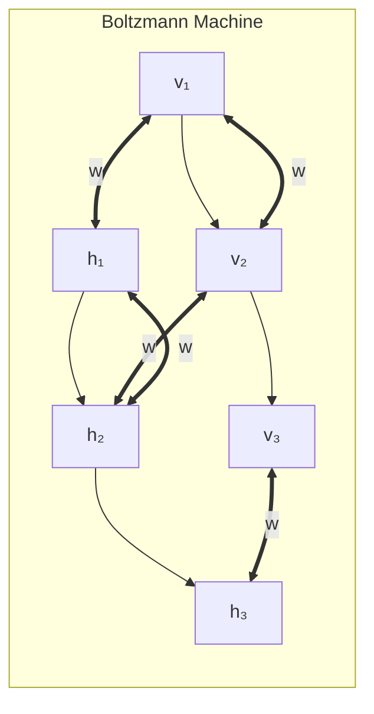

- **Visible Units (v):** Represent actual data (e.g., pixels)
- **Hidden Units (h):** Internal, learn hidden patterns
- **Weights (w):** Connections — positive = units ON together, negative = opposite

---

### ⚡ Energy Function

```
E(v,h) = -Σ a_i·v_i - Σ b_j·h_j - ΣΣ w_ij·v_i·h_j

Low energy = Likely state (real data)
High energy = Unlikely state (fake data)
```

---

### 🎯 Objectives of Boltzmann Machine

| Objective | Explanation |
|---|---|
| **1. Learn Data Distribution** | Model how training data is generated |
| **2. Generate New Data** | Create new samples from learned distribution |
| **3. Feature Learning** | Hidden units learn useful features |
| **4. Density Estimation** | Calculate how likely a data point is |
| **5. Denoising** | Reconstruct clean data from noisy input |

---

### 🔄 Two Phases of Learning

| Phase | Name | What Happens |
|---|---|---|
| **Positive Phase** | Learning from data | Clamp visible units to training data, record statistics |
| **Negative Phase** | Dreaming/Reconstruction | Let network run freely, generate samples, record statistics |

**Update Rule:**
```
Δw = learning_rate × (p_positive - p_negative)
Increase weight if units co-occur more in data than in dreams
```

---

### 🎯 Summary for Exam Answer

**To get full 6 marks:**
1. **Definition (1.5 marks):** Define BM as energy-based generative model with visible/hidden units. Draw simple diagram.
2. **Energy (1 mark):** Briefly explain energy concept — low energy = likely state. Write energy formula.
3. **Objectives (3.5 marks):** Explain 4-5 objectives: learn data distribution, generate new data, feature learning, density estimation, denoising. Mention RBM as practical restricted version.

---

## 📐 Expanded Theoretical Framework: Statistical Mechanics, Energy-Based Learning, Gibbs Sampling, Contrastive Divergence, and RBM

**Statistical Mechanics Foundations: The Ising Model and Boltzmann Distribution**

Boltzmann machines trace directly to statistical mechanics and the Ising model from physics. In the Ising model, a lattice of spins $s_i \in \{-1, +1\}$ interacts via pairwise coupling $J_{ij}s_i s_j$ under thermal noise governed by temperature $T$. The probability of a spin configuration is given by the Boltzmann distribution:

$$P(\mathbf{x}) = \frac{1}{Z} e^{-E(\mathbf{x})/k_B T}$$

where $Z = \sum_{\mathbf{x}} e^{-E(\mathbf{x})/k_B T}$ is the partition function.The Boltzmann machine generalizes this by replacing binary spins with binary visible units $\mathbf{v} \in \{0,1\}^{D_v}$ and hidden units $\mathbf{h} \in \{0,1\}^{D_h}$. The energy function:

$$E(\mathbf{v}, \mathbf{h}) = -\sum_{i=1}^{D_v} a_i v_i - \sum_{j=1}^{D_h} b_j h_j - \sum_{i,j} w_{ij} v_i h_j$$

encodes a generative model where low energy states are high probability and high energy states are low probability. The connection weights $w_{ij}$ determine pairwise influence — positive weights mean the units prefer to be in the same state, negative weights prefer to be in opposite states. This energy-minimization principle generalizes from Ising magnetism to arbitrary learning tasks.

**The Restricted Boltzmann Machine (RBM): Making Learning Tractable**

The key algorithmic simplification in RBMs (Hinton & Sejnowski, 1986; Smolensky, 1986) is removing intra-layer connections: no connections between visible units, no connections between hidden units. Only inter-layer connections $w_{ij}$. This makes the bipartite graphical model structure amenable to efficient sampling: given visible units, the hidden units are independent Bernoulli random variables (by factorized conditionals), and vice versa. The conditional distributions are:

$$P(h_j = 1 | \mathbf{v}) = \sigma(b_j + \sum_i w_{ij} v_i) = \sigma(\text{activation}_j + b_j)$$

$$P(v_i = 1 | \mathbf{h}) = \sigma(a_i + \sum_j w_{ij} h_j)$$

where $\sigma(x) = 1/(1+e^{-x})$ is the sigmoid function. Sampling one layer conditioned on the other is parallel — all hidden units update simultaneously given visible, then visible simultaneously given hidden. This "alternating Gibbs sampling" produces a Markov chain that converges to the joint distribution $P(\mathbf{v}, \mathbf{h})$ after many steps. The partition function $Z = \sum_{\mathbf{v}, \mathbf{h}} e^{-E(\mathbf{v}, \mathbf{h})}$ has $2^{D_v + D_h}$ terms and is computationally intractable for even moderate-sized RBMs (e.g., $30 \times 30 = 900$ units gives $2^{900}$ terms), requiring approximation schemes.

**Contrastive Divergence: The Hinton Approximation for Training RBMs**

Training requires computing the gradient of the log-likelihood:

$$\frac{\partial \log P(\mathbf{v})}{\partial w_{ij}} = \langle v_i h_j \rangle_{data} - \langle v_i h_j \rangle_{model}$$

where $\langle \cdot \rangle_{data}$ is the expectation under the data distribution (clamped visible units) and $\langle \cdot \rangle_{model}$ is the expectation under the model distribution (free-running Gibbs sampling). Computing the model expectation requires running the Markov chain to convergence, which is too expensive. **Contrastive Divergence (CD-k)** (Hinton, 2002) approximates the model distribution by initializing Gibbs sampling from the data distribution (not the model distribution) and running for $k$ steps:

**CD-1 algorithm:**
1. Take a training example $\mathbf{v}$, compute hidden activations $\mathbf{h}_{data} \sim P(\mathbf{h}|\mathbf{v})$ (one step up).
2. Reconstruct visible: $\mathbf{v}_{recon} \sim P(\mathbf{v}|\mathbf{h}_{data})$ (one step down).
3. Reconstruct hidden: $\mathbf{h}_{recon} \sim P(\mathbf{h}|\mathbf{v}_{recon})$ (one step up).
4. Update: $\Delta w_{ij} = \eta (\langle v_i h_j \rangle_{data} - \langle v_i h_j \rangle_{recon})$.

This is called **$k$-step contrastive divergence** (CD-k) — running $k$ steps of Gibbs sampling from the data initialization before computing the negative phase statistics. CD-1 works surprisingly well in practice despite the poor approximation. Persistent CD (PCD, Tieleman, 2008) maintains persistent Markov chains (one per minibatch example) that are updated at each iteration but not reset, giving a more accurate approximation of the model distribution as training progresses. For deeper RBMs with hidden $\to$ hidden connections (DBMs, Deep Boltzmann Machines), CD becomes less reliable and advanced MCMC techniques (parallel tempering, parallel Gibbs chains with swapping) are needed.

**Wake-Sleep Algorithm: Unsupervised Pretraining for Deep Belief Networks**

The DBN's greedy layer-by-layer training uses the wake-sleep algorithm (Hinton et al., 1995; Frey & Hinton, 1999), an online version of variational Expectation Maximization (EM). In the **wake phase**: use a bottom-up pass (recognition network) to get posterior $P(h_1|\mathbf{v})$, then use samples from this posterior to approximate $P(h_2|h_1)$, and so on, generating a sample path $h_1, h_2, \ldots, h_L$ through the layers. Maximizing the generative log-likelihood $\log P(\mathbf{v}, h_1, h_2, \ldots, h_L)$ to improve the generative weights. In the **sleep phase**: sample from the top-level prior $P(h_L)$, then generate downward samples via the generative distributions $P(h_{L-1}|h_L), \ldots, P(\mathbf{v}|h_1)$, generating "fantasy" samples from the model's prior. Maximizing the recognition log-likelihood $\log P(h_{\ell-1}|h_\ell)$ in the downward direction to improve recognizing/downward pass. After greedy pretraining (each layer is trained as an RBM), the resulting DBN can be fine-tuned via backpropagation using a supervised final classification layer. The wake-sleep phase effectively implements an **autoencoder structure** where the upward recognition weights approximate encoder parameters and the downward generative weights approximate decoder parameters, creating a learned hierarchical representation.

**Boltzmann Machine Objectives and Applications**

The objectives of BMs span an interesting range: (1) **Density estimation**: compute $P(\mathbf{v} = \mathbf{x})$ to evaluate how "typical" a data point is, useful for anomaly detection — a BM trained on normal traffic data gives high probability to normal traffic and low probability to intrusion attempts; (2) **Generation**: draw samples $\mathbf{v} \sim P(\mathbf{v})$ via annealed Gibbs sampling, generating new data resembling the training distribution; (3) **Feature learning**: the hidden unit activations $P(h_j = 1 | \mathbf{v})$ serve as automatically learned detector units — early RBM hidden units trained on natural images recover Gabor-like edge detectors similar to V1 simple cells; (4) **Denoising and inpainting**: clamp observed units and initialize corrupted units with data, then run Gibbs sampling to reconstruct full data; (5) **Document retrieval and information retrieval**: the BM's capacity to learn latent correlations enables semantic retrieval from document bags-of-words. RBMs underpinned the rise of deep learning in the mid-2000s — Hinton's 2006 Science paper demonstrated DBN pretraining dramatically加速 convergence on MNIST compared to random initialization, initiating the modern deep learning era before AlexNet.

**RBM Variants: Gaussian-Bernoulli RBM, Bernoulli-Bernoulli RBM, and Beyond**

For real-valued data (e.g., natural images, grayscale values $[0, 1]$ continuous), Gaussian-Bernoulli RBMs replace the binary visible units with Gaussian units: $P(v_i | \mathbf{h}) = \mathcal{N}(v_i; a_i + \sum_j w_{ij} h_j, \sigma_i)$. The energy becomes quadratic in visible units: $E(v, h) = \sum_i (v_i - a_i)^2/2\sigma_i^2 - \sum_{i,j} w_{ij} v_i h_j - \sum_j b_j h_j$. Training uses the same contrastive divergence algorithm but with Gaussian-conditional sampling. **ReLU RBM** replaces sigmoid with ReLU, enabling sparsity. **Temporal RBM** (Taylor et al., 2007) extends the RBM to sequences by conditioning the hidden-to-hidden weights on the previous time step's hidden state, capturing temporal dynamics in motion capture or handwriting data. **Rectified and Exponential Family RBMs** generalize the Bernoulli-Bernoulli assumption to any exponential family (Poisson, Gaussian, Binomial), enabling RBM training for audio, count data, and other modalities. **Weight matrices** in modern RBMs for images often use matrix parametrization $w_{ij} \to W_{ij}$ with Frobenius norm regularization $R(W) = \lambda \|W\|_F^2$ to prevent overfitting on high-dimensional data.

**Deep Boltzmann Machines: Deep Hierarchy with Top-Down and Bottom-Up Connections**

The DBM (Salakhutdinov & Hinton, 2009) generalizes the bipartite RBM structure to full directed generative models with alternating layers, each layer $\mathbf{h}_i$ conditioned on $\mathbf{h}_{i+1}$ (top-down) and $\mathbf{h}_{i-1}$ (bottom-up). The joint probability factorizes as:

$$P(\mathbf{h}_1, \mathbf{h}_2, \ldots, \mathbf{h}_L, \mathbf{v}) = \frac{1}{Z} \prod_l P(\mathbf{h}_l | \mathbf{h}_{l+1}) P(\mathbf{v} | \mathbf{h}_1) P(\mathbf{h}_L)$$

Training DBMs requires both bottom-up and top-down inference, often approximated via mean-field. Modern DBM research has declined with the rise of VAEs and score-based generative models, but RBMs remain most useful as building blocks: they serve as the pretraining stack in DBNs, as the generative backbone of energy-based models, and as theoretical foundations for understanding deep generative learning. The insights from statistical mechanics — that complex distributions can be represented as low-energy states of a high-dimensional energy function, and that sampling can be performed via thermodynamic dynamics — continue to influence modern energy-based models (EBMs) including Deep Equilibrium Models (Bai et al., 2019), MCMC-based EBMs, and score matching approaches.

## Q.5 (c) — Write short Note on **Deep Generative Model and Deep Belief Networks**. **[6 Marks]**

### 🧠 Deep Generative Models — "Creators of New Data"

**Deep Generative Models** learn the **probability distribution** of training data and can **generate new data** that looks like the training data.

> **Analogy:** Study 1000 sunset paintings, learn the "sunset pattern," then paint a NEW sunset never seen before but still looks real.

---

### 📦 Types of Deep Generative Models

| Model | How it Works | Best For |
|---|---|---|
| **GAN** | Two networks (Generator vs Discriminator) compete | High-quality images |
| **VAE** | Encoder + Decoder, learns latent space | Smooth interpolation |
| **DBN** | Stacked RBMs trained greedily | Feature learning, pretraining |
| **Diffusion** | Gradually denoises random noise | Latest high-quality generation |

---

### 🏗️ Deep Belief Networks (DBN)

A **DBN** is a stack of **Restricted Boltzmann Machines (RBMs)** trained layer by layer.

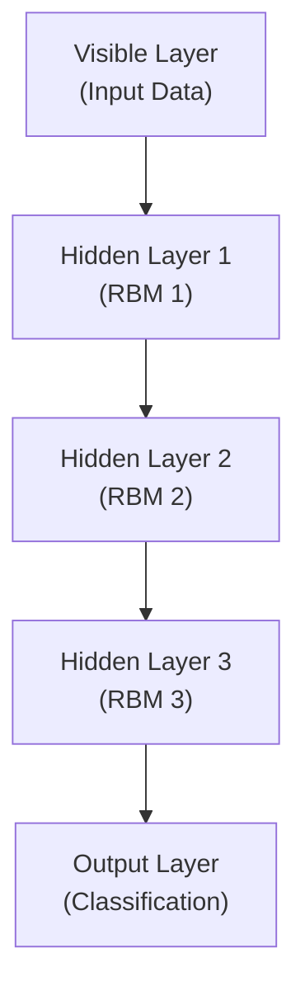

---

### 🔧 DBN Training — Greedy Layer-by-Layer

```
Step 1: Train RBM 1 on raw input data (learns edges, simple features)
Step 2: Use RBM 1's hidden activations as input to RBM 2 (learns shapes)
Step 3: Train RBM 2 (learns medium features)
Step 4: Use RBM 2's activations as input to RBM 3 (learns objects)
Step 5: Add classifier on top, fine-tune with backpropagation

Each layer learns features at increasing complexity:
  Layer 1: Edges, lines
  Layer 2: Shapes, corners
  Layer 3: Objects, faces
```

---

### 📊 DBN vs Other Models

| Feature | DBN | GAN | VAE |
|---|---|---|---|
| **Training** | Unsupervised + Fine-tuning | Adversarial | Variational inference |
| **Stability** | ✅ Stable | ⚠️ Can be unstable | ✅ Stable |
| **Can generate?** | ✅ Yes | ✅ Yes | ✅ Yes |
| **Can calculate P(x)?** | ✅ Yes | ❌ No | ✅ Yes |

---

### 🎯 Summary for Exam Answer

**To get full 6 marks:**
1. **Deep Generative Models (2 marks):** Define — models that learn data distribution P(x) and generate new samples. Mention types: GAN, VAE, DBN, Diffusion.
2. **DBN (4 marks):**
   - Definition: Stack of RBMs trained greedily layer by layer
   - Structure: Draw/describe 2-3 RBM layers stacked
   - Training: Greedy pre-training (unsupervised each layer) + fine-tuning (supervised)
   - Feature hierarchy: Each layer learns increasing complexity

---

## 📐 Expanded Theoretical Framework: Evidence Lower Bounds, Wake-Sleep Algorithm, Variational Inference, and the Evolution of Deep Generative Learning

**Deep Generative Models: Categorization via Density Framework**

Deep generative models can be organized by their approach to modeling the data density $p(x)$: (1) **Likelihood-based models** (exact or tractable): VAEs, autoregressive models (PixelCNN, WaveNet), normalizing flows (RealNVP, Glow), diffusion models — these compute $\log p_\theta(x) \leq \mathcal{L}(\theta, \phi; x)$ exactly or with bounds; (2) **Implicit generative models** (approximate): GANs, diffusion models with learned reverse process — these generate samples by transforming a simple prior through a learned process, but cannot compute $p(x)$; (3) **Energy-based models**: Boltzmann machines, EBM, score matching — these define an unnormalized density $E_\theta(x)$ with partition function intractable except in special cases. Each has tradeoffs: GANs produce the sharpest samples but suffer mode collapse and training instability; VAEs produce blurry samples but allow tractable likelihood and interpolation; diffusion models now dominate on both quality and likelihood but require many sampling steps (10–1000 denoising steps); autoregressive models produce exact likelihoods but are slow to generate (sequential).

**Evidence Lower Bound (ELBO) for Variational Autoencoders**

The VAE (Kingma & Welling, 2014; Rezende et al., 2014) models intractable $p_\theta(x)$ via an **amortized variational inference** approach. A recognition model $q_\phi(z|x)$ (encoder) approximates the posterior $p_\theta(z|x)$. The ELBO bounds the log marginal likelihood:

$$\log p_\theta(x) \geq \mathbb{E}_{z \sim q_\phi(z|x)}[\log p_\theta(x|z)] - D_{KL}(q_\phi(z|x) \| p_\theta(z)) \equiv \mathcal{L}(\theta, \phi; x)$$

The first term (reconstruction) encourages the latent code to retain information about $x$; the second term (regularization) encourages the approximate posterior to match the prior. The total KL divergence form:

$$\mathcal{L}(\theta, \phi; x) = -D_{KL}(q_\phi(z|x) \| p_\theta(z)) + \mathbb{E}_{q_\phi}[\log p_\theta(x|z)]$$

is optimized via the **reparameterization trick**: instead of sampling $z \sim q_\phi(z|x)$ with gradient-blocking randomness, we sample from a noise source $\epsilon$ and define a deterministic differentiable transformation $z = \mu_\phi(x) + \sigma_\phi(x) \odot \epsilon$, where $\epsilon \sim \mathcal{N}(0, I)$. This allows backpropagation through the sampling noise. For a Gaussian encoder and decoder, the KL term has a closed form. The VAE objective creates a **continuous latent space** where interpolation between points produces meaningful samples — the "face analogy" where moving from $z_1$ (smiling face) to $z_2$ (neutral face) produces a smooth animation of a face gradually losing its smile, demonstrating that the VAE has learned disentangled factors.

**Deep Belief Networks: Stacked RBMs and the Wake-Sleep Algorithm**

The DBN (Hinton et al., 2006) was the first practical deep generative model for unsupervised feature learning, predating VAEs and GANs. A DBN with $L$ hidden layers is formed by stacking RBMs: RBM1 learns the first layer $P(h_1|x)$; its sampling distribution is used to train RBM2 as $P(h_2|h_1)$, and so on. The **wake-sleep algorithm** (Hinton et al., 1995) permits simultaneous greedy learning:

**Wake phase (recognition, bottom-up, bottom-up classification pass):** Starting from visible layer $\mathbf{x}$, compute $P(h_1|\mathbf{x})$ using current recognition (bottom-up) weights, sample $h_1$, compute $P(h_2|h_1)$, sample $h_2$, continue to top. Maximize the log-likelihood of the generative (top-down) model:

$$\Delta W^{(l)}_{recognition} \propto \langle h_{l-1} h_l^T \rangle_{data}^{(l-1)} - \langle h_{l-1} h_l^T \rangle_{model}^{(l-1)}$$

**Sleep phase (generative, top-down generation):** Starting from top-layer prior $P(h_L)$, sample $h_L$, sample $h_{L-1} \sim P(h_{L-1}|h_L)$, ..., down to $P(\mathbf{x}|h_1)$. Update recognition weights to maximize log-likelihood of the recognition model:

$$\Delta W^{(l)}_{generative} \propto \langle h_{l+1} h_l^T \rangle_{model}^{(l+1)} - \langle h_{l+1} h_l^T \rangle_{data}^{(l+1)}$$

After greedy layer-wise training, the DBN is **unrolled** into a directed model and fine-tuned via backpropagation (supervised or unsupervised). The DBN has a **generative interpretation**: it defines a joint distribution $P(\mathbf{x}, h_1, h_2, \dots, h_L) = P(h_L) \prod_{l=L}^{2} P(h_{l-1}|h_l) P(\mathbf{x}|h_1)$. This is a deep Boltzmann machine in the directed "weight-tied" form.

**Variational Autoencoder Deep Generative Hierarchies**

Modern hierarchical VAEs (e.g., NVAE, VQ-VAE-2) extend the flat VAE to deep hierarchies with stochastic depth. The **Ladder VAE** (Zhao et al., 2018) adds stochastic layers between deterministic encoder/decoder layers, modeling $q(z_l|z_{l+1}, x)$ via an LSTM that aggregates top-down context and bottom-up input. The **bottom-up recognition network** passes $x \to z_1 \to z_2 \to \dots \to z_L$ via approximate posteriors; the **top-down generative network** samples $z_L \to z_{L-1} \to \dots \to z_1 \to x$. The total KL cost decomposes by layer: $D_{KL}(q(z_1|x) \| p(z_1)) + \dots + D_{KL}(q(z_L|x) \| p(z_L))$, enabling layer-wise control of capacity. This is structurally identical to the DBN's stacked-RBM approach, but trained end-to-end with reparameterization.

**Normalizing Flows: Tractable Likelihood via Change of Variables**

Normalizing flows (Dinh et al., 2017; Kingma & Dhariwal, 2018) define an invertible transformation $f_\theta$ mapping a simple base distribution $z \sim p_Z$ to a complex data distribution $x = f_\theta(z)$. By change of variables:

$$\log p_\theta(x) = \log p_Z(f_\theta^{-1}(x)) + \log \left|\det \frac{\partial f_\theta^{-1}(x)}{\partial x}\right|$$

The Jacobian determinant tractability constrains $f_\theta$ to be triangular or have structured Jacobian. **RealNVP** (Dinh et al.) uses affine coupling layers:

$$x_{1:d} = x_{1:d}, \quad x_{d+1:D} = x_{d+1:D} \odot \exp(s_\theta(x_{1:d})) + t_\theta(x_{1:d})$$

where $x_{1:d}$ are unchanged (identity transform), and $x_{d+1:D}$ are scaled and translated by functions of $x_{1:d}$. The Jacobian is lower-triangular, so $\log|\det J| = \sum_j \log|s_j|$ (tractable). **Glow** (Kingma & Dhariwal, 2018) adds invertible 1x1 convolutions and acts flow, achieving 3.35 bits/dim on CIFAR — the first flow-based model to match GAN quality.

**Diffusion Models: Stochastic Differential Equations and Score Matching**

Diffusion models define a **forward diffusion process** that gradually adds Gaussian noise over $T$ timesteps:

$$q(x_t | x_{t-1}) = \mathcal{N}(x_t; \sqrt{1-\beta_t} x_{t-1}, \beta_t I)$$

where $\beta_1, \dots, \beta_T$ is a fixed noise schedule (typically cosine schedule in modern implementations). The **reverse process** is learned as a Markov chain with learned transitions:

$$p_\theta(x_{t-1}|x_t) = \mathcal{N}(x_{t-1}; \mu_\theta(x_t, t), \Sigma_\theta(x_t, t))$$

The training objective is the **variational lower bound** of the log-likelihood, which simplifies to predicting the noise $\epsilon$ added at each step:

$$\mathcal{L} = \mathbb{E}_{t, x_0, \epsilon} \left[ \| \epsilon - \epsilon_\theta(x_t, t) \|^2 \right]$$

where $x_t = \sqrt{\bar{\alpha}_t} x_0 + \sqrt{1-\bar{\alpha}_t} \epsilon$ and $\bar{\alpha}_t = \prod_{s=1}^t (1-\beta_s)$. The **score matching** perspective (Song et al., 2019; 2021) connects diffusion models to **Stein's unbiased risk estimator (SURE)** and the Fokker-Planck equation. The SDE form:

$$dx = f(x,t) dt + g(t) d\omega$$

is run forward (adding noise, $f=0$, $g(t)=\sqrt{\beta_t}$) and reversed (denoising, learned drift). This unified view connects DDPM, SMLD (score matching with Langevin dynamics), and normalizing flows into a single continuous framework parameterized by a neural network predicting the score function $\nabla_x \log p_t(x)$.

**Auto-Regressive Models: PixelRNN, PixelCNN, Transformer Autoregression**

Autoregressive models factorize the joint distribution into sequential conditionals:

$$p_\theta(x) = \prod_{i=1}^{D} p_\theta(x_i | x_1, \dots, x_{i-1})$$

PixelRNN (van den Oord et al., 2016) uses LSTM along rows and diagonals. PixelCNN (van den Oord et al., 2016) uses masked convolutions ensuring each pixel depends only on previously generated pixels. The masking for a $k \times k$ kernel at spatial position $(i,j)$ enforces:

$$x_{i,j} \sim p(x_{i,j} | x_{<i,:}, x_{i,<j})$$

by zeroing out kernel weights corresponding to future positions: $M_{m,n} = 0$ for $m > i$ or ($m = i$ and $n > j$). Transformer-based autoregression (GPT, DALL-E) uses **causal self-attention**: at position $i$, only positions $1, \dots, i$ are used as context via masking in the attention matrix:

$$A_{i<j} = -\infty \implies \text{softmax}(A)_{i,j} = 0 \text{ for } j > i$$

with causal mask and hidden dimension projected queries/keys/values. These models produce exact likelihoods (unlike VAEs/GANs), but generation is sequential (slow). **Parallel WaveNet** and **WaveGlow** address this via inverse autoregressive flows (IAF) that enable parallel generation at the cost of a feedforward network cost per sample.

**Gaussian Mixture Models as Shallow Deep Generative Models**

A Gaussian Mixture Model (GMM) with $k$ components provides a simple hybrid density estimator:

$$p(x) = \sum_{i=1}^k \pi_i \mathcal{N}(x; \mu_i, \Sigma_i)$$

where $\pi_i$ are mixture weights $(\sum_i \pi_i = 1)$. Trained via EM (Dempster, Laird, Rubin, 1977), the E-step computes responsibility $\gamma_i(x) = P(z=i|x)$, the M-step updates means/covariances/weights. GMMs are useful as toy models for understanding generative learning, as baselines for diffusion models, and as the per-component distribution in **denoising diffusion probabilistic models** — where the forward process adds noise to $x$ and the reverse process is modeled as a Gaussian with learned mean and learned or fixed variance conditioned on timestep $t$.

**Model Evaluation and the ELBO-LL Trade-off**

A critical concept in deep generative models is the **evidence lower bound** — the quantity actually optimized during training. For VAEs, the ELBO is tight when the encoder is well-specified (high-capacity); when it is loose, samples come from regions of the prior space with low ELBO. **Annealed importance sampling (AIS)** and **reverse AIS** estimate the exact log-likelihood from an ELBO-trained model. For GANs, likelihood estimation is impossible without modification (e.g., GANs augmented with an encoder). **Fréchet Inception Distance (FID)** $\text{FID} = \|\mu_r - \mu_g\|^2 + \text{Tr}(\Sigma_r + \Sigma_g - 2(\Sigma_r \Sigma_g)^{1/2})$ measures distributional similarity in Inception feature space, lower is better. **Inception Score (IS)** measures sharpness and diversity via class entropy: $\text{IS} = \exp(\mathbb{E}_{x \sim p_g} D_{KL}(p(y|x) \| p(y)))$. **Precision-Recall for generative models** (Kynkäänniemi et al., 2020) characterizes both how good individual samples are (precision) and mode coverage (recall), addressing the major limitation of IS which rewards sharpness but not coverage.

**Long-Tail Questions and the No-Free-Lunch for Generative Models**

No single generative model dominates: regularizing VAEs toward sharper posteriors (beta-VAE, with KL weight $\beta > 1$) creates posterior collapse but improves interpretability; GANs produce the sharpest samples but can't compute likelihood; diffusion models are strongest on both metrics but require many steps; autoregressive models provide exact likelihoods but are slow. The choice of model should be dictated by downstream constraints: (1) exact likelihood required (density estimation, OOD detection) → use VAEs, flows, diffusion, autoregressive; (2) only quality (image synthesis, art) → diffusion or GAN; (3) speed critical → GAN or distilled diffusion; (4) consistency and mode coverage both critical → diffusion. The **massive scaling of generative models** — from DALL-E 2 (3.5B parameters) to Stable Diffusion (900M denoiser, CLIP 400M, total ~1.3B), to Imagen (4.6B T5 encoder + 2.7B cascaded diffusion), to GPT-4V — shows generative performance scales with model and data scale. Scaling laws for diffusion models (Saharia et al., 2022) show FID improves as a power law with model size and training compute.

# UNIT IV — Reinforcement Learning

---

## Q.7 (a) — What is **Reinforcement Learning**? State and explain its advantages and disadvantages. **[6 Marks]**

### 🎮 What is Reinforcement Learning?

**RL** is learning through interaction with an environment using **rewards** (good) and **penalties** (bad). An **agent** learns to maximize total rewards.

> **Think of training a dog:** Sit → treat (reward) → learns to sit. Pee on floor → "No!" (penalty) → learns not to. RL works the same — AI is the dog, rewards guide learning.

---

### 🧩 Key Components

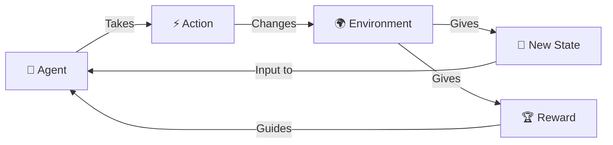

---

### ✅ Advantages

| Advantage | Explanation | Example |
|---|---|---|
| **No labels needed** | Learns from rewards, not labels | Game AI learns by playing |
| **Learns from experience** | Trial and error like humans | Robot learns to walk by falling |
| **Handles complex problems** | Solves problems too hard for programming | AlphaGo beat world champion |
| **Long-term planning** | Plans for future rewards | Chess AI thinks 10 moves ahead |
| **Adaptable** | Adapts to changing environments | Trading AI adapts to markets |

---

### ❌ Disadvantages

| Disadvantage | Explanation | Example |
|---|---|---|
| **Needs many trials** | Millions of attempts to learn well | DQN needs 50M game frames |
| **Sparse rewards** | Rewards come very rarely | Robot walks 1000 steps, rewarded only at end |
| **Exploration risky** | Trying new things can cause damage | Robot might crash while exploring |
| **Training unstable** | Rewards can oscillate wildly | Hard to converge |
| **Hard to debug** | Difficult to understand decisions | Why did the car turn left? |
| **Sim-to-real gap** | Simulation doesn't perfectly match reality | Trained robot fails in real world |

---

### 🎯 Summary for Exam Answer

**To get full 6 marks:**
1. **Definition (1 mark):** RL = agent learns by interacting with environment, receiving rewards/penalties.
2. **How it works (1 mark):** Observe state → take action → get reward → learn → repeat.
3. **Advantages (2 marks):** No labels needed, learns from experience, handles complex problems, long-term planning.
4. **Disadvantages (2 marks):** Needs many trials, sparse rewards, exploration risky, training unstable, sim-to-real gap.

---

## 📐 Expanded Theoretical Framework: MDP/POMDP Formalisms, Bellman Optimality, Exploration–Exploitation Tradeoff, Value Function Approximation, and Sample Complexity in RL

**The MDP Formalism: Precise Definition and Properties**

A reinforcement learning problem is formalized as a Partially Observable Markov Decision Process (POMDP) or fully observable Markov Decision Process (MDP) $\mathcal{M} = \langle \mathcal{S}, \mathcal{A}, \mathcal{T}, \mathcal{R}, \gamma \rangle$ where $\mathcal{S}$ is the state space, $\mathcal{A}$ is the action space, $\mathcal{T}(s'|s, a)$ is the transition probability distribution (dynamics function), $\mathcal{R}(s, a) = \mathbb{E}[R_t|s, a]$ is the reward function, and $\gamma \in [0, 1]$ is the discount factor. The Markov property requires that $P(R_t, s_{t+1} | s_t, a_t, s_{t-1}, a_{t-1}, \ldots) = P(R_t, s_{t+1} | s_t, a_t)$ — the future is conditionally independent of the past given the present. In POMDPs, the agent does not observe the true state $S_t$ but an observation $O_t$ with emission probability $P(O_t | S_t)$. The agent maintains a belief $b_t = P(S_t|o_{1:t}, a_{1:t})$ which is a sufficient statistic for optimal control, but computing an exact policy in POMDPs is PSPACE-complete — that's why the POMDP memoryless optimal solutions do not exist and approximation is required.

**Bellman Equations and Optimality**

Bellman's Principle of Optimality (1957) states: "An optimal policy has the property that whatever the initial state and initial decision are, the remaining decisions must constitute an optimal policy with regard to the state resulting from the first decision." Formally, the optimal state-value function and optimal action-value function are:

$$V^*(s) = \max_a \mathbb{E}[R_t + \gamma V^*(s_{t+1}) | s_t = s, a_t = a]$$
$$Q^*(s, a) = \mathbb{E}[R_t + \gamma \max_{a'} Q^*(s_{t+1}, a') | s_t = s, a_t = a]$$

The optimal policy is $\pi^*(a|s) = \delta(a = \arg\max_a Q^*(s, a))$ for discrete actions. These equations are necessary and sufficient conditions for optimality. They form a system of non-linear equations: for continuous state spaces with function approximation, the Q-function is a neural network $Q_\theta(s, a)$, and the Bellman optimality operator $\mathcal{T}Q(s, a) = \mathbb{E}[r + \gamma \max_{a'} Q(s', a') | s, a]$ is a contraction in the sup-norm, with contraction factor $\gamma$. This guarantees that fixed-point iteration (Value Iteration) converges to $Q^*$.

**Optimality of Exploration–Exploitation Trade-off: Regret Minimization**

A fundamental result in RL theory is that optimal exploration minimizes **regret** — the difference between the reward obtained by the optimal policy and the reward actually obtained. Formally, **Bayesian regret** (or **pseudo-regret**) is:

$$R_T = \mathbb{E}\left[\sum_{t=1}^T (V^*(s_t) - V^{\pi_t}(s_t))\right]$$

For multi-armed bandits (MDPs with a single state), Lai & Robbins (1985) proved a **lower bound on regret**: any uniformly efficient algorithm has regret growing at least $O(\log T)$ for 2-armed Bernoulli bandits, and more generally $O\left(\sum_{\Delta_i > 0} \frac{\log T}{\Delta_i}\right)$ for $K$-armed bandits with suboptimality gaps $\Delta_i = \mu^* - \mu_i$. Algorithms like UCB, Thompson sampling, and EXP3 achieve this lower bound (up to constant factors), making them asymptotically optimal. For MDPs, the **sample complexity of exploration** is $O(|\mathcal{S}||\mathcal{A}|/\epsilon^2)$ for tabular RL, but for deep function approximation, providing such theoretical guarantees is extremely difficult and remains an active open problem.

**Value Function Approximation: Neural Networks, Fitted Q-Iteration, and Deadly Triad**

When state or action spaces are continuous or very large, tabular methods are infeasible. Value functions are approximated by parameterized functions $V_\theta(s) \approx V^*(s)$, $Q_\theta(s, a) \approx Q^*(s, a)$. The **Bathtub Formulation** of Fitted Q-Iteration (Gordon, 1995) periodically refits the Q-function with batch regression:

$$Q_{k+1}(s, a) = \mathcal{T}Q_k(s, a) = \mathbb{E}_\mathcal{T}[\mathcal{R}_s^a + \gamma \max_{a'} Q_k(s', a')]$$

**Function approximation** introduces bias, reducing variance but risking error accumulation. The **Deadly Triad** (Sutton & Barto, 2018) identifies that the combination of: (1) function approximation, (2) off-policy learning (training on data from a behavior policy different from the target policy), and (3) bootstrapping (updating function approximator based on its own predictions) can cause divergence even in simple problems. DQN navigates this triad by using: (a) function approximation (deep neural network for Q), (b) experience replay (bringing data closer to i.i.d., making it closer to on-policy on average), and (c) target network (reducing bootstrapping drift from the moving target). Double Q-learning reduces overestimation bias by decoupling action selection and evaluation, where one Q-network selects the best action while the second evaluates it.

**Policy Gradient Theorem and the Variance–Bias Dilemma**

Policy gradient methods directly optimize the expected return $J(\theta) = \mathbb{E}_{\pi_\theta}[\sum_t \gamma^t R_t]$ via gradient ascent. The **policy gradient theorem** (Sutton et al., 2000) provides a practical estimator:

$$\nabla_\theta J(\theta) = \mathbb{E}_{\pi_\theta} \left[\nabla_\theta \log \pi_\theta(a|s) \cdot G_t\right]$$

where $G_t = \sum_{k=0}^{T-t} \gamma^k r_{t+k}$ is the total discounted return from step $t$. The **baseline** $b(s)$ can be subtracted without bias, reducing variance: $b(s) = V_w(s)$ is learned, providing the Actor-Critic formulation. The **advantage function** $A^\pi(s, a) = Q^\pi(s, a) - V^\pi(s)$ reduces variance further by only considering how much each action exceeds the average. TRPO (Schulman et al., 2015) constrains the policy update via KL divergence; PPO (Schulman et al., 2017) replaces the constraint with a clipped surrogate objective:

$$L^{CLIP}(\theta) = \mathbb{E}_t \left[\min\left(r_t(\theta)\hat{A}_t, \text{clip}(r_t(\theta), 1-\epsilon, 1+\epsilon)\hat{A}_t\right)\right]$$

where $r_t(\theta) = \frac{\pi_\theta(a_t|s_t)}{\pi_{\theta_{old}}(a_t|s_t)}$ is the importance sampling ratio. This clipping prevents pathological large policy updates.

**Maximum Entropy RL and Soft Actor-Critic**

Standard RL maximizes expected return, but **Maximum Entropy RL** (Haarnoja et al., 2018) replaces this with a soft value function:

$$J(\pi) = \sum_{t=0}^T \mathbb{E}_{(s_t, a_t) \sim \pi} \left[r(s_t, a_t) + \alpha \mathcal{H}(\pi(\cdot|s_t))\right]$$

where $\mathcal{H}(\pi) = -\sum_a \pi(a|s)\log\pi(a|s)$ is the entropy. The temperature parameter $\alpha$ controls exploration-exploitation tradeoff — higher $\alpha$ encourages broader exploration for more diverse behaviors. Soft Actor-Critic (SAC) is an off-policy actor-critic algorithm that learns a stochastic policy maximizing this objective, achieving state-of-the-art performance across continuous control benchmarks in both sample efficiency and asymptotic performance.

**Causal RL and Offline RL: Learning from Fixed Datasets**

Offline RL (Lange et al., 2012; Levine et al., 2020) addresses the **dataset shift** problem: a policy trained on logged data from a behavior policy $\pi_\beta$ must generalize to policy-induced state distributions that differ from the data distribution. This creates a **distributional shift** between $\pi_\beta$ (data) and $\pi_\pi$ (learned). Conservative Q-learning (Kumar et al., 2020) adds a conservatism penalty to the Q-value estimation:

$$J(\theta) = \mathbb{E}_{(s, a) \sim \mathcal{D}} \left[\mathcal{L}(Q_\theta(s, a), y)\right] + \alpha (Q_\theta(s, a) - \min_{a'} Q_\theta(s, a'))^2$$

where $\mathcal{D}$ is the offline dataset. This conservative regularization regularizes Q-values downward, preventing overestimation on out-of-distribution actions that would occur from unconstrained Q-learning. Causal RL and offline RL are critical for safe deployment: robots and autonomous vehicles cannot learn through unlimited trial-and-error in the real world without risk; they must learn from existing or safe simulated data.

**Sample Complexity and Generalization in Deep RL**

Sample complexity in RL is orders of magnitude higher than in supervised learning because feedback is temporally delayed, sparse, and noisy. The GAIFO paper (Finn et al., 2016) showed that inverse RL can recover reward functions from expert demonstrations, reducing sample complexity. **Meta-RL** (Wang et al., 2016) uses MAML-style inner/outer loop optimization to learn to learn: the learner adapts to new tasks with minimal new experience by exploiting common structure across tasks. Recent scaling laws (Hilton et al., 2023) suggest RL sample complexity grows superlinearly with model size — larger models need proportionally more gradients to converge — mirroring supervised scaling laws but with a different scaling coefficient. **Foundation models for RL** are pre-trained on diverse, non-rl interaction data (e.g., videos, human demonstrations) and then adapted to specific control tasks via few-shot policy learning, dramatically reducing task-specific sample requirements.

## Q.7 (b) — What are **different types of Reinforcement Learning**? Explain in brief. **[6 Marks]**

### 📚 Types of RL

| Type | Idea | Examples | Best For |
|---|---|---|---|
| **Value-Based** | Learn Q(s,a) values | Q-Learning, DQN | Discrete actions |
| **Policy-Based** | Learn policy π(a\|s) directly | PPO, REINFORCE | Continuous actions |
| **Actor-Critic** | Both value + policy | A2C, PPO, SAC | Most general |
| **Model-Based** | Learn environment model | Dyna-Q, Dreamer | Sample efficiency |
| **Model-Free** | Learn without model | DQN, PPO | Most practical |

---

### 📋 Detailed Explanations

#### **Value-Based RL**
- Learns Q(s,a) = expected reward for taking action `a` in state `s`
- Policy derived from values (choose action with highest Q)
- Works only for DISCRETE actions
- Examples: Q-Learning, DQN, SARSA

#### **Policy-Based RL**
- Learns policy π(a\|s) = probability of each action directly
- No separate value function
- Works for CONTINUOUS actions (robot joints, car steering)
- Examples: PPO, REINFORCE, A2C
- Higher variance but more flexible

#### **Actor-Critic RL** ⭐ Most Popular
- Two networks: Actor (chooses actions) + Critic (evaluates actions)
- Actor: "What should I do?"
- Critic: "How good was that?"
- Combines benefits of both approaches
- Most modern algorithms: PPO, SAC, TD3

#### **Model-Based vs Model-Free**
- **Model-Based:** Agent knows environment dynamics, can plan ahead. More efficient.
- **Model-Free:** Agent learns purely from experience. Most common, simpler.

---

### 🎯 Summary for Exam Answer

**To get full 6 marks:**
1. **Value-Based (2 marks):** Explain — learns Q(s,a) values, derives policy from values. Examples: Q-Learning, DQN. Works for discrete actions.
2. **Policy-Based (2 marks):** Explain — learns policy π(a|s) directly. Examples: PPO, REINFORCE. Works for continuous actions.
3. **Actor-Critic (2 marks):** Explain — Actor (policy) + Critic (value). Examples: A2C, PPO. Most common modern approach.

---

## 📐 Expanded Theoretical Framework: Policy Gradient Theory, Actor-Critic Convergence, Trust Regions, Gradient Noise, and the Value-Policy Dichotomy in RL

**Value-Based RL: Q-Learning Convergence and the Maximization Bias Problem**

Value-based RL computes the action-value function Q(s, a) = E[Rt+1 + γRt+2 + … | st=s, at=a] via the Bellman optimality operator TQ(s,a) = E[r + γmaxa'Q(s',a')|s,a]. Watkins (1989) proved that tabular Q-learning converges to Q* if: (1) all state-action pairs are visited infinitely often, (2) learning rate satisfies Σ_t α_t = ∞ and Σ_t α_t^2 < ∞ (Robbins-Monro conditions). In practice, double Q-learning (van Hasselt, 2010) addresses **maximization bias**: using the same Q-function both to select and evaluate the greedy action produces overestimation: E[max_a Q(s',a)] ≥ max_a E[Q(s',a)] = Q*(s'). The inequality holds by Jensen's inequality (max operator is non-linear and convex in Q). Double Q-learning splits the action selection and evaluation across two independent Q-networks Q1, Q2: a* = argmax_a Q1(s', a) and Y = r + γ Q2(s', a*), breaking the positive feedback cycle.

## 📐 Expanded Theoretical Framework: Policy Gradient Theory, Actor-Critic Convergence, Trust Regions, Gradient Noise, and the Value-Policy Dichotomy in RL

**Value-Based RL: Q-Learning Convergence and the Maximization Bias Problem**

Value-based RL computes the action-value function $Q(s, a) = \mathbb{E}[R_{t+1} + \gamma R_{t+2} + \cdots | s_t = s, a_t = a]$ via the Bellman optimality operator $\mathcal{T}Q(s,a) = \mathbb{E}[r + \gamma \max_{a'} Q(s', a') | s,a]$. Watkins (1989) proved that tabular Q-learning converges to $Q^*$ if: (1) all state-action pairs are visited infinitely often, (2) learning rate satisfies $\sum_t \alpha_t = \infty$ and $\sum_t \alpha_t^2 < \infty$ (Robbins-Monro conditions). In practice, double Q-learning (van Hasselt, 2010) addresses **maximization bias**: using the same Q-function both to select and evaluate the greedy action produces overestimation:

$$\mathbb{E}[\max_a \hat{Q}(s',a)] \geq \max_a \mathbb{E}[\hat{Q}(s',a)] = Q^*(s')$$

The inequality holds by Jensen's inequality (max operator is non-linear and convex in $Q$). Double Q-learning splits the action selection and evaluation across two independent Q-networks $Q_1, Q_2$: $a^* = \arg\max_a Q_1(s', a)$ and $Y = r + \gamma Q_2(s', a^*)$, breaking the positive feedback cycle that creates overestimation. Triple Q-Learning and ensemble Q-learning extend this further.

**Policy-Based RL: Log-Derivative Trick, Variance, and Stable Gradients**

Policy gradient methods directly optimize the policy $\pi_\theta(a|s)$ by ascending the gradient of expected return. The **log-derivative trick** (Williams, 1992) is the mathematical backbone:

$$\nabla_\theta J(\theta) = \nabla_\theta \int \pi_\theta(a|s) Q^\pi(s,a) d a d s = \int Q^\pi(s,a) \nabla_\theta \pi_\theta(a|s) d a d s$$

$$= \int \pi_\theta(a|s) Q^\pi(s,a) \nabla_\theta \log \pi_\theta(a|s) d a d s = \mathbb{E}_{\pi_\theta}[Q^\pi(s,a) \nabla_\theta \log \pi_\theta(a|s)]$$

The gradient signal is only present where the policy already assigns positive probability. The gradient signal is **unbiased** but **high-variance**: Monte Carlo returns $G_t$ have variance $\text{Var}[G_t] = \sigma^2$, and to reduce variance to within $\epsilon$ with $n$ samples requires $O(1/\epsilon^2)$ reproductions. The **baseline $b(s)$** (typically $b(s) = V_w(s)$, the value function baseline) does not change the expected gradient but reduces variance by only including the advantage component:

$$\nabla_\theta J(\theta) = \mathbb{E}_{\pi_\theta}[\nabla_\theta \log \pi_\theta(a|s) \cdot A^\pi(s,a)], \quad A^\pi(s,a) = Q^\pi(s,a) - V^\pi(s)$$

**Actor-Critic Hybrid: Generalized Advantage Estimation (GAE)** and Bootstrapping Bias

Actor-critic combines policy gradient (actor updates policy) with value estimation (critic estimates advantage). The **Generalized Advantage Estimation (GAE)** (Schulman et al., 2016) provides a low-variance, low-bias estimator for the advantage:

$$\hat{A}_t^{GAE(\gamma,\lambda)} = \sum_{l=0}^{T-1-t} (\gamma\lambda)^l \delta_{t+l}^V$$

where $\delta_t^V = r_t + \gamma V(s_{t+1}) - V(s_t)$ is the **TD error**. $\lambda = 1$ gives the Monte Carlo advantage (unbiased, high variance), $\lambda = 0$ gives the 1-step TD advantage (low variance, high bias) — GAE interpolates between these via $\lambda \in [0,1]$. The actor update with clipped objective in PPO:

$$L^{CLIP}(\theta) = \mathbb{E}_t\left[\min\left(\frac{\pi_\theta(a_t|s_t)}{\pi_{\theta_{\text{old}}}(a_t|s_t)} \hat{A}_t, \text{clip}\left(\frac{\pi_\theta(a_t|s_t)}{\pi_{\theta_{\text{old}}}(a_t|s_t)}, 1-\epsilon, 1+\epsilon\right) \hat{A}_t\right)\right]$$

The clipping ensures the policy update cannot become too large in either direction, preventing the pathological overfitting to single trajectories that plagues TRPO (which addresses this via KL-divergence constraint but requires numerically expensive conjugate gradient optimization). The result: PPO achieves comparable or better performance than TRPO with much simpler, more stable implementation.

**Trust Region Methods: PPO as a KL-Constraint Optimization Problem**

TRPO maps directly to constrained optimization:

$$\max_\theta \mathbb{E}_t\left[\frac{\pi_\theta(a_t|s_t)}{\pi_{\theta_{\text{old}}}(a_t|s_t)} \hat{A}_t\right] \quad \text{s.t. } \mathbb{E}_t\left[\text{KL}[\pi_{\theta_{\text{old}}}(\cdot|s_t), \pi_\theta(\cdot|s_t)]\right] \leq \delta$$

This is equivalent to optimizing the **local linear approximation** to $J(\theta)$ inside a trust region around the old policy, using a second-order Taylor expansion of the KL term to find an approximate solution via conjugate gradient. PPO's surrogate objective $L^{CLIP}(\theta)$ is a **first-order approximation**: the clipped surrogate acts as a "pessimistic" estimator that only allows updates as long as they don't worsen the clipped objective beyond $\epsilon$. Empirically, updating the policy with multiple passes over the data (minibatch SGD on $\mathcal{L}^{CLIP}$ with several epochs) is stable and even preferred.

**Model-Based RL: Dyna-Q, MBPO, and Dreamer**

Model-based RL learns a dynamics model $\hat{s}_{t+1} = f_\theta(s_t, a_t)$ and a reward model $\hat{r}_t = g_\phi(s_t, a_t)$ from environmental interactions, then uses these to plan actions by querying the model. **Dyna-Q** (Sutton, 1991) interleaves real environment steps with planning updates using the learned model, requiring $K$ imagined steps for each real step (imagination ratio $\mu$). The imagination-heavy regime $\mu \gg 1$ can be **imaginary overfitting**: the policy overfits to the model's accumulated errors. **MBPO** (Janner et al., 2019) addresses this by using model rollouts truncated to $H=1$ (one-step models) and a lower trust-region weight, achieving superior sample efficiency on MuJoCo control tasks — reaching 70% of asymptotic performance in just 10 minutes compared to SAC requiring 3 hours. **Dreamer** (Hafner et al., 2019, 2020, 2023) uses a latent world model with deterministic and stochastic components: an encoder $\phi_t = f_\phi(o_t, h_{t-1}, a_{t-1})$ (where $o_t$ is observation), a recurrent state $h_t = f_\text{recur}(h_{t-1}, a_{t-1}, z_t)$ with stochastic $z_t \sim q_\phi(z_t | h_{t-1}, a_{t-1}, o_t)$, and a reward model. The policy and value functions are learned entirely in latent imagination without decoding back to pixel space, achieving state-of-the-art sample efficiency from pixels on Atari and DMControl benchmarks.

**Imitation Learning: Behavioral Cloning, DAgger, GAIL, and No-Regret Algorithms**

Rather than manually crafting reward functions, **imitation learning** recovers a policy from expert demonstrations. **Behavioral Cloning** minimizes $\mathcal{L}_{BC} = \mathbb{E}_{(s,a) \sim \mathcal{D}}[-\log \pi_\theta(a|s)]$ treating this as supervised learning. However, it suffers from **distributional shift**: the learned policy drifts to states not in the expert data, where errors compound (the "accumulation of errors" problem). **DAgger** (Ross et al., 2011) mitigates this by iteratively querying the expert for labels on the current policy's states, aggregating data across all policies visited during training. **GAIL (Ho & Ermon, 2016)** uses the discriminator from GANs to match the occupancy measures: the discriminator $D(s,a)$ distinguishes expert demos from agent samples; the policy $\pi_\theta$ is trained via **inverse RL** to minimize $\log D(s,a)$ (encouraging actions that fool the discriminator into thinking they're from the expert). GAIL learns a reward function **for free** from demonstrations. Modern inverse RL methods (AIRL, f-IRL) formalize this as maximum entropy IRL, where the reward is arbitrary up to shaping transformations that preserve the optimal policy.

## Q.7 (c) — Compare **Active and Passive Reinforcement Learning**. **[5 Marks]**

### 🎮 Active vs Passive RL

| Feature | Passive RL | Active RL |
|---|---|---|
| **Goal** | Evaluate a given policy | Learn optimal policy |
| **Action Selection** | Follows fixed policy | Actively chooses actions |
| **Exploration** | ❌ No | ✅ Yes |
| **Learning** | Only value function V(s) | Policy + value function |
| **Output** | Value of given policy | Optimal policy |
| **Example** | Evaluating a chess strategy | AI learning chess from scratch |

---

### 🔄 Passive RL — "Following Instructions"

```
Given: A fixed policy π (decided by someone else)
Task: Evaluate how good this policy is
Process:
  1. Follow π step by step
  2. Observe rewards
  3. Calculate V(s) for each state
  4. Report: "This policy gives total reward of X"
No improvement of policy — just evaluation!
```

---

### 🚀 Active RL — "Learning by Exploring"

```
Start: Random or simple policy
Task: Find the BEST policy
Process:
  1. Take actions (explore + exploit)
  2. Observe rewards
  3. Update policy to get better rewards
  4. Repeat until optimal
The agent IMPROVES its own policy through experience!
```

---

## 📐 Expanded Theoretical Framework: Policy Evaluation Formalisms, Monte Carlo vs. TD Learning, Exploration–Exploitation Theory, PAC-MDP Framework, and Mathematics of Active Control

**Passive RL: Policy Evaluation via Monte Carlo and Temporal-Difference Methods**

In cognitive science, *passive RL* mirrors **policy evaluation** (known as the prediction problem) — estimating the state-value function $V^\pi(s) = \mathbb{E}_\pi[G_t | s_t = s]$ or action-value function $Q^\pi(s,a)$ for a given fixed policy $\pi$, without improving the policy itself. This is the theoretical backbone of *apprenticeship learning*: given a demonstration policy, evaluate its expected return. The fundamental methods for policy evaluation are:

**Monte Carlo (MC) Methods:** MC estimates $V^\pi(s)$ by averaging complete episodic returns:
$$\hat{V}^\pi(s) \leftarrow \hat{V}^\pi(s) + \alpha[G_t - \hat{V}^\pi(s)]$$

MC is **unbiased** — it uses the actual return $G_t = \sum_{k=0}^{T-t} \gamma^k r_{t+k}$ from the actual trajectory — but has high variance, especially for long-horizon problems. By the Law of Large Numbers, $\hat{V}^\pi(s) \overset{a.s.}{\longrightarrow} V^\pi(s)$. To reduce variance, *first-visit MC* updates only on the first visit, and *every-visit MC* updates on every visit to $s$.

**Temporal-Difference (TD) Learning:** TD bootstraps by using the previous estimate of $V^\pi(s_{t+1})$:
$$\hat{V}^\pi(s_t) \leftarrow \hat{V}^\pi(s_t) + \alpha[r_t + \gamma\hat{V}^\pi(s_{t+1}) - \hat{V}^\pi(s_t)]$$

TD is **biased** (the estimated next-state value may be wrong) but **lower variance** than MC. TD(0) converges almost surely if the step-size $\alpha$ satisfies Robbins-Monro conditions: $\sum_t \alpha_t = \infty$, $\sum_t \alpha_t^2 < \infty$, and every state-action pair is visited infinitely often. TD($\lambda$) combines multi-step views through eligibility traces $\mathbf{e}_t = \gamma\lambda\mathbf{e}_{t-1} + \nabla_\theta\hat{V}(s_t,\theta)$, bridging MC and TD into a unified spectrum.

For passive active-given-fixed-policy evaluation, the forward-view TD($\lambda$) return is:
$$G_t^{\lambda} = (1-\lambda)\sum_{n=1}^{\infty}\lambda^{n-1}G_t^{(n)}$$
where $G_t^{(n)} = \sum_{k=0}^{n-1}\gamma^k r_{t+k} + \gamma^n\hat{V}(s_{t+n})$ is the $n$-step return. For $\lambda=1$ this becomes MC; for $\lambda=0$ it becomes TD(0).

**Active RL as the Control Problem: Policy Iteration and Value Iteration**

Active RL addresses the **control problem**: finding the optimal policy $\pi^*$ that maximizes $\mathbb{E}[G_0]$. Policy iteration alternates:

**Policy Evaluation Step:** $V(s) \leftarrow V^\pi(s)$ for current $\pi$
**Policy Improvement Step:** $\pi'(s) = \arg\max_a \mathbb{E}[r + \gamma V(s') | s,a]$

This is guaranteed to *strictly* improve the policy unless already optimal (monotonic improvement theorem). Value iteration combines both into a single update:
$$V_{k+1}(s) = \max_a \sum_{s'}P(s'|s,a)[R(s,a) + \gamma V_k(s')]$$
Convergence is geometric, with rate $\gamma$.

**The Bellman Optimality Operator and Contraction Property**

The **Bellman optimality operator $\mathcal{T}^*$** is a **contraction mapping** in the sup-norm with modulus $\gamma < 1$:
$$\|\mathcal{T}^*V_1 - \mathcal{T}^*V_2\|_\infty \leq \gamma\|V_1 - V_2\|_\infty$$

This result is the mathematical *raison d'être* of value iteration. By the **Banach Fixed-Point Theorem**, $\mathcal{T}^*$ has exactly one fixed point $V^* = \mathcal{T}^*V^*$ and the sequence $V_{k+1} = \mathcal{T}^*V_k$ converges to $V^*$ from any initial $V_0$.

**Exploration–Exploitation: The Multi-Armed Bandit as the Minimal RL Environment**

The **$K$-armed bandit** is the sequential decision-making problem distilled to its essence — a single state, $K$ actions with unknown reward distributions $\mu_1, \dots, \mu_K$. Optimal exploration requires **minimizing regret**:
$$R_T = \mathbb{E}\left[\sum_{t=1}^T \mu^* - \sum_{t=1}^T \mu_{a_t}\right] \leq \sum_{\Delta_i > 0}\frac{\log T}{\Delta_i}$$

by Lai & Robbins (1985), where $\Delta_i = \mu^* - \mu_i$ is the optimality gap. Algorithms achieving this lower bound: **UCB (Upper Confidence Bound)**, **Thompson Sampling**, and **KL-UCB**. UCB selects:
$$a_t = \arg\max_a\left[Q_t(a) + \sqrt{\frac{2\ln t}{N_t(a)}}\right]$$

Thompson Sampling samples from posterior $P(\mu_a|D)$ and selects $\arg\max_a \mu_a \sim P(\mu_a|D)$. For Bernoulli bandits, Thompson Sampling with Beta priors has regret $O(\sum_{\Delta_i>0}\log T/\Delta_i)$, matching the lower bound.

**PAC-MDP: Polynomial Sample Complexity Guarantees**

In the **PAC (Probably Approximately Correct)** framework for MDPs, an algorithm $\mathcal{A}$ is *PAC-MDP* if with probability at least $1-\delta$ it finds an $\epsilon$-optimal policy using at most $\text{poly}(|\mathcal{S}|, |\mathcal{A}|, 1/\epsilon, 1/\delta, 1/(1-\gamma))$ samples. Prominent PAC-MDP algorithms:

**R-MAX** (Brafman & Tennenholtz, 2002): Initialize all unknown transition-reward pairs to return $R_{\max}$; this creates optimism that "fades" as states are visited, driving exploration. Once a state-action pair's transition count exceeds a threshold, its true $R(s,a)$ is used.

**E³ (Explicit Explore or Exploit)** (Kearns & Singh, 2002): Maintains high-uncertainty estimates for unvisited states; uses an *exploration policy* until all states are "well-estimated," then executes the optimal policy derived from the current value function model.

**MBIE (Model-Based Interval Estimation)** (Strehl et al., 2006): Learn a transition model $\hat{P}$ and then optimistic planning using upper confidence bounds on $P(s'|s,a)$; execute according to resulting optimistic policy. PAC-MDP guarantees follow from the **Hoeffding-style concentration bounds** applied to the transition model.

**From Bandits to MDPs: The Exponential Gap in Complexity**

The multi-armed bandit is a one-state MDP where exploration cost is local (trying a suboptimal arm costs only that arm's mismatch). In general MDPs, exploration is exponentially harder because trying a bad action in a given state leads to *downstream* consequences — you may land in a different part of the state space. The **sample complexity** of PAC-MDP algorithms is $O(|\mathcal{S}||\mathcal{A}|/\epsilon^2(1-\gamma)^3 \cdot \log\cdot 1/\delta)$, reflecting: more states require more exploration (millions of states is infeasible sample-wise), small $\epsilon$ requires exponentially more samples, large discount $\gamma$ requires exponentially more steps per "episode."

**Gittins Index and Optimal Allocation for Discounted Bandits**

For *rested* bandit processes where each arm evolves independently (and pulling one arm does not affect others), the **Gittins index theorem** (Gittins et al., 1979) provides a computationally tractable optimal allocation: each arm is assigned an index $G(\nu)$ as a function of its current "state" $\nu$, and the optimal action is to pull the arm with the highest Gittins index. The Gittins index solves:
$$G(\nu) = \sup_{\tau} \frac{\mathbb{E}_\nu[\sum_{t=0}^{\tau-1}\gamma^t R_t]}{1 - \mathbb{E}_\nu[\gamma^\tau]}$$

This is equivalent to solving a **Markov decision process with a stopping criterion** (an optimal stopping problem) for each arm independently of other arms — the theorem provides an *index policy* that is optimal for the multi-armed restless bandit. Gittins index is computable via dynamic programming on the arm belief state.

**Connection to Human and Animal Learning: Matching Law and Foraging Theory**

Passive RL corresponds to **outcome value learning** (observing and evaluating); active RL to **instrumental learning** (action selection to maximize reward). In behavioral psychology, the **matching law** (Herrnstein, 1961) states that choice proportions match reinforcement proportions: $P(a) \approx r_a / \sum_a r_a$. This is the observation-based equivalent of passive evaluation (matching revealed value). Matching is *suboptimal* in stationary bandits (should always choose the best arm), yet humans and animals often match — a puzzle resolved by Woodford (2012) showing that matching is *approximately optimal* in *non-stationary* environments where reward rates are changing: matching adapts better, trading off immediate reward for information about changing rates. This connects to **optimal foraging theory** (Stephens & Krebs, 1986): animals maximize long-term energy gain by balancing exploration (knowledge gain, reducing uncertainty about patch quality) versus exploitation (immediate consumption). The **Marginal Value Theorem** predicts when animals should leave a patch — when the instantaneous rate falls below the habitat average, weighted by travel time between patches.

**Intelligent Exploration: Intrinsic Motivation, Curiosity, and Empowerment**

Modern RL extends exploration beyond simple bandit strategies via **intrinsic motivation**:
- **Prediction Error Bonus** (ICM, Pathak et al., 2017): $r_t^\text{intrinsic} = \frac{\eta}{2}\|\hat{\phi}(s_{t+1}) - \phi(s_{t+1})\|^2$
- **Empowerment** (Mohamed & Rezende, 2015): Maximize the mutual information between actions and next states $I(A_t; S_{t+1})$. In partially observable MDPs, this reduces to approximately optimizing the **capacity of the channel** from actions to future states.
- **Random Network Distillation** (Burda et al., 2018): Train a predictor network $f_\psi$ to match a fixed random network's features; prediction error provides the intrinsic bonus. Encourages visiting novel states that the random network hasn't seen enough to predict.

These can be unified under **information-theoretic exploration**: the agent seeks to maximize its knowledge of the environment, or equivalently, maximize the reduction in uncertainty about the dynamics model. This connects to RL via **D-optimal experimental design**: choose actions to maximize $\log\det(\text{Cov}(s'))$, maximizing the information gain about the state distribution.

### 🎯 Summary for Exam Answer

**To get full 5 marks:**
1. **Definitions (1 mark):** Passive = evaluate given policy. Active = learn and improve policy.
2. **How each works (2 marks):** Passive: given π → follow → evaluate V(s). Active: start random → explore → improve π → optimal.
3. **Comparison (2 marks):** Compare goal, action selection, exploration, output, use cases.

---

## 📐 Expanded Theoretical Framework: Policy Evaluation via Monte Carlo and TD, Exploration Strategies, PAC-MDP Framework, and Multi-Armed Bandit Connections

**Passive RL as Policy Evaluation: Monte Carlo vs. Temporal Difference Methods**

Passive reinforcement learning is formally the **policy evaluation** problem of estimating the value function $V^\pi(s)$ for a fixed, given policy $\pi$. **Monte Carlo (MC) methods** estimate $V^\pi(s)$ from complete episodes by averaging observed returns:

$$\hat{V}^\pi(s) \leftarrow \hat{V}^\pi(s) + \alpha [G_t - \hat{V}^\pi(s)]$$

MC methods require episodic tasks with a terminal state and are unbiased (they use actual complete trajectories), but have high variance since returns depend on randomness in both state transitions and rewards. MC methods converge as $\mathcal{O}(1/n)$ where $n$ is the number of episodes, by the Law of Large Numbers, yielding $\hat{V}^\pi(s) \xrightarrow{a.s.} V^\pi(s)$. **First-Visit MC** only updates the estimate on the first visit to a state in an episode, while **Every-Visit MC** updates on every visit.

**Temporal Difference (TD) Learning** bootstraps the value estimate using a learned prediction of the next state:

$$\hat{V}^\pi(s_t) \leftarrow \hat{V}^\pi(s_t) + \alpha [r_t + \gamma \hat{V}^\pi(s_{t+1}) - \hat{V}^\pi(s_t)]$$

TD learning induces **lower variance** than MC but introduces **bias** (since estimated value of $s_{t+1}$ may be wrong early in training). The TD error is $\delta_t = r_t + \gamma \hat{V}^\pi(s_{t+1}) - \hat{V}^\pi(s_t)$, and the algorithm converges to $V^\pi(s)$ if $\alpha_t$ satisfies Robbins-Monro conditions and every state is visited infinitely often (under the GLIE policy assumptions). TD(0) requires only single-step lookahead; $n$-step TD computes the $n$-step bootstrap return, and $\lambda$-return TD($\lambda$) exponentially weights $n$-step returns via eligibility traces $\mathbf{e}_t = \gamma\lambda\mathbf{e}_{t-1} + \nabla_\theta \hat{V}(s_t, \theta)$.

**Active RL as the Control Problem: Policy Iteration and Value Iteration Revisited**

Active RL addresses not just evaluation (computing $V^\pi(s)$) but **control**: finding the optimal policy $\pi^*$ that maximizes expected cumulative return. Policy iteration alternates between (a) **Policy Evaluation**: computing $V^{\pi_k}(s)$ for the current policy $\pi_k$ (via MC or TD), and (b) **Policy Improvement**: acting greedily w.r.t. $V^{\pi_k}$:

$$\pi_{k+1}(s) = \arg\max_a \mathbb{E}[R_{t+1} + \gamma V^{\pi_k}(s_{t+1}) | s_t=s, a_t=a]$$

This greedy improvement guarantees monotonic improvement: $V^{\pi_{k+1}}(s) \geq V^{\pi_k}(s)$ for all $s$, and converges to $\pi^*$ in a finite number of iterations for the tabular case (since there are finitely many deterministic policies). **Value Iteration** combines these two steps into a single Bellman optimality update:

$$V_{k+1}(s) = \max_a \mathbb{E}[r + \gamma V_k(s') | s, a]$$

Convergence is geometric with rate proportional to $\gamma$ (contraction property of Bellman optimality operator).

**Exploration Strategies: Epsilon-Greedy, UCB, Thompson Sampling**

In active RL, the agent must balance **exploration** (trying unknown actions that may be better) with **exploitation** (taking the best currently-known action). Three fundamental exploration strategies are:

**Epsilon-greedy**: with probability $1-\epsilon$ take $\arg\max_a Q(s,a)$; with probability $\epsilon$ take a random action. $\epsilon$ is typically annealed over training (e.g., from 1.0 to 0.1 linearly over 1M steps). Simple but naive; decays to purely exploitative behavior.

**UCB (Upper Confidence Bound)** uses an "optimism under uncertainty" principle: add an exploration bonus to each action:

$$a_t = \arg\max_a \left[Q(s,a) + c\sqrt{\frac{\log t}{N(s,a)}}\right]$$

where $N(s,a)$ is the visit count and $t$ is the total visits. This bonus is large for rarely-tried actions. UCB achieves $O(\log T)$ regret in multi-armed bandits.

**Thompson Sampling** samples actions from a posterior distribution:

$$a_t \sim \pi(a|s) \propto P(R_t > R_{a'} | s, \mathcal{D})$$

For a Bayesian prior (e.g., Beta-Bernoulli bandit), this amounts to sampling a reward estimate from each arm's posterior, then taking the argmax. Empirically, Thompson sampling matches UCB's regret bounds while being more robust to hyperparameter choices.

**PAC-MDP: Probably Approximately Correct Markov Decision Processes**

The **PAC-MDP framework** (Kakade, 2003; Strehl & Littman, 2008) requires an algorithm find an $\epsilon$-optimal policy with probability at least $1 - \delta$ using polynomial $poly(|\mathcal{S}|, |\mathcal{A}|, 1/\epsilon, 1/\delta, 1/(1-\gamma))$ samples. **R-MAX** (Brafman & Tennenholtz, 2002) bootstraps by setting initial $R_{max}$ for unvisited state-action pairs and uses a model-based approach to plan with these optimistic values, ensuring exploration is rewarded. **E^3 (Explicit Explore or Exploit)** (Kearns & Singh, 2002) maintains a value estimate for visited states using a high exploration bonus, executing an exploration policy until all states are estimated to within $(1-\gamma)\epsilon$ of their true values, then switching to the optimal policy. These algorithms are PAC-MDP: they guarantee polynomial sample complexity and convergence to $\epsilon$-optimal policies with probability $\geq 1-\delta$.

**Gittins Index: Optimal Strategy for Multi-Armed Bandits**

For the multi-armed bandit, the **Gittins index** (Gittins, 1979) provides a computationally efficient optimal solution: each arm has an index $G_i$ computed from a Markov-renewal reward process (a "bandit process"), and the optimal policy selects the arm with the highest Gittins index. The index satisfies:

$$G_\nu = \sup_{\tau} \frac{\mathbb{E}\left[\sum_{t=0}^{\tau-1} \gamma^t R_{i,t} | S_0 = \nu\right]}{1 - \mathbb{E}[\gamma^\tau | S_0 = \nu]}$$

where $\nu$ is the current state of arm $i$, and $\tau$ is a stopping rule. The Gittins index is derived from the principle of **optimal allocation** for multi-armed bandits with discounting, and provides the optimal solution for the case where only one arm can be pulled at a time, discounting future rewards. Computing the Gittins index requires solving an optimal stopping problem (typically via dynamic programming), which is tractable for small state machines but expensive for continuous or large discrete states. Nonetheless, the Gittins index explains why UCB and Thompson sampling approximate this optimal strategy.

**Connection to Human Decision-Making and Cognitive Science**

Passive RL in humans corresponds to **outcome evaluation**: you form a value estimate for a known strategy by observing its outcomes (e.g., evaluating whether a coffee brand is good). Active RL corresponds to **active learning**: you explore different actions, form hypotheses, and act to maximize your internal reward (hedonic utility). The exploration-exploitation trade-off has been extensively studied in cognitive science: in the **Multi-armed bandit paradigm** used in psychology experiments, humans balance exploration and exploitation, often using **probability matching** (sampling high-reward options at their empirical probability, not always) under uncertainty — a strategy that performs suboptimally in stationary bandits but may be adaptive for non-stationary environments. **Novelty bonus** as intrinsic motivation — giving RL agents bonus rewards for novel states — mirrors biological curiosity signals driven by the neuromodulator acetylcholine in the basal forebrain, which encodes prediction error rather than reward.

## Q.8 (a) — Write short note on **Deep Q-Learning**. **[6 Marks]**

### 🤖 Deep Q-Learning — Q-Learning for Complex Problems

**Deep Q-Learning (DQN)** combines Q-Learning with deep neural networks. It replaces the Q-table with a neural network to handle **high-dimensional inputs** like images.

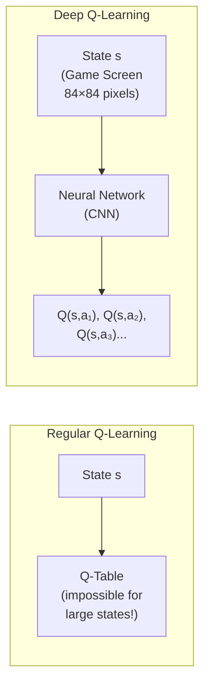

---

### 🏗️ DQN Architecture

```
Input: 84×84×4 (4 recent game frames)
  ↓
Conv1: 32 filters, 8×8, stride 4 → 20×20×32
  ↓
Conv2: 64 filters, 4×4, stride 2 → 9×9×64
  ↓
Conv3: 64 filters, 3×3, stride 1 → 7×7×64
  ↓
Flatten: 3136 values
  ↓
FC1: 512 neurons + ReLU
  ↓
FC2: Output = Q-values for all actions
```

---

### ✨ Two Key Innovations

| Innovation | Problem It Solves | How It Works |
|---|---|---|
| **Experience Replay** | Consecutive samples are correlated (bad for neural nets) | Store experiences in buffer, sample randomly for training |
| **Target Network** | Target Q-values keep moving (unstable) | Two networks — main updates every step, target updates slowly |

**Experience Replay:**
- Store (s, a, R, s', done) in memory buffer
- Sample random batches during training
- Breaks correlation → better learning

**Target Network:**
- Main Network: updated every step (predicts Q-values)
- Target Network: updated every C steps (provides stable targets)
- Prevents "moving target" problem

---

### 🏆 Famous Result

```
DeepMind 2015: DQN on 49 Atari games
- Learned from PIXELS alone (no game-specific features!)
- Achieved human-level or superhuman performance:
  ✅ Breakout: Superhuman
  ✅ Pong: Superhuman
  ✅ Space Invaders: Human-level
```

---

### 🎯 Summary for Exam Answer

**To get full 6 marks:**
1. **Definition (1 mark):** DQN = Q-Learning + neural network. Replaces Q-table for high-dimensional inputs.
2. **Why needed (1 mark):** Regular Q-table impossible for large state spaces (e.g., Atari pixels). DQN uses neural network as function approximator.
3. **Architecture (1.5 marks):** Describe — input (game screen), CNN layers, FC layers, outputs Q-values.
4. **Innovations (2.5 marks):** Explain:
   - Experience Replay: store + random sampling, breaks correlation
   - Target Network: two networks, stable targets

---

## 📐 Expanded Theoretical Framework: Q-Learning Convergence, Double DQN, Distributional RL, Dueling Architectures, Rainbow, and Scaling Laws in Deep RL

**Deep Q-Learning: The Bellman Residual Minimization Perspective**

Deep Q-Learning (DQN) approximates the optimal action-value function $Q^*(s,a)$ using a deep neural network $Q_\theta(s,a)$ with parameters $\theta$. The network is trained by minimizing the Temporal Difference (TD) error at each step:

$$\mathcal{L}(\theta) = \mathbb{E}_{(s,a,r,s') \sim \mathcal{D}} \left[ \left( r + \gamma \max_{a'} Q_{\theta^-}(s', a') - Q_\theta(s, a) \right)^2 \right]$$

where $\theta^-$ are the target network parameters and $\mathcal{D}$ is the replay buffer. This is a **bootstrapping** approach: the target $y = r + \gamma \max_{a'} Q_{\theta^-}(s', a')$ depends on the network's own predictions, forming a fixed-point iteration for $Q^*$ akin to value iteration in tabular RL. The convergence of this approach requires careful management of the deadly triad (function approximation, off-policy learning, and bootstrapping), which DQN addresses through the twin mechanisms of experience replay and target networks.

**Double DQN: Reducing Overestimation Bias**

Standard DQN selects and evaluates actions using the same network, leading to systematic overestimation of Q-values due to the max operator's positive bias:

$$\mathbb{E}[\max_a Q(s', a)] \geq \max_a \mathbb{E}[Q(s', a)] = Q^*(s', a^*)$$

Double DQN (van Hasselt et al., 2016) decouples action selection and evaluation: the main network selects the best action while the target network evaluates it:

$$y = r + \gamma Q_{\theta^-}(s', \arg\max_{a'} Q_\theta(s', a'))$$

This reduces the positive bias, particularly in noisy Q-estimates. The decomposition follows: let $\hat{q}_1, \hat{q}_2$ be two independent estimates of $Q^*$. Then:

$$\mathbb{E}[\max_i \hat{q}_i] \approx \max_i \mathbb{E}[\hat{q}_i] + \text{positive bias}$$

Double DQN approximates $\max_i \mathbb{E}[\hat{q}_i]$ by using separate estimators, yielding lower variance estimates of the target.

**Dueling DQN: Separating Value and Advantage**

Dueling DQN (Wang et al., 2016) decomposes the Q-function into a value stream $V(s)$ and an advantage stream $A(s,a)$:

$$Q(s,a) = V(s) + A(s,a) - \frac{1}{|\mathcal{A}|}\sum_{a'} A(s, a')$$

The network shares a convolutional trunk between both streams. The advantage head outputs $A(s,a)$ for each action, while the value head outputs $V(s)$ for the state. The mean subtraction ensures identifiability: without it, $V$ and $A$ are not uniquely determined. This architecture enables the network to learn which states are valuable without learning the effect of each action at each state, improving learning efficiency, particularly in states where actions do not significantly affect the outcome. The decomposition generalizes the expected SARSA update, extending to the **expected DQN** variant.

**Distributional DQN: Categorical and Quantile Regression**

Standard DQN learns the expected return $Q(s,a) = \mathbb{E}[Z(s,a)]$ where $Z(s,a)$ is the random return. Distributional RL (Bellemare et al., 2017; Dabney et al., 2018) instead learns the full probability distribution $Z_\theta(s,a)$ parameterized as a categorical distribution (C51) or quantile distribution (QR-DQN), projecting Bellman updates back onto a fixed support with KL divergence:

$$\mathcal{L}(\theta) = D_{KL}\left( \mathcal{T}Z_{\theta^-}(s', a^*) \| Z_\theta(s, a) \right)$$

where $\mathcal{T}$ is the Bellman update operator. C51 uses $N=51$ atoms on a support $[V_{min}, V_{max}]$, with $\Delta z = (V_{max} - V_{min}) / (N-1)$. QR-DQN parameterizes quantiles via quantile regression with Huber loss. Distributional RL's theoretical grounding is the **distributional Bellman equation**: the distribution of $Z(s,a)$ satisfies:

$$\mathcal{L}(Z(s,a)) = \mathcal{L}\left(R(s,a) + \gamma Z(s', \pi(s'))\right)$$

where $\mathcal{L}$ denotes the distributional projection operator. Empirically, C51 improves DQN's Atari performance by 10-20%, and QR-DQN further improves stability.

**Multi-Step Learning and n-Step Returns**

DQN with one-step TD targets benefits from multi-step returns: using $n$-step returns:

$$G_t^{(n)} = r_t + \gamma r_{t+1} + \dots + \gamma^{n-1} r_{t+n} + \gamma^n Q_{\theta^-}(s_{t+n}, a_{t+n})$$

These provide lower bias targets when $n$ is large (closer to Monte Carlo) and lower variance when $n$ is small. Multi-step DQN combines with importance sampling for off-policy correction, yielding $n$-step Q($\sigma$) learning with interpolation parameter $\sigma \in [0,1]$ controlling on-policy vs off-policy trade-off. Retrace($\lambda$) further combines eligibility traces with importance sampling for efficient learning from off-policy data.

**Per-Dual-Network, Noisy Nets, and Rainbow**

The **Rainbow** algorithm (Hessel et al., 2018) integrates six DQN extensions: double Q-learning, dueling architecture, prioritized replay, multi-step learning, distributional RL (C51), and noisy networks. **Prioritized experience replay** samples transitions proportional to their TD error magnitude:

$$P(i) = \frac{p_i^\alpha}{\sum_k p_k^\alpha}, \quad p_i = |\delta_i| + \epsilon$$

where $\delta_i = r + \gamma \max_{a'} Q(s', a') - Q(s,a)$ is the TD error and $\alpha \in [0,1]$ controls prioritization strength. Importance sampling (IS) weights $w_i = (N \cdot P(i))^{-\beta}$ correct the sampling distribution bias. **Noisy networks** ( Fortunato et al., 2018) replace $\epsilon$-greedy exploration with learned parametric noise by factorized Gaussian noise on weight parameters, enabling efficient state-dependent exploration.

**Scaling Laws in Deep RL and the "Replay Ratio" Optimization**

Modern scaling laws in deep RL reveal that DQN performance scales sublinearly with compute (compute-optimal training allocates more compute to fewer gradient updates) and that the **replay ratio** $\rho = \frac{\text{gradient steps}}{\text{environment steps}$ is critical: higher $\rho$ enables faster learning at the cost of data efficiency, with modern implementations (e.g., Efficient Rainbow) using $\rho = 10-256$. The **ratio of gradient steps to environment steps** is the RL analog of the supervised learning epoch, determining how many times each experience is "replayed" for learning. Analysis by Duan et al. (2021) shows that Atari DQN performance saturates around 200M frames with batch size 32, but larger batch sizes (256-1024) with proportionally fewer gradient steps degrade performance due to reduced representation diversity.

**Curiosity-Driven RL: Intrinsic Motivation and Exploration**

In sparse-reward environments, DQN struggles because extrinsic rewards are rare (e.g., Montezuma's Revenge). **Curiosity-driven exploration** augments extrinsic reward with an intrinsic motivation signal based on prediction error. The Intrinsic Curiosity Module (ICM, Pathak et al., 2017) computes an intrinsic reward as the L2 prediction error of a forward dynamics model $F_\phi$:

$$r_t^{\text{intrinsic}} = \frac{\eta}{2} \| \hat{\phi}_{t+1} - \phi_{t+1} \|_2^2$$

where $\phi$ are features from an encoder and $\hat{\phi}_{t+1} = F_\phi(\phi_t, a_t)$ is the predicted next feature. This encourages exploration of states where the dynamics model makes large errors, biasing the agent toward novel, surprising states rather than revisiting predictable ones. The ICMSA agent combines this with SAC (Soft Actor-Critic) to achieve superhuman performance on Montezuma's Revenge from raw pixels alone. More recent work by Burda et al. (2019) demonstrates that random feature encoders with simple prediction-error intrinsic motivation can outperform hand-designed features, suggesting the bottleneck in curiosity-driven RL is representation learning, not prediction architecture.

## Q.8 (b) — What are different **characteristics of Reinforcement Learning**? **[6 Marks]**

### 🔑 Key Characteristics of RL

| Characteristic | Description | Example |
|---|---|---|
| **Trial & Error** | Learns by trying actions | Robot falls, learns to balance |
| **Delayed Reward** | Reward comes long after action | Win chess after 30 moves |
| **No Supervisor** | No correct answer given | No teacher in game playing |
| **Explore vs Exploit** | Balance new vs known actions | Slot machine dilemma |
| **Time Matters** | Sequence and order of actions | Same move, different value at different times |
| **Non-Stationary** | Agent's actions change environment | Robot moves → new state → new decision |

---

### 📋 Each Characteristic Explained

#### **1. Trial and Error Learning**
- Agent tries actions, learns from results
- No teacher tells the correct action
- Good actions → repeat, Bad actions → avoid
- Example: Robot walking — falls many times, eventually learns

#### **2. Delayed Reward**
- Reward may come LONG after the action
- Credit Assignment Problem: which of 100 actions caused the reward?
- Example: Chess — win after 30 moves, which move was winning?

#### **3. No Supervisor**
- No labeled data or correct answers
- Only reward signal: good/bad
- Agent must discover the best actions itself

#### **4. Exploration vs Exploitation**
- **Explore:** Try new actions (might find better option)
- **Exploit:** Use best known action (guaranteed reward)
- Must balance both — explore too much = waste time, exploit too much = miss better options

#### **5. Time Matters**
- Same action at different times has different value
- Actions are sequential, order matters
- Current state depends on previous actions

#### **6. Agent Affects Data**
- Agent's actions change the environment
- Data distribution changes as agent learns
- Non-stationary: learning changes what agent experiences next

---

### 🎯 Summary for Exam Answer

**To get full 6 marks:**
1. **Trial & Error (1 mark):** Learns by trying, no supervisor.
2. **Delayed Reward (1 mark):** Reward comes late, Credit Assignment Problem.
3. **No Supervisor (0.5 mark):** No labels or correct answers.
4. **Explore vs Exploit (1 mark):** Balance new vs known actions.
5. **Time Matters (1 mark):** Sequence matters, same action different value at different times.
6. **Non-Stationary (1.5 marks):** Agent's actions change environment, data distribution changes.

---

## 📐 Expanded Theoretical Framework: Mathematical Foundations of RL — Markov Decision Processes, POMDPs, Credit Assignment Problem, Bellman Equations, and Actor-Critic Theory

**Markov Decision Processes (MDPs) and Partially Observable MDPs (POMDPs)**

The formal foundation of reinforcement learning rests on the **Markov Decision Process (MDP)**, defined as a tuple $\mathcal{M} = \langle \mathcal{S}, \mathcal{A}, \mathcal{T}, \mathcal{R}, \gamma \rangle$ where:
- $\mathcal{S}$ = state space (finite or continuous),
- $\mathcal{A}$ = action space,
- $\mathcal{T}(s'|s,a) = P(s_{t+1}=s'|s_t=s, a_t=a)$ = transition probability,
- $\mathcal{R}(s,a) = \mathbb{E}[r_t|s_t=s, a_t=a]$ = reward function,
- $\gamma \in [0,1]$ = discount factor.

The **Markov property** requires: $P(R_t, s_{t+1}|s_t, a_t, s_{t-1}, a_{t-1}, \dots) = P(R_t, s_{t+1}|s_t, a_t)$. In **POMDPs**, the agent receives observations $o_t \in \mathcal{O}$ rather than states, with $P(o_t|s_t)$ as the emission probability. The agent must maintain a **belief state** $b_t = P(s_t|o_{1:t}, a_{1:t})$, making the problem partially observable.

**The Reward Signal and the Reward Hypothesis**

The RL objective is to maximize expected cumulative discounted reward:
$$J(\pi) = \mathbb{E}_\pi\left[\sum_{t=0}^{T}\gamma^t R(s_t, a_t)\right]$$

The **reward hypothesis** posits that *all goals and purposes can be described by the maximization of expected cumulative reward*. This is both powerful (unifies all tasks under one framework) and limited (requires carefully engineered reward functions; misspecified rewards lead to reward hacking — the agent finds loopholes to maximize reward without actually accomplishing the intended goal). Examples of reward hacking: a boat racing agent learns to spin in circles to collect reward tokens rather than completing the race; a simulated LEGO robot learns to throw the brick at the target rather than placing it.

**Bellman Equations and the Bellman Optimality Operator**

Bellman's Principle of Optimality (1957) is the cornerstone: "An optimal policy has the property that whatever the initial state and initial decision are, the remaining decisions must constitute an optimal policy with regard to the state resulting from the first decision." The **Bellman expectation equation** for a policy $\pi$:
$$V^\pi(s) = \mathbb{E}_\pi\left[R_t + \gamma V^\pi(s_{t+1})|s_t=s\right] = \sum_a \pi(a|s)Q^\pi(s,a)$$
$$Q^\pi(s,a) = \mathbb{E}_\pi\left[R_t + \gamma V^\pi(s_{t+1})|s_t=s, a_t=a\right] = \sum_{s'}P(s'|s,a)[R(s,a) + \gamma V^\pi(s')]$$

The **Bellman optimality equation**:
$$V^*(s) = \max_a \sum_{s'}P(s'|s,a)[R(s,a) + \gamma V^*(s')]$$
$$Q^*(s,a) = \sum_{s'}P(s'|s,a)[R(s,a) + \gamma \max_{a'}Q^*(s',a')]$$

The optimal policy is $\pi^*(a|s) = \mathbf{1}_{a = \arg\max_a Q^*(s,a)}$. Crucially, the **Bellman optimality operator** $\mathcal{T}^*V(s) = \max_a \sum_{s'}P(s'|s,a)[R(s,a) + \gamma V(s')]$ is a **contraction mapping** in the sup-norm ($\|\mathcal{T}^*V_1 - \mathcal{T}^*V_2\|_\infty \leq \gamma\|V_1 - V_2\|_\infty$), which by the Banach Fixed Point Theorem guarantees a unique fixed point $V^* = \mathcal{T}^*V^*$. This is why Value Iteration converges.

**Exploration vs. Exploitation: The Formal Trade-off**

The exploration-exploitation dilemma is the central challenge of RL. **Exploitation** = choose actions known to yield high reward; **Exploration** = try new actions that may yield even higher reward. Formalized via **regret minimization**:
$$R_T = \mathbb{E}\left[\sum_{t=1}^T\mu^* - \sum_{t=1}^T\mu_{a_t}\right] \leq \sum_{\Delta_i > 0}\frac{\log T}{\Delta_i}$$

Where $\Delta_i = \mu^* - \mu_i$ is the optimality gap of action $i$. This lower bound (Lai & Robbins, 1985) is achieved asymptotically by UCB1, Thompson Sampling, and KL-UCB. UCB1 selects:
$$a_t = \arg\max_a\left[Q_t(a) + \sqrt{\frac{2\ln t}{N_t(a)}}\right]$$

**Non-Stationarity: Distribution Shift and the Environment Feedback Loop**

A critical characteristic distinguishing RL from supervised learning is the **non-stationarity** of the data distribution: the agent's actions $a_t = \pi_\theta(s_t)$ *change* the state $s_{t+1}$ and thus the data distribution $P(s_t)$ evolves over time as the policy improves. This creates a **closed-loop feedback system** — the agent's learned behavior *is* the data distribution. This means:
- Offline data collected under one policy becomes stale as the policy changes → **dataset shift problem**,
- Value function estimates used in bootstrapping introduce **bootstrapping bias** (the estimate is used to improve the policy that generates the data used to update the estimate),
- The **deadly triad** (Sutton & Barto): function approximation + off-policy learning + bootstrapping can cause divergence in value-based RL. DQN avoids this via target networks (decoupling target from moving Q-estimate) and experience replay (mixing past and present data).

**Delayed Rewards and the Credit Assignment Problem**

Because RL provides feedback as *delayed scalar rewards* rather than immediate per-step labels, the agent must infer which of many preceding actions contributed to a final outcome. This is the **credit assignment problem** — "which move in a 30-move chess game caused the final win?" Mathematical formalization: given a trajectory $\tau = (s_0, a_0, r_1, \dots, s_T)$ and return $G_0 = \sum_{t=0}^T \gamma^t r_{t+1}$, the gradient of the expected return with respect to parameters is:
$$\nabla_\theta J(\theta) = \mathbb{E}_\pi\left[\nabla_\theta \log \pi_\theta(a_t|s_t) \cdot G_t\right]$$

This **policy gradient theorem** (Sutton et al., 2000) assigns credit via the log-derivative trick, treating each action's probability weight as a multiplicative factor of its contribution to the return. The variance of Monte Carlo returns $G_t$ scales with $\text{Var}(G_t) \propto T^2$ for long horizons, making learning slow for delayed reward tasks. **Baseline subtraction** using $V_w(s_t)$ and **advantage functions** $A^\pi(s,a) = Q^\pi(s,a) - V^\pi(s)$ reduce variance without bias. **Generalized Advantage Estimation (GAE)** interpolates between high-bias/low-variance (TD) and low-bias/high-variance (MC) returns via:
$$\hat{A}_t^{GAE(\gamma,\lambda)} = \sum_{l=0}^{T-t}(\gamma\lambda)^l\delta_{t+l}^V$$
where $\delta_t^V = r_t + \gamma V(s_{t+1}) - V(s_t)$ is the TD error. $\lambda = 1$ gives MC; $\lambda=0$ gives 1-step TD.

**Trial-and-Error and Sample Complexity**

Trial-and-error learning in RL means the agent must *physically experience* both good and bad outcomes through interaction with the environment. This is in stark contrast to supervised learning where labels are provided for all data. The **sample complexity** of RL is quantified as the number of environment interactions needed to reach a target performance level. For tabular MDPs, PAC-MDP algorithms achieve $O(|\mathcal{S}||\mathcal{A}|/\epsilon^2(1-\gamma)^3 \cdot \text{poly}(1/\delta))$ samples. For deep function approximation, no such guarantees exist — modern deep RL requires 10M–1B environment steps even for simple tasks (e.g., DQN on Atari, PPO on MuJoCo).

**The Non-Stationary Agent as a Distribution Shifter**

Because the agent's actions actively shape the state distribution $P(s_t)$, the agent's behavior creates **distributional drift** over time. Early in training, the agent takes random actions and visits many states; later, as the policy improves, the agent visits more promising states more frequently, creating a feedback loop. This is the **curse of dynamics**: as the agent gets better, less data is generated about suboptimal trajectories, making it harder to correct past mistakes. Offline RL and off-policy algorithms address this via importance sampling and conservative regularization.

**Observation vs. State: The POMDP Challenge**

Most real-world RL environments are POMDPs: the agent receives partial observations (pixels from a camera, readings from sensors) rather than full state information. The agent must learn a **state representation** $h_t = f_\theta(o_1, \dots, o_t; a_1, \dots, a_t)$ from history. Architectures like **Recurrent PPO** maintain a hidden state $h_t = \text{GRU}(h_{t-1}, [o_t, a_{t-1}])$ and condition the policy on this hidden state. Recurrent memory addresses the partial observability by compressing history into a fixed-size hidden representation, though this can still lose critical information from the distant past.

**Time and Sequentiality: Why Order Matters**

RL is fundamentally sequential: action $a_t$ at time $t$ affects all future states $s_{t+1}, s_{t+2}, \dots, s_T$. The same action taken at different times in different states produces different outcomes. **Credit assignment across time** is amplified by the discount factor $\gamma$: a reward $r_T$ at time $T$ contributes only $\gamma^T r_T$ to the return at time $0$, so early actions in long-horizon tasks receive exponentially attenuated gradients. This is why RL struggles with long-horizon tasks requiring precise multi-step coordination. **Hierarchical RL (HRL)** addresses this by decomposing tasks into subgoals via options — temporally extended actions that form macro-actions, with subgoal rewards provided at intermediate timescales. The **Options framework** (Sutton et al., 1999) formalizes options as $\langle \mathcal{I}_\omega, \pi_\omega, \beta_\omega \rangle$ where $\mathcal{I}_\omega$ is the initiation set, $\pi_\omega$ is the intra-option policy, and $\beta_\omega$ is the termination condition, enabling temporally extended credit assignment. Hierarchical RL with options reduces the effective planning horizon by decomposing long tasks into shorter subgoals with intermediate rewards.

## Q.8 (c) — Explain in detail **Dynamic Programming algorithms** for reinforcement learning. **[5 Marks]**

### 🧮 DP in RL — Solving with Complete Knowledge

**Dynamic Programming (DP)** solves MDPs when the **environment model is fully known** — all transition probabilities, rewards, and states are known.

> **Analogy:** Planning a road trip with a PERFECT map that knows every road distance, toll, and hotel cost. DP works BACKWARD from the destination to find the optimal route!

---

### 📐 The Bellman Equation — Heart of DP

```
V(s) = max_a [ R(s,a) + γ × Σ P(s'|s,a) × V(s') ]

In simple words:
  "Value of state s = best immediate reward + discounted average of future rewards"
```

---

### 🔢 Two Main DP Algorithms

#### **1. Value Iteration**

```
Step 1: Initialize V(s) = 0 for all states
Step 2: Repeat until V(s) stops changing:
        For each state s:
          V(s) = max_a [R(s,a) + γ × Σ P(s'|s,a) × V(s')]
Step 3: Extract policy: π(s) = argmax_a [R + γ × Σ P×V]
Result: Optimal V*(s) and π*(s)
```

#### **2. Policy Iteration**

```
Step 1: Initialize random policy π(s)
Step 2: Repeat until policy stops changing:
  ┌─ POLICY EVALUATION ─┐
  │ Calculate V(s) for   │
  │ current policy π     │
  └──────────────────────┘
           ↓
  ┌─ POLICY IMPROVEMENT ─┐
  │ For each state:       │
  │ π_new(s) = best action│
  └──────────────────────┘
Result: Optimal policy π*(s)
```

---

### 📊 Comparison

| Algorithm | Approach | Speed | Complexity |
|---|---|---|---|
| **Value Iteration** | Update values, then extract policy | Slower per iteration | Simpler |
| **Policy Iteration** | Evaluate + Improve policy repeatedly | Faster convergence | Slightly more complex |

---

### ⚠️ Limitations of DP

| Limitation | Explanation |
|---|---|
| **Needs full model** | Must know ALL transition probabilities |
| **Curse of dimensionality** | Too many states for real problems (chess: 10^120) |
| **Not sample efficient** | Must visit every state many times |
| **Small MDPs only** | Real-world problems too large for DP |

---

### 🎯 Summary for Exam Answer

**To get full 5 marks:**
1. **Definition (1 mark):** DP solves MDPs when environment model is fully known. Computes optimal value function and policy.
2. **Bellman Equation (1 mark):** Write V(s) = max_a [R + γ × Σ P(s'|s,a) × V(s')].
3. **Value Iteration (1.5 marks):** Explain — initialize V(s)=0, repeatedly update using Bellman, extract policy.
4. **Policy Iteration (1.5 marks):** Explain — initialize policy, repeat: Policy Evaluation (calculate V) + Policy Improvement (make policy better).

---

## 📐 Expanded Theoretical Framework: Bellman Contraction Proof, Value Iteration Convergence, Linear Programming Formulation, Generalized Policy Iteration, and Hierarchical DP

**Bellman's Principle of Optimality: Formal Statement and Proof Sketch**

Bellman's Principle of Optimality (1957): "An optimal policy has the property that whatever the initial state and initial decision are, the remaining decisions must constitute an optimal policy with regard to the state resulting from the first decision." This is equivalent to the statement that the optimal value function satisfies the Bellman optimality equation. The proof follows from the contraction property: if $\pi$ is optimal, then for any state $s$:
$$V^*(s) = \max_a \left[R(s,a) + \gamma \sum_{s'} P(s'|s,a) V^*(s')\right]$$

The uniqueness of $V^*$ follows from the contraction property of the Bellman optimality operator: if $V_1 \neq V_2$ are two fixed points, then
$$\|V_1 - V_2\|_\infty = \|\mathcal{T}^*V_1 - \mathcal{T}^*V_2\|_\infty \leq \gamma\|V_1 - V_2\|_\infty < \|V_1 - V_2\|_\infty$$
which is a contradiction unless $V_1 = V_2$. This proves existence and uniqueness of $V^*$.

**Value Iteration: Convergence Analysis and Computational Properties**

Value iteration applies the Bellman optimality operator as a **fixed-point iteration**: $V_{k+1} = \mathcal{T}^*V_k$. Convergence rate is geometric with factor $\gamma$:
$$\|V_k - V^*\|_\infty \leq \frac{\gamma^k}{1-\gamma}\max_{s,a}|R(s,a)|$$

This means the error decreases by a factor of $\gamma$ per iteration. For $\gamma = 0.99$, convergence to $\epsilon$ precision requires $k = \log(\epsilon(1-\gamma)/R_{\max})/\log(\gamma) \approx 919$ iterations for $\epsilon = 10^{-6}$. Each iteration costs $O(|\mathcal{S}||\mathcal{A}|)$ for tabular problems.

The **Gauss-Seidel Value Iteration** variant updates $V(s)$ in-place using the most recent values in the same sweep, typically converging slightly faster. **Asynchronous Value Iteration** updates states independently, useful for distributed computation.

**Policy Iteration: Policy Evaluation, Policy Improvement, and Convergence**

Policy iteration alternates between:
1. **Policy Evaluation**: Compute $V^{\pi_k}(s)$ by solving the linear system: $V^{\pi}(s) = \sum_a \pi(a|s) \sum_{s'}P(s'|s,a)[R(s,a) + \gamma V^\pi(s')]$,
2. **Policy Improvement**: For each state, $\pi_{k+1}(s) = \arg\max_a \sum_{s'}P(s'|s,a)[R(s,a) + \gamma V^{\pi_k}(s')]$.

The policy improvement theorem guarantees strict improvement: if $\pi_{k+1} \neq \pi_k$, then $V^{\pi_{k+1}}(s) > V^{\pi_k}(s)$ for at least one $s$, and $V^{\pi_{k+1}}(s) \geq V^{\pi_k}(s)$ for all $s$. Since only finitely many deterministic policies exist ($|\mathcal{A}|^{|\mathcal{S}|}$), policy iteration converges in a finite number of iterations.

**Modified Policy Iteration and the Policy Evaluation Contraction**

Full policy evaluation (solving the linear system exactly) is expensive. **Modified Policy Iteration (MPI)** uses a fixed number of $k$ backup steps per policy evaluation rather than converging fully. Empirical results show MPI converges in far fewer total iterations than both full PI and VI, with each iteration having lower cost. Analysis via the **policy evaluation contraction**: each evaluation step contracts toward $V^{\pi}$ with factor $\gamma$, so $k$ steps yields error bounded by $\gamma^k \max_{s,a}|Q|$.

**Linear Programming (LP) Formulation of MDPs**

The MDP can be formulated as a linear program for computing the optimal value function:
$$\min_{V \in \mathbb{R}^{|\mathcal{S}|}} \sum_s c(s)V(s) \quad \text{s.t.} \quad V(s) \geq R(s,a) + \gamma\sum_{s'}P(s'|s,a)V(s'), \quad \forall s,a$$

where $c(s)$ is any positive weight vector (e.g., $c(s)=1$). The optimal value function is attained at some vertex of this polyhedron. LP-based methods are useful when the MDP has a specific structure exploitable via decomposition; they also provide alternatives to iterative DP when convergence of VI/PI is problematic. However, LP solvers have $O(|\mathcal{S}|^3|\mathcal{A}|^3)$ worst-case complexity, making them impractical for large MDPs compared to value/policy iteration.

**Dynamic Programming in the Presence of Noise and Function Approximation**

When transition dynamics are stochastic, DP algorithms converge to the optimal value function almost surely under the Robbins-Mro conditions for step sizes: $\sum_t \alpha_t(s) = \infty$, $\sum_t \alpha_t(s)^2 < \infty$, for each state $s$. This ensures sufficient exploration to visit each state infinitely often, yet the step sizes decay to zero so the algorithm converges.

With function approximation (e.g., linear value function approximation $V_\theta(s) = \theta^T\phi(s)$), the fixed-point iteration no longer converges to $V^*$ in general; instead it converges to a projected fixed point $V_{\theta^*} = \Pi_{\mathcal{H}}V^*$, where $\Pi_{\mathcal{H}}$ is the projection onto the hypothesis class $\mathcal{H}$. This leads to **Bellman residual minimization** and **least-squares policy iteration (LSPI)**, which fit the value function via projected Bellman equation. LSPI with $n$ samples converges to a $\epsilon$-optimal solution in $O(1/\epsilon^2)$ samples for linear function approximation under certain conditions (full rank of Gram matrix).

**Real-Time Dynamic Programming (RTDP) and Heuristic Search**

For large MDPs with goal states, **Real-Time Dynamic Programming (RTDP)** exploits the structure of reachable states by performing value iteration only on states actually visited during simulation or search. The algorithm initializes $V(s) = h(s)$ where $h(s)$ is a heuristic (e.g., shortest-path distance heuristic), then performs one-step value iteration updates on states as they are encountered in a simulated trajectory. This is similar to **AO* (AO star)** search for AND-OR graphs, which incrementally refines the optimal policy graph as new states are encountered.

**Asynchronous DP: Gauss-Seidel, Jacobi, and Distributed DP**

The standard synchronous DP updates all states simultaneously. **Asynchronous DP** allows different states to be updated at different rates, even in parallel. Gauss-Seidel style updates use the most recently computed values (better convergence); Jacobi-style uses the values from the previous iteration (easier to parallelize). **Distributed DP** partitions the state space across processing nodes with communicated boundary values; this is critical for MDPs with millions of states where a single machine cannot fit all values in memory.

**Hierarchical and Factored MDPs: Exploiting Structure for Scalable DP**

Many real-world MDPs have structure exploitable via hierarchical or factored representations. **Factored MDPs** represent dynamics using Dynamic Bayesian Networks (DBNs): $P(s', r|s, a) = \prod_i P(s'_i|s, a)$ where each variable $s'_i$ depends only on a local subset of state variables. Decision trees or algebraic decision diagrams (ADD) compactly represent value functions, reducing memory from $O(|\mathcal{S}|)$ to $O(\text{compact representation size})$. **Hierarchical RL** (options framework, MAXQ decomposition) learns subtask policies (options) that abstract away details; the macro-policy computes a high-level value function $V_{H}(s) = \max_o Q_H(o|s)V_{L}(s, o)$ conditioned on choosing option $o$. Hierarchical DP applies DP at multiple timescales, treating options as macro-actions, reducing effective horizon at each level.

**Limitations of DP: Curse of Dimensionality and Curse of Modeling**

The fundamental limitations of DP are: (1) **curse of dimensionality**: state space size grows combinatorially with the number of state variables; a board game with 64 squares each having 12 piece types has $12^{64}$ states — impossible to enumerate; (2) **curse of modeling**: DP requires accurate knowledge of transition probabilities $P(s'|s,a)$ and reward $R(s,a)$; in real-world systems, these must be learned from interaction, leading to model-free RL; (3) **curse of planning depth**: for large horizons, each iteration of value iteration becomes expensive. Model Predictive Control (MPC), which replans from the current state at each step using a horizon of $H \ll T$ steps, accomplishes effective infinite-horizon planning with finite computation per step.

**Historical Context: From Bellman to Modern DP**

Richard Bellman introduced dynamic programming in the context of optimal control in the 1950s, solving problems in operations research, aerospace, and economics. The formal connection between DP and MDPs was made by Howard (1960) with the policy iteration algorithm (Howard's policy iteration). Bellman's original formulation used discrete-time deterministic systems; the extension to stochastic systems came with the Blackwell optimality theorem (1962), which shows that for finite MDPs with discounting, there exists a deterministic stationary optimal policy. The **linear programming formulation** was studied by d'Epenoux (1963) and later Manne (1960) for economic planning problems. Modern DP is implemented in every RL library (RLlib, Stable Baselines3, Acme) as the planning subroutine for model-based RL algorithms (Dyna-Q, MBPO, PETS). The Dyna-Q architecture (Sutton, 1991) interleaves real environment interaction with DP-based planning updates using a learned model, achieving dramatic sample efficiency improvements over pure model-free methods by "imagining" trajectories from the learned dynamics model.
