# Paper 3: [6404]-95 — Deep Learning Answers

**B.E. Computer Engineering | Semester VIII | 2019 Pattern | Max Marks: 70**

---

# UNIT I — Convolutional Neural Networks (CNN)

---

## Q.1 (a) — Draw and Explain **CNN Architecture** in detail. **[6 Marks]**

### 🧠 CNN Architecture — The Complete Picture

A **Convolutional Neural Network** is built like a factory with different processing rooms. Data enters from one side, gets processed through each layer, and comes out with an answer.

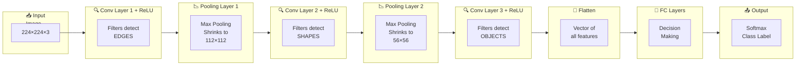

---

### 📦 Each Layer's Job

| Layer | Purpose | What It Detects |
|---|---|---|
| **Input** | Accepts raw image | — |
| **Conv + ReLU** | Feature extraction using filters | Layer 1: edges, Layer 2: shapes, Layer 3: objects |
| **Pooling** | Downsampling | Keeps strongest features |
| **Flatten** | Convert 3D to 1D vector | Prepare for FC layers |
| **FC Layers** | Decision making | Combines features → classification |
| **Softmax** | Output probabilities | Cat: 92%, Dog: 6%, Car: 2% |

---

### 🎯 Summary for Exam Answer

**To get full 6 marks:**
1. **Definition (1 mark):** CNN is a deep learning model for images using convolution operations.
2. **Layer-by-layer (3 marks):** Explain: Input → Conv+ReLU → Pool → Conv+ReLU → Pool → Conv+ReLU → Flatten → FC → Softmax Output.
3. **What each detects (1 mark):** Layer 1 detects edges, Layer 2 detects shapes, Layer 3 detects objects.
4. **Diagram (1 mark):** Draw neat labeled block diagram as above.

---

### 📚 Theoretical Deep Dive — CNN Architecture

**Historical Context and Biological Inspiration:**

The convolutional neural network architecture draws direct inspiration from the biological visual cortex, as discovered by Nobel Prize-winning neuroscientists David Hubel and Torsten Wiesel in the 1960s. Through experiments on cats, they identified two key types of visual cells: simple cells, which respond to edges at specific orientations, and complex cells, which combine the outputs of simple cells to detect more complex patterns. This hierarchical organization mirrors precisely what modern CNNs replicate through their stacked convolutional layers. The first computational model inspired by this work was the Neocognitron proposed by Kunihiko Fukushima in 1980, which laid the conceptual groundwork for CNNs. It was not until 1998, when Yann LeCun and colleagues applied convolutional networks to handwritten digit recognition (the famous LeNet-5 architecture), that CNNs demonstrated practical viability. The architecture then experienced a period of relative obscurity until 2012, when Alex Krizhevsky, Ilya Sutskever, and Geoffrey Hinton won the ImageNet Large-Scale Visual Recognition Challenge with AlexNet, dramatically reducing the top-5 error rate from 26.1% to 15.3% compared to the previous best. This watershed moment catalyzed the modern deep learning revolution and established CNNs as the dominant architecture for computer vision. The progression from AlexNet (2012) to VGGNet (2014), GoogLeNet/Inception (2014), ResNet (2015), and DenseNet (2017) represents a continuous refinement of the core CNN paradigm, with each innovation addressing specific theoretical or practical limitations of prior architectures.

**Mathematical Foundation of Hierarchical Representation Learning:**

The fundamental power of CNN architecture lies in its ability to learn hierarchical representations of data, a concept deeply rooted in both neuroscience and mathematics. This hierarchical representation theory states that lower layers of the network learn simple, generic features (edges, corners, color gradients), while deeper layers learn increasingly complex and abstract features that are composites of the lower-layer features. Mathematically, we can view each layer as learning a function `f_l(x) = σ(W_l * f_{l-1}(x) + b_l)`, where `σ` is a non-linear activation, `W_l` is the convolutional kernel at layer `l`, and `*` denotes convolution. Each layer transforms the representation space, progressively extracting higher-level semantics. The composition of these layers implements a **deep distributed representation**: a single high-level concept (e.g., "cat face") is represented not by a single neuron but by a distributed pattern across many neurons in the final layers. This distributed representation has profound theoretical advantages: it is robust to noise (loss of some neurons does not destroy the concept), it enables linear separability of complex classes in the final representation space, and it allows the network to disentangle the factors of variation in the data (separating identity from pose, lighting, and background).

**Parameter Efficiency and the Convolutional Advantage:**

A defining theoretical feature of CNNs is their parameter efficiency compared to fully connected networks. Consider a classification task on a 224×224×3 RGB image with an output layer of 1000 classes (ImageNet). A single fully connected layer connecting all input pixels to all output classes requires `(224×224×3) × 1000 + 1000 = 150,528,000 + 1000 ≈ 150.5 million` parameters. In contrast, a CNN with the first layer having 64 filters of size 3×3 requires only `(3×3×3) × 64 + 64 = 1792` parameters — a reduction of approximately 84,000×. This efficiency arises from two key principles:
1. **Weight Sharing**: The same filter is applied across all spatial positions, so the network learns feature detectors that are spatially generalizable rather than position-specific detectors.
2. **Local Connectivity**: Each output neuron depends only on a small local region of the input (the receptive field), not on every input pixel.

This efficiency is not merely a convenience but reflects strong **inductive biases** (translation equivariance, locality) that reflect the true structure of visual data. The fact that natural images are locally correlated validates the local connectivity assumption, while the fact that the same feature can appear anywhere validates weight sharing. These biases dramatically reduce the number of training examples needed to learn effectively.

**Full Connectivity and the Transition from Conv to FC:**

The transition from the convolutional portion of a CNN to the fully connected (FC) portion has important theoretical consequences. After a series of convolutional and pooling layers, the 3D feature map tensor is **flattened** into a 1D vector, which is then fed into one or more FC layers. Flattening destroys the spatial structure of the features and treats all activations as independent dimensions. This means the FC layers operate on a semantically unstructured vector of features, losing the 2D locality information that the convolutional layers preserved. This architectural choice reflects a tradeoff: the FC layers excel at the abstract, non-spatial reasoning needed for final classification (e.g., combining "wheel detector" + "window detector" + "body detector" → "car"), but at the cost of spatial awareness. For image classification, where the task is "what" is in the image regardless of "where," discarding spatial information in the FC layers is acceptable. For localization tasks where "where" matters equally, spatial information must be preserved, as in fully convolutional networks (FCNs) for semantic segmentation. The theoretical insight is that **the nature of the task (classification vs. dense prediction) should determine whether spatial structure is preserved or discarded in the final layers**.

---

## Q.1 (b) — Explain working of **Convolution Layer**. **[6 Marks]**

### 🔍 What is Convolution Layer? — The Feature Detector

The **Convolution Layer** is the most important part of a CNN. It uses **filters (kernels)** that slide over the image and detect patterns.

> **Think of it like a scanner:** A scanner moves over a document, line by line, reading each part. The convolution filter does the same — it slides over the image, checking each region for a specific pattern.

---

### 📐 How Convolution Works — Step by Step

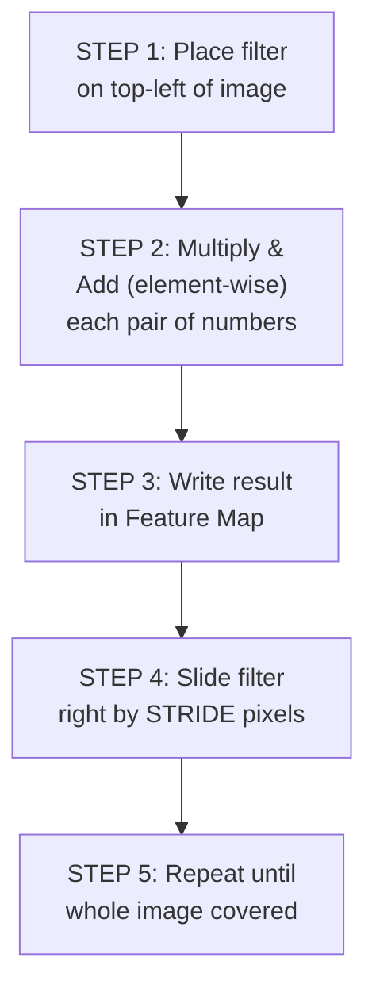

---

### 📏 Concrete Numerical Example

**Input Image (5×5):**
```
1 0 1 0 1
0 1 0 1 0
1 0 1 0 1
0 1 0 1 0
1 0 1 0 1
```

**Filter (3×3) — Edge Detector:**
```
1 0 1
0 1 0
1 0 1
```

**Feature Map (3×3):**
```
Top-left position: 1×1 + 0×0 + 1×1 + 0×0 + 1×1 + 0×0 + 1×1 + 0×0 + 1×1 = 5
Top-middle position: 0×1 + 1×0 + 0×1 + 1×1 + 0×0 + 1×0 + 0×1 + 1×0 + 0×1 = 4

Result:
5 4 5
4 5 4
5 4 5
```

---

### 📊 Key Parameters

| Parameter | Meaning | Example |
|---|---|---|
| **Filter Size** | Size of sliding window | 3×3, 5×5, 7×7 |
| **Number of Filters** | How many patterns to detect | 32, 64, 128 |
| **Stride** | How many pixels to slide | 1 (common), 2 |
| **Padding** | Border pixels added | 0, 1, 2 |
| **Depth** | Number of feature maps | Equal to number of filters |

---

### 📏 Output Size Formula

```
Output = (Input - Filter + 2×Padding) / Stride + 1

Example: 32×32 input, 3×3 filter, stride=1, padding=0
Output = (32 - 3 + 0) / 1 + 1 = 30×30
```

---

### 🎯 Summary for Exam Answer

**To get full 6 marks:**
1. **Definition (1 mark):** Convolution layer uses filters/kernels that slide over input to detect features.
2. **Working (2 marks):** Explain step by step: filter placement → element-wise multiplication & sum → write in feature map → slide by stride → repeat. Give numerical example.
3. **Parameters (2 marks):** Explain filter size, number of filters, stride, padding with formulas.
4. **Feature Maps (1 mark):** Explain output = feature map showing where each pattern is detected.

---

### 📚 Theoretical Deep Dive — Convolution Layer

**The Discrete Convolution as a Linear Operator and its Signal Processing Interpretation:**

The convolution operation used in CNNs is formally a discrete, finite convolution that computes a weighted sum over a local spatial neighborhood of the input. Mathematically, for a 2D input `X ∈ R^(H×W)` and a kernel `K ∈ R^(k×k)`, the convolution at position `(i,j)` of the output feature map is:

`S[i,j] = Σ_{u=0}^{k-1} Σ_{v=0}^{k-1} X[i+u, j+v] · K[u,v]`

A critical structural property of this operation is its **linearity** and **shift-invariance** (translation equivariance), which follows from the commutative property of convolution in the discrete domain. This means that if a feature (say, a cat ear) appears at position `(x₁, y₁)` and at position `(x₂, y₂)`, the same kernel will produce the same response (up to position) — a property essential for object detection regardless of position in the image. This equivariance property is mathematically formalized as: if we shift the input by `τ` pixels, i.e., `X_τ[i,j] = X[i-τ_x, j-τ_y]`, then the output is shifted by the same amount: `S_τ = S shifted by τ`.

From a **Fourier analysis perspective**, the convolution theorem states that convolution in the spatial domain is equivalent to element-wise multiplication in the frequency domain: `ℱ(X ⊛ K) = ℱ(X) · ℱ(K)`. This explains why small kernels (e.g., 3×3) can filter specific frequencies: a kernel with high-frequency coefficients acts as a high-pass filter (edge detection), while a kernel with low-frequency coefficients acts as a low-pass filter (smoothing/blurring). The hierarchical nature of CNNs mirrors a multi-scale frequency analysis: early layers capture fine, high-frequency details (edges, textures), while deeper layers capture coarse, low-frequency structures (object shapes, global context).

**Cross-Correlation vs. Discrete Convolution and Weight Sharing:**

A subtle but important point is that deep learning frameworks technically implement **cross-correlation** rather than strict convolution, i.e., the kernel is not flipped before application: `S[i,j] = Σ Σ X[i+u, j+v] · K[u,v]`. Mathematically, this is equivalent to learning a convolution with a pre-flipped kernel, so the representational capacity is identical — there is no loss of generality. The practical significance lies in the implementation: cross-correlation is more intuitively template-matching and avoids computational overhead of flipping at every position. However, the **weight sharing** property — where the identical kernel `K` is applied across all spatial positions — is the defining innovation of CNNs. This reduces the number of free parameters from `H×W×D_in×D_out` (fully connected layer) to `k²×D_in×D_out + D_out` (convolutional layer), a reduction of a factor of `H×W` for each output neuron. For a standard image classification task with 224×224 input and 64 filters, this reduces parameters from ~3.2 billion (fully connected) to ~1,792 (convolutional with 3×3 kernels), making training feasible.

**Strided Convolution and Dilated (Atrous) Convolution:**

When the stride `s > 1`, the convolution operation reduces the output spatial dimensions. Formally:

`Output_size = ⌊(H_in + 2p - k) / s⌋ + 1`

Strided convolutions serve a dual role: dimensionality reduction and increased receptive field. A stride of 2 effectively halves the spatial resolution, which is the standard downsampling mechanism in modern architectures. **Dilated (atrous) convolution** generalizes this by inserting `d-1` zeros between kernel elements, giving an effective kernel size of `k + (k-1)(d-1)`. For dilation `d=2`, a 3×3 kernel behaves like a 5×5 kernel with the center and corner elements missing, achieving double the receptive field without additional parameters or loss of resolution. This is mathematically significant for semantic segmentation where maintaining high spatial resolution is critical: the receptive field of a series of dilated 3×3 convolutions with rates 1, 2, 4, 8 grows exponentially, allowing each output pixel to "see" a 31×31 region of the input image without any pooling.

**Depthwise Separable Convolution — A Theoretical Efficiency Breakthrough:**

Traditional convolutions operate across all input channels simultaneously for each output channel, resulting in a computational cost of `k² × D_in × D_out × H_out × W_out` multiply-add operations. **Depthwise separable convolution** factorizes this into two cheaper operations:
1. **Depthwise convolution**: Each input channel is convolved independently with its own `k×k` kernel. Cost: `k² × D_in × H_out × W_out`.
2. **Pointwise convolution**: A 1×1 convolution mixes the channels. Cost: `1 × 1 × D_in × D_out × H_out × W_out`.

The computational savings ratio is approximately `1/D_in + 1/D_out`, giving ~8x speedup for typical values with minimal accuracy loss. This factorization forms the core of MobileNet (Howard et al., 2017), one of the most widely deployed CNN architectures for mobile and edge devices. MobileNetV2's **inverted residual** structure expands channels first, applies depthwise convolution, then compresses, motivated by the observation that low-dimensional compressed representations may discard useful information.

**The Receptive Field and Its Exponential Growth:**

The **receptive field** is the region of the input image that influences a particular neuron. For a stack of `L` convolutional layers with kernel size `k` and stride `s`:

`RF_L = 1 + Σ_{i=1}^{L} (k_i - 1) × Π_{j=1}^{i-1} s_j`

For all `k_i = 3` and `s_i = 1`: Layer 1 RF = 3, Layer 2 RF = 5, Layer 3 RF = 7, Layer L RF = 2L + 1. This shows that the receptive field grows linearly with depth, explaining why very deep networks like ResNet-152 can capture extremely large contextual information despite using only 3×3 kernels. The VGG insight was that stacks of 3×3 kernels achieve the same RF with fewer parameters: two 3×3 layers (RF=5) cost `27×D_in²` parameters vs. one 5×5 layer (RF=5) costing `25×D_in²`.

**Transposed Convolution (Deconvolution):**

In generative models, transposed convolution is used to upsample feature maps. Given standard convolution `S = K·vec(X)`, transposed convolution computes `X' = K^T·S`. Geometrically, it inserts zeros between input elements and then applies a standard convolution. Despite being called "deconvolution", it is not a true inverse but the gradient of convolution with respect to its input, explaining its use in backpropagation and generative encoder-decoder architectures.

**Spectral Understanding:**

From signal processing, the Convolution Theorem states `ℱ(X ⊛ K) = ℱ(X) · ℱ(K)`. Low-frequency kernel components smooth (low-pass), high-frequency components detect edges (high-pass). CNNs mirror multi-scale frequency analysis: early layers capture high-frequency details, deeper layers via larger effective RFs capture low-frequency global structure. Strided convolutions are LTI systems performing learned downsampling, theoretically preferable to fixed max-pooling.

---

## Q.1 (c) — Explain **Pooling Layers** and its types. **[6 Marks]**

### 📉 What is Pooling? — The "Summarizer"

**Pooling Layer** reduces the spatial size (width × height) of feature maps while keeping the most important information.

> **Analogy:** Reading a whole book vs reading a 5-sentence summary. You still understand the story, but it's shorter. Pooling creates a "summary" of the feature map.

---

### 📐 Types of Pooling

#### **1. Max Pooling** ⭐ Most Common

```
Input 4×4:
1 3 2 4
2 4 1 3
3 1 4 2
1 2 3 1

2×2 Max Pooling (stride=2):
Divide into 2×2 boxes → take MAX of each:

Top-left: max(1,3,2,4) = 4
Top-right: max(2,4,1,3) = 4
Bottom-left: max(3,1,1,2) = 3
Bottom-right: max(4,2,3,1) = 4

Output 2×2:
4 4
3 4
```

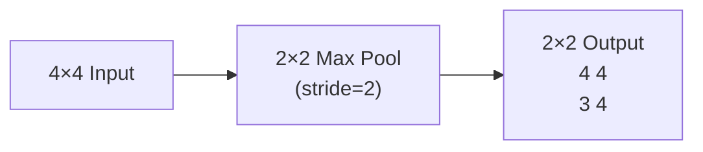

#### **2. Average Pooling**

```
Same input 4×4:

2×2 Average Pooling:
Top-left: (1+3+2+4)/4 = 2.5
Top-right: (2+4+1+3)/4 = 2.5
Bottom-left: (3+1+1+2)/4 = 1.75
Bottom-right: (4+2+3+1)/4 = 2.5

Output 2×2:
2.5 2.5
1.75 2.5
```

- Takes average of each region
- Smoother than Max Pooling
- Less common in modern CNNs

#### **3. Global Pooling**

```
Global Max Pooling:
Takes MAX of the ENTIRE feature map → 1 number per filter

Global Average Pooling:
Takes AVERAGE of ENTIRE feature map → 1 number per filter

Used at end of CNN before FC layers — replaces large FC layers!
```

---

### 📊 Comparison

| Type | Operation | Output | Common? |
|---|---|---|---|
| **Max Pooling** | Maximum | Strongest value | ⭐⭐⭐ Most common |
| **Average Pooling** | Average | Mean value | ⭐⭐ Sometimes |
| **Global Max/Avg** | Max/Avg of entire map | Single number | ⭐⭐ At end |

---

### 🎯 Summary for Exam Answer

**To get full 6 marks:**
1. **Definition (1 mark):** Pooling reduces spatial dimensions while keeping important features.
2. **Purpose (1 mark):** Reduce computation, prevent overfitting, provide spatial invariance.
3. **Max Pooling (2 marks):** Explain with 4×4 → 2×2 example. Most common.
4. **Average Pooling (1.5 marks):** Explain with same example. Less common.
5. **Global Pooling (0.5 mark):** Explain briefly — used at end of CNN.

---

### 📚 Theoretical Deep Dive — Pooling Layers

**The Mathematical and Information-Theoretic Role of Pooling:**

Pooling layers perform a non-linear, non-learnable downsampling operation that reduces spatial dimensions while keeping the depth (number of feature maps) unchanged. The primary theoretical justifications for pooling are rooted in three principles:
1. **Translation Invariance (approximate):** Max pooling with stride equal to pool size ensures a feature detected at one position will still be detected if it shifts slightly, as long as it remains within the pooling window. This creates built-in tolerance to small translations — a form of data augmentation at the architecture level.
2. **Dimensionality Reduction:** Pooling reduces computation in subsequent layers by a factor of `pool_size²`. From an information-theoretic perspective, pooling implements **lossy compression**: it retains the maximum activation (most salient signal) within a region and discards precise positional information.
3. **Prevention of Overfitting:** By reducing activations, pooling acts as a regularizer, reducing the model's VC dimension and variance in the bias-variance tradeoff.

**Maximum Pooling vs. Average Pooling: A Theoretical Comparison:**

Max pooling computes `y = max{x₁, ..., x_n}`, sensitive to the most prominent feature and robust to noise, with sparse gradient flow (only the winning neuron receives gradient). Average pooling computes the mean, distributing gradient equally for smoother optimization and preserving spatial average statistics. **Global Average Pooling (GAP)** (Lin et al., 2013) produces one scalar per channel with zero parameters, inherently spatially invariant, acting as a structural regularizer. Architectures like ResNet and Inception use GAP before the final classification layer to reduce overfitting while preserving channel-wise semantic information.

**Spatial Pyramid Pooling (SPP) and Variable Input Sizes:**

Traditional CNNs require fixed-size inputs because FC layers demand fixed-length vectors. The **SPP** layer (He et al., 2014) addresses this by pooling at multiple scales: 1×1, 2×2, 4×4 bins, producing `Σ n_l = 21` fixed outputs. This enables arbitrary input sizes critical for object detection. Subsequent **RoI Pooling** in Fast R-CNN and **RoI Align** in Mask R-CNN extend this principle, forming the backbone of modern detection pipelines.

**Theoretical Concerns and Modern Alternatives:**

Despite their ubiquity, pooling faces criticism: (1) it discards information irreversibly; (2) undefined gradients for non-maximum elements; (3) it destroys fine spatial correspondence needed for localization. Springenberg et al. (2014) showed that replacing pooling with strided convolutions achieves comparable or better performance. Modern architectures like All-Convolutional Networks, ResNet (stride-2 conv replacing pooling), and Vision Transformers (patch embedding replacing pooling) reflect this trend. Strided convolutions are theoretically preferable because they retain learnable parameters during downsampling, allowing the network to learn optimal spatial aggregation.

---

# UNIT II — Recurrent Neural Networks (RNN)

---

## Q.3 (a) — Explain **Recursive Neural Network**. **[6 Marks]**

### 🌳 What is a Recursive Neural Network? — "Tree Thinker"

A **Recursive Neural Network** processes **hierarchical, tree-structured data** by combining child nodes into parent nodes recursively, from the bottom up.

> **Think of it like building with blocks:** You start with small blocks at the bottom (words), combine them into bigger blocks (phrases), then combine phrases into sentences. Each combination uses the same "combining function" — that's recursive!

---

### 🏗️ Structure — Tree Form

```
Sentence: "The movie was not good"

Parse Tree:
┌─────────────┐
│ was not good │ ← ROOT (full meaning)
└──────┬──────┘
│
┌────────┴────────┐
│                │
┌─────────┐  ┌─────────┐
│ not good │  │ was     │
└────┬────┘  └─────────┘
│
┌──────┴──────┐
│            │
┌───────┐  ┌───────┐
│ not   │  │ good  │
└───────┘  └───────┘

Processing: Bottom-up
Step 1: "not" + "good" → "not good"
Step 2: "was" + "not good" → "was not good"
```

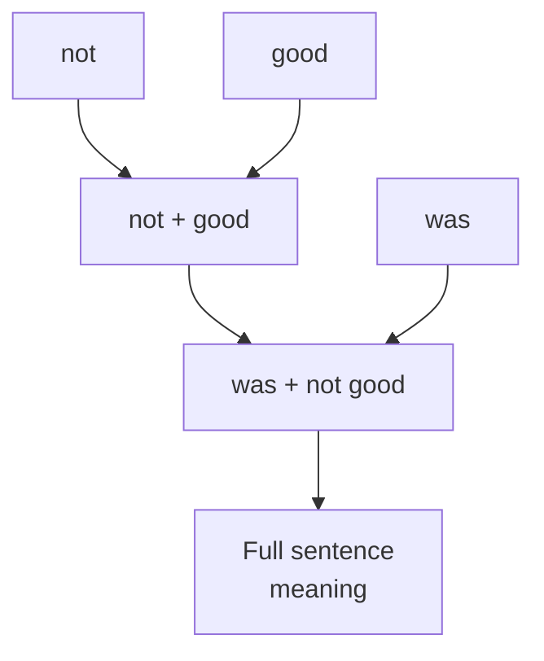

---

### 🔄 How Recursive NN Works

```
Step 1: Start with leaf nodes (words)
Each word → vector representation (embedding)

Step 2: Combine pairs of children using SAME function
"not" + "good" → combine → "not good" vector
(Same combining function used everywhere — weight sharing!)

Step 3: Continue combining up the tree
"was" + "not good" → combine → "was not good" vector

Step 4: ROOT node = representation of entire sentence
Use root vector for classification
```

---

### 📊 Recursive NN vs Recurrent NN

| Feature | Recursive NN | Recurrent NN (RNN) |
|---|---|---|
| **Structure** | Tree (parent + children) | Chain (linear sequence) |
| **Data Type** | Hierarchical/Tree | Sequential/Time |
| **Combining** | Children → Parent | Previous → Current |
| **Order** | Bottom-up (tree) | Left-to-right (time) |
| **Example** | Sentence parse trees | Sentences, videos |
| **Weight Sharing** | Across all tree nodes | Across all time steps |

---

### 🎯 Summary for Exam Answer

**To get full 6 marks:**
1. **Definition (1 mark):** Recursive NN processes tree-structured data by recursively combining child nodes into parents.
2. **Structure (2 marks):** Draw a parse tree example (e.g., "not good" → "was not good"). Explain bottom-up processing.
3. **How it works (2 marks):** Start with word embeddings, combine using same function, propagate up to root.
4. **Difference from RNN (1 mark):** Recursive = tree structure, RNN = linear chain.

---

### 📚 Theoretical Deep Dive — Recursive Neural Networks

**Historical Context and the Compositionality Principle:**

Recursive Neural Networks trace their origins to two converging threads in cognitive science and linguistics. The first is **Fodor and Pylyshyn's (1988) critique of connectionism**, which argued that neural networks lacked the systematicity and compositionality required for human-like language understanding. Their key insight was that human language understanding is compositional: understanding "John loves Mary" requires understanding the constituent parts and how they combine — this same machinery enables understanding "Mary loves John." The second thread is Chomsky's **transformational grammar** (1950s-1960s), which proposed that sentences have hierarchical tree structures. The Recursive Neural Network was proposed by **Socher et al. (2011)** as a model that bridges these concerns: it processes a syntactic parse tree and computes a distributed representation for each node, with the parent node's representation being a differentiable function of its children's representations — embodying the compositionality principle mathematically.

**Mathematical Formulation of the Recursive Combination Function:**

Formally, a Recursive NN defines a **composition function** `f` that takes two child vector representations and produces a parent vector representation. Given a binary parse tree where each internal node has exactly two children, the standard formulation is:

`c_p = f(c_L, c_R) = tanh(W_L · c_L + W_R · c_R + b)`

Here, `c_L` and `c_R` are the d-dimensional vector representations of the left and right child nodes, `W_L` and `W_R` are **d × d weight matrices**, `b` is a d-dimensional bias vector, and `c_p` is the resulting parent vector. The weight matrices are shared across all internal nodes of the tree — this is the **parameter sharing** that makes learning tractable, analogous to weight sharing in CNNs and RNNs. From a category theory perspective, this composition function `f` is a **bifunctor**: it takes two objects (vector representations) and produces a new object, respecting the hierarchical structure. This is why Recursive NNs are sometimes analyzed using **tensor networks** and **holographic reduced representations**, where composition is implemented as circular convolution of vector representations.

**Recursive NN vs. Recurrent NN — A Theoretical Distinction:**

The fundamental difference lies in the structure of the computation graph. A Recurrent NN processes a **linear chain** (sequence) where the computation at each step `t` depends on step `t-1`. A Recursive NN processes a **tree-structured graph** where a node's representation depends on its children. For a sentence of length `n`, a left-branching parse tree has depth `n`, while a balanced binary tree has depth `log₂(n)` — a difference with profound implications for gradient flow. In a RNN, gradients must be backpropagated through a chain of length `n`, leading to vanishing/exploding gradient problems. In a Recursive NN with a balanced parse tree, the representation at the root is computed through `O(log n)` compositions, meaning gradients flow through only `O(log n)` non-linearities. This logarithmic depth is a key theoretical advantage for capturing long-range dependencies in hierarchical structures.

**The Tree-LSTM Extension and Gated Hierarchical Memory:**

Standard Recursive NNs face a challenge analogous to the vanishing gradient problem in RNNs: in deep trees, gradients from the root node must backpropagate through many non-linear `tanh` gates, potentially vanishing before reaching the leaves. **Tai et al. (2015)** proposed the **Tree-LSTM**, a generalization of the LSTM architecture to tree structures. In a Tree-LSTM, each node maintains a memory cell `c` and hidden state `h`, with gates that control information flow from each child independently. The key innovation is the **multiple forget gates**: there is a separate forget gate `f_{t,l}` for each child `l`, allowing the node to selectively forget or retain information from each child independently. The Tree-LSTM equations are:

`i_t = σ(W_i · x_t + Σ_{l∈children} U_{li} · h_l + b_i)` (Input gate)
`f_{t,l} = σ(W_f · x_t + U_{fl} · h_l + b_f)` (Forget gate for child l)
`o_t = σ(W_o · x_t + Σ U_{lo} · h_l + b_o)` (Output gate)
`c_t = i_t · ŷc_t + Σ f_{t,l} · c_l`
`ŷc_t = tanh(W_c · x_t + Σ U_{lc} · h_l + b_c)` (Candidate)
`h_t = o_t · tanh(c_t)`

The multiple forget gates implement selective memory, essential for compositional semantics. The Tree-LSTM achieves state-of-the-art results on sentiment analysis tasks (SST, SICK).

**Applications Beyond Natural Language:**

Recursive NNs are applied to any domain with hierarchical structure. In computer vision, **Socher et al. (2014)** proposed using Recursive NNs with region-based hierarchical image representations in their **MV-RNN**. Instead of a parse tree, the image is segmented into regions and a parse tree over regions is constructed based on spatial overlap. The composition function is generalized to accept matrix representations, capturing geometric relationships. For knowledge graphs, Recursive NNs are used in **recursive entity embedding** where entities are organized in the WordNet hierarchy, enabling **zero-shot learning**: if the network knows "dog" and "cat" are mammals, it can generalize to novel categories.

**Training Dynamics and Optimization Challenges:**

Training Recursive NNs requires **Backpropagation through Structure (BtS)**, which differs from standard BPTT because different examples have different tree structures. This means: (1) variable-length computation paths; (2) gradient flow in deep trees can vanish before reaching leaves; (3) batch computation is harder than with RNNs. To mitigate, practitioners use gradient clipping, skip connections, pre-trained word embeddings (reducing gradient burden), and tree batching (padding trees with dummy nodes).

---

## Q.3 (b) — Explain the **LSTM in RNN**. **[6 Marks]**

### 🧠 What is LSTM? — "Long Memory" for RNNs

**LSTM** (Long Short-Term Memory) solves the **vanishing gradient problem** in regular RNNs. While regular RNNs forget after ~10 steps, LSTM can remember **100+ steps** back.

> **Analogy:** Regular RNN = goldfish (3-second memory). LSTM = human (can remember yesterday, last week, last year).

---

### 🚨 The Problem: Vanishing Gradient

```
Regular RNN forgetting:
Step 1: See "I" → remember
Step 2: See "love" → remember
Step 3: See "pizza" → remember
Step 10: Need to predict → FORGOT about pizza! ❌

Why? Gradient gets multiplied many times → becomes ≈ 0 → no learning
```

---

### 🏗️ LSTM Cell Architecture — 3 Gates

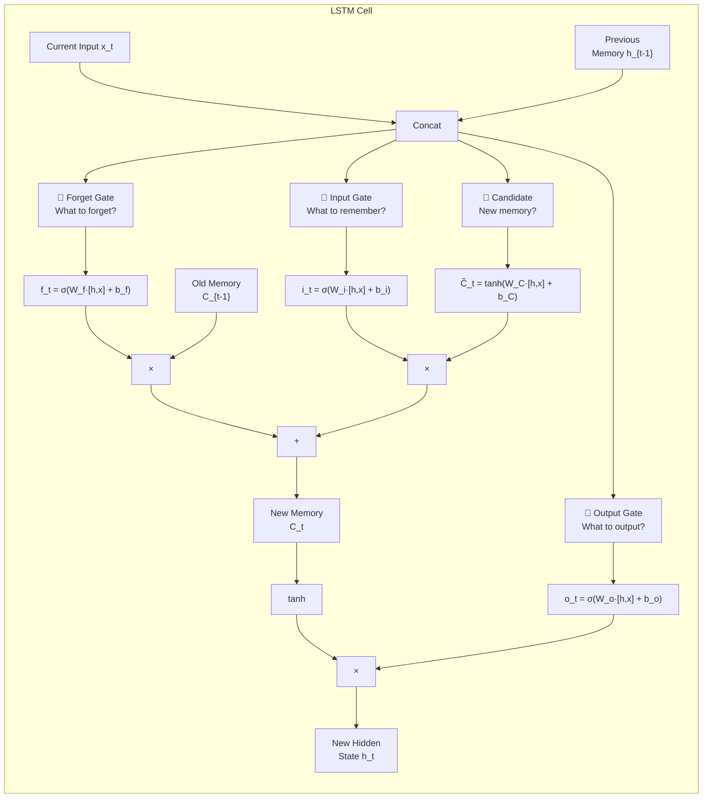

---

### 🚪 The Three Gates Explained

#### **1. Forget Gate — "What to delete from memory?"**
```
f_t = σ(W_f × [h_{t-1}, x_t] + b_f)
Output: 0 (forget completely) to 1 (remember completely)

Example with sentence "The cat sat on the mat. It was sunny."
At "sunny": forget gate might:
- FORGET "cat" (0.1 — barely relevant)
- KEEP "mat" (0.8 — still relevant)
```

#### **2. Input Gate — "What new info to store?"**
```
i_t = σ(W_i × [h_{t-1}, x_t] + b_i)
C̃_t = tanh(W_C × [h_{t-1}, x_t] + b_C)

Decides which parts of new candidate memory to KEEP or DISCARD
```

#### **3. Output Gate — "What to output now?"**
```
o_t = σ(W_o × [h_{t-1}, x_t] + b_o)
h_t = o_t × tanh(C_t)

Filters memory to output only RELEVANT parts
```

---

### 📊 LSTM vs Regular RNN

| Feature | Regular RNN | LSTM |
|---|---|---|
| **Memory** | Short (forgets ~10 steps) | Long (remembers 100+ steps) |
| **Gates** | ❌ None | ✅ 3 gates |
| **Vanishing Gradient** | ❌ Big problem | ✅ Solved |
| **Training Speed** | Fast | Slower (more params) |
| **Accuracy** | Lower | Higher |

---

### 🎯 Summary for Exam Answer

**To get full 6 marks:**
1. **Definition (1 mark):** LSTM is advanced RNN with gates controlling memory flow, solves vanishing gradient.
2. **Problem solved (1 mark):** Explain vanishing gradient — regular RNN forgets long-term info.
3. **Three Gates (3 marks):** Explain each gate with formula:
   - Forget Gate: what to delete (σ activation)
   - Input Gate: what new info to store
   - Output Gate: what to output now
4. **Diagram (1 mark):** Draw LSTM cell showing 3 gates and memory flow.

---

### 📚 Theoretical Deep Dive — LSTM in RNN

**Historical Context: Solving the Vanishing Gradient Problem:**

The vanishing gradient problem was recognized as a fundamental limitation of recurrent neural networks from their inception. In a seminal 1991 paper, Sepp Hochreiter analyzed the dynamics of RNN training and showed theoretically that in the standard sigmoid/tanh activation regime, gradients must pass through the same weight matrix `W_hh` at each time step, meaning that the gradient at time step `t` with respect to the initial state involves a term proportional to `(W_hh)^t`. If the largest eigenvalue of `W_hh` is less than 1, the gradient vanishes exponentially; if greater than 1, it explodes. For sequences of length 100+, this makes learning long-range dependencies practically impossible. The LSTM, introduced by Hochreiter and Schmidhuber in 1997, was specifically designed to overcome this limitation. The key insight was to introduce an explicit **memory cell** `C` that is additive (not multiplicative), allowing gradients to flow unchanged through the cell — a pattern called **constant error carousel**. The forget gate, input gate, and output gate modulate what enters, stays, and exits the cell, providing the necessary non-linearity for learning while preserving the additive gradient path.

**Mathematical Derivation of LSTM Gradients — The Constant Error Carousel:**

The LSTM cell equations are:

`f_t = σ(W_f · [h_{t-1}, x_t] + b_f)` (Forget gate)
`i_t = σ(W_i · [h_{t-1}, x_t] + b_i)` (Input gate)
`C̃_t = tanh(W_C · [h_{t-1}, x_t] + b_C)` (Candidate)
`C_t = f_t ⊙ C_{t-1} + i_t ⊙ C̃_t` (Cell update)
`o_t = σ(W_o · [h_{t-1}, x_t] + b_o)` (Output gate)
`h_t = o_t ⊙ tanh(C_t)`

The critical term is `C_t = f_t ⊙ C_{t-1} + i_t ⊙ C̃_t`. Notice the additive update: the new cell value is a linear combination of the old cell value and a new candidate. During backpropagation, the gradient of the loss `L` with respect to `C_{t-1}` is:

`∂L/∂C_{t-1} = ∂L/∂C_t · f_t + (terms not involving C_{t-1})`

The term `∂L/∂C_t · f_t` shows that the gradient flows through the forget gate `f_t`. If the forget gate output is close to 1, the gradient passes through almost unchanged, regardless of how many time steps separate `C_t` from `C_{t-1}`. This is the **constant error carousel**: the gradient can travel unchanged through time, bypassing the vanishing gradient problem that plagues standard RNNs where `h_t = tanh(W_hh · h_{t-1} + ...)` creates a multiplicative chain `∂L/∂h_0 = (∂L/∂h_t) · Π ∂h_i/∂h_{i-1}` that decays or grows exponentially.

**The Gating Mechanism and Its Variants:**

The original LSTM uses three gates and a separate cell state. Several variants have emerged with different tradeoffs:
- **Peephole LSTM** (Gers and Schmidhuber, 2001): Adds connections from the cell state `C_{t-1}` to the gates themselves.
- **Coupled Input-Forget Gate** (Gers et al., 1999): Removes the separate input gate, setting `i_t = 1 - f_t`.
- **GRU (Gated Recurrent Unit)** (Cho et al., 2014): Simplifies LSTM by merging the cell state and hidden state into a single `h_t`, using an update gate `z_t` and reset gate `r_t` instead of three gates. GRU is computationally cheaper (fewer parameters) and trains faster, while LSTM tends to perform better on longer sequences.

**Comparison with Other Sequence Models:**

The LSTM should be understood within the broader context of sequence modeling architectures. Before LSTMs, Hidden Markov Models (HMMs) were the standard, but they required emission probabilities and could not represent long-range context. LSTMs extended RNNs with memory cells, enabling long-range learning. More recently, the **Transformer** architecture (Vaswani et al., 2017) has largely replaced LSTMs in NLP tasks by using self-attention instead of recurrence. However, LSTMs remain competitive for low-resource settings, streaming applications (where new data arrives continuously), and tasks where sequential order is critical. The theoretical advantage of LSTMs over Transformers in these settings is that the LSTM's memory is naturally bounded (by the hidden state dimension), while attention over long sequences requires O(n²) memory.

---

## Q.3 (c) — Explain in brief about **working of RNN**. **[5 Marks]**

### 🔄 How RNN Works — The Looping Memory

RNN processes sequential data using a **hidden state** that carries information from previous steps.

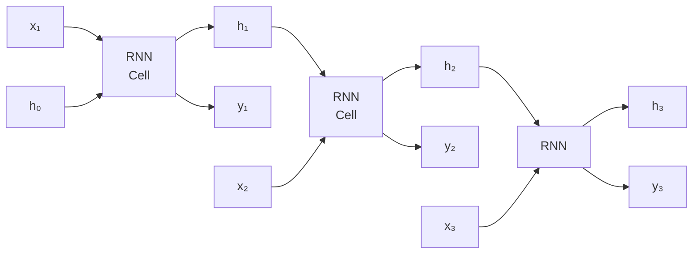

---

### 📐 The Math (Simple Version)

```
At each time step t:
h_t = tanh(W_hh × h_{t-1} + W_xh × x_t + b_h)
y_t = W_hy × h_t + b_y

In simple words:
New memory = f(Previous memory, Current input)
Output = g(Current memory)
```

---

### 📖 Example: Reading "I love pizza"

```
Step 1: x₁ = "I" → h₁ = memory("I")
Step 2: x₂ = "love" → h₂ = memory("I love")
Step 3: x₃ = "pizza" → h₃ = memory("I love pizza")

If asked "What does 'It' refer to?"
h₃ remembers "pizza" → "It" = pizza! ✅
```

---

### 🎯 Summary for Exam Answer

**To get full 5 marks:**
1. **Loop mechanism (2 marks):** Explain hidden state carries memory forward. Same cell at each step.
2. **Formula (1 mark):** h_t = f(h_{t-1}, x_t), y_t = g(h_t)
3. **Example (2 marks):** Sentence example showing memory building up and being used.

---

### 📚 Theoretical Deep Dive — Working of RNN

**Mathematical Foundation of Recurrent Dynamics:**

The core mathematical operation of a Recurrent Neural Network is a recurrence relation — a discrete-time dynamical system that evolves a hidden state `h_t` over time. Formally, the RNN is defined by:

`h_t = f(h_{t-1}, x_t; θ) = σ(W_hh · h_{t-1} + W_xh · x_t + b_h)`
`y_t = g(h_t; θ') = W_hy · h_t + b_y`

Here, `θ = {W_hh, W_xh, b_h}` are the recurrent parameters shared across all time steps, and `σ` is typically `tanh` or `ReLU`. This recurrence relation is the temporal analog of the iterative map in dynamical systems theory. The RNN can be viewed as a **state-space model** where:
- The state is `h_t` (the hidden state)
- The input is `x_t` (current observation)
- The output is `y_t` (prediction)
- The dynamics are governed by `W_hh` (recurrent weight matrix)

This formulation connects RNNs to classical control theory and Kalman filtering, where the goal is to estimate a hidden state from noisy sequential observations.

**The Universal Approximation Property of Recurrent Networks:**

A foundational theoretical result by **Siegelmann and Sontag (1992)** proved that Recurrent Neural Networks with a finite number of units, ReLU or sigmoid activations, and rational weights are **Turing-complete**: they can simulate any Turing machine given appropriate parameters. This means that, in theory, an RNN with sufficient hidden units can implement any computable sequential algorithm. The proof constructs an RNN that simulates the tape and state transitions of a Turing machine by using the hidden state to encode the tape contents and head position. This result is significant because it establishes that RNNs have sufficient representational capacity to implement any sequential computation, in principle. However, the practical challenge is that the optimization landscape of RNNs is extremely difficult — finding the right parameters through gradient descent is not guaranteed, which is why LSTMs and GRUs are necessary even though standard RNNs are theoretically universal.

**Backpropagation Through Time (BPTT):**

Training RNNs requires **Backpropagation Through Time**, an application of the chain rule of calculus to the unfolded computation graph. Conceptually, the RNN is "unrolled" through time: the same cell at each time step is expanded into separate copies, forming a deep feedforward network with shared weights. BPTT computes the gradient of the loss `L` with respect to each weight by propagating errors backward through this unrolled network:

`∂L/∂W_hh = Σ_t ∂L_t/∂W_hh`

The key challenge is that for a sequence of length `T`, BPTT requires O(T) memory and O(T) time for the backward pass. For long sequences, this is computationally infeasible, which is why **truncated BPTT** is used in practice: gradients are only backpropagated through the last `k` time steps, trading theoretical correctness for computational tractability.

**The Unfolding Perspective and Its Implications:**

The "unfolding" of an RNN through time provides a useful theoretical framework. From this perspective:
- An RNN with `T` time steps is equivalent to a feedforward network with `T` layers.
- The weight sharing across time steps is analogous to weight sharing across space in a CNN.
- The depth of the unrolled network is `T`, explaining why long sequences are difficult to train.
- This perspective explains why RNNs can process arbitrary-length sequences: the same set of parameters handles any sequence length.

This unfolding perspective was crucial in the development of **sequence-to-sequence models** and the encoder-decoder architecture: the encoder unrolls the input sequence into a fixed context vector, and the decoder unrolls from that context to produce the output sequence.

**Residual Connections and Highway Networks:**

A theoretical innovation borrowed from computer vision is the use of **highway connections** or **dense connections** in RNNs. In a standard RNN, `h_t = tanh(W_hh · h_{t-1} + W_xh · x_t)`. In a highway RNN (or with residual connections):

`h_t = h_{t-1} + tanh(W_hh · h_{t-1} + W_xh · x_t)`

This additive identity connection ensures that the gradient `∂L/∂h_{t-1}` includes the term `∂L/∂h_t · 1`, providing a direct gradient path much like the constant error carousel in LSTMs. This simple modification dramatically improves training stability for deep recurrent networks. The theoretical benefit mirrors that of residual networks in CNNs: the optimization problem becomes easier because the network can learn residual corrections to an identity mapping rather than learning the entire mapping from scratch.

---

# UNIT III — Generative Models & GAN

---

## Q.5 (a) — Explain **Deep Generative Model**. **[6 Marks]**

### 🧠 Deep Generative Models — "Models That Create"

**Deep Generative Models** learn the **probability distribution P(x)** of training data and can **generate new samples** that look like the training data.

> **Analogy:** You study 1000 pizza photos and learn the "pizza pattern." Then you create a NEW pizza that looks like a real one but never existed before. That's what a generative model does!

---

### 📦 How They Work

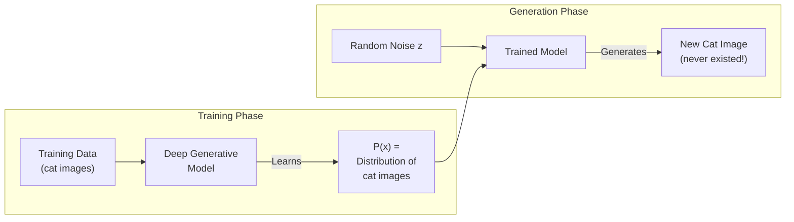

---

### 📋 Types of Deep Generative Models

| Model | How It Works | Key Feature |
|---|---|---|
| **GAN** | Generator vs Discriminator compete | High-quality images |
| **VAE** | Encoder + Decoder, latent space | Smooth interpolation |
| **DBN** | Stacked RBMs | Stable pretraining |
| **Autoregressive** | Predict pixels one by one | Exact likelihood |
| **Diffusion** | Gradually denoise | Latest, best quality |

---

### 📐 What They Learn

```
Goal: Learn P(x) = probability distribution of data x

Once learned:
1. Generate: x_new ~ P(x) (sample from distribution)
2. Calculate likelihood: P(x) = how probable is this data?
3. Complete: Fill in missing parts of partial input
```

---

### 🎯 Summary for Exam Answer

**To get full 6 marks:**
1. **Definition (1 mark):** Deep generative models learn data distribution P(x) and generate new samples.
2. **How they work (2 marks):** Training phase — learn P(x) from data. Generation phase — sample from P(x) to create new data. Use pizza/art analogy.
3. **Types (2 marks):** Explain 3-4 types: GAN (adversarial), VAE (encoder-decoder), DBN (stacked RBMs), Diffusion (denoising).
4. **Applications (1 mark):** Image generation, data augmentation, anomaly detection.

---

### 📚 Theoretical Deep Dive — Deep Generative Models

**Foundational Theory: Probability Distributions and the Density Estimation Problem:**

At the heart of every generative model is the problem of **density estimation** — learning an unknown probability distribution `P_data(x)` from which observed data samples `x^(1), ..., x^(N)` are drawn. Formally, the goal is to find a parametric model `P_θ(x)` that approximates the true data distribution `P_data(x)` by minimizing a divergence measure between them. The two dominant frameworks are **Maximum Likelihood Estimation (MLE)**, which minimizes the Kullback-Leibler (KL) divergence `KL(P_data || P_θ)`, and **adversarial training** (as in GANs), which minimizes the Jensen-Shannon divergence. Under the MLE framework, the objective is:

`θ* = argmax_θ Σ_i log P_θ(x^(i))`

This is equivalent to minimizing the negative log-likelihood. The key theoretical challenge is that `P_θ(x)` must be **normalized** (integrates to 1) and **differentiable** with respect to `θ` for gradient-based training. Different generative model families address this in different ways: autoregressive models factorize `P(x) = Π_t P(x_t | x_<t)` and compute exact likelihoods; VAEs use approximate inference with a variational lower bound; GANs bypass explicit density estimation entirely by learning to sample from the distribution.

**The Latent Variable Framework and the Evidence Lower Bound (ELBO):**

Many generative models introduce **latent variables** `z` to capture the underlying factors of variation. The generative process is modeled as `P(x) = ∫ P(x|z) P(z) dz`, where `P(z)` is a simple prior (typically standard normal `N(0, I)`) and `P(x|z)` is a conditional distribution parameterized by a neural network (the decoder). The challenge is that the integral over `z` is intractable. The VAE solves this by introducing an **approximate posterior** `Q_φ(z|x)` (the encoder) and maximizing the **Evidence Lower Bound (ELBO)**:

`log P(x) ≥ E_{Q_φ(z|x)}[log P(x|z)] - KL(Q_φ(z|x) || P(z))`

The first term encourages the decoder to reconstruct the input; the second term regularizes the encoder's distribution toward the prior. This connects variational inference (Bayesian statistics) with deep learning, enabling principled probabilistic modeling with neural networks. The reparameterization trick `z = μ_φ(x) + σ_φ(x) ⊙ ε, ε ~ N(0, I)` enables gradient flow through the sampling operation.

**The GAN Formulation and Its Theoretical Foundation:**

Generative Adversarial Networks, introduced by Goodfellow et al. (2014), frame generative modeling as a two-player game. The generator `G_θ` maps a simple prior `p_z(z)` to the data space, producing samples `x = G_θ(z)`. The discriminator `D_φ` is a binary classifier that outputs the probability `D_φ(x) ∈ [0,1]` that `x` is real. The training objective is a minimax game:

`min_θ max_φ V(D, G) = E_{x~p_data}[log D(x)] + E_{z~p_z}[log(1 - D(G_θ(z)))]`

At the global optimum, `p_G = p_data` and `D_G(x) = 0.5` for all `x`. The adversarial approach avoids the mode collapse problem that can afflict Maximum Likelihood models and generates sharper samples than VAEs.

**Autoregressive Models and Exact Likelihood Training:**

Autoregressive models decompose the joint distribution `P(x)` into a product of conditional distributions along some ordering:

`P(x) = Π_{t=1}^T P(x_t | x_1, ..., x_{t-1})`

This factorization (applied to pixels in PixelCNN/PixelRNN or tokens in GPT-series) guarantees a valid normalized probability distribution and enables exact likelihood computation. The theoretical advantage is no approximation gap, unlike VAEs. However, the autoregressive constraint makes sequential generation slow and difficult to parallelize.

**Diffusion Models: A Modern Synthesis:**

Diffusion models represent a recent paradigm inspired by non-equilibrium thermodynamics. The forward process gradually adds Gaussian noise to the data over `T` steps, transforming the data distribution into a simple prior (standard normal). The backward process learns to reverse this noising. Diffusion models have achieved state-of-the-art results on ImageNet generation, surpassing GANs in diversity and VAE-like models in quality. The theoretical advantages include: (1) stable training without adversarial objectives; (2) mathematical tractability via the evidence lower bound; (3) the ability to trade off speed and quality by varying the number of denoising steps; (4) natural support for conditional generation via classifier-free guidance.

---

## Q.5 (b) — Explain **Boltzmann Machine** in details. **[6 Marks]**

### ❄️ Boltzmann Machine — Energy-Based Learning

A **Boltzmann Machine** is a generative neural network based on **energy** concepts from physics. It learns data patterns by finding low-energy states.

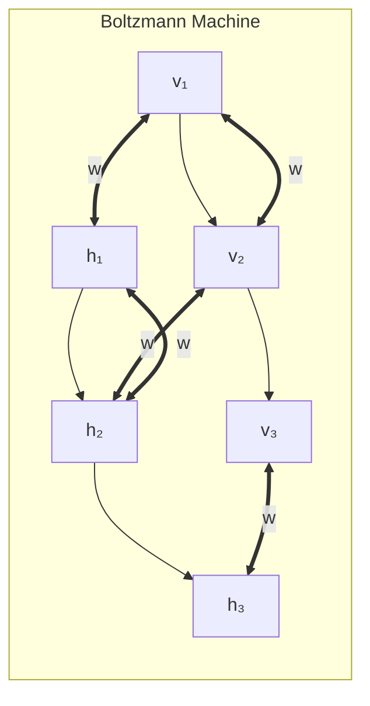

---

### ⚡ Energy Function

```
E(v,h) = -Σ a_i·v_i - Σ b_j·h_j - ΣΣ w_ij·v_i·h_j

Low energy = Likely (real data pattern)
High energy = Unlikely (not a real pattern)
```

---

### 🔄 Learning Process — Two Phases

| Phase | Name | Process |
|---|---|---|
| **Positive Phase** | Learning from data | Clamp visible units to training data, let hidden units settle, record statistics |
| **Negative Phase** | Reconstruction/Dreaming | Disconnect from data, let network run freely, record statistics |

**Update Rule:**
```
Δw = learning_rate × (p_positive - p_negative)
Increase weight if units co-occur more in data than in dreams
```

---

### 🔒 Restricted Boltzmann Machine (RBM)

A full BM has ALL connections (visible-visible and hidden-hidden) → very slow to train.

RBM removes intra-layer connections:
- ❌ No visible-to-visible connections
- ❌ No hidden-to-hidden connections
- ✅ Only visible-to-hidden connections

→ Much faster to train using **Contrastive Divergence**

---

### 🎯 Summary for Exam Answer

**To get full 6 marks:**
1. **Definition + Structure (1.5 marks):** Define BM as energy-based generative model. Draw diagram showing visible and hidden units with connections.
2. **Energy Function (1 mark):** Explain — low energy = likely state, high energy = unlikely. Write formula.
3. **Learning Process (2 marks):** Explain positive phase (learn from data) and negative phase (dream/reconstruct). Update rule.
4. **RBM (1.5 marks):** Explain RBM — no intra-layer connections, only visible-to-hidden. Faster training with Contrastive Divergence.

---

### 📚 Theoretical Deep Dive — Boltzmann Machine

**Physical Origins and the Ising Model Connection:**

The Boltzmann Machine draws its name and mathematical formalism directly from statistical mechanics, specifically the **Ising model** of ferromagnetism. In the Ising model, each lattice site has a spin variable `s_i ∈ {−1, +1}`, and the energy of a configuration is `E(s) = -Σ_i h_i s_i - Σ_{i<j} J_{ij} s_i s_j`. At thermal equilibrium, the probability of a configuration is given by the **Boltzmann distribution**: `p(s) = (1/Z) exp(-E(s)/kT)`. The Boltzmann Machine was introduced by Ackley, Hinton, and Sejnowski (1985) as a stochastic neural network that obeys the same distribution: units are binary, the energy function is `E(v,h) = -Σ a_i v_i - Σ b_j h_j - ΣΣ w_{ij} v_i h_j`, and the probability of a state is `p(v,h) = exp(-E(v,h)) / Z`. The goal of learning is to adjust the weights so that the distribution `p(v,h)` matches the data distribution `p_data(v) = Σ_h p(v,h)`.

**The Energy-Based Model Framework:**

Boltzmann Machines are the prototypical example of **Energy-Based Models (EBMs)**. In the EBM framework, we define an energy function `E_θ(x)` parameterized by `θ` such that low-energy states correspond to high-probability regions of the data distribution:

`P_θ(x) = exp(-E_θ(x)) / Z(θ)`
`Z(θ) = Σ_x exp(-E_θ(x))`

The **partition function** `Z(θ)` is the central computational challenge: it requires summing over all possible configurations, which for `n` binary units means `2^n` terms — completely intractable even for moderate `n`.

**Markov Chain Monte Carlo and Contrastive Divergence:**

Training a Boltzmann Machine requires computing expectations under the model distribution `P(v,h)`. These expectations are estimated using **Markov Chain Monte Carlo (MCMC)**, specifically **Gibbs sampling**: starting from an initial state, iteratively sample each unit from its conditional distribution given all other units. For a full BM, the Markov chain must mix over all units, requiring many Gibbs steps per iteration. **Contrastive Divergence (CD-k)**, introduced by Hinton (2002), approximates the model distribution by running Gibbs sampling for only `k` steps (typically `k=1`). The CD-k weight update is:

`Δw_{ij} = ε · (⟨v_i h_j⟩_data - ⟨v_i h_j⟩_CD-k)`

**Restricted Boltzmann Machine — Tractable Computation:**

The **Restricted Boltzmann Machine (RBM)** removes connections within the same layer (no visible-visible or hidden-hidden connections), resulting in a bipartite graph. This restriction makes the hidden units conditionally independent given the visible units:

`p(h | v) = Π_j p(h_j | v)`
`p(v | h) = Π_i p(v_i | h)`

This conditional independence allows closed-form Gibbs sampling: sample all hidden units in parallel from `p(h_j=1|v) = σ(b_j + Σ_i w_{ij} v_i)`, then sample all visible units in parallel from `p(v_i=1|h) = σ(a_i + Σ_j w_{ij} h_j)`.

**Deep Belief Networks and Layerwise Pretraining:**

The historical significance of RBMs lies in their role in **Deep Belief Networks (DBNs)** (Hinton et al., 2006). A DBN is formed by stacking multiple RBMs, where the hidden activations of one RBM serve as the visible inputs to the next. The training proceeds **layerwise**: train first RBM on data, encode data through first RBM to get `h^(1)`, train second RBM on `h^(1)` as "visible" data, and repeat. After pretraining, the entire network is fine-tuned using backpropagation. This layerwise pretraining was crucial for training deep networks before the advent of ReLU activations, batch normalization, and residual connections.

**Probabilistic Interpretation and Free Energy:**

The **free energy** of an RBM is a scalar function of the visible units: `F(v) = -Σ_i a_i v_i - Σ_j log(1 + exp(b_j + Σ_i w_{ij} v_i))`. The partition function can be expressed as `Z = Σ_v exp(-F(v))`, making `p(v) = exp(-F(v)) / Z`. The free energy provides a bridge to **restricted Boltzmann machines for collaborative filtering** (e.g., in the Netflix Prize competition), where the free energy of a user-movie configuration predicts the user's rating for unseen movies.

---

## Q.5 (c) — Explain in brief **GAN** with an example. **[6 Marks]**

### ⚔️ GAN — The Counterfeit Money Game

**GAN** (Generative Adversarial Network) has two neural networks competing:

1. **Generator (G):** Creates fake data (counterfeiter)
2. **Discriminator (D):** Tries to tell real from fake (detective)

> **Analogy:** A counterfeiter keeps making better fake money. A detective keeps getting better at spotting fakes. They both improve together!

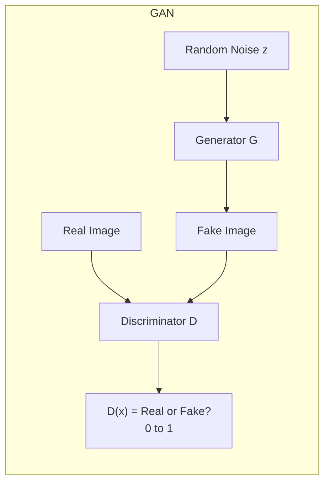

---

### 🎮 The Minimax Game

```
Generator wants: D(fake) = 1 (fool the discriminator)
Discriminator wants: D(real) = 1, D(fake) = 0

They compete and both improve!

Loss Functions:
Generator loss: -log(D(G(z))) → minimize this
Discriminator loss: -[log(D(x)) + log(1-D(G(z)))] → minimize this
```

---

### 🐱 Example: Generating Cat Images

```
Iteration 1: Generator makes noise → D(fake) = 0.1 → "Obvious fake!"
Iteration 100: Generator makes blurry blob → D(fake) = 0.3 → "Still fake"
Iteration 1000: Generator makes cat-like shape → D(fake) = 0.5 → "Maybe?"
Iteration 50000: Generator makes realistic cat → D(fake) = 0.5 → "Can't tell!" ✅

GAN Success: Generator creates images indistinguishable from real!
```

---

### 🎯 Summary for Exam Answer

**To get full 6 marks:**
1. **Definition (1 mark):** GAN = Generator (creates fake) + Discriminator (detects real/fake). Compete in minimax game.
2. **Architecture (2 marks):** Explain both networks:
   - Generator: noise z → fake image. Uses upsampling/deconvolution.
   - Discriminator: image → probability 0-1. Uses CNN.
3. **Training (2 marks):** Explain the game — G tries to fool D, D tries to catch G. Both improve. Show loss formulas briefly.
4. **Example (1 mark):** Cat image generation example showing improvement over iterations.

---

### 📚 Theoretical Deep Dive — GAN

**The Minimax Game Framework and Its Game-Theoretic Foundations:**

Generative Adversarial Networks, introduced by Ian Goodfellow and colleagues in 2014, reframed the generative modeling problem as a two-player adversarial game, drawing on concepts from game theory. The two players are the **Generator** `G_θ` and the **Discriminator** `D_φ`. The Generator maps a random noise vector `z ~ p_z` through a differentiable function to produce `x_fake = G_θ(z)`. The Discriminator is a binary classifier that outputs the probability `D_φ(x) ∈ [0,1]`. The training objective is a value function in a zero-sum game:

`min_θ max_φ V(D, G) = E_{x~p_data}[log D(x)] + E_{z~p_z}[log(1 - D(G_θ(z)))]`

For a fixed generator, the optimal discriminator is: `D*_θ(x) = p_data(x) / (p_data(x) + p_G(x))`. Substituting this back minimizes the **Jensen-Shannon divergence (JSD)** between `p_data` and `p_G`, connecting adversarial training to classical information geometry. JSD is bounded by `log(2)`, and zero only when distributions are identical.

**Training Dynamics and the Mode Collapse Problem:**

In practice, GAN training is notoriously unstable. The independent simultaneous optimization of two neural networks creates a non-convex, non-cooperative game where standard gradient descent does not guarantee convergence. Key pathological behaviors include:
- **Mode collapse**: Generator maps many different `z` values to the same `x`, failing to cover the full diversity of `p_data`.
- **Vanishing discriminator gradients**: When the discriminator becomes too strong, `D(G(z)) ≈ 0` and the generator's gradient vanishes.
- **Oscillation**: The two networks alternately improve, creating cycling behavior.

**Practical Stabilization Techniques:**

A suite of techniques addresses these theoretical challenges:
1. **Feature matching** (Salimans et al., 2016): Generator minimizes `||E[f(x)] - E[f(G(z))]||²` where `f` is an intermediate layer of the discriminator.
2. **Minibatch discrimination**: The discriminator receives a batch, enabling it to detect lack of diversity.
3. **Gradient penalty** (Gulrajani et al., 2017): The WGAN-GP variant replaces JSD loss with Wasserstein distance and adds a gradient penalty term enforcing Lipschitz constraint.
4. **Progressive growing** (Karras et al., 2018): Networks start at low resolution (4×4) and progressively add layers for higher resolution.

**Theoretical Connections to Other Frameworks:**

GANs connect to several theoretical constructs. From an **optimal transport** perspective, WGAN computes the optimal transport cost between distributions. From a **f-divergence** perspective, different divergence measures lead to different GAN variants. The **f-GAN** framework (Nowozin et al., 2016) unifies these by showing any f-divergence can be implemented by modifying the discriminator's output activation. From an **information-theoretic** perspective, GANs minimize mutual information between generated samples and noise input while maximizing the discriminator's ability to classify, creating a fundamental tension between generation fidelity and distribution coverage.

---

# UNIT IV — Reinforcement Learning

---

## Q.7 (a) — Explain **Markov Decision Process**. **[6 Marks]**

### 🎯 MDP — The Decision Map for AI

**MDP** is a mathematical framework for sequential decision-making. It models situations where outcomes are partly random and partly controlled by the agent.

> **Analogy:** A board game like Snakes and Ladders. You are at a position (state), roll dice (action), climb ladder or fall (reward), follow rules (transition). Markov Property: next move depends ONLY on current position, not how you got there.

---

### 🧩 Five Components of MDP

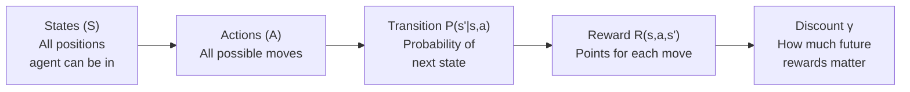

| Component | Description | Example |
|---|---|---|
| **States (S)** | All possible situations | 16 cells in 4×4 maze |
| **Actions (A)** | All possible moves | Up, Down, Left, Right |
| **Transition P** | P(s'|s,a) | 80% correct move, 20% slip |
| **Reward R** | R(s,a,s') | Goal = +100, Hole = -50 |
| **Discount γ** | 0 to 1 | γ = 0.9 values future rewards |

---

### 🔗 The Markov Property

```
P(s_{t+1} | s_t, a_t) = P(s_{t+1} | s_t, a_t, s_{t-1}, ...)

"The future depends ONLY on the current state, NOT the past."

Example: Weather
Tomorrow's weather depends only on TODAY's weather
Yesterday's weather doesn't matter!
```

---

### 🎯 Summary for Exam Answer

**To get full 6 marks:**
1. **Definition (1 mark):** MDP is a mathematical framework for sequential decision-making with states, actions, rewards, transitions.
2. **Five Components (3 marks):** Explain States, Actions, Transition Probability, Reward Function, Discount Factor with examples.
3. **Markov Property (2 marks):** Explain — future depends only on current state, not past. Give formula and example.

---

### 📚 Theoretical Deep Dive — Markov Decision Process

**Historical Foundations and the Bellman Equation:**

The Markov Decision Process formalizes the problem of sequential decision-making under uncertainty. Its origins trace back to **Richard Bellman's work in the 1950s** on dynamic programming, where he introduced the principle of **optimality**: an optimal policy has the property that whatever the initial state and initial decision are, the remaining decisions must constitute an optimal policy with regard to the state resulting from the first decision. This self-referential principle leads directly to the **Bellman equation**, which decomposes the value of a state into the immediate reward plus the discounted value of the successor state. Formally, for a policy `π`, the state-value function is:

`V^π(s) = E_π[R_{t+1} + γ R_{t+2} + γ² R_{t+3} + ... | S_t = s]`

The **action-value function** `Q^π(s,a) = E_π[R_{t+1} + γ R_{t+2} + ... | S_t = s, A_t = a]` represents the expected return when taking action `a` in state `s` and following policy `π` thereafter. The Bellman expectation equation relates these:

`V^π(s) = Σ_a π(a|s) Q^π(s,a)`
`Q^π(s,a) = R(s,a) + γ Σ_{s'} P(s'|s,a) V^π(s')`

The optimal value functions satisfy the **Bellman optimality equation**: `V*(s) = max_a Q*(s,a)` and `Q*(s,a) = R(s,a) + γ Σ_{s'} P(s'|s,a) max_a' Q*(s',a')`. This recursive decomposition is what enables dynamic programming algorithms to solve MDPs by working backward from terminal states.

**The Markov Property and its Formal Justification:**

The **Markov Property** is the defining assumption of MDPs: the future state depends only on the current state and action, not on the history. Formally:

`P(S_{t+1} | S_t, A_t, S_{t-1}, ...) = P(S_{t+1} | S_t, A_t)`

This is a strong assumption that is often violated in real-world systems. However, the **Markov assumption is not a statement about reality** but a modeling choice: by enriching the state space to include relevant history (e.g., including previous positions/actions as part of the state), any system can be made Markov at the cost of increased state space size. In reinforcement learning, this tension between Markov richness and tractability is central to the design of state representations.

**The Discount Factor and its Role:**

The discount factor `γ ∈ [0, 1]` determines how much future rewards are devalued. Mathematically, a reward received `k` steps in the future is worth `γ^k` times its face value. The choice of `γ` has profound implications:
- **γ = 0**: Myopic, caring only about immediate next reward.
- **γ → 1**: Far-sighted, caring equally about rewards at all future times.
- **γ close to 1**: Value function dominated by long-term returns, requiring planning well into the future.

The discount factor can also be interpreted as **probability of episode termination at each step**: if there is probability `1-γ` that the episode ends after any transition, the expected discounted return is identical to the undiscounted return conditioned on the episode not having terminated.

**The Exploration-Exploitation Tradeoff in MDPs:**

For an unknown MDP, the agent must balance exploration (taking new actions to learn more) and exploitation (taking the current best-known action). This tradeoff is formalized in **regret minimization**: regret is the difference between cumulative reward of the optimal policy and actual cumulative reward. Algorithms like **UCB** and **Thompson Sampling** achieve logarithmic regret in multi-armed bandits. The **Gittins index** provides an optimal solution for multi-armed bandits under discounting, though it does not extend trivially to general MDPs.

**Relationship to Other Decision Models:**

The MDP is the most general formulation in a hierarchy:
- **Multi-armed bandit**: MDP with one state.
- **Markov chain**: No actions or rewards.
- **MDP**: Markov chain with actions.
- **POMDP**: MDP where the agent cannot directly observe the state.
- **Stochastic Game**: Multiple agents interacting with shared environment.

The MDP's elegant structure — the Markov property, the Bellman equation, convergence guarantees — makes it the foundational framework for nearly all modern reinforcement learning.

---

## Q.7 (b) — Explain **Deep Reinforcement Learning**. **[6 Marks]**

### 🧠 Deep Reinforcement Learning — "AI That Sees and Learns"

**Deep RL** combines **Deep Learning** (neural networks for complex inputs) + **Reinforcement Learning** (learning from rewards).

> **Analogy:** A baby that sees a toy (deep learning/vision), reaches for it (action), grabs it (reward), and learns "reaching = good!" — all at the same time.

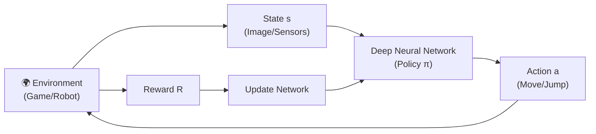

---

### 📦 Three Main Approaches

| Approach | What it Learns | Examples | Best For |
|---|---|---|---|
| **Value-Based** | Q(s,a) using NN | DQN | Discrete actions |
| **Policy-Based** | Policy π(a|s) directly | PPO, REINFORCE | Continuous actions |
| **Actor-Critic** | Both (Actor + Critic) | A2C, PPO, SAC | Most general |

---

### 📊 Famous Achievements

| Year | Achievement | Algorithm |
|---|---|---|
| 2013 | DQN plays Atari at human level | DQN |
| 2016 | AlphaGo beats Go world champion | MCTS + Value Net |
| 2017 | AlphaGo Zero beats all versions from scratch | AlphaGo Zero |
| 2018 | OpenAI Five beats pro Dota 2 team | Large-scale RL |
| 2022 | ChatGPT uses RLHF for alignment | RL from Human Feedback |

---

### 🎯 Summary for Exam Answer

**To get full 6 marks:**
1. **Definition (1 mark):** DRL combines Deep Learning (process complex inputs) with RL (learn from rewards).
2. **Why DRL (1 mark):** Regular RL needs simple states, Deep Learning handles images/video. DRL = both.
3. **Three approaches (3 marks):** Briefly explain Value-Based (DQN), Policy-Based (PPO), Actor-Critic (A2C/PPO).
4. **Achievements (1 mark):** Mention AlphaGo, DQN Atari, etc.

---

### 📚 Theoretical Deep Dive — Deep Reinforcement Learning

**The Curse of Dimensionality and the Need for Function Approximation:**

Traditional reinforcement learning algorithms maintain a **table** of Q-values for every state-action pair: `Q(s,a)`. This is feasible only when the state space `S` and action space `A` are small and discrete. For realistic problems — playing Atari from raw pixel inputs (210×160×3 = 100,800-dimensional observations), controlling a robot with continuous joint angles, or playing Go (10^170 possible board positions) — the state space is astronomically large. **Deep Reinforcement Learning** solves this by replacing the lookup table with a **function approximator** (a deep neural network) that generalizes from seen state-action pairs to unseen ones. Function approximation transforms the RL problem from memorization to **statistical generalization** — the network learns the structure of the value function rather than enumerating each value.

**The Stability Challenge: Why Neural Networks and RL Don't Mix Naturally:**

Combining function approximation with RL creates a fundamentally difficult optimization problem. In supervised learning, training data is drawn from a fixed distribution. In RL, the data distribution depends on the current policy — as the policy improves, the agent visits different parts of the state space, creating a **non-stationary distribution** that shifts throughout training. This violates the i.i.d. assumption of most supervised learning algorithms. Additionally, the target values in RL are themselves estimates with high variance, and the network's predictions affect the targets (bootstrapping). This creates **moving targets**: as `Q_θ` changes, the targets used for training also change, leading to oscillations or divergence. **Mnih et al. (2015)** addressed this with two key innovations in DQN:
1. **Experience Replay**: Store transitions in a buffer and sample random minibatches, breaking correlation between consecutive transitions.
2. **Target Network**: Use a separate network to compute targets, updating its weights only periodically.

**Policy Gradient Methods and the REINFORCE Algorithm:**

**Policy gradient methods** directly optimize the policy `π_θ(a|s)` by adjusting parameters `θ` to maximize expected return:

`J(θ) = E_{τ ~ π_θ}[R(τ)] = E_{τ ~ π_θ}[Σ_t r_t]`

Using the policy gradient theorem:

`∇_θ J(θ) = E_{s~π_θ, a~π_θ}[∇_θ log π_θ(a|s) · Q^π(s,a)]`

The **REINFORCE** algorithm (Williams, 1992) samples trajectories, computes the return `G_t = Σ_k=t^T γ^{k-t} r_k`, and updates:

`θ ← θ + α · G_t · ∇_θ log π_θ(a_t | s_t)`

The key theoretical insight of policy gradients is that they can directly optimize non-differentiable rewards, scale naturally to continuous action spaces, and can learn stochastic policies (essential for exploration and partially observable problems).

**Actor-Critic Methods:**

**Actor-Critic** methods combine value-based and policy-based approaches by maintaining two networks:
- **Actor**: The policy `π_θ(a|s)` that selects actions.
- **Critic**: The value function `V_ψ(s)` or `Q_ψ(s,a)` that evaluates how good the current state is.

The actor is updated using the policy gradient, but instead of using Monte Carlo returns `G_t`, the critic provides a low-variance estimate of the advantage function `A(s,a) = Q(s,a) - V(s)`. PPO (Schulman et al., 2017) adds a **clipped objective** to prevent large policy updates:

`L^CLIP(θ) = E_t[min(r_t(θ) · A_t, clip(r_t(θ), 1-ε, 1+ε) · A_t)]`

SAC (Soft Actor-Critic) extends this with entropy regularization, adding an entropy bonus `H` that encourages exploration.

**The Deadly Triad:**

A key theoretical result by **Sutton and Barto (2018)** identifies the **Deadly Triad** as the combination of three elements that can cause divergence in RL:
1. **Function approximation**: Using a parametric approximator for value functions.
2. **Bootstrapping**: Updating value estimates based on other value estimates.
3. **Off-policy learning**: Learning about one policy while following another.

Each element alone is safe, but together they can cause instability. The DQN innovations were specifically designed to mitigate the instability of the Deadly Triad, validating that careful design can make deep RL stable in practice.

---

## Q.7 (c) — What are the **challenges of Reinforcement Learning**? **[5 Marks]**

### 🚧 Main Challenges of RL

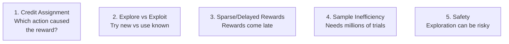

---

### 📋 Each Challenge Explained

| Challenge | Core Problem | Example | Solution |
|---|---|---|---|
| **Credit Assignment** | Which action caused reward? | Win chess after 30 moves | TD Learning, Eligibility Traces |
| **Explore vs Exploit** | Try new OR use known? | 10 slot machines — which to play? | ε-greedy, UCB |
| **Sparse Rewards** | Very few reward signals | Robot walks 1000 steps, rewarded only at end | Reward shaping, Hierarchical RL |
| **Sample Inefficiency** | Needs millions of trials | DQN needs 50M frames for Breakout | Model-based RL, imitation learning |
| **Safety** | Exploration can cause damage | Robot might crash while exploring | Safe RL, simulation training |

---

### 📊 Human vs RL Learning Speed

```
Human playing Breakout: 15 minutes → understands the game
RL Agent: 50 MILLION frames → learns to play well

That's roughly 1000x less data for humans!
```

---

### 🎯 Summary for Exam Answer

**To get full 5 marks:**
1. **Credit Assignment (1.5 marks):** Explain — reward comes late, which action was responsible?
2. **Explore vs Exploit (1 mark):** Explain tradeoff — explore (new, risky) vs exploit (known, safe).
3. **Sparse/Delayed Rewards (1.5 marks):** Explain — rewards rare/late. Robot walking example.
4. **Sample Inefficiency (1 mark):** Explain — needs millions of trials. Compare human vs RL speed.

---

### 📚 Theoretical Deep Dive — Challenges of Reinforcement Learning

**Credit Assignment and the Temporal Difference Framework:**

Credit assignment is the problem of determining which actions in a sequence caused a final reward. In chess lasting 40 moves, the agent receives a reward of +1 only after move 40, but which of the 40 moves was responsible? Formally, the return `G_t = r_t + γ r_{t+1} + γ² r_{t+2} + ...` is a sum of rewards, and the question is how to distribute credit to each action. **Monte Carlo** uses the actual return `G_t` as the target for all actions from `t` onward (high variance). **Temporal Difference (TD) Learning** (Sutton, 1988) addresses this by bootstrapping: `Q(s_t, a_t) ← Q(s_t, a_t) + α [r_t + γ max_a' Q(s_{t+1}, a') - Q(s_t, a_t)]`, where the TD error `δ_t = r_t + γ max_a' Q(s_{t+1}, a') - Q(s_t, a_t)` assigns credit to the current action. **Eligibility Traces** (TD(λ)) extend this by assigning credit over a window of previous steps, where `λ ∈ [0,1]` controls the credit assignment window.

**The Explore-Exploit Tradeoff: Formal Analysis:**

The explore-exploit tradeoff is formalized in the **Multi-Armed Bandit (MAB)** problem. Regret is defined as `R_T = T·μ* - Σ E[μ_{A_t}]`. Several algorithms achieve near-optimal regret:
- **ε-greedy**: With probability ε, explore randomly; with probability 1-ε, exploit.
- **UCB (Upper Confidence Bound)**: `argmax_a [Q(a) + c · sqrt(ln(N)/N_a)]`, achieving O(log T) regret.
- **Thompson Sampling**: Sample from the posterior distribution of each arm's value.

In full MDPs, exploration requires visiting all state-action pairs. The **OPD (Optimism in the Face of Uncertainty)** principle drives many MDP exploration algorithms: maintain an upper confidence bound on the value function and act greedily with respect to this optimistic estimate.

**Sparse and Delayed Rewards:**

The **sparse reward** problem occurs when the environment provides reward signals only infrequently — a robot receives +1 only upon reaching a goal 1000 steps away, with 0 reward for every other step. **Reward shaping** (Ng et al., 1999) adds intermediate rewards. Mathematically, reward shaping preserves the optimal policy if the shaping reward is of the form `F(s,s') = γ Φ(s') - Φ(s)` (potential-based shaping). **Hierarchical RL** decomposes the task into subtasks (goals), each providing its own reward. **Intrinsic motivation** adds an exploration bonus based on **prediction error**: states where the agent's model makes large errors receive higher intrinsic reward.

**Sample Inefficiency and the Reality Gap:**

Deep RL agents require enormous amounts of data — DQN requires ~50 million frames (38 days of gameplay) to learn Atari at human level, while humans reach comparable performance in ~15 minutes. **Model-based RL** addresses this by learning a model `P(s'|s,a)` of the environment's dynamics. **Imitation learning** pre-trains the agent by imitating expert demonstrations. **Offline RL** (Fujimoto et al., 2019; Kumar et al., 2020) learns from a fixed dataset without further environment interaction.

**Safety in Reinforcement Learning:**

Safety is unique to RL: exploration requires taking actions that may be harmful. In **safe RL**, formal approaches include:
- **Constrained MDPs (CMDPs)**: Add cost functions and require that expected costs stay below a threshold, formulated as a Lagrange multiplier in the RL objective.
- **Shielding**: A hand-designed safety shield overrides the RL agent's actions if they would take the system into an unsafe state.
- **Sim-to-real transfer**: Train in simulation where exploration is safe, then transfer to the real world. The **reality gap** is addressed by domain randomization and system identification.

**Generalization in Deep RL:**

Deep RL agents often fail to generalize: an agent trained on one set of levels fails catastrophically on slightly modified levels. The theoretical challenge is that RL optimizes for performance on a specific distribution of states visited by the current policy, not over all possible states. Addressing generalization requires diverse training environments, domain randomization, regularization, and **meta-RL** (learning to learn), where the agent learns a learning algorithm that can adapt quickly to new environments.

---

## Q.8 (a) — Explain the process of **Deep Q-Learning**. **[6 Marks]**

### 🤖 Deep Q-Learning Process

**DQN** replaces the Q-table with a neural network for complex inputs. Has two key innovations: **Experience Replay** and **Target Network**.

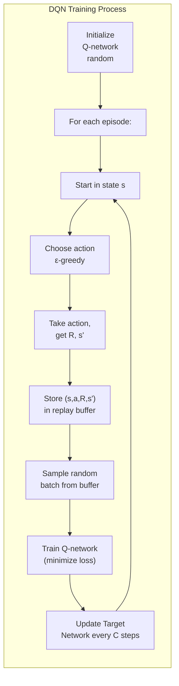

---

### ✨ Two Key Innovations

#### **1. Experience Replay**
```
Why: Consecutive experiences are correlated → neural networks learn poorly
How:
1. Store every experience (s, a, R, s', done) in buffer
2. Sample random batch during training
3. Train on uncorrelated data → better learning

Benefits: Breaks correlation, reuses experiences, smoother learning
```

#### **2. Target Network**
```
Why: Updating same network as target = moving target → unstable
How:
- Main Network: updated every step (predicts Q-values)
- Target Network: updated every C steps (provides targets)
- Target Q = r + γ × max_a Q_target(s', a')

Benefits: Stable targets → stable training
```

---

### 📐 DQN Loss Function

```
Loss = (y - Q(s,a; θ))²

Where y (target) = r + γ × max_a' Q_target(s', a'; θ⁻)

θ = Main network weights
θ⁻ = Target network weights (fixed for C steps)
```

---

### 🎯 Summary for Exam Answer

**To get full 6 marks:**
1. **Process Overview (2 marks):** Explain the DQN training loop.
2. **Experience Replay (2 marks):** Explain why needed (correlation problem), how it works (buffer + random sampling), benefits.
3. **Target Network (2 marks):** Explain why needed (moving target problem), how it works (main + target networks, periodic update).

---

### 📚 Theoretical Deep Dive — Deep Q-Learning

**The Q-Learning Foundation and DeepMind's Breakthrough:**

Deep Q-Learning (DQN) was introduced by Mnih et al. (2015) and was the first algorithm to demonstrate that deep neural networks could learn effective policies directly from high-dimensional sensory input (pixel data) without human-engineered features. The underlying **Q-Learning** algorithm (Watkins, 1989) is a model-free, off-policy temporal difference method that learns the optimal action-value function `Q*(s,a)` representing the maximum discounted return obtainable from state `s` by taking action `a` and following the optimal policy thereafter. The Q-learning update is:

`Q(s_t, a_t) ← Q(s_t, a_t) + α [r_t + γ max_a' Q(s_{t+1}, a') - Q(s_t, a_t)]`

Under sufficient exploration and a decaying learning rate, Q-learning converges to `Q*` for tabular representations. However, applying Q-learning with neural networks as function approximators was historically considered unstable due to the **Deadly Triad** (function approximation + bootstrapping + off-policy learning). DQN's innovation was to use two simple but theoretically motivated mechanisms — Experience Replay and Fixed Target Networks — that sufficiently broke the correlations in the data to enable stable learning.

**Experience Replay: Breaking Temporal Correlations:**

In an MDP, consecutive experiences are highly correlated because `s_{t+1}` depends on `s_t` and `a_t`. When a neural network is trained on such correlated data sequentially, the gradient updates are high-variance and can push the network in inconsistent directions. **Experience Replay** (Lin, 1992) addresses this by storing all transitions in a fixed-size buffer `D` and sampling uniformly random mini-batches for training. This has three theoretical benefits: (1) **Decorrelates samples**: Random sampling produces an approximately i.i.d. batch; (2) **Data efficiency**: Each transition may be reused in multiple gradient updates; (3) **Smoothing the distribution**: The replay buffer represents past experience under many different exploration policies.

**Fixed Target Networks: Stabilizing the Bootstrap Target:**

In standard Q-learning with function approximation, the target `y = r + γ max_a' Q(s', a'; θ)` is computed using the same network parameters `θ` that are being updated. This creates a **moving target** problem: as `θ` changes, the target changes simultaneously, leading to oscillations or divergence. The **Fixed Target Network** decouples the target computation by using a separate network with parameters `θ⁻` that are held fixed for `C` steps before being updated. The theoretical benefit is that the target is stable during the `C` training steps, providing a stationary learning signal.

**Double DQN and Overestimation Bias:**

A subtle problem in DQN is **overestimation bias** in Q-values. Because the Q-learning target uses `max_a' Q(s', a')`, and `Q` is estimated with noise, the maximum of noisy estimates tends to overestimate the true maximum. **Double DQN** (van Hasselt et al., 2016) decouples action selection and action evaluation:

`y = r + γ · Q_target(s', argmax_a Q(s', a; θ); θ⁻)`

The action is selected using the main network but evaluated using the target network. This breaks the maximization bias. **Dueling DQN** (Wang et al., 2016) separates the value function `V(s)` and the advantage function `A(s,a)`:

`Q(s,a) = V(s) + A(s,a) - mean_{a'} A(s,a')`

This architecture learns the state value independently of specific actions, improving generalization.

**DQN Variants and the Rainbow Architecture:**

Several DQN variants address specific limitations:
- **Prioritized Experience Replay (PER)**: Samples transitions with priority proportional to their TD error `|δ_t|`, focusing on "surprising" transitions.
- **Categorical DQN / QR-DQN**: Models the return distribution as a categorical distribution `Z(s,a)`, learning the full distribution rather than just the mean.
- **Multi-step learning**: Uses n-step returns `y = r_t + γr_{t+1} + ... + γ^{n-1}r_{t+n-1} + γ^n max_a' Q(s_{t+n}, a')`, trading off bias for reduced variance.

**Rainbow** (Hessel et al., 2018) combined all these improvements (Double DQN + Dueling + PER + Distributional + Multi-step) into a single architecture, achieving super-human performance on 49 out of 57 Atari 2600 games from raw pixels.

---

## Q.8 (b) — Explain **Reinforcement Learning for Tic-Tac-Toe** game. **[6 Marks]**

### 🎮 Tic-Tac-Toe as an RL Problem

**Tic-Tac-Toe** is a 3×3 grid game. Two players (X and O) take turns placing marks. First to get 3 in a row wins. RL can teach an AI to play by learning from games.

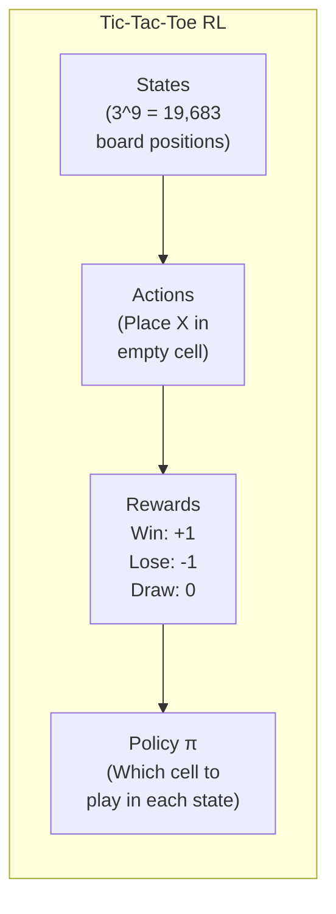

---

### 📋 MDP Components for Tic-Tac-Toe

| Component | Description | Example |
|---|---|---|
| **State** | Board configuration | `X O X / . . O / . X .` |
| **Action** | Place X in empty cell | Place at position (2,1) |
| **Reward** | Win=+1, Lose=-1, Draw=0 | After winning: R=+1 |
| **Transition** | Deterministic | X at (1,1) always → same next state |
| **Policy** | Which cell to choose | Center empty → play center |

---

### 🧠 Learning Approach — Value Function

The simplest approach: Learn a **Value Function V(s)** for every possible board state:

```
V(s) = "How good is this position for ME?"

V(s) = +1 → I will WIN from here
V(s) = 0 → It will be a DRAW
V(s) = -1 → I will LOSE from here
```

---

### 📈 TD Learning Algorithm

```
Step 1: Initialize V(s) = 0.5 for all 19,683 states

Step 2: Play a game against opponent
Record all states visited

Step 3: After game ends:
If win: reward = +1, if lose: reward = -1, if draw: reward = 0

Step 4: Update V for each state visited:
V(s) = V(s) + α × [R - V(s)]
(α = learning rate, e.g., 0.1)

Step 5: Repeat steps 2-4 for 10,000+ games

Result: V(s) now reflects actual win probability from each state!
```

---

### 🎯 How the Agent Plays After Learning

```
When it's the agent's turn:
1. Look at current board state s
2. For each empty cell, imagine placing X there
3. Look up V(s') for the resulting state
4. Choose the cell with HIGHEST V(s')

Example:
Current: X . O / . X . / . . O
Options:
Place at (2,1): V = 0.9 (likely win)
Place at (3,1): V = 0.3 (risky)
Place at (3,2): V = 0.5 (neutral)
Best: Place at (2,1)!
```

---

### 📊 Learning Progress

| Games Played | Win Rate | Skill Level |
|---|---|---|
| 1-100 | 30% | Random player |
| 100-1000 | 50% | Learning basics |
| 1000-5000 | 80% | Getting good |
| 5000+ | 95% | Expert player! |

---

### 🎯 Summary for Exam Answer

**To get full 6 marks:**
1. **Problem Setup (1.5 marks):** MDP components — 19,683 states, actions (place X), rewards (+1/-1/0), deterministic transitions.
2. **Learning Approach (2.5 marks):** Explain TD learning: Initialize V(s)=0.5 for all states, play games, update V(s) = V(s) + α × [R - V(s)], after 10,000 games V(s) reflects actual win probability.
3. **Policy (2 marks):** After learning, for each state pick action leading to highest V(s'). Give example with 2-3 options.

---

### 📚 Theoretical Deep Dive — RL for Tic-Tac-Toe

**Game Theory and the Perfect Information Structure:**

Tic-Tac-Toe is a **zero-sum, perfect-information, deterministic game** of limited complexity. The state space consists of at most `3^9 = 19,683` board configurations (though many are unreachable due to turn alternation and game-ending conditions). Each state is fully observable — both players know the complete board configuration. This makes Tic-Tac-Toe an ideal testbed for RL algorithms because the MDP is fully deterministic and the optimal policy can be computed exactly using minimax search with alpha-beta pruning. In game theory, Tic-Tac-Toe is a **solved game**: with optimal play by both sides, the outcome is always a draw. The RL challenge is not to discover a winning strategy (none exists against optimal play) but to learn to play optimally without being given the game rules explicitly.

**Temporal Difference Learning and the Convergence Theory:**

The TD learning algorithm used for Tic-Tac-Toe updates state values using:

`V(s) ← V(s) + α [R - V(s)]`

This is a form of **stochastic approximation** to the true value function. Under standard assumptions (stationary environment, decaying learning rate `α_t` satisfying `Σ α_t = ∞` and `Σ α_t² < ∞`, sufficient exploration), the TD(0) update converges to the true value function `V^π` almost surely (Kushner and Clark, 1978). For Tic-Tac-Toe specifically, the deterministic nature of transitions means that the TD update after each episode is simply:

`V(s) ← (1-α) V(s) + α R`

for each state `s` visited during the episode. This is equivalent to maintaining an exponential moving average of the returns observed after visiting each state. After many episodes, `V(s)` converges to the empirical probability of winning from state `s` under the current exploration policy, provided all states are visited infinitely often (the **Glimpse condition** or **assumption of covering exploration**).

**Exploration vs. Exploitation in Tic-Tac-Toe:**

In Tic-Tac-Toe, most states have a very small number of legal actions (typically 3-7 empty cells), making this a manageable exploration problem. A simple **ε-greedy** strategy suffices: with probability ε, choose a random legal move; with probability 1-ε, choose the move with the highest known `V(s)`. As ε decays over time (e.g., `ε = 1/(1 + episode/1000)`), the agent transitions from exploration to exploitation. Theoretically, this is a form of **GLIE (Greedy in the Limit with Infinite Exploration)**: the policy converges to a greedy policy while visiting all state-action pairs infinitely often. GLIE guarantees convergence of the TD estimate to the optimal value function.

**Self-Play and the Sutton & Barto Tic-Tac-Toe Example:**

The classic example in Sutton and Barto's *Reinforcement Learning: An Introduction* uses **self-play**: the agent plays against itself, alternating X and O. This has a key theoretical advantage: the opponent's policy improves simultaneously with the agent's policy, creating an **iterated learning scenario** where both players converge to optimal play. Mathematically, if both players follow the same improving policy, and the game is zero-sum, both policies converge to a Nash equilibrium. In Tic-Tac-Toe, the Nash equilibrium is the draw outcome. Self-play eliminates the need for a fixed opponent distribution (as in training against a random opponent, which might lead to overfitting to suboptimal play).

**Extension to Function Approximation:**

The tabular TD approach requires storing one value `V(s)` for each of the 19,683 possible states, which is feasible but not scalable. A more realistic approach replaces the lookup table with a neural network that approximates `V(s; θ)`. This is **TD(λ)** with a neural network critic, or **actor-critic** where the actor learns a policy `π(a|s; θ)` directly from the state representation rather than a value lookup. The problem with using neural networks is the same stability problem that motivated DQN: the targets `R` change as the network learns, the states are correlated within an episode (self-play creates highly correlated sequences), and bootstrapping from `V(s')` introduces the Deadly Triad. Applying DQN-style innovations (experience replay, target networks) to Tic-Tac-Toe with raw board representation or learned features is an instructive exercise.

**Generalization Beyond Tic-Tac-Toe:**

The TD learning paradigm demonstrated on Tic-Tac-Toe is the foundation of modern game-playing AI. **Tesauro's TD-Gammon** (1992) applied TD(λ) with a neural network to Backgammon, achieving expert-level play. More recently, **AlphaZero** (Silver et al., 2018) generalized this to Chess, Shogi, and Go using Monte Carlo Tree Search combined with deep neural network value and policy functions, trained entirely through self-play. The theoretical thread connecting these systems is the use of bootstrapped TD learning from self-generated experience — the same algorithm that learns to play perfect Tic-Tac-Toe in thousands of episodes, scaled to the complexity of Go through deep neural networks and guided search.

---

## Q.8 (c) — Explain **Dynamic Programming algorithm** for reinforcement learning. **[5 Marks]**

### 🧮 DP in RL — Solving with Perfect Knowledge

**Dynamic Programming** solves MDPs when the environment is **fully known** — all transition probabilities, rewards, and states are known.

> **Analogy:** Planning a road trip with a PERFECT GPS that knows every distance, toll, and hotel cost. DP works BACKWARD from destination to find optimal route.

---

### 📐 The Bellman Equation

```
V(s) = max_a [R(s,a) + γ × Σ P(s'|s,a) × V(s')]

"Value of state s = best immediate reward + discounted average of future rewards"
```

---

### 🔢 Value Iteration Algorithm

```
Step 1: Initialize V(s) = 0 for all states
Step 2: Repeat until V(s) converges:
    For each state s:
        V(s) = max_a [R(s,a) + γ × Σ P(s'|s,a) × V(s')]
Step 3: Extract policy: π(s) = argmax_a [R + γ × Σ P×V]

Result: Optimal V*(s) and π*(s)
```

**Example:**
```
States: A, B. γ = 0.9.
Initial: V(A)=0, V(B)=0

Iteration 1:
V(A) = max[5+0, 2+0] = 5
V(B) = max[10+0, -1+0] = 10

Iteration 2:
V(A) = max[5+0.9×10, 2+0.9×10] = max[14, 11] = 14
V(B) = 10 + 0.9×14 = 22.6

...Continue until V stabilizes!
```

---

### 🔢 Policy Iteration Algorithm

```
Step 1: Initialize random policy π(s)
Step 2: Repeat until policy stops changing:
    ┌─ POLICY EVALUATION ─┐
    │ Calculate V(s) for   │
    │ current policy π     │
    └──────────────────────┘
    ↓
    ┌─ POLICY IMPROVEMENT ─┐
    │ For each state s:    │
    │ π_new(s) = best action│
    └──────────────────────┘
```

---

### 📊 Comparison

| Algorithm | Steps | Speed | Complexity |
|---|---|---|---|
| **Value Iteration** | Single loop | Slower per iteration | Simpler |
| **Policy Iteration** | Two loops (evaluate + improve) | Faster convergence | Slightly more complex |

---

### ⚠️ Limitations of DP

| Limitation | Explanation |
|---|---|
| **Needs full model** | Must know ALL P(s'|s,a) |
| **Curse of dimensionality** | Too many states for real problems |
| **Not sample efficient** | Must visit every state many times |

---

### 🎯 Summary for Exam Answer

**To get full 5 marks:**
1. **Definition (1 mark):** DP solves MDPs with complete environment knowledge.
2. **Bellman Equation (1 mark):** Write V(s) = max_a [R + γ × Σ P(s'|s,a) × V(s')].
3. **Value Iteration (1.5 marks):** Explain — initialize V(s)=0, repeatedly update, extract policy.
4. **Policy Iteration (1.5 marks):** Explain — initialize policy, repeat: Policy Evaluation (calculate V(s)) + Policy Improvement (improve π).

---

### 📚 Theoretical Deep Dive — Dynamic Programming in Reinforcement Learning

**The Bellman Equation and the Principle of Optimality:**

Dynamic Programming in reinforcement learning is built upon Richard Bellman's **Principle of Optimality**, which states that an optimal policy has the property that whatever the initial state and initial decision are, the remaining decisions must constitute an optimal policy with regard to the state resulting from the first decision. This principle leads directly to the **Bellman Optimality Equation** for the state-value function:

`V*(s) = max_a [R(s,a) + γ Σ_{s'} P(s'|s,a) V*(s')]`

This equation is a system of `|S|` nonlinear equations (due to the max operator) in `|S|` unknowns `V*(s)`. Under standard assumptions (finite state space, `γ < 1`, rewards bounded), this system has a unique solution `V*` that can be found through iterative methods. The ** contraction mapping property** of the Bellman optimality operator `T: V ↦ max_a [R + γ P V]` guarantees convergence: `T` is a γ-contraction in the sup-norm, meaning `||T(V₁) - T(V₂)||∞ ≤ γ ||V₁ - V₂||∞`. Since `γ < 1`, repeated application of `T` converges to the unique fixed point `V*` by the **Banach Fixed-Point Theorem**.

**Value Iteration: Contractive Mapping and Convergence Rate:**

Value Iteration applies the Bellman optimality operator repeatedly:

`V_{k+1}(s) = max_a [R(s,a) + γ Σ_{s'} P(s'|s,a) V_k(s')]`

Starting from any initial `V₀`, this converges to `V*`. The convergence rate is determined by the contraction factor `γ`: after `k` iterations, the error is bounded by `||V_k - V*||∞ ≤ γ^k ||V₀ - V*||∞`. For `γ = 0.9`, this means that each iteration reduces the error by 10%. To achieve an error less than ε, we need `k ≥ log(ε/||V₀ - V*||) / log(γ)`. For practical MDPs, value iteration typically requires hundreds to thousands of iterations, each requiring `O(|S|²|A|)` operations (summing over all `s'` for each `s` and `a`).

**Policy Iteration: Policy Evaluation and Policy Improvement:**

Policy Iteration alternates between two steps:
1. **Policy Evaluation**: Given a fixed policy `π`, compute `V^π` by solving the system of linear equations: `V^π(s) = R(s,π(s)) + γ Σ_{s'} P(s'|s,π(s)) V^π(s')`. This is a system of `|S|` linear equations in `|S|` unknowns and can be solved exactly (e.g., by Gaussian elimination) or approximately by iterative methods (TD learning).
2. **Policy Improvement**: For each state `s`, compute `π_new(s) = argmax_a [R(s,a) + γ Σ_{s'} P(s'|s,a) V^π(s')]`.

The **policy improvement theorem** guarantees that if `π_new(s) = π(s)` for all `s`, then `π` is optimal. Otherwise, `V^{π_new}(s) ≥ V^π(s)` for all `s`, with strict inequality for at least one state. Repeating this process must converge in a finite number of iterations because there are only finitely many deterministic policies (`|A|^|S|` of them).

**Modified Policy Iteration and Asynchronous DP:**

Full Policy Iteration requires solving for `V^π` exactly, which can be expensive. **Modified Policy Iteration** (or **Gauss-Seidel Value Iteration**) performs only a few (or one) sweep of policy evaluation before improving the policy. **Asynchronous DP** (or **Real-Time Dynamic Programming**) updates only the states actually visited by the agent, interleaving planning with acting. This is more sample-efficient for large MDPs where not all states are relevant at all times.

**Relationship to Monte Carlo and Temporal Difference Methods:**

Dynamic Programming requires full knowledge of the model (transition probabilities `P` and rewards `R`). When the model is unknown, **Monte Carlo (MC)** methods learn from complete episodes by averaging returns, while **Temporal Difference (TD)** methods learn from incomplete episodes by bootstrapping. **TD(λ)** generalizes between MC (λ=1) and TD(0) (λ=0). DP, MC, and TD form a spectrum:
- **DP**: Requires model, bootstraps, updates from other value estimates.
- **MC**: Does not require model, does not bootstrap, updates from actual returns.
- **TD**: Does not require model, bootstraps, updates from estimated returns.

This spectrum, formalized by Sutton and Barto, provides a unified understanding of all RL algorithms. **Actor-Critic** methods can be seen as combining TD (for the critic) with policy gradient (for the actor), bridging DP/MC/TD with direct policy search.

**The Curse of Dimensionality and Approximate DP:**

The fundamental limitation of exact DP is the **curse of dimensionality**: the state space grows exponentially with the number of state variables. For a problem with `n` binary state variables, there are `2^n` states; for continuous state spaces, there are infinitely many. **Approximate DP** addresses this by representing the value function using a parameterized function approximator (e.g., a linear function `V(s; θ)` or a neural network `V(s; θ)`). In the linear case, `V(s; θ) = Σ_i θ_i φ_i(s)` where `φ_i` are basis functions (e.g., tile coding, Fourier basis, polynomial basis). The parameters `θ` are learned to minimize the mean-squared Bellman error `E[(T V(s; θ) - V(s; θ))²]`. With neural networks, this becomes **Deep DP** or **Deep Fitted Q-Iteration**, which iteratively fits the network to the Bellman target and extracts the greedy policy — a model-based variant of DQN that uses the known model for bootstrapping rather than replaying experience. This approach, while theoretically appealing (guaranteed convergence under certain conditions), can be unstable in practice for the same reasons as DQN, motivating the use of target networks and experience replay even in model-based settings.
