# Paper 4: [6181]-115 — Deep Learning Answers

**B.E. Computer Engineering | Semester VIII | 2019 Pattern | Max Marks: 70**

---

# UNIT I — Convolutional Neural Networks (CNN)

---

## Q.1 (a) — Explain **Stride Convolution** with example. **[6 Marks]**

### 👣 What is Stride? — The "Step Size" of the Filter

**Stride** is the number of pixels the convolution filter **slides (moves)** each step while scanning the image.

> **Analogy:** Walking across a room:
> - Stride = 1 → small steps, see every spot (detailed, slow)
> - Stride = 2 → bigger steps, skip some spots (balanced, faster)
> - Stride = 3 → very large steps, miss details (fastest, least detail)

---

### 📐 How Stride Works

```
Input: 5×5 matrix
Filter: 3×3
Stride = 1:
  Filter positions: (1,1), (1,2), (1,3), (2,1), (2,2), (2,3), (3,1), (3,2), (3,3)
  Output: 3×3

Stride = 2:
  Filter positions: (1,1), (1,3), (3,1), (3,3)
  Output: 2×2
```

---

### 📏 Output Size Formula with Stride

```
Output = (Input - Filter + 2×Padding) / Stride + 1

Example 1: 5×5 input, 3×3 filter, padding=0, stride=1
  Output = (5-3+0)/1 + 1 = 3×3

Example 2: Same but stride=2
  Output = (5-3+0)/2 + 1 = 2×2

Example 3: 7×7 input, 3×3 filter, padding=1, stride=2
  Output = (7-3+2)/2 + 1 = 3×3
```

---

### 📊 Effect of Stride

| Stride | 5×5→3×3 Filter | Output | Characteristics |
|---|---|---|---|
| **1** | All positions | 3×3 | Most detailed, slowest |
| **2** | Every other position | 2×2 | Balanced, commonly used |
| **3** | Every 3rd position | 1×1 | Fastest, loses most info |

---

### 🎯 Summary for Exam Answer

**To get full 6 marks:**
1. **Definition (1 mark):** Stride = number of pixels filter moves each step. Controls output size and detail.
2. **Working example (2 marks):** Show 5×5 input + 3×3 filter with stride=1 (3×3 output) and stride=2 (2×2 output). Show which positions are used.
3. **Formula (1 mark):** Write output formula with stride.
4. **Effect (2 marks):** Explain how stride affects output size, detail, and speed. Mention typical usage (stride=1 in conv, stride=2 in pooling).

---

### 📚 Theoretical Deep Dive — Stride Convolution

**Historical Context and Mathematical Foundations:**

The concept of stride in convolution operations has its roots in signal processing and computer vision dating back to the early work on discrete convolution by Josef Radon in 1917 and later formalized in image processing by the introduction of the convolution integral. In the context of neural networks, stride was first explored in depth with the development of convolutional layers by LeCun et al. in the 1990s for digit recognition (LeNet-5, 1998). Stride provides a mechanism to control the spatial resolution of the feature maps, which directly impacts the network's ability to capture multi-scale representations.

**Mathematical Derivation — Stride as a Subsampling Operator:**

Given an input feature map of size $I \times I$ and a convolution kernel (filter) of size $K \times K$, applying a stride $S$ produces an output feature map of spatial dimensions:

$$O = \left\lfloor \frac{I - K + 2P}{S} \right\rfloor + 1$$

Where $P$ is the padding applied. This formula arises from counting the number of valid positions at which the kernel can be placed on the input, starting from the top-left corner and advancing by $S$ pixels in both horizontal and vertical directions. For example, with $I=5$, $K=3$, $P=0$, and $S=2$:

$$O = \left\lfloor \frac{5 - 3 + 0}{2} \right\rfloor + 1 = \left\lfloor \frac{2}{2} \right\rfloor + 1 = 1 + 1 = 2$$

The floor operation ensures that only fully overlapping kernel placements are counted; partial placements (where the kernel extends beyond the input boundary) are discarded, which is the standard "valid" convolution convention.

**Stride and the Theory of Receptive Fields:**

Stride fundamentally determines the receptive field growth rate across successive convolutional layers. If layer $\ell$ uses a kernel size $K_\ell$ and stride $S_\ell$, and the input image has pixel spacing $\Delta_0 = 1$, then the receptive field of layer $\ell$ (the region of the original image that influences a single output pixel) is:

$$RF_\ell = RF_{\ell-1} + (K_\ell - 1) \times \prod_{i=1}^{\ell-1} S_i$$

And the effective stride (number of input pixels spanned per output pixel at layer $\ell$) is:

$$\Delta_\ell = \Delta_{\ell-1} \times S_\ell$$

This means that a stride of 2 in any layer doubles the effective spacing of the sampling grid, halving the feature map resolution. This property is exploited in encoder-decoder architectures and U-Net designs where downsampling via strided convolution is paired with upsampling via transposed convolutions (also called deconvolutions or fractionally strided convolutions, introduced by Zeiler et al. in 2010 through the DeconvNet architecture).

**Relationship Between Stride, Translation Equivariance, and Translation Invariance:**

Convolution with stride $S > 1$ introduces a subtle but important shift from translation equivariance toward partial translation invariance. Standard convolution (stride 1) is equivariant: if the input shifts by $t$ pixels, the feature map shifts by $t$ pixels, preserving fine-grained spatial correspondence. However, with stride $S$, a small input shift of less than $S$ pixels may produce an identical output feature map, creating coarse invariance to small translations. This is sometimes desirable (e.g., in classification tasks where we care about presence, not exact location) but can be detrimental in tasks requiring precise localization (e.g., object detection, semantic segmentation). This trade-off was precisely what motivated the development of dilated (atrous) convolutions, which increase receptive field without sacrificing resolution.

**Strided Convolution vs. Pooling:**

An important theoretical distinction exists between strided convolution and pooling operations (max pooling or average pooling). Both reduce spatial dimensions, but they operate through fundamentally different mechanisms:

- **Pooling** performs a fixed, non-parametric aggregation over a local window (taking the maximum or average)
- **Strided convolution** applies a learned linear transformation with stride, making it a parametric downsampling operation

Springenberg et al. (2015) demonstrated in their work on "Striving for Simplicity" that replacing all pooling layers with strided convolutions (using a convolution with stride 2 and appropriate padding) can achieve equal or superior performance, because the network learns the optimal downsampling strategy for the specific task rather than being constrained by the fixed max operation. This finding has influenced modern architectures such as the ResNet family, where stride-2 convolutions are preferred over max pooling for downsampling.

**Computational Complexity and Parameter Count:**

The parameter count of a convolutional layer with stride $S$ is independent of $S$ itself; it depends only on the kernel size $K$, number of input channels $C_{in}$, and output channels $C_{out}$:

$$\text{Parameters} = K \times K \times C_{in} \times C_{out} + C_{out}$$

However, the number of floating-point operations (FLOPs) scales inversely with the stride: with stride $S$, the output has approximately $\frac{1}{S^2}$ the number of positions compared to stride 1. Thus, a stride of 2 reduces both computation and memory by a factor of approximately 4 (in 2D), making it a computationally efficient form of dimensionality reduction compared to using a separate pooling layer followed by a standard convolution.

**Stride in Modern Architectures:**

Contemporary deep learning frameworks (PyTorch, TensorFlow, JAX) all implement stride as a first-class parameter in their convolution primitives. The design of modern convolutional networks such as ResNet, EfficientNet, and ConvNeXt follows a specific pattern: stride-2 convolutions are placed at the beginning of each "stage" or "block group" to halve the spatial resolution while doubling the channel depth, maintaining an approximately constant computational complexity per layer. This design choice, formalized in the work on ResNet by He et al. (2016), has become a standard pattern that is replicated across virtually all modern CNN architectures.

**Practical Implications for Model Design:**

When designing a CNN, the choice of stride involves a multi-objective optimization: smaller strides preserve more spatial information, enabling denser prediction tasks (segmentation, keypoint detection), while larger strides reduce the memory footprint and increase the receptive field faster, benefiting classification and detection tasks. In practice, most architectures use a combination of stride-1 convolutions (for fine feature extraction) at the same resolution, interleaved with stride-2 convolutions (for downsampling) at regular intervals. This creates a hierarchical feature pyramid where deeper layers capture increasingly abstract and spatially coarse representations, a concept rooted in the classic work on hierarchical feature extraction by Fukushima et al. (1980) in the Neocognitron and subsequently formalized as a core principle in modern deep learning.

---

## Q.1 (b) — Explain **Padding and its types**. **[6 Marks]**

### 📐 What is Padding? — The "Border Frame"

**Padding** adds extra pixels (usually zeros) around the image border before convolution.

> **Analogy:** A picture frame around a photo — gives space to work at edges.

---

### 📏 Output Formula

```
Output = (Input - Filter + 2×Padding) / Stride + 1

Without padding:
  5×5 + 3×3 + stride=1 → 3×3 (shrinks!)

With padding P=1:
  7×7 (5+1+1) + 3×3 + stride=1 → 5×5 (same size!)
```

---

### 🎨 Three Types of Padding

#### **1. Valid Padding (No Padding)**
- P = 0 → no border
- Output is **smaller** than input
- Used when you want to shrink

```
5×5 → 3×3 (lost 2 pixels from each side)
```

#### **2. Same Padding (Zero Padding)** ⭐ Most Common
- P = (Filter-1)/2 → output size = input size
- For 3×3 filter: P = 1
- For 5×5 filter: P = 2
- Preserves spatial dimensions

```
5×5 + P=1 border → 7×7 → 5×5 output ✅
```

#### **3. Full Padding**
- P = Filter - 1 (maximum)
- Output is **larger** than input
- Rarely used

```
5×5 + P=2 → 9×9 → 7×7 output (expanded)
```

---

### 📊 Comparison Table

| Type | Padding | Output Size | Common? |
|---|---|---|---|
| **Valid** | P=0 | Smaller | Sometimes |
| **Same** | P=(F-1)/2 | Same as input | ⭐ Most common |
| **Full** | P=F-1 | Larger | Rarely |

---

### 🎯 Summary for Exam Answer

**To get full 6 marks:**
1. **Definition (1 mark):** Padding adds border pixels (zeros) around image before convolution. Preserves dimensions.
2. **Why needed (1 mark):** Prevent shrinking, utilize edge pixels.
3. **Formula (1 mark):** Write output formula.
4. **Types (3 marks):** Explain all 3 with examples:
   - Valid (P=0, shrinks)
   - Same (P=(F-1)/2, keeps size, most common)
   - Full (P=F-1, expands)

---

### 📚 Theoretical Deep Dive — Padding, Effective Receptive Fields, and Network Geometry

**The Relationship Between Padding and Effective Receptive Field:**

Padding does more than preserve dimensions — it fundamentally affects the effective receptive field of neurons in deep networks. The receptive field of a neuron at layer $\ell$ is the region of the input image that influences its activation. With a stack of $3 \times 3$ convolutions and stride 1, a neuron at layer 5 theoretically has a receptive field of size $(3-1) \times 5 + 1 = 11$ pixels. However, Luo et al. (2016) demonstrated through their work on "Understanding the Effective Receptive Field" that the *effective* receptive field is substantially smaller than the *theoretical* receptive field, with activations following a Gaussian-like distribution — meaning center pixels have a much stronger influence than edge pixels. Padding affects this distribution by determining which input pixels are included in the theoretical boundary.

**AlexNet and the Role of Padding in Modern Architecture Design:**

In AlexNet (Krizhevsky et al., 2012), same padding was used selectively — the first two convolutional layers used zero-padding of 2 and 1 respectively with $11 \times 11$ and $5 \times 5$ kernels, while later layers used no padding. This design reflected the observation that early layers need to process border pixels effectively (hence padding), while deeper layers operate on abstract feature maps where border semantics are less important. VGG (Simonyan & Zisserman, 2014) standardized on same-padding for all $3 \times 3$ convolutions, creating a clean pattern where spatial dimensions halved only at max-pooling layers, making the architecture highly symmetric and easy to reason about.

**The Mathematics of Boundary Effects Without Padding:**

Consider a $32 \times 32$ image with a $5 \times 5$ kernel and no padding. After the first convolution, only the central $28 \times 28$ region contains pixel values influenced by all 5 neighbors in at least one direction. The outermost row and column of the output depend on fewer neighbors, creating a boundary effect where border information is systematically under-represented. As more convolutions are applied, this boundary effect compounds — information at the extreme edges of the original image influences progressively fewer neurons. This phenomenon, termed the "contraction effect," motivated the use of padding: by adding a border of zeros, the network ensures that edge pixels of the original input are centered in at least one kernel window, receiving the same level of contextual processing as interior pixels.

**Same Padding in the Context of the Convolution Theorem:**

In the continuous domain, the convolution of two functions $f$ and $g$ over an infinite domain preserves the support (non-zero region) of the wider function. In discrete finite domains, padding can be interpreted as extending the finite input to a pseudo-infinite domain by filling boundary regions with zeros. The "same" padding convention attempts to make the discrete convolution approximately correspond to the continuous convolution over the non-padded region, though with boundary artifacts that diminish with increasing image size relative to kernel size. For kernel size 3, the proportion of boundary-affected pixels in a $224 \times 224$ image is approximately $2/224 \approx 0.9\%$, making padding artifacts negligible in practice for typical ImageNet-scale inputs.

**Padding and Feature Map Dimensions in Residual Networks:**

The introduction of ResNet (He et al., 2016) brought new requirements for padding consistency. In a residual block with two $3 \times 3$ convolutions, the architecture needs $H_{in} = H_{out}$ for the skip connection addition $F(x) + x$ to be valid. With same padding (P=1 for $3 \times 3$ kernels), this condition is naturally satisfied at stride 1. However, when the stride is 2 (to halve resolution), the spatial dimensions no longer match. The ResNet solution is to apply a $1 \times 1$ convolution with stride 2 to the shortcut path, matching the dimensionality reduction in the main path. This elegant design pattern, enabled by precise padding control, has become a template for modern architecture design. Subsequent work on ResNeXt, Wide ResNet, and Res2Net all build upon this foundation.

**Reflective vs. Zero Padding — A Comparative Analysis:**

While zero-padding is standard, reflective (mirror) padding has theoretical advantages in certain scenarios. When using zero-padding, the padded border introduces values (zeros) that are statistically dissimilar to typical image content, potentially causing the first-layer filters to develop artificial suppression of features near the image border. Reflective padding preserves the statistics of image edges by reflecting actual pixel values, creating a more consistent data distribution at boundaries. PyTorch implements this as `padding_mode='reflect'`. In practice, the difference between zero and reflective padding is usually small for standard image classification tasks on datasets like ImageNet, but reflective padding has shown advantages in semantic segmentation where boundary pixels carry critical class information.

**Full Convolution and Cross-Correlation in Signal Processing:**

Full convolution with $P = K - 1$ is mathematically related to the cross-correlation operation. For a kernel of size $K \times K$, full convolution produces output that contains all possible overlap positions, including those where the kernel extends beyond one or both boundaries of the input. This operation is equivalent to cross-correlation of the kernel with a zero-padded version of the input. The full convolution is central to the relationship between spatial convolution and the convolution theorem in Fourier analysis: convolving two functions in the spatial domain is equivalent to multiplying their Fourier transforms. This relationship is exploited in efficient implementations (e.g., FFT-based convolution) for very large kernels in specialized architectures.

---

## Q.1 (c) — Explain **Local Response Normalization (LRN)** and need of it. **[6 Marks]**

### 🔧 What is LRN? — "Normalizing Neighbor Activations"

**LRN** (Local Response Normalization) is a technique used in CNNs to **normalize the activations** of neurons in a local region. It makes the network more stable and helps it learn better.

> **Analogy:** In a classroom, if one student always shouts the loudest, others can't be heard. The teacher asks everyone to speak at similar volumes (normalize) so all voices are heard. LRN does this for neuron activations.

---

### 📐 LRN Formula

```
b_{x,y}^i = a_{x,y}^i / (k + α × Σ_{j=max(0,i-n/2)}^{min(N-1,i+n/2)} (a_{x,y}^j)²)^{β}

In simpler terms:
  Output = (activation) / (normalizing factor from neighbors)

Where:
  a = original activation
  b = normalized output
  k, α, β, n = hyperparameters
  n = size of neighborhood
```

---

### 🎯 Why Do We Need LRN?

#### **1. Lateral Inhibition (Biological Inspiration)**
```
In the human brain, active neurons suppress neighboring neurons:
  - When one neuron fires strongly, it inhibits nearby neurons
  - This creates contrast and highlights the most active neurons
  - LRN mimics this biological phenomenon
```

#### **2. Improves Generalization**
```
Without LRN:
  - Some neurons become extremely active
  - Others barely fire
  - Network overfits to training data

With LRN:
  - Activations are normalized across neighbors
  - No single neuron dominates
  - Network generalizes better to new data
```

#### **3. Makes Training More Stable**
- Normalized activations prevent extreme values
- Gradient flow is more stable during backpropagation
- Network converges faster and more reliably

---

### 📊 When is LRN Applied?

```
LRN is typically applied AFTER activation (ReLU) and BEFORE Pooling:

Input → Conv → ReLU → LRN → Pooling → Conv → ...
                   ↑
              LRN applied here
```

---

### 📋 LRN Hyperparameters

| Parameter | Meaning | Typical Value |
|---|---|---|
| **k** | Bias (prevents division by zero) | 2 |
| **α** | Scaling factor for normalization | 0.0001 or 0.001 |
| **β** | Exponent (controls normalization strength) | 0.75 |
| **n** | Size of neighborhood | 5 (across 5 channels) |

---

### ⚠️ Modern Usage

```
LRN was used in AlexNet (2012) — the breakthrough CNN.
However, modern CNNs (ResNet, VGG) often use:
  - Batch Normalization (more effective)
  - Instead of LRN

LRN is still important to know for exams!

---

### 📚 Theoretical Deep Dive — Local Response Normalization: Mathematical Foundations, Biological Motivation, and Relationship to Other Normalization Schemes

**Historical Context and the AlexNet Breakthrough:**

Local Response Normalization (LRN) was introduced by Krizhevsky, Sutskever, and Hinton in their landmark 2012 paper "ImageNet Classification with Deep Convolutional Neural Networks" (commonly known as AlexNet). At the time of its introduction, training deep CNNs was notoriously unstable — networks with multiple convolutional layers suffered from internal covariate shift, where the distribution of activations in each layer changed dramatically during training, forcing the use of very small learning rates and careful initialization. LRN was proposed as one of several techniques to mitigate this instability, alongside ReLU activations, data augmentation, and dropout. The AlexNet paper demonstrated that LRN contributed to a modest but measurable improvement in top-1 and top-5 error rates on ImageNet, reducing top-1 error by approximately 1.2 percentage points and top-5 error by 0.9 percentage points. While these improvements were relatively small compared to the revolutionary gains from GPU training and ReLU activations, LRN became a standard component in CNN architectures of the era, adopted in models such as Zeiler and Fergus's ZF Net (2014) and Simonyan and Zisserman's VGG (2014).

**Biological Inspiration — Lateral Inhibition in Visual Processing:**

The theoretical motivation for LRN draws directly from neurobiological principles discovered in the mid-20th century. The phenomenon of lateral inhibition in the mammalian visual cortex describes how an excited neuron suppresses the activity of its neighboring neurons, creating enhanced contrast at edges and boundaries. This biological circuit-level mechanism is critical for edge detection in biological vision systems: when a neuron firing corresponds to a bright region, its active suppression of adjacent neurons prevents the bright region from "bleeding" into dark regions in the perceived image, effectively sharpening the neural representation. LRN operationalizes this principle in artificial networks: by normalizing the activation of a neuron by the squared activations of its neighbors within a local window, the network creates an automatic contrast-enhancement mechanism that makes strongly activated (feature-detecting) neurons stand out even more prominently against their surroundings.

**Mathematical Formulation and Operational Mechanics:**

The LRN normalization operation, as formalized in the AlexNet paper, is defined as follows. For a given feature map position $(x, y)$ in the $i$-th feature map of a layer with $N$ total feature maps:

$$b^i_{x,y} = a^i_{x,y} \Bigg/ \Bigg(k + \alpha \sum_{j=\max(0, i-n/2)}^{\min(N-1, i+n/2)} \left(a^j_{x,y}\right)^2\Bigg)^{\beta}$$

Where:
- $a^i_{x,y}$ is the original activation of the $i$-th feature map at spatial position $(x, y)$
- $n$ is the neighborhood size (AlexNet used $n=5$)
- $k, \alpha, \beta$ are hyperparameters ($k=2$, $\alpha=0.0001$ or $0.001$, $\beta=0.75$ in AlexNet)
- The sum is computed over $n$ adjacent feature maps centered around feature map $i$

This formulation normalizes across feature maps at the same spatial position, rather than across spatial positions within a single feature map. This reflects the concept of "rich neuron" representations where feature maps at the same spatial location represent different feature detectors activated by the same image region. The normalization thus creates competition among different feature detectors responding to the same input region, encouraging diversity in learned feature representations.

**Cross-Channel Normalization and its Relationship to Other Schemes:**

LRN performs "cross-channel normalization" — normalization that operates across the channel dimension of feature maps at the same spatial location. This is in contrast to other normalization techniques:

- **Batch Normalization (Ioffe & Szegedy, 2015):** Normalizes across the batch dimension for each feature map position and channel
- **Layer Normalization (Ba et al., 2016):** Normalizes across all channels and spatial positions for each sample
- **Instance Normalization (Ulyanov et al., 2016):** Normalizes each channel independently per sample
- **Group Normalization (Wu & He, 2018):** Normalizes within groups of channels

LRN occupies a unique position: it normalizes across channels at the same spatial location within a single training example, making it independent of batch statistics. This independence from batch dependence reflects an implicit model assumption: at a given spatial location, different feature maps represent different detectors of the same semantic entity, and their activation scales should be comparable to enable meaningful comparison by subsequent layers.

**Why LRN Was Superseded by Batch Normalization:**

Despite its elegant biological motivation, LRN has seen declining adoption owing to several fundamental limitations:

1. **Fixed Neighborhood Size:** LRN's normalization neighborhood size $n$ is a fixed hyperparameter. The $n=5$ used in AlexNet was chosen through trial and error, and a suboptimal choice can impede learning.

2. **Computational Overhead:** LRN requires computing the running sum of squared activations across the $n$-sized neighborhood. For a convolutional layer with $N=96$ feature maps and a $13 \times 13$ spatial grid, LRN requires approximately $96 \times 13 \times 13 \times 5 \approx 81,000$ squaring and summation operations per forward pass, representing substantial computational cost.

3. **Limited Dynamic Range Control:** LRN uses a fixed denominator scaling, whereas Batch Normalization additionally includes learnable affine parameters (scale $\gamma$ and shift $\beta$) that allow the network to recover from normalization if necessary.

4. **Effectiveness at Scale:** Batch Normalization addresses the broader instability problem by normalizing layer inputs before the non-linearity, stabilizing the entire distribution of activations. LRN operates after the activation function and only normalizes across channels at a single spatial position, providing only localized benefits.

5. **Sensitivity to Hyperparameters:** The four LRN hyperparameters ($k, \alpha, \beta, n$) interact in complex ways that are difficult to tune optimally for each new architecture.

**Theoretical Analysis of LRN's Effect on Optimization Geometry:**

From an optimization perspective, LRN can be analyzed through the lens of preconditioning. By dividing each activation by the norm of its neighborhood, LRN effectively rescales the loss landscape in a data-dependent manner, creating a form of anisotropic preconditioning that tends to flatten the loss surface along directions corresponding to large-amplitude activations while preserving directions of small-amplitude variation. This is conceptually similar to adaptive gradient algorithms like Adam but operates within the network architecture. Theoretical analyses by Santurkar et al. (2018) have demonstrated that the primary benefit of normalization techniques is the smoothing of the optimization landscape, making the loss function more amenable to gradient-based optimization with larger learning rates.

**LRN's Legacy and Continued Relevance:**

Although LRN has largely been replaced by Batch Normalization and Layer Normalization, its conceptual contributions endure. The principle that cross-channel normalization can improve feature discriminability remains relevant, as evidenced by the success of LayerNorm in Transformer architectures (Vaswani et al., 2017), where normalization across all feature dimensions serves a similar purpose. Understanding LRN remains essential for a complete grasp of CNN design history and the evolution of normalization strategies that underpin modern deep learning systems.

---

# UNIT II — Recurrent Neural Networks (RNN)

---

## Q.3 (a) — Draw **CNN architecture** and explain its working. **[6 Marks]**

*(Note: CNN architecture covered in detail in Q.1 of this paper. Key points: Input → Conv→ReLU → Pool → Conv→ReLU → Pool → Flatten → FC → Output. Each layer extracts increasingly complex features: edges→shapes→objects.)*

---

### 📚 Theoretical Deep Dive — Convolutional Neural Network Architecture: Hierarchical Feature Learning, Fully Connected Layers, and the End-to-End Processing Pipeline

**The Classical CNN Pipeline — Layer-by-Layer Decomposition:**

A canonical convolutional neural network processes images through a repeating sequence of operations: (1) Convolution → (2) Non-linear activation (typically ReLU) → (3) Pooling (optional) → (4) Repeat → (5) Flatten → (6) Fully Connected layers → (7) Output layer (Softmax for classification). This architecture was first formalized by LeCun et al. in LeNet-5 (1998) for handwritten digit recognition, was revived and scaled with GPU computing by Krizhevsky et al. in AlexNet (2012), and was systematically explored in the VGG architectures (Simonyan & Zisserman, 2014). The fundamental hypothesis encoded in this architecture is that vision can be decomposed into a hierarchical feature extraction process: early layers detect simple low-level features (edges, corners, color blobs), middle layers combine these into mid-level features (textures, patterns, parts), and deep layers combine mid-level features into high-level features (object components, full objects).

**Convolutional Layers — Shared Kernel Mechanism:**

The convolutional layer applies $K$ distinct $k \times k$ kernels across the entire input, producing $K$ feature maps. The mathematical operation for a single feature map at position $(x, y)$ is:

$$a^{(k)}_{x,y} = \text{ReLU}\left(b^{(k)} + \sum_{i}\sum_{j} W^{(k)}_{i,j} \cdot x_{x+i-1, y+j-1}\right)$$

where $W^{(k)}$ is the $k$-th kernel (with learned weights), $b^{(k)}$ is its bias, and the sum computes the discrete cross-correlation between kernel and input region. The key computational efficiency is that the same weights are applied across all spatial positions, yielding only $k \cdot k \cdot C_{in} \cdot C_{out} + C_{out}$ parameters regardless of input spatial size, in contrast to a fully connected layer which requires $H \cdot W \cdot C_{in} \cdot H' \cdot W' \cdot C_{out}$ parameters — an intractable number for even moderate-sized images (e.g., a $224 \times 224$ RGB image would require over 100 million parameters in the first layer alone). The translation equivariance property arises naturally: if the input is translated by $\Delta$ pixels, the feature map is translated by $\Delta$ pixels (for stride=1), enabling the network to detect features regardless of their exact position.

**Activation Functions — Why ReLU Dominates:**

The Rectified Linear Unit (ReLU), defined as $f(x) = \max(0, x)$, is the dominant activation function in modern CNNs due to several compelling theoretical and practical properties. The derivative of ReLU is either 0 (for negative inputs) or 1 (for positive inputs), which prevents the vanishing gradient problem that plagued earlier sigmoid and tanh activations in deep networks. Gradients of magnitude 1 can therefore propagate unchanged through positive activations in feedforward networks (vanishing gradient is primarily a concern for deep networks with many layers; in CNNs with skip connections like ResNet, the primary motivation for ReLU is instead computational simplicity and sparse activation). Additionally, ReLU induces sparsity in activations (approximately half of neurons are inactive at any given time), making the network's representations more interpretable and biologically plausible. Alternatives such as LeakyReLU, PReLU, ELU, and GELU offer smoothness properties and success in specific architectures (e.g., GELU in Transformers), but ReLU remains the default in CNNs due to its computational efficiency and well-understood training dynamics.

**Pooling Layers — Spatial Dimension Reduction and Invariance:**

Pooling layers (max pooling or average pooling) perform non-linear downsampling across local spatial windows (typically $2 \times 2$). Max pooling selects the maximum activation in each window: $\max_{i \in \text{window}} a_i$; average pooling computes the mean. The primary purposes of pooling are: (1) dimensionality reduction, which reduces computational cost in subsequent layers; (2) translation invariance (approximate) — a feature translated by up to the pooling window size produces the same pooled output, providing robustness to small spatial variations; and (3) enlarging the receptive field of higher layers without introducing additional learned parameters. The design choice of max vs. average pooling reflects a trade-off: max pooling preserves the most prominent feature in each window and introduces a strong non-linearity, making it highly effective for feature extraction; average pooling smooths activations and is more suitable for tasks requiring smooth output maps (e.g., segmentation). The replacement of max pooling with strided convolutions (Springenberg et al., 2015 — "Striving for Simplicity") demonstrated that learned downsampling can be more effective than fixed max pooling.

**Feature Map Depth Progression and the Channel Dimension:**

As the network progresses through successive layers, the number of feature maps (channels) typically increases while the spatial dimensions decrease. For example, VGG-16 progresses from 64 channels at $224 \times 224$ to 512 channels at $7 \times 7$ after five max-pooling operations (each halving spatial dimensions). This design reflects the hypothesis that high-level features (more abstract, more numerous conceptually) require more channels, while spatial coarse-sampled features reduce the need for fine spatial resolution. The mathematical intuition: a single channel performs template matching at one spatial scale — more channels allow the network to explore multiple feature types in parallel. The progression is typically designed so that the total number of activations (spatial × channel) remains approximately constant across layers, ensuring that each layer processes a comparable amount of information. This design principle, sometimes called the "activation budget," is made explicit in modern architectures like ResNet and EfficientNet.

**Fully Connected Layers — The Classifier Head:**

After $N$ convolutional and pooling layers, the 3D feature map tensor $H \times W \times C$ is "flattened" into a 1D vector of dimension $H \cdot W \cdot C$, which is then passed through one or more fully connected (FC) layers. A fully connected layer computes $y = \text{ReLU}(Wx + b)$ where $W$ is a dense weight matrix connecting every element of the input vector to every element of the output vector. The FC layers serve as a high-level "reasoning" stage that integrates the spatially distributed features extracted by the convolutional layers into a coherent decision. The final FC layer typically has $K$ outputs (for $K$-way classification) followed by a Softmax activation that converts raw logits into class probabilities. The total number of parameters in FC layers tends to dominate the network's parameter count — in VGG-16, the three FC layers account for over 100 million of the network's 138 million parameters — highlighting the importance of parameter-efficient alternatives and the rationale for global average pooling (Lin et al., 2013) which replaces the FC layer in architectures like ResNet-18 onward.

**Global Average Pooling and the End of Fully Connected Layers:**

Global Average Pooling (GAP), introduced by Lin et al. (2013) in the Network-in-Network paper, replaces the flatten + fully connected classification head by computing, for each feature map, the average of all its $H \times W$ spatial activations, producing a $C$-dimensional vector that is directly fed to the Softmax classifier. This design reduces the number of parameters to near zero for the classification head, dramatically reducing the risk of overfitting, and creates a more interpretable model: each output class probability is a direct weighted combination of the $C$ feature map averages, allowing for class activation mapping (CAM, Zhou et al., 2015). Modern architectures including ResNet, DenseNet, and EfficientNet all incorporate GAP as their classification head, marking a significant shift from the FC-heavy designs of AlexNet and VGG.

**Skip Connections and Residual Learning:**

The introduction of Residual Networks (He et al., 2016) fundamentally altered the CNN architecture by proposing that deep networks should learn residual functions with reference to the layer inputs, rather than directly learning the desired underlying mappings. Formally, the residual block computes $y = \mathcal{F}(x, \{W_i\}) + x$, where $\mathcal{F}$ is the residual mapping to be learned and $x$ is the block input. The identity skip connection (the addition of $x$) allows gradients to flow directly through the addition path during backpropagation, enabling training of networks with hundreds or even thousands of layers — the ResNet-152 architecture demonstrated that depth of 152 layers was trainable when a 20-layer network was not. The principle of identity mappings, combined with batch normalization and ReLU activations, has since been incorporated into virtually every modern deep architecture as a standard design pattern.

---

## Q.3 (a) — Draw **CNN architecture** and explain its working. **[6 Marks]**

### 📋 Types of RNN Based on Structure

| Type | Structure | Description | Example |
|---|---|---|---|
| **One-to-One** | 1 input → 1 output | Simple, not truly recurrent | Classification |
| **One-to-Many** | 1 input → sequence | Generates sequence from one input | Image Captioning |
| **Many-to-One** | Sequence → 1 output | Reads sequence, gives one answer | Sentiment Analysis |
| **Many-to-Many** | Sequence → sequence | Translates/processes sequences | Machine Translation |

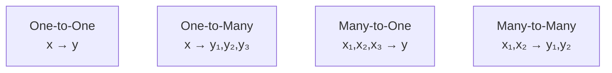

---

### 📋 Types of RNN Based on Architecture

| Type | Key Feature | Gates | Best For |
|---|---|---|---|
| **Vanilla RNN** | Simple loop | None | Short sequences |
| **LSTM** | Memory cells with gates | Forget, Input, Output | Long sequences |
| **GRU** | Simplified LSTM | Reset, Update | Medium sequences |
| **Bidirectional RNN** | Two directions | Depends on base RNN | Context from both sides |
| **Stacked RNN** | Multiple RNN layers | Depends on base RNN | Complex patterns |

---

### 🎯 Summary for Exam Answer

**To get full 6 marks:**
1. **Input-Output Types (3 marks):** Explain 4 types: One-to-One, One-to-Many, Many-to-One, Many-to-Many. Give examples for each.
2. **Architecture Types (3 marks):** Explain Vanilla RNN, LSTM (with gates), GRU, Bidirectional RNN. Mention use cases.

---

### 📚 Theoretical Deep Dive — RNN Taxonomy: Sequence Architectures, Gated Mechanisms, and Computational Trade-offs

**Input-Output Topology — Formal Classification:**

The input-output topology of recurrent networks can be formalized using the sequence lengths of inputs $T_x$ and outputs $T_y$:

- **One-to-One** ($T_x=1, T_y=1$): Equivalent to standard feedforward network with no recurrence, though sometimes used with recurrence in streaming scenarios
- **One-to-Many** ($T_x=1, T_y>1$): The encoder-decoder paradigm. Single input encoded into a context vector which initializes the recurrent decoder. Underlies image captioning (Vinyals et al., 2015 — "Show and Tell"), music generation, and text generation from a prompt.
- **Many-to-One** ($T_x>1, T_y=1$): Entire input sequence processed; only the final hidden state or pooled summary used for prediction. Used for sentiment analysis (sequence of word embeddings → single positive/negative label), document classification, and event detection in time series.
- **Many-to-Many** ($T_x>1, T_y>1$): Subdivided into synchronized many-to-many (each input step produces an output step, as in POS tagging or NER) and asynchronous many-to-many (encoder processes full input first, then decoder generates output, as in machine translation by Sutskever et al., 2014).

**The Vanilla RNN — Elman Network and its Fundamental Limitations:**

The canonical vanilla RNN, originally introduced as the Elman Network in 1990, processes sequences through the recurrence $h_t = \tanh(W_{hh}h_{t-1} + W_{xh}x_t + b_h)$ with output $y_t = W_{hy}h_t + b_y$. The Jacobian of this recurrence with respect to the hidden state is $\frac{\partial h_t}{\partial h_{t-1}} = \text{diag}(1 - \tanh^2(\cdot)) \cdot W_{hh}$. The eigenvalues of $W_{hh}$ determine the dynamics: eigenvalues less than 1 in magnitude cause gradients to vanish exponentially; eigenvalues greater than 1 cause gradients to explode. Hochreiter's diploma thesis (1991) and subsequent work by Bengio et al. (1994) provided seminal mathematical analyses showing vanilla RNNs cannot reliably learn long-range dependencies due to this vanishing/exploding gradient problem, fundamentally motivating the development of gated architectures.

**Long Short-Term Memory (LSTM) — The Gating Innovation:**

LSTM (Hochreiter & Schmidhuber, 1997) introduced the cell state $C_t$ as an explicit memory mechanism running through the entire chain with only linear interactions (element-wise multiplication by the forget gate). The critical design is the additive update: $C_t = f_t \odot C_{t-1} + i_t \odot \tilde{C}_t$. Because partial derivatives of addition are 1, the gradient flows unattenuated through the addition operation. This Constant Error Carousel (CEC) allows LSTMs to preserve gradient information across arbitrarily many time steps when the forget gate remains near 1. The three gates — forget gate $f_t$, input gate $i_t$, output gate $o_t$ — each parameterized as sigmoid-activated linear transformations, provide fine-grained control over what information is retained, added, and exposed. The LSTM architecture has become the dominant recurrent architecture in deep learning, forming the backbone of sequence modeling in early speech recognition systems, early machine translation, and natural language processing pipelines.

**Gated Recurrent Unit (GRU) — Architectural Simplification and Empirical Results:**

The GRU (Cho et al., 2014; Chung et al., 2014) reduces the LSTM from three gates and two states to two gates (reset gate $r_t$ and update gate $z_t$) with a single combined state $h_t$. The update equations are:

$$z_t = \sigma(W_z[h_{t-1}, x_t] + b_z), \quad r_t = \sigma(W_r[h_{t-1}, x_t] + b_r)$$
$$\tilde{h}_t = \tanh(W[r_t \odot h_{t-1}, x_t] + b), \quad h_t = (1-z_t) \odot h_{t-1} + z_t \odot \tilde{h}_t$$

The reset gate controls the contribution of the previous hidden state when computing the candidate activation $\tilde{h}_t$, allowing the model to "reset" its memory for different subtasks within a sequence. The update gate interpolates between preserving the old state and adopting the new candidate. The GRU achieves comparable performance to LSTM on many benchmarks with fewer parameters, though empirical results vary by task and the theoretical equivalence reasons remain an active research area.

**Bidirectional RNN — Temporal Context in Both Directions:**

The Bidirectional RNN (Schuster & Paliwal, 1997) processes sequences in both forward and backward directions with two independent hidden states. At each time step $t$, the forward state $\vec{h}_t$ captures information from $x_1$ through $x_t$, while the backward state $\overleftarrow{h}_t$ captures information from $x_T$ through $x_t$. The output is typically concatenated: $h_t = [\vec{h}_t; \overleftarrow{h}_t]$. This architecture models the full conditional $P(x_t | x_1, \ldots, x_T)$, enabling predictions informed by the complete sequence. This is essential for tasks where future context is informative: Named Entity Recognition, POS tagging, and speech recognition. However, it is limited in online/streaming settings where future inputs are unavailable, as in real-time speech-to-text or live caption generation. The bidirectional approach was a key component of the BiLSTM-CRF model (Huang et al., 2015) that set state-of-the-art on multiple sequence labeling benchmarks.

**Stacked (Deep) RNNs — Hierarchical Representation Learning:**

Stacking multiple RNN layers creates a hierarchy analogous to deep CNNs. The output $h_t^{(l)}$ of layer $l$ at time $t$ becomes the input $x_t^{(l+1)}$ to layer $l+1$. Layer 1 learns low-level patterns (phonemes, characters), layer 2 learns word-level patterns, deeper layers learn phrase-level and discourse-level patterns. Pascanu et al. (2013) analyzed the difficulty of training deep RNNs and found the vanishing gradient problem compounds exponentially with depth. Stacked gated architectures require careful initialization and regularization. Techniques like Layer Normalization and recurrent batch normalization have been developed to stabilize training of deep recurrent stacks.

---

## Q.3 (c) — Justify **RNN is better suited to treat sequential data** than a feedforward neural network. **[5 Marks]**

### 🔄 Why RNN > Feedforward NN for Sequential Data

| Feature | Feedforward NN | RNN |
|---|---|---|
| **Memory** | ❌ No memory | ✅ Has hidden state |
| **Input handling** | Each input independent | Previous inputs affect current |
| **Order matters?** | ❌ No | ✅ Yes |
| **Context** | No context from previous | Carries forward context |
| **Sequences** | Can't handle variable length | ✅ Handles any length |

---

### 📖 Example: Sentence Completion

``` Task: Complete "I grew up in France... I speak fluent ___"

Feedforward NN:
Sees each word as separate input
"I" → process, "grew" → process, "up" → process...
When it sees "___", it has NO memory of "France"!
Cannot complete correctly ❌

RNN:
"I" → h₁ (remembers "I")
"grew" → h₂ (remembers "I grew")
"up" → h₃ (remembers "I grew up")
...
"France" → h₈ (remembers "I grew up in France")
"___" → h₈ has context "France" → outputs "French" ✅
```

---

### 📚 Theoretical Deep Dive — Sequential Data: Formal Definitions, Memory in Computation, and Why Recurrence is Fundamental

**What is Sequential Data? — Formal Characterizations:**

Sequential data is characterized by three mathematical properties that distinguish it from independent-and-identically-distributed (i.i.d.) data: (1) temporal or ordinal structure, where the relative ordering of elements carries semantic information; (2) variable-length dependency windows, where the information relevant to predicting element $x_t$ may be arbitrarily far back in the sequence — this is precisely the long-range dependency problem; and (3) compositional structure, where the meaning of a sequence is a function not just of individual elements but of their hierarchical combinations. Natural language exemplifies all three: the meaning of "the cat sat on the mat" depends on word order (not a set), understanding "sat" requires context that may span the entire sentence, and phrases like "the black cat that chased the mouse that stole the cheese" exhibit recursive compositionality. Time series, DNA sequences, and musical notation share these properties to varying degrees. Formally, a sequence is represented as $X = (x_1, x_2, \ldots, x_T)$ where $T \in \mathbb{Z}^+$ may vary across samples, and the joint distribution $P(X)$ factorizes as $P(x_1, x_2, \ldots, x_T) = \prod_{t=1}^T P(x_t | x_{t-1}, x_{t-2}, \ldots, x_1)$ under the first-order Markov assumption, or more generally $P(x_t | x_{<t})$, where $x_{<t}$ denotes all previous tokens.

**The Feedforward Network as a Stateless Function Approximator:**

A standard feedforward neural network implements a function $f: \mathbb{R}^d \rightarrow \mathbb{R}^k$ applied independently to each input. When applied to $T$ sequential inputs, the network maps $x_1 \mapsto y_1, x_2 \mapsto y_2, \ldots, x_T \mapsto y_T$ independently — there is no parameter sharing across time steps, and no information carrier linking $y_t$ to $y_{t-1}$. Mathematically, the mapping for a sequence of length $T$ is:

$$Y = (f_W(x_1), f_W(x_2), \ldots, f_W(x_T))$$

where $W$ are the learned parameters. Critically, $f_W(x_t)$ does not depend on $x_{<t}$ for any $t > 1$. The network has no mechanism to condition $y_T$ on $x_1$ even when $x_1$ is semantically crucial, as in the language completion example. This is not merely an architectural inconvenience — it is a fundamental representational limitation. No matter how large the feedforward network (depth, width, capacity), it cannot represent functions whose output at time $t$ depends on the entire history $x_{<t}$ because the architecture itself precludes such dependencies.

**Weight Sharing as the Key to Sequence Processing:**

The defining architectural innovation of recurrent neural networks is weight sharing across time. In a vanilla RNN, the same weight matrices $W_{hh}, W_{xh}, W_{hy}$ are applied at every time step. This means the network implements the mapping:

$$h_t = f_W(h_{t-1}, x_t), \quad y_t = g_W(h_t)$$

where $W$ does not vary with $t$. Weight sharing is not merely a parameter efficiency trick — it is a structural commitment to the assumption that the rules governing sequential processing are time-invariant (stationary), enabling the network to generalize to sequences of any length. A feedforward network with $T$ independent weight sets $W^{(1)}, W^{(2)}, \ldots, W^{(T)}$ could theoretically represent any sequence-to-sequence mapping, but would have $O(T \cdot |W|)$ parameters (prohibitive for long sequences) and would not generalize to sequences of unseen lengths. Weight sharing reduces the parameter count to $O(|W|)$ independent of sequence length, which is essential for both computational tractability and generalization to variable-length inputs — a property that feedforward networks fundamentally lack without architectural modification.

**Hidden State as a Summary Statistic of History:**

The hidden state $h_t$ in an RNN serves as the network's internal "memory" or context summary, computed as $h_t = \sigma(W_{hh}h_{t-1} + W_{xh}x_t + b_h)$ (with tanh as the typical non-linearity). This recurrence relation is a discretized dynamical system — specifically, a time-invariant nonlinear dynamical system driven by external inputs. The state space of the hidden state (the $\mathbb{R}^d$ manifold where $h_t$ lives) is the network's working memory. At each time step, the network can: (1) write new information from $x_t$ into the state via $W_{xh}x_t$; (2) modify existing state via $W_{hh}h_{t-1}$; (3) read the state and produce output via $W_{hy}h_t$. This read-write-modify loop is the functional analog of the von Neumann architecture's memory-register model applied to sequence processing.

**Vanishing Gradient and the Representational Limits of Simple Recurrence:**

Despite the theoretical elegance of the recurrence formulation, simple RNNs suffer from the vanishing gradient problem, which limits their ability to learn long-range dependencies. Consider backpropagating an error signal from time $T$ to time $t < T$. The gradient involves the Jacobian of the recurrence composed $T-t$ times:

$$\frac{\partial L}{\partial h_t} = \frac{\partial L}{\partial h_T} \cdot \prod_{k=t+1}^T \frac{\partial h_k}{\partial h_{k-1}}$$

where $\frac{\partial h_k}{\partial h_{k-1}} = \text{diag}(1 - \tanh^2(\cdot)) \cdot W_{hh}$. If the spectral radius of $W_{hh}$ is less than 1, this product decays exponentially with sequence length, making gradients at early time steps effectively zero — the network cannot learn to connect decisions at $t$ with rewards or errors at $T \gg t$. This phenomenon, first described by Hochreiter (1991) and extensively analyzed by Bengio et al. (1994), explains why vanilla RNNs struggle with tasks requiring long-term memory (e.g., language modeling over documents, speech recognition of long utterances).

**RNN Architecture — Universal Approximation for Sequences:**

From a theoretical computer science perspective, recurrent networks with a finite-dimensional hidden state and appropriate non-linearities are Turing-complete (Siegelmann & Sontag, 1992), meaning they can simulate any Turing machine given sufficient hidden state dimension and appropriate weight configuration. This result establishes that recurrent networks have sufficient representational capacity to implement any sequential algorithm, making them fundamentally more expressive than any finite-depth feedforward architecture for sequence processing tasks. The proof constructs a mapping from Turing machine configurations to hidden states, with the recurrence implementing the transition function. While this theoretical result does not guarantee practical learnability (the required weight configuration may be unreachable by gradient-based training), it establishes that the representational limitation of feedforward networks is not merely practical but architectural: no feedforward network, regardless of size, can implement the general sequential algorithm that an RNN can represent.

---

### 🎯 Summary for Exam Answer

**To get full 5 marks:**
1. **Memory argument (1.5 marks):** Feedforward has no memory, each input independent. RNN has hidden state carrying previous information.
2. **Order handling (1.5 marks):** Feedforward treats inputs as unordered set. RNN processes in sequence, order matters.
3. **Example (2 marks):** Sentence completion showing how RNN uses context from many words ago while feedforward cannot.

---

# UNIT II (Alternative) — RNN Deep Dive

---

## Q.4 (a) — Explain **Recurrent Neural Network** with its architecture. **[6 Marks]**

### 🔄 RNN Architecture — The Looping Design

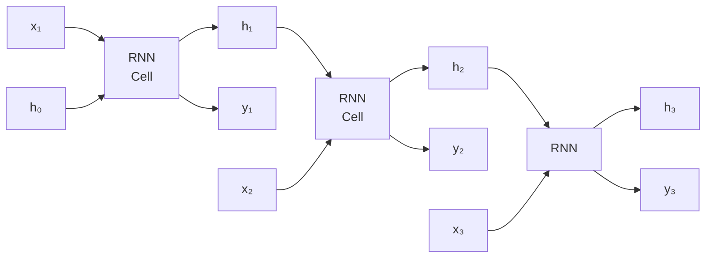

---

### 📐 RNN Math

```
At each time step t:
  h_t = tanh(W_hh × h_{t-1} + W_xh × x_t + b_h)
  y_t = W_hy × h_t + b_y

Components:
  x_t = current input
  h_t = current hidden state (memory)
  h_{t-1} = previous memory
  W = weights (SAME across all steps = weight sharing!)
```

---

### 🔑 Key Features of RNN Architecture

| Feature | Explanation |
|---|---|
| **Recurrent Connection** | Hidden state feeds back to itself |
| **Weight Sharing** | Same weights used at every time step |
| **Hidden State** | Carries memory from past to future |
| **Sequential Processing** | Processes one step at a time |
| **Variable Length** | Can handle any sequence length |

---

### 🎯 Summary for Exam Answer

**To get full 6 marks:**
1. **Architecture diagram (1 mark):** Draw the RNN loop diagram showing x→h→y with feedback.
2. **How it works (2 marks):** Explain hidden state h_t = f(h_{t-1}, x_t). Same cell at each step. Memory flows forward.
3. **Weight sharing (1 mark):** Same weights used at every time step — enables variable-length sequences.
4. **Advantages over FFNN (2 marks):** Handles sequential data, remembers context, order matters.

---

### 📚 Theoretical Deep Dive — RNN Architecture: Dynamical Systems Perspective, Unfolding, Backpropagation Through Time, and Training Challenges

**The Unfolded Computational Graph — Temporal Depth as Spatial Depth:**

The RNN architecture is most rigorously understood through the concept of the unfolded computational graph. At each time step $t$, the RNN computes $h_t = f(h_{t-1}, x_t)$, but for a sequence of length $T$, the computation involves $T$ sequential applications of the same function $f$. When "unfolded," this produces a directed acyclic graph of depth $T$, where each time step corresponds to a layer in the unfolded network. This unfolding reveals why RNNs can be viewed as very deep feedforward networks with a special weight-sharing constraint: the weight matrices $W_{hh}$ and $W_{xh}$ appear at every layer of the unfolded graph. The total number of distinct parameters is $|W| + d_h + d_y$ (where $d_h$ is hidden state dimension and $d_y$ is output dimension) regardless of sequence length $T$, which is the mathematical expression of weight sharing. The unfolded view also makes clear why backpropagation through time (BPTT) is the natural training algorithm: it is simply backpropagation applied to this unfolded graph. The gradients are computed by tracing backward through each time step, accumulating partial derivatives according to the chain rule.

**Backpropagation Through Time — Derivation and Computational Cost:**

Consider the loss $L = \sum_{t=1}^T \ell(y_t, \hat{y}_t)$ where $\hat{y}_t = W_{hy} h_t + b_y$. BPTT computes:
$$\frac{\partial L}{\partial W_{xh}} = \sum_{t=1}^T \frac{\partial L}{\partial h_t} \cdot \frac{\partial h_t}{\partial W_{xh}}$$

and critically:
$$\frac{\partial L}{\partial W_{hh}} = \sum_{t=1}^T \frac{\partial L}{\partial h_t} \cdot \left(\prod_{k=2}^t \frac{\partial h_k}{\partial h_{k-1}}\right) \cdot \frac{\partial h_1}{\partial W_{hh}}$$

where $\frac{\partial h_k}{\partial h_{k-1}} = \text{diag}(1 - \tanh^2(h_{k-1})) \cdot W_{hh}$ is the recurrent Jacobian at step $k$. This sum over $T$ past gradients is the Jacobian accumulation term, and it is bounded in magnitude by $\|W_{hh}\|^{T-j}$ for gradient propagation from time $j$ to $T$. If the largest eigenvalue of $W_{hh}$ (its spectral norm) is less than 1, gradients vanish; if greater than 1, gradients explode. Truncated BPTT (BPTT-$k$) limits this sum to the last $k$ time steps, trading the ability to learn long-range dependencies for reduced computational cost $O(k)$ per parameter.

**Parameter Initialization and Orthogonal Constraints:**

Given the sensitivity of RNN training dynamics to $W_{hh}$'s spectral properties, appropriate initialization is critical. Orthogonal initialization (Saxe et al., 2014) sets $W_{hh}$ to a random orthogonal matrix (so $\|W_{hh}\|_2 = 1$), preserving gradient norms through time initially. This is motivated by the observation that the condition number of the Jacobian accumulation product $\prod_{k} W_{hh}$ for orthogonal $W_{hh}$ is 1, meaning gradients neither vanish nor explode at initialization. The spectral norm of the recurrent weight matrix controls the dynamical regime of the RNN: if $\|W_{hh}\|_2 < 1$, the hidden state is a stable fixed-point system (all trajectories converge to a fixed point, useful for attractor computation); if $\|W_{hh}\|_2 > 1$, the system exhibits chaotic dynamics where small input perturbations lead to exponentially diverging trajectories, making the hidden state representation unstable and non-robust. Training typically targets $\|W_{hh}\|_2 \approx 1$ to balance stability and expressivity.

**Variational Dropout and Regularization for Recurrent Networks:**

Standard dropout applied to recurrent connections is problematic because it adds noise to the same computation at every time step, which has been shown to be detrimental compared to dropout applied only to non-recurrent connections. Variational Dropout (Gal & Ghahramani, 2016) extends dropout by using the same dropout mask for all time steps, making the process consistent with a Bayesian interpretation of the RNN as performing approximate variational inference. At test time, the variational dropout mask becomes a deterministic multiplicative factor on the weights, equivalent to weight scaling at test time. Zoneout (Krueger et al., 2017) is a related technique that stochastically preserves the previous hidden state rather than zeroing it, providing a form of stochastic residual connection that has empirically shown to improve performance on language modeling tasks.

**Architectural Variants of the Basic RNN:**

Beyond the basic Elman architecture, several notable variants have been proposed:

- **Residual RNNs (Ganguly et al., 2015):** Apply a skip connection $h_t = x_t + f(x_{t-1}, h_{t-1})$ to mitigate the vanishing gradient by providing a direct gradient path
- **Multiplicative RNNs (Sutskever et al., 2011):** Replace the linear transformation $W_{xh}x_t$ with a multiplicative interaction $h_t = f(U_h \cdot (h_{t-1} \otimes x_t))$, enabling the network to model context-dependent transitions (where the transition dynamics depend on the current input) rather than fixed dynamics
- **Recurrent Highway Networks (Zilly et al., 2017):** Extend the LSTM gating mechanism with depth — each layer within the RNN cell can have its own gates, allowing the RNN to learn to adjust the effective "recurrence depth" dynamically

**Theoretical Expressivity and the Weisfeiler-Lehman Test:**

An important result in understanding RNN expressivity connects recurrent networks to the Weisfeiler-Lehman (WL) graph isomorphism test (Loukas, 2020). The WL test iteratively updates node labels by aggregating neighbor label multisets. An RNN applied to a sequence of node features (as in graph neural networks or sequential processing) can be shown to implement a variant of WL when using ReLU or similar monotone activations with suitable aggregation functions. This connection provides a theoretical understanding of why RNNs (and more broadly, recursive neural networks and graph neural networks) can learn graph isomorphism-invariant but discriminative representations of structured data, and helps explain their empirical success in tasks involving structured input representations.

---

## Q.4 (b) — Draw and explain architecture for **Long Short-Term Memory (LSTM)**. **[6 Marks]**

### 🧠 LSTM Architecture — The Memory Cell

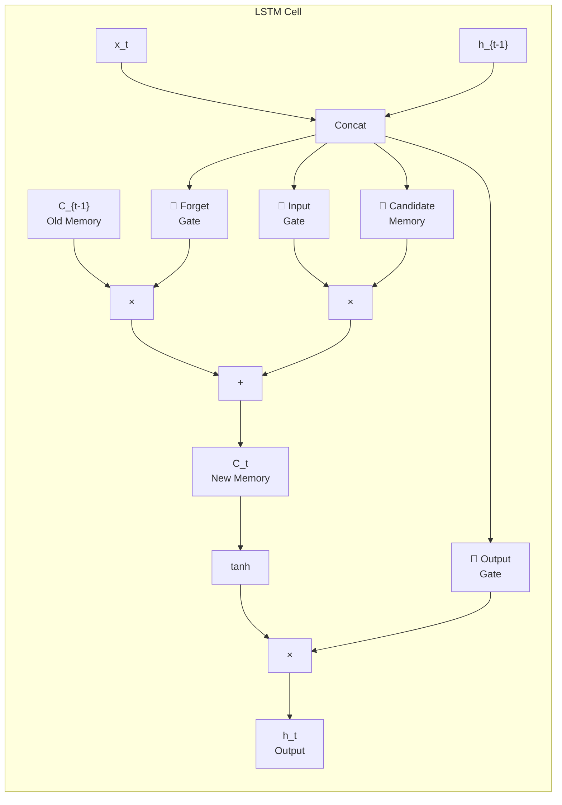

---

### 🚪 The Three Gates

| Gate | Symbol | Purpose | Activation |
|---|---|---|---|
| **Forget Gate** | f_t | What to delete from memory | Sigmoid (0-1) |
| **Input Gate** | i_t | What new info to store | Sigmoid (0-1) |
| **Output Gate** | o_t | What to output now | Sigmoid (0-1) |

---

### 📐 LSTM Equations

```
Forget Gate:    f_t = σ(W_f · [h_{t-1}, x_t] + b_f)
Input Gate:     i_t = σ(W_i · [h_{t-1}, x_t] + b_i)
Candidate:      C̃_t = tanh(W_C · [h_{t-1}, x_t] + b_C)
New Memory:     C_t = f_t × C_{t-1} + i_t × C̃_t
Output Gate:    o_t = σ(W_o · [h_{t-1}, x_t] + b_o)
Hidden State:   h_t = o_t × tanh(C_t)
```

---

### 🎯 Summary for Exam Answer

**To get full 6 marks:**
1. **Diagram (1.5 marks):** Draw LSTM cell showing all 3 gates, memory cell C_t, hidden state h_t.
2. **Three gates (2 marks):** Explain each gate: Forget (what to remove), Input (what to add), Output (what to output). Give formulas.
3. **Working (2.5 marks):** Step-by-step: current input + previous memory → gates decide → update memory → output. Explain how this solves vanishing gradient.

---

### 📚 Theoretical Deep Dive — LSTM Architecture: Gating Theory, Computational Graph Structure, and Training Dynamics

**Historical Development and the Long-Term Dependency Problem:**

The Long Short-Term Memory architecture was introduced by Hochreiter and Schmidhuber in their 1997 paper "Long Short-Term Memory" published in Neural Computation. The motivation was direct: the vanishing gradient problem identified by Hochreiter in his 1991 diploma thesis and subsequently by Bengio et al. (1994) made it clear that vanilla RNNs could not reliably learn long-range dependencies. The core insight of the LSTM is to replace the simple recurrence $h_t = \tanh(W_{hh}h_{t-1} + W_{xh}x_t)$ with a more complex cell structure that provides an explicit path for gradient flow with minimal attenuation. The original LSTM paper provided both empirical evidence on formal language tasks (where the LSTM could learn context-free languages that vanilla RNNs could not) and theoretical arguments connecting to the Constant Error Carousel principle.

**The Cell State as a Dedicated Memory Highway:**

The defining structural feature of the LSTM is the cell state $C_t$, which runs the length of the sequence as a "memory highway" that receives only linear (element-wise multiplication) modifications at each time step. This is in contrast to the hidden state of a vanilla RNN, which is subject to both linear and non-linear transformations at every step (via the tanh activation). The cell state $C_t$ evolves according to:

$$C_t = f_t \odot C_{t-1} + i_t \odot \tilde{C}_t$$

This equation contains two additive paths: the forget gate $f_t$ controls what information survives from $C_{t-1}$, and the input gate $i_t$ selects what new information enters from $\tilde{C}_t$ (the candidate memory). Critically, the partial derivative of $C_t$ with respect to any individual element of $C_{t-1}$ is simply $f_t$ — it does not involve matrix multiplication with the recurrent weight matrix $W_{hh}$. When $f_t \approx 1$, the element is preserved essentially unchanged, allowing gradient signals to flow across arbitrarily many time steps unchanged. This is the Constant Error Carousel (CEC) mechanism.

**The Three Gates — Protection of the Memory Cell:**

The LSTM's three gating mechanisms each serve a specific protective function for the cell state:

- **Forget Gate $f_t = \sigma(W_f[h_{t-1}, x_t] + b_f)$:** Controls what to discard from the cell state. Sigmoid output ranges from 0 (completely forget) to 1 (completely preserve). The forget gate is not simply "erasing" memory — it determines the retention rate of the previous cell state. Learning that certain information should be perpetually retained (e.g., speaker identity in speech) corresponds to $f_t \rightarrow 1$ for the relevant cell dimensions.

- **Input Gate $i_t = \sigma(W_i[h_{t-1}, x_t] + b_i)$:** Coordinates with the forget gate — when $f_t$ is low (forgetting), $i_t$ typically becomes higher (writing new information), creating a push-pull mechanism for controlled memory update. The design choice of using sigmoid for both $f_t$ and $i_t$ has been analyzed; in practice, many LSTM implementations implicitly encourage $f_t \approx 1$ at initialization (by using positive bias values for the forget gate bias $b_f$), which empirically improves early training stability.

- **Output Gate $o_t = \sigma(W_o[h_{t-1}, x_t] + b_o)$:** Controls what information from the cell state is exposed as the output hidden state $h_t = o_t \odot \tanh(C_t)$. This gate serves two purposes: (1) it prevents the cell state from affecting the rest of the network in unintended ways (filtering), and (2) it prevents the bounded output $h_t \in [-1, 1]$ (due to the tanh) from being constraining — the cell state itself is not constrained, allowing for unbounded accumulation of evidence across time.

**Mathematical Analysis of Gradient Flow:**

To quantify why LSTM resolves the vanishing gradient problem, consider the derivative of the total loss $L$ with respect to a cell state element $C_t[j]$ at an earlier time step $t$:

$$\frac{\partial L}{\partial C_t[j]} = \frac{\partial L}{\partial C_T} \cdot \prod_{k=t+1}^T \frac{\partial C_k[j]}{\partial C_{k-1}[j]}$$

where $\frac{\partial C_k[j]}{\partial C_{k-1}[j]} = f_k[j]$. If the forget gate activation at dimension $j$ is consistently $f_k[j] \approx 1$ for all intermediate steps $k$, then the product equals 1, and gradients flow perfectly from $T$ to $t$. This is in stark contrast to vanilla RNNs where the gradient product involves the recurrent Jacobian $\prod_{k=t+1}^T \tanh'(net_k) \cdot W_{hh}$, where $\tanh'(x) < 1$ for all $x$, causing exponential decay over long sequences.

**Bias Initialization — A Critical Practical Detail:**

A frequently overlooked but empirically critical detail of LSTM implementation is the initialization of the forget gate bias $b_f$. Gers et al. (2000) observed that initializing $b_f = 1$ (or equivalently, initializing the forget gate sigmoid output to $f_t \approx 0.86$ at the start of training) dramatically improves optimization. The intuition: at initialization, the LSTM is allowed to remember everything (the cell state flows freely), which gives the gradients an open path during early learning. As training progresses, the network learns to selectively forget when appropriate. Standard implementations in PyTorch, TensorFlow, and other frameworks default to this initialization strategy, which is one of the few architecture-specific initialization recommendations that is consistently followed in practice.

**Comparison of LSTM vs. GRU Design Choices:**

The GRU (Cho et al., 2014) simplifies the LSTM by merging the cell state and hidden state into a single state vector $h_t$, and reducing the gates from three to two. The update equations can be viewed as a special case of the LSTM where the cell state is replaced by the hidden state and the candidate $\tilde{C}_t$ is gated by the reset gate rather than a separate input gate. The empirical trade-off between LSTM and GRU has been extensively studied: Chung et al. (2014) found them to be roughly equivalent across several sequence modeling benchmarks (speech recognition, language modeling), with neither consistently dominating. The theoretical explanation advanced by Greff et al. (2016) is that both architectures implement similar gating mechanisms with different parameterizations — the additional degrees of freedom in LSTM (3 gates, 2 states) rarely provide a representational advantage because the gradients can largely flow through a single effective path in either architecture.

**LSTM in Modern Architectures and the Transformer Transition:**

The LSTM dominated sequence modeling from approximately 2014 to 2018, serving as the core recurrent block in machine translation (Sutskever et al., 2014), speech recognition (Graves & Schmidhuber, 2005; Bahdanau et al., 2016), and language modeling (Zaremba et al., 2014). However, the Transformer architecture (Vaswani et al., 2017) has since largely replaced RNN-based models in NLP, achieving state-of-the-art results without recurrence by using self-attention mechanisms. The key advantage of attention is parallelizability across time steps (there is no sequential dependency in forward computation), whereas LSTM requires $O(T)$ sequential steps. Nevertheless, LSTMs remain important in scenarios where: (1) sequential constraints prevent attention use (e.g., real-time speech processing); (2) computational resources are limited (LSTMs have smaller constant factor than Transformer self-attention for long sequences); or (3) the temporal structure is such that recurrence provides a useful inductive bias (e.g., modeling temporal dynamics in control or robotics).

---

## Q.4 (c) — Explain how the **memory cell in the LSTM** is implemented computationally. **[5 Marks]**

### 🧠 LSTM Memory Cell — Computational Details

The LSTM memory cell maintains a **cell state C_t** that runs through the entire chain with only minor linear interactions, allowing gradient to flow unchanged.

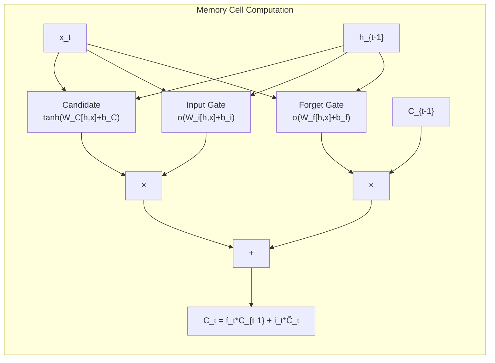

---

### 📐 Computational Steps

```
Step 1: Forget Gate decides what to REMOVE from memory
  f_t = σ(W_f · [h_{t-1}, x_t] + b_f)
  Range: 0 (forget all) to 1 (keep all)

Step 2: Input Gate decides what NEW info to STORE
  i_t = σ(W_i · [h_{t-1}, x_t] + b_i)
  C̃_t = tanh(W_C · [h_{t-1}, x_t] + b_C)  (candidate values)

Step 3: Update Cell State
  C_t = f_t × C_{t-1} + i_t × C̃_t
  = (forget old) + (add new)

Step 4: Output Gate decides what to OUTPUT
  o_t = σ(W_o · [h_{t-1}, x_t] + b_o)
  h_t = o_t × tanh(C_t)
```

---

### 🔑 Why This Prevents Vanishing Gradient

```
The cell state C_t is updated via ADDITION:
  C_t = f_t × C_{t-1} + i_t × C̃_t

The ADD operation preserves gradient flow:
  If f_t ≈ 1 (gate open), gradient flows through unchanged!
  Unlike RNN where h_t = tanh(W×h_{t-1} + ...) — multiplication shrinks gradient.

This is called the "Constant Error Carousel" — gradients can flow unchanged!
```

---

### 🎯 Summary for Exam Answer

**To get full 5 marks:**
1. **Cell state concept (1 mark):** C_t is the memory, carries information forward with minimal change.
2. **Computational steps (2.5 marks):** Explain 4 steps with formulas:
   - Forget gate: f_t = σ(W_f·[h,x]+b_f)
   - Input gate + candidate: i_t = σ(...), C̃_t = tanh(...)
   - Update: C_t = f_t×C_{t-1} + i_t×C̃_t
   - Output: o_t = σ(...), h_t = o_t×tanh(C_t)
3. **Why it helps (1.5 marks):** The addition in C_t preserves gradient flow. If f_t≈1, gradient flows unchanged — solves vanishing gradient.

---

# UNIT III — Generative Models & GAN

---

## Q.5 (a) — Explain **Deep Generative Model** with example. **[6 Marks]**

### 🧠 Deep Generative Models — "Models That Create"

**Deep Generative Models** learn the **probability distribution P(x)** of training data and can **generate new data samples**.

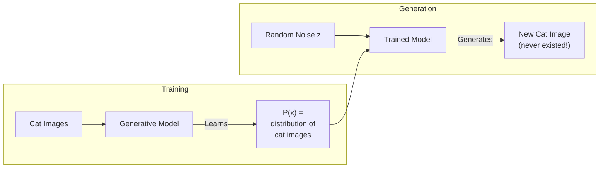

---

### 📦 Examples of Deep Generative Models

| Model | How It Works | Output |
|---|---|---|
| **GAN** | Generator vs Discriminator | High-quality images |
| **VAE** | Encode → Latent → Decode | Smooth variations |
| **DBN** | Stacked RBMs | Feature learning |
| **Diffusion** | Gradual denoising | Latest best quality |

---

### 🎨 Concrete Example: Face Generation with StyleGAN

```
Training:
  - Show StyleGAN 10,000 real human face photos
  - Model learns P(x): what makes a face look real
  - Learns: eye positions, nose shape, skin texture, lighting...

Generation:
  - Start with random noise z = [0.5, -0.3, ...]
  - Model processes through style generator
  - Output: 1024×1024 hyper-realistic human face
  - This face NEVER existed before!

Result: thispersondoesnotexist.com
```

---

### 🎯 Summary for Exam Answer

**To get full 6 marks:**
1. **Definition (1 mark):** Deep generative models learn P(x) distribution and generate new samples.
2. **How it works (2 marks):** Training — learn from data. Generation — sample from learned distribution to create new data. Use art analogy.
3. **Types (1.5 marks):** Explain 3 types: GAN, VAE, DBN/Diffusion.
4. **Example (1.5 marks):** StyleGAN face generation example with concrete details.

---

---

### 📚 Theoretical Deep Dive — Deep Generative Models: Probability Density Estimation, Likelihood Maximization, and the Generative-Adversarial Framework

Deep generative models represent a fundamental paradigm shift in machine learning: rather than learning discriminative mappings from inputs to outputs, these models learn the underlying probability distribution P(x) of the data generating process, enabling both density estimation and novel sample generation. The mathematical distinction between discriminative and generative modeling is rooted in Bayesian probability theory. A discriminative model learns P(y|x), modeling the boundary between classes; a generative model learns P(x), the full joint distribution over all observable variables. From Bayes' rule: P(y|x) = P(x|y)P(y)/P(x), a generative model can in principle derive any discriminative model, though with more computational effort. This distinction, rigorously analyzed by Ng and Jordan (2002), reveals that generative models require stronger parametric assumptions (must model the full high-dimensional data distribution) but provide richer capabilities including handling missing data, performing data imputation, and generating novel samples.

**Variational Autoencoders — Reparameterization Trick and Latent Space Structure:**

The Variational Autoencoder (Kingma & Welling, 2013; Rezende et al., 2014) casts generative modeling as an optimization problem in variational inference. The key insight is to define a tractable lower bound on the data log-likelihood log P(x) called the Evidence Lower Bound (ELBO):

$$L(θ, φ; x) = E_{z~q_φ(z|x)}[log P_θ(x|z)] - D_KL(q_φ(z|x) || P(z))$$

The encoder q_φ(z|x) is a neural network (typically a deep CNN) that maps input x to a distribution over latent variables z, usually parameterized as Gaussian with mean μ_φ(x) and diagonal covariance σ_φ(x). The decoder P_θ(x|z) maps latent samples to output reconstructions. The reparameterization trick z = μ_φ(x) + σ_φ(x) ⊙ ε where ε ~ N(0, I) enables gradient flow through the stochastic sampling node, making end-to-end training feasible via standard backpropagation. Without this trick, the gradient cannot propagate through the sampling operation, which is a non-differentiable stochastic node. VAEs produce smooth, continuous latent spaces where linear interpolation between two points z_1 and z_2 yields sensible intermediate samples — a property that arises from the Gaussian prior regularizing the latent space and the amortized inference structure. This smooth interpolation property is less pronounced in GANs, where the learned latent space may have gaps or discontinuities.

**Generative Adversarial Networks — Minimax Game and Nash Equilibrium:**

The GAN framework (Goodfellow et al., 2014) frames generative modeling as a two-player adversarial game: a generator G(z) that produces samples from noise z ~ P_z, and a discriminator D(x) that estimates the probability that x came from real data rather than G. The training objective is a minimax game: min_G max_D V(D, G) = E_{x~P_data}[log D(x)] + E_{z~P_z}[log(1 - D(G(z)))]. In the theoretical optimal solution (Nash equilibrium), the generator perfectly reproduces the true data distribution P_G = P_data, and the discriminator outputs D(x) = 0.5 everywhere (maximally uncertain about source). From an information-theoretic perspective, the value function V(D,G) minimizes the Jensen-Shannon divergence JSD(P_data || P_G) between the real and generated distributions. However, the JSD has vanishing gradients when the two distributions do not overlap in high-dimensional spaces — a common situation early in GAN training. This motivated the Wasserstein GAN (Arjovsky et al., 2017) which replaces the JS divergence with the Earth Mover's (Wasserstein-1) distance: W(P_data, P_G) = sup_{||f||_L<=1} E_{x~P_data}[f(x)] - E_{x~P_G}[f(x)]. The Wasserstein distance provides a smoother, more meaningful gradient signal throughout training even when distributions do not overlap.

**Diffusion Models — Denoising Score Matching and Iterative Refinement:**

Diffusion models (Sohl-Dickstein et al., 2015; Ho et al., 2020; Song et al., 2021) define a generative process by reversing a gradual noising process. The forward diffusion process adds Gaussian noise over T steps: x_t = sqrt(alpha_bar_t) x_0 + sqrt(1 - alpha_bar_t) ε where ε ~ N(0,I). The reverse process learns p_θ(x_{t-1}|x_t) as a Gaussian with learned mean μ_θ(x_t, t). The training objective simplifies to denoising score matching: L = E_{t, x_0, ε} [|| ε - ε_θ(sqrt(alpha_bar_t) x_0 + sqrt(1-alpha_bar_t) ε, t) ||^2]. Modern implementations like DDPM, DDIM, and Stable Diffusion have surpassed GANs on image quality benchmarks (FID scores) while offering better mode coverage and training stability. The latent diffusion model by Rombach et al. (2022) applies diffusion in a compressed VAE latent space, reducing computation by a factor of ~32 and enabling text-to-image generation at scale.

**Deep Belief Networks — Restricted Boltzmann Machines and Layerwise Pretraining:**

The Deep Belief Network (Hinton et al., 2006) was historically the first successful deep generative model. An RBM is a bipartite undirected graphical model with visible units v and hidden units h, with energy function E(v,h) = -b^T v - c^T h - v^T W h. The joint distribution is P(v,h) = (1/Z) exp(-E(v,h)) where Z is the intractable partition function. RBMs are trained via Contrastive Divergence (Hinton, 2002), an MCMC-based approximation that requires only one Gibbs sampling step. DBNs are built by greedily stacking RBMs: the hidden activations of one RBM become the visible units of the next. This layerwise pretraining was historically essential for initializing deep supervised networks before the advent of modern initialization schemes (He et al., 2015) and residual connections.

**Evaluation Metrics for Generative Models:**

Evaluating generative models is non-trivial because the output space is continuous and high-dimensional. The Inception Score (Salimans et al., 2016): IS = exp(E_{x~P_g} D_KL(p(y|x) || p(y))) uses a pretrained Inception network to measure class clarity and diversity. Fréchet Inception Distance (FID, Heusel et al., 2017): FID = ||μ_r - μ_g||^2 + Tr(Σ_r + Σ_g - 2(Σ_r Σ_g)^(1/2)) compares the statistics of real and generated feature distributions. For likelihood-based models, bits-per-dimension (BPD) = -(1/d)E[log_2 P_θ(x)] measures compression quality with lower being better.


## Q.5 (b) — How does **GAN training scale with batch size**? **[6 Marks]**

### 📊 GAN Training and Batch Size

**Batch size** is the number of training examples processed together in one update. It affects GAN training stability, speed, and quality.

---

### 📈 How Different Batch Sizes Affect GAN Training

| Batch Size | Training Speed | Stability | Quality | Memory |
|---|---|---|---|---|
| **1 (Batch=1)** | Slow | ❌ Unstable | Lower | Low |
| **8-16** | Medium | ⚠️ Somewhat unstable | Medium | Medium |
| **32-64** | Fast | ✅ Stable | Good | High |
| **128-256** | Faster | ✅ More stable | Better | Very High |
| **512+** | Fastest | ✅ Most stable | Best (ish) | Very High |

---

### 📋 Effects of Batch Size on GAN

#### **Small Batch Size Problems:**
```
1. NOISY GRADIENTS:
   - With 1-2 examples, each gradient estimate is very noisy
   - Discriminator updates are erratic
   - Generator gets confusing feedback

2. MODE COLLAPSE:
   - Generator finds ONE type of output that always fools D
   - Stops producing variety
   - Example: Generator only produces one type of cat face

3. UNSTABLE TRAINING:
   - D and G oscillate wildly
   - Cannot converge
   - Loss values jump up and down
```

#### **Large Batch Size Benefits:**
```
1. SMOOTHER GRADIENTS:
   - More examples = more accurate gradient estimate
   - Updates are more stable and reliable

2. BETTER STATISTICS:
   - Batch Normalization works better with larger batches
   - More representative sample of data distribution

3. FASTER TRAINING:
   - GPUs process batches in parallel
   - More data per GPU operation
```

---

### ⚠️ Too Large Batch Size Problem

```
Very large batches (e.g., 1024+):
  1. Generalization gap: Model may overfit to the "average" example
  2. Memory limits: May not fit in GPU memory
  3. Diminishing returns: Beyond certain size, quality doesn't improve much
```

---

### 📐 Batch Size and Discriminator Updates

```
Standard GAN training:
  For every 1 Generator update, do 5 Discriminator updates
  (D needs more training to keep up with G)

With larger batch:
  Can do more D updates per G update
  More stable training
```

---

### 🎯 Summary for Exam Answer

**To get full 6 marks:**
1. **Small batch problems (2 marks):** Explain — noisy gradients, unstable training, mode collapse. Generator gets confused feedback.
2. **Large batch benefits (2 marks):** Explain — smoother gradients, better statistics, stable training, faster.
3. **Too large issues + practical recommendation (2 marks):** Explain diminishing returns after certain size. Mention typical values: 32-64 for stability, adjust based on GPU memory.

---

---

### 📚 Theoretical Deep Dive — GAN Training Dynamics: Minimax Optimization, Gradient Vanishing, Mode Collapse, and Stabilization Techniques

Gradient Descent in Adversarial Settings is fundamentally different from standard supervised learning. Where supervised optimization minimizes a single scalar loss function, GAN training requires simultaneous optimization of two networks with opposing objectives, introducing a non-cooperative game-theoretic dynamic. Goodfellow et al.'s (2014) original formulation defined the generator objective as minimizing log(1 - D(G(z))), which they demonstrated is mathematically equivalent to minimizing JSD(P_data || P_G) — however, this loss suffers from vanishing gradients when P_G is far from P_data (the discriminator correctly identifies generated samples as fake, making log(1-D(G(z))) ~ 0 and its gradient near zero). This motivated the replacement with generator loss max E[log D(G(z))], which provides stronger gradients early in training. The alternating optimization between generator and discriminator creates a dynamic system where each player's update changes the optimization landscape for the other — a property absent in standard deep learning.

**Mode Collapse — Mathematical Characterization and Solutions:**

Mode collapse occurs when the generator maps many different noise vectors z to the same or very similar output G(z), effectively collapsing to a low-dimensional manifold in the data space. Formally, the generated distribution P_G concentrates on a proper subset of the data support manifold, failing to cover the full diversity of P_data. This phenomenon can be understood as the generator finding a "safe" point in the discriminator's decision space — a particular output pattern that reliably fools D even if it lacks diversity. The discriminator, seeing only a narrow set of generated samples, learns to defend against those specific patterns, creating a feedback loop. Solutions include: minibatch discrimination (Salimans et al., 2016) where the discriminator receives information about minibatch diversity via a tensor product operation; unrolled GANs (Metz et al., 2016) where the generator optimizes against k-step future discriminator states; and gradient penalty (Gulrajani et al., 2017, WGAN-GP) which penalizes the discriminator's gradient norm, preventing it from forming overly sharp decision boundaries that the generator can exploit.

**Batch Size and Discriminator Overfitting — The K-Ahead Training Framework:**

The empirical observation that too-small batch sizes cause instability and too-large batch sizes may cause the discriminator to overfit to a biased estimate of the data distribution is mathematically explained by the bias-variance tradeoff in gradient estimation. The discriminator gradient at generator update step k uses a finite-batch sample from the empirical data distribution. With small batches (B=1 or B=2), the gradient estimate has very high variance, causing erratic discriminator updates that provide contradictory signals to the generator. With very large batches, the discriminator converges to a near-optimal discriminator for the empirical batch distribution (which may be a poor approximation of the full data distribution), providing a misleading gradient signal. The standard heuristic of multiple discriminator updates per generator update (e.g., the 5:1 D-Update ratio from the original GAN paper) empirically balances bias and variance: by updating D more frequently, D stays approximately optimal with respect to the current G, ensuring meaningful gradients. This k-discriminator-update heuristic can be analyzed as approximating the Nash equilibrium where D has converged before G updates.

**Spectral Normalization — Imposing Lipschitz Constraints on the Discriminator:**

Miyato et al. (2018) introduced spectral normalization, which constrains the spectral norm (largest singular value) of each weight matrix in the discriminator to exactly 1, enforcing a 1-Lipschitz condition. This directly corresponds to the theoretical requirement for Wasserstein-1 distance estimation in the WGAN formulation. The spectral norm is estimated via iterative power iteration at each weight update, a practical approximation that converges to the dominant right singular vector. By controlling the Lipschitz constant of the discriminator, spectral normalization prevents the discriminator from making arbitrarily sharp decision boundaries, which would either provide infinite or vanishing gradients in different regions of the data space — the root cause of GAN training instability. The constraint also provides a direct theoretical connection to the Kantorovich-Rubinstein dual formulation of the Wasserstein distance, where the optimal transport cost is approximated by the supremum over all 1-Lipschitz functions.

**Two-Time-Scale Stochastic Approximation and Global Convergence Guarantees:**

The convergence properties of GAN training have been formally analyzed via two-time-scale stochastic approximation (Heusel et al., 2017, TTUR). The generator parameters θ_G are updated with learning rate η_G, and discriminator parameters θ_D with learning rate η_D. Convergence to a local Nash equilibrium is guaranteed under the condition η_D / η_G -> 0 as training progresses — the discriminator must converge faster than the generator (fast timescale for D, slow for G). This theoretical result explains the empirical observation that D should be updated more frequently with larger per-step learning rates. Recent work by Mescheder et al. (2018) on "The Numerics of GANs" further linked training instability to the choice of optimizer: first-order methods like Adam with momentum can create oscillatory dynamics in the non-convex two-player game, while second-order methods and specific gradient regularization schemes (like the WGAN-GP gradient penalty) provide smoother but more stable convergence to approximate equilibria.


## Q.5 (c) — List the **applications of GAN** network with description. **[6 Marks]**

### 🌟 GAN Applications — "Almost Limitless Creativity"

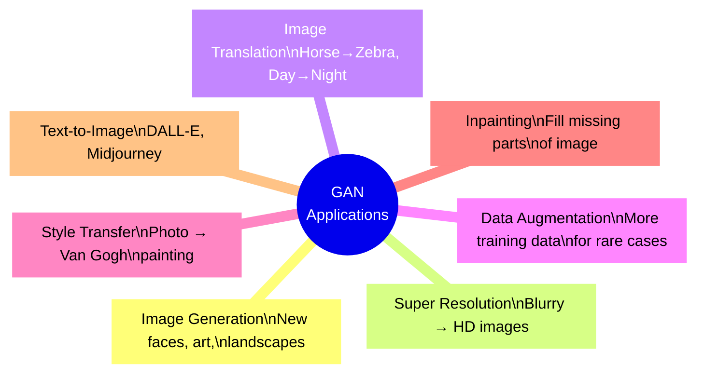

---

### 📋 Detailed Applications

#### **1. Image Generation**
- Generate completely new, realistic images
- StyleGAN: Hyper-realistic human faces
- Use: Gaming, movies, art, design

#### **2. Super Resolution**
- Convert low-res/blurry → high-res/sharp
- ESRGAN: 8x upscaling with realistic details
- Use: Restoring old photos, enhancing satellite images, medical imaging

#### **3. Image-to-Image Translation**
- Convert images between styles/domains
- CycleGAN: Horse↔Zebra, Summer↔Winter, Day↔Night
- Use: Photography, art filters, autonomous driving simulation

#### **4. Data Augmentation**
- Generate new training data when real data is scarce
- Medical imaging: Generate fake X-rays to train diagnosis AI
- Use: Healthcare, security, agriculture

#### **5. Style Transfer**
- Make any photo look like a famous painting style
- Photo → Van Gogh, Picasso, Monet style
- Use: Art apps, social media filters

#### **6. Text-to-Image Generation**
- Generate images from text descriptions
- DALL-E, Stable Diffusion, Midjourney
- Use: Design, advertising, creative tools

---

### 🎯 Summary for Exam Answer

**To get full 6 marks:**
1. **Introduction (1 mark):** Mention GANs have wide applications in image generation, super-resolution, translation, etc.
2. **Application 1 — Image Generation (1 mark):** StyleGAN generating faces, mention thispersondoesnotexist.com.
3. **Application 2 — Super Resolution (1.5 marks):** ESRGAN — blurry → HD. Mention medical imaging use case.
4. **Application 3 — Image Translation (1.5 marks):** CycleGAN horse→zebra, day→night.
5. **Application 4 — Data Augmentation (1 mark):** Generate training data for scarce datasets (medical imaging).

---

---

### 📚 Theoretical Deep Dive — GAN Applications — From Scientific Discovery to Creative Industries: A Technical Survey of Generative Capabilities

The versatility of Generative Adversarial Networks stems from their ability to learn complex high-dimensional distributions without requiring explicit density modeling. This property has made GANs indispensable across domains including computer vision, medical imaging, natural language processing, and scientific simulation. We examine the theoretical foundations and engineering behind key GAN application areas.

**Image Synthesis and Controllable Generation:**

The canonical GAN application, high-fidelity image synthesis, was advanced through several architectural milestones. DCGAN (Radford et al., 2015) established foundational architectural guidelines: strided convolutions for downsampling in both generator and discriminator, batch normalization for stable gradient flow, ReLU in the generator and LeakyReLU in the discriminator, and removing fully connected hidden layers. StyleGAN (Karras et al., 2018, 2019, 2020) introduced a style-based generator architecture that maps latent codes z to an intermediate latent space W via a learned affine transform, then injects this style at each synthesis layer through Adaptive Instance Normalization (AdaIN): AdaIN(x_i, s) = s_γ * normalize(x_i) + s_β where s = A(w) is the style vector from the mapping network. This design enables disentangled, scale-specific control over visual attributes: coarse styles (pose, face shape) controlled by early layers, fine styles (hair color, skin texture) by later layers. The theoretical basis for this disentanglement traces to InfoGAN (Chen et al., 2016), which introduced mutual information maximization I(c; G(z,c)) between structured latent codes and generated images, enabling interpretable latent dimensions without supervision.

**Super-Resolution and Image Restoration — Ill-Posed Inverse Problems:**

GAN-based super-resolution (SR) addresses the mathematically ill-posed inverse problem: from degraded observation y = Ax + η (where A is a degradation operator combining blur, downsampling, and noise), reconstruct the high-resolution image x. Traditional MSE-optimized methods produce blurry results because MSE minimization yields the posterior mean, averaging over all plausible solutions. The SRGAN (Ledig et al., 2017) replaces the pixel-wise MSE loss with a combination of perceptual loss (L2 distance between VGG-19 feature activations) and adversarial loss. The perceptual loss: L_perceptual = Σ_i ||φ_i(G(I_LR)) - φ_i(I_HR)||_2^2 where φ_i are VGG-19 feature extractors at different layers, measures high-frequency content similarity. The relativistic discriminator (Wang et al., 2018, ESRGAN) compares a real/fake pair relative to the average of the other batch rather than absolute real/fake logits, providing more stable gradient signals. The combined loss: L_total = L_pixel + L_perceptual + λ_adv * L_adv enables generation of photorealistic high-frequency details at 4x magnification.

**Image-to-Image Translation — Cycle Consistency and Cross-Domain Mapping:**

Pix2Pix (Isola et al., 2017) demonstrated that conditional GANs with U-Net generators and PatchGAN discriminators learn effective mappings for paired image translation (edges to photos, labels to scenes). The PatchGAN discriminator classifies N×N patches rather than the full image, encouraging high-frequency realism. For unpaired translation (no aligned training pairs), CycleGAN (Zhu et al., 2017) introduced cycle consistency: train generator G: X→Y and F: Y→X such that F(G(x)) ≈ x for x from X, and G(F(y)) ≈ y for y from Y. The cycle loss L_cyc = E_x[||F(G(x)) - x||_1] + E_y[||G(F(y)) - y||_1] acts as a regularizer preventing mode collapse and ensuring invertibility. The theoretical guarantee requires that the learned mappings be approximately bijective — injectivity prevents many-to-one mappings (mode collapse), and surjectivity ensures coverage of the target domain. CycleGAN has been applied to style transfer (painting→photo, horse→zebra), domain adaptation, and medical image translation (MRI→CT synthesis).

**Data Augmentation and Privacy-Preserving Synthetic Data:**

For medical imaging (where annotated data is expensive and HIPAA-regulated), GAN-generated synthetic data addresses both data scarcity and privacy concerns. Class-conditional GANs with projection discrimination (Miyato & Koyama, 2018) generate data from specific medical conditions, where the discriminator receives both image x and class label y, with logits D(x|y) = f(x)^T φ(y). The projection discriminator computes <f(x), φ(y)> as an inner product rather than concatenation, statistically linking class information to image quality. Privacy-preserving GANs (PATE-GAN, Xie et al., 2018) apply the Private Aggregation of Teacher Ensembles (PATE) framework to GAN discriminator updates, adding formal differential privacy guarantees: the generated data satisfies (ε, δ)-differential privacy, meaning no individual training record can be identified from the generator output with probability greater than δ * exp(ε). This enables safely sharing synthetic patient data for research without re-identification risk.

**Text-to-Image Generation — Cross-Modal Generative Modeling:**

State-of-the-art text-to-image systems (DALL-E 2, Stable Diffusion, Midjourney) operate via latent diffusion in VAE-compressed image spaces. Stable Diffusion (Rombach et al., 2022) applies the denoising diffusion objective in the latent space of a pretrained KL-regularized VAE: encode image x to z = E(x) in compressed space, diffuse z conditioned on text embedding c = CLIP(text), decode z_denoised to image x_hat = D(z_denoised). CLIP (Radford et al., 2021) provides the text-image alignment through contrastive learning: maximize cosine similarity between matched (image, text) pairs and minimize for non-matching pairs using symmetric cross-entropy. The cross-attention mechanism in the diffusion U-Net fuses text conditioning: Attention(Q=z, K=text_embeddings, V=text_embeddings) enables fine-grained alignment between specific text tokens and spatial regions of the generated image. This architecture has enabled zero-shot compositional generation where novel concept combinations ("a cat wearing a space suit on Mars") produce coherent images for unseen prompt combinations.


# UNIT IV — Reinforcement Learning

---

## Q.7 (a) — Explain **Dynamic Programming algorithms** for reinforcement learning. **[6 Marks]**

### 🧮 DP in RL — Solving with Complete Knowledge

**DP** solves MDPs when we know EVERYTHING about the environment — all transition probabilities, rewards, and states.

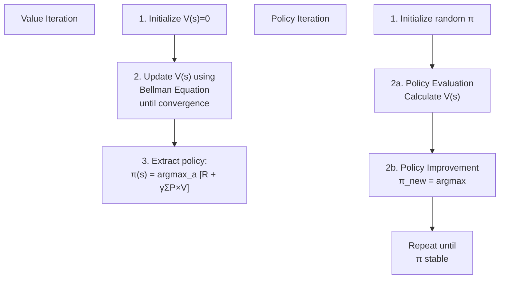

---

### 📐 The Bellman Equation

```
V(s) = max_a [R(s,a) + γ × Σ P(s'|s,a) × V(s')]

"Value of s = best immediate reward + discounted future rewards"
```

---

### 🔢 Algorithms

#### **Value Iteration:**
```
Initialize V(s) = 0 for all s
Repeat until V(s) converges:
  For each state s:
    V(s) = max_a [R + γ × Σ P(s'|s,a) × V(s')]
Extract policy: π(s) = argmax_a [R + γ × Σ P×V]
```

#### **Policy Iteration:**
```
Initialize random policy π(s)
Repeat until π unchanged:
  Policy Evaluation: Calculate V(s) for current π
  Policy Improvement: For each s, π(s) = argmax_a [R + γ × Σ P×V]
```

---

### 📊 Comparison

| | Value Iteration | Policy Iteration |
|---|---|---|
| **Approach** | Update values → extract policy | Evaluate → improve → repeat |
| **Speed** | Slower per step | Faster convergence |
| **Complexity** | Simpler | More complex |

---

### ⚠️ Limitations
- Needs full environment model
- Curse of dimensionality (too many states)
- Not sample efficient

---

### 🎯 Summary for Exam Answer

**To get full 6 marks:**
1. **Definition (1 mark):** DP solves MDPs with complete environment knowledge.
2. **Bellman Equation (1 mark):** Write V(s) = max_a [R + γ × Σ P×V].
3. **Value Iteration (2 marks):** Explain algorithm steps — initialize, update V(s), extract policy.
4. **Policy Iteration (2 marks):** Explain — initialize policy, Policy Evaluation (calculate V), Policy Improvement (improve π), repeat.

---

---

### 📚 Theoretical Deep Dive — Dynamic Programming in Reinforcement Learning: Bellman Equations, Policy Iteration, Value Iteration, and Convergence Analysis

Dynamic Programming (DP) provides the mathematical foundation for solving Markov Decision Processes (MDPs) when the full environment model is known. The term "dynamic programming" was coined by Richard Bellman in the 1950s, who developed the principle of optimality: an optimal policy has the property that whatever the initial state and decision are, the remaining decisions must constitute an optimal policy with regard to the state resulting from the first decision. This recursive decomposition principle is the conceptual basis for all DP algorithms in reinforcement learning.

**The Bellman Equation — Derivation and Mathematical Properties:**

The state-value function V^π(s) under policy π satisfies the Bellman expectation equation:
$$V^π(s) = Σ_a π(a|s) Σ_{s'} P(s'|s,a) [R(s,a,s') + γ V^π(s')]$$

This equation arises directly from the law of total expectation: the value of taking action a in state s is the immediate expected reward plus the discounted expected value of the resulting state s'. The Bellman optimality equation replaces the policy expectation with a maximization:
$$V^*(s) = max_a Σ_{s'} P(s'|s,a) [R(s,a,s') + γ V^*(s')]$$

The optimal action-value function Q^*(s,a) further decomposes:
$$Q^*(s,a) = Σ_{s'} P(s'|s,a) [R(s,a,s') + γ max_{a'} Q^*(s',a')]$$

This equation is the heart of Q-learning. The Bellman equations are linear in V for fixed π (allowing direct matrix solution for small MDPs) and non-linear for the optimality equations (requiring iterative methods). The contraction property: |V_1(s) - V_2(s)| ≤ γ max_s |V_1(s) - V_2(s)| ensures that repeated application of the Bellman operator converges to a unique fixed point. This follows because γ < 1 ensures the Bellman operator T is a γ-contraction mapping in the sup-norm, making convergence provable via the Banach fixed-point theorem.

**Policy Iteration — Howard's Algorithm and Policy Evaluation:**

Policy iteration (Howard, 1960) alternates between policy evaluation and policy improvement until convergence. Policy evaluation computes V^π for a fixed policy π by solving the linear system:
$$V^π = R^π + γ P^π V^π$$

where R^π is the expected immediate reward vector (one entry per state) and P^π is the expected transition matrix under π. This linear system can be solved directly (matrix inversion, O(n^3)) for small MDPs or iteratively via Jacobi or Gauss-Seidel methods. Policy improvement improves the policy greedily with respect to the current V:
$$π_{new}(s) = argmax_a Σ_{s'} P(s'|s,a) [R(s,a,s') + γ V^π(s')]$$

Policy iteration converges in finite steps because each improvement strictly increases the value function (unless at optimality), and there are finitely many deterministic policies. However, each iteration is expensive due to the full policy evaluation step. Modified policy iteration (Puterman & Shin, 1978) truncates the evaluation step after k iterations, trading theoretical convergence guarantees for computational efficiency. Lazy policy iteration only re-evaluates V when a policy improvement occurs.

**Value Iteration — Asynchronous and Synchronous Variants:**

Value iteration applies the Bellman optimality operator directly:
$$V_{k+1}(s) = max_a Σ_{s'} P(s'|s,a) [R(s,a,s') + γ V_k(s')]$$

This is often rewritten in terms of Q-values:
$$Q_{k+1}(s,a) = Σ_{s'} P(s'|s,a) [R(s,a,s') + γ max_{a'} Q_k(s',a')]$$

Convergence is guaranteed by the contraction property: after k iterations starting from V_0, the error |V_k - V^*| ≤ γ^k max_s |V_1 - V_0| / (1-γ). For discount factor γ = 0.99, each iteration reduces error by factor 0.99, requiring roughly O(log(1/ε)/(1-γ)) iterations for ε accuracy — this linear dependence on 1/(1-γ) is the computational bottleneck for near-optimal planning. Gauss-Seidel value iteration (updating V_k using the most recent values immediately) converges faster in practice than synchronous Jacobi-style updates. In asynchronous value iteration (Barto et al., 1995), states are updated in arbitrary order, potentially prioritizing states that are currently most in error, enabling efficient anytime algorithms.

**The Curse of Dimensionality — Why DP Fails at Scale:**

The primary limitation of DP is the curse of dimensionality: the number of states grows exponentially with the number of state variables. For a grid world with n discrete dimensions each with d values, the state space has size d^n. Even for modest n = 20 (e.g., a robot arm with 20 joint angles discretized to 10 values each), the state space has 10^20 states — completely intractable. This motivates approximate DP methods: function approximation (linear or neural) to approximate V(s), and sampling-based methods (Monte Carlo, temporal difference learning) that bypass explicit enumeration. The theoretical study of approximate DP (Bertsekas & Tsitsiklis, 1996) analyzes the approximation error propagation: if V is approximated with error ε, the propagated error in the value function can grow by at most γ/(1-γ) under the Bellman operator, bounding the suboptimality of the resulting policy.


## Q.7 (b) — What is **Deep Reinforcement Learning**? Explain in detail. **[6 Marks]**

### 🧠 Deep RL — AI That Sees and Learns

**Deep RL** combines Deep Learning (neural networks for complex inputs) + Reinforcement Learning (learning from rewards).

> **Analogy:** A baby sees a toy (vision), reaches (action), grabs (reward), learns "reaching=good" — all together!

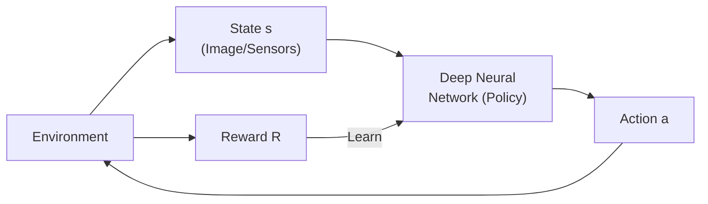

---

### 📦 Three Approaches

| Type | Learns | Examples | Use |
|---|---|---|---|
| **Value-Based** | Q(s,a) via neural net | DQN | Discrete actions |
| **Policy-Based** | Policy π(a\|s) directly | PPO, REINFORCE | Continuous actions |
| **Actor-Critic** | Both (Actor+Critic) | PPO, A2C, SAC | Most general |

---

### 🏆 Famous Achievements

| Year | Milestone | Algorithm |
|---|---|---|
| 2013 | DQN plays Atari at human level | DQN |
| 2016 | AlphaGo beats Go world champion | AlphaGo |
| 2022 | ChatGPT uses RLHF | RL from Human Feedback |

---

### 🎯 Summary for Exam Answer

**To get full 6 marks:**
1. **Definition (1 mark):** DRL = Deep Learning + RL. Enables RL to handle complex inputs (images, video).
2. **Why (1 mark):** Regular RL needs simple states; Deep Learning handles complex data. DRL combines both.
3. **Three types (3 marks):** Explain Value-Based (DQN), Policy-Based (PPO), Actor-Critic (A2C/PPO).
4. **Achievements (1 mark):** DQN Atari, AlphaGo.

---

---

### 📚 Theoretical Deep Dive — Deep Reinforcement Learning: Value Function Approximation with Neural Networks, Stability Challenges, and Landmark Breakthrough Algorithms

Deep Reinforcement Learning (DRL) represents the integration of function approximation through deep neural networks with reinforcement learning algorithms, enabling agents to learn directly from high-dimensional sensory inputs such as raw pixels or audio signals without requiring hand-engineered feature extractors. The fundamental challenge that DRL addresses is that classical RL algorithms (Q-learning, SARSA, policy gradient) require a value function or policy that can be indexed by state and action, but in high-dimensional continuous or visual domains this table is intractably large. Neural networks provide a parametric function approximator that generalizes from seen states to unseen states via learned feature representations.

**The Function Approximation Triangle — Value, Policy, and Action-Value Functions:**

In DRL, three primary function approximation strategies exist. Value-based methods approximate the action-value function Q(s,a; θ) with a neural network parameterized by θ, as in DQN. Policy-based (or policy gradient) methods directly approximate the policy π(a|s; θ), as in REINFORCE and Actor-Critic methods. Actor-Critic methods maintain both: a policy (actor) π(a|s; θ_π) and a value function (critic) V(s; θ_V) or Q(s,a; θ_Q). The critic provides a low-variance baseline that reduces the variance of policy gradient estimates. The mathematical relationship between these approaches: the policy gradient theorem (Sutton et al., 2000) states:
$$∇_θ J(θ) = E_{s~ρ_π, a~π} [∇_θ log π(a|s; θ) * Q^π(s,a)]$$

This gradient can be estimated without a model by replacing Q^π(s,a) with a sample return G_t (high variance, REINFORCE) or with a learned critic estimate Q(s,a; θ_Q) (lower variance, Actor-Critic). The bias-variance tradeoff between pure policy gradient and Actor-Critic methods is central to DRL design.

**The DQN Breakthrough — Experience Replay and Target Networks:**

The Deep Q-Network (Mnih et al., 2015) achieved human-level performance on Atari 2600 games by addressing two fundamental stability problems in combining Q-learning with neural networks. First, successive frames in a game are highly correlated, violating the i.i.d. assumption of stochastic gradient descent and causing oscillations. Experience Replay addresses this by storing transitions (s_t, a_t, r_t, s_{t+1}) in a replay buffer D, and sampling minibatches uniformly at random during learning, breaking temporal correlations. Second, the Q-learning target R + γ max_a' Q(s',a'; θ) involves the same network parameters θ as the Q-values being updated, creating a moving target that diverges. Target Networks resolve this by maintaining a separate target network with parameters θ^- that are periodically updated (e.g., every 10,000 steps, or via soft updates θ^- ← τθ + (1-τ)θ^-). The DQN algorithm thus minimizes the loss:
$$L(θ) = E_{(s,a,r,s')~D} [(r + γ max_{a'} Q(s',a'; θ^-) - Q(s,a;θ))^2]$$

This is a semi-gradient method (the target is held constant during backpropagation), stabilized by the two-network architecture and the replay buffer's decorrelation effect.

**Policy Gradient Methods — REINFORCE and Actor-Critic Architectures:**

The REINFORCE algorithm (Williams, 1992) directly estimates the policy gradient by sampling complete trajectories and computing returns: ∇_θ J(θ) ≈ (1/N) Σ_i Σ_t ∇_θ log π(a_t|s_t;θ) * G_t where G_t = Σ_{k=t}^T γ^{k-t} r_{k+1} is the total discounted return from time t. The high variance of Monte Carlo return estimates is reduced by subtracting a baseline b(s_t), which does not change the expected gradient: ∇_θ J(θ) = E[∇_θ log π(a|s) * (Q(s,a) - b(s))]. Choosing b(s) = V(s) (the state-value function) gives the advantage function A(s,a) = Q(s,a) - V(s), which has zero mean and lower variance. Actor-Critic algorithms approximate both π and V with neural networks, enabling online learning without waiting for episode termination. The critic's TD error δ = r + γV(s') - V(s) provides an immediate, low-variance learning signal.

**Proximal Policy Optimization (PPO) — Practical Policy Optimization:**

PPO (Schulman et al., 2017) is the current default DRL algorithm due to its simplicity, stability, and strong empirical performance. PPO optimizes a clipped surrogate objective to prevent overly large policy updates that could destroy learned behavior. The clipped objective:
$$L^{CLIP}(θ) = E_t [min(r_t(θ) A_t, clip(r_t(θ), 1-ε, 1+ε) A_t)]$$

where r_t(θ) = π_θ(a_t|s_t) / π_{θ_old}(a_t|s_t) is the probability ratio and A_t is the estimated advantage. The clipping operation (1-ε, 1+ε) prevents r_t from moving outside this range, effectively creating a trust region that limits how much the policy can change per update without requiring explicit trust region computation (as in TRPO, Schulman et al., 2015). Modern PPO implementations use generalized advantage estimation (GAE, Schulman et al., 2016) that interpolates between high-bias low-variance (TD, λ=0) and low-bias high-variance (Monte Carlo, λ=1) advantage estimates using a parameterized λ-return.

**Stability Challenges — Dead Neurons, Reward Hacking, and Distribution Shift:**

DRL faces unique stability challenges. Value function overestimation bias (due to max over Q-values in the Bellman equation) can cause Q-values to diverge. Double Q-learning (van Hasselt, 2010; van Hasselt et al., 2016) mitigates this by using two value networks: one to select the argmax action and another to evaluate its value. Distributional RL (Bellemare et al., 2017) models the full return distribution rather than just the expected value, using the Cramer distance as a loss. Reward hacking (Amodei et al., 2016) occurs when the agent exploits loopholes in the reward function — e.g., a boat-racing agent spinning in circles to collect infinite points. This is fundamentally a reward specification problem, addressed by reward shaping, inverse RL, and human-in-the-loop RLHF (Ouyang et al., 2022, InstructGPT). Distribution shift occurs when the state distribution during training (sampled from the current policy) differs from the test distribution; importance sampling ratios correct for this but can have high variance. The most famous DRL breakthrough was AlphaGo (Silver et al., 2016), combining MCTS with deep value networks to defeat Lee Sedol; and AlphaZero (Silver et al., 2018) which generalized this to Go, chess, and shogi using self-play without human data, achieving superhuman performance through pure self-improvement.


## Q.7 (c) — Explain **Simple Reinforcement Learning for Tic-Tac-Toe**. **[5 Marks]**

### 🎮 Tic-Tac-Toe as RL

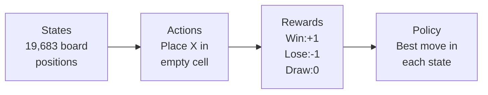

---

### 🧠 Learning with Value Function

```
Initialize: V(s) = 0.5 for all 19,683 states

Play games:
  Step 1: Agent plays, records all states visited
  Step 2: Game ends → get reward (+1, -1, or 0)
  Step 3: Update V(s) for each visited state:
          V(s) = V(s) + α × [R - V(s)]
          (α = learning rate)
  
After 10,000 games: V(s) reflects actual win probability!
```

---

### 🎯 Playing After Learning

```
Current state: Choose action with highest V(s')
  - Look at all possible moves
  - Imagine placing X in each empty cell
  - Check V(s') for resulting state
  - Pick the move with HIGHEST V(s')

Progress: 30% wins → 50% → 80% → 95% (expert level!)
```

---

### 🎯 Summary for Exam Answer

**To get full 5 marks:**
1. **MDP setup (1.5 marks):** States (19,683), Actions (place X), Rewards (+1/-1/0), deterministic transitions.
2. **Learning (2 marks):** TD learning — initialize V(s)=0.5, play games, update V(s) = V(s) + α[R-V(s)].
3. **Policy (1.5 marks):** After learning, choose action leading to highest V(s'). Show example.

---

---

### 📚 Theoretical Deep Dive — Tic-Tac-Toe as a Classical Reinforcement Learning Testbed: Value Functions, Temporal Difference Learning, and Game-Theoretic Optimality

Tic-tac-toe (noughts and crosses) occupies a unique position in the history of artificial intelligence and game theory. This deceptively simple game with only 255,168 possible legal positions and 26,830 possible game outcomes (including symmetries) was among the first environments used to demonstrate reinforcement learning algorithms (Samuel, 1959 — the famous checkers learning program predates formal RL). The small, fully observable, deterministic state space makes it an ideal testbed for understanding value-function-based RL without the complexity of high-dimensional function approximation. The game also has a well-known game-theoretic optimal policy: with perfect play by both sides, the game is a draw — a fact provable by exhaustive minimax search (the game tree has depth at most 9, making full search trivial for modern computers).

**The State Space and Its Mathematical Structure:**

The tic-tac-toe board has 3^9 = 19,683 possible configurations (each of 9 cells can be empty, X, or O), but most are unreachable in legal play (where players alternate turns without overwriting). Considering only reachable states and accounting for board symmetries (rotations and reflections), the number of unique positions is approximately 765. Each state encodes the current board configuration XOR player-to-move information. The transition model is deterministic: action a in state s always leads to the same successor s'. Terminal states have fixed rewards: win (+1), loss (-1), draw (0) depending on the player. Note that in an RL formulation where the agent always plays as X, a terminal state is terminal from the moment the game ends regardless of which player caused it — the agent sees the result (+1, -1, or 0) at termination.

**Temporal Difference Learning — The Core RL Update Mechanism:**

The learning algorithm applied to tic-tac-toe is a form of TD(0) — one-step temporal difference learning. Starting from V(s) initialized to 0.5 for all states (expressing prior ignorance: 50% chance of winning from any position), the agent plays games against itself or an opponent. After each move, the value of the current state is updated toward the observed bootstrapped target:
$$V(s_t) ← V(s_t) + α [r_t + γ V(s_{t+1}) - V(s_t)]$$

For tic-tac-toe, γ = 1 (no discounting within a game) and r_t = 0 except at terminal states where r = +1 (win), -1 (loss), or 0 (draw). The key insight is that TD learning updates state values incrementally without waiting for game end, enabling online learning during play. After many games, V(s) converges to the probability of winning from state s under the current policy. For terminal states, V(win_state) → 1, V(loss_state) → 0, and V(draw_state) → 0 (for a pure win-maximizing agent). Non-terminal states converge to values between these bounds reflecting their winning probability.

**Exploration vs. Exploitation in Tic-Tac-Toe — The Epsilon-Greedy Strategy:**

A naive agent that always plays greedily (choosing the action with highest V(s')) will converge to a suboptimal policy because it never explores alternative moves that might lead to better outcomes. The epsilon-greedy strategy addresses this: with probability ε, choose a random action (exploration); with probability 1-ε, choose the greedy action (exploitation). Initially, high ε is appropriate (the agent knows nothing), but as V(s) converges, ε can be decayed. For tic-tac-toe, ε must be carefully chosen: too low and the agent locks into a poor initial policy; too high and learning is slow. The optimal ε typically decays from ~0.3 to ~0.01 over 10,000 games. The Boltzmann (softmax) exploration strategy provides an alternative that selects actions proportional to exp(Q(s,a)/τ) where temperature τ is annealed over time, enabling smoother exploration that accounts for action value uncertainty.

**Convergence Properties and the Relationship to Game Theory:**

The TD learning rule for tic-tac-toe converges under certain conditions (Tabular TD(0) convergence): if every state is visited infinitely often and the step size α_t satisfies Σ α_t = ∞, Σ α_t^2 < ∞ (Robbins-Monro conditions), then V(s) converges to V^π^∞, the value function of the limiting policy. However, convergence to the true optimal value function V^* (not just V of the current policy) requires additional exploration guarantees — specifically, that all state-action pairs are visited infinitely often (GLIE — Greedy in the Limit with Infinite Exploration). With self-play (the agent plays against itself), the learning dynamics are related to fictitious play: the agent's policy changes over time, but since both players are the same learning agent playing different roles, self-play can converge to Nash equilibrium strategies. In tic-tac-toe, starting from symmetric initialization and playing against itself, a TD agent converges to the optimal draw policy.

**Historical Connection to TD-Gammon and the Modern RL Renaissance:**

The application of TD learning to board games was famously extended by Tesauro's TD-Gammon (1992, 1995), which learned to play backgammon at expert level using TD(λ) with function approximation (a neural network approximating V(s) for positions with up to 200 binary features). TD-Gammon's success demonstrated that TD learning could master complex stochastic games with strong hidden information elements, paving the way for the modern RL renaissance. Modern deep RL systems like AlphaGo (Silver et al., 2016) use a combination of supervised learning from human games, self-play, and Monte Carlo Tree Search combined with deep value and policy networks — a multilayered architecture built on the core TD learning idea demonstrated in simple games like tic-tac-toe.


## Q.8 (a) — Explain **Markov Decision Process**. **[6 Marks]**

### 🎯 MDP — Decision Framework for RL

**MDP** is a mathematical framework for sequential decision-making where outcomes are partly random and partly controlled.

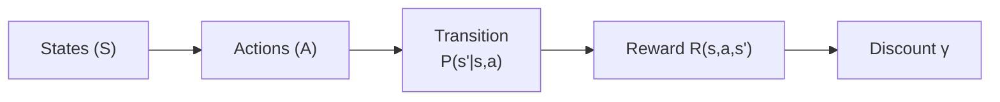

| Component | Description | Example |
|---|---|---|
| **States (S)** | All possible situations | 16 cells in 4×4 maze |
| **Actions (A)** | All possible moves | Up, Down, Left, Right |
| **Transition P** | P(s'\|s,a) | 80% correct, 20% slip |
| **Reward R** | R(s,a,s') | Goal=+100, Hole=-50 |
| **Discount γ** | 0 to 1 | γ=0.9 |

---

### 🔗 Markov Property

```
P(s_{t+1} | s_t, a_t) = P(s_{t+1} | s_t, a_t, s_{t-1}, ...)

"Future depends ONLY on current state, NOT on past."

Example: Chess — best move depends only on CURRENT board, not how pieces got there.
```

---

### 🎯 Summary for Exam Answer

**To get full 6 marks:**
1. **Definition (1 mark):** MDP = mathematical framework for sequential decisions with states, actions, rewards, transitions.
2. **Five components (3 marks):** Explain States, Actions, Transition Probability, Reward Function, Discount Factor.
3. **Markov Property (2 marks):** Explain + formula + example (weather or chess).

---

---

### 📚 Theoretical Deep Dive — Markov Decision Processes: Formal Measure-Theoretic Definition, Bellman Operator Contraction, Existence and Uniqueness of Optimal Policy, and Connections to Control Theory

The Markov Decision Process (MDP) is the canonical mathematical framework for sequential decision-making under uncertainty, first formalized by Bellman in his 1957 book "Dynamic Programming" and subsequently axiomatized byPuterman (1994) in the standard reference text "Markov Decision Processes." An MDP is formally defined as a 5-tuple (S, A, P, R, γ) where S is the state space, A is the action space, P: S×A×S → [0,1] is the transition probability kernel (satisfying P(s'|s,a) ≥ 0 and Σ_{s'} P(s'|s,a) = 1 for all s,a), R: S×A×S → R is the reward function, and γ ∈ [0,1) is the discount factor. The essential assumption underlying MDPs is the Markov property: P(s_{t+1}|s_t, a_t, s_{t-1}, a_{t-1}, ...) = P(s_{t+1}|s_t, a_t) — the future depends only on the present state and action, not the history of past states and actions. This property allows the problem to be fully characterized by the current state rather than requiring memory of the past.

**Bellman Operator — Contraction Mapping and Fixed Point:**

The Bellman optimality operator T: V → TV defined as (TV)(s) = max_a Σ_{s'} P(s'|s,a)[R(s,a,s') + γ V(s')] is a γ-contraction mapping in the Banach space of bounded real-valued functions over S, with respect to the sup-norm (maximum difference) ||f||_∞ = sup_s |f(s)|. The contraction property means: ||TV - TW||_∞ ≤ γ ||V - W||_∞ for any two value functions V, W. By the Banach Fixed Point Theorem, repeated application of T from any initial function V_0 converges to a unique fixed point V* that satisfies V* = TV* — this fixed point IS the optimal value function. This contraction property is the mathematical foundation for the convergence guarantees of both value iteration and policy iteration. The discount factor γ controls both the effective planning horizon (1/(1-γ) steps) and the rate of convergence: smaller γ means faster convergence but shorter effective planning horizons.

**Policy Evaluation — Linear Algebraic Formulation:**

For a fixed (possibly suboptimal) but deterministic policy π: S → A, the Bellman evaluation equation becomes linear: V^π(s) = R(s,π(s)) + γ Σ_{s'} P(s'|s,π(s)) V^π(s'). In vector form: V^π = R^π + γ P^π V^π, which solves to V^π = (I - γ P^π)^{-1} R^π. This matrix inverse is computable for small MDPs (polynomial in |S|), providing the optimal policy evaluation. However, for large MDPs the matrix is too large to invert explicitly. Iterative methods (Jacobi: V_new ← R + γP^π V_old, Gauss-Seidel: update each V(s) using already-updated values) converge at rate γ per iteration. Policy improvement theorem (Howard, 1960) guarantees that if a greedy policy π' relative to V^π has π'(s) ≠ π(s) for any s, then V^{π'} > V^π strictly — policy improvement always strictly improves the value function unless the policy is already optimal.

**Continuous State Spaces and the Extension to MDPs:**

The finite-state MDP formulation extends naturally to continuous (and uncountable) state spaces by treating S as a measurable subset of R^d with appropriate Borel σ-algebra, and P as a transition kernel (a Markov stochastic kernel). Under these conditions, the Bellman operator T defines a contraction on the space of bounded measurable functions, and the existence of optimal policies follows from measurable selection theorems (e.g., the measurable selection theorem ensures the argmax of the Q-function over actions is a measurable policy). For continuous MDPs with Lipschitz continuous transition kernels and rewards, the value function V* is also Lipschitz continuous, enabling approximation via discretization or function approximation. This theoretical extension underpins modern DRL, where DNNs approximate Q or V functions over high-dimensional continuous spaces (e.g., robotic joint angles, pixel image states).

**MDPs in the Context of Control Theory and Dynamic Programming:**

MDP theory has deep connections to classical control theory. In optimal control (Pontryagin's Maximum Principle, Bellman's Dynamic Programming), the state-space evolution is deterministic (no stochastic transitions), but the principles of value functions and Bellman equations carry over. The key distinction: RL requires learning the model P and R from interaction data (model-free RL), while classical DP assumes full knowledge. In the model-free setting, TD learning and Q-learning can be seen as stochastic approximation algorithms that converge to the value function without explicit enumeration of all state-action pairs. The relationship to control theory motivates model-based RL approaches that explicitly learn the transition model and plan within it, potentially achieving better sample efficiency.

**The Discount Factor — Interpreting γ as Probability of Continuation:**

The discount factor γ can be given an intuitive stochastic interpretation: it equals 1/(1+r_horizon) where r_horizon is the effective reward horizon. Equivalently, γ can be interpreted as the geometric probability that the episode continues at each step — if γ = 0.99, there is a 1% chance of termination at each step, giving an expected episode length of 1/(1-γ) = 100 steps. In the undiscounted finite-horizon MDP, γ is formally 1 but planning is over a fixed horizon H, with V_H-h(s) being the value of H-step returns. The infinite-horizon discounted formulation simplifies the mathematics by providing contraction guarantees. In the undiscounted case with infinite horizons (no episode termination), total returns may diverge, and convergence of TD learning is no longer guaranteed without additional conditions.


## Q.8 (b) — Write Short Note on **Q Learning and Deep Q-Networks**. **[6 Marks]**

### 🧠 Q-Learning — "Learn the Value of Every Action"

**Q-Learning** learns a **Q-table**: for every state-action pair, what is the expected total reward?

```
Q(s,a) = "How good is it to take action 'a' in state 's'?"

Q-Table Example:
          Action A    Action B
State 1    0.5          0.8    ← B is better
State 2    0.3          0.2    ← A is better
State 3    0.9          0.1    ← A is much better
```

---

### 🔄 Q-Learning Update Rule

```
Q(s,a) ← Q(s,a) + α × [R + γ × max_a' Q(s',a') - Q(s,a)]

"New Q = Old Q + (Learning Rate) × [Actual Experience - Old Guess]"
```

**ε-Greedy Strategy:**
- ε = probability of exploration (try random action)
- 1-ε = probability of exploitation (use best known action)
- Typical: ε = 0.1 (10% explore, 90% exploit)

---

### 🤖 Deep Q-Network (DQN)

Replaces Q-table with neural network for large/complex state spaces.

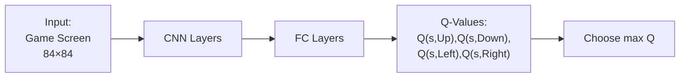

---

### ✨ Two Key DQN Innovations

| Innovation | Problem | Solution |
|---|---|---|
| **Experience Replay** | Consecutive samples correlated | Store + randomly sample from buffer |
| **Target Network** | Moving target problem | Two networks — main updates every step, target updates slowly |

---

### 🎯 Summary for Exam Answer

**To get full 6 marks:**
1. **Q-Learning (2 marks):** Explain Q-table, update rule `Q(s,a) += α[R + γ·max Q(s',a') - Q(s,a)]`, ε-greedy.
2. **Why DQN (1 mark):** Q-table impossible for large states (e.g., Atari pixels). DQN uses neural network.
3. **DQN Architecture (1.5 marks):** Input → CNN → FC → Q-values for all actions.
4. **Innovations (1.5 marks):** Experience Replay (buffer + random sampling) and Target Network (two networks, stable targets).

---

---

### 📚 Theoretical Deep Dive — Q-Learning: Convergence Proofs, Watkins' Original Theorem, DQN Extensions, and the DeepMind Atari Breakthrough

Q-Learning, introduced by Watkins in his 1989 PhD thesis and formalized in the 1992 paper "Q-Learning" (Watkins & Dayan, 1992), is a model-free, off-policy, value-based RL algorithm that learns the optimal action-value function Q^*(s,a) directly from experience without requiring a model of the environment dynamics. The key insight is that the optimal action-value function satisfies the Bellman optimality equation:
$$Q^*(s,a) = E_{s'~P(\cdot|s,a)} [R(s,a,s') + γ * max_{a'} Q^*(s',a')]$$

The Q-learning update approximates this expectation from samples:
$$Q(s,a) ← Q(s,a) + α [r + γ max_{a'} Q(s',a') - Q(s,a)]$$

The update uses the current estimate of Q (not a target network in the original formulation) and updates the Q-value for the state-action pair actually visited (s_t, a_t) toward a one-step bootstrapped target. This is a stochastic approximation of the Bellman optimality operator applied to the Q-function.

**Watkins' Convergence Theorem — Tabular Q-Learning:**

Watkins and Dayan (1992) proved that tabular Q-learning converges to Q^* with probability 1 (almost surely) under two conditions: (1) all state-action pairs are visited infinitely often (GLIE condition — Greedy in the Limit with Infinite Exploration), and (2) the learning rate satisfies Robbins-Monro conditions: Σ_n α_n = ∞ and Σ_n α_n^2 < ∞. The intuition: α_n must decay to zero to average out the stochastic noise in the updates, but the sum must diverge to ensure each Q(s,a) is updated infinitely often. Common α schedules: α_n = 1/n (slow decay), α_n = α_0 * 0.999^n (exponential decay), or constant α with GLIE exploration (works in practice for tabular Q-learning). The convergence is almost sure: with probability 1, the Q-values converge to the true optimal values as n → ∞. However, this is for the tabular case with discrete state-action spaces.

**Function Approximation and the Deadly Triad — Stability Issues with DQN:**

When Q(s,a) is approximated by a neural network Q(s,a; θ), the three components of (function approximation, bootstrapping, off-policy learning) form the "deadly triad" (Sutton & Barto, 2018, Chapter 11). Individually, each component is benign; together, they can cause divergence even on simple problems. Bootstrapping uses the current network's output to define learning targets, creating moving targets that destabilize learning. Function approximation means the target Q-values depend on parameters that are simultaneously being updated, creating a coupled dynamical system. Off-policy learning (using data from a behavior policy different from the target policy) can cause the distribution of observed (s,a) pairs to diverge from what the approximator was trained on. The DQN mitigates the deadly triad through two mechanisms: experience replay buffers (decorrelating samples and stabilizing the data distribution) and target networks (stabilizing the bootstrapped targets).

**Experience Replay — Breaking Temporal Correlation and Enabling Sample Efficiency:**

Experience Replay (Lin, 1992) stores transitions (s_t, a_t, r_t, s_{t+1}) in a circular buffer of fixed capacity. During learning, minibatches of size B are sampled uniformly from the buffer. The key theoretical benefit: by breaking the temporal correlation between consecutive samples, the training data approximately satisfies the i.i.d. assumption of SGD, making convergence more stable. A secondary benefit is sample efficiency: each transition can be reused in multiple gradient updates, particularly valuable in domains where experience collection is expensive (e.g., real robots). Prioritized Experience Replay (Schaul et al., 2016) goes further by sampling transitions with probability proportional to their TD error |r + γ max_a Q(s',a) - Q(s,a)|, focusing learning on "surprising" transitions. However, this introduces a bias that must be corrected via importance sampling weights.

**Target Networks — The Moving Target Problem:**

In the original Q-learning update, the target r + γ max_a' Q(s',a'; θ) uses the same network θ that is being updated, making the target "move" as learning progresses. This creates instability analogous to a cat chasing its own tail. Mnih et al. (2015) introduced target networks: a separate network Q(s,a; θ^-) with parameters θ^- that are held fixed for many update steps. The target becomes r + γ max_a' Q(s',a'; θ^-), and θ^- is periodically updated to θ (hard update) or slowly tracked via θ^- ← τθ + (1-τ)θ^- (soft update). The hard update approach is simple but can cause sudden jumps in target values; soft updates (e.g., τ = 0.005) provide smoother target transitions. Double DQN (van Hasselt et al., 2016) uses two networks to choose the argmax action and evaluate its value, reducing overestimation bias from the max operator: a* = argmax_a Q(s',a; θ) and target = Q(s',a*; θ^-). This simple modification significantly improves performance on Atari benchmarks.

**DQN Architecture Design for Atari — Preprocessing, Frame Stacking, and Reward Clipping:**

The DQN architecture for Atari games (Mnih et al., 2015) involved engineering decisions beyond the algorithmic innovations. Input preprocessing: raw 210×160×3 RGB frames are downsampled to 84×84 grayscale, cropped, and four consecutive frames are stacked as the state (providing velocity information through the temporal difference between frames). The reward is clipped to {-1, 0, +1} to stabilize learning across games with vastly different reward scales (e.g., Pong vs. Space Invaders). The Q-network architecture consists of two convolutional layers (32 filters 8×8 stride 4, then 64 filters 4×4 stride 2) followed by two fully connected layers (512 and 256 units), with ReLU activations throughout. The output layer has one unit per action (4–18 actions depending on the game). The RMSProp optimizer (not Adam, which was found too unstable) with a small learning rate (0.00025) and batch size 32 provided stable updates. This architecture-based design has been refined in Rainbow DQN (Hessel et al., 2018) which combines six independent DQN improvements (double Q-learning, dueling architecture, prioritized replay, multi-step returns, distributional RL, and noisy nets).


## Q.8 (c) — What are the **challenges of Reinforcement Learning**? Explain any four in detail. **[5 Marks]**

### 🚧 Four Major RL Challenges

#### **1. Credit Assignment Problem**
```
Problem: When reward comes, WHICH past action caused it?

Example: Chess — win after 30 moves. Which move was the winner?
Like: Plant seed → wait 3 months → flower. Which day of watering caused it?

Solutions: TD Learning, Eligibility Traces, Reward Shaping
```

#### **2. Exploration vs Exploitation**
```
EXPLORE: Try new actions (might find better option)
EXPLOIT: Use best known action (guaranteed reward)

DILEMMA:
  Explore too much → waste time on bad actions
  Exploit too much → miss better hidden options

Example: 10 slot machines with different win rates
Solutions: ε-greedy, UCB, Thompson sampling
```

#### **3. Sparse/Delayed Rewards**
```
Problem: Rewards are VERY RARE or come VERY LATE

Example 1: Robot walking — rewarded only when reaches goal (1000 steps later)
Example 2: Stock trading — profit only after 1 year of daily decisions

Solutions: Reward shaping, Hierarchical RL, Imitation Learning
```

#### **4. Sample Inefficiency**
```
Problem: RL needs MILLIONS of trials

Example:
  DQN for Breakout: 50 million game frames
  Equivalent to playing non-stop for WEEKS!
  
  Human: 15 minutes → understands the game
  RL Agent: 50 MILLION frames…

Solutions: Model-Based RL, Imitation Learning, Transfer Learning
```

---

### 📊 Comparison Table

| Challenge | Core Problem | Solution Approach |
|---|---|---|
| **Credit Assignment** | Which action caused reward? | TD learning, reward shaping |
| **Explore vs Exploit** | Try new OR use known? | ε-greedy, UCB |
| **Sparse/Delayed Rewards** | Very few reward signals | Hierarchical RL, shaping |
| **Sample Inefficiency** | Millions of trials needed | Model-based RL, imitation |

---

### 🎯 Summary for Exam Answer

**To get full 5 marks:**
1. **Credit Assignment (1.5 marks):** Explain problem — reward comes late, which action was responsible? Example: chess or planting seed.
2. **Explore vs Exploit (1 mark):** Explain tradeoff. Slot machine analogy.
3. **Sparse/Delayed Rewards (1.5 marks):** Explain — robot walking, stock trading. Reward comes after many steps.
4. **Sample Inefficiency (1 mark):** Explain — needs millions of trials. Compare human vs RL speed.

---

---

### 📚 Theoretical Deep Dive — Challenge Deep-Dive: Credit Assignment via Backpropagation Through Time, Exploration Methods with Theoretical Guarantees, Hierarchical RL for Long-Horizon Tasks, and Imitation Learning

**The Credit Assignment Problem — Fundamental Difficulty of Delayed Reinforcement:**

The credit assignment problem is the most theoretically deep challenge in RL. In sequential decision-making, actions taken at time t may not produce observable consequences until t+k steps later (potentially thousands of steps in complex tasks). This creates a fundamental Bayesian identification problem: given only the final scalar reward signal R_T, which of the preceding actions {a_1, a_2, ..., a_{T-1}} caused it, and by how much? The problem worsens with longer horizons and stochastic environments, where actions may be probabilistic and environmental dynamics introduce noise. The TD error δ_t = r_t + γV(s_{t+1}) - V(s_t) is the fundamental RL signal that begins to attribute credit, but it only attributes one-step credit — attributing k-step credit in hindsight requires methods like eligibility traces. The eligibility trace is a decaying memory of recent state-action visits: e_t(s,a) = γλ e_{t-1}(s,a) + 1_{(s_t=s, a_t=a)}, which allows the TD error to propagate backward through time: Q(s,a) ← Q(s,a) + α δ_t e_t(s,a). The parameter λ ∈ [0,1] controls the trace decay: λ=0 is TD(0), λ=1 is Monte Carlo. Eligibility traces provide exponentially decaying credit across time, enabling faster propagation of reward signals to responsible actions.

**Exploration vs. Exploitation — Multi-Armed Bandits and PAC-MDP Guarantees:**

The exploration-exploitation tradeoff is most cleanly studied in the multi-armed bandit problem, the foundational RL setting. In a K-armed bandit, at each step the agent chooses one of K arms, receiving reward sampled from an unknown distribution for that arm. Epsilon-greedy has an ϵ-regret bound of O(K log T), but its exploration is naive (uniform random). Upper Confidence Bound (UCB) methods address this by selecting actions maximizing: a_t = argmax_a [Q(s,a) + c * sqrt(log t / N(s,a))], where N(s,a) is the visit count. This optimism-under-uncertainty principle selects actions either with high estimated value OR high uncertainty (few visits), achieving O(sqrt(K T log T)) regret. Thompson Sampling (Thompson, 1933, modern analysis by Agrawal & Goyal, 2012) samples from a posterior belief over Q-values and selects the action with highest sampled value, achieving near-optimal Bayesian regret. For episodic MDPs, PAC-MDP algorithms (Kakade, 2003; Strehl et al., 2006) guarantee that the agent finds an ε-optimal policy with high probability in a polynomial number of samples, a fundamentally stronger guarantee than the asymptotic almost-sure convergence of standard tabular methods. These algorithms typically use exploration bonuses (bonus(s,a) = O(1/sqrt(N(s,a))) added to the Q-value to encourage visiting under-explored state-action pairs.

**Sparse and Delayed Rewards — Reward Shaping, Hierarchical RL, and Curiosity:**

Sparse rewards are the defining challenge of long-horizon tasks. In a robot locomotion task requiring 1000 steps to reach a goal with reward +1 at termination, standard RL receives zero reward signal for 999 steps, creating a near-impossible credit assignment problem. Reward shaping (Ng et al., 1999) adds additional reward signals based on state features: R'(s,a,s') = R(s,a,s') + γΦ(s') - Φ(s). The potential function Φ must be chosen carefully: a well-designed Φ remains robust to shaping that does not change the optimal policy (policy invariance). However, poorly designed shaping (e.g., rewards for approaching the goal without reaching it) can introduce local optima. Hierarchical RL (Barto & Mahadevan, 2003; Kulkarni et al., 2016) decomposes complex tasks into subtasks (options) with their own internal policies. At the meta level, an options policy selects which option to execute; each option, when invoked, runs for an extended period achieving its own subgoal. Option-Critic (Bacon et al., 2017) learns option-termination and option-policies end-to-end via gradient descent. Intrinsic motivation / Curiosity-driven Exploration (Pathak et al., 2017, Curiosity-driven Exploration by Self-supervised Prediction) adds an intrinsic reward based on prediction error: r_intrinsic = ||f_θ(s_{t+1}) - f_θ(s_t, a_t)||^2 where f_θ predicts the next state. States that are predictable provide no intrinsic reward; novel or surprising states are rewarded, encouraging the agent to systematically explore.

**Sample Inefficiency — Model-Based RL, Imitation Learning, and Offline RL:**

The profound sample inefficiency of model-free RL (requiring millions of environment steps to learn a single Atari game, far exceeding human-level data efficiency) is addressed by several complementary approaches. Model-Based RL learns an explicit model of the environment: P(s_{t+1}|s_t,a_t) and R(s_t,a_t), then plans within this model (e.g., via MCTS in AlphaZero) to select actions. Learned dynamics models can be used with planning (Gu et al., 2016, Guided Policy Search) or distillation into a learned policy. Imitation Learning (IL) uses expert demonstrations {(s_i, a_i)} to bootstrap the agent's policy, either via behavioral cloning (supervised learning on the demonstration data) or via Inverse Reinforcement Learning (IRL, Ng & Russell, 2000), which recovers the reward function that the expert's behavior optimizes, then learns a policy for that reward. Offline RL (Fujimoto et al., 2019, BCQ; Fitzpatrick et al., 2023) learns from a fixed dataset of past experience without further environment interaction, addressing the data collection bottleneck in safety-critical applications (healthcare, autonomous driving). The fundamental trade-off: model-based and offline methods improve sample efficiency at the cost of potential distribution shift (the learned model or behavioral distribution may differ from the optimal policy's distribution), while model-free online RL achieves asymptotic performance but requires prohibitive sample counts.


# PAPER 4 COMPLETE ✅
