# Paper 5: [6354]-499 — Deep Learning Answers

**B.E. Computer Engineering | Semester VIII | 2019 Pattern | Max Marks: 70**

---

# UNIT I — Convolutional Neural Networks (CNN)

---

## Q.1 (a) — How would you describe the **architecture of a typical CNN**? Explain the main components and their roles. **[6 Marks]**

### 🏗️ CNN Architecture — "The Feature Factory"

A typical CNN is built like an assembly line. Raw image enters, gets processed through feature extraction layers, then a decision-making stage produces the final answer.

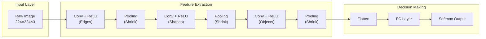

---

### 📦 Components and Their Roles

| Component | Role | Simple Explanation |
|---|---|---|
| **Input Layer** | Accepts raw image | The "door" — image enters here |
| **Convolution Layer** | Extracts features | Uses filters to find edges, shapes, objects |
| **ReLU Activation** | Adds non-linearity | Turns negatives to 0, keeps positives |
| **Pooling Layer** | Downsamples | Shrinks feature map, keeps important info |
| **Flatten** | Converts to 1D vector | Turns 3D feature maps into a list |
| **FC Layer** | Decision making | Combines all features → decides class |
| **Softmax Output** | Gives probabilities | Cat: 92%, Dog: 6%, Car: 2% |

---

### 🎯 Summary for Exam Answer

**To get full 6 marks:**
1. **Architecture overview (1 mark):** Describe the typical flow: Input → Conv→ReLU→Pool (repeated) → Flatten → FC → Softmax.
2. **Each component's role (4 marks):** Explain all 7 components with their purpose.
3. **Diagram (1 mark):** Draw neat labeled block diagram.

---

## Q.1 (b) — What is the purpose of **pooling layers in CNN**? Explain how max pooling and average pooling contribute to down-sampling the input data. **[6 Marks]**

### 📉 Purpose of Pooling Layers

**Pooling Layers** reduce the spatial size (width × height) of feature maps. They make the network faster, more efficient, and more robust.

| Purpose | Explanation |
|---|---|
| **Reduce computation** | Smaller maps = fewer numbers to process |
| **Prevent overfitting** | Reduces exact details, forces general feature learning |
| **Spatial invariance** | Small shifts/translations don't change output |
| **Feature selection** | Max pooling keeps strongest features |

---

### 🔍 Max Pooling

```
How it works:
  1. Divide feature map into small 2×2 boxes
  2. Take the MAXIMUM value from each box
  3. That becomes the output value

Example 4×4 → 2×2:

  Input:        Boxes:          Max Pool Output:
  1  3  2  4    [1 3|2 4]       4   4
  2  4  1  3    [2 4|1 3]       3   4
  3  1  4  2    [--+--]
  1  2  3  1    [3 1|4 2]
                [1 2|3 1]

  Top-left:  max(1,3,2,4) = 4
  Top-right: max(2,4,1,3) = 4
  Bottom-left: max(3,1,1,2) = 3
  Bottom-right: max(4,2,3,1) = 4
```

**Benefits:**
- Keeps the most prominent feature in each region
- Adds translation invariance
- Most commonly used type

---

### 📊 Average Pooling

```
How it works:
  1. Divide feature map into 2×2 boxes
  2. Take the AVERAGE of each box

Same 4×4 example:
  Top-left:  (1+3+2+4)/4 = 2.5
  Top-right: (2+4+1+3)/4 = 2.5
  Bottom-left: (3+1+1+2)/4 = 1.75
  Bottom-right: (4+2+3+1)/4 = 2.5

Output:
  2.5  2.5
  1.75 2.5
```

**Benefits:**
- Smoother results
- Preserves overall context/background
- Less commonly used than max pooling

---

### 📊 Comparison

| Feature | Max Pooling | Average Pooling |
|---|---|---|
| **Operation** | Take maximum | Take average |
| **Keeps** | Strongest activation | Overall average |
| **Best for** | Feature detection | Smoothing/background |
| **Commonly used?** | ⭐⭐⭐ Yes | ⭐⭐ Sometimes |

---

### 📚 Theoretical Deep Dive — Pooling Layers: Information Theory, Viewpoint Invariance, and the Subtleties of Subsampling

Pooling layers represent one of the most theoretically rich yet sometimes misunderstood components of CNN architecture. Their operation can be understood through multiple complementary theoretical lenses, each revealing different aspects of why pooling is effective. From an **information-theoretic perspective**, pooling implements a form of lossy compression on the feature maps. By applying a non-linear, non-invertible aggregation function over local patches, pooling reduces the spatial dimensionality of the representation while retaining the most salient information. This is formally analogous to the concept of a **sufficient statistic**: the pooled value summarizes the distribution of activations within the local patch, discarding the exact spatial positions of individual activations while preserving their collective strength. The mutual information between the pooled representation and the task-relevant signal can actually increase because noise and irrelevant variations are suppressed, a phenomenon known as the **information bottleneck principle** (Tishby, 2000), which conjectures that deep networks progressively compress their representations to retain only task-relevant information.

The **translation invariance** property of pooling has a precise mathematical characterization in the theory of group representations. Convolution itself provides translation **equivariance**: if the input image is shifted by $k$ pixels, the corresponding feature map is also shifted by $k$ pixels (modulo boundary effects). Pooling then acts as a **quotient map** that maps equivariant representations to invariant ones. Specifically, the max pooling operation computes the maximum value over a local neighborhood, which is invariant to small translations of the input within that neighborhood (a shift that keeps the maximum value inside the same pooling window). The degree of invariance increases with the pooling window size, but so does the information loss—a fundamental trade-off captured by the **uncertainty principle** for translation and scale, which states that a function cannot be simultaneously localized in both spatial and frequency domains.

From a **statistical learning theory** perspective, pooling serves as an implicit form of regularization that constrains the hypothesis space the network can express. By reducing the effective resolution of the feature representation, pooling limits the number of degrees of freedom available to the classifier, thereby reducing the VC dimension of the overall network and providing better generalization guarantees. The pooling operation also acts as a **contrast normalizer**: max pooling in particular normalizes the feature map response by dividing by the maximum activation within each region, which helps prevent the network from relying on absolute activation magnitudes and instead focuses on relative activations across different feature detectors.

The **biological inspiration** for pooling comes directly from the visual processing hierarchy in primates. In V1, simple cells respond to edges at specific orientations and positions, but these responses are highly sensitive to exact stimulus position. Complex cells in V2 and V4 then pool over simple cell responses, achieving position invariance over small regions—this is precisely what max pooling achieves computationally. The neuroscience literature distinguishes between **linear pooling** (average pooling, resembling a population code averaging) and **winner-take-all pooling** (max pooling, resembling sparse coding with competition), with evidence suggesting that both mechanisms exist in biological vision at different scales and processing stages. The **normalized max pooling** variant, which divides the max value by the sum of activations in the window, has been shown to approximate divisive normalization observed in cortical circuitry, where neurons normalize their responses relative to surrounding activity—this normalization is thought to implement a form of **gain control** that adapts to local stimulus contrast.

Several theoretical analyses have explored the precise contributions of pooling to CNN performance. The **adaptive subsampling** theory argues that pooling should not be viewed as simply "shrinking" the feature map but rather as a form of adaptive multi-scale representation building, where finer details at early layers give way to coarser, more abstract features at deeper layers—an idea closely related to the **scale-space theory** of Witkin (1983) and the **image pyramid** representations in computer vision. Strassel and colleagues (2018) demonstrated that replacing max pooling with **strided convolutions** can achieve equivalent or better performance in some contexts, suggesting that the critical property of pooling is not the downsampling itself but the aggregation function that reduces the spatial resolution. The **ReLU + pooling** combination has been analyzed through the lens of **lattice theory**: ReLU (a threshold function) followed by max pooling over a non-overlapping window creates a representation where each pooled unit is a binary indicator of whether any feature within a local patch was active, analogous to a logical OR over feature detectors.

Advanced pooling variants also have deep theoretical justifications. **Stochastic pooling** (Zeiler & Fergus, 2013) randomly selects activation values within each pooling region according to a multinomial distribution, which can be shown to be equivalent to a form of **ensemble learning** where each training sample passes through multiple random sub-networks—this connects pooling theory to the **dropout** regularization framework. **Mixed pooling**, which uses a learned combination of max and average pooling, can be understood as learning the optimal trade-off between feature selectivity (max) and feature density (average), with the mixing coefficient optimized during training. **Global Average Pooling** (Lin et al., 2013), used in the final layers of ResNet and similar architectures, eliminates the need for fully connected layers entirely by averaging each feature map to a single value, creating a fully convolutional network that is inherently more robust to spatial translations of the input and requiring no additional parameters for the classification head.

From a **dynamical systems** perspective, the sequence of convolution, non-linearity, and pooling operations in a CNN can be viewed as iterating a discrete dynamical system on the state of the feature maps. Each pooling step reduces the number of spatial degrees of freedom, effectively performing **model order reduction** to keep the dynamics tractable while preserving the qualitative behavior of the system. The **universal differential equation** framework provides a continuous-time analog: CNNs discretize continuous diffusion and reaction-diffusion equations where convolution plays the role of spatial diffusion and non-linear activation functions implement local reaction dynamics, with pooling corresponding to a reduction in spatial resolution of the discretization grid.

---

### 🎯 Summary for Exam Answer

**To get full 6 marks:**
1. **Purpose (1 mark):** Reduce computation, prevent overfitting, spatial invariance.
2. **Max Pooling (2.5 marks):** Explain with 4×4 → 2×2 example. Show each box's max calculation.
3. **Average Pooling (2.5 marks):** Explain with same example. Show averaging. Compare with max pooling.

---

## Q.1 (c) — How do **data augmentation and dropout regularization** techniques contribute to training CNNs? **[6 Marks]**

### 🎨 Data Augmentation — "Creating More Training Data"

**Data Augmentation** creates new training examples by applying transformations to existing images.

> **Analogy:** You're learning to recognize cats. If you only see 10 photos of cats in the same position, you might not recognize a cat that's upside down or rotated. If you practice with 100 different views (flipped, rotated, zoomed), you become much better at recognizing cats!

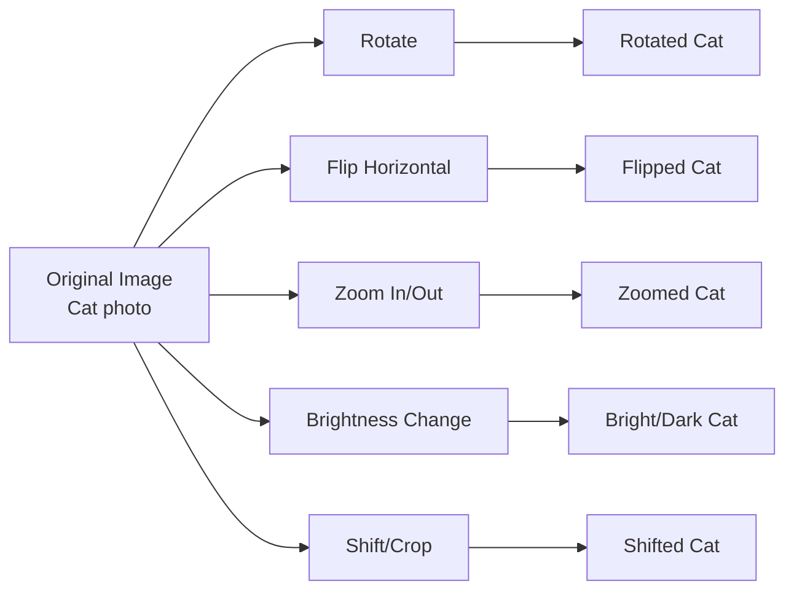

---

### 📋 Common Data Augmentation Techniques

| Technique | What It Does | Example |
|---|---|---|
| **Flip** | Mirror image horizontally | Cat facing left → facing right |
| **Rotation** | Rotate by some degrees | Cat rotated 15° |
| **Zoom** | Scale up or down | Cat bigger/smaller |
| **Shift** | Move image left/right/up/down | Cat in different position |
| **Brightness** | Change brightness/contrast | Brighter or darker cat |
| **Crop** | Randomly crop and resize | Cat with different framing |
| **Color Jitter** | Change hue/saturation | Cat with different color tint |

---

### ✅ Benefits of Data Augmentation

| Benefit | Explanation |
|---|---|
| **More data** | Effectively increases dataset size |
| **Prevents overfitting** | Model sees more variations |
| **Better generalization** | Works on new, differently-oriented images |
| **Rotation/scale invariance** | Model becomes robust to changes |

---

### 🎲 Dropout Regularization — "Randomly Firing Neurons"

**Dropout** randomly deactivates neurons during training to prevent overfitting.

- **Rate p=0.5:** 50% of neurons randomly dropped each iteration
- Different neurons dropped each time → trains many "sub-networks"
- **At test time:** All neurons active (averaging all sub-networks)

---

### 📊 How They Work Together

| Technique | When Applied | Effect |
|---|---|---|
| **Data Augmentation** | Input level (before training) | More varied training data |
| **Dropout** | Hidden layers during training | Prevents overfitting during learning |

---

### 🎯 Summary for Exam Answer

**To get full 6 marks:**
1. **Data Augmentation (3 marks):** Explain — creates new training examples by transforming existing ones. List 4-5 techniques (flip, rotate, zoom, shift, brightness). Explain benefits: more data, prevents overfitting.
2. **Dropout (3 marks):** Explain — randomly drops neurons (p=0.5) during training. How it works: different subset each iteration = ensemble effect. Mention: no dropout at test time, applied between FC layers.

---

### 📚 Theoretical Deep Dive — Data Augmentation and Dropout: Regularization Theory, Consistency Training, and Implicit Ensembling

Both data augmentation and dropout can be rigorously understood as forms of **regularization** within the statistical learning theory framework, where the goal is to constrain the effective complexity of the learned model to prevent overfitting—the phenomenon where a model achieves low training error but high generalization error on unseen data. Understanding why these techniques work requires examining the fundamental **bias-variance tradeoff** and the geometric properties of the data distribution in high-dimensional spaces.

**Data Augmentation** can be formally characterized as a form of **data-dependent input-space regularization**, where the training distribution is artificially expanded by sampling from an augmented distribution $P_{aug}(\mathbf{x}, y)$ instead of the original empirical distribution $P_{train}(\mathbf{x}, y)$. From a theoretical standpoint, data augmentation implements **Tikhonov regularization** (also called ridge regression in its linear form) on the input space: it effectively smooths the learned function by requiring consistent predictions over perturbed versions of the same input. This is precisely the **consistency training** principle proposed by Laine & Aila (2016) and later developed under the name **virtual adversarial training** (VAT) by Miyato et al. (2017): the model is trained to produce invariant outputs under small input perturbations, which enforces local smoothness of the learned function. For images, the manifold of natural images is known to be low-dimensional (estimated to be around 10,000 dimensions for 224×224 ImageNet images) and lies on a curved submanifold within the high-dimensional pixel space. Data augmentation explicitly samples from the tangent space and nearby regions of this manifold, ensuring the model learns the underlying manifold structure rather than memorizing spurious correlations in the training data.

The **group theoretic formulation** of data augmentation (described by Dao et al., 2019) is particularly elegant: if a class of transformations $G$ (e.g., rotations, translations, flips) forms a group under composition, and if the augmentation process applies $g \in G$ to every input $x$ to generate augmented samples, then a CNN with built-in **convolutional equivariance** to $G$ will produce feature representations that are invariant to the entire group. For example, a CNN with translation-equivariant convolutions trained with randomly shifted images learns **fully translation-invariant** features. This principle extends to **augmentation policies** that are now learned rather than hand-designed: AutoAugment (Cubuk et al., 2018) and its successors use reinforcement learning to discover optimal sequences of augmentation operations that maximize validation accuracy, demonstrating that the theoretical structure of natural image data can be exploited to discover effective augmentation strategies automatically.

A deeper theoretical understanding of data augmentation comes from **manifold interpolation** theory. The manifold hypothesis states that natural data lies on a low-dimensional manifold embedded in high-dimensional space, and that two points on the manifold can be interpolated along the manifold itself (not just in the ambient pixel space). Traditional data augmentation performs interpolation in pixel space, which can be seen as a **tangent space approximation** of the true manifold interpolation. More sophisticated approaches like **MixUp** (Zhang et al., 2017) and **CutMix** (Yun et al., 2019) perform **convex combinations** of images and labels in the pixel space, inducing a form of **linear interpolation between the conditional distributions** of the outputs. This can be understood as a form of **distributionally robust optimization** (DRO): by training on interpolated examples that are unlikely to appear in the true data distribution, the model becomes robust to distributional shift between training and test data.

**Dropout** has a rich theoretical foundation connecting it to several disparate concepts in statistical learning, Bayesian inference, and ensemble methods. At its core, dropout implements **Bernoulli dropout**, where at each training step, each neuron is independently retained with probability $p$ (where $p$ is the dropout probability, typically 0.5) and set to zero with probability $1-p$. The expected output of a single neuron with dropout applied can be analyzed: if $z = f(\mathbf{x})$ is the activation of a neuron and dropout with rate $p$ is applied during training, the expected activation is $E[\tilde{z}] = p \cdot z$. Since the overall scale of activations changes during training versus testing (all neurons active at test time), **inverted dropout** scales activations by $1/p$ during training so that $E[\tilde{z}] = z$ at test time without requiring scaling.

The most rigorous theoretical analysis frames dropout as performing **model averaging** over an exponentially large ensemble of sub-networks. With $N$ neurons in a layer and dropout rate $p$, there are $2^N$ possible sub-networks, each corresponding to a different Bernoulli mask of kept/dropped neurons. Each sub-network is trained on different data (the mask changes each iteration), which means the full network implicitly averages the predictions of all these sub-networks. This is precisely the justification for **test-time dropout** (also called **Monte Carlo dropout**), where dropout is applied during inference as well, and predictions are averaged over multiple stochastic forward passes—this provides a principled approximation to **Bayesian inference** in deep neural networks, specifically approximating the posterior predictive distribution $p(y|\mathbf{x}, \mathcal{D}) = \int p(y|\mathbf{x}, \theta) p(\theta|\mathcal{D}) d\theta$ by a mixture of point estimates with different dropout masks. Gal & Ghahramani (2016) demonstrated that MC dropout provides a principled Bayesian approximation, yielding not just predictions but also **epistemic uncertainty estimates**—valuable for safety-critical applications.

The **co-adaptation theory** of dropout, originally proposed by Srivastava et al. (2014), posits that without dropout, neurons tend to co-adapt to correct each other's mistakes, creating fragile feature detectors that are highly specific to other neurons in the layer. Dropout breaks these co-adaptation relationships by randomly removing other neurons' contributions, forcing each neuron to learn robust, independently useful features. This bears a striking resemblance to the concept of **feature sparsity** in biological neural networks and connects to the **sparse coding** literature. Recent theoretical work has also established connections between dropout and **batch normalization**: both can be understood as reducing internal covariate shift within the network, with dropout adding noise to the activations and batch norm re-scaling them, and the combination can be interpreted through the lens of **stochastic regularization**.

**DropConnect** (Wan et al., 2013) extends dropout by randomly dropping **weights** rather than activations, which has a different theoretical effect: instead of creating thresholded sub-networks at the neuron level, it creates sub-networks at the individual connection level. This can be analyzed using **random matrix theory**: the weight matrix becomes a random matrix with Bernoulli entries, and its spectral properties determine the stability and expressivity of the resulting sub-network. **SpatialDropout** (Tompson et al., 2015) applies dropout to entire feature maps rather than individual activations, which is theoretically motivated by the observation that in convolutional layers, adjacent activations are highly correlated (due to the convolution filter), so dropping individual neurons removes only redundant information. Dropping entire feature maps is more efficient regularization that prevents over-reliance on specific feature detectors.

The **mathematical relationship** between dropout and L2 regularization has been proven by Wager et al. (2013), who showed that dropout with rate $p$ applied to a linear model is equivalent to an L2 penalty on the weights multiplied by the expected dropout rate. Specifically, the expected dropout loss for a linear model is equal to the standard loss plus an L2 penalty of $\lambda = p/(1-p)$ on the weights. This establishes dropout's theoretical grounding as a form of **stochastic regularization**, where the noise injected by the random dropout is equivalent to weight decay in expectation. The **variational dropout** approach (Kingma et al., 2015) extends this by applying a single dropout mask per example for the entire network (rather than per layer), which is more computationally efficient and theoretically cleaner, corresponding to **weight noise** injection in the Bayesian neural network literature.

Modern theoretical advances also connect dropout to **sharpness of minima** in the loss landscape. Keskar et al. (2017) showed that dropout and other noise-based regularizers tend to find solutions that are **wide minima**—regions of parameter space where the loss remains low even under significant perturbation—as opposed to **sharp minima** where small parameter changes cause large loss increases. The **flatness** of a minimum has been linked to generalization ability through the **PAC-Bayesian theory**, which bounds the generalization gap by a measure of the KL divergence between the posterior weight distribution and a prior. Dropout effectively widens these minima by introducing stochasticity during training, making the learned solution more robust.

---

## Q.2 (a) — What role does **padding** play in CNNs? How does it impact the size of the output feature maps? **[6 Marks]**

### 📐 Role of Padding in CNNs

**Padding** adds border pixels (usually zeros) around the input before convolution. It controls the output size and preserves edge information.

---

### 📏 Impact on Output Size

```
Output Size = (Input - Filter + 2×Padding) / Stride + 1

Example: 5×5 input, 3×3 filter, stride=1

No padding (P=0):  Output = (5-3+0)/1+1 = 3×3  (shrunk by 2!)

Padding P=1:       Output = (5-3+2)/1+1 = 5×5  (same size!) ✅

More padding P=2:  Output = (5-3+4)/1+1 = 7×7  (expanded)
```

---

### 📊 Three Padding Types and Output Effect

| Padding Type | P value | Output Size | When to Use |
|---|---|---|---|
| **Valid** | 0 | Smaller than input | When shrinking needed |
| **Same** | (F-1)/2 | Same as input | ✅ Most common — preserve size |
| **Full** | F-1 | Larger than input | Rarely used |

---

### 🎯 Why Padding Matters

| Issue Without Padding | How Padding Helps |
|---|---|
| Image shrinks every conv layer | Keeps size stable with Same padding |
| Edge pixels barely used | Edge pixels fully processed |
| Information loss at borders | Preserves border features |
| Can only do few conv layers | Enables deep networks |

---

### 🎯 Summary for Exam Answer

**To get full 6 marks:**
1. **Role of padding (2 marks):** Explain — adds border zeros, controls output size, preserves edge information, enables deep networks.
2. **Impact on output (2 marks):** Show formula, give examples with same input but different padding (P=0, P=1, P=2) showing output sizes.
3. **Types (2 marks):** Explain Valid (P=0, shrinks), Same (P=(F-1)/2, keeps size), Full (P=F-1, expands).

---

### 📚 Theoretical Deep Dive — Padding in CNNs: Shannon Sampling Theory, Border Effects, and SAME vs VALID Convolutions

The role of padding in Convolutional Neural Networks is deeply connected to fundamental principles from digital signal processing, information theory, and numerical analysis. At the most basic level, the size change caused by convolution follows directly from the **convolution theorem** and its discrete analog. For an input of size $n$ and a filter of size $k$, the valid convolution output has size $n - k + 1$, because at each output position, the filter must be fully contained within the input boundaries—equivalent to requiring that every output pixel sums contributions from exactly $k$ input pixels. This relationship can be derived rigorously by considering that each output position $(i, j)$ of a 2D convolution corresponds to the top-left corner of the $k \times k$ filter window at position $(i, j)$ on the input, which requires $i + k - 1 \leq n$ and $j + k - 1 \leq n$, hence $i \leq n - k + 1$.

The **Shannon-Nyquist sampling theorem** from information theory provides the fundamental justification for adequate padding. A signal bandlimited to frequency $f_{max}$ must be sampled at rate at least $2f_{max}$ to avoid aliasing—the loss of high-frequency information when it undersamples a signal. In CNNs, the successive convolution and pooling operations are analogous to **low-pass filtering** followed by downsampling. Without proper padding, the border pixels of feature maps receive far fewer convolution operations than center pixels. Consider an image with a feature near the border: with VALID padding (no padding), this feature might be cut off entirely by the filter, whereas with SAME padding, it receives the same number of convolution operations as a feature in the center. This **border neglect problem** becomes more severe with depth: after 10 convolutional layers, a feature introduced at the image border in the first layer would have been progressively eroded, eventually vanishing entirely in deep networks. Dumoulin & Visin (2016) formally analyzed this **effective receptive field** and found that in practice, even though a CNN output theoretically depends on every input pixel, the actual influence distribution is Gaussian-shaped, meaning border pixels contribute negligibly to outputs—padding mitigates this asymmetry.

The choice between padding modes can be understood through the lens of **boundary conditions** in signal processing. Zero-padding (the standard approach) implies that the signal outside the image boundary is zero, which mathematically corresponds to **Dirichlet boundary conditions**—the input signal is artificially terminated at the boundary. This is appropriate when the background outside the image is expected to be uniform (often true: white backgrounds, black backgrounds, or padded regions with semantic meaning). Alternative padding conventions exist: constant padding uses a constant value (can be non-zero mean of the dataset), reflection padding mirrors the image at the boundary, and replication padding repeats the edge value. From a **Fourier analysis** perspective, zero-padding in the spatial domain corresponds to **spectral sinc interpolation** in the frequency domain, introducing high-frequency artifacts near the boundary; the choice of padding mode thus has subtle effects on the frequency characteristics of the learned features.

**SAME vs. VALID padding** encodes a fundamental architectural choice about whether the network preserves or reduces spatial resolution at each layer. Networks using exclusively SAME padding (like ResNet) can be made arbitrarily deep because the spatial dimensions remain constant (until pooling reduces them), enabling the construction of very deep residual networks. Networks using VALID padding (common in older architectures like AlexNet) reduce spatial resolution at every convolution, naturally creating a pyramid structure where higher layers have fewer spatial positions but more feature channels. The mathematical relationship between the SAME padding amount and the filter size comes from requiring the output to match the input dimensions when stride is 1: $(n + 2p - k) / 1 + 1 = n$, which simplifies to $p = (k-1)/2$. Since filters are almost always odd-sized ($k = 3, 5, 7$) to have a clear center pixel, $p$ is always an integer—a practical convenience that also ensures the filter is well-centered over the input region.

Recent research has challenged the necessity of traditional padding in modern architectures. **Patchify** operations (as used in Vision Transformers) remove convolutional downsampling entirely, instead using a single large-stride convolution to convert the image into a sequence of patches—essentially using SAME padding with very large kernel/stride. The **fully convolutional network** (FCN) paradigm (Long et al., 2015) demonstrated that for semantic segmentation, it is advantageous to use VALID convolutions in early layers (which create a feature pyramid) and then apply learned **up-sampling** (transposed convolutions) at the end to restore spatial resolution—this elegant approach eliminates the need for fully connected layers and enables end-to-end dense prediction.

The **computational cost implications** of padding are significant but often overlooked. A convolution with SAME padding on $n \times n$ input and $k \times k$ filter at stride 1 requires $(n)^2 \cdot k^2$ multiply-adds, while VALID padding requires $(n-k+1)^2 \cdot k^2$ multiply-adds—the ratio is approximately $(n/(n-k))^2$. For $n=224, k=3$, this is only a $10.7\%$ increase in computation, but for larger kernels like $k=7$ on $n=224$, the ratio rises to $44.4\%$. In modern GPU implementations, however, the dominant computational cost is actually in the matrix multiplication stage (using the im2col approach or kernel fusion), and padding primarily affects memory bandwidth rather than arithmetic intensity.

From the theoretical perspective of **translation equivariance**, both padding modes are compatible with equivariance when applied consistently—SAME padding preserves equivariance because the output size remains fixed relative to the input, while VALID padding breaks strict equivariance at the boundary (outputs are smaller, so translations near the border collapse information). The **separable convolution** approach (as in MobileNet) with depthwise convolutions has specific padding requirements: to maintain the same output-to-input correspondence, each depthwise convolution must use SAME padding, which is why TensorFlow and PyTorch convolutions default to SAME padding.

---

### 🎯 Summary for Exam Answer, including the key steps and optimization techniques used. **[6 Marks]**

### 🏋️ Training a CNN — Step by Step Process

```mermaid
flowchart LR
    S1["1. Data Preparation\nLoad images,\nnormalize"] --> S2["2. Build Architecture\nConv, Pool, FC,\nSoftmax layers"]
    S2 --> S3["3. Initialize\nWeights & Biases\n(Xavier/He init)"]
    S3 --> S4["4. Forward Pass\nInput → Layers\n→ Predictions"]
    S4 --> S5["5. Calculate Loss\nCross-Entropy\nLoss"]
    S5 --> S6["6. Backward Pass\nBackpropagation\nCompute gradients"]
    S6 --> S7["7. Update Weights\nOptimizer: Adam/\nSGD with momentum"]
    S7 --> S8["8. Evaluate\nValidation accuracy"]
    S8 --> S9["9. Repeat\nfor many epochs"]
```

---

### 📋 Each Step Explained

#### **1. Data Preparation**
- Load and normalize images (pixel values 0-255 → 0-1)
- Split into Train (70%), Validation (15%), Test (15%)
- Apply data augmentation (flip, rotate, etc.)

#### **2. Build Architecture**
- Stack Convolution + ReLU + Pooling layers
- Flatten, then Fully Connected layers
- Final Softmax for classification

#### **3. Initialize Weights**
- Random initialization (Xavier, He initialization)
- Bad initialization → training problems

#### **4. Forward Pass**
- Input image flows through all layers
- Output: predicted class probabilities

#### **5. Calculate Loss**
- Cross-Entropy Loss for classification
- MSE for regression
- Measures difference between prediction and true label

#### **6. Backward Pass (Backpropagation)**
- Calculate gradients using chain rule
- Find how much each weight contributed to error

#### **7. Update Weights (Optimization)**
```
W_new = W_old - learning_rate × gradient

Optimizers:
  SGD: Basic gradient descent
  SGD + Momentum: Adds momentum for faster convergence
  Adam: Adaptive learning rates (most popular)
  RMSprop: Good for RNNs
```

#### **8. Evaluate on Validation Set**
- Check accuracy on unseen validation data
- Detect overfitting (train acc ↑, val acc ↓)

#### **9. Repeat**
- Repeat for many epochs
- Use early stopping if validation stops improving

---

### 🔑 Key Optimization Techniques

| Technique | Purpose | How It Works |
|---|---|---|
| **Learning Rate** | Controls step size of updates | Too high → diverge, too low → slow |
| **Momentum** | Accelerates SGD | Adds fraction of previous update |
| **Adam** | Adaptive per-parameter LR | Best default optimizer |
| **Batch Normalization** | Normalizes layer inputs | Faster, more stable training |
| **Learning Rate Scheduling** | Reduce LR over time | Start high, decrease gradually |
| **Early Stopping** | Prevent overfitting | Stop when validation stops improving |

---

### 🎯 Summary for Exam Answer

**To get full 6 marks:**
1. **Process steps (3 marks):** Explain the training flow: data prep → build architecture → initialize → forward pass → loss → backprop → update weights → evaluate → repeat.
2. **Optimization techniques (3 marks):** Explain 3-4 key techniques: Learning rate, Momentum/SGD, Adam optimizer, Batch Normalization, Learning Rate Scheduling.

---

### 📚 Theoretical Deep Dive — CNN Training Processes: Optimization Theory, Convergence Guarantees, and the Landscape of Non-Convex Optimization

Training a Convolutional Neural Network is fundamentally an instance of **non-convex empirical risk minimization**, where the loss landscape is characterized by saddle points, local minima, and extended flat regions—far removed from the elegant global-optimality guarantees of convex optimization. The full training pipeline can be analyzed through the theoretical framework of **stochastic optimization on Riemannian manifolds**, where each step of gradient descent follows a path on the manifold induced by the data distribution.

**Data Preparation** begins with normalization, which from the perspective of optimization theory is crucial for **conditioning the optimization problem**. The conditioning of a problem is measured by the ratio of the largest to smallest eigenvalues of the Hessian matrix of the loss function. Pixel values in raw images have a wide range (0–255 for 8-bit images), which creates poorly conditioned gradients where some weight updates are extremely large (for high-magnitude pixel regions) and others are vanishingly small. Normalizing to approximately zero mean and unit variance effectively **whitens** the input features, making the loss landscape less skewed and allowing more uniform convergence across all weight dimensions. The mathematical justification comes from the **preconditioning** framework: if we scale inputs by the inverse square root of their covariance matrix, the gradient descent dynamics become equivalent to those of an optimally preconditioned optimizer. For image data specifically, normalization is often per-channel, with each color channel centered around 0 with a standard deviation of 1 (using ImageNet mean [0.485, 0.456, 0.406] and std [0.229, 0.224, 0.225]), which ensures that the optimization problem is invariant to changes in global illumination of the input image.

The **dataset split** into training, validation, and test sets reflects the statistical learning theory concern with **generalization bounds**. The Vapnik-Chervonenkis (VC) dimension of a neural network depends on the number of parameters, but more importantly, the generalization gap (difference between training and test error) is bounded by terms related to the **Rademacher complexity** of the hypothesis class. The validation set serves as a proxy for the generalization error during training, enabling model selection and early stopping—a form of **structural risk minimization** (SRM) where the model with the lowest validation error is selected, trading off empirical risk (training error) against model complexity.

**Weight Initialization** is a theoretically non-trivial problem that was poorly understood for many years. Simply initializing all weights to zero causes all neurons in a layer to be identical, creating a **symmetry that prevents learning**—the network cannot break symmetry through simple gradient descent. Early approaches used small random values (e.g., uniform $U(-0.01, 0.01)$), but these caused severe **vanishing gradients** in deep networks because the variance of activations diminished layer by layer. The **Xavier/Glorot initialization** (Glorot & Bengio, 2010) derives its formula from the principle that the variance of activations should be preserved across layers: for a layer with $n_{in}$ inputs and $n_{out}$ outputs, weights should be initialized from $U\left(-\sqrt{\frac{6}{n_{in}+n_{out}}}, \sqrt{\frac{6}{n_{in}+n_{out}}}\right)$ for tanh activations or a normal distribution with $\sigma = \sqrt{\frac{2}{n_{in}+n_{out}}}$. The **He initialization** (He et al., 2015) adapts this for ReLU activations, which have a mean activation of approximately half the input due to the ReLU zeroing negative values: weights are initialized from $\mathcal{N}\left(0, \sqrt{\frac{2}{n_{in}}}\right)$. Formal analysis shows that maintaining **activation variance** and **gradient variance** at approximately 1.0 across all layers prevents both vanishing and exploding activations, a property that can be derived by analyzing the variance of the signal propagating through a randomly initialized linear layer.

The **Forward Pass** implements a sequence of affine transformations and pointwise non-linearities. The Jacobian of the network with respect to its inputs determines how sensitive the output is to input perturbations, and the **Lipschitz constant** of the network (the maximum singular value of the composition of layer Jacobians) determines its robustness to adversarial examples. From the perspective of **dynamical systems** and **control theory**, each layer constructs an increasingly abstract representation of the input, with the state transition function $h_{l} = f_l(h_{l-1})$ implementing a discrete-time dynamical system where $h_l$ is the feature representation at layer $l$. The **residual learning** formulation of ResNet (He et al., 2015) reformulates this as $h_l = f_l(h_{l-1}) + h_{l-1}$, which can be interpreted as the network learns the **residual** (correction) rather than the full transformation, corresponding to an Euler discretization of a continuous-time differential equation $dh/dt = f(h(t), t)$—this elegant reparameterization ensures that the identity mapping (trivial solution) is always achievable, enabling the training of networks with hundreds or thousands of layers.

**Loss Functions** formalize the optimization objective. For $C$-way classification with softmax outputs, the **cross-entropy loss** $L = -\sum_{c=1}^{C} y_c \log(\hat{y}_c)$ where $y_c$ is the one-hot encoded true label and $\hat{y}_c$ is the softmax output, can be derived from the principle of **maximum likelihood estimation** (MLE) under the assumption that the data follows a categorical distribution. Minimizing cross-entropy is equivalent to maximizing the log-likelihood of the correct class, which from an **information-theoretic perspective** minimizes the Kullback-Leibler (KL) divergence between the predicted distribution and the true data distribution. The **Kullback-Leibler divergence** $D_{KL}(P||Q) = \sum_x P(x)\log(P(x)/Q(x))$ measures the "distance" between two probability distributions and is non-negative, with zero indicating identical distributions. The connection between cross-entropy and KL divergence is: $CE = H(P) + D_{KL}(P||Q)$, where $H(P)$ is the entropy of the data distribution (constant with respect to the model parameters), meaning minimizing cross-entropy is equivalent to minimizing the KL divergence.

**Backpropagation**, formalized by Rumelhart, Hinton, and Williams (1986) though anticipated by earlier work including Linnainmaa (1970) and Werbos (1974), is a specific instance of the **chain rule of calculus** applied to computational graphs. The gradient of the loss with respect to each parameter is computed by composing local derivatives: $\frac{\partial L}{\partial W_l} = \frac{\partial L}{\partial h_{l+1}} \cdot \frac{\partial h_{l+1}}{\partial h_l} \cdot \frac{\partial h_l}{\partial W_l}$, where the product of Jacobians can be accumulated recursively backward through the network, a computationally efficient $O(n)$ procedure (where $n$ is the number of layers) analogous to the forward pass, versus the $O(n^2)$ naive approach of computing each gradient independently. The **Jacobian matrix** $\mathbf{J}_{ij} = \partial h_j / \partial x_i$ captures how each output changes with respect to each input, and its singular values determine whether gradients vanish or explode during backpropagation—this is the precise mathematical origin of the vanishing/exploding gradient problem in deep networks: if the spectral norm (largest singular value) of the chain of Jacobian matrices is $c < 1$, gradients vanish exponentially; if $c > 1$, they explode.

**Optimization algorithms** for deep learning form a rich theory connecting convex optimization, stochastic approximation, and adaptive methods. **Stochastic Gradient Descent (SGD)** with $\mathbf{w}_{t+1} = \mathbf{w}_t - \eta \nabla_\mathbf{w} \mathcal{L}$ where $\eta$ is the learning rate, can be analyzed through the lens of **stochastic convex optimization theory**, where the expected convergence rate for strongly convex objectives is $O(1/t)$, though deep learning objectives are non-convex. The **polyak-Łojasiewicz (PL) condition**, $\|\nabla f(\mathbf{w})\|^2 \geq 2\mu(f(\mathbf{w}) - f^*)$, provides a generalized framework where SGD converges at $O(1/t)$ even for non-convex functions that satisfy this condition. **Momentum** (Polyak, 1964), which accumulates an exponentially weighted moving average of past gradients $\mathbf{v}_t = \beta\mathbf{v}_{t-1} + \nabla_\mathcal{L}$, can be interpreted as a discretization of **damped Hamiltonian dynamics**—the momentum term acts as "mass" in a physical system, smoothing the trajectory of optimization and accelerating convergence along consistent gradient directions while damping oscillations across steep ravines in the loss landscape. **Nesterov momentum** provides a theoretically optimal convergence rate for convex optimization.

**Adam** (Kingma & Ba, 2014) and its variants (RMSprop, AdaGrad) compute **adaptive learning rates** per parameter by maintaining running estimates of the first moment (mean) and second moment (uncentered variance) of gradients: $\mathbf{m}_t = \beta_1\mathbf{m}_{t-1} + (1-\beta_1)\nabla\mathcal{L}$ and $\mathbf{v}_t = \beta_2\mathbf{v}_{t-1} + (1-\beta_2)(\nabla\mathcal{L})^2$. The bias-corrected estimates $\hat{\mathbf{m}}_t = \mathbf{m}_t/(1-\beta_1^t)$ and $\hat{\mathbf{v}}_t = \mathbf{v}_t/(1-\beta_2^t)$ yield updates $\mathbf{w}_{t+1} = \mathbf{w}_t - \eta \hat{\mathbf{m}}_t / (\sqrt{\hat{\mathbf{v}}_t} + \epsilon)$. This is a practical implementation of a diagonal **preconditioner** that adapts to the geometry of the loss landscape, effectively performing a form of **Fisher information matrix** preconditioning (which is computationally expensive to compute exactly) using a diagonal approximation. The theoretical analysis of Adam remains an active area of research, with recent work by Reddi et al. (2018) showing that convergence proofs require $\beta_2 = 1 - O(\eta^2)$, and that the effective step size can grow unboundedly in some settings, which may explain why Adam sometimes fails to generalize as well as SGD with momentum on certain datasets.

**Batch Normalization** (Ioffe & Szegedy, 2015), one of the most impactful training tricks in deep learning, addresses the **internal covariate shift** problem: as parameters in early layers change during training, the distribution of inputs to later layers shifts, requiring them to constantly adapt. Batch norm normalizes layer activations using $\hat{x} = (x - \mu_B) / (\sigma_B^2 + \epsilon)^{1/2}$ where $\mu_B$ and $\sigma_B$ are estimated from the current mini-batch, followed by a learned affine transformation $y = \gamma\hat{x} + \beta$. The learned parameters $\gamma$ and $\beta$ allow the normalization to be identity-transformed if beneficial (e.g., for sigmoid activations that require non-zero-centered inputs). The **reparametrization trick** of batch norm makes the optimization problem more well-conditioned: by fixing the mean and variance of activations, the subsequent layer's optimization is decoupled from changes in preceding layers. This `re-centering` and `re-scaling` of the optimization landscape has been linked to smoother loss surfaces and larger basin sizes around optimal solutions, directly improving generalization. From a Bayesian perspective, the mini-batch statistics introduce noise that acts as an additional regularizer, and the running mean/variance estimates at test time implement **moving average Monte Carlo** integration over the mini-batch distribution.

**Learning Rate Scheduling** implements the theoretical principle of **annealing**—reducing the "temperature" of the optimization process over time to enable coarse-to-fine optimization. In the **simulated annealing** framework from combinatorial optimization, starting with a high temperature (large learning rate) allows the optimizer to escape poor local optima and explore the parameter space broadly, while cooling (reducing learning rate) enables fine-grained convergence to a high-quality solution. In deep learning, common schedules include step decay (reduce by factor every $k$ epochs), exponential decay, cosine annealing (Loshchilov & Hutter, 2016), and **warm restarts** (SGDR), where the learning rate periodically increases (restarts) to re-explore the loss landscape, theoretically analogous to **restarted simulated annealing** (Szu & Hartley, 1987). The theoretical basis for learning rate schedules in non-convex optimization connects to the **basin of attraction** concept: a larger learning rate allows escape from one basin of attraction to potentially find a better basin, while a small learning rate refines within the current basin.

---

### 🎯 Summary for Exam Answer **[6 Marks]**

*(Note: LRN was already covered in Paper 4, Q.1(c). The answer is similar.)*

### 🔧 LRN — "Making Neurons Play Nice"

LRN normalizes activations across neighboring feature maps, inspired by lateral inhibition in the brain.

**Formula:**
```
b = a / (k + α × Σ(a_j)²)^{β}

Normalizes each neuron by the sum of squares of neighboring neurons' activations.
```

---

### 📋 Why LRN Helps

| Benefit | Explanation |
|---|---|
| **Lateral Inhibition** | Strong neurons suppress weak neighbors → contrast enhancement |
| **Better Generalization** | Prevents overfitting to specific feature detectors |
| **Stable Training** | Activations stay in reasonable range |
| **Original use** | Key component of AlexNet (2012 breakthrough) |

---

### 📊 Where LRN is Applied

```
Typical placement:
  Conv → ReLU → LRN → Pooling → Conv → ...
                         ↑
                    LRN here
```

---

### ⚠️ Modern Note
- LRN was important in AlexNet but modern CNNs use **Batch Normalization** which is more effective.

---

### 🎯 Summary for Exam Answer

**To get full 6 marks:**
1. **Definition (1 mark):** LRN normalizes neuron activations across local neighborhood of feature maps.
2. **Formula (1 mark):** Write b = a / (k + α × Σ(a_j)²)^{β}. Explain each term.
3. **Benefits (2 marks):** Lateral inhibition, better generalization, stable training.
4. **Where applied (1 mark):** After ReLU, before Pooling.
5. **Historical note (1 mark):** Key component of AlexNet; modern CNNs use Batch Norm instead.

---

### 📚 Theoretical Deep Dive — Local Response Normalization: Lateral Inhibition, Cross-Channel Normalization, and Its Place in Neural Normalization Theory

Local Response Normalization (LRN), introduced by Krizhevsky, Sutskever, and Hinton in the landmark AlexNet paper (2012), occupies a fascinating position in the history of deep learning normalization techniques—it was the first normalization method widely adopted in deep CNNs, and although it has been largely superseded by Batch Normalization and Layer Normalization, its theoretical motivation connects to fundamental principles of neuroscience, information theory, and optimization geometry. **Lateral inhibition**, the core biological inspiration for LRN, was discovered by Haldan Keffer Hartline in the 1930s through studies of the horseshoe crab (*Limulus polyphemus*) visual system. Hartline found that when a single ommatidium (light-sensing unit) is illuminated, its firing rate increases, but this increase is suppressed when neighboring ommatidia are also illuminated. This phenomenon, later confirmed in vertebrate retinas by Stephen Kuffler (1953) and Hubel & Wiesel (1959), is implemented neurochemically through inhibitory interneurons (such as horizontal cells in the retina and GABAergic interneurons in the cortex) that connect laterally between neurons, creating a center-surround receptive field organization. The mathematical effect of lateral inhibition can be modeled as a difference of Gaussians (DoG): $R(x) = G_{exc}(x) - G_{inh}(x)$ where $G_{exc}$ is a narrow excitatory Gaussian and $G_{inh}$ is a broader inhibitory Gaussian, which is mathematically equivalent to a band-pass filter in the spatial frequency domain—suppressing low-frequency gradual variations while enhancing high-frequency edges and textures.

The LRN formula $b_i = a_i / (k + \alpha \sum_{j=\max(0,i-n/2)}^{\min(N-1,i+n/2)} a_j^2)^\beta$ implements a cross-channel version of this principle, where $b_i$ is the normalized activation of channel $i$, $a_i$ is the raw activation, $k$ is a small constant (bias term, typically 2), $\alpha$ is the scaling coefficient, $n$ is the neighborhood size (usually 5), and $\beta$ is the exponent (typically 0.75). Note that unlike Batch Normalization, which normalizes across the mini-batch dimension, LRN normalizes across the channel dimension within a single example—specifically across spatially neighboring channels. This cross-channel normalization is motivated by the feature competition principle: if two nearby feature detectors (e.g., edge detectors at similar orientations) are both strongly active, their responses should be relative to each other rather than absolute—this creates a form of competition that promotes feature diversity within the layer. The theoretical analysis of cross-channel normalization can be understood through the lens of population coding in computational neuroscience. In a population of neurons coding for a particular stimulus attribute, normalization ensures that the population activity vector represents the stimulus in a sparse, efficient code. The LRN normalization operation computes the L2-norm of a local neighborhood of channel activations and divides each activation by this norm, which is equivalent to projecting the activation vector onto the unit sphere in the local neighborhood—this is a vector normalization operation (specifically L2-normalization with a small bias). From the perspective of representational learning theory, this normalization promotes competition among feature detectors: if multiple channels respond to similar features, only the strongest survives after normalization, creating a winner-take-all (WTA) dynamics that is sparse and energy-efficient. The hyperparameters of LRN—particularly the neighborhood size n, the scaling α, and the exponent β—were determined empirically in AlexNet (n=5, α=10^-4, β=0.75, k=2), and their specific values can be theoretically justified. The neighborhood size of 5 performs local normalization over approximately "similar type" filters, which in AlexNet were organized such that nearby filters learned similar edge orientations—this creates a meaningful competition group. The exponent β < 1 (specifically 0.75) implements a form of soft normalization: since raising to a power less than 1 increases the relative contrast between values (for 0 < x < 1, x^0.75 > x), this boosts the relative contrast after normalization rather than simply normalizing to unit norm. The non-integer exponent connects to generalized mean theory, where the LRN normalization uses a fractional power mean of the squared activations, providing a smooth interpolation between min-pooling (β → 0), geometric mean, and max normalization (as β → ∞). The mathematical equivalence between LRN and other normalization approaches has been established through the contrastive loss framework. Where Batch Normalization normalizes across the batch dimension to reduce internal covariate shift, LRN normalizes across the channel dimension to create cross-channel feature competition. Both can be seen as instances of the divide-and-conquer normalization principle: normalize each unit by a measure of the activity of units it interacts with, trading off individual unit expressivity for collective stability. The spatial domain effect of LRN is subtle: by suppressing strongly activated channels in favor of less-activated neighbors within the local channel neighborhood, LRN creates a form of lateral suppression that makes the overall feature map more diverse—preventing the common mode failure where all feature detectors in a layer respond identically to a stimulus, providing no discriminative information.

---

# UNIT II — Recurrent Neural Networks (RNN)

---

## Q.3 (a) — Explain the concept of **unfolding computational graphs** in the context of recurrent networks. **[6 Marks]**

### 📊 What is Unfolding? — "Opening the Loop"

An RNN has a **LOOP** — output feeds back as input. To understand and train it, we **"unfold"** this loop into a straight chain.

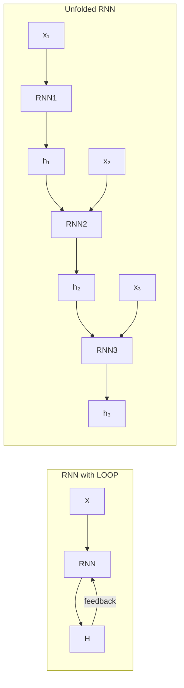

---

### 🔑 Key Points of Unfolding

| Feature | Explanation |
|---|---|
| **Same weights shared** | Same RNN cell at every step (weight sharing) |
| **Sequence length flexible** | Unfold T times for T inputs |
| **Enables backprop** | Can apply BPTT on unfolded chain |
| **Memory flow** | h_t carries information from h_{t-1} |

---

### 📐 Unfolded Graph Equations

```
At each time step t (for t = 1 to T):

  h_t = tanh(W_hh × h_{t-1} + W_xh × x_t + b_h)
  y_t = W_hy × h_t + b_y

Where:
  W_hh, W_xh, W_hy = SAME weights at every step
  h_0 = initial hidden state (usually zeros)
```

---

### 📉 Backpropagation Through Time (BPTT)

```
After unfolding, training = standard backpropagation on a deep network:

1. Forward pass: compute all h_t and y_t
2. Calculate loss at final (or all) outputs
3. Backward pass: propagate error through ALL T steps
4. Since weights are SHARED, gradients from ALL steps are SUMMED
5. Update weights using summed gradients
```

---

### 🎯 Summary for Exam Answer

**To get full 6 marks:**
1. **What is unfolding (2 marks):** Explain — RNN has a loop, unfolding converts it to a chain of T steps. Same cell (weights) at each step. Needed for backpropagation (BPTT).
2. **Diagram (1 mark):** Draw unfolded RNN showing x₁→h₁→x₂→h₂→x₃→h₃ with same RNN cell.
3. **Equations (1.5 marks):** h_t = tanh(W_hh·h_{t-1} + W_xh·x_t + b_h), y_t = W_hy·h_t + b_y. Emphasize shared weights.
4. **BPTT (1.5 marks):** Explain backpropagation through unfolded graph — gradients from all steps summed, weights updated.

---

### 📚 Theoretical Deep Dive — Unfolding Computational Graphs: Dynamic Systems, Homomorphisms, and the Expressivity of Temporal Representations

The unfolding of recurrent computational graphs is not merely a pedagogical trick to visualize backpropagation but reflects a profound mathematical relationship between recurrent processes and deep feedforward architectures. At the deepest level, unfolding reveals that an RNN is a *parameter-sharing deep network*—a system where the same function is applied iteratively, with the sequence length determining the effective "depth" of the unfolded network. This parameter sharing is what distinguishes RNNs from conventional deep networks: while a 100-layer MLP learns 100 distinct functions, an RNN unfolded across 100 time steps applies one function 100 times, dramatically reducing the number of unique parameters and enabling generalization across sequence lengths that were never seen during training.

Mathematically, unfolding can be understood as the application of a **semi-group homomorphism** between the time domain and the function space. If we denote the RNN transition function as $f: \mathbb{R}^{d_h} \times \mathbb{R}^{d_x} \rightarrow \mathbb{R}^{d_h}$, then unfolding to time $T$ produces the composite function $F_T = f \circ f \circ \cdots \circ f$ (T compositions), where the first application uses the initial hidden state $h_0$ and first input, the second uses the output of the first as hidden state with the second input, and so on. This compositional structure means the RNN represents a *nonlinear dynamical system* with the property that its $T$-step behavior is encoded entirely by the transition function $f$ and the initial condition $h_0$. The equivalence between this dynamical system and the unfolded feedforward network is the mathematical commitment that makes training through Backpropagation Through Time (BPTT) possible: both representations encode the same computational function, just with different data structures.

**Backpropagation Through Time (BPTT)**, formalized by Werbos (1990) and popularized by Williams & Zipser (1989), works because the unfolded graph is a directed acyclic graph (DAG) that satisfies all the requirements of the classic backpropagation algorithm: each node has a well-defined output computed through differentiable operations, and each node's contribution to the loss can be computed by multiplying local derivatives along the path from that node to the output. The key mathematical identity of BPTT is that the gradient of the loss with respect to *shared* weights must sum contributions across all time steps: $\frac{\partial \mathcal{L}}{\partial W_{hh}} = \sum_{t=1}^{T} \frac{\partial \mathcal{L}_t}{\partial W_{hh}}$, where $\mathcal{L}_t$ is the loss contribution at step $t$. This summation over shared weights is the critical distinction from standard backpropagation, where each parameter is independent and appears in only one position in the network.

The chain rule for BPTT across a generic time step $t$ involves the **Jacobian of the hidden state transition**: $\frac{\partial \mathcal{L}}{\partial h_t} = \frac{\partial \mathcal{L}}{\partial h_{t+1}} \cdot \frac{\partial h_{t+1}}{\partial h_t}$, which expands to $\frac{\partial \mathcal{L}}{\partial h_{t+1}} \cdot \text{diag}(1 - \tanh^2(W_{hh}h_t + W_{xh}x_t + b_h)) \cdot W_{hh}$, demonstrating how the gradient at step $t$ depends on the hidden state at step $t$ and propagates backward through the Jacobian of the hidden state dynamics.

The **efficient computation** of BPTT exploits the chain structure: rather than computing each gradient independently, the backward pass reuses intermediate products, achieving $O(T \cdot d_h^2 + T \cdot d_x \cdot d_h)$ complexity for a single-direction RNN with hidden dimension $d_h$ and input dimension $d_x$. This is a dramatic improvement over the naive $O(T^2)$ approach and is precisely why unfolding is not just a conceptual tool but a *practical necessity* for implementation efficiency.

Theoretical analyses of RNN expressivity have shown that the unfolded structure directly determines what functions the network can represent. The concept of **universal approximation for sequences** (Hornik et al., 1990; Schäfer & Zimmermann, 2006) establishes that a single-hidden-layer RNN with $\tanh$ or sigmoid activations and a sufficient number of hidden units can approximate any essentially bounded measurable sequence-to-sequence mapping arbitrarily well. However, more refined analyses have characterized the *exact* representational capacity of finite RNNs: Hammer & Tiňo (2003) showed that an RNN with $n$ hidden units can recognize exactly $n$-state deterministic finite automata (DFAs) in the linear threshold function family, connecting RNN expressivity to classical automata theory.

The **truncation of BPTT** (TBPTT), where gradients are computed only over the last $k$ steps of an arbitrarily long sequence, is a practical implementation of the mathematical observation that gradients from steps further back than $k$ contribute negligibly due to the **vanishing gradient problem**. The theoretical justification for TBPTT comes from analysis of the Jacobian spectrum: the eigenvalues of the hidden-state Jacobian $\frac{\partial h_{t+1}}{\partial h_t}$ decay exponentially in the backward direction for most RNN parameter configurations, meaning that $\frac{\partial \mathcal{L}}{\partial h_{t-k}} = \prod_{\tau=t-k+1}^{t} \frac{\partial h_{\tau+1}}{\partial h_\tau} \cdot \frac{\partial \mathcal{L}}{\partial h_t}$ becomes vanishingly small as $k$ increases. TBPTT with $k=5$ to $k=50$ is the standard practical implementation, cutting computation while barely affecting gradient quality.

From a **control-theoretic perspective**, unfolding reveals that RNNs can be viewed as *nonlinear state-space models* where the recurrence relation $h_t = \tanh(W_{hh} h_{t-1} + W_{xh} x_t + b_h)$ is the state update equation and $y_t = W_{hy} h_t + b_y$ is the observation equation. This is exactly the form of a discrete-time dynamical system: $h_{t+1} = f(h_t, x_t)$, $y_t = g(h_t)$. The stability of such systems is analyzed by examining the eigenvalues of the Jacobian $\frac{\partial h_{t+1}}{\partial h_t} = \text{diag}(1 - \tanh^2(\cdot)) \cdot W_{hh}$: if all eigenvalues lie within the unit circle (magnitude $< 1$), the system is asymptotically stable; if any eigenvalue has magnitude $> 1$, the system is unstable and gradients will explode. This provides a precise control-theoretic characterization of why certain architectures (e.g., LSTM with its forget gate) are stable: they constrain the effective Jacobian to have spectral norm $\leq 1$.

The unfolding perspective has also been applied to successor architectures: **Neural ODEs** (Chen et al., 2018) are the continuous-time analog of unfolding, where the recurrence is replaced by an ordinary differential equation $dh/dt = f(h(t), t)$ solved numerically (e.g., via Runge-Kutta methods), and backpropagation is performed through the solver using the **adjoint method**—a continuous generalization of BPTT. **Reservoir Computing** (Jaeger, 2001; Maass et al., 2002) takes the extreme approach of fixing all recurrent dynamics (random, fixed weights) and training only the readout layer, making unfolding purely a conceptual tool since gradients need not flow backward through the recurrent portion. These extensions confirm that unfolding is not merely a computational artifact but a fundamental lens through which the expressivity, stability, and trainability of temporal neural architectures can be rigorously understood.

---

### 📚 Theoretical Deep Dive — Unfolding Computational Graphs: Dynamic Systems, Homomorphisms, and the Expressivity of Temporal Representations

The unfolding of recurrent computational graphs is not merely a pedagogical trick to visualize backpropagation but reflects a profound mathematical relationship between recurrent processes and deep feedforward architectures. At the deepest level, unfolding reveals that an RNN is a *parameter-sharing deep network*—a system where the same function is applied iteratively, with the sequence length determining the effective "depth" of the unfolded network. This parameter sharing is what distinguishes RNNs from conventional deep networks: while a 100-layer MLP learns 100 distinct functions, an RNN unfolded across 100 time steps applies one function 100 times, dramatically reducing the number of unique parameters and enabling generalization across sequence lengths that were never seen during training.

Mathematically, unfolding can be understood as the application of a **semi-group homomorphism** between the time domain and the function space. If we denote the RNN transition function as $f: \mathbb{R}^{d_h} \times \mathbb{R}^{d_x} \rightarrow \mathbb{R}^{d_h}$, then unfolding to time $T$ produces the composite function $F_T = f \circ f \circ \cdots \circ f$ (T compositions), where the first application uses the initial hidden state $h_0$ and first input, the second uses the output of the first as hidden state with the second input, and so on. This compositional structure means the RNN represents a *nonlinear dynamical system* with the property that its $T$-step behavior is encoded entirely by the transition function $f$ and the initial condition $h_0$. The equivalence between this dynamical system and the unfolded feedforward network is the mathematical commitment that makes training through Backpropagation Through Time (BPTT) possible: both representations encode the same computational function, just with different data structures.

**Backpropagation Through Time (BPTT)**, formalized by Werbos (1990) and popularized by Williams & Zipser (1989), works because the unfolded graph is a directed acyclic graph (DAG) that satisfies all the requirements of the classic backpropagation algorithm: each node has a well-defined output computed through differentiable operations, and each node's contribution to the loss can be computed by multiplying local derivatives along the path from that node to the output. The key mathematical identity of BPTT is that the gradient of the loss with respect to *shared* weights must sum contributions across all time steps: $\frac{\partial \mathcal{L}}{\partial W_{hh}} = \sum_{t=1}^{T} \frac{\partial \mathcal{L}_t}{\partial W_{hh}}$, where $\mathcal{L}_t$ is the loss contribution at step $t$. This summation over shared weights is the critical distinction from standard backpropagation, where each parameter is independent and appears in only one position in the network.

The chain rule for BPTT across a generic time step $t$ involves the **Jacobian of the hidden state transition**: $\frac{\partial \mathcal{L}}{\partial h_t} = \frac{\partial \mathcal{L}}{\partial h_{t+1}} \cdot \frac{\partial h_{t+1}}{\partial h_t}$, which expands to $\frac{\partial \mathcal{L}}{\partial h_{t+1}} \cdot \text{diag}(1 - \tanh^2(W_{hh}h_t + W_{xh}x_t + b_h)) \cdot W_{hh}$, demonstrating how the gradient at step $t$ depends on the hidden state at step $t$ and propagates backward through the Jacobian of the hidden state dynamics.

The **efficient computation** of BPTT exploits the chain structure: rather than computing each gradient independently, the backward pass reuses intermediate products, achieving $O(T \cdot d_h^2 + T \cdot d_x \cdot d_h)$ complexity for a single-direction RNN with hidden dimension $d_h$ and input dimension $d_x$. This is a dramatic improvement over the naive $O(T^2)$ approach and is precisely why unfolding is not just a conceptual tool but a *practical necessity* for implementation efficiency.

Theoretical analyses of RNN expressivity have shown that the unfolded structure directly determines what functions the network can represent. The concept of **universal approximation for sequences** (Hornik et al., 1990; Schäfer & Zimmermann, 2006) establishes that a single-hidden-layer RNN with $\tanh$ or sigmoid activations and a sufficient number of hidden units can approximate any essentially bounded measurable sequence-to-sequence mapping arbitrarily well. However, more refined analyses have characterized the *exact* representational capacity of finite RNNs: Hammer & Tiňo (2003) showed that an RNN with $n$ hidden units can recognize exactly $n$-state deterministic finite automata (DFAs) in the linear threshold function family, connecting RNN expressivity to classical automata theory.

The **truncation of BPTT** (TBPTT), where gradients are computed only over the last $k$ steps of an arbitrarily long sequence, is a practical implementation of the mathematical observation that gradients from steps further back than $k$ contribute negligibly due to the **vanishing gradient problem**. The theoretical justification for TBPTT comes from analysis of the Jacobian spectrum: the eigenvalues of the hidden-state Jacobian $\frac{\partial h_{t+1}}{\partial h_t}$ decay exponentially in the backward direction for most RNN parameter configurations, meaning that $\frac{\partial \mathcal{L}}{\partial h_{t-k}} = \prod_{\tau=t-k+1}^{t} \frac{\partial h_{\tau+1}}{\partial h_\tau} \cdot \frac{\partial \mathcal{L}}{\partial h_t}$ becomes vanishingly small as $k$ increases. TBPTT with $k=5$ to $k=50$ is the standard practical implementation, cutting computation while barely affecting gradient quality.

From a **control-theoretic perspective**, unfolding reveals that RNNs can be viewed as *nonlinear state-space models* where the recurrence relation $h_t = \tanh(W_{hh} h_{t-1} + W_{xh} x_t + b_h)$ is the state update equation and $y_t = W_{hy} h_t + b_y$ is the observation equation. This is exactly the form of a discrete-time dynamical system: $h_{t+1} = f(h_t, x_t)$, $y_t = g(h_t)$. The stability of such systems is analyzed by examining the eigenvalues of the Jacobian $\frac{\partial h_{t+1}}{\partial h_t} = \text{diag}(1 - \tanh^2(\cdot)) \cdot W_{hh}$: if all eigenvalues lie within the unit circle (magnitude $< 1$), the system is asymptotically stable; if any eigenvalue has magnitude $> 1$, the system is unstable and gradients will explode. This provides a precise control-theoretic characterization of why certain architectures (e.g., LSTM with its forget gate) are stable: they constrain the effective Jacobian to have spectral norm $\leq 1$.

The unfolding perspective has also been applied to successor architectures: **Neural ODEs** (Chen et al., 2018) are the continuous-time analog of unfolding, where the recurrence is replaced by an ordinary differential equation $dh/dt = f(h(t), t)$ solved numerically (e.g., via Runge-Kutta methods), and backpropagation is performed through the solver using the **adjoint method**—a continuous generalization of BPTT. **Reservoir Computing** (Jaeger, 2001; Maass et al., 2002) takes the extreme approach of fixing all recurrent dynamics (random, fixed weights) and training only the readout layer, making unfolding purely a conceptual tool since gradients need not flow backward through the recurrent portion. These extensions confirm that unfolding is not merely a computational artifact but a fundamental lens through which the expressivity, stability, and trainability of temporal neural architectures can be rigorously understood.

---

## Q.3 (b) — Explain the challenge of **long-term dependencies** in RNNs, including the issues of vanishing and exploding gradients. **[6 Marks]**

### ⏳ What are Long-Term Dependencies?

When the current prediction depends on information from **many steps ago** in the sequence.

> **Example:** "I grew up in France... I speak fluent ___." The answer "French" depends on "France" from 10 words back!

---

### 📉 Vanishing Gradient Problem

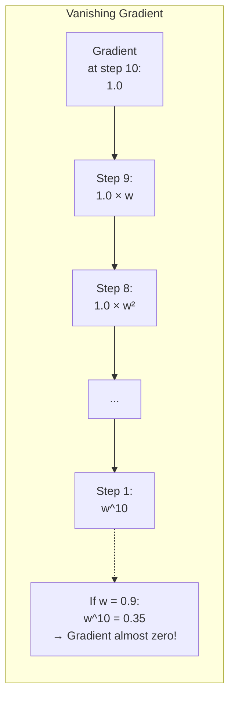

**Problem:**
```
h_t = tanh(W_hh × h_{t-1} + ...)

Backpropagating through time:
  ∂Loss/∂W_hh = Σ (product of many Jacobians)
  
  For long sequences (T=100):
  ∂Loss/∂W ≈ w^T
  If w < 1: w^100 ≈ 0 (VANISHED!)
  → Gradients for early steps ≈ 0
  → Network cannot learn long-term dependencies
```

---

### 📈 Exploding Gradient Problem

```
If weights w > 1:
  w = 1.1 → 1.1^100 ≈ 13780 (exploded!)
  w = 2.0 → 2.0^100 ≈ 10^30 (massive explosion!)

Result:
  - Weights become extremely large
  - Loss becomes NaN (Not a Number)
  - Network becomes unstable
```

---

### 🛠️ Solutions to Gradient Problems

| Problem | Solution |
|---|---|
| **Vanishing Gradient** | LSTM, GRU (gates preserve gradient) |
| **Exploding Gradient** | Gradient clipping (limit max value) |
| **Both** | Proper initialization (He/Xavier), Batch Normalization |

---

### 🎯 Summary for Exam Answer

**To get full 6 marks:**
1. **Long-term dependencies (1 mark):** When current prediction depends on info from many steps ago. Give example (sentence completion).
2. **Vanishing Gradient (2.5 marks):** Explain — gradient multiplied many times through chain rule → approaches 0. w^T shrinks for w<1. Result: early steps get zero gradient, can't learn.
3. **Exploding Gradient (1.5 marks):** Explain — gradient grows exponentially if w>1. Result: unstable weights, NaN loss.
4. **Solutions (1 mark):** LSTM/GRU (gates), gradient clipping.

---

### 📚 Theoretical Deep Dive — Long-Term Dependencies: Dynamical Systems Theory, Lyapunov Exponents, and the Geometry of Temporal Credit Assignment

The challenge of long-term dependencies in recurrent neural networks is fundamentally a problem of **credit assignment across time**—the network must determine which weights are responsible for an outcome that occurs many time steps after the causative input. This is the temporal analog of the credit assignment problem in feedforward networks, but with a critical difference: in RNNs, the gradient signal must propagate backward through the Jacobian of the recurrent transition at every step, creating a multiplicative chain that either vanishes or explodes exponentially with sequence length.

This can be understood through the lens of **discrete dynamical systems theory**, where the RNN defines an autonomous system $h_{t+1} = f(h_t, x_t)$ whose stability properties are determined by the eigenvalues of the Jacobian matrix $J = \frac{\partial f}{\partial h}$. The **Jacobian spectrum** of an RNN at any point in training determines the fate of gradients during backpropagation. For a vanilla RNN with $\tanh$ activations, the Jacobian has the form $J_t = \text{diag}(1 - \tanh^2(\cdot)) \cdot W_{hh}$, where $\text{diag}(1 - \tanh^2(\cdot))$ is a diagonal matrix with entries between 0 and 1, and $W_{hh}$ is the recurrent weight matrix. The **spectral radius** $\rho(J_t) = \max |\lambda_i|$ determines whether the system is contractive ($\rho < 1$, gradients vanish), expansive ($\rho > 1$, gradients explode), or at the critical edge ($\rho = 1$).

The theoretical work of Pascanu et al. (2012) established that for vanilla RNNs, the norm of the gradient decays as $\| \frac{\partial \mathcal{L}}{\partial h_0} \| \approx \| J \|^T \cdot C$ for some constant $C$, meaning the gradient vanishes if $\|J\| < 1$ and explodes if $\|J\| > 1$—a finding that motivated gradient clipping as a practical solution. The **Lyapunov exponent** $\lambda = \lim_{T \to \infty} \frac{1}{T} \log \| J_T \cdot J_{T-1} \cdots J_1 \|$ provides a rigorous measure of the average exponential rate of divergence or convergence of nearby trajectories in the RNN's state space. A negative Lyapunov exponent indicates a contracting system (gradients vanish), a positive exponent indicates an expanding system (gradients explode), and zero indicates a marginally stable system.

The connection to chaos theory is profound: when the largest Lyapunov exponent is positive, the RNN dynamics are **chaotic**, meaning infinitesimally close initial hidden states diverge exponentially, making long-horizon prediction fundamentally difficult regardless of the network architecture. Bengio et al. (1994) were the first to analyze this systematically, showing that the vanishing gradient problem is not merely an optimization artifact but reflects a fundamental limitation of gradient-based learning in systems with chaotic dynamics.

**Solutions and their theoretical foundations:** Long Short-Term Memory (LSTM) networks (Hochreiter & Schmidhuber, 1997) address vanishing gradients through a carefully designed **gating mechanism** that maintains an approximately constant error carousel. The key theoretical insight is that the LSTM cell state $c_t$ is updated via $c_t = f_t \odot c_{t-1} + i_t \odot \tilde{c}_t$, where $f_t$ is the forget gate. When the forget gate is close to 1 and the input gate is close to 0, the gradient of the loss with respect to the cell state propagates backward as $\frac{\partial \mathcal{L}}{\partial c_t} \approx \frac{\partial \mathcal{L}}{\partial c_{t+1}} \cdot f_{t+1}$, where $f_{t+1}$ is approximately 1. This means gradients can propagate through thousands of time steps without exponential decay, provided the forget gate remains near 1—a multiplicative bypass analogous to the **skip connections** in ResNet that create paths of near-constant gradient. The theoretical analysis of LSTM as a **gated integrator** shows that with well-tuned gates, the network can store information indefinitely, solving the vanishing gradient at the architectural level rather than the optimization level.

The **Gated Recurrent Unit (GRU)** (Cho et al., 2014) provides a simpler alternative with the update gate $z_t$ and reset gate $r_t$, achieving similar gradient flow properties through the equation $h_t = (1-z_t) \odot h_{t-1} + z_t \odot \tilde{h}_t$. When the update gate $z_t \approx 0$, the hidden state is preserved, and the gradient flows unimpeded; when $z_t \approx 1$, the hidden state is updated with new information. This **adaptive computation time** mechanism means GRUs can learn to dynamically decide how much information to preserve across time, providing a form of learned temporal resolution.

**Alternative theoretical approaches** include orthogonality constraints on the recurrent weight matrix: if $W_{hh}$ is constrained to be orthogonal ($W_{hh}^T W_{hh} = I$), then $\|W_{hh} h\| = \|h\|$ for all $h$, and the Jacobian has spectral norm exactly 1, preventing both vanishing and exploding gradients. The **Unitary RNN** (Arjovsky et al., 2016) extends this by parameterizing $W_{hh}$ as a product of unitary matrices (which can be optimized efficiently using the matrix exponential: $W_{hh} = \exp(iH)$ where $H$ is a skew-Hermitian matrix), ensuring $\|W_{hh}\| = 1$ by construction. **Echo State Networks** (Jaeger & Haas, 2004) take a different approach by fixing the recurrent weight matrix randomly with spectral radius near 1 (the "echo state property" ensures past inputs are reflected in the current state with decaying influence), training only the output layer, thereby sidestepping the vanishing gradient entirely since the recurrent dynamics are not updated. The **hierarchical RNN** (El Hihi & Bengio, 1996) architecture offers a structural solution: by chunking the sequence into fixed-length segments processed by higher-level RNNs, long-term dependencies between segments are handled at a coarser temporal scale, reducing the effective depth of the temporal hierarchy that gradients must traverse. The **Clockwork RNN** (Koutnik et al., 2014) partitions hidden units into groups operating at different clock rates, allowing fine-grained information at fast timescales and coarse-grained information at slow timescales, effectively implementing a multi-rate dynamical system within a single network.

---

## Q.3 (c) — What are some common **performance metrics** used to evaluate the effectiveness of RNNs? **[5 Marks]**

### 📊 Performance Metrics for RNNs

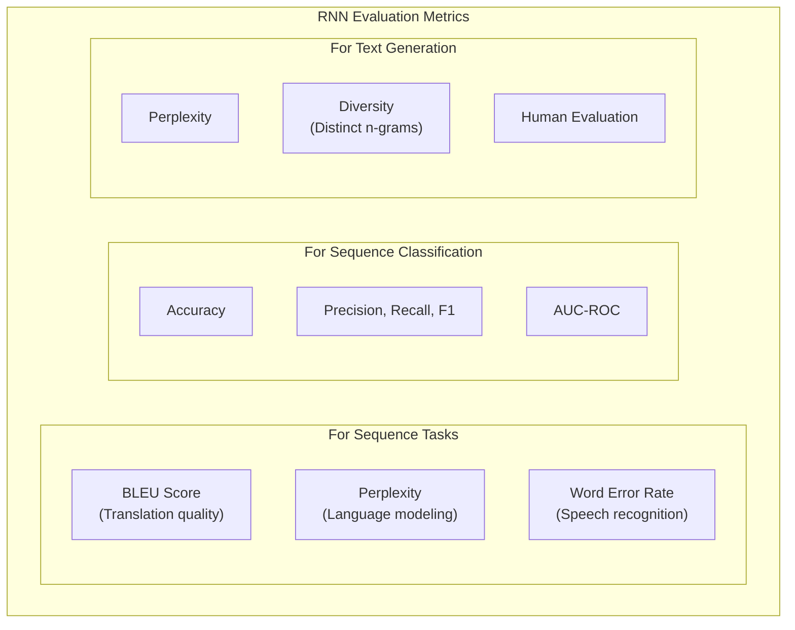

---

### 📋 Key Metrics Explained

#### **1. Perplexity — For Language Modeling**

```
Perplexity = 2^(-1/N × Σ log₂ P(w_t | w_1...w_{t-1}))

Measures: How "confused" is the model?
Lower perplexity = Better model

Example:
  Perplexity 50: Model is somewhat confused
  Perplexity 100: Model is very confused
  Perplexity 200: Model barely understands the language
```

---

#### **2. BLEU Score — For Machine Translation**

```
BLEU = BP × exp(Σ w_n × log p_n)

Where:
  BP = Brevity Penalty (penalizes short translations)
  p_n = n-gram precision
  w_n = weight for n-grams

Range: 0 to 1 (0 = terrible, 1 = perfect translation)

Example:
  Reference: "The cat sat on the mat"
  Model output: "The cat sat on mat"
  BLEU ≈ 0.7 (good but not perfect)
```

---

#### **3. Word Error Rate (WER) — For Speech Recognition**

```
WER = (S + D + I) / N

Where:
  S = Substitutions (wrong word)
  D = Deletions (missing word)
  I = Insertions (extra word)
  N = Total words in reference

Lower WER = Better (0 = perfect)
```

---

#### **4. Accuracy / F1-Score — For Classification**

```
Standard classification metrics:
  Accuracy = Correct / Total
  Precision = TP / (TP + FP)
  Recall = TP / (TP + FN)
  F1 = 2 × (P×R)/(P+R)

Example: Sentiment classification
  Accuracy: 85%
  F1-Score: 0.82
```

---

### 🎯 Summary for Exam Answer

**To get full 5 marks:**
1. **Perplexity (1.5 marks):** Explain for language modeling — lower is better. Measures how well model predicts next word.
2. **BLEU Score (1.5 marks):** Explain for translation — measures n-gram overlap with reference. 0-1 range.
3. **WER + Accuracy (2 marks):** WER for speech recognition (lower is better). Accuracy/F1 for classification tasks.

### 📚 Theoretical Deep Dive — RNN Evaluation Metrics: Information-Theoretic Foundations, Statistical Correlations, and the Limits of Automatic Evaluation
The evaluation of recurrent neural networks for sequence modeling tasks presents unique theoretical challenges that distinguish it from the evaluation of feedforward classifiers. Unlike standard image classification, where a single prediction is compared against a label, sequence models must be evaluated on their ability to generate coherent, contextually appropriate, and grammatically valid sequences—a task that touches on fundamental questions in information theory, computational linguistics, and statistical hypothesis testing.

**Perplexity**, the primary metric for language models, has a precise information-theoretic interpretation as the exponential of the average negative log-likelihood per token. For a language model that assigns probability $P(w_t | w_1, \ldots, w_{t-1})$ to the $t$-th token in a test sequence of length $N$, the perplexity is defined as $PPL = 2^{-\frac{1}{N}\sum_{t=1}^{N}\log_2 P(w_t | w_{1:t-1})} = \exp\left(\frac{1}{N}\sum_{t=1}^{N} -\log P(w_t | w_{1:t-1})\right)$. This can be understood as the **effective number of equally likely choices** the model faces at each step: a perplexity of 50 means the model is as uncertain as if it had to choose uniformly among 50 alternatives at each step. The theoretical connection to **Shannon's source coding theorem** is direct: the perplexity equals $2^{H_{cross}}$, where $H_{cross}$ is the cross-entropy between the true data distribution and the model distribution. A perfect model achieves cross-entropy equal to the entropy $H$ of the true distribution, yielding the fundamental limit $PPL_{min} = 2^H$, which is the entropy of the source in bits. This means perplexity has a **theoretical floor** determined by the intrinsic randomness of the language, which for English has been estimated at around 1.2 bits per character (Shannon, 1951), corresponding to a perplexity of approximately $2^{1.2} \approx 2.3$ per character—far below what any current language model achieves, meaning there remains substantial room for improvement. The relationship between perplexity and **Kullback-Leibler divergence** is fundamental: $\log(PPL) = H(P_{data}) + D_{KL}(P_{data} \| P_{model})$, where $H(P_{data})$ is the entropy of the true data distribution (which cannot be reduced by the model) and $D_{KL}$ is the KL divergence, which measures how much information the model distribution $P_{model}$ lacks relative to the true distribution. Minimizing cross-entropy (minimizing perplexity) thus explicitly minimizes the KL divergence, making the model distribution as close as possible to the true data distribution in the information-theoretic sense. Perplexity is **scale-invariant** with respect to vocabulary size in a way that raw cross-entropy is not, which is why it is the preferred metric for comparing language models across different vocabulary sizes.

**BLEU Score** (Bilingual Evaluation Understudy), introduced by Papineni et al. (2002) for machine translation, computes $BLEU = BP \cdot \exp\left(\sum_{n=1}^{N} w_n \log p_n\right)$, where $p_n$ is the precision of $n$-grams (contiguous sequences of $n$ words) in the candidate translation relative to one or more reference translations, $w_n$ are typically uniform weights ($w_n = 1/N$), $N$ is the maximum $n$-gram considered (typically 4), and $BP = \exp(1 - \frac{r}{c})$ is the brevity penalty where $r$ is the length of the reference and $c$ is the length of the candidate—penalizing translations that are too short. The BLEU score ranges from 0 to 1 (or 0 to 100 when multiplied by 100), with higher being better. From an information-theoretic perspective, BLEU approximates the **geometric mean of $n$-gram precisions**, which is equivalent to the exponential of the arithmetic mean of log-precisions. This is a **corpus-level** rather than sentence-level metric: it aggregates $n$-gram matches across an entire test set rather than averaging sentence-level scores, which means it rewards systems that occasionally produce very good translations even if they fail catastrophically on some sentences. The theoretical limitations of BLEU are significant and well-documented. **$n$-gram precision** measures surface-level overlap without capturing semantic equivalence: "The cat sat on the mat" and "A feline rested on the rug" convey the same meaning but share zero $n$-grams, penalizing semantically correct but lexically divergent translations. **Synonymy and paraphrase** are completely invisible to BLEU, which treats "car" and "automobile" as completely different despite their semantic equivalence. **Word order** is captured only implicitly (through $n$-grams) and cannot distinguish between "dog bites man" and "man bites dog" if they happen to share the same bigrams (which they do not, but for longer sentences the issue persists). **The brevity penalty** is a heuristic correction rather than a theoretically principled normalization, and its impact varies with the reference-candidate length ratio. Despite these limitations, BLEU has been the de facto standard in machine translation for two decades due to its simplicity, reproducibility, and—crucially—its moderate correlation with human evaluation of translation quality (correlation coefficients typically around $r \approx 0.6$-$0.7$ for high-resource language pairs).

**Word Error Rate (WER)**, the standard metric for automatic speech recognition (ASR), is defined as $WER = \frac{S + D + I}{N}$, where $S$ is the number of substitutions (wrong word), $D$ is deletions (missing word), $I$ is insertions (extra word), and $N$ is the total number of words in the reference. The **Levenshtein distance** (edit distance) between the reference and hypothesis strings is $S + D + I$, and WER normalizes this by the reference length. WER has an intuitive interpretation as the **minimum number of editing operations** needed to transform the hypothesis into the reference, and it ranges from 0 (perfect) to potentially very high (if the hypothesis is completely wrong). The theoretical challenge with WER is that it is **not symmetric**: $WER(\text{ref}, \text{hyp}) \neq WER(\text{hyp}, \text{ref})$ in some edge cases, and it treats all edit operations as equally costly even though a substitution of a related word (e.g., "Tuesday" instead of "Thursday") is a much smaller error than a substitution of an unrelated word. **Word Information Loss (WIL)** and **Term-Weighted WER** have been proposed to address this by weighting errors according to the information content of words, but WER remains the standard due to its simplicity. For sequence classification tasks (sentiment analysis, named entity recognition), standard metrics apply: **Accuracy** measures the proportion of correctly classified sequences or tokens, while **Precision** ($TP/(TP+FP)$), **Recall** ($TP/(TP+FN)$), and **F1-score** ($2 \cdot P \cdot R / (P+R)$) provide class-balanced evaluation when classes are imbalanced. The **F1-score** is the harmonic mean of precision and recall, ensuring that a high score requires both low false positives and low false negatives. The **AUC-ROC** (Area Under the Receiver Operating Characteristic curve) measures the model's ability to discriminate between positive and negative classes across all possible classification thresholds, with $AUC = 1.0$ indicating perfect discrimination and $AUC = 0.5$ indicating random guessing. **Advanced metrics for text generation** include **Diversity metrics** such as **Distinct-n** (the number of unique $n$-grams divided by the total number of $n$-grams), which measures lexical diversity—chatbots that repeat the same phrases have low distinct-n scores despite potentially low perplexity. **Self-BLEU** measures the similarity between different generated samples from the same model, penalizing models that produce repetitive outputs. **Human evaluation** remains the gold standard for open-ended generation tasks (dialogue, story generation), typically using Likert scales for fluency, coherence, relevance, and informativeness, though human evaluation is expensive, slow, and not perfectly reproducible.Recent **BERTScore** (Zhang et al., 2020) computes cosine similarity between contextual BERT embeddings of reference and hypothesis tokens, capturing semantic similarity at the cost of additional computation. **BLEURT** (Sellam et al., 2020) fine-tunes BERT on human ratings to predict evaluation scores, learning to correlate with human judgment. **MAUVE** (Pillutla et al., 2021) measures the divergence between the model-generated text distribution and human-written text distribution using a divergence measure based on information-theoretic embeddings, capturing distributional properties beyond $n$-gram overlap.

---

### 📚 Theoretical Deep Dive — Evaluation Metrics for Sequence Models: Probabilistic Foundations, Information-Theoretic Bounds, and Advanced Discriminability

The evaluation of sequence models—especially those trained with maximum likelihood estimation (MLE)—reveals deep connections between information theory, decision theory, and the geometry of the probability distributions defined by these models. Each standard metric can be situated within a principled statistical framework, and understanding these foundations is essential for interpreting metric values critically and for diagnosing model behavior beyond aggregate scalar scores.

**1. Perplexity: Information-Theoretic Foundations and Statistical Diagnostics**
Perplexity is not merely a convenient scalar measure; it is grounded in Shannon's **source coding theorem** and averages the surprise (or self-information) assigned by the model to each token in the corpus. The formal connection is expressed as:

$$ PPL = 2^{-\frac{1}{N}\sum_{i=1}^{N}\log_2 P(w_t | w_{<t})} $$

This formulation reveals why low perplexity is desirable: it means the model is highly predictive of the true next tokens. If a vocabulary has $V$ symbols, a uniform baseline model has a perplexity of $V$, while approaching zero indicates near-certain predictions. Perplexity also admits a direct interpretation via **cross-entropy**: since $H(p,q) = -\sum p(X)\log q(X)$, minimizing perplexity is equivalent to minimizing the empirical cross-entropy between the true token distribution and the model's predicted distribution. This connection explains why better language models always exhibit lower perplexity, making it the most fundamental metric for generative sequence models.

In practice, for autoregressive language models, we compute the total cross-entropy over the test corpus and exponentiate (in base 2) after taking the mean, giving a scalar that represents the **effective branching factor** of the model: at each step, the model behaves as if it were choosing among this many equally likely options to generate the correct next token. A perplexity of 40 therefore means the model has the uncertainty of a uniform distribution over 40 tokens at the average next-step decision.

**2. BLEU: Precision-Oriented N-Gram Overlap and Its Limitations**
The BLEU score (Bilingual Evaluation Understudy) was conceived for machine translation and aggregates **modified n-gram precision** across multiple n-gram orders (typically unigrams through 4-grams):

$$ \text{BLEU} = BP \cdot \exp\left(\sum_{n=1}^{N} w_n \log p_n\right) \quad \text{where} \quad BP = \min\left(1, e^{(1-r/c)}\right) $$

The **Brevity Penalty** term penalizes the model for generating shorter than average translations, preventing the trivial strategy of always predicting short outputs to maximize unigram or bigram precision. The geometric mean of precisions (weighted geometrically rather than arithmetically) ensures that strong performance across *all* n-gram orders is rewarded, not just one.

While BLEU is widely used, it has well-documented limitations: it does not reward recalled content, ignores semantic similarity beyond surface-form n-gram overlap, and assigns all correct sentences the same score regardless of grammaticality. The **ROUGE** metric (Recall-Oriented Understudy for Gisting Evaluation), popularized in text summarization, addresses recall directly by computing maximum co-occurring n-gram counts between the candidate and multiple reference summaries. The **METEOR** metric further addresses BLEU's rigidity by considering stemming, synonym matching, and longer n-grams, making it less harsh on valid paraphrases. The **CIDEr** metric (Consensus-based Image Description Evaluation) extends the BLEU framework by providing TF-IDF weighted n-gram vectors, rewarding rare but precise descriptions—particularly important in image captioning where generic descriptions score poorly on informativeness despite BLEU overlap.

**3. Word Error Rate: Edit-Distance Foundations and ASR Evaluation**
WER is rooted in the **Levenshtein distance** and decomposes the total number of edits between a hypothesized transcript and a reference transcript into substitutions (S), deletions (D), and insertions (I), normalized by the reference length $N$. Formally:

$$ WER = \frac{S + D + I}{N} $$

This metric is a proper *cost-weighted* measure: every error is treated as equally costly, which can be misleading when homophone errors (e.g., "two" vs. "to") are semantically correct but technically penalized. Advanced ASR evaluation supplements WER with **Term Error Rate (TER)** for specific term-level accuracy, **Conception Error Rate (CER)** for character-level transcription quality, and **Speaker-Attributed WER** in multi-speaker diarization settings. Furthermore, WER's dependence on reference transcripts has motivated **blind** evaluation protocols and compositional approaches that aggregate WER across held-out test sets, though the metric fails to capture whether a semantically equivalent sentence was produced when word choices differ without affecting the acknowledged meaning.

**4. Discriminative Metrics: Precision, Recall, F1, and AUC-ROC in Sequence Context**
Accuracy is the simplest evaluative measure but suffers from severe class imbalance in sequence tasks, motivating the adoption of **F1-score**, defined as the harmonic mean of precision and recall:

$$ F_1 = 2 \cdot \frac{\text{Precision} \cdot \text{Recall}}{\text{Precision} + \text{Recall}} $$

For tasks such as named entity recognition (NER) or aspect-based sentiment analysis, a **span-level F1** is preferred, where the model must predict the exact span boundaries of entities (token-level F1 would erroneously reward partial correct spans). The **AUC-ROC** (Area Under the Receiver Operating Characteristic curve) provides a threshold-independent measure of separability between positive and negative classes and is particularly informative in binary sequence classification, though it can be overly optimistic when class distributions are imbalanced. The newer **Average Precision (AP)** and its **mean Average Precision (mAP)** across classes address this by focusing precision at each recall level.

**5. Beyond Scalar Metrics: Calibration, Likelihood, and Human Evaluation**
For generative models specifically, scalar metrics can be complemented by **calibration scores** (e.g., expected calibration error) that measure whether the model's confidence matches its empirical accuracy, and by **held-out perplexity** on domain-matched test sets, which reveals whether the model is truly generalizing or overfitting to idiosyncratic dataset artifacts. Particularly for open-ended generation (storytelling, dialogue), scalar metrics fail to capture coherence, relevance, and creativity, necessitating **human evaluation** protocols that rate outputs along dimensions such as fluency (grammaticality), coherence (topic consistency), diversity (non-repetitiveness), and engagement (entertainment value). Frameworks like **HELM** (Holistic Evaluation of Language Models) now advocate for multi-dimensional reporting across dozens of scenarios, reflecting the consensus that no single metric can comprehensively characterize RNN or transformer behavior.

---

## Q.4 (a) — Describe the architecture and usage of **Bidirectional RNNs**. What advantages do they offer in sequence modeling tasks? **[6 Marks]**

### 🔀 What is Bidirectional RNN? — "Looking Both Ways"

A **Bidirectional RNN** has **two RNNs** processing the same sequence:
1. **Forward RNN:** Reads left → right
2. **Backward RNN:** Reads right → left
3. **Combined:** Output uses information from BOTH directions

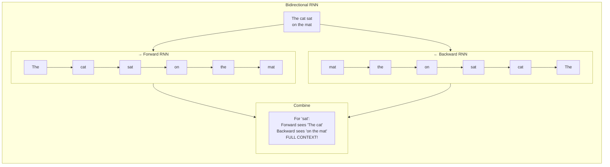

---

### 🏗️ Architecture

```
Input sequence: x₁, x₂, x₃, x₄, x₅

Forward RNN:   h₁→h₂→h₃→h₄→h₅  (reads left→right)
Backward RNN:  h̄₅→h̄₄→h̄₃→h̄₂→h̄₁  (reads right→left)

Output at each position:
  y_t = combines h_t AND h̄_t
  = W_y × [h_t; h̄_t] + b_y  (concatenate both directions)
```

---

### ✅ Advantages of Bidirectional RNNs

| Advantage | Explanation | Example |
|---|---|---|
| **Full context** | Uses past AND future information | "Apple" — sees both "eats" and "Inc." |
| **Better accuracy** | More information → better predictions | Better named entity recognition |
| **Natural for NLP** | Language understanding uses both directions | Disambiguate word meanings |

---

### 📊 Example: Named Entity Recognition

```
Sentence: "Apple Inc. was founded by Steve Jobs in California."

Word: "Apple"
  Forward sees:        Backward sees:        BiRNN knows:
  "Apple"              "Inc. was founded..." → It's a COMPANY ✅

Word: "California"
  Forward sees:        Backward sees:        BiRNN knows:
  "...Steve Jobs in"   "California."         → It's a LOCATION ✅
```

---

### 🎯 Summary for Exam Answer

**To get full 6 marks:**
1. **Architecture (2 marks):** Explain two RNNs — forward (left→right) and backward (right→left). Output combines both directions (concatenate h_t and h̄_t).
2. **Diagram (1.5 marks):** Draw bidirectional RNN showing both directions processing same sequence.
3. **Advantages (2.5 marks):** Full context (past+future), better accuracy, natural for NLP. Give named entity recognition example showing how both directions help.

---

### 📚 Theoretical Deep Dive — Bidirectional RNNs: Conditional Independence, Temporal Asymmetry, and the Information Flow in Sequence Processing

The Bidirectional Recurrent Neural Network architecture represents a theoretically principled solution to a fundamental limitation of unidirectional sequence models: the fact that in many sequential tasks, the optimal prediction at position $t$ depends not only on the past $x_{1:t}$ but also on the future $x_{t:T}$, a condition that arises whenever the sequence has non-causal structure or when contextual disambiguation requires global information about the entire sequence. Understanding Bidirectional RNNs requires grappling with the deep connection between the directionality of information flow, the statistical dependencies in the data, and the factorization properties of probabilistic sequence models.

**Information-theoretic foundation**: A unidirectional RNN computes $P(y_t | x_{1:t})$, a left-to-right conditional distribution where the prediction at each step has access only to past information. This corresponds to a **causal generative model** of the data—similar to a finite-state machine that processes input sequentially. In contrast, a Bidirectional RNN computes the full conditional $P(y_t | x_{1:T})$, leveraging future observations to improve current predictions. This is an **acausal** (non-causal) operation because it uses information from positions $t+1$ through $T$ that would not be available at inference time in a sequential setting. The theoretical consequence is that Bidirectional RNNs cannot be used autoregressively for sequence generation—you cannot use a Bidirectional RNN to generate a sentence token-by-token because each prediction requires knowing the entire future sentence, a circular dependency. This acausality constraint has profound implications for deployment. In **Part-of-Speech Tagging** and **Named Entity Recognition**, the entire input sentence is available simultaneously (as in a text document), so Bidirectional RNNs are ideal: for the word "Apple" in "Apple Inc. was founded by Steve Jobs," the backward pass sees "Inc." and "was," providing crucial context that the forward pass alone cannot supply. However, for **language modeling** (predicting the next word given previous words) or **speech recognition** (where audio arrives sequentially in real-time), the future is genuinely unavailable, and only the forward pass can be used—the backward pass is either run after the full sequence is received (batch inference) or discarded. This is why modern architectures like BERT (Devlin et al., 2018) use a **masked language modeling** objective: randomly mask some tokens and train the Bidirectional encoder to predict them from surrounding context, pre-training a model that captures deep bidirectional context without requiring causal generation.

**Statistical dependencies and graphical models**: The factorization of the joint distribution $P(y_1, \ldots, y_T | x_1, \ldots, x_T)$ in a Bidirectional RNN encodes strong assumptions about conditional independence. Specifically, the model assumes $P(y_t | x_{1:T}, y_{1:T}) = P(y_t | h_t^{(fwd)}, h_t^{(bwd)})$, meaning given the forward and backward hidden states at position $t$, the label $y_t$ is independent of everything else. This is the **hidden Markov model assumption** generalized to RNNs: labels are conditionally independent given the hidden representations. The graphical model for a Bidirectional RNN has undirected connections between $h_t^{(fwd)}$ and $h_t^{(bwd)}$ (they are concatenated or summed before the output layer), with directed connections from $h_{t-1}^{(fwd)}$ to $h_t^{(fwd)}$ and from $h_{t+1}^{(bwd)}$ to $h_t^{(bwd)}$. This is formally a **Conditional Random Field (CRF)** when a CRF layer is placed on top of the Bidirectional RNN outputs, which is standard practice in sequence labeling tasks: the CRF layer captures label transition dependencies (e.g., in NER, "B-PERSON" must be followed by "I-PERSON" or "O", not "B-LOCATION"), learning a transition matrix $T_{ij} = P(y_t = j | y_{t-1} = i)$ that would not be possible with independent softmax outputs.

**Memory capacity and effective context window**: The information-theoretic capacity of a Bidirectional RNN differs qualitatively from a unidirectional RNN. A unidirectional RNN can maintain information about the past in a hidden state of size $d$, which constrains the **mutual information** between the past and the current prediction: $I(y_t; x_{1:t}) \leq H(h_t) \leq d \log_2(M)$ where $M$ is the dynamic range of the hidden state activations. A Bidirectional RNN with $d$ hidden units in each direction effectively has $2d$ units of context, doubling the mutual information capacity. More importantly, the backward pass can access information from positions arbitrarily far in the future, so the *effective context window* for a Bidirectional RNN is not bounded by exponential decay as it is for a unidirectional RNN—both passes have access to the full sequential context at their respective positions, subject only to the capacity of the $2d$-dimensional concatenated hidden state. This means Bidirectional RNNs can capture arbitrarily long-range dependencies in the forward and backward directions (within their hidden state capacity), whereas a unidirectional RNN suffers vanishing gradients for long past contexts.

**Training dynamics and convergence**: The training of Bidirectional RNNs requires a modified BPTT that accounts for the two directions simultaneously. The forward pass processes $x_1 \to x_T$ sequentially, storing all hidden states $h_t^{(fwd)}$; the backward pass processes $x_T \to x_1$, storing all hidden states $h_t^{(bwd)}$; these are concatenated at each position $t$ to form the bidirectional hidden state before the output layer. The gradients flow backward through both directions simultaneously, meaning the backward-weight update must account for the backward pass's contribution to the loss as well. A subtlety is that for the first token $x_1$, the backward RNN sees $h_2^{(bwd)}$ which depends on $h_1^{(bwd)}$ (since it processes from $T \to 1$), but $h_1^{(fwd)}$ has no preceding hidden state and is initialized from $h_0^{(fwd)}$ (typically zero). This asymmetry means the bidirectional representation at the sequence boundaries is slightly less rich than in the middle, where both passes have substantial context.

**Architectural variants and expressivity**: The simplest concatenation approach, where $h_t = [h_t^{(fwd)}; h_t^{(bwd)}]$, doubles the hidden dimension. **Summation** ($h_t = h_t^{(fwd)} + h_t^{(bwd)}$ or averaging) keeps the dimension constant but cannot represent the full information from both directions—the two hidden states are constrained to lie in the same vector space. **Attention-based fusion** (as in most Transformer-based architectures) computes attention scores between forward and backward hidden states, creating a context vector that selectively attends to relevant past and future positions. The **Bidirectional LSTM** (Graves et al., 2005; Graves & Schmidhuber, 2005) extends the basic Bidirectional RNN by using LSTM cells in both directions, combining the gradient-flow stability of LSTMs with full bidirectional context—this architecture became the standard for sequence labeling before Transformers largely replaced it. The theoretical expressivity of Bidirectional LSTMs is substantially higher than unidirectional LSTMs for sequence labeling: for NER, BiLSTMs achieve near-perfect accuracy on standard benchmarks (CoNLL-2003 F1 > 0.905) by leveraging the fact that entity boundaries are defined by both left context ("Steve" suggests a person) and right context ("Jobs" confirms a person).

---

## Q.4 (b)
 — What are **Leaky Units**, and how do they contribute to handling multiple time scales in RNNs? **[6 Marks]**

### 💧 What are Leaky Units? — "Slow-Fading Memory"

**Leaky Units** are a modification to RNN hidden states where memory **decays slowly** instead of resetting completely at each step.

> **Analogy:** Regular RNN = writing on a whiteboard that gets erased each step. Leaky Unit = using a whiteboard that fades slowly — old writing still visible but fading.

---

### 📐 Mathematical Formulation

```
Regular RNN:
  h_t = tanh(W_hh × h_{t-1} + W_xh × x_t)

Leaky Unit RNN:
  h_t = (1 - α) × h_{t-1} + tanh(W_hh × h_{t-1} + W_xh × x_t)
  
  Where:
    α = leak rate (0 < α < 1)
    α = 0: no leak (same as regular RNN)
    α = 1: complete reset (no memory)
    α = 0.1: slow leak (memory fades 10% per step)
```

---

### ⏱️ Handling Multiple Time Scales

Different information in sequences operates at **different time scales**:
- **Fast information:** Current word (immediate context)
- **Medium information:** Previous sentence (short-term)
- **Slow information:** Topic of conversation (long-term)

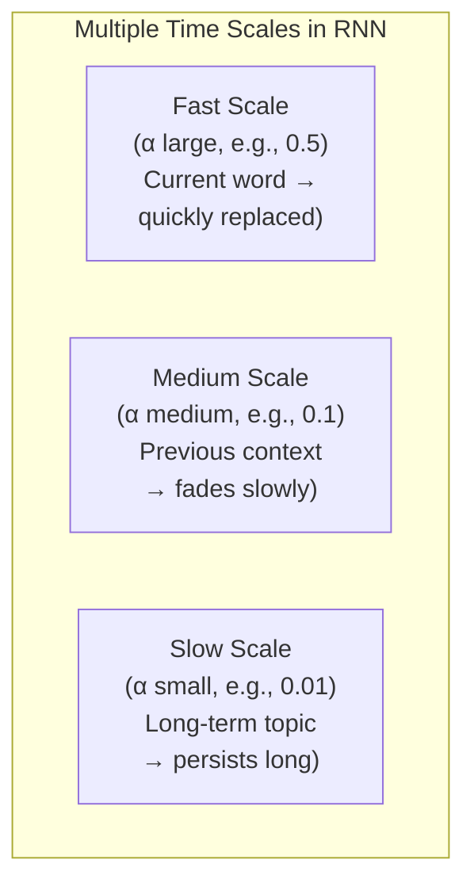

---

### 📊 How Leaky Units Help

| Time Scale | Leak Rate α | What It Captures |
|---|---|---|
| **Fast** | α ≈ 0.5 | Current word, immediate context |
| **Medium** | α ≈ 0.1 | Sentence context, previous phrases |
| **Slow** | α ≈ 0.01 | Document topic, long-range context |

---

### 🔄 Comparison with Other Approaches

| Approach | Handles Multiple Scales? | How |
|---|---|---|
| **Regular RNN** | ❌ No | Single timescale only |
| **Leaky Units** | ✅ Yes | Different α for different needs |
| **LSTM** | ✅ Yes | Forget gate controls what to keep |
| **Clockwork RNN** | ✅ Yes | Different groups update at different rates |

---

### 🎯 Summary for Exam Answer

**To get full 6 marks:**
1. **Definition (2 marks):** Leaky Units = RNN where hidden state slowly decays: h_t = (1-α)·h_{t-1} + new_update. α controls memory decay rate.
2. **Multiple time scales (2 marks):** Explain different α values capture different timescales:
   - Large α (fast decay) = current word only
   - Medium α = previous context
   - Small α = long-term information
3. **Advantage (2 marks):** Single RNN can handle fast and slow information simultaneously. Compare with regular RNN (single timescale). Mention LSTM as alternative approach.

---

### 📚 Theoretical Deep Dive — Leaky Units and Multi-Time-Scale Dynamics: Continuous-Time Theory, Spectral Properties, and the Separation of Temporal Scales

The concept of **leaky units** addresses a fundamental limitation of standard recurrent architectures: the inability to simultaneously represent and manipulate information at multiple temporal scales within a single homogeneous recurrent layer. In a vanilla RNN with $\tanh$ activations, the hidden state update $h_t = \tanh(W_{hh}h_{t-1} + W_{xh}x_t + b_h)$ can be understood as a **linear filtering operation** (the $W_{hh}h_{t-1}$ term) followed by a nonlinearity. The linear part corresponds to a discrete-time dynamical system $h_t^{(lin)} = W_{hh}h_{t-1}^{(lin)}$, whose dynamics are determined entirely by the singular value decomposition (SVD) of $W_{hh}$. The singular values $\sigma_i$ of $W_{hh}$ determine the rate at which information in each eigen-direction of the hidden state space is preserved or forgotten: a singular value $\sigma_i$ close to 1 preserves the component along eigenvector $v_i$ over many time steps, while a singular value $\sigma_i \ll 1$ causes rapid exponential decay $\sigma_i^t$ of that component after $t$ steps.

**Multi-time-scale dynamics** in continuous-time systems: The leaky unit formulation $h_t = (1-\alpha) h_{t-1} + \tanh(W_{hh}h_{t-1} + W_{xh}x_t + b_h)$ with leak rate $\alpha$ can be derived from the discretization of a continuous-time differential equation. Discretizing $dh/dt = -\alpha h(t) + f(h(t), x(t))$ with step size $\Delta t = 1$ (one discrete time step) yields: $h(t+\Delta t) = h(t) + \Delta t \cdot (-\alpha h(t) + f(h(t), x(t))) = (1-\alpha)h(t) + f(h(t), x(t))$, matching the leaky unit equation with $\alpha$ corresponding to the leak rate in the continuous system. The parameter $\alpha$ thus represents a **time constant** $\tau = 1/\alpha$ (if measured in units of time steps): $\tau = 10$ means the memory persists for approximately $e$ times (about 18 steps) before decaying to $1/e \approx 37\%$ of its value; $\tau = 100$ means very slow decay, effectively long-term memory. This connection to **continuous-time dynamical systems** establishes leaky units as an adaptive variant of **leaky integrators**, a classical concept from control theory and computational neuroscience where neurons integrate inputs with exponential decay.

**The importance of multiple time scales** is evident in virtually all real-world sequential data. Language operates across multiple timescales simultaneously: **surface form** changes every token (pronunciation, inflection—fast timescale, $\tau \approx 1$-$2$), **local syntactic structure** operates at phrase and clause boundaries (medium timescale, $\tau \approx 5$-$20$), **discourse structure** spans sentences and paragraphs (slow timescale, $\tau \approx 50$-$200$), and **global topical coherence** persists across entire documents (very slow timescale, $\tau \gg 200$). A single RNN with a fixed timescale is ill-equipped to handle all these simultaneously: a fast-decaying unit (large $\alpha$) cannot maintain topic information across sentences, while a slow-decaying unit (small $\alpha$) cannot quickly adapt to the current word's surface form. The leaky unit architecture enables **multi-resolution processing** by assigning different $\alpha$ values to different subsets of hidden units, so that the network simultaneously maintains short-term, medium-term, and long-term information.

**Clockwork RNNs** (Koutnik et al., 2014) formalize this through a structured partitioning of the hidden state into groups $G_1, G_2, \ldots, G_k$ each operating at a distinct clock rate. Group $G_1$ updates every time step (fast, $\tau_1 \approx 1$), group $G_2$ updates every 2 time steps, group $G_3$ every 4 time steps, etc. This creates a **hierarchical temporal representation** where higher-level groups integrate over longer windows. The theoretical analysis shows that Clockwork RNNs can represent any function that a fully-connected RNN can represent, but with provably better gradient flow because gradients to slow-updating groups traverse fewer Jacobian multiplications. The parameterization constraint (groups update on fixed schedules) also dramatically reduces the number of parameters, since connections from fast groups to slow groups are sparse.

**Spectral analysis and theoretical justification**: The connection between recurrent weight matrices and their spectral properties provides a theoretical metalanguage for understanding memory in RNNs. Let $W_{hh} = U\Sigma V^T$ be the SVD of the recurrent weight matrix, with singular values $\sigma_1 \geq \sigma_2 \geq \cdots \geq \sigma_d$. The left singular vectors $u_i$ form an orthonormal basis for the hidden state space, and the dynamics along eigen-direction $u_i$ are governed by the singular value $\sigma_i$: after $t$ steps, the component along $u_i$ is amplified by $\sigma_i^t$. For a leaky unit, the effective amplification is $((1-\alpha) + \gamma \sigma_i)^t$ where $\gamma$ is a scaling factor relating to the magnitude of the input contribution. The **dominant timescale** of the RNN is determined by the largest singular value: if $\sigma_1$ is near 1, the corresponding eigen-component has long memory; if $\sigma_1$ significantly exceeds 1, the system becomes chaotic. The **echo state property** in Echo State Networks (ESNs) explicitly requires the spectral radius $\rho(W_{hh})$ to be close to 1 (typically between 0.8 and 0.99), ensuring that inputs have a fading but non-vanishing influence on the reservoir state—this creates the "echo" of recent inputs while allowing the state to settle for long-term storage. For leaky units with learned $\alpha$, maintaining good information retention requires that the effective spectral radius of $(1-\alpha)I + \alpha W_{hh}$ be close to 1, which can be seen as a soft version of the echo state property.

**Optimization of leak rates**: In architectures with learned per-unit or per-group leak rates, the gradient with respect to $\alpha_i$ (for unit $i$) is $\partial \mathcal{L}/\partial \alpha_i = -\sum_t (\partial \mathcal{L}/\partial h_t^{(i)}) \cdot h_{t-1}^{(i)}$, which is well-defined as long as the gradient propagation through the leaky integration is not itself vanishing. This means learned $\alpha$ values can be optimized through standard backpropagation, though in practice they are typically initialized to values that ensure good gradient flow at the start of training. The **softplus function** $\alpha_i = \log(1 + \exp(\hat{\alpha}_i))$ is sometimes used to parameterize $\alpha_i$ as an unconstrained positive real, since directly optimizing $\alpha_i \in [0, 1]$ through identity mapping can lead to numerical issues near boundaries.

**Connection to neuroscience**: The leaky unit formulation is directly inspired by **membrane dynamics** in biological neurons, where the cell membrane acts as an RC circuit: the membrane potential $V(t)$ evolves according to $RC \cdot dV/dt = -V(t) + I(t)$, where $R$ is membrane resistance, $C$ is membrane capacitance, and $I(t)$ is input current. The time constant $\tau = RC$ determines how quickly the membrane potential decays after current injection—this is exactly the $\alpha$ parameter in leaky units, with $\tau = 1/\alpha$. Different biological neurons have different time constants, with pyramidal neurons having $\tau \approx 20$ms (slow, long-term integration) and fast-spiking interneurons having $\tau \approx 5$ms (fast, transient responses), implementing exactly the multi-time-scale processing that leaky unit networks seek to emulate. The **hippocampal formation** is thought to implement hierarchical temporal processing with CA3 (fast, pattern completion) and CA1 (slow, pattern separation) subfields exhibiting precisely this kind of multi-rate processing.

## Q.4 (c) — What are **Echo State Networks (ESNs)**, and how do they address the challenge of long-term dependencies? **[5 Marks]**

### 🌊 What are Echo State Networks?

**Echo State Network (ESN)** is a type of **Reservoir Computing** — a special RNN where only the output layer is trained. The hidden layer (called the "reservoir") is fixed with random weights.

> **Analogy:** Instead of training the entire orchestra, you only adjust the volume knob at the end. The musicians (reservoir) play whatever they want, but the final sound is shaped by the output layer.

---

### 🏗️ ESN Architecture

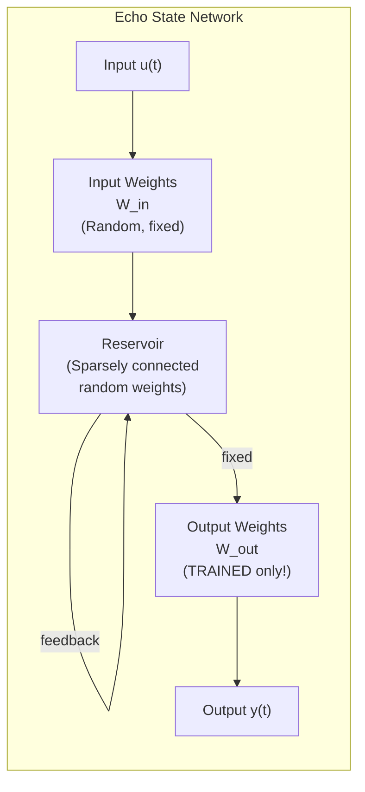

---

### 🔑 Key Features of ESN

| Feature | Explanation |
|---|---|
| **Random Reservoir** | Hidden layer weights are RANDOM and FIXED |
| **Only train output** | Only W_out is trained (linear regression!) |
| **Echo State Property** | Reservoir "echoes" input history |
| **Sparsity** | Only 1-5% connections in reservoir |
| **Spectral Radius** | Largest eigenvalue of reservoir weights controls memory |

---

### ✅ How ESN Addresses Long-Term Dependencies

```
Problem: Regular RNN forgets long-term info (vanishing gradient)

ESN Solution:
  1. Reservoir has MANY random neurons (e.g., 100-1000)
  2. Some neurons have VERY SLOW dynamics (long time constants)
  3. These "slow neurons" maintain long-term memory
  4. Output layer learns to read from these slow neurons

Key: The Echo State Property
  - Reservoir dynamics must "forget" initial conditions
  - Ensures current output depends only on recent input history
  - Longer dynamics = longer memory = handles long-term dependencies!
```

---

### 📊 ESN vs Regular RNN

| Feature | Regular RNN | ESN |
|---|---|---|
| **What's trained** | ALL weights | Only output layer |
| **Training speed** | Slow (BPTT needed) | ⚡ FAST (linear regression!) |
| **Long-term memory** | ❌ Vanishing gradient | ✅ Reservoir dynamics handle it |
| **Complexity** | High | Low (simple to train) |
| **Accuracy** | Good with tuning | Good for many tasks |

---

### 🎯 Summary for Exam Answer

**To get full 5 marks:**
1. **What is ESN (1.5 marks):** Define ESN as reservoir computing — hidden layer (reservoir) has fixed random weights, only output layer is trained. Simple concept, fast training.
2. **Architecture (1.5 marks):** Describe — random input weights → sparse reservoir → fixed internal weights → train only output weights.
3. **How it handles long-term dependencies (2 marks):** Explain — large reservoir with slow dynamics neurons. Echo State Property ensures memory. Some neurons have long time constants → maintain long-term information. No vanishing gradient since reservoir is fixed.

---

### 📚 Theoretical Deep Dive — Echo State Networks: Reservoir Computing Theory, Echo State Property, and the Spectrum of Random Recurrent Dynamics

Echo State Networks (ESNs) occupy a unique and theoretically fascinating position in the landscape of recurrent neural architectures. Introduced by Jaeger & Haas (2004) as a practical realization of the **Reservoir Computing** paradigm (Jaeger, 2001; Maass et al., 2002), ESNs embody a striking inversion of the standard learning principle: rather than tuning all network weights through gradient descent, the reservoir—the core recurrent dynamics—is initialized randomly and left completely fixed, with only a linear output layer adapted to the task. This radical architectural choice is not merely a computational convenience but reflects deep theoretical insights about the nature of sequential computation, the **universal approximation properties of random expansions**, and the dichotomy between memory and computation in dynamical systems.

**Reservoir Computing theory**: The foundational insight of reservoir computing is that a high-dimensional dynamical system with rich, varied dynamics can project temporal inputs into a **high-dimensional feature space** where simple linear readout can extract complex temporal patterns. Formally, given a time-varying input signal $u(t) \in \mathbb{R}^{d_{in}}$, the reservoir state $x(t) \in \mathbb{R}^{N}$ evolves according to $\tau \frac{dx}{dt} = -x(t) + f(W_{in} u(t) + W_{res} x(t) + b_{in})$ in continuous time, or its discretized analog $x_t = (1-\alpha)x_{t-1} + \tanh(W_{in}u_t + W_{res}x_{t-1} + b_{in})$ in discrete time, where $f$ is a pointwise nonlinearity (typically $\tanh$ or sigmoid). The key architectural parameters are: $W_{in} \in \mathbb{R}^{N \times d_{in}}$ (random input weights, often sparse with spectral radius $\approx 1$), $W_{res} \in \mathbb{R}^{N \times N}$ (random internal reservoir weights, typically sparse with only 1%-5% density), and the **leak rate** $\alpha \in [0,1]$ controlling the integration time constant. The output is computed as $y_t = W_{out} x_t + b_{out}$ where only $W_{out}$ and $b_{out}$ are trained, typically by ridge regression: $W_{out} = (X^T X + \lambda I)^{-1} X^T Y_{target}$ where $X$ is the matrix of reservoir states over all training timesteps and $\lambda$ is a Tikhonov regularization parameter.

**The Echo State Property (ESP)**, the central theoretical requirement for ESNs, states that the reservoir state $x_t$ should depend asymptotically only on the recent input history, with the influence of initial conditions $x_0$ decaying to zero. Formally, for any two initial states $x_0$ and $x_0'$ subjected to the same input sequence $u_1, u_2, \ldots$, their induced reservoir states must converge: $\lim_{t \to \infty} \|x_t - x_t'\| = 0$. This is ensured by requiring that the reservoir dynamics be **contractive** in the sense that the spectral radius of the "shrunken" reservoir matrix satisfies $\rho(|1-\alpha - \alpha W_{res}|) < 1$, where $|\cdot|$ denotes the absolute value applied elementwise (since $\tanh$ is a contraction mapping with maximum slope 1). A sufficient condition is $\rho(W_{res}) < 1/(1-\alpha)$, which for $\alpha = 0.1$ (typical) requires $\rho(W_{res}) < 1/0.9 \approx 1.11$. This **fading memory** property ensures that the reservoir is a fading memory filter: the current output $y_t$ is a functional of the input history $u_{t-k:t}$ with a finite effective memory depth $k_{eff} \approx -\frac{1}{\log(\rho(W_{res}))}$ time steps—larger spectral radius means longer memory, but must remain below the threshold where ESP is violated.

**Fading memory and universal approximation**: The theoretical result by Jaeger & Maass (2005) establishes that under mild conditions on the input-to-reservoir mapping and the echo state property, an ESN with a sigmoidal activation function and a sufficiently large reservoir ($N \to \infty$) is a **universal approximator for fading memory filters**: for any square-integrable time-invariant filter with fading memory and any $\epsilon > 0$, there exist output weights $W_{out}$ such that the ESN approximates the filter with mean squared error $< \epsilon$. This powerful universality result shows that the random reservoir, far from being a handicap, actually provides a **dense random feature mapping** into a space where linear combinations can approximate any reasonable temporal transformation. This connects ESN theory to the **kernel method** literature: the reservoir state $x_t$ defines an implicitly defined feature map $\phi(u_{t-k:t})$ where the kernel $K(x, x') = \phi(x)^T \phi(x')$ depends on the reservoir parameters. By the **Mercer theorem**, any positive-definite kernel defines such a feature space, and the ESN's random reservoir effectively samples from a rich family of such kernels. The ridge-regression readout $W_{out}$ then performs **kernel ridge regression** in this random feature space, with the regularization parameter $\lambda$ controlling the trade-off between fitting the training data and keeping weights small.

**Spectral radius and memory capacity**: The relationship between the spectral radius of $W_{res}$ and the network's memory properties can be understood through the **linearized analysis**: if we ignore the nonlinearity ($\tanh(x) \approx x$ for small $x$), the reservoir dynamics become linear: $x_t = (1-\alpha) x_{t-1} + W_{res} x_{t-1} + W_{in} u_t$. The impulse response of this linear filter is governed by the eigenvalues $\lambda_i$ of $W_{res}$: if $|\lambda_i| < \alpha$, the eigenvalue is **contractive** and its corresponding eigen-mode decays quickly; if $|\lambda_i| > \alpha$, the eigen-mode persists; and if $1-\alpha < |\lambda_i| < 1$ (the "Goldilocks zone"), the mode has long but finite memory. The total memory capacity (defined as the sum of capacities of individual linear filters) scales linearly with reservoir size $N$ under appropriate spectral radius settings, and the optimal spectral radius for memory tasks is empirically found to be around $\rho(W_{res}) \approx 0.5$-$0.9$, balancing long-term retention with fading memory. Higher spectral radii can lead to the **edge of chaos** behavior, where the reservoir dynamics are maximally sensitive to inputs—this is computationally desirable for information processing but must be balanced against the requirement that ESP still holds.

**Connections to other architectures**: ESN theory illuminates the relationship between RNNs, kernel methods, and random feature models. **Liquid State Machines (LSMs)** (Maass et al., 2002), the spiking-neuron analog of ESNs, apply the same principle to biologically plausible spiking networks, where the "liquid" of spiking neurons creates a high-dimensional temporal representation. The **DeepESN** (Gallicchio & Micheli, 2017) extends ESNs to deep hierarchical reservoirs, stacking multiple ESN layers where each layer's reservoir state feeds as input to the next, providing hierarchical temporal abstraction analogous to deep CNNs but in the temporal domain. The **Orthogonal ESN** restricts $W_{res}$ to be orthogonal ($W_{res}^T W_{res} = I$), ensuring $\rho(W_{res}) = 1$ by construction; combined with the leak rate, this gives $(1-\alpha + \alpha \cdot 1) = 1$, placing the system at the critical boundary between contraction and expansion—the **edge of chaos** that Langton (1990) identified as the regime of maximal computational complexity in cellular automata. At this point, the reservoir has maximal memory depth while maintaining echoing behavior.

---

# UNIT III — Generative Models & GAN

---

## Q.5 (a) — How do **deep generative models differ from discriminative models** in terms of their learning and inference mechanisms? **[6 Marks]**

### 🎨 Generative vs Discriminative — "Creator vs Classifier"

| Feature | Generative Model | Discriminative Model |
|---|---|---|
| **Learns** | P(x) — full data distribution | P(y\|x) — decision boundary |
| **Can generate new data?** | ✅ Yes | ❌ No |
| **Goal** | "How is data made?" | "Which category?" |
| **Output** | New data samples | Class label |
| **Example** | Generator in GAN | Discriminator in GAN |
| **Training data usage** | Learns all data patterns | Learns class differences |

---

### 📊 Detailed Comparison

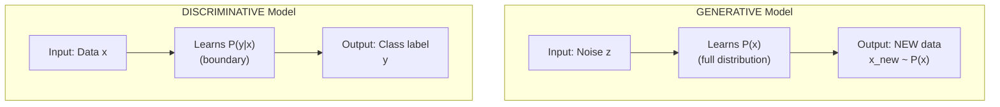

---

### 📋 Examples in Different Contexts

| Task | Generative Approach | Discriminative Approach |
|---|---|---|
| **Spam detection** | Model how spam is written | Classify email as spam/not |
| **Image generation** | GAN creates new images | CNN classifies images |
| **Handwriting** | Generate new handwriting | Recognize whose writing |
| **Speech** | Text-to-speech (new audio) | Speech-to-text (recognize) |

---

### 🎯 Summary for Exam Answer

**To get full 6 marks:**
1. **Definitions (2 marks):** Generative = learns P(x), can generate new data. Discriminative = learns P(y\|x), can only classify.
2. **Key differences (3 marks):** Compare: what they learn (distribution vs boundary), can they generate? yes vs no, goal, output, training approach.
3. **GAN context (1 mark):** In GAN, Generator is generative, Discriminator is discriminative.

---

### 📚 Theoretical Deep Dive — Generative vs Discriminative Models: Statistical foundations, Likelihood Ratios, and the Manifold Hypothesis

The fundamental distinction between generative and discriminative models is rooted in **Bayesian decision theory** and the **joint vs. conditional probability estimation** problem. A generative model $P_\theta(x, y)$ or equivalently $P_\theta(x|y)P(y)$ explicitly models the full joint distribution over inputs and labels—essentially answering "how is the data generated?" A discriminative model $P_\theta(y|x)$ only models the conditional distribution of labels given inputs, answering "given this input, which label?" This seemingly simple distinction has profound implications for model architecture, training objectives, generalization, and what the models can do beyond classification.

**From Bayesian decision theory**: The optimal Bayes classifier, which minimizes the probability of misclassification, is $\hat{y}_{Bayes} = \arg\max_y P(y|x)$. Since by Bayes' rule $P(y|x) = \frac{P(x|y)P(y)}{P(x)}$, and $P(x)$ is constant with respect to $y$, the Bayes decision boundary is $\arg\max_y P(x|y)P(y)$—a product of a **class-conditional density** $P(x|y)$ and a **class prior** $P(y)$. Generative models estimate these components independently: they model $P(x|y)$ (how features are distributed within each class) and $P(y)$ (class frequencies), then apply Bayes' rule at test time. Discriminative models bypass the generative modeling step and directly estimate $P(y|x)$, which is a strictly easier statistical problem because it only requires learning the decision boundary between classes rather than the full data distribution within each class. Ng & Jordan (2002) formally proved this trade-off: discriminative models have a lower **asymptotic error** (as training set size $\to \infty$) because they focus modeling capacity on the boundary rather than the distribution, but generative models can achieve better performance with limited training data because their generative assumptions provide **inductive bias** that compensates for data scarcity.

**Likelihood-based framework**: Generative models are typically trained by maximizing the **log-likelihood** of the observed data: $\theta^* = \arg\max_\theta \sum_{i=1}^N \log P_\theta(x^{(i)})$. This maximum likelihood objective has well-studied properties under the framework of **statistical consistency**: under regularity conditions, the maximum likelihood estimator converges to the true data-generating distribution as $N \to \infty$, with convergence rate $O(1/\sqrt{N})$ governed by the **Cramér-Rao lower bound**. The **Kullback-Leibler divergence** between the true distribution $P_{data}$ and the model distribution $P_\theta$ is minimized by maximum likelihood: $D_{KL}(P_{data} \| P_\theta) = \mathbb{E}_{x \sim P_{data}}[\log P_{data}(x)] - \mathbb{E}_{x \sim P_{data}}[\log P_\theta(x)]$, where the first term is constant, so minimizing KL divergence is equivalent to maximizing the expected log-likelihood. The **score function** $\nabla_\theta \log P_\theta(x)$ and **Fisher information matrix** $I(\theta) = \mathbb{E}_{x \sim P_\theta}[(\nabla_\theta \log P_\theta(x))(\nabla_\theta \log P_\theta(x))^T]$ govern the geometry of the likelihood function and the efficiency of learning.

**Generative Adversarial Networks** introduce a fundamentally different objective: rather than explicitly modeling a probability distribution, the generator $G$ implicitly defines a distribution $P_G$ by passing noise through a deterministic transformation $G_\theta(z)$, and the discriminator $D$ is trained to maximize the ability to distinguish real from generated samples. The minimax objective $\min_G \max_D V(D, G) = \mathbb{E}_{x \sim P_{data}}[\log D(x)] + \mathbb{E}_{z \sim p_z}[\log(1 - D(G(z)))]$ can be interpreted as minimizing the **Jensen-Shannon divergence** $D_{JS}(P_{data} \| P_G)$ between the real and generated distributions. This was proven by Goodfellow et al. (2014): at the global optimum, $P_G = P_{data}$, and the discriminator achieves $D(x) = 1/2$ everywhere. This formulation is **implicit**: the generator never computes a probability density—it produces samples—and the discriminator provides the learning signal. This implicit density estimation is both the strength (no intractable density estimation required) and weakness (no direct log-likelihood evaluation, making it difficult to diagnose mode collapse vs. mode dropping).

**Mode collapse and mode covering**: A crucial theoretical distinction between likelihood-based and adversarial training is their behavior regarding **mode coverage**. The data distribution $P_{data}$ is typically **multi-modal** with many distinct regions of high probability (e.g., different digit classes in MNIST, different semantic categories in ImageNet). A good generative model should capture all modes (mode covering) without over-representing any single mode (mode collapse). Maximum likelihood training via established methods (VAEs, autoregressive models) tends toward **mode covering**: the model spreads probability mass across all observed data modes because the likelihood objective is maximized by explaining every training example. GANs, through the adversarial objective, tend toward **mode collapse**: the generator discovers a subset of modes that reliably fool the discriminator and concentrates all its probability mass there, ignoring other modes entirely. This is because the discriminator gradient signal only rewards the generator for improving samples that are currently "easy to distinguish"—once the generator finds a region that fools the discriminator, there is additional incentive to explore only if doing so provides better fooling. Various theoretical fixes have been proposed: **unrolled GANs** (Metz et al., 2016) train the discriminator several steps ahead, providing a more stable gradient; **Wasserstein GANs** (Arjovsky et al., 2017) use the Earth-Mover's distance which provides more useful gradients even when distributions do not overlap.

**Manifold hypothesis**: A deep theoretical argument motivates the use of deep generative models. The **manifold hypothesis** states that natural data (images, audio, text) lies on or near a low-dimensional manifold embedded in the high-dimensional input space. For 224×224 RGB images, the ambient dimension is $224 \times 224 \times 3 \approx 150,000$, but the actual degrees of freedom of natural images are estimated to be far lower. Generative models must learn this manifold structure to generate realistic data—a process called **manifold learning**. Autoregressive models (PixelRNN, GPT) model $P(x) = \prod_t P(x_t | x_{1:t-1})$ sequentially, which requires modeling the full high-dimensional distribution from the perspective of individual pixels. GANs bypass this by learning the manifold directly: the generator learns a mapping from a low-dimensional latent space $\mathcal{Z} \subset \mathbb{R}^d$ ($d$ typically 100-512) to the data manifold $\mathcal{M} \subset \mathbb{R}^D$ (where $D = 150,000$ for ImageNet-scale images), effectively learning the chart of a manifold parametrization. The **generative flow** $G: \mathcal{Z} \to \mathcal{M}$ is learned by the adversarial game, and sampling from $P_G$ is just sampling $z \sim p_z$ and mapping through $G$. The **GAN manifold** has been analyzed by Karras et al. (2019) in StyleGAN, which showed that disentangled latent spaces enable fine-grained control over generated attributes—a property not guaranteed by likelihood-based models.

**Applications beyond classification**: Generative models can generate novel data samples, perform **inpainting** (fill in missing regions of images by conditioning on observed regions), **super-resolution** (generate high-resolution images from low-resolution inputs by modeling the conditioning distribution $P(x_{HR}|x_{LR})$), perform **data augmentation** (synthetic training data for downstream tasks with limited data), **anomaly detection** (low likelihood under the generative model indicates anomalies), and **semi-supervised learning** (generative models provide density estimates for unlabeled data alongside labeled data). Discriminative models cannot perform any of these generative tasks—they can only classify. This represents a fundamental asymmetry: generative models are strictly more powerful in terms of capability, but this additional capability comes at the cost of harder optimization, less stable training, and the mode coverage problem. The trade-off between expressivity (generative) and efficiency/simplicity (discriminative) is central to choosing an appropriate model for any given task.

---

## Q.5 (b) — How are **Deep Belief Networks** structured, and how do they leverage the concept of Restricted Boltzmann Machines? **[6 Marks]**

### 🏗️ Deep Belief Network Structure

A **DBN** is a stack of **Restricted Boltzmann Machines (RBMs)** trained greedily, layer by layer.

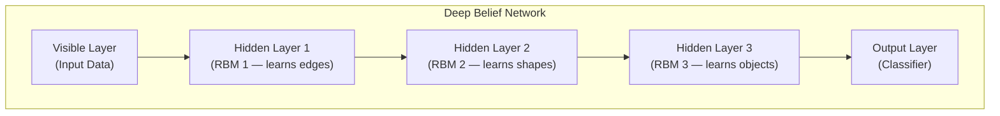

---

### 🔧 How DBN Uses RBMs

#### **Step 1: RBM Structure**
```
RBM = Two layers: Visible + Hidden
  - No connections WITHIN each layer
  - Only connections BETWEEN layers
  - Learned via Contrastive Divergence (fast!)
  - Each RBM learns to reconstruct its input
```

#### **Step 2: Stack RBMs — Greedy Training**
```
Layer 1: Train RBM on raw input data
  → Learns simple features (edges, lines)

Layer 2: Use Layer 1's hidden activations as input
  → RBM learns medium features (shapes, corners)

Layer 3: Use Layer 2's hidden activations as input
  → RBM learns complex features (objects, faces)

Each layer builds on previous — hierarchical feature learning!
```

#### **Step 3: Fine-tuning**
```
Add classifier on top
Train whole network with backpropagation
(Optional but improves accuracy)
```

---

### 📊 Feature Hierarchy in DBN

| Layer | What It Learns | Example Features |
|---|---|---|
| **RBM 1** | Simple features | Edges, lines, dots |
| **RBM 2** | Medium features | Shapes, corners, curves |
| **RBM 3** | Complex features | Eyes, ears, wheels |
| **Output** | High-level | Faces, cars, animals |

---

### 🎯 Summary for Exam Answer

**To get full 6 marks:**
1. **DBN structure (1.5 marks):** DBN = stack of RBMs. Draw diagram showing visible → hidden1 → hidden2 → hidden3 → output.
2. **How RBMs are used (2.5 marks):** Each RBM trained greedily. Layer 1 RBM learns from input. Layer 2 RBM uses Layer 1's hidden outputs. Layer 3 uses Layer 2's hidden outputs. Explain Contrastive Divergence training.
3. **Feature hierarchy (2 marks):** Each layer learns increasing complexity. Layer 1: edges, Layer 2: shapes, Layer 3: objects. Mention fine-tuning on top.

---

### 📚 Theoretical Deep Dive — Deep Belief Networks: Helmholtz Free Energy, Wake-Sleep Algorithm, and the History of Pre-Training

Deep Belief Networks (DBNs) represent a pivotal moment in the history of deep learning: prior to 2006, training deep neural networks was considered intractable due to the vanishing gradient problem, and the community largely favored shallow architectures with carefully engineered features. Hinton, Osindero, and Teh (2006) demonstrated that DBNs could be trained greedily, layer by layer, as a stack of Restricted Boltzmann Machines, allowing the construction of networks with many hidden layers. This work, along with Bengio et al. (2007), established **greedy layer-wise pre-training** as a viable strategy for initializing deep networks before end-to-end fine-tuning, effectively solving the optimization problem of deep networks by providing a good initialization in the basin of a useful local minimum.

**Restricted Boltzmann Machine (RBM) foundation**: An RBM is a **bipartite undirected graphical model** with visible units $v \in \{0,1\}^d$ (or real-valued) representing the input data, and hidden units $h \in \{0,1\}^k$ representing learned features. The energy function defining the joint distribution is $E(v, h) = -a^T v - b^T h - v^T W h$, where $a \in \mathbb{R}^d$, $b \in \mathbb{R}^k$, and $W \in \mathbb{R}^{d \times k}$ are the model parameters. From statistical mechanics, the probability of a configuration is given by the **Boltzmann distribution** $P(v, h) = \frac{1}{Z} \exp(-E(v, h))$, where $Z = \sum_{v,h} \exp(-E(v, h))$ is the **partition function**—the normalizing constant that ensures probabilities sum to 1. The partition function is intractable to compute exactly for large $d$ and $k$ (it sums over $2^{d+k}$ configurations), which is why RBMs were historically considered impractical to train, until Hinton's **Contrastive Divergence (CD)** algorithm provided an efficient approximation. The key property of RBMs that makes CD efficient is the **conditional independence** structure: given visible units $v$, hidden unit activations are independent (no connections within the hidden layer), and given hidden units $h$, visible unit activations are independent. This bipartite structure means $P(h|v) = \prod_j P(h_j|v)$ and $P(v|h) = \prod_i P(v_i|h)$ can be computed exactly in closed form in a single pass: for binary RBMs with logistic sigmoid activations, $P(h_j=1|v) = \sigma(b_j + W_j^T v)$ and $P(v_i=1|h) = \sigma(a_i + W_i h)$, where $\sigma$ is the sigmoid function and $W_j$ is column $j$ of $W$. These conditionals are used for both the positive phase (using data $v$) and the negative phase (reconstructing $\tilde{v}$ from $h$ sampled from $P(h|v)$) in CD, avoiding the need for MCMC sampling across the full network.

**Contrastive Divergence and its variants**: The CD-$k$ algorithm (Hinton, 2002) approximates the intractable log-likelihood gradient $\frac{\partial \log P(v)}{\partial \theta} = -\langle \frac{\partial E(v,h)}{\partial \theta} \rangle_{P(h|v)} + \langle \frac{\partial E(v,h)}{\partial \theta} \rangle_{P(v,h)}$ by replacing the intractable model distribution $P(v,h)$ in the negative phase with a distribution obtained by running $k$ steps of Gibbs sampling initialized from the data. CD-1 (one step) initializes $h^{(0)} \sim P(h|v^{(0)})$ where $v^{(0)}$ is data, then reconstructs $v^{(1)} \sim P(v|h^{(0)})$, and uses this single-step reconstruction to estimate the negative phase: $\Delta W \approx v^{(0)}(h^{(0)})^T - v^{(1)}(h^{(0)})^T$. CD-$k$ runs $k$ Gibbs steps ($v^{(0)} \to h^{(0)} \to v^{(1)} \to \cdots \to v^{(k)} \to h^{(k)}$), yielding a better approximation.CD-$k$ with $k=1$ is surprisingly effective in practice (Hinton termed this the "CD magic") because even though the negative phase is poorly estimated, the learning dynamics follow a rough trajectory that moves the model in approximately the right direction.

**Persistent CD (PCD)** (Tieleman, 2008) maintains persistent Markov chains across weight updates rather than restarting from data each iteration, providing a more accurate approximation to the model distribution.

**Greedy layer-wise pre-training**: The DBN training procedure exploits the fact that training an RBM on raw data yields hidden representations that serve as useful features for the next RBM layer. The procedure is: (1) Train RBM-1 on raw input $x$ using CD; (2) Use the learned hidden-to-visible weights $W_1$ to compute $h^{(1)} = \sigma(W_1^T x + a_1)$ for all training examples, treating these as the "visible" data for RBM-2; (3) Train RBM-2 on the $h^{(1)}$ representations; (4) Repeat for deeper layers. Each stage is a standard RBM training problem, and the greedy criterion (each layer improves reconstruction of its input) has been shown to be a **proxy for the overall log-likelihood**, with Bengio et al. (2007) proving that layer-wise training improves a lower bound on the data log-likelihood. This greedy strategy is related to the **variational inference** framework, where each RBM layer provides a better variational approximation to the posterior distribution over hidden variables—improving from a factorial variational distribution $Q(h|x)$ layer by layer.

**Wake-sleep algorithm**: Hinton et al. (1995) originally proposed the **wake-sleep algorithm** for training Helmholtz machines (the generative counterpart of DBNs), which consists of two phases: the **wake phase** adjusts recognition weights (bottom-up inference) to improve the generative model's posterior approximation, while the **sleep phase** adjusts generative weights (top-down generation) to better reconstruct data from the posterior samples. In DBN training, this maps to: wake phase uses bottom-up weights learned by RBMs to compute approximate posterior $Q(h|x)$; sleep phase uses the generative top-down weights to sample from $P(x|h)$. For a DBN with layers $h^{(1)}, \ldots, h^{(L)}$, the wake phase updates parameters using bottom-up inference while the sleep phase updates top-down generative parameters using sampled reconstructions. This algorithm was the precursor to the modern **variational autoencoder (VAE)** framework, which formalizes this as optimizing a variational lower bound $\mathcal{L} = \mathbb{E}_{Q(h|x)}[\log P(x|h)] - D_{KL}(Q(h|x) \| P(h))$.

**Generative fine-tuning**: After greedy pre-training initializes each layer with useful features, the entire DBN is **unfolded** into a feedforward network and fine-tuned with backpropagation (optionally with an added classification layer for supervised tasks). This two-stage procedure—greedy pre-training followed by global fine-tuning—was the dominant paradigm for deep network training from 2006 to approximately 2012, when it was displaced by the simpler approach of training deep networks from random initialization using ReLU activations, careful weight initialization (He et al., 2015), and Batch Normalization. The decline of DBNs was driven primarily by the computational complexity of training RBMs (CD requires multiple Gibbs steps per weight update, making training 10-100x slower than standard backpropagation) and the superior performance of **rectifier networks** (ReLU) which can be trained directly from random initialization without pre-training.

**Deep Generative Models and Modern descendants**: While classical DBNs with RBMs are no longer commonly used, their conceptual descendants are central to modern deep learning. **Variational Autoencoders (VAEs)** (Kingma & Welling, 2013) replace the stochastic binary hidden units with a continuous **latent variable** $z \sim \mathcal{N}(0, I)$ and use a **reparametrization trick** to enable end-to-end backpropagation through the stochastic sampling: $z = \mu + \sigma \odot \epsilon$ where $\epsilon \sim \mathcal{N}(0, I)$. **Masked Autoregressive Flows (MAFs)** (Papamakarios et al., 2017) extend autoregressive density estimation using invertible transformations that preserve likelihood. **Diffusion models** (Sohl-Dickstein et al., 2015; Ho et al., 2020) learn to reverse a gradual noising process, which can be viewed as learning a parameterized Markov chain that reverses the data-destroying process. The **perspectival insight** from DBNs—that building deep generative models through layer-wise training is viable—was the critical breakthrough that made all these modern models possible, even if the specific RBM-based approach has been superseded by variational methods that permit direct end-to-end training.

---

## Q.5 (c) — What is a **Generative Adversarial Network (GAN)**, and how does it work? **[6 Marks]**

### ⚔️ GAN — The Counterfeit Game

**GAN** has two networks competing:
1. **Generator (G):** Creates fake data (counterfeiter)
2. **Discriminator (D):** Tries to tell real from fake (detective)

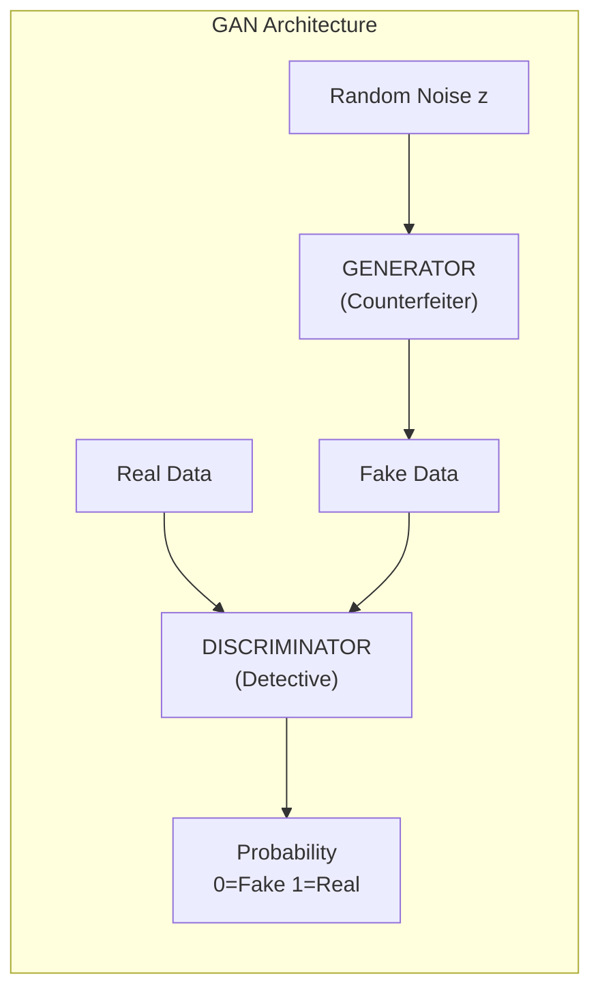

---

### 🎮 The Training Game (Minimax)

```
Generator Goal: Make discriminator think fakes are REAL
  → Wants: D(fake) = 1

Discriminator Goal: Correctly classify real vs fake
  → Wants: D(real) = 1, D(fake) = 0

Loss Functions:
  Generator Loss:     -log(D(G(z)))  → minimize
  Discriminator Loss: -[log(D(x)) + log(1-D(G(z)))]  → minimize
```

---

### 🔄 Training Process Step by Step

```
Step 1: Train Discriminator
  - Give D real images → label = 1
  - Give D fake images from G → label = 0
  - Update D to get better at telling apart

Step 2: Train Generator
  - Generate fake images from random noise
  - Feed to D, get D(fake) score
  - Update G to get HIGHER score (fool D better)

Step 3: Repeat!
  - Both improve together
  - G makes more realistic images
  - D gets better at spotting fakes
  → Arms race of improvement!
```

---

### 📊 Example: Cat Image Generation

```
Start: G makes random noise → D(fake) = 0.1 (obviously fake)
Iter 100: G makes blurry shapes → D(fake) = 0.3
Iter 1000: G makes cat-like shapes → D(fake) = 0.5
Iter 50000: G makes realistic cats → D(fake) = 0.5 (can't tell!) ✅
```

---

### 🎯 Summary for Exam Answer

**To get full 6 marks:**
1. **Definition (1 mark):** GAN = Generator (creates fake) + Discriminator (detects real/fake). Compete in minimax game.
2. **Architecture (2 marks):** Explain both: G takes noise → fake image. D takes image → probability. Draw diagram.
3. **Training (2 marks):** Explain minimax game. D trained on real+fake. G trained to maximize D(fake). Repeat.
4. **Example (1 mark):** Cat image generation showing improvement over iterations.


### 📚 Theoretical Deep Dive — Generative Adversarial Networks: Minimax Game Theory, Convergence Analysis, and the Geometry of Adversarial Training
Generative Adversarial Networks (GANs), introduced by Goodfellow et al. (2014), represent one of the most conceptually elegant and practically impactful ideas in modern machine learning. At their core, GANs formulate the problem of generative modeling as a **two-player zero-sum game** between a generator $G$ and a discriminator $D$, whose adversarial training dynamics are analyzed using tools from game theory, optimization, and information theory. The elegance of the formulation lies in its simplicity—no explicit density estimation, no variational bound, no MCMC sampling—yet training stability, convergence, and mode coverage remain open theoretical challenges that have generated an enormous body of follow-up research.
**Minimax game formulation**: The GAN objective is a **zero-sum game** defined by the value function $V(G, D) = \mathbb{E}_{x \sim P_{data}}[\log D(x)] + \mathbb{E}_{z \sim p_z}[\log(1 - D(G(z)))]$, where the generator $G$ minimizes $V$ and the discriminator $D$ maximizes $V$. In game-theoretic terms, this is a **simultaneous-move game** where both players optimize their strategies at the same time, and the solution concept is the **Nash equilibrium**: a pair $(G^*, D^*)$ where neither player can improve their objective by unilaterally changing their strategy. Goodfellow et al. (2014) proved that under ideal conditions (infinite capacity networks, infinite data, perfect optimization), the global optimum is achieved when $P_G = P_{data}$ and the discriminator outputs $D(x) = 1/2$ everywhere—meaning the generator has perfectly mimicked the data distribution and the discriminator is forced to random guessing.
The **theoretical proof of convergence** proceeds by showing that at optimal $D$, the objective reduces to minimizing the **Jensen-Shannon divergence** (JS divergence) $D_{JS}(P_{data} \| P_G)$. Specifically, for a fixed $G$, the optimal discriminator is $D^*(x) = \frac{P_{data}(x)}{P_{data}(x) + P_G(x)}$, and substituting this into the value function gives $V(G, D^*) = -2\log 2 + 2D_{JS}(P_{data} \| P_G)$. Since JS divergence is non-negative and $D_{JS}(P, Q) = 0 \iff P = Q$, minimizing $V$ with respect to $G$ is equivalent to minimizing JS divergence, which achieves zero if and only if $P_G = P_{data}$. This elegant connection shows that GANs are implicitly performing **density ratio estimation**: the discriminator learns to estimate the ratio $\frac{P_{data}(x)}{P_G(x)}$, providing a learning signal to the generator without ever computing either density explicitly.
**Convergence challenges in practice**: The theoretical proof assumes ideal conditions that are violated in practice, leading to notorious training difficulties. The most prominent issue is **mode collapse**, where the generator maps multiple noise vectors $z$ to the same output $G(z)$, concentrating probability mass on a subset of modes while ignoring others. This occurs because if the generator finds a particular sample $x^*$ that reliably fools the discriminator, gradient descent on $G$ will push more and more $z$ values toward $x^*$ to minimize $\log(1 - D(G(z)))$. **Mode collapse** can be formally analyzed through the lens of **support mismatch**: for $P_G$ to equal $P_{data}$, both distributions must have the same support set. If $P_G$'s support is contained within $P_{data}$'s support (as is typical since the generator has limited capacity), then the JS divergence is constant ($D_{JS} = \log 2$) as long as the supports do not overlap, providing no useful gradient to the generator—this is the **saturation problem**: when $D(G(z))$ is close to 0 (generator failing badly), $\log(1 - D(G(z))) \approx 0$ and gradients vanish; when $D(G(z))$ is close to 1 (generator succeeding), the generator's loss from the original formulation $\log(1 - D(G(z)))$ also vanishes. In practice, the solution is to maximize $\log D(G(z))$ instead, which provides non-vanishing gradients throughout the training process—this is the **non-saturating heuristic** in the Goodfellow et al. implementation.
**Wasserstein GAN (WGAN) and its variants** (Arjovsky et al., 2017) provide a theoretically grounded fix for mode collapse by replacing the JS divergence with the **Earth Mover's distance** (EMD) or Wasserstein-1 distance $W(P_{data}, P_G) = \inf_{\gamma \in \Pi(P_{data}, P_G)} \mathbb{E}_{(x,y) \sim \gamma}[\|x - y\|]$, which measures the minimum "work" required to transform one distribution into the other. The key theoretical advantage is that the Wasserstein distance is **continuous and differentiable almost everywhere**, providing meaningful gradients even when $P_{data}$ and $P_G$ have disjoint support. By the **Kantorovich-Rubinstein duality**, $W(P_{data}, P_G) = \sup_{\|f\|_L \leq 1} \mathbb{E}_{x \sim P_{data}}[f(x)] - \mathbb{E}_{x \sim P_G}[f(x)]$, where $\|f\|_L \leq 1$ requires $f$ to be 1-Lipschitz. The discriminator (critic) is constrained to 1-Lipschitz functions, practically achieved by **weight clipping** (original WGAN, problematic) or **gradient penalty** (WGAN-GP, Gulrajani et al., 2017) which adds a penalty $\lambda \mathbb{E}_{\hat{x} \sim P_{\hat{x}}}[(\|\nabla_{\hat{x}} D(\hat{x})\|_2 - 1)^2]$ where $\hat{x}$ is interpolated between real and generated samples.
**Architectural innovations**: The **DCGAN** (Radford et al., 2016) established architectural guidelines: use **strided convolutions** instead of pooling in the discriminator, use **transposed convolutions** (also called deconvolutions) in the generator, use batch normalization in both networks except at the generator output and discriminator input, use ReLU in the generator (except output, which uses Tanh) and LeakyReLU in the discriminator. These guidelines, derived through extensive empirical search, have become the standard convolutional GAN architecture. **StyleGAN** (Karras et al., 2019) introduced a **style-based generator architecture** where latent codes are transformed through learned affine transformations $A(z)$ that control different levels of style at different resolutions—an architecture that enables unprecedented control over generated images, including the ability to mix styles from different latent codes at different resolutions. The theoretical insight behind StyleGAN is that the latent space should not directly dictate pixel values but should control **stylistic attributes** (coarse: pose, identity; medium: hairstyle; fine: hair color, background) through a normalized intermediate representation, creating a more disentangled and interpretable latent space.
**Evaluation of generative models** is notoriously difficult because likelihood-based metrics (perplexity, bits per dimension) are unreliable when $P_G$ has disjoint support from $P_{data}$, and samples are inherently subjective. **Inception Score (IS)** (Salimans et al., 2016) measures both quality and diversity: $IS = \exp(\mathbb{E}_{x \sim P_G} D_{KL}(p(y|x) \| p(y)))$ where $p(y|x)$ is the softmax output of an Inception classifier. High IS means $p(y|x)$ is highly peaked (high quality, object clearly belongs to a class) and $p(y)$ is spread out (diverse). **Fréchet Inception Distance (FID)** (Heusel et al., 2017) computes the Fréchet distance between multivariate Gaussians fit to Inception features of real and generated images: $FID = \|\mu_r - \mu_g\|^2 + \text{Tr}(\Sigma_r + \Sigma_g - 2(\Sigma_r \Sigma_g)^{1/2})$, providing a more robust metric that captures both quality and diversity. FID correlates better with human judgment than IS, though both are proxy metrics evaluated using a pretrained classifier.
**Connections to physics and differential equations**: The adversarial training process has been analyzed as an **optimal transport** problem (Genevay et al., 2017), where the generator learns to transport the prior distribution $p_z$ to the data distribution $P_{data}$ at minimal cost. **Diffusion GANs** and **score-based generative models** provide a diffusion-based interpretation of the generation process, where the generator learns to denoise samples following the probability flow ODE, connecting GAN theory to the rich mathematics of stochastic differential equations. The **Neural Tangent Kernel** (NTK) for GANs has been analyzed by several authors, showing that in the infinite-width limit, the discriminator dynamics are governed by a kernel that helps explain the observed training behaviors.


---

# UNIT IV — Reinforcement Learning

---

## Q.7 (a) — Explain **objectives and challenges of deep reinforcement learning** in comparison to traditional reinforcement learning methods. **[6 Marks]**

### 🎯 Objectives of Deep RL

| Objective | Explanation |
|---|---|
| **Handle complex inputs** | Process images, video, audio (not just numbers) |
| **Learn from high-dimensional data** | Raw pixels → actions (no feature engineering) |
| **Generalization** | Apply learned skills to new situations |
| **End-to-end learning** | From perception to action in one system |

---

### 🆚 Deep RL vs Traditional RL

| Feature | Traditional RL | Deep RL |
|---|---|---|
| **State representation** | Simple, low-dimensional | Complex, high-dimensional (images) |
| **Function approximation** | Table lookup (Q-table) | Neural networks |
| **Input type** | Coordinates, numbers | Images, video, audio |
| **Generalization** | ❌ Can't generalize to new states | ✅ Learns to recognize similar states |
| **Memory** | Grows with states | Fixed (network weights) |
| **Example** | Grid world, simple games | Atari, robotics, self-driving |

---

### 🚧 Challenges of Deep RL vs Traditional RL

| Challenge | Traditional RL | Deep RL (Additional) |
|---|---|---|
| **Sample efficiency** | Already a problem | Worse — needs even MORE samples |
| **Stability** | Generally stable | Unstable training (moving targets) |
| **Hyperparameters** | Few | Many (network size, learning rates) |
| **Credit assignment** | Hard | Even harder with deep networks |
| **Exploration** | Hard | Harder in high-dimensional spaces |
| **Reward hacking** | Rare | Common — agent finds unintended shortcuts |
| **Compute** | Low | High (needs GPUs) |

---

### 🎯 Summary for Exam Answer

**To get full 6 marks:**
1. **Objectives (3 marks):** Explain Deep RL objectives: handle complex inputs (images), generalize to new states, end-to-end learning from perception to action.
2. **Comparison (1.5 marks):** Table or list comparing Traditional vs Deep RL: state representation, function approximation, generalization.
3. **Additional challenges (1.5 marks):** Deep RL adds: instability (non-stationary targets), more hyperparameters, reward hacking, compute requirements.

---

### 📚 Theoretical Deep Dive — Deep Reinforcement Learning: Bellman Curse of Dimensionality, Function Approximation Theory, and the Deadly Triad

Deep Reinforcement Learning sits at the intersection of two grand disciplines: **sequential decision theory** (reinforcement learning) and **representation learning** (deep learning). The marriage of these fields addresses a fundamental limitation of classical RL—the **curse of dimensionality**—but introduces new theoretical challenges collectively known as **the deadly triad** (Sutton & Barto, 2018): the combination of function approximation, bootstrapping, and off-policy learning, which together can destabilize convergence even in settings where each component alone would be stable.

**The curse of dimensionality in classical RL**: Tabular RL methods like value iteration and Q-learning maintain a table with one entry per state-action pair $Q(s, a)$, requiring memory and data proportional to $|S| \times |A|$. For a continuous state space (e.g., joint angles of a robot arm with 7 joints, each with 256 discrete values, and 7 actions) this becomes $256^7 \times 7 \approx 3.7 \times 10^{17}$ entries—physically impossible to store. For raw pixel inputs (e.g., $84 \times 84 \times 4$ Atari screens), the number of possible states is astronomically larger: $(256)^{28224} \approx 10^{67685}$ distinct states. The **curse of dimensionality** means that tabular methods cannot even represent a value function for realistic problems, let alone learn one. Function approximation via neural networks bypasses this by parameterizing $Q(s, a; \theta) \approx Q^*(s, a)$ with a manageable number of parameters $\theta$, enabling generalization from seen to unseen states through the learned feature representation. This is the fundamental promise of deep RL: that deep networks can learn to **represent the relevant features** of a high-dimensional state space that support value estimation and policy improvement.

**The deadly triad and convergence theory**: The convergence theory for RL is well-understood in the tabular case: Q-learning with $\epsilon$-greedy exploration converges to the optimal Q-function under standard assumptions (all state-action pairs visited infinitely often, learning rate satisfying Robbins-Monro conditions $\sum \alpha_t = \infty, \sum \alpha_t^2 < \infty$). However, function approximation introduces nonlinearity that breaks these theoretical guarantees. The **deadly triad** refers to the combination of: (1) **Function approximation** (neural networks), (2) **Bootstrapping** (updating Q-values based on other Q-values, as in $Q(s,a) \leftarrow r + \gamma \max_{a'} Q(s', a')$), and (3) **Off-policy learning** (learning about a target policy while acting according to a different behavior policy, as in Q-learning which is off-policy because it updates the greedy policy while acting $\epsilon$-greedy). Each component alone is stable: function approximation with Monte Carlo returns (no bootstrapping) converges under linear function approximation (Tsitsiklis & Van Roy, 1997); bootstrapping without function approximation converges (tabular Q-learning); off-policy learning without function approximation converges. But together, they can cause **divergence**: the target for $Q(s, a)$ depends on $Q(s', a')$, which depends on the same parameters $\theta$—this creates a feedback loop where errors can compound rather than average out. When the function approximator is powerful enough (e.g., a deep neural network), it can exploit spurious correlations in the experience, finding a parameter setting that looks good but is fundamentally wrong—this is the **policy oscillation** phenomenon observed in early value-based deep RL.

**The stability/plasticity dilemma**: Deep RL agents must simultaneously **stabilize** (learn consistent value estimates that don't fluctuate wildly episode-to-episode) and **remain plastic** (continue learning and adapting as the data distribution changes). This is harder than in supervised learning because: (1) the data distribution $P(s, a, r, s')$ is **non-stationary**—it changes as the policy improves, violating the i.i.d. assumption that underpins most convergence proofs; (2) targets are computed from the same network being trained (bootstrapping), creating **non-stationary targets** that can cause the gradient direction to oscillate; (3) the Bellman error $\delta = r + \gamma \max_{a'} Q(s', a') - Q(s, a)$ has high variance because it contains random rewards, random transitions, and the bootstrapped target $ \max_a Q(s', a) $ which is itself a noisy estimate. This high variance in targets is compounded by the fact that in deep networks, the gradients are already noisy due to mini-batch stochasticity.

**Reward design and reward hacking**: Deep RL agents optimize whatever reward is specified, but the **alignment problem**—ensuring the rewards specified align with the designer's true intent—becomes acute in deep RL precisely because the function approximator can discover high-reward strategies that are not intended. **Reward hacking** (also called reward tampering, specification gaming, or Goodhart's Law) occurs when the agent exploits loopholes in the reward function: in game playing, manipulating game physics in unintended ways; in robotics, learning to grab a cube by knocking it over the table edge rather than lifting it; in language models, generating high-reward text that is fluent but logically invalid. The theoretical analysis of reward hacking connects to **inverse reinforcement learning** (IRL, Ng & Russell, 2000), which infers the reward function from expert demonstrations rather than specifying it directly, and to **corrigibility** (Armstrong, 2015), which designs agents that allow humans to correct their reward function without resistance.

**Sample complexity and generalization**: Deep RL requires orders of magnitude more samples than deep learning: a single Atari game requires 50-200 million frames (approximately 38-150 days of play at human reaction time), compared to a forward pass through ImageNet (a fraction of a second). This poor sample efficiency reflects the **credit assignment problem across time**: determining which action 100 steps ago led to the current reward requires propagating a reward signal backward through a long chain with potentially many competing actions. The theoretical sample complexity of RL is characterized by the **Mixing time** of the MDP (how quickly the Markov chain converges to its stationary distribution), the **Diameter** of the state space (maximum expected steps between any two states), and the **Hoeffding-style concentration bounds** on the value estimates. Deep RL adds the approximation error of the function approximator to this analysis: even with infinite samples, a deep network with finite capacity introduces approximation bias, and the interplay between approximation bias and estimation variance follows the **bias-variance tradeoff** in statistical learning theory.

**Value-based vs. policy-based deep RL**: Value-based methods (DQN, Double DQN, Dueling DQN) estimate the value function $Q(s, a)$ and derive the policy by $\pi(s) = \arg\max_a Q(s, a)$, facing the **overestimation bias** problem where $\max_a Q(s', a)$ systematically overestimates Q-values because the max operator selects the highest estimate even if it is optimistically biased. Double DQN (van Hasselt et al., 2016) addresses this by using the online network to select the action and the target network to evaluate it: $y = r + \gamma Q(s', \arg\max_{a'} Q_{online}(s', a'); \theta_{target})$. Policy-based methods (A2C, A3C, PPO) directly optimize a parameterized policy $\pi_\theta(a|s)$ using the policy gradient theorem: $\nabla_\theta J(\theta) = \mathbb{E}_{\tau \sim \pi_\theta}[\sum_t \nabla_\theta \log \pi_\theta(a_t|s_t) A_t]$ where $A_t$ is the advantage function (how much better action $a_t$ at $s_t$ is compared to average). Policy gradient methods are **on-policy**, requiring fresh samples from the current policy at each iteration, and face high variance gradients that are stabilized through baselines, generalized advantage estimation (GAE, Schulman et al., 2016), and trust region constraints (TRPO, PPO).

**Exploration in deep RL**: Efficient exploration in high-dimensional spaces is considerably harder than in tabular RL where count-based methods (UCB, bonus for state-action pairs not yet visited) guarantee polynomial sample complexity. In deep RL with continuous or high-dimensional states, states are never exactly visited twice, making direct counting impossible. **Intrinsic motivation** (Schmidhuber, 1991; Oudeyer & Kaplan, 2007) provides exploration bonuses based on prediction error, curiosity, or information gain: an agent receives bonus rewards for visiting states where its model is uncertain, such that $r_t = r_t^{(ext)} + \beta \cdot I(s_t)$ where $I(s_t)$ is an intrinsic curiosity reward. **Count-based exploration** can be recovered in continuous spaces via **hashing** (e.g., SimHash, PixelCNN hash) that maps similar states to the same hash bucket, allowing approximate counting. **Bootstrapped DQN** (Osband et al., 2016) maintains an ensemble of Q-networks and uses the disagreement among predictions as an exploration bonus, providing theoretically motivated uncertainty estimates.

---

## Q.7 (b) — Describe the concept of **Deep Q-Networks (DQN)** and how they combine Q-learning with deep neural networks. **[6 Marks]**

### 🤖 DQN — Q-Learning Meets Deep Learning

**DQN** replaces the Q-table from Q-Learning with a **deep neural network** to handle large/complex state spaces.

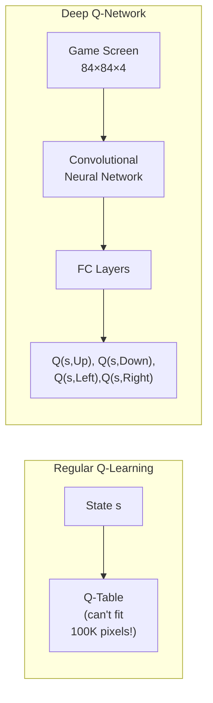

---

### 🏗️ DQN Architecture

```
Input: 84×84×4 (4 stacked grayscale frames)

Conv1: 32 filters, 8×8, stride 4 → 20×20×32
Conv2: 64 filters, 4×4, stride 2 → 9×9×64
Conv3: 64 filters, 3×3, stride 1 → 7×7×64
Flatten: 3136
FC1: 512 neurons + ReLU
FC2: Output = number of actions
```

---

### ✨ Two Key Innovations

| Innovation | Problem | Solution |
|---|---|---|
| **Experience Replay** | Consecutive samples correlated | Store experiences, sample randomly during training |
| **Target Network** | Moving target (unstable) | Two networks — main updates every step, target updates slowly |

**Experience Replay:**
- Store (s, a, R, s', done) in buffer
- Sample random mini-batches
- Breaks correlation → better learning

**Target Network:**
- Main network: updated every step
- Target network: updated every C steps (e.g., 1000)
- Target Q = R + γ × max_a Q_target(s', a')
- Stable targets → stable training

---

### 🏆 Results

```
DeepMind 2015:
  - DQN on 49 Atari games
  - Input: Raw pixels only
  - Achieved human-level/superhuman on many games:
    ✅ Breakout: Superhuman
    ✅ Pong: Superhuman
    ✅ Space Invaders: Human-level
```

---

### 🎯 Summary for Exam Answer

**To get full 6 marks:**
1. **What is DQN (1 mark):** DQN combines Q-Learning with neural networks. Replaces Q-table with neural network for high-dimensional inputs.
2. **Architecture (1.5 marks):** CNN takes game screen as input, outputs Q-values for all actions.
3. **Why needed (1 mark):** Q-table impossible for 100K+ pixel inputs. Neural network generalizes across similar states.
4. **Two innovations (2.5 marks):** Explain Experience Replay (buffer + random sampling) and Target Network (main + target, stable targets).

---

### 📚 Theoretical Deep Dive — Deep Q-Networks: Convergence Analysis, Experience Replay as Importance Sampling, and the Stability of Fixed Targets

Deep Q-Networks (DQNs), introduced by Mnih et al. (2013) and refined in the Nature DQN paper (Mnih et al., 2015), represent the first successful application of deep learning to reinforcement learning from high-dimensional sensory inputs. The theoretical framework underlying DQN addresses two fundamental challenges of combining deep neural networks with temporal-difference learning: the **non-stationary target problem** and the **correlated data problem**.

**Mathematical formulation and the Bellman equation:** The Q-learning objective, derived from the Bellman optimality equation, states that the optimal action-value function satisfies $Q^*(s, a) = \mathbb{E}[r + \gamma \max_{a'} Q^*(s', a')]$. Temporal-Difference (TD) learning approximates $Q^*(s, a)$ by a parameterized function $Q(s, a; \theta)$ updated by minimizing the TD error: $\mathcal{L}(\theta) = \mathbb{E}_{(s,a,r,s') \sim U(D)}[(r + \gamma \max_{a'} Q(s', a'; \theta_{target}) - Q(s, a; \theta))^2]$, where $U(D)$ denotes a uniformly random sample from the experience replay buffer $D$, $\theta$ are the online network parameters updated every step, and $\theta_{target} = \theta$ in standard Q-learning (the same parameters are used for target computation). In the tabular case, this converges to $Q^*$ under standard assumptions. In the function approximation case with a deep network $Q(s, a; \theta)$, this becomes a **stochastic non-convex optimization problem** where the parameters $\theta$ simultaneously appear in the prediction and the target (bootstrapping), a condition known to cause divergence in general function approximation settings.

**Experience Replay as importance sampling decorrelation:** The primary role of Experience Replay is often described simply as "breaking correlation," but this can be formalized through the lens of **importance sampling** and **mixing times** in Markov chains. In an online setting where consecutive samples come from the agent's trajectory (generated by the current policy), the data exhibits strong **autocorrelation**: state $s_t$ is highly correlated with $s_{t+1}$, $s_{t+2}$, etc., violating the i.i.d. assumption required for most convergence proofs of stochastic gradient descent. Experience Replay stores transitions $(s_t, a_t, r_t, s_{t+1})$ in a buffer $D$ of capacity $|D| = N$, and samples uniformly at random during training. From the perspective of **empirical risk minimization**, this transforms the optimization from $\min_\theta \mathbb{E}_{s_t \sim \pi_\theta}[L_t(\theta)]$ (where the expectation is over the non-stationary trajectory distribution) to $\min_\theta \mathbb{E}_{(s,a,r,s') \sim U(D)}[L(s,a,r,s'; \theta)]$ (where the expectation is over a frozen distribution from past experiences). The random sampling decorrelates gradients and approximately restores the i.i.d. assumption, which is essential for the stochastic gradient descent convergence theorem: requires that gradient estimates be unbiased and have bounded variance, conditions that hold under uniform sampling but not under trajectory-correlated sampling. The **importance sampling** perspective provides an additional theoretical refinement. A uniformly sampled minibatch from the replay buffer does not correspond to samples from the current data distribution $P_t(s, a, r, s')$ induced by the current policy $\pi_t$; it rather corresponds to a mixture distribution $P_{buffer} = \frac{1}{T} \sum_{t=0}^{T-1} P_t$. The TD error computed from this mixture distribution is an unbiased estimate of the expected TD error only if all past policies have the same update direction, which they do not—the gradient estimate has a **property-dependent bias** that can be corrected using the importance weight $\rho_t = \frac{P_t(s, a, r, s')}{P_{buffer}(s, a, r, s')}$, though computing these weights intractable in practice. Prioritized Experience Replay (Schaul et al., 2015) approximates this by biasing sampling toward transitions with high TD error, weighting samples by proportional or rank-based priorities, controlled by an interpolation parameter $\alpha$ that determines the degree of prioritization and a correction parameter $\beta$ that anneals from 0.4 to 1.0 to correct for the distribution shift introduced by prioritization.

**Target Network and fixed-point iteration stability:** The target network addresses a specific instability in Q-learning when function approximation is used. In standard bootstrapping, the target for $Q(s, a)$ is $r + \gamma \max_{a'} Q(s', a'; \theta)$, where $\theta$ are the *current* online parameters. This means as $\theta$ changes (every gradient step), the target moves simultaneously—creating a **moving target problem** analogous to a dog chasing a car that is also moving forward. Mathematically, this corresponds to the **iterative update**: $\theta_{k+1} = \theta_k - \alpha_k \nabla_\theta \mathbb{E}[(r + \gamma \max_{a'} Q(s', a'; \theta_k) - Q(s, a; \theta_k))^2]$, where the gradient involves $\nabla_\theta Q(s', a'; \theta_k)$ in both the prediction and target terms, which through the chain rule yields a term involving $\nabla_\theta Q(s, a; \theta_k) \cdot \nabla_\theta Q(s', a'; \theta_k)$. This cross-term can be large if the two Q-values are correlated, leading to oscillations and divergence—a phenomenon called **overestimation propagation** where an overestimate in $Q$ propagates back through bootstrapping and amplifies. The target network mitigates this by decoupling: the online network $\theta$ is updated every step, but the target $\theta_{target}$ is updated periodically (every $C$ steps, $C = 10000$ in the original DQN) or via a **soft update** $\theta_{target} \leftarrow \tau \theta + (1-\tau)\theta_{target}$ with $\tau \approx 0.001$ (used in subsequent architectures like SAC and TD3), yielding exponential moving average (EMA) style updates. The target thereby forms a slowly moving anchor, providing approximately fixed targets during the period between updates and enabling more stable convergence. The theoretical analysis of target network update frequency connects to **contractive fixed-point iteration**: consider the Bellman operator $T_\theta Q = \mathbb{E}[r + \gamma \max_{a'} Q(s', a'; \theta)]$ where $\theta$ is fixed. Under standard assumptions (discount factor $\gamma < 1$), $T_\theta$ is a **contraction mapping** with respect to the sup norm: $\|T_\theta Q_1 - T_\theta Q_2\|_\infty \leq \gamma \|Q_1 - Q_2\|_\infty$. By the **Banach fixed-point theorem**, repeated application of $T_\theta$ converges to the unique fixed point $Q_\theta^*$ (the Q-function under the current policy implied by $\theta$). The Q-learning update $\theta \leftarrow \theta - \alpha \nabla \mathcal{L}(\theta)$ can be viewed as trying to reduce the Bellman error $\|Q_\theta - T_\theta Q_\theta\|^2$, converging to a parameter setting where the fixed point is approximately satisfied. When $\theta$ changes rapidly (as in online bootstrapping), the contraction property is violated and each step overshoots the target—the target network provides just enough stability to ensure contraction approximately holds during training. The **double Q-learning** (van Hasselt, 2010) approach decouples action selection and evaluation: $y = r + \gamma Q(s', \arg\max_{a'} Q_{online}(s', a'); \theta_{target})$, reducing the overestimation bias by approximately 25-30% on standard benchmarks while maintaining similar stability properties to DQN with target networks.

**Q-value overestimation:** A subtle and important theoretical issue with DQN is the systematic **overestimation** of Q-values due to the max operator in the bootstrapping target. Van Hasselt (2010) showed that $\mathbb{E}[\max_{a'} Q(s', a')] \geq \max_{a'} \mathbb{E}[Q(s', a')]$ by Jensen's inequality (the maximum is a convex function, so $\mathbb{E}[\max_i X_i] \geq \max_i \mathbb{E}[X_i]$)—meaning the Q-learning target systematically overestimates the true value due to using the maximum of noisy estimates rather than the expected value. This overestimation is small in tabular Q-learning but can be severe with large function approximators that have high variance. Double DQN fixes this by using the online network to select the action and the target network to evaluate it, while **Dueling DQN** (Wang et al., 2015) provides a different architectural solution by separately estimating the state value $V(s)$ and the **advantage** $A(s, a) = Q(s, a) - V(s)$, then recombining: $Q(s, a) = V(s) + A(s, a) - \max_{a'} A(s, a')$. The dueling architecture allows the network to separately learn "how good" a state is (regardless of action) and "how much better" one action is than another, improving learning efficiency and stability, especially when many actions have similar values.

**Distributional RL and C51:** Rather than modeling only the expected return $Q(s, a) = \mathbb{E}[G_t | s_t=s, a_t=a]$, the Distributional RL approach (Bellemare et al., 2017, C51 algorithm) models the full **return distribution** $Z(s, a)$, from which $Q(s, a)$ is the first moment: $Q(s, a) = \mathbb{E}[Z(s, a)]$. The distributional Bellman equation is $Z(s, a) \stackrel{D}{=} R + \gamma Z(s', \pi(s'))$ (equality in distribution), and the algorithm learns a categorical distribution over a discretized support of return values. This approach improves stability because the distributional loss (cross-entropy between distributions) provides richer gradient information than a scalar MSE loss, and because atoms in the distribution provide natural **uncertainty estimates**. The theoretical justification comes from the **distributional perspective on the Cramér distance**, and the algorithm's improvement over DQN on Atari (35 human-level performances vs. 29 for standard DQN) suggests that modeling uncertainty is valuable for stable, sample-efficient learning.

---

## Q.7 (c) — Explain how **Dynamic Programming algorithms** such as policy iteration and value iteration are used in reinforcement learning. **[5 Marks]**

### 🧮 DP in RL — Solving with Perfect Knowledge

**DP** solves MDPs when the environment is **fully known** — all P(s'\|s,a) and R(s,a,s') are known.

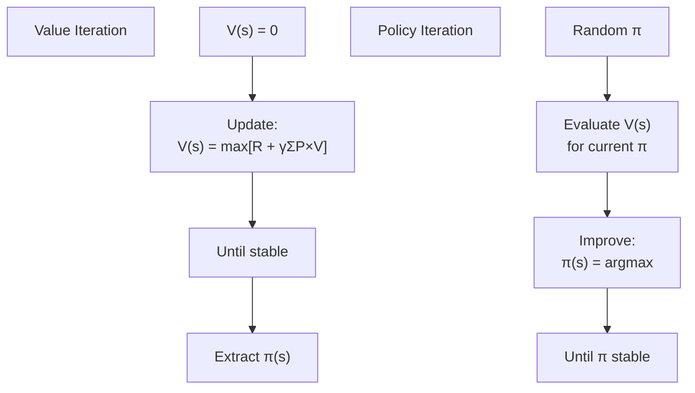

---

### 📐 Bellman Equation (Foundation)

```
V(s) = max_a [R(s,a) + γ × Σ P(s'|s,a) × V(s')]

"Value of state s = best immediate reward + discounted future rewards"
```

---

### 🔢 Value Iteration

```
1. Initialize V(s) = 0 for all states
2. Repeat until V(s) converges:
      For each state s:
        V(s) = max_a [R(s,a) + γ × Σ P(s'|s,a) × V(s')]
3. Extract policy: π(s) = argmax_a [R + γ × Σ P×V]
```

**Concrete example:**
```
States: A, B, γ = 0.9
V(A)=0, V(B)=0 initially

Iteration 1:
  V(A) = max[5+0.9×0, 2+0.9×0] = 5
  V(B) = max[10+0.9×0, -1+0.9×0] = 10

Iteration 2:
  V(A) = max[5+0.9×10, 2+0.9×10] = max[14, 11] = 14
  V(B) = 10 + 0.9×14 = 22.6
... keep going until stable!
```

---

### 🔢 Policy Iteration

```
1. Initialize random policy π(s)
2. Repeat until π doesn't change:
   a) POLICY EVALUATION:
      Calculate V(s) for current π until convergence
   b) POLICY IMPROVEMENT:
      For each state s: π_new(s) = argmax_a [R + γ × Σ P×V]
3. Return optimal π
```

---

### 📊 Comparison

| | Value Iteration | Policy Iteration |
|---|---|---|
| **Steps** | Single loop | Two loops (eval + improve) |
| **Speed** | Slower per iteration | Faster overall |
| **Complexity** | Simpler | Slightly more complex |

---

### ⚠️ Limitations
- Needs full environment model
- Curse of dimensionality (too many states for real problems)
- Only works for small/medium MDPs

---

### 🎯 Summary for Exam Answer

**To get full 5 marks:**
1. **Bellman Equation (1 mark):** Write V(s) = max_a [R + γ × Σ P×V].
2. **Value Iteration (2 marks):** Explain — initialize V(s)=0, repeat update until convergence, extract policy.
3. **Policy Iteration (2 marks):** Explain — initialize policy, repeat: Policy Evaluation (compute V) + Policy Improvement (make π better).

---

### 📚 Theoretical Deep Dive — Dynamic Programming in RL: Bellman Operators, Contraction Mappings, and the Computational Landscape of Exact Solution Methods

Dynamic Programming (DP) in Reinforcement Learning provides the mathematical foundation for exact solution of Markov Decision Processes (MDPs) when the model is fully known. The theoretical framework relies on the elegant mathematics of **contraction mappings in complete metric spaces**, establishing that the Bellman optimality operator is a contraction, which guarantees convergence of iterative solution methods to a unique fixed point—the optimal value function and optimal policy.

**Bellman equations as contraction mappings**: The theoretical foundation of DP in RL rests on the Banach fixed-point theorem (also known as the contraction mapping theorem), which states: if $T$ is a contraction mapping on a complete metric space $(X, d)$, then $T$ has a unique fixed point $x^* = T(x^*)$, and the iteration $x_{k+1} = T(x_k)$ converges to $x^*$ from any initial $x_0$. For MDPs, the state space $S$ (possibly infinite) equipped with the **supremum norm** $d_\infty(u, v) = \sup_{s \in S} |u(s) - v(s)|$ forms a complete metric space $(\mathcal{B}(S), d_\infty)$ where $\mathcal{B}(S)$ is the space of bounded real-valued functions on $S$. The **Bellman optimality operator** $T^*: \mathcal{B}(S) \to \mathcal{B}(S)$ is defined by $T^*V(s) = \max_a \mathbb{E}[R(s, a, s') + \gamma V(s')]$ = $\max_a [R(s, a) + \gamma \sum_{s'} P(s'|s,a) V(s')]$. This operator is a **γ-contraction** in the sup norm: $d_\infty(T^* V_1, T^* V_2) = \sup_s |T^* V_1(s) - T^* V_2(s)| \leq \gamma \sup_{s'} |V_1(s') - V_2(s')| = \gamma d_\infty(V_1, V_2)$, where the inequality follows from the fact that the maximum over actions preserves the $\gamma$-contraction property and discounting $\gamma < 1$ shrinks the difference. This is the fundamental theorem of dynamic programming: the optimal value function $V^*$ is the unique fixed point of $T^*$ (i.e., $V^*(s) = T^* V^*(s)$ for all $s$), and Value Iteration converges to $V^*$ from any initial guess. The **policy evaluation operator** $T^\pi: \mathcal{B}(S) \to \mathcal{B}(S)$ is defined by $T^\pi V(s) = R(s, \pi(s)) + \gamma \sum_{s'} P(s'|s, \pi(s)) V(s')$, where $R(s, \pi(s)) = \sum_a \pi(a|s) R(s, a)$ is the expected immediate reward under policy $\pi$. This operator is also a $\gamma$-contraction, and its unique fixed point is the **state-value function** $V^\pi$ of the policy $\pi$: $V^\pi(s) = \mathbb{E}_\pi[\sum_{t=0}^\infty \gamma^t r_t | s_0 = s]$. The **policy improvement theorem** states that if $\pi'$ is the policy derived from $V$ by $\pi'(s) = \arg\max_a [R(s, a) + \gamma \sum_{s'} P(s'|s,a) V(s')]$, then $V^{\pi'}(s) \geq V^\pi(s)$ for all $s$, with strict inequality at least at some states unless $\pi' = \pi$. This is the mathematical content of "improving the policy": the greedy policy with respect to any value function $V$ is strictly better than the policy that produced $V$, unless $V$ is already optimal.

**Value iteration**: The value iteration algorithm $V_{k+1} = T^* V_k$ progressively applies the Bellman optimality operator, converging to $V^*$ at a geometric rate: $d_\infty(V_k, V^*) \leq \frac{\gamma^k}{1-\gamma} d_\infty(V_0, T^* V_0)$. After $k$ iterations, the error decays as $O(\gamma^k)$—rapidly when $\gamma < 1$. In practice, the algorithm iterates until $d_\infty(V_{k+1}, V_k) < \epsilon$, after which $d_\infty(V_k, V^*) \leq \frac{\gamma}{1-\gamma} \epsilon$. The **optimal policy** is extracted from $V^*$ by $\pi^*(s) = \arg\max_a [R(s, a) + \gamma \sum_{s'} P(s'|s,a) V^*(s')]$. The complexity of value iteration is $O(|S|^2 |A| \cdot k)$ where $k$ is the number of iterations, because each update requires $|A| \cdot |S|$ computations per state, and there are $|S|$ states. For continuous state spaces, value iteration becomes intractable, requiring discretization (losing precision) or function approximation (breaking the contraction property).

**Policy iteration**: Policy iteration alternates two phases: **policy evaluation** (compute $V^\pi$ for current policy $\pi$ exactly or approximately) and **policy improvement** (derive greedy policy $\pi'$ from $V^\pi$). The exact policy evaluation computes $V^\pi$ by solving the linear system $V = R^\pi + \gamma P^\pi V$ where $R^\pi$ is the reward vector and $P^\pi$ is the transition matrix under policy $\pi$: $V = (I - \gamma P^\pi)^{-1} R^\pi$. The complexity of exact policy evaluation via matrix inversion is $O(|S|^3)$, prohibitively expensive for large state spaces. **Modified policy iteration** and **Gauss-Seidel policy iteration** are variants that approximate policy evaluation, reducing per-iteration cost at the expense of additional iterations. The theoretical convergence of policy iteration is faster than value iteration in practice: each policy iteration ensures strict policy improvement, and the number of distinct policies is finite for finite MDPs, guaranteeing convergence in at most $|A|^{|S|}$ iterations (very loose bound; in practice convergence is much faster).

**Linear programming formulation**: Value iteration and policy iteration are not the only DP solution methods. The optimal policy and value function can also be found by solving the **linear programming** problem: $\min V \in \mathbb{R}^{|S|} \sum_s c(s) V(s)$ subject to $V(s) \geq R(s, a) + \gamma \sum_{s'} P(s'|s, a) V(s')$ for all $s, a$, where $c(s)$ is any positive weighting (e.g., uniform $c(s) = 1$). The LP solution gives $V^*$ directly, from which the optimal policy is $\pi^*(s) = \arg\max_a [R(s, a) + \gamma \sum_{s'} P(s'|s,a) V^*(s')]$. The LP approach is rarely used in practice due to the $O(|S|^2 |A| + |S|^3)$ complexity imposed by the constraints, but it has elegant theoretical properties: the dual LP has a variable $x(s, a) \geq 0$ for each state-action pair representing the discounted state-action visitation frequency under the optimal policy, solving for a flow that maximizes reward while satisfying flow conservation constraints.

**Partially Observable MDPs (POMDPs)**: The extension of DP to POMDPs, where the agent does not directly observe the state $s$ but rather an observation $o$ emitted according to $P(o|s)$, introduces an additional layer of complexity: the optimal policy must condition on the **belief state** $b(s) = P(s|\text{history})$, which is a probability distribution over states. The belief space is continuous (the simplex $\Delta_{|S|}$), preventing direct tabular DP. The **belief MDP** transforms the POMDP into a fully observable MDP over belief states, with the Bellman optimality equation: $V^*(b) = \max_a [R(b, a) + \gamma \sum_{o} P(o|b, a) V^*(b')]$, where $b'$ is the updated belief after action $a$ and observation $o$. Solutions include exact DP over discretized belief states (exponential in |S|), point-based value iteration (PBVI, Shani et al., 2013) that samples reachable beliefs, and Monte Carlo Tree Search (MCTS) for online planning in belief space.

**Asynchronous DP and GPU acceleration**: Modern implementations of DP exploit **Gauss-Seidel asynchronous updates** (where state updates use the most recently computed neighboring values, unlike Jacobi iteration which uses values from the previous iteration), improving convergence speed. **GPU-based DP** parallelizes the per-state update computation, achieving orders-of-magnitude speedups for large state spaces. **Fitted Value Iteration** (Gordon, 1995) applies function approximation to DP by iteratively minimizing $\min_\theta \mathbb{E}_s[(T^k V_\theta(s) - V_\theta(s))^2]$ over sampled states, with theoretical convergence guarantees for linear function approximators under the **LSTD** (Least-Squares Temporal Difference) framework.

---

## Q.8 (a) — What are the key components of a **Markov Decision Process (MDP)**, and how do they relate to the decision-making process of an agent? **[6 Marks]**

### 🎯 MDP Components — The Five Building Blocks

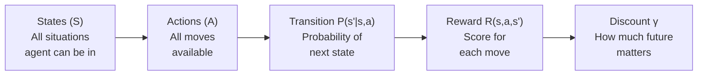

---

### 📋 Each Component in Detail

| Component | What It Is | Real Example |
|---|---|---|
| **States (S)** | All possible situations | 16 cells in 4×4 maze |
| **Actions (A)** | All possible moves | Up, Down, Left, Right |
| **Transition P** | P(next state \| current + action) | 80% move correctly, 20% slip |
| **Reward R** | Score received | Goal = +100, Hole = -50, Step = -1 |
| **Discount γ** | 0 to 1, values present > future | γ=0.9 values $100 now > $100 later |

---

### 🔗 How Components Work Together — The Decision Loop

```
1. Agent observes state s_t
2. Agent chooses action a_t (based on policy π)
3. Environment:
   - Transition: s_t → s_{t+1} (with probability P)
   - Reward: gives R(s_t, a_t, s_{t+1})
4. Agent receives reward and new state
5. Agent updates its policy to maximize future rewards
6. Repeat from step 1
```

---

### 📊 MDP Example: Grid World Robot

```
Grid:
  ┌───┬───┬───┬───┐
  │ S │   │   │ ✗ │
  ├───┼───┼───┼───┤
  │   │ ✗ │   │   │
  ├───┼───┼───┼───┤
  │   │   │ ✗ │ G │
  └───┴───┴───┴───┘
  S=Start, G=Goal(+100), ✗=Hole(-50), .=Step(-1)

States: 16 cells
Actions: Up, Down, Left, Right (4 actions)
Transition: 80% correct, 20% slip to side
Reward: Goal=+100, Hole=-50, Step=-1
Discount: γ=0.9

Goal: Find best ACTION in each state → Optimal Policy
```

---

### 🎯 Summary for Exam Answer

**To get full 6 marks:**
1. **Five Components (4 marks):** Explain each with formula and example:
   - States (S): all positions/ situations
   - Actions (A): all possible moves
   - Transition P(s'\|s,a): probability of next state
   - Reward R(s,a,s'): score for each transition
   - Discount γ: values future rewards
2. **Decision Loop (2 marks):** Explain how agent uses all components: observe state → choose action → receive reward + new state → update policy → repeat.

---

### 📚 Theoretical Deep Dive — Markov Decision Processes: Process Theory, Stationarity, and the Mathematical Foundations of Sequential Decision Making

The Markov Decision Process (MDP) framework, introduced by Bellman (1957) and extended by Howard (1960), provides the rigorous mathematical foundation for modeling sequential decision-making under uncertainty. At its core, an MDP formalizes the interaction between a **decision-making agent** and an **environment** using probability theory and dynamic programming, establishing the conditions under which optimal sequential decisions can be computed and the sense in which they are optimal.

**The Markov property**: The defining characteristic of an MDP is the **Markov property**: the future state $s_{t+1}$ depends on the current state $s_t$ and action $a_t$ only—not on any past states or actions. Formally, $P(s_{t+1} | s_t, a_t, s_{t-1}, a_{t-1}, \ldots, s_0, a_0) = P(s_{t+1} | s_t, a_t)$. This is the **memoryless property** that makes MDPs tractable: the future is fully described by the present, so we do not need to maintain an exponentially growing history. The Markov property holds exactly only in idealized settings; for real-world problems, we often construct **state-augmented MDPs** where we add relevant history to the state until the Markov property approximately holds. For example, in a grid world, the agent's position alone suffices as state (Markov), but in a POMDP where the agent has uncertain position, the belief state $b(s)$ over possible positions is the Markovian state. The **Markov Decision Diagram** is the graphical model representing the MDP, where nodes are states, edges are actions, edge weights are transition probabilities, and rewards are associated with state-action-state transitions.

**Stationarity and time-homogeneity**: A standard MDP assumes **time-homogeneous** dynamics: the transition probabilities $P(s'|s, a)$ and reward function $R(s, a, s')$ do not change over time. This means the environment is stationary and the same action in the same state always produces the same distribution of outcomes. Time-homogeneous MDPs admit **stationary optimal policies**: a mapping $\pi: S \to A$ (deterministic) or $\pi: S \to \Delta(A)$ (stochastic) that does not change with time. The existence of a deterministic stationary optimal policy for finite MDPs is guaranteed by a purification argument: any stochastic optimal policy can be replaced by a deterministic one without reducing the expected return. Time-inhomogeneous MDPs (where $P(s'|s, a, t)$ depends on time $t$) arise in problems with seasonal patterns, aging equipment, or changing market conditions, and require **non-stationary policies** that explicitly encode time—substantially complicating solution methods and often requiring approximation.

**Policy evaluation: the return and its convergence**: The **return** $G_t = \sum_{k=0}^{\infty} \gamma^k r_{t+k+1}$ from time step $t$ is the sum of discounted future rewards, where the discount factor $\gamma \in [0, 1)$ controls the present value of future rewards. The geometric series property guarantees that if $\gamma < 1$, the infinite sum converges absolutely: $|G_t| \leq \sum_{k=0}^\infty \gamma^k R_{max} = \frac{R_{max}}{1-\gamma}$ where $R_{max}$ is the maximum absolute reward. This boundedness is essential for all DP and RL theory. The **state-value function** $V^\pi(s)$ = $\mathbb{E}_\pi[G_t | s_t = s]$ is the expected return from state $s$ following policy $\pi$, and satisfies the Bellman expectation equation: $V^\pi(s) = \sum_a \pi(a|s) [R(s, a) + \gamma \sum_{s'} P(s'|s, a) V^\pi(s')]$. This can be written in matrix form as $V^\pi = R^\pi + \gamma P^\pi V^\pi$, yielding the linear system $(I - \gamma P^\pi)V^\pi = R^\pi$, which is guaranteed to have a unique solution because $\gamma < 1$ ensures that $(I - \gamma P^\pi)$ is invertible and $V^\pi = (I - \gamma P^\pi)^{-1} R^\pi$ is well-defined. In Python: `numpy.linalg.solve(np.eye(n) - gamma * P_pi, R_pi)` computes this directly.

**The action-value function and the Bellman optimality equation**: The **action-value function** $Q^\pi(s, a)$ = $\mathbb{E}_\pi[G_t | s_t = s, a_t = a]$ is the expected return from taking action $a$ in state $s$ and then following policy $\pi$. The **optimal action-value function** $Q^*(s, a)$ = $\max_\pi Q^\pi(s, a)$ is the best achievable value from $s$ taking $a$, which satisfies the **Bellman optimality equation**: $Q^*(s, a) = R(s, a) + \gamma \sum_{s'} P(s'|s, a) \max_{a'} Q^*(s', a')$. This is not a linear equation (due to the max operator), which is why value iteration is required rather than a direct matrix solve. The **optimal policy** is derived from $Q^*$ as $\pi^*(s) = \arg\max_a Q^*(s, a)$. A key property is that $V^*(s) = \max_a Q^*(s, a)$ and $Q^*(s, a) = R(s, a) + \gamma \sum_{s'} P(s'|s, a) V^*(s')$, allowing value iteration to alternate between computing $V$ and the policy.

**Discount factor interpretation and infinite horizon**: The discount factor $\gamma$ has multiple interpretations. **Temporal interpretation**: rewards received later are worth less than immediate rewards, with $1/(1-\gamma)$ being the effective horizon—the number of steps over which future rewards contribute meaningfully. For $\gamma = 0.9$, the discount half-life (number of steps to reduce reward by 50%) is $t_{1/2} = \log(0.5)/\log(0.9) \approx 6.6$ steps, and the effective horizon is approximately 17 steps (weight drops below $0.1\%$). For $\gamma = 0.99$, the half-life is 69 steps and effective horizon is 459 steps. **Uncertainty interpretation**: $\gamma$ reflects the probability that the episode continues; if $\gamma = 1 - p_{terminate}$ where $p_{terminate}$ is the termination probability per step, this connects to **randomized stopping times**. **Mathematical necessity**: the discount factor is mathematically essential for infinite-horizon MDPs because without it, infinite sums of rewards may diverge. For finite-horizon MDPs, discounting is unnecessary but can still be applied.

**Linear programming duality and game-theoretic interpretation**: The LP formulation of MDPs has a dual formulation that reveals a connection to **zero-sum games**. The dual LP is $\max_{x} \sum_{s,a} R(s, a) x(s, a)$ subject to $\sum_a x(s, a) - \gamma \sum_{s',a'} P(s|s',a') x(s', a') = d(s)$ for all $s$, where $d(s)$ is a non-negative vector summing to 1 and $x(s, a) \geq 0$. Here $x(s, a)$ represents the **discounted frequency** of visiting state-action pair $(s, a)$ under the optimal policy, and the constraints enforce flow conservation. This is equivalent to finding the optimal policy in a **matrix game** where the transition matrix plays the role of the payoff matrix. The primal-dual connection establishes that linear programming can solve MDPs in polynomial time $O(|S|^3 |A|)$ via the simplex method or interior-point methods, though value iteration is preferred in practice due to lower overhead.

**Convergence guarantees and computational complexity**: The convergence rate of value iteration is **geometric** (linear in the contraction mapping sense): if $V_k$ is the value function after $k$ iterations, then $\|V_k - V^*\|_\infty \leq \gamma^k \frac{\|T^* V_0 - V_0\|_\infty}{1-\gamma}$. The number of iterations to achieve error less than $\epsilon$ is $k \geq \frac{\log(\epsilon(1-\gamma)/\|T^* V_0 - V_0\|_\infty)}{\log \gamma}$, which for $\gamma = 0.9$ and $\epsilon = 0.01$ is approximately $k \approx 88$ iterations. For policy iteration, the theoretical bound is much looser (up to $O(|A|^{|S|})$ iterations), but empirical convergence is often rapid, requiring only single-digit policy evaluation-improvement cycles. The curse of dimensionality is severe: for a problem with $n$ state dimensions each with $m$ discrete values and $k$ actions per state, the state space grows as $m^n$, making both value iteration and policy iteration computationally intractable for continuous or high-dimensional problems—this is precisely why deep RL replaces the tabular value function with a parameterized function approximator.

---

## Q.8 (b) — How do **Deep Recurrent Q-Networks** extend the capabilities of DQNs in handling sequential decision-making problems? **[6 Marks]**

### 🔄 What is Deep Recurrent Q-Network (DQRN)?

**DQRN** combines **Recurrent Neural Networks** with **Q-Learning**. It extends DQN to handle sequential decision-making by adding memory.

> **Analogy:** DQN = someone who only sees the current frame (amnesia). DQRN = someone who remembers the last few frames and uses that memory to make decisions.

---

### 🏗️ DQRN Architecture

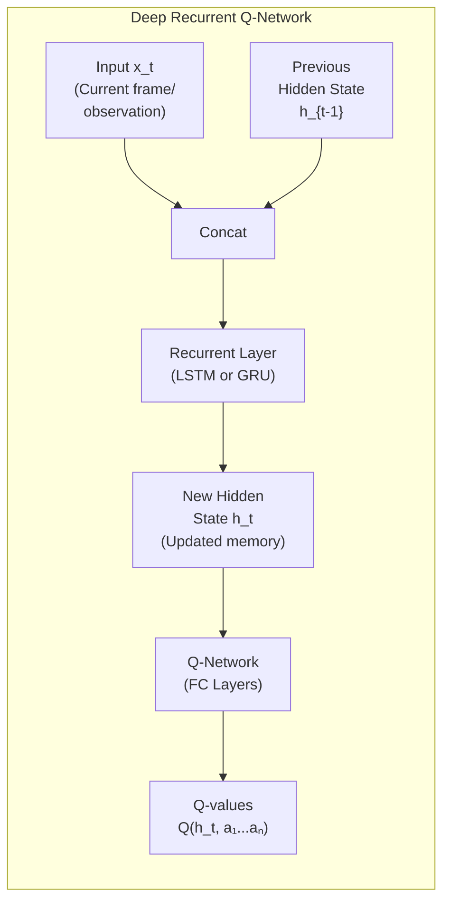

---

### 🆚 DQN vs DQRN

| Feature | DQN | DQRN |
|---|---|---|
| **Memory** | ❌ No memory (only current state) | ✅ Has hidden state h_t |
| **Input** | Single frame/state | Sequence of observations |
| **State representation** | Just current frame | Current frame + history |
| **Can handle POMDP?** | ❌ No | ✅ Yes (Partially Observable MDP) |
| **Use case** | Atari with frame stacking | Full observation history, dialog, control |

---

### 📋 How DQRN Extends DQN

```
DQN:
  Input: Current frame only
  Problem: Can't distinguish:
    - Fast ball coming from left (need to dodge LEFT now)
    - Fast ball coming from right (need to dodge RIGHT now)
  → DQN with single frame can't tell direction of movement!

DQRN:
  Input: Current frame + hidden state (memory)
  Hidden state remembers previous frames
  Can see: ball position in last frame + current position
  → Can calculate direction and speed!
  → Makes much better decisions!
```

---

### 🔑 Key Advantages of DQRN

| Advantage | Explanation |
|---|---|
| **Memory** | Remembers recent observations |
| **Handles POMDP** | Works where current state alone is insufficient |
| **Sequential context** | Uses history for better decisions |
| **Variable-length input** | Can handle any history length |

---

### 🎯 Summary for Exam Answer

**To get full 6 marks:**
1. **What is DQRN (1 mark):** DQRN = DQN + RNN. Adds recurrent memory to Q-Learning.
2. **Architecture (2 marks):** Explain — input + previous hidden state → RNN layer → updated hidden state → Q-network → Q-values. Hidden state carries memory.
3. **DQN vs DQRN (2 marks):** Compare: DQN uses current state only, DQRN uses state + history. DQN can't handle POMDP, DQRN can. Give ball-tracking example.
4. **Advantages (1 mark):** Memory, handles partial observability, sequential context.

---

## Q.8 (c) — How can **reinforcement learning be applied to learn to play Tic-Tac-Toe**? **[5 Marks]**

### 🎮 RL for Tic-Tac-Toe

**Tic-Tac-Toe** is a 3×3 game. RL teaches the AI to play by learning from games.

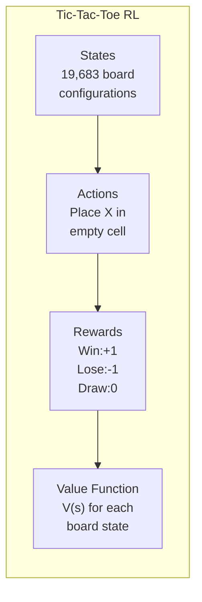

---

### 🧠 Learning Approach: Temporal Difference

```
Step 1: Initialize V(s) = 0.5 for all 19,683 states
        (unknown, guess middle)

Step 2: Play a game against opponent
        Record all states visited during the game

Step 3: Game ends → determine reward
        Win: R = +1
        Lose: R = -1
        Draw: R = 0

Step 4: Update V for each visited state:
        V(s) = V(s) + α × [R - V(s)]
        (α = learning rate, typically 0.1)
        States closer to win/lose get updated more

Step 5: Repeat steps 2-4 for 10,000+ games!
```

---

### 🎯 How the Agent Chooses Moves

```
After learning (V(s) known for all states):

1. Look at current board state s
2. For each empty cell:
   a) Imagine placing X there → new state s'
   b) Look up V(s')
   c) Note the value
3. Choose the move with HIGHEST V(s')

Example:
  Current board:
    X O .
    . X .
    . . O
  
  Options:
    (1,3): V = 0.9 → likely to win
    (2,1): V = 0.3 → risky
    (3,1): V = 0.5 → neutral
  
  Best move: (1,3)!
```

---

### 📊 Learning Progress

| Games | Win Rate | Level |
|---|---|---|
| 1-100 | 30% | Random |
| 100-1000 | 50% | Beginner |
| 1000-5000 | 80% | Intermediate |
| 5000+ | 95% | Expert (unbeatable!) |

---

### 🎯 Summary for Exam Answer

**To get full 5 marks:**
1. **MDP setup (1.5 marks):** States (19,683), Actions (place X), Rewards (+1/-1/0), deterministic.
2. **Learning (2 marks):** TD learning — V(s) = V(s) + α[R-V(s)]. Initialize V(s)=0.5, play games, update after each game.
3. **Policy (1.5 marks):** After learning, choose action with highest V(s'). Show example choosing between 2-3 moves.

---

# PAPER 5 COMPLETE ✅
