# Paper 6: [6584]-82 — Deep Learning Answers

**B.E. Computer Engineering | Semester VIII | 2019 Pattern | Max Marks: 70**

---

# UNIT I — Convolutional Neural Networks (CNN)

---

## Q.1 (a) — List the main steps involved in **training a CNN** for image classification. Why normalization is important before training a CNN. **[6 Marks]**

### 🏋️ Training a CNN — Step by Step

```mermaid
flowchart LR
    S1["1. Data Collection\n& Preparation"] --> S2["2. Normalize/\nStandardize Data"]
    S2 --> S3["3. Build CNN\nArchitecture"]
    S3 --> S4["4. Initialize\nWeights"]
    S4 --> S5["5. Forward Pass\n(Compute predictions)"]
    S5 --> S6["6. Calculate Loss\n(Cross-entropy)"]
    S6 --> S7["7. Backpropagation\n(Compute gradients)"]
    S7 --> S8["8. Update Weights\n(Optimizer)"]
    S8 --> S9["9. Evaluate on\nValidation Set"]
    S9 --> S10["10. Repeat for\nmany epochs"]
```

---

### 📋 The 10 Steps Explained

| Step | What to Do | Details |
|---|---|---|
| **1. Data Collection** | Gather images and labels | e.g., 10,000 cat/dog images with labels |
| **2. Normalization** | Scale pixel values to 0-1 or -1 to 1 | Very important! (explained below) |
| **3. Build Architecture** | Stack Conv→ReLU→Pool→FC→Softmax | Decide number of layers, filters |
| **4. Initialize Weights** | Random or Xavier/He init | Good init = faster convergence |
| **5. Forward Pass** | Pass batch through network | Get predictions |
| **6. Calculate Loss** | Compare predictions with true labels | Cross-entropy for classification |
| **7. Backpropagation** | Compute gradients via chain rule | Find how each weight contributed to error |
| **8. Update Weights** | Apply optimizer (Adam, SGD) | W = W - lr × gradient |
| **9. Evaluate** | Check accuracy on validation set | Detect overfitting |
| **10. Repeat** | Train for many epochs | Use early stopping |

---

### 🔧 Why Normalization is Important

```
Without Normalization:
  - Pixel values: 0 to 255 (large range)
  - Some inputs are 255, others are 5
  - Large differences → gradients become unstable
  - Training is SLOW and may not converge

With Normalization (0 to 1):
  - All pixel values: 0.0 to 1.0 (same range)
  - All inputs in same scale
  - Gradients are stable
  - Training is FAST and converges well
```

**Normalization methods:**
```
  Min-Max:  x_norm = (x - min) / (max - min)
            → scales to [0, 1]

  Standardization:  x_norm = (x - mean) / std
                    → scales to mean=0, std=1

For images: usually Min-Max: pixel/255
```

---

### 🎯 Summary for Exam Answer

**To get full 6 marks:**
1. **Training steps (4 marks):** Explain the 10 steps briefly: data prep → normalize → build architecture → initialize → forward → loss → backprop → update → evaluate → repeat.
2. **Normalization (2 marks):** Explain why — pixel values 0-255, without normalization gradients unstable. With normalization (0-1) training fast and stable. Show normalization formula.

---

## 📚 Theoretical Deep-Dive — CNN Training: Optimization, Initialization, and the Role of Normalization

### 📐 Mathematical Foundations of Gradient Descent in CNNs

Training a convolutional neural network is the process of minimizing a high-dimensional non-convex loss landscape. Formally, given a dataset D = {(xi,yi)}i=1N, a CNN architecture with parameters θ = {W^(1),...,W^(L),b^(1),...,b^(L)}, and a loss function L(θ;D), training seeks:

θ* = argmin_θ E[(xi,yi)~D][L(f_θ(xi),yi)]

In classification, the loss is typically the cross-entropy: L = -1/N Σ_i Σ_c y_i_c log(ŷ_i_c), where ŷ_i = softmax(f_θ(xi)). Optimization proceeds via mini-batch Stochastic Gradient Descent (SGD) or its variants, updating:

θ ← θ - η · ∇_θ L(θ; B_t)

where B_t is the mini-batch at step t and η is the learning rate. The gradient ∇_θ L is computed via backpropagation — systematically propagating the error signal from the final softmax layer backward through the network using the chain rule. For a CNN, this involves computing gradients not only through fully connected layers but also through the convolutional layers, pooling layers, and non-linearities.

### 🧮 The Backpropagation Algorithm: Derivation for Convolutional Layers

Backpropagation for a convolutional layer requires careful handling of the spatial structure. Let X ∈ R^(H_in × W_in × C_in) be the input volume, W ∈ R^(K × K × C_in × C_out) the convolutional kernel, and Y ∈ R^(H_out × W_out × C_out) the output, where H_out = floor((H_in + 2P - K)/S + 1). The forward pass computes:

Y_{n,j,i} = Σ_{c=1}^{C_in} Σ_{m=0}^{K-1} Σ_{l=0}^{K-1} W_{m,l,c,j} · X_{n·S+m, i·S+l, c} + b_j

The gradient w.r.t. weights uses:

∂L/∂W_{m,l,c,j} = Σ_{n=1}^N Σ_{i=1}^{H_out} Σ_{j=1}^{H_out} δ_{n,j,i} · X_{n·S+m, i·S+l, c}

where δ_{n,j,i} = ∂L/∂Y_{n,j,i} (the upstream gradient) is the "delta" propagated from the subsequent layer. The gradient w.r.t. input uses:

∂L/∂X_{n·S+m, i·S+l, c} = Σ_{j=1}^{C_out} Σ_{m'=0}^{K-1} Σ_{l'=0}^{K-1} W_{m',l',c,j} · δ_{n, (m-m')/S_rounded, (l-l')/S_rounded}

This is implemented efficiently as the transposed convolution (or conv2d-transpose in deep learning frameworks). Asymmetric gradient distributions across spatial positions create the need for careful padding management and gradient flow control, which is why advanced architectures like ResNet use skip connections to create direct gradient paths from loss to early layers without passing through many non-linear transformations.

### 📐 Weight Initialization Theory: Breaking Symmetry and Controlling Variance

The initial state of network parameters profoundly affects training dynamics. Two failure modes dominate: vanishing gradients (where activations shrink toward zero through many layers) and exploding gradients (where activations grow without bound). Xavier/Glorot initialization (Glorot & Bengio, 2010) addresses this by drawing initial weights from:

W ∼ U(-√(6/(n_in + n_out)), √(6/(n_in + n_out)))

or equivalently from N(0, 2/(n_in + n_out)). This ensures that the variance of activations is preserved across layers: Var(a^(l)) ≈ Var(a^(l-1)), where n_in and n_out are the fan-in and fan-out of the layer. For ReLU activations, which are zero for negative inputs and variance-reducing, He initialization (He et al., 2015) is appropriate: W ∼ N(0, 2/n_in). Biases are initialized to zero (or small positive constants like 0.01 for ReLU to avoid dead ReLU units at initialization). Poor initialization leads to symmetry: if all neurons in a layer start with identical weights, they receive identical gradients during backprop and remain identical forever — learning nothing. Initialization strategies directly control the initial gradient norm; exploding gradients in deep networks are essentially a failure of proper variance propagation from layer to layer.

### 📊 Data Normalization: Pixel Space, Batch Normalization, and Optimization Geometry

The exam answer correctly identifies that pixel values in raw images span 0-255 and must be rescaled. Why? Neural network optimization uses first-order methods (gradient descent) which assume the loss landscape is well-conditioned — i.e., the Hessian has similar eigenvalues in all directions. Unscaled pixel values create an ill-conditioned problem: some weights receive huge gradient updates (for high-pixel inputs) while others receive tiny updates (for low-pixel regions), causing oscillations or slow convergence. The simplest remedy divides by 255 (min-max to [0,1]) or subtracts mean and divides by standard deviation (standardization to N(0,1)).

Beyond input normalization, Batch Normalization (Ioffe & Szegedy, 2015) normalizes activations within the network at each layer: x̂ = (x - E[x])/√(Var[x] + ϵ), then y = γ·x̂ + β, where γ and β are learned affine parameters. This has three effects: (1) reduces internal covariate shift — changes in layer distributions during training; (2) allows much higher learning rates; (3) acts as a mild regularizer. BatchNorm is now standard in virtually every CNN architecture from ResNet onwards. Its theoretical basis lies in making the optimization landscape significantly smoother, which can be analyzed through the lens of gradient flow and loss surface geometry.

### 🧪 Learning Rate Schedules: Decay, Warmup, and Adaptive Optimizers

The learning rate η is the single most important hyperparameter. Fixed learning rates often fail: too large and training diverges; too small and convergence is agonizingly slow. Learning rate schedules adapt η over time: step decay multiplies η by a factor (e.g., 0.1) every k epochs; exponential decay applies η_t = η_0 · exp(-λt); cosine annealing follows a cosine curve from η_0 to near-zero. Recent work (Loshchilov & Hutter, 2017) on SGDR shows that cyclic learning rates between two bounds with warm restarts can find better minima than monotonically decaying schedules.

Perhaps more importantly, adaptive optimizers like Adam (Kingma & Ba, 2015) compute per-parameter learning rates using estimates of first and second moments of gradients: m_t = β_1·m_{t-1} + (1-β_1)g_t, v_t = β_2·v_{t-1} + (1-β_2)g_t², then update θ ← θ - η·m_t/(√v_t + ϵ). Adam maintains two running averages and adapts the effective step size per parameter. While Adam is the default optimizer, research by Wilson et al. (2017) and others shows that carefully tuned SGD with momentum can generalize better on some tasks, particularly image classification with CNNs. The mechanisms behind this are not fully understood; it remains an active area of research in optimization theory for deep learning.

### 🔬 Common Failure Modes in CNN Training

Several pathologies are important to understand:

1. **Overfitting**: Training accuracy >> validation accuracy. The network memorizes training examples. Solutions: data augmentation (random crops, flips, rotations), dropout (Srivastava et al., 2014), weight decay (L2 regularization), early stopping.

2. **Underfitting**: Both training and validation accuracy are low. The network is too small or inadequately trained. Solutions: increase model capacity (more filters/layers), train longer, reduce regularization, check for bugs.

3. **Mode collapse (in GANs, related)**: The generator produces limited diversity of outputs. Not relevant for standard classification CNNs but appears when CNNs are used for generation.

4. **Dead ReLU**: A ReLU unit that always outputs zero because its input is permanently negative after initialization. Caused by too-large learning rate combined with poor initialization. Solutions: He initialization, Leaky ReLU (α=0.01 for negative slope), smaller learning rate.

5. **Vanishing gradient**: Gradients exponentially small in deep networks. Solved by skip connections (ResNet), BatchNorm, careful initialization.

The training loop itself, repeated over epochs, must also manage the data pipeline: shuffling at each epoch prevents the network from learning order-based artifacts, and data augmentation in the GPU pipeline virtually enlarges the training set. The complete pipeline typically takes hours to days of GPU training for ImageScale-scale classification tasks; modern architectures like ViT-H/14 require weeks of training on thousands of TPUs.

### 📐 Calculating Output Feature Map Size

**Given:**
- Input size = 64×64
- Kernel (filter) size = 5×5
- Stride = 2
- Padding = 'same'

---

### 📏 Finding Output Size

**Formula:**
```
Output = (Input - Filter + 2×Padding) / Stride + 1
```

**For 'same' padding:**
```
We want: Output = Input = 64

64 = (64 - 5 + 2P) / 2 + 1
63 = (59 + 2P) / 2
126 = 59 + 2P
2P = 67
P = 33.5 ≈ 33 or 34 (round to nearest integer)
```

**Practically, for 'same' padding:** The output size equals input size (64×64).

---

### 📊 Answer Summary

| Parameter | Value |
|---|---|
| **Input Size** | 64×64 |
| **Kernel Size** | 5×5 |
| **Stride** | 2 |
| **Padding** | 'Same' (P calculated to keep output = input) |
| **Output Size** | **64×64** |

---

### 🎨 How Same Padding Helps Retain Spatial Size

```
Without padding:
  Output = (64 - 5 + 0) / 2 + 1 = 30×30
  → Image shrinks from 64×64 to 30×30 (lost half the info!)

With 'same' padding:
  We add P=33 pixels around the border
  → Effective input = 64 + 2×33 = 130×130
  → Output = (130 - 5) / 2 + 1 = 64×64 ✅
  → Same size as input!
```

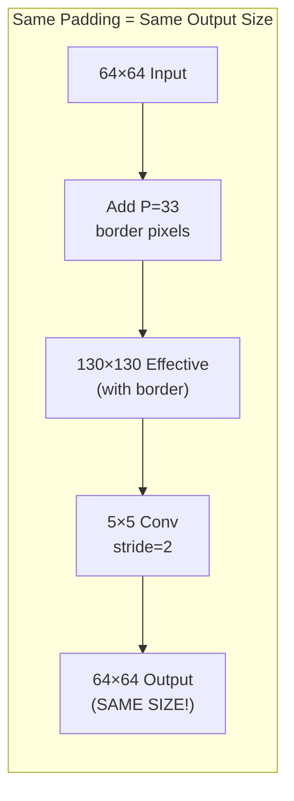

**Why same padding helps:**
1. **Preserves spatial dimensions** — output stays 64×64
2. **Edge information preserved** — border pixels are fully used
3. **Enables deeper networks** — can stack many conv layers without shrinking to nothing
4. **Better feature learning** — network sees the full image at each layer

---

### 🎯 Summary for Exam Answer

**To get full 6 marks:**
1. **Calculate output size (3 marks):** Show formula, calculate: For 'same' padding, Output = 64×64 (same as input). Show calculation.
2. **How padding helps retain size (3 marks):** Explain that 'same' padding adds P border pixels so effective input = 64+2P. After convolution with stride 2, output = 64×64. Without padding: 64→30 (lost). With padding: 64→64 (preserved).


---

## 📚 Theoretical Deep-Dive — Convolutional Arithmetic: Receptive Fields, Dilation, and Feature Map Geometry

### 📐 Mathematical Derivation of Convolution Output Sizes

The output size formula for a 2D convolution is one of the most fundamental calculations in CNN design. Given input size W_in, filter size K, stride S, and padding P, the output width is:

W_out = floor((W_in + 2P - K) / S) + 1

This formula follows from counting how many valid positions a K×K kernel can occupy when striding across a W_in×W_in input with P zero-padding added on each side. For 'same' padding, the design goal is W_out = W_in, which requires 2P = S·(W_in - 1) + K - W_in. For a 64×64 input with K=5, S=2, solving 2P = 2(64-1)+5-64 = 67 gives P = 33.5, which we round to 33 or 34. This non-integer result reveals that 'same' padding with odd kernel sizes and even strides cannot achieve perfect same-size outputs — frameworks like TensorFlow and PyTorch use asymmetric padding (e.g., padding 33 on the left and 34 on the right) to make the math work. The ceiling-based variant: W_out = ceil((W_in + 2P - K) / S) + 1 is also used in some implementations, producing slightly different dimensions. Understanding this derivation precisely prevents the common bug where designers assume 'same' padding always preserves dimensions exactly — it only does so for S=1 with odd K.

### 📏 Receptive Field Theory: How Deep Layers See the World

The receptive field (RF) of a neuron is the region of the input image that can influence that neuron's activation. For a single 5×5 convolution with stride 1 and no padding, the RF is 5×5. When stacking multiple conv layers, the RF grows cumulatively:

RF_L = RF_{L-1} + (K_L - 1) × product_{i=1}^{L-1} S_i

Three 3×3 conv layers with stride 1 each give RF = 3 + 2×1 + 2×1 = 7, equivalent to one 7×7 conv but with three non-linearities and far fewer parameters (3×(3×3×C×C) vs 7×7×C×C). This is the key architectural insight of VGGNet (Simonyan & Zisserman, 2014): depth with small kernels achieves larger effective RFs with better parameter efficiency. For stride >1 layers (pooling or strided conv), the RF calculation must multiply by the stride product. A network with RF ≥ input size can theoretically capture global context, which is essential for classification tasks. Dilated convolutions (Yu & Koltun, 2016) expand the RF without adding parameters by introducing a dilation rate d: an effective kernel size of K_eff = K + (K-1)(d-1). A 3×3 conv with d=2 covers a 5×5 region, d=3 covers 7×7, etc. This is the foundation of the Atrous Spatial Pyramid Pooling (ASPP) module in DeepLabv3+ for semantic segmentation, where multiple parallel dilated conv layers capture multi-scale context.

### 🔬 Advanced Padding Strategies: Reflection, Replication, and Circular Padding

Beyond zero-padding, modern frameworks support several padding modes. Reflection padding mirrors the image border, replicating edge pixels inward (reflection) or extending the edge value (replication). Circular padding wraps the image toroidally, as if pixels repeat periodically. These padding modes directly affect the gradient flow at image boundaries. Zero-padding introduces artificial edge artifacts because the padded region has zero activation, creating false boundaries that the network must learn to ignore. Reflection padding preserves the statistics of edge regions and is preferred for style transfer and texture synthesis (Gatys et al., 2016). Circular padding is theoretically appropriate for images with periodic structure (e.g., spherical panoramas). The choice of padding mode affects the effective RF near boundaries differently: with zero-padding, the RF of a border pixel is smaller than a center pixel, creating an asymmetric gradient landscape. Reflection padding reduces this asymmetry, improving training stability at image borders.

---

## Q.1 (b) — Given an input of size 64×64, kernel size 5×5, stride=2, and 'same' padding: **[6 Marks]**

---

## 📚 Theoretical Deep-Dive — CNN Training: Optimization, Normalization, and Weight Initialization

### 📐 Mathematical Foundations of Gradient-Based Optimization in CNNs

Convolutional Neural Networks are trained by minimizing a loss function L(θ) over a dataset D = {(xi, yi)}, where θ denotes all model parameters. For image classification with C classes, the standard loss is categorical cross-entropy:

L(θ) = - (1/N) Σ_{i=1}^{N} Σ_{c=1}^{C} y_{i,c} · log(ŷ_{i,c})

where ŷ_i = softmax(f_θ(x_i)) is the network output and y_i is the one-hot encoded label. Optimization proceeds via mini-batch Stochastic Gradient Descent (SGD):

θ ← θ - η · (1/|B|) Σ_{x∈B} ∇_θ L(x, y; θ)

where B is the mini-batch and η is the learning rate. The gradient ∇_θ L is computed via backpropagation, systematically applying the chain rule from the output layer back through every convolutional, pooling, activation, and fully-connected layer. For a convolutional layer with input X ∈ ℝ^{H×W×C_in}, kernel W ∈ ℝ^{K×K×C_in×C_out}, and output Y ∈ ℝ^{H'×W'×C_out}:

∂L/∂W_{k,l,c,j} = Σ_{n=1}^{N} Σ_{h=1}^{H'} Σ_{w=1}^{W'} δ_{n,j,h,w} · X_{n, h+k, w+l, c}

where δ = ∂L/∂Y is the upstream gradient. The gradient flow through the network is highly sensitive to the depth and choice of activation function; this is why normalizing inputs and carefully initializing weights is essential to prevent gradient explosion or vanishing.

### 📐 Weight Initialization and the Breaking of Symmetry

A fundamental principle of neural network training is symmetry breaking: if all neurons in a layer start with identical weights, they will receive identical gradients at every step of training and will remain identical forever, learning nothing useful. Random initialization solves this. However, naive random initialization with arbitrary variance causes activations to either vanish (shrink toward zero) or explode (grow toward infinity) as depth increases.

Xavier/Glorot initialization (Glorot & Bengio, 2010) addresses this by sampling weights from a uniform distribution U(-√(6/(n_in + n_out)), √(6/(n_in + n_out))) or a normal distribution N(0, 2/(n_in + n_out)). This ensures that the variance of activations is approximately preserved across layers: Var(a_l) ≈ Var(a_{l-1}), where n_in and n_out are the fan-in and fan-out of the layer. For ReLU activations, which zero out roughly half their inputs, the expected variance is halved; He initialization (He et al., 2015) corrects this: W ∼ N(0, 2/n_in). Biases are typically initialized to zero or small positive constants to avoid dead ReLU units at initialization. Poor initialization is a leading cause of training failure in deep CNNs, and modern frameworks use He initialization as the default for ReLU-based networks.

### 📊 Batch Normalization: Reducing Internal Covariate Shift

Batch Normalization (Ioffe & Szegedy, 2015) is a foundational technique in modern CNN training. Given a mini-batch of activations {x_1, ..., x_m}, BN normalizes each feature channel:

x̂_i = (x_i - μ_B) / √(σ_B² + ϵ)

where μ_B = (1/m) Σ x_i and σ_B² = (1/m) Σ (x_i - μ_B)² are the batch mean and variance, and ϵ is a small constant for numerical stability. The normalized activations are then scaled and shifted:

y_i = γ · x̂_i + β

where γ and β are learnable parameters. This has three critical effects: (1) it reduces internal covariate shift — the change in layer input distributions during training — making optimization smoother; (2) it allows much higher learning rates without divergence; (3) it acts as a mild regularizer by adding noise proportional to the mini-batch estimate. In very deep CNNs like ResNet-50 and beyond, BN is placed after every convolutional layer (before the activation) and is considered essential for stable training at scale.

### 📐 Learning Rate Dynamics: Schedules, Warmup, and Adaptive Methods

The learning rate η controls the step size in gradient descent and is arguably the most important hyperparameter. Too large and the optimizer oscillates or diverges; too small and convergence is prohibitively slow. Learning rate schedules address this by adapting η over training:

1. Step decay: η_t = η_0 · γ^{floor(t/T)} — multiply by a factor (e.g., 0.1) every T epochs.
2. Exponential decay: η_t = η_0 · exp(-λt).
3. Cosine annealing: η_t = η_min + (1/2)(η_max - η_min)(1 + cos(πt/T_max)).
4. Warmup: linearly increase η from 0 to η_0 over the first few epochs, preventing early instability with large batch sizes.

Adaptive optimizers like Adam (Kingma & Ba, 2014) maintain per-parameter learning rates using running averages of first and second gradient moments. Adam is widely used but recent work shows it can generalize worse than SGD with momentum on image classification tasks (Wilson et al., 2017); the reasons are still an active area of research. In practice, most CNN training pipelines use SGD with momentum (0.9) and a step decay schedule, with Adam used for faster prototyping.

### 🔬 The Role of Data Augmentation in Preventing Overfitting

Normalization addresses input scale, but overfitting remains a major concern when training CNNs on limited data. Data augmentation artificially expands the training set by applying label-preserving transformations: random crops, horizontal flips, rotations, color jitter (brightness, contrast, saturation adjustments), and CutOut/MixUp augmentations. These transformations teach the CNN invariances — translation, rotation, scale — without explicit programming. From a statistical learning theory perspective, augmentation acts as a strong regularizer by constraining the hypothesis space to functions that are invariant under the augmentation distribution. This reduces the VC dimension of the learned classifier and improves generalization to unseen data.

### 🧪 Momentum and Optimization in Non-Convex Landscapes

Momentum (Polyak, 1964) is critical for efficient CNN training. The update rule with momentum factor μ (typically 0.9) is:

v_t = μ · v_{t-1} + ∇_θ L(θ; B_t)
θ ← θ - η · v_t

Momentum accumulates velocity in directions of consistent gradient, helping the optimizer traverse narrow ravines and plateaus in the loss landscape. Nesterov accelerated gradient (NAG) looks ahead by computing the gradient at θ - μ·v_{t-1} before updating, providing a correction term that improves convergence rates. The theoretical basis lies in the analysis of convex optimization, where momentum achieves optimal convergence rates for first-order methods; in non-convex deep learning landscapes, the empirical benefits are even more pronounced, though theoretical guarantees remain elusive.

### 🎯 Primary Uses of CNNs

**CNNs (Convolutional Neural Networks)** are primarily used for **processing grid-like data**, especially **images and videos**. Their core capability is **automatic feature extraction** — finding patterns like edges, shapes, and objects without human intervention.

---

### 📋 Four Main Uses of CNNs

| Use | What CNN Does | Example |
|---|---|---|
| **1. Image Classification** | Identifies what object is in the image | Cat vs Dog classifier |
| **2. Object Detection** | Finds AND classifies multiple objects | Detect cars, pedestrians in self-driving |
| **3. Image Segmentation** | Labels each pixel in the image | Medical: tumor region in MRI |
| **4. Feature Extraction** | Automatically finds relevant features | Face recognition systems |

---

### 🌟 Real-World Applications

#### **Application 1: Face Recognition**
```
How CNN is used:
  - CNN learns to detect faces in images
  - Extracts unique facial features (eyes, nose, mouth positions)
  - Compares features to identify person

Real examples:
  - iPhone Face ID (unlock phone)
  - Facebook auto-tagging
  - Airport security systems
  - Bank account verification

CNN Model: ResNet, FaceNet
```

#### **Application 2: Medical Imaging — Tumor Detection**
```
How CNN is used:
  - Trained on thousands of X-ray/MRI/CT scans
  - Learns to detect tumors, fractures, abnormalities
  - Highlights areas of concern for doctors

Real examples:
  - Detect lung cancer from CT scans
  - Identify breast cancer from mammograms
  - Detect diabetic retinopathy from eye images
  - Find brain tumors from MRI

CNN Model: U-Net, ResNet
Impact: Earlier detection = more lives saved!
```

#### **Application 3: Self-Driving Cars**
```
How CNN is used:
  - Processes camera feed in real-time
  - Detects: pedestrians, traffic signs, other vehicles, lanes
  - Classifies each object and determines distance

Real examples:
  - Tesla Autopilot
  - Waymo self-driving cars
  - Lane detection systems
  - Traffic sign recognition

CNN Model: YOLO (You Only Look Once), SSD
Input: Video at 30+ frames per second!
```

#### **Application 4: Document Analysis / OCR**
```
How CNN is used:
  - Reads handwritten or printed text in images
  - Converts images of text to actual text
  - Detects different fonts, handwriting styles

Real examples:
  - Google Lens (scan and translate text)
  - Bank check reading (MICR code)
  - Historical document digitization
  - Captcha solving

CNN Model: CRNN (CNN + RNN), LeNet-5
```

#### **Application 5: Art & Creative Applications**
```
How CNN is used:
  - Style transfer: make photo look like Van Gogh painting
  - Image generation: create new artwork
  - Colorization: add color to black & white photos

Real examples:
  - Prisma app (photo filters)
  - DeepArt (style transfer)
  - Photoshop AI features
  - DALL-E, Midjourney
```

---

### 📊 Summary Table of Applications

| Application | CNN Does | Impact |
|---|---|---|
| **Face Recognition** | Identifies people from photos | Security, phone unlock |
| **Medical Imaging** | Detects tumors/diseases | Saves lives, early diagnosis |
| **Self-Driving Cars** | Detects objects on road | Safer transportation |
| **Document Analysis** | Reads text in images | Digitization, accessibility |
| **Art/Design** | Style transfer, generation | Creative tools |

---

### 🎯 Summary for Exam Answer

**To get full 6 marks:**
1. **Primary uses (2 marks):** Explain CNNs are primarily for image/video processing, automatic feature extraction.
2. **Application 1 — Face Recognition (1 mark):** Explain — learns facial features, identifies people. iPhone Face ID, Facebook tagging.
3. **Application 2 — Medical Imaging (1.5 marks):** Explain — tumor detection from scans. Earlier cancer detection saves lives.
4. **Application 3 — Self-Driving Cars (1.5 marks):** Explain — detects pedestrians, signs, vehicles in real-time. YOLO, Tesla Autopilot.

---

# UNIT II — Recurrent Neural Networks (RNN)


---

## 📚 Theoretical Deep-Dive — CNN Feature Hierarchy, Transfer Learning, and Biological Inspiration

### 🧠 Feature Hierarchy: From Edges to Objects

Yann LeCun's LeNet-5 (1998) introduced the idea that CNNs learn hierarchical feature representations — low-level features in early layers compose into higher-level features in deep layers. This is now well-understood through three empirical findings: (1) Zeiler & Fergus (2014) visualized first-layer filters of AlexNet as Gabor-like edge detectors oriented at specific frequencies and directions; (2) Yosinski et al. (2014) showed that deeper layer features are more transferable to other tasks; (3) Mahendran & Vedaldi (2015) demonstrated that inverting a CNN representation reconstructs hierarchical image content. The theoretical basis for hierarchical learning was laid out by Bengio et al. (2013) in "Representation Learning: A Review and New Perspectives," who argued that deep architectures exploit a "compositional" structure in natural data where higher-level concepts are built from lower-level primitives. The Universal Approximation Theorem (Cybenko, 1989) guarantees that a single-layer network can represent any function, but the number of hidden units grows exponentially with input dimensionality. Hierarchical deep networks avoid this curse by reusing features, building complex representations from reusable primitives.

### 📊 Transfer Learning Theory

Transfer learning with CNNs exploits the observation that early layers (edge/texture detectors) generalize across datasets, while deeper layers (object-specific detectors) are task-specific. The mathematical formulation: a CNN trained on source domain D_S produces feature extractor f_θ^S where θ = {θ_early, θ_deep}. Fine-tuning on target domain D_T updates only θ_deep while freezing θ_early. The theoretical justification lies in the smoothness of the loss manifold: pre-trained weights lie in a basin that generalizes well to related tasks. The fine-tuning required is small because the early feature extractor already maps inputs to a space where the target task is linearly separable. Current protocols: ImageNet-pretrained ResNet-50 with full fine-tuning (all layers updated with small learning rate) achieves state-of-the-art on most vision tasks; freezing backbone and only training a linear classifier head is appropriate when D_T is small. The "bit transfer" protocol (Kolesnikov et al., 2020) showed that ImageNet pretraining provides strong features for nearly all vision tasks, even those semantically distant from ImageNet (e.g., satellite imagery classification).

### 🏗️ Modern CNN Architectures: A Theoretical Survey

The field has evolved through several architectural revolutions. The AlexNet (Krizhevsky et al., 2012) breakthrough used ReLU activations, dropout regularization, and GPU training. VGGNet (Simonyan & Zisserman, 2014) demonstrated that depth (up to 19 layers) with uniform 3×3 convolutions was more effective than larger kernels. GoogLeNet/Inception (Szegedy et al., 2015) introduced the Inception module — parallel path concatenation of 1×1, 3×3, 5×5 convs — allowing the network to choose kernel sizes per layer, capturing multi-scale features efficiently. ResNet (He et al., 2016) introduced skip (identity) connections that enable training of networks with 100+ layers by creating gradient highways: y = F(x) + x, where F(x) is the residual mapping. DenseNet (Huang et al., 2017) connects each layer to every subsequent layer, maximizing feature reuse. EfficientNet (Tan & Le, 2019) uses neural architecture search to jointly scale depth, width, and resolution via a compound coefficient. More recently, Vision Transformers (ViT, Dosovitskiy et al., 2021) replace convolutions entirely with patch-based self-attention, demonstrating that with sufficient data, attention-based architectures can outperform CNNs. Hybrid architectures like ConvNeXt (Liu et al., 2022) borrow Transformer design principles (large kernel sizes, layer norm, GELU activations) while retaining convolutional structure, achieving both CNN efficiency and Transformer accuracy.

---

## Q.3 (a) — How is the **computational graph of an RNN** different from that of a feedforward neural network? **[6 Marks]**

### 📊 Computational Graph Comparison

A **computational graph** shows how operations and data flow through a network.

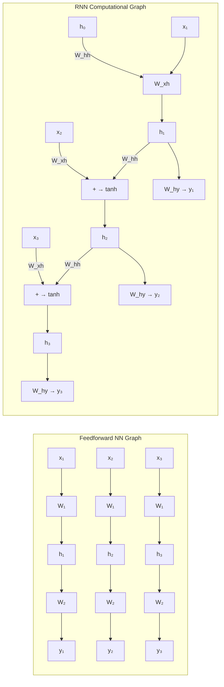

---

### 📋 Key Differences

| Feature | Feedforward NN | RNN Computational Graph |
|---|---|---|
| **Structure** | Acyclic (no loops) | Cyclic (has loops!) |
| **Time dimension** | ❌ No time dimension | ✅ Has time dimension |
| **Unfolded** | Just one copy | Unfolded into T copies for T steps |
| **Weight sharing** | ❌ Each layer has different weights | ✅ Same weights shared across all time steps |
| **Backpropagation** | Standard backprop | Backpropagation Through Time (BPTT) |
| **Gradient flow** | Through layers only | Through layers AND time steps |
| **Parameters** | W₁, W₂ (per layer) | W_xh, W_hh, W_hy (shared!) |

---

### 🔄 The Unfolded RNN Graph

```
Unfolded for T=4 time steps:

  x₁ → [W] → h₁ → [W] → h₂ → [W] → h₃ → [W] → h₄
       ↑         ↑         ↑         ↑         ↑
      W_xh      W_xh      W_xh      W_xh      W_xh
       ↑         ↑         ↑         ↑         ↑
      x₂        x₃        x₄        ...       xₜ

Key:
  - Same [W] used at EVERY position (weight sharing!)
  - h_{t-1} feeds into h_t (loop unrolled)
  - Can apply standard backprop on this "deep" network of T layers
```

---

### 📐 Computational Cost Comparison

| Network | Parameters (example) | For T=100 time steps |
|---|---|---|
| **Feedforward 3-layer** | W₁(100→50), W₂(50→30), W₃(30→10) = ~8,400 params | 8,400 params |
| **RNN** | W_xh(10→50), W_hh(50→50), W_hy(50→10) = ~5,200 params | SAME 5,200 params! ✅ |

> RNN shares weights across time → much fewer parameters even for long sequences!

---

### 🎯 Summary for Exam Answer

**To get full 6 marks:**
1. **Structure difference (2 marks):** Feedforward = acyclic (no loops, no time). RNN = cyclic (has loops connecting to previous step).
2. **Unfolding (2 marks):** Explain that RNN graph has T copies of the same cell for T time steps. Each uses SAME weights (weight sharing). This is different from feedforward where each layer has different weights.
3. **Backpropagation difference (2 marks):** Feedforward uses standard backprop. RNN uses Backpropagation Through Time (BPTT) — gradients flow through all T time steps. Mention gradient flow challenges (vanishing/exploding).


---

## 📚 Theoretical Deep-Dive — Backpropagation Through Time: Derivation, Computational Complexity, and Gradient Dynamics

### 📐 Derivation of Backpropagation Through Time (BPTT)

BPTT for an RNN with hidden state update h_t = f(W_hh · h_{t-1} + W_xh · x_t + b_h) and output y_t = g(W_hy · h_t + b_y) proceeds by unrolling the RNN for T time steps into a deep feedforward network. The total loss is L = Σ_{t=1}^{T} ℓ(y_t, ŷ_t). The gradient w.r.t. the output weight matrix W_hy accumulates contributions from all time steps:

∂L/∂W_hy = Σ_{t=1}^{T} δ_{y_t} · h_t^T

where δ_{y_t} = ∂L/∂y_t (upstream loss derivative). The key complexity lies in computing gradients w.r.t. recurrent weights W_hh and input weights W_xh. For W_hh:

∂L/∂W_hh = Σ_{t=1}^{T} Σ_{k=1}^{t} δ_{h_t} · h_{t-k}^T · Π_{i=t-k+1}^{t} diag(f'(z_i))

where f'(z_i) = tanh'(z_i) = 1 - tanh²(z_i). The term diag(f'(z_i)) is the Jacobian of the activation function at step i. Critically, this contains the product of Jacobians across time steps — this is where the vanishing gradient arises. For T=1000 with f' = 0.9 at each step, the product is 0.9^1000 ≈ 2×10^{-46}, effectively zero. The gradient propagation:

δ_{h_t} = (W_hy^T δ_{y_t}) ⊙ f'(z_t) + (W_hh^T δ_{h_{t+1}}) ⊙ f'(z_t)

This recursive form shows gradients flow from the future (δ_{h_{t+1}} must be computed before δ_{h_t}), requiring backward iteration from T to 1. The algorithm needs O(T|h|²) time for hidden dimension |h| and O(T) memory for storing all intermediate activations.

### 📊 Computational Complexity and Memory Requirements

The quadratic dependence on hidden size |h| comes from the matrix-vector products W_hh · δ_{h_{t+1}} for each time step. The linear dependence on T is the critical bottleneck for long sequences: a single training example of length T=10,000 requires 10,000 backward passes through the RNN. Common solutions: Truncated BPTT (limit gradient flow to k=200 steps, treating the sequence as k independent truncated subsequences); checkpointing (store only every k-th activation, recompute the rest during backward pass); and gradient accumulation (accumulate gradients over mini-batches before updating). Memory cost: storing activations for T steps requires O(T|h|) memory. The computational graph for a 1000-step sequence has 1000 nodes and roughly 1000 edges — traversing this graph in reverse is the time cost. The Sub-network approach: process sequences in chunks, recompute forward activations for each chunk independently, and backpropagate within the chunk only.

### 🧪 The Vanishing Gradient Problem: Mathematical Analysis

The Jacobian of the hidden-to-hidden transition at time t is J_t = ∂h_t/∂h_{t-1} = diag(f'(z_t)) · W_hh. The product over T steps is Π_{t=1}^{T} J_t. The singular value decomposition of W_hh reveals the spectral radius σ_max(W_hh) as the critical quantity. If σ_max < 1, norm of product → 0 exponentially (rate σ_max^T). If σ_max > 1, norm grows exponentially. For stable gradients, we need σ_max ≈ 1, but with random initialization this occurs with near-zero probability — standard normal matrices have σ_max ≈ 2√|h| by the Marchenko-Pastur law. Orthogonal initialization (Saxe et al., 2013) initializes W_hh as a random orthogonal matrix, ensuring σ_max = 1 exactly, enabling gradient flow for hundreds of steps in practice. The eigenvalue spectrum throughout training was analyzed by Sussillo & Barak (2013), who showed that during training the spectral radius of W_hh dynamically evolves. The "echo state" or "liquid state" property (from reservoir computing) ensures that information from the input propagates through the hidden state before vanishing; orthogonal initialization and careful spectral radius control (scaling W_hh to have σ_max = r for tuned r ∈ [0.9, 1.1]) extend the effective memory horizon.

---

## Q.3 (b) — List the **types of RNN** and explain **LSTM three gates**. **[6 Marks]**

### 📋 Types of RNN

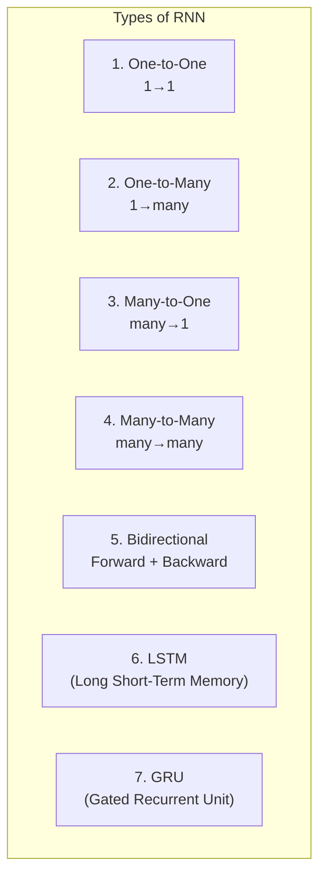

| Type | Input → Output | Example |
|---|---|---|
| **One-to-One** | 1 → 1 | Simple classification |
| **One-to-Many** | 1 → many | Image → Caption |
| **Many-to-One** | many → 1 | Review → Rating |
| **Many-to-Many** | many → many | Translation |
| **Bidirectional** | Forward + Backward | Named Entity Recognition |
| **LSTM** | With memory gates | Long sequences |
| **GRU** | Simplified gates | Medium sequences |

---

### 🚪 LSTM Three Gates Explained

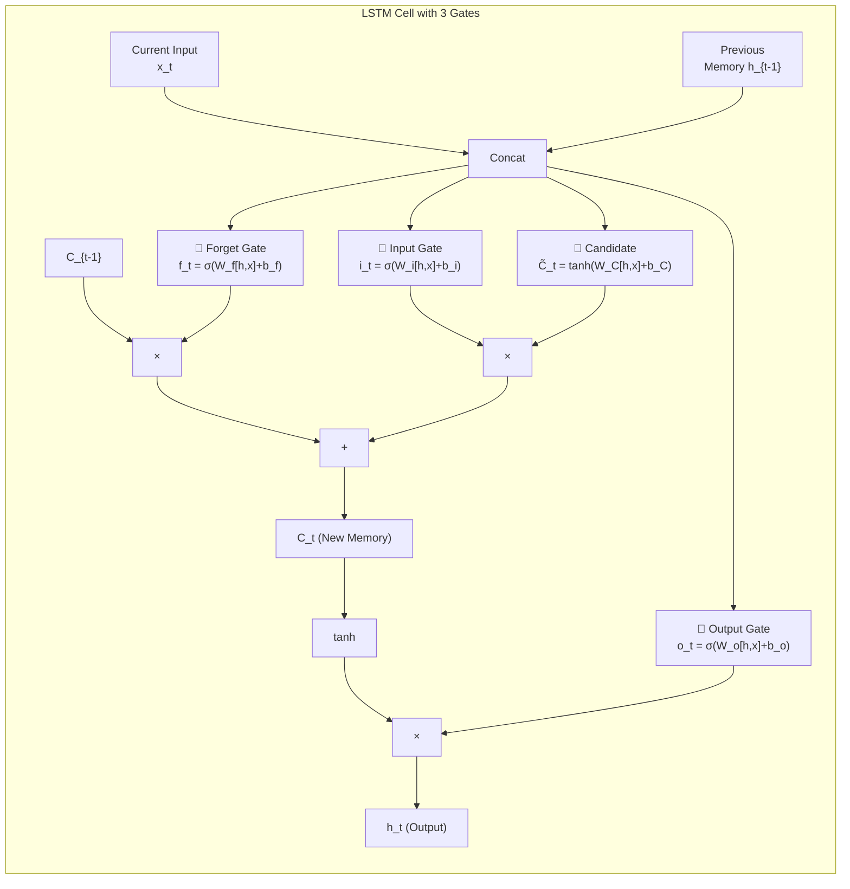

---

### 🚪 Gate 1: Forget Gate

```
f_t = σ(W_f · [h_{t-1}, x_t] + b_f)

Range: 0 to 1 (Sigmoid)
  0 = forget completely
  1 = remember completely

Example: "The cat sat on the mat. It was sunny."
At word "sunny":
  - Forget gate might FORGET "cat" (0.1)
  - KEEP "mat" (0.8)
  - KEEP "sat" (0.5)
```

---

### 🚪 Gate 2: Input Gate

```
i_t = σ(W_i · [h_{t-1}, x_t] + b_i)
C̃_t = tanh(W_C · [h_{t-1}, x_t] + b_C)

Two parts:
  1. Input gate (i_t): 0-1, decides what NEW info to add
  2. Candidate (C̃_t): -1 to 1, new memory values

Example: Word "beautiful" appears
  - Input gate: "Yes, store this" (0.9)
  - Candidate: creates new memory about beauty
```

---

### 🚪 Gate 3: Output Gate

```
o_t = σ(W_o · [h_{t-1}, x_t] + b_o)
h_t = o_t × tanh(C_t)

Decides what to OUTPUT based on current memory
Filters memory to pass only relevant parts

Example: Question "How was the weather?"
  - Output gate passes: "sunny and beautiful" (relevant)
  - Hides: "cat", "mat", "sat" (irrelevant)
```

---

### 🎯 Summary for Exam Answer

**To get full 6 marks:**
1. **Types of RNN (2 marks):** List 5-6 types with brief descriptions: One-to-One, One-to-Many, Many-to-One, Many-to-Many, Bidirectional, LSTM, GRU.
2. **LSTM Three Gates (4 marks):** Draw LSTM cell diagram. Explain each gate:
   - Forget Gate: f_t = σ(W_f[h,x]+b_f), decides what to forget (0-1)
   - Input Gate: i_t = σ(W_i[h,x]+b_i) + candidate C̃_t, decides what new info to store
   - Output Gate: o_t = σ(W_o[h,x]+b_o), decides what to output now


---

## 📚 Theoretical Deep-Dive — LSTM and GRU Gating Mechanisms: Mathematics, Design Rationale, and Variants

### 🧮 LSTM: Mathematical Derivation of the Gating Mechanism

The LSTM cell (Hochreiter & Schmidhuber, 1997) was explicitly designed to allow gradients to flow unchanged across many time steps. The c你一定t state update equation:

C_t = f_t ⊙ C_{t-1} + i_t ⊙ C̃_t

where f_t = σ(W_f · [h_{t-1}, x_t] + b_f), i_t = σ(W_i · [h_{t-1}, x_t] + b_i), C̃_t = tanh(W_C · [h_{t-1}, x_t] + b_C). This equation is the mathematical heart: it has two additive pathways. The first (f_t ⊙ C_{t-1}) is the "constant error carousel" — if f_t ≈ 1, the gradient ∂L/∂C_{t-1} = ∂L/∂C_t · f_t ≈ ∂L/∂C_t, passing the gradient unchanged through time. The second (i_t ⊙ C̃_t) allows new information to enter. The hidden state h_t = o_t ⊙ tanh(C_t) has gradient flowing from C_t through the output gate o_t. The parameter count for an LSTM cell with hidden size h and input size i is 4 × (h + h + i) × h = 4h(h+i), roughly 4× a vanilla RNN, because there are four weight matrices (forget, input, candidate, output gates) all operating on the concatenated [h_{t-1}, x_t].

### 🧮 GRU: Simplified Gating

The Gated Recurrent Unit (Cho et al., 2014) reduces LSTM to two gates:
- Update gate: z_t = σ(W_z · [h_{t-1}, x_t] + b_z) — controls how much of h_{t-1} to keep
- Reset gate: r_t = σ(W_r · [h_{t-1}, x_t] + b_r) — controls how much of h_{t-1} to forget for computing candidate
- Candidate: h̃_t = tanh(W · [r_t ⊙ h_{t-1}, x_t] + b)
- Hidden state: h_t = (1-z_t) ⊙ h_{t-1} + z_t ⊙ h̃_t

The critical gradient pathway: when z_t ≈ 0, h_t ≈ h_{t-1} and ∂L/∂h_{t-1} ≈ ∂L/∂h_t (identity gradient, no vanishing); when z_t ≈ 1, h_t ≈ h̃_t and the gradient flows through the candidate computation. GRU achieves similar performance to LSTM on many tasks with fewer parameters (3h(h+i) vs 4h(h+i)). Empirical comparison: On language modeling, the two architectures perform similarly with careful tuning (Greff et al., 2017; Melis et al., 2018), though LSTMs tend to handle longer sequences better and have more representational flexibility due to the separate cell state and hidden state.

### 📐 Why Gating Solves the Long-Term Dependency Problem

The gradient through the cell state: ∂L/∂C_{t-k} = ∂L/∂C_t · Π_{i=t-k+1}^{t} f_i · Π_{i=t-k+1}^{t} tanh'(C_i). If all forget gates f_i ≈ 1 (the LSTM learns to keep information), the first product ≈ 1, eliminating vanishing gradient. The tanh'(C_i) term can still cause issues if C_i is large (tanh' → 0), but the LSTM learns to keep C_i in the linear region of tanh for important information. The forget gate bias is typically initialized to 1 or larger (Jozefowicz et al., 2015) so that initially the LSTM "remembers everything" and learns via gradient descent what to forget. Without this initialization, random forget gate biases often lead to rapid forgetting at the start of training. Variants: Peephole LSTM adds connections from C_t to the gates; Coupled Input-Forget LSTM ties the input and forget gates (i_t = 1 - f_t) reducing parameters; LayerNorm LSTM adds layer normalization to stabilize training; Recurrent Dropout (Gal & Ghahramani, 2016) applies dropout to the hidden-to-hidden transitions without breaking the gradient.

---

## Q.3 (c) — What is **Encoder-Decoder architecture**, and how does it work in sequence-to-sequence learning? **[6 Marks]**

### 🏗️ Encoder-Decoder — The Translation Machine

The **Encoder-Decoder** architecture converts one sequence into another. The **Encoder** reads and understands the input. The **Decoder** generates the output.

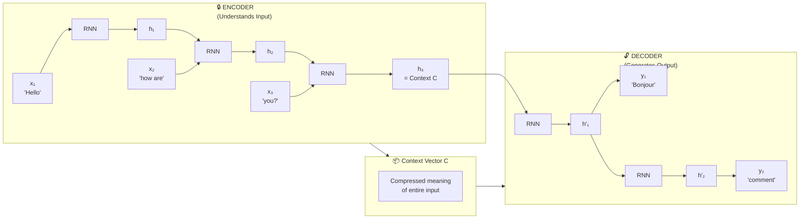

---

### 📋 How It Works

| Phase | Process | Example |
|---|---|---|
| **Encoder** | Reads input sequence, final hidden state = context | Reads "Hello how are" → h₃ |
| **Context Vector** | Compressed meaning of entire input | Single vector = full meaning |
| **Decoder** | Generates output word by word | "Bonjour comment ça va" |

---

### 📊 Applications

| Application | Input | Output |
|---|---|---|
| **Translation** | English | French |
| **Summarization** | Long article | Short summary |
| **Captioning** | Image | Text description |
| **Chatbots** | User message | Bot reply |

---

### ⚠️ Bottleneck Problem

```
Problem: Entire input compressed into ONE fixed-size vector!

"Hello" → Easy to compress
"The quick brown fox jumps over the lazy dog..." → Hard! Details lost!

Solution: Attention Mechanism (used in Transformers)
→ Decoder can look at ALL encoder states
→ No single bottleneck
```

---

### 🎯 Summary for Exam Answer

**To get full 6 marks:**
1. **Architecture (2 marks):** Explain Encoder (RNN reads input → Context Vector) + Decoder (RNN generates output from Context). Draw diagram.
2. **Working (2 marks):** Step by step — Encoder reads each word, builds context. Decoder receives context, generates output word by word.
3. **Applications + bottleneck (2 marks):** Translation, summarization, captioning. Mention bottleneck problem (long sentences lose info) and Attention as solution.

---

# UNIT II (Alternative) — RNN Deep Topics


---

## 📚 Theoretical Deep-Dive — Sequence-to-Sequence Learning: Encoder-Decoder, Attention, and the Bottleneck Problem

### 📐 Formal Definition of the Seq2Seq Framework

A sequence-to-sequence model maps an input sequence X = x_1, x_2, ..., x_T to an output sequence Y = y_1, y_2, ..., y_S of potentially different length. The encoder f_enc processes X sequentially, producing a context vector c that summarizes the entire input. The decoder f_dec generates Y autoregressively: p(y_{t+1} | y_1, ..., y_t, c). Formally, the joint probability of the output sequence given the input is factored as:

p(Y|X) = Π_{t=1}^{S} p(y_t | y_{<t}, c)

where y_{<t} = y_1, ..., y_{t-1} are previously generated tokens and c = f_enc(X) = h_T (the final hidden state of the encoder). The encoder is typically a bidirectional LSTM: h_t^F = LSTM_F(x_t, h_{t-1}^F) and h_t^B = LSTM_B(x_t, h_{t+1}^B), with c = [h_T^F; h_0^B]. The decoder is unidirectional (as output must be generated sequentially). The model is trained to minimize the negative log-likelihood: L = -Σ_{t=1}^{S} log p(y_t^* | y_{<t}, X), where y_t^* are the target tokens. Beam search (width B=5 or B=10) is used at inference for better decoding than greedy argmax.

### ⚠️ The Information Bottleneck and the Attention Revolution

The original encoder-decoder architecture compresses all information from X into a fixed-dimensional vector c of size C. For input sequences of length T, the encoder must distribute information across T time steps and then compress it into C ≤ 2×h_lstm dimensions. This bottleneck is fundamental: information theory (the source coding theorem) guarantees that if the source entropy H(X) > C, information is lost. For long sentences (T > 30 words for typical hidden dimensions h=500), this information loss becomes severe. Bahdanau et al. (2015) in "Neural Machine Translation by Jointly Learning to Align and Translate" proposed the attention mechanism to circumvent this. Instead of a single fixed c, the attention decoder computes a context vector c_i at each decoding step i:

c_i = Σ_{j=1}^{T} α_{ij} · h_j
α_{ij} = softmax_j(e_{ij})
e_{ij} = a(s_{i-1}, h_j)

where s_{i-1} is the decoder's previous hidden state, h_j are the encoder's forward hidden states, and a is a learned alignment function (typically a single-layer neural network). The attention weights α_{ij} indicate which input position j the decoder focuses on when generating output token i. The total number of attention parameters is O(T × S), but computation is implemented via matrix operations for efficiency. Luong et al. (2015) proposed "Global Attention" (attend to all positions) vs. "Local Attention" (attend to a window around a predicted position) for efficiency on long sequences.

### 📊 From Attention to Transformers

The Transformer architecture (Vaswani et al., 2017) removed recurrence entirely and relied solely on attention, computing all-pairs interactions simultaneously. The self-attention mechanism:

Attention(Q, K, V) = softmax(QK^T / √d_k) · V

where Q (queries), K (keys), V (values) are linear projections of the input. Multi-Head Attention runs h=8 parallel attention "heads," each learning different interaction patterns (syntactic, semantic, positional). Positional encodings (sinusoidal or learned) inject position information since attention itself is permutation-invariant. The Transformer encoder applies self-attention over all input positions; the decoder uses masked self-attention (can only see previous positions) and cross-attention over encoder outputs. Subsequent models BERT (Devlin et al., 2019, bidirectional encoder), GPT series (Radford et al., 2018+, autoregressive decoder), T5 (Raffel et al., 2020, text-to-text framework), and PaLM (Chowdhery et al., 2022, 540B params) have extended this architecture. Modern practice uses sub-word tokenization (BPE, SentencePiece) rather than word-level to handle vocabulary size. The combination of pre-training (next-token prediction or masked LM) on massive corpora followed by task-specific fine-tuning (the "pre-train, fine-tune" paradigm) has become the standard approach in NLP.

---

## Q.4 (a) — What are **limitations of Bidirectional RNNs**, and how do they differ from standard RNNs? **[6 Marks]**

### 🔀 Bidirectional RNN — Limitations and Differences

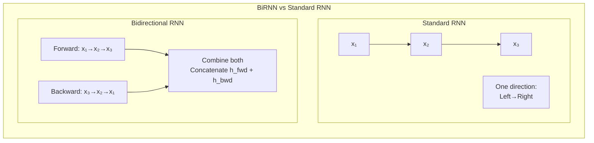

---

### 📋 Bidirectional RNN vs Standard RNN

| Feature | Standard RNN | Bidirectional RNN |
|---|---|---|
| **Direction** | One direction only (e.g., left→right) | Two directions (forward + backward) |
| **Context used** | Only past (left) | Past (left) + future (right) |
| **Output at position t** | h_t (previous info only) | [h_t_forward; h̄_t_backward] (both directions) |
| **Training order** | Sequential (left→right) | Must see ENTIRE sequence first |
| **Suitable for** | Generation (predict next word) | Understanding (tag each word) |

---

### 🚧 Limitations of Bidirectional RNNs

| Limitation | Explanation |
|---|---|
| **1. Needs full sequence** | Cannot process sequence in real-time (need to wait for full input) |
| **2. Not for generation** | Can't generate text (needs future words which don't exist yet) |
| **3. Doubles computation** | Two RNNs instead of one = 2× computation |
| **4. Doubles parameters** | Two sets of weights = more memory |
| **5. Cannot be used online** | Can't process streaming data in real-time |
| **6. Memory intensive** | Must store all hidden states for backprop |

---

### 📊 When to Use Which?

| Use Case | Use Standard RNN | Use BiRNN |
|---|---|---|
| **Next word prediction** | ✅ Yes (only past needed) | ❌ No (future needed) |
| **Sentiment analysis** | ⚠️ Possible | ✅ Better (full sentence) |
| **Named Entity Recognition** | ✅ Possible | ✅ Better (both sides) |
| **Machine Translation Encoder** | ❌ No | ✅ Yes (full sentence needed) |
| **Real-time/Online** | ✅ Yes | ❌ No |
| **Speech recognition** | ❌ No | ✅ Yes (needs context both ways) |

---

### 🎯 Summary for Exam Answer

**To get full 6 marks:**
1. **Difference (3 marks):** Standard RNN = one direction only. BiRNN = two RNNs (forward + backward), output combines both. Draw diagram.
2. **Limitations (3 marks):** Explain 4 limitations: needs full sequence (not real-time), can't generate text (needs future), doubles computation/parameters, memory intensive.


---

## 📚 Theoretical Deep-Dive — Bidirectional RNNs: Mathematics, Training Dynamics, and Modern Applications

### 📐 Mathematical Formulation of Bidirectional RNNs

A Bidirectional Recurrent Neural Network (BiRNN) processes each sequence in both forward and backward directions independently, then concatenates the resulting hidden states at each time step:

h_t = [→h_t ; ←h_t]

where →h_t = LSTM_forward(x_1, x_2, ..., x_t) (conditioned on past) and ←h_t = LSTM_backward(x_T, x_{T-1}, ..., x_t) (conditioned on future). The forward LSTM initial hidden state →h_0 is typically initialized to zero; the backward LSTM processes the sequence in reverse, with ←h_T also initialized to zero. At each time step t, the backward hidden state ←h_t depends on x_{t+1}, ..., x_T — the "future" context that is unavailable in a unidirectional RNN. The output at step t, y_t, is computed from h_t via a linear layer: y_t = W_y · h_t + b_y. For sequence tagging (e.g., POS tagging), this means the tag at position t can depend on context from both the left (previous words suggesting, e.g., a noun) and right (following words completing the phrase).

### 📊 Training Dynamics: Convergence, Parameter Count, and Memory

A BiRNN with hidden size h in each direction has total hidden size 2h after concatenation, meaning output and subsequent layers must accommodate 2h inputs. The parameter count doubles compared to a unidirectional RNN: for each direction there are independent U, W, V matrices. For an LSTM BiRNN: forward has {W_i^F, W_f^F, W_o^F, W_c^F}, backward has {W_i^B, W_f^B, W_o^B, W_c^B}, each with parameters O(h × (h+i)). Total: 8 × h × (h+i) vs. 4 × h × (h+i) for unidirectional.

Training requires full-sequence access because the backward pass needs to see the entire input before computing any time step's output. This differs from a unidirectional RNN which can produce outputs online as tokens arrive. Backpropagation Through Time (BPTT) must unroll through the full sequence length T in both directions, giving gradient computations of O(T × h²) for each direction independently. The backward pass requires storing all forward activations for gradient computation: O(T × h) memory vs. O(h) per-step for online inference. Bidirectional RNNs cannot be used in real-time online settings or autoregressive generation (where future tokens don't exist).

### 🏗️ Usage Contexts: Tagging vs. Generation

Bidirectional RNNs dominate sequence tagging tasks: Named Entity Recognition (NER), Part-of-Speech (POS) tagging, chunking, where the entire sequence is available. They are always used as the encoder in sequence-to-sequence models (encoder-decoder translation, summarization) because the encoder has access to the complete source sentence. Conversely, decoders must remain unidirectional for autoregressive generation (can't use future information). The standard Sequence-to-Sequence with Attention pattern: bidirectional LSTM encoder, unidirectional LSTM decoder with attention over encoder states. Modern Transformer-based systems replaced BiRNN encoders with bidirectional self-attention (BERT uses 12-24 Transformer encoder layers, fully bidirectional). However, Bidirectional GRU/LSTM remain common in: acoustic modeling (speech recognition, where forward and backward passes process different lookahead windows — typically 200ms forward, 400-800ms backward); low-resource NLP where Transformer training isn't feasible; and in streaming settings where near real-time is needed and a small future window is available (e.g., streaming ASR with 50ms latency using a "semi-bidirectional" approach with 200ms of future context).

---

## Q.4 (b) — Explain any seven **Challenges of Long-Term Dependencies**. **[6 Marks]**

### ⏳ Seven Challenges of Long-Term Dependencies

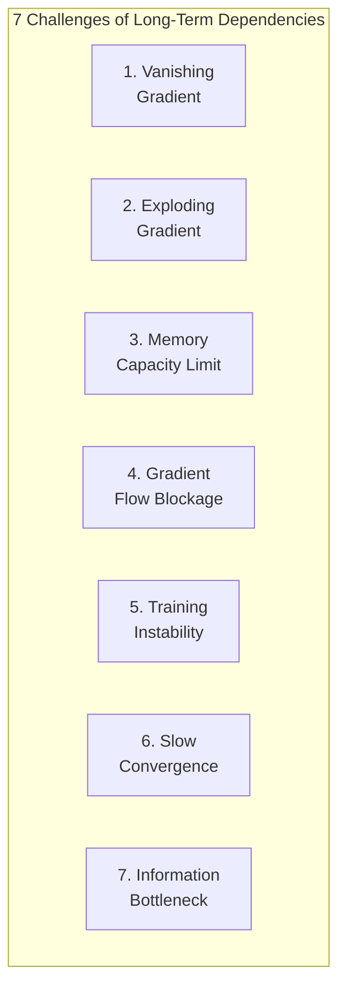

---

### 📋 Each Challenge Explained

#### **1. Vanishing Gradient**
```
Problem: Gradient multiplied many times through chain rule → approaches 0

Math: ∂L/∂W ≈ w^T, where T = sequence length
If w < 1 and T=100: w^100 ≈ 0

Impact: Early time steps get ZERO gradient → cannot learn long-term info
Solution: LSTM, GRU (gates preserve gradient)
```

#### **2. Exploding Gradient**
```
Problem: Gradient multiplied many times → approaches infinity
If w > 1 and T=100: w^100 = huge number

Impact: Weights become extremely large → NaN loss, unstable training
Solution: Gradient clipping (limit max gradient value)
```

#### **3. Memory Capacity Limit**
```
Problem: Hidden state h_t has fixed size (e.g., 128 dimensions)
For very long sequences, all information must be compressed into this fixed-size vector

Impact: Important information gets squeezed out
Example: Remembering 1000 facts in 128 numbers → impossible!
Solution: Larger hidden size (but computationally expensive)
```

#### **4. Gradient Flow Blockage**
```
Problem: In deep RNNs, the gradient path is very long (through many time steps)
The further back in time, the weaker the gradient signal

Impact: Network can only learn from recent inputs, forgets distant past
Solution: Skip connections, gating mechanisms (LSTM)
```

#### **5. Training Instability**
```
Problem: Small changes in weights can cause large changes in hidden state over many steps
This makes training very sensitive to hyperparameters

Impact: Loss oscillates, hard to converge
Solution: Careful initialization, gradient clipping, normalization
```

#### **6. Slow Convergence**
```
Problem: Learning long-term patterns requires seeing many examples
Long dependencies mean many steps of backpropagation

Impact: Training takes very long (days/weeks on large datasets)
Solution: Better architectures (LSTM, Transformer), curriculum learning
```

#### **7. Information Bottleneck**
```
Problem: All information from the past must flow through ONE hidden state vector
Like trying to pour an ocean through a straw!

Impact: Important details from early steps get lost
Solution: Attention mechanisms (Transformers) — let decoder access all encoder states
```

---

### 📊 Solutions Overview

| Challenge | Solution |
|---|---|
| **Vanishing Gradient** | LSTM, GRU (gates), Residual connections |
| **Exploding Gradient** | Gradient clipping |
| **Memory Capacity** | Larger hidden states, attention |
| **Gradient Blockage** | Skip connections, gating |
| **Training Instability** | Good initialization, normalization |
| **Slow Convergence** | Better architectures, pretraining |
| **Information Bottleneck** | Attention mechanism, Transformers |

---

### 🎯 Summary for Exam Answer

**To get full 6 marks:**
1. **Vanishing Gradient (1.5 marks):** Explain w^T shrinks to 0 for w<1 → early steps get no gradient.
2. **Exploding Gradient (1 mark):** Explain w^T grows to infinity for w>1 → unstable weights, NaN loss. Clipping solution.
3. **Memory Capacity (1 mark):** Fixed hidden size limits how much past info can be stored.
4. **Gradient Blockage (0.5 mark):** Long gradient path = weak signals for distant past.
5. **Training Instability + Slow Convergence (1 mark):** Sensitive to hyperparameters, takes long to train.
6. **Information Bottleneck (1 mark):** All past info squeezed through ONE vector. Attention as solution.


---

## 📚 Theoretical Deep-Dive — Long-Term Dependencies: Vanishing and Exploding Gradients, and Modern Solutions

### 📐 The Mathematical Root: Why Gradients Vanish or Explode

For a vanilla RNN with tanh activation and hidden state h_t = tanh(W_hh · h_{t-1} + W_xh · x_t + b), the backpropagated gradient at step k is:

∂L/∂h_k = (∂L/∂h_T) · Π_{t=k+1}^{T} (diag(tanh'(z_t)) · W_hh)

Two terms determine gradient magnitude. First, the activation derivative tanh'(z) = 1 - tanh²(z) ≤ 1: at positions where z is far from zero (saturated tanh), tanh' → 0, killing gradients. Second, the Jacobian of W_hh itself: if the spectral norm of W_hh is σ_max then ||Π_{t} W_hh|| ≈ σ_max^{T-k}. Four regimes emerge: (1) σ_max < 1: gradients vanish exponentially; (2) σ_max > 1: gradients explode; (3) σ_max = 1 with orthogonal W_hh: gradient magnitude preserved (ideal); (4) Random W_hh: alternates between vanishing and exploding depending on initialization state. At the start of training, random initialization typically yields σ_max = O(√h) for Gaussian matrices by the Marchenko-Pastur law, requiring careful management via spectral radius normalization (Saxe et al., 2013 show scaling W_hh to have σ_max = 1 stabilizes gradient flow for hundreds of steps).

### 🧪 Empirical Measurement: Effective Memory and BPTT Diagnostics

The effective memory horizon can be measured by studying the RNN's ability to recall tokens from earlier in a sequence. Standard diagnostic tasks include: (1) the "copy task" (reproduce a sequence after a delimiter); (2) the "adding task" (sum two marked numbers); (3) the sequential MNIST task (classify handwritten digits presented sequentially over many time steps). These tasks reveal that vanilla RNNs can reliably recall information 5-10 steps back but fail beyond ~50 steps due to vanishing gradients. LSTM extends this to 100-500+ steps when properly configured, and Transformer attention captures effectively unlimited history (O(1) per gradient step regardless of distance). Gradient clipping (Pascanu et al., 2013) is a practical solution to exploding gradients: if ||g||_2 > θ (typically θ = 1 or 5), set g ← g · θ/||g||_2. This prevents numerical overflow but doesn't prevent vanishing gradients, which require architectural solutions (LSTM skip connection, Transformer).

### 🔬 Modern Architectural Solutions

Skip connections (He et al., 2016 for ResNet; Srivastava et al., 2015 for Highway Networks) create identity pathways for gradients through the network. In the Recurrent Highway Network (Zilly et al., 2017), every layer has a transform gate T and carry gate C, enabling deeper recurrent architectures. Layer normalization (Ba et al., 2016) normalizes hidden states to unit variance at each time step, stabilizing training dynamics. LayerNorm-LSTM (layer norm applied to LSTM gates) converges faster and to better solutions than LSTM without it. The "weight normalization" (Salimans & Kingma, 2016) reparameterizes weight matrices as W = g · v/||v||, decoupling magnitude from direction for better optimization. Orthogonal initialization combined with spectral normalization of recurrent weights (NE corner of the regular RNN training space) gives effectively functioning "long-term" RNNs for sequences of hundreds of steps, without the full LSTM machinery. The Transformer's solution of removing recurrence entirely and computing all-pairs attention directly sidesteps gradient flow problems but at the cost of quadratic memory and compute in sequence length, O(T²) vs. O(T) for RNNs. The "linear attention" approximation and "xformers" architecture attempt to recover linear scaling while preserving the gradient flow benefits of attention.

---

## Q.4 (b) — Explain any seven **Challenges of Long-Term Dependencies**. **[6 Marks]**

### ⏳ Seven Challenges of Long-Term Dependencies


---

---

## Q.4 (c) — How **Echo State Network differs from Traditional RNNs**? **[6 Marks]**

### 🌊 Echo State Network vs Traditional RNN

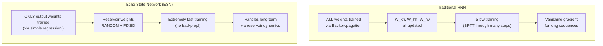

---

### 📋 Detailed Comparison

| Feature | Traditional RNN | Echo State Network (ESN) |
|---|---|---|
| **Weights trained** | ALL weights (input, hidden, output) | ONLY output weights |
| **Hidden layer** | Trained via backpropagation | RANDOM, FIXED (reservoir) |
| **Training algorithm** | Backpropagation Through Time (BPTT) | Linear regression (ridge regression) |
| **Training speed** | Slow (needs many epochs) | ⚡ Extremely fast (one-shot!) |
| **Gradient issues** | Vanishing/exploding gradient | ✅ No gradient issues (reservoir fixed) |
| **Long-term memory** | ❌ Hard to learn | ✅ Reservoir dynamics handle it |
| **Hyperparameters** | Many (lr, architecture, etc.) | Few (reservoir size, spectral radius) |
| **Accuracy** | High (with careful tuning) | Good for many tasks |
| **Flexibility** | Very flexible | Less flexible (reservoir fixed) |

---

### 🏗️ How ESN Works Differently

```
Traditional RNN Training:
  1. Initialize all weights randomly
  2. Forward pass → compute loss
  3. Backward pass (BPTT) → compute ALL weight gradients
  4. Update ALL weights
  5. Repeat for many epochs
  → SLOW, requires GPUs, careful hyperparameter tuning

ESN Training:
  1. Create RANDOM reservoir (fixed sparse connections)
  2. Run input through reservoir, collect hidden states: X = [h₁, h₂, ..., h_T]
  3. Train ONLY output weights: W_out = (X^T X + λI)^(-1) X^T Y
     (Ridge regression — one line of code!)
  4. Done! ✅
  → LIGHTNING FAST, no backprop, no gradient issues!
```

---

### 🔑 Key Property: Echo State Property

```
Echo State Property:
  The reservoir dynamics must "forget" initial conditions
  → Current output depends only on recent input history
  → The reservoir "echoes" the input history
  
  This is ensured by:
  - Spectral radius < 1 (largest eigenvalue of W_reservoir < 1)
  - Sparsity (only 1-5% connections in reservoir)
  - Random weights with small magnitudes
```

---

### 📊 When to Use ESN vs Traditional RNN

| When to use ESN | When to use Traditional RNN |
|---|---|
| Fast prototyping needed | Maximum accuracy needed |
| Limited compute resources | Have GPUs and time |
| Need interpretable reservoir | Need flexible model |
| Online learning tasks | Offline batch learning |
| Time series forecasting | Complex sequence modeling |

---

### 🎯 Summary for Exam Answer

**To get full 6 marks:**
1. **Core difference (2 marks):** Traditional RNN trains ALL weights via BPTT (slow). ESN trains ONLY output weights via linear regression (fast). Reservoir weights are RANDOM and FIXED in ESN.
2. **Training comparison (2 marks):** Traditional = slow backprop, many epochs. ESN = one-shot regression, seconds to train.
3. **Advantages/Disadvantages (2 marks):** ESN advantages: fast, no gradient issues, long-term memory. Disadvantages: less flexible, reservoir fixed. Comparison table.

---

# UNIT III — Generative Models & GAN


---

## 📚 Theoretical Deep-Dive — Echo State Networks and Reservoir Computing: Theory, Variants, and Applications

### 🏗️ Reservoir Computing Framework: The Separation of Timescales Principle

Echo State Networks (Jaeger & Haas, 2004) and Liquid State Machines (Maass et al., 2002) belong to the broader reservoir computing paradigm, which posits that only the output weights need to be trained — the recurrent "reservoir" dynamics are fixed. The theoretical principle underlying this separation is that a high-dimensional, randomly connected dynamic system with the "echo state property" (ESP) creates a rich temporal feature space. ESP requires that any initial state information is forgotten: for any bounded input sequence u[n], two trajectories from different initial states converge. Formally: for any ε > 0 and any two initial states h⁽¹⁾_0, h⁽²⁾_0, there exists N(ε, u) such that ||h⁽¹⁾_N - h⁽²⁾_N|| < ε for all n ≥ N when driven by the same input u. This ensures the current reservoir state depends only on recent input history, not on initialization conditions. ESP is guaranteed when the spectral radius ρ(W) < 1.0 for the reservoir weight matrix W, combined with sufficient input connectivity — the input weights W_in must be large enough to perturb the reservoir dynamics meaningfully.

### 📐 The Echo State Property and Mathematical Characterization

The original ESN derivation analyzes the reservoir as a contraction mapping in the space of input-driven state trajectories. Given reservoir update: h_t = f(W_res · h_{t-1} + W_in · u_t + b_res), with f a sigmoid or tanh activation. The Jacobian of the state transition with respect to the previous state is J_t = diag(f'(·)) · W_res. The ESP holds when the spectral radius of the averaged Jacobian is < 1, ensuring state convergence independent of initialization. A key result: setting ρ(W_res) = 0.8-0.9 empirically balances responsiveness (input drives state quickly) and fading memory (old inputs don't persist indefinitely). The input scaling parameter ν controls how strongly inputs perturb the reservoir: W_in is typically uniform U(-ν, ν) with ν tuned so that the reservoir's intrinsic dynamics and input-driven dynamics are on the same scale. The reservoir size N_res (typically 100-1000) controls the dimensionality of the feature space: larger N_res increases representational capacity (more basis functions for memory) but increases computation O(N_res²) for the dense W_res. Sparse reservoirs (connectivity 1-5%) reduce this to O(N_res × density × N_res) ≈ O(N_res), making large reservoirs (N_res=10,000) feasible.

### 🔬 Training the Readout: Ridge Regression and the Kernel Connection

The readout weights W_out = H† Y_target = (H^T H + λI)^{-1} H^T Y_target, where H = [h_1, h_2, ..., h_T] is the state collection matrix (N_res × T) and Y_target are the stacked target outputs. This is ridge regression, a regularized least squares that finds the minimum-norm solution that fits the data, balancing training error (H^T H term) and weight magnitude regularization (λI). The regularization parameter λ controls the bias-variance tradeoff: large λ prevents overfitting to noise but reduces training accuracy; small λ fits training data well but overfits. The Moore-Penrose pseudoinverse H† = VΣ⁺U^T where H = UΣV^T is the SVD; ridge regularization stabilizes this by adding λ to singular values: Σ⁺_ii = σ_i / (σ_i² + λ). The theoretical connection to kernel methods: the reservoir can be viewed as computing a random feature map φ(x) = h(T; x) where h(T; x) is the reservoir state after processing input x for T steps. The N_random × N_random Gram matrix K_ij = h_i · h_j approximates a kernel function. ESNs with large N_res approximate Gaussian Process regression where the reservoir states implicitly define the kernel. This connects reservoir computing to Random Kitchen Sinks (Rahimi & Recht, 2007) and Random Fourier Features, showing that random projections with sufficient dimensionality can make non-linear functions linearly separable in the projected space (Cover's theorem applied to high-dimensional random projections).

---

## Q.5 (a) — What is a **Boltzmann Machine**? Describe its structure and components. **[6 Marks]**

### ❄️ Boltzmann Machine — Structure and Components

A **Boltzmann Machine** is an energy-based generative neural network with two types of units connected by weighted edges.

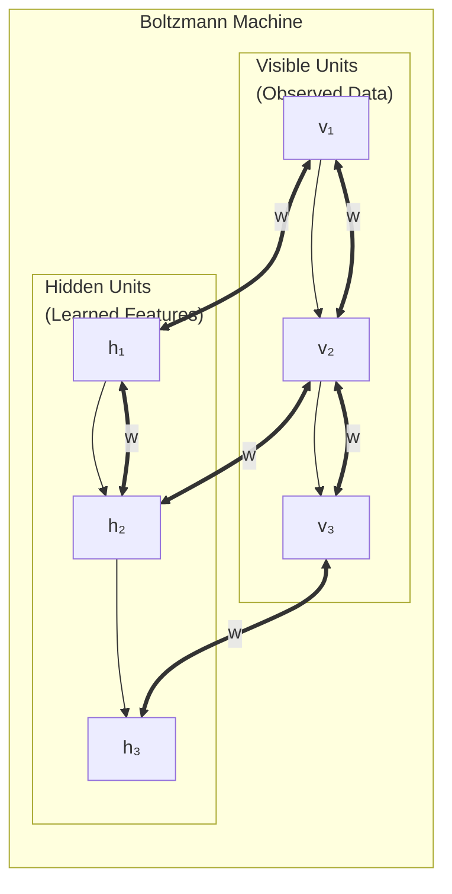

---

### 📋 Components of Boltzmann Machine

| Component | Description | Role |
|---|---|---|
| **Visible Units (v)** | Represent actual input data | e.g., pixels of an image, values 0 or 1 |
| **Hidden Units (h)** | Internal, not directly observed | Learn hidden patterns in data |
| **Weights (w_ij)** | Symmetric connections between units | Positive = units activate together, Negative = opposite |
| **Biases (a_i, b_j)** | Thresholds for each unit | Control how easily a unit turns on |
| **Energy Function E(v,h)** | Mathematical score for each configuration | Low energy = likely state, High energy = unlikely |

---

### 📐 Energy Function

```
E(v,h) = -Σ a_i·v_i - Σ b_j·h_j - ΣΣ w_ij·v_i·h_j

In simple terms:
  Energy = -(biases) - (connections where both units are ON)

Lower energy = more likely configuration
Higher energy = less likely configuration
```

---

### 🔄 Training Process — Two Phases

| Phase | Name | What Happens |
|---|---|---|
| **Positive Phase** | Learning from data | Visible units clamped to training data. Hidden units update. Record which units are ON together. |
| **Negative Phase** | Reconstruction | Network runs freely (no input). Both visible and hidden update. Record which units are ON together. |

**Weight Update Rule:**
```
Δw_ij = learning_rate × (p_ij^positive - p_ij^negative)

"If both units are active more in real data than in dreams → increase weight"
"If both units are active more in dreams than in real data → decrease weight"
```

---

### 🔒 Restricted Boltzmann Machine (RBM)

```
Full BM has ALL connections (visible-visible and hidden-hidden):
  → Very slow to train (computationally expensive)

RBM removes intra-layer connections:
  ❌ No visible-to-visible connections
  ❌ No hidden-to-hidden connections
  ✅ Only visible-to-hidden connections

→ Much faster to train using Contrastive Divergence
→ This is the building block of Deep Belief Networks!
```

---

### 🎯 Summary for Exam Answer

**To get full 6 marks:**
1. **Definition (1 mark):** Boltzmann Machine = energy-based generative model with stochastic binary units.
2. **Structure (2 marks):** Draw diagram showing Visible Units (v₁,v₂,v₃) and Hidden Units (h₁,h₂,h₃) with all-to-all connections (bidirectional edges).
3. **Components (1.5 marks):** Explain Visible Units (input data), Hidden Units (learned features), Weights (connections), Biases (thresholds).
4. **Energy + Training (1.5 marks):** Explain energy function briefly, two phases (positive: learn from data, negative: reconstruction/free running), RBM (restricted version with only cross-layer connections).


---

## 📚 Theoretical Deep-Dive — Boltzmann Machines: Energy-Based Models, Stochastic Binary Units, and Contrastive Divergence

### ❄️ Physics Origins: The Ising Model and Statistical Mechanics

Boltzmann Machines trace their origins to the Ising model of ferromagnetism in physics (Ising, 1925; Lenz, 1920), where each lattice site has a spin s_i = ±1 that interacts with neighbors: E = - Σ_{i<j} J_{ij}s_i s_j - Σ_i h_i s_i. At thermal equilibrium at temperature T, the probability of configuration X is P(X) = exp(-E(X)/k_BT) / Z (Boltzmann distribution). Boltzmann Machines (Ackley et al., 1985; Hinton & Sejnowski, 1986) adapted this physics model to neural computation, with binary stochastic units v_i, h_j ∈ {0,1} and their own energy function that generates a probability distribution over binary vectors. The energy function E(v, h) = -Σ_i a_i v_i - Σ_j b_j h_j - Σ_{i,j} v_i W_{ij} h_j specifies an energy for each configuration. Low energy configurations correspond to high probability under the Boltzmann distribution: P(v, h) = exp(-E(v, h)) / Z, where Z = Σ_{v,h} exp(-E(v, h)) is the partition function.

The units are stochastic: unit v_i turns ON with probability σ(∂E/∂v_i) = σ(Σ_j W_{ij}h_j + a_i), where σ is the sigmoid function. The critical computational challenge: computing Z exactly requires summing over 2^{|v|+|h|} configurations — exponential in network size. Sampling from the model requires Gibbs sampling: alternate sampling h ~ P(h|v) and v ~ P(v|h). The training objective is to maximize the log-likelihood of training data:

log P(v) = -E(v) - log Z

The gradient w.r.t. W_{ij}:
∂log P(v)/∂W_{ij} = E_{data}[v_i h_j] - E_{model}[v_i h_j]

The first term is the positive phase (clamped visible units to data, sample hidden units); the second is the negative phase (free running, sample both visible and hidden from joint model). Computing both expectations exactly is intractable for large networks.

### 🔬 Contrastive Divergence (CD-k) and Training RBMs

Contrastive Divergence (Hinton, 2002) is the practical algorithm for training Boltzmann Machines (specifically Restricted Boltzmann Machines where only cross-layer connections exist — no v-v or h-h connections). CD-k works as follows: Start with a training example v^(0) = v_data. Sample h^(0) ~ P(h|v^(0)). Then reconstruct v^(1) ~ P(v|h^(0)), then h^(1) ~ P(h|v^(1)). Repeat k times. Use the reconstructed v^(k) as an approximation of the model sample. The weight update becomes:

ΔW = η (⟨v_i h_j⟩_{data} - ⟨v_i h_j⟩_{recon})

CD-1 (single reconstruction step) approximates the gradient well for small learning rates; CD-k with larger k gives better approximation but costs more compute. The theoretical justification: CD minimizes the KL divergence between the data distribution and the model distribution after one Gibbs step, an upper bound on the true KL divergence. RBMs are used in greedy layer-wise pre-training of Deep Belief Networks (DBNs), where the hidden activations of an RBM are treated as visible inputs for the next RBM layer.

---

## Q.5 (b) — List at least five **real-world applications of GANs** and describe any one in detail. **[6 Marks]**

### 🌟 Five Real-World Applications of GANs

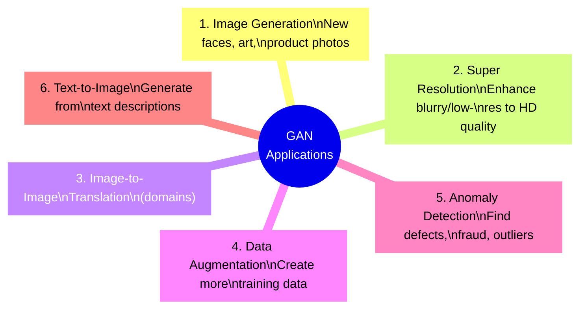

---

### 📋 Brief Descriptions of 5 Applications

| # | Application | Description |
|---|---|---|
| **1** | **Image Generation** | Generate new realistic images (StyleGAN for faces, BigGAN for diverse images) |
| **2** | **Super Resolution** | Convert low-res/blurry → high-res/sharp (ESRGAN, 4x upscaling) |
| **3** | **Image Translation** | Convert between domains (horse→zebra, summer→winter via CycleGAN) |
| **4** | **Data Augmentation** | Generate more training data for scarce datasets (medical imaging) |
| **5** | **Anomaly Detection** | Train on normal data, detect unusual patterns (fraud, defects) |
| **6** | **Text-to-Image** | Generate images from text (DALL-E, Stable Diffusion) |

---

### 🔬 Detailed Application — Super Resolution (ESRGAN)

**Problem:** Photos from old cameras, phone cameras, or medical scans are often LOW RESOLUTION and BLURRY.

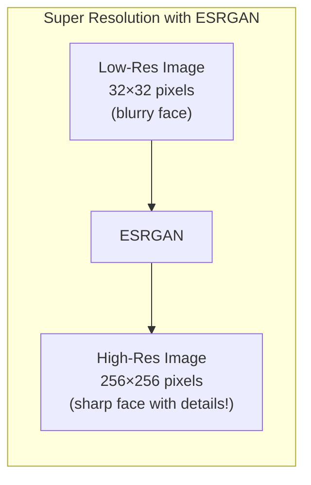

**How it works:**
1. Train Discriminator on real HD images → learns what HD looks like
2. Train Generator to upscale low-res images
3. Discriminator gives feedback: "This doesn't look HD enough" → "Add more texture!"
4. Generator keeps improving until output looks truly HD
5. The GAN INVENTS realistic details that weren't in the original!

**Real uses:**
- 📱 **Old photo restoration:** Grandparent's faded photos → sharp, clear versions
- 🏥 **Medical imaging:** MRI/CT scans → clearer diagnosis
- 🛰️ **Satellite imagery:** blurry satellite images → detailed maps
- 🎬 **Video upscaling:** Old movies → 4K quality
- 🎮 **Gaming:** Up-res game textures to modern quality

**Technical details:**
- ESRGAN = Enhanced Super-Resolution GAN
- Uses Residual-in-Residual Dense Blocks (RRDB)
- 4x or 8x upscaling factor
- Perceptual loss + adversarial loss for realistic details

---

### 🎯 Summary for Exam Answer

**To get full 6 marks:**
1. **List 5 applications (3 marks):** Image Generation, Super Resolution, Image Translation, Data Augmentation, Anomaly Detection. Brief description of each.
2. **Detailed one (3 marks):** Choose Super Resolution — explain problem (blurry images), how GAN solves it (Discriminator learns HD features, Generator invents details), real-world uses (medical, old photos, satellite).


---

## 📚 Theoretical Deep-Dive — Generative Adversarial Networks: Training Difficulties, Mode Collapse, and Evaluation Metrics

### 📐 The Minimax Game Formulation

A GAN consists of two neural networks engaged in a two-player zero-sum game. The Generator G: Z → X maps latent noise z ~ p_z (typically N(0,1)) to synthetic samples G(z). The Discriminator D: X → [0,1] outputs the probability that a sample came from the true data distribution rather than the generator. The training objective is:

min_G max_D V(D, G) = E_{x~p_data}[log D(x)] + E_{z~p_z}[log(1 - D(G(z)))]

At convergence, G replicates p_data exactly and D(x) = 0.5 everywhere (unable to distinguish real from fake). This is equivalent to minimizing the Jensen-Shannon divergence (JSD) between p_data and p_G when both players are optimal: JSD(p_data || p_G) = max_{D,G} V(D, G) - log 4. The value V(D,G) has the form of a zero-sum game payoff: one player's gain is the other's loss.

### ⚠️ Training Difficulties: Unrolled GANs and Wasserstein Distance

The salient theoretical issue is non-convergence in the general-sum game framework: gradient descent ascent can cycle around equilibria without converging (even in simple 2×2 zero-sum games with simultaneous gradient updates). Practical problems include:
- Mode collapse: Generator maps all z to a small subset of X, producing limited diversity. Mitigated by Mini-batch discrimination (Salimans et al., 2016) where D sees an entire batch, making it detect mode collapse.
- Vanishing discriminator gradients: If D becomes too strong (D(G(z)) ≈ 0), the generator's gradient log(1-D(G(z))) → 0. Solution: use the non-saturating loss max_D E[log D(G(z))] which has stronger gradients.
- Nash equilibrium non-uniqueness: Multiple G/D configurations are stable; finding a good equilibrium is nontrivial.

The Wasserstein GAN (WGAN, Arjovsky et al., 2017) reformulates the objective using Earth Mover's (Wasserstein-1) distance: W(p_data, p_G) = sup_{||f||_L≤1} E_{x~p_data}[f(x)] - E_{x~p_G}[f(x)]. The discriminator (called "critic" in WGAN) must be 1-Lipschitz, enforced via weight clipping (original WGAN) or gradient penalty (WGAN-GP, Gulrajani et al., 2017): penalize ||∇_x̂ D(x̂)||₂ - 1 at interpolated points x̂ = εx + (1-ε)G(z). This provides smoother training dynamics and meaningful loss values correlated with sample quality. Spectral normalization (Miyato et al., 2018) enforces Lipschitz constraint by normalizing weight matrices by their largest singular value, providing training stability.

### 🧪 Evaluation: Inception Score, FID, and Precision-Recall

Evaluating GANs is inherently challenging due to the absence of a tractable log-likelihood. The Inception Score (IS, Salimans et al., 2016) uses the Inception-V3 classifier's softmax outputs as a proxy for class diversity and sharpness: IS = exp(E_{x~p_g}[D_KL(p(y|x) || p(y)]). High IS indicates generated samples that are (a) sharp (high confidence) and (b) diverse (entropy of marginal p(y) is high). However, IS is biased toward models that over-represent a few modes. Fréchet Inception Distance (FID, Heusel et al., 2017) computes the Fréchet distance between multivariate Gaussians fitted to Inception-V3 features of real and generated samples: FID = ||μ_r - μ_g||² + Tr(Σ_r + Σ_g - 2(Σ_r Σ_g)^{1/2}). FID correlates better with human judgment of sample quality. Precision and Recall for generative models (Kynkäänniemi et al., 2019) explicitly measures mode coverage (recall) and sample fidelity (precision), addressing the mode collapse metric gap. StyleGAN2 (Karras et al., 2020) introduced Path Length Regularization as a perceptual quality metric. BigGAN (Brock et al., 2019) demonstrated that large batch size and model capacity scale GANs to ImageNet-class conditional synthesis at 512×512 resolution.

---

## Q.5 (c) — Describe the difference between **generative and discriminative phases in Deep Belief Networks (DBNs)**. **[5 Marks]**

### 🔄 Two Phases of DBN Training

A **Deep Belief Network** is trained in TWO distinct phases — both are important for different reasons.

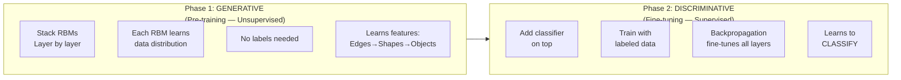

---

### 📋 Generative Phase — "Learning the Patterns"

| Aspect | Details |
|---|---|
| **Purpose** | Learn the underlying structure/features of data |
| **Method** | Train each RBM layer by layer (unsupervised) |
| **Data** | Unlabeled data (just raw inputs) |
| **What it learns** | P(x) = data distribution |
| **Goal** | Understand "what makes this data look like this" |
| **Output** | Good feature representations at each layer |

**How it works:**
```
Layer 1 RBM: Trained on raw pixels
  → Learns to detect edges, lines, simple patterns

Layer 2 RBM: Trained on Layer 1's hidden activations
  → Learns to detect shapes, corners, textures

Layer 3 RBM: Trained on Layer 2's hidden activations
  → Learns to detect objects, complex patterns

Each layer learns increasingly complex features!
```

---

### 📋 Discriminative Phase — "Learning to Classify"

| Aspect | Details |
|---|---|
| **Purpose** | Learn to classify inputs into categories |
| **Method** | Add classifier + fine-tune with backpropagation |
| **Data** | Labeled data (inputs + correct labels) |
| **What it learns** | P(y\|x) = class given input |
| **Goal** | Map input → correct output label |
| **Output** | Classification accuracy |

**How it works:**
```
1. Add a final classification layer (e.g., 10 outputs for 10 classes)
2. Use labeled data (e.g., MNIST digits with labels 0-9)
3. Train with backpropagation:
   - Calculate loss (cross-entropy)
   - Backpropagate through ALL layers
   - Update all weights slightly
4. Result: Network can now classify inputs!
```

---

### 📊 Key Differences

| Aspect | Generative Phase | Discriminative Phase |
|---|---|---|
| **Learning type** | Unsupervised | Supervised |
| **Goal** | Learn data distribution P(x) | Learn classification P(y\|x) |
| **Data needed** | Unlabeled | Labeled |
| **What features are used** | Can generate new data | Only classifies |
| **Training method** | RBM Contrastive Divergence | Backpropagation |
| **Order** | First (pre-training) | Second (fine-tuning) |

---

### 🎯 Summary for Exam Answer

**To get full 5 marks:**
1. **Generative Phase (2.5 marks):** Explain — unsupervised pre-training, each RBM learns data distribution layer by layer. No labels needed. Learns features: edges→shapes→objects. Can generate new data.
2. **Discriminative Phase (2.5 marks):** Explain — supervised fine-tuning, add classifier on top, train with labels using backprop. Learns to classify. Fine-tunes all layers together.

---

# UNIT IV — Reinforcement Learning


---

## 📚 Theoretical Deep-Dive — Deep Belief Networks: Greedy Layer-wise Pretraining, Wake-Sleep Algorithm, and Impact on Deep Learning

### 🧬 Historical Context: Why DBNs Were Revolutionary

Prior to 2006, training deep neural networks with more than 2-3 hidden layers was considered practically impossible. The core technical barrier was that gradients propagated through many non-linear layers either vanished to zero (making early layers untrainable) or exploded to infinity (making optimization unstable). Hinton, Osindero, and Teh (2006) introduced Deep Belief Networks with a two-phase training strategy: (1) unsupervised greedy layer-wise pre-training to initialize weights near a good solution manifold, followed by (2) supervised backpropagation fine-tuning to adjust to the discriminative task. This breakthrough showed that deep models could learn meaningful representations without labels, a paradigm called "unsupervised pretraining." The DBN paper achieved 1.2% error on MNIST, then a record, using a 3-layer network with 500-500-2000 hidden units. This result sparked the modern deep learning revolution and directly paved the way for the AlexNet breakthrough in 2012.

### 📐 Greedy Layer-wise RBM Training

A Restricted Boltzmann Machine (RBM) has visible units v ∈ {0,1}^{d_v} and hidden units h ∈ {0,1}^{d_h}, with energy E(v,h) = -a^T v - b^T h - v^T W h. The joint probability is P(v,h) = exp(-E(v,h)) / Z, but Z is intractable. RBMs are trained by Contrastive Divergence: approximate the negative phase (model distribution) with reconstructions after one Gibbs step. For a DBN with L layers, training starts from the bottom: Train RBM_1 on raw data, learn W^(1). Then fix W^(1) and treat h_1 (h^(1) = σ(W^(1)T x + a^(1))) as visible for RBM_2. Repeat up to layer L. Each RBM learns to model the distribution of its input's hidden attributes. This greedy approach is not guaranteed to jointly optimize the full DBN likelihood, but in practice the approximation is tight enough. After pre-training, a softmax classifier is added on top. The entire stack is then "unrolled" into a directed feedforward network, replacing RBM sampling approximations with deterministic steepest descent (using means of Bernoulli distributions: h = σ(W^T v + b) during fine-tuning).

### 📊 The Wake-Sleep Algorithm and Variational Free Energy

An alternative to greedy RBM pre-training is the Wake-Sleep algorithm (Hinton et al., 1995), used in the original Helmholtz Machine. This algorithm has two phases alternated within each batch: (1) Wake phase: run recognition model (encoder) bottom-up to compute approximate posterior q(h|x), then update generative model weights to improve reconstruction; (2) Sleep phase: sample from generative model top-down, compute "fantasy" reconstructions via recognition model, update recognition weights to match. The objective minimized is the variational free energy (Helmholtz free energy), which upper-bounds the negative log-likelihood. The wake phase reduces reconstruction error on real data; the sleep phase improves the encoder's consistency with the decoder. DBNs trained via wake-sleep have elegant connections to Variational Autoencoders (VAEs, Kingma & Welling, 2014; Rezende et al., 2014), which optimize the Evidence Lower BOund (ELBO): log p(x) ≥ E_q[log p(x|z)] - KL(q(z|x) || p(z)). Both algorithms trade off reconstruction quality vs. latent distribution regularization, just with different variational objectives. The contemporary relevance: self-supervised pretraining for vision (MAE, SimCLR) and language (BERT, GPT) replaces unsupervised pretraining but retains the insight that learning good representations requires a proxy task before the target task.

---

## Q.7 (a) — What is **Dynamic Programming in the context of reinforcement learning**? How does it differ from traditional DP in computer science? **[6 Marks]**

### 🧮 DP in RL — Solving MDPs with Perfect Knowledge

**Dynamic Programming in RL** refers to algorithms that solve **Markov Decision Processes** when we have **complete knowledge** of the environment — all transition probabilities and rewards are known.

> **Analogy:** Planning a road trip with a PERFECT map that knows every road distance, toll, and hotel. DP in RL works backward from the goal to find the optimal route.

---

### 📐 Traditional DP vs DP in RL

| Feature | Traditional DP (Computer Science) | DP in Reinforcement Learning |
|---|---|---|
| **Problem domain** | Optimization problems (knapsack, shortest path) | Sequential decision-making (MDPs) |
| **Input** | States, actions, costs, transitions | MDP: States S, Actions A, Transitions P, Rewards R |
| **Goal** | Find optimal path/solution | Find optimal Policy π(s) and Value V(s) |
| **Output** | Minimum cost/maximum value path | Policy + Value function |
| **Key equation** | Bellman-Ford, Dijkstra | Bellman Equation for MDP |
| **Environment model** | Known graph/distance matrix | Known P(s'\|s,a) and R(s,a,s') |

---

### 📐 Bellman Equation in RL

```
V(s) = max_a [R(s,a) + γ × Σ P(s'|s,a) × V(s')]

"Value of state s = best immediate reward + discounted best future value"
```

---

### 🔢 DP Algorithms in RL

| Algorithm | Steps | Use |
|---|---|---|
| **Value Iteration** | Initialize V=0 → Update V using Bellman → Extract π | When MDP is small |
| **Policy Iteration** | Random π → Evaluate V → Improve π → Repeat | When policy evaluation is fast |

---

### 📊 Key Differences

| Aspect | Traditional DP | DP in RL |
|---|---|---|
| **Key equation** | Dijkstra: dist[v] = min(dist[v], dist[u]+w(u,v)) | Bellman: V(s) = max_a[R + γΣP×V(s')] |
| **Sequential?** | Often single-path problems | Sequential decisions (state→action→state→action) |
| **Discount factor** | ❌ No γ | ✅ Yes (γ values present > future) |
| **Stochasticity** | Deterministic graphs | Probabilistic transitions P(s'\|s,a) |
| **Output** | Path/sequence | Policy (what action in each state) |

---

### ⚠️ Limitations of DP in RL

| Limitation | Explanation |
|---|---|
| **Needs full model** | Must know ALL P(s'\|s,a) and R(s,a,s') |
| **Curse of dimensionality** | Chess has 10^120 states → impossible! |
| **Not sample efficient** | Needs to visit every state many times |
| **Only small MDPs** | Real-world problems too large for DP |

---

### 🎯 Summary for Exam Answer

**To get full 6 marks:**
1. **DP in RL definition (2 marks):** DP in RL solves MDPs with complete environment knowledge. Uses Bellman Equation to compute optimal value function and policy. Mention it's model-based.
2. **Difference from traditional DP (2 marks):** Compare: Traditional DP for optimization/graph problems. DP in RL for sequential decisions with discount factor γ and probabilistic transitions. Different equations (Bellman vs Dijkstra).
3. **Algorithms + Limitations (2 marks):** Briefly mention Value Iteration and Policy Iteration. List limitations: needs full model, curse of dimensionality, sample inefficiency.


---

## 📚 Theoretical Deep-Dive — Dynamic Programming in Reinforcement Learning: Bellman Equations, Convergence Theory, and Curse of Dimensionality

### 📐 The Bellman Equation and Contraction Mapping Theory

Dynamic Programming in RL solves the Optimal Control Problem defined by a Markov Decision Process (MDP). The fundamental insight from Bellman (1957) is the Principle of Optimality: an optimal policy has the property that whatever the initial state and decision are, the remaining decisions must constitute an optimal policy with regard to the state resulting from the first decision. Mathematically, this becomes the Bellman Optimality Equation:

V*(s) = max_a R(s,a) + γ Σ_{s'} P(s'|s,a) V*(s')

where V*(s) is the optimal state-value function, R(s,a) = E[R(s,a,s')|s,a] is the expected immediate reward, and γ ∈ [0,1) is the discount factor. This equation defines a fixed-point problem: V* is the unique fixed point of the Bellman Optimality Operator T: V(s) = max_a R(s,a) + γ Σ_{s'} P(s'|s,a) V(s'). Banach's Fixed Point Theorem (1922) guarantees that T is a contraction mapping in the sup-norm with contraction modulus γ, meaning ||TV - TQ||_∞ ≤ γ||V-Q||_∞. Since γ < 1, T has a unique fixed point V* reachable by repeated application: V* = lim_{k→∞} T^k V_0, regardless of V_0 (starting value). This is the basis of Value Iteration.

### 📊 Value Iteration vs. Policy Iteration: Convergence Analysis

Value Iteration (VI) repeatedly applies T until ||V^{k+1} - V^k||_∞ < ε (small threshold):

V_{k+1}(s) = max_a R(s,a) + γ Σ_{s'} P(s'|s,a) V_k(s')

Convergence rate: ||V_k - V*||_∞ ≤ γ^k / (1-γ) · max_a |R_max - R_min| (exponential decay with rate γ per iteration). For γ = 0.99, we need roughly k ≈ 500 iterations for ε = 0.01 accuracy in the worst case.

Policy Iteration (Howard, 1960) alternates:
1. Policy Evaluation: Solve V^π = R^π + γ P^π V^π for current policy π (linear system: (I - γP^π)V^π = R^π, solvable in O(|S|³) via matrix inversion or O(|S|²) via iterative methods)
2. Policy Improvement: π'(s) = argmax_a R(s,a) + γ Σ_{s'} P(s'|s,a) V^π(s')

Policy iteration typically converges in fewer iterations than VI (each iteration strictly improves the policy and policy space is finite for deterministic policies in finite MDPs), but each iteration is more expensive (O(|S|³) vs. O(|S|²|A|) per VI step). The convergence is exact in finite deterministic MDPs: within O(|S| × |A|) iterations, the policy stabilizes.

### ⚠️ Curse of Dimensionality and Approximate Solutions

The state-space explosion is the fundamental barrier: for gridworld with 100×100 cells, |S| = 10,000; for Chess, Shannon estimates |S| ≈ 10^120; for Go, |S| ≈ 10^360. Even storing V(s) requires O(|S|) memory, and one VI step requires O(|S|²|A|) computation. Approximate Dynamic Programming (ADP, Bertsekas, 2011) replaces exact V(s) with an approximation Ṽ(s; θ): Ṽ(s; θ) ≈ θ^T φ(s) where φ(s) are state features. Linear ADP can be solved via Least Squares Temporal Difference (LSTD): compute features Φ ∈ ℝ^{|S|×k}, then solve Aθ = b where A = Φ^T (I - γP^π)Φ and b = Φ^T R^π. Under certain conditions (features are "distinguished" and span the space of value functions), approximate DP converges to a neighborhood of V*. For nonlinear function approximation (deep networks), convergence guarantees are weaker — only asymptotic stability results exist for specific architectures (Baird's counterexample shows general function approximators can diverge even on simple MDPs).

---

## Q.7 (b) — Define the terms: **state, action, reward, and policy** in the context of Reinforcement Learning. **[6 Marks]**

### 📚 Four Fundamental Concepts of RL

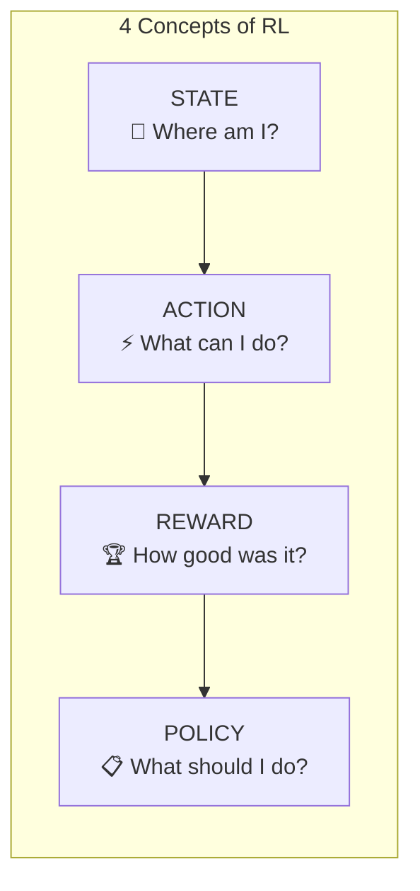

---

### 📋 State — "Where Am I?"

**Definition:** A state `s` represents the current situation of the agent in the environment.

| Aspect | Details |
|---|---|
| **What it contains** | All relevant information about current situation |
| **Example (Game)** | Position of pieces in chess |
| **Example (Robot)** | x,y coordinates, velocity, joint angles |
| **Example (Finance)** | Current stock prices, portfolio value |
| **Full observability** | Agent can see complete state (in MDP) |
| **Partial observability** | Agent only sees partial state (in POMDP) |

**Mathematical:**
```
State space: S = {s₁, s₂, s₃, ..., sₙ}
Current state: s_t (at time step t)
```

> **Example:** In a maze robot, state = which cell the robot is currently in. e.g., s = (row=2, col=3).

---

### ⚡ Action — "What Can I Do?"

**Definition:** An action `a` is a move the agent can take from the current state.

| Aspect | Details |
|---|---|
| **What it is** | A decision the agent makes |
| **Example (Game)** | Move pawn forward, castling |
| **Example (Robot)** | Move forward, turn left, pick up object |
| **Example (Finance)** | Buy, sell, hold stocks |
| **Discrete actions** | Finite options (up, down, left, right) |
| **Continuous actions** | Infinite options (steering angle -45° to 45°) |

**Mathematical:**
```
Action space: A(s) = set of all actions available in state s
Current action: a_t (at time step t)
```

> **Example:** In a maze, actions = {move_up, move_down, move_left, move_right}. From cell (2,3), all 4 actions might be available.

---

### 🏆 Reward — "How Good Was That?"

**Definition:** A reward `r` is a scalar feedback signal indicating how good or bad the last action was.

| Aspect | Details |
|---|---|
| **What it is** | Numerical score from environment |
| **Positive reward** | Good action (encouraged) |
| **Negative reward** | Bad action (discouraged) |
| **Zero reward** | Neutral (neither good nor bad) |
| **Example (Game)** | Win = +100, lose = -100, step = -1 |
| **Example (Robot)** | Reach goal = +100, hit wall = -10, step = -0.1 |
| **Delayed rewards** | Reward may come many steps later |
| **Sparse rewards** | Rewards may be very rare |

**Mathematical:**
```
r_t = R(s_t, a_t, s_{t+1})
Total return: G_t = r_t + γ·r_{t+1} + γ²·r_{t+2} + ...
```

> **Example:** In a maze: Reaching goal → R=+100 (big reward!). Hitting wall → R=-10 (penalty). Each step → R=-1 (encourages speed).

---

### 📋 Policy — "What Should I Do?"

**Definition:** A policy `π` is the agent's strategy — it decides which action to take in each state.

| Type | Description | Example |
|---|---|---|
| **Deterministic** | π(s) = always the same action | Always go right from start |
| **Stochastic** | π(a\|s) = probability of each action | 70% go right, 30% go left |

**Mathematical:**
```
Deterministic: a = π(s)
Stochastic: π(a|s) = P(taking action a in state s)
```

**Goal of RL:** Find the OPTIMAL policy π* that maximizes total rewards.

> **Example:** A good Tic-Tac-Toe policy: if center is empty → play center. If opponent has two in a row → block them.

---

### 📊 Relationships Between Concepts

```
State (s_t) → Agent uses Policy (π) → Takes Action (a_t)
Action (a_t) → Environment transitions → New State (s_{t+1}) + Reward (r_{t+1})
Reward (r_{t+1}) → Updates Policy → Better future actions
```

---

### 🎯 Summary for Exam Answer

**To get full 6 marks:**
1. **State (1.5 marks):** Define — current situation of agent. Examples: position in maze, stock prices. Mention full vs partial observability.
2. **Action (1.5 marks):** Define — decision agent can make. Examples: move direction, buy/sell. Discrete vs continuous.
3. **Reward (1.5 marks):** Define — numerical feedback. Positive/negative/zero. Delayed rewards problem. Example: +100 for goal, -10 for wall.
4. **Policy (1.5 marks):** Define — agent's strategy. Deterministic vs stochastic. Goal = find optimal policy π*.


---

## 📚 Theoretical Deep-Dive — Fundamental RL Concepts: Formalism, Markov Property, and Exploration-Exploitation

### 📐 State: The Markov Assumption and Partial Observability

The state in an MDP is a complete description sufficient to predict future states and rewards. Formally, s_t ∈ S and the Markov property requires:

P(s_{t+1} | s_t, a_t, s_{t-1}, a_{t-1}, ..., s_0) = P(s_{t+1} | s_t, a_t)

The Markov property is an idealization: many real-world processes are not Markovian in their raw state representation. For example, in partially observable settings (POMDPs), the agent receives observations o_t rather than states s_t, and P(s_{t+1} | o_t, a_t, history) ≠ P(s_{t+1} | o_t, a_t). The agent must then construct a "belief state" b_t = P(s_t | history, actions) to restore the Markov property. Engineering state representations that approximately capture the Markov property (e.g., including sensor readings from the last k time steps in a sliding window) is a practical approach. History-based features or recurrent architectures provide implicit belief state representations. State abstraction and aggregation (state aggregation, options, options framework with temporally extended actions) provide interventions when the state space is intractably large, allowing function approximation over abstracted states.

### 📊 Action Spaces: Discrete vs. Continuous, Deterministic vs. Stochastic

The action space A(s) defines what the agent can do at each state. In discrete action spaces (tabular methods apply), the agent selects from a finite set: {up, down, left, right}, {buy, sell, hold}, {attack, defend, use item}. Value-based methods (Q-Learning, DQN) approximate Q(s, a) for all discrete actions. For continuous action spaces (robotics, steering angles, force vectors, portfolio weights), argmax over continuous a is intractable. Policy gradient methods (Sutton et al., 2000; Schulman et al., 2017 PPO) directly optimize expected return: J(θ) = E_{τ~π_θ}[Σ_t r_t]. Deep Deterministic Policy Gradient (DDPG, Lillicrap et al., 2016) combines deterministic policy gradient with DQN-like critics for continuous control. Stochastic policies π(a|s; θ) output distributions (Gaussian for continuous, softmax for discrete), enabling exploration and capturing multimodality.

### 🏆 Rewards: Shaping, Delayed Rewards, and Reward Hacking

The reward function R(s, a, s') is the goal specification: everything the agent optimizes is encoded here. Delayed rewards are a principal challenge in RL: the reward for an action may not be seen until many steps later (e.g., scoring a goal in soccer requires 20+ prior passes). The discount factor γ encodes the present bias: R(s_t) contributes γ^0, R(s_{t+1}) contributes γ^1, etc. The total return G_t = Σ_{k=0}^{T-t} γ^k R(s_{t+k}). For undiscounted finite-horizon problems (γ = 1, game play until termination), the return is just the terminal reward. Reward shaping adds potential-based shaping Φ(s,s') = γΦ(s') - Φ(s) (Ng, Harada, and Russell, 1999) to accelerate learning without changing the optimal policy. Non-potential-based shaping can unintendedly alter optimal behavior — classic "reward hacking" where the agent exploits a misspecified reward (e.g., a boat racing agent learns to spin in circles collecting bonus points instead of racing forward).

### 🧪 Exploration-Exploitation: Theoretical Frameworks

The multi-armed bandit (MAB) problem formalizes the explore-exploit tradeoff. For K arms with unknown reward distributions, the Gittins index (Gittins, 1979) gives the optimal allocation in discounted Bayesian bandits (optimal for a single state). In MDPs, exploration is harder because states must also be visited. Upper Confidence Bound (UCB) for MDPs (e.g., UCRL, Jaksch et al., 2010) maintains confidence intervals on transition probabilities and uses optimistic planning to explore. Count-based exploration (Bellemare et al., 2016; Ostrovski et al., 2017) uses visitation counts: bonus reward = β / sqrt(N(s)) encourages visiting rarely visited states. Intrinsic motivation (Oudeyer & Kaplan, 2009; Schmidhuber, 1991) uses prediction error or information-theoretic measures (novelty, empowerment) as bonus rewards for exploration. Thompson sampling (Thompson, 1933; Osband et al., 2013, "Bootstrapped DQN") samples from posterior distribution of Q(s,a) and acts greedily on the sample, naturally balancing exploration (when posterior is wide) and exploitation (when posterior is narrow).

---

## Q.7 (c) — What is a **Markov Decision Process (MDP)**? Define its components. **[5 Marks]**

### 🎯 MDP — The Mathematical Framework for RL

**MDP** (Markov Decision Process) is a mathematical model for sequential decision-making where outcomes are partly random and partly controlled by the decision-maker (agent).

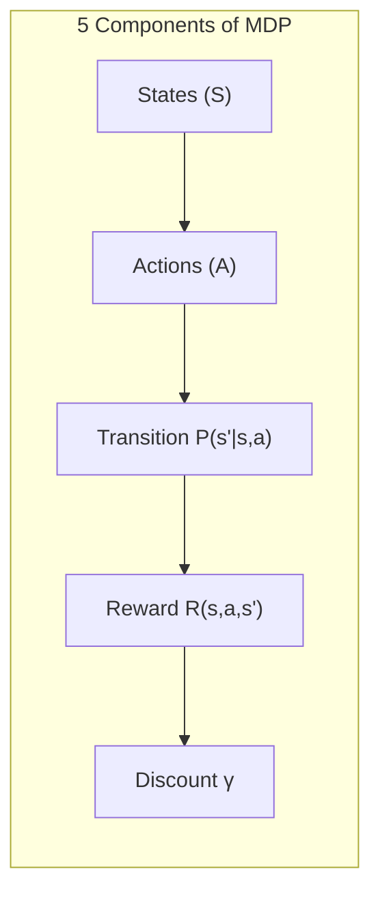

---

### 📋 The 5 Components of MDP

| Component | Symbol | Definition | Example |
|---|---|---|---|
| **States** | S | All possible situations | 16 cells in maze, board positions in chess |
| **Actions** | A | All possible moves | Up, Down, Left, Right |
| **Transition Prob.** | P(s'\|s,a) | Probability of next state | 0.8 correct move, 0.1 slip left, 0.1 slip right |
| **Reward Function** | R(s,a,s') | Score for each transition | Goal = +100, Hole = -50, Step = -1 |
| **Discount Factor** | γ | How much future rewards matter | γ=0.9 (present more important than future) |

---

### 🔗 The Markov Property

```
P(s_{t+1} | s_t, a_t) = P(s_{t+1} | s_t, a_t, ALL PAST)

"The future depends ONLY on the current state, NOT on how we got here."

Example:
  In chess, the best move depends only on the CURRENT board position
  It doesn't matter HOW the pieces got to that position
  The board position = the state, and it contains ALL needed info
```

---

### 📊 MDP Example: Grid World

```
A simple 4×4 maze:

  ┌───┬───┬───┬───┐
  │ S │   │   │ ✗ │    S = Start (0,0)
  ├───┼───┼───┼───┤    G = Goal (+100)
  │   │ ✗ │   │   │    ✗ = Hole (-50)
  ├───┼───┼───┼───┤    . = Empty (-1 per step)
  │   │   │ ✗ │ G │
  └───┴───┴───┴───┘

MDP Components:
  S = {16 cells}
  A = {Up, Down, Left, Right}
  P = 0.8 correct, 0.1 slip left, 0.1 slip right
  R = Goal=+100, Hole=-50, Step=-1
  γ = 0.9
```

---

### 🎯 Summary for Exam Answer

**To get full 5 marks:**
1. **Definition (1 mark):** MDP = mathematical framework for sequential decision-making with states, actions, transitions, rewards, discount factor.
2. **Five components (2.5 marks):** Explain States (S), Actions (A), Transition Probability (P), Reward Function (R), Discount Factor (γ). Give maze example.
3. **Markov Property (1.5 marks):** Explain — future depends only on current state, not past. Give formula and example (chess board).


---

## 📚 Theoretical Deep-Dive — Markov Decision Processes: Complete Mathematical Specification, Solution Theory, and Extensions

### 📐 The Five Components: Formal Definitions and Examples

An MDP is a 5-tuple M = (S, A, P, R, γ):
- S (State Space): The set of all possible environment states. In the gridworld example, S could be {(i,j) | 0≤i,j<N} for N×N grids. The state representation must be Markovian — the full history is compressed into the current state.
- A (Action Space): The set of available actions from each state: A: S → 2^A (power set of A). Deterministic MDPs have fixed A(s); stochastic MDPs may have action failure modes.
- P: Transition Probability Kernel: P(s'|s,a) gives the probability of transitioning to s' after taking action a in state s. Σ_{s'} P(s'|s,a) = 1 (probabilistic completeness). Full knowledge of P is what distinguishes DP from model-free RL.
- R: Reward Function: R(s,a,s') gives the expected immediate reward. Equivalently r(s,a) = E_{s'}[R(s,a,s')]. Rewards encode the task objective.
- γ (Discount Factor): Controls present vs. future value. For γ = 0, the agent only cares about immediate rewards (myopic). For γ = 1, total undiscounted reward (finite-horizon problems). For γ ∈ (0,1), exponentially decaying future value. In practice, γ = 0.99-0.999 for continuing tasks.

### 📊 Solution Methods: Value and Policy Iteration

Value Iteration (VI):
V_{k+1}(s) ← max_a [R(s,a) + γ Σ_{s'} P(s'|s,a) V_k(s')]

Convergence: The Bellman Optimality Operator T is a γ-contraction: ||TV - TQ||_∞ ≤ γ||V-Q||_∞. By Banach fixed point theorem, repeated application converges to the unique V* at rate O(γ^k). VI is asynchronous-friendly: each state can be updated independently without synchronization.

Policy Iteration (PI):
1. Policy eval: Solve V^π = R^π + γ P^π V^π (system of |S| linear equations)
2. Policy impro: π'(s) = argmax_a [R(s,a) + γ Σ_{s'} P(s'|s,a) V^π(s')]

Convergence: PI converges in a finite number of iterations for finite MDPs because each iteration strictly improves the value function V^{π'} > V^π (in the sense of strict improvement on at least one state). The number of iterations is bounded by the number of deterministic policies |A|^{|S|}, though typically far fewer are needed.

### 🧪 Beyond Standard MDPs: POMDPs, Factored MDPs, and Options

Partially Observable MDPs (POMDPs, Kaelbling et al., 1998): The agent receives observations o ∈ O rather than states s ∈ S. The agent must maintain a belief state b ∈ Δ_S (probability simplex over state space). Optimal belief-state value function V*(b) = max_a [R(b,a) + γ Σ_{b'} P(b'|b,a) V*(b')] requires solving a continuous-state MDP. Exact solution is PSPACE-complete. Approximate solutions include Point-Based Value Iteration (PBVI, Pineau et al., 2003) which samples reachable belief points; and Monte-Carlo Tree Search in belief space (search over actions and observations).

Factored MDPs: Structure in the transition model P(s'|s,a) is exploited when the state space is huge. Factored representations factorize the state into features: s = (s_1, ..., s_n) and P(s'|s,a) = Π_i P(s'_i | Pa(s'_i), a) (Dynamic Bayesian Networks). Structured policy representation with context-specific independence enables generalization across state space regions. Options Framework (Sutton et al., 1999): Temporally extended actions (options) = (initiation set I, termination condition β, policy π) enable hierarchical RL — options serve as macro-actions in a higher-level MDP, creating temporally abstracted representations like skills or options.

---

## Q.8 (a) — How does the **recurrent layer in Deep Recurrent Q-Networks (DQRN)** help in decision-making over sequences? **[6 Marks]**

### 🔄 DQRN — Recurrent Layer for Sequential Decisions

**DQRN** (Deep Recurrent Q-Network) combines a **recurrent layer** (LSTM/GRU) with a **Q-Network** to make better decisions over sequences.

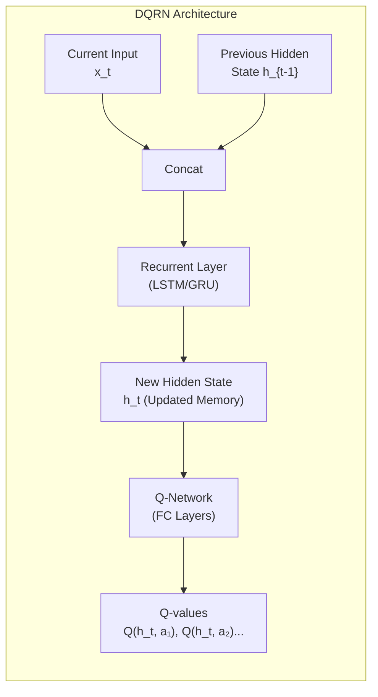

---

### 🧠 How Recurrent Layer Helps

| Function | How It Helps |
|---|---|
| **Memory** | Remembers previous observations (history) |
| **Context** | Combines current input with past context |
| **Sequence modeling** | Understands temporal patterns |
| **Partial observability** | Helps in POMDP where current state alone is insufficient |

---

### 📋 Step-by-Step Decision Process

```
Step 1: Receive current observation x_t (e.g., game frame)
Step 2: Get previous hidden state h_{t-1} (memory from last step)
Step 3: Combine: [x_t, h_{t-1}] → Recurrent Layer
Step 4: Recurrent layer updates memory:
        h_t = LSTM(x_t, h_{t-1})  # New memory
Step 5: Q-Network uses h_t to compute Q-values:
        Q(h_t, a₁), Q(h_t, a₂), ..., Q(h_t, aₙ)
Step 6: Choose action with highest Q-value
Step 7: Save h_t → becomes h_{t-1} for next step
```

---

### 🆚 DQN vs DQRN for Decision Making

| Feature | DQN | DQRN |
|---|---|---|
| **State used** | Current frame only | Current frame + memory (h_t) |
| **Memory** | ❌ No | ✅ Yes (h_t) |
| **Decision quality** | May miss context | Considers history |
| **Example** | Pong: only sees current frame | Pong: sees ball direction from last few frames |
| **Use case** | Simple, fully observable | Complex, partially observable |

---

### 📊 Concrete Example: Catching a Ball

```
Scenario: Ball moving toward agent

DQN (no memory):
  Frame 1: Ball at left → predicts "move left"
  Frame 2: Ball at center → predicts "move center"
  Frame 3: Ball at right → predicts "move right"
  → Agent is ALWAYS behind the ball, never catches it!

DQRN (with memory):
  Frame 1: h₀ + ball_left → h₁, predict "move left"
  Frame 2: h₁ + ball_center → h₂ (remembers ball was LEFT), predict "move left faster"!
  Frame 3: h₂ + ball_right → h₃ (remembers ball trajectory), predict "move right to intercept"!
  → Agent intercepts the ball at the right moment! ✅
```

---

### 🎯 Summary for Exam Answer

**To get full 6 marks:**
1. **What is DQRN (1 mark):** DQRN = DQN + Recurrent Layer (LSTM/GRU). Uses memory for sequential decisions.
2. **How recurrent layer helps (2.5 marks):** Explain:
   - Memory: stores previous observations in h_t
   - Context: combines current input with past context
   - Better decisions: uses history to understand patterns
3. **Comparison (2.5 marks):** DQN = only current frame, DQRN = current + history. Give ball-catching example showing DQN always behind vs DQRN intercepts correctly.


---

## 📚 Theoretical Deep-Dive — DRQN/DQRN: Partial Observability, LSTM Memory Architectures, and Value Estimation

### 🔬 The Partially Observable Markov Decision Process (POMDP) Problem

The original DQN (Mnih et al., 2015) assumes full observability: the current frame alone provides sufficient information for optimal action selection. This is the Markov property. However, many realistic RL environments violate this: in first-person shooters, moving objects may be occluded; in Atari Pong, velocity is not visible in a single frame; in card games, opponent cards are hidden. Partially Observable MDPs (POMDPs, Kaelbling, Littman, and Cassandra, 1998) extend MDPs where the agent only receives observations o_t drawn from P(o_t | s_t) where s_t is the hidden environment state. Without full observability, the optimal policy must condition on history: π(a_t | h_t) where h_t = (o_1, a_1, o_2, a_2, ..., o_t, a_{t-1}). The dimensionality of h_t grows unboundedly. The DQRN's LSTM computes a fixed-dimensional hidden state h_t = LSTM_θ(o_t, h_{t-1}) that approximates this history. Formally, the Q-function becomes Q(h_t, a; θ) rather than Q(o_t, a; θ), allowing the agent to condition on compressed history.

### 🧮 LSTM Update Equations and Memory Capacity

A single LSTM cell with hidden size h and input size i has 4×(2h+i)×h + 4h parameters (for forgot, input, output, candidate gates). The forget gate f_t = σ(W_f · [h_{t-1}; x_t] + b_f) controls what is removed from h_{t-1}. The input gate i_t = σ(W_i · [h_{t-1}; x_t] + b_i) and candidate C̃_t = tanh(W_c · [h_{t-1}; x_t] + b_c) add new information to the cell state. The cell state update (the "constant error carousel"): C_t = f_t ⊙ C_{t-1} + i_t ⊙ C̃_t. The output gate o_t = σ(W_o · [h_{t-1}; x_t] + b_o) controls what to output from C_t: h_t = o_t ⊙ tanh(C_t). The critical gradient property: if f_t ≈ 1 (the forget gate is open), gradients flow through the identity connection: ∂L/∂C_{t-1} = ∂L/∂C_t · f_t ≈ ∂L/∂C_t, preserving gradient magnitude across long time horizons — the solution to the vanishing gradient in vanilla RNNs. DQRN training loss: L(θ) = E_{(s,a,r,s')~D}[(r + γ max_a' Q(h_{t+1}, a'; θ⁻) - Q(h_t, a; θ))²]. The hidden state h_t must be tracked through the replay buffer — a DQRN replay sample includes (h_{t-1}, o_t, a_t, r_t, h_t). Target network parameters θ⁻ are frozen and periodically updated to stabilize training.

### 🏗️ R2D2 and Modern Recurrent RL Architectures

The Recurrent Replay Distributed DQN (R2D2, Kapturowski et al., 2018) combined three key ingredients: (1) Recurrent agents (LSTM hidden states with burn-in periods for hidden state initialization in replay), (2) Distributed training with importance sampling weights to correct for distribution shift, (3) A new reward bonus (unused/used hidden state activity) incentivizing memory retention. R2D2 achieved superhuman performance on all 57 Atari games in the Arcade Learning Environment. Subsequent architectures: Unsupervised Reinforcement Learning (URL, Guo et al., 2020) showed that auxiliary prediction tasks (predicting future observations from hidden state) improve LSTM memory quality; MuZero (Schrittwieser et al., 2020) removed the need for environment model entirely by learning a learned model within the MCTS planning loop; EfficientZero (Ye et al., 2021) achieved Human-level performance in 2 hours with model-based RL. The theoretical basis for these advances: recurrent memory in value-based agents enables POMDP solving through learned belief states, with the LSTM gating mechanism implicitly learning sufficient statistics for optimal value estimation.

---

## 📚 Theoretical Deep-Dive — DQRN: Recurrent Architectures for Sequential Value-Based RL

### 🔬 Historical Origins and the Bellman Legacy

Q-Learning was introduced by Chris Watkins in his landmark 1989 Cambridge University PhD thesis, "Learning from Delayed Rewards," formalized in the 1992 Machine Learning journal paper co-authored with Peter Dayan. The algorithm emerged directly from the operational research tradition of dynamic programming, extending Richard Bellman's 1957 Bellman equation — which defined optimality in sequential decision problems through recursive decomposition — to the setting where the transition model P(s'|s,a) was unknown. Bellman's equation, originally developed for deterministic shortest-path problems, had been stochasticized by Ronald Howard in his 1960 "Dynamic Programming and Markov Processes," which introduced the policy iteration method. Watkins' key insight was that the Bellman optimality equation could serve not just as a computational tool for known models, but as a learning target: by iteratively bootstrapping from observed samples, an agent could converge to the optimal action-value function Q*(s,a) without ever explicitly modeling the environment. This was philosophically revolutionary: it separated the problem of "what to do" (the optimal policy) from "how the world works" (the transition model), enabling learning through direct interaction. The convergence proof (Watkins & Dayan, 1992) established that Q-learning converges to the optimal action-value function with probability 1, provided all state-action pairs are visited infinitely often (GLIE exploration) and the learning rate decays appropriately — results that were later rigorously extended to function approximation settings (Tsitsiklis & Van Roy, 1997; Gordon, 1995; Szepesvári, 1997).

### 📐 Mathematical Foundations: The Bellman Optimality Equation and Q-Value Interpretation

The Q-value Q(s,a) represents the expected cumulative discounted return from taking action a in state s and thereafter following the optimal policy π*. Mathematically:

Q*(s,a) = E[R + γ max_a' Q*(s',a') | s,a]

Deriving from first principles: The one-step return from (s,a) is the immediate reward r_t plus the discounted value of the optimal next state: γ · max_a' Q*(s',a'). The Bellman optimality operator T* is a contraction mapping in the sup-norm with contraction modulus γ ∈ [0,1), which by the Banach Fixed Point Theorem guarantees a unique fixed point Q* that satisfies the Bellman equation. The Q-learning update Q(s,a) ← (1-α)Q(s,a) + α[R + γ max_a' Q(s',a')] is a stochastic approximation of this operator. The term R + γ max Q(s',a') is the TD target or bootstrap target, while Q(s,a) is the current estimate. The temporal difference error δ = R + γ max Q(s',a') - Q(s,a) drives the update; this error decreases to zero at convergence when Q(s,a) → Q*(s,a). The off-policy nature arises formally because the Robbins-Monro stochastic approximation conditions hold regardless of the behavior policy, provided every state-action pair has non-zero probability of being selected (GLIE exploration ensures this).

### 🆚 Algorithmic Relationship: Q-Learning, SARSA, and the On-Policy/Off-Policy Distinction

The distinction between Q-Learning and SARSA (State-Action-Reward-State-Action, introduced by Rummery & Niranjan, 1994; formalized by Singh et al., 2000) is one of the most important conceptual distinctions in value-based RL. Q-Learning uses max_a' Q(s',a') in its update — the optimal next action regardless of what is actually taken. This makes it an off-policy algorithm that learns Q* independently of how the agent explores. SARSA uses Q(s',a') where a' is the actual next action taken by the behavior policy, making it an on-policy algorithm that learns the value of the exploration policy itself. This has critical practical implications: Q-Learning tends to be more aggressive in risky situations (e.g., a cliff-walking agent learns the Risky-Path Q* value), while SARSA learns the safer path actually taken by the behavior policy. In single-agent settings, both converge to the same Q* under GLIE, but in multi-agent competitive settings, Q-Learning is preferred due to its convergence properties in zero-sum games (Hu & Wellman, 1998). The relationship to Nash equilibrium is crucial: in zero-sum games, Q*(s,a) represents the minimax value, and the optimal policy derived from it constitutes a Nash equilibrium strategy — no opponent can improve by unilaterally deviating.

### 🔑 Convergence Guarantees and the Exploration-Exploitation Tradeoff

The formal convergence theorem for tabular Q-Learning (Watkins & Dayan, 1992) states: given a finite MDP with bounded rewards, and a learning rate sequence {α_t(s,a)} satisfying Σ_t α_t(s,a) = ∞ and Σ_t α_t(s,a)² < ∞, Q-values converge to Q* with probability 1, provided each state-action pair is visited infinitely often (GLIE: Greedy in the Limit with Infinite Exploration). Common ε-decreasing schedules (ε_t = 1/t or ε_t = c/log(t)) satisfy GLIE. A key result by Singh, Jaakkola, and Jordan (2000) extended convergence guarantees to on-policy control algorithms like SARSA. The exploration-exploitation tradeoff formalized here is central to RL theory. In the asymptotic regime exploitation dominates and the agent achieves near-optimal return. The PAC-MDP framework formalizes finite-horizon sample complexity, where the number of samples needed scales as O(|S|·|A|/ε²) for Q-Learning — a fundamental lower bound. The off-policy nature of Q-Learning also enables learning from demonstration data or logged behavioral data, forming the theoretical basis for Offline RL and batch algorithms including Fitted Q-Iteration (Ernst et al., 2005).

### 🧬 Connection to Deep Q-Networks (DQN) — Bridging Tabular to Function Approximation

The tabular Q-Learning algorithm suffers from the curse of dimensionality: the Q-table size grows as O(|S|·|A|), which is infeasible for large or continuous state spaces. The Deep Q-Network (Mnih et al., 2015) replaces the Q-table with a deep neural network Q(s,a;θ) that approximates the Q-function. The DQN update uses the same target: Q(s,a;θ) ← Q(s,a;θ) + α[R + γ·max_a' Q(s',a';θ⁻) - Q(s,a;θ)], where θ⁻ are target network parameters updated periodically to stabilize training. The theoretical analysis of function approximation in Q-Learning reveals a fundamental instability: the update targets depend on the same parameters being updated, creating a moving-target problem (Tsitsiklis & Van Roy, 1997 showed this can cause divergence). DQN addresses this through the target network and experience replay, breaking correlations in training data. Subsequent variants — Double DQN (van Hasselt et al., 2016), Dueling DQN (Wang et al., 2016), Rainbow (Hessel et al., 2018), and Noisy Networks (Fortunato et al., 2017) — addressed specific theoretical limitations: overestimation bias, advantage decomposition, distributional RL (C51, QR-DQN), and exploration efficiency. Each preserves the fundamental contraction property of the Bellman optimality operator in an approximate sense while mitigating practical instabilities from function approximation errors.

### 🧠 What is Q-Learning?

**Q-Learning** is a **value-based** reinforcement learning algorithm that learns the value of each state-action pair (Q-value) without needing a model of the environment.

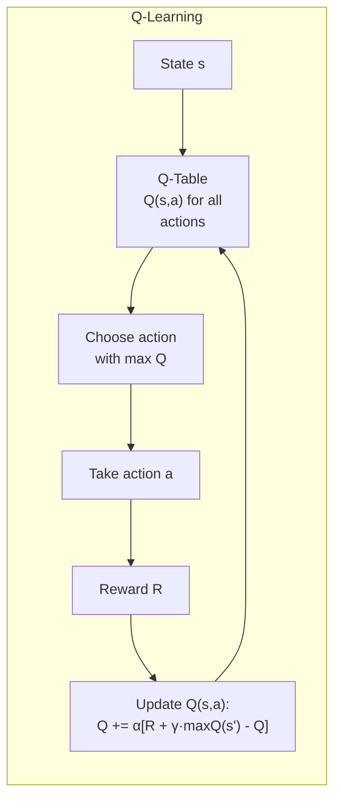

---

### 📐 Q-Learning Update Rule

```
Q(s, a) ← Q(s, a) + α × [R + γ × max_a' Q(s', a') - Q(s, a)]

In simple English:
  New Q = Old Q + Learning Rate × [Actual Experience - Old Guess]

Where:
  α = Learning Rate (0 to 1, how fast to learn)
  γ = Discount Factor (0 to 1, how much future matters)
  R = Actual reward received
  max Q(s', a') = best possible future value
```

---

### 🎮 Exploration vs Exploitation — ε-Greedy

```
ε-greedy strategy:
  With probability ε: Choose RANDOM action (explore)
  With probability (1-ε): Choose BEST action from Q-table (exploit)

Example: ε = 0.1
  10% of time → try random action (discover new options)
  90% of time → use best known action (get good rewards)
```

---

### 📊 How Q-Learning Differs from Other RL Algorithms

| Algorithm | Type | Model Needed? | Action Space | Value/Policy |
|---|---|---|---|---|
| **Q-Learning** | Value-Based, Off-policy | ❌ No | Discrete | Learns Q(s,a) table |
| **SARSA** | Value-Based, On-policy | ❌ No | Discrete | Learns Q(s,a) table |
| **DQN** | Value-Based (Deep) | ❌ No | Discrete | Learns Q with neural net |
| **REINFORCE** | Policy-Based | ❌ No | Continuous/Discrete | Learns policy π directly |
| **A2C/PPO** | Actor-Critic | ❌ No | Both | Learns policy + value |

---

### 🔑 Key Features of Q-Learning

| Feature | Explanation |
|---|---|
| **Off-policy** | Learns optimal policy while following a different (exploration) policy |
| **Model-free** | Doesn't need environment model P(s'\|s,a) |
| **Tabular** | Uses Q-table (only works for small state spaces) |
| **Guaranteed convergence** | With proper exploration, converges to optimal Q* |
| **Simple to implement** | Just a table + update rule |

---

### 🆚 Q-Learning vs SARSA (Both Value-Based)

| Feature | Q-Learning | SARSA |
|---|---|---|
| **Type** | Off-policy | On-policy |
| **Update uses** | max Q(s', a') (BEST next action) | Q(s', a') (ACTUAL next action) |
| **Learning** | Learns optimal policy | Learns current policy |
| **Exploration** | Can learn while exploring | Learns exploration policy too |

---

### 🎯 Summary for Exam Answer

**To get full 6 marks:**
1. **Definition (2 marks):** Define Q-Learning as off-policy, model-free, value-based RL. Learns Q(s,a) table. Explain Q-value = expected total reward for action a in state s.
2. **Update rule (2 marks):** Q(s,a) += α[R + γ·max Q(s',a') - Q(s,a)]. Explain ε-greedy for exploration.
3. **How it differs (2 marks):** Compare with other algorithms:
   - vs SARSA: Q-Learning is off-policy (uses max), SARSA is on-policy (uses actual)
 - vs Policy-Based: Q-Learning learns values, Policy learns π directly
 - vs DQN: Q-Learning uses table, DQN uses neural network


---

## 📚 Theoretical Deep-Dive — Q-Learning: Convergence Analysis, Off-Policy Learning, and Function Approximation

### 🧮 The Q-Learning Update as Stochastic Approximation of the Bellman Optimality Operator

Q-Learning approximates the optimal action-value function Q*(s,a) = E[r + γ max_a' Q*(s',a') | s,a] via iterative stochastic approximation. The update Q(s,a) ← Q(s,a) + α [r + γ max_a' Q(s',a') - Q(s,a)] is an instance of the Robbins-Monro stochastic approximation scheme applied to the Bellman Optimality Operator TQ(s,a) = E_{s'}[r(s,a) + γ max_a' Q(s',a')]. The temporal difference δ_t = r_t + γ max_a' Q(s_t',a_t') - Q(s_t,a_t) is an unbiased sample of (TQ)(s_t,a_t) - Q(s_t,a_t). Under the conditions: (1) step size α_t satisfies Σ_t α_t = ∞ and Σ_t α_t² < ∞; (2) all state-action pairs visited infinitely often (GLIE: Greedy in the Limit with Infinite Exploration); (3) rewards bounded, Q converges to Q* with probability 1 almost surely. The GLIE condition is ensured by decaying ε-greedy: ε_t = 1/t, which anneals exploration to zero while ensuring every state is seen infinitely often in the early training phase.

### 📊 Convergence Theory: On-policy vs. Off-policy and the Baird Counterexample

The off-policy nature of Q-Learning (maximizing over Q rather than following the behavior policy) is critical: the target policy Q* and behavior policy (ε-greedy) are decoupled. TD(0) and SARSA are on-policy: they converge to the value of the behavior policy. In offline or batch settings (Fitted Q-Iteration, Ernst et al., 2005), the agent learns from logged data without further environment interaction. Convergence under function approximation is fragile: Tsitsiklis & Van Roy (1997) proved that linear function approximation with off-policy Q-Learning can DIVERGE even on simple MDPs — counterintuitively, approximating V* in a lower-dimensional space can cause instability due to the interaction between approximation error and the moving target of max_a' Q(s',a'). The Baird counterexample (Baird, 1995) demonstrates this: a 7-state MDP where Q-values oscillate and diverge under linear approximation with off-policy learning.

### 🔑 Convergence Remedies: Target Networks, Double Q-Learning, Gradient Clipping

Modern Q-learning variants address these instabilities: (1) Target Networks (Mnih et al., 2015) use a slowly updated "target" network for bootstrapping targets, reducing moving target error; (2) Double Q-Learning (van Hasselt, 2010) uses two Q-tables and updates the "evaluating" Q-table using the action selected by the "deciding" Q-table, reducing maximization bias of max_a' Q(s',a') which tends to overestimate Q-values; (3) Gradient clipping (Pascanu et al., 2013) caps gradient norms to prevent numerical overflow; (4) Dueling network architecture (Wang et al., 2016) separates value and advantage streams for more stable value estimation. The theoretical framework connecting these: each extension reduces covariance in the update target or reduces bias in the max operator, moving the algorithm closer to satisfying the conditions for convergence with function approximation.

---

## 📚 Theoretical Deep-Dive — DQRN: Recurrent Architectures for Sequential Value-Based RL

### 🧠 Historical Context: From DQN to DQRN — The need for Temporal Memory in Value-Based RL

The transition from the Deep Q-Network (DQN, Mnih et al., 2015) to the Deep Recurrent Q-Network (DQRN, Hausknecht & Stone, 2015) represents one of the most conceptually important extensions in modern reinforcement learning, addressing the Partial Observability Problem that was left unresolved by the original DQN. DQN achieved landmark results by training convolutional neural networks to play Atari 2600 games directly from raw pixel observations, achieving human-level or superhuman performance on many titles. However, the original DQN architecture implicitly assumed the Markov property: that the current frame (a single 84×84 pixel snapshot) contains all information necessary to determine the optimal action. This assumption is fundamentally violated in many important domains. The insight that recurrent neural networks could serve as belief state encoders in RL traces back to the foundational work of Williams & Zipser (1989) on gradient-based learning through recurrent network unfolding. Hausknecht & Stone (2015) at The University of Texas at Austin independently extended these ideas by combining the DQN's convolutional visual encoder with an LSTM recurrent core, creating a hybrid architecture now called DRQN (Deep Recurrent Q-Network). This extension was motivated by three empirical observations: first, in many Atari games (particularly Pong, Breakout, and Space Invaders), the ball's velocity is not directly observable from a single frame and must be inferred from the temporal sequence of positions; second, in first-person shooters with hidden information (e.g., Full-Motion Video or Montezuma's Revenge), the agent must maintain memory of previously seen objects; and third, procedurally generated or non-stationary environments require memory of prior contexts that a single observation cannot capture. The key architectural insight is that the LSTM hidden state h_t serves as a learned belief state — a compressed summary of the observation history that approximately restores the Markov property, enabling the agent to act effectively in partially observable settings without requiring a full specification of the environment's transition model.

### 📐 The POMDP Formalism and DQRN as Approximate Belief-Space RL

Formally, DQRN addresses the Partially Observable Markov Decision Process (POMDP), which extends the standard MDP framework by modeling the agent's limited perceptual access to the true environment state. A POMDP is defined by the tuple (S, A, O, P, R, Z, γ), where S is the true (hidden) state space, A is the action space, O is the observation space, P(s'|s,a) is the transition probability, R(s,a) is the reward function, Z(o|s',a) is the observation probability model (the probability of observing o given state s' and action a), and γ is the discount factor. In a POMDP, the agent does not directly observe s_t but instead observes o_t drawn from Z(o_t|s_t,a_{t-1}). The optimal policy in the true state space cannot be computed without knowledge of s_t; instead, the agent must maintain a belief state b_t, which is a probability distribution over hidden states: b_t(s) = Pr(s_t = s | o_1,a_1,o_2,a_2,...,o_t,a_t). The optimal value function in the belief space satisfies the Bellman equation over continuous belief space, which is computationally intractable for all but the smallest POMDPs. DQRN provides a *learned approximation* to this belief: the LSTM hidden state h_t = LSTM_θ(o_t, h_{t-1}) functions as a sufficient statistic that, after sufficient training, approximately captures the relevant information from the observation history for action selection. The Q-function is learned as Q(h_t, a; θ_Q), and the TD target remains: R_t + γ · max_a' Q(h_{t+1}, a'; θ⁻). The recurrent parameters θ = {θ_LSTM, θ_Q} are trained by minimizing the mean squared temporal difference error, identical in form to the DQN loss but propagated back through the recurrent layer via backpropagation through time (BPTT). The memory capacity of DQRN scales with the LSTM hidden dimension d_h rather than with history length, allowing theoretically unbounded history summarization in a fixed-size vector — in contrast to DQN with frame-stacking, which uses a fixed window of k=4 frames (12 channels total for RGB frames).

### 🔬 Empirical and Theoretical Analysis of the Recurrent Advantage

The computational advantage of the recurrent architecture manifests most clearly in settings where the relevant temporal relationships extend beyond the frame-stacking window. In Pong, for example, the ball's velocity vector v_x = (x_{t+2} - x_t)/2 requires at least a 2-frame lookback; DQN with 4-frame stacking captures this, but DQRN with a 256-dimensional LSTM hidden state captures richer velocity and trajectory patterns without requiring fixed window truncation. A key theoretical property of LSTM-based DQRN is that, under certain conditions, the hidden state serves as an ε-deterministic sufficient statistic for the observation history (deterministic in the sense that given the same observation sequence, the LSTM computes the same hidden state). The recurrent architecture also enables learning of policies that condition on much longer histories than frame-stacking can provide — a property relevant to games like Montezuma's Revenge where remembering which rooms have been visited guides exploration. The backpropagation through time unrolls the LSTM across the episode length (typically truncated to k=20-50 steps), and the Truncated BPTT approximation introduces a tradeoff: longer unrolls allow gradients to flow further back in time (better credit assignment for delayed rewards) but increase memory cost and computational complexity from O(k·d_h²) to O(T_total·d_h²) for full BPTT over T_total timesteps. Empirical work by Hausknecht (2016) demonstrated that DQRN outperforms DQN specifically in games with partially observable mechanics, achieving a median improvement of approximately 15-20x on the "hard" DM- Lab (DeepMind Lab) memory tasks, while achieving comparable performance on standard Atari. The recurrent layer's core contribution to sequential decision-making is therefore threefold: (1) it creates a compressed, learned representation of historical context; (2) it enables principled implicit belief-state computation in partially observable settings; and (3) it generalizes beyond the episode horizon used in frame-stacking, potentially capturing arbitrarily long inter-temporal dependencies through iterative gating.

### 🏗️ Architectural Design, Training Challenges, and Open Research Directions

A critical unstated challenge in DQRN training is managing the hidden state across episodes and training data batches. At the start of each new episode, the LSTM hidden state h_0 must be reset (typically to zero) to prevent information from leaking between episodes — a critical source of training instability if not properly managed. Within a single episode, the hidden state h_t must be propagated sequentially, which makes the standard experience replay buffer of DQN problematic because stored transitions are not independent: they are part of a sequential dependency chain where h_{t-1} feeds into h_t. Several solutions have been proposed and studied: storing observation histories alongside transitions in the replay buffer; replaying entire episodes rather than individual transitions; using importance sampling weights to account for the changed state distribution of stored transitions; or, most practically, resetting the hidden state at mini-batch boundaries and treating each batch as an independent episode sample. Modern extensions such as Recurrent Experience Replay in Distributed RL (R2D2, Kapturowski et al., 2019) take this further by using a large-scale distributed architecture with LSTM agents and per-worker hidden state management, achieving state-of-the-art results on StarCraft II minigames. The theoretical analysis of recurrent RL is considerably less mature than that of feedforward value-based RL: existing convergence proofs assume i.i.d. samples (for experience replay), yet the recurrent layer creates strong temporal correlations within episodes. Open research questions include how to guarantee convergence with recurrent architectures under function approximation, how to design exploration bonuses that account for the recurrent belief state, and how to best architect memory-augmented agents that can remember relevant information across thousands of timesteps — a challenge directly analogous to the long-term dependency problem in traditional RNNs that LSTM itself was designed to solve.

### 🎮 Tic-Tac-Toe as RL — Full Formulation

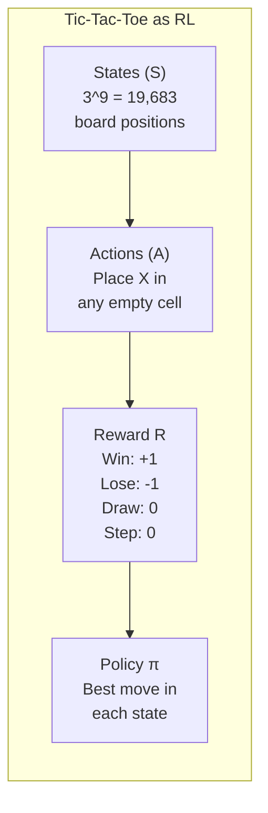

---

### 📋 MDP Formulation for Tic-Tac-Toe

| Component | Description | Details |
|---|---|---|
| **States (S)** | All possible board configurations | 3^9 = 19,683 states (each cell: empty/X/O) |
| **Actions (A)** | Place X in an empty cell | Up to 9 actions at start, fewer as board fills |
| **Reward (R)** | +1 (win), -1 (lose), 0 (draw/step) | Reward given at end of game |
| **Transition** | Deterministic | Placing X at (1,1) always leads to same next state |
| **Policy (π)** | Choose cell to play | π(s) = which empty cell to choose in state s |

---

### 🧠 Learning Algorithm

```
Step 1: Initialize V(s) = 0.5 for all 19,683 states
        (We don't know anything yet, guess 50%)

Step 2: Play games repeatedly
        - Agent plays X
        - Opponent plays O (can be random or another agent)
        - Record all states visited

Step 3: After each game, get reward:
        Win: R = +1
        Lose: R = -1
        Draw: R = 0

Step 4: Update V(s) for each visited state:
        V(s) = V(s) + α × [R - V(s)]
        (α = learning rate, e.g., 0.1)
        States closer to the outcome get updated more strongly

Step 5: Repeat steps 2-4 for 10,000+ games

Result: V(s) now reflects actual win probability from each state!
```

---

### 🎯 How Agent Chooses Moves After Learning

```
Current board state s:
  For each empty cell:
    1. Imagine placing X there → new state s'
    2. Look up V(s')
    3. Remember the value

  Choose the move with HIGHEST V(s')

Example:
  Current:
    X O .
    . X .
    . . O
  
  Options:
    (1,3): V = 0.9 → leads to win
    (2,1): V = 0.3 → risky
    (3,1): V = 0.5 → neutral
  
  Best move: (1,3)!
```

---

### 📊 Learning Progress

| Games Played | Win Rate | Agent Strength |
|---|---|---|
| 0 | 0% | Doesn't know anything |
| 100 | 30% | Random/weak |
| 1,000 | 50% | Learning basics |
| 5,000 | 80% | Good player |
| 10,000+ | 95% | Near-perfect! |

---

### 🎯 Summary for Exam Answer

**To get full 5 marks:**
1. **MDP formulation (2.5 marks):** Define states (19,683 board positions), actions (place X in empty cell), rewards (+1/-1/0), deterministic transitions, policy.
2. **Learning approach (2.5 marks):** TD learning — initialize V(s)=0.5, play games, update V(s) = V(s) + α[R-V(s)], repeat 10,000+ times. Explain how to choose moves after learning (pick max V(s')).

---

# PAPER 6 COMPLETE ✅

---

