# High Performance Computing (410250) — Paper 1 `[6004]-493`

## Important Note for Exam Writing
This file is rewritten in a **long-answer SPPU style**. Each main answer is written with:

1. Meaning/definition  
2. Detailed explanation in simple words  
3. Mermaid diagram  
4. Stepwise working/example  
5. Algorithm or pseudocode where useful  
6. Cost/complexity where applicable  
7. Final exam-writing tip  

> **How to write in exam:** Do not copy every sentence word-to-word if time is less. Write definition, draw diagram, explain steps, write formula/algorithm, and end with conclusion. This is enough to gain high marks.

---

# UNIT I — Communication Operations

---

# Q.1 Answer: One-to-All Broadcast, Reduction, Blocking/Non-Blocking MPI and Prefix Sum

## Q.1(a) One-to-All Broadcast on 8-node Ring using Recursive Doubling and All-to-One Reduction

**One-to-All Broadcast** is a collective communication operation in parallel computing in which one processor, called the source processor, sends the same message to all other processors. In this question, node `P0` is the source and there are eight nodes in a ring. The processors are logically arranged as `P0, P1, P2, P3, P4, P5, P6, P7` and the last processor is again connected to the first processor, forming a ring. In a normal ring broadcast, the message may be passed from one processor to the next, but that would take many steps. To reduce the number of communication steps, we use the **recursive doubling technique**.

In recursive doubling, the number of processors that know the message doubles after every step. Initially only `P0` has the message. After the first step, two processors have it. After the second step, four processors have it. After the third step, all eight processors have it. Since there are 8 processors, the number of steps required is `log2(8) = 3`. This is why recursive doubling is faster than simple linear forwarding.

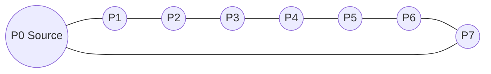

The broadcast steps can be understood as follows. In step 1, `P0` sends the message to `P4`, which is half ring distance away. Now `P0` and `P4` have the message. In step 2, both these processors send the message further: `P0` sends to `P2`, and `P4` sends to `P6`. Now four processors have the message: `P0, P2, P4, P6`. In step 3, these four processors send the message to their neighboring missing processors: `P0` sends to `P1`, `P2` sends to `P3`, `P4` sends to `P5`, and `P6` sends to `P7`. Now all eight processors have the message.

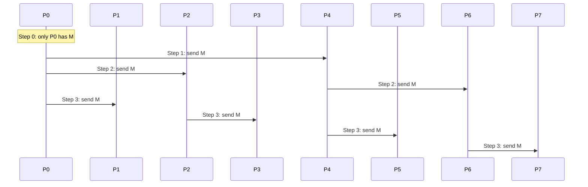

The cost of recursive doubling broadcast is:

```text
T = log2(p) × (ts + m tw)
```

where `p` is the number of processors, `ts` is startup time, `m` is message size, and `tw` is transfer time per word. For 8 processors:

```text
T = 3(ts + m tw)
```

**All-to-One Reduction** is the reverse operation. In reduction, every processor has its own value and all values are combined using an operation such as sum, product, maximum, or minimum. The final result is stored at one destination processor, here `P0`. If each processor has values `a0, a1, ..., a7`, then after sum reduction `P0` contains `a0+a1+a2+a3+a4+a5+a6+a7`.

Reduction can be performed by reversing the broadcast steps. First, neighboring pairs combine: `P1` sends to `P0`, `P3` sends to `P2`, `P5` sends to `P4`, and `P7` sends to `P6`. Now partial sums are present at `P0, P2, P4, P6`. Next, `P2` sends its partial sum to `P0`, and `P6` sends its partial sum to `P4`. Finally, `P4` sends its partial sum to `P0`. Now `P0` has the final result.

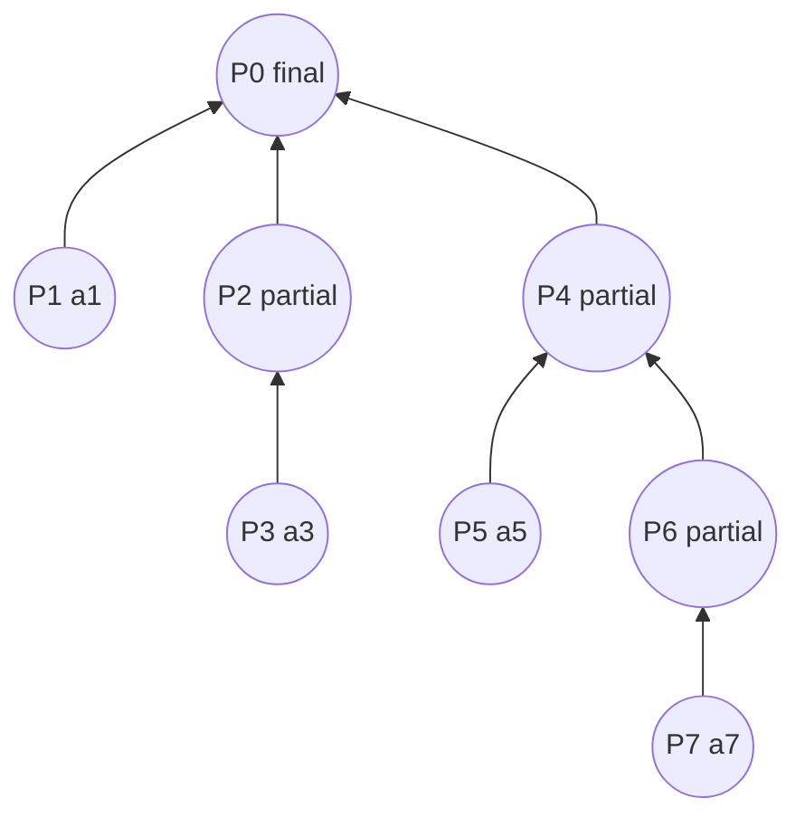

**Exam tip:** For full marks, write the definition of broadcast and reduction, show the 8-node ring, explain three broadcast steps, explain reverse reduction steps, and write the cost formula.

---

## Q.1(b) Blocking and Non-Blocking Communication using MPI

MPI stands for **Message Passing Interface**. It is used in distributed-memory parallel systems where each processor has its own memory and processors communicate by sending and receiving messages. MPI provides two important styles of point-to-point communication: **blocking communication** and **non-blocking communication**. Understanding the difference between these two is very important because communication delay directly affects parallel program performance.

In **blocking communication**, the MPI function call does not return until the operation is complete or until it is safe for the program to continue. The most common blocking functions are `MPI_Send()` and `MPI_Recv()`. When a process calls `MPI_Send`, it may wait until the message has been copied out of the send buffer or until the receiver is ready. Similarly, when a process calls `MPI_Recv`, it waits until the required message arrives. This makes blocking communication simple and safe, but it may waste processor time because the processor remains idle while waiting.

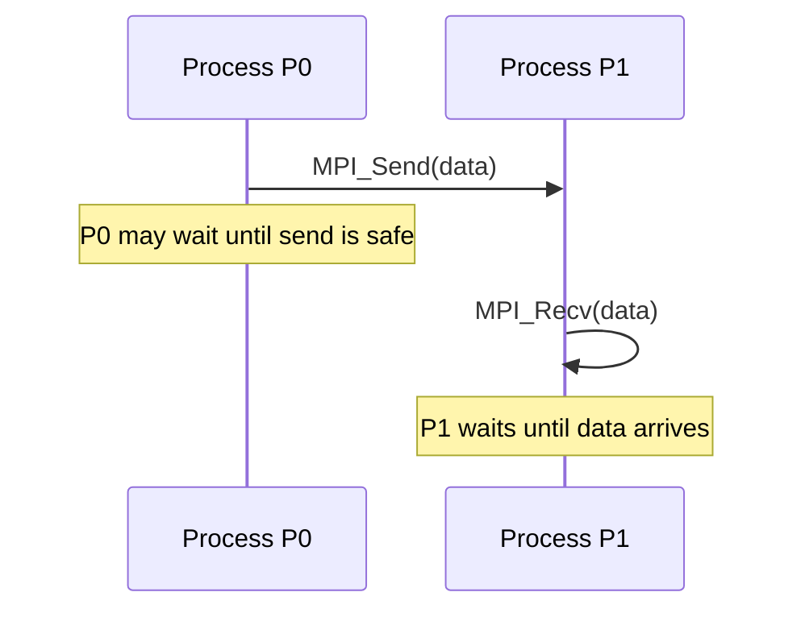

A simple blocking example is:

```c
if(rank == 0) {
    int x = 100;
    MPI_Send(&x, 1, MPI_INT, 1, 0, MPI_COMM_WORLD);
}
else if(rank == 1) {
    int y;
    MPI_Recv(&y, 1, MPI_INT, 0, 0, MPI_COMM_WORLD, MPI_STATUS_IGNORE);
}
```

Blocking communication is easy to understand and is useful for beginners. It also prevents accidental use of incomplete data. However, its disadvantage is that computation and communication cannot overlap. If the message takes time, the processor may remain idle. Another serious problem is deadlock. For example, if two processors both call blocking send to each other and neither posts a receive, both may wait forever.

In **non-blocking communication**, the MPI call starts the communication and returns immediately. The processor does not wait for the communication to finish. It can do other useful computation while the message is being transferred in the background. The common non-blocking functions are `MPI_Isend()` and `MPI_Irecv()`. Here `I` means immediate. Since these calls return immediately, MPI gives a request object. Later the program must call `MPI_Wait()` or `MPI_Test()` to check whether communication is complete.

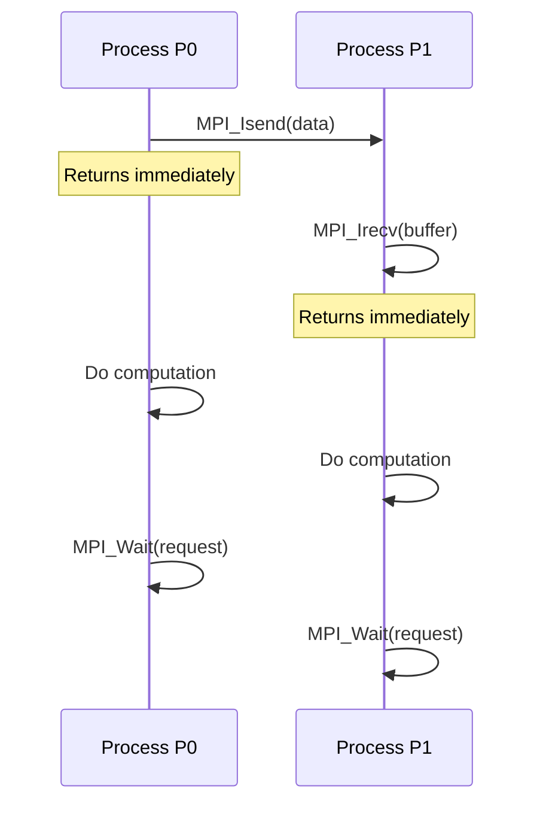

Example:

```c
MPI_Request req;
MPI_Isend(&x, 1, MPI_INT, 1, 0, MPI_COMM_WORLD, &req);
// useful computation can be done here
MPI_Wait(&req, MPI_STATUS_IGNORE);
```

The main advantage of non-blocking communication is overlap. While the message is moving, the processor can perform calculations. This reduces idle time and improves performance in large parallel programs. But it is slightly harder to program. The programmer must not modify the send buffer or use the receive buffer before the communication is complete. Completion must be checked using `MPI_Wait`, `MPI_Test`, `MPI_Waitall`, or `MPI_Testall`.

| Point | Blocking | Non-blocking |
|---|---|---|
| Functions | `MPI_Send`, `MPI_Recv` | `MPI_Isend`, `MPI_Irecv` |
| Return behavior | Returns after safe completion | Returns immediately |
| Processor waiting | More waiting | Less waiting |
| Overlap | Not possible | Possible |
| Difficulty | Easy | Moderate |
| Completion check | Not separately needed | Needed using wait/test |

In simple real life, blocking communication is like calling someone and waiting until they answer. Non-blocking communication is like sending a message and doing other work until the reply comes. In parallel computing, non-blocking communication is preferred when we want high performance.

**Exam tip:** Write both definitions, mention MPI functions, draw timing diagram, give one code snippet, and compare in a table.

---

## Q.1(c) Prefix-Sum Operation

A **prefix-sum operation**, also called a **scan operation**, is a very important operation in parallel computing. Given a list of numbers, prefix sum calculates the running sum at every position. If the input is `a0, a1, a2, a3, ...`, then the output is `a0`, `a0+a1`, `a0+a1+a2`, `a0+a1+a2+a3`, and so on. This means each output value contains the sum of all previous values including itself.

For example, consider the array:

```text
[3, 2, 5, 1, 4]
```

The prefix sum is:

```text
[3, 5, 10, 11, 15]
```

because `3 = 3`, `5 = 3+2`, `10 = 3+2+5`, `11 = 3+2+5+1`, and `15 = 3+2+5+1+4`.

In parallel computing, prefix sum is useful because many algorithms need to know positions, offsets, or accumulated values. Prefix sum is used in parallel sorting, stream compaction, graph algorithms, memory allocation on GPU, polynomial evaluation, histogram processing, and many CUDA algorithms.

Let us understand prefix sum on 8 processors. Suppose processors `P0` to `P7` contain values:

```text
P0 P1 P2 P3 P4 P5 P6 P7
1  2  3  4  5  6  7  8
```

The final prefix sum should be:

```text
1 3 6 10 15 21 28 36
```

The parallel method works in logarithmic steps. Since there are 8 processors, we need `log2(8)=3` stages. In the first stage, each processor adds value from distance 1 on the left. In the second stage, it adds value from distance 2 on the left. In the third stage, it adds value from distance 4 on the left.

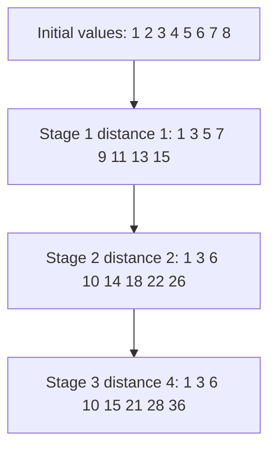

The important point is that values must be carefully copied before updating, otherwise a processor may use a newly updated value incorrectly in the same stage. In real parallel algorithms, temporary variables or synchronization are used between stages.

The algorithm can be written as:

```text
for d = 1, 2, 4, ... less than p:
    every processor Pi where i >= d receives value from P(i-d)
    Pi adds that received value to its current partial sum
```

The complexity is:

```text
O(log p)
```

where `p` is the number of processors. For 8 processors, only 3 communication stages are needed. This is much faster than a sequential prefix sum for large input when many processors are available.

There are two common types of scan: inclusive scan and exclusive scan. In inclusive scan, each output includes the current element. Example: input `[1,2,3]` gives `[1,3,6]`. In exclusive scan, each output contains sum of previous elements only. Example: input `[1,2,3]` gives `[0,1,3]`.

**Exam tip:** Write definition, one small numerical example, draw step diagram for 8 processors, write algorithm, mention `O(log p)` complexity and applications.

---

# Q.2 Answer: All-to-All Broadcast, Scatter/Gather and Circular Shift

## Q.2(a) All-to-All Broadcast on an Eight-Node Ring

**All-to-All Broadcast** is a collective communication operation in which every processor sends its own message to every other processor. It is different from one-to-all broadcast. In one-to-all broadcast, only one processor is the source. But in all-to-all broadcast, every processor acts as a source. If there are eight processors `P0` to `P7`, and each processor has a message `M0` to `M7`, then after all-to-all broadcast every processor must contain all eight messages.

Initially:

```text
P0:M0 P1:M1 P2:M2 P3:M3 P4:M4 P5:M5 P6:M6 P7:M7
```

Finally, each processor has:

```text
M0 M1 M2 M3 M4 M5 M6 M7
```

In an eight-node ring, each processor is connected to two neighbors. A simple and commonly used method is ring forwarding. In each communication step, every processor sends one message to its right neighbor and receives one message from its left neighbor. After receiving a message, it stores it and forwards it in the next step. Since there are 8 processors, each message must travel through 7 other processors. Therefore, all-to-all broadcast on a ring needs `p-1 = 7` steps.

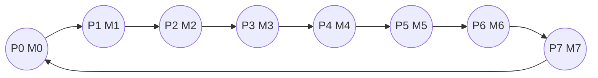

In step 1, each processor sends its own message to the right neighbor. So `P0` sends `M0` to `P1`, `P1` sends `M1` to `P2`, and so on. `P7` sends `M7` to `P0`. After step 1, every processor has two messages: its own message and one received from the left neighbor.

In step 2, every processor forwards the message it received in step 1. For example, `P1` received `M0` in step 1, so it forwards `M0` to `P2`. Similarly, `P0` received `M7`, so it forwards `M7` to `P1`. After step 2, every processor has three messages. This process continues.

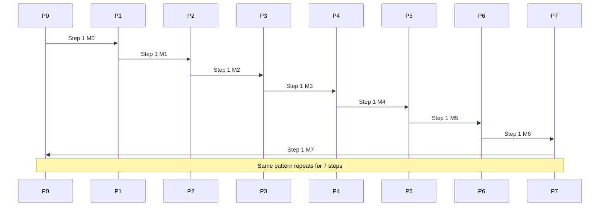

By the last step, step 7, every message has reached every processor. For example, message `M0` starts at `P0`, reaches `P1` in step 1, `P2` in step 2, and finally reaches `P7` in step 7. Similarly, every other message circulates around the ring.

The algorithm is:

```text
1. Each processor Pi starts with message Mi.
2. temp = Mi.
3. for step = 1 to p-1:
4.      send temp to right neighbor.
5.      receive message from left neighbor into temp.
6.      store received message.
7. end for
```

The cost is:

```text
T = (p - 1)(ts + m tw)
```

For 8 processors:

```text
T = 7(ts + m tw)
```

where `ts` is startup time, `m` is message size, and `tw` is transfer time per word.

**Exam tip:** Show initial state, draw ring, explain first two steps and last step, write algorithm and cost formula.

---

## Q.2(b) Scatter and Gather Communication Operation

**Scatter** and **Gather** are collective communication operations used very frequently in parallel programs. They are opposite operations. Scatter distributes data from one root processor to all processors. Gather collects data from all processors back to one root processor. These operations are useful when a large problem is divided into smaller parts and solved in parallel.

In **scatter**, the root processor has a large data array. It divides this data into equal or meaningful chunks and sends one chunk to each processor. For example, suppose `P0` is the root and it has an array `[A, B, C, D]`. There are four processors: `P0, P1, P2, P3`. After scatter, `P0` gets `A`, `P1` gets `B`, `P2` gets `C`, and `P3` gets `D`.

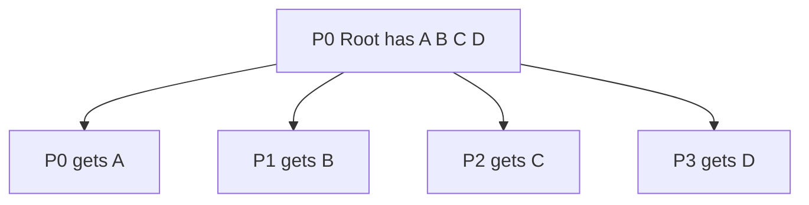

Scatter is useful when the same large task can be divided into smaller independent subtasks. For example, in matrix multiplication, rows of a matrix may be scattered among processors. In image processing, different parts of an image may be scattered to different processors.

The MPI function for scatter is:

```c
MPI_Scatter(sendbuf, sendcount, sendtype,
            recvbuf, recvcount, recvtype,
            root, MPI_COMM_WORLD);
```

Here, `sendbuf` is the data at the root, `recvbuf` is the receiving buffer at each processor, and `root` is the processor that distributes the data.

In **gather**, the reverse happens. Each processor has one piece of data, and the root processor collects all pieces into a single array. For example, suppose `P0` has `A`, `P1` has `B`, `P2` has `C`, and `P3` has `D`. After gather at root `P0`, `P0` contains `[A, B, C, D]`.

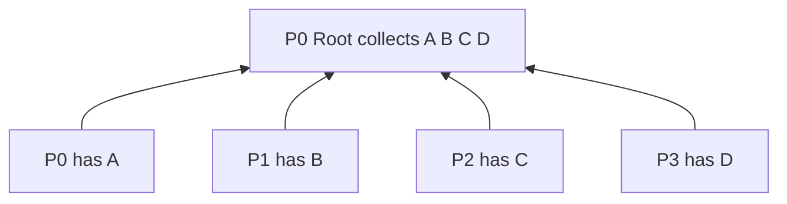

The MPI function for gather is:

```c
MPI_Gather(sendbuf, sendcount, sendtype,
           recvbuf, recvcount, recvtype,
           root, MPI_COMM_WORLD);
```

Scatter and gather are often used together. First, the root scatters data among processors. Then each processor performs computation on its own data. Finally, the root gathers the partial results. For example, suppose we want to square all numbers in an array `[1,2,3,4]`. `P0` scatters the numbers. Each processor squares its number. Then gather collects `[1,4,9,16]` at root.

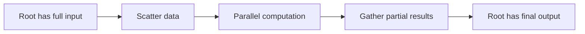

The difference is simple: scatter is one-to-many distribution, while gather is many-to-one collection. Scatter is used before parallel computation, and gather is used after computation. These operations reduce programmer effort because MPI provides optimized implementations.

**Exam tip:** For full marks, write meaning of scatter and gather, draw separate diagrams, write MPI functions, and explain one example where scatter-compute-gather is used.

---

## Q.2(c) Circular Shift Operation

A **circular shift** is a communication operation in which every processor sends its data to another processor by a fixed distance, and data wraps around from the last processor back to the first processor. It is called circular because the processors behave like they are arranged in a circle. Circular shift is commonly used in ring algorithms, mesh algorithms, matrix multiplication, and data rotation operations.

Consider four processors `P0, P1, P2, P3`. Suppose they contain data `A, B, C, D` respectively.

```text
P0:A  P1:B  P2:C  P3:D
```

If we perform a right circular shift by 1, then each processor sends its data to the processor on the right. So `P0` sends `A` to `P1`, `P1` sends `B` to `P2`, `P2` sends `C` to `P3`, and `P3` sends `D` back to `P0`. After the shift:

```text
P0:D  P1:A  P2:B  P3:C
```

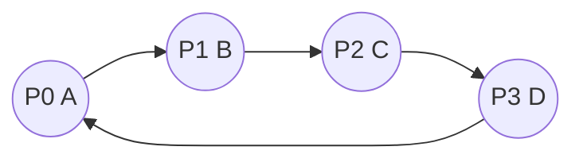

For a left circular shift by 1, the direction is opposite. `P0` sends to `P3`, `P3` sends to `P2`, `P2` sends to `P1`, and `P1` sends to `P0`. The data after left shift becomes:

```text
P0:B  P1:C  P2:D  P3:A
```

The general formula for right circular shift by distance `k` among `p` processors is:

```text
Destination of Pi = P(i + k) mod p
```

For left circular shift by distance `k`:

```text
Destination of Pi = P(i - k + p) mod p
```

The modulo operation is important because it creates wrap-around. For example, if `p=4` and `P3` shifts right by 1, then destination is `(3+1) mod 4 = 0`, so `P3` sends to `P0`.

Circular shift can also be performed on a mesh. In a 3×3 mesh, row-wise circular shift moves data inside each row. For example:

```text
Before:
A B C
D E F
G H I

After right row shift:
C A B
F D E
I G H
```

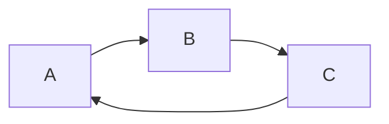

Circular shift is used in parallel matrix multiplication algorithms such as Cannon's algorithm, where rows and columns of matrices are shifted repeatedly. It is also used in ring-based communication, data alignment, load balancing, and parallel sorting.

The cost of circular shift depends on the network. In a ring, a shift by one position can be done in one communication step because every processor sends to its neighbor simultaneously. A shift by `k` positions may be done by direct routing if supported, or by repeating one-position shifts `k` times.

**Exam tip:** Define circular shift, show right and left shift examples, write modulo formula, draw circular diagram, and mention applications.

---

# UNIT II — Performance Metrics

---

# Q.3 Answer: Parallel Matrix Multiplication, Performance Metrics and Execution Time Concepts

## Q.3(a) Parallel Matrix-Matrix Multiplication Algorithm with Example

Matrix-matrix multiplication is one of the most important problems in high performance computing. It is used in scientific computing, graphics, machine learning, simulations, and engineering applications. Given two matrices `A` and `B`, the result matrix `C` is calculated as:

```text
C = A × B
```

For square matrices of size `n × n`, each element of `C` is calculated as:

```text
C[i][j] = Σ A[i][k] × B[k][j], for k = 0 to n-1
```

This means each element of the output matrix is the dot product of one row of `A` and one column of `B`.

For example:

```text
A = |1 2|      B = |5 6|
    |3 4|          |7 8|
```

Then:

```text
C00 = 1×5 + 2×7 = 19
C01 = 1×6 + 2×8 = 22
C10 = 3×5 + 4×7 = 43
C11 = 3×6 + 4×8 = 50
```

So:

```text
C = |19 22|
    |43 50|
```

The important observation is that many elements of `C` can be calculated independently. For example, `C00` and `C11` do not depend on each other. This independence makes matrix multiplication suitable for parallel computing.

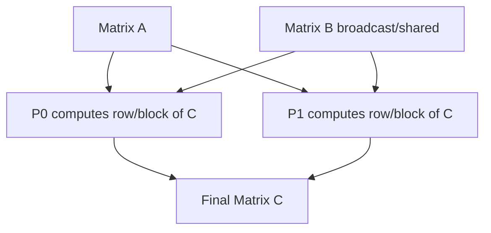

A simple parallel algorithm is **row-wise partitioning**. In this method, rows of matrix `A` are divided among processors. Each processor gets some rows of `A` and computes the corresponding rows of `C`. Since each processor needs the full matrix `B`, matrix `B` is broadcast to all processors. After computation, all processors send their computed rows of `C` back to the root processor using gather.

Algorithm:

```text
1. Divide rows of matrix A among p processors.
2. Broadcast matrix B to all processors.
3. Each processor computes assigned rows of C.
4. Gather all rows of C at root processor.
```

Suppose there are 2 processors and two rows in matrix `A`. `P0` computes the first row of `C`, and `P1` computes the second row. `P0` calculates `C00` and `C01`; `P1` calculates `C10` and `C11`. Both processors work at the same time, reducing total time.

For large matrices, **block-wise partitioning** is more efficient. Matrices are divided into square blocks, and each processor computes one block of output matrix `C`. For example:

```text
A = |A00 A01|, B = |B00 B01|
    |A10 A11|      |B10 B11|
```

Then:

```text
C00 = A00B00 + A01B10
C01 = A00B01 + A01B11
C10 = A10B00 + A11B10
C11 = A10B01 + A11B11
```

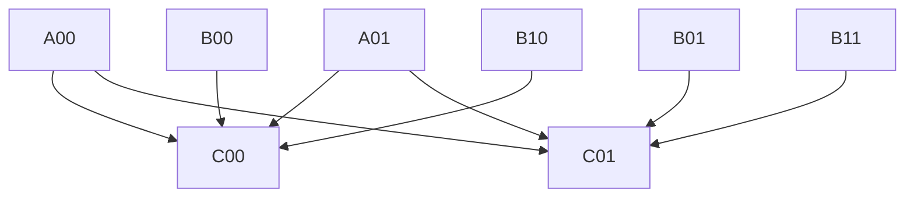

Sequential matrix multiplication takes:

```text
O(n³)
```

With `p` processors, ideal computation time is:

```text
O(n³ / p)
```

But actual parallel time also includes communication overhead for distributing matrices, broadcasting blocks, synchronization, and gathering results.

**Exam tip:** Write formula, solve 2×2 example, explain row-wise and block-wise method, draw diagram, write algorithm and complexity.

---

## Q.3(b) Performance Metrics for Parallel Systems

Performance metrics are used to measure how good a parallel algorithm or parallel system is. A parallel program is not automatically good just because it uses many processors. Sometimes using more processors may increase communication, synchronization, and idle time. Therefore, we need metrics such as execution time, speedup, efficiency, cost, overhead, and scalability.

The first metric is **serial execution time**, denoted by `Ts`. It is the time taken by the best known sequential algorithm on one processor. The second metric is **parallel execution time**, denoted by `Tp`. It is the time taken by the parallel algorithm using `p` processors. The goal of parallel computing is to make `Tp` much smaller than `Ts`.

The most common metric is **speedup**. Speedup tells how many times faster the parallel program is compared to the sequential program.

```text
S = Ts / Tp
```

If a sequential program takes 100 seconds and the parallel program takes 25 seconds, then:

```text
S = 100 / 25 = 4
```

This means the parallel program is 4 times faster.

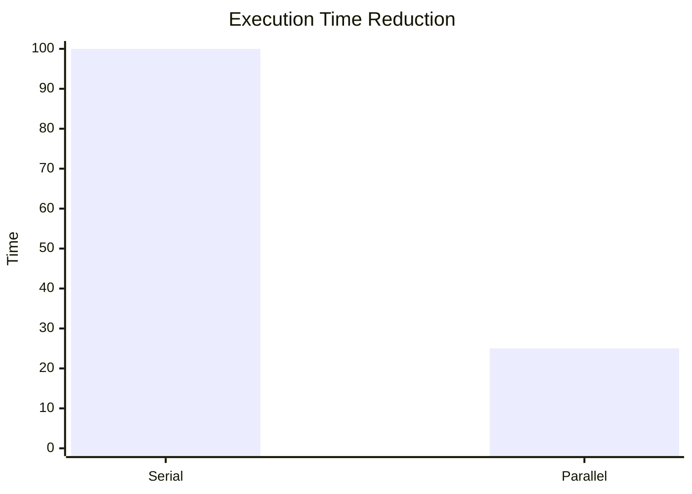

The next metric is **efficiency**. Efficiency tells how well processors are used.

```text
E = S / p
```

If speedup is 4 and number of processors is 8:

```text
E = 4 / 8 = 0.5 = 50%
```

This means only half of the total processor power is effectively used. Ideal efficiency is 1 or 100%, but in real systems it is usually less because of overhead.

**Cost** is another important metric. It is total processor time consumed by the parallel program.

```text
Cost = p × Tp
```

A parallel algorithm is called **cost optimal** if its cost is of the same order as the best serial algorithm:

```text
pTp = O(Ts)
```

This means the parallel program is not wasting processor resources.

**Overhead** is the extra work done due to parallelization. It includes communication, synchronization, idle time, extra computation, task scheduling, and memory contention.

```text
To = pTp - Ts
```

If overhead is high, speedup and efficiency reduce. For example, if processors spend more time exchanging messages than computing, the parallel program may perform poorly.

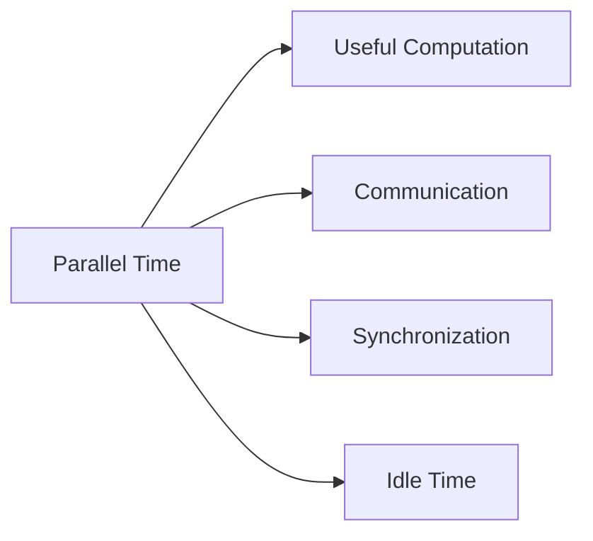

**Scalability** means the ability of a parallel system to maintain good performance when the number of processors and problem size increase. A scalable program continues to give good speedup when more processors are added. Poor scalability means adding processors does not improve performance much.

**Isoefficiency** is a more advanced scalability metric. It tells how much the problem size must increase with the number of processors to keep efficiency constant. Lower isoefficiency means better scalability.

Summary table:

| Metric | Formula | Meaning |
|---|---|---|
| Serial time | `Ts` | Time on one processor |
| Parallel time | `Tp` | Time on `p` processors |
| Speedup | `S = Ts/Tp` | How much faster |
| Efficiency | `E = S/p` | Processor utilization |
| Cost | `pTp` | Total processor time |
| Overhead | `pTp - Ts` | Extra parallel work |
| Scalability | qualitative | Ability to grow |

**Exam tip:** Write formulas, one numerical example, explain each metric in simple words, and draw overhead diagram.

---

## Q.3(c) Minimum Execution Time and Minimum Cost Optimal Execution Time

In parallel computing, we often think that using more processors always reduces execution time. This is true only up to a certain point. After some point, adding more processors may not help because communication overhead, synchronization overhead, and idle time increase. Therefore, two important concepts are **minimum execution time** and **minimum cost optimal execution time**.

**Minimum execution time** is the smallest possible time achieved by a parallel algorithm for a given problem. As we increase the number of processors, execution time usually decreases initially. But after a point, communication and synchronization become large, and execution time may stop decreasing or may even increase.

Consider this example:

| Processors | Execution Time |
|---|---|
| 1 | 100 sec |
| 2 | 55 sec |
| 4 | 30 sec |
| 8 | 20 sec |
| 16 | 22 sec |

Here the minimum execution time is 20 seconds using 8 processors. Using 16 processors gives 22 seconds, which is worse. This happens because extra processors create extra communication and coordination overhead.

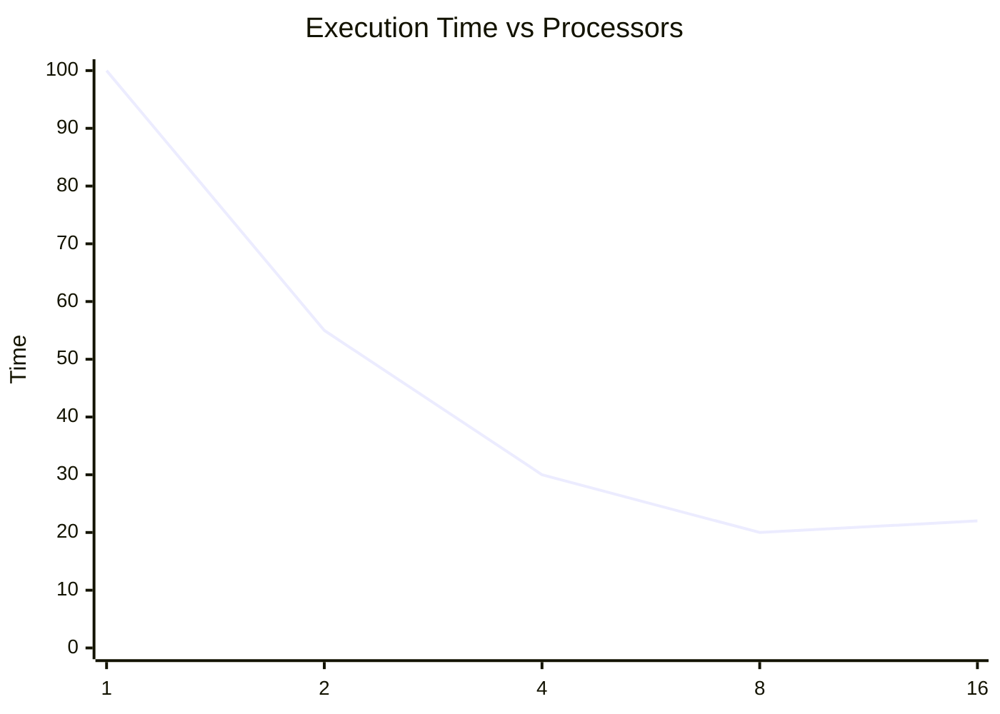

However, minimum execution time alone is not always the best choice. We must also consider cost. The cost of a parallel program is:

```text
Cost = p × Tp
```

where `p` is the number of processors and `Tp` is parallel execution time. A parallel algorithm is **cost optimal** if:

```text
pTp = O(Ts)
```

This means the total work done by all processors is of the same order as the best serial algorithm. If cost becomes much larger than serial time, then processors are being wasted.

Now consider another table:

| p | Tp | Cost = pTp | Comment |
|---|---|---|---|
| 1 | 100 | 100 | serial |
| 2 | 52 | 104 | cost optimal |
| 4 | 28 | 112 | cost optimal |
| 8 | 20 | 160 | maybe acceptable |
| 16 | 18 | 288 | not cost optimal |

Here, the minimum execution time is 18 seconds using 16 processors. But the cost is 288, which is much larger than the serial cost 100. So even though time is slightly lower, many processor resources are wasted. The minimum cost optimal execution time may be 28 seconds using 4 processors because it gives good speed while keeping cost close to serial cost.

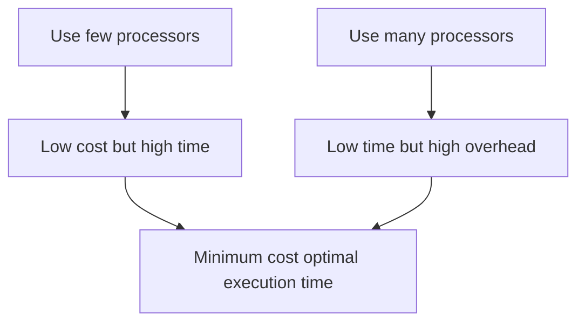

The main difference is this: minimum execution time focuses only on fastest completion, while minimum cost optimal execution time focuses on fastest completion without wasting processors. In real HPC systems, cost optimality is important because processors, power, and machine time are expensive.

**Exam tip:** Define both terms, give table, calculate cost, explain why fastest is not always best, and conclude with balance between time and cost.

---

# Q.4 Answer: Granularity, Overheads and Scaling Down

## Q.4(a) Granularity and Effects on Performance

Granularity is the amount of computation performed by a task before communication or synchronization is required. In simple words, granularity means the size of work assigned to a processor. If each task is very small, it is called fine-grained parallelism. If each task is large, it is called coarse-grained parallelism. Medium granularity is a balance between both.

Fine-grained parallelism creates many small tasks. This gives high parallelism and good load balancing because work can be distributed among many processors. However, it also creates frequent communication and synchronization. If tasks are too small, processors may spend more time communicating than computing. For example, if each processor adds only two numbers and then communicates, overhead becomes very high.

Coarse-grained parallelism creates fewer but larger tasks. Each processor performs more computation before communicating. This reduces communication overhead and synchronization cost. But if tasks are too large, load imbalance may occur. One processor may get a difficult task while others finish early and remain idle.

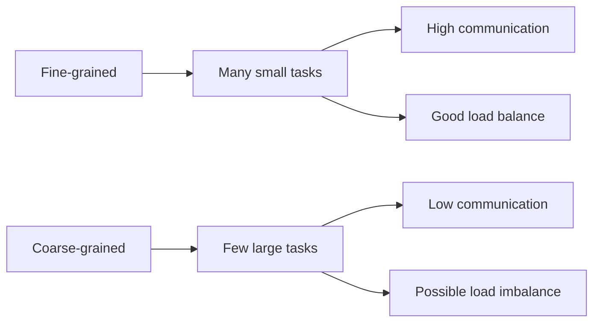

Consider addition of 16 numbers using 4 processors. In a fine-grained method, every small addition may be treated as a separate task. This creates many communication steps. In a coarse-grained method, each processor receives 4 numbers and computes a local sum.

```text
P0: a1+a2+a3+a4 = S0
P1: a5+a6+a7+a8 = S1
P2: a9+a10+a11+a12 = S2
P3: a13+a14+a15+a16 = S3
```

Then only four partial sums are combined:

```text
Final sum = S0 + S1 + S2 + S3
```

```mermaid
flowchart TD
    A[16 numbers] --> P0[P0 adds 4 numbers]
    A --> P1[P1 adds 4 numbers]
    A --> P2[P2 adds 4 numbers]
    A --> P3[P3 adds 4 numbers]
    P0 --> S[Final reduction]
    P1 --> S
    P2 --> S
    P3 --> S
```

The effect of granularity on performance can be summarized as follows. Fine granularity increases parallelism but increases overhead. Coarse granularity reduces overhead but may reduce available parallelism. If granularity is too fine, communication dominates. If granularity is too coarse, some processors may remain idle. Best performance is usually achieved with medium granularity, where computation and communication are balanced.

| Factor | Fine-grained | Coarse-grained |
|---|---|---|
| Task size | Small | Large |
| Communication | High | Low |
| Load balance | Usually good | May be poor |
| Scheduling overhead | High | Low |
| Parallelism | High | Limited |

**Exam tip:** Define granularity, explain fine and coarse types, give addition example, draw diagram, and write effect table.

---

## Q.4(b) Sources of Overhead in Parallel Systems

Overhead is the extra work or extra time introduced because of parallel execution. A parallel program does not only perform useful computation. It also spends time in communication, synchronization, scheduling, waiting, and managing tasks. This extra time is called overhead.

The overhead formula is:

```text
To = pTp - Ts
```

where `To` is overhead, `p` is number of processors, `Tp` is parallel execution time, and `Ts` is serial execution time. If overhead is high, speedup and efficiency become low.

The first major source of overhead is **communication overhead**. In distributed-memory systems, processors exchange messages. Sending a message takes startup time and data transfer time. If processors communicate frequently, much time is wasted. For example, in parallel matrix multiplication, processors may need to exchange rows or blocks of matrices.

The second source is **synchronization overhead**. Sometimes processors must wait for each other at barriers. For example, in parallel BFS, all processors must finish processing the current level before moving to the next level. Faster processors wait for slower processors.

The third source is **idle time**. Idle time occurs when a processor has no work while other processors are still busy. This usually happens because of load imbalance.

The fourth source is **load imbalance**. If work is not divided equally, some processors get more work and others get less. For example:

```text
P0 gets 1000 tasks
P1 gets 100 tasks
P2 gets 50 tasks
```

Here `P1` and `P2` finish early and wait for `P0`.

```mermaid
flowchart TD
    T[Parallel Execution Time] --> U[Useful Computation]
    T --> C[Communication]
    T --> S[Synchronization]
    T --> I[Idle Time]
    T --> E[Extra Computation]
    T --> M[Memory Contention]
```

Another source is **extra computation**. Some parallel algorithms perform additional work that is not needed in serial algorithms. For example, duplicate boundary calculations or repeated data copying may occur.

**Task creation and scheduling overhead** is also important. Creating threads, assigning tasks, and managing queues takes time. If tasks are very small, scheduling overhead may become larger than computation time.

**Memory contention** occurs when many processors try to access the same memory, cache line, or memory bus. This slows down execution. In shared-memory systems, locks and atomic operations can also add overhead.

Finally, the **sequential part** of the program limits performance. According to Amdahl's law, if some part of a program cannot be parallelized, maximum speedup is limited no matter how many processors are used.

To reduce overhead, we should reduce communication, combine small messages, use non-blocking communication, avoid unnecessary synchronization, balance load dynamically, improve memory locality, increase granularity when suitable, and reduce sequential code.

**Exam tip:** Write overhead formula, explain at least six sources with examples, draw overhead diagram, and mention reduction techniques.

---

## Q.4(c) Scaling Down / Downsizing a Parallel System

Scaling down, also called downsizing, means studying or running a parallel system with fewer processors or smaller problem size while trying to preserve the important performance behavior of the original system. It is useful because large parallel systems may be expensive, unavailable, or difficult to test. Instead of directly using thousands of processors, we can test the algorithm on a smaller number of processors with proportionally smaller input.

For example, suppose an application is designed for 1024 processors and 1,000,000 data items. But currently we have only 16 processors. We may scale down the problem size proportionally:

```text
New problem size = 1,000,000 × 16 / 1024 = 15,625
```

So we test 15,625 data items on 16 processors. This helps us estimate how the application behaves without needing the full system.

```mermaid
flowchart TD
    A[Original system: 1024 processors, 1,000,000 items]
    B[Scaled-down system: 16 processors, 15,625 items]
    A --> B
    B --> C[Study performance behavior]
```

The important point in scaling down is that the ratio of computation to communication should remain similar. If this ratio changes too much, the scaled-down experiment may not correctly predict performance of the full system. For example, if communication overhead is small in the small system but huge in the large system, then the downsized result will be misleading.

Scaling down is useful in scalability studies. It helps answer questions such as: How much overhead does the algorithm have? Will the algorithm remain efficient when processors increase? What is the effect of communication? What problem size is suitable for a given number of processors?

There are two related ideas: strong scaling and weak scaling. In strong scaling, problem size is fixed and processors are increased. In weak scaling, problem size increases with processors. Scaling down is often used to model weak scaling behavior on smaller machines.

A simple example is parallel matrix multiplication. If a very large matrix is supposed to run on 100 processors, but we test on 10 processors, we should reduce matrix size carefully so that each processor gets similar work per processor. This allows meaningful performance comparison.

However, scaling down has limitations. Cache effects, network effects, memory bandwidth, and communication patterns may differ between small and large systems. Therefore, scaling down gives an estimate, not a perfect prediction.

**Exam tip:** Define scaling down, give numerical example, draw diagram, explain why computation-to-communication ratio matters, and mention benefits and limitations.

---

# UNIT III — CUDA Programming

---

# Q.5 Answer: CUDA Basics, Processing Flow and Terms

## Q.5(a) CUDA, Language Support and Applications

CUDA stands for **Compute Unified Device Architecture**. It is a parallel computing platform and programming model developed by NVIDIA. CUDA allows programmers to use NVIDIA GPUs for general-purpose computing, not only graphics. A CPU has a few powerful cores designed for sequential and control-heavy tasks. A GPU has thousands of smaller cores designed for performing the same operation on large amounts of data in parallel.

```mermaid
flowchart LR
    CPU[CPU: Few powerful cores] --> Task1[Good for sequential tasks]
    GPU[GPU: Many small cores] --> Task2[Good for parallel data tasks]
```

CUDA programs usually have two parts: host code and device code. Host code runs on the CPU. Device code runs on the GPU. The CPU prepares data, allocates GPU memory, copies data to GPU, launches a kernel, and copies the result back. The GPU executes thousands of threads in parallel.

CUDA mainly supports CUDA C/C++, which is the most common language. In CUDA C, special keywords such as `__global__`, `__device__`, and `__shared__` are used. CUDA also supports CUDA Fortran for scientific computing. Python can use CUDA through libraries such as PyCUDA, Numba, CuPy, TensorFlow, and PyTorch. MATLAB also supports GPU computing. Java and .NET can access CUDA through wrappers. Deep learning frameworks such as PyTorch and TensorFlow internally use CUDA and cuDNN to accelerate neural network training.

```mermaid
flowchart TD
    A[CUDA Platform] --> B[CUDA C/C++]
    A --> C[CUDA Fortran]
    A --> D[Python: Numba, CuPy, PyCUDA]
    A --> E[TensorFlow/PyTorch]
    A --> F[MATLAB GPU]
```

CUDA is useful when the same operation is applied to large data. One important application is **deep learning**. Neural networks require large matrix multiplications and convolutions. GPUs perform these operations much faster than CPUs. Frameworks such as TensorFlow and PyTorch use CUDA for model training and inference.

Another application is **image and video processing**. An image contains millions of pixels. Each pixel can be processed independently by a GPU thread. Operations such as blur, sharpening, edge detection, color correction, and object detection can be accelerated using CUDA.

A third application is **scientific simulation**. Weather forecasting, molecular dynamics, fluid simulation, physics simulation, and astronomy require huge numerical calculations. CUDA helps perform these calculations in parallel.

Other applications include medical imaging, finance, cryptography, gaming, computer vision, robotics, and big data analytics. For example, in CT scan reconstruction, many mathematical operations are repeated over large image data, so CUDA can reduce processing time.

CUDA has advantages such as high performance, massive parallelism, rich libraries, and support for data-parallel programming. However, it also has limitations. It mainly works with NVIDIA GPUs, data transfer between CPU and GPU can be expensive, and programming requires understanding memory hierarchy and thread organization.

**Exam tip:** Define CUDA, compare CPU and GPU, explain host/device concept, list language support, and explain at least three applications in detail.

---

## Q.5(b) Processing Flow of CUDA-C Program

A CUDA-C program follows a specific processing flow because the CPU and GPU have separate memories. The CPU is called the host, and the GPU is called the device. The host controls the program, while the device performs parallel computation. Since the input data usually starts in CPU memory, it must be copied to GPU memory before the GPU can process it. After computation, the result must be copied back to CPU memory.

The main steps in CUDA-C program execution are: allocate memory on host, allocate memory on device, copy input data from host to device, launch kernel on GPU, wait for GPU to complete, copy result from device to host, and free memory.

```mermaid
flowchart TD
    A[CPU Host Memory: input arrays] -->|cudaMemcpy HostToDevice| B[GPU Device Memory]
    B --> C[Kernel launch: grid and blocks]
    C --> D[GPU threads compute result]
    D --> E[GPU result memory]
    E -->|cudaMemcpy DeviceToHost| F[CPU Host Memory: final output]
```

The first important CUDA function is `cudaMalloc`. It allocates memory on the GPU.

```c
cudaMalloc((void**)&d_A, size);
```

Here `d_A` is a device pointer. The prefix `d_` is commonly used to show that the variable is stored on the device. Similarly, host variables often use prefix `h_`.

The second function is `cudaMemcpy`, used to copy data between CPU and GPU.

```c
cudaMemcpy(d_A, h_A, size, cudaMemcpyHostToDevice);
cudaMemcpy(h_C, d_C, size, cudaMemcpyDeviceToHost);
```

The third important part is kernel launch. A kernel is a GPU function executed by many threads.

```c
vectorAdd<<<blocks, threads>>>(d_A, d_B, d_C, n);
```

The values inside triple angle brackets specify the execution configuration. `blocks` tells how many thread blocks are launched, and `threads` tells how many threads are in each block.

A vector addition kernel is:

```c
__global__ void vectorAdd(int *A, int *B, int *C, int n) {
    int i = blockIdx.x * blockDim.x + threadIdx.x;
    if(i < n) {
        C[i] = A[i] + B[i];
    }
}
```

Each thread calculates a unique index `i`. If there are one million elements, many GPU threads can calculate different elements simultaneously.

After launching a kernel, sometimes we use:

```c
cudaDeviceSynchronize();
```

This makes the CPU wait until GPU execution is complete. Finally, GPU memory is freed using:

```c
cudaFree(d_A);
```

The overall idea is simple: CPU prepares data, GPU performs parallel computation, and CPU receives the result. The most common mistake in CUDA programming is forgetting memory transfer or using wrong memory direction. Efficient CUDA programs reduce unnecessary CPU-GPU transfers because data transfer is slower than GPU computation.

**Exam tip:** Draw flow diagram, write CUDA functions in order, explain kernel launch, and include vector addition example.

---

## Q.5(c) Device, Host, Device Code and Kernel

In CUDA programming, four basic terms are very important: host, device, device code, and kernel. Without these concepts, CUDA execution is difficult to understand.

The **host** means the CPU and its main memory. The normal C/C++ program starts execution on the host. The host is responsible for controlling the program, allocating memory, copying data, launching kernels, and collecting results. Functions such as `main()`, `cudaMalloc`, `cudaMemcpy`, and kernel launch statements are executed from the host side.

The **device** means the GPU and its memory. The GPU contains many streaming multiprocessors and CUDA cores. It is designed to execute thousands of threads in parallel. The device has its own memory such as global memory, shared memory, registers, constant memory, and texture memory.

```mermaid
flowchart LR
    H[Host: CPU + RAM] -->|launch kernel/copy data| D[Device: GPU + GPU Memory]
    D -->|copy result| H
```

**Device code** is the code that runs on the GPU. CUDA provides special keywords to mark device code. A function declared with `__global__` is called from the host but runs on the device. A function declared with `__device__` is called from the device and runs on the device. Device code is executed by GPU threads.

A **kernel** is a special function written by the programmer that is executed on the GPU by many threads. A kernel is declared using `__global__`. When a kernel is launched, CUDA creates a grid of thread blocks. Each block contains multiple threads. Every thread executes the same kernel code but works on different data.

Example:

```c
__global__ void add(int *A, int *B, int *C) {
    int i = threadIdx.x;
    C[i] = A[i] + B[i];
}
```

Kernel launch:

```c
add<<<1, 256>>>(d_A, d_B, d_C);
```

This means one block is launched with 256 threads. Each thread has its own `threadIdx.x`. So thread 0 computes `C[0]`, thread 1 computes `C[1]`, and so on.

```mermaid
flowchart TD
    A[Kernel Launch add<<<1,256>>>] --> B[Thread 0 computes C0]
    A --> C[Thread 1 computes C1]
    A --> D[Thread 2 computes C2]
    A --> E[...]
    A --> F[Thread 255 computes C255]
```

The relationship is: host launches kernel, kernel runs on device, and device code is the code inside the kernel. The host cannot directly access normal device memory without CUDA memory copy functions. Similarly, the device cannot directly execute ordinary CPU code.

**Exam tip:** Define all four terms separately, draw host-device diagram, write small kernel code, and explain thread execution.

---

# Q.6 Answer: CUDA Memory Model, Vector Addition and Kernel Launch

## Q.6(a) CUDA Memory Model and Thread Hierarchy

CUDA memory model describes the different types of memory available in GPU programming. Understanding memory is very important because GPU performance depends heavily on where data is stored and how it is accessed. CUDA memory is arranged in a hierarchy. Some memory is very fast but small, while some memory is large but slower.

The fastest memory is **register memory**. Registers are private to each thread and are used for local variables. Access is very fast. But registers are limited in number. If too many variables are used, some values may spill into local memory, which is slower.

**Local memory** is also private to each thread, but it is usually stored in global memory when registers are not enough. So although it is called local, it can be slow.

**Shared memory** is shared by all threads in the same block. It is much faster than global memory. Threads in a block use shared memory to cooperate. For example, in matrix multiplication, a block of matrix data can be loaded into shared memory and reused by many threads. Shared memory exists only during block execution.

**Global memory** is large memory on the GPU. It is accessible by all threads and also accessible from the host through `cudaMemcpy`. It stores input and output arrays. However, it is slower than shared memory and registers.

**Constant memory** is read-only memory useful for values that do not change and are read by many threads. **Texture memory** is also read-only cached memory useful for image-like access patterns.

```mermaid
flowchart TD
    A[Thread] --> R[Registers: fastest private]
    A --> L[Local memory: private but slower]
    B[Block] --> S[Shared memory: fast per block]
    G[Grid/GPU] --> GM[Global memory: large and slower]
    G --> C[Constant memory]
    G --> T[Texture memory]
```

CUDA also has a thread hierarchy. Threads are organized as:

```text
Grid -> Blocks -> Threads
```

A kernel launch creates one grid. A grid contains many blocks. Each block contains many threads. Threads inside the same block can cooperate using shared memory and can synchronize using `__syncthreads()`. Threads in different blocks cannot directly synchronize inside the same kernel.

```mermaid
flowchart TD
    Grid[Grid] --> B0[Block 0]
    Grid --> B1[Block 1]
    Grid --> B2[Block 2]
    B0 --> T00[Thread 0]
    B0 --> T01[Thread 1]
    B0 --> T02[Thread 2]
    B1 --> T10[Thread 0]
    B1 --> T11[Thread 1]
```

Each thread can identify itself using built-in variables:

```c
threadIdx.x   // thread index inside block
blockIdx.x    // block index inside grid
blockDim.x    // number of threads per block
```

The global index is commonly calculated as:

```c
int i = blockIdx.x * blockDim.x + threadIdx.x;
```

This index maps each thread to one data element. For example, in vector addition, thread `i` calculates `C[i] = A[i] + B[i]`.

The thread hierarchy allows CUDA to scale to thousands of threads. Blocks are assigned to streaming multiprocessors by the GPU scheduler. Since blocks are independent, they can run in any order. This makes CUDA programs scalable across different GPU models.

**Exam tip:** Draw memory hierarchy and thread hierarchy, explain each memory type, write global index formula, and mention `__syncthreads()` for block-level synchronization.

---

## Q.6(b) Block Dimension, Grid Dimension and CUDA Vector Addition Kernel

In CUDA, threads are organized into blocks and blocks are organized into a grid. **Block dimension** tells how many threads are present in a block. **Grid dimension** tells how many blocks are present in the grid. These dimensions are specified during kernel launch.

For example:

```c
vectorAdd<<<4, 256>>>(d_A, d_B, d_C, n);
```

Here, grid dimension is 4 blocks and block dimension is 256 threads per block. Total threads launched are:

```text
4 × 256 = 1024 threads
```

```mermaid
flowchart TD
    G[Grid] --> B0[Block 0: 256 threads]
    G --> B1[Block 1: 256 threads]
    G --> B2[Block 2: 256 threads]
    G --> B3[Block 3: 256 threads]
```

The purpose of grid and block dimensions is to map thousands or millions of data elements to GPU threads. If an array has `n` elements, usually one thread is assigned to one element.

The vector addition problem is:

```text
C[i] = A[i] + B[i]
```

If:

```text
A = [1,2,3,4]
B = [5,6,7,8]
```

Then:

```text
C = [6,8,10,12]
```

CUDA kernel:

```c
__global__ void vectorAdd(int *A, int *B, int *C, int n) {
    int i = blockIdx.x * blockDim.x + threadIdx.x;

    if(i < n) {
        C[i] = A[i] + B[i];
    }
}
```

The line:

```c
int i = blockIdx.x * blockDim.x + threadIdx.x;
```

calculates the global thread index. Suppose `blockDim.x = 4`. In block 0, thread indices are 0,1,2,3, so global indices are 0,1,2,3. In block 1, global indices are 4,5,6,7. This allows each thread to work on a unique array element.

```mermaid
flowchart LR
    T0[Block 0 Thread 0] --> C0[C0=A0+B0]
    T1[Block 0 Thread 1] --> C1[C1=A1+B1]
    T2[Block 0 Thread 2] --> C2[C2=A2+B2]
    T3[Block 0 Thread 3] --> C3[C3=A3+B3]
    T4[Block 1 Thread 0] --> C4[C4=A4+B4]
```

The `if(i < n)` condition is necessary because the number of launched threads is often rounded up. For example, if `n=1000` and block size is 256, then:

```c
blocks = (n + threadsPerBlock - 1) / threadsPerBlock;
```

This gives 4 blocks, meaning 1024 threads. The last 24 threads should not access invalid array positions, so `if(i < n)` protects memory.

Complete launch code:

```c
int threadsPerBlock = 256;
int blocksPerGrid = (n + threadsPerBlock - 1) / threadsPerBlock;
vectorAdd<<<blocksPerGrid, threadsPerBlock>>>(d_A, d_B, d_C, n);
```

**Exam tip:** Define block and grid dimensions, draw grid-block diagram, write vector addition kernel, explain global index formula and boundary check.

---

## Q.6(c) Kernel in CUDA and Kernel Launch Arguments

A **kernel** in CUDA is a special function that runs on the GPU. It is written by the programmer and executed by many GPU threads in parallel. A kernel is declared using the keyword `__global__`. It is called from host code but executed on the device.

Example:

```c
__global__ void add(int *A, int *B, int *C) {
    int i = threadIdx.x;
    C[i] = A[i] + B[i];
}
```

When the CPU calls this function using a kernel launch, many threads execute the same function. Each thread has its own thread index, so each thread can work on different data.

Kernel launch syntax is:

```c
kernelName<<<gridDim, blockDim>>>(arguments);
```

For example:

```c
add<<<4, 256>>>(d_A, d_B, d_C);
```

This launches 4 blocks with 256 threads each, so total threads are 1024.

```mermaid
flowchart TD
    A[Host CPU calls add<<<4,256>>>] --> G[GPU Grid]
    G --> B0[Block 0]
    G --> B1[Block 1]
    G --> B2[Block 2]
    G --> B3[Block 3]
    B0 --> T0[256 threads]
    B1 --> T1[256 threads]
    B2 --> T2[256 threads]
    B3 --> T3[256 threads]
```

The first kernel launch argument is **grid dimension**. It tells how many blocks are created. Grid dimension may be one-dimensional, two-dimensional, or three-dimensional. For arrays, 1D grid is common. For images or matrices, 2D grid is useful.

The second argument is **block dimension**. It tells how many threads are inside each block. Block dimension can also be 1D, 2D, or 3D. For example:

```c
dim3 block(16, 16);
dim3 grid(ceil(width/16), ceil(height/16));
```

This is common for image processing where each thread processes one pixel.

The third optional launch argument is **shared memory size**. It specifies dynamically allocated shared memory per block.

```c
kernel<<<grid, block, sharedMemSize>>>(...);
```

The fourth optional argument is **stream**. CUDA streams allow operations to run asynchronously and overlap computation with memory transfer.

```c
kernel<<<grid, block, sharedMemSize, stream>>>(...);
```

Therefore, full syntax is:

```c
kernel<<<gridDim, blockDim, sharedMemSize, stream>>>(parameters);
```

Kernel parameters are normal arguments passed to the function, such as pointers to device memory, array size, constants, or configuration values. It is important that pointers passed to kernels should usually point to device memory, not ordinary host memory.

A kernel launch is asynchronous with respect to the CPU. This means the CPU may continue after launching the kernel. If the CPU needs to wait, we use:

```c
cudaDeviceSynchronize();
```

**Exam tip:** Define kernel, write syntax, explain grid and block dimensions, mention optional shared memory and stream arguments, and draw launch diagram.

---

# UNIT IV — Parallel Algorithms and Distributed Computing

---

# Q.7 Answer: Odd-Even Sort, Parallel DFS and Kubernetes

## Q.7(a) Odd-Even Transposition in Bubble Sort using Parallel Formulation

Odd-even transposition sort is a parallel version of bubble sort. In normal bubble sort, adjacent elements are compared one by one. This is slow because comparisons are mostly sequential. In odd-even transposition sort, independent adjacent pairs are compared at the same time. This makes it suitable for parallel computers.

The algorithm works in phases. There are two types of phases: even phase and odd phase. In the even phase, pairs `(0,1), (2,3), (4,5)` and so on are compared in parallel. In the odd phase, pairs `(1,2), (3,4), (5,6)` and so on are compared in parallel. If a pair is in the wrong order, the values are swapped. After `n` phases, the array becomes sorted.

```mermaid
flowchart TD
    A[Start array] --> B[Even phase: compare 0-1, 2-3, 4-5]
    B --> C[Odd phase: compare 1-2, 3-4, 5-6]
    C --> D[Repeat for n phases]
    D --> E[Sorted array]
```

Example: Sort the array:

```text
[8, 5, 2, 6, 3, 1]
```

Phase 1 is even phase. Compare `(8,5)`, `(2,6)`, and `(3,1)`. Swap 8 and 5. Do not swap 2 and 6. Swap 3 and 1.

```text
After phase 1: [5, 8, 2, 6, 1, 3]
```

Phase 2 is odd phase. Compare `(8,2)` and `(6,1)`. Both are swapped.

```text
After phase 2: [5, 2, 8, 1, 6, 3]
```

Phase 3 is even phase. Compare `(5,2)`, `(8,1)`, and `(6,3)`. All are swapped.

```text
After phase 3: [2, 5, 1, 8, 3, 6]
```

Phase 4 is odd phase. Compare `(5,1)` and `(8,3)`. Both are swapped.

```text
After phase 4: [2, 1, 5, 3, 8, 6]
```

Phase 5 is even phase. Compare `(2,1)`, `(5,3)`, and `(8,6)`. All are swapped.

```text
After phase 5: [1, 2, 3, 5, 6, 8]
```

```mermaid
flowchart LR
    A0[8 5 2 6 3 1] --> A1[5 8 2 6 1 3]
    A1 --> A2[5 2 8 1 6 3]
    A2 --> A3[2 5 1 8 3 6]
    A3 --> A4[2 1 5 3 8 6]
    A4 --> A5[1 2 3 5 6 8]
```

Algorithm:

```text
for phase = 0 to n-1:
    if phase is even:
        compare-swap pairs (0,1), (2,3), ... in parallel
    else:
        compare-swap pairs (1,2), (3,4), ... in parallel
```

Sequential bubble sort takes `O(n²)`. Parallel odd-even transposition sort requires `O(n)` phases if enough processors are available, because many comparisons happen simultaneously in each phase. However, synchronization is needed after each phase.

**Exam tip:** Explain even and odd phases, solve one example step-by-step, write algorithm, and compare with bubble sort complexity.

---

## Q.7(b) Parallel Depth First Search Algorithm

Depth First Search, or DFS, is a graph traversal algorithm that explores as deep as possible along one branch before backtracking. In sequential DFS, a stack or recursion is used. Starting from a source vertex, DFS visits an unvisited neighbor, then a neighbor of that neighbor, and continues until no further unvisited vertex is available. Then it backtracks.

Example graph:

```mermaid
graph TD
    A --> B
    A --> C
    B --> D
    B --> E
    C --> F
```

A possible sequential DFS order is:

```text
A, B, D, E, C, F
```

Parallelizing DFS is difficult because DFS is naturally path-dependent. The next step often depends on the current path. However, parallelism is possible when a vertex has multiple independent branches. Different processors can explore different branches at the same time.

For example, from vertex `A`, there are branches through `B` and `C`. Processor `P0` can explore the `B` branch, while processor `P1` explores the `C` branch.

```mermaid
flowchart TD
    A[A source] --> B[B branch handled by P0]
    A --> C[C branch handled by P1]
    B --> D[D]
    B --> E[E]
    C --> F[F]
```

A common approach is to use a shared work pool. Initially, the source vertex is visited and its unvisited neighbors are added to the work pool. Multiple processors take vertices or subtrees from the pool and perform DFS locally. If a processor discovers many new branches, it can put some of them back into the pool so that other processors can help. This is called dynamic work sharing.

Algorithm:

```text
1. Start from source vertex s.
2. Mark s as visited.
3. Insert unvisited neighbors of s into shared work pool.
4. Each processor repeatedly takes a vertex/subtree from pool.
5. Processor performs DFS on that subtree.
6. If extra branches are found, add them to pool.
7. Use atomic operations/locks to mark visited vertices.
8. Stop when work pool is empty.
```

The most important issue is duplicate visits. Two processors may discover the same vertex at the same time. To avoid this, the visited array must be updated using locks or atomic test-and-set operations. Another issue is load imbalance. One branch of a graph may be very large while another branch is small. If work is not shared dynamically, one processor may continue working while others become idle.

Communication overhead is also important in distributed-memory systems. If graph vertices are stored on different processors, processors must exchange messages when they discover remote vertices. Synchronization is needed to detect when the global search is complete.

The sequential DFS complexity is:

```text
O(V + E)
```

where `V` is the number of vertices and `E` is the number of edges. In an ideal parallel system with `p` processors, time may approach:

```text
O((V + E) / p)
```

But actual time is more because of synchronization, communication, and load imbalance.

**Exam tip:** Define DFS, draw graph, explain why DFS is hard to parallelize, describe work pool method, mention visited synchronization and complexity.

---

## Q.7(c) Kubernetes: Features and Applications

Kubernetes is an open-source container orchestration platform. It is used to deploy, scale, manage, and monitor containerized applications. A container packages an application with its dependencies so that it can run consistently on different machines. Docker can create containers, but Kubernetes manages many containers across many machines.

In simple words:

```text
Docker creates containers.
Kubernetes manages containers at scale.
```

A Kubernetes system is called a cluster. A cluster contains a control plane and worker nodes. The control plane manages the cluster. Worker nodes run the actual application containers inside pods.

```mermaid
flowchart TD
    CP[Control Plane]
    CP --> API[API Server]
    CP --> SCH[Scheduler]
    CP --> CTRL[Controller Manager]
    CP --> ETCD[etcd database]
    CP --> N1[Worker Node 1]
    CP --> N2[Worker Node 2]
    N1 --> P1[Pod: containers]
    N1 --> P2[Pod: containers]
    N2 --> P3[Pod: containers]
    N2 --> P4[Pod: containers]
```

The **pod** is the smallest deployable unit in Kubernetes. A pod contains one or more containers. A **node** is a physical or virtual machine that runs pods. The **scheduler** decides on which node a pod should run. The **API server** is the entry point for users and tools. **etcd** stores cluster state. The **controller manager** ensures that the actual state matches the desired state. The **kubelet** runs on each worker node and manages pods.

Kubernetes has many useful features. First, it provides **automatic scheduling**. When a new pod is created, Kubernetes selects a suitable node based on resource availability. Second, it provides **self-healing**. If a container crashes, Kubernetes restarts it. If a node fails, pods can be rescheduled on another node. Third, it supports **auto scaling**. If traffic increases, Kubernetes can increase the number of pods. If traffic decreases, it can reduce pods.

Kubernetes also provides **load balancing**. User requests can be distributed among multiple pods. It supports **rolling updates**, meaning a new version of an application can be deployed gradually without downtime. It also supports **service discovery**, so applications can find each other easily.

Applications of Kubernetes include cloud applications, microservices, web applications, AI/ML model deployment, big data systems, DevOps automation, and high-availability services. For example, an online shopping website may run user service, payment service, product service, and order service as separate containers managed by Kubernetes.

Kubernetes is useful in parallel and distributed computing because it manages distributed workloads efficiently. It helps deploy applications on clusters, scale them, recover from failures, and utilize resources effectively.

**Exam tip:** Define Kubernetes, draw architecture, explain pod/node/control plane, write features and applications.

---

# Q.8 Answer: Parallel Merge Sort, GPU Applications, Sorting Issues and Parallel BFS

## Q.8(a) Short Notes: Parallel Merge Sort and GPU Applications

### Parallel Merge Sort

Merge sort is a divide-and-conquer sorting algorithm. It divides the array into two halves, sorts both halves, and then merges the sorted halves. Sequential merge sort has time complexity `O(n log n)`. It is suitable for parallelization because the two halves can be sorted independently.

In parallel merge sort, after dividing the array, the left half and right half are assigned to different processors or threads. They are sorted simultaneously. After sorting, the sorted subarrays are merged. This process continues recursively.

Example array:

```text
[8, 3, 7, 4, 9, 2, 6, 5]
```

It is divided as:

```text
[8,3,7,4] and [9,2,6,5]
```

Then further:

```text
[8,3], [7,4], [9,2], [6,5]
```

After sorting small parts:

```text
[3,8], [4,7], [2,9], [5,6]
```

After merging:

```text
[3,4,7,8] and [2,5,6,9]
```

Final sorted array:

```text
[2,3,4,5,6,7,8,9]
```

```mermaid
graph TD
    A[8 3 7 4 9 2 6 5]
    A --> B[8 3 7 4]
    A --> C[9 2 6 5]
    B --> D[8 3]
    B --> E[7 4]
    C --> F[9 2]
    C --> G[6 5]
    D --> H[3 8]
    E --> I[4 7]
    F --> J[2 9]
    G --> K[5 6]
    H --> L[3 4 7 8]
    I --> L
    J --> M[2 5 6 9]
    K --> M
    L --> N[2 3 4 5 6 7 8 9]
    M --> N
```

Parallel merge sort algorithm:

```text
1. If array size is 1, return.
2. Divide array into left and right halves.
3. Sort left half in parallel.
4. Sort right half in parallel.
5. Merge the sorted halves.
```

Ideal parallel time is approximately:

```text
O((n log n) / p)
```

But actual time includes communication and merging overhead.

### GPU Applications

A GPU contains thousands of small cores and is designed for data-parallel tasks. GPU applications are programs where the same operation is performed on a large amount of data. CUDA and other GPU programming models allow programmers to use GPU power for general-purpose computing.

Important GPU applications include deep learning, image processing, video processing, scientific simulation, medical imaging, finance, cryptography, and gaming. In deep learning, GPUs accelerate matrix multiplications and convolutions. In image processing, each pixel can be processed by a separate GPU thread. In scientific simulations, millions of calculations can run in parallel.

```mermaid
flowchart TD
    GPU[GPU Many Cores] --> DL[Deep Learning]
    GPU --> IMG[Image Processing]
    GPU --> VID[Video Processing]
    GPU --> SCI[Scientific Simulation]
    GPU --> MED[Medical Imaging]
    GPU --> FIN[Finance]
```

**Exam tip:** For short notes, write definition, diagram, algorithm/example, complexity or applications.

---

## Q.8(b) Issues in Sorting on Parallel Computers

Sorting on parallel computers is more difficult than sorting on a single processor because data is distributed among multiple processors. A good parallel sorting algorithm must not only compare elements but also move data between processors, balance workload, and synchronize correctly.

The first issue is **data distribution**. Input data must be divided among processors. If data is not divided evenly, some processors may get more elements than others. For example, if `P0` gets 1000 elements and `P1` gets only 100 elements, `P1` will finish early and wait for `P0`. This reduces efficiency.

The second issue is **load balancing**. Even if the number of elements is equal, the work may not be equal. In quicksort, if the pivot is poor, one partition may contain most elements while the other contains very few. This causes one processor group to do most work.

```mermaid
flowchart TD
    A[Input array] --> P[Choose pivot]
    P --> L[Small elements]
    P --> R[Large elements]
    L -->|Too many elements| Problem1[Load imbalance]
    R -->|Too few elements| Problem2[Idle processors]
```

The third issue is **communication overhead**. Processors often need to exchange elements. In parallel quicksort, elements smaller than pivot may need to move to one processor group, while larger elements move to another. This data movement takes time.

The fourth issue is **merging bottleneck**. In parallel merge sort, different processors sort different parts. But finally these sorted parts must be merged. If merging is done by one processor, it becomes a bottleneck. Parallel merging is required for high performance.

The fifth issue is **synchronization**. Some sorting algorithms work in phases. For example, odd-even transposition sort requires all processors to finish one phase before starting the next. This creates waiting time.

The sixth issue is **memory contention**. In shared-memory systems, many processors may access the same memory or cache line. This slows performance. Locks and atomic operations may also add overhead.

The seventh issue is **choosing a good pivot or splitter**. In sample sort or quicksort, good splitters divide data evenly. Bad splitters cause imbalance.

Example: Suppose array is:

```text
[1,2,3,4,5,6,7,100]
```

If pivot is `100`, then almost all elements go to the left partition and the right partition is empty. This gives poor parallelism.

To solve these issues, algorithms use good sampling, balanced partitioning, efficient communication, parallel merging, dynamic load balancing, and optimized memory access.

**Exam tip:** List at least six issues, explain each with example, draw pivot imbalance diagram, and write solutions.

---

## Q.8(c) Parallel BFS Algorithm in Brief

Breadth First Search, or BFS, is a graph traversal algorithm that visits vertices level by level. Starting from a source vertex, BFS first visits all its immediate neighbors, then neighbors of those neighbors, and so on. BFS is suitable for parallel execution because all vertices at the same level can be processed independently.

Example graph:

```mermaid
graph TD
    A --> B
    A --> C
    A --> D
    B --> E
    B --> F
    D --> G
```

BFS from `A` gives levels:

```text
Level 0: A
Level 1: B, C, D
Level 2: E, F, G
```

In parallel BFS, the set of vertices at the current level is called the **frontier**. All vertices in the frontier are processed in parallel. Each processor examines neighbors of some frontier vertices. If an unvisited neighbor is found, it is marked visited and added to the next frontier. After all vertices in the current frontier are processed, the next frontier becomes the current frontier.

```mermaid
flowchart TD
    S[Source A] --> F1[Frontier Level 1: B C D]
    F1 --> F2[Frontier Level 2: E F G]
    F2 --> END[End when frontier empty]
```

Algorithm:

```text
1. Mark source vertex as visited.
2. frontier = {source}
3. while frontier is not empty:
4.      next_frontier = empty
5.      In parallel, process each vertex u in frontier.
6.      For each neighbor v of u:
7.          if v is not visited:
8.              mark v visited using atomic operation
9.              add v to next_frontier
10.     frontier = next_frontier
```

The main benefit is that many vertices at the same level can be processed simultaneously. For example, vertices `B`, `C`, and `D` can be processed by different processors. This gives speedup for large graphs.

However, parallel BFS has challenges. First, duplicate discovery may happen. Two processors may find the same vertex at the same time. To avoid this, atomic operations are used when marking vertices as visited. Second, load imbalance may happen because some vertices have many neighbors and others have few. Third, synchronization is needed after every BFS level. Fourth, in distributed-memory systems, communication is needed when discovered vertices belong to another processor.

Sequential BFS complexity is:

```text
O(V + E)
```

Ideal parallel complexity with `p` processors is approximately:

```text
O((V + E) / p)
```

But actual time also includes synchronization and communication overhead.

**Exam tip:** Define BFS, draw graph levels, explain frontier concept, write parallel algorithm, mention complexity and issues.
