# High Performance Computing (410250) — Paper 2 `[6263]-94` Complete Solution

**B.E. Computer Engineering | 2019 Pattern | Semester VIII**  
**Writing style:** Simple language, long explanation, visual understanding, Mermaid diagrams, algorithms, examples, cost/complexity.  
**Exam target:** Each answer is written in a way that can be expanded in the exam for 7–10 marks.

---

## How to Use This File
For every answer in the exam, follow this pattern:

1. Start with a clean definition.  
2. Draw a neat diagram.  
3. Explain working step-by-step.  
4. Add algorithm/pseudocode if asked.  
5. Add cost/complexity if asked.  
6. End with applications/advantages/conclusion.  

---

# UNIT I — Communication Operations

---

# Q.1 Answer: One-to-All Broadcast on Hypercube, Scatter-Gather and Circular Shift

## Q.1(a) One-to-All Broadcast on Hypercube with Algorithm and Cost Calculation

**One-to-All Broadcast** is a collective communication operation in which one processor, called the source processor, sends the same message to all other processors in the parallel system. If the source is `P0`, then initially only `P0` has the message, and after the broadcast operation every processor has the same message. This operation is very common in parallel computing because many algorithms require one processor to distribute input data, control information, pivot values, matrix blocks, or configuration parameters to all other processors.

A **hypercube** is a very important interconnection network used in parallel systems. A hypercube of dimension `d` contains `2^d` processors. Therefore, if we have 8 processors, then:

```text
8 = 2^3
```

So the network is a **3-dimensional hypercube**. Each processor is given a binary address of 3 bits:

```text
P0 = 000
P1 = 001
P2 = 010
P3 = 011
P4 = 100
P5 = 101
P6 = 110
P7 = 111
```

Two processors are directly connected if their binary addresses differ in exactly one bit. For example, `000` is connected to `001`, `010`, and `100` because each differs from `000` in one bit.

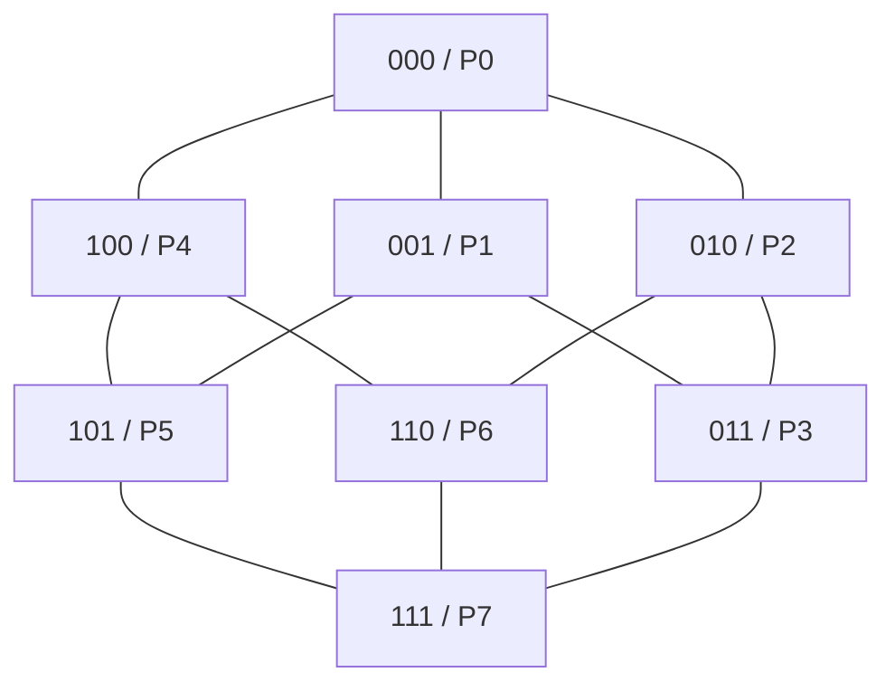

The broadcast on a hypercube is efficient because it uses dimensions of the cube. In each step, processors that already have the message send it to another processor by flipping one bit of the address. The number of processors having the message doubles after every step. Therefore, for `p` processors, the broadcast completes in `log2(p)` steps.

For 8 processors, there are 3 steps. Assume `P0` is the source and message is `M`.

**Step 0:** Only `P0 = 000` has message `M`.

**Step 1:** `P0` sends the message to processor obtained by flipping the most significant bit:

```text
P0(000) -> P4(100)
```

Now `P0` and `P4` have the message.

**Step 2:** Both processors having the message send it along the next dimension:

```text
P0(000) -> P2(010)
P4(100) -> P6(110)
```

Now `P0, P2, P4, P6` have the message.

**Step 3:** All four processors send message along the last dimension:

```text
P0(000) -> P1(001)
P2(010) -> P3(011)
P4(100) -> P5(101)
P6(110) -> P7(111)
```

Now all eight processors have the message.

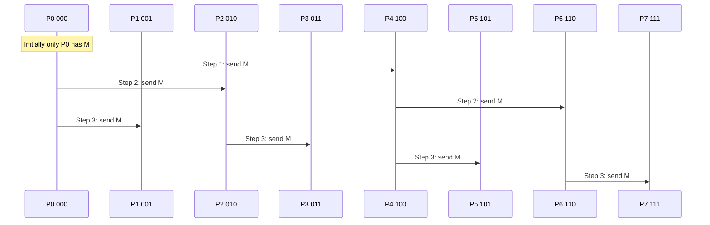

The algorithm is:

```text
Algorithm One-to-All Broadcast on Hypercube
Input: source processor P0, number of processors p = 2^d
1. Source processor P0 has message M.
2. for i = d-1 down to 0 do
3.      Every processor that has M sends it to the neighbor
        obtained by flipping bit i of its binary address.
4. end for
5. All processors now have M.
```

**Cost calculation:** Let:

```text
ts = startup time for communication
m  = number of words in message
tw = transfer time per word
p  = number of processors
```

One message transfer costs:

```text
ts + m tw
```

Number of communication steps in hypercube broadcast:

```text
log2(p)
```

So total cost is:

```text
T = log2(p)(ts + m tw)
```

For 8 processors:

```text
T = 3(ts + m tw)
```

This is better than simple linear broadcast, which may require `p-1` steps. Hypercube broadcast is efficient because it doubles the informed processors at every step.

**How to write in exam:** Define broadcast, draw hypercube, label binary addresses, explain 3 steps, write algorithm, and write cost formula.

---

## Q.1(b) Scatter and Gather Communication Operation

**Scatter** and **Gather** are collective communication operations used in message-passing parallel programs. They are opposite operations. Scatter is used to distribute data from one processor to many processors. Gather is used to collect data from many processors back to one processor. These operations are very useful when a large problem is divided into smaller parts, solved in parallel, and then combined.

In **Scatter**, one processor is selected as the root processor. The root has a large data array or block. It divides the data into smaller chunks and sends one chunk to each processor. For example, suppose root processor `P0` has the array:

```text
[A, B, C, D]
```

There are four processors `P0, P1, P2, P3`. After scatter:

```text
P0 gets A
P1 gets B
P2 gets C
P3 gets D
```

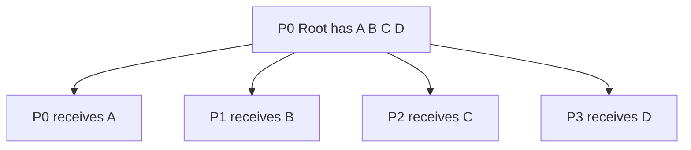

Scatter is important because it supports data parallelism. Suppose we want to process an array of one million numbers using four processors. Instead of giving the whole array to one processor, we divide it into four parts. Each processor works on its own part independently. This reduces computation time.

The MPI function for scatter is:

```c
MPI_Scatter(sendbuf, sendcount, sendtype,
            recvbuf, recvcount, recvtype,
            root, MPI_COMM_WORLD);
```

Here, `sendbuf` is the root's data buffer, `sendcount` is the number of elements sent to each processor, `recvbuf` is the receiving buffer, and `root` is the processor that distributes data.

In **Gather**, the reverse operation is performed. Each processor has some data, and all processors send their data to the root processor. The root collects the pieces and stores them in order. For example:

```text
P0 has A
P1 has B
P2 has C
P3 has D
```

After gather at `P0`:

```text
P0 has [A, B, C, D]
```

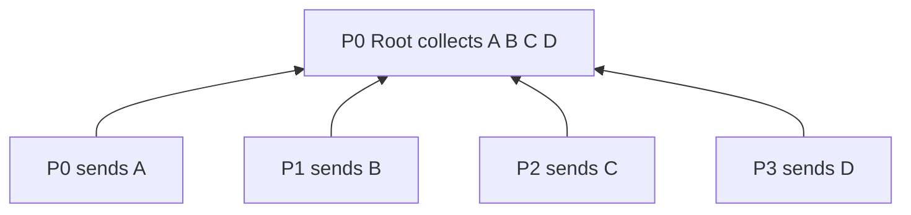

The MPI function for gather is:

```c
MPI_Gather(sendbuf, sendcount, sendtype,
           recvbuf, recvcount, recvtype,
           root, MPI_COMM_WORLD);
```

Scatter and gather are often used together. The pattern is:

```text
Scatter input -> parallel computation -> gather output
```


For example, if we want to square all elements of `[1,2,3,4]`, `P0` scatters numbers to processors. Each processor squares its number. Then `P0` gathers the results:

```text
Input:  [1,2,3,4]
Output: [1,4,9,16]
```

Applications of scatter and gather include parallel matrix multiplication, vector operations, image processing, sorting, numerical simulations, and distributed data analytics.

The main difference is simple: scatter distributes data from one root to all processors, while gather collects data from all processors to one root. Scatter is commonly used before computation, and gather is used after computation.

**How to write in exam:** Draw both diagrams, explain with `[A B C D]`, write MPI functions, and mention scatter-compute-gather pattern.

---

## Q.1(c) Circular Shift Operation

A **Circular Shift** operation is a communication operation in which every processor sends its data to another processor at a fixed distance, and the data wraps around at the end. It is called circular because processors are considered to be arranged in a circle or ring. When data reaches the last processor, the next position becomes the first processor again.

Consider four processors:

```text
P0, P1, P2, P3
```

Initially:

```text
P0:A   P1:B   P2:C   P3:D
```

If we perform a right circular shift by 1, each processor sends its data to the next processor on the right:

```text
P0 sends A to P1
P1 sends B to P2
P2 sends C to P3
P3 sends D to P0
```

After the shift:

```text
P0:D   P1:A   P2:B   P3:C
```

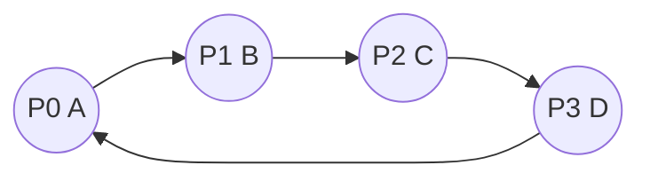

For a left circular shift by 1, the data moves in the opposite direction:

```text
P0:A goes to P3
P1:B goes to P0
P2:C goes to P1
P3:D goes to P2
```

After left shift:

```text
P0:B   P1:C   P2:D   P3:A
```

The general formula for right circular shift by distance `k` among `p` processors is:

```text
Destination of Pi = P(i + k) mod p
```

For left circular shift:

```text
Destination of Pi = P(i - k + p) mod p
```

The modulo operation is used to perform wrap-around. For example, if `p = 4` and processor `P3` shifts right by 1:

```text
(3 + 1) mod 4 = 0
```

So `P3` sends its data to `P0`.

Circular shift is useful in many parallel algorithms. In ring-based algorithms, data is rotated among processors using circular shifts. In parallel matrix multiplication algorithms like Cannon's algorithm, rows and columns of matrices are shifted circularly. In sorting algorithms, circular shifts can be used to move elements between processors. Circular shift is also useful in load balancing and iterative numerical algorithms.

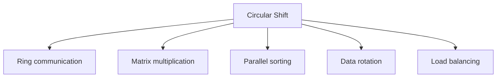

The communication cost depends on the network. If processors are connected in a ring and shift is by one position, then all processors can send data simultaneously, so it takes one communication step. If the shift distance is larger and direct links are not available, multiple neighbor shifts may be required.

**How to write in exam:** Define circular shift, show right shift example, write modulo formula, draw ring diagram, and mention applications.

---

# Q.2 Answer: All-to-All Broadcast/Reduction, Blocking/Non-Blocking MPI and Improving Communication Speed

## Q.2(a) All-to-All Broadcast and All-to-All Reduction with Example and Cost Analysis

**All-to-All Broadcast** is a collective communication operation in which every processor sends its own message to every other processor. It is different from one-to-all broadcast. In one-to-all broadcast, only one source sends data to all. In all-to-all broadcast, every processor acts as a source and every processor also acts as a receiver.

Suppose there are four processors:

```text
P0 has M0
P1 has M1
P2 has M2
P3 has M3
```

After all-to-all broadcast, each processor has:

```text
M0, M1, M2, M3
```

This operation is needed in algorithms where all processors must know data from all other processors. Examples include parallel graph algorithms, matrix algorithms, distributed database operations, and some sorting algorithms.

A simple way to perform all-to-all broadcast on a ring is to use cyclic forwarding. In every step, each processor sends the message it currently forwards to its right neighbor and receives from its left neighbor.

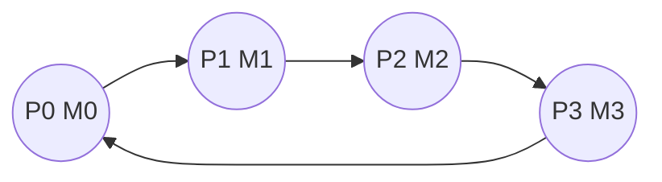

For 4 processors, all-to-all broadcast takes `p-1 = 3` steps. In step 1, each processor sends its own message. In step 2, it forwards the message received in step 1. In step 3, it forwards again. After 3 steps, every message has reached every processor.

Algorithm:

```text
1. Each processor Pi starts with message Mi.
2. temp = Mi.
3. for step = 1 to p-1:
4.      send temp to right neighbor.
5.      receive message from left neighbor into temp.
6.      store received message.
7. end for
```

Cost on a ring:

```text
T = (p - 1)(ts + m tw)
```

where `ts` is startup time, `m` is message size, and `tw` is transfer time per word.

On a hypercube, all-to-all broadcast is performed in `log2(p)` stages. In each stage, processors exchange all information collected so far with a neighbor in one dimension. Message size doubles in every stage. The cost is generally written as:

```text
T = log2(p)ts + (p - 1)m tw
```

because each processor finally receives `(p-1)m` words.

**All-to-All Reduction** is a collective operation where values from all processors are combined using an operation such as sum, maximum, minimum, or product, and the final reduced result is made available to all processors. It can be considered as:

```text
Reduction + Broadcast
```

For example, suppose:

```text
P0 = 2, P1 = 3, P2 = 4, P3 = 5
Operation = SUM
```

The reduced result is:

```text
2 + 3 + 4 + 5 = 14
```

After all-to-all reduction, every processor knows `14`.

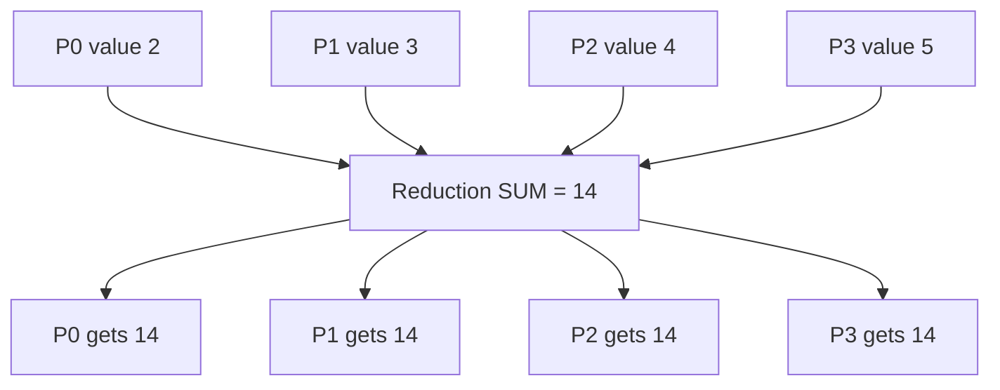

Using a tree or hypercube method, reduction takes `log2(p)` steps and broadcast also takes `log2(p)` steps. So total cost is approximately:

```text
T = 2 log2(p)(ts + m tw)
```

Using a ring, reduction plus broadcast may take:

```text
T = 2(p - 1)(ts + m tw)
```

All-to-all broadcast distributes all messages to all processors, while all-to-all reduction combines all processor values and distributes the final result to all.

**How to write in exam:** Explain meaning, give 4-processor example, draw ring and reduction diagram, write algorithm, and write cost formulas for ring/hypercube.

---

## Q.2(b) Blocking and Non-Blocking Communication using MPI

MPI, or Message Passing Interface, is a standard used for communication between processes in distributed-memory parallel systems. Since each processor has its own memory, processors exchange data through messages. MPI provides two major styles of point-to-point communication: **blocking communication** and **non-blocking communication**.

In **blocking communication**, the communication function does not return until the operation is complete or safe. The commonly used blocking functions are:

```c
MPI_Send()
MPI_Recv()
```

When a process calls `MPI_Send`, it may wait until the message is copied from the user buffer or until the receiver is ready. When a process calls `MPI_Recv`, it waits until the message arrives. This makes the program simple and safe because after the function returns, the buffer can be reused.

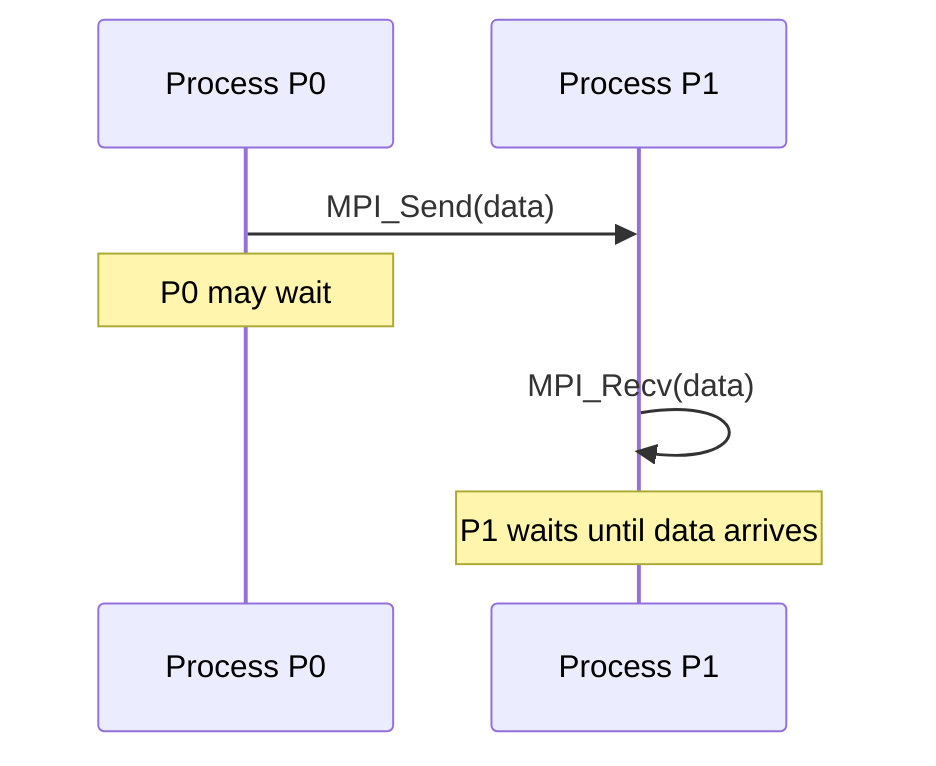

Example:

```c
if(rank == 0) {
    int x = 10;
    MPI_Send(&x, 1, MPI_INT, 1, 0, MPI_COMM_WORLD);
}
else if(rank == 1) {
    int y;
    MPI_Recv(&y, 1, MPI_INT, 0, 0, MPI_COMM_WORLD, MPI_STATUS_IGNORE);
}
```

Blocking communication is easy to understand and less error-prone. However, it has disadvantages. The processor may remain idle while waiting. It does not allow overlap of communication and computation. Also, incorrect ordering of sends and receives may cause deadlock.

In **non-blocking communication**, the MPI call starts the communication and returns immediately. The processor can continue doing other work while communication progresses. The common functions are:

```c
MPI_Isend()
MPI_Irecv()
MPI_Wait()
MPI_Test()
```

Here `I` means immediate. Since the operation may still be incomplete when `MPI_Isend` or `MPI_Irecv` returns, MPI provides a request object. The program must later use `MPI_Wait` or `MPI_Test` to check completion.

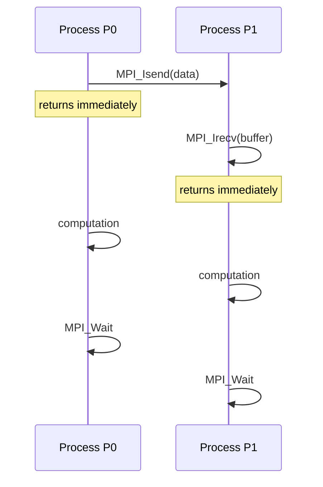

Example:

```c
MPI_Request req;
MPI_Isend(&x, 1, MPI_INT, 1, 0, MPI_COMM_WORLD, &req);
// do useful computation here
MPI_Wait(&req, MPI_STATUS_IGNORE);
```

Non-blocking communication improves performance because communication and computation can overlap. For example, while data is being transferred, the processor can perform calculations that do not depend on that data. This reduces idle time.

However, non-blocking communication is more difficult to program. The programmer must not modify the send buffer before send completes. The receive buffer must not be used before receive completes. Completion must be checked properly.

| Point | Blocking | Non-blocking |
|---|---|---|
| Functions | `MPI_Send`, `MPI_Recv` | `MPI_Isend`, `MPI_Irecv` |
| Return | After safe completion | Immediately |
| Overlap | Not possible | Possible |
| Waiting | More | Less |
| Complexity | Simple | More complex |
| Completion check | Not separate | Required |

In simple words, blocking communication is like making a phone call and waiting until the person answers. Non-blocking communication is like sending a message and doing other work while waiting for the reply.

**How to write in exam:** Define both, write MPI functions, draw timing diagrams, write small code examples, and compare in table.

---

## Q.2(c) Improving the Speed of Communication Operations

Communication is one of the most important factors affecting performance in parallel systems. Even if computation is divided perfectly, slow communication can reduce speedup. Communication time includes startup time, data transfer time, network delay, synchronization delay, and waiting time. Therefore, improving communication speed is essential for efficient parallel programs.

The first method is to **reduce the number of messages**. Sending many small messages is usually slower than sending one larger message because every message has startup overhead. For example:

```text
Bad: 100 messages of 1 byte
Better: 1 message of 100 bytes
```

This technique is called message aggregation.

The second method is to use **efficient collective communication algorithms**. For example, one-to-all broadcast can be done using a linear method or recursive doubling. Linear broadcast may take `p-1` steps, but recursive doubling takes only `log2(p)` steps.

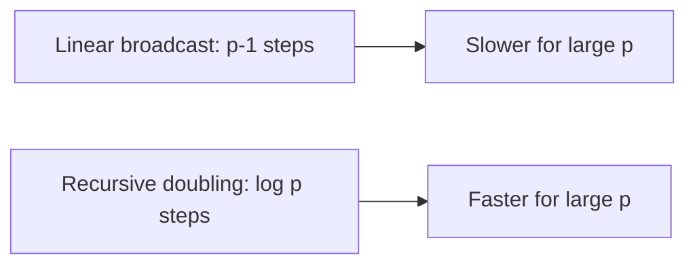

The third method is to **overlap communication and computation**. This is done using non-blocking MPI functions such as `MPI_Isend` and `MPI_Irecv`. While communication is happening, the processor performs useful work. This hides communication latency.

The fourth method is to **reduce synchronization**. Barriers and locks force processors to wait for each other. If barriers are not necessary, they should be removed. Asynchronous algorithms can reduce waiting time.

The fifth method is to improve **data locality**. Processors should communicate mostly with nearby processors or processors that hold related data. This reduces network distance and congestion.

The sixth method is to choose a suitable **network topology** and communication pattern. Hypercube, mesh, torus, and tree networks have different strengths. Algorithms should be designed according to the topology.

The seventh method is to increase **granularity**. If each processor performs more computation before communication, communication frequency reduces. However, granularity should not be too coarse, otherwise load imbalance may occur.

The eighth method is to use optimized library functions. MPI collective functions such as `MPI_Bcast`, `MPI_Reduce`, `MPI_Allreduce`, and `MPI_Alltoall` are usually optimized for the machine.

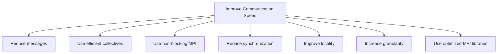

In conclusion, communication speed can be improved by reducing message count, using logarithmic algorithms, overlapping communication with computation, reducing synchronization, and using topology-aware communication. A good parallel algorithm balances computation and communication.

**How to write in exam:** Mention at least six techniques and explain each with a simple example.

---

# UNIT II — Performance Metrics

---

# Q.3 Answer: Overheads, Granularity and Amdahl/Gustafson Laws

## Q.3(a) Sources of Overhead in Parallel Systems

Overhead in a parallel system means extra time or extra work introduced because of parallel execution. A serial program mostly spends time doing useful computation. But a parallel program also spends time communicating, synchronizing, waiting, scheduling tasks, and managing data. This extra time reduces speedup and efficiency.

The overhead formula is:

```text
To = pTp - Ts
```

where `To` is overhead, `p` is number of processors, `Tp` is parallel execution time, and `Ts` is serial execution time. If overhead is large, then even using many processors will not give good performance.

The first source of overhead is **communication overhead**. In distributed-memory systems, processors exchange messages. Sending a message takes startup time and transfer time. If messages are frequent or large, communication overhead becomes high. For example, in parallel matrix multiplication, processors may exchange matrix blocks.

The second source is **synchronization overhead**. Some algorithms require processors to wait at barriers. For example, in parallel BFS, all processors must finish one level before moving to the next. Faster processors wait for slower processors.

The third source is **idle time**. A processor may remain idle when it has no work but other processors are still working. Idle time usually happens due to load imbalance.

The fourth source is **load imbalance**. If work is not equally distributed, some processors get more work. For example:

```text
P0 gets 1000 tasks
P1 gets 100 tasks
P2 gets 50 tasks
```

Here `P1` and `P2` finish early and wait for `P0`.

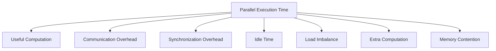

The fifth source is **extra computation**. Some parallel algorithms perform duplicate work that is not needed in the best serial algorithm. For example, boundary data may be recalculated by multiple processors.

The sixth source is **task creation and scheduling overhead**. Creating threads, assigning tasks, and maintaining work queues take time. If tasks are too small, scheduling overhead may be greater than computation.

The seventh source is **memory contention**. In shared-memory systems, many processors may access the same memory bus, cache line, or variable. This creates delays. Locks and atomic operations also add overhead.

The eighth source is the **sequential fraction** of the program. According to Amdahl's law, if some part of the program cannot be parallelized, it limits maximum speedup.

To reduce overhead, we should reduce communication, use non-blocking communication, improve load balancing, avoid unnecessary synchronization, increase task granularity, improve memory locality, and reduce sequential code.

**How to write in exam:** Write overhead formula, explain at least six sources, draw overhead diagram, and mention reduction methods.

---

## Q.3(b) Effect of Granularity on Performance with Addition of n Numbers on p Processing Elements

Granularity is the amount of computation performed between communication or synchronization events. In simple words, it is the size of task assigned to a processor. Granularity strongly affects parallel performance because it controls the balance between computation and communication.

There are two main types: **fine-grained parallelism** and **coarse-grained parallelism**. Fine-grained parallelism has many small tasks. It gives high parallelism and good load balancing, but it creates large communication and scheduling overhead. Coarse-grained parallelism has fewer large tasks. It reduces communication overhead but may reduce available parallelism and may cause load imbalance.

Let us understand using addition of `n` numbers on `p` processing elements. Suppose we want to add 16 numbers using 4 processors:

```text
a1 + a2 + a3 + ... + a16
```

In a fine-grained method, each addition may be treated as a separate task. For example, processors first add pairs:

```text
(a1+a2), (a3+a4), (a5+a6), ...
```

Then these partial sums are again combined. This gives high parallelism, but after every small operation communication or synchronization may be needed. For small tasks, overhead becomes high.

In a coarse-grained method, each processor gets a block of numbers:

```text
P0: a1 to a4
P1: a5 to a8
P2: a9 to a12
P3: a13 to a16
```

Each processor calculates a local sum:

```text
P0 = S0
P1 = S1
P2 = S2
P3 = S3
```

Then the final sum is calculated as:

```text
S = S0 + S1 + S2 + S3
```

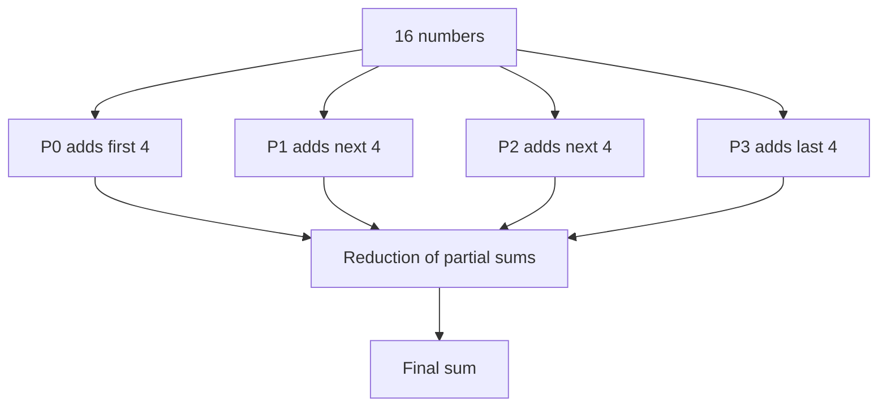

This method has less communication because each processor communicates only after computing its local sum. It is usually better for simple addition because local computation is fast and communication is reduced.

The performance effect can be explained like this:

| Granularity | Advantage | Disadvantage |
|---|---|---|
| Fine | More parallelism, good load balance | High communication and scheduling overhead |
| Coarse | Less communication, lower overhead | Possible load imbalance, less parallelism |
| Medium | Balance between both | Usually best |

If granularity is too fine, processors spend more time communicating than computing. If granularity is too coarse, some processors may become idle. The best granularity depends on problem size, processor count, communication cost, and workload regularity.

For addition of numbers, if `n` is very large and `p` is moderate, block-wise coarse granularity is efficient. Each processor computes `n/p` additions locally and then only `p` partial sums are reduced.

**How to write in exam:** Define granularity, explain fine/coarse, give addition example with 16 numbers and 4 processors, draw diagram, and write comparison table.

---

## Q.3(c) Amdahl's Law and Gustafson's Law

Amdahl's Law and Gustafson's Law are two important laws used to understand speedup in parallel computing. They explain how much improvement we can expect when using multiple processors.

**Amdahl's Law** is used when the problem size is fixed. It says that the serial part of a program limits the maximum possible speedup. If a fraction `f` of the program is serial and cannot be parallelized, and the remaining fraction `(1-f)` can be parallelized on `p` processors, then speedup is:

```text
S = 1 / (f + (1-f)/p)
```

For example, suppose 10% of a program is serial:

```text
f = 0.1
p = 10
```

Then:

```text
S = 1 / (0.1 + 0.9/10)
  = 1 / (0.1 + 0.09)
  = 1 / 0.19
  = 5.26
```

Even with 10 processors, speedup is only 5.26 because the serial part limits performance.

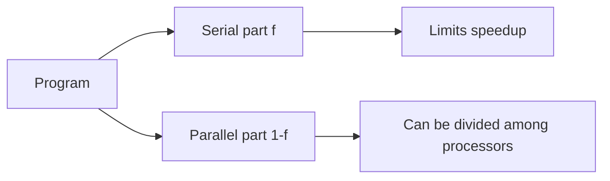

Amdahl's law gives a pessimistic view because it assumes the problem size remains fixed. As processors increase, the parallel part becomes faster, but the serial part remains unchanged.

**Gustafson's Law** gives a more optimistic view. It says that when more processors are available, we usually solve larger problems. Instead of keeping problem size fixed, we increase the problem size so that processors remain busy. Gustafson's speedup is:

```text
S = p - f(p - 1)
```

where `f` is the serial fraction and `p` is the number of processors.

Using the same values:

```text
f = 0.1
p = 10
S = 10 - 0.1(10 - 1)
  = 10 - 0.9
  = 9.1
```

This is much better than Amdahl's speedup because Gustafson assumes that larger problems can use more processors effectively.

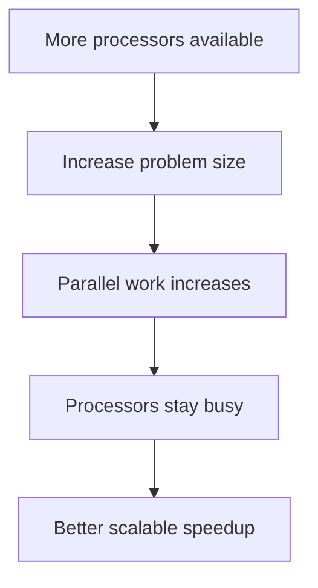

Comparison:

| Point | Amdahl's Law | Gustafson's Law |
|---|---|---|
| Problem size | Fixed | Increases with processors |
| View | Pessimistic | Optimistic |
| Main limit | Serial fraction | Scaled workload |
| Formula | `1/(f+(1-f)/p)` | `p - f(p-1)` |
| Use | Small fixed problems | Large scalable problems |

In conclusion, Amdahl's law teaches that serial code limits speedup, so we should reduce serial fraction. Gustafson's law teaches that parallel systems are useful for solving larger problems, not only faster solving of fixed-size problems.

**How to write in exam:** Write both formulas, solve one numerical example, draw conceptual diagrams, and compare in table.

---

# Q.4 Answer: Performance Metrics, Parallel Matrix Multiplication and Scalability

## Q.4(a) Performance Metrics for Parallel Systems

Performance metrics are used to evaluate the quality of a parallel system or parallel algorithm. When we run a program on multiple processors, we want to know whether the processors are being used efficiently. For this, we use metrics such as execution time, speedup, efficiency, cost, overhead, and scalability.

The first metric is **serial execution time**, denoted as `Ts`. It is the time taken by the best serial algorithm on one processor. The second metric is **parallel execution time**, denoted as `Tp`. It is the time taken by the parallel algorithm using `p` processors.

The most important metric is **speedup**:

```text
S = Ts / Tp
```

If `Ts = 100 seconds` and `Tp = 20 seconds`, then:

```text
S = 100 / 20 = 5
```

This means the parallel program is 5 times faster.

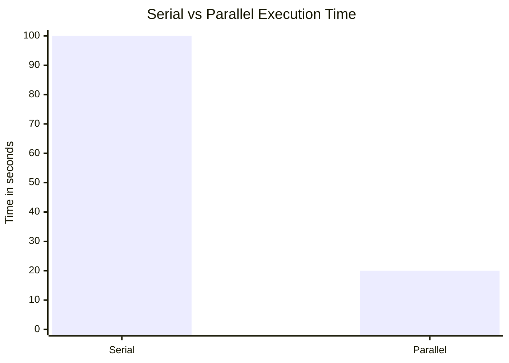

The next metric is **efficiency**:

```text
E = S / p
```

If speedup is 5 and processors are 8:

```text
E = 5 / 8 = 0.625 = 62.5%
```

Efficiency shows how well processors are utilized. Ideal efficiency is 100%, but real efficiency is less due to overhead.

**Cost** is total processor time consumed:

```text
Cost = p × Tp
```

If `p=8` and `Tp=20`, cost is:

```text
Cost = 160 processor-seconds
```

A parallel algorithm is cost optimal if:

```text
pTp = O(Ts)
```

This means the total work done by all processors is of the same order as the best serial algorithm.

**Overhead** is extra work due to parallelization:

```text
To = pTp - Ts
```

Overhead includes communication, synchronization, idle time, scheduling, and extra computation.

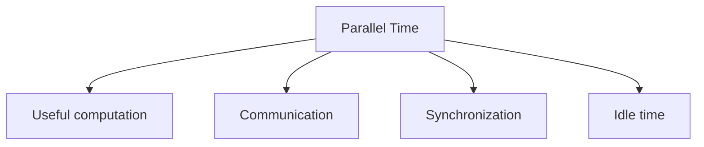

**Scalability** means the ability of a parallel system to maintain good performance when processors and problem size increase. A scalable system continues to give good speedup as more processors are added.

**Isoefficiency** tells how much problem size must grow with number of processors to keep efficiency constant. Lower isoefficiency means better scalability.

Summary:

| Metric | Formula | Meaning |
|---|---|---|
| Serial time | `Ts` | Time on one processor |
| Parallel time | `Tp` | Time on p processors |
| Speedup | `Ts/Tp` | How much faster |
| Efficiency | `S/p` | Processor utilization |
| Cost | `pTp` | Total processor time |
| Overhead | `pTp - Ts` | Extra parallel work |
| Scalability | qualitative | Ability to grow |

**How to write in exam:** Define each metric, write formulas, solve one numerical example, and draw overhead diagram.

---

## Q.4(b) Parallel Matrix-Matrix Multiplication with Example

Matrix-matrix multiplication is a standard computation in HPC. Given two matrices `A` and `B`, we calculate matrix `C` as:

```text
C = A × B
```

Each element of `C` is calculated by multiplying one row of `A` with one column of `B`:

```text
C[i][j] = Σ A[i][k] × B[k][j]
```

Example:

```text
A = |1 2|      B = |5 6|
    |3 4|          |7 8|
```

Calculations:

```text
C00 = 1×5 + 2×7 = 19
C01 = 1×6 + 2×8 = 22
C10 = 3×5 + 4×7 = 43
C11 = 3×6 + 4×8 = 50
```

So:

```text
C = |19 22|
    |43 50|
```

Matrix multiplication is suitable for parallel computing because different elements or blocks of matrix `C` can be computed independently.

One simple parallel method is **row-wise partitioning**. Rows of matrix `A` are divided among processors. Each processor computes corresponding rows of matrix `C`. Since matrix `B` is needed by every processor, it is broadcast to all processors.

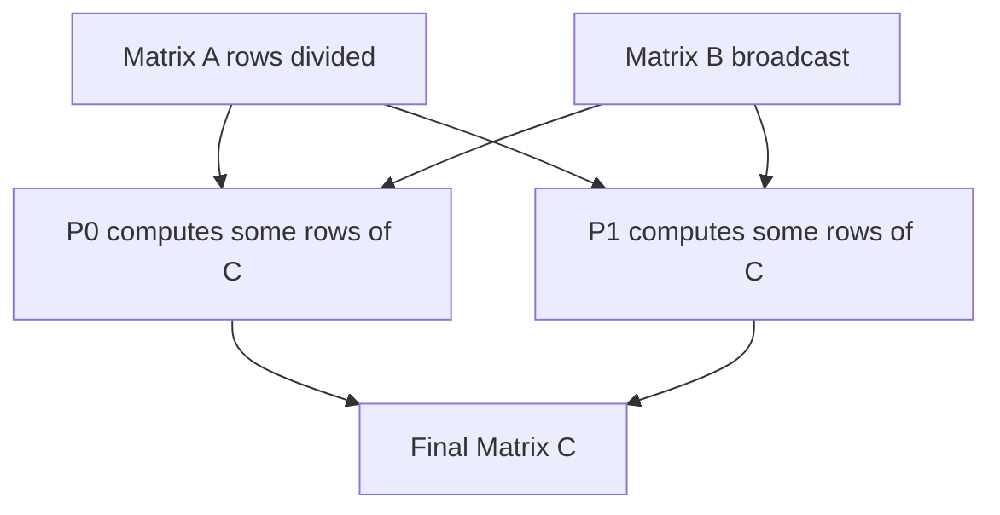

Algorithm:

```text
1. Divide rows of matrix A among processors.
2. Broadcast matrix B to all processors.
3. Each processor computes assigned rows of C.
4. Gather computed rows to form final C.
```

For larger systems, **block-wise partitioning** is better. Matrices are divided into blocks:

```text
A = |A00 A01|      B = |B00 B01|
    |A10 A11|          |B10 B11|
```

Then:

```text
C00 = A00B00 + A01B10
C01 = A00B01 + A01B11
C10 = A10B00 + A11B10
C11 = A10B01 + A11B11
```

```mermaid
graph TD
    A00[A00] --> C00[C00]
    A01[A01] --> C00
    B00[B00] --> C00
    B10[B10] --> C00
    A10[A10] --> C10[C10]
    A11[A11] --> C10
    B00 --> C10
    B10 --> C10
```

Sequential matrix multiplication takes:

```text
O(n³)
```

Ideal parallel computation time using `p` processors is:

```text
O(n³ / p)
```

Actual time is more because of communication, broadcasting, synchronization, and gathering results.

Applications include machine learning, graphics, simulations, numerical analysis, and scientific computing.

**How to write in exam:** Write formula, solve 2×2 example, explain row-wise and block-wise methods, draw diagram, and write complexity.

---

## Q.4(c) Scalability of Parallel Systems

Scalability is the ability of a parallel system to maintain good performance when the number of processors and problem size increase. A scalable system continues to give good speedup and efficiency as more processors are added. Scalability is very important in high performance computing because HPC applications often run on hundreds or thousands of processors.

A system has good scalability if increasing processors gives proportional improvement in performance. For example:

| Processors | Speedup | Efficiency |
|---|---|---|
| 2 | 1.9 | 95% |
| 4 | 3.6 | 90% |
| 8 | 6.8 | 85% |

This system is reasonably scalable because efficiency remains high.

But if speedup increases very slowly, scalability is poor:

| Processors | Speedup |
|---|---|
| 2 | 1.8 |
| 4 | 2.2 |
| 8 | 2.4 |

Here adding processors does not help much.

```mermaid
xychart-beta
    title "Good Scalability Example"
    x-axis [2, 4, 8]
    y-axis "Speedup" 0 --> 8
    line [1.9, 3.6, 6.8]
```

Several factors limit scalability. The first is the serial part of the program. According to Amdahl's law, if some part cannot be parallelized, it limits maximum speedup. The second factor is communication overhead. As processors increase, processors need to exchange more data. The third factor is synchronization. If processors wait frequently, efficiency drops. The fourth factor is load imbalance. If work is not equally distributed, some processors remain idle. Other factors include memory bandwidth, network congestion, task scheduling overhead, and I/O bottlenecks.

There are two common types of scaling:

**Strong scaling:** Problem size remains fixed, and processors are increased. The goal is to reduce execution time.

**Weak scaling:** Problem size increases with processors. The goal is to keep execution time or efficiency constant.

```mermaid
flowchart TD
    S[Scalability] --> SS[Strong scaling: fixed problem size]
    S --> WS[Weak scaling: problem size grows]
```

To improve scalability, we should reduce communication, use efficient collective operations, improve load balancing, reduce serial code, overlap communication with computation, use proper granularity, and design topology-aware algorithms.

Scalability is measured using speedup, efficiency, and isoefficiency. Isoefficiency tells how problem size must grow with processors to maintain constant efficiency. A lower isoefficiency function indicates better scalability.

In conclusion, scalability is the key property that decides whether a parallel algorithm is useful for large systems. A scalable algorithm can effectively use more processors without wasting resources.

**How to write in exam:** Define scalability, give table, draw graph, explain limiting factors and methods to improve scalability.

---

# UNIT III — CUDA Programming

---

# Q.5 Answer: CUDA Architecture, Processing Flow, Advantages and Limitations

## Q.5(a) CUDA Architecture in Detail

CUDA stands for **Compute Unified Device Architecture**. It is a parallel computing platform developed by NVIDIA that allows programmers to use GPUs for general-purpose computing. Traditional CPUs have a few powerful cores, while GPUs have many smaller cores designed to execute thousands of threads in parallel. CUDA provides a programming model to use this GPU parallelism.

CUDA architecture consists of two main parts: **host** and **device**. The host is the CPU and its main memory. The device is the GPU and its memory. The CPU controls program execution, allocates GPU memory, copies data to GPU, launches kernels, and copies results back. The GPU performs parallel computation.

```mermaid
flowchart LR
    H[Host: CPU + RAM] -->|cudaMemcpy / kernel launch| D[Device: NVIDIA GPU]
    D -->|result copy| H
```

Inside the GPU, there are multiple **Streaming Multiprocessors**, called SMs. Each SM contains many CUDA cores, registers, shared memory, warp schedulers, and other execution units. CUDA cores perform arithmetic operations. Threads are scheduled and executed on SMs.

```mermaid
flowchart TD
    GPU[GPU Device]
    GPU --> GM[Global Memory]
    GPU --> SM0[SM 0]
    GPU --> SM1[SM 1]
    GPU --> SM2[SM 2]
    SM0 --> C0[CUDA Cores]
    SM0 --> S0[Shared Memory]
    SM0 --> R0[Registers]
    SM1 --> C1[CUDA Cores]
    SM1 --> S1[Shared Memory]
    SM1 --> R1[Registers]
```

CUDA uses a thread hierarchy:

```text
Grid -> Blocks -> Threads
```

A kernel launch creates a grid. A grid contains blocks. Each block contains threads. Threads inside the same block can cooperate using shared memory and can synchronize using `__syncthreads()`. Blocks are independent and can be executed in any order.

```mermaid
flowchart TD
    G[Grid] --> B0[Block 0]
    G --> B1[Block 1]
    B0 --> T00[Thread 0]
    B0 --> T01[Thread 1]
    B1 --> T10[Thread 0]
    B1 --> T11[Thread 1]
```

CUDA memory hierarchy includes registers, local memory, shared memory, global memory, constant memory, and texture memory. Registers are fastest and private to each thread. Shared memory is fast and shared by threads in the same block. Global memory is large but slower and accessible by all threads. Constant and texture memories are cached read-only memories.

The CPU launches a kernel using syntax:

```c
kernel<<<gridDim, blockDim>>>(arguments);
```

For example:

```c
vectorAdd<<<blocks, threads>>>(A, B, C, n);
```

Each thread computes one element using its unique index:

```c
int i = blockIdx.x * blockDim.x + threadIdx.x;
```

CUDA architecture is highly efficient for data-parallel problems such as vector addition, matrix multiplication, image processing, and neural networks. However, performance depends on good memory access, enough parallelism, and minimizing CPU-GPU data transfers.

**How to write in exam:** Define CUDA, draw host-device diagram, draw SM architecture, explain grid-block-thread hierarchy, and explain memory hierarchy.

---

## Q.5(b) Processing Flow of CUDA along with CUDA-C Functions

A CUDA-C program follows a fixed processing flow because CPU and GPU have separate memories. The CPU is called the host, and the GPU is called the device. Data usually begins in host memory, so it must be copied to device memory before GPU computation. After computation, results are copied back to the host.

The main steps are:

1. Allocate memory on host.  
2. Allocate memory on GPU using `cudaMalloc`.  
3. Copy input data from host to device using `cudaMemcpy`.  
4. Launch kernel using `<<<grid, block>>>`.  
5. GPU executes many threads in parallel.  
6. Copy result back from device to host.  
7. Free device memory using `cudaFree`.  

```mermaid
flowchart TD
    A[Host memory: h_A, h_B] --> B[cudaMalloc device memory]
    B --> C[cudaMemcpy HostToDevice]
    C --> D[Kernel launch <<<grid, block>>>]
    D --> E[GPU threads compute]
    E --> F[cudaMemcpy DeviceToHost]
    F --> G[cudaFree device memory]
```

Important CUDA-C functions:

**1. cudaMalloc** allocates memory on GPU:

```c
cudaMalloc((void**)&d_A, size);
```

**2. cudaMemcpy** copies data:

```c
cudaMemcpy(d_A, h_A, size, cudaMemcpyHostToDevice);
cudaMemcpy(h_C, d_C, size, cudaMemcpyDeviceToHost);
```

**3. Kernel launch** starts GPU computation:

```c
vectorAdd<<<blocks, threads>>>(d_A, d_B, d_C, n);
```

**4. cudaDeviceSynchronize** waits for GPU completion:

```c
cudaDeviceSynchronize();
```

**5. cudaFree** frees GPU memory:

```c
cudaFree(d_A);
```

Vector addition example kernel:

```c
__global__ void vectorAdd(int *A, int *B, int *C, int n) {
    int i = blockIdx.x * blockDim.x + threadIdx.x;
    if(i < n) {
        C[i] = A[i] + B[i];
    }
}
```

If `A=[1,2,3,4]` and `B=[5,6,7,8]`, then threads compute:

```text
Thread 0: C0 = 1+5 = 6
Thread 1: C1 = 2+6 = 8
Thread 2: C2 = 3+7 = 10
Thread 3: C3 = 4+8 = 12
```

The final output is:

```text
C = [6,8,10,12]
```

```mermaid
flowchart LR
    T0[Thread 0] --> C0[C0]
    T1[Thread 1] --> C1[C1]
    T2[Thread 2] --> C2[C2]
    T3[Thread 3] --> C3[C3]
```

The processing flow is simple in concept: CPU prepares data, GPU computes in parallel, CPU receives result. But efficient CUDA programming requires minimizing memory transfers and using proper grid/block dimensions.

**How to write in exam:** Draw flow diagram, list CUDA functions in order, write vector addition kernel, and explain thread indexing.

---

## Q.5(c) Advantages and Limitations of CUDA

CUDA has many advantages because it allows programmers to use the massive parallel power of NVIDIA GPUs. The biggest advantage is **high performance**. GPUs contain thousands of cores and can execute many threads at the same time. This is very useful for data-parallel problems where the same operation is applied to many data elements.

For example, in vector addition, each element can be processed by one GPU thread. In image processing, each pixel can be processed independently. In deep learning, matrix multiplication and convolution operations can be performed very fast on GPUs.

```mermaid
flowchart TD
    CUDA[CUDA Advantages] --> A[High performance]
    CUDA --> B[Massive parallelism]
    CUDA --> C[CUDA C/C++ support]
    CUDA --> D[Rich libraries]
    CUDA --> E[AI and scientific computing]
```

CUDA also provides a familiar C/C++ programming style. Programmers can write GPU kernels using extensions to C/C++. CUDA has strong library support such as cuBLAS for linear algebra, cuDNN for deep learning, cuFFT for Fourier transforms, and Thrust for parallel algorithms. These libraries save development time and provide optimized performance.

CUDA is widely used in deep learning, scientific simulations, medical imaging, video processing, finance, cryptography, and engineering applications. It is also supported by frameworks like TensorFlow and PyTorch.

However, CUDA also has limitations. The first limitation is **hardware dependency**. CUDA mainly works with NVIDIA GPUs. Programs written specifically for CUDA may not run on AMD or Intel GPUs without modification.

The second limitation is **data transfer overhead**. CPU and GPU have separate memories. Data must be copied between host and device using `cudaMemcpy`. If too much data is transferred frequently, performance reduces.

The third limitation is **programming complexity**. CUDA programmers must understand thread hierarchy, memory hierarchy, synchronization, race conditions, and performance optimization. Writing correct and fast CUDA programs is harder than writing normal C programs.

The fourth limitation is that CUDA is not suitable for all programs. If a program is highly sequential or has many branches, GPU performance may be poor. GPUs work best when thousands of threads perform similar operations.

The fifth limitation is memory management. GPU memory is limited compared to system RAM. Also, inefficient global memory access can reduce performance.

```mermaid
flowchart TD
    L[CUDA Limitations] --> H[NVIDIA dependency]
    L --> T[CPU-GPU transfer overhead]
    L --> P[Programming complexity]
    L --> S[Poor for sequential programs]
    L --> M[Limited GPU memory]
```

In conclusion, CUDA is powerful for parallel data-intensive tasks, but it requires suitable hardware and careful programming.

**How to write in exam:** List advantages and limitations separately, explain each with examples, and draw summary diagram.

---

# Q.6 Answer: Kernel-Level Execution, cuDNN and CUDA Applications

## Q.6(a) CUDA-C Program Execution at Kernel Level with Example

A CUDA kernel is a function that runs on the GPU and is executed by many threads in parallel. It is declared using the keyword `__global__`. The kernel is called from the CPU but executed on the GPU. Kernel-level execution means understanding how CUDA creates grids, blocks, and threads when a kernel is launched.

A kernel launch looks like this:

```c
vectorAdd<<<blocks, threads>>>(d_A, d_B, d_C, n);
```

The part inside `<<< >>>` is called execution configuration. It tells CUDA how many blocks and how many threads per block should be created.

```mermaid
flowchart TD
    CPU[CPU Host launches kernel] --> G[GPU Grid]
    G --> B0[Block 0]
    G --> B1[Block 1]
    B0 --> T00[Thread 0]
    B0 --> T01[Thread 1]
    B1 --> T10[Thread 0]
    B1 --> T11[Thread 1]
```

Each thread executes the same kernel code but works on different data. Threads identify their position using built-in variables:

```c
threadIdx.x
blockIdx.x
blockDim.x
```

The global index is:

```c
int i = blockIdx.x * blockDim.x + threadIdx.x;
```

Vector addition kernel:

```c
__global__ void vectorAdd(int *A, int *B, int *C, int n) {
    int i = blockIdx.x * blockDim.x + threadIdx.x;
    if(i < n) {
        C[i] = A[i] + B[i];
    }
}
```

Suppose `threadsPerBlock = 4` and `blocks = 2`. Then total threads are:

```text
2 × 4 = 8 threads
```

Mapping:

```text
Block 0 Thread 0 -> index 0
Block 0 Thread 1 -> index 1
Block 0 Thread 2 -> index 2
Block 0 Thread 3 -> index 3
Block 1 Thread 0 -> index 4
Block 1 Thread 1 -> index 5
Block 1 Thread 2 -> index 6
Block 1 Thread 3 -> index 7
```

```mermaid
flowchart LR
    B0T0[Block0 T0] --> I0[index 0]
    B0T1[Block0 T1] --> I1[index 1]
    B0T2[Block0 T2] --> I2[index 2]
    B0T3[Block0 T3] --> I3[index 3]
    B1T0[Block1 T0] --> I4[index 4]
    B1T1[Block1 T1] --> I5[index 5]
```

If input arrays are:

```text
A = [1,2,3,4,5,6,7,8]
B = [10,20,30,40,50,60,70,80]
```

Then each thread computes one output:

```text
C[0] = 11
C[1] = 22
...
C[7] = 88
```

The `if(i < n)` condition is important because we often launch slightly more threads than needed. It prevents invalid memory access.

At kernel level, CUDA schedules blocks onto Streaming Multiprocessors. Threads inside a block are executed in groups called warps, usually 32 threads. Threads in a warp execute the same instruction together. If threads take different branches, warp divergence may occur, reducing performance.

Kernel execution is asynchronous with respect to CPU. The CPU may continue after launching the kernel. If CPU must wait, we use:

```c
cudaDeviceSynchronize();
```

**How to write in exam:** Define kernel, explain grid-block-thread, write vector addition kernel, explain global index, and draw mapping diagram.

---

## Q.6(b) cuDNN in Brief

cuDNN stands for **CUDA Deep Neural Network library**. It is a GPU-accelerated library developed by NVIDIA for deep learning operations. Deep learning requires many heavy mathematical operations such as convolution, matrix multiplication, activation functions, pooling, normalization, and recurrent operations. cuDNN provides highly optimized versions of these operations for NVIDIA GPUs.

Deep learning frameworks such as TensorFlow, PyTorch, Keras, and MXNet use cuDNN internally. Most users do not call cuDNN directly. Instead, when a user trains a neural network in PyTorch or TensorFlow, the framework uses cuDNN in the background to speed up GPU operations.

```mermaid
flowchart TD
    A[User code in PyTorch/TensorFlow] --> B[Deep learning framework]
    B --> C[cuDNN library]
    C --> D[CUDA runtime]
    D --> E[NVIDIA GPU]
```

The most important operation accelerated by cuDNN is **convolution**. Convolutional Neural Networks, or CNNs, are used in image recognition, object detection, medical imaging, and computer vision. Convolution operations involve sliding filters over images and performing many multiplications and additions. GPUs are very good at this, and cuDNN provides optimized convolution algorithms.

cuDNN also supports activation functions such as ReLU, sigmoid, and tanh. It supports pooling operations such as max pooling and average pooling. It supports normalization techniques such as batch normalization. It also supports recurrent neural networks and other deep learning primitives.

Benefits of cuDNN include high performance, reduced development time, automatic selection of optimized algorithms, support for many neural network operations, and compatibility with major deep learning frameworks.

```mermaid
flowchart TD
    C[cuDNN] --> CONV[Convolution]
    C --> ACT[Activation]
    C --> POOL[Pooling]
    C --> NORM[Normalization]
    C --> RNN[RNN operations]
```

Without cuDNN, programmers would need to write low-level CUDA kernels for every neural network operation. This is difficult and time-consuming. cuDNN provides ready-made optimized functions, so developers can focus on model design instead of GPU optimization.

In conclusion, cuDNN is an essential library for modern AI and deep learning because it allows neural networks to train and run faster on NVIDIA GPUs.

**How to write in exam:** Define cuDNN, draw framework stack diagram, list operations supported, and explain benefits.

---

## Q.6(c) Applications of CUDA

CUDA is used in many areas where large amounts of data must be processed in parallel. Since GPUs contain thousands of cores, CUDA is suitable for data-parallel tasks.

The first major application is **deep learning and artificial intelligence**. Neural networks require matrix multiplication, convolution, and vector operations. CUDA accelerates these operations. Frameworks like TensorFlow and PyTorch use CUDA to train models faster.

The second application is **image processing**. Images contain millions of pixels, and many operations can be applied independently to each pixel. CUDA is used for filtering, edge detection, image enhancement, object detection, and face recognition.

The third application is **scientific computing**. Weather forecasting, molecular dynamics, fluid simulation, physics modeling, and astronomy simulations require large numerical computations. CUDA reduces computation time significantly.

The fourth application is **medical imaging**. CT scan reconstruction, MRI processing, ultrasound processing, and image segmentation can be accelerated using CUDA.

Other applications include video processing, gaming, cryptography, finance, Monte Carlo simulations, robotics, autonomous vehicles, and big data analytics.

```mermaid
flowchart TD
    CUDA[CUDA Applications]
    CUDA --> DL[Deep Learning]
    CUDA --> IMG[Image Processing]
    CUDA --> SCI[Scientific Simulation]
    CUDA --> MED[Medical Imaging]
    CUDA --> VID[Video Processing]
    CUDA --> FIN[Finance]
    CUDA --> CRY[Cryptography]
```

Example: In image processing, if an image has 1 million pixels, CUDA can launch many threads so that each thread processes one pixel. This makes image operations much faster than CPU loops.

In conclusion, CUDA is useful wherever the same operation is repeated on large data. It is one of the main technologies behind modern GPU computing.

**How to write in exam:** Explain at least five applications with examples and draw application diagram.

---

# UNIT IV — Parallel Algorithms and Distributed Computing

---

# Q.7 Answer: Sorting Issues, Parallel BFS and Kubernetes

## Q.7(a) Issues in Sorting on Parallel Computers with Example

Sorting on parallel computers is more difficult than sorting on a single processor because data is distributed among multiple processors. A sequential sorting algorithm only compares and rearranges elements in one memory. But a parallel sorting algorithm must also distribute data, exchange elements between processors, balance workload, and synchronize phases.

The first issue is **data distribution**. Input data must be divided among processors. If data is not distributed evenly, some processors get more elements and others get fewer. This creates load imbalance.

Example:

```text
P0 gets 1000 elements
P1 gets 100 elements
P2 gets 50 elements
P3 gets 20 elements
```

Here `P1`, `P2`, and `P3` finish early and wait for `P0`.

The second issue is **load balancing**. Even if each processor gets the same number of elements, the work may not be equal. In parallel quicksort, if the pivot is poor, one partition may contain most elements and another partition may contain very few.

```mermaid
flowchart TD
    A[Input array] --> P[Choose pivot]
    P --> L[Left partition]
    P --> R[Right partition]
    L --> Big[Too many elements]
    R --> Small[Too few elements]
    Big --> Issue[Load imbalance]
```

For example:

```text
Array = [1,2,3,4,5,6,7,100]
Pivot = 100
```

Almost all elements go to one side, so parallelism is poor.

The third issue is **communication overhead**. Sorting often requires moving elements between processors. In sample sort or quicksort, elements are redistributed according to pivots or splitters. This data movement can be expensive.

The fourth issue is **synchronization**. Some algorithms work in phases. In odd-even transposition sort, all processors must complete one phase before starting the next. Faster processors may wait for slower ones.

The fifth issue is **merging bottleneck**. In parallel merge sort, processors sort local lists, but sorted lists must be merged. If one processor performs final merging, it becomes a bottleneck.

The sixth issue is **memory contention**. In shared-memory systems, multiple processors may access the same memory locations, causing delays.

The seventh issue is **choosing good splitters**. Algorithms such as sample sort require splitters that divide data evenly. Poor splitters cause imbalance.

Solutions include using good pivot selection, random sampling, balanced partitioning, parallel merging, dynamic load balancing, efficient communication, and reducing synchronization.

**How to write in exam:** List issues, explain each with example, draw pivot imbalance diagram, and mention solutions.

---

## Q.7(b) BFS for Parallel Execution and Complexity Analysis

Breadth First Search, or BFS, is a graph traversal algorithm that visits vertices level by level. Starting from a source vertex, BFS first visits all vertices at distance 1, then distance 2, and so on. BFS is naturally suitable for parallel execution because all vertices at the same level can be processed simultaneously.

Example graph:

```mermaid
graph TD
    A --> B
    A --> C
    A --> D
    B --> E
    B --> F
    D --> G
```

BFS from `A` gives:

```text
Level 0: A
Level 1: B, C, D
Level 2: E, F, G
```

In parallel BFS, the current level is called the **frontier**. All vertices in the frontier are processed in parallel. Each processor examines neighbors of some frontier vertices. Newly discovered vertices are added to the next frontier.

```mermaid
flowchart TD
    S[Frontier: source A] --> L1[Process B C D in parallel]
    L1 --> L2[Process E F G in parallel]
    L2 --> END[Stop when frontier empty]
```

Algorithm:

```text
Parallel BFS(source s)
1. visited[s] = true
2. frontier = {s}
3. while frontier is not empty:
4.      next_frontier = empty
5.      In parallel for each vertex u in frontier:
6.          for each neighbor v of u:
7.              if v is not visited:
8.                  mark v visited atomically
9.                  add v to next_frontier
10.     frontier = next_frontier
```

The key advantage is that vertices at the same level are independent. For example, `B`, `C`, and `D` can be processed by different processors.

Sequential BFS complexity is:

```text
O(V + E)
```

where `V` is vertices and `E` is edges.

Ideal parallel time with `p` processors is:

```text
O((V + E) / p)
```

But actual time includes synchronization after each level, communication in distributed graphs, and load imbalance.

Challenges include duplicate discovery, synchronization, load imbalance, and communication overhead. Duplicate discovery happens when two processors discover the same vertex. This is solved using atomic operations or locks on the visited array.

**How to write in exam:** Define BFS, draw level diagram, explain frontier, write algorithm, and analyze complexity.

---

## Q.7(c) Kubernetes Short Note

Kubernetes is an open-source platform for container orchestration. It is used to automatically deploy, scale, manage, and monitor containerized applications. A container packages application code and dependencies so that it runs consistently everywhere. Docker creates containers, while Kubernetes manages containers at large scale.

A Kubernetes system is called a cluster. It contains a control plane and worker nodes. The control plane manages the cluster. Worker nodes run application workloads inside pods.

```mermaid
flowchart TD
    CP[Control Plane]
    CP --> API[API Server]
    CP --> SCH[Scheduler]
    CP --> CTRL[Controller]
    CP --> ETCD[etcd]
    CP --> N1[Worker Node 1]
    CP --> N2[Worker Node 2]
    N1 --> P1[Pod]
    N1 --> P2[Pod]
    N2 --> P3[Pod]
    N2 --> P4[Pod]
```

Important terms:

- **Pod:** smallest deployable unit; contains one or more containers.
- **Node:** machine that runs pods.
- **Cluster:** group of nodes.
- **Control plane:** manages the cluster.
- **Service:** provides stable network access to pods.
- **Scheduler:** chooses which node should run a pod.

Features of Kubernetes include automatic scheduling, auto scaling, self-healing, load balancing, rolling updates, service discovery, and resource management.

Self-healing means if a container fails, Kubernetes restarts it. If a node fails, pods can be moved to another node. Auto scaling means the number of pods can increase or decrease based on demand. Rolling updates allow new application versions to be deployed without downtime.

Applications include cloud applications, microservices, web applications, AI/ML model deployment, big data systems, and DevOps automation.

**How to write in exam:** Define Kubernetes, draw architecture, explain pod/node/control plane, and list features/applications.

---

# Q.8 Answer: Merge Sort, DFS and GPU Applications

## Q.8(a) Sequential and Parallel Merge Sort with Complexity

Merge sort is a divide-and-conquer sorting algorithm. It divides the array into two halves, sorts each half, and then merges the sorted halves. Sequential merge sort is stable and has time complexity `O(n log n)`.

Sequential algorithm:

```text
MergeSort(A)
1. If size of A is 1, return.
2. Divide A into left and right halves.
3. Sort left half.
4. Sort right half.
5. Merge sorted halves.
```

Example:

```text
[8,3,7,4,9,2,6,5]
```

Divide into:

```text
[8,3,7,4] and [9,2,6,5]
```

Continue dividing, sort small parts, and merge.

```mermaid
graph TD
    A[8 3 7 4 9 2 6 5]
    A --> B[8 3 7 4]
    A --> C[9 2 6 5]
    B --> D[8 3]
    B --> E[7 4]
    C --> F[9 2]
    C --> G[6 5]
    D --> H[3 8]
    E --> I[4 7]
    F --> J[2 9]
    G --> K[5 6]
    H --> L[3 4 7 8]
    I --> L
    J --> M[2 5 6 9]
    K --> M
    L --> N[2 3 4 5 6 7 8 9]
    M --> N
```

In **parallel merge sort**, left and right halves are sorted simultaneously by different processors or threads. This gives natural parallelism. After both halves are sorted, they are merged.

Parallel algorithm:

```text
ParallelMergeSort(A)
1. If size is small, sort sequentially.
2. Divide A into left and right halves.
3. Sort left half in parallel.
4. Sort right half in parallel.
5. Merge both sorted halves.
```

Sequential complexity:

```text
O(n log n)
```

Ideal parallel complexity with `p` processors:

```text
O((n log n) / p)
```

However, actual time includes overhead of creating tasks, communication, synchronization, and merging. If merging is done sequentially, it becomes a bottleneck. Parallel merging improves performance.

Comparison:

| Point | Sequential Merge Sort | Parallel Merge Sort |
|---|---|---|
| Processors | One | Many |
| Sorting halves | One after another | At same time |
| Complexity | `O(n log n)` | Approximately `O((n log n)/p)` |
| Overhead | Low | Communication/synchronization |
| Best for | Small/medium data | Large data |

**How to write in exam:** Explain divide-and-conquer, draw merge tree, write sequential and parallel algorithms, and compare complexity.

---

## Q.8(b) Parallel Depth First Search Algorithm in Detail

Depth First Search, or DFS, is a graph traversal algorithm that explores as deep as possible before backtracking. Sequential DFS uses recursion or a stack. Starting from a source vertex, it visits an unvisited neighbor, then goes deeper, and backtracks when no unvisited neighbor remains.

Example graph:

```mermaid
graph TD
    A --> B
    A --> C
    B --> D
    B --> E
    C --> F
```

A possible DFS order is:

```text
A, B, D, E, C, F
```

Parallel DFS is more difficult than BFS because DFS is path-dependent. But parallelism is possible when there are multiple branches. Different processors can explore different branches at the same time.

For example, from `A`, one processor can explore branch `B`, and another processor can explore branch `C`.

```mermaid
flowchart TD
    A[A source] --> B[B branch by P0]
    A --> C[C branch by P1]
    B --> D[D]
    B --> E[E]
    C --> F[F]
```

A common method is the **work pool method**. A shared stack or queue stores unexplored vertices/subtrees. Processors take work from the pool. If a processor discovers many branches, it can add some branches back to the pool. This improves load balancing.

Algorithm:

```text
Parallel DFS
1. Start from source vertex s.
2. Mark s as visited.
3. Insert unvisited neighbors into shared work pool.
4. Each processor repeatedly takes a vertex/subtree.
5. Processor performs local DFS.
6. If extra branches are found, add them to work pool.
7. Use atomic operations to mark visited vertices.
8. Stop when work pool is empty.
```

Important issues:

1. **Duplicate visits:** Two processors may discover the same vertex. Use atomic visited marking.
2. **Load imbalance:** Some branches are larger than others. Use dynamic work sharing.
3. **Synchronization:** Work pool and visited array need coordination.
4. **Communication:** In distributed memory, processors exchange graph information.

Sequential DFS complexity:

```text
O(V + E)
```

Ideal parallel complexity:

```text
O((V + E) / p)
```

But actual performance depends on graph structure. If graph has many branches, parallelism is good. If graph is like a long chain, parallelism is poor.

**How to write in exam:** Define DFS, draw graph, explain why parallel DFS is difficult, write work pool algorithm, and analyze complexity.

---

## Q.8(c) GPU Applications Short Note

A GPU, or Graphics Processing Unit, contains many cores and is designed for parallel computation. GPU applications are programs that perform the same operation on large amounts of data. CUDA allows NVIDIA GPUs to be used for general-purpose computing.

The first major application is **deep learning**. Neural networks require matrix multiplication and convolution. GPUs perform these operations quickly. Frameworks like TensorFlow and PyTorch use CUDA and cuDNN.

The second application is **image processing**. Each pixel can be processed independently. Operations such as blur, sharpening, edge detection, and object detection can be parallelized.

The third application is **scientific simulation**. Weather forecasting, physics simulation, molecular dynamics, and fluid dynamics require huge numerical computation.

The fourth application is **medical imaging**. CT scan reconstruction, MRI image processing, and ultrasound processing benefit from GPU acceleration.

Other applications include video processing, finance, cryptography, gaming, robotics, and autonomous vehicles.

```mermaid
flowchart TD
    GPU[GPU Applications]
    GPU --> DL[Deep Learning]
    GPU --> IMG[Image Processing]
    GPU --> SCI[Scientific Simulation]
    GPU --> MED[Medical Imaging]
    GPU --> VID[Video Processing]
    GPU --> FIN[Finance]
    GPU --> GAME[Gaming]
```

Example: If an image has one million pixels, a GPU can launch many threads so that each thread processes one pixel. This makes image processing much faster than a CPU loop.

In conclusion, GPUs are useful for data-parallel workloads where large data can be divided among thousands of threads.

**How to write in exam:** Define GPU application, explain at least five applications with examples, and draw a diagram.

---

# Final Exam Reminder for Paper 2
For every 7–8 mark answer, write:

```text
Definition + diagram + stepwise explanation + algorithm/example + cost/complexity + conclusion
```

For every 4 mark short note, write:

```text
Definition + 4–5 points + small diagram/example
```
