# High Performance Computing (410250) — Paper 3 `[6404]-94` Complete Solution

**B.E. Computer Engineering | 2019 Pattern | Semester VIII**  
**Style:** Detailed SPPU exam answers, simple language, visual learning, Mermaid diagrams, algorithms, examples, and cost/complexity where required.

---

## How to Write These Answers in the Exam
For a 6–9 mark answer, use this structure:

1. **Definition / meaning**  
2. **Neat diagram**  
3. **Step-by-step explanation**  
4. **Algorithm / formula if applicable**  
5. **Example**  
6. **Complexity / cost / applications**  
7. **Conclusion**  

This structure makes the answer easy for the examiner to check and award marks.

---

# UNIT I — Communication Operations

---

# Q.1 Answer: Broadcast, Reduce, Scatter, Gather and Circular Shift on Mesh

## Q.1(a) Broadcast and Reduce Operation with Diagram

**Broadcast** and **Reduce** are two very important collective communication operations in parallel computing. They are called collective operations because all processors in a communicator participate in them. These operations are heavily used in MPI programs, parallel matrix algorithms, graph algorithms, distributed machine learning, and scientific simulations.

A **broadcast operation** is used when one processor has some data and wants to send the same data to all other processors. The processor that initially has the data is called the **source** or **root** processor. For example, if processor `P0` has a value `M`, after broadcast all processors `P0, P1, P2, P3, ...` will have the same value `M`. Broadcast is used when one processor reads input, chooses a pivot, computes a control value, or stores some common data that every processor needs.

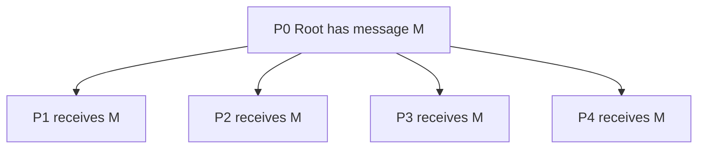

A simple broadcast can be done linearly, where the root sends the message one by one to all processors. But this is slow because it takes `p-1` communication steps. A better method is tree broadcast or recursive doubling. In tree broadcast, processors that already received the message help in forwarding it to others. This reduces the number of steps to approximately `log2(p)`.

For example, with four processors, `P0` first sends the message to `P1`. Now `P0` and `P1` both have the message. In the next step, `P0` sends to `P2` and `P1` sends to `P3`. Thus all processors get the message in only two steps.

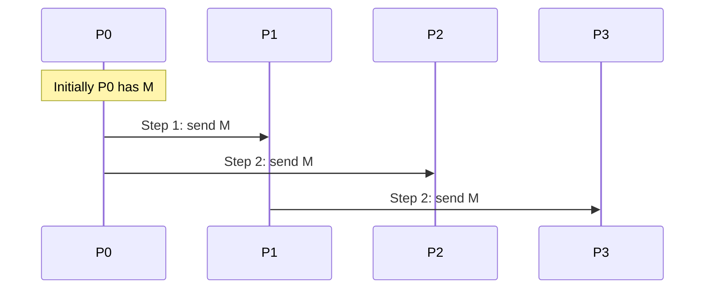

The cost of efficient broadcast using recursive doubling is:

```text
T = log2(p)(ts + m tw)
```

where `p` is the number of processors, `ts` is message startup time, `m` is message size, and `tw` is transfer time per word.

A **reduce operation** is almost the opposite of broadcast. In reduction, every processor has a value, and all these values are combined using an operation such as sum, product, maximum, minimum, logical AND, or logical OR. The final result is stored at a root processor.

For example:

```text
P0 = 2, P1 = 5, P2 = 3, P3 = 4
Operation = SUM
Final result at P0 = 2 + 5 + 3 + 4 = 14
```

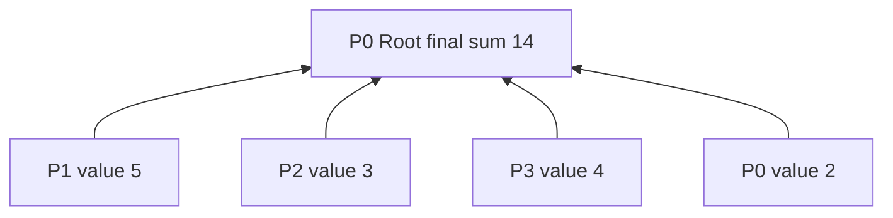

Tree-based reduction works efficiently. First, processors are paired. In step 1, `P1` sends to `P0`, and `P3` sends to `P2`. `P0` and `P2` compute partial sums. In step 2, `P2` sends its partial sum to `P0`. Now `P0` has the final reduced result.

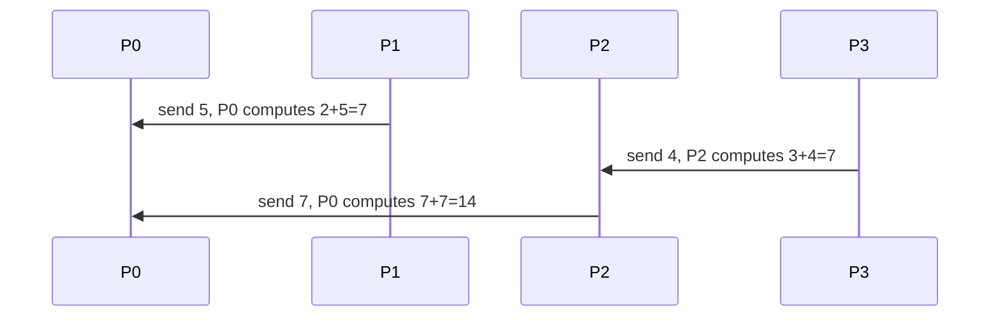

The cost of reduction using a tree is also:

```text
T = log2(p)(ts + m tw)
```

Broadcast spreads information from one processor to all processors, while reduction collects information from all processors to one processor. In MPI, these operations are implemented using `MPI_Bcast()` and `MPI_Reduce()`.

**Exam tip:** Write definitions, draw broadcast and reduce diagrams, explain tree method, write cost formula, and mention MPI functions.

---

## Q.1(b) Scatter and Gather Operation

**Scatter** and **Gather** are collective communication operations used to distribute and collect data in parallel programs. They are very common in MPI-based parallel computing. Scatter divides a large data block into smaller parts and sends one part to each processor. Gather does the reverse: it collects data from all processors into one root processor.

In **scatter**, one root processor contains a large array or data block. This root processor splits the data into equal chunks and sends one chunk to each processor. Suppose root `P0` has the array:

```text
[A, B, C, D]
```

There are four processors: `P0, P1, P2, P3`. After scatter:

```text
P0 gets A
P1 gets B
P2 gets C
P3 gets D
```

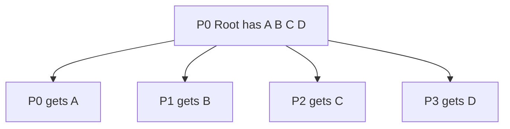

Scatter is used before parallel computation. For example, if we have a large image, the root processor can divide the image into four parts and scatter each part to a different processor. Each processor then applies filtering to its own part. Similarly, in matrix multiplication, rows or blocks of a matrix can be scattered to processors.

The MPI function is:

```c
MPI_Scatter(sendbuf, sendcount, sendtype,
            recvbuf, recvcount, recvtype,
            root, MPI_COMM_WORLD);
```

Here `sendbuf` is the buffer at the root, `sendcount` is the number of elements sent to each processor, `recvbuf` is the receive buffer at each processor, and `root` is the processor that distributes the data.

In **gather**, each processor has a local data item or local result. All processors send their data to the root processor, and root stores the data in order. Suppose:

```text
P0 has A
P1 has B
P2 has C
P3 has D
```

After gather at `P0`:

```text
P0 has [A, B, C, D]
```

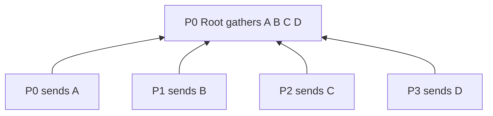

The MPI function is:

```c
MPI_Gather(sendbuf, sendcount, sendtype,
           recvbuf, recvcount, recvtype,
           root, MPI_COMM_WORLD);
```

Scatter and gather are often used together in the pattern:

```text
Scatter input -> compute in parallel -> gather output
```

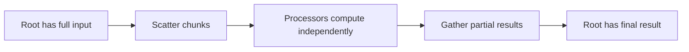

Example: Suppose we want to square the array `[1,2,3,4]` using four processors. First, `P0` scatters one number to each processor. Each processor squares its number:

```text
P0: 1² = 1
P1: 2² = 4
P2: 3² = 9
P3: 4² = 16
```

Then gather collects:

```text
[1, 4, 9, 16]
```

Scatter is one-to-many distribution of different data pieces. Gather is many-to-one collection of data pieces. They are different from broadcast because broadcast sends the same data to all processors, while scatter sends different parts to different processors.

**Exam tip:** Draw scatter and gather separately, explain with `[A B C D]`, write MPI functions, and mention scatter-compute-gather pattern.

---

## Q.1(c) Circular Shift on a Mesh

A **circular shift** is a communication operation where data is shifted from one processor to another by a fixed distance, and the data wraps around at the boundary. When circular shift is performed on a mesh, processors are arranged in rows and columns, and data can be shifted row-wise or column-wise. This operation is useful in many parallel algorithms, especially matrix multiplication algorithms such as Cannon's algorithm.

A mesh network is a two-dimensional arrangement of processors. For example, a 3×3 mesh has 9 processors:

```text
P00 P01 P02
P10 P11 P12
P20 P21 P22
```

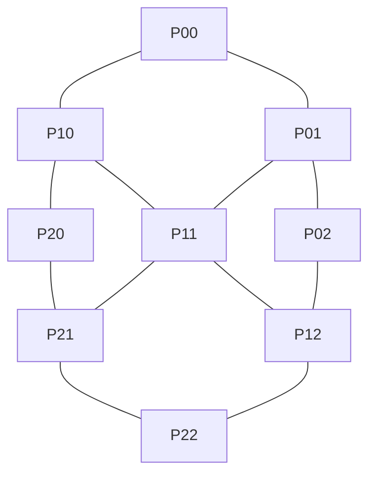

In **row-wise circular shift right by one**, each processor sends its data to the processor on the right in the same row. The last processor in the row sends its data back to the first processor of that row.

Suppose the data in a 3×3 mesh is:

```text
A B C
D E F
G H I
```

After right circular shift by one position in each row:

```text
C A B
F D E
I G H
```

Explanation for first row:

```text
A goes to position of B
B goes to position of C
C wraps around to position of A
```

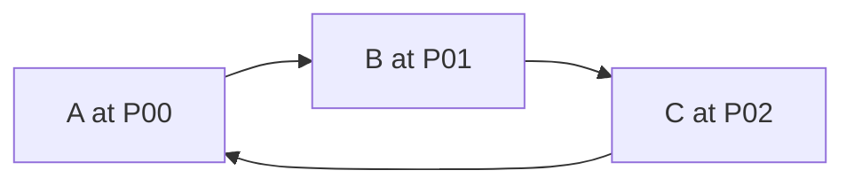

Similarly, in **row-wise circular shift left by one**, each element moves left and the first element wraps to the last position:

```text
Before:
A B C
D E F
G H I

After left shift:
B C A
E F D
H I G
```

In **column-wise circular shift down by one**, each element moves downward in its column, and the last row wraps to the first row:

```text
Before:
A B C
D E F
G H I

After downward shift:
G H I
A B C
D E F
```

The general formula for row-wise right shift by distance `k` in a mesh with `q` columns is:

```text
new_column = (old_column + k) mod q
```

For column-wise downward shift by `k` in a mesh with `r` rows:

```text
new_row = (old_row + k) mod r
```

The modulo operation creates wrap-around. For example, if there are 3 columns and an element is in column 2, shifting right by 1 gives:

```text
(2 + 1) mod 3 = 0
```

So it moves to column 0.

Circular shift on mesh is important because many parallel algorithms need repeated movement of matrix rows or columns. In Cannon's matrix multiplication algorithm, rows of matrix `A` and columns of matrix `B` are shifted circularly so that correct blocks meet at each processor for multiplication.

**Exam tip:** Draw 3×3 mesh, show before/after row and column shift, write modulo formula, and mention Cannon's algorithm.

---

# Q.2 Answer: Prefix Sum, Ring Broadcast/Reduction and All-to-All Broadcast on 3×3 Mesh

## Q.2(a) Prefix-Sum Operation for an Eight-Node Hypercube

A **prefix-sum operation**, also called a **scan operation**, calculates running sums of a sequence. Given values:

```text
a0, a1, a2, a3, ..., an-1
```

The prefix sum output is:

```text
a0,
a0+a1,
a0+a1+a2,
a0+a1+a2+a3,
...
```

So each output contains the sum of all previous elements including the current element. For example, if the input is:

```text
[1, 2, 3, 4]
```

then the prefix sum is:

```text
[1, 3, 6, 10]
```

Prefix sum is important in parallel computing because it is used in parallel sorting, memory allocation, stream compaction, graph algorithms, histogram computation, and GPU algorithms.

In this question, we perform prefix sum on an eight-node hypercube. A hypercube with 8 nodes is a 3-dimensional hypercube because:

```text
8 = 2³
```

The processors are labelled using 3-bit binary numbers:

```text
P0 = 000
P1 = 001
P2 = 010
P3 = 011
P4 = 100
P5 = 101
P6 = 110
P7 = 111
```

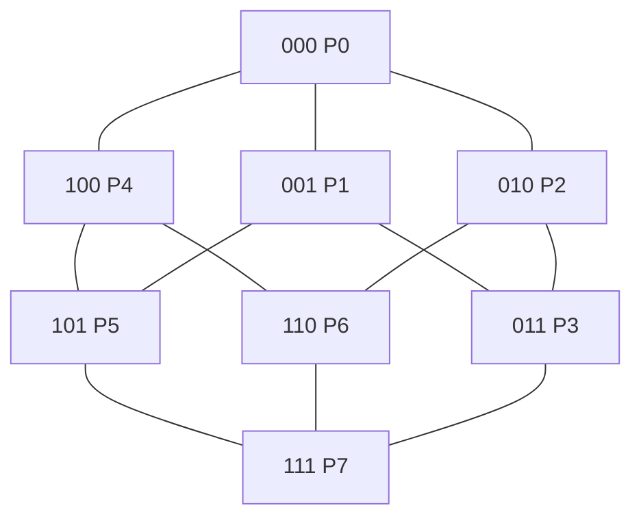

Assume processors contain values:

```text
P0 P1 P2 P3 P4 P5 P6 P7
1  2  3  4  5  6  7  8
```

The expected prefix sum is:

```text
1 3 6 10 15 21 28 36
```

The parallel prefix algorithm runs in `log2(p)` stages. Since `p=8`, number of stages is 3. In each stage, processors receive values from another processor at a certain distance and add that value if the source rank is smaller.

**Stage 1: distance = 1**  
Processors with rank at least 1 add value from one position left.

```text
Initial:  1  2  3  4  5  6  7  8
Stage 1:  1  3  5  7  9  11 13 15
```

**Stage 2: distance = 2**  
Processors with rank at least 2 add value from two positions left.

```text
Stage 2:  1  3  6  10 14 18 22 26
```

**Stage 3: distance = 4**  
Processors with rank at least 4 add value from four positions left.

```text
Stage 3:  1  3  6  10 15 21 28 36
```

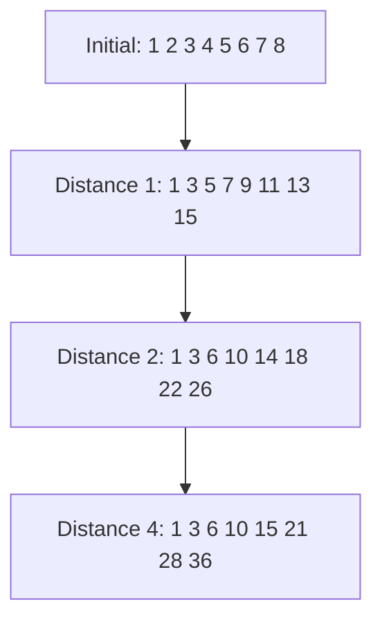

Algorithm:

```text
Parallel Prefix Sum
1. Each processor Pi has value xi.
2. for d = 1, 2, 4, ... less than p:
3.      if i >= d then
4.          Pi receives partial sum from P(i-d).
5.          Pi adds received value to its own partial sum.
6.      end if
7. end for
```

In actual parallel execution, each stage must use values from the previous stage, not values updated during the same stage. Therefore, temporary variables or synchronization are needed.

Complexity:

```text
Number of stages = log2(p)
```

For 8 processors:

```text
3 stages
```

**Exam tip:** Define prefix sum, solve numerical example, draw hypercube, show three stages, write algorithm and complexity.

---

## Q.2(b) One-to-All Broadcast and All-to-One Reduction on a Ring

A ring network is an interconnection network in which each processor is connected to two neighbors. The processors form a closed loop. For 8 processors, the ring is:

```text
P0 -- P1 -- P2 -- P3 -- P4 -- P5 -- P6 -- P7 -- back to P0
```

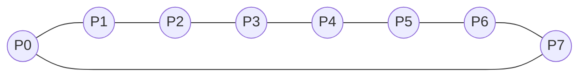

**One-to-All Broadcast** on a ring means one source processor sends the same message to all other processors. Suppose `P0` is the source. In a unidirectional ring, `P0` sends the message to `P1`, then `P1` forwards it to `P2`, and so on. This takes `p-1` steps. For 8 processors, it takes 7 steps.

But if the ring is bidirectional, broadcast can be faster. `P0` sends the message in both directions: to `P1` and `P7`. Then `P1` forwards to `P2`, and `P7` forwards to `P6`. This continues until all processors receive the message.

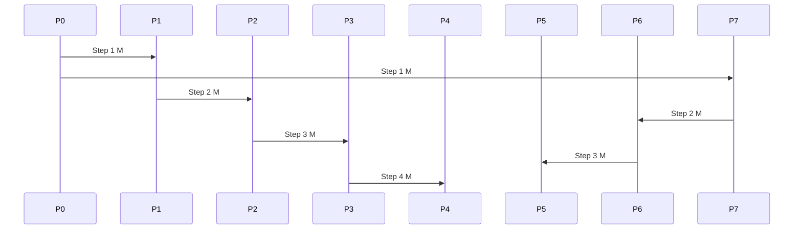

For bidirectional ring, cost is approximately:

```text
T = ceil(p/2)(ts + m tw)
```

For 8 processors:

```text
T = 4(ts + m tw)
```

**All-to-One Reduction** is the reverse type of operation. Every processor has a value, and these values are combined using an operation such as sum, max, or min. The final result is stored at one destination processor, say `P0`.

Suppose each processor has value:

```text
P0=a0, P1=a1, ..., P7=a7
```

For sum reduction, final value at `P0` is:

```text
a0+a1+a2+a3+a4+a5+a6+a7
```

In a ring, processors can send values toward `P0`. Intermediate processors add received values to their own partial sum before forwarding. For example, from one side:

```text
P4 -> P3 -> P2 -> P1 -> P0
```

and from the other side:

```text
P5 -> P6 -> P7 -> P0
```

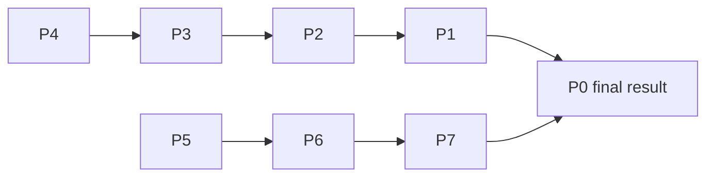

At each step, the receiving processor combines values using the reduction operation. If the operation is sum, it adds. If the operation is maximum, it keeps the larger value.

Broadcast spreads data from one processor to all, while reduction collects and combines data from all processors to one. These two operations are frequently used together in parallel algorithms.

**Exam tip:** Draw the ring, explain broadcast in both directions, explain reduction toward root, and write cost expressions.

---

## Q.2(c) All-to-All Broadcast on 3×3 Mesh with Example and Algorithm

**All-to-All Broadcast** is a collective communication operation in which every processor sends its own message to every other processor. After the operation completes, every processor has messages from all processors.

In a 3×3 mesh, there are 9 processors arranged in 3 rows and 3 columns:

```text
P00 P01 P02
P10 P11 P12
P20 P21 P22
```

Each processor initially has its own message:

```text
P00 has M00
P01 has M01
...
P22 has M22
```

After all-to-all broadcast, every processor has:

```text
M00, M01, M02, M10, M11, M12, M20, M21, M22
```

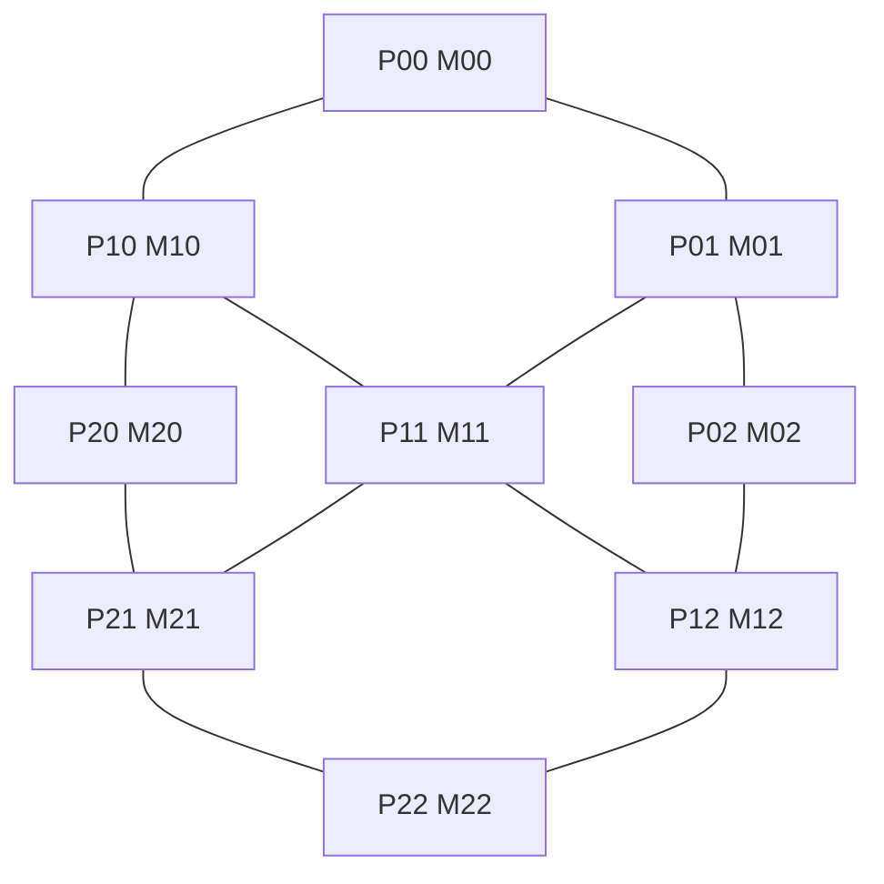

A simple and efficient method for all-to-all broadcast on a mesh is the **row-column method**. It has two phases: row-wise communication and column-wise communication.

**Phase 1: Row-wise all-to-all broadcast**  
Each row performs all-to-all broadcast among its three processors. After this phase, every processor in a row has all messages from that row.

For row 0:

```text
P00, P01, P02 all get M00, M01, M02
```

For row 1:

```text
P10, P11, P12 all get M10, M11, M12
```

For row 2:

```text
P20, P21, P22 all get M20, M21, M22
```

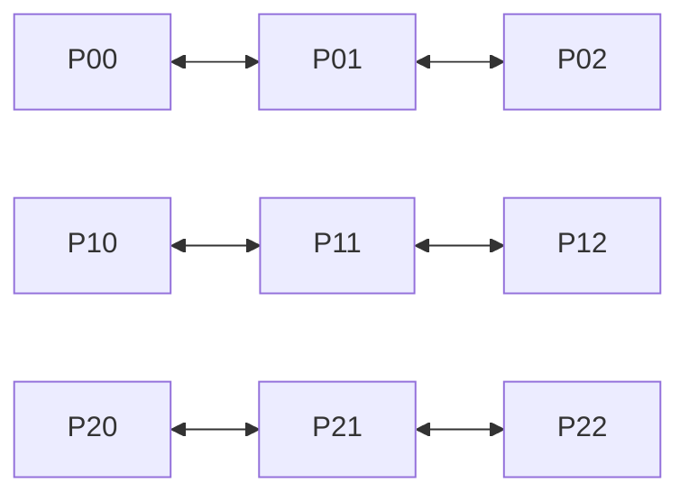

**Phase 2: Column-wise all-to-all broadcast**  
Now each processor already has all messages from its own row. These row message groups are exchanged along columns. After this phase, every processor receives message groups from all rows, so every processor gets all 9 messages.

For column 0:

```text
P00, P10, P20 exchange row message groups
```

For column 1:

```text
P01, P11, P21 exchange row message groups
```

For column 2:

```text
P02, P12, P22 exchange row message groups
```

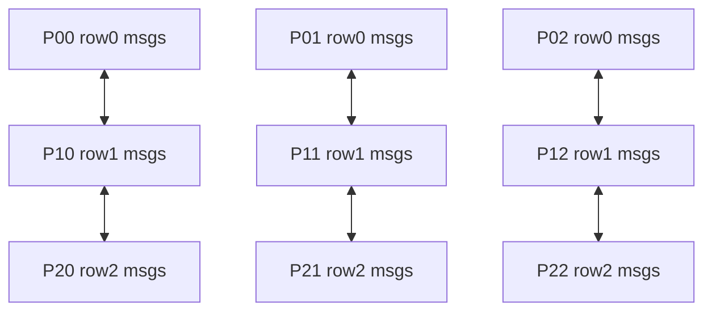

Algorithm:

```text
All-to-All Broadcast on 3×3 Mesh
1. Each processor Pij starts with message Mij.
2. Perform all-to-all broadcast in every row.
3. Now each processor has all messages from its row.
4. Perform all-to-all broadcast in every column.
5. Now every processor has all 9 messages.
```

Cost idea: For a `sqrt(p) × sqrt(p)` mesh, row phase takes approximately `sqrt(p)-1` communication steps, and column phase also takes `sqrt(p)-1` steps. So total rounds are roughly:

```text
2(sqrt(p)-1)
```

For 3×3 mesh:

```text
2(3-1) = 4 rounds approximately
```

However, message size increases in the column phase because each processor sends a group of row messages, not just one message.

**Exam tip:** Draw 3×3 mesh, explain row phase and column phase, write algorithm, and discuss cost idea.

---

# UNIT II — Performance Metrics and Matrix Algorithms

---

# Q.3 Answer: Performance Metrics, Matrix-Matrix Multiplication and Minimum Cost Optimal Time

## Q.3(a) Performance Metrics of Parallel Systems

Performance metrics are used to evaluate how well a parallel algorithm or parallel system is working. A parallel program uses multiple processors, but using many processors does not automatically mean good performance. Sometimes extra processors create communication, synchronization, and idle time. Therefore, we need performance metrics to measure speed, processor utilization, overhead, cost, and scalability.

The first metric is **serial execution time**, denoted by `Ts`. It is the time taken by the best serial algorithm on a single processor. The second metric is **parallel execution time**, denoted by `Tp`. It is the time taken by a parallel algorithm using `p` processors. The aim of parallel computing is to reduce `Tp` compared to `Ts`.

The most important metric is **speedup**:

```text
S = Ts / Tp
```

If serial time is 120 seconds and parallel time is 20 seconds, then:

```text
S = 120 / 20 = 6
```

This means the parallel program is 6 times faster.

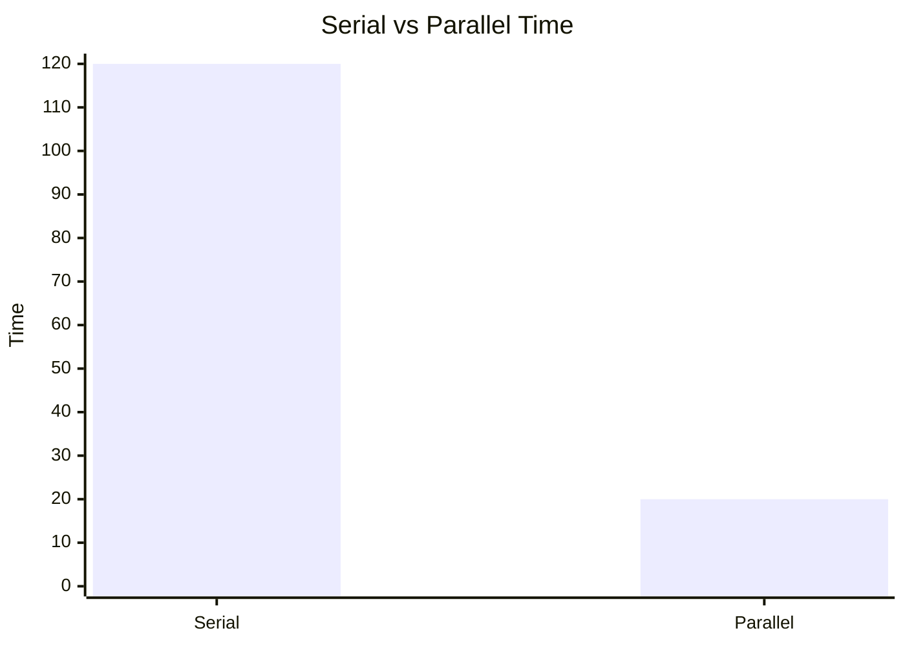

The next metric is **efficiency**:

```text
E = S / p
```

If speedup is 6 and processors are 8:

```text
E = 6 / 8 = 0.75 = 75%
```

Efficiency shows how well processors are used. Ideal efficiency is 100%, but in practical systems efficiency is reduced by overhead.

**Cost** is total processor time used:

```text
Cost = p × Tp
```

If `p = 8` and `Tp = 20`, cost is:

```text
Cost = 8 × 20 = 160 processor-seconds
```

A parallel algorithm is **cost optimal** if:

```text
pTp = O(Ts)
```

This means the total work done by all processors is asymptotically equal to the work of the best serial algorithm.

**Overhead** is the extra work introduced by parallelism:

```text
To = pTp - Ts
```

Overhead includes communication time, synchronization time, idle time, task scheduling, extra computation, and memory contention.

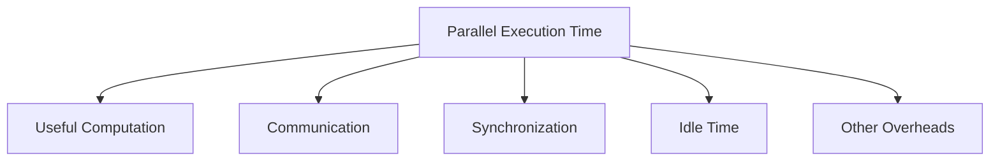

**Scalability** is the ability of a parallel system to maintain performance when the number of processors and problem size increase. A scalable system gives good speedup even when more processors are added.

**Isoefficiency** is a metric related to scalability. It tells how much the problem size must grow with the number of processors to maintain constant efficiency. Lower isoefficiency means better scalability.

Summary:

| Metric | Formula | Meaning |
|---|---|---|
| Serial time | `Ts` | Time on one processor |
| Parallel time | `Tp` | Time on p processors |
| Speedup | `Ts/Tp` | How much faster |
| Efficiency | `S/p` | Processor utilization |
| Cost | `pTp` | Total processor time |
| Overhead | `pTp - Ts` | Extra parallel work |
| Scalability | qualitative | Ability to grow |

**Exam tip:** Write formulas, solve one example, draw overhead diagram, and explain each metric in simple words.

---

## Q.3(b) Matrix-Matrix Multiplication in Detail

Matrix-matrix multiplication is one of the most important computations in high performance computing. It is used in machine learning, scientific simulation, computer graphics, numerical methods, and engineering applications. Given two matrices `A` and `B`, the result matrix `C` is calculated as:

```text
C = A × B
```

For square matrices of size `n × n`, each element of `C` is:

```text
C[i][j] = Σ A[i][k] × B[k][j], for k = 0 to n-1
```

This means each element of `C` is the dot product of row `i` of `A` and column `j` of `B`.

Example:

```text
A = |1 2|      B = |5 6|
    |3 4|          |7 8|
```

Now calculate:

```text
C00 = 1×5 + 2×7 = 19
C01 = 1×6 + 2×8 = 22
C10 = 3×5 + 4×7 = 43
C11 = 3×6 + 4×8 = 50
```

So:

```text
C = |19 22|
    |43 50|
```

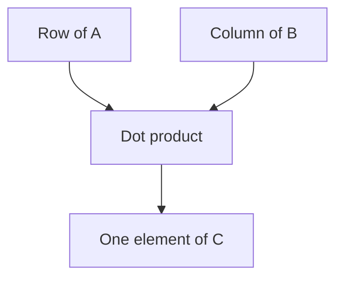

Sequential matrix multiplication uses three nested loops:

```text
for i = 0 to n-1:
    for j = 0 to n-1:
        C[i][j] = 0
        for k = 0 to n-1:
            C[i][j] += A[i][k] * B[k][j]
```

Sequential complexity is:

```text
O(n³)
```

Matrix multiplication is highly parallel because different elements of `C` can be computed independently. There are two common parallel approaches: row-wise partitioning and block-wise partitioning.

In **row-wise partitioning**, rows of matrix `A` are divided among processors. Each processor computes corresponding rows of `C`. Matrix `B` is needed by all processors, so it is broadcast.

```mermaid
flowchart TD
    A[Rows of A divided] --> P0[P0 computes rows of C]
    A --> P1[P1 computes rows of C]
    B[Matrix B broadcast] --> P0
    B --> P1
    P0 --> C[Final matrix C]
    P1 --> C
```

Algorithm:

```text
1. Divide rows of A among processors.
2. Broadcast matrix B to all processors.
3. Each processor computes assigned rows of C.
4. Gather rows of C to form final matrix.
```

In **block-wise partitioning**, matrices are divided into square blocks. Suppose:

```text
A = |A00 A01|, B = |B00 B01|
    |A10 A11|      |B10 B11|
```

Then:

```text
C00 = A00B00 + A01B10
C01 = A00B01 + A01B11
C10 = A10B00 + A11B10
C11 = A10B01 + A11B11
```

Block partitioning is more scalable for large matrices because communication is more balanced.

Ideal parallel time using `p` processors is:

```text
O(n³/p)
```

Actual time includes communication, broadcasting, synchronization, and gathering overhead.

**Exam tip:** Write formula, solve 2×2 example, write sequential loop, explain row-wise and block-wise parallel methods, and write complexity.

---

## Q.3(c) Minimum and Cost Optimal Execution Time

In parallel computing, using more processors usually reduces execution time, but only up to a limit. After some point, adding more processors may increase overhead and may not improve performance. Therefore, two important concepts are **minimum execution time** and **minimum cost optimal execution time**.

**Minimum execution time** is the lowest possible parallel execution time obtained by choosing a certain number of processors. As processors increase, computation per processor decreases. But communication, synchronization, and idle time may increase. Therefore, execution time first decreases, reaches a minimum, and may then increase.

Example:

| Processors | Parallel time |
|---|---|
| 1 | 100 sec |
| 2 | 55 sec |
| 4 | 30 sec |
| 8 | 22 sec |
| 16 | 25 sec |

Here the minimum execution time is 22 seconds using 8 processors. Using 16 processors increases time to 25 seconds because overhead becomes high.

```mermaid
xychart-beta
    title "Minimum Execution Time"
    x-axis [1, 2, 4, 8, 16]
    y-axis "Execution Time" 0 --> 100
    line [100, 55, 30, 22, 25]
```

However, the fastest execution time is not always the best choice. We must also consider cost. Cost is:

```text
Cost = p × Tp
```

A parallel algorithm is cost optimal if:

```text
pTp = O(Ts)
```

This means the total processor work is of the same order as the best serial algorithm. If cost is much larger than serial time, then many processors are wasted.

Example:

| p | Tp | Cost = pTp | Comment |
|---|---|---|---|
| 1 | 100 | 100 | serial |
| 2 | 52 | 104 | cost optimal |
| 4 | 28 | 112 | cost optimal |
| 8 | 20 | 160 | acceptable sometimes |
| 16 | 18 | 288 | not cost optimal |

Here, minimum execution time is 18 seconds using 16 processors. But cost is 288, which is much larger than serial cost 100. The minimum cost optimal execution time may be 28 seconds using 4 processors because cost remains close to serial cost.

```mermaid
flowchart TD
    A[Use more processors] --> B[Execution time decreases]
    B --> C[Communication overhead increases]
    C --> D[Cost may become too high]
    D --> E[Choose minimum cost optimal point]
```

Minimum execution time focuses only on fastest completion. Minimum cost optimal execution time focuses on a balance between low time and efficient processor usage. In real HPC systems, cost optimality is important because processors, power, and machine time are expensive.

**Exam tip:** Define both terms, give table, calculate cost, show graph, and explain why fastest is not always best.

---

# Q.4 Answer: Matrix-Vector Multiplication and Dense Matrix Algorithms

## Q.4(a) Matrix Vector Multiplication using Row-wise 1D Partitioning, 2D Partitioning and Comparison

Matrix-vector multiplication is a basic dense matrix operation. Given matrix `A` of size `n × n` and vector `x` of size `n`, the output vector `y` is:

```text
y = A × x
```

Each element of `y` is calculated as:

```text
y[i] = Σ A[i][j] × x[j]
```

Example:

```text
A = |1 2|     x = |3|
    |4 5|         |6|
```

Then:

```text
y0 = 1×3 + 2×6 = 15
y1 = 4×3 + 5×6 = 42
```

So:

```text
y = |15|
    |42|
```

In **row-wise 1D partitioning**, rows of matrix `A` are divided among processors. Each processor receives some complete rows of `A`. The vector `x` is needed by every processor because each row multiplication uses all elements of `x`. Therefore, vector `x` is broadcast to all processors.

Suppose there are 4 rows and 2 processors:

```text
P0 gets rows 0 and 1
P1 gets rows 2 and 3
```

Each processor computes corresponding elements of `y`.

```mermaid
flowchart TD
    A[Matrix A rows] --> P0[P0 rows 0 and 1]
    A --> P1[P1 rows 2 and 3]
    X[Vector x broadcast] --> P0
    X --> P1
    P0 --> Y[Partial y]
    P1 --> Y
```

Advantages of row-wise 1D partitioning are simplicity and easy implementation. The main disadvantage is that the full vector `x` must be available to every processor, which can create communication overhead for large systems.

In **2D partitioning**, matrix `A` is divided into blocks using a processor grid. For example, with a 2×2 processor grid:

```text
A = |A00 A01|
    |A10 A11|
```

Processor `P00` handles block `A00`, `P01` handles `A01`, `P10` handles `A10`, and `P11` handles `A11`. Vector `x` is also divided into parts, such as `x0` and `x1`. Each processor multiplies its matrix block with the required vector part and produces a partial result. Then partial results are reduced along rows to form final vector `y`.

```mermaid
flowchart TD
    X0[x0] --> P00[P00 computes A00*x0]
    X1[x1] --> P01[P01 computes A01*x1]
    X0 --> P10[P10 computes A10*x0]
    X1 --> P11[P11 computes A11*x1]
    P00 --> R0[Reduce for y0 block]
    P01 --> R0
    P10 --> R1[Reduce for y1 block]
    P11 --> R1
```

2D partitioning is more complex but more scalable. It reduces the amount of vector data each processor stores and can reduce communication bottlenecks. It is preferred for very large matrices and large processor counts.

Comparison:

| Point | Row-wise 1D Partitioning | 2D Partitioning |
|---|---|---|
| Matrix division | Complete rows | Blocks |
| Vector requirement | Full vector needed by each processor | Vector parts distributed |
| Simplicity | Simple | More complex |
| Communication | Broadcast full vector | Broadcast/reduce vector parts |
| Scalability | Limited | Better |
| Suitable for | Small/medium systems | Large systems |

In conclusion, row-wise partitioning is easy and useful for small systems, while 2D partitioning is better for large parallel systems because it balances memory and communication more effectively.

**Exam tip:** Write formula, solve example, draw 1D and 2D diagrams, and compare in table.

---

## Q.4(b) Dense Matrix Algorithms: Matrix-Vector and Matrix-Matrix Multiplication

A **dense matrix** is a matrix in which most elements are non-zero. This is different from a sparse matrix, where most elements are zero. Dense matrix algorithms are important in scientific computing, numerical linear algebra, machine learning, simulations, and graphics.

Example of dense matrix:

```text
|1 5 2|
|3 4 9|
|8 6 7|
```

Most entries are non-zero, so normal dense algorithms process all elements.

The first dense matrix algorithm is **matrix-vector multiplication**. Given matrix `A` and vector `x`, compute:

```text
y = A × x
```

Formula:

```text
y[i] = Σ A[i][j] × x[j]
```

For example:

```text
A = |1 2|, x = |3|
    |4 5|      |6|
```

Then:

```text
y0 = 1×3 + 2×6 = 15
y1 = 4×3 + 5×6 = 42
```

Sequential complexity is:

```text
O(n²)
```

Parallel matrix-vector multiplication can be done by dividing rows among processors. Each processor computes some elements of output vector `y`. The vector `x` is broadcast to all processors.

```mermaid
flowchart TD
    A[Rows of dense matrix A] --> P0[P0 computes y0 y1]
    A --> P1[P1 computes y2 y3]
    X[Vector x] --> P0
    X --> P1
    P0 --> Y[Output vector y]
    P1 --> Y
```

The second dense matrix algorithm is **matrix-matrix multiplication**. Given matrices `A` and `B`, compute:

```text
C = A × B
```

Formula:

```text
C[i][j] = Σ A[i][k] × B[k][j]
```

Sequential complexity is:

```text
O(n³)
```

Parallel matrix-matrix multiplication divides rows or blocks among processors. In row-wise method, rows of `A` are distributed and matrix `B` is broadcast. In block method, both matrices are divided into blocks and processors compute blocks of `C`.

```mermaid
flowchart TD
    A[Matrix A blocks] --> P0[P0 computes C00]
    B[Matrix B blocks] --> P0
    A --> P1[P1 computes C01]
    B --> P1
    A --> P2[P2 computes C10]
    B --> P2
    A --> P3[P3 computes C11]
    B --> P3
```

Comparison of dense algorithms:

| Algorithm | Operation | Sequential Complexity | Ideal Parallel Complexity |
|---|---|---|---|
| Matrix-vector | `y = A × x` | `O(n²)` | `O(n²/p)` |
| Matrix-matrix | `C = A × B` | `O(n³)` | `O(n³/p)` |

Matrix-matrix multiplication has more computation per data item, so it usually gives better parallel efficiency than matrix-vector multiplication. Matrix-vector multiplication often has more communication relative to computation.

Dense matrix algorithms are used in neural networks, solving systems of equations, simulations, optimization, computer graphics, and signal processing.

**Exam tip:** Define dense matrix, explain both algorithms with formulas/examples, draw parallel diagrams, and compare complexities.

---

# UNIT III — CUDA Programming / Parallel Algorithms

---

# Q.5 Answer: CUDA Architecture and Managing GPU Memory

## Q.5(a) CUDA Architecture in Detail

CUDA stands for **Compute Unified Device Architecture**. It is a parallel computing platform and programming model developed by NVIDIA. CUDA allows programmers to use NVIDIA GPUs for general-purpose computation, not only graphics. A CPU has a few powerful cores optimized for sequential tasks, while a GPU has many smaller cores optimized for executing thousands of threads in parallel.

CUDA architecture is based on the relationship between the **host** and the **device**. The host is the CPU and its main memory. The device is the GPU and its memory. The CPU controls the program, prepares data, allocates GPU memory, copies data to GPU, launches kernels, and copies results back. The GPU executes kernels using thousands of parallel threads.

```mermaid
flowchart LR
    H[Host: CPU + RAM] -->|cudaMemcpy and kernel launch| D[Device: NVIDIA GPU]
    D -->|result copy| H
```

Inside the GPU, there are multiple **Streaming Multiprocessors**, called SMs. Each SM contains many CUDA cores, registers, shared memory, warp schedulers, and load/store units. CUDA cores perform arithmetic operations. SMs execute thread blocks. A thread block is assigned to one SM, and threads inside that block can share data using shared memory.

```mermaid
flowchart TD
    GPU[GPU Device]
    GPU --> GM[Global Memory]
    GPU --> SM0[Streaming Multiprocessor SM0]
    GPU --> SM1[Streaming Multiprocessor SM1]
    GPU --> SM2[Streaming Multiprocessor SM2]
    SM0 --> C0[CUDA Cores]
    SM0 --> R0[Registers]
    SM0 --> S0[Shared Memory]
    SM1 --> C1[CUDA Cores]
    SM1 --> R1[Registers]
    SM1 --> S1[Shared Memory]
```

CUDA uses a hierarchical thread model:

```text
Grid -> Blocks -> Threads
```

When a kernel is launched, CUDA creates a grid. A grid contains multiple blocks, and each block contains multiple threads. Threads inside the same block can cooperate and synchronize using `__syncthreads()`. Threads in different blocks cannot directly synchronize during the same kernel execution.

```mermaid
flowchart TD
    G[Grid] --> B0[Block 0]
    G --> B1[Block 1]
    B0 --> T00[Thread 0]
    B0 --> T01[Thread 1]
    B0 --> T02[Thread 2]
    B1 --> T10[Thread 0]
    B1 --> T11[Thread 1]
```

A CUDA kernel is launched using:

```c
kernel<<<gridDim, blockDim>>>(arguments);
```

For example:

```c
vectorAdd<<<blocks, threads>>>(d_A, d_B, d_C, n);
```

Each thread calculates a unique global index:

```c
int i = blockIdx.x * blockDim.x + threadIdx.x;
```

This allows each thread to work on a separate data item.

CUDA memory hierarchy includes registers, local memory, shared memory, global memory, constant memory, and texture memory. Registers are fastest and private to each thread. Shared memory is fast and shared within a block. Global memory is large but slower and accessible to all threads.

CUDA architecture is highly effective for data-parallel applications such as matrix multiplication, image processing, neural networks, physical simulations, and vector operations. Performance depends on using enough threads, minimizing global memory access, using shared memory properly, and reducing CPU-GPU data transfers.

**Exam tip:** Draw host-device diagram, SM diagram, grid-block-thread diagram, and explain memory hierarchy.

---

## Q.5(b) Managing GPU Memory

Managing GPU memory is one of the most important parts of CUDA programming. GPU computation can be very fast, but poor memory management can make the program slow. In CUDA, the CPU and GPU usually have separate memory spaces. The CPU uses host memory, and the GPU uses device memory. Data must be copied from host to device before computation and copied back after computation.

CUDA memory hierarchy contains several types of memory. The fastest memory is **register memory**. Registers are private to each thread and store local variables. They are very fast but limited in number.

**Shared memory** is fast memory shared by all threads in a block. It is useful when multiple threads need to reuse the same data. For example, in matrix multiplication, blocks of matrices can be loaded into shared memory so that many threads can reuse them.

**Global memory** is large GPU memory accessible by all threads. It stores input and output arrays. However, it is slower than shared memory and registers. Efficient CUDA programs reduce unnecessary global memory access and use coalesced memory access.

**Constant memory** is read-only cached memory useful for values that do not change. **Texture memory** is read-only cached memory useful for image-like access patterns. **Local memory** is private to each thread but may be stored in global memory if registers are insufficient.

```mermaid
flowchart TD
    Thread[Thread] --> R[Registers: fastest private]
    Thread --> L[Local memory]
    Block[Thread Block] --> S[Shared memory: fast per block]
    GPU[GPU Device] --> G[Global memory: large slower]
    GPU --> C[Constant memory]
    GPU --> T[Texture memory]
```

Important CUDA memory functions include `cudaMalloc`, `cudaMemcpy`, and `cudaFree`.

`cudaMalloc` allocates memory on the GPU:

```c
cudaMalloc((void**)&d_A, size);
```

`cudaMemcpy` copies data between host and device:

```c
cudaMemcpy(d_A, h_A, size, cudaMemcpyHostToDevice);
cudaMemcpy(h_A, d_A, size, cudaMemcpyDeviceToHost);
```

`cudaFree` releases GPU memory:

```c
cudaFree(d_A);
```

A typical memory flow is:

```mermaid
flowchart LR
    H[Host memory h_A h_B] -->|cudaMemcpy HostToDevice| D[Device global memory d_A d_B]
    D --> K[Kernel uses GPU memory]
    K --> R[Device result d_C]
    R -->|cudaMemcpy DeviceToHost| OUT[Host result h_C]
```

To manage GPU memory efficiently, we should minimize CPU-GPU transfers because PCIe transfer is slower than GPU computation. Data should be copied once, processed many times on GPU, and copied back only when needed. Shared memory should be used for frequently reused data. Global memory accesses should be coalesced, meaning consecutive threads should access consecutive memory locations. Unused memory should be freed.

Example: In vector addition, arrays `A` and `B` are copied from host to device. The kernel computes `C` on the device. Then only `C` is copied back. This avoids unnecessary transfers.

Poor memory management can cause problems such as slow execution, memory leaks, invalid memory access, and low GPU occupancy. Therefore, memory management is central to CUDA performance.

**Exam tip:** Draw memory hierarchy, explain each memory type, write CUDA memory functions, and mention optimization tips.

---

# Q.6 Answer: Parallel DFS and Parallel Dijkstra Algorithm

## Q.6(a) Modify DFS for Parallel Execution and Analyze Complexity

Depth First Search, or DFS, is a graph traversal algorithm that explores as deep as possible along a branch before backtracking. Sequential DFS uses recursion or a stack. It starts from a source vertex, visits an unvisited neighbor, then continues deeper until no unvisited neighbor is available. Then it backtracks.

Example graph:

```mermaid
graph TD
    A --> B
    A --> C
    B --> D
    B --> E
    C --> F
```

A possible sequential DFS order is:

```text
A, B, D, E, C, F
```

Parallel DFS is difficult because DFS is naturally sequential and path-dependent. However, we can modify DFS for parallel execution by allowing different processors to explore different branches of the graph simultaneously. If a vertex has many unvisited neighbors, these neighbors can become separate tasks.

For example, from vertex `A`, branch through `B` can be explored by processor `P0`, while branch through `C` can be explored by processor `P1`.

```mermaid
flowchart TD
    A[A source] --> B[B branch handled by P0]
    A --> C[C branch handled by P1]
    B --> D[D]
    B --> E[E]
    C --> F[F]
```

A common parallel DFS method uses a **shared work pool**. The work pool stores unexplored vertices or subtrees. Initially, the source is visited and its unvisited neighbors are inserted into the pool. Each processor repeatedly takes a vertex from the pool and performs DFS locally. If it finds multiple unexplored branches, it may insert some branches back into the pool so other processors can help.

Algorithm:

```text
Parallel DFS
1. Mark source vertex s as visited.
2. Insert unvisited neighbors of s into a shared work pool.
3. Each processor repeats:
4.      Take a vertex/subtree from the pool.
5.      Perform DFS locally on that subtree.
6.      When multiple branches are found, add some to the pool.
7.      Use atomic test-and-set to mark visited vertices.
8. Stop when the global work pool is empty.
```

```mermaid
flowchart LR
    W[Shared work pool: B C G H] --> P0[P0 takes B]
    W --> P1[P1 takes C]
    W --> P2[P2 takes G]
    W --> P3[P3 takes H]
```

The most important issue is duplicate visits. In a graph, two processors may discover the same vertex at the same time through different edges. To prevent this, the visited array must be protected using locks or atomic operations. Another issue is load imbalance. Some DFS branches may be very large while others may be small. Dynamic work sharing reduces this problem.

In distributed-memory systems, communication overhead appears because graph data may be stored on different processors. Processors must exchange messages when they discover remote vertices.

Sequential DFS complexity is:

```text
O(V + E)
```

where `V` is number of vertices and `E` is number of edges.

Ideal parallel complexity using `p` processors is:

```text
O((V + E) / p)
```

But actual complexity is:

```text
O((V + E)/p + synchronization + communication + load imbalance)
```

If the graph has many independent branches, parallel DFS performs well. If the graph is like a long chain, there is little parallelism.

**Exam tip:** Define DFS, explain why parallelization is difficult, draw branch distribution diagram, write work pool algorithm, and analyze complexity.

---

## Q.6(b) Dijkstra's Algorithm in Parallel Formulation

Dijkstra's algorithm finds the shortest path from a source vertex to all other vertices in a weighted graph with non-negative edge weights. It is widely used in routing, maps, network optimization, and graph analytics.

Sequential Dijkstra algorithm works as follows:

1. Set distance of source to 0 and all others to infinity.  
2. Repeatedly select the unvisited vertex with the smallest distance.  
3. Relax all edges from that vertex.  
4. Mark the vertex as visited.  
5. Continue until all vertices are visited.  

Relaxation means:

```text
if dist[v] > dist[u] + weight(u,v):
    dist[v] = dist[u] + weight(u,v)
```

Example graph:

```mermaid
graph LR
    A((A)) -- 2 --- B((B))
    A -- 4 --- C((C))
    B -- 1 --- C
    B -- 7 --- D((D))
    C -- 3 --- D
```

If source is `A`, Dijkstra first selects `A`, then updates distances of `B` and `C`. Then it selects the unvisited vertex with minimum distance and continues.

Parallelizing Dijkstra is challenging because selecting the global minimum distance vertex is a sequential-looking operation. However, parts of the algorithm can be parallelized.

In parallel formulation, vertices are divided among processors. Each processor owns a subset of vertices and their distance values. In every iteration, each processor finds the local unvisited vertex with the minimum distance among its own vertices. Then a global reduction operation is used to find the global minimum vertex among all local minima. This global minimum vertex is broadcast to all processors. Then each processor relaxes edges from that vertex to the vertices it owns.

```mermaid
flowchart TD
    P0[P0 local minimum] --> R[Global reduction]
    P1[P1 local minimum] --> R
    P2[P2 local minimum] --> R
    P3[P3 local minimum] --> R
    R --> G[Global minimum vertex u]
    G --> B[Broadcast u to all processors]
    B --> RELAX[Processors relax local edges]
```

Algorithm:

```text
Parallel Dijkstra
1. Distribute vertices among processors.
2. Initialize dist[source] = 0 and all others = infinity.
3. Repeat V times:
4.      Each processor finds local unvisited vertex with minimum distance.
5.      Use global reduction to find global minimum vertex u.
6.      Broadcast u to all processors.
7.      Each processor relaxes edges from u to its local vertices.
8.      Mark u as visited.
```

The relaxation step is parallel because each processor updates distances of its own vertices independently. The global minimum selection requires communication.

Sequential Dijkstra with adjacency matrix has complexity:

```text
O(V²)
```

Parallel Dijkstra approximate complexity is:

```text
O(V²/p + V log p)
```

The term `V²/p` represents divided computation, and `V log p` represents global reductions and broadcasts over `V` iterations.

Advantages of parallel Dijkstra include faster relaxation and ability to handle large graphs. Limitations include communication overhead, repeated global minimum reduction, and difficulty in achieving high scalability for sparse graphs.

**Exam tip:** Define Dijkstra, explain relaxation, draw graph, write parallel steps, and give complexity `O(V²/p + V log p)`.

---

# UNIT IV — Parallel Algorithms and Distributed Computing

---

# Q.7 Answer: Parallel BFS and Communication Strategies

## Q.7(a) Parallel BFS Short Note

Breadth First Search, or BFS, is a graph traversal algorithm that visits vertices level by level. Starting from a source vertex, BFS first visits all vertices at distance 1, then all vertices at distance 2, and so on. BFS is naturally suitable for parallel execution because all vertices at the same level can be processed independently.

Example graph:

```mermaid
graph TD
    A --> B
    A --> C
    A --> D
    B --> E
    B --> F
    D --> G
```

BFS from `A` gives:

```text
Level 0: A
Level 1: B, C, D
Level 2: E, F, G
```

In parallel BFS, the current set of vertices is called the **frontier**. All vertices in the frontier are processed in parallel. Each processor takes some frontier vertices, explores their neighbors, and adds newly discovered vertices to the next frontier.

```mermaid
flowchart TD
    F0[Frontier 0: A] --> F1[Frontier 1: B C D processed in parallel]
    F1 --> F2[Frontier 2: E F G processed in parallel]
    F2 --> END[End when frontier empty]
```

Algorithm:

```text
Parallel BFS(source s)
1. Mark s as visited.
2. frontier = {s}
3. while frontier is not empty:
4.      next_frontier = empty
5.      In parallel, process all vertices u in frontier.
6.      For each neighbor v of u:
7.          if v is unvisited:
8.              mark v visited using atomic operation.
9.              add v to next_frontier.
10.     frontier = next_frontier.
```

Sequential BFS complexity is:

```text
O(V + E)
```

Ideal parallel time with `p` processors is approximately:

```text
O((V + E)/p)
```

However, actual performance depends on graph structure. Parallel BFS faces challenges such as synchronization after each level, duplicate discovery of vertices, communication overhead in distributed graphs, and load imbalance because some vertices have many neighbors and others have few.

**Exam tip:** Define BFS, draw level diagram, explain frontier, write algorithm, and mention complexity and issues.

---

## Q.7(b) Communication Strategies in BFS

Communication strategies in BFS are important when the graph is distributed across multiple processors. In a distributed graph, each processor owns some vertices and edges. During BFS, a processor may discover a vertex that is owned by another processor. In that case, it must communicate this discovery to the owner processor.

For example:

```text
P0 owns vertices A, B
P1 owns vertices C, D
If B has edge to D, then P0 must inform P1 when D is discovered.
```

```mermaid
flowchart LR
    P0[P0 owns A B] -->|discovers D| P1[P1 owns C D]
```

A communication strategy decides how processors exchange newly discovered vertices. A good strategy reduces communication overhead and improves performance. A bad strategy may create too many messages, network congestion, or unnecessary broadcasts.

There are three common strategies:

1. Random communication strategy  
2. Ring communication strategy  
3. Broadcast communication strategy  

Each strategy has different behavior. Random communication sends messages directly to owner processors. Ring strategy passes messages around a logical ring. Broadcast strategy sends discovered information to all processors.

Communication is often the bottleneck in parallel BFS because BFS progresses level by level. After every level, processors must exchange frontier information. If the graph is large and distributed, the amount of communication can be high.

```mermaid
flowchart TD
    A[Parallel BFS Communication] --> B[Random communication]
    A --> C[Ring communication]
    A --> D[Broadcast communication]
```

A good BFS communication strategy should reduce number of messages, avoid congestion, balance communication load, and match the network topology. For sparse graphs, direct communication may be better. For dense graphs, broadcast may sometimes be acceptable. For simple systems, ring communication is easy to implement.

**Exam tip:** Explain why BFS needs communication, define communication strategy, and introduce random/ring/broadcast strategies.

---

## Q.7(c-i) Random Communication Strategy in BFS

In **random communication strategy**, processors send discovered vertices directly to the processors that own them. There is no fixed pattern like ring or broadcast. If processor `P0` discovers a vertex owned by `P3`, it sends a message directly to `P3`. If it discovers a vertex owned by `P1`, it sends directly to `P1`.

```mermaid
flowchart TD
    P0[P0] --> P2[P2]
    P0 --> P3[P3]
    P1[P1] --> P3
    P2 --> P0
```

This strategy is called random because communication destinations depend on graph edges and current frontier, not on a fixed schedule. It is direct and can be efficient when messages are not too many.

Advantages:

1. Messages go directly to destination.  
2. No unnecessary forwarding through intermediate processors.  
3. Good when frontier is small or graph is sparse.  
4. Simple ownership-based communication.  

Disadvantages:

1. Many random messages can create network congestion.  
2. Communication pattern is unpredictable.  
3. Some processors may receive too many messages.  
4. Harder to optimize than structured communication.  

Random communication is suitable when the number of discovered remote vertices is moderate and the network supports efficient direct messaging.

---

## Q.7(c-ii) Ring Communication Strategy in BFS

In **ring communication strategy**, processors are arranged in a logical ring. Messages are passed around the ring until they reach the processor that owns the target vertex.

```mermaid
graph LR
    P0((P0)) --> P1((P1))
    P1 --> P2((P2))
    P2 --> P3((P3))
    P3 --> P0
```

If `P0` wants to send a discovered vertex to `P2`, the message may go:

```text
P0 -> P1 -> P2
```

Each processor checks whether the message is for it. If not, it forwards the message to the next processor.

Advantages:

1. Simple communication pattern.  
2. Predictable and easy to implement.  
3. Avoids all processors sending randomly at the same time.  
4. Useful on systems where ring communication is natural.  

Disadvantages:

1. Message may travel multiple hops.  
2. Latency can be high.  
3. Ring links may become bottlenecks.  
4. Not best for large systems if many messages circulate.  

Ring communication is useful when simplicity is more important than minimum latency.

---

## Q.7(c-iii) Broadcast Communication Strategy in BFS

In **broadcast communication strategy**, a processor broadcasts newly discovered vertices to all processors. Each processor checks whether it owns any of the received vertices. If yes, it adds them to its next frontier. If no, it ignores them.

```mermaid
flowchart TD
    P0[P0 broadcasts discovered vertices]
    P0 --> P1[P1]
    P0 --> P2[P2]
    P0 --> P3[P3]
    P0 --> P4[P4]
```

Advantages:

1. Very simple logic.  
2. Every processor receives all discovery information.  
3. Useful for dense graphs where many processors need information.  
4. Avoids need to determine exact destination before sending.  

Disadvantages:

1. Very high communication cost.  
2. Many processors receive useless data.  
3. Not suitable for large sparse graphs.  
4. Can create network congestion.  

Broadcast strategy is easy but expensive. It may be acceptable for small systems or dense graphs, but not for very large distributed graphs.

Comparison:

| Strategy | Advantage | Disadvantage |
|---|---|---|
| Random | Direct communication | Congestion possible |
| Ring | Simple and predictable | Multiple hops |
| Broadcast | Very easy logic | High communication cost |

**Exam tip:** Explain all three strategies with diagrams, advantages, disadvantages, and comparison table.

---

# Q.8 Answer: Odd-Even Sort, CROW RAM and Document Classification

## Q.8(a) Odd-Even Transposition in Bubble Sort with Example

Odd-even transposition sort is a parallel version of bubble sort. In normal bubble sort, adjacent elements are compared one after another. This makes bubble sort slow. Odd-even transposition sort improves parallelism by comparing independent adjacent pairs at the same time.

The algorithm works in phases. There are two types of phases: even phase and odd phase.

In the **even phase**, pairs starting at even index are compared:

```text
(0,1), (2,3), (4,5), ...
```

In the **odd phase**, pairs starting at odd index are compared:

```text
(1,2), (3,4), (5,6), ...
```

If a pair is in wrong order, it is swapped. After `n` phases, the array becomes sorted.

```mermaid
flowchart TD
    A[Initial array] --> B[Even phase: compare 0-1 2-3 4-5]
    B --> C[Odd phase: compare 1-2 3-4]
    C --> D[Repeat n times]
    D --> E[Sorted array]
```

Example: Sort

```text
[8, 5, 2, 6, 3, 1]
```

**Phase 1: Even phase**  
Compare `(8,5)`, `(2,6)`, `(3,1)`.

```text
(8,5) swap -> 5,8
(2,6) no swap
(3,1) swap -> 1,3
Array: [5,8,2,6,1,3]
```

**Phase 2: Odd phase**  
Compare `(8,2)`, `(6,1)`.

```text
Array: [5,2,8,1,6,3]
```

**Phase 3: Even phase**

```text
Compare (5,2), (8,1), (6,3)
Array: [2,5,1,8,3,6]
```

**Phase 4: Odd phase**

```text
Compare (5,1), (8,3)
Array: [2,1,5,3,8,6]
```

**Phase 5: Even phase**

```text
Compare (2,1), (5,3), (8,6)
Array: [1,2,3,5,6,8]
```

```mermaid
flowchart LR
    A0[8 5 2 6 3 1] --> A1[5 8 2 6 1 3]
    A1 --> A2[5 2 8 1 6 3]
    A2 --> A3[2 5 1 8 3 6]
    A3 --> A4[2 1 5 3 8 6]
    A4 --> A5[1 2 3 5 6 8]
```

Algorithm:

```text
for phase = 0 to n-1:
    if phase is even:
        compare-swap pairs (0,1), (2,3), ... in parallel
    else:
        compare-swap pairs (1,2), (3,4), ... in parallel
```

Sequential bubble sort takes:

```text
O(n²)
```

Parallel odd-even transposition sort takes:

```text
O(n) phases
```

with enough processors. Synchronization is required after each phase.

**Exam tip:** Explain even/odd phases, solve full example, draw phase diagram, write algorithm, and mention complexity.

---

## Q.8(b) Parallel Formulation for CROW RAM

PRAM stands for **Parallel Random Access Machine**. It is a theoretical model used to design and analyze parallel algorithms. In PRAM, many processors share a common memory and execute instructions in parallel. Different PRAM models define how processors can read from and write to shared memory.

**CROW RAM** stands for:

```text
Concurrent Read, Owner Write RAM
```

This means many processors can read the same memory location at the same time, but only the owner processor is allowed to write to a particular memory location.

```mermaid
flowchart TD
    M[Shared Memory]
    M --> X0[X0 owned by P0]
    M --> X1[X1 owned by P1]
    M --> X2[X2 owned by P2]
    P0[P0] --> X0
    P1[P1] --> X1
    P2[P2] --> X2
    P0 -.can read.-> X1
    P1 -.can read.-> X0
    P2 -.can read.-> X0
```

The important rule is:

```text
Concurrent read allowed.
Only owner can write.
```

This model avoids write conflicts. In other PRAM models, multiple processors may try to write to the same memory location at the same time, causing conflict. In CROW, ownership is fixed, so only one processor writes to each location.

Example: Matrix-vector multiplication can be formulated using CROW RAM. Suppose all processors need to read vector `x`. Concurrent reading is allowed, so many processors can read the same element of `x` simultaneously. Each processor `Pi` computes output `y[i]` and writes only to its own location `y[i]`. Thus owner-write rule is satisfied.

```mermaid
flowchart TD
    X[Vector x read by all processors] --> P0[P0 computes y0]
    X --> P1[P1 computes y1]
    X --> P2[P2 computes y2]
    P0 --> Y0[y0 owned by P0]
    P1 --> Y1[y1 owned by P1]
    P2 --> Y2[y2 owned by P2]
```

Advantages of CROW RAM:

1. Allows fast concurrent reading.  
2. Avoids write conflicts.  
3. Simple synchronization.  
4. Useful for algorithms where many processors read common data but write separate outputs.  

Limitations:

1. Less flexible than concurrent-write models.  
2. Ownership must be clearly defined.  
3. Some algorithms need extra steps if multiple processors want to update same value.  

CROW RAM is useful for theoretical analysis of parallel algorithms like matrix operations, prefix computations, and some graph algorithms.

**Exam tip:** Define PRAM and CROW, explain concurrent read and owner write, draw memory diagram, give matrix-vector example, and list advantages/limitations.

---

## Q.8(c) Distributed Computing for Document Classification

Document classification means assigning documents to predefined categories such as sports, politics, technology, finance, health, or entertainment. In modern applications, there may be millions of documents, so processing them on a single machine can be slow. Distributed computing solves this problem by dividing documents among multiple machines and processing them in parallel.

Example:

```text
Document 1: cricket match result -> Sports
Document 2: election news -> Politics
Document 3: smartphone launch -> Technology
```

A distributed document classification system usually has a master node and multiple worker nodes. The master divides documents among workers. Each worker preprocesses its documents, extracts features, applies a classification model, and returns results.

```mermaid
flowchart TD
    M[Master Node] --> W1[Worker 1: Docs 1-100]
    M --> W2[Worker 2: Docs 101-200]
    M --> W3[Worker 3: Docs 201-300]
    W1 --> R[Final classified output]
    W2 --> R
    W3 --> R
```

The first step is **data partitioning**. The large document collection is divided into smaller parts. Each worker receives a subset of documents.

The second step is **preprocessing**. Each document is cleaned by converting text to lowercase, removing punctuation, removing stop words like “the” and “is”, and applying stemming or lemmatization.

The third step is **feature extraction**. Text must be converted into numbers before a machine learning model can use it. Common methods are bag-of-words, TF-IDF, word embeddings, and transformer embeddings.

The fourth step is **classification**. A model such as Naive Bayes, SVM, logistic regression, decision tree, or neural network assigns a category to each document.

The fifth step is **aggregation**. Results from all workers are collected and stored.

```mermaid
flowchart LR
    A[Documents] --> B[Split among workers]
    B --> C[Preprocessing]
    C --> D[Feature extraction]
    D --> E[Classification model]
    E --> F[Categories]
```

Distributed frameworks such as Hadoop and Spark are useful for document classification. Hadoop MapReduce can process documents in map and reduce phases. Spark is faster for iterative machine learning tasks because it stores data in memory.

Benefits of distributed document classification:

1. Faster processing of large datasets.  
2. Scalability by adding more machines.  
3. Fault tolerance.  
4. Ability to handle big data.  
5. Parallel training and prediction.  

Applications include spam detection, news classification, sentiment analysis, legal document classification, medical report tagging, customer feedback analysis, and email filtering.

**Exam tip:** Define document classification, draw distributed architecture, explain preprocessing-feature-classification pipeline, and list benefits/applications.

---

# Final Exam Reminder for Paper 3
For long answers, always write:

```text
Definition -> Diagram -> Stepwise explanation -> Algorithm -> Example -> Complexity/Cost -> Conclusion
```

For short notes, write:

```text
Meaning -> Diagram -> 4 to 6 important points -> Use/applications
```
