# High Performance Computing (410250) — Paper 4 `[6354]-498` Complete Solution

**B.E. Computer Engineering | 2019 Pattern | Semester VIII**  
**Answer style:** Long SPPU-style explanations, simple language, Mermaid diagrams, algorithms, examples, cost/complexity, and exam tips.

---

## How to Study This File
For every long answer, remember this structure:

```text
Definition -> Diagram -> Stepwise explanation -> Algorithm/example -> Cost/complexity -> Conclusion
```

For short notes, write:

```text
Meaning -> diagram -> important points -> use/applications
```

---

# UNIT I — Communication Operations

---

# Q.1 Answer: All-to-All Broadcast on Hypercube, Ring Broadcast/Reduction and Non-Blocking Finalization

## Q.1(a) All-to-All Broadcast on Hypercube with Algorithm

**All-to-All Broadcast** is a collective communication operation in which every processor sends its own message to every other processor. At the end of the operation, every processor contains messages from all processors. This operation is also called complete exchange in some contexts. It is used in parallel algorithms where every processing element must know global information, such as distributed matrix algorithms, graph algorithms, sorting algorithms, and scientific simulations.

Suppose there are 8 processors:

```text
P0 has M0
P1 has M1
P2 has M2
P3 has M3
P4 has M4
P5 has M5
P6 has M6
P7 has M7
```

After all-to-all broadcast, every processor has:

```text
M0, M1, M2, M3, M4, M5, M6, M7
```

A hypercube with `p` processors has dimension `d = log2(p)`. For 8 processors:

```text
p = 8 = 2³
```

So it is a 3-dimensional hypercube. Processors are labelled using 3-bit binary addresses:

```text
P0 = 000
P1 = 001
P2 = 010
P3 = 011
P4 = 100
P5 = 101
P6 = 110
P7 = 111
```

Two processors are directly connected if their binary addresses differ in exactly one bit.

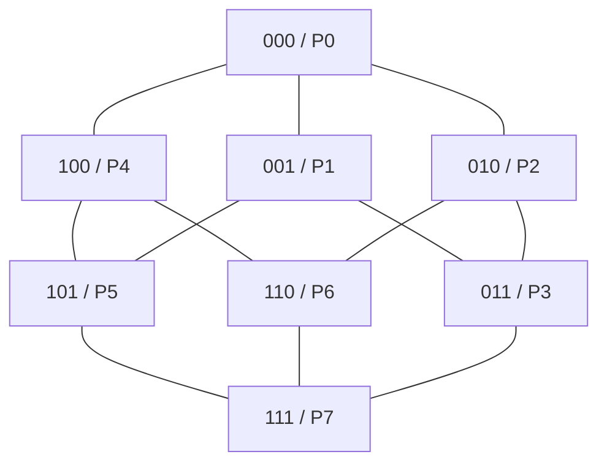

The algorithm works dimension by dimension. In each stage, every processor exchanges all messages it currently has with its neighbor in one hypercube dimension. After each stage, the number of known messages doubles. For 8 processors, only 3 stages are required.

**Initial condition:**

```text
P0:{M0}, P1:{M1}, P2:{M2}, P3:{M3}
P4:{M4}, P5:{M5}, P6:{M6}, P7:{M7}
```

**Stage 1: Exchange along bit 0**

Pairs are:

```text
000 <-> 001
010 <-> 011
100 <-> 101
110 <-> 111
```

After this stage:

```text
P0,P1 have {M0,M1}
P2,P3 have {M2,M3}
P4,P5 have {M4,M5}
P6,P7 have {M6,M7}
```

**Stage 2: Exchange along bit 1**

Pairs are:

```text
000 <-> 010
001 <-> 011
100 <-> 110
101 <-> 111
```

After this stage:

```text
P0,P1,P2,P3 have {M0,M1,M2,M3}
P4,P5,P6,P7 have {M4,M5,M6,M7}
```

**Stage 3: Exchange along bit 2**

Pairs are:

```text
000 <-> 100
001 <-> 101
010 <-> 110
011 <-> 111
```

After this stage, all processors contain all eight messages.

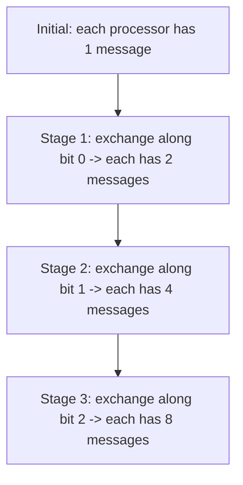

Algorithm:

```text
All-to-All Broadcast on Hypercube
1. Each processor Pi starts with its own message Mi.
2. for dimension k = 0 to log2(p)-1 do
3.      Each processor exchanges all messages it currently has
        with the neighbor obtained by flipping bit k.
4. end for
5. Now every processor has all p messages.
```

Cost analysis: At every stage, message size doubles. The number of startup events is `log2(p)`, but the total data received by each processor is `(p-1)m`, where `m` is the original message size. Therefore, cost is commonly written as:

```text
T = log2(p) ts + (p - 1)m tw
```

For 8 processors:

```text
T = 3ts + 7m tw
```

This is better than many simple communication methods because the number of stages grows logarithmically.

**Exam tip:** Draw hypercube, label binary addresses, explain stage-wise exchange, write algorithm and cost.

---

## Q.1(b) One-to-All Broadcast and All-to-One Reduction on Rings

A **ring network** is an interconnection network in which processors are arranged in a circular form. Each processor has two neighbors: one on the left and one on the right. The last processor is connected back to the first processor.

For 8 processors:

```text
P0 -- P1 -- P2 -- P3 -- P4 -- P5 -- P6 -- P7 -- back to P0
```

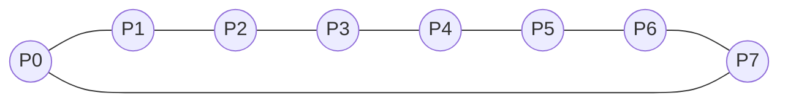

**One-to-All Broadcast** means one source processor sends the same message to all other processors. Suppose `P0` is the source and it has message `M`. In a unidirectional ring, `P0` sends to `P1`, `P1` forwards to `P2`, and so on. This needs `p-1` steps. For 8 processors, it takes 7 steps.

If the ring is bidirectional, `P0` can send in both directions. In step 1, `P0` sends `M` to `P1` and `P7`. In step 2, `P1` sends to `P2`, and `P7` sends to `P6`. In step 3, `P2` sends to `P3`, and `P6` sends to `P5`. Finally, `P3` sends to `P4`. Thus all processors receive the message in 4 steps.

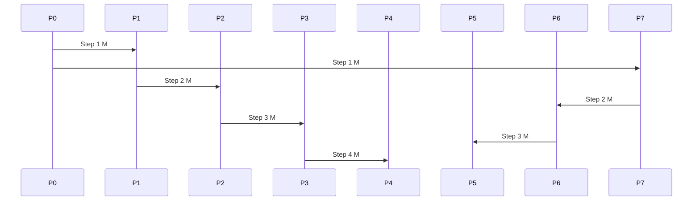

For bidirectional ring broadcast, cost is approximately:

```text
T = ceil(p/2)(ts + m tw)
```

For 8 processors:

```text
T = 4(ts + m tw)
```

**All-to-One Reduction** is the opposite type of operation. Each processor has a value, and all values are combined using an operation like sum, product, maximum, or minimum. The final result is stored at one destination processor, say `P0`.

Suppose each processor has values:

```text
P0=a0, P1=a1, P2=a2, ..., P7=a7
```

For sum reduction, final result at `P0` is:

```text
a0+a1+a2+a3+a4+a5+a6+a7
```

Reduction on a ring can be done by sending values toward the destination. Intermediate processors combine received values with their own values before forwarding.

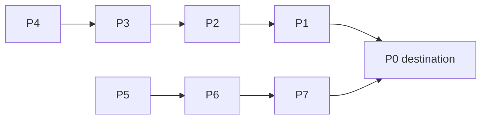

For example, `P4` sends its value to `P3`; `P3` adds it to its own value and sends partial sum to `P2`; this continues until `P0`. Similarly, values from the other side reach `P0` through `P7`. Finally, `P0` combines both sides with its own value.

Broadcast distributes data from one processor to all processors. Reduction collects and combines data from all processors to one processor. Both operations are used in parallel algorithms such as matrix computations, graph algorithms, and global summation.

**Exam tip:** Draw ring, show bidirectional broadcast steps, show reduction arrows toward `P0`, and write cost.

---

## Q.1(c) How Non-Blocking Communication is Finalized

In MPI, non-blocking communication allows a process to start communication and continue execution without waiting for the communication to complete immediately. The main non-blocking functions are:

```c
MPI_Isend()
MPI_Irecv()
```

The letter `I` means immediate. These functions return immediately after starting the communication operation. However, returning from `MPI_Isend` or `MPI_Irecv` does not mean that the communication is complete. It only means the operation has been initiated. Therefore, non-blocking communication must be **finalized** or completed before the program safely uses the receive buffer or modifies the send buffer.

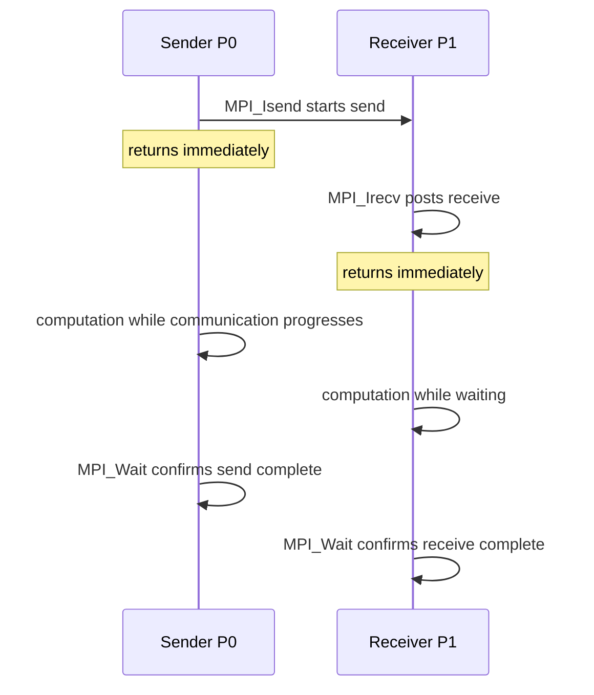

Finalization is done using functions such as:

```c
MPI_Wait()
MPI_Test()
MPI_Waitall()
MPI_Testall()
```

`MPI_Wait()` blocks until the specified non-blocking operation completes. Example:

```c
MPI_Request req;
MPI_Isend(&x, 1, MPI_INT, 1, 0, MPI_COMM_WORLD, &req);

// useful computation can be done here

MPI_Wait(&req, MPI_STATUS_IGNORE);
```

After `MPI_Wait` returns, it is safe to modify the send buffer `x`. Similarly, for receiving:

```c
MPI_Request req;
MPI_Irecv(&y, 1, MPI_INT, 0, 0, MPI_COMM_WORLD, &req);

// computation can be done here

MPI_Wait(&req, MPI_STATUS_IGNORE);
// now y contains received data
```

`MPI_Test()` checks whether the operation is complete but does not necessarily block until completion. It returns a flag.

```c
int flag;
MPI_Test(&req, &flag, MPI_STATUS_IGNORE);
if(flag) {
    // communication completed
}
```

This is useful when the process wants to periodically check completion while continuing other work.

If multiple non-blocking communications are started, `MPI_Waitall()` can be used:

```c
MPI_Waitall(count, request_array, status_array);
```

This waits until all communication operations in the request array complete.

The main advantage of non-blocking communication is overlapping communication and computation. However, the programmer must follow an important rule: do not modify the send buffer and do not read the receive buffer until the operation is completed. Otherwise, incorrect data may be sent or received.

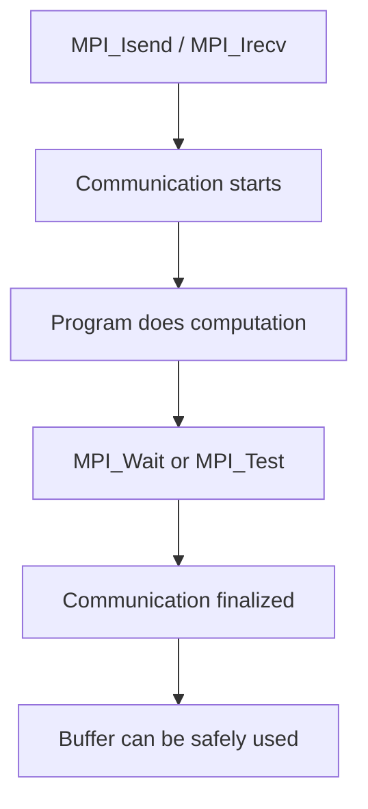

**Exam tip:** Define non-blocking communication, explain why finalization is needed, write `MPI_Wait`, `MPI_Test`, `MPI_Waitall`, and show a timing diagram.

---

# Q.2 Answer: Prefix Sum, All-to-All Broadcast/Reduction on Ring and Non-Blocking isend/irecv

## Q.2(a) Prefix-Sum Operation on Eight-Node Hypercube with Diagram

A **prefix-sum operation**, also called **scan**, computes running sums over a sequence. Given input:

```text
a0, a1, a2, a3, ..., an-1
```

The prefix sum output is:

```text
a0,
a0+a1,
a0+a1+a2,
a0+a1+a2+a3,
...
```

For example:

```text
Input:  [1, 2, 3, 4]
Output: [1, 3, 6, 10]
```

Prefix sum is important in parallel computing because it is used in sorting, memory allocation, stream compaction, graph processing, GPU programming, and histogram algorithms.

In this question, prefix sum is performed on an eight-node hypercube. Since:

```text
8 = 2³
```

we have a 3-dimensional hypercube. Processor labels are:

```text
P0 = 000
P1 = 001
P2 = 010
P3 = 011
P4 = 100
P5 = 101
P6 = 110
P7 = 111
```

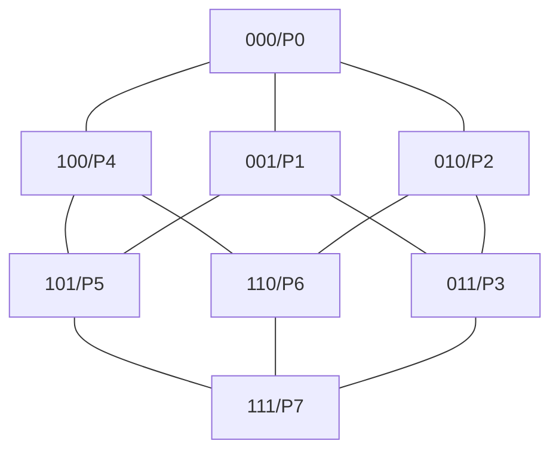

Assume values at processors are:

```text
P0 P1 P2 P3 P4 P5 P6 P7
1  2  3  4  5  6  7  8
```

The final prefix sum should be:

```text
1 3 6 10 15 21 28 36
```

Since there are 8 processors, number of stages is:

```text
log2(8) = 3
```

**Stage 1: distance = 1**  
Each processor with rank at least 1 receives value from one position left and adds it.

```text
Initial:  1  2  3  4  5  6  7  8
Stage 1:  1  3  5  7  9  11 13 15
```

**Stage 2: distance = 2**  
Each processor with rank at least 2 receives value from two positions left.

```text
Stage 2:  1  3  6  10 14 18 22 26
```

**Stage 3: distance = 4**  
Each processor with rank at least 4 receives value from four positions left.

```text
Stage 3:  1  3  6  10 15 21 28 36
```

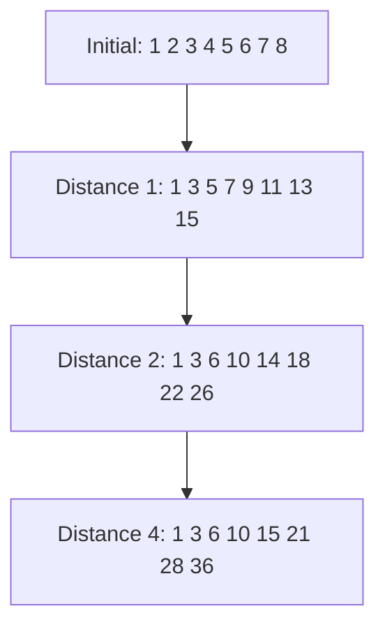

Algorithm:

```text
Parallel Prefix Sum
1. Each processor Pi has value xi.
2. for d = 1, 2, 4, ... less than p:
3.      if i >= d:
4.          Pi receives value from P(i-d)
5.          Pi adds received value to its own partial sum
6. end for
```

The complexity is:

```text
O(log p)
```

For 8 processors, only 3 stages are required. In actual implementation, synchronization is required between stages so that processors use values from the previous stage and not partially updated values from the current stage.

**Exam tip:** Define prefix sum, show 8 values, write all 3 stages clearly, draw flow diagram and write `O(log p)` complexity.

---

## Q.2(b) All-to-All Broadcast and Reduction on a Ring with Algorithm

**All-to-All Broadcast** is a collective operation where every processor sends its own message to all other processors. At the end, every processor has messages from every other processor.

In a ring network:

```text
P0 -> P1 -> P2 -> ... -> P(p-1) -> P0
```

Each processor is connected to two neighbors. A simple algorithm for all-to-all broadcast is cyclic forwarding.

Initially:

```text
P0:M0, P1:M1, P2:M2, ..., P(p-1):M(p-1)
```

In every step, each processor sends one message to its right neighbor and receives one message from its left neighbor. The received message is stored and forwarded in the next step. After `p-1` steps, every message has visited every processor.

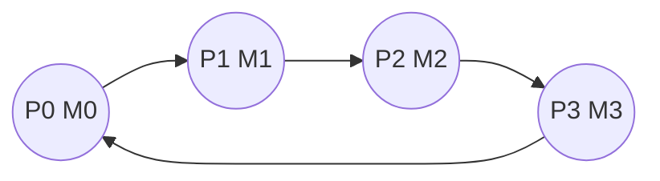

Algorithm:

```text
All-to-All Broadcast on Ring
1. Each processor Pi starts with message Mi.
2. temp = Mi.
3. for step = 1 to p-1:
4.      send temp to right neighbor.
5.      receive message from left neighbor into temp.
6.      store received message.
7. end for
8. Each processor now has all messages.
```

Cost:

```text
T = (p - 1)(ts + m tw)
```

where `m` is message size.

**All-to-All Reduction** means values from all processors are combined using an operation and the final result is made available to all processors. Example with sum:

```text
P0=2, P1=3, P2=4, P3=5
Reduced sum = 14
All processors receive 14
```

One simple way to perform all-to-all reduction is:

```text
1. Perform all-to-one reduction to compute final result.
2. Broadcast final result to all processors.
```

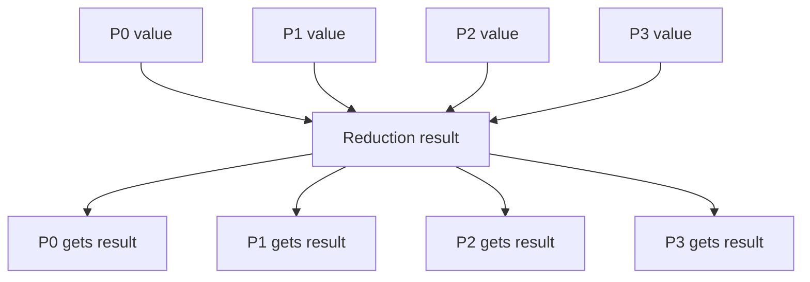

For a ring, if reduction takes `p-1` steps and broadcast takes `p-1` steps, approximate cost is:

```text
T = 2(p - 1)(ts + m tw)
```

Optimized methods such as reduce-scatter followed by all-gather can improve performance, but the simple method is easier to understand for exam writing.

**Exam tip:** Explain all-to-all broadcast, give ring algorithm, then explain reduction as reduction plus broadcast and write cost.

---

## Q.2(c) Non-Blocking Communication: isend and irecv Methods

Non-blocking communication in MPI allows communication to begin and then returns control to the program immediately. This means the processor does not have to wait for the message transfer to complete. It can continue performing other useful computation. Non-blocking communication is important because it allows overlap of communication and computation, which improves performance.

The main non-blocking MPI functions are:

```c
MPI_Isend()
MPI_Irecv()
```

`MPI_Isend` starts a non-blocking send operation. Its syntax is:

```c
MPI_Isend(buffer, count, datatype, destination, tag, communicator, &request);
```

Example:

```c
MPI_Request req;
MPI_Isend(&x, 1, MPI_INT, 1, 0, MPI_COMM_WORLD, &req);

// do computation here

MPI_Wait(&req, MPI_STATUS_IGNORE);
```

Here the send starts immediately, but it may not be complete when `MPI_Isend` returns. Therefore, before modifying `x`, we must call `MPI_Wait` or check completion using `MPI_Test`.

`MPI_Irecv` starts a non-blocking receive operation. Its syntax is:

```c
MPI_Irecv(buffer, count, datatype, source, tag, communicator, &request);
```

Example:

```c
MPI_Request req;
MPI_Irecv(&y, 1, MPI_INT, 0, 0, MPI_COMM_WORLD, &req);

// do computation here

MPI_Wait(&req, MPI_STATUS_IGNORE);
// now y can be safely used
```

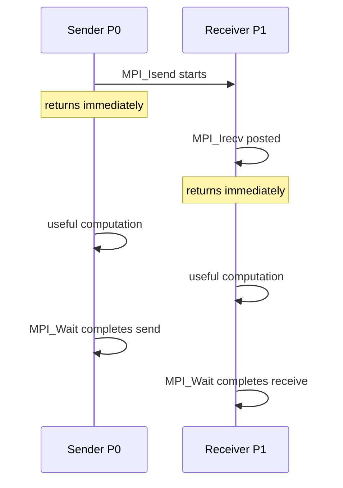

The main advantage is that computation can be overlapped with communication. For example, a processor can send boundary data to another processor and continue computing internal data while the message is in progress.

However, non-blocking communication requires careful programming. The send buffer should not be changed before completion. The receive buffer should not be read before completion. Completion is checked using:

```c
MPI_Wait()
MPI_Test()
MPI_Waitall()
MPI_Testall()
```

Comparison with blocking communication:

| Point | Blocking | Non-blocking |
|---|---|---|
| Send function | `MPI_Send` | `MPI_Isend` |
| Receive function | `MPI_Recv` | `MPI_Irecv` |
| Return | After safe completion | Immediately |
| Overlap | Not possible | Possible |
| Completion check | Not separately needed | Needed |

**Exam tip:** Define non-blocking communication, write syntax of `MPI_Isend` and `MPI_Irecv`, draw timing diagram, and mention `MPI_Wait`.

---

# UNIT II — Performance and Scalability

---

# Q.3 Answer: Granularity, Fine-Grained Scalability and Overhead Sources

## Q.3(a) Effect of Granularity on Performance with Example

Granularity is the amount of computation performed by a task before communication or synchronization is required. In simple words, it means the size of work assigned to each processor. Granularity has a strong effect on the performance of parallel systems because it controls the balance between computation and communication.

There are two main types of granularity: **fine-grained** and **coarse-grained**.

Fine-grained parallelism means tasks are very small. There are many tasks, and processors communicate or synchronize frequently. Fine granularity gives high parallelism and good load balancing, but communication and scheduling overhead are high.

Coarse-grained parallelism means tasks are larger. Each processor performs more computation before communication. This reduces communication overhead but may reduce load balancing because some processors may get more work than others.

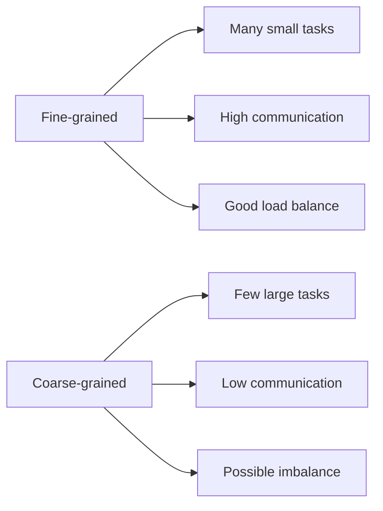

Example: Addition of 16 numbers on 4 processors.

In a fine-grained approach, each addition may be treated as a small task. Processors may repeatedly add pairs and communicate partial sums. This creates many communication and synchronization steps.

In a coarse-grained approach, divide the 16 numbers into 4 blocks:

```text
P0: a1+a2+a3+a4 = S0
P1: a5+a6+a7+a8 = S1
P2: a9+a10+a11+a12 = S2
P3: a13+a14+a15+a16 = S3
```

Then combine partial sums:

```text
Final sum = S0 + S1 + S2 + S3
```

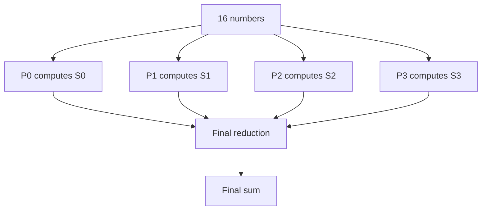

This coarse-grained method is usually faster for simple addition because communication happens only after local sums are computed.

The effect of granularity is:

| Factor | Fine-grained | Coarse-grained |
|---|---|---|
| Task size | Small | Large |
| Communication | High | Low |
| Load balancing | Good | May be poor |
| Scheduling overhead | High | Low |
| Parallelism | High | Limited |

Best performance usually comes from medium granularity, where tasks are large enough to reduce overhead but small enough to keep processors busy.

**Exam tip:** Define granularity, explain fine/coarse, give addition example, draw diagram and table.

---

## Q.3(b) Fine-Grained Parallelism More Appropriate than Coarse-Grained for Scalability

Fine-grained parallelism is more appropriate when the workload is irregular, unpredictable, or highly dynamic. In such cases, dividing the problem into large coarse tasks may create load imbalance. Some processors may get very large tasks while others get small tasks and become idle. Fine-grained tasks allow work to be distributed dynamically among processors, improving scalability.

A good example is graph traversal such as BFS or DFS. In a graph, some vertices may have many neighbors while others may have only one or two. If we assign one large graph partition to each processor, one processor may get a dense region of the graph and another processor may get a sparse region. The dense processor will do much more work, causing imbalance.

With fine-grained parallelism, each vertex or small group of vertices can be treated as a task. Processors take tasks from a shared work queue. When one processor finishes, it takes another task. This keeps processors busy even when the workload is irregular.

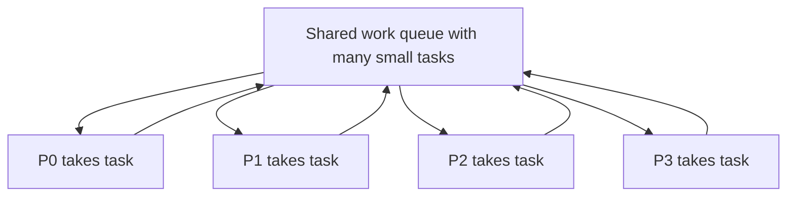

Another example is web crawling. Some web pages contain hundreds of links, while others contain very few. If each processor is given a fixed large set of pages, load imbalance may occur. Fine-grained task assignment allows processors to dynamically pick new URLs when they finish.

Fine-grained parallelism can improve scalability because as the number of processors increases, there are enough tasks to distribute among them. If there are thousands of small tasks, adding more processors can improve performance. In contrast, if there are only a few coarse tasks, adding more processors may not help because there may not be enough tasks to keep all processors busy.

However, fine-grained parallelism has a disadvantage: high scheduling and communication overhead. If tasks are too small, the system may spend more time assigning tasks than executing them. Therefore, fine-grained parallelism should be used carefully with efficient task scheduling, work stealing, and low-overhead synchronization.

In summary, fine-grained parallelism is better than coarse-grained parallelism when tasks are irregular, workload is unpredictable, dynamic load balancing is needed, and there are many processors to keep busy.

**Exam tip:** Give a situation like graph traversal/web crawling, explain load imbalance in coarse granularity, show work queue diagram, and mention overhead trade-off.

---

## Q.3(c) Sources of Overhead in Parallel Programs and How to Avoid Them

Overhead in a parallel program means extra time spent due to parallel execution, apart from useful computation. Even though parallelism reduces computation time, it introduces communication, synchronization, scheduling, idle time, and other extra costs. If overhead is high, speedup and efficiency become low.

The overhead formula is:

```text
To = pTp - Ts
```

where `p` is number of processors, `Tp` is parallel time, and `Ts` is serial time.

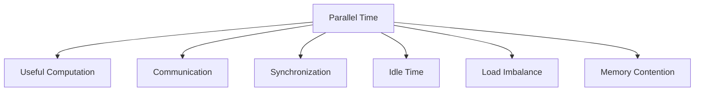

The first source is **communication overhead**. Processors exchange data through messages or shared memory. Too many messages increase time. This can be reduced by combining small messages, reducing communication frequency, and using efficient collective operations.

The second source is **synchronization overhead**. Barriers, locks, and atomic operations make processors wait. Avoid unnecessary barriers and use asynchronous algorithms where possible.

The third source is **idle time**. Some processors may finish early and wait for others. This happens due to load imbalance. It can be reduced using dynamic scheduling and work stealing.

The fourth source is **load imbalance**. Work is not equally divided among processors. It can be avoided by partitioning data carefully or using dynamic load balancing.

The fifth source is **extra computation**. Some parallel algorithms perform duplicate work. This can be reduced by better algorithm design.

The sixth source is **task creation and scheduling overhead**. Creating too many small tasks increases overhead. Use suitable granularity.

The seventh source is **memory contention**. Many processors may access the same memory location or bus. Use better memory locality, caching, and avoid false sharing.

The eighth source is the **serial fraction** of the program. According to Amdahl's law, serial code limits speedup. Try to parallelize more of the program.

Reduction methods:

| Overhead | How to avoid |
|---|---|
| Communication | Reduce messages, use non-blocking communication |
| Synchronization | Avoid unnecessary barriers |
| Idle time | Dynamic scheduling |
| Load imbalance | Better partitioning/work stealing |
| Extra computation | Improve algorithm |
| Scheduling | Use proper granularity |
| Memory contention | Improve locality |
| Serial part | Parallelize more code |

**Exam tip:** Write formula, list sources, explain each with solution, and draw overhead diagram.

---

# Q.4 Answer: Scalability Factors, Isoefficiency and Performance Metrics

## Q.4(a) Key Factors Limiting Scalability and How to Address Them

Scalability is the ability of a parallel application to maintain good performance as the number of processors and problem size increase. A scalable application continues to give good speedup when more processors are added. If adding processors gives little improvement, scalability is poor.

Several factors limit scalability. The first and most important is the **serial fraction** of the program. Some parts of a program may not be parallelizable. According to Amdahl's law, even a small serial part can limit maximum speedup. To address this, we should redesign algorithms and parallelize as much code as possible.

The second factor is **communication overhead**. As processors increase, more data may need to be exchanged. Communication can dominate computation. This can be addressed by reducing message count, using efficient collective operations, aggregating messages, and designing algorithms with locality.

The third factor is **synchronization overhead**. Barriers and locks make processors wait for each other. If synchronization happens frequently, scalability reduces. This can be addressed by reducing barriers, using asynchronous algorithms, and minimizing shared data dependencies.

The fourth factor is **load imbalance**. If some processors get more work than others, faster processors wait. This reduces efficiency. Load imbalance can be addressed by dynamic scheduling, work stealing, and better data partitioning.

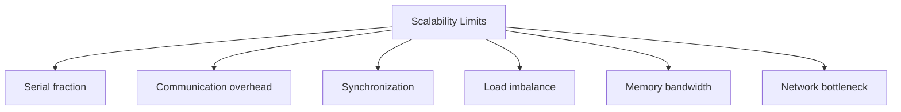

The fifth factor is **memory bandwidth**. Many processors may access memory at the same time, causing contention. This is addressed by improving memory locality, using caches, using shared memory carefully, and reducing unnecessary memory access.

The sixth factor is **network bottleneck**. In distributed systems, network congestion reduces scalability. This can be addressed by topology-aware mapping, optimized routing, and reducing communication volume.

The seventh factor is **I/O bottleneck**. Large parallel programs may read or write huge data. If all processors access disk simultaneously, I/O becomes slow. Parallel file systems and buffered I/O can help.

Scalability can be improved by choosing proper granularity, reducing overhead, overlapping computation and communication, using efficient algorithms, and increasing problem size appropriately.

**Exam tip:** Define scalability, list limiting factors, explain each with solution, and draw diagram.

---

## Q.4(b) Isoefficiency Metric of Scalability

Isoefficiency is a scalability metric that tells how fast the problem size must increase with the number of processors to keep efficiency constant. It helps compare the scalability of parallel algorithms. If an algorithm needs only a small increase in problem size to maintain efficiency, it is highly scalable. If it needs a very large increase, scalability is poor.

Efficiency is:

```text
E = S / p = Ts / (pTp)
```

Parallel overhead is:

```text
To = pTp - W
```

where `W` is the problem size or serial work.

Efficiency can be written as:

```text
E = W / (W + To)
```

For a fixed efficiency, the problem size must grow in proportion to overhead. The isoefficiency relation is:

```text
W = K To(W,p)
```

where `K` is a constant depending on the desired efficiency.

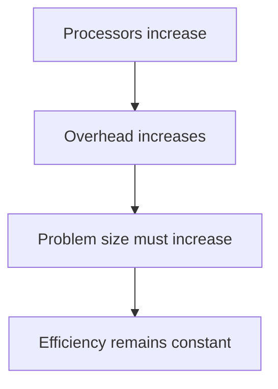

Interpretation:

- Low isoefficiency function means good scalability.
- High isoefficiency function means poor scalability.

For example, if an algorithm has isoefficiency:

```text
W = O(p)
```

then doubling processors only requires doubling problem size to maintain efficiency. This is considered very good scalability.

If another algorithm has:

```text
W = O(p²)
```

then doubling processors requires four times problem size. This is less scalable.

A scenario where isoefficiency value of 1 or linear growth indicates perfect scalability is when increasing processors and problem size proportionally keeps efficiency constant. For example:

| Processors | Problem size | Efficiency |
|---|---|---|
| 4 | 4000 | 80% |
| 8 | 8000 | 80% |
| 16 | 16000 | 80% |

Here, when processors double, problem size also doubles and efficiency remains same. This represents ideal or near-perfect scalability.

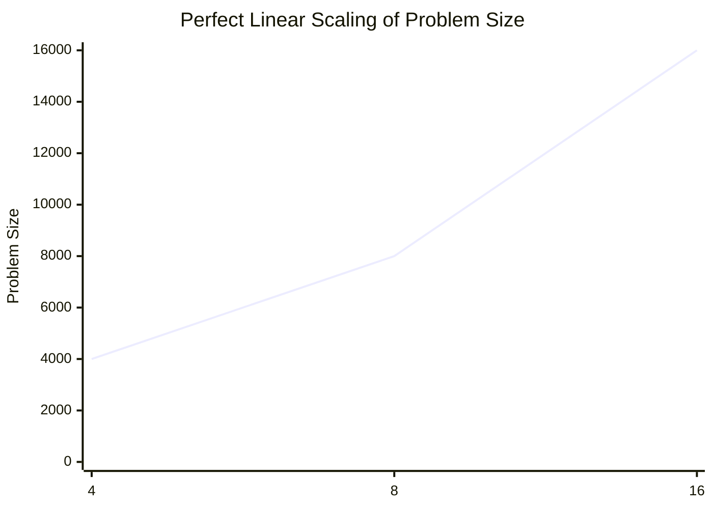

Isoefficiency is useful because speedup alone does not tell whether an algorithm will scale for large machines. Isoefficiency tells how much more work is needed to use more processors efficiently.

**Exam tip:** Define isoefficiency, write formula `W = KTo`, explain low/high meaning, and give linear scalability example.

---

## Q.4(c) Performance Metrics for Parallel Systems and Explain Any Two

Performance metrics measure how effectively a parallel system uses processors. Important metrics include serial time, parallel time, speedup, efficiency, cost, overhead, scalability, and isoefficiency.

**Serial execution time (`Ts`)** is the time taken by the best sequential algorithm on one processor. **Parallel execution time (`Tp`)** is the time taken by the parallel algorithm using `p` processors.

**Speedup** measures how many times faster the parallel algorithm is:

```text
S = Ts / Tp
```

If serial time is 100 seconds and parallel time is 25 seconds:

```text
S = 100/25 = 4
```

So the program is 4 times faster.

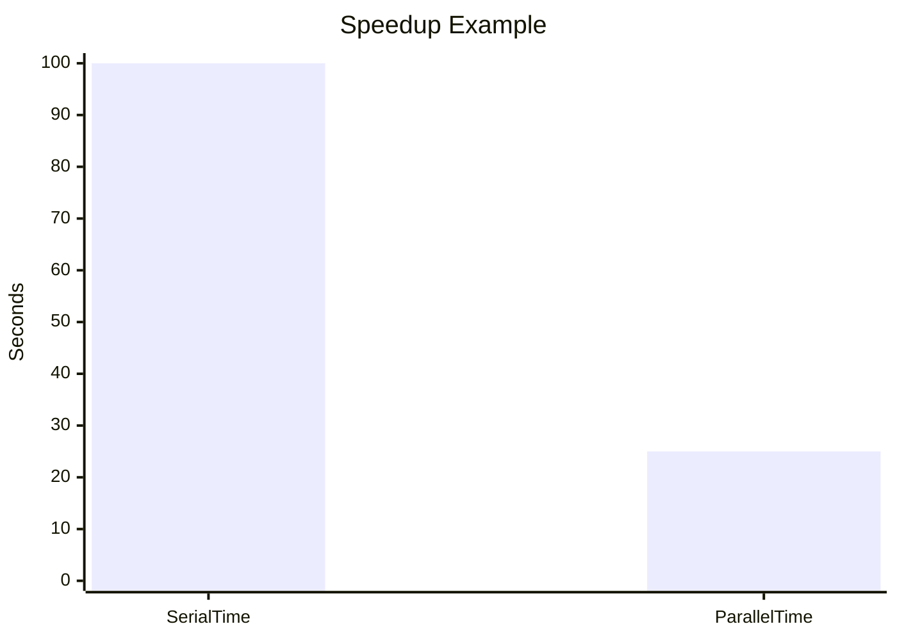

**Efficiency** measures processor utilization:

```text
E = S / p
```

If speedup is 4 and number of processors is 8:

```text
E = 4/8 = 0.5 = 50%
```

This means only 50% of ideal processor capacity is used.

**Cost** is:

```text
Cost = pTp
```

**Overhead** is:

```text
To = pTp - Ts
```

**Scalability** is the ability to maintain performance when processors and problem size increase. **Isoefficiency** tells how problem size must grow to keep efficiency constant.

Summary:

| Metric | Formula | Meaning |
|---|---|---|
| Serial time | `Ts` | Time on one processor |
| Parallel time | `Tp` | Time on p processors |
| Speedup | `Ts/Tp` | Faster by how much |
| Efficiency | `S/p` | Processor usage |
| Cost | `pTp` | Total processor time |
| Overhead | `pTp - Ts` | Extra parallel work |
| Scalability | qualitative | Ability to grow |

Explaining two metrics in detail:

Speedup is important because it directly shows performance improvement. Ideal speedup is equal to number of processors. If 8 processors give speedup 8, it is ideal. But in real systems, speedup is usually less because of overhead.

Efficiency is important because it shows whether processors are wasted. A system with speedup 8 on 16 processors has efficiency 50%, meaning half of the resources are effectively used.

**Exam tip:** Enlist metrics first, then explain speedup and efficiency with formulas and examples.

---

# UNIT III — CUDA Programming

---

# Q.5 Answer: CUDA Parallel Processing, Memory Types and Synchronization

## Q.5(a) Parallel Processing in CUDA Architecture and Difference from CPU Computing

CUDA is NVIDIA's parallel computing platform that allows GPUs to be used for general-purpose computation. CUDA enables thousands of lightweight GPU threads to execute in parallel. This is very different from traditional CPU-based computing.

A CPU has a few powerful cores designed for sequential execution, decision-making, operating system tasks, and complex control flow. A GPU has many smaller cores designed for high-throughput parallel computation. GPU cores are simpler but much more numerous.

```mermaid
flowchart LR
    CPU[CPU: few powerful cores] --> C1[Good for sequential/control tasks]
    GPU[GPU: many smaller cores] --> G1[Good for data-parallel tasks]
```

In CUDA, the CPU is called the **host**, and the GPU is called the **device**. The host controls the program and launches kernels. A kernel is a function that runs on the GPU by many threads.

CUDA organizes threads as:

```text
Grid -> Blocks -> Threads
```

```mermaid
flowchart TD
    G[Grid] --> B0[Block 0]
    G --> B1[Block 1]
    B0 --> T00[Thread 0]
    B0 --> T01[Thread 1]
    B1 --> T10[Thread 0]
    B1 --> T11[Thread 1]
```

Example: Vector addition

```text
C[i] = A[i] + B[i]
```

On a CPU, a loop may process elements one by one. On a GPU, thousands of threads can process different elements simultaneously.

```c
__global__ void add(int *A, int *B, int *C, int n) {
    int i = blockIdx.x * blockDim.x + threadIdx.x;
    if(i < n) C[i] = A[i] + B[i];
}
```

Comparison:

| Point | CPU | CUDA GPU |
|---|---|---|
| Cores | Few powerful cores | Many smaller cores |
| Best for | Sequential/control code | Data-parallel code |
| Threads | Few heavy threads | Thousands of lightweight threads |
| Execution goal | Low latency | High throughput |
| Memory | Large cache hierarchy | High bandwidth memory |

CUDA differs from CPU computing because it focuses on massive parallelism. The same kernel code runs on many data elements. This is ideal for matrix multiplication, image processing, neural networks, simulations, and vector operations.

However, CUDA is not good for highly sequential programs or programs with many unpredictable branches. CPU and GPU work together: CPU handles control, GPU handles parallel computation.

**Exam tip:** Compare CPU and GPU, explain host-device, draw grid-block-thread diagram, and give vector addition example.

---

## Q.5(b) Global Memory and Shared Memory in CUDA

CUDA memory hierarchy has different memory types. Two important types are **global memory** and **shared memory**.

**Global memory** is the large main memory of the GPU. It is accessible by all threads in all blocks. It is also accessible from the host through `cudaMemcpy`. Global memory stores input arrays, output arrays, and large data structures. However, global memory is relatively slow compared to shared memory.

**Shared memory** is small but very fast memory located inside each Streaming Multiprocessor. It is shared only by threads of the same block. Threads in different blocks cannot access each other's shared memory. Shared memory is useful for temporary data that is reused many times by threads in the same block.

```mermaid
flowchart TD
    GM[Global Memory: large, slower, visible to all blocks]
    GM --> B0[Block 0]
    GM --> B1[Block 1]
    B0 --> S0[Shared Memory Block 0]
    B1 --> S1[Shared Memory Block 1]
    S0 --> T0[Threads in Block 0]
    S1 --> T1[Threads in Block 1]
```

Comparison:

| Point | Global Memory | Shared Memory |
|---|---|---|
| Size | Large | Small |
| Speed | Slower | Very fast |
| Scope | All threads/all blocks | Threads in same block only |
| Lifetime | Until freed | During block execution |
| Use | Input/output arrays | Temporary reused data |
| Access from host | Yes via cudaMemcpy | No direct host access |

Example: In matrix multiplication, each thread needs elements from matrix `A` and matrix `B`. If every thread reads directly from global memory repeatedly, the program becomes slow. Instead, blocks of `A` and `B` can be loaded into shared memory. Then many threads reuse these values quickly.

Shared memory helps reduce global memory traffic. But it must be used carefully. Since it is shared by threads in a block, synchronization using `__syncthreads()` is often required after loading data.

```mermaid
flowchart LR
    A[Load tile from global memory] --> B[Store in shared memory]
    B --> C[Threads reuse data]
    C --> D[Less global memory access]
```

Global memory is necessary for large data storage. Shared memory is used as a fast programmer-managed cache. Efficient CUDA programs use global memory for main data and shared memory for frequently reused data.

**Exam tip:** Define both, draw memory hierarchy, compare in table, and give matrix multiplication example.

---

## Q.5(c) Communication and Synchronization in CUDA

In CUDA, threads communicate mainly through memory. Threads in the same block can communicate using shared memory. Threads in different blocks cannot directly synchronize during the same kernel. They usually communicate through global memory between kernel launches.

Within a block, communication works like this: one thread writes data to shared memory, and another thread reads it. But before reading, we must ensure all writes are complete. CUDA provides a synchronization function:

```c
__syncthreads();
```

This function acts as a barrier for all threads in a block. No thread can continue beyond `__syncthreads()` until all threads in the block reach it.

```mermaid
flowchart TD
    A[Threads write data to shared memory]
    A --> B[__syncthreads]
    B --> C[All writes complete]
    C --> D[Threads safely read shared memory]
```

Example:

```c
__shared__ int temp[256];
int tid = threadIdx.x;
temp[tid] = input[tid];
__syncthreads();
// now all threads can safely read temp
```

For communication across blocks, CUDA does not provide direct block-level synchronization inside one kernel. If global synchronization is needed, one kernel is ended and another kernel is launched. Kernel launch boundary acts as global synchronization.

Atomic operations are used when multiple threads update the same memory location. For example:

```c
atomicAdd(&sum, value);
```

This prevents race conditions when many threads add to the same variable.

CUDA communication and synchronization mechanisms include:

1. Shared memory for communication inside a block.  
2. `__syncthreads()` for block-level synchronization.  
3. Global memory for communication across blocks.  
4. Kernel launch boundaries for global synchronization.  
5. Atomic operations for safe concurrent updates.  

Limitations: `__syncthreads()` works only within a block. It cannot synchronize all blocks. Also, overuse of synchronization can reduce performance.

**Exam tip:** Explain shared memory communication, `__syncthreads`, atomic operations, and global synchronization by kernel boundaries.

---

# Q.6 Answer: CUDA Memory Model, Processing Flow and Applications

## Q.6(a) CUDA Memory Model with Memory Hierarchy

CUDA memory model defines different memory spaces available to GPU threads. Each memory type has different speed, size, scope, and lifetime. Understanding this hierarchy is essential for writing efficient CUDA programs.

The fastest memory is **register memory**. Registers are private to each thread and store local variables. They are very fast but limited. If too many variables are used, values may spill into local memory.

**Local memory** is private to each thread but usually stored in global memory, so it is slower than registers.

**Shared memory** is shared by all threads in the same block. It is much faster than global memory and is useful for cooperation between threads.

**Global memory** is large GPU memory accessible by all threads and by the host through `cudaMemcpy`. It stores main input and output arrays but is slower.

**Constant memory** is read-only cached memory useful for constants used by many threads. **Texture memory** is read-only cached memory useful for image-like access patterns.

```mermaid
flowchart TD
    T[Thread] --> R[Registers: fastest private]
    T --> L[Local memory: private slower]
    B[Block] --> S[Shared memory: fast per block]
    G[GPU] --> GM[Global memory: large slower]
    G --> C[Constant memory]
    G --> TX[Texture memory]
```

Memory comparison:

| Memory | Speed | Scope | Use |
|---|---|---|---|
| Registers | Fastest | One thread | Local variables |
| Local | Slow | One thread | Spill/private arrays |
| Shared | Very fast | One block | Reused data |
| Global | Slow | All threads | Main arrays |
| Constant | Fast cached | Read-only all threads | Constants |
| Texture | Cached | Read-only | Images/spatial data |

A good CUDA program uses registers and shared memory as much as possible and reduces global memory access. Global memory accesses should be coalesced, meaning consecutive threads access consecutive memory addresses.

**Exam tip:** Draw hierarchy, explain every memory type, compare in table and mention optimization.

---

## Q.6(b) Processing Flow of CUDA with CUDA-C Functions

A CUDA program uses both CPU and GPU. The CPU is host and GPU is device. Since they have separate memory spaces, data must be copied between host and device.

The standard CUDA processing flow is:

1. Allocate memory on host.  
2. Allocate memory on device using `cudaMalloc`.  
3. Copy input data from host to device using `cudaMemcpy`.  
4. Launch kernel using `<<<grid, block>>>`.  
5. GPU executes kernel using many threads.  
6. Copy result back using `cudaMemcpy`.  
7. Free device memory using `cudaFree`.  

```mermaid
flowchart TD
    A[Host input arrays] --> B[cudaMalloc device arrays]
    B --> C[cudaMemcpy HostToDevice]
    C --> D[Kernel launch <<<grid, block>>>]
    D --> E[GPU threads compute]
    E --> F[cudaMemcpy DeviceToHost]
    F --> G[cudaFree]
```

Important functions:

```c
cudaMalloc((void**)&d_A, size);
cudaMemcpy(d_A, h_A, size, cudaMemcpyHostToDevice);
kernel<<<blocks, threads>>>(d_A, d_B, d_C, n);
cudaDeviceSynchronize();
cudaMemcpy(h_C, d_C, size, cudaMemcpyDeviceToHost);
cudaFree(d_A);
```

Vector addition kernel:

```c
__global__ void vectorAdd(int *A, int *B, int *C, int n) {
    int i = blockIdx.x * blockDim.x + threadIdx.x;
    if(i < n) C[i] = A[i] + B[i];
}
```

Each thread computes one element. If `A=[1,2,3]` and `B=[4,5,6]`, output is `C=[5,7,9]`.

Efficient CUDA programs minimize CPU-GPU data transfers and use enough threads to keep GPU busy.

**Exam tip:** Draw flow diagram, list functions in order, write kernel example and explain thread index.

---

## Q.6(c) Applications of CUDA

CUDA is used wherever large amounts of data can be processed in parallel. Its main strength is executing thousands of threads at the same time.

Applications include:

1. **Deep Learning:** Neural networks require matrix multiplication and convolution. CUDA accelerates TensorFlow and PyTorch.
2. **Image Processing:** Each pixel can be processed by a separate thread for filtering, edge detection, and object detection.
3. **Scientific Simulations:** Weather forecasting, fluid dynamics, molecular dynamics, and physics simulations use CUDA for numerical calculations.
4. **Medical Imaging:** CT scan reconstruction, MRI processing, and ultrasound imaging benefit from GPU acceleration.
5. **Video Processing:** Encoding, decoding, rendering, and real-time effects use GPU parallelism.
6. **Finance:** Monte Carlo simulations and risk analysis use many independent calculations.
7. **Cryptography:** Hashing and encryption tasks can be parallelized.

```mermaid
flowchart TD
    CUDA[CUDA Applications]
    CUDA --> DL[Deep Learning]
    CUDA --> IMG[Image Processing]
    CUDA --> SCI[Scientific Simulation]
    CUDA --> MED[Medical Imaging]
    CUDA --> VID[Video Processing]
    CUDA --> FIN[Finance]
    CUDA --> CRY[Cryptography]
```

Example: An image with one million pixels can be processed using many GPU threads, where each thread processes one pixel. This gives large speedup compared to CPU loops.

**Exam tip:** Explain at least five applications with examples and draw application diagram.

---

# UNIT IV — Parallel Algorithms and Distributed Computing

---

# Q.7 Answer: Parallel Bubble Sort, Kubernetes Framework and Distributed Document Classification

## Q.7(a) Parallel Bubble Sort with Algorithm

Parallel bubble sort is usually implemented as **odd-even transposition sort**. Normal bubble sort compares adjacent elements one by one. Odd-even transposition sort improves it by comparing independent adjacent pairs in parallel.

The algorithm works in phases:

- **Even phase:** compare pairs `(0,1), (2,3), (4,5)`
- **Odd phase:** compare pairs `(1,2), (3,4), (5,6)`

If a pair is in wrong order, swap it.

```mermaid
flowchart TD
    A[Initial array] --> B[Even phase compare 0-1 2-3 4-5]
    B --> C[Odd phase compare 1-2 3-4]
    C --> D[Repeat n phases]
    D --> E[Sorted array]
```

Example: Sort `[8,5,2,6,3,1]`.

```text
Initial: [8,5,2,6,3,1]
Even:   [5,8,2,6,1,3]
Odd:    [5,2,8,1,6,3]
Even:   [2,5,1,8,3,6]
Odd:    [2,1,5,3,8,6]
Even:   [1,2,3,5,6,8]
```

```mermaid
flowchart LR
    A0[8 5 2 6 3 1] --> A1[5 8 2 6 1 3]
    A1 --> A2[5 2 8 1 6 3]
    A2 --> A3[2 5 1 8 3 6]
    A3 --> A4[2 1 5 3 8 6]
    A4 --> A5[1 2 3 5 6 8]
```

Algorithm:

```text
for phase = 0 to n-1:
    if phase is even:
        compare-swap pairs (0,1), (2,3), ... in parallel
    else:
        compare-swap pairs (1,2), (3,4), ... in parallel
```

Sequential bubble sort takes `O(n²)`. With enough processors, odd-even transposition sort takes `O(n)` phases. Synchronization is required after every phase.

**Exam tip:** Explain phases, solve example, write algorithm and complexity.

---

## Q.7(b) Kubernetes Framework with Diagram

Kubernetes is an open-source container orchestration platform. It automates deployment, scaling, management, and monitoring of containerized applications. A container packages application code and dependencies. Docker creates containers, while Kubernetes manages containers across many machines.

A Kubernetes system is called a cluster. It contains a control plane and worker nodes.

```mermaid
flowchart TD
    CP[Control Plane]
    CP --> API[API Server]
    CP --> SCH[Scheduler]
    CP --> CTRL[Controller Manager]
    CP --> ETCD[etcd database]
    CP --> N1[Worker Node 1]
    CP --> N2[Worker Node 2]
    N1 --> K1[kubelet]
    N1 --> P1[Pod 1]
    N1 --> P2[Pod 2]
    N2 --> K2[kubelet]
    N2 --> P3[Pod 3]
    N2 --> P4[Pod 4]
```

Important components:

- **Pod:** Smallest deployable unit. Contains one or more containers.
- **Node:** Machine that runs pods.
- **Cluster:** Group of nodes.
- **API Server:** Entry point for commands.
- **Scheduler:** Chooses node for each pod.
- **Controller Manager:** Maintains desired state.
- **etcd:** Stores cluster configuration and state.
- **kubelet:** Agent running on each worker node.
- **Service:** Provides stable access to pods.

Features:

1. Automatic scheduling  
2. Self-healing  
3. Auto-scaling  
4. Load balancing  
5. Rolling updates  
6. Service discovery  
7. Resource management  

Example: If a web app needs 5 replicas, Kubernetes ensures 5 pods are running. If one pod crashes, Kubernetes restarts it. If traffic increases, more pods can be added.

Applications include microservices, cloud apps, AI/ML deployment, DevOps automation, distributed systems, and big data platforms.

**Exam tip:** Define Kubernetes, draw architecture, explain components and features.

---

## Q.7(c) Document Classification in Distributed Computing

Document classification means assigning documents to categories such as sports, politics, technology, health, finance, or entertainment. Distributed computing is used when there are too many documents for one machine to process quickly.

Example:

```text
Cricket match report -> Sports
Election result -> Politics
New smartphone launch -> Technology
```

In distributed document classification, a master node divides documents among worker nodes. Each worker preprocesses documents, extracts features, applies classification model, and returns results.

```mermaid
flowchart TD
    M[Master Node] --> W1[Worker 1: Docs 1-100]
    M --> W2[Worker 2: Docs 101-200]
    M --> W3[Worker 3: Docs 201-300]
    W1 --> R[Classified output]
    W2 --> R
    W3 --> R
```

Pipeline:

```mermaid
flowchart LR
    A[Documents] --> B[Split among workers]
    B --> C[Preprocessing]
    C --> D[Feature extraction]
    D --> E[Classification model]
    E --> F[Categories]
```

Steps:

1. **Data partitioning:** Split documents among workers.
2. **Preprocessing:** Lowercase, remove punctuation, remove stop words, stemming.
3. **Feature extraction:** Convert text into numbers using Bag-of-Words, TF-IDF, or embeddings.
4. **Classification:** Use Naive Bayes, SVM, decision tree, neural network, etc.
5. **Aggregation:** Collect results from all workers.

Benefits include faster processing, scalability, fault tolerance, and ability to process big data. Frameworks like Hadoop and Spark are commonly used.

Applications include spam detection, news classification, sentiment analysis, legal document tagging, medical report classification, and email filtering.

**Exam tip:** Define document classification, draw distributed architecture, explain pipeline and applications.

---

# Q.8 Answer: Parallel Merge Sort, Container Orchestration and AI/ML in Parallel Computing

## Q.8(a) Parallel Merge Sort with Algorithm

Merge sort is a divide-and-conquer sorting algorithm. It divides an array into two halves, sorts each half, and merges the sorted halves. Sequential merge sort takes `O(n log n)` time. It is suitable for parallelization because left and right halves can be sorted independently.

Example array:

```text
[8,3,7,4,9,2,6,5]
```

Divide:

```text
[8,3,7,4] and [9,2,6,5]
```

Further divide:

```text
[8,3], [7,4], [9,2], [6,5]
```

Sort and merge:

```text
[3,8], [4,7], [2,9], [5,6]
[3,4,7,8], [2,5,6,9]
[2,3,4,5,6,7,8,9]
```

```mermaid
graph TD
    A[8 3 7 4 9 2 6 5]
    A --> B[8 3 7 4]
    A --> C[9 2 6 5]
    B --> D[8 3]
    B --> E[7 4]
    C --> F[9 2]
    C --> G[6 5]
    D --> H[3 8]
    E --> I[4 7]
    F --> J[2 9]
    G --> K[5 6]
    H --> L[3 4 7 8]
    I --> L
    J --> M[2 5 6 9]
    K --> M
    L --> N[2 3 4 5 6 7 8 9]
    M --> N
```

Parallel algorithm:

```text
ParallelMergeSort(A)
1. If size of A is small, sort sequentially.
2. Divide A into left and right halves.
3. Sort left half in parallel.
4. Sort right half in parallel.
5. Merge sorted halves.
```

Ideal parallel time:

```text
O((n log n)/p)
```

Actual time includes task creation, synchronization, communication, and merging overhead. If merging is sequential, it can become a bottleneck. Parallel merging improves performance.

**Exam tip:** Draw merge tree, write algorithm, explain parallel sorting of halves, and write complexity.

---

## Q.8(b) Container Orchestration in Kubernetes

Container orchestration means automatically managing containers across multiple machines. It includes deployment, scaling, networking, load balancing, restarting failed containers, and updating applications. Kubernetes is the most popular container orchestration system.

Without Kubernetes, developers must manually start containers, monitor failures, restart crashed containers, scale applications, and manage networking. This becomes difficult when there are hundreds or thousands of containers.

With Kubernetes, the user defines the desired state. For example:

```text
Run 3 replicas of my web application
```

Kubernetes automatically creates and maintains 3 pods. If one pod fails, it starts a new one. If load increases, it can scale replicas.

```mermaid
flowchart TD
    U[User defines desired state: replicas = 3]
    U --> K[Kubernetes control plane]
    K --> P1[Pod 1 on Node 1]
    K --> P2[Pod 2 on Node 2]
    K --> P3[Pod 3 on Node 3]
```

Kubernetes simplifies deployment through YAML configuration files. Developers describe application image, replicas, ports, resources, and update strategy. Kubernetes handles scheduling and management.

Main orchestration features:

1. **Scheduling:** Places containers on suitable nodes.
2. **Self-healing:** Restarts failed containers.
3. **Scaling:** Increases/decreases replicas.
4. **Load balancing:** Distributes traffic.
5. **Rolling updates:** Updates without downtime.
6. **Service discovery:** Allows services to find each other.
7. **Resource management:** Controls CPU and memory usage.

Container orchestration is especially useful for microservices. Each service can run independently in containers, and Kubernetes manages communication and scaling.

**Exam tip:** Define orchestration, explain before/after Kubernetes, draw replica diagram, and list benefits.

---

## Q.8(c) Use of AI/ML in Parallel Computing

AI and ML require huge computations and large datasets. Training modern machine learning models involves matrix multiplication, vector operations, optimization, and repeated processing of data. Parallel computing is used to speed up these tasks.

The most common use is **training neural networks**. Neural networks perform many matrix multiplications. GPUs process these operations in parallel. Deep learning frameworks like TensorFlow and PyTorch use CUDA and GPU libraries.

```mermaid
flowchart TD
    D[Large dataset] --> G1[GPU 1]
    D --> G2[GPU 2]
    D --> G3[GPU 3]
    G1 --> M[Updated ML model]
    G2 --> M
    G3 --> M
```

AI/ML uses parallel computing in several ways:

1. **Data parallelism:** Dataset is divided among processors/GPUs. Each processor trains on a part of data.
2. **Model parallelism:** Large model is divided across processors.
3. **Hyperparameter tuning:** Different processors test different parameter settings.
4. **Parallel inference:** Many user requests are processed simultaneously.
5. **Distributed training:** Multiple machines train one model together.

Example: In image classification, thousands of images are processed in batches. GPUs compute convolutions for many images simultaneously. This reduces training time from days to hours.

AI/ML applications using parallel computing include image recognition, speech recognition, recommendation systems, natural language processing, autonomous vehicles, medical diagnosis, fraud detection, and large language models.

Parallel computing makes AI practical because modern datasets and models are too large for single-processor execution.

**Exam tip:** Explain why AI/ML needs parallelism, define data/model parallelism, draw multi-GPU diagram, and give applications.

---

# Final Exam Reminder for Paper 4
For high marks, write answers as:

```text
Definition + diagram + explanation + algorithm/example + cost/complexity + conclusion
```

For Kubernetes/CUDA/AI answers, diagrams and real-world examples make the answer stronger.
