# High Performance Computing (410250) — Paper 5 `[6584]-81` Complete Solution

**B.E. Computer Engineering | 2019 Pattern | Semester VIII**  
**Answer style:** Detailed SPPU-oriented answers, simple language, Mermaid diagrams, algorithms, examples, formulas, and exam-writing hints.

---

## How to Write These Answers in the Exam
For a long 7–8 mark answer, write in this order:

```text
Definition -> Diagram -> Stepwise explanation -> Algorithm/example -> Cost/complexity -> Conclusion
```

For 4 mark notes, write:

```text
Meaning -> small diagram -> 4 to 6 important points -> applications
```

---

# UNIT I — Communication Operations

---

# Q.1 Answer: Hypercube Broadcast, Circular Shift and Prefix Sum

## Q.1(a) One-to-All Broadcast on Hypercube with Algorithm and Cost Calculation

**One-to-All Broadcast** is a collective communication operation in which one processor sends the same message to all other processors in a parallel system. The processor that initially has the message is called the **source** or **root** processor. If processor `P0` has message `M`, then after one-to-all broadcast every processor `P0, P1, P2, ...` will have a copy of `M`. This operation is used in many parallel algorithms when one processor reads input, chooses a pivot, computes a control value, or stores information required by all other processors.

A **hypercube** is an interconnection network where processors are labelled using binary addresses. A hypercube of dimension `d` contains:

```text
p = 2^d processors
```

For 8 processors:

```text
8 = 2^3
```

So the network is a **3-dimensional hypercube**. The processors are labelled as:

```text
P0 = 000
P1 = 001
P2 = 010
P3 = 011
P4 = 100
P5 = 101
P6 = 110
P7 = 111
```

Two processors are directly connected if their binary addresses differ in exactly one bit. For example, `000` is connected to `001`, `010`, and `100`.

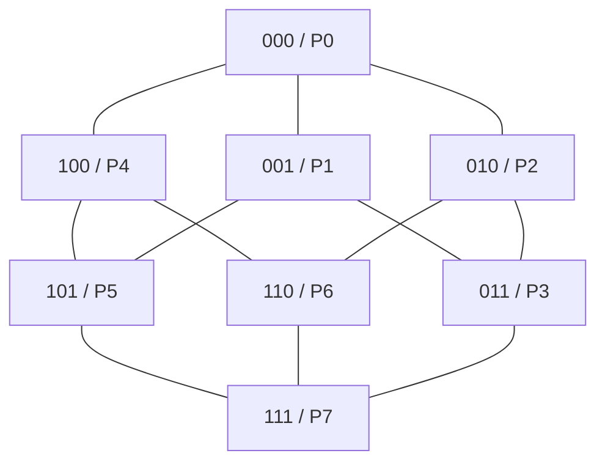

Broadcast on a hypercube is efficient because the number of processors having the message doubles at every step. For `p` processors, the number of steps required is:

```text
log2(p)
```

For 8 processors, only 3 steps are required.

Assume `P0` is the source and message is `M`.

**Initially:**

```text
Only P0 = 000 has M
```

**Step 1:** `P0` sends message to the processor obtained by flipping the most significant bit:

```text
P0(000) -> P4(100)
```

Now `P0` and `P4` have the message.

**Step 2:** Both processors having the message send along the next dimension:

```text
P0(000) -> P2(010)
P4(100) -> P6(110)
```

Now `P0, P2, P4, P6` have the message.

**Step 3:** These four processors send along the last dimension:

```text
P0(000) -> P1(001)
P2(010) -> P3(011)
P4(100) -> P5(101)
P6(110) -> P7(111)
```

Now all processors have the message.

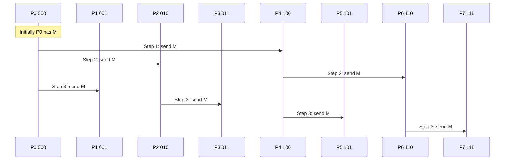

Algorithm:

```text
One-to-All Broadcast on Hypercube
Input: source processor P0, p = 2^d processors
1. Source P0 initially has message M.
2. for i = d-1 down to 0 do
3.      Every processor that has M sends M to the neighbor
        obtained by flipping bit i of its address.
4. end for
5. All processors have M.
```

Cost calculation:

Let:

```text
ts = startup time
m  = message size in words
tw = transfer time per word
p  = number of processors
```

One communication step costs:

```text
ts + m tw
```

Number of steps:

```text
log2(p)
```

Therefore:

```text
T = log2(p)(ts + m tw)
```

For 8 processors:

```text
T = 3(ts + m tw)
```

This is much faster than a linear broadcast, which may require `p-1` steps.

**Exam tip:** Draw the hypercube, label nodes in binary, explain 3 steps, write algorithm and cost formula.

---

## Q.1(b) Circular Shift Operation

A **circular shift** is a communication operation in which every processor sends its data to another processor by a fixed distance, and the data wraps around when it reaches the end. It is called circular because the processors are logically arranged in a circle or ring. Circular shift is used in ring communication, mesh algorithms, matrix multiplication, parallel sorting, and data rotation.

Suppose there are four processors:

```text
P0, P1, P2, P3
```

Initially they contain:

```text
P0:A   P1:B   P2:C   P3:D
```

If we perform a **right circular shift by 1**, every processor sends its data to the next processor on the right:

```text
P0 sends A to P1
P1 sends B to P2
P2 sends C to P3
P3 sends D to P0
```

After right circular shift:

```text
P0:D   P1:A   P2:B   P3:C
```

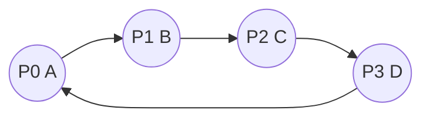

The important point is the wrap-around. The last processor does not lose its data. It sends data back to the first processor. That is why modulo arithmetic is used.

For a right circular shift by distance `k` among `p` processors:

```text
Destination of Pi = P(i + k) mod p
```

For a left circular shift by distance `k`:

```text
Destination of Pi = P(i - k + p) mod p
```

Example: If `p = 4` and `P3` shifts right by 1:

```text
Destination = (3 + 1) mod 4 = 0
```

So `P3` sends data to `P0`.

In a **left circular shift by 1**, data moves in the opposite direction:

```text
P0:A goes to P3
P1:B goes to P0
P2:C goes to P1
P3:D goes to P2
```

After left shift:

```text
P0:B   P1:C   P2:D   P3:A
```

Circular shift can also be performed on a mesh. For example, in a 3×3 mesh:

```text
A B C
D E F
G H I
```

After right circular shift in every row:

```text
C A B
F D E
I G H
```

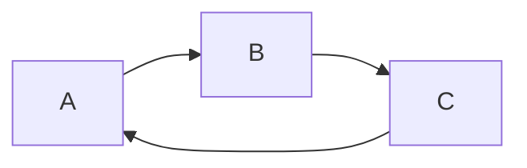

Applications of circular shift include Cannon's matrix multiplication algorithm, where matrix rows and columns are shifted circularly, parallel sorting where elements are moved between processors, and ring algorithms where data is rotated around processors.

The cost depends on the network. If processors are connected in a ring and shift is by one position, all processors can send simultaneously, so it takes one communication step. If shift distance is larger and only neighbor links are available, repeated shifts may be required.

**Exam tip:** Define circular shift, show right and left shift examples, write modulo formula, draw ring diagram, and mention applications.

---

## Q.1(c) Prefix-Sum Operation

A **prefix-sum operation**, also called a **scan operation**, computes running sums of a sequence. Given an input sequence:

```text
a0, a1, a2, a3, ..., an-1
```

The prefix sum output is:

```text
a0,
a0+a1,
a0+a1+a2,
a0+a1+a2+a3,
...
```

Example:

```text
Input:  [3, 2, 5, 1, 4]
Output: [3, 5, 10, 11, 15]
```

because:

```text
3 = 3
5 = 3 + 2
10 = 3 + 2 + 5
11 = 3 + 2 + 5 + 1
15 = 3 + 2 + 5 + 1 + 4
```

Prefix sum is extremely important in parallel computing. It is used in parallel sorting, memory allocation, stream compaction, graph algorithms, histogram computation, GPU programming, and many data-parallel algorithms.

Assume 8 processors contain values:

```text
P0 P1 P2 P3 P4 P5 P6 P7
1  2  3  4  5  6  7  8
```

Final prefix sum should be:

```text
1 3 6 10 15 21 28 36
```

Parallel prefix sum can be computed in logarithmic stages. For 8 processors:

```text
log2(8) = 3 stages
```

**Stage 1: distance = 1**

Each processor with rank at least 1 adds value from one position left.

```text
Initial:  1  2  3  4  5  6  7  8
Stage 1:  1  3  5  7  9  11 13 15
```

**Stage 2: distance = 2**

Each processor with rank at least 2 adds value from two positions left.

```text
Stage 2:  1  3  6  10 14 18 22 26
```

**Stage 3: distance = 4**

Each processor with rank at least 4 adds value from four positions left.

```text
Stage 3:  1  3  6  10 15 21 28 36
```

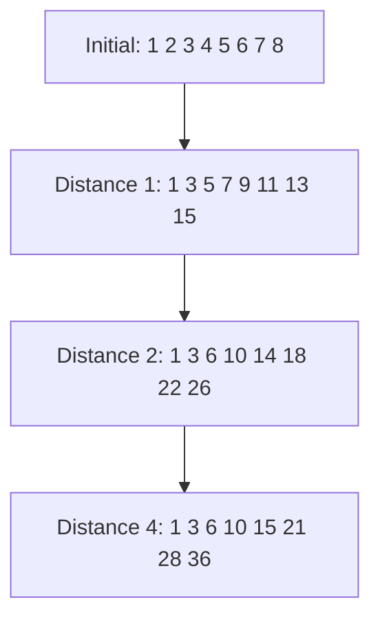

Algorithm:

```text
Parallel Prefix Sum
1. Each processor Pi has value xi.
2. for d = 1, 2, 4, ... less than p:
3.      if i >= d:
4.          Pi receives value from P(i-d)
5.          Pi adds received value to its own partial sum
6. end for
```

Complexity:

```text
O(log p)
```

For 8 processors, only 3 stages are needed. In actual implementation, values from the previous stage must be used, so synchronization or temporary variables are necessary.

**Exam tip:** Write definition, solve numeric example, show 3 stages, write algorithm and applications.

---

# Q.2 Answer: All-to-All Broadcast on Mesh, Cost Analysis, Scatter and Gather

## Q.2(a) All-to-All Broadcast on 3×3 Mesh with Example and Algorithm

**All-to-All Broadcast** is a collective communication operation in which every processor sends its own message to every other processor. After the operation is complete, every processor contains all messages from all processors. This operation is useful in parallel graph algorithms, distributed matrix computations, sorting algorithms, and simulations.

A 3×3 mesh contains 9 processors arranged in 3 rows and 3 columns:

```text
P00 P01 P02
P10 P11 P12
P20 P21 P22
```

Each processor initially has one message:

```text
P00:M00, P01:M01, P02:M02
P10:M10, P11:M11, P12:M12
P20:M20, P21:M21, P22:M22
```

After all-to-all broadcast, each processor should have all 9 messages:

```text
M00, M01, M02, M10, M11, M12, M20, M21, M22
```

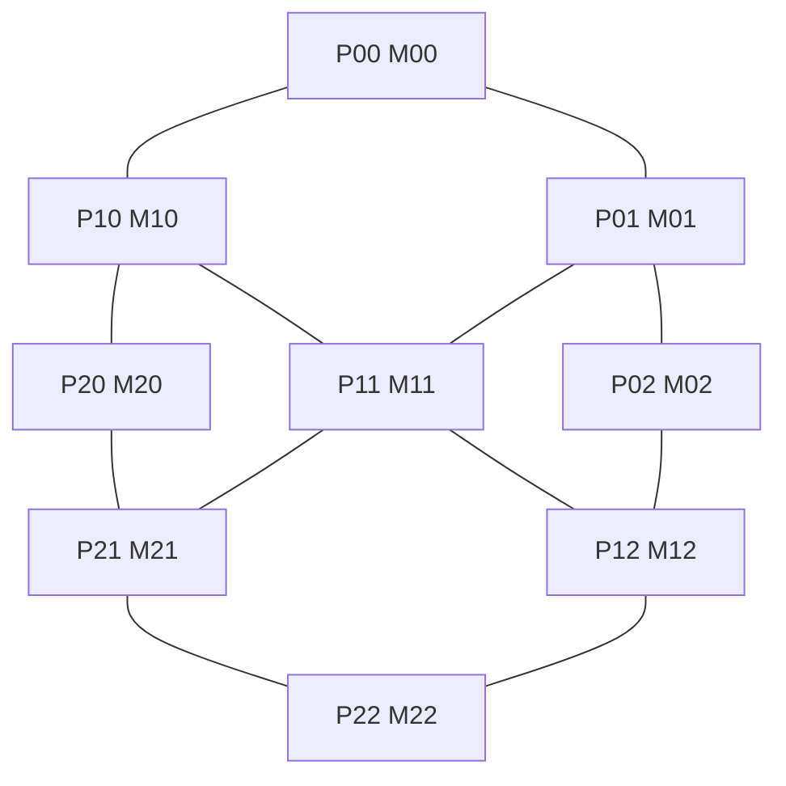

A simple algorithm is the **row-column method**.

**Phase 1: Row-wise all-to-all broadcast**

Each row performs all-to-all broadcast within itself. After this phase, every processor in a row has all messages from that row.

For row 0:

```text
P00, P01, P02 all have M00, M01, M02
```

For row 1:

```text
P10, P11, P12 all have M10, M11, M12
```

For row 2:

```text
P20, P21, P22 all have M20, M21, M22
```

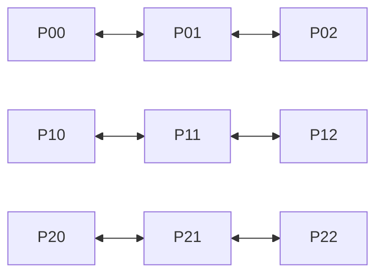

**Phase 2: Column-wise all-to-all broadcast**

Now each processor has all messages from its own row. These row-message groups are exchanged along columns. After this phase, every processor receives row groups from all rows, so every processor has all 9 messages.

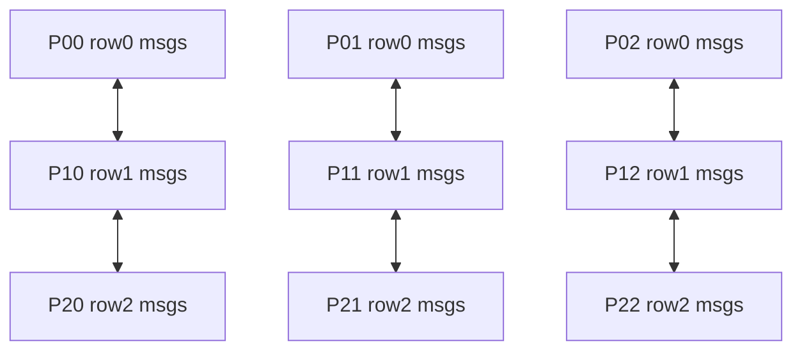

Algorithm:

```text
All-to-All Broadcast on 3×3 Mesh
1. Each processor Pij has message Mij.
2. Perform all-to-all broadcast along each row.
3. Now each processor has all messages of its row.
4. Perform all-to-all broadcast along each column.
5. Now each processor has all 9 messages.
```

For a `sqrt(p) × sqrt(p)` mesh, approximate communication rounds are:

```text
2(sqrt(p) - 1)
```

For 3×3 mesh:

```text
2(3 - 1) = 4 rounds approximately
```

However, in the column phase, message size is larger because processors send groups of row messages.

**Exam tip:** Draw the 3×3 mesh, explain row phase, column phase, algorithm and cost idea.

---

## Q.2(b) Cost Analysis of All-to-All Broadcast Operation

Cost analysis of communication operations helps us understand how much time a parallel program spends in communication. All-to-all broadcast is communication-heavy because every processor must send its message to every other processor.

Let:

```text
p  = number of processors
m  = message size in words
ts = startup time per message
tw = transfer time per word
```

A message transfer cost is usually modelled as:

```text
ts + m tw
```

The cost depends on the network topology and algorithm.

**1. Cost on Ring**

In a ring, each processor sends its message to the next processor. At each step, every processor forwards one message. After `p-1` steps, every message reaches all processors.

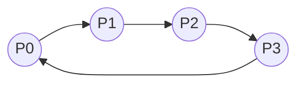

Cost:

```text
T = (p - 1)(ts + m tw)
```

For 8 processors:

```text
T = 7(ts + m tw)
```

Ring is simple but takes linear number of steps.

**2. Cost on Hypercube**

In a hypercube, all-to-all broadcast is performed in `log2(p)` stages. In each stage, processors exchange all information they currently have with a neighbor in one dimension. Message size doubles after each stage.

Total startup cost:

```text
log2(p) ts
```

Total data received by each processor:

```text
(p - 1)m
```

So cost is:

```text
T = log2(p)ts + (p - 1)m tw
```

Hypercube requires fewer stages than ring.

**3. Cost on Mesh**

For a square mesh of size `sqrt(p) × sqrt(p)`, all-to-all broadcast can be done by row phase and column phase.

Approximate number of rounds:

```text
2(sqrt(p)-1)
```

For 3×3 mesh:

```text
2(3-1) = 4 rounds
```

But message size increases in the second phase because entire row message groups are exchanged.

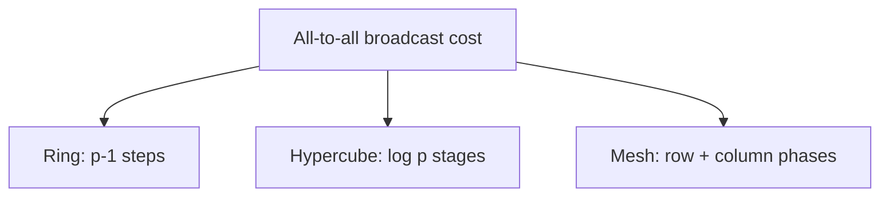

Comparison:

| Network | Cost idea | Advantage | Disadvantage |
|---|---|---|---|
| Ring | `(p-1)(ts+mtw)` | Simple | Linear steps |
| Hypercube | `log p ts + (p-1)mtw` | Fewer stages | Complex topology |
| Mesh | `2(sqrt(p)-1)` rounds | Natural 2D structure | Message size grows |

In conclusion, hypercube is usually faster in terms of number of stages, ring is easiest to implement, and mesh is suitable for 2D processor layouts.

**Exam tip:** Define symbols, write ring/hypercube/mesh costs, compare them, and draw small topology diagrams.

---

## Q.2(c) Scatter and Gather Operations

**Scatter** and **Gather** are collective communication operations used in parallel programming. They are opposite operations. Scatter distributes different parts of data from a root processor to all processors. Gather collects data from all processors back to the root processor.

In **scatter**, the root processor has a large data array. It divides the array into chunks and sends one chunk to each processor. Suppose root `P0` has:

```text
[A, B, C, D]
```

There are four processors. After scatter:

```text
P0 gets A
P1 gets B
P2 gets C
P3 gets D
```

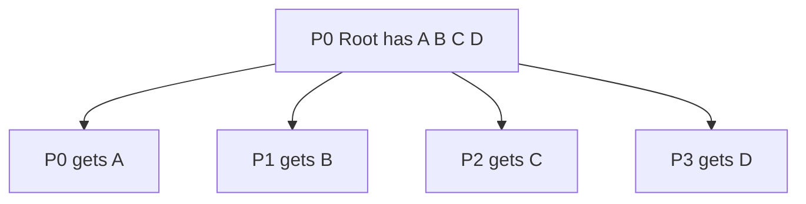

MPI function:

```c
MPI_Scatter(sendbuf, sendcount, sendtype,
            recvbuf, recvcount, recvtype,
            root, MPI_COMM_WORLD);
```

Scatter is useful before parallel computation. For example, in image processing, different parts of an image can be scattered to different processors. Each processor processes its part independently.

In **gather**, each processor has local data or a partial result. The root collects all pieces into one array. Suppose:

```text
P0:A, P1:B, P2:C, P3:D
```

After gather at `P0`:

```text
P0 has [A, B, C, D]
```

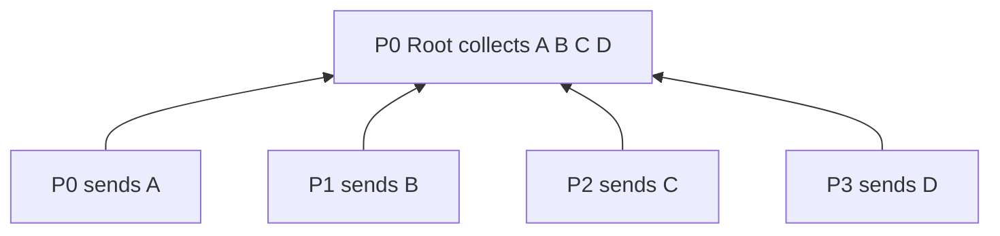

MPI function:

```c
MPI_Gather(sendbuf, sendcount, sendtype,
           recvbuf, recvcount, recvtype,
           root, MPI_COMM_WORLD);
```

Scatter and gather are commonly used together:

```text
Scatter input -> compute locally -> gather result
```

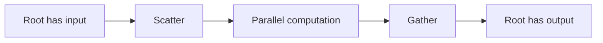

Example: To square `[1,2,3,4]`, scatter sends one number to each processor. Processors compute squares. Gather collects `[1,4,9,16]`.

Scatter sends different data to different processors. Broadcast sends the same data to all processors. Gather collects data, while reduction collects and combines data.

**Exam tip:** Draw both diagrams, write MPI functions, explain example and difference from broadcast/reduction.

---

# UNIT II — Performance Metrics and Communication

---

# Q.3 Answer: Matrix Multiplication, Circular Shift on Mesh/Hypercube, and Improving Communication Speed

## Q.3(a) Parallel Matrix-Matrix Multiplication with Example

Matrix-matrix multiplication is one of the most important operations in high performance computing. It is used in scientific computing, machine learning, graphics, simulations, numerical methods, and engineering applications. Given two matrices `A` and `B`, the output matrix `C` is:

```text
C = A × B
```

Each element of `C` is calculated as:

```text
C[i][j] = Σ A[i][k] × B[k][j]
```

This means each element is the dot product of one row of `A` and one column of `B`.

Example:

```text
A = |1 2|      B = |5 6|
    |3 4|          |7 8|
```

Calculations:

```text
C00 = 1×5 + 2×7 = 19
C01 = 1×6 + 2×8 = 22
C10 = 3×5 + 4×7 = 43
C11 = 3×6 + 4×8 = 50
```

So:

```text
C = |19 22|
    |43 50|
```

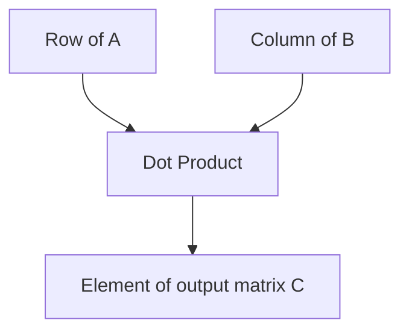

Sequential matrix multiplication uses three nested loops and takes:

```text
O(n³)
```

It is suitable for parallelization because different elements or blocks of `C` can be computed independently.

One simple parallel method is **row-wise partitioning**. Rows of matrix `A` are divided among processors. Each processor computes corresponding rows of `C`. Since every processor needs matrix `B`, `B` is broadcast to all processors.

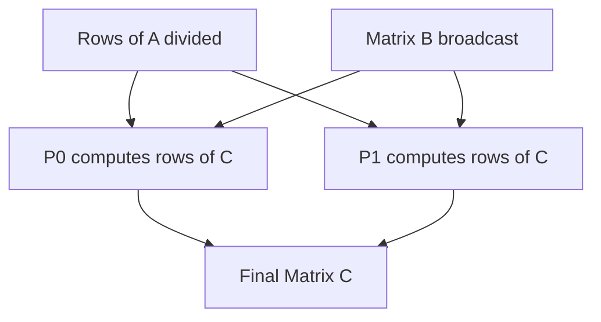

Algorithm:

```text
1. Divide rows of A among processors.
2. Broadcast matrix B to all processors.
3. Each processor computes assigned rows of C.
4. Gather rows of C to form final output.
```

For large matrices, **block-wise partitioning** is better. Matrices are divided into blocks and each processor computes one block of `C`.

```text
C00 = A00B00 + A01B10
C01 = A00B01 + A01B11
C10 = A10B00 + A11B10
C11 = A10B01 + A11B11
```

Ideal parallel computation time using `p` processors is:

```text
O(n³/p)
```

Actual time includes communication, broadcasting, synchronization, and gathering overhead.

**Exam tip:** Write formula, solve 2×2 example, explain row-wise/block-wise methods, draw diagram and write complexity.

---

## Q.3(b) Circular Shift Operation on Mesh and Hypercube Network

Circular shift means moving data from each processor to another processor by a fixed distance with wrap-around. It is used in parallel algorithms for data rotation, matrix multiplication, sorting, and communication scheduling.

### Circular Shift on Mesh

A mesh is a 2D arrangement of processors. Example 3×3 mesh:

```text
P00 P01 P02
P10 P11 P12
P20 P21 P22
```

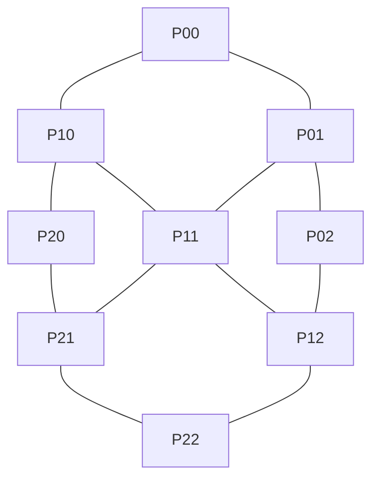

If data is:

```text
A B C
D E F
G H I
```

Right circular shift in each row gives:

```text
C A B
F D E
I G H
```

Formula for row-wise right shift by `k` in `q` columns:

```text
new_column = (old_column + k) mod q
```

Column-wise downward shift gives:

```text
G H I
A B C
D E F
```

Formula:

```text
new_row = (old_row + k) mod r
```

Mesh circular shift is used in Cannon's matrix multiplication algorithm, where matrix blocks are shifted row-wise and column-wise.

### Circular Shift on Hypercube

A hypercube uses binary addresses. A circular shift by `k` among `p` processors means:

```text
Pi sends data to P(i+k) mod p
```

For 8 processors and right shift by 1:

```text
P0->P1, P1->P2, P2->P3, ..., P7->P0
```

In a hypercube, routing is done by comparing source and destination binary addresses. The data travels by flipping differing bits one by one.

Example:

```text
P0 = 000 wants to send to P5 = 101
Differing bits: first and last
Path can be 000 -> 100 -> 101
```


Hypercube provides multiple paths and logarithmic diameter, so communication can be efficient. Circular shift on hypercube may require multiple dimension-order routing steps depending on source and destination.

**Exam tip:** Explain mesh shift with before/after table, explain hypercube shift using binary routing, draw diagrams and write modulo formula.

---

## Q.3(c) How to Improve Speed of Communication Operations

Communication speed is very important in parallel computing. Even if computation is divided perfectly, communication overhead can reduce speedup. Communication time includes message startup time, data transfer time, synchronization delay, network delay, and waiting time. Therefore, improving communication operations is essential.

The first method is to **reduce the number of messages**. Sending many small messages is expensive because every message has startup overhead. It is better to combine small messages into one larger message.

```text
Bad: 100 small messages
Good: 1 combined message
```

The second method is to use **efficient collective communication algorithms**. For example, broadcast using a linear method takes `p-1` steps, but recursive doubling takes only `log2(p)` steps.

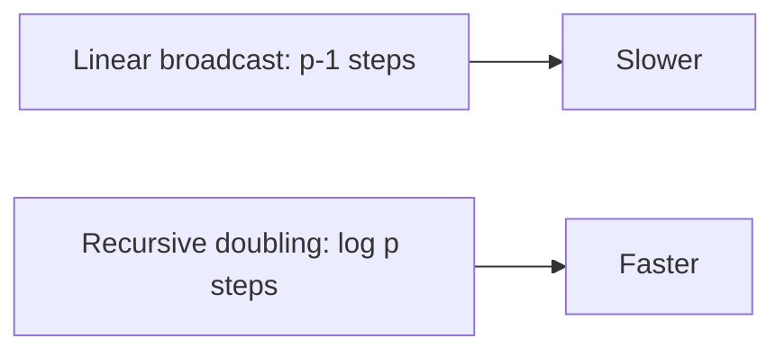

The third method is to **overlap communication and computation** using non-blocking MPI calls:

```c
MPI_Isend()
MPI_Irecv()
```

While communication is happening, the processor performs useful computation.

The fourth method is to **reduce synchronization**. Barriers and locks make processors wait. Unnecessary barriers should be removed.

The fifth method is to **increase granularity**. If each processor performs more computation before communication, communication frequency reduces.

The sixth method is to improve **data locality**. Processors should communicate with nearby processors whenever possible. This reduces network congestion.

The seventh method is to use **optimized MPI collectives** such as:

```c
MPI_Bcast
MPI_Reduce
MPI_Allreduce
MPI_Alltoall
```

These are often optimized for the hardware.

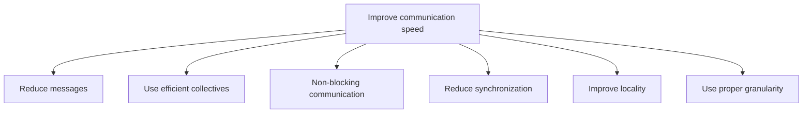

In conclusion, communication speed improves when messages are fewer, algorithms are logarithmic, computation overlaps communication, synchronization is reduced, and topology-aware communication is used.

**Exam tip:** Write at least six points and explain each with example.

---

# Q.4 Answer: Granularity, Overhead and Performance Metrics

## Q.4(a) Granularity and Effects on Performance

Granularity is the amount of computation performed by a processor before communication or synchronization is required. In simple words, granularity means task size. It strongly affects parallel performance because it controls the balance between computation and communication.

There are two main types: **fine-grained** and **coarse-grained** parallelism.

Fine-grained parallelism has many small tasks. It gives high parallelism and good load balancing, but communication and scheduling overhead are high. Coarse-grained parallelism has fewer large tasks. It reduces communication overhead, but may cause load imbalance if tasks are not equal.

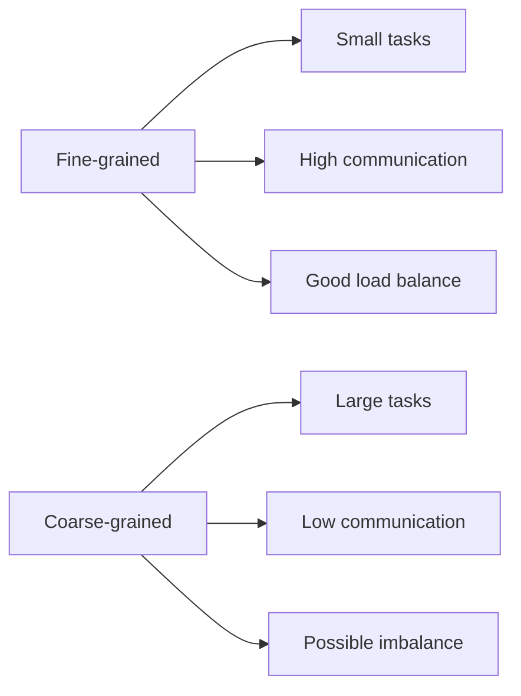

Example: Add 16 numbers using 4 processors.

Coarse-grained method:

```text
P0 adds numbers 1-4 = S0
P1 adds numbers 5-8 = S1
P2 adds numbers 9-12 = S2
P3 adds numbers 13-16 = S3
```

Then:

```text
Final sum = S0 + S1 + S2 + S3
```

```mermaid
flowchart TD
    A[16 numbers] --> P0[P0 local sum]
    A --> P1[P1 local sum]
    A --> P2[P2 local sum]
    A --> P3[P3 local sum]
    P0 --> R[Reduction]
    P1 --> R
    P2 --> R
    P3 --> R
    R --> F[Final sum]
```

Effects of granularity:

| Factor | Fine-grained | Coarse-grained |
|---|---|---|
| Communication | High | Low |
| Parallelism | High | Lower |
| Load balance | Good | May be poor |
| Scheduling overhead | High | Low |
| Best for | Irregular tasks | Regular large tasks |

Best performance usually comes from medium granularity. If granularity is too fine, overhead dominates. If too coarse, processors may remain idle.

**Exam tip:** Define granularity, explain types, give addition example, draw diagram and table.

---

## Q.4(b) Sources of Overhead in Parallel Program

Overhead is the extra time spent in a parallel program apart from useful computation. Parallel programs require communication, synchronization, scheduling, and management. These extra activities reduce speedup.

Formula:

```text
To = pTp - Ts
```

where `To` is overhead, `p` is processors, `Tp` is parallel time and `Ts` is serial time.

Sources:

1. **Communication overhead:** Processors exchange data. Too many messages slow down the program.
2. **Synchronization overhead:** Barriers and locks make processors wait.
3. **Idle time:** Some processors finish early and wait.
4. **Load imbalance:** Unequal work distribution causes idle time.
5. **Extra computation:** Some parallel algorithms do duplicate work.
6. **Task scheduling overhead:** Creating and assigning tasks takes time.
7. **Memory contention:** Many processors access same memory/bus.
8. **Sequential fraction:** Non-parallel part limits speedup.

```mermaid
flowchart TD
    T[Parallel time] --> U[Useful computation]
    T --> C[Communication]
    T --> S[Synchronization]
    T --> I[Idle time]
    T --> L[Load imbalance]
    T --> M[Memory contention]
```

Reduction techniques:

| Overhead | Reduction method |
|---|---|
| Communication | Combine messages, use efficient collectives |
| Synchronization | Avoid unnecessary barriers |
| Idle time | Dynamic load balancing |
| Load imbalance | Better partitioning/work stealing |
| Scheduling | Use proper granularity |
| Memory contention | Improve locality |
| Sequential part | Parallelize more code |

**Exam tip:** Write formula, list sources with explanation and solutions.

---

## Q.4(c) Performance Metrics of Parallel Systems

Performance metrics are used to evaluate a parallel system. Important metrics include serial time, parallel time, speedup, efficiency, cost, overhead, and scalability.

**Serial time (`Ts`)** is the time taken by the best sequential algorithm. **Parallel time (`Tp`)** is time taken using `p` processors.

**Speedup:**

```text
S = Ts / Tp
```

If `Ts=100` and `Tp=25`:

```text
S = 4
```

**Efficiency:**

```text
E = S / p
```

If `S=4` and `p=5`:

```text
E = 4/5 = 80%
```

**Cost:**

```text
Cost = pTp
```

**Overhead:**

```text
To = pTp - Ts
```

**Scalability** means ability to maintain performance when processors and problem size increase.

```mermaid
flowchart TD
    M[Performance Metrics]
    M --> T1[Serial Time]
    M --> T2[Parallel Time]
    M --> S[Speedup]
    M --> E[Efficiency]
    M --> C[Cost]
    M --> O[Overhead]
    M --> SC[Scalability]
```

Summary:

| Metric | Formula | Meaning |
|---|---|---|
| Serial time | `Ts` | Time on one processor |
| Parallel time | `Tp` | Time on p processors |
| Speedup | `Ts/Tp` | How much faster |
| Efficiency | `S/p` | Processor utilization |
| Cost | `pTp` | Total processor time |
| Overhead | `pTp - Ts` | Extra work |
| Scalability | qualitative | Ability to grow |

**Exam tip:** Write formulas and one numerical example.

---

# UNIT III — CUDA and Sorting

---

# Q.5 Answer: CUDA, Processing Flow and CUDA Terms

## Q.5(a) CUDA, Language Support and Applications

CUDA stands for **Compute Unified Device Architecture**. It is NVIDIA's parallel computing platform and programming model that allows GPUs to be used for general-purpose computing. A CPU has a few powerful cores, while a GPU has many smaller cores. GPUs are excellent for data-parallel tasks where the same operation is performed on large data.

```mermaid
flowchart LR
    CPU[CPU: few powerful cores] --> A[Sequential/control tasks]
    GPU[GPU: many smaller cores] --> B[Parallel data tasks]
```

CUDA programs have two parts: **host code** and **device code**. Host code runs on CPU. Device code runs on GPU. The CPU allocates memory, copies data to GPU, launches kernels, and receives results. The GPU executes thousands of threads in parallel.

CUDA supports multiple programming languages and tools:

1. **CUDA C/C++:** Most commonly used.
2. **CUDA Fortran:** Used in scientific computing.
3. **Python:** Through PyCUDA, Numba, CuPy, TensorFlow, PyTorch.
4. **MATLAB:** GPU arrays and CUDA acceleration.
5. **Java/.NET wrappers:** Indirect CUDA access.
6. **Deep learning frameworks:** PyTorch and TensorFlow use CUDA internally.

```mermaid
flowchart TD
    CUDA[CUDA] --> C[CUDA C/C++]
    CUDA --> F[CUDA Fortran]
    CUDA --> P[Python libraries]
    CUDA --> M[MATLAB]
    CUDA --> DL[TensorFlow/PyTorch]
```

Applications:

**1. Deep Learning:** Neural networks need matrix multiplication and convolution. CUDA accelerates training and inference.

**2. Image Processing:** Each pixel can be processed independently. CUDA speeds up filtering, edge detection, segmentation, and object detection.

**3. Scientific Simulation:** Weather forecasting, molecular dynamics, fluid simulation and physics simulations use CUDA for large calculations.

Other applications include medical imaging, video processing, finance, cryptography, robotics, and gaming.

Advantages include high performance, massive parallelism, library support, and suitability for data-intensive applications. Limitations include NVIDIA dependency, CPU-GPU transfer overhead, and programming complexity.

**Exam tip:** Define CUDA, compare CPU/GPU, mention language support and explain three applications.

---

## Q.5(b) Processing Flow of CUDA-C Program with Diagram

A CUDA-C program uses both CPU and GPU. The CPU is called the **host**, and GPU is called the **device**. Since CPU and GPU have separate memories, data must be copied from host to device before computation and copied back after computation.

Standard CUDA flow:

1. Allocate host memory.  
2. Allocate device memory using `cudaMalloc`.  
3. Copy input data from host to device using `cudaMemcpy`.  
4. Launch kernel using `<<<grid, block>>>`.  
5. GPU executes many threads.  
6. Copy result from device to host.  
7. Free device memory using `cudaFree`.  

```mermaid
flowchart TD
    A[Host input arrays] --> B[cudaMalloc device memory]
    B --> C[cudaMemcpy HostToDevice]
    C --> D[Kernel launch <<<grid, block>>>]
    D --> E[GPU parallel execution]
    E --> F[cudaMemcpy DeviceToHost]
    F --> G[cudaFree]
```

Important functions:

```c
cudaMalloc((void**)&d_A, size);
cudaMemcpy(d_A, h_A, size, cudaMemcpyHostToDevice);
kernel<<<blocks, threads>>>(d_A, d_B, d_C, n);
cudaDeviceSynchronize();
cudaMemcpy(h_C, d_C, size, cudaMemcpyDeviceToHost);
cudaFree(d_A);
```

Example kernel:

```c
__global__ void vectorAdd(int *A, int *B, int *C, int n) {
    int i = blockIdx.x * blockDim.x + threadIdx.x;
    if(i < n) C[i] = A[i] + B[i];
}
```

Each thread computes one output element. For example:

```text
A=[1,2,3], B=[4,5,6]
C=[5,7,9]
```

**Exam tip:** Draw flow diagram, list functions in order, write small kernel and explain index formula.

---

## Q.5(c) Device, Host, Device Code and Kernel

In CUDA, the **host** means CPU and main memory. The normal C/C++ program starts on the host. The host controls execution, allocates memory, copies data, launches kernels, and receives results.

The **device** means GPU and GPU memory. The device executes parallel code using many threads.

```mermaid
flowchart LR
    H[Host: CPU + RAM] -->|kernel launch / cudaMemcpy| D[Device: GPU + GPU memory]
    D -->|result copy| H
```

**Device code** is code that runs on GPU. CUDA uses special keywords:

```c
__global__
__device__
```

A **kernel** is a special GPU function launched from the host and executed by many GPU threads.

Example:

```c
__global__ void add(int *A, int *B, int *C) {
    int i = threadIdx.x;
    C[i] = A[i] + B[i];
}
```

Launch:

```c
add<<<1, 256>>>(d_A, d_B, d_C);
```

This launches 256 threads. Each thread executes the same kernel but uses a different thread index.

```mermaid
flowchart TD
    K[Kernel launch add<<<1,256>>>] --> T0[Thread 0 computes C0]
    K --> T1[Thread 1 computes C1]
    K --> T2[Thread 2 computes C2]
    K --> Tn[Thread 255 computes C255]
```

**Exam tip:** Define all four terms separately and write one kernel example.

---

# Q.6 Answer: Exchange/Compare-Split, Sorting Issues and Odd-Even Sort

## Q.6(a) Exchange and Compare-Split Operation on Parallel Computers

**Exchange** and **compare-split** are communication operations used in parallel algorithms, especially parallel sorting.

An **exchange operation** simply swaps data between two processors. If `P0` has data `A` and `P1` has data `B`, after exchange:

```text
P0 has B
P1 has A
```

```mermaid
flowchart LR
    P0[P0 has A] <--> P1[P1 has B]
```

Exchange does not compare values. It only transfers data.

**Compare-split** is more advanced. It is used in parallel sorting when two processors each have sorted lists. They exchange lists, merge them, and then split the merged list into smaller and larger halves. The lower-ranked processor keeps the smaller half, and the higher-ranked processor keeps the larger half.

Example:

```text
P0: [2, 8]
P1: [3, 5]
```

After exchange and merge:

```text
[2, 3, 5, 8]
```

After compare-split:

```text
P0 keeps [2, 3]
P1 keeps [5, 8]
```

```mermaid
flowchart TD
    A[P0: 2 8] --> M[Merge: 2 3 5 8]
    B[P1: 3 5] --> M
    M --> L[P0 keeps smaller half: 2 3]
    M --> H[P1 keeps larger half: 5 8]
```

Comparison:

| Point | Exchange | Compare-Split |
|---|---|---|
| Meaning | Swap data | Exchange, merge, split |
| Comparison | No | Yes |
| Use | General communication | Parallel sorting |
| Output | Data swapped | Smaller/larger halves |
| Cost | Lower | Higher |

Compare-split is used in bitonic sort, odd-even sort, and parallel sorting networks.

**Exam tip:** Define both, give example, draw diagram and comparison table.

---

## Q.6(b) Issues in Sorting on Parallel Computers with Example

Sorting on parallel computers is difficult because data is distributed among processors. A parallel sorting algorithm must compare, move, redistribute, and merge data while keeping processors balanced.

Issues:

**1. Data distribution:** Input must be divided among processors. Uneven distribution causes imbalance.

**2. Load imbalance:** Some processors may get more work.

```text
P0 gets 1000 elements
P1 gets 100 elements
```

P1 waits for P0.

**3. Communication overhead:** Elements often need to move between processors. This is costly.

**4. Pivot selection:** In quicksort, bad pivot causes poor partitioning.

Example:

```text
Array = [1,2,3,4,5,6,7,100]
Pivot = 100
```

Almost all elements go to one side, so parallelism is poor.

```mermaid
flowchart TD
    A[Input array] --> P[Bad pivot]
    P --> L[Large left partition]
    P --> R[Small/empty right partition]
    L --> I[Load imbalance]
```

**5. Merging bottleneck:** In merge sort, sorted sublists must be merged. If one processor merges all, it becomes bottleneck.

**6. Synchronization:** Algorithms like odd-even sort need phase synchronization.

**7. Memory contention:** Shared-memory sorting may suffer from many processors accessing same memory.

Solutions include good pivot selection, sampling, balanced partitioning, efficient communication, parallel merging, and dynamic load balancing.

**Exam tip:** List issues with examples and draw pivot imbalance diagram.

---

## Q.6(c) Odd-Even Transposition in Bubble Sort

Odd-even transposition sort is a parallel version of bubble sort. It compares adjacent pairs in alternating phases.

Even phase:

```text
(0,1), (2,3), (4,5)
```

Odd phase:

```text
(1,2), (3,4), (5,6)
```

If a pair is in wrong order, swap it.

Example: Sort `[8,5,2,6,3,1]`.

```text
Initial: [8,5,2,6,3,1]
Even:   [5,8,2,6,1,3]
Odd:    [5,2,8,1,6,3]
Even:   [2,5,1,8,3,6]
Odd:    [2,1,5,3,8,6]
Even:   [1,2,3,5,6,8]
```

```mermaid
flowchart LR
    A0[8 5 2 6 3 1] --> A1[5 8 2 6 1 3]
    A1 --> A2[5 2 8 1 6 3]
    A2 --> A3[2 5 1 8 3 6]
    A3 --> A4[2 1 5 3 8 6]
    A4 --> A5[1 2 3 5 6 8]
```

Algorithm:

```text
for phase = 0 to n-1:
    if phase is even:
        compare-swap (0,1), (2,3), ... in parallel
    else:
        compare-swap (1,2), (3,4), ... in parallel
```

Sequential bubble sort takes `O(n²)`. Parallel odd-even sort takes `O(n)` phases with enough processors.

**Exam tip:** Explain phases, solve example and write algorithm.

---

# UNIT IV — Parallel Algorithms and Distributed Computing

---

# Q.7 Answer: Parallel Merge Sort, GPU Applications, BFS Communication Strategies and Kubernetes

## Q.7(a-i) Parallel Merge Sort

Merge sort is a divide-and-conquer algorithm. It divides an array into halves, sorts the halves, and merges them. It is suitable for parallelization because left and right halves can be sorted independently.

Example:

```text
[8,3,7,4,9,2,6,5]
```

```mermaid
graph TD
    A[8 3 7 4 9 2 6 5]
    A --> B[8 3 7 4]
    A --> C[9 2 6 5]
    B --> D[8 3]
    B --> E[7 4]
    C --> F[9 2]
    C --> G[6 5]
    D --> H[3 8]
    E --> I[4 7]
    F --> J[2 9]
    G --> K[5 6]
    H --> L[3 4 7 8]
    I --> L
    J --> M[2 5 6 9]
    K --> M
    L --> N[2 3 4 5 6 7 8 9]
    M --> N
```

Algorithm:

```text
ParallelMergeSort(A)
1. If size is 1, return.
2. Divide A into left and right halves.
3. Sort left half in parallel.
4. Sort right half in parallel.
5. Merge sorted halves.
```

Sequential complexity:

```text
O(n log n)
```

Ideal parallel complexity:

```text
O((n log n)/p)
```

Actual time includes task creation, communication and merging overhead.

---

## Q.7(a-ii) GPU Applications

GPUs are useful for data-parallel applications where the same operation is performed on large amounts of data. CUDA allows NVIDIA GPUs to be used for general computing.

Applications:

1. Deep learning and neural networks  
2. Image processing  
3. Scientific simulations  
4. Medical imaging  
5. Video processing  
6. Finance and Monte Carlo simulation  
7. Cryptography  
8. Gaming and graphics  

```mermaid
flowchart TD
    GPU[GPU Applications]
    GPU --> DL[Deep Learning]
    GPU --> IMG[Image Processing]
    GPU --> SCI[Scientific Simulation]
    GPU --> MED[Medical Imaging]
    GPU --> VID[Video Processing]
    GPU --> FIN[Finance]
```

Example: In image processing, each pixel can be processed by one GPU thread.

---

## Q.7(b) Communication Strategies for Parallel BFS

In distributed BFS, graph vertices are stored across processors. When a processor discovers a vertex owned by another processor, it must communicate.

Strategies:

**1. Random communication:** Send directly to owner processor.

```mermaid
flowchart TD
    P0[P0] --> P2[P2]
    P0 --> P3[P3]
    P1[P1] --> P3
```

Advantage: direct. Disadvantage: congestion possible.

**2. Ring communication:** Processors arranged in ring and messages are forwarded.

```mermaid
graph LR
    P0((P0)) --> P1((P1))
    P1 --> P2((P2))
    P2 --> P3((P3))
    P3 --> P0
```

Advantage: simple. Disadvantage: multiple hops.

**3. Broadcast communication:** Discovered vertices are broadcast to all processors.

```mermaid
flowchart TD
    P0[P0 broadcasts] --> P1[P1]
    P0 --> P2[P2]
    P0 --> P3[P3]
```

Advantage: easy. Disadvantage: high communication cost.

Comparison:

| Strategy | Advantage | Disadvantage |
|---|---|---|
| Random | Direct | Congestion |
| Ring | Simple | More hops |
| Broadcast | Easy | Too much data |

**Exam tip:** Explain why BFS needs communication and compare all three strategies.

---

## Q.7(c) Kubernetes: Features and Applications

Kubernetes is an open-source platform for container orchestration. It automates deployment, scaling, management, and monitoring of containerized applications. Docker creates containers; Kubernetes manages containers at scale.

```mermaid
flowchart TD
    CP[Control Plane]
    CP --> API[API Server]
    CP --> SCH[Scheduler]
    CP --> ETCD[etcd]
    CP --> N1[Worker Node 1]
    CP --> N2[Worker Node 2]
    N1 --> P1[Pods]
    N2 --> P2[Pods]
```

Features:

1. Auto scheduling  
2. Auto scaling  
3. Self-healing  
4. Load balancing  
5. Rolling updates  
6. Service discovery  
7. Resource management  

Applications:

- Cloud applications
- Microservices
- Web applications
- AI/ML deployment
- Big data platforms
- DevOps automation

**Exam tip:** Define Kubernetes, draw architecture, list features and applications.

---

# Q.8 Answer: Parallel Quick Sort, Shared Address vs Message Passing, and Parallel DFS

## Q.8(a) Recursive Decomposition in Parallelizing Quick Sort

Quick sort is a divide-and-conquer sorting algorithm. It selects a pivot, partitions the array into smaller and larger elements, and recursively sorts both parts.

Sequential quicksort:

```text
1. Choose pivot.
2. Put smaller elements on left.
3. Put larger elements on right.
4. Recursively sort left and right.
```

Recursive decomposition means dividing a problem into subproblems repeatedly. In quicksort, after partitioning, the left and right subarrays are independent. Therefore, they can be sorted in parallel.

Example:

```text
Array = [8,3,7,4,9,2,6,5]
Pivot = 5
Left = [3,4,2]
Right = [8,7,9,6]
```

```mermaid
graph TD
    A[8 3 7 4 9 2 6 5]
    A --> P[Pivot 5]
    P --> L[Left: 3 4 2]
    P --> R[Right: 8 7 9 6]
    L --> L1[Sort left in parallel]
    R --> R1[Sort right in parallel]
```

Algorithm:

```text
ParallelQuickSort(A)
1. If A is small, sort sequentially.
2. Choose pivot.
3. Partition A into L and R.
4. In parallel:
       ParallelQuickSort(L)
       ParallelQuickSort(R)
5. Combine L, pivot, R.
```

Advantages:

- Natural parallelism after partitioning
- Faster for large arrays
- Recursive tasks can be assigned to processors

Problem: Bad pivot causes load imbalance. If pivot is too small or too large, one subproblem becomes huge and the other becomes small.

**Exam tip:** Explain quicksort, recursive decomposition, draw tree and mention pivot imbalance.

---

## Q.8(b) Shared Address and Message Passing Formulations of Quick Sort

Parallel quicksort can be implemented using shared address space or message passing.

### Shared Address Formulation

In shared memory systems, all processors access the same memory. Threads sort different parts of the same array.

```mermaid
flowchart TD
    P0[P0] --> M[Shared Array]
    P1[P1] --> M
    P2[P2] --> M
    P3[P3] --> M
```

Working:

1. Choose pivot.
2. Threads partition parts of shared array.
3. Recursive subarrays are assigned to threads.
4. Synchronization is used to avoid conflicts.

Advantages:

- Easy data sharing
- No explicit message passing
- Good for multicore systems

Disadvantages:

- Locks and synchronization needed
- Memory contention possible
- Limited scalability

### Message Passing Formulation

In distributed-memory systems, each processor has private memory. Processors communicate using messages, usually MPI.

```mermaid
flowchart LR
    P0[P0 memory] <--> P1[P1 memory]
    P1 <--> P2[P2 memory]
    P2 <--> P3[P3 memory]
```

Working:

1. Each processor has part of the array.
2. Pivot is selected and broadcast.
3. Each processor partitions local data.
4. Small elements are sent to left processor group.
5. Large elements are sent to right processor group.
6. Groups recursively sort their data.

Advantages:

- Scales to clusters
- Suitable for distributed systems
- Each processor has private memory

Disadvantages:

- Communication overhead
- Data redistribution is costly
- Programming is more complex

Comparison:

| Point | Shared Address | Message Passing |
|---|---|---|
| Memory | Shared | Private |
| Communication | Shared variables | Explicit messages |
| Programming | Threads/OpenMP | MPI |
| Scalability | Limited | Better for clusters |
| Main issue | Locks/contention | Communication overhead |

**Exam tip:** Explain both formulations with diagrams and comparison table.

---

## Q.8(c) Parallel Depth First Search

Depth First Search, or DFS, explores a graph deeply before backtracking. Sequential DFS uses recursion or a stack.

Example graph:

```mermaid
graph TD
    A --> B
    A --> C
    B --> D
    B --> E
    C --> F
```

A possible DFS order is:

```text
A, B, D, E, C, F
```

Parallel DFS is difficult because DFS is path-dependent. But different branches can be explored by different processors.

For example:

```text
P0 explores branch B
P1 explores branch C
```

```mermaid
flowchart TD
    A[A source] --> B[B branch by P0]
    A --> C[C branch by P1]
    B --> D[D]
    B --> E[E]
    C --> F[F]
```

A common method uses a shared work pool.

Algorithm:

```text
Parallel DFS
1. Start from source vertex.
2. Mark source as visited.
3. Put unvisited neighbors into shared work pool.
4. Each processor takes a vertex/subtree.
5. Processor performs DFS locally.
6. If new branches are found, add them to work pool.
7. Use atomic operations to avoid duplicate visits.
8. Stop when work pool is empty.
```

Issues:

1. Duplicate visits  
2. Load imbalance  
3. Synchronization overhead  
4. Communication in distributed systems  

Sequential complexity:

```text
O(V + E)
```

Ideal parallel complexity:

```text
O((V + E)/p)
```

Actual time includes synchronization, communication and imbalance.

**Exam tip:** Define DFS, draw graph, explain work pool method and write complexity.

---

# Final Exam Reminder for Paper 5
For full marks, always include:

```text
Definition + Mermaid-style diagram in notes + steps/algorithm + example + complexity/cost + conclusion
```

If time is short in exam, at least write definition, diagram, algorithm, and one example.
