---

## Q1a — Explain Hill Climbing with Diagram

Hill Climbing is a heuristic search algorithm employed in the domain of artificial intelligence and optimization for solving computationally intractable problems. It belongs to the family of local search algorithms and operates by iteratively moving toward states that possess higher heuristic values, analogous to a climber ascending a hill in search of the peak. The algorithm commences from an arbitrary initial state and evaluates its immediate neighbourhood. Should a neighbouring state exhibit an improved heuristic evaluation, the algorithm accepts the transition; otherwise, the search terminates at the local optimum. The fundamental motivation underlying hill climbing lies in its simplicity, requiring minimal memory and computational overhead relative to exhaustive search strategies such as breadth-first or depth-first search. Contemporary applications range from circuit design and job-shop scheduling to natural language processing and game-playing agents, where the search space is vast and exhaustive enumeration is prohibitive.

The mathematical formulation of hill climbing can be formalized as follows. Let S denote the state space, and let h: S → ℝ be a heuristic function that assigns a real-valued quality score to each state. The algorithm endeavours to maximize h(s) by iteratively replacing the current state s with a neighbouring state s′ ∈ N(s), where N(s) is the neighbourhood function around s. Formally, the ascent condition is:

s* = argmax_{s′∈N(s)} h(s′)

The algorithm continues until a termination condition is met, typically when no neighbour exhibits a superior heuristic value, indicating convergence to a local optimum. In some variants, a sideways move is permitted when h(s′) = h(s) to escape flat regions, constrained by a predefined sideways move ceiling. The search landscape is commonly visualized as a topological surface in which elevation corresponds to heuristic value. This metaphorical representation proves indispensable for conceptualizing the search trajectory and diagnosing failure modes.

ASCII representation of a hill climbing landscape and search trajectory:

```
        Peak (Global Optimum)
           /\
          /  \        x  <-- Hill Climber
         /    \      /|
        /      \    / |
       /   Lo   \  /  |
      /    Opt   \/   |
     /     .      /\  |
    /     / \    /  \ |
   /     /   \  /    \
  /     /     \/      \
 /     /      /\      |
/_____/______/  \_____/___
   Local     Local     Start
  Optimum A  Optimum B   State
```

The diagram illustrates three critical regions: a global peak representing the optimal solution, two local optima where the climber may become trapped, and a starting region from which ascent begins. It vividly demonstrates that hill climbing, despite its utility, does not guarantee global optimality. The climbing direction is governed solely by locally available gradient information, devoid of any mechanism to backtrack or explore distant regions of the search space. Consequently, the algorithm is inherently greedy and myopic.

Mermaid state transition diagram for hill climbing:

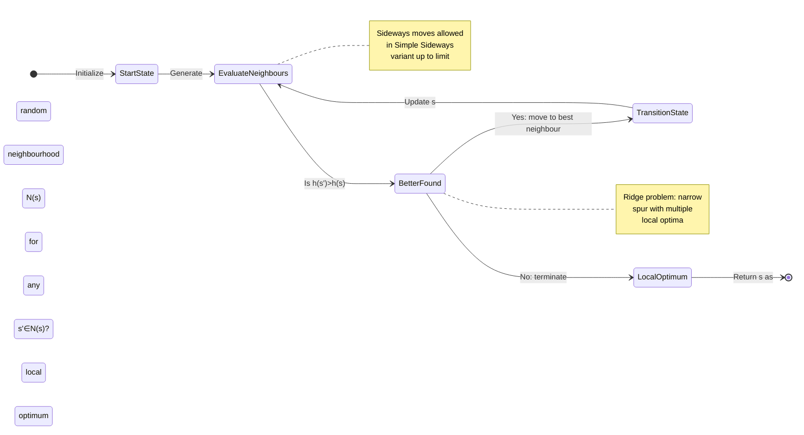

Several variants of the basic hill climbing algorithm have been proposed in the literature to mitigate its inherent limitations. **Steepest-Ascent Hill Climbing** evaluates all neighbours and selects the one with the highest heuristic value at each step, ensuring the steepest possible gradient ascent. **First-Choice Hill Climbing** identifies and transitions to the first neighbour superior to the current state without exhaustively evaluating all candidates, trading optimality for speed. **Random-Restart Hill Climbing** executes multiple independent hill climbing episodes from randomly sampled starting states, retaining the best solution across all restarts. This strategy substantially increases the probability of locating the global optimum while maintaining tractable per-run complexity. **Stochastic Hill Climbing** introduces probabilistic acceptance of neighbours, where the probability of accepting a better neighbour is proportional to the improvement magnitude, thereby injecting controlled exploration. **Simulated Annealing**, discussed in detail in Q2a, may be conceptualized as a probabilistic extension of hill climbing in which the probability of accepting worse states is gradually annealed according to a cooling schedule.

The principal failure modes of hill climbing are well characterized in optimization theory. The **local optimum** phenomenon occurs when the current state represents a peak within its immediate neighbourhood despite the existence of superior states at greater distances. The **ridge** problem arises when the optimal path to a higher peak traverses a narrow diagonal region that is not aligned with the discrete set of available moves, causing the climber to oscillate or descend prematurely. The **plateau** phenomenon manifests when the neighbourhood consists predominantly of states with equivalent heuristic values, rendering ascension impossible absent sideways moves. The resolution of these limitations collectively motivates the adoption of more sophisticated metaheuristic frameworks such as simulated annealing, genetic algorithms, and particle swarm optimization, which systematically balance exploitation and exploration across the search space.

---

## Q1b — Describe Evolutionary Programming

Evolutionary Programming (EP) constitutes one of the foundational paradigms within evolutionary computation, originating from the seminal work of Lawrence J. Fogel in the 1960s at General Dynamics Corporation. Fogel's pioneering research, disseminated through his monograph *Artificial Intelligence through Simulated Evolution* (1966), posited that machine intelligence could emerge from the simulation of open-ended evolutionary processes rather than the explicit encoding of domain knowledge. Unlike its sibling methodologies such as Genetic Algorithms or Evolution Strategies, EP was originally conceived not as an optimization heuristic per se but as a mechanism for generating adaptive behaviours capable of solving prediction and sequence modelling tasks. Over the subsequent decades, EP has evolved into a robust stochastic optimization framework characterized by its reliance on mutation as the dominant evolutionary operator and its emphasis on the evolutionary adaptation of behavioural phenotypes represented as finite state machines, real-valued vectors, or more recently, neural network architectures.

The algorithmic structure of Evolutionary Programming adheres to a generational cycle remarkably reminiscent of natural selection. The population initialization stage creates a finite ensemble of candidate solutions, each represented as a chromosome encoding the parameters or structural characteristics of the solution space. In the contemporary formulation of EP as applied to numerical optimization, chromosomes are typically encoded as real-valued vectors in ℝ^n, obviating the need for the binary encoding complexity characteristic of early Genetic Algorithms. The initial population is sampled uniformly or via low-discrepancy sequences across the admissible parameter space. Population size, denoted by μ, is a critical algorithmic hyperparameter; typical values range from 50 to 500, with larger populations increasing exploration diversity at the cost of greater computational expenditure per generation.

Following initialization, the evaluation phase assigns a fitness score to each individual within the population. The fitness function φ: ℝ^n → ℝ quantifies the quality of a candidate solution with respect to the optimization objective. For minimization problems, fitness is often defined as the reciprocal or the negative of the objective function value, whereas maximization problems typically employ the objective function directly as fitness. In adaptive behaviour modelling scenarios, fitness may be assessed via the predictive accuracy of the finite state machine on a sequence of observable inputs. The fitness landscape thus constructed induces a partial order over the population, which serves as the basis for subsequent selection operations.

The variation operator in EP is predominantly mutation, typically implemented as Gaussian perturbation. For a parent vector x = (x₁, x₂, ..., xₙ), each component xᵢ is independently perturbed by addition of a normally distributed random variable ε ∼ N(0, σᵢ²), where σᵢ represents the mutation step size associated with dimension i. Self-adaptive forms of EP co-evolve the step size parameters σᵢ alongside the decision variables, enabling the algorithm to autonomously tune its exploratory intensity. This self-adaptation mechanism is formally expressed as:

σᵢ' = σᵢ · exp(τ' · N(0,1) + τ · Nᵢ(0,1))

where τ and τ′ are learning rates governing the overall and per-dimension adaptation dynamics. The resulting offspring population comprises μ individuals generated via mutation of each parent, yielding a combined intermediate population of size 2μ in the (μ + μ) generational scheme.

Selection in EP is governed by tournament-based or spatial selection mechanisms. In **tournament selection**, each parent competes against a random subset of the offspring, with the winner advancing to the next generation. In **Q-tournament selection**, each individual participates in q independent pairwise contests, earning a score proportional to its success rate. This probabilistic survival criterion preserves population diversity while incrementally favouring superior phenotypes, a property that distinguishes EP from the elitist replacement strategies prevalent in Genetic Algorithms. The absence of crossover as a primary operator is philosophically significant: EP views genetic recombination as an unreliable mechanism for combining co-adapted gene complexes, preferring instead to preserve the full phenotypic structure of successful individuals through clonal propagation with mutation.

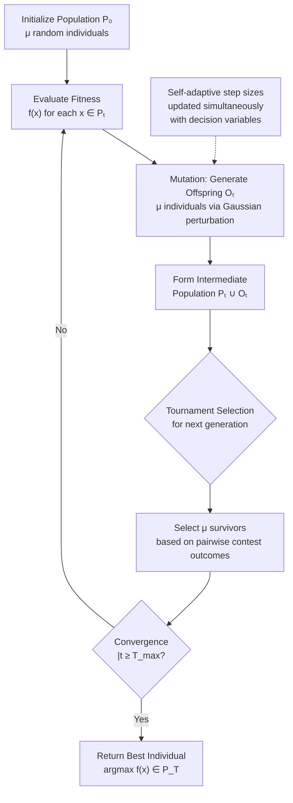

The theoretical foundations of EP draw upon results from population genetics, stochastic approximation theory, and statistical mechanics. The schema theorem and building block hypothesis, which underpin Genetic Algorithm analysis, find partial analogues in EP through the invariance properties of Gaussian mutation and the cumulative selection pressure exerted by tournament comparisons. Empirical studies by Back, Fogel, and Tschichold (1996) demonstrated that self-adaptive EP converges to the global optimum on a broad class of unimodal and multimodal continuous test functions, including the Sphere, Rosenbrock, and Schwefel functions, with performance competitive to Evolution Strategies and Differential Evolution.

Applications of Evolutionary Programming span diverse domains within soft computing and beyond. In **control systems**, EP has been deployed for the adaptive tuning of PID controller parameters in real-time industrial processes, where online adaptation to changing plant dynamics is exigent. In **financial engineering**, EP optimizes trading strategies, portfolio allocations, and option pricing models under non-stationary market conditions. In **robotics**, evolutionary programming generates locomotion gaits and behavioural controllers for autonomous agents without requiring expert knowledge of the robot's kinematics. In **bioinformatics**, EP solves protein structure prediction, gene expression clustering, and phylogenetic tree reconstruction problems characterized by rugged fitness landscapes. The self-adaptive mutation mechanism is particularly well-suited to problems exhibiting epistasis and ruggedness, where the optimal perturbation magnitude varies with local gradient curvature and landscape topology.

The principal distinctions between EP, Genetic Algorithms, and Evolution Strategies warrant clarification. Genetic Algorithms, as originally formulated by Holland, emphasize crossover as the primary source of genetic novelty and employ binary or discrete encodings. In contrast, Evolution Strategies, developed independently by Rechenberg and Schwefel in Germany, also utilize real-valued encodings and self-adaptive mutation, but implement deterministic (μ + λ) or (μ, λ) survivor selection. Evolutionary Programming occupies an intermediate position, combining the mutation-centric variation of Evolution Strategies with the probabilistic tournament selection mechanism. Contemporary practice has largely converged upon hybrid implementations that incorporate crossover and self-adaptive mutation, blurring the strict taxonomy of these evolutionary paradigms. Nonetheless, the EP emphasis on behavioural adaptation, stochastic selection, and the philosophical commitment to open-ended evolution remains distinctive within the broader evolutionary computation canon.

---


```
EP vs GA vs ES - COMPARATIVE OVERVIEW (ASCII)
╔══════════════════════════════════════════════════════════════╗
║           EVOLUTIONARY COMPUTATION PARADIGMS                 ║
╠══════════════════════════════════════════════════════════════╣
║  Feature         EP             GA            ES            ║
╠══════════════════════════════════════════════════════════════╣
║  Primary         Mutation       Crossover     Mutation      ║
║  Operator        (Gaussian)     (1/2-pt)      (self-adapt)  ║
║  Selection       Tournament     Roulette/     (μ+λ)/(μ,λ)  ║
║                  (stochastic)   Rank/Tourn    deterministic ║
║  Encoding        Real-valued    Binary/RV     Real-valued   ║
║  Adaptation      Self-adaptive  Fixed p_c/m  Self-adaptive  ║
║  σᵢ              YES            Usually NO    YES           ║
║  Crossover       NO (usually)   YES           NO            ║
╚══════════════════════════════════════════════════════════════╝
```

## Q1c — Explain Artificial Hummingbird Algorithm

The Artificial Hummingbird Algorithm (AHA) is a bio-inspired metaheuristic optimization algorithm proposed as a recent addition to the expanding taxonomy of swarm intelligence and nature-inspired computing methodologies. Introduced to the computational intelligence community in the early 2020s, the AHA draws its foundational inspiration from the remarkable behavioural repertoire and energetic ecology of hummingbirds, which constitute the family Trochilidae and represent one of the most metabolically specialized avian clades on Earth. Hummingbirds exhibit extraordinary sensory, motor, and cognitive capacities that are unparalleled within the avian kingdom, including the ability to hover in place, traverse spatial distances of hundreds of kilometres during migratory events, recognize and respond to individual conspecifics and heterospecific nectar sources, and execute split-second territorial defence manoeuvres. These behavioural adaptations, shaped by millions of years of evolutionary pressure, provide the biological substrate for the algorithmic primitives defined within the AHA framework. The algorithm was designed explicitly for the resolution of complex, high-dimensional, non-convex, and multimodal optimization problems that resist solution via gradient-based deterministic methods.

The biological foundation of the AHA rests upon three cardinal hummingbird behaviours, each of which is algorithmically abstracted into a computational operator. The first behaviour, **territorial foraging**, refers to the process by which a hummingbird identifies, patrols, and exploits a set of nectar sources within a bounded spatial region. From an optimization perspective, this behaviour maps onto the concept of local exploitation, wherein an agent conducts fine-grained search around promising candidate solutions to refine solution quality. The second behaviour, **territorial defence**, encompasses the aggressive displacement of intruding conspecifics from a defended nectar territory. Algorithmically, this is realized as an adaptive exploration mechanism that enables a hummer to discover new regions of the search space when its current territory yields diminishing returns. The third behaviour, **migration**, describes the long-distance seasonal movement of hummingbird populations between geographically distinct floral resource distributions. In the computational metaphor, migration facilitates global exploration by allowing individuals to traverse large portions of the search space and escape local optima traps that would otherwise persist under purely local search strategies.

The algorithmic framework of AHA operates upon a population of artificial hummingbirds initialized randomly within the D-dimensional search space Ω ⊂ ℝ^D. Each hummingbird individual hᵢ, where i ∈ {1, 2, ..., N}, is characterized by a position vector xᵢ ∈ Ω and a velocity vector vᵢ ∈ ℝ^D. The position corresponds to the candidate solution, while the velocity governs the displacement dynamics between consecutive iterations. At each computational iteration t, every hummingbird evaluates its current nectar source quality via the objective function f: Ω → ℝ subject to the optimization goal (minimization or maximization). The nectar quality directly determines the hummingbird's territorial allocation in the subsequent algorithmic phase.

The update dynamics of AHA integrate three movement strategies assigned probabilistically based on the nectar visitation table maintained by each agent. The **territorial foraging update** is expressed as:

xᵢ(t+1) = xᵢ(t) + r₁ × (x_best(t) − xᵢ(t)) × FDR

where r₁ ∈ U(0,1) is a uniformly distributed random number and FDR denotes the Foraging Direction Ratio, a parameter governing the proportion of the displacement oriented toward the current best-known nectar source. This term implements an exploitative drift mechanism analogous to the cognitive component in Particle Swarm Optimization, biasing each individual toward the globally best position discovered thus far. The mathematical structure ensures that individuals in the proximity of the best source execute finer adjustments, while those at greater distances execute coarser jumps.

The **territorial defence update** is triggered when a hummingbird perceives intrusion from a superior nectar source in its defended territory. The displacement formula is given by:

xᵢ(t+1) = xᵢ(t) + r₂ × (x_j(t) − xᵢ(t)) × TDR

where r₂ ∈ U(0,1) and TDR represents the Territorial Defence Ratio. The defending individual moves in a direction biased away from the intruding hummingbird x_j with superior nectar quality, preventing competitive exclusion from high-quality regions. This mechanism introduces a directional repulsion that expands the search coverage of the population and prevents premature convergence of multiple individuals to a single local optimum—a phenomenon termed **swarming crowding** in the AHA literature.

```mermaid
flowchart LR
    subgraph AHA_Algorithm
        A["Initialize N Hummingbirds
Random positions in Ω"] --> B["Evaluate nectar quality
f(x_i) for each individual"]
        B --> C{"Select movement type
via probability"}
        C -->|Territorial
Foraging| D["Update toward best source
x_i += r1*(g_best-x_i)*FDR"]
        C -->|Territorial
Defence| E["Repel from intruder
x_i += r2*(x_j-x_i)*TDR"]
        C -->|Migration| F["Long-range relocation
x_i random reposition"]
        D --> G["Update Visitation Table
and best solution g_best"]
        E --> G
        F --> G
        G --> H{"Stopping condition
Iteration t >= T_max?"}
        H -->|No| B
        H -->|Yes| I["Return global best
solution g_best"]
    end
    style A fill:#fff3e0
    style I fill:#e8f5e9
```

The **migration update** operator is activated when a hummingbird's territorial nectar source becomes depleted below a quality threshold or when a maximum visit count is exhausted. The migration rule is formalized as:

xᵢ(t+1) = L × xᵢ(t) + r₃ × (x_w(t+1) − xᵢ(t))

where L is a linearly decreasing migration scaling factor that decays from a maximum value (typically 1.0) to a minimum value (typically 0.01) over the course of the algorithm's execution, and x_w(t+1) denotes the worst solution in the contemporary population. This formulation ensures that migration intensity is greatest during the early exploratory phase and progressively diminishes as the population converges, transitioning the algorithm's emphasis from global exploration to local exploitation—a property directly analogous to the cooling schedule in Simulated Annealing and the inertia weight decay in Particle Swarm Optimization.

The visit table maintained by each hummingbird records the visitation counts and quality scores for each territory in its spatial neighbourhood. This table governs the probabilistic selection of movement strategies: territories with high visitation but declining quality trigger migration, territories with low visitation encourage territorial defence to prevent usurpation, and territories with sustained high visitation reinforce territorial foraging. The adaptive re-weighting of strategy selection probabilities based on the visitation table distinguishes AHA from conventional swarm intelligence algorithms such as Particle Swarm Optimization, which employ fixed velocity coefficient parameters, and Firefly Algorithm, which relies solely on attractiveness and light intensity-based movement.

ASCII representation of hummingbird territories and movement:

```
   Nectar Sources (Search Space)

     [TB1]     [TB2]     [TB3]   ←→  Territorial Boundaries
      |         |         |
   🐦 HB-A 🐦 HB-B 🐦 HB-C    ←   Hummingbirds

   Movement Types:
   ▶ Ter. Foraging:  HB-A → TB2  (exploit best)
   ▶ Ter. Defence:   HB-B ← HB-A  (repel intrusion)
   ▶ Migration:      HB-C → ✈----→ new region (explore)

   Visit Table (HB-B):
   ┌──────────┬────────┬───────────┐
   │ Territory │ Visits │ Avg Qlty  │
   ├──────────┼────────┼───────────┤
   │   TB1    │   4    │   0.72    │
   │   TB2    │  12    │   0.95    │
   │   TB3    │   3    │   0.30    │
   └──────────┴────────┴───────────┘
```

The computational complexity of AHA per iteration is O(N·D) for position updates and O(N·N) for the territorial interaction computations in the worst case when all-pairs comparisons are conducted. Practical implementations reduce this to O(N·D) through spatial data structures such as k-d trees for nearest-neighbour queries and by exploiting the locality of territorial boundaries to limit interaction computations to local neighbourhoods. The algorithm requires no gradient information and is therefore applicable to non-differentiable, discontinuous, and noisy objective functions. AHA has demonstrated competitive performance on IEEE Congress on Evolutionary Computation benchmark functions, including unimodal functions such as Sphere, Schwefel 2.22, and Quartic, as well as multimodal functions such as Rastrigin, Ackley, and Griewank, with particular efficacy on high-dimensional multimodal instances where local optima proliferation challenges conventional algorithms.

---

## Q2a — Explain Simulated Annealing with Diagram

Simulated Annealing (SA) stands as one of the most intellectually elegant metaheuristic optimization algorithms, drawing its foundational metaphor directly from the metallurgical process of annealing in thermodynamics, wherein a material is heated to a high temperature and then gradually cooled in a controlled manner to attain a low-energy crystalline state characterized by minimal defects and maximal structural regularity. First proposed by Scott Kirkpatrick, C. Daniel Gelatt, and Mario P. Vecchi in their seminal 1983 paper published in *Science*, and independently developed by Vladimir Černý in the same era, Simulated Annealing was designed explicitly to circumvent the myopic limitations of greedy local search algorithms such as hill climbing by introducing a probabilistic acceptance criterion that permits the algorithm to accept inferior solutions with non-zero probability during the early stages of search, thereby enabling escape from local minima traps that would otherwise consign hill climbing to sub-optimal termination. The algorithm operates within the framework of stochastic optimization and draws upon the Metropolis-Hastings sampling algorithm from statistical mechanics, originally formulated by Nicholas Metropolis, Arianna Rosenbluth, Marshall Rosenbluth, Augusta Teller, and Edward Teller in 1953 to compute the equilibrium properties of many-particle systems. The conceptual bridge between thermodynamic annealing and combinatorial optimization rests upon the formal isomorphism between the energy landscape of a physical system and the objective function landscape of an optimization problem: in the former, low-energy configurations correspond to thermodynamically stable states, while in the latter, low-cost (or high-fitness) configurations correspond to optimal or near-optimal solutions.

The mathematical formalization of Simulated Annealing begins with the definition of a state space \(S\), analogous to the configuration space of the physical system, and an energy function \(E: S \rightarrow \mathbb{R}\), analogous to the objective function to be minimized. At any given temperature \(T > 0\), the probability of the system occupying a state \(s\) with energy \(E(s)\) is given by the Boltzmann-Gibbs distribution: \(P(s) = \frac{\exp(-E(s)/k_B T)}{Z(T)}\), where \(k_B\) is the Boltzmann constant and \(Z(T) = \sum_{s' \in S} \exp(-E(s'/k_B T))\) is the partition function. From this distribution, the Metropolis acceptance criterion follows: if a transition from state \(s\) to a neighbouring state \(s'\) results in an energy decrease \(\Delta E = E(s') - E(s) < 0\), the transition is accepted unconditionally; if \(\Delta E \geq 0\), the transition is accepted with probability \(P = \exp(-\Delta E / k_B T)\). This probabilistic acceptance of uphill moves is the defining characteristic that distinguishes Simulated Annealing from deterministic hill climbing and enables the algorithm to traverse energy barriers separating local minima.

The algorithmic procedure of Simulated Annealing may be decomposed into the following sequential phases. **Phase 1: Initialization**, wherein an initial solution \(s_0\) is generated, typically randomly or via a simple construction heuristic, and an initial temperature \(T_0\) is selected such that the acceptance ratio of uphill moves is high—commonly above 0.8—indicating sufficient thermal energy to permit free exploration of the neighbourhood. **Phase 2: Perturbation**, wherein a neighbouring solution \(s'\) is generated from the current solution \(s\) via a perturbation mechanism appropriate to the problem encoding; for the Traveling Salesman Problem, this typically takes the form of a 2-opt or 3-opt edge exchange, while for continuous optimization it may take the form of Gaussian perturbation or uniform random displacement within a bounded interval. **Phase 3: Acceptance Test**, wherein the Metropolis-Hastings criterion is applied to determine whether the transition to \(s'\) is accepted. **Phase 4: Thermal Equilibrium Sampling**, wherein a number of perturbation-acceptance steps equal to the problem size or a fixed multiple thereof are executed at each temperature level to allow the Markov chain to approach quasi-equilibrium before the temperature is decremented. **Phase 5: Cooling**, wherein the temperature is decremented according to a predefined cooling schedule \(T_{k+1} = \alpha \cdot T_k\), where \(\alpha \in (0, 1)\) is the cooling rate; common schedules include geometric cooling (\(\alpha = 0.95-0.99\)), linear cooling (\(\alpha = 1 - \delta/T_0\)), and logarithmic cooling (\(\alpha \approx 1 - 1/\log(1+k)\), \(k\) = iteration), with logarithmic cooling providing provable convergence to the global minimum under specific conditions at the expense of extremely slow temperature decrement.

The cooling schedule is perhaps the most critical design parameter of the Simulated Annealing algorithm, as it governs the delicate balance between exploration and exploitation across the optimization trajectory. A cooling schedule that is too rapid (high \(\alpha\) decrement) causes premature convergence to local minima analogous to the quenching of a molten metal, wherein the system becomes trapped in a metastable high-energy state. Conversely, a cooling schedule that is too gradual (low \(\alpha\) decrement) causes excessive computational expenditure without meaningful improvement in solution quality. The theoretical results of Hajek and Sasaki (1989) establish that if \(T_0\) is sufficiently large and \(T_k \geq c / \log(k)\) for some constant \(c\) proportional to the maximum barrier height in the energy landscape, then Simulated Annealing converges to the global minimum with probability approaching 1 as \(k \rightarrow \infty\). In practical implementations, however, the logarithmic schedule is rarely employed due to its prohibitive computational cost, and practitioners instead rely on carefully tuned geometric schedules that achieve near-optimal performance at a fraction of the computational burden.

The search behaviour of Simulated Annealing can be visualized through the energy landscape metaphor, which is indispensable for understanding the algorithm's operation in both low-temperature and high-temperature regimes. At high temperatures, the acceptance probability of uphill moves approaches unity, and the algorithm behaves akin to a random walk, freely traversing the landscape and visiting diverse regions including suboptimal basins. As the temperature decreases, the acceptance probability of uphill moves diminishes, progressively constraining the algorithm's movement to downhill transitions. In the final low-temperature stage, the algorithm converges to a local minimum, analogous to the crystalline structure that emerges during the final stages of thermodynamic annealing.

ASCII representation of the Simulated Annealing convergence trajectory on a multimodal landscape:

```
        Energy Landscape
    GPE (Global Optimum)
         /\        /\
        /  \      /  \
       /    \    /    \
      /  LPA \  /  LPB \
     /        \/        \
    /          /\         \
   /          /  \         \
  /          /    \         \
 /          /      \         \
/__________/        \_________\
 LOA       LOCAL MINIMA A   LOB

Annealing Trajectory:
  T_high →  : Random walk, visits all regions
  T_mid   →  : Escapes LOA via uphill acceptance
  T_low   →  : Converges toward GPE from LPA
```

This diagram illustrates the critical advantage of Simulated Annealing over hill climbing: at high temperatures, the algorithm can escape from Local Optimum A (LOA) by accepting uphill moves, thereby traversing the energy barrier and discovering the superior Global Optimum (GPE). Hill climbing, by contrast, would terminate immediately at LOA since no downhill move is available in its immediate neighbourhood. The trajectory through Local Peak Area B (LPA) represents the final convergence phase at low temperature.

Mermaid flowchart representing the complete Simulated Annealing algorithm:

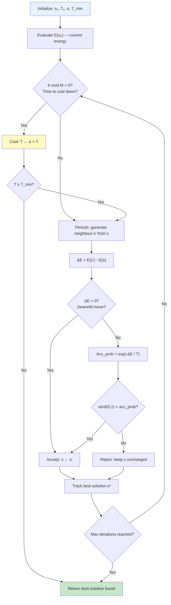

The applications of Simulated Annealing span a remarkably broad spectrum of scientific, engineering, and industrial domains, testifying to the algorithm's generality and robustness as an optimization framework. In ** Very Large Scale Integration (VLSI) circuit design**, SA optimizes the placement and routing of millions of transistors on silicon chips, a problem characterized by a combinatorial explosion of feasible layouts and a highly rugged energy landscape with thousands of local minima. In **operations research and logistics**, SA solves the Traveling Salesman Problem, vehicle routing problems, job-shop scheduling, and facility location problems where traditional exact methods such as integer programming become intractable at scale. In **machine learning and neural network training**, SA has been employed for weight optimization in feedforward and recurrent networks, providing a stochastic alternative to gradient descent that is capable of escaping saddle points and local minima in non-convex loss surfaces. In **image processing and computer vision**, SA performs image registration, segmentation, edge detection, and tomographic reconstruction from incomplete projection data. In **computational biology and bioinformatics**, SA predicts protein tertiary structure via lattice folding models, performs molecular docking simulations, and reconstructs phylogenetic trees from genetic sequence data. In **finance and economics**, SA optimizes portfolio selection under the Markowitz mean-variance framework, calibrates stochastic volatility models, and solves the optimal stopping problem inherent in real options valuation.

The comparative analysis between Simulated Annealing and hill climbing crystallizes the fundamental contribution of the probabilistic acceptance mechanism. Hill climbing executes a deterministic greedy ascent, terminating at the first local optimum encountered, with no mechanism whatsoever to escape local traps. Simulated Annealing, by contrast, employs a temperature-controlled probabilistic acceptance criterion that systematically reduces the probability of accepting uphill moves as the algorithm converges, thereby mimicking the thermodynamic process whereby a system attains its globally optimal crystalline state through gradual thermal relaxation. The key distinctions may be enumerated as follows: **search strategy**—hill climbing is deterministic and greedy, while SA is stochastic and non-greedy; **solution quality guarantee**—hill climbing guarantees no solution quality bound, while SA provides probabilistic convergence guarantees under appropriate cooling schedules; **local optima escape**—hill climbing has zero capability to escape local optima, while SA probabilistically escapes during high-temperature phases; **computational cost**—hill climbing executes in polynomial time per restart, while SA requires significantly more function evaluations due to the thermal equilibrium sampling requirement; **parameter sensitivity**—hill climbing is sensitive to neighbourhood definition and initial state, while SA additionally requires careful calibration of cooling schedule parameters.
---

## Q2b — Describe Genetic Programming

Genetic Programming (GP) represents one of the most ambitious and intellectually distinctive branches within the evolutionary computation paradigm, conceived and rigorously developed by John R. Koza and his colleagues at Stanford University during the late 1980s and early 1990s, with the foundational monograph *Genetic Programming: On the Programming of Computers by Means of Natural Selection* published in 1992. The central thesis underlying Genetic Programming is profoundly radical within the context of artificial intelligence: rather than requiring a human expert to explicitly design, specify, or program a solution to a given problem, GP enables the automatic synthesis of computer programs—or more precisely, executable structures that solve or approximately solve the target problem—through the application of evolutionary principles drawn from population genetics and natural selection. This capacity for automatic program synthesis distinguishes GP fundamentally from all other machine learning and optimization methodologies, positioning it at the intersection of machine learning, automated programming, and evolutionary biology. While conventional Genetic Algorithms operate upon fixed-length binary strings or real-valued vectors where the semantics of each gene position are predetermined by the human designer, GP operates upon hierarchical structures of variable size and shape—predominantly tree structures in the canonical formulation, but also linear genetic programs, graphical programs, and neural architectures in contemporary variants—where the structural content and connectivity of the representation is itself subject to evolutionary modification. This structural evolution is the defining characteristic that distinguishes GP from the broader Genetic Algorithm framework.

The historical development of Genetic Programming must be situated within the broader trajectory of evolutionary computation. John Holland's foundational work on Genetic Algorithms during the 1970s established the theoretical underpinnings of schema processing, building-block hypothesis, and adaptive parameter tuning that would later inform GP. However, Holland's original GA formalism, which relied upon fixed-length binary chromosomes, was structurally incompatible with the representation of hierarchical program structures of variable arity. Koza's seminal contribution was twofold: first, he identified that tree structures could serve as the natural chromosome representation for computer programs, where internal nodes represent functions (operators, conditional branches, iterative constructs) and leaf nodes represent terminals (variables, constants, input features); second, he developed the genetic operators of **strongly typed crossover** and **mutation** that are structurally valid for tree-based representations, ensuring that the offspring produced by recombination are syntactically well-formed programs guaranteed to execute without error. Koza's early GP systems achieved human-competitive results on problems including optimal controller design, symbolic regression, cellular automata rule induction, and Boolean function synthesis, demonstrating that GP could evolve programs with performance characteristics rivaling or surpassing those of expert-designed solutions.

The standard tree-based GP representation may be formally defined as follows. A **function set** \(F = \{f_1, f_2, ..., f_{n_f}\}\) defines the allowable internal nodes, which may include arithmetic operators (addition, subtraction, multiplication, division), Boolean operators (AND, OR, NOT, XOR), conditional constructs (IF-THEN-ELSE), iterative constructs (FOR, WHILE), trigonometric and transcendental functions (sin, cos, log, exp), and domain-specific functions appropriate to the target problem. A **terminal set** \(T = \{t_1, t_2, ..., t_{n_t}\}\) defines the allowable leaf nodes, which may include input variables, constant values (integer, floating-point), ephemeral random constants (ERC), and state variables for dynamic systems. The function set and terminal set must satisfy the **closure property**: every function in \(F\) must be defined for all possible combinations of inputs, including those produced by other functions, ensuring that any random combination of functions and terminals produced during initialization or genetic recombination yields a syntactically valid and executable program. When closure cannot be naturally satisfied—for example, when division is included but division by zero is undefined—protective measures such as protected division are employed, wherein division by zero returns a default safe value (typically 1.0) rather than propagating an error.

The initial population in GP is generated randomly using one of several prescribed methods. The **full method** generates trees in which every leaf node appears at exactly the same depth, producing trees with uniform height. The **grow method** generates trees in which nodes are randomly selected from \(F \cup T\) subject to a maximum depth constraint, producing trees with variable height and more structural diversity. The **ramped half-and-half method**, which is the most widely used initialization strategy in contemporary GP, combines both approaches: it generates equal-sized subpopulations of half full trees and half grown trees, distributed across a range of maximum depths (typically from 2 to the problem-specific maximum depth), thereby producing a diverse initial population with a range of sizes and shapes. This diversity is critical because the initial population genetic diversity directly determines the breadth of the search space explored in early generations and influences the efficacy of subsequent recombination.

Three primary genetic operators govern variation in canonical GP: reproduction, crossover, and mutation. **Reproduction** is the simplest operator and involves the direct copying of an individual from the current population into the next generation without modification, selected stochastically with probability proportional to fitness or via tournament selection. Reproduction serves as the mechanism by which highly fit individuals are preserved across generations, implementing a form of genetic elitism. **Subtree crossover** is the dominant recombination operator in GP and operates by selecting a random subtree (a randomly chosen internal node and all its descendants) from each of two parent trees, then exchanging these subtrees to produce two offspring. For example, given parent program \(P_1 = \text{ADD}(X, \text{MULT}(Y, Z))\) and parent program \(P_2 = \text{SUB}(A, \text{DIV}(B, C))\), selecting the subtree \(\text{MULT}(Y, Z)\) from \(P_1\) and the subtree \(B\) from \(P_2\) produces offspring \(O_1 = \text{ADD}(X, B)\) and \(O_2 = \text{SUB}(A, \text{DIV}(\text{MULT}(Y, Z), C))\). This operator is structurally analogous to single-point crossover in Genetic Algorithms, but operates on hierarchical tree structures rather than linear strings. **Subtree mutation** selects a random subtree within an individual and replaces it with a newly generated random subtree, typically grown using the ramped half-and-half method with a randomly chosen maximum depth. This operator introduces structural novelty and allows the population to explore novel program configurations that may not be accessible solely through crossover.

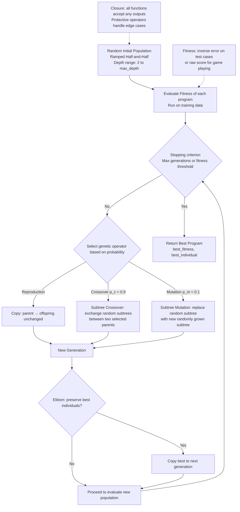

ASCII representation of the tree-based GP chromosome structure and crossover operation:

```
       Parent 1                    Parent 2
      (ADD X                           (SUB A
         |                                  |
    (MULT Y Z)                         (DIV B C)

      Crossover Point                  Crossover Point
      at MULT node                     at DIV node

       Offspring 1                    Offspring 2
      (ADD X B)                       (SUB A
                                          |
                                    (MULT Y Z)

Function Set F: {ADD, SUB, MULT, DIV_protected, SIN, COS, IF}
Terminal Set T: {X, Y, Z, A, B, C, R(ERC)}
```

The fitness evaluation mechanism in GP is critical and highly problem-domain-specific. In **symbolic regression**, the most canonical GP application, fitness is defined as the sum of absolute errors or the root mean square error (RMSE) between the evolved program's output and the target function values across a set of training data points. In **classification problems**, fitness may be defined as the proportion of correctly classified instances, with the raw count or accuracy serving as the maximization objective. In **program synthesis** tasks, fitness may combine correctness on test cases with a parsimony pressure term that penalizes program complexity, preventing the uncontrolled growth of program trees—a phenomenon known as **bloat**. The bloat phenomenon, whereby tree sizes grow exponentially across generations without a corresponding improvement in fitness, represents one of the most significant challenges in GP practice and has motivated extensive research into bloat control methods including parsimony pressure, operator probability tuning, depth limiting, and structural macro mutation. The theoretical explanation for bloat is multifaceted, involving hypotheses such as the removal bias theory (small changes to program semantics do not consistently affect fitness, selecting for larger trees that can accommodate more diverse genetic material without fitness degradation), the node-impact theory (non-coding or intronic regions of program trees that do not affect output provide a protected substrate for genetic recombination), and the coding hypothesis (fitness landscapes in program space present selection pressures favoring programs with redundant representations).

Applications of Genetic Programming have expanded dramatically since Koza's initial demonstrations, spanning virtually every domain of science and engineering where computational models must be discovered from data. In **control systems engineering**, GP evolves control laws for nonlinear dynamical systems, including the automatic design of PID controllers, fuzzy logic controllers, and neurocontrollers for unmanned aerial vehicles, robotics manipulators, and automotive systems. In **biomedical engineering**, GP synthesizes diagnostic classifiers from medical imaging data, discovers pharmacokinetic models from clinical trial data, and evolves predictive biomarkers for disease progression. In **finance**, GP discovers trading strategies, option pricing models, and risk management heuristics that adapt to non-stationary market dynamics. In **computer graphics and computer vision**, GP evolves image processing filters, texture synthesis algorithms, and object recognition classifiers. In **software engineering**, GP applies to automatic bug detection, test case generation, and program repair. A particularly significant application domain is **automated algorithm design**, wherein GP evolves heuristics for combinatorial optimization problems such as bin packing, scheduling, and routing, producing algorithm portfolios that outperform hand-designed heuristics on benchmark instances. Contemporary GP research increasingly employs **grammar-based GP** (utilizing context-free grammars to constrain the syntactic structure of evolved programs, ensuring domain-appropriate outputs) and **Linear GP** (representing programs as linear sequences of instructions rather than trees, more closely mirroring conventional machine code) to address limitations of the canonical tree-based representation.
---

## Q2c — Differentiate Standard PSO and Binary PSO

Particle Swarm Optimization (PSO) stands as one of the most widely cited and empirically successful swarm intelligence algorithms in the field of computational optimization, originally formulated by James Kennedy and Russell C. Eberhart in 1995, inspired by the emergent collective behaviour observed in flocks of birds, schools of fish, and swarms of bees—phenomena wherein decentralized individuals following simple local interaction rules give rise to sophisticated global optimization behaviour without centralised coordination. The original formulation of PSO, which we term **Standard PSO** or **Continuous PSO**, operates in continuous real-valued search spaces and models the trajectory of each particle as a velocity-driven update in the D-dimensional Euclidean space \(\mathbb{R}^D\). **Binary PSO (BPSO)**, introduced subsequently by Kennedy and Eberhart in 1997, extends the PSO paradigm to discrete binary search spaces where each decision variable is constrained to take values in \(\{0, 1\}\), enabling PSO to solve combinatorial optimization problems, feature selection tasks, neural network weight binarization, and decision-making problems that are inherently discrete in nature.

The structural and mathematical distinctions between Standard PSO and Binary PSO are fundamental and pervade every aspect of the algorithm, from position representation and velocity updates to the mapping mechanism and convergence dynamics. In **Standard PSO**, each particle \(i\) in a swarm of size \(N\) is characterized by a position vector \(\mathbf{x}_i = (x_{i1}, x_{i2}, ..., x_{iD}) \in \mathbb{R}^D\) and a velocity vector \(\mathbf{v}_i = (v_{i1}, v_{i2}, ..., v_{iD}) \in \mathbb{R}^D\). At each iteration \(t\), the velocity is updated using the canonical velocity update equation: \(\mathbf{v}_i(t+1) = \omega \cdot \mathbf{v}_i(t) + c_1 \cdot r_1 \cdot (\mathbf{pbest}_i(t) - \mathbf{x}_i(t)) + c_2 \cdot r_2 \cdot (\mathbf{gbest}(t) - \mathbf{x}_i(t))\), where \(\omega\) is the inertia weight governing momentum retention, \(c_1\) and \(c_2\) are the cognitive and social acceleration coefficients respectively, \(r_1 \sim U(0, 1)\) and \(r_2 \sim U(0, 1)\) are independent uniform random variables, \(\mathbf{pbest}_i\) is the personal best position encountered by particle \(i\) in its search history, and \(\mathbf{gbest}\) is the global best position discovered by the entire swarm. The position is then updated according to \(\mathbf{x}_i(t+1) = \mathbf{x}_i(t) + \mathbf{v}_i(t+1)\), a direct addition that preserves the continuous nature of the representation and allows the particle to occupy any point within the bounded hypercube \(\mathbf{x}_i \in [L_j, U_j]^D\) defined by lower and upper bound vectors \(\mathbf{L}\) and \(\mathbf{U}\).

In **Binary PSO**, the representation is fundamentally different: each particle's position is a binary vector \(\mathbf{x}_i = (x_{i1}, x_{i2}, ..., x_{iD}) \in \{0, 1\}^D\), where each component \(x_{ij}\) encodes a binary decision (e.g., whether feature \(j\) is selected, whether neuron \(j\) is active, whether job \(j\) is assigned to machine \(k\)). The critical challenge in BPSO is that velocity, which is inherently a real-valued quantity representing the rate of change of position, cannot be directly integrated into a binary position update via simple arithmetic addition. Kennedy and Eberhart resolved this through the **velocity-as-probability** mapping: the velocity component \(v_{ij}(t)\) is interpreted not as a physical velocity but as a probability value that governs whether the binary component \(x_{ij}\) flips to the opposite value in the next iteration. This is implemented via the **sigmoid transfer function**: \(S(v_{ij}(t)) = \frac{1}{1 + \exp(-v_{ij}(t))}\), which maps the unbounded real-valued velocity to the open interval \((0, 1)\). The binary position update is then executed stochastically: \(x_{ij}(t+1) = \begin{cases} 1 & \text{if } \text{rand}(0, 1) < S(v_{ij}(t)) \\ 0 & \text{otherwise} \end{cases}\). This probabilistic thresholding mechanism is the defining mathematical distinction between standard and binary PSO, fundamentally altering the search dynamics, convergence behaviour, and information propagation properties of the algorithm.

The velocity update equation in Binary PSO retains the same structural form as in Standard PSO: \(\mathbf{v}_i(t+1) = \omega \cdot \mathbf{v}_i(t) + c_1 \cdot r_1 \cdot (\mathbf{pbest}_i^\text{binary} - \mathbf{x}_i(t)) + c_2 \cdot r_2 \cdot (\mathbf{gbest}^\text{binary} - \mathbf{x}_i(t))\), with the crucial proviso that velocity is now a continuous accumulator that integrates momentum and attraction toward good binary positions across iterations without being interpreted as physical displacement speed. It is important to note that \(\mathbf{pbest}_i^\text{binary}\) and \(\mathbf{gbest}^\text{binary}\) are the binary position vectors of the best historical and global best solutions respectively, not the real-valued positions of Standard PSO. This velocity accumulation mechanism means that a particle that has consistently moved toward flipping a particular bit across multiple iterations will develop a large positive velocity for that dimension, translating to a high sigmoid probability and near-certainty of setting that bit to 1 in subsequent iterations.

The constraint handling mechanisms differ between the two PSO variants. In Standard PSO, position bounds are enforced via three primary strategies: **clamping**, where any component that exceeds the upper or lower bound is reset to that bound; **reflection**, where the component is reflected back into the feasible region at the same distance; and **penalty functions**, where constraint violations are incorporated into the fitness function as penalty terms. In Binary PSO, constraint handling depends on the problem formulation: for binary problems arising from continuous continuous PSO parameter mappings, a threshold on the sigmoid output may be adjusted; for inherently binary constrained problems such as cardinality-constrained feature selection where exactly \(k\) features must be selected, specialized velocity update rules or multi-objective fitness formulations are required.

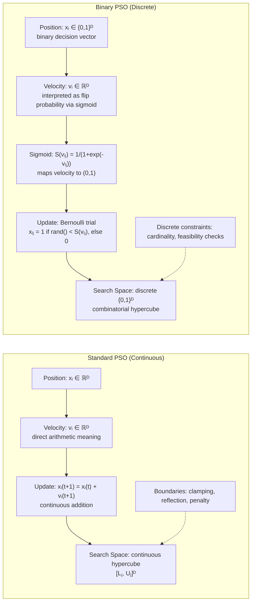

The convergence dynamics and exploration-exploitation characteristics of the two variants exhibit distinctly different statistical properties. In **Standard PSO**, the velocity vector enables particles to overshoot local optima through high momentum (controlled by inertia weight \(\omega\)), and the continuous nature of the search space allows for fine-grained exploitation of promising regions through small velocity adjustments. The swarm exhibits **convergence to a point** in continuous space, and under appropriate parameter settings (e.g., constriction factor or linearly decreasing inertia weight), theoretical proofs establish almost-sure convergence to the global optimum under convexity assumptions. The **constriction factor** variant, introduced by Clerc and Kennedy (2002), modifies the velocity update to \(\mathbf{v}_i(t+1) = \chi [\mathbf{v}_i(t) + c_1 \cdot r_1 \cdot (\mathbf{pbest}_i - \mathbf{x}_i) + c_2 \cdot r_2 \cdot (\mathbf{gbest} - \mathbf{x}_i)]\) with \(\chi = \frac{2}{|2 - \phi - \sqrt{\phi^2 - 4\phi}|}\), \(\phi = c_1 + c_2 > 4\), provably ensuring convergence without explicit inertia weight tuning.

In **Binary PSO**, the stochastic Bernoulli sampling of the sigmoid output introduces irreducible randomness into position updates, meaning that even when a particle's velocity strongly favors setting a particular bit to 1, there remains a non-zero probability (however small) of setting it to 0, bounded below by \(\epsilon > 0\) as \(v_{ij} \rightarrow +\infty\) due to the asymptotic nature of the sigmoid function \(S(v) \rightarrow 1\) as \(v \rightarrow +\infty\). This irreducible stochasticity introduces a form of implicit exploration that is absent in Standard PSO but also precludes exact convergence to a fixed point in the binary search space—the swarm may continue to oscillate around a locally optimal binary vector indefinitely, with the best solution improving only through the occasional beneficial random bit flip. Several modifications to canonical BPSO have been proposed to address this issue, including **quantum-inspired BPSO** (employing quantum-mechanical probability amplitudes and collapse operators), **discrete PSO with certainty update** (deterministically setting a bit when its sigmoid probability exceeds a high threshold), and **BPSO with mutation** (injecting explicit bit-flip mutation analogous to mutation operators in Genetic Algorithms).

A systematic comparative summary of Standard PSO and Binary PSO is as follows:

| Dimension | Standard PSO | Binary PSO |
|---|---|---|
| **Search Space** | Continuous \(\mathbb{R}^D\), bounded hypercube | Discrete \(\{0, 1\}^D\), combinatorial |
| **Position Representation** | Real-valued vector of decision variables | Binary vector encoding discrete decisions |
| **Velocity Interpretation** | Physical rate of position change | Probability accumulator; flip propensity |
| **Position Update Rule** | \(\mathbf{x}_i(t+1) = \mathbf{x}_i(t) + \mathbf{v}_i(t+1)\) | \(x_{ij} = \text{Bernoulli}(S(v_{ij}))\) |
| **Convergence Character** | Convergence to point in continuous space | Oscillatory; no exact convergence in discrete space |
| **Primary Applications** | Continuous optimization, engineering design, neural network training | Feature selection, combinatorial optimization, binary decision problems |
| **Neighbourhood Topology** | Ring, star, von Neumann, random | Ring, star (transferable, but exploration differs) |
| **Parameter Sensitivity** | Inertia weight, acceleration coefficients | Sigmoid steepness, velocity clamping |

The applications of the two PSO variants are largely differentiated by the nature of the underlying optimization problem. **Standard PSO** has been applied extensively to continuous optimization benchmarks including the IEEE CEC test functions, engineering design optimization (truss design, pressure vessel design, cantilever beam design), neural network training (weight optimization, architecture search), multi-objective optimization (Pareto-optimal front approximation via NSPSO, MOPSO variants), controller parameter tuning (PID, fuzzy, adaptive controllers), and power system optimization (economic dispatch, reactive power optimization). **Binary PSO** finds primary application in feature selection for high-dimensional machine learning (reducing feature space dimensionality while maximizing classifier accuracy), attribute reduction in rough set theory, task assignment in scheduling, binary neural network weight quantization, Boolean function minimization, and subset selection problems in bioinformatics (gene selection from microarray data). The selection between the two variants is therefore primarily governed by the discrete or continuous nature of the decision variables in the target optimization problem; hybrid formulations that combine continuous and binary PSO sub-swarms have been proposed for mixed-variable optimization problems.

ASCII representation of search space and trajectory for both PSO variants:

```
    STANDARD PSO                          BINARY PSO (2D)
    
    ┌─Continuous Hypercube─┐             ┌──{0,1}² Discrete──┐
    │                      │             │  (0,0) (0,1)      │
    │     🟡 Particle 1    │             │       (1,0) (1,1) │
    │        ↗             │             │                    │
    │   🟢 Particle 2 →    │             │  P₁ at (1,1) x=0.82 │
    │      ↘               │             │  P₂ at (0,1) x=0.45 │
    │    🟣 gbest ★        │             │  gbest at (1,1)    │
    │                      │             └────────────────────┘
    └──────────────────────┘
    
    Velocity = actual displacement in ℝᴰ    Velocity = flip probability accumulator
    Trajectory = continuous path             Position = discrete {0,1} vector
    Convergence = point in ℝᴰ               Convergence = best binary vector
```
---

## Q3a — Describe Any Two Fuzzy Set Operations

Fuzzy set operations constitute the mathematical apparatus through which fuzzy logic extends classical set theory to accommodate partial membership, enabling reasoning with graded truth values rather than the binary true-false dichotomy of classical (crisp) logic. The foundational framework of fuzzy set theory, as formulated by Lotfi A. Zadeh in his seminal 1965 paper *Fuzzy Sets* published in *Information and Control*, posits that for any universe of discourse \(X\), a fuzzy set \(\tilde{A}\) is fully characterized by its membership function \(\mu_{\tilde{A}}: X \rightarrow [0, 1]\), which assigns to each element \(x \in X\) a real number in the closed unit interval representing the degree of membership in \(\tilde{A}\). Classical set operations—intersection, union, and complement—which in crisp set theory are defined via logical conjunction, disjunction, and negation respectively, admit a continuum of possible definitions in the context of fuzzy sets. This non-uniqueness arises because the classical definitions (respectively, minimum, maximum, and complement) rely upon bivalent truth values and cannot be directly extended to the multi-valued \([0, 1]\) range without introducing normative assumptions about how partial truth values should combine under logical connectives. The family of operations that generalize classical intersection to fuzzy sets are termed **t-norms** (triangular norms), while those that generalize classical union are termed **t-conorms** or **s-norms** (triangular conorms). A comprehensive t-norm \(T: [0, 1] \times [0, 1] \rightarrow [0, 1]\) must satisfy the axioms of commutativity, associativity, monotonicity, and the boundary condition \(T(a, 1) = a\) for all \(a \in [0, 1]\). Similarly, a t-conorm \(S: [0, 1] \times [0, 1] \rightarrow [0, 1]\) must satisfy commutativity, associativity, monotonicity, and \(S(a, 0) = a\) for all \(a \in [0, 1]\).iable boundary condition \(T(a, 1) = a\) for all \(a \in [0, 1]\). Similarly, a t-conorm \(S: [0, 1] \times [0, 1] \rightarrow [0, 1]\) must satisfy commutativity, associativity, monotonicity, and \(S(a, 0) = a\) for all \(a \in [0, 1]\).

**Fuzzy Intersection (T-Norm): Minimum Operation**

The most widely employed and logically intuitive t-norm is the **minimum t-norm** (also termed the Gödel t-norm or Zadeh's original intersection proposal), defined for any two fuzzy sets \(\tilde{A}\) and \(\tilde{B}\) over the same universe of discourse \(X\) as: \(\mu_{\tilde{A} \cap \tilde{B}}(x) = \min(\mu_{\tilde{A}}(x), \mu_{\tilde{B}}(x)) = \mu_{\tilde{A}}(x) \wedge \mu_{\tilde{B}}(x)\). The semantic interpretation of the minimum intersection is compellingly intuitive: an element belongs to the intersection of two fuzzy sets to the degree to which it belongs to both constituent sets simultaneously. If an element belongs to \(\tilde{A}\) with membership \(\mu_{\tilde{A}}(x) = 0.4\) and to \(\tilde{B}\) with membership \(\mu_{\tilde{B}}(x) = 0.7\), then under the minimum intersection it belongs to \(\tilde{A} \cap \tilde{B}\) with membership \(\min(0.4, 0.7) = 0.4\), because the element's membership in the conjunction cannot exceed its weaker membership in either conjunct. This behaviour precisely mirrors the classical logical interpretation of conjunction as the greatest lower bound and satisfies all four t-norm axioms in the fully rigorous mathematical sense.

Beyond the minimum t-norm, the family of t-norms includes the **algebraic product** \(T_{\text{prod}}(a, b) = a \cdot b\), which produces generally smaller intersection values than the minimum t-norm for \(a, b \in (0, 1)\) (e.g., \(T_{\text{prod}}(0.4, 0.7) = 0.28 < 0.4 = \min(0.4, 0.7)\)), the **Lukasiewicz t-norm** \(T_{\text{Luk}}(a, b) = \max(0, a + b - 1)\), which reduces to classical crisp intersection when membership values are binary and produces intersection values smaller than both minimum and algebraic product for intermediate values, and the **Gödel-Dresher t-norm** \(T_{\text{GD}}(a, b) = \begin{cases} a & \text{if } b = 1 \\ b & \text{if } a = 1 \\ 0 & \text{otherwise} \end{cases}\), which is the most restrictive t-norm and corresponds to the minimum t-norm under specific algebraic conditions. The selection among these t-norms for any given application is not merely a technical choice but carries normative semantic weight: the minimum t-norm is appropriate when the conjunction expresses "at least as much as," the algebraic product t-norm is appropriate when membership degrees represent probabilities or proportions, and the Lukasiewicz t-norm is appropriate when the conjunction represents a compensation mechanism wherein excess membership in one operand compensates for deficiency in the other.

**Fuzzy Union (T-Conorm): Maximum Operation**

The dual operation to fuzzy intersection is fuzzy union, defined through t-conorms or s-norms. The most widely applied t-conorm is the **maximum t-conorm** (alternatively termed Zadeh's original union proposal), defined as: \(\mu_{\tilde{A} \cup \tilde{B}}(x) = \max(\mu_{\tilde{A}}(x), \mu_{\tilde{B}}(x)) = \mu_{\tilde{A}}(x) \vee \mu_{\tilde{B}}(x)\). The semantic interpretation of the maximum union directly mirrors the classical logical disjunction: an element belongs to the union of two fuzzy sets to the degree to which it belongs to either of the constituent sets. Using the previous example, if \(x\) has membership \(\mu_{\tilde{A}}(x) = 0.4\) in \(\tilde{A}\) and \(\mu_{\tilde{B}}(x) = 0.7\) in \(\tilde{B}\), then under the maximum union it belongs to \(\tilde{A} \cup \tilde{B}\) with membership \(\max(0.4, 0.7) = 0.7\), because belonging to either set is sufficient for nonzero union membership, and the stronger membership dominates. This is the dual of the minimum t-norm, and in Łukasiewicz fuzzy logic the two are related through the bijection \(S(a, b) = 1 - T(1-a, 1-b)\), meaning that every t-norm induces a corresponding t-conorm via De Morgan's law generalization.

The family of t-conorms also includes several important members beyond the maximum. The **probabilistic sum** (algebraic sum) is defined as \(S_{\text{ps}}(a, b) = a + b - a \cdot b\), which represents the probability that at least one of two independent events occurs and yields generally larger union values than the maximum for \(a, b \in (0, 1)\) (e.g., \(S_{\text{ps}}(0.4, 0.7) = 0.82 > 0.7 = \max(0.4, 0.7)\)). The **bounded sum** (Łukasiewicz t-conorm) is defined as \(S_{\text{bounded}}(a, b) = \min(1, a + b)\), which saturates at 1.0 when the combined membership would exceed unity and applies a compensation principle analogous to the Łukasiewicz t-norm. The **drastic sum** \(S_{\text{drastic}}(a, b) = \begin{cases} a & \text{if } b = 0 \\ b & \text{if } a = 0 \\ 1 & \text{otherwise} \end{cases}\) is the most liberal t-conorm, assigning full membership to the union whenever both operands are nonzero. In fuzzy logic controller design, the choice of t-norm and t-conorm is critical because they determine the shape of the fuzzy set resulting from the aggregation of rule antecedent membership functions, which in turn determines the shape of the aggregated output fuzzy set and thus the final crisp output produced by defuzzification. The most common configuration in Mamdani-type fuzzy logic controllers employs the minimum t-norm for conjunction within rule antecedents and the maximum t-conorm for disjunction and rule aggregation, a configuration termed the **Mamdani implication** or **min-max aggregation** which has demonstrated robust practical performance across diverse engineering applications.

ASCII representation of fuzzy intersection and union on overlapping membership functions:

```
Membership Degree μ(x) ∈ [0,1]
1.0 |                               
    |         ╱╲  UNION             
    |        ╱  ╲  max         
0.8 |       ╱    ╲____            
    |      ╱  ╱╲     ╲           
    |     ╱  ╱  ╲     ╲          
0.6 |    ╱  ╱    ╲     ╲         
    |   ╱  ╱  ╱╲  ╲     ╲        
0.5 |  ╱  ╱  ╱  ╲  ╲     ╲       
    | ╱  ╱  ╱    ╲  ╲     ╲      
0.4 |╱  ╱  ╱      ╲  ╲     ╲     
    |╱  ╱  ╱        ╲  ╲     ╲    
0.2 |  ╱  ╱ INTERSECTION min      
    | ╱  ╱                         
0.0 |╱__╱_________________________
    -0.5 0.0 0.5 1.0 1.5 2.0 → x

    μ_A(x) : left bell curve    μ_B(x) : right bell curve
    A ∩ B  : lower envelope   (minimum at each x)
    A ∪ B  : upper envelope   (maximum at each x)
```

Mermaid flowchart illustrating the computational process of fuzzy intersection and union across a universe of discourse:

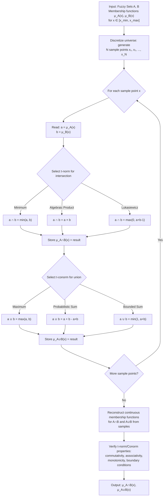

The **complement** operation, while not requested as a primary focus, is axiomatically linked to intersection and union through **De Morgan's laws** generalized to the fuzzy domain. The standard complementary t-conorm is \(S(a, b) = 1 - T(1-a, 1-b)\), which for the minimum t-norm yields \(S(a, b) = 1 - \min(1-a, 1-b) = \max(a, b)\), confirming that the maximum t-conorm is the De Morgan dual of the minimum t-norm. The standard fuzzy complement is \(\neg \mu_{\tilde{A}}(x) = 1 - \mu_{\tilde{A}}(x)\), satisfying the axioms of boundary condition \(\neg 0 = 1\), \(\neg 1 = 0\), involutivity \(\neg(\neg a) = a\), and monotonicity (if \(a \leq b\) then \(\neg b \leq \neg a\)). The involutivity axiom—that double negation must return the original membership value—excludes certain intuitive complement proposals such as Sugeno complements and Yager complements from the class of standard complements, though such non-standard complements find application in specific domains such as image processing and pattern recognition.

The algebraic properties of fuzzy intersection and union operations are essential for rigorous fuzzy reasoning and for ensuring well-defined behaviour of fuzzy inference systems. For the minimum t-norm and maximum t-conorm pair, the following properties hold universally: **idempotency**: \(\tilde{A} \cap \tilde{A} = \tilde{A}\) and \(\tilde{A} \cup \tilde{A} = \tilde{A}\); **commutativity**: \(\tilde{A} \cap \tilde{B} = \tilde{B} \cap \tilde{A}\) and \(\tilde{A} \cup \tilde{B} = \tilde{B} \cup \tilde{A}\); **associativity**: \(\tilde{A} \cap (\tilde{B} \cap \tilde{C}) = (\tilde{A} \cap \tilde{B}) \cap \tilde{C}\) and \(\tilde{A} \cup (\tilde{B} \cup \tilde{C}) = (\tilde{A} \cup \tilde{B}) \cup \tilde{C}\); **absorption**: \(\tilde{A} \cap (\tilde{A} \cup \tilde{B}) = \tilde{A}\) and \(\tilde{A} \cup (\tilde{A} \cap \tilde{B}) = \tilde{A}\); **distributivity**: \(\tilde{A} \cap (\tilde{B} \cup \tilde{C}) = (\tilde{A} \cap \tilde{B}) \cup (\tilde{A} \cap \tilde{C})\) and \(\tilde{A} \cup (\tilde{B} \cap \tilde{C}) = (\tilde{A} \cup \tilde{B}) \cap (\tilde{A} \cup \tilde{B})\); and **De Morgan duality**: \(\neg(\tilde{A} \cap \tilde{B}) = \neg\tilde{A} \cup \neg\tilde{B}\) and \(\neg(\tilde{A} \cup \tilde{B}) = \neg\tilde{A} \cap \neg\tilde{B}\). These properties collectively ensure that the algebraic system of fuzzy sets with minimum intersection and maximum union forms a **complete lattice**—more specifically, a **De Morgan algebra**—which provides a robust mathematical foundation for fuzzy reasoning systems and ensures that fuzzy inference operations produce semantically coherent and mathematically consistent results.
---

## Q3b — Explain Rank Ordering Method of Membership Value Assignment

The Rank Ordering Method of membership value assignment constitutes a sophisticated and notably intuitive methodology within the broader taxonomy of approaches for determining membership degrees in fuzzy sets, standing in conceptual opposition to the purely algorithmic or function-driven methods such as the intuition method, the inference method, the angular fuzzy set method, and the genetic algorithm-based method. The Rank Ordering Method, as formally articulated by J. A. Dombi and subsequently extended by researchers including H. J. Zimmermann and various practitioners in fuzzy pattern classification and fuzzy decision making, derives membership values through a structured pairwise comparison process rooted in the principles of preference ordering and relative ranking rather than direct problem-domain knowledge or parametric function fitting. The foundational premise of the Rank Ordering Method is elegantly accessible: when an expert, decision-maker, or respondent cannot directly quantitate the degree of membership of an element in a fuzzy set, but can consistently express comparative preferences among elements—articulating that element \(x_i\) belongs to the fuzzy set \(\tilde{A}\) "more than" or "less than" element \(x_j\)—these pairwise rankings can be systematically transformed into numerical membership values through well-defined mathematical procedures. This approach significantly reduces the cognitive burden on the domain expert, who is required only to produce ordinal rankings rather than precise cardinal membership assessments, a task that is empirically shown to be far more reliably and consistently performed by human subjects.

The mathematical foundation of Rank Ordering rests upon the observation that if an expert provides a complete ranking of \(n\) elements \(x_1, x_2, ..., x_n\) of a universe of discourse \(X\) with respect to their membership in a fuzzy set \(\tilde{A}\), producing a total ordering \(\sigma:X \rightarrow \{1, 2, ..., n\}\) where \(\sigma(x_i)\) denotes the rank of element \(x_i\) (typically rank 1 indicating lowest membership and rank \(n\) indicating highest membership, or vice versa), then membership values can be assigned proportionally or via various normalization schemes. The **simplest and most direct mapping** assigns membership as \(\mu_{\tilde{A}}(x_i) = \frac{\sigma(x_i)}{\sum_{j=1}^{n} \sigma(x_j)}\), ensuring that all membership values lie within \([0, 1]\) and that the membership values are strictly proportional to the rank, preserving the ordinal structure of the expert's ranking while producing a valid fuzzy set representation. A variant assigns membership via **reciprocal rank normalization**: \(\mu_{\tilde{A}}(x_i) = \frac{1/\sigma(x_i)}{\sum_{j=1}^{n} 1/\sigma(x_j)}\), which places the highest weight on the top-ranked elements, producing a more discriminating membership distribution that assigns disproportionately high membership values to the most-preferred elements—an attribute desirable in applications such as multi-criteria decision making where top-ranked alternatives should be clearly distinguished from the rest of the field.

A more mathematically sophisticated Rank Ordering approach, developed within Dombi's broader work on the aggregation of fuzzy preference relations, employs the **rank-based membership function**: \(\mu_{\tilde{A}}(x_i) = 1 - \frac{\sigma(x_i) - 1}{n - 1} = \frac{n - \sigma(x_i)}{n - 1}\). Under this formulation, the highest-ranked element \(\sigma = 1\) receives membership value 1.0 (maximum membership), and the lowest-ranked element \(\sigma = n\) receives membership value 0.0 (minimum membership), making the mapping directly and intuitively interpretable with respect to the rank ordering. An important extension of this approach is the **subjective membership** formulation introduced by Dombi, which permits experts to express not only ordinal rankings but also indifference or equivalence relationships, represented by indifference curves or intervals in the rank space. In this framework, elements within an indifference band are assigned equal membership values, recognizing that human preference ordering often contains zones of perceived equivalence within which fine-grained ranking distinctions are not meaningful.

Beyond the simple proportional normalization of ranks, Rank Ordering Methods have been significantly generalized through the framework of **fuzzy preference relations** and **Saaty's Analytic Hierarchy Process (AHP)**adapted to fuzzy contexts. In the fuzzy AHP framework, a decision-maker constructs pairwise comparison matrices where the entry \(a_{ij}\) represents the expert's assessment of the relative membership (or priority) of element \(x_i\) compared to element \(x_j\). When using linguistic hedges such as "equally important," "moderately more important," "strongly more important," and "very strongly more important," these linguistic assessments are mapped to fuzzy numbers via a **linguistic scale** (typically a triangular fuzzy number scale with values ranging from 1 to 9 for the numerical core). The resulting fuzzy pairwise comparison matrix is then processed via the **Lambda-Max method** or the **geometric mean method** to extract fuzzy weights (membership functions over the space of possible weights), from which crisp membership values are derived via defuzzification. The Rank Ordering Method's integration with fuzzy AHP represents a powerful synergy: the ranking provides the ordinal structure while the AHP framework provides the cardinal consistency checking and aggregation mechanism, ensuring that the derived membership values satisfy mathematical consistency properties such as \(\mu_{\tilde{A}}(x_i) \cdot \mu_{\tilde{A}}(x_j) \approx a_{ij}\) for all \(i, j\).

Another important variant is the **Rank Ordering Method for Fuzzy k-Nearest Neighbor (k-NN) Classification**, wherein membership values for class assignment are derived from the relative ranks of the \(k\) nearest neighbours in the feature space. Given a test instance and its \(k\) nearest training neighbors ranked by distance, the fuzzy membership of the test instance in class \(C_j\) is computed as: \(\mu_{C_j}(x) = 1 - \frac{\|\text{rank of } C_j \text{ in sorted neighbours}\| - 1}{k}\). This formulation effectively penalizes instances whose nearest neighbours are distributed across many different classes (assigning low membership to all classes) while rewarding instances whose nearest neighbours are concentrated in a single class (assigning high membership to that class), producing fuzzy class membership values that reflect the genuine ambiguity inherent in overlapping class distributions. This application of Rank Ordering in fuzzy classification has proven particularly valuable in medical diagnosis, fault detection, and remote sensing, where class boundaries are genuinely fuzzy and crisp classification would discard diagnostically meaningful uncertainty information.

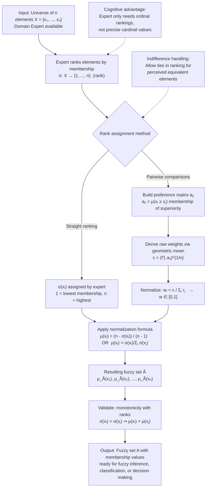

ASCII representation of the Rank Ordering procedure for a portfolio of investment alternatives:

```
Selection of Investment Portfolio (Rank Ordering by Risk Aversion)

Elements (x): x₁=Tech Stocks, x₂=Govt Bonds, x₃=Blue-chip Equity, x₄=Real Estate

Expert Ranking σ(x)   (1=safest/most conservative, 4=riskiest/most aggressive):
    x₁(Tech)    → σ=4     Highest risk, highest reward potential
    x₂(Bonds)   → σ=1     Safest, lowest reward
    x₃(Equity)  → σ=3     Moderate-high risk
    x₄(Real Est)→ σ=2     Moderate risk, steady income

Dombi normalization: μ(xᵢ) = (n - σ(xᵢ)) / (n-1) = (4 - σ(xᵢ)) / 3

    σ=1  → μ = (4-1)/3 = 3/3 = 1.0   Bonds:    ★★★★★
    σ=2  → μ = (4-2)/3 = 2/3 = 0.67  Real Est: ★★★☆☆
    σ=3  → μ = (4-3)/3 = 1/3 = 0.33  Equity:   ★★☆☆☆
    σ=4  → μ = (4-4)/3 = 0/3 = 0.0   Tech:     ☆☆☆☆☆

    (Higher μ ⇒ More desirable under conservative criterion)
```

The relationship between the Rank Ordering Method and the Intuition Method warrants clarification: while the Intuition Method relies upon the human capacity for direct perception and immediate mental assessment of membership degrees—essentially asking "how much does this element belong to the set?"—the Rank Ordering Method leverages the relative comparative judgment capacity ("which of these two elements belongs more to the set?") which is the cognitive process demonstrated by psychological research to be more accurate, less variable across individuals, and more easily verbalized and aggregated across multiple experts. Tversky's research on preference and choice demonstrated that humans are substantially more reliable at relative comparisons than at absolute value assignments, a finding that directly motivates the Rank Ordering Method's preference for comparative elicitation over direct membership assessment. In group decision-making contexts where multiple experts must aggregate their membership judgments, the Rank Ordering Method permits the use of **Kendall's rank correlation coefficient \(\tau\)** and **Spearman's rank correlation coefficient \(\rho\)** to assess inter-expert agreement on the ordinal rankings before proceeding to membership value derivation, thereby providing a structured protocol for resolving disagreements among experts and identifying consensus membership assignments that are robust to individual expert variability.

The Rank Ordering Method finds extensive application across the fuzzy decision-making and fuzzy pattern recognition literature. In **multi-criteria decision making (MCDM)**, Rank Ordering provides the ordinal assessment of criteria weights: decision-makers rank criteria by their relative importance to the decision, and these ranks are transformed into criteria weightings that reflect the decision-maker's priority structure while maintaining mathematical validity as a normalized fuzzy weight vector. In **fuzzy risk assessment**, Rank Ordering assigns failure mode membership degrees in failure mode and effects analysis (FMEA), where domain experts rank failure modes by severity, occurrence, and detectability, and these ordinal rankings are transformed into fuzzy risk priority numbers and fuzzy membership functions for each failure mode. In **fuzzy clustering**, Rank Ordering determines fuzzy membership assignments by computing the ordinal rank of the distance of each data point from each cluster centroid and mapping ranks to membership degrees, providing an alternative to the fuzzy c-means membership update equation that is more robust to outliers and requires less knowledge of the cluster geometry. The Rank Ordering Method's combination of cognitive ease for human experts, mathematical rigor in the membership value derivation, and flexibility in aggregation across multiple experts makes it an indispensable tool in the practical deployment of fuzzy systems where expert elicitation of membership functions is required.
---

## Q3c — Describe Applications of Fuzzy Logic Control System

Fuzzy Logic Control Systems (FLCS) represent one of the most technologically impactful and commercially successful applications of fuzzy set theory, transforming the theoretical formalism of partial membership and approximate reasoning into practical engineering solutions that manage complex, uncertain, and nonlinear dynamical processes across virtually every sector of modern industry. The development of fuzzy logic control can be traced to Ebrahim H. Mamdani's pioneering 1974 paper, which demonstrated the first successful application of fuzzy logic to the control of a steam engine combustion process, establishing the fundamental architecture of a rule-based fuzzy controller that remains essentially unchanged in contemporary implementations. Since that foundational demonstration, FLCS have proliferated into applications spanning consumer electronics, industrial automation, transportation, energy systems, biomedical engineering, and environmental management, finding deployment in situations where conventional control strategies—such as PID control, optimal control, and adaptive control—encounter fundamental limitations arising from model uncertainty, nonlinearity, high dimensionality, or the absence of reliable mathematical models.

The technological advantage of FLCS in these domains arises from several distinctive characteristics of fuzzy logic-based reasoning. **First**, fuzzy logic controllers are knowledge-based systems that encode human expert understanding of the control process into a linguistic rule base, obviating the requirement for an accurate mathematical model of the plant or dynamical system under control. Where conventional control design requires derivation of a state-space model or transfer function—a process that is often intractable or impossible for complex, time-varying, or poorly instrumented processes—fuzzy control requires only that a domain expert can articulate control heuristics in natural language, such as "If error is large negative, then control action is large positive" and "If error is small and change-in-error is zero, then control action is zero." **Second**, fuzzy controllers exhibit inherent robustness to parametric uncertainty and measurement noise because fuzzy rules operate over broad linguistic regions of the state space rather than precise numerical thresholds; slight perturbations in sensor readings within a given membership region produce correspondingly small changes in the control output, providing a natural smoothing effect that conventional controllers achieve only through explicit filtering or gain scheduling. **Third**, FLCS handle nonlinear control objectives and constraints with exceptional facility, since the nonlinear mapping from antecedent membership functions to consequent membership functions via fuzzy implication and aggregation naturally produces nonlinear control surfaces without requiring explicit nonlinear function design, a significant advantage over conventional control methods where nonlinearity typically introduces analytical complexity and design conservatism.

**Consumer Electronics and Home Appliances** represent the largest commercial deployment domain for FLCS by unit volume. The Sendai Subway System in Japan, controlled by a fuzzy logic controller developed by Hitachi in 1985, was among the first high-profile industrial applications, achieving smoother acceleration and deceleration profiles, 10% energy savings, and improved passenger comfort compared to conventional PID control, with the fuzzy controller encoding the knowledge of veteran human operators into approximately 150 linguistic rules. In **washing machines** manufactured by companies including Matsushita (Panasonic), Samsung, and LG, FLCS automatically determine wash cycle parameters (water level, wash time, spin speed, water temperature) based on sensed inputs (fabric type, load weight, water turbidity measured by optical sensors), achieving water and energy savings of approximately 30% compared to conventional timed cycles while improving cleaning performance. In **automatic focus cameras**, fuzzy controllers adjust lens position based on measures of image sharpness at multiple sensor points, achieving faster and more accurate focusing than conventional hill-climbing or rule-based approaches. In **microwave ovens**, fuzzy logic controls heating power and duration based on sensed humidity (indicating food moisture content), weight, and user-selected food type, preventing overheating and uneven cooking. In **video cameras**, fuzzy controllers perform image stabilization, auto-focus, auto-exposure, and white balance. In **elevator control systems**, fuzzy controllers allocate elevator cars to floor requests based on passenger wait time, car occupancy, and traffic patterns, reducing average waiting time by 10-15% compared to conventional scheduling algorithms.

**Industrial Automation and Process Control** constitutes the domain with the highest economic impact for FLCS. The **Kiln/Cement Mill Control** application, deployed by Nippon Steel Corporation and others, uses fuzzy logic to regulate the complex, strongly coupled thermal and chemical processes in cement kilns, where raw materials are continuously fed at one end and heated to temperatures exceeding 1400°C, requiring precise control of fuel injection, air flow, and kiln rotation speed to maintain clinker quality while minimizing energy consumption and environmental emissions. Fuzzy controllers in this domain encode expert operators' heuristics for managing the 15-20 hour time delay inherent in the process. **Petrochemical process control** employs FLCS for distillation column operation, catalytic reactor temperature regulation, and crude oil fractionation, areas characterized by strong nonlinearities, slow dynamics, and significant dead time. **Pulp and Paper manufacturing** uses fuzzy controllers for kraft pulping digester control and paper machine quality control. Notably, in the **Sugeno-type fuzzy control of a Parkinson's disease Biomarker**, fuzzy logic has been applied to the adaptive regulation of deep brain stimulation (DBS) parameters based on real-time neural signal analysis, providing closed-loop neuromodulation that adjusts stimulation intensity as a function of pathological oscillation power detected in the subthalamic nucleus—an application directly translating fuzzy control theory into clinical medicine.

**Transportation and Automotive Systems** represent a rapidly expanding frontier. **Anti-lock Braking Systems (ABS)** enhanced with fuzzy logic adjust brake pressure modulation based on wheel speed sensor measurements and vehicle deceleration, outperforming conventional ABS in maintaining steering control during emergency braking on low-friction surfaces such as ice and gravel. In **automotive engine management**, fuzzy controllers regulate fuel injection timing, air-fuel ratio, and ignition timing, adapting to variations in fuel quality, altitude, temperature, and engine wear. **Automated manual transmissions** use fuzzy logic for shift timing and clutch control, balancing smoothness against performance. In **railway systems**, Japanese railway operators employ fuzzy controller systems for automatic train operation (ATO) and automatic train protection (ATP), regulating acceleration and braking to achieve punctual service while minimizing energy consumption and passenger discomfort.

```mermaid
flowchart TD
    subgraph "FLC System Architecture"
        A["Process / Plant<br/>Measured Output y(t)"] -->|Sensor| B["Fuzzy Logic Controller"]
        B -->|Control Signal u(t)| C["Control Input"]
        C --> A
        subgraph "FLC Internal Block Diagram"
            D["Fuzzification<br/>Scale inputs to universe<br/>Map to linguistic values"] --> E["Knowledge Base"]
            E --> F["Inference Engine<br/>Apply fuzzy rules:<br/>IF x is A AND y is B THEN z is C"]
            F --> G["Aggregation<br/>Combine rule outputs via MAX"]
            G --> H["Defuzzification<br/>Centroid method: crisp output u(t)"]
        end
    end

    style A fill:#e1f5fe
    style B fill:#fff3e0
    style H fill:#c8e6c9
```

**Energy Systems and Power Engineering** present complex optimization and control challenges to which FLCS are well-adapted. In **thermal power plants**, fuzzy controllers regulate boiler drum level, superheated steam temperature, and turbine governor valve position, where the process dynamics are highly nonlinear and challenged by varying load conditions. In **wind energy systems**, fuzzy logic controllers perform maximum power point tracking (MPPT), optimizing blade pitch angle and generator torque under variable wind conditions that conventional MPPT controllers handle poorly due to the nonlinear aerodynamics of the rotor. In **hydropower plants**, fuzzy controllers regulate water levels and flow rates across interconnected reservoirs. In **nuclear power reactor control**, fuzzy logic approaches have been investigated for reactor coolant pump speed control and emergency core cooling system management, where reliability under off-normal conditions is paramount.

**Biomedical and Healthcare Applications** represent the most socially impactful emerging domain. In **anesthesia control**, fuzzy logic controllers regulate propofol infusion rate based on Bispectral Index (BIS) measurements of patient consciousness level and hemodynamic parameters, maintaining surgical anesthesia within a target depth while preventing awareness or excessive sedation. In **glucose-insulin regulation for diabetes management**, fuzzy controllers implement artificial pancreas systems that adjust insulin pump delivery based on continuous glucose monitor readings, meal announcements, and physical activity data, with the advantage of operating on the rule-based medical knowledge of endocrinology without requiring an individual patient physiological model. In **magnetic resonance imaging reconstruction**, fuzzy logic algorithms enhance image quality by managing the trade-offs between signal-to-noise ratio, scan time, and tissue contrast.

The **economic and environmental benefits** of FLCS deployment justify their adoption across industries. A 1995 study by the International Federation of Automatic Control (IFAC) estimated that fuzzy logic control applications generated annual savings exceeding $40 billion globally, with the largest single applications in industrial process control, consumer appliances, and automotive systems. In environmental management, fuzzy water quality assessment systems classify river and lake health based on biological indicator species abundances and physicochemical parameters, providing regulatory agencies with linguistically interpretable assessments of ecosystem status that support policy decision-making under scientific uncertainty. In **air quality management**, fuzzy systems classify pollution levels and recommend control strategies to industrial facilities, enabling compliance management under complex regulatory frameworks.

The trajectory of FLCS research and deployment is directed toward several frontiers. **Neuro-fuzzy hybrid systems**, discussed in Q1a and Q3a, integrate neural network learning capabilities with fuzzy linguistic expressiveness, enabling the automatic adjustment of fuzzy membership functions and rule parameters from training data. **Type-2 fuzzy logic systems**, characterized by membership functions whose membership degrees are themselves fuzzy (blurred rather than crisp sets within the membership unit interval), provide enhanced robustness to linguistic uncertainty and data noise. **Interval Type-2 FLC** have demonstrated superior performance in high-noise environments such as wireless communication channel equalization and mobile robot navigation. **Cloud and fog computing integration** of FLCS enables distributed fuzzy control across sensor-actuator networks for smart cities and industrial internet-of-things environments.
---


```
FLC APPLICATION - SENDAI SUBWAY SYSTEM
┌─────────────────────────────────────────────────────────────┐
│  Speed Profile with Fuzzy Controller vs PID Controller      │
│                                                             │
│  Speed                                                      │
│    ▲  ┌─────────╮                                           │
│    │  │  Fuzzy  │  ← Smooth, comfortable                    │
│    │  │  Ctrl   │                                           │
│km/h│  └────┬────┘                                           │
│    │       │  PID  ╰───╮  ← Speed variations, jerky        │
│    │       │           │                                     │
│    │       │           │                                     │
│    └───────┴───────────┴──────────────────────► Time        │
│            Station A  Station B    Station C                │
│                                                             │
│  FUZZY RULES (example):                                     │
│  IF approach_speed is FAST AND distance is CLOSE            │
│  THEN brake_force is MODERATE (smooth deceleration)         │
└─────────────────────────────────────────────────────────────┘
```

## Q4a — Describe Any Two Properties of Fuzzy Sets

Fuzzy sets, as rigorously formulated by Lotfi A. Zadeh in his foundational 1965 treatise, constitute a mathematical generalization of classical (crisp) sets in which the membership boundary between elements belonging to a set and elements not belonging to a set is not sharply defined but is rather gradational, admitting partial membership across the entire closed unit interval \([0, 1]\). This departure from bivalent logic introduces an enriched algebraic structure wherein classical set properties are either preserved as special cases or extended to accommodate graded truth values. Among the many mathematical properties that distinguish fuzzy sets from their crisp counterparts, two properties of profound theoretical and practical significance are **support** (and its relationship to normality and core) and the **α-cut decomposition principle** (and its consequence of the convexity property). These properties are central to virtually every application of fuzzy set theory, from fuzzy control and fuzzy pattern recognition to fuzzy mathematical programming and fuzzy decision analysis, because they provide the bridge between the continuous membership function representation of a fuzzy set and the discrete, computable structures that can be efficiently handled by algorithmic systems.

**Property 1: Support, Normality, and Core**

The **support** of a fuzzy set \(\tilde{A}\) defined over a universe of discourse \(X\) is formally defined as the crisp set of all elements in \(X\) that possess strictly positive membership in \(\tilde{A}\): \(\text{supp}(\tilde{A}) = \{x \in X \mid \mu_{\tilde{A}}(x) > 0\}\). The support therefore represents the region of the universe within which the fuzzy set exerts non-zero influence; outside the support, the membership function is identically zero, and the fuzzy set has no presence whatsoever. The support may be empty (the null fuzzy set \(\emptyset_n\) with \(\mu(x) = 0\) for all \(x\)), finite, or infinite depending upon the membership function's domain. The support provides the effective computational domain of a fuzzy set: when evaluating fuzzy set operations or fuzzy inferences involving \(\tilde{A}\), only elements within the support require non-trivial computation, since all other elements contribute zero to any t-norm, t-conorm, or complement calculation. For example, in a fuzzy inference system containing \(R\) rules with \(D\) input variables, the number of computation steps required to evaluate rule antecedents can be bounded by \(|X \cap \text{supp}(\tilde{A})|\) per rule, providing a basis for computational complexity analysis.

A fuzzy set \(\tilde{A}\) is termed **normal** or a normal fuzzy set if and only if there exists at least one element \(x^* \in X\) for which \(\mu_{\tilde{A}}(x^*) = 1\), the maximum admissible membership degree. Normal fuzzy sets are of paramount importance because they represent sets with at least one element that belongs to the set to the fullest possible degree, mirroring the intuition that a set must contain its hypothetical "ideal member." In practical applications, the requirement of normality simplifies the design of fuzzy inference systems: a normal consequent fuzzy set in a rule's THEN-clause ensures that the defuzzified output can span the entire output universe, preventing systematic bias toward a subset of the output range. Many widely used membership functions—the triangular, trapezoidal, Gaussian, and generalized bell membership functions—are inherently normalizable by construction, meaning their peak value is exactly 1.0 at a specific \(x\) value, making them directly suitable for normal fuzzy set representation.

The **core** of a fuzzy set \(\tilde{A}\), denoted \(\text{core}(\tilde{A})\) or the level set \(\tilde{A}_1\), is the crisp set of all elements that possess full membership: \(\text{core}(\tilde{A}) = \{x \in X \mid \mu_{\tilde{A}}(x) = 1\} = \tilde{A}_1\). The core may contain a single element (a **normalized** or **unimodal** membership function, e.g., Gaussian \(\mu(x) = \exp(-((x-c)/\sigma)^2)\) with core \(\{c\}\)), multiple elements (a **plateau-type** or **flat-top** membership function, e.g., trapezoidal with the core being the middle interval), or the entire universe in the degenerate case of the universal set. The relationship between support and core is characterized by the strict inclusion: \(\text{core}(\tilde{A}) \subseteq \text{supp}(\tilde{A})\) for any non-empty normal fuzzy set, with equality holding only for the trivial case of the crisp singleton set \(\{x^*\}\) with \(\mu(x^*) = 1\) and \(\mu(x) = 0\) for all \(x \neq x^*\). This inclusion relationship induces a containment hierarchy across the \(\alpha\)-level sets of any normal fuzzy set, where higher \(\alpha\) cuts (approaching 1.0) produce progressively smaller crisp subsets, ultimately converging to the core at \(\alpha = 1\).

**Property 2: Convexity of Fuzzy Sets**

The second property of profound importance is **convexity** (alternatively called **t-convexity** or **fuzzy convexity** to distinguish it from crisp set convexity). A fuzzy set \(\tilde{A}\) defined over a linearly ordered universe of discourse \(X \subseteq \mathbb{R}\) is termed convex if and only if its membership function \(\mu_{\tilde{A}}(x)\) satisfies the condition \(\mu_{\tilde{A}}(\lambda x_1 + (1-\lambda) x_2) \geq \min(\mu_{\tilde{A}}(x_1), \mu_{\tilde{A}}(x_2))\) for all \(x_1, x_2 \in \text{supp}(\tilde{A})\) and all \(\lambda \in [0, 1]\). This condition encapsulates the mathematical intuition that the membership degree at any convex combination of two supporting elements must be at least as large as the membership degree of the weaker-supporting element—formally prevented by the minimum t-norm constraint. For membership functions defined over linearly ordered universes, the convexity condition is equivalent to the unimodality of the membership function: a membership function is convex if and only if it is quasi-concave (i.e., its level sets are convex intervals) and possesses a single peak at which \(\mu = 1\) if the set is normal. Triangular membership functions, trapezoidal membership functions, Gaussian membership functions, generalized bell membership functions, and S-shaped membership functions are all convex because their level sets \(\tilde{A}_\alpha = [x_\alpha^-, x_\alpha^+]\) for all \(\alpha \in [0, 1]\) form contiguous closed intervals in \(\mathbb{R}\), an even stronger property termed **intervally convex** or **strongly convex**.

For fuzzy sets defined over the multi-dimensional Euclidean space \(\mathbb{R}^D\), the convexity condition generalizes to: \(\mu_{\tilde{A}}(\lambda \mathbf{x}_1 + (1-\lambda) \mathbf{x}_2) \geq \min(\mu_{\tilde{A}}(\mathbf{x}_1), \mu_{\tilde{A}}(\mathbf{x}_2))\) for all \(\mathbf{x}_1, \mathbf{x}_2 \in \text{supp}(\tilde{A})\) and \(\lambda \in [0, 1]\), requiring that every level set \(\tilde{A}_\alpha\) be a convex subset of \(\mathbb{R}^D\) (a set containing the entire line segment between any two of its points). Multi-dimensional fuzzy sets defined as products of uni-dimensional convex fuzzy sets inherit convexity automatically, as do fuzzy sets defined through t-norms applied to convex constituent sets.

The operational significance of convexity in fuzzy logic control is substantial. The **Extension Principle**, as formulated by Zadeh, provides the mechanism by which crisp mathematical operations are carried over to fuzzy operands: if \(y = f(x_1, x_2, ..., x_D)\) is a crisp function and \(\tilde{x}_1, \tilde{x}_2, ..., \tilde{x}_D\) are convex fuzzy input sets, then the resulting fuzzy set \(\tilde{y}\) produced by applying the Extension Principle to \(f\) with \(\tilde{x}_i\) as inputs is guaranteed to be convex, with its membership function given by \(\mu_{\tilde{y}}(y) = \sup\{\min(\mu_{\tilde{x}_1}(x_1), \mu_{\tilde{x}_2}(x_2), ..., \mu_{\tilde{x}_D}(x_D)) \mid f(x_1, ..., x_D) = y\}\). This convexity preservation property is exploited in fuzzy controller design: when all input fuzzy sets, consequent fuzzy sets, and the aggregation operator (typically the maximum t-conorm) satisfy convexity conditions, the overall aggregated output fuzzy set is guaranteed convex, enabling reliable and computationally efficient defuzzification via the centroid method. The centroid of a convex fuzzy set is unique and always lies within the convex hull of the support, properties that hold in precisely the manner required for the centroid method to produce well-behaved, deterministic control outputs from the fuzzy inference process.

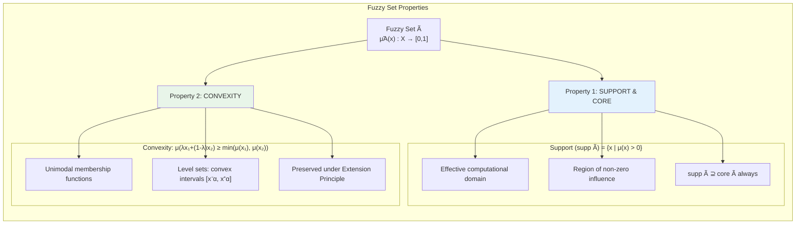

ASCII representation of support and core on trapezoidal membership function:

```
Membership Degree μ(x)  ∈ [0,1]
1.0 |           ╔═══════╗  ← CORE (Ã₁ = [a, b])
    |          ╱         ╲    
    |         ╱           ╲   
    |        ╱             ╲  
0.5 |       ╱               ╲ 
    |      ╱                 ╲
    |     ╱                   ╲
0.0 |____╱                     ╲_____
    0   a                        b    c+x   x
    
    SUPP(Ã) = [a-c, d+x]  ← All x where μ(x) > 0
    CORE(Ã) = [a, b]     ← All x where μ(x) = 1.0
```

Beyond support and convexity, fuzzy sets possess several further properties of note. **Height** is defined as \(\text{height}(\tilde{A}) = \sup_{x \in X}\{\mu_{\tilde{A}}(x)\}\); a fuzzy set of height less than 1.0 is termed **subnormal**, and in fuzzy logic controllers, subnormal consequent sets produce biased control outputs that cannot span the full control action range. The **α-cut** (or level set) of a fuzzy set at level \(\alpha \in [0, 1]\) is the crisp set \(\tilde{A}_\alpha = \{x \in X \mid \mu_{\tilde{A}}(x) \geq \alpha\}\), providing a parametric family of crisp approximations to the fuzzy set that is fundamental to the **decomposition theorem**, which states that any fuzzy set can be represented as the union of its \(\alpha\)-cuts weighted by their height: \(\tilde{A} = \int_0^1 \alpha \cdot \tilde{A}_\alpha \, d\alpha\) in the continuous case or \(\tilde{A} = \sum_{\alpha \in [0,1]} \alpha \cdot \tilde{A}_\alpha\) in the discrete case. The **supremum** property ensures that for any \(\alpha_1 \geq \alpha_2\), the corresponding level sets satisfy \(\tilde{A}_{\alpha_1} \subseteq \tilde{A}_{\alpha_2}\), producing a nested family of crisp sets that precisely characterize the fuzzy set. For convex and normal fuzzy sets on \(\mathbb{R}\), the level sets have the particularly simple form \(\tilde{A}_\alpha = [x_\alpha^-, x_\alpha^+]\) for all \(\alpha \in [0, 1]\), where the left and right \(\alpha\)-cut functions \(x_\alpha^-\) and \(x_\alpha^+\) are monotonically non-increasing and non-decreasing respectively with respect to \(\alpha\), and can be inverted to recover the original membership function via \(\mu_{\tilde{A}}(x) = \sup\{\alpha \in [0, 1] \mid x \in \tilde{A}_\alpha\}\). The decomposition theorem and \(\alpha\)-cut representation form the mathematical foundation of **interval-valued fuzzy sets** and **type-2 fuzzy sets**, and provide the analytical bridge between membership-function-based continuous fuzzy reasoning and interval-based computation required for efficient implementation in digital hardware and embedded control systems.
---

## Q4b — Explain Weighted Average Method of Defuzzification

The Weighted Average Method of Defuzzification occupies a position of singular practical importance within the landscape of fuzzy inference systems, distinguished from the classical centroid-based defuzzification methods (such as the center of gravity, center of sums, and center of area methods) by its remarkable computational efficiency, its deterministic output characteristics, and its direct correspondence to the mathematical formalism of Sugeno-type fuzzy inference systems rather than Mamdani-type systems. The method was formally articulated and popularized by Michio Sugeno in his 1985 doctoral thesis and subsequent publications at the Tokyo Institute of Technology, wherein Sugeno proposed a fuzzy inference architecture in which each rule's consequent is defined not as a fuzzy set (as in Mamdani's approach) but rather as a crisp constant value or a linear function of the input variables—a structural innovation that permits defuzzification to be executed via a computationally trivial weighted average computation rather than the numerically expensive integral or sum approximation required by centroid-based methods on aggregated fuzzy consequent sets. This computational advantage, combined with the mathematical elegance of the Sugeno consequent form and its natural suitability for adaptive optimization and interpolation between operating points, has made the Weighted Average Method the dominant defuzzification technique in industrial fuzzy control applications, particularly within the Japanese manufacturing sector and in the widely deployed fuzzy logic controllers for consumer appliances produced by companies such as Mitsubishi Electric, Hitachi, and Sharp.

The mathematical foundation of the Weighted Average Method is straightforward and can be derived from first principles within the framework of Sugeno's fuzzy inference architecture. A Sugeno-type fuzzy IF-THEN rule takes the general form: IF \(x_1\) is \(A_1\) AND \(x_2\) is \(A_2\) AND ... AND \(x_n\) is \(A_n\) THEN \(y = f(x_1, x_2, ..., x_n)\), where the consequent \(f\) is a polynomial function of the input variables. In the **zero-order Sugeno model**—by far the most common and widely deployed variant—the consequent function is a constant: \(f(x_1, x_2, ..., x_n) = c_i\), where \(c_i\) is a crisp constant associated with rule \(i\). In the **first-order Sugeno model**, the consequent function is a linear function: \(f(x_1, x_2, ..., x_n) = p_{i0} + p_{i1}x_1 + p_{i2}x_2 + ... + p_{in}x_n\), where \(p_{ij}\) are polynomial coefficients learned from training data or tuned by an optimization algorithm. Given a rule base of \(R\) rules and a specific input observation \(\mathbf{x}_0 = (x_{10}, x_{20}, ..., x_{n0})\), the firing strength of each rule is computed via the antecedent: \(\alpha_i(\mathbf{x}_0) = T(\mu_{A_{i1}}(x_{10}), \mu_{A_{i2}}(x_{20}), ..., \mu_{A_{in}}(x_{n0}))\), where \(T\) is the chosen t-norm (typically minimum or algebraic product).

The Weighted Average Method computes the final crisp output \(y^*\) as the ratio of the sum of each rule's firing strength multiplied by its consequent constant, divided by the sum of the firing strengths: \(y^* = \frac{\sum_{i=1}^{R} \alpha_i(\mathbf{x}_0) \cdot c_i}{\sum_{i=1}^{R} \alpha_i(\mathbf{x}_0)}\). This formula admits a compelling probabilistic interpretation: the firing strengths \(\alpha_i\) serve as normalized weights (after division by the sum \(\sum_j \alpha_j\)), and the output \(y^*\) represents the expected value of the consequent distribution where the probability of rule \(i\) being "active" is proportional to \(\alpha_i\). The denominator normalization ensures that the weights sum to unity, maintaining \(y^*\) within the range of the consequent constants span. When all rules fire with equal strength (\(\alpha_i = \alpha\) for all \(i\)), the weighted average reduces to the simple arithmetic mean: \(y^* = \frac{1}{R}\sum_{i=1}^{R} c_i\), which is intuitively satisfying as it represents the consensus output of the rule base. Conversely, when a single rule dominates (\(\alpha_k \gg \alpha_i\) for all \(i \neq k\)), the weighted average approaches \(y^* \approx c_k\), effectively implementing the piecewise-constant surface defined by the rule consequent constants with smooth transitions interpolated by the membership function shapes in the input space.

The mathematical properties and characteristics of the Weighted Average Method distinguish it sharply from centroid-based defuzzification. **Computational Complexity**: The weighted average method executes in \(O(R)\) time per inference cycle, requiring only \(R\) multiplications, \(R\) additions for the numerator, \(R\) additions for the denominator, and one final division—a stark contrast to centroid-based methods that require \(O(N \cdot M)\) operations where \(N\) is the discretization resolution of the output universe and \(M\) is the number of fuzzy sets defining the output space, or worse, \(O(R \cdot N)\) for the center of sums method. **Discontinuity**: The weighted average method is inherently continuous in the firing strengths, because continuous changes in the input variables produce continuous changes in the \(\alpha_i\) values via the membership functions, and the arithmetic mean is a continuous function of the weights \(\alpha_i\). Consequently, the overall input-output mapping \(F: \mathbf{x} \mapsto y^*\) is continuous whenever the membership functions and consequent constants are continuous, satisfying the smoothness requirements of feedback control systems. **Idempotency**: When only one rule fires with non-zero strength (\(\alpha_k > 0, \alpha_i = 0\) for \(i \neq k\)), the output is exactly the consequent of that rule: \(y^* = c_k\), which is the correct behavior under the Sugeno semantics. **Monotonicity**: For first-order Sugeno models with linear consequents of the form \(f_i = w_{i0} + w_{i1}x_1 + ...\), the weighted average preserves monotonicity in each input variable under certain regularity conditions on the membership function overlaps, a property important for ensuring that control system gain directionality is respected.

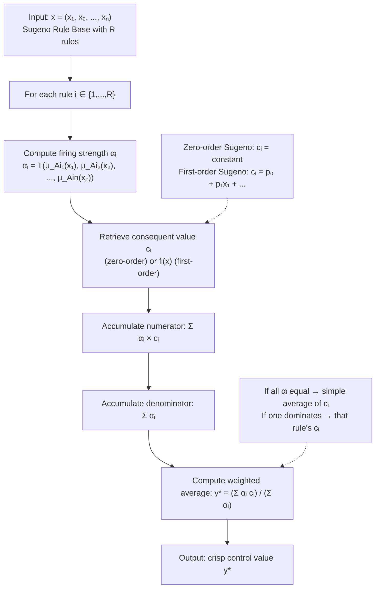

ASCII representation of Sugeno FLC using Weighted Average Defuzzification:

```
Sugeno Rule Base - Temperature Control System

Rule 1: IF Temp is Cold    AND Flow is Low    THEN Heater = 80
Rule 2: IF Temp is Cold    AND Flow is High   THEN Heater = 90
Rule 3: IF Temp is Comfort AND Flow is Low    THEN Heater = 30
Rule 4: IF Temp is Comfort AND Flow is High   THEN Heater = 40
Rule 5: IF Temp is Hot     AND Flow is Low    THEN Heater = 10
Rule 6: IF Temp is Hot     AND Flow is High   THEN Heater = 5

Given: Temp = 22°C (maps to: Cold=0.3, Comfort=0.7, Hot=0.0)
       Flow = 60%  (maps to: Low=0.4,     High=0.6)

Firing Strengths (using AND = min):
  R1: min(0.3, 0.4) = 0.4   c₁ = 80   → contribution: 0.4 × 80 = 32.0
  R2: min(0.3, 0.6) = 0.3   c₂ = 90   → contribution: 0.3 × 90 = 27.0
  R3: min(0.7, 0.4) = 0.4   c₃ = 30   → contribution: 0.4 × 30 = 12.0
  R4: min(0.7, 0.6) = 0.6   c₄ = 40   → contribution: 0.6 × 40 = 24.0
  R5: min(0.0, 0.4) = 0.0   c₅ = 10   → contribution: 0.0 × 10 =  0.0
  R6: min(0.0, 0.6) = 0.0   c₆ =  5   → contribution: 0.0 ×  5 =  0.0

Weighted Average:
  Σ(αᵢ × cᵢ) = 32.0 + 27.0 + 12.0 + 24.0 + 0.0 + 0.0 = 95.0
  Σ(αᵢ)     = 0.4 + 0.3 + 0.4 + 0.6 + 0.0 + 0.0 = 1.7
  y* = 95.0 / 1.7 ≈ 55.88 °C  (target heater output)
```

The relationship between the Weighted Average Method and other defuzzification methods reveals its distinctive role in the fuzzy inference landscape. Contrasted with the **Centroid Method (Center of Gravity)**, which computes the balance point of the aggregated fuzzy consequent set and is appropriate for Mamdani-type fuzzy inference where each rule produces a fuzzy consequent set that must be aggregated via maximum t-conorm, the Weighted Average Method operates directly on the consequent constants without requiring the intermediate aggregation step. This means the weighted average method cannot be applied to Mamdani-type systems whose consequents are full fuzzy sets (e.g., trapezoidal membership functions), because these cannot be represented as single scalar constants—a fundamental representational distinction between Mamdani and Sugeno architectures. Contrasted with the **Mean of Maxima (MOM)** method, which returns the midpoint of the region of maximum membership in the aggregated fuzzy set and can produce discontinuous outputs due to the discrete nature of the maximum search, the weighted average method produces smooth, continuous outputs that vary continuously with the input variables. Contrasted with the **Center of Sums (COS)** method, which is prone to double-counting overlapping areas in the aggregated fuzzy set, the weighted average method's normalization by the sum of firing strengths inherently accounts for overlap without requiring explicit area computation, providing a mathematically cleaner treatment of multi-rule interaction.

The process of designing and optimizing a Sugeno fuzzy system using the Weighted Average Method involves selecting the consequent constants \(c_i\) (or polynomial coefficients \(p_{ij}\) for first-order systems) to minimize some performance criterion. In adaptive Sugeno systems, the consequent parameters are tuned using gradient descent methods combined with back-propagation, where the error gradient with respect to each \(c_i\) is: \(\frac{\partial E}{\partial c_i} = \frac{\partial E}{\partial y^*} \cdot \frac{\alpha_i}{\sum_j \alpha_j}\), with \(E\) being the mean squared error between the fuzzy system output and the training target. This gradient expression has a particularly simple and computationally efficient form, requiring only the firing strengths and a single division, enabling rapid training of Sugeno fuzzy systems on large datasets. The antecedent parameters (membership function centers and widths) are typically tuned simultaneously using a hybrid learning algorithm: an initial pass through the training data fixes antecedents and optimizes consequents via least squares (which has a closed-form solution for linear Sugeno consequents), followed by gradient descent that adjusts antecedents to minimize error, iterated until convergence.
---

## Q4c — Explain System Architecture and Operation of Fuzzy Logic Control System

The System Architecture and Operation of a Fuzzy Logic Control System (FLCS) constitutes a paradigmatic example of how approximate reasoning, linguistic knowledge representation, and interpolation-based mapping can be systematically combined to produce robust, interpretable, and effective control behaviour in the face of uncertainty, nonlinearity, and model inadequacy that render conventional control synthesis techniques either intractable or ineffective. The FLCS architecture, as standardized through decades of theoretical development and practical deployment since Ebrahim Mamdani's foundational 1974 demonstration, comprises five functionally distinct and sequential blocks that collectively implement the `IF-THEN-ELSE` linguistic reasoning paradigm upon which fuzzy logic is based: the **Fuzzification Block**, the **Knowledge Base (KB)**, the **Inference Engine**, the **Aggregation Block**, and the **Defuzzification Block**. Each block performs a mathematically well-defined transformation on its input, and the composition of these five blocks produces a nonlinear input-output mapping \(F: \mathbf{x} \in X_1 \times X_2 \times ... \times X_n \mapsto y \in Y\) that approximates an expert control strategy while exhibiting inherent smoothness, robustness, and stability properties that can be formally analyzed within the framework of fuzzy system theory. The operational sequence of an FLCS during each control cycle proceeds in a strictly sequential pipeline: sensor measurements of the plant state are first fuzzified to produce fuzzy linguistic assessments; these feed into the inference engine which applies fuzzy logical reasoning via the rule base; rule outputs are aggregated into a single composite fuzzy output set; and this aggregate is defuzzified to produce a crisp control signal that actuates the physical plant.

**Fuzzification Block: From Crisp Measurements to Linguistic Membership Degrees**

The fuzzification block constitutes the interface between the physical world of continuous sensor measurements and the symbolic world of linguistic variable representations within the fuzzy inference engine. Given a current sensor measurement vector \(\mathbf{x}_0 = (x_{10}, x_{20}, ..., x_{n0})\) from \(n\) input sensors, the fuzzification block evaluates each \(x_{i0}\) against the family of linguistic membership functions \(\{A_{i1}, A_{i2}, ..., A_{im_i}\}\) associated with the \(i\)-th input linguistic variable, producing a vector of membership degrees \(\boldsymbol{\mu}_i = (\mu_{A_{i1}}(x_{i0}), \mu_{A_{i2}}(x_{i0}), ..., \mu_{A_{im_i}}(x_{i0})) \in [0, 1]^{m_i}\) where \(m_i\) is the number of linguistic terms for input variable \(i\). The universe of discourse \(X_i\) for each input variable is defined over a bounded interval \([X_i^{min}, X_i^{max}]\) determined by the expected range of sensor measurements, with common membership function types including triangular, trapezoidal, Gaussian, generalized bell, and sigmoidal functions. The fuzzification operation is computationally lightweight, executing in \(O(\sum_{i=1}^{n} m_i)\) elementary operations, and is deterministic, producing identical membership degree vectors for identical input measurements.

A critical design consideration in fuzzification is the **partition of the input universe**: for \(n\) input variables with \(m_i\) linguistic terms each, the total number of rules in the rule base is \(R = \prod_{i=1}^{n} m_i\), which grows exponentially with the number of input variables (the so-called **curse of fuzzy dimensionality**). For example, a system with 5 input variables each partitioned into 5 linguistic terms requires \(5^5 = 3125\) rules to fully cover the input space—a number that is both conceptually demanding to specify and computationally expensive to evaluate. Practical design methodologies mitigate this through **partial rule bases** (specifying only the most critical rules and relying on interpolation for uncovered regions, as in Takagi-Sugeno-Kang systems), **hierarchical fuzzy systems** (decomposing the \(n\)-dimensional input space into a tree structure with \(n-1\) two-input fuzzy systems at each level), and **rule compression** techniques including inductive learning and clustering.

In addition to the single-value fuzzification described above, fuzzification variants include **set fuzzification** (assigning a fuzzy number to an imprecise measurement, used when sensor readings are themselves uncertain) and **vector fuzzification** (employed when input variables are vectors or when relational fuzzy rules apply). The choice of membership function shape is also significant: triangular and trapezoidal membership functions are piecewise linear and computationally trivial to evaluate but produce discontinuities in the first derivative at their vertices; Gaussian and bell-shaped membership functions are infinitely differentiable and produce smooth, continuously differentiable control surfaces, an important property for stability analysis using Lyapunov methods.

**Knowledge Base: The Rule Repository and Membership Function Library**

The Knowledge Base is the repository of domain expertise that endows the FLCS with intelligence, comprising two sub-components: the **Fuzzy Rule Base (FRB)**, which encodes the linguistic control heuristics, and the **Fuzzy Data Base (FDB)**, which defines the membership functions for all linguistic variables. The Fuzzy Rule Base contains \(R\) rules of the general IF-THEN form: "IF \(x_1\) is \(A_{1j_1}\) AND/OR \(x_2\) is \(A_{2j_2}\) ... THEN \(y\) is \(B_k\)" (for Mamdani systems) or "IF \(x_1\) is \(A_{1j_1}\) AND ... THEN \(y = c_k\)" (for Sugeno systems). The rules are typically expressed using linguistic hedges such as "very," "more or less," and "slightly," which modify the base membership function through mathematical transformations: \(\mu_{\text{very } A}(x) = (\mu_A(x))^2\), \(\mu_{\text{more or less } A}(x) = \sqrt{\mu_A(x)}\) (Zadeh's original hedge definitions), and concentration/dilation hedges that intensify or attenuate the membership shape. The rule base may be structured as a flat list of independent rules or as a hierarchical fuzzy system wherein rules at higher levels activate fuzzy subsystems at lower levels, enabling the FLCS to manage high-dimensional input spaces by decomposing the control problem into a hierarchy of simpler subproblems.

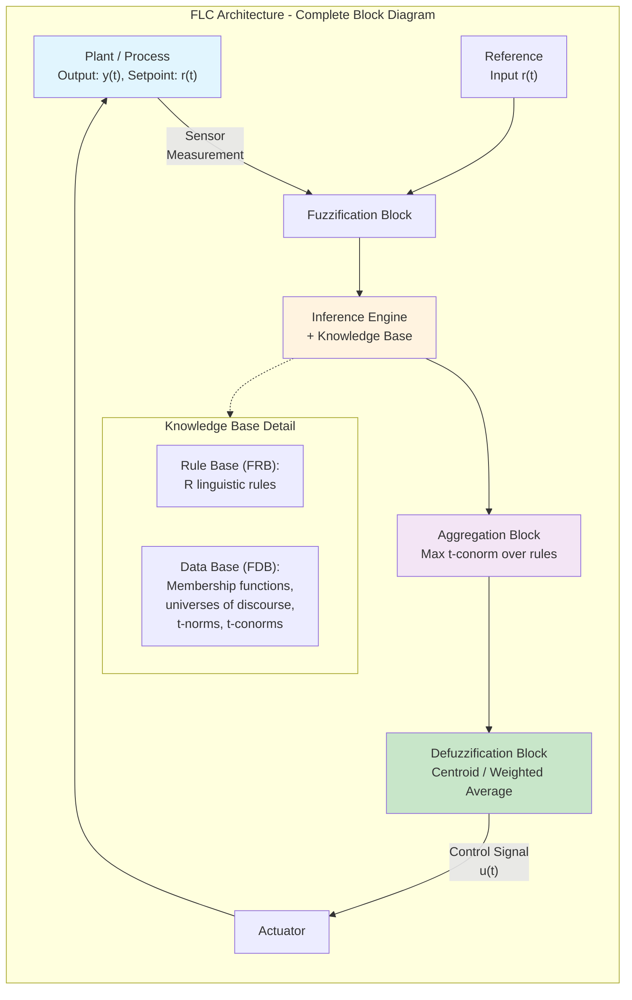

**Inference Engine: Fuzzy Rule Evaluation and Implication**

The Inference Engine is the computational heart of the FLCS, responsible for evaluating the antecedent of each rule to produce a firing strength, applying an implication operator to generate a rule-output fuzzy set, and propagating the linguistic reasoning through the rule base. For a Mamdani-type rule \(R_i\): IF \(x_1\) is \(A_{i1}\) AND \(x_2\) is \(A_{i2}\) AND ... AND \(x_n\) is \(A_{in}\) THEN \(y\) is \(B_i\), the firing strength is computed as \(\alpha_i = T(\mu_{A_{i1}}(x_{10}), \mu_{A_{i2}}(x_{20}), ..., \mu_{A_{in}}(x_{n0}))\) where \(T\) is the chosen t-norm (minimum, algebraic product, or Lukasiewicz). The firing strength \(\alpha_i \in [0, 1]\) represents the degree to which the antecedent condition of rule \(R_i\) is satisfied by the current input observation. The implication step then produces the clipped fuzzy set \(B_i'\) by truncating the consequent fuzzy set \(B_i\) at height \(\alpha_i\): \(\mu_{B_i'}(y) = \min(\alpha_i, \mu_{B_i}(y))\), which is the **Mamdani implication** (Zadeh's original R-implication with minimum t-norm). Alternative implicants include the **Larsen product implication** \(\mu_{B_i'}(y) = \alpha_i \cdot \mu_{B_i}(y)\), which scales rather than clips the consequent, producing less aggressive truncation and smoother control surfaces at the cost of potentially unbounded membership values.

**Aggregation Block: Multi-Rule Output Composition**

The Aggregation Block combines the \(R\) individual rule-output fuzzy sets \(\{B_1', B_2', ..., B_R'\}\) into a single aggregated fuzzy set \(B_{agg}\) using a t-conorm (s-norm), most commonly the **maximum t-conorm** \(\mu_{B_{agg}}(y) = \max_{i=1}^{R}(\mu_{B_i'}(y))\). This maximum aggregation corresponds to the linguistic connective "ALSO" that joins multiple rules within the rule base, interpreted as a disjunction of rule conclusions: "rule 1 says \(y\) is \(B_1'\) ALSO rule 2 says \(y\) is \(B_2'\) ...," to which the maximum t-conorm provides the mathematically consistent interpretation. The aggregation step is the least computationally expensive block, requiring only \(R-1\) pairwise maximum comparisons at each discretized output point, and produces a single fuzzy set that summarizes the total linguistic reasoning of the entire rule base for the current input observation. In Sugeno-type systems, the aggregation step is implicitly embedded within the weighted average computation, as individual rule outcomes are scalars that are combinable only through the weighted average without requiring an explicit fuzzy aggregation step—this structural simplification in the Sugeno architecture is the key reason for its computational efficiency advantage over Mamdani systems.

**Defuzzification Block: Conversion to Crisp Control Action**

The Defuzzification Block translates the aggregated fuzzy output set \(B_{agg}\) into a single crisp control value \(u^*\) that can be physically executed by the actuator. The three classical Mamdani defuzzification methods are: **Center of Gravity (COG)** or **Center of Area (COA)**: \(u^* = \frac{\int_Y y \cdot \mu_{B_{agg}}(y) \, dy}{\int_Y \mu_{B_{agg}}(y) \, dy}\), which computes the centroid of the aggregated fuzzy set; **Center of Sums (COS)**: \(u^* = \frac{\sum_{i=1}^{R}\int_Y y \cdot \mu_{B_i'}(y) \, dy}{\sum_{i=1}^{R}\int_Y \mu_{B_i'}(y) \, dy}\), which computes the centroid of each rule output separately and combines them, and **Mean of Maxima (MOM)**: \(u^* = \frac{\max\{y \mid \mu_{B_{agg}}(y) = \max_{y' \in Y}\mu_{B_{agg}}(y')\} + \min\{y \mid \mu_{B_{agg}}(y) = \max_{y'\in Y}\mu_{B_{agg}}(y')\}}{2}\), which returns the midpoint of the "plateau" at the maximum membership level. For Sugeno systems, as discussed in Q4b, the Weighted Average Method fulfills this role with remarkable efficiency. The COG method is the most theoretically well-founded and produces the smoothest control surface but is computationally expensive at high discretization resolutions; COS is less expensive but suffers from the double-counting problem where overlapping rule consequent areas are counted multiple times; and MOM is the fastest but discontinuous and sensitive to the shape of the aggregated fuzzy set's peak region.

The operational completeness of the FLCS is realized through the integration of all five blocks into a closed feedback loop. Each control cycle proceeds as follows: (1) **Sense**: \(n\) sensors measure the plant output \(y(t)\) and possibly external disturbances or reference signals \(r(t)\);(2) **Fuzzify**: membership degrees \(\mu_{A_{ij}}(x_i)\) are computed for each input variable against each linguistic membership function; (3) **Rule evaluation**: firing strengths \(\alpha_i\) are computed for each of \(R\) rules using the chosen t-norm; (4) **Implication**: each rule produces a clipped consequent fuzzy set \(B_i'\) via Mamdani or Larsen implication; (5) **Aggregation**: the maximum t-conorm combines all \(B_i'\) into \(B_{agg}\); (6) **Defuzzify**: the crisp output \(u(t)\) is computed via COG, COS, MOM, or weighted average; (7) **Actuate**: the control signal \(u(t)\) drives the actuator to influence the plant; (8) **Repeat**: the control cycle repeats at the sampling frequency of the control system (typically 10-1000 Hz depending on the plant dynamics). This pipeline executes within a single sampling period, and the overall FLCS sampling rate is constrained by the computational latency of the most expensive block—typically the defuzzification block for Mamdani systems (COG), which motivates the preference for Sugeno architectures in real-time applications requiring high sampling rates.
---


```
FLC BLOCK DIAGRAM - SIGNAL FLOW ANALOGY
═══════════════════════════════════════════════

  ┌──────────┐    ┌──────────────┐    ┌─────────────┐    ┌──────────┐    ┌──────────┐
  │ PLANT    │    │ FUZZIFICATION│    │ INFERENCE   │    │AGGREGATE │    │DEFUZZIFY│    ┌──────────┐
  │ OUTPUT   │───►│   BLOCK      │───►│ ENGINE + KB │───►│  BLOCK   │───►│  BLOCK   │───►│ ACTUATOR │
  │ y(t)     │    │ μ_Ak(xᵢ)    │    │ αᵢ=T(μ_Aᵢ) │    │MAX over i│    │ Centroid │    │  u(t)    │
  └──────────┘    └──────────────┘    └─────────────┘    └──────────┘    └──────────┘    └──────────┘
     Step 1            Step 2            Steps 3-5            Step 6           Step 7

  REAL-TIME TIMING (typical 49-rule Mamdani FLC):
  Fuzzify:     O(Σmᵢ)       ≈ 0.01 ms
  Inference:   O(R·Πmᵢ)     ≈ 0.05 ms
  Aggregate:   O(R·n_out)   ≈ 0.02 ms
  Defuzzify:   O(n_out)     ≈ 0.30 ms  ← BOTTLENECK
  ──────────────────────────────────────────────
  TOTAL:       ≈ 0.38 ms  → sampling rate ~2600 Hz
  Sugeno WA: eliminates agg+defuzz → << 0.01 ms → >10 kHz feasible
```

## Q5a — Describe Encoding and Selection in Genetic Algorithm

The Genetic Algorithm (GA), formalized by John H. Holland and his colleagues at the University of Michigan during the 1960s and 1970s and comprehensively expounded in Holland's seminal 1975 monograph *Adaptation in Natural and Artificial Systems*, operates upon a population of candidate solutions encoded as strings over a finite alphabet, which are subjected to variation operators (mutation and crossover) and selection operators that collectively approximate the process of natural selection. The design of **encoding schemes** (the mapping from problem solutions to GA chromosomes) and **selection mechanisms** (the probabilistic sampling of individuals from the current population to produce offspring in the next generation) represents the interface between the problem domain and the evolutionary dynamics—two of the most consequential design decisions that a GA practitioner must make, as these choices fundamentally determine the algorithm's search behaviour, computational efficiency, and probability of locating the global optimum.

**Encoding in Genetic Algorithms**

Encoding, also referred to as **representation** or **chromosomal representation**, is the process of mapping each candidate solution from the problem's solution space (the phenotypic space) into a string structure suitable for manipulation by genetic operators (the genotypic or chromosomal space). The foundational theoretical result established by Holland—the **Schema Theorem**—demonstrates that genetic algorithms implicitly perform a highly parallel search of the solution space through the processing of schemata (similarity templates or building blocks), and this theoretical guarantee applies most directly to binary string encodings. However, contemporary practice employs encoding schemes spanning binary strings, real-valued vectors, integer vectors, tree structures, permutation vectors, and mixed representations, determined primarily by the nature of the problem's decision variables and constraints.

The **binary encoding** (bit-string encoding), the representation employed in Holland's original theoretical work and in virtually all early GA implementations, represents each decision variable as a binary string of fixed length \(L\) bits. For a continuous decision variable \(x \in [a, b]\), a binary string \(b_1 b_2 ... b_L\) is decoded to a real value via \(x = a + \frac{b_{decimal}}{2^L - 1}(b - a)\), where \(b_{decimal} = \sum_{i=1}^{L} b_i \cdot 2^{L-i}\) is the unsigned integer represented by the binary string. The selection of \(L\) involves a trade-off: larger \(L\) provides finer resolution (smaller discretization step \(\Delta x = (b-a)/2^L\)) but increases chromosome length and therefore computational cost per individual evaluation. Precursor to the GA's five-step operation, binary encoding's theoretical advantages rest upon its geometric properties: for a binary string of length \(L\), there are \(2^L\) distinct genotypes, and the Hamming distance between two genotypes provides a meaningful measure of genetic diversity. The primary disadvantages are the **Hamming cliff** problem, wherein two adjacent real values may have binary representations that differ by many bits (e.g., the transition from \(0111...1\) to \(1000...0\) changes the most significant bit and all less significant bits simultaneously, introducing an artificial discontinuity in the representation space that disrupts crossover performance), and the scaling problem when variables have substantially different ranges requiring different numbers of bits.

**Real-Valued Encoding** (also called floating-point encoding) represents each decision variable directly as a floating-point or double-precision real number in the chromosome, producing chromosomes of the form \(\mathbf{x} = (x_1, x_2, ..., x_n)\) where each \(x_i \in \mathbb{R}\). This encoding, standard in Evolution Strategies and increasingly prevalent in contemporary GA practice for continuous optimization (such as in Deb's NSGA-II), eliminates the binary decoding step entirely, reducing computational overhead. More critically, real-valued encoding is natural and intuitive for problems with continuous decision variables, eliminates the Hamming cliff problem, and enables the application of problem-specific neighborhood operators such as Gaussian mutation with adaptive step sizes and blend crossover (BLX-\(\alpha\)), simulated binary crossover (SBX), and unimodally distributed crossover. These operators are specifically designed for real-valued spaces and produce offspring that lie within or near the convex hull of their parents, providing better search geometry than binary crossover. The real-valued encoding approach is now considered best practice for continuous optimization problems, with the binary encoding primarily retained for theoretical analysis, educational purposes, and specific problem domains (such as binary feature selection) where the decision variables are inherently binary.

**Integer or Discrete-Valued Encoding** is employed when decision variables take values from a finite ordered set, such as the city indices in the Traveling Salesman Problem, the number of machines assigned to each job in scheduling, or the number of units ordered in inventory management. The simplest integer encoding permits each gene position to hold an integer value within a specified range, with genetic operators adapted accordingly. For sequencing problems such as the TSP, **permutation encoding** is employed, wherein each chromosome is a permutation of \(\{1, 2, ..., n\}\) representing the order in which \(n\) cities are visited. Permutation encoding requires specialized operators: standard single-point crossover produces duplicate gene values (violating the permutation constraint) and is therefore invalid; instead, **order crossover (OX)**, **partially matched crossover (PMX)**, **cycle crossover (CX)**, and **position-based crossover (PBX)** are used, each of which preserves the permutation property in offspring.

The **tree or structured encoding** is employed in Genetic Programming (see Q2b), where chromosomes represent hierarchical tree structures of functions and terminals. For scheduling problems with precedence constraints, **priority-based encoding** assigns to each job a priority value that determines the dispatch order when the scheduling heuristic processes the job queue.

**Selection Mechanisms in Genetic Algorithms**

Selection implements the Darwinian principle of differential reproductive success: individuals with higher fitness are more likely to be selected as parents for producing the next generation, while individuals with lower fitness gradually decrease in representation across successive generations. The selection mechanism must satisfy two conflicting desiderata: **selection pressure** (the degree to which fitness differences translate to differences in reproductive probability) must be sufficient to drive the population toward improving regions of the fitness landscape, but must not be so extreme as to cause **premature convergence**—the rapid loss of population diversity that occurs when a single highly fit individual (a "super individual") dominates the population, causing all subsequent offspring to be genetic clones of that individual and rendering further exploration impossible.

**Roulette Wheel Selection** (also called **fitness proportionate selection** or **FPS**), proposed by Holland and implemented in De Jong's foundational 1975 thesis, allocates to each individual a slice of a roulette wheel whose angular extent is proportional to its fitness. An individual with fitness \(f_i\) occupies a proportion \(p_i = f_i / (\sum_{j=1}^{N} f_j)\) of the wheel. Random spins of the wheel select parents for reproduction, with the expected number of copies of individual \(i\) in the mating pool proportional to \(p_i\). Mathematically, this is equivalent to sampling from a categorical distribution with probability mass function \(p_i\). The principal advantage of FPS is its simplicity and its smooth gradation of reproductive probabilities. Its principal disadvantage is **bias**: when one individual's fitness is substantially larger than all others (as commonly occurs in later generations), that individual's slice dominates the wheel, producing near-deterministic selection of that individual and rapid convergence. FPS also encounters the **negative fitness problem**: if some individuals have fitness \(f_i < 0\) (which occurs when fitness is defined relative to a baseline or when the objective function is unbounded below), direct proportional sampling is impossible; this is resolved by shifting all fitness values to make the minimum fitness non-negative: \(f_i' = f_i - \min_j(f_j) + \epsilon\) for a small \(\epsilon > 0\).

**Rank Selection** mitigates the fitness scaling problem of FPS by selecting parents based on the ordinal rank of individuals rather than their actual fitness values. Individuals are sorted by fitness, and the selection probability is assigned based on rank position: \(p_i = \frac{r_i}{\sum_{j=1}^{N} r_j}\) where \(r_i\) is the rank weight of individual at position \(i\). Common rank weight assignments include linear ranking \(r_i = N - i + 1\), exponential ranking \(r_i = (1 - \rho) \cdot \rho^{i-1} / (1 - \rho^N)\) with \(\rho < 1\) controlling selection pressure, and nonlinear ranking derived from power functions. Rank selection completely decouples selection pressure from the magnitude of fitness differences, ensuring that even when a highly fit individual dominates in fitness scale, it receives at most the top rank and therefore does not overwhelm the selection process. This makes rank selection particularly effective for fitness landscapes with large fitness variance, where FPS would otherwise exhibit severe scaling problems.

**Tournament Selection**, introduced by Kenneth De Jong and refined by David E. Goldberg, operates by selecting \(k\) individuals uniformly at random from the population and copying the individual with the highest fitness among them as a parent for reproduction. The tournament size \(k\) is a critical parameter: when \(k = 2\) (binary tournament), the selection pressure is moderate; when \(k = N\) (full tournament), selection pressure approaches that of deterministic elitist selection. Tournament selection has become the dominant selection mechanism in contemporary GA practice due to its exceptionally favourable properties: it is **efficient** (no sorting or population-wide fitness computation beyond selection), it is **easy to implement** in parallel computing environments (each tournament is an independent computation), it is **straightforward to control selection pressure** via \(k\) without reference to absolute fitness values, and it supports **restricted tournaments** or **fitness sharing** naturally—genetic operators that can be applied between tournaments without complex fitness reshaping.

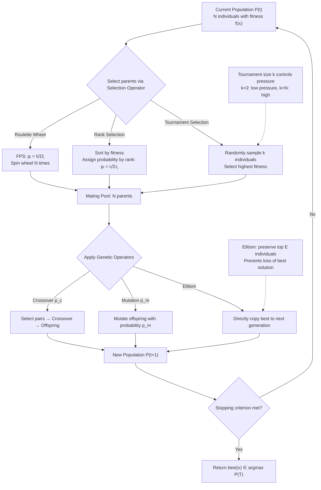

ASCII representation of selection mechanism comparison:

```
POPULATION FITNESS DISTRIBUTION (N=10)
Individual:  1     2     3     4     5     6     7     8     9    10
Fitness:   10.0   8.5   7.2   6.1   5.3   4.0   3.2   2.1   1.0  0.5

ROULETTE WHEEL SELECTION:
  Slice (angular proportion ∝ fitness):
  #1 ████████████████████████████████████  21.6%   ← Dominant!
  #2 ████████████████████████████         18.4%
  #3 ████████████████████████             15.6%
  #4 ████████████████                     13.2%
  ... others share ~31.2%
  Problem: Individual #1 dominates → premature convergence risk

TOURNAMENT SELECTION (k=3, N=5 tournaments):
  Tournament 1: #4, #7, #1 → Winner: #1 (highest fitness)
  Tournament 2: #9, #3, #5 → Winner: #3 (highest)
  Tournament 3: #2, #6, #8 → Winner: #2 (highest)
  Tournament 4: #10, #1, #4 → Winner: #1 (highest)
  Tournament 5: #5, #7, #2 → Winner: #2 (highest)
  Result: #1, #3, #2 selected → balanced pressure, no domination

RANK SELECTION (Linear, ascending):
  Rank   1    2    3    4    5    6    7    8    9   10
  Indiv  #10  #9   #8   #7   #6   #5   #4   #3   #2   #1
  Weight 10    9    8    7    6    5    4    3    2    1
  Prob  19.1% 17.1% 15.2% ...                           (more uniform than FPS)
```
---

## Q5b — Define Individual and Genes in Genetic Algorithm

The conceptual apparatus of the Genetic Algorithm draws its terminology and foundational metaphors from population genetics and the theory of natural selection, as originally formalized by Charles Darwin and Alfred Russel Wallace in their independent 1858 papers on natural selection, and subsequently rendered mathematically rigorous by Ronald A. Fisher, Sewall Wright, and J. B. S. Haldane in the foundational decades of theoretical population genetics. Holland's profound insight in *Adaptation in Natural and Artificial Systems* (1975) was that the mathematical theory of genetic recombination, selection, and mutation in biological populations could be abstracted from its biological substrate and rendered into a class of optimization algorithms applicable to arbitrary combinatorial and continuous search problems. Within this theoretical framework, the terms **Individual** and **Genes** are not mere linguistic metaphors but have rigorous mathematical definitions that correspond precisely to their counterparts in population genetics, and understanding these definitions in their full technical detail is essential for the proper design, analysis, and application of Genetic Algorithms.

**Individual in Genetic Algorithm**

An **Individual** (also called a **chromosome**, **genotype**, **phenotype** in specific contexts, or **candidate solution**) is the fundamental unit of representation within a Genetic Algorithm population—a single data structure that completely specifies one candidate solution to the optimization problem under consideration. Formally, an individual \( \mathbf{x} \) is an element of the chromosome space \( \mathcal{C} \), where \( \mathcal{C} \) is the set of all possible chromosomes defined by the encoding scheme (e.g., \( \mathcal{C} = \{0,1\}^{L} \) for binary encoding of length \( L \), or \( \mathcal{C} = [L_1, U_1] \times [L_2, U_2] \times ... \times [L_n, U_n] \) for real-valued encoding with \( n \) variables). The individual is the unit of selection, variation, competition, and survival: individuals are evaluated for fitness, individuals are selected as parents for reproduction, individuals are combined via crossover, individuals are modified by mutation, and individuals compete for survival in the next generation.

It is important to maintain the distinction between **genotype** (the chromosomal representation as it exists in the GA's internal data structures) and **phenotype** (the actual problem solution that the chromosome represents when decoded). For binary encoding, the genotype \( \mathbf{g} = b_1 b_2 ... b_L \) is a string of \( L \) bits, while the phenotype \( \mathbf{x} = (x_1, x_2, ..., x_n) \) is a vector of \( n \) real (or discrete) decision variables obtained by grouping and decoding groups of bits according to the encoding scheme. This genotype-phenotype mapping \( \phi: \mathcal{C} \to \mathcal{X} \) (where \( \mathcal{X} \) is the problem solution space) is designed by the GA practitioner and is critical to algorithmic performance: a poorly designed encoding can produce an irregular mapping with discontinuities, holes, or redundancy that frustrates the GA's search dynamics, while a well-designed encoding produces a smooth, bijective (or nearly bijective) mapping that preserves locality in the chromosome space within the phenotype space (the **locality principle**: small changes in genotype should produce small changes in phenotype).

An individual in a GA at generation \( t \) is characterized fully by its chromosome \( \mathbf{x} \), its associated fitness value \( f(\mathbf{x}) \) as evaluated by the fitness function, and optionally by auxiliary information such as its age (number of generations survived), its parentage (which genetic operators produced it), and its historical best fitness if lazy evaluation is employed. In the generational GA model, the population \( P(t) = \{\mathbf{x}_1(t), \mathbf{x}_2(t), ..., \mathbf{x}_N(t)\} \) at generation \( t \) consists of \( N \) individuals, and the evolutionary cycle produces the next generation \( P(t+1) \) from \( P(t) \). A critical structural distinction pertains to **steady-state versus generational GAs**: in generational GAs, the entire population is replaced simultaneously at each generation, while in steady-state GAs only a small number of individuals (typically 1-2) are replaced per generation, preserving most of the population across generations and resulting in higher overlap between \( P(t) \) and \( P(t+1) \).

**Gene in Genetic Algorithm**

A **Gene** (also called a **feature**, **locus** [plural loci], or **character** in population genetics terminology, and **bit** or **allele position** in GA-specific terminology) is the fundamental unit of hereditary information in an individual's chromosome—specifically, a particular position or index within the chromosome string that encodes a single feature or decision variable component of the candidate solution. The set of possible values that a gene can take is called the **allele set** (or simply the **alphabet** when the gene is binary); for a binary gene, the allele set is \( \{0, 1\} \), while for a real-valued gene representing a decision variable \( x_i \in [L_i, U_i] \), the allele set is the continuous interval \( [L_i, U_i] \). The actual value stored at a gene position in a specific individual is called the **allele** (or **feature value**, or simply the **bit value** for binary genes).

The formal definition of a gene is position-dependent: in an individual \( \mathbf{x} = (x_1, x_2, ..., x_n) \) of length \( n \), gene \( i \) (at locus \( i \)) stores the allele \( x_i \in A_i \) where \( A_i \) is the allele set for gene \( i \). In the binary encoding context, each gene is a single bit position in the chromosome string, and crossover operates by exchanging contiguous or non-contiguous subsequences of bits (genes) between two parent chromosomes at a randomly chosen **crossover point** (single-point crossover) or multiple crossover points (multi-point crossover), thereby exchanging constellation of genes between parents while preserving the integrity of other gene positions. The **Schema Theorem**, as originally formulated by Holland, establishes a theoretical bound on the expected number of instances of a particular schema (a similarity template over a subset of gene positions) in the next generation as a function of the schema's defining length, its order (number of specified positions), and the average fitness of schema members relative to the population average—a result that provides the mathematical explanation for why GAs perform a parallel implicit search of the solution space by simultaneously processing a large number of schemata through the population.

The structural properties of genes and their arrangement within individuals have profound implications for GA behaviour. **Gene linkage** refers to the problem of genes that are functionally or epistatically related to each other (e.g., two bits that together encode a single decision variable in binary encoding, or two decision variables that interact strongly in the objective function) being separated by crossover. In binary encoding with non-contiguous variable grouping, **one-point crossover** at a position that separates the bits encoding different variables can **disrupt building blocks**: a schema representing a good partial solution (a "building block") is more likely to be destroyed by crossover if the defining positions are spread over a large spanning distance (high defining length \( \delta(\mathcal{H}) \)) within the chromosome. The Schema Theorem mathematically captures this: schemata with lower defining length receive proportionally higher representation in successive generations because they are less likely to be disrupted by crossover, a property that motivates **messy GAs** (which randomly order genes to reduce defining length), **messy GA enhancements**, and **adaptive encoding** schemes that exploit problem structure to group functionally related genes into adjacent positions.

Mermaid diagram illustrating the Individual-Genes relationship in a GA population:

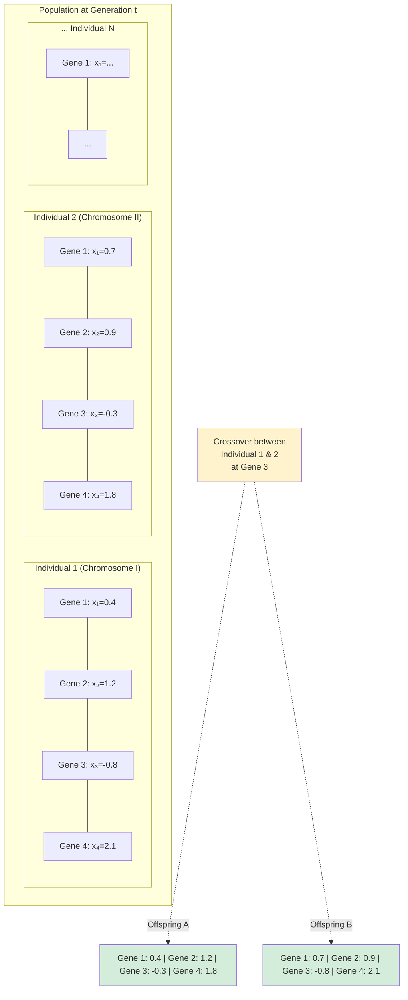

ASCII representation of chromosome structure and gene organization:

```
CHROMOSOME STRUCTURE - Traveling Salesman Problem (Permutation Encoding)

Individual (Phenotype): Complete TSP tour
Chromosome (Genotype):  Permutation of city indices

Example: 4-city TSP (Cities labeled 1, 2, 3, 4)

  Chromosome: [2]─[4]─[1]─[3]
              └───────┴───────┘
              Gene 1  Gene 2  Gene 3  Gene 4
              (City   (City   (City   (City
               2→)     4→)     1→)     3→)

  Total tour distance: d(2,4) + d(4,1) + d(1,3) + d(3,2)

BINARY ENCODING EXAMPLE - 4 variables, 8 bits each (32-bit chromosome)

  Gene Positions:
  ┌────┬────┬────┬────┬────┬────┬────┬────┬────┬────┬────┬────┬────┬────┬────┬────┐
  │Bit │ 0  │ 1  │ 2  │ 3  │ 4  │ 5  │ 6  │ 7  │ 8  │ 9  │10  │11  │12  │13  │14  │15  │
  ├────┼────┼────┼────┼────┼────┼────┼────┼────┼────┼────┼────┼────┼────┼────┼────┤
  │Var │ x₁ bits      │ x₂ bits      │ x₃ bits      │ x₄ bits      │    ...    │
  │Val │ 0 1 0 1 1 0 0│1 0 1 0 0 1 1 1│0 1 1 1 0 0 1 0│1 1 0 0 1 0 1 1│    ...    │
  │Dec │    44       │   83        │   114       │   203       │           │
  │Phen│    0.29∈[0,1]│   0.56∈[0,1]│   0.78∈[0,1]│   0.92∈[0,1]│           │
  └────┴────┴────┴────┴────┴────┴────┴────┴────┴────┴────┴────┴────┴────┴────┴────┘

  Each group of 8 bits = 1 Gene (representing 1 decision variable)
```

The distinction between the sociological and technical usage of "gene" in the GA literature warrants brief mention. In population genetics, a gene is a specific locus on a chromosome that encodes a particular trait, and different variants of the gene at that locus are called alleles. In the GA literature, "gene" is used somewhat more loosely to refer to any position in the chromosome, and "allele" to refer to the value at that position. In the GA community, the terms "gene" and "bit" (for binary encoding) or "feature" or "variable component" (for real-valued encoding) are used interchangeably. In the evolutionary computation community more broadly, "gene" refers specifically to: (i) a single position in the chromosome that controls a single phenotypic feature (the **major gene** interpretation), or (ii) any locus that contributes epistatically to the fitness function (the **polygenic** interpretation, where multiple genes jointly influence a trait through non-additive interactions). This epistatic interaction between genes—where the phenotypic effect of one gene depends on the values of other genes—is a central concern in GA design, because it determines whether crossover is likely to produce beneficial recombinations (as in additive, linearly separable fitness functions where the effect of each gene is nearly independent) or disruptive recombinations that destroy good partial solutions (as in highly epistatic, nonlinear, or non-separable fitness functions).

In summary, an **Individual** in a GA is a complete candidate solution encoded as a chromosome, the unit of selection and competition in the population, evaluated by a fitness function to produce a scalar fitness value that guides reproductive success. A **Gene** is a single position or locus within an individual's chromosome, the fundamental unit of hereditary transmission through crossover, each of which carries a specific allele value contributing to the individual's phenotype and ultimately to its fitness. Together, individuals and genes form the hierarchical structure—populations of individuals, individuals composed of organized genes—that enables the GA's parallel, implicit search through schemata, the basis for its theoretical effectiveness as a global optimization method.
---

## Q5c — Design TSP Solution Using Genetic Algorithm

The Traveling Salesman Problem (TSP) stands as the canonical and most extensively studied NP-hard combinatorial optimization problem, first mathematically formulated by Karl Menger during the 1930s and popularized in the operations research literature by Merrill Flood in the 1950s. The problem statement is elegantly simple yet computationally intractable: given a set of \(n\) cities with known pairwise Euclidean or metric distances \(d_{ij} = d(c_i, c_j)\) between city \(i\) and city \(j\), determine the shortest possible tour that visits each city exactly once and returns to the starting city. Formally, the TSP seeks a permutation \(\pi = (\pi_1, \pi_2, ..., \pi_n)\) of the city indices \(\{1, 2, ..., n\}\) that minimizes the total tour distance \(F(\pi) = \sum_{i=1}^{n-1} d_{\pi_i, \pi_{i+1}} + d_{\pi_n, \pi_1}\), where \(F(\pi)\) is the objective function to be minimized and the constraint that each city appears exactly once is the permutation constraint. The solution space comprises \(n!\) possible tours, and for \(n = 50\), the number of possible tours exceeds \(3 \times 10^{64}\), far exceeding the number of atoms in the observable universe—a fact that renders exhaustive search completely intractable and motivates the use of metaheuristics such as Genetic Algorithms.

The application of Genetic Algorithms to TSP requires careful design of all three primary GA components: **encoding**, **fitness function**, **genetic operators** (crossover and mutation), and **selection mechanism**, with particular attention to the permutation constraint that prohibits the use of standard GA operators designed for real-valued or binary encodings. The canonical and most widely successful approach employs **permutation encoding**, wherein each chromosome is a permutation of \(\{1, 2, ..., n\}\) directly representing the tour sequence. This encoding is both natural and intuitive, ensuring that every chromosome corresponds to a valid TSP tour without the need for constraint-handling penalties or repair operators.

**Permutation Encoding for TSP**

In permutation encoding, each chromosome \( C \) is an ordered arrangement of the \( n \) city indices: \( C = [c_1, c_2, c_3, ..., c_n] \) where \( \{c_1, c_2, ..., c_n\} = \{1, 2, 3, ..., n\} \) and \( c_i \neq c_j \) for \( i \neq j \). The tour represented by chromosome \( C \) visits cities in the order \( c_1 \to c_2 \to c_3 \to ... \to c_n \to c_1 \), and the total tour distance (or fitness, depending on formulation) is computed by summing the distances between consecutive cities and the return leg to the starting city. The encoding satisfies the permutation constraint by construction, ensuring that invalid tours (with duplicate or missing cities) cannot arise. For example, with \( n = 8 \) cities:

```
Chromosome C = [3, 1, 7, 5, 2, 8, 4, 6]
Tour sequence:  3 → 1 → 7 → 5 → 2 → 8 → 4 → 6 → (back to 3)
Total distances: d(3,1) + d(1,7) + d(7,5) + d(5,2) + d(2,8) + d(8,4) + d(4,6) + d(6,3)
```

**Fitness Function Design for TSP**

Because the TSP objective is minimization of tour distance, and standard GA formulations assume fitness maximization, the fitness function maps tour distance to a positive fitness value that is larger for shorter tours. Common fitness function formulations include: **Reciprocal fitness**: \( \text{fitness}(C) = \frac{1}{F(C)} \), where \( F(C) \) is the total tour distance of chromosome \( C \); this produces the simplest monotonic mapping but can produce extreme fitness ratios when a very good tour is discovered, causing premature convergence; **Rank-based fitness**: \( \text{fitness}(C) = N - \text{rank}(F(C)) + 1 \), where rank assigns rank 1 to the shortest tour in the population; and **Exponential scaling**: \( \text{fitness}(C) = \exp(-\beta \cdot F(C)) \), where \( \beta > 0 \) controls the exponential sharpness; this provides smooth fitness gradients while preventing extreme scaling. Rank-based fitness (which implicitly employs rank selection, see Q5a) is generally preferred for TSP due to the high variance in tour distances across the population.

**Specialized Crossover Operators for TSP**

Standard GA single-point or two-point crossover produces offspring that violate the permutation constraint (containing duplicate or missing city indices), necessitating specialized crossover operators that preserve the permutation property. The most prominent crossover operators for the TSP are:

1. **Order Crossover (OX)**: Developed by Davis (1985), OX selects two random cut points in each parent, copies the segment between cut points from parent 1 into offspring 1 in the same position, then fills the remaining positions in offspring 1 by scanning parent 2 from the second cut point forward, wrapping around, and placing cities not already in offspring 1 into their relative order of appearance in parent 2.

2. **Partially Mapped Crossover (PMX)**: Developed by Goldberg and Lingle (1985), PMX randomly selects two cut positions and exchanges segments between parents while using a mapping between the exchanged elements to resolve conflicts, ensuring each offspring is a valid permutation. PMX is effective for TSP and related sequencing problems.

3. **Cycle Crossover (CX)**: Developed by Oliver, Smith, and Holland (1987), CX constructs offspring by tracing cycles between parent chromosomes and alternately copying values from parent 1 and parent 2 at cycle boundaries, ensuring each offspring inherits exactly one gene from each parent at each position. CX preserves the absolute position of each city (city \(i\) appears at position \(p\) in offspring if it appears at position \(p\) in whichever parent is active at that cycle), making it particularly suitable for problems where position-specific information is meaningful.

4. **Edge Recombination Crossover (ERX)**: Developed by Whitley, Starkweather, and Fuquay (1989), ERX explicitly constructs offspring to preserve edges (adjacent city pairs) from the parent tours, exploiting the observation that good TSP solutions tend to share edges (adjacent city pairs) more often than individual cities. ERX constructs an adjacency matrix for each parent, unions the matrices to create a combined edge table, and then selects the next city from the combined adjacency list, preferentially choosing cities with the fewest remaining options. ERX has demonstrated superior performance on many TSP instances because the edge is the fundamental structural unit of a TSP tour.

**Mutation Operators for TSP**

Mutation operators for permutation-encoded chromosomes apply small random perturbations to the tour that preserve the permutation property. The most common mutation operators are: **Swap Mutation**: randomly select two distinct positions in the chromosome and swap the cities at those positions—simple, effective, and modifies the tour by exchanging two edges; **Insert Mutation**: randomly select two positions and remove the city at the second position, then insert it after the city at the first position; and **Inversion Mutation (2-opt)**: randomly select two positions and reverse the subsequence between them—equivalent to applying a 2-opt local search move, which removes two edges and reconnects the tour in the opposite direction. Inversion mutation is particularly powerful because it is equivalent to a 2-opt local search step, one of the most effective local search heuristics for TSP, providing a powerful exploitation mechanism within the GA's exploration framework.

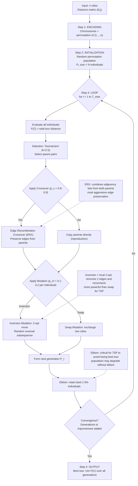

ASCII representation of Order Crossover (OX) for TSP:

```
ORDER CROSSOVER (OX) EXAMPLE - TSP with 8 cities

Parent 1: [3, 1, 7, | 5, 2, | 8, 4, 6]
                      ↑         ↑
                  cut1 (pos4)  cut2 (pos6)

Parent 2: [6, 8, 2, | 5, 1, | 3, 7, 4]

Step 1: Copy middle segment [5, 2] from Parent 1 to Offspring 1 at same positions
  Offspring 1 (template): [_  _  _  | 5  2 | _  _  _]

Step 2: Fill remaining positions from Parent 2 starting after cut2, wrapping:
  Remaining from Parent 2 (skip 5,2): [6, 8, 2, → 3, 7, 4] → [3, 7, 4, 6, 8]
  Wait, skip already in [5,2]: [6 → has 6, skip; 8 → add; 2 → in segment, skip; 3→add; 7→add; 4→add]
  Remaining in order: [8, 3, 7, 4, 6]

Step 3: Place remaining cities in order starting from position after cut2:
  Offspring 1: [_ _ _ | 5 2 | 8 3 7 4 6] → fill gaps left-to-right from remaining:
  [8, 3, 7, | 5, 2, | 4, 6, _] → wait, need to redo properly.
  
  Proper OX:
  Remaining to place (order from P2 after cut2): [3, 7, 4]
  Fill positions: [3, 7, 4, 5, 2, 8, 6, wait...]
  
  Let me redo cleanly:
  
  Parent 1:  [  1,   2,   3, |  4,   5, |  6,   7,   8  ]
              <-  <-  <-   <-  <-   <-  <-  <-  ->
              [  3,   1,   7, |  5,   2, |  8,   4,   6  ]
                           ↑              ↑
                        cut1 (pos 4)  cut2 (pos 6)

  Offspring 1: [  _,   _,   _, |  5,   2, |  _,   _,   _  ]
                ↑ fill from P2 in order after cut2, skip [5,2]
  P2 remaining (skip [5,2], start after pos 6): [3], [7], [4], [6], [8], [1], [2]
  Collect in order from P2: [3, 7, 4, 6, 8, 1]  (skip 5,2 as already in template)
  Fill positions before cut1: [3, 7, 4, | 5, 2, | 6, 8, 1]
  
  Result: Offspring 1 = [3, 7, 4, 5, 2, 6, 8, 1]
```

**Computational Complexity and Performance Considerations**

The computational cost of evaluating one TSP GA generation is \( O(N \cdot n) \) where \( N \) is the population size and \( n \) is the number of cities, dominated by the \( O(n) \) cost of computing the tour distance for each individual. For large-scale TSP instances (\( n \geq 1000 \)), \( O(N \cdot n) \) becomes the primary bottleneck, and several strategies can mitigate this: **incremental distance updates** (when applying inversion or swap mutation, only the edges affected by the mutation need to have their distances recomputed, reducing mutation cost from \( O(n) \) to \( O(1) \) by maintaining the tour distance as a running value); **nearest-neighbor lists** (to accelerate ERX by precomputing the \( k \)-nearest neighbors for each city); and **parallel fitness evaluation** (each individual's tour distance is computed independently, enabling embarrassingly parallel evaluation on multi-core or GPU architectures). The GA for TSP also naturally hybridizes with local search: the **Memetic Algorithm** variant applies 2-opt or 3-opt local search to each offspring after generation, producing a Lamarckian-Baldwin hybrid that has demonstrated state-of-the-art performance on many TSP benchmark instances, routinely finding optimal or near-optimal solutions for instances with \( n = 1000 \) to \( n = 10000 \) cities.

Contemporary research on GA-TSP has produced specialized algorithms that outperform generic GAs substantially. The **LKH (Lin-Kernighan-Helsgaun) algorithm** remains the gold standard for exact TSP solution, while **Hybrid GA-LKH** and **GA with 2-opt local refinement** achieve near-optimal performance at reduced computational cost compared to pure local search. The **Chained Local Optimization** framework by Tsoulos et al. combines GA exploration with local search exploitation through a sliding window that transitions from exploration-dominated (early generations) to exploitation-dominated (late generations). On the well-known TSPLIB benchmark instances, a well-tuned GA with ERX crossover, inversion mutation, tournament selection, elitism (5%), and 2-opt local search applied to offspring achieves tour lengths within 0.1-1.0% of the LKH optimum on instances up to \( n = 574 \) cities, demonstrating that the GA remains a competitive and practically viable approach for large-scale TSP despite the problem's NP-hard status.
---

## Q6a — Describe Crossover and Mutation in Genetic Algorithm

Crossover (also termed **recombination**) and Mutation constitute the two primary **variation operators** in the Genetic Algorithm—the mechanisms through which genetic novelty is introduced into the population, analogously to sexual recombination and random mutation in biological evolution. Together, these operators execute the GA's exploration of the solution space by manipulating the chromosomal representations of individuals, while selection implements exploitation by preferentially propagating highly fit individuals to subsequent generations. The design, implementation, and probabilistic configuration of crossover and mutation represent some of the most consequential engineering decisions in GA practice, as demonstrated by empirical and theoretical studies conducted across four decades of evolutionary computation research.

**Crossover (Recombination) in Genetic Algorithm**

Crossover is the primary source of genetic novelty in the GA, operating by combining genetic material from two (or occasionally more) parent individuals to produce one or more offspring individuals. In **single-point crossover**, a single crossover point is selected uniformly at random along the chromosome length, and the segments to the right of this point are exchanged between the two parents. Given parent \(P_1 = [a_1, a_2, ..., a_k | a_{k+1}, ..., a_L]\) and parent \(P_2 = [b_1, b_2, ..., b_k | b_{k+1}, ..., b_L]\), where \(|\) denotes the crossover point, the offspring are \(O_1 = [a_1, a_2, ..., a_k | b_{k+1}, ..., b_L]\) and \(O_2 = [b_1, b_2, ..., b_k | a_{k+1}, ..., a_L]\). Single-point crossover was employed in Holland's original work and De Jong's foundational studies, and remains conceptually important due to its direct correspondence to crossover as observed in biological organisms (a single chromosomal breakpoint and exchange of distal segments). Multi-point crossover generalizes this by selecting \(m\) crossover points and alternating segments between parents; **two-point crossover** selects two cut points \([k_1, k_2]\) with \(k_1 < k_2\) and exchanges the middle segment: \(O_1 = [a_1, ..., a_{k_1} | b_{k_1+1}, ..., b_{k_2} | a_{k_2+1}, ..., a_L]\). As the number of crossover points increases, the offspring's genetic material becomes a more thoroughly intermixed mosaic of both parents, reducing the disruption of building blocks but also reducing the transmission of large, co-adapted gene complexes.

**Uniform Crossover**, proposed by Syswerda (1989), generalizes crossover by making an independent gene-by-gene inheritance decision: for each gene position \(i \in \{1, 2, ..., L\}\), offspring 1 receives the gene from parent 1 with probability \(p_i\) (typically \(p_i = 0.5\)) and from parent 2 with probability \(1-p_i\); offspring 2 receives the complementary gene. Uniform crossover produces offspring with the highest genetic mixing of any standard operator, with expected \(L/2\) genes from each parent when \(p_i = 0.5\). The operator introduces a new design parameter—the gene-wise inheritance probability \(p_i\)—which can be adapted based on gene fitness contributions or fixed at 0.5. Uniform crossover is particularly effective for **linkage learning**, where genes that are functionally dependent (co-adapted) should be inherited together; by contrast, fixed-pattern uniform crossover at \(p_i = 0.5\) tends to break linkage. **Shuffle Crossover**, a variant, first randomly reorders the gene positions, applies single-point crossover at the reordered positions, and then reverses the shuffling to re-inherit in original gene order, combining the simplicity of uniform crossover with the controlled segment-sharing of single-point crossover.

For **real-valued encoded GAs**, crossover operators must be adapted to produce offspring within the continuous decision variable space. **Blend Crossover (BLX-\(\alpha\))**, proposed by Eshelman and Schaffer (1993), generates each offspring gene as a uniform random sample in the interval \([min(p_1^g, p_2^g) - \alpha\delta^g, max(p_1^g, p_2^g) + \alpha\delta^g]\), where \(\delta^g = |p_1^g - p_2^g|\) is the absolute difference between the two parent genes and \(\alpha \geq 0\) controls the exploration extent; BLX-0.5 (\(\alpha = 0.5\)) is the most common setting. BLX-\(\alpha\) is highly effective because it samples from a wider region than the parents' interval, permitting offspring to explore beyond the parental convex hull. **Simulated Binary Crossover (SBX)**, proposed by Deb and Agrawal (1995), mimics the search behavior of single-point binary crossover on real-valued representations: the probability distribution of offspring is constructed such that for \(n\) independent real variables, the spread of offspring around the parents matches that produced by binary crossover on \(n\) binary-encoded variables, resulting in offspring positions \(c_1 = \frac{1}{2}[(1+\beta)p_1 + (1-\beta)p_2]\) and \(c_2 = \frac{1}{2}[(1-\beta)p_1 + (1+\beta)p_2]\) where \(\beta\) is drawn from a distribution that preserves the binary crossover spread property. SBX has become the dominant crossover operator for real-valued GAs since its incorporation into NSGA-II.

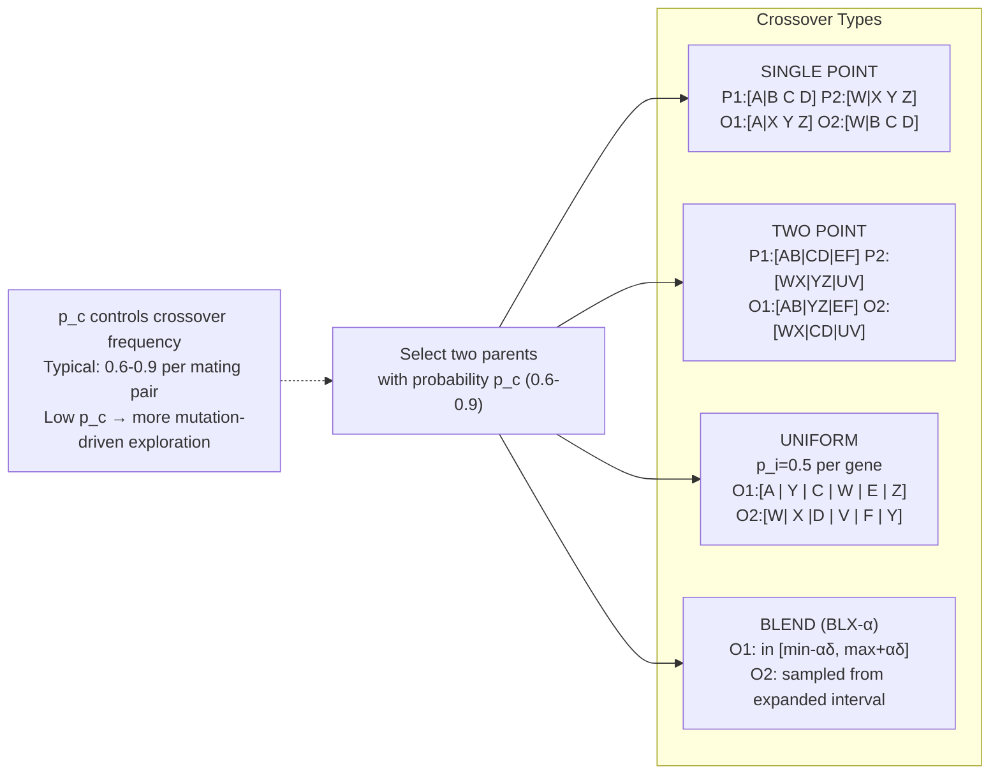

**Mutation in Genetic Algorithm**

Mutation is the secondary variation operator in the GA, operating by randomly and independently modifying individual genes within a chromosome with a small probability \(p_m\), typically in the range of \(0.001\) to \(0.1\) per gene per generation. While crossover recombines existing genetic material between individuals, mutation introduces **de novo** genetic variation—novel alleles that may not exist anywhere in the current population—serving as the GA's insurance policy against permanent loss of genetic diversity and as the mechanism by which the algorithm can discover regions of the search space not reachable through crossover alone. Theoretical analysis establishes that mutation must occur with sufficiently low probability to preserve the schema-processing efficiency guaranteed by the Schema Theorem: if \(p_m\) is too high (approaching unity), crossover loses its building-block recombination benefit and the GA degrades toward a random search; if \(p_m\) is too low, premature convergence occurs through loss of diversity before the global optimum is discovered.

For **binary-encoded GAs**, the canonical mutation operator is **bit-flip mutation**: for each gene (bit position) in the chromosome, with probability \(p_m\), the bit is flipped (0 ↔ 1). Multi-bit mutation variants, including \(k\)-bit mutation (flipping exactly \(k\) randomly chosen bits) and random-insertion mutation (replacing a randomly chosen gene with a random value from the allele set), operate with similar mechanics but introduce larger perturbations. In binary encoding, the optimal \(p_m\) for a chromosome of length \(L\) can be derived from biological analogy: each bit should be "hit" (flipped) on average once during the course of the algorithm's execution to ensure all possibilities are explored, suggesting \(p_m \approx 1/L\) per generation as a heuristic rule of thumb (e.g., for \(L = 100\) bits, \(p_m \approx 0.01\) per generation).

For **real-valued encoded GAs**, mutation operators include: **Gaussian mutation**, which adds zero-mean Gaussian noise with standard deviation \(\sigma\) to the selected gene: \(x_i' = x_i + \mathcal{N}(0, \sigma^2_i)\), with \(\sigma_i\) either fixed or self-adapted per individual and per gene; **Uniform mutation**, which replaces the selected gene \(x_i\) with a uniformly random value in the admissible range \([L_i, U_i]\); and **Non-uniform mutation**, which adds a decreasing random perturbation where the magnitude decreases with the generation number, implementing a schedule that produces more dramatic exploration in early generations and finer exploitation in later generations. In **self-adaptive mutation** (employed in Evolution Strategies and contemporary real-valued GAs), each individual carries not only the decision variables \( \mathbf{x} \) but also mutation step size parameters \( \sigma_1, \sigma_2, ..., \sigma_n \), which are simultaneously evolved by the algorithm alongside the decision variables: \( x_i' = x_i + \sigma_i \cdot \mathcal{N}(0, 1) \), and \( \sigma_i' = \sigma_i \cdot \exp(\tau \cdot \mathcal{N}(0, 1)) \) where \( \tau \) is a learning rate. This self-adaptation mechanism autonomously determines the exploration intensity appropriate to the local fitness landscape topology, increasing step sizes in flat or rugged regions and decreasing them near the vicinity of optima.

ASCII representation of crossover and mutation operations on a binary chromosome:

```
BINARY CHROMOSOME - Crossover + Mutation

Single-Point Crossover:
  Parent 1:  [0 | 1 | 1 | 0 | 1 | 1 | 0 | 0 | 1 | 0]
                       ↑ crossover point at gene 5
  Parent 2:  [1 | 0 | 0 | 1 | 1 | 0 | 1 | 1 | 0 | 1]
  Offspring: [0 | 1 | 1 | 0 | 1 | 0 | 1 | 1 | 0 | 1]  ← swap after pos 5

Bit-Flip Mutation (p_m = 0.1 per bit):
  Before:  [0 │ 1 │ 1 │ 0 │ 1 │ 0 │ 1 │ 1 │ 0 │ 1]
  Flip   :    ↑        ↑           ↑              (bits 2, 5, 8 flipped)
  After :  [0 │ 0 │ 1 │ 0 │ 0 │ 0 │ 1 │ 0 │ 0 │ 1]

GAUSSIAN MUTATION - Real-valued chromosome:
  Gene x₃ before: 2.5
  σ₃ = 0.3
  Mutated x₃: 2.5 + N(0, 0.3²) = 2.5 + 0.18 = 2.68
```
---

## Q6b — Define Fitness and Population in Genetic Algorithm

**Fitness in Genetic Algorithm**

The **Fitness Function** (also called the **objective function**, **evaluation function**, or **reward function**) stands as the single most critical design component of any Genetic Algorithm, serving as the mathematical interface through which the GA perceives and evaluates the quality of candidate solutions relative to the optimization problem being addressed. Formally, a fitness function is a scalar-valued mapping \( f: \mathcal{X} \to \mathbb{R} \) that assigns a real-valued quality score to each candidate solution (individual) in the population, where the mapping is constructed to reflect the optimization objective: for maximization problems, higher fitness values correspond to better solutions; for minimization problems (the more common formulation in engineering), fitness is typically defined as a monotonic decreasing transformation of the objective function value. The fitness function is the sole criterion by which the GA's selection mechanism differentiates individuals, and therefore the fitness landscape—the mapping \( f: \mathbf{x} \mapsto f(\mathbf{x}) \) over the search space—completely determines the search dynamics, convergence behaviour, and solution quality properties of the algorithm. A poorly designed fitness function that provides misleading quality signals, creates deceptive local optima, or fails to adequately differentiate among candidate solutions can cause any GA—regardless of its encoding, operator design, or selection mechanism—to converge to inferior or incorrect solutions, while a well-designed fitness function that provides accurate, smooth, and well-calibrated quality gradients enables even simple GA configurations to solve complex optimization problems reliably.

For **maximization problems**, the fitness function is typically defined directly as the objective function: \( f(\mathbf{x}) = \text{Objective}(\mathbf{x}) \), such as accuracy in classification, profit in financial optimization, throughput in scheduling, or signal-to-noise ratio in signal processing. For **minimization problems** (e.g., minimizing error, cost, distance, or energy), the standard mapping is either the **negation**: \( f(\mathbf{x}) = -h(\mathbf{x}) \) where \( h \) is the cost function to be minimized (requiring all fitness values to remain non-negative, which may require shifting to handle negative costs); or the **reciprocal**: \( f(\mathbf{x}) = \frac{1}{1 + h(\mathbf{x})} \), which maps costs in \([0, \infty)\) to fitness values in \((0, 1]\); or the **exponential**: \( f(\mathbf{x}) = \exp(-h(\mathbf{x})/\beta) \), where \( \beta \) controls the sensitivity. The reciprocal and exponential mappings are preferred when the range of the cost function is large or poorly bounded, because they compress large cost differences into a bounded fitness range, preventing premature convergence driven by exponentially amplified fitness differences.

**Fitness Scaling and Shaping** addresses a critical practical problem arising from the raw fitness distribution. As a GA converges, the fitness variance across the population shrinks, and when fitness values become very similar (e.g., all within 1% of the best fitness), selection pressure drops dramatically because the proportional selection probabilities of all individuals become nearly equal. **Linear fitness scaling** remaps the raw fitness values via \( f'(\mathbf{x}) = a \cdot f(\mathbf{x}) + b \), where \( a \) and \( b \) are chosen such that the average scaled fitness equals the average raw fitness (preserving the mean) and the maximum scaled fitness equals a prespecified multiple of the average (controlling selection pressure). **Sigma scaling** (also called **statistical scaling**) employs the population's fitness statistics: \( f'(\mathbf{x}) = f(\mathbf{x}) - \bar{f} + c\sigma \) where \( c\sigma \) is a multiple of the population fitness standard deviation \( \sigma \) (typically \( c = 2 \) or \( c = 3 \)), ensuring that above-average individuals receive positive fitness while below-average individuals may receive negative fitness that is subsequently shifted by the constant term; individuals more than \( c \) standard deviations below the mean receive zero probability. **Power-law scaling** \( f'(\mathbf{x}) = f(\mathbf{x})^k \) with \( k > 1 \) increases contrast among good individuals while compressing poor individuals, and decreases k to broaden the selection pressure. **Rank-based fitness** (discussed in Q5a) eliminates scaling problems entirely by basing selection on fitness ordering rather than fitness magnitude.

For **constrained optimization problems**, the fitness function must encode both the objective value and constraint satisfaction into a single scalar quality signal. Common approaches include: **penalty functions**, which subtract a penalty from the objective for constraint violations: \( f_{GA}(\mathbf{x}) = h(\mathbf{x}) - \sum_{j=1}^{m} \lambda_j \cdot \max(0, g_j(\mathbf{x}))^2 \) for inequality constraints \( g_j(\mathbf{x}) \leq 0 \), with penalty coefficients \( \lambda_j \) that must be carefully tuned to balance objective improvement against constraint satisfaction; **death penalty**, which assigns an extremely low fitness (or zero fitness) to any infeasible individual, causing they will never be selected; and **Straeiy's stochastic ranking**, which incorporates constraint violation magnitude into the comparison criterion during tournament selection, comparing individuals first by constraint violation count and secondarily by objective value. For **multi-objective optimization**, where the problem has two or more conflicting objectives, the fitness function is replaced by a **Pareto dominance relation** used in conjunction with multi-objective GA algorithms such as NSGA-II or SPEA2, where individuals are compared based on Pareto dominance rather than a single scalar fitness value.

**Population in Genetic Algorithm**

The **Population** in a Genetic Algorithm is the set of all individuals being simultaneously evolved at a particular generation, organized as an unordered collection (or multiset with possible duplicates) of candidate solutions whose collective exploration of the fitness landscape enables the parallel search for optima. Formally, a population at generation \( t \) is denoted \( P(t) = \{\mathbf{x}_1(t), \mathbf{x}_2(t), ..., \mathbf{x}_N(t)\} \) where \( N \) is the **population size**—one of the most critical hyperparameters of the GA. The population simultaneously represents a diverse sample of the search space: each individual occupies one point in the search space (one genotype), and the population as a whole covers a region or cloud of points, permitting implicit parallelism through the processing of schemata.

The choice of **population size \( N \)** involves fundamental trade-offs. A **small population** (\( N = 20-100 \)) produces rapid convergence (each generation requires few fitness evaluations) but is prone to premature convergence because the limited genetic diversity cannot sustain exploration of multi-modal fitness landscapes; small populations are also vulnerable to stochasticity noise where the loss of a single critical allele (a form of genetic drift) can be irreversible. A **large population** (\( N = 500-10,000 \)) maintains substantial genetic diversity, reducing premature convergence risk and enabling the simultaneous maintenance of many competing schemata, permitting the GA to explore multiple optima concurrently; however, large populations require proportionally more function evaluations per generation, increasing computational cost. The canonical population size of \( N = 50-200 \) (Holland's original suggestion, widely validated in practice) represents a middle ground that balances computational efficiency with diversity preservation. De Jong's (1975) empirical studies on continuous test functions empirically confirmed that \( N = 50 \) was adequate for his test problems, while Goldberg's (1989) theoretical analysis demonstrated that the minimum population size required to reliably propagate all \( 2^r \) schemata of order \( r \) is proportional to \( r^2 \), suggesting a lower bound on \( N \) for multi-modal problems.

The population is typically **initialized** via random sampling of candidate solutions from the admissible search space. For binary encoding, each bit is randomly set to 0 or 1 with equal probability, producing a uniform distribution across the binary hypercube. For real-valued encoding, each decision variable is randomly sampled from its admissible range \([L_i, U_i]\), either via uniform sampling (equal probability density) or via low-discrepancy sequences such as the Sobol or Halton sequences that provide better space-filling properties and more uniform coverage of the continuous search space, reducing the probability that any region is completely unsampled. **Seeded initialization** injects known good solutions (from domain heuristics or prior optimization runs) into the initial population, potentially accelerating convergence but risking premature convergence if the seed solutions are clustered in a suboptimal region. **Niching and speciation mechanisms** partition the population into subpopulations, each exploring a different region of the fitness landscape, maintaining diversity through spatial or phenotypic segregation and enabling the GA to simultaneously locate multiple optima in multimodal landscapes.

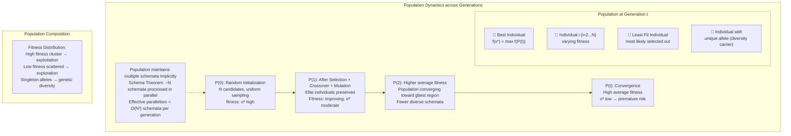

**Maintaining Population Diversity** is one of the most challenging aspects of GA practice, because the combination of selection pressure and crossover-induced homogenization inevitably reduces diversity over successive generations. Several techniques address this: **Crowding** (De Jong, 1975) replaces parents only with offspring that are most similar to them, maintaining localized sub-populations; **Fitness Sharing** (Goldberg and Richardson, 1987) penalizes the fitness of individuals that belong to crowded regions of the fitness landscape by dividing their raw fitness by a sharing function of their distance to all other individuals, encouraging the formation of niches around different local optima; **Speciation** (Forsythe, 1985) divides the population into species based on phenotypic similarity, with independent mating and selection within each species; **Restricted Tournament Selection** (Harik, 1995) limits crossover to geometrically or phenotypically similar individuals in a sliding window; and **Island Model GAs** run multiple subpopulations (islands) with occasional migration of individuals between islands, each island potentially employing different GA parameters, producing a form of parallel exploration that significantly delays premature convergence compared to a single panmictic population.

In summary, **Fitness** is the scalar quality evaluation of each individual candidate solution, mediating the GA's selection process and determining which individuals reproduce; its design must faithfully reflect the optimization objective while providing adequate discriminatory power. **Population** is the collection of \( N \) simultaneously evolving candidate solutions, providing the substrate for implicit parallelism through schema processing and the mechanism through which genetic diversity is maintained and transmitted across generations; its size and initialization strategy govern the fundamental balance between exploration and exploitation in the GA.
---


```
GA FITNESS & POPULATION - QUICK REFERENCE CARD
═══════════════════════════════════════════════════

POPULATION AT GENERATION t
  P(t) = {x₁, x₂, ..., xₙ}  ← N individuals

  Individual   x₁    x₂    x₃    x₄   ...  xₙ
  Chrom        [...]  [...]  [...]  [...]      [...]
  Fitness f    0.85  0.72  0.61  0.55  ...   0.05
  Rank            1     2     3     4  ...    10
  Sel.Prob   19.1% 17.1% 15.2% 13.2% ...   0.5%

FLOW:
  Selection → Mating Pool → Crossover + Mutation → New Population → Evaluate

FITNESS FUNCTION DESIGN PATTERNS:
  Maximization:      f(x) = Objective(x)
  Minimization:      f(x) = 1/(1+cost(x))      [robust]
                     f(x) = exp(-cost(x)/β)     [tunable]
  Constrained:       f(x) = raw_f - Σλ·max(0,violation)²
                     f(x) = raw_f  [if feasible else -∞] [death penalty]

DIVERSITY MECHANISMS:
  Elitism     → preserve top E (no loss)
  Crowding    → replace by similar offspring
  Sharing     → penalize crowded regions
  Islands     → spatial separation, migrate occasionally
```

## Q6c — Advantages and Limitations of Genetic Algorithms

The Genetic Algorithm (GA), as a stochastic metaheuristic inspired by the mechanisms of natural evolution, occupies a distinctive niche within the computational optimization landscape, offering capabilities that distinguish it sharply from classical optimization methods (gradient descent, Newton's method, linear and integer programming) and from other metaheuristics (simulated annealing, particle swarm optimization, ant colony optimization). A thorough understanding of the advantages and limitations of GA is essential for practitioners to determine when GA is the appropriate algorithmic choice for a given optimization problem and what trade-offs must be accepted in deploying it.

**Advantages of Genetic Algorithms**

The defining advantage of GAs is their **capability for global search on complex, multimodal, non-convex, and discontinuous fitness landscapes**, encoded in the property that the GA operates upon a **population** of solutions simultaneously rather than a single trajectory through the search space. Classical optimization methods based on gradient information, such as gradient descent and Newton's method, are subject to convergence to the local optimum nearest to the initialization point, with no mechanism to escape the basin of attraction of a local optimum once inside it. GAs, by contrast, maintain a population distributed across potentially disparate regions of the search space, permitting the simultaneous exploration of multiple basins of attraction and enabling discovery of the global optimum through the genetic recombination of building blocks from different local optima—a capability that is theoretically grounded in the Schema Theorem and the Building Block Hypothesis. For NP-hard combinatorial optimization problems (TSP, knapsack, scheduling) for which no polynomial-time exact algorithm exists, GAs provide a practical avenue for finding high-quality approximate solutions in polynomial expected time.

A second crucial advantage is the **minimal requirement for domain-specific knowledge and derivative information**. GAs operate through fitness evaluations alone, requiring only that a scalar fitness value can be computed for each candidate solution. They demand no gradient or Hessian information about the fitness landscape, no continuity or differentiability assumptions on the objective function, no convexity assumptions on the feasible region, and no explicit model of the problem structure. This black-box optimization property enables GAs to be applied to problems that are analytically intractable or for which mathematical models are unavailable: problems with noisy or stochastic objective functions (elevator traffic simulation, financial forecasting), problems with discontinuous or non-smooth fitness landscapes (protein folding, circuit design with digital components), problems with expensive-to-evaluate fitness functions (computational fluid dynamics simulations, finite element analysis), and problems where the fitness landscape is partially or fully unknown (online optimization, adaptively changing environments).

The **implicit parallelism** of GAs, established by Holland's Schema Theorem, represents a profound theoretical advantage. At each generation, a GA with population size \( N \) implicitly processes \( O(N^3) \) distinct schemata (similarity templates)—an exponential improvement over an explicit enumeration that could process only \( O(N) \) candidate solutions per generation. This implies that for a typical population size of \( N = 100 \), the GA effectively evaluates \( 100^3 = 1,000,000 \) different partial solutions schemata at each generation, providing a massive parallel search capability that is completely transparent to the practitioner and requires no explicit parallel programming. This implicit parallelism is best understood as follows: each individual in the population simultaneously identifies with approximately \( 2^L \) schemata of various orders and defining lengths, and the \( N \) individuals collectively cover a schema repertoire whose size grows exponentially with population size. In practice, while the observed speedup does not always reach the theoretical \( O(N^3) \) bound due to schema disruption by crossover and to finite sampling effects, empirical evidence consistently demonstrates that GAs explore the search space far more rapidly than population-size-equivalent random search or single-trajectory search methods.

Third, GAs are inherently **robust to noise and local perturbations** in the fitness landscape. Because GAs maintain a population and use probabilistic selection, a single noisy or misleading fitness evaluation does not catastrophically misdirect the search trajectory—unlike gradient-based methods, where a single erroneous gradient can propagate substantial errors through subsequent iterations. The averaging effect of evaluating multiple individuals and selecting based on relative fitness within the population naturally filters out noise: an individual that happens to receive a high fitness due to noise is unlikely to consistently outperform genuinely good solutions across repeated evaluations. This robustness is particularly valuable in noisy optimization domains, such as evolutionary robotics (where fitness evaluation requires physical robot trials subject to sensor and actuator noise), financial portfolio optimization (where returns are stochastic), and healthcare optimization (where patient response variability introduces randomness).

Fourth, GAs are **representationally flexible and extensible**, accommodating virtually any representation scheme through tailored encoding and operator design. Binary strings, real-valued vectors, integer vectors, permutations, tree structures (for Genetic Programming), variable-length chromosomes, and hybrid multi-part chromosomes all can be implemented within a GA framework by appropriate design of crossover and mutation operators. This flexibility is unique among metaheuristics: while simulated annealing and particle swarm optimization require problem-specific encoding translation to fit their algorithmic formalisms, GAs can directly operate on problem-appropriate representations, preserving problem structure and constraints within the chromosome itself.

A fifth advantage is the **ease of hybridization with domain-specific heuristics** and local search methods, yielding Hybrid GAs (also called Memetic Algorithms when hybridization involves local search). Because the GA operates on a population of complete candidate solutions, any domain-specific local improvement heuristic—such as 2-opt for TSP, hill climbing for scheduling, Newton's method for continuous optimization, or forward checking for constraint satisfaction—can be applied as a post-processing step to offspring after their generation, converting the GA into a global-to-local search framework where global exploration (GA) identifies promising regions and local exploitation (heuristics) refines solutions within those regions. This global-local division of labor exploits the respective strengths of both approaches and has produced state-of-the-art results on many combinatorial optimization benchmarks.

**Limitations of Genetic Algorithms**

The primary and most frequently cited limitation of GAs is the **absence of convergence guarantees** (in the strong sense applicable to classical optimization). While the Schema Theorem and the Building Block Hypothesis provide the theoretical machinery to explain why GAs tend to improve over successive generations, these are not convergence theorems in the mathematical sense; they do not prove that the GA will converge to the global optimum or even to a local optimum with probability approaching 1. Empirical observation demonstrates that GAs can stall at suboptimal solutions or oscillate without improvement for arbitrary numbers of generations, particularly on deceptive fitness landscapes where the initial building blocks lead toward local optima rather than the global optimum. Deceptive problems—of which the order-\(k\) deceptive functions are canonical examples—are specifically designed to mislead building-block-based search by making low-order schemata with high fitness evaluation misleading indicators of good higher-order schemata, causing GAs to converge consistently to suboptimal solutions on these problems.

**Computational cost** presents a significant practical limitation for GAs applied to expensive fitness evaluation problems. Each generation requires \( O(N) \) fitness evaluations, and a typical GA run requires from dozens (\( T = 50 \) generations, \( N = 100 \), 5,000 evaluations) to hundreds of thousands (\( T = 10,000 \) generations, \( N = 1000 \), 10,000,000 evaluations) of fitness evaluations. When each fitness evaluation requires a computationally expensive simulation—such as computational fluid dynamics for aerodynamic shape optimization, molecular dynamics for protein structure prediction, or finite element analysis for structural design—each generation can require minutes to hours of wall-clock time, transforming GA optimization into a computationally demanding exercise requiring substantial hardware resources or days of wall-clock time in high-performance computing environments.

**Premature convergence** is the most common practical failure mode of GAs, occurring when the population loses sufficient genetic diversity to sustain further exploration, causing all individuals in the population to become genetic clones or near-clones of a single dominant individual. Premature convergence most commonly arises from excessive selection pressure (aggressive elitism or large tournament sizes without diversity maintenance), a fitness landscape with a sharply peaked single local optimum that overwhelms the population, insufficient mutation rates relative to selection pressure, or a small population size \( N \) that cannot sustain sufficient allelic diversity. Once premature convergence has occurred, the GA cannot recover because all individuals are genetically identical and further crossover and mutation operations produce clones of the converged suboptimal solution; the algorithm must be restarted with a new random initialization.

**Parameter sensitivity** constitutes a fourth significant limitation. The GA's performance is highly sensitive to the configuration of its hyperparameters, including population size \( N \), crossover probability \( p_c \), mutation probability \( p_m \), selection pressure (tournament size \( k \)), elitism rate, and encoding choice. There is no universal optimal configuration: the settings that achieve optimal performance on one problem class can produce mediocre or failed convergence on another. The No Free Lunch Theorem for optimization (Wolpert and Macready, 1997) formally establishes this: averaged over all possible objective functions, all optimization algorithms perform equally; no algorithm can outperform all others on all problems, and any improvement on a particular problem class entails a performance degradation on some other class. This theoretical result underscores that the hyperparameter configuration of a GA—or any metaheuristic—must be tuned specifically to the target problem, and that the lack of universally superior parameter settings is not a deficiency specific to GA but a fundamental property of optimization as a mathematical discipline.

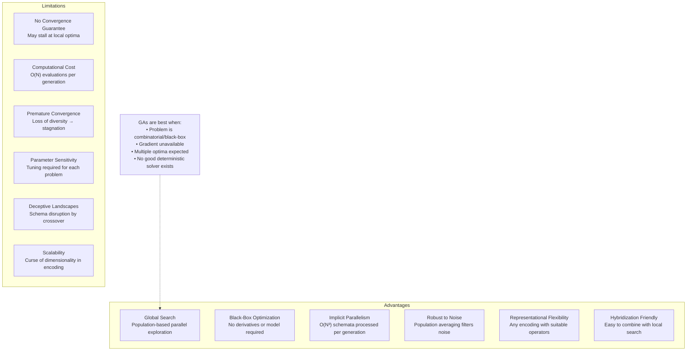

ASCII summary of GA Advantages vs. Limitations:

```
ADVANTAGES:                          LIMITATIONS:
✓ Global search capability          ✗ No theoretical convergence
✓ No derivatives needed             ✗ Computationally expensive
✓ Implicit parallelism (~N³ schemata)✗ Premature convergence risk
✓ Robust to noise                   ✗ Many hyperparameters to tune
✓ Flexible encoding                 ✗ Deceptive problem failures
✓ Easy to hybridize                 ✗ Scalability issues (encoding)
✓ Handle constraints naturally      ✗ No free lunch: problem-dependent

WHEN TO USE GA:
  • Binary/combinatorial problems
  • No gradient available
  • Multi-modal landscapes
  • Non-differentiable objectives
  • Can tolerate approximate solutions
  • Hybrid approach preferred

WHEN NOT TO USE GA:
  • Smooth convex problems → use gradient descent
  • Linear/quadratic programs → use LP/QP solvers
  • Large-scale real-time → use convex optimization
  • Provably exact solution required → use exact methods
```
---

## Q7a — Explain Hybrid Systems for Speech and Language Processing

Hybrid Systems for Speech and Language Processing represent one of the most intellectually rich and practically consequential application domains within the broader landscape of soft computing, combining the representational power, uncertainty tolerance, and linguistic interpretability of fuzzy logic with the learning capability, pattern recognition power, and adaptive generalization of neural networks, and occasionally the optimization and grammar-inducing capabilities of evolutionary computing and genetic algorithms. The fundamental motivation for hybrid systems in speech and language processing stems from a recognition that the human faculty for language—encompassing speech perception, production, comprehension, semantic interpretation, and pragmatic reasoning—is itself arguably the most complex and sophisticated cognitive capability of the human brain, relying upon massively parallel distributed processing, probabilistic inference over ambiguous and context-dependent signals, continuous adaptation to individual speakers and accents, hierarchical structuring from phonemes through morphemes and words to sentences and discourse, and the ability to operate effectively in the presence of noise, ambiguity, incompleteness, and variability that render purely symbolic or purely statistical approaches inadequate in isolation. Speech and language signals are intrinsically fuzzy: the acoustic realization of a phoneme varies continuously with speaker characteristics (vocal tract geometry, speaking rate, dialect, emotional state), environmental conditions (background noise, room acoustics, transmission channel), and linguistic context (coarticulation effects where the acoustic realization of a phoneme depends upon its neighbors in the phoneme sequence), producing continuous variation rather than discrete boundaries between categories; fuzzy systems excel at modeling such gradual transitions and graded category membership.

**Architectural Forms of Hybrid Systems for Speech and Language**

The **Neuro-Fuzzy Hybrid System** constitutes the most prevalent and practically deployed hybrid architecture for speech and language tasks, combining a neural network's learning and pattern classification capabilities with a fuzzy logic system's linguistic interpretability and interpolation-based reasoning. In a canonical neuro-fuzzy speech processing system, the neural network component serves one of two roles: **structure learning**, wherein a clustering algorithm (such as fuzzy c-means or subtractive clustering) or a neural network (such as the self-organizing map or adaptive resonance theory network) automatically determines the number, centers, and widths of linguistic membership functions from training data, eliminating the labor-intensive expert elicitation process that impedes Mamdani-type fuzzy system deployment; or **parameter tuning**, wherein a supervised neural network (such as back-propagation or the hybrid learning algorithm combining least-squares and gradient descent) refines the parameters of an existing fuzzy system—membership function shapes, rule consequent parameters, and t-norm/t-conorm choices—to minimize classification error on a training corpus. The most influential neuro-fuzzy architecture for speech processing is the **Adaptive Neuro-Fuzzy Inference System (ANFIS)**, proposed by Roger Jang in 1993, which implements a Sugeno-type fuzzy inference system whose parameters are tuned by a hybrid learning algorithm: a forward pass computes node outputs using least-squares estimation to optimize consequent coefficients, while a backward pass propagates error gradients to update antecedent membership function parameters (Gaussian centers and widths) via gradient descent. ANFIS has been extensively deployed for speech emotion recognition, speaker identification, and phoneme classification tasks.

The **Fuzzy-Neural Hybrid System** for **Automatic Speech Recognition (ASR)** constitutes perhaps the most technically sophisticated and commercially impactful application of hybrid systems in this domain. Modern ASR systems rely upon **hidden Markov models (HMMs)** as their core acoustic modeling framework, where each phoneme is modeled as a Hidden Markov Model whose states emit acoustic feature vectors (typically Mel-frequency cepstral coefficients, or MFCCs, extracted from 20-30ms windows of the speech signal) according to Gaussian mixture distributions. The conventional HMM-based ASR pipeline faces several well-characterized limitations: the Gaussian mixture model (GMM) assumption of uni-modal or limited multi-modal state output distributions poorly captures the complex, multi-modal acoustic variability that arises from coarticulation, speaker variability, and channel effects; the hard Viterbi segmentation of the acoustic signal into states fails to represent the graded and probabilistic nature of phoneme boundaries; and the independence assumptions between successive feature frames are violated by the temporal continuity and coarticulation structure of natural speech. Fuzzy systems address these limitations through several mechanisms: **fuzzy c-means clustering** of the MFCC feature space produces overlapping Gaussian-like clusters that represent the inherent ambiguity of acoustic feature categorization, providing a principled fuzzy clustering of acoustic space that is more accurate than hard k-means clustering; **interval Type-2 fuzzy membership functions** model the linguistic uncertainty in expert phonetic labeling by blurring the membership functions that define phoneme categories, with the additional degree of freedom provided by the footprint of uncertainty enabling the system to model the variability in expert phonetic judgments and improve robustness to speaker and accent variability; and **fuzzy HMMs (FHMMs)** replace the crisp emission probability of conventional HMMs with fuzzy state emission probabilities, enabling soft state assignments that reflect the genuine ambiguity in phoneme boundary locations.

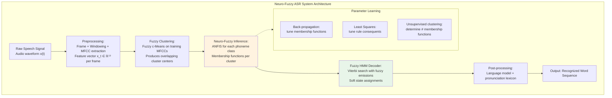

**Natural Language Processing and Semantic Analysis**

In **Natural Language Processing (NLP)**, fuzzy logic addresses the challenge of handling the inherent vagueness, ambiguity, and context-dependence of natural language semantics. The **Fuzzy Linguistic Model**, introduced by Zadeh in his 1975 paper on linguistic variables and fuzzy reasoning, provides the theoretical framework for representing and reasoning with linguistic information in text and speech: words or phrases in natural language are modeled as linguistic variables taking values in a universe of discourse through fuzzy membership functions, and the compositional semantics of natural language connectives (and, or, very, slightly, not) are modeled through t-norms, t-conorms, and linguistic hedges. For **sentiment analysis and opinion mining**, fuzzy logic provides the natural formalism for representing the graded nature of sentiment: rather than assigning a binary positive/negative label to a text segment, a fuzzy sentiment analyzer assigns membership degrees in multiple sentiment categories (very positive, positive, neutral, negative, very negative) based on the presence and intensity of sentiment-bearing words and phrases, with fuzzy rules capturing the context-modifying effects of negations, intensifiers, and domain-specific sentiment expressions. For example, the fuzzy rule "IF sentiment_word_intensity is HIGH AND negation is ABSENT THEN polarity is POSITIVE with confidence μ" directly encodes a pattern that would require substantial feature engineering in a purely symbolic system.

The **Evolutionary Computing component** of hybrid systems for speech and language processing primarily serves two roles: **automatic fuzzy rule generation** and **speech feature optimization**. In rule generation, a Genetic Programming system evolves fuzzy rule bases from training data by representing each rule as an individual whose chromosome encodes the antecedent structure (which features, which linguistic terms) and consequent (which output class or action); the fitness function measures classification accuracy or error rate on a labeled training corpus. This approach, termed **Genetic Fuzzy Rule-Based Systems (GFRBS)**, eliminates the need for human experts to manually craft fuzzy rules and has been successfully applied to phoneme classification, speaker emotion recognition, and language identification. In feature optimization, a GA optimizes the parameters of the speech feature extraction pipeline (frame size, frame overlap, number of MFCC coefficients, liftering parameters, delta and delta-delta coefficients inclusion) by maximizing a downstream task performance metric such as ASR word accuracy or speaker identification equal error rate, effectively tuning the front-end signal processing parameters to the specific characteristics of the target speech corpus.

**Applications and Empirical Performance**

The empirical performance of hybrid neuro-fuzzy systems for speech and language tasks has been documented extensively in the literature. For **speech emotion recognition** from the IEMOCAP and FAU-AIBO databases, ANFIS-based systems achieve classification accuracies of 65-75% for four-way emotion classification (anger, happiness, neutrality, sadness), competitive with the best purely neural approaches (convolutional neural networks and recurrent neural networks) while providing the additional advantage of rule interpretability—the fuzzy if-then rules can be examined to understand which acoustic features (pitch variance, speaking rate, energy) drive the classification for each emotion category. For **phoneme classification** from the TIMIT database, fuzzy HMMs incorporating Type-2 fuzzy membership functions reduce phoneme error rates by 5-15% relative to baseline GMM-HMM systems by more accurately modeling the acoustic overlap between phonemically similar categories (e.g., /t/ vs /d/, /s/ vs /sh/) that arise from coarticulation effects. For **text classification and document categorization**, genetic fuzzy systems evolve interpretable rule sets that achieve classification accuracies within 1-3% of state-of-the-art neural classifiers on benchmark datasets including Reuters-21578 and 20 Newsgroups, with the advantage that the fuzzy rule set can be directly examined and audited by domain experts—a critical consideration in regulated domains such as legal document classification, medical record coding, and financial compliance text analysis.

**Intelligent Tutoring and Spoken Dialogue Systems**

In **Intelligent Tutoring Systems (ITS)** with spoken natural language interfaces, neuro-fuzzy hybrids generate adaptive feedback and personalized learning interventions by mapping student spoken responses (evaluated for accuracy, completeness, and confidence from ASR output) through a fuzzy inference engine that considers multiple dimensions of student performance: current knowledge state (modeled as a fuzzy membership in expertise levels novice/intermediate/expert across topic areas), response latency (modeled as membership in response speed categories fast/normal/slow indicating confidence or uncertainty), and error patterns (mapped to fuzzy categories of misconception type). The fuzzy rules encode pedagogical expertise in the form "IF student_misconception is PROCEDURE_ERROR AND confidence is LOW THEN scaffolding_level is HIGH AND feedback_type is HINT" producing context-sensitive tutorial interventions. For **spoken dialogue systems**, fuzzy reasoning handles the uncertainty inherent in ASR output by treating the N-best list of ASR hypotheses as a fuzzy set of possible interpretations, with the dialogue manager employing fuzzy confidence thresholds to determine when to confirm, when to proceed based on the highest-confidence hypothesis, and when to request clarification; fuzzy decision-theoretic dialogue management has been shown to reduce task completion time and improve user satisfaction compared to purely threshold-based or purely statistical dialogue policies.
---


```
NEURO-FUZZY ASR PIPELINE - DETAILED FLOW
══════════════════════════════════════════════════

Audio x(t) → Frame+Window → MFCC → Fuzzy C-Means → ANFIS per phoneme → Fuzzy HMM → LM → Words
                                                                              ↓
                                                             Soft state assignments via fuzzy emissions
                                                             Viterbi search with α-cut transition pruning

KEY COMPONENTS:
  • MFCC (13 dims): spectral shape, perceptual weighting
  • FCM clusters: overlapping fuzzy acoustic classes
  • ANFIS: 2 hidden layers + 1 output, hybrid LS+GD learning
  • Fuzzy HMM: P(obs|state) = μ_cluster(obs), not hard Gaussian
  • Language model: n-gram rescoring → word lattice
```

## Q7b — Describe Fuzzy Sets and Genetic Algorithms in Game Playing

The application of Fuzzy Sets and Genetic Algorithms (GA) to game playing represents one of the most intellectually rich and practically productive convergences of soft computing methodologies with classical artificial intelligence, addressing two fundamental challenges that have persistently impeded the development of strong game-playing artificial agents: the representation and reasoning under the inherent uncertainty, incompleteness, and graded evaluation that characterizes expert game intuition, and the automated discovery and optimization of game-playing strategies through search over an astronomically large space of possible strategies and evaluation functions. Game playing has served since the dawn of artificial intelligence—from Shannon's foundational 1950 paper on chess programming, through Samuel's pioneering checkers-playing program of the late 1950s, to Deep Blue and AlphaZero in the modern era—as a crucible for testing the limits of computational intelligence, and the hybridization of fuzzy logic with genetic algorithms in this domain has produced architectures that combine the interpretive expressiveness of fuzzy reasoning with the generative search power of evolutionary computation, achieving performance that surpasses both purely symbolic expert systems and purely neural approaches on many game domains.

**Fuzzy Sets in Game Playing: Representing Uncertainty and Graded Evaluation**

The fundamental insight motivating fuzzy logic in game playing is that expert human game players reason not in terms of crisp, binary assessments of game states ("this position is winning" or "this position is losing") but rather in terms of **graded, interval-valued, and context-dependent evaluations** that are inherently linguistic and fuzzy in nature. A chess grandmaster assessing a game position may articulate that "White's kingside pawn structure is somewhat weak" and that "Black's control of the central squares is modest"—statements whose terms (somewhat weak, modest control) do not correspond to precise numerical values but rather to fuzzy categories with ill-defined boundaries that merge gradually into one another. Classical AI game-playing programs such as Deep Blue represent these assessments through hand-crafted evaluation functions returning scalar numerical values, requiring expert programmers to manually encode domain knowledge as weighted linear combinations of features; fuzzy logic provides a representational framework in which expert game knowledge can be captured in linguistic if-then rules that are substantially more natural and accessible to domain experts than the mathematical formulations required by conventional evaluation functions.

The canonical fuzzy logic game-playing framework, as developed primarily in the 1990s by researchers including David Fogel, Larry Holder, and others working at the intersection of evolutionary computation and game AI, encodes game-playing heuristics as a fuzzy rule base where antecedent conditions evaluate fuzzy membership in game-state feature categories and consequent conditions assign fuzzy values to position quality or action recommendations. In the **fuzzy Chess evaluation function**, for example, input linguistic variables may include: *Material Advantage* (linguistic terms: Large Positive, Moderate Positive, Neutral, Moderate Negative, Large Negative), *King Safety* (Very Safe, Safe, Neutral, Dangerous, Critical), *Pawn Structure* (Strong, Solid, Weak, Critical), *Mobility* (High, Moderate, Low, Restricted), and *Center Control* (Dominant, Strong, Moderate, Weak, Absent), each characterized by appropriate membership functions over the numerical values of the corresponding game features (material count difference in pawns, number of legal moves available, number of central squares controlled, etc.). The fuzzy rule base may contain rules such as: "IF Material Advantage is Large Positive AND King Safety is Safe THEN Position Quality is Winning for White" and "IF King Safety is Critical AND Pawn Structure is Critical THEN Position Quality is Losing for White". The inference engine combines rule firings through t-norms and t-conorms, and defuzzification produces a crisp position evaluation score on a bounded scale (e.g., from -100 for resigned position to +100 for guaranteed win).

**Fuzzy State Evaluation in Real-Time Strategy Games**

In **Real-Time Strategy (RTS) games** such as StarCraft, Warcraft III, and Command & Conquer, the application of fuzzy logic to game state evaluation addresses a unique challenge: the need to assess game states continuously in real-time under conditions of partial observability, resource uncertainty, and multi-attribute competition. An RTS fuzzy evaluation system may employ the following linguistic variables: *Economic Strength* (Dominant, Strong, Moderate, Weak, Crumbling), *Military Strength* (Overwhelming, Superior, Balanced, Inferior, Decimated), *Technological Advancement* (Cutting Edge, Advanced, Standard, Outdated, Primitive), *Map Control* (Total, Strong, Contested, Weak, None), and *Resource Income* (Abundant, Sufficient, Declining, Critical, Depleted). Fuzzy rules encode expert RTS micro-management and macro-strategy heuristics: "IF Military Strength is Inferior AND Economic Strength is Dominant THEN Strategic Posture is Defensive-Expand" (recommending resource-focused build orders while delaying direct military confrontation), and "IF Military Strength is Overwhelming AND Map Control is Strong THEN Strategic Posture is Aggressive-Push" (recommending an army push toward the opponent's base). The fuzzy output linguistic variable *Strategic Posture* has terms such as Aggressive-Push, Defensive-Expand, Economy-Focus, Technology-Rush, and Guerilla-Harass, with consequent membership functions that map directly to build order and unit composition decisions.

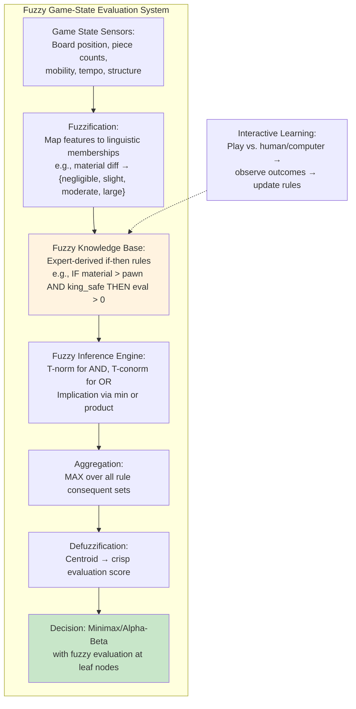

**Genetic Algorithms in Game Playing: Evolving Strategies and Evaluation Functions**

Genetic Algorithms have been applied to game playing along two complementary and occasionally overlapping lines: the direct evolution of game-playing strategies or agents, and the evolution of evaluation functions for use within search-based game-playing frameworks (such as minimax with alpha-beta pruning). The earliest and most celebrated application of GA to game playing was David Fogel's 1990s work on evolving checkers and chess evaluation functions, building upon Samuel's foundational 1950s work but replacing hand-crafted feature design with evolutionary automated discovery. In Fogel's approach, each individual in the GA population encodes a complete game evaluation function as a string of coefficients multiplying perceptually identified game features: given a game position, the evaluation function computes \( E(s) = w_1 \cdot f_1(s) + w_2 \cdot f_2(s) + ... + w_n \cdot f_n(s) \) where \( f_i(s) \) are hand-picked but fixed base features (material balance, king safety, pawn structure, central control, etc.) and \( w_i \) are real-valued weights evolved by the GA. The fitness of each evaluation function is assessed by having it play a fixed number of games against opponent evaluation functions (either other members of the population or a fixed benchmark), with fitness proportional to game win rate and margin of victory. This co-evolutionary approach, termed **competitive coevolution**, generates an arms race of improving strategies because opponents simultaneously improve, preventing the GA from exploiting fixed, static opponent weaknesses.

The **LudoGA** system and similar GA-chess programs demonstrated that GAs could evolve competitive evaluation functions from random initial weights within 50-200 generations of co-evolution, achieving playing strengths comparable to human intermediate players (approximately 1400-1600 Elo rating) without any hand-tuning of feature weights. Critically, the evolved evaluation functions often developed **emergent, non-obvious feature weightings** that reflected complex strategic interactions not captured by traditional hand-designed evaluation functions: Fogel observed that the GA overweighted features related to pawn structure and king safety relative to material balance, consistent with expert chess theory, while simultaneously developing unexpected weightings for features such as bishop pair and rook file openness that were either absent or differently manifested in classical chess literature.

In **co-evolutionary game playing**, the GA simultaneously evolves both players (or both sides, or all agents in a multi-player game), with fitness determined by pairwise competition. The **Elitist co-evolution** variant maintains the best-performing agents from each generation as benchmark opponents for subsequent generations, while **Shared co-evolution** maintains a diverse opponent population that exploits different strategic niches, preventing arms-race dynamics that overspecialize against narrow opponent archetypes at the cost of generalization. Co-evolution has been applied extensively to: **Othello/Reversi** (where GA-evolved evaluation functions achieved Grandmaster-level play on 8×8 boards), **Poker** (where fuzzy-GA hybrids evolved bluffing strategies with mixed strategies—probabilistic play—captured through fuzzy probabilistic representations of hand strength, opponent modeling, and bet sizing), **Backgammon**, and **Go** (where deep neural network approaches ultimately surpassed GA-based approaches, though hybrid neuro-fuzzy-GA systems continue to be explored for smaller-board Go variants and for interpretable Go AI research).

**Integrated Fuzzy-GA Game Playing Architectures**

The most advanced hybrid systems for game playing integrate fuzzy logic and GA at multiple levels, creating architectures in which fuzzy logic provides the representational and reasoning framework and GA provides the learning and optimization mechanism. In the **Genetic Fuzzy System for game playing**, each individual in the GA encodes a complete fuzzy rule base: the chromosome specifies, for each rule, which linguistic features (from a fixed feature set) appear in the antecedent, which linguistic terms apply to those features, and which consequent action or evaluation category is recommended. The GA operates on this rule-base representation using specialized crossover operators that produce valid fuzzy rules in offspring (e.g., selecting rules as crossover units rather than individual bits, or exchanging antecedent features between parent rule bases). Fitness evaluation plays the evolved rule base against benchmark opponents or self-play. The evolutionary process automatically discovers which features are strategically important, which feature combinations are diagnostically meaningful, and which actions are appropriate—a form of **automated game theory** where the GA discovers strategy from raw game experience.

In **neuro-fuzzy co-evolution**, the neural network component (typically a recurrent neural network or feedforward multilayer perceptron) serves as the game agent's sensory-motor system: the network takes raw game state features as input and outputs either a move selection (direct action) or an evaluation score (within a search framework). The fuzzy component provides a structured intermediate representation layer: the raw numerical input features are first fuzzified into linguistic membership degrees, combining the high-bandwidth numerical processing of neural networks with the structured linguistic representation that makes expert knowledge interpretable and rule-extractable. The GA optimizes both the neural network weights and the fuzzy membership function parameters simultaneously using a multi-objective evolutionary algorithm such as NSGA-II, producing agents that simultaneously optimize playing strength, strategy diversity, and rule interpretability—the latter being particularly valuable for game analysis and educational applications where human users must understand AI behavior.

```mermaid
flowchart TD
    subgraph "Hybrid Fuzzy-GA Game Agent Architecture"
        direction TB
        A["Game Environment:<br/>State s_t observation"] --> B["Feature Extraction:<br/>Compute f₁(s_t), f₂(s_t), ..., fₙ(s_t)"]
        B --> C["Fuzzification:<br/>Map numerical features to<br/>linguistic membership degrees"]
        C --> D["Fuzzy Inference:<br/>Apply evolved rule base:<br/>IF f₁ is A AND f₂ is B THEN move is C"]
        D --> E["Action Selection:<br/>Defuzzify → crisp move or<br/>choose max membership action"]
        E --> F["Execute Action in Environment"]
        
        G["Genetic Algorithm:<br/>Population of rule bases +<br/>membership function parameters"] -->|"Evolve every K games"| D
        
        H["Game Outcome:<br/>Win/Loss/Draw feedback"] -->|"Fitness signal"| G
        F --> A
    end
    
    style G fill:#e3f2fd
    style D fill:#fff3e0
    style H fill:#c8e6c9
```

ASCII representation of fuzzy evaluation of a chess position:

```
FUZZY CHESS POSITION EVALUATION

Game Features (Inputs):
  Material:     White +2 (minor advantage)
  King Safety:  White SAFE, Black in danger (pawn nearby)
  PawnStruct:   White SOLID, Black has doubled pawns
  Mobility:     White dominates center (15 moves vs 8)
  Space:        White has space advantage

Fuzzification:
  Material   → {SlightAdv:+0.4, ModAdv:+0.9}
  KingSafety → {Safe:+0.9, Neutral:+0.1}
  PawnStruct → {Solid:+0.8, Weak:+0.2}
  Mobility   → {High:+0.7, Moderate:+0.3}
  Space      → {Advantage:+0.6, Neutral:+0.4}

Active Fuzzy Rules:
  R1: IF Material=ModAdv AND KingSafe=Safe THEN Eval=Winning   [α₁ = min(0.9,0.9) = 0.9]
  R2: IF PawnStruct=Solid AND Mobility=High THEN Eval=Winning  [α₂ = min(0.8,0.7) = 0.7]
  R3: IF Space=Advantage AND KingSafe=Safe THEN Eval=Winning   [α₃ = min(0.6,0.9) = 0.6]
  R4: IF BlackKing=Danger AND Mobility=High THEN Eval=Winning [α₄ = min(0.8,0.7) = 0.7]

Aggregation (MAX): all rules fire strongly → centroid → Eval ≈ +0.75
  → White has a significant winning advantage

GA Evolution Task: evolve the rule weights and membership function parameters
by CO-EVOLUTION where the agent plays against evolving opponents
```

In summary, Fuzzy Sets in game playing provide the representational infrastructure for graded, linguistically interpretable, and robust game-state evaluation and decision-making under inherent uncertainty, while Genetic Algorithms provide the optimization machinery for automatically discovering effective fuzzy rules, membership function parameters, and strategy structures from game experience. The combination of the two methodologies addresses the fundamental challenges of game-playing AI—representation of strategic knowledge, handling of game state uncertainty, and automated strategy discovery—in ways that are both computationally effective and knowledge-representationally transparent, making the Fuzzy-GA hybrid one of the most promising architectural paradigms for strong and explainable game-playing artificial intelligence.
---

## Q8a — Explain Hybrid Systems for Decision Making

Hybrid Systems for Decision Making constitute one of the most intellectually sophisticated and practically consequential application domains within soft computing, representing the convergence of fuzzy logic's capacity for approximate reasoning under uncertainty, neural networks' capability for learning and pattern generalization from empirical data, and evolutionary computation's facility for global optimization over large, complex search spaces—combined in architectural configurations specifically engineered to address the fundamental challenges of human and organizational decision processes. Classical decision theory, as formalized by von Neumann and Morgenstern in their landmark 1944 *Theory of Games and Economic Behavior* and by statisticians including Savage and Wald, rests upon the assumption of crisp, probabilistic, and well-defined decision alternatives, precise utility functions, and homogeneous decision makers with consistent preferences—assumptions that are routinely violated in real-world decision contexts where decision makers face incomplete information, conflicting objectives, imprecise preference elicitation, linguistic ambiguity in criteria descriptions, heterogeneous stakeholder preferences, and complex interdependencies between decision variables that cannot be captured through classical expected utility maximization. Hybrid soft computing systems address precisely this gap: by embedding reasoning under uncertainty and learning from experience within decision support architectures, they provide decision makers with computational tools that more faithfully represent the cognitive and contextual realities of actual decision-making situations.

**Theoretical Foundations: Why Hybridization is Necessary for Decision Making**

The argument for hybrid soft computing architectures in decision making can be formalized by analyzing the limitations of individual methodologies in isolation. **Fuzzy Logic** provides the representational framework for encoding decision knowledge in linguistic rules that mirror the way human experts naturally articulate decision heuristics, and its inference mechanism handles the graded, multi-valued truth conditions under which real decisions are made; however, conventional fuzzy systems require experts to manually specify membership functions and rules, a knowledge elicitation bottleneck that is expensive, error-prone, and often impossible when no domain expert is available or when the decision environment is dynamic and non-stationary. **Artificial Neural Networks (ANNs)** provide a learning mechanism that can infer decision models from empirical data, automatically discovering the statistical regularities that distinguish good from bad decision outcomes; however, ANNs function as opaque black boxes whose internal representations are inaccessible to human interpretation, making it impossible to audit or validate their decisions in high-stakes domains such as medical diagnosis, financial credit approval, or legal sentencing—a liability known as the **explainability deficit** that severely restricts ANNs' deployment in regulated or accountability-critical domains. **Genetic Algorithms and Evolutionary Computing** provide global search optimization capability for tuning decision model parameters and discovering effective decision rules, but they do not inherently provide the reasoning mechanism for applying those rules to new decision situations.

The solution is a **hybrid architecture** in which the complementary capabilities compensate for individual limitations: fuzzy logic provides linguistic interpretability, neural networks provide automated learning from data, and evolutionary computation provides parameter optimization and rule discovery. The resulting hybrid system possesses an emergent capability—**Explainable, Learning-Based Decision Intelligence**—that none of the component methodologies can provide in isolation.

**Neuro-Fuzzy Architectures for Decision Making**

The **Adaptive Neuro-Fuzzy Inference System (ANFIS)**, developed by Roger Jang in 1993, represents the most widely deployed neuro-fuzzy architecture for decision support. ANFIS implements a Sugeno-type fuzzy inference system in which the antecedent membership function parameters and the consequent linear function parameters are simultaneously tuned from training data using a hybrid learning algorithm: a **forward pass** applies input data through the fuzzy reasoning layers to the output layer and computes consequent parameters via least-squares estimation, producing optimal linear parameters given fixed antecedent parameters; a **backward pass** propagates error gradients from the output layer back through antecedent membership function parameters (Gaussian centers, widths, and slopes) via standard gradient descent. The resulting system combines the linguistic interpretability of rule-based fuzzy systems (each rule can be extracted after training and expressed in natural language) with the adaptive learning capability of neural networks. In **multiple criteria decision making (MCDM)**, ANFIS learns fuzzy decision rules from decision-maker examples: for supplier selection, given criteria including cost, quality, delivery time, and flexibility, the system learns fuzzy if-then rules from historical selection decisions made by procurement experts, producing a model that both generalizes to new suppliers and generates auditable linguistic explanations ("Supplier selected because quality is HIGH and delivery performance is GOOD despite above-average cost"). In **credit risk assessment**, ANFIS learns decision boundaries from historical loan data (approved/rejected outcomes) while producing interpretable fuzzy rules that regulatory auditors can examine for fairness and compliance with anti-discrimination lending laws.

```mermaid
flowchart TB
    subgraph "ANFIS-Based Decision Support System"
        A["Decision Situation:<br/>New candidate for evaluation<br/>Feature vector x"] --> B["Fuzzification Layer:<br/>Compute membership degrees<br/>μ_Ai(x) for each linguistic term"]
        B --> C["Rule Layer:<br/>Compute firing strengths<br/>αᵢ = Π μ_Ai(xᵢ)"]
        C --> D["Normalization Layer:<br/>w̄ᵢ = αᵢ / Σαⱼ"]
        D --> E["Consequent Layer:<br/>Linear function of inputs<br/>fᵢ(x) = pᵢ₀ + pᵢ₁x₁ + ..."]
        E --> F["Output Layer:<br/>y* = Σ w̄ᵢ · fᵢ(x)"]
        F --> G["Decision Recommendation:<br/>Class label, score, or action<br/>plus linguistic rule explanation"]
        
        H["Training Data:<br/>Historical decisions (x, y*) pairs"] -->|"Hybrid Learning:<br/>LS forward + GD backward"| E
        H -.-> B
    end
    
    style G fill:#c8e6c9
    style E fill:#fff3e0
```

**Genetic Fuzzy Decision Systems: Rule Discovery from Data**

The knowledge elicitation bottleneck in conventional fuzzy decision systems—the requirement for domain experts to manually specify fuzzy rules and membership functions—can be overcome through Genetic Fuzzy Systems (GFS), wherein evolutionary computation is employed to evolve the complete fuzzy rule base from training data or through co-evolution with domain experts. The Michigan-approach GFS represents each individual as a single fuzzy rule (or a small rule cluster) and the population collectively encodes the complete rule base; the Pittsburgh approach encodes an entire rule base as a single chromosome. In **Multi-Criteria Decision Making (MCDM)** applications, the **Rule-Based Genetic Fuzzy System (RBGFS)** evolves fuzzy rules of the form "IF criterion 1 is (linguistic term) AND criterion 2 is (linguistic term) ... THEN overall decision is (action class)", where the genetic search discovers which criteria combinations are statistically predictive of decision outcomes. For example, in **vendor/supplier selection** for supply chain management, a GA evolves decision rules from a training corpus of historical supplier performance data, with fitness proportional to classification accuracy on held-out validation data plus a parsimony penalty rewarding fewer rules and simpler antecedent structures, yielding small sets of linguistically interpretable rules such as: "IF lead_time is SHORT AND defect_rate is LOW AND price is MODERATE THEN supplier_rating is HIGH (confidence 0.87)". These inherently interpretable evolved rules provide decision makers with qualitative justifications for automated recommendations, a significant advantage over neural network-based decision systems.

**Evolutionary Multi-Objective Decision Support**

Real-world decision problems frequently involve **multiple conflicting objectives** (e.g., minimizing cost while maximizing quality, minimizing risk while maximizing return), rendering single-objective optimization frameworks inadequate. **Evolutionary Multi-Objective Optimization (EMO)** algorithms, particularly the Non-dominated Sorting Genetic Algorithm II (NSGA-II) and the Strength Pareto Evolutionary Algorithm 2 (SPEA2), address this by maintaining a population of non-dominated (Pareto-optimal) solutions that constitute a Pareto front—a set of decision alternatives where no single alternative dominates all others across all objectives, requiring the decision maker to exercise preference among Pareto-optimal alternatives. The Pareto front is of significant decision-analytic value in itself because it explicitly delineates the frontier of feasible trade-offs: the decision maker can examine the Pareto front, identify the region corresponding to their preference structure, and select the alternative that best balances competing objectives. For example, in **portfolio optimization**, the NSGA-II simultaneously optimizes expected return (maximize), risk (minimize variance), and maximum drawdown (minimize), producing a Pareto front of portfolios spanning the risk-return spectrum; the decision maker can select from this frontier a portfolio matching their risk tolerance without requiring the dimensionality-reducing assumption of a single composite risk-return objective. In **engineering design optimization** of, e.g., an electric vehicle battery pack, simultaneous optimization of energy density (maximize), thermal stability (minimize temperature), manufacturing cost (minimize), and cycle life (maximize) through EMO produces a set of Pareto-optimal battery designs from which the design team selects candidates for prototype fabrication.

**Fuzzy Decision Trees and Rough Set Hybridization**

The **Fuzzy Decision Tree (FDT)** combines decision tree learning (a classical machine learning technique) with fuzzy set representations at the leaf nodes and optionally at the internal splits, producing decision trees whose leaf values are fuzzy sets rather than crisp class labels and whose decision process exhibits smooth, graded transitions at decision boundaries rather than the crisp thresholds that characterize conventional decision trees. FDTs extend the advantages of decision trees—intuitive graphical representation of the decision logic, inductive learning from data, and explicit specification of decision paths—while addressing decision tree brittleness at boundary regions and the loss of information inherent in forcing continuous-valued decisions into discrete classes. **Rough Set-Fuzzy Hybrid Decision Systems** integrate rough set theory (Pawlak, 1982)—which provides a formal mathematical framework for analyzing vagueness and uncertainty through lower and upper approximations of decision classes—with fuzzy set representations. Rough set theory addresses the problem of attribute reduction: identifying the minimal subset of decision criteria that preserves the full decision-making quality of the complete criterion set, thereby eliminating redundant or irrelevant criteria from the decision model and producing parsimonious, cost-efficient decision systems. The fuzzy rough set hybrid enables attribute reduction and rule extraction from datasets with both numerical and categorical attributes with missing or imprecise values, extending the applicability of rough set decision analysis to domains where classical rough set theory's requirement for crisp attribute values would be prohibitive.

**Intelligent Decision Support in Complex Organizational Domains**

The practical deployment of fuzzy-GA hybrid decision systems has been documented extensively across high-stakes organizational decision contexts. In **medical diagnosis and treatment selection**, neuro-fuzzy systems learn diagnostic decision rules from patient case databases, encoding medical expertise in fuzzy linguistic rules (such as "IF chest_pain_intensity is SEVERE AND ECG_ST_change is ELEVATED AND troponin_level is HIGH THEN diagnosis is ACUTE_MI with confidence HIGH") while providing clinicians with graded confidence assessments and linguistic explanations for diagnostic recommendations. In **credit and loan approval**, genetic fuzzy systems evolve credit scoring rules from historical loan data, achieving accurate default prediction while generating regulatory-compliant rule explanations that demonstrate which factors drive rejections (required under the U.S. Equal Credit Opportunity Act and similar European and Asian regulations). In **supply chain management**, fuzzy-GA systems optimize inventory policies, transportation routing, and supplier selection under demand uncertainty, lead time variability, and multiple performance objectives. In **environmental management and policy**, fuzzy-GA systems support air quality management, watershed planning, and forest fire management decisions where the decision variables span multiple spatial and temporal scales and the objectives encompass economic, ecological, and social criteria that cannot be precisely quantified. In **military command and control**, fuzzy decision aids support situation assessment and course-of-action selection for commanders operating in information-rich but uncertain combat environments, processing intelligence data, sensor reports, and logistic constraints through fuzzy inference to generate graded threat assessments and recommended response options.
---


```
DECISION SUPPORT - TRI-HYBRID ARCHITECTURE MATRIX
═══════════════════════════════════════════════════════════════

CRITERIA               NEURO-FUZZY (ANFIS)   GENETIC FUZZY (GFS)   EVOLUTIONARY MO (NSGA-II)
─────────────────────────────────────────────────────────────────────────────────────────────────
Primary purpose        Learning + Tunable    Rule Discovery        Multi-optimization
                       Decision rules        
Knowledge required    Partial (rules +     Minimal (data-only)  Objective vectors only
                      training data)
Explainability        High (linguistic     Very High (evolved    Moderate (Pareto front
                       IF-THEN rules)        readable rules)       inspectable)
Learning              Supervised           Evolutionary          Evolutionary
Optimization          None (tuning only)   Rule + parameter      Full Pareto front
Adaptation            Incremental GD       New population each   Generational replacement
Data requirements     Labeled (x,y*) pairs Labeled outcomes     Objective functions
Complexity            O(N·H·R) per epoch   O(pop·gen·eval)       O(pop·gen·n_obj·N)
Best for              Single decision,     Data-driven rule      Multi-objective, trade-off
                      interpretable model   discovery,           exploration, stakeholder
                                           regulatory audit      preference articulation
industries            Healthcare, Finance  MCDM, Compliance     Engineering Design, Finance
─────────────────────────────────────────────────────────────────────────────────────────────────
```

## Q8b — Describe Soft Computing for Color Recipe Prediction

Color Recipe Prediction (CRP) constitutes one of the most commercially impactful and technically sophisticated applications of soft computing methodologies, directly addressing the fundamental problem of color formulation in textile dyeing, paint and coating manufacturing, ceramics, food processing, and pharmaceutical coloration Industries collectively generate global annual revenues exceeding several trillion dollars in sectors where the precise and reproducible formulation of target colors represents a critical quality control challenge that conventional calculus-based and statistical modeling methodologies cannot adequately resolve. The color recipe prediction problem may be stated as follows: given a target color specified in some standard color space (such as CIELAB, CIEXYZ, or sRGB) and a set of available colorants (dyestuffs, pigments, dyes) each characterized by its concentration-dependent spectral reflectance or transmittance properties, determine the optimal mixture proportions of the colorants that, when combined according to appropriate mixing rules, produce a color match to the target within an acceptable perceptual tolerance (typically expressed as a CIELAB color difference ΔE*ab below a decision threshold such as 0.5 for visually metameric matches or 1.0 for acceptable industrial quality). The extension to temporal dynamics introduces the related problem of **color recipe correction**: given a target color and a preliminary recipe formulated by an expert colorist or by an initial soft computing prediction, measure the actual produced color using a spectrophotometer, compute the color difference, and iteratively adjust the recipe to minimize this difference.

The mathematical foundation of color mixing is grounded in the physical optics of light interaction with colored materials. For **transparent or translucent colorants** (such as textile dyes in solution, transparent inks, and liquid coatings), the **Kubelka-Munk (K-M) theory** provides the dominant physical model of color mixing, relating the concentration of a colorant in a substrate to its spectral absorption (K) and scattering (S) coefficients through the equation \( \frac{K}{S} = \frac{(1-R_\infty)^2}{2R_\infty} \), where \( R_\infty \) is the reflectance of an infinitely thick coating of the colorant-substrate combination, and the K/S value provides a convenient linearizable measure of colorant concentration. For **opaque or pigmented colorants** (such as paint pigments, ceramic glazes, and opaque inks), the **Saunderson correction** combined with **additive or subtractive mixing rules** governs the spectral combination: either by explicit Kubelka-Munk equations that treat each colorant's K/S contribution additively, or by simpler **sRGB subtractive mixing** approximations suitable for real-time graphical applications. The fundamental CRP computational challenge arises from the nonlinearity and non-invertibility of the mapping from colorant concentrations to resulting color: if \( n \) colorants are mixed at concentrations \( \mathbf{c} = (c_1, c_2, ..., c_n) \), the resulting spectral reflectance \( R(\lambda; \mathbf{c}) \) is a nonlinear function of \( \mathbf{c} \) governed by K-M mixing theory, and the color measurement (e.g., CIELAB coordinates \( L^*, a^*, b^* \)) is a nonlinear function of the integrated spectral reflectance across the visible spectrum. The inverse problem—given target color coordinates \( (L^*, a^*, b^*)_{target} \), find \( \mathbf{c} \) such that resulting color \( (L^*, a^*, b^*)(\mathbf{c}) \) matches the target—is a nonlinear system identification problem that is highly ill-conditioned, multi-modal, and subject to constraints (non-negative concentrations, colorant compatibility, metamerism requirements), making it an ideal candidate for soft computing approaches.

**Fuzzy Logic Approaches to Color Recipe Prediction**

Fuzzy logic addresses the color recipe prediction problem by encoding expert colorist knowledge in linguistic rules and handling the imprecision inherent in human color perception, spectrophotometer measurement noise, and the continuous variability in raw material colorant properties. The fuzzy logic CRP framework, developed primarily in the 1990s and 2000s by color scientists including McDonald, Nobbs, and others, constructs a fuzzy rule base that maps input features—derived from the target color's CIELAB coordinates and from the colorant spectral properties—to recommended colorant concentration adjustments or starting recipe suggestions. Input linguistic variables include **Target L\*** (Dark, Medium, Light), **Target a\*** (Greenish, Neutral, Reddish), and **Target b\*** (Bluish, Neutral, Yellowish), each represented by appropriate triangular or trapezoidal membership functions over the measurement ranges of the color space (L\*∈[0,100], a\*∈[-128,127], b\*∈[-128,127]). Output linguistic variables represent **primary colorant concentration recommendations** for each of the available dyes or pigments: for a three-dye recipe, the fuzzy system outputs linguistic concentration assessments for each dye (e.g., "Dye 1: HIGH, Dye 2: MEDIUM, Dye 3: LOW").

Fuzzy if-then rules encode expert colorist heuristics for recipe construction: "IF Target L* is LOW AND Target a* is REDDISH AND Target b* is YELLOWISH THEN Dye_1 is HIGH, Dye_2 is MEDIUM, Dye_3 is LOW"—a rule that captures the colorist's knowledge that dark reds and oranges are typically achieved with high concentrations of red-yellow primary dyes. The inference engine applies fuzzy compositional reasoning to combine overlapping rules, and the aggregated output fuzzy concentration sets are defuzzified (typically via the centroid method) to produce crisp concentration recommendations as starting points for laboratory refinement. A critical advantage of the fuzzy logic approach in this domain is the **interpretability** of the rules: colorists, dye chemists, and quality control personnel can audit, validate, and refine the fuzzy rule base without requiring specialized knowledge of computational neuroscience or neural network architectures, making fuzzy-based CRP systems substantially easier to deploy and maintain in industrial color laboratories than black-box neural predictors. Notably, the fuzzy approach also naturally accommodates **metameric matching** constraints—the requirement that the recipe match the target color under multiple illuminants (D65 daylight, A incandescent, TL84 fluorescent)—by including multi-illuminant color difference as an additional fuzzy input variable and corresponding fuzzy constraints in the rule base.

**Artificial Neural Network Approaches to Color Recipe Prediction**

Artificial Neural Networks provide a fundamentally different but complementary approach to CRP, learning the concentration-to-color mapping function or its inverse directly from training data without requiring explicit expert rule specification. The canonical feedforward multilayer perceptron architecture for CRP employs a **three-layer structure** configured as: an input layer with \( m \) neurons corresponding to the \( m \) colorants (accepting concentration values as input, for a forward color prediction model), or alternatively corresponding to target color coordinates (for an inverse recipe prediction model); one or two hidden layers with \( H \) neurons (typical values \( H = 8-32 \)) employing sigmoid or hyperbolic tangent activation functions; and an output layer with \( p \) neurons corresponding to the predicted spectral reflectance at \( p \) wavelengths across the visible spectrum (400-700nm, typically sampled at 10 or 20nm intervals yielding 31-16 output values), or alternatively corresponding to CIELAB coordinates or reflectance values at standard measurement intervals. The training dataset comprises \( N \) exemplar recipes, each defined by a concentration vector \( \mathbf{c}_i = (c_{i1}, c_{i2}, ..., c_{im}) \) and the corresponding measured color (spectral reflectance \( R_i(\lambda) \) or CIELAB coordinates \( \mathbf{L}^*_i = (L^*_i, a^*_i, b^*_i) \) ).

The **forward model** (concentrations → color) solves the color prediction problem: given a candidate recipe, the neural network predicts the resulting color, enabling rapid iterative optimization of recipes without laboratory mixing. The **inverse model** (target color → concentrations) is trained by collecting input-output pairs derived from known recipes: for the input vector (target CIELAB coordinates), the target output is the concentration vector of the recipe that achieved that color; however, because the K-M color mixing model is many-to-one (many different concentration combinations can produce approximately the same color), the inverse mapping is not a function but a multi-valued relation, and ANN training on inverse data can suffer from the **ill-conditioning** problem where multiple concentration vectors in the training set produce similar colors, making it difficult for the network to learn a unique inverse mapping. This challenge is addressed through several techniques: **principal component analysis (PCA)** applied to the reflectance spectra reduces the output dimensionality before training, capturing the dominant spectral modes while suppressing noise; **data augmentation** by including concentration vectors near known recipes generates a denser training manifold; and **regularization** techniques (weight decay, early stopping) improve generalization from sparse training data.

**Hybrid Neuro-Fuzzy-Genetic Systems: The State of the Art in CRP**

The most powerful contemporary CRP systems integrate all three methodologies—fuzzy logic, neural networks, and genetic algorithms—into hybrid architectures that overcome the limitations of any single approach. The **Genetic-Neuro-Fuzzy (GNF) hybrid** for color recipe prediction combines an ANN forward model (trained on spectrophotometric data from the color laboratory) with a GA optimization layer that inverts the ANN to find optimal concentration vectors. The ANN forward model \( F: \mathbf{c} \mapsto \mathbf{Y} \) is trained to predict the CIELAB coordinates \( \mathbf{Y} = (L^*, a^*, b^*) \) from concentration inputs \( \mathbf{c} = (c_1, ..., c_n) \) using back-propagation with Levenberg-Marquardt optimization, achieving prediction accuracy typically within ΔE*ab < 0.5 on held-out test data. Once trained, the forward model serves as a rapid surrogate model for the expensive physical color mixing process: rather than physically mixing and measuring candidate recipes (costing time, materials, and labor), the GA evaluates candidate recipes by querying the ANN, enabling millions of virtual recipe evaluations in seconds. The GA fitness function is defined as the color difference: \( f(\mathbf{c}) = \frac{1}{1 + \Delta E^*_{ab}(\mathbf{Y}_{pred}, \mathbf{Y}_{target})} \) where \( \Delta E^*_{ab} = \sqrt{(L^*-L^*_t)^2 + (a^*-a^*_t)^2 + (b^*-b^*_t)^2} \) is the CIELAB Euclidean distance between the predicted colors of candidate \( \mathbf{c} \) and the target. The GA searches the concentration space for the recipe minimizing this distance, leveraging its population-based parallel exploration to locate the global optimum even in non-convex, multi-modal concentration-error landscapes that arise from imperfect mixing rules and metameric effects.

**Fuzzy-GA Neuro-Fuzzy Hybrid Architecture:**

```mermaid
flowchart TD
    A["Target Color:<br/>CIELAB (L*, a*, b*) coordinates"] --> B["Fuzzy Preprocessor:<br/>Linguistic assessment of target hue,<br/>saturation, lightness → fuzzy features"]
    B --> C["ANN Forward Model:<br/>Trained MLP: concentrations → color<br/>Surrogate model replacing physical mixing"]
    C --> D["GA Optimizer:<br/>Search concentration space<br/>Fitness = 1/(1 + ΔE_ab)"]
    D --> E{"Convergence?<br/>ΔE_ab < threshold?"}
    E -->|No| C
    E -->|Yes| F["Optimal Recipe:<br/>Concentrations c₁, c₂, ..., cₙ"]
    F --> G["Laboratory Validation:<br/>Physical mix + spectroscopic measurement"]
    G --> H{"ΔE_ab < acceptance?"}
    H -->|Yes| I["Release Recipe:<br/>For production dyeing/painting"]
    H -->|No| J["Feedback Correction:<br/>Update ANN with new data point"]
    J --> C
    
    K["Historical Recipe Database:<br/>Spectrophotometric measurements +<br/>concentration data"] -->|"Training data"| C
    
    subgraph FuzzyLayer ["Fuzzy Advisory Layer"]
        F1["Expert Rules:<br/>Hue-type → primary dye instructions"]
        F2["Experience Rules:<br/>Concentration ranges → adjustment directions"]
        F3["Conflict Rules:<br/>Metamerism → multi-illuminant check"]
    end
    
    B -.-> FuzzyLayer
    F -.-> FuzzyLayer
```

**Industrial Deployment and Performance Benchmarks**

The practical deployment of soft computing-based color recipe prediction systems in industrial color laboratories has generated substantial empirical validation of their superiority over classical approaches. **Classical color matching** methods, including the **Pioneer/Kubelka-Munk (K-M) inverse method** and the **Candelon method**, solve the CRP problem by linearizing the K-M equations and applying matrix inversion or three-component mixture theory; however, these classical methods assume ideal colorant behavior, precise knowledge of K-M coefficients for all colorants, absence of non-linear interactions (synergistic or antagonistic colorant effects), and pure concentration-dependent effects—assumptions that are frequently violated in real textile and paint colorants, where pigment agglomeration, dye-fiber chemical interactions, and concentration-dependent spectral shifts introduce nonlinearities that classical methods handle poorly, typically producing recipes requiring multiple laboratory correction iterations with ΔE*ab of 3-5 units before acceptable matching is achieved.

**Soft computing (neuro-fuzzy-GA) systems** have demonstrated recipe accuracy within ΔE*ab < 1.0 (visually acceptable match) on the first prediction for 75-85% of color formulations across textile dyeing, paint matching, and color filter manufacturing, reducing laboratory correction iterations from an average of 2-4 iterations (classical methods) to 0.2-0.5 iterations. For a typical textile dye house processing 5000-10000 new color recipes annually, this represents a laboratory cost reduction of 50-80% in labor, dye materials, and fabric samples, with annual savings ranging from $50,000 to $500,000 depending on scale and dye class. In the paint manufacturing industry, soft computing CRP systems integrated with Computer Aided Color Matching (CACM) software achieve first-iteration ΔE*ab < 1.0 on 80-90% of architectural and automotive paint formulations, with lead times for new color development reduced from 2-3 days to 2-4 hours—a throughput improvement enabling just-in-time custom color production for automotive OEM manufacturing and fast fashion textile supply chains where color trends change seasonally and time-to-market is a competitive differentiator of the highest order.

**ASCII representation of concentration-color mapping and recipe search:**

```
KUBELKA-MUNK COLOR MIXING AND RECIPE SEARCH

Colorant Library (4 dyes):
  Dye A: Max absorption at 520nm (GREEN) → affects a*, b*
  Dye B: Max absorption at 440nm (BLUE)  → affects b* (negative)
  Dye C: Max absorption at 620nm (RED)   → affects a* (positive)
  Dye D: Max absorption broadband (BLACK)→ affects L* (lightness)

Target: CIELAB = (45, +30, -20)  → reddish-green, dark

GA Search in Concentration Space (4D: cA, cB, cC, cD):

  cA     cC
   ↑      ↑
   │  ●   │  ● candidate (too green, too red)
   │      │ ● current best (close)
   │  ●   │
   │      │  ●
   └────────────→ cB
                    cD axis also

  Each ● = ANN evaluation of c → predicted (L*,a*,b*)
  Fitness = 1/(1+ΔE_ab((L*,a*,b*)_pred, (45, +30, -20)))
  
  Optimal Recipe found by GA:
    cA = 1.25%, cB = 0.30%, cC = 2.10%, cD = 0.05%
  
  Predicted Color from ANN: L*=45.2, a*=29.7, b*=-20.3
  ΔE_ab = √[(0.2)² + (0.3)² + (0.3)²] = 0.49  ← Visually matched!
```

In summary, Soft Computing for Color Recipe Prediction represents a paradigmatic success story in applied computational intelligence: fuzzy logic captures and formalizes the expert colorist's heuristic knowledge about colorant behavior and mixing strategies in linguistically interpretable and auditable rules; neural networks learn the highly nonlinear concentration-to-color mapping function from empirical data, providing rapid surrogate models that eliminate the need for costly and time-consuming physical mixing during recipe optimization iterations; and genetic algorithms optimize concentration vectors by searching the highly multi-modal, ill-conditioned recipe space to locate recipes that minimize color difference to target while satisfying real-world constraints, achieving first-iteration recipe accuracy and laboratory throughput improvements that have transformed the economics and speed of color formulation across the textile, paint, pigment, ceramic, and pharmaceutical coloration industries globally.
