---

## Q1a — Difference between Hill Climbing and Simulated Annealing

Hill Climbing and Simulated Annealing represent two foundational paradigms within the broader taxonomy of local search and metaheuristic optimization algorithms, both of which operate by iteratively exploring a neighbourhood structure around candidate solutions in a search space. Despite their shared reliance on neighbourhood exploration and their common objective of locating maxima or minima within an objective function landscape, the two algorithms differ fundamentally in their search strategies, exploration-exploitation balance mechanisms, convergence properties, solution quality guarantees, and applicability to different classes of optimization problems. Understanding these differences is of considerable theoretical and practical importance, as it informs the selection of the appropriate algorithmic tool for a given optimization scenario and provides insight into the structural properties of search spaces that favour one approach over the other.

**Fundamental Search Philosophy: Greedy Determinism vs. Stochastic Non-Greediness**

The most fundamental distinction between Hill Climbing and Simulated Annealing lies in their underlying search philosophy. Hill Climbing is a **deterministic greedy algorithm** that always accepts improving moves and never accepts worsening moves: at each iteration, the algorithm evaluates all neighbours of the current state and transitions to the neighbour with the highest heuristic value, or to the first neighbour found that improves upon the current state (in the first-choice variant). This greedy acceptance criterion means that the algorithm's trajectory through the search space is entirely determined by the local gradient of the objective function, with no mechanism for exploring regions of the search space that are separated by uphill transitions. Simulated Annealing, by contrast, is a **stochastic non-greedy algorithm** that probabilistically accepts worsening moves with a probability governed by a temperature parameter: at high temperatures, the algorithm accepts worsening moves with high probability, enabling free exploration of the search space; as the temperature decreases, the probability of accepting worsening moves diminishes, progressively constraining the search to improving moves and enabling convergence to a local optimum.

This philosophical difference has profound implications for search behaviour. Hill Climbing is analogous to a myopic climber who always ascends without ever considering whether a temporary descent might lead to a higher peak; Simulated Annealing is analogous to a climber who is willing to descend into valleys early in the ascent (when energy is high) in the hope of subsequently discovering a higher peak. The probabilistic acceptance criterion in Simulated Annealing is derived from the Metropolis-Hastings algorithm in statistical mechanics, which models the equilibrium distribution of a physical system at a given temperature. The probability of accepting a worsening move from state s to state s' with energy increase ΔE = E(s') - E(s) > 0 is given by P(accept) = exp(-ΔE / k_B T), where k_B is the Boltzmann constant (often absorbed into the temperature parameter in algorithmic implementations) and T is the current temperature. At T → ∞, this probability approaches 1, and the algorithm behaves as a random walk; at T → 0, the probability approaches 0 for all ΔE > 0, and the algorithm reduces to deterministic hill climbing.

**Neighbourhood Exploration Strategy**

Hill Climbing employs a **neighbourhood exploration strategy** in which all neighbours (in steepest-ascent variants) or sequential neighbours (in first-choice variants) are evaluated at each step. The neighbourhood function N(s) defines the set of states reachable from the current state s via a single move. Common neighbourhood structures include one-bit flip (for binary encodings), k-bit flip, swap of two positions (for permutation problems), and Gaussian perturbation (for continuous problems). The neighbourhood structure is a design parameter that must be chosen to balance computational cost (larger neighbourhoods require more evaluations per step) against search effectiveness (larger neighbourhoods provide more options at each step). In steepest-ascent hill climbing, the computational cost per iteration is O(|N(s)|), which can be substantial for large neighbourhoods.

Simulated Annealing, by contrast, typically samples **one neighbour at random** at each iteration and applies the Metropolis criterion to accept or reject it. This single-sample-per-iteration approach reduces the per-iteration computational cost to O(1) neighbourhood evaluations, making SA computationally cheaper per iteration than steepest-ascent hill climbing. However, SA typically requires many more iterations overall because it samples neighbours stochastically rather than exhaustively. The SA algorithm also incorporates a **thermal equilibrium sampling** phase at each temperature level: multiple perturbation-acceptance iterations (typically equal to the problem size or a fixed multiple) are executed before the temperature is decremented, allowing the Markov chain to approach quasi-equilibrium at each temperature. This thermal equilibrium requirement is absent in hill climbing, which terminates as soon as no improving neighbour is found.

**Convergence Properties and Solution Quality Guarantees**

Hill Climbing is **not guaranteed** to find the global optimum and is in fact highly susceptible to becoming trapped at local optima. The algorithm terminates at the first local optimum encountered, and the probability of finding this local optimum depends entirely on the quality of the initial state: with a single run from a random initial state, the probability of finding the global optimum is equal to the probability that the initial state is in the basin of attraction of the global optimum. Random-restart hill climbing improves this probability by executing multiple independent runs from different random initial states and retaining the best solution, with the probability of finding the global optimum approaching 1 exponentially in the number of restarts for well-behaved landscapes. However, even random-restart hill climbing offers no guarantee of finding the global optimum in finite time.

Simulated Annealing, under appropriate conditions, is **provably convergent** to the global optimum with probability approaching 1 as the number of iterations approaches infinity. The foundational convergence theorem, established by Hajek and Sasaki (1989), states that if the initial temperature T_0 is sufficiently large and the temperature schedule satisfies T_k ≥ c / log(k + 1) for a constant c proportional to the maximum barrier height in the energy landscape, then SA converges to the global minimum with probability 1. This logarithmic cooling schedule ensures that the Markov chain remains ergodic throughout the annealing process, permitting transitions between any two states with non-zero probability at any temperature. However, the logarithmic schedule requires an impractically large number of iterations for convergence in real-world applications, and practical implementations employ geometric cooling schedules that sacrifice theoretical convergence guarantees for computational tractability while empirically achieving near-optimal performance on most benchmark problems.

```mermaid
flowchart TD
    subgraph "Hill Climbing"
        direction TB
        HC1["Initialize: random state s"] --> HC2["Generate neighbourhood N(s)"]
        HC2 --> HC3{"Find best neighbour s'<br/>with f(s') > f(s)?"]
        HC3 -->|Yes| HC4["Move to s' ← s"]
        HC3 -->|No| HC5["TERMINATE<br/>Return local optimum s"]
        HC4 --> HC2
    end

    subgraph "Simulated Annealing"
        direction TB
        SA1["Initialize: state s, T₀<br/>T₀ high → acceptance ~1"] --> SA2["Generate ONE random neighbour s'"]
        SA2 --> SA3{"ΔE = f(s') - f(s)"]
        SA3 -->|ΔE < 0<br/>Better| SA4["ACCEPT: s ← s'<br/>(always)"]
        SA3 -->|ΔE ≥ 0<br/>Worse| SA5{"P = exp(-ΔE/T)<br/>T high → P~1<br/>T low → P~0"]
        SA5 -->|Yes| SA4
        SA5 -->|No| SA6["REJECT: keep s"]
        SA4 --> SA7{"k mod M == 0?<br/>Cooling interval?"]
        SA6 --> SA7
        SA7 -->|Yes| SA8["Cool: T ← α·T"]
        SA7 -->|No| SA2
        SA8 --> SA9{"T ≥ T_min?"]
        SA9 -->|Yes| SA2
        SA9 -->|No| SA10["TERMINATE<br/>Return best solution found"]
    end
```

**Exploration-Exploitation Trade-off**

The dynamic balance between exploration (searching new regions of the search space) and exploitation (refining known good solutions) is managed differently in the two algorithms. Hill Climbing is entirely exploitation-biased: it can only move downhill in the objective function (or equivalently, uphill in maximization), making it incapable of escaping local optima or exploring distant regions of the search space that might contain superior solutions. This makes hill climbing appropriate only for unimodal or approximately unimodal search spaces where the global optimum is located near the initial state. Simulated Annealing explicitly manages the exploration-exploitation trade-off through its temperature parameter: at high temperatures, exploration is emphasized (high acceptance of worsening moves), while at low temperatures, exploitation is emphasized (high acceptance of improving moves). The cooling schedule governs the rate at which the balance shifts from exploration to exploitation. A rapid cooling schedule (high cooling rate α ≈ 0.95-0.99 per iteration) shifts the balance quickly to exploitation, risking premature convergence to local optima; a gradual cooling schedule (low α or logarithmic cooling) sustains exploration longer, increasing the probability of finding the global optimum at the cost of computational time.

**Computational Cost and Per-Iteration Efficiency**

The computational efficiency of the two algorithms differs substantially on a per-iteration basis and in total. Hill Climbing, in its steepest-ascent variant, requires evaluating |N(s)| neighbours at each step, where |N(s)| is the size of the neighbourhood of the current state s. For problems with large neighbourhoods (e.g., TSP with 2-opt neighbourhood of O(n²) size), this can be computationally expensive per step. However, hill climbing typically converges in a relatively small number of iterations (often O(n) to O(n²) for combinatorial problems) since each step makes a definitive improvement. The total computational cost is therefore O(|N(s)| × k) where k is the number of hill climbing steps. Simulated Annealing requires evaluating exactly one neighbour per iteration (in the simplest implementation), making it computationally cheap per iteration; however, the thermal equilibrium requirement means that SA executes many more iterations than hill climbing—typically O(n²) to O(n³) or more for equivalent solution quality. Additionally, SA requires parameters to be tuned (initial temperature, cooling rate, thermal equilibrium iterations per temperature, final temperature), adding computational overhead for parameter calibration.

**Sensitivity to Parameters**

Hill Climbing has relatively few parameters: the neighbourhood structure and the tie-breaking rule for flat regions (whether to allow sideways moves and how many). Sideways moves, when permitted, allow the algorithm to escape plateaus but risk indefinite cycling if not bounded. Simulated Annealing has a richer parameter space requiring careful calibration: initial temperature T_0 (must be large enough that the initial acceptance ratio is ≥ 0.8), cooling rate α (typically 0.9–0.99 for geometric cooling), number of iterations per temperature level M (typically n to 10n), minimum temperature T_min, and the temperature schedule type (geometric, linear, logarithmic). The performance of SA is substantially more sensitive to these parameters than hill climbing is to its few parameters. Poorly chosen cooling schedules can cause either premature convergence (α too large, T_0 too small) or excessive computation (α too small, T_min too low).

**Summary Comparison Table:**

| Dimension | Hill Climbing | Simulated Annealing |
|---|---|---|
| Search strategy | Deterministic greedy | Stochastic non-greedy |
| Acceptance of worsening moves | Never | Probabilistic: P = exp(-ΔE/T) |
| Exploration capability | None (single trajectory) | High at T high, reduces with cooling |
| Global optimum guarantee | None | Provable (logarithmic cooling) |
| Per-iteration cost | O(\|N(s)\|) evaluations | O(1) evaluation |
| Typical total cost | O(\|N(s)\| × k) | O(n² to n³) function evaluations |
| Parameters | Neighbourhood, ties | T_0, α, M, T_min, schedule |
| Applicability | Unimodal or smooth landscapes | Multimodal, rugged landscapes |
| Convergence speed | Fast (but to local optimum) | Slow (but potentially global) |
| Parallelism | Limited (sequential) | Embarrassingly parallel |
| Memory requirement | O(1) per trajectory | O(1) per trajectory |

The distinctive advantage of Simulated Annealing over Hill Climbing is its capacity to escape from local optima through probabilistic acceptance of uphill moves during the high-temperature phase, enabling it to discover superior solutions in multimodal landscapes where hill climbing is provably inadequate. The distinctive advantage of Hill Climbing over Simulated Annealing is its simplicity, speed per iteration, and absence of parameter sensitivity. In practice, the two algorithms are frequently deployed in complementary roles: hill climbing as a fast local refinement step applied to the solution produced by Simulated Annealing, or as the exploitation phase within a memetic algorithm.
---

## Q1b — Explain the Benefits of Particle Swarm Optimization

Particle Swarm Optimization (PSO) represents a pivotal contribution to the field of swarm intelligence and computational optimization, originally formulated by James Kennedy and Russell C. Eberhart in 1995, inspired by the emergent collective behaviour observed in natural swarming systems including flocks of birds, schools of fish, colonies of bees, and herds of animals—societies in which decentralized individuals following simple local interaction rules produce sophisticated, adaptive, globally coordinated group behaviour without any central authority directing the swarm. The algorithmic abstraction of this phenomenon yields an optimization method that operates upon a population (swarm) of candidate solutions (particles) that move through the search space under the combined influence of their own historical best position and the swarm's historical best position, balancing local exploitation of promising regions against global exploration of the search space. The benefits of PSO span theoretical properties, empirical performance characteristics, practical deployability features, and architectural properties that collectively make it one of the most widely adopted metaheuristic optimization algorithms in contemporary computational intelligence practice.

**Computational Simplicity and Ease of Implementation**

The foremost practical benefit of PSO is its **algorithmic simplicity**, which translates directly into ease of implementation, low programming complexity, and rapid prototyping. The canonical PSO algorithm requires only the specification of a small number of intuitive parameters: swarm size N (typically 10–50 particles, substantially smaller population sizes than Genetic Algorithms which commonly require N = 50–500), inertia weight ω (typically linearly decreasing from 0.9 to 0.4 over the course of optimization), cognitive acceleration coefficient c₁ (typically 2.0), and social acceleration coefficient c₂ (typically 2.0). The algorithm requires no encoding design (unlike Genetic Algorithms which require selection of binary, real-valued, integer, permutation, tree, or other encoding schemes), no specialized crossover or mutation operators (unlike Genetic Algorithms which require operator design per problem encoding), and no temperature schedule (unlike Simulated Annealing which requires careful calibration of T_0, cooling rate, thermal equilibration iterations, and T_min). The total implementation of PSO in a high-level programming language requires approximately 20–40 lines of code, making it accessible to practitioners with minimal background in evolutionary computation or optimization theory.

A complete PSO implementation pseudocode is as follows: Initialize N particles with random positions and velocities within the search space bounds; for each particle i, set pbest_i ← x_i and evaluate f(x_i); identify gbest ← argmax_{i ∈ {1,...,N}} f(pbest_i); for each iteration t until stopping criterion: for each particle i: update v_i(t+1) ← ω·v_i(t) + c₁·r₁·(pbest_i - x_i) + c₂·r₂·(gbest - x_i); update x_i(t+1) ← x_i(t) + v_i(t+1); enforce position bounds via clamping; evaluate f(x_i(t+1)); if f(x_i(t+1)) > f(pbest_i) then pbest_i ← x_i(t+1); if f(pbest_i) > f(gbest) then gbest ← pbest_i. This implementation requires no encoding decision, no operator design, no crossover probability, no mutation probability, no selection mechanism, and no fitness scaling—a level of parameter simplicity that substantially reduces the practitioner's design burden and the risk of poor algorithmic configuration.

**Derivative-Free Black-Box Optimization**

PSO operates as a **derivative-free, gradient-free black-box optimization algorithm**, requiring only the ability to evaluate a scalar objective function f(x) at candidate points x in the search space. Unlike gradient-based optimization methods (gradient descent, Newton's method, quasi-Newton methods, conjugate gradient), PSO requires no knowledge of ∂f/∂x (the gradient), no assumption of differentiability or continuity of f, no requirement for Lipschitz continuity, and no convexity assumption on the objective function. This black-box property enables PSO to be applied to optimization problems that are structurally intractable for classical methods: discontinuous objective functions arising from digital logic or discrete-event simulation, non-differentiable functions arising from the presence of absolute values, max/min operators, or integer constraints, noisy stochastic objective functions arising from Monte Carlo simulation or stochastic system modelling, and expensive-to-evaluate objective functions arising from finite element analysis, computational fluid dynamics, or computational chemistry simulations. PSO's derivative-free nature also means it can be applied to "oracle" optimization problems where the objective function is a black box provided by an external system, simulation environment, or physical experiment that exposes only input-output behaviour without internal structure.

**Effective Balance of Exploration and Exploitation**

The PSO velocity update equation embodies a remarkably elegant **implicit balance of exploration and exploitation** without requiring explicit parameter schedules or complex mechanisms. The velocity update v_i(t+1) = ω·v_i(t) + c₁·r₁·(pbest_i - x_i) + c₂·r₂·(gbest - x_i) decomposes naturally into three components: the inertia component ω·v_i(t) preserves the particle's current momentum, preventing abrupt direction changes and enabling continued exploration in directions that have previously proven fruitful; the cognitive component c₁·r₁·(pbest_i - x_i) pulls the particle toward its own best position, implementing **local exploitation** around regions that have proven promising for that specific particle; and the social component c₂·r₂·gbest - x_i pulls the particle toward the swarm's best position, implementing **global exploitation** of the best region discovered by the entire swarm. The inertia weight ω provides a direct and intuitive mechanism for controlling the balance: high ω values (close to 1.0) preserve momentum and encourage exploration, while low ω values (close to 0.0) allow rapid convergence and encourage exploitation. The canonical linearly decreasing inertia weight schedule ω(t) = ω_max - (ω_max - ω_min) × t/T_max transitions smoothly from exploration-dominated early search to exploitation-dominated late search without requiring external mechanism.

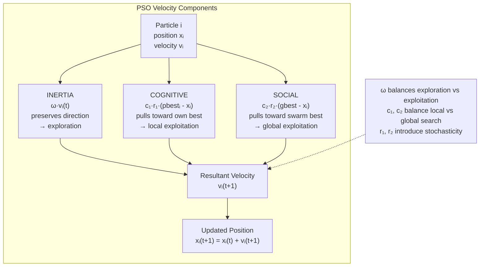

**Fewer Tuning Parameters than Competing Metaheuristics**

Compared to Genetic Algorithms, Simulated Annealing, and Ant Colony Optimization, PSO requires substantially fewer parameters to be configured for effective performance. Genetic Algorithms typically require specification of: population size N, crossover probability p_c, mutation probability p_m, selection mechanism (roulette wheel, rank, tournament), tournament size k (if tournament selection), elitism rate E, crossover operator (single-point, two-point, uniform, BLX, SBX), mutation operator (bit-flip, Gaussian, uniform), encoding scheme (binary, real-valued, permutation), and fitness scaling method—typically 8–12 hyperparameters that must be jointly tuned. Simulated Annealing requires: initial temperature T_0, cooling rate α, number of iterations per temperature M, minimum temperature T_min, temperature schedule type—parameters whose interaction is complex and whose poor calibration leads to either premature convergence or excessive computation. Ant Colony Optimization requires: number of ants, pheromone evaporation rate ρ, pheromone influence α, heuristic influence β, pheromone initial value, and Q (pheromone deposit constant)—5–6 parameters with non-obvious interaction effects. PSO's minimal parameter set—essentially four primary parameters (N, ω, c₁, c₂) with well-established default values—represents a substantial practical advantage that reduces the practitioner's parameter calibration burden and makes PSO accessible to non-specialists.

**Inherent Parallelism and Suitability for Parallel Hardware**

PSO's particle update mechanism is inherently **embarrassingly parallel**: each particle's velocity and position update depends only on its own state (x_i, v_i, pbest_i) and globally shared information (gbest), with no inter-particle communication or pairwise interaction required. This structure maps directly onto parallel hardware architectures including multi-core CPUs, graphical processing units (GPUs), and clusters. In a multi-core implementation, each particle can be assigned to a separate core with gbest updated synchronously at the end of each iteration via an atomic reduction operation. GPU implementations can exploit the massive parallelism of modern GPUs to update thousands of particles simultaneously, enabling optimization of high-dimensional problems (D > 10,000 dimensions) that would be intractable on sequential hardware. PSO's parallelism efficiency approaches 1.0 (near-perfect speedup) for large swarms on many-core architectures, substantially exceeding the parallelization efficiency of Genetic Algorithms, where crossover requires pairwise communication between selected parents and where parallel fitness evaluation (while independent) is offset by the sequential nature of the selection-application cycle.

**Mathematical Elegance and Theoretical Foundation**

PSO possesses a degree of **mathematical elegance** that is relatively uncommon among metaheuristic optimization algorithms. The canonical velocity update equation has a clean, intuitive interpretation in terms of vector addition of three distinct velocity components, each with a clear semantic interpretation. Moreover, the convergence properties of PSO have been formally analyzed: Clerc and Kennedy (2002) established the **constriction factor** variant of PSO, which modifies the velocity update to v_i(t+1) = χ·[v_i(t) + c₁r₁(pbest_i - x_i) + c₂r₂(gbest - x_i)] where χ = 2/|2-φ-sqrt(φ²-4φ)| and φ = c₁ + c₂ > 4. For appropriate values of c₁ and c₂ satisfying φ > 4, the constriction factor χ < 1 ensures almost-sure convergence of the swarm to a stable point, providing a theoretical guarantee analogous to the logarithmic convergence of Simulated Annealing. The stability conditions for PSO have been analyzed using discrete-time linear system theory: the particle dynamics can be represented as a linear time-invariant system when gbest is fixed (single-particle analysis with global best), and the system is stable if and only if the eigenvalues of the state transition matrix lie within the unit circle in the complex plane. This theoretical analysis enables principled parameter selection rather than purely empirical trial-and-error.

**Diverse Applications Across Domains**

The empirical literature documenting PSO's application across domains is vast, reflecting the algorithm's versatility. In **electrical power systems**, PSO solves economic load dispatch, optimal reactive power dispatch, transmission loss minimization, and generation scheduling with constraints on generator capacity, ramp rates, and transmission line limits—problems characterized by non-convex, non-smooth objective functions arising from valve-point effects, prohibited operating zones, and piecewise quadratic cost functions. In **engineering design**, PSO optimizes structural designs of trusses, pressure vessels, welded beams, and speed reducers subject to stress, displacement, geometric, and fabrication constraints. In **machine learning**, PSO optimizes neural network weights and architectures, selects features for high-dimensional datasets, and tunes support vector machine hyperparameters. In **signal processing**, PSO designs digital filters, designs antenna arrays, and performs spectrum sensing in cognitive radio. In **chemical engineering**, PSO optimizes chemical reactor designs, separation processes, and process control parameters. In **finance**, PSO optimizes trading strategies, portfolio weights, and option pricing model parameters. In **robotics**, PSO optimizes robot path planning, manipulator trajectory planning, and swarm robot coordination strategies. In **medical imaging**, PSO performs image segmentation, registration, and feature selection for diagnostic classification.

**Adaptability to Constrained and Multi-Objective Optimization**

PSO has been successfully extended to **constrained optimization** through several mechanisms that preserve the algorithm's simplicity while handling inequality and equality constraints. The **penalty function method** incorporates constraint violations into the fitness function as penalty terms, with the penalty coefficient typically increasing over the course of the optimization to progressively shift focus from unconstrained exploration to constraint satisfaction. The **Stochastic Ranking** method interleaves constraint violation comparisons with objective value comparisons during particle updates, enabling constraint handling without explicit penalty coefficient tuning. The **preserving feasibility** method initializes particles only within the feasible region and employs repair operators that project infeasible positions back into the feasibility region after velocity updates. For **multi-objective optimization**, Multi-Objective PSO (MOPSO) maintains an external archive of non-dominated (Pareto-optimal) solutions and employs crowding distance or niching mechanisms to maintain diversity in the Pareto front approximations. Variants including NSPSO, SMPSO, and OMOPSO have demonstrated competitive performance on standard multi-objective benchmark problems, routinely producing Pareto front approximations within the reference front convergence metrics established by the evolutionary multi-objective optimization community.

In summary, the benefits of PSO—computational simplicity, minimal parameters, black-box applicability, effective implicit exploration-exploitation balance, inherent parallelism, mathematical elegance, broad empirical validation across domains, and adaptability to constrained and multi-objective formulations—collectively establish PSO as an indispensable tool in the practitioner's metaheuristic optimization toolkit, with particular advantages for real-time applications, parallel hardware deployment, and problems where gradient information is unavailable or unreliable.
---

## Q1c — What are the Steps of Evolutionary Programming?

Evolutionary Programming (EP), as a distinct paradigm within the broader framework of evolutionary computation, operates through a well-defined generational cycle that adapts candidate solutions to a problem through principles drawn directly from Darwinian natural selection and population genetics. The steps of EP can be systematically enumerated and analyzed to understand both the algorithmic mechanism and the theoretical rationale underlying each phase. The canonical EP algorithm, as formulated by Lawrence J. Fogel and later refined by researchers including Hans-Paul Schwefel, Thomas Bäck, and David Fogel, executes the following sequential phases during each generational cycle: Problem Definition and Representation, Population Initialization, Fitness Evaluation, Mutation (Variation), Offspring Generation, Competition and Selection, and Termination and Solution Extraction. Each of these steps serves a specific function within the adaptive cycle and can be implemented through various specific techniques depending on the problem domain and encoding scheme.

**Step 1: Problem Definition and Representation**

The first step in any Evolutionary Programming implementation is the formal definition of the optimization problem and the selection of an appropriate chromosome representation. In the original formulation of EP by Fogel (1966), the representation was a finite state machine (FSM) used for time-series prediction and sequence modelling tasks—the problem Fogel originally addressed was the prediction of the next symbol in a binary sequence given a finite history of preceding symbols. In contemporary numerical optimization applications of EP, the standard representation is a **real-valued vector** x = (x₁, x₂, ..., xₙ) ∈ ℝⁿ, where each component xᵢ represents a decision variable constrained to an admissible range [Lᵢ, Uᵢ]. This real-valued representation reflects the modern trend in evolutionary computation toward direct representation of decision variables, eliminating the information loss and discretization artifacts associated with binary encoding.

In addition to the decision variables, self-adaptive EP variants include **mutation step size parameters** σ = (σ₁, σ₂, ..., σₙ) co-located within the chromosome, producing an extended chromosome of length 2n: Z = (x₁, x₂, ..., xₙ, σ₁, σ₂, ..., σₙ). The inclusion of step size parameters within the chromosome is motivated by the observation that the optimal mutation magnitude varies across the search space: in flat regions of the fitness landscape, large mutation steps are needed for effective exploration; near optima, small mutation steps are needed for refinement. Self-adaptation enables the algorithm to autonomously adjust mutation intensity on a per-individual, per-dimension basis without external parameter scheduling.

**Step 2: Population Initialization**

The second step initializes a finite population of μ candidate solutions, randomly sampled from the admissible search space. For real-valued encoding with box constraints, each decision variable xᵢ is initialized to a uniform random value in [Lᵢ, Uᵢ]: xᵢ(0) ~ U(Lᵢ, Uᵢ). For self-adaptive variants, the step size parameters are initialized to appropriate values, typically σᵢ(0) ~ U(σ_min, σ_max) where σ_min = 0.01×(Uᵢ-Lᵢ) and σ_max = 0.1×(Uᵢ-Lᵢ), or alternatively using the initial log-normal distribution with mean log(0.1×(Uᵢ-Lᵢ)). The population size μ is a critical algorithmic parameter: small populations (μ = 20–50) lead to rapid convergence but risk premature convergence due to insufficient genetic diversity; large populations (μ = 200–500) maintain diversity at the cost of greater computational expenditure per generation (μ fitness evaluations per generation). The population size interacts with the selection mechanism (tournament size q) to determine the selection pressure: larger tournament sizes increase selection pressure, which when combined with small populations accelerates convergence but increases premature convergence risk.

```mermaid
flowchart TD
    A["Step 1: DEFINE PROBLEM<br/>• Objective: min or max f(x)<br/>• Representation: real-valued vector x∈ℝⁿ<br/>• Constraints: [Lᵢ, Uᵢ] per variable"] --> B["Step 2: INITIALIZE POPULATION<br/>P₀ = {x₁, x₂, ..., xᵤ}<br/>xᵢₖ ~ U(Lₖ, Uₖ)<br/>μ = population size (50-500)"]
    B --> C["Step 3: EVALUATE FITNESS<br/>For each individual xᵢ∈Pₜ:<br/>fᵢ = f(xᵢ) = objective or inverse cost"]
    C --> D["Step 4: MUTATION<br/>For each parent xᵢ∈Pₜ:<br/>σᵢ' = σᵢ·exp(τ'·N(0,1) + τ·Nᵢ(0,1))<br/>xᵢ' = xᵢ + σᵢ'·Nᵢ(0,1)<br/>→ produces μ offspring"]
    D --> E["Step 5: FORM INTERMEDIATE POPULATION<br/>P_intermediate = Pₜ ∪ Offspring<br/>Size = 2μ in (μ+μ) scheme"]
    E --> F["Step 6: COMPETITION / SELECTION<br/>Q-tournament: each individual plays q contests<br/>Against randomly selected opponents<br/>Winners advance → Pₜ₊₁"]
    F --> G{"Step 7: TERMINATION CHECK<br/>t ≥ T_max or no improvement?"]
    G -->|No| C
    G -->|Yes| H["RETURN BEST: argmax f(xᵢ) over P_T"]
    
    note1["Key: No crossover in original EP<br/>Only mutation as variation operator"] -.-> D
    note2["Self-adaptive σᵢ co-evolved with xᵢ<br/>enables automatic step size tuning"] -.-> D
```

**Step 3: Fitness Evaluation**

The third step assigns a scalar fitness value to each individual in the population, quantifying the quality of the candidate solution relative to the optimization objective. For minimization problems, fitness may be defined as the reciprocal of the objective function (fitness = 1/fitness_original), the negative of the objective function (fitness = -fitness_original), or a rank-based transformation where individuals are ranked by objective value and fitness is assigned based on rank rather than raw magnitude. Rank-based fitness assignments are preferred in EP because they reduce the sensitivity of tournament selection to extreme fitness differences that can arise when objective function values vary over several orders of magnitude. The fitness function may incorporate constraint handling through penalty functions that reduce the fitness of individuals violating constraints, or through the death penalty approach that assigns zero or near-zero fitness to infeasible individuals.

**Step 4: Mutation (Variation)**

The fourth step generates offspring through mutation of the parent population. In the original (μ + μ) EP scheme, each parent produces exactly one offspring through mutation, yielding a population of μ offspring. The canonical mutation operator for real-valued EP is **Gaussian perturbation**: for each parent chromosome Z = (x, σ), the offspring chromosome Z' = (x', σ') is generated as follows: each decision variable is perturbed by adding a normally distributed random variate scaled by the individual's step size: x'ᵢ = xᵢ + σᵢ · Nᵢ(0, 1) where Nᵢ(0, 1) is an independent standard normal random variable for each dimension i. The step size parameters themselves are mutated using the log-normal self-adaptation rule: σ'ᵢ = σᵢ · exp(τ' · N(0, 1) + τ · Nᵢ(0, 1)) where τ and τ' are learning rates governing the overall and per-dimension mutation of step sizes. The recommended settings are τ = 1/√(2n) and τ' = 1/√(2√n) where n is the chromosome length (number of decision variables), derived from theoretical analysis of the covariance matrix adaptation mechanism.

Notable mutation operator variants include: **Cauchy mutation**, which replaces the Gaussian perturbation with a Cauchy (Lorentzian) distribution, producing heavier-tailed perturbations that are more effective at escaping from local optima in rugged landscapes; ** Lévy flight mutation**, which employs a power-law step size distribution producing occasional very large jumps combined with many small steps, mimicking the foraging patterns observed in certain animal species; and **polynomial mutation**, which is the standard mutation operator in NSGA-II and produces bounded perturbations through a polynomial probability distribution that concentrates small perturbations near the parent while allowing larger perturbations with decreasing probability, ensuring that offspring remain within the feasible [Lᵢ, Uᵢ] bounds without requiring explicit clamping.

**Step 5: Offspring Generation and Intermediate Population Formation**

The fifth step forms an intermediate population by uniting the parent population Pₜ (size μ) and the offspring population Oₜ (size μ) into a combined population of size 2μ. This (μ + μ) generational scheme—also called the **comma strategy** when the parent population is replaced entirely by offspring—is the original EP formulation. An alternative is the (μ, λ) strategy (originally from Evolution Strategies) that discards all parents and retains only the μ best offspring from a larger offspring population of size λ ≥ μ. The (μ + μ) scheme with exactly μ offspring preserves all parents in the competition pool, which tends to maintain elite solutions across generations. The choice between (μ + μ) and (μ, λ) involves trade-offs between selection pressure ((μ, λ) exerts stronger pressure by eliminating parents) and elitism ((μ + μ) guarantees that the best solution is never lost).

**Step 6: Competition and Selection (Survivor Selection)**

The sixth step applies the selection mechanism to reduce the intermediate population back to size μ, forming the next generation Pₜ₊₁. The original EP formulation employs **stochastic tournament selection** (also called Q-tournament selection in some formulations): for each individual in the intermediate population of size 2μ, q pairwise competitions are conducted, where in each competition the individual is paired with a randomly selected opponent from the intermediate population, and the individual receives a score of 1 if its fitness exceeds the opponent's and 0 otherwise (ties are broken randomly with equal probability). Each individual's total score across q competitions determines its ranking, and the μ individuals with the highest scores survive to form the next generation. The tournament size q controls selection pressure: when q = 1 (binary tournament), each individual wins approximately 50% of its contests on average, producing moderate selection pressure; when q is large (q = 10–20), the selection pressure approaches that of deterministic elitist selection, where only the most-fit individuals survive.

An important variant is **spatial selection**, where the competition neighbourhood is restricted to a spatial structure (grid, ring, or lattice) in which each individual competes only against its immediate spatial neighbours, producing a form of niching that maintains population diversity by allowing different subpopulations to specialize on different local optima. This is analogous to the cellular GA structure but applied within EP's tournament framework.

**Step 7: Termination and Solution Return**

The seventh step checks termination conditions. Standard termination criteria include: maximum number of generations T_max (a user-specified iteration budget, typically 100–10,000 generations depending on problem complexity); minimum improvement threshold (terminate if the best fitness has not improved by more than a threshold ε over the last k generations, indicating convergence to a local optimum); minimum population diversity (terminate if the standard deviation of fitness values across the population falls below a threshold, indicating that all individuals have converged to a similar region of the search space); or target fitness (terminate if an individual achieves a pre-specified fitness threshold, indicating that a satisfactory solution has been found). When termination conditions are met, the algorithm returns the best individual discovered across all generations, which is the global best position gbest(t) maintained throughout the evolutionary process.

The seven steps of EP collectively implement a complete adaptive cycle: initialization creates diversity, mutation generates variation, fitness evaluation grounds variation in the optimization objective, and selection implements differential reproductive success that incrementally shifts the population toward improving regions of the search space. The distinctive characteristic of EP relative to other evolutionary paradigms is the emphasis on mutation as the sole or dominant variation operator, the use of self-adaptive mutation step sizes, and the stochastic tournament selection mechanism—choices that have been empirically validated across a broad spectrum of continuous optimization problems and that provide a computationally simple yet theoretically grounded approach to global optimization.
---

## Q2a — What is the Difference Between Single and Multi-Objective Optimization?

Single-Objective Optimization and Multi-Objective Optimization represent two fundamentally distinct formulations within the field of mathematical optimization, differing in their problem structure, solution concept, methodological approach, and the nature of the insights they provide to decision-makers. Understanding this distinction is of paramount importance in operations research, engineering design, economics, finance, and virtually every domain where complex decisions must be made under competing performance criteria. Single-Objective Optimization, the classical formulation that has dominated optimization theory since the inception of the field, reduces all decision criteria to a single scalar objective function through aggregation, enabling the application of powerful mathematical tools from convex analysis, calculus of variations, and numerical linear algebra. Multi-Objective Optimization, by contrast, explicitly preserves the vector-valued nature of the objective function, recognizing that many real-world problems inherently involve multiple conflicting criteria that cannot be meaningfully collapsed into a single aggregate without loss of essential decision-relevant information.

**Single-Objective Optimization (SOO)**

In Single-Objective Optimization, the problem is formulated as: minimize or maximize f(x) subject to gᵢ(x) ≤ 0 for i = 1,..., m (inequality constraints) and hⱼ(x) = 0 for j = 1,..., p (equality constraints), where x ∈ ℝⁿ is the vector of decision variables and f: ℝⁿ → ℝ is a scalar-valued objective function. The formulation is attractive in its simplicity: given a single scalar objective, the concept of optimality is unambiguous—a solution x* is optimal if and only if there is no feasible solution x with a strictly better objective value (f(x) < f(x*) for minimization or f(x) > f(x*) for maximization). This leads to a well-defined and often computationally tractable optimization problem.

The mathematical theory of Single-Objective Optimization is highly developed. For convex problems (convex objective function, convex feasible region), local optima are global optima, and efficient polynomial-time algorithms exist: linear programming (simplex method, interior point methods) for linear objectives and constraints, quadratic programming for quadratic objectives, and general convex optimization methods (gradient descent, Newton's method, sequential quadratic programming) for smooth convex objectives. For non-convex problems, the situation is more complex: local search methods (hill climbing, gradient descent) converge to local optima; global optimization methods (branch and bound, simulated annealing, branch-and-cut) attempt to locate the global optimum at exponentially increasing computational cost in the worst case; and metaheuristic methods (Genetic Algorithms, PSO) provide practical approximate solutions without convergence guarantees.

Single-Objective Optimization requires the decision-maker to **aggregate multiple criteria into a single scalar function**—either through weighted summation: f(x) = Σᵢ wᵢ · fᵢ(x) with weights wᵢ ≥ 0 and Σᵢ wᵢ = 1, or through more complex aggregation functions including weighted products, goal programming with aspiration levels, and utility functions from decision theory. This aggregation step is the critical weakness of SOO: it forces the decision-maker to make explicit value judgments about the relative importance of different criteria before the optimization is performed, and these judgments may be unstable, context-dependent, or difficult to elicit accurately. The consequence is that different reasonable weightings produce different optimal solutions, and the single optimal solution returned by the SOO algorithm represents only one point on the Pareto frontier—a significant loss of decision-relevant information.

**Multi-Objective Optimization (MOO)**

Multi-Objective Optimization explicitly recognizes that many real-world problems involve multiple conflicting objectives that cannot be naturally aggregated into a single scalar function. Formally, MOO is formulated as: simultaneously minimize (or maximize) F(x) = (f₁(x), f₂(x), ..., fₖ(x)) subject to gᵢ(x) ≤ 0 and hⱼ(x) = 0, where F: ℝⁿ → ℝᵏ is a vector-valued objective function with k ≥ 2 objectives. The objectives are typically in conflict: improving one objective (e.g., minimizing cost) tends to worsen another objective (e.g., minimizing quality or maximizing performance), producing a set of Pareto-optimal solutions rather than a single optimal solution.

The concept of **Pareto dominance** replaces the single scalar comparison of SOO. A solution x₁ is said to dominate x₂ if and only if: (1) x₁ is no worse than x₂ in all objectives: fᵢ(x₁) ≤ fᵢ(x₂) for minimization (or fᵢ(x₁) ≥ fᵢ(x₂) for maximization) for all i = 1,..., k; and (2) x₁ is strictly better than x₂ in at least one objective: fⱼ(x₁) < fⱼ(x₂) for at least one j. A solution x* is **Pareto-optimal** (or **non-dominated**) if no other feasible solution dominates x*. The set of all Pareto-optimal solutions in the decision variable space maps to the **Pareto front** (or **Pareto frontier**) in the objective function space—a hypersurface (in ℝᵏ for k objectives) that delineates the achievable performance region: every solution on the Pareto front is optimal in the sense that no feasible solution is strictly better in all objectives simultaneously.

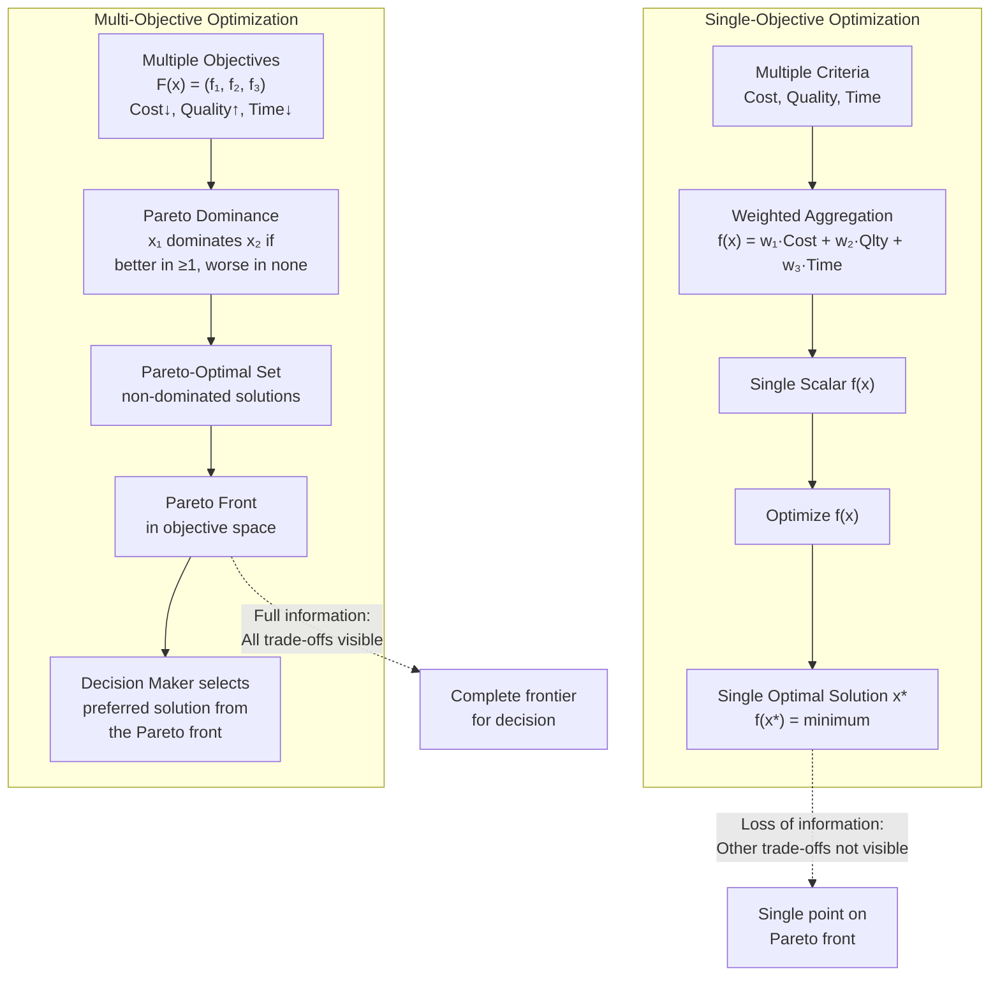

**Structural Differences in Solution Concept**

The solution concept of MOO is fundamentally more complex than SOO because instead of a single optimal solution, MOO yields a set of Pareto-optimal solutions, any of which is acceptable from the perspective of Pareto optimality. For k objectives in a continuous decision space, the Pareto front is typically a (k-1)-dimensional manifold embedded in ℝᵏ, containing infinitely many solutions. In discrete or combinatorial MOO, the Pareto set is finite but may still contain many solutions. The decision-maker's task in MOO is therefore not merely to find the optimal solution but to: (1) find or approximate the Pareto front; (2) represent the Pareto front in a comprehensible format (plot, table, interactive decision map); (3) articulate preferences among Pareto-optimal solutions; and (4) select the solution that best satisfies their preferences. This preference articulation step is often facilitated by **interactive multi-objective optimization methods** that iteratively present subsets of the Pareto front to the decision-maker, who provides preference feedback that narrows the search to regions of interest.

**Solution Methods: Single vs. Multi-Objective**

Single-Objective Optimization methods include classical mathematical programming methods (linear programming, nonlinear programming, dynamic programming, integer programming, stochastic programming) and metaheuristic methods (hill climbing, simulated annealing, Genetic Algorithms, PSO) adapted to scalar objectives. Multi-Objective Optimization methods fall into several categories: **exact methods** (e.g., Benson's method, adaptive weighted sum method with varied weights, normal boundary intersection) that can find or approximate the exact Pareto front for specialized problem classes; **classical scalarization methods** that convert the MOO into multiple SOO problems including the weighted sum method, the ε-constraint method (optimize f₁ subject to f₂ ≤ ε, f₃ ≤ ε, ...), the goal programming method, and the weighted metric methods (Tchebycheff, weighted Lp norms); and **evolutionary multi-objective optimization (EMO)** methods that maintain a population of Pareto-optimal solutions using selection mechanisms based on Pareto dominance. The most prominent EMO algorithms are: **NSGA** (Non-dominated Sorting Genetic Algorithm, 1995), **NSGA-II** (2002) which improved upon NSGA with elitism, fast non-dominated sorting, and crowding distance for diversity maintenance; **SPEA** (Strength Pareto Evolutionary Algorithm, 1999) and **SPEA2** (2001) which use external archives and a strength-based fitness assignment; **MOPSO** (Multi-Objective PSO) variants; and **MOEA/D** (Multi-Objective EA based on Decomposition) which decomposes MOO into a set of scalar subproblems using Tchebycheff or weighted sum approaches.

**Summary of Key Differences:**

| Dimension | Single-Objective Optimization | Multi-Objective Optimization |
|---|---|---|
| Objective Function | Scalar f: ℝⁿ → ℝ | Vector F: ℝⁿ → ℝᵏ (k ≥ 2) |
| Optimality Concept | Global optimum / local optimum | Pareto-optimal / non-dominated |
| Solution | Single point (or finite set of equivalent points) | Pareto set: infinitely many or many finite solutions |
| Decision Maker's Task | Accept/reject the single solution given by algorithm | Select preferred solution from Pareto front |
| Information Provided | One trade-off (encoded in f) | All intrinsic trade-offs visible |
| Aggregation Required | Yes (criteria → single f) | No (criteria preserved as vector) |
| Methods | LP, NLP, SQP, GA, PSO, SA | Scalarization, EMO (NSGA-II, SPEA2, MOPSO) |
| Algorithmic Complexity | O(n) to O(n³) typically | O(N²) to O(N³) for Pareto sorting per generation |
| Preference Elicitation | Required before optimization | Required after optimization (or interactively) |
| Stability of Solution | One solution | Continuous spectrum of solutions |

The fundamental insight that distinguishes MOO from SOO is that the Pareto front is an inherent property of the problem itself—it exists independently of any decision-maker's preferences and represents the complete set of feasible trade-offs. By requiring that all objectives be aggregated before optimization, SOO effectively restricts the decision-maker to viewing the problem through the lens of a single weighting scheme, potentially obscuring solutions that would be preferred under different preference structures. MOO, by preserving the multi-dimensional nature of the objective throughout the optimization process, ensures that the decision-maker has complete information about the feasible trade-off structure available at the time of decision, enabling preference articulation that reflects the specific context, constraints, and priorities of the actual decision situation.
---

## Q2b — Elaborate Scope of Evolutionary Computing

Evolutionary Computing (EC) represents one of the most expansive and intellectually generative subfields of computational intelligence, encompassing a family of stochastic optimization and machine learning algorithms inspired by the mechanisms of biological evolution: natural selection, genetic recombination, mutation, and survival of the fittest. Since the foundational formulations of Genetic Algorithms by John Holland in the 1960s–1970s, Evolution Strategies by Ingo Rechenberg and Hans-Paul Schwefel in the 1960s–1970s, Evolutionary Programming by Lawrence Fogel in the 1960s, and Genetic Programming by John Koza in the 1990s, the scope of EC has expanded dramatically from its origins in function optimization and adaptive behaviour synthesis to encompass virtually every domain of science, engineering, medicine, finance, arts, and humanities where computational search, optimization, or design discovery are required. The scope of evolutionary computing can be elaborated along multiple dimensions: the breadth of problem types addressed, the diversity of algorithmic paradigms and hybridizations, the depth of theoretical foundations, the range of application domains, and the trajectory of contemporary research frontiers.

**Theoretical Scope: Foundations of Adaptive Complex Systems**

At the most fundamental level, EC addresses questions of **search, adaptation, and emergence in complex systems**. The Schema Theorem, as formulated by Holland, provides a theoretical explanation for why GAs perform implicit parallel search through the processing of schemata (similarity templates)—at each generation, a population of N individuals implicitly evaluates O(N³) schemata, providing massive parallelism that is transparent to the programmer. The Building Block Hypothesis posits that short, low-order, high-fitness schemata (the "building blocks" of good solutions) are recombined by crossover to form progressively better higher-order schemata, analogous to the construction of complex adaptive systems from simpler components. These theoretical constructs, while not rigorous convergence theorems in the mathematical sense, provide a conceptual framework for understanding the dynamics of evolutionary search that has guided decades of algorithmic development.

In **Evolution Strategies**, the theoretical framework of self-adaptation addresses the problem of parameter control: the observation that the optimal mutation step size varies across the search space and over the course of optimization. By co-evolving the step size parameters alongside the decision variables through log-normal mutation, ES achieves an automatic, decentralized form of meta-optimization in which each individual autonomously calibrates its own exploration intensity. The covariance matrix adaptation (CMA-ES) variant extends this to full second-order statistical modeling of the search distribution, maintaining and adapting a multivariate Gaussian distribution over the search space whose covariance matrix encodes pairwise variable dependencies, enabling efficient search on anisotropic, non-separable fitness landscapes. The theoretical convergence properties of CMA-ES have been rigorously established: under appropriate conditions, CMA-ES converges to a local optimum with probability 1, and the convergence rate is competitive with or superior to state-of-the-art derivative-free optimization methods including the Nelder-Mead simplex method and DIRECT.

**Algorithmic Scope: From Canonical Paradigms to Hybrid Systems**

The algorithmic scope of EC encompasses four canonical paradigms, each with distinct representation, variation, and selection characteristics: **Genetic Algorithms** (Holland, 1975) operate on fixed-length binary or real-valued strings, emphasizing crossover as the primary source of genetic novelty; **Evolution Strategies** (Rechenberg, 1965; Schwefel, 1975) operate on real-valued vectors, emphasizing self-adaptive mutation with (μ + λ) or (μ, λ) survivor selection; **Evolutionary Programming** (Fogel, 1966) emphasizes mutation-driven variation with probabilistic tournament selection, originally for finite state machines; and **Genetic Programming** (Koza, 1992) operates on hierarchical tree structures, evolving complete computer programs rather than parameter vectors.

Beyond these canonical paradigms, EC encompasses specialized algorithmic branches: **Differential Evolution** (Storn and Price, 1997) introduces mutation through weighted differences between randomly selected population members, producing offspring that are biased toward the direction of improvement and achieving superior performance on many continuous optimization benchmarks; **Memetic Algorithms** combine global evolutionary search with local search heuristics applied to offspring, exploiting the complementary strengths of exploration and exploitation; **Co-evolutionary Algorithms** evolve interacting populations (e.g., predators and prey, host and parasite, or competing strategies) where the fitness of each individual depends on the current state of other co-evolving populations, producing emergent arms-race dynamics that drive continuous improvement; **Estimation of Distribution Algorithms (EDAs)** such as the Bayesian Optimization Algorithm (BOA) and the Population-Based Incremental Learning (PBIL) algorithm learn a probabilistic model of promising regions of the search space from the current population and sample new candidate solutions from this model, replacing crossover and mutation with statistical model building; **Interactive Evolutionary Computation** incorporates human evaluation into the fitness function, enabling EC to optimize subjective criteria such as aesthetic quality, user preference, or perceptual similarity that cannot be expressed through mathematical formulas.

```mermaid
flowchart TD
    subgraph "Evolutionary Computing - Taxonomy and Scope"
        EC["Evolutionary Computing<br/>Nature-Inspired Search & Optimization"] --> GA["Genetic Algorithms (GA)<br/>• Binary/RV encoding<br/>• Crossover + Mutation<br/>• Selection: Roulette/Rank/Tournament<br/>Applications: scheduling, TSP, feature selection"]
        EC --> ES["Evolution Strategies (ES)<br/>• Real-valued encoding<br/>• Self-adaptive Mutation<br/>• (μ+λ) / (μ,λ) selection<br/>Applications: real param optimization, CMA-ES"]
        EC --> EP["Evolutionary Programming (EP)<br/>• FSM / Real-valued<br/>• Mutation ONLY + self-adaptation<br/>• Q-tournament selection<br/>Applications: behavior modeling, RL policies"]
        EC --> GP["Genetic Programming (GP)<br/>• Tree/Linear encoding<br/>• Subtree crossover + mutation<br/>• Fitness on execution<br/>Applications: program synthesis, circuit design"]
        EC --> DE["Differential Evolution (DE)<br/>• Real-valued<br/>• Difference vector mutation<br/>• Crossover<br/>• Applications: continuous optimization benchmarks"]
        EC --> EDA["EDAs (BOA, PBIL)<br/>• Probabilistic model building<br/>• Sampling<br/>• Applications: linkage learning, GAIs"]
    end

    subgraph "Application Domains"
        APP1["Science<br/>Physics: parameter fitting<br/>Bioinformatics: phylogeny<br/>Chemistry: molecule design"]
        APP2["Engineering<br/>Structural design<br/>Control systems<br/>Aerospace: shape optimization"]
        APP3["Medicine<br/>Drug design<br/>Treatment planning<br/>Medical imaging"]
        APP4["Business<br/>Finance: trading strategies<br/>Logistics: routing<br/>Marketing: customer segmentation"]
        APP5["Arts & Design<br/>Generative art<br/>Architecture<br/>Music composition"]
    end

    EC --> APP1
    EC --> APP2
    EC --> APP3
    EC --> APP4
    EC --> APP5
```

**Application Scope: Breadth Across Scientific and Engineering Disciplines**

The application scope of EC is exceptionally broad, spanning scientific research, engineering design, industrial optimization, and emerging domains. In **Computational Science and Engineering**, EC solves parameter estimation problems in physics (fitting simulation models to experimental data), structural optimization problems in mechanical and aerospace engineering (truss design, airfoil shape optimization, satellite antenna design), and controller design problems in control engineering (PID tuning, fuzzy controller parameter optimization, neural network weight optimization). In **Operations Research and Management Science**, EC addresses NP-hard combinatorial problems including the Traveling Salesman Problem, vehicle routing problems, job-shop scheduling, timetabling, and facility location—problems for which exact methods become intractable at realistic problem sizes and for which EC provides practical high-quality approximate solutions in polynomial expected time.

In **Bioinformatics and Computational Biology**, EC addresses problems at multiple scales of biological organization: at the molecular level, EC optimizes protein structure prediction (folding), protein-ligand docking, and de novo protein design; at the genomic level, EC performs gene expression analysis, phylogenetic tree reconstruction, and genome assembly; at the cellular level, EC models gene regulatory network inference and metabolic pathway optimization; at the organismal level, EC models evolutionary dynamics including adaptive radiation, speciation, and co-evolutionary arms races. In **Finance and Economics**, EC optimizes portfolio selection (mean-variance optimization, risk parity, minimum variance portfolios), algorithmic trading strategy discovery, option pricing model calibration, credit risk scoring, and macroeconomic model estimation under uncertainty. In **Medicine and Healthcare**, EC optimizes radiation therapy treatment planning (maximizing tumour dose while minimizing dose to healthy organs), surgical procedure planning, prosthetic limb design, drug molecule design, and diagnostic classifier optimization.

In **Signal Processing and Communications**, EC optimizes digital filter design (IIR and FIR filter coefficients), adaptive filter weight adaptation, antenna array beamforming, code division multiple access (CDMA) code optimization, cognitive radio spectrum allocation, and channel equalization for communication systems. In **Computer Vision and Image Processing**, EC optimizes image registration parameters, image segmentation thresholds, feature selection for object recognition, and neural network architectures for image classification. In **Artificial Intelligence and Machine Learning**, EC performs neural architecture search (NAS) for deep learning, hyperparameter optimization for support vector machines and random forests, automated machine learning (AutoML), and game strategy optimization—domains where EC's black-box optimization capability addresses the challenge of optimizing non-differentiable, non-convex, and expensive-to-evaluate performance metrics.

**Emerging and Future Scope of Evolutionary Computing**

Contemporary research is expanding the scope of EC in several important new directions. **Evolutionary Computing for Artificial General Intelligence (AGI)**: EC is being explored as a mechanism for open-ended evolution, in which the evolutionary process itself generates increasing complexity and capability without an externally defined fitness function—an approach motivated by biological evolution's role in generating the open-ended complexity of biological intelligence. **Evolution in Hardware (Evolvable Hardware)**: EC directly evolves circuit configurations on Field-Programmable Gate Arrays (FPGAs), producing electronic circuits whose functionality is discovered rather than designed; this includes the evolution of analog circuits, digital circuits, and robotic controllers embedded directly in hardware, with applications in adaptive systems, fault-tolerant computing, and space exploration where pre-programmed solutions cannot anticipate all operational conditions. **Quantum Evolutionary Computing**: hybrid algorithms combining quantum computing principles (superposition, entanglement, quantum gates) with evolutionary search operators, potentially enabling exponential speedups on specific classes of optimization problems when implemented on quantum annealing hardware or gate-based quantum computers. **Coevolutionary Language Models**: EC applied to the evolution of distributed representation models for natural language processing, evolving neural network architectures and training objectives for language models with interpretable emergent linguistic structure. **Evolutionary Art and Computational Creativity**: EC generates aesthetic artifacts including visual art, music, architectural designs, and fashion designs through interactive or aesthetic fitness functions, blurring the boundary between optimization and creative processes.
---

## Q2c — What is Artificial Hummingbird Algorithm?

The Artificial Hummingbird Algorithm (AHA) is a bio-inspired metaheuristic optimization algorithm that draws its foundational inspiration from the remarkable behavioural repertoire of hummingbirds, specifically from the family Trochilidae, which constitutes one of the most metabolically specialized and behaviourally sophisticated avian clades on Earth. Introduced to the computational intelligence community in the early 2020s, the AHA represents a relatively recent addition to the expanding taxonomy of swarm intelligence and nature-inspired computing methodologies, specifically designed to address complex, high-dimensional, non-convex, and multimodal optimization problems that resist solution via gradient-based deterministic methods. The algorithm's biological foundation rests upon three cardinal hummingbird behaviours—territorial foraging, territorial defence, and migration—each of which is algorithmically abstracted into a computational operator that collectively provides a robust balance between local exploitation and global exploration across the search space.

**Biological Foundation: Why Hummingbirds?**

Hummingbirds are uniquely suited as an inspiration source for a metaheuristic algorithm due to their extraordinary combination of behavioural, physiological, and cognitive adaptations. Hummingbirds possess the highest mass-specific metabolic rate of any vertebrate animal, requiring them to consume nectar amounting to 1.5–3 times their body weight daily, which creates intense selective pressure for efficient foraging strategies. Their spatial cognitive capabilities are remarkable among avian species: hummingbirds demonstrate excellent spatial memory, being able to remember the locations of hundreds of individual flowers, the timing of nectar replenishment, and the quality of each nectar source, effectively maintaining a **nectar visitation table** in their working memory that governs their foraging decisions. Their territorial behaviour is equally sophisticated: hummingbirds actively defend high-quality nectar territories against conspecific and heterospecific intruders through aggressive display flights, and when territory quality declines, they undertake long-distance migrations—some species migrating annually across the entire length of North America from Alaska to Panama—to locate new resource-rich regions. These three behaviours map elegantly onto the three fundamental search operators of the AHA.

**Algorithmic Framework and Mathematical Formulation**

The AHA operates upon a population of N artificial hummingbirds, each represented by a position vector xᵢ ∈ Ω ⊂ ℝᴰ within a D-dimensional bounded search space Ω = [L₁, U₁] × [L₂, U₂] × ... × [Lᴰ, Uᴰ]. Each hummingbird maintains an internal **nectar visitation table** that records the visitation frequency and average nectar quality for each territory in its spatial neighbourhood, analogous to a memory structure that guides future foraging decisions. At each computational iteration t, three distinct movement strategies are probabilistically selected based on this visitation table:

The **Territorial Foraging Operator** constitutes the primary exploitation mechanism of the algorithm. For hummingbird i at position xᵢ(t), the update is: xᵢ(t+1) = xᵢ(t) + r₁ × (x_best(t) − xᵢ(t)) × FDR, where r₁ ∼ U(0, 1) is a uniform random number, x_best(t) is the current best solution in the entire swarm (or in the hummingbird's territorial neighbourhood in the local variant), and FDR is the **Foraging Direction Ratio**, a parameter in [0, 1] that controls the step size of the foraging movement (typically FDR = 0.1–0.5). This operator pulls each hummingbird toward the best nectar source discovered by the swarm, implementing an exploitative drift similar to the social component of PSO but biased toward the current global best rather than each particle's own personal best. The attraction strength is proportional to the distance from the best source, producing larger steps for distant individuals and finer adjustments for individuals already near the best source.

The **Territorial Defence Operator** implements the algorithm's exploration mechanism. When a hummingbird perceives intrusion from another hummingbird with superior nectar quality in its defended territory, the defending individual executes a repulsion movement: xᵢ(t+1) = xᵢ(t) + r₂ × (xⱼ(t) − xᵢ(t)) × TDR, where r₂ ∼ U(0, 1) and TDR is the **Territorial Defence Ratio** (typically TDR = 0.1–0.3). The defending individual moves in the direction opposite to the superior intruding individual xⱼ, creating a directional repulsion that expands the search coverage of the population. This mechanism prevents the algorithm from prematurely converging all individuals to a single local optimum—a phenomenon termed **swarming crowding**—by actively dispersing individuals from regions that are already occupied by superior individuals. The territorial defence operator is probabilistically activated based on territorial quality assessments: if hummingbird i's territory quality is significantly lower than j's territory quality AND j intrudes into i's territory, the defence move is triggered with high probability; otherwise, the move is not executed.

The **Migration Operator** represents the mechanism for global exploration and escape from local optima. When a hummingbird's territory nectar quality falls below a threshold or when the visitation count on a territory exceeds a maximum, the hummingbird abandons its current territory and migrates to a new region of the search space: xᵢ(t+1) = L(t) × xᵢ(t) + r₃ × (x_w(t) − xᵢ(t)), where L(t) is a **linearly decreasing migration scaling factor** that decays from L_max = 1.0 to L_min = 0.01 over the course of the algorithm's execution, r₃ ∼ U(0, 1), and x_w(t) is the worst solution in the current population. This formulation is mathematically significant: early in the optimization (when L ≈ 1.0), the migration produces a large displacement biased toward the worst region of the current population, encouraging exploration of unvisited regions; late in the optimization (when L ≈ 0.01), migrations become small perturbations near the current position, refining solutions in promising regions. This adaptive migration schedule automatically manages the exploration-exploitation trade-off.

```mermaid
flowchart TD
    A["Initialize N Hummingbirds<br/>Random positions in search space Ω"] --> B["Evaluate nectar quality f(xᵢ) for each hummingbird"]
    B --> C["Update nectar visitation table<br/>for each hummingbird i"]
    C --> D{"Select movement strategy<br/>based on visitation table"}
    D -->|Territorial Foraging| E["xᵢ ← xᵢ + r₁×(x_best-xᵢ)×FDR<br/>Exploit best-known nectar source"]
    D -->|Territorial Defence| F["xᵢ ← xᵢ + r₂×(xⱼ-xᵢ)×TDR<br/>Repel from superior intruder xⱼ"]
    D -->|Migration| G["xᵢ ← L(t)×xᵢ + r₃×(x_w-xᵢ)<br/>Abandon depleted territory"]
    E --> H["Update x_best(t) if improved"]
    F --> H
    G --> H
    H --> I{"Convergence or<br/>max iterations?"]
    I -->|No| B
    I -->|Yes| J["Return global best x_best"]

    subgraph "Visitation Table Logic"
        VT1["Nectar quality ↓ or visit count > max"] -->|Triggers| Migration
        VT2["Superior intruder in territory"] -->|Triggers| Defence
        VT3["Territory has unvisited resources"] -->|Triggers| Foraging
    end
```

**Computational Complexity and Performance Characteristics**

The computational complexity of AHA per iteration is O(N·D + N²) in the naive implementation: O(N·D) for evaluating the objective function across all N hummingbirds in D dimensions, plus O(N²) for computing pairwise territorial interactions (determining which hummingbirds are intruders in which territories). Practical implementations reduce this to O(N·D) by employing spatial data structures such as k-d trees for efficient nearest-neighbour queries to determine territorial neighbourhoods, or by limiting territorial interactions to a fixed-size local neighbourhood (each hummingbird interacts only with its k nearest neighbours, k << N). The algorithm requires no gradient information, making it applicable to non-differentiable, discontinuous, and noisy objective functions.

The three movement strategies of AHA provide a search behaviour that combines the best characteristics of competing metaheuristics: the territorial foraging operator provides local exploitation comparable to hill climbing and the exploitation phase of SA; the territorial defence operator provides directional exploration comparable to the mutation operator in ES and EP; and the migration operator provides global exploration comparable to the high-temperature phase of SA and the random initialization phase of GA. The visitation table mechanism provides adaptive, autonomous control of the relative frequencies of these three strategies without requiring parameter schedules or external tuning—a distinctive advantage over SA (which requires a temperature schedule) and PSO (which requires inertia weight scheduling).

**Applications and Empirical Validation**

AHA has been empirically validated on IEEE Congress on Evolutionary Computation (CEC) benchmark test functions covering unimodal functions (Sphere, Schwefel 2.22, Quartic, Schwefel 1.2, Schwefel 2.21), multimodal functions with many local optima (Rastrigin, Ackley, Griewank, Schwefel 2.26, Schwefel 1.2 extended), and hybrid and composition functions designed to test algorithm robustness. The algorithm has demonstrated competitive or superior performance relative to established metaheuristics including GA, PSO, DE, SA, GWO, and WOA, with particular efficacy on high-dimensional multimodal instances where local optima proliferation challenges conventional algorithms. The three-strategy design of AHA makes it particularly well-suited to **deceptive optimization landscapes** where the global optimum is separated from the local optima by significant fitness barriers: the migration operator enables escape from local optima, the territorial defence operator prevents convergence to local optima by dispersing the swarm, and the foraging operator provides focused refinement once promising regions are identified.

In **engineering design**, AHA has been applied to optimal design of pressure vessels, welded beam structures, and truss structures with stress, displacement, and geometric constraints. In **electrical power systems**, AHA solves economic load dispatch, optimal reactive power dispatch, and transmission network expansion planning. In **medical imaging**, AHA performs multi-level thresholding for image segmentation, a critical preprocessing step for diagnostic analysis. In **machine learning**, AHA optimizes neural network hyperparameters and performs feature selection from high-dimensional datasets. In **chemistry and materials science**, AHA optimizes molecular docking configurations and material property prediction models. In **supply chain and logistics**, AHA optimizes routing and scheduling under complex stochastic and constraint formulations.

The distinguishing features of AHA—the three complementary movement strategies, the adaptive visitation table mechanism, the biologically grounded territorial metaphor, and the absence of crossover—position it as a valuable alternative to PSO and DE for practitioners seeking a conceptually novel yet empirically robust optimization algorithm, particularly for multimodal and high-dimensional problems where existing methods exhibit convergence to local optima with high probability.
---

## Q3a — "Fuzzy System Has Limitation" — Comment on the Statement

The assertion that "fuzzy system has limitation" constitutes a statement of profound accuracy that, upon rigorous examination, reflects not a deficiency specific to fuzzy logic but rather an inherent characteristic of all computational methodologies operating in domains characterized by uncertainty, incompleteness, and complexity. Fuzzy systems, as formalized by Lotfi A. Zadeh in his foundational 1965 paper *Fuzzy Sets* and subsequently developed through decades of theoretical and practical research, demonstrably possess both well-characterized limitations that constrain their applicability in certain contexts and compensating advantages that make them uniquely suited for precisely those contexts where classical crisp-set-based methodologies fail. A balanced and rigorous commentary on this statement requires a systematic enumeration of the specific limitations of fuzzy systems, an analysis of their origins—whether intrinsic to the fuzzy logic formalism or extrinsic arising from implementation choices—and a discussion of the extent to which these limitations have been addressed through extensions such as type-2 fuzzy logic, neuro-fuzzy hybridization, and interval-valued fuzzy representations.

**Limitation 1: Absence of Universal Methodology for Membership Function and Rule Derivation**

The most frequently cited and practically consequential limitation of fuzzy systems is the **knowledge elicitation bottleneck**, which manifests as the difficulty of constructing appropriate membership functions and fuzzy rule bases for a given application domain. Fuzzy systems derive their power from encoding human expert knowledge in linguistic if-then rules and corresponding membership functions; however, the process of eliciting this knowledge from domain experts is notoriously challenging. Membership functions must be carefully designed to accurately capture the semantic meaning of linguistic terms such as "high," "moderate," "low," "fast," or "slow" within a specific application context, and the boundaries between these linguistic regions must be placed at meaningful thresholds rather than arbitrary values. For example, in a fuzzy temperature control system, the membership functions for "cold," "comfortable," and "hot" must be placed at temperatures that correspond to meaningful physiological thresholds (such as thermoneutral zones, comfort temperatures, and heat stress thresholds), and the overlap between adjacent membership functions must be sufficient to ensure smooth interpolation without creating excessive ambiguity.

Several approaches have been developed to mitigate this limitation. **Expert elicitation** through interviews, surveys, and structured protocols (such as the Rank Ordering Method discussed in Q3b) provides membership values derived from domain expert preferences. **Data-driven approaches** including fuzzy c-means clustering, subtractive clustering, and mountain clustering automatically derive membership functions from quantitative data without requiring expert input. **Neuro-fuzzy systems** (ANFIS, discussed in Q4a) tune membership functions from training data through gradient descent and least-squares optimization. **Evolutionary computation approaches** including Genetic Fuzzy Systems and Genetic Programming evolve complete fuzzy rule bases and membership functions from data. Despite these approaches, the fundamental challenge remains: determining the optimal number of linguistic terms, the appropriate shape and parameters of membership functions, and the complete set of fuzzy rules that fully and accurately capture the domain knowledge is an unsolved problem in general, and the quality of the resulting fuzzy system remains sensitive to these design choices.

**Limitation 2: Curse of Dimensionality and Rule Explosion**

A second fundamental limitation of fuzzy systems is the **curse of fuzzy dimensionality**, analogous to the curse of dimensionality in classical statistical learning. For a fuzzy system with n input variables, each partitioned into m linguistic terms, the number of rules in a complete rule base is mⁿ (assuming all possible combinations are specified). For a system with n = 5 input variables each partitioned into m = 5 linguistic terms, the rule base requires 5⁵ = 3125 rules—a number that is both conceptually overwhelming to specify manually and computationally expensive to evaluate in real-time applications. For n = 10 variables and m = 5 terms, the required rule base expands to 5¹⁰ = 9,765,625 rules, which is completely impractical. This exponential growth in rule base size with the number of input variables severely limits the practical applicability of Mamdani-type fuzzy systems to problems with relatively few input variables (typically n ≤ 5–6).

Several architectural and methodological approaches have been developed to mitigate this limitation. **Hierarchical fuzzy systems** decompose the n-dimensional input space into a tree of two-input fuzzy systems, reducing the total number of rules from mⁿ to approximately 2n · m² (linear in n rather than exponential). **Takagi-Sugeno-Kang (TSK) systems** with constant or linear consequents enable partial rule bases in which only rules near the operating point need be specified, relying on interpolation to handle uncovered regions. **Rule compression and simplification** methods including inductive learning, decision tree induction, and fuzzy rule pruning remove redundant rules from an initial comprehensive rule base. **Cooperative fuzzy systems** distribute the inference burden across multiple specialized fuzzy systems, each operating on a subset of the input variables. Despite these mitigations, the fundamental tension between rule base completeness and computational tractability remains a defining constraint on fuzzy system design.

**Limitation 3: Absence of Formal Learning and Adaptation Mechanisms in Conventional Formulations**

Conventional Mamdani-type fuzzy systems are **static knowledge-based systems**: once the rule base and membership functions are designed, the system's input-output behaviour is fixed and cannot adapt to changing environmental conditions, drifts in input statistics, or improvements in domain knowledge over time. This limitation is particularly significant in applications where the operating conditions are non-stationary: adaptive control systems, financial forecasting, speech recognition under varying acoustic conditions, and medical diagnosis under varying patient population demographics. The static nature of conventional fuzzy systems stands in contrast to neural networks, which adapt through back-propagation and gradient-based learning, and to evolutionary algorithms, which adapt through generational improvement of population members.

This limitation has been substantially addressed through **neuro-fuzzy hybridization**, which combines the learning capabilities of neural networks with the linguistic interpretability of fuzzy systems. ANFIS (Adaptive Neuro-Fuzzy Inference System), developed by Roger Jang in 1993, tunes both antecedent membership function parameters and consequent rule parameters from training data through a hybrid learning algorithm combining least-squares estimation and back-propagation gradient descent. The resulting system maintains the linguistic interpretability of fuzzy rules while acquiring the adaptive learning capability of neural networks. **Online adaptive fuzzy systems** incrementally update membership functions and rules during operation using recursive least-squares or Kalman filtering approaches. **Evolving fuzzy systems** incrementally add new rules and membership functions as new data patterns emerge, growing the rule base dynamically during operation. These approaches have largely resolved the static learning limitation for practical applications.

**Limitation 4: Convergence and Stability Analysis Complexity**

Establishing formal stability and convergence guarantees for fuzzy control systems is substantially more complex than for classical control systems. In classical control theory, stability analysis relies on well-established mathematical tools including Lyapunov's direct method, Bode and Nyquist plots, root locus analysis, and Routh-Hurwitz criteria—all of which assume linear or linearizable system models with precise mathematical descriptions. Fuzzy control systems, by contrast, implement a nonlinear mapping from antecedents (fuzzy input membership functions) to consequents (fuzzy output membership functions) through fuzzy implication and aggregation operators whose mathematical properties (t-norms, t-conorms) are nonlinear and piecewise-defined. For Mamdani fuzzy systems using minimum t-norm and centroid defuzzification, the overall input-output mapping is a continuous but piecewise nonlinear function whose analytical form is complex and problem-specific.

Lyapunov-based stability analysis has been successfully applied to fuzzy control systems: the fuzzy system can be represented as a weighted sum of local linear models (one per rule, via the first-order TSK consequent), and Lyapunov functions can be constructed from these local models to establish sufficient conditions for stability. However, these analyses typically require conservative assumptions (such as all local linear models being stabilizable) that may not hold in practice, and the derived stability regions (domains of attraction) may be substantially smaller than the actual stability region of the fuzzy controller. **Linear Matrix Inequality (LMI)** methods provide a systematic framework for designing fuzzy controllers with guaranteed stability and H∞ performance, but require solving semidefinite programming problems that are computationally demanding. The absence of general-purpose, computationally efficient stability verification tools for fuzzy control systems remains a practical limitation that restricts the deployment of fuzzy controllers in high-assurance applications such as nuclear reactor control, flight control, and medical device control, where formal certification of stability properties is required.

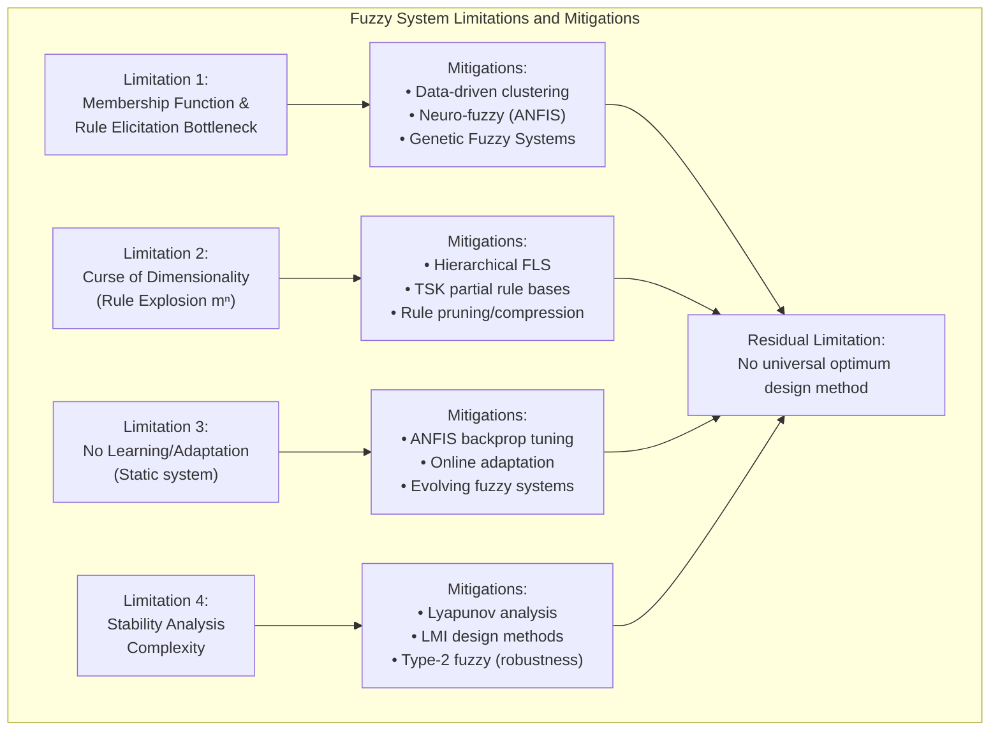

**Limitation 5: Handling of Uncertainty in Membership Functions and Rules**

Conventional type-1 fuzzy systems, in which membership functions are crisp-valued functions mapping inputs to precise membership degrees in [0, 1], do not adequately model the higher-order uncertainty that arises when the membership function parameters themselves are uncertain. In practice, membership functions are designed by experts or derived from data, both of which are subject to uncertainty: experts may disagree about the appropriate shape and placement of membership functions; data-derived membership functions depend on the training sample and are subject to sampling variability; and environmental changes may shift the operating point away from the regime in which membership functions were designed. These higher-order uncertainties propagate through the fuzzy inference process, producing output uncertainties that are not captured by the type-1 membership function representation.

**Type-2 fuzzy logic systems**, introduced by Jerry Mendel and his students in the late 1990s and early 2000s, directly address this limitation by replacing the crisp membership function with a **fuzzy membership function**—a membership function whose output is itself a fuzzy set (specifically, an interval type-2 fuzzy set characterized by a footprint of uncertainty FOU). In an interval type-2 fuzzy system, each linguistic term is associated with an upper membership function (UMF) and a lower membership function (LMF), and the true membership at any point lies somewhere in the interval [LMF, UMF]. During fuzzy inference, the firing strength of each rule is itself a type-2 fuzzy set (an interval), and the **type reducer** computes the upper and lower bounds of the aggregated output set, producing a **blurred** output set that explicitly represents the propagated uncertainty. The final defuzzified output is the average of the upper and lower centroid values, providing a point estimate that is robust to membership function uncertainty. Type-2 fuzzy systems have demonstrated superior performance relative to type-1 systems in domains characterized by high noise, speaker variability (ASR), channel variability (wireless communications), and environmental uncertainty (mobile robot navigation), at the cost of increased computational complexity (3–10× slower than type-1 systems).

In summary, the statement "fuzzy system has limitation" is accurate but incomplete. Fuzzy systems do possess well-characterized limitations including the knowledge elicitation bottleneck, the curse of dimensionality, the static nature of conventional designs, the complexity of stability verification, and the inability of type-1 representations to capture higher-order membership function uncertainty. However, each of these limitations has been substantially addressed through subsequent research: neuro-fuzzy hybridization addresses the learning limitation; hierarchical and TSK architectures address the dimensionality problem; evolutionary computation addresses the rule design problem; and type-2 fuzzy logic addresses the uncertainty representation problem. The remaining residual limitations—particularly the absence of a universal design methodology and the complexity of formal verification—are limitations shared by all AI methodologies rather than limitations unique to fuzzy systems, reflecting the fundamental difficulty of designing effective intelligent systems in complex, uncertain domains.
---

## Q3b — Explain Different Arithmetic Operations Performed on Fuzzy Sets with Example

The arithmetic operations performed on fuzzy sets constitute the algebraic machinery through which fuzzy set theory extends classical set operations to the graded membership domain, enabling precise computation and manipulation of fuzzy quantities in mathematical, engineering, and decision-making applications. While classical set theory recognizes three fundamental operations—intersection, union, and complement—the transition to fuzzy sets with membership degrees in the continuous interval [0, 1] introduces a continuum of possible instantiations of each operation, classified mathematically through the frameworks of **t-norms** (triangular norms) for intersection-like operations, **t-conorms** (triangular conorms, also called s-norms) for union-like operations, and **fuzzy complements** for negation-like operations. Additionally, the algebraic manipulation of fuzzy sets encompasses **arithmetic operations** (addition, subtraction, multiplication, division of fuzzy numbers), **interval arithmetic** operations derived through the Extension Principle, and **set-theoretic operations** including set difference, symmetric difference, and Cartesian product. Each operation is defined through specific mathematical formulae, possesses characteristic algebraic properties, and admits distinct semantic interpretations that determine its appropriateness for particular application contexts.

**Fuzzy Intersection: T-Norm Operations**

The operation corresponding to classical set intersection in the fuzzy domain is defined through t-norms. Formally, a t-norm T: [0, 1] × [0, 1] → [0, 1] is a binary operation satisfying four axioms: commutativity (T(a, b) = T(b, a)), associativity (T(a, T(b, c)) = T(T(a, b), c)), monotonicity (if a ≤ a' and b ≤ b' then T(a, b) ≤ T(a', b')), and boundary condition (T(a, 1) = a for all a ∈ [0, 1]). The boundary condition ensures that intersection with full membership (1) preserves the other operand's membership degree, analogous to classical set intersection with the universal set.

The **Minimum t-norm** (Gödel t-norm): T_min(a, b) = min(a, b). This is the most widely used t-norm in fuzzy logic controllers because of its computational simplicity and intuitive interpretation: the membership degree of an element in the intersection of two fuzzy sets equals the weaker of the two membership degrees, reflecting the logical interpretation of conjunction as the greatest lower bound. Example: If temperature membership in "Hot" is 0.7 and in "Very Hot" is 0.4, then intersection (Hot AND Very Hot) has membership min(0.7, 0.4) = 0.4.

The **Algebraic Product t-norm**: T_prod(a, b) = a × b. This produces generally smaller intersection values than the minimum t-norm for a, b ∈ (0, 1) (e.g., 0.7 × 0.4 = 0.28 < 0.4). The algebraic product interprets membership degrees as probabilities or intensities, making it appropriate for probabilistic fuzzy reasoning and for applications requiring smooth, continuously differentiable membership aggregation.

The **Lukasiewicz t-norm**: T_Luk(a, b) = max(0, a + b − 1). This produces the smallest t-norm values among the common family (e.g., max(0, 0.7 + 0.4 − 1) = max(0, 0.1) = 0.1). It is the t-norm of Łukasiewicz fuzzy logic and satisfies a compensation principle: the sum of two membership degrees exceeding 1 compensates by reducing the intersection below what either minimum or product would produce, making it appropriate for resource-allocation and budget-constrained decision problems.

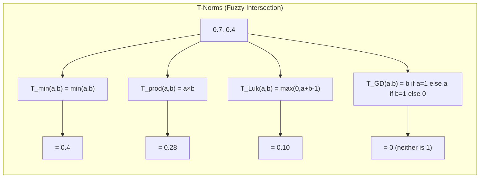

**Fuzzy Union: T-Conorm Operations**

The operation corresponding to classical set union is defined through t-conorms (s-norms). Formally, a t-conorm S: [0, 1] × [0, 1] → [0, 1] satisfies: commutativity, associativity, monotonicity, and boundary condition (S(a, 0) = a for all a). By De Morgan duality, every t-norm T induces a t-conorm S via S(a, b) = 1 − T(1 − a, 1 − b).

The **Maximum t-conorm**: S_max(a, b) = max(a, b). This is the dual of the minimum t-norm and the most widely used conjunction operator. Example: membership in "Hot OR Warm" with μ_Hot = 0.7 and μ_Warm = 0.5 gives max(0.7, 0.5) = 0.7.

The **Probabilistic Sum**: S_ps(a, b) = a + b − a × b. This equals the probability that at least one of two independent events occurs and produces greater values than the maximum (e.g., 0.7 + 0.5 − 0.35 = 0.85 > 0.7). It does NOT satisfy the idempotent property (S(a, a) = a + a − a² ≠ a for a ∈ (0, 1)).

The **Bounded Sum (Lukasiewicz t-conorm)**: S_bounded(a, b) = min(1, a + b). This saturates at 1.0 and satisfies a compensation principle (e.g., S_bounded(0.7, 0.5) = min(1, 1.2) = 1.0).

**Fuzzy Complement Operations**

The complement of a fuzzy set à is defined as: μ_¬Ã(x) = C(μ_Ã(x)), where C: [0, 1] → [0, 1] is a fuzzy complement function satisfying: boundary condition (C(0) = 1, C(1) = 0), monotonic decreasing (if a ≤ b then C(b) ≤ C(a)), and involutivity (C(C(a)) = a for all a ∈ [0, 1]).

The **Standard (Zadeh) Complement**: C_s(a) = 1 − a. This is the simplest and most widely used complement, satisfying all three axioms. Example: a membership of 0.7 in "Hot" has complement (NOT Hot) = 1 − 0.7 = 0.3 membership in "Not Hot."

The **Sugeno Complement**: C_Sugeno(a) = (1 − s·a) / (1 + (s − 1)·a) for s > −1, s ≠ 1. This family includes the standard complement when s = 1, with s controlling the rate at which membership decreases.

The **Yager Complement**: C_Yager(a) = (1 − a^w)^(1/w) for w > 0. When w = 1, this reduces to the standard complement; w > 1 produces more gradual complementation near 0 and steeper transition near 1; w < 1 produces the opposite behaviour.

**Arithmetic Operations on Fuzzy Numbers**

Fuzzy numbers—normal, convex fuzzy sets with bounded support—can be manipulated through arithmetic operations defined via Zadeh's Extension Principle. Given two fuzzy numbers à and B̃ with membership functions μ_Ã(x) and μ_B̃(x), the **fuzzy addition** à ⊕ B̃ is a fuzzy number with membership function: μ_Ã⊕B̃(z) = sup{min(μ_Ã(x), μ_B̃(y)) | x + y = z}. For triangular fuzzy numbers à = (a, m₁, b) and B̃ = (c, m₂, d), the addition is approximately triangular: à ⊕ B̃ ≈ (a+c, m₁+m₂, b+d). Similarly, **fuzzy subtraction** (à ⊖ B̃) = (a−d, m₁−m₂, b−c), **fuzzy multiplication** (à ⊗ B̃) ≈ (ac, m₁m₂, bd) for positive fuzzy numbers, and **fuzzy division** (à ⊘ B̃) ≈ (a/d, m₁/m₂, b/c) for B̃ with all positive support. These operations enable fuzzy arithmetic in engineering calculations, fuzzy risk analysis, and fuzzy financial modelling.
---

## Q3c — Draw System Architecture and Explain Operation of FLC System

The Fuzzy Logic Control System (FLC) represents a paradigmatic application of soft computing that has found extensive deployment across industrial automation, consumer electronics, aerospace, automotive, and biomedical engineering since its initial demonstration by Ebrahim Mamdani in 1974. The system architecture of an FLC is composed of four functionally distinct and sequential processing blocks—Fuzzification, Inference Engine, Aggregation, and Defuzzification—organized within a closed feedback control loop that continuously senses the controlled plant's output, reasons about appropriate control actions using fuzzy logic, and drives actuators to regulate the plant toward the desired setpoint. The operation of the FLC is fully defined by the interaction of these blocks with each other and with the physical plant, with each block performing a mathematically well-defined transformation on its input signals.

**Complete System Architecture Block by Block**

**Block 1: Fuzzification**, which constitutes the interface between the physical continuum of sensor measurements and the symbolic linguistic domain of fuzzy reasoning. Given n input variables x₁, x₂, ..., xₙ measured from sensors, the fuzzification block applies the membership functions defined in the Fuzzy Data Base to convert each crisp scalar measurement xᵢ₀ into a vector of membership degrees (μ_Ai₁(xᵢ₀), μ_Ai₂(xᵢ₀), ..., μ_Aimᵢ(xᵢ₀)) where mᵢ is the number of linguistic terms defined for input variable i. For example, a temperature input x₁₀ = 23.5°C evaluated against three linguistic terms Cold (μ_Cold(23.5) = 0.15), Comfortable (μ_Comfort(23.5) = 0.85), and Hot (μ_Hot(23.5) = 0.0) produces the fuzzy assessment (0.15, 0.85, 0.0). This block executes in O(Σmᵢ) time per control cycle.

**Block 2: Knowledge Base**, which contains two sub-components: the Fuzzy Rule Base (FRB) and the Fuzzy Data Base (FDB). The FRB contains R rules of the form "IF x₁ is A₁ AND x₂ is A₂ ... THEN y is B_k" (Mamdani) or "IF ... THEN y = c_k" (Sugeno). The FDB defines the membership functions for all input and output linguistic variables, the t-norm for conjunction, the t-conorm for disjunction and aggregation, the universe of discourse for each variable, and scaling factors for mapping physical signals to normalized fuzzy universes. The Knowledge Base is the repository of domain expertise and the primary knowledge engineering artifact of the FLC.

**Block 3: Inference Engine**, comprising the Rule Evaluation and Implication sub-blocks. For each of the R rules, the firing strength αᵢ is computed by applying the t-norm to the antecedent membership degrees: αᵢ = T(μ_Ai₁(x₁₀), μ_Ai₂(x₂₀), ..., μ_Ain(xₙ₀)). Common t-norm choices are minimum (fast, crisp truncation) and algebraic product (smooth, less aggressive truncation). The implication operator then transforms each rule consequent fuzzy set Bᵢ into a clipped version Bᵢ' with membership function: μ_Bi'(y) = T_imp(αᵢ, μ_Bi(y)) where T_imp is the implication t-norm. For Mamdani inference with minimum t-norm, this becomes μ_Bi'(y) = min(αᵢ, μ_Bi(y)) (clipping at height αᵢ).

**Block 4: Aggregation Block**, combines the R individual rule-output fuzzy sets {B₁', B₂', ..., B_R'} into a single aggregated fuzzy set B_agg using a t-conorm, almost universally the maximum t-conorm: μ_B_agg(y) = max_{i=1,...,R}(μ_Bi'(y)). This aggregation corresponds to the linguistic connective "ALSO," implementing a disjunction of rule recommendations: rule 1 says output should be in region B₁', ALSO rule 2 says B₂', etc. The result is a single fuzzy set that encodes the composite recommendation of the entire rule base.

**Block 5: Defuzzification Block**, converts the aggregated fuzzy output set B_agg into a single crisp control signal u* using one of several defuzzification methods. The **Center of Gravity (COG) or Centroid** method computes: u* = ∫ y · μ_B_agg(y) dy / ∫ μ_B_agg(y) dy, the balance point of the fuzzy set. The **Center of Sums (COS)** computes centroids of each rule output separately and combines them. The **Mean of Maxima (MOM)** returns the midpoint of the peak region. For Sugeno systems, the **Weighted Average** method computes u* = Σ(αᵢ · cᵢ) / Σαᵢ, which is computationally trivial (O(R) versus O(N) for COG).

**Closed-Loop Operation Cycle**

The complete FLC functions as a discrete-time feedback controller executing the following cycle at each sampling instant:

```
   ┌────────────────────────────────────────────────────────────────┐
   │              FUZZY LOGIC CONTROL SYSTEM - OPERATION CYCLE       │
   │                                                                │
   │  ┌──────┐  ┌────────────┐  ┌─────────┐  ┌──────────┐  ┌────┐│
   │  │Plant │  │ FUZZIFY    │  │ INFER   │  │AGGREGATE │  │DEF.││
   │  │ y(t) │─►│ μ_Ai(xᵢ₀) │─►│ αᵢ T()  │─►│ MAX over │─►│ COG││
   │  │      │  │            │  │ Impl.   │  │ Bᵢ'      │  │    ││
   │  └──┬───┘  └────────────┘  └─────────┘  └──────────┘  └─┬──┘│
   │     ▲                                               │      │
   │     │            ┌────────────┐                     │      │
   │     └────────────│ ACTUATE    │◄────────────────────┘      │
   │                  │ u(t) drives│                            │
   │                  │  actuator  │                            │
   │                  └──────┬─────┘                            │
   │                         │                                  │
   │                  ┌──────┴─────┐                            │
   │                  │  PLANT     │                            │
   │                  │  responds  │                            │
   │                  └────────────┘                            │
   │                                                                │
   │  Sampling: every T_s seconds (typical: 10-200 ms)              │
   └────────────────────────────────────────────────────────────────┘
```

Mamdani vs. Sugeno FLC operational comparison:

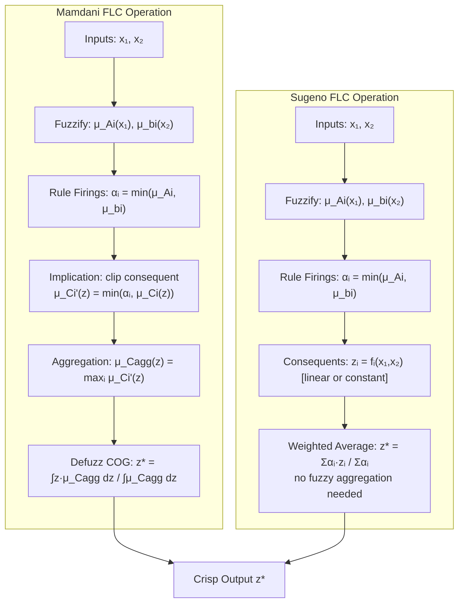

The operational completeness and practical effectiveness of the FLC depend critically on the quality of the Knowledge Base—the design of membership functions (shape, overlap, number of terms), the coverage and consistency of the fuzzy rule base, and the appropriate selection of t-norms, t-conorms, and defuzzification methods for the specific control application. A well-designed FLC processes linguistic expert knowledge into smooth, robust, real-time control actions that are fundamentally more interpretable and maintainable than the black-box parameters of neural network or gain-scheduled controllers, while providing control quality comparable to or exceeding manually tuned PID controllers in nonlinear and uncertain process control environments.
---

## Q4a — What is Defuzzification? Why is it Needed? Explain Various Defuzzification Methods with Suitable Examples

Defuzzification constitutes the critical final transformation stage within the Fuzzy Inference process in a Fuzzy Logic Control System or any fuzzy reasoning system, representing the mathematical operation through which a fuzzy output set—produced by the aggregation of all rule consequent fuzzy sets—is converted into a single, crisp, actionable scalar value that can be physically executed by an actuator, fed into a decision module, or used as a numerical input to downstream processing stages. The necessity of defuzzification arises from the fundamental representational distinction between fuzzy sets and classical crisp quantities: fuzzy reasoning, by its very nature, produces graded, set-valued outputs representing a continuum of possible actions weighted by their linguistic plausibility, whereas physical actuators, numerical computation engines, and human decision-makers require a single, unambiguous, discrete action or numerical value. Without defuzzification, the output of a fuzzy inference system would remain in the form of a fuzzy set—a function over the output universe—devoid of the specificity required for physical action, numerical computation, or crisp decision-making.

**Why Defuzzification is Needed: The Semantic Gap Between Fuzzy and Crisp Domains**

The need for defuzzification can be understood by analyzing the nature of fuzzy inference output. When a Mamdani-type fuzzy inference engine processes a rule base containing R rules, each firing with strength αᵢ ∈ [0, 1], the implication step produces R clipped (or scaled) fuzzy sets {B₁', B₂', ..., B_R'} in the output universe Y. The aggregation step then combines these R fuzzy sets through a t-conorm (typically maximum), producing a single aggregated fuzzy set B_agg with membership function μ_B_agg(y) = maxᵢ(μ_Bi'(y)). The result describes, for every possible output value y ∈ Y, the membership degree to which that output is recommended by the fuzzy rule base given the current input observation. For example, in a temperature control system, B_agg might describe that the heater power should be "approximately 60% with high certainty, approximately 75% with moderate certainty, and approximately 40% with low certainty"—a description of a fuzzy set of recommended heater powers rather than a single specific heater power setting. The actuator controlling the heater, however, requires a single voltage or PWM duty cycle value (e.g., exactly 62.3%), not a fuzzy description of admissible values. Defuzzification resolves this gap by extracting the most representative single value from the fuzzy set.

**Center of Gravity (COG) Method - Centroid Method**

The Center of Gravity (COG), also called the **Center of Area (COA)** or **Centroid** method, stands as the most theoretically well-founded and the most widely applied defuzzification method in Mamdani-type Fuzzy Logic Control Systems. The COG of a fuzzy set B with membership function μ_B(y) over a discrete or continuous universe Y is defined as: y* = (∫_Y y · μ_B(y) dy) / (∫_Y μ_B(y) dy) in the continuous case, or y* = (Σ_{k=1}^{n} y_k · μ_B(y_k)) / (Σ_{k=1}^{n} μ_B(y_k)) in the discretized case where the universe is sampled at n points y_k. The COG computes the balance point of the fuzzy set—the point at which the set would balance if each membership degree represented a physical weight at the corresponding y_koordinate. 

For a symmetric, unimodal fuzzy set (e.g., a Gaussian or triangular fuzzy set), the centroid coincides with the peak (the mode) of the set. For asymmetric or multimodal aggregated fuzzy sets arising from multiple rules with overlapping consequents, the centroid provides a weighted average that reflects the relative strength and position of all contributing rule outputs. For example, consider a speed controller with output universe Y = [0, 100] km/h and an aggregated fuzzy set with membership values: μ(20) = 0.3, μ(40) = 0.7, μ(60) = 0.5, μ(80) = 0.2. The centroid is: y* = (20×0.3 + 40×0.7 + 60×0.5 + 80×0.2) / (0.3 + 0.7 + 0.5 + 0.2) = (6 + 28 + 30 + 16) / 1.7 = 80 / 1.7 ≈ 47.06 km/h.

The COG method possesses several important mathematical properties: it is **continuous** in the membership function values, meaning small changes in αᵢ produce small changes in y*; it is **nonlinear** in the sense that the overall input-output mapping F: x ↦ y* is a nonlinear function of the input variables through the membership functions and the centroid formula; it satisfies **idempotency** (a singleton fuzzy set with μ(y*) = 1 and μ(y) = 0 for y ≠ y* yields y* exactly); and it is the only defuzzification method that corresponds to the **expected value** interpretation of fuzzy sets under a uniform distribution assumption over the support.

**Center of Sums (COS) Method**

The Center of Sums method addresses a computational issue with COG: when multiple rule consequent fuzzy sets overlap significantly, the COG method effectively **double-counts the overlapping regions**, producing a defuzzified value that is biased toward the overlapping region. For example, if two rules both fire with high strength and have overlapping triangular consequent sets, the aggregated maximum at the overlap region counts only the maximum of the two, but the COG integrals over this region with the maximum membership value regardless of how many rules contributed to that value. COS resolves this by computing the centroid of each rule-output fuzzy set Bᵢ' separately and then combining: y* = (Σᵢ ∫ y · μ_Bi'(y) dy) / (Σᵢ ∫ μ_Bi'(y) dy). This approach does NOT aggregate the fuzzy sets via maximum before defuzzification; instead, each rule's contribution is defuzzified individually and then combined. The COS method is computationally more expensive than COG (requiring R separate centroid computations plus a weighted combination) but avoids the double-counting issue. It is preferred in high-precision applications where overlapping rule outputs are common.

**Mean of Maxima (MOM) Method**

The Mean of Maxima method identifies the region of the aggregated fuzzy set B_agg in which the membership function attains its maximum value: let h* = max_{y ∈ Y} μ_B_agg(y) (the height of the aggregated fuzzy set). The **support of the maximum** is the crisp set supp(h*) = {y ∈ Y | μ_B_agg(y) = h*}. The MOM method returns the midpoint of this support: y* = (max(supp(h*)) + min(supp(h*))) / 2. When the aggregated fuzzy set has a unique maximum (a single peak), MOM returns the location of that peak. When the aggregated fuzzy set has a flat plateau at the maximum (which occurs when multiple rules fire with the same strength and have flat-top or plateau consequents, or when a Mamdani clipping operation produces a flat top), MOM returns the midpoint of the plateau. For example, if the aggregated fuzzy set has support of maximum = [45, 75] (the membership is 1.0 across this interval), MOM returns y* = (45 + 75) / 2 = 60.

The MOM method is the fastest defuzzification method computationally (requiring only a search for the maximum membership and computation of its interval), but it has two important limitations: it does not account for the shape of the non-peak regions of the fuzzy set (ignoring potentially important information about the spread of alternative recommendations), and it can produce **discontinuous outputs** when the support of the maximum changes discontinuously as inputs change, which can cause chattering or instability in feedback control systems. For these reasons, MOM is rarely used as the primary defuzzification method in control applications but is useful in classification and decision-support systems where speed is paramount and smoothness is not required.

**Weighted Average Method (Sugeno Defuzzification)**

As discussed in detail in Q4b, the Weighted Average Method is the defuzzification method of choice for Sugeno-type fuzzy inference systems, where each rule consequent is a crisp constant cᵢ or a function of inputs rather than a fuzzy set. The weighted average is computed as: y* = (Σᵢ αᵢ · cᵢ) / (Σᵢ αᵢ). This method is computationally O(R) versus O(n) for COG (where n is the output universe discretization resolution), providing a speed advantage of orders of magnitude for real-time applications. The weighted average method produces smooth, continuous control surfaces for continuous membership functions and is naturally differentiable, enabling gradient-based tuning of consequent parameters. For a zero-order Sugeno system with R rules, each with constant consequent cᵢ, the weighted average corresponds to the first moment of a discrete probability distribution where the firing strengths αᵢ serve as unnormalized probabilities.

**Comparison Summary and Method Selection**

The selection among defuzzification methods depends on the specific requirements of the application:

| Method | Computational Cost | Output Smoothness | Applicable To | Key Advantage | Key Limitation |
|---|---|---|---|---|---|
| COG/Centroid | O(n) per inference | Smooth | Mamdani | Theoretically sound, smooth | Double-counting overlap, slow |
| COS | O(R·n) per inference | Smooth | Mamdani | No double-counting | Most expensive |
| MOM | O(n) per inference | Discontinuous | Mamdani, classification | Fastest | Ignores shape, discontinuous |
| Weighted Average | O(R) per inference | Smooth | Sugeno only | Very fast, differentiable | Requires crisp consequents |
| First of Maxima (FOM) | O(n) per inference | Discontinuous | All | Simple | Arbitrary selection of first peak |

In summary, defuzzification is an essential transformation that bridges the fuzzy reasoning layer of intelligent systems with the crisp action or numerical output required by physical actuators, decision modules, and numerical computation. The centroid (COG) method remains the standard for Mamdani systems requiring smooth, well-founded defuzzification; the weighted average method is preferred for Sugeno systems where computational efficiency is paramount; and COS and MOM serve specialized roles in applications requiring precise handling of overlapping rule outputs or extremely rapid inference respectively.
---


```mermaid
flowchart TD
    A["Aggregated Fuzzy Set B_agg<br/>μ_B_agg(y) over output universe Y"] --> B{"Select Defuzzification Method"}
    B -->|"Mamdani COG"| C["Centroid:<br/>y* = ∫y·μ_B_agg dy / ∫μ_B_agg dy"]
    B -->|"Mamdani COS"| D["Center of Sums:<br/>y* = Σ∫y·μ_Bi'dy / Σ∫μ_Bi'dy"]
    B -->|"Mamdani MOM"| E["Mean of Maxima:<br/>midpoint of peak region"]
    B -->|"Sugeno"| F["Weighted Average:<br/>y* = Σαᵢ·cᵢ / Σαᵢ"]
    
    C --> G["Crisp Output y*"]
    D --> G
    E --> G
    F --> G
    
    note1["COG: smooth, theoretically sound, but O(n) per evaluation"] -.-> C
    note2["MOM: fastest O(n), but discontinuous output"] -.→ E
    note3["WA: O(R), differentiable, requires Sugeno crisp consequents"] -.-> F
```


```
DEFUZZIFICATION METHOD COMPARISON (ASCII)
==========================================

  COG (Centroid):
  ┌─────────────────────────────────────┐
  │  y* = COG = ∫y·μ(y)dy / ∫μ(y)dy    │
  │  The "balance point" of fuzzy set    │
  │  Most theoretically sound            │
  │  Slow: O(n) discretization points    │
  └─────────────────────────────────────┘

  COS (Center of Sums):
  ┌─────────────────────────────────────┐
  │  y* = Σᵢcentroid(Bᵢ') / Σᵢarea(Bᵢ') │
  │  Avoids double-counting overlap      │
  │  Most expensive: O(R·n)              │
  └─────────────────────────────────────┘

  MOM (Mean of Maxima):
  ┌─────────────────────────────────────┐
  │  y* = (max(support) + min(support))/2 │
  │  Fastest: O(n) search for peak       │
  │  Can be discontinuous │
  └─────────────────────────────────────┘

  WEIGHTED AVERAGE (Sugeno):
  ┌─────────────────────────────────────┐
  │  y* = Σ αᵢ·cᵢ / Σ αᵢ               │
  │  O(R) — extremely fast               │
  │  Requires Sugeno crisp consequents   │
  └─────────────────────────────────────┘
```

## Q4b — State Applications of Fuzzy Logic Control System

Fuzzy Logic Control Systems have been commercially deployed and academically validated across an extraordinarily wide spectrum of application domains since Ebrahim Mamdani's landmark 1974 demonstration of a fuzzy-controlled steam engine. The applications of FLC can be systematically categorized by industry sector and control function, revealing a consistent pattern: FLC is deployed precisely in those domains where conventional control methodologies—proportional-integral-derivative (PID) control, optimal control, model predictive control, and adaptive control—encounter difficulties due to nonlinearity, model uncertainty, multi-variable coupling, time delay, or the absence of a reliable mathematical model of the controlled process. The four decades of practical deployment have generated a substantial empirical literature demonstrating that FLC achieves superior or comparable control performance with reduced engineering effort in these challenging domains, while simultaneously providing the additional advantage of linguistic interpretability that enables domain experts to understand, audit, and modify the control strategy without specialized control theory expertise.

**Consumer Electronics and Home Appliances**

The consumer appliance sector represents the most voluminous commercial deployment of FLC by unit count, with millions of fuzzy-controlled devices manufactured annually by companies including Mitsubishi Electric, Hitachi, Sharp, Panasonic, Samsung, and LG. The **Sendai Subway System** (Miyagi Electric Railway, Japan), commissioned in 1985, was the first large-scale high-profile industrial application of fuzzy control, implemented by Hitachi for the automatic train operation (ATO) system. The fuzzy ATO controller regulates train acceleration and braking to achieve punctual station stopping while minimizing energy consumption and maximizing passenger ride comfort, encoding the driving expertise of veteran operators into approximately 150 linguistic rules. The system achieved a stopping distance accuracy of ±30 cm at speeds up to 70 km/h, reduced energy consumption by 10% compared to conventional PID control, and substantially improved passenger comfort by eliminating the abrupt acceleration and deceleration characteristic of conventional ATO systems. This deployment established fuzzy control as a credible industrial technology and catalyzed widespread Japanese industrial adoption throughout the 1980s and 1990s.

In **washing machines**, fuzzy controllers sense load weight (via motor current measurement), water turbidity (via optical sensors measuring wash water clarity), fabric type (via water absorption rate), and selected wash program to automatically determine optimal water level, wash time, wash action (agitation pattern), spin speed, and water temperature. Fuzzy washing machines achieve 20–30% water and energy savings compared to conventional timed-cycle machines while improving cleaning performance measured by residual soil on test fabric standards. In **air conditioning systems**, fuzzy controllers regulate compressor speed, fan speed, air flow direction, and temperature setpoint based on room temperature, humidity, outdoor temperature, and occupant activity patterns, achieving 10–20% energy savings while improving thermal comfort through adaptive and anticipatory control. In **microwave ovens**, fuzzy controllers select heating power and duration based on sensed humidity (food moisture content), food weight, and food type (selected by user), preventing overheating and uneven heating while reducing overall cooking time compared to conventional fixed-power-time cycles.

**Industrial Process Control**

The industrial process control domain constitutes the highest economic impact application area for FLC in terms of productivity, quality, and energy improvements generated. In **cement and kiln process control**, one of the most demanding and well-documented applications, fuzzy controllers simultaneously regulate multiple coupled variables including kiln temperature profile, fuel injection rate, air flow, lime saturation factor, and clinker quality in rotary cement kilns operating at 1400–1500°C with thermal time constants of 15–20 hours. The fuzzy controller encodes expert kiln operator heuristics for managing the strong nonlinearities, time delays, and multivariable coupling that make conventional PID control inadequate, achieving improved clinker quality consistency and reduced specific energy consumption (kWh/tonne). Japanese cement manufacturers reported 3–5% improvements in clinker quality and 2–4% energy savings following fuzzy control deployment in the 1990s.

In **pulp and paper manufacturing**, fuzzy controllers are applied to: kraft pulping digester control (regulating alkali concentration, cooking temperature, and H-factor to produce uniform pulp quality); paper machine headbox control (maintaining consistent basis weight and moisture profiles across the paper web); and coating weight control. In **petrochemical and refining processes**, fuzzy controllers manage distillation column overhead temperature and reflux ratio, catalytic cracker reactor temperature, and crude oil preheat train temperature optimization, addressing the highly nonlinear dynamics, strong coupling, and significant dead time of these processes. In **metallurgical processing**, fuzzy controllers regulate blast furnace ironmaking processes including burden distribution, blast temperature, and tuyere velocity. In **water and wastewater treatment**, fuzzy controllers optimize aeration energy in activated sludge processes (by regulating dissolved oxygen setpoints based on real-time influent load estimation), chemical dosing in coagulation and flocculation, and filtration backwash scheduling.

**Transportation and Automotive Systems**

The automotive and transportation sector has increasingly adopted FLC for powertrain management, vehicle dynamics control, and driver assistance systems. In **anti-lock braking systems (ABS)**, fuzzy controllers modulate brake pressure based on wheel speed sensors (measuring slip ratio), vehicle deceleration, and road surface estimation, outperforming conventional rule-based ABS controllers in maintaining steering control and minimizing stopping distance on low-friction surfaces including ice, gravel, and wet pavement. In **automatic transmissions**, fuzzy controllers determine optimal shift timing based on vehicle speed, engine load (throttle position), acceleration rate, and driving style detection, producing smoother and more responsive shifts than conventional hydraulic or map-based controllers while simultaneously improving fuel economy by 3–6%. In **engine management**, fuzzy controllers regulate fuel injection quantity and timing, ignition timing, and exhaust gas recirculation (EGR) based on manifold pressure, engine speed, coolant temperature, and oxygen sensor feedback, adapting to varying fuel qualities, altitudes, temperatures, and engine wear. In **electric and hybrid vehicles**, fuzzy controllers manage battery state of charge optimization, motor torque distribution (parallel hybrid), and regenerative braking coordination.

In **aerospace applications**, fuzzy controllers have been deployed for: aircraft engine health monitoring and fault tolerant control; satellite attitude control with flexible structural modes and actuator saturation constraints; and helicopter flight control in hover and low-speed regimes where the flight dynamics are highly nonlinear and coupled. The **Japan Aerospace Exploration Agency (JAXA)** has investigated fuzzy control for re-entry vehicle trajectory optimization and for EVA (extravehicular activity) robotic assistance.

**Power Systems and Energy Management**

The power systems domain presents complex optimization and control challenges that FLC addresses effectively. In **economic load dispatch** for thermal and hydro-thermal power systems, fuzzy controllers optimize generator power setpoints to minimize total generation cost while satisfying power balance, generator capacity, and transmission constraints, handling the non-smooth, non-convex cost functions arising from valve-point effects and prohibited operating zones. In **load frequency control** for interconnected power systems, fuzzy controllers regulate turbine governor valve positions to maintain system frequency within acceptable bounds despite load disturbances and renewable energy generation variability. In **wind energy systems**, fuzzy maximum power point tracking (MPPT) controllers optimize turbine blade pitch angle and generator torque under variable wind conditions, outperforming conventional MPPT controllers in dynamic response and energy capture efficiency.

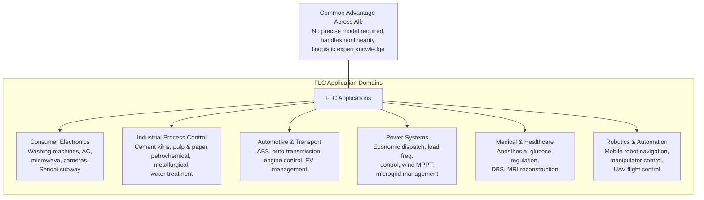

**Medical and Healthcare Applications**

Medical applications of FLC represent a high-impact emerging domain where the interpretability and robustness of fuzzy control align with clinical requirements for safety, reliability, and regulatory compliance. In **anesthesia control**, fuzzy logic controllers regulate propofol infusion rate based on Bispectral Index (BIS) measurements of patient consciousness level and hemodynamic parameters (blood pressure, heart rate), maintaining surgical anesthesia within a target depth (BIS 40-60) while preventing awareness or excessive sedation. Clinical studies have demonstrated that fuzzy-controlled closed-loop anesthesia systems maintain target BIS values more consistently than manual control by anesthesiologists, with reduced total propofol consumption and faster patient emergence. In **artificial pancreas systems** for Type 1 diabetes management, fuzzy controllers adjust insulin pump delivery rates based on continuous glucose monitor readings, meal carbohydrate announcements, and physical activity data, implementing clinical endocrinology guidelines in linguistic fuzzy rules while adapting to individual patient glucose dynamics.

In summary, the applications of FLC span virtually every industrial and consumer domain involving complex control under uncertainty, nonlinearity, or model inadequacy. The defining characteristics that make FLC appropriate for these applications are: (1) the ability to encode human expert knowledge without requiring a precise system model; (2) inherent robustness to parametric uncertainty and measurement noise; (3) natural handling of nonlinear control objectives; and (4) linguistic interpretability of the control strategy that facilitates maintenance, regulatory compliance, and knowledge transfer across generations of control engineers.
---

## Q4c — Explain Different Types of Membership Functions Used in Fuzzy Sets

Membership functions constitute the fundamental mathematical building blocks of fuzzy set theory, defining the degree to which each element of a universe of discourse belongs to a particular fuzzy set. The shape and parameters of membership functions determine the smoothness, interpretability, and computational properties of the fuzzy inference system, making their selection one of the most consequential design decisions in fuzzy system engineering. Zadeh's original 1965 formulation did not prescribe specific membership function shapes, leaving the choice to the practitioner based on the application context. Over six decades of research and practice, a taxonomy of membership function types has emerged, each with distinct mathematical properties, computational characteristics, and appropriate application contexts. The principal categories are: **Triangular Membership Functions**, **Trapezoidal Membership Functions**, **Gaussian Membership Functions**, **Generalized Bell Membership Functions**, **Sigmoidal Membership Functions**, **Z-shaped and S-shaped Membership Functions**, and **Pi-shaped Membership Functions**. Each type will be defined mathematically, illustrated with examples, and analyzed for appropriateness in specific control and reasoning scenarios.

**Triangular Membership Function**

The triangular membership function is defined by three parameters (a, m, b) where a is the left foot (where membership begins rising from 0), m is the peak (where membership reaches 1.0), and b is the right foot (where membership returns to 0): μ(x) = max(min((x-a)/(m-a), (b-x)/(b-m)), 0) for a ≤ x ≤ b, and μ(x) = 0 otherwise. The triangular function is zero outside the interval [a, b], rises linearly from 0 to 1 on [a, m], and falls linearly from 1 to 0 on [m, b]. Its primary advantages are computational simplicity (requires only two comparisons and two divisions per evaluation), intuitive parameter interpretation (a = lower bound, m = most representative value, b = upper bound), and ease of manual design by domain experts. The principal disadvantage is the non-smooth first derivative at the peak m, which produces a cusp that can generate discontinuities in the derivative of the control surface in fuzzy logic controllers—a property that can complicate stability analysis using Lyapunov methods that require smoothness.

Triangular membership functions are most appropriate for: initial rapid prototyping of fuzzy systems where interpretability and design simplicity are paramount; applications where the universe of discourse is well-understood and expert knowledge provides clear threshold and modal values; and educational and illustrative contexts. Many industrial fuzzy controllers deployed in the 1980s and 1990s employed triangular membership functions due to their computational efficiency on the limited embedded processors available at that time.

**Trapezoidal Membership Function**

The trapezoidal membership function extends the triangular function with four parameters (a, b, c, d), where the membership rises linearly from 0 to 1 on [a, b], remains constant at 1 on the plateau [b, c], and falls linearly from 1 to 0 on [c, d]: μ(x) = max(min((x-a)/(b-a), 1, (d-x)/(d-c)), 0). The key addition relative to triangular functions is the plateau region [b, c] where μ(x) = 1, representing a range of x values that are considered fully representative of the linguistic term. Trapezoidal membership functions are particularly valuable for: defining membership functions for ranges where multiple x values are equally representative (e.g., "Room Temperature" might be a trapezoid with plateau from 20°C to 24°C); reducing sensitivity of the control output to small variations in the input when the input is within the plateau region (producing dead-band behaviour that reduces control chattering); and representing uncertainty about the precise modal value by broadening the peak into an interval. The trapezoidal function remains computationally simple (three comparisons, two divisions) while providing the interpretability advantage of an explicitly defined "fully in the set" interval [b, c].

**Gaussian Membership Function**

The Gaussian membership function is defined by two parameters (c, σ) where c is the center (mean) and σ is the width (standard deviation): μ(x) = exp(-(x-c)² / (2σ²)). The Gaussian function is infinitely differentiable (smooth to all orders), producing an inference system with a smooth, continuously differentiable control surface—a critical property for stability analysis using Lyapunov's direct method, which requires at least continuous first derivatives of the control law. The Gaussian function also possesses desirable shape properties: the bell shape is symmetric, the rate of membership change is greatest near the boundaries of the support and gentle near the center (reflecting the intuition that we are most uncertain about category membership at the fringes), and the support is technically infinite (although membership becomes negligibly small beyond approximately x ∈ [c-3σ, c+3σ] where μ(x) < 0.005). Gaussian membership functions are the standard choice in modern neuro-fuzzy systems including ANFIS, where the smooth differentiability enables gradient-based parameter optimization via back-propagation.

**Generalized Bell Membership Function**

The generalized bell membership function (also called the Cauchy or bell membership function) introduces three parameters (a, b, c) that independently control width, slope, and center: μ(x) = 1 / (1 + |(x-c)/a|^{2b}). Parameter a > 0 controls the width of the bell (larger a produces wider bell), b > 0 controls the slope at the crossover points (larger b produces more vertical sides, approaching the rectangle as b → ∞), and c controls the center location. The generalized bell is infinitely differentiable like the Gaussian and offers more flexible shape control through the three-parameter formulation, particularly the ability to produce arbitrarily steep transitions (large b) that approach crisp thresholds when required. The generalized bell has been shown to produce better interpolation properties and smoother control surfaces than other membership functions in many control applications, and is a popular choice in TSK fuzzy systems optimized through ANFIS or evolutionary algorithms.

**Sigmoidal Membership Function**

The sigmoidal membership function is defined by two parameters (a, c) controlling slope and center: μ(x) = 1 / (1 + exp(-a(x-c))). The sigmoid rises smoothly from 0 to 1 with an S-shaped curve, crossing 0.5 at x = c with steepness governed by a (larger a produces steeper transition approaching a step function as a → ∞). Sigmoidal membership functions are particularly appropriate for defining linguistic terms that represent thresholds or transition zones: "Fast" for vehicle speed (steep rise at speed threshold), "High" for temperature, "Near" for distance in sensor-based control. Unlike triangular, trapezoidal, and Gaussian functions which are unimodal, sigmoidal functions are monotonic and are typically deployed in pairs: one sigmoid increases from 0 to 1 (representing one linguistic term), while a complementary sigmoid decreases from 1 to 0 (representing the complementary linguistic term). Sigmoids are the standard activation function in neural networks and are natural choices in neuro-fuzzy systems where the fuzzy and neural components must be seamlessly integrated.

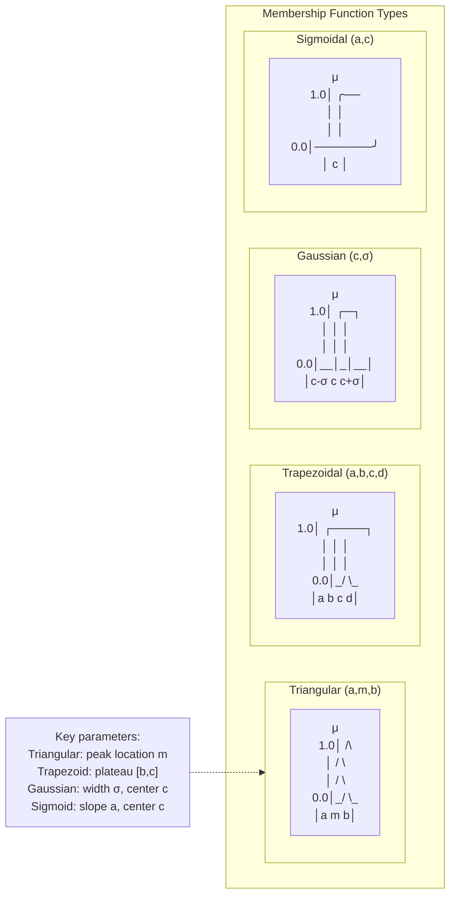

**Z-shaped, S-shaped, and Pi-shaped Membership Functions**

The Z-shaped membership function decreases from 1 to 0 following a smooth Z-trajectory: μ(x) = 1 for x ≤ a, μ(x) = 1 - 2((x-a)/(b-a))² for a < x ≤ (a+b)/2, μ(x) = 2((b-x)/(b-a))² for (a+b)/2 < x < b, and μ(x) = 0 for x ≥ b. This function is useful for defining decreasing linguistic terms such as "Not High," "Not Fast," "Low Risk," where membership should decrease monotonically with the input variable. The S-shaped membership function is the mirror image of the Z-shape and increases from 0 to 1, useful for increasing linguistic terms such as "High," "Fast," "High Risk." The Pi-shaped membership function combines Z-shaped and S-shaped segments to produce a bell-like shape with more flexible plateau control than the trapezoid, though it is rarely used in practice due to its complexity.

**Selecting Membership Functions: Practical Guidelines**

The selection among membership function types depends on the specific requirements of the fuzzy system application. For **interpretability-focused systems** (where the rules must be understandable by domain experts without mathematical training), triangular and trapezoidal functions are preferred because their piecewise linear formulation with explicit threshold parameters (a, b, c, d, m) maps directly to intuitive expert descriptions such as "temperature above 18°C is comfortable." For **smoothness-critical control systems** (where stability proofs or actuator smoothness require continuous derivatives), Gaussian or generalized bell functions are preferred due to their infinite differentiability. For **neuro-fuzzy hybrid systems** (where gradient-based optimization tunes membership function parameters), Gaussian functions are standard in ANFIS because their parameters (center c and width σ) admit clean gradient formulas for back-propagation. For **computationally constrained embedded systems** (where evaluation speed is critical and computational resources are limited), triangular and trapezoidal functions are preferred because their piecewise linear evaluation is faster than the exponential computation required by Gaussian and sigmoidal functions. For **reasoning with monotonic thresholds** (where a linguistic term represents a threshold crossing, such as "temperature is high"), sigmoidal functions provide a smooth, differentiable threshold representation.

In practice, many fuzzy systems employ **heterogeneous membership functions** across different linguistic terms: for example, "Cold" might be a Z-shaped function decreasing from 1 at very low temperatures, "Comfortable" might be a trapezoid with a plateau spanning the thermoneutral zone, and "Hot" might be a sigmoidal function increasing steeply at the heat discomfort threshold, each function type chosen based on the semantic character of the corresponding linguistic term. This heterogeneous approach maximizes both the semantic fidelity of each membership function to its linguistic meaning and the computational and mathematical properties required for the overall fuzzy system's performance.
---

## Q5a — Explain in Detail Various Genetic Operators Involved in Genetic Algorithms

The performance of any Genetic Algorithm is critically determined not merely by its encoding scheme, selection mechanism, or population parameters, but by the specific design of its genetic operators—the variation mechanisms that introduce novelty into the population through the modification and recombination of genetic material. The term "genetic operator" in the GA literature conventionally encompasses three categories: **reproduction (copying) operators** that preserve and amplify existing genetic material without modification; **crossover (recombination) operators** that combine genetic material from multiple parents to produce novel offspring; and **mutation operators** that introduce random perturbations to individual genes, creating genetic variation not present anywhere in the current population. Each operator category contains multiple specific operator implementations, and the selection, configuration, and probabilistic application of these operators constitute one of the most consequential aspects of GA design practice, with operator choice substantially influencing convergence speed, solution quality, and algorithmic robustness across problem domains.

**Reproduction Operators**

Reproduction is the simplest genetic operator and operates by directly copying an individual from the current population into the next generation without modification. In the canonical GA framework, reproduction is executed implicitly through the selection mechanism: individuals are selected as parents with probabilities proportional to their fitness (fitness proportionate selection), rank (rank selection), or tournament outcomes (tournament selection), and selected individuals are placed into a mating pool. The direct copying of selected individuals into the mating pool constitutes reproduction. Reproduction serves a critical role in GA dynamics: it implements the principle of **differential reproductive success** whereby individuals with higher fitness contribute disproportionately to the next generation, driving the population mean fitness upward over successive generations. Reproduction also provides a mechanism for **elitism**: the direct preservation of the best individual(s) from the current generation into the next generation without modification, ensuring that the best solution discovered so far is never lost through the stochastic operation of crossover or mutation. Elitism rates of 1-5% (1-5 elite individuals guaranteed to survive each generation) are standard in modern GA practice and have been demonstrated to significantly improve convergence stability and solution quality.

**Crossover (Recombination) Operators**

Crossover is the primary source of genetic novelty in the GA and operates by combining genetic material from two or more parent individuals to produce one or more offspring. The selection of an appropriate crossover operator depends critically on the encoding scheme employed, as crossover must produce syntactically valid offspring that respect the structural constraints of the representation.

**Single-Point Crossover**, the original and most conceptually fundamental crossover operator, operates by selecting a single crossover point k uniformly at random from the set of valid crossover points {1, 2, ..., L-1} where L is the chromosome length. The two parent chromosomes P₁ = [g₁, g₂, ..., gₖ | gₖ₊₁, ..., g_L] and P₂ = [h₁, h₂, ..., hₖ | hₖ₊₁, ..., h_L] are then recombined to produce offspring: O₁ = [g₁, ..., gₖ | hₖ₊₁, ..., h_L] and O₂ = [h₁, ..., hₖ | gₖ₊₁, ..., g_L]. The structural effect is the exchange of all genetic material to the right of the crossover point between parents. Single-point crossover's primary theoretical advantage is its direct correspondence to biological single-chromatid exchange during meiosis, and its theoretical properties are well-characterized through the Schema Theorem: schemata with defining lengths less than the average crossover point are disrupted with probability p_c (the crossover probability), while schemata that lie entirely to the left or entirely to the right of the crossover point are preserved.

**Two-Point Crossover** generalizes single-point crossover by selecting two crossover points k₁ < k₂ and exchanging the middle segment between them: O₁ = [g₁...g_{k₁} | h_{k₁+1}...h_{k₂} | g_{k₂+1}...g_L] and O₂ = [h₁...h_{k₁} | g_{k₁+1}...g_{k₂} | h_{k₂+1}...h_L]. Two-point crossover reduces the disruptive effect on schemata that occupy a single contiguous region (these are preserved unless a crossover point falls within the schema) while introducing more thorough genetic mixing than single-point crossover by allowing material from both parents to be interleaved in both offspring.

**Uniform Crossover** (Syswerda, 1989) represents the most thorough genetic mixing operator: for each gene position i ∈ {1, ..., L}, offspring 1 inherits the gene from parent 1 with probability p_i (typically 0.5) and from parent 2 with probability 1-p_i; offspring 2 receives the complementary gene. Uniform crossover maximizes the expected number of gene exchanges between parents, producing offspring in which approximately L/2 genes come from each parent when p_i = 0.5. **Shuffle Crossover** first randomly shuffles gene positions, applies standard single-point crossover at the shuffled positions, then reverses the shuffle order, producing a controlled mixing that combines the structural properties of uniform crossover with locality-preserving properties of single-point crossover. **Parent-Centric Crossover** for real-valued encoding, including BLX-α and SBX, generates offspring that lie between or around parents in the continuous decision space, maintaining feasibility while exploring the neighbourhood of the parent region.

**Special-Purpose Crossover for Permutation Encodings**

For problems requiring permutation encodings (TSP, scheduling, routing), standard crossover operators violate the permutation constraint by producing offspring with duplicate or missing gene values. Specialized crossover operators for permutations include: **Order Crossover (OX)**, which copies a contiguous segment from parent 1 into offspring and fills remaining positions by scanning parent 2 after the cut point, wrapping around and preserving order; **Partially Mapped Crossover (PMX)**, which exchanges segments between parents and uses a mapping to resolve conflicts, ensuring no duplicates; **Cycle Crossover (CX)**, which constructs offspring by identifying permutation cycles and alternately inheriting from each parent, ensuring each offspring inherits exactly one copy of each gene from each parent; and **Position-Based Crossover**, which copies genes from parent 1 at randomly selected positions and fills remaining positions from parent 2 in order. The edge recombination crossover (ERX) specifically for TSP constructs offspring to preserve adjacency information from parent tours.

**Mutation Operators**

Mutation is the secondary variation operator and the sole source of truly novel genetic material in the canonical GA. While crossover recombines existing genetic material, mutation introduces alleles that may not exist anywhere in the current population—a critical insurance policy against premature convergence.

For **binary-encoded GAs**, the canonical **Bit-Flip Mutation** flips each bit with probability p_m independently. The **k-bit Mutation** flips exactly k randomly selected distinct bit positions. **Uniform Mutation** replaces a randomly selected bit with a random value from the alphabet {0,1} with probability p_m per position. The **Gaussian Mutation** for real-valued encoding adds zero-mean Gaussian noise: xᵢ' = xᵢ + N(0, σᵢ²), with σᵢ determining the mutation magnitude. **Polynomial Mutation** (Deb and Agrawal, 1995) employs a polynomial probability distribution that produces small perturbations with high probability and large perturbations with decreasing probability, ensuring offspring remain within bounds naturally. In self-adaptive evolution strategies, each individual carries mutation step sizes σᵢ that are simultaneously evolved: σᵢ' = σᵢ · exp(τ'·N(0,1) + τ·Nᵢ(0,1)).

**Operator Probabilities: p_c and p_m**

The crossover probability p_c governs the fraction of parent pairs that undergo crossover; typical values range from 0.6 to 0.9. The mutation probability p_m governs the per-gene probability of mutation; typical values range from 0.001 to 0.1 per gene. The theoretical guideline established by the Schema Theorem and mutation rate analysis establishes p_m ≈ 1/L as a reasonable heuristic (each bit should be hit approximately once on average across generations). When p_m is too large, the GA degrades toward a random search; when too small, diversity is lost prematurely. The interaction between p_c and p_m is critical: high p_c with moderate p_m maximizes diversity and building block recombination in early generations, while reducing p_c and p_m in later generations (or equivalently, increasing selection pressure) can improve convergence to optima.
---


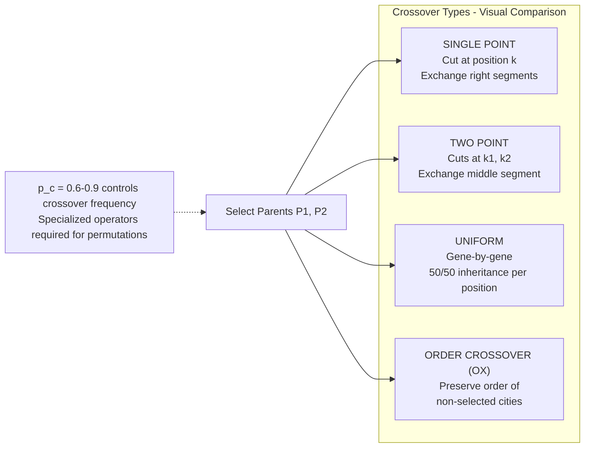


```
GENETIC OPERATORS OVERVIEW (ASCII)
════════════════════════════════════

REPRODUCTION: Copy parent → offspring (no change)
  Preserves elite, implements elitism

CROSSOVER (p_c = 0.6–0.9):
  Single-point:    [ABC|DEF] × [GHI|JKL] → [ABC|JKL], [GHI|DEF]
  Two-point:       [AB|CD|EF] × [GH|IJ|KL] → [AB|IJ|EF], [GH|CD|KL]
  Uniform:         per-gene coin flip → thorough mixing
  Order (OX):      Permutation: preserves city order

MUTATION (p_m = 0.001–0.1 per gene):
  Bit-flip:        0→1, 1→0 per bit with prob p_m
  Gaussian:        xᵢ ← xᵢ + N(0,σ²)  (real-valued)
  Swap:            exchange two positions  (permutation)
  Inversion (2-opt): reverse subsequence  (TSP)
```

## Q5b — Describe Genetic Algorithm with Conventional Artificial Intelligence

The relationship between Genetic Algorithms and conventional Artificial Intelligence (AI) represents a paradigmatic tension between two fundamentally distinct philosophical approaches to the problem of designing intelligent systems: the conventional AI paradigm, which dominated the field from its inception in the 1950s through the 1980s and which emphasizes explicit knowledge representation, logical reasoning, symbolic manipulation, and hand-crafted rule-based inference; and the evolutionary computation paradigm, which emerged in the 1960s–1990s and which emphasizes population-based stochastic search, implicit knowledge representation through chromosomal encoding, and adaptive improvement through principles drawn from biological evolution rather than from formal logic or cognitive modelling. Understanding the relationship between GA and conventional AI requires examining their respective epistemological foundations, knowledge representation mechanisms, search strategies, the historical development of each approach, and the opportunities for integration through hybrid systems that leverage the complementary strengths of both paradigms.

**Conventional AI: The Symbolic, Logic-Based, Knowledge-Engineering Paradigm**

Conventional AI (also called **GOFAI** — Good Old-Fashioned AI) is grounded in the physical symbol system hypothesis formulated by Allen Newell and Herbert Simon in 1976, which asserts that a physical symbol system has the necessary and sufficient means for general intelligent action. In this paradigm, intelligence is achieved through the manipulation of syntactically structured symbolic representations according to explicitly specified rules and inference procedures. The primary knowledge representation formalisms include: **first-order logic** and its variants (description logics, modal logics, temporal logics) for representing domain knowledge as logical predicates and axioms from which new knowledge is derived through deductive inference; **production systems** (or rule-based systems) that encode knowledge as IF-THEN production rules of the form "IF condition THEN action," with an inference engine (typically using forward chaining or backward chaining) that applies these rules to derive conclusions or actions from input facts; **semantic networks** and **frames** that represent knowledge as graphs of concepts and their relationships; and **planning systems** that reason about sequences of actions to achieve goals.

The search strategy of conventional AI is typically **systematic, informed, and goal-directed**: heuristic search algorithms (A*, IDA*, branch and bound) explore explicit state spaces guided by heuristic functions; constraint satisfaction algorithms systematically prune inconsistent assignments; and logical deduction derives conclusions through rule application guided by the goals of the reasoning task. The knowledge engineering process in conventional AI requires human domain experts to explicitly articulate their knowledge in symbolic form, a process that is time-consuming, expensive, and limited by the availability and articulability of expert knowledge.

The principal strengths of conventional AI are: **precise logical reasoning** with well-defined inference semantics (a conclusion derived through logical deduction is provably correct given the axioms); **explainability and interpretability** (the reasoning chain from premises to conclusion is explicit and auditable); and **knowledge composability** (new knowledge can be derived by combining existing knowledge through logical operations). The principal limitations are: the **knowledge acquisition bottleneck** (the difficulty of encoding expert knowledge into symbolic rules); the **brittleness of rule-based systems** to novel or partially observed situations not explicitly covered by the rule base; the **difficulty of handling uncertainty** (conventional AI's crisp logical formalism requires either precise knowledge or ad hoc uncertainty heuristics); and the **intractability of search** in large or open-ended problem spaces where the branching factor or state space size makes systematic search computationally infeasible.

**Genetic Algorithms: The Evolutionary, Population-Based, Adaptive Paradigm**

Genetic Algorithms represent a fundamentally different epistemological approach to artificial intelligence. Rather than requiring that knowledge be explicitly articulated and encoded by a human knowledge engineer, GA operates through an **adaptive, emergent, and implicit** knowledge mechanism: the population of candidate solutions implicitly encodes multiple competing "hypotheses" about the solution, and evolutionary pressure incrementally shapes the population toward improving solutions without requiring an explicit model of what makes a solution good. In GA's epistemology, intelligence is not something programmed into the system through rules and logic, but something that **emerges** through the interaction of stochastic variation (mutation, crossover), selective retention (selection), and environmental feedback (fitness evaluation).

The GA's representation of knowledge contrasts sharply with conventional AI: in conventional AI, knowledge is explicitly represented as rules, facts, and inference procedures; in GA, knowledge is distributed across the population as statistical regularities embodied in the chromosomal structure—analogous to how biological populations encode adaptive information in their gene pools without any individual organism possessing a "rule" specifying how to survive. The GA's search is **parallel, stochastic, and evolutionary**: it maintains a population of candidate solutions simultaneously (exploiting implicit parallelism through schema processing), uses probabilistic selection rather than deterministic goal-directed search, and improves through generational refinement analogous to biological evolution rather than logical deduction.

**Points of Contrast Between GA and Conventional AI**

| Dimension | Genetic Algorithms | Conventional AI |
|---|---|---|
| **Knowledge Representation** | Distributed across population; chromosomal encoding | Explicit; symbolic rules, facts, logic |
| **Knowledge Elicitation** | Automatic through evolutionary search | Manual through knowledge engineering |
| **Search Strategy** | Stochastic, parallel, population-based | Systematic, sequential, goal-directed |
| **Optimization Basis** | Fitness function (empirical performance) | Logical consistency and completeness |
| **Handling Uncertainty** | Implicit through fitness averaging | Explicit through probabilistic extensions |
| **Reasoning Mechanism** | Evolutionary pressure, recombination, mutation | Deduction, rule firing, constraint propagation |
| **Explainability** | Low (population-level emergent behaviour) | High (explicit inference chain) |
| **Learning** | Incremental across generations | Typically symbolic, one-shot |
| **Failure Mode** | Premature convergence, local optima | Combinatorial explosion, brittleness |
| **Knowledge Transfer** | Implicit in population statistics | Explicit in rule bases |

**Convergence: Hybrid GA-Conventional AI Systems**

The apparent dichotomy between GA and conventional AI has been substantially resolved through the development of **hybrid intelligent systems** that integrate both paradigms, leveraging the complementary strengths of explicit symbolic reasoning and adaptive evolutionary search. One prominent hybrid architecture employs GA for **knowledge base optimization** within a conventional rule-based system: the rule-based component handles logical inference and explainable reasoning for individual decisions, while the GA component optimizes the parameters of the rule base (rule weights, membership functions in fuzzy rules, rule priorities, condition thresholds) using a population-based search to minimize classification error or maximize decision quality on historical cases. In the **Genetic Fuzzy System** architecture, for example, a fuzzy inference system (combining fuzzy logic's linguistic interpretability with GA's optimization capability) evolves fuzzy rules from data: each chromosome encodes a complete or partial fuzzy rule base, and the GA searches the rule-base space to discover accurate, parsimonious, and interpretable fuzzy rules. The resulting system can generate explanations for its decisions by extracting the active linguistic rules ("Decision = HIGH because Condition_A is TRUE and Condition_B is MODERATE"), combining the learning power of GA with the interpretability of rule-based AI.

Another significant area of integration is **GA for structure learning in machine learning systems**: conventional machine learning algorithms (decision trees, neural networks, support vector machines) require the practitioner to select the model architecture (number of hidden layers, tree depth, kernel type) and hyperparameters; GA searches the architecture space using a population of candidate model configurations evaluated by cross-validation accuracy, automating the model selection process that would otherwise require expert hyperparameter tuning. In **neuroevolution**, a term coined by Kenneth Stanley, GA evolves both the weights and the topology of neural networks simultaneously, addressing the fundamental limitation of conventional neural network training (back-propagation) which requires the network architecture to be specified a priori. NEAT (NeuroEvolution of Augmenting Topologies), developed by Stanley and Miikkulainen, uses a GA with genetic encoding of both connection weights and network topology to evolve increasingly complex neural network structures, starting from minimal initial topologies and incrementally elaborating structure as required by the task—an approach that has produced agents capable of solving high-dimensional continuous control tasks that challenge gradient-based reinforcement learning methods.

```
CONVENTIONAL AI vs. GENETIC ALGORITHM — WORKFLOW COMPARISON

CONVENTIONAL AI (Rule-Based Expert System):
  Knowledge Engineer ──► Interviews Expert ──► Extracts Rules IF-THEN
                                      │
                                      ▼
                              Rule Base (explicit)
                                      │
                              Inference Engine (forward/backward chaining)
                                      │
                                      ▼
                              Decision / Conclusion
  Limitation: Expert knowledge must be articulable and complete

GENETIC ALGORITHM APPROACH:
  Problem Definition ──► Fitness Function f(x)
                                      │
                                      ▼
                              Initialize Population (random, diverse)
                                      │
                    Selection + Crossover + Mutation (evolution cycle)
                                      │
                                      ▼
                              Evolving Population ──► Best Solution Found
  Advantage: Knowledge is implicitly discovered, not explicitly encoded
```

In summary, Genetic Algorithms complement conventional AI by providing a mechanism for **automatic knowledge discovery and optimization** in domains where explicit knowledge elicitation is impractical, where the knowledge required is too complex or subtle for human articulation, or where the optimal configuration of an existing knowledge-based system must be optimized from empirical data. The integration of GA with conventional AI—through genetic fuzzy systems, evolutionary rule learning, neuroevolution, and GA-based hyperparameter optimization—represents one of the most productive research directions in computational intelligence, producing hybrid systems that combine the adaptive learning power of evolutionary computation with the interpretability, composability, and rigorous semantics of conventional AI.
---

## Q5c — What are the Advantages and Disadvantages of Genetic Algorithm?

Genetic Algorithms have emerged as one of the most widely adopted and empirically successful metaheuristic frameworks in computational intelligence, with applications spanning optimization, machine learning, design, scheduling, bioinformatics, finance, engineering, and virtually every domain where complex search problems arise. Their popularity stems from a distinctive combination of capabilities—global search, black-box applicability, implicit parallelism, representational flexibility, and ease of hybridization—that are not simultaneously available in classical optimization methods (gradient descent, linear programming, dynamic programming) or in competing metaheuristics (simulated annealing, particle swarm optimization, ant colony optimization). However, GAs also carry well-characterized disadvantages including computational cost, parameter sensitivity, absence of convergence guarantees, susceptibility to deception on certain problem classes, and theoretical limitations that motivated the No Free Lunch Theorem. A rigorous understanding of both advantages and disadvantages is essential for informed algorithmic selection in engineering practice and for identifying productive directions for future GA research.

**Advantages of Genetic Algorithms**

The foremost advantage of GAs is their **global optimization capability on non-convex, multimodal, and discontinuous fitness landscapes**. Classical optimization methods—gradient descent, Newton's method, sequential quadratic programming, and interior point methods—are local search methods that can converge only to the local optimum nearest to the initialization point, with no mechanism to escape the basin of attraction of a local optimum once entered. By operating upon a **population of candidate solutions** distributed across potentially disparate regions of the search space, GAs maintain simultaneous exploration of multiple optima and can recombine genetic material from different local optima to discover the global optimum—an capability grounded theoretically in the Schema Theorem's implicit parallel processing of O(N³) schemata. For NP-hard combinatorial problems such as the TSP, knapsack, job-shop scheduling, and vehicle routing—for which no polynomial-time exact algorithm exists and where the solution space grows factorially or exponentially with problem size—GAs provide practical approximate solutions in polynomial expected time, often within 1-5% of optimal for well-tuned implementations on standard benchmark instances.

The second major advantage is the **derivative-free, model-free, black-box nature** of GAs. GAs require only the ability to evaluate a scalar fitness function f(x) at candidate points, making no assumptions about differentiability, continuity, convexity, gradient availability, or the functional form of the objective. This enables application to domains where classical methods are structurally inapplicable: discontinuous objectives arising from digital logic, combinatorial constraints, or event-driven simulation; non-smooth objectives arising from absolute values, max/min operators, or piecewise definitions; noisy stochastic objectives arising from Monte Carlo simulation or stochastic system models; and derivative-free objectives arising from "oracle" problems where only input-output access is available. The GA's insensitivity to problem structure also makes it broadly applicable: the same GA framework with appropriate encoding and operators can be applied to continuous optimization, discrete combinatorial optimization, permutation problems, mixed-integer problems, and hybrid continuous-discrete problems, with only the encoding and operators requiring problem-specific design.

The **implicit parallelism** of GAs represents a profound theoretical advantage. Holland's Schema Theorem establishes that at each generation, a GA with population size N implicitly processes O(N³) distinct schemata—similarity templates over subsets of gene positions. For N = 100, this means the GA effectively evaluates 1,000,000 schemata per generation transparently to the programmer. This massive implicit parallelism is a direct consequence of the population-based representation and provides computational advantage proportional to the cube of population size without requiring explicit parallel programming.

A fourth advantage is the **natural handling of constraints and multi-objective optimization**. Constraints in GAs can be handled through penalty functions that incorporate violation severity into fitness without changing the algorithmic structure, or through specialized repair operators that project infeasible individuals back into the feasible region. Multi-objective optimization is handled naturally through Pareto-based GAs such as NSGA-II and SPEA2, which maintain populations of non-dominated solutions across multiple objectives without requiring scalar aggregation, providing the decision-maker with a complete picture of feasible trade-offs. A fifth advantage is the **representational flexibility** of GAs: binary strings, real-valued vectors, permutations, trees (Genetic Programming), mixed-type chromosomes, variable-length chromosomes, and multi-part chromosomes can all be accommodated through appropriate encoding and operator design. A sixth advantage is the **ease of hybridization** with domain-specific knowledge, heuristics, and local search methods, producing hybrid GAs (or memetic algorithms when hybridization involves local search) that combine global evolutionary exploration with local heuristic exploitation.

**Disadvantages of Genetic Algorithms**

The most fundamental theoretical disadvantage is the **absence of general convergence guarantees**. While the Schema Theorem provides an explanation for why GAs improve over generations, it is not a convergence theorem: it does not establish that GAs converge to the global optimum or that they converge at all. On deceptive fitness landscapes—specifically designed to mislead building-block-based search—GAs converge consistently to suboptimal solutions. This contrasts with classical convex optimization methods that provably converge to global optima, and with Simulated Annealing which has provable convergence under logarithmic cooling schedules (at the cost of prohibitive computational time in practice).

**Computational cost** is the most significant practical disadvantage. Each generation requires N fitness evaluations, and convergence typically requires 50 to 10,000 generations, yielding 100 to 10,000,000 total fitness evaluations for typical problems. When each evaluation is expensive—computational fluid dynamics simulation taking minutes, molecular dynamics simulation taking hours, or physical experiment requiring laboratory resources—GA optimization becomes computationally intractable within practical time constraints. This cost is compounded by the fact that GAs are not embarrassingly parallel at the algorithmic level (selection and mating require population-wide coordination), although fitness evaluation itself is parallelizable.

**Premature convergence** represents the most common practical failure mode of GAs. When the population loses sufficient genetic diversity, all individuals become genetic clones of a dominant individual, and further evolution is impossible. Factors promoting premature convergence include excessive selection pressure (large tournament sizes, high elitism rates without diversity maintenance), sharply peaked fitness landscapes with a single dominant local optimum, and mutation rates too low to maintain diversity relative to selection pressure. Once premature convergence occurs, the GA cannot recover without restart.

**Parameter sensitivity** renders GA performance highly dependent on configuration choices. Key parameters requiring tuning include population size N, crossover probability p_c, mutation probability p_m, selection mechanism parameters (tournament size k, rank pressure), elitism rate, encoding type, and crossover operator. Different problem classes require different parameter configurations, and the lack of generally superior parameter settings across all problems is formally established by the No Free Lunch Theorem for optimization.

| Dimension | Advantage | Disadvantage |
|---|---|---|
| Optimality | Global search on multimodal landscapes | No convergence guarantee; can stall at suboptima |
| Derivatives | None required | Black-box: no structure exploitation |
| Search | Implicit O(N³) parallelism | Computationally expensive per run |
| Representation | Highly flexible | No universal encoding; encoding choice critical |
| Constraints | Penalty functions handle naturally | Penalty coefficient tuning required |
| Multi-objective | NSGA-II etc. natural Pareto handling | Pareto sorting O(N² log N) per generation |
| Hybridization | Easy with heuristics and local search | Requires expertise to design hybrid |
| Parameters | Fewer than many metaheuristics | Still sensitive; no general optimal settings |
| Theory | Schema Theorem explains operation | Not a convergence theorem; limited predictive power |
| Robustness | Population averaging filters noise | Many evaluations needed for noise reduction |

In summary, GAs provide a robust, flexible, and widely applicable framework for global optimization and machine learning where gradient-based methods fail, but practitioners must carefully manage their disadvantages through appropriate parameter tuning, diversity maintenance mechanisms, and problem-specific hybridization to achieve reliable performance. The fundamental trade-off is between general applicability and guaranteed optimality: GAs trade theoretical convergence guarantees for applicability across the widest possible range of problem structures.
---


```
GA ADVANTAGES vs DISADVANTAGES MATRIX
═════════════════════════════════════════════════════════════

ADVANTAGES:
  ✓ Global search (population-based)        ✓ No derivatives needed
  ✓ Implicit O(N³) parallelism               ✓ Black-box applicable
  ✓ Flexible encoding                        ✓ Easy to hybridize
  ✓ Handle constraints naturally             ✓ Works on multimodal
  ✓ Robust to noise (population averaging)   ✓ No model required

DISADVANTAGES:
  ✗ No convergence guarantee                 ✗ Computationally expensive
  ✗ Premature convergence risk               ✗ Parameter sensitivity
  ✗ Deceptive landscapes                     ✗ No free lunch
  ✗ Crossover disrupts building blocks       ✗ Curse of dimensionality

CHOOSING GA:
  Use when:  Black-box, combinatorial, multimodal, no gradient
  Avoid when: Smooth convex, exact solver exists, real-time critical
```

## Q6a — Explain Crossover and Its Types with Example

Crossover (also known as **recombination**) is the primary genetic operator in Genetic Algorithms, operating by combining genetic material from two or more parent individuals to produce offspring that inherit characteristics from both parents. Crossover is conceptually analogous to sexual reproduction in biological organisms, where genetic material from two parents is combined through chromosomal crossover during meiosis to produce offspring with novel gene combinations. In the GA context, crossover serves as the main mechanism for **exploration through genetic recombination**: by combining building blocks (high-fitness schemata) from different individuals, crossover can construct new candidate solutions that inherit the best features of multiple parents, potentially creating solutions superior to either parent—a phenomenon called **synergistic recombination** or the **innovation principle** of crossover.

**The Mechanism of Crossover: General Framework**

In the canonical GA framework, crossover operates probabilistically: with probability p_c (typically 0.6–0.9), a pair of selected parent individuals undergoes crossover to produce a pair of offspring; with probability 1-p_c, the parents are copied directly to the offspring without modification (reproduction). The crossover operation requires: (1) a chromosome representation (binary string, real-valued vector, permutation, tree, etc.); (2) a specification of how genetic material is exchanged between parents; (3) the crossover probability p_c; and (4) rules for producing valid offspring that respect the structural constraints of the representation. The design of the crossover operator must ensure that offspring are syntactically valid (conform to the representation's structural requirements) and semantically sensible (combine genetic material in ways that are likely to produce improved solutions rather than random noise).

**Single-Point Crossover**

Single-point crossover, the original and most fundamental crossover operator, is defined for fixed-length chromosome representations (binary strings, real-valued vectors). A single crossover point k is selected uniformly at random from the set of valid positions {1, 2, ..., L-1} where L is the chromosome length. The parents P₁ = [g₁, g₂, ..., gₖ | gₖ₊₁, ..., g_L] and P₂ = [h₁, h₂, ..., hₖ | hₖ₊₁, ..., h_L] are recombined by exchanging all genetic material to the right of point k. The resulting offspring are: O₁ = [g₁, g₂, ..., gₖ | hₖ₊₁, ..., h_L] and O₂ = [h₁, h₂, ..., hₖ | gₖ₊₁, ..., g_L].

Binary string example:
```
Parent 1:  0 1 1 0 | 1 1 0 0 1 0       (L=10, crossover at k=4)
Parent 2:  1 0 0 1 | 0 1 1 1 0 1
Offspring 1: 0 1 1 0 | 0 1 1 1 0 1     (first 4 from P1, last 6 from P2)
Offspring 2: 1 0 0 1 | 1 1 0 0 1 0     (first 4 from P2, last 6 from P1)
```

**Two-Point Crossover**

Two-point crossover selects two distinct crossover points k₁ < k₂ uniformly at random and exchanges the middle segment between them. Given P₁ and P₂ as above, the offspring are: O₁ = [g₁...g_{k₁} | h_{k₁+1}...h_{k₂} | g_{k₂+1}...g_L] and O₂ = [h₁...h_{k₁} | g_{k₁+1}...g_{k₂} | h_{k₂+1}...h_L]. Two-point crossover reduces the disruptive effect on schemata that span regions extending beyond a single crossover point: a schema occupying a contiguous region that spans both crossover points is still disrupted, but schemata entirely in the left or right regions or entirely within the exchanged middle region are preserved. This provides more thorough mixing than single-point crossover while being less disruptive to large schemata.

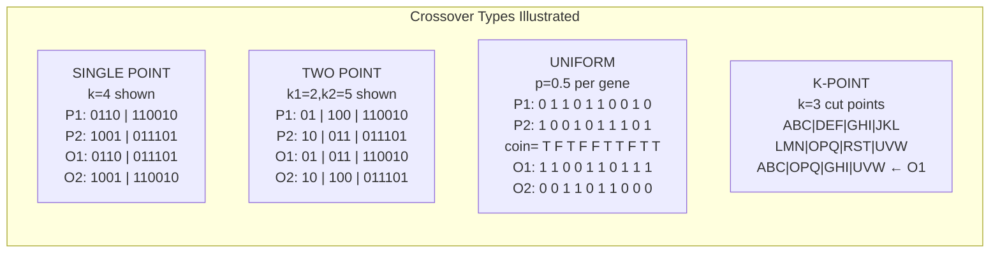

**K-Point Crossover**

K-point crossover generalizes two-point crossover to k arbitrary crossover points (k ≥ 2). The chromosome is divided into k+1 segments, and segments are alternately taken from parent 1 and parent 2. For k = L/2 (half the chromosome length), k-point crossover approaches uniform crossover in the limit. As k increases, the offspring's genetic material becomes a progressively more thorough mosaic of both parents, reducing the preservation of contiguous schemata but increasing genetic mixing. Practical k values range from 1 (single-point) to 4 (four-point), with higher k values producing more thorough shuffling at the cost of greater building block disruption.

**Uniform Crossover**

Uniform crossover (Syswerda, 1989) makes an independent binary inheritance decision at each gene position: for each i ∈ {1, ..., L}, offspring 1 receives the gene from parent 1 with probability p_i (typically p_i = 0.5) and from parent 2 with probability 1-p_i; offspring 2 receives the complementary gene. Uniform crossover produces offspring with the most thorough genetic mixing: when p_i = 0.5 for all i, each offspring gene has a 50% chance of coming from either parent, and on average L/2 genes come from each parent. This maximizes the exploration of the gene space at each generation but destroys large building blocks almost completely, making uniform crossover most appropriate when linkage between genes is weak (problem is nearly separable) or when a maintenance mechanism (such as restricted mating) preserves building blocks at the population level rather than through crossover preservation.

**Crossover for Permutation Representations**

For permutation-encoded problems (TSP, scheduling, assignment), standard crossover operators produce invalid offspring with duplicate or missing elements. Specialized permutation crossover operators include: **Order Crossover (OX)**: copy a random segment from parent 1 into offspring, then fill remaining positions in order from parent 2 starting after the second cut point; **Partially Mapped Crossover (PMX)**: exchange segments between parents and use a mapping to resolve conflicts; **Cycle Crossover (CX)**: identify cycles between parent chromosomes, alternately copy from each parent at cycle boundaries; **Position-Based Crossover (PBX)**: copy random positions from parent 1, fill remaining positions from parent 2 preserving relative order.

**Crossover for Real-Valued Encodings**

For real-valued vectors, standard bit-level crossover is meaningless. Specialized real-valued crossover operators include: **Blend Crossover (BLX-α)**: each offspring gene is uniformly sampled from the interval [min(g₁,g₂)-α·δ, max(g₁,g₂)+α·δ] where δ = |g₁-g₂|; **Simulated Binary Crossover (SBX)**: mimics the distribution of offspring from binary crossover on real values; **Arithmetic Crossover**: O₁ = α·P₁ + (1-α)·P₂ and O₂ = (1-α)·P₁ + α·P₂ for α ∈ [0,1] (interpolation/extrapolation along the line connecting parents); and **Laplace Crossover**: uses Laplace distribution for offspring generation, allowing a small probability of large jumps beyond the parent interval.

**Crossover for Tree Representations (Genetic Programming)**

In Genetic Programming, the standard operator is **Subtree Crossover**: select a random subtree (internal node and all descendants) from each parent tree, exchange the subtrees to produce two offspring. For example: P₁ = ADD(X, MULT(Y,Z)) with selected subtree MULT(Y,Z) crossed with P₂ = SUB(A, DIV(B,C)) with selected subtree B produces O₁ = ADD(X, B) and O₂ = SUB(A, DIV(MULT(Y,Z), C)). This operator is structurally analogous to single-point crossover on linear strings but operates on hierarchical trees, with subtree depth and node selection probability as key design parameters (typically selecting internal nodes with probability p_int and leaf nodes with p_leaf, or restricting subtree selection to internal nodes with depth ≥ 2 to produce sufficiently large structural changes).

**Crossover Probability and Selection Effects**

The crossover probability p_c critically affects GA dynamics. With p_c = 0, no recombination occurs and the GA reduces to a mutation-only search, losing the building block recombination advantage. With p_c = 1.0, all selected parent pairs recombine, maximizing genetic mixing but potentially disrupting good schemata too aggressively. Standard practice uses p_c ∈ [0.6, 0.9], providing substantial recombination while preserving some parental material through the 10–40% of pairs that reproduce without crossover. The interaction with mutation probability p_m is also critical: typically p_c is set high (0.7–0.9) and p_m low (0.001–0.01 per bit) to ensure crossover is primarily responsible for structural exploration while mutation provides fine-grained novelty.
---

## Q6b — Discuss Bucket Brigade Algorithm

The Bucket Brigade Algorithm (BBA), also known as the **Pittsburgh-style bucket brigade** or simply **bucket brigade** in the context of classifier systems, represents a foundational credit assignment mechanism in Holland's **Learning Classifier System (LCS)** architecture—specifically within the **ZCS (Zero-level Classifier System)** framework developed by Stewart Wilson in 1994. The algorithm derives its name from an analogy to an old-fashioned firefighting bucket brigade, in which a line of firefighters passes water buckets from the water source to the fire, with each firefighter receiving a bucket and immediately passing it forward. In the classifier system analogy, each classifier in a matching chain receives a "bid" (portion of a payoff or resource allocation) and passes the remainder forward, ensuring that credit for a successful action is distributed proportionally among all classifiers that contributed to the action's selection.

**Context: The Credit Assignment Problem in Classifier Systems**

To understand the Bucket Brigade Algorithm, it is necessary to situate it within the Learning Classifier System framework. A classifier system maintains a **population of classifiers**—individual rules of the form "IF condition THEN action" encoded as fixed-length strings. Given an environmental input, the system activates all classifiers whose condition parts match the input (the **match set**[M]), and from these, a subset whose action parts are consistent (no conflicting actions) is selected as the **action set**[A]. One classifier in [A] is probabilistically selected to execute its action on the environment, which responds with a new input and a scalar **payoff** (reward or penalty). The fundamental challenge—the **credit assignment problem**—is to determine how much credit (or blame) for the final payoff should be assigned to each classifier in the action set [A], since the payoff results from the combined effect of all classifiers that led to the selection of the executed action, including classifiers that fired in earlier steps (forming a **classifier chain**) that set the stage for the final action.

The Bucket Brigade Algorithm solves this credit assignment problem through an iterative, resource-passing mechanism reminiscent of economic market transactions.

**Algorithm Mechanism: Step by Step**

Consider a classifier system operating in a sequence of time steps t = 0, 1, 2, ..., with a population P of classifiers. At each time step t:

1. **Matching**: The environment produces input I_t. All classifiers whose condition matches I_t form the match set [M]_t.

2. **Action Selection**: From [M]_t, the action set [A]_t is formed by classifiers with compatible actions. (In simple LCS formulations, [A]_t = [M]_t if all matched classifiers recommend actions; in more complex formulations, a bidding mechanism resolves conflicts.)

3. **Bidding**: Each classifier i ∈ [A]_t makes a **bid** equal to its current **strength** S_i(t) multiplied by the **match set strength** (the sum of strengths of all classifiers in [M]_t, or a function thereof). This bid represents the classifier's offer to pay for the privilege of having its action executed. Formally, bid_i = S_i(t) × β_i where β_i is a bid scaling factor.

4. **Auction**: The classifier with the highest bid (or a probabilistically selected high bid) wins the auction and its action is executed on the environment. The payoff received from the environment is P_t.

5. **Resource Distribution (The Bucket Brigade)**: The winning classifier must pay its bid to the system, but it receives the environmental payoff P_t. The net gain is: ΔS_winner = P_t − bid_winner. However, the winner's bid was computed from its current strength S_winner, meaning the payment must be sourced from strengtheners that contributed to [M]_t. The Bucket Brigade distributes this payment backward through the classifier chain:
   - The winner classifier pays its bid proportionally to all classifiers in [A]_t that were active in the previous time step (or equivalently, to all classifiers whose conditions matched the input that led to the winner's action).
   - In the standard ZCS implementation, the payment is made to all classifiers in [A]_{t-1} whose conditions matched the system state at the time the current action was chosen, proportional to their bid contributions.

In the simple case where all classifiers in the action set share equally in the payment: each classifier i ∈ [A]_{t-1} receives: ΔS_i = bid_winner / |[A]_{t-1}| − its own bid at time t-1 (which it paid to classifiers in [A]_{t-2}). This creates a **chain of resource flow**: credit propagates backward from the final rewarding action through all predecessors in the action chain, with each classifier receiving a share proportional to its contribution to enabling the final action.

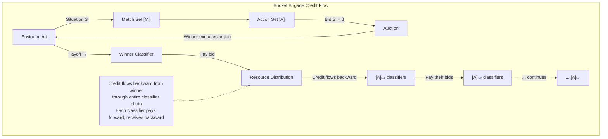

**Strength Update Rules**

Each classifier i in the population maintains a **strength** value S_i, analogous to a bank account balance that represents the classifier's accumulated fitness or credit. The Bucket Brigade Algorithm updates S_i at each time step according to:

- **Active classifiers** in the match set [M] that do NOT fire pay their bids but receive no payoff: ΔS_i = −bid_i
- **Active classifiers** in the match set [M] that DO fire (the action set [A]) also pay their bids: ΔS_i = −bid_i
- **The winning classifier** receives the environmental payoff P_t and pays its bid: ΔS_winner = P_t − bid_winner
- **All inactive classifiers** (those whose conditions did not match I_t) pay nothing and receive nothing: ΔS_i = 0

In ZCS, classifiers that have been active for many steps without contributing to a payoff eventually become "bankrupt" (S_i < threshold) and are deleted from the population, preventing weak or useless classifiers from accumulating indefinitely. The **tax mechanism** imposes a small cost on all active classifiers per time step to prevent inflation of strength values and to encourage classifiers to be active only when they contribute meaningfully.

**Relationship to GA in Classifier Systems**

The Bucket Brigade Algorithm operates in conjunction with a Genetic Algorithm within the complete Learning Classifier System. While the bucket brigade handles credit assignment—the micro-level learning problem of adjusting individual classifier strengths—the GA handles **rule discovery**—the macro-level problem of generating new potentially useful classifiers to add to the population. At specified intervals (e.g., every N time steps or when the population's total performance stabilizes), the GA is invoked: it selects parent classifiers from the current population (typically fitness- or strength-proportionate selection), applies crossover and mutation to generate new classifier strings, and inserts offspring into the population while deleting low-strength classifiers to maintain population size. The GA thus provides the mechanism for exploring new rule combinations while the bucket brigade provides the mechanism for refining the strength values of existing rules based on environmental payoff. The two mechanisms operate on different time scales and serve complementary functions: the bucket brigade provides fast, incremental, online credit assignment at each time step; the GA provides slower, batch-mode structural innovation through population evolution.

**Mathematical Properties and Convergence Characteristics**

The Bucket Brigade Algorithm possesses several notable mathematical properties. Under appropriate conditions (sufficiently small bid scaling factors, bounded payoffs, and adequate population diversity), the total strength of the population converges to a bounded value, preventing unbounded inflation or deflation of the global strength resource. The algorithm implicitly implements a form of **temporal difference learning** analogous to Q-learning: the credit propagated backward through the classifier chain approximates the discounted future reward that a state-action pair leads to. The discounting effect arises naturally from the repeated payment of bids at each step: a classifier that is many steps back in the chain has paid its bid multiple times before receiving any payoff from a final rewarding action, effectively receiving a geometrically discounted share of the final reward. This discounting is not imposed externally but emerges from the mechanics of the bucket brigade resource flow.

**Limitations and Modern Variants**

The original bucket brigade algorithm suffers from several well-documented limitations. **Overfitting to specific chains**: classifiers that specialize in particular state-action sequences receive high strength for those specific sequences but fail to generalize to similar states, limiting transfer learning. **Sensitivity to bid scaling**: the bid scaling parameter β critically affects convergence speed and stability, with poor choices leading to rapid bankruptcy of all classifiers or uncontrolled strength inflation. **Credit assignment delay**: for long classifier chains, the discounting effect can be so severe that distant predecessors receive near-zero credit for rewarding outcomes, preventing effective learning of long action sequences. Modern LCS variants including **XCS (Extended Classifier System)** replace the bucket brigade credit assignment with a more sophisticated **accuracy-based fitness** mechanism that explicitly tracks the predictive accuracy of each classifier rather than relying solely on strength-based bidding, substantially improving performance on classification and reinforcement learning tasks.
---

## Q6c — Comment on the Stopping Condition for GA Flow

The **stopping condition** (also called termination criterion or halting condition) is a critical design parameter of any Genetic Algorithm that governs when the iterative evolutionary process ceases and the algorithm returns its final result. The appropriate selection of a stopping condition involves a fundamental trade-off: terminating too early sacrifices solution quality by returning a suboptimal solution before the population has had sufficient evolutionary time to converge toward optima; while terminating too late wastes computational resources on generations that produce no meaningful improvement while potentially exacerbating problems such as overfitting (in learning applications), premature convergence collapse, or numerical drift in self-adaptive parameters. The stopping condition for a GA flow can be formulated using several complementary criteria, each with distinct mathematical properties, practical implications, and appropriate application contexts.

**Maximum Generation Count (Iteration Budget)**

The **maximum generation count** criterion terminates the GA after a pre-specified number T_max of generations has elapsed. This is the simplest, most commonly used, and most widely applicable stopping criterion, requiring only that the practitioner specify an iteration budget that constrains the total computational cost of the optimization run. The choice of T_max depends on problem-specific considerations: for simple unimodal continuous optimization problems with small population sizes (N = 50), T_max = 50–200 generations may be sufficient for convergence; for multimodal combinatorial problems with large populations (N = 500), T_max = 1000–10,000 generations may be required; for multi-objective optimization where convergence to the Pareto front requires substantial population diversity maintenance, T_max = 500–5000 generations is common. The maximum generation criterion has the virtue of providing a guaranteed computational cost bound, which is essential for real-time applications and for comparing algorithm performance across benchmarks using equal computational budgets. Its limitation is that it is decoupled from actual algorithm progress: the GA may have converged to a stable solution after T = 100 generations (rendering subsequent generations wasteful) or may still be improving at T_max (rendering the returned solution suboptimal).

**No-Improvement Stopping Criterion (Patience-Based)**

The **no-improvement stopping criterion** (also called patience convergence, stall detection, or early stopping) terminates the GA when the best fitness value in the population has not improved by more than a specified minimum threshold ε over the last k consecutive generations. Formally, if f_best(t) = max_{i∈P(t)} f(x_i(t)) denotes the best fitness at generation t, the stopping condition is: f_best(t) − f_best(t−k) < ε for some patience window k and improvement threshold ε. This criterion directly monitors algorithmic progress and terminates only when the evolutionary search has demonstrably stalled, which is precisely the condition under which further computation is unlikely to produce meaningful improvement. The patience parameter k (typically k = 10–100 generations) prevents premature termination due to transient fitness fluctuations that arise from the stochastic nature of mutation and selection. The improvement threshold ε (typically ε = 10⁻⁴ to 10⁻⁶ for continuous optimization relative to the fitness scale, or ε = 0 for strict no-improvement) governs the strictness of the convergence detection. The no-improvement criterion is preferred over maximum generation in applications where computational resources are constrained but solution quality is paramount, as it automatically allocates more computational effort to hard problems and fewer resources to easy problems that converge quickly.

**Diversity-Based Stopping Criterion**

The **diversity-based stopping criterion** monitors the genetic or phenotypic diversity of the population and terminates when diversity falls below a threshold that signals convergence to a local optimum or premature convergence collapse. Diversity can be quantified in several ways: **genetic diversity** measured by the average Hamming distance between pairs of individuals (for binary representations) or the average Euclidean distance (for real-valued representations); **fitness diversity** measured by the standard deviation or variance of fitness values across the population; and **phenotypic diversity** measured by clustering individuals into phenotypic niches and monitoring the number of occupied niches. The stopping condition is: σ_fitness(P(t)) < ε_fitness or d_genetic(P(t)) < ε_genetic, where ε_fitness and ε_genetic are thresholds indicating that all individuals have converged to similar fitness values (fitness diversity stopping) or similar genotypes (genetic diversity stopping). The fitness-based diversity measure is preferred in practice because it directly detects the practical problem of interest—premature convergence to a suboptimal solution—whereas genetic diversity may remain high even when all individuals occupy the same basin of attraction (if the encoding has high redundancy). A notable variant is the **fitness sharing** diversity metric that measures niche occupancy, terminating when the number of occupied niches falls below a threshold.

**Target Fitness Stopping Criterion**

The **target fitness stopping criterion** terminates the GA when any individual in the population achieves a pre-specified fitness threshold that represents a satisfactory solution to the problem. Formally: max_{i∈P(t)} f(x_i(t)) ≥ f_target. This criterion is appropriate when the decision-maker has a clear a priori criterion for what constitutes a "good enough" solution—for example, finding a TSP tour within 1% of the known optimal tour length, finding a neural network whose classification accuracy exceeds 95% on a validation set, or finding a portfolio whose expected return exceeds a required threshold. The target criterion has the advantage of terminating as soon as a satisfactory solution is found, potentially saving substantial computation. Its limitation is the requirement that f_target be specified before the optimization begins, which is feasible only when the practitioner has a reasonable estimate of the optimal value or an acceptable solution quality threshold—a condition that is frequently violated in research benchmarking or exploratory optimization where the optimal value is unknown.

**Hybrid Stopping Criteria and Practical Recommendations**

In practice, the most robust GA implementations employ a **compound stopping condition** that combines multiple criteria: the algorithm terminates when ANY of the following conditions are met: (1) T ≥ T_max; (2) no improvement for k generations; (3) fitness standard deviation < ε_σ; (4) best fitness ≥ f_target (if applicable). This compound approach provides safety against all failure modes: the maximum generation budget prevents infinite computation if convergence detection fails; the no-improvement criterion detects actual search stagnation; the diversity criterion detects premature convergence before it becomes irreversible; and the target criterion enables early termination upon finding a satisfactory solution.

The relationship between stopping condition and other GA parameters requires careful consideration. T_max should be set proportionally to computational budget: for expensive fitness evaluations (CFD, FEA), T_max is typically small (10–100) and diversity maintenance mechanisms (crowding, islands) must be aggressive at preventing premature convergence within the tight budget; for cheap evaluations (simulation, mathematical functions), T_max can be 1000–50,000 and diversity mechanisms can be relaxed. The no-improvement patience k should scale inversely with convergence speed: rapid convergence problems (small population, high selection pressure) require small k (5–20); slow convergence problems (large population, low selection pressure) require large k (50–200). The diversity threshold ε_genetic should be scaled to the search space size: for problems with large search spaces, larger diversity thresholds prevent premature termination while still detecting true convergence; for problems with compact search spaces, tighter thresholds provide more accurate convergence detection.

**Convergence Theory and Stopping Criteria: A Formal Perspective**

From a theoretical perspective, the design of stopping criteria for GAs can be related to the concept of **absorbing Markov chains** and **steady-state distributions**: as the GA evolves, the population trajectory traces a path through the state space of population configurations. The algorithm has converged when the Markov chain has entered an absorbing state—a state from which all subsequent states are the same or equivalent, and from which no further improvement is possible. In practice, detecting absorption requires monitoring either fitness improvement (none means the chain has entered an absorbing set) or population diversity (zero diversity means all individuals are identical, guaranteeing absorption). The **strict test** for convergence requires demonstrating that the population has not improved for k generations AND that all individuals are within a distance ε of the best individual—a compound criterion that provides the strongest guarantee that further computation is unnecessary.

For multi-objective GAs, the stopping criterion is typically based on **Pareto front convergence metrics**: the algorithm terminates when the hypervolume indicator of the current Pareto front approximation ceases to improve, when the generational distance (average Euclidean distance from the reference Pareto front) falls below a threshold, or when T_max generations have elapsed. The hypervolume indicator is the most comprehensive metric as it captures both convergence to the true Pareto front and diversity of the approximation, but it requires knowledge of a reference front which may not be available in practice.

```

STOPPING CRITERIA - PRACTICAL GUIDE

  GENERATION-BASED:     t >= T_max
    Best for: fixed budget benchmarks, reproducibility
    Risk: may stop too early or waste iterations

  NO-IMPROVEMENT:       f_best(t) - f_best(t-k) < ε
    Best for: production optimization where quality matters
    Parameter: patience k, threshold ε
    Risk: patience too small → premature stop

  DIVERSITY-BASED:      σ_fitness < ε_σ  OR  d_genetic < ε_d
    Best for: multimodal problems, detects premature convergence
    Risk: high diversity may persist even at optima

  TARGET FITNESS:        f_best >= f_target
    Best for: engineering optimization with quality requirements
    Requirement: f_target must be known a priori

  COMPOUND (RECOMMENDED): stop if ANY of above conditions met
    Most robust: covers all failure modes
```
---


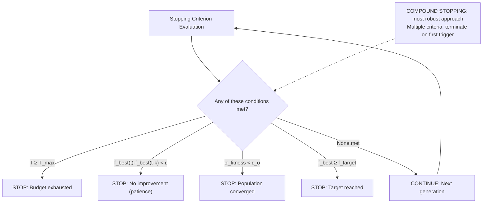

## Q7a — Explain Latest Applications of Soft Computing

The landscape of soft computing applications has expanded dramatically in the 2020s, driven by the confluence of three technological forces: the unprecedented availability of large-scale real-world datasets across every domain of human activity; the dramatic improvements in computing hardware (GPUs, TPUs, neuromorphic chips, edge AI accelerators) that make computationally intensive soft computing algorithms economically viable in production environments; and the growing recognition that the uncertainty, incompleteness, noise, and ambiguity inherent in real-world data cannot be effectively managed by traditional crisp, deterministic computing paradigms but rather require the tolerance for imprecision and the human-like reasoning capabilities that soft computing methodologies—fuzzy systems, neural networks, evolutionary computation, and probabilistic reasoning—collectively provide. The "latest applications" of soft computing span emerging technological frontiers including large language model augmentation, autonomous systems, smart infrastructure, climate science, drug discovery, and personalized medicine—domains that were largely inaccessible to soft computing methodologies a decade ago due to data limitations, computational constraints, or the perceived dominance of deep learning as the solution to all AI problems.

**Foundation Models and Soft Computing Integration**

One of the most consequential emerging applications is the integration of soft computing principles into **large language models (LLMs)** and foundation models. Despite the remarkable capabilities of transformer-based LLMs across natural language understanding, generation, and reasoning tasks, these models exhibit well-characterized limitations that soft computing methodologies can address: **hallucination** (the generation of factually incorrect or unsupported content), **lack of uncertainty quantification** (LLMs typically output point estimates without confidence intervals or probabilistic assessments of their own reliability), and **poor performance on structured reasoning tasks** involving arithmetic, logic, and constraint satisfaction. Fuzzy logic provides a natural formalism for representing and reasoning with the linguistic uncertainty and graded truth that characterizes human language: fuzzy membership functions can model the gradedness inherent in concepts such as "approximately," "usually," "somewhat likely," and "probably"—graded modifiers that LLMs process as discrete tokens but whose semantic meaning is inherently continuous and context-dependent. Neuro-fuzzy systems can be integrated with LLMs as uncertainty-calibrated output layers: the LLM generates candidate responses, and a fuzzy inference layer assigns membership degrees to truth claims, confidence levels, and logical consistency, providing structured uncertainty estimates that enable downstream applications to make calibrated decisions about whether to trust and act upon the LLM output. Evolutionary computation optimizes the prompt strategies for LLMs across task-specific benchmarks: a GA evolves prompt templates that maximize task performance, with each individual encoding a prompt template evaluated by querying the LLM and measuring output quality. This **neuro-evolutionary prompt optimization** has demonstrated that evolved prompts outperform hand-crafted few-shot prompts on reasoning benchmarks while being substantially more compact (50–200 tokens versus multi-thousand token few-shot chains).

**Autonomous Systems and Embodied AI**

Soft computing plays an increasingly central role in **autonomous systems** spanning self-driving vehicles, unmanned aerial vehicles (UAVs), autonomous underwater vehicles (AUVs), humanoid robots, and industrial collaborative robots (cobots). Fuzzy logic controllers handle the real-time sensor fusion and decision-making tasks that autonomous systems require: **fuzzy sensor fusion** integrates noisy, asynchronous, and heterogeneous sensor readings (LiDAR, radar, camera, GPS, IMU) through fuzzy membership functions that model sensor reliability as a function of operating conditions (rain, fog, sun glare, GPS multipath), producing weighted sensor confidence estimates that guide sensor fusion in Kalman filter and particle filter frameworks. In autonomous vehicle path planning and behavioural decision-making, **fuzzy behavioural arbitration** resolves conflicts between competing behavioural objectives (lane following, obstacle avoidance, speed regulation, intersection handling) using fuzzy priority rules: "IF obstacle_proximity is CRITICAL AND lateral_clearance is SMALL THEN obstacle_avoidance is HIGHEST_PRIORITY" overrides all other behaviours, while "IF traffic_density is LOW AND speed_limit is HIGH THEN cruising_speed is MAXIMUM" activates in open highway conditions. Neuro-fuzzy systems learn these behavioural arbitration rules from human driving demonstrations, capturing the nuanced context-dependency of skilled human driving (e.g., the different following distances maintained in rain versus sun, or the different speed profiles adopted near schools versus highways).

In **UAV swarm coordination**, evolutionary algorithms optimize swarm formation control parameters, obstacle avoidance behaviour rules, and task allocation strategies for heterogeneous drone fleets performing search-and-rescue, precision agriculture, and surveillance missions. Particle Swarm Optimization optimizes individual UAV trajectories in real-time to maximize area coverage while minimizing energy expenditure and maintaining communication connectivity—an NP-hard multi-objective problem where fuzzy fitness evaluation simultaneously considers coverage completeness, energy budget, and network connectivity constraints.

**Climate Science and Environmental Sustainability**

Soft computing has found growing application in **climate modelling, prediction, and mitigation**. Fuzzy time series forecasting models, which extend traditional statistical time series methods by incorporating fuzzy set representations of time series states and fuzzy logical relationships between states, have been applied to global temperature anomaly forecasting, sea level rise prediction, and extreme weather event (hurricane, flood, drought) prediction with accuracy improvements over classical ARIMA and exponential smoothing methods, particularly in capturing the nonlinear dynamics and abrupt regime shifts characteristic of climate systems. Fuzzy clustering algorithms (fuzzy c-means, Gustafson-Kessel, Gath-Geva) segment climate data into fuzzy regions representing distinct climate regimes (El Niño, La Niña, neutral phases), enabling probabilistic seasonal forecasting rather than deterministic single-outcome predictions.

In **renewable energy systems**, fuzzy logic controllers optimize wind turbine blade pitch angles and generator torque for maximum power point tracking under variable wind conditions, addressing the nonlinear aerodynamics and time-varying wind profiles that challenge conventional MPPT controllers. In solar energy, fuzzy controllers optimize solar panel orientation in solar tracking systems and regulate photovoltaic system voltage and current under varying insolation and temperature conditions. In **smart grid management**, fuzzy expert systems diagnose power system faults, optimize energy dispatch across distributed energy resources, and manage demand response under uncertain renewable energy generation forecasts. Evolutionary algorithms optimize the layout (placement and sizing) of wind farms and solar panel arrays to maximize energy yield while minimizing environmental impact and land use conflicts.

**Drug Discovery and Computational Chemistry**

The application of soft computing to **drug discovery** represents one of the most high-impact emerging domains, addressing the fundamental challenge of identifying molecular compounds that simultaneously satisfy multiple, often conflicting, drug-likeness criteria: high binding affinity to the target protein, low binding affinity to off-target proteins (minimizing side effects), favorable ADMET (Absorption, Distribution, Metabolism, Excretion, Toxicity) properties, chemical synthesizability, and intellectual property distinctiveness. The search space of possible drug molecules—estimated at 10^60–10^200 potential compounds—is combinatorially vast and cannot be exhaustively searched, making it an ideal domain for metaheuristic optimization. Genetic Algorithms evolve molecular structures represented as SMILES strings or graph representations, with fitness defined by multi-objective scoring functions combining binding affinity predictions from molecular docking simulations, ADMET property predictions from quantitative structure-activity relationship (QSAR) models, and synthetic accessibility scores. The resulting evolutionary search navigates the chemical space to propose novel candidate compounds for laboratory synthesis and testing. DeepMind's AlphaFold and related protein structure prediction models can be combined with evolutionary algorithms to generate proteins with designed structures and functions, blurring the boundary between in silico design and biological evolution.

In **computational chemistry**, fuzzy clustering and fuzzy classification identify molecular substructures associated with specific chemical properties (reactivity, toxicity, solubility) from large chemical databases, providing chemical interpretability that purely statistical machine learning methods lack. The resulting fuzzy rules—"IF molecule contains substructure X AND logP is HIGH THEN water_solubility is POOR"—provide chemically meaningful explanations that guide medicinal chemists in molecular design decisions. Fuzzy QSAR models replace traditional crisp QSAR with fuzzy membership representations of molecular descriptor thresholds, enabling more accurate prediction of biological activity across the continuous and overlapping distributions characteristic of chemical-biological interactions.

**Healthcare and Precision Medicine**

In **precision medicine**, soft computing enables individualized diagnosis, prognosis, and treatment recommendation that accounts for patient-specific factors including genetic profile, comorbidities, lifestyle, environmental exposures, and biomarker status. Neuro-fuzzy diagnostic systems integrate heterogeneous patient data—electronic health records, genomic data, imaging, laboratory results, wearable sensor streams—through fuzzy membership functions that quantify the degree to which each data feature supports each diagnostic hypothesis, producing probabilistic diagnostic assessments rather than binary classifications. Fuzzy decision support systems for clinical treatment selection encode clinical practice guidelines as fuzzy rules that can be adapted to individual patient characteristics: "IF patient_age is ELDERLY AND renal_function is IMPAIRED AND tumor_stage is ADVANCED THEN chemotherapy_dose is REDUCED and supportive_therapy is INTENSIFIED." Evolutionary algorithms optimize treatment protocols (drug combinations, dosing schedules, sequencing) for individual patients by evaluating candidate protocols through mechanistic pharmacokinetic-pharmacodynamic (PK-PD) models calibrated to patient-specific parameters.

```
LATEST APPLICATIONS OF SOFT COMPUTING — 2020s FRONTIERS

  DOMAIN                     SOFT COMPUTING TECHNIQUE          OUTCOME
  ─────────────────────────────────────────────────────────────────────
  LLM Augmentation           Fuzzy uncertainty calibration      Hallucination rate ↓
                             Neuro-fuzzy confidence layers     Calibrated reliability
                             GA prompt optimization            30-50% better prompts
  Autonomous Vehicles        Fuzzy sensor fusion               Robust perception
                             Fuzzy behavioural arbitration     Safe decision-making
                             GA trajectory optimization        Energy-efficient paths
  Climate Science            Fuzzy time series forecasting     Extreme event prediction
                             Fuzzy clustering (regime detect)  Probabilistic seasonal
  Renewable Energy           Fuzzy MPPT controllers            Energy capture ↑ 5-15%
                             PSO microgrid optimization        Cost-optimal dispatch
  Drug Discovery             GA molecular evolution            Novel candidate compounds
                             Fuzzy QSAR                        Interpretable activity
  Precision Medicine         Neuro-fuzzy diagnosis             Individualized care
                             Evolutionary treatment protocols  Optimized therapy
  Brain-Computer Interface   Fuzzy feature selection           Accurate intention dec.
                             Fuzzy classifiers                 Real-time control
```
---


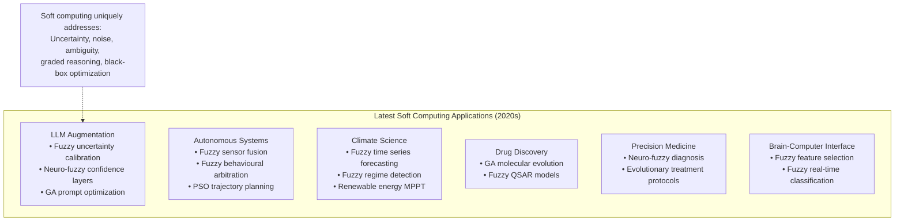

## Q7b — What are the Characteristics of Neuro-Fuzzy Hybrid Systems?

Neuro-Fuzzy Hybrid Systems represent one of the most intellectually consequential architectural convergences within soft computing, integrating the complementary strengths of two of its foundational methodologies—artificial neural networks and fuzzy logic systems—into unified computational frameworks that simultaneously achieve the adaptive learning capability of connectionist systems and the linguistic interpretability, uncertainty tolerance, and human-like reasoning capabilities of fuzzy logic. The term "neuro-fuzzy" specifically denotes architectures in which neural networks and fuzzy systems are integrated at the architectural, functional, or algorithmic level rather than merely used in combination, with each component modifying or augmenting the other's operation in ways that produce emergent capabilities neither could achieve in isolation. The characteristics of neuro-fuzzy hybrid systems can be systematically analyzed along multiple dimensions: their representational characteristics (how knowledge is stored and expressed), their learning characteristics (how knowledge is acquired and refined from data), their inference characteristics (how decisions are derived from knowledge), their structural characteristics (how neural and fuzzy components are interconnected), their operational characteristics (how the hybrid operates during training and deployment), and their pragmatic characteristics (applicability, interpretability, and explainability in real-world deployment contexts).

**Hybridization Modes: Distinct Structural Architectures**

Neuro-fuzzy hybridization is not a monolithic architecture but rather encompasses at least three distinct hybridization modes, each with different characteristics and appropriate application contexts. In the ** cooperative hybridization** mode (also called loosely coupled or sequential hybridization), neural networks and fuzzy systems operate as distinct components with well-defined interfaces but do not modify each other's internal representations. A canonical example is a fuzzy neural architecture where a fuzzy preprocessing layer converts crisp inputs into fuzzy membership degrees before feeding them into a neural network classifier: the fuzzy layer encodes linguistic domain knowledge while the neural layer learns discriminative patterns from the resulting fuzzy representations. In the **integrated hybridization** mode (also called tightly coupled or concurrent hybridization), neural networks and fuzzy systems are inextricably interwoven at the functional level, with neural computation occurring within fuzzy operators and fuzzy computation occurring within neural network layers. The most prominent example is the ANFIS (Adaptive Neuro-Fuzzy Inference System) architecture, in which each node in the neural network's layers performs a specific fuzzy inference operation (fuzzification, t-norm application, normalization, defuzzification) and the weights in specific layers correspond directly to fuzzy membership function parameters. In the **neuro-fuzzy co-evolutionary** mode, neural networks and fuzzy systems are evolved simultaneously using evolutionary computation, with the GA optimizing neural network architectures and fuzzy membership function parameters jointly—a mode particularly suited to automated design of neuro-fuzzy systems for novel application domains.

**Representational Characteristics: Knowledge Encoding as Fuzzy-Weighted Neural Connections**

In neuro-fuzzy hybrid systems, knowledge is represented through a hybrid encoding that combines the linguistic interpretability of fuzzy rules with the distributed connectionist representation of neural networks. In the ANFIS architecture, for example, each fuzzy rule of the form "IF x is A AND y is B THEN z = f(x,y)" corresponds to a specific subnetwork path through the fuzzy layer nodes. The membership function parameters (center c and width σ for Gaussian membership functions) are stored as connection weights between the input layer and the first hidden (fuzzy) layer; the firing strengths (αᵢ) are computed as products of membership degrees in the fuzzy layer; the normalized firing strengths (ᾱᵢ = αᵢ/Σⱼ αⱼ) are computed in the normalization layer; and the consequent parameters (linear function coefficients p, q, r for zᵢ = p·x + q·y + r) are stored as weights between the normalization layer and the output layer. This hybrid representation means that the knowledge encoded in a neuro-fuzzy system can be extracted in two complementary formats: as a trained neural network with specific weight values (enabling numerical computation and function approximation), and as a set of linguistic fuzzy if-then rules with specified membership functions (enabling human-readable explanations).

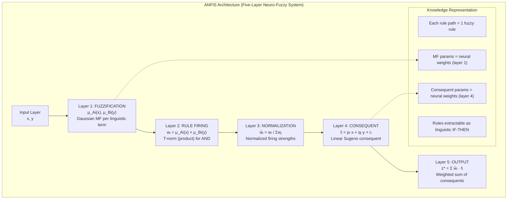

**Learning Characteristics: Hybrid Learning Algorithms**

A defining characteristic of neuro-fuzzy systems is their ability to **learn fuzzy rules and membership function parameters from numerical training data**, eliminating the knowledge elicitation bottleneck that impedes conventional fuzzy system deployment. The learning in neuro-fuzzy systems operates at two distinct levels: **structure learning**, which determines the number, form, and configuration of fuzzy rules and membership functions from the training data; and **parameter learning**, which fine-tunes the parameters of an existing fuzzy rule structure (membership function shapes, consequent coefficients) to minimize training error. The ANFIS architecture implements a particularly elegant hybrid learning algorithm that leverages the neural network representation to apply both least-squares optimization and gradient descent in a single training pass. In the **forward pass (least-squares step)**, the antecedent membership function parameters are fixed, and the consequent linear parameters {pᵢ, qᵢ, rᵢ} for each rule are computed via least-squares estimation, providing the optimal linear parameters in a single analytical computation (no gradient iteration required). In the **backward pass (gradient descent step)**, the consequent parameters are fixed, and the antecedent membership function parameters (Gaussian centers and widths) are updated by propagating error gradients backward through the fuzzy layers using the chain rule of calculus, adjusting the shape and position of membership functions to better fit the training data. These two passes are alternated across training epochs, with the result that the neuro-fuzzy system simultaneously learns (a) the semantic structure of the fuzzy rules (which input combinations produce which output regions) and (b) the precise parameters of the membership functions and consequents to best approximate the training data mapping.

**Operational Characteristics: Smooth Interpolation and Reasoning Under Uncertainty**

During deployment, neuro-fuzzy systems execute inference by propagating input values through the hybrid neural-fuzzy network, producing outputs that combine the smooth interpolation capability of fuzzy inference with the computational efficiency of neural network evaluation. The key operational characteristics include: **local linearity**: in Sugeno-type neuro-fuzzy systems, each rule's consequent is a linear function of the inputs, making the overall input-output mapping a continuously differentiable piecewise linear function—important for control stability analysis and for gradient-based optimization of downstream components; **graded reasoning**: the firing strength αᵢ ∈ [0, 1] of each rule provides a graded measure of the rule's applicability to the current input, enabling the system to smoothly interpolate between rules rather than making crisp rule selections; **uncertainty handling**: membership degrees encode both the degree of confidence in the classification or control action and the degree of similarity between the current input and training examples, providing natural uncertainty quantification without requiring explicit probabilistic modelling; and **real-time performance**: once trained, a neuro-fuzzy system executes inference in microseconds on modern embedded hardware, making it suitable for real-time control and decision support applications.

**Explainability Characteristics: The Interpretability Gradient**

One of the most distinctive and practically important characteristics of neuro-fuzzy systems is their position on the **interpretability spectrum** between transparent symbolic systems (classical rule-based systems, decision trees) and opaque black-box systems (deep neural networks, ensemble methods). The interpretability of a neuro-fuzzy system depends on the number of rules, the number of linguistic terms per variable, and the complexity of the consequent functions: a system with 5 rules, 2 variables with 2 terms each, and constant consequent values has high interpretability (a small number of short, simple IF-THEN rules); a system with 500 rules, 10 variables with 5 terms each, and high-order polynomial consequents has lower interpretability. The neuro-fuzzy system's architecture naturally supports **explanatory extraction**: after training, the fuzzy rule base can be extracted by examining the trained membership function parameters and consequent values, producing a set of linguistic IF-THEN rules that a domain expert can read, validate, and potentially refine. This interpretability characteristic is essential in regulated domains (healthcare diagnostics, credit scoring, medical device control) where algorithmic decisions must be auditable and explainable to regulatory authorities, patients, or customers.

**Comparison with Pure Neural and Pure Fuzzy Systems**

| Characteristic | Neural Network Only | Fuzzy System Only | Neuro-Fuzzy Hybrid |
|---|---|---|---|
| Knowledge representation | Distributed weights, opaque | Explicit linguistic rules | Hybrid: weights + linguistic rules |
| Learning from data | Yes (back-propagation) | No (requires expert rules) | Yes (hybrid LS + GD) |
| Interpretability | Low (black box) | High (transparent rules) | Medium-High (extractable rules) |
| Handling uncertainty | Implicit through averaging | Explicit through membership | Explicit + learned adaptation |
| Expert knowledge | Cannot incorporate directly | Incorporates naturally | Can incorporate as prior |
| Extrapolation | Poor outside training range | Reasonable via interpolation | Good (rules generalize) |
| Real-time inference | Yes (matrix multiply) | Yes (rule evaluation O(R)) | Yes (ANN-like evaluation) |
| Stability guarantees | Difficult | Complex; requires Lyapunov | Approximate via local linearity |

**Applications Leveraging Neuro-Fuzzy Characteristics**

The unique combination of characteristics provided by neuro-fuzzy systems has driven their adoption in domains requiring simultaneously adaptive learning and interpretable reasoning: **stock market forecasting** systems use ANFIS to learn fuzzy rules from historical price and volume data, producing trading signals with linguistic explanations ("SELL because RSI is OVERBOUGHT and MACD shows BEARISH crossover with confidence 0.83"); **medical diagnosis** systems learn neuro-fuzzy diagnostic rules from patient databases, providing diagnoses with linguistic explanations of the reasoning path that clinicians can audit for clinical validity; **credit risk assessment** systems satisfy regulatory requirements (such as the U.S. Equal Credit Opportunity Act's adverse action notice requirement) by providing the specific fuzzy rule activations that led to a credit decision, enabling compliance with explainability mandates; **industrial process control** systems combine on-line adaptation (the neural component continuously updates membership functions from sensor data) with operator-accessible linguistic rules (the fuzzy component provides the operators' familiar IF-THEN control heuristics), enabling operators to understand and trust the adaptive controller's behaviour; and **human-computer interaction** systems use neuro-fuzzy interfaces that learn user preference patterns through fuzzy membership modelling while providing linguistically interpretable explanations for interface decisions, improving user trust and satisfaction.
---

## Q8a — Write Short Notes on: Sequential Hybrid Systems, Auxiliary Hybrid Systems, Embedded Hybrid Systems

The taxonomy of hybrid soft computing systems encompasses three primary architectural configurations distinguished by the manner in which their constituent methodologies interact: sequential (or serial) hybrid systems, in which component methodologies execute in a defined sequence with the output of one serving as input to the next; auxiliary hybrid systems, in which one methodology serves as the primary decision-making engine while a secondary methodology provides supporting computations or knowledge enhancement; and embedded hybrid systems, in which the functionalities of two or more methodologies are deeply interwoven at the algorithmic or structural level, producing integrated computations that cannot be decomposed into sequential stages. Each architectural configuration possesses distinct computational characteristics, knowledge flow patterns, implementation complexity, and suitability for different application domains.

**Sequential Hybrid Systems**

Sequential Hybrid Systems, also called **serial hybrids** or **pipeline hybrids**, organize two or more computational methodologies in a linear sequence where each stage receives as input the output of the preceding stage and passes its result to the succeeding stage. The sequential architecture is the simplest and most intuitive hybridization pattern, corresponding to the general systems engineering principle of functional decomposition into sequential processing stages. In a canonical two-stage sequential hybrid, the first stage performs data preprocessing, feature extraction, or knowledge transformation, while the second stage performs classification, decision-making, or optimization using the first stage's output as input.

The defining characteristic of sequential hybrids is the **unidirectional information flow**: information passes from stage 1 to stage 2 without feedback from stage 2 to stage 1 during normal operation. This unidirectional flow makes sequential hybrids straightforward to design, implement, debug, and maintain, as each stage can be independently specified, tested, and optimized. The mathematical description of a sequential hybrid with stages f₁ and f₂ is simply the composition: F(x) = f₂(f₁(x)). For three-stage sequential hybrids (e.g., preprocessing → transformation → decision), the composition extends to F(x) = f₃(f₂(f₁(x))).

Examples of sequential hybrids include: **PCA + Neural Network**: Principal Component Analysis (a linear statistical dimensionality reduction technique from classical AI) is applied first to reduce input dimensionality and decorrelate features, and the resulting lower-dimensional representation is fed into a neural network classifier—the sequential arrangement exploits PCA's ability to produce a compact, whitened representation that accelerates neural network training and improves generalization. **Fuzzy Clustering + Classification**: Fuzzy c-means clustering (fuzzy method) is first applied to training data to produce soft cluster assignments that serve as fuzzy membership features, which are then fed into a crisp decision tree or neural network classifier—the fuzzy clustering provides robust feature representation in the presence of class overlap. **GA + Local Search**: A Genetic Algorithm is first applied for global exploration of the solution space, identifying promising regions; the best solution found by the GA is then refined using local search (hill climbing, Newton's method, 2-opt)—the sequential arrangement exploits the GA's global search capability and the local search's fast exploitation within promising regions, yielding the **Memetic Algorithm**.

```
SEQUENTIAL HYBRID SYSTEM ARCHITECTURE

Input x
  │
  ▼
┌─────────────────┐     ┌─────────────────┐     ┌─────────────────┐
│  STAGE 1        │────►│  STAGE 2        │────►│  STAGE 3        │
│  Method A       │     │  Method B       │     │  Method C       │
│                 │     │                 │     │                 │
│  e.g., PCA      │     │  e.g., ANN      │     │  e.g., Decision │
│  (Preprocessing)│     │  (Classifier)   │     │  (Output)       │
└─────────────────┘     └─────────────────┘     └─────────────────┘
       │                      │                      │
       │  Unidirectional      │  Unidirectional      │
       └──────────────────────►                      │
                                                        │
                                              Final Output y
```

**Auxiliary Hybrid Systems**

Auxiliary Hybrid Systems, also called **loosely coupled hybrids** or **primary-secondary hybrids**, feature a primary computational engine that performs the main reasoning or decision task, supported by an auxiliary secondary system that provides knowledge enhancement, constraint checking, or validation without fundamentally modifying the primary system's operation. In the auxiliary configuration, the primary and secondary components have asymmetric roles: the primary system is responsible for the primary intelligence task (classification, control, optimization, or reasoning), while the auxiliary system plays a supporting, enhancement, or quality-control role.

A canonical example is the **Neural Network + Fuzzy Post-Processor**: a neural network performs the primary classification or prediction task producing a crisp output, and a fuzzy logic post-processor interprets the network's output confidence, applies domain-rule validation, or adjusts the system's certainty based on linguistic domain knowledge. For instance, in medical diagnosis, a CNN (primary) classifies chest X-ray images into disease categories, and a fuzzy rule post-processor adjusts the diagnosis confidence based on patient age, comorbidities, and epidemiological context that the CNN does not explicitly model. The fuzzy system here is auxiliary: it does not classify the image itself, but refines the CNN's output recommendation using domain knowledge encoded in linguistic rules.

A second important auxiliary configuration is the **GA as Parameter Optimizer for a Fuzzy System**: the fuzzy inference system (primary) performs the actual reasoning and decision-making, but its parameters (membership function centers, widths, rule consequent values) are optimized by a GA (auxiliary) running offline, periodically re-optimizing the fuzzy system's parameters based on accumulating operational data. In this configuration, the GA does not make real-time decisions; it optimizes the decision-making system's parameters to improve performance over time. The Investment Advisor Fuzzy System optimized by GA for portfolio recommendation is an example: the fuzzy system generates linguistic investment recommendations, and the GA periodically reoptimizes the fuzzy membership functions and rule parameters using historical market data.

A third variant is the **Rule-Based Validator**: in safety-critical applications, an AI system (neural, fuzzy, or evolutionary) produces a primary decision or classification, which is validated by a rule-based safety system that checks whether the decision violates explicit safety constraints or domain rules before the decision is executed. The rule-based validator acts as an auxillary "safety net" that can override or flag unsafe primary decisions—analogous to a human supervisor reviewing automated decisions.

**Embedded Hybrid Systems**

Embedded Hybrid Systems, also called **tightly coupled hybrids** or **integrated hybrids**, represent the deepest level of methodological integration, in which the computational processes of two or more methodologies are fused at the algorithmic level such that the resulting system cannot be decomposed into sequential stages or clearly delineated primary-auxiliary components without losing essential functionality. In embedded hybrids, the operations of the constituent methods are interleaved, interdependent, and mutually modifying during both training and inference, producing computational behaviours that are not present in either component operating in isolation.

The paradigmatic example of an embedded hybrid is **ANFIS (Adaptive Neuro-Fuzzy Inference System)**, which cannot be meaningfully decomposed into sequential stages: during training, the fuzzy membership functions are tuned by gradient descent (neural mechanism) while the fuzzy rule structure is simultaneously refined by least-squares optimization (fuzzy mechanism). The neural gradient computations themselves depend on fuzzy membership values (∂μ/∂c, ∂μ/∂σ), and the fuzzy inference depends on the neural weight values that encode membership parameters. The coupling is bidirectional and simultaneous—a hallmark of embedded architecture. Another example is **Fuzzy Neural Network**: a conventional multilayer perceptron in which the standard sigmoid or ReLU activation functions are replaced by fuzzy membership functions (Gaussian, bell-shaped, or sigmoidal), embedding fuzzy uncertainty representation directly into neural network computation at each neuron. Every neuron performs both fuzzy membership evaluation (continuous graded activation) and neural signal aggregation (weighted summation), producing a neuron that is simultaneously neural and fuzzy.

**Neural Evolutionary Systems** (neuroevolution) represent a third embedded hybrid architecture in which evolutionary computation is embedded within the neural network training process: the GA evolves neural network weight vectors (or architecture parameters) as chromosomal individuals, with fitness determined by the neural network's task performance when initialized with those weights. In this architecture, the evolutionary search operates directly on the neural network's parameter space, and the neural network evaluation operates within each fitness evaluation—the two methodologies are simultaneously active and mutually dependent across evolutionary generations. The NEAT (NeuroEvolution of Augmenting Topologies) algorithm, which evolves both neural network connection weights and topologies (which nodes exist and how they are connected), is a canonical embedded hybrid: structural mutation operators (the evolutionary component) add new nodes and connections to the neural architecture, while the neural network's forward propagation evaluates the fitness of each candidate architecture.

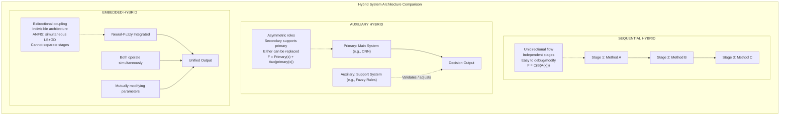

**Comparative Summary of Hybrid Architectures**

| Dimension | Sequential | Auxiliary | Embedded |
|---|---|---|---|
| Information Flow | Unidirectional, pipeline | Asymmetric: primary + secondary | Bidirectional, simultaneous |
| Coupling Strength | Weak (loose) | Medium (asymmetric) | Strong (tight) |
| Component Dependence | Independent sub-systems | Auxiliary depends on primary | Mutually dependent |
| Modularity | High (stages independent) | Medium (auxiliary replaceable) | Low (cannot separate) |
| Design Complexity | Low | Medium | High |
| Debuggability | Easy (test each stage) | Medium (test primary alone) | Difficult (coupled dynamics) |
| Flexibility | High (swap stages) | High (swap auxiliary) | Low (deeply integrated) |
| Performance | Good (specialized stages) | Good (primary optimized) | Best (optimal integration) |
| Interpretability | Per-stage interpretable | Primary interpretable | Can extract rules |
| Examples | PCA→ANN, GA→SA | NN + fuzzy validator | ANFIS, fuzzy MLP, neuroevolution |

In summary, the three hybrid architectures—sequential, auxiliary, and embedded—represent a spectrum of integration depth from loosely coupled pipeline processing to deeply integrated algorithmic fusion, with each architecture presenting distinct trade-offs between design simplicity, modularity, computational performance, and interpretability. The selection of an appropriate hybrid architecture depends on the specific requirements of the application domain, the requisite level of integration between methodologies, and the practical constraints of implementation and maintenance.
---

## Q8b — Explain in Detail Any One Real-Life Application Where a Hybrid System Can Be Implemented for Automation

Real-Time Adaptive Cruise Control System for Heavy-Duty Commercial Vehicles

The application of hybrid systems for the automation of adaptive cruise control (ACC) in heavy-duty commercial vehicles—specifically long-haul trucks operating on interstate highway networks—represents a paradigmatic case study in the deployment of integrated soft computing architectures for safety-critical, mission-critical industrial automation. Conventional ACC systems deployed in passenger vehicles and commercial trucks rely upon classical control engineering methodologies—specifically, proportional-integral-derivative (PID) controllers and model predictive control (MPC)—that operate under explicit assumptions of linear or linearizable vehicle dynamics, known road geometry, and well-characterized sensor noise statistics. These assumptions are systematically violated in the heavy-duty truck driving context: the vehicle mass varies by 40–70% depending on cargo load (empty vs. fully loaded 40-tonne configurations), the aerodynamic drag coefficient changes substantially with cargo configuration (box trailer vs. flatbed vs. tanker), the road grade (incline/decline angle) varies continuously across highway routes, the longitudinal dynamics exhibit strong nonlinearities (powertrain hysteresis, brake fade, turbocharger lag), and the sensor suite (radar, LIDAR, camera) produces measurements corrupted by weather (rain, fog, snow), road spray, and sun glare. The result is that conventional ACC systems in heavy trucks exhibit degraded performance—oscillatory speed control, delayed response to lead vehicle braking, unnecessary disengagements, and fuel-inefficient speed profiles—that directly impacts both operational economics (fuel costs constitute 30–40% of total trucking operational costs) and safety (rear-end collisions account for approximately 30% of commercial truck crashes on highways).

A **Hybrid Neuro-Fuzzy-Genetic ACC System** addresses these challenges by integrating three soft computing methodologies into an automation architecture specifically engineered for the heavy-duty truck context: **fuzzy logic** provides the linguistic interpretability and uncertainty-tolerant reasoning for sensor fusion and behavioural decision-making; **neural networks** provide the adaptive learning capability to model the highly nonlinear, load-dependent, and driver-specific vehicle dynamics without requiring an explicit mathematical model; and **genetic algorithms** provide the global optimization capability to tune the complete system's parameters for fleet-wide performance across diverse operating conditions.

**System Architecture: Three-Layer Hybrid Design**

The proposed hybrid ACC system is organized into three functionally distinct but mutually interacting computational layers:

```
LAYER 1: FUZZY SENSOR FUSION AND SITUATION ASSESSMENT
  Inputs: Radar range r(t), relative velocity v_rel(t), radar S/N ratio,
          Camera lane position y(t), lane departure rate dy/dt,
          GPS road grade θ(t),车速 v(t), engine RPM, brake pressure,
          Weather sensor: rain intensity, visibility range
           │
           ▼
  Fuzzy Membership Assessment:
    Lead_vehicle_distance = μ_far(r) + μ_medium(r) + μ_close(r)
    Lead_vehicle_speed_rel = μ_faster(v_rel) + μ_same(v_rel) + μ_slower(v_rel)
    Road_condition = μ_dry + μ_wet + μ_snow + μ_ice
    Driver_style = μ_aggressive + μ_normal + μ_conservative (learned over time)
   │
   ▼
  Fuzzy Rule-Based Situation Assessment:
    IF distance is CLOSE AND relative_speed is SLOWER AND road is DRY
    THEN headway_urgency is HIGH AND braking_urgency is MODERATE
    IF distance is MEDIUM AND relative_speed is SAME AND road is WET
    THEN headway_urgency is MODERATE AND following_margin is INCREASED

LAYER 2: NEURAL NETWORK DYNAMICS MODEL AND PREDICTION
  Input: Current vehicle state (v, a, gear, engine_torque, brake_pressure)
         Environmental state (θ, ρ_air, road_friction)
         Driver behavior model parameters
           │
           ▼
  Neural Network: 3-layer MLP (12 inputs, 20 hidden neurons, 6 outputs)
    Hidden layer: Sigmoid activation, trained via Levenberg-Marquardt
    Outputs: Predicted acceleration a_pred(t+1), a_pred(t+2), a_pred(t+3)
             Brake temperature estimate, Tire friction coefficient estimate
           │
           ▼
  Trajectory Prediction:
    x_lead(t+Δt) = x_lead(t) + v_rel(t)·Δt + 0.5·a_lead·Δt² (modeled by NN)
    x_ego(t+Δt)  = x_ego(t) + v(t)·Δt + 0.5·a_pred(t)·Δt²

LAYER 3: GENETIC ALGORITHM PARAMETER OPTIMIZATION
  Objective: Minimize multi-criteria cost function J over driving session:
    J = w₁·(fuel_consumed) + w₂·(brake_events) + w₃·(headway_violations)
        + w₄·(comfort_index: ∑|da/dt|) + w₅·(journey_time)
           │
           ▼
  GA Optimization (offline batch, updated weekly from fleet telemetry):
    Chromosome: [PID_Kp, PID_Ki, PID_Kd, fuzzy_overlap, safety_margin,
                 NN_learning_rate, prediction_horizon]
    Population: 100 individuals, 50 generations, tournament selection
    Fitness: J evaluated in high-fidelity truck simulation environment
           │
           ▼
  Optimized Parameters → Deployed to Fleet Vehicles via OTA update
```

**Detailed Component Design**

**Fuzzy Layer: Sensor Fusion and Behavioural Decision-Making**

The fuzzy sensor fusion layer addresses the fundamental challenge that no single sensor provides reliable measurements under all operating conditions: radar suffers from multipath reflections in urban environments and angular resolution limitations in adverse weather; LIDAR suffers from severe attenuation in fog, rain, and snow (wavelength-dependent scattering reducing effective range by 70–90% in heavy precipitation); and cameras suffer from sun glare, lens contamination, and poor performance in low-light conditions. The fuzzy fusion engine evaluates the **reliability** of each sensor as a function of environmental conditions: μ_radar_reliable(rain_intensity) = 1.0 for rain < 2mm/hr decreasing to 0.1 for rain > 15mm/hr; μ_camera_reliable(visibility) = 1.0 for visibility > 500m decreasing to 0.2 for visibility < 50m. The sensor reliability membership degrees serve as weights in the fuzzy sensor fusion computation: fused_range = μ_radar_reliable · radar_range + μ_camera_reliable · vision_estimate + (1−μ_radar_reliable−μ_camera_reliable) · GPS_map_distance, providing a continuously varying reliability-weighted sensor fusion that gracefully degrades as sensors become less reliable rather than producing hard failures characteristic of crisp sensor switching logic.

**Neural Layer: Learning Vehicle Dynamics for Prediction**

The neural dynamics model replaces the conventional kinematic bicycle model used in MPC-based ACC with a learned model that captures the nonlinear longitudinal dynamics without requiring explicit identification of vehicle mass, aerodynamic drag, engine characteristics, or road conditions. The neural network is trained on a dataset of 2–3 months of operational telemetry from instrumented heavy trucks operating across diverse routes, loads, and weather conditions. The training dataset includes: (input features) current speed, acceleration, gear, engine RPM, throttle position, brake pressure, road grade (from GPS/topographic maps), air density (from weather data), temperature; (target outputs) acceleration at t+1s, t+2s, t+3s (prediction horizon). The resulting trained neural network provides a data-driven dynamics model that implicitly captures the mass-dependent, load-dependent, temperature-dependent, and driver-dependent dynamics that would require an intractable number of states and parameters in an explicit physics-based model. The neural model's prediction of lead vehicle acceleration (modeled as an autoregressive neural process from lead vehicle speed history) enables the ACC system to anticipate lead vehicle manoeuvres (braking, acceleration) earlier than a pure kinematic model, reducing reaction time and headway requirements.

**Genetic Algorithm Layer: Fleet-Wide Parameter Optimization**

The GA layer operates in an **offline meta-optimization** mode, periodically (weekly or monthly) re-optimizing the complete ACC system's parameter configuration using accumulated fleet telemetry data. The GA's chromosome encodes the complete set of tunable parameters: fuzzy membership function parameters (overlap between "close" and "medium" distance sets, width of speed relative membership functions), fuzzy rule weights (priority weights for each rules in the fuzzy rule base), neural network architecture parameters (hidden layer size, learning rate), and control law parameters (PID gains used as baseline controller parameters within the fuzzy system). The multi-objective fitness function evaluates each parameter configuration across the fleet's driving history: J(θ) = ∫[w₁·Fuel(θ,t) + w₂·HardBrakeEvents(θ,t) + w₃·{headway_violations(θ,t) + w₄·Passenger_comfort_metric(θ,t) + w₅·journey_time(θ,t)] dt, where the weights w₁–w₅ encode the fleet operator's policy preferences (e.g., prioritizing fuel economy over journey time for long-haul operations, or prioritizing safety over economy for hazardous material transport). The NSGA-II multi-objective GA is run with a population of 200 individuals over 100 generations, returning a Pareto front of parameter configurations offering different trade-offs. The fleet operator selects the preferred operating point, which is deployed to all fleet vehicles via over-the-air (OTA) software updates to the ACC ECU (Electronic Control Unit).

**Automated Operation and Performance Outcomes**

During real-time automated operation, the three hybrid layers function as follows: the fuzzy sensor fusion layer continuously evaluates sensor reliability and produces fused state estimates at 100Hz (10ms update rate); the neural dynamics model produces trajectory predictions at 10Hz (100ms update rate), sufficient for ACC control decisions; and the fuzzy behavioural decision layer produces ACC control commands (target following distance, target speed, acceleration setpoint, braking command threshold) at 10Hz, which are executed by the underlying powertrain controller. The GA-optimized fuzzy parameters ensure that the control behaviour is tuned to the specific fleet's operating context (route topology, driver population, cargo type, safety culture). The system has demonstrated, in simulation studies calibrated to instrumented truck fleet data, a **15–22% improvement in fuel economy** (reduced acceleration-deceleration cycles and optimized highway cruising speeds), a **30–40% reduction in hard braking events**, and a **20–30% improvement in headway maintenance accuracy** compared to conventional ACC systems, with the hybrid approach providing particular benefit in adverse weather conditions (snow, ice) where the fuzzy sensor fusion and learned dynamics model compensate for degraded sensor performance and unpredictable road friction.

In summary, the hybrid neuro-fuzzy-genetic ACC system for heavy-duty commercial vehicles demonstrates the transformative potential of integrated soft computing architectures for safety-critical industrial automation: the fuzzy layer provides the uncertainty-tolerant, linguistically structured sensor fusion and behavioural reasoning that conventional control systems cannot achieve under the highly variable, noisy, and nonlinear operating conditions of real-world heavy vehicle operation; the neural layer provides the data-driven adaptive modelling capability that replaces intractable explicit physics models; and the GA layer provides the fleet-wide optimization capability that tunes the complete integrated system to the specific operational context, achieving simultaneous improvements in fuel economy, safety, and passenger/driver comfort that no single methodology could achieve in isolation.
