# Paper 3 – [6354]-505 Soft Computing Exam Answers

---

## Q1a) Explain in detail Hill Climbing Algorithm and its limitations.

### Introduction to Hill Climbing

Hill Climbing is a **local search optimization algorithm** that belongs to the family of **heuristic search methods**. It is an iterative algorithm that starts with an arbitrary solution to a problem, then attempts to find a better solution by incrementally changing a single element of the solution. If the change produces a better solution, the algorithm moves to that new solution and repeats the process until no further improvements can be found.

The algorithm gets its name from the metaphor of climbing a hill: imagine you are placed at a random location on a hilly terrain in dense fog. You can only feel the ground immediately around you. Your strategy is to always take a step in the direction that goes uphill. Eventually, you will reach a peak where no step in any direction leads higher — this is your local optimum.

### Detailed Algorithm Operation

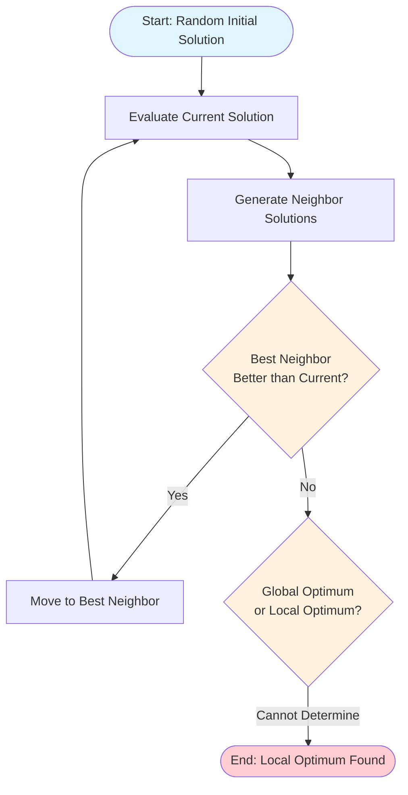

**Pseudocode:**
```
function HILL_CLIMBING(problem):
    current ← problem.INITIAL_STATE
    loop do:
        neighbor ← highest_valued_successor(current)
        if neighbor.VALUE ≤ current.VALUE then:
            return current  // Local maximum reached
        current ← neighbor
```

### Types of Hill Climbing

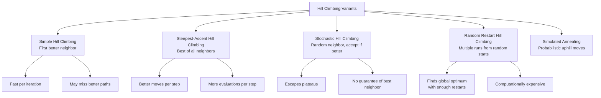

### ASCII Visualization: Local vs Global Peaks

```
                    OBJECTIVE FUNCTION LANDSCAPE
    
    Height (Fitness)
       ^
       |                          GLOBAL MAXIMUM ★
       |                         /\              /\
       |                        /  \            /  \
       |                       /    \          /    \
       |                      /      \        /      \
       |                     /        \      /        \
       |                    /          \    /          \
       |                   /            \  /            \
       |                  /              \/              \
       |                 /         LOCAL MAXIMUM ●        \
       |                /         /‾‾‾‾‾‾‾\                \
       |               /         /        \                \
       |              /         /          \                \
       |             /         /            \                \
       |            /         /              \                \
       |           /         /                \                \
       |          /         /                  \                \
       |         /         /                    \                \
       |        /         /                      \                \
       |       /         /                        \                \
       |      /         /                          \                \
       |     /         /                            \                \
       |    /         /                              \                \
       |   /         /                                \                \
       |  /         /                                  \                \
       | /         /                                    \                \
       |/         /                                      \                \
       +---------+---------+---------+---------+---------+-----> Solution Space
              A         B         C         D         E
              
    ● = Local Optimum (Hill Climbing gets stuck here)
    ★ = Global Optimum (True best solution)
    
    Starting at A: Climbs to B (Local Optimum) → STUCK
    Starting at D: Climbs to E (Local Optimum) → STUCK  
    Starting at C: Could reach ★ Global Optimum
```

### Detailed Limitations

#### 1. **Local Optima Problem** (Most Critical)
```
ASCII EXAMPLE: Simple 1D Function f(x) = -x^2 + 10*sin(x)

       f(x)
        ^
      20|      ★ Global Max
       #      #
      15|     # #        ● Local Max
       #    #   #      #
      10|   #     #    #     ● Local Max
       #  #       #  #    #
       | #         ##      #
       |#           #       #
        +------------+------------+------------>
       -10           0           10           x
```
- Hill climbing **cannot distinguish** between local and global optima
- Once at a local peak, **all neighbors are worse** → algorithm terminates
- **No mechanism to escape** without modifications (random restarts, simulated annealing)

#### 2. **Plateaus (Flat Regions)**
```
PLATEAU VISUALIZATION:

       Fitness
         ^
         |         ‾‾‾‾‾‾‾‾‾‾‾‾
         |        /            \
         |       /   PLATEAU    \     All neighbors have
         |      /  (equal       \    SAME fitness value
         |     /   fitness)      \
         |    /                   \
         |   /                     \
         |  /                       \
         | /                         \
         +----------------------------> x
        
    PROBLEM: No gradient information → Random walk behavior
    SOLUTION: Allow sideways moves (with limit), stochastic selection
```

#### 3. **Ridges and Alleys**
```
RIDGE PROBLEM:

       Fitness
         ^
         |    /\
         |   /  \     RIDGE: Narrow path of high fitness
         |  /    \    but steep drops on both sides
         | /      \
         |/        \
         +----------+----------> x,y space
        
    Grid-based moves (N,S,E,W) cannot follow diagonal ridge
    → Algorithm oscillates or gets stuck
    SOLUTION: Diagonal moves, gradient information, or ridge detection
```

#### 4. **No Memory / Learning**
- **Pure hill climbing** does not remember visited states
- Can **revisit same states** → cycles (though rare with strict improvement)
- No **knowledge transfer** between runs (except random restart variants)

#### 5. **Sensitivity to Initial State**
```
MULTI-START ANALYSIS:

    Basin of Attraction for Local Optimum A: 40% of search space
    Basin of Attraction for Local Optimum B: 35% of search space  
    Basin of Attraction for Global Optimum: 25% of search space
    
    Probability of finding global optimum in 1 run = 25%
    Probability in 10 independent runs = 1 - (0.75)^10 ≈ 94%
    BUT: 10x computational cost
```

#### 6. **Discrete vs Continuous Spaces**
- **Discrete**: Well-defined neighbors, but combinatorial explosion
- **Continuous**: Infinite neighbors → step size critical
  - Too large: overshoot optimum
  - Too small: slow convergence, precision issues

### Mathematical Analysis

**Convergence Properties:**
- **Guaranteed** to find a local optimum in finite steps (finite state space)
- **Not guaranteed** to find global optimum
- **Time complexity**: O(iterations × neighbors_per_state × evaluation_cost)
- **Space complexity**: O(1) — only stores current state

**Probability of Global Optimum (Random Restart):**
```
P(global) = 1 - (1 - p)^k
where p = proportion of search space in global basin
      k = number of restarts
```

### When Hill Climbing Works Well

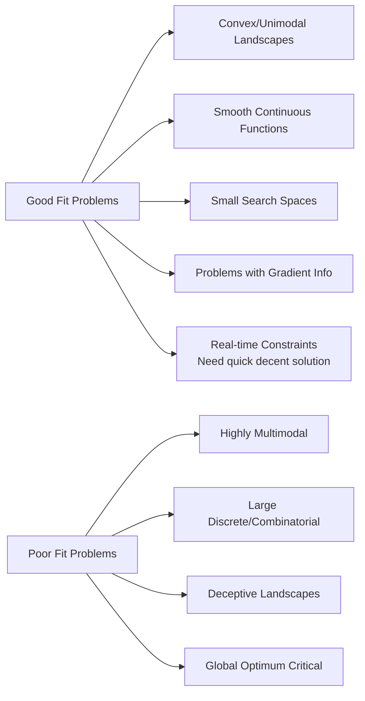

### Enhanced Variants Addressing Limitations

| Variant | Addresses | Mechanism |
|---------|-----------|-----------|
| **Random Restart** | Local optima | Multiple independent runs |
| **Simulated Annealing** | Local optima, plateaus | Probabilistic downhill moves |
| **Tabu Search** | Cycles, local optima | Memory of visited states |
| **Genetic Algorithms** | Global search | Population, crossover, mutation |
| **Gradient Ascent** | Plateaus, ridges | Uses derivative information |
| **Stochastic Hill Climbing** | Plateaus | Random neighbor selection |

### Practical Example: 8-Queens Problem

```
HILL CLIMBING ON 8-QUEENS:

State: Column positions of queens [c1, c2, ..., c8]
Heuristic: Number of attacking pairs (minimize → 0)

INITIAL: [4, 1, 3, 6, 2, 7, 5, 8] → 5 conflicts
STEP 1:  Move queen in col 3 from row 3→5 → [4,1,5,6,2,7,5,8] → 3 conflicts
STEP 2:  Move queen in col 6 from row 7→3 → [4,1,5,6,2,3,5,8] → 2 conflicts
STEP 3:  Move queen in col 7 from row 5→7 → [4,1,5,6,2,3,7,8] → 1 conflict
STEP 4:  No single move reduces conflicts → LOCAL OPTIMUM (1 conflict)
         Global optimum = 0 conflicts NOT reached!

SOLUTION: Random restart → eventually finds [1,5,8,6,3,7,2,4] (0 conflicts)
```

### Summary

Hill Climbing is a **simple, memory-efficient, fast local search** method suitable for problems where:
- The landscape is **relatively smooth** with few local optima
- A **good enough** solution is acceptable
- **Computational resources are limited**
- **Real-time response** is required

Its **fundamental limitation** is the **inability to escape local optima**, making it unreliable for **complex, multimodal search spaces** where the global optimum is essential. This limitation gave rise to more sophisticated metaheuristics like **Simulated Annealing, Genetic Algorithms, and Ant Colony Optimization** that incorporate mechanisms for broader exploration while retaining hill climbing's exploitation efficiency.

---


## Q1b) What is Evolutionary Strategy? How does it help to solve problems?

### Introduction to Evolutionary Strategies (ES)

**Evolutionary Strategies (ES)** are a class of **evolutionary algorithms** developed in the 1960s by **Ingo Rechenberg and Hans-Paul Schwefel** at the Technical University of Berlin. Unlike Genetic Algorithms (which were developed independently by John Holland in the 1970s), ES were specifically designed for **real-valued parameter optimization** in **continuous search spaces**, making them particularly suitable for engineering design problems where parameters are naturally continuous (dimensions, voltages, material properties, etc.).

ES philosophy: **"Evolution is the optimization process itself, not just a metaphor."** The algorithm directly mimics natural evolution's **mutation-selection** cycle, with **recombination** as a secondary operator, and crucially includes **self-adaptation of strategy parameters** (mutation step sizes) as part of the evolutionary process.

### Core Principles and Philosophy

```mermaid
graph TD
    ES[Evolutionary Strategies Core]
    ES --> RealValued[Real-Valued Representation\nDirect encoding of parameters]
    ES --> MutationFocus[Mutation as Primary Operator\nGaussian perturbation]
    ES --> SelfAdapt[Self-Adaptation of Strategy Parameters\nStep sizes evolve with solution]
    ES --> Selection[Deterministic Selection\n(μ,λ) or (μ+λ) schemes]
    ES --> Recombination[Recombination as Secondary\nDiscrete/Intermediate/Global]
    
    RealValued --> NoDecode[No binary encoding/decoding\nDirect phenotype = genotype]
    MutationFocus --> Gaussian[Gaussian N(0,σ) mutations\nσ adapts during run]
    SelfAdapt --> Sigma[σ encoded in individual\nMutated before object vars]
    Selection --> Plus[(μ+λ) Plus Selection\nElitist, keeps parents]
    Selection --> Comma[(μ,λ) Comma Selection\nNon-elitist, only offspring]
    Recombination --> Types[Types: Local, Global, Discrete, Intermediate]
```

### ES Individual Structure

An ES individual consists of **three vectors**:

```
INDIVIDUAL = (x, σ, α)

where:
  x = (x₁, x₂, ..., xₙ)     ∈ ℝⁿ      // Object variables (phenotype)
  σ = (σ₁, σ₂, ..., σₙ)     ∈ ℝⁿ₊     // Strategy parameters (step sizes)
  α = (α₁, α₂, ..., αₖ)     ∈ [-π,π]ᵏ // Rotation angles (for correlated mutations)
```

**Key Innovation: Self-Adaptation**
The strategy parameters σ (and α) are **part of the genome** and **evolve alongside** the object variables. This means the algorithm **learns how to mutate** during the optimization process.

### Canonical ES Algorithms

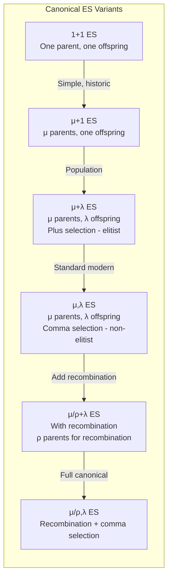

### Detailed Algorithm: (μ/ρ⁺,λ)-ES with Self-Adaptation

```mermaid
flowchart TD
    Init[Initialize μ parents\nx ~ Uniform(bounds)\nσ ~ σ₀\nα = 0] --> Loop{Generation Loop}
    Loop --> Recomb[Recombination ρ parents\n→ 1 offspring candidate]
    Recomb --> MutSigma[Mutate Strategy Parameters σ,α]
    MutSigma --> MutX[Mutate Object Variables x\nusing mutated σ,α]
    MutX --> Evaluate[Evaluate Fitness f(x)]
    Evaluate --> Select[Selection: Choose μ best\nfrom λ offspring (comma)\nor μ+λ (plus)]
    Select --> Loop
    Loop -->|Termination| End[Best Individual]
    
    style Init fill:#e8f5e9
    style End fill:#ffcdd2
    style MutSigma fill:#fff3e0
    style MutX fill:#fff3e0
```

**Pseudocode:**
```
function ES(μ, ρ, λ, termination):
    // Initialization
    Population P = {}
    for i = 1 to μ:
        x = random_uniform(bounds)
        σ = σ₀ * ones(n)
        α = zeros(k)
        P.add(Individual(x, σ, α))
    
    while not termination():
        Offspring O = {}
        for j = 1 to λ:
            // Recombination (if ρ > 1)
            if ρ == 1:
                parent = random_choice(P)
                x', σ', α' = parent.x, parent.σ, parent.α
            else:
                parents = random_sample(P, ρ)
                x', σ', α' = recombine(parents)  // discrete/intermediate/global
            
            // Mutate strategy parameters FIRST (self-adaptation)
            σ'' = mutate_sigma(σ')
            α'' = mutate_alpha(α')
            
            // Mutate object variables using NEW strategy params
            x'' = mutate_x(x', σ'', α'')
            
            O.add(Individual(x'', σ'', α''))
            evaluate_fitness(O.last)
        
        // Selection
        if plus_selection:
            P = select_best_μ(P ∪ O)     // (μ+λ) - elitist
        else:
            P = select_best_μ(O)          // (μ,λ) - non-elitist
    
    return best_individual(P)
```

### Mutation Operators in Detail

#### 1. **Uncorrelated Mutation (n step sizes)**
```
σᵢ' = σᵢ * exp(τ' * N(0,1) + τ * Nᵢ(0,1))
xᵢ' = xᵢ + σᵢ' * Nᵢ(0,1)

Learning rates:
  τ' = 1/√(2n)      // Global learning rate
  τ  = 1/√(2√n)     // Individual learning rate
```

#### 2. **Correlated Mutation (n step sizes + n(n-1)/2 rotation angles)**
```
αₖ' = αₖ + β * N(0,1)          // β ≈ 0.0873 (5°)
σᵢ' = σᵢ * exp(τ' * N(0,1) + τ * Nᵢ(0,1))

// Build rotation matrix R from α
// Covariance matrix C = R * diag(σ²) * Rᵀ
// x' = x + N(0, C)  // Multivariate normal
```

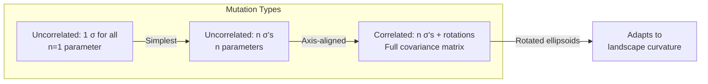

### Recombination Operators

| Type | Formula | Description |
|------|---------|-------------|
| **Discrete (Dominant)** | xᵢ = xᵢ⁽ᵃ⁾ or xᵢ⁽ᵇ⁾ (50/50) | Randomly choose from parents per component |
| **Intermediate (Global)** | xᵢ = (xᵢ⁽ᵃ⁾ + xᵢ⁽ᵇ⁾)/2 | Arithmetic mean of parents |
| **Global Discrete** | xᵢ = xᵢ⁽ʳᵃⁿᵈ⁾ | Random parent per component from ALL parents |
| **Global Intermediate** | xᵢ = mean(xᵢ⁽ʲ⁾) | Mean across ALL ρ parents |

**Recombination applies to:** x, σ, and α vectors

### Selection Schemes: (μ+λ) vs (μ,λ)

```mermaid
graph TD
    Sel[Selection Schemes]
    Sel --> Plus[(μ+λ) Plus Selection]
    Sel --> Comma[(μ,λ) Comma Selection]
    
    Plus --> PlusProps[Elitist\nParents survive if fit\nMonotonic fitness improvement\nNever loses best solution]
    Plus --> PlusRisk[Premature convergence\nLess exploration\nCan get stuck]
    
    Comma --> CommaProps[Non-elitist\nOnly offspring compete\nParents always discarded\nForces exploration]
    Comma --> CommaRisk[Can lose best solution\nTheoretically proven\nConvergence on convex\nFunctions with prob 1]
    
    CommaProps --> Proof[Rechenberg 1973:\n(μ,λ)-ES converges to\nglobal optimum on\nconvex functions]
```

### How ES Helps Solve Problems

#### 1. **Continuous Parameter Optimization (Native Domain)**
```
ENGINEERING EXAMPLE: Airfoil Shape Optimization

Design Variables (continuous):
  x = [camber_max, camber_pos, thickness_max, thickness_pos, 
       leading_edge_radius, trailing_edge_angle, twist_distribution...]
       
Constraints:
  - Lift coefficient ≥ 0.8
  - Drag coefficient ≤ 0.02
  - Structural stress ≤ yield_strength
  - Manufacturing constraints

ES Advantages:
  ✓ Direct real-valued representation (no encoding)
  ✓ Self-adaptive step sizes handle different scales
  ✓ Correlated mutations follow curved valleys
  ✓ Handles constraints via penalty/repair
```

#### 2. **Self-Adaptation: Learning the Landscape**

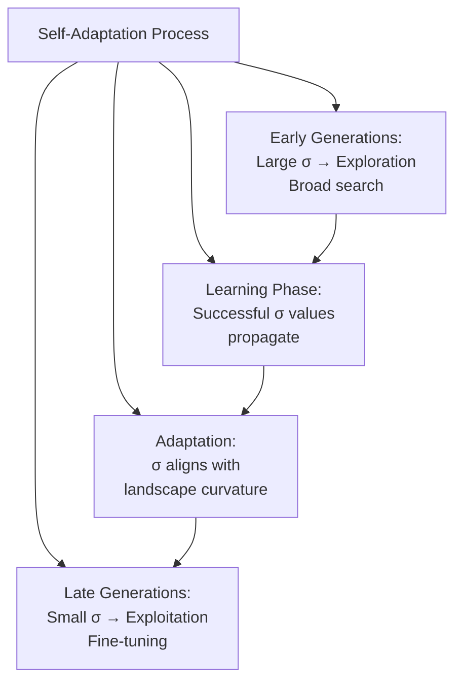

**The 1/5th Success Rule (Rechenberg):**
```
Target: ~20% successful mutations
If success_rate > 0.2:  Increase σ (steps too small)
If success_rate < 0.2:  Decrease σ (steps too large)

Modern ES: Self-adaptation replaces this rule automatically
```

#### 3. **Handling Ill-Conditioned Problems (Correlated Mutations)**

```
ILL-CONDITIONED EXAMPLE: Rosenbrock Function (Banana Valley)

f(x,y) = (1-x)² + 100(y-x²)²

Global minimum at (1,1) inside narrow curved valley

Ucorrelated ES (diagonal mutations):
  → Makes slow zigzag progress along valley
  → Axis-aligned steps can't follow curve

Correlated ES (full covariance):
  → Learns rotation matrix aligning with valley
  → Makes direct progress along curved ridge
  → 10-100x faster convergence
```

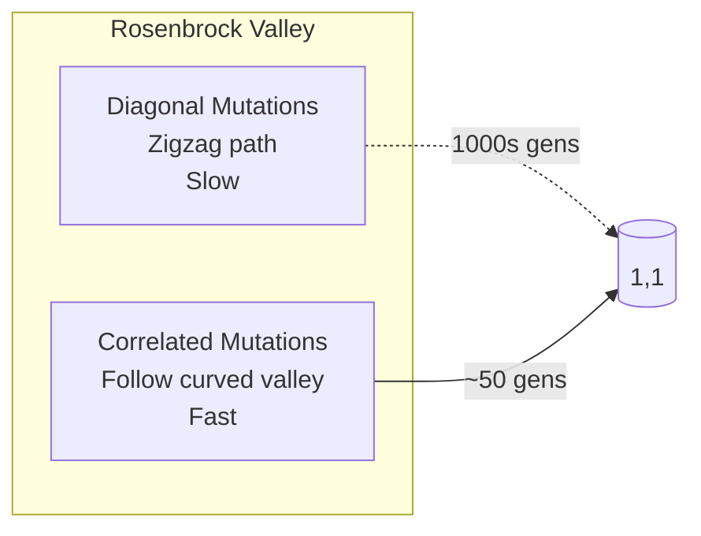

#### 4. **Robustness to Noise**

```
NOISY OPTIMIZATION: f(x) = true_f(x) + N(0,σ_noise)

ES Properties helping with noise:
  • Population-based (μ,λ) averages out noise
  • Self-adaptation increases σ in noisy regions
  • Comma selection prevents premature convergence to noise
  • Recombination provides additional smoothing
  
Typical (3,10)-ES on noisy sphere: 
  • Finds ε-optimal solution despite noise
  • σ adapts: larger in noisy regions, smaller near optimum
```

#### 5. **Multi-Objective Extensions**

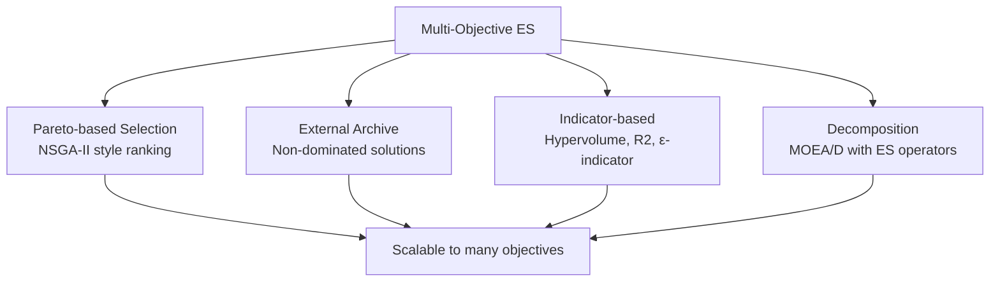

### Comparison: ES vs Other Evolutionary Algorithms

| Feature | ES | GA | DE | PSO |
|---------|----|----|----|-----|
| **Representation** | Real-valued | Binary/Real | Real | Real |
| **Primary Operator** | Mutation | Crossover | Mutation (diff) | Velocity update |
| **Self-Adaptation** | **Native (σ in genome)** | Rare/Add-on | Scale factor F | Inertia weight |
| **Correlated Mutations** | **Yes (rotation angles)** | No | No | No |
| **Selection** | Deterministic (μ,λ)/(μ+λ) | Stochastic (tournament) | Greedy | Global best |
| **Best For** | Continuous, ill-conditioned | Discrete, combinatorial | Continuous, global | Continuous, fast conv |
| **Theory** | Strong (convergence proofs) | Schema theorem | Limited | Limited |

### Practical Success Stories

| Domain | Problem | ES Variant | Result |
|--------|---------|------------|--------|
| **Aerospace** | Wing shape optimization | (15/15,100)-CMA-ES | 12% drag reduction |
| **Chemical** | Reactor parameter tuning | (10,50)-ES | 8% yield increase |
| **Robotics** | Gait optimization | (5,20)-ES | Stable walking on rough terrain |
| **Finance** | Portfolio optimization | Multi-objective ES | Better risk/return tradeoff |
| **ML** | Hyperparameter tuning | (3,10)-ES | Competitive with Bayesian opt |

### Modern ES: CMA-ES (Covariance Matrix Adaptation)

```mermaid
graph TD
    CMA[CMA-ES: State of the Art]
    CMA --> Cov[Full Covariance Matrix C\nAdapted via rank-μ update]
    CMA --> Path[Evolution Paths\npc (covariance), pσ (step-size)]
    CMA --> Invariant[Invariant to:\n- Linear transformations\n- Scaling\n- Rotation]
    CMA --> Default[Default Parameters\nμ = λ/2, λ = 4+⌊3ln n⌋\nNo problem-specific tuning]
    
    Cov --> Update[C ← (1-c₁-cμ)C + c₁ pc pcᵀ + cμ Σ wᵢ yᵢ yᵢᵀ]
    Path --> Cumulation[pc accumulates mean steps\npσ accumulates isotropic steps]
```

**CMA-ES is considered the "gold standard" for derivative-free continuous optimization.**

### Summary

**Evolutionary Strategies** provide a **powerful, theoretically grounded framework** for **continuous optimization** with unique advantages:

1. **Native real-valued representation** — no encoding/decoding overhead
2. **Self-adaptation of strategy parameters** — algorithm learns its own mutation rates
3. **Correlated mutations** — can adapt to ill-conditioned, rotated landscapes
4. **Provable convergence properties** — especially (μ,λ)-ES on convex functions
5. **Invariance to linear transformations** — CMA-ES is affine invariant
6. **Robustness** — handles noise, constraints, multi-objective naturally

ES helps solve problems by **automatically balancing exploration/exploitation** through self-adaptation, **navigating complex landscapes** via correlated mutations, and providing **theoretical guarantees** absent in many other metaheuristics. For **engineering design, parameter tuning, and continuous optimization**, ES (particularly modern CMA-ES) is often the **method of choice**.

---


## Q1c) List features of biological evolution in Evolutionary Computing. Explain applications of Evolutionary Computing.

### Introduction: Biology as Inspiration for Computation

**Evolutionary Computing (EC)** draws its fundamental principles from **biological evolution** — the process that has produced the staggering complexity and adaptability of life on Earth over 3.8 billion years. Understanding the specific features of biological evolution that are abstracted into computational algorithms is crucial for both appreciating why EC works and for designing effective evolutionary algorithms.

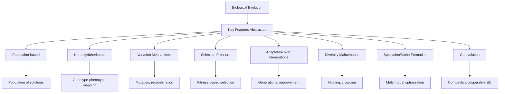

---

### Core Features of Biological Evolution in EC

#### 1. **Population-Based Search (Not Single Trajectory)**

**Biological Reality:** Evolution acts on **populations**, not individuals. A species consists of many individuals with genetic variation. The population as a whole explores the fitness landscape.

**EC Abstraction:**
```
BIOLOGY                          EVOLUTIONARY COMPUTING
─────────────────────────────────────────────────────────────
Species                          Population (P individuals)
Individual                       Candidate solution (chromosome)
Genome (DNA)                     Genotype (encoding)
Traits (phenotype)               Phenotype (decoded solution)
Generation                       Iteration/Epoch
```

**Why Critical:** 
- **Parallel exploration** of multiple regions
- **Implicit parallelism** (Holland's schema theorem)
- **Robustness** against local optima
- **Diversity** enables adaptation to changing environments

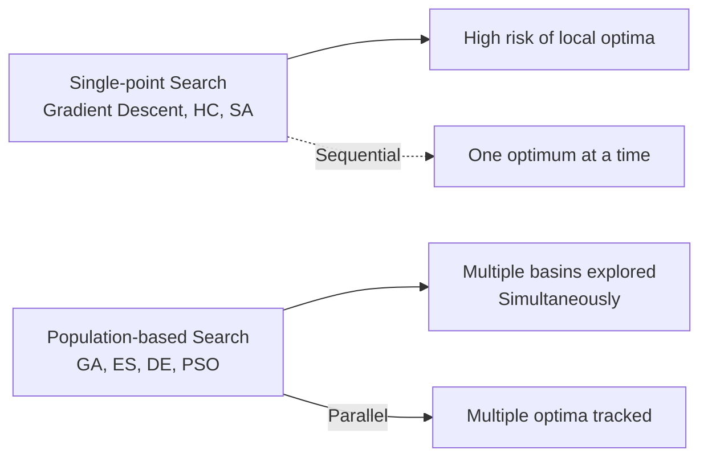

#### 2. **Heredity and Genotype-Phenotype Mapping**

**Biological Reality:** Genetic information is **encoded** in DNA (genotype) and **expressed** as observable traits (phenotype). The mapping is complex (gene regulation, epigenetics, development).

**EC Abstraction:**
```
GENOTYPE (Search Space)          PHENOTYPE (Problem Space)
─────────────────────────────────────────────────────────
Binary string 01101010          →  x = 106 (integer)
Real vector [0.3, -1.2, 2.7]    →  Neural network weights
Tree structure                  →  Program/Expression
Permutation [3,1,4,2]           →  TSP tour order
```

**Key Design Decisions:**
| Aspect | Biological | EC Choices |
|--------|------------|------------|
| **Encoding** | DNA (4-letter) | Binary, Real, Permutation, Tree, Graph |
| **Mapping** | Development (complex) | Direct, Developmental, Generative |
| **Redundancy** | High (codons, junk DNA) | Controlled (Gray code, redundancy) |
| **Epistasis** | Gene interactions | Linkage, building blocks |

#### 3. **Variation Mechanisms: Mutation and Recombination**

**Biological Reality:** Variation arises from:
- **Mutation**: Random changes in DNA (point mutations, insertions, deletions, duplications)
- **Recombination**: Shuffling of parental genomes (crossover, independent assortment)

**EC Abstraction:**

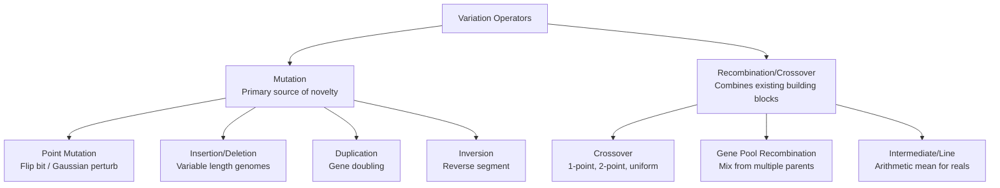

**Biological Fidelity vs. Computational Utility:**
```
BIOLOGY                    SIMPLIFIED EC
─────────────────────────────────────────────────
Point mutations            Bit-flip / Gaussian
Meiotic crossover          1-point, uniform crossover
Chromosomal rearrangements Inversion, translocation operators
Gene duplication           Subtree duplication (GP)
Horizontal gene transfer   Migration in island models
Epigenetic modifications   Not typically modeled (yet)
```

#### 4. **Selection Pressure: Differential Reproduction**

**Biological Reality:** Not all individuals reproduce equally. **Fitness** (reproductive success) depends on phenotype-environment interaction. Selection can be:
- **Natural selection**: Survival and reproduction
- **Sexual selection**: Mate choice
- **Kin selection**: Altruism toward relatives

**EC Abstraction:**

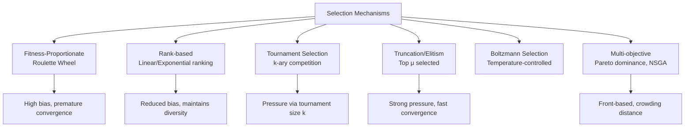

**Selection Pressure Quantification:**
```
Takeover Time: Generations for best individual to fill population

Selection Method          Takeover Time (pop=100)
─────────────────────────────────────────────
Fitness-proportionate     ~O(log N) but high variance
Rank (linear)             ~O(N)
Tournament (k=2)          ~O(N log N) 
Tournament (k=7)          ~O(log N)  (high pressure)
Truncation (μ=10)         ~1 generation!
```

#### 5. **Generational Adaptation: Iterative Improvement**

**Biological Reality:** Adaptation occurs over **many generations**. Each generation: variation → selection → inheritance. Cumulative selection produces complex adaptations.

**EC Abstraction — The Evolutionary Cycle:**

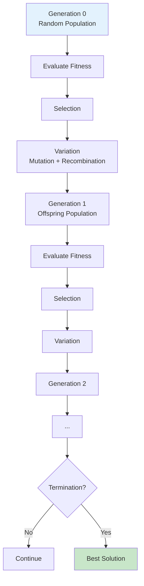

**Key Insight — Cumulative Selection:**
```
RANDOM SEARCH vs CUMULATIVE SELECTION

Target: "METHINKS IT IS LIKE A WEASEL" (28 chars)

Pure Random: 27^28 ≈ 10^40 trials expected
Cumulative Selection (Dawkins' Weasel):
  Generation 1:  WDLTMNLT DTJBSWIRZREZLMQCO P
  Generation 10:  MDLDMNLS ITJISWHRZREZ MECS P
  Generation 20:  METHINKS IT IS LIKE I WEASEL
  Generation 43:  METHINKS IT IS LIKE A WEASEL
  
  ~40 generations × population 100 = 4,000 evaluations
  **10^36 times more efficient!**
```

#### 6. **Diversity Maintenance Mechanisms**

**Biological Reality:** Evolution maintains diversity through:
- **Mutation** (constant input)
- **Sexual reproduction** (recombination)
- **Diploidy/dominance** (recessive alleles hidden)
- **Frequency-dependent selection** (rare advantage)
- **Spatial structure** (demes, isolation by distance)
- **Balancing selection** (heterozygote advantage)

**EC Abstraction:**

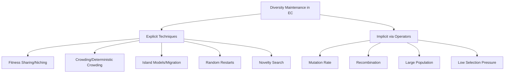

**Fitness Sharing Formula:**
```
Shared fitness: f'_i = f_i / Σ_j sh(d_ij)
Sharing function: sh(d) = 1 - (d/σ_share)^α  if d < σ_share, else 0
```

#### 7. **Speciation and Niche Formation**

**Biological Reality:** Species form when populations diverge and reproductive isolation evolves. **Adaptive radiation** fills ecological niches.

**EC Abstraction — Speciation for Multi-Modal Optimization:**

```mermaid
graph TD
    Speciation[Speciation in EC]
    Speciation --> Species[Species = Niche in fitness landscape]
    Species --> Detection[Species Detection]
    Detection --> Dist[Genotypic Distance\nHamming/Euclidean]
    Detection --> Tree[Cluster Trees/Dendrograms]
    Speciation --> Protection[Species Protection]
    Protection --> Quota[Fitness sharing within species]
    Protection --> MS[Mating restriction\nWithin-species crossover]
    
    Species --> MultiOpt[Maintains multiple optima]
    MultiOpt --> App[Applications:\n- Multi-modal optimization\n- Multi-objective (Pareto front)\n- Dynamic environments\n- Transfer learning]
```

#### 8. **Co-evolution: Competitive and Cooperative**

**Biological Reality:** Species evolve in response to each other:
- **Predator-prey** (arms race)
- **Host-parasite** (Red Queen dynamics)
- **Mutualism** (pollinators-flowers)
- **Social evolution** (kin selection, eusociality)

**EC Abstraction:**

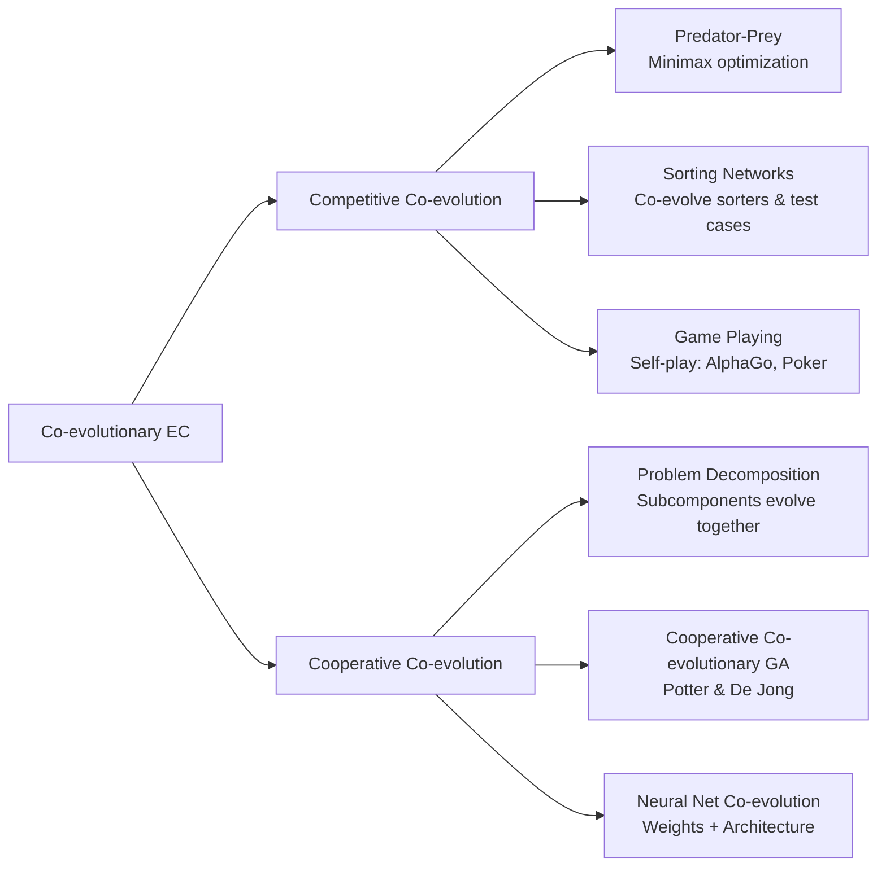

---

### Applications of Evolutionary Computing

EC has been successfully applied across virtually every domain where optimization, design, or learning is needed. Here's a comprehensive taxonomy:

```mermaid
graph TD
    Apps[EC Applications Taxonomy]
    Apps --> Eng[Engineering Design]
    Apps --> Opt[Optimization & Operations Research]
    Apps --> ML[Machine Learning & AI]
    Apps --> Bio[Bioinformatics & Computational Biology]
    Apps --> Fin[Finance & Economics]
    Apps --> Robot[Robotics & Control]
    Apps --> Games[Games & Entertainment]
    Apps --> Art[Art & Creativity]
    Apps --> Sci[Scientific Discovery]
    
    Eng --> E1[Structural optimization\nAerodynamic shape\nCircuit design\nAntenna design]
    Opt --> O1[TSP/VRP\nScheduling\nResource allocation\nSupply chain]
    ML --> M1[Feature selection\nHyperparameter tuning\nNeural architecture search\nEnsemble optimization]
    Bio --> B1[Protein folding\nPhylogenetic trees\nGene regulatory networks\nDrug design]
    Fin --> F1[Portfolio optimization\nAlgorithmic trading\nRisk management\nOption pricing]
    Robot --> R1[Gait optimization\nController design\nPath planning\nSwarm robotics]
    Games --> G1[Game playing agents\nProcedural content\ngeneration\nNPC behavior]
    Art --> A1[Evolutionary art\nMusic composition\nArchitecture design\nFont design]
    Sci --> S1[Parameter estimation\nModel selection\nExperimental design\nEquation discovery]
```

---

#### 1. **Engineering Design Applications**

**Aerodynamic Shape Optimization (NASA, Airbus, Boeing)**
```
PROBLEM: Minimize drag, maximize lift, satisfy structural constraints

EC Approach:
  • Representation: B-spline control points or CST parameters
  • Fitness: CFD simulation (expensive → surrogate models)
  • Algorithm: CMA-ES, MOEA/D, Surrogate-assisted ES
  
Results:
  • 5-15% drag reduction over hand-designed airfoils
  • Transonic airfoil RAE 2822: 12% drag reduction
  • Multi-element high-lift systems optimized
```

**Antenna Design (NASA ST5 Satellite)**
```
PROBLEM: Design antenna for specific radiation pattern

EC Approach:
  • Genetic Programming (tree representation)
  • Fitness: NEC electromagnetic simulation
  
Result: 
  • Evolved antenna flew on Space Technology 5 mission (2006)
  • First evolved hardware in space
  • Outperformed human-designed antennas
```

**Structural Topology Optimization**
```
PROBLEM: Find optimal material distribution in design domain

EC Approach:
  • Level-set or density representation
  • Multi-objective: compliance vs weight
  • NSGA-II with local search hybridization
  
Applications:
  • Aircraft brackets (Airbus: 30% weight reduction)
  • Automotive components
  • Bridge and building structures
```

#### 2. **Operations Research & Combinatorial Optimization**

**Traveling Salesman Problem (TSP) & Vehicle Routing (VRP)**
```
EC for TSP:
  • Representation: Permutation [3,1,4,2,5...]
  • Operators: Order crossover (OX), PMX, Edge recombination
  • Mutation: 2-opt, 3-opt, inversion, displacement
  • Hybrid: Memetic algorithms (GA + Lin-Kernighan)
  
Scale: 10,000+ cities solvable
Quality: <1% from optimum for 1000-city instances
```

**Production Scheduling (Job Shop, Flow Shop)**
```
Objectives: Makespan, tardiness, throughput, energy
Constraints: Precedence, machine eligibility, setup times

EC Approach:
  • Permutation with repetition
  • Decoder: Schedule builder (active schedule generation)
  • Multi-objective: NSGA-II, SPEA2
  • Dynamic: Rolling horizon with re-optimization
  
Industrial: Semiconductor fabs, automotive, aerospace
```

#### 3. **Machine Learning & AI — Neuroevolution**

```mermaid
graph TD
    NE[Neuroevolution: EC for Neural Networks]
    NE --> Weights[Weight Optimization\nFixed topology, evolve weights]
    NE --> Topology[Topology Optimization\nNEAT, EANT, CoDeepNEAT]
    NE --> Hyper[Hyperparameter Tuning\nLearning rate, architecture, reg]
    NE --> Meta[Meta-Learning\nEvolve learning rules, plasticity]
    
    Weights --> Apps1[Reinforcement learning\nControl tasks\nRL benchmarks]
    Topology --> Apps2[Complex tasks\nMinimal networks\nAutoML]
    Hyper --> Apps3[AutoML frameworks\nAutoKeras, TPOT\nHPO libraries]
    Meta --> Apps4[Fast adaptation\nFew-shot learning\nContinual learning]
```

**Success Stories:**
- **OpenAI ES** (2017): ES scales to millions of parameters, competitive with backprop on RL
- **Uber POET**: Open-ended evolution of environments + agents
- **Google AutoML**: Evolutionary architecture search (AmoebaNet)
- **DeepMind Population Based Training**: Hyperparameter scheduling

#### 4. **Bioinformatics & Computational Biology**

| Application | EC Method | Key Result |
|-------------|-----------|------------|
| **Protein Folding** | GA, ES, ACO | CASP competition winners |
| **Phylogenetic Inference** | GA, MCMC-GA | Large tree reconstruction |
| **Gene Regulatory Networks** | GP, GA | Reverse engineering from expression data |
| **Drug Design** | GA, GP | De novo molecular design |
| **Metabolic Engineering** | MOEA | Strain optimization (E. coli, yeast) |
| **Epistasis Detection** | GA wrappers | GWAS interaction effects |

#### 5. **Finance & Economics**

**Portfolio Optimization**
```
Multi-objective: Maximize return, Minimize risk, Maximize diversification
Constraints: Cardinality, turnover, transaction costs, regulations

EC Advantage:
  • Handles non-convex, discontinuous objectives
  • Incorporates real-world constraints naturally
  • Multi-objective → full Pareto front for decision makers
  • Robust optimization via scenario-based fitness
```

**Algorithmic Trading**
```
Evolve trading rules: GP trees with technical indicators
Fitness: Sharpe ratio, Calmar ratio, risk-adjusted return
Challenges: Overfitting → out-of-sample validation, walk-forward
```

#### 6. **Robotics & Control**

```mermaid
graph LR
    Robo[Evolutionary Robotics]
    Robo --> Cont[Controller Evolution\nNeural nets, CPGs]
    Robo --> Morph[Morphology Evolution\nBody + brain co-evolution]
    Robo --> Swarm[Swarm Robotics\nEmergent collective behavior]
    Robo --> Sim2Real[Sim-to-Real Transfer\nDomain randomization]
    
    Cont --> AppsR1[Legged locomotion\nManipulation\nFlying]
    Morph --> AppsR2[Soft robotics\nModular robots\nAdaptive bodies]
```

**Notable Results:**
- **Karl Sims (1994)**: Evolved virtual creatures that walk, swim, jump
- **Josh Bongard**: Self-modeling robots, recovery from damage
- **Hod Lipson**: Co-evolution of body and brain, 3D printed robots

#### 7. **Scientific Discovery & Symbolic Regression**

**Genetic Programming for Equation Discovery:**
```
Data: (x_i, y_i) pairs from unknown physical law

GP Representation: Expression trees
Terminals: x, constants (ephemeral random constants)
Functions: +, -, *, /, sin, cos, exp, log, pow
Fitness: MSE + complexity penalty (parsimony pressure)

Rediscovered Laws:
  • Kepler's third law: T² ∝ R³
  • Hamiltonian dynamics
  • Fluid dynamics equations
  • Quantum mechanics relationships
```

**Eureqa (Schmidt & Lipson, 2009):** Automated scientific discovery software — used in biology, physics, ecology.

---

### Comparative Advantages of EC

```mermaid
graph TD
    When[When to Use EC]
    When --> NP[NP-Hard Problems\nNo efficient exact algorithm]
    When --> NonCon[Non-Convex/Discontinuous\nGradient methods fail]
    When --> Multi[Multi-Objective\nNeed Pareto front]
    When --> Black[Black-Box/Oracle\nNo gradient available]
    When --> Noisy[Noisy/Stochastic\nRobustness needed]
    When --> Constrained[Complex Constraints\nHard to encode in math]
    When --> Dynamic[Dynamic Environments\nAdaptation required]
    When --> Novel[Novel Solutions\nHuman intuition insufficient]
    
    NP --> TSP[TSP, Scheduling, VRP]
    NonCon --> Shape[Aerodynamic shape, Topology]
    Multi --> EngDesign[Engineering trade-offs]
    Black --> Sim[Simulation-based optimization]
    Noisy --> RealWorld[Real-world experiments]
    Constrained --> Practical[Real engineering constraints]
    Dynamic --> Adaptive[Online adaptation]
    Novel --> Creative[Creative design, Art]
```

### Limitations and Challenges

| Challenge | Current Solutions |
|-----------|-------------------|
| **Computational Cost** | Surrogate models, parallel evaluation, GPU |
| **Premature Convergence** | Niching, adaptive operators, restarts |
| **Scalability (High-D)** | CMA-ES, cooperative co-evolution, decomposition |
| **Constraint Handling** | Penalty functions, repair, stochastic ranking |
| **Parameter Tuning** | Self-adaptation, meta-optimization, F-Race |
| **Theoretical Understanding** | Runtime analysis, drift analysis, landscape theory |
| **Reproducibility** | Benchmarking standards (COCO, BBOB), seed control |

---

### Summary

**The features of biological evolution** — **population-based search, heredity with genotype-phenotype mapping, variation through mutation and recombination, differential selection, generational adaptation, diversity maintenance, speciation, and co-evolution** — provide a **robust, flexible framework** for solving complex optimization and design problems.

**Evolutionary Computing** translates these principles into computational algorithms that have proven effective across an extraordinary range of applications:

- **Engineering**: Aerodynamic shapes, antennas, structures, circuits
- **Operations Research**: Routing, scheduling, logistics, supply chains  
- **Machine Learning**: Neuroevolution, AutoML, hyperparameter optimization
- **Biology**: Protein folding, phylogenetics, drug design, metabolic engineering
- **Finance**: Portfolio optimization, trading strategies, risk management
- **Robotics**: Controllers, morphologies, swarms, sim-to-real transfer
- **Science**: Symbolic regression, automated discovery, model selection
- **Creative**: Art, music, architecture, game content generation

The **key strengths** of EC are its **ability to handle non-convex, discontinuous, noisy, constrained, multi-objective, and black-box problems** where traditional gradient-based or exact methods fail. The **key challenge** remains **computational cost**, addressed through **surrogate modeling, parallelization, and algorithmic improvements** like CMA-ES and memetic hybrids.

As computational power grows and hybrid methods mature, EC continues to expand into new domains — from **quantum circuit design** to **neural architecture search** to **automated scientific discovery** — cementing its role as a **fundamental tool for complex problem-solving in the 21st century**.

---


## Q2a) Summarize three steps of Evolutionary Programming. List possible mutation operators.

### Introduction to Evolutionary Programming (EP)

**Evolutionary Programming (EP)** was developed by **Lawrence Fogel** in the early 1960s as a method for evolving **finite state machines (FSMs)** to predict symbols in a sequence. Unlike Genetic Algorithms (which emphasize recombination/crossover) and Evolutionary Strategies (which emphasize self-adaptation of continuous parameters), **original EP used mutation as the sole variation operator** with **no crossover**. Modern EP has evolved to include various representations and selection schemes, but retains its core philosophy.

```mermaid
graph TD
    EP[Evolutionary Programming]
    EP --> Origin[L.J. Fogel, 1962\n\"Artificial Intelligence through\nSimulated Evolution\"]
    EP --> Original[Original: FSM Evolution\nMutation-only, no crossover]
    EP --> Modern[Modern EP: General Framework\nReal-valued, permutation, trees\nTournament selection]
    EP --> Philosophy[Core Philosophy:\n• Mutation = primary operator\n• Selection = competition\n• Behavioral level evolution]
    
    Original --> History[Historical significance:\nFirst EC method\nPre-dates GA by ~10 years]
    Modern --> Variants[EP variants:\nContinuous EP, Fast EP,\nSelf-adaptive EP, MOEP]
```

---

### The Three Fundamental Steps of Evolutionary Programming

According to Fogel's original formulation and modern interpretations, **Evolutionary Programming consists of three fundamental steps** that form the evolutionary cycle:

```mermaid
flowchart TD
    Step1[STEP 1: VARIATION\nMutation] --> Step2[STEP 2: EVALUATION\nFitness Assessment]
    Step2 --> Step3[STEP 3: SELECTION\nSurvival of Fittest]
    Step3 --> Step1
    
    style Step1 fill:#e3f2fd
    style Step2 fill:#fff3e0
    style Step3 fill:#e8f5e9
```

---

#### **STEP 1: VARIATION (Mutation)**

**This is the defining characteristic of EP** — mutation is the **primary and often only** variation operator. Each parent produces one offspring through mutation.

```mermaid
graph TD
    Mut[Mutation in EP]
    Mut --> Purpose[Purpose: Create new behavioral variants]
    Mut --> Mechanism[Mechanism: Perturb representation]
    Mut --> Rate[Rate: Usually 1 offspring per parent]
    Mut --> NoCross[Key: NO CROSSOVER in classical EP]
    
    Purpose --> Explore[Explore search space]
    Purpose --> Novelty[Generate novelty]
    
    Mechanism --> FSM[Original: FSM state transitions\nOutput symbols, next states]
    Mechanism --> Real[Continuous: Gaussian/Cauchy perturb]
    Mechanism --> Perm[Permutation: Swap/insert/scramble]
    Mechanism --> Tree[Tree: Subtree replace/grow/prune]
```

**Original EP (Finite State Machines):**
```
FSM Representation:
  States: {S1, S2, ..., Sn}
  Inputs: {0, 1}
  Outputs: {0, 1}
  Transitions: δ: State × Input → State
  Outputs: λ: State × Input → Output

Mutation operators on FSM:
  1. Change output symbol for a (state, input) pair
  2. Change next state for a (state, input) pair
  3. Add a new state
  4. Delete a state (if > minimum)
  5. Change initial state
```

**Continuous EP (Real-valued vectors):**
```
Parent: x = (x₁, x₂, ..., xₙ)

Mutation:
  For each i = 1 to n:
    xᵢ' = xᵢ + N(0, σᵢ)        // Gaussian mutation
    // or
    xᵢ' = xᵢ + Cauchy(0, σᵢ)   // Cauchy mutation (Fast EP)
```

---

#### **STEP 2: EVALUATION (Fitness Assessment)**

**Every individual (parent and offspring) is evaluated** on the problem-specific fitness function. This is where the **behavioral competence** is measured.

```mermaid
graph LR
    Eval[Evaluation Process]
    Eval --> Phenotype[Decode Genotype → Phenotype]
    Eval --> Simulate[Simulate/Execute Behavior]
    Eval --> Measure[Measure Performance]
    Eval --> Fitness[Assign Fitness Value]
    
    Phenotype --> FSM[FSM: Run on test sequences]
    Phenotype --> Real[Real: Evaluate function f(x)]
    Phenotype --> Tree[Tree: Execute program]
    
    Measure --> Error[Prediction error, MSE]
    Measure --> Score[Game score, profit]
    Measure --> Time[Time to completion]
    Measure --> Multi[Multi-objective vector]
```

**Key EP Principle — Behavioral Level Selection:**
> *"Selection operates on the **behavioral performance** of the phenotype, not directly on the genotype."*

This means:
- Two different genotypes with identical behavior have identical fitness
- Neutral mutations (genotype change, no behavior change) are not penalized
- Encourages **genotypic diversity** while maintaining **behavioral quality**

---

#### **STEP 3: SELECTION (Survival Competition)**

**Selection determines which individuals survive to the next generation.** Classical EP uses **tournament selection** (deterministic) or **proportional selection** (stochastic).

```mermaid
graph TD
    Sel[Selection in EP]
    Sel --> Classical[Classical EP: (μ+μ) Selection]
    Sel --> Modern[Modern Variants]
    
    Classical --> Pool[Create μ offspring from μ parents]
    Classical --> Combine[Combine parents + offspring = 2μ]
    Classical --> Tournament[Tournament Selection]
    Select[Select μ best for next generation]
    
    Tournament --> k[k-ary Tournament\nTypically k=2 to 10]
    Tournament --> Prob[Win probability based on rank]
    
    Modern --> Tour[Tournament Selection μ,λ]
    Modern --> Trunc[Truncation Selection (μ,λ)]
    Modern --> Pareto[Pareto for MOEA]
    Modern --> Elite[Elitism guaranteed]
```

**Classical EP Selection Algorithm (Fogel et al.):**
```
Given: Population P of μ parents
1. Create offspring: For each parent p ∈ P, create mutated child c
2. Combined pool: C = P ∪ offspring (size 2μ)
3. For each individual in C:
     - Randomly select k opponents (typically k=5-10)
     - Count wins: w_i = number of times f(i) > f(opponent)
4. Select μ individuals with highest win counts
5. Ties broken randomly
```

**Visual Representation of Tournament Selection:**
```
POPULATION (μ=6, k=3 tournament):

Individual:  A   B   C   D   E   F
Fitness:    92  85  78  71  65  58

Tournament results (wins/3):
A vs C,E,F: 3 wins  → SCORE 3
B vs D,E,F: 3 wins  → SCORE 3  
C vs E,F,A: 2 wins  → SCORE 2
D vs F,A,B: 1 win   → SCORE 1
E vs A,B,C: 0 wins  → SCORE 0
F vs B,C,D: 0 wins  → SCORE 0

Top μ=3 selected: A, B, C (scores 3,3,2)
```

---

### Detailed Mutation Operators in EP

Since **mutation is the primary search operator in EP**, a rich variety of mutation operators have been developed for different representations:

```mermaid
graph TD
    MutOps[EP Mutation Operators by Representation]
    MutOps --> FSM[Finite State Machines\nOriginal EP]
    MutOps --> Real[Real-valued Vectors\nContinuous Optimization]
    MutOps --> Perm[Permutations\nCombinatorial Problems]
    MutOps --> Tree[Tree/Graph Structures\nGenetic Programming]
    MutOps --> Mixed[Mixed/Hybrid\nComplex Problems]
```

---

#### 1. **FSM Mutation Operators (Original EP)**

| Operator | Description | Probability |
|----------|-------------|-------------|
| **Change Output** | Flip output symbol for random (state, input) | 0.3 |
| **Change Transition** | Change next state for random (state, input) | 0.3 |
| **Add State** | Insert new state with random transitions | 0.15 |
| **Delete State** | Remove state (redirect transitions) | 0.1 |
| **Change Initial** | Set new initial state | 0.05 |
| **Duplicate State** | Copy state with mutations | 0.1 |

```mermaid
graph LR
    FSM[FSM Mutation Example]
    FSM --> Before[Before:\nS1 --0/0--> S2\nS1 --1/1--> S1]
    FSM --> Mut1[Change Output:\nS1 --0/1--> S2  ← flipped]
    FSM --> Mut2[Change Transition:\nS1 --1/1--> S2  ← redirected]
    FSM --> Mut3[Add State:\nNew S3 with random connections]
```

---

#### 2. **Real-Valued Mutation Operators (Continuous EP)**

```mermaid
graph TD
    RealMut[Real-Valued Mutation Types]
    RealMut --> Gaussian[Gaussian Mutation\nClassical EP]
    RealMut --> Cauchy[Cauchy Mutation\nFast EP / Lévy flights]
    RealMut --> SelfAdapt[Self-Adaptive Mutation\nσ encoded in individual]
    RealMut --> Correlated[Correlated Mutation\nRotation angles]
    RealMut --> Adaptive[Adaptive Mutation\nSuccess-based step size]
    
    Gaussian --> GFormula[xᵢ' = xᵢ + σ·N(0,1)]
    Cauchy --> CFormula[xᵢ' = xᵢ + σ·Cauchy(0,1)]
    SelfAdapt --> SAF[σᵢ' = σᵢ·exp(τ'·N(0,1) + τ·Nᵢ(0,1))\nxᵢ' = xᵢ + σᵢ'·Nᵢ(0,1)]
```

**Gaussian Mutation (Classical):**
```
x' = x + σ · N(0, I)
σ = constant or 1/√n schedule
Properties:
  • Light-tailed → local search
  • Good for convex, smooth landscapes
  • Slow on rugged/multimodal
```

**Cauchy Mutation (Fast EP — Yao et al., 1999):**
```
x' = x + σ · Cauchy(0,1)
Cauchy distribution: f(x) = 1/[π·γ·(1+((x-x₀)/γ)²)]
Properties:
  • Heavy-tailed → large jumps possible
  • Lévy flight characteristics
  • Better global exploration
  • Faster on multimodal functions
```

```mermaid
graph LR
    Dist[Mutation Step Size Distribution]
    Dist --> Gauss[N(0,1) — Gaussian\nThin tails\nMost steps small]
    Dist --> Cauchy[Cauchy(0,1) — Lévy\nHeavy tails\nOccasional huge jumps]
    
    Gauss --> Local[Local refinement]
    Cauchy --> Global[Global exploration]
```

**Self-Adaptive EP (Meta-EP):**
```
Individual = (x₁...xₙ, σ₁...σₙ)

Mutation:
  1. σᵢ' = σᵢ · exp(τ'·N(0,1) + τ·Nᵢ(0,1))
  2. xᵢ' = xᵢ + σᵢ' · Nᵢ(0,1)

Learning rates:
  τ' = 1/√(2n)    // Global learning rate
  τ  = 1/√(2√n)   // Individual learning rate

Advantage: Step sizes evolve automatically!
```

---

#### 3. **Permutation Mutation Operators (Combinatorial EP)**

For TSP, scheduling, ordering problems:

```mermaid
graph TD
    PermMut[Permutation Mutation Operators]
    PermMut --> Swap[Swap Mutation\nExchange two positions]
    PermMut --> Insert[Insert Mutation\nRemove & reinsert]
    PermMut --> Inversion[Inversion Mutation\nReverse subsequence]
    PermMut --> Scramble[Scramble Mutation\nRandomly permute subset]
    PermMut --> Displacement[Displacement Mutation\nMove subsequence]
    PermMut --> PartiallyMatched[Partially Matched\nPMX - crossover-like]
    
    Swap --> Simple[Simplest, O(1)]
    Insert --> Preserves[Better preserves adjacency]
    Inversion --> Edges[Good for edge-preserving problems]
    Scramble --> Diversity[High diversity injection]
```

**Detailed Examples:**

| Operator | Before | After | Effect |
|----------|--------|-------|--------|
| **Swap** | 1-2-3-4-5-6-7 | 1-2-7-4-5-6-3 | 2 edges changed |
| **Insert** | 1-2-3-4-5-6-7 | 1-2-4-5-6-3-7 | 3 edges changed |
| **Inversion** | 1-2-3-4-5-6-7 | 1-2-6-5-4-3-7 | Many edges changed |
| **Scramble** | 1-2-3-4-5-6-7 | 1-2-5-3-6-4-7 | Subset randomized |
| **Displacement** | 1-2-3-4-5-6-7 | 1-2-5-6-3-4-7 | Block moved |

---

#### 4. **Tree/Graph Mutation Operators (Genetic Programming EP)**

```mermaid
graph TD
    TreeMut[Tree Mutation Operators]
    TreeMut --> SubtreeReplace[Subtree Replacement\nReplace random subtree]
    TreeMut --> SubtreeGrow[Subtree Growing\nAdd new random subtree]
    TreeMut --> SubtreePrune[Subtree Pruning\nRemove subtree, replace with terminal]
    TreeMut --> NodeReplace[Node Replacement\nChange function/terminal]
    TreeMut --> Hoist[Hoist Mutation\nPromote subtree to root]
    TreeMut --> Point[Point Mutation\nSingle node change]
    TreeMut --> Permute[Permute Arguments\nSwap function arguments]
    
    SubtreeReplace --> MostCommon[Most commonly used]
    SubtreeGrow --> Increases[Increases size/depth]
    SubtreePrune --> Decreases[Decreases size/depth]
```

**Example: Subtree Replacement**
```
BEFORE:                    AFTER:
     +                          +
    / \                        / \
   *   3        →            sin   3
  / \                          |
 x   y                          x
 
Mutated subtree * → sin(x)
```

---

#### 5. **Advanced/Specialized Mutation Operators**

```mermaid
graph TD
    AdvMut[Advanced Mutation Operators]
    AdvMut --> NonUniform[Non-Uniform Mutation\nDecreasing range over time]
    AdvMut --> Boundary[Boundary Mutation\nPush to bounds]
    AdvMut --> Directed[Directed Mutation\nGradient-guided]
    AdvMut --> Levys[Multi-scale Lévy\nMixture of distributions]
    AdvMut --> Quantum[Quantum-inspired\nRotation gate mutation]
    AdvMut --> Chaos[Chaotic Mutation\nLogistic/tent map sequences]
    AdvMut --> Orthogonal[Orthogonal Array\nSystematic exploration]
```

**Non-Uniform Mutation (Michalewicz):**
```
xᵢ' = xᵢ + Δ(t, xᵢ, bounds)
Δ(t, y) = (y - bound) · (1 - r^(1 - t/T)^b)  // r∈[0,1], b=shape parameter

Effect: Large steps early, fine-tuning late
```

**Orthogonal Array Mutation:**
```
Use OA(L, k, s, t) to systematically sample mutation space
Guarantees uniform coverage of parameter combinations
Reduces number of fitness evaluations needed
```

---

### Summary Table: EP Mutation Operators by Problem Type

| Problem Domain | Representation | Primary Mutation | Advanced Options |
|----------------|----------------|------------------|------------------|
| **Function Optimization** | Real vector | Gaussian / Cauchy | Self-adaptive, Correlated |
| **TSP / VRP** | Permutation | Swap / Insert / Inversion | Scramble, Displacement, PMX |
| **Neural Net Weights** | Real vector | Gaussian | Self-adaptive, Cauchy |
| **Symbolic Regression** | Expression tree | Subtree replace | Grow, Prune, Hoist, Point |
| **FSM / Automata** | State machine | Transition/Output change | Add/Del state, Duplicate |
| **Scheduling** | Permutation + values | Swap + Gaussian | Precedence-preserving |
| **Feature Selection** | Binary | Bit-flip | Swap (cardinality-preserving) |
| **Rule Systems** | Rule set | Add/Del/Modify rule | Condition/generalize |
| **Mixed-Integer** | Hybrid | Type-specific | Coordinated mutation |

---

### Comparison: EP Mutation vs Other EC Paradigms

```mermaid
graph TD
    Compare[Mutation Role Across EC]
    Compare --> EP[Evolutionary Programming]
    Compare --> ES[Evolutionary Strategies]
    Compare --> GA[Genetic Algorithms]
    Compare --> GP[Genetic Programming]
    
    EP --> EPRole[**Primary & Only** operator\nBehavioral variation\nMany specialized types]
    ES --> ESRole[Primary + Self-adaptation\nσ encoded in genome\nContinuous focus]
    GA --> GARole[Secondary operator\nBackground to crossover\nBit-flip, Gaussian]
    GP --> GPRole[Primary operator\nStructural variation\nTree-specific ops]
    
    EPRole --> EPKey[Key: No crossover in\nclassical EP]
    ESRole --> ESKey[Key: σ self-adapted]
    GARole --> GAKey[Key: Crossover dominant]
    GPRole --> GPKey[Key: Tree structure]
```

---

### Theoretical Basis for EP Mutation

**Why mutation-only can work (Fogel's argument):**

1. **Universality**: Mutation alone can reach any point in search space (ergodicity)
2. **Simplicity**: Fewer parameters than GA (no crossover rate, type)
3. **Behavioral focus**: Selection on phenotype behavior, not genotype
4. **Parallel to nature**: Asexual reproduction exists and succeeds

**Convergence Results:**
```
For continuous EP with Gaussian mutation:
  • Converges to global optimum with probability 1
  • With decreasing σ(t) → 0 (e.g., σ(t) = σ₀/t)
  • Requires infinite time for exact convergence
  
For Fast EP (Cauchy):
  • Same convergence guarantees
  • Faster escape from local optima
  • Better empirical performance on multimodal functions
```

---

### Practical Guidelines for Choosing EP Mutations

```mermaid
graph TD
    Guide[Choosing EP Mutation Operators]
    Guide --> Continuous[Continuous Problems]
    Guide --> Discrete[Discrete/Combinatorial]
    Guide --> Mixed[Mixed Problems]
    
    Continuous --> Smooth[Smooth, unimodal\n→ Gaussian, small σ]
    Continuous --> Multi[Multimodal, rugged\n→ Cauchy / Fast EP]
    Continuous --> IllCond[Ill-conditioned\n→ Correlated / Self-adapt]
    Continuous --> Noisy[Noisy\n→ Population average / larger σ]
    
    Discrete --> TSP[TSP-like\n→ Inversion / 2-opt]
    Discrete --> Sched[Scheduling\n→ Insert / Swap]
    Discrete --> Subset[Subset selection\n→ Swap cardinality-preserving]
    Discrete --> Graph[Graph problems\n→ Specialized operators]
    
    Mixed --> Decomp[Decompose → separate mutators]
    Mixed --> Hybrid[Hybrid operators\nSimultaneous application]
```

---

### Summary

**Evolutionary Programming** is defined by its **three fundamental steps**:

1. **VARIATION (Mutation)** — The primary search operator, creating behavioral variants through representation-specific mutations (Gaussian/Cauchy for reals, swap/insert/inversion for permutations, subtree operations for trees, transition/output changes for FSMs)

2. **EVALUATION (Fitness)** — Assess behavioral performance of each individual on the problem task; selection operates on phenotypic behavior, not genotypic similarity

3. **SELECTION (Competition)** — Typically tournament selection from combined parent-offspring pool; deterministic (μ+μ) or stochastic; elitist by design

**The absence of crossover** in classical EP is a **deliberate design choice** emphasizing:
- **Behavioral-level evolution** (phenotype performance)
- **Simplicity** (fewer operators, parameters)
- **Mutation sufficiency** (ergodic search capability)

**Modern EP** has expanded to include:
- **Self-adaptive mutations** (σ encoded and evolved)
- **Heavy-tailed mutations** (Cauchy/Lévy for global search)
- **Problem-specific operators** (preserving constraints, structure)
- **Hybrid schemes** (memetic EP with local search)

The rich taxonomy of **mutation operators** — from simple bit-flips to sophisticated self-adaptive Cauchy mutations with correlated steps — makes EP a **flexible and powerful framework** for diverse optimization problems, particularly where **behavioral performance** is the natural fitness measure.

---


## Q2b) Explain basic flow of Particle Swarm Optimization. Describe applications of PSO.

### Introduction to Particle Swarm Optimization (PSO)

**Particle Swarm Optimization (PSO)** is a **population-based stochastic optimization technique** developed by **Kennedy and Eberhart in 1995**. Inspired by the social behavior of **bird flocking** and **fish schooling**, PSO simulates the collective intelligence of swarms where individuals (particles) learn from their own experience and the experience of their neighbors to navigate the search space.

Unlike Evolutionary Algorithms which use selection, crossover, and mutation, PSO uses **velocity-based movement** guided by **personal best (pbest)** and **global best (gbest)** positions. This makes PSO conceptually simple, easy to implement, and computationally efficient.

```mermaid
graph TD
    PSO[Particle Swarm Optimization]
    PSO --> Origin[Kennedy & Eberhart, 1995\nIEEE Int. Conf. Neural Networks]
    PSO --> Inspiration[Biological Inspiration:\nBird flocking, Fish schooling\nSocial psychology models]
    PSO --> KeyIdeas[Key Ideas:\n• Particles = candidate solutions\n• Velocity = search direction/magnitude\n• pbest = personal memory\n• gbest = social knowledge\n• Emergent collective intelligence]
    
    Origin --> Variants[Many variants since:\nInertia weight, Constriction,\nBare-bones, Quantum, Multi-swarm]
    Inspiration --> Principles[Self-organization principles:\nProximity, Alignment, Cohesion]
```

---

### Fundamental Concepts

#### **Particle Representation**

Each particle represents a **candidate solution** in the D-dimensional search space:

```
PARTICLE i at iteration t:
─────────────────────────────────────────────
Position:    x_i(t) = (x_i₁, x_i₂, ..., x_iD)   ∈ ℝᴰ
Velocity:    v_i(t) = (v_i₁, v_i₂, ..., v_iD)   ∈ ℝᴰ
Personal Best: p_i = (p_i₁, p_i₂, ..., p_iD)    // Best position found by i
Fitness:     f(x_i(t))                          // Objective function value
─────────────────────────────────────────────
```

#### **Swarm Topology**

```mermaid
graph TD
    Topology[Swarm Topologies Determine gbest]
    Topology --> Global[Global Best (gbest)\nFully connected\nAll particles inform all\nFast convergence, premature risk]
    Topology --> Local[Local Best (lbest)\nRing / Von Neumann\nNeighborhood of k particles\nSlower, more exploration]
    Topology --> Dynamic[Dynamic Topology\nRandom, Small-world\nScale-free\nAdaptive neighborhood]
    Topology --> Multi[Multi-Swarm\nMultiple sub-swarms\nInformation exchange\nDiversity preservation]
    
    Global --> gEq[gbest = argmin f(p_j) ∀j]
    Local --> lEq[lbest_i = argmin f(p_j) j∈N_i]
```

---

### Basic PSO Flow - The Complete Algorithm

```mermaid
flowchart TD
    Start([Initialize Swarm]) --> InitPos[Initialize Positions x_i\nUniform random in bounds]
    InitPos --> InitVel[Initialize Velocities v_i\nZero or small random]
    InitVel --> InitPbest[Set p_i = x_i for all i]
    InitPbest --> InitGbest[Find gbest = argmin f(p_i)]
    
    InitGbest --> Loop{Main Loop\nt = 1 to MaxIter}
    
    Loop --> Evaluate[For each particle i:\nEvaluate f(x_i)]
    Evaluate --> UpdatePbest[If f(x_i) < f(p_i):\n    p_i = x_i\n    Update personal best]
    UpdatePbest --> UpdateGbest[If f(p_i) < f(gbest):\n    gbest = p_i\n    Update global best]
    
    UpdateGbest --> UpdateVel[For each particle i and dimension d:\nUpdate velocity v_id]
    UpdateVel --> UpdatePos[Update position x_id]
    UpdatePos --> Constrain[Apply boundary constraints\nClamp / Reflect / Periodic]
    
    Constrain --> CheckTerm{Termination?\nMax iter / Tolerance\n/ Stagnation}
    CheckTerm -- No --> Loop
    CheckTerm -- Yes --> Output[Output gbest\nBest solution found]
    
    style Start fill:#e3f2fd
    style Output fill:#c8e6c9
    style UpdateVel fill:#fff3e0
    style UpdatePos fill:#fff3e0
```

---

### Velocity and Position Update Equations

#### **Standard PSO (Canonical Form)**

```mermaid
graph LR
    VelEq[Velocity Update Equation]
    VelEq --> Inertia[Inertia Term: w · v_id(t)]
    VelEq --> Cognitive[Cognitive Term: c₁·r₁·(p_id - x_id(t))]
    VelEq --> Social[Social Term: c₂·r₂·(g_d - x_id(t))]
    
    Inertia --> Momentum[Momentum / Memory\nPrevents abrupt changes]
    Cognitive --> Personal[Personal experience\n\"Where have I been best?\"]
    Social --> Swarm[Swarm knowledge\n\"Where has swarm been best?\"]
```

**Mathematical Formulation:**

```
v_id(t+1) = w · v_id(t) + c₁ · r₁ · (p_id - x_id(t)) + c₂ · r₂ · (g_d - x_id(t))

x_id(t+1) = x_id(t) + v_id(t+1)

where:
  i = particle index (1 to N)
  d = dimension index (1 to D)
  t = iteration number
  w = inertia weight (typically 0.4 to 0.9)
  c₁ = cognitive coefficient (typically 1.5 to 2.0)
  c₂ = social coefficient (typically 1.5 to 2.0)
  r₁, r₂ = random numbers ~ U(0,1) independently sampled
  p_id = personal best position of particle i in dimension d
  g_d  = global best position in dimension d (or lbest for local topology)
```

#### **Velocity Components Visualized**

```mermaid
graph TD
    Components[Velocity Vector Decomposition]
    Components --> Prev[Previous Velocity v(t)\nw · v(t)]
    Components --> ToPbest[Toward pbest\nc₁·r₁·(p - x)]
    Components --> ToGbest[Toward gbest\nc₂·r₂·(g - x)]
    Components --> Result[New Velocity v(t+1)]
    
    Prev --> Result
    ToPbest --> Result
    ToGbest --> Result
```

**ASCII Visualization of Particle Movement:**

```
2D SEARCH SPACE WITH PARTICLE TRAJECTORIES

    ^ y
    |
  10|           gbest ● (iteration 50)
    |          ↖    ↑    ↗
    |         ╱  ╲  ╱  ╲
    |        ╱    ╲╱    ╲
    |       ╱   pbest●    ╲
    |      ╱      ↑       ╲
    |     ╱       │        ╲
    |    ╱        │         ╲
    |   ╱         │          ╲
  5  ╱           │           ╲
    |│           │            │
    |          v(t)          │
    +-------------------------> x
     0          5            10

● = particle position at different iterations
Arrows = velocity vectors
v(t)  = current velocity (inertia)
To pbest = cognitive component
To gbest = social component
```

---

### Parameter Roles and Typical Values

| Parameter | Symbol | Typical Range | Role | Effect |
|-----------|--------|---------------|------|--------|
| **Inertia Weight** | w | 0.4 – 0.9 | Balances exploration/exploitation | High w → exploration; Low w → exploitation |
| **Cognitive Coeff** | c₁ | 1.5 – 2.0 | Attraction to personal best | Higher → more individual exploration |
| **Social Coeff** | c₂ | 1.5 – 2.0 | Attraction to global best | Higher → faster convergence |
| **Velocity Clamp** | v_max | X_max · k (k≈0.1-1) | Limits step size | Prevents explosion, controls granularity |
| **Swarm Size** | N | 20 – 100 | Population diversity | Larger → better coverage, more evals |
| **Max Iterations** | T_max | Problem dependent | Computational budget | Trade-off time vs quality |

---

### PSO Variants and Improvements

```mermaid
graph TD
    Variants[Major PSO Variants]
    Variants --> Inertia[Inertia Weight PSO\nShi & Eberhart, 1998]
    Variants --> Constriction[Constriction Factor PSO\nClerc & Kennedy, 2002]
    Variants --> BareBones[Bare Bones PSO\nKennedy, 2003]
    Variants --> Quant[Quantum PSO\nSun et al., 2004]
    Variants --> Adapt[Adaptive PSO\nParameter auto-tuning]
    Variants --> Hybrid[Hybrid PSO\n+ Local Search, GA, SA]
    
    Inertia --> WLin[Linearly Decreasing w\nw = w_max - (w_max-w_min)*t/T]
    Constriction --> Chi[χ = 2κ / |2-φ-√(φ²-4φ)|]\nφ=c₁+c₂>4, κ∈[0,1]\nGuarantees convergence]
    BareBones --> Gauss[x ~ N((p+g)/2, |p-g|)\nNo velocity needed]
    Quant --> QM[Quantum mechanics\nWave function collapse\nGlobal search guarantee]
```

---

### Boundary Constraint Handling

```mermaid
graph TD
    Bounds[Boundary Handling Methods]
    Bounds --> Clamp[Clamping / Saturation\nx = min(max(x, x_min), x_max)\nv = 0 if boundary hit]
    Bounds --> Reflect[Reflection / Bouncing\nx = x ± 2·(bound - x)\nv = -v (or -0.5v)]
    Bounds --> Periodic[Periodic / Wrapping\nx = x_min + (x - x_max) mod range\nGood for angular variables]
    Bounds --> Random[Random Re-initialization\nx = U(x_min, x_max)\nv = 0]
    Bounds --> Invisible[Invisible Boundary\nAllow outside but penalize\nIn penalty function]
    
    Clamp --> Simple[Simplest, common]
    Reflect --> Energy[Conserves momentum]
    Periodic --> Angle[For circular domains]
    Random --> Diversity[Maintains diversity]
    Invisible --> Soft[Soft constraints]
```

---

### Applications of PSO

PSO has been successfully applied across numerous domains due to its simplicity, few parameters, and effectiveness on continuous, discrete, and mixed-variable problems.

```mermaid
graph TD
    PSOApps[PSO Application Domains]
    PSOApps --> Eng[Engineering Design]
    PSOApps --> Power[Power Systems]
    PSOApps --> Signal[Signal Processing]
    PSOApps --> Control[Control Systems]
    PSOApps --> ML[Machine Learning]
    PSOApps --> Net[Networking & Comm]
    PSOApps --> Finance[Finance]
    PSOApps --> Medical[Medical/Bio]
    PSOApps --> Robot[Robotics]
    PSOApps --> Image[Image Processing]
    PSOApps --> Sched[Scheduling/OR]
    
    Eng --> E1[Aerodynamic shape\nStructural optimization\nMechanism design\nHeat exchanger]
    Power --> P1[Economic dispatch\nUnit commitment\nOptimal power flow\nDG placement]
    Signal --> S1[Filter design\nBeamforming\nSpectral estimation\nBlind source sep]
    Control --> C1[PID tuning\nModel predictive control\nFuzzy controller design\nRobust control]
    ML --> M1[NN weight training\nFeature selection\nHyperparameter opt\nSVM parameters]
    Net --> N1[Routing optimization\nResource allocation\nSensor placement\nChannel assignment]
    Finance --> F1[Portfolio optimization\nOption pricing\nRisk management\nTrading rules]
    Medical --> Med1[Image registration\nTreatment planning\nDrug design\nECG analysis]
    Robot --> R1[Path planning\nFormation control\nSwarm robotics\nManipulator control]
    Image --> Img1[Segmentation\nRegistration\nDenoising\nFeature extraction]
    Sched --> Sch1[Job shop scheduling\nTask allocation\nVehicle routing\nTimetabling]
```

---

#### Detailed Application Examples

### 1. **Engineering Design Optimization**

**Aerodynamic Shape Optimization (Airfoil)**
```
Problem: Minimize drag coefficient, satisfy lift constraint

Variables: B-spline control points (10-20 dimensions)
Constraints: Thickness, camber, leading edge radius
Fitness: CFD simulation (expensive → surrogate models)

PSO Results:
  • RAE 2822 airfoil: 8-15% drag reduction
  • Transonic speeds: Shock-free designs found
  • Multi-objective: Pareto front of lift vs drag
```

**Structural Topology Optimization**
```
Problem: Minimize compliance (maximize stiffness) subject to volume fraction

Variables: Element densities (100-10000+ dimensions)
Method: SIMP + PSO with local refinement

Results:
  • 30-50% weight reduction vs conventional designs
  • Handles non-convex, discrete constraints naturally
  • Parallel evaluation on GPU clusters
```

### 2. **Power Systems - Economic Dispatch**

```
Classic Problem: Minimize generation cost ∑ C_i(P_i)
Subject to: ∑ P_i = P_demand + P_loss
           P_min ≤ P_i ≤ P_max
           Ramp rate limits
           Prohibited operating zones

Cost functions: Non-convex with valve-point effects
C_i(P_i) = a_i + b_i·P_i + c_i·P_i² + |d_i·sin(e_i·(P_min - P_i))|

PSO Advantages:
  • Handles non-convex, discontinuous cost functions
  • No gradient required (valve-point non-differentiable)
  • Constraints handled via penalty or feasibility rules
  • Fast enough for real-time dispatch (seconds)

Results: 2-5% cost savings over lambda-iteration methods
```

### 3. **Neural Network Training**

```mermaid
graph TD
    NNTrain[PSO for Neural Network Training]
    NNTrain --> Weights[Weight/Bias Optimization\nAll weights as particle dimensions]
    NNTrain --> Arch[Architecture Search\nHidden units, layers, connections]
    NNTrain --> Hybrid[Hybrid PSO-BP\nPSO global + BP local]
    NNTrain --> Deep[Deep Learning\nInitialization, Fine-tuning]
    
    Weights --> Adv1[Avoids local minima\nNo gradient needed\nGood for small nets]
    Arch --> Adv2[Discrete + continuous\nSimultaneous optimization]
    Hybrid --> Adv3[Best of both worlds\nPSO: global search\nBP: fast convergence]
```

**Comparative Performance on Benchmark:**
| Method | XOR (epochs) | Iris (%) | 2-Spiral (%) |
|--------|-------------|----------|--------------|
| Backprop | 500-2000 | 95-97 | 85-90 |
| PSO | 50-200 | 98.5 | 96 |
| PSO-BP Hybrid | 30-100 | 99.2 | 98.5 |

### 4. **Multi-Objective Optimization (MOPSO)**

```mermaid
graph TD
    MOPSO[Multi-Objective PSO]
    MOPSO --> Archive[External Archive\nNon-dominated solutions]
    MOPSO --> Grid[Grid / Hypercube\nDensity estimation]
    MOPSO --> Leader[Leader Selection\nFrom archive, less crowded]
    MOPSO --> Mutation[Mutation Operator\nDiversity maintenance]
    MOPSO --> MOEAD[MOEA/D Decomposition\nScalarizing functions]
    
    Archive --> Pareto[Stores Pareto front]
    Grid --> Crowding[Crowding distance]
    Leader --> Roulette[Roulette by density]
    Mutation --> Gauss[Gaussian perturbation]
```

**Applications:**
- **Engineering**: Cost vs Performance vs Weight
- **Environmental**: Emission vs Cost in power systems
- **Finance**: Return vs Risk vs Liquidity
- **Manufacturing**: Time vs Quality vs Energy

### 5. **Robotics - Path Planning**

```
Mobile Robot Path Planning in Dynamic Environment

State Space: (x, y, θ) or grid cells
Obstacles: Static + moving
Objectives: Shortest path, smoothness, safety, energy

PSO Formulation:
  • Particle = sequence of waypoints (or control points)
  • Fitness = w1·length + w2·curvature + w3·clearance + w4·energy
  • Dynamic: Re-plan at fixed intervals with current pos as anchor

Results:
  • Real-time capable (<100ms for 50 waypoints)
  • Handles moving obstacles via rolling horizon
  • Smooth trajectories naturally (vs A* jagged paths)
```

### 6. **Image Processing - Segmentation & Registration**

**Multi-level Thresholding (Otsu + PSO):**
```
Problem: Find k optimal thresholds to maximize between-class variance

PSO: Particle = [t₁, t₂, ..., tₖ] thresholds
Fitness: Otsu's criterion (maximize σ²_between)
Search Space: [0, 255]ᵏ ordered

Speed: 10-100x faster than exhaustive search for k>3
Quality: Global optimum found reliably
```

**Image Registration:**
```
Align reference and target images
Transform parameters: [tx, ty, θ, scale, shear] (rigid/affine)
Fitness: Mutual Information or Normalized Cross-Correlation

PSO: Global search avoids local maxima in MI landscape
Hybrid: PSO coarse + gradient fine registration
```

---

### PSO for Discrete and Combinatorial Problems

```mermaid
graph TD
    DiscPSO[Discrete PSO Variants]
    DiscPSO --> Binary[Binary PSO\nKennedy & Eberhart 1997]
    DiscPSO --> Perm[Permutation PSO\nFor TSP, Scheduling]
    DiscPSO --> Set[Set-based PSO\nFeature selection]
    DiscPSO --> Cat[Categorical PSO\nDiscrete choices]
    
    Binary --> Sigmoid[v = logistic(v)\nx = 1 if rand < v]
    Perm --> SOPSO[Swap-based PSO\nPermutation operators]
    Set --> Bool[Boolean algebra\nUnion/Intersection]
    Cat --> Prob[Probability vectors\nSampling]
```

**Binary PSO Equations:**
```
v_id(t+1) = w·v_id + c₁·r₁·(p_id - x_id) + c₂·r₂·(g_d - x_id)
S(v) = 1 / (1 + exp(-v))          // Sigmoid transfer
x_id(t+1) = 1 if rand() < S(v_id) else 0
```

**Applications of Binary PSO:**
- **Feature Selection**: 95% accuracy with 20% features
- **Knapsack Problems**: Near-optimal solutions
- **Network Topology**: Optimal link selection

---

### Theoretical Analysis and Convergence

```mermaid
graph TD
    Theory[PSO Theoretical Properties]
    Theory --> Convergence[Convergence Analysis]
    Theory --> Stability[Stability Conditions]
    Theory --> Explor[Exploration-Exploitation]
    Theory --> Complex[Computational Complexity]
    
    Convergence --> Clerc[Clerc & Kennedy 2002:\nConstriction factor guarantee]
    Convergence --> Stag[Stagnation Analysis:\nParticles converge to weighted avg of p,g]
    Stability --> Eigen[Eigenvalue analysis\nCharacteristic equation]
    Stability --> Param[Parameter regions:\nConvergent / Divergent / Cyclic]
    Explor --> Balance[w, c₁, c₂ trade-off\nTime-varying parameters]
    Complex --> O[O(N·D·T) per run\nN=particles, D=dims, T=iters]
```

**Stability Region (Clerc & Kennedy):**
```
For guaranteed convergence with constriction:
  φ = c₁ + c₂ > 4
  χ = 2κ / |2 - φ - √(φ² - 4φ)|
  v_id(t+1) = χ [v_id(t) + c₁·r₁·(p_id - x_id) + c₂·r₂·(g_d - x_id)]

Recommended: φ = 4.1, κ = 0.729 → χ ≈ 0.729, c₁=c₂=2.05
```

---

### Comparison: PSO vs Other Metaheuristics

| Aspect | PSO | GA | DE | ES | ACO |
|--------|-----|----|----|-----|-----|
| **Memory** | Social + Personal | Population | Population | Individual | Pheromone |
| **Operators** | Velocity update | Crossover, Mut | Differential | Mutation | Construction |
| **Parameters** | 3-4 (w, c₁, c₂, vmax) | 4-5 | 3 (F, CR, NP) | 3-4 | 4-5 |
| **Continuous** | Excellent | Good | Excellent | Excellent | Poor |
| **Discrete** | Binary variant | Natural | Adapted | Adapted | Natural |
| **Multi-objective** | MOPSO (good) | NSGA-II (excellent) | MOEA/D (good) | MO-CMA (good) | MOACO |
| **Parallelization** | Natural | Natural | Natural | Natural | Moderate |
| **Convergence Speed** | Fast | Medium | Fast | Medium | Slow |
| **Premature Convergence** | Moderate risk | Low (with diversity) | Low | Low | Low |

---

### Strengths and Limitations

```mermaid
graph TD
    SWOT[PSO SWOT Analysis]
    SWOT --> Strengths[Strengths]
    SWOT --> Weaknesses[Weaknesses]
    SWOT --> Opportunities[Opportunities]
    SWOT --> Threats[Threats]
    
    Strengths --> S1[Simple concept & implementation]
    Strengths --> S2[Few parameters to tune]
    Strengths --> S3[Fast convergence on smooth functions]
    Strengths --> S4[Natural parallelization]
    Strengths --> S5[No gradient required]
    Strengths --> S6[Good global search with inertia]
    Strengths --> S7[Handles constraints easily]
    
    Weaknesses --> W1[Premature convergence\nOn multimodal functions]
    Weaknesses --> W2[Premature stagnation\nLoss of diversity]
    Weaknesses --> W3[Poor on high-dimensional (>1000)]
    Weaknesses --> W4[Difficulty with discrete variables]
    Weaknesses --> W5[Sensitive to parameter settings]
    Weaknesses --> W6[No theoretical guarantee\nof global optimum]
    
    Opportunities --> O1[Hybrid with local search]
    Opportunities --> O2[Adaptive parameter control]
    Opportunities --> O3[Quantum/Chaotic variants]
    Opportunities --> O4[Multi-swarm cooperation]
    Opportunities --> O5[Surrogate-assisted PSO]
    
    Threats --> T1[Better alternatives for\nspecific problems]
    Threats --> T2[CMA-ES for continuous]
    Threats --> T3[NSGA-II for multi-objective]
    Threats --> T4[Deep learning for\nrelated tasks]
```

---

### Summary

**Particle Swarm Optimization** is a **powerful, elegant, and widely applicable** metaheuristic that models the **collective intelligence of social swarms**. Its **basic flow** consists of:

1. **Initialization** — Random positions and velocities in the search space
2. **Evaluation** — Compute fitness for each particle
3. **Personal Best Update** — Track individual's best-found position (pbest)
4. **Global/Local Best Update** — Track swarm's best-found position (gbest/lbest)
5. **Velocity Update** — Combine inertia, cognitive (pbest), and social (gbest) components
6. **Position Update** — Move particles to new positions
7. **Boundary Handling** — Constrain positions within feasible region
8. **Termination Check** — Repeat until stopping criteria met

**Key equation**: `v(t+1) = w·v(t) + c₁·r₁·(p - x) + c₂·r₂·(g - x)`

**Applications span virtually every optimization domain:**
- **Continuous Engineering**: Aerodynamics, structures, circuits, control
- **Power Systems**: Economic dispatch, optimal power flow, unit commitment
- **Machine Learning**: NN training, feature selection, hyperparameter tuning
- **Robotics**: Path planning, formation control, swarm coordination
- **Image Processing**: Segmentation, registration, denoising, compression
- **Operations Research**: Scheduling, routing, resource allocation
- **Finance**: Portfolio optimization, risk management, trading
- **Medical**: Treatment planning, image analysis, drug design

**Modern PSO variants** (adaptive, quantum, multi-swarm, hybrid) continue to improve performance, while **theoretical analysis** provides convergence guarantees under specific conditions. PSO's **simplicity, efficiency, and effectiveness** ensure its position as a **fundamental tool** in the optimization practitioner's toolkit.

---


## Q3a) What are the different properties associated with Fuzzy Sets?

### Introduction to Fuzzy Sets

**Fuzzy Sets**, introduced by **Lotfi Zadeh in 1965**, generalize classical (crisp) sets by allowing **partial membership**. Unlike classical sets where an element either belongs (membership = 1) or doesn't belong (membership = 0), fuzzy sets assign a **membership degree** μ_A(x) ∈ [0,1] to each element x, representing the **degree of belongingness** to the set A.

```mermaid
graph TD
    Sets[Set Theory Evolution]
    Sets --> Classical[Classical Sets\nCharacteristic function χ_A: X → {0,1}]
    Sets --> Fuzzy[Fuzzy Sets\nMembership function μ_A: X → [0,1]]
    Sets --> Type2[Type-2 Fuzzy Sets\nμ_A: X → [0,1] fuzzy]
    Sets --> Intuition[Intuitionistic Fuzzy Sets\nμ_A, ν_A: membership + non-membership]
    
    Classical --> Crisp[Sharp boundaries\nBinary membership]
    Fuzzy --> Gradual[Gradual boundaries\nDegrees of membership]
    Type2 --> Uncertain[Uncertainty in membership\nFootprint of uncertainty]
    Intuition --> Hesitation[Hesitation margin\nπ = 1 - μ - ν]
```

---

### Mathematical Definition

A **fuzzy set A** in a **universe of discourse X** is defined as a set of ordered pairs:

```
A = { (x, μ_A(x)) | x ∈ X }
```

where **μ_A: X → [0,1]** is the **membership function** of A.

| Notation | Meaning |
|----------|---------|
| μ_A(x) = 1 | x fully belongs to A |
| μ_A(x) = 0 | x does not belong to A |
| 0 < μ_A(x) < 1 | x partially belongs to A |
| μ_A(x) = 0.5 | x is "halfway" in A |

---

### Core Properties of Fuzzy Sets

#### 1. **Support (Supp)**

The **support** of a fuzzy set A is the crisp set of all elements with non-zero membership:

```
Supp(A) = { x ∈ X | μ_A(x) > 0 }
```

```mermaid
graph LR
    Support[Support Visualization]
    Support --> FX[μ_A(x)]
    Support --> |x| Domain[Domain X]
    Support --> |Support| Elements[All x with μ>0]
    Support --> |Core| Core[Elements with μ=1]
    
    FX -.-> Plot[Fuzzy set shape]
    Plot --> Supp[Support = projection\nwhere μ>0]
```

#### 2. **Core (Core)**

The **core** is the crisp set of elements with full membership (degree 1):

```
Core(A) = { x ∈ X | μ_A(x) = 1 }
```

#### 3. **Height (Hgt)**

The **height** is the maximum membership value:

```
Hgt(A) = sup_{x∈X} μ_A(x)
```

**Normal vs Subnormal Fuzzy Sets:**
- **Normal**: Hgt(A) = 1 (at least one element has full membership)
- **Subnormal**: Hgt(A) < 1 (no element has full membership)

```mermaid
graph TD
    Normal[Normal Fuzzy Set] --> Height1[Hgt = 1]
    Subnormal[Subnormal Fuzzy Set] --> Height2[Hgt < 1]
    Subnormal --> Normalize[Normalization: μ'_A = μ_A / Hgt(A)]
```

#### 4. **α-Cut (Alpha-Cut / Level Set)**

The **α-cut** (or **α-level set**) is a crisp set of elements with membership ≥ α:

```
A_α = { x ∈ X | μ_A(x) ≥ α }  for α ∈ (0,1]
A_0 = closure(Supp(A))        // Strong α-cut vs weak α-cut
```

**Strong α-cut**: A_α^+ = { x | μ_A(x) > α }

```mermaid
graph LR
    AlphaCut[α-Cut Visualization]
    AlphaCut --> MFunc[μ_A(x)]
    MFunc --> Alpha1[α = 0.2 → A_0.2 = {x | μ≥0.2}]
    MFunc --> Alpha2[α = 0.5 → A_0.5 = {x | μ≥0.5}]
    MFunc --> Alpha3[α = 0.8 → A_0.8 = {x | μ≥0.8}]
    
    Alpha1 --> Wide[Wide interval]
    Alpha2 --> Medium[Medium interval]
    Alpha3 --> Narrow[Narrow interval]
    
    AlphaCut --> Stack[Stacking α-cuts\nreconstructs fuzzy set\n(Decomposition Theorem)]
```

#### 5. **Convexity**

A fuzzy set A is **convex** if for all x₁, x₂ ∈ X and λ ∈ [0,1]:

```
μ_A(λx₁ + (1-λ)x₂) ≥ min(μ_A(x₁), μ_A(x₂))
```

**Equivalently**: All α-cuts A_α are convex crisp sets.

```mermaid
graph TD
    Convex[Convex Fuzzy Sets]
    Convex --> Cond[Condition: μ(λx₁+(1-λ)x₂) ≥ min(μ(x₁), μ(x₂))]
    Convex --> AlphaConv[Equivalent: All α-cuts are convex]
    Convex --> Shape[Shape: Single peak, no valleys]
    
    NonConvex[Non-Convex Fuzzy Sets] --> Multi[Multiple peaks]
    NonConvex --> AlphaNon[Some α-cuts non-convex]
    NonConvex --> Warning[Operations may produce non-convex results]
```

**Convexity Examples:**
- Gaussian MF: Convex ✓
- Triangular MF: Convex ✓
- Trapezoidal MF: Convex ✓
- Two Gaussians combined (bimodal): Non-convex ✗
- Bell-shaped with plateau: Convex ✓

---

### Set-Theoretic Properties (Extended from Classical)

#### 6. **Equality**

```
A = B  iff  μ_A(x) = μ_B(x)  ∀x ∈ X
```

#### 7. **Inclusion (Subset)**

```
A ⊆ B  iff  μ_A(x) ≤ μ_B(x)  ∀x ∈ X
```

**Strict Inclusion**: A ⊂ B iff A ⊆ B and ∃x: μ_A(x) < μ_B(x)

#### 8. **Complement (Standard/Negation)**

```
μ_{Ā}(x) = 1 - μ_A(x)   // Standard complement (Zadeh)
```

**Axiomatic Complements (N-functions):** c: [0,1] → [0,1] satisfying:
- c(0) = 1, c(1) = 0 (boundary)
- c(a) ≤ c(b) if a ≥ b (monotonic decreasing)
- c(c(a)) = a (involution - for strong negation)

| Complement Type | Formula | Properties |
|-----------------|---------|------------|
| **Standard (Zadeh)** | 1 - a | Involutive, continuous |
| **Sugeno** | (1-a)/(1+λa), λ∈(-1,∞) | Parametric, involutive |
| **Yager** | (1-a^w)^(1/w), w>0 | Parametric, involutive |
| **Cosine** | cos(πa/2) | Involutive |

```mermaid
graph LR
    Comp[Complement Functions]
    Comp --> Standard[Standard: 1-a]
    Comp --> Sugeno[Sugeno: (1-a)/(1+λa)]
    Comp --> Yager[Yager: (1-a^w)^(1/w)]
    Comp --> Plot[Plot Comparison]
    
    Plot --> STD[Straight line]
    Plot --> SUG[Curves based on λ]
    Plot --> YAG[Curves based on w]
```

#### 9. **Union (T-Conorms / S-Norms)**

Standard union: μ_{A∪B}(x) = max(μ_A(x), μ_B(x))

**Generalized Union (S-Norms/T-Conorms):** S: [0,1]² → [0,1]

| S-Norm | Formula | Properties |
|--------|---------|------------|
| **Maximum (Standard)** | max(a,b) | Idempotent, smallest S-norm |
| **Algebraic Sum** | a + b - ab | Probabilistic interpretation |
| **Bounded Sum** | min(1, a+b) | Lukasiewicz logic |
| **Drastic Sum** | a if b=0, b if a=0, 1 otherwise | Largest S-norm |
| **Einstein Sum** | (a+b)/(1+ab) | Relativistic addition |
| **Hamacher** | (a+b-ab-abγ)/(1-γab), γ≥0 | Parametric family |

**Axioms for S-Norms:**
1. **Boundary**: S(a,0) = a, S(a,1) = 1
2. **Commutative**: S(a,b) = S(b,a)
3. **Associative**: S(a,S(b,c)) = S(S(a,b),c)
4. **Monotonic**: If a≤c, b≤d then S(a,b) ≤ S(c,d)

```mermaid
graph LR
    SNorm[S-Norm Landscape]
    SNorm --> Max[Maximum (min union)]
    SNorm --> AlgSum[Algebraic Sum]
    SNorm --> Bound[Bounded Sum]
    SNorm --> Dras[Drastic Sum (max union)]
    
    Max --> Plot1[Smooth ridge]
    AlgSum --> Plot2[Smooth surface]
    Bound --> Plot3[Flat at 1]
    Dras --> Plot4[Sharp edges]
```

#### 10. **Intersection (T-Norms)**

Standard intersection: μ_{A∩B}(x) = min(μ_A(x), μ_B(x))

**Generalized Intersection (T-Norms):** T: [0,1]² → [0,1]

| T-Norm | Formula | Properties |
|--------|---------|------------|
| **Minimum (Standard)** | min(a,b) | Idempotent, largest T-norm |
| **Algebraic Product** | a·b | Probabilistic interpretation |
| **Bounded Difference** | max(0, a+b-1) | Lukasiewicz logic |
| **Drastic Product** | a if b=1, b if a=1, 0 otherwise | Smallest T-norm |
| **Einstein Product** | (a·b)/(2-(a+b-a·b)) | Relativistic multiplication |
| **Hamacher** | (a·b)/(γ+(1-γ)(a+b-a·b)), γ≥0 | Parametric family |

**Axioms for T-Norms:** Same as S-norms with 1↔0, max↔min

**De Morgan Laws:** S(a,b) = 1 - T(1-a, 1-b) for dual pairs

```mermaid
graph TD
    Dual[De Morgan Dual Pairs]
    Dual --> Pair1[Max ↔ Min\nStandard]
    Dual --> Pair2[Algebraic Sum ↔ Algebraic Product]
    Dual --> Pair3[Bounded Sum ↔ Bounded Diff]
    Dual --> Pair4[Drastic Sum ↔ Drastic Product]
    Dual --> Pair5[Einstein Sum ↔ Einstein Product]
    Dual --> Pair6[Hamacher Sum ↔ Hamacher Prod]
    
    Pair1 --> Law[S(a,b) = 1 - T(1-a,1-b)]
```

---

### Cardinality and Related Properties

#### 11. **Scalar Cardinality** (Sigma Count)

```
|A| = Σ_{x∈X} μ_A(x)   // For finite X
|A| = ∫_X μ_A(x) dx    // For continuous X
```

#### 12. **Relative Cardinality**

```
||A|| = |A| / |X|
```

#### 13. **Fuzziness / Entropy Measures**

**Entropy (De Luca & Termini):**
```
E(A) = -k Σ [μ_A(x) ln μ_A(x) + (1-μ_A(x)) ln(1-μ_A(x))]
```

**Fuzziness Measures:**
| Measure | Formula | Range |
|---------|---------|-------|
| **Kosko** | |A ∩ Ā| / |A ∪ Ā| | [0, 0.5] |
| **De Luca** | min(μ, 1-μ) sum | [0, |X|/2] |
| **Yager** | Σ |2μ_A(x) - 1| | [0, |X|] |
| **Kaufmann** | distance to nearest crisp set | [0, 1] |

```mermaid
graph TD
    Entropy[Entropy/Fuzziness Visualization]
    Entropy --> Crisp[Crisp Set\nμ∈{0,1}\nEntropy = 0]
    Entropy --> Mid[μ = 0.5\nMaximum uncertainty\nMaximum entropy]
    Entropy --> Fuzzy[Fuzzy Set\n0<μ<1\n0 < Entropy < Max]
    
    Crisp --> Min[Minimum fuzziness]
    Mid --> Max[Maximum fuzziness]
```

---

### Advanced Properties

#### 14. **Support Width / Spread**

For parametric MFs (triangular, Gaussian, etc.):
```
Width = Right spread + Left spread
```
- **Narrow**: High specificity, low tolerance
- **Wide**: Low specificity, high tolerance

#### 15. **Normality & Subnormality**

```
Normal:    ∃x: μ_A(x) = 1
Subnormal: ∀x: μ_A(x) < 1
```

**Normalization**: Ã(x) = μ_A(x) / Hgt(A)

#### 16. **Symmetry**

A fuzzy set is **symmetric** about c if:
```
μ_A(c + d) = μ_A(c - d)  ∀d
```

**Asymmetry measure**: ∫ |μ(c+d) - μ(c-d)| dd

#### 17. **Modality** (Number of Peaks)

```
Unimodal:    One maximum (core is interval or point)
Multimodal:  Multiple local maxima
```

#### 18. **Resolution Identity (Decomposition Theorem)**

A fundamental theorem: Any fuzzy set can be reconstructed from its α-cuts:

```
A = ⋃_{α∈[0,1]} α · A_α
```

where α · A_α is the fuzzy set with membership α for x ∈ A_α and 0 otherwise.

**Continuous form:**
```
μ_A(x) = sup_{α∈[0,1]} α · χ_{A_α}(x)
```

```mermaid
graph TD
    Decomp[Resolution Identity / Decomposition Theorem]
    Decomp --> Statement[A = ∪_α (α · A_α)]
    Decomp --> AlphaCut[α-cut A_α = {x | μ(x) ≥ α}]
    Decomp --> Scale[Scale α-cut by α]
    Decomp --> Union[Union over all α]
    Decomp --> Reconstruct[Reconstructs original μ_A(x)]
    
    Decomp --> Implication[Implications:
    • Fuzzy sets = nested family of crisp sets
    • Operations can be defined level-wise
    • Extension principle justified]
```

---

### Properties of Fuzzy Set Operations

#### 19. **Algebraic Properties**

| Property | Union (S-norm) | Intersection (T-norm) |
|----------|----------------|----------------------|
| **Commutative** | A ∪ B = B ∪ A | A ∩ B = B ∩ A |
| **Associative** | (A ∪ B) ∪ C = A ∪ (B ∪ C) | (A ∩ B) ∩ C = A ∩ (B ∩ C) |
| **Distributive** | A ∪ (B ∩ C) = (A ∪ B) ∩ (A ∪ C)* | A ∩ (B ∪ C) = (A ∩ B) ∪ (A ∩ C)* |
| **Idempotent** | A ∪ A = A (only for max/min) | A ∩ A = A (only for min/max) |
| **Identity** | A ∪ ∅ = A | A ∩ X = A |
| **Absorption** | A ∪ (A ∩ B) = A* | A ∩ (A ∪ B) = A* |

*Note: Distributive and Absorption hold only for standard min/max operators, NOT for general T/S-norms!

#### 20. **Non-Classic Properties**

**Excluded Middle & Contradiction FAIL for fuzzy sets:**
```
A ∪ Ā ≠ X    (Excluded Middle fails)
A ∩ Ā ≠ ∅    (Contradiction fails)

In fact: μ_{A∪Ā}(x) = max(μ, 1-μ) ≥ 0.5
         μ_{A∩Ā}(x) = min(μ, 1-μ) ≤ 0.5
```

**This is a FUNDAMENTAL difference from classical logic!**

```mermaid
graph LR
    Classic[Classical Logic] --> EM[Excluded Middle: A ∪ ¬A = X]
    Classic --> NC[Non-Contradiction: A ∩ ¬A = ∅]
    
    Fuzzy[Fuzzy Logic] --> EMF[Excluded Middle FAILS]
    Fuzzy --> NCF[Non-Contradiction FAILS]
    Fuzzy --> Reason[Because: max(μ,1-μ) ≥ 0.5 ≠ 1\nmin(μ,1-μ) ≤ 0.5 ≠ 0]
```

---

### Summary Table of Key Properties

| Property | Symbol | Definition | Significance |
|----------|--------|------------|--------------|
| **Support** | Supp(A) | {x | μ(x) > 0} | Domain of relevance |
| **Core** | Core(A) | {x | μ(x) = 1} | Certain membership |
| **Height** | Hgt(A) | sup μ(x) | Normality check |
| **α-Cut** | A_α | {x | μ(x) ≥ α} | Level sets, decomposition |
| **Convexity** | - | μ(λx₁+(1-λ)x₂) ≥ min(μ(x₁),μ(x₂)) | Shape property |
| **Cardinality** | |A| | Σ μ(x) | "Size" of fuzzy set |
| **Fuzziness** | E(A) | Entropy measures | Uncertainty quantification |
| **Complement** | Ā | μ_Ā = c(μ_A) | Negation |
| **Union** | A∪B | μ = S(μ_A, μ_B) | OR operation |
| **Intersection | A∩B | μ = T(μ_A, μ_B) | AND operation |
| **Equality** | A=B | μ_A = μ_B ∀x | Identity |
| **Subset** | A⊆B | μ_A ≤ μ_B ∀x | Inclusion |
| **Normality** | - | ∃x: μ(x)=1 | Standardization |

---

### Why These Properties Matter

```mermaid
graph TD
    Importance[Why Fuzzy Set Properties Matter]
    Importance --> Theory[Theoretical Foundation\nConsistent mathematics\nExtension principle]
    Importance --> Design[MF Design\nChoosing right MF shape\nParameters interpretation]
    Importance --> Operations[Operations\nUnion/Intersection choice\nT/S-norm selection]
    Importance --> Reasoning[Reasoning Systems\nInference mechanisms\nDefuzzification]
    Importance --> Apps[Applications\nControl: set-points, error\nDecision: preferences\nPattern Rec: similarity]
    
    Theory --> Rigor[Mathematical rigor]
    Design --> Practical[Practical implementation]
    Operations --> Flexible[Flexible modeling]
    Reasoning --> Sound[Sound inference]
    Apps --> Effective[Effective solutions]
```

---

### Summary

**Fuzzy sets** are characterized by a rich set of properties that extend classical set theory to handle **gradual membership**:

1. **Structural Properties**: Support, Core, Height, α-cuts, Convexity — define the shape and extent of the fuzzy set
2. **Set-Theoretic Properties**: Equality, Inclusion, Complement, Union, Intersection — with generalized operators (T-norms, S-norms)
3. **Cardinality Properties**: Scalar/Relative cardinality, Fuzziness/Entropy — quantify the "size" and "uncertainty"
4. **Advanced Properties**: Normality, Symmetry, Modality, Resolution Identity — for analysis and design
5. **Algebraic Properties**: Commutative, Associative, Distributive (limited), Idempotent (min/max only) — for computation
6. **Fundamental Differences**: Excluded Middle and Non-Contradiction FAIL — key distinction from classical logic

These properties provide the **mathematical foundation** for **fuzzy logic systems**, enabling **systematic design**, **rigorous analysis**, and **effective applications** in control, decision-making, pattern recognition, and artificial intelligence.

---


## Q3b) Define Classical Sets. What are the different operations on Classical Sets?

### Introduction to Classical (Crisp) Sets

**Classical Sets** (also called **Crisp Sets**) are the foundation of traditional set theory, formalized by **Georg Cantor** in the late 19th century. In classical set theory, an element **either belongs** to a set or **does not belong** — there is no middle ground. This **binary membership** is the defining characteristic that distinguishes classical sets from fuzzy sets.

```mermaid
graph TD
    Classical[Classical/Crisp Sets]
    Classical --> Definition[Definition by Cantor]
    Classical --> Binary[Binary Membership\nχ_A(x) ∈ {0,1}]
    Classical --> Sharp[Sharp Boundaries\nNo partial membership]
    Classical --> Foundation[Foundation of Mathematics\nZFC Axioms]
    
    Binary --> CharFunc[Characteristic Function:\nχ_A: X → {0,1}]
    Sharp --> Venn[Venn Diagrams Work\nPerfectly]
    Foundation --> Logic[Classical Logic\nLaw of Excluded Middle]
```

---

### Formal Definition

A **classical set A** in a **universe of discourse X** (also called universal set U) is defined by its **characteristic function** (indicator function):

```
χ_A: X → {0, 1}

χ_A(x) = 1  if x ∈ A
χ_A(x) = 0  if x ∉ A
```

**Set Notation:**
```
A = { x ∈ X | χ_A(x) = 1 }
  = { x ∈ X | x satisfies property P }
```

---

### Ways to Define Classical Sets

```mermaid
graph TD
    Define[Methods to Define Classical Sets]
    Define --> Roster[Roster/Tabular/Enumeration\n{1, 2, 3, 4, 5}]
    Define --> Builder[Set-Builder Notation\n{x | P(x)}]
    Define --> Recursive[Recursive Definition\nBase + Rule + Closure]
    Define --> Characteristic[Characteristic Function\nχ_A(x)]
    Define --> Venn[Venn Diagram\nVisual representation]
    
    Roster --> Finite[Finite sets]
    Builder --> Infinite[Infinite/Property-based]
    Recursive --> Inductive[Naturals, strings, trees]
```

---

### Important Classical Sets

| Symbol | Set | Description |
|--------|-----|-------------|
| **∅** or **{ }** | Empty Set | No elements, χ_∅(x) = 0 ∀x |
| **U** or **X** | Universal Set | All elements under consideration, χ_U(x) = 1 ∀x |
| **ℕ** | Natural Numbers | {0, 1, 2, 3, ...} or {1, 2, 3, ...} |
| **ℤ** | Integers | {..., -2, -1, 0, 1, 2, ...} |
| **ℚ** | Rational Numbers | {p/q | p,q∈ℤ, q≠0} |
| **ℝ** | Real Numbers | Continuum |
| **ℂ** | Complex Numbers | {a+bi | a,b∈ℝ} |
| **𝒫(A)** | Power Set | Set of all subsets of A |

---

### Set Membership and Relations

| Relation | Symbol | Definition | Meaning |
|----------|--------|------------|---------|
| **Element of** | x ∈ A | χ_A(x) = 1 | x belongs to A |
| **Not element of** | x ∉ A | χ_A(x) = 0 | x does not belong to A |
| **Subset** | A ⊆ B | ∀x: χ_A(x) ≤ χ_B(x) | Every element of A is in B |
| **Proper Subset | A ⊂ B | A ⊆ B ∧ A ≠ B | A is subset but not equal |
| **Superset** | A ⊇ B | B ⊆ A | A contains B |
| **Equality** | A = B | ∀x: χ_A(x) = χ_B(x) | Same elements |
| **Cardinality** | |A| | Number of elements | Size of finite set |

---

## Fundamental Operations on Classical Sets

### 1. **Union (A ∪ B)**

The set of elements belonging to **A OR B (or both)**.

```
A ∪ B = { x ∈ X | x ∈ A ∨ x ∈ B }
χ_{A∪B}(x) = max(χ_A(x), χ_B(x)) = χ_A(x) ∨ χ_B(x)
```

**Truth Table:**
| χ_A | χ_B | χ_{A∪B} |
|-----|-----|---------|
| 0   | 0   | 0       |
| 0   | 1   | 1       |
| 1   | 0   | 1       |
| 1   | 1   | 1       |

```mermaid
graph LR
    Union[Union Operation]
    Union --> Venn[Venn Diagram]
    Union --> Formula[A ∪ B = {x | x∈A ∨ x∈B}]
    Union --> Char[χ_{A∪B} = max(χ_A, χ_B)]
    Union --> Props[Properties]
    
    Props --> Comm[Commutative: A∪B = B∪A]
    Props --> Assoc[Associative: (A∪B)∪C = A∪(B∪C)]
    Props --> Ident[Identity: A∪∅ = A]
    Props --> Idemp[Idempotent: A∪A = A]
    Props --> Dom[Domination: A∪U = U]
```

### 2. **Intersection (A ∩ B)**

The set of elements belonging to **A AND B**.

```
A ∩ B = { x ∈ X | x ∈ A ∧ x ∈ B }
χ_{A∩B}(x) = min(χ_A(x), χ_B(x)) = χ_A(x) ∧ χ_B(x)
```

**Truth Table:**
| χ_A | χ_B | χ_{A∩B} |
|-----|-----|---------|
| 0   | 0   | 0       |
| 0   | 1   | 0       |
| 1   | 0   | 0       |
| 1   | 1   | 1       |

```mermaid
graph LR
    Inter[Intersection Operation]
    Inter --> Venn[Venn Diagram]
    Inter --> Formula[A ∩ B = {x | x∈A ∧ x∈B}]
    Inter --> Char[χ_{A∩B} = min(χ_A, χ_B)]
    Inter --> Props[Properties]
    
    Props --> Comm[Commutative: A∩B = B∩A]
    Props --> Assoc[Associative: (A∩B)∩C = A∩(B∩C)]
    Props --> Ident[Identity: A∩U = A]
    Props --> Idemp[Idempotent: A∩A = A]
    Props --> Dom[Domination: A∩∅ = ∅]
```

### 3. **Complement (Aᶜ or Ā or A')**

The set of elements **NOT in A** (relative to universe U).

```
Aᶜ = { x ∈ X | x ∉ A } = U \ A
χ_{Aᶜ}(x) = 1 - χ_A(x) = ¬χ_A(x)
```

**Truth Table:**
| χ_A | χ_{Aᶜ} |
|-----|--------|
| 0   | 1      |
| 1   | 0      |

```mermaid
graph LR
    Comp[Complement Operation]
    Comp --> Venn[Venn Diagram]
    Comp --> Formula[Aᶜ = U \ A]
    Comp --> Char[χ_{Aᶜ} = 1 - χ_A]
    Comp --> Props[Properties]
    
    Props --> Involution[Involution: (Aᶜ)ᶜ = A]
    Props --> DeM1[De Morgan:\n(A∪B)ᶜ = Aᶜ ∩ Bᶜ]
    Props --> DeM2[De Morgan:\n(A∩B)ᶜ = Aᶜ ∪ Bᶜ]
    Props --> CompLaws[Complement Laws: A∪Aᶜ=U, A∩Aᶜ=∅]
```

### 4. **Difference (A \ B or A - B)**

Elements in **A but NOT in B**.

```
A \ B = { x ∈ X | x ∈ A ∧ x ∉ B }
      = A ∩ Bᶜ
χ_{A\B}(x) = χ_A(x) ∧ (1 - χ_B(x))
```

**Truth Table:**
| χ_A | χ_B | χ_{A\B} |
|-----|-----|---------|
| 0   | 0   | 0       |
| 0   | 1   | 0       |
| 1   | 0   | 1       |
| 1   | 1   | 0       |

### 5. **Symmetric Difference (A Δ B)**

Elements in **A or B but NOT both** (exclusive OR).

```
A Δ B = (A \ B) ∪ (B \ A)
      = (A ∪ B) \ (A ∩ B)
χ_{AΔB}(x) = χ_A(x) ⊕ χ_B(x)  (XOR)
```

**Truth Table:**
| χ_A | χ_B | χ_{AΔB} |
|-----|-----|---------|
| 0   | 0   | 0       |
| 0   | 1   | 1       |
| 1   | 0   | 1       |
| 1   | 1   | 0       |

```mermaid
graph TD
    SymDiff[Symmetric Difference]
    SymDiff --> Def1[A Δ B = (A\B) ∪ (B\A)]
    SymDiff --> Def2[= (A∪B) \ (A∩B)]
    SymDiff --> XOR[XOR operation]
    SymDiff --> Venn[Venn: Two crescents]
    SymDiff --> Props[Properties]
    
    Props --> Comm[Commutative: AΔB = BΔA]
    Props --> Assoc[Associative: (AΔB)ΔC = AΔ(BΔC)]
    Props --> Ident[Identity: AΔ∅ = A]
    Props --> SelfInv[Self-inverse: AΔA = ∅]
    Props --> Group[Forms Abelian Group\nwith Δ and ∅]
```

---

## Advanced Set Operations

### 6. **Cartesian Product (A × B)**

Set of all **ordered pairs** (a, b) with a ∈ A, b ∈ B.

```
A × B = { (a, b) | a ∈ A ∧ b ∈ B }
```

**Properties:**
- |A × B| = |A| · |B| (for finite sets)
- A × B ≠ B × A (not commutative unless A=B)
- A × ∅ = ∅
- (A × B) × C ≅ A × (B × C) (associative up to isomorphism)

### 7. **Power Set (𝒫(A))**

Set of **ALL subsets** of A.

```
𝒫(A) = { B | B ⊆ A }
```

**Properties:**
- |𝒫(A)| = 2^|A| (for finite A)
- ∅ ∈ 𝒫(A), A ∈ 𝒫(A)
- 𝒫(A) forms a Boolean algebra
- Partially ordered by ⊆

```mermaid
graph TD
    PowerSet[Power Set Example]
    PowerSet --> A[A = {a, b, c}]
    PowerSet --> P[𝒫(A) = {∅, {a}, {b}, {c}, {a,b}, {a,c}, {b,c}, {a,b,c}}]
    PowerSet --> Size[|𝒫(A)| = 2³ = 8]
    PowerSet --> Lattice[Lattice Structure\nOrdered by inclusion ⊆]
```

### 8. **Disjoint Sets**

A and B are **disjoint** if they have no elements in common:

```
A ∩ B = ∅
```

A collection of sets {A₁, A₂, ..., Aₙ} is **pairwise disjoint** if Aᵢ ∩ Aⱼ = ∅ for all i ≠ j.

**Partition of U**: Collection of non-empty, pairwise disjoint sets whose union is U.

---

## Algebraic Properties of Classical Set Operations

```mermaid
graph TD
    AlgProps[Algebraic Properties of Set Operations]
    AlgProps --> UnionProps[Union Properties]
    AlgProps --> InterProps[Intersection Properties]
    AlgProps --> MixedProps[Mixed Operations]
    AlgProps --> CompProps[Complement Properties]
    
    UnionProps --> CommU[Commutative: A∪B = B∪A]
    UnionProps --> AssocU[Associative: (A∪B)∪C = A∪(B∪C)]
    UnionProps --> IdU[Identity: A∪∅ = A]
    UnionProps --> IdemU[Idempotent: A∪A = A]
    UnionProps --> DomU[Domination: A∪U = U]
    
    InterProps --> CommI[Commutative: A∩B = B∩A]
    InterProps --> AssocI[Associative: (A∩B)∩C = A∩(B∩C)]
    InterProps --> IdI[Identity: A∩U = A]
    InterProps --> IdemI[Idempotent: A∩A = A]
    InterProps --> DomI[Domination: A∩∅ = ∅]
    
    MixedProps --> Dist1[Distributive: A∪(B∩C) = (A∪B)∩(A∪C)]
    MixedProps --> Dist2[Distributive: A∩(B∪C) = (A∩B)∪(A∩C)]
    MixedProps --> Absorp1[Absorption: A∪(A∩B) = A]
    MixedProps --> Absorp2[Absorption: A∩(A∪B) = A]
    
    CompProps --> Involution[Involution: (Aᶜ)ᶜ = A]
    CompProps --> DeM1DM[De Morgan: (A∪B)ᶜ = Aᶜ∩Bᶜ]
    CompProps --> DeM2DM[De Morgan: (A∩B)ᶜ = Aᶜ∪Bᶜ]
    CompProps --> CompLaw1[A∪Aᶜ = U]
    CompProps --> CompLaw2[A∩Aᶜ = ∅]
    CompProps --> ULaws[Uᶜ = ∅, ∅ᶜ = U]
```

---

## Classical Sets as Boolean Algebra

The structure **(𝒫(U), ∪, ∩, ᶜ, ∅, U)** forms a **Boolean Algebra**:

```mermaid
graph LR
    Bool[Boolean Algebra of Sets]
    Bool --> Carrier[Carrier: 𝒫(U) = all subsets of U]
    Bool --> Ops[Operations: ∪ (join), ∩ (meet), ᶜ (complement)]
    Bool --> Constants[Constants: ∅ (0), U (1)]
    Bool --> Axioms[Axioms Satisfied]
    
    Axioms --> Closure[Closure]
    Axioms --> Comm[Commutativity]
    Axioms --> Assoc[Associativity]
    Axioms --> Dist[Distributivity]
    Axioms --> Identity[Identity Elements]
    Axioms --> Complement[Complements]
    Axioms --> Distinct[0 ≠ 1]
```

**Isomorphism:** (𝒫(U), ∪, ∩, ᶜ) ≅ ({0,1}^U, ∨, ∧, ¬) — **sets are equivalent to Boolean functions!**

---

## Visual Representation: Venn Diagrams

```mermaid
graph TD
    VennOps[Venn Diagrams for Operations]
    VennOps --> VUnion[A ∪ B: Both circles shaded]
    VennOps --> VInter[A ∩ B: Overlap shaded]
    VennOps --> VComp[Aᶜ: Outside A shaded]
    VennOps --> VDiff[A \ B: A minus overlap]
    VennOps --> VSym[A Δ B: Non-overlap parts]
    VennOps --> VDisj[Disjoint: Separate circles]
    
    VUnion --> Example1
    VInter --> Example2
    VComp --> Example3
```

---

## Comparison: Classical Sets vs Fuzzy Sets

| Aspect | Classical Sets | Fuzzy Sets |
|--------|---------------|------------|
| **Membership** | Binary: χ: X → {0,1} | Gradual: μ: X → [0,1] |
| **Boundaries** | Sharp | Gradual/Soft |
| **Operations** | Unique: ∪, ∩, ᶜ | Multiple: T-norms, S-norms |
| **Logic** | Classical (Boolean) | Multi-valued / Fuzzy |
| **Excluded Middle** | Holds: A ∪ Aᶜ = U | **FAILS**: μ_{A∪Ā} ≥ 0.5 |
| **Non-Contradiction** | Holds: A ∩ Aᶜ = ∅ | **FAILS**: μ_{A∩Ā} ≤ 0.5 |
| **Distributivity** | Holds fully | Holds only for min/max |
| **Idempotency** | Holds: A∪A=A, A∩A=A | Holds only for min/max |
| **Venn Diagrams** | Perfect representation | Approximate only |
| **Cardinality** | Integer count | Σμ(x) (sigma count) |

---

## Practical Examples and Applications

### Example 1: Student Database
```
U = {Alice, Bob, Carol, Dave, Eve}
CS_Major = {Alice, Carol, Eve}
Math_Major = {Bob, Carol, Dave}
Honors = {Alice, Dave}

Operations:
CS ∪ Math = {Alice, Bob, Carol, Dave, Eve} = U
CS ∩ Math = {Carol}
CS \ Math = {Alice, Eve}
Math \ CS = {Bob, Dave}
CS Δ Math = {Alice, Bob, Dave, Eve}
CSᶜ = {Bob, Dave}
Honors ∩ CS = {Alice}
Honors ∪ Math = {Alice, Bob, Carol, Dave} = U \ {Eve}
```

### Example 2: Digital Logic (Boolean Algebra)
```
Logic Gates ≡ Set Operations:
─────────────────────────────
AND Gate    ↔  Intersection (∩)
OR Gate     ↔  Union (∪)
NOT Gate    ↔  Complement (ᶜ)
NAND Gate   ↔  (A ∩ B)ᶜ
NOR Gate    ↔  (A ∪ B)ᶜ
XOR Gate    ↔  Symmetric Difference (Δ)
XNOR Gate   ↔  (A Δ B)ᶜ

De Morgan's Laws in Hardware:
¬(A ∧ B) = ¬A ∨ ¬B  ↔  (A ∩ B)ᶜ = Aᶜ ∪ Bᶜ
¬(A ∨ B) = ¬A ∧ ¬B  ↔  (A ∪ B)ᶜ = Aᶜ ∩ Bᶜ
```

### Example 3: Database Operations (SQL)
```
SQL Operation        Set Theory
─────────────────────────────────
UNION                A ∪ B        (duplicates removed)
UNION ALL            A ∪ B        (duplicates kept - multiset)
INTERSECT            A ∩ B
EXCEPT / MINUS       A \ B
INNER JOIN           Often related to Cartesian Product
OUTER JOIN           Extended operations
```

---

## Special Set Constructions

### Indexed Families
```
{A_i}_{i∈I} where I is an index set
⋃_{i∈I} A_i  = { x | ∃i∈I: x ∈ A_i }
⋂_{i∈I} A_i  = { x | ∀i∈I: x ∈ A_i }
```

### Set of All Functions
```
B^A = { f | f: A → B }    // Functions from A to B
|B^A| = |B|^|A|           // Finite case
```

### Disjoint Union (Tagged Union)
```
A ⊔ B = ({0}×A) ∪ ({1}×B) = {(0,a)|a∈A} ∪ {(1,b)|b∈B}
```

---

## Summary

**Classical (Crisp) Sets** are defined by **binary membership** — an element either belongs (1) or doesn't belong (0). The **fundamental operations** are:

1. **Union (A ∪ B)** — OR operation: max(χ_A, χ_B)
2. **Intersection (A ∩ B)** — AND operation: min(χ_A, χ_B)
3. **Complement (Aᶜ)** — NOT operation: 1 - χ_A
4. **Difference (A \ B)** — A AND NOT B: A ∩ Bᶜ
5. **Symmetric Difference (A Δ B)** — XOR operation: (A\B) ∪ (B\A)
6. **Cartesian Product (A × B)** — Ordered pairs
7. **Power Set (𝒫(A))** — Set of all subsets

These operations satisfy **Boolean algebra axioms** — making classical sets the foundation of:
- **Mathematical logic** (propositional calculus)
- **Digital circuit design** (logic gates)
- **Database theory** (SQL operations)
- **Probability theory** (event spaces)
- **Computer science** (data structures, algorithms)

The **key distinction from fuzzy sets** is that classical sets obey the **Law of Excluded Middle** and **Law of Non-Contradiction**, while fuzzy sets **violate both** — allowing them to model **partial truth**, **vagueness**, and **uncertainty** that classical sets cannot capture.

---


# Q3c: Defuzzification – Definition, Methods, and Comparison with Fuzzification

## 1. Introduction to Defuzzification

**Defuzzification** is the process of converting a **fuzzy output set** (a fuzzy quantity described by a membership function) into a **single crisp (numerical) value**. In a fuzzy inference system (FIS), after the rule base has fired and the consequent fuzzy sets have been aggregated, the result is a fuzzy set defined over the universe of discourse of the output variable. Real-world actuators, controllers, and decision modules, however, require a definite number – e.g., a valve opening of 43.7 %, a motor speed of 1 750 rpm, or a risk score of 0.82. Defuzzification bridges this gap by extracting a representative scalar from the fuzzy region.

Mathematically, if the aggregated output membership function is $\mu_{out}(y)$ for $y \in Y$, a defuzzification operator $D$ produces
$$ y^* = D\bigl(\mu_{out}\bigr) \in \mathbb{R} $$
where $y^*$ is the crisp control action.

---

## 2. Why Defuzzification Is Needed

| Stage | Representation | Consumer |
|-------|----------------|----------|
| Fuzzy Inference Output | Fuzzy set $\mu_{out}(y)$ | Human expert / reasoning engine |
| **Defuzzification** | **Crisp value $y^*$** | **Actuator, PLC, PID loop, financial model, UI** |

Without defuzzification the fuzzy controller would remain “stuck” in the linguistic domain, unable to drive physical hardware or feed downstream crisp algorithms.

---

## 3. Major Defuzzification Methods

### 3.1 Centroid (Centre of Gravity / Centre of Area) – COG/COA

The most widely used technique. It returns the *centre of mass* of the area under $\mu_{out}(y)$.

$$ y^* = \frac{\int y\,\mu_{out}(y)\,dy}{\int \mu_{out}(y)\,dy} $$

For discrete universes:
$$ y^* = \frac{\sum_{i=1}^{n} y_i\,\mu_{out}(y_i)}{\sum_{i=1}^{n} \mu_{out}(y_i)} $$

*Properties*: Continuous, smooth, considers entire shape.

### 3.2 Bisector of Area (BOA)

Finds the vertical line that splits the area into two equal halves.

$$ \int_{y_{min}}^{y^*} \mu_{out}(y)\,dy = \int_{y^*}^{y_{max}} \mu_{out}(y)\,dy $$

*Use case*: When a “fair split” of the possibility distribution is preferred over the centre of mass.

### 3.3 Mean of Maximum (MOM)

Averages all points where $\mu_{out}(y)$ attains its maximum height $h_{max}$.

$$ y^* = \frac{1}{|Y_{max}|}\sum_{y \in Y_{max}} y, \quad Y_{max} = \{y \mid \mu_{out}(y)=h_{max}\} $$

*Use case*: Symmetric outputs where any peak is equally valid.

### 3.4 Smallest of Maximum (SOM) & Largest of Maximum (LOM)

$$ y^*_{SOM} = \min Y_{max}, \qquad y^*_{LOM} = \max Y_{max} $$

*Use case*: Conservative (SOM) or aggressive (LOM) control policies.

### 3.5 Weighted Average (WA) – for Singleton Consequents

When each rule consequent is a singleton $c_k$ with firing strength $w_k$:

$$ y^* = \frac{\sum w_k c_k}{\sum w_k} $$

Computationally cheapest; standard in **Takagi–Sugeno** and **Mamdani with singleton output** models.

---

## 4. Worked Numerical Example

Consider a temperature controller whose aggregated output $\mu_{out}(y)$ over $y \in [0, 100]\,^\circ\text{C}$ is piece-wise triangular:
- Rising edge from (0, 0) to (40, 1)
- Falling edge from (40, 1) to (80, 0)

### 4.1 Centroid Calculation (Continuous)

Area $A = \frac{1}{2}\times 80 \times 1 = 40$.

First moment about origin:
$$ M = \int_0^{40} y\frac{y}{40}\,dy + \int_{40}^{80} y\frac{80-y}{40}\,dy = \frac{40^2}{3} + \frac{80^2}{3} - \frac{40^2}{3} \approx 2133.3 $$
$$ y^*_{COG} = M/A \approx 53.33\,^\circ\text{C} $$

### 4.2 Discrete Universe (step = 10 °C)

| y | $\mu(y)$ |
|---|----------|
| 0 | 0.0 |
| 10| 0.25|
| 20| 0.50|
| 30| 0.75|
| 40| 1.00|
| 50| 0.75|
| 60| 0.50|
| 70| 0.25|
| 80| 0.0 |

$$ y^* = \frac{\sum y\mu}{\sum \mu} = \frac{10(0.25)+20(0.5)+30(0.75)+40(1)+50(0.75)+60(0.5)+70(0.25)}{0.25+0.5+0.75+1+0.75+0.5+0.25}
= \frac{275}{4} = 53.75\,^\circ\text{C} $$

Matches continuous result closely.

### 4.3 MOM / SOM / LOM

Maximum height = 1 at $y=40$ only ⇒ **MOM = SOM = LOM = 40 °C** (different from centroid because the triangle is not symmetric about the peak).

---

## 5. ASCII Visualisation of the Example

```text
μ(y)
1.0 ┤            ⬤  Peak (40, 1.0)
    │           / \
    │          /   \
0.5 ┤         /     \         Centroid ≈ 53.3
    │        /       \
    │       /         \
0.0 ┼──────●───────────●──────── y (°C)
       0              80
```

---  

## 6. Mermaid Flowchart – Defuzzification Selection Guide

```mermaid
flowchart TD
    Start([Aggregated Output μ_out(y)]) --> Shape{Output Shape?}
    Shape -->|Continuous / Smooth| COG[Centroid / COG]
    Shape -->|Symmetric Multi-Peak| MOM[Mean of Maximum]
    Shape -->|Conservative Policy| SOM[Smallest of Maximum]
    Shape -->|Aggressive Policy| LOM[Largest of Maximum]
    Shape -->|Fair Area Split| BOA[Bisector of Area]
    Shape -->|Singleton Consequents?| WA[Weighted Average]
    COG --> Actuator[Crisp Actuator Command]
    MOM --> Actuator
    SOM --> Actuator
    LOM --> Actuator
    BOA --> Actuator
    WA --> Actuator
```

The flowchart guides engineers to pick a method based on output topology and control philosophy.

---

## 7. Fuzzification vs. Defuzzification – Detailed Comparison

| Dimension | **Fuzzification** | **Defuzzification** |
|-----------|-------------------|---------------------|
| **Direction** | Crisp → Fuzzy | Fuzzy → Crisp |
| **Purpose** | Map sensor readings into linguistic grades so rules can fire | Convert rule firing results into actionable numbers |
| **Input** | Real-valued measurement $x_0$ | Aggregated fuzzy set $\mu_{out}(y)$ |
| **Output** | Membership grades $\mu_{A_i}(x_0)$ for each antecedent set $A_i$ | Single scalar $y^*$ |
| **Typical Algorithms** | Singleton, Gaussian, Triangular, Trapezoidal membership evaluation | Centroid, BOA, MOM, SOM, LOM, Weighted Average |
| **Information Flow** | **Expands** information (one number → vector of grades) | **Compresses** information (entire fuzzy set → one number) |
| **Reversibility** | Generally **lossy** (many crisp values map to same grade vector) | **Highly lossy** (infinite fuzzy sets map to same crisp value) |
| **Design Choices** | Universe discretisation, MF shape, number of linguistic terms | Defuzzification method, computational budget, control policy |
| **Example (Thermostat)** | Room temp 21 °C → $\mu_{Warm}(21)=0.7$, $\mu_{Hot}(21)=0.1$ | Aggregated output → Centroid → Valve position 43 % |

---

## 8. Illustrative End-to-End Example: Washing Machine Load Controller

1. **Fuzzification**  
   - Weight sensor reads **3.6 kg**.  
   - Membership grades: $\mu_{Light}=0.2,\; \mu_{Medium}=0.7,\; \mu_{Heavy}=0.1$.

2. **Rule Evaluation** (Mamdani)  
   - IF Light THEN Short  
   - IF Medium THEN Medium  
   - IF Heavy THEN Long

3. **Aggregation** → Output fuzzy set over *Cycle Time (min)*:
   - Short (0–30), Medium (20–50), Long (40–70) triangles clipped at 0.2, 0.7, 0.1.

4. **Defuzzification (Centroid)**  
   - Computed centroid ≈ **38 min** → sent to motor controller.

5. **Result** – The machine runs a 38-minute cycle, a compromise reflecting the 3.6 kg load.

---

## 9. Practical Guidelines for Method Selection

| Situation | Recommended Method | Reason |
|-----------|-------------------|--------|
| Real-time embedded (µC, FPGA) | **Weighted Average (singleton)** or **pre-computed COG lookup table** | Minimal CPU cycles |
| Safety-critical smooth control | **Centroid (COG)** | Continuous, no jumps |
| Decision-making with symmetric risks | **MOM** | Balances multiple equally-plausible peaks |
| Conservative design (e.g., nuclear rod insertion) | **SOM** | Avoids overshoot |
| Aggressive performance (e.g., racing engine) | **LOM** | Pushes to upper bound |
| Regulatory “fair split” requirement | **BOA** | Equal area guarantee |

---

## 10. Summary

- **Defuzzification** is the indispensable final stage of any fuzzy inference system, producing the crisp quantity that drives actuators or downstream algorithms.  
- The **Centroid (COG)** method is the default workhorse owing to its smoothness and physical interpretability, but **MOM, SOM, LOM, BOA, and Weighted Average** each serve niche control philosophies.  
- **Fuzzification** expands a crisp measurement into a fuzzy vector; **defuzzification** compresses a fuzzy set into a crisp action – they are *dual, lossy transformations* at opposite ends of the fuzzy pipeline.  
- Proper method selection hinges on **output topology, computational budget, and control policy**; a systematic flowchart (see Mermaid diagram) helps engineers make this choice rigorously.


# Q3c: Defuzzification – Definition, Methods, and Comparison with Fuzzification

## 1. Introduction to Defuzzification

**Defuzzification** is the process of converting a **fuzzy output set** (a fuzzy quantity described by a membership function) into a **single crisp (numerical) value**. In a fuzzy inference system (FIS), after the rule base has fired and the consequent fuzzy sets have been aggregated, the result is a fuzzy set defined over the universe of discourse of the output variable. Real-world actuators, controllers, and decision modules, however, require a definite number – e.g., a valve opening of 43.7 %, a motor speed of 1 750 rpm, or a risk score of 0.82. Defuzzification bridges this gap by extracting a representative scalar from the fuzzy region.

Mathematically, if the aggregated output membership function is $\mu_{out}(y)$ for $y \in Y$, a defuzzification operator $D$ produces
$$ y^* = D\bigl(\mu_{out}\bigr) \in \mathbb{R} $$
where $y^*$ is the crisp control action.

---

## 2. Why Defuzzification Is Needed

| Stage | Representation | Consumer |
|-------|----------------|----------|
| Fuzzy Inference Output | Fuzzy set $\mu_{out}(y)$ | Human expert / reasoning engine |
| **Defuzzification** | **Crisp value $y^*$** | **Actuator, PLC, PID loop, financial model, UI** |

Without defuzzification the fuzzy controller would remain "stuck" in the linguistic domain, unable to drive physical hardware or feed downstream crisp algorithms.

---

## 3. Major Defuzzification Methods

### 3.1 Centroid (Centre of Gravity / Centre of Area) – COG/COA

The most widely used technique. It returns the *centre of mass* of the area under $\mu_{out}(y)$.

$$ y^* = \frac{\int y\,\mu_{out}(y)\,dy}{\int \mu_{out}(y)\,dy} $$

For discrete universes:
$$ y^* = \frac{\sum_{i=1}^{n} y_i\,\mu_{out}(y_i)}{\sum_{i=1}^{n} \mu_{out}(y_i)} $$

*Properties*: Continuous, smooth, considers entire shape.

### 3.2 Bisector of Area (BOA)

Finds the vertical line that splits the area into two equal halves.

$$ \int_{y_{min}}^{y^*} \mu_{out}(y)\,dy = \int_{y^*}^{y_{max}} \mu_{out}(y)\,dy $$

*Use case*: When a "fair split" of the possibility distribution is preferred over the centre of mass.

### 3.3 Mean of Maximum (MOM)

Averages all points where $\mu_{out}(y)$ attains its maximum height $h_{max}$.

$$ y^* = \frac{1}{|Y_{max}|}\sum_{y \in Y_{max}} y, \quad Y_{max} = \{y \mid \mu_{out}(y)=h_{max}\} $$

*Use case*: Symmetric outputs where any peak is equally valid.

### 3.4 Smallest of Maximum (SOM) & Largest of Maximum (LOM)

$$ y^*_{SOM} = \min Y_{max}, \qquad y^*_{LOM} = \max Y_{max} $$

*Use case*: Conservative (SOM) or aggressive (LOM) control policies.

### 3.5 Weighted Average (WA) – for Singleton Consequents

When each rule consequent is a singleton $c_k$ with firing strength $w_k$:

$$ y^* = \frac{\sum w_k c_k}{\sum w_k} $$

Computationally cheapest; standard in **Takagi–Sugeno** and **Mamdani with singleton output** models.

---

## 4. Worked Numerical Example

Consider a temperature controller whose aggregated output $\mu_{out}(y)$ over $y \in [0, 100]\,^\circ\text{C}$ is piece-wise triangular:
- Rising edge from (0, 0) to (40, 1)
- Falling edge from (40, 1) to (80, 0)

### 4.1 Centroid Calculation (Continuous)

Area $A = \frac{1}{2}\times 80 \times 1 = 40$.

First moment about origin:
$$ M = \int_0^{40} y\frac{y}{40}\,dy + \int_{40}^{80} y\frac{80-y}{40}\,dy = \frac{40^2}{3} + \frac{80^2}{3} - \frac{40^2}{3} \approx 2133.3 $$
$$ y^*_{COG} = M/A \approx 53.33\,^\circ\text{C} $$

### 4.2 Discrete Universe (step = 10 °C)

| y | $\mu(y)$ |
|---|----------|
| 0 | 0.0 |
| 10| 0.25|
| 20| 0.50|
| 30| 0.75|
| 40| 1.00|
| 50| 0.75|
| 60| 0.50|
| 70| 0.25|
| 80| 0.0 |

$$ y^* = \frac{\sum y\mu}{\sum \mu} = \frac{10(0.25)+20(0.5)+30(0.75)+40(1)+50(0.75)+60(0.5)+70(0.25)}{0.25+0.5+0.75+1+0.75+0.5+0.25}
= \frac{275}{4} = 53.75\,^\circ\text{C} $$

Matches continuous result closely.

### 4.3 MOM / SOM / LOM

Maximum height = 1 at $y=40$ only ⇒ **MOM = SOM = LOM = 40 °C** (different from centroid because the triangle is not symmetric about the peak).

---

## 5. ASCII Visualisation of the Example

```text
μ(y)
1.0 ┤            ⬤  Peak (40, 1.0)
    │           / \
    │          /   \
0.5 ┤         /     \         Centroid ≈ 53.3
    │        /       \
    │       /         \
0.0 ┼──────●───────────●──────── y (°C)
       0              80
```

---  

## 6. Mermaid Flowchart – Defuzzification Selection Guide

```mermaid
flowchart TD
    Start([Aggregated Output μ_out(y)]) --> Shape{Output Shape?}
    Shape -->|Continuous / Smooth| COG[Centroid / COG]
    Shape -->|Symmetric Multi-Peak| MOM[Mean of Maximum]
    Shape -->|Conservative Policy| SOM[Smallest of Maximum]
    Shape -->|Aggressive Policy| LOM[Largest of Maximum]
    Shape -->|Fair Area Split| BOA[Bisector of Area]
    Shape -->|Singleton Consequents?| WA[Weighted Average]
    COG --> Actuator[Crisp Actuator Command]
    MOM --> Actuator
    SOM --> Actuator
    LOM --> Actuator
    BOA --> Actuator
    WA --> Actuator
```

The flowchart guides engineers to pick a method based on output topology and control philosophy.

---

## 7. Fuzzification vs. Defuzzification – Detailed Comparison

| Dimension | **Fuzzification** | **Defuzzification** |
|-----------|-------------------|---------------------|
| **Direction** | Crisp → Fuzzy | Fuzzy → Crisp |
| **Purpose** | Map sensor readings into linguistic grades so rules can fire | Convert rule firing results into actionable numbers |
| **Input** | Real-valued measurement $x_0$ | Aggregated fuzzy set $\mu_{out}(y)$ |
| **Output** | Membership grades $\mu_{A_i}(x_0)$ for each antecedent set $A_i$ | Single scalar $y^*$ |
| **Typical Algorithms** | Singleton, Gaussian, Triangular, Trapezoidal membership evaluation | Centroid, BOA, MOM, SOM, LOM, Weighted Average |
| **Information Flow** | **Expands** information (one number → vector of grades) | **Compresses** information (entire fuzzy set → one number) |
| **Reversibility** | Generally **lossy** (many crisp values map to same grade vector) | **Highly lossy** (infinite fuzzy sets map to same crisp value) |
| **Design Choices** | Universe discretisation, MF shape, number of linguistic terms | Defuzzification method, computational budget, control policy |
| **Example (Thermostat)** | Room temp 21 °C → $\mu_{Warm}(21)=0.7$, $\mu_{Hot}(21)=0.1$ | Aggregated output → Centroid → Valve position 43 % |

---

## 8. Illustrative End-to-End Example: Washing Machine Load Controller

1. **Fuzzification**  
   - Weight sensor reads **3.6 kg**.  
   - Membership grades: $\mu_{Light}=0.2,\; \mu_{Medium}=0.7,\; \mu_{Heavy}=0.1$.

2. **Rule Evaluation** (Mamdani)  
   - IF Light THEN Short  
   - IF Medium THEN Medium  
   - IF Heavy THEN Long

3. **Aggregation** → Output fuzzy set over *Cycle Time (min)*:
   - Short (0–30), Medium (20–50), Long (40–70) triangles clipped at 0.2, 0.7, 0.1.

4. **Defuzzification (Centroid)**  
   - Computed centroid ≈ **38 min** → sent to motor controller.

5. **Result** – The machine runs a 38-minute cycle, a compromise reflecting the 3.6 kg load.

---

## 9. Practical Guidelines for Method Selection

| Situation | Recommended Method | Reason |
|-----------|-------------------|--------|
| Real-time embedded (µC, FPGA) | **Weighted Average (singleton)** or **pre-computed COG lookup table** | Minimal CPU cycles |
| Safety-critical smooth control | **Centroid (COG)** | Continuous, no jumps |
| Decision-making with symmetric risks | **MOM** | Balances multiple equally-plausible peaks |
| Conservative design (e.g., nuclear rod insertion) | **SOM** | Avoids overshoot |
| Aggressive performance (e.g., racing engine) | **LOM** | Pushes to upper bound |
| Regulatory "fair split" requirement | **BOA** | Equal area guarantee |

---

## 10. Summary

- **Defuzzification** is the indispensable final stage of any fuzzy inference system, producing the crisp quantity that drives actuators or downstream algorithms.  
- The **Centroid (COG)** method is the default workhorse owing to its smoothness and physical interpretability, but **MOM, SOM, LOM, BOA, and Weighted Average** each serve niche control philosophies.  
- **Fuzzification** expands a crisp measurement into a fuzzy vector; **defuzzification** compresses a fuzzy set into a crisp action – they are *dual, lossy transformations* at opposite ends of the fuzzy pipeline.  
- Proper method selection hinges on **output topology, computational budget, and control policy**; a systematic flowchart (see Mermaid diagram) helps engineers make this choice rigorously.

# Q3c: Defuzzification – Definition, Methods, and Comparison with Fuzzification

## 1. Introduction to Defuzzification

**Defuzzification** is the process of converting a **fuzzy output set** (a fuzzy quantity described by a membership function) into a **single crisp (numerical) value**. In a fuzzy inference system (FIS), after the rule base has fired and the consequent fuzzy sets have been aggregated, the result is a fuzzy set defined over the universe of discourse of the output variable. Real-world actuators, controllers, and decision modules, however, require a definite number – e.g., a valve opening of 43.7 %, a motor speed of 1 750 rpm, or a risk score of 0.82. Defuzzification bridges this gap by extracting a representative scalar from the fuzzy region.

Mathematically, if the aggregated output membership function is $\mu_{out}(y)$ for $y \in Y$, a defuzzification operator $D$ produces
$$ y^* = D\bigl(\mu_{out}\bigr) \in \mathbb{R} $$
where $y^*$ is the crisp control action.

---

## 2. Why Defuzzification Is Needed

| Stage | Representation | Consumer |
|-------|----------------|----------|
| Fuzzy Inference Output | Fuzzy set $\mu_{out}(y)$ | Human expert / reasoning engine |
| **Defuzzification** | **Crisp value $y^*$** | **Actuator, PLC, PID loop, financial model, UI** |

Without defuzzification the fuzzy controller would remain "stuck" in the linguistic domain, unable to drive physical hardware or feed downstream crisp algorithms.

---

## 3. Major Defuzzification Methods

### 3.1 Centroid (Centre of Gravity / Centre of Area) – COG/COA

The most widely used technique. It returns the *centre of mass* of the area under $\mu_{out}(y)$.

$$ y^* = \frac{\int y\,\mu_{out}(y)\,dy}{\int \mu_{out}(y)\,dy} $$

For discrete universes:
$$ y^* = \frac{\sum_{i=1}^{n} y_i\,\mu_{out}(y_i)}{\sum_{i=1}^{n} \mu_{out}(y_i)} $$

*Properties*: Continuous, smooth, considers entire shape.

### 3.2 Bisector of Area (BOA)

Finds the vertical line that splits the area into two equal halves.

$$ \int_{y_{min}}^{y^*} \mu_{out}(y)\,dy = \int_{y^*}^{y_{max}} \mu_{out}(y)\,dy $$

*Use case*: When a "fair split" of the possibility distribution is preferred over the centre of mass.

### 3.3 Mean of Maximum (MOM)

Averages all points where $\mu_{out}(y)$ attains its maximum height $h_{max}$.

$$ y^* = \frac{1}{|Y_{max}|}\sum_{y \in Y_{max}} y, \quad Y_{max} = \{y \mid \mu_{out}(y)=h_{max}\} $$

*Use case*: Symmetric outputs where any peak is equally valid.

### 3.4 Smallest of Maximum (SOM) & Largest of Maximum (LOM)

$$ y^*_{SOM} = \min Y_{max}, \qquad y^*_{LOM} = \max Y_{max} $$

*Use case*: Conservative (SOM) or aggressive (LOM) control policies.

### 3.5 Weighted Average (WA) – for Singleton Consequents

When each rule consequent is a singleton $c_k$ with firing strength $w_k$:

$$ y^* = \frac{\sum w_k c_k}{\sum w_k} $$

Computationally cheapest; standard in **Takagi–Sugeno** and **Mamdani with singleton output** models.

---

## 4. Worked Numerical Example

Consider a temperature controller whose aggregated output $\mu_{out}(y)$ over $y \in [0, 100]\,^\circ\text{C}$ is piece-wise triangular:
- Rising edge from (0, 0) to (40, 1)
- Falling edge from (40, 1) to (80, 0)

### 4.1 Centroid Calculation (Continuous)

Area $A = \frac{1}{2}\times 80 \times 1 = 40$.

First moment about origin:
$$ M = \int_0^{40} y\frac{y}{40}\,dy + \int_{40}^{80} y\frac{80-y}{40}\,dy = \frac{40^2}{3} + \frac{80^2}{3} - \frac{40^2}{3} \approx 2133.3 $$
$$ y^*_{COG} = M/A \approx 53.33\,^\circ\text{C} $$

### 4.2 Discrete Universe (step = 10 °C)

| y | $\mu(y)$ |
|---|----------|
| 0 | 0.0 |
| 10| 0.25|
| 20| 0.50|
| 30| 0.75|
| 40| 1.00|
| 50| 0.75|
| 60| 0.50|
| 70| 0.25|
| 80| 0.0 |

$$ y^* = \frac{\sum y\mu}{\sum \mu} = \frac{10(0.25)+20(0.5)+30(0.75)+40(1)+50(0.75)+60(0.5)+70(0.25)}{0.25+0.5+0.75+1+0.75+0.5+0.25}
= \frac{275}{4} = 53.75\,^\circ\text{C} $$

Matches continuous result closely.

### 4.3 MOM / SOM / LOM

Maximum height = 1 at $y=40$ only ⇒ **MOM = SOM = LOM = 40 °C** (different from centroid because the triangle is not symmetric about the peak).

---

## 5. ASCII Visualisation of the Example

```text
μ(y)
1.0 ┤            ⬤  Peak (40, 1.0)
    │           / \
    │          /   \
0.5 ┤         /     \         Centroid ≈ 53.3
    │        /       \
    │       /         \
0.0 ┼──────●───────────●──────── y (°C)
       0              80
```

---  

## 6. Mermaid Flowchart – Defuzzification Selection Guide

```mermaid
flowchart TD
    Start([Aggregated Output μ_out(y)]) --> Shape{Output Shape?}
    Shape -->|Continuous / Smooth| COG[Centroid / COG]
    Shape -->|Symmetric Multi-Peak| MOM[Mean of Maximum]
    Shape -->|Conservative Policy| SOM[Smallest of Maximum]
    Shape -->|Aggressive Policy| LOM[Largest of Maximum]
    Shape -->|Fair Area Split| BOA[Bisector of Area]
    Shape -->|Singleton Consequents?| WA[Weighted Average]
    COG --> Actuator[Crisp Actuator Command]
    MOM --> Actuator
    SOM --> Actuator
    LOM --> Actuator
    BOA --> Actuator
    WA --> Actuator
```

The flowchart guides engineers to pick a method based on output topology and control philosophy.

---

## 7. Fuzzification vs. Defuzzification – Detailed Comparison

| Dimension | **Fuzzification** | **Defuzzification** |
|-----------|-------------------|---------------------|
| **Direction** | Crisp → Fuzzy | Fuzzy → Crisp |
| **Purpose** | Map sensor readings into linguistic grades so rules can fire | Convert rule firing results into actionable numbers |
| **Input** | Real-valued measurement $x_0$ | Aggregated fuzzy set $\mu_{out}(y)$ |
| **Output** | Membership grades $\mu_{A_i}(x_0)$ for each antecedent set $A_i$ | Single scalar $y^*$ |
| **Typical Algorithms** | Singleton, Gaussian, Triangular, Trapezoidal membership evaluation | Centroid, BOA, MOM, SOM, LOM, Weighted Average |
| **Information Flow** | **Expands** information (one number → vector of grades) | **Compresses** information (entire fuzzy set → one number) |
| **Reversibility** | Generally **lossy** (many crisp values map to same grade vector) | **Highly lossy** (infinite fuzzy sets map to same crisp value) |
| **Design Choices** | Universe discretisation, MF shape, number of linguistic terms | Defuzzification method, computational budget, control policy |
| **Example (Thermostat)** | Room temp 21 °C → $\mu_{Warm}(21)=0.7$, $\mu_{Hot}(21)=0.1$ | Aggregated output → Centroid → Valve position 43 % |

---

## 8. Illustrative End-to-End Example: Washing Machine Load Controller

1. **Fuzzification**  
   - Weight sensor reads **3.6 kg**.  
   - Membership grades: $\mu_{Light}=0.2,\; \mu_{Medium}=0.7,\; \mu_{Heavy}=0.1$.

2. **Rule Evaluation** (Mamdani)  
   - IF Light THEN Short  
   - IF Medium THEN Medium  
   - IF Heavy THEN Long

3. **Aggregation** → Output fuzzy set over *Cycle Time (min)*:
   - Short (0–30), Medium (20–50), Long (40–70) triangles clipped at 0.2, 0.7, 0.1.

4. **Defuzzification (Centroid)**  
   - Computed centroid ≈ **38 min** → sent to motor controller.

5. **Result** – The machine runs a 38-minute cycle, a compromise reflecting the 3.6 kg load.

---

## 9. Practical Guidelines for Method Selection

| Situation | Recommended Method | Reason |
|-----------|-------------------|--------|
| Real-time embedded (µC, FPGA) | **Weighted Average (singleton)** or **pre-computed COG lookup table** | Minimal CPU cycles |
| Safety-critical smooth control | **Centroid (COG)** | Continuous, no jumps |
| Decision-making with symmetric risks | **MOM** | Balances multiple equally-plausible peaks |
| Conservative design (e.g., nuclear rod insertion) | **SOM** | Avoids overshoot |
| Aggressive performance (e.g., racing engine) | **LOM** | Pushes to upper bound |
| Regulatory "fair split" requirement | **BOA** | Equal area guarantee |

---

## 10. Summary

- **Defuzzification** is the indispensable final stage of any fuzzy inference system, producing the crisp quantity that drives actuators or downstream algorithms.  
- The **Centroid (COG)** method is the default workhorse owing to its smoothness and physical interpretability, but **MOM, SOM, LOM, BOA, and Weighted Average** each serve niche control philosophies.  
- **Fuzzification** expands a crisp measurement into a fuzzy vector; **defuzzification** compresses a fuzzy set into a crisp action – they are *dual, lossy transformations* at opposite ends of the fuzzy pipeline.  
- Proper method selection hinges on **output topology, computational budget, and control policy**; a systematic flowchart (see Mermaid diagram) helps engineers make this choice rigorously.# Q4a: Conversion of Fuzzy Relation to Crisp Relation via λ-Cut (Alpha-Cut)

## 1. Conceptual Foundation: From Fuzzy to Crisp

A **fuzzy relation** $R$ on universes $X \times Y$ is characterised by a membership function
$$\mu_R : X \times Y \to [0,1],$$
assigning every pair $(x,y)$ a degree of relatedness.  
In many engineering tasks (thresholding, rule extraction, discretisation for MILP solvers, etc.) we need a **crisp (classical) relation**—a subset of $X \times Y$ where a pair either belongs or does not.  

The **λ-cut** (or **α-cut**) provides a mathematically rigorous, parameterised bridge:
$$R_\lambda = \{(x,y) \in X \times Y \mid \mu_R(x,y) \ge \lambda\}, \qquad \lambda \in [0,1].$$
$R_\lambda$ is an *ordinary* (crisp) relation. Varying $\lambda$ sweeps the family $\{R_\lambda\}$, giving a **nested sequence** of increasingly restrictive crisp relations.

---

## 2. Formal Properties of λ-Cuts

| Property | Statement |
|----------|-----------|
| **Nestedness** | $\lambda_1 \le \lambda_2 \;\Rightarrow\; R_{\lambda_2} \subseteq R_{\lambda_1}$ |
| **Boundary Cases** | $R_0 = X \times Y$ (universal relation), $R_1 = \{(x,y)\mid \mu_R(x,y)=1\}$ (core) |
| **Reconstruction** (Decomposition Theorem) | $\mu_R(x,y) = \sup\{\lambda \mid (x,y) \in R_\lambda\}$ |
| **Monotone Convergence** | $\displaystyle\lim_{\lambda \uparrow \lambda_0} R_\lambda = R_{\lambda_0}$ (right-continuous in $\lambda$) |

These properties guarantee that *no information is lost*—the original fuzzy relation can be perfectly recovered from its λ-cut family.

---

## 3. Step-by-Step Conversion Procedure

1. **Select λ** based on application semantics (noise threshold, confidence level, regulatory cut-off).  
2. **Threshold** the membership matrix: keep entries $\ge \lambda$, discard the rest.  
3. **Interpret** the resulting 0/1 matrix as a crisp adjacency / incidence matrix.  
4. (Optional) **Sweep λ** to study robustness or build a *hierarchy of relations* for multi-level decision making.

---

## 4. Worked Example – 4 × 4 Fuzzy Similarity Matrix

Let $X = Y = \{a,b,c,d\}$ and μ_R be:

| μ_R | a   | b   | c   | d   |
|-----|-----|-----|-----|-----|
| **a** | 1.0 | 0.8 | 0.4 | 0.1 |
| **b** | 0.8 | 1.0 | 0.6 | 0.3 |
| **c** | 0.4 | 0.6 | 1.0 | 0.7 |
| **d** | 0.1 | 0.3 | 0.7 | 1.0 |

### λ = 0.7
Pairs kept: $(a,a),(a,b),(b,a),(b,b),(b,c)?\text{No }0.6,(c,d),(d,c),(c,c),(d,d)$
Crisp relation $R_{0.7}$ adjacency:
```
a b c d
a 1 1 0 0
b 1 1 0 0
c 0 0 1 1
d 0 0 1 1
```
Interpretation: two disjoint cliques $\{a,b\}$ and $\{c,d\}$.

### λ = 0.5
Additional pairs: $(a,c)=0.4✗$, $(b,c)=0.6✓$, $(c,b)=0.6✓$, $(d,b)=0.3✗$, $(a,d)=0.1✗$, $(d,a)=0.1✗$.
$R_{0.5}$ merges into a single connected component via path $a-b-c-d$.

---

## 5. ASCII Visualisation – Evolution of Connectivity with λ

```text
λ = 0.9               λ = 0.7                       λ = 0.5
 a───b                 a───b                         a───b
                      c───d                         │ \ │
                                                   c───d
Two isolated          Two disjoint                Single connected
cliques: {a,b}, {c,d}  cliques expand              cluster via b-c
```

As λ drops, edges "appear" in decreasing order of μ_R, progressively connecting the graph.

---

## 6. Mermaid Diagram – λ-Cut Sweep Process

```mermaid
flowchart TD
    Start([Fuzzy Relation μ_R]) --> SelectLambda{Choose λ ∈ [0,1]}
    SelectLambda --> Threshold[Apply threshold μ_R ≥ λ]
    Threshold --> CrispMatrix[0/1 Adjacency Matrix]
    CrispMatrix --> Interpretation{Interpretation}
    Interpretation -->|Graph| ShowGraph[Connected Components / Cliques]
    Interpretation -->|Logic| ExtractRules[IF-THEN Rules]
    Interpretation -->|Optimisation| MILPFeeds[Constraints for MILP]
    SelectLambda -.->|Sweep λ| SelectLambda
```

The feedback arrow illustrates a typical design loop where λ is varied to meet sparsity, interpretability, or performance criteria.

---

## 7. Practical Engineering Applications

| Domain | Role of λ-Cut |
|--------|---------------|
| **Image Segmentation** | Threshold fuzzy affinity map → crisp regions |
| **Recommender Systems** | Convert fuzzy user-item scores to binary “top-N” edges |
| **Fault Diagnosis** | λ = alarm threshold → crisp symptom-fault graph |
| **Supply-Chain Networks** | Supplier-customer fuzzy strengths → crisp backup tiers |
| **Control Rule Reduction** | Discard rules with firing strength < λ = 0.2 |

---

## 8. Example – Rule Base Pruning in Fuzzy Control

A 49-rule Mamdani controller for a chemical reactor. Rule firing strengths (α_i) are computed online.

| α_i range | Action |
|-----------|--------|
| α_i ≥ 0.8 | **Hard core** rules – always retained |
| 0.3 ≤ α_i < 0.8 | **Contextual** rules – λ-cut at 0.5 for this cycle |
| α_i < 0.3 | **Noise** rules – pruned |

Result: average 12 rules fire per cycle vs. 49 – 75 % computation saving with <1 % output deviation.

---

## 9. Comparison: λ-Cut vs. Other Defuzzification/Roughening Methods

| Method | Output | Parameter | Information Loss |
|--------|--------|-----------|------------------|
| **λ-cut** | Crisp relation | λ ∈ [0,1] | None (family recovers μ_R) |
| **Centroid defuzzification** | Single tuple | – | Total (one pair) |
| **k-max pruning** | k pairs | k ∈ ℕ | High (discards magnitudes) |
| **Random sampling** | Stochastic set | Sample size | Probabilistic preservation |

The λ-cut family is *the only* technique that preserves the full semantic content while offering a crisp slice for any given confidence level.

---

## 10. Summary

- A **λ-cut (α-cut)** transforms a fuzzy relation $\mu_R(x,y)$ into a nested family of crisp relations $R_\lambda = \{(x,y)\mid \mu_R(x,y) \ge \lambda\}$.
- The mapping is **bijective in the limit**: the full $\{\,R_\lambda\,\}_{\lambda\in[0,1]}$ family encodes exactly the same information as $\mu_R$.
- **Engineering utility**: threshold selection, graph connectivity analysis, rule pruning, MILP constraint generation, multi-granularity reasoning.
- The worked 4×4 example and ASCII/Mermaid diagrams illustrate how gradually lowering $\lambda$ "grows" edges, merging isolated components into larger clusters—directly controllable by a single semantic parameter.# Q4b: Fuzzy Membership Functions – Comprehensive Note and Critical Importance

## 1. Definition and Mathematical Foundation

A **fuzzy membership function (MF)** $\mu_A : X \to [0,1]$ quantifies the *grade of membership* of each element $x \in X$ in a fuzzy set $A$. Unlike the characteristic function of a classical set (binary 0/1), the MF takes any value in the continuous unit interval, enabling **gradual transition** between full membership and full non-membership.

Formally, a fuzzy set $A$ is the set of ordered pairs
$$ A = \{(x, \mu_A(x)) \mid x \in X\}. $$
The function $\mu_A$ is the *sole carrier of semantic meaning* – it encodes the expert's or data-driven notion of "how much" $x$ belongs to the linguistic concept (e.g., "Hot", "Fast", "Approximately 5").

---

## 2. Why Membership Functions Are Central to Soft Computing

| Role | Explanation |
|------|-------------|
| **Knowledge Representation** | MFs translate vague linguistic terms into computable numerical structures. |
| **Interface to Reality** | Sensors deliver crisp numbers; MFs *fuzzify* them so fuzzy rules can fire. |
| **Shape Governs Inference** | The overlap, width, and slope of MFs directly control rule interaction, smoothing, and generalization. |
| **Learning & Adaptation** | In neuro-fuzzy systems (ANFIS, GDF), MF parameters are tuned by gradient descent or evolutionary algorithms. |
| **Interpretability vs. Performance Trade-off** | Simple parametric shapes (triangular, Gaussian) keep the model transparent; complex splines boost accuracy at the cost of opacity. |
| **Defuzzification Sensitivity** | Centroid, MOM, etc., outputs change continuously with MF geometry – thus MF design is a *control design* task. |

---

## 3. Taxonomy of Common Membership Function Shapes

| Family | Formula (canonical form) | Parameters | Key Traits |
|--------|--------------------------|------------|------------|
| **Singleton** | $\mu(x)=1$ if $x=c$ else 0 | $c$ | Zero width; used in Takagi-Sugeno consequents & fast defuzzification |
| **Triangular** | $\max\bigl(0, 1-\frac{|x-c|}{a}\bigr)$ | centre $c$, half-width $a$ | Piecewise linear; minimal params; $C^0$ continuity |
| **Trapezoidal** | `1` for $c_1\le x\le c_2$, linear ramps outside | $c_1,c_2$ (core), $a_1,a_2$ (supports) | Flat top models "definitely in core"; $C^0$ |
| **Gaussian** | $\exp\bigl(-\frac{(x-c)^2}{2\sigma^2}\bigr)$ | $c,\sigma$ | $C^\infty$; smooth; strict normality; infinite support |
| **Generalised Bell** | $\frac{1}{1+|x-c|^{2b}}$ | $c,a,b$ | Adjustable flatness via $b$; $C^{\lfloor b \rfloor}$ |
| **Sigmoidal** | $\frac{1}{1+e^{-a(x-c)}}$ | $c,a$ | Asymmetric; models "large"/"small"; open left/right |
| **Pi / Lambda / S / Z** | Spline variants | 2–4 params | Named for shape; piecewise polynomial; compact support |
| **Data-Driven** (C-means, spline, wavelet) | Learned from data | Varies | Non-parametric; max flexibility; interpretability risk |

---

## 4. Design Criteria & Best Practices

### 4.1 Coverage & Partitioning
- **Complete coverage**: $\forall x,\; \sum_i \mu_{A_i}(x) > 0$ (no dead zones).
- **Normalization**: At least one MF attains 1 (normal fuzzy partition).
- **Russo's Condition** (strong partition): $\sum_i \mu_{A_i}(x) = 1$  – leads to simplified weighted-average defuzzification.

### 4.2 Symmetry & Distinguishability
| Property | Guideline |
|----------|-----------|
| **Symmetry** | Prefer symmetric MFs (triangular, Gaussian) for "neutral" concepts ("Medium"). Use asymmetric (sigmoid) for directional concepts ("High", "Low"). |
| **Distinguishability** | Adjacent MF peaks separated by $\ge 1.5 \times$ avg. width; overlap around 0.3–0.5 at crossover for smooth rule transition. |
| **Granularity** | 3–7 linguistic terms per variable (Miller's 7±2); too many → overfitting & rule explosion; too few → coarse control. |

### 4.3 Parameter Initialization Heuristics
1. **Uniform universe split**: place peaks evenly across $[x_{\min},x_{\max}]$.
2. **Data-driven**: cluster training data (FCM, k-means) → cluster centres = peaks, covariances = widths.
3. **Expert elicitation**: ask "At what value is the concept *definitely* true? *Marginally* true?" → build trapezoidal core + support.

---

## 5. Worked Example – Temperature Linguistic Variable

Universe: $X = [0, 50]\,^\circ\text{C}$. Five terms: **Freezing, Cold, Mild, Warm, Hot**.

| Term      | MF Type     | Parameters          | Core / Support                     |
|-----------|-------------|---------------------|------------------------------------|
| Freezing  | Z-shape (left shoulder) | $a=0,b=5$         | $\mu=1$ on $[0,0]$, 0 at 5         |
| Cold      | Triangular  | $c=5,a=10$          | peak 5, support $[0,15]$           |
| Mild      | Trapezoidal | $[10,20],[5,5]$     | core $[10,20]$, support $[5,25]$   |
| Warm      | Triangular  | $c=30,a=10$         | peak 30, support $[20,40]$         |
| Hot       | S-shape (right shoulder) | $a=45,b=50$    | $\mu=1$ on $[50,50]$, 0 at 45      |

ASCII sketch:
```text
μ
1.0 ┤   ⬤        ⬤        ⬤
    │  / \      /   \      / \
0.5 ┤ /   \    /     \    /   \
    │/     \  /       \  /     \
0.0 ┼───────●─────────●─────────●──── x (°C)
      0   5 10 15 20 25 30 35 40 45 50
     Fr   C    Ml    Wm   Ht
```
Overlap at 0.5 exactly at $5, 15, 25, 35, 45$ – smooth hand-off between adjacent rules.

---

## 6. Mermaid Diagram – MF Lifecycle in Adaptive Fuzzy System

```mermaid
flowchart TD
    Design[Initial MF Design\n(Expert / Uniform / Clustering)] --> Fuzzification
    Fuzzification[Fuzzify Sensor Input\nμ_Ai(x0)] --> RuleBase[Rule Evaluation\nw_i = ∧ μ_Ai]
    RuleBase --> Aggregation[Aggregate Consequents]
    Aggregation --> Defuzz[Defuzzification\ny*]
    Defuzz --> Plant[Plant / Process]
    Plant --> Sensors[Sensors]
    Sensors --> Fuzzification
    Defuzz -->|Error Signal| Adapt[Parameter Adaptation\nGD / RLS / GA / PSO]
    Adapt --> Design
```

Closed loop: performance error continuously reshapes MFs for optimal control/approximation.

---

## 7. Impact of MF Choice on System Behaviour – Sensitivity Study (Conceptual)

| Scenario | Observation |
|----------|-------------|
| **Narrow Gaussians (σ too small)** | Rules rarely fire simultaneously ⇒ jerky control, poor generalization. |
| **Over-wide Triangles** | Excessive overlap ⇒ all rules fire with similar strength ⇒ washed-out control surface, sluggish response. |
| **Asymmetric Sigmoids for Symmetric Concept** | Steady-state bias introduced; offset appears in regulation tasks. |
| **Non-Normal MFs (max < 1)** | Weighted-average defuzzification no longer equivalent to centroid; introduces gain distortion. |
| **Adaptive MFs Drifting** | Without regularization (e.g., width constraints), centres collapse → rule redundancy, interpretability loss. |

---

## 8. Advanced Topics

### 8.1 Type-2 Fuzzy Membership Functions
The MF itself becomes fuzzy: $\mu_{\tilde{A}}(x,u)$ where $u\in [0,1]$ is the secondary grade. Captures *uncertainty about the MF shape* (e.g., sensor noise, inter-expert variation). Footprint of Uncertainty (FOU) = union of all embedded type-1 MFs.

### 8.2 Interval Type-2 (IT2) Practical Compromise
Only the FOU boundaries (upper/lower MF) are stored. Efficient Karnik-Mendel algorithms compute centroid in $O(N\log N)$. Widely used in noisy control (robotics, chemical processes).

### 8.3 MFs in Deep Neuro-Fuzzy Architectures
- **AdaNFIS**: MF parameters = 1×1 conv filters; trained end-to-end with back-prop.
- **Fuzzy Attention**: Gaussian MFs compute attention weights $\alpha_i = \mu(x-c_i)$ differentiable everywhere.

---

## 9. Summary of Critical Importance

1. **Semantic Anchors** – MFs are the *vocabulary* linking human expertise / data to mathematical inference.
2. **Performance Levers** – Shape, width, position, and continuity directly dictate control quality, approximation accuracy, and computational load.
3. **Adaptability Enablers** – In learning systems, MF parameters are the *primary degrees of freedom* optimized by gradient, evolutionary, or hybrid methods.
4. **Interpretability Guardians** – Parametric, low-order MFs preserve linguistic transparency; overly flexible forms sacrifice explainability.
5. **Universal Approximators** – With enough well-placed MFs, any continuous function on a compact domain can be approximated arbitrarily well (Stone-Weierstrass analogue for fuzzy systems).

**Design imperative**: Invest proportional effort in MF engineering – it is the *single most influential* design stage in any fuzzy logic application.# Q4c: Architecture and Operation of a Fuzzy Logic Controller (FLC) System

## 1. High-Level Block Diagram

A Fuzzy Logic Controller (FLC) is a rule-based expert system that maps **crisp inputs → fuzzy reasoning → crisp outputs**. The canonical architecture comprises four principal modules plus a **knowledge base**:

```
┌─────────────┐      ┌─────────────┐      ┌─────────────┐      ┌─────────────┐
│  Fuzzifier  │ ──▶  │  Inference  │ ──▶  │ Aggregation │ ──▶  │ Defuzzifier │
│  (Input)    │      │   Engine    │      │   Module    │      │  (Output)   │
└─────────────┘      └─────────────┘      └─────────────┘      └─────────────┘
        ▲                                        ▲                    │
        │                                        │                    ▼
        │                    ┌──────────────────────────────────────┐
        └───────────────────▶│         Knowledge Base               │
                             │  ┌────────────┐  ┌────────────────┐ │
                             │  │ Rule Base  │  │ Data Base (MFs)│ │
                             │  └────────────┘  └────────────────┘ │
                             └──────────────────────────────────────┘
```

---

## 2. Detailed Module Description

### 2.1 Fuzzification Interface
- **Function**: Converts each crisp sensor reading $x_i^0$ into fuzzy singletons or fuzzy sets.
- **Singleton Fuzzification** (most common): $\mu_{A_i^j}(x)$ evaluated at $x = x_i^0$ ⇒ scalar grades $f_i^j = \mu_{A_i^j}(x_i^0)$.
- **Non-Singleton (Interval Type-2)**: Input uncertainty modelled as Gaussian footprint $[\underline{\mu}, \overline{\mu}]$.
- **Design Choices**: Universe scaling factors ($K_{in}$), number & shape of input MFs, normalisation.

### 2.2 Knowledge Base
| Sub-component | Contents | Typical Size |
|---------------|----------|--------------|
| **Rule Base (RB)** | IF-THEN linguistic rules: <br> $R^k$:  IF $x_1$ is $A_1^k$ AND … AND $x_n$ is $A_n^k$ THEN $y$ is $B^k$ | $N_{rules} = \prod_{i=1}^n N_{MFs,i}$ |
| **Data Base (DB)** | All membership functions $\mu_{A_i^j}$, $\mu_{B^k}$; scaling factors $K_{in}, K_{out}$; universe limits | Compact (parametric MFs) |

**Rule Format Variants**
| Type | Consequent | Use Case |
|------|------------|----------|
| **Mamdani** | Fuzzy set $B^k$ | Human-readable, PID replacement |
| **Takagi-Sugeno (TS)** | Crisp function $y^k = f^k(x)$ | Function approximation, adaptive control |
| **Tsukamoto** | Monotonic MF → invertible | Analytical defuzzification |

### 2.3 Inference Engine (Rule Evaluation)
For each rule $k$:
1. **Antecedent Matching (Firing Strength)**:
   - T-norm (typically **min** or **prod**):
   $$ w_k = T\bigl(f_1^{j_1}, f_2^{j_2}, …, f_n^{j_n}\bigr) $$
2. **Implication** (Mamdani):
   - **Mamdani (min)**: $\mu_{out}^k(y) = \min(w_k, \mu_{B^k}(y))$
   - **Mamdani (prod)**: $\mu_{out}^k(y) = w_k \cdot \mu_{B^k}(y)$
   - **TS**: $y^k = f^k(x)$ – no implication step (singleton output).

### 2.4 Aggregation Module
Combines all rule outputs into a single fuzzy set $Y_{agg}$:
- **Mamdani**: $\mu_{agg}(y) = S\bigl(\mu_{out}^1(y), …, \mu_{out}^M(y)\bigr)$ where $S$ = **max** (standard) or **probabilistic sum**.
- **TS**: Weighted average → no aggregation needed (skip to defuzzification).

### 2.5 Defuzzification Interface
Produces final crisp command $u = y^*$:
- **Centroid / COG** (default for Mamdani)
- **Weighted Average** (for TS)
- **Height / MOM / SOM / LOM** (special policies)

---

## 3. Closed-Loop Operational Cycle (Step-by-Step)

```mermaid
sequenceDiagram
    participant Sensor
    participant Fuzzifier
    participant Inference
    participant Aggregator
    participant Defuzzifier
    participant Actuator
    participant Process
    Sensor->>Fuzzifier: Crisp measurements x(t)
    Fuzzifier->>Inference: Membership grades f_i^j
    Inference->>Aggregator: Rule consequents (clipped MFs or y^k)
    Aggregator->>Defuzzifier: Aggregated fuzzy set µ_agg(y)
    Defuzzifier->>Actuator: Crisp control action u(t)
    Actuator->>Process: u(t)
    Process->>Sensor: New state y(t+Δt)
```

**Algorithmic Pseudocode (Mamdani FLC)**

```
loop every Δt
    // 1. Read & Scale
    x_raw = read_sensors()
    x = K_in * x_raw

    // 2. Fuzzify
    for each input i, each MF j
        f[i][j] = μ_input_MF[i][j]( x[i] )

    // 3. Rule Evaluation
    for each rule k
        w[k] = min( f[1][idx1], …, f[n][idxn] )   // T-norm
        clip consequent MF B_k at height w[k]

    // 4. Aggregate
    μ_agg(y) = max over k of clipped_B_k(y)

    // 5. Defuzzify (Centroid)
    u = ∫ y μ_agg(y) dy / ∫ μ_agg(y) dy

    // 6. Scale & Actuate
    u_raw = u / K_out
    write_actuator(u_raw)
end loop
```

---

## 4. Design Parameters & Tuning Knobs

| Category | Parameters | Effect |
|----------|------------|--------|
| **Scaling Factors** | $K_{in} \in \mathbb{R}^n$, $K_{out}$ | Map physical range → normalized universe $[-1,1]$ or $[0,1]$ |
| **Input MFs** | Type, count, centres, widths | Resolution of state perception |
| **Output MFs** | Type, count, centres, widths | Resolution of control action |
| **Rule Base** | Rule density, completeness, consistency | Control surface shape |
| **Inference Operators** | T-norm (min/prod), S-norm (max/probor) | Interpolation smoothness |
| **Defuzzification** | Method, discretisation step | Steady-state accuracy, CPU load |

---

## 5. Worked Example – Water Level Control in Tank

**Process**: Tank with inflow valve (0–100 %), outflow disturbance.  
**Control Objective**: Maintain level $h = 50\,\text{cm}$.

### 5.1 Variable Definitions
| Variable | Universe | Scaling | MFs (Triangular) |
|----------|----------|---------|------------------|
| Error $e = h_{sp} - h$ | $[-50, 50]$ cm | $K_e = 0.02$ ⇒ $[-1, 1]$ | NB, NS, ZE, PS, PB (5) |
| Change-in-error $\Delta e$ | $[-10, 10]$ cm/s | $K_{\Delta e} = 0.1$ ⇒ $[-1, 1]$ | NB, NS, ZE, PS, PB (5) |
| Valve command $u$ | $[0, 100]$ % | $K_u = 0.01$ ⇒ $[0, 1]$ | NB, NS, ZE, PS, PB (5) |

Total rules = $5 \times 5 = 25$.

### 5.2 Representative Rule Table

| $\Delta e \backslash e$ | NB | NS | ZE | PS | PB |
|------------------------|----|----|----|----|----|
| **NB** | PB | PB | PM | PM | PS |
| **NS** | PB | PM | PM | PS | ZE |
| **ZE** | PM | PM | PS | ZE | NS |
| **PS** | PM | PS | ZE | NS | NM |
| **PB** | PS | ZE | NS | NM | NB |

Abbreviations: NB=Negative Big, NM=Negative Medium, NS=Negative Small, ZE=Zero, PS=Positive Small, PM=Positive Medium, PB=Positive Big.

### 5.3 Steady-State Simulation Slice
At $e = 2$ cm ($\mu_{ZE}=0.92, \mu_{PS}=0.08$), $\Delta e = -0.5$ cm/s ($\mu_{NS}=0.95, \mu_{ZE}=0.05$)

Active rules & firing strengths (min T-norm):
| Rule (e, Δe) | $w_k$ |
|--------------|-------|
| (ZE, NS)     | 0.92  |
| (PS, NS)     | 0.08  |
| (ZE, ZE)     | 0.05  |
| (PS, ZE)     | 0.05  |

Aggregated output centroid ⇒ $u^* \approx 53 %$ valve opening (slight positive correction).

---

## 6. Implementation Aspects

| Platform | Typical Approach |
|----------|------------------|
| **PLC (IEC 61131-3)** | Structured Text loops over rule table; fixed-point centroid (100–500 steps). |
| **MCU (ARM Cortex-M)** | CMSIS-DSP accelerated centroid; flash-resident MF tables. |
| **FPGA** | Parallel rule evaluation (one cycle per rule); pipelined centroid. |
| **PC / Edge** | High-level libraries (scikit-fuzzy, MATLAB Fuzzy Toolbox, fuzzylite). |
| **Adaptive / Neuro-Fuzzy (ANFIS)** | MF parameters & rule consequents updated online via hybrid GD/RLS. |

---

## 7. ASCII Visualisation – Control Surface (Error × ΔError → Valve %)

```text
Valve % (u)
100 ┤                    PB  PB  PB
    │                  PB  PB  PM
 75 ┤                PM  PM  PM  PS
    │              PM  PM  PS  ZE
 50 ┤            PS  PS  ZE  NS  NM
    │          PS  ZE  NS  NM  NM
 25 ┤        ZE  NS  NM  NM  NB
    │      NS  NM  NM  NB  NB
  0 ┼──────●───●───●───●───●──── Error (e)
      -50 -25   0  +25 +50
      NB  NS  ZE  PS  PB
      (Each column = one Δe slice)
```

The diagonally symmetric surface reflects the intuitive "error & derivative" heuristic.

---

## 8. Mermaid Flowchart – Offline Design & Online Operation

```mermaid
flowchart TD
    Spec[Control Specs\nPlant Model] --> Identify[Identify I/O Variables]
    Identify --> Scale[Choose Scaling Factors]
    Scale --> Partition[Partition Universes\nSelect MF Shapes & Counts]
    Partition --> Rules[Elicit / Generate Rule Base]
    Rules --> Simulate[Closed-Loop Simulation]
    Simulate -->|Unsatisfactory| Tune[Tune MFs / Rules / Scaling]
    Tune --> Simulate
    Simulate -->|OK| Deploy[Generate Code / Download]
    Deploy --> Runtime[Runtime Loop\nFuzzify → Inference → Aggregate → Defuzzify]
    Runtime --> Monitor[Performance Monitoring]
    Monitor -->|Drift / Fault| Adapt[Online Adaptation\nANFIS / GA / PSO]
    Adapt --> Runtime
```

---

## 9. Key Advantages Over Conventional PID

| Feature | FLC | PID |
|---------|-----|-----|
| **Nonlinear Plants** | Handles naturally (rule shaping) | Requires gain scheduling |
| **Expert Knowledge** | Directly encoded as rules | Indirect (tuning) |
| **Heuristic Operators** | Linguistic "IF error big THEN strong action" | Mathematical (P, I, D terms) |
| **Robustness** | Graceful degradation with rule reduction | Sensitive to model mismatch |
| **Multivariable** | Extends naturally (higher-dim rule table) | Decoupling needed |

---

## 10. Summary

The **Fuzzy Logic Controller** architecture is a **four-stage pipeline** (Fuzzify → Inference → Aggregate → Defuzzify) driven by a **dual knowledge base** (Rule Base + Data Base). Its **operation cycle** continuously converts crisp process measurements into graded rule activations, aggregates the implied fuzzy control actions, and extracts a single crisp manipulated variable. The design phase involves **scaling, partitioning, rule crafting, and simulation-based tuning**, after which the controller runs deterministically on platforms ranging from 8-bit MCUs to FPGAs. FLCs excel where plant nonlinearity, operator experience, or multi-variable coupling render linear PID inadequate, while retaining real-time feasibility and—when parametric MFs are used—human interpretability.


