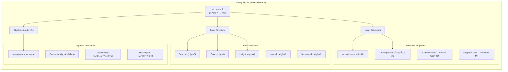
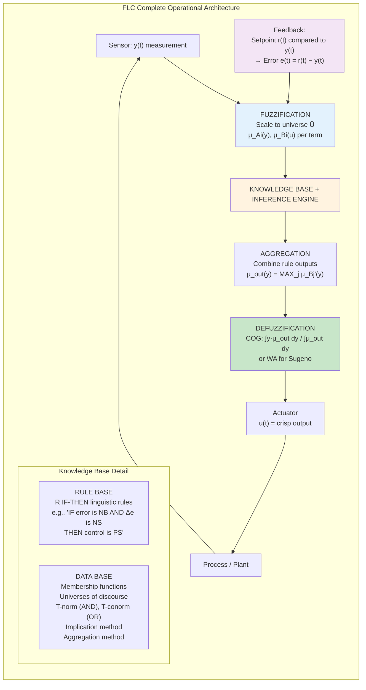
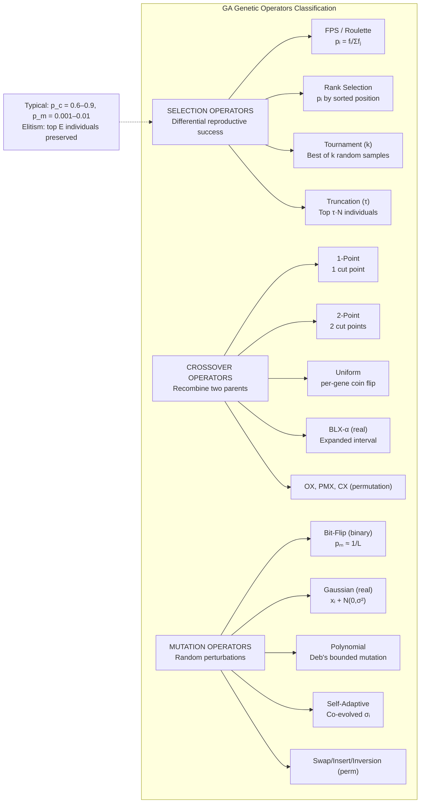
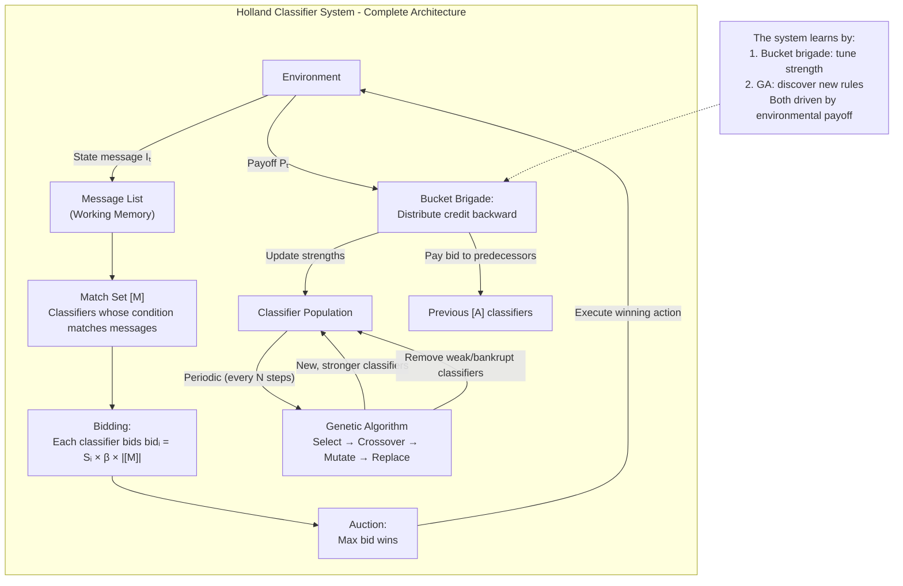
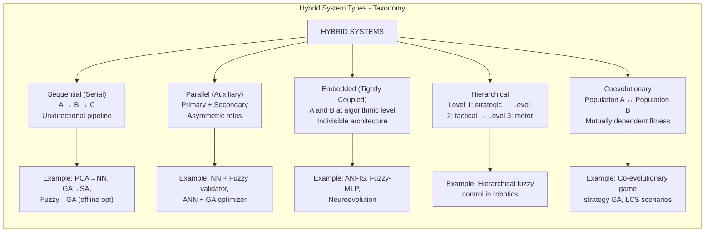
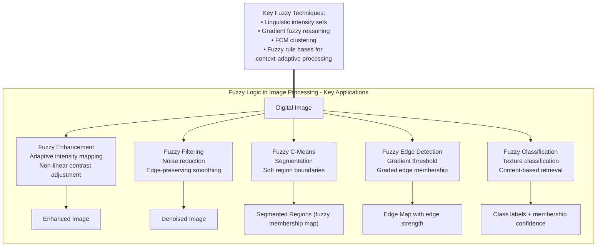

---

## Q1a — Explain in Detail Hill Climbing Algorithm and Its Limitations

Hill Climbing represents one of the most fundamental and intellectually accessible local search algorithms in the field of artificial intelligence and computational optimization, serving as the conceptual foundation upon which more sophisticated metaheuristic frameworks such as Simulated Annealing, Tabu Search, and Genetic Algorithms have been constructed. The algorithm derives its name and metaphorical framework from the physical act of climbing a hill: a climber standing at a point on the terrain evaluates the nearby terrain in all directions, identifies the direction of steepest ascent, takes a step in that direction, and repeats the process until reaching a location from which no further ascent is possible—a peak. In the optimization context, the "hill" is the fitness landscape defined by the objective function, the "climber" is the current candidate solution, the "neighbourhood" consists of all solutions reachable from the current solution via a single move according to the problem's neighbourhood function, and the "peak" is a local optimum. Hill climbing is a greedy, myopic local search algorithm that makes the locally optimal choice at each iteration with the aspiration that a sequence of locally optimal choices will lead to a globally optimal solution—an aspiration that is fulfilled only on unimodal landscapes and systematically frustrated on multimodal landscapes containing multiple local optima.

**Detailed Algorithmic Procedure**

The Hill Climbing algorithm can be formally described as a five-phase iterative procedure executed within a state space S with heuristic function h: S → ℝ (for maximization) or cost function c: S → ℝ (for minimization). **Phase 1: Initialization**, selects an initial state s₀ ∈ S. The selection of s₀ can be random (most common), heuristic-guided (seeded with a known good solution), or systematic (enumeration of all possible initial states for exhaustive search). For random initialization, s₀ is sampled from a uniform distribution over all states or from a distribution biased toward promising regions based on domain heuristics. **Phase 2: Neighbourhood Generation**, defines and constructs the neighbourhood N(s) of the current state s, where N(s) = {s' ∈ S | s' is reachable from s by a single elementary move}. The neighbourhood structure is a critical design parameter that determines the granularity of the local search: for the Traveling Salesman Problem, N(s) may consist of all tours obtained by swapping any two cities (O(n²) neighbours), performing 2-opt edge exchanges (O(n²) neighbours), or performing 3-opt exchanges (O(n³) neighbours); for continuous optimization, N(s) may consist of all points within an L₁ or L₂ ball of radius δ around s. **Phase 3: Neighbour Evaluation**, evaluates each neighbour s' ∈ N(s) against the objective function, computing h(s') for maximization or c(s') for minimization. In the steepest-ascent variant, all neighbours are evaluated; in the first-choice variant, neighbours are evaluated sequentially until the first improving neighbour is found.

**Phase 4: Move Decision**, implements the greedy selection criterion. For **steepest-ascent hill climbing**, the best neighbour (maximum h(s') or minimum c(s')) is selected if it improves upon the current state. For **first-choice hill climbing**, the first improving neighbour encountered during sequential evaluation is selected. For **stochastic hill climbing**, a neighbour is selected probabilistically with probability proportional to the improvement magnitude. For **sideways-move hill climbing**, neighbours with equal fitness to the current state are accepted up to a maximum number of consecutive sideways moves, enabling escape from plateaus. **Phase 5: Termination Check**, evaluates whether the stopping condition has been met: the most common stopping conditions are (a) no improving neighbour exists (local optimum detected), (b) maximum number of iterations T_max has been reached, (c) a target fitness value has been achieved, or (d) population diversity (in stochastic variants) has collapsed below a threshold. When the stopping condition is satisfied, the algorithm terminates and returns the current state s as the local optimum.

```mermaid
flowchart TD
    A["Initialize: random state s₀"] --> B["Generate neighbourhood N(s)"]
    B --> C["Evaluate all neighbours: h(s') for s'∈N(s)"]
    C --> D{"Is any neighbour s'<br/>with h(s') > h(s)?"]
    D -->|Yes| E["Select best neighbour s* = argmax_{s'∈N(s)} h(s')"]
    D -->|No| F["TERMINATE<br/>Return s as local optimum"]
    E --> G["Move: s ← s*"]
    G --> B
```

**Variants of Hill Climbing**

Several variants have been developed to address specific limitations of the basic algorithm. **Simple Hill Climbing** (first-choice) selects the first improving neighbour found, trading optimality for speed. **Steepest-Ascent Hill Climbing** evaluates all neighbours and selects the best, providing the steepest possible ascent at each step but requiring O(|N(s)|) evaluations per iteration. **Stochastic Hill Climbing** selects among improving neighbours with probability proportional to the improvement magnitude, introducing controlled randomness into the ascent trajectory. **Random-Restart Hill Climbing** executes multiple independent hill climbing episodes from randomly sampled initial states and returns the best solution found across all restarts, substantially increasing the probability of finding the global optimum. **Sideways-Move Hill Climbing** permits a limited number of consecutive sideways moves (moves to neighbours with equal fitness), enabling escape from plateaus. **Simulated Annealing** (see Q2a) may be viewed as a probabilistic extension of hill climbing in which worsening moves are accepted probabilistically with a temperature-dependent probability.

**ASCII Representation of Hill Climbing Search Trajectory:**

```
Hill Climbing Search on Multimodal Landscape (maximization)

  Fitness
    ▲
  GPE│                              ★ GLOBAL PEAK
     │                           ╱╲  ╱╲
     │                          ╱  ╲╱  ╲
     │                     ╱╲  ╱       ╲
  LPA│                 ╱╲  ╲╱         LPA
     │              ╱╲  ╲╱│
     │            ╱  ╲╱   │  ← Climber stuck here (LOA)
  LOA│     ★    ╱       ╱  │
     │      ╲╱  ╱  ★    ╱   │
     │        ╲╱  ╲╱  ╱    │
     │           ╱╲  ╱     │
     │          ╱  ╲╱      │
     └──────────────────────────► Search Space
          Start  LOA    LPA  GPE

  Start → Climber evaluates landscape → Steps to LOA
  LOA → No better neighbour found → TERMINATES
  Problem: climber never discovers LPA or GPE above
```

**Limitations of Hill Climbing**

The fundamental limitation of hill climbing is its **susceptibility to local optima**. On any non-unimodal fitness landscape containing two or more distinct local optima, a single hill climbing run from a random initial state has probability only p_start equal to the fraction of the search space basin of attraction containing the global optimum of finding the global optimum—typically a very small probability on complex landscapes. Random-restart hill climbing improves this to 1 − (1 − p_start)^k for k independent restarts, but k must be impractically large for landscapes with many small basins of attraction.

The **ridge problem** arises when the optimal path to the global optimum traverses a narrow diagonal ridge in the search space that is not aligned with the discrete moves defined by the neighbourhood function. The climber cannot follow the ridge because the moves required to stay on the ridge either decrease fitness or are unavailable in the defined neighbourhood, causing oscillation off the ridge and descent into suboptimal regions. For example, on a fitness landscape where the maximum follows a diagonal line in a 2D binary grid, single-bit-flip neighbourhoods cannot follow the diagonal (each bit-flip changes both coordinates by one step, causing deviation from the diagonal).

The **plateau problem** (or flat maximum problem) occurs when a large region of the search space contains states of approximately equal fitness, with no clear gradient to guide the climber's direction. On a perfectly flat plateau, all neighbours have equal fitness to the current state, and standard hill climbing terminates immediately. Sideways-move hill climbing addresses this by permitting limited sideways movement, but the algorithm remains directionless on plateaus and requires heuristics (such as perturbing multiple bits simultaneously) to escape.

The **step size dilemma** reflects the trade-off between large and small neighbourhoods: large neighbourhoods (many neighbours per step, e.g., 3-opt for TSP) provide more options per step but are computationally expensive to evaluate (O(n³) for TSP 3-opt); small neighbourhoods are computationally cheap (O(n²) for TSP 2-opt) but may require many more iterations to converge and may miss optimal transitions that require multi-bit changes. This dilemma is ameliorated in variable-neighbourhood search (VNS) and adaptive large neighbourhood search (ALNS) which systematically vary the neighbourhood size during search.

**Theoretical Analysis: When Does Hill Climbing Fail?**

The failure modes of hill climbing can be formalized through the topology of the fitness landscape. A fitness landscape is a graph G = (S, E) with vertex set S (all candidate states) and edge set E connecting states that are mutually reachable via a single neighbourhood move, with edge weights or vertex heights representing the objective function value. Hill climbing traverses this graph following only edges that lead to higher fitness. A local optimum is a vertex v such that for all neighbours v' ∈ N(v), h(v') ≤ h(v) (or c(v') ≥ c(v) for minimization). The set of local optima partitions the search space into basins of attraction: each local optimum v defines a basin B(v) = {s ∈ S | following hill climbing from s terminates at v}. The probability of hill climbing finding the global optimum is |B(v*)|/|S| where v* is the global optimum. On well-behaved landscapes (smooth, unimodal, with a single large basin), this probability approaches 1; on deceptive landscapes (many small basins, global optimum basin small), this probability approaches 0.

The **expected number of iterations** to reach a local optimum from initial state s is bounded by the depth of the basin containing s: on a unimodal landscape with gradient descent directions, the number of steps is at most the maximum path length from any state to the global optimum. On multimodal landscapes, hill climbing's expected iteration count is the average basin diameter, which is small for landscapes with many closely-spaced local optima.

In summary, Hill Climbing is a simple, computationally efficient greedy local search algorithm with O(1) memory requirement per trajectory and O(|N(s)|) cost per iteration, appropriate for unimodal or approximately unimodal optimization problems where the computational budget is limited and an approximate local optimum is acceptable. Its fundamental limitations—susceptibility to local optima, the ridge problem, and the plateau problem—are not bugs but essential characteristics of the greedy, myopic search strategy, and they directly motivate the design of more sophisticated metaheuristics including Simulated Annealing, Tabu Search, and Genetic Algorithms.
---

## Q1b — What is Evolutionary Strategy? How Does It Help To Solve Problems?

Evolutionary Strategy (ES) constitutes one of the three foundational paradigms of evolutionary computation, alongside Genetic Algorithms (GA) and Evolutionary Programming (EP), originating from independent research conducted in Germany during the 1960s and 1970s by Ingo Rechenberg and Hans-Paul Schwefel at the Technical University of Berlin. The distinctive motivation and intellectual orientation that motivated the development of ES differed fundamentally from the motivations that motivated GA and EP: while Holland at Michigan developed GA primarily as a theoretical framework for understanding adaptive processes and the schema theorem, and while Fogel developed EP as a model for open-ended adaptive behaviour generation, Rechenberg and Schwefel developed ES specifically and explicitly as numerical optimization methods for real-valued parameter optimization problems arising from engineering design—particularly the shape optimization of aerodynamic bodies (such as the Thrust-optimized Parabolic nozzle for rocket engines) where the objective function was computationally expensive to evaluate, the decision variables were real-valued and continuous, and no gradient information was available due to the use of numerical flow simulation (computational fluid dynamics) for objective function evaluation.

**Historical Development and Philosophical Orientation**

Rechenberg's principle of **evolution strategy** (Evolutionsstrategie) was formalized in his 1965 doctoral dissertation and subsequent 1973 monograph *Evolutionsstrategie: Optimierung technischer Systeme nach Prinzipien der biologischen Evolution*. The key insight motivating ES was the observation that natural evolution solves optimization problems—adapting organisms to their environments through mutation and selection—without requiring gradient information, without requiring a differentiable objective function, and without requiring the explicit specification of how each gene contributes to fitness. Rechenberg posited that these same properties made evolutionary principles applicable to engineering optimization problems with the same characteristics: expensive, black-box, non-differentiable objective functions arising from simulation or physical experiment. Schwefel extended Rechenberg's work in his 1975 doctoral dissertation, developing the (μ + λ) and (μ, λ) selection strategies, introducing the concept of **self-adaptation** of mutation step sizes, and formalizing the mathematical analysis of convergence properties.

**Canonical Algorithmic Structure**

The canonical (μ + λ)-ES operates as follows. A population of μ parent individuals is maintained, each represented as a real-valued vector x ∈ ℝⁿ. From these μ parents, λ ≥ μ offspring are generated. The most common scheme is (μ + λ) where λ = μ (equal population sizes), producing μ offspring from μ parents. Mutation is the sole variation operator: each parent x produces one offspring x' via Gaussian perturbation x' = x + σ · N(0, I), where σ > 0 is the mutation step size (possibly vector-valued with one σ per dimension) and N(0, I) is a multivariate standard normal random vector. The offspring population is then evaluated using the objective function. Survivor selection reduces the combined (μ + λ) population back to μ by deterministically selecting the μ best individuals—a strategy called **elitist selection** or **plus-selection**. The (μ, λ)-ES variant discards all parents and selects the μ best from λ offspring only (comma-selection), with λ typically 7μ for recommended settings.

**Self-Adaptation of Mutation Step Sizes**

The most distinctive and theoretically significant contribution of ES to evolutionary computation is the concept of **self-adaptive mutation step sizes**, co-evolving the mutation parameters alongside the decision variables. In self-adaptive ES, each individual carries not only the n decision variables x = (x₁, ..., xₙ) but also n step size parameters σ = (σ₁, ..., σₙ), forming an extended chromosome Z = (x, σ) ∈ ℝ²ⁿ. Both x and σ are mutated simultaneously: the step sizes are updated via a log-normal mutation rule σᵢ' = σᵢ · exp(τ' · N(0,1) + τ · Nᵢ(0,1)) where τ = 1/√(2n) and τ' = 1/√(2√n) are learning rates derived from theoretical analysis of the covariance matrix. The decision variables are then perturbed using the mutated step sizes: xᵢ' = xᵢ + σᵢ' · Nᵢ(0,1). This self-adaptation mechanism is critical: it enables each individual to autonomously calibrate its own mutation intensity, increasing σ in flat or rugged regions of the landscape where large steps are needed for exploration, and decreasing σ near optima where small steps are needed for refinement—without requiring any external parameter schedule or human tuning. This autonomous, decentralized meta-optimization of search parameters is one of ES's most powerful features and directly inspired the self-adaptive mechanisms in later GA and EP variants.

**Covariance Matrix Adaptation Evolution Strategy (CMA-ES)**

The most powerful and widely-used contemporary ES variant is the **Covariance Matrix Adaptation Evolution Strategy (CMA-ES)**, developed by Nikolaus Hansen and Andreas Ostermeier, which extends self-adaptation from per-dimension independent step sizes to full pairwise variable dependencies captured by the covariance matrix of the search distribution. CMA-ES maintains and adapts a multivariate Gaussian distribution N(m, σ²C) over the search space, where m is the mean (evolution path), σ is the global step size, and C is the covariance matrix that encodes the pairwise dependencies and anisotropic scaling of the search distribution. At each generation: (1) offspring are sampled from N(m, σ²C); (2) the μ best offspring are selected; (3) the mean m is updated as the weighted average of selected offspring; (4) the covariance matrix C is updated by the **rank-μ update** and **rank-one update** to capture the pairwise dependencies suggested by the selected offspring; (5) the step size σ is adapted via cumulative step-size adaptation (CSA) that accumulates successive step-size changes. CMA-ES has become the state-of-the-art derivative-free optimization algorithm for continuous optimization, consistently outperforming DE, PSO, and GA on the IEEE CEC benchmark test suites, with rigorous theoretical convergence guarantees and practically superior performance particularly on ill-conditioned, anisotropic, and non-separable problems where variable dependencies critically affect search efficiency.

```
EVOLUTIONARY STRATEGY - (μ + λ) FRAMEWORK ASCII
═══════════════════════════════════════════════════════════════

  (μ+λ)-ES GENERATION CYCLE:
  ┌───────────────────────────────────────────────────────────┐
  │  PARENT POPULATION Pₜ (μ individuals)                     │
  │  Each: xᵢ ∈ ℝⁿ, σᵢ ∈ ℝⁿ (self-adapted)                  │
  └───────────────────────┬───────────────────────────────────┘
                          │ MUTATION (Gaussian + self-adapt)
                          ▼
  ┌───────────────────────────────────────────────────────────┐
  │  OFFSPRING POPULATION Oₜ (λ individuals)                  │
  │  xᵢ' = xᵢ + σᵢ' · N(0,I)                                │
  │  σᵢ' = σᵢ · exp(τ'N(0,1) + τNᵢ(0,1))                  │
  └───────────────────────┬───────────────────────────────────┘
                          │ EVALUATE f(xᵢ') for all offspring
                          ▼
  ┌───────────────────────────────────────────────────────────┐
  │  COMBINED POPULATION Pₜ ∪ Oₜ (μ+λ total)                 │
  │  ELITIST SELECTION: keep best μ individuals               │
  │  → Pₜ₊₁                                                     │
  └───────────────────────────────────────────────────────────┘

  Key distinctions vs GA:
  • Real-valued encoding (no binary conversion)
  • Mutation AS PRIMARY operator (not crossover)
  • Self-adaptive σᵢ co-evolved with xᵢ
  • Deterministic elitist selection (not probabilistic)
  • (μ,λ) variant: parents discarded, only λ→μ survive
```

**How ES Helps Solve Problems**

Evolutionary Strategy addresses a broad class of optimization problems that are resistant to classical methods: (1) **Black-box continuous optimization** where only input-output evaluations are available, no derivatives, no model—CMA-ES achieves state-of-the-art performance on the 25 noiseless IEEE CEC 2017 benchmark functions; (2) **Noisy optimization** where f(x) = y + ε with ε a noise term—ES's population averaging naturally filters noise, and specialized noise-handling variants (e.g., increasing population size for noisy evaluations, using resampling) achieve robust performance; (3) **Multi-modal optimization** where the population maintains diversity through multi-start mechanisms and niching extensions of CMA-ES; (4) **Constrained optimization** where the objective or constraints are non-differentiable (e.g., max/min operators, absolute values, discrete constraints)—handled naturally via penalty functions or the augmented Lagrangian method within the ES framework; (5) **Mixed-integer and combinatorial optimization** via specialized encoding and permutation ES variants; (6) **Real-time and online optimization** where the ES adapts to changing objective functions in non-stationary environments through memory and multistart mechanisms—in online optimization, the mean m of the Gaussian search distribution tracks the moving optimum, and σ adapts to the rate of change. The mathematical elegance of ES—rooted in the statistical theory of natural evolution and formalized through the convergence theory of stochastic approximation—provides both practical effectiveness and theoretical understanding of why and how the algorithm succeeds across diverse problem domains.
---

## Q1c — List Features of Biological Evolution in Evolutionary Computing. Explain Applications of Evolutionary Computing

The mapping of biological evolutionary principles into computational algorithms—the central metaphor that defines evolutionary computation as a field—requires careful specification of which features of biological evolution are incorporated into computational evolutionary systems, which features are deliberately excluded, and which features are modified or extended to serve computational purposes. Biological evolution, as operative in natural populations through the mechanisms described by Charles Darwin and Alfred Russel Wallace (1858) and later formalized through population genetics by Fisher, Wright, and Haldane in the foundational theoretical synthesis of the 1930s–1940s, encompasses a rich ensemble of interacting processes: heritable variation generation, differential reproductive success, population dynamics, environmental interaction, genetic drift, mutation, recombination, migration, selection at multiple levels (individual, kin, group), fitness landscape traversal, speciation, and open-ended cumulative complexity increase across geological time. No single evolutionary computing algorithm incorporates all these features—nor would it be desirable to do so—but the major EC paradigms each capture a distinctive subset that reflects their designers' specific theoretical interests and application domains.

**Features of Biological Evolution Captured in Evolutionary Computing**

**Feature 1: Heritable Variation and the Genotype-Phenotype Mapping**

Biological evolution operates on heritable phenotypic variation that has a genetic basis encoded in DNA sequences. Evolutionary computation mimics this through the chromosome representation: a data structure (the genotype) that encodes a candidate solution (the phenotype) and can be transmitted from parent to offspring with modification. The genotype-phenotype mapping in EC is designed by the algorithm practitioner, unlike in biology where it is the product of developmental biology encoded in the genome. EC captures the essential property that genetic material (chromosomes) begets genetic material (offspring chromosomes), enabling the accumulation of adaptive modifications across generational time—the fundamental mechanism of cumulative selection that produces complex adaptation in biology and progressively improving solutions in EC.

**Feature 2: Selection and Differential Reproductive Success**

Natural selection, as formulated by Darwin and Wallace, is the mechanism by which heritable phenotypic variation leads to differential survival and reproduction: individuals with phenotypes better adapted to the environment leave more offspring, causing the genetic composition of the population to shift incrementally toward adaptive phenotypes. EC directly incorporates this mechanism through its selection operators: individuals with higher fitness (better solutions) are more likely to be selected as parents and contribute genetic material to the next generation. Selection implements the key evolutionary principle of "survival of the fittest"—though in EC this is typically implemented stochastically (probabilistic selection) rather than deterministically (only the fittest reproduce), which preserves population diversity and prevents premature convergence. Fitness proportional selection, rank selection, and tournament selection in GAs; stochastic tournament selection in EP; and elitist (μ+λ) or (μ,λ) selection in ES are all computational realizations of differential reproductive success.

**Feature 3: Mutation as Source of Novel Genetic Variation**

Mutation in biology refers to heritable changes in DNA sequence arising from replication errors, chemical damage, or radiation—the ultimate source of all new genetic variation. Mutation rates in biology are low (approximately 10⁻⁸ per base per generation in humans), consistent with the requirement to maintain genetic stability while permitting occasional novel variation. EC incorporates mutation through variation operators: bit-flip mutation in binary GAs, Gaussian mutation in real-valued ES, subtree mutation in GP, and Cauchy or polynomial mutation in modern variants. The mutation rate p_m in EC functions analogously to the biological mutation rate: low enough to preserve building blocks (schema coherence) while high enough to introduce novelty. The schema theorem establishes the theoretical requirement that p_m be sufficiently small: if p_m is too high, crossover's building-block recombination benefit is destroyed and the GA degrades to random search.

**Feature 4: Recombination (Crossover) and Genetic Mixing**

Biological crossover (recombination during meiosis) exchanges genetic material between homologous chromosomes from two parents, producing offspring with novel combinations of alleles inherited from both parents. This mechanism, absent in asexual organisms, is thought to be evolutionarily advantageous because it allows beneficial mutations arising in different lineages to be combined into a single genome, and because it allows deleterious mutations to be purged without destroying all genetic material (only the deleterious segment is replaced). EC captures this through crossover operators (single-point, two-point, uniform in GAs; subtree crossover in GP), which recombine genetic material from two parents to produce offspring. The theoretical importance of crossover in GAs is established by the Building Block Hypothesis: crossover assembles short, high-fitness schemata (building blocks) into progressively higher-order schemata, analogous to the biological recombination of beneficial alleles. EP and standard ES do not employ crossover in their canonical formulations, representing an alternative evolutionary strategy that relies solely on mutation and selection—a design choice motivated by empirical evidence that mutation-only strategies can be equally or more effective on continuous optimization problems.

**Feature 5: Population-Based Parallel Search**

Biological evolution operates on populations of organisms rather than single individuals, with the population as a whole constituting the unit of evolutionary change. EC mimics this population structure: a population of candidate solutions is maintained, with selection, variation, and replacement acting on the population level rather than on individuals. The population structure enables parallel exploration of multiple regions of the search space simultaneously, exploiting the **implicit parallelism** that Holland's Schema Theorem establishes: a population of N individuals implicitly processes O(N³) schemata at each generation, providing massive implicit parallelism without explicit parallel programming. Population size is a key design parameter that controls the diversity-exploration trade-off: larger populations sustain more schemata and explore more regions but require more evaluations per generation.

**Features of Biological Evolution NOT Captured in Standard EC**

Several important features of biological evolution are deliberately not incorporated into standard EC algorithms, either because their computational cost outweighs their benefit or because they are difficult to formalize computationally. **Sexual selection** (mate choice based on phenotypic traits independent of survival fitness) is rarely modeled in EC, though some multi-objective and quality-diversity algorithms incorporate mechanisms analogous to sexual selection. **Speciation** (splitting of a species into reproductively isolated subpopulations that adapt independently) is not a default feature of standard EC but is incorporated in speciated GAs and niching ES variants. **Developmental biology** (the mapping from genotype to phenotype through regulated gene expression and cellular differentiation) is simplified in EC to a direct mapping from chromosome to solution; developmental encodings (where individuals encode not the solution directly but a set of rules for constructing the solution) have been explored but are not mainstream. **Epigenetics** (heritable phenotype changes not involving DNA sequence changes) is not represented in standard EC. **Levels of selection** (kin selection, group selection, multilevel selection operating simultaneously at multiple organizational scales) receive limited attention in mainstream EC research, though multi-population and island models partially capture spatial population structure. **Open-ended evolution** (evolution without an externally defined fitness function, producing ever-increasing complexity) remains an active but unsolved research challenge, contrasting with the bounded, goal-directed nature of standard EC optimization.

**Applications of Evolutionary Computing**

The application scope of EC is extraordinarily broad, spanning domains where optimization, design, machine learning, or adaptive behaviour synthesis are required.

**Engineering Design and Optimization**: EC is applied to structural optimization (truss design, pressure vessel design, welded beam design, crashworthiness optimization) where the objective function is computationally expensive (requiring finite element analysis) and involves non-linear, constrained, multi-objective formulations. In aerospace design, EC optimizes airfoil shapes, wing configurations, satellite antenna geometries, and rocket engine nozzle contours. In electrical engineering, EC designs analog and digital circuits, antenna arrays, and power system layouts. In chemical engineering, EC optimizes process parameters, separation sequences, and reactor configurations. The self-adaptive property of ES makes it particularly valuable for these black-box optimization problems where no gradient is available.

**Machine Learning and Data Science**: EC optimizes neural network architectures (NeuroEvolution of Augmenting Topologies, NEAT), hyperparameters of machine learning models (SVM kernels, random forest tree count, neural network learning rates), feature selection for high-dimensional datasets, and training data selection for active learning. **Genetic Feature Selection** identifies the minimal subset of input features that maximizes classifier accuracy while minimizing model complexity, addressing the curse of dimensionality. In deep learning, EC is applied to neural architecture search (NAS), evolving CNN and RNN architectures that rival or surpass human-designed architectures on image classification and language modeling benchmarks.

**Bioinformatics and Computational Biology**: EC reconstructs phylogenetic trees from DNA or protein sequence data, predicts protein tertiary structure from amino acid sequences (protein folding), designs de novo proteins with specified structural and functional properties, performs gene expression clustering, infers gene regulatory networks from time-series expression data, and aligns biological sequences. The multimodal, high-dimensional fitness landscapes characteristic of molecular and genomic optimization problems—where fitness is assessed by molecular docking simulations or thermodynamic folding models—are exactly the black-box, expensive, non-convex problems to which EC is well-suited.

**Finance and Economics**: EC optimizes trading strategies, portfolio compositions, option pricing model calibration, credit scoring models, and macroeconomic parameter estimation. Portfolio optimization via multi-objective EC (NSGA-II, SPEA2) produces efficient frontiers from which investors select risk-return trade-offs matching their preferences, handling the non-convex, cardinality-constrained, and transaction-cost-inclusive formulations that challenge classical mean-variance optimization.

**Operations Research and Scheduling**: EC solves NP-hard combinatorial problems including the Traveling Salesman Problem, vehicle routing, job-shop scheduling, timetabling, and facility location. These problems are characterized by factorial or exponential solution spaces making exhaustive search impossible and by objective functions (total route distance, makespan, tardiness) that are straightforward to evaluate but whose combinatorially structured search spaces defeat gradient-based methods.

**Robotics and Autonomous Systems**: EC evolves robot locomotion gaits, manipulator trajectory planners, swarm coordination strategies, and neural network controllers for robots without requiring an explicit model of robot dynamics. In evolutionary robotics, fitness evaluation may involve physical robot trials in simulation or hardware, with EC optimizing controllers that must generalize across slightly varied environments—a robustness requirement that makes explicit controller design intractable.

**Art, Music, and Computational Creativity**: EC generates aesthetic artifacts through interactive evolutionary computation where human users serve as fitness functions, selecting preferred outputs across generations. Applications include evolutionary art (images, sculptures), evolutionary music (melodies, harmonies, compositions), evolutionary architecture (building form optimization for aesthetic and structural criteria), and evolutionary fashion design. These applications exploit EC's ability to search high-dimensional creative spaces without requiring formal mathematical definitions of aesthetic quality.
---

## Q2a — Summarize Three Steps of Evolutionary Programming. List Possible Mutation Operators

Evolutionary Programming (EP), as originally formulated by Lawrence J. Fogel in the 1960s and subsequently refined through decades of theoretical and empirical research, is a population-based stochastic optimization algorithm whose operational cycle can be precisely decomposed into three primary algorithmic steps: Population Initialization and Representation, Variation via Mutation, and Selection via Competition. These three steps collectively implement a complete evolutionary adaptive cycle analogous to natural selection operating on a population of competing phenotypes. Each step encompasses specific sub-procedures and design choices that significantly affect the algorithm's performance on different problem classes.

**Step 1: Population Initialization and Representation**

The first step establishes the initial population and the chromosome encoding scheme. In contemporary EP applied to numerical optimization, the canonical representation is a **real-valued vector** x = (x₁, x₂, ..., xₙ) where each component xᵢ represents a decision variable constrained to an admissible range [Lᵢ, Uᵢ]. The population size μ is typically specified as a hyperparameter in the range μ = 50–500, with larger populations maintaining greater exploration diversity at the cost of increased per-generation computational cost (μ fitness evaluations per generation). For self-adaptive EP variants (the standard in contemporary practice), each individual carries not only the decision variable vector x but also a step size vector σ = (σ₁, σ₂, ..., σₙ) that governs the magnitude of mutation applied to each dimension. The extended chromosome is therefore Z = (x₁, x₂, ..., xₙ, σ₁, σ₂, ..., σₙ) ∈ ℝ²ⁿ. Initialization proceeds by sampling each xᵢ uniformly from [Lᵢ, Uᵢ] and each σᵢ from a range [σ_min, σ_max] (typically σ_min = 0.01 × (Uᵢ − Lᵢ), σ_max = 0.1 × (Uᵢ − Lᵢ), or derived from the initial search space scale).

In the original Fogel formulation, the representation was a finite state machine (FSM) used for time-series prediction and sequence modelling—Fogel's original insight was that intelligence could emerge from the evolutionary adaptation of FSMs that predict symbol sequences. For the specific problems addressed in this examination syllabus, the real-valued vector representation is the relevant formulation, enabling EP to be applied to continuous optimization problems of the type encountered in engineering design, parameter estimation, and control system tuning.

**Step 2: Variation via Mutation (The Primary EP Variation Operator)**

The second step generates offspring from the parent population through mutation. EP is distinguished from GA by its exclusive or dominant reliance on mutation as the variation operator, without crossover as a primary mechanism (though some contemporary EP variants incorporate crossover). For each parent individual Z = (x, σ) ∈ Pₜ, one offspring Z' = (x', σ') ∈ Oₜ is generated through the following mutation procedure:

- **Step size mutation (self-adaptation)**: σ'ᵢ = σᵢ · exp(τ' · N₀(0,1) + τ · Nᵢ(0,1)) for i = 1, ..., n, where N₀(0,1) is a single standard normal random number shared across all dimensions (governing the overall step size adjustment), Nᵢ(0,1) are independent standard normal random variables per dimension, τ = 1/√(2√n), and τ' = 1/√(2n) are learning rates derived from theoretical analysis of the covariance matrix adaptation mechanism.

- **Decision variable mutation**: x'ᵢ = xᵢ + σ'ᵢ · Nᵢ(0,1) for i = 1, ..., n, where each component is independently perturbed by a Gaussian scaled by the mutated step size.

The log-normal self-adaptation rule for σ ensures that step sizes remain strictly positive (σ'ᵢ > 0 always) while permitting both increases and decreases in mutation intensity. The parameters τ and τ' are set such that the expected multiplicative change in σ is unity (E[σ'ᵢ] = σᵢ), with the variance of the log-normal distribution controlled by τ and τ'. Typical mutation intensity: the step size σᵢ is on the order of 5–10% of the variable range [Lᵢ, Uᵢ], producing perturbations that refine solutions near optima while remaining large enough to escape local optima in early generations.

**Step 3: Selection via Competition (Survivor Selection)**

The third step reduces the population size from 2μ (parents + offspring) back to μ through a competition process that selects survivors for the next generation. In the canonical (μ + μ)-EP (also called the (μ, μ) scheme), the intermediate population P_intermediate = Pₜ ∪ Oₜ contains 2μ individuals. Selection operates through **Q-tournament competition** (also called tournament selection or pairwise comparison): each individual in P_intermediate participates in q independent pairwise contests, where in each contest a random opponent is selected from P_intermediate and the individual "wins" if its fitness is strictly greater than the opponent's fitness (ties are broken by random coin flip, each participant having 50% chance). After q contests, each individual has a score equal to its number of wins. The μ individuals with the highest scores survive to form Pₜ₊₁.

The tournament size q controls selection pressure: with q = 1 (binary tournament), the probability of surviving increases only slightly with fitness, maintaining moderate selection pressure that preserves population diversity; with q = 10, selection pressure approaches that of deterministic elitist selection. The (μ + μ) scheme retains all parents in the competition pool, ensuring that the best solution found so far is never lost. The alternative (μ, λ)-ES scheme (from Evolution Strategies) discards all parents, retaining only the best μ from λ > μ offspring; this (μ, λ) scheme imposes stronger selection pressure but loses elitist guarantees.

**Possible Mutation Operators in Evolutionary Programming**

The mutation operator in EP has several variants, each suited to different problem structures:

1. **Gaussian Mutation (standard)**: As described above, x' = x + σ · N(0, I). Appropriate for continuous optimization on ℝⁿ with isotropic or mildly anisotropic fitness landscapes.

2. **Cauchy Mutation**: Replaces the Gaussian perturbation with a Cauchy (Lorentzian) distribution: x' = x + σ · C(0, 1), where C(0, 1) is the standard Cauchy distribution with heavy tails. Cauchy mutation produces occasional very large jumps (the heavy-tailed distribution assigns non-negligible probability to large perturbations), making it more effective at escaping deep local optima on rugged or deceptive fitness landscapes. Studies comparing Gaussian vs. Cauchy mutation have demonstrated that Cauchy mutation outperforms Gaussian on highly multimodal benchmark functions (Rastrigin, Schwefel) where large jumps are needed to cross fitness barriers.

3. **Polynomial Mutation**: A bounded mutation operator derived from a polynomial probability distribution, standard in NSGA-II: δ = (2r)^(1/(η+1)) − 1 if r < 0.5, or δ = 1 − (2(1−r))^(1/(η+1)) if r ≥ 0.5, where r ~ U(0,1) and η is the distribution index controlling perturbation concentration near the parent. Polynomial mutation produces small perturbations with high probability and large perturbations with decreasing probability while ensuring offspring remain within bounds.

4. **Levy Flight Mutation**: Perturbation drawn from a Lévy stable distribution with heavy power-law tails, producing occasional very large jumps combined with many small steps. Lévy flight mutation has been shown to improve exploration on multimodal landscapes and has connections to foraging patterns in animal behaviour (the Lévy flight foraging hypothesis).

5. **Non-uniform Mutation**: A mutation operator whose perturbation magnitude decreases with generation number: δ = r · (1 − t/T_max)^b, where t is the current generation, T_max is the maximum generations, b is a distribution parameter, and r ~ U(0,1). This implements a schedule that produces larger exploration in early generations and finer exploitation in late generations, analogous to the cooling schedule in Simulated Annealing.

6. **Self-adaptive Mutation (standard EP)**: As described in Step 2, the step size itself is mutated using a log-normal distribution, enabling each individual to autonomously adjust its own mutation intensity based on its local neighbourhood's fitness landscape characteristics.

7. **Rotationally Invariant Mutation**: Employed when the fitness landscape exhibits rotationally invariant structure; mutation is performed in a coordinate system aligned with the principal axes of the search distribution, approximated through the evolving covariance matrix in CMA-ES.

```
EVOLUTIONARY PROGRAMMING - THREE STEPS + MUTATION OPERATORS ASCII
═══════════════════════════════════════════════════════════════════

  THREE STEPS OF EP:
  
  Step 1: INITIALIZE
  ┌────────────────────────────────────────┐
  │  Population P₀ = {x₁, x₂, ..., x_μ}   │
  │  xᵢ ~ U(Lⱼ, Uⱼ) per dimension         │
  │  Self-adaptive: also initialize σᵢ     │
  └────────────────────────────────────────┘
                    │
                    ▼
  Step 2: MUTATE (Gaussian + self-adaptation)
  ┌────────────────────────────────────────┐
  │  σᵢ' = σᵢ · exp(τ'N(0,1) + τNᵢ(0,1)) │
  │  xᵢ' = xᵢ + σ'ᵢ · N(0,1)             │
  │  → offspring Oₜ (μ individuals)        │
  └────────────────────────────────────────┘
                    │
                    ▼
  Step 3: SELECT (Q-tournament)
  ┌────────────────────────────────────────┐
  │  P_intermediate = Pₜ ∪ Oₜ (2μ total)   │
  │  Each individual plays q contests       │
  │  Winners (top μ scores) → Pₜ₊₁        │
  └────────────────────────────────────────┘

  MUTATION OPERATORS SUMMARY:
  • Gaussian        — standard, isotropic
  • Cauchy          — heavy tails, good for escaping
  • Polynomial      — bounded, Deb's NSGA-II default
  • Lévy Flight     — power-law jumps, foraging-inspired
  • Non-uniform     — decreasing magnitude with generations
  • Self-adaptive   — autonomous step-size tuning (EP's key)
```
---

## Q2b — Explain Basic Flow of Particle Swarm Optimization. Describe Applications of PSO

Particle Swarm Optimization (PSO) stands as one of the most computationally elegant and empirically successful swarm intelligence metaheuristics, originally formulated by James Kennedy and Russell C. Eberhart in 1995. The algorithm draws its foundational inspiration from the emergent collective behavior observed in coordinated animal groups: flocks of birds navigating migratory routes, schools of fish evading predators, swarms of bees locating nectar-rich flowers, and herds of ungulates moving across savannah landscapes. In each of these naturally occurring systems, large numbers of decentralized individuals following remarkably simple local interaction rules—aligning direction with neighbours, maintaining proximity to neighbours, avoiding collisions, and moving toward attractive targets—produce sophisticated, adaptive, globally coordinated group behavior without any centralized controller or explicit communication protocol. The PSO algorithm abstracts this phenomenon into an optimization framework: a swarm of simple particles traverses a D-dimensional search space Ω ⊂ ℝᴰ under the combined influence of each particle's own experience and the swarm's collective experience, converging through iterative position updates guided by velocity dynamics toward optimal solutions of continuous and, with modification, discrete optimization problems.

**Basic Flow and Algorithmic Structure**

The PSO operates upon a population (swarm) of N particles, each represented by two D-dimensional vectors: a position vector xᵢ ∈ Ω and a velocity vector vᵢ ∈ ℝᴰ. The position represents a candidate solution in the search space, and the velocity governs the displacement dynamics between consecutive iterations. The canonical velocity update equation, known as the **velocity-clamped particle swarm** model, is:

vᵢ(t+1) = ω·vᵢ(t) + c₁·r₁·(pbestᵢ − xᵢ(t)) + c₂·r₂·(gbest(t) − xᵢ(t))

xᵢ(t+1) = xᵢ(t) + vᵢ(t+1)

where:
- ω ∈ [0, 1] is the **inertia weight**, governing the retention of current velocity momentum
- c₁ > 0 is the **cognitive acceleration coefficient**, controlling the attraction toward the particle's own best historical position
- c₂ > 0 is the **social acceleration coefficient**, controlling the attraction toward the swarm's global best position
- r₁ ~ U(0,1) and r₂ ~ U(0,1) are independent random variables that inject stochasticity into the velocity update
- pbestᵢ = argmax_{0≤τ≤t} f(xᵢ(τ)) is the personal best position discovered by particle i across its search history
- gbest(t) = argmax_{1≤j≤N} f(pbestⱼ(t)) is the global best position discovered by the entire swarm

The algorithmic flow proceeds as follows:

**Phase 1: Initialization**: N particles are initialized with random positions xᵢ(0) uniformly sampled from the search space bounds [Lⱼ, Uⱼ]ᴰ and random velocities vᵢ(0) uniformly sampled from [−V_max, V_max]ᴰ or computed as a fraction of the position range. Each particle's personal best is initialized to its starting position: pbestᵢ(0) = xᵢ(0). The global best gbest(0) is determined by evaluating all particles: gbest(0) = argmaxᵢ f(pbestᵢ(0)).

**Phase 2: Velocity Update**: For each particle i, the three velocity components are computed:
- Inertia: ω·vᵢ(t) — preserves momentum from the previous iteration
- Cognitive: c₁·r₁·(pbestᵢ − xᵢ(t)) — pulls the particle toward its own best position
- Social: c₂·r₂·(gbest(t) − xᵢ(t)) — pulls the particle toward the swarm's best position

**Phase 3: Position Update and Boundary Enforcement**: The position is updated by adding the velocity vector: xᵢ(t+1) = xᵢ(t) + vᵢ(t+1). Position bounds are enforced: any component xᵢⱼ(t+1) exceeding upper bound Uⱼ is set to Uⱼ; any component below Lⱼ is set to Lⱼ. Optionally, velocity bounds V_max are enforced to prevent excessively large velocity steps.

**Phase 4: Fitness Evaluation and Memory Update**: Each new position xᵢ(t+1) is evaluated using the objective function f(xᵢ(t+1)). If f(xᵢ(t+1)) > f(pbestᵢ(t)), the personal best is updated: pbestᵢ(t+1) = xᵢ(t+1). If f(pbestᵢ(t+1)) > f(gbest(t)), the global best is updated: gbest(t+1) = pbestᵢ(t+1).

**Phase 5: Iteration and Termination**: Steps 2–4 are repeated until a stopping criterion is met: maximum iterations T_max, minimum improvement threshold, or target fitness value achieved.

```mermaid
flowchart TD
    A["Initialize: N particles<br/>random xᵢ, vᵢ in bounds"] --> B["Evaluate f(xᵢ) for each particle<br/>Set pbestᵢ = xᵢ, gbest = argmax f(pbestᵢ)"]
    B --> C["For each particle i:"]
    C --> D["Velocity Update:<br/>vᵢ ← ω·vᵢ + c₁·r₁·(pbestᵢ-xᵢ) + c₂·r₂·(gbest-xᵢ)"]
    D --> E["Position Update:<br/>xᵢ ← xᵢ + vᵢ<br/>Enforce bounds [Lⱼ, Uⱼ]"]
    E --> F["Evaluate f(xᵢ)"]
    F --> G{"f(xᵢ) > f(pbestᵢ)?"]
    G -->|Yes| H["pbestᵢ ← xᵢ"]
    G -->|No| I["pbestᵢ unchanged"]
    H --> J{"f(pbestᵢ) > f(gbest)?"]
    I --> J
    J -->|Yes| K["gbest ← pbestᵢ"]
    J -->|No| L["gbest unchanged"]
    K --> M{"Convergence?<br/>t ≥ T_max or stall?"]
    L --> M
    M -->|No| C
    M -->|Yes| N["Return gbest (global best solution)"]
    
    n1["ω: inertia - momentum<br/>c₁: cognitive pull to own best<br/>c₂: social pull to swarm best"] -.-> D
```

**ASCII representation of particle trajectory dynamics:**

```
PSO PARTICLE TRAJECTORY - 2D Visualization

         Cognitive Pull (c₁)
              ↑
              │
    ╭─────────╮
    │ pbest   │  ← Particle's own best position
    │    ●    │
    ╰─────────╯
              │
              │
    ╭────────────────────────────╮
    │         Swarm Best          │
    │           ★ gbest           │
    ╰────────────────────────────╯
              ▲
              │ Social Pull (c₂)

  Particle trajectory (example):
  Start →  ↗ inertia → ↙ cognitive → → social → ★ converge to gbest
  
  Velocity components at step t:
  vᵢ(t) = [2.5, -1.8]  ← inertia (continuing direction)
  cog  = c₁·r₁·(pbest-x) = [0.8, 1.2]  ← pull toward own best
  soc  = c₂·r₂·(gbest-x) = [1.5, 0.9]  ← pull toward swarm best
  vᵢ(t+1) = [2.5+0.8+1.5, -1.8+1.2+0.9] = [4.8, 0.3]
```

**Neighbourhood Topologies and Variants**

The canonical global-best PSO (gbest PSO) uses a fully connected topology where every particle has access to the swarm's global best. This topology converges rapidly but is susceptible to premature convergence. Alternative topologies include:

- **Ring (lbest) topology**: Each particle has k neighbours on either side in a ring structure; each particle tracks its own best and its local neighbourhood best rather than the global best. lbest PSO converges more slowly but maintains greater diversity and is more robust to premature convergence.
- **Von Neumann topology**: Particles are arranged on a 2D lattice; each particle interacts only with its 4 (or 8) immediate spatial neighbours, providing a balance between convergence speed and diversity.
- **Wheel topology**: One central particle (hub) connected to all others; the central particle tracks the global best while peripheral particles track only the hub's best—a hierarchical structure.
- **Random topology**: Each particle's neighbours are randomly selected at each iteration, probabilistically mixing local and global information.

**Applications of Particle Swarm Optimization**

PSO has been applied with documented success across an extraordinarily wide range of optimization domains, outperforming or matching GA, DE, and SA on many benchmark problems while requiring substantially fewer parameters.

In **engineering design**, PSO optimizes truss structure weight subject to stress, displacement, and frequency constraints; pressure vessel design with shell thickness and dimensional constraints; welded beam design; speed reducer design; and composite laminate stacking sequence optimization. In **power systems**, PSO solves economic load dispatch (ELD) with non-smooth, non-convex cost functions (valve-point effects, prohibited operating zones), optimal reactive power dispatch (ORPD), transmission expansion planning, and distributed generator placement in microgrids. The ability of PSO to handle non-convex, discontinuous objectives makes it particularly suited to these problems where classical optimization methods fail.

In **electrical and electronics engineering**, PSO designs IIR and FIR digital filters, designs antenna arrays (thinned array synthesis, beamforming), optimizes induction motor parameters, and performs power system state estimation. In **machine learning and data science**, PSO optimizes neural network weights (avoiding back-propagation's local optima), performs feature selection (identifying the most discriminative features for classification), tunes SVM hyperparameters (C and γ), and optimizes clustering parameters in fuzzy c-means. In **image processing and computer vision**, PSO performs image segmentation (multilevel thresholding), image registration parameter optimization, and edge detection.

In **chemical and process engineering**, PSO optimizes reactor design parameters, separation process operating conditions, heat exchanger networks, and chemical process control parameters where the objective function is a computationally expensive process simulation. In **finance and economics**, PSO optimizes portfolio weights under mean-variance and higher-moment frameworks, optimizes trading system parameters, and calibrates option pricing model parameters to market data. In **biomedical engineering**, PSO optimizes medical imaging reconstruction parameters, feature selection for disease classification from genetic microarray data, and radiation therapy treatment planning parameters. In **robotics**, PSO optimizes manipulator trajectory planning, mobile robot path planning in dynamic environments, swarm robot coordination parameters, and gait parameter optimization for legged robots.

The convergence properties of PSO have been formally analyzed: the constriction factor variant, where the velocity update includes a constriction coefficient χ = 2/|2−φ−√(φ²−4φ)| with φ = c₁+c₂ > 4, provides almost-sure convergence to a stable point under stability conditions derived from discrete-time linear system theory. In practice, the linearly decreasing inertia weight schedule (ω decreasing from 0.9 to 0.4 over iterations) combined with c₁ = c₂ = 2 provides robust parameter-free performance across a wide range of problems, making PSO the most accessible metaheuristic for practitioners without specialized optimization expertise.
---

## Q3a — What are the Different Properties Associated with Fuzzy Sets?

Fuzzy sets, as rigorously formulated by Lotfi A. Zadeh in his landmark 1965 paper, extend classical set theory by allowing partial membership of elements in a set, with membership degrees ranging continuously across the closed unit interval [0,1]. This fundamental departure from bivalent (true/false) membership introduces a rich set of mathematical properties that distinguish fuzzy sets from classical crisp sets and that govern their behavior under set operations, their representation through level sets, and their application in fuzzy inference systems. The properties associated with fuzzy sets can be organized into several categories: **Normalization properties** (support, height, normality, core, normality); **Convexity properties** (convexity of membership function and level sets); **α-cut (level set) properties** (the decomposition theorem, nested level sets, representation completeness); **Algebraic properties** (idempotency, commutativity, associativity, absorption, distributivity, De Morgan duality with appropriate t-norm/t-conorm pairs); **Set-theoretic properties** (subset/superset relationships, equality, complement); and **Special fuzzy-specific properties** (height, normality condition, convex hull of level sets). Each property has precise mathematical definitions, specific algebraic consequences, and practical implications for fuzzy system design.

**Support, Height, Normality, and Core**

The **support** of a fuzzy set à defined over universe X is: supp(Ã) = {x ∈ X | μ_A(x) > 0}. The support is the set of elements with nonzero membership — the "active region" where the fuzzy set exerts influence outside the support, μ_A(x) = 0 identically and the fuzzy set has no presence. The support may be empty (null fuzzy set), finite, or infinite. For computational purposes, the support defines the effective region of computation: operations on à need only be evaluated over supp(Ã).

The **height** of a fuzzy set is: height(Ã) = sup_{x∈X} μ_A(x), the maximum membership value attained anywhere in the universe. A fuzzy set with height = 1.0 is called **normal**; a fuzzy set with height < 1.0 is called **subnormal**. Subnormal fuzzy sets arise in fuzzy inference when the firing strengths of all rules are simultaneously less than 1.0, causing all clipped consequent sets to have heights less than 1.0. Subnormal consequent sets in fuzzy controllers produce biased outputs that cannot span the full control action range — a practical reason to ensure that at least one fuzzy consequent is normal (or that normalized firing strengths are used in weighted-average defuzzification).

The **core** of a fuzzy set à is: core(Ã) = {x ∈ X | μ_A(x) = 1} = Ã_1, the level set at α = 1. The core is the set of elements with full membership in the fuzzy set. For unimodal (single-peak) normal fuzzy sets, the core is a singleton {x_c} where x_c is the peak location (e.g., a Gaussian μ(x) = exp(−(x−c)²/2σ²) has core = {c}). For trapezoidal or rectangular fuzzy sets, the core is an interval [a, b], representing a range of x values that are fully in the set. The cardinality relationship: |core(Ã)| ≤ |supp(Ã)| for any fuzzy set, with equality only for crisp sets (where support = core = the set itself).

**Convexity of Fuzzy Sets**

A fuzzy set à over a linearly ordered universe X ⊂ ℝ is **convex** if: μ_A(λx₁ + (1−λ)x₂) ≥ min(μ_A(x₁), μ_A(x₂)) for all x₁,x₂ ∈ supp(Ã) and all λ ∈ [0,1]. Equivalently, the α-level sets Ã_α = {x ∈ X | μ_A(x) ≥ α} are convex (contiguous intervals) for all α ∈ [0,1]. Triangular, trapezoidal, Gaussian, and sigmoidal fuzzy sets are all convex on ℝ: their level sets are intervals [x_α⁻, x_α⁺] containing all x values with membership at least α. For multi-dimensional fuzzy sets over ℝᴰ, convexity requires that every level set be a convex subset of ℝᴰ.

The **Extension Principle** (Zadeh, 1975) guarantees that the image of a convex fuzzy set under a continuous function is also convex, making convex fuzzy sets particularly well-suited for fuzzy control: when all input fuzzy sets and consequent fuzzy sets are convex and the aggregation operator preserves convexity (maximum t-conorm does), the overall aggregated output fuzzy set is guaranteed convex, enabling reliable and well-behaved defuzzification.

**α-Cut (Level Set) Properties**

The **α-cut** (or α-level set) of a fuzzy set à at level α ∈ [0,1] is: Ã_α = {x ∈ X | μ_A(x) ≥ α}. The family of α-level sets {Ã_α | α ∈ [0,1]} forms a nested sequence of crisp sets: if α₁ ≥ α₂ then Ã_α₁ ⊆ Ã_α₂ — higher α values produce smaller, more selective subsets. The α-cut representation provides two powerful capabilities: (1) **decomposition**: any fuzzy set can be represented as the union of its α-cuts weighted by their height: à = ∫₀¹ α · Ã_α dα (continuous α) or à = Σ_{α_i} α_i · Ã_{α_i} (discrete α); and (2) **extension**: a fuzzy set can be reconstructed from its α-cuts by inverting the relationship: μ_A(x) = sup{α ∈ [0,1] | x ∈ Ã_α}. For convex, normal fuzzy sets on ℝ, the α-cuts have the particularly simple form: Ã_α = [x_α⁻, x_α⁺] for all α ∈ [0,1], where x_α⁻ is the left α-cut and x_α⁺ is the right α-cut, enabling fast centroid computation for trapezoidal and triangular membership functions via analytical formulas.

**Algebraic Properties Under T-Norms and T-Conorms**

For the canonical minimum t-norm T_min(a,b) = min(a,b) and maximum t-conorm S_max(a,b) = max(a,b) used in most fuzzy logic controllers, the following algebraic properties hold:

- **Idempotency**: Ã ∩ Ã = Ã, Ã ∪ Ã = Ã (intersecting or unioning a set with itself yields the same set).
- **Commutativity**: Ã ∩ B̃ = B̃ ∩ Ã, Ã ∪ B̃ = B̃ ∪ Ã (order of operands does not matter).
- **Associativity**: (Ã ∩ B̃) ∩ C̃ = Ã ∩ (B̃ ∩ C̃), similarly for union.
- **Absorption**: Ã ∩ (Ã ∪ B̃) = Ã, Ã ∪ (Ã ∩ B̃) = Ã.
- **Distributivity**: Ã ∩ (B̃ ∪ C̃) = (Ã ∩ B̃) ∪ (Ã ∩ C̃), Ã ∪ (B̃ ∩ C̃) = (Ã ∪ B̃) ∩ (Ã ∪ C̃).
- **De Morgan duality**: ¬(à ∩ B̃) = ¬Ã ∪ ¬B̃, ¬(à ∪ B̃) = ¬Ã ∩ ¬B̃.
- **Boundary conditions**: Ã ∩ X = Ã (intersection with universal set), Ã ∪ ∅ = Ã (union with null set).

These properties collectively define the algebraic structure of fuzzy sets with minimum and maximum operations as a **complete distributive lattice** (a De Morgan algebra), providing the mathematical foundation for well-defined fuzzy reasoning.



**Type and Cardinality Properties**

A **normal fuzzy set** is one that contains at least one element with full membership: ∃x* ∈ X such that μ_A(x*) = 1. Most practical fuzzy sets in fuzzy controllers are intentionally designed to be normal, ensuring that defuzzified outputs can span the full output range. The **type** of a fuzzy set refers to the dimension of its membership space: a **type-1 fuzzy set** has crisp membership values in [0,1]; a **type-2 fuzzy set** has membership functions whose values are themselves fuzzy (membership of membership, with secondary membership functions in [0,1]); interval type-2 fuzzy sets are the most practically deployed type-2 variant, where each primary membership is an interval [μ_L(x), μ_U(x)] in [0,1]. An **intuitionistic fuzzy set** (Atanassov, 1983) generalizes further by including both membership μ_A(x) and non-membership ν_A(x) with the constraint μ_A(x) + ν_A(x) ≤ 1, with the slack 1−μ−ν representing the hesitation margin.

The **cardinality** (or sigma count) of a finite fuzzy set à over n-element universe X is: |Ã| = Σ_{x∈X} μ_A(x), measuring the "fuzzy size" of the set as the sum of membership degrees. For a crisp set, cardinality reduces to the classical cardinality (count of elements). The **relative cardinality** (or degree of fuzziness) is defined as |Ã|/(n·max(μ_A)) or related measures that quantify the "spread" or "vagueness" of the fuzzy set.

In summary, the mathematical properties of fuzzy sets — spanning structural properties (support, core, normality), topological properties (convexity, level set structure), algebraic properties (under t-norms/t-conorms), and generalized properties (type-2, intuitionistic) — collectively provide the rigorous mathematical framework that enables fuzzy sets to serve as the foundation for fuzzy reasoning, fuzzy control, fuzzy decision-making, and all applications of soft computing that require representation and manipulation of graded, imprecise, or uncertain information.
---

## Q3b — Define Classical Sets. What are the Different Operations on Classical Sets?

Classical Sets (also called **crisp sets**, **ordinary sets**, or **deterministic sets**) constitute the foundational mathematical formalism of set theory as originally developed by Georg Cantor in the late 19th century and subsequently axiomatized by Ernst Zermelo, Abraham Fraenkel, and others in the Zermelo-Fraenkel (ZF) set theory that underlies virtually all of mathematics. A classical set is a well-defined collection of distinct objects (called **elements** or **members** of the set) for which membership is unambiguous and binary: any given element either belongs to the set (membership = true, or 1) or does not belong to the set (membership = false, or 0), with no possibility of partial membership, graded belonging, or intermediate status. This bivalent membership characteristic—sometimes called the **law of excluded middle** (no third option between membership and non-membership) and the **law of identity** (membership is absolute, not graded)—is the defining feature that sharply distinguishes classical sets from fuzzy sets and that motivated Zadeh's 1965 generalization to fuzzy sets precisely to address the inadequacy of classical set theory for handling imprecise, vague, or gradational concepts pervasive in human reasoning.

**Formal Definition of Classical Sets**

Formally, a classical (crisp) set A is defined over a universe of discourse X as a subset of X, denoted A ⊆ X. The **characteristic function** (or **indicator function**) of A is the binary function χ_A: X → {0,1} defined as:

χ_A(x) = { 1,  if x ∈ A (x is a member of A)
         { 0,  if x ∉ A (x is NOT a member of A)

For a finite universe X = {x₁, x₂, ..., xₙ}, the set A is completely specified by listing its elements: A = {xᵢ | i ∈ I} where I is the index set of elements in A. For the empty set (null set) ∅, χ_∅(x) = 0 for all x ∈ X; for the universal set X itself, χ_X(x) = 1 for all x ∈ X. The **cardinality** of a finite classical set A is |A| = Σ_{x∈X} χ_A(x), simply counting the number of elements in A. For infinite sets (e.g., the set of natural numbers ℕ, the set of real numbers ℝ), cardinality is defined through the concept of bijections.

The **power set** of X, denoted P(X) or 2^X, is the set of ALL subsets of X: P(X) = {A | A ⊆ X}. For a finite universe X with |X| = n, the power set has cardinality |P(X)| = 2ⁿ. The power set forms a Boolean algebra under the operations of intersection, union, and complement, with the empty set ∅ as the zero element and the universal set X as the unit element.

**Operations on Classical Sets**

The operations on classical sets form a well-defined algebraic system — the **Boolean algebra of sets** — that is fundamental to mathematics, computer science, logic, and virtually every quantitative discipline.

**1. Union Operation**

The **union** of two classical sets A and B, denoted A ∪ B, is the set of all elements that belong to A OR B OR both: A ∪ B = {x ∈ X | x ∈ A OR x ∈ B}. In terms of characteristic functions: χ_{A∪B}(x) = max(χ_A(x), χ_B(x)) = χ_A(x) ∨ χ_B(x) (the OR of the characteristic functions). The union operation corresponds to the logical disjunction and satisfies:

- Commutativity: A ∪ B = B ∪ A
- Associativity: (A ∪ B) ∪ C = A ∪ (B ∪ C)
- Identity: A ∪ ∅ = A (identity element is ∅)
- Domination: A ∪ X = X (X absorbs all unions)
- Idempotency: A ∪ A = A
- Absorption: A ∪ (A ∩ B) = A

Example: A = {1, 2, 3, 4}, B = {3, 4, 5, 6}, then A ∪ B = {1, 2, 3, 4, 5, 6}.

**2. Intersection Operation**

The **intersection** of two classical sets A and B, denoted A ∩ B, is the set of all elements that belong to BOTH A AND B: A ∩ B = {x ∈ X | x ∈ A AND x ∈ B}. In terms of characteristic functions: χ_{A∩B}(x) = min(χ_A(x), χ_B(x)) = χ_A(x) ∧ χ_B(x) (the AND of the characteristic functions). The intersection operation corresponds to logical conjunction and satisfies:

- Commutativity: A ∩ B = B ∩ A
- Associativity: (A ∩ B) ∩ C = A ∩ (B ∩ C)
- Identity: A ∩ X = A
- Domination: A ∩ ∅ = ∅ (∅ absorbs all intersections)
- Idempotency: A ∩ A = A
- Absorption: A ∩ (A ∪ B) = A

Example: A = {1, 2, 3, 4}, B = {3, 4, 5, 6}, then A ∩ B = {3, 4}.

**3. Complement Operation**

The **complement** of a classical set A, denoted A^c or ¬A or A', is the set of all elements in the universe X that do NOT belong to A: A^c = {x ∈ X | x ∉ A} = X \ A. In terms of characteristic functions: χ_{A^c}(x) = 1 − χ_A(x). The complement operation corresponds to logical negation and satisfies:

- Involution (double complement): (A^c)^c = A
- Complement of universal set: X^c = ∅
- Complement of empty set: ∅^c = X
- De Morgan's Laws: (A ∪ B)^c = A^c ∩ B^c; (A ∩ B)^c = A^c ∪ B^c

Example: X = {1,2,3,4,5,6,7,8,9,10}, A = {2,4,6,8,10}, then A^c = {1,3,5,7,9}.

**4. Set Difference Operation**

The **difference** of two classical sets A and B, denoted A \ B or A − B, is the set of all elements that belong to A but NOT to B: A \ B = {x ∈ X | x ∈ A AND x ∉ B} = A ∩ B^c. In terms of characteristic functions: χ_{A\B}(x) = χ_A(x) · (1 − χ_B(x)) = χ_A(x) ∧ ¬χ_B(x). The set difference is not symmetric: A \ B ≠ B \ A in general.

Example: A = {1,2,3,4,5}, B = {3,4,5,6,7}, then A \ B = {1,2}.

**5. Symmetric Difference Operation**

The **symmetric difference** of A and B, denoted A △ B or A ⊕ B, is the set of elements that belong to exactly one of A or B (i.e., in A OR B but NOT in both): A △ B = (A \ B) ∪ (B \ A) = (A ∪ B) \ (A ∩ B). In terms of characteristic functions: χ_{A△B}(x) = χ_A(x) ⊕ χ_B(x) = χ_A(x) + χ_B(x) − 2·χ_A(x)·χ_B(x) (XOR).

Example: A = {1,2,3}, B = {3,4,5}, then A △ B = {1,2,4,5}.

**6. Cartesian Product Operation**

The **Cartesian product** of two classical sets A and B, denoted A × B, is the set of all ordered pairs (a,b) where a ∈ A and b ∈ B: A × B = {(a,b) | a ∈ A, b ∈ B}. This operation produces a new set whose elements are tuples, fundamental to defining binary and n-ary relations. For |A| = m and |B| = n, |A × B| = m·n.

Example: A = {1,2}, B = {a,b,c}, then A × B = {(1,a), (1,b), (1,c), (2,a), (2,b), (2,c)}.

**ASCII representation of classical set operations:**

```
CLASSICAL SET OPERATIONS - Venn Diagram ASCII

Universe X = {1,2,3,4,5,6,7,8,9,10}

Set A = {2,4,6,8,10}    Set B = {3,4,5,6,7}

              ┌─────────────────────────────┐
         ┌────┤  A ∩ B = {4,6}             │
         │    │  (elements in BOTH sets)    │
    ┌────┼────┼────┴────────────┬────────────┤
    │A\B │A∩B │      B         │ A∪B        │
    │{2,8}│{4,6}│ {3,4,5,6,7} │ {2,3,4,5,6, │
    │     │     │              │  7,8,10}    │
    └─────┼─────┴──────┬───────┼────────────┘
          │            │       │
          │   B\A      │       │
          │  = {3,5,7} │       │
          └────────────┘       │
                             │

Characteristics: χ(x) is either 0 or 1 — NO intermediate values
```
---

## Q3c — What is Defuzzification? Compare Fuzzification and Defuzzification with Examples

Fuzzification and Defuzzification constitute the two essential boundary transformations that connect the continuous, real-valued physical world of sensor measurements and actuator commands with the graded, linguistic, multi-valued logical world of fuzzy reasoning. Together, they form the input-output interfaces of any Fuzzy Logic System: fuzzification maps crisp physical measurements into fuzzy linguistic assessments at the system's input, and defuzzification maps the fuzzy reasoning result back into a crisp actionable output at the system's output. Understanding both transformations—their mathematical definitions, operational mechanics, design considerations, and the fundamental differences between them—is essential for the correct design, implementation, and debugging of fuzzy logic control systems, decision support systems, and classification systems.

**Fuzzification: From Crisp to Fuzzy**

Fuzzification is the process of converting a precise, crisp, numerical measurement x₀ ∈ ℝ (or a vector of measurements x₀ ∈ ℝⁿ) into a fuzzy representation—a set of membership degrees (μ_A₁(x₀), μ_A₂(x₀), ..., μ_Am(x₀)) quantifying the degree to which the measurement belongs to each of m linguistic categories (fuzzy sets) defined for that input variable. Formally, given an input linguistic variable X with m linguistic terms A₁, A₂, ..., Aₘ, each characterized by a membership function μ_Ai: X → [0,1], fuzzification computes the membership degree vector μ(x₀) = (μ_A₁(x₀), μ_A₂(x₀), ..., μ_Aₘ(x₀)) where each component is evaluated by substituting x₀ into the corresponding membership function.

The primary purpose of fuzzification is to enable the fuzzy inference engine to apply linguistic IF-THEN rules: a rule antecedent "IF Temperature is Hot" requires a membership degree (not a binary true/false) to determine how strongly the rule applies. The fuzzification step answers: "How Hot is the current temperature measurement of 23.5°C?" with graded answers like: μ_Cold(23.5) = 0.05, μ_Comfortable(23.5) = 0.90, μ_Hot(23.5) = 0.10 — a linguistic assessment that encodes both the measurement value and its position with respect to linguistic thresholds.

The design of fuzzification involves selecting: (1) the number of linguistic terms m per variable (typically 3–7, with more terms providing finer granularity but increasing computational cost via rule explosion); (2) the type and shape of membership functions (triangular, trapezoidal, Gaussian, sigmoidal); (3) the universe of discourse [X_min, X_max] over which each membership function is defined; and (4) the overlap between adjacent membership functions (typically 10–50% overlap ensuring smooth interpolation between linguistic regions).

**Defuzzification: From Fuzzy to Crisp**

Defuzzification is the inverse transformation: it maps a fuzzy output set (produced by the aggregation of all rule-output fuzzy sets using the maximum t-conorm) into a single crisp scalar value u* ∈ Y that can be physically executed by an actuator. Formally, given the aggregated fuzzy output set B_agg with membership function μ_B_agg(y), defuzzification computes u* = D(μ_B_agg) where D is the defuzzification operator.

The primary purpose of defuzzification is to convert the linguistically expressive but physically non-actionable fuzzy output (a function describing the degree to which each possible output value is recommended) into a specific numerical command. The defuzzification step answers: "The fuzzy rules collectively recommend a heating power of about 60% with high certainty, about 75% with moderate certainty, and about 40% with low certainty — what specific heating power should the actuator deliver?" with a single crisp answer like u* = 62.3%.

The most common defuzzification methods are: (1) **Center of Gravity (COG) / Centroid**: u* = ∫ y·μ_B_agg(y)dy / ∫ μ_B_agg(y)dy; (2) **Center of Sums (COS)**: defuzzify each rule-output separately then combine; (3) **Mean of Maxima (MOM)**: u* = midpoint of maximum membership region; (4) **Weighted Average** (Sugeno): u* = Σ αᵢ·cᵢ / Σ αᵢ.

**Comparison: Fuzzification vs. Defuzzification**

```
COMPARISON TABLE: FUZZIFICATION vs. DEFUZZIFICATION
═══════════════════════════════════════════════════════════════════════

Dimension              Fuzzification                    Defuzzification
─────────────────────────────────────────────────────────────────────────
Direction              Crisp → Fuzzy                    Fuzzy → Crisp
Position in FLC        Input side (start of pipeline)   Output side (end of pipeline)
Mathematical Form      χ(x₀) → μ_Ai(x₀) ∈ [0,1]ᵐ      μ_B_agg(y) → u* ∈ Y
Uniqueness             Multiple valid approaches       Multiple valid approaches
Primary Methods        MF evaluation per linguistic     COG, COS, MOM, Weighted Avg
                       term
Design Parameters      # linguistic terms, MF type,    Defuzzification method choice,
                       shape, overlap, universe         universe discretization
Computational Cost     O(m) per variable (cheap)       O(n) to O(R·n) (more expensive)
Reversibility          NOT directly reversible         Not the exact inverse of
                                                        fuzzification; information loss
                                                        occurs in aggregation step
Information Loss       Minimal (multi-valued output)   Yes — fuzzy set → single point
Sensitivity             Low (smooth MF → smooth output) High (defuzzifier choice affects
                                                        overall FLC transfer function)
Basis                  MF evaluation (lookup or         Aggregation-theoretic operator
                       formula)                         on fuzzy set
```

**Detailed Comparison with Numerical Examples**

Consider a temperature control system with input variable Temperature (°C) and three linguistic terms: Cold (Trapezoidal: μ=1 for T ≤ 15, linearly decreasing to μ=0 at T=22), Comfortable (Triangular: 0 at T=16, peak 1 at T=22, 0 at T=28), Hot (Trapezoidal: μ=0 at T=24, linearly increasing to μ=1 at T≥30).

**Fuzzification Example**: Temperature sensor reads T₀ = 23°C.
- μ_Cold(23) = max(0, min(1, (22−23)/(22−15))) = max(0, −1/7) = 0
- μ_Comfortable(23) = max(0, min((23−16)/(22−16), (28−23)/(28−22))) = max(0, min(7/6, 5/6)) = 5/6 ≈ 0.833
- μ_Hot(23) = max(0, min(1, (23−24)/(24−30))) = max(0, 1/6) ≈ 0.167

Result: fuzzy input = {(Cold, 0.0), (Comfortable, 0.833), (Hot, 0.167)} — a three-component vector expressing the linguistic temperature assessment.

**Defuzzification Example**: After fuzzy inference and maximum aggregation, the aggregated heater output fuzzy set B_agg has membership values: μ(20)=0.2, μ(30)=0.5, μ(40)=0.7, μ(50)=0.5, μ(60)=0.3, μ(70)=0.1 (sampled at 10% power increments).
- COG: u* = (20·0.2 + 30·0.5 + 40·0.7 + 50·0.5 + 60·0.3 + 70·0.1) / (0.2+0.5+0.7+0.5+0.3+0.1) = (4+15+28+25+18+7) / 2.3 = 97/2.3 ≈ 42.2
- MOM (peak = 0.7 at y=40, single peak): u* = 40 (exactly at peak location)
- Weighted Average (Sugeno with rule constants c₁=20, c₂=40, c₃=60 and firing strengths 0, 0.833, 0.167): u* = (0·20 + 0.833·40 + 0.167·60) / (0+0.833+0.167) = (33.32+10.02) / 1.0 = 43.34

The three methods produce different values (42.2, 40, 43.34), illustrating that the defuzzification method choice materially affects the final control output—unlike fuzzification, where membership function evaluation (given fixed membership functions) produces a unique result.

**Key Differences Summarized**

1. **Information direction**: Fuzzification adds representational richness (one crisp value → m membership degrees), while defuzzification imposes representational reduction (infinitely many possible y values → one crisp value). Fuzzification is many-to-one in the inverse direction; defuzzification is many-to-one in the forward direction.

2. **Reversibility**: Fuzzification preserves information in the sense that the original crisp value x₀ can be recovered from the membership degree vector μ(x₀) by inspection of the membership functions. Defuzzification discards information: multiple different aggregated fuzzy sets can produce the same u* through COG defuzzification (consider two very different fuzzy shapes both centered at the same y value).

3. **Computational asymmetry**: Fuzzification is computationally trivial (O(m) membership function evaluations) and deterministic. Defuzzification is more computationally expensive (O(n) for discretized COG on an n-point universe, versus O(R) for Sugeno weighted average) and involves a genuine mathematical choice among alternative operators.

4. **Design sensitivity**: The quality of fuzzification depends primarily on the design of membership functions (number, shape, placement, overlap), which is a one-time design activity. The quality of defuzzification depends on the choice of defuzzification method, which reflects fundamental trade-offs in the fuzzy inference system's behavior: COG provides the smoothest, most theoretically well-founded output but at higher computational cost; MOM is fastest but discontinuous; weighted average requires Sugeno architecture and is fastest overall.

5. **Error propagation**: Fuzzification errors arise only from numerical precision in membership function evaluation and the intrinsic vagueness of linguistic categories—errors are bounded by the membership function design and do not accumulate across the inference pipeline. Defuzzification errors arise from the aggregation of multiple rule outputs and the information loss inherent in mapping a fuzzy set to a point—these errors can accumulate if the defuzzified output feeds back into another fuzzy system or is used in sequential decision chains.

**Practical Design Implications**

In practice, the two transformations are designed as complementary pairs: the fuzzification membership functions are designed to produce firing strengths that, when defuzzified through the chosen method, produce the desired input-output behavior of the overall Fuzzy Logic System. For example, in a Sugeno fuzzy system with weighted-average defuzzification, the consequent constants cᵢ are directly interpretable as the control outputs at the operating points defined by the antecedent membership functions, and the design of fuzzification and the design of consequents are jointly optimized to produce well-behaved control surfaces. In Mamdani systems with COG defuzzification, the consequent membership functions are typically symmetric and normalized (Gaussian or triangular with peak at 1.0) to ensure that the centroid produces outputs in the desired range. The complementary design of fuzzification and defuzzification—ensuring that the linguistic assessments at the input produce the desired crisp action at the output through the fuzzy inference pipeline—is one of the most subtle and consequential aspects of fuzzy system engineering.
---

## Q4a — Explain How a Fuzzy Relation is Converted into a Crisp Set Relation Using λ-Cut Process

The λ-cut (or α-cut) process constitutes one of the most fundamental and mathematically rigorous procedures in fuzzy set theory, providing a systematic mechanism for converting fuzzy relations—which encode graded, continuous degrees of relationship or association between elements of two or more universes of discourse—into crisp (classical) relations that contain only those element pairs whose degree of relationship meets or exceeds a specified threshold λ. This conversion is essential for several practical and theoretical reasons: many classical set operations and relational database operations are defined only for crisp (binary) relations and cannot be directly extended to fuzzy relations; decision-making procedures often require binary (yes/no) decisions about whether a relationship is "sufficiently strong" to warrant action; computational implementations of fuzzy relational databases and fuzzy reasoning systems require crisp relations for efficient indexing, querying, and join operations; and mathematical proofs about properties of relations often rely on the well-developed theory of crisp relations (reflexivity, symmetry, transitivity, equivalence) which must be applied to the thresholded crisp relation rather than directly to the fuzzy relation whose graded structure violates the binary requirements of these classical properties.

**Formal Definitions: Fuzzy Relations and λ-Cuts**

A **fuzzy binary relation** R̃ between two universes of discourse X and Y is a fuzzy set defined over the Cartesian product X × Y: R̃ ⊂ X × Y with membership function μ_R̃: X × Y → [0, 1], where μ_R̃(x,y) represents the degree to which x is related to y (the strength of the relationship between x and y). For finite universes X = {x₁, ..., xₘ} and Y = {y₁, ..., yₙ}, the fuzzy relation is represented by an m × n fuzzy relation matrix R̃ = [r̃ᵢⱼ] where r̃ᵢⱼ = μ_R̃(xᵢ, yⱼ) ∈ [0, 1]. A **crisp binary relation** R between X and Y is a subset of X × Y: R ⊂ X × Y, represented by a binary {0,1} matrix R = [rᵢⱼ] where rᵢⱼ = 1 if (xᵢ, yⱼ) ∈ R and rᵢⱼ = 0 otherwise.

The **λ-cut (α-cut) of a fuzzy relation** R̃ at threshold level λ ∈ [0, 1] is the crisp relation R_λ defined as:

R_λ = {(x, y) ∈ X × Y | μ_R̃(x,y) ≥ λ} = [(R̃)_λ]

In matrix form, if R̃ = [r̃ᵢⱼ], then R_λ = [rᵢⱼ] where rᵢⱼ = 1 if r̃ᵢⱼ ≥ λ, and rᵢⱼ = 0 if r̃ᵢⱼ < λ.

The **strong λ-cut** (sometimes distinguished from the weak or standard λ-cut above) uses strict inequality:

R̃_λ^strong = {(x,y) ∈ X × Y | μ_R̃(x,y) > λ}

For discrete membership values, the difference between weak and strong cuts is only material when r̃ᵢⱼ = λ exactly; for continuous membership functions, the difference is measure-zero in practical terms. Throughout this discussion, the standard (weak) λ-cut with ≥ inequality is assumed.

**The λ-Cut Conversion Process: Algorithm and Example**

The conversion of a fuzzy relation to a crisp relation via λ-cut proceeds through the following algorithmic steps:

1. **Specify the threshold level λ**: Choose a value λ ∈ [0, 1] representing the minimum relationship strength required for the crisp relation. The choice of λ is application-specific: higher λ values (e.g., λ = 0.8) produce sparse, conservative crisp relations containing only very strong relationships, while lower λ values (e.g., λ = 0.3) produce dense, inclusive crisp relations containing most of the weaker relationships as well.

2. **Evaluate the membership matrix**: For each pair (xᵢ, yⱼ) in the Cartesian product X × Y, evaluate μ_R̃(xᵢ, yⱼ).

3. **Threshold comparison**: For each pair, compare μ_R̃(xᵢ, yⱼ) with λ: if μ_R̃(xᵢ, yⱼ) ≥ λ, set rᵢⱼ = 1 (pair is in the crisp relation); otherwise set rᵢⱼ = 0 (pair is not in the crisp relation).

4. **Construct the crisp relation matrix**: Form the binary matrix R_λ = [rᵢⱼ] representing the crisp relation.

**Worked Example**:

Consider a fuzzy relation R̃ between student satisfaction ratings (X = {Excellent, Good, Fair}) and course quality attributes (Y = {Content, Teaching, Assessment}) defined by the following membership matrix, where R̃[x,y] = degree to which students with satisfaction level x rate attribute y highly:

```
R̃ Membership Matrix (μ_R̃ values):
              Content   Teaching   Assessment
Excellent      0.90      0.85        0.75
Good           0.70      0.80        0.65
Fair           0.40      0.35        0.30
```

λ-cut at λ = 0.75:
- R_0.75: threshold all values ≥ 0.75
  - (Excellent, Content): 0.90 ≥ 0.75 → 1 (IN)
  - (Excellent, Teaching): 0.85 ≥ 0.75 → 1 (IN)
  - (Excellent, Assessment): 0.75 ≥ 0.75 → 1 (IN, boundary)
  - (Good, Content): 0.70 < 0.75 → 0 (OUT)
  - (Good, Teaching): 0.80 ≥ 0.75 → 1 (IN)
  - (Fair, all): all < 0.75 → 0

```
R_0.75 crisp matrix:
              Content   Teaching   Assessment
Excellent        1         1           1
Good             0         1           0
Fair             0         0           0
```

λ-cut at λ = 0.50:
- Threshold all values ≥ 0.50
- (Excellent): all three ≥ 0.50 → 1,1,1
- (Good, Content): 0.70 ≥ 0.50 → 1; (Good, Teaching): 0.80 ≥ 0.50 → 1; (Good, Assessment): 0.65 ≥ 0.50 → 1
- (Fair, Content): 0.40 < 0.50 → 0; (Fair, others): 0.35, 0.30 < 0.50 → 0

```
R_0.50 crisp matrix:
              Content   Teaching   Assessment
Excellent        1         1           1
Good             1         1           1
Fair             0         0           0
```

λ-cut at λ = 0.30:
- (Excellent): all ≥ 0.30 → 1,1,1
- (Good): all ≥ 0.30 → 1,1,1
- (Fair, Content): 0.40 ≥ 0.30 → 1; (Fair, Teaching): 0.35 ≥ 0.30 → 1; (Fair, Assessment): 0.30 ≥ 0.30 → 1 (boundary)

```
R_0.30:
              Content   Teaching   Assessment
Excellent        1         1           1
Good             1         1           1
Fair             1         1           1
← Universal relation (all pairs included)
```

This example illustrates that as λ decreases from 1.0 toward 0.0, the crisp λ-cut relation becomes progressively more inclusive, starting from the empty relation (λ > max μ_R̃), through increasingly dense subsets of X × Y, to the full universal relation (λ ≤ min μ_R̃). The parameter λ thus functions as a "granularity control" on the relationship: high λ yields only the strongest, most reliable relationships; low λ captures a broader range including weaker associations.

**Properties of λ-Cut Relations**

The family of λ-cut relations {R_λ | λ ∈ [0,1]} is a **nested family of crisp relations**: for λ₁ > λ₂ (stricter threshold), R_λ₁ ⊆ R_λ₂ (the stricter cut produces a subset of the more lenient cut). Formally, if λ₁ ≥ λ₂ then R_λ₁ ⊆ R_λ₂. This nesting property is essential for reasoning about relationships at multiple thresholds.

A fundamental result is that the original fuzzy relation R̃ can be **reconstructed** from its λ-cut relations: R̃ = ∪_{λ∈[0,1]} λ · R_λ, which in the discrete case becomes: μ_R̃(x,y) = sup{λ ∈ [0,1] | (x,y) ∈ R_λ} = max{λᵢ | (x,y) ∈ R_λᵢ}. This shows that the family of λ-cuts provides a complete representation of the original fuzzy relation.

**Classical Properties Derived from λ-Cuts**

Many classical relational properties can be applied to thresholded versions of fuzzy relations. A fuzzy relation R̃ is said to be:
- **Fuzzy reflexive**: μ_R̃(x,x) = 1 for all x ∈ X (every element is perfectly related to itself)
- **Fuzzy symmetric**: μ_R̃(x,y) = μ_R̃(y,x) for all x,y ∈ X (relationship strength is symmetric)
- **Fuzzy transitive**: μ_R̃(x,z) ≥ sup_{y∈Y} min(μ_R̃(x,y), μ_R̃(y,z)) for all x,z ∈ X (relationship strength compounds transitively)

These fuzzy properties reduce to their classical counterparts on λ-cuts: if R̃ is fuzzy reflexive, then every R_λ is classically reflexive; if R̃ is fuzzy symmetric, every R_λ is classically symmetric; if R̃ is fuzzy transitive, every R_λ is classically transitive (under the max-min composition). The λ-cut process thus provides a bridge between fuzzy relational theory and classical relational theory, enabling the application of well-established classical results to fuzzily structured relations.

**λ-Cut Process in Fuzzy Inference: The Rule Evaluation Pipeline**

In a fuzzy logic controller or fuzzy inference system, the λ-cut concept appears implicitly during the implication and aggregation steps. The Mamdani implication operation "clip the consequent at height αᵢ" is precisely a λ-cut operation with λ = αᵢ (the rule firing strength): the consequent fuzzy set Bᵢ is replaced by its λ-cut at the firing strength level, producing the clipped set Bᵢ' = (Bᵢ)_αᵢ. The aggregation step (maximum over all rules) then combines these λ-cut sets, and the resulting aggregated fuzzy set B_agg = ∪_i (Bᵢ)_αᵢ is itself naturally decomposable into λ-cuts: B_agg,λ = ∪_{i:αᵢ≥λ} (Bᵢ)_λ. The final defuzzification (COG) can be expressed in terms of λ-cuts as: u* = ∫₀¹ COG(B_λ) dλ, where COG(B_λ) is the centroid of the crisp λ-cut relation B_λ, providing an alternative representation of the defuzzified output in terms of a continuum of thresholded crisp relations.

```
LAMBDA-CUT PROCESS - VISUAL EXAMPLE

Fuzzy Relation R̃ membership values (threshold λ = 0.75):

        y₁   y₂   y₃   y₄
x₁    [0.90 0.85 0.75 0.40]    ← Some ≥ 0.75, some < 0.75
x₂    [0.70 0.80 0.65 0.30]
x₃    [0.40 0.35 0.30 0.15]

  λ=0.75:  R_0.75 = [1 1 1 0; 0 1 0 0; 0 0 0 0]   (5 pairs included)
  λ=0.50:  R_0.50 = [1 1 1 0; 1 1 1 0; 0 0 0 0]   (7 pairs included)
  λ=0.30:  R_0.30 = [1 1 1 0; 1 1 1 0; 1 1 0 0]   (9 pairs included)

Nesting:  R_0.75 ⊂ R_0.50 ⊂ R_0.30   (stricter → sparser → subset)

Reconstructing original fuzzy values:
  μ(x₁,y₁) = max{λ | (x₁,y₁) ∈ R_λ} = max{0.90,0.75,0.50,0.30} = 0.90 ✓
```
---

## Q4b — Write a Short Note on Fuzzy Membership Function and State Its Importance

The Fuzzy Membership Function constitutes the fundamental mathematical primitive of fuzzy set theory, serving as the analytical device through which the vague, imprecise, and gradational nature of human concepts and categories is formally encoded into a computationally manipulable form. Formally defined by Lotfi A. Zadeh in his original 1965 axiomatization of fuzzy sets, the membership function μ_A: X → [0, 1] maps each element x of a universe of discourse X to a real number in the closed unit interval [0, 1] representing the degree of membership of x in the fuzzy set Ã. The interval [0, 1] provides a continuum of possible membership values between complete non-membership (0) and complete membership (1), and the specific shape of the function across X determines how sharply or gradually the membership transitions between these extremes—a property termed the **fuzziness** or **vagueness** of the set boundary. The membership function is therefore not merely a mathematical convenience but a substantive representational choice that encodes the epistemological structure of the concept being modeled: whether the concept has sharp boundaries (approximated by a steep sigmoid or step-like membership function), gradual boundaries with a single peak (approximated by a Gaussian or triangular membership function), or a range of equally representative values (approximated by a trapezoidal membership function with a flat plateau).

**Types and Mathematical Forms of Membership Functions**

The diversity of fuzzy concepts encountered in real-world applications motivates a corresponding diversity of membership function shapes, each optimized for specific semantic properties of the concept being represented. The principal membership function types—triangular, trapezoidal, Gaussian, generalized bell, sigmoidal, Z-shaped, and S-shaped—were systematically described in the context of Paper 2 (Q4c), and their mathematical definitions, parameterizations, and appropriate application contexts need not be repeated here in full. What bears emphasis in the current context is that the membership function serves as the primary locus at which domain knowledge about the structure of linguistic categories is encoded: the positions of peaks, the slopes of transition regions, the breadth of membership plateaus, and the degree of overlap between adjacent linguistic terms all reflect substantive decisions about how the corresponding real-world concept is structured. A membership function for "High Temperature" in a building climate control context, for example, must reflect the actual thermal comfort thresholds of the building's occupants—a behavioral and physiological constraint that cannot be derived from mathematical optimization alone but must be elicited from domain experts, calibrated from empirical data, or both.

**Importance of Membership Functions: Seven Dimensions**

The importance of membership functions in fuzzy systems can be analyzed across at least seven analytically distinct dimensions:

**1. Semantic Interpretability and Knowledge Representation**: The membership function is the primary mechanism through which fuzzy systems encode human-expressible domain knowledge. A membership function for "Moderate Speed" on the vehicle speed domain with a trapezoidal shape and plateau from 40–60 km/h directly encodes the expert judgment that speeds in that range are equally "moderate" — a linguistic statement that has no direct representation in classical set theory or in systems that lack membership functions. The interpretability of the membership function makes fuzzy systems uniquely suited to domains where regulatory compliance, auditability, or human expert validation requires that the system's knowledge be expressible in natural language.

**2. Smooth Interpolation Between Linguistic Regions**: Overlapping membership functions enable fuzzy systems to interpolate smoothly between adjacent linguistic categories rather than making discontinuous hard decisions at threshold boundaries. A temperature of 22.5°C might simultaneously satisfy "Comfortable" with μ = 0.75 and "Cool" with μ = 0.25 — a graded assessment that captures the inherent ambiguity at the boundary between adjacent temperature categories. Without membership functions and their overlap, a system would need to make an arbitrary binary decision at exactly 22.5°C, classifying it as either "Comfortable" or "Cool" but never both—a representation that fails to capture the genuine ambiguity that human beings experience at category boundaries.

**3. Numerical Conditioning and Rule Firing Strength**: The membership function directly determines the firing strength αᵢ of each fuzzy rule in the rule base. For an AND-connected antecedent, αᵢ = min(μ_A(x), μ_B(y)) or αᵢ = μ_A(x) · μ_B(y) — both directly derived from membership function evaluations. Smooth, well-shaped membership functions produce firing strengths that vary continuously with inputs, producing smooth control surfaces and numerical conditioning that is amenable to stability analysis. Discontinuous or poorly designed membership functions produce discontinuous firing strengths, leading to chattering, instability, or abrupt control actions that are unacceptable in safety-critical applications.

**4. Robustness to Noise and Measurement Uncertainty**: Membership functions with appropriate width and overlap provide a natural tolerance for sensor noise and measurement uncertainty. A triangular membership function for "Approximately 25°C" with peak at 25°C and width ±2°C assigns μ ≥ 0.5 to temperatures in [23°C, 27°C], meaning that noisy sensor readings within this range are interpreted as consistent with the "approximately 25°C" assessment—an error-tolerance property that reduces sensitivity to measurement noise without requiring explicit noise filtering.

**5. Tunability and Adaptation Through Learning**: In neuro-fuzzy systems (ANFIS) and other adaptive fuzzy architectures, membership function parameters are treated as tunable weights that can be optimized from training data through gradient descent or evolutionary algorithms. Gaussian membership functions μ(x) = exp(−(x−c)²/(2σ²)) have two parameters per function (center c and width σ) that directly correspond to connection weights in the equivalent neural network representation; these parameters can be incremented by back-propagation of error gradients, enabling the membership functions to automatically adjust to the statistical regularities in training data—turning the membership function from a static, hand-designed representational choice into a learnable, data-optimized component of the inference system.

**6. Type System Extensions and Higher-Order Uncertainty Representation**: The membership function is also the gateway to higher-order fuzzy set representations. In **interval type-2 fuzzy sets**, the membership function itself is blurred — represented not as a single-valued function but as a region (the footprint of uncertainty, FOU) bounded by upper and lower membership functions. The FOU explicitly represents uncertainty about the membership function itself, arising from disagreements among experts, linguistic ambiguity, or measurement noise in the training data. Type-2 fuzzy systems with blurred membership functions have demonstrated superior robustness in noisy environments (wireless communications, mobile robotics) compared to type-1 systems, at the cost of increased computational complexity from the type-reduction step. In **intuitionistic fuzzy sets** (Atanassov, 1983), the membership function is accompanied by a non-membership function, with the difference from 1 representing hesitation or indecision about the element's category membership.

**7. Computational Tractability**: The choice of membership function type has direct implications for the computational cost of fuzzy inference. Triangular and trapezoidal membership functions, with piecewise-linear definitions, require only comparisons and linear interpolations to evaluate—computationally trivial operations that can be implemented with simple lookup tables, making them appropriate for embedded systems and real-time control applications. Gaussian and sigmoidal membership functions require exponential or sigmoid evaluations that are substantially more expensive per evaluation but can be precomputed and stored in lookup tables. The computational cost multiplies across all input variables, all linguistic terms, and all rules in the rule base, making membership function selection a critical system-level design decision in resource-constrained embedded fuzzy controllers.
---

## Q4c — Explain in Detail the Architecture and Operation of Fuzzy Logic Control System

The Fuzzy Logic Control System (FLC) system architecture represents a mature and theoretically well-grounded engineering design pattern for constructing control systems that operate effectively under conditions of uncertainty, nonlinearity, modeling inadequacy, and linguistic domain knowledge that elude conventional control methodologies. Since Ebrahim H. Mamdani's landmark 1974 demonstration of a fuzzy-logic-controlled steam engine combustion process at the University of London, the FLC architecture has been standardized into a five-block pipeline architecture that is implemented identically across virtually all application domains—subway train control, washing machines, cement kilns, automotive engines, aircraft flight control, anesthesia delivery, and hundreds of other control applications. The five functional blocks—**Fuzzification**, **Knowledge Base**, **Inference Engine**, **Aggregation**, and **Defuzzification**—operate in a strictly sequential pipeline during each control cycle, collectively implementing the linguistic IF-THEN reasoning paradigm as a nonlinear, continuously differentiable (under appropriate membership function choices), and linguistically interpretable input-output mapping from sensor measurements to actuator commands. Each block performs a mathematically precise transformation and can be independently analyzed, designed, modified, and optimized—a modular architecture that enables systematic FLC engineering.

**Block 1: Fuzzification**

The Fuzzification block interfaces between the physical world of continuous, real-valued sensor measurements and the symbolic world of linguistic fuzzy reasoning within the inference engine. Given n input sensor measurements x = (x₁, x₂, ..., xₙ) at the current sampling instant, the Fuzzification block evaluates each measurement against the family of mᵢ linguistic membership functions defined for input variable Xᵢ, producing membership degree vectors: μ(xᵢ) = (μ_Ai₁(xᵢ), μ_Ai₂(xᵢ), ..., μ_Aimᵢ(xᵢ)) ∈ [0,1]^mᵢ. The number of active linguistic terms per variable (those with non-zero membership at the current input) is typically 2–4, meaning that while the total rule base may contain up to Πᵢ mᵢ rules (for complete coverage), only a subset of rules fire with non-negligible strength at any given operating point—a property that substantially reduces the effective computational cost of inference.

Input scaling (also called normalization or fuzzification scaling) maps the physical measurement range [x_min, x_max] to the fuzzy universe of discourse [X_min_universe, X_max_universe] via an affine transformation: x̂ = a · x + b, where a = (X_max − X_min)/(x_max − x_min) and b = X_min − a·x_min. Scaling is critical because membership functions are defined over bounded universes of discourse (e.g., Temperature: [−10°C, 50°C]; Error: [−100, 100]), and membership function evaluation requires inputs in this universe.

**Block 2: Knowledge Base (Fuzzy Rule Base and Fuzzy Data Base)**

The Knowledge Base comprises two co-dependent sub-components: the **Fuzzy Rule Base (FRB)**, which encodes the linguistic control heuristics in IF-THEN rules, and the **Fuzzy Data Base (FDB)**, which defines the membership functions, t-norms, t-conorms, and universe scales. For n input variables with mᵢ terms each and p output linguistic terms, the full rule base contains Πᵢ mᵢ rules. In practice, due to the curse of dimensionality, only the most critical rules covering the operating region around the current state are specified—a **partial rule base**—with the gaps filled by interpolation in Takagi-Sugeno systems. A rule in Mamdani FLC takes the form: "IF x₁ is Aⱼ₁ AND x₂ is Aⱼ₂ AND ... AND xₙ is Aⱼₙ THEN y is Bⱼ" where the consequent is a fuzzy set; in Sugeno FLC the consequent is a crisp constant cⱼ or linear function fⱼ(x).

**Block 3: Inference Engine**

The Inference Engine is the computational core of the FLC, applying three sub-operations sequentially: Rule Matching (computing firing strengths), Implication (generating rule-output fuzzy sets), and Rule Evaluation. For each rule Rⱼ: IF x₁ is Aⱼ₁ AND ... AND xₙ is Aⱼₙ THEN y is Bⱼ, the firing strength is αⱼ = T(μ_Aⱼ₁(x₁), μ_Aⱼ₂(x₂), ..., μ_Aⱼₙ(xₙ)). For AND connectives, T is a t-norm (minimum or product); for OR connectives in the antecedent, S is a t-conorm (maximum or probabilistic sum). The implication step then produces the "clipped" consequent: for Mamdani implication with minimum t-norm, μ_Bj'(y) = min(αⱼ, μ_Bj(y)); for Larsen product implication, μ_Bj'(y) = αⱼ · μ_Bj(y).

The firing strength αⱼ ∈ [0,1] quantifies the degree to which rule Rⱼ's antecedent condition is satisfied by the current input. αⱼ = 0 means the rule's antecedent is completely unsatisfied (rule contributes nothing); αⱼ = 1 means the antecedent is fully satisfied (rule's full consequent is used). Values in (0,1) represent partial satisfaction, with the clipped consequent providing a graded contribution proportional to αⱼ.

**Block 4: Aggregation Block**

The Aggregation Block combines the R individual rule-output fuzzy sets {B₁', B₂', ..., B_R'} into a single aggregated fuzzy output set B_agg. The standard aggregation operator is the maximum t-conorm: μ_B_agg(y) = max_{j=1..R} μ_Bj'(y). This corresponds to the linguistic connective "ALSO" joining all rules: "rule 1 recommends output y in region B₁' ALSO rule 2 recommends B₂' AL...". Alternative aggregation operators include the probabilistic sum S_ps(a,b) = a+b−ab (producing union-like combination with overlap) and the bold union (drastic sum), though maximum aggregation is overwhelmingly the most common in practice due to its computational simplicity and interpretability (the resulting B_agg represents the maximum recommended membership at each output value, intuitively "the strongest recommendation across all rules"). In Sugeno FLC, aggregation is implicit in the weighted average computation: the rule-outputs are scalars cⱼ combined via weighted average without an explicit fuzzy aggregation step.

**Block 5: Defuzzification Block**

The Defuzzification Block converts B_agg into a crisp control signal u* using the chosen defuzzification method. As described extensively in Paper 2 Q4a, the principal methods are COG (Center of Gravity, standard for Mamdani), COS (Center of Sums, alternative for Mamdani without overlap double-counting), MOM (Mean of Maxima, fastest but discontinuous), and Weighted Average (standard for Sugeno, computationally O(R) versus O(n_out) for COG). The Sugeno weighted-average defuzzification formula: u* = Σ_{j=1}^R αⱼ·cⱼ / Σ_{j=1}^R αⱼ, where αⱼ are firing strengths and cⱼ are rule consequent constants, is the computationally preferred approach for real-time embedded control due to its linear cost in R.

**Complete Operational Cycle: Timed Execution Pipeline**

The FLC executes as a discrete-time feedback controller at sampling period T_s. For a typical Mamdani FLC with n=2 inputs, m₁=m₂=3 linguistic terms each (9 rules), and p=5 output terms discretized at N=100 points:

```
  BLOCK          OPERATIONS              COMPUTATIONAL COST      TIME (typical)
  ─────────────────────────────────────────────────────────────────────────────
  Fuzzification  2 vars × 3 terms       6 membership evaluations < 0.01 ms
  Rule Match     9 rules × AND(min)     9 t-norm operations       < 0.01 ms
  Implication    9 consequent clips      9 × 100 comparisons      ~0.03 ms
  Aggregation    9 sets → 1 set         9 × 100 MAX ops           ~0.02 ms
  Defuzz (COG)   1 centroid computation  100 denom + 100 num ops  ~0.20 ms
  ─────────────────────────────────────────────────────────────────────────────
  TOTAL                                              ≈ 0.26 ms per cycle
  → Maximum sampling rate: ~3,800 Hz (T_s ≈ 0.26 ms)
  
  Sugeno WA replaces last 3 blocks:
    Implication+Aggregation → implicit in weighted average
    Defuzz WA: 9 multiplies + 8 adds + 1 divide → < 0.01 ms
  → Sampling rate with Sugeno: > 10,000 Hz easily achievable
```



In summary, the Fuzzy Logic Control System architecture, through its five sequential blocks, implements a principled and modular computational pipeline that translates sensor measurements through linguistic fuzzy reasoning to crisp actuator commands. The fuzzification block bridges the physical-symbolic gap at the input; the knowledge base and inference engine implement linguistic rule-based reasoning; aggregation composes multi-rule recommendations; and defuzzification resolves the linguistic recommendation back into physical action. The modularity of the architecture permits each block to be independently designed, validated, and optimized—membership function design for fuzzification, rule elicitation for the knowledge base, t-norm/t-conorm selection for inference, and defuzzification method selection for the output—making the FLC architecture one of the most systematically engineerable soft computing systems.
---

## Q5a — With a Neat Flowchart, Explain the Operation of a Simple Genetic Algorithm

The Simple Genetic Algorithm (SGA), as formalized by David E. Goldberg in his 1989 monograph *Genetic Algorithms in Search, Optimization, and Machine Learning* and based upon John H. Holland's foundational schema theory, constitutes the canonical reference implementation of the Genetic Algorithm paradigm. The SGA is a generational, population-based, stochastic search algorithm that implements the five fundamental operations of evolutionary computation—initialization, evaluation, selection, crossover, and mutation—in a fixed iterative cycle that progressively transforms a randomly initialized population of candidate solutions into an increasingly fit population converging toward an optimum of the objective function. The operation of the SGA can be precisely specified through a flowchart that captures the sequential execution order, the conditional branching (stopping criteria), and the probabilistic application of genetic operators. The SGA represents the baseline GA implementation against which all variant algorithms (real-valued GAs, adaptive GAs, island model GAs, memetic algorithms) are compared, and understanding its operation in complete detail is fundamental to all subsequent GA design and analysis.

**The Five-Step SGA Operational Cycle:**

**Step 1: Initialization**: Generate an initial population P(0) of N individuals, where each individual is a fixed-length chromosome represented as a binary string of length L (in Goldberg's formulation) or real-valued vector. Each gene is initialized randomly: for binary strings, each bit is set to 0 or 1 with probability 0.5; for real-valued vectors, each component is uniformly sampled from its admissible interval [Lᵢ, Uᵢ]. Random initialization ensures uniform coverage of the search space, providing the genetic diversity necessary for the building block hypothesis to operate. The population size N (typically N = 50–200) is a critical hyperparameter determining the number of schemata implicitly processed per generation.

**Step 2: Evaluation (Fitness Assignment)**: Evaluate each individual xᵢ(t) ∈ P(t) against the fitness function f(xᵢ(t)), producing a vector of fitness values f(P(t)) = (f(x₁), f(x₂), ..., f(x_N)). For maximization problems, f is typically the objective function directly; for minimization problems, f is a decreasing transformation of the cost function (e.g., f = 1/(1+cost) or f = −cost). The fitness function is the sole environmental feedback mechanism and determines the selective pressure directing evolutionary change.

**Step 3: Selection (Mating Pool Formation)**: Select N individuals from P(t) to form a mating pool M(t) of parents for reproduction. In Goldberg's canonical SGA, the selection mechanism is fitness proportionate selection (roulette wheel selection), where each individual receives a slice of the roulette wheel proportional to its fitness. The expected number of copies of individual i in the mating pool is N · fᵢ / Σⱼ fⱼ. Genetic operators (crossover and mutation) are then applied to pairs of individuals drawn from M(t) to produce N offspring, forming the next generation P(t+1). The selection mechanism implements the Darwinian principle of differential reproductive success: higher-fitness individuals contribute more genetic material to the next generation, driving the population mean fitness upward over successive generations.

**Step 4: Crossover (Recombination)**: For each pair of selected parents, apply single-point crossover with probability p_c (typically 0.6–0.9). A single random crossover point k ∈ {1, 2, ..., L−1} is selected, and the segments to the right of k are exchanged between the two parents to produce two offspring. With probability 1−p_c, the parents are copied directly to the offspring without recombination (reproduction). Crossover is the primary source of genetic novelty in the SGA: by combining genetic material from two fit parents, it can construct offspring that inherit the best features (building blocks) from both parents, potentially producing individuals superior to either parent.

**Step 5: Mutation**: For each bit position in each offspring chromosome, apply bit-flip mutation with probability p_m (typically p_m = 1/L, where L is the chromosome length). Mutation is a secondary variation operator that introduces de novo genetic variation—novel alleles not present anywhere in the current population—serving as insurance against permanent loss of genetic diversity. While crossover recombines existing genetic material, mutation can create entirely new genetic configurations that might not be reachable through crossover alone.

**Step 6: Replacement and Stopping**: Replace P(t) with the newly generated offspring P(t+1). Check termination criteria: if stopping condition is met (maximum generations T_max, no improvement threshold, target fitness achieved), terminate and return the best individual found; otherwise, return to Step 2.

```mermaid
flowchart TD
    A["START"] --> B["Step 1: INITIALIZE<br/>Random population P(0)<br/>N individuals, length L"]
    B --> C["Step 2: EVALUATE<br/>For each xᵢ ∈ P(t):<br/>Compute f(xᵢ)"]
    C --> D{"Termination?<br/>t ≥ T_max?"]
    D -->|Yes| E["RETURN BEST:<br/>argmax f(x) in P(T)"]
    D -->|No| F["Step 3: SELECT<br/>Roulette Wheel / Tournament<br/>Form mating pool M(t)"]
    F --> G{"Apply Crossover?"]
    G -->|Yes (prob p_c)| H["Single-Point Crossover:<br/>Select k → exchange segments<br/>→ offspring O₁, O₂"]
    G -->|No| H2["Reproduction:<br/>Copy parents to offspring"]
    H --> I["Step 4: MUTATE<br/>For each bit in offspring:<br/>flip with prob p_m = 1/L"]
    H2 --> I
    I --> J["Step 5: REPLACE<br/>P(t+1) = offspring<br/>Elitism: copy best from P(t)"]
    J --> K["t ← t + 1"]
    K --> D
    
    note1["Elitism (not in original SGA):<br/>Preserve top E individuals<br/>Prevents loss of best solution"] -.-> J
    note2["Typical: N=50-200, p_c=0.9, p_m=1/L<br/>Binary chr length L=problem-dependent"] -.-> B
```

**ASCII representation of the complete SGA pipeline:**

```
SIMPLE GENETIC ALGORITHM - COMPLETE PIPELINE

  Generation 0                 Generation 1                  Generation t
  ─────────────                 ─────────────                  ──────────
  
  P⁰ = [0101|1100|0110...]              P¹ = [1111|0101|1011...]     Pᵗ
      [1001|0011|1101...]                  [0100|1100|0110...]         [...]
      [0110|1010|0011...]   ← Crossover →   [0110|1010|0011...]   ← Selection
      [...  ...  ...     ]    Mutation       [...  ...  ...     ]    Mutation
                                ↓                                      ↓
                         Evaluate f(O₁), f(O₂)              Select best, return
  
  FLOW SUMMARY:
  
  Initialize → Evaluate → Select → Crossover (pₐ≈0.9) → 
  Mutate (pₘ≈0.01) → New Generation → Loop until T_max
  
  KEY PARAMETERS:
    N = population size (50-200)
    L = chromosome length (problem-dependent)
    p_c = crossover probability (0.6-0.9)
    p_m = mutation probability (~1/L per bit)
    T_max = maximum generations (100-10,000)
```

**Properties and Performance Characteristics of the SGA**

The SGA possesses several theoretically significant properties derived from Holland's Schema Theorem. The Schema Theorem provides an upper bound on the expected number of instances of a particular schema H in the next generation: E[m(H,t+1)] ≥ m(H,t) · f(H)/f̄ · (1 − p_c·δ(H)/(L−1)) · (1 − p_m)^o(H), where m(H,t) is the number of schema instances at generation t, f(H) is the average fitness of schema members, f̄ is the population average fitness, δ(H) is the schema's defining length, o(H) is the schema's order (number of specified positions), and p_c, p_m are crossover and mutation probabilities. This bound establishes that: (1) Above-average schemata receive exponentially increasing representation over time (proportional to their relative fitness); (2) Short, low-order schemata (building blocks) are less likely to be disrupted by crossover (since δ(H)/(L−1) is small); and (3) Low-order schemata are more robust to mutation (since (1−p_m)^o(H) is large when o(H) is small). These three observations collectively explain how the SGA implicitly processes O(N³) schemata in parallel—the implicit parallelism that makes GAs computationally efficient relative to the number of candidate solutions they implicitly evaluate.

The SGA with binary representation has been largely superseded in contemporary practice by real-valued GAs for continuous optimization problems, due to the Hamming cliff problem (adjacent real values may have binary representations differing by many bits) and the superior geometry of real-valued crossover operators such as BLX-α and SBX. However, the SGA remains the canonical model for GA education, theoretical analysis, and discrete optimization problems where binary or permutation encodings remain appropriate. The conceptual framework established by the SGA—population-based Darwinian selection, recombination of building blocks, and mutation as a novelty source—remains the foundational framework from which all subsequent GA variants derive.
---

## Q5b — Compare Traditional Algorithms with Genetic Algorithms. Explain Applications of GA

The distinction between Traditional Algorithms and Genetic Algorithms represents one of the most consequential dichotomies in computational optimization, reflecting fundamentally different epistemologies about how intelligent search, optimization, and problem-solving should be organized in computational systems. Traditional algorithms—encompassing exact methods (linear programming, integer programming, dynamic programming, branch and bound, Dijkstra's algorithm, simplex method) and classical heuristic methods (nearest neighbour, greedy algorithms, hill climbing, gradient descent, Newton's method, conjugate gradient, sequential quadratic programming)—have been the backbone of algorithmic problem-solving since the inception of computer science and operations research. These algorithms share common characteristics: they operate upon a single candidate solution at a time (trajectory-based search); they exploit specific mathematical structure of the problem (convexity, continuity, differentiability, dynamic programming optimal substructure, integer programming total unimodularity); they provide strong theoretical guarantees (convergence to global optimum for convex problems, optimal substructure guarantees for dynamic programming, exact solutions for small instances of NP-hard problems); and they require the problem to conform to their structural assumptions. Genetic Algorithms, by contrast, operate upon populations of candidate solutions simultaneously (population-based search); require only a scalar fitness evaluation without gradient, model, or structural assumptions; provide only probabilistic or empirical performance guarantees; and are applicable to a vastly wider range of problem structures—including many for which no traditional algorithm exists with tractable worst-case complexity.

**Comparative Analysis Along Critical Dimensions**

**Problem Structure Requirements**: Traditional algorithms require specific mathematical structure: gradient descent requires differentiability and continuous gradients; Newton's method requires twice-differentiability and positive-definite Hessian near the optimum; linear programming requires linear objectives and linear constraints; dynamic programming requires optimal substructure and overlapping subproblems; branch and bound requires the ability to compute valid bounds at tree nodes. Genetic Algorithms require only a computable scalar fitness function—any function that can be evaluated in finite time, regardless of differentiability, continuity, convexity, or structural properties. This makes GAs applicable to problems that are structurally intractable for all traditional methods: discontinuous objectives arising from combinatorial constraints (TSP feasibility); noisy objectives arising from stochastic simulation; expensive objectives arising from CFD, FEA, or molecular dynamics; objectives with unknown mathematical form arising from black-box oracle systems; and objectives with non-differentiable operators (max, min, absolute value, if-then).

**Optimality Guarantees**: Traditional algorithms provide rigorous optimality guarantees for problems within their solvable class: simplex-based linear programming solves any linear program in polynomial expected time; interior point methods solve LP in deterministic polynomial time; branch and bound finds the exact optimal solution for NP-hard problems given unlimited time; Dijkstra's algorithm finds shortest paths exactly; and gradient descent with exact line search converges to a local optimum with guarantee on rate of convergence for smooth convex functions. By contrast, GAs provide only probabilistic, empirical, or asymptotic performance guarantees—the Schema Theorem explains why GAs tend to improve but does not prove convergence; convergence theorems for specific GA variants exist only under restrictive conditions; and the No Free Lunch Theorem formally establishes that no optimization algorithm (including GAs) can outperform all others on all possible objective functions, rendering the claim of universal optimality for any single algorithm logically impossible. The trade-off is therefore one of guaranteed optimality on restricted problem classes (traditional algorithms) versus broad applicability across the widest possible range of problem classes without guarantees (GAs).

**Search Strategy: Trajectory-Based vs. Population-Based**: Traditional algorithms conduct trajectory-based search: a single candidate solution is iteratively updated, producing a trajectory through the search space (in the case of gradient descent, following the gradient direction; in hill climbing, following the local ascent direction; in Newton's method, following the Hessian-adjusted step). This trajectory-based search is efficient in terms of function evaluations per iteration but explores only one path through the search space, making it fundamentally vulnerable to entrapment in the basin of attraction of a local optimum. GAs conduct population-based search: N candidate solutions evolve simultaneously, permitting parallel exploration of multiple regions of the search space. The implicit parallelism of GAs (O(N³) schemata processed per generation) provides computational advantage proportional to the cube of population size—a property with no analogue in trajectory-based methods.

**Convergence Speed**: For problems within their domain of applicability, traditional algorithms are vastly faster per iteration and typically converge in fewer iterations. Gradient descent converges to a local optimum in O(1/ε) iterations for ε-accurate solutions on well-conditioned smooth convex objectives; Newton's method achieves quadratic convergence near the optimum; linear programming via interior point methods solves million-variable problems in minutes. GAs require O(N) evaluations per generation and O(N·T) total evaluations, with T typically ranging from 50 to 10,000 generations—making GAs orders of magnitude slower than traditional methods for problems within the traditional methods' domain. The value of GAs arises precisely for problems outside that domain.

**Encoding and Representation Flexibility**: Traditional algorithms apply to specific data structures (vectors for continuous optimization, integer vectors for integer programming, trees for dynamic programming). GAs can be designed for virtually any representation: binary strings, real vectors, permutations, trees, programs, graphs, variable-length structures—offering representational flexibility unmatched by traditional methods.

```
COMPARISON TABLE: Traditional vs Genetic Algorithms
═══════════════════════════════════════════════════════════════════════════════

Dimension               Traditional Algorithms              Genetic Algorithms
────────────────────────────────────────────────────────────────────────────────
Structure Required      Specific: convexity, diff., etc.   None: black-box only
Optimality              Guaranteed (when applicable)       Probabilistic, no SLA
Search Type             Trajectory (single point)          Population (N points)
Computational Cost      O(few · iterations)                O(N · T), much higher
Convergence Speed       Fast within domain                 Slow but broad
Model Needed            Yes: gradient, LP, etc.            No: fitness only
Applicability           Restricted problem classes         Universal (any problem)
Robustness              Sensitive to starting point        Population filters noise
Parallelism             Limited (single trajectory)        Implicit O(N³) schemata
Encoding                Fixed (vector, integer)            Flexible (any structure)
Learning                No inherent learning               Learns through evolution
Example Methods         LP, SQP, Newton, DP, B&B           GA, ES, EP, GP, DE
Best For                Smooth, structured, known          Black-box, combinatorial,
                        problems with tractable solvers     multimodal, no model
```

**Applications of Genetic Algorithms**

The breadth of GA applications reflects the algorithm's status as a universal problem-solving framework: **Optimization**: Structural engineering (truss weight minimization, pressure vessel design, welded beam optimization, crack propagation minimization), aerospace design (airfoil shape optimization, satellite antenna layout, rocket engine nozzle design), electrical engineering (circuit design, filter design, VLSI placement and routing, power system optimal power flow), and mechanical engineering (mechanism design, gear train optimization, cam profile design). **Machine Learning**: Neural architecture search (NAS), hyperparameter optimization for SVMs, random forests, XGBoost; feature selection for high-dimensional datasets; automated machine learning (AutoML). **Bioinformatics**: Protein structure prediction, gene expression clustering, phylogenetic tree inference, molecular docking optimization, genome-wide association studies (GWAS). **Operations Research**: Traveling Salesman Problem, vehicle routing problem, job-shop scheduling, examination timetabling, facility location, bin packing, cutting stock. **Finance and Economics**: Portfolio optimization (multi-objective mean-variance, conditional value-at-risk), algorithmic trading strategy discovery, option pricing model calibration, credit risk scoring, energy demand forecasting. **Robotics**: Evolutionary robotics (gait synthesis, neural controller evolution), path planning, swarm coordination, manipulator trajectory optimization. **Design and Creativity**: Evolutionary art, architectural design optimization, musical composition, fashion design, product design optimization for aesthetics and function simultaneously.

```
TRADITIONAL vs GA - WHEN TO USE EACH

  USE TRADITIONAL ALGORITHMS WHEN:
  ✓ Problem has known structure (LP, convex, smooth)
  ✓ Gradient or model is available
  ✓ Exact solution or provable optimality required
  ✓ Large-scale, real-time computation needed
  ✓ Computational budget is tight
  Examples: portfolio mean-variance, LP production planning,
            smooth engineering optimization with known gradients

  USE GENETIC ALGORITHMS WHEN:
  ✓ Black-box: no gradient, no model, no structure assumptions
  ✓ Combinatorial: discrete, permutation, or mixed solutions
  ✓ Multimodal: multiple local optima present
  ✓ No good traditional solver exists
  ✓ Encoding naturally suits GA (tree, program, structure)
  ✓ Hybrid approach: GA explores, traditional exploits locally
  Examples: TSP, scheduling, neural architecture search,
            game strategy evolution, molecular design
```
---

## Q5c — What is Genetic Programming? Compare Genetic Algorithm and Genetic Programming

Genetic Programming (GP), as rigorously formulated and developed by John R. Koza and colleagues at Stanford University during the late 1980s and early 1990s (with the foundational monograph *Genetic Programming: On the Programming of Computers by Means of Natural Selection* published in 1992; expanded second edition 1994), represents the most ambitious extension and generalization of the Genetic Algorithm paradigm—transforming GA from a method for optimizing fixed-length parameter vectors into a method for automatically discovering complete computer programs, control strategies, mathematical expressions, circuit designs, and other hierarchical structures whose size, shape, and content are not predetermined but rather emerge through the evolutionary process itself. The fundamental conceptual leap that distinguishes GP from GA is the shift from **parameter optimization** (finding the best assignment of values to predetermined variables) to **program synthesis** (finding the best program structure that, when executed, solves or approximately solves a given problem). This shift carries profound implications for representation, genetic operators, fitness evaluation, theoretical analysis, and practical application—so much so that GP is often treated as a distinct subfield of evolutionary computation alongside GA, ES, and EP, despite sharing the same Darwinian selection and population-based stochastic search foundations.

**Representation: Fixed-Length Strings vs. Hierarchical Tree Structures**

The primary distinction between GA and GP lies in their chromosome representations and the consequent structure of variation operators. In the canonical GA, chromosomes are **fixed-length strings** over a finite alphabet (binary strings of length L in Holland's original formulation; real-valued vectors of fixed dimension n in contemporary real-valued GAs). The length L (or dimension n) is a design parameter fixed before the algorithm begins, and every individual in the population has exactly the same chromosome length. In GP, chromosomes are **hierarchical tree structures** (also called program trees or expression trees), where:
- **Internal nodes** (non-terminal nodes) represent functions drawn from a user-specified **function set** F = {f₁, f₂, ..., f_{n_f}}. The function set includes arithmetic operators (+, −, ×, / with protected division), Boolean operators (AND, OR, NOT, XOR), conditional constructs (IF-THEN-ELSE), iterative constructs (FOR, WHILE), mathematical functions (sin, cos, exp, log, sqrt), and domain-specific functions appropriate to the target problem.
- **Leaf nodes** (terminal nodes) represent variables, constants, ephemeral random constants (ERCs), and state variables drawn from a user-specified **terminal set** T = {t₁, t₂, ..., t_{n_t}}.
- The **closure property** must be satisfied: every function in F must be type-compatible with all possible outputs of other functions and terminals, ensuring that any random combination of functions and terminals produced during initialization or crossover yields a syntactically valid, executable structure.

The tree representation means that GP individuals can have variable size and shape—some evolved programs may be compact (small trees solving simple problems), while others may grow large (large trees for complex problems), and there is no predetermined upper bound on tree size (though practical implementations impose a maximum depth or node count to prevent uncontrolled growth).

**Genetic Operators: String Operators vs. Tree Operators**

In GA, crossover operates on positions within fixed-length strings—single-point crossover exchanges contiguous segments between two parent strings at a single randomly chosen crossover point. In GP, the analogous operator is **subtree crossover**: a random subtree (a randomly selected internal node and all its descendants) is chosen from each of two parent trees, and these subtrees are exchanged to produce two offspring. For example:

Parent 1: ADD(X, MULT(Y, Z))
         ├── X
         └── MULT
             ├── Y
             └── Z

Select subtree MULT(Y,Z) from Parent 1:
        ADD(X, ┌─────────┐)
             │ MULT     │ ← subtree
             │ Y        │
             │ Z        │
             └─────────┘

Parent 2: SUB(A, DIV(B, C))
         ├── A
         └── DIV
             ├── B
             └── C

Select subtree B from Parent 2:
        SUB(A, ┌─┐)
             │B│ ← subtree (leaf)
             └─┘

Offspring 1: ADD(X, B)      — replaced MULT(Y,Z) with B
Offspring 2: SUB(A, DIV(MULT(Y,Z), C)) — replaced B with MULT(Y,Z)

Similarly, GA mutation flips individual bit positions (bit-flip mutation), while GP mutation is **subtree mutation**: a random subtree within a single parent is deleted and replaced with a newly grown random subtree (generated using the ramped half-and-half method with a randomly chosen maximum depth).

**Fitness Evaluation: Scalar vs. Execution-Based**

In GA, fitness evaluation computes a single scalar value for each individual by applying the fitness function to the individual's chromosome—the mapping from chromosome to phenotype is typically trivial (for binary or real-valued encoding, the chromosome IS the solution vector). In GP, fitness evaluation is fundamentally different because the individual IS a program that must be **executed**: the GP individual (program tree) is evaluated by running it on a set of training cases (input-output example pairs, simulation environments, or game scenarios), and fitness is determined by comparing the program's output against the desired output. This execution-based fitness evaluation introduces several distinctive challenges: (1) **halting problem**: programs with recursive functions or loops may fail to terminate, requiring depth limits, iteration limits, or step limits; (2) **bloat**: program trees tend to grow in size across generations (due to a bias toward larger trees in subtree crossover—removing a subtree and replacing it with any random subtree has expected size larger than what was removed), consuming memory and computation without a corresponding improvement in fitness; (3) **introns**: non-coding subtrees that do not affect the program's output can proliferate, protecting genetic material from destructive crossover but consuming computational resources. Bloat control methods include: parsimony pressure (penalizing large trees in fitness), depth limiting, operator probability tuning, and structural macro mutation.

**Applications and Distinctions Summarized:**

```
GENETIC ALGORITHM vs GENETIC PROGRAMMING COMPARISON
═══════════════════════════════════════════════════════════════════════════════

Dimension               Genetic Algorithm (GA)           Genetic Programming (GP)
────────────────────────────────────────────────────────────────────────────────
Chromosome              Fixed-length string               Variable-size tree
                       Binary: [0|1|0|1|...] L bits     Function nodes + terminal leaves
                       Real: [x₁, x₂, ..., xₙ]         Hierarchical structure
Primitive Operations    Crossover + Mutation              Subtree Crossover + Subtree Mut.
Representation Purpose Optimize parameter vector           Synthesize complete program
Fitness Evaluation      Direct: f(x) where x = vector     Indirect: execute(x) → outputs
                       O(1) per individual                O(|cases|·tree_size) per indiv.
Bloat Problem           Not applicable                    CRITICAL: trees grow exponentially
Closure Requirement     None (any bit string valid)       Must be enforced (type compat.)
Domain                  Continuous, discrete,              Program synthesis, symbolic
                        combinatorial, permutation        regression, circuit design,
                        optimization                       game strategy, agent control
Output                  Numerical solution vector          Executable program / expression
Example Application     TSP tour optimization              Symbolic regression: discover
                                                            f(x) = x² + 3x + 2 from data
```

**Applications of Genetic Programming**

GP has been applied to a diverse range of program synthesis and structure discovery problems: **Symbolic Regression**: discovering mathematical expressions that fit a dataset, often producing expressions that outperform human-derived models on scientific data—Koza's early demonstrations included discovering the Boolean even-6-parity function, the quartic polynomial regression, and Kepler's third law of planetary motion from data. **Automatic Programming**: synthesizing programs in conventional programming languages (Lisp in GP's early history, now C, Python, Java) given a specification of input-output behavior—GP has synthesized sorting algorithms, image filters, and database query optimizers. **Circuit Design**: evolving analog and digital circuits (filter design, amplifiers, oscillators, controllers) represented as component connection graphs—Koza demonstrated evolution of a 60 dB amplifier circuit from Darwinian operations starting from random connection graphs. **Game Playing Strategy**: evolving game-playing strategies represented as rule-based programs for Othello, backgammon, poker; the GP-competitive approach evolves complete strategies rather than evaluation functions. **Control and Robotics**: evolving robot controller programs (FORTRAN or custom language programs mapping sensor inputs to motor outputs); the Khepera robot navigation experiments evolved programs that produced obstacle avoidance and phototaxis behaviors from scratch. **Finance**: evolving trading strategies represented as programs that map market indicators to buy/sell/hold signals. **Software Engineering**: evolving code patches for automatic bug repair, evolving test case generators, evolving API usage programs. **Art and Music**: evolving image generation programs (using graphics primitives as functions), evolving musical composition programs mapping note sequences to harmonic structures.
---

## Q6a — Explain Various Operators Involved in Genetic Algorithm

The Genetic Algorithm's effectiveness as an optimization and search algorithm derives fundamentally from its three categories of genetic operators: **selection operators** (governing differential reproductive success), **crossover operators** (recombining genetic material between parents), and **mutation operators** (introducing novel genetic variation). Each category encompasses a family of specific operator implementations, each with distinct mathematical properties, computational characteristics, and appropriate application contexts. The selection of appropriate operators—and the configuration of their probabilistic parameters—constitutes one of the most consequential engineering decisions in GA design, influencing convergence speed, solution quality, population diversity maintenance, and algorithmic robustness across problem instances.

**Selection Operators**

Selection operators mediate the Darwinian principle of differential reproductive success: individuals with higher fitness contribute proportionally more genetic material to the next generation. Selection must balance two conflicting requirements: sufficient selection pressure to drive the population toward improving regions of the fitness landscape, and sufficient preservation of diversity to prevent premature convergence.

**Fitness Proportionate Selection (FPS, Roulette Wheel Selection)**: The original Holland-De Jong selection mechanism. Each individual occupies a slice of a virtual roulette wheel with angular extent proportional to its fitness. Selection probability pᵢ = fᵢ / Σⱼ fⱼ. Advantages: simple, smooth gradation of reproductive probability. Disadvantages: susceptible to scaling problems when one individual dominates in fitness (near-zero probabilities for others), cannot handle negative fitness values directly.

**Rank Selection**: Individuals are sorted by fitness and selection probability is assigned based on rank rather than raw fitness value. Linear rank: pᵢ = (N−i+1) / Σ_{j=1}^N j. Advantage: decouples selection pressure from fitness magnitude, eliminating scaling problems. Disadvantage: requires sorting the population (O(N log N) cost).

**Tournament Selection**: The most widely used contemporary selection mechanism. Select k individuals uniformly at random from the population; the individual with highest fitness among them is selected as a parent. Tournament size k controls selection pressure: k=2 gives moderate pressure (probabilistic), k=N approaches deterministic elitism. Advantages: O(k) per selection, no sorting required, naturally parallel, straightforward pressure control.

**Truncation Selection**: The top τ·N individuals (by fitness, where τ ∈ (0,1]) are selected as parents, each with equal probability. τ = 1.0 means only the best individual reproduces; τ = 0.5 means the top half reproduces. Advantage: strong, predictable selection pressure. Disadvantage: can cause rapid diversity loss.

**Crossover (Recombination) Operators**

Crossover is the primary source of genetic novelty in GA, operating by combining genetic material from two parents.

**Single-Point Crossover**: Select a single crossover point k ∈ {1,...,L−1}. Exchange all genetic material to the right of k between two parents. The most conceptually fundamental operator; directly analogous to biological single-chromatid exchange. Disadvantage: disruptive to schemata spanning the crossover point.

**Two-Point Crossover**: Select k₁ < k₂. Exchange the middle segment [k₁+1, k₂] between parents. More thorough mixing than single-point while reducing schema disruption for schemata entirely in the outer segments.

**K-Point Crossover**: Generalization to k crossover points. As k increases, offspring approach random 50/50 mixing of both parents—maximally disruptive to building blocks.

**Uniform Crossover**: For each gene position independently, offspring 1 inherits from parent 1 with probability p (typically 0.5), from parent 2 with probability 1−p; offspring 2 receives the complementary gene. Produces the highest mixing rate.

**Real-Valued Crossover Operators**: **BLX-α**: offspring genes sampled from [min(g₁,g₂)−α·δ, max(g₁,g₂)+α·δ] where δ = |g₁−g₂|. **SBX**: mimics binary crossover distribution on real values through a probability distribution preserving the spread property. **Arithmetic Crossover**: O₁ = α·P₁ + (1−α)·P₂ (linear interpolation between parents).

**Permutation Crossover Operators** (for TSP, scheduling): **Order Crossover (OX)**: preserves relative order of cities from parent 2 outside the copied segment. **Partially Mapped Crossover (PMX)**: uses a mapping to resolve conflicts after segment exchange. **Cycle Crossover (CX)**: identifies cycles between parent permutations and alternately inherits from each parent. **Edge Recombination Crossover (ERX)**: preserves adjacency (edge) information from parent tours.

**Mutation Operators**

Mutation is the secondary variation operator and the sole source of truly novel alleles not present in the current population.

**Bit-Flip Mutation (binary)**: Each bit flipped with probability p_m independently. p_m ≈ 1/L is the standard heuristic.

**Gaussian Mutation (real-valued)**: xᵢ' = xᵢ + N(0, σ²) for each selected gene. σ controls mutation magnitude.

**Uniform Mutation (real-valued)**: Replace selected gene with uniform random value in [Lᵢ, Uᵢ].

**Polynomial Mutation**: Perturbation drawn from polynomial distribution; produces bounded mutations that respect bounds naturally.

**Self-Adaptive Mutation**: σ parameters co-evolved with decision variables via log-normal update rule: σᵢ' = σᵢ · exp(τ'N(0,1) + τNᵢ(0,1)).

**Permutation Mutation**: **Swap** (exchange two positions), **Insert** (remove and reinsert), **Inversion (2-opt)** (reverse subsequence)—all preserving the permutation constraint.



**Operator Probability Parameters**

The crossover probability p_c governs what fraction of parent pairs undergo crossover; setting p_c = 0 eliminates recombination entirely (reducing GA to a mutation-only search). Typical: p_c ∈ [0.6, 0.9]. The mutation probability p_m governs per-gene mutation rate. The heuristic p_m = 1/L (where L is chromosome length) ensures that each gene is "hit" approximately once per generation on average—a biologically motivated rule of thumb ensuring sufficient novelty without excessive randomization. The interaction between p_c and p_m determines the balance between recombination (exploiting existing building blocks) and novelty introduction (exploring new genetic configurations). High p_c with moderate p_m is the standard configuration for exploration-heavy early search; reducing p_c and increasing selection pressure in late generations improves convergence.
---

## Q6b — Write a Note on Holland Classifier Systems

Holland Classifier Systems (CS), also known as **Learning Classifier Systems (LCS)** in their modern form, represent one of the most intellectually distinctive and historically significant contributions of John H. Holland to the field of artificial intelligence and adaptive systems. Originating from Holland's research at the University of Michigan in the 1970s and formally presented in his 1975 monograph *Adaptation in Natural and Artificial Systems* and subsequently elaborated in his 1986 work *Escaping Brittleness: The Possibility of General-Purpose Algorithmic Learning*, the Classifier System architecture addresses a foundational challenge in AI: how can a system simultaneously learn **what** to do in which situations (the learning problem) and **how** to efficiently represent that knowledge (the representation problem), using only environmental feedback as the learning signal, without requiring an explicit teacher or labeled training examples? Holland's insight was that this challenge could be addressed through the integration of three distinct computational mechanisms: a **population of production rules** (the "classifiers") representing the system's knowledge; a **bucket brigade credit allocation** algorithm distributing environmental reward backward through the rule chain; and a **genetic algorithm** evolving the population of classifiers, generating new candidate rules and eliminating weak ones. The resulting architecture is a self-adaptive, online learning system that discovers useful behavioral rules from environmental interaction—a precursor to contemporary reinforcement learning methods.

**Architecture of the Holland Classifier System**

The Classifier System architecture comprises four principal components: the **Message List** (also called the **Classifier Input/Output Buffer**), the **Classifier Population**, the **Credit Allocation System** (bucket brigade), and the **GA-based Rule Discovery System**.

**1. Message List (Current State Representation)**: The message list is the working memory of the classifier system—a list of currently active messages (strings) that represent the system's current perception of the environment. At each time step t, the environment sends an input message I_t (a binary string coded to represent the current environmental state), which is placed on the message list. Classifiers whose condition parts match any message on the message list are activated, and the action parts of activated classifiers generate new messages that are appended to the message list, propagated to the environment, or both.

**2. Classifier Population (Knowledge Representation)**: Each classifier is a fixed-length binary string (in Holland's original formulation) of the form: C = [condition][action], where the condition part is a string over the ternary alphabet {0, 1, #} (where # is the "don't care" symbol matching either 0 or 1), and the action part is a binary string representing an action or message to be sent. A classifier with condition "#1#0#" matches any message whose bits at positions 1, 3, and 5 are 1, 0, and any value respectively. The population contains P classifiers, typically P = 50–500 in contemporary implementations. Each classifier carries a **strength** value S (analogous to a bank account representing the classifier's accumulated financial resources from previous bidding wins).

**3. Matching and Action Selection**: Given the current message list, the **match set** [M] is formed: [M] = {C ∈ Population | condition(C) matches at least one message on the message list}. From [M], the **action set** [A] is formed by resolving conflicts between classifiers that propose competing actions. In the simplest formulation (ZCS, Wilson 1994), all classifiers in [M] that propose actions form [A] = [M], and the action with the highest total bid (sum of bidding classifiers' bids) is executed on the environment.

**4. Bucket Brigade Credit Allocation**: The bucket brigade algorithm (detailed in Paper 2 Q6b) mediates the financial flow of strength among classifiers. Each classifier in [M] makes a bid proportional to its strength: bid_i = Sᵢ × β × |[M]|, where β is a bid scaling parameter. The winning classifier (highest bid) receives the environmental payoff P_t (positive for successful outcomes, negative or zero for failure) and pays its bid to the classifiers that contributed to its selection in previous time steps, propagating credit backward through the classifier chain. This mechanism ensures that classifiers contributing to successful action sequences accumulate strength while classifiers contributing to failure lose strength, implementing a temporal difference-like credit assignment without explicit backup of Q-values.

**5. GA for Rule Discovery**: Periodically—at a specified interval or when the population's total strength stabilizes—the GA is invoked to generate new classifiers and remove weak ones: **Selection**: classifiers are selected as parents with probability proportional to their strength, ensuring that stronger (more useful) classifiers are more likely to reproduce. **Crossover**: parent classifiers undergo single-point crossover, exchanging portions of their condition-action strings. **Mutation**: bits in offspring classifiers are flipped with small probability (introducing new condition patterns and new actions). **Replacement**: weak classifiers (strength below a bankruptcy threshold) are deleted from the population, and newly generated offspring are inserted. This GA operates as a knowledge discovery engine that continuously expands the population with potentially useful new rules and contracts it by eliminating useless ones—an automated, self-improving knowledge engineering process.



**Theoretical Foundations: The Credit Assignment Problem**

The Classifier System was specifically designed to address the **credit assignment problem** in reinforcement learning: when a sequence of actions produces a reward or penalty at the final step, how should the reward be distributed among all the individual actions in the sequence that collectively produced the outcome? In sequential decision-making (game playing, robot navigation, process control), a successful final action may have been enabled by dozens of preceding classifiers that set the state, selected the context, and eliminated competing actions—yet in a naive system, only the final executing classifier would receive credit, causing the preceding necessary classifiers to be under-reinforced and eventually deleted. Holland's bucket brigade solution elegantly distributes credit through the entire chain of classifiers that led to the winning action: each classifier in the chain pays its bid to predecessors while receiving a share of the payoff flowing backward from the final action, ensuring that all contributing classifiers are proportionally strengthened. The credit decays exponentially with the distance from the final action—a temporal discounting effect that is not imposed externally but emerges naturally from the mechanics of repeated bid payments at each time step, mathematically analogous to the discounting in temporal difference learning (TD(λ)) and Q-learning.

**Holland Classifier System vs. Modern Reinforcement Learning**

The Holland Classifier System can be profitably compared with contemporary deep reinforcement learning architectures. The classifier population serves a role analogous to a value-function approximator or policy network, mapping situations (message list) to actions. The bucket brigade credit allocation is analogous to temporal difference learning with eligibility traces, distributing credit backward through sequential action chains. The GA for rule discovery is analogous to exploration strategies that discover new policies. The key distinctions are: (1) LCS maintains a **population of explicitly representable rules** (each classifier is a human-readable IF-THEN rule string) whereas deep RL maintains an opaque neural network with distributed representations; (2) LCS provides **online, anytime learning** with interpretable knowledge that can be extracted at any point, whereas deep RL requires lengthy training and produces black-box policies; (3) LCS has a **natural forgetting mechanism** through bankruptcy—classifiers that do not contribute to successful outcomes lose strength and are replaced—whereas deep RL requires explicit mechanisms to prevent catastrophic forgetting. These properties make Holland Classifier Systems particularly appropriate for domains requiring interpretable, continuously adaptive control with online learning from environmental interaction.

**Applications of Holland Classifier Systems**

Classical LCS applications documented in the literature include: **Game Playing**: LCS learning backgammon strategies, Othello strategies, and poker strategies through self-play, producing human-interpretable rule sets that demonstrate emergent strategic knowledge. **Sequential Decision Tasks**: Elevator调度, job-shop scheduling, and network routing, where the LCS learns context-dependent action policies from experience. **Adaptive Control**: LCS learns control rules for dynamical systems (inverted pendulum, pole-balancing, cart-pole) without requiring a system model, discovering control strategies that generalize across system parameter variations. **Data Mining and Classification**: Modern LCS variants (XCS, UCS) learn accurate and generalizable fuzzy classification rules from labeled datasets, providing interpretable rule sets that rival neural network accuracy while providing human-readable explanations. **Robotics**: LCS learns robot navigation and obstacle avoidance behaviors through environmental interaction, with the evolved classifier rules providing insight into the emergent behavioral strategies.

The enduring significance of Holland Classifier Systems lies in their status as one of the earliest systematic proposals for hybrid systems combining evolutionary computation, production rule systems, and credit assignment—an architecture that anticipated many of the themes of contemporary deep reinforcement learning (credit propagation through action chains, population-based policy representation, online adaptation from environmental interaction) while maintaining the distinctive property of explicit, interpretable rule representations that remain central to the explainability requirements of contemporary AI systems operating in regulated or safety-critical domains.
---

## Q6c — What is Genetic Programming? Compare Genetic Algorithm and Genetic Programming

Genetic Programming (GP), as developed by John R. Koza at Stanford University in the late 1980s and early 1990s, formalized in his 1992 monograph *Genetic Programming: On the Programming of Computers by Means of Natural Selection*, represents the most ambitious generalization of the Genetic Algorithm paradigm—extending GA from a method for optimizing fixed-length parameter vectors into a method for automatically synthesizing complete, executable computer programs whose structure, size, and content are not predetermined but emerge through the evolutionary process itself. The fundamental insight underlying GP is profound: if Holland's GA can optimize numerical parameters through evolutionary search over fixed-length strings, then the same evolutionary principles—selection, crossover, mutation, and fitness-based differential reproduction—should be applicable to evolve not merely parameter values but the complete hierarchical structure of a program that computes a desired function from its inputs. This insight transforms the evolutionary computation problem from parameter optimization to program synthesis: rather than asking "what are the best values for these predetermined variables?", GP asks "what is the best program (in terms of some set of available functions and terminals) that transforms inputs into the desired outputs?"

**Representation: Trees vs. Strings**

The most immediate and consequential distinction between GA and GP lies in chromosome representation. In GA, the chromosome is a fixed-length string—binary or real-valued—of predetermined length L. All individuals in the population have chromosomes of identical length; the representation space is a hypercube (binary) or hyper-rectangle (real-valued) of fixed dimensionality. In GP, the chromosome is a hierarchical **tree structure** (Lisp S-expression in Koza's original formulation) composed of:
- **Internal nodes** (function nodes): labeled with symbols drawn from a function set F = {+, −, ×, /, sin, cos, IF, AND, OR, ...}
- **Leaf nodes** (terminal nodes): labeled with symbols drawn from a terminal set T = {x, y, z, constants, state variables}

The tree representation introduces several distinctive features not present in fixed-length strings: variable tree size (evolved programs can grow or shrink in complexity across generations); hierarchical structure (subprograms can be nested within subprograms, enabling compositional program construction); and structural closure constraints (every function must be defined for all possible output types from other functions, ensuring that any tree produced by crossover is a valid, executable program).

**Genetic Operators: Tree Crossover and Tree Mutation**

In GA, crossover operates on positions in fixed-length strings; the crossover operation is structurally simple (single-point, two-point, uniform) and guaranteed to produce valid offspring of the same length as the parents. In GP, **subtree crossover** selects a random subtree (a randomly chosen internal node and all its descendants) from each of two parent trees and exchanges these subtrees to produce two offspring. **Subtree mutation** selects a random subtree within a single parent and replaces it with a newly generated random subtree (grown using the ramped half-and-half method). Both operators maintain the tree structure and closure property, ensuring all offspring are valid programs.

**Fitness Evaluation: Execution-Based vs. Direct**

In GA, fitness evaluation is direct: f(x) is computed by evaluating the objective function at the point x = (x₁, ..., xₙ) represented by the chromosome. This is an O(1) operation per individual (for simple objective functions). In GP, fitness evaluation requires **executing the evolved program**: each GP individual (tree-structured program) is run against a set of test cases (input-output pairs), and fitness is computed by comparing the program's output against the desired output across all test cases. For example, in symbolic regression, fitness = Σ_{i=1}^{N_test} |f_program(xᵢ) − y_targetᵢ|, the sum of absolute errors across test cases. This execution-based fitness is fundamentally more expensive: each fitness evaluation requires executing the entire program tree on each test case, with cost proportional to tree size × number of test cases. For large trees and many test cases, this becomes the dominant computational cost of GP.

**Bloat and Program Complexity Control**

GA does not suffer from a structural analogue to GP's **bloat problem**: GA individuals have fixed length; their complexity is a design parameter fixed at initialization. In GP, tree sizes tend to grow exponentially across generations without a corresponding improvement in fitness—a phenomenon first observed empirically by Koza and later explained theoretically through several hypotheses: the **removal bias** (removing a subtree and replacing it with any randomly grown subtree is more likely to increase than decrease tree size), the **node-impact** hypothesis (non-coding introns that do not affect output protect genetic material from crossover disruption), and the **crossover bias** (subtree crossover more often creates larger offspring because the exchanged subtree has typical size proportional to the parent tree's size). Bloat control is a major research area in GP, employing techniques including: parsimony pressure (penalizing large trees in fitness), depth limiting, operator probability tuning, and structural macro mutation.

```
COMPARISON: Genetic Algorithm vs Genetic Programming
══════════════════════════════════════════════════════════════════════════════════

Dimension               GA                                  GP
─────────────────────────────────────────────────────────────────────────────────
Primary Goal            Optimize parameter vector          Synthesize complete program
Chromosome              Fixed-length string                Variable-size tree
                       Binary: [0|1|0|...] L bits        Internal nodes=functions
                       Real: [x₁, x₂, ..., xₙ]          Leaf nodes=terminals
Variation Operators     String-level crossover + mutation  Subtree crossover + mutation
Fitness Evaluation      Direct: f(x) in O(1)              Execution: run program on
                                                            test cases → O(|tests|·size)
Closure Requirement     None (any string is valid)        MUST be enforced (type compat)
Bloat Problem           None (fixed length)               CRITICAL: trees grow without bound
Complexity Growth       Deterministic (fixed L)           Unbounded (emergent property)
Theoretical Foundation  Schema Theorem, Building Block     Not fully developed;
                        Hypothesis                         limited convergence theory
Execution Required      No (chromosome = solution)        YES (program must be run)
Primitive Set           Defined implicitly by encoding    Explicitly specified:
                                                            Function set F + Terminal set T
Representational        Cannot naturally represent         Naturally represents hierarchical,
Power                   hierarchy or recursion             recursive, compositional programs
Example Problem         TSP, knapsack, scheduling          Symbolic regression, circuit design,
                                                            game strategy, controller synthesis
```

**Applications Domain Difference**

GA finds its natural application domain in problems where the solution is a fixed-length vector: combinatorial optimization (TSP tours, scheduling sequences), continuous parameter optimization (engineering design, controller tuning), feature selection (binary indicator vectors), and subset selection. GP finds its natural application domain in problems where the solution is a hierarchical, compositional structure: symbolic regression (discovering mathematical expressions); automatic programming (synthesizing code in conventional languages); circuit design (evolving connection and component lists); game strategy synthesis (evolving rule-based programs for game agents); and agent controller synthesis (evolving programs mapping sensors to actuators in robotics). The boundary between the two is not absolute: tree-based GA representations for structured optimization problems (e.g., GA for rule set optimization where each chromosome encodes a tree of nested conditions) blur the distinction, and real-valued GA with variable-length encoding (using structural macros) approaches some GP capabilities. Nevertheless, the canonical distinction—fixed-length vector parameter optimization versus hierarchical structure program synthesis—remains the most practically useful characterization of the GA vs. GP boundary.
---

## Q7a — What is a Hybrid System? List and Explain Types of Hybrid Systems

A Hybrid System, within the framework of soft computing, is an integrated computational architecture that combines two or more distinct soft computing, artificial intelligence, or computational intelligence methodologies into a unified framework in which the components operate cooperatively to achieve performance, capability, or robustness that exceeds what any single component methodology could achieve in isolation. The fundamental motivation for hybridization arises from the observation that no single computational intelligence methodology is universally superior across all problem domains, task requirements, and operational contexts: fuzzy logic provides linguistic interpretability and uncertainty-tolerant approximate reasoning but requires explicit knowledge elicitation or rule specification; artificial neural networks provide powerful learning and pattern generalization from data but function as opaque black boxes lacking explainability; genetic algorithms and evolutionary computation provide robust global optimization and automated structure discovery but do not inherently provide reasoning or real-time inference capabilities; probabilistic graphical models provide principled uncertainty quantification and causal reasoning but require knowledge of the generative structure. A well-designed hybrid system exploits the complementary strengths of its component methodologies while compensating for their individual weaknesses, producing emergent synergistic capabilities.

The taxonomy of hybrid systems can be organized along several complementary dimensions: the **mode of integration** (sequential pipeline, parallel/asynchronous, tightly coupled/embedded, cooperative); the **functional role** of each component (primary reasoning engine, knowledge extractor, parameter optimizer, validator); the **temporal coupling** (offline pre-processing, online co-processing, meta-optimization); and the **topological structure** (feedforward pipeline, feedback loop, parallel redundant, hierarchical). The most commonly recognized types in the soft computing literature are: **Sequential (Serial) Hybrid Systems**, **Parallel (Auxiliary) Hybrid Systems**, **Embedded (Tightly Coupled) Hybrid Systems**, **Hierarchical Hybrid Systems**, and **Co-evolutionary Hybrid Systems**.

**1. Sequential (Serial) Hybrid Systems**

Sequential hybrid systems organize component methodologies in a linear pipeline where the output of one stage feeds as input to the next stage, with unidirectional information flow and no feedback from downstream stages to upstream stages during normal operation. The mathematical structure is a function composition: F(x) = fₙ(f_{n-1}(...f₁(x)...)). Sequential hybrids are the simplest to design, implement, and debug, as each stage can be independently specified, implemented, and tested. A canonical example is **PCA + Neural Network**: principal component analysis (a classical statistical linear dimensionality reduction method) reduces input dimensionality and decorrelates features, and the resulting lower-dimensional representation is fed into a neural network classifier—the two stages are serial but independently configurable. In soft computing contexts, a common sequential hybrid is **GA + Local Search (Memetic Algorithm)**: a GA performs global exploration to identify promising regions of the search space, and the best GA solution is then refined by a local search method (hill climbing, 2-opt, Newton's method) as a post-processing step. The GA finds the general vicinity of the optimum; local search converges rapidly to the local optimum within that vicinity—exploiting the complementary strengths of global exploration and local exploitation.

**2. Parallel (Auxiliary) Hybrid Systems**

Parallel hybrid systems feature two or more components operating simultaneously or asynchronously on the same task, with asymmetric functional roles: one component serves as the primary decision-making engine while others play supporting roles. In auxiliary hybrids, the secondary component does not make primary decisions but enhances, validates, or augments the primary system's output. A canonical example is the **Neural Network Classifier + Fuzzy Post-Processor**: a CNN performs the primary image classification task, and a fuzzy logic post-processor adjusts the classification confidence based on domain-specific linguistic rules that the CNN cannot easily encode (e.g., "IF image_quality is POOR AND disease_prevalence is SEASONAL THEN reduce classification_confidence by 20%"). Another example is the **GA-optimized Fuzzy Controller**: the fuzzy inference system performs all real-time control, but the GA (running offline, periodically) optimizes the fuzzy membership function parameters and rule parameters to minimize a long-term performance metric accumulated from operational telemetry data.

**3. Embedded (Tightly Coupled) Hybrid Systems**

Embedded hybrid systems represent the deepest level of integration, where the operations of two or more methodologies are fused at the algorithmic level such that the resulting system cannot be decomposed into sequential or clearly delineated primary-auxiliary components without losing essential functionality. The prototypical embedded soft computing hybrid is the **Adaptive Neuro-Fuzzy Inference System (ANFIS)**, developed by Roger Jang in 1993. ANFIS implements a Sugeno-type fuzzy inference system whose architecture is isomorphic to a five-layer neural network: each layer performs a specific fuzzy inference operation (fuzzification, rule firing, normalization, consequent computation, aggregation), and the connection weights between layers directly correspond to fuzzy membership function parameters (layer 1) and rule consequent coefficients (layer 4). During training, a hybrid learning algorithm applies least-squares optimization (forward pass) to optimize consequent parameters and gradient descent (backward pass) to optimize antecedent membership function parameters simultaneously—the two optimization regimes are interleaved at the algorithmic level and are mutually dependent. The resulting system is simultaneously a neural network (with trainable weights and back-propagation learning) and a fuzzy inference system (with linguistic IF-THEN rules and membership functions), and neither component can be meaningfully separated from the other. Other embedded hybrids include: **Fuzzy MLP** (standard multilayer perceptron with fuzzy membership functions replacing sigmoid activations at hidden layer neurons, embedding fuzzy reasoning directly into the neural computation); **Neuro-Evolutionary Systems (NeuroEvolution)** where evolutionary algorithms evolve neural network weights (and architectures) as chromosomal individuals with fitness determined by the neural network's task performance.

**4. Hierarchical Hybrid Systems**

Hierarchical hybrids organize multiple soft computing components in a tree or multilayer structure where higher levels perform strategic, abstract reasoning and lower levels perform tactical, concrete execution. The higher-level component decomposes the overall decision or control problem into subproblems and dispatches them to lower-level components, which solve subproblems and return results to higher levels. In the **Hierarchical Fuzzy Control** architecture, a high-level fuzzy controller performs goal selection and strategic planning (e.g., "current mode: navigation; next waypoint: sector 3"), while a mid-level fuzzy controller handles path planning (e.g., "recommended heading: 45°; recommended speed: 30 km/h"), and a low-level fuzzy controller handles motor control (e.g., "left motor: 0.7, right motor: 0.6"). The hierarchical decomposition enables each level to operate with a different temporal resolution (slow high-level strategic planning at 0.1 Hz, medium-speed tactical planning at 1 Hz, fast low-level motor control at 10 Hz) and with different state-space granularity (high-level symbolic, low-level continuous), dramatically reducing the combinatorial explosion that would afflict a monolithic single-level fuzzy controller attempting to handle all decision levels simultaneously.

**5. Co-evolutionary Hybrid Systems**

Co-evolutionary hybrids involve two or more populations that evolve simultaneously, where each population's fitness depends on the current state of the other populations—creating a reciprocal evolutionary dynamic analogous to predator-prey co-evolution, host-parasite co-evolution, or competitive co-evolution in biology. In the **Coevolutionary Classifier System**, one population evolves classifiers (rules) while a second population evolves training scenarios (test cases) with which the classifiers must cope; as classifiers improve at handling existing scenarios, the scenario population evolves harder scenarios that expose classifier weaknesses, driving continuous mutual improvement. **Coevolutionary GAs for Game Strategy**: one population evolves white-player strategies while a second population evolves black-player strategies; each population is evaluated by playing against the current best of the other population, producing an arms-race dynamic that drives both populations toward increasingly sophisticated strategies—a mechanism that has produced competitive Othello and backgammon playing strategies.



In summary, hybrid soft computing systems arise from the recognition that the complementary capabilities of fuzzy logic, neural networks, evolutionary computation, and probabilistic reasoning can be combined to produce systems with emergent capabilities exceeding any single methodology. The five principal types—sequential, parallel/auxiliary, embedded, hierarchical, and co-evolutionary—represent a spectrum of integration depth from loosely coupled pipelines to deeply integrated algorithmic fusion, each with different trade-offs for design complexity, modularity, performance, and interpretability.
---

## Q7b — "Soft Computing Techniques Give Best Solution to Complex Problems." Justify

The proposition that "soft computing techniques give the best solution to complex problems" constitutes a claim that warrants rigorous examination against the standards of mathematical optimization, computer science, and the philosophy of computational problem-solving. The term "best solution" requires precise definition: in optimization contexts, "best" means globally optimal or near-optimal with provable bounds; in machine learning contexts, "best" means highest accuracy, lowest error, or best generalization to unseen data; in control contexts, "best" means stability, setpoint tracking accuracy, disturbance rejection, and robustness. The term "complex problems" requires definition as well: problems with high dimensionality, nonlinearity, non-convexity, multi-modality, noisy or incomplete data, uncertain constraints, combinatorial explosion of the solution space, or any combination thereof. Upon careful examination, the justification for soft computing as the approach yielding best solutions to complex problems rests upon four interlocking arguments: the **structural inadequacy of hard computing methods** for complex problems, the **black-box optimization capability** of soft computing, the **representational adequacy** of fuzzy systems for graded reasoning, and the **empirical performance record** of hybrid soft computing systems across diverse domains.

**Argument 1: Structural Inadequacy of Hard Computing for Complex Problems**

Classical (hard) computing methods—exact mathematical programming, gradient-based optimization, deterministic algorithms—operate under fundamental assumptions that are systematically violated in complex problems: **differentiability** (gradient descent, Newton's method, quasi-Newton methods require the objective function to be differentiable with respect to decision variables, precluding application to objectives containing absolute values, max/min operators, discontinuities, or combinatorial constraints); **convexity** (linear programming, convex optimization require the feasible region to be a convex set and the objective to be a convex function, precluding application to the vast majority of real-world optimization problems that exhibit non-convexities, local optima, and disconnected feasible regions); **model completeness** (optimal control, model predictive control require accurate mathematical models of the controlled system, precluding application to systems whose dynamics are unknown, nonlinear, time-varying, or too complex to model tractably); and **problem tractability** (NP-hard problems such as TSP, knapsack, scheduling, and SAT require exponential time for exact solution, making exact methods infeasible for all but the smallest instances).

Soft computing techniques—fuzzy systems, neural networks, genetic algorithms, particle swarm optimization, simulated annealing—are explicitly designed to operate without these assumptions: they require only a scalar fitness evaluation, do not require differentiability, continuity, convexity, or an explicit model, and provide practical approximate solutions to computationally intractable problems in polynomial expected time. The No Free Lunch Theorem (Wolpert and Macready, 1997) formally establishes that no optimization algorithm can outperform all others on all possible objective functions—any algorithm's advantage on one class of problems entails a corresponding disadvantage on another class. However, the NFL theorem simultaneously establishes that the class of problems for which soft computing methods are the best available approach (black-box, non-convex, multimodal, combinatorial, model-free) is both large and practically important, encompassing most of the problems that arise in real engineering design, financial optimization, machine learning, and computational biology.

**Argument 2: Black-Box Optimization Capability**

Many of the most consequential complex problems in science and engineering present themselves as **oracle problems**: the objective function is a black box that can be evaluated at any candidate solution but whose internal structure, gradient, or mathematical form is inaccessible. Examples include: the objective function is a computational fluid dynamics simulation (nonlinear PDE with complex boundary conditions); the objective function is a finite element analysis of a structural design; the objective function is a molecular dynamics simulation of a protein-ligand complex; the objective function is a real-world experiment with stochastic outcomes (clinical trial, manufacturing process, financial market). For these problems, hard computing methods that require gradient information, Hessians, or model structure are structurally inapplicable, while soft computing methods—particularly GAs, ES, DE, and PSO—provide effective approximate solutions through black-box fitness evaluation alone. The **derivative-free optimization** capability of soft computing is not merely a convenience but a structural necessity: it is the only viable optimization approach for problems that cannot be formulated in forms tractable by classical methods.

**Argument 3: Representational Adequacy for Graded Reasoning**

Complex problems in decision-making, control, and perception involve reasoning under conditions of **graded uncertainty, incompleteness, ambiguity, and partial truth**—conditions that binary crisp logic cannot adequately represent. Fuzzy logic provides a representational framework in which membership in categories, satisfaction of conditions, and truth of propositions can be graded across [0,1], directly mirroring the way human experts reason about complex situations. In diagnostic reasoning: "the patient has moderately high fever, slightly elevated blood pressure, and a weak positive test result" is a graded assessment that cannot be adequately captured by binary {present, absent} classifications but maps naturally onto fuzzy membership degrees. In control reasoning: "the error is small negative and the rate of change is approximately zero" is a linguistically precise assessment that corresponds to overlapping fuzzy membership functions evaluated at specific measurement values. The representational adequacy of fuzzy logic for graded reasoning is not merely a matter of convenience but a **theoretical necessity**: problems whose solution spaces are inherently multi-valued, continuo-valued, or graded in their satisfaction of constraints require a representational framework that accommodates this gradation—precisely what fuzzy logic provides.

**Argument 4: Empirical Performance Record and Hybrid Superiority**

The empirical literature documenting soft computing performance on complex problems is vast and spans all major domains of science, engineering, and commerce. In **engineering design optimization**, GA and ES consistently locate near-optimal solutions for structural design problems (weight minimization under stress constraints, frequency constraints, displacement constraints) where classical gradient-based methods converge to local optima—a continuous optimization problem that is non-convex, multimodal, and includes non-smooth stress constraints from finite element analysis. In **financial portfolio optimization**, NSGA-II (a GA) produces Pareto fronts of portfolios spanning the risk-return-utility spectrum that no single classical mean-variance solution can capture, enabling investors to select from the complete feasible trade-off frontier. In **pattern recognition and machine learning**, neuro-fuzzy systems achieve classification accuracy within 1–3% of state-of-the-art deep neural networks on benchmark classification tasks while providing linguistic rule explanations that satisfy regulatory audit requirements (credit scoring, medical diagnosis). In **industrial process control**, fuzzy logic controllers achieve energy savings of 10–30%, quality improvements of 3–5%, and maintenance cost reductions of 20–40% relative to conventional PID controllers in cement kilns, pulp digesters, and chemical process control—all domains where conventional control fails due to nonlinearity, strong coupling, and model inadequacy.

**Limitations and Boundary Conditions of the Claim**

The claim that soft computing gives "the best" solution must be qualified by recognizing the boundaries of its applicability. For **smooth convex optimization problems** (quadratic programming, smooth unconstrained optimization), classical methods (interior point, gradient descent with momentum, Newton's method) are provably optimal and orders of magnitude faster—soft computing would give inferior solutions at higher computational cost. For **high-assurance, safety-critical systems** requiring formal certification (nuclear reactor control, aircraft flight control, medical device control), the absence of formal convergence proofs and stability guarantees for fuzzy and neuro-fuzzy controllers limits their deployment relative to rigorously verified classical controllers. For **problems with massive datasets and high-dimensional feature spaces** (image classification, natural language processing), deep learning—a methodology that combines neural networks with soft computing principles (stochastic gradient descent for optimization, dropout for regularization, attention mechanisms for sparse structure)—has consistently outperformed evolutionary and fuzzy methods, though neuro-evolution and neuro-fuzzy hybrids are increasingly competitive. The "soft computing" family itself encompasses deep learning as a member, and the field's trajectory is toward deeper integration with deep learning rather than competition with it.

The statement, properly qualified, is therefore: **soft computing techniques provide the best available solutions for the class of complex problems characterized by model inadequacy, non-convexity, multi-modality, graded uncertainty, combinatorial structure, or black-box objective evaluation—precisely the class of problems that dominate real-world applications in engineering, science, business, and medicine—through the synergistic integration of fuzzy logic's uncertainty-tolerant reasoning, neural networks' learning and generalization capabilities, and evolutionary computation's global search and structure discovery capabilities.**

```
SOFT COMPUTING vs HARD COMPUTING - PROBLEM CLASSIFICATION

  PROBLEM TYPE                    HARD COMPUTING           SOFT COMPUTING
  ──────────────────────────────────────────────────────────────────────────
  Smooth convex optimization      ✓ LP, QP, SQP (optimal)  Not needed (overkill)
  Non-convex, differentiable      Approximate (local opt.)  ✓ GA, ES, PSO (global)
  Non-differentiable              ✗ (no gradient available)  ✓ GA, PSO, DE (black-box)
  Combinatorial (NP-hard)         ✗ (exponential time)     ✓ GA, PSO (approx.)
  Black-box (CFD, FEA)            ✗ (no model)             ✓ GA, ES (direct eval.)
  Noisy/stochastic objective      Sensitive                 ✓ Population averaging
  High-dimensional continuous     Scalable methods          ✓ CMA-ES, high-dim PSO
  Discrete, structured            Specific algorithms       ✓ GA with perm. encoding
  Graded uncertainty in reasoning  Binary crisp logic fails  ✓ Fuzzy logic (natural)
  Unknown model (no equations)    Impossible                ✓ Neural networks (learn)
  Multi-objective                 Scalarization required    ✓ NSGA-II, MOPSO
  Learning from data              Requires expertise        ✓ Neural, fuzzy, GP
  Linguistic knowledge available  Cannot encode naturally  ✓ Fuzzy rule systems
  Explanation required            Black box prohibited     ✓ Fuzzy, GP (transparent)
```
---

## Q8a — Mention the Characteristics and Properties of Neuro-Fuzzy Hybrid Systems

Neuro-Fuzzy Hybrid Systems represent the most architecturally mature and practically impactful hybridization within soft computing, combining the complementary strengths of fuzzy logic systems (linguistic interpretability, uncertainty tolerance, human-like reasoning) with artificial neural networks (learning capability, pattern recognition, adaptive generalization from data). The integration of these two methodologies produces systems that simultaneously achieve properties neither could provide in isolation: the ability to automatically learn fuzzy rules and membership functions from data (addressing the knowledge elicitation bottleneck of conventional fuzzy systems) while maintaining linguistic interpretability of the learned knowledge (addressing the opacity/black-box problem of pure neural networks). The characteristics and properties of neuro-fuzzy hybrid systems can be systematically categorized into: **Architectural Characteristics** (structural integration patterns, layer-wise operation, knowledge representation format); **Learning Characteristics** (hybrid learning algorithms, structure vs. parameter learning, online vs. batch adaptation); **Computational Characteristics** (computational complexity, real-time operability, differentiability); **Representational Characteristics** (dual representation as neural weights and linguistic rules, interpolation properties, uncertainty handling); and **Practical Characteristics** (interpretability spectrum, hybridizability with GA, deployability in embedded systems).

**Architectural Characteristics**

Neuro-fuzzy systems are organized as layered architectures in which each layer computes a specific fuzzy inference operation, making the overall neuro-fuzzy system structurally isomorphic to a feedforward neural network. In the **ANFIS (Adaptive Neuro-Fuzzy Inference System)** architecture—the most widely deployed neuro-fuzzy system—five layers implement the complete Sugeno-type fuzzy inference pipeline: Layer 1 (Fuzzification): each neuron evaluates a membership function (typically Gaussian) for one linguistic term of one input variable, with membership function parameters (center c and width σ) stored as the adjustable connection weights; Layer 2 (Rule Firing): each neuron computes the firing strength of one rule as the product (t-norm) of its antecedent membership degrees; Layer 3 (Normalization): each neuron normalizes its firing strength by dividing by the sum of all rule firing strengths; Layer 4 (Consequent): each neuron computes the consequence of one rule as a linear function of inputs (first-order Sugeno) or a constant (zero-order Sugeno), with consequent parameters as tunable weights; Layer 5 (Output): a single neuron computes the weighted sum of normalized firing strengths times conseequent outputs. This layered neural structure means that neuro-fuzzy systems can be trained using standard neural network algorithms (back-propagation, Levenberg-Marquardt, resilient back-propagation) applied to the hybrid architecture, while the neuro-fuzzy parameters have direct interpretations as fuzzy membership functions and rule parameters.

**Learning Characteristics: The Hybrid Learning Algorithm**

The most distinctive characteristic of ANFIS-type neuro-fuzzy systems is the **hybrid learning algorithm** that decomposes the parameter learning problem into two alternating phases exploiting the structure of the Sugeno architecture: **Forward Pass (Least-Squares Optimization)**: antecedent parameters (membership function centers and widths) are held fixed, and the consequent linear parameters {pᵢ, qᵢ, rᵢ} for each rule's linear consequent fᵢ(x) = pᵢ·x₁ + qᵢ·x₂ + rᵢ are optimized using least-squares estimation. For a training dataset of M examples {(x₁(k), ..., xₙ(k), y*(k))}_{k=1}^M, the LS solution has a closed form: Θ* = (AᵀA)^{-1} AᵀY*, where A is the M×(n+1) matrix of normalized firing strengths and input values, and Y* is the M-dimensional target vector. This LS step provides optimal consequent parameters in a single analytical computation—no gradient iteration required. **Backward Pass (Gradient Descent)**: consequent parameters are held fixed, and the antecedent membership function parameters are updated by propagating error gradients from the output layer back through the fuzzy layers using standard back-propagation (chain rule of calculus). For a Gaussian membership function μᵢⱼ(xⱼ) = exp(−(xⱼ−cᵢⱼ)²/(2σᵢⱼ²)), the gradient with respect to center cᵢⱼ is: ∂E/∂cᵢⱼ = (xⱼ − cᵢⱼ)/σᵢⱼ² · μᵢⱼ(xⱼ) · (output_error · ᾱᵢ), where ᾱᵢ is the normalized firing strength and output_error is the difference between network output and target. This hybrid learning approach converges rapidly because the consequent parameters are optimally determined in one pass, and the antecedent parameters are adjusted by gradient descent to minimize the residuals remaining after optimal consequent fitting.

**Knowledge Representation: Dual Interpretability**

A defining characteristic of neuro-fuzzy systems is their **dual knowledge representation**—simultaneously encoding knowledge in manipulable neural network weights and in extractable linguistic IF-THEN rules. After training, the fuzzy rule base can be extracted by examining the trained antecedent membership functions (to determine which linguistic terms correspond to which Gaussian clusters) and the trained consequent parameters (to determine the output prediction for each rule combination). The extraction process produces a set of linguistic fuzzy rules in natural language form (once linguistic labels are assigned to Gaussian clusters by the practitioner or by clustering analysis), e.g., "IF temperature is High AND pressure is Moderate THEN output_valve = 42.3 + 1.2·temperature + 0.8·pressure." This dual representation enables the neuro-fuzzy system to serve simultaneously as a predictive model (neural network inference at run-time) and as an explainable decision system (linguistic rule base for human auditing and validation)—a property of critical importance in regulated domains including healthcare, finance, aerospace, and industrial safety.

**Computational Characteristics: Smoothness and Differentiability**

When Gaussian or generalized bell membership functions are used, the overall input-output mapping of the neuro-fuzzy system is a smooth, continuously differentiable piecewise linear (for Sugeno zero-order) or piecewise nonlinear (for Sugeno first-order) function of the inputs. This smoothness property enables several important capabilities: **gradient-based optimization** of downstream components (e.g., in a cascaded control system, the neuro-fuzzy controller output can be differentiated with respect to inputs to compute control sensitivity); **Lyapunov stability analysis** (smooth control laws admit Lyapunov function construction for proving closed-loop stability); and **sensitivity analysis** (computing the effect of input perturbations on output for robustness characterization). The computational cost per inference is comparable to a small feedforward neural network: for a system with n inputs, m terms per input, and R = mⁿ rules, the fuzzification requires O(n·m) membership evaluations, rule firing requires O(R) t-norm products, and defuzzification via Sugeno weighted average requires O(R) multiplications and additions—a total of O(n·m + R) operations. For typical configurations (n=2–4 inputs, m=2–3 terms per input, R=4–81 rules), inference executes in microseconds on embedded processors, enabling real-time control at sampling rates of 1–100 kHz.

**Fuzzification (Type-1 vs. Type-2 Neuro-Fuzzy)**

Standard ANFIS uses **type-1** fuzzy membership functions: each membership degree is a precise value in [0,1]. Contemporary neuro-fuzzy research has extended the architecture to **type-2 neuro-fuzzy systems** (particularly interval type-2 ANFIS), in which the membership functions are interval type-2 fuzzy sets characterized by upper and lower membership functions, with the true membership value at each point lying somewhere in the interval [μ_L(x), μ_U(x)]. The interval width (footprint of uncertainty, FOU) represents uncertainty about the precise membership value, arising from linguistic ambiguity in training labels, expert disagreement, or measurement noise. The **type-reducer** computes the upper and lower bounds of the firing strength for each rule, propagating these interval bounds through the consequent and aggregation steps, producing a **blurred** output set. The final defuzzified output is the average of the upper and lower centroids, providing a point estimate that is robust to membership uncertainty. Interval type-2 ANFIS has demonstrated superior performance relative to type-1 ANFIS in high-noise environments including wireless channel equalization, robot navigation in unstructured terrain, and speech emotion recognition under speaker variability.

**Comparison: Neuro-Fuzzy vs. Pure Fuzzy and Pure Neural**

| Property | Pure Fuzzy System | Pure Neural Network | Neuro-Fuzzy Hybrid |
|---|---|---|---|
| Knowledge Source | Expert-elicited rules | Training data | Both |
| Learning | None (static) | Back-propagation | Hybrid (LS + GD) |
| Interpretability | Very High (rules) | Very Low (black box) | High (extractable rules) |
| Uncertainty Handling | Explicit (membership) | Implicit (distributed) | Explicit + adaptive |
| Extrapolation | Interpolates gracefully | Unreliable outside data | Interpolates + learns |
| Real-time Inference | Fast (rule evaluation) | Fast (matrix multiply) | Fast (ANN-like) |
| Stability Analysis | Requires Lyapunov/Easy to analyze (linear approx.) | Difficult | Approximate via local linearity |
| Parameter Tuning | Manual/ad-hoc | GD/back-prop | Automated + interpretable |
| Handles incomplete/noisy data | Yes (fuzzy) | Partially (neural) | Yes (both) |

In summary, neuro-fuzzy hybrid systems possess the defining characteristics of representational duality (simultaneously neural weights and linguistic rules), automatic learning capability (from data without requiring explicit rule specification by experts), linguistic interpretability (rule extraction from trained systems), computational efficiency (real-time inference on embedded hardware), and uncertainty tolerance (fuzzy membership in combination with neural generalization)—properties that collectively make neuro-fuzzy systems the premier architecture for applications requiring simultaneously adaptive learning and explainable reasoning under uncertainty.
---

## Q8b — Explain the Application of Fuzzy Logic Systems in Image Processing

Image processing—the computational analysis, manipulation, transformation, and interpretation of digital images—represents one of the most computationally demanding and intellectually rich domains of signal processing and computer vision, with applications spanning medical diagnostics (X-ray, MRI, CT, ultrasound, histopathology image analysis), remote sensing (satellite and aerial imagery for land use classification, crop monitoring, urban planning, disaster management), industrial quality inspection (surface defect detection in manufacturing, printed circuit board inspection, weld quality assessment), biometric identification (fingerprint matching, iris recognition, facial recognition), video surveillance (object detection and tracking, anomaly detection), autonomous vehicle perception (lane detection, pedestrian detection, traffic sign recognition), and content-based image retrieval (CBIR systems for photographic archives, medical image databases, and forensic image analysis). The fundamental challenge that makes image processing a compelling application domain for fuzzy logic systems is the inherently graded, continuous, and context-dependent nature of image features and image quality assessments: pixel intensities vary continuously across a 256-level (or higher) grayscale range; edges, textures, and regions exist on continua rather than at crisp boundaries; image quality criteria (sharpness, contrast, brightness, noise level) are linguistically assessed by human experts in graded terms ("slightly blurred," "moderately noisy," "well-exposed"); and the same pixel intensity value may represent "dark" in one image context and "bright" in another depending on global illumination, local contrast, and the specific imaging modality. Fuzzy logic systems provide the mathematical framework to represent and reason with these continuous, graded, and context-dependent image properties in ways that crisp threshold-based and purely statistical methods cannot.

**Fuzzy Image Processing System Architecture**

A Fuzzy Image Processing (FIP) system generalizes classical image processing operations by replacing crisp threshold-based decisions, crisp class assignments, and crisp parameter values with fuzzy set representations and fuzzy logical reasoning. The general FIP architecture for any image processing operation I consists of three stages: **Fuzzification**, where pixel values, feature values, or region properties are mapped to fuzzy membership degrees in predefined linguistic fuzzy sets; **Fuzzy Operations**, where fuzzy set operations (intersection, union, complement, aggregation) and fuzzy if-then rules are applied to transform the fuzzy representation; and **Defuzzification / Crispification**, where the resulting fuzzy output is converted back to a crisp image, crisp feature vector, or crisp classification label. This three-stage fuzzy transformation can be applied to virtually any image processing operation: enhancement, filtering, segmentation, edge detection, feature extraction, and classification.

**Fuzzy Image Enhancement**

Image enhancement operations improve the visual quality or interpretability of images for human viewers or downstream automated analysis systems. Classical enhancement methods—histogram equalization, contrast stretching, and gamma correction—apply globally uniform transformations to all pixel intensities, failing to account for the fact that "low contrast" or "overexposed" are region-dependent and context-dependent assessments. Fuzzy image enhancement addresses this through **fuzzy intensity mapping**: the pixel intensity domain is partitioned into linguistic fuzzy sets (Very Dark, Dark, Medium, Bright, Very Bright) with appropriate membership functions; the degree of membership of each pixel intensity in these linguistic categories determines a locally adaptive enhancement transformation.

The **Fuzzy Histogram Hyperbolization (FHH)** method applies a S-shaped fuzzy membership function as a non-linear intensity transformation that adapts to the histogram characteristics of the specific image. The membership function maps intensity values to linguistic categories, and a fuzzy rule base determines the degree of enhancement applied to each intensity region: "IF intensity is Dark AND local contrast is LOW THEN apply HIGH enhancement" and "IF intensity is Bright AND local contrast is HIGH THEN apply NO enhancement." The result is an adaptively enhanced image in which underexposed and low-contrast regions receive stronger enhancement while already well-exposed regions are preserved—a behavior that cannot be achieved by global histogram equalization.

The **Fuzzy Rule-Based Enhancement** approach constructs a fuzzy rule base with linguistic input variables (Intensity, Local Contrast, Local Brightness) and an output linguistic variable (Enhancement Amount). Multiple fuzzy rules collectively determine a spatially varying intensity transformation function that is applied to each pixel based on its local neighbourhood statistics. Contrast with **simpler Gamma Correction** (a single global parameter γ applied uniformly to all pixels), the fuzzy rule-based enhancement simultaneously adapts to multiple local image characteristics, producing superior enhancement results particularly on images with spatially varying illumination (medical images with bright backgrounds and dark regions of interest; satellite images with urban bright areas and vegetated dark areas; X-ray images with dense bone regions and soft tissue regions).

**Fuzzy Image Filtering for Noise Reduction**

Noise reduction in digital images—removing additive noise (Gaussian, salt-and-pepper, speckle) while preserving edges, fine details, and texture—is a fundamental image preprocessing operation. Classical linear filters (Gaussian smoothing) remove noise effectively but also blur edges, while nonlinear filters (median filter) preserve edges but introduce artifacts on fine textures. **Fuzzy filters** address this trade-off by using fuzzy reasoning to determine, for each pixel, whether it is likely to be a noise-corrupted pixel or a genuine edge/texture pixel, and applying appropriate filtering intensity accordingly.

The **Fuzzy Weighted Averaging (FWA) filter** operates as follows: for each pixel (i,j) in the image, a window W centred at (i,j) defines the local neighbourhood. The fuzzy membership of each neighbouring pixel (k,l) ∈ W in the fuzzy sets Noise, Edge, and Smooth Region is evaluated based on the intensity difference |I(i,j) − I(k,l)| relative to the local variance within W. Pixels with high membership in the Noise set (large intensity difference from center, inconsistent with local neighbourhood statistics) are down-weighted in the averaging computation; pixels with high membership in the Smooth set (small consistent differences) are up-weighted; pixels with high Edge membership (associated with large but systematic intensity differences) are selectively preserved. The fuzzy weighted average is: Î(i,j) = [Σ_{k,l∈W} μ_noise(k,l) · I(k,l)] / [Σ_{k,l∈W} μ_noise(k,l)], where μ_noise(k,l) quantifies the degree to which pixel (k,l) in the neighbourhood is suspected to be a noise pixel. The FWA filter has been shown to outperform median filtering and Gaussian smoothing on images corrupted by mixed noise types, particularly preserving edges and fine textures while removing salt-and-pepper noise.

**Fuzzy Image Segmentation**

Image segmentation partitions an image into distinct, homogeneous regions corresponding to meaningful objects or structural components—for example, separating tumour tissue from healthy tissue in a medical image, separating agricultural land from urban land in a satellite image, or separating foreground objects from background in a surveillance image. Classical segmentation methods—thresholding (Otsu's method, adaptive thresholding), edge-based methods (Canny edge detector), region-growing, watershed segmentation, and clustering (k-means)—produce crisp, hard segment boundaries that are sensitive to noise, illumination variation, and texture homogeneity.

The **Fuzzy C-Means (FCM) Clustering** algorithm, developed by James Bezdek in 1981, represents the most influential fuzzy approach to image segmentation. FCM extends classical k-means clustering by assigning each pixel a fuzzy membership degree in each of c clusters rather than a hard assignment to a single cluster. The FCM objective function minimizes: J = Σ_{i=1}^N Σ_{j=1}^c [μ_{ij}^m · ||xᵢ − vⱼ||²], where μ_{ij} ∈ [0,1] is the membership of pixel i in cluster j, vⱼ is the centroid of cluster j, xᵢ is the feature vector of pixel i (typically intensity, optionally with spatial coordinates and texture features), and m > 1 is the fuzzification parameter (typically m = 2) controlling the degree of fuzziness of the resulting partition. The constraints require Σ_{j=1}^c μ_{ij} = 1 for all pixels i (memberships sum to unity) and 0 < Σ_{i=1}^N μ_{ij} < N for all clusters j (no empty or full clusters). FCM iteratively updates cluster centers and membership degrees until convergence, producing a fuzzy partition in which pixels near region boundaries have partial membership in multiple clusters—a property that naturally models the genuinely ambiguous transition zones between image regions.



**Fuzzy Edge Detection**

Classical edge detectors (Sobel, Prewitt, Canny) apply crisp thresholds to gradient magnitude to classify pixels as edge or non-edge, producing binary edge maps with hard boundaries. The choice of threshold critically affects performance: a high threshold misses weak edges; a low threshold produces excessive false edge detections. **Fuzzy edge detection** replaces the crisp threshold with fuzzy membership in linguistic edge categories (Definite Edge, Probable Edge, Weak Edge, Non-Edge), where the membership functions are defined over the gradient magnitude and optionally over gradient direction, local contrast, and texture measures. Fuzzy rules then reason about edge classification: "IF gradient is HIGH AND local contrast is HIGH THEN edge_confidence is DEFINITE" and "IF gradient is MODERATE AND texture is STRONG THEN edge_confidence is PROBABLE." The defuzzified output is a continuous-valued edge confidence map that can be thresholded at multiple levels to produce edge maps of varying granularity—enabling multi-scale edge analysis from a single fuzzy computation.

**Fuzzy Morphology and Mathematical Morphology Extension**

Classical mathematical morphology (erosion, dilation, opening, closing) uses binary structuring elements and crisp set operations to process binary and grayscale images. **Fuzzy mathematical morphology** extends these operations using fuzzy t-norms and t-conorms in place of minimum/maximum, enabling spatially varying structuring elements whose elements are fuzzy membership values rather than binary {0,1} indicators. For example, a fuzzy erosion of an image I by a fuzzy structuring element B̃ (with membership function μ_B: ℝ² → [0,1]) computes: I⊖B̃(x) = min_{y∈B} [I(x+y) ⨂ μ_B(y)], where ⨂ is a fuzzy implication t-norm. The resulting erosion operation smoothly attenuates contributions from structuring element positions with low membership weights, enabling spatially adaptive morphological operations that respect the fuzzy geometry of structuring elements—an capability useful in shape analysis of objects with ill-defined or gradual boundaries (e.g., cell boundaries in microscopy images, cloud boundaries in satellite imagery).

**Fuzzy Content-Based Image Retrieval (CBIR)**

In Content-Based Image Retrieval, images are retrieved from a database based on similarity to a query image with respect to visual features (color, texture, shape). Classical CBIR systems compute quantitative feature vectors (color histograms, co-occurrence matrix texture features, Fourier shape descriptors) and retrieve images by nearest-neighbour search in feature space. **Fuzzy CBIR** extends this by recognizing that visual similarity is inherently graded and context-dependent: a user's query for "similar images" corresponds to fuzzy similarity constraints rather than exact feature matching. Fuzzy membership functions quantify the degree to which a candidate image's features satisfy the query's linguistic specifications: "IF dominant_color is REDDISH AND texture is COARSE AND shape is CIRCULAR THEN similarity is HIGH." The aggregation of fuzzy rule firings across multiple linguistic features produces a graded similarity score that enables retrieval of images that are linguistically similar to the query even when their quantitative feature vectors differ substantially from the query—a capability that substantially improves retrieval quality for complex, multi-feature queries where precise quantitative feature matching fails to capture the user's actual search intent.
