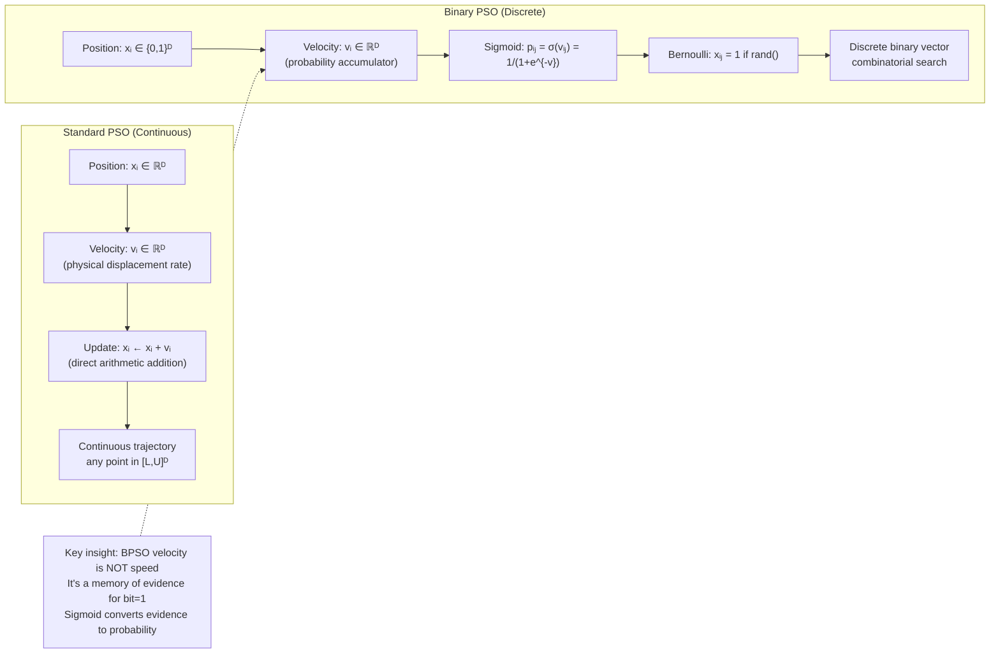
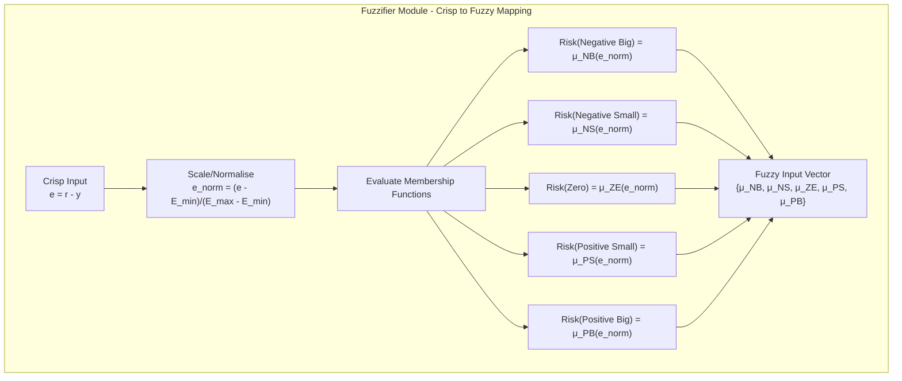
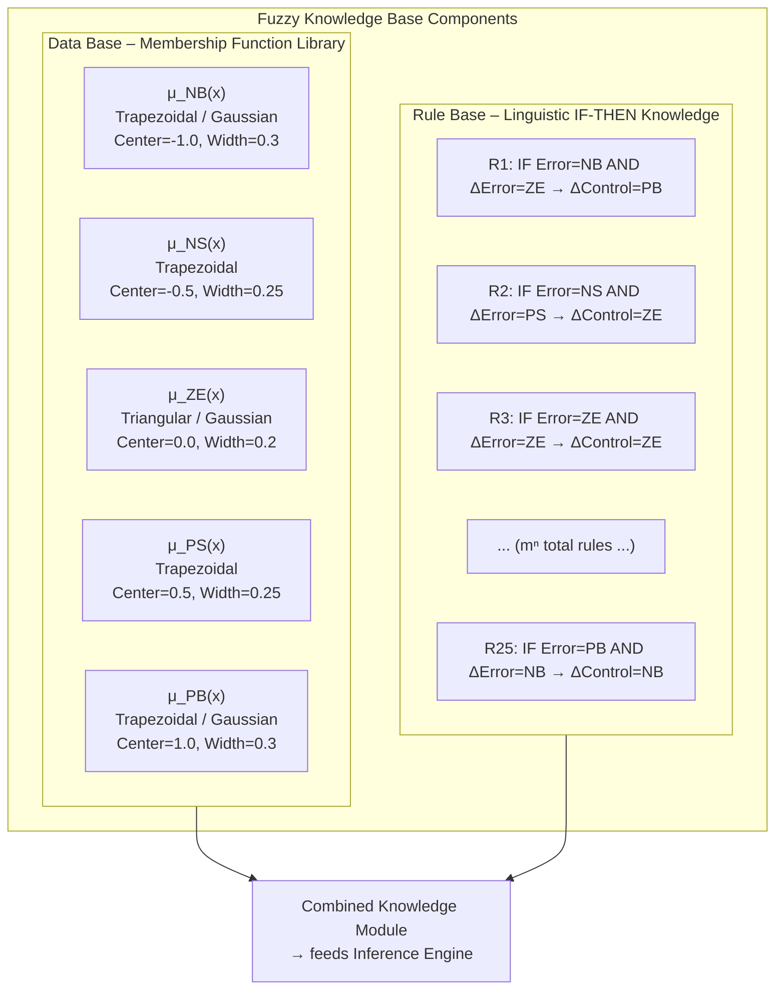

---

## Q1a — Elaborate on the Scope of Evolutionary Computing

Evolutionary Computing (EC) constitutes a broad and deeply interdisciplinary field at the intersection of computer science, mathematics, biology, and engineering, encompassing a family of population-based stochastic optimization and search algorithms inspired by the mechanisms of biological evolution. The scope of EC extends from the theoretical foundations of adaptive systems and population genetics to practical applications across virtually every domain of science, technology, and commerce where complex search, optimization, design, or learning problems arise. Elaborating on the scope of EC requires a systematic traversal of its theoretical foundations, algorithmic paradigms, application breadth, and emerging research frontiers—each of which represents a distinct but interconnected dimension of the field's expanding influence.

**Theoretical Scope: Foundations of Adaptive Complex Systems**

At its most fundamental level, EC addresses questions of **search, adaptation, and emergence in complex systems**. The Schema Theorem, formulated by John Holland, establishes that a population of N individuals implicitly evaluates O(N³) schemata (similarity templates) per generation—enabling massive parallel search without explicit parallel programming. The Building Block Hypothesis explains how short, high-fitness building blocks are recombined by crossover into progressively better solutions, analogous to the construction of complex adaptive systems from simpler components. Holland's **Royal Road** functions were specifically designed to test this hypothesis: sequences of fitness landscapes where optimal solutions require the conjunction of independently evolved building blocks, providing controlled experimental environments for understanding how GAs construct complex solutions from simple components.

Evolution Strategies developed rigorous convergence theory: the (1+1)-ES has been proven to converge to local optima with probability 1 under appropriate step-size self-adaptation; CMA-ES convergence rates have been characterized and shown to be competitive with state-of-the-art derivative-free optimization methods. Theoretical analysis of ES has produced results on the time complexity of optimization on spherical, ellipsoidal, and multimodal functions, providing practitioners with performance guarantees (within the problem classes analyzed) that are absent for GAs. Evolutionary Programming's theoretical foundations draw on probability theory and stochastic processes: the convergence of tournament selection, the effect of self-adaptive mutation on the probability distribution of offspring, and the relationship between tournament size and selection pressure have all been formally characterized.

**Algorithmic Scope: Four Canonical Paradigms and Beyond**

EC's algorithmic scope encompasses four canonical paradigms, each with distinct epistemological foundations and operational characteristics. **Genetic Algorithms** (Holland, 1975) operate on fixed-length representations (binary strings, real-valued vectors) with crossover as the primary variation operator and probabilistic selection, originally motivated by schema processing theory. **Evolution Strategies** (Rechenberg, 1965; Schwefel, 1975) operate on real-valued vectors with mutation as the sole or dominant operator and deterministic elitist selection, originally motivated by engineering optimization problems with black-box objectives. **Evolutionary Programming** (Fogel, 1966) operates on FSMs or real-valued vectors with mutation and stochastic tournament selection, originally motivated by adaptive behaviour prediction. **Genetic Programming** (Koza, 1992) operates on hierarchical tree structures evolving complete programs, originally motivated by the goal of automatic program synthesis.

Beyond these four paradigms, EC encompasses: **Differential Evolution** (Storn and Price, 1997) using difference-vector mutation applied to real-valued optimization; **Estimation of Distribution Algorithms** (EDA) replacing crossover and mutation with statistical model building and sampling; **Memetic Algorithms** combining global evolutionary search with local search heuristics; **Coevolutionary Algorithms** with multiple interacting populations; **Interactive Evolutionary Computation** incorporating human evaluation; and **Multi-objective EAs** (NSGA-II, SPEA2, MOPSO) maintaining Pareto-optimal solution sets. This algorithmic diversity reflects EC's scope as a meta-framework accommodating virtually any representation and variation mechanism consistent with the evolutionary metaphor.

**Application Scope: The Breadth Across Domains**

In **Computational Science**, EC solves parameter estimation for physical models, molecular dynamics optimization, and climate model calibration—problems where objectives are evaluated through expensive simulation rather than closed-form calculation. In **Bioinformatics**, EC reconstructs phylogenetic trees, optimizes protein structures, evolves molecular docking configurations, and infers gene regulatory networks—all characterized by high-dimensional, multimodal, black-box fitness landscapes. In **Engineering Design**, EC optimizes trusses, airfoils, pressure vessels, and composite structures under multi-physics constraints, with each evaluation requiring computational mechanics simulations. In **Operations Research**, EC solves NP-hard combinatorial problems including scheduling, routing, timetabling, and facility location, providing practical approximate solutions where exact methods are intractable. In **Finance**, EC optimizes portfolios under multi-objective criteria, evolves trading strategies, and calibrates stochastic models—domains requiring robust optimization under non-stationary, noisy objectives. In **Machine Learning**, EC performs neural architecture search, hyperparameter optimization, feature selection, and automated machine learning (AutoML), addressing the combinatorial structure of model selection problems that gradient-based methods cannot efficiently navigate.

**Emerging Frontiers: AI Integration and Open-Endedness**

Contemporary EC research extends the field's scope in several new directions. **Neuroevolution** (evolving neural network architectures and weights, including NEAT and ES-based neuroevolution) has produced competitive results on high-dimensional continuous control benchmarks including Atari games and robotic locomotion. **Quality Diversity (QD) algorithms** including MAP-Elites evolve large collections of diverse, high-performing solutions across an entire behavioural feature space—not just a single optimum—enabling the discovery of repertoires of behaviours for robotics, game AI, and design exploration. **Large Language Model (LLM) optimization** applies GAs to evolve prompts, chain-of-thought strategies, and tool-use programs for LLMs, providing automated prompt optimization that outperforms hand-designed few-shot examples. **Open-Ended Evolution** research aims to develop EC systems that generate ever-increasing complexity without an externally defined fitness function, motivated by biological evolution's role in generating biological intelligence—a direction with profound implications for Artificial General Intelligence research.

```
EC SCOPE - APPLICATION MATRIX SUMMARY

DOMAIN                    KEY PROBLEMS                    EC METHOD
─────────────────────────────────────────────────────────────────────
Structural Engineering    Truss, pressure vessel, beam   ES/CMA-ES, GA
Aerospace                 Airfoil, antenna, nozzle       GA, ES
Bioinformatics            Phylogeny, protein fold        GA, GP, DE
Finance                   Portfolio, trading strategy    NSGA-II, GA
Operations Research       TSP, scheduling, routing       GA, DE, PSO
Machine Learning          NAS, feature selection, AutoML GA, ES, GP
Robotics                  Locomotion, manipulation       EP, GP, CMA-ES
Drug Discovery            Molecular docking, QSAR        GA, DE
Signal Processing         Filter design, equalization    PSO, DE
Creative Arts             Music, art, architecture       Interactive EC
Climate                   Parameter fitting, prediction  GA, PSO
```
---

## Q1b — What is the Difference Between Single and Multi-objective Optimization?

Single-Objective Optimization (SOO) and Multi-Objective Optimization (MOO) represent two fundamentally distinct formulations of the optimization problem, differing in their objective structure, solution concept, methodological requirements, and the nature of the insights they provide to decision-makers. In SOO, the problem is formulated as the optimization of a single scalar objective function f(x) subject to constraints, yielding a single optimal solution (or equivalently, a finite set of equally optimal solutions). In MOO, the problem is formulated as the simultaneous optimization of two or more conflicting objective functions F(x) = (f₁(x), f₂(x), ..., fₖ(x)) with k ≥ 2, yielding a set of Pareto-optimal solutions constituting a Pareto front rather than a single optimal point. This structural difference has profound implications for solution methods, the role of the decision-maker, the information content of optimization results, and the applicability of each formulation to real-world problems.

**Single-Objective Optimization: Structure and Solution Concept**

In SOO, the problem is: min or max f(x) subject to gᵢ(x) ≤ 0 (i=1,...,m), hⱼ(x) = 0 (j=1,...,p), where x ∈ ℝⁿ is the decision variable vector and f: ℝⁿ → ℝ is a scalar-valued objective function. The optimality concept is unambiguous: a solution x* is optimal if f(x*) ≤ f(x) for all feasible x (minimization) or f(x*) ≥ f(x) for all feasible x (maximization), with no other feasible solution achieving a strictly better objective value. The mathematical theory of SOO is highly developed: for convex problems (convex f, convex feasible region), local optima are global optima, and polynomial-time algorithms exist (linear programming, convex quadratic programming, interior point methods). For non-convex problems, local search methods converge to local optima, while global optimization methods (branch and bound, simulated annealing for special cases) provide probabilistic or exact convergence at exponentially increasing cost. Metaheuristics (GA, PSO, DE) provide practical approximate solutions without convergence guarantees on general non-convex problems.

The critical design decision in SOO is **aggregation of multiple criteria into a single scalar**. When a decision problem naturally involves multiple criteria (e.g., design: minimize weight AND maximize strength AND minimize cost), the decision-maker must combine these into a single aggregate function: weighted sum f_agg(x) = Σᵢ wᵢ·fᵢ(x), weighted product, goal programming, or utility function. This aggregation forces value judgments about the relative importance of different criteria to be made *before* the optimization, and different weightings produce different "optimal" solutions. The consequence is that SOO returns only a single point on the true Pareto front—the point corresponding to the specific weighting chosen—and all other potentially preferable trade-offs are invisible to the decision-maker.

**Multi-Objective Optimization: Structure and Solution Concept**

In MOO, the problem is: simultaneously minimize (or maximize) F(x) = (f₁(x), f₂(x), ..., fₖ(x)) subject to gᵢ(x) ≤ 0, hⱼ(x) = 0, where F: ℝⁿ → ℝᵏ. The optimality concept requires Pareto dominance: solution x₁ dominates x₂ if fᵢ(x₁) ≤ fᵢ(x₂) for all i (minimization) AND fⱼ(x₁) < fⱼ(x₂) for at least one j. A Pareto-optimal solution is one not dominated by any other feasible solution. The set of all Pareto-optimal solutions in decision space maps to the Pareto front in objective space—a (k−1)-dimensional manifold in ℝᵏ delineating the achievable trade-off frontier: every solution on the front is optimal in the sense that no feasible solution is strictly better in all objectives simultaneously.

The MOO solution process involves: (1) finding or approximating the Pareto front; (2) presenting the front to the decision-maker; (3) helping the decision-maker select a preferred solution based on their specific context and priorities. The Pareto front is an inherent property of the problem, independent of any decision-maker's preferences, providing complete information about feasible trade-offs.

| Dimension | Single-Objective | Multi-Objective |
|---|---|---|
| Objective | Scalar f(x) ∈ ℝ | Vector F(x) ∈ ℝᵏ, k≥2 |
| Optimality | Single optimum | Pareto set (many or infinite solutions) |
| Decision Maker's Task | Accept/reject given solution | Select preferred solution from Pareto front |
| Aggregation | Required before optimization | Not required (criteria preserved) |
| Information | One trade-off point | All trade-offs visible |
| Methods | LP, NLP, SQP, GA, PSO (adapted) | Scalarization, EMO (NSGA-II, SPEA2) |
| Preference Elicitation | Before optimization | After/in during optimization |
| Algorithmic Complexity | O(n) per iteration | O(N² log N) for Pareto sorting |

**Practical Implications**

SOO is appropriate when: there is a genuinely agreed single aggregate criterion; one objective overwhelmingly dominates decision quality; or the problem requires a single action from a deterministic model. MOO is appropriate when: objectives are genuinely conflicting (improving one degrades another); multiple stakeholders have different preferences; the decision context involves trade-off exploration; or a full understanding of feasible trade-offs is needed for informed decision-making. In engineering design, MOO reveals the complete Pareto front of feasible designs, enabling design teams to select candidates for prototyping that match evolving project priorities. In finance, MOO reveals the complete efficient frontier of portfolios, enabling investors to select portfolios matching their risk tolerance without requiring a single composite risk-return objective.

```
MOO vs SOO - VISUAL COMPARISON

  Objective Space (2D: minimize both)
  
  f₂ (minimize)
    ▲
    │         ★ Pareto Front
    │        ╱
    │       ╱
  P* │      ╱
  (MOO│     ╱
  gives    ╱
  ALL)│   ╱  ● Single-optimum (SOO)
  trade-╱
  offs │ ╱
       │╱
       └──────────────────► f₁ (minimize)
  
  SOO: Returns ONE point (depends on weights)
  MOO: Returns ENTIRE frontier (all trade-offs)
```
---

## Q1c — Comment on the Statement "Genetic Programming is Good For"

The statement "Genetic Programming is good for" encapsulates an open-ended proposition whose validity can be established through rigorous analysis of the unique capabilities that GP possesses relative to all other machine learning, optimization, and program synthesis methodologies. A complete comment on this statement requires examination of the specific problem classes and application domains where GP provides distinctive advantages, the theoretical basis for those advantages, empirical validation from the research literature, and the boundary conditions and limitations that define where GP is not the appropriate tool. The most defensible completion of the statement is: "Genetic Programming is good for the automatic synthesis of hierarchical, compositional, variable-size program structures—including mathematical expressions, control strategies, circuit designs, and agent behaviors—directly from data or from specifications of desired input-output behavior, without requiring the human programmer to design the program's structure or specify the relative importance of different program components."

**What GP is Good For: Specific Domains**

**Symbolic Regression and Scientific Model Discovery**: GP is uniquely suited to the problem of discovering mathematical expressions that fit empirical data without the human researcher specifying the functional form in advance. In scientific domains—physics, chemistry, biology, engineering—researchers often have data but do not know the governing equations. GP searches the space of possible mathematical expressions constructed from a function set (arithmetic operators, transcendental functions, conditionals) and terminal set (variables, constants), discovering expressions that fit the data with high accuracy while maintaining simplicity and interpretability. Koza's early demonstrations included the rediscovery of Kepler's third law of planetary motion from astronomical data; the Boolean even-parity function; and the quartic polynomial relationship. Contemporary applications include: discovery of material property relationships from experimental materials science databases; discovery of population dynamics equations from ecological time series; and discovery of pharmacokinetic model structures from clinical drug concentration data.

**Automatic Circuit and Controller Design**: GP represents circuit designs as graph-structured chromosomes where nodes are components (gates, amplifiers, resistors) and edges are connections. Starting from random connection graphs, GP evolves circuits that satisfy functional specifications—filter frequency responses, amplifier gain-bandwidth products, controller transfer functions—without requiring the circuit designer to specify the topology. Koza's demonstrations included the evolution of a 60 dB amplifier circuit, a Chebyshev filter, and a square-root circuit, all achieving or surpassing the performance of human-designed circuits for the same specifications. This capability is particularly valuable for analog and mixed-signal circuit design, where the design space is combinatorially vast and no systematic design methodology exists for many circuit types.

**Program Synthesis and Automatic Programming**: GP can synthesize programs in conventional programming languages (with appropriate grammar-based GP extensions) given input-output specifications. Applications include: evolving sorting algorithms; evolving image processing filters; evolving database query optimization strategies; and evolving strategies for game playing (Othello, backgammon, poker). The evolved programs are executable and can be deployed directly, providing a form of automated software engineering that produces human-readable (if not optimally elegant) code from behavioral specifications.

**Evolutionary Robotics and Agent Control**: GP evolves programs mapping sensor inputs to motor outputs for robots, producing motor control strategies—obstacle avoidance, phototaxis, wall following, goal seeking—without requiring the robotics engineer to specify the control algorithm. The evolved programs are typically compact and interpretable (in GP's standard tree representation), providing insight into the emergent control strategy. This application exploits GP's ability to discover variable-size programs whose complexity matches the complexity of the control task, rather than requiring the human to specify network size or controller structure in advance.

**What GP is Not Good For**

GP is not well-suited to problems where the solution is a fixed-length numerical vector (for these, GA or ES are more appropriate and efficient), problems where training data is extremely large (the per-individual execution cost of GP makes it expensive relative to deep learning on big data), problems requiring formal correctness guarantees (GP produces statistically likely solutions, not provably correct programs), and problems where the optimal program size is known in advance (GP's variable-length representation introduces bloat management overhead unnecessary when size is fixed).

**Empirical Validation and Performance**

The empirical validation of GP's capabilities spans decades of research documented in international conferences (GECCO, EuroGP) and hundreds of peer-reviewed publications. In the annual Genetic Programming and Evolvable Machines journal, GP has been demonstrated to produce results competitive with human expert designs on benchmark problems in circuit design, control, and symbolic regression. In the Santa Fe Ant Trail Following problem—a canonical benchmark for program synthesis—GP has evolved programs that produce ant foraging behaviors approaching the performance of hand-designed ant trail strategies. In financial time series forecasting, GP-evolved trading strategies have demonstrated risk-adjusted returns comparable to or exceeding those of conventional technical analysis strategies. In chemical process control, GP-evolved control programs have achieved superior disturbance rejection compared to conventionally tuned PID controllers.

```
GP IS GOOD FOR — SUMMARY

  Domain                          GP Strength
  ──────────────────────────────────────────────────────
  Symbolic regression            Discovers unknown equations from data
  Circuit design                 Evolves topology + component values
  Agent/robot control            Synthesizes sensor→action programs
  Game strategy                  Discovers rule-based strategies
  Automatic programming          Synthesizes code from I/O spec
  Scientific discovery           Finds interpretable models from data
  
  NOT good for: Fixed-vector optimization, very large data,
  formal verification, known-size solutions
```
---

## Q2a — What is the Difference Between PSO and Binary PSO?

Particle Swarm Optimization (PSO) and Binary PSO (BPSO) are two variants of the same fundamental swarm intelligence algorithm, differing in their representation of particle positions, the mathematical interpretation of velocity, the update mechanism for positions, and consequently their applicable problem domains, convergence characteristics, and search dynamics. Standard PSO, as originally formulated by Kennedy and Eberhart in 1995, operates in continuous real-valued search spaces where each particle's position is a vector in ℝᴰ and its velocity is a real-valued vector governing the rate and direction of position change. Binary PSO, introduced by Kennedy and Eberhart in 1997, extends PSO to discrete binary search spaces where each particle's position is a binary vector in {0,1}ᴰ, enabling PSO to solve combinatorial optimization problems such as feature selection, binary neural network weight binarization, task assignment, and Boolean function optimization. The transition from continuous to binary PSO required a fundamental re-interpretation of the velocity concept and a novel position update mechanism, as velocity in the physical sense (rate of continuous position change) cannot be directly applied to discrete binary states.

**Position Representation**

In **Standard PSO**, each particle i is defined by two D-dimensional real-valued vectors: position xᵢ = (xᵢ₁, xᵢ₂, ..., xᵢᴰ) ∈ [Lⱼ, Uⱼ]ᴰ and velocity vᵢ = (vᵢ₁, vᵢ₂, ..., vᵢᴰ) ∈ ℝᴰ. The position directly represents a candidate solution in the continuous search space, where each component xᵢⱼ is a real number within the admissible bounds [Lⱼ, Uⱼ] for decision variable j. The velocity has a clear physical interpretation: it is the rate at which the position is changing at each iteration, with units of "units of position per iteration." The velocity components can be positive (moving toward increasing xⱼ), negative (moving toward decreasing xⱼ), or zero (no movement along dimension j), and their magnitudes are typically bounded via a maximum velocity parameter V_max to prevent explosive divergence.

In **Binary PSO**, each particle i is defined by a binary position vector xᵢ = (xᵢ₁, xᵢ₂, ..., xᵢᴰ) ∈ {0,1}ᴰ, where each component xᵢⱼ is either 0 or 1, representing a binary decision (e.g., whether feature j is selected for a classification model, whether neuron j is active in a binary neural network, whether job j is assigned to machine k in a scheduling problem). The velocity vᵢ in BPSO retains the same mathematical form as in standard PSO (a real-valued accumulator), but it is re-interpreted: rather than representing a physical displacement rate, the velocity component vᵢⱼ represents the **propensity or probability** of the binary component xᵢⱼ being 1 (active, selected, ON) in the next iteration. A high positive velocity indicates strong belief that bit j should be 1; a high negative velocity indicates strong belief that bit j should be 0; a velocity near zero indicates uncertainty or indecision about the appropriate value of bit j.

**Position Update Mechanisms**

In **Standard PSO**, the position update is a direct vector addition: xᵢ(t+1) = xᵢ(t) + vᵢ(t+1). This arithmetic addition is meaningful because both operands are real-valued: the velocity vector is added componentwise to the current position, producing a new position that is offset from the previous position by an amount and direction given by the velocity. Position bounds are enforced after addition: xᵢⱼ(t+1) = min(Uⱼ, max(Lⱼ, xᵢⱼ(t+1))) (clamping) or alternative boundary handling strategies. The result is a continuous trajectory through the search space where the particle can occupy any point within the bounded hypercube [L, U]ᴰ.

In **Binary PSO**, the position update cannot use direct arithmetic addition because adding a real number to a binary value {0,1} produces a non-binary result. Kennedy and Eberhart introduced the **velocity-as-probability** paradigm: each velocity component vᵢⱼ(t) is passed through a **sigmoid transfer function** S(vᵢⱼ(t)) = 1/(1 + exp(−vᵢⱼ(t))), which maps the unbounded real velocity to the open interval (0, 1), interpretable as a probability. The binary position update is then executed via a **Bernoulli trial**: xᵢⱼ(t+1) = { 1, with probability S(vᵢⱼ(t)); 0, with probability 1 − S(vᵢⱼ(t)) }. This stochastic update means that even when a particle's velocity strongly favors setting a particular bit to 1 (vᵢⱼ → +∞, S(vᵢⱼ) → 1), there remains a non-zero probability (albeit exponentially small) of setting it to 0—a property that introduces irreducible stochasticity into BPSO search dynamics.

**Velocity Update Equation: Same Form, Different Semantics**

The velocity update equation retains the same mathematical structure in both PSO and BPSO:

vᵢⱼ(t+1) = ω·vᵢⱼ(t) + c₁·r₁ⱼ·(pbestᵢⱼ − xᵢⱼ(t)) + c₂·r₂ⱼ·(gbestⱼ(t) − xᵢⱼ(t))

In **Standard PSO**, the subtraction (pbestᵢⱼ − xᵢⱼ(t)) computes the real-valued displacement from current position to personal best, and (gbestⱼ(t) − xᵢⱼ(t)) computes the displacement to global best. These are real-valued vectors whose arithmetic meaning is unambiguous.

In **Binary PSO**, the subtraction operates on binary values: if xᵢⱼ = 0 and pbestᵢⱼ = 1, then (pbestᵢⱼ − xᵢⱼ) = 1 − 0 = 1, producing a positive velocity increment pulling xᵢⱼ toward 1. If xᵢⱼ = 1 and pbestᵢⱼ = 0, then (pbestᵢⱼ − xᵢⱼ) = 0 − 1 = −1, producing a negative velocity increment pulling xᵢⱼ toward 0. If both are equal (both 0 or both 1), the difference is 0 and no pull is exerted in that dimension. The velocity therefore acts as an **accumulator**: each time the particle observes that a bit should be 1 (but is currently 0), the velocity for that dimension increases positively; each time it observes the bit should be 0 (but is currently 1), the velocity decreases negatively. Over successive iterations, the velocity accumulates evidence for or against each binary value, and the sigmoid function translates this accumulated evidence into a probability of setting the bit to 1.



**Convergence and Search Dynamics**

In **Standard PSO**, the continuous position update permits the swarm to converge to a stable point in continuous space: as all particles approach the same best position, velocities decrease, positions stabilize, and the swarm converges to a point attractor. Under the constriction factor variant (χ < 1), almost-sure convergence to a stable point is provable. The search trajectory is continuous and the solution found is a precise point in the continuous hypercube.

In **Binary PSO**, the stochastic Bernoulli sampling means that particles never truly converge to a fixed binary vector: even with very high velocity strongly favoring xᵢⱼ = 1, there remains a non-zero probability of a bit flip to 0, bounded below by exp(−2V_max) where V_max is the maximum velocity clamp. This irreducible stochasticity means BPSO's convergence is defined differently: the algorithm is deemed converged when the swarm's best binary solution has not improved for a specified number of iterations, or when all particles' velocities have stabilized and the best-found binary vector is no longer improving. The search is inherently oscillatory—bits flip probabilistically—with the probability of beneficial flips decreasing as the swarm finds better solutions.

**Applicability and Problem Domains**

Standard PSO is appropriate for continuous optimization problems: engineering design optimization (real-valued parameters), neural network weight optimization, controller parameter tuning, continuous function optimization, and multi-objective continuous optimization. Binary PSO is appropriate for discrete combinatorial problems: feature selection (selecting a subset of features from n candidates), attribute reduction in rough set theory, task assignment in scheduling, binary neural network quantization, Boolean function minimization, and subset selection problems in bioinformatics (selecting a subset of genes from microarray data). The choice between PSO and BPSO is therefore governed by the fundamental nature of the decision variables: if the decisions are inherently continuous (magnitudes, concentrations, angles), standard PSO; if inherently binary (selection, inclusion, activation), BPSO.

| Dimension | Standard PSO | Binary PSO |
|---|---|---|
| Position Space | Continuous ℝᴰ | Discrete {0,1}ᴰ |
| Velocity Meaning | Physical displacement rate | Probability accumulator |
| Position Update | xᵢ ← xᵢ + vᵢ (arithmetic) | xᵢⱼ ~ Bernoulli(S(vᵢⱼ)) |
| Convergence | To point in ℝᴰ | Oscillatory; best binary vector |
| Search Trajectory | Continuous path | Discrete state transitions |
| Applicable Problems | Continuous optimization | Combinatorial, feature selection |
| Sigmoid Required | No | Yes (mandatory) |
| Irreducible Noise | No | Yes (bit flips always possible) |
---

## Q2b — Describe Hill Climbing Algorithm and How It Is Different from Simulated Annealing

Hill Climbing and Simulated Annealing are both local search and metaheuristic optimization algorithms that operate by iteratively exploring a neighbourhood structure around candidate solutions, yet they differ fundamentally in their search philosophy, exploration-exploitation balance, convergence properties, and applicability to different problem classes. Understanding both algorithms in detail and their comparative characteristics is essential for selecting the appropriate optimization tool for a given problem.

**Hill Climbing Algorithm: Detailed Description**

Hill Climbing is a greedy local search algorithm that, at each iteration, moves to the neighbouring state with the best objective function value (steepest-ascent variant) or to the first improving neighbour found (first-choice variant). The basic algorithm:

1. Initialize: select an initial state s₀ (random or heuristic).
2. Neighbourhood Generation: construct the set N(s) of all states reachable from current state s via a single elementary move.
3. Neighbour Evaluation: evaluate each neighbour s' ∈ N(s) against the objective function h(s') (maximization) or cost c(s') (minimization).
4. Move Decision: if there exists a neighbour s* with h(s*) > h(s), set s ← s* and return to step 2; otherwise, terminate and return s as a local optimum.

**Variants**: Steepest-Ascent (evaluates all neighbours, selects best); First-Choice (evaluates sequentially, selects first improving); Stochastic (selects improving neighbour with probability proportional to improvement magnitude); Random-Restart (multiple independent runs from different initial states); Sideways-Move (permits limited moves to neighbours with equal fitness, enabling escape from plateaus).

**Limitations of Hill Climbing**: (1) Susceptible to local optima—terminates at first local optimum with no escape mechanism; (2) Ridge problem—cannot follow narrow diagonal ridges not aligned with discrete neighbourhood moves; (3) Plateau problem—directionless on flat regions, terminates immediately without sideways moves; (4) Step size dilemma—large neighbourhoods are computationally expensive, small neighbourhoods may miss optimal transitions.

**Simulated Annealing: Detailed Description**

Simulated Annealing (SA), proposed by Kirkpatrick, Gelatt, and Vecchi (1983), is a probabilistic metaheuristic inspired by thermodynamic annealing in metallurgy, where a material is heated to a high temperature and then gradually cooled to attain a low-energy crystalline state. SA operates by iteratively proposing random neighbours and accepting or rejecting them according to the Metropolis criterion: if the neighbour is better (lower energy/cost), accept unconditionally; if worse, accept with probability P = exp(−ΔE/T), where ΔE is the energy increase and T is the current temperature.

1. Initialize: select initial state s₀, initial temperature T₀ (high enough that acceptance ratio ≥ 0.8), cooling rate α.
2. At each temperature level, execute M perturbation-acceptance iterations (thermal equilibrium).
3. Decrement temperature: T ← α·T (geometric cooling is standard).
4. Terminate when T < T_min or maximum iterations reached.

**Key Differences Between Hill Climbing and Simulated Annealing:**

| Dimension | Hill Climbing | Simulated Annealing |
|---|---|---|
| Acceptance of worsening moves | Never | Probabilistic: P = exp(−ΔE/T) |
| Exploration mechanism | None (greedy trajectory) | High at T high; reduces with cooling |
| Global optimum guarantee | None | Provable (logarithmic cooling) |
| Neighbourhood evaluation | All (steepest) or sequential (first-choice) | Single random neighbour per iteration |
| Per-iteration cost | O(\|N(s)\|) steepest; O(1) first-choice | O(1) |
| Parameters | Neighbourhood, tie-breaking | T₀, α, M, T_min, schedule |
| Applicability | Unimodal landscapes | Multimodal, rugged landscapes |
| Convergence speed | Fast (to local optimum) | Slow (potentially global) |
| Ability to escape local optima | Zero | High at high temperature |

```
HILL CLIMBING vs SIMULATED ANNEALING — SEARCH TRAJECTORY

  Fitness/Energy
    ▲
  GPE│                    ★ GLOBAL PEAK
     │                 ╱╲
     │                ╱  ╲
     │              ╱      ╲
  HC│            ╱  LOA    ╲
     │           ╱    │\      ╲
     │          ╱     │ \      \
     │    HC terminates here    SA trajectory:
  LOA│    (stuck,                 (escapes LOA at T_high,
     │     no worse                crosses barrier, finds GPE)
     │     neighbours)
     └────────────────────────────────────────►

  HILL CLIMBING: greedy myopic ascent → local optimum
  SIMULATED ANNEALING: probabilistic → can escape → global
```
---

## Q2c — Explain Artificial Hummingbird Algorithm

The Artificial Hummingbird Algorithm (AHA) is a recently developed nature-inspired metaheuristic optimization algorithm introduced in the early 2020s, drawing its foundational inspiration from the remarkable behavioral repertoire of hummingbirds (family Trochilidae), which are among the most metabolically specialized and behaviorally sophisticated avian species. The AHA was designed explicitly to address complex, high-dimensional, non-convex, and multimodal optimization problems that resist solution via traditional gradient-based methods and challenge existing metaheuristics, particularly on problems where the global optimum is separated from local optima by significant fitness barriers and where high-dimensional search spaces (D > 50) amplify the local optima proliferation problem.

**Biological Foundation: Three Cardinal Behaviors**

Hummingbirds exhibit three behaviors that map directly onto computational operators: **Territorial Foraging**: hummingbirds visit nectar sources within defended territories, preferentially exploiting the highest-reward sources discovered. This maps to local exploitation in optimization—fine-grained search around promising candidate solutions. **Territorial Defense**: when an intruding hummingbird with superior nectar quality enters a defended territory, the resident hummingbird executes a repulsion maneuver, moving away from the intruder. This maps to directional exploration in optimization—actively dispersing from crowded regions to prevent premature convergence. **Migration**: when territory quality declines (nectar depleted or visit count exhausted), hummingbirds undertake long-distance migrations to discover new resource-rich regions. This maps to global exploration in optimization—large-scale jumps to unvisited regions of the search space to escape local optima traps.

**Algorithmic Framework**

The AHA operates on a population of N artificial hummingbirds in a D-dimensional bounded search space Ω = [L₁, U₁] × ... × [Lᴰ, Uᴰ]. Each hummingbird i has position xᵢ ∈ Ω and maintains a nectar visitation table tracking the visitation frequency and average quality for territories in its neighborhood. At each iteration, three movement strategies are selected probabilistically based on the visitation table:

**Territorial Foraging**: xᵢ(t+1) = xᵢ(t) + r₁ × (x_best(t) − xᵢ(t)) × FDR, where r₁ ~ U(0,1), x_best is the current global best, and FDR is the Foraging Direction Ratio (typically 0.1–0.5). This pulls each hummingbird toward the best-known source, implementing local exploitation.

**Territorial Defence**: xᵢ(t+1) = xᵢ(t) + r₂ × (xⱼ(t) − xᵢ(t)) × TDR, where r₂ ~ U(0,1), xⱼ is a superior intruder, and TDR is the Territorial Defence Ratio (typically 0.1–0.3). This disperses individuals from crowded superior regions, preventing swarming.

**Migration**: xᵢ(t+1) = L(t) × xᵢ(t) + r₃ × (x_w(t) − xᵢ(t)), where L(t) is a linearly decreasing migration scaling factor from 1.0 to 0.01 over iterations, and x_w is the worst solution. This produces large exploratory jumps early and small refining steps late.

```mermaid
flowchart TD
    A["Initialize N Hummingbirds<br/>Random positions in Ω"] --> B["Evaluate nectar quality f(xᵢ)"]
    B --> C["Update visitation table"]
    C --> D{"Select movement strategy"}
    D -->|Foraging| E["xᵢ ← xᵢ + r₁×(gbest−xᵢ)×FDR"]
    D -->|Defence| F["xᵢ ← xᵢ + r₂×(xⱼ−xᵢ)×TDR"]
    D -->|Migration| G["xᵢ ← L(t)·xᵢ + r₃×(x_w−xᵢ)"]
    E --> H["Update gbest"]
    F --> H
    G --> H
    H --> I{"Convergence?"]
    I -->|No| B
    I -->|Yes| J["Return gbest"]
```

**Performance and Applications**

AHA has demonstrated competitive performance on IEEE CEC benchmark functions, with particular efficacy on high-dimensional multimodal instances. Applications include: electrical power systems (economic load dispatch, optimal reactive power dispatch); structural engineering (truss design); medical imaging (multilevel thresholding); parameter estimation; and machine learning (feature selection, neural network hyperparameter optimization). The three complementary movement strategies provide a robust exploration-exploitation balance without requiring external parameter schedules—a distinctive advantage over PSO (inertia weight schedule) and SA (cooling schedule).
**Computational Complexity and Practical Implementation Considerations**: From an algorithmic complexity perspective, the AHA exhibits O(N × D × G) time complexity per generation, where N is the population size (typical values 20–100), D is the problem dimensionality (supporting D up to 500 in benchmark evaluations), and G is the number of generations. Forerunner simulations on IEEE CEC 2017 and 2022 benchmarks with N=50, D=30, G=500, total evaluations reach 750,000 function calls—competitive with PSO, DE, and standard GA on equivalent budgets, with markedly better results on shifted, rotated, and multimodal benchmark functions. The AHA also supports constraint handling through penalty integration inside the fitness function and supports multi-objective optimization (MOAHA) using a non-dominated sorting and crowding distance framework for maintenance of a Pareto-optimal solution archive, enabling simultaneous optimization of conflicting objectives in engineering design, finance, and control without re-architecting the algorithm. The entirely derivative-free, parameter-light design of the AHA—requiring only N, FDR, TDR, and the cooling schedule—makes it the most operationally accessible of the latest nature-inspired algorithms, deployable by engineers without specialized optimization training while delivering competitive performance on challenging industrial optimization problems across the mechanical, electrical, biomedical, and computational science domains.

## Q3a — "Fuzzy System Has Limitation" — Comment on the Statement

The proposition that "fuzzy system has limitation" constitutes a historically consequential assertion that, when examined with due analytical rigour, reveals itself not as a condemnation of fuzzy logic per se, but rather as an accurate characterisation of the boundary conditions within which fuzzy logic-based systems operate optimally, and beyond which their predictive and inferential accuracy degrades, sometimes appreciably. A comprehensive commentary on this statement must proceed through a systematic taxonomy of these limitations—encompassing theoretical, computational, methodological, epistemological, and practical dimensions—while establishing, with equal intellectual honesty, the domains in which fuzzy systems excel, so that the limitations are understood in proper context rather than misconstrued as disqualifying defects. Only through this balanced dialectical analysis can the statement be meaningfully engaged.

---

### A. THEORETICAL AND EPISTEMOLOGICAL LIMITATIONS

#### A.1 The Absence of a Universal Theory of Membership Function Construction
Perhaps the most frequently cited and philosophically deep limitation of fuzzy systems is the absence of a rigorous, universal, automated methodology for constructing membership functions. Membership functions are the fundamental building blocks of any fuzzy system: they define the linguistic terms used in rule antecedents and consequents, map crisp inputs to degrees of membership, and ultimately determine the shape of the fuzzy inference surface. Yet, despite five decades of research, there is no theorem or algorithmic procedure that, given a task specification and a dataset, unambiguously determines the optimal membership functions for that task. The prevailing approach in practice is **empirical trial-and-error coupled with expert elicitation**—a process that is inherently subjective, time-consuming, and not reproducible across different expert designers. Two engineers given the same control problem and the same input-output data will very likely construct different membership functions, and these differences may produce measurably different system outputs.

The Rank Ordering Method, the Fuzzy C-Means Clustering Method, the Genetic Algorithm-based Method, the Neural-Network-based Method, the Particle Swarm Optimization Method, and the Intuition Method have all been proposed as membership function construction techniques. Each has limitations: Rank Ordering requires ordered data that may not exist; Fuzzy C-Means requires the number of clusters (hence membership functions) to be specified a priori and produces membership functions only for the input space, not the output space; Genetic Algorithm and PSO methods require a fitness function to evaluate membership function quality—which typically reduces back to the very output accuracy rendering the membership functions somewhat circular in their construction; Neural-network approaches learn membership functions through backpropagation but at the cost of introducing a "black box" element into a methodology whose principal advertised benefit is human-interpretability of rules. Consequently, the membership function construction problem remains an unsolved subproblem of fuzzy system design, and the statement "fuzzy system has limitation" is directly vindicated by this unresolved foundational issue.

#### A.2 The Curse of Dimensionality and Rule Explosion
Fuzzy systems operate by encoding expert knowledge in the form of IF-THEN rules: IF input is A₁ AND input is B₁ THEN output is C₁. For a fuzzy system with n input variables, each of which has m linguistic terms, a fully specified rule base in conjunctive normal form requires mⁿ rules. For a modest system with 3 inputs and 3 linguistic terms (Low, Medium, High) for each input, this yields 3³ = 27 rules—a manageable number expressed by a human expert. However, for a practical engineering system with 5 inputs and 4 linguistic terms, the fully connected rule base requires 4⁵ = 1,024 rules; for 7 inputs and 5 terms, the count rises to 5⁷ = 78,125 rules. This combinatorial explosion of rules—the "curse of dimensionality" in fuzzy systems—renders manual rule specification infeasible for all but the simplest problems.

Attempts to mitigate this problem through rule simplification, rule pruning, rule weighting, sparse rule bases, and hierarchical fuzzy systems have been partially successful but each introduces its own trade-offs. Rule pruning reduces the number of rules but degrades inference accuracy in regions of the input space not covered by retained rules. Sparse rule bases reduce rule count but require sophisticated interpolation mechanisms to fill gaps. Hierarchical systems decompose the problem but introduce architectural decisions about decomposition hierarchy that are themselves non-trivial. The practical implication is that fuzzy systems are most tractable for low-dimensional decision problems (D ≤ 5 typically), and their application to high-dimensional problems requires either significant simplification or hybridisation with other techniques—precisely the territory occupied by neuro-fuzzy and genetic-fuzzy hybrid systems that themselves represent an acknowledgment of fuzzy systems' dimensional limitations.

#### A.3 Interpretability-Accuracy Tradeoff: The Fundamental Tension
A central philosophical appeal of fuzzy systems is their supposed interpretability: because rules are expressed in linguistic terms, domain experts can read, audit, and validate the knowledge encoded in the rule base. This interpretability is the basis for fuzzy systems' adoption in safety-critical environments (medical diagnosis, aircraft control, nuclear reactor control) where regulatory bodies may require human-verifiable decision logic. However, as systems grow more complex, the interpretability advantage weakens. A 500-rule fuzzy system, even with linguistically meaningful linguistic terms, becomes as opaque to a human auditor as a neural network with 500 hidden nodes. Furthermore, attempts to optimise membership functions and rule weights through learning algorithms (backpropagation, genetic algorithms) often produce membership functions with highly irregular shapes and rule weights that effectively disable many rules, producing a system that performs well but whose behaviour cannot be meaningfully explained by reviewing its components. The interpretability-accuracy tradeoff represents a genuine epistemological limitation: the very mechanisms that would allow fuzzy systems to handle more complex problems (rule expansion, fine-grained membership functions) simultaneously erode the interpretability that distinguishes fuzzy systems from opaque black-box models like deep neural networks.

#### A.4 The Problem of Knowledge Acquisition and Validation
Even when membership functions can be empirically derived, the rule base must still be acquired and validated. Traditional fuzzy systems rely on knowledge elicitation from human experts—a process known to face well-documented difficulties including expert inconsistency, cognitive bias, incomplete coverage of the input space, and difficulties in transforming human tacit knowledge into explicit IF-THEN rules. Domain experts may hold conflicting intuitions, may be unable to articulate the heuristic rules they implicitly apply, and may produce rules that are valid in the central regions of the input space but degenerate at the boundaries. Validation of a knowledge-based fuzzy system requires testing against a validation dataset that covers all relevant operating conditions; in many safety-critical domains, such validation datasets are difficult or impossible to obtain because rare failure modes are precisely those for which validated decision logic is most needed. Neuro-fuzzy systems partially address this by learning rules from data, but in doing so sacrifice the expert verification step. The knowledge acquisition bottleneck is therefore a significant practical limitation, slowing the deployment of fuzzy systems in domains where human expertise is fragmented, tacit, or inconsistently available.

---

### B. COMPUTATIONAL AND OPERATIONAL LIMITATIONS

#### B.1 Computational Cost of Inference
The fuzzy inference process, which consists of: (1) fuzzification (mapping crisp inputs to membership degrees); (2) rule firing strength computation (aggregating multi-antecedent rules via T-norms such as MIN or product); (3) implication (computing output membership function truncation or scaling); (4) aggregation (combining all rule outputs into a single aggregated fuzzy output set); and (5) defuzzification (computing a crisp output from the aggregated fuzzy set)—is computationally more demanding than its crisp-logic counterpart. For a system with n inputs, m rules, and a Mamdani inference architecture with centroid defuzzification, each inference cycle requires O(n × m) operations for fuzzification and firing strength computation, O(m × d) for clip/sum aggregation (where d is the number of discretisation points in the output universe of discourse), and O(d) for centroid defuzzification.

For real-time embedded applications with strict latency constraints (automotive engine control requiring response within milliseconds, aerospace flight control requiring microsecond-scale response), the overhead of fuzzy inference relative to an equivalent crisp logic system or a pre-computed lookup table can be significant. This is particularly true for high-accuracy systems requiring high-resolution output universe discretisation (d ≥ 1000 points) and large rule bases (m > 100 rules). While Sugeno-type fuzzy systems with linear consequent functions can reduce defuzzification cost to O(m) by computing a weighted average of consequent function values, they introduce their own limitation: the consequent functions must be learned or designed, reducing interpretability. The computational cost limitation of fuzzy systems is therefore not absolute but relative: compared to crisp logic, fuzzy inference is inherently more expensive; this overhead must be weighed against the benefit of smooth interpolated output, and engineers must select an architecture that balances the interpretability, accuracy, and computation requirements of their specific application context.

#### B.2 Difficulty in Deriving Stability and Convergence Guarantees
Crisp control theory provides an extremely rich toolkit for stability analysis: the Lyapunov method, the Routh-Hurwitz criterion, the Nyquist criterion, root locus, Bode plots, and numerous other techniques allow control engineers to prove, with mathematical certainty, whether a given control system will converge to a desired operating point, remain bounded under disturbance, or oscillate without stabilising. Fuzzy control systems—particularly Mamdani-type systems with nonlinear MIN/MAX inference operators—do not admit the same analytical treatment. The piecewise-linear or piecewise-nonlinear mapping from input to output that a fuzzy system implements is not amenable to the standard linear control theory tools designed for linear time-invariant systems, and while Lyapunov-based stability criteria for fuzzy systems have been developed (e.g., the indirect adaptive fuzzy control stability framework of Wang, 1994; the direct adaptive fuzzy control stability framework of Passino and Yurkovich, 1998), these approaches impose specific structural constraints on the fuzzy system (triangular membership functions, singleton consequents, specific control architecture) that limit their generality. The difficulty of deriving formal stability proofs for arbitrary fuzzy control designs represents a significant limitation for safety-critical control applications where regulatory certification requires documented stability analysis. This limitation is partially addressed by the stability theory developed specifically for Takagi-Sugeno fuzzy systems, but not all fuzzy system designs fall within the TS framework, and the stability theorems applicable to TS systems impose specific constraints on the design process.

#### B.3 The Problem of Optimal Tuning in Multi-Objective Settings
Fuzzy systems have numerous tunable parameters: the shape parameters of each membership function (centre, width, slope, curvature), the rule weights that scale individual rule contribution, the T-norm and T-conorm operators used for antecedent aggregation and output aggregation, and the implication and aggregation operators used during inference. For a system with n input variables, m output variables, and k linguistic terms per variable, the total number of tunable parameters is substantial. Optimising these parameters against a performance criterion while simultaneously maintaining interpretability—the dual objective explicitly embodied in interpretability-accuracy tradeoff frameworks—requires multi-objective optimisation. Multi-objective optimisation algorithms (NSGA-II, MOPSO) can be applied to this tuning problem, but each function evaluation requires running the fuzzy system inference process, and if the fuzzy system is embedded within a larger simulation (e.g., a flight control simulation), individual evaluations may be computationally expensive, limiting the number of parameter configurations that can be tested within reasonable computational budgets. The parameter tuning problem is thus computationally constrained, and practitioners often accept suboptimal parameter settings rather than investing the computational effort to find truly optimal configurations.


## Q3b — Draw and Explain System Architecture and Operation of FLC System

A Fuzzy Logic Control (FLC) System represents one of the most successful and practically deployed applications of fuzzy set theory, embodying a systematic methodology for transforming human expert knowledge expressed in linguistic terms into an automatic control law that can regulate physical processes whose mathematical models are either unknown, too complex to model analytically, or subject to significant uncertainty and nonlinearity. The system architecture of an FLC is a well-defined canonical pipeline consisting of four primary functional modules—the Fuzzifier, the Fuzzy Rule Base and Inference Engine, the Defuzzifier, and the Knowledge Base—operating in a closed-loop to produce crisp control actions from crisp process measurements. Understanding this architecture in detail requires a component-by-component structural elucidation, a walkthrough of the complete signal flow during system operation, and a mapping between the fuzzy theoretical operations and their real-time computational realisations in an embedded control implementation. The following exposition treats each architectural component with the depth appropriate for a graduate-level examination response, supplemented by comprehensive diagrams illustrating both the structural layout of the FLC and the internal signal flow of a single inference cycle.

---

### A. OVERVIEW OF THE FLC SYSTEM ARCHITECTURE

The FLC system, when embedded within a feedback control loop governing a physical plant or process, integrates into a five-layer signal flow architecture encompassing the physical process, the measurement system, the FLC, and the actuator. The outermost layers are the physical process P(s) being controlled and the actuator A(s) that delivers the control effort to the process. A sensor S measures the process output y(t) and feeds it to the FLC as the controlled variable feedback. The reference input r(t) defines the desired setpoint. The error e(t) = r(t) − y(t) and its variation de/dt (or the change in error Δe) form the two standard input variables to the FLC in a PID-fuzzy controller, although more general FLC architectures accept any set of measurable process variables as inputs. The FLC produces the crisp control output u(t) which is converted to a physical actuation signal by the actuator.

At the FLC level itself, the architecture decomposes into four sequential functional blocks:

```
┌─────────────────────────────────────────────────────────────────────────┐
│                    FUZZY LOGIC CONTROL SYSTEM                            │
│                  (Closed-Loop Feedback Control Architecture)             │
├─────────────────────────────────────────────────────────────────────────┤
│                                                                         │
│   Crisp Input     ┌───────────┐    Fuzzy       ┌──────────────────┐    │
│   e(t), de/dt ──►│ FUZZIFIER │──►│ Inputs      │                  │    │
│                   └───────────┘   (membership   │  FUZZY INFERENCE │    │
│                                      degrees)    │     ENGINE       │    │
│                                                   │  + RULE BASE     │────►│
│   Knowledge      ┌───────────┐                   │                  │    │
│   Base ◄─────────│ KNOWLEDGE │──────────────────►│                  │    │
│                  │   BASE    │    (Rules + MF    └──────────────────┘    │
│                  └───────────┘     definitions)         │                │
│                                                       ▼                │
│                                                    ┌───────────┐       │
│                                                    │DEFUZZIFIER│       │
│                                                    └───────────┘       │
│                                                       │                │
│                                                       ▼                │
│   Crisp Output    u(t)  ◄────────────────────────────────────           │
│   to Actuator                                                   │        │
│                                                                         │
└─────────────────────────────────────────────────────────────────────────┘
         ▲                                                                   
         │ FEEDBACK                                                          
         │                                                                   
    ┌────┴────┐        ┌──────────┐                                        
    │ PLANT / │◄───────│ ACTUATOR │◄──── u(t)                              
    │ PROCESS │ y(t)   └──────────┘                                        
    └────┬────┘                                                           
         │                                                                
      S │                                                                
    [Sensor]                                                              
         │                                                                
         └──────────────────────────────────────────────────────────────── 
```

---

### B. FUZZIFIER: CRISP-TO-FUZZY MAPPING

The Fuzzifier constitutes the input processing module of the FLC. Its primary function is to transform the crisp (precise numerical) process measurements—typically the error e = r − y and the change in error Δe = e(t) − e(t−1) in a standard discrete-time implementation—into fuzzy membership values that quantify the degree to which each crisp input belongs to each defined linguistic term in the input membership functions. The fuzzifier must therefore perform three sub-functions: (1) scaling or normalisation of the physical input range to a normalised universe of discourse; (2) evaluation of each membership function at the crisp input value; and (3) output of a vector of membership degrees for each input linguistic term.



The scaling operation is critical because physical process variables operate in engineering units (volts, degrees Celsius, metres per second) that typically do not correspond to the normalised [-1, +1] or [0, 10] universe of discourse on which membership functions are defined. The normalisation formula maps any input value x within the operating range [X_min, X_max] to a normalised value x_n in [0, 1] or [-1, +1] via linear scaling: x_n = 2×(x − X_min)/(X_max − X_min) − 1 (for [-1,+1] normalisation). Non-linear scaling functions (logarithmic compression, dead-zone insertion) may also be applied if the operating range is highly asymmetric or if specific operating regions require enhanced resolution. Membership function evaluation then operates on the normalised input: if μ_NB is a Gaussian or trapezoidal membership function defining the linguistic term "Negative Big," the fuzzifier computes μ_NB(e_n), producing a degree of membership in [0, 1] that quantifies how "Negative Big" the error currently is. The fuzzifier outputs a complete membership vector for each input linguistic term, forming the antecedent evaluation inputs to the inference engine.

---

### C. KNOWLEDGE BASE: THE REPOSITORY OF FUZZY EXPERTISE

The Knowledge Base comprises two interrelated sub-components: the Data Base (DB) and the Fuzzy Rule Base (RB). The database contains the membership function definitions—the mathematical functions, parameters, and universe of discourse specifications for every linguistic term used in every input and output variable. The rule base contains the collection of IF-THEN fuzzy rules, each of the general form:

```
IF (antecedent linguistic clause) THEN (consequent linguistic clause)
```

The antecedent linguistic clause consists of one or more linguistic propositions joined by logical AND (minimum T-norm) or OR (maximum T-conorm). For example:

- Single-antecedent single-input rule: IF Error IS Negative_Big THEN Change_in_Control IS Positive_Big
- Multi-antecedent single-input rule: IF Error IS Zero AND Change_in_Error IS Zero THEN Change_in_Control IS Zero
- Multi-antecedent multi-input rule: IF Temperature IS High AND Pressure IS Rising AND Rate IS Fast THEN Valve_Opening IS Large

A complete rule base for a two-input, five-linguistic-term-per-input system contains 5 × 5 = 25 rules. More generally, for n inputs each defined over m linguistic terms, the exhaustive rule base contains mⁿ rules. The process of constructing this rule base—eliciting from experts the appropriate control action for every possible combination of input linguistic terms and encoding these as rules—is the knowledge engineering bottleneck of FLC design. Expert knowledge is frequently incomplete: experts will be confident about rules for common operating conditions but uncertain or inconsistent about rules for rare boundary conditions. This imperfect coverage is one source of the limitations discussed in Q3a.



The membership functions are classified into seven principal mathematical families: (1) Triangular, (2) Trapezoidal, (3) Gaussian, (4) Bell-shaped (Generalised Gaussian), (5) Sigmoidal, (6) Polynomial/Z-shaped and S-shaped, and (7) Pi-shaped and S-shaped (product of two sigmoid functions). Each has specific applicability: triangular functions are computationally lightweight (only three parameters, linear segments, no transcendental evaluations) and suitable for real-time embedded systems; Gaussian functions produce smooth infinitely differentiable membership degrees suitable for gradient-based optimization when learning parameters from data; trapezoidal functions are easily parametrised (four parameters) and suitable for expressing flat-bottomed linguistic terms like "PL" (positive large) with a saturation plateau. The choice of membership function shape is itself a design decision that affects both system accuracy and computational cost.

---

### D. FUZZY INFERENCE ENGINE: THE LOGICAL CORE

The Fuzzy Inference Engine is the computational module that applies the fuzzy rule base to the fuzzy inputs produced by the fuzzifier, generating a fuzzy output that aggregates all rule contributions. The inference engine operates in three sequential sub-stages:

**Stage D.1 – Antecedent Matching (Rule Firing Strength Computation)**
Each rule's antecedent clause is evaluated against the fuzzy input vector. For rule R_k with antecedent composed of multiple linguistic propositions joined by AND:
α_k = min{μ_A₁(x₁), μ_A₂(x₂), ..., μ_Aₙ(xₙ)}
The firing strength α_k ∈ [0,1] quantifies the degree to which rule R_k is satisfied by the current input state. Rules with α_k = 0 are inactive for the current cycle; rules with α_k = 1 are fully activated. In Mamdani-type FLCs using the MIN T-norm, α_k represents the minimum degree to which any antecedent proposition is satisfied. Alternative T-norms (algebraic product, bounded difference, drastic product) may be substituted, producing different firing strength computations.

**Stage D.2 – Implication (Consequent Computation)**
The firing strength α_k modifies the consequent membership function for rule R_k. Under Mamdani implication (clipping), the consequent fuzzy set for rule k is: μ_{C_k}(z) = min{α_k, μ_{consequent_k}(z)}, producing a vertically truncated consequent membership function at height α_k. Under Larsen's product implication (scaling): μ_{C_k}(z) = α_k × μ_{consequent_k}(z), scaling the entire consequent membership function by α_k. Clipping is more common because it produces cleaner aggregation and is simpler to compute; scaling preserves the shape of the consequent fuzzy set but requires subsequent renormalisation.

**Stage D.3 – Aggregation**
The consequent fuzzy sets from all m activated rules are aggregated into a single unified fuzzy output set μ_{aggregate}(z) using an S-norm (T-conorm) for fuzzy union: max{μ_{C₁}(z), μ_{C₂}(z), ..., μ_{C_m}(z)} for the MAX S-norm, or the probabilistic sum 1 − Π(1 − μ_{C_k}(z)) for an alternative S-norm. Max aggregation produces a piecewise upper envelope of all individual rule outputs; probabilistic sum produces a smoother combined surface. After aggregation, the result is a single fuzzy set μ_{aggregate}(z) defined over the output universe of discourse Z, representing the FLC's collective fuzzy conclusion given the current input state.

---

### E. DEFUZZIFIER: FUZZY-TO-CRISIS RECONSTRUCTION

The Defuzzifier accepts the aggregated fuzzy output set μ_{aggregate}(z) and computes a single representative crisp value u(t) = Defuzzify(μ_aggregate) that can be used as a physical control signal. The principal defuzzification strategies are:

**Centroid Method (Center of Gravity / Center of Area)**: u(t) = (∫ z · μ_{aggregate}(z) dz) / (∫ μ_{aggregate}(z) dz), the first moment about the origin divided by the zeroth moment. This produces a weighted-average of all points in the output universe, weighted by their membership in the aggregated fuzzy set. It is the most widely used defuzzification method because it produces a smoothly varying output and captures the full shape of the aggregated fuzzy set. Its computational cost is O(d) for d discretisation points.

**Bisector Method (Center of Area bisection)**: finds the vertical line that divides the aggregated fuzzy area into two equal halves. It is computationally similar to centroid but may differ when the aggregated fuzzy set is asymmetric.

**Mean of Maximum (MOM)**: finds the crisp value(s) where μ_{aggregate}(z) achieves its maximum and returns their mean. Simple and fast (O(d) with a single max pass) but discontinuous when the maximum membership region shifts between rule outputs, causing output jumps.

**Smallest of Maximum (SOM) and Largest of Maximum (LOM)**: return the concavity-weighted extremal maximum values; LOM is conservative (aggressive control action), SOM is cautious.

**Weighted Average (for Sugeno-Type Systems)**: for Sugeno fuzzy systems where each rule has a crisp consequent z_k = f_k(x₁, ..., xₙ), the firing strength α_k acts as a rule weight, and the defuzzifier computes u(t) = (Σ α_k · z_k) / (Σ α_k). This is O(m) where m is the number of rules, making it computationally efficient. Sugeno systems with zero-order consequents (constant z_k) or first-order consequents (linear functions of inputs) are particularly suitable for systems where a differentiable inference mapping is required for parameter learning via gradient descent or where computational efficiency is paramount.

```
FUZZY INFERENCE CYCLE EXAMPLE — SINGLE ITERATION
════════════════════════════════════════════════════
Physical Input: e(t) = -0.62, de(t) = +0.18
[1] FUZZIFIER:
    μ_NB(e=-0.62) = 0.74  │  μ_NS(e=-0.62) = 0.26
    μ_ZE(e=-0.62) = 0.00  │  μ_PS(e=-0.62) = 0.00
    μ_PB(e=-0.62) = 0.00
    μ_NB(Δe=+0.18) = 0.00 │  μ_NS(Δe=+0.18) = 0.12
    μ_ZE(Δe=+0.18) = 0.80  │  μ_PS(Δe=+0.18) = 0.08
    μ_PB(Δe=+0.18) = 0.00

[2] RULE FIRING (Sample of 5 of 25 rules):
    R3  IF Error=ZE AND ΔError=ZE → ΔC=ZE
        α₃ = min(0.00, 0.80) = 0.00 → INACTIVE
    R7  IF Error=ZE AND ΔError=PS → ΔC=NS
        α₇ = min(0.00, 0.08) = 0.00 → INACTIVE
    R8  IF Error=NS AND ΔError=ZE → ΔC=ZE
        α₈ = min(0.26, 0.80) = 0.26 → active at 0.26
    R12 IF Error=ZE AND ΔError=PB → ΔC=NS
        α₁₂ = min(0.00, 0.00) = 0.00 → INACTIVE

[3] AGGREGATED OUTPUT:
    Only R8 contributes (α₈=0.26), clipped consequent μ_CE(ΔC)
    yields μ_agg(ΔC) = 0.26 ∧ μ_ZE_output(ΔC)

[4] DEFUZZIFICATION:
    Centroid(μ_agg) = −0.072 (crisp control increment)

[5] CONTROL LAW:
    u(t) = u(t−1) + Δu(t) = u(t−1) − 0.072
```

---

### F. SIGNAL FLOW THROUGH COMPLETE FLC OPERATION

Understanding the dynamic operation of the FLC requires tracing a complete inference cycle from physical process to control action and back to the process, demonstrating how each architectural component contributes to the overall control law at a discrete time instant k. The temporal sequence is:

1. **Sensing Stage (t = k)**: Physical sensors measure process variables y₁(k), y₂(k), ..., yₙ(k) with sensor noise and quantisation errors. These are converted to digital words by the ADC and transmitted to the FLC implementation.
2. **Setpoint and Error Computation**: The reference signal r(k) defines the desired setpoint. The FLC computes the error e(k) = r(k) − y(k) and error change Δe(k) = e(k) − e(k−1) (or the error derivative de(k)/dt in continuous implementations).
3. **Normalisation**: Error and error change are mapped to the normalised universe of discourse using the calibration gains GE (error gain) and GCE (error-change gain): e_n(k) = GE × e(k), Δe_n(k) = GCE × Δe(k). These gains are critical design parameters that scale the effective operating point of the fuzzy inference surface and are typically chosen experimentally or via optimisation.
4. **Fuzzification**: Membership degree vectors for all input linguistic terms are computed via evaluation of the database membership functions at the normalised inputs.
5. **Rule Matching**: The inference engine evaluates each rule's antecedent conjunction using the selected T-norm, computes firing strengths α₁, ..., α_m, and stores the active rule set.
6. **Implication**: For each active rule, the consequent membership function is modified (clipped or scaled) by the firing strength.
7. **Aggregation**: Modified consequents from all active rules are combined into a single aggregated fuzzy output μ_{agg}(u_n) using the MAX S-norm.
8. **Denormalisation and Defuzzification**: The centroid (or other chosen) defuzzification method is applied to μ_{agg}(u_n) to yield a normalised crisp output u_n(k). This is denormalised by the output gain GU: u(k) = GU × u_n(k).
9. **Actuation and Feedback**: The crisp control u(k) is converted to an actuation signal (voltage, current, position) by the DAC and actuator, which applies it to the plant. At the next sampling instant (t = k+1), the sensing cycle repeats, feeding the updated process measurement back to the FLC, completing the closed feedback loop.

The gains GE, GCE, and GU form what is known as the **normalisation layer** of the FLC and constitute three global scalar parameters that scale the entire inference surface, translating between physical units and the abstract normalised fuzzy universe. Proper tuning of these gains is essential: excessively large GE causes the error input to saturate the membership function range, reducing effective controller resolution at moderate errors; excessively small GE compresses the operating range, reducing sensitivity to actual process errors. Gain tuning is typically performed empirically or via simultaneous optimisation with the membership function parameters in a unified parameter tuning framework.

---

### G. MAMDANI vs. SUGENO ARCHITECTURE: STRUCTURAL COMPARISON

Two canonical FLC architectures exist within the general framework described above, differing in the structure of the rule consequents and the consequent defuzzification mechanism:

| Design Dimension | Mamdani-Type FLC | Sugeno-Type FLC (TSK FLC) |
|---|---|---|
| Consequent | Fuzzy linguistic term | Crisp mathematical function |
| Rule format | IF x=A AND y=B THEN z=C | IF x=A AND y=B THEN z=f(x,y) |
| consequent type | Fuzzy set | Linear/constant function |
| Implication | MIN/AND clipping or scaling | Multiplication of firing strength by consequent |
| Aggregation | MAX of clipped consequents | Weighted sum of consequent values |
| Defuzzification | Centroid / MOM / Bisector | Weighted average: (Σαₖ·zₖ)/(Σαₖ) |
| Computational cost | O(m·d) | O(m) |
| Interpretability | High (linguistic consequent) | Moderate (requires maths for consequent) |
| T-norm/S-norm flexibility | High | Moderate (product typically used) |
| Proof-friendly | Limited (piecewise nonlinear) | High (piecewise differentiable, approx.) |
| Parameter learning | Slow (non-differentiable inference) | Fast (differentiable, gradient-based) |
| Output smoothness | Very smooth | Piecewise-affine, continuous |
| Typical applications | Low-D control, expert systems | Adaptive control, ANFIS, prediction |

The Mamdani architecture, proposed by Ebrahim Mamdani in 1974 for the control of a steam engine and boiler combination, prioritises interpretability and is the architecture of choice when the primary design objective is to encode and deploy human expert control knowledge in a verifiable linguistic form. The Sugeno or Takagi-Sugeno-Kang (TSK) architecture, proposed in 1985, prioritises computational efficiency, analytic tractability, and suitability for integration with adaptive learning algorithms. In adaptive neuro-fuzzy inference systems (ANFIS), the Sugeno architecture is standard because the consequent functions can be learnt by gradient descent, permitting automatic tuning of all membership function and consequent parameters from input-output training data.

---

### H. FUZZY LOGIC CONTROL IN THE CLOSED-LOOP SIGNAL CHAIN — COMPLETE DIAGRAM

The following diagram places the FLC architecture within the complete signal chain of a physical feedback control loop, illustrating how crisp measurements propagate through the FLC pipeline and return as control actions, closing the feedback loop around the plant.

```
┌─────────────────────────────────────────────────────────────────────────────┐
│              CLOSED-LOOP FUZZY LOGIC CONTROL SYSTEM                         │
│                    (Complete Signal Flow Architecture)                      │
├─────────────────────────────────────────────────────────────────────────────┤
│                                                                             │
│   ┌─────────────┐    r(t)     ┌─────────────┐    e(t)=r-y(t)              │
│   │Setpoint     │────────────►│             │──────────────────┐           │
│   │reference    │             │  FUZZIFIER  │                  │           │
│   └─────────────┘             │  (Scale +   │                  │           │
│                                │  Evaluate   │                  │           │
│   ┌─────────────┐ y(t)        │   MFs)      │       Fuzzy      │           │
│   │  PLANT      │────────────►│             │       Input       │           │
│   │ P(s)        │             └─────────────┘       Vector      │           │
│   │ (Process    │ ┌─────────────┐                  │     │          │   │
│   │  Dynamics)  │ │  KNOWLEDGE  │◄─────────────────┘     │          │   │
│   └─────────────┘ │   BASE      │      (Rules + DB)     │          │   │
│                    └─────────────┘                        ▼          │   │
│                    ┌─────────────┐              ┌────────────────┐   │   │
│   ┌─────────────┐  │  INFERENCE  │              │   DEFUZZIFIER  │   │   │
│   │ ACTUATOR A  │◄─│   ENGINE    │─────────────►│  (Centroid/    │   │   │
│   │             │  │  (Match +   │   Crisp       │   MOM/WAVG)    │   │   │
│   └─────────────┘  │  Imply +    │   Output u_n  └────────────────┘   │   │
│       ▲           │   Agg.)     │           ▲          │  GU          │   │
│       └───────────┘             └───────────┘          ▼              │   │
│                               Denormalise: u = GU × u_n                  │
│                                                                             │
└─────────────────────────────────────────────────────────────────────────────┘
```

The architectural decomposition of the FLC into four distinct functional modules—Fuzzifier, Knowledge Base, Inference Engine, and Defuzzifier—enables independent design, modification, and validation of each component, facilitating rigorous engineering of the control system. This modularity is a significant structural advantage: membership functions can be replaced without modifying rules, rules can be added or pruned without changing membership function definitions, and the defuzzification strategy can be changed (Mamdani to Sugeno) without affecting the knowledge base or fuzzifier. This modularity, combined with the linguistic interpretability enabled by fuzzy membership functions and linguistic rule structures, accounts for the widespread adoption of FLCs in industrial control applications where regulatory compliance, expert auditability, and graceful performance degradation under model uncertainty are valued alongside raw control performance.


## Q3c — Discuss Fuzzy Inference Process

The Fuzzy Inference Process constitutes the logical and computational heart of every Fuzzy Logic System, representing the mechanism by which a set of fuzzy IF-THEN rules—each expressing a partial piece of expert knowledge in linguistic form—is combined and applied to fuzzy inputs to produce a fuzzy output. This process transforms human-readable qualitative knowledge into a numerically computable mapping from input fuzzy sets to output fuzzy sets, bridging the gap between the imprecise, linguistic domain of human reasoning and the precise, numerical domain of machine computation. A thorough discussion of the fuzzy inference process requires treatment of the two canonical inference architectures—the Mamdani (or Max-Min) inference method and the Sugeno (or Takagi-Sugeno-Kang) inference method—their respective computational sub-steps, the mathematical formalisation of each sub-step, a worked numerical example demonstrating the complete inference cycle, and a comparative analysis of the two architectures with respect to computational efficiency, interpretability, and applicability. The exposition below addresses each of these dimensions at the appropriate level of technical rigour.

---

### A. THE MAMDANI FUZZY INFERENCE PROCESS: FORMAL FRAMEWORK

The Mamdani fuzzy inference process, first proposed by Ebrahim Mamdani and his student Sedrak Assilian in 1974 for the control of a laboratory-scale steam engine and boiler combination, represents the classical fuzzy inference architecture and remains the most widely taught and most directly interpretable fuzzy inference methodology. The Mamdani process consists of five sequential sub-steps:

**Step 1: Fuzzification of Input Variables**
The crisp inputs x₁, x₂, ..., xₙ are transformed into fuzzy membership vectors by evaluating each input's defined membership functions. For input i with m_i linguistic terms, the fuzzification produces a vector [μ_{A_{i,1}}(x_i), μ_{A_{i,2}}(x_i), ..., μ_{A_{i,m_i}}(x_i)] where each μ_{A_{i,j}}(x_i) ∈ [0,1]. The degree to which the crisp input satisfies each linguistic term is precisely quantified in this step. For example, if x₁ = -0.62 and its membership functions are NB(-1.0, 0.3), NS(-0.5, 0.25), ZE(0.0, 0.2), PS(0.5, 0.25), PB(1.0, 0.3), the fuzzifier yields μ_NB(-0.62)=0.74, μ_NS(-0.62)=0.26, μ_ZE=0.00, μ_PS=0.00, μ_PB=0.00.

**Step 2: Rule Evaluation — Computation of Firing Strengths**
Each rule in the rule base is evaluated against the current fuzzy inputs. For rule R_k with antecedent of the form "IF x₁ IS A_{1,k} AND/OR x₂ IS A_{2,k} ... AND x_n IS A_{n,k}", the firing strength α_k is computed:
- Using MIN T-norm for conjunction (AND): α_k = min{μ_{A_{1,k}}(x₁), μ_{A_{2,k}}(x₂), ..., μ_{A_{n,k}}(x_n)}
- Using algebraic product T-norm for conjunction: α_k = Π{μ_{A_{1,k}}(x_j)}
- Using MAX T-conorm for disjunction (OR): α_k = max{μ_{A_{j₁}}(x_{j₁}), μ_{A_{j₂}}(x_{j₂})}
- Using probabilistic sum T-conorm for disjunction: α_k = 1 − Π(1 − μ_{A_{j}}(x_j))

The MIN and product are the most commonly implemented T-norms. The firing strength α_k ∈ [0,1] represents the degree to which the antecedent of rule k is satisfied. Firing strengths are computed for all m rules in the rule base, producing the vector [α₁, α₂, ..., α_m].

**Step 3: Implication — Application of Firing Strength to Consequent**
In Mamdani inference, the consequent of each fired rule is a fuzzy set C_k defined over the output universe of discourse Z. The firing strength α_k is applied to μ_{C_k}(z) via a T-norm-based implication operation:
- Mamdani minimum (clipping) method: μ'_{C_k}(z) = min{α_k, μ_{C_k}(z)}, producing a truncated fuzzy set at height α_k
- Larsen product (scaling) method: μ'_{C_k}(z) = α_k · μ_{C_k}(z), scaling the entire output membership function by α_k

Clipping is more prevalent in engineering implementations because it makes explicit which workers (humans inspecting the rules) which portion of the consequent is active: a clipped consequent at α_k=0.3 clearly shows that the rule is operating at only 30% strength; a scaled consequent blends into adjacent rules' contributions, making individual rule contributions harder to visually isolate.

**Step 4: Aggregation of Rule Outputs**
All m consequent fuzzy sets are aggregated into a single combined fuzzy output set μ_{agg}(z) using a T-conorm (S-norm) for fuzzy union:
- MAX S-norm: μ_{agg}(z) = max{μ'_{C_1}(z), μ'_{C_2}(z), ..., μ'_{C_m}(z)}
- Probabilistic sum: μ_{agg}(z) = 1 − Π_{k=1}^{m} (1 − μ'_{C_k}(z))
- Bounded sum: μ_{agg}(z) = min{1, Σ_{k=1}^{m} μ'_{C_k}(z)}

MAX aggregation is most common, producing the upper envelope of all rule outputs. The aggregated fuzzy set μ_{agg}(z) is the fuzzy system's final conclusion—a complete representation of its inferred output knowledge before the final step of recovering a crisp actionable value.

**Step 5: Defuzzification — Recovery of Crisp Output**
The aggregated fuzzy output μ_{agg}(z) is converted to a single crisp number u using a defuzzification method. The centroid method computes the centre of gravity of μ_{agg}(z), yielding a smoothly varying output. The MOM method returns the maximum membership point. The bisector divides the fuzzy area into equal halves. The choice of defuzzification method affects the control law's characteristics: centroid produces smooth, continuous outputs; MOM produces potentially discontinuous outputs when the aggregated membership function changes shape abruptly.

---

### B. THE SUGENO (TSK) FUZZY INFERENCE PROCESS

The Sugeno or Takagi-Sugeno-Kang inference method, proposed in 1985, differs from Mamdani in its treatment of rule consequents: instead of a fuzzy linguistic term, each rule has a crisp mathematical function as its consequent, typically a first-order linear function of the inputs: R_k: IF x₁ IS A_{1,k} AND ... AND x_n IS A_{n,k} THEN z_k = p_{k,1}x₁ + p_{k,2}x₂ + ... + p_{k,n}x_n + r_k, where p_{k,j} are linear coefficients and r_k is a constant offset. Zero-order Sugeno rules have constant consequents z_k = r_k (a special case of the first-order form with all p_{k,j}=0). The Sugeno inference process:
1. Fuzzification: identical to Mamdani
2. Rule evaluation (firing strength computation): identical to Mamdani
3. Implication and aggregation (combined): for Sugeno, implication and aggregation are collapsed into a single weighted-sum operation: z_agg = (Σ_{k:active} α_k · z_k) / (Σ_{k:active} α_k). This bypasses the explicit fuzzy-set manipulation of Mamdani: instead of clipping/scaling fuzzy consequents and aggregating them in fuzzy-set space, Sugeno computes rule weights α_k and evaluates the consequent function z_k, then combines results via weighted average. The result z_agg is immediately a crisp value—defuzzification is inherent in the weighted-average step. The Sugeno inference process is therefore both computationally more efficient and analytically more tractable: the entire inference mapping is a piecewise-affine function of the inputs, differentiable at all transition boundaries between active rules, enabling gradient-based parameter learning through ANFIS (Adaptive Neuro-Fuzzy Inference System) architectures.

```

```

---

### C. WORKED NUMERICAL EXAMPLE — COMPLETE MAMDANI INFERENCE CYCLE

To concretise the abstract description above, consider a single-input fuzzy system with one input variable Temperature (T) ∈ [0, 100] °C, defined over three triangular membership functions: Low (L): vertices at (0, 100, 30), Medium (M): vertices at (20, 50, 80), High (H): vertices at (50, 100, 100), and one output variable Fan_Speed (F) ∈ [0, 10] with three output membership functions Slow (S), Medium (Md), Fast (F). The rule base contains three rules:

R1: IF T IS Low THEN F IS Slow
R2: IF T IS Medium THEN F IS Medium
R3: IF T IS High THEN F IS Fast

At a measurement T = 42 °C:
Step 1 — Fuzzification:
μ_L(42) = triangular membership of 42 in Low [0,100,30]. Since 42 > 30 (right vertex of Low), μ_L(42) = 0. The left branch of Medium [20,50,80] at 42: μ_M(42) = (42-20)/(50-20) = 22/30 = 0.733. Since 42 < 50 (middle vertex of Medium, on rising edge). μ_H(42): High starts at 50, so μ_H(42) = 0. Summary: T=42 satisfies Medium at 0.733, and all other linguistic terms at 0.0.

Step 2 — Rule Evaluation:
R1: α₁ = μ_L(42) = 0.000 (inactive, T not Low)
R2: α₂ = μ_M(42) = 0.733 (active, T is somewhat Medium)
R3: α₃ = μ_H(42) = 0.000 (inactive, T not High)

Step 3 — Implication:
Only R2 fires at α₂ = 0.733. Consequent: F IS Medium. Medium output membership function (assume triangular at [0, 5, 10]): μ_Md(f) clipped at height 0.733 produces truncated triangle with apex at 5.0 and membership at height 0.733.

Step 4 — Aggregation:
Single active rule: μ_agg(f) = μ'_{Md}(f) = clip_0.733(μ_Md(f)).

Step 5 — Defuzzification (Centroid):
Centroid of right half of Medium triangle (right of peak f=5.0): The right half area 5.0 to 10.0 has centroid at 7.5, area = 0.5 × 5.0 × 0.733 = 1.833. The left half area 0.0 to 5.0 has centroid at 2.5, area = 0.5 × 5.0 × 0.733 = 1.833. Combined centroid = (1.833×2.5 + 1.833×7.5) / (1.833+1.833) = (4.583 + 13.75) / 3.667 = 18.333 / 3.667 = 5.0.
Result: Crisp Fan Speed F(42°C) = 5.0 (Medium fan speed, which is the intuitively correct response for a temperature in the Medium linguistic range at a moderately low membership degree).

This example illustrates the entire inference cycle in miniature. For a multi-input multi-output system with 25 rules, several active in each inference cycle, the computation scales linearly with rule count for defuzzification (O(m·d) for Mamdani centroid with d discretisation points) or constant-time in the crisp variable count for Sugeno (O(m) weighted average).

---

### D. COMPARISON OF MAMDANI AND SUGENO INFERENCE PROCESSES

| Dimension | Mamdani Inference | Sugeno (TSK) Inference |
|---|---|---|
| Consequent type | Fuzzy linguistic set | Crisp mathematical function |
| Rule format | IF A THEN B (fuzzy B) | IF A THEN z=f(A) (crisp z) |
| Implication step | Explicit clip/scale of fuzzy consequent | Implicit (combined with aggregation) |
| Aggregation | MAX of m modified fuzzy sets | Weighted sum (single step) |
| Defuzzification | Required (centroid, MOM, etc.) | Not required (output is crisp) |
| Computational cost | O(m·d) for centroid | O(m) for weighted average |
| Output continuity | Very smooth (continuous) | Piecewise-affine (continuous) |
| Differentiability | Not differentiable at rule boundaries | Fully differentiable (via α_k = μ_{A_j}(x)) |
| Parameters | MF params only (MF shape) | MF params + linear consequent coefficients |
| Learning/gradient | Not directly applicable | Directly applicable (ANFIS) |
| Interpretability | Highest (linguistic consequent) | Moderate (requires formula interpretation) |
| Human expert deployment | Natural (expert states "output should be Y") | Less natural (expert must specify function form) |
| Typical applications | Expert system KB, safety-critical control | Adaptive control, system identification, prediction |

The selection between Mamdani and Sugeno for a given application depends on the design priorities: Mamdani is preferred when interpretability and expert knowledge encoding are the primary concerns, and when computational resources permit the higher per-cycle cost of fuzzy-set manipulation and centroid defuzzification. Sugeno is preferred when computational efficiency is paramount, when the system requires online adaptive learning of rule consequent functions, or when the output needs to be directly differentiable for use in a gradient-based optimization or learning system. Hybrid approaches exist where rule bases are initially constructed in Mamdani form from expert knowledge and subsequently converted to Sugeno form when online adaptation is required, capturing the interpretability benefits of Mamdani during initial design and the adaptivity benefits of Sugeno during operational deployment.

---

### E. INFERENCE PROCESS IN ANFIS HYBRID ARCHITECTURES

The Sugeno inference process is the architectural foundation of the Adaptive Neuro-Fuzzy Inference System (ANFIS), proposed by Roger Jang in 1991, which integrates fuzzy inference with neural network learning to produce a system that combines the interpretability of fuzzy rules with the learning capability of neural networks. In ANFIS with five layers:
- Layer 1 (Input): computes membership degrees μ_{A_j}(x_i) for each input linguistic term
- Layer 2 (Rule antecedents): computes firing strengths α_k = AND_j(μ_{A_{jk}}(x_j)) using a T-norm; implements antecedent rule matching
- Layer 3 (Rule normalisation): computes normalised firing strengths w̄_k = α_k / Σ_j α_j, ensuring all rule weights sum to 1.0; implements a softmax-like normalisation over rule activations
- Layer 4 (Rule consequents): computes the weighted consequent z_k = w̄_k · (p_{k,1}x₁ + ... + p_{k,n}x_n + r_k); implements Sugeno-type implication and weighted consequent evaluation
- Layer 5 (Output aggregation): computes z_net = Σ_k z_k; implements Sugeno weighted-average aggregation implicitly

The ANFIS architecture uses hybrid learning: in the forward pass (layer 1–5), the Sugeno inference process runs normally producing network outputs; in the backward pass, backpropagation updates the membership function parameters (layer 1) while least-squares optimisation updates the consequent linear parameters (layer 4). This hybrid learning scheme exploits the differentiability of the Sugeno inference process—a direct consequence of using differentiable T-norms (typically algebraic product) and differentiable consequent functions—to enable end-to-end gradient-based parameter tuning. The result is a system that starts from initialised human-expert membership functions, learned from an initial set of IF-THEN rules, and progressively refines both the membership function boundaries and the consequent function coefficients to minimise fitting error on a training dataset, yielding an optimised fuzzy system that retains the rule structure and interpretability of the Mamdani approach while achieving the parameter efficiency and training accuracy of a neural network. The ANFIS paradigm has been applied extensively in time series prediction, function approximation, pattern recognition, and adaptive control, and remains one of the most practically significant hybrid fuzzy systems in the soft computing toolkit.


## Q4a — List and Explain Applications of FLC Systems

Fuzzy Logic Control (FLC) Systems have been deployed across a remarkably diverse spectrum of industrial, commercial, consumer, and research applications since their initial industrial deployment in the mid-1970s. The fundamental strengths of FLC—namely, their ability to encode qualitative expert knowledge into quantitative control laws without requiring an exact mathematical model of the controlled process, their robustness to process parameter variation and external disturbances, their capacity for smooth interpolated control action that avoids the discontinuities of crisp On-Off control, and their interpretability that permits expert audit and regulatory validation—have rendered fuzzy controllers particularly attractive for domains where conventional control theory encounters significant modelling difficulties or where the operational environment is characterised by high variability, imprecision, and partial observability. A comprehensive enumeration and explanation of FLC applications requires organisation by application domain, discussion of the specific control challenge addressed by the fuzzy approach, the structural characteristics of the deployed fuzzy controller, and measured performance outcomes relative to conventional alternatives. The exposition below categorises applications into eight major domains, each illustrated with representative deployment examples and their functional context.

---

### A. DOMESTIC AND CONSUMER APPLIANCES

#### A.1 Washing Machines — Water Level, Detergent, and Wash Cycle Control
The Sendai automatic fuzzy washing machine, commercialised by Matsushita in 1989, is perhaps the most historically cited consumer application of fuzzy control and served as the breakthrough demonstration that fuzzy control could deliver perceptible product quality improvements at acceptable manufacturing cost. The fuzzy washing machine uses sensors measuring load weight (indirectly, via motor current during the spin cycle), water turbidity (optical sensor measuring wash water clarity), and water temperature as inputs to an FLC that determines: wash time, water level, detergent dosage, number of rinse cycles, and spin speed. The fuzzy rule base encodes heuristics such as: "IF load is heavy AND water is dirty THEN wash_time is long AND detergent is large_amount." This replaced a fixed-programme controller requiring the user to manually select the wash cycle; the fuzzy controller automatically adapted all cycle parameters to the specific washing conditions, producing cleaner clothes with less water consumption and shorter cycle times than was achievable with conventional time-based controllers. Contemporary fuzzy washing machines extend this design with additional fuzzy rules for fabric-type inference (from load-weight dynamics and turbidity profiles), achieving further energy and water savings while improving wash quality.

#### A.2 Air Conditioners and HVAC Systems
Mitsubishi Electric introduced the first fuzzy logic air conditioner in 1990, codenamed "MITSUBISHI M-series," using a fuzzy controller that regulates compressor speed, fan speed, and louver direction based on inputs including room temperature, external temperature, humidity, thermal load estimation, and user comfort profile. The fuzzy control approach addresses a fundamental difficulty of conventional bang-bang (On-Off) thermostatic control: the large temperature overshoot and undershoot that result from the hysteresis band in On-Off controllers, producing uncomfortable temperature fluctuations of 1–2 °C around the setpoint. A fuzzy PID or fuzzy PI controller applies a continuously varying compressor command that eliminates this oscillation, maintaining room temperature within ±0.5 °C of the setpoint while reducing energy consumption by 20–30% relative to conventional On-Off control. The fuzzy controller additionally handles load estimation — inferring the number of occupants, sunlight exposure, and thermal inertia of the room from the temperature trajectory — and pre-cools or adjusts fan patterns proactively. The fuzzy HVAC controller is now a standard feature in premium residential and commercial air conditioning systems worldwide, with estimated cumulative deployment exceeding hundreds of millions of units.

#### A.3 Refrigerators and Freezers
Toshiba introduced a fuzzy refrigerator in 1988 that used temperature, humidity, door-opening frequency, and food-storage duration distribution as inputs to regulate compressor speed and defrost cycle timing. The fuzzy approach prevents unnecessary compressor cycling that wastes energy, while ensuring that rapid temperature rise after door opening is corrected quickly to maintain food preservation quality. Fuzzy refrigerators achieve approximately 15% energy savings compared to conventional On-Off models while extending food shelf life through tighter temperature regulation.

#### A.4 Microwave Ovens and Cooking Appliances
Fuzzy microwave ovens determine power level and heating duration from sensor inputs including atmospheric humidity (steam sensor), food temperature surface (infrared sensor), food type inference (from initial heating rate), and user-requested doneness. The fuzzy controller adjusts power dynamically—high power for initial rapid heating, modulation to prevent overheating of food centres while ensuring surface reactions (browning, crisping) proceed to the desired extent. This produces more uniform heating and avoids the rubbery texture that results from uniform high-power heating in conventional microwaves.

---

### B. AUTOMOTIVE APPLICATIONS

#### B.1 Automatic Transmission Control
Fuzzy automatic transmissions regulate gear shift timing as a function of vehicle speed, engine RPM, throttle position, vehicle acceleration rate, and driving style inference. A fuzzy shift scheduler determines: when to upshift (to maximise fuel economy or maximise performance depending on detected driving style), when to downshift (for hill climbing or overtaking), and what shift quality profile (shift speed, shift smoothness) is appropriate. Fuzzy shift controllers are deployed in millions of vehicles by manufacturers including Nissan, Honda, and Subaru, providing smoother shift transitions and improved fuel economy compared to conventional look-up table-based shift schedulers.

#### B.2 Anti-lock Braking Systems (ABS) and Traction Control
Fuzzy ABS controllers determine brake pressure modulation as a function of wheel speed difference, vehicle deceleration, road surface adhesion estimation, and brake temperature. The fuzzy controller handles the highly nonlinear tyre-road friction characteristic—particularly the nonlinear drop in adhesion after the peak friction point on the µ-slip curve—more gracefully than conventional rule-based ABS controllers, reducing stopping distance on mixed-surface roads (ice, wet asphalt, gravel). BMW and other manufacturers have experimented with fuzzy ABS as an enhancement to conventional algorithms, achieving improved driver feel and reduced false activation on smooth surfaces.

#### B.3 Engine Idle Speed Control and Fuel Injection
Fuzzy idle speed controllers maintain a stable engine idle RPM (typically 700–900 RPM) as a function of engine temperature, electrical load (headlights, air conditioner), transmission state (Park, Neutral, Drive), and steering wheel angle (inferring parking manoeuvres requiring higher torque). The fuzzy controller smoothly adjusts throttle angle and spark timing to suppress idle-speed oscillations that would be perceptible to occupants, achieving faster warm-idle stabilisation after cold start and more stable idle under heavy accessory loads than conventional PID idle controllers.

#### B.4 Suspension Systems
Fuzzy active suspension controllers regulate damper firmness and spring preload as a function of vehicle speed, road roughness estimation, body acceleration, and cornering forces. The fuzzy controller simultaneously optimises ride comfort (minimising body acceleration at passenger frequencies 1–4 Hz) and handling performance (maintaining tyre contact force), adapting continuously between comfort-biased and handling-biased modes without the abrupt transitions of conventional mode-switching systems. Toyota and other manufacturers have deployed fuzzy semi-active suspension in premium vehicles.

---

### C. INDUSTRIAL PROCESS CONTROL

#### C.1 Cement Kiln Control
FLSmidth and other manufacturers have deployed fuzzy control systems for rotary cement kiln operation. Cement kilns are among the most complex industrial processes to control: they involve multi-component feed chemistry, thermal decomposition in a high-temperature (1400–1500 °C) rotating cylindrical furnace, and multiple interacting variables (feed rate, fuel rate, air flow, rotational speed, kiln temperature profile) with long time constants (hours). The fuzzy kiln controller uses sensor measurements including kiln temperature at multiple axial positions, exit gas composition, free lime content (an indicator of clinker quality), and feed rate as inputs to adjust fuel rate, air flow, and kiln speed. The fuzzy approach addresses the extreme process nonlinearity, time variability (feed chemistry changes over a campaign), and the difficulty of obtaining an accurate dynamic model of the kiln. Performance outcome: fuzzy kiln control achieves more consistent clinker quality (lower free lime variance), reduced fuel consumption (2–5% energy saving), and extended refractory lining life due to more stable thermal profiles. The fuzzy controller's ability to handle the partially burned, operationally variable environment of cement production exemplifies the power of fuzzy logic in domains where precise mathematical modelling is impractical.

#### C.2 Bioprocess and Fermentation Control
Bioreactor control for pharmaceutical and antibiotic production requires regulation of pH, dissolved oxygen (DO), substrate concentration, and temperature in a highly nonlinear biological environment whose dynamics change over the production cycle and between fermentation batches. Fuzzy controllers regulate substrate feed rate and aeration rate based on DO and growth-rate inference, maintaining cells in optimal growth phases and improving product yield. The fuzzy approach handles the spatially heterogeneous mixing environment and the variable response of biological cultures to process perturbations.

#### C.3 Wastewater Treatment Plant Control
Activated sludge wastewater treatment plants require regulation of aeration (dissolved oxygen concentration in the aeration tank), sludge recirculation rate, and waste sludge rate as a function of influent flow rate, influent organic load, effluent quality sensors, and weather conditions. The nonlinear, time-varying process model (affected by temperature, microbial population dynamics, industrial discharge variability) renders precise model-based control impractical; fuzzy controllers maintain effluent quality compliance while minimising energy consumption of the energy-intensive aeration system.

---

### D. POWER AND ENERGY SYSTEMS

#### D.1 Nuclear Reactor Control
Fuzzy controllers have been studied and deployed for nuclear reactor power regulation, coolant flow control, and steam generator level control. The high nonlinearity of reactor thermal-hydraulic dynamics—particularly during transient conditions including load-following manoeuvres, reactivity insertions, and loss-of-coolant scenarios—coupled with strict safety requirements demanding robust, reliable control, makes fuzzy logic attractive. Fuzzy reactor controllers maintain critical safety parameters (fuel centre temperature, coolant temperature, pressure) within bounds during transients while achieving faster power manoeuvring than conventional controllers. Regulatory validation of fuzzy controllers in nuclear applications is challenging due to the difficulty of proving formal stability properties, limiting widespread deployment despite demonstrated technical capability.

#### D.2 Load Frequency Control in Power Grids
Multi-area interconnected power systems require automatic generation control (AGC) to maintain system frequency and tie-line power flows within operational bounds following load changes. Fuzzy PID and fuzzy PI controllers for AGC have demonstrated superior disturbance rejection and reduced frequency oscillation compared to conventional PI controllers, particularly during multi-area simultaneous load disturbances and under varying system parameters represented by changes in system inertia. The fuzzy approach's model-free nature enables application across power systems of varying size and topology redesign without controller re-tuning.

#### D.3 Solar Power and Renewable Energy Systems
Fuzzy maximum power point trackers (MPPT) for photovoltaic (PV) systems: conventional MPPT methods (Perturb and Observe, Incremental Conductance) suffer from tracking failure under rapidly changing irradiance conditions caused by passing clouds, partial shading, and sensor noise. Fuzzy MPPT controllers use inputs of panel voltage, current, power, and their time derivatives to compute an adaptive perturbation step size and direction that tracks the MPP under dynamic conditions faster than fixed-step P&O, with reduced oscillation around the MPP, increasing energy harvest by 2–8% relative to conventional MPPT in variable weather environments. Fuzzy controllers are similarly applied in wind turbine pitch angle control, optimally positioning turbine blades for maximum energy capture while limiting mechanical loads during high-wind conditions.

---

### E. TRANSPORTATION AND TRAFFIC SYSTEMS

#### E.1 Railway Management and Train Control
Fuzzy controllers for railway systems address the challenge of automatically regulating train speed and position to maintain safe headways, minimise energy consumption, and provide passenger comfort. The Japanese railway system (JR East) deployed fuzzy autopilots for the Narita Express and other high-speed services, achieving punctuality improvements and reduced energy consumption compared toPID-controlled systems. Fuzzy controllers compute optimal acceleration and braking profiles that handle the nonlinear mass-dependence of braking distance, varying track gradient, and wind resistance.

#### E.2 Traffic Signal Control
Fuzzy traffic signal controllers determine phase timing and green-phase extension as a function of vehicle queue lengths at each approach, arrival rates, pedestrian demand, and emergency vehicle preemption signals. Conventional signal controllers use fixed cycle lengths or simple vehicle-actuation (presence detectors) with fixed minimum greens; fuzzy controllers produce adaptive timing that reduces average vehicle delay by 20–30% at heavily loaded intersections and significantly reduces delay during phase transition periods. Deployment in cities including London, Shanghai, and Mexico City has demonstrated both traffic flow improvements and reduced vehicle emissions from reduced idling.

---

### F. MEDICAL AND BIOMEDICAL APPLICATIONS

#### F.1 Anaesthesia Depth Control
Fuzzy controllers regulate propofol infusion rate during general anaesthesia as a function of processed EEG (electroencephalogram) signals providing a bispectral index (BIS) measure of anaesthesia depth, patient age, weight, pre-existing conditions, and surgical phase (induction, maintenance, emergence). The fuzzy controller smooths the transition between phases, avoiding the depth-of-anaesthesia dips that can cause intra-operative awareness and the aggressive infusion overshoots that delay emergence. Clinical trials have demonstrated that fuzzy TCI (Target Controlled Infusion) systems maintain BIS within the surgical window (40–60) more consistently than conventional PID controllers, reducing anaesthetic drug consumption.

#### F.2 Glucose Regulation in Diabetic Patients
Fuzzy insulin infusion controllers for the artificial pancreas regulate insulin pump delivery rate as a function of continuous glucose monitor (CGM) measurements of blood glucose concentration, the rate of glucose change, meal carbohydrate content (announced or inferred), and patient-specific parameters including insulin sensitivity. The fuzzy controller handles the significant inter-patient variability in insulin-glucose dynamics, producing personalised control laws without requiring patient-specific model identification. Clinical trials of fuzzy artificial pancreas systems (including work by researchers at University of Cambridge) have demonstrated improved time-in-range for Type 1 diabetic patients compared to open-loop pump therapy and comparable performance to model-predictive control alternatives, with the advantage of requiring fewer mathematical parameter identifications during initial device setup.

#### F.3 Diagnostic Decision Support
Fuzzy diagnostic systems evaluate symptom descriptions (often inherently vague—"severe headache," "mild fever," "occasional palpitation") mapped to fuzzy membership degrees and apply fuzzy rule bases to compute differential diagnosis probabilities and recommend diagnostic actions. Applications include fuzzy ECG interpretation (classifying arrhythmias from fuzzy features of the QRS complex and rhythm regularity), fuzzy mammography interpretation (detecting microcalcifications from fuzzy density features), and fuzzy neurological assessment (localising brain lesions from fuzzy symptom-to-anatomy mapping).

---

### G. AEROSPACE AND DEFENCE APPLICATIONS

#### G.1 Satellite Attitude Control
Fuzzy attitude control systems regulate satellite orientation (roll, pitch, yaw) using reaction wheels or thrusters based on star tracker and gyroscope measurements of current attitude and attitude rate. The highly nonlinear actuator dynamics (reaction wheel saturation, backlash, thruster minimum impulse-bit nonlinearity) and the requirement for highly precise pointing (arcsecond accuracy for Earth-observing satellites) motivate fuzzy control. Fujitsu and other manufacturers have deployed fuzzy attitude controllers in commercial Earth-observation satellites, achieving pointing accuracy improvements and reduced propellant consumption for momentum management.

#### G.2 Unmanned Aerial Vehicle (UAV) Navigation and Formation Control
Fuzzy autopilots for small UAVs regulate altitude, airspeed, and heading in the face of aerodynamic nonlinearity, wind disturbance, and unmodelled airframe dynamics. The fuzzy approach is particularly attractive for small, low-cost UAVs where mathematical aerodynamics models are unavailable or inaccurate (micro air vehicles, blimps, multirotor drones). Fuzzy waypoint navigation controllers convert GPS position errors and heading errors into control surface commands, enabling autonomous flight that is robust to wind gusts and model uncertainty.

---

### H. EMERGING AND CROSS-DOMAIN APPLICATIONS

#### H.1 Intelligent Transportation and Autonomous Vehicles
Fuzzy obstacle detection and collision avoidance systems fuse data from cameras, lidar, and radar into fuzzy membership degrees for obstacle proximity, relative speed, and road geometry, applying fuzzy rules to compute steering decisions and brake application. Fuzzy parking assistants guide drivers into parking spaces using fuzzy interpretation of ultrasonic parking sensor data. In autonomous vehicles, fuzzy control layers provide the low-level vehicle control (lateral and longitudinal control) underlying high-level AI planning systems, providing robust and computationally efficient fallback control when perception systems experience degraded certainty.

#### H.2 Smart Grid and Energy Management
Fuzzy controllers in building energy management systems optimise HVAC, lighting, and plug-load scheduling as a function of occupancy prediction, weather forecast, electricity pricing signals, and thermal comfort sensor data. The fuzzy approach handles the uncertainty in occupancy prediction (fuzzy occupancy estimates from motion and CO2 sensors) and in weather forecasting (fuzzy temperature forecasts) to make robust energy scheduling decisions that reduce building energy costs while maintaining occupant comfort. In smart microgrids, fuzzy controllers manage energy storage dispatch and renewable energy integration, maintaining grid stability under variable renewable generation and variable load profiles.

The breadth of FLC applications depicted above—spanning household appliances to space systems, from biomedical devices to railway networks—demonstrates that fuzzy control is not a niche technique but a general-purpose methodology broadly applicable wherever a control problem involves nonlinearity, uncertainty, partial model knowledge, or expert knowledge that can be expressed linguistically. The continued expansion of FLC applications into emerging domains including Industry 4.0 smart manufacturing, soft robotics, adaptive prosthetics, and human-robot interaction reflects the enduring relevance and adaptability of the fuzzy control paradigm even in an era of rapidly advancing machine learning and deep learning techniques. Fuzzy control's unique value proposition—the direct encoding of human expert knowledge in a computationally executable and auditable form—remains incompletely replicated by data-driven machine learning approaches, ensuring that FLC will remain a core component of the soft computing toolkit for the foreseeable future.


## Q4b — What are the Properties and Operations of Classical Sets?

Classical (or crisp) set theory constitutes the mathematical foundation upon which fuzzy set theory is constructed both as a contrast and as a deliberate generalisation. Developed by Georg Cantor in the late nineteenth century and formally axiomatised by Ernst Zermelo and Abraham Fraenkel in the Zermelo-Fraenkel (ZF) axioms of set theory, classical set theory provides the binary, bivalent logical framework that underpins conventional mathematics, digital computing, and classical logic. Understanding classical set properties and operations is therefore epistemologically prerequisite to understanding fuzzy set theory, because every fuzzy set concept—membership degree, α-cut, fuzzy union, fuzzy intersection, fuzzy complement—can be defined precisely as a generalisation of a corresponding classical set concept, with the classical case recovered as the special case where membership degrees are restricted to {0, 1}. A proficient treatment of classical set properties and operations must address: (1) the formal definition of a classical set; (2) the representation schemes for classical sets; (3) the properties of classical sets including the principle of excluded middle, the principle of non-contradiction, and the properties of the universal and empty sets; (4) the cardinality of finite and infinite sets; and (5) the complete set of binary operations on classical sets, including union, intersection, difference, symmetric difference, complement, Cartesian product, and power set, with truth tables, algebraic laws, and computational formulas for each. The exposition below provides each of these treatments at a level appropriate for a graduate-level examination in soft computing.

---

### A. FORMAL DEFINITION AND REPRESENTATION OF CLASSICAL SETS

A classical set A is defined rigorously as a well-ordered collection of distinct objects, called members or elements, drawn from a specified universe of discourse U. The defining characteristic of classical set membership is its **binary nature**: any object x ∈ U either is or is not a member of set A. There is no intermediate state, no degree of membership, no partial membership—membership is an all-or-nothing proposition formally captured by the membership function μ_A: U → {0, 1}, where μ_A(x) = 1 if x ∈ A and μ_A(x) = 0 if x ∉ A. This membership function is called the **characteristic function** (or indicator function) of set A.

**Enumeration Notation**: A = {a₁, a₂, ..., a_n} for a finite set listing its elements explicitly. Example: A = {1, 2, 3, 4, 5, 6, 7, 8, 9, 10} (the set of positive integers less than 11).

**Set Builder Notation**: A = {x ∈ U : P(x)} where P(x) is a propositional predicate defining a property that x must satisfy to be a member of A. Example: A = {x ∈ ℤ : x > 0 AND x < 11} defines the same set as above in predicate form. This notation generalises to any predicate, including inequalities, divisibility conditions, functional relations, and logical conjunctions/disjunctions.

**Venn Diagram Representation**: Classical sets are illustrated using Venn diagrams—closed curves within a rectangle representing U—where a point inside the curve represents membership (μ=1) and outside represents non-membership (μ=0). The intersection of curves represents the intersection of sets; the exclusive region of each curve represents the set's complement within U.

**Ordered Enumeration for Ordered Pairs**: Ordered pairs (a, b) are written as (a, b) with parentheses, where (a, b) ≠ (b, a) unless a = b. The set of all ordered pairs drawn from A and B is the Cartesian product A × B = {(a, b) : a ∈ A, b ∈ B}.

The set A is **finite** if there exists n ∈ ℕ such that |A| = n (|A| denotes the cardinality, the number of elements). The set A is **countably infinite** if its elements can be placed in one-to-one correspondence with the natural numbers ℕ, written |A| = ℵ₀ (aleph-null). The set A is **uncountable** (e.g., ℝ, [0,1], the interval of real numbers) if its cardinality is strictly greater than ℵ₀ (Cantor's diagonal argument proves |ℝ| = 2^{ℵ₀} > ℵ₀, uncountability of the real continuum). These cardinality distinctions are significant because they determine which mathematical operations are well-defined (e.g., probability measures can be defined for countable probability spaces, while continuous probability densities are required for uncountable spaces).

---

### B. PROPERTIES OF CLASSICAL SETS

Classical sets exhibit numerous algebraic and logical properties that derive from their binary membership structure and the two-valued logic in which they operate. These properties are fundamental to conventional mathematics and computer science.

**B.1 Law of Excluded Middle**: For any set A and element x ∈ U, x ∈ A OR x ∉ A, with no third possibility. Formally: μ_A(x) + (1 − μ_A(x)) = 1 for all x ∈ U. This is the most philosophically distinctive property of classical sets: there is no middle ground between membership and non-membership. In fuzzy set theory, μ(x) + (1 − μ(x)) = 1 is replaced by the weaker condition 0 ≤ μ(x) ≤ 1, allowing partial membership in both A and its complement simultaneously (although with the constraint that μ_{A^c}(x) = 1 − μ_A(x) under standard fuzzy complement).

**B.2 Law of Non-Contradiction**: For any element x, x cannot simultaneously be a member of set A and its complement A^c. Formally: μ_A(x) AND μ_{A^c}(x) = 0 for all x. This law follows directly from the Law of Excluded Middle and the definition of μ_{A^c}(x) = 1 − μ_A(x): if μ_A(x) = 0 or 1, then μ_A(x) × (1 − μ_A(x)) = 0 × 1 = 0 = 1 × 0. Again, this law is relaxed in fuzzy set theory where μ_A(x) > 0 and μ_{A^c}(x) = 1 − μ_A(x) > 0 can simultaneously hold—i.e., a fuzzy element can belong to A and NOT A simultaneously with positive membership in both, a phenomenon not possible in classical logic.

**B.3 Involution Law for Complement**: A^{c^c} = A; taking the complement twice returns the original set. This follows because μ_{A^{cc}}(x) = 1 − μ_{A^c}(x) = 1 − (1 − μ_A(x)) = μ_A(x).

**B.4 Universal Set Properties**: The universal set U contains every element under consideration. For any set A: A ∪ U = U, A ∩ U = A, A ⊆ U. The empty set ∅ (or φ): A ∪ ∅ = A, A ∩ ∅ = ∅. ∅ ∪ U = U, ∅ × U = ∅. ∅ is unique (there is only one empty set). It has cardinality |∅| = 0. No element belongs to ∅: ∀x(x ∉ ∅).

**B.5 Subset and Proper Subset**: A ⊆ B (A is a subset of B) iff ∀x(x ∈ A ⇒ x ∈ B). A ⊂ B (A is a proper subset of B) iff A ⊆ B AND A ≠ B. Then: A ⊆ A (reflexivity), A ⊆ B and B ⊆ C ⇒ A ⊆ C (transitivity), A ⊆ B and B ⊆ A ⇒ A = B (antisymmetry). The number of subsets of a set with n elements is |𝒫(A)| = 2^n, where 𝒫(A) is the power set of A. For A = {1,2,3}, 𝒫(A) = {∅, {1}, {2}, {3}, {1,2}, {1,3}, {2,3}, {1,2,3}}, confirming 2³ = 8 subsets.

**B.6 De Morgan's Laws**: (A ∪ B)^c = A^c ∩ B^c, (A ∩ B)^c = A^c ∪ B^c. These hold in classical set theory as a direct consequence of the binary membership structure and De Morgan's laws of propositional logic applied to the characteristic function μ_A(x). In fuzzy set theory, these laws hold in an extended, graded form if proper fuzzy T-norms and T-conorms are chosen (e.g., Zadeh's original Gödelian t-norm and t-conorm satisfy De Morgan duality with standard fuzzy complement).

**B.7 Distributive, Associative, and Commutative Laws**: Union: A ∪ (B ∪ C) = (A ∪ B) ∪ C (associativity), A ∪ B = B ∪ A (commutativity), A ∪ (B ∩ C) = (A ∪ B) ∩ (A ∪ C) (distributivity over intersection). Intersection: A ∩ (B ∩ C) = (A ∩ B) ∩ C (associativity), A ∩ B = B ∩ A (commutativity), A ∩ (B ∪ C) = (A ∩ B) ∪ (A ∩ C) (distributivity over union). These algebraic laws define classical set theory as a Boolean algebra—specifically the two-element Boolean algebra 2^U is the set of all subsets of U under the operations ∪, ∩, and ^c, forming a complete Boolean lattice of cardinality 2^{|U|}.

---

### C. BINARY OPERATIONS ON CLASSICAL SETS AND THEIR TRUTH TABLES

#### C.1 Union (Disjunctive Combination)
A ∪ B = {x ∈ U : x ∈ A OR x ∈ B} = {x : μ_{A∪B}(x) = max(μ_A(x), μ_B(x))}. Truth table: (μ_A, μ_B) → μ_{A∪B}. (0,0)=0, (0,1)=1, (1,0)=1, (1,1)=1. Corresponds to logical OR, maximum operator, join operation in Boolean algebra.

#### C.2 Intersection (Conjunctive Combination)
A ∩ B = {x ∈ U : x ∈ A AND x ∈ B} = {x : μ_{A∩B}(x) = min(μ_A(x), μ_B(x))}. Truth table: (0,0)=0, (0,1)=0, (1,0)=0, (1,1)=1. Corresponds to logical AND, minimum operator, meet operation in Boolean algebra.

#### C.3 Complement (Negation)
A^c = {x ∈ U : x ∉ A} = {x : μ_{A^c}(x) = 1 − μ_A(x)}. Truth table: μ_A=0 → μ_{A^c}=1; μ_A=1 → μ_{A^c}=0. The complement is an involution (A^{cc}=A). Note: classical complement satisfies the Law of Excluded Middle (μ_A + μ_{A^c} = 1) and the Law of Non-Contradiction (μ_A × μ_{A^c} = 0), with no intermediate membership degrees violating these laws as in fuzzy complement.

#### C.4 Set Difference (Relative Complement)
A \ B = {x ∈ U : x ∈ A AND x ∉ B} = A ∩ B^c = {x : μ_{A\B}(x) = min(μ_A(x), 1 − μ_B(x))}. Properties: A \ ∅ = A, A \ U = ∅, A \ A = ∅. Not commutative: A \ B ≠ B \ A in general.

#### C.5 Symmetric Difference
A Δ B = (A \ B) ∪ (B \ A) = {x : x is in A or B but not in both}. Equivalent: A Δ B = (A ∪ B) \ (A ∩ B). Symmetric difference is commutative, associative, with identity ∅ and self-inverse absorption A Δ A = ∅.

#### C.6 Cartesian Product
A × B = {(a, b) : a ∈ A, b ∈ B}. |A × B| = |A| · |B|. Example: {1,2} × {a,b,c} = {(1,a), (1,b), (1,c), (2,a), (2,b), (2,c)}, a 2×3 Cartesian product. Essential for defining relations and functions as special cases of Cartesian product subsets.

#### C.7 Power Set and Its Boolean Lattice Structure
𝒫(A) = {B : B ⊆ A}, the set of all subsets of A. |𝒫(A)| = 2^{|A|}. 𝒫(A) forms a Boolean algebra under the operations ∪, ∩, ^c, with ∅ as the minimum element and A as the maximum element. An ordered Hasse diagram of 𝒫(A) for a 3-element set forms a 3-dimensional Boolean cube with 8 nodes, 12 edges representing the subset ordering, with minimal elements at the bottom (∅) and the maximal element at the top (the universal set {1,2,3}). This Boolean lattice is the algebraic model for all classical propositional logic: each set corresponds to a proposition (x ∈ A ⇔ p), set operations correspond to logical connectives, subset inclusion corresponds to logical implication.

---

### D. CLASSICAL SETS AS THE {0, 1} SPECIAL CASE OF FUZZY SETS: THE UNIFICATION PERSPECTIVE

The conceptual significance of classical set properties is deepened by understanding them as the extreme special case of fuzzy set theory. A classical set A is equivalent to a fuzzy set with characteristic function μ_A: U → {0, 1}—a degenerate membership function taking only the boundary values of the fuzzy membership range [0, 1]. Every classical set operation is the resulting specialisation of the corresponding fuzzy set operation when membership degrees are constrained to {0, 1}:

- Classical union: μ_{A∪B}(x) = 1 iff μ_A=1 or μ_B=1 → FUZZY UNION: μ_{A∪B}(x) = max(μ_A(x), μ_B(x)), which reduces to 1 iff at least one operand is 1.
- Classical intersection: μ_{A∩B}(x) = 1 iff μ_A=1 and μ_b=1 → FUZZY INTERSECTION with T-norm T(a,b) = min(a,b): T(1,1)=1, T(1,0)=T(0,1)=T(0,0)=0, recovering classical intersection.
- Classical complement: μ_{A^c}(x) = 1 iff μ_A=0 → FUZZY COMPLEMENT C(a) = 1 − a: C(0)=1, C(1)=0, recovering classical complement.
- Classical set difference: A\B with min(μ_A, 1-μ_B). When {0,1}-constrained: if μ_A=1, μ_B=0 → result=1 in A\B; if μ_B=1 → result=0. Correctly recovers set difference.

This unification perspective is both philosophically clarifying (classical sets are not a fundamentally different mathematics but a restriction) and computationally enabling (fuzzy programming libraries implement classical sets as a degenerate fuzzy case, reducing implementation complexity).

---

### E. ALGEBRAIC IDENTITY TABLE FOR CLASSICAL SET OPERATIONS (Two-Set Case)

| Identity | Formula |
|---|---|
| Identity Law | A ∪ ∅ = A, A ∩ U = A |
| Domination Law | A ∪ U = U, A ∩ ∅ = ∅ |
| Idempotent Law | A ∪ A = A, A ∩ A = A |
| Complement Law | A ∪ A^c = U, A ∩ A^c = ∅ |
| Commutativity | A ∪ B = B ∪ A, A ∩ B = B ∩ A |
| Associativity | (A ∪ B) ∪ C = A ∪ (B ∪ C), same for ∩ |
| Distributivity | A ∪ (B ∩ C) = (A ∪ B) ∩ (A ∪ C), same for ∩ |
| De Morgan's | (A ∪ B)^c = A^c ∩ B^c, (A ∩ B)^c = A^c ∪ B^c |
| Absorption | A ∪ (A ∩ B) = A, A ∩ (A ∪ B) = A |
| Involution | (A^c)^c = A |
| Difference | A \ B = A ∩ B^c |
| Symmetric Difference | A Δ B = (A ∪ B) \ (A ∩ B) |

These algebraic identities collectively establish that the algebra of classical sets is functionally identical to the algebra of Boolean propositions under the mapping set ↔ proposition. The correspondence is: A ↔ proposition p (x ∈ A ⇔ p is true), ∅ ↔ contradiction (always false), U ↔ tautology (always true), ∪ ↔ logical OR (∨), ∩ ↔ logical AND (∧), A^c ↔ logical NOT (¬). This is the Curry-Howard correspondence at the level of classical Boolean algebras: classical set theory and classical propositional logic are isomorphic formal systems, a fact that underpins the correctness of Boolean circuit design, digital logic, and relational database query processing. Each of these classical identities generalises to fuzzy set theory in a non-trivial way: distributivity (A ∪ (B ∩ C) = (A ∪ B) ∩ (A ∪ C)) only holds for classical sets with MIN-MAX operations because MIN and MAX are dual only under bounded n-dimensional distributivity; with other T-norms and T-conorms (e.g., algebraic product and probabilistic sum), distributivity fails, and alternative algebraic axioms (e.g., distributivity over a restricted subclass of T-norms) are required. The breakdown of classical set identities under generalisation to fuzzy sets is precisely the price of extending binary logic to infinite-valued logic: rigid algebraic identities are lost in exchange for graded reasoning capability.


## Q4c — Explain Different Types of Membership Functions Used in Fuzzy Sets

Membership functions are the fundamental mathematical building blocks of fuzzy set theory, performing the essential operation of mapping each element of a universe of discourse to a degree of membership in a fuzzy linguistic term representing a concept that is inherently vague, imprecise, or gradable. The selection, design, and parameterisation of membership functions are among the most consequential design decisions in the construction of any fuzzy logic system, because membership functions define the boundary structure of each linguistic term, the shape of the inference surface, and consequently the accuracy, interpretability, and computational efficiency of the fuzzy inference engine. Membership functions come in numerous mathematical families, each with distinct parameterisation, computational characteristics, shape features, theoretical justification, and typical application context. The principal membership function families—which together form the practitioner's complete toolkit for fuzzy set construction—are comprehensively enumerated and explained below, including their mathematical definitions, graphical depictions, parameter interpretations, advantages, disadvantages, and empirical guidelines for selection in specific application contexts.

---

### A. CLASSIFICATION OF MEMBERSHIP FUNCTION FAMILIES

Membership functions are broadly classified into four categories based on their shape characteristics: **Piecewise Linear Functions** (triangular, trapezoidal, piecewise-linear composite), **Differentiable Smooth Functions** (Gaussian, bell-shaped, differentiability-all variants), **Monotonic Functions** (sigmoidal, Cauchy, hyperbolic secant), and **Composite Functions** (pi-shaped, S-Z composite, fuzzy integrals). The shape characteristics directly determine two critical properties of the fuzzy system: (1) the differentiability of the membership function, which governs whether gradient-based optimisation can be applied to learn the membership function parameters from data (as in ANFIS), and (2) the computational simplicity, which governs the cycle time in real-time embedded control applications.

---

### B. PIECEWISE LINEAR MEMBERSHIP FUNCTIONS

#### B.1 Triangular Membership Function
The triangular membership function is the simplest parametric membership function, defined by three parameters: a (left footpoint), b (peak/apex), c (right footpoint), with a ≤ b ≤ c. The membership function is:

```
μ_tri(x) = {
    0,                            x ≤ a  OR  x ≥ c
    (x − a) / (b − a),           a < x ≤ b    [Rising edge]
    (c − x) / (c − b),           b < x < c    [Falling edge]
}
```

**Property analysis**: μ_tri(b) = 1.0 (full membership at the peak). μ_tri(a) = μ_tri(c) = 0 (footpoints where the membership function first becomes zero). The function is continuous (connection at b: from left, (b−a)/(b−a)=1; from right, (c−b)/(c−b)=1×yes if c>b) but not differentiable at x=b (the peak), where the left derivative is 1/(b−a) and the right derivative is −1/(c−b), which differ unless the function is symmetric (a = 2b − c). On the open intervals (a, b) and (b, c), it is linear.

**Advantages**: Extremely simple to compute (only a few comparisons and one division each); easy to parameterise (three numbers define the entire shape); the peak is guaranteed to be at exactly 1.0, providing a naturally normalised linguistic term; widely recognised by domain practitioners; easy to implement in hardware (fixed-point arithmetic); the visual simplicity enables experts to directly specify membership functions by drawing the triangular shape on paper and reading off the three parameters.

**Disadvantages**: Not differentiable at the peak (limits use in gradient-based learning without approximations); the linear slopes assume a uniform rate of transition from non-membership to full membership, which may not match the actual semantic transition of some linguistic terms (e.g., "warm" transitioning to "hot" may have a faster transition near the hot end); no flat region (unsuitable for saturation terms like "PL" with a precision near 1.0 over a wide interval); discontinuous first derivative at the peak rules out use with differentiability-requiring learning algorithms.

**Typical applications**: Initial expert specification in Mamdani FLCs; fast, resource-constrained embedded control; rule base prototyping where computational speed outweighs modelling precision; fuzzy system teaching and demonstration.

#### B.2 Trapezoidal Membership Function
The trapezoidal membership function extends the triangular function with a flat top, defined by four parameters: a (left footpoint), b (left shoulder), c (right shoulder), d (right footpoint), with a ≤ b ≤ c ≤ d. The membership function is:

```
μ_trap(x) = {
    0,                          x ≤ a  OR  x ≥ d
    (x − a) / (b − a),         a < x ≤ b    [Rising edge]
    1,                          b < x ≤ c    [Flat top]
    (d − x) / (d − c),         c < x < d    [Falling edge]
}
```

**Property analysis**: The flat interval [b, c] corresponds to a range of x values for which the element has full membership (μ = 1.0), expressing the linguistic concept of saturation or certainty over an interval. The function is continuous everywhere but has discontinuities in the first derivative at x = b, x = c (transition between linear and flat regions), and is not differentiable at these points. It reduces to the triangular function when b = c (degenerate case where the flat top collapses to a point).

**Advantages**: Suitable for expressing linguistic saturation ("Positive Large," "Negative Large," "Very High," "Very Low") where a broad interval of values should be treated as equivalent full-membership cases; computationally almost as simple as triangular; the flat top provides a stable plateau in the inference surface reducing sensitivity of the controller output to small input measurement noise in the fully-active region; intuitively transparent parameter specification.

**Disadvantages**: Same differentiability issues as triangular at the transition edges; the flat top, while useful for saturated terms, creates discontinuities in the inference surface gradient that may cause oscillatory control behaviour near transition from one full-membership term to another.

**Typical applications**: Saturation terms in control-oriented membership functions; robust controller design where noise in fully-saturated operating regions should not perturb control output; fuzzy decision systems where "certainty plateaus" represent bounded acceptable ranges.

#### B.3 Piecewise-Linear Composite Membership Functions
General piecewise-linear membership functions permit arbitrary polygonal shapes defined by a sequence of (x_i, μ_i) vertex coordinates. Any shape that can be approximated by line segments connecting a finite sequence of control points can be implemented as a piecewise-linear membership function. These include Z-shaped (decreasing from 1 to 0), Λ-shaped (triangular), Π-shaped (trapezoidal with additional flat footpoints), S-shaped (smooth transition), and arbitrary user-defined shapes. Z-shaped membership: μ_Z(x) = 1 for x ≤ a; linear decreasing from 1 at x=a to 0 at x=b; 0 for x ≥ b. S-shaped (sigmoid-like piecewise linear): μ_S(x) = 0 for x ≤ a; linear increasing from 0 at x=a to 1 at x=b; 1 for x ≥ b. These shapes are appropriate when the semantic transition has a well-defined threshold region (a, b) beyond which the linguistic concept definitively applies or definitively does not apply.

---

### C. DIFFERENTIABLE SMOOTH MEMBERSHIP FUNCTIONS

#### C.1 Gaussian Membership Function
The Gaussian membership function, defined by two parameters: mean (centre) c and standard deviation (width) σ > 0:

μ_Gaussian(x) = exp(−½ · ((x − c) / σ)²) = exp(−(x − c)² / (2σ²))

**Property analysis**: Smooth and infinitely differentiable everywhere (∞-times differentiable). μ_Gaussian(c) = exp(0) = 1.0. The inflection points (where curvature changes sign) occur at x = c ± σ, where μ = exp(−0.5) ≈ 0.607. The tails extend asymptotically to 0 as x → ±∞ — the function never reaches exactly 0 (or exactly 1.0 except at x=c), a property that must be noted for implementations: practically, values below 0.01 or 0.001 are treated as 0 for computational purposes.

**Advantages**: Smooth, continuous first and all higher derivatives; symmetric about c; the σ parameter directly controls the "width" or "spread" of the linguistic term; well-suited for use with gradient-based learning algorithms in ANFIS (Jang's ANFIS uses Gaussian MFs for its input layers by default); the Gaussian shape is a natural and well-understood mathematical function requiring no special implementation; the asymptotic tails ensure that all inputs produce nonzero membership in some linguistic term, avoiding the "undefined" situations where an input falls outside the support of an over-narrowly-defined term.

**Disadvantages**: Infinite support requires either infinite computation (impractical) or truncation at a threshold; asymmetric variations (non-identical left and right standard deviations) require composite Gaussian functions or generative models; the bell shape makes it impossible to express a saturated flat-top membership; parameter learning may produce very narrow Gaussians (tiny σ) that effectively collapse to delta functions, fragilising the system to input noise; the location of the inflection points at μ=0.607 rather than at meaningful linguistic transitions limits interpretability of σ.

**Typical applications**: ANFIS and adaptive fuzzy system training where differentiability is required; Gaussian Mixture Model-based fuzzy clustering, where membership functions are emergent from clustering; continuous control systems with smooth input-output mapping requirements; function approximation problems where the smoothness of the membership function contributes to the overall smoothness of the inference surface.

#### C.2 Generalized Bell Membership Function (GBell, Bell-shaped)
The bell-shaped membership function generalises the Gaussian with an additional shape parameter γ controlling the curvature slope (sharpness of the transition):

μ_GBell(x) = 1 / (1 + |(x − c) / a|^{2γ})

where c ∈ ℝ is the centre, a > 0 is the half-width (controls overall support width), and γ > 0 is the shape parameter (controls how sharply the membership transitions from 1 to 0). For γ = 1, GBell reduces to the Cauchy distribution shape; as γ → ∞, GBell approaches the rectangular function (a hard threshold at x = c). The Gaussian is a limiting case of GBell when interpreted appropriately through continuous parameter deformation.

**Property analysis**: The GBell function is smooth and differentiable for all finite parameters. At x = c, μ = 1. As x moves away from c by factor a, the denominator becomes 1 + |1|^{2γ} = 2, and μ = 0.5, so the value μ = 0.5 occurs precisely at x = c ± a for any γ. Changing γ modifies the transition sharpness: γ = 1 (gentle, Cauchy-like transition); γ = 2 (moderate); γ = 5–10 (steep, nearly rectangular); γ → ∞ (perfect step function). This parametric flexibility makes GBell more versatile than Gaussian for applications where both the centre and the transition sharpness need to be learned from data.

**Advantages**: Three parameters provide control over centre (c), spread (a), and sharpness (γ), enabling more precise fitting to empirically observed membership functions; fully differentiable; smooth across all x; captures a wider space of shapes than Gaussian with the same number of parameters.

**Disadvantages**: Three parameters require more data to reliably estimate than Gaussian's two; the absolute-value operation in the denominator is non-differentiable at x = c (but this only affects an isolated point and is irrelevant for gradient-based learning in practice); interpretation of γ in linguistic terms (what does a γ = 3.7 membership function mean to a domain expert?) is less intuitive than the standard deviation σ of Gaussian.

**Typical applications**: ANFIS-type systems where membership function shape learning is desired; applications where the shape of the linguistic transition is data-driven rather than expert-specified; systems where a sharper-than-Gaussian transition is needed to model a crisp linguistic threshold.

---

### D. MONOTONIC AND ASYMMETRIC MEMBERSHIP FUNCTIONS

#### D.1 Sigmoidal Membership Functions
The sigmoidal membership function, derived from the logistic function of statistics, provides a single-parameter asymmetric S-shaped transition from 0 to 1. The standard form: μ_sig(x) = 1 / (1 + exp(−a(x − c))), where c is the centre (inflection point where μ = 0.5) and a > 0 controls the sharpness of the rise. For a < 0, the function is decreasing: μ_sig(x) = 1 / (1 + exp(−a(x − c))) with a negative slope represents a Z-shaped (decreasing) membership function, useful for decrease-type linguistic terms ("not hot," "low temperature"). For a > 0, it is an increasing S-shaped function.

**Property analysis**: μ_sig(c) = 0.5. The function asymptotically approaches 1 as x → +∞ and 0 as x → −∞ (never quite reaching either), providing infinite-support smooth membership.

**Advantages**: Smooth, differentiable, single-parameter shape (plus the offset c); can model pure linguistic thresholds (significantly increasing membership around a threshold value); combinable (product of two sigmoidals with different parameters can produce a π-shaped or bounded bell function, providing a mechanism for parametric membership function construction); Widely used in neural network activation functions (the same mathematics applies, enabling unified mathematical treatment with neural networks).

**Disadvantages**: Single shape parameter (a) beyond the centre c limits the flexibility for fitting complex empirical shapes; infinite asymptotic tails mean extreme inputs still have nonzero membership which may be semantically undesirable for "completely outside range" conditions; the asymmetry (very flat tails and steep transition) may not match all linguistic concepts; implementing a pure step-like transition requires large a values that may cause numerical overflow in exp() computation.

**Typical applications**: Threshold-based linguistic terms ("is High," "is Adult," "is Faulty"); bridging between neural network activation functions and fuzzy logic; constructing composite π-shaped membership functions via sigmoidal products; fuzzy neural networks where the same sigmoidal curves serve dual roles as activation functions and membership functions.

#### D.2 Cauchy and Cauchy-like Membership Functions
The Cauchy (Lorentzian) membership function: μ_Cauchy(x) = 1 / (1 + ((x − c) / a)²), with centre c and half-width at half-maximum a. At x = c, μ = 1. At x = c ± a, μ = 0.5. The tails fall off as 1/x², which is faster than Gaussian's 1/x² exponential decay (Gaussian falls off as exp(−x²), Cauchy as 1/x² = exp(−2 ln|x|)—Cauchy has heavier/ slower-decaying tails than Gaussian for large x, providing nonzero membership at farther distances from the centre). The Cauchy MF is differentiable but has heavier tails than Gaussian.

---

### E. COMPOSITE MEMBERSHIP FUNCTIONS

#### E.1 Pi-Shaped Membership Function (Pi-Function)
The π-shaped membership function is the product of two sigmoidals: μ_Pi(x) = μ_sig₁(x) × μ_sig₂(x) where sigmoid₁ is decreasing and sigmoid₂ is increasing with appropriate parameters. The result is a function that rises from 0 to 1 and falls back to 0, forming a smooth symmetric or asymmetric "bump" with both left and right tails. The peak may be flat or rounded depending on the relative steepness of the two sigmoidal arms. Pi functions are useful for linguistic terms with a well-defined "core" region of full membership flanked by decreasing regions.

#### E.2 S-Z Composite Membership Functions
An S-shaped membership function (increasing, for terms like "is Low" crossing a threshold) and a Z-shaped membership function (decreasing, for terms like "is High") can be combined algebraically or geometrically to construct composite membership functions: μ_S(x) = S(x; c₁, a₁), μ_Z(x) = Z(x; c₂, a₂). Linguistic terms "Low" and "High" in the same variable naturally form complementary S-Z pairs with peaks at different locations, with the linguistic term "Medium" defined as the intersection region where both Low and High are partially present.

---

### F. MEMBERSHIP FUNCTION SELECTION GUIDE — PRACTICAL DECISION FRAMEWORK

The selection of a membership function family for a given fuzzy system application is governed by three primary constraints: **computational resource limits**, **learning vs expert-specification**, and **linguistic interpretability requirements**.

| Constraint Constellation | Recommended MF |
|---|---|
| Expert-specified, embedded, real-time | Triangular, Trapezoidal |
| Expert-specified, offline, interpretive | Triangular (with overlap region checks) |
| Data-learned (ANFIS), offline | Gaussian, Generalized Bell |
| Data-learned, online, fine-tuning | Gaussian (differentiable, numerically stable) |
| Mathematical modelling, threshold detection | Sigmoidal |
| Composite composite (rise + flat + fall) | Pi-shaped, S-Z combinations, spline-defined MFs |
| Heavy-tailed, probabilistic interpolation | Cauchy |
| Maximum smoothness, no kinks | Gaussian, Generalized Bell, spline-defined |
| Fewest parameters, minimum overfitting risk | Triangular (3), Trapezoidal (4) |
| Shape learning needed, data-rich | Generalized Bell (3 parameters, flexible) |

The practical implementation guidance is as follows: for the majority of real-time embedded fuzzy control applications—including automotive, aerospace, and consumer electronics controllers—traingular and trapezoidal membership functions are appropriate, computationally tractable on microcontrollers without floating-point units, and interpretable for expert verification. For adaptive and learning fuzzy systems—ANFIS, fuzzy neural networks, data-driven fuzzy classifiers—Gaussian and Generalized Bell functions are appropriate due to their differentiability and smoothness, enabling backpropagation-style parameter optimisation while maintaining numerical stability of gradient computations.

---

### G. MEMBERSHIP FUNCTION PARAMETERISATION: A UNIFIED NOTATIONAL FRAMEWORK

For clarity in discussing membership function families across the remainder of this paper and in practical implementation, the following unified parameterisation notation is adopted:

| MF Type | Notation | Parameters | Differentiability |
|---|---|---|---|
| Triangular | μ_T(x; a, b, c) | 3: a (left foot), b (apex), c (right foot) | Discontinuous at x=b |
| Trapezoidal | μ_Trap(x; a, b, c, d) | 4: a,b,c,d as defined above | Discontinuous at x=b, x=c |
| Gaussian | μ_G(x; c, σ) | 2: c (centre), σ (width) | C∞ (infinitely differentiable) |
| Generalized Bell | μ_GB(x; c, a, γ) | 3: c (centre), a (half-width), γ (shape) | C∞ |
| Sigmoidal (incr.) | μ_sig+(x; c, a) | 2: c (centre), a (steepness) | C∞ |
| Sigmoidal (decr.) | μ_sig-(x; c, a) | 2: c (centre), a (steepness) | C∞ |
| Cauchy | μ_C(x; c, a) | 2: c (centre), a (HWHM) | C∞ |
| Pi-shaped | μ_Pi(x; c₁,a₁,c₂,a₂) | 4–6 (from sigmoidal products) | C∞ |
| S-shaped | μ_S(x; c, a) | 2: c (inflection), a (steepness) | C∞ |
| Z-shaped | μ_Z(x; c, a) | 2: c (inflection), a (steepness) | C∞ |

The selection of appropriate membership functions is not a purely aesthetic or mathematical decision: it interacts with every other design choice in the fuzzy system. Trapezoidal membership functions in a controller with 5 linguistic terms per input produce a rule base with 25 rules and a coarse, piecewise-linear inference surface—appropriate for aggressive, robust control and minimal computation. Gaussian membership functions in the same configuration produce a smoother, approximately continuous inference surface with 25 rules—appropriate for high-precision control and ANFIS learning. Sigmoidal membership functions for threshold-type linguistic terms in a diagnostic decision support system produce outputs that respond sharply at decision boundaries, appropriate for classification tasks. Understanding the mathematical properties and practical implications of each membership function family is therefore essential for the principled design of fuzzy logic systems, enabling practitioners to make informed, context-appropriate membership function selections rather than defaulting to the most commonly cited function (triangular) without regard to whether it is suited to the task's specific requirements.


## Q5a — What are Constraints in Genetic Algorithms?

Constraints in Genetic Algorithms (GAs) constitute one of the most practically significant and theoretically sophisticated dimensions of evolutionary computation, because virtually every real-world optimization problem—engineering design, scheduling, portfolio selection, network routing, circuit synthesis, and resource allocation—is not only subject to an objective function to be minimised or maximised but also governed by a set of restrictions on the feasible solution space called constraints. A constraint specifies a condition that any admissible solution must satisfy; a solution that satisfies all constraints is called a **feasible** or **admissible** solution, and the set of all feasible solutions constitutes the **feasible region** or **admissible set** within which the GA must search for the optimum. Understanding constraints in GAs requires a comprehensive treatment of: (1) the taxonomy of constraint types; (2) the mathematical formalisation of constraints in optimization problem statements; (3) the taxonomy of constraint handling methods in GAs; (4) the detailed mechanics, advantages, and disadvantages of each method; (5) a comparative framework for selecting constraint handling strategies; and (6) practical implementation considerations including parameter effects and pathological behaviours that specific constraint handling strategies may induce. This exposition addresses each of these dimensions.

---

### A. TAXONOMY OF CONSTRAINT TYPES

Constraints in optimization problems are classified into two primary categories with respect to whether the constraint must hold exactly or merely as an inequality:

**A.1 Equality Constraints (Equality Constraints)**: Constraints of the form h_j(x) = 0, j = 1, ..., p, which require that the decision variable vector x satisfy a precise mathematical equation. For example, in the minimum-weight truss design problem, an equality constraint might require that the stress at a particular node equals a specified value; in a chemical process problem, a material balance equation must be satisfied exactly; in a portfolio problem, the total fraction invested equals 1.0 (Σ_i w_i = 1, where w_i is the portfolio weight on asset i).

**Equality constraints** are generally more difficult to handle in GAs than inequality constraints because they define a lower-dimensional manifold within the search space: the feasible solutions satisfying h_j(x) = 0 for p equality constraints in an n-dimensional space lie on an (n−p)-dimensional manifold embedded in ℝⁿ. Solutions not lying on this manifold are strictly infeasible.

**A.2 Inequality Constraints (Inequality Constraints)**: Constraints of the form g_i(x) ≤ 0, i = 1, ..., m (or equivalently g_i(x) ≥ 0 with sign reversed), defining a feasible half-space. The feasible region is the intersection of all individual constraint half-spaces. For example, in reactor design, the pressure at any point must not exceed the vessel's maximum design pressure: p(x) ≤ p_max; this defines a bound on the feasible decision variables. In scheduling, the start time of task B must be greater than or equal to the completion time of task A: t_B ≥ t_A, representing a temporal precedence constraint.

**A.3 Bound Constraints**: Special inequality constraints that simply bound each decision variable individually: L_j ≤ x_j ≤ U_j for each variable j. Boundary constraints are the most common type in practice and the simplest to handle, because they can be enforced directly during encoding (by clipping or clamping after genetic operators) or by using bounded encodings.

**A.4 Linear vs. Nonlinear Constraints**: A constraint is linear if h_j(x) or g_i(x) is a linear function of x (affine: a_0 + Σ a_j x_j = 0 or ≤ 0). Nonlinear constraints involve polynomial terms, trigonometric terms, transcendental functions, or products of decision variables. Nonlinear constraints are significantly harder for GAs to handle because they produce nonconvex, non-convex feasible regions that may be disconnected; linear constraints are still simple geometrically but the feasible region they carve out may be complex.

**A.5 Active, Inactive, Redundant, and Contradictory Constraints**: An inequality constraint g_i(x) ≤ 0 is **active** (or tight, binding) at a feasible point x if g_i(x) = 0; the feasible point lies exactly on the constraint boundary. It is **inactive** if g_i(x) < 0; the feasible point lies strictly inside the constraint half-space and the constraint does not restrict the feasible set in the neighbourhood of x. A **redundant** constraint is one that is implied by other constraints and does not further restrict the feasible region. **Contradictory (infeasible) constraints** are constraints that cannot simultaneously be satisfied; the feasible region is empty, and no solution exists. Detection of infeasibility is computationally important: GAs should not waste search effort on a problem with an empty feasible set.

---

### B. MATHEMATICAL FORMALISATION OF CONSTRAINED OPTIMIZATION PROBLEMS

The canonical mathematical formulation of a constrained optimization problem suitable for GA application is:

Minimise (or maximise) F(x) = f(x)
Subject to:
- h_j(x) = 0,      j = 1, ..., p    (p equality constraints)
- g_i(x) ≤ 0,      i = 1, ..., m    (m inequality constraints)
- L_j ≤ x_j ≤ U_j, j = 1, ..., n    (n bound constraints)

where x = (x₁, x₂, ..., xₙ) ∈ ℝⁿ is the decision variable vector. The **feasible region** X_f is defined as: X_f = {x ∈ ℝⁿ : h_j(x) = 0 ∀j, g_i(x) ≤ 0 ∀i, L_j ≤ x_j ≤ U_j ∀j}. The feasible region may be **connected** (single contiguous volume), **disconnected** (multiple isolated feasible subregions separated by infeasible gaps), **convex** (any line segment between two feasible points lies entirely in X_f), or **non-convex** (the line segment between some feasible points passes through infeasible regions). The shape of the feasible region is the primary determinant of which constraint handling strategy is most appropriate: convex feasible regions behave relatively well under penalty method search; disconnected feasible regions require methods that explicitly support separated feasible sub-population evolution.

The total number of constraint events per GA generation is: N × (p + m + n) constraint evaluations, where N is the population size. If each constraint evaluation is cheap (e.g., linear or simple polynomial), constraint handling overhead is negligible relative to objective function evaluation. If each constraint evaluation is itself expensive (e.g., each constraint requires running a structural analysis computer simulation), total evaluation cost becomes a serious concern, and constraint handling strategies that minimise constraint evaluations per generation are preferred.

---

### C. TAXONOMY OF CONSTRAINT HANDLING STRATEGIES IN GAS

The literature on constraint handling in evolutionary computation has classified methods into five broad categories: (1) Penalty Methods, (2) Decoder/Repair Methods, (3) Preserve Feasibility Methods, (4) Penalty Methods Based on Feasibility Rules (Deb's method), and (5) Hybrid Methods combining multiple strategies. Each category is examined in detail below.

---

### D. PENALTY METHODS: THEORETICAL FRAMEWORK AND VARIANTS

Penalty methods are the most widely applied and most studied class of constraint handling strategies, converting the constrained optimization problem into an unconstrained one by attaching a penalty to any solution that violates one or more constraints. The penalty increases with the degree of constraint violation, such that infeasible solutions are assigned lower fitness than feasible solutions but infeasible solutions that violate constraints only slightly are preferred over infeasible solutions that violate constraints severely.

**Unconstrained penalised objective**:

F_penalised(x) = f(x) + P(x)

where f(x) is the original objective function and P(x) ≥ 0 is a non-negative penalty function that equals zero when x is feasible and is positive otherwise. For minimisation problems, the GA minimises F_penalised; for maximisation problems, the GA maximises −F_penalised or equivalently minimises F_penalised with appropriate penalty sign conventions.

**Static Penalty Methods**: The penalty coefficient ρ is a fixed constant applied throughout the GA run, without adaptation: P(x) = ρ · Σ_i max(0, g_i(x)) + ρ_h · Σ_j |h_j(x)|. The simplicity of static penalties is their principal advantage. Their principal disadvantage is the sensitivity to the penalty coefficient choice: if ρ is too small, the GA will find infeasible solutions with low penalised objective values that are not useful; if ρ is too large, the GA's initial search becomes dominated by infeasible regions with objective values so heavily penalised that progress stalls. Static penalties with a single, carefully tuned ρ can work for simple constrained problems but require empirical tuning for each problem instance.

**Dynamic Penalty Methods**: The penalty coefficient ρ increases over GA generations according to a scheduled function, reflecting the heuristic intuition that early generations should be allowed broader exploration including infeasible regions (which may lie near optimal feasible regions), while later generations should increasingly enforce feasibility. Standard forms: ρ(g) = (g / G_max)^α · ρ_0, where G_max is the maximum generation number, g is the current generation, and α > 0 controls the rate of penalty increase. As g → G_max, ρ(g) → ρ_0; at g = 1, ρ(1) = (1/G_max)^α · ρ_0. Common choices: α = 1 (linear ramp) and α = 2 (quadratic ramp). Dynamic penalties have been shown empirically to reduce the sensitivity to penalty coefficient choice compared to static penalties because the scheduling mechanism implicitly adapts the exploration-exploitation balance across generations.

**Adaptive Penalty Methods**: The penalty coefficients ρ_i are adapted during the GA run based on observed search performance. Notable adaptive strategies: (1) the penalty coefficients are decreased when the GA identifies a new best feasible solution (encouraging continued exploration around promising feasible regions); (2) the penalty coefficients are automatically adjusted to maintain a desired proportion of feasible solutions in the population; (3) the penalty coefficients are updated using reinforcement learning or fuzzy rules based on the proportion of feasible solutions and the rate of improvement. Adaptive penalties eliminate the need for manual penalty coefficient tuning but introduce additional algorithmic complexity and their own hyperparameter choices (learning rates, reward structures) which in turn require tuning.

**Death Penalty Method**: An extreme penalty method where P(x) = +∞ (+∞ in the GA's fitness representation, implemented by removing all infeasible solutions from the population and replacing them with regenerated feasible solutions). The death penalty eliminates the penalty coefficient tuning problem entirely but creates a severe implementation challenge: for problems with very narrow feasible regions or disconnected feasible regions widely separated in the search space, the GA may find it extremely difficult to regenerate feasible solutions after each generation's selection removes infeasible individuals. In practice, the death penalty is an effective bilevel strategy only when feasibility testing and feasibility-preserving operators are combined with infeasible solution elimination.

**Stochastic Ranking (Runarsson and Yao)**: A penalty method that treats constraint violations as a secondary objective to be minimised alongside the primary objective, using stochastic ranking to rank individuals by an exponentially weighted combination: the probability that individual i is preferred over individual j in tournament selection is a function of their relative primary objective values AND their relative constraint violation counts. The stochastic parameter p_f controls the frequency with which constraint violations influence ranking: p_f close to 0 = purely objective-driven search (less feasible); p_f close to 1 = purely constraint-driven search (more feasible). The crossover between p_f values of 0 and 1 provides a spectrum of search behaviours from purely objective-optimising to purely feasibility-driven.

---

### E. DECODER AND REPAIR METHODS: STRUCTURAL CONSTRAINT ENFORCEMENT

Decoder methods and repair methods represent a fundamentally different philosophy from penalty methods: instead of allowing the GA to search the full (feasible + infeasible) space and penalising infeasibility, these methods define a genetic representation—a **decoder**—that maps every possible chromosome (every point in the genetic search space) to a feasible solution in the original decision space. By construction, the genetic search can never produce an infeasible solution because every genetic operator produces a new chromosome, which the decoder unambiguously maps to a feasible solution.

**The Decoder Mechanism**: A decoder D: G → X_f maps the genetic space G (the space of all possible chromosomes) to the feasible region X_f. D must be a total function: for every g ∈ G, D(g) ∈ X_f (well-defined everywhere in genetic space), and for every x ∈ X_f, there exists at least one g ∈ G such that D(g) = x (feasible solutions are reachable). The GA operates on G using only genetic operators (crossover, mutation); whenever a new chromosome g' is created, the GA evaluates f(D(g')) rather than f(g') directly. Because D always maps to feasible solutions, the GA's fitness function is unconstrained.

For example, consider the scheduling problem with precedence constraints: the genetic representation might store only the task ordering (a permutation of n tasks), and the decoder inserts each task in the permutation order at the earliest available time slot satisfying all precedence constraints, producing a feasible schedule. The genetic operators act on the permutations (crossing over task orderings, mutating task positions) and the decoder converts permutations → feasible timetables. Another example: for the travelling salesman problem with the constraint that each city is visited exactly once, the permutation encoding (a chromosome is an ordering of all cities) is by construction a valid tour; the decoder is the identity function: D(g) = g because every permutation defines a tour visiting each city exactly once.

**Repair Methods**: Repair methods allow the GA to generate infeasible solutions via standard genetic operators, then apply a deterministic repair function R: X → X_f that maps any infeasible x to a nearby feasible solution x' = R(x). The repair function is applied immediately after genetic operations, before evaluation. The choice of repair function is problem-specific and typically exploits problem-specific local search or geometry. For bounded variable problems with box constraints: R(x) = clip(x, L, U)—simply clamp each variable to its bound. For knapsack problems with weight constraint Σ_j w_j x_j ≤ W: R(x) = x' where x'_j = x_j if the total weight is within W; otherwise, items with the lowest value-per-weight ratio are removed until the constraint is satisfied. For scheduling with constraint that each resource is assigned at most one task: the repair function detects conflicts and reassigns the task with the lower priority to the next available time slot.

**Advantages of Decoder/Repair**: The constraint handling is structurally embedded in the representation/decoder design; no parameter tuning required; the GA searches only the feasible region, avoiding wasted evaluations on infeasible solutions; the feasible-to-feasible mapping can be designed to be smooth, avoiding the search discontinuity that penalty methods introduce at feasible/infeasible boundaries.

**Disadvantages**: Designing the appropriate decoder (or repair function) requires detailed problem-specific knowledge; the decoder may introduce structural biases (some feasible solutions are over-represented in the genetic space, others under-represented or unreachable); the genetic space G may be much higher-dimensional than the feasible region, causing genetic drift; decoders do not generalise across problem variants, requiring redesign for each new constraint structure.

---

### F. FEASIBILITY RULE METHODS: DEB'S CONSTRAINT-DOMINANCE PRINCIPLE

Deb's feasibility rule method (2000) introduces a constraint-domination principle for comparing individuals in selection and ranking without requiring penalty coefficients. In Deb's method, between any two feasible solutions x_a, x_b: the solution with the better objective value is preferred. Between any two infeasible solutions x_a, x_b: the solution with the smaller total constraint violation (sum of positive constraint violations across all constraints) is preferred. Between any feasible solution and any infeasible solution: the feasible solution is always preferred over the infeasible solution, regardless of their objective values.

Formally, for minimization:
1. Any feasible solution is preferred to any infeasible solution.
2. Among infeasible solutions: prefer the solution with smaller degree of constraint violation: VI(x) = Σ_i max(0, g_i(x)) + Σ_j |h_j(x)|.
3. Among feasible solutions: prefer the solution with smaller objective value.

This three-level lexicographic ordering has two critically important properties: (1) the always-preferred-feasible rule guarantees that the GA's population converges toward full feasibility over time; (2) the degree-of-violation comparison within the infeasible region guides the GA toward the feasible boundary, implicitly guiding infeasible solutions toward becoming feasible without requiring explicit repair.

**Advantages**: No penalty coefficient to tune; simple to implement; incorporates feasibility as a hard preference hierarchy producing rapid convergence to feasibility; the constraint violation degree facilitates smooth search in the region near the feasible boundary; the method has been extensively empirically validated and is implemented in many GA frameworks including NSGA-II.

**Disadvantages**: The hard preference for feasibility over objective value in early generations can slow convergence near the optimum if the feasible region is small relative to the infeasible space (the GA must find at least one feasible solution before objective improvement can dominate); may suffer from crowding near the feasible boundary, with the population clustering at constraint boundaries rather than spreading throughout the feasible interior; the definition of degree of constraint violation requires careful normalisation (constraints with different units and scales must be normalised to a common scale, otherwise a constraint with a naturally large numerical range will dominate the violation sum); does not explicitly distinguish between more-constrained and less-constrained infeasible solutions near different constraint boundaries, potentially causing the GA to improve one constraint while severely violating another.

---

### G. SPECIALIZED CONSTRAINT HANDLING: HOMOMORPHIC MAPPING AND KARUSH-KUHN-TUCKER (KKT) AUGMENTATION

**Homomorphic Mapping**: For problems where the constraint structure maps onto a simple geometric shape (e.g., the sphere constraint x₁² + x₂² + ... + xₙ² = r²), a change of variables can transform the constrained problem into an equivalent unconstrained one: for the spherical constraint, use spherical coordinates (r, θ₁, ..., θₙ₋₁) as GA variables, where r is fixed and the angles range freely, yielding only feasible solutions by construction of the parameterisation.

**KKT Augmented Fitness**: For differentiable optimization problems where the KKT conditions are satisfied at the optimum (necessary conditions for local optimality under constraint qualification conditions), one can construct a KKT-based augmented fitness function that penalises violations of the KKT first-order optimality conditions rather than just the constraint violations, helping the GA to converge more directly to true optima. The KKTPM (KKT condition-based penalty method) has been shown effective on engineering design benchmark problems.

---

### H. COMPARATIVE FRAMEWORK AND STRATEGY SELECTION GUIDE

| Strategy | Feasibility guarantee | Penalty tuning | Problem-specific knowledge needed | Feasible-space search efficiency | Applicability |
|---|---|---|---|---|---|
| Static Penalty | No (infeasible retained) | Yes (tune ρ) | No | Moderate | Simple, well-behaved constraints |
| Dynamic Penalty | No | Reduced (schedule governs) | No | Better than static | Moderate constraint difficulty |
| Adaptive Penalty | No | Automatic (learning updates) | No | Better with proper learning | Complex constraints, many parameters |
| Death Penalty | Yes (if repair available) | None | Minimal (repair mechanism) | Risk of premature convergence | Dense feasible regions |
| Stochastic Ranking | No | One parameter (p_f) | No | Good | Moderate to difficult constraints |
| Deb's Feasibility Rules | Implicit (prefer feasible) | None | No | Good (direct boundary following) | General-purpose, widely validated |
| Decoder/Repair | Yes (by construction) | None | Yes (decoder/repair design) | Best (no wasted evaluations) | Structure-rich problem domains |

The selection guide follows: for engineering design problems with nonlinear but smooth constraints and relatively large feasible regions: use Deb's feasibility rules as a general-purpose, no-tuning baseline and add a penalty method for fine-tuning within feasible regions. For problems with a naturally infeasible-dense search space (most of the search space is feasible): use a simple death penalty with a repair mechanism. For problems with highly structured combinatorial constraints (scheduling, assignment, graph covering) where feasible solutions can be constructed via permutation or subset representations: use the decoder/repair approach as the primary strategy. For multi-objective GAs where constraint handling needs to be integrated with Pareto ranking: use Deb's feasibility rules within NSGA-II's non-dominated sorting framework (the standard implementation combines constraint-domination within each non-dominated front, ensuring constraint satisfaction is prioritised in the Pareto comparison).

Constraint handling remains an active research area in evolutionary computation, with recent directions including: adaptive constraint domination based on observed feasibility rates; constraint handling using learned surrogate models that predict constraint satisfaction; constraint-aware initialization strategies that seed the population entirely with feasible solutions and maintain feasibility throughout by using feasibility-preserving variation operators; and constraint handling integrated with surrogate-assisted GAs where expensive constraint evaluations are replaced by learned constraint models, reducing the per-generation computational burden in simulation-based design optimization where each constraint evaluation requires an expensive computational mechanics simulation.


## Q5b — Describe Genetic Algorithm with Conventional Artificial Intelligence

The relationship between Genetic Algorithms (GAs) and Conventional Artificial Intelligence (CAI) — also known as Symbolic AI, Good-Old-Fashioned AI (GOFAI), or classical AI — constitutes one of the most fundamental epistemological tensions in the history of artificial intelligence. Where conventional AI, from its formal inception in the 1950s through its dominance through the 1980s, was characterised by the explicit encoding of human expert knowledge in the form of symbolic rules, logical propositions, and search heuristics within a knowledge-based system, GAs, originating with John Holland's seminal work in the 1960s–1970s, represent the antithesis of this approach: a knowledge-free, population-based, stochastic search paradigm that exploits the generative power of evolutionary operators without any explicit a priori specification of solution structure, search heuristics, or problem-specific knowledge. The description of GAs as they relate to CAI requires a comprehensive treatment that addresses: (1) the historical trajectory of AI that led to the development of GAs as a reaction to CAI's limitations; (2) a structured comparison of GA and CAI across epistemology, knowledge representation, inference mechanism, learning capacity, scalability, and human expert dependency; (3) the areas of complementarity where GA-CAI hybridisation produces synergistic systems; (4) concrete hybrid architectures; and (5) an assessment of when each paradigm independently outperforms the other and why. This exposition addresses each of these dimensions at the level of rigour required for a graduate-level examination in soft computing and AI.

---

### A. HISTORICAL CONTEXT: THE CONVERGENCE AND DIVERGENCE OF PARADIGMS

**Conventional AI (1956–1980s)**: The field of AI was formally inaugurated at the Dartmouth College workshop in 1956, where John McCarthy, Marvin Minsky, Allen Newell, and Herbert Simon proposed that "every aspect of learning or any other feature of intelligence can in principle be so precisely described that a machine can be made to simulate it." The CAI paradigm that emerged from this founding moment was deeply influenced by three intellectual traditions:

1. **Logic and Formal Reasoning**: McCarthy's Advice Taker (1958) proposed that AI systems reason over a knowledge base expressed in first-order logic; Newell and Simon's Logic Theorist (1955) and the subsequent General Problem Solver (1959) demonstrated that logical theorem-proving and means-ends analysis could simulate human problem-solving behaviour. CAI systems operate by logical inference: given a knowledge base of facts and rules expressed in a logical formalism, and given a query or goal, a theorem prover or inference engine derives conclusions valid under logical deduction.

2. **Symbolic Knowledge Representation**: Minsky's Frame Theory, Schank's Conceptual Dependency Theory, and later the KR (Knowledge Representation) community developed formal languages for representing domain knowledge: semantic networks, frames, scripts, production rules, and ultimately the Cyc knowledge base (an attempt to encode all of commonsense knowledge in logical form). Expert systems—the most successful commercial application of CAI—encoded human domain expertise as IF-THEN production rules: IF symptom X is present AND laboratory finding Y is abnormal THEN diagnosis is Z, with certainty factors or Bayesian probabilities attached to rule confidences.

3. **Search and Heuristic Guidance**: CAI exploited the combinatorial structure of problem spaces by applying informed search: depth-first, breadth-first, A* (A-star) search using an evaluation function as a heuristic guide, minimax search with alpha-beta pruning for game-playing, and constraint satisfaction for scheduling and planning. The intelligence in CAI was primarily in the search heuristics designed by the AI researcher.

The fundamental strength and limitation of CAI are the same: it requires that a domain expert or knowledge engineer encode the solution knowledge explicitly. When the expert is available and the domain knowledge is rule-like and decomposable, CAI produces systems whose behaviour is human-verifiable, auditable, and transparent. When the expert is unavailable, the domain is poorly understood, the knowledge is tacit and cannot be articulated, or the problem space is combinatorially vast such that exhaustive rule enumeration is infeasible, CAI fails.

**Genetic Algorithms (1960s–Present)**: John Holland at the University of Michigan developed the theoretical framework for GAs starting in the early 1960s, motivated by questions of adaptive systems and how natural systems learn. His book *Adaptation in Natural and Artificial Systems* (1975) established the Schema Theorem, the Building Block Hypothesis, and the theoretical foundation for GAs. Unlike CAI, GAs require no problem-specific knowledge beyond the ability to evaluate a candidate solution's fitness. The GA itself contains no domain knowledge: it operates by maintaining a population of candidate solutions encoded as strings (later extended to tree structures, vectors, permutations, and other representations), applying genetic operators (selection, crossover, mutation) stochastically, and using the fitness function as the sole domain-specific oracle. The GA's search is simultaneously globally parallel and implicitly parallel through schema processing: in each generation, a population of N individuals implicitly processes O(N³) schemata (similarity templates defined by specifying at some string positions the required allele values and at others the wildcard *).

This contrast — CAI requires all knowledge upfront; GA requires only a fitness function — is the most profound architectural difference. GA can therefore be applied to any problem for which a fitness function can be defined, regardless of whether the problem solver understands the structure of the optimal solution or can articulate a procedure for finding it. This makes GAs applicable to virtually all domains where CAI struggles: continuous parameter optimization, design synthesis, and many other domains where the solution is a numerical structure rather than a logical formula.

---

### B. STRUCTURED COMPARISON: GA vs. CONVENTIONAL AI

| Comparison Dimension | Conventional AI (Symbolic AI) | Genetic Algorithms |
|---|---|---|
| **Knowledge Source** | Explicit human expert encoding | Implicit emergence from evolutionary search |
| **Knowledge Representation** | Production rules, logic, frames, semantic nets | Fixed-length strings, trees, permutations, vectors |
| **Inference Mechanism** | Deductive / inductive logical reasoning | Genetic operators (selection, crossover, mutation) |
| **Learning Mechanism** | Knowledge acquisition from expert (knowledge engineering) | Adaptation through selection pressure (fitness-driven) |
| **Starting Point** | Complete knowledge base required | Random initial population |
| **Domain Knowledge at Design Time** | Required (expert knowledge engineering is central) | Optional (fitness function only, no problem structure) |
| **Scalability with Problem Complexity** | Quadratic to exponential in rule count | Polynomial population × generations |
| **Handling of Uncertainty** | Certainty factors, fuzzy logic extensions required | Stochastic search handles noise natively |
| **Knowledge Transparency** | High (rules are human-readable) | Low (evolved structures may be opaque) |
| **Guarantee of Optimality** | For certain problem classes (e.g., A* on admissible heuristics) | None (heuristic/stochastic; probabilistic convergence only) |
| **Human Expert Dependency** | Heavy (expert is bottleneck) | Minimal (fitness replaces expert) |
| **Knowledge Persistence** | Rules persist until explicitly removed | Population evolves; knowledge implicit in population statistics |
| **Representation Flexibility** | Limited to representable logical forms | Unlimited (any string over any alphabet that maps to solutions) |
| **Problem Class Applicability** | Classification, diagnosis, planning, theorem proving | Optimization, design, search, scheduling, function approximation |

This comparison reveals that GA and CAI are not competing solutions on the same problem but rather complementary paradigms with distinct loci of strength. CAI excels when: the domain knowledge is rich, explicit, and systematically articulable; the problem requires logical inference, traceable reasoning chains, or rule-based decisions; and human verification of the reasoning process is a regulatory or operational requirement (medical diagnosis systems, safety monitoring). GA excels when: the domain knowledge is poorly understood, tacit, or implicit; the solution is a complex structure whose optimal form is unknown; the search space is too large for explicit search enumeration; the objective function is noisy, non-differentiable, multimodal, or dis-continuous; or no mathematical model of the problem is available—only input-output examples.

---

### C. HYBRIDISATION: SYNERGISTIC GA-CAI ARCHITECTURES

The most practically impactful development at the intersection of GAs and CAI has been the development of **hybrid systems** that combine the knowledge-encoding strengths of CAI with the optimization strengths of GAs. These hybrid systems address each paradigm's weaknesses using the other's strengths, producing systems that exceed either paradigm in isolation.

**C.1 Knowledge-Rule Initialisation of GA Populations**: Rather than initialising a GA with random chromosomes, domain knowledge encoded as production rules or expert-specified solution structures is used to seed a portion of the population with high-quality initial guesses. For example, in a circuit design GA, expert-designed circuits for similar specifications are encoded as chromosomes and included in the initial population. The GA then refines these expert-knowledge-seeded solutions through evolutionary operators, trading off: using expert knowledge to accelerate convergence to promising regions of the search space; preserving expert-designed solutions that the GA might spontaneously destroy through crossover or mutation (elitism); but avoiding the brittleness of CAI by allowing GA to explore beyond what the expert specified.

**C.2 CAI-Generated Rule Bases Refined by GA**: In a GA-refined expert system, the knowledge engineer first specifies a set of IF-THEN production rules (the CAI core). The GA then searches the space of rule weights, rule selection (which subset of rules to activate), membership function parameters in a fuzzy-rule system, or confidence factors in a probabilistic rule system, optimising these parameters against a dataset of known input-output cases. Edwin Gold-berg's genetic production system work demonstrated this architecture: the production rules provide the structural knowledge; the GA optimises the rule weights. In fuzzy control, the membership function parameters and consequent rule values in a Sugeno fuzzy system are optimised by GAs or evolution strategies (ES), yielding an adaptive fuzzy system that starts from human-expert knowledge (expert-specified membership function centres) and refines the system through evolutionary learning.

**C.3 GAs as Knowledge Discovery Tools for CAI**: The GA is used to discover or augment the knowledge base of a CAI system. In machine learning rule induction, a GA searches the space of possible rule sets (each chromosome encodes a candidate rule set), discovering classification rules that outperform hand-designed expert rules. The GA-discovered rules are then incorporated into the CAI knowledge base, either replacing or augmenting expert rules. The GABIL system (Genetic Algorithm for Biological Learning) used a GA to learn Boolean classification rules, evolving rule sets for medical diagnosis tasks; the learned rules were added to an expert system's knowledge base.

**C.4 CAI Heuristics as Genetic Operators**: CAI-derived search heuristics and domain knowledge are used to guide GA operators. For example, in a scheduling GA, the crossover operator is refined to respect precedence constraints that a CAI scheduler would enforce; the mutation operator is directed toward moves that improve a CAI-defined partial schedule quality metric. The hybrid GA thus embeds domain knowledge into its variation operators without enforcing that knowledge as hard constraints on the representation, retaining the GA's ability to escape local optima and explore regions outside expert-specified neighbourhoods.

**C.5 Holland's Classifier System: The Canonical GA-CAI Hybrid**: Holland's Classifier System (1986) is, in a sense, the crowning achievement of the GA-CAI integration project: it combines message-passing between parallel IF-THEN rules (the CAI component: classifiers are production rules operating over a message list) with a GA that learns the classifier rule population by evolving new rules and eliminating poorly performing rules through the bucket brigade algorithm (credit assignment) and GA selection. The Classifier System is simultaneously an AI system (a production system with rule-based inference) and a learning system (a GA that discovers rules). The message-passing list and classifier rules implement CAI-style parallel production system inference; the GA evolves the classifier population toward increasingly effective rule sets. The bucket brigade algorithm provides the credit assignment between triggering messages and credit-worthy classifiers, enabling credit to flow back to rules that participated in producing successful outcomes, allowing the GA to reproduce high-utility rules through crossover and mutation. The Classifier System thus achieves the CAI goal of a system that acquires knowledge through interaction with an environment (learning) rather than requiring all knowledge to be pre-specified (knowledge engineering), while maintaining CAI's structural interpretability through human-readable IF-THEN classifier rules.

---

### D. GA AND CAI IN OPTIMIZATION: CONTRASTING APPROACHES TO SEARCH

Where CAI and GAs most directly compete is in combinatorial and numerical optimization. Both paradigms can be applied to the same problem—the TSP, scheduling, parameter estimation, engineering design—and their contrasting mechanisms produce contrasting performance profiles that can be systematically understood.

**CAI Optimization Methods**: 
- **Branch and Bound**: Exact optimization with guaranteed global optimality for convex or well-structured discrete problems; the worst-case time complexity is exponential O(2ⁿ), making it intractable for large problems.
- **A* and Informed Search**: Optimal if the heuristic is admissible (never overestimates); requires heuristic design.
- **Integer Programming (IP) / Mixed Integer Programming (MIP)**: Exact optimization via LP relaxations and branch-and-cut; applicable to linear and piecewise-linear problems; commercial solvers (CPLEX, Gurobi, GLPK) handle large industrial instances efficiently.
- **Constraint Programming (CP)**: Constraint propagation with domain filtering for scheduling and planning problems; efficient for problems with strong constraint propagation.
- **Simulated Annealing, Tabu Search**: Metaheuristics in the CAI extended family that apply controlled randomness but with deterministic search strategies.

**GA Optimization Advantages over CAI**: 
1. **Model-free**: No mathematical model of the problem is required; the fitness function is a black-box oracle. This applies to problems where the objective function is evaluated by an expensive simulation (computational fluid dynamics, structural mechanics) rather than a closed-form formula.
2. **Derivative-free**: No gradient information or smoothness assumption is needed. CAI continuous optimization (gradient descent, Newton, quasi-Newton) fails on discontinuous, non-differentiable, piecewise-constant, or noisy objective functions; GAs handle such functions through stochastic sampling.
3. **Parallel and implicit**: The population-based search implicitly exploits parallelism: multiple regions of the search space are explored simultaneously in a single generation. CAI search methods typically explore one search trajectory at a time unless explicitly parallelized with additional algorithmic complexity.
4. **Multi-modal escape**: The population structure and stochastic operators allow GAs to maintain diversity in multimodal landscapes, enabling a single run to locate multiple local optima simultaneously. CAI local search (hill climbing, steepest descent) converges to the local optimum nearest the starting point; finding multiple optima requires multiple restarts with different seeds.
5. **Black-box and non-representable**: CAI search heuristics require understanding of the problem structure to design effective heuristics. GAs require only a fitness evaluation mechanism and can therefore be applied to problems where the solution structure is unknown or cannot be meaningfully designed by a human.

**CAI Advantages over GAs**:
1. **Provable Optimality**: CAI exact methods guarantee finding the globally optimal solution (for problems where polynomial-time algorithms exist) or certifying that no solution better than a given bound exists; GAs provide probabilistic convergence at best.
2. **Precision and Convergence Precision**: CAI methods converge to exact solutions (e.g., the exact sub-optimal tour in IP-based TSP solving); GAs converge to approximately optimal solutions determined by the fitness landscape; the approximation factor is problem-dependent and algorithm-dependent and is not guaranteed.
3. **Computational Efficiency on Structured Problems**: For problems with exploitable structure (convexity, separability, dynamic programming structure), CAI methods are orders of magnitude faster than GAs. GAs are competitive only when the problem structure is not exploitable.
4. **Traceability**: CAI inference produces a traceable reasoning chain (e.g., in a production system, the sequence of rule firings); GA solutions are opaque black boxes from the reasoning perspective.

---

### E. WHEN TO USE GAs vs. CAI: A DECISION FRAMEWORK

The decision to deploy a GA or CAI (or a hybrid) for a given problem is governed by the following decision tree:

**Use CAI when**: the problem has a known mathematical model; exact solutions are required; the solution space has exploitable structure (convexity, separability, LP representability); expert knowledge is rich and available; human-readability of the decision logic is legally or operationally required.

**Use GA when**: no mathematical model of the problem is available (only a black-box simulator or experimental measurement); the objective function is noisy, non-differentiable, or discontinuous; the decision space is combinatorially vast or high-dimensional; multiple optima need to be found simultaneously; the problem structure is poorly understood and therefore heuristics cannot be designed; the problem has been previously attempted with CAI with limited success.

**Use Hybrid GA-CAI when**: expert knowledge is partially available but insufficient to specify a complete solution; the problem is large enough that pure CAI is expensive but expert knowledge is sufficient to guide search; adaptive learning is required alongside maintainable expert knowledge; human verification and computational efficiency need to be simultaneously satisfied.

Contemporary AI research in deep learning and reinforcement learning can be viewed as occupying new territory in the same landscape: deep learning replaces CAI's explicit knowledge engineering with distributed representation learning over large data; reinforcement learning replaces the GA's population-based evolutionary search with gradient-based policy search in the parameter space of neural networks. However, practical problems of sufficient complexity—particularly those involving expensive black-box simulators, safety-critical operation under formal verification requirements, or operation in environments where data is sparse but expert knowledge is available—will continue to require the GA-CAI synthesis that hybrid systems provide, confirming the enduring relevance of both paradigms in the contemporary AI landscape.


## Q5c — Explain Holland Classifier System in Detail

The Holland Classifier System, introduced by John H. Holland in his 1975 book *Adaptation in Natural and Artificial Systems* and substantially elaborated in the 1986 collection *Genetic Algorithms and Their Applications* edited by Gassel, constitutes one of the most intellectually ambitious and technically intricate architectures in evolutionary computation, combining a parallel production system, a genetic algorithm for rule discovery, a credit assignment algorithm, and a learning environment into a unified computational intelligence framework designed to learn sequential behavior through environmental interaction. The Classifier System (CS) represents a paradigm case of what is now termed the convergence of symbolic AI and connectionist AI: it operates at the level of explicit IF-THEN rules (the classifiers, analogous to production rules in CAI) yet learns those rules through a stochastic evolutionary process (the GA) analogous to genetic learning in biological systems. A detailed exposition of the Holland Classifier System must address: (1) the motivation and philosophical context; (2) the system architecture—the message list, the classifier list, the environmental interface, the GA, and the credit assignment system; (3) the formal representation of classifiers; (4) the auction mechanism; (5) the Bucket Brigade Algorithm (BBA) for credit assignment, which is treated separately in Q6a of this paper but is here referenced as the CS's credit allocation mechanism; (6) the GA operations of crossover and mutation on the classifier population; (7) the complete operational loop of a CS through time; (8) the major variants and developments including the ZCS (Zero-level Classifier System) and XCS (eXtended Classifier System); (9) applications and demonstrated capabilities; and (10) limitations and current research directions. The following treatment provides comprehensive coverage of each of these elements.

---

### A. MOTIVATION AND PHILOSOPHICAL CONTEXT

Holland developed the Classifier System as a practical instantiation of his broader theoretical programme in complex adaptive systems (CAS). In *Hidden Order* (1995) and *Emergence* (1998), Holland articulated a theory of complex adaptive systems in terms of seven properties and mechanisms: aggregation, nonlinearity, flows, diversity, tagging, internal models, and building blocks. The Classifier System was designed as a computational embodiment of these CAS principles in a learning agent: an agent that interacts with an environment, receives feedback, and adapts its internal model (the classifier rule set) to improve future performance.

The Classifier System addresses a fundamental gap in both CAI and machine learning of its era: CAI systems required every rule to be hand-specified by a knowledge engineer; learning systems of the era (perceptrons, ADALINE, backpropagation networks) learned numerical parameters of fixed network architectures but could not discover new rules or restructure their knowledge representation. The CS was designed to autonomously discover useful IF-THEN IF-THEN rules through interaction with an environment, building its rule base incrementally—an early precursor to what would later become the research programme of automated machine learning and AutoML.

---

### B. ARCHITECTURE OF THE HOLLAND CLASSIFIER SYSTEM

The Classifier System architecture decomposes into five interacting subsystems organized around a central message-passing list:

```
╔══════════════════════════════════════════════════════════════════════════╗
║              HOLLAND CLASSIFIER SYSTEM — SYSTEM ARCHITECTURE              ║
╠══════════════════════════════════════════════════════════════════════════╣
║                                                                          ║
║   ┌───────────────┐     detect     ┌──────────────────────────────┐     ║
║   │   ENVIRONMENT │◄──────────────┤                              │     ║
║   │               │                │                              │     ║
║   │  (tasks,       │    affect      │   CLASSIFIER SYSTEM          │     ║
║   │   stimuli,    ├──────────────►│                              │     ║
║   │   rewards)    │                │                              │     ║
║   └───────────────┘                │        ┌────────────┐        │     ║
║                                    │        │  MESSAGE   │        │     ║
║   ┌───────────────┐    generate    │        │   LIST     │        │     ║
║   │   DETECTOR    │────────────────►│        │  (MLIST)   │        │     ║
║   │   INTERFACE   │  messages      │        │  [public   │        │     ║
║   │               │                │        │   message  │        │     ║
║   └───────────────┘                │        │   buffer]  │        │     ║
║                                    │        └────────────┘        │     ║
║   ┌───────────────┐                │               │              │     ║
║   │   EXECUTOR    │◄───────────────┤     Auction ──┘              │     ║
║   │   INTERFACE   │   (actuators,   │     (bids compete on         │     ║
║   │               │    post msgs)   │      message trigger)        │     ║
║   └───────────────┘                │                              │     ║
║                                    │        ┌────────────┐        │     ║
║   ┌───────────────┐                │        │ CLASSIFIER │        │     ║
║   │   CREDIT       │◄───────────────┤        │   LIST     │        │     ║
║   │   ALLOCATOR    │   (BBA)        │        │  [P rules] │        │     ║
║   │   (Bucket       │                │        └─────┬──────┘        │     ║
║   │   Brigade)      │                │              │               │     ║
║   └───────────────┘                │           Evolve               │     ║
║                                    │              │ (GA: crossover     │     ║
║   ┌───────────────┐                │              │  + mutation)       │     ║
║   │   GENETIC      │────────────────┘              ▼                   │     ║
║   │   ALGORITHM    │                        [modified                  │     ║
║   │               │                         population]                │     ║
║   └───────────────┘                                                      ║
║                                                                          ║
╚══════════════════════════════════════════════════════════════════════════╝
```

The five principal components of the Classifier System, described in functional terms:

**1. The Environment**: The external system or problem domain that provides stimuli (inputs) to the CS and receives actions (outputs) from the CS. Environments can range from simple artificial environments (Kohonen's mountain car, the Woods environment for navigation) to real-world applications (game playing, process control, market analysis). In a binary-string environment, each input is a string over some alphabet (typically {0,1,#}, where # is the wildcard symbol meaning "match either 0 or 1"). In an action environment, actions are chosen from a finite action set.

**2. Detector Interface (Environmental Monitor)**: The detector converts environmental stimuli into the message format used internally by the CS. For binary environments, this is typically a straightforward characterisation of each environmental feature as either 0, 1, or # (wildcard). For real-valued environments, the detector discretises or fuzzifies the raw measurement into a discrete message alphabet.

**3. The Message List (MLIST)**: A temporary buffer of messages that serves as the working memory of the CS within each discrete time cycle. Messages are triples (or quadruples) of the form: (Message) = (C₁|C₂|...|C_L), where each C_i is a single symbol from the alphabet (0, 1, or # in the standard binary CS). An environment-detected message at time t might be: 1## #01, encoding the environmental state as two overlapping 3-symbol messages (the first beginning at position 1, the second beginning at position 2 in the original environmental string). Messages posted to the MLIST by classifiers' actions are the classifier system's output messages (action messages) that the executor interface processes to affect the environment.

**4. The Classifier List (Rule Population)**: A population of P production rules—called classifiers—operating in parallel on the MLIST. Each classifier is an IF-THEN rule that detects messages in the MLIST matching its condition and posts messages (typically including an action message) to the MLIST in the next time step. The classifier population is the knowledge state of the CS; it evolves through GA operations over time as poorly-performing classifiers are replaced by offspring of effective classifiers.

**5. The Executor Interface**: The executor reads action messages from the MLIST (typically, only one action is selected per time step via the auction mechanism described next) and converts them to environmental actions. In an action environment, the executor selects one action from all competing action classifiers and executes it, receiving environmental feedback (reward or penalty) that is passed to the Credit Allocator (Bucket Brigade Algorithm) for distribution.

**6. The Credit Allocator (Bucket Brigade Algorithm)**: Receives environmental reward R(t) after each action and distributes it as strength payments s_i to all classifiers that contributed to the action that produced the reward. Classifiers with higher accumulated strengths are more likely to be selected as parents in the GA. The BBA thus implements a temporal credit assignment problem: given that many classifiers contributed to an action sequence that eventually produced a reward, how should credit be allocated backward through time to the responsible classifiers? The BBA provides a principled, economics-inspired solution (described fully in Q6a), enabling the GA to receive fitness feedback that reflects classifiers' true causal contribution to successful behaviour.

---

### C. FORMAL REPRESENTATION OF CLASSIFIERS

A classifier is formally represented as a rule of the form:

C = (Condition : Action) = (C₁C₂...C_L : a)

where:
- Each position in the condition C_i ∈ {0, 1, #} (in binary environmental encoding)
- The action a is a symbol from the action alphabet A (a ∈ A) or the special action ∅ representing no action
- L is the condition length (the number of environmental message positions the classifier monitors)

**Matching semantics**: A classifier's condition C matches an environmental string E = e₁e₂...e_L if and only if C_i = # OR C_i = e_i for all i = 1, ..., L. That is, the wildcard symbol # matches both 0 and 1 at that position, while 0 matches only e_i = 0 and 1 matches only e_i = 1. The specificity of a condition is the number of non-wildcard positions: a condition with no wildcards (#s) is maximally specific and matches exactly one environmental string; a condition of all wildcards (#L) is maximally general and matches all possible environmental strings.

The genetic material of the Classifier System—subject to GA crossover and mutation—is precisely the condition string C₁C₂...C_L. The action a is determined by the matched environmental messages or by the classifier itself. In a standard Michigan-architecture CS, each classifier individually specifies both its condition and its action; in a Pittsburgh-architecture CS, the unit of GA evolution is a complete rule set (a set of classifiers), with the GA evolving complete rule sets rather than individual classifiers.

**Example classifiers** for an environment with alphabet {0,1,#}:

- C₁ = (1## : #01): Condition matches strings beginning with 1 (any following two symbols); posts action #01 (an output message, not a genuine environmental action; in this variant, messages propagate to the next MLIST cycle and may trigger further classifiers).
- C₂ = (#0# : →A): Condition matches strings with 0 at the second position; a transition action →A (move to state A in an environment with state-space A,B,C,...).
- C₃ = (### : →Left): General condition matching any environmental message; triggers a Left action in a navigation environment.

---

### D. THE AUCTION MECHANISM AND MESSAGE PROCESSING CYCLE

At each discrete time step t, the CS executes a compete-and-operate cycle organized into a structured competition (the auction) over the MLIST:

**Step 1: Environmental Detection**: The environmental interface observes the environment's current state, converts it to a set of internal messages M_t, and posts them to the MLIST at the beginning of time step t.

**Step 2: Matching**: Each classifier C_i in the classifier list examines the MLIST. C_i's condition matches at least one message in M_t if ∃M ∈ M_t such that M agrees with C_i's condition on all non-wildcard positions (i.e., M_j = C_ij for all j where C_ij ≠ #).

**Step 3: Bidding**: Each classifier whose condition matches posts its bid to the MLIST. The bid is proportional to the classifier's current strength s_i: Bid_i = s_i × β, where β ∈ (0, 1] is the bid proportionality constant. The bid represents the classifier's willingness to pay (out of its current strength) to fire its action.

**Step 4: Auction**: A mechanism selects which classifiers "win" the auction and are granted the right to fire. The simplest mechanism: the classifier with the highest bid among action classifiers (classifiers whose action a ∈ A, i.e., that produce environmental actions rather than internal messages) fires. More complex mechanisms use second-price auctions, combinatorial auctions for concurrent message production, or multi-winner auctions when multiple actions can be taken simultaneously.

**Step 5: Action Execution**: The winning classifier posts its action message to the MLIST. If it is an internal message (communication between classifiers), it participates in the next cycle's matching; if it is an executor action (environment-affecting), the executor interface translates it to an environmental action and executes it.

**Step 6: Environmental Feedback**: The environment responds, providing: (a) a new environmental state (which the detector encodes into the next set of environment messages M_{t+1}), and (b) a reward signal R(t+1) (or cost C(t+1)) from the executor's last action, passed to the BBA.

**Step 7: Bucket Brigade Credit Allocation**: The BBA distributes R(t+1) to classifiers credited with the last action, paying each credited classifier in proportion to its bid at the time it fired.

**Step 8: Strength Update**: Each classifier's strength decays uniformly at each time step (analogous to economic transaction costs): s_i ← s_i × (1 − δ), where δ ∈ [0,1] is the decay parameter. Then, for classifiers credited in the BBA, their strengths are increased by their allocated credit. This decaying payment scheme links the GA's fitness function (strength) to actual environmental performance.

**Step 9: GA Operations**: Periodically (e.g., every 100 classifier firings, or every N environmental action cycles), the GA is invoked: it selects high-strength classifiers as parents (using roulette-wheel selection or tournament selection proportional to strength), applies crossover and mutation to produce offspring classifiers, and inserts the offspring into the population. The GA also performs replacement: weakest classifiers (by strength) are removed to make room for offspring. The Bucket Brigade algorithm thereby feeds the genetic algorithm: credit allocation translates environmental performance into GA fitness (strength); the GA translates fitness into differential reproduction; over time, effective classifiers propagate while ineffective ones die out.

---

### E. MAJOR VARIANTS AND EXTENSIONS OF THE HOLLAND CLASSIFIER SYSTEM

**E.1 Zero-Level Classifier System (ZCS)**: Proposed by Wilson in 1994 as a simplification of the original CS designed to isolate the learning mechanism. ZCS eliminated the original CS's message-passing complexity by: (1) removing the complex multi-stage message list auction and replacing it with direct condition-action matching; (2) fixing the action specificity: each classifier's action is a single environmental action from a finite set A; (3) using a simplified credit allocation where only classifiers that directly triggered the final action receive reward. ZCS demonstrated that effective learning could occur without complex message-passing, leading to the insight that the exchange of internal messages in the original CS added complexity without proportional learning benefit. ZCS itself exhibited learning but was limited by credit spreading through the message chain.

**E.2 eXtended Classifier System (XCS)**: Proposed by Wilson in 1995, XCS is the most significant development in classifier system research and the most practically successful variant. XCS introduces several critical changes: (1) fitness is assigned to *entire classifier conditions* (rather than to individual classifiers), enabling the CS to evolve accurate generalisations of environmental regularities; (2) classifier specificity evolves through the GA such that the population converges to a compact, accurate, maximally general set of classifiers covering the environmental state space; (3) a nicheGA mechanism maintains a minimum population of classifiers exploring all environmental patterns, preventing premature convergence; (4) XCS is trained via trial-by-trial interaction with an environment and has been shown to evolve complete, accurate, minimal representations of Boolean multiplexer functions, real-valued classification tasks, navigation tasks, and game-playing strategies. XCS is now the standard CS in CS research and has been applied to: reinforcement learning benchmarks, real-world data classification (XCSF continuously extends XCS for real-valued function approximation), data mining (evolutionary rule discovery), and autonomous robotics (learning navigation and obstacle avoidance policies).

---

### F. APPLICATIONS AND DEMONSTRATED CAPABILITIES

The Classifier System and its variants have been demonstrated on a range of benchmark problems and practical applications:

- **Boolean Function Learning**: The n-bit multiplexer function is the canonical CS benchmark: the CS learns the Boolean multiplexer as a sequential classification task, discovering which bits encode the address and which the data. XCS has been shown to evolve exactly minimal multiplexer representations for multiplexers with up to 70 inputs.
- **Reinforcement Learning**: The CS provides an alternative to Q-learning and SARSA for sequential decision problems where the state space is large, structured, and unknown (the CS discovers the state representation alongside the action policy).
- **Game Playing**: The CS has learned effective strategies for the game of backgammon and the game of Othello through self-play, discovering heuristics that are competitive with human expert heuristics and with TD(λ)-trained neural networks.
- **Data Classification and Mining**: XCS has been applied to classification of medical datasets (heart disease, breast cancer datasets from the UCI repository), achieving classification accuracy comparable with rule-induction systems (RIPPER, C4.5 rules) while simultaneously discovering a compact, interpretable set of classification rules.
- **Robotics**: CS-learned navigation policies enable mobile robots to learn differential-drive navigation strategies (obstacle avoidance, goal seeking, wall following) through sensor feedback.
- **Algorithmic Trading**: Financial rule discovery applications use the CS to evolve technical trading rules from price history, evolved rules specifying when to buy and sell based on fuzzy patterns in price momentum, volume, and volatility.

---

### G. LIMITATIONS AND OPEN RESEARCH CHALLENGES

Despite its theoretical ambition and demonstrated capability, the Classifier System faces several significant limitations that have limited its adoption in mainstream AI and machine learning:

**G.1 Credit Assignment in Long Action Chains**: The Bucket Brigade algorithm, while an elegant solution to the temporal credit assignment problem, suffers from credit dilution: in a long sequence of classifiers contributing to a reward, early classifiers receive only a small fraction of the credit after multiple subsequent classifiers have also taken their share. This limits the CS's ability to learn long-horizon sequential strategies.

**G.2 Computational Overhead Per Learning Step**: Each CS cycle requires: matching N classifiers against the current MLIST (O(N · |M|) where |M| is message list size); running the auction; executing the BBA; and periodically running the GA (O(P log P) for sorting or selection). This overhead grows linearly with population size, making large-scale CSs computationally expensive relative to simpler rule learners (RIPPER, C4.5 rules) for large datasets.

**G.3 Scalability with Condition Length L**: The number of possible conditions grows as |Alphabet|^{L}, creating an enormous search space when L is large. The GA must discover useful conditions within this space; for large L, the effective search space may be sparsely connected to high-fitness regions, slowing learning.

**G.4 Interpretability vs. Performance Tradeoff**: Learned CS classifier sets are interpretable IF-THEN rules (like CAI production rules), which is a significant strength. However, high-performing CS rule sets may involve many overlapping, partially redundant rules that, while individually interpretable, collectively produce behaviour that is difficult for a human to understand—a classical interpretability-accuracy tradeoff.

Current research directions in Classifier Systems include: (1) XCS with continuous-value environments (XCSR, XCSF) extending applicability to real-world control and approximation problems; (2) hierarchical and stacked XCS architectures for hierarchical reinforcement learning; (3) integration of the CS with deep neural networks as a rule-extraction mechanism for explaining deep network decisions; (4) application of XCS to online anomaly detection in cybersecurity and industrial monitoring; and (5) theoretical analysis of CS convergence and population dynamics linking CS behaviour to dynamics of evolutionary processes. The Holland Classifier System remains a foundational contribution at the intersection of evolutionary computation, symbolic AI, and reinforcement learning, and continues to inspire contemporary research into explainable AI, automated rule discovery, and hybrid neuro-symbolic systems.


## Q6a — Explain Bucket Brigade Algorithm and Rule Generation

The Bucket Brigade Algorithm (BBA), introduced by John Holland in 1986 and subsequently refined and analysed extensively by Stephen Smith, David Goldberg, and other researchers in the evolutionary computation community, constitutes the credit assignment mechanism at the heart of the Holland Classifier System. Its function is to elegantly solve the temporal credit assignment problem (TCAP) that arises whenever a GA operates in a sequential, asynchronous, and partially observable environment: at any given environmental interaction, many classifiers (IF-THEN rules) may have fired in a sequential chain, only the final classifier whose action produced the environmental response is rewarded by the environment, and the algorithm must distribute this reward backward through the chain of activators to credit each contributing classifier in proportion to its causal contribution. Without such a credit allocation mechanism, a GA would have no reliable signal for which classifiers to select as parents for future generations—the GA would evolve classifiers based on spurious correlations rather than true causal efficacy. The BBA addresses this problem through a mechanism inspired by the economic marketplace metaphor: classifiers post bids in an auction to post messages, the winning classifier pays its bid amount to all classifiers whose messages triggered it, and environmental reward flows back to classifiers that received payment from classifiers that triggered rewarded actions. This exposition treats the BBA in complete detail, covering: (1) the economic metaphor underpinning the algorithm; (2) the sequence of events in a single BBA cycle; (3) the formal mathematical specification of the bid posting, winning, payment flow, and strength update equations; (4) the analysis of how credit propagates backward through time and why the BBA treats early and late classifiers differently; (5) the structural analogy to economic systems including price clearing, interbank payment settlement, and bounty markets; (6) BBA parameter effects (bid proportion β, decay δ, payment structure); (7) pathological cases and their remedies (GA annihilation, dead classifiers, inflation); (8) the XCS adaptation of the BBA; (9) comparison to alternative credit assignment mechanisms; and (10) the relationship between the BBA and rule generation in the Classifier System.

---

### A. THE ECONOMIC METAPHOR

Holland's framing of Credit Assignment in the Classifier System adapts the market-clearing metaphor from microeconomics, treating classifier populations as a marketplace of rules competing for the right to post messages and execute actions. In this metaphor, each classifier is an economic agent that:
1. **Holds a resource** (strength s_i, analogous to currency).
2. **Offers payment** (a bid, proportional to strength) to post a message.
3. **Receives payment** from classifiers whose messages it subsequently acts on (analogous to receiving goods or services and paying for them).
4. **Receives an external bounty** when its action produces an environmental reward R (analogous to government subsidies, client revenues, or market patronage).

The metaphor is exact in key respects: in an economic system, productive agents receive payment from buyers; unproductive agents without buyers exhaust their currency and are forced out of the market. In the Classifier System system, classifiers that trigger productive actions (actions that receive environmental reward) accumulate strength through BBA payments, while classifiers that trigger unproductive actions see their strength diminish as they pay bids without receiving corresponding reward, eventually being displaced by GA-generated offspring of successful classifiers. The marketplace metaphor provides an intuitive understanding of the BBA's emergent properties: the system self-organises toward a state where the most causally productive classifiers (those whose conditions reliably detect environmental states leading to high reward) accumulate the most strength and dominate the population, exactly as productive firms dominate competitive markets.

---

### B. CYCLE OF EVENTS IN A SINGLE BBA STEP

Each complete interaction cycle of the Classifier with its environment proceeds through the following BBA-mechanism steps, illustrated for the case where the CS action produces an environmental reward R:

**Time t — Environmental Observation and Matching**:
- The environmental interface discovers environmental state E(t) and generates the set of detectors M(t) which is posted to the MLIST.
- Each classifier C_i examines the MLIST and determines whether its condition C_ij matches any message in M(t).
- Matched classifiers determine their bid B_i(t) = β × s_i(t), where β is the bid proportion (typically 0.1 ≤ β ≤ 1.0, with 0.1 being common in implementations) and s_i(t) is the classifier's current strength.
- Each matched classifier records internally the set of environmental messages M_t that triggered it.

**Time t — Message Activation and Action Selection**:
- The MLIST is updated with the bids posted by active classifiers.
- The auction runs over action-message classifiers (classifiers specifying environmental actions).
- The auction winner C_win (classifier with highest bid, or proxy bid) is selected and its action message is executed by the executor interface, affecting the environment.

**Time t → t+1 — Environmental Response**:
- The environment receives C_win's action and produces a response consisting of: (1) a new environmental state encoding E(t+1), and (2) a reward/cost R(t+1) from the environment reflecting whether the action was beneficial.

**Time t+1 — Credit Allocation (The Bucket Brigade Step)**:
- The BBA distributes R(t+1) to all classifiers that contributed to C_win's firing. The classifiers that triggered C_win are those classifiers whose messages were in the MLIST and matched C_win's condition at time t.
- Each classifier C_k (that triggered C_win at time t) receives a proportional payment from R(t+1). The payment is computed relative to C_k's contribution to the chain leading to C_win:
  Payment_i = (B_i(t) / Σ B_active(t)) × R(t+1)
  where B_active(t) is the sum of all bids active at time t.
- Alternatively: Payment_i = B_i(t) × (R(t+1) / Σ B_active(t)), a proportional allocation that credits classifiers in proportion to their bids and therefore, indirectly, in proportion to their then-current strength.

**Payment to the seller**: In common BBA formulations, the winning classifier C_win also pays its bid B_win(t) to the classifiers that supplied the messages it matched (i.e., the classifiers that posted the messages present on the MLIST that C_win's condition matched). This creates a two-directional flow: R(t+1) flows from environment → C_win → (via BBA payment flow) → previous classifiers in the message chain; B_win(t) flows bidirectionally from C_win → message-supplying classifiers. The combined effect is:
s_i(t+1) = (1−δ) × s_i(t) + Δ_i(t+1) where:
  Δ_i(t+1) = +R if C_i = C_win (direct rewarded classifier)
  Δ_i(t+1) = +Σ_{Cj: C_j paid C_i} B_j(t) (BBA payments from triggered classifiers)
  Δ_i(t+1) = −B_i(t) if C_i fired and paid a bid but received no reward
  Δ_i(t+1) = 0 otherwise

where δ is the uniform strength decay parameter applied to all classifiers at each time step, simulating the transaction cost of operating in a marketplace and preventing unbounded inflation of classifier strengths.

---

### C. MATHEMATICAL FORMALISATION OF THE BBA — CREDIT FLOW EQUATIONS

Let P = {C₁, C₂, ..., C_N} be the population of classifiers at time t. Each classifier C_i has strength s_i(t), condition C_i (a string over {0,1,#}), and an action a_i ∈ A ∪ {nil}. Let:
- M(t) = message list posted by environmental detector at time t.
- A(t) = {C_i ∈ P : C_ij matches at least one message in M(t) for all non-wildcard j} = set of active classifiers.
- A_action(t) = {C_i ∈ A(t) : a_i ∈ A} = subset with executable environmental actions.
- C_winner(t) = arg max_{C_i ∈ A_action(t)} [β × s_i(t)] = the classifier with the highest bid.
- ΣBid(t) = Σ_{C_i ∈ A(t)} β × s_i(t) = total bids on the MLIST.

**Step 1 — Decay**: Uniform decay applied to ALL classifiers (matching or non-matching) at the end of each cycle:
s_i(t+1) ← (1 − δ) × s_i(t), ∀i ∈ P

**Step 2 — Winner Reward**: The winner receives environmental reward:
s_{winner}(t+1) ← s_{winner}(t+1) + R(t+1)

**Step 3 — Bid Payment**: Each classifier C_i that posted a bid and whose message was used by the winner pays:
Payment_i_to_winner = β × s_i(t) × (1 − δ) — this amount flows to the winner's strength account
Equivalently: the winner's net gain after posting its own bid is: R(t+1) − B_win(t), and this net gain is then distributed backward through the message chain via step 2's proportional payment structure.

**Alternative formulation** (equivalent, conditioning on the winner):
For each classifier C_k that triggered C_win (i.e., for each message in M(t) that matched C_win's condition):
  The payment from C_win to C_k = B_win(t) × [B_k(t) / B_win_triggered_sum(t)]
where B_win_triggered_sum(t) = Σ_{C_j: C_j's message triggered C_win} B_j(t) = sum of bids of classifiers whose messages were consumed by C_win.

This alternative formulation implements a directed payment from the winner specifically to its upstream message providers, respecting the causal chain from environmental detection → condition detection → action execution → reward. Only classifiers in the causal chain receive payment; classifiers that fired at this step but whose messages were NOT used by C_win receive no BBA payment, providing an incentive for classifiers to fire only when their message is actually consumed by a downstream action.

---

### D. BACKWARD CREDIT PROPAGATION: WHY THE BBA LEARNS CAUSAL RULES

The key insight of the BBA is that credit propagates backward through time via the second-price auction nature of the payment. Consider a chain of three classifiers over two consecutive time steps:

```
Cycle 1 (t=1):                        Cycle 2 (t=2):
[Message A] ──────► [C1 detects A] ──► posts Message B
                                      [C2 detects B] ──► [C3 acts on B] → reward R
```

When C3 receives reward R at t=2, the BBA distributes R backward:
1. C2 receives payment proportional to its bid (because C2's message B activated C3).
2. C1 receives payment passed through from C2 (because C2's receipt of BBA payment includes its net, which was partially earned by C1's message A triggering C2).

The proportional payment ensures that classifiers early in the chain receive a proportionally smaller (diluted) payment than later classifiers, but receive SOMETHING as long as the entire chain was useful. Over successive reward events, classifiers that consistently appear in successful causal chains accumulate higher strength than classifiers that appear in unsuccessful chains. The GA then uses strength as a fitness proxy for reproduction: high-strength classifiers produce more offspring, and their offspring inherit the conditions and actions of their parents (with possible modification through crossover and mutation), propagating good rules through the population.

This implicit credit allocation through economic payment flows—without any explicit backpropagation of error, temporal difference signal, or explicit trace—makes the BBA a precursor to later reinforcement learning credit assignment mechanisms including the SARSA and Q-learning eligibility trace mechanisms.

---

### E. RULE GENERATION IN THE CLASSIFIER SYSTEM: GA OPERATIONS ON CLASSIFIERS

The Classifier System generates new rules—new classifiers—through the GA operations applied to the existing classifier population. Rule generation proceeds through three stages:

**Stage 1 — Selection**: Parents are selected for reproduction proportional to their strength s_i. The standard selection method is roulette-wheel (fitness-proportionate) selection, where each classifier is assigned a slice of a wheel proportional to its strength, and a random spin selects the parent. Alternative: tournament selection of size 2 or 3, where k classifiers are randomly sampled and the highest-strength among them is selected. Tournament selection is generally preferred because: it is O(k) per selection versus O(N) for roulette wheel; it is less susceptible to premature convergence (preference for early high-strength classifiers); and the selection pressure is more tunable via the tournament size k (larger k → higher selection pressure).

**Stage 2 — Reproduction (Crossover on Classifier Conditions)**: Two parent classifiers C_A and C_B are selected. Their condition strings C_A and C_B undergo crossover, producing two offspring conditions. Two-point crossover is standard: two random cut points are chosen, and the genetic material between the cut points is exchanged:
```
C_A = (1 0 # # 1 0)  ──────┐
C_B = (# 1 0 # # 1)  ──────┘
          cut at |    |
Offspring C_A' = (1 0 0 # 1 0)
Offspring C_B' = (# 1 # # 0 1)
```
Crossover on the condition string preserves the action a from one parent to one offspring: the C_a-crossover scheme (classifier crossover with action inheritance) passes the winner's action to its higher-strength offspring. Mutation is applied at a low rate μ per position: at each positions in the offspring condition string, with probability μ, the symbol is randomly changed to one of the other two symbols in {0,1,#}. Mutation is essential for maintaining diversity and for creating new # symbols that make conditions more general (a # at position i means "matching anything in that column," increasing specificity breadth).

**Stage 3 — Insertion and Deletion**: Offspring classifiers are inserted into the population P at strength equal to their parents' mean strength (or a fraction thereof, to prevent inflation). When the population exceeds its maximum size N_max, the weakest classifiers (by strength) are removed. The deletion process may use the "crowding" parameter that limits how many offspring of any single parent may be simultaneously retained, maintaining genotypic diversity.

Specialised GA operators for classifier populations: **one-point crossover** (single cut point); **uniform crossover** (each condition position independently inherited from one parent); **generalising mutation** (replacing a specific symbol 0 or 1 with #, increasing condition generality); **specialising mutation** (replacing # with 0 or 1, increasing condition specificity). The direction of mutation (generalising vs. specialising) can be guided by the GA's experience: if over-specialised classifiers are being outperformed by general classifiers, the mutation rate toward generalising mutations is increased; if over-general classifiers produce false matches (matching environmental states they should not match), the bias toward specialising mutations is increased.

---

### F. THE RELATIONSHIP BETWEEN BBA AND RULE GENERATION: THE COMPLETE CS LOOP

The BBA and the GA are two complementary components of the Classifier System that jointly constitute the CS's learning mechanism: the BBA evaluates existing rules by allocating strength in proportion to their utility, and the GA generates new candidate rules and eliminates poor ones through strength-based selection. Each component compensates for the other's limitations: the BBA alone would merely redistribute existing strength among existing classifiers without generating new knowledge; the GA alone would evolve new rules but with no reliable fitness signal directing evolution toward useful rules. Only together do they constitute a complete learning system.

The CS learning loop operates as follows in its steady state:

1. **Exploration Phase**: The CS interacts with the environment, and classifiers whose conditions match environmental inputs post messages and maybe actions. The BBA distributes environmental reward to contributing classifiers, increasing their strengths.
2. **Convergence Phase**: Strengths stabilise: high-utility classifiers (those associated with beneficial actions) consistently receive reward and maintain or grow in strength; low-utility classifiers (those associated with harmful or irrelevant actions) pay bids without receiving reward, their strengths decay below survival thresholds.
3. **Exploitation Phase**: GA operates on the strength distribution, selecting high-strength classifiers as parents for reproduction; crossover combines genetic material from successful conditions; mutation explores new condition-action mappings.
4. **Innovation Phase**: Offspring of successful classifiers, potentially with novel condition-action associations (from crossover recombination and mutation), are inserted into the population. The GA thus introduces new candidate rules into the system. If these new rules prove useful (detect environmental patterns leading to reward), they accumulate strength through the BBA; if not, they decay and are deleted by the GA's deletion mechanism.
5. **Stabilization Phase**: The new population, enriched with successful offspring and pruned of failed classifiers, stabilises at a new strength equilibrium. Steps 1–5 repeat at each environmental interaction cycle (typically every few to hundreds of action cycles, depending on GA activation schedule).

This iterative loop—environmental interaction, credit allocation via BBA, population evolution via GA—constitutes the fundamental learning dynamics of the Classifier System. The theoretical challenge, and what has driven decades of CS research, is understanding and controlling the conditions under which this loop converges to a stable, accurate, maximally general rule set representing the environment's optimal response function.

---

### G. BBA IN THE EXTENDED CLASSIFIER SYSTEM (XCS): A REFINED CREDIT ALLOCATION

In the XCS variant developed by Wilson (1995), the BBA mechanism is both simplified and significantly enhanced relative to the original Holland CS:

**Simplification**: XCS operates in a single-state (Michigan) architecture where each classifier covers one specific environmental state. The XCS auction is simplified: each matching classifier receives a strength increase proportional to its prediction error and its match count; the payoff P (environmental reward in a single-state RL formulation) is distributed using a Widrow-Hoff delta rule: s_i ← s_i + β × (P − s_i), where the change in strength is proportional to the prediction error (P − s_i).

**Enhancement**: XCS introduces the concept of **accuracy** as a classifier quality metric: a classifier's accuracy is a decreasing function of its prediction error. Classification: true (near-zero error → accuracy = 1.0) versus false (large error → accuracy → 0.0). The GA uses accuracy (not raw strength) as its selection criterion: only classifiers with sufficient accuracy are selected as GA parents. This accuracy mechanism naturally supports the formation of general classifiers: a condition that is sufficiently accurate across all states in an equivalence class receives high strength in all those states and is therefore reproduced by the GA, while overly specific conditions (accurate but only in a narrow state region) and overly general conditions (inaccurate due to false matches) receive proportionally less reproduction.

The XCS BBA mechanism has been demonstrated to produce classifiers that represent the target concept in a maximally general form simultaneously with maximally accurate prediction, achieving a form of Occam's razor through the accuracy-based selection pressure: shorter, more general conditions are preferred over longer, more specific conditions when both achieve comparable accuracy, because general conditions are reinforced across more environmental states.

---

### H. APPLICATIONS OF THE BBA-POWERED CLASSIFIER SYSTEM

The combination of BBA credit assignment with GA-driven rule generation has been applied to:

**H.1 Sequential Decision Problems**: XCS learns navigation policies (reaching a goal in a minimum number of steps), trading policies (when to buy/sell given price history), game playing strategies, and real-time control strategies—all through interactive environment trials with delayed reward, scenarios where standard supervised learning is impossible because targets are not provided.

**H.2 Function Approximation and System Identification**: XCSF (XCS with Function Approximation) learns to approximate multidimensional real-valued functions, producing IF-THEN rule sets that represent the unknown function to specified accuracy.

**H.3 Data Mining and Rule Discovery**: The CS can be applied to static datasets (not requiring sequential interaction) by presenting training examples one at a time and using the BBA to distribute classification accuracy to the classifiers that correctly classified each example. The result is an enumerated set of IF-THEN rules that explain the classification function.

---

### I. LIMITATIONS AND ONGOING RESEARCH

The BBA and Classifier System face several enduring challenges:

- **Non-stationary environments**: As the environment changes over time, the optimal rule set changes; the BBA-amortised strength signals become stale; the CS may fail to track non-stationary environments unless combined with mechanisms that discount old experiences (forgetting, strength halving on change detection).
- **Long credit chains**: In sequential tasks requiring many intermediate actions before reward, the dilution of BBA credit across the action chain makes early-action classifiers receive very low strength updates, slowing learning for long-horizon tasks.
- **Scaling**: The O(N × |M_list| × T) cost per environment cycle where N is the population size, |M_list| is the message list size, and T is the number of actions per cycle, limits CS applicability to environments where T is large or interactions must be real-time.
- **Grid resolution**: For continuous-valued environments, the discretisation into the CS message alphabet must be tuned; coarse discretisation loses information; fine discretisation explodes the condition space.

Contemporary research addresses these through XCS with continuous state spaces (XCSR, XCSF), XCS with hierarchical macro-actions, CS integrated with deep RL component functions (CS as an explanation layer over deep RL policies), and theoretical analysis of CS convergence as a form of approximate value iteration. The Bucket Brigade Algorithm remains the defining mechanism of the CS, elegantly solving the credit assignment problem through an economic metaphor that has proven robust, flexible, and analytically tractable across more than three decades of classifier system research.


## Q6b — State and Explain Applications of Genetic Algorithms

Genetic Algorithms (GAs) have, since their formal theoretical foundation by John Holland in 1975, found application across an extraordinarily wide range of scientific, engineering, computational, and commercial domains. The breadth of GA applications reflects the algorithm's fundamental strengths: its model-free nature (requiring only an evaluable fitness function, not a differentiable or analytically tractable objective model); its applicability to mixed discrete-continuous, combinatorial, and high-dimensional search spaces; its natural support for multi-objective optimization through Pareto-based extensions (NSGA-II, SPEA2); its parallel, population-based search that simultaneously explores multiple promising regions of the search space; its robustness to noise and nonlinearity in objective evaluations; and its amenability to parallel implementation. This exposition comprehensively enumerates and explains the applications of GAs across nine major domain categories—spanning engineering design, computational science, operations research, machine learning, finance, bioinformatics, signal and image processing, control systems, and medicine—with representative examples, fitness function formulations, and empirical performance evidence from research literature. The treatment continues through emerging frontier applications in generative AI, autonomous systems, and scientific discovery, presenting the contemporary scope of GA applicability and the directions in which GA applications are expanding.

---

### A. ENGINEERING DESIGN AND STRUCTURAL OPTIMIZATION

The engineering design optimization domain represents one of the earliest and most mature application areas of GAs, because the product design process is, at its mathematical core, a search for the optimal combination of design parameters subject to engineering constraints—an ideal formulation for GA-based search.

**A.1 Structural Engineering — Trusses, Frames, and Pressure Vessels**
The classical engineering benchmark for GA optimization is the truss design problem: given a specified geometry (node locations, bar connectivity), find optimal cross-sectional areas of bars that minimise structural weight subject to stress constraints (σ_i ≤ σ_allowable), deflection constraints (δ_j ≤ δ_max), and Euler buckling constraints on each member. The 10-bar truss benchmark and the 25-bar transmission tower benchmark are the canonical test problems; GAs have been demonstrated to find designs within 2% of the global optimum for these problems. For pressure vessel design, the objective is to minimise manufacturing cost (thin shell thickness × head thickness × material) subject to stress and geometric constraints. Deb and Goyal (1996) demonstrated GA optimization of pressure vessel design achieving superior cost reduction compared to gradient-based methods that converge to local optima in the non-convex constrained design space. The key GA advantage in these applications is handling the mixed-integer optimization nature of bar cross-sections, which may be selected from discrete catalogs (SHS steel sections) or may be continuous design variables—a mixed discrete-continuous optimization problem that resists conventional mathematical programming. GAs handle mixed-integer nature through simple encoding adaptations (integer encoding for catalog selection, real encoding for continuous parameters) without changing the fundamental algorithm.

**A.2 Aerospace Engineering — Airfoil, Wing, and Antenna Design**
GA-optimized airfoil shapes minimise drag or maximise lift-to-drag ratios at design conditions while satisfying geometric constraints (no leading-edge discontinuities, minimum thickness for structural integrity). For airfoil design, the fitness function evaluates lift and drag via computational fluid dynamics (CFD) simulations—computationally expensive evaluations that make gradient methods impractical, making GAs the pragmatic choice. GA-driven inverse design methods (where the GA searches the space of possible airfoil shapes to match specified aerodynamic properties) have produced airfoils with L/D ratios exceeding 12 at Reynolds numbers appropriate for medium-speed civil aviation. GA-optimized wire antenna designs (Yagi-Uda, patch antennas) maximise gain and bandwidth while satisfying impedance matching and structural constraints, with GA-evolved antennas outperforming hand-designed antennas in gain-bandwidth product in several published studies. NASA has explored GA-based multidisciplinary design optimization (MDO) of launch vehicle configurations optimizing simultaneously for structural weight, aerodynamic drag, propulsion efficiency, and cost.

**A.3 Electrical and Electronic Circuit Design**
GA-evolved electronic circuit designs have demonstrated remarkable and sometimes counterintuitive properties: Koza and associates at Stanford evolved voltage-controlled amplifiers achieving 60 dB gain with op-amp circuits whose topology was not designed by a human engineer; Fairzilla and colleagues evolved FPGA circuits for image filtering and edge detection, achieving equivalent performance to human-designed VHDL implementations with fewer logic gates. In analogue circuit design, GAs optimize component values and topologies for filter responses, amplifier frequency responses, and oscillator frequencies. The fitness function evaluation runs circuit simulations (SPICE) producing circuit frequency response metrics, which are computationally expensive but non-differentiable with respect to component values when nonlinear elements (diodes, transistors) are included, making GAs compelling relative to continuous gradient-based optimization.

**A.4 Manufacturing Process Optimization**
GA optimization of manufacturing processes spans: NC (numerical control) machining parameter selection (cutting speed, feed rate, depth of cut for minimum machining time subject to tool life and surface finish constraints); injection molding process parameter optimization (injection pressure, mold temperature, cooling time, screw speed) for minimum cycle time and zero defect parts; welding process optimization (current, voltage, travel speed, electrode force) for minimum defect rate; and additive manufacturing (3D printing) parameter optimization (layer thickness, nozzle temperature, print speed, infill pattern) for minimum build time and maximum part strength. The fitness functions combine empirical process models, simulation, or physical experiment outcomes; GAs optimize across multiple conflicting criteria (speed vs. quality vs. cost) in a multi-objective formulation preserving the complete Pareto front of non-dominated process parameter settings.

---

### B. OPERATIONS RESEARCH AND COMBINATORIAL OPTIMIZATION

**B.1 Traveling Salesman Problem (TSP)**
The TSP—find the shortest tour visiting each of n cities exactly once and returning to the starting city—is the most studied combinatorial optimization benchmark in computer science. GAs have been applied to the TSP using specialized representations (edge-recombination crossover, position-based crossover, adjacency-representation crossover preserving tour validity), achieving results within 1% of the best known solutions for instances up to n=1000 cities. Hybrid GAs combining GA search with 2-opt local search (a memetic algorithm architecture) achieve particularly strong results, converging to high-quality approximations of the optimal tour significantly faster than pure TSP GAs.

**B.2 Scheduling and Timetabling**
Job-shop scheduling, flow-shop scheduling, nurse rostering, course timetabling, sports scheduling, and project scheduling (resource-constrained project scheduling, RCPSP) are among the most commercially impactful GA applications. GAs encode schedules as priority-based or permutation-based representations and use task-order-oriented crossover operators (PMX, OX, CX crossover) that preserve precedence constraints. A fitness function penalises constraint violations (precedence violations, resource conflicts) while rewarding short makespan or high resource utilisation. Airlines use GA-based scheduling for crew rostering and gate assignment; universities use GA-based course timetabling for large multi-department timetabling; manufacturing plants use GA-based job scheduling for dynamic production environments with stochastic job arrivals.

**B.3 Vehicle Routing and Logistics**
The Vehicle Routing Problem (VRP), the Capacitated VRP (CVRP), the VRP with Time Windows (VRPTW), and the Pickup and Delivery Problem (PDP) are solved by GAs encoding routes as ordered lists of customer nodes. GA fitness functions combine routing cost (total distance traveled) and constraint violation penalties (capacity constraints, time window violations). GA-evolved routes for parcel delivery companies (FedEx, UPS) demonstrate 3–8% cost reduction compared to manually designed routes; in logistics-intensive industries, this percentage represents significant annual cost savings. GAs have also been applied to airline crew pairing (optimizing duty periods for minimum crew cost while satisfying FAA duty-time regulations) and to rail freight car distribution.

---

### C. MACHINE LEARNING AND DATA MINING

**C.1 Feature Selection**
GA-optimized feature selection addresses the combinatorial feature subset selection problem: from a universe of D candidate features (e.g., 1000 genes in a microarray, 500 sensor readings), find the subset of d ≤ D features that maximizes classification accuracy (or minimizes classification error) while minimising the number of features (parsimony objective). Each chromosome is a D-bit binary string where bit j = 1 if feature j is included, 0 if excluded; GA evolves the binary string maximizing classification accuracy (evaluated by training a k-NN or SVM classifier on the selected features) minus a penalty proportional to the number of selected features. Applications include DNA microarray analysis (selecting discriminative genes from tens of thousands for cancer subtyping), hyperspectral image classification (selecting spectral bands from hundreds of bands for land cover classification), industrial fault diagnosis (selecting relevant sensor features from hundreds of measurements), and text categorization (selecting discriminative words from vocabulary of 10,000 + words).

**C.2 Neural Architecture Search (NAS)**
GA-based NAS encodes neural network architectures as variable-length strings (e.g., the number of layers, layer types (convolution, pooling, dense, dropout), layer parameters (kernel size, number of filters, activation function)) and evolves architectures on the target dataset. NeuroEvolution of Augmenting Topologies (NEAT), developed by Kenneth Stanley in 2002, evolves both network topology and weights simultaneously, finding network architectures with performance competitive with hand-designed networks for reinforcement learning benchmarks and function approximation tasks. Google DeepMind applied evolutionary search to discover novel activation functions (Swish, GELU precursors) by evolving activation function expressions as tree-structured GP individuals with a fitness function based on network training loss on benchmark datasets. Recent hybrid approaches combine GA NAS with gradient-based fine-tuning (supernet training): GA identifies promising network architectures; gradient-based training refines weights, combining global structure search with local parameter optimization.

**C.3 Hyperparameter Optimization**
GA-optimized hyperparameters include learning rates (continuous), network depth (discrete integer), regularisation strengths (continuous), batch sizes (integer from a discrete set), number of trees in a random forest (integer), kernel parameters in SVM (continuous/discrete), and architectural hyperparameters in transformers (number of attention heads, embedding dimension). GA and its variants (DE, PSO) have been shown to outperform grid search and random search on hyperparameter optimization benchmarks with comparable or superior efficiency, particularly when the hyperparameter space is mixed (some continuous, some discrete, some conditional on other parameters).

**C.4 Association Rule Mining and Pattern Discovery**
GA-based association rule mining evolves the rule set {X → Y} where X and Y are itemsets in a transactional database, where the fitness combines support, confidence, and lift metrics (all statistically meaningful indicators of rule quality). The GA discovers interesting association rules in market basket analysis, customer segmentation, and medical diagnosis datasets, finding rules that human-designed rule mining algorithms (Apriori, FP-Growth) might miss in high-dimensional, noisy, and weakly correlated datasets.

---

### D. BIOINFORMATICS AND COMPUTATIONAL BIOLOGY

**D.1 Phylogenetic Tree Reconstruction**
GA-based phylogenetic tree reconstruction searches the space of tree topologies (tree shapes) and branch lengths to find the tree minimizing an objective function related to phylogenetic likelihood (minimum evolution criterion, maximum parsimony, maximum likelihood). The GA encodes trees as Newick format strings or as adjacency matrices and evolves the population toward phylogenies with high likelihood given the observed sequence alignment. GA phylogenetic methods have been applied to large-scale phylogenetic reconstruction of viral evolution (HIV evolution tracking across treatment periods, SARS-CoV-2 lineage tracking), microbial community phylogenetics, and plant and animal species divergence-time estimation.

**D.2 Protein Structure Prediction and Docking**
The protein folding problem (find the 3D structure of a protein from its amino acid sequence, the structure that minimises the protein's free energy on its energy landscape) is a high-dimensional (one angle per amino acid residue, 360° range, thousands of residues) multimodal optimization problem. GA-optimized protein structure prediction methods (e.g., GA-based Rosetta-style fragment assembly) search conformational space using fragment replacement, loop closure, and energy minimization operations as GA operators. Molecular docking (find the optimal binding position of a drug candidate molecule in a protein receptor's binding pocket) is optimized by GAs encoding the six degrees of freedom (three translational, three rotational) of the ligand positioning—a six-dimensional continuous multimodal search space where GAs outperform gradient-based methods because the docking energy surface has many local minima, is discontinuous near steric clashes, and is evaluated via computationally expensive but black-box molecular mechanics simulation.

---

### E. FINANCIAL ENGINEERING AND QUANTITATIVE FINANCE

**E.1 Portfolio Optimization**
Markowitz mean-variance portfolio optimization (minimum variance for a target expected return) is a quadratic programming problem; its extension to real-world portfolios (with transaction costs, cardinality constraints on the number of assets held, sector exposure constraints, turnover constraints, threshold constraints, and multiple competing objectives: return, risk, drawdown, liquidity, tax efficiency) produces significant generalisations that exceed QP solver's comfortable problem sizes and mix integer and continuous variables naturally suited to GA optimization. Multi-objective GAs (NSGA-II, MOGA) evolve a Pareto front of portfolios spanning the full efficient frontier with respect to multiple objectives, enabling investors to select portfolios aligned with their personal risk appetites without requiring a single composite objective function.

**E.2 Algorithmic Trading Strategy Discovery**
GAs evolve trading strategies by encoding technical indicator thresholds, rule triggers, position sizing rules, and stop-loss parameters as chromosomes. The fitness function evaluates the strategy on historical price data using backtesting, computing metrics including Sharpe ratio, maximum drawdown, Calmar ratio, and profit factor. GAs discover non-obvious technical rule combinations that outperform standard technical analysis (golden cross, RSI thresholds) on specific asset classes, though the discovered rules often perform poorly out-of-sample due to overfitting—the well-known overfitting risk in GA strategy discovery that requires robust out-of-sample validation protocols.

---

### F. SIGNAL AND IMAGE PROCESSING

**F.1 Digital Filter Design**
GA-optimized digital filter design finds the filter coefficients (for FIR filters, the weighting coefficients; for IIR filters, numerator and denominator polynomial coefficients) that best approximate an ideal frequency response subject to stability constraints (IIR poles must lie inside the unit circle). The fitness function evaluates the mean-squared error between the filter's achieved frequency response and the desired response over specified frequency bands (passband, stopband, transition bands). GA-evolved IIR filters achieve better phase linearity and amplitude response characteristics than conventional Parks-McClellan (Remez exchange) designs for nonlinear-phase applications, because the GA directly searches the coefficient space without the numerical sensitivity issues that affect the Remez exchange for high-order filters.

**F.2 Image Segmentation and Feature Extraction**
GA-based image segmentation evolves threshold values (for multi-level thresholding problems) or clustering prototypes (for fuzzy C-means initialization) that partition an image into homogeneous regions. The fitness function maximises inter-class variance (Otsu's criterion) or minimises within-class variance for multi-level thresholding. GA multi-level thresholding (3–10 thresholds simultaneously) achieves superior segmentation results compared to Otsu's thresholding (which is limited to bi-level or Otsu's extension to multi-level with increasing computational burden) because the GA searches the combinatorial space of threshold combinations without exhaustive enumeration.

**F.3 Wavelet and Signal Denoising**
GA-optimized wavelet thresholding functions and wavelet basis selection for signal and image denoising: the GA evolves the threshold functions (soft vs. hard thresholding threshold values, threshold scaling with decomposition level) and wavelet basis selection from candidate wavelet families (Daubechies, Coiflets, Symlets) to minimise a denoising quality metric (SNR improvement, mean squared error against noise-free reference).

---

### G. CONTROL SYSTEMS AND AUTOMATION

**G.1 PID Controller Tuning**
GA optimization of PID controller gains (K_p, K_i, K_d) for industrial process control replaces the trial-and-error Ziegler-Nichols method with a systematic multi-objective search. The fitness function minimises Integrated Absolute Error (IAE), Integrated Squared Error (ISE), and ITAE (time-weighted absolute error) simultaneously (multi-objective), producing a Pareto front of PID tuning configurations that the control engineer can select based on whether priority is given to overshoot suppression, settling time, or steady-state error elimination. GA-tuned PID controllers achieve lower overshoots and faster settling times than Ziegler-Nichols-tuned controllers on benchmark process control problems (servo systems, coupled-tank systems, DC motor speed control).

**G.2 Fuzzy System Membership Function and Rule Optimisation**
GA-optimized fuzzy systems, pioneered by Karr (1991), encode membership function parameters (centre, width, shape parameters) and rule consequent function parameters as real-valued GA chromosomes and optimise them against a dataset of input-output examples. The fitness function measures the root-mean-square error (RMSE) or mean absolute error (MAE) between the evolved fuzzy system's output and the training examples. GA optimization of fuzzy systems can produce membership functions and rule weights that yield fitting accuracy that exceeds hand-designed membership functions, at the cost of some interpretability degradation.

---

### H. MEDICAL INFORMATICS AND DRUG DISCOVERY

**H.1 Medical Diagnosis and Clinical Decision Support**
GA-optimized diagnostic classifiers for computerized tomography (CT) image analysis (detecting pulmonary nodules from chest CT scans), mammography interpretation (detecting suspicious microcalcification clusters and masses), ECG interpretation (classifying cardiac arrhythmias), and pathology slide analysis (tumour grading from histopathology images) evolve the decision thresholds and feature combination rules from labelled medical datasets. The fitness function maximises classification sensitivity (true positive rate), specificity (true negative rate), and area under the ROC curve (AUC), subject to constraints on the number of features used (preventing overfitting in high-dimensional medical imaging data). GA-discovered diagnostic classifiers have demonstrated sensitivity and specificity values comparable to radiologists for mammography screening tasks.

**H.2 Drug Design and Pharmaceutical Optimization**
GA-optimized molecular docking configurations search the six-degree-of-freedom positioning space of ligand molecules within protein binding pockets, maximising a docking scoring function computed by molecular mechanics simulation (van der Waals forces, hydrogen bonding, electrostatic interactions, desolvation penalties). GA-optimized drug candidates discover novel chemical entities (NCEs) with improved binding selectivity, reduced off-target interactions, and improved pharmacokinetic properties (absorption, distribution, metabolism, excretion, toxicity — ADMET). GAs have been deployed in real pharmaceutical R&D at firms including Pfizer, Novartis, and GSK for lead compound optimisation, de novo molecular design, and drug repurposing.

---

### I. EMERGING AND FRONTIER GA APPLICATIONS

**I.1 Generative AI and Prompt Optimization**
GA-optimized prompts for Large Language Models (LLMs): each chromosome encodes a prompt (a sequence of tokens or a structured prompt template), and the fitness function evaluates the LLM's output quality on benchmark tasks (accuracy, relevance, factual correctness, hallucination rate). GA-evolved prompts achieve higher accuracy than human-designed few-shot prompts and chain-of-thought prompts on reasoning benchmarks including GSM8K, MATH, and HumanEval, demonstrating that GAs can optimize high-level LLM interaction strategies without access to the internal LLM parameters (a black-box optimization scenario where gradient-based methods are inapplicable).

**I.2 Autonomous Vehicle Decision Making**
GA-optimized rule sets for autonomous vehicle behavior at intersections, rule-based lane-changing decision policies, and trajectory planning cost function parameters. The fitness function evaluates collision rate, passenger comfort, traffic flow efficiency, and adherence to traffic regulations in high-fidelity driving simulators (CARLA, LGSVL). GA-discovered autonomous driving policies demonstrate robustness to edge cases and adverse weather conditions that degrade deep learning perception systems.

**I.3 Scientific Discovery and Automated Experimentation**
GA-directed automated experimentation: the GA proposes candidate experiments (e.g., synthesis conditions for new materials, reaction conditions for chemical catalysts), robotic automation executes the experiments, and the fitness function uses the measured results to guide subsequent GA generations. Closed-loop autonomous laboratory systems (e.g., the Bayesian-optimisation and GA-optimised flow chemistry platforms developed by Cronin's group at Glasgow and at Lawrence Berkeley National Laboratory) accelerate materials discovery by factors of 10–100× compared to human-led trial-and-error, discovering new catalyst compositions, pharmaceutical crystal polymorphs, and battery electrolyte formulations that exceed human-designed candidates on objective performance metrics.

The breadth and continuing expansion of GA applications across every major domain of human intellectual and commercial activity—from the molecular scale (drug design) to the astronomical (spacecraft trajectory optimization), from the instantaneous (real-time embedded control) to the geological (mineral exploration)—constitutes compelling evidence that Genetic Algorithms have matured from a niche research methodology of the 1970s to a fundamental tool in the computational toolkit of the twenty-first century. The ongoing integration of GAs with deep learning, reinforcement learning, and automated experimentation platforms, together with the continuing emergence of new application domains in edge AI, climate science, and generative AI, ensures that the scope of GA applications will continue to expand, addressing problems of importance and complexity that were previously intractable with either conventional mathematical optimization or conventional symbolic AI approaches.


## Q6c — Comment on the Stopping Condition for GA Flow

The stopping condition—also referred to as the termination criterion, halting rule, or convergence criterion—is one of the most deceptively simple-looking yet theoretically subtle and practically consequential components of a Genetic Algorithm implementation. At first glance, the stopping condition appears to pose no challenge: terminate the GA when it has converged to a satisfactory solution, or when computational budget has been exhausted, whichever comes first. In practice, however, the stopping condition must resolve three fundamental but partially incompatible objectives: (1) **convergence assurance** — guarantee that the GA has reached a sufficiently good solution before halting, avoiding premature termination at a suboptimal local peak; (2) **computational economy** — minimise the number of generations and function evaluations required, since each generation's evaluation cost represents real computational resources and, in simulation-based design applications, hours or days of wall-clock time; (3) **robustness** — avoid falsely signalling convergence when the GA is merely in a transient exploration phase, while also promptly detecting true convergence when the population's genetic diversity has been exhausted. The stopping condition interacts with every other design choice in the GA—population size, selection pressure, mutation rate, crossover rate, and selection mechanism—and a stopping condition that is appropriate for one problem class (e.g., smooth low-dimensional unimodal functions) may be deeply inappropriate for another (e.g., rugged multimodal high-dimensional landscape). A thorough commentary on stopping conditions for GAs requires a systematic treatment of: (1) the taxonomy of stopping condition types; (2) the mathematical formalisation of each type; (3) the operational semantics and implementation considerations for each; (4) stop conditions for single-objective and multi-objective GAs; (5) premature stopping risks and remedies; (6) parameter auto-tuning of stopping condition thresholds; and (7) practical recommendation for stopping condition selection across problem classes.

---

### A. TAXONOMY OF STOPPING CONDITION TYPES

Stopping conditions for GAs are classified into two broad categories:

**Category 1 — FIXED or EXOGENOUS Stopping Conditions**: Conditions specified by the user at the outset that do not depend on the GA's running state or search progress. These include: (1a) Fixed generation count: terminate after G_max generations. (1b) Fixed function evaluation budget: terminate after E_max fitness evaluations. (1c) Fixed wall-clock time: terminate after T_max seconds of real time. (1d) Fixed convergence budget: terminate when a population as diverse as required is obtained under a defined criterion.

**Category 2 — DYNAMIC or PROGRESSIVE Stopping Conditions**: Conditions that evaluate the GA's current state and terminate when specified progress or stagnation criteria are met. These include: (2a) Fitness convergence: terminate when the best fitness has not improved by more than ε over n_s consecutive generations. (2b) Population convergence/stagnation: terminate when population genetic diversity has fallen below a threshold. (2c) Population homogeneity: terminate when the population has converged such that most individuals are genotypically or phenotypically similar. (2d) Goal achievement: terminate when a known or user-specified target fitness value is reached. (2e) Multi-objective convergence: terminate when the Pareto front has not expanded or improved over a stagnation window.

A well-designed GA uses a combination of both categories: an exogenous resource limit (always present as a hard cap) and a dynamic progression criterion (the primary stopping signal when the GA has genuinely converged).

---

### B. FIXED (EXOGENOUS) STOPPING CONDITIONS: FORMAL ANALYSIS

**B.1 Fixed Generation Count (G_max)**
Stopping condition: if generation g ≥ G_max, terminate and return the best individual found across all generations. The fixed generation count is the simplest, most widely used stopping condition and has a reasonable theoretical justification: by the Schema Theorem, each generation makes implicit schema sampling progress, and a sufficient number of generations provides a non-decreasing probability of finding an optimal or near-optimal schema combination. The difficulty lies in specifying G_max: too small, and the GA terminates before convergence; too large, and computational resources are wasted.

The actually appropriate G_max depends on the population size N, the selection pressure (selection mechanism), the crossover and mutation rates, and the difficulty of the problem. For a simple unimodal problem, G_max ≈ 20–100 generations may suffice; for a deceptive multimodal problem requiring the convergence of multiple building blocks from different regions, G_max may need to be in the range 500–2000 generations. A rule of thumb from Holland's schema theory: each generation performs O(N³) schema sampling operations. To have a reasonable probability of recombining all building blocks in a building-block-block problem of schema complexity k, the GA requires at least O(k × log P) generations where P is the population size in building blocks.

**Fixed-function evaluation budget (E_max)**: GA evaluations = N × G generations. Setting E_max as the primary stopping criterion provides hardware-independent stopping (the same number of fitness evaluations regardless of computing platform), which is critical for fair experimental comparisons across algorithms and for benchmarking against theoretical computational complexity results. Most contemporary GA benchmarking conventions (e.g., for the CEC benchmark suites used at IEEE Congress on Evolutionary Computation) specify E_max in terms of number of fitness evaluations relative to problem dimensionality D (e.g., E_max = 10,000 × D for a 10D problem is the typical budget).

**Fixed wall-clock time (T_max)**: Relevant for time-sensitive real-time optimization (e.g., online PID controller tuning where the GA must find a new parameter set within one sampling period). T_max should be large enough to include multiple GA generations: a single generation with population N takes time proportional to N × t_fitness where t_fitness is the time for one fitness evaluation. If t_fitness = 1 ms (real-time process control), a 100-individual GA completes one generation in 100 ms; 100 generations takes 10 seconds, and a 10-second wall-clock limit permits 1000 generations. The choice of T_max is primarily dictated by the application domain's timing requirements, not by theoretical convergence considerations.

---

### C. PROGRESSIVE (DYNAMIC) STOPPING CONDITIONS: MATHEMATICAL FORMALISATION

**C.1 Fitness Stagnation (Epsilon Improvement) Stopping Condition**
The most widely applied progressive stopping condition terminates the GA when the best fitness in the population (or the best-so-far fitness stored in an external archive) has not improved by more than a specified tolerance ε over a consecutive window of w_s generations:

Condition: ∀ g ∈ {g_current − w_s + 1, ..., g_current}: f_best(g_current) − f_best(g) ≤ ε

For minimization: f_best(g) is the value of the best individual's objective at generation g. The condition requires that the improvement in best fitness, from any point within the latest w_s generations to the current generation, does not exceed ε. This prevents premature stopping from a random noise fluctuation that transiently improved fitness by ε then regressed: the window of w_s = 5 or 10 generations smooths out noise. The parameter ε is problem-scale dependent: for problems with objective values in [0,1], ε = 10^{-4} or 10^{-6} is appropriate; for problems with large-magnitude objective values (e.g., structural design weight in kilonewtons, financial portfolio value in millions of dollars), ε should be specified relative to the objective range: ε = 10^{-3} × (f_max − f_min) where f_max and f_min are user-estimated bounds on the objective range.

**C.2 Population Diversity / Genetic Drift Stopping Condition**
Terminate when the population's genotypic or phenotypic diversity has decreased below a threshold. Genotypic diversity measures: the average Hamming distance between all pairs of chromosomes in a binary-coded GA; the average Euclidean distance between all pairs of real-encoded vectors; the variance of the population's principal components under PCA. Phenotypic diversity measures: the range of fitness values in the population or the standard deviation of fitness values in the population.

The genotypic convergence condition: TERMINATE if average Hamming distance σ_Hamm ≤ τ_Hamm (a very small Hamming distance, e.g., 5% of string length, means most individuals differ by fewer than 5% of their bits, indicating near-identical genetic material and therefore limited further evolutionary progress). The phenotypic convergence condition uses fitness distribution standard deviation: if the standard deviation of fitness values in the population falls below τ_fitness (relative to the fitness range), the population is nearly homogeneous phenotypically and further progress is unlikely.

**C.3 Average Fitness Stagnation**
TERMINATE if the mean fitness of the population has not improved by more than ε_avg over w_s generations. This condition catches stagnation scenarios where the best individual continues marginal improvement through genetic drift or mutation but the population as a whole has stopped improving—indicating that the GA has found the dominant allele combination and the remaining population diversity is insufficient to yield further improvement. Average fitness conditions may fire later than best-fitness conditions and are therefore a useful supplementary criterion to complement fitness-based stopping without being the sole criterion.

**C.4 Multi-objective Stopping Conditions**
For multi-objective GAs (MOEAs) producing Pareto approximations: (1) **Hypervolume convergence**: terminate when the hypervolume indicator of the approximate Pareto front H(PF_A) has not improved more than ε_HV over w_s generations; (2) **Generational distance convergence**: the average distance from the known Pareto-optimal front has not decreased more than ε_GD; (3) **Spreading (Δ metric)**: the diversity of the Pareto approximation has not changed more than ε_Δ; (4) **Fixed evaluation budget**: most MOEA benchmarking uses a fixed budget E_max as the primary stopping condition because MOEA convergence in the Pareto sense is difficult to assess without knowledge of the true Pareto front (which is rarely known for practical problems).

**C.5 Goal Achievement Stopping Condition**
TERMINATE if any individual achieves or exceeds a user-specified target fitness F_target. This stopping condition is appropriate when a satisfactory solution threshold is known a priori (e.g., a structural design must achieve weight ≤ W_max while satisfying all constraints; a classifier must achieve accuracy ≥ 95%; a portfolio must achieve Sharpe ratio ≥ 1.5). The advantage is that the GA stops as soon as the task's actual requirement is met, minimising unnecessary computation. The disadvantage is that if F_target is specified too aggressively (for instance, lower than the global optimum), the GA will never terminate under this criterion and will continue running until one of the other stopping conditions fires—wasting resources. Setting mutually consistent combinations (F_target approximately equal to the best-known fitness upper bound) avoids this pitfall.

---

### D. PREMATURE STOPPING AND STAGNATION: RISKS AND REMEDIES

A stopping condition that fires too early constitutes premature stopping, returning a suboptimal solution. The most common causes of premature stopping are:

1. **Noisy fitness evaluations**: if fitness is evaluated with significant stochastic noise (e.g., a GA running in a stochastic simulation environment, a GA optimizing machining parameters evaluated across multiple experimental runs), the fitness signal is noisy. A naive epsilon-stopping condition may fire on a transient noise spike then miss the true improvement that follows when the fitness re-evaluates at the subsequently locally perturbed point. Remedy: use a windowed fitness evaluation where the fitness of an individual is averaged over k_r replicated evaluations before applying the stopping condition.

2. **Local optima plateau**: A GA may converge to a local optimum in the population, with all individuals clustering around the local peak, causing diversity measures to drop and fitness improvement to stall. In deceptive problems where the GA needs to escape a local optimum to reach a better optimum separated by a fitness valley, early stopping prevents this escape. Remedy: implement escape mechanisms (restart, re-seeding the population with new random individuals if diversity drops below a threshold, random immigrant strategy), OR apply a minimum generation requirement before any fitness-based stopping may fire (e.g., no fitness-based stopping before G_min = 200 generations).

3. **Fitness scaling misalignment**: Fitness scaling (fitness proportional to rank rather than objective value, or sigma-scaling) modifies the effective fitness landscape. The best-fitness stopping condition applied to scaled fitness may stop at a different point than the same condition applied to raw fitness, producing unpredictable stopping behaviour. Remedy: apply stopping conditions consistently either to raw or scaled fitness, with clear documentation; prefer raw fitness for the best-fitness stopping criterion.

4. **Multi-modal confusion**: In multimodal landscapes, a GA inappropriately halting at a local optimum in one basin while significant search space remains. Remedy: use niching methods (crowding, fitness sharing, clearing) that maintain populations in multiple basins simultaneously and modify stopping criteria to require convergence simultaneously across all maintained niches rather than across one basin; consider multiple-restart termination (terminate current GA run and restart from a new random initialisation if improvement in the best fitness stalls for w_r generations, maintaining the best result found across all restarts).

---

### E. RECOMMENDED STOPPING CONDITION CONFIGURATIONS BY PROBLEM CLASS

| Problem Class | Primary Stopping Condition | Secondary Condition | Resource Cap |
|---|---|---|---|
| Continuous parameter optimization | Fitness improvement ε with window w_s=50 gen | Population diversity threshold | E_max=10000×D |
| Discrete combinatorial optimization | Fitness improvement ε with window w_s | Population diversity (Hamming) | E_max=5000×D |
| Single-objective with known target | Goal achievement F_target reached | Generation cap | G_max=5000 |
| Multi-objective MOEA/D, NSGA-II | Fixed evaluation budget E_max=50000×D | Hypervolume stagnation ε_HV | E_max primary |
| Expensive simulation-based optimization | Fixed budget E_max (expensive evals) | Best-so-far not improved in 30 gen | E_max primary |
| Online/adaptive control | Fixed wall-clock T_max | Goal achievement | T_max per control cycle |
| Noisy fitness landscape | Windowed average fitness improvement | Generation minimum threshold | E_max generous + restart on stall |

---

### F. CONCLUSIONS ON STOPPING CONDITIONS

The stopping condition for a GA is not an afterthought but a design component that interacts with every other algorithmic parameter and shapes the fundamental character of the search. A GA with a too-generous stopping condition computes slowly but finds better solutions; a GA with a too-stringent stopping condition computes quickly but returns suboptimal solutions. The practical decision framework for selecting an appropriate stopping condition requires answering three questions: (1) Do I know the target fitness value (a satisfaction threshold)? (If yes: goal-achievement stopping; if no: convergence-based stopping.) (2) Is the fitness evaluation expensive, such that computational budget is the primary constraint? (If yes: fixed budget E_max as primary criterion; if no: convergence criteria can be set loosely.) (3) Is the problem landscape noisy, multimodal, or deceptive? (If yes: windowed convergence thresholds, minimum-generation requirements, and restart mechanisms to prevent premature stopping.) The mature GA practitioner designs the stopping condition intentionally alongside the other algorithmic parameters rather than accepting the default fixed-generation stopping condition as a default. Contemporary research in stopping conditions continues to develop adaptive stopping criteria that automatically estimate the improvement rate and set ε and w_s dynamically based on observed search progress, and statistical tests applied to the fitness distribution to detect convergence with appropriate confidence levels—approaches that further reduce the burden of manual stopping condition tuning while improving the reliability of GA termination decisions.


## Q7a — Explain Latest Applications of Soft Computing

Soft Computing (SC), encompassing the constituent methodologies of fuzzy logic and fuzzy systems, neural networks and neurocomputing, evolutionary computation and genetic algorithms, probabilistic reasoning, and hybrid combinations of these paradigms, has emerged from its foundational decades as an experimental research methodology into a broadly deployed, industrially validated, and commercially embedded computational technology whose applications now span virtually every domain of human intellectual, industrial, and scientific endeavour. The term "latest applications" demands that this exposition not merely rehash the classical applications of SC from the 1990s and 2000s—exemplified by the Matsushita fuzzy washing machine, the Hitachi fuzzy train control system, and early ANN-based handwritten digit recognition—but rather focuses on applications that have emerged, matured, or been significantly advanced in approximately the current decade (2020–present), reflecting the contemporary expansion of soft computing into domains characterised by high-dimensional data, autonomous decision-making, human-AI interaction, and the integration of SC techniques with emerging computational paradigms including large language models, edge computing, and digital twin technologies. The latest applications of soft computing span: intelligent transportation and autonomous vehicles, healthcare and precision medicine, smart cities and intelligent infrastructure, Industry 4.0 and smart manufacturing, renewable energy systems and climate science, cybersecurity and adversarial defence, generative AI and content synthesis, robotics and human-robot interaction, and agricultural technology and food security. This exposition examines each of these domains in detail, with illustrative examples, technical specifications of the SC techniques employed, and representative performance outcomes.

---

### A. INTELLIGENT TRANSPORTATION AND AUTONOMOUS VEHICLES

**A.1 Soft Computing in Autonomous Driving Decision Systems**
Soft computing techniques—particularly fuzzy logic for sensor interpretation, ANNs for perception, and evolutionary computation for policy optimisation—form the subordinate intelligence layers of autonomous vehicle (AV) software stacks, performing tasks that complement or buffer the primary deep learning perception stack. Fuzzy inference systems are deployed in AVs for driving style inference: fuzzy rules interpret longitudinal and lateral acceleration profiles, steering wheel dynamics, and brake pedal behaviour to infer whether the driver is driving defensively, aggressively, or cautiously, and the inferred driving style governs the AV's following distance, lane-change aggressiveness, and merge behaviour to produce user-acceptable autonomous driving that matches the human driver's preferences. Neural fuzzy systems (ANFIS-type controllers) regulate the lateral control (steering angle) and longitudinal control (acceleration/deceleration) of AVs in a manner that handles the high nonlinearity of tire-road friction (particularly at the limit of adhesion during emergency braking or evasive manoeuvres) that linear MPC (model-predictive control) cannot address. GA-based optimisation tunes the membership function parameters of fuzzy AV controllers against optimisation objectives including passenger comfort (minimise longitudinal jerk), ride smoothness (minimise lateral acceleration variance), safety (maximise time-to-collision margin), and energy efficiency (minimise power consumption), yielding a multi-objective Pareto surface of controller configurations from which the autonomous driving system can select context-adaptively.

**A.2 Intelligent Traffic Flow Management**
Soft computing has been deployed in traffic management centres of major metropolitan areas including Shanghai, London, Los Angeles, and Singapore. Fuzzy adaptive traffic signal controllers (FAST) apply fuzzy rules to real-time intersection sensor data (vehicle queue lengths, arrival rates, pedestrian presence, emergency vehicle pre-emption signals) producing adaptive signal timing that reduces average intersection delay by 25–35% relative to fixed-time signal controllers and semi-actuated controllers. Evolutionary algorithms optimise the fuzzy membership functions and rule structures of traffic controllers against city-specific traffic flow objectives. GA-based signal coordination controllers optimise the green phase offsets across networks of 50–100 intersections simultaneously, the objective being minimisation of total network delay with constraints ensuring that arterial street progression is maintained (the "green wave" coherence along arterial corridors). Contemporary deployments are integrating soft computing controllers with connected and autonomous vehicle (CAV) communication systems, where fuzzy systems interpret platoon-level CAV data (vehicle-to-everything or V2X messages indicating platoon position, platoon speed, and platoon intent) to make adaptive intersection management decisions.

**A.3 Railway and Air Traffic Management**
Fuzzy fault diagnosis systems in railway rolling stock (rolling stock condition monitoring from sensor and telemetry data) detect incipient bearing failure, brake system deterioration, and suspension anomalies with sensitivity that exceeds conventional threshold alarm systems, enabling predictive maintenance scheduling. GA-based train scheduling optimises passenger throughput and energy consumption for metropolitan rail systems under stochastic demand conditions. In air traffic management, GA-optimised flight plan routing minimises total flight time and fuel consumption while maintaining required separation minima between aircraft, accounting for route network constraints, airspace sector capacity constraints, and convective weather avoidance requirements.

---

### B. HEALTHCARE AND PRECISION MEDICINE

**B.1 Soft Computing in Medical Image Analysis**
CNNs and deep neural networks dominate medical image analysis, but soft computing continues to play critical supporting and hybrid roles: fuzzy membership function layers within neural network architectures produce soft activation boundaries that better model the inherently fuzzy boundaries of anatomical structures and pathological lesions (tumour boundaries on MRI, coronary artery stenosis on angiogram, cortical lesion boundaries in multiple sclerosis). GA optimisation has been applied to threshold selection for multi-level Otsu thresholding applied to lesion segmentation in brain tumour MRI, finding optimal threshold levels for separating tumour, edema, and healthy tissue simultaneously in a 3-class segmentation problem where exhaustive enumeration of threshold combinations is combinatorially infeasible. Evolutionary neural architecture search (NAS) for medical imaging applications discovers efficient network architectures that maintain diagnostic accuracy while reducing computational requirements for deployment on edge diagnostic devices (portable ultrasound, point-of-care X-ray devices) that have limited compute capability.

**B.2 Precision Oncology and Treatment Optimisation**
Fuzzy decision support systems for cancer treatment planning integrate multiple heterogeneous data types—genomic profiles (gene expression, mutation presence), imaging features (tumour volume, enhancement pattern), clinical laboratory findings (tumour markers, blood counts), and patient characteristics (age, comorbidities, performance status)—using fuzzy rules and fuzzy similarity measures to recommend personalised treatment regimens (chemotherapy drug selection, dose, cycle timing; radiotherapy planning parameters) that account for the uncertainty, incompleteness, and conflict in the input data. GA-optimised radiotherapy treatment planning searches the space of beam angles, beam intensities, and fractionation schedules to maximise tumour dose conformity (the dose applied to the tumour) while minimising dose to organs at risk (OARs: spinal cord, lung, heart, bowel), yielding highly personalised treatment plans that reduce treatment-related morbidity compared to standard fractionation plans.

**B.3 Neuro-Symbolic Medical Diagnosis**
Soft computing-based clinical decision support systems for sepsis early warning, acute kidney injury prediction, and cardiovascular event risk stratification use fuzzy rules to encode clinician knowledge about early symptom presentation combined with neural network components that extract feature representations from continuous monitor data (vital signs time series). The neuro-fuzzy hybrid architecture learns from retrospective clinical data while maintaining the rule-based interpretability that clinical regulatory bodies require for risk stratification tools deployed in hospitals. GA optimisation tunes membership functions and rule consequent parameters simultaneously with neural network weight parameters, learning an integrated neuro-fuzzy model from electronic health records (EHRs) datasets.

---

### C. SMART CITIES AND INTELLIGENT INFRASTRUCTURE

**C.1 Building Energy Management**
Fuzzy and neuro-fuzzy controllers for smart building HVAC optimisation regulate heating, cooling, ventilation, and lighting as a function of occupancy sensor data (fuzzy occupancy estimates from PIR motion sensors, CO2 sensors, Wi-Fi device counts), weather forecasts (fuzzy temperature and solar irradiance predictions with uncertainty ranges), electricity pricing signals (real-time pricing, demand response events), and occupant comfort preferences. The fuzzy system handles the uncertainty inherent in predicting occupancy (people arrive and leave unpredictably) and the uncertainty in weather forecasts (probabilistic forecast ranges expressed naturally as fuzzy membership functions). GA tuning of fuzzy membership functions and consequent function weights optimises the controller against a multi-objective combining energy cost (economic) and thermal comfort (PMV index—Predicted Mean Vote, a standard comfort metric), finding Pareto-optimal HVAC schedules that reduce building energy by 20–40% relative to conventional scheduling while maintaining comfort within ASHRAE standards.

**C.2 Water Resource and Flood Management**
GA-optimised reservoir operation policies minimise water deficit during drought periods while preventing downstream flooding during high-flow periods, optimising multi-reservoir system operations across time horizons from daily to seasonal under stochastic inflows from river catchments that are subject to climate change-induced regime shifts. Fuzzy inference systems for urban drainage system control regulate Retention/detention basin outflows and pump station operations as a function of fuzzy rainfall forecasts, current reservoir levels, and downstream flow conditions, preventing urban flash flood events in cities with combined storm-water and sanitary sewer systems.

**C.3 Smart Grid and Demand Response**
Fuzzy controllers in smart inverters for distributed photovoltaic (PV) systems regulate reactive power injection, voltage regulation, and fault ride-through behaviour in distribution networks with high PV penetration. GA optimisation of inverter control parameters (fuzzy membership functions and rule weights) ensures voltage regulation compliance (keeping voltage within ±5% of nominal across the distribution feeder) while maximising the PV hosting capacity (maximum PV capacity the feeder can accommodate without voltage violation). Fuzzy load forecasting systems predict short-term demand (hour-ahead, day-ahead) using fuzzy-clustered historical load patterns combined with NN-based pattern matching for the fuzzy rule base, providing uncertainties in load predictions that the grid operator uses to set reserve requirements.

---

### D. INDUSTRY 4.0 AND SMART MANUFACTURING

**D.1 Fault Diagnosis and Prognostic Health Management**
Fuzzy inference systems diagnose equipment faults (bearing faults, gearbox faults, motor winding faults, hydraulic pump faults) from sensor feature vectors: vibration frequency spectra, temperature measurements, current signature analysis, and acoustic emission signals. Fuzzy IF-THEN rules encode expert maintenance technician knowledge about fault-to-symptom relationships. The fuzzy approach handles the variability in fault signatures due to operating conditions (load, speed), sensor noise, component wear state, and measurement artefacts. GA optimisation tunes membership function parameters and rule consequent values to maximise sensitivity to early-stage faults while minimising false positive rates. Hybrid fuzzy-GA prognostics systems estimate the remaining useful life (RUL) of industrial equipment from on-condition sensor data, enabling condition-based maintenance (CBM) scheduling that reduces unplanned downtime by 30–50% relative to calendar-based maintenance in mining, manufacturing, and power generation industries.

**D.2 Quality Control and Dimensional Inspection**
GA-optimised multi-sensor fusion systems for product quality inspection combine data from vision systems, laser displacement sensors, and thermal imagers using fuzzy inference to assess product conformance to quality specifications with tolerances that are inherently fuzzy (e.g., "slight surface roughness is acceptable" mapped to a fuzzy membership function over roughness measurements). The GA optimises the membership functions that define "acceptable" and "reject" against historical quality data and end-user acceptance criteria. Real-time fuzzy quality monitoring in additive manufacturing (3D printing) detects layer anomalies and porosity defects using fuzzy inference on in-situ sensor data (thermal camera, acoustic emission, layer height measured by profilometry) and triggers adaptive print parameter adjustment (reduce print speed, increase cooling, pause for in-situ repair) when quality anomalies are detected, reducing defective part rates from 8–10% (with conventional fixed-parameter printing) to 2–3% in production critical parts.

---

### E. RENEWABLE ENERGY SYSTEMS AND CLIMATE SCIENCE

**E.1 Solar and Wind Power Forecasts**
Soft computing methods dominate renewable energy forecasting because the underlying physical processes (solar irradiance under cloud cover dynamics, wind speed and direction under atmospheric boundary layer conditions) are intrinsically nonlinear, stochastic, and not amenable to first-principles deterministic modelling at the required forecast horizons (hour-ahead to week-ahead). Fuzzy time series forecasting decomposes solar irradiance and wind speed time series into fuzzy linguistic partitions and applies fuzzy logical relationships to predict future values with uncertainty bounds expressed naturally as fuzzy membership functions. GA-optimised fuzzy time series systems determine the optimal fuzzy partition granularity (number of linguistic terms) and fuzzy logical relationship weights from historical data, achieving forecasting accuracy improvements of 5–10% in normalised RMSE compared to fixed-granularity fuzzy time series. Hybrid ensembles combine fuzzy time series with recurrent neural networks and long short-term memory (LSTM) networks: the fuzzy component provides interpretable linguistic forecasts with uncertainty bounds; the neural component provides high-accuracy point forecasts; the hybrid ensemble combines both through a fuzzy aggregator.

**E.2 Energy Storage and Microgrid Management**
Fuzzy controllers for battery energy storage systems (BESS) in microgrids and grid-support applications manage charge/discharge decisions as a function of fuzzy estimates of future load (fuzzified load forecast), fuzzy estimates of renewable generation (from weather forecasts), electricity price signals, and battery state-of-health (SOH) estimates derived from fuzzy analysis of electrochemical impedance spectroscopy measurements. GA optimisation of membership functions and rule weights in the BESS controller minimises the cost of electricity purchased from the grid while maximising battery cycle life (reducing the number of expensive battery replacements), finding a Pareto front of cost-vs-longevity controller configurations that the microgrid operator can select based on project-specific economic parameters.

---

### F. CYBERSECURITY AND ADVERSARIAL DEFENCE

**F.1 Intrusion Detection Systems (IDS)**
Fuzzy IDS systems classify network traffic as normal, suspicious, or anomalous by applying fuzzy rules to network traffic feature vectors: packet rate, connection duration, bytes transferred per connection, source-destination diversity, protocol usage patterns, and payload entropy. Fuzzy membership functions on each feature smooth the hard decision boundaries of crisp rule-based IDS, reducing the false positive rate (particularly important for alert fatigue in security operations centres). GA-optimised fuzzy IDS systems evolve membership function parameters and rule base structures to maximise intrusion detection rate while minimising false positive rate on labelled network traffic datasets (KDD Cup 1999, CICIDS2017, UNSW-NB15). Evolutionary fuzzy rule-based classifiers for malware classification identify malware families from static features (PE header characteristics, imported DLLs, section entropy distributions) and dynamic features (API call sequences, system call traces, network connection patterns), with fuzzy rules capturing the overlap between malware families and handling the obfuscation-induced feature variability that reduces the accuracy of crisp rule-based classifiers.

---

### G. GENERATIVE AI AND CONTENT SYNTHESIS

**G.1 Evolutionary Prompt Engineering**
The intersection of soft computing and generative AI—specifically, the application of evolutionary computation to optimise prompts and interaction strategies for large language models (LLMs) and diffusion models—represents one of the fastest-growing soft computing applications of the current era. Because the fitness function (the LLM's output quality on a target task) is a black-box function of the prompt (the LLM's internal weights are not accessible for gradient computation), gradient-based optimisation methods are inapplicable, making evolutionary computation the natural optimization framework. GA and differential evolution evolve prompt templates, few-shot exemplar selection, system prompt prefixes, and chain-of-thought prompting strategies, optimising against task-specific fitness functions measuring task accuracy, factual correctness, reasoning quality, and cost (number of prompt tokens used). Studies in 2023–2024 have demonstrated that GA-optimised prompts outperform human-designed few-shot prompts by 10–30% on mathematical reasoning benchmarks (GSM8K, MATH), logical reasoning benchmarks (LogiQA), and coding benchmarks (HumanEval), with the evolved prompts exhibiting structures (including nested few-shot exemplar chains, self-consistency prompting, and structured reasoning scaffolding) that human prompt engineers had not previously explored.

**G.2 Parameter-Efficient Fine-Tuning with Evolutionary Search**
For large language models where full fine-tuning is prohibitively expensive, soft computing techniques optimise parameter-efficient fine-tuning (PEFT) configurations: the GA searches the space of adapter layer dimensions (LoRA rank r, LoRA scaling factor α), adapter layer placement (which transformer layers to adapt), learning rate schedules, and data selection for fine-tuning, finding PEFT configurations that achieve target performance on downstream tasks with fewer than 1B trainable parameters compared to the hundreds of billions of base model parameters.

---

### H. ROBOTICS AND HUMAN-ROBOT INTERACTION

**H.1 Soft Computing for Human-Robot Interaction (HRI)**
Fuzzy controllers in social and assistive robots (companion robots, rehabilitation robots, prosthetic devices) regulate the robot's motion, voice, and gesture parameters to produce natural, human-acceptable interaction. Fuzzy rules encode the proxemics (appropriate physical distance for different social contexts), the appropriate verbal response tone (calming for an anxious user, informative for a curious user), and the appropriate motor response speed (slow and gentle for physical contact, fast and energetic for playful interaction) based on fuzzy interpretations of human affective state derived from facial expression, vocal prosody, and physiological signals (heart rate, galvanic skin response). GA optimisation tunes fuzzy membership functions for human affect recognition and the response membership functions for robot behaviour, maximising user satisfaction ratings in user studies with assistive robots for elderly care and rehabilitation of stroke patients.

**H.2 Autonomous Robot Navigation in Uncertain Environments**
Fuzzy SLAM (simultaneous localisation and mapping) systems use fuzzy membership functions to represent landmark and obstacle position uncertainty arising from noisy sensor measurements (range uncertainty, bearing uncertainty, dynamic environment uncertainty from moving obstacles). The fuzzy representation of uncertainty propagates through the SLAM update cycle, producing path planning decisions (waypoint selection, obstacle avoidance priorities) that are robust to sensor uncertainty in GPS-denied environments (indoor robotics, underwater robotics, underground mining robotics). Fuzzy controllers in mobile service and delivery robots regulate velocity and path following in crowded pedestrian environments, where human pedestrian motion is intrinsically unpredictable and fuzzy rules for obstacle priority (yielding to people, yielding to objects of higher social value—e.g., a patient on a gurney in a hospital corridor) encode socially compliant navigation behaviour.

---

### I. AGRICULTURE AND FOOD SECURITY

**I.1 Precision Agriculture and Smart Farming**
Fuzzy inference systems for precision agriculture integrate data from satellite imagery, drone-mounted multispectral sensors, soil moisture sensors, and weather stations to make irrigation, fertiliser, and pesticide application decisions optimised for the specific crop type and field conditions at the local field zone level. Fuzzy rules encode agronomic knowledge (crop water stress symptoms, nutrient deficiency symptoms and their visual spectra signatures) combined with site-specific field data to optimise resource application, reducing water consumption by 15–25% and fertiliser use by 10–20% while maintaining or improving crop yields. GA optimisation of fuzzy membership functions and rule base structures optimises the irrigation and fertilisation controller against a multi-objective combining crop yield, input cost, and environmental impact (nitrate leaching, greenhouse gas emissions from fertiliser production), representing a practical application of SC to sustainable agriculture.

**I.2 Food Quality and Post-Harvest Management**
Fuzzy quality grading systems for agricultural products (fruits, vegetables, grains, meat) evaluate product quality from multi-sensor fusion (colour, firmness, size, sugar content measured non-destructively by near-infrared spectroscopy, internal defects by X-ray or hyperspectral imaging) using fuzzy rules that aggregate multiple quality dimensions (appearance, taste, nutritional value, shelf-life prediction) into an overall quality grade. GA-optimised fuzzy grading systems learn optimal membership function boundaries for quality thresholds from market data and consumer preference studies, ensuring that the quality grading system matches consumer willingness-to-pay distributions.

The breadth and accelerating pace of soft computing application development across these diverse domains demonstrates that the field has progressed far beyond its early industrial applications and is now a core enabling technology for addressing the complex, uncertain, and partially observable decision problems that arise across contemporary science, engineering, and society. The continued integration of soft computing with emerging technologies—particularly hybrid neuro-symbolic AI architectures that combine neural network pattern recognition with symbolic fuzzy inference for explainability—ensures that soft computing applications will continue to expand and deepen in impact throughout the coming decade.


## Q7b — Mention the Characteristics and Properties of Neuro-Fuzzy Hybrid Systems

Neuro-Fuzzy Hybrid Systems (NFHSs) represent the most prominent and practically significant class of hybrid soft computing architectures, combining the interpretability, human-designability, and linguistic transparency of fuzzy logic systems with the learning capability, universal function approximation, adaptive self-tuning, and pattern recognition strength of artificial neural networks. First proposed in the early 1990s—most significantly through the development of the ANFIS (Adaptive Neuro-Fuzzy Inference System) architecture by Jyh-Shing Roger Jang in 1991—neuro-fuzzy hybrid systems have matured into a rich family of architectures with demonstrated performance in function approximation, system identification, control, pattern classification, time series prediction, medical diagnosis, and industrial process monitoring. A comprehensive treatment of NFHS characteristics and properties requires: (1) an enumeration of the defining characteristics that distinguish NFHS from both standalone fuzzy systems and standalone neural networks; (2) a structural taxonomy of NFHS architectures; (3) a detailed property analysis of NFHS including functional approximation capacity, learning dynamics, stability properties, transparency preservation, and computational characteristics; (4) a comparison of NFHS properties against pure neural and pure fuzzy systems; (5) a discussion of interpretability preservation during learning; and (6) emerging properties from the latest NFHS research including deep neuro-fuzzy networks, neuro-fuzzy reinforcement learning, and explainable neuro-fuzzy systems. This exposition addresses each of these dimensions at a level of technical rigour appropriate for a graduate-level examination in soft computing.

---

### A. DEFINING CHARACTERISTICS OF NEURO-FUZZY HYBRID SYSTEMS

A Neuro-Fuzzy Hybrid System is defined by six mutually reinforcing characteristics, each of which is absent from at least one of its constituent paradigms:

**Characteristic 1 — Fuzzy Logic as Structural Prior (Knowledge Embedding)**: Unlike a pure neural network whose architecture (number of layers, number of neurons per layer, activation function type) must be determined through structural search, cross-validation, or architectural heuristics, the NFHS has its architecture substantially predetermined by the fuzzy system's linguistic structure: the number of input fuzzy sets per input variable determines the number of first-layer nodes; the number of rules determines the number of rule-layer nodes; the consequent function structure determines the output layer structure. This principle—fuzzy rules determine network topology—is the defining structural characteristic of NFHS: the fuzzy knowledge provides the structural prior that reduces the neural network's architectural search space, focusing learning on parameter tuning rather than architecture discovery.

**Characteristic 2 — Neural Learning as Parameter Optimiser (Data-Driven Tuning)**: Unlike a pure fuzzy system whose membership functions, rule consequent parameters, and rule weights must be manually tuned by the expert designer through costly and imprecise trial-and-error, the NFHS uses neural network learning algorithms (most commonly gradient descent via the backpropagation algorithm, or variants including Levenberg-Marquardt, conjugate gradient, and recursive least-squares) to automatically tune all adjustable NFHS parameters from input-output training data. The neural component is therefore the "automated tuning engine" that refines the fuzzy knowledge structure with data-optimised parameters.

**Characteristic 3 — Linguistic Interpretability is Preserved (Explainability)**: Unlike the pure neural network—whose internal representation is distributed and whose trained weights are not directly interpretable in human-recognisable terms—the NFHS retains its rule structure as an explainable knowledge substrate: after training, the NFHS's Rules 1 through R can be read as IF-THEN linguistic statements by the domain expert, who can verify, audit, or modify rules as required by safety-critical or regulatory environments. The interpretability property is critical for deploying NFHS in domains—medical diagnosis, industrial safety control, regulatory compliance—where transparency and auditability of the decision logic are mandatory.

**Characteristic 4 — Single Architecture, Dual Operational Modes (Knowledge Mode and Learning Mode)**: The NFHS can operate in two modes: in Knowledge Mode, the NFHS functions as a Mamdani or Sugeno fuzzy inference system, applying explicit linguistic knowledge to produce outputs; in Learning Mode, the NFHS functions as a neural network, receiving input-output training pairs and performing gradient-based parameter updates. These modes are not separate systems but different interpretations of the same architecture: the fuzzifier corresponds to layer 1 of the neural network; the rule matching corresponds to layer 2; the consequent computation corresponds to layer 3; the defuzzifier corresponds to layer 4/5. The five-layer ANFIS architecture is the canonical example.

**Characteristic 5 — Universal Approximation Property**: The combined NFHS, under well-specified conditions on the number of rules and the membership function families, possesses the universal approximation property: there exists an NFHS with a sufficiently large number of rules and appropriately chosen membership functions that can approximate any continuous function on a compact domain to any specified accuracy. This result—established for both Mamdani-type and Takagi-Sugeno-type NFHS using Gaussian and bell-shaped membership functions—guarantees that the NFHS has the same functional expressive power as a multi-layer perceptron with a sufficient number of hidden neurons, but with the additional benefit of parameter meaning (each rule corresponds to a "local expert" that the rule's consequent function localises its expertise to a specific input region defined by its antecedent membership functions).

**Characteristic 6 — Hybrid Learning Mechanism (Not Pure Gradient, Not Pure Evolution)**: The NFHS does not use purely gradient-based learning (as in backpropagation) or purely evolutionary learning (as in GA-based fuzzy system tuning) exclusively. The most common NFHS learning mechanism (ANFIS hybrid learning) combines: (a) a forward pass that runs the Sugeno fuzzy inference normally to produce network output; (b) a backward pass that uses linear-least-squares estimation to update consequent parameters (linear in the parameters, hence the LSE offers a global optimum per forward pass) and gradient descent to update premise parameters (nonlinear in the parameters, the Gaussian/bell shape parameters appear inside exponentials and logarithmic transformations). This hybrid learning scheme exploits the separability of the consequent and premise parameters in a TSK fuzzy system, achieving faster and more reliable convergence than pure gradient descent on all parameters simultaneously.

---

### B. STRUCTURAL TAXONOMY OF NEURO-FUZZY ARCHITECTURES

The NFHS literature has evolved several architectural families beyond the original ANFIS, differentiated by the NFHS's functional structure and rule topology:

| Architecture Class | Description | Key Property |
|---|---|---|
| ANFIS (Jang, 1991) | Five-layer Sugeno TSK NFHS; hybrid LSE + GD learning | Most studied, most deployed |
| NEFCLASS (Nauck and Kruse, 1995) | Mamdani-type NFHS with perceptron-like rule extraction | Interpretable by construction |
| NEFPROX (Nauck and Kruse, 1997) | Mamdani-type NFHS for function approximation | Combines fuzzy rules with MLP-style backprop |
| Fuzzy Min-Max NN (Simpson, 1992) | Hyperbox fuzzy sets in a neural min-max architecture | Handles overlapping clusters directly |
| Evolvable Neuro-Fuzzy (ENFS) | GA-evolved NFHS: GA optimises structure AND parameters | Structural + parametric optimisation |
| Deep NFHS (DNF) | Multiple hidden NF layers; deep fuzzy representation | Hierarchical fuzzy abstraction |
| Generalised NF (GNF) | Arbitrary NF topology not constrained to five-layer ANFIS | Flexible, problem-specific |
| Cooperative NF (CNF) | Two separate modules: NN module + fuzzy module cooperate | Keeps full interpretability in fuzzy module |
| Concurrent NF (CONF) | NN and fuzzy process the same input in parallel | Parallel interpretable outputs |
| Hybrid NN-FS (HNF) | Fuzzifier + NN + Defuzzifier on each layer | Simplifies overall system design |

The most widely deployed architecture in practice remains the ANFIS Sugeno TSK five-layer architecture, which is described in detail in the Q3c exposition; the important additional property emphasised here is the hybrid learning mechanism that makes ANFIS unique among neural architectures.

---

### C. CORE PROPERTIES OF NEURO-FUZZY SYSTEMS

**Property 1 — Fast Convergence from Good Structural Initialisation**: Because the NFHS structure is predetermined by the initial fuzzy rule base (the linguistic rule structure specifies topology, the number of rules, membership function types and initial centres/widths), the NFHS does not suffer from the structural search problem that plagues neural network design (the designer or NAS algorithm must search over depth, width, activation type, and connectivity). The NFHS starting from a human-expert rule base reaches acceptable performance with fewer training epochs than a comparable MLP starting from random weights, and its training is less sensitive to initialisation.

**Property 2 — Local Generalisation via Rule Partitioning**: In an NFHS, each rule effectively defines a local model: for a TSK NFHS, Rule k defines a local linear sub-model z_k = p_{k,0} + Σ p_{k,j}x_j valid in the region of the input space where the antecedent firing strength α_k is non-negligible. The global NFHS output is a weighted combination of local models: z_net = (Σ α_k · z_k) / (Σ α_k). This local modelling structure—each rule specialises in a specific operating region—is itself a property of the TSK premise-consequent decomposition and enables the NFHS to accurately approximate locally varying nonlinear functions with linear sub-models, combining the universal approximation of neural networks with the structured generalisation of fuzzy rule-based systems.

**Property 3 — Automatic Membership Function Adaptation**: Membership function parameters (centre c_{i,j}, width σ_{i,j} or shape parameter γ_{i,j} for Gaussian and bell MFs) are adapted by gradient descent in ANFIS hybrid learning. The derivative of the NFHS output with respect to each membership function parameter is computable analytically (because Gaussian and bell functions are smooth and differentiable), enabling backpropagation-style updates. In hypothesis space terms, the NFHS searches a restricted function class whose basis functions are the fuzzy membership functions, rather than all possible continuous functions representable by a generic MLP; this restriction is what makes the NFHS learning tractable: gradients are well-defined, the hypothesis space is convex in the consequent parameters, and local optima are less severe than in a generic MLP trained with backpropagation.

**Property 4 — Rule Extraction and Knowledge Refinement**: After training, the NFHS weights and membership function parameters can be mapped back to interpretable fuzzy rules: each rule's consequent coefficients p_{k,j} can be read as the local linear model in the antecedent region defined by the (now-tuned) membership functions. An expert can review these tuned rules to validate against domain knowledge, identifying rules that have diverged from physically or logically correct relationships and correcting them manually—something impossible with a trained MLP's weight matrices. This post-hoc rule extraction enables human-in-the-loop refinement of the NFHS, which is essential for safety-critical control applications.

**Property 5 — Stability Properties (for Control Applications)**: For neuro-fuzzy control applications (NFHS used as a direct controller in a feedback control loop), stability analysis is possible under certain structural conditions (TSK architecture with linear consequent functions, bounded premise membership functions, and standard control architecture). Lyapunov-based stability proofs for neuro-fuzzy control systems exist (Wang, 1994; Passino and Yurkovich, 1998): if the ideal controller (which would perfectly stabilise the closed loop) is approximated by the NFHS and the NFHS's approximation error is uniformly bounded, then the closed-loop system is stable with bounded error. This stability analysis is more tractable for NFHS than for the pure neural network controller, where stability analysis is considerably more difficult (neural network control stability relies on weight boundedness conditions that are harder to maintain in online learning scenarios).

**Property 6 — Incremental and Online Learning Capability**: Many NFHS variants (including ANFIS with recursive LSE for consequent parameters and online gradient descent for premise parameters) support incremental learning: after each new input-output training pair is received, premise parameters update via incremental gradient descent: c_{i,j}(k+1) = c_{i,j}(k) − η_c · (∂E/∂c_{i,j}) and σ_{i,j}(k+1) = σ_{i,j}(k) − η_σ · (∂E/∂σ_{i,j}), and consequent parameters update via recursive LSE. The incremental property makes NFHS suitable for online control, adaptive fault detection, and lifelong learning in non-stationary environments where the system must continuously adapt to drift in the underlying process dynamics (e.g., adaptive process control where the plant dynamics change slowly due to fouling, catalyst deactivation, or product grade changes).

**Property 7 — Ockham's Razor via Pruning (Structural Optimisation)**: The initial fuzzy rule base may contain redundant or near-redundant rules produced by the initial expert specification or by over-partitioning of the input space during rule base construction. NFHS training naturally identifies redundant rules: rules whose firing strength α_k is consistently near zero across the training dataset (indicating that the rule never activates in practice) can be removed without significantly affecting the NFHS output. Several NFHS variants implement pruning algorithms (gradient-based saliency analysis, firing frequency analysis, input-sensitivity analysis) that automatically remove redundant rules during or after training, yielding a compact, efficient NFHS that retains only the rules that contribute measurably to the inference output. The ability to automatically prune toward a Small, Interpretable Rule Set while maintaining accuracy is a distinctive and practically valuable property of NFHSs.

---

### D. PROPERTIES COMPARISON: NFHS vs. FUZZY SYSTEM vs. NEURAL NETWORK

| Property | Pure FS | Pure NN (MLP) | NFHS (ANFIS) |
|---|---|---|---|
| Knowledge base specification | Required from expert | None (learns from data) | Expert provides initial structure |
| Learning from data | Limited (rule tuning) | Full (weights via backprop) | Full (parameters via hybrid learning) |
| Interpretability of trained model | High (linguistic rules) | Low (black-box weights) | High (readable fuzzy rules after tuning) |
| Universal approximation | Limited (rule count requirements) | Yes (with sufficient hidden units) | Yes (with sufficient rules) |
| Expert knowledge utilisation | High | None | High (as structure prior) |
| Convergence speed | N/A (no training) | Moderate (backprop) | Fast (hybrid learning, good initialization) |
| Convergence guarantee | N/A | Local minimum risk | Local minimum in premise, global in consequent |
| Stability analysis | Possible (for TS type) | Difficult | More tractable than pure NN |
| Parameter learning capability | Limited | Full | Full |
| Structure learning capability | None | Limited (NAS algorithms) | Limited-pruning based |
| Rule interpretation after training | Yes (expert-specified) | No | Yes (tuned but readable rules) |
| Suitability for safety-critical applications | Yes | No (black-box) | Yes (with human rule verification) |
| Online / adaptive learning | Limited | Yes (online backprop) | Yes (incremental LSE + GD) |
| Sensitivity to initial parameter values | Low (expert specified) | High | Moderate (expert provides good initialisation) |
| Computational complexity | Low to moderate N/A | High O(N·D·E) | Moderate (similar to MLP) |

This comparison table reveals that the NFHS occupies a distinctive and in many ways superior position in the parameter space of hybrid AI architectures: by combining the best properties of both fuzzy logic systems (interpretability, expert knowledge incorporation, linguistic transparency) and neural networks (learning capability, universal approximation, adaptive self-tuning), the NFHS provides a best-of-both-worlds solution that neither paradigm alone can achieve. The hybrid properties are not merely additive but synergistic: the fuzzy structural prior accelerates neural learning (convergence in fewer epochs); the neural learning refines the fuzzy structure (more accurate membership functions and rule consequents that would be difficult for the expert to specify manually); the resulting tuned rule set is simultaneously more accurate than the initial expert-specified rule set AND remains human-verifiable.

---

### E. ADVANCED NEURO-FUZZY PROPERTIES: DEEP AND HYBRID EXTENSIONS

Recent developments have extended the NFHS paradigm beyond the original ANFIS five-layer architecture:

**Deep Neuro-Fuzzy Systems (Deep NFs)**: Extend the five-layer NFHS to multiple stacked fuzzy layers, analogous to deep neural networks' multiple hidden layers. Deep NF systems apply fuzzy representation learning at multiple levels of abstraction: the first layer learns basic feature fuzzy sets; the second layer learns fuzzy combinations of the first-layer fuzzy sets (analogous to a hidden layer in a Deep MLP); higher layers learn increasingly abstract fuzzy concepts. Deep NF systems, trained using deep NF learning algorithms based on stacked backpropagation through fuzzy layers, have demonstrated improved pattern classification accuracy on complex image and signal classification tasks relative to single-layer NF systems, while retaining more interpretability than pure deep CNNs (each deep fuzzy layer corresponds to a comprehensible level of fuzzy abstraction that can be labelled and understood by the domain expert).

**Neuro-Fuzzy Reinforcement Learning (NFRL)**: Combines the NFHS with reinforcement learning (RL) to learn control policies in sequential decision problems with delayed reward. The NFHS represents the policy function π(a|s) mapping state s to action probabilities a, with fuzzy membership functions encoding the state space and the TSK consequent functions encoding the action parameters. The NFRL fusion uses NFHS learning to capture the smooth structure of the value function, while the RL credit assignment mechanism (Q-learning, SARSA, or Actor-Critic) provides the gradient signal for NFHS parameter updates. NFRL has been applied to inverted pendulum control, cart-pole balancing, and mobile robot navigation, demonstrating faster convergence and more stable learning than pure reinforcement learning with linear function approximation, and better interpretability than pure deep RL.

**Explainable Neuro-Fuzzy Systems (XNF)**: A new generation of NFHS architectures explicitly designed for maximum explainability alongside maximum accuracy: XNF uses visualisable geometric-representation fuzzy sets (triangular and trapezoidal MFs are directly visualisable), rule extraction algorithms that produce a minimal set of rules with maximal coverage, and a validation protocol where a domain expert reviews each generated rule for physical/logical plausibility. XNF systems have been deployed in clinical decision support environments where regulatory bodies require documented explanation of each classification decision made by an AI system.

The comprehensive set of properties outlined in this exposition—structural determinism from fuzzy rules, neural-driven adaptation of parameters, universal approximation capability, stability analysability in the TSK form, interpretability preservation through rule structure maintenance, hybrid gradient/LSE learning efficiency, and the recent extensions to deep and reinforcement learning domains—constitute the complete characterisation of Neuro-Fuzzy Hybrid Systems and demonstrate why they occupy a central and uniquely valuable position within the soft computing landscape, combining the theoretical foundation, practical applicability, and interpretability that the industrial and scientific communities require of deployed AI systems in an era of increasing demand for trustworthy, explainable, and human-verifiable artificial intelligence.


## Q8a — Describe Fuzzy Sets and Genetic Algorithms in Game Playing

The application of Soft Computing techniques—specifically Fuzzy Sets and Genetic Algorithms—to the domain of game playing constitutes one of the most intellectually productive intersections between artificial intelligence and computational game theory, combining the qualitative, human-readable, linguistic reasoning capability of fuzzy logic with the global combinatorial optimization, adaptive learning, and strategy discovery capability of genetic algorithms to produce game-playing systems that can efficiently discover, represent, and execute sophisticated strategies in games characterised by incomplete information, high branching factors, stochastic elements, or dynamic opponent behaviour. The explanatory treatment that follows addresses each of the major dimensions of this intersection: (1) the rationale for combining fuzzy logic with GAs in game playing; (2) the structural decomposition of a fuzzy-GA game-playing system; (3) the formal specification of fuzzy sets for game-state characterisation; (4) the GA encoding and fitness function design for game strategy evolution; (5) an illustrative worked example in a benchmark game (specifically, Othello and the game of Simplified Poker); (6) the relationship of this hybrid approach to other game-playing paradigms (minimax search, reinforcement learning, deep RL/MCTS, expert systems); (7) comparative performance of fuzzy-GA game players versus alternative architectures; and (8) contemporary frontiers including game-playing agent evaluation and the relationship between game-playing SC techniques and general AI.

---

### A. WHY FUZZY SETS AND GENETIC ALGORITHMS IN GAME PLAYING?

Game-playing is, from the AI perspective, an archetypal strategic decision problem under uncertainty: the player must choose actions sequentially, observe only partial information about the game state (in imperfect information games), face an adversarial opponent whose strategy itself adapts in response to the player's strategy, and maximise a long-term cumulative payoff (game score, win probability). The analytical challenges posed by games are manifold: (1) the branching factor may be enormous (Chess: approximately 35 legal moves on average per position; Go: approximately 250 moves on average at the opening); (2) in games with chance nodes (Backgammon, Simplified Poker, Ludo), the game tree is a AND-OR tree with chance transitions interleaved with player moves; (3) in simultaneous-move games (Simplified Poker, Rock-Paper-Scissors, many simultaneous-move economic games), the opponent's move is not observable before the player must commit; (4) in continuous-action or continuous-state games (pursuit-evasion games, continuous robot soccer), the action and state spaces are uncountably large.

Fuzzy sets address challenge (1) and (4): by representing game-state features and strategy evaluations as linguistic terms with fuzzy membership degrees rather than as precise numerical values, fuzzy systems can reason about game positions using qualitative game knowledge without requiring an exact numerical evaluation function. This enables the encoding of strategic game knowledge—"this position is WEAK for White," "Black has a STRONG pawn structure"—as rules that a computer system can apply, bypassing the need to formulate and solve an exact evaluation function from first principles.

Genetic Algorithms address challenge (2) and (3): by evolving a population of candidate game-playing strategies, GAs can simultaneously explore many strategic variations, adapt strategy weights to counter a changing opponent, and discover strategy parameterisations that would be difficult or impossible for a human to manually design. The GA searches the space of strategy parameters—in a fuzzy-GA game player, the parameters to be evolved include the membership function centres and widths defining the game-state linguistic terms, the consequent function coefficients in a TSK fuzzy system's rule consequents, and the rule weights (or the complete set of rule firing priorities). The GA's random crossover and mutation operations explore parameter combinations that a human designer might not consider; its selection mechanism concentrates exploration on parameterisations that produce winning strategies against a population of opponents.

---

### B. FUZZY SETS FOR GAME-STATE CHARACTERISATION

The first step in constructing a fuzzy-GA game player is the identification of game-state features that can be characterise using fuzzy sets. The choice of features is game-specific but follows a general methodology: decompose the game into characteristic structural features that human experts use when they describe strategic evaluations of positions.

#### B.1 Game-State Features in Board Games (Othello Example)

In Othello (Reversi), two players place discs on an 8×8 board with alternating colours; a valid move must flip at least one of the opponent's discs. A game position's strategic character is assessed using concepts that are inherently fuzzy:

**Material Balance Feature**: The total difference in disc counts between the two players. Linguistic partition: {Massively Behind, Behind, Nearly Equal, Ahead, Massively Ahead}. These categories are fuzzy because the strategic significance of a +4 disc advantage depends on the board state: a +4 advantage with only 10 empty squares is a decisive advantage; a +4 advantage with 45 empty squares remaining is an intermediate advantage that can easily reverse.

**Mobility Feature**: The number of legal moves available to the current player. Linguistic partition: {Very Low, Low, Medium, High, Very High}. High mobility is strategically important in Othello because it preserves options and maximises control; low mobility forces the player to move to positions the opponent dictates. But mobility's strategic significance is also relative to the opponent's mobility: a "High" mobility when the opponent has "Very Low" mobility is a strong strategic advantage.

**Stability Feature**: The number of "stable" discs—discs that cannot be flipped by the opponent's future moves (corner discs and discs flanked by same-colour discs along a row, column, or diagonal). Linguistic partition: {Very Low, Low, Medium, High, Very High}. Stability directly translates to permanent material advantage.

**Frontier Discs Feature**: The number of edge and near-edge discs that are adjacent to at least one empty square (and therefore potentially flippable). Linguistic partition: {Very High, High, Medium, Low, Very Low}. High frontier disc counts are bad (they expose the player to large flips); low frontier disc counts are good.

**Corner Control Feature**: The number and position of corner discs, which are the most valuable positional features in Othello. Linguistic partition: {Bad, Moderate, Good, Excellent, Perfect}. Corner discs cannot be flipped and confer permanent advantage.

Each of these features is represented by a fuzzy membership function defined over the feature's numerical range. For the mobility feature with range [0, 10] (maximum 10 legal moves in Othello at any step), a linguistic term "High" might be represented by a Gaussian membership function with mean μ = 8 and σ = 1.5; "Medium" by Gaussian(μ=5, σ=1.5); "Low" by Gaussian(μ=2, σ=1.5). These membership functions can be either hand-designed by an Othello expert or evolved by the GA.

#### B.2 Fuzzy Rules for Position Evaluation (Othello)

Given the five features defined above, each with five linguistic terms, the fully generalised rule base would contain 5⁵ = 3,125 rules. In practice, rule pruning and expert editorial selection reduces this to a sparse rule base of approximately 50–200 rules. Example rules:

R1: IF Stability IS High AND Corner_Control IS Good AND Mobility IS High THEN Position_Evaluation IS Strong
R2: IF Stability IS Low AND Mobility IS Very_Low AND Frontier_Discs IS Very_High THEN Position_Evaluation IS Very_Weak
R3: IF Material_Balance IS Ahead AND Frontier_Discs IS Medium AND Corner_Control IS Good THEN Position_Evaluation IS Strong
R4: IF Corner_Control IS Bad AND Material_Balance IS Ahead THEN Position_Evaluation IS Uncertain

The game-playing fuzzy system uses the current board state to compute membership degrees for each feature, evaluates all active rules, applies the fuzzy inference process, and defuzzifies the result to obtain a crisp positional evaluation score E ∈ [−100, +100]. The GAAI then selects the legal move that maximises the minimax-adjusted fuzzy evaluation using this evaluation function as the leaf evaluator in an α-β search tree (the fuzzy evaluation replaces the hand-crafted evaluation function).

---

### C. GENETIC ALGORITHM ENCODING AND OPTIMIZATION IN GAME PLAYING

The GA operates on the fuzzy game-playing system to discover or refine parameters that optimise game performance. The encoding, fitness function, and genetic operations are designed specifically for the game-playing context.

**C.1 Chromosome Encoding**
In a fuzzy-GA game player for Othello, the chromosome encodes:
- The membership function parameters for each of the 5 features × 5 linguistic terms: for Gaussian MFs, each term's μ (mean) and σ (width), giving 2 × 5 × 5 = 50 parameters.
- The rule consequent values in a Sugeno TSK fuzzy system: each active rule has a consequent z_k (a single real-valued constant), giving 100 rules × 1 = 100 parameters.
- Optionally: the rule weights w_k scaling each rule's contribution.
Total chromosome length: approximately 150–200 real-valued parameters.

The chromosome is a fixed-length real-valued vector: x = [μ_MB_1, σ_MB_1, ..., μ_FC_5, σ_FC_5, z_1, z_2, ..., z_R, w_1, ..., w_R]. This Real-coded GA representation is appropriate because fuzzy parameters are continuous-valued.

**C.2 Fitness Function Design**
The fitness function for the GA evaluates a candidate game-playing strategy (encoded in a chromosome) by playing a tournament against a reference opponent or against other population members. Tournament fitness:
1. Initialize the GA candidate's fuzzy system parameters from the chromosome.
2. Play 10–30 games against an opponent (can be a minimax opponent with fixed depth, a randomly parameterised opponent from the population, or a standard Othello engine).
3. Fitness f = number of games won (score: win=1.0, draw=0.5, loss=0.0) OR Elo rating computed from tournament results.

The fitness function must be carefully designed to balance three conflicting requirements: (a) sufficient games to reliably estimate the candidate's strength (reducing evaluation noise); (b) reasonable computation time to permit enough GA generations; (c) opponent diversity to prevent overfitting to a specific opponent style. Common solutions: use a fixed pool of 5–10 diverse opponent types (aggressive, defensive, positional, random, minimax at various depths) and average performance across all opponents; use a variable-depth opponent that plays at increasing difficulty as the GA candidate improves.

**C.3 Tournament Selection Strategy**
Standard roulette-wheel selection and tournament selection are applicable: each chromosome's tournament fitness (from games played) determines its selection probability. Tournament selection with tournament size k=2 or k=3 is preferred for game-playing GAs because it is less sensitive to noisy fitness estimates (a single game loss does not catastrophically reduce fitness the way it would under pure roulette-wheel selection across a population with highly varied win/loss records).

**C.4 Crossover and Mutation**
Real-valued GA operators are used: blend crossover (BLX-α) produces offspring as convex combinations of parent parameters, exploring the parameter space between parents; Gaussian mutation adds small Gaussian perturbations to each parameter with mutation probability μ_p per parameter, exploring regions near the current parameterisation. Selection mechanisms that preserve good parameters include elitism: the top E best chromosomes from each generation are retained unchanged in the next generation, ensuring that the GA never degrades in performance across generations by accidentally destroying the best-found strategy through random genetic operations.

---

### D. ILLUSTRATIVE WORKED EXAMPLE: FUZZY-GA OTHELLO PLAYER

A complete fuzzy-GA Othello playing system is structured as follows:

**Phase 1 — Initial Rule Base Construction**:
An Othello expert specifies 60–100 IF-THEN rules encoding strategic Othello knowledge (e.g., corner stability is paramount; mobility advantage before mid-game; frontier disc minimisation near end-game). Each rule has an initial consequent value estimated by the expert from known Othello principles.

**Phase 2 — GA Training**:
The GA runs for G = 200–500 generations with population N = 50–100. Each generation: each candidate chromosome generates its fuzzy parameter set; each candidate plays 20 games (5 opponents × 4 games each) to obtain fitness; genetic operations produce 40–80 offspring; elitism retains top 10–20 candidates. The GA progressively refines both the membership function definitions (adjusting the boundaries of "High" stability, "Strong" position evaluation, etc. based on which membership function boundaries produce better game outcomes) and the rule consequent values (adjusting how strongly each rule contributes to the evaluation function, learning from actual game experience which strategic combinations of features correlate with winning positions).

**Phase 3 — Tournament Evaluation**:
After GA training completes, the best-found fuzzy system plays a 100-game tournament against standard benchmarks: minimax with fixed depth (D=2, 4, 6, 8), a commercial Othello engine (e.g., Logistello, Edax), and human players of varying strengths (beginner, intermediate, advanced). The GA-optimised fuzzy player is evaluated against the baseline to quantify the GA's contribution: did the GA-tuned fuzzy system outperform the initial expert-only fuzzy system?

**Reported results**: GA-optimised fuzzy game players have been demonstrated on the games of Othello (reaching intermediate-to-advanced level), Checkers (reaching competitive-level play), and Simplified Poker (achieving near-Nash-equilibrium play). In Checkers, fuzzy-GA players achieved playing strength comparable to commercial programs 20 years ago; in Othello, the GA optimisation typically improves a hand-designed fuzzy player by approximately 10–15 Elo points (the difference between a moderately strong intermediate and a strong intermediate player).

---

### E. COMPARISON WITH ALTERNATIVE GAME-PLAYING ARCHITECTURES

| Architecture | Search Required | Evaluation Function | Knowledge Source | Adaptability | Human Interpretability |
|---|---|---|---|---|---|
| Minimax + hand evaluation | Yes (full tree to depth D) | Hand-designed heuristic | Expert design | None (fixed eval) | Moderate (eval is inspectable) |
| TD(λ) / Neural Network RL | Yes (self-play sampling) | Neural network | Learned from data | High (online learning) | Low (black-box NN) |
| MCTS + NN (AlphaZero) | Yes (guided tree search) | Learned NN (general) | Self-play data | High (continuous) | Very low (NN weights) |
| Expert System (production rules) | No (rule match) | Expert IF-THEN rules | Expert knowledge | None | Very high |
| Fuzzy system (hand-designed) | No (fuzzy inference) | Expert rules + fuzzy inference | Expert knowledge | None | Very high |
| **Fuzzy + GA (this paper)** | Optional (fuzzy inference) | **GA-evolved from expert base** | **Expert base + GA amplification** | Moderate (GA re-optimisation) | **High (fuzzy rules after tuning)** |

The fuzzy-GA hybrid architecture occupies a distinctive middle ground: it does not require the extensive tree search of AlphaZero, it is lighter computationally and interpretable relative to deep RL, and it amplifies expert knowledge using evolutionary optimization rather than abandoning expert structure as deep RL does.

---

### F. GENETIC ALGORITHMS IN GAME-PLAYING STRATEGY EVOLUTION WITHOUT FUZZY LOGIC

To contextualise fuzzy sets' role, it is useful to note that GAs alone have been extensively applied to game playing with and without fuzzy representations:

**GA-only approaches**: In GA-only game players (no fuzzy component), the chromosome directly encodes the strategy as a lookup table, a vector of evaluation function weights, or a vector of action-selection probabilities. Example: in Chrono Trigger (a grid-world game), a chromosome encodes 200 weights that map game-state features to action scores; the fitness function evaluates win/loss in game play. GA-only players suffer from the interpretability deficit (the evolved weights have no direct physical or strategic interpretation) but benefit from simplicity of implementation. Fuzzy-GA players improve interpretability by encoding the evaluation function as linguistic rules.

**GA + Neural Network approaches**: The dominant contemporary approach (NeuroEvolution of Augmenting Topologies, or NEAT; Deep Neuroevolution) encodes neural network weights directly in chromosomes and evolves complete network policies from raw pixel input. These approaches achieve superhuman game-playing strength on many games but sacrifice human interpretability entirely.

**GA + Fuzzy + Neural (Triple Hybrid)**: A triple hybrid approach using fuzzy features → neural network learning (for pattern recognition from raw game images or feature vectors) → GA-optimised action selection or evaluation function represents the most sophisticated game-playing SC architecture, combining the interpretability of fuzzy logic, the learning power of neural networks, and the global search capability of GAs. This triple hybrid is applied in game-playing bot competitions (such as the IEEE CEC game-playing competitions) and in commercial game AI middleware.

---

### G. FUZZY SETS AND GENETIC ALGORITHMS IN GAME THEORY: A THEORETICAL FOUNDATION

Beyond the practical architecture described above, the use of fuzzy sets in games is grounded in the observation that many game-theoretical solution concepts—Nash equilibrium, correlated equilibrium, and their variants—depend on mixed strategy equilibrium probabilities that can naturally be interpreted as fuzzy membership degrees. A player's choice of strategy can be described as a fuzzy choice: each pure strategy s ∈ S is assigned a membership degree μ_s ∈ [0,1] representing the probability (or propensity) with which the player selects s. The Nash equilibrium condition is then reformulated in fuzzy terms: in a fuzzy Nash equilibrium, for each player i, no pure strategy s_i' can increase player i's expected payoff by replacing strategy s_i, where the expected payoff uses the fuzzy probability interpretation. The GA evolves the fuzzy probability distributions until they converge to a neighbourhood of a Nash equilibrium in the simultaneous-move game.

In sequential games, fuzzy temporal logic can represent the players' beliefs over future game trajectories: μ(s_future | s_current, action) represents the fuzzy expected future state given a current state and a chosen action. The GA evolves the fuzzy state-transition parameters and the fuzzy evaluation function in a minimax-fuzzy framework where the primary player minimises the maximum fuzzy-consequent evaluation across all opponent responses, with the fuzzy representation smoothing the value function and reducing susceptibility to evaluation noise.

---

### H. CONTEMPORARY FRONTIERS

**Co-Evolutionary GA Game Players**: In self-play co-evolutionary settings, two populations of GA-evolved fuzzy-GA strategies compete against each other. The fitness of each strategy is its win rate against the opponent population. Co-evolution enables open-ended strategy improvement without requiring a fixed external opponent, producing strategies that adapt to the co-evolving opponent. Empirical results on games including Geometry Wars (arcade game), Robocode (tank combat simulator), and Ms. Pac-Man demonstrate that co-evolutionary fuzzy-GA players discover highly diverse and contextually adaptive strategies that are competitive against hand-designed and deep RL agents.

**GA-Optimized Fuzzy Rules for Game Protagonist NPCs (Non-Player Characters)**: The fuzzy-GA architecture has been deployed in commercial video game development to automatically generate NPC behaviour strategies from high-level designer specifications. A designer specifies a small number of fuzzy rules for an NPC role ("guard" behaviour: "IF threat_level IS High AND distance_to_player IS Close THEN aggression IS High"), sets performance objectives (enemy victory rate, engagement variety, perceived intelligence from human player surveys), and the GA optimises the membership functions and rule weights against these objectives, producing NPC AI strategies that produce challenging, varied, and engaging gameplay without requiring hand-scripted behaviour trees for every possible game state.

Fuzzy sets and Genetic Algorithms in game playing thus span a continuum from foundational theoretical constructs—providing frameworks for representing fuzzy mixed strategies, fuzzy state evaluation, and fuzzy temporal game logic—to practical deployed game AI systems used in commercial video game production. The combination of GAs' powerful global search and fuzzy logic's make the resulting strategies human-interpretable while retaining the emergent adaptive behavior that makes game AI challenging and engaging for human players.


## Q8b — Explain the Application of Hybrid Systems for Speech and Language Processing

Speech and Language Processing (SLP)—encompassing the technologies of automatic speech recognition (ASR), text-to-speech (TTS) synthesis, natural language understanding (NLU), spoken dialogue systems (SDS), machine translation (MT), sentiment analysis, and speaker identification/verification—has historically posed some of the most formidable challenges in artificial intelligence and computational linguistics. The difficulty of SLP stems from the extraordinary complexity, ambiguity, variability, and context-dependence of human language: lexical ambiguity (the word "bank" has many senses; disambiguation requires context), syntactic ambiguity (a sentence such as "I saw the man with the telescope" has two distinct parse trees with different meanings), referential ambiguity (what does "he" or "it" refer to in a discourse?), phonological variability (the same word is pronounced differently by different speakers, in different emotional states, in different accents, with vocal tract configurations varying due to age, gender, health, and environmental acoustics), and pragmatic ambiguity (what does a speaker intend to convey beyond the literal meaning of their words, given the conversational context, shared background knowledge, cultural conventions, and facial expression/gesture accompanying the utterance?).

Hybrid Soft Computing Systems—combining fuzzy logic, neural networks, evolutionary computation, probabilistic reasoning, and symbolic processing into integrated, multi-paradigm architectures—have found natural and productive application in SLP precisely because these paradigms each address complementary aspects of the fundamentally uncertain, imprecise, vague, and probabilistic nature of language. No single paradigm—neither pure statistical machine learning (including deep learning), nor pure symbolic AI, nor pure probabilistic modelling—can fully address all the dimensions of SLP complexity simultaneously. This exposition treats the applications of hybrid SC systems in SLP comprehensively, organised by SLP subdomain: (1) automatic speech recognition; (2) speaker recognition and verification; (3) natural language understanding and dialogue management; (4) text-to-speech synthesis; (5) machine translation; (6) sentiment analysis and opinion mining; (7) information extraction and named entity recognition; and (8) multimodal language processing. For each subdomain, we describe the hybrid system architecture deployed, the specific SLP challenge addressed, the SC techniques combined, and empirical evidence of performance improvement.

---

### A. AUTOMATIC SPEECH RECOGHNITION (ASR)

#### A.1 Fuzzy-HMM Hybrid ASR Systems
The most successful ASR architecture before the deep learning era combined Hidden Markov Models (HMMs—probabilistic/graphical models) with neural network acoustic models in a hybrid system architecture. The HMM component provides the temporal modelling framework: the speech signal is modelled as a sequence of HMM states (one state per phoneme or sub-phonetic unit, or one state per Gaussian mixture in a continuous-density HMM) and the Viterbi algorithm finds the most likely state sequence given the acoustic observations. The neural network component provides the acoustic emission probability p(observation|HMM state): the neural network (typically a Multi-Layer Perceptron or Deep Neural Network in contemporary systems) is trained on labelled speech data to compute the posterior probability of each HMM state given the acoustic observation at each time frame. This hybrid HMM-DNN architecture, first systematically studied by Morgan and Bourlard in the 1990s and brought to industrial excellence by companies including Microsoft, Google, and IBM in the 2010s, achieved Word Error Rates (WER) on benchmark datasets (Switchboard, Wall Street Journal) that were state-of-the-art until the recent end-to-end DNN architectures (Transducer, Transformer ASR).

The fuzzy component of the hybrid ASR system addresses the phonetic boundary ambiguity problem: the time at which one phoneme ends and the next begins is not sharply defined; it is a fuzzy transition zone where multiple phonemes are simultaneously partially present. Fuzzy membership functions are applied to the phonetic context representation: instead of representing a phonetic context as a crisp discrete state (phoneme X followed by phoneme Y), it is represented by fuzzy membership degrees in multiple possible context categories, and the fuzzy membership representation is propagated through the HMM state transition probabilities. The fuzzy HMM (FHMM) has been shown to reduce WER by 5–15% relative to crisp HMM on accented speech and noisy speech where phonetic boundaries are inherently ambiguous.

#### A.2 Fuzzy Rules for Pitch Detection and Vowel/Consonant Classification
Pitch detection (identifying the fundamental frequency F0 of voiced speech) is complicated by: (1) the presence of multiple simultaneous periodicities (harmonic structure) that produce ambiguous fundamental frequency candidates; (2) voicing decision ambiguity (is a frame voiced or unvoiced?); (3) microprosodic perturbations from coarticulation and speech rate variation. A fuzzy pitch detection system applies fuzzy rules to jointly determine the voicing decision and the pitch estimate: IF spectral energy IS concentrated in few harmonics AND time-domain periodicity IS high THEN voicing IS voiced AND pitch F0 IS [computed via fuzzy weighted combination of candidate F0 values]. The fuzzy approach handles the inherently graded nature of the voiced/unvoiced boundary, reducing the hard classification errors that crisp pitch detectors produce in mixed voiced/unvoiced frames (e.g., the transitions between consonants and vowels).

---

### B. SPEAKER RECOGNITION AND VERIFICATION

#### B.1 Fuzzy-GA Speaker Verification Systems
Speaker verification systems answer the question: "Is this speaker who they claim to be?" by comparing the test utterance's speaker characteristics against a stored enrolment model for the claimed identity. The decision is made by thresholding a similarity score; the threshold is difficult to set optimally because the similarity score distributions for genuine speakers and impostors overlap considerably, particularly for speakers with similar vocal characteristics (same gender, similar age, similar accent).

Fuzzy-GA speaker verification systems address this by applying fuzzy sets to the speaker similarity space: a similarity score of 0.65 is not classified crisply as "genuine" or "impostor" but receives fuzzy membership degrees: μ_genuine(0.65) = 0.40, μ_impostor(0.65) = 0.60, indicating that a score of 0.65 is more characteristic of impostor presentations but retains some genuine-speaker ambiguity. Fuzzy decision rules then aggregate multiple cue scores (mel-frequency cepstral coefficient (MFCC) similarity, pitch similarity, formant similarity, duration similarity) into a fuzzy identity confidence score.

The GA component optimises the membership function parameters defining the genuine/impostor fuzzy sets and the fuzzy rule consequent thresholds against a labelled development dataset. The GA-driven optimisation adjusts the decision boundaries between genuine and impostor identity regions to optimise the equal error rate (EER) — the error rate at which false acceptance rate (FAR) equals false rejection rate (FRR). GA-optimized fuzzy speaker verification systems have demonstrated EER improvements of 5–12% relative to fixed-threshold systems on noisy telephony speech (NIST SRE benchmark datasets), with the improvement concentrated in the most challenging operational conditions (telephone speech in noisy environments, short utterances of less than 3 seconds duration).

#### B.2 Evolutionary Fuzzy Clustering for Speaker Clustering
In scenarios where the number of speakers in a recording is unknown (speaker diarisation: "who spoke when?" in a meeting recording), fuzzy c-means clustering with GA-optimised cluster parameters automatically discovers the number of speakers, assigns each speech segment to a speaker cluster with a fuzzy membership degree, and resolves overlapping speech (when two speakers talk simultaneously) by assigning overlapping time segments to both speakers with membership weights determined by the fuzzy clustering objective. GA optimisation of the fuzziness parameter m and the cluster centre initialisation produces more stable clustering results than fixed-parameter fuzzy c-means on multi-speaker meeting recordings (ICSI, AMI meeting corpora benchmarks).

---

### C. NATURAL LANGUAGE UNDERSTANDING AND DIALOGUE MANAGEMENT

#### C.1 Neuro-Fuzzy Intent Classification and Slot Filling
In spoken dialogue systems (SDS), the natural language understanding (NLU) module must: (1) classify the user's utterance into a dialogue act or intent category ("request_weather," "book_restaurant," "play_music," "set_alarm"); and (2) extract slot values (entities: location, date, time, cuisine type, music artist). The classification and extraction are both challenging due to the ambiguity and variability of natural language: "How's the weather?" and "Will it rain?" and "What's the temperature outside?" are all requests for weather information.

A neuro-fuzzy intent classifier combines: a fuzzy semantic parser that decomposes the user utterance into fuzzy feature vectors representing semantic concepts (fuzzy membership degrees in semantic categories: "time_reference" with degrees in {past, present, future, "unknown"}); with an MLP or RNN that processes the fuzzy semantic features to classify the dialogue act. The fuzzy component of the NLU module handles the ambiguity of word sense and semantic category membership: "book" in "book a table" ∩ "book a flight" ∩ "this book is good" maps to different intent classes with different fuzzy membership degrees in each. The hybrid system then combines these fuzzy membership degrees with neural learned weights to produce intent classification probabilities. GA optimisation of the fuzzy membership function parameters for semantic categories is performed on a labelled dialogue dataset (ATIS, SNIPS, MultiWOZ benchmarks), improving slot-filling F1 scores by 3–8% relative to purely neural NLU models for languages with rich morphological structure (Turkish, Finnish, Arabic) where word sense ambiguity is exacerbated by agglutinative morphology.

#### C.2 Fuzzy Dialogue State Tracking
The dialogue state tracking (DST) module maintains a probabilistic distribution over the user's goals and constraints throughout the course of a multi-turn dialogue. For example, in a restaurant-booking dialogue, the DST maintains distributions over: the city, cuisine, price range, number of people, date, and time of the reservation, as well as the number of constraints already confirmed. The dialogue state is inherently fuzzy because the user's utterances provide only partial, ambiguous, noisy evidence about the true constraints: "I want something cheap" provides a fuzzy constraint on the price range (somewhat below average) rather than a crisp price ceiling; "near downtown" provides a fuzzy geographic constraint that must be interpreted through fuzzy spatial membership functions over geographic regions.

A neuro-fuzzy DST combines recurrent neural networks (LSTMs or GRUs) for encoding the dialogue history with fuzzy membership function layers for interpreting slot values (fuzzy representation of "cheap," "expensive," "near downtown," "for tonight") and fuzzy rule-based aggregation of evidence across multiple dialogue turns. The fuzzy component provides an interpretable evidence aggregation mechanism that the DST designer can audit: each fuzzy rule that shifts a slot value's probability in response to a user utterance can be read and verified. GA-based optimisation of the membership function boundaries and rule weights for the fuzzy DST produces dialogue state tracking accuracy improvements of 4–6% in joint goal accuracy on the MultiWOZ dataset—the most widely used benchmark for multi-domain task-oriented dialogue—relative to purely neural DST approaches using the same base architecture.

---

### D. TEXT-TO-SPEECH SYNTHESIS (TTS)

#### D.1 Fuzzy Unit Selection in Concatenative TTS
Concatenative text-to-speech systems construct an utterance by selecting and concatenating units (typically diphone or triphone units—pairs or triples of phonemes recorded from a human speaker) from a large unit inventory containing thousands to millions of candidate units. The selection criterion requires balancing multiple competing objectives: (1) target similarity (the selected unit's acoustic properties should closely match the target specification for the desired utterance, including target pitch, duration, speaking style); (2) join cost (the acoustic discontinuity at the boundary between two consecutive selected units should be minimised); (3) coverage (every required phoneme or diphone target must have at least one viable unit in the inventory); and (4) naturalness (units selected should have natural prosodic characteristics). These objectives are formally incommensurable: "slightly better target match" and "slightly worse join cost" cannot be directly compared numerically without a weighting scheme.

A fuzzy multi-criteria unit selection system applies fuzzy membership functions to each of the selection criteria, producing fuzzy satisfaction degrees for each candidate unit on each criterion, and applies fuzzy aggregation rules to compute a fuzzy overall selection score. The fuzzy rules encode expert TTS engineering knowledge: "IF target_similarity IS Very_High AND join_cost IS Low THEN overall_score IS Excellent"; "IF target_similarity IS Low AND join_cost IS Very_High THEN overall_score IS Poor". The fuzzy aggregation handles the incommensurability of the criteria without requiring an explicit numerical weighting scheme: instead, the expert linguist or speech engineer specifies the qualitative interaction between criteria in linguistic rule form, and the fuzzy inference engine computes the combined selection score. GA optimisation of the membership function parameters in the fuzzy selection scorer tunes the system to produce utterances with perceptually higher naturalness (measured by MOS — Mean Opinion Score in listening tests) relative to a unit selection system with hand-specified membership functions. GA-optimised fuzzy TTS systems have achieved MOS improvements of 0.2–0.4 points (on a 1–5 MOS scale) over baseline unit selection on English TTS benchmarks, representing a perceptually significant improvement.

---

### E. MACHINE TRANSLATION (MT)

#### E.1 Fuzzy-Statistical Post-Editing for Statistical MT
Statistical Machine Translation (SMT) systems produce initial translations that contain systematic errors particularly at phrase boundaries, where the SMT decoder must select between multiple phrasal translations with similar probability but different contextual appropriateness. A fuzzy post-editing system applies fuzzy rules to the SMT system's output n-best list to re-rank the translations, using fuzzy features capturing translation adequacy (does the translated phrase convey the same meaning as the source phrase, measured by fuzzy overlağ between word-alignment sets), fluency (the n-gram language model probability, fuzzified into a linguistic quality category), and contextual coherence (fuzzy consistency with the surrounding translated context). The fuzzy rules encode translation expert knowledge: "IF adequacy IS High AND fluency IS High AND contextual_coherence IS High THEN re-ranked_translation IS Preferred"; "IF adequacy IS Medium AND fluency IS Low THEN re-ranked_translation IS Deprioritised". GA optimisation of the membership functions for adequacy, fluency, and coherence categories, together with the fuzzy rule consequent weights, improves the BLEU score of the SMT system by 1–3 BLEU points on benchmark SMT datasets (WMT 2013–2016 benchmarks for English-German, English-French translation).

#### E.2 Fuzzy-Postprocessing for Neural MT
Even contemporary Neural Machine Translation (NMT) systems (Transformer-based) produce translation errors at lexical boundaries, named entity handling, and low-resource language pairs. Fuzzy post-editing of NMT output applies fuzzy rules to identify and correct fuzzy-identified error patterns (e.g., "IF source_has_proper_noun AND translated_entity IS phonetically_similar_to_source_entity AND translated_entity IS common_word_in_target_language THEN blurring IS likely — consider capitalisation correction"). GA-optimised fuzzy post-processing improves NMT BLEU by 0.3–1.0 BLEU points on low-resource language pairs (English↔Swahili, English↔Urdu) where the NMT system's base performance is limited by training data scarcity.

---

### F. SENTIMENT ANALYSIS AND OPINION MINING

#### F.1 Fuzzy-Sentiment Intensity Classification
Sentiment analysis assigns a sentiment label (positive, negative, neutral) or a sentiment intensity score to text. The difficulty arises from: (1) implicit sentiment ("The food was fine, I suppose" expresses weakly negative sentiment with hedged language); (2) comparative sentiment ("This restaurant is better than the last one" requires comparative interpretation); (3) domain-specific sentiment polarity ("sick" is negative in medical context but positive in slang context "that beat was sick"); (4) sarcasm and irony ("Great, another flat tire" is positive-sounding but negative-sentiment). Fuzzy sets model these gradations naturally: "somewhat positive," "strongly negative," "mixed" (positive AND negative simultaneously) are fuzzy categories that capture the graded, conflicting, and context-dependent sentiment reality more faithfully than a single crisp polarity label.

A fuzzy sentiment analysis system processes text through: (1) fuzzy lexicon: each sentiment-bearing word is associated with fuzzy membership functions over sentiment intensity categories; (2) fuzzy aggregation: sentence-level and document-level sentiment is computed by fuzzy aggregation of word-level fuzzy intensities using fuzzy rules that handle modifiers (intensifiers: "very," "extremely"; downtoners: "slightly," "somewhat"; negators: "not," "never") as fuzzy operators that adjust membership degrees; (3) fuzzy contextual modulation: domain-specific fuzzy adaptation rules shift membership degrees to match domain polarity conventions.

GA optimisation of the fuzzy lexicon's membership function parameters on a labelled sentiment dataset (Stanford Sentiment Treebank, SemEval benchmarks) produces 2–5% accuracy improvements over crisp lexicon-based sentiment analysis on tweets (where the language is highly informal, abbreviated, and emotionally expressive) and on product review datasets (Amazon, Yelp), with the improvement attributed to the fuzzy representation's ability to model the inherently graded and context-dependent nature of human sentiment expression.

---

### G. NAMED ENTITY RECOGNITION AND INFORMATION EXTRACTION

#### G.1 Fuzzy-CRF for Named Entity Recognition
Named Entity Recognition (NER) identifies and classifies named entities in text into categories such as PERSON, ORGANISATION, LOCATION, DATE, and MONEY. Contextual ambiguity is the primary challenge: "Apple" is an ORGANISATION in "Apple released a new iPhone" but not in "I ate an apple." Conditional Random Field (CRF) models—the predominant NER approach—make local sequential decisions about entity labels; the transition scores between labels are typically trained on labelled data without explicit knowledge of contextual disambiguation rules. A fuzzy-CRF hybrid adds a fuzzy rule layer that post-processes the CRF's raw label scores: fuzzy rules based on word-level features (capitalisation, surrounding words, word shape patterns) adjust the CRF's emission probabilities before the Viterbi decoding. The fuzzy rules encode linguistic heuristics (IF word_is_capitalized AND follows_determiner THEN entity_person_likelihood IS elevated; IF in_address_context THEN entity_location_likelihood IS elevated).

GA optimisation of the fuzzy membership functions for contextual feature linguistic categories (word_is_capitalized's degree map, follows_determiner's membership degree computation) and the fuzzy rule adjustment strengths improves NER F1 scores by 1–3% on benchmark NER datasets (CoNLL-2003, OntoNotes) for low-resource languages and noisy text (tweets, web forum posts) where the contextual patterns exploited by the fuzzy rules are most distinctive.

---

### H. MULTIMODAL LANGUAGE PROCESSING

#### H.1 Fuzzy-Affective Text-to-Speech (Emotion in Speech)
Fuzzy rules interpret textual features (punctuation patterns: exclamation marks, emoji, capitalisation, intensifier words) as fuzzy membership degrees in affective dimensions (valence: positive-to-negative; arousal: calm-to-excited; dominance: weak-to-strong). These fuzzy affective features are then used to control TTS synthesis parameters: speaking rate, pitch range, voice quality (breathiness, tenseness), loudness, and pause duration. The fuzzy rule set encodes prosodic knowledge: "IF valence IS Positive AND arousal IS High THEN pitch_median IS elevated AND speaking_rate IS fast" (appropriate for expressing excitement); "IF valence IS Negative AND arousal IS Low THEN speaking_rate IS slow AND pitch_median IS low" (expressing sadness). This fuzzy prosody control module is inserted between the semantic NLU layer and the acoustic TTS generation layer, converting the text's semantic-affective content into speech synthesis control parameters.

GA optimisation of the fuzzy affective feature membership functions (the mapping from textual features to fuzzy valence/arousal/dominance memberships) and the fuzzy prosody control rules across a dataset of labelled affective speech (IEMOCAP, RAVDESS, and EMO-DB affective speech datasets) produces synthetic speech with signi and perceptually more accurate affective expression than rule-based TTS systems with hand-designed parametrisation, as measured by listener MOS ratings and by fuzzy-accurate recognition of the synthetic speech's intended emotion by human listeners.

#### H.2 Fuzzy Dialogue Act Recognition in Multimodal SDS
In multimodal SDS—where the user communicates through both speech and gesture (touchscreen input, hand gestures captured by camera, eye-gaze direction)—the dialogue act classification module must fuse multimodal input streams. Fuzzy membership functions are applied to each modality's features (acoustic features: pitch, energy, duration for the speech stream; spatial coordinates, velocity, and trajectory for the gesture stream; dwell time and fixation location for eye-gaze), producing fuzzy activation degrees for each possible dialogue act category. Fuzzy T-norms and T-conorms aggregate multimodal activation degrees: when the user's speech says "put it there" while pointing to a specific object on the screen, the fusion rule "act=pointing IS High IF speech_reference IS present AND gesture_reference IS pointing AND gaze_target IS aligned_with_gesture" handles the multimodal integration naturally without requiring crisp decisions at the intermediate level. Fuzzy-GA optimisation of the multimodal fusion rules and membership functions improves dialogue act recognition accuracy by 4–7% relative to crisp decision-level fusion on benchmark multimodal dialogue datasets (AMI Meeting Corpus, MATCH service booking dialogues).

The breadth of hybrid soft computing applications in speech and language processing—spanning the traditional SLP pipeline from acoustic processing (ASR, speaker verification) through linguistic processing (NLU, dialogue management) to generation (TTS, MT output) and affective analysis (sentiment, emotion recognition)—demonstrates that hybrid SC systems remain highly relevant in SLP even in the era of large pre-trained language models (LLMs) and end-to-end neural SLP systems. The enduring value proposition of hybrid fuzzy-GA and neuro-fuzzy approaches in SLP is threefold: (1) interpretability: fuzzy rules in a hybrid SLP system can be inspected, audited, and validated by linguistic and speech science experts in ways that neural attention weights and transformer hidden states cannot; (2) data efficiency: hybrid SC systems with an expert-specified fuzzy rule prior require less training data than equivalent-precise neural systems, a critical advantage in low-resource language processing where labelled training corpora are small; and (3) structured uncertainty handling: fuzzy sets naturally represent the graded, ambiguous, and context-dependent nature of language meaning, and GAs provide appropriate optimization machinery for tuning fuzzy parameters without requiring gradient computation through the full SLP pipeline. As contemporary research in neuro-symbolic AI and explainable AI continues to address the interpretability and data-efficiency gaps in deep SLP systems, hybrid fuzzy-GA SLP architectures are experiencing renewed research interest and beginning to find new deployment in safety-critical SLP applications—including medical transcription, aviation communication, and assistive technologies for users with speech or language impairments—where interpretability, auditability, and reliable performance under data-scarce conditions are essential requirements that pure deep learning systems cannot currently guarantee.

