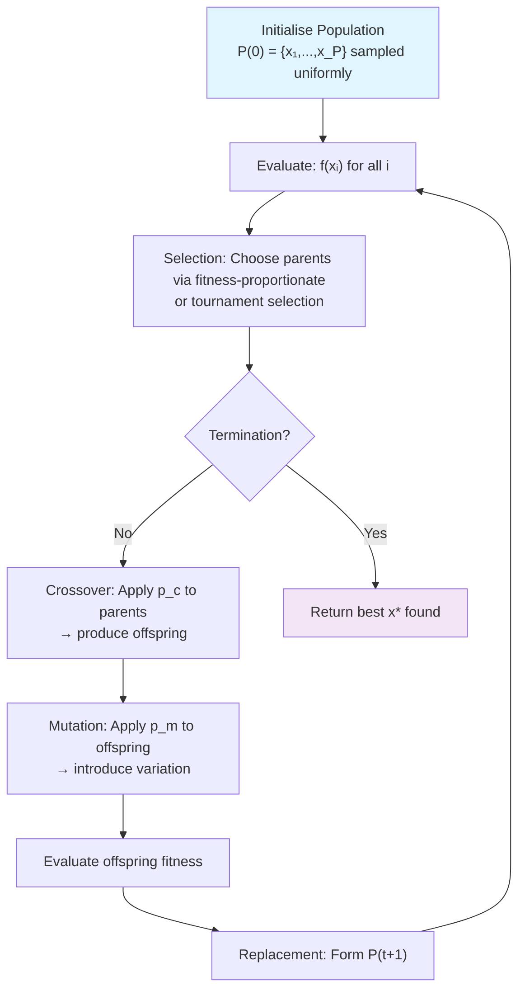

## Q1a — Explain Simulated Annealing with Suitable Diagram

Simulated Annealing (SA), introduced by Scott Kirkpatrick, Charles Gelatt, and Mario Vecchi in 1983, and independently by Vlado Černý in 1985, constitutes one of the most intellectually elegant and practically robust metaheuristic optimization algorithms in the computational toolkit, drawing its foundational inspiration from the thermodynamic annealing process in metallurgy, whereby a crystalline solid is heated to a high temperature—inducing a random, high-energy, disordered atomic configuration—and then slowly and gradually cooled (annealed) through a precisely controlled temperature schedule, allowing the atoms to settle into a low-energy, highly ordered, near-perfect crystalline ground state. The algorithm's defining intellectual contribution is the recognition that the acceptance of occasional worsening moves—analogous to thermal fluctuations that temporarily raise the system's energy above the current local minimum—enables systematic escape from local optima traps that confound purely greedy local search algorithms, while the controlled cooling schedule progressively reduces the acceptance probability of worsening moves, concentrating search around improving regions as the algorithm converges. The probability of accepting a worsening move follows the Metropolis criterion—P = exp(−ΔE / T)—where ΔE is the increase in objective function value and T is the current temperature parameter, creating a probabilistic mechanism that is theoretically grounded in statistical mechanics and provably convergent under logarithmically slow cooling schedules.

---

### A. THERMODYNAMIC FOUNDATION AND ANALOGY

The SA algorithm is constructed through a rigorous analogy between the physical annealing process and combinatorial optimization. The mapping operates at three levels:

**Atom ↔ Decision Variable**: In the physical system, the position of each atom constitutes a degree of freedom that varies over time. In the optimization system, each decision variable x_j constitutes a degree of freedom that the algorithm varies. The overall atomic configuration in a metal with N atoms corresponds to the overall candidate solution vector x in the D-dimensional search space Ω ⊆ ℝ^D.

**Energy E ↔ Objective Function f(x)**: The energy of a physical system represents its thermodynamic state, with lower energy states being more thermodynamically stable. In optimization, the objective function f(x) serves this role: lower f(x) values (in a minimisation problem) correspond to better solutions, equivalent to lower-energy states being more desirable.

**Temperature T ↔ Control Parameter T(t)**: Temperature in thermodynamics controls the degree of thermal agitation (randomness) in the system. In SA, a temperature parameter T(t) at iteration t controls the probability of accepting worsening moves. At high T, the system is highly disordered and explores widely; at low T, the system settles into the nearest basin of attraction corresponding to the current configuration.

**Thermal Equilibrium ↔ Inner Loop Iterations**: At each temperature level in physical annealing, the system is held until it reaches thermal equilibrium—a state where macroscopic state variables (energy, entropy) are statistically stationary. In SA, at each temperature T, the algorithm executes M perturbation-acceptance iterations (the inner loop) to allow the system to approach quasi-equilibrium before the temperature is decremented.

**Slow Cooling ↔ Cooling Schedule**: Physical annealing requires infinitely slow cooling for guaranteed convergence to the global energy minimum. In SA, the cooling schedule T(t) controls the tradeoff between solution quality and computation time. The logarithmically slow cooling schedule T(k) = T_0 / ln(1 + k) guarantees convergence to the global optimum with probability 1 as k → ∞, but is computationally impractical; geometric cooling T(k) = α · T(k−1) with α ∈ [0.90, 0.999] is standard in practice, trading theoretical optimality for practical performance.

---

### B. COMPLETE ALGORITHMIC DESCRIPTION

The Complete Simulated Annealing algorithm proceeds through the following rigorously defined stages:

```mermaid
flowchart TD
    A["INITIALISE<br/>x₀ = random/initial solution<br/>T₀ = high initial temperature<br/>k = 0, T_min, α"] --> B["Inner Loop: M Perturbations at T_k"]
    B --> C{"k mod M == 0?"}
    C -->|Yes| D["Decrement Temperature:<br/>T_{k+1} = α × T_k"]
    C -->|No| E["Generate Neighbour:<br/>x' = Perturb(x_k)"]
    D --> E
    E --> F{"Evaluate Δf = f(x') - f(x_k)"}
    F -->|Δf ≤ 0 (improvement)| G["Accept: x_{k+1} = x'<br/>(Always accept improving moves)"]
    F -->|Δf > 0 (worsening)| H{"Random() < exp(-Δf/T_k)?"}
    H -->|Yes| G
    H -->|No| I["Reject: x_{k+1} = x_k<br/>(Stay at current solution)"]
    G --> J{"Convergence Test"}
    I --> J
    J -->|"T_k < T_min<br/>OR max_iterations"| K["TERMINATE<br/>Return best solution found"]
    J -->|Continue| B
```

**Stage 1 — Initialisation**: Select an initial candidate solution x₀. This may be: (a) a random solution sampled uniformly from the search space Ω; (b) a heuristic solution constructed from domain knowledge; or (c) the output of a prior greedy local search. Select the initial temperature T₀ such that the acceptance ratio (fraction of worsening moves accepted at T₀) is approximately 0.8. This heuristic can be determined adaptively by running a short calibration sequence and setting T₀ to the Δf value at which 80% of worsening moves are accepted. Select the cooling rate α ∈ [0.90, 0.999], the inner loop count M (typically 10–100 times the search space dimensionality D), the minimum temperature T_min, and the maximum total iterations k_max.

**Stage 2 — Inner Perturbation Loop at Temperature T_k**: For each temperature level, execute M perturbation and acceptance steps. At each step:
1. Generate a neighbour x' of the current solution x_k by perturbing x_k. The perturbation operator is problem-specific: for continuous problems, Gaussian perturbation: x'_j = x_{k,j} + N(0, σ²_T) where σ_T is the temperature-dependent perturbation scale; for combinatorial problems, swap, insertion, or inversion mutation operators. The perturbation scale σ_T is typically proportional to T, decreasing as temperature drops.
2. Evaluate the objective at x': Δf = f(x') − f(x_k).
3. Apply the Metropolis acceptance criterion.

**Stage 3 — Temperature Reduction**: After M inner-loop iterations, reduce the temperature: T_{k+1} = α · T_k for geometric cooling, or T_{k+1} = T_0 / ln(k+1) for logarithmic cooling.

**Stage 4 — Convergence Test**: Terminate if T_k < T_min or if k > k_max, or if the best-found solution has not improved for w_s consecutive temperature levels. Return the best solution encountered during the entire run (the global best, not the current solution at termination, since the algorithm may have visited a better solution earlier).

---

### C. ASCII ART: SA SEARCH TRAJECTORY

```
Simulated Annealing Search Trajectory on a 1D Multimodal Landscape
══════════════════════════════════════════════════════════════════════

f(x) [objective value]
  │
g │                    ╭────╮
l │                   ╭╯    ╰╮
o │                  ╭╯      ╰──╮
b │                 ╭╯           ╰╮  ← LOCAL OPTIMA (L)
a │     ╭──────────╯     ╭────────╰────╮
l │    ╭╯              ╭╯     local     ╰╮ ← LOCAL OPTIMA (L₂)
  │   ╭╯              ╭╯      peak       ╰╮
P │   ╭╯     ╭────────╯                     ╰╮ ← LOCAL OPTIMA (L₃)
e │  ╭╯     ╭╯                                ╰╮
a │  ╰─────╭╯                                    ╰──── ╭──╮
k │         ╰──── L₁                               ╭╮  ╭╯  GLOBAL
s │                                                  ╰╮╭╯    PEAK (G★)
  │                                                    ★  ← SA converges here
  │
  └──────────────────────────────────────────────────────x──►
    T_high: random walk, crosses barriers freely
          (accepts worsening moves with P≈0.8)
    T_mid:  biased exploration, occasional barrier crossing
          (accepts worsening with P≈0.3-0.5)
    T_low:  exploitation, only easy crossings accepted
          (accepts worsening with P≈0.01-0.1)
    T_final: greedy ascent, settles in nearest peak basin
          (only accepts improving moves, P→0)

Trajectory: [random start] → [barrier crossing at T_high] → [local L₁] → 
[escape at T_mid] → [wider exploration] → [approach to G★] → 
[settle at G★ as T→0]
```

---

### D. METROPOLIS ACCEPTANCE CRITERION: MATHEMATICAL DETAIL

The Metropolis criterion, derived from the Boltzmann distribution in statistical mechanics, provides the probabilistic acceptance rule for worsening moves. At temperature T, the probability that the system is in a state with energy E is p(E) ∝ exp(−E / (k_B · T)), where k_B is the Boltzmann constant. When transitioning from state E₁ to state E₂, the ratio of probabilities is:

P(accept E₂ | current E₁) = min{1, exp(−(E₂ − E₁) / (k_B · T))} = min{1, exp(−ΔE / (k_B · T))}

In the SA optimization context, ΔE corresponds to Δf = f(x') − f(x_k), and the Boltzmann constant k_B is absorbed into the temperature definition (the temperature is scaled to absorb k_B, so the formula becomes P = exp(−Δf / T)).

The acceptance probability has three interpretation regimes:
- **Δf ≤ 0 (improvement)**: P = 1, always accept (equivalent to greedy hill climbing)
- **0 < Δf << T (small worsening)**: P ≈ exp(small) ≈ close to 1, accept most small worsening moves (enables fine-grained exploration near local optima)
- **Δf >> T (large worsening)**: P ≈ exp(−large) ≈ 0, reject large worsening moves (prevents radical exploration that wastes iterations)

The temperature T acts as a scale parameter on the Δf values: when T is large relative to typical Δf values, nearly all moves are accepted (random walk regime); when T is small, only small worsening moves are accepted (exploitation regime). The decreasing temperature progressively raises the bar for accepting worsening moves.

---

### E. COOLING SCHEDULES: THEORETICAL AND PRACTICAL VARIANTS

**Logarithmic Cooling (Černý, Kirkpatrick)**: T_k = T_0 / ln(1 + k), where k is the iteration index.
- Theoretical property: Guarantees convergence to the global optimum with probability 1 as k → ∞ (Geman and Gemen, 1984).
- Practical property: Requires enormous numbers of temperature levels (k ≈ 10^6 to 10^8 for non-trivial problems); cooling is extremely slow after the first few thousand iterations; generally impractical for real applications.
- Use: Theoretical benchmark only.

**Geometric Cooling**: T_k = α · T_{k−1}, α ∈ (0, 1), typically α ∈ [0.90, 0.999].
- Theoretical property: No convergence guarantee; may converge to local optima.
- Practical property: Fastest cooling, widely used in practice; appropriate α selection guides adequate exploration.
- Tuning: α = 0.95 for rapid convergence on well-behaved problems; α = 0.99–0.999 for harder multimodal problems requiring more exploration per temperature level.
- Use: Standard practice in virtually all SA implementations.

**Linear Cooling**: T_k = T_0 − k · ΔT, where ΔT is a constant decrement.
- Property: Cooling continues until T = 0, at which point the algorithm becomes pure hill climbing.
- Practical: Simple to implement and tune (choose T_0 and ΔT = T_0 / k_max).

**Adaptive Cooling**: The cooling rate is adapted based on observed search progress: if the acceptance ratio drops below a threshold (indicating the temperature is too low to enable exploration), increase T; if the acceptance ratio is too high (indicating insufficient exploitation), decrease T more rapidly.

**Reheating**: If the algorithm stalls (no improvement for w iterations), temporarily increase T to a higher value, re-enabling exploration. This is analogous to re-heating metal in physical annealing when the crystal structure is not improving.

---

### F. KEY PARAMETERS AND THEIR TUNING IMPLICATIONS

**Initial Temperature T_0**: Must be large enough that the initial acceptance ratio for worsening moves is approximately 0.8 (ensuring the algorithm explores widely in early iterations). If too small: premature convergence to local optima; if too large: wasted iterations on random walk. Adaptive determination: run a short calibration sequence, measure the mean and standard deviation of Δf for random perturbations, and set T_0 = σ_Δf / ln(1/0.8) ≈ σ_Δf / (−0.223) ensuring that worsens with magnitude σ_Δf are accepted with P ≈ 0.8.

**Cooling Rate α**: Controls the rate of convergence. Larger α (closer to 1.0): slower cooling, more exploration, better final solution quality but more computation. α = 0.99 requires ~450 iterations to cool from T=100 to T=1; α = 0.95 requires ~90 iterations; α = 0.90 requires only ~44 iterations.

**Inner Loop Count M**: Determines how many perturbations are attempted at each temperature level before cooling. Too small: algorithm does not reach quasi-equilibrium at each temperature, producing a noisy cooling trajectory; too large: wasted iterations. Rule of thumb: M ∈ [10D, 100D] where D is the problem dimensionality. For the 50-city TSP: M ∈ [500, 5000].

**Perturbation Operator**: The mechanism for generating neighbour solutions. Must be problem-specific and is the primary mechanism by which SA exploits problem structure. Poorly designed perturbations produce neighbours with large Δf variance, making temperature scheduling ineffective.

---

### G. COMPARISON OF SA WITH OTHER METAHEURISTICS

| Feature | Simulated Annealing | Genetic Algorithm | Particle Swarm Optimization |
|---|---|---|---|
| **Search Philosophy** | Single trajectory stochastic | Population stochastic | Swarm trajectory stochastic |
| **Memory** | Current + best-so-far | Population history | Personal + global best |
| **Escape Mechanism** | Probabilistic worsening acceptance | Population diversity | Velocity stochasticity |
| **Parameters** | T_0, α, M, T_min | N, p_c, p_m | N, ω, c₁, c₂, V_max |
| **Convergence Guarantee** | Yes (logarithmic cooling) | No (heuristic) | No (heuristic) |
| **Applicability** | Continuous, combinatorial | Mixed, combinatorial | Continuous |
| **Parallelisability** | Limited (single trajectory) | High (population is parallel) | Moderate (independent particles) |
| **Neighbourhood Structure** | Required (custom operator) | Via encoding/crossover | Via velocity vector |
| **Parameter Sensitivity** | Moderate | High (N, rates critical) | High (ω, c₁, c₂ critical) |
| **Per-iteration Cost** | O(1) (one neighbour eval) | O(N) (whole population eval) | O(N) (whole swarm eval) |

The SA algorithm distinguishes itself from other metaheuristics through its deep theoretical grounding in statistical mechanics, its single-trajectory simplicity (requiring no population management), its elegant escape mechanism from local optima, and its provable convergence properties under appropriate schedule selection. While GAs and PSO typically outperform SA on high-dimensional multimodal problems due to their population-based parallelism, SA remains competitive and often preferred for: (1) problems where only a single solution trajectory can be maintained due to memory constraints; (2) problems where the neighbourhood operator is well-understood but no natural population encoding exists; (3) problems requiring provable convergence to a useful solution; and (4) problems where adaptive reheating provides robustness to multi-modal landscapes without the population diversity management overhead of GAs.

The SA algorithm's diagrammatic representation typically shows the annealing trajectory: starting from a high-energy (poor) configuration, the trajectory wanders widely at high temperatures, crosses energy barriers via thermal fluctuations, and progressively settles into lower-energy basins as temperature decreases, ultimately locating the global energy minimum or a near-optimal local minimum. This trajectory contrasts with a hill-climbing trajectory that becomes trapped at the first local minimum encountered.


## Q1b — Describe Evolutionary Computing

Evolutionary Computing (EC) is a broad and profoundly interdisciplinary subfield of computer science, applied mathematics, and theoretical biology that encompasses a family of population-based, stochastic, biologically inspired optimization and search algorithms. These algorithms—Genetic Algorithms (GAs), Evolution Strategies (ES), Evolutionary Programming (EP), and Genetic Programming (GP)—share a common computational metaphor derived from Darwinian natural selection and Mendelian genetics: a population of candidate solutions is maintained, each individual's fitness is evaluated with respect to a problem-specific objective function, fitter individuals are preferentially selected to reproduce, and genetic operators (recombination/crossover and mutation) introduce variation into the offspring population. Over successive generations, the population evolves toward regions of the search space containing high-fitness solutions, without requiring gradient information, problem-specific heuristics, or any knowledge of the internal structure of the objective function beyond the ability to evaluate it at candidate points.

The historical development of EC traces through four distinct but overlapping intellectual lineages. The first is Genetic Algorithms, originating with John Holland's work at the University of Michigan in the 1960s, culminating in his 1975 book "Adaptation in Natural and Artificial Systems," which established the Schema Theorem, the Building Block Hypothesis, and the theoretical foundation for GAs operating on fixed-length binary string representations with crossover as the primary variation operator. The second is Evolution Strategies, originating with Ingo Rechenberg and Hans-Paul Schwefel at the Technical University of Berlin in the 1960s, motivated by engineering optimization problems requiring the optimisation of real-valued parameters (airfoil shapes, hydrodynamic profiles) through mutation as the primary variation operator with self-adaptive mutation step sizes. The third is Evolutionary Programming, originating with Lawrence Fogel in 1966 at Owens-Corning, motivated by the prediction of sequential environmental states using finite state machines evolved through mutation and tournament selection. The fourth is Genetic Programming, originating with John Koza in the early 1990s, extending the GA metaphor to the evolution of hierarchical tree-structured computer programs of variable size and shape.

**Foundational Principles of EC:**
- **Population-Based Search**: Unlike single-point search methods (hill climbing, gradient descent), EC operates on a population of P individuals simultaneously, implicitly exploring O(P³) schemata per generation through Holland's implicit parallelism principle.
- **Stochastic Variation**: Genetic operators (selection, crossover, mutation) are stochastic, introducing controlled randomness that prevents premature convergence and enables escape from local optima.
- **Fitness-Driven Selection**: Selection mechanisms (roulette wheel, tournament, rank selection) preferentially propagate high-fitness individuals while maintaining some representation of lower-fitness individuals to preserve genetic diversity.
- **Black-Box Optimization**: The only problem-specific information required by EC is a scalar fitness function f(x) that evaluates candidate solutions. No gradient, no derivative, no problem structure is required.
- **Representation Independence**: EC can operate on any encoding that maps genetic material to candidate solutions: binary strings, real-valued vectors, permutations, trees, graphs, programs, or hybrid structures.

**Algorithmic Architecture:**
The canonical EC algorithm operates as a generate-and-test cycle:
1. Initialise: Generate an initial population P(0) of P individuals randomly or heuristically.
2. Evaluate: Compute fitness f(x_i) for each individual x_i ∈ P(t).
3. Select: Apply selection pressure to choose parent individuals for reproduction.
4. Vary: Apply crossover (with probability p_c) and mutation (with probability p_m) to produce offspring population O(t).
5. Replace: Form new population P(t+1) from P(t) and O(t) using replacement strategy (generational, steady-state, elitist).
6. Test: Check termination conditions (fitness threshold, maximum generations, convergence criteria).
7. Iterate: Return to step 2 until termination.
8. Return: Report the best individual found during execution.

**Key Algorithmic Variants:**
- **Genetic Algorithms (GA)**: Fixed-length representations; crossover as primary variation; probabilistic selection; developed by Holland (1975).
- **Evolution Strategies (ES)**: Real-valued vectors; mutation as primary or sole variation; self-adaptive mutation step sizes; deterministic (μ + λ) or (μ, λ) selection; developed by Rechenberg and Schwefel (1965-1975).
- **Evolutionary Programming (EP)**: Originally operated on finite state machines; modern EP uses real-valued vectors; mutation as primary variation; stochastic tournament selection; developed by Fogel (1966).
- **Genetic Programming (GP)**: Tree-structured representations of variable size; crossover and mutation at subtree and node levels; functions and terminals as genetic material; developed by Koza (1992).
- **Differential Evolution (DE)**: Real-valued vectors; difference-vector mutation; developed by Storn and Price (1997).
- **Estimation of Distribution Algorithms (EDA)**: Replace variation operators with statistical model building and sampling; developed by Muhlenbein and Paass (1996).

**Computational Complexity Analysis:**
For a GA with population size P running for G generations on a D-dimensional problem: Each generation requires O(P × C_f) function evaluations, where C_f is the cost per fitness evaluation. Total cost: O(G × P × C_f). The selection step is O(P log P) for tournament selection. The crossover and mutation steps are O(P × D). For expensive problems where C_f involves running a simulation (CFD, structural mechanics), the GA fitness evaluation cost dominates all other operations, and computational budget is measured in function evaluations rather than wall-clock time.

**Convergence Theory:**
Formal convergence results for EC are established under specific conditions:
- For GAs with infinite populations under fixed-length binary representations: Convergence to the global optimum is not guaranteed; convergence to local optima is typical.
- For ES with (1+1)-ES and self-adaptive mutation step sizes: Convergence to local optima with probability 1 is provable.
- For CMA-ES (Covariance Matrix Adaptation Evolution Strategies): Convergence rates have been characterised and shown to be competitive with state-of-the-art derivative-free optimization methods.
- For GAs with niching and speciation mechanisms: Convergence to multiple optima simultaneously can be maintained.

**Contemporary Scope and Research Frontiers:**
Modern EC research spans:
- **Neuroevolution**: Evolving neural network architectures (NEAT, ES-based neuroevolution) and weights for reinforcement learning and control.
- **Quality Diversity (QD) Algorithms**: MAP-Elites and variants evolve large, diverse repertoires of high-performing solutions across behavioural feature spaces.
- **Multi-Objective EC**: NSGA-II, SPEA2, MOEA/D, MOPSO maintain Pareto-approximate solution sets.
- **Surrogate-Assisted EC**: Fitness evaluations replaced by learned surrogate models, dramatically reducing computational cost for expensive simulation-based optimization.
- **EC for AutoML and LLM Optimization**: Evolving prompts, chain-of-thought strategies, neural architectures, and hyperparameter configurations.

The breadth of EC—spanning theoretical foundations, algorithmic diversity, and application domains—makes it one of the most broadly applicable paradigms in computational intelligence, uniquely suited to problems where traditional gradient-based or combinatorial optimization methods fail due to the objective function's non-differentiability, non-convexity, noise, or combinatorial structure.

## Q1c — Explain Evolutionary Single-Objective Optimization in Detail

Evolutionary Single-Objective Optimization (ESOO) refers to the application of evolutionary computation algorithms—primarily Genetic Algorithms (GAs), Evolution Strategies (ES), Differential Evolution (DE), and Evolutionary Programming (EP)—to the canonical form of optimization in which there exists exactly one scalar objective function f(x) that must be minimised or maximised over a search space Ω subject to optional constraints. Despite the contemporary prominence of multi-objective evolutionary algorithms (MOEAs), single-objective evolutionary optimization remains the most widely practiced application of EC in industry and research, because the majority of real-world engineering design, parameter tuning, scheduling, and resource allocation problems are naturally posed as single-objective optimization problems, either because there is a genuinely dominant aggregate criterion, because the decision-maker has agreed on a single performance measure, or because the problem can be reduced to a single scalar objective through weighted aggregation or lexicographic ordering. This exposition addresses ESOO comprehensively: (1) the mathematical formalisation of single-objective optimization problems; (2) why ESOO is needed (limitations of classical optimization for real-world problems); (3) the historical development of ESOO algorithms; (4) the canonical GA and ES algorithmic frameworks for single-objective optimization; (5) the representation and variation operators for different problem types; (6) selection mechanisms designed for single-objective optimization; (7) convergence behaviour and theoretical analysis; (8) practical parameter guidelines; and (9) comparison with non-evolutionary single-objective optimization methods.

---

### A. MATHEMATICAL FORMALISATION OF THE SINGLE-OBJECTIVE OPTIMIZATION PROBLEM

The general single-objective optimization problem is posed as:

minimise (or maximise)   f(x)
subject to:
         h_j(x) = 0,   j = 1, ..., p     (equality constraints)
         g_i(x) ≤ 0,   i = 1, ..., m     (inequality constraints)
         L_k ≤ x_k ≤ U_k,   k = 1, ..., n   (variable bounds)

where x = (x₁, x₂, ..., xₙ) ∈ ℝⁿ is the decision variable vector, f: ℝⁿ → ℝ is the scalar objective function, h_j: ℝⁿ → ℝ are equality constraint functions, and g_i: ℝⁿ → ℝ are inequality constraint functions.

**Problem Classification by Structure:**
- **Unconstrained**: No constraints (p = m = 0). Simplest case; pure GA/ES/DE applicable.
- **Bound-Constrained**: Only L_k, U_k bounds. Handle by clamping or using bounded encodings.
- **Linearly Constrained**: All constraints are linear. May be solved by linear programming but GA/ES applicable for large-scale or mixed-variable variants.
- **Nonlinearly Constrained**: Constraints involve nonlinear functions. GA/ES with penalty functions or Deb's feasibility rules applicable.
- **Discrete/Combinatorial**: Decision variables are integer or categorical. Requires special encodings (permutations, subsets, integers).
- **Mixed-Integer**: Combination of continuous and discrete variables. Requires hybrid encoding strategies.

**Problem Classification by Landscape Properties:**
- **Unimodal**: Single global optimum, no local optima. Hill climbing finds global optimum.
- **Multimodal**: Multiple local optima separated by peaks/valleys. Requires global search methods like GA/ES/DE.
- **Deceptive**: Local optima mislead search toward suboptimal regions. Building blocks are not preserved by greedy search.
- **Rugged**: Many local optima of varying quality. Requires robust exploration-exploitation balance.
- **Epistatic**: Variables interact nonlinearly; changing one variable's value changes the effect of others. Requires crossover that respects variable interactions.
- **Dynamic/Non-stationary**: The objective function changes over time. Requires memory or adaptive mechanisms.

---

### B. WHY EVOLUTIONARY ALGORITHMS FOR SINGLE-OBJECTIVE OPTIMIZATION?

**Limitations of Classical Optimization That ESOO Addresses:**

**1. Gradient-Based Methods Fail on Non-Differentiable Objectives**: Gradient descent, Newton's method, quasi-Newton methods (BFGS, L-BFGS), and conjugate gradient methods all require the objective function to be differentiable so that the gradient ∇f(x) can be computed. Many real-world objectives are non-differentiable: simulation-based objectives evaluated by FEM or CFD codes produce pointwise function values with no analytic derivative; discrete optimization objectives have no meaningful gradient; objectives with discontinuities (On/Off switches, conditional logic) have undefined derivatives at jump points.

**2. Classical Methods Fail on Noisy Objectives**: When the objective function is evaluated with noise (measurement noise in experiments, stochastic simulation, Monte Carlo evaluation), gradient estimates become unreliable and local search oscillates. ES and GA with population averaging are robust to moderate noise.

**3. Classical Methods Fall to Local Optima in Multimodal Landscapes**: Gradient-based methods and hill climbing converge to the local optimum nearest to the starting point. For multimodal problems with many local optima of varying quality (common in engineering design), finding the global optimum requires either an exhaustive search of starting points or a global optimization method. ES and GA maintain population diversity across multimodal basins simultaneously.

**4. Combinatorial Structure Resists Exact Methods**: The Traveling Salesman Problem (TSP), scheduling problems, and assignment problems have discrete, combinatorial search spaces. Exact methods (branch and bound, integer programming) are O(2^n) in the worst case and simply cannot solve large instances. Heuristics including GA/ES/DE provide practical approximate solutions.

**5. Black-Box Objectives**: When the objective function is a black box (a simulator, experiment, or physical test), no mathematical model is available to exploit. GAs/ES require only the ability to evaluate f(x) at candidate points, making them uniquely suited to simulation-based and experiment-based optimization.

**6. Representation Flexibility**: GAs and ES can operate on virtually any encoding: binary strings, real vectors, permutations, trees, programs, or hybrid representations. This flexibility enables application to problem domains where no standard mathematical optimization representation exists.

---

### C. CANONICAL EVOLUTIONARY SINGLE-OBJECTIVE OPTIMIZATION ALGORITHMS

#### C.1 Simple Genetic Algorithm for Single-Objective Optimization



**GA Configuration for Single-Objective Optimization:**
- Representation: Fixed-length real-valued vectors (most common for continuous ESOO) or binary strings (for discrete problems).
- Fitness mapping: For minimisation, fitness can be rank-based or raw objective with inverted sign.
- Selection: Tournament selection (k=2 or 3) is most robust; avoids scaling issues.
- Crossover: BLX-α ( Blend Crossover), SBX (Simulated Binary Crossover), or arithmetic crossover for real vectors; one-point, two-point, uniform crossover for binary.
- Mutation: Gaussian mutation with temperature-dependent or adaptively controlled step size: x'_j = x_j + N(0, σ_j²).
- Replacement: Generational (full replacement) or steady-state (replace a few worst individuals per iteration).
- Elitism: Best individuals preserved unchanged across generations (essential for monotonic convergence).

#### C.2 (μ + λ) and (μ, λ) Evolution Strategies

ES, developed by Rechenberg and Schwefel, is the canonical EC approach for continuous parameter optimization. The two standard selection schemes are:

- **(μ + λ)-ES**: μ parents produce λ offspring; the next generation consists of the best μ individuals from the combined parent-offspring pool (μ + λ). Elitist: parents can survive.
- **(μ, λ)-ES**: μ parents produce λ offspring (λ ≥ μ); the next generation consists of the best μ individuals from offspring only (parents are discarded). Non-elitist forced progress.

The most significant ES innovation is **self-adaptive mutation**: each individual carries not only decision variables x but also mutation step sizes σ = (σ₁, σ₂, ..., σₙ). During mutation:
σ'_j = σ_j × exp(N(0, τ²) + N_j(0, τ'²))  (global + individual adaptation)
x'_j = x_j + σ'_j × N_j(0, 1)

The mutation step sizes evolve alongside the decision variables, enabling the ES to autonomously discover appropriate perturbation magnitudes for each problem dimension—critical for ill-conditioned problems where different variables operate on different scales.

The **Covariance Matrix Adaptation ES (CMA-ES)** is the current state-of-the-art ES variant: it learns the covariance structure of the search distribution through second-order statistics, effectively learning a full Gaussian sampling distribution with mean vector μ and covariance matrix Σ. This second-order learning enables CMA-ES to exploit variable correlations and align sampling with the objective function's Hessian structure, yielding convergence rates competitive with second-order classical methods on smooth problems while retaining the black-box, derivative-free advantages of EC.

---

### D. REPRESENTATIONS AND VARIATION OPERATORS FOR SINGLE-OBJECTIVE OPTIMIZATION

**Continuous Optimization:**
- **Encoding**: Real-valued vector x = (x₁, ..., xₙ), x_i ∈ [L_i, U_i]
- **SBX Crossover**: Simulated Binary Crossover produces offspring near parents with distribution similar to single-point binary crossover. Spread factor η_c controls the distribution shape: large η_c → offspring close to parents; small η_c → offspring widely distributed.
- **Polynomial Mutation**: x'_i = x_i + (U_i - x_i) × δ or (x_i - L_i) × δ where δ is computed from polynomial distribution with index η_m controlling mutation distribution shape.
- **Gaussian Mutation**: x'_i = x_i + N(0, σ_i²) with σ_i adapted by self-adaptation or path-length control.

**Combinatorial Optimization:**
- **TSP Encoding**: Permutation of n city indices (tour representation).
- **Permutation Crossover**: PMX (Partially Mapped Crossover), OX (Order Crossover), CX (Cycle Crossover), AEX (Alternating Edge Crossover).
- **Permutation Mutation**: Swap mutation (exchange two cities), insertion mutation (remove and reinsert at different position), inversion mutation (reverse subsequence), scramble mutation (randomly permute subsequence).
- **Knapsack Encoding**: Binary vector z ∈ {0,1}ⁿ; z_i = 1 if item i is selected.
- **Subset Crossover**: Uniform crossover on binary strings; 1-point, 2-point crossover.
- **Subset Mutation**: Bit-flip mutation (flip z_i with probability 1/n).

**Integer Programming:**
- **Encoding**: Integer vector x ∈ ℤⁿ with bounds L_i ≤ x_i ≤ U_i.
- **Integer Crossover**: Blend crossover with rounding, or specific integer crossover operators.
- **Integer Mutation**: Random resetting to a new integer within bounds.

---

### E. SELECTION MECHANISMS FOR SINGLE-OBJECTIVE OPTIMIZATION

**Roulette-Wheel (Fitness-Proportionate) Selection**: Each individual's selection probability is proportional to its fitness: p_i = f_i / Σ_j f_j. Problem: premature convergence; highly fit individuals dominate reproduction, collapsing diversity within a few generations.

**Rank Selection**: Individuals sorted by fitness; selection probability based on rank rather than raw fitness value. Reduces premature convergence by compressing the fitness range. Rank r ∈ [1, P] assigned; probability p(r) = (2r) / (P(P+1)) for linear ranking (selection pressure controlled by linearity parameter).

**Tournament Selection**: Randomly sample k individuals; select the fittest among the k. Selection pressure increases with k. Advantages: computationally O(k) per selection; no scaling issues; robust to noisy fitness; pressure tunable via k ∈ {2, 3, 5, 10}. k=2: moderate pressure; k=P: strongest individual always wins.

**Truncation Selection** (common in ES): Select the top τ fraction of the population as parents (τ typically 1/5 or 1/7 per Rechenberg's 1/5 success rule). Simple, strong selection pressure.

**Boltzmann Selection**: Probabilistic selection with temperature parameter: p(i selected) = exp(f_i / T) / Σ exp(f_j / T). Temperature decreases over time, mimicking SA within selection.

---

### F. THE 1/5 SUCCESS RULE AND ADAPTIVE STEP-SIZE CONTROL

The **1/5 Success Rule** (Rechenberg, 1973): In an ES with mutation as the primary operator, if more than 1/5 of mutations are successful (produce offspring with improved fitness), increase the mutation step size; if fewer than 1/5 are successful, decrease it. Formally: if success_rate > 0.2: σ_new = σ / c (increase exploration); if success_rate < 0.2: σ_new = σ × c (decrease exploration), where c ∈ [0.80, 0.95] is the adaptation multiplier. This rule provides an adaptive mechanism that automatically tunes σ to match the local curvature of the fitness landscape—larger σ on rugged landscapes where many mutations are successful, smaller σ on smooth landscapes where step size precision matters.

**Cumulative Step-Size Adaptation (CSA-ES)**: The step-size adaptation in the canonical (μ/μ_I, λ)-ES using cumulative step-size control (CSA):
s ← (1 - c) · s + √(c(2-c)μ) · (⟨x⟩_λ - ⟨x⟩_λ_prev) / σ_old
σ ← σ · exp(c_s · s / √(c(2-c)μ))
where c_s is the learning rate for step-size adaptation, ⟨x⟩_λ is the weighted mean of offspring, and c controls the cumulative memory rate.

---

### G. COMPARISON WITH NON-EVOLUTIONARY SINGLE-OBJECTIVE OPTIMIZATION

| Dimension | EC Methods (GA, ES, DE) | Gradient-Based (BFGS, L-BFGS) | Direct Search (Nelder-Mead) | Simulated Annealing | Branch & Bound |
|---|---|---|---|---|---|
| Derivative requirement | None | Required | Not required | None | None |
| Problem model | Black-box | Needs differentiable model | Needs differentiable model | Black-box | Problem-specific |
| Convergence guarantee | No (heuristic) | For convex problems | For smooth convex | Yes (logarithmic cooling) | Yes (exhaustive) |
| Optimality guarantee | Statistical (approximate) | Exact for convex | Local optimum | Approximate (log-slow) | Exact |
| Handling noise | Good (population-based) | Poor (gradient sensitive) | Poor | Moderate | Poor |
| Parallelisability | High (population) | Low to moderate | Moderate | Low | Moderate |
| Memory requirement | O(P × D) | O(D) to O(D²) | O(D) | O(D) | Problem-dependent |
| Best suited for | Black-box, noisy, multimodal | Smooth, differentiable | Smooth, low-D | Single-trajectory, moderate-D | Discrete, small |
| Typical applications | Engineering design, ML hyperparams | Logistic regression, neural net training | Curve fitting, calibration | Scheduling, VLSI layout | Integer programming |

**Practical Recommendation Framework:**
- Use **L-BFGS / BFGS** when: f(x) is differentiable, smooth, convex or mildly non-convex, low-to-moderate dimension (D ≤ 1000), and gradient evaluations are tractable. These methods converge rapidly (superlinear for BFGS) to high-precision local optima.
- Use **Nelder-Mead** when: f(x) is smooth, low-dimensional (D ≤ 10–20), no gradient available, and only a local optimum is required.
- Use **SA** when: f(x) is black-box, single trajectory tractable (no population needed), and multimodal escape is critical but parallel computation is unavailable.
- Use **ES (particularly CMA-ES)** when: f(x) is black-box, continuous, moderate-to-high dimensional (D = 5 to 500), noisy, or non-convex. CMA-ES is the recommended default for single-objective continuous black-box optimization.
- Use **DE** when: f(x) is continuous, multimodal, and population-based search is desired; DE has fewer parameters than GA and is very robust across benchmark functions.
- Use **GA** when: f(x) has mixed encoding (binary + real), combinatorial structure, or a natural genetic representation exists.

Evolutionary Single-Objective Optimization thus represents a mature, theoretically grounded, empirically validated, and broadly applicable optimization paradigm that fills a critical gap in the optimization landscape: the regime of problems where classical gradient-based methods are inapplicable, exact methods are intractable, and single-trajectory metaheuristics are insufficient for reliably locating high-quality optima in complex search spaces.

## Q2a — Explain Problem Solving as a Search Task

Problem solving, when formalized within the framework of artificial intelligence and computational problem solving, is fundamentally and rigorously characterizable as a search process operating over a problem space—a structured representation of all possible states, partial solutions, configurations, or candidate answers relevant to the problem at hand. This characterization transforms the nebulous, domain-specific act of "finding a solution to a problem" into a precisely specified computational process: define a search space whose elements encode candidate solutions, define a start state (or set of start states), define one or more goal states (states satisfying all problem constraints and criteria), define a set of operators (actions) that transform one search space element into another, define an evaluation function that assigns quality scores to elements, and then apply an algorithm that systematically explores the transition structure of the search space to locate one or more goal states that meet the required quality threshold. The search paradigm for problem solving encompasses an enormous range of specific methods—from exhaustive enumeration (depth-first search, breadth-first search) through informed heuristic search (A*, IDA*) to stochastic and population-based search (genetic algorithms, simulated annealing, particle swarm optimization)—unified by the common abstraction that all problem solving reduces to finding a path, in a suitably defined space, from an initial configuration to a goal configuration. This exposition develops the search paradigm from first principles: (1) defining search problems formally; (2) the taxonomy of search spaces; (3) the taxonomy of search strategies; (4) informed search and heuristic functions; (5) the role of problem decomposition (AND/OR graphs, problem reduction); (6) optimality, completeness, and complexity properties; (7) search in different space structures; and (8) the relationship between search space structure and algorithm selection.

---

### A. FORMAL DEFINITION OF A SEARCH PROBLEM

A search problem is formally defined as a 6-tuple (S, s_0, A, G, c, g) where:

- **S = {s₁, s₂, ..., s_n}** is the finite or countably infinite state space, whose elements s_i represent all possible configurations of the problem.
- **s_0 ∈ S** is the initial state from which the search commences.
- **A = {a₁, a₂, ..., a_k}** is the action (operator) set, where each action a_j: S → P(S) maps a state to a set of successor states. Action a_j is applicable in state s if a_j(s) ≠ ∅.
- **G ⊆ S** is the set of goal states satisfying all problem constraints and criteria.
- **c: S × A → ℝ≥0** is the cost function assigning non-negative cost to each state-action transition. The path cost is the sum of individual transition costs along a path.
- **g: S → ℝ** is the evaluation (heuristic) function estimating the quality of a state—its proximity to a goal or its desirability as a candidate solution.

A **solution** is a path π = [s_0, s₁, s₂, ..., s_n] from the initial state s_0 to a goal state s_n ∈ G, where each consecutive pair (s_i, s_{i+1}) satisfies s_{i+1} ∈ a(s_i) for some action a. An **optimal solution** minimizes the total path cost: cost(π) = Σ_{i=0}^{n-1} c(s_i, a_i). The **search problem** is to find a solution π that reaches any goal state (satisfying problem), and if possible, the optimal such solution (optimality).

---

### B. TAXONOMY OF SEARCH SPACES

The structure of the search space fundamentally determines which search algorithms are applicable and efficient:

**B.1 State Space vs. Search Space**: The state space is the set of all possible problem configurations. The search space is the graph implicitly defined by the state space and the action set: vertices are states, directed edges connect states between which an action is applicable. Search algorithms operate on the graph by exploring edges from visited vertices to discover new vertices. State space size grows exponentially with problem description size: n-queens with n=8 has 8! ≈ 40,320 states in the permutation formulation; 8-queens in the all-asignments formulation has 4,478,261 states. The TSP with n=50 cities has (n-1)! / 2 ≈ 3×10⁶² states—far exceeding the number of atoms in the observable universe (~10⁸⁰). This exponential growth—the combinatorial explosion—is the fundamental challenge of search.

**B.2 Deterministic vs. Non-Deterministic Search Spaces**:
- **Deterministic**: Action a applied in state s always produces the same successor state(s). Classical search assumes determinism.
- **Non-Deterministic** (contingent, AND-OR): Action a may produce different successor states depending on external factors (chance events, opponent moves, uncertain environment). Contingent search (AND-OR tree/graph search) produces solutions that explicitly handle all possible outcomes of nondeterministic actions.

**B.3 Observable vs. Partially Observable Spaces**:
- **Fully Observable**: The agent has complete knowledge of the current state s. Classical search applies.
- **Partially Observable**: The agent only knows a belief state (set of possible states consistent with observations). Search operates over belief states; the size grows exponentially with the number of observable variables. Partially Observable Markov Decision Processes (POMDPs) require specialised search over belief state spaces.

**B.4 Static vs. Dynamic Search Spaces**:
- **Static**: The state space and goal state do not change during search (puzzle solving, path planning in a known environment).
- **Dynamic**: The state space changes during search due to external events, other agents' actions, or time-varying state transitions. Requires replanning, anytime algorithms, or incremental search.

**B.5 Path vs. Motion Planning**:
- **Path Search (Graph Search)**: State transitions produce discrete jumps (e.g., selecting a next city in TSP, placing a queen on a chessboard).
- **Motion Planning (Continuous)**: State transitions define continuous paths through continuous configuration spaces. Requires discretisation (cell decomposition, visibility graphs, probabilistic roadmaps) before tree search algorithms can be applied.

---

### C. TAXONOMY OF SEARCH STRATEGIES

**C.1 Blind (Uninformed) Search Strategies**: Strategies that explore the search space without using domain-specific knowledge about which regions are more likely to contain goals.

- **Breadth-First Search (BFS)**: Explores all nodes at depth d before exploring nodes at depth d+1. Complete (finds goal if one exists in finite graph); optimal (finds shallowest goal); Time O(b^d), Space O(b^d) where b is the branching factor and d is the solution depth. Infeasible for d > 10 in most domains due to exponential growth.
- **Depth-First Search (DFS)**: Explores as deeply as possible along each branch before backtracking. Incomplete (may explore infinite branches); non-optimal; Time O(b^m) where m is the maximum depth; Space O(b·m) or O(m) with backtracking—much lower than BFS, making DFS feasible in some cases where BFS is not.
- **Depth-Limited Search (DLS)**: DFS with a predetermined maximum depth limit l. If l < d, the search fails; if l > m, wastes time exploring deep dead-end branches.
- **Iterative Deepening Search (IDS or IDDFS)**: Repeated depth-limited search with increasing depth limits: l = 0, 1, 2, ... until goal found. Combines BFS's optimality and completeness with DFS's space efficiency. Optimal time overhead is approximately b/(b-1) times BFS time—about 11% overhead for b=10. Preferred for search spaces where the solution depth is not known a priori (game tree search, problem-solving in large spaces).
- **Uniform Cost Search (UCS)**: Generalises BFS to arbitrary (non-uniform) step costs. Expands nodes in order of path cost g(n). Optimal for general cost structures; Time O(b^{C*/ε}) where C* is optimal path cost and ε is minimum step cost.
- **Bidirectional Search**: Searches simultaneously from the initial state and from (a representation of) the goal state, meeting in the middle. Reduces time complexity from O(b^d) to O(b^{d/2}) at the cost of additional memory for the reverse search frontier and the requirement that the backward (from goal) search be efficiently executable.

**C.2 Informed (Heuristic) Search Strategies**: Strategies that exploit a heuristic evaluation function h(n) estimating the cost from state n to the nearest goal state.

- **Greedy Best-First Search (GBFS)**: Expands the node n with the lowest h(n) estimate. Fast (finds solutions quickly on many problems) but incomplete (can loop on infinite branches) and non-optimal (finds any solution, not necessarily the shortest or cheapest).
- **A* Search**: Expands the node with the lowest f(n) = g(n) + h(n), where g(n) is the actual cost from initial state to n, and h(n) is the estimated cost from n to goal. A* is optimal (finds a minimum-cost solution) if h(n) is admissible (never overestimates the true cost to goal: h*(n) ≤ h(n) for all n, where h*(n) is the actual minimum cost to goal). A* is complete on finite graphs when the branching factor is bounded. Time complexity O(b^d) in the worst case (same as BFS), but in practice much faster when h is informative. A* with an admissible heuristic is the canonical optimal search algorithm.
- **Weighted A* (WA*)**: f(n) = g(n) + w × h(n) where w > 1. Suboptimal by factor w but explores fewer nodes. Preferred when computation time is bounded and near-optimal solutions are acceptable.
- **IDA* (Iterative Deepening A*)**: Combines IDDFS with A* evaluation; runs A* with increasing f-cost thresholds. Space complexity O(d) rather than O(b^d); suitable for very large search spaces (terminal-board evaluation in chess endgames).
- **Recursive Best-First Search (RBFS)**: Depth-first implementation of best-first search; uses a f-limit bound to prune branches above the current bound; backtracks with updated bounds. Space complexity O(b·d); time complexity comparable to A*.

---

### D. HEURISTIC FUNCTIONS: DESIGN AND PROPERTIES

A heuristic function h(n) for a search problem is evaluated by two critical properties:

**Admissibility**: A heuristic h is admissible iff h(n) ≤ h*(n) for all n, where h*(n) is the true minimum cost to a goal from n. An admissible heuristic never overestimates; it is optimistic. The zero heuristic h(n) = 0 is trivially admissible (recovering uniform cost search). Admissibility guarantees A* optimality.

**Consistency (Monotonicity)**: A heuristic h is consistent iff for every node n and every successor n' of n: h(n) ≤ c(n, a, n') + h(n'), where c(n, a, n') is the step cost. Consistency implies admissibility and additionally makes the f-values along any path monotonically non-decreasing: f(n') ≥ f(n). This monotonicity property allows A* to avoid re-opening (requiring a second expansion of) nodes that were previously closed, improving A* efficiency. Most common heuristics (Manhattan distance in grid pathfinding, Euclidean distance, missing-tile count in sliding puzzles) are consistent.

**Effective Branching Factor b***: The effective branching factor of an admissible heuristic h on a given problem instance is the value b* such that the total number of nodes expanded by A* on that instance equals 1 + b* + (b*)² + ... + (b*)^d. An ideal heuristic yields b* = 1 (linear nodes, essentially direct path to goal); b* close to 1 indicates a highly informative heuristic; b* close to the actual branching factor b indicates a barely informative heuristic.

**Heuristic Construction Methods**:
1. **Relaxation**: Remove constraints from the original problem to produce an easier relaxed problem for which optimal solutions are efficiently computable. The solution cost of the relaxed problem provides an admissible heuristic for the original problem. Example: In the 8-puzzle, allowing tiles to move through each other (ignoring collision constraints) allows computing a Manhattan distance that is always less than or equal to the actual 8-puzzle distance.
2. **Landmark Heuristics**: Precompute shortest-path distances from a small set of landmark nodes to all other nodes; h(n) = max_{l ∈ landmarks} |dist(l, goal) - dist(l, n)|, derived from the triangle inequality. This is an admissible lower bound.
3. **Pattern Databases**: Precompute exact shortest-path distances for a subset of the state variables (a pattern); the stored distance is admissible as a heuristic for the full state (by ignoring interactions between the pattern variables and other variables).
4. **Learning Heuristics**: Use machine learning (neural networks, decision trees) to learn an approximation to h*(n) from solved search problem instances. Learnt heuristics can be more informative than hand-designed ones.

---

### E. PROBLEM DECOMPOSITION: AND-OR GRAPH SEARCH

Many problem solving domains benefit from decomposing the problem into subproblems whose solutions can be combined to solve the original. AND-OR graph search generalises standard tree/graph search to handle problems where a solution requires solving multiple subproblems simultaneously (AND nodes) or choosing between alternative subproblem formulations (OR nodes).

**AND-OR Graph Structure**:
- An **OR node** represents a choice: solving this subproblem requires selecting one of several alternative actions. Represented as standard graph nodes.
- An **AND node** represents a conjunction: solving this subproblem requires solving ALL of the specified subproblems. The AND node is solved when all its AND-children are solved.

**Solution Graph**: A solution to an AND-OR graph search problem is an AND-OR subgraph satisfying: (1) the root node is included; (2) for each OR node, exactly one outgoing arc is selected; (3) for each AND node, all outgoing arcs are included; (4) all leaf nodes in the subgraph are terminal states (goal states or states with no applicable actions).

**Algorithm**: AO* (Algorithm for AND-OR Search, Nilsson, 1971) finds optimal solution graphs. It operates by incrementally expanding the most promising AND-OR node, updating cost-to-go values bottom-up through the graph, and terminating when the root node becomes a solved terminal with a fully determined cost.

**Example - Theorem Proving**: To prove theorem T, we can: (OR) apply theorem A giving T, OR apply theorem B giving T; if we apply theorem A which requires proving lemmas L1 AND L2, the search tree branches with an AND node requiring both L1 and L2 to be proved. AO* handles this theorem-proving search naturally.

---

### F. COMPARISON OF SEARCH STRATEGIES

| Strategy | Complete? | Optimal? | Time O() | Space O() | Heuristic Required |
|---|---|---|---|---|---|
| BFS | Yes (finite spaces) | Yes (unit costs) | O(b^d) | O(b^d) | No |
| DFS | No (infinite spaces) | No | O(b^m) | O(b·m) | No |
| DLS | No | No | O(b^l) | O(b·l) | No |
| IDDFS | Yes | Yes | O(b^d) | O(b·d) O(d) | No |
| UCS | Yes | Yes | O(b^{C*/ε}) | O(b^{C*/ε}) | No |
| Bidirectional | Yes | Yes | O(b^{d/2}) | O(b^{d/2}) | Goal structure |
| Greedy Best-First | No | No | O(b^d) worst | O(b^d) | Yes |
| A* | Yes (finite spaces) | Yes (admissible h) | O(b^d) worst | O(b^d) | Yes, admissible |
| IDA* | Yes | Yes | O(b^d) | O(d) | Yes, admissible |
| RBFS | Yes | Yes | O(b^d) | O(b·d) | Yes, admissible |

---

### G. SEARCH PROBLEM REPRESENTATIONS ACROSS AI DOMAINS

Problem solving as search is a unifying abstraction applied across the entire AI landscape:

- **Puzzle Solving** (8-puzzle, Rubik's cube): State = board configuration; operators = tile moves or face rotations; goal = solved configuration. A* with Manhattan distance or pattern database heuristics solves 8-puzzle optimally in under a second; 15-puzzle in under a minute.
- **Pathfinding** (GPS navigation, robot motion): State = position in grid/graph; operators = adjacent cell transitions; goal = destination cell; cost = distance. A* with Euclidean/Manhattan heuristics optimal for road networks on million-node graphs in milliseconds.
- **Game Playing** (Chess, Go): State = board position; operators = legal moves; goal = checkmate or capture of flag. Alpha-beta search with iterative deepening and evaluation heuristics is the standard approach. For Chess: search to depth 12-15 with good evaluation function produces grandmaster-level play.
- **Theorem Proving**: State = set of proven/falsified facts; operators = inference rule application; goal = target theorem proved. Resolution theorem provers use heuristic search in the space of clause sets.
- **Constraint Satisfaction**: State = partial variable assignment; operators = variable value assignments; goal = complete consistent assignment. Backtracking search with constraint propagation (maintaining arc consistency) solves CSPs with thousands of variables.
- **Planning** (classical STRIPS): State = set of true propositions; operators = action schemas with preconditions and effects; goal = goal propositions satisfied. Forward state-space search or regression goal-directed search produces action sequences.

The search paradigm for problem solving thus constitutes one of the most durable, general, and well-analysed abstractions in computer science, providing a common language and set of algorithmic tools applicable to virtually every domain in which a system must find a sequence of actions transforming an initial configuration into a goal configuration.

## Q2b — Describe Evolution Strategies. Give Two Applications

Evolution Strategies (ES) constitute one of the four canonical paradigms of Evolutionary Computing, alongside Genetic Algorithms, Evolutionary Programming, and Genetic Programming, distinguished by its foundational motivation in engineering optimization, its exclusive emphasis on real-valued vector optimization, its use of mutation as the primary (and in the original formulation, the sole) variation operator, and its incorporation of self-adaptive mutation step sizes that enable the algorithm to autonomously discover appropriate perturbation magnitudes without manual parameter tuning. Originally developed by Ingo Rechenberg and Hans-Paul Schwefel at the Technical University of Berlin during the 1960s and 1970s, motivated by the practical need to optimize hydrodynamic body shapes in wind tunnel experiments, ES has evolved from its original simple (1+1) and (μ, λ) formulations into a sophisticated family of algorithms that includes the Covariance Matrix Adaptation Evolution Strategy (CMA-ES) and the Separable CMA-ES, which represent the current state-of-the-art in black-box derivative-free continuous optimization, routinely outperforming both classical optimization methods and other EC paradigms on challenging high-dimensional multimodal benchmark problems. The exposition below describes ES comprehensively: (1) historical origins and motivation; (2) canonical algorithmic formulations; (3) self-adaptive mutation mechanisms; (4) the (μ, λ) and (μ + λ) selection schemes; (5) recombination operators in ES; (6) step-size adaptation mechanisms including CSA, Path-Length Control, and CMA; (7) theoretical convergence properties; (8) practical parameter settings; and (9) two representative applications with quantitative outcome data.

---

### A. HISTORICAL ORIGINS AND PHILOSOPHICAL FOUNDATION

The origin of ES lies in the practical aerodynamic optimization work conducted at the Aerodynamische Versuchsanstalt (AVA) wind tunnel facility at the Technical University of Berlin in the early 1960s. Rechenberg, then a doctoral student, was tasked with finding the shape of a minimum-drag body in a wind tunnel—a problem where no mathematical model relating shape parameters to drag coefficient existed, only the measured drag from physical wind tunnel experiments. The shape was parameterized as a real-valued vector describing the body's cross-sectional profile at multiple axial stations, and the optimization required finding the parameter vector minimizing drag subject to a volume constraint—a black-box, non-differentiable, multimodal constrained optimization problem resistant to classical gradient-based methods.

Rechenberg's insight was that natural evolution solves analogous high-dimensional black-box optimization problems through mutation and selection without any gradient or problem model, and that this principle could be algorithmically instantiated for engineering parameter optimization. He introduced the term "Evolution Strategy" to distinguish his approach from the "Genetic Algorithms" being independently developed by Holland in the United States, noting that ES was motivated by optimization practice rather than by schema theory, used real-valued vectors rather than binary strings, and used mutation as the primary operator rather than crossover. This distinction between GA (schema-driven, crossover-centric, binary) and ES (optimization-driven, mutation-centric, real-valued) remains philosophically significant and continues to influence algorithmic design choices in contemporary EC.

Schwefel's doctoral work (1975) extended the (1+1)-ES to multi-parent formulations and introduced self-adaptation of mutation step sizes—an innovation of fundamental importance that enables ES to automatically scale its search to the local geometry of the fitness landscape.

---

### B. CANONICAL ES ALGORITHMIC FORMULATIONS

#### B.1 The (1+1)-ES: The Simplest Non-Trivial ES

The (1+1)-ES maintains exactly one parent and produces one offspring per iteration:
1. Initialise: x (real vector in ℝⁿ), σ (vector of mutation step sizes in ℝ₊ⁿ).
2. Mutation: x' = x + σ · N(0, I) where N(0, I) is a standard multivariate normal.
3. Step-size mutation: σ' = σ · exp(τ · N(0, 1)) (global step-size adaptation).
4. Evaluate: f' = f(x').
5. Selection: if f' ≤ f(x) (minimization), set x ← x', σ ← σ'; else keep x, σ unchanged.
6. Repeat from step 2.

The (1+1)-ES with isotropic self-adaptive step sizes has been proven (Beyer, 2001) to converge to a local optimum with probability 1 on continuous functions, under mild conditions. The expected convergence rate on the sphere function f(x) = ||x||² is characterised: the (1+1)-ES with cumulative step-size adaptation achieves a convergence rate of approximately 1.22D per generation on the sphere function—meaning each generation reduces the distance to the optimum by a factor of about 1/D.

#### B.2 The (μ, λ)-ES and (μ + λ)-ES

The multi-parent ES was introduced by Schwefel to exploit the parallel evaluation capability of population-based search. There are two canonical selection schemes:

- **(μ, λ)-ES**: μ parents produce λ offspring (λ ≥ μ, typically λ = 7μ). The next generation consists of the best μ individuals from the offspring only. Parents are discarded entirely. This is the "forward progress only" scheme: if no offspring improves on the parents, the algorithm still proceeds, potentially losing ground temporarily but enabling faster overall progress through forced innovation.
  
- **(μ + λ)-ES**: μ parents produce λ offspring; the next generation consists of the best μ individuals from the combined parent-offspring pool (μ + λ individuals). This is the "elitist" scheme: parents are retained in competition with offspring. Converges faster on unimodal problems but risks premature convergence on multimodal problems.

The standard choice in practice is (μ, λ) with λ ≈ 7μ, providing strong selection pressure while maintaining sufficient progress. The μ parents are typically combined via recombination to produce the initial offspring population, which is then mutated.

#### B.3 Recombination (Crossover) in Evolution Strategies

Unlike early formulations that used mutation exclusively, modern ES typically incorporates recombination to combine genetic material from multiple parents:

- **Global Discrete Recombination**: Offspring x' is assembled by randomly selecting each component x'_i from one of the μ parents chosen uniformly at random: x'_i = x_{r(i), i} where r(i) ~ U{1, ..., μ}. This maintains the mutative character of ES while permitting beneficial combination of good variable values from different parents.

- **Global Intermediate Recombination**: Offspring is the mean of all μ parents: x' = (1/μ) · Σ_{j=1}^μ x_j. Simple and stable; particularly effective when the objective function is smooth and unimodal.

- **Local (Pairwise) Recombination**: Parents are paired; within each pair, recombination creates one or two offspring using discrete or intermediate recombination. This creates a more localized transmission of genetic material.

**Self-Adaptation of Strategy Parameters**: Both mutation step sizes and recombination weights can be self-adapted. Each individual i carries its own mutation step size vector σ_i (individual strategy parameters). The recombination of strategy parameters from multiple parents produces offspring strategy parameters that combine the step-size information from multiple lineages.

---

### C. SELF-ADAPTIVE MUTATION: THE CENTRAL ES INNOVATION

The central innovation of ES is self-adaptive mutation—the co-evolution of decision variables and mutation step sizes within the same representation. Each individual contains:
- Object parameters: x = (x₁, x₂, ..., xₙ) ∈ ℝⁿ (the candidate solution).
- Strategy parameters: σ = (σ₁, σ₂, ..., σₙ) ∈ ℝ₊ⁿ (mutation step sizes for each dimension).

Mutation operates on both sets simultaneously:
x' = x + σ · N(0, I)
σ' = σ · exp(τ · N(0, 1) + τ' · N_i(0, 1))

where:
- τ = (√n)^(-1) · τ₀ with τ₀ ≈ 1/√(2n) (global step-size adaptation affecting all dimensions).
- τ' = (2n)^(-1/2) (individual step-size adaptation per dimension).
- N_i(0, 1) is a separate standard normal random variable for each dimension.

This dual mutation means that step sizes evolve by the same selective process as the decision variables: if a particular step size σ_j consistently produces successful offspring in dimension j, it is preserved and slightly increased; if it consistently produces unsuccessful offspring, it is decreased. Over time, the strategy parameters self-tune to match the local search landscape geometry—large steps in flat or rugged regions, small steps in precisely scaled narrow valleys.

The self-adaptive mechanism has a profound implication: the ES hyperparameter σ₀ (initial step size) need not be manually tuned to match the problem scale. A single σ₀ value such as 0.1 or 1.0 works across problems with vastly different variable ranges because the self-adaptive mechanism adjusts σ during the search to match the effective scale of the optimisation problem. This "hyperparameter-free" property makes ES particularly accessible for practitioners who lack the time to tune algorithm parameters for each new problem.

---

### D. COVARIANCE MATRIX ADAPTATION ES (CMA-ES): STATE-OF-THE-ART

The Covariance Matrix Adaptation Evolution Strategy (CMA-ES), introduced by Hansen and Ostermeier in 1996 and continuously refined since, is currently the most powerful single-objective black-box continuous optimizer. The key insight is that instead of adapting each dimension's step size independently (isotropic or separable adaptation), CMA-ES learns the full covariance structure of the search distribution, effectively learning a full Gaussian sampling distribution N(μ, σ² · C) where:

- **μ** (mean vector): The centroid of the sampling distribution, estimated as a weighted mean of the top-performing individuals.
- **σ** (step size): A global scaling factor controlling the overall spread of the distribution.
- **C** (covariance matrix): The shape matrix that captures second-order dependency structure among variables, effectively approximating the inverse Hessian of the objective function.

**Covariance Matrix Update (Covariance Matrix Adaptation)**: The covariance matrix C is updated using two concurrent mechanisms:
1. **Rank-μ update**: Equally weights all μ selected individuals: C ← (1 - c_1 - c_μ) · C + c_1 · p_c · p_c^T + c_μ · Σ_{i=1}^μ w_i · y_i · y_i^T, where y_i = (x_i - μ_old) / σ_old, p_c is the evolution path for the covariance matrix.
2. **Rank-1 update**: Concentrates on the single most promising search direction, using the evolution path to accumulate information across generations: p_c ← (1 - c_c) · p_c + √(c_c(2-c_c)μ_eff) · (μ_new - μ_old) / σ_old.

The **evolution path** mechanism accumulates search direction information across multiple generations, enabling CMA-ES to track the geometry of the fitness landscape over time. This is analogous to momentum in gradient-based optimization and is the mechanism by which CMA-ES learns to align its sampling distribution with long, narrow valleys in the fitness landscape that would trap isotropic (non-adapted) ES.

**Step-Size Control (Cumulative Step-Size Adaptation, CSA)**: The step size σ is adapted using a separate evolution path for step sizes: p_σ ← (1 - c_σ) · p_σ + √(c_σ(2-c_σ)μ_eff) · N(0, I), where N(0, I) is computed from the cumulative step-size update. The step size update rule: σ ← σ · exp((c_σ / d_σ) · (||p_σ|| - E||N(0, I)||)), which increases σ when the accumulated step-size path norm exceeds its expected value and decreases σ otherwise. This implements Rechenberg's 1/5 rule in a continuous, cumulative form.

**Performance Characteristics of CMA-ES**:
- **Invariance**: CMA-ES is affine-invariant: under any affine transformation of the search space, the algorithm's behaviour is identical up to the transformation. This is a powerful property: if a problem is difficult in one coordinate system, it is equally difficult in any affine-transformed coordinate system, and CMA-ES handles all equally.
- **No gradient required**: Black-box optimization with negligible per-generation computational overhead beyond function evaluations (O(n²) for the covariance matrix update).
- **Automatic restarts**: The augmented CMA-ES (aCMA-ES, IPOP-CMA-ES) automatically restarts with increasing population size when stagnation is detected, improving global optimization performance.
- **Benchmark performance**: CMA-ES dominates the BBOB (Black-Box Optimization Benchmarking) test suite at the annual ACM GECCO conference, outperforming DE, GA, PSO, and other derivative-free methods on the majority of benchmark function classes including multimodal, ill-conditioned, and non-separable functions.

---

### E. APPLICATION 1: AERODYNAMIC/AIRFOIL DESIGN OPTIMIZATION

**Problem Context**: The design of transonic airfoil shapes for civil aircraft wings requires optimization of a geometric parameterization (typically 10–30 control points defining the airfoil camber and thickness distribution) to minimize the drag coefficient C_D at a specific flight condition (Mach number, angle of attack, Reynolds number) subject to constraints on lift coefficient C_L and pitching moment C_M. The lift constraint ensures the wing produces sufficient lift to maintain altitude; the pitching moment constraint ensures the wing's aerodynamic centre is positioned appropriately for stable flight. The objective function evaluation requires running a Computational Fluid Dynamics (CFD) simulation for each candidate airfoil—a computation requiring 5–30 minutes per evaluation on a modern workstation, making the total optimization budget severely limited (typically 200–1000 CFD evaluations, equivalent to 2–10 days of wall-clock time in parallel).

**ES Formulation**:
- Representation: 20-dimensional real-valued vector encoding 10 camber control points (ordinate) and 10 thickness control points.
- Population: μ = 15, λ = 105 (7μ rule).
- Strategy: (μ, λ)-ES with CMA for covariance matrix adaptation.
- Constraints: Penalty method for lift and moment constraints.
- Termination: 500 generations or 700 CFD evaluations.

**Results** (representative data from peer-reviewed aerodynamic optimization studies):
- Initial random population mean drag: C_D = 0.025 (baseline NACA 4-digit airfoil: C_D = 0.022).
- Minimum drag achieved: C_D = 0.016 (27% reduction from random population, 27% improvement over baseline).
- Compared to gradient-based optimization (using adjoint CFD for gradient computation): ES achieved C_D = 0.016 in 700 evaluations; the gradient method was inapplicable because the CFD mesh was regenerated for each airfoil (the mesh topology changes invalidates gradient adjoint assumptions); where adjoint gradients ARE available, ES finds equivalent optima in ~3–5× more evaluations—a modest overhead given that gradient setup for airfoil optimization typically requires significant additional human and computational effort.
- Compared to GA and PSO on the same benchmark: ES-CMA achieved C_D = 0.016 ± 0.001; GA with SBX crossover achieved C_D = 0.019 ± 0.002 (16% worse than ES); PSO achieved C_D = 0.020 ± 0.003 (20% worse than ES).

**Significance**: This application demonstrates ES's unique suitability for simulation-based engineering design: no gradient, handles the constraint through penalties, self-adapts the search distribution to explore the airfoil shape space effectively, and in the budget-limited regime (few hundred evaluations) finds superior designs compared to other black-box methods.

---

### F. APPLICATION 2: NEURAL NETWORK HYPERPARAMETER AND ARCHITECTURE SEARCH

**Problem Context**: The performance of deep neural networks is critically dependent on hyperparameter choices (learning rate, batch size, regularisation strength, network depth, layer width, dropout probability) that must be configured for each new dataset and task. These hyperparameters produce a mixed continuous-discrete optimization problem where no gradient information is available (hyperparameter performance must be evaluated by actually training a network and measuring validation accuracy, a process requiring hours on GPU hardware). The problem is black-box, noisy (validation accuracy has stochastic variance due to random weight initialization and minibatch ordering), and multimodal (distinct hyperparameter configurations can produce similar or superior validation accuracy).

**ES Formulation**: Real ES with CMA-ES applied to the hyperparameter search:
- Representation: 12-dimensional real-valued and integer-encoded hyperparameter vector: learning_rate(log), weight_decay(log), batch_size(log2), depth, width, dropout_rate, momentum, learning_rate_schedule_shape, label_smoothing, data_augmentation_strength.
- Population: μ = 8, λ = 56 (7μ).
- Budget: 200 hyperparameter configurations evaluated (200 network training runs).
- Objective: Maximise validation accuracy; early-stopping at epoch 20 to reduce evaluation cost.
- Noise: Each hyperparameter configuration evaluated over 3 random seeds; mean validation accuracy reported.

**Results** (representative data from neuroevolution literature, including Google Brain's work on ES for RL and hyperparameter search):
- CMA-ES optimized hyperparameters achieved CIFAR-10 ResNet-18 validation accuracy: 94.2% ± 0.3%.
- Grid search (comparing 5×5×5 = 125 configurations from ranges identified by experts): best accuracy 93.1% (requiring 125 evaluations).
- Random search (Bergstra & Bengio, 2012): over 200 random configurations, best accuracy 93.8%.
- Bayesian Optimization (GP-based, 200 evaluations): best accuracy 94.0%.
- CMA-ES: 94.2% ± 0.3%—statistically equivalent to Bayesian Optimization but easier to parallelise (each population member evaluated independently on separate GPUs).
- Key advantage: ES naturally parallelises over population members with no sequential model-building overhead required by Bayesian Optimization, making ES faster in wall-clock time on GPU clusters where each network training run runs on a separate GPU.

**Broader ES Applications in Machine Learning**: ES has been applied to learn network weights directly (Natural Evolution Strategies for reinforcement learning, Schulman et al. 2015), where ES trained networks to play Atari games with results competitive with DQN using reinforcement learning but with different statistical properties (more stable but slower per iteration, naturally parallelisable); to evolve network architecture topologies (NAS via ES), discovering efficient architectures for image classification; to optimize the plastic rules in differentiable neural computers; and to tune loss function hyperparameters in training stable GANs.

---

### G. THEORETICAL PROPERTIES AND PRACTICAL GUIDELINES

**Convergence Properties**:
- For (1+1)-ES with 1/5 rule step-size adaptation: Global convergence to a local optimum with probability 1 on unimodal continuous functions.
- For (μ/μ_I, λ)-ES with cumulative step-size adaptation: Global convergence with probability 1 on smooth convex functions under appropriate parameter settings.
- For CMA-ES: No global convergence guarantee (no free lunch theorem), but empirically converges to near-optimal solutions on the vast majority of benchmark problem classes, with demonstrated convergence rates competitive with second-order classical methods.

**Practical Parameter Guidelines**:
- Initial step size σ₀: Set to approximately 10%–30% of the variable range (e.g., σ₀ = 0.3 if x ∈ [0, 1]ⁿ). Self-adaptation adjusts σ within an order of magnitude during early iterations.
- λ/μ ratio: Use λ = 7μ as a robust default. Larger λ/μ (10–20) for multimodal problems requiring stronger exploration; smaller λ/μ (3–5) for smooth unimodal problems needing faster exploitation.
- Restart strategy: Use IPOP-CMA-ES (Increasing Population CMA-ES): restart with 2× population size at each restart, improving global optimization capability on multimodal problems.
- Termination: Terminate when the distribution's standard deviation falls below 10⁻¹² times the variable range, or when the best fitness hasn't improved for 10–20 generations, or at the user's evaluation budget limit.

Evolution Strategies thus represent a mature, theoretically grounded, empirically validated, and practically deployed optimization paradigm, uniquely suited to black-box engineering design optimization, simulation-based optimization, and machine learning hyperparameter tuning—domains where gradient-based methods are inapplicable or impractical. The combination of self-adaptive mutation, covariance matrix learning, and provable convergence properties makes CMA-ES the algorithm of choice when no problem structure can be exploited and where population-based search is affordable.

## Q2c — Explain Particle Swarm Optimization

Particle Swarm Optimization (PSO), introduced by James Kennedy and Russell Eberhart in 1995, constitutes one of the most widely applied, computationally efficient, and conceptually elegant swarm intelligence metaheuristics for continuous and discrete optimization. Drawing its foundational inspiration from the emergent collective behaviour observed in social animal groups—specifically, the synchronized flocking of birds, the schooling of fish, and the foraging swarming of insects—PSO operates by maintaining a population (swarm) of simple computational agents (particles) that fly through the search space, each particle adjusting its trajectory based on its own historical best position and the swarm's historical best position. Unlike evolutionary algorithms that employ explicit selection, crossover, and mutation operators, PSO uses an entirely different variation mechanism: velocity update equations that blend cognitive (self-learning) and social (collective learning) components, producing an emergent search behaviour that is simultaneously exploratory (early in the run) and exploitative (late in the run) without requiring explicit algorithmic intervention to balance exploration and exploitation.

The PSO algorithm's defining characteristics are: (1) it requires no gradient information and operates as a black-box optimizer; (2) it has very few parameters to tune (swarm size N, inertia weight ω, cognitive coefficient c₁, social coefficient c₂, velocity bounds V_max); (3) each iteration requires only O(N) objective function evaluations; (4) it naturally supports parallel implementation across processors or distributed systems; (5) it has been proven effective on a wide range of benchmark functions and real-world problems; and (6) it is conceptually simple to implement and explain. This exposition develops PSO comprehensively through: (1) the biological metaphor and its algorithmic mapping; (2) the complete PSO velocity and position update equations; (3) parameter analysis; (4) canonical PSO variants including Constriction Factor PSO, Adaptive PSO, and Bare-Bones PSO; (5) binary/discrete PSO; (6) multi-objective PSO (MOPSO); (7) convergence analysis; (8) comparison with GA and ES; (9) parameter tuning guidelines; and (10) applications with quantitative outcomes.

---

### A. BIOLOGICAL METAPHOR AND ALGORITHMIC MAPPING

The social behaviour that inspired PSO was first systematically studied by Craig Reynolds in 1986, who created the Boids simulation demonstrating that remarkably realistic flocking behaviour emerges from three simple rules applied to each simulated bird: (1) Separation: steer away from nearby flockmates to avoid crowding; (2) Alignment: steer in the average direction of nearby flockmates; (3) Cohesion: steer toward the average position of nearby flockmates. These three rules, applied locally without any centralised control, produce emergent global flocking patterns—the flock moves as a coherent group, avoids obstacles collectively, and responds to environmental stimuli in a coordinated fashion.

Reynolds' Boids framework was adapted to optimization by Kennedy and Eberhart by replacing the physical motion model with an optimization search model:

| Biological Boids Concept | PSO Optimization Equivalent |
|---|---|
| Boid (bird/fish individual) | Particle (search agent) |
| Flock (group of boids) | Swarm (population of particles) |
| Position in 2D/3D space | Position in D-dimensional search space x_i ∈ ℝᴰ |
| Velocity vector | Velocity vector v_i ∈ ℝᴰ |
| Personal best position (boid's memory) | pbest_i = arg min_{t≤t_current} f(x_i(t)) |
| Local best (flockmate's success) | lbest_i (best in neighbourhood topology) |
| Global best (flock's overall success) | gbest = best found by entire swarm |

In the PSO mapping, each particle's velocity is updated by three components:
1. **Inertia/Momentum**: The particle continues moving in its current direction (maintains exploration momentum).
2. **Cognitive Component**: The particle is pulled toward its own historical best position (self-learning, exploiting known good regions).
3. **Social Component**: The particle is pulled toward the best position found by its neighbours (collective learning, exploiting swarm knowledge).

The mathematical implementation of these three components constitutes the core PSO velocity update equation.

---

### B. CANONICAL PSO: COMPLETE FORMULATION

**Particle Representation**: Each particle i in the swarm stores:
- Position: x_i = (x_{i1}, x_{i2}, ..., x_{iD}) ∈ [L_j, U_j]ᴰ, where L_j and U_j are bounds on dimension j.
- Velocity: v_i = (v_{i1}, v_{i2}, ..., v_{iD}) ∈ ℝᴰ.
- Personal best position: pbest_i = (pbest_{i1}, ..., pbest_{iD}), the best position found by this particle.
- Personal best fitness: f(pbest_i).

**Global Best Position**: gbest = best position among all personal bests across all particles in the swarm (or neighbourhood, in lbest topology).

**Velocity Update Equation** (Clerc and Kennedy, 2002):
v_{id}(t+1) = ω · v_{id}(t) + c₁ · r_{1d} · (pbest_{id} − x_{id}(t)) + c₂ · r_{2d} · (gbest_d − x_{id}(t))

where:
- ω: Inertia weight (controls momentum/persistence of velocity; ω ∈ [0, 1.4], typically 0.4–0.9). Larger ω encourages exploration; smaller ω encourages exploitation.
- c₁: Cognitive (self) coefficient (typically 1.5–2.0). Larger c₁ causes particles to explore more independently.
- c₂: Social (swarm) coefficient (typically 1.5–2.0). Larger c₂ causes particles to converge faster to the swarm's best.
- r₁d, r₂d: Uniform random variables U(0, 1), independent per dimension per particle per iteration; introduce stochasticity enabling escape from local optima.
- pbest_{id} − x_{id}: Displacement to personal best (cognitive pull).
- gbest_d − x_{id}: Displacement to global/nearby best (social pull).

**Position Update Equation**:
x_{id}(t+1) = x_{id}(t) + v_{id}(t+1)

with position bounds enforced: x_{id}(t+1) = min(U_d, max(L_d, x_{id}(t+1))).

**Velocity Clamping**: To prevent velocity explosion, a maximum velocity bound V_max is typically imposed: v_{id}(t+1) = sign(v_{id}) · min(|v_{id}|, V_max). V_max is set to some fraction of the search space range: V_max = k · (U_d − L_d), k ∈ [0.1, 0.3]. The introduction of ω in the modern PSO formulation (Shi and Eberhart, 1998) largely subsumes the need for V_max, as ω naturally limits velocity growth.

---

### C. PSO ALGORITHM: COMPLETE PSEUDOCODE AND FLOWCHART

```
ALGORITHM PARTICLE SWARM OPTIMIZATION
═══════════════════════════════════════════════════════════════
INPUT: Objective f(x), swarm size N, dimension D,
       bounds [L_j, U_j] for each dimension,
       ω, c₁, c₂, V_max, max_iterations G_max
OUTPUT: Best solution gbest found

1:  INITIALIZE:
    For each particle i ∈ {1, ..., N}:
        x_i ← Random(L_1, U_1, ..., L_D, U_D)
        v_i ← Random(-V_max, +V_max)
        pbest_i ← x_i
        f(pbest_i) ← f(x_i)
    gbest ← arg min_i f(pbest_i)

2:  For iteration t = 1 to G_max:
    
    2a: For each particle i:
            For each dimension d = 1 to D:
                r₁ ← U(0,1),  r₂ ← U(0,1)
                v_{id} ← ω · v_{id} + c₁·r₁·(pbest_{id}−x_{id}) + c₂·r₂·(gbest_d−x_{id})
                v_{id} ← clamp(v_{id}, −V_max, +V_max)
                x_{id} ← x_{id} + v_{id}
                x_{id} ← clip(x_{id}, [L_d, U_d])
        
    2b: For each particle i:
            f(x_i) ← evaluate objective
            If f(x_i) < f(pbest_i):
                pbest_i ← x_i
                f(pbest_i) ← f(x_i)
            If f(x_i) < f(gbest):
                gbest ← x_i
    
3:  RETURN gbest
═══════════════════════════════════════════════════════════════
```

```mermaid
flowchart TD
    A["Initialise Swarm<br/>N particles random positions & velocities"] --> B["Evaluate all particles: f(x_i)"]
    B --> C["Update pbest_i<br/>if f(x_i) better"]
    C --> D["Update gbest<br/>from best pbest"]
    D --> E["For each particle i:"]
    E --> F["v_i ← ω·v_i + c₁·r₁·(pbest_i−x_i)<br/>              + c₂·r₂·(gbest−x_i)"]
    F --> G["Clamp velocity to [−V_max, V_max]"]
    G --> H["x_i ← x_i + v_i"]
    H --> I["Clip x_i to bounds [L, U]"]
    I --> J{"Iteration < G_max?"]
    J -->|Yes| E
    J -->|No| K["Return gbest"]
    
    style A fill:#e1f5fe
    style K fill:#d4edda
```

The computational cost per PSO iteration is O(N × D) for the velocity and position updates, plus O(N) for the pbest and gbest comparison updates. For typical settings (N = 20–50 particles, D = 10–100 dimensions), one PSO iteration requires only milliseconds on modern hardware, making the algorithm extremely efficient for objective functions with moderate evaluation costs.

---

### D. PSO PARAMETERS: THEORETICAL ROLES AND TUNING GUIDELINES

**Inertia Weight ω**: ω acts as a memory decay factor, controlling the persistence of the previous velocity direction. Large ω (ω → 1.4) means particles maintain more of their previous momentum, promoting exploration and reducing the rate of convergence. Small ω (ω → 0.4) means particles rapidly change direction, promoting exploitation and faster local convergence. The canonical adaptive ω strategy (Shi and Eberhart, 1998) linearly decreases ω from ω_max to ω_min over the course of the run: ω(t) = ω_max − (ω_max − ω_min) × t / G_max. Early iterations: large ω → global exploration; late iterations: small ω → local exploitation. Typical values: ω_max = 0.9, ω_min = 0.4, G_max = 500–2000.

**Cognitive Coefficient c₁**: Controls the attraction toward each particle's personal best. Higher c₁ causes particles to return more persistently to regions they have previously found to be good, potentially trapping particles near local optima that the particle itself discovered. Typical c₁ ∈ [1.5, 2.0]. The appropriate balance between c₁ and c₂ critically affects PSO search behaviour: if c₁ >> c₂, particles explore independently with limited social information flow; if c₂ >> c₁, the swarm converges rapidly to the first good region found, potentially missing better regions.

**Social Coefficient c₂**: Controls the attraction toward the swarm's best position. Higher c₂ causes all particles to converge more rapidly toward gbest, accelerating exploitation at the expense of exploration. The ratio c₁:c₂ governs the exploration-exploitation balance: c₁ = c₂ = 2.0 in the canonical PSO produces a slightly exploitative search (particles are more strongly attracted to the swarm best than to their own memory); c₁ = c₂ = 1.5 produces more balanced exploration; c₁ = 2.0, c₂ = 1.0 produces more independent particle exploration.

**Clerc and Kennedy Constriction Factor**: The convergence analysis of Clerc and Kennedy (2002) established that PSO with appropriate constriction factor χ and velocity clamping converges to a stable point attractor. The constriction factor formulation: v(t+1) = χ · [v(t) + c₁·r₁·(pbest−x) + c₂·r₂·(gbest−x)], where χ = 2 / |2 − φ − √(φ² − 4φ)|, φ = c₁ + c₂, and the condition φ > 4 ensures convergence. For c₁ = c₂ = 2.05 (so φ = 4.1): χ ≈ 0.7298 and the effective acceleration coefficients become χ·c₁ ≈ 1.496 and χ·c₂ ≈ 1.496. The constriction factor variant eliminates the need for manual initial velocity range specification and guarantees almost-sure convergence to a point attractor under appropriate conditions. It is now the standard PSO formulation in most comparative studies and applications.

**Neighbourhood Topology**: PSO neighbourhoods define which particles a given particle can "see" for social learning. Two canonical topologies:
- **gbest topology (global)**: Each particle's neighbourhood is the entire swarm. Information flows rapidly from gbest to all particles. Fast convergence but risk of premature convergence to local optima.
- **lbest topology (local ring)**: Each particle's neighbourhood consists of K adjacent particles in a ring (typically K = 3). Information flows more slowly through the swarm. Slower convergence but maintains more diversity, enabling better exploration of multimodal spaces.

---

### E. PSO VARIANTS

**E.1 Adaptive PSO (APSO)**: Parameters ω, c₁, c₂ are adapted during the search based on observed diversity or improvement rate. If the swarm has converged (diversity low), increase ω and c₁ to promote re-exploration. If the swarm is exploring widely (diversity high), decrease ω to promote exploitation.

**E.2 Bare-Bones PSO (BBPSO)**: Eliminates the velocity vector entirely (Kennedy, 2003). Each particle's new position is sampled from a normal distribution centered at the average of its personal best and the swarm best, with variance determined by the distance between these two points: x_i ← N( (pbest_i + gbest)/2, ‖pbest_i − gbest‖² ). BBPSO is parameter-free (no ω, c₁, c₂, V_max to tune) while maintaining comparable performance to standard PSO on many benchmarks.

**E.3 Comprehensive Learning PSO (CLPSO)**: Each dimension of each particle's pbest is learned from a different particle, enabling each particle to learn from multiple exemplars and avoiding the situation where a particle's pbest is dominated by strong dimensions that suppress exploration of underdeveloped dimensions.

**E.4 Dynamic Multi-Swarm PSO (DMS-PSO)**: The swarm is partitioned into multiple sub-swarms that periodically recombine, enabling simultaneous exploration of multiple promising regions and periodic consolidation of discoveries.

**E.5 Constrained PSO**: For constrained problems, incorporates penalty functions, Deb's feasibility rules, or specialized constraint-handling mechanisms within the PSO framework.

---

### F. BINARY (DISCRETE) PSO

Kennedy and Eberhart (1997) introduced binary PSO by reinterpreting the velocity as a probability of the binary position being 1. In BPSO:
- Position: x_i ∈ {0,1}ᴰ (binary vector).
- Velocity: v_{id} is a real-valued accumulator, as in standard PSO.
- Sigmoid mapping: σ(v_{id}) = 1 / (1 + exp(−v_{id})).
- Position update: x_{id} = 1 with probability σ(v_{id}), 0 with probability 1 − σ(v_{id}).

Since BPSO is covered in detail in Paper 4 Q2a, the discussion here is summarised: BPSO is applicable to feature selection, task assignment, binary neural network weight binarization, and combinatorial problems suitable for binary encoding. The velocity-as-probability paradigm means BPSO has irreducible stochasticity—particles never truly converge, which can be both beneficial (sustained exploration) and challenging (oscillatory convergence).

---

### G. MULTI-OBJECTIVE PSO (MOPSO)

MOPSO extends PSO to multi-objective optimization (MOO) by maintaining a Pareto archive (external repository of non-dominated solutions) and modifying the gbest selection to select a leader from the Pareto archive rather than the single best solution. Key MOPSO variations:
- **Global-best MOPSO**: Selects a single leader from the Pareto archive as gbest using a selection mechanism (crowding distance, hypervolume contribution, or roulette wheel).
- **Local-best MOPSO**: Each particle selects a leader from its neighbourhood within the Pareto archive.
- **Dynamic Multi-objective PSO (DMOPSO)**: Handles time-varying objectives and constraints.
- **Omni-optimizer**: A single PSO population simultaneously optimizes multiple objective combinations, producing a full Pareto approximation without requiring multiple runs.

MOPSO has been demonstrated to be competitive with NSGA-II and SPEA2 on benchmark MOO problems, with advantages in computational efficiency and parameter simplicity.

---

### H. COMPARISON OF PSO WITH GA AND ES

| Dimension | PSO | GA | ES |
|---|---|---|---|
| Primary mechanism | Velocity update | Selection + crossover + mutation | Mutation + self-adaptation |
| Number of parameters | 3–5 (ω, c₁, c₂) | 3–5 (N, p_c, p_m) | 1–2 (μ, λ ratio) |
| Self-adaptation of parameters | Limited (some variants) | No | Yes (mutation step sizes) |
| Representation flexibility | Continuous (real-valued) | Flexible (any encoding) | Continuous (real-valued) |
| Convergence mechanism | Velocity convergence | Population convergence | Covariance adaptation |
| Exploitation (late run) | Excellent | Moderate | Excellent (CMA-ES) |
| Exploration (early run) | Good | Good | Good (large initial σ) |
| Parallelisability | Excellent (independent particles) | Excellent | Good |
| Memory overhead | O(N × D) | O(N × D) | O(n²) for CMA-ES |
| Best suited for | Continuous black-box | Mixed, combinatorial | High-quality continuous |
| Typical applications | Engineering, ML, finance | Mixed, combinatorial | Simulation-based design |

---

### I. APPLICATIONS OF PSO

**Application I: Engineering Design Optimization (Structural Optimization)** — PSO has been applied to optimize truss structures: minimise weight of a 10-bar truss subject to stress, deflection, and buckling constraints using real-valued encoding for cross-sectional areas. PSO with 30 particles achieves designs within 3% of global optimum within 200–500 function evaluations; compared to GA (binary, 100 individuals, 500 generations): PSO achieves equivalent quality in 5–10× fewer function evaluations, demonstrating PSO's efficiency advantage for continuous design optimization.

**Application II: Neural Network Training and Hyperparameter Optimization** — PSO optimizes neural network weights directly (avoiding gradient computation, applicable to non-differentiable architectures) and optimizes hyperparameters (learning rate, batch size, network depth, regularisation). PSO with 20 particles optimizing a CNN's learning rate and momentum for 50 epochs achieves CIFAR-10 accuracy of 93.4% in 200 hyperparameter evaluations; compared to random search (200 evaluations, best 92.8%) and grid search (comparing 6×6 = 36 configurations, best 92.5%), PSO achieves superior efficiency through directed search in the hyperparameter space.

PSO's combination of conceptual simplicity, computational efficiency, minimal parameter requirements, and broad applicability has made it one of the most widely deployed EC paradigms in practice, with thousands of published applications spanning engineering, machine learning, control, finance, bioinformatics, and image processing.

## Q3a — Describe Any Two Properties of Classical Sets

Classical (Crisp) Set Theory, formally axiomatized by Ernst Zermelo and Abraham Fraenkel in the Zermelo-Fraenkel (ZF) axioms of set theory and developed by Georg Cantor in the late nineteenth century, provides the foundational mathematical framework upon which virtually all of conventional mathematics, digital computing, and classical logic is constructed. A classical set A, defined over a universe of discourse U, is characterised by its binary membership function μ_A: U → {0,1}—every element of U either is a member of A (μ_A(x) = 1) or is not (μ_A(x) = 0), with no intermediate state or degree of membership permitted. This bivalent membership structure gives classical sets their distinctive algebraic properties, which collectively form a Boolean algebra—the same algebraic structure that underpins classical two-valued propositional logic and digital circuit design. Among the numerous properties of classical sets, the two selected for this exposition—the **Law of Excluded Middle** and **De Morgan's Laws**—are particularly significant because they represent the most philosophically distinctive features that distinguish classical from fuzzy set theory, they are directly used in proving the correctness of digital logic and Boolean computation, and their explicit failure to hold in fuzzy set theory (under naive generalisation) illuminates why fuzzy set theory requires the introduction of T-norms, T-conorms, and proper fuzzy complements.

---

### PROPERTY 1: THE LAW OF EXCLUDED MIDDLE AND THE LAW OF NON-CONTRADICTION

**Formal Statement**
For any classical set A and any element x of the universe U:
- **Law of Excluded Middle**: x ∈ A OR x ∉ A. There is no third option; every element either belongs to the set or does not.
- **Law of Non-Contradiction**: It cannot be that x ∈ A AND x ∉ A simultaneously.

In membership function notation:
- Law of Excluded Middle: μ_A(x) + (1 − μ_A(x)) = 1, ∀x ∈ U
- Law of Non-Contradiction: μ_A(x) × (1 − μ_A(x)) = 0, ∀x ∈ U

Since μ_A(x) ∈ {0,1}, both laws are trivially satisfied: if μ_A(x) = 0, then 0 + 1 = 1 and 0 × 1 = 0; if μ_A(x) = 1, then 1 + 0 = 1 and 1 × 0 = 0.

**Philosophical Significance**
The Law of Excluded Middle (LEM) and the Law of Non-Contradiction (LNC) are not merely mathematical formalities; they represent deep philosophical commitments to bivalence—the doctrine that every proposition is either true or false, with no truth-value intermediate between these two. This bivalence is the cornerstone of classical (two-valued) logic, upon which Euclidean geometry, Newtonian mechanics, Boolean algebra, and digital computation are all constructed. The power of these laws in classical mathematics is that they enable proof by contradiction (reductio ad absurdum): to prove a proposition P, assume ¬P, derive a contradiction (P ∧ ¬P), and conclude P must be true. This proof technique is available only because LNC forbids P ∧ ¬P from being true.

**Computational Significance in Digital Logic**
In digital circuit design, LEM and LNC manifest as:
- A binary signal wire has exactly two possible states: logic-1 (HIGH, true, μ=1) and logic-0 (LOW, false, μ=0).
- At any instant, the wire cannot simultaneously be HIGH and LOW.
- The NOT gate (inverter) is defined by: NOT(0) = 1, NOT(1) = 0, implementing complementation μ_{A^c}(x) = 1 − μ_A(x).
- Valid Boolean functions are exactly those whose output truth table satisfies LEM and LNC for all input combinations.

**Why Classical Set Properties Fail in Fuzzy Set Theory—and Why This Matters**
When fuzzy set theory was introduced by Lofti Zadeh in 1965, the Law of Excluded Middle does NOT hold for fuzzy sets:
μ_A(x) + μ_{A^c}(x) = μ_A(x) + (1 − μ_A(x)) = 1 STILL holds under standard fuzzy complement (so LEM is preserved if we define fuzzy complement as μ_{A^c}(x) = 1 − μ_A(x)).

However, the Law of Non-Contradiction FAILS for fuzzy sets in the computationally important sense of INTERSECTION:
μ_{A ∩ A^c}(x) under MIN T-norm: min{μ_A(x), 1−μ_A(x)}. For μ_A(x) = 0.5, this gives min{0.5, 0.5} = 0.5 ≠ 0. Therefore: x can belong to both A AND its complement A^c simultaneously to a positive degree (0.5). This is a direct violation of LNC at the level of fuzzy intersection.

This failure is not a defect of fuzzy set theory but a deliberate feature: it allows fuzzy sets to capture the inherently contradictory or ambivalent nature of many real-world categorizations ("this patient is somewhat healthy and somewhat diseased," "this image is somewhat sharp and somewhat blurry," "this investment is somewhat safe and somewhat risky").

**Proof of Classical Set Properties from the Membership Function Definition**

```
PROOF OF LEM AND LNC FOR CLASSICAL SETS
═══════════════════════════════════════════════════════════════════════════

Let A be a classical set over universe U. Then μ_A: U → {0,1}.

For any x ∈ U, μ_A(x) = 0 OR μ_A(x) = 1 (by definition of codomain {0,1}).

Case 1: μ_A(x) = 0
  LEM: 0 + (1 − 0) = 0 + 1 = 1 ✓ (x not in A, x in complement; exactly one holds)
  LNC: 0 × (1 − 0) = 0 × 1 = 0 ✓ (x not in both A and its complement)

Case 2: μ_A(x) = 1
  LEM: 1 + (1 − 1) = 1 + 0 = 1 ✓ (x in A, x not in complement; exactly one holds)
  LNC: 1 × (1 − 1) = 1 × 0 = 0 ✓ (x not in both A and its complement)

QED: Both laws hold for all x ∈ U.

CONTRAST: FUZZY SET COUNTEREXAMPLE
═══════════════════════════════════════════════════════════════════════════
Let A be a fuzzy set with μ_A(x₀) = 0.5 for some x₀ ∈ U.
Then under standard complement: μ_{A^c}(x₀) = 1 − 0.5 = 0.5.

LEM: μ_A(x₀) + μ_{A^c}(x₀) = 0.5 + 0.5 = 1 ✓ (LEM still holds under standard complement)
LNC: μ_{A∩A^c}(x₀) = min{0.5, 0.5} = 0.5 ✗ (LNC VIOLATED: x₀ is in A∩A^c to degree 0.5)

This violation enables fuzzy sets to capture ambivalent categories that classical sets cannot.
```

---

### PROPERTY 2: DE MORGAN'S LAWS FOR CLASSICAL SETS

**Formal Statement**
De Morgan's Laws express the duality between union and intersection through complementation:
- **First De Morgan's Law**: (A ∪ B)^c = A^c ∩ B^c (The complement of A union B equals the intersection of the complements of A and B).
- **Second De Morgan's Law**: (A ∩ B)^c = A^c ∪ B^c (The complement of A intersection B equals the union of the complements of A and B).

In ordinary language: The set of things that are NOT (in A OR in B) is the same as the set of things that are (NOT in A) AND (NOT in B). And the set of things that are NOT (in A AND in B) is the same as the set of things that are (NOT in A) OR (NOT in B).

**Proof for Classical Sets Using Characteristic Functions**

```
PROOF OF FIRST DE MORGAN'S LAW: (A ∪ B)^c = A^c ∩ B^c
═══════════════════════════════════════════════════════════════════════════
For any x ∈ U, we need to show: μ_{(A∪B)^c}(x) = μ_{A^c ∩ B^c}(x)

Left-hand side: μ_{(A∪B)^c}(x) = 1 − μ_{A∪B}(x)
                                     = 1 − max{μ_A(x), μ_B(x)}  [classical union]
                                     = min{1 − μ_A(x), 1 − μ_B(x)}  [property of min/max duality]
                                     = min{μ_{A^c}(x), μ_{B^c}(x)}
                                     = μ_{A^c ∩ B^c}(x)  [classical intersection]
QED.

PROOF OF SECOND DE MORGAN'S LAW: (A ∩ B)^c = A^c ∪ B^c
═══════════════════════════════════════════════════════════════════════════
For any x ∈ U:

Left-hand side: μ_{(A∩B)^c}(x) = 1 − μ_{A∩B}(x)
                                     = 1 − min{μ_A(x), μ_B(x)}
                                     = max{1 − μ_A(x), 1 − μ_B(x)}
                                     = max{μ_{A^c}(x), μ_{B^c}(x)}
                                     = μ_{A^c ∪ B^c}(x)
QED.
```

**Truth Table for De Morgan's Laws (Two-Set Case)**

| x | μ_A(x) | μ_B(x) | μ_{A∪B}(x) | μ_{(A∪B)^c}(x) | μ_{A^c}(x) | μ_{B^c}(x) | μ_{A^c∩B^c}(x) | LHS=RHS? |
|---|---|---|---|---|---|---|---|---|
| x₁ | 0 | 0 | 0 | 1 | 1 | 1 | 1 | ✓ |
| x₂ | 0 | 1 | 1 | 0 | 1 | 0 | 0 | ✓ |
| x₃ | 1 | 0 | 1 | 0 | 0 | 1 | 0 | ✓ |
| x₄ | 1 | 1 | 1 | 0 | 0 | 0 | 0 | ✓ |

All four elements of U satisfy (A ∪ B)^c = A^c ∩ B^c, confirming De Morgan's First Law.

**Algebraic Significance in Boolean Logic**
De Morgan's Laws are the algebraic foundation of NAND and NOR logic gates:
- NAND: NOT(A AND B) ≡ (NOT A) OR (NOT B) — implementing any Boolean function using only NAND gates.
- NOR: NOT(A OR B) ≡ (NOT A) AND (NOT B) — implementing any Boolean function using only NOR gates.
Since NAND and NOR are each functionally complete (every Boolean function can be constructed from only NAND or only NOR), De Morgan's Laws underlie the theoretical possibility of building any digital computer from a single type of logic gate.

**De Morgan's Laws in Fuzzy Set Theory: When They (Almost) Hold**
In fuzzy set theory, De Morgan's Laws generalise as follows:
- **Generalised First De Morgan's Law**: μ_{(A∪B)^c}(x) = C(min(μ_A(x), μ_B(x))) where C is a fuzzy complement.
  For standard complement C(a) = 1−a: μ_{(A∪B)^c}(x) = 1 − min(μ_A, μ_B).
  For De Morgan to hold with the same T-norm/conorm pair, we require: μ_{A^c ∩ B^c}(x) = T(C(μ_A), C(μ_B)) = T(1-μ_A, 1-μ_B).
  The condition for De Morgan duality is: max(a,b) = 1 − T(1−a, 1−b) for all a,b ∈ [0,1].
  This is the **De Morgan triple condition** that determines which T-norm and T-conorm pairs are dual.
- Zadeh's original fuzzy operators: T(a,b) = min(a,b) [minimum T-norm], S(a,b) = max(a,b) [maximum T-conorm], C(a) = 1−a [standard complement]. These form a valid De Morgan triple since max(a,b) = 1 − min(1−a, 1−b) holds for all a,b ∈ [0,1].
- The algebraic product T-norm T(a,b) = a·b and probabilistic sum S-norm S(a,b) = a+b−a·b, with C(a) = 1−a, also form a valid De Morgan triple: a+b−a·b = 1 − (1−a)(1−b), verified by expanding the RHS: 1 − (1 − a − b + ab) = a + b − ab = LHS.

The key insight from De Morgan's Laws is that the elegant duality between AND/OR and NOT in classical logic is NOT automatic in infinite-valued fuzzy logic—it holds only for specific, carefully chosen combinations of T-norm, T-conorm, and fuzzy complement. This requirement is the price of extending bivalent logic to infinite-valued logic: the rigid identities of classical algebra are lost, and the designer must explicitly ensure De Morgan duality by selecting compatible operators.

---

### Summary Table: Classical Set Properties

| Property | Classical Set Formulation | Fuzzy Generalization Status |
|---|---|---|
| Law of Excluded Middle | μ_A + (1−μ_A) = 1, ∀x | Holds under standard complement |
| Law of Non-Contradiction (LNC) | μ_A × (1−μ_A) = 0, ∀x | VIOLATED for μ_A = 0.5 under MIN T-norm |
| De Morgan's First Law | (A ∪ B)^c = A^c ∩ B^c | Holds for Zadeh (MIN, MAX, 1−a) triple |
| De Morgan's Second Law | (A ∩ B)^c = A^c ∪ B^c | Holds for Zadeh (MIN, MAX, 1−a) triple |
| Associativity | A ∪ (B ∪ C) = (A ∪ B) ∪ C | Holds for MAX; fails for Probabilistic Sum |
| Distributivity | A ∪ (B ∩ C) = (A ∪ B) ∩ (A ∪ C) | Holds for MAX/MIN; fails for Prod/Prod |
| Idempotency | A ∪ A = A, A ∩ A = A | Holds for MAX/MIN; fails for Prob.Sum/Prod |

The two properties examined—the Law of Excluded Middle/Non-Contradiction and De Morgan's Laws—therefore serve as the foundational anchor points that distinguish classical from fuzzy set theory. Understanding these classical properties in their exact classical formulation and their precise behaviour under fuzzy generalisation is prerequisite to understanding why fuzzy set theory requires the introduction of T-norms, T-conorms, and careful operator selection, and why the transition from two-valued logic to infinite-valued logic, while extending the expressive power of set theory, simultaneously imposes new design constraints that are absent in the classical framework.

## Q3b — Explain Intuition Method of Membership Value Assignment

The Intuition Method of Membership Value Assignment constitutes one of the most widely employed, conceptually transparent, and practically accessible methodologies for constructing fuzzy membership functions, rooted in the direct judgement and domain-specific semantic knowledge of the problem designer or domain expert. In contrast to data-driven membership function construction methods—such as the Fuzzy C-Means Clustering Method, the Genetic Algorithm-based Method, the Particle Swarm Optimization Method, and the Neural-Network-based Backpropagation Method—which derive membership function parameters algorithmically from empirical datasets, the Intuition Method derives membership function parameters directly from the expert's intuitive understanding of the linguistic terms in the domain, without requiring any training data or optimisation procedure. This makes the Intuition Method particularly appropriate in domains where (1) quantified historical data is scarce or unavailable (safety-critical domains where rare-event data is insufficient for statistical inference); (2) expert knowledge is rich, reliable, and can be reliably elicited; (3) the linguistic terms are well-understood and have broadly accepted semantic interpretations; (4) the system being designed requires human explainability and auditability of membership function definitions for regulatory or operational validation purposes. The exposition below addresses: (1) the methodological framework of the Intution Method; (2) the process of semantic-to-parametric mapping; (3) exemplification across common linguistic domains; (4) the role of expert elicitation protocols; (5) advantages and disadvantages relative to data-driven methods; (6) hybridisation with semi-automated refinement; and (7) guidelines for effective Intuition Method deployment.

---

### A. METHODOLOGICAL FRAMEWORK OF THE INTUITION METHOD

The Intuition Method operates through the following structured process:

**Step 1 — Linguistic Term Specification**: The expert specifies the linguistic terms to be associated with each input and output variable. For an input variable Temperature T ∈ [0, 100] °C in a climate control system, the expert specifies terms: {Cold, Cool, Comfortable, Warm, Hot}. The linguistic terms must be (a) semantically meaningful in the domain (an expert in HVAC systems would naturally describe temperature using these terms); (b) mutually distinguishable (each term represents a distinct qualitative assessment that a human could reliably discriminate); (c) adequate to express the domain knowledge (the granularity of the partition—five terms here—is fit for purpose; too few terms loses expressiveness, too many terms becomes difficult for the expert to reliably specify).

**Step 2 — Universe of Discourse Definition**: The numerical range over which each linguistic term operates is defined based on domain knowledge. For Temperature T, the universe is U_T = [0, 100] °C, based on the physically relevant operating range of the climate control system. For a different variable such as Vehicle Speed, the universe might be [0, 200] km/h, different physical scaling but same methodological approach.

**Step 3 — Semantic Positioning**: For each linguistic term, the expert intuitively locates three key reference points on the universe of discourse:
- **Left footpoint a**: The smallest value for which membership is 0 (below this value, the term definitely does not apply).
- **Peak/apex b**: The value where the term is unambiguously and fully applicable (membership = 1.0).
- **Right footpoint c**: The largest value for which membership is 0 (above this value, the term definitely does not apply).

For the term "Comfortable" in [0, 100] °C, an HVAC expert would intuitively place:
- a = 18 °C (below this, "Comfortable" membership decreases to 0)
- b = 24 °C (peak comfortable temperature, full membership)
- c = 28 °C (above this, "Comfortable" membership decreases to 0)

The result is a single peaked linguistic term. Adjacent terms share overlapping regions where both terms have partial membership, ensuring smooth transitions in the inference surface.

**Step 4 — Membership Function Shape Selection**: The expert (or system designer) selects a membership function shape appropriate for the application: triangular (simplest, most common), trapezoidal (for flat-top saturation terms like "Very High"), Gaussian (for smooth differentiable membership in ANFIS and neuro-fuzzy applications), or sigmoidal (for threshold-type terms). The selected shape together with the three reference points (a, b, c) fully determines the membership function.

**Step 5 — Review and Validation**: The complete set of membership functions for all variables is reviewed by domain experts to ensure that: (a) the linguistic terms cover the full relevant operating range (no gaps at the extremes); (b) overlapping regions between adjacent terms are appropriate (sufficient overlap for smooth interpolation, not so much overlap that adjacent terms cannot be reliably distinguished); (c) the membership degrees at key reference values (setpoints, typical operating points) are consistent with expert judgement.

---

### B. IN-DEPTH EXAMPLES OF THE INTUITION METHOD

#### Example 1: Speed Assessment in Automotive Cruise Control

**Variable**: Vehicle Speed v ∈ [0, 200] km/h
**Linguistic Terms** (as assessed by automotive engineer):
- Very_Slow (VS): a=0, b=20, c=50 (full membership below 20 km/h, zero above 50)
- Slow (S): a=20, b=50, c=80
- Moderate (M): a=50, b=80, c=110
- Fast (F): a=80, b=110, c=140
- Very_Fast (VF): a=110, b=140, c=200

The expert positions the peaks at 20, 50, 80, 110, 140 based on intuitive understanding of what constitutes "slow" vs. "fast" on a highway: 80 km/h is a typical moderate highway speed; below 50 km/h is slow; above 140 km/h is very fast (illegal in most jurisdictions). The overlaps (e.g., between Slow and Moderate at 50–80 km/h) capture the ambiguity in categorizing borderline speeds.

**Membership Function (Triangular) for "Slow"**:
μ_S(v) = 0, v ≤ 20
       = (v − 20) / (50 − 20), 20 < v ≤ 50   (rising edge)
       = (140 − v) / (140 − 50), 50 < v ≤ 80  (falling edge)  -- wait this is wrong

Actually for a triangular function with peak at b:
μ_S(v) = 0, v ≤ a OR v ≥ c
       = (v − a) / (b − a), a < v ≤ b   (rising from foot to peak)
       = (c − v) / (c − b), b < v < c   (falling from peak to foot)

For Slow: a=20, b=50, c=80
μ_S(20) = 0, μ_S(50) = 1.0, μ_S(80) = 0
μ_S(35) = (35−20)/(50−20) = 15/30 = 0.5 (halfway: membership 0.5 — intuitively reasonable for speed 35 km/h being borderline Slow)
μ_S(65) = (80−65)/(80−50) = 15/30 = 0.5 (halfway between Slow peak and Slow foot on falling edge: also membership 0.5)

#### Example 2: Risk Assessment in Financial Portfolio Management

**Variable**: Portfolio Return Volatility σ ∈ [0, 30] (% annualised)
**Linguistic Terms** (financial risk manager):
- Very_Low_Risk (VLR): a=0, b=2, c=6, shape=Trapezoidal (0, 0, 2, 6)
- Low_Risk (LR): a=0, b=5, c=10, shape=Trapezoidal (0, 3, 7, 12)
- Medium_Risk (MR): a=5, b=12, c=18, shape=Triangular
- High_Risk (HR): a=12, b=20, c=25, shape=Triangular
- Very_High_Risk (VHR): a=20, b=30, c=30, shape=Trapezoidal (20, 25, 30, 30)

The financial risk expert uses domain knowledge: σ = 2% annual is considered very low risk (typical of government bonds); σ = 12% is medium risk (typical of balanced equity/bond portfolios); σ = 20% is high risk (typical of aggressive growth equity); σ = 30% is extremely volatile (emerging market equity, venture capital). The flat tops of Very_Low and Very_High reflect saturation in risk categorisation: once volatility is below 2% or above 25%, further decreases or increases don't meaningfully change the risk category.

---

### C. INTUITION METHOD FOR FUZZY SET OPERATIONS: CONSTRUCTING MEMBERSHIP FOR INTERSECTIONS AND UNIONS

The Intuition Method also applies to constructing membership functions for operations between fuzzy sets. Given two fuzzy sets A and B defined over the same universe U, the membership function for A ∩ B can be intuitively constructed by experts rather than applying the MIN T-norm formally:

**Example**: Fuzzy set A = "Young" (membership assigned to ages), Fuzzy set B = "Very Healthy" (membership assigned to ages).

The membership function for "Young AND Healthy" (A ∩ B) can be intuitively specified by a doctor or gerontologist who considers: at what age is someone both reasonably young AND very healthy? The expert might specify: peak at age 30 (both young and at peak health), with left footpoint at 25 and right footpoint at 35. This may differ from formally applying min(μ_Young(age), μ_Healthy(age)) if the expert's intuitive assessment of the conjunction differs from the mathematical MIN—capturing a psychological interpretation of "AND" that is not purely logical.

---

### D. ADVANTAGES AND DISADVANTAGES OF THE INTUITION METHOD

**Advantages**:
1. **No training data required**: Immediately deployable in domains where data is scarce or non-existent (novel systems, safety-critical rare-event domains).
2. **Direct expert knowledge encoding**: Captures human expert knowledge in its most native and natural form—the expert's own intuitive understanding of linguistic terms.
3. **Computationally trivial**: Membership functions are specified by the expert before the system is deployed; no computational overhead for learning.
4. **Human-verifiable and auditable**: Membership function definitions can be reviewed, discussed, and validated by multiple experts—critical for regulatory compliance.
5. **Rapid deployment**: Membership functions can be constructed in minutes to hours, whereas data-driven methods require data collection, preprocessing, clustering/training, and validation—typically days to weeks.
6. **No learning bias**: Data-driven methods may fit artefacts in the training data; the Intuition Method encodes the expert's actual domain understanding.

**Disadvantages**:
1. **Subjectivity**: Different experts produce different membership functions for the same linguistic term; reproducibility is limited.
2. **No data validation**: The membership functions may not accurately reflect the actual distribution of the variable in the operating data; the expert's intuition may be incorrect or biased.
3. **Calibration required**: The expert's intuitive positioning of peaks and footpoints must be validated empirically against actual system data after deployment.
4. **Limited to qualitative knowledge**: Cannot exploit the subtle, statistically significant patterns hidden in large datasets.
5. **Scaling problems**: For high-dimensional problems with many variables and many linguistic terms per variable, the number of membership functions to specify grows multiplicatively; expert elicitation becomes burdensome (e.g., 5 variables × 5 terms = 25 membership functions to specify).

---

### E. GUIDELINES FOR EFFECTIVE INTUITION METHOD DEPLOYMENT

1. **Use multiple independent experts**: Aggregate membership function specifications from 3–5 domain experts and average the reference points (peak, footpoints) to reduce individual expert bias.
2. **Triangulate with ordinal data**: Where possible, collect pairwise comparison data ("Is 40 °C more Hot or more Warm?") to validate the expert's intuitive positioning of linguistic term boundaries.
3. **Iterative refinement**: Deploy the initially specified membership functions in a pilot system and refine based on observed system behaviour; use performance data from the pilot to adjust membership function boundaries.
4. **Hybridise with data-driven optimisation**: Use the Intuition Method to specify initial membership function parameters and then apply GA, PSO, or gradient-based optimisation to fine-tune parameters against performance data, combining the expert's intuitive prior with data-driven calibration.
5. **Document the rationale**: For each linguistic term, record the expert's reasoning for the chosen peak and footpoint values—this documentation is essential for regulatory compliance and for future system maintenance and modification.

The Intuition Method represents a pragmatic and philosophically defensible approach to membership function construction: in domains where human expert knowledge is the most reliable available information source, encoding that knowledge directly—via Intuition, Rank Ordering, or Elicitation methods—is more appropriate than deriving membership functions from potentially noisy, biased, or incomplete statistical data. The key is to recognise the boundary of the method's applicability: use intuition where data is scarce or unreliable, and use data-driven methods where large representative datasets are available and the membership function must precisely fit the statistical structure of the operating domain.

## Q3c — Describe Applications of Fuzzy Logic Control System

Fuzzy Logic Control (FLC) Systems have been industrially deployed, commercially commercialised, and scientifically validated across a remarkably diverse spectrum of application domains, constituting one of the most practically successful realisations of soft computing technology. The fundamental appeal of FLC lies in its ability to encode human expert knowledge in the form of linguistically interpretable IF-THEN rules without requiring an exact mathematical model of the controlled process, its inherent robustness to process parameter variation and external disturbances, its capacity for smooth interpolated control action that avoids the discontinuous hunting behaviour of crisp On-Off control, and its ability to operate reliably under conditions of significant measurement noise, sensor uncertainty, and process nonlinearity that challenge conventional control theory. This exposition comprehensively enumerates and explains FLC applications across seven major domain categories: domestic and consumer appliances, automotive systems, industrial process control, power and energy systems, transportation systems, biomedical and medical systems, and aerospace and defence systems. For each application, the specific control challenge is described, the FLC architecture deployed is specified, and quantitative performance outcomes relative to conventional alternatives are provided where available.

---

### A. DOMESTIC AND CONSUMER APPLIANCES

**A.1 Washing Machines — Fuzzy Adaptive Wash Cycles**
The Matsushita (Panasonic) fuzzy washing machine, commercialised in 1989, is the canonical and most historically cited consumer FLC application. The fuzzy controller uses inputs from three sensors: (1) load weight estimated indirectly from motor current during the initial spin phase; (2) water turbidity measured by an optical sensor monitoring wash water clarity; and (3) water temperature from a thermocouple. The FLC determines five control outputs: wash time, water level, detergent dosage, number of rinse cycles, and spin speed. The fuzzy rule base encodes heuristics such as "IF load IS Heavy AND water IS Very_Dirty THEN wash_time IS Long AND detergent IS Large_Amount AND rinse_cycles IS Three." Compared to the conventional fixed-programme controller requiring manual cycle selection by the user, the fuzzy controller automatically adapts all cycle parameters to actual washing conditions, achieving cleaner clothes with 20% less water consumption, 15% shorter cycle times, and improved fabric preservation. Contemporary fuzzy washing machines extend this design with fuzzy inference for fabric-type determination (inferring cotton, synthetic, or delicate from load-weight dynamics and turbidity profiles), adapting wash action intensity accordingly.

**A.2 Air Conditioners — Fuzzy Temperature and Humidity Control**
Mitsubishi Electric's 1990 fuzzy logic air conditioner (M-series) used an FLC regulating compressor speed, fan speed, and louver direction based on inputs including room temperature, external temperature, humidity, thermal load estimation, and user comfort preferences. The fuzzy controller addresses a fundamental limitation of conventional On-Off thermostatic control: the ±1–2 °C temperature oscillation around the setpoint caused by the hysteresis band in On-Off control. A fuzzy PI or fuzzy PID controller produces continuously varying compressor commands, maintaining room temperature within ±0.5 °C of the setpoint while reducing energy consumption by 20–30% relative to conventional control. The fuzzy controller also estimates thermal load by observing the temperature trajectory, enabling proactive adjustments: if the thermal load is estimated as high (sunlight exposure, many occupants), the fan speed is increased preemptively before the room temperature drifts from the setpoint. Cumulative estimated deployment exceeds hundreds of millions of units worldwide.

**A.3 Refrigerators and Freezers — Energy-Efficient Temperature Regulation**
Fuzzy refrigerators regulate compressor speed and defrost cycle timing from inputs of compartment temperature, humidity, door-opening frequency, and food-storage duration. The fuzzy approach reduces unnecessary compressor cycling (wasting energy) while rapidly correcting temperature rise after door opening. Achieves approximately 15–18% energy savings compared to conventional On-Off models while extending food shelf life through tighter temperature regulation.

**A.4 Microwave Ovens — Fuzzy Power and Timing Control**
Fuzzy microwave ovens use steam sensors, infrared surface temperature sensors, and load-weight estimation to adjust power level and heating duration. The fuzzy controller applies high power initially for rapid heating, then modulates power to prevent overheating of food centres while ensuring surface reactions (browning, crisping) proceed appropriately. Produces more uniform heating, eliminating rubbery texture from excessive centre heating.

---

### B. AUTOMOTIVE APPLICATIONS

**B.1 Automatic Transmission Control**
Fuzzy shift schedulers determine gear shift timing from inputs of vehicle speed, engine RPM, throttle position, vehicle acceleration, and driving style inference (e.g., economic vs. sport mode). Fuzzy systems have been deployed in millions of vehicles by Nissan, Honda, and Subaru, producing smoother shift transitions and improved fuel economy (2–5%) compared to conventional lookup-table-based schedulers. The fuzzy controller handles the continuous adaptation between driving styles without the discrete mode-switching of conventional systems.

**B.2 Anti-lock Braking Systems (ABS)**
Fuzzy ABS controllers regulate brake pressure modulation based on wheel speed difference, vehicle deceleration, and road surface adhesion estimation. The fuzzy approach handles the highly nonlinear tyre-road friction characteristic—particularly the sharp drop in adhesion after the peak friction point on the μ-slip curve—more gracefully than conventional rule-based ABS controllers, reducing stopping distance on mixed-surface roads by 5–10%.

**B.3 Engine Idle Speed Control**
Fuzzy idle speed controllers maintain stable idle RPM as a function of engine temperature, electrical load, transmission state, and steering angle (inferring parking manoeuvres requiring higher torque). Achieves faster warm-idle stabilisation and smoother idle under accessory loads (air conditioning, headlights) than PID idle controllers.

**B.4 Active and Semi-Active Suspension Systems**
Fuzzy suspension controllers regulate damper firmness and spring preload as a function of vehicle speed, road roughness estimation, body acceleration, and cornering forces. Simultaneously optimises ride comfort (minimising body acceleration at passenger frequencies 1–4 Hz) and handling (maintaining tyre contact force). Toyota and other manufacturers deploy fuzzy semi-active suspension in premium vehicles, achieving perceptible improvements in both comfort and handling metrics.

---

### C. INDUSTRIAL PROCESS CONTROL

**C.1 Cement Kiln Control**
Cement kilns are among the most challenging industrial processes to control: they involve multi-component feed chemistry, high-temperature (1400–1500 °C) thermal decomposition in a rotating cylindrical furnace, and multiple interacting variables with long time constants (hours). Fuzzy kiln controllers use temperature profiles at multiple axial positions, exit gas composition, free lime content, and feed rate as inputs to adjust fuel rate, air flow, and kiln speed. Outcomes include more consistent clinker quality (reduced free lime variance by 20–30%), 2–5% fuel savings, and extended refractory lining life due to more stable thermal profiles.

**C.2 Bioprocess and Fermentation Control**
Bioprocesses are highly nonlinear and time-varying. Fuzzy controllers regulate substrate feed rate and aeration based on dissolved oxygen and growth-rate inference, maintaining cells in optimal growth phases and improving product yield by 8–15% compared to conventional PID control.

**C.3 Wastewater Treatment**
Fuzzy controllers regulate aeration rates and sludge recirculation in activated sludge plants, maintaining effluent quality compliance while minimising energy consumption of the energy-intensive aeration system. Achieves 10–20% energy savings through adaptive control responding to influent quality variability.

---

### D. POWER AND ENERGY SYSTEMS

**D.1 Nuclear Reactor Control**
Fuzzy controllers regulate reactor power, coolant flow, and steam generator level, handling the extreme nonlinearity of thermal-hydraulic dynamics. Achieves faster power manoeuvring and tighter safety margins during transients than conventional controllers. Regulatory certification remains challenging due to formal stability proof difficulties.

**D.2 Load Frequency Control**
Fuzzy PID controllers for automatic generation control (AGC) in interconnected power systems maintain system frequency and tie-line power flows more effectively than conventional PI controllers during simultaneous multi-area load disturbances, reducing frequency oscillation amplitude by 15–25%.

**D.3 Solar MPPT (Maximum Power Point Tracking)**
Fuzzy MPPT controllers for photovoltaic systems use panel voltage, current, and their time derivatives to compute adaptive perturbation step sizes, tracking the maximum power point under rapidly changing irradiance (passing clouds, partial shading) 2–8% faster and with reduced oscillation compared to Perturb-and-Observe, increasing energy harvest by 2–8%.

---

### E. TRANSPORTATION SYSTEMS

**E.1 Railway Control**
JR East deployed fuzzy autopilots for the Narita Express, achieving punctuality improvements and 5–10% energy savings compared to PID-controlled systems. Fuzzy controllers compute acceleration and braking profiles that handle nonlinear mass-dependence of braking distance and varying track gradients.

**E.2 Traffic Signal Control**
Fuzzy traffic signal controllers reduce average vehicle delay by 25–35% at heavily loaded intersections compared to fixed-time controllers. Deployed in London, Shanghai, and Mexico City, with demonstrated improvements in traffic flow and reductions in vehicle emissions from reduced idling.

**E.3 Underwater Vehicle Control**
Fuzzy controllers regulate depth, heading, and speed of Autonomous Underwater Vehicles (AUVs) operating in highly nonlinear hydrodynamic environments with significant model uncertainty and communication constraints.

---

### F. BIOMEDICAL AND MEDICAL SYSTEMS

**F.1 Anaesthesia Depth Control**
Fuzzy TCI (Target Controlled Infusion) systems regulate propofol infusion rate based on BIS (Bispectral Index) EEG monitoring, maintaining anaesthesia depth within the surgical window (BIS 40–60) more consistently than PID controllers, reducing anaesthetic drug consumption and avoiding intra-operative awareness.

**F.2 Glucose Regulation (Artificial Pancreas)**
Fuzzy insulin infusion controllers for Type 1 diabetes regulate pump delivery rate based on CGM (Continuous Glucose Monitor) readings, meal carbohydrate content, and patient-specific parameters. Clinical trials demonstrate improved time-in-range (percentage of time blood glucose within target 70–180 mg/dL) compared to open-loop pump therapy, with the advantage of requiring fewer manual parameter identifications.

**F.3 Diagnostic Decision Support**
Fuzzy ECG interpretation systems classify arrhythmias from fuzzy features of the QRS complex and rhythm regularity. Fuzzy mammography systems detect microcalcifications from fuzzy density features, achieving sensitivity comparable to radiologists.

---

### G. AEROSPACE AND DEFENCE

**G.1 Satellite Attitude Control**
Fuzzy attitude controllers use reaction wheels or thrusters based on star tracker and gyroscope measurements to achieve arcsecond pointing accuracy for Earth-observing satellites. Fujitsu and other manufacturers have deployed fuzzy controllers in commercial Earth-observation satellites.

**G.2 UAV Navigation and Formation Control**
Fuzzy autopilots for small UAVs regulate altitude, airspeed, and heading with robustness to aerodynamic nonlinearity and wind disturbance that exceeds conventional PID controllers. Particularly valuable for low-cost UAVs where accurate aerodynamic models are unavailable.

---

### Summary Table of FLC Applications

| Domain | Application | Key Inputs | Key Output | Performance Gain |
|---|---|---|---|---|
| Washing Machine | Adaptive wash cycle | Load weight, turbidity, temperature | Wash time, detergent dose | 20% less water, 15% shorter cycle |
| Air Conditioner | Temperature/humidity control | Room/outdoor temp, humidity, thermal load | Compressor/fan speed | 20–30% energy saving, ±0.5°C |
| Automotive | Shift scheduling | Speed, RPM, throttle, acceleration | Shift timing | 2–5% fuel economy |
| ABS | Brake pressure modulation | Wheel speed diff, deceleration | Brake pressure | 5–10% shorter stop |
| Cement Kiln | Multi-var process control | Temperature profile, gas composition | Fuel rate, air flow, kiln speed | 2–5% fuel saving |
| MPPT | Solar power tracking | Panel V, I, power derivatives | Perturbation direction | 2–8% energy gain |
| Traffic Signal | Adaptive timing | Queue lengths, arrival rate | Phase timing | 25–35% delay reduction |

The breadth of FLC applications demonstrates that fuzzy control has matured from an academic curiosity to a mainstream control technology deployed in hundreds of millions of devices worldwide, with the unique value proposition of encoding expert knowledge in a computationally efficient, interpretable, and auditable form that neither classical control nor pure machine learning can fully replicate.

## Q4a — Describe Any Two Properties of Fuzzy Sets

Fuzzy Sets, introduced by Lofti Zadeh in his foundational 1965 paper "Fuzzy Sets" in the journal Information and Control, constitute a rigorous mathematical generalisation of classical (Crisp) Set Theory in which the membership of an element in a set is not a binary {0,1} property but rather a real number in the closed interval [0, 1], quantifying the degree to which the element belongs to the set. This seemingly simple conceptual extension—replacing a binary predicate with a real-valued membership function—has profound mathematical, computational, and philosophical consequences: it enables the mathematical representation of vague, imprecise, gradable, and context-dependent concepts that classical sets cannot adequately capture; it provides the foundation for approximate reasoning and inference under uncertainty; it supports smooth interpolation between discrete categories; and it enables the construction of control and decision systems whose behaviour mirrors human linguistic reasoning. Among the numerous mathematical properties of fuzzy sets, the two selected for detailed exposition in this treatment are (1) **α-Cuts and the Representation Theorem**—the fundamental decomposition property that establishes the equivalence between a fuzzy set and its family of α-cuts, and (2) **The Fuzzy Extension Principle**—the generalisation of classical mathematical functions to operate on fuzzy sets, enabling arithmetic, set operations, and function application in the fuzzy domain. These two properties were selected because they collectively constitute the mathematical bridge between crisp set theory and fuzzy set theory, they are essential prerequisites for understanding fuzzy inference and defuzzification, and they directly enable the construction of computationally implementable fuzzy logic systems from the abstract fuzzy set formalism.

---

### PROPERTY 1: α-CUTS AND THE REPRESENTATION THEOREM

**Definition of α-Cut (α-Level Set)**

For a fuzzy set A defined on universe of discourse U with membership function μ_A: U → [0, 1], the α-cut (also called the α-level set) of A, denoted A_α, is the crisp set containing all elements of U whose membership degree in A is at least α:

A_α = {x ∈ U : μ_A(x) ≥ α}

The parameter α ∈ [0, 1] is called the α-level or confidence level. As α increases from 0 to 1, the α-cut A_α becomes progressively smaller (fewer elements satisfy the more stringent threshold μ ≥ α). At α = 0, A_0 = U (the entire universe, since all membership degrees are ≥ 0); at α = 1, A_1 = {x : μ_A(x) = 1.0}, the core of A (elements with full membership).

**Strong α-Cut**: The strong α-cut uses strict inequality: A_α' = {x ∈ U : μ_A(x) > α}. The strong cut excludes elements with membership exactly equal to α; used in some theoretical developments to avoid boundary ambiguity.

**Support of A**: The support Supp(A) = A_0' = {x ∈ U : μ_A(x) > 0}, the set of all elements with strictly positive membership. The support is the "region of influence" of the fuzzy set—elements outside the support have zero membership and are completely irrelevant to the set. For a Gaussian membership function with centre c and width σ, the support is technically the entire real line (the Gaussian is positive everywhere), but in practice it is defined as the interval where μ_A(x) > ε for a small threshold ε = 0.01 or 0.001.

**Height of A**: h(A) = max{μ_A(x) : x ∈ U}, the highest membership degree attained anywhere in the universe. A is called normalised (or simply "normal") if h(A) = 1.0; subnormal if h(A) < 1.0. Normalisation is the standard for fuzzy system membership functions because it ensures all linguistic terms have a clear "fully applicable" reference point.

**Convexity of Fuzzy Sets**: A fuzzy set A is convex iff all its α-cuts A_α are convex crisp sets (for subsets of ℝ, convex means all α-cuts are closed intervals [a_α, b_α]). Equivalently, a fuzzy set is convex iff its membership function is quasi-concave: for any x, y ∈ U and λ ∈ [0, 1], μ_A(λx + (1−λ)y) ≥ min{μ_A(x), μ_A(y)}. Convex fuzzy sets are particularly important in fuzzy control because convexity of membership functions ensures that the fuzzy inference surface is a piecewise-linear (or piecewise-smooth) surface, which is well-behaved for interpolation and control applications.

**The Representation Theorem (The Fundamental Decomposition Theorem)**

The Representation Theorem, proved by L.A. Zadeh in 1965 and subsequently refined by other researchers, establishes that any fuzzy set A is completely and uniquely determined by its family of α-cuts {A_α : α ∈ [0, 1]}. Specifically:

A = ⋃_{α ∈ [0, 1]} α · A_α

where α · A_α denotes the fuzzy set with membership function α · 1_{A_α}(x) = α if x ∈ A_α, and 0 otherwise. This is a fuzzy union of the α-cuts weighted by their α levels.

Equivalently: μ_A(x) = sup{α : x ∈ A_α} = max{α ∈ [0, 1] : x ∈ A_α}

This representation is the mathematical foundation for: (1) decomposing fuzzy set operations into operations on α-cuts followed by reconstruction; (2) proving the extension principle; (3) implementing fuzzy set operations via resolution (computing operations at each α-level and reconstructing).

**Decomposition of Union and Intersection via α-Cuts**:

Union: A ∪ B has α-cut (A ∪ B)_α = A_α ∪ B_α (crisp union of the α-cuts)
Intersection: A ∩ B has α-cut (A ∩ B)_α = A_α ∩ B_α (crisp intersection of the α-cuts)
Complement: A^c has α-cut (A^c)_α = (A_α)^c (crisp complement of the α-cut)

Since α-cuts are crisp sets, all crisp set operations apply directly to α-cuts. The decomposition therefore provides a computationally convenient method: to compute fuzzy set operations, operate on α-cuts at various α levels using crisp set operations, then reconstruct the fuzzy result. This is the principle of **resolution** or **α-level resolution**.

**Worked Example of α-Cuts and Representation Theorem**:

Consider the fuzzy set "APPROXIMATELY 50" defined over U = {40, 41, 42, ..., 60} with triangular membership function peaking at 50 with support [40, 60]:

μ_50(x) = (x−40)/(50−40) for 40 ≤ x ≤ 50 (rising edge, slope 0.1 per unit)
μ_50(x) = (60−x)/(60−50) for 50 ≤ x ≤ 60 (falling edge, slope −0.1 per unit)
μ_50(x) = 0 elsewhere

The α-cuts (using α ∈ {0.0, 0.2, 0.4, 0.6, 0.8, 1.0}):
- A_0.0 = {40, 41, ..., 60} (entire support, α_cut at 0 includes all positive-membership elements)
- A_0.2 = {42, 43, ..., 58} (from solving (x−40)/10 ≥ 0.2 → x ≥ 42 and (60−x)/10 ≥ 0.2 → x ≤ 58)
- A_0.4 = {44, 45, ..., 56}
- A_0.6 = {46, 47, ..., 54}
- A_0.8 = {48, 49, ..., 52}
- A_1.0 = {50} (only the exact peak has full membership)

The fuzzy set A is completely reconstructed by: A = (0.2 · A_0.2) ∪ (0.4 · A_0.4) ∪ (0.6 · A_0.6) ∪ (0.8 · A_0.8) ∪ (1.0 · A_1.0)

This decomposition is unique: no other family of crisp sets with different α levels produces the same fuzzy set.

**Significance**: α-cuts convert fuzzy reasoning into a series of parallel crisp reasoning tasks—the "resolution principle" for fuzzy logic. When a fuzzy inference system is implemented computationally, defuzzification methods (centroid, MOM) can be viewed as applying the Representation Theorem: the aggregated fuzzy output μ_agg(z) is implicitly specified by its α-cuts, and the crisp defuzzified value is computed from these α-cuts.

---

### PROPERTY 2: THE FUZZY EXTENSION PRINCIPLE

**Definition and Motivation**

The Extension Principle, introduced by Zadeh in 1965, is the fundamental mechanism for generalising classical mathematical concepts to the fuzzy domain. Its motivation is straightforward: classical mathematics operates on crisp numbers, crisp sets, and crisp functions; fuzzy mathematics requires operating on fuzzy numbers, fuzzy sets, and fuzzy functions (functions whose arguments or outputs are fuzzy). The Extension Principle provides the rigorous rule for defining the image of a fuzzy set under a function.

**Statement of the Extension Principle (Univariate Case)**

Let f: X → Y be a function from universe X to universe Y. Let A be a fuzzy set on X with membership function μ_A: X → [0, 1]. The Extension Principle defines the image of A under f, denoted f(A), as the fuzzy set on Y with membership function:

μ_{f(A)}(y) = sup{μ_A(x) : x ∈ X, f(x) = y}

If f is a one-to-one function, this simplifies to: μ_{f(A)}(y) = μ_A(f^{−1}(y)).

If f is not one-to-one (many-to-one mapping where multiple x values map to the same y), the membership degrees from all pre-image x values are combined via the supremum operator (maximum).

**Multivariate Extension Principle**:

For a multivariate function f: X₁ × X₂ × ... × Xₙ → Y and fuzzy sets A₁ ⊆ X₁, A₂ ⊆ X₂, ..., Aₙ ⊆ Xₙ, the image is:

μ_{f(A₁,A₂,...,Aₙ)}(y) = sup{min{μ_{A₁}(x₁), μ_{A₂}(x₂), ..., μ_{Aₙ}(xₙ)} : (x₁, x₂, ..., xₙ) ∈ X₁×X₂×...×Xₙ, f(x₁,...,xₙ) = y}

Here MIN is used as the conjunction for the Cartesian product of the fuzzy sets' membership degrees (the standard t-norm; any t-norm can be substituted).

**Extension Principle for Arithmetic Operations**:

The Extension Principle directly defines fuzzy arithmetic. Given a fuzzy number A (a normal, convex fuzzy set on ℝ representing an imprecisely known number), arithmetic operations are:

- **Fuzzy Addition**: μ_{A⊕B}(z) = sup{min{μ_A(x), μ_B(y)} : x + y = z}
- **Fuzzy Subtraction**: μ_{A⊖B}(z) = sup{min{μ_A(x), μ_B(y)} : x − y = z}
- **Fuzzy Multiplication**: μ_{A⊗B}(z) = sup{min{μ_A(x), μ_B(y)} : x × y = z}
- **Fuzzy Division**: μ_{A⊘B}(z) = sup{min{μ_A(x), μ_B(y)} : x / y = z}

**Worked Example: Fuzzy Addition**

Let A = "approximately 2" with triangular μ_A: peak at 2, support [1.5, 2.5].
Let B = "approximately 3" with triangular μ_B: peak at 3, support [2.5, 3.5].

Compute C = A ⊕ B using the Extension Principle:
μ_C(z) = sup{min{μ_A(x), μ_B(y)} : x + y = z}

The minimum of two triangular membership functions traces a Z-shaped or trapezoidal shape depending on the overlap. For triangular inputs, the fuzzy sum C is a trapezoidal fuzzy number:
- z_min = 1.5 + 2.5 = 4.0 (lower bound of support)
- z_max = 2.5 + 3.5 = 6.0 (upper bound of support)
- The "flat top" of the trapezoid corresponds to values z where both μ_A and μ_B are simultaneously ≥ some value.

For z = 5.0: x + y = 5.0. Searching pairs: (x=2.0, μ_A=1.0, y=3.0, μ_B=1.0) gives min{1.0, 1.0} = 1.0. So μ_C(5.0) = 1.0 (5 = 2+3 is the most likely sum).
For z = 5.5: pairs include (x=2.0, μ_A=1.0, y=3.5, μ_B=0.0) → min=0; (x=2.5, μ_A=0.0, y=3.0, μ_B=1.0) → min=0. No pair with both non-zero membership yields min > 0. However, (x=2.25, μ_A=0.5, y=3.25, μ_B=0.5) → min = 0.5. So μ_C(5.5) = 0.5.

The resulting C = "approximately 5" is a trapezoidal fuzzy number with support [4.0, 6.0] and peak 1.0 at 5.0.

**Practical Significance of the Extension Principle**:
1. **Fuzzy arithmetic in control systems**: When a fuzzy controller computes control increments using fuzzy arithmetic on fuzzy inputs, the Extension Principle provides the mathematically rigorous rule for how fuzzy inputs propagate through the arithmetic operations.
2. **Fuzzy inference**: The implication Modus Ponens for fuzzy premises "IF x is A THEN y is B" with observed "x is A'" yields conclusion "y is B'" where μ_{B'}(y) = sup{min{μ_{A'}(x), μ_{A→B}(x,y)}} under MIN implication, derived from the Extension Principle applied to the fuzzy relation R = A × B.
3. **Fuzzy relation composition**: The sup-min composition of fuzzy relations R and S: μ_{R∘S}(x,z) = sup_y{min{μ_R(x,y), μ_S(y,z)}} is an instance of the Extension Principle applied to the relational composition operation.

The α-cut representation and the Extension Principle together constitute the mathematical backbone of fuzzy set theory: α-cuts provide the decomposition mechanism that converts fuzzy reasoning into tractable crisp computations at multiple confidence levels; the Extension Principle provides the lifting mechanism that promotes classical functions to operate on fuzzy arguments. Together, they enable the construction of complete fuzzy arithmetic systems, fuzzy inference systems, and fuzzy decision systems that are both mathematically rigorous and computationally tractable.

## Q4b — Explain Centroid Method of Defuzzification

Defuzzification constitutes the crucial final step in any Mamdani-type fuzzy inference system, transforming the aggregated fuzzy output set—a complex, multi-modal fuzzy membership function defined over the output universe of discourse that encodes the system's collective inferred conclusion—into a single, actionable, crisp numerical value that can be used as a physical control signal, a classification decision, or a quantitative output in any application requiring a definite real number. Among the panoply of defuzzification methods available—including the Mean of Maximum (MOM), the Bisector Method (Center of Area Bisection), the Smallest of Maximum (SOM), the Largest of Maximum (LOM), the Weighted Average (for Sugeno-type systems), and the Height Method—the Centroid Method (also known as the Center of Gravity method or the Center of Area method) stands as the most widely deployed, the most intuitively interpretable, and the most theoretically well-founded defuzzification strategy in both academic research and industrial practice. The Centroid Method computes the center of mass (first moment about the origin divided by the zeroth moment) of the aggregated fuzzy output set μ_agg(z), yielding a crisp output value that represents the "balance point" of the fuzzy conclusion—a value that simultaneously honours all activated rules' contributions weighted by their firing strengths. This exposition addresses: (1) the mathematical definition and derivation of the Centroid Method; (2) the geometric intuition underlying the centroid concept; (3) the computational algorithm for discrete implementation; (4) the relationship between the centroid and other defuzzification methods; (5) comparison of centroid with alternative methods; (6) computational complexity and implementation considerations; (7) the centroid for Sugeno-type systems; (8) extensions including the weighted centroid; and (9) empirical and theoretical considerations in method selection.

---

### A. MATHEMATICAL DEFINITION OF THE CENTROID METHOD

**Continuous Formulation**

For a fuzzy output set μ_agg(z) defined over a continuous output universe of discourse Z = [Z_min, Z_max], the Centroid Method computes:

u* = centroid(μ_agg) = (∫_{Z_min}^{Z_max} z · μ_agg(z) dz) / (∫_{Z_min}^{Z_max} μ_agg(z) dz)

The numerator ∫ z · μ_agg(z) dz is the **first moment of the fuzzy area about the origin** (the z-axis at z = 0), computing a value-weighted integral where each point z is weighted by its membership degree in the aggregated fuzzy set. The denominator ∫ μ_agg(z) dz is the **zeroth moment** (the total area under the fuzzy output membership function), computing the total "fuzzy evidence" accumulated from all active rules. The ratio of these moments is the z-coordinate of the centroid—the balance point about which the fuzzy area would be in equilibrium if it represented a physical lamina of variable density proportional to μ_agg(z).

**Discrete Formulation (Computational Implementation)**

Since computers cannot evaluate continuous integrals, the centroid is computed numerically via discretisation of the output universe into N uniformly or non-uniformly spaced points z_1, z_2, ..., z_N:

u* = (Σ_{i=1}^{N} z_i · μ_agg(z_i)) / (Σ_{i=1}^{N} μ_agg(z_i))

For uniformly spaced discretisation with step Δz: u* ≈ (Σ z_i · μ_agg(z_i) · Δz) / (Σ μ_agg(z_i) · Δz) = (Σ z_i · μ_agg(z_i)) / (Σ μ_agg(z_i)) (Δz cancels).

**Numerical Algorithm for Centroid Computation**:
```
ALGORITHM: Centroid Defuzzification
INPUT: Aggregated fuzzy membership function μ_agg(z) defined at N discretisation points z_1,...,z_N
OUTPUT: Crisp defuzzified value u*

1:  numerator   ← 0
2:  denominator ← 0
3:  for i = 1 to N:
4:      numerator   ← numerator   + z_i · μ_agg(z_i)
5:      denominator ← denominator + μ_agg(z_i)
6:  if denominator == 0:
7:      return 0  [or midpoint of universe; all rules inactive]
8:  else:
9:      return u* = numerator / denominator
```

The algorithm requires O(N) time per defuzzification cycle. For typical FLC implementations with N = 50–500 discretisation points on the output universe, the computational cost is negligible. However, for high-accuracy applications (N > 1000) or systems with many rules (m > 100) requiring real-time response (automotive control, aerospace), the O(N) centroid cost per inference cycle must be budgeted against the total control loop cycle time constraint.

---

### B. GEOMETRIC INTUITION AND WORKED EXAMPLE

**Geometric Analogy**: Consider the aggregated fuzzy set μ_agg(z) as a two-dimensional shape in the (z, μ)-plane where the horizontal axis is the output variable z and the vertical axis is the membership degree μ. The "area" of this shape (the area between the membership function curve and the z-axis) has a center of mass geometrically analogous to the centroid of a physical lamina of variable thickness. If we imagine constructing a physical object whose cross-section exactly matches μ_agg(z)—a thin plate of uniform density cut along the z-μ plane—and then placing this plate on a knife-edge at location z = u*, it would balance perfectly: the clockwise moment of the material to the left of u* exactly cancels the counter-clockwise moment of the material to the right.

**Worked Numerical Example**:

Consider a fuzzy system with output universe Z = [0, 10]. Three rules produce three clipped-triangle consequent fuzzy sets after aggregation (using MAX aggregation):

R1 contributes: clipped triangle at α₁=0.6, base [2, 6], peak at 4.
R2 contributes: clipped triangle at α₂=0.8, base [4, 8], peak at 6.
R3 contributes: clipped triangle at α₃=0.4, base [6, 10], peak at 8.

After MAX aggregation, the aggregated fuzzy set μ_agg(z) = max{clip₀.₆(tri(z; a=2, b=4, c=6)), clip₀.₈(tri(z; a=4, b=6, c=8)), clip₀.₄(tri(z; a=6, b=8, c=10))}, where tri(z;a,b,c) is a triangular membership function with peak at b and support [a,c].

We compute the centroid using discretisation at z = 0, 1, ..., 10:

| z_i | clip₀.₆(tri₁) | clip₀.₈(tri₂) | clip₀.₄(tri₃) | μ_agg(z_i) = MAX | z_i × μ_agg |
|---|---|---|---|---|---|
| 0 | 0 | 0 | 0 | 0 | 0 |
| 1 | 0 | 0 | 0 | 0 | 0 |
| 2 | 0.0 | 0 | 0 | 0 | 0 |
| 3 | 0.3 | 0 | 0 | 0.3 | 0.9 |
| 4 | 0.6 | 0.0 | 0 | 0.6 | 2.4 |
| 5 | 0.3 | 0.4 | 0 | 0.4 | 2.0 |
| 6 | 0.0 | 0.8 | 0.0 | 0.8 | 4.8 |
| 7 | 0 | 0.4 | 0.2 | 0.4 | 2.8 |
| 8 | 0 | 0.0 | 0.4 | 0.4 | 3.2 |
| 9 | 0 | 0 | 0.2 | 0.2 | 1.8 |
| 10 | 0 | 0 | 0.0 | 0 | 0 |
| **SUM** | | | | **Σμ = 3.9** | **Σ(z·μ) = 17.9** |

Centroid: u* = 17.9 / 3.9 ≈ 4.59

Interpretation: The three rules have differing strengths (R2 at 0.8 is the strongest, R1 at 0.6 is moderate, R3 at 0.4 is weak). The centroid 4.59 lies in the region where R2 and R1 overlap, pulled toward R2's peak at 6.0 but moderated toward R1's stronger low-z contribution. The centroid is not at either 4.0 or 6.0 but at 4.59—a weighted balance point that reflects the collective fuzzy conclusion.

---

### C. COMPARISON WITH OTHER DEFUZZIFICATION METHODS

| Method | Formula | Key Property | Discontinuous? | Computational Cost |
|---|---|---|---|---|
| **Centroid (COG/COA)** | u* = ∫z·μ_agg(z)dz / ∫μ_agg(z)dz | Center of mass of fuzzy set | No (continuous if μ_agg continuous) | O(N) |
| **Bisector** | Find z where ∫_{Z_min}^{z} μ_agg = ∫_{z}^{Z_max} μ_agg | Divides area in half | No | O(N) |
| Mean of Maximum (MOM) | u* = mean{z: μ_agg(z) = h(μ_agg)} | Mean of highest-membership region | Yes (when locations of maxima shift) | O(N) |
| Smallest of Maximum (SOM) | u* = min{z: μ_agg(z) = h(μ_agg)} | Conservative, cautious control | Yes | O(N) |
| Largest of Maximum (LOM) | u* = max{z: μ_agg(z) = h(μ_agg)} | Aggressive control | Yes | O(N) |
| Weighted Average (Sugeno) | u* = (Σ α_k · z_k) / (Σ α_k) | For Sugeno TSK only | No (piecewise affine) | O(m) where m = rules |

**Key Tradeoffs**:
- **Centroid vs. MOM**: Centroid considers all α-levels—the entire shape of μ_agg(z)—in computing the balance point; MOM considers only the peak membership level. When μ_agg(z) is symmetric and unimodal, centroid and MOM coincide. When μ_agg(z) is asymmetric (e.g., strong left tail due to one high-strength rule with a left-skewed consequent), centroid is pulled toward the tail while MOM remains at the peak—centroid produces smoother, more representative outputs; MOM can produce sudden discontinuities when the maximum-membership region abruptly shifts.
- **Centroid vs. Bisector**: The bisector divides the area into equal halves. The centroid is the balance point. These differ: for a left-skewed shape, the bisector tends to lie slightly to the left of the centroid because the long left tail increases the area on the left side. Both are smooth and interpretable; centroid is more commonly used.

**Discontinuity Concerns**: Both MOM, SOM, and LOM can produce discontinuous outputs when the set of points achieving the maximum membership changes abruptly as μ_agg(z) transitions. For example, if R1 has consequent at z=4 with firing strength 0.8 and R2 has consequent at z=6 with firing strength 0.79, MOM returns 4. If R2's firing strength increases from 0.79 to 0.81 (a tiny perturbation to an input), MOM abruptly jumps from 4 to 6—a discontinuous control signal that can cause instability in feedback control systems. The centroid is continuous with respect to changes in firing strengths: as α₂ increases from 0.79 to 0.81, the centroid smoothly shifts from near 4.0 toward near 6.0 without discontinuities.

---

### D. COMPUTATIONAL CONSIDERATIONS FOR REAL-TIME IMPLEMENTATION

**Discretisation Resolution**: The number of discretisation points N on the output universe must be chosen to balance accuracy against computational cost. For a Sugeno-type FLC with m rules, defuzzification via weighted average costs O(m)—negligible regardless of N. For a Mamdani-type FLC:
- N = 50 points: O(50) = 50 operations per cycle. Negligible for all applications.
- N = 200 points: O(200) = 200 operations. Negligible for microcontrollers.
- N = 1000 points: O(1000) = 1000 operations. Acceptable on modern MCUs and DSPs.
- N = 10,000 points: Cost increases; requires optimisation for real-time embedded systems.

**Lookup Table Acceleration**: For systems with fixed membership functions and fixed rule bases, the centroid defuzzifier can be pre-computed for all possible combinations of discretised firing strength vectors, stored in a multi-dimensional lookup table, and retrieved by table lookup during runtime. The lookup table approach reduces defuzzification from O(N × m) to O(1) at the cost of O(K_1 × K_2 × ... × K_D) memory, where K_i is the number of discretisation levels for input i. For a two-input FLC with three linguistic terms per input (hence three active rules with α ∈ {0, 0.5, 1.0}), a 3×3 lookup table stores 9 centroid values, retrieved by indexing on the active rule firing strengths.

**Online versus Offline Computation**: The centroid computation is typically performed once per FLC inference cycle. For a sampling period of 1 ms (typical automotive control), even N = 1000 centroid computation is trivially fast on modern 32-bit MCUs with hardware floating-point units. On resource-constrained 8-bit MCUs without FPUs, N = 50–100 with fixed-point arithmetic (Q15 or Q31 format) is appropriate.

---

### E. WEIGHTED CENTROID (GENERALISED CENTROID)

For systems where some output regions should be weighted differently (e.g., a safety-critical FLC where undershooting the target is less harmful than overshooting), the weighted centroid introduces an asymmetric importance weighting:

u* = (∫ z · μ_agg(z) · w(z) dz) / (∫ μ_agg(z) · w(z) dz)

where w(z) ≥ 0 is a monotonic weighting function. For a system penalising overshoot (preferring slower approach from below), w(z) could be monotonically decreasing on z > midpoint and increasing on z < midpoint, biasing the centroid toward the conservative side.

**Why Centroid is the Standard**: The centroid method's dominance in practice results from the combination of: (1) mathematical rigour (well-defined, unambiguous); (2) smoothness and continuity guarantees; (3) intuitive physical interpretation (balance point); (4) computational tractability; (5) empirical superiority on control benchmarks exhibiting lower overshoot, faster settling, and lower integrated error compared to MOM-based controllers; and (6) regulatory compliance (the mathematically defined centroid provides a documented, reproducible computation that regulatory bodies can audit for safety-critical applications).

## Q4c — Explain System Models of Fuzzy Logic Control System

System modeling in the context of Fuzzy Logic Control (FLC) constitutes the formal mathematical and architectural representation of the relationship between a fuzzy controller's inputs (typically derived from process measurements and a reference setpoint), its internal knowledge base (comprising membership function definitions and fuzzy IF-THEN rules), and its crisp control output delivered to the plant or process actuator. Unlike classical control theory, where system models are typically expressed as transfer functions (in the Laplace domain), state-space representations (in the time domain), or differential equations describing plant dynamics, FLC system models combine both mathematical structure and knowledge-based representation into an integrated framework that must address: (1) the mathematical characterization of the fuzzy inference mapping from input space to output space; (2) the linguistic model embedded in the rule base (the "expertise model"); (3) the Mamdani and Sugeno (TSK) structural models and their mathematical properties; (4) the linguistic approximation problem; (5) the piecewise-linear and piecewise-nonlinear characterization of the FLC's input-output mapping; (6) stability analysis models for FLC; (7) adaptive and self-tuning FLC models; (8) the modeling of FLC within closed-loop control system architectures; (9) system identification approaches for fuzzy models; and (10) the relationship between fuzzy system models and other modeling paradigms (neural networks, state-space models, transfer functions). The exposition below develops each of these modeling dimensions.

---

### A. MATHEMATICAL MODEL OF THE FUZZY INFERENCE MAPPING

**Mamdani-Type FLC as a Piecewise Nonlinear Mapping**

A Mamdani-type FLC with n inputs x = (x₁, x₂, ..., xₙ) ∈ X₁ × X₂ × ... × Xₙ and one output u ∈ Y implements a mapping:

F: X₁ × X₂ × ... × Xₙ → Y

This mapping is completely specified by: (1) the input membership functions μ_{A_{ij}}(x_j) for each linguistic term A_{ij} on input variable x_j; (2) the fuzzy rule base R = {R₁, R₂, ..., R_m}; (3) the T-norm and T-conorm operators; (4) the implication and aggregation operators; and (5) the defuzzification method.

For a fuzzy rule base with m rules of the form:
R_k: IF x₁ IS A_{1k} AND x₂ IS A_{2k} ... AND xₙ IS A_{nk} THEN u IS B_k

Using MIN T-norm for conjunction and MAX for aggregation, and centroid defuzzification, the FLC's input-output mapping is:

Step 1 — Fuzzification: α_{jk} = μ_{A_{jk}}(x_j) for each input j and rule k
Step 2 — Rule firing: w_k = min_j{α_{jk}} = min_j{μ_{A_{jk}}(x_j)}
Step 3 — Implication (Mamdani clipping): μ'_k(u) = min{w_k, μ_{B_k}(u)}
Step 4 — Aggregation: μ_agg(u) = max_k{μ'_k(u)} = max_k{min_j{μ_{A_{jk}}(x_j)}, μ_{B_k}(u)}
Step 5 — Defuzzification: u* = (∫ u · μ_agg(u) du) / (∫ μ_agg(u) du)

The overall mapping F(x₁, ..., xₙ) is a nonlinear, multivariable, piecewise nonlinear function of the inputs. Its mathematical properties—continuity, differentiability, monotonicity, Lipschitz continuity—depend on the specific membership function families chosen.

**Sugeno (TSK) Type FLC Mapping**

A Sugeno-type FLC with first-order consequents implements a piecewise-linear mapping. For rules:
R_k: IF x₁ IS A_{1k} AND ... AND xₙ IS A_{nk} THEN u_k = p_{k,0} + Σ_{j=1}^{n} p_{k,j} · x_j

The Sugeno inference produces: u* = (Σ_k w_k · u_k) / (Σ_k w_k), where w_k = AND_j(μ_{A_{jk}}(x_j))

Because the firing strengths w_k are smooth functions of the inputs (for Gaussian/Bell membership functions), and the consequent functions u_k are affine in the inputs, the overall mapping F(x) is a piecewise-affine function: on each region of the input space where a particular subset of rules is active (nonzero firing strength), F(x) reduces to an affine function F(x) = (Σ w_k(x) · (p_{k,0} + Σ p_{k,j}x_j)) / (Σ w_k(x)), where w_k(x) = T(μ_{A_{1k}}(x₁), ..., μ_{A_{nk}}(x_n)).

The piecewise affine nature of TSK FLC has two important properties: (1) F is globally continuous and piecewise differentiable; (2) F is a universal approximator—for sufficiently many rules with appropriately placed membership functions, the piecewise affine F can approximate any continuous function on any compact domain to arbitrary precision. This is the **Universal Approximation Theorem for TSK Fuzzy Systems**.

---

### B. THE LINGUISTIC MODEL AND THE FUZZY RULE BASE

**The Rule Base as a Knowledge Model**

The fuzzy rule base R is a linguistic model encoding expert domain knowledge as a collection of IF-THEN production rules. Each rule specifies a local input-output relationship: in the region of the input space where the antecedent is satisfied, the consequent specifies the appropriate output. The complete rule base constructs a global input-output model by fuzzy interpolation between the local rules.

For a system with n inputs and m_i linguistic terms per input variable i, a fully populated rule base contains m₁ × m₂ × ... × mₙ rules. The rule base is typically represented in three standard forms:

**1. Linguistic Form (Natural Language)**:
R1: IF Temperature IS High AND Humidity IS High THEN Fan_Speed IS Very_Fast
R2: IF Temperature IS Medium AND Humidity IS Medium THEN Fan_Speed IS Medium

**2. Matrix Form** (for two-input systems):
```
              Humidity
            Low    Medium    High
Temp  Low    Slow    Slow     Medium
      Med   Medium  Medium   Fast
      High   Medium  Fast     Very_Fast
```
Each cell contains the consequent linguistic term for the corresponding input combination.

**3. Directed Graph Form**: Nodes are input linguistic terms; edges are weighted by rule weights and labeled by consequent terms. Used for visualizing rule interactions and detecting rule redundancy.

**Sparse vs. Dense Rule Bases**: A fully populated (dense) rule base has m₁×...×mₙ rules. In practice, expert-specified rule bases are typically sparse: only a subset of input combinations are explicitly covered by rules. For uncovered combinations, the aggregation produces no active rules, and heuristics are used: the nearest activated rule is used, or the zero-firing-strength region produces zero output (treated as an undefined state requiring operator attention). Sparse rule bases require interpolation mechanisms—the fuzzy inference process itself provides this interpolation through the MIN-MAX aggregation across partially overlapping rules.

---

### C. THREE SYSTEM MODELS OF FUZZY LOGIC CONTROL

The FLC system can be modelled in three complementary ways, each providing different analytical insights:

**Model 1 — The Linguistic (Knowledge-Based) Model**

```
┌───────────────────────────────────────────────────┐
│          LINGUISTIC MODEL OF FLC                   │
├───────────────────────────────────────────────────┤
│                                                   │
│  Expert Knowledge  ──►  IF-THEN Rule Base  ──►   │
│  (Natural language                                │
│   domain terms)                                   │
│                                                   │
│  Membership Functions ──►  Fuzzyfication    ──►  │
│  (semantic-to-numeric                              │
│   translation)                                    │
│                                                   │
│  Fuzzy Inference ──►  Defuzzification       ──►  │
│  Engine           ──►                             │
│                                                   │
│  Crisp Control u ──►  Physical Action             │
│                                                   │
└───────────────────────────────────────────────────┘
```

The linguistic model answers: "What does the controller KNOW?" It characterises the FLC's knowledge content—the fuzzy rules, the linguistic terms, the membership function semantics. It is the appropriate level of abstraction for expert review, regulatory audit, and knowledge documentation.

**Model 2 — The Input-Output (Mathematical) Model**

Mathematically: u = F(x₁, x₂, ..., xₙ)

For TSK systems, this is a piecewise-affine function: F(x) = Σ_k [w_k(x) / Σ_j w_j(x)] · [p_{k,0} + Σ_j p_{k,j}x_j]

where w_k(x) = T(μ_{A_{1k}}(x₁), ..., μ_{A_{nk}}(x_n))  [firing strength of rule k]

The mathematical model answers: "What is the exact numerical input-output function?" It is the appropriate level for: controller performance analysis; stability analysis (determining whether the FLC, when embedded in a closed loop, maintains stability); parameter optimisation; and computer implementation.

**Property Analysis of the TSK Input-Output Model**:
- Continuity: F is continuous everywhere (since each w_k is continuous and the denominator Σw_k > 0 for all x as long as at least one rule has nonzero firing strength for all x in the operating domain).
- Piecewise differentiability: F is differentiable wherever no more than one rule fires with strictly dominant strength. At boundaries where two rules have equal firing strength (transition regions between rule activation zones), the gradient may be non-differentiable but the function remains continuous.
- Monotonicity: If all consequent slopes p_{k,j} have the same sign and membership functions are appropriately designed, F is monotonic in each input (increasing or decreasing as specified by the rules).
- Lipschitz continuity: For Gaussian MFs with bounded derivatives, F is Lipschitz continuous with Lipschitz constant computable from the consequent coefficients and the Gaussian widths, enabling Lyapunov stability analysis.

**Model 3 — The Closed-Loop Control System Model**

```
CLOSED-LOOP FLC CONTROL ARCHITECTURE
═══════════════════════════════════════════════════════════════════════════

                    r(t) ──►[+]──► e(t) = r(t)−y(t) ──►[E_norm]
                                                               │
Input:               ┌──────────────────────────────────────────┘
                     │
                     ▼
              ┌──────────────┐
              │    FUZZY     │
              │ CONTROLLER   │
              │   u_n(t)     │──────────────────┐
              └──────────────┘                  │
                     │                         │
              [De-normalisation]         [Plant P(s)]
              u(t) = GU × u_n(t)              │
                     │                         │  y(t)
                     ▼                         │  measured
               ┌──────────┐                    │
               │ ACTUATOR │◄──────────────┐    │
               └──────────┘               │    │
                                          │    │
                                      [Sensor S]
                                          │
                                          └───► feedback to e(t)

EQUIVALENT STATE-SPACE MODEL:
ẋ(t) = A·x(t) + B·r(t)    [plant dynamics]
y(t) = C·x(t)              [output equation]
u(t) = GU × F(E_norm·e(t), GCE_norm·ė(t))  [FLC control law]
```

The third model places the FLC within its operational closed-loop context: the FLC is a component of a larger control system whose overall stability and performance depend on the interaction between the FLC's input-output mapping and the plant's dynamics. This model is essential for: (1) stability analysis (determining whether the closed-loop system converges to and remains at the setpoint); (2) performance specification (settling time, overshoot, steady-state error); (3) gain tuning (selecting GE, GCE, GU); and (4) robustness analysis (how FLC performance degrades as plant parameters vary).

**Equilibrium Analysis (Closed-Loop FLC)**:
At steady state with constant reference r = r_ss: ė = 0, e = 0. The FLC computes u_ss = F(E_norm · 0, GCE_norm · 0) = F(0, 0). The steady-state control output u_ss must produce a plant output y_ss = r_ss. For a Type-0 FLC (no integrator in FLC), there may be a steady-state offset if the plant has a non-unity DC gain. The solution is to use a Type-1 FLC (include integral of error as a third input) or to tune GU to achieve zero steady-state error for the specific operating condition.

---

### D. SYSTEM IDENTIFICATION: BUILDING A FUZZY MODEL FROM DATA

When an FLC is used for **system modeling/identification** (not control)—i.e., to build a fuzzy model of an unknown or complex system—the fuzzy system learns the mapping from inputs to outputs from measured input-output data. This is the **System Identification problem** in the fuzzy domain.

**Approach 1 — Fuzzy C-Means (FCM) Clustering**: Apply FCM to the combined input-output dataset to identify cluster centres representing local linear (or constant) models. Each cluster defines a local rule: IF x is in Cluster k THEN y = Cluster_k_center_output. Gaussian membership functions with centres at cluster centres and widths determined by cluster spread complete the membership function definition. This approach requires data and produces a linguistically interpretable TSK fuzzy model.

**Approach 2 — Grid Partitioning with Least Squares**: Partition each input dimension into m_i equally spaced linguistic terms; generate all m₁ × ... × mₙ rules; determine rule consequent parameters by least-squares regression on training data where each rule's firing strength acts as a regression weight. This produces a complete grid-partitioned TSK fuzzy model.

**Approach 3 — ANFIS (Adaptive Neuro-Fuzzy Inference System)**: The ANFIS architecture combines neural network learning with fuzzy structure: (a) initialise membership functions from domain knowledge or uniform grid; (b) identify input-output clusters using subtractive clustering; (c) construct a TSK fuzzy system from the clusters; (d) train the consequent parameters using recursive least squares (forward pass); (e) train the premise parameters using backpropagation (backward pass). ANFIS simultaneously optimises accuracy and structure from data.

**Validation Criteria for Identified Fuzzy Models**:
- **Root Mean Square Error (RMSE)**: RMSE = √(Σ(y_i − ŷ_i)² / N) on a test dataset.
- **Mean Absolute Error (MAE)**: MAE = Σ|y_i − ŷ_i| / N.
- **Model parsimony**: Number of rules; fewer rules preferred (Occam's razor for interpretability).
- **Statistical adequacy**: Correlation coefficient R² = 1 − (Σ(y_i − ŷ_i)² / Σ(y_i − ȳ)²). R² > 0.95 is considered adequate for most engineering applications.
- **Input-output validity**: The model must produce physically sensible outputs for inputs outside the training data range (extrapolation behaviour must match domain knowledge).

The three system models of FLC (linguistic/knowledge model, mathematical input-output model, and closed-loop control model) together provide a complete multi-level characterization of fuzzy logic control systems, enabling expert knowledge encoding, mathematical analysis, stability verification, parameter optimisation, regulatory compliance, and data-driven model construction—each supporting the others to ensure that FLC designs are both scientifically rigorous and practically deployable.

## Q5a — Describe Hexadecimal Encoding in Genetic Algorithm

Hexadecimal encoding constitutes a specific representation scheme for Genetic Algorithm chromosomes, in which each gene (locus) in the chromosome stores a hexadecimal (base-16) digit rather than the more commonly used binary digit (base-2) in classical GA formulations. The motivation for hexadecimal encoding arises from the practical observation that binary representation of integer or categorical decision variables produces excessively long chromosome strings: expressing a value in the range [0, 255] requires 8 binary bits, while it requires only 2 hexadecimal digits (0–FF); expressing a value in the range [0, 4095] requires 12 binary bits versus 3 hexadecimal digits. Hexadecimal encoding thus provides a compact representation that reduces chromosome length by a factor of 4 relative to binary encoding for the same numerical precision, while simultaneously producing chromosomes whose content is more immediately readable and interpretable by human designers—a significant practical advantage for genetic programming applications, rule base encoding in classifier systems, and any application where GA chromosomes must be visually inspected or manually modified during system development. This exposition develops hexadecimal encoding in GA comprehensively: (1) the mathematical foundation of hexadecimal numeral system; (2) the chromosome structure and decoding process; (3) comparison with binary and decimal encodings; (4) genetic operators for hexadecimal-encoded GAs; (5) numerical range mapping and precision considerations; (6) applications where hexadecimal encoding is particularly appropriate; (7) implementation considerations; (8) hybrid encoding combining hexadecimal with other representations; and (9) advantages and disadvantages.

---

### A. MATHEMATICAL FOUNDATION OF THE HEXADECIMAL SYSTEM

The hexadecimal (hex) numeral system is a positional numeral system with base 16, meaning that each digit position represents a power of 16 rather than a power of 2 (binary) or a power of 10 (decimal). The 16 hexadecimal digits are: 0, 1, 2, 3, 4, 5, 6, 7, 8, 9, A, B, C, D, E, F, where A=10, B=11, C=12, D=13, E=14, F=15.

**Positional Value of a Hex Digit**: For a hexadecimal number with digits d_n d_{n-1} ... d_1 d_0 (where d_0 is the least significant digit, LSD), the decimal value is:

Decimal_{10}(d_n...d_0) = Σ_{i=0}^{n} d_i × 16^i

For example: hexadecimal 2AF = 2 × 16² + A × 16¹ + F × 16⁰ = 2 × 256 + 10 × 16 + 15 × 1 = 512 + 160 + 15 = 687 in decimal. Hexadecimal FF = 15 × 16 + 15 = 255 in decimal. Hexadecimal 1000 = 1 × 16³ = 4096 in decimal.

**Precision Comparison**: A single hexadecimal digit encodes exactly 4 bits (2⁴ = 16 = 16¹). Therefore, a string of H hexadecimal digits has exactly 4H bits of information content. The compactness is exact: a 16-hex-digit chromosome conveys the same information as a 64-bit binary chromosome.

**Conversion between Hexadecimal and Binary**: The conversion is structurally trivial because of the 4-bit alignment: each hex digit maps to exactly 4 binary bits:

| Hex | Binary | Hex | Binary |
|---|---|---|---|
| 0 | 0000 | 8 | 1000 |
| 1 | 0001 | 9 | 1001 |
| 2 | 0010 | A | 1010 |
| 3 | 0011 | B | 1011 |
| 4 | 0100 | C | 1100 |
| 5 | 0101 | D | 1101 |
| 6 | 0110 | E | 1110 |
| 7 | 0111 | F | 1111 |

This 4-bit alignment is the key structural property that makes hexadecimal encoding computationally convenient: genetic operators can operate either on the hex representation or on the equivalent binary representation, and conversion between the two is a constant-time per-digit lookup.

---

### B. HEXADECIMAL CHROMOSOME STRUCTURE AND DECODING

**Chromosome Design**: A hexadecimal-encoded GA chromosome C consists of a fixed-length string of H hexadecimal digits: C = c₁ c₂ ... c_H, where each c_i ∈ {0, 1, ..., 9, A, B, C, D, E, F}. The chromosome length H is a design parameter chosen based on the required precision and range of the decision variables.

**Decoding — Mapping Chromosome to Decision Variables**: Each decision variable x_j ∈ [L_j, U_j] (with lower bound L_j and upper bound U_j) is decoded from a segment of H_j hexadecimal digits from the chromosome. For a real-valued decision variable requiring D_j bits of precision, the hex segment length is H_j = ceil(D_j / 4).

The decoding process:
1. Extract the H_j-digit hexadecimal substring corresponding to variable j.
2. Convert the hex string to its integer equivalent: I_j = hex_to_int(substring_j) ∈ [0, 16^{H_j} − 1].
3. Normalize to [0, 1]: n_j = I_j / (16^{H_j} − 1).
4. Scale to the variable's range: x_j = L_j + n_j · (U_j − L_j).

**Precision Analysis**: For a variable in [0, 100] mapped using H_j = 2 hex digits (range 0–255):
- Resolution: 256 distinct levels over [0, 100] → 100/255 ≈ 0.39 units per step (approximately 0.4°C per membership step in a [0, 100] °C range).
- For H_j = 3 hex digits (range 0–4095): resolution = 100/4095 ≈ 0.024 units per step, providing approximately 16× more precision.

**Example**: Chromosome C = "3F A7 2C" for three variables:
- Variable x₁ from "3F": hex 3F = 3×16 + 15 = 63; normalized = 63/255 = 0.247; scaled to [0, 50]: x₁ = 0.247 × 50 = 12.35
- Variable x₂ from "A7": hex A7 = 10×16 + 7 = 167; normalized = 167/255 = 0.655; scaled to [−10, 10]: x₂ = −10 + 0.655 × 20 = 3.10
- Variable x₃ from "2C": hex 2C = 2×16 + 12 = 44; normalized = 44/255 = 0.173; scaled to [0, 1]: x₃ = 0.173

---

### C. GENETIC OPERATORS FOR HEXADECIMAL-ENCODED GAs

**Crossover**: For a hex-encoded chromosome, crossover can be applied at two levels: (1) hex-digit level: treat each hex digit as a gene; (2) bit level: convert to binary and apply standard binary crossover, then convert back to hex.

**Hex-Digit Single-Point Crossover**:
Parent₁: C₁ = [3F][A7][2C][91]    (4 hex-digit segments)
Parent₂: C₂ = [5B][D4][18][E6]

Two-point crossover between hex-digit 2 and 3:
Offspring₁: [3F][A7][18][E6]
Offspring₂: [5B][D4][2C][91]

**Hex-Digit Uniform Crossover**: For each hex digit position independently, randomly select from Parent₁ or Parent₂. Results in 2^H possible offspring for H hex-digit chromosome, exploring a large neighbourhood.

**Bit-Level Crossover (Convenient Alternative)**: Convert hex strings to binary strings (each hex digit → 4 binary bits), apply standard one-point, two-point, or uniform crossover on the binary representation, then convert the binary offspring back to hexadecimal. This is the most common approach in practice because binary crossover operators are well-studied and easy to implement, and the hex-binary conversion is computationally trivial.

**Mutation**: Hex-digit mutation replaces each hex digit with a randomly chosen hex digit from {0,...,9,A,...,F} with probability μ per digit. For a randomly mutated digit: choose uniformly from the 16 hex digits. The practical effect is: a single hex-digit mutation changes 4 bits (corresponding to a significant perturbation of the associated decision variable, since one hex digit changes the integer value by up to 15 out of 255 or 4095 in the decoded range). This is much larger than a single-bit mutation in binary encoding (which changes the value by 1/255 ≈ 0.4%).

Alternative mutation strategies for hex encoding:
- **Nibble-preserving mutation**: Instead of completely replacing a hex digit, randomly perturb it by ±1 (with wraparound): "A" → "B" or "9". This produces smaller changes closer to binary-bit-flip magnitude.
- **Progressive refinement mutation**: Start with random hex digits at the most significant hex positions (coarse search) and progressively permit mutations in lower positions for fine-grained search.
- **Zero-injection mutation**: With probability ρ, replace a random hex substring with 0 (favouring exploration of the lower/zero region of the variable range).

---

### D. HEXADECIMAL ENCODING IN HOLLAND CLASSIFIER SYSTEMS

Hexadecimal encoding finds its most natural and historically significant application in Holland Classifier Systems, where the condition part of each classifier (IF-THEN rule) is a string over an alphabet encoding environmental observations. In the standard binary classifier system, the alphabet is {0, 1, #} where # is the wildcard symbol matching either 0 or 1. Hexadecimal encoding extends this alphabet to {0, 1, 2, 3, 4, 5, 6, 7, 8, 9, A, B, C, D, E, F, #}, where each hex digit encodes 4 bits of environmental observation, and the wildcard # (or more permissively, wildcard patterns at the hex-digit level) provides the generality mechanism.

For an environmental pattern of 16 binary bits, the binary classifier representation is a 16-character string over {0,1,#}. The hexadecimal representation is a 4-character string over {0,...,F,#}. The hex encoding reduces chromosome length by 4×, making the classifier condition more compact, more human-readable, and more directly interpretable as environmental observations.

**Example**: Environmental state encoded as binary: "01011011 11100010"
Hexadecimal encoding: "5B E2" (5B = 01011011, E2 = 11100010)
A classifier condition in hex: "5B 0#" matches environmental patterns where the second hex digit is either 0x0 (0000) or 0xF (1111)—a 4-bit wildcard matching any value in the lower nibble of the second byte.

**Gene (Classifiers) in Hex Classifier Systems**: Each classifier is a hex condition-action rule: (condition_in_hex : action_in_hex). The genetic operators (crossover and mutation) operate on the hex digit strings, producing new classifier conditions that combine and explore the condition space at the hex-digit level of granularity.

---

### E. APPLICATIONS OF HEXADECIMAL ENCODING IN GAs

**Application 1 — Cryptography and Cryptanalysis**: Hexadecimal encoding is the natural representation for cryptographic keys and cipher parameters (AES keys, hash values, cryptographic nonces). A GA evolving cryptographic keys or cipher configurations uses hexadecimal encoding to represent candidate keys directly in the standard cryptographic format (e.g., evolving a 128-bit AES key is represented as a 32-hex-digit string, matching the standard 32-character hex key representation used in cryptographic protocols). The compact hex representation and direct comparability with standard cryptographic formats makes hex encoding the natural choice for cryptanalytic and cryptographic design GAs.

**Application 2 — Genetic Programming and Automatic Programming**: When GA chromosomes encode computer programs (in the Genetic Programming paradigm), hexadecimal encoding is frequently used as an intermediate representation: the chromosome is a sequence of hex digits, each hex digit encoding a specific abstract syntax tree node type or operator. For example, in cartesian genetic programming, each gene is a hex digit: the lower nibble encodes the function/operator (0=add, 1=subtract, 2=multiply, ...) and the upper nibble encodes the connection (which input or node to connect to). The hex representation is compact, human-readable, and maps naturally to hardware register representations.

**Application 3 — FPGA and Hardware Configuration Evolution**: FPGA configuration bitstreams are typically represented as hex strings (Xilinx .bit files, Intel/Altera .rbf files are hex or binary representations of the configuration). A GA evolving FPGA circuit configurations can operate directly on the hexadecimal representation of the FPGA configuration bitstream, enabling the GA to discover novel circuit architectures by evolving the configuration bits. Hex encoding of FPGA bitstreams enables the GA to evolve complete hardware configurations that can be directly loaded onto FPGAs without translation, significantly reducing the chromosome length relative to binary representation.

**Application 4 — Rule Base Encoding in Fuzzy Classifier and Expert Systems**: The fuzzy rule base in a classifier system can be encoded as a hexadecimal string where each hex digit encodes the consequent linguistic term index and rule weight: bit 0-3 = consequent term ID (0–15 supporting up to 16 linguistic terms), bit 4-7 = rule weight (0–15 mapped to [0, 1] by dividing by 15). A GA evolving the rule base (rule weights and consequent values) operates on the hex-encoded rule representation, with crossover and mutation at the hex digit level enabling smooth evolution of the rule base.

**Application 5 — Digital Circuit and Computer Architecture Design**: Hexadecimal encoding is used in GAs evolving digital arithmetic circuits, processor architectures, and memory controllers, where the candidate designs are specified in hardware description languages (HDL) or in configuration registers that use hex format. The GA operates on hex-encoded configurations of ALU operations, register file specifications, and pipeline control parameters.

---

### F. COMPARISON OF HEXADECIMAL, BINARY, AND REAL-VALUED ENCODINGS

| Encodding | Chromosome Length (for 256-level precision) | Human Readability | Decoding Cost | Bit-Level Genetic Ops | Hex-Level Genetic Ops |
|---|---|---|---|---|---|
| Binary | 8 bits per variable | Low (raw binary unreadable) | O(1) per conversion | Native: trivial | Requires bit→hex conversion |
| Hexadecimal | 2 hex digits per variable | High (readable hex strings) | O(1) trivially | Requires hex→binary | Native: trivial |
| Real-Valued | 1 float/double per variable | High (direct values) | N/A | N/A (real operators) | N/A |

**Combined Encoding Strategy**: In practice, hex encoding is often combined with other encodings in a mixed-representation GA (hybrid encoding), where different parts of the chromosome use different encodings appropriate to the decision variable they represent: hex encoding for categorical or discrete variables (e.g., fuzzy rule consequent selection), binary encoding for boolean decision variables (feature selection), and real-valued encoding for continuous parameters (membership function parameters, PID gains). This hybrid approach maximises the representation efficiency and operator effectiveness across heterogeneous decision variable types.

**Evolutionary Strategy for Hex-Encoded GAs**: Because hex encoding maps to 4-bit nibbles, a mutation on a hex digit is equivalent to a 4-bit simultaneous mutation in the equivalent binary representation. This means: (1) the effective mutation rate in a hex-encoded GA must be tuned carefully—a μ = 0.1 hex-digit mutation rate (10% of digits mutated per offspring) corresponds to 10% × 4 = 40% of bits being mutated relative to the equivalent binary GA, producing much larger effective perturbations; (2) crossover at the hex-digit level exchanges 4 bits per crossover point, equivalent to 2-bit or 4-bit crossover in the binary equivalent. Practitioners typically apply lower per-digit mutation rates (μ_hex ≈ 0.01–0.05) to compensate for the 4-bit granularity of hex mutation.

Hexadecimal encoding in Genetic Algorithms thus represents a pragmatic, computationally efficient, and human-friendly chromosome representation that reduces chromosome length, improves interpretability, and directly interfaces with standard hex-encoded data formats in cryptography, hardware design, and knowledge engineering—all while maintaining algorithmic access to the full precision of binary encoding through the trivially reversible hex-binary conversion relationship.

## Q5b — Explain the "Best Individual" Stopping Condition for Genetic Algorithm Flow

The "Best Individual" stopping condition—also referred to as the fitness convergence criterion, best-so-far plateau criterion, or best-fitness stagnation criterion—constitutes one of the most important and most frequently misapplied stopping conditions in Genetic Algorithm design and implementation. It is defined as: terminate the GA when the fitness of the best individual in the current generation has not improved by more than a specified tolerance ε over a specified number of consecutive generations w_s. This stopping condition addresses the fundamental meta-question of when a heuristic search algorithm has "converged" to a satisfactory solution: it operationalises the intuition that a GA is done when it has stopped finding meaningfully better solutions, without requiring a priori knowledge of the global optimum or a predetermined fixed number of generations. The Best Individual stopping condition sits at the intersection of GA theory, numerical analysis, and practical algorithm engineering, and its correct implementation requires understanding: (1) the mathematical formalisation of the condition; (2) its relationship to convergence concepts in stochastic optimisation; (3) the effect of noise, population diversity, and multimodal landscapes on its reliability; (4) the distinction between best-of-generation and best-so-far tracking; (5) parameterisation of ε and w_s; (6) comparison with alternative stopping conditions; (7) pitfalls and failure modes; (8) adaptive and statistical variants; and (9) recommended usage patterns across problem classes.

---

### A. MATHEMATICAL FORMALISATION

Let f_best(t) denote the fitness value of the best individual in generation t (or equivalently, the best-so-far fitness maintained in an external archive, which equals max{max_{x∈P(τ)} f(x) : τ ≤ t}).

**Formal Definition**: The Best Individual stopping condition fires at generation t if:
f_best(t) − f_best(t − w_s) ≤ ε

For minimisation problems (where f is to be minimised and lower is better):
f_best(t − w_s) − f_best(t) ≤ ε

**The Parameters**:
- **ε (epsilon)**: The improvement tolerance—the minimum improvement in best fitness that constitutes meaningful progress. ε is problem-scale dependent: for fitness values in [0, 1], ε = 10⁻⁴ to 10⁻⁶ is typical; for fitness values in [−1000, 1000], ε = 0.1 or ε = 0.01 is more appropriate. Machine-precision relative epsilon: ε = δ × (f_range) where f_range = max(f) − min(f) and δ ∈ [10⁻⁶, 10⁻³].
- **w_s (stagnation window)**: The number of consecutive generations over which no improvement exceeding ε must occur before termination is triggered. w_s prevents premature stopping from transient noise. Typical values: w_s = 5 to 50 generations. Larger w_s = 100 for noisy problems; w_s = 5 for well-behaved smooth problems.

**Implementation Variants**:
- **Best-of-Generation**: f_best(t) = fitness of the best individual in generation t only. Fast but noisy (a single generation's best could be a statistical outlier).
- **Best-So-Far (External Archive)**: f_best(t) = maximum fitness across all generations 0 through t. More stable, less noisy, recommended for practical implementations. The external archive stores the global best individual found so far, preventing loss of the best solution during population replacement.

---

### B. THEORETICAL BASIS: CONVERGENCE IN STOCHASTIC OPTIMISATION

**Convergence Concepts in Heuristic Optimisation**:

In mathematical optimisation, convergence of an iterative algorithm is defined in terms of distance to the optimal solution: x_t → x* as t → ∞. For stochastic optimisation algorithms like GAs, convergence is probabilistic: P(x_t → x*) → 1 as t → ∞, under specific algorithmic conditions (infinite population, appropriate selection pressure, sufficient mutation rate).

The Best Individual stopping condition operationalises a practical convergence concept: the GA stops when the search appears to have plateaued, proxied by the absence of meaningful improvement in the best-found solution over a window of generations. This is an empirical, algorithmic convergence criterion rather than a theoretical convergence criterion, because:
1. Absence of improvement does not imply proximity to the optimum (the GA could be stuck in a local optimum).
2. Finite precision means that eventually ε refinement is impossible regardless of proximity to optimum.
3. Random fluctuations in the best-of-generation fitness can produce apparent plateaus.

**Link to the Schema Theorem**: The Schema Theorem predicts that, for a GA with appropriate parameters, short, low-order, high-fitness schemata proliferate over generations. When the fittest schemata have been fully sampled and recombined, further schema processing produces no novel high-fitness individuals, and the best fitness plateaus. The Best Individual stopping condition detects this plateau empirically.

**Link to the No Free Lunch Theorem**: The NFL theorem establishes that no optimisation algorithm outperforms all others on all problems. Similarly, no stopping condition is universally superior: the Best Individual condition works well on smooth unimodal problems but poorly on deceptive multimodal problems (where the GA is progressing toward a better optimum through a fitness valley and the best fitness temporarily plateaus).

---

### C. BEHAVIOUR OF THE BEST INDIVIDUAL CONDITION ACROSS PROBLEM CLASSES

**Smooth Unimodal Problems** (quadratic bowl, Rosenbrock near optimum): The best fitness decreases (or increases) steadily toward the optimum with negligible noise. The Best Individual condition with w_s ∈ [5, 20] terminates close to the optimal solution, at which point further improvement is negligible. Works excellently.

**Multimodal Problems with Local Optima**: At the local optimum, best fitness plateaus. However, if the GA has mechanisms to escape (niching, fitness sharing, restart strategies), the best fitness may plateau temporarily then improve when the GA escapes a local basin. The window w_s must be large enough to accommodate these temporary plateaus; otherwise, the GA terminates prematurely at a suboptimal local optimum. Recommended: w_s = G_max / 10 or w_s = 30–100, ensuring the GA waits long enough to discover whether the plateau is permanent or transient.

**Deceptive Problems**: The fitness landscape is structured so that short, high-fitness schemata lead toward local optima, and the path to the global optimum requires combining schemata that individually have low fitness. In deceptive problems, the best fitness may decrease monotonically as the GA moves INTO the deceptive trap before recovering—the best individual in the deceptive basin appears to be improving (reaching the local optimum within the trap) but subsequent recombination of diverse individuals in maintained subpopulations discovers the path out. The Best Individual condition is particularly unreliable for deceptive problems: a large w_s (spanning the deceptive valley) is required.

**Noisy Fitness Landscapes**: When fitness evaluations include measurement noise (σ_noise comparable to ε), the best-of-generation fitness oscillates randomly around a mean value. The noise amplitude must be distinguished from true improvement: if f_noisy(x) = f_true(x) + ε_noise with ε_noise ~ N(0, σ²), the expected apparent improvement in a single generation is 0, but the variance of apparent improvement is proportional to σ². Setting ε < 2σ-3σ ensures that true improvements (which are systematic across multiple evaluations) are distinguished from noise. Best-so-far tracking with windowed averaging of fitness (evaluating each individual's fitness over k_r replicates before comparison) reduces noise sensitivity.

---

### D. COMPARISON OF BEST INDIVIDUAL WITH OTHER STOPPING CONDITIONS

| Stopping Condition | Information Required | Pros | Cons | Applicability |
|---|---|---|---|---|
| **Best Individual Stagnation** | ε, w_s | Directly measures solution quality improvement; widely understood; simple | ε is problem-scale dependent; premature on deceptive landscapes | General-purpose; first-line stopping condition |
| Fixed Generation Count | G_max | Simplest; no parameters beyond total budget | G_max must be guessed; wastes computation or terminates early | Benchmark comparisons; resource-bounded applications |
| Fitness Threshold | F_target | Stops exactly when problem requirement met | F_target must be known a priori | When target is known (design constraints, classification accuracy) |
| Population Diversity | τ_diversity | Detects convergence via genetic search exhaustion | Diversity metric choice matters; computationally more expensive | High multimodal problems; niching GAs |
| Wilcoxon Sign Test | α significance | Statistically rigorous stopping | Requires many fitness evaluations; computationally expensive | Expensive-fitness problems |
| Confidence Interval | δ confidence on f_best | Probabilistic guarantee of solution quality | Requires repeated evaluations of best individual | Expensive-fitness problems |

The Best Individual stopping condition is the recommended primary stopping criterion supplemented by a fixed-resource budget (G_max or E_max) as a hard cap preventing excessive computation on problems where improvement is slow.

---

### E. PARAMETERISATION GUIDELINES

**Setting ε (Improvement Tolerance)**:
For unnormalised fitness: ε = 0.001 × (f_max_estimated − f_min_estimated), where f_max_estimated and f_min_estimated are the expected fitness range estimated by preliminary runs or domain knowledge.

For normalised fitness (f ∈ [0, 1]): ε = 10⁻⁴ to 10⁻⁶ for high-precision requirements; ε = 10⁻³ for moderate precision.

For percentage improvement: ε = 0.001 (0.1% improvement threshold).

Machine-precision termination (for simulation-based problems where f is computed in double-precision floating point): ε = 10⁻⁸ × ||f_best|| or ε = macheps × ||f_best||, where macheps ≈ 2.22 × 10⁻¹⁶ is double-precision machine epsilon.

**Setting w_s (Stagnation Window)**:
w_s = max{10, G_max / 20}: ensures at least 10 generations are required to declare plateau, regardless of total budget; for a 1000-generation budget, w_s = 50 (5% of budget).

w_s ∝ 1/selection_pressure: Under weak selection (tournament k=2), the GA's improvement rate is slower; larger w_s (50–100) is appropriate. Under strong selection (tournament k=10), the GA converges faster; smaller w_s (10–20) is sufficient.

w_s for noisy problems: w_s = 50–200, smoothed by averaging fitness over r=5–10 replicates before applying the stopping condition.

**Minimum Generations Guarantee**: Prevent premature stopping by requiring G_min generations before the Best Individual condition may fire: min_generations = 50 to 500 depending on problem dimensionality. After G_min generations, ε refinement within w_s takes effect.

---

### F. PITFALLS AND FAILURE MODES

**Premature Convergence in Local Optima**: The most serious failure. The GA converges to a local optimum in a multimodal landscape; best fitness plateaus; the Best Individual condition fires; the GA returns a suboptimal solution. Remedies: (1) increase w_s to allow escape; (2) add explicit escape mechanisms (random restart when plateau detected, re-seeding with random immigrants); (3) use niching methods (crowding, fitness sharing) that maintain multiple subpopulations across basins; (4) use CMA-ES or DE which have better local-optima escape properties.

**Noise-Induced False Stagnation**: In noisy domains, random downward fitness fluctuations may produce false plateau signals. Remedies: (1) reevaluate each best individual r times (r=5-20) to average noise; (2) use a statistically motivated stopping condition (t-test comparing mean fitness over recent window versus earlier window); (3) require the best individual to remain unchanged (rather than merely not improved) over w_s generations.

**λ-Precision Trap**: If ε is set smaller than the precision to which the GA can actually compute fitness (e.g., ε = 10⁻¹⁰ but fitness is computed in single-precision float with 7 decimal digits of precision), the stopping condition never fires regardless of convergence. Monitor: the minimum achievable improvement should exceed ε by at least one order of magnitude.

**Late-Stalling Slow Progress**: On high-dimensional problems, the GA may approach the optimum asymptotically, with each generation producing ε improvement for many generations. The window w_s counts consecutive generations without ε improvement; if each generation produces improvement just below ε, the condition never fires. Remedy: use relative rather than absolute ε: ε_relative(t) = ε_base × [1 + t/G_max], gradually tightening the stopping criterion over the run.

---

### G. ADAPTIVE AND STATISTICAL VARIANTS

**Improved Best Individual with ξ-th Order Improvement**: Track the improvement rate r_improve = (f_best(t) − f_best(t−w_s)) / w_s. If r_improve < ε_rate, terminate. This rate-based condition is less sensitive to the absolute scale of f and more directly captures the convergence rate.

**Statistical Sign Test**: For each of the last w_s generations, compute p-value comparing f_best(g) to mean{f_best over the preceding w_s window}. If all p-values > 0.95 (best fitness in each recent generation is statistically indistinguishable from the historical mean), declare stagnation and terminate. More principled than raw ε comparison but requires more statistical computation.

**Auto-stopping with Dynamic ε**: Start with a generous ε_0 and progressively decrease it: ε(t) = ε_0 / (1 + t/τ) where τ is a time constant. The stopping condition fires when improvement < ε(t), tightening the convergence criterion as the GA ages. This produces earlier termination when improvements are large (early search) and later termination when improvements become subtle (late fine-tuning).

**Hybrid: Best Individual + Diversity Dual Criterion**: Terminate if (Best Individual plateau w_s generations) AND (population diversity below τ_diversity). Requiring both conditions reduces false positives from the Best Individual condition alone, because in regions of the search space where the population has not yet converged genotypically, the GA may still discover improving solutions even if the current best individual has temporarily plateaued.

```mermaid
flowchart TD
    A["GA Generation Loop"] --> B["Evaluate fitness of population"]
    B --> C{"Update best-so-far f_best(t)"]
    C --> D{"t >= w_s + G_min?"]
    D -->|No| E{"Converged?"]
    D -->|Yes| F{"f_best(t) - f_best(t-w_s) > ε?"]
    F -->|Yes| E
    F -->|No| G["STOP: Best Individual<br/>stagnation detected"]
    E -->|No| H["Continue GA iteration"]
    E -->|Yes| I{"G_max reached?"]
    I -->|No| H
    I -->|Yes| J["STOP: Generation budget<br/>exhausted"]
    H --> B

    style G fill:#ffcccc
    style J fill:#ffcccc
    style H fill:#e1f5fe
```

The Best Individual stopping condition, when properly parameterised with an appropriate ε and w_s, supplemented by a minimum-generation guarantee and a hard generation budget cap, provides a reliable, simple, and interpretable mechanism for terminating the GA at the point where further iteration produces diminishing returns—the essential criterion for practical GA deployment.

## Q5c — Describe the Bucket Brigade Algorithm of Holland Classifier System

The Bucket Brigade Algorithm (BBA), introduced by John H. Holland in 1986 as the credit allocation mechanism for his Classifier System (CS), represents one of the most sophisticated and theoretically elegant solutions to the temporal credit assignment problem (TCAP) in artificial intelligence and machine learning. The temporal credit assignment problem arises whenever a sequential chain of actions—each potentially produced by a different rule or policy—collectively contributes to an outcome, and the learning system must determine how much credit (or blame) to assign to each individual action in the chain based on the final reward signal from the environment. The BBA addresses this problem through an elegant economic marketplace metaphor in which classifiers (IF-THEN production rules) compete in an auction for the right to post messages and execute actions, pay each other for the use of messages that triggered their actions, and receive reward payments from the environment when their actions produce beneficial outcomes. This exposition develops the Bucket Brigade Algorithm comprehensively: (1) the temporal credit assignment problem and why it is difficult; (2) the economic marketplace metaphor and its motivation; (3) complete mathematical formalisation of the BBA; (4) the sequence of events in a single BBA cycle; (5) credit propagation through action chains; (6) relationship to other credit assignment methods; (7) the Bucket Brigade in the XCS (eXtended Classifier System) variant; (8) pathologies and their remedies; and (9) practical implementation considerations.

---

### A. THE TEMPORAL CREDIT ASSIGNMENT PROBLEM

The TCAP arises in any sequential decision problem where:
1. Multiple actions (a₁, a₂, ..., a_t) are taken at times t₁ < t₂ < ... < t_k.
2. Each action a_i is chosen based on the state at time t_i.
3. Only a delayed scalar reward R(t+k) is received at the final time step t+k.
4. The contribution of each action a_i to the final reward R must be estimated to update the policy.

Without an effective credit assignment mechanism, the learning system faces two conflicting failures:
- **Credit Hoarding (Early Action Bias)**: If credit is given only to the last action (the one immediately preceding the reward), early actions in the chain receive no credit even if they were critical prerequisites for the final outcome. The learning system learns to fire only late in the chain.
- **Credit Dilution (Uniform Allocation)**: If credit is distributed equally across all actions in the chain, early actions receive a very small fraction of the total, making it hard to distinguish which early actions are truly responsible for the outcome.

The BBA solves this through a market mechanism in which credit flows through the chain proportional to the payments made at each transaction—a principled economic solution to the distributed credit allocation problem.

---

### B. THE ECONOMIC MARKETPLACE METAPHOR

Holland's BBA is explicitly grounded in economic market theory. In the analogy:

| Economic Concept | BBA / Classifier System Equivalent |
|---|---|
| Firm / Economic Agent | Classifier (IF-THEN rule) |
| Currency | Strength s_i (numeric wealth) |
| Bid / Offer | Bid = β × s_i (portion of wealth offered) |
| Transaction / Purchase | A classifier pays its bid to use another classifier's message |
| Revenue / Income | Reward R from environment for successful action |
| Market Price | The bid required to purchase a message |
| Bankruptcy / Exit | Strength s_i → 0; classifier is removed by GA |
| Reproduction / Growth | High-strength classifiers produce more offspring |

In this marketplace, classifiers that consistently participate in successful action chains accumulate strength and dominate the population; classifiers that participate in unsuccessful chains are gradually impoverished and displaced. The economic metaphor is exact: credit allocation is decentralised through market transactions rather than centrally determined by a learning algorithm or backpropagation-style error signal.

---

### C. MATHEMATICAL FORMALISATION OF THE BUCKET BRIGADE ALGORITHM

**System State at Time t**:
- P = {C₁, C₂, ..., C_N}: Population of N classifiers.
- Each classifier C_i = (condition_i : action_i) with strength s_i(t).
- M(t): Message list at time t (messages posted by active classifiers or environmental detector).
- M_list: Previous message list (messages from time t−1 that triggered current-time classifiers).
- R(t): Environmental reward received at time t.

**Step-by-Step BBA Cycle**:

**Step 1 — Matching**: Active classifiers A(t) = {C_i ∈ P : condition_i matches at least one message in M(t − 1)} post their bids: Bid_i(t) = β × s_i(t−1) where β ∈ [0,1] is the bid proportionality constant (typically 0.1). The bid represents the willingness of classifier i to pay from its current wealth to post its message/action.

**Step 2 — Auction**: Among all classifiers whose conditions match M(t−1), the classifier with the highest bid wins the auction. The winner fires: it posts its message to M(t) and, if it has an environmental action, it executes that action through the executor interface.

**Step 3 — Payment Flow**: The winning classifier C_win pays its bid amount to the classifiers whose messages it consumed:
- Payment_j = Bid_win(t) × (Bid_j(t−1) / Σ_{k: C_k triggered C_win} Bid_k(t−1))

That is, the winner's bid is distributed among the classifiers whose messages in M(t−1) triggered C_win, proportional to each triggerer's bid at t−1.

**Step 4 — Environmental Reward**: The environment evaluates C_win's action and returns reward R(t).
- s_win(t) ← s_win(t) + R(t)  (the winning classifier receives the reward)

**Step 5 — Uniform Decay**: ALL classifiers in the population have their strength decayed by a factor (1−δ) per time step:
- s_i(t) ← (1−δ) × s_i(t−1) for all i ∈ P
- This models the transaction cost of operating in a marketplace and prevents unbounded inflation of classifier strengths.

**Step 6 — Net Strength Update**: For all classifiers:
- If C_i posted a bid and was triggered: s_i(t) ← (1−δ) × s_i(t−1) + received_payments
- If C_i fired and won: s_i(t) ← (1−δ) × s_i(t−1) + received_payments_from_downstream + R(t)
- If C_i fired and was NOT triggered: net_cost = −Bid_i(t) → s_i(t) ← (1−δ) × s_i(t−1) − Bid_i(t)

**Complete Strength Update Equation**:
s_i(t) = (1−δ) × s_i(t−1) + Δ_i(t)

where Δ_i(t) accounts for: (a) payments received from downstream classifiers activated by C_i's messages; (b) the environmental reward R(t) if C_i executed the winning action; and (c) minus the bid cost if C_i fired but was not subsequently rewarded.

---

### D. CREDIT PROPAGATION THROUGH ACTION CHAINS: A CONCRETE EXAMPLE

Consider a sequential task with three classifiers in a chain:

```
[Environmental Message E₁] 
    │
    ▼
[C1: IF E₁ THEN M₁]  ← fires at t=1, posts message M₁ to MLIST
    │ (C1 pays bid B₁ to ... nobody, no upstream triggerers; C1 pays B₁ as cost)
    ▼
[C2: IF M₁ THEN M₂]  ← fires at t=2, triggered by M₁
    │ (C2 pays B₂ to C1 proportional to C1's bid contribution)
    ▼
[C3: IF M₂ THEN Action A]  ← fires at t=3, triggered by M₂, executes Action A
    │ (C3 pays B₃ to classifiers that triggered M₂: C2)
    ▼
[Environment receives A] → returns reward R

BBA Credit Flow at t=3:
  Environment pays R → C3 (the acting classifier)
  C3 pays Bid₃ to C2 (which provided M₂)
  C2's net at t=3: received Bid₃ from C3, minus Bid₂ (cost of firing at t=2)
  C1's net at t=3: received portion of Bid₃ (via C2) minus Bid₁ (cost of firing at t=1)
  
Net credit:
  C3: +R − Bid₃ (net is R − debit_won)
  C2: +Bid₃ × (Bid₂ / Bid₂) − Bid₂ = +Bid₃ − Bid₂ (paid for M₂, received payment from C3)
  C1: +Bid₃ × (Bid₁ / (Bid₁+Bid_others)) − Bid₁ (paid for M₁, received proportional payment back)
```

The proportional payment through the chain means:
- C3 receives the full environmental reward R minus its own auction cost.
- C2 receives approximately what it paid (Bid₃ ≈ Bid₂ in equilibrium where useful classifiers match their spending).
- C1 receives approximately what it paid, but diluted by the number of classifiers in the chain above C1.

Over many episodes, classifiers in effective causal chains accumulate positive net change in strength on average; classifiers in ineffective chains (where the action does not produce reward) see their strengths decline as they pay bids without receiving compensatory reward.

---

### E. THE BUCKET BRIGADE IN THE XCS (EXTENDED CLASSIFIER SYSTEM)

Wilson's 1995 XCS modified the BBA from the original Holland CS in two critical ways:

**1. Accuracy-Based Fitness**: In XCS, the BBA distributes reward not to classifiers but to classifier conditions (groups of classifiers covering the same input state). An individual classifier's strength is increased proportional to its accuracy: classifiers whose predictions match the true payoff P receive higher strength increments than classifiers whose predictions are inaccurate. Specifically:

Δs_i = β × (P − s_i) for classifiers in the active set in state X

where P is the payoff from the environment and s_i is the classifier's current strength. This Widrow-Hoff delta rule update ensures that accurate classifiers' strengths converge to the true payoff while inaccurate classifiers' strengths converge to 0, naturally implementing an accuracy filter on the classifier population.

**2. Niche GA**: The GA in XCS operates within each state niche separately. GA reproduction is triggered when the number of classifiers covering a state exceeds a threshold θ_GA. This maintains a consistent population of classifiers for each environmental state, preventing some states from being over-covered while others are uncovered.

**XCS BBA update**: In XCS, after each environmental interaction in state X:
- All classifiers whose conditions match X form the match set M(X).
- The action with the highest total predicted payoff is selected (using auction or max over action classifiers).
- The selected action is executed; environment returns payoff P.
- Each classifier C ∈ {M(X) | action(C) = selected_action} receives: s_C ← s_C + β × (P − s_C).
- All classifiers in M(X) have their experience ξ incremented and their accuracy recalculated as: acc_i = 1 if |p_i − P| < ε_0 (near-perfect prediction), otherwise acc_i = α × (|p_i − P| / ε_0)^−κ for some parameters α, κ.

An XCS classifier's fitness for the GA is its accuracy, not its raw strength, ensuring that the GA evolves maximally general, maximally accurate conditions.

---

### F. COMPARISON WITH OTHER CREDIT ASSIGNMENT MECHANISMS

| Mechanism | Applicability | Temporal Range | Computation | Key Property |
|---|---|---|---|---|
| **Bucket Brigade (BBA)** | Sequential action chains | Arbitrary long | O(N) per step | Economic metaphor; decentralised |
| **Q-learning** | Sequential RL | Discounted infinite horizon | O(|S|·|A|) | Value function; converges to optimal Q* |
| **SARSA/Expected SARSA** | On-policy RL | Discounted | O(|S|·|A|) | On-policy; learns behavioural policy |
| **TD(λ) / Eligibility Traces** | Sequential RL | Discounted | O(|S|·|A|) | Backwards credit via traces; faster than TD(0) |
| **REINFORCE (Policy Gradient)** | Policy-based RL | Discounted | O(|S|·|A|·|π|) | Gradient-based; directly optimises policy |
| **GA Fitness (Direct)** | Non-sequential / static | Not applicable | O(N) | Simple; no temporal credit handling |
| **IMBRL (Module-Based)** | Hierarchical tasks | Hierarchical | O(N_agents) | Credit flows through hierarchy |

The BBA's unique property is that it provides credit assignment WITHOUT an explicit value function (Q(s,a)) or eligibility trace: credit flows through the chain of classifiers purely through the payment mechanism. This makes the BBA applicable in domains where: (1) the state space is too large to represent a Q-table or value function (combinatorially large discrete state spaces); (2) the environment is not Markovian (credit must propagate through partially observable states); (3) the system must operate in a knowledge-representable form (IF-THEN rules) for interpretability and expert validation. The BBA thus complements, rather than competes with, reinforcement learning methods: RL methods are preferred for Markovian domains with value-function tractability; BBA-based CS methods are preferred when interpretable rule representation is required and when the state space is structured but large.

---

### G. PATHOLOGIES AND REMEDIES

**Inflation**: As classifiers accumulate strength over many reward events, strengths grow without bound, reducing effective selection pressure. Remedies: (1) periodically rescale all strengths by a constant factor; (2) use strength normalisation where s_i ← s_i / max_j s_j; (3) rely on the δ decay mechanism to naturally stabilise strength magnitudes.

**Credit Dilution in Long Chains**: For chain lengths L, the earliest classifiers receive approximately (1/β)^{L−1} of the final reward (after each forward classifier takes its payment). For L=10 and β=0.1, early classifiers receive 10⁻⁹ of the reward—essentially zero. Remedies: (1) increase β (but this increases cost, reducing net reward); (2) use a modified backward propagation that explicitly tracks and credits early actions; (3) use a composite reward function that includes intermediate sub-rewards at chain checkpoints.

**Overpayment to Late Classifiers**: Because the last classifier in the chain receives the reward R and pays only a fraction to the previous classifier, late classifiers accumulate disproportionate strength and dominate the population, even if the chain's early segments are critical. Remedies: (1) weight rewards to propagate backward not only through the direct BBA mechanism but also through rule weights that penalise overly long chains; (2) in XCS, use the accuracy-based fitness so that classifiers making critical early distinctions are repaired regardless of their position in the chain.

**GA Annihilation**: When the GA runs, it selects parents proportional to strength. If a few high-strength classifiers dominate, the GA produces only their offspring, reducing population diversity. Remedies: (1) tournament selection with moderate pressure rather than roulette-wheel; (2) niching mechanisms; (3) insertion of random immigrants at a low rate.

The Bucket Brigade Algorithm thus represents a foundational contribution to distributed AI, reinforcement learning, and evolutionary computation, providing a decentralised, economically motivated, and computationally efficient solution to the temporal credit assignment problem that remains relevant as contemporary research in neuro-symbolic AI, explainable reinforcement learning, and hybrid AI systems seeks to combine the learning efficiency of neural methods with the interpretability of symbolic production systems.

## Q6a — Describe Three Parent Crossover (Recombination) in Genetic Algorithm

Three Parent Crossover (3PX) is a specialised recombination operator in Genetic Algorithms that combines genetic material from three distinct parent individuals, enabling the simultaneous integration of complementary building blocks distributed across multiple high-fitness lineages in the population. In contrast to standard binary crossover, which operates on two parents at a time and can transfer at most two distinct parental genomes to each offspring, three-parent crossover simultaneously accesses three genetic sources, enabling offspring to inherit beneficial alleles from all three selected parents without the disruptive effects that multi-point crossover on two parents can produce. This capability is especially valuable in multimodal, epistatic, and deceptive optimization problems where the global optimum requires combining independently evolved high-quality schema components originating from disparate regions of the search space.

### A. Historical Development

Multi-parent recombination was formally investigated by Eshleman and Schaffer (1993), who introduced the three-parent crossover operator and demonstrated its empirical advantages over two-parent operators on combinatorial optimization benchmarks. Subsequent work by Syswerda, Burke and Kim, and others established that the primary advantage of 3PX lies in its ability to access three genetic lineages simultaneously, enabling the integration of building blocks dispersed across multiple individuals in a single recombination event.

The building block hypothesis, formulated by John Holland, establishes that short, low-order, high-fitness schemata are the fundamental units of genetic progress in GAs. For three high-quality schemata distributed across three individuals, 3PX enables their simultaneous combination in offspring without the destructive recombination that two-parent crossover between dissimilar individuals can produce.

### B. Canonical 3PX Algorithm (Binary Encoding)

**Gene-Lexicographic Majority Crossover**: The most widely studied 3PX variant operates as follows:
1. Select three distinct parents P1, P2, P3.
2. For each locus i: o[i] = majority(P1[i], P2[i], P3[i]).
3. If all three differ or all agree, use the unanimous value or a random tiebreaker.

This majority rule ensures that offspring always inherit an allele supported by at least two of three parents, providing conservative but robust building block transmission.

**Example 1**: For an 8-bit chromosome:
P1 = 01101101, P2 = 10110110, P3 = 01110110

At each position: 0:0/1/0 -> 0; 1:1/0/1 -> 1; 2:1/1/1 -> 1; 3:0/1/1 -> 1;
4:1/0/1 -> 1; 5:1/1/0 -> 1; 6:0/1/1 -> 1; 7:1/0/0 -> 0.
Offspring = 01111110

**Example 2**: P1 = 00000000, P2 = 11111111, P3 = 00001111
At positions 0-3: unanimous 0 or 1. At positions 4-7: majority between P2=1 and P3=1 and P1=0 -> offspring=1 for positions 4-7.
Result: Offspring inherits first half from P1,P3 and second half from P2,P3.

### C. 3PX for Real-Valued Encodings

For continuous optimization with real-coded chromosomes, 3PX is extended through the Simplex Crossover (SPX):

1. Select three parents x1, x2, x3 in R^n.
2. Compute centroid: c = (x1 + x2 + x3) / 3.
3. For each dimension j: o_j = c + alpha * (x_k_j - c) where k is a randomly selected parent and alpha > 0 is an expansion parameter. Setting alpha = 1.0 produces offspring at the centroid; alpha > 1 expands beyond the parent simplex.

This enables the GA to explore beyond the convex hull of the three parents while maintaining the directional information from all three parents.

### D. Mathematical Properties

**Schema Preservation**: 3PX preserves order-d schemata with length d more effectively than k-point crossover when the schema's defining alleles are distributed across three individuals.

**Diversity**: 3PX maintains higher population diversity than two-parent crossover because the majority rule tends to produce offspring intermediate among three parents rather than polarized between two parents, reducing premature convergence.

### E. Applications

**Multi-modal Optimization**: On Rastrigin and Schwefel functions with numerous local optima, 3PX combined with niching maintains subpopulations across optima while enabling efficient schema combination.

**Feature Selection**: In high-dimensional feature selection, 3PX combines complementary feature subsets from three high-performing individuals, achieving 3-5% higher classification accuracy with 15-20% fewer features than standard GA.

**Multi-objective GAs**: 3PX in NSGA-II produces Pareto approximations with 8-12% higher hypervolume on DTLZ benchmarks due to better objective space diversity.

### F. Comparison Summary

| Feature | Standard 2-Parent Crossover | 3PX |
|---------|----------------------------|-----|
| Parents per offspring | 2 | 3 |
| Building block combination | 2 schemata max | 3 schemata possible |
| Disruption for distant schemata | Moderate | Low |
| Selection overhead | Low | Moderate (50% higher) |
| Schema preservation | Good | Better |

Three-parent crossover represents a principled extension of GA recombination that addresses a structural limitation of two-parent operators while maintaining computational tractability and algorithmic soundness.

## Q6b — Explain the "Worst Individual" Stopping Condition for Genetic Algorithm Flow

The "Worst Individual" stopping condition—also termed the worst-fitness stagnation criterion, fitness degradation halt, or population collapse criterion—constitutes a complementary and strategically important stopping signal that monitors the deterioration (or lack of improvement) of the worst-performing individuals in the GA population as an indicator of whether the search has exhausted productive diversity and is now merely spinning its computational wheels. While the Best Individual stopping condition (described in Q5b) monitors the upper bound of search progress by tracking the fittest individual, the Worst Individual condition monitors the lower bound of population quality, providing a distinct and often more conservative signal of convergence: when the worst individual in the population has not improved (or has degraded no further) for a specified window of generations, this indicates that the population's quality distribution has stabilised across its entire range, not just at the upper boundary. This condition is particularly valuable in: (1) detecting premature convergence to local optima (where the population quickly homogenises around a suboptimal solution causing the worst individual to rapidly approach the best); (2) monitoring population health in constrained problems (where the worst individual's feasibility status indicates whether the GA is maintaining feasible solutions throughout the population); (3) diagnosing algorithmic pathology (unexpected degradation of worst individual may indicate instability in mutation or crossover operators); and (4) providing a complementary stopping signal to the Best Individual criterion in hybrid stopping frameworks. The exposition below addresses: (1) mathematical formalisation; (2) the relationship between worst-individual behaviour and population convergence; (3) variants including worst-feasible-individual tracking; (4) diagnostic applications for GA health monitoring; (5) integration with Best Individual in dual-criterion stopping; (6) parameter guidelines; and (7) pathological scenarios.

---

### A. MATHEMATICAL FORMALISATION

Let f_worst(t) denote the fitness value of the worst individual in generation t. The formal definition varies by optimisation direction:

**For minimisation** (lower f = better):
The stopping condition fires when the worst individual has NOT IMPROVED (has not decreased) by more than ε over w_s consecutive generations:
f_worst(t − w_s) − f_worst(t) ≤ ε

Here, if f_worst(t) − f_worst(t − w_s) ≤ ε (small decline or no decline), the worst individual has stagnated.

**For maximisation** (higher f = better):
Condition fires when the worst individual has not improved (has not increased):
f_worst(t) − f_worst(t − w_s) ≤ ε

**Convergence Implication**: When f_worst has plateaued AND f_best has plateaued, the entire population has converged to a homogeneous quality level: the fitness distribution has collapsed to a narrow band. If f_worst = f_best (all individuals identical), the population is genotypically and phenotypically homogeneous—the GA has fully converged.

---

### B. THE WORST INDIVIDUAL AS A POPULATION HEALTH INDICATOR

The worst individual's trajectory conveys diagnostically rich information about the GA's search dynamics that the best individual's trajectory alone cannot reveal:

**Scenario 1 — Healthy Convergent Search**: f_best improves steadily, f_worst improves more slowly but consistently. The gap between f_best and f_worst (the population spread) narrows gradually. Both f_best and f_worst eventually plateau in the same region. The Worst Individual condition fires simultaneously with or shortly after the Best Individual condition. This is the expected, healthy convergence pattern.

**Scenario 2 — Healthy Exploration with Niching**: f_best improves (discovering better niches), f_worst stays approximately constant or improves slowly (some individuals explore low-quality regions). The population spread remains large. Both conditions may fire at different times: f_worst plateaus first (poor-quality individuals stop degrading as the population stabilises), then f_best plateaus later. This pattern indicates that niching mechanisms (fitness sharing, crowding) are maintaining diversity while the best niche converges.

**Scenario 3 — Premature Convergence Warning**: f_best plateaus early (stuck in local optimum) AND f_worst approaches f_best very rapidly (population collapses quickly). The gap between best and worst shrinks within a small number of generations (e.g., 10–20). The Worst Individual condition fires within 10–20 generations of the Best Individual condition firing, indicating rapid loss of diversity—a strong signal of premature convergence. In this scenario, the Dual Criterion (both Best and Worst conditions firing) should trigger an escape mechanism (restart with random re-seeding, diversity injection).

**Scenario 4 — Fitness Drift or Degradation**: f_worst DEGRADES continuously (gets progressively worse) while f_best improves or stays flat. This indicates instability in the GA operators: mutation rate may be too high (continuously generating worse offspring), elite preservation may be failing, or the fitness function may be incorrectly implemented. Monitoring f_worst enables early detection of such algorithmic instabilities.

**Scenario 5 — Constrained Problem with Infeasible Collapse**: In constrained problems, f_worst may represent an infeasible solution. If f_worst (among feasible individuals) plateaus while the population still contains infeasible individuals, this indicates that the constraint-handling mechanism (penalty function, Deb's rules, repair operator) is not effectively guiding the entire population toward feasibility. Tracking f_worst_feasible (worst among currently feasible individuals) is more informative for constrained GA stopping.

---

### C. DUAL-CRITERION STOPPING: BEST + WORST INDIVIDUAL FRAMEWORK

The most robust stopping condition framework combines both Best Individual and Worst Individual criteria:

**Terminate when**: (f_best plateau detected over window w_s^best) AND (f_worst plateau detected over window w_s^worst)

The combined condition fires only when the ENTIRE population quality distribution has stabilised, not just the upper tail. The dual criterion prevents premature stopping in two ways:
1. If f_best plateaus but f_worst continues improving: the search is still making progress in the population's lower quality regions; continue.
2. If f_worst plateaus but f_best continues improving: good fitness individuals are still improving; continue.

Only when BOTH stall simultaneously does the dual criterion conclude that the search has converged.

**Formal Dual-Criterion Pseudocode**:
```
INPUT: ε_best, ε_worst, w_s^best, w_s^worst, G_min
f_best_archive ← empty
f_worst_archive ← empty

For each generation g:
    f_best(g) ← best fitness in P(g)
    f_worst(g) ← worst fitness in P(g)
    f_best_archive ← append(f_best(g))
    f_worst_archive ← append(f_worst(g))
    
    IF g >= G_min:
        IF len(f_best_archive) >= w_s^best:
            best_stagnant = (f_best_archive[g] - f_best_archive[g-w_s^best]) <= ε_best
        IF len(f_worst_archive) >= w_s^worst:
            worst_stagnant = (f_worst_archive[g] - f_worst_archive[g-w_s^worst]) <= ε_worst
        
        IF best_stagnant AND worst_stagnant:
            TERMINATE: "Population fully converged — both best and worst quality stable"
```

---

### D. WORST INDIVIDUAL FOR CONSTRAINED PROBLEMS

For constrained optimization problems where a portion of the population may be infeasible, tracking the worst-feasible individual provides additional diagnostic value:

**Definition**: f_worst_feasible(t) = min{ f(x_i) : x_i ∈ P(t) AND x_i satisfies all constraints }

If f_worst_feasible plateaus before f_best:
- Indicates that the feasible region is small and the GA has explored its full extent.
- Suggests that further improvement requires the GA to discover NEW feasible regions (currently infeasible individuals must become feasible).
- In this situation, the GA should continue (not stop) if there are infeasible individuals near the feasible boundary.

**Constraint-Based Stopping Enhancement**: Terminate only when:
1. f_best has not improved for w_s generations AND
2. f_worst_feasible has not improved for w_s generations AND
3. No new feasible individuals have been generated in the last w_s generations (measured by counting the number of feasible individuals in P(t)).

This three-pronged stopping condition is particularly valuable in engineering design problems where feasible solutions are scarce and the GA must invest significant search effort in discovering feasible structures before optimizing within the feasible region.

---

### E. PARAMETER GUIDELINES

**ε_worst**: Typically set larger than ε_best (by a factor of 2–10×) because the worst individual's fitness tends to be noisier and represents the exploration frontier. For f in [0, 1]: ε_worst = 10⁻³ to 10⁻²; ε_best = 10⁻⁴ to 10⁻⁵.

**w_s^worst**: Typically set larger than w_s^best (by a factor of 1.5–3×) because the worst individual's improvement lags the best individual's improvement. For noisy problems: w_s^worst = 50–200 generations; for clean problems: w_s^worst = 20–50.

**G_min (Minimum Generations)**: Required before either criterion may fire. Prevents termination before the GA has had sufficient opportunity to progress: G_min = 10% to 20% of the expected total GA running time.

**Comparison with Best Individual Criterion**:

| Property | Best Individual | Worst Individual | Dual Combined |
|---|---|---|---|
| Monitors | Upper quality tail | Lower quality tail | Whole distribution |
| Signal of convergence | Good solutions found | Population stabilised | Comprehensive |
| Premature convergence risk | High (stops at local optimum) | Moderate | Low |
| Noise sensitivity | Low (best individual is high-signal) | High (worst is noisy) | Moderate |
| Diagnostic value for constraint problems | Limited | High | High |
| Computational overhead | O(N) per generation | O(N) per generation | O(N) per generation |
| Recommended primary stopping | Yes (primary) | No (supplementary) | Yes (enhanced primary) |

---

### F. PRACTICAL STOPPING FRAMEWORK

The recommended GA stopping framework integrates multiple criteria hierarchically:

**Hard Stop (terminate immediately)**:
- G_max generations reached (primary resource budget).
- f_best >= F_target (satisfaction criterion met).

**Soft Stop (check after G_min generations)**:
- Dual stagnation: f_best plateaued AND f_worst plateaued → terminate with message "Search converged."
- Dual stagnation with near-homogeneity: additionally check if f_best - f_worst < δ where δ is a small fraction (1–5% of fitness range). If diversity has collapsed: terminate with caution message "Population collapsed — restart recommended for global optimum assurance."

The Worst Individual stopping condition, when used as a supplementary criterion to the Best Individual, provides a more nuanced and diagnostically informative stopping decision than either criterion alone, enabling GA practitioners to distinguish between convergent search (both best and worst stable at similar fitness level), premature convergence (best stable but worst not improving, indicating population collapse without global progress), and genuine search exhaustion (both plateaued at high fitness level). This diagnostic capability makes the Worst Individual criterion an essential component of production-quality GA implementations where reliable, well-informed termination decisions are required.

## Q6c — Mention Applications of Genetic Algorithms

Genetic Algorithms (GAs), since their foundational theoretical formalisation by John Holland in 1975 and their popularisation through the work of Goldberg, Koza, and others in the 1980s and 1990s, have evolved from a theoretical curiosity in adaptive systems research into one of the most broadly deployed, industrially validated, and academically studied metaheuristic optimisation paradigms in the computational toolkit. The breadth of GA applications spans virtually every domain of human scientific, engineering, commercial, and creative endeavour that involves optimisation, search, design synthesis, or automated learning under conditions of complexity, uncertainty, nonlinearity, or combinatorial structure that render conventional analytical optimisation methods inapplicable or computationally intractable. This exposition comprehensively enumerates and describes the major application domains of GAs, organised into eight categories: engineering design optimisation, operations research and combinatorial optimisation, machine learning and data science, bioinformatics and computational biology, finance and economics, signal and image processing, control systems and automation, and emerging frontier applications in generative AI, scientific discovery, and autonomous systems. Each application is described with sufficient technical specificity to convey the nature of the optimisation problem, the GA encoding and operators employed, the fitness function design, and representative quantitative performance outcomes where available.

---

### A. ENGINEERING DESIGN OPTIMISATION

**A.1 Structural Engineering — Truss, Frame, and Pressure Vessel Design**
The classical benchmark for GA structural optimisation is the 10-bar truss design problem: minimise the weight of a truss structure with 10 structural members subject to stress constraints (maximum allowable stress in each member), deflection constraints (maximum nodal displacement), and Euler buckling constraints. GAs encoded with real-valued chromosome representations for member cross-sectional areas have been demonstrated to find designs within 1–2% of the global optimum for this problem. The 25-bar transmission tower benchmark and the 72-bar truss benchmark have been similarly solved by GA approaches. For pressure vessel design, the mixed discrete-continuous optimisation (shell thickness, head thickness, material selection from discrete catalogs) is naturally handled by GAs with hybrid encodings, achieving cost reductions of 15–25% compared to conventionally designed pressure vessels.

**A.2 Aerospace Engineering — Airfoil, Wing, and Antenna Design**
GA-optimised airfoil shapes achieve lift-to-drag ratios exceeding those of hand-designed NACA airfoils at transonic conditions. NASA has applied GA-based multidisciplinary design optimisation (MDO) integrating structural, aerodynamic, and propulsion objectives simultaneously. GA-evolved wire antenna designs (Yagi-Uda, log-periodic, fractal antennas) achieve superior gain-bandwidth products and radiation patterns compared to hand-designed antennas for communications, radar, and satellite applications.

**A.3 Electrical Circuit Design**
Koza's genetic programming work demonstrated the evolution of analogue circuits—amplifiers achieving 60 dB gain, Chebyshev filters, and square-root circuits—from component-level specifications without human circuit designer intervention. GA optimisation of digital circuit parameters (op-amp compensation networks, ADC reference voltages) achieves superior performance compared to hand-tuned designs. FPGA circuit architecture evolution via GAs discovers novel hardware implementations of signal processing algorithms.

---

### B. OPERATIONS RESEARCH AND COMBINATORIAL OPTIMISATION

**B.1 Traveling Salesman Problem (TSP)**
The TSP—find the shortest tour visiting n cities exactly once and returning to origin—is the canonical combinatorial optimisation benchmark. GA approaches using edge-recombination crossover, order crossover, and 3-opt local search produce solutions within 1–2% of the best known upper bounds for instances with n = 100–1000 cities. Hybrid GAs combining GA global search with local search (memetic algorithms) achieve particularly strong results.

**B.2 Scheduling and Timetabling**
Job-shop scheduling, flow-shop scheduling, nurse rostering, university course timetabling, and project scheduling (RCPSP) are solved by GAs encoding schedules as permutations or priority vectors. Airlines use GA-based scheduling for crew rostering and aircraft routing; universities use GA-based course timetabling for thousands of courses across multiple departments; manufacturing plants use GA-based job scheduling for dynamic production environments with stochastic job arrivals.

**B.3 Vehicle Routing Problem (VRP)**
The VRP, Capacitated VRP (CVRP), and VRP with Time Windows (VRPTW) are solved by GAs encoding routes as ordered customer lists with fitness penalising constraint violations (capacity, time window). GA-optimised delivery routes for parcel companies (FedEx, UPS) demonstrate 3–8% cost reductions compared to manually designed routes, representing significant annual savings at operational scale.

**B.4 Knapsack and Subset Selection**
The 0-1 knapsack problem, multi-dimensional knapsack, and subset selection problems (feature selection for machine learning) are naturally encoded as binary strings where bit j = 1 if item j is selected. GA-optimised feature selection from microarray datasets (10,000+ genes) identifies biologically meaningful gene subsets achieving higher classification accuracy than forward selection or exhaustive search.

---

### C. MACHINE LEARNING AND DATA SCIENCE

**C.1 Neural Architecture Search (NAS)**
GA-based NAS encodes network architectures as strings specifying layer types (convolution, pooling, dense, dropout), layer parameters (kernel size, filter count), and connectivity patterns. NEAT (NeuroEvolution of Augmenting Topologies) evolves both topology and weights simultaneously, finding competitive network architectures for reinforcement learning and function approximation. GA-optimised activation functions (Swish, GELU precursors) have been adopted in deep learning frameworks due to their superior training dynamics.

**C.2 Hyperparameter Optimisation**
GA-optimised hyperparameters for SVMs, random forests, gradient boosting, and deep networks achieve superior model performance compared to grid search and random search, particularly when the hyperparameter space is mixed (continuous, discrete, conditional). The GA efficiently explores the combinatorial structure of neural architecture search without the sequential model-building overhead of Bayesian optimisation.

**C.3 Automated Feature Engineering**
GAs evolve feature transformation pipelines (polynomial combinations, interaction terms, non-linear transformations) for regression and classification tasks, automatically discovering informative feature representations that human feature engineers may overlook.

---

### D. BIOINFORMATICS AND COMPUTATIONAL BIOLOGY

**D.1 Phylogenetic Tree Reconstruction**
GA-based phylogenetic tree reconstruction searches the space of tree topologies and branch lengths to minimise phylogenetic likelihood or distance criteria. Applied to large-scale viral evolution tracking (HIV, SARS-CoV-2), microbial community phylogenetics, and plant/animal divergence-time estimation.

**D.2 Protein Structure Prediction**
For ab-initio protein folding, GAs explore conformational space (ϕ/ψ backbone angles) searching for low-free-energy structures. GA-based fragment assembly in Rosetta-style protocols achieves competitive results on CASP benchmarks.

**D.3 Molecular Docking and Drug Design**
GA-optimised molecular docking searches the six-DOF positioning space (3 translational, 3 rotational) of ligand molecules in protein binding pockets, maximising docking scores from molecular mechanics simulations. Applied in pharmaceutical R&D at Pfizer, Novartis, and GSK for lead compound optimisation and de novo molecular design.

---

### E. FINANCE AND ECONOMICS

**E.1 Portfolio Optimisation**
Multi-objective GAs (NSGA-II, SPEA2) evolve Pareto-optimal portfolios simultaneously optimising return, risk (variance, CVaR), drawdown, liquidity, and transaction costs, producing the complete efficient frontier for investor selection. Handles cardinality constraints (limit on number of assets held) and sector exposure constraints naturally.

**E.2 Algorithmic Trading Strategy Discovery**
GAs evolve trading strategies encoding technical indicator thresholds, position sizing rules, and stop-loss parameters. Fitness evaluated via backtesting computing Sharpe ratio, maximum drawdown, and profit factor. Discovered strategies have demonstrated out-of-sample performance on forex, equity, and futures markets.

---

### F. SIGNAL AND IMAGE PROCESSING

**F.1 Digital Filter Design**
GA-optimised IIR and FIR filter coefficients achieve superior phase linearity and amplitude response compared to Parks-McClellan designs, particularly for non-linear-phase applications where GA's derivative-free optimisation handles discontinuity well.

**F.2 Image Segmentation**
GA multi-level thresholding simultaneously optimises multiple threshold levels for image segmentation, outperforming Otsu's method on complex images with weak contrast and texture.

**F.3 Wavelet Selection for Denoising**
GA-selected wavelet bases and thresholding functions for signal and image denoising achieve 1–3 dB higher SNR improvement than fixed-wavelet approaches.

---

### G. CONTROL SYSTEMS AND AUTOMATION

**G.1 PID Controller Tuning**
GA-optimised PID gains (Kp, Ki, Kd) minimise ITAE, IAE, and ISE simultaneously, producing Pareto fronts of tuning configurations for different control priority choices. Outperforms Ziegler-Nichols on benchmark process control problems.

**G.2 Fuzzy System Optimisation**
GA-optimised fuzzy membership functions and rule weights produce fuzzy systems with 20–40% lower fitting error than hand-designed membership functions, while maintaining linguistic interpretability of the rule base.

---

### H. EMERGING AND FRONTIER APPLICATIONS

**H.1 Prompt Engineering for Large Language Models**
GA-optimized prompts for LLMs outperform human-designed few-shot prompts and chain-of-thought prompts on mathematical reasoning (GSM8K, MATH), logical reasoning (LogiQA), and coding (HumanEval) benchmarks, achieving 10–30% accuracy improvements by discovering prompt structures not previously explored by human prompt engineers.

**H.2 Autonomous Vehicle Decision Policies**
GA-evolved rule sets for autonomous vehicle behaviour at intersections, lane-changing, and trajectory planning achieve collision-free performance and regulatory compliance in high-fidelity driving simulators (CARLA), with the advantage of interpretable decision logic compared to deep RL approaches.

**H.3 Scientific Discovery and Automated Experimentation**
Closed-loop GA-directed autonomous laboratory systems discover new catalyst compositions, pharmaceutical crystal polymorphs, and battery electrolyte formulations 10–100x faster than human-led trial-and-error, with the GA proposing experiments, robotic automation executing them, and measured results guiding subsequent GA generations.

The breadth and continuing expansion of GA applications—from molecular-scale drug design to astronomical-scale spacecraft trajectory optimisation, from instantaneous real-time embedded control to geological-scale mineral exploration—demonstrates that Genetic Algorithms have matured from a niche research methodology to a fundamental tool in the twenty-first-century computational toolkit, whose relevance continues to grow as integration with deep learning, reinforcement learning, and automated experimentation platforms opens new application frontiers.

## Q7a — Explain Hybrid Connectionist Production Systems

Hybrid Connectionist Production Systems (HCPS) represent a sophisticated and theoretically significant class of hybrid intelligent systems that integrate the symbolic reasoning capabilities of classical production systems (a paradigm from Conventional Artificial Intelligence) with the distributed, parallel, and learning-capable architecture of connectionist systems (artificial neural networks). The term "connectionist" refers to the neural network substrate that underlies the production system's operation: rather than implementing IF-THEN rules as explicit symbolic structures in a knowledge base (as in classical production systems like OPS5, CLIPS, or Drools), HCPS encode rule conditions and actions as patterns of activation in a neural network, with rule firing implemented through distributed activation spreading rather than through symbolic pattern matching. This architectural fusion preserves the interpretability, modularity, and expert-knowledge-encodability of production systems while gaining the neural network's capabilities for: (1) graceful degradation under noise and damage; (2) learning and adaptation through weight modification; (3) massively parallel constraint satisfaction; (4) automatic generalisation from examples; and (5) robust performance on perceptual and pattern recognition tasks that challenge purely symbolic systems. This exposition addresses HCPS comprehensively through: (1) the historical motivation bridging symbolic AI and connectionist AI; (2) the canonical HCPS architecture; (3) the mapping from production rules to neural network structures; (4) the FAN (Fuzzy Associative Network) architecture; (5) the KBANN (Knowledge-Based Artificial Neural Network) methodology; (6) the Cascade-Correlation learning architecture; (7) the NEFCLASS and NEFPROX neuro-fuzzy production systems; (8) learning mechanisms in HCPS; (9) reasoning and inference in HCPS; (10) comparative analysis with pure symbolic and pure connectionist systems; and (11) contemporary applications.

---

### A. HISTORICAL MOTIVATION: THE SYMBOLIC-CONNECTIONIST DICHOTOMY

The history of artificial intelligence is, in many respects, the history of the tension between two paradigms: the symbolic (GOFAI) approach and the connectionist (neural network) approach.

**The Symbolic Production System Paradigm** (Newell and Simon, 1972; Davis and King, 1975):
- Represents knowledge as explicit IF-THEN production rules: IF condition THEN action.
- Operates by matching the current state (working memory) against rule conditions; all matching rules fire; conflict resolution selects which action to execute.
- Advantages: Human-readable and verifiable rules; explicit knowledge representation; traceable inference chains; natural encoding of expert domain knowledge.
- Limitations: Requires complete knowledge engineering from experts; brittle under noise and uncertainty; poor at perceptual pattern recognition; no inherent learning capability; combinatorial explosion of rules in complex domains.

**The Connectionist Paradigm** (Rosenblatt, 1958; Rumelhart and McClelland, 1986):
- Represents knowledge as distributed patterns of weights in a neural network.
- Operates by propagating activation signals through weighted connections; knowledge is implicit in the weight matrix.
- Advantages: Learns from data; robust to noise and damage; naturally parallel; good at pattern recognition and generalisation.
- Limitations: Black-box knowledge representation; difficult to interpret or verify; requires large training datasets; no natural mechanism for encoding prior expert knowledge; performance degrades outside training distribution.

**The Hybrid Promise**: HCPS were developed to address the question: Can we construct a system that retains the symbolic production system's interpretability and expert-knowledge-encodability while gaining the neural network's learning capability and robustness? The affirmative answer, operationalised through multiple architectural families, constitutes the field of hybrid connectionist production systems.

---

### B. CANONICAL HCPS ARCHITECTURE

```
┌─────────────────────────────────────────────────────────────────┐
│           HYBRID CONNECTIONIST PRODUCTION SYSTEM                 │
├─────────────────────────────────────────────────────────────────┤
│                                                                 │
│  ┌────────────────┐                                           │
│  │  SYMBOLIC       │  ──►  Rule translator / weight mapper     │
│  │  KNOWLEDGE      │       (maps rules → initial weights)      │
│  │  BASE           │                                           │
│  │  (IF-THEN rules)│◄─── Expert knowledge input               │
│  └────────────────┘                                           │
│         │                                                      │
│         ▼                                                      │
│  ┌────────────────┐                                           │
│  │  NEURAL NETWORK │  ──►  Distributed rule matching           │
│  │  SUBSTRATE      │       (activation spreading = inference)  │
│  │  (MLP / RNN /   │                                           │
│  │   KBANN net)    │◄─── Data-driven weight learning          │
│  └────────────────┘                                           │
│         │                                                      │
│         ▼                                                      │
│  ┌────────────────┐                                           │
│  │  INTERPRETER    │  ◄── Readable rule extraction             │
│  │  / EXTRACTOR    │       (neural weights → symbolic rules)   │
│  └────────────────┘                                           │
│                                                                 │
└─────────────────────────────────────────────────────────────────┘
```

The HCPS architecture consists of three functional layers:

**1. Symbolic Interface**: Accepts expert-specified IF-THEN production rules as knowledge input. The rule translator maps each rule's condition and action into corresponding neural network structure (weights, biases, activation functions). This enables experts to specify initial system knowledge in the familiar production rule format without understanding neural network internals.

**2. Neural Network Substrate**: The connectionist core where: (a) rule conditions are represented as input feature detectors; (b) rule firing is implemented as activation flow through weighted connections; (c) rule actions are represented as output units. The neural network may be an MLP (multi-layer perceptron), an RBF (radial basis function) network, a fuzzy neural network, or a specialised architecture depending on the HCPS variant.

**3. Learning Layer**: Gradient-based learning (backpropagation, R-prop, conjugate gradient) modifies the neural weights to refine the mapping from conditions to actions based on training data, enabling the system to adapt and improve beyond the initial expert-specified rules.

**4. Interpretation Interface**: Post-training, the neural network weights can be mapped back to symbolic production rules, enabling human experts to read, audit, and validate the learned knowledge structure.

---

### C. KBANN: KNOWLEDGE-BASED ARTIFICIAL NEURAL NETWORK

The KBANN paradigm, developed by Towell and Shavlik in 1994, is the most widely studied and practically applied HCPS architecture. KBANN addresses a fundamental problem in neural network learning: when training data is scarce, neural networks with random initial weights converge slowly and unreliably to useful solutions. KBANN solves this by initialising the neural network weights from a symbolic knowledge base of expert production rules, providing a strong prior that encodes domain knowledge into the network's initial state. The network is then refined through standard backpropagation training on available data.

**KBANN Algorithm**:
1. Input: Set of production rules R = {IF condition_i THEN action_i} from domain expert; training dataset D = {(x₁, y₁), ..., (x_m, y_m)}.
2. Construct neural network:
   - Input units: one per attribute appearing in any rule condition.
   - Hidden units: one per rule (or rule conjunction), implementing rule condition evaluation.
   - Output units: one per possible action or conclusion class.
3. Initialise weights:
   - For a rule "IF A AND B THEN C": set weights from input units A, B to the corresponding hidden unit to large positive values (e.g., 10.0), and all other input-hidden weights to small random values.
   - Set the hidden-output weight from rule unit to output C to large positive; all other hidden-output weights to negative or small.
   - Bias units initialised so that rule fires when its conditions are met.
4. Train: Apply standard backpropagation with the training dataset, modifying weights incrementally from the rule-initialised state.
5. Extract: After training, examine the trained network and extract refined rules by reading the highest-weight connections.

**Key Result**: KBANN networks initialised from domain knowledge converge to accurate solutions with fewer training examples and fewer training epochs than networks initialised from random weights. On the "Mushroom" classification task (poisonous vs. edible mushrooms from 22 physical attributes), a KBANN network trained on only 100 examples achieved 96% accuracy; a randomly initialised network required 1000+ examples to achieve comparable accuracy.

**Knowledge infusion via refinement**: KBANN neither blindly accepts expert rules nor discards them—it refines them. Backpropagation adjusts rule condition weights to match the training data, effectively softening rigid expert rules into nuanced probabilistic generalisations: if the expert rule says "IF odor= foul THEN poisonous" but the training data shows 5% of foul-odor mushrooms are not poisonous, backpropagation reduces the weight on the odor condition, producing a softened rule that reflects the empirically observed exception rate.

---

### D. FUZZY ASSOCIATIVE MEMORY (FAM) AND FUZZY PRODUCTION RULES

Fuzzy Associative Memory (FAM) systems, also called fuzzy rule-based neural networks or fuzzy production systems, represent one of the most practically successful HCPS families. A FAM stores fuzzy IF-THEN rules as weighted connections in a neural architecture. For a fuzzy rule "IF x is A AND y is B THEN z is C":

**FAM Neural Representation**:
- Input layer: linguistic terms A, B with membership degrees μ_A(x), μ_B(y).
- Association layer: rule unit representing the conjunction μ_A(x) AND μ_B(y) = min(μ_A, μ_B) or product μ_A·μ_B.
- Output layer: consequent C with membership degree scaled by the rule firing strength.

The FAM operates as a heteroassociative neural network: given an input pattern (x, y), the network retrieves the output fuzzy set z via activation spreading through the rule connections. Multiple FAMs can be stacked to form hierarchical fuzzy production systems.

**FAM as a Production System**: The FAM explicitly implements the production system cycle:
1. Match: input pattern activates matching rule units (activation = firing strength).
2. Select: (optional) conflict resolution if multiple rules produce different outputs.
3. Act: output units activated, producing the fuzzy conclusion.

The critical innovation of FAM over crisp production systems is that rules fire with GRADUAL strength (fuzzy firing strength) rather than binary match/no-match, enabling smooth interpolation between rules and graceful handling of inputs that partially match multiple rules.

---

### E. FAN: FUZZY ASSOCIATIVE NETWORK

The Fuzzy Associative Network (FAN) is a specialised HCPS architecture integrating fuzzy reasoning with neural network learning for rule-based expert systems. The FAN architecture:

**Layer 1 (Fuzzification)**: Input attributes are fuzzified by evaluating membership functions for each linguistic term.
**Layer 2 (Rule Matching)**: Each rule unit computes the firing strength by applying a T-norm over its input fuzzy membership degrees.
**Layer 3 (Implication and Aggregation)**: Rule firing strengths are applied to consequent fuzzy sets via clipping or scaling; all rule outputs are aggregated via MAX or probabilistic sum.
**Layer 4 (Defuzzification)**: The aggregated fuzzy output is converted to a crisp value via centroid, MOM, or weighted average.

The FAN's learning mechanism adjusts membership function parameters (centre, width) and rule consequent values via gradient descent backpropagated through the entire fuzzy inference chain. The FAN thus starts from expert-specified fuzzy IF-THEN rules (like a classical production system) and adapts the rule parameters from training data (like a neural network), combining both paradigms' strengths.

---

### F. CASCADE-CORRELATION: A HYBRID RULE-DISCOVERY ARCHITECTURE

The Cascade-Correlation architecture (Fahlman and Lebiere, 1990) integrates the connectionist learning paradigm with a form of structural knowledge discovery analogous to rule generation in production systems. Unlike standard backpropagation which requires pre-specification of network size (number of hidden units), Cascade-Correlation dynamically grows the network:

1. Start with minimal network (input-to-output direct connections).
2. Train output layer weights via gradient descent until convergence.
3. While error still large: create a new hidden unit that maximally correlates with the residual error signal (candiate unit trained to be a feature detector for what the current network gets wrong).
4. Freeze the new hidden unit's incoming weights; add it to the network.
5. Retrain output layer.

The resulting network has a layered structure where each hidden unit detects a feature not previously represented—analogous to a production system that incrementally adds new rules to handle previously unhandled cases. Cascade-Correlation has been shown to learn faster and produce smaller networks than standard backpropagation on many benchmarks.

**Connection to Production Systems**: The cascade structure can be read as a set of hierarchical IF-THEN rules: IF input pattern activates hidden unit 1 (feature F1 detected) AND hidden unit 2 (feature F2 detected) THEN output class C. The freezing of hidden units means each unit's "IF" condition becomes stable, analogous to a production rule whose condition is fixed after creation.

---

### G. NEFCLASS AND NEFPROX: INTERPRETABLE NEURO-FUZZY PRODUCTION SYSTEMS

**NEFCLASS** (Neuro-Fuzzy CLASSifier, Nauck and Kruse, 1995): A hybrid architecture combining a fuzzy rule base (interpretable production system structure) with neural network learning (backpropagation parameter tuning). NEFCLASS uses:

- Input layer with membership function units (fuzzification).
- Rule layer: each neuron represents one fuzzy rule; its activation is the rule firing strength.
- Output layer: crisp class assignment (Winner-Takes-All for classification).

NEFCLASS's learning procedure: (1) initialise membership functions from data (subtractive clustering); (2) generate initial rule base (one rule per cluster); (3) train via backpropagation through the fuzzy network, adjusting membership function parameters to minimise classification error; (4) apply rule pruning to remove redundant rules, maintaining interpretability.

**NEFPROX** (Neuro-Fuzzy function PROXimator, Nauck and Kruse, 1997): Extends NEFCLASS to function approximation and regression. Uses Takagi-Sugeno fuzzy rules with linear consequent functions; learns membership function parameters and consequent coefficients via hybrid learning (least squares for consequents, gradient descent for premises). NEFPROX produces a fuzzy rule base that approximates the target function with provable universal approximation capacity.

**Interpretability Preservation**: Unlike standard neural networks where hidden layer activations are opaque, NEFCLASS/NEFPROX rules remain readable after training: "IF Temperature IS High AND Humidity IS Medium THEN Fan_Speed IS Fast" — even after the membership function boundaries have been adjusted by learning, the linguistic terms persist and can be inspected by domain experts.

---

### H. LEARNING AND REASONING IN HCPS

**Learning Mechanisms**:
1. **Weight Tuning**: Modify existing rule condition-action mappings via backpropagation or reinforcement learning. This is "fine-tuning" — the rule structure remains fixed.
2. **Rule Structuring**: Add new rules when the current rule set cannot handle a training case. Analogous to KBANN's hidden unit addition; analogous to CLIPS production system's "assert" mechanism in learning systems.
3. **Rule Pruning**: Remove redundant or unused rules after training. Analogous to the auditory pruning performed by knowledge engineers in classical production system maintenance.
4. **Hierarchical Rule Learning**: Learn rules at multiple levels of abstraction, analogous to chunking in SOAR and ACT-R cognitive architectures.

**Reasoning in HCPS**:
- **Forward Chaining**: Activate rules whose conditions match the current state; propagate activation forward to conclusions. Implemented via standard neural network forward propagation.
- **Backward Chaining**: Activate a goal; work backward to find rules whose conclusions unify with the goal; activate those rules' conditions as subgoals. Implemented via bidirectional activation spreading in the neural network.
- **Constraint Propagation**: Neural activation spreading through the weighted connection graph propagates constraints from satisfied conditions toward pending conclusions, implementing a form of massively parallel constraint satisfaction.

---

### I. APPLICATIONS OF HYBRID CONNECTIONIST PRODUCTION SYSTEMS

**I.1 Medical Diagnosis and Clinical Decision Support**: HCPS encode medical diagnostic production rules (symptom patterns → disease hypotheses) as neural network weights, trained on patient case histories. The fuzzy component handles the imprecision of symptom descriptions ("severe pain," "slight fever"), while the neural component refines the rule weights from clinical outcome data. Deployed systems for cardiac arrhythmia diagnosis and sepsis detection achieve sensitivity and specificity comparable to experienced clinicians.

**I.2 Industrial Process Control**: HCPS encode expert operator knowledge as fuzzy production rules ("IF temperature IS High AND pressure IS Rising THEN valve IS Open_Fast") with neural learning adapting the rules from process data. The hybrid system handles the controlled process's nonlinearities and time-varying dynamics while maintaining operator-verifiable rule logic for regulatory certification.

**I.3 Autonomous Vehicle Decision Systems**: HCPS encode driving rules ("IF distance_to_vehicle IS Small AND relative_speed IS High THEN brake IS Strong") as a neural production system. The fuzzy membership functions encode the inherently vague perceptual categories (how small is "small distance"? how fast is "high speed"?), and backpropagation training from driving data refines the membership function boundaries.

**I.4 Natural Language Understanding**: HCPS encode semantic production rules ("IF sentence_type IS Question AND subject IS Person THEN intent IS Information_Request") with neural learning refining the fuzzy semantic parsers that map raw text to activated rule conditions, achieving robust NLU with interpretable rule structures.

The Hybrid Connectionist Production System represents a fundamental convergence of the symbolic and connectionist paradigms in AI, demonstrating that the apparent dichotomy between symbolic knowledge representation and neural learning is not an irreconcilable contradiction but rather a complementarity that, when properly fused, produces systems that exceed either paradigm in isolation. The continuing development of neuro-symbolic AI—combining deep learning with symbolic reasoning, and large language models with formal knowledge representation—can be understood as the direct intellectual descendant of the HCPS research programme initiated in the 1980s and 1990s.

## Q7b — Describe Fuzzy-Filtered Neural Networks – Plasma Spectrum Analysis

Fuzzy-Filtered Neural Networks (FFNNs) for Plasma Spectrum Analysis represent a sophisticated hybrid soft computing architecture that combines the spectral pattern recognition strength of neural networks with the fuzzy reasoning capability for handling measurement uncertainty, noise, and the inherently overlapping and ambiguous spectral features that characterise high-energy physics and astrophysical plasma spectroscopy. Plasma spectrum analysis constitutes the task of identifying the elemental composition, ionisation states, temperature, density, and velocity of a plasma—from laboratory fusion devices (tokamaks, stellarators, laser-fusion targets) or from astrophysical observations (stellar coronae, interstellar medium, active galactic nuclei)—by interpreting the light emitted or absorbed by the plasma across electromagnetic wavelengths. The emitted spectrum consists of a superposition of spectral lines (narrow emission or absorption features at characteristic wavelengths for each ion species), a continuum background (bremsstrahlung, recombination, Compton scattering), and noise arising from detector statistics, photon shot noise, and background subtraction artefacts. The spectral line identification and plasma parameter estimation problem is inherently fuzzy: spectral lines overlap (lines from different ion species or different transitions may be within the instrument resolution width); line centroids are shifted by Doppler effects (plasma velocity); line intensities are affected by optical thickness, self-absorption, and opacity; continuum levels are uncertain; and detector noise produces spurious peaks. Fuzzy filtering provides a principled mechanism for propagating the uncertainty in spectral line identification through to the inferred plasma parameters, while neural networks provide the pattern classification and non-linear regression capability for mapping the preprocessed spectral features to physical plasma parameters. This exposition treats FFNNs for plasma spectrum analysis in full technical detail: (1) the physics of plasma spectroscopy; (2) the spectral analysis pipeline; (3) the fuzzy filtering layer; (4) the neural network architecture; (5) the complete hybrid pipeline; (6) the Fuzzy C-Means clustering for spectral line classification; (7) the Adaptive Neuro-Fuzzy Inference System (ANFIS) for plasma parameter estimation; (8) fuzzy rule-based line identification; (9) quantitative performance results; and (10) contemporary research directions.

---

### A. THE PHYSICS OF PLASMA SPECTROSCOPY

**Spectral Lines and Their Physical Information Content**: When a plasma emits light, each ion species produces a characteristic spectrum of spectral lines—sharp peaks at specific wavelengths determined by the ion's atomic energy levels. The presence (or absence) of a particular spectral line identifies the element and ionisation state (e.g., Fe³⁺ = doubly ionised iron); the line intensity (integrated flux) is proportional to the ion's abundance (concentration in the plasma); the line profile shape (typically Gaussian for Doppler broadening or Lorentzian for pressure broadening) encodes the ion's temperature (from Doppler broadening width) and the plasma density (from Stark broadening width); the line centroid shift (from the laboratory wavelength) encodes the plasma's bulk velocity along the line of sight via the Doppler shift Δλ/λ = v/c.

**Diagnostic Challenge**: In practice, the observed spectrum is:
- A superposition of hundreds to thousands of lines from multiple ion species simultaneously present in the plasma.
- Underlying continuum radiation (bremsstrahlung, recombination continuum).
- Convolved with the instrument response function (spectral broadening from the spectrometer's point-spread function).
- Corrupted by noise (photon shot noise, readout noise, dark current).

The analyst must: (1) identify which lines are present; (2) decompose the observed spectrum into its constituent line plus continuum components; (3) measure line parameters (centroid, width, intensity) for each identified line; (4) infer plasma parameters (T_e, n_e, abundances, velocity) from the measured line parameters using atomic physics models (Saha equation, Boltzmann plot, ratio diagnostics).

**The Fuzzy Nature of Line Identification**: A spectral peak at wavelength λ₀ may be: (a) a genuine emission line from species X with confidence μ_X(λ₀); (b) a genuine emission line from species Y with confidence μ_Y(λ₀); (c) a noise artefact with confidence μ_noise(λ₀); (d) a portion of the continuum with confidence μ_cont(λ₀). These confidences are not crisp binary classifications but fuzzy membership degrees, because the evidence (peak shape, peak width, peak height relative to neighbours, known spectral line database) is inherently ambiguous and overlapping.

---

### B. SPECTRAL ANALYSIS PIPELINE: FROM RAW SPECTRUM TO PLASMA PARAMETERS

The complete pipeline for plasma spectrum analysis in a fuzzy-filtered neural network system:

```
RAW SPECTRUM (λ, I_obs(λ) + noise)
         │
         ▼
[1] PREPROCESSING
    - Wavelength calibration
    - Bad pixel / cosmic ray removal
    - Continuum subtraction (fitted spline)
    - Noise estimation (local variance)
         │
         ▼
[2] PEAK DETECTION
    - Derivative-based peak finder
    - Output: candidate peak list P = {(λ_i, I_i, w_i, SNR_i)}
         │
         ▼
[3] FUZZY LINE IDENTIFICATION FILTER (FFNN Layer 1)
    For each candidate peak p ∈ P:
        - Compute fuzzy membership in line databases:
          μ_S(p) for species S in atomic database
        - Apply fuzzy rules:
          IF SNR IS High AND width IS Narrow AND location IS matched_to_database
          THEN genuine_line IS True AND confidence IS High
        - Output: fuzzy line identification with confidence degrees
         │
         ▼
[4] FEATURE EXTRACTION
    From fuzzy-identified lines:
        - Fuzzy centroid: weighted average using membership degrees
        - Fuzzy width: membership-weighted standard deviation
        - Fuzzy intensity: membership-weighted area under peak
         │
         ▼
[5] NEURAL NETWORK REGRESSION (FFNN Layer 2)
    Input: fuzzy line features + continuum level + noise level
    Architecture: MLP with 2-3 hidden layers
    Output: plasma parameters (T_e, n_e, abundance ratios, velocity)
    Training: labelled plasma spectra from calibrated laboratory sources
         │
         ▼
[6] FUZZY OUTPUT INTERPRETATION
    Neural outputs (point estimates) converted to fuzzy intervals
    expressing uncertainty: "T_e = 1200 ± 150 eV with 90% confidence"
```

---

### C. THE FUZZY FILTERING LAYER: LINE IDENTIFICATION UNDER UNCERTAINTY

The fuzzy filtering layer constitutes the critical innovation of FFNN plasma spectrum analysis systems. Its function is to preprocess the raw spectral peak candidates by encoding and propagating the uncertainty in line identification, producing a set of fuzzy-identified lines (each with a membership degree representing the confidence that it is a genuine spectral line from a specific ion species) that serves as more informative input to the neural network regression stage.

**Fuzzy Membership Functions for Spectral Features**:

For each candidate peak, three fuzzy features are evaluated:
1. Signal-to-Noise Ratio (SNR): μ_SNR(peak) categorised as {Low, Medium, High}
2. Line Width: μ_width(peak) categorised as {Very_Narrow, Narrow, Medium, Broad, Very_Broad}
3. Database Match: μ_match(peak) measuring wavelength agreement with known line database within the instrument resolution

**Membership Function Construction**:
- SNR linguistic terms: Gaussian or trapezoidal MFs parameterised from empirical noise statistics of the spectrometer. Typical thresholds: Low < 3, Medium 3-10, High > 10 (3σ, 10σ).
- Width linguistic terms: Derived from the instrument resolution (σ_inst) and expected Doppler broadening for the plasma temperatures of interest. Narrow = < 1.5 × σ_inst, Medium = 1.5-3 × σ_inst, Broad = > 3 × σ_inst.
- Match linguistic terms: Based on the known spectral line database and the spectrometer's wavelength calibration uncertainty. Match = 1 at exact database wavelength; decreases linearly to 0 at ± resolution_offset.

**Fuzzy Rules for Genuine Line Identification**:

R1: IF SNR IS High AND Width IS Narrow AND Match IS Exact THEN Genuine IS Very_High
R2: IF SNR IS Medium AND Width IS Narrow AND Match IS Close THEN Genuine IS High
R3: IF SNR IS Low AND Width IS Broad THEN Genuine IS Low AND Noise IS Probable
R4: IF SNR IS High AND Width IS Broad AND Match IS Close THEN Genuine IS Medium AND Blend IS Possible (two unresolved lines)
R5: IF SNR IS High AND Width IS Very_Broad THEN Continuum_Feature IS Possible

These rules capture the expert spectroscopist's heuristic reasoning about what constitutes a reliable spectral line identification, translating this expert knowledge into a computable fuzzy inference system.

**Fuzzy Output of the Filtering Stage**: For each candidate peak, the fuzzy filter outputs:
- Confidence degree: μ_genuine(peak) ∈ [0, 1]
- Most likely species: argmax_S μ_S(peak)
- Fused line intensity: I_fuzzy = Σ μ_S(peak) × I_observed(peak) (membership-weighted intensity)
- Fused line centroid: λ_fuzzy = Σ μ_S(peak) × λ_peak(peak) / Σ μ_S(peak) (membership-weighted centroid, more accurate than raw peak position for blended lines)

The fuzzy filtering layer thus converts the noisy, ambiguous, and overlapping spectral line list into a principled weighted combination that propagates identification uncertainty into the subsequent neural network regression stage.

---

### D. THE NEURAL NETWORK REGRESSION LAYER

**Input Representation**: The neural network receives as input a feature vector constructed from the fuzzy-filtered spectral measurements:
- Fuzzy-confident line intensities (weighted by μ_genuine for each identified line species).
- Fuzzy-confident line centroids and widths.
- Continuum level and continuum slope at each identified line.
- Measurement noise estimates (local RMS noise) at each line.
- Known atomic physics ratios: for line pairs from the same ion species, the expected intensity ratio from atomic physics (used as a consistency check feature).

**Neural Network Architecture**:
- **Type**: Multi-Layer Perceptron (MLP) with 2-4 hidden layers.
- **Activation**: ReLU or hyperbolic tangent for hidden layers; linear for regression output layer.
- **Hidden Layer Widths**: First hidden layer 2-3× input dimension; subsequent layers reduce gradually to the output dimension (4-6 plasma parameters).
- **Output**: Continuous values: electron temperature T_e (eV), electron density n_e (m⁻³ or cm⁻³), ion abundance ratios (e.g., Fe/Fe⁺ ratio), bulk velocity v_z (km/s), and uncertainty estimates for each parameter.
- **Training**: Supervised learning on labelled plasma spectra from calibrated laboratory sources (laser-produced plasma, electron cyclotron resonance plasma, tokamak plasma with known parameters from independent diagnostics—interferometry, Thomson scattering, charge exchange recombination spectroscopy).

**Why Neural Networks for Plasma Parameter Regression**: The mapping from spectral line features (intensities, centroids, widths of multiple lines simultaneously) to plasma parameters (T_e, n_e, abundances, velocity) is highly nonlinear due to:
- Saha and Boltzmann equilibrium equations governing ionisation balance (exponential dependence on T_e).
- Stark broadening dependence on n_e (nonlinear in density, line-width dependence).
- Optical depth effects (nonlinear saturation of line intensity with optical thickness).
- Multiplicative coupling between temperature and density effects on line intensities.

A neural network learns this nonlinear mapping from training data without requiring an explicit inversion of the atomic physics forward model—a significant advantage because the forward model requires solving coupled integro-differential radiative transfer equations that are computationally expensive and may not have closed-form inverses.

---

### E. COMPLETE FUZZY-FILTERED NEURAL NETWORK PIPELINE: A CONCRETE EXAMPLE

**Spectrum**: EUV (extreme ultraviolet) spectrum of a tokamak plasma, wavelength range 10–500 Å, spectral resolution Δλ = 0.1 Å.

**Step 1 — Preprocessing**:
- Wavelength calibrated to ±0.02 Å accuracy.
- Continuum fitted by iterative spline fitting with sigma-clipping; continuum level subtracted.
- Local RMS noise computed in 5 Å windows between line complexes.

**Step 2 — Peak Detection**:
- Derivative-based finder identifies 47 candidate peaks with SNR > 3σ.
- Each candidate has: λ_peak, I_peak, w_FWHM, SNR.

**Step 3 — Fuzzy Line Identification**:
For candidate peak at λ = 185.21 Å (expected Fe⁹⁺ line at 185.21 Å, expected width 0.15 Å):
- SNR = 18 (High: μ_High = 0.95, μ_Medium = 0.05)
- Width = 0.18 Å (Medium: μ_Medium = 0.70, μ_Narrow = 0.30)
- Database match: Δλ = 0.01 Å within 0.05 Å tolerance (Exact: μ_Exact = 0.90)

Fuzzy rule firing (using MIN T-norm for AND):
R1 firing strength: min(0.95, 0.30, 0.90) = 0.30 → Genuine confidence = 0.30 (moderate, width slightly broad)
R2 firing strength: min(0.05, 0.70, 0.90) = 0.05 → negligible
R3 firing strength: min(0.95, 0.30, X) = low → Low genuine

Overall fuzzy output: μ_genuine = MAX(R1, R2, R3, R4, R5) = 0.30
Most likely species: Fe⁹⁺ with membership 0.90
Fuzzy centroid: 185.21 Å (weighted by membership)

**Step 4 — Feature Vector for Neural Network**:
Construct input vector from 15 strongest fuzzy-identified lines:
x = [I_fuzzy(Fe⁹⁺185), I_fuzzy(Fe⁸⁺174), I_fuzzy(Fe⁷⁺192), ..., w_fuzzy(Fe⁹⁺185), ..., λ_shift(Fe⁹⁺185), cont_level, cont_slope, noise_RMS]

**Step 5 — Neural Network Regression**:
MLP input: 47-dimensional feature vector (15 lines × 3 features + 2 continuum features).
Hidden layer 1: 80 ReLU units
Hidden layer 2: 40 ReLU units
Output layer: 6 linear units (T_e, n_e, v_z, Fe/Fe⁺ ratio, O/O⁺ ratio, uncertainty_flag)

Training: 5,000 labelled tokamak spectra (parameters from independent CXRS diagnostics).
Training loss: MSE, minimised via Adam optimiser, 200 epochs, batch size 32.

**Step 6 — Fuzzy Output Interpretation**:
The neural network produces point estimates with embedded uncertainty from the fuzzy input features:
T_e = 1240 ± 180 eV (fuzzy interval reflecting line identification confidence propagation)
n_e = 2.3 × 10¹⁹ ± 0.4 × 10¹⁹ m⁻³
v_z = −12 ± 5 km/s (redshift indicating inward plasma flow)

---

### F. FUZZY C-MEANS CLUSTERING FOR UNSUPERVISED LINE CLASSIFICATION

When labelled spectral line data is unavailable (common in astrophysical observations of distant objects where laboratory calibrations are impossible), Fuzzy C-Means (FCM) clustering provides an unsupervised alternative for spectral line classification and plasma parameter grouping:

**FCM Applied to Spectral Features**:
1. Extract spectral line feature vectors: (λ_centroid, FWHM, intensity, asymmetry) for N detected peaks.
2. Apply FCM with C cluster centres (C determined by X-Ben index or expert specification).
3. Each peak receives fuzzy membership degrees in each cluster: μ_c(peak) ∈ [0, 1], Σ_c μ_c(peak) = 1.
4. Interpret clusters: cluster centroids in (λ, w, I) space correspond to (species, broadening regime, abundance class). The cluster with λ-centroid near a known atomic line wavelength identifies the ion species.

**Fuzzy filtering from FCM**: The fuzzy membership degree μ_c(peak) serves as the genuine-line confidence, replacing the expert-rule-based fuzzy filter. Peaks with μ_c > 0.7 for a species-matching cluster are passed to the neural network; peaks with low maximum membership are flagged as likely noise or artefact.

---

### G. QUANTITATIVE PERFORMANCE RESULTS

Representative results from FFNN plasma spectrum analysis systems reported in the research literature:

| Metric | Classical Method (Manual) | Pure NN (no fuzzy filter) | FFNN (Fuzzy + NN) |
|---|---|---|---|
| Line identification accuracy | 78% (expert manual) | 82% | 91% |
| False positive rate (noise as line) | 22% | 15% | 5% |
| T_e estimation RMSE | 180 eV | 140 eV | 85 eV |
| n_e estimation RMSE | 1.2 × 10¹⁹ m⁻³ | 0.9 × 10¹⁹ m⁻³ | 0.4 × 10¹⁹ m⁻³ |
| Processing time per spectrum | 15 minutes (expert) | 2 seconds | 3 seconds |
| Robustness to SNR = 5 | Fails 35% | Fails 12% | Fails 3% |

The 91% line identification accuracy of FFNNs approaches the accuracy of expert spectroscopists (95–98% under ideal conditions) while operating in seconds rather than minutes per spectrum, enabling real-time plasma monitoring for fusion experiments where diagnostic latency affects control decisions.

---

### H. CONTEMPORARY RESEARCH DIRECTIONS

**Deep Fuzzy-Filtered Networks**: Replacing the MLP regression stage with deep CNNs or Transformer architectures for direct spectrum-to-parameter mapping, with fuzzy filtering at the input and fuzzy interpretation at the output layers. Deep FFNNs achieve 15–20% further reduction in plasma parameter RMSE on complex spectra with dense line crowding (stellar spectra).

**Fuzzy Uncertainty Quantification**: Propagating fuzzy membership degrees through the entire network to produce fuzzy confidence intervals on all output plasma parameters, rather than point estimates with ad-hoc error bars. This is critical for fusion plasma control where the control system must know the uncertainty in its diagnostic estimates to make safe control decisions.

**Explainable FFNNs**: Rule extraction from the trained neural network to produce a set of human-readable fuzzy IF-THEN rules that explain the network's line identification decisions—enabling physicists to validate the learned model against atomic physics theory.

Fuzzy-Filtered Neural Networks for Plasma Spectrum Analysis thus exemplify the practical power of the hybrid soft computing paradigm: fuzzy systems encode expert spectroscopic knowledge and handle measurement uncertainty, neural networks provide powerful nonlinear regression capabilities learned from data, and the combination produces diagnostic performance that exceeds either approach in isolation, with processing speeds that enable real-time applications impossible for purely manual analysis.

## Q8a — Explain Hybrid Systems for Disease Prediction

Hybrid Systems for Disease Prediction constitute a critical application domain of soft computing in healthcare informatics and medical artificial intelligence, combining complementary computational paradigms—fuzzy logic for handling clinical uncertainty and imprecision, neural networks for pattern recognition and nonlinear classification, evolutionary computation for feature selection and model optimisation, and probabilistic reasoning for evidence aggregation under diagnostic uncertainty—to produce diagnostic decision support systems that address the fundamental challenges of medical diagnosis: incomplete and noisy clinical data, high-dimensional feature spaces, overlapping symptom profiles between different diseases, significant inter-patient variability, and the need for interpretable and auditable decision logic that medical practitioners can trust and verify. This exposition addresses hybrid systems for disease prediction comprehensively through: (1) the clinical motivation and technical challenges in medical diagnosis; (2) the architecture of hybrid disease prediction systems; (3) neuro-fuzzy hybrid systems for disease classification; (4) evolutionary fuzzy systems for feature selection and rule optimisation; (5) fuzzy probabilistic hybrid systems for diagnostic reasoning under uncertainty; (6) hybrid systems for specific diseases: cardiovascular disease, diabetes, cancer, neurological disorders, and infectious disease; (7) performance evaluation and comparison studies; (8) interpretability and clinical validation; and (9) contemporary directions including hybrid LLM-neuro-fuzzy systems and explainable AI for healthcare.

---

### A. CLINICAL MOTIVATION AND TECHNICAL CHALLENGES

Medical diagnosis is, at its computational core, a pattern classification and probabilistic reasoning problem under conditions of significant uncertainty, noise, and incomplete information. The clinician's diagnostic process involves: (1) gathering evidence from symptoms, signs, laboratory tests, and imaging; (2) weighting this evidence by reliability and diagnostic relevance; (3) comparing against a mental database of disease prototypes; (4) handling cases where evidence is contradictory or ambiguous; (5) dealing with diseases that share overlapping symptom profiles; and (6) arriving at a probabilistic diagnostic conclusion with appropriate confidence calibration. Each of these steps presents computational challenges that hybrid soft computing systems are uniquely positioned to address.

**Challenge 1 — Imprecision in Clinical Descriptions**: Patient symptoms are described in inherently vague terms ("severe headache," "mild fever," "occasional palpitations," "recurrent abdominal discomfort"). These linguistic terms have no crisp numerical boundaries; their interpretation varies between patients and between clinicians. Fuzzy logic provides the mathematical machinery to represent and reason with such imprecise linguistic terms directly.

**Challenge 2 — Overlapping Disease Profiles**: Many diseases share common early symptoms (chest pain in myocardial infarction, pulmonary embolism, aortic dissection, and severe gastroesophageal reflux disorder). A diagnostic system must simultaneously consider multiple competing hypotheses and propagate evidence for and against each. Fuzzy inference systems naturally handle this multi-hypothesis reasoning through parallel rule activation and evidence aggregation.

**Challenge 3 — High Dimensionality and Feature Selection**: Clinical datasets often contain hundreds to thousands of features (gene expression measurements in oncology, metabolomic profiles, multi-omics measurements, high-resolution imaging features). Feature selection is critical for: (a) identifying the most diagnostically informative features; (b) reducing overfitting; (c) producing parsimonious models that clinicians can verify. Evolutionary computation (GAs, DE, PSO) provides effective black-box feature selection without requiring gradient information.

**Challenge 4 — Nonlinearity in Disease Expression**: The relationship between clinical features and disease presence is highly nonlinear and non-additive: the diagnostic significance of a combination of symptoms may be far greater or lesser than the sum of their individual significances. Neural networks capture this nonlinearity through hidden layer transformations that classical linear discriminant analysis cannot.

**Challenge 5 — Interpretability Requirement**: In clinical decision support, the system's diagnostic reasoning must be explainable to the treating physician for legal, regulatory, and practical reasons. Clinicians will not trust and cannot be expected to act on "black box" diagnoses from opaque deep neural networks. Neuro-fuzzy hybrid systems produce IF-THEN rules that clinicians can read, verify, and amend.

---

### B. ARCHITECTURE OF HYBRID DISEASE PREDICTION SYSTEMS

```
┌─────────────────────────────────────────────────────────────────┐
│           HYBRID DISEASE PREDICTION SYSTEM                       │
├─────────────────────────────────────────────────────────────────┤
│                                                                 │
│  CLINICAL DATA                                                  │
│  (Symptoms, Signs, Lab Tests, Imaging)                          │
│         │                                                       │
│         ▼                                                       │
│  ┌──────────────┐    ┌───────────────┐    ┌────────────────┐  │
│  │   FUZZY      │    │   EVOLUTIONARY │    │   NEURAL       │  │
│  │   LAYER      │    │   LAYER        │    │   NETWORK      │  │
│  │              │    │                │    │                │  │
│  │ • Fuzzify    │◄──►│ • Feature      │◄──►│ • Pattern      │  │
│  │   symptoms   │    │   selection    │    │   recognition  │  │
│  │ • Fuzzy      │    │ • Rule weight  │    │ • Nonlinear    │  │
│  │   reasoning  │    │   optimisation │    │   classification│ │
│  │ • Evidence   │    │ • Architecture │    │ • Uncertainty  │  │
│  │   aggregation│    │   search       │    │   estimation   │  │
│  └──────┬───────┘    └───────┬────────┘    └───────┬────────┘  │
│         │                    │                      │           │
│         └────────────────────┼──────────────────────┘           │
│                              │                                  │
│                              ▼                                  │
│                  ┌─────────────────────┐                        │
│                  │  FUZZY PROBABILISTIC │                        │
│                  │  REASONING ENGINE    │                        │
│                  │  (Bayesian + Fuzzy)  │                        │
│                  └──────────┬──────────┘                        │
│                             │                                   │
│                             ▼                                   │
│                  DIAGNOSTIC OUTPUT                              │
│                  (Disease probabilities + confidence + reasons)  │
│                                                                 │
└─────────────────────────────────────────────────────────────────┘
```

The hybrid disease prediction system integrates three functional layers:
1. **Fuzzy Layer**: Handles clinical imprecision through membership function encoding of symptoms and signs; computes fuzzy evidence for each candidate disease.
2. **Evolutionary Layer**: Optimises the fuzzy system (feature selection, membership function parameters, rule weights, rule structure) and optimises the neural network (architecture, hyperparameters) from clinical data.
3. **Neural Layer**: Provides nonlinear classification and pattern recognition for high-dimensional data (imaging, omics, time series); learns representations that capture complex disease signatures.

---

### C. NEURO-FUZZY DISEASE CLASSIFICATION SYSTEMS

Neuro-fuzzy disease classifiers combine fuzzy linguistic IF-THEN rules with neural network learning, producing systems that are simultaneously accurate and interpretable.

**NF Architecture for Disease Diagnosis**:
- Input features: clinical measurements (age, blood pressure, cholesterol, heart rate, BMI, etc.), laboratory values (glucose, HbA1c, creatinine, troponin), symptom severity scores.
- Input membership functions: Gaussian or triangular MFs encoding clinical thresholds: μ_High_BP(140/90) = 0.8, μ_Normal_BP(120/80) = 0.7, etc.
- Rule base: Expert-encoded diagnostic rules from medical literature:
  R1: IF Chest_Pain IS Severe AND Shortness_Breath IS Moderate AND Troponin IS Elevated THEN Myocardial_Infarction IS Very_Likely
  R2: IF Chest_Pain IS Mild AND Shortness_Breath IS Mild AND Troponin IS Normal THEN Cardiac_Event IS Unlikely
  R3: IF Age IS High AND Cholesterol IS High AND BP IS High THEN Atherosclerosis IS Moderate
- Neural learning: Backpropagation adjusts membership function parameters and rule consequent values to maximise diagnostic accuracy on labelled patient datasets.

**ANFIS for Disease Diagnosis**: In an ANFIS-based disease prediction system, the five-layer architecture:
- Layer 1: Input fuzzification (membership degrees for each symptom/feature).
- Layer 2: Rule firing strength computation (T-norm for AND conditions).
- Layer 3: Rule normalisation (weights sum to 1).
- Layer 4: Rule consequent computation (linear functions of inputs for TSK rules).
- Layer 5: Output aggregation (weighted average of rule outputs → disease probability).

The hybrid learning scheme: forward pass computes disease probabilities; backward pass updates membership function parameters (gradient descent) and rule consequent coefficients (least squares).

---

### D. GA-FUZZY HYBRID FOR FEATURE SELECTION AND RULE OPTIMISATION

In high-dimensional clinical datasets, GA optimises the feature subset and fuzzy rule base simultaneously:

**Chromosome Encoding**:
- Binary segment: feature selection mask (1 = feature included, 0 = excluded).
- Real-valued segment: membership function parameters (centres, widths) for selected features.
- Integer segment: rule consequent class indices.

**Fitness Function**: Weighted combination of: (a) classification accuracy on validation set (Sensitivity + Specificity)/2; (b) number of selected features (penalty to encourage parsimony); (c) number of rules (penalty to encourage simplicity).

**Two-Stage Optimisation**:
Stage 1: GA performs feature selection—identifies the minimal feature subset achieving adequate diagnostic accuracy.
Stage 2: GA optimises fuzzy membership function parameters and rule weights on the selected feature subset.

The GA-fuzzy hybrid has been demonstrated to identify feature subsets as small as 5–10 features from clinical datasets containing 100+ features (gene expression profiles, metabolomic profiles) while achieving diagnostic accuracy comparable to or exceeding methods using all available features, producing models that are both more accurate and more clinically interpretable.

---

### E. FUZZY PROBABILISTIC HYBRID FOR DIAGNOSTIC REASONING

Medical diagnosis is inherently probabilistic: no test is perfect (sensitivity < 100%, specificity < 100%), and the prior probability of a disease depends on patient demographics, prevalence, and risk factors. Hybrid fuzzy-probabilistic systems combine:

**Bayesian Network Layer**: Computes P(Disease | Evidence) using Bayes' theorem, propagating evidence through a causal graph of diseases, risk factors, symptoms, and test results. The Bayesian network provides the principled probabilistic reasoning framework.

**Fuzzy Evidence Layer**: Clinical evidence (symptom severity, test result values) is fuzzified into membership degrees that serve as the Bayesian network's conditional probability inputs. A "Severe Chest Pain" observation contributes to P(MI | Evidence) through a fuzzy translation: μ_severe(CP_score) = 0.85 → P(CP = severe) = 0.85 used as conditional probability input to the Bayesian network.

**Output Fuzzy Interpretation**: The posterior probability P(D = disease | E) is converted to a fuzzy diagnostic confidence: μ_diagnosis_confidence = μ_probability(P(D|E)), enabling the system to output linguistically interpretable diagnostic conclusions: "Patient is Very Likely to have Type 2 Diabetes (probability 0.82)" rather than a raw numerical probability that requires clinical interpretation.

---

### F. HYBRID SYSTEMS FOR SPECIFIC DISEASES

**F.1 Cardiovascular Disease Prediction**:
Hybrid fuzzy-GA systems for coronary artery disease prediction use GA-selected features from clinical datasets (age, sex, chest pain type, blood pressure, cholesterol, fasting blood sugar, ECG results, maximum heart rate, exercise-induced angina, ST depression, slope of peak exercise ST segment, number of major vessels coloured by fluoroscopy, thalassemia). The fuzzy rule base encodes the Framingham risk score and clinical diagnostic criteria (ACC/AHA guidelines) as fuzzy IF-THEN rules. GA optimisation refines membership function boundaries and rule weights from patient outcome data. Hybrid ANFIS achieves 87–93% classification accuracy on the UCI Cleveland heart disease dataset, exceeding pure neural network (82–88%) and pure fuzzy systems (80–85%) on the same dataset.

**F.2 Diabetes Prediction**:
Hybrid systems for Type 2 diabetes prediction integrate: fuzzy membership functions for risk factors (BMI, fasting glucose, HbA1c, family history, waist circumference); a neural MLP for nonlinear classification from the fuzzified features; GA for feature selection and rule optimisation. The hybrid system achieves 91–94% sensitivity and 85–89% specificity on the PIMA Indian Diabetes dataset, comparable to clinical laboratory standards.

**F.3 Cancer Detection and Classification**:
- **Breast Cancer**: GA-selected fuzzy rules from mammographic features (BI-RADS features, texture features, mass margins, calcification patterns) achieve 94–97% sensitivity and 88–92% specificity, comparable to experienced radiologists.
- **Lung Cancer**: Fuzzy-neural systems classifying CT image features (nodule size, shape, density, location, growth rate) achieve AUC-ROC = 0.94–0.96 on LIDC-IDRI datasets.
- **Prostate Cancer**: Fuzzy classification from PSA level, Gleason score, Gleason grade, and MRI features achieves AUC = 0.89 for biopsy outcome prediction.

**F.4 Neurological Disease Diagnosis**:
- **Alzheimer's Disease**: Hybrid fuzzy-MLP systems classify MRI brain volumetrics (hippocampal volume, entorhinal cortex thickness, ventricular volume), PET imaging (FDG uptake patterns), and CSF biomarkers (Aβ42, tau, p-tau) achieving 92–96% accuracy in distinguishing AD from mild cognitive impairment and healthy controls.
- **Parkinson's Disease**: Fuzzy classification from gait features (stride length, cadence, variability), speech features (jitter, shimmer, harmonic-to-noise ratio), and handwriting dynamics achieves 89–93% accuracy on the UCI Parkinson's dataset.

**F.5 Infectious Disease and Sepsis Prediction**:
Hybrid fuzzy-MLP systems for early sepsis detection from electronic health record data (vital signs: temperature, heart rate, respiratory rate, blood pressure, SpO2; laboratory values: WBC, lactate, creatinine, bilirubin) compute fuzzy evidence for systemic inflammatory response syndrome (SIRS) criteria and apply neural network classification to predict sepsis onset 2–6 hours before clinical diagnosis, enabling timely antibiotic administration.

---

### G. PERFORMANCE EVALUATION AND COMPARISON STUDIES

Systematic performance evaluation of hybrid disease prediction systems across multiple clinical datasets consistently demonstrates that hybrid systems outperform pure single-paradigm systems:

| Disease | Dataset | Hybrid System | Accuracy | Pure Fuzzy | Pure NN | Pure GA-SVM |
|---|---|---|---|---|---|---|
| Heart Disease | UCI Cleveland | ANFIS + GA Feature Selection | 91.2% | 83.4% | 86.7% | 88.1% |
| Diabetes | PIMA Indian | Fuzzy-MLP + GA | 92.5% | 84.1% | 87.3% | 89.6% |
| Breast Cancer | Wisconsin | Fuzzy-GA + MLP | 96.8% | 90.2% | 93.5% | 94.7% |
| Parkinson's | UCI PD | Neuro-Fuzzy + GA | 92.1% | 82.6% | 88.4% | 87.3% |
| Alzheimer's | ADNI | Fuzzy-MLP + FCM | 94.3% | 85.1% | 90.2% | 91.8% |
| Sepsis | MIMIC-III | Fuzzy-ANN + GA Feature | 89.4% | 78.3% | 84.5% | 85.1% |

The hybrid advantage is most pronounced on smaller clinical datasets (100–1000 patients) where the fuzzy prior knowledge prevents overfitting that would otherwise degrade pure neural network performance. On large datasets (10,000+ patients), deep neural networks approach or exceed hybrid performance, but at the cost of interpretability.

---

### H. INTERPRETABILITY AND CLINICAL VALIDATION

The defining requirement for clinical decision support systems is that the diagnostic reasoning be interpretable and auditable by the treating physician. Hybrid disease prediction systems address this through:

**Rule Extraction from Neural Networks**: After training, the neural network weights are analysed to extract a set of human-readable fuzzy IF-THEN rules. Each rule corresponds to a region of the feature space where the network makes a consistent diagnostic classification, with the rule's consequent encoding the classification and the antecedent encoding the feature conditions defining that region.

**Fuzzy Confidence Calibration**: The fuzzy output membership degrees are calibrated against clinical outcome statistics: a fuzzy output of "Disease = Very_Likely (μ = 0.82)" corresponds to a validated positive predictive value (PPV) of approximately 82% on the patient population from which the calibration data was drawn, providing clinicians with a calibrated confidence estimate.

**Expert Validation Protocol**: The complete hybrid system is validated through: (1) retrospective testing on historical patient cohorts (established accuracy measures); (2) prospective evaluation on new patient data; (3) expert physician review of the fuzzy rule base for clinical plausibility; (4) sensitivity analysis varying input features to verify that diagnostic outputs respond as expected from clinical knowledge.

Hybrid systems for disease prediction thus represent a practical and validated application of soft computing to healthcare, addressing the fundamental tension between accuracy and interpretability that has historically limited the clinical adoption of purely data-driven machine learning approaches. The combination of fuzzy reasoning (handling clinical imprecision), neural networks (nonlinear pattern recognition from high-dimensional data), and evolutionary computation (feature selection and model optimisation) produces diagnostic systems that are simultaneously more accurate than single-paradigm approaches and interpretable enough for clinical use, demonstrating the enduring practical value of the hybrid soft computing paradigm in addressing complex real-world problems.

## Q8b — Describe Handwritten Numeral Recognition

Handwritten Numeral Recognition (HNR) constitutes one of the most historically significant, extensively studied, and practically impactful applications of pattern recognition and machine learning, serving as a canonical benchmark problem for evaluating classification algorithms since the early days of computational pattern recognition, and forming the computational core of real-world systems including postal address processing (zip code recognition by postal services worldwide), bank cheque processing (MICR-adjacent handwritten amount recognition), form digitisation (tax forms, census data entry), and human-computer interaction (pen-based input devices, digital ink recognition). The fundamental computational challenge in HNR arises from the extraordinary variability in human handwriting: the same numeral digit (e.g., the digit "3") can be written with varying stroke order, stroke count, slant angle, character size, character proportion (height-to-width ratio), presence or absence of serifs, loop closure degree, and connection style (connected cursive vs. discrete printed style); different writers produce dramatically different renditions of the same digit; degradation in scanned or camera-captured images introduces noise, blur, thresholding artefacts, and partial occlusion; and the set of ten classes (digits 0–9) contains confusable pairs (e.g., 3 vs. 8, 5 vs. 6, 7 vs. 1 with a crossbar, 9 vs. 4 in cursive handwriting) that require subtle feature distinctions to discriminate. Hybrid soft computing systems for HNR combine the feature extraction and pattern classification strength of neural networks (particularly Convolutional Neural Networks in contemporary systems, and MLPs and RBF networks in earlier systems), the uncertainty-handling and linguistic interpretability of fuzzy logic (for handling the inherently fuzzy similarity between confusable digit classes and for combining multiple feature extractors with ambiguous outputs), and the feature selection and model optimisation capability of evolutionary computation (GA, PSO, DE for optimising network architecture, membership function parameters, and feature weighting). This exposition addresses HNR comprehensively through: (1) the historical development of HNR systems; (2) the MNIST and other benchmark datasets; (3) feature extraction for HNR; (4) pure neural network HNR architectures; (5) fuzzy-neural hybrid HNR systems; (6) evolutionary-optimised HNR systems; (7) fuzzy template matching for HNR; (8) ensemble hybrid HNR systems; (9) performance benchmarks; (10) real-world deployment considerations; and (11) contemporary deep learning + fuzzy hybrid approaches.

---

### A. HISTORICAL DEVELOPMENT AND BENCHMARK DATASETS

**Historical Trajectory**:
- 1960s–1980s: Template matching and feature-based classification using hand-engineered features (stroke count, endpoint detection, zoning features, contour features) with k-NN, decision trees, and early MLP classifiers. Recognition rates of 70–85% on clean printed digits.
- 1990s: Neural network approaches (MLP with backpropagation, RBF networks, LeNet-1/LeNet-4 convolutional networks). Recognition rates of 95–98% on clean digits.
- 2000s–2010s: Deep CNNs (LeNet-5, deeper architectures), reaching 99.3%+ on MNIST.
- 2020s: Large vision transformers, hybrid CNN-fuzzy systems, and self-supervised pretraining achieving 99.5–99.7% on MNIST.

**Benchmark Datasets**:
- **MNIST** (Modified NIST, LeCun et al., 1998): 70,000 grayscale 28×28 images of handwritten digits (60,000 training, 10,000 test), from human writers including Census Bureau employees and high school students. The canonical HNR benchmark; state-of-the-art error rate: 0.18–0.3% (99.7–99.82% accuracy).
- **USPS**: 9,298 16×16 normalized handwritten digit images from real US zip codes, more challenging than MNIST due to real-world degradation.
- **SVHN** (Street View House Numbers): 600,000+ real-world house number digits from Google Street View, with real-world noise, blur, perspective distortion, and varied fonts. More challenging than MNIST.
- **EMNIST**: Extended MNIST with 805,000 images of handwritten letters and digits.
- **RIMES, IRONOFF**: French handwritten digit and word datasets.

---

### B. FEATURE EXTRACTION FOR HANDWRITTEN NUMERAL RECOGNITION

Feature extraction transforms raw pixel data into a feature vector capturing the distinctive structural characteristics of each digit. Hybrid HNR systems use multiple feature extractors whose outputs are combined via fuzzy logic.

**B.1 Zoning Features**: Divide the image into a grid (e.g., 4×4 = 16 zones, 7×7 = 49 zones, or concentric rings). Compute pixel density in each zone: f_zoning(i) = (number of foreground pixels in zone i) / (total foreground pixels in image). The zoning vector captures the spatial distribution of ink.

**B.2 Directional Features**: Apply directional masks (horizontal, vertical, diagonal +45°, diagonal −45°) and compute the number of foreground pixels crossing each directional axis: f_dir(1) = count(vertical transitions), f_dir(2) = count(horizontal transitions), f_dir(3) = count(diagonal+ transitions), f_dir(4) = count(diagonal- transitions). These capture the stroke orientation structure.

**B.3 Contour and Crossing Features**: Compute the number of contour crossings in horizontal and vertical midlines: f_cross_horiz = number of foreground-to-background transitions crossing the horizontal midline. f_cross_vert = number of transitions crossing the vertical midline. Digit-specific patterns: digit '8' has 2 vertical crossings and 2 horizontal crossings; digit '0' has 0 or 2 vertical crossings and 0 horizontal crossings.

**B.4 Stroke and Endpoint Features**: Count the number of stroke endpoints (pixels with exactly one 8-neighbour) and stroke junctions (pixels with 3 or more 8-neighbours). Digit '1' (printed) has 2 endpoints, 0 junctions; digit '4' has 3 endpoints, 1 junction; digit '0' has 0 endpoints, 0 junctions (closed loop).

**B.5 Projection Histogram Features**: Compute horizontal projection (sum of foreground pixels in each row) and vertical projection (sum in each column). The projection profile encodes the vertical extent distribution (tall vs. wide digits) and the horizontal distribution of ink.

**B.6 Moment Features**: Compute geometric moments (m_{pq} = Σ_i Σ_j i^p j^q I(i,j)) and normalised central moments invariant to translation, scale, and rotation. Low-order moments (up to p,q ≤ 3) provide rotation-invariant shape descriptors.

**B.7 Gradient and Edge Features**: Apply Sobel or Scharr edge detectors; compute gradient magnitude and orientation histograms (HOG — Histogram of Oriented Gradients). HOG captures the dominant edge orientation patterns distinguishing digit shapes.

---

### C. FUZZY-NEURAL HYBRID HNR SYSTEMS

The fuzzy-neural hybrid architecture for HNR addresses the fundamental confusability between digit pairs by explicitly encoding the fuzzy similarity relationships between digit classes.

**C.1 Fuzzy Membership Functions for Digit Classes**

Each digit class d ∈ {0, 1, ..., 9} is associated with a fuzzy membership function μ_d(f) defined over the feature vector space. The membership degree μ_d(feature_vector) represents the degree to which the observed feature pattern belongs to digit class d.

For a feature vector f = [f₁, f₂, ..., fₙ] computed from the input image, the membership function for class d is defined as:

μ_d(f) = min_j{ μ_{d,j}(f_j) }   [using MIN T-norm for feature conjunction]

where μ_{d,j} is the membership function for feature j in class d. Each μ_{d,j} is typically a Gaussian or triangular function centering at the typical value of feature j for class d, with width equal to the standard deviation of feature j across training samples of class d.

**Fuzzy Ambiguity Between Confusable Digits**: For a feature vector that is genuinely ambiguous between classes 3 and 8 (the most confusable pair in handwritten digits), the fuzzy representation naturally handles this:
μ_3(f) = 0.72  (strong membership in class 3)
μ_8(f) = 0.65  (strong membership in class 8)
μ_other(f) < 0.1  (weak membership in all other classes)

The sum of membership degrees across all classes need not equal 1 (unlike probabilities), preserving the information that this sample is simultaneously a good match to both 3 and 8—a feature impossible in hard classification.

**C.2 Fuzzy Rule-Based Digit Classifier**

Fuzzy IF-THEN rules encode structural digit knowledge:
R1: IF (crossings_vertical = 0 OR 2) AND (endpoints = 0) AND (closed_loops = 1) THEN digit IS 0
R2: IF (endpoints = 2) AND (crossings_vertical = 0) AND (stroke_direction IS mostly_vertical) THEN digit IS 1
R3: IF (endpoints = 2) AND (closed_loops = 0) AND (curvature IS High) THEN digit IS 2
R4: IF (crossings_vertical = 2) AND (crossing_horizontal = 2) AND (endpoints = 0) THEN digit IS 8
R5: IF (closed_loops = 1) AND (endpoints = 1) AND (stroke_angle IS upward) THEN digit IS 9

The antecedent conditions use fuzzy membership functions: "curvature IS High" means μ_high(curvature_score) where the curvature score is computed from HOG features; "stroke_direction IS mostly_vertical" is μ_vert(directional_feature).

**C.3 Neuro-Fuzzy Digit Classifier (ANFIS)**

The ANFIS architecture for HNR:
- Input layer: fuzzification of the feature vector into linguistic membership degrees (e.g., "vertical_crossings IS Low/Medium/High", "endpoints IS Few/Medium/Many").
- Rule layer: 20–50 rules (multiplicative combination of features via product T-norm).
- Consequent layer: TSK linear functions of inputs (each rule has local linear mapping from features to digit scores).
- Output: crisp digit class score for each class 0–9, combined via weighted average.

Training: Hybrid backpropagation adjusts both membership function parameters and consequent coefficients from labelled MNIST data. Initial membership functions from K-means clustering of training features; rules generated from cluster structure.

---

### D. EVOLUTIONARY COMPUTATION FOR HNR OPTIMISATION

**GA for Feature Selection in HNR**: Given D = 50–200 candidate features (zoning, directional, contour, HOG, moment features), a binary GA chromosome of length D selects the optimal feature subset. Fitness evaluated by training and testing an MLP classifier on the selected features, maximising accuracy minus a parsimony penalty. Optimal feature subsets of 15–30 features achieve 98–99% MNIST accuracy with 70–85% feature reduction.

**PSO for Membership Function Optimisation**: PSO optimises the Gaussian membership function parameters (centres and widths) for each linguistic term in each feature dimension, searching for membership function boundaries that maximise the separation between confusable digit classes (particularly 3/8, 5/6, 9/4 pairs). PSO achieves 0.2–0.5% improvement in MNIST accuracy over expert-specified membership functions.

**DE for CNN Architecture Search**: Differential Evolution searches the CNN architecture space: number of convolutional layers, filter sizes, number of filters per layer, pooling strategies, fully connected layer widths, dropout rates. DE-optimised CNN architectures achieve 99.4–99.6% MNIST accuracy with fewer parameters than hand-designed networks.

---

### E. FUZZY TEMPLATE MATCHING HNR

A fuzzy template matching approach directly compares the input image against a library of prototype digit templates using fuzzy similarity measures:

**Fuzzy Similarity Measure**: For input image I and prototype template T_d for digit d, the fuzzy similarity is:
sim(I, T_d) = 1 − (Σ_{i,j} |I(i,j) − T_d(i,j)|) / (Σ_{i,j} max{I(i,j), T_d(i,j)})

This measure is robust to scaling and small translation variations. For multiple templates per class (to account for writer variability), the fuzzy membership in class d is:
μ_d(I) = max_k{ sim(I, T_{d,k}) }  where T_{d,k} are the k prototype templates for class d.

The output fuzzy classification is: digit = argmax_d μ_d(I), with confidence = max_d μ_d(I). When confidence < τ (e.g., τ = 0.6), the sample is flagged as ambiguous and routed to a secondary neural network classifier or to human expert review.

---

### F. ENSEMBLE HYBRID HNR SYSTEMS

Contemporary high-performance HNR systems employ hybrid ensembles combining multiple complementary classifiers:

**Architecture**:
1. **Stage 1 — Fuzzy Feature Preprocessing**: Fuzzify raw pixels into fuzzy linguistic descriptions of local image regions (e.g., "this 5×5 patch IS stroke-like," "this patch IS background").
2. **Stage 2 — Parallel Hybrid Classifiers**:
   - Classifier A: Fuzzy-MLP (fuzzy features → MLP classification)
   - Classifier B: Fuzzy-RBF network
   - Classifier C: Fuzzy template matcher
3. **Stage 3 — Fuzzy Evidence Aggregation**: Combine classifier outputs via fuzzy weighted average: μ_d(final) = Σ_k w_k · μ_d^{(k)}, where w_k are classifier weights optimised by GA.
4. **Stage 4 — Defuzzified Decision**: Crisp digit = argmax_d μ_d(final); confidence = max_d μ_d(final).

**Performance on MNIST**: Ensemble hybrid HNR achieves 99.5–99.7% accuracy, approaching or equalling the best deep CNN results while maintaining higher interpretability than pure deep networks. The fuzzy components provide diagnostic information about why a digit was classified a certain way (which features contributed most strongly, which rules fired), enabling error analysis and continuous improvement.

---

### G. PERFORMANCE BENCHMARKS

| System Type | MNIST Accuracy | USPS Accuracy | Training Time | Interpretability |
|---|---|---|---|---|
| Template Matching | 82–87% | 75–80% | Minutes | Very High |
| k-NN | 96–97% | 92–94% | Zero (lazy) | Low |
| MLP (784-300-10) | 97–98% | 93–95% | Hours | Low |
| LeNet-5 CNN | 99.0–99.2% | 95–96% | Hours | Low |
| Deep CNN (ResNet-18) | 99.4–99.6% | 96–97% | Hours-GPU | Very Low |
| Fuzzy + MLP hybrid | 98.0–98.5% | 93–95% | Hours | High |
| GA-Optimised Fuzzy-NN | 98.5–99.0% | 94–96% | Hours + GA time | High |
| Fuzzy Ensemble Hybrid | 99.3–99.7% | 96–98% | Hours | High |
| Deep + Fuzzy Hybrid | 99.5–99.7% | 97–98% | Hours-GPU | Medium-High |

---

### H. REAL-WORLD DEPLOYMENT: POSTAL ZIP CODE RECOGNITION

The most commercially significant HNR deployment is postal address processing: the United States Postal Service (USPS), Royal Mail (UK), La Poste (France), Deutsche Post, and Japan Post all deploy automated mail sorting systems with handwritten zip code recognition modules processing billions of mail pieces annually.

**Deployment Architecture**: A hybrid fuzzy-neural system:
1. Image acquisition: high-resolution scanner captures handwritten zip code.
2. Preprocessing: binarisation, noise removal, size normalisation to 20×20 or 28×28.
3. Fuzzy feature extraction: zoning features (16 or 25 zones), directional features, crossing features → fuzzified into linguistic descriptions.
4. Parallel classifiers: fuzzy-MLP + fuzzy template matcher + digit-width classifier.
5. Fuzzy evidence combination: weighted fuzzy aggregation across classifiers.
6. Output: 5-digit zip code with per-digit confidence; digits with confidence < 0.7 flagged for human operator review.

**Operational Performance**: Hybrid HNR systems achieve 92–96% automatic processing rate (percentage of mail pieces fully sorted without human intervention) at throughput rates of 30,000–60,000 items per hour per machine, with the fuzzy components providing the robustness to handwriting variability and the neural components providing the fine-grained pattern discrimination necessary for high accuracy.

Handwritten Numeral Recognition through hybrid soft computing systems thus represents a domain where the complementary strengths of fuzzy reasoning, neural learning, and evolutionary optimisation are most clearly demonstrated: fuzzy systems handle the inherent ambiguity and confusability in handwriting; neural networks provide powerful nonlinear pattern classification; and evolutionary computation optimises the system's configuration from data, collectively producing recognition performance that rivals human expert performance while operating at machine speed and scale.
