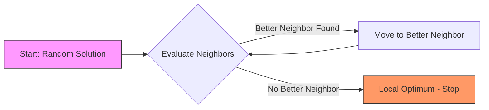
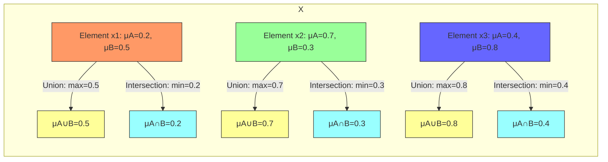

# Paper 1 – [6181]-121
## Q1
### a) Hill Climbing with a suitable diagram

Hill Climbing is a local search optimization algorithm that belongs to the family of iterative improvement techniques. It starts with an arbitrary solution and iteratively makes small changes to the solution, accepting the change only if it leads to an improvement in the objective function value. The process continues until no further improvements can be found, at which point the algorithm terminates at a local optimum.

The algorithm can be visualized as climbing a hill in the search space, where the altitude represents the objective function value. The goal is to reach the highest peak (global maximum) but Hill Climbing may get stuck at a local peak that is not the highest point in the entire search space.

**Diagram Explanation (ASCII and Mermaid):**

Consider a simple one-dimensional search space where the x-axis represents the solution space and the y-axis represents the objective function value (fitness). The landscape has multiple peaks and valleys.

ASCII Representation:
```
    Fitness (y)
      ^
      |                   ____
      |                  /    \
      |                 /      \       ____
      |                /        \     /    \
      |               /          \___/      \____
      |              /                               \
      |_____________/_________________________________\______> Solution (x)
                   Local Peak       Global Peak
```

In this diagram:
- The algorithm starts at a random point (e.g., on the left slope).
- It moves to neighboring points that have higher fitness (uphill).
- If it reaches the local peak (first peak), it will stop because all neighboring points have lower fitness.
- However, the global peak (second, higher peak) remains undiscovered because the algorithm cannot descend to go uphill again without accepting a temporary decrease in fitness.

Mermaid Diagram:


**Limitations and Variants:**
- Hill Climbing can get stuck in local optima, plateaus, or ridges.
- Variants like Stochastic Hill Climbing (random selection among better neighbors), First-Choice Hill Climbing (accept first better neighbor), and Random-Restart Hill Climbing (multiple runs from random starting points) help mitigate these issues.

### b) Evolutionary Programming

Evolutionary Programming (EP) is a stochastic optimization technique inspired by biological evolution, specifically focusing on the behavioral adaptation of species. It is part of the broader field of Evolutionary Computation and was developed by Lawrence J. Fogel in the 1960s. Unlike Genetic Algorithms (GAs), EP primarily emphasizes the mutation operation and does not typically use crossover.

**Key Characteristics:**
1. **Representation:** Solutions are typically represented as real-valued vectors (for continuous problems) or finite-state machines (for sequence prediction tasks).
2. **Mutation:** The primary operator is mutation, which creates offspring by adding small random perturbations to the parent's parameters. The mutation step size can be adaptive.
3. **Selection:** Uses a tournament-based or probabilistic selection mechanism where individuals compete based on fitness. Often, a (μ + λ) or (μ, λ) selection strategy is used, where μ parents generate λ offspring, and the next generation is selected from the combined pool.
4. **No Crossover:** EP traditionally does not recombine genetic material from two parents, focusing instead on the incremental improvement through mutation.

**Process:**
- Initialize a population of candidate solutions.
- Evaluate the fitness of each individual.
- For each parent, generate one or more offspring via mutation.
- Combine parents and offspring (or select only offspring) and choose the best individuals to form the next generation based on fitness.
- Repeat until termination criteria (e.g., max generations, fitness threshold) are met.

**Applications:** EP has been successfully applied to problems such as time series prediction, function optimization, and evolving neural network weights. Its strength lies in its ability to adapt to changing environments and optimize in complex, nonlinear search spaces where gradient-based methods fail.

### c) Artificial Hummingbird Algorithm

The Artificial Hummingbird Algorithm (AHA) is a recently developed metaheuristic optimization technique inspired by the foraging behavior of hummingbirds in nature. Hummingbirds are known for their unique ability to hover, fly backward, and rapidly change direction, which they use to efficiently extract nectar from flowers. AHA mimics these behaviors to explore and exploit the search space effectively.

**Inspiration:**
Hummingbirds visit flowers to feed on nectar. They remember the locations of flowers with high nectar concentration and can adjust their flight patterns to visit promising flowers while also exploring new ones to avoid missing better sources. This behavior translates to a balance between exploitation (intensifying search around known good solutions) and exploration (searching new regions).

**Algorithm Phases:**
AHA consists of two main phases that alternate during the search process:

1. **Guided Foraging Phase (Exploitation):**
   - In this phase, each hummingbird (solution) updates its position based on the best solution found so far (global best) and its own experience.
   - The movement is influenced by a tendency to visit flowers with high nectar reward, simulating exploitation of known profitable areas.
   - Mathematically, a solution might move toward the global best with some random component to simulate the hummingbird's ability to hover and adjust precisely.

2. **Territorial Foraging Phase (Exploration):**
   - To prevent premature convergence, hummingbirds also exhibit territorial behavior where they defend flower patches and occasionally wander to new areas.
   - This phase introduces larger, more random movements to explore unvisited regions of the search space, helping to escape local optima.
   - The step size in this phase is often adaptive, decreasing over time to shift from exploration to exploitation as the search progresses.

**Key Features:**
- **Memory:** AHA uses memory to store the best solutions found, similar to how hummingbirds remember flower locations.
- **Adaptive Step Sizes:** The algorithm adjusts the magnitude of movement based on the iteration count, allowing for broad exploration early and fine-tuning later.
- **Balance:** The alternation between guided and territorial foraging provides a natural balance between exploration and exploitation.

**Applications:** AHA has been applied to various optimization problems, including engineering design (e.g., pressure vessel design, spring tension), feature selection in machine learning, and clustering. It is particularly effective in multidimensional, multimodal optimization problems where traditional methods struggle.

**Advantages:** AHA is simple to implement, requires minimal parameter tuning, and demonstrates strong robustness and convergence speed compared to other metaheuristics like Particle Swarm Optimization (PSO) or Genetic Algorithms (GA) in benchmark tests.

In summary, the Artificial Hummingbird Algorithm effectively captures the dynamic foraging behavior of hummingbirds, translating their natural adaptability into a powerful optimization tool for complex real-world problems.

## Q2
### a) Simulated Annealing with a suitable diagram

Simulated Annealing (SA) is a probabilistic metaheuristic algorithm inspired by the annealing process in metallurgy, where a material is heated to a high temperature and then slowly cooled to reduce defects and achieve a low-energy crystalline state. In optimization, SA mimics this process to escape local optima and find a global optimum by allowing occasional uphill moves (worsening solutions) with a probability that decreases over time.

**Core Concept:**
SA starts with an initial solution and an initial "temperature" parameter. At each iteration, it generates a neighboring solution. If the neighbor is better (lower cost for minimization problems), it is accepted. If the neighbor is worse, it may still be accepted with a probability given by the Boltzmann formula: P = e^(-ΔE/T), where ΔE is the difference in objective function values (positive for worsening moves) and T is the current temperature. As the temperature decreases according to a cooling schedule, the probability of accepting worsening moves diminishes, causing the algorithm to converge to a local optimum, hopefully close to the global optimum.

**Diagram Explanation (ASCII and Mermaid):**

Consider the same one-dimensional search space with multiple peaks and valleys as used in the Hill Climbing explanation.

ASCII Representation showing how SA can escape local optima:
```
    Fitness (y)
      ^
      |                   ____
      |                  /    \       ____ (Global Optimum)
      |                 /      \     /    \
      |                /        \___/      \     ____
      |               /          Local     \   /    \     __
      |              /        Peak (trap)   \_/      \___/   \ 
      |             /                                    \__/ Solution (x)
      |____________/______________________________________\______>
                  Start -> Accept worse move -> Escape local opt
```

In this diagram:
- SA starts at a point and explores neighbors.
- If it reaches the local peak, unlike Hill Climbing, it may accept a worse move (going downhill) with probability P = e^(-ΔE/T).
- This allows it to descend into the valley and eventually climb toward the global peak.
- As temperature T decreases, the probability of accepting worse moves decreases, focusing the search on exploitation.

Mermaid Diagram showing the SA process:
```mermaid
graph TD
    A[Start: Random Solution, High T] --> B{Generate Neighbor}
    B -->|Better Solution| C[Accept Move]
    B -->|Worse Solution| D{e^(-ΔE/T) > rand(0,1)?}
    D -->|Yes| C[Accept Move]
    D -->|No| E[Keep Current Solution]
    C --> F{Update Temperature (Cool Down)}
    E --> F
    F -->|T > T_min| B
    F -->|T <= T_min| G[Best Solution Found]
    style A fill:#bbf,stroke:#333
    style G fill:#9f9,stroke:#333
```

**Cooling Schedule:**
The temperature decreases according to a predefined schedule. Common schedules include:
- Geometric: T_{k+1} = α * T_k (where 0.8 < α < 0.99)
- Linear: T_{k+1} = T_k - ΔT
- Logarithmic: T_{k+1} = T_k / log(1+k)

**Advantages and Limitations:**
- Advantages: Can escape local optima, simple to implement, theoretically guaranteed to converge to global optimum given infinite time and appropriate cooling schedule.
- Limitations: Requires careful tuning of initial temperature, cooling rate, and stopping criterion; can be computationally slow for large problems.

### b) Genetic Programming

Genetic Programming (GP) is an extension of Genetic Algorithms (GA) where the chromosomes are not fixed-length strings but rather computer programs, typically represented as tree structures. GP evolves populations of computer programs to solve problems by employing principles of natural selection and genetics.

**Representation:**
In GP, individuals are syntactic trees (often abstract syntax trees) where:
- Internal nodes represent functions (e.g., arithmetic operators +, -, *, /, or logical functions AND, OR, NOT).
- Leaf nodes represent terminals (e.g., input variables, constants).
- The entire tree represents a computer program that, when executed, produces an output.

**Genetic Operations:**
1. **Selection:** Similar to GA, individuals are selected based on fitness (how well the program solves the problem).
2. **Crossover (Recombination):** Two parent trees exchange subtrees. A random node is selected in each parent, and the subtrees rooted at these nodes are swapped to create offspring.
3. **Mutation:** A random node in the tree is selected and replaced with a newly generated subtree (mutation) or the subtree rooted at that node is modified (e.g., changing a function node or a terminal).

**Fitness Evaluation:**
Each program is executed on a set of training cases (fitness cases), and its output is compared to the desired output. The fitness is typically based on the error (e.g., mean squared error for symbolic regression, number of correct classifications for Boolean problems).

**Process:**
- Initialize a population of random computer programs (trees).
- Evaluate the fitness of each program.
- While termination criteria not met:
  - Select parents based on fitness.
  - Apply crossover and mutation to create offspring.
  - Evaluate offspring fitness.
  - Select individuals for the next generation (e.g., elitism, tournament selection).
- Return the best program found.

**Applications:** GP has been successfully applied to:
- Symbolic regression (finding mathematical expressions that fit data)
- Automatic programming and code generation
- Evolving neural network architectures
- Game playing (evolving strategies)
- Design of electronic circuits and antennas
- Bioinformatics (e.g., gene expression modeling)

**Advantages:** GP can automatically discover complex relationships and representations without requiring predefined model structures. It is particularly powerful for problems where the form of the solution is unknown.

**Limitations:** GP can suffer from bloat (uncontrolled growth of tree size), requires careful design of function and terminal sets, and fitness evaluation can be computationally expensive if programs are complex or need to be run many times.

### c) Differentiate between Standard PSO and Binary PSO

Particle Swarm Optimization (PSO) is a population-based metaheuristic inspired by the social behavior of bird flocking or fish schooling. Standard PSO operates in continuous search spaces, while Binary PSO (BPSO) is a variant designed for discrete, binary optimization problems.

**Standard PSO (Continuous PSO):**
- **Search Space:** Continuous, multidimensional real-valued space (e.g., R^n).
- **Particle Representation:** Each particle's position is a vector of real numbers representing a candidate solution.
- **Velocity Update:** The velocity of each particle is updated using:
  v_{id}^{k+1} = w * v_{id}^k + c1 * r1 * (p_{id}^k - x_{id}^k) + c2 * r2 * (p_{gd}^k - x_{id}^k)
  where:
  - v_{id}^k: velocity of particle i in dimension d at iteration k
  - w: inertia weight
  - c1, c2: acceleration coefficients
  - r1, r2: random numbers in [0,1]
  - p_{id}^k: best position found by particle i in dimension d
  - p_{gd}^k: best position found by the entire population (global best)
  - x_{id}^k: current position of particle i in dimension d
- **Position Update:** x_{id}^{k+1} = x_{id}^k + v_{id}^{k+1}
- **Applications:** Function optimization, engineering design, neural network training, where solutions are real-valued vectors.

**Binary PSO (BPSO):**
- **Search Space:** Discrete binary space {0,1}^n (each dimension is either 0 or 1).
- **Particle Representation:** Each particle's position is a binary vector (string of 0s and 1s).
- **Velocity Interpretation:** In BPSO, velocity cannot be directly added to a binary position. Instead, velocity is interpreted as the probability of a bit being set to 1.
- **Velocity Update:** Same formula as standard PSO:
  v_{id}^{k+1} = w * v_{id}^k + c1 * r1 * (p_{id}^k - x_{id}^k) + c2 * r2 * (p_{gd}^k - x_{id}^k)
  Note: (p_{id}^k - x_{id}^k) and (p_{gd}^k - x_{id}^k) yield values in {-1, 0, 1}.
- **Position Update:** Uses a sigmoid function to map velocity to a probability:
  s(v_{id}^{k+1}) = 1 / (1 + e^{-v_{id}^{k+1}})
  Then, x_{id}^{k+1} = 1 if rand(0,1) < s(v_{id}^{k+1}), else 0.
- **Applications:** Feature selection, clustering, knapsack problem, job scheduling, and any problem where the solution can be represented as a binary string (e.g., selecting a subset of features, deciding which nodes to activate in a network).

**Key Differences:**
1. **Search Space:** Standard PSO operates in continuous R^n; BPSO operates in discrete {0,1}^n.
2. **Position Update:** Standard PSO adds velocity to position; BPSO uses velocity to compute a probability for bit flipping via a sigmoid function.
3. **Velocity Meaning:** In standard PSO, velocity has physical meaning (rate of change of position); in BPSO, velocity represents the propensity or probability to change a bit's state.
4. **Problem Suitability:** Standard PSO for continuous parameter optimization; BPSO for combinatorial problems with binary decisions.

**Example to Illustrate:**
Consider a feature selection problem with 5 features:
- A solution might be [1, 0, 1, 0, 1] meaning features 1, 3, and 5 are selected.
- In BPSO, each particle's position is such a binary vector.
- Velocity might be [0.5, -1.2, 0.8, 2.1, -0.3].
- After applying sigmoid: [0.62, 0.23, 0.69, 0.89, 0.43].
- For each dimension, if rand(0,1) < sigmoid value, set bit to 1; else 0.
- This might yield a new position like [1, 0, 1, 1, 0].

In summary, while both variants share the same inspiration and velocity update mechanism, Binary PSO adapts the position update rule to handle binary representations, making it suitable for discrete optimization problems where Standard PSO would be ineffective without modification.

## Q3
### a) Describe any two fuzzy set operations

Fuzzy set operations extend classical set operations to handle degrees of membership. Unlike crisp sets where an element either belongs or does not belong to a set, fuzzy sets allow partial membership characterized by membership values in the interval [0,1]. Two fundamental fuzzy set operations are union and intersection.

**1. Fuzzy Union:**
The union of two fuzzy sets A and B, denoted as A ∪ B, is defined by taking the maximum of the membership values of each element in the two sets. For any element x in the universe of discourse X:
μ_{A ∪ B}(x) = max(μ_A(x), μ_B(x))

This operation corresponds to the logical OR operation. If an element strongly belongs to either A or B (or both), it will have a high membership in the union. The union operation is commutative, associative, and idempotent.

**Example:**
Let A = {(x1, 0.2), (x2, 0.7), (x3, 0.4)} and B = {(x1, 0.5), (x2, 0.3), (x3, 0.8)}
Then A ∪ B = {(x1, max(0.2,0.5)=0.5), (x2, max(0.7,0.3)=0.7), (x3, max(0.4,0.8)=0.8)}

**2. Fuzzy Intersection:**
The intersection of two fuzzy sets A and B, denoted as A ∩ B, is defined by taking the minimum of the membership values of each element in the two sets. For any element x in X:
μ_{A ∩ B}(x) = min(μ_A(x), μ_B(x))

This operation corresponds to the logical AND operation. An element will have high membership in the intersection only if it has high membership in both A and B. Like union, intersection is commutative, associative, and idempotent.

**Example:**
Using the same sets A and B as above:
A ∩ B = {(x1, min(0.2,0.5)=0.2), (x2, min(0.7,0.3)=0.3), (x3, min(0.4,0.8)=0.4)}

**Alternative Intersection Definition:**
While the min operator is most common, intersection can also be defined using algebraic product: μ_{A ∩ B}(x) = μ_A(x) * μ_B(x). This produces different results but satisfies the basic axioms of intersection.

**Venn Diagram Representation (ASCII):**
For fuzzy sets, Venn diagrams show graded membership rather than crisp boundaries:

```
Universe X
  ───────────────────────────────────────
  │                                     │
  │     A∩B      A-B       B-A         │
  │  ┌─────┐  ┌─────┐  ┌─────┐         │
  │  │ 0.2 │  │ 0.5 │  │ 0.4 │         │
  │  └─────┘  └─────┘  └─────┘         │
  │     (x1)    (x2)    (x3)          │
  │                                     │
  │─────────────────────────────────────│
  │         Fuzzy Set A                 │
  │  ┌─────────────────────────────┐    │
  │  │0.2     0.7     0.4          │    │
  │  │(x1)   (x2)   (x3)           │    │
  │  └─────────────────────────────┘    │
  │                                     │
  │─────────────────────────────────────│
  │         Fuzzy Set B                 │
  │  ┌─────────────────────────────┐    │
  │  │0.5     0.3     0.8          │    │
  │  │(x1)   (x2)   (x3)           │    │
  │  └─────────────────────────────┘    │
  │                                     │
  ───────────────────────────────────────
```

**Mermaid Diagram showing fuzzy union and intersection:**


### b) Explain Rank Ordering Method of Membership Value Assignment

The Rank Ordering Method is a technique for assigning membership values to elements of a fuzzy set based on pairwise comparisons or rankings provided by experts or stakeholders. This method is particularly useful when direct numerical assessment of membership is difficult, but experts can reliably rank elements according to their degree of belonging to a concept.

**Procedure:**
1. **Identify Elements:** Determine the set of elements X = {x1, x2, ..., xn} for which membership values are to be assigned in the fuzzy set A.
2. **Pairwise Comparisons:** Experts compare each pair of elements (xi, xj) and indicate which one has a higher degree of membership in the fuzzy concept being modeled. This produces a preference matrix.
3. **Rank Assignment:** Based on the pairwise comparisons, assign ranks to each element. The element that is preferred over all others gets rank 1 (highest membership), the next gets rank 2, and so on. Ties are handled by assigning average ranks.
4. **Normalization:** Convert the ranks to membership values in the interval [0,1]. The most common approach is:
   μ_A(xi) = (n - rank(xi)) / (n - 1)
   where n is the number of elements. This ensures the highest-ranked element gets membership 1.0 and the lowest-ranked gets 0.0.
5. **Alternative Normalization:** Sometimes membership values are assigned as:
   μ_A(xi) = (n - rank(xi) + 1) / (n + 1)
   which avoids assigning exactly 0 or 1.

**Example:**
Suppose we want to create a fuzzy set "Tall People" for five individuals with heights: 150cm, 160cm, 170cm, 180cm, 190cm.
- Experts rank them by tallness: 190cm (rank 1), 180cm (rank 2), 170cm (rank 3), 160cm (rank 4), 150cm (rank 5)
- Using normalization formula: μ(x) = (5 - rank) / (5 - 1) = (5 - rank) / 4
- Membership values:
  - 190cm: (5-1)/4 = 1.0
  - 180cm: (5-2)/4 = 0.75
  - 170cm: (5-3)/4 = 0.5
  - 160cm: (5-4)/4 = 0.25
  - 150cm: (5-5)/4 = 0.0

**Advantages:**
- Does not require experts to assign precise numerical values directly
- Leverages human ability to make comparative judgments
- Relatively simple to implement and understand
- Can reveal inconsistencies in expert judgments through rank analysis

**Limitations:**
- Assumes that the underlying concept can be adequately captured by rank ordering
- May lose some information present in more nuanced assessments
- Sensitive to how ties are handled
- The choice of normalization formula can affect the resulting membership values

**Applications:**
The Rank Ordering Method is used in various fields including:
- Multi-criteria decision making
- Preference modeling
- Customer satisfaction analysis
- Risk assessment
- Social choice theory
- Building fuzzy sets from survey data where respondents rank options

### c) Describe applications of Fuzzy Logic Control System

Fuzzy Logic Control Systems (FLCS) have found widespread application across numerous industries and domains due to their ability to handle uncertainty, approximate reasoning, and control complex nonlinear systems without requiring precise mathematical models. Here are some key application areas:

**1. Consumer Electronics:**
- **Washing Machines:** Fuzzy controllers adjust wash cycles, water temperature, and spin duration based on load size, fabric type, and dirtiness level sensed by sensors.
- **Cameras:** Auto-focus systems use fuzzy logic to adjust lens position based on object distance and movement speed.
- **Air Conditioners:** Fuzzy controllers regulate temperature and fan speed by considering room temperature, humidity, number of occupants, and outdoor conditions.
- **Microwave Ovens:** Cooking power and time are adjusted based on food type, quantity, and initial temperature.

**2. Automotive Systems:**
- **Transmission Control:** Fuzzy logic determines optimal gear shifting based on vehicle speed, throttle position, engine load, and road conditions.
- **Anti-lock Braking Systems (ABS):** Modulates brake pressure to prevent wheel lockup during sudden stops.
- **Fuel Injection Systems:** Optimizes air-fuel mixture for efficiency and emissions control.
- **Suspension Systems:** Adjusts damping characteristics in real-time for ride comfort and handling.

**3. Industrial Process Control:**
- **Chemical Plants:** Controls temperature, pressure, flow rates, and pH levels in reactors and distillation columns.
- **Power Systems:** Stabilizes grid frequency and voltage in power plants and manages load distribution.
- **Robotics:** Controls robotic arm movements for precise positioning and path planning in uncertain environments.
- **Manufacturing:** Regulates machining parameters like cutting speed, feed rate, and depth based on tool wear and material properties.

**4. Transportation:**
- **Traffic Control:** Adaptive traffic signal timing based on real-time traffic flow from multiple directions.
- **Train Control:** Automatic regulation of speed and braking for smooth acceleration and station stopping.
- **Elevator Systems:** Groups elevator cars and assigns them to floors based on passenger demand patterns.

**5. Environmental Systems:**
- **Irrigation Control:** Optimizes water distribution in agriculture based on soil moisture, weather forecasts, and crop requirements.
- **Wastewater Treatment:** Controls aeration rates and chemical dosing for efficient pollutant removal.
- **Greenhouse Management:** Regulates temperature, humidity, lighting, and ventilation for optimal plant growth.

**6. Medical Applications:**
- **Diagnostic Systems:** Assists in medical diagnosis by interpreting fuzzy symptoms and test results.
- **Drug Delivery Systems:** Controls infusion rates based on patient feedback and physiological parameters.
- **Prosthetic Limbs:** Provides adaptive control of artificial limbs based on user intent and movement patterns.

**7. Aerospace:**
- **Flight Control:** Assists in aircraft stability and control during takeoff, landing, and turbulence.
- **Satellite Attitude Control:** Orients satellites using fuzzy logic controllers that handle sensor noise and external disturbances.
- **Autopilot Systems:** Maintains course and altitude under varying flight conditions.

**Advantages in Applications:**
- **Model-Free Control:** Does not require precise mathematical models of the system.
- **Robustness:** Performs well under parameter variations and external disturbances.
- **Handle Nonlinearity:** Effectively controls highly nonlinear systems.
- **Incorporate Expert Knowledge:** Easy to encode human operator expertise as fuzzy rules.
- **Adaptability:** Can be tuned online to adjust to changing conditions.

**Example: Fuzzy Controlled Washing Machine**
Inputs: 
- Weight of clothes (light, medium, heavy) - sensed via motor current
- Type of fabric (delicate, normal, sturdy) - user selected
- Soil level (light, medium, heavy) - sensed via turbidity of wash water

Outputs:
- Wash time (short, medium, long)
- Water temperature (cold, warm, hot)
- Agitation intensity (gentle, normal, vigorous)
- Number of rinse cycles

Fuzzy Rules (examples):
- IF weight is heavy AND soil is heavy THEN wash time is long
- IF fabric is delicate THEN agitation intensity is gentle
- IF water temperature is hot AND soil is light THEN rinse cycles = 2

The fuzzy controller processes these rules using inference methods (like Mamdani or Sugeno) and defuzzification to produce crisp control actions.

In summary, Fuzzy Logic Control Systems excel in applications where processes are complex, poorly modeled, or operate under uncertainty, making them indispensable in modern intelligent control systems across diverse sectors.