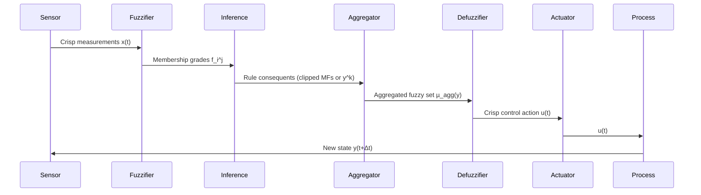
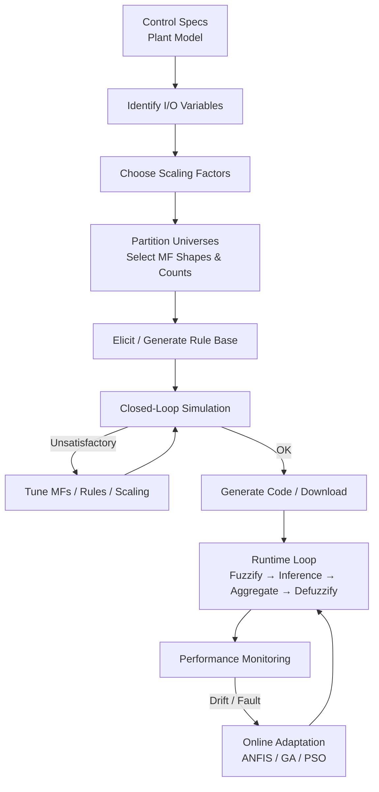

# Q4c: Architecture and Operation of a Fuzzy Logic Controller (FLC) System

## 1. High-Level Block Diagram

A Fuzzy Logic Controller (FLC) is a rule-based expert system that maps **crisp inputs → fuzzy reasoning → crisp outputs**. The canonical architecture comprises four principal modules plus a **knowledge base**:

```
┌─────────────┐      ┌─────────────┐      ┌─────────────┐      ┌─────────────┐
│  Fuzzifier  │ ──▶  │  Inference  │ ──▶  │ Aggregation │ ──▶  │ Defuzzifier │
│  (Input)    │      │   Engine    │      │   Module    │      │  (Output)   │
└─────────────┘      └─────────────┘      └─────────────┘      └─────────────┘
        ▲                                        ▲                    │
        │                                        │                    ▼
        │                    ┌──────────────────────────────────────┐
        └───────────────────▶│         Knowledge Base               │
                             │  ┌────────────┐  ┌────────────────┐ │
                             │  │ Rule Base  │  │ Data Base (MFs)│ │
                             │  └────────────┘  └────────────────┘ │
                             └──────────────────────────────────────┘
```

---

## 2. Detailed Module Description

### 2.1 Fuzzification Interface
- **Function**: Converts each crisp sensor reading $x_i^0$ into fuzzy singletons or fuzzy sets.
- **Singleton Fuzzification** (most common): $\mu_{A_i^j}(x)$ evaluated at $x = x_i^0$ ⇒ scalar grades $f_i^j = \mu_{A_i^j}(x_i^0)$.
- **Non-Singleton (Interval Type-2)**: Input uncertainty modelled as Gaussian footprint $[\underline{\mu}, \overline{\mu}]$.
- **Design Choices**: Universe scaling factors ($K_{in}$), number & shape of input MFs, normalisation.

### 2.2 Knowledge Base
| Sub-component | Contents | Typical Size |
|---------------|----------|--------------|
| **Rule Base (RB)** | IF-THEN linguistic rules: <br> $R^k$:  IF $x_1$ is $A_1^k$ AND … AND $x_n$ is $A_n^k$ THEN $y$ is $B^k$ | $N_{rules} = \prod_{i=1}^n N_{MFs,i}$ |
| **Data Base (DB)** | All membership functions $\mu_{A_i^j}$, $\mu_{B^k}$; scaling factors $K_{in}, K_{out}$; universe limits | Compact (parametric MFs) |

**Rule Format Variants**
| Type | Consequent | Use Case |
|------|------------|----------|
| **Mamdani** | Fuzzy set $B^k$ | Human-readable, PID replacement |
| **Takagi-Sugeno (TS)** | Crisp function $y^k = f^k(x)$ | Function approximation, adaptive control |
| **Tsukamoto** | Monotonic MF → invertible | Analytical defuzzification |

### 2.3 Inference Engine (Rule Evaluation)
For each rule $k$:
1. **Antecedent Matching (Firing Strength)**:
   - T-norm (typically **min** or **prod**):
   $$ w_k = T\bigl(f_1^{j_1}, f_2^{j_2}, …, f_n^{j_n}\bigr) $$
2. **Implication** (Mamdani):
   - **Mamdani (min)**: $\mu_{out}^k(y) = \min(w_k, \mu_{B^k}(y))$
   - **Mamdani (prod)**: $\mu_{out}^k(y) = w_k \cdot \mu_{B^k}(y)$
   - **TS**: $y^k = f^k(x)$ – no implication step (singleton output).

### 2.4 Aggregation Module
Combines all rule outputs into a single fuzzy set $Y_{agg}$:
- **Mamdani**: $\mu_{agg}(y) = S\bigl(\mu_{out}^1(y), …, \mu_{out}^M(y)\bigr)$ where $S$ = **max** (standard) or **probabilistic sum**.
- **TS**: Weighted average → no aggregation needed (skip to defuzzification).

### 2.5 Defuzzification Interface
Produces final crisp command $u = y^*$:
- **Centroid / COG** (default for Mamdani)
- **Weighted Average** (for TS)
- **Height / MOM / SOM / LOM** (special policies)

---

## 3. Closed-Loop Operational Cycle (Step-by-Step)



**Algorithmic Pseudocode (Mamdani FLC)**

```
loop every Δt
    // 1. Read & Scale
    x_raw = read_sensors()
    x = K_in * x_raw

    // 2. Fuzzify
    for each input i, each MF j
        f[i][j] = μ_input_MF[i][j]( x[i] )

    // 3. Rule Evaluation
    for each rule k
        w[k] = min( f[1][idx1], …, f[n][idxn] )   // T-norm
        clip consequent MF B_k at height w[k]

    // 4. Aggregate
    μ_agg(y) = max over k of clipped_B_k(y)

    // 5. Defuzzify (Centroid)
    u = ∫ y μ_agg(y) dy / ∫ μ_agg(y) dy

    // 6. Scale & Actuate
    u_raw = u / K_out
    write_actuator(u_raw)
end loop
```

---

## 4. Design Parameters & Tuning Knobs

| Category | Parameters | Effect |
|----------|------------|--------|
| **Scaling Factors** | $K_{in} \in \mathbb{R}^n$, $K_{out}$ | Map physical range → normalized universe $[-1,1]$ or $[0,1]$ |
| **Input MFs** | Type, count, centres, widths | Resolution of state perception |
| **Output MFs** | Type, count, centres, widths | Resolution of control action |
| **Rule Base** | Rule density, completeness, consistency | Control surface shape |
| **Inference Operators** | T-norm (min/prod), S-norm (max/probor) | Interpolation smoothness |
| **Defuzzification** | Method, discretisation step | Steady-state accuracy, CPU load |

---

## 5. Worked Example – Water Level Control in Tank

**Process**: Tank with inflow valve (0–100 %), outflow disturbance.  
**Control Objective**: Maintain level $h = 50\,\text{cm}$.

### 5.1 Variable Definitions
| Variable | Universe | Scaling | MFs (Triangular) |
|----------|----------|---------|------------------|
| Error $e = h_{sp} - h$ | $[-50, 50]$ cm | $K_e = 0.02$ ⇒ $[-1, 1]$ | NB, NS, ZE, PS, PB (5) |
| Change-in-error $\Delta e$ | $[-10, 10]$ cm/s | $K_{\Delta e} = 0.1$ ⇒ $[-1, 1]$ | NB, NS, ZE, PS, PB (5) |
| Valve command $u$ | $[0, 100]$ % | $K_u = 0.01$ ⇒ $[0, 1]$ | NB, NS, ZE, PS, PB (5) |

Total rules = $5 \times 5 = 25$.

### 5.2 Representative Rule Table

| $\Delta e \backslash e$ | NB | NS | ZE | PS | PB |
|------------------------|----|----|----|----|----|
| **NB** | PB | PB | PM | PM | PS |
| **NS** | PB | PM | PM | PS | ZE |
| **ZE** | PM | PM | PS | ZE | NS |
| **PS** | PM | PS | ZE | NS | NM |
| **PB** | PS | ZE | NS | NM | NB |

Abbreviations: NB=Negative Big, NM=Negative Medium, NS=Negative Small, ZE=Zero, PS=Positive Small, PM=Positive Medium, PB=Positive Big.

### 5.3 Steady-State Simulation Slice
At $e = 2$ cm ($\mu_{ZE}=0.92, \mu_{PS}=0.08$), $\Delta e = -0.5$ cm/s ($\mu_{NS}=0.95, \mu_{ZE}=0.05$)

Active rules & firing strengths (min T-norm):
| Rule (e, Δe) | $w_k$ |
|--------------|-------|
| (ZE, NS)     | 0.92  |
| (PS, NS)     | 0.08  |
| (ZE, ZE)     | 0.05  |
| (PS, ZE)     | 0.05  |

Aggregated output centroid ⇒ $u^* \approx 53 %$ valve opening (slight positive correction).

---

## 6. Implementation Aspects

| Platform | Typical Approach |
|----------|------------------|
| **PLC (IEC 61131-3)** | Structured Text loops over rule table; fixed-point centroid (100–500 steps). |
| **MCU (ARM Cortex-M)** | CMSIS-DSP accelerated centroid; flash-resident MF tables. |
| **FPGA** | Parallel rule evaluation (one cycle per rule); pipelined centroid. |
| **PC / Edge** | High-level libraries (scikit-fuzzy, MATLAB Fuzzy Toolbox, fuzzylite). |
| **Adaptive / Neuro-Fuzzy (ANFIS)** | MF parameters & rule consequents updated online via hybrid GD/RLS. |

---

## 7. ASCII Visualisation – Control Surface (Error × ΔError → Valve %)

```text
Valve % (u)
100 ┤                    PB  PB  PB
    │                  PB  PB  PM
 75 ┤                PM  PM  PM  PS
    │              PM  PM  PS  ZE
 50 ┤            PS  PS  ZE  NS  NM
    │          PS  ZE  NS  NM  NM
 25 ┤        ZE  NS  NM  NM  NB
    │      NS  NM  NM  NB  NB
  0 ┼──────●───●───●───●───●──── Error (e)
      -50 -25   0  +25 +50
      NB  NS  ZE  PS  PB
      (Each column = one Δe slice)
```

The diagonally symmetric surface reflects the intuitive "error & derivative" heuristic.

---

## 8. Mermaid Flowchart – Offline Design & Online Operation



---

## 9. Key Advantages Over Conventional PID

| Feature | FLC | PID |
|---------|-----|-----|
| **Nonlinear Plants** | Handles naturally (rule shaping) | Requires gain scheduling |
| **Expert Knowledge** | Directly encoded as rules | Indirect (tuning) |
| **Heuristic Operators** | Linguistic "IF error big THEN strong action" | Mathematical (P, I, D terms) |
| **Robustness** | Graceful degradation with rule reduction | Sensitive to model mismatch |
| **Multivariable** | Extends naturally (higher-dim rule table) | Decoupling needed |

---

## 10. Summary

The **Fuzzy Logic Controller** architecture is a **four-stage pipeline** (Fuzzify → Inference → Aggregate → Defuzzify) driven by a **dual knowledge base** (Rule Base + Data Base). Its **operation cycle** continuously converts crisp process measurements into graded rule activations, aggregates the implied fuzzy control actions, and extracts a single crisp manipulated variable. The design phase involves **scaling, partitioning, rule crafting, and simulation-based tuning**, after which the controller runs deterministically on platforms ranging from 8-bit MCUs to FPGAs. FLCs excel where plant nonlinearity, operator experience, or multi-variable coupling render linear PID inadequate, while retaining real-time feasibility and—when parametric MFs are used—human interpretability.