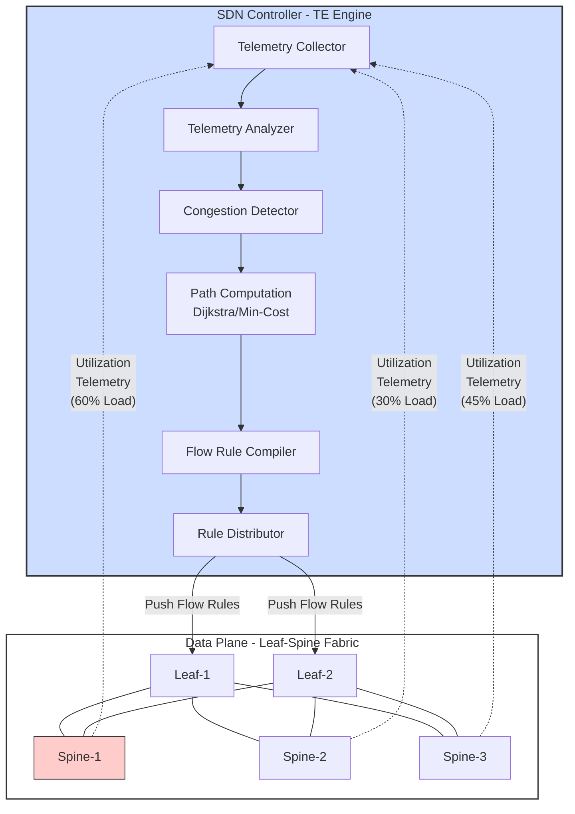
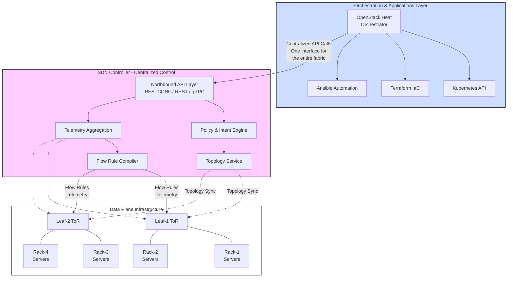
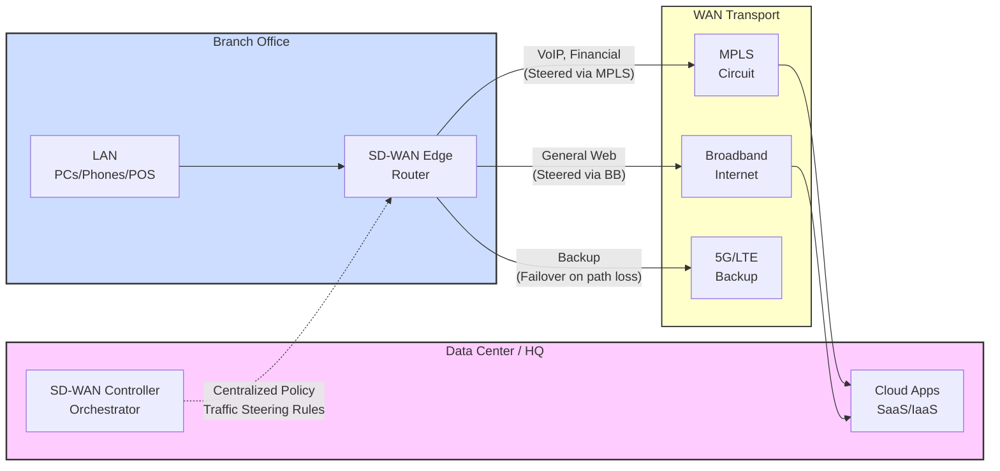
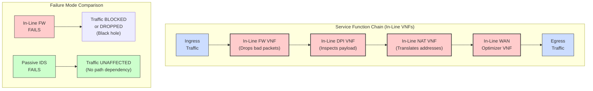
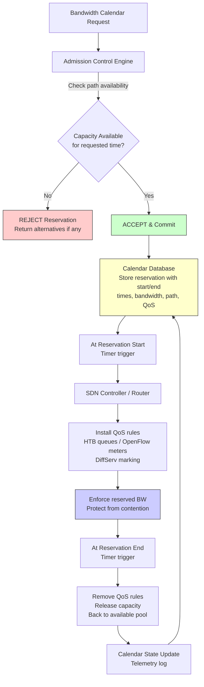

## Q1a) Define Data Center? What are the types of data center?

### 1.1 Definition of a Data Center

A data center is a purpose-built, specialized facility designed to house, power, cool, connect, and protect the IT infrastructure upon which modern organizations, cloud service providers, telecommunications operators, and government agencies depend for their computational, storage, and networking operations. At its most fundamental level, a data center is a dedicated structure or purpose-engineered space within a building that accommodates server racks, network switching equipment, storage arrays, uninterruptible power supplies (UPS), precision cooling systems, physical and logical security infrastructure, and redundant connectivity to the public internet or private wide area network. The construction and operation of data centers represent one of the most capital-intensive and operationally complex undertakings in the modern technology landscape, with global hyperscale operators investing tens of billions of dollars annually in new facility construction, equipment procurement, and ongoing operational management.

The formal academic and operational definition of a data center encompasses several dimensions: the physical infrastructure domain (building structure, power distribution, cooling, physical security), the IT infrastructure domain (compute servers, network switches, routers, storage systems), the operational management domain (monitoring, incident management, capacity planning, change management), and the service delivery domain (the applications, services, and platforms hosted within the data center that deliver value to end users and customers). The modern definition has expanded substantially in the era of cloud computing to encompass not merely physical buildings but also logically defined virtual data centers—software-constructed environments that provide the abstractions of dedicated data center infrastructure within shared public cloud environments.

```
+---------------------------------------------------------------+
|                  DATA CENTER PHYSICAL LAYOUT                   |
+---------------------------------------------------------------+
|                                                               |
|   [ INTERNET / WAN UPLINK ]                                   |
|          |          |          |                               |
|   +------v---+  +---v----+  +---v----+                        |
|   | ISP /    |  | Edge   |  | Edge   |                        |
|   | Transit  |  | Router |  | Router |                        |
|   +----+-----+  +---+----+  +---+----+                        |
|        |             |            |                            |
|   +----v-------------v------------v----+                       |
|   |          CORE ROUTER /             |                       |
|   |          CORE SWITCH               |                       |
|   +----+-------------+------------+----+                       |
|        |             |            |                             |
|   +----v---+  +-----v----+  +----v---+                         |
|   |Aggr.   |  | Aggr.    |  | Aggr.  |                         |
|   |Switch  |  | Switch   |  |Switch  |                         |
|   +----+---+  +----+-----+  +---+----+                         |
|        |            |            |                              |
|   +----v---+  +-----v----+  +----v---+                        |
|   | ToR    |  | ToR      |  | ToR    |                        |
|   |Switch  |  | Switch   |  |Switch  |                        |
|   +----+---+  +----+-----+  +---+---+                         |
|        |            |            |                              |
|   +----v---+  +-----v----+  +----v---+                        |
|   |Server  |  | Server   |  |Server  |                         |
|   |Rack    |  | Rack     |  |Rack    |                        |
|   |(24-48  |  | (24-48   |  |(24-48  |                        |
|   |Units)  |  | Units)   |  |Units)  |                        |
|   +---------+  +----------+  +--------+                       |
|                                                               |
+---------------------------------------------------------------+
```

### 1.2 Types of Data Centers

Data centers can be classified along several distinct taxonomic dimensions: by ownership and operational model, by tier classification based on availability and resilience, by physical scale and capacity, by geographic scope, and by the industry vertical they serve. Each classification reveals different operational characteristics, cost structures, and technological requirements.

**Classification by Ownership and Operational Model:**

1. **Enterprise (On-Premises) Data Centers:** Enterprise data centers are facilities owned, operated, and managed by individual organizations to serve their own internal IT requirements. These data centers vary substantially in size, ranging from small server rooms supporting a few dozen users to large enterprise facilities supporting tens of thousands of employees across multiple geographic locations. Enterprise data centers typically host internal business applications, customer relationship management systems, enterprise resource planning systems, email and collaboration infrastructure, internal databases, and file servers. The primary characteristic distinguishing enterprise data centers from other types is that they are built and operated to serve the specific, relatively stable requirements of a single organization, typically with lower density and less extreme availability requirements than hyperscale or telecommunications data centers.

2. **Colocation (Colo) Data Centers:** Colocation data centers are commercial facilities that provide physical space, power, cooling, physical security, and network connectivity to multiple independent tenant organizations. The colocation provider is responsible for the facility infrastructure—building shell, power distribution, cooling plant, physical security, and connectivity to internet exchange points and telecommunications carriers—while each tenant is responsible for procuring, installing, and managing their own IT equipment within their rented cage, cabinet, or rack space. The colocation model confers significant economic advantages: tenants avoid the massive capital expenditure of building and maintaining their own data center facilities while gaining access to professional-grade facility infrastructure and diverse carrier connectivity that would be prohibitively expensive to replicate independently. Colocation data centers vary in scale from small urban facilities hosting 50–200 racks to massive metro facilities hosting 5,000–20,000 racks.

3. **Hyperscale Data Centers:** Hyperscale data centers represent the largest and most operationally sophisticated category of data center, operated by global cloud service providers including Amazon Web Services (AWS), Microsoft Azure, Google Cloud Platform (GCP), and Meta (Facebook). Hyperscale facilities typically span 500,000 to over 1.5 million square feet of data halls, house 100,000 to 400,000 or more server nodes, and consume 30 to over 100 megawatts of electrical power. These facilities are purpose-built and custom-designed to support the extreme requirements of hyperscale cloud and content delivery operations, with proprietary innovations in power distribution, cooling architecture, server hardware design, and network fabric topology that are not found in commercial data centers. Hyperscale operators design their facilities to achieve exceptional power usage effectiveness (PUE) ratios—approaching 1.06–1.10 in the most efficient implementations—and to support the operational density and automation required for managing hundreds of thousands of servers with relatively small operational teams.

4. **Managed Services and Hosting Data Centers:** Managed hosting providers operate data center facilities and offer managed services ranging from pure infrastructure leasing (rack space, power, bandwidth) to fully managed infrastructure services where the provider is responsible for the complete operational management of the customer's IT equipment, including hardware maintenance, software patching, monitoring, backup management, and incident response. Managed hosting bridges the gap between colocation (where the customer retains full control over their equipment) and cloud computing (where the customer migrates to a shared, virtualized platform), offering a spectrum of operational responsibility that customers can adjust based upon their requirements and capabilities.

5. **Edge Data Centers:** Edge data centers represent an emerging architectural tier designed to bring computational capacity closer to end users and data sources, reducing the latency inherent in routing traffic to centralized core data centers. Edge facilities typically range in size from a single rack in a telecommunications central office to small modular facilities of 500–5,000 square feet deployed in retail locations, factory floors, cellular tower sites, or urban micro-data centers. The primary driver for edge data center deployment is the requirement to support latency-sensitive applications—industrial IoT processing, real-time analytics, augmented and virtual reality, 5G mobile network functions, and content caching—that cannot tolerate the round-trip latencies inherent in routing traffic to geographically distant core or hyperscale data centers.

**Classification by Tier (Uptime Institute Tier Classification):**

The Uptime Institute Tier Classification System is the most widely adopted framework for classifying data centers based upon their infrastructure redundancy, fault tolerance, and expected availability. The tier system comprises four levels:

**Tier I: Basic Capacity:** A Tier I data center provides a single path for power and cooling distribution, with no redundant components. Availability: approximately 99.671% (annual downtime: 28.8 hours). Suitable for non-critical workloads where brief outages are acceptable.

**Tier II: Redundant Capacity Components:** A Tier II data center includes redundant power and cooling components (N+1 redundancy) but maintains a single, non-redundant distribution path. Availability: approximately 99.741% (annual downtime: 22 hours). Suitable for business workloads where brief outages are undesirable but not catastrophic.

**Tier III: Concurrently Maintainable:** A Tier III data center provides multiple power and cooling distribution paths (N+1 or 2N), with only one path active at a time, permitting maintenance activities to be performed on active infrastructure without disrupting IT operations. Availability: approximately 99.982% (annual downtime: 1.58 hours). Suitable for mission-critical business applications where extended outages are unacceptable.

**Tier IV: Fault Tolerant:** A Tier IV data center provides fully redundant, active-active power and cooling distribution paths (2N or 2N+1) with the ability to sustain a single, any single planned or unplanned component failure without disrupting IT operations. Availability: approximately 99.995% (annual downtime: 26.3 minutes). Suitable for critical infrastructure supporting life safety, financial transactions, or emergency services.

```
+---------------------------------------------------------------+
|            UPTIME INSTITUTE TIER CLASSIFICATION                 |
+---------------------------------------------------------------+
|                                                               |
|  TIER        | REDUNDANCY          | AVAIL. | ANNUAL DOWNTIME  |
|  ------------|--------------------|--------|----------------- |
|  Tier I      | None               | 99.671%| ~28.8 hours     |
|  Tier II     | N+1 components     | 99.749%| ~22.0 hours     |
|  Tier III    | N+1 paths, 2N dist | 99.982%| ~1.58 hours     |
|  Tier IV     | 2N active-active   | 99.995%| ~26.3 minutes   |
|                                                               |
|  Redundancy notation:                                        |
|  N    = capacity to meet normal load                          |
|  N+1  = N + 1 backup component                               |
|  2N   = double capacity for full availability                 |
|  2N+1 = double capacity + 1 extra backup                      |
+---------------------------------------------------------------+
```

**Classification by Industry Vertical:**

Data centers are also categorized by their target industry vertical, which profoundly influences their design, security requirements, compliance obligations, and operational priorities. Telecommunications data centers are designed to support telecommunications switching, core network functions, and 5G packet core operations with sub-second availability requirements and ultra-low latency. Financial services data centers support high-frequency trading platforms, banking core systems, and payment processing with requirements for microsecond-level latency and comprehensive audit logging for regulatory compliance. Healthcare data centers host electronic health record systems, medical imaging archives, and clinical decision support systems requiring HIPAA compliance, business associate agreements, and comprehensive audit controls. Government data centers support classified and unclassified government operations with stringent physical and logical security requirements, FedRAMP authorization, and rigorous supply chain provenance requirements.

### 1.3 Conclusion

The definition of a data center has evolved from a simple server hosting facility to a complex, multi-layered ecosystem integrating power, cooling, physical security, networking, compute, and operational management into a unified infrastructure platform. Understanding the taxonomy of data center types—distinguished by ownership model, tier classification, scale, geographic scope, and industry vertical—provides the essential foundation for comprehending the diverse requirements, design trade-offs, and operational models that characterize the global data center landscape. Each data center type reflects a distinct set of priorities, constraints, and optimization objectives, and the selection of the appropriate data center type for a given workload or organizational need requires careful consideration of availability requirements, cost constraints, regulatory compliance, geographic distribution, and long-term strategic objectives.

---

## Q1b) Write a Short Note on Traffic Engineering

### 2.1 Definition and Purpose of Traffic Engineering

Traffic Engineering (TE) is a systematic discipline within network science that applies engineering principles and mathematical optimization techniques to the design, planning, measurement, and operational management of network traffic flows with the objective of achieving specific performance objectives—primarily: (a) minimizing network congestion and link utilization imbalance, (b) maximizing network resource utilization efficiency, (c) meeting committed service level agreements (SLAs) for latency, jitter, throughput, and packet loss, and (d) optimizing cost of network operation. Traffic Engineering is not simply about routing packets from source to destination; it is about actively controlling and managing how traffic traverses the network to achieve prescribed quality of service and operational efficiency goals.

In the context of data center networks, traffic engineering acquires heightened importance due to the distinctive traffic patterns exhibited by modern cloud workloads. Data center traffic is characterized by a highly skewed flow size distribution in which a small number of extremely large "elephant flows" (sustained throughput of 10 Gbps to 100+ Gbps, common in MapReduce shuffle phases, distributed storage replication, backup operations, and machine learning training data transfers) coexist with a very large number of small "mouse flows" (typically measured in kilobytes to low megabytes per second, representing API calls, database queries, and interactive user requests). Without active traffic engineering, elephant flows can monopolize shared link bandwidth and cause persistent congestion that degrades latency and throughput for latency-sensitive mouse flows—a phenomenon known as head-of-line blocking, which is particularly acute in oversubscribed data center network fabrics.

```
+---------------------------------------------------------------+
|           DATA CENTER TRAFFIC FLOW DISTRIBUTION                |
+---------------------------------------------------------------+
|                                                               |
|  FLOW SIZE (bytes transferred)  |  NUMBER OF FLOWS            |
|  ------------------------------ |  --------------------------  |
|  0 – 10 KB (mouse)             |  10,000,000+                 |
|  10 KB – 1 MB (small-medium)   |  500,000                     |
|  1 MB – 100 MB (medium)        |  50,000                      |
|  100 MB – 1 GB (large)         |  5,000                       |
|  1 GB – 1 TB (elephant)        |  200                         |
|  1 TB – 100 TB (very large)    |  10                          |
|                                                               |
|  KEY OBSERVATION:                                             |
|  ~0.00001% of flows generate ~50% of total traffic volume     |
|  Elephant flows dominate link utilization but are few in count |
+---------------------------------------------------------------+
```

### 2.2 Historical Evolution of Traffic Engineering

Traffic engineering has evolved through several distinct generations, each corresponding to significant advances in network technology and network management architecture.

**First Generation: Static Routing and Manual TE (Pre-2000):** In the earliest data networks, traffic engineering was performed manually by network engineers who calculated optimal routing paths, manually configured routing protocols with custom metrics (administrative weights, OSPF link costs), and periodically adjusted configurations based upon measured utilization patterns. This approach was feasible at the scale of circuits and early packet-switched networks but became operationally unsustainable as networks grew in complexity and scale.

**Second Generation: MPLS-Based Traffic Engineering (1998–2010):** The advent of Multi-Protocol Label Switching (MPLS) in the late 1990s enabled a major advance in traffic engineering capabilities. MPLS Traffic Engineering (MPLS-TE), standardized through IETF RFC 2702 and subsequent extensions, permits network operators to explicitly define Label Switched Paths (LSPs) through the network fabric by specifying source, destination, required bandwidth, and path constraints (avoiding congested links, traversing specific administrative domains). The MPLS-TE Control Plane, through cooperation between the head-end Label Switching Router (LSR) and Path Computation Elements (PCEs), computes paths satisfying specified constraints and signals them through the network using RSVP-TE (Resource Reservation Protocol - Traffic Engineering). MPLS-TE remained the dominant traffic engineering approach in telecommunications and service provider networks for approximately fifteen years and continues to be widely deployed in MPLS backbone networks.

**Third Generation: SDN-Based Traffic Engineering (2010–Present):** The emergence of Software-Defined Networking fundamentally transformed traffic engineering by replacing distributed routing protocol decision-making with logically centralized, globally-informed path computation within the SDN controller. The SDN controller's comprehensive topology view, real-time telemetry access, and programmatic control over the forwarding plane enable traffic engineering optimizations that were not achievable in distributed routing models: proactive congestion avoidance through global path optimization, per-flow traffic steering based on real-time link utilization, microsecond-granularity load balancing across equal-cost multipaths (ECMP), and dynamic bandwidth reservation. The combination of SDN control with high-speed programmable switching substrates has produced the most capable traffic engineering architectures in modern data center networks, enabling optimization that approaches the theoretical maximum performance of the underlying network fabric.

**Fourth Generation: Intent-Based and AI-Driven Traffic Engineering (Emerging):** The latest evolution in traffic engineering moves beyond reactive optimization of existing traffic patterns toward predictive, intent-driven management. Machine learning models trained on historical traffic telemetry predict future traffic demand patterns, congestion events, and capacity exhaustion, enabling the SDN controller to proactively reconfigure the network before congestion occurs rather than reacting to it after congestion has manifested. Intent-Based Networking (IBN) frameworks permit operators to declare QoS and availability objectives declaratively, and the controller continuously optimizes the network to maintain declared objectives, automatically remediating deviations as they occur.

### 2.3 Traffic Engineering Objectives and Constraints

Traffic engineering must simultaneously optimize multiple, often competing, objectives:

**Bandwidth Optimization:** Ensuring that no link in the network is over-utilized beyond its configured threshold while simultaneously ensuring that provisioned bandwidth is not wasted through under-utilization on lightly loaded links. Effective bandwidth optimization requires balancing traffic across all available paths in the fabric to achieve near-uniform link utilization.

**Latency Minimization:** Selecting forwarding paths that minimize end-to-end propagation, transmission, queuing, and processing delays for latency-sensitive traffic. Latency-sensitive flows (real-time voice/video, high-frequency trading traffic, industrial control system communications) may be routed on longer physical paths if those paths offer lower queuing delays than shorter but congested paths.

**Jitter Reduction:** Ensuring that packets belonging to latency-sensitive flows experience consistent and predictable end-to-end delay variation. Jitter reduction is achieved by reserving dedicated, lightly-loaded paths for jitter-sensitive traffic rather than dynamic load-balanced paths where queue depths may vary significantly.

**Packet Loss Minimization:** Ensuring that packet loss rates remain below configured thresholds for loss-sensitive traffic (TCP-dependent applications benefit from low loss to avoid unnecessary congestion window reductions). Packet loss minimization is achieved by ensuring that queues do not overflow during traffic spikes.

**Cost Optimization:** In service provider and cloud provider contexts, traffic engineering must also account for economic cost—preferentially routing traffic over lower-cost links, avoiding premium-priced transit links where alternatives exist, and minimizing the number of expensive high-speed ports consumed.

### 2.4 TE Mechanisms: From MPLS-TE to SDN TE

**MPLS-TE Mechanisms:** MPLS-TE implements traffic engineering through three primary mechanisms: (a) Constraint-Based Shortest Path First (CSPF), which computes LSP paths based upon link bandwidth, administrative constraints, and availability; (b) RSVP-TE signaling, which establishes LSPs and reserves bandwidth along the path; and (c) automatic route switching, which reroutes LSPs to pre-computed backup paths upon link or node failure. MPLS-TE provides sophisticated TE capabilities including bandwidth guarantees, class-of-service differentiation through multiple parallel LSPs, fast reroute (FRR) providing sub-50-millisecond failure recovery at every LSP hop, and route exclusion constraints.

**SDN TE Mechanisms:** SDN-based traffic engineering operates through the coordinated interaction of several SDN controller components: the topology service (providing complete, real-time fabric topology), the telemetry service (providing per-link utilization, per-flow bandwidth, and latency measurements), the path computation service (computing optimal or near-optimal paths based upon collected state and operator policies), and the flow rule service (implementing computed paths through switch flow programming). The SDN TE workflow proceeds as follows: (a) the controller continuously collects link state and flow statistics from all switches through streaming telemetry; (b) the controller identifies congestion events through threshold-based or anomaly-based detection on collected telemetry; (c) the path computation engine computes an alternative lower-utilization path for the affected flows; (d) the controller pushes updated flow rules to switches along the new path, steering flows away from congested links; and (e) the controller monitors the effectiveness of the rerouting and iteratively refines the optimization.

**ECMP and SDN-Based ECMP Optimization:** Equal-Cost Multi-Path (ECMP) routing distributes traffic across multiple network paths of equal total cost. In data center leaf-spine fabrics, ECMP naturally provides up to (number of spine switches) equal-cost forwarding paths between any pair of leaf switches. SDN-based traffic engineering enhances basic ECMP through: per-flow load balancing hash function optimization (selecting ECMP paths that balance aggregate utilization rather than simply hashing on 5-tuple hash), elephant flow detection and rerouting (steering large, long-lived flows to less-loaded paths), and dynamic ECMP weight adjustment based on measured link utilization.

```
Mermaid diagram:



Figure: SDN-based Traffic Engineering in a Leaf-Spine Data Center Fabric. The SDN controller continuously collects per-link utilization telemetry (Spine-1 congested at 60%), detects congestion, recomputes optimal paths using Dijkstra/Min-Cost algorithms, and dynamically pushes updated flow rules to leaf switches to redistribute elephant flows toward lower-utilization spine paths.
```

### 2.5 Bandwidth Calendaring as a TE Technique

Bandwidth Calendaring represents a proactive, calendar-based approach to traffic engineering in which bandwidth is reserved for specific time-based use cases rather than allocated on a best-effort basis. Rather than responding to congestion after it occurs, bandwidth calendaring prevents congestion by pre-committing link capacity for known, scheduled high-bandwidth operations—disaster recovery data replication, large-scale backup operations, scheduled data migrations, and planned analytical workloads. When a bandwidth reservation is placed through the calendaring system for a future time window, the traffic engineering engine ensures that competing flows are steered away from the reserved path during the committed time window, guaranteeing that the reserved bandwidth is available at the scheduled time and precluding congestion-caused SLA violations.

### 2.6 Conclusion

Traffic Engineering is a foundational discipline in network design and operations that determines how efficiently network resources are utilized, how reliably services are delivered, and how cost-effectively network infrastructure is operated. The evolution from static routing and manually managed traffic engineering through MPLS-TE to SDN-based dynamic traffic engineering has progressively increased the sophistication, responsiveness, and optimization quality achievable in network traffic management. In the modern data center—where flow size distributions are highly skewed, where latency-sensitive and bandwidth-intensive workloads coexist on shared infrastructure, and where service level commitments are non-negotiable—traffic engineering represents a critical operational competency that directly impacts application performance, user experience, and operational cost.

---

## Q1c) SDN Strategies to Centralize Management in the Data Center

### 3.1 The Problem of Distributed Management in Legacy Data Centers

Prior to the advent of Software-Defined Networking, the management of data center network infrastructure was characterized by a fundamentally distributed model in which each individual network device—every top-of-rack switch, aggregation switch, and core switch—was managed independently through device-specific configuration interfaces. This distributed management model engenders a collection of well-understood operational pathologies that have grown increasingly problematic as data center scale has expanded from hundreds to hundreds of thousands of server nodes.

The primary pathology of distributed network management is the configuration inconsistency problem: in environments where network policy must be applied uniformly across dozens, hundreds, or thousands of independently managed switches, human error inevitably leads to configuration drift. A firewall rule correctly applied to 199 of 200 access switches but inadvertently omitted from the 200th creates a security vulnerability that is difficult to detect and that can persist for extended periods before being discovered through security audit or incident response. Similarly, a VLAN assignment incorrectly applied to a subset of aggregation switches can create unexpected routing black holes or security segmentation failures that manifest as intermittent connectivity issues that are notoriously difficult to diagnose.

The second significant pathology of distributed management is the change management bottleneck. In legacy data centers, a network-wide policy change—such as the modification of ACL rules across all access switches, the addition of a new VLAN across all aggregation and core switches, or the implementation of a new QoS policy—requires individual login to, configuration of, and verification of each affected switch. At the scale of a modern enterprise data center (500+ switches) or hyperscale facility (10,000+ switches), this manual or semi-automated per-device change process can require hours or days of engineer effort, with the risk of configuration errors scaling proportionally with the number of devices managed.

The third pathology is the absence of a global network view. Because each device in a legacy data center maintains only its own local forwarding state—its own MAC address table, ARP cache, and routing table—no single point in the network has visibility into the complete, consistent state of the entire fabric. This absence of global visibility makes it impossible to implement network-wide optimizations, to correlate events across the fabric for root-cause analysis, or to verify network-wide policy compliance. The limited visibility also constrains the ability to detect and respond to security anomalies that manifest through patterns of traffic observable only at the fabric level rather than at individual device level.

```
+---------------------------------------------------------------+
|      LEGACY DISTRIBUTED MANAGEMENT vs SDN CENTRALIZED MGMT    |
+---------------------------------------------------------------+
|                                                               |
|  LEGACY DATA CENTER:           SDN-DATA CENTER:               |
|                                                               |
|   +----------+  +----------+  +----------+  SDN Centralized  |
|   | Switch 1 |  | Switch 2 |  | Switch 3 |  Management DB    |
|   | Config'd |  | Config'd |  | Config'd |  Controller View  |
|   | by eng.  |  | by eng.  |  | by eng.  |  of ALL switches  |
|   +----+-----+  +----+-----+  +----+-----+  +-----------+     |
|        |             |              |          | Flow Rules |   |
|        |    No global view     |          | Topology   |   |
|        |    Config drift risk  |          | Telemetry  |   |
|        |    Slow changes       |          | Policy DB  |   |
|        |                      |          +-----------+     |
|   Each switch is an           Single point of control          |
|   independent island.         and visibility.                  |
|                                                               |
+---------------------------------------------------------------+
```

### 3.2 Strategy 1: Logically Centralized Control Plane

The foundational SDN strategy for management centralization is the decoupling and logical centralization of the network's control plane within an SDN controller. In the logically centralized model, the decision-making intelligence—the routing computations, policy evaluations, flow rule generation, and topology management logic—is consolidated within a unified controller process (or a cluster of controller instances acting as one logical entity).

The logically centralized control plane is architecturally distinct from both distributed control plane models and physically centralized models. It is not distributed like legacy routing: each switch no longer independently computes its own forwarding decisions based on local state and neighbor information. It is not physically centralized in the sense of being a single physical device (for reliability reasons, the control plane is virtually always implemented as a cluster of controller nodes). The logical centralization is achieved through a consensus protocol—Raft (as implemented in ONOS and OpenDaylight), or a custom proprietary protocol—that ensures that all controller instances maintain a consistent view of network state and that only one controller instance at a time (the "leader") sends control messages to any given switch.

The logically centralized control plane enables management centralization at the level of forwarding decisions: rather than configuring ACL rules on each individual switch, the administrator defines security policy at the controller level, and the controller's flow rule compiler translates these high-level policies into the low-level flow table entries that must be installed on each affected switch. The controller then pushes these rules to all relevant switches simultaneously through the southbound API, ensuring that the policy is applied consistently across the entire fabric in a single coordinated operation.

### 3.3 Strategy 2: Unified, Centralized Network State Database

A second foundational strategy for management centralization is the maintenance of a unified, centralized database representing the complete, authoritative state of the managed network. In a traditional network, the "state of the network" is implicitly distributed: each device's configuration and operational state exists only within that device's local memory and configuration files. There is no single, authoritative, machine-readable representation of the complete network topology, the set of all active flow rules, the current utilization of all links, or the mapping between MAC addresses and attachment points across the entire fabric.

SDN controllers explicitly maintain this global network state within a structured, queryable database—frequently implemented using graph databases for topology representation, time-series databases for telemetry data, and relational or key-value stores for configuration and rule state. This centralized state database is the substrate upon which virtually all management centralization capabilities are built:

- **Topology-based management:** The controller's topology service constructs a real-time graph representation of the complete switching fabric, enabling graph-based algorithms (shortest path, minimum spanning tree, k-shortest paths) to compute optimal network-wide paths in milliseconds rather than relying on distributed routing protocol convergence measured in seconds.

- **Policy-centric management:** The controller maintains a central policy database in which all network security, routing, and QoS policies are defined. Rather than requiring per-device policy management, administrators manage a single centralized policy repository. Policy changes are propagated to relevant data plane elements automatically.

- **Telemetry-driven management:** The controller's telemetry service aggregates real-time operational data from all managed switches into a centralized telemetry database, enabling network-wide analytics, anomaly detection, and capacity planning that would be infeasible in distributed management models.

### 3.4 Strategy 3: Model-Driven Management with YANG Data Models

Modern SDN controllers implement management centralization through a model-driven architecture in which all manageable aspects of the network—device configuration, forwarding state, operational telemetry, topology relationships—are formally defined using YANG (Yet Another Next Generation) data models. The YANG model serves as the canonical schema for all network management operations: every configuration change, every telemetry query, every policy definition, and every topology operation operates against the YANG-defined data hierarchy.

The model-driven approach to management centralization confers three critical advantages:

1. **Schema-enforced consistency:** All network state conforms to the YANG schema, ensuring that configuration data is structurally valid, semantically correct, and consistent across the entire managed fabric. Invalid configurations that would produce inoperable device states in CLI-driven management are rejected at the model validation layer before they can be applied to the network.

2. **Vendor-neutral abstraction:** Because YANG models define network behavior at a semantic level rather than through vendor-specific CLI syntax, the same management operations can be applied to network devices from multiple different vendors without requiring vendor-specific management logic. A VLAN creation operation, expressed against the standardized YANG interface model, can be applied uniformly to switches from different vendors.

3. **Automated API generation:** YANG models enable the automatic generation of well-documented, type-safe northbound APIs (RESTCONF endpoints, gNMI service definitions) from the network schema, ensuring that the management interface is always complete, consistent, and derived directly from the authoritative network model.

### 3.5 Strategy 4: Centralized Policy Enforcement and Intent-Based Networking

The highest level of management centralization is achieved when the SDN controller implements an intent-based networking (IBN) layer through which administrators express desired network outcomes declaratively rather than specifying the detailed configuration steps required to achieve those outcomes. In an intent-based model, the administrator specifies business-level objectives—"traffic between the payment processing VLAN and the public internet must pass through the DDoS protection and WAF service chain," or "backup traffic between racks 12–18 must not exceed 30% of spine capacity during business hours"—and the IBN engine continuously monitors the network to verify that the declared intent is maintained, automatically remediating any deviations.

The intent-based approach to management centralization is transformative because it inverts the traditional management model: instead of requiring network operators to specify the detailed configuration steps necessary to implement a policy across hundreds or thousands of individual devices, operators specify only the desired outcome, and the controller autonomously computes and deploys the necessary configurations across the entire fabric. This not only dramatically reduces the complexity of network management operations but also eliminates a significant class of configuration errors that arise from manual translation of high-level policy into low-level device configurations.

### 3.6 Strategy 5: Centralized Orchestration and Automation Frameworks

Beyond the SDN controller itself, comprehensive management centralization in the data center is achieved through the integration of the SDN layer with higher-level orchestration and automation frameworks that manage the complete lifecycle of data center services. Cloud orchestration platforms (OpenStack Heat, Kubernetes, Terraform, Ansible Automation Platform) interact with the SDN controller through standardized northbound APIs to encode network operations within broader infrastructure provisioning, scaling, and lifecycle management workflows.

When a cloud orchestration platform receives a request to provision a new tenant virtual network with specific topology, security, and performance requirements, it translates the request into a sequence of network API calls to the SDN controller: creating the virtual network, configuring routing between subnets, applying security group rules, and configuring QoS policies. The orchestration framework provides the central coordination point for multi-domain operations, ensuring that compute, network, storage, and security operations are executed in the correct sequence with appropriate validation and error handling.

```
Mermaid diagram:



Figure: Centralized Management Architecture. The SDN Controller provides a single integration point for all applications and orchestrators via the Northbound API. The controller maintains centralized state for the entire fabric, and flow rules are distributed to switches atomically, ensuring consistent management across all data plane elements.
```

### 3.7 Operational Benefits of Centralized Management

The centralization of data center network management through SDN strategies produces measurable operational benefits:

**Consistency and Configuration Compliance:** Centralized management ensures that security policies, ACL rules, routing policies, and QoS configurations are applied uniformly across the entire data center fabric. Administrators can verify that a specific security policy is correctly applied to all relevant switches through a single policy query against the controller's state database, eliminating the time-consuming and error-prone process of individually auditing dozens or hundreds of individually managed switches.

**Rapid Change Deployment:** Network-wide policy changes that would previously require hours of engineering effort can be deployed in seconds. Adding a new VLAN across an entire data center, modifying an ACL rule set, or implementing a new QoS policy requires only an update to the centralized configuration database followed by automatic propagation of the resulting flow rule updates to affected switches.

**Operational Visibility and Analytics:** Centralized telemetry aggregation enables comprehensive network-wide visibility that was unachievable with distributed management. Network operators can view end-to-end flow paths, identify congestion hotspots, track utilization trends, correlate events across the fabric for rapid root-cause analysis, and generate audit-compliant reports of all network state changes.

**Policy-Driven Automation:** Centralized management creates the foundation for robust network automation. Automated workflows—responding to security events, initiating disaster recovery procedures, implementing scheduled maintenance—can operate against the centralized state API without requiring per-device scripting or logic, dramatically reducing the complexity and fragility of network automation programs.

### 3.8 Conclusion

The strategies by which SDN achieves management centralization in the data center—logical control plane centralization, unified network state databases, model-driven management, intent-based networking, and integration with orchestration frameworks—collectively represent a fundamental reconceptualization of how network infrastructure is managed. The shift from distributed, per-device, CLI-driven management to centralized, model-driven, API-first management directly addresses the operational bottlenecks, security vulnerabilities, and scaling constraints that plague legacy data center networks. As data center scale continues to grow and as the demand for rapid, policy-compliant, automated network management increases, the centralized management capabilities enabled by SDN have become not merely advantageous but operationally indispensable.

---

## Q2a) The Four Tiers of Data Center Architecture

### 4.1 Tiered Architecture as a Design Framework

The tiered data center architecture model is a foundational structural framework that decomposes the data center network into a hierarchy of functionally distinct layers, each serving a specific connectivity, aggregation, or transit role. This hierarchical decomposition—most commonly realized as a three-tier, four-tier, or leaf-spine two-tier model—serves several critical design purposes. It permits network engineers to apply appropriate switching technology, redundancy, and capacity planning at each layer based upon its functional requirements. It enables scalable expansion by permitting independent growth at each tier. It facilitates segmentation and policy enforcement by providing natural policy enforcement points (for example, inter-tier routers or firewalls where security inspection, routing policy, and QoS can be applied at well-defined boundaries). And it supports operational manageability through clear physical and logical demarcation points.

The four-tier architecture model—described as Core, Aggregate, Access, and Server tiers—represents the classical data center design, still appropriate for moderate-scale enterprise data centers and as the architectural baseline for understanding more modern two-tier leaf-spine designs. Each tier has distinct requirements, technology choices, and design constraints.

```
+---------------------------------------------------------------+
|               FOUR-TIER DATA CENTER NETWORK                    |
+---------------------------------------------------------------+
|                                                               |
|  TIER-3: SERVER TIER                                         |
|  +---------------------------------------------------------+   |
|  | Compute Nodes, Storage Nodes                           |   |
|  | - Ethernet NICs: 1GbE, 10GbE, 25GbE, 100GbE          |   |
|  | - Dual-homed NICs for redundancy                       |   |
|  | - Host bus adapters (for SAN storage)                  |   |
|  +---------------------------+-----------------------------+   |
|                              |                                 |
|  TIER-2: ACCESS TIER                                        |
|  +---------------------------+-----------------------------+   |
|  | Top-of-Rack (ToR) Switches |                           |   |
|  | - 48-port 10GbE/25GbE/100GbE                          |   |
|  | - 4-8 uplink ports to Aggregation                      |   |
|  | - Layer 2 or Layer 3 forwarding                        |   |
|  | - PoE for IoT, IP Cameras, APs                          |   |
|  +---------------------------+-----------------------------+   |
|                              |                                 |
|  TIER-1: AGGREGATION TIER                                    |
|  +---------------------------+-----------------------------+   |
|  | Aggregation / Distribution |                           |   |
|  | Switches                   |                           |   |
|  | - 10GbE/25GbE/40GbE ports |                           |   |
|  | - VLAN tag processing (802.1Q)                        |   |
|  | - Layer 3 routing between VLANs                       |   |
|  | - Policy enforcement point                            |   |
|  +---------------------------+-----------------------------+   |
|                              |                                 |
|  TIER-0: CORE TIER                                           |
|  +---------------------------+-----------------------------+   |
|  | Core / Backbone Switches   |                           |   |
|  | - 40GbE/100GbE/400GbE ports                          |   |
|  | - High throughput, low latency                        |   |
|  | - Inter-building, inter-DC links                      |   |
|  | - BGP routing to edge routers                         |   |
|  +---------------------------------------------------------+   |
|                                                               |
+---------------------------------------------------------------+
```

### 4.2 Tier 1: The Server Tier (Compute and Storage Layer)

The Server Tier comprises the computational and storage endpoints of the data center—the physical and virtual compute resources that execute workloads and the storage systems that persistently retain application and system data. The Server Tier is the terminus of the network fabric; all network traffic originates from or terminates at some element within this tier. Understanding the Server Tier's networking characteristics is essential for comprehending the design requirements of the access tier that connects to it.

Server tier connectivity infrastructure includes: the Network Interface Card (NIC), which provides the physical and logical interface through which the server connects to the network—modern server NICs implement 10 Gbps, 25 Gbps, 40 Gbps, 100 Gbps, or 200/400 Gbps Ethernet interfaces, frequently with multiple physical ports configured in teams (NIC teaming/bonding) for high availability and bandwidth aggregation; dual-ported NIC implementations that connect simultaneously to two access switches providing redundant connectivity in the event of a switch or link failure; and Converged Network Adapters (CNAs) that support both conventional Ethernet networking and Fibre Channel over Ethernet (FCoE) storage traffic over a single physical interface, simplifying cabling and reducing adapter card counts.

Storage tier connectivity within the server tier includes: Fibre Channel (FC) host bus adapters (HBAs) connecting to Fibre Channel Storage Area Networks (SANs); iSCSI initiators running over conventional Ethernet NICs providing block storage access over IP networks; NVMe over Fabrics (NVMe-oF) initiators providing high-performance, low-latency block storage access over RDMA-capable Ethernet or Fibre Channel fabrics; and file-based storage access through NFS or SMB/CIFS clients connecting to network-attached storage (NAS) appliances.

Modern server tier architectures increasingly employ Virtual Machines (VMs) and Containers as the primary compute abstraction, with the physical NICs presented to guest operating systems through virtual NIC (vNIC) interfaces implemented through the hypervisor's virtual switch (such as the VMware vSwitch, KVM's virtio-net, or Open vSwitch virtual ports). These virtualized connectivity abstractions are managed through SDN and NFV control planes rather than through the physical switch configuration interfaces.

### 4.3 Tier 2: The Access Tier

The Access Tier—colloquially referred to as the Top-of-Rack (ToR) tier—represents the first network switching element encountered by server tier traffic and serves as the primary interconnection point between servers within a given server rack and the broader data center network fabric. The Access Tier's fundamental responsibilities are: aggregating the network connections from all servers in a rack, providing Layer 2 or Layer 3 forwarding between servers within the same rack, providing uplink connectivity to the aggregation tier, and implementing access-level policy enforcement (port security, 802.1X authentication, VLAN membership enforcement, MAC address limiting, and DHCP snooping).

Access tier switches are characterized by high port density (typically 48 to 96 ports per switch) supporting server-facing Ethernet interfaces at the appropriate speed for rack-level compute nodes, a moderate number of high-speed uplink ports (typically 4 to 8 ports) connecting to aggregation switches, and redundant uplink configurations providing path diversity. Access tier switch design considerations include: oversubscription ratio (the ratio of total server-facing port bandwidth to total uplink bandwidth), with modern data centers targeting oversubscription ratios between 3:1 and 1:1 depending on workload characteristics and fabric design philosophy; buffer sizing to accommodate microbursts without packet loss for latency-sensitive workloads; and power-over-Ethernet (PoE/PoE+) capability in environments supporting IoT devices, IP cameras, or wireless access points within server racks.

In modern SDN-equipped data centers, access tier switches frequently function as VTEPs (VXLAN Tunnel End Points), performing VXLAN encapsulation and decapsulation on behalf of the servers connected to them. This architectural role places significant additional processing demands on access tier switches, which must handle not only conventional Layer 2/Layer 3 forwarding but also overlay tunnel encapsulation and routing of tenant traffic across the IP underlay fabric.

```
+---------------------------------------------------------------+
|             ACCESS TIER: TOP-OF-RACK SWITCH ROLE               |
+---------------------------------------------------------------+
|                                                               |
|   SERVER RACK (48U rack)                                       |
|   +------------------------------------------------------+     |
|   | [PSU] [PSU]                                           |     |
|   | [Fan] [Fan]                                           |     |
|   | +------------------------------------------------+  |     |
|   | | ToR Switch (48x 25GbE SFP28, 6x 100GbE QSFP28)|  |     |
|   | +----------+-----------+-----------+--------------+  |     |
|   | | Port 1   | Port 2    |   ...    | Port 48       |  |     |
|   | +----+-----+-----+----+---+---+---+---+------------+  |     |
|   |      |     |       |  |        |   |               |     |
|   |  +---v-+ +--v---+  |  |        |  etc              |     |
|   |  |Srv A| |Srv B  |  |  |        |                  |     |
|   |  |1x100G| |1x100G|  |  |        |                  |     |
|   |  +-----+ +-------+  |  |        |                  |     |
|   |                                                      |     |
|   |  Uplinks:                                            |     |
|   |  +--Q1--+--Q2--+--Q3--+--Q4--+--Q5--+--Q6--+        |     |
|   |  100GbE to Agg-II switches (Q1-Q4 = Active, Q5-Q6=  |     |
|   |  LAG client sessions)                                 |     |
|   +------------------------------------------------------+     |
|                                                               |
+---------------------------------------------------------------+
```

### 4.4 Tier 3: The Aggregation Tier

The Aggregation Tier serves as the collection and distribution layer that interconnects multiple access tier switches and provides connectivity between the access layer and the core tier. In classical three-tier data center architecture, the aggregation tier is where key policy enforcement and traffic management functions are implemented: VLAN tag processing and inter-VLAN routing, quality of service policy enforcement (traffic classification, marking, queuing, and scheduling), access control list (ACL) enforcement, and firewall policy inspection in architectures where security appliances are located at tier boundaries.

The aggregation tier plays a critical role in controlling the broadcast domain size within the data center fabric. Without aggregation tier boundaries, a span of access tier switches connected at Layer 2 would constitute a single, large broadcast domain in which broadcast frames from any access port propagate to all switches in that domain. The aggregation tier's routing function imposes Layer 3 boundaries that contain broadcast traffic within individual VLAN IP subnets, improving network efficiency and limiting the scope of broadcast-related security vulnerabilities.

The aggregation tier also serves as the primary east-west traffic transit point in data centers where traffic between servers in different rack groupings must traverse the aggregation layer before reaching core. Good aggregation tier design requires carefully planned oversubscription ratios: if all servers in an aggregation domain can simultaneously generate traffic to destinations in other aggregation domains, the uplink capacities from aggregation to core must be sized accordingly.

### 4.5 Tier 4: The Core Tier

The Core Tier is the backbone switching fabric that interconnects all aggregation tier switches and provides the high-speed, low-latency transit path for all east-west data center traffic as well as the connectivity path to external networks (internet, enterprise WAN, cloud interconnects). The core tier must be engineered for maximum throughput, minimum latency, maximum reliability, and minimal packet loss under all anticipated operating conditions, including peak load scenarios and partial infrastructure failure scenarios.

Core tier switches are characterized by: extremely high throughput capacity (backplane or fabric bandwidth measured in terabits per second), extremely low forwarding latency (sub-microsecond switching latency), very high port density supporting 40 Gbps, 100 Gbps, 400 Gbps, or 800 Gbps interfaces, comprehensive high-availability features (redundant supervisor engines, redundant power supplies, non-blocking crossbar switching fabric), and support for high-speed routing protocols (BGP, IS-IS, OSPF) with fast convergence characteristics.

In modern data center architectures that have adopted the leaf-spine model, the traditional "core tier" is essentially eliminated as a separate hierarchical level, and the core functionality is absorbed into the spine layer of the leaf-spine fabric. In this architecture, the spine switches collectively serve the role that the core tier served in the four-tier architecture: providing non-blocking, high-speed inter-rack connectivity. The convergence of aggregation and core into a unified leaf-spine fabric is motivated by the dramatically higher east-west traffic ratios typical of modern cloud and microservices workloads, where a single web service request may generate dozens of internal RPC calls to backend services distributed across multiple server racks.

```
+---------------------------------------------------------------+
|            FOUR-TIER vs LEAF-SPINE TOPOLOGIES                  |
+---------------------------------------------------------------+
|                                                               |
|   FOUR-TIER (Classical):                                      |
|                                                               |
|        [Core Tier]                                           |
|            |   |                                             |
|     +------+   +------+                                       |
|     |               |                                         |
|  [Agg-1] [Agg-2] ... [Agg-N]                                 |
|     |   |     |   |                                           |
|  [Acc-1..N] for each aggregation group                        |
|     |   |     |   |                                           |
|  [Servers in racks]                                           |
|                                                               |
|   Oversubscribed at Agg-to-Core links                         |
|   ~4:1 to 20:1 oversubscription typical                       |
|                                                               |
|   LEAF-SPINE (Two-Tier - Modern):                            |
|                                                               |
|         [Spine-1]  [Spine-2]  [Spine-3] ... [Spine-N]       |
|            |   |    |   |    |   |                             |
|  +--------+   +----+   +----+   +----+--------+               |
|  |                                                    |     |
|  [Leaf-1]  [Leaf-2]   [Leaf-3]  ...  [Leaf-N]             |
|     |           |          |                                  |
|  [Racks]   [Racks]    [Racks]                                |
|                                                               |
|   Non-blocking or near non-blocking                           |
|   O(N_spines * N_leaves) bisection bandwidth                  |
|                                                               |
+---------------------------------------------------------------+
```

### 4.6 Conclusion

The four-tier data center architecture model provides a foundational framework for understanding how data center networks are structured, how traffic flows between compute resources at different hierarchical levels, and why each tier requires distinct switching technologies, redundancy approaches, and capacity planning. While the classical four-tier model has been superseded in hyperscale and cloud data centers by the leaf-spine two-tier architecture—the two-tier model being a logical simplification of the four-tier model that collapses aggregation and core functions into a unified, non-blocking fabric—the conceptual framework of tiered design remains essential for understanding data center network topology, capacity planning, and the functional role of switching infrastructure at each level of the hierarchy. Comprehension of the four-tier model and its two-tier modern equivalent constitutes an essential prerequisite for understanding the more advanced topics in SDN and data center networking, including overlay virtualization, traffic engineering optimization, and data center orchestration.

---

## Q2b) Short Note on VxLAN (Virtual Extensible LAN)

### 5.1 VxLAN: Origins, Motivation, and Formal Standardization

VxLAN (Virtual Extensible LAN) constitutes the most widely deployed, vendor-neutral Layer 2 overlay network virtualization technology in contemporary data center networks, providing an elegant and scalable mechanism for creating isolated virtual Layer 2 broadcast domains (VxLAN segments or VxLAN Networks, VNs) over arbitrary Layer 3 IP underlay topologies. VxLAN was jointly developed by VMware, Arista, and Cisco in response to the rapidly escalating demand for scalable multi-tenant network isolation in cloud data center environments—a demand that the then extant IEEE 802.1Q VLAN technology was fundamentally unable to satisfy.

The primary technical limitation of 802.1Q VLANs that motivated VxLAN's development is the 12-bit VLAN Identifier (VID) field, which provides a maximum address space of 4,096 VLANs (4,094 usable after accounting for reserved values). Cloud providers supporting multi-tenant Infrastructure as a Service (IaaS) environments—where each tenant requires one or more independently routable virtual networks—found this 4,094-VLAN ceiling wholly inadequate. Hyperscale cloud operators managing hundreds of thousands or millions of tenant virtual networks required a virtual network address space exceeding this ceiling by multiple orders of magnitude. VxLAN addresses this scalability constraint through the introduction of a 24-bit VxLAN Network Identifier (VNI) field, expanding the addressable virtual network space to approximately 16.7 million (2^24 = 16,777,215) unique VxLAN segments, an address space sufficient to support virtually any conceivable data center multi-tenancy or micro-segmentation requirement.

VxLAN was formally standardized by the Internet Engineering Task Force (IETF) as RFC 7348, published in August 2014. The RFC specification documents the VxLAN data plane encapsulation format, the VxLAN Tunnel End Point (VTEP) operational behavior, the VxLAN control plane options (data-plane and control-plane learning), and the multicast or head-end-replication mechanisms for multicast, broadcast, and unknown unicast (BUM) traffic flooding within VxLAN segments. The IETF standardization of VxLAN provided the vendor-neutral, open specification necessary for broad multi-vendor adoption, which has subsequently occurred across virtually every major data center switching and virtualization vendor.

### 5.2 VxLAN Encapsulation Format and Data Plane Operation

VxLAN operates through the encapsulation of original Ethernet frames (termed the inner frame) within an outer UDP/IP packet that is routed through the Layer 3 underlay network to the destination VTEP, where the original frame is decapsulated and forwarded to the destination virtual machine through the destination server's hypervisor virtual switch.

The VxLAN packet encapsulation format comprises the following layered headers: (1) Outer Ethernet Header, containing the source and destination MAC addresses of the physical sending and receiving VTEP devices; (2) Outer IP Header, containing the source and destination IP addresses of the sending and receiving VTEPs (these are the addresses through which the underlay IP network routes the packet); (3) Outer UDP Header, with a fixed destination port number 4789 (IANA-assigned for VxLAN); (4) VxLAN Network Header, containing the 24-bit VNI, Flags field, and Reserved fields; and (5) Inner Ethernet Header and Payload, which constitute the original frame as it appeared before encapsulation, containing the original source and destination MAC addresses, EtherType, and data payload.

```
+---------------------------------------------------------------+
|               VxLAN PACKET ENCAPSULATION FORMAT                |
+---------------------------------------------------------------+
|                                                               |
|   +------------------------------------------------------+    |
|   | Outer Ethernet Header                                |    |
|   | (DMAC = Next-hop VTEP MAC, SMAC = Sending VTEP MAC)  |    |
|   +------------------------------------------------------+    |
|   +------------------------------------------------------+    |
|   | Outer IP Header                                      |    |
|   | (Dst IP = Dest VTEP IP, Src IP = Sending VTEP IP)   |    |
|   +------------------------------------------------------+    |
|   +------------------------------------------------------+    |
|   | Outer UDP Header                                     |    |
|   | Src Port: Ephemeral | Dst Port: 4789 (VxLAN fixed)  |    |
|   +------------------------------------------------------+    |
|   +------------------------------------------------------+    |
|   | VxLAN Header (8 bytes)                               |    |
|   | Flags: R|R|I|R|R| (I = Valid VNI indicator)        |    |
|   | Reserved: 24 bits                                    |    |
|   | VNI: 24 bits (16,777,215 unique VxLAN segments)      |    |
|   | Reserved: 8 bits                                     |    |
|   +------------------------------------------------------+    |
|   +------------------------------------------------------+    |
|   | Inner Ethernet Frame                                 |    |
|   | Original frame from VM/Source host                   |    |
|   | (src MAC, dst MAC, EtherType, payload)               |    |
|   +------------------------------------------------------+    |
|                                                               |
+---------------------------------------------------------------+
```

The UDP encapsulation choice for VxLAN carries several significant operational implications. Unlike GRE (used in NVGRE), which lacks a UDP header, VxLAN's UDP encapsulation permits the use of standard IP networking infrastructure including: NAT devices (the ephemeral source port permits NAT traversal through NAT devices that maintain mapping based on source port, destination IP, and destination port quadruples); load balancers (standard UDP load balancers can distribute VTEP-originating traffic across multiple destinations); and conventional flow monitoring tools (NetFlow, IPFIX) that can identify VxLAN traffic by destination port 4789 for traffic classification and measurement purposes.

The source port in the VxLAN outer UDP header is typically chosen as a hashed value derived from the inner frame's header fields, providing load spreading across multiple equal-cost paths in the underlay network fabric when ECMP routing is employed.

### 5.3 VxLAN Tunnel End Points (VTEPs): The Edge of the Overlay

The VxLAN Tunnel End Point (VTEP) is the switching or routing device that performs the encapsulation and decapsulation at the boundary between the VxLAN overlay network and the IP underlay network. Each VTEP is assigned one or more IP addresses that are routable within the underlay network, and each VTEP is associated with one or more VxLAN segments identified by their VNI values.

VTEPs can be implemented in several architectural forms: as Software VTEPs implemented as agents within hypervisor host operating systems—this is the most common deployment form in cloud data center environments, with implementations including the VMware vSphere Distributed Switch (VDS) VxLAN VTEP, the Linux kernel's VxLAN module (used with Open vSwitch), the KVM/libvirt VxLAN integration, and the Hyper-V VxLAN implementation; as Hardware VTEPs implemented within top-of-rack (ToR) switch or leaf switch silicon, where VxLAN encapsulation and decapsulation is performed in hardware switching ASICs for maximum performance; and as dedicated VTEP appliances or VxLAN gateway devices that provide VxLAN termination and interworking with non-VxLAN endpoints.

The VTEP is responsible for managing the VxLAN forwarding state—the mapping between inner frame MAC addresses and VNI values and the corresponding VTEP IP address responsible for reachability. This mapping can be learned through: data-plane learning, where VTEPs learn MAC-to-VTEP mappings by examining the source MAC address and source VTEP IP of received VxLAN-encapsulated frames; or control-plane learning, where VTEPs learn MAC-to-VTEP mappings through a control plane protocol (typically EVPN, as described in subsequent sections) that distributes MAC address reachability information proactively.

### 5.4 VxLAN Data Plane Learning and Head-End Replication

In the basic VxLAN data-plane learning model (without EVPN control plane integration), VTEPs handle broadcast, unknown unicast, and multicast (BUM) traffic through head-end replication (also termed ingress replication or unicast replication). In this model, when a VTEP receives a BUM frame from an inner host for a VxLAN segment, the VTEP replicates the frame once for each known remote VTEP that has at least one active host in the same VxLAN segment, and forwards each replica as an individually encapsulated VxLAN packet to the corresponding remote VTEP.

Head-end replication has the significant operational limitation that the set of remote VTEPs participating in the replication must be recomputed and replicated every time a host joins or leaves the VxLAN segment—a frequent event in dynamically scaled cloud environments. This operational overhead, combined with the bandwidth overhead of replication to all VTEPs even when only a subset contains relevant destination hosts, motivated the development of control-plane learning with EVPN integration described next.

### 5.5 VxLAN-EVPN Integration: Control Plane Learning

Ethernet VPN (EVPN), defined in IETF RFC 7432 and subsequently extended, represents a control plane protocol (implemented in most common deployments as MP-BGP EVPN Type 2 routes) that distributes MAC address reachability information, ARP suppression information, and IP prefix information among VTEPs. In a VxLAN-EVPN integrated deployment, each VTEP acts as a BGP speaker, advertising to other VTEPs the MAC addresses of hosts locally attached to the VTEP—along with the corresponding VNI, the local VTEP's IP address, and associated IP prefix information.

When a VTEP needs to forward a unicast frame to a specific destination MAC address within a VxLAN segment, the VTEP consults its local MAC-to-VTEP mapping table (learned through EVPN Type 2 routes) to determine the VTEP IP responsible for the destination MAC. It then encapsulates the original frame exactly once in a VxLAN packet addressed to the destination VTEP—sending precisely one packet rather than replicating to all VTEPs. This control-plane learning model eliminates BUM flooding across the underlay network, dramatically reducing control plane traffic, latency for unicast forwarding, and the bandwidth overhead of replication.

EVPN integration for VxLAN additionally enables: MAC mobility support, where when a VM migrates from one VTEP to another, the new VTEP advertises a MAC mobility route with a sequence number, allowing remote VTEPs to update their MAC-to-VTEP bindings atomically; ARP/ND suppression, where ARP and IPv6 Neighbor Discovery messages within VxLAN segments can be suppressed at the VTEP and answered locally using EVPN Type 2 routes, eliminating ARP broadcast flooding across the underlay; and Ethernet segment support for multi-homing, where a server can be simultaneously connected to multiple VTEPs (active-active multi-homing) with EVPN all-active multi-homing providing load balancing and redundancy without STP blocking.

### 5.6 VxLAN Multi-Tenancy, Scaling, and Chaining

VxLAN's support for approximately 16.7 million VxLAN Network Identifiers (VNIs) provides abundant headroom for multi-tenant cloud environments. In common implementation patterns, each tenant virtual network is assigned one or more VNIs, with per-tenant routing and policy applied at the VTEP and at VxLAN-aware Layer 3 gateways (the Integrated Routing and Bridging, or IRB, interface that provides inter-VxLAN routing capability).

VxLAN supports service chaining through integration with the SDN controller, which can program traffic steering rules that route traffic through specific sequences of virtual network functions—firewalls, DPI engines, load balancers, WAN optimizers—implemented as VNFs within the overlay network. This capability permits service providers to implement carrier-grade service chains (for example: CPE → firewall → WAN optimizer → NAT → Internet) through VxLAN-controlled forwarding across the underlay fabric.

### 5.7 Conclusion

VxLAN represents the most important data center overlay virtualization technology in contemporary network deployments, providing the massively scalable, open-standard, vendor-neutral mechanism that makes practical the implementation of multi-tenant cloud networks, workload mobility, micro-segmentation, and distributed computing environments. Its 24-bit VNI space, IP-based underlay transport, hardware acceleration support, and seamless integration with EVPN control plane learning have made VxLAN the de facto standard for data center network virtualization in OpenStack, Kubernetes, VMware vSphere, and open-source cloud platforms. Understanding VxLAN in detail—its encapsulation format, operational characteristics, VTEP role, BUM handling mechanisms, and EVPN integration—is therefore a fundamental competency for anyone involved in data center network architecture, cloud platform design, or software-defined networking implementation.

---

## Q2c) Explain the Data Center Architecture Components

### 6.1 Introduction: A Component-Based View of Data Center Architecture

The data center, viewed through the lens of its constituent architectural components, is an integrated system composed of multiple functionally distinct but mutually interdependent subsystems, each engineered with specific requirements and design constraints. A complete data center architecture encompasses the physical infrastructure shell (building architecture, power systems, cooling systems, physical security), the IT infrastructure substrate (compute servers, storage systems, network switches and routers), and the logical/software management layer (hypervisors, orchestration platforms, SDN controllers, NFV orchestrators). Each component must be designed, sized, deployed, and operated with an understanding of its relationship to every other component; a deficiency in any component—whether inadequate power redundancy, insufficient cooling capacity, or under-provisioned switching bandwidth—can compromise the data center's ability to fulfill its operational mission.

### 6.2 Physical Facility Components

**Building Shell and Structural Infrastructure:** The physical data center facility begins with the building envelope—the structure that houses the IT equipment and that provides environmental protection against external weather conditions, physical intrusion, and environmental hazards. Data center facilities are typically engineered with reinforced concrete construction, raised flooring systems (typically 600mm or 900mm above structural slab) that house power distribution cabling, cooling supply ducts, and cable management infrastructure, and dedicated electrical and mechanical rooms. Building systems include fire detection and suppression systems (typically early warning smoke detection systems combined with clean-agent fire suppression in data halls, FM-200 or Novec 1230 systems), leak detection systems monitoring raised floor spaces for water intrusion from cooling piping, and dedicated loading docks and secure equipment staging areas for controlled equipment intake and disposal.

**Electrical Power Infrastructure:** The electrical power system is universally recognized as the most critical data center facility subsystem, as all IT equipment depends upon continuous, clean electrical power. The power delivery chain within a data center includes: utility grid connectivity (typically with dual utility feeds from geographically separate substations to provide resilience against single-point-of-failure in the utility supply); emergency backup generators (diesel or natural gas engine generators sized to power the complete critical load for the duration of utility outages, with automatic transfer switches ensuring seamless transition to generator power within milliseconds); uninterruptible power supply (UPS) systems, which provide conditioned, uninterrupted power during the brief interval between utility failure and generator startup, using either double-conversion online UPS architectures (providing complete electrical isolation from utility power quality variations), line-interactive UPS architectures, or rotary UPS systems (employing a continuously spinning flywheel to bridge power interruption intervals); power distribution units (PDUs) and remote power panels (RPPs) that distribute conditioned power from UPS outputs to individual server racks; and branch circuit protection (circuit breakers, ground fault protection) ensuring safe, code-compliant power distribution.

**Cooling Infrastructure:** Data centers generate substantial quantities of waste heat from IT equipment—a fully loaded server cabinet can generate 10 to 30 kW of thermal energy that must be continuously removed to prevent equipment thermal shutdown and premature component failure. Data center cooling infrastructure comprises: precision cooling units (Computer Room Air Conditioning [CRAC] units or Computer Room Air Handler [CRAH] units that provide precisely controlled temperature and humidity air to the data hall), chilled water plants (central or distributed chiller systems producing chilled water that circulates to in-row or in-rack coolers or to CRAC/CRAH cooling coils), hot-aisle/cold-aisle containment systems (physical containment structures that prevent hot exhaust air from mixing with cold supply air, dramatically improving cooling efficiency), and economizer systems (air-side or water-side economizers that use ambient outdoor air or ambient water for free cooling when external conditions permit, substantially reducing chiller energy consumption in favorable climates).

### 6.3 IT Infrastructure Components: Compute

**Server Hardware:** Compute servers are the primary computational substrate of the data center, executing the workloads—web servers, application servers, database servers, analytics engines, AI/ML training workloads, and telecommunications network functions—that deliver services to end users and customers. Modern data center servers are predominantly 1U or 2U rack-mounted units, each housing: a multi-core x86-64 or ARM processor (with core counts ranging from 8 cores in entry-level servers to 128+ cores in high-density compute-optimized servers), substantial main memory (128 GB to 6+ TB of DRAM, frequently configured with error-correcting code ECC memory for data integrity), local solid-state storage (NVMe SSDs ranging from 800 GB to 30+ TB per device), multiple high-speed network interface ports, and integrated baseboard management controllers (BMCs) providing out-of-band remote management capability.

**Server Virtualization and Hypervisors:** The modern data center operates almost exclusively on virtualized compute infrastructure in which logical virtual machine (VM) instances or container workloads are deployed upon physical server hosts, managed through hypervisor or container runtime platforms. VMware vSphere/ESXi, KVM (Kernel-based Virtual Machine) integrated with QEMU, Microsoft Hyper-V, and Xen constitute the four primary hypervisor platforms. Container orchestration platforms—Kubernetes, Docker Swarm, Red Hat OpenShift—have emerged as the dominant abstraction for cloud-native, microservices-oriented workloads. Virtualization provides critical operational capabilities including workload isolation, resource abstraction and pooling, live migration for proactive hardware maintenance, and snapshotting for backup and recovery.

**GPU and AI Accelerators:** The proliferation of artificial intelligence and machine learning workloads in data centers has driven the integration of specialized accelerators—primarily NVIDIA GPUs (A100, H100, H200, Blackwell B200), AMD Instinct GPUs, Google TPUs, and Intel Habana Gaudi AI accelerators—into data center compute infrastructure. These accelerators provide orders-of-magnitude higher throughput for the parallel matrix operations that dominate AI workloads compared to conventional CPU-only servers. AI accelerator deployment introduces specialized requirements for NVLink/PCIe switching fabrics, high-bandwidth memory (HBM) interconnection, substantial power delivery, and specialized cooling approaches.

### 6.4 IT Infrastructure Components: Network

**Top-of-Rack (ToR) or Leaf Switches:** As described in the tier architecture discussion, access-tier switches are configured within or at the top of server racks, aggregating connections from servers within that rack and providing uplink connectivity to higher tiers. Modern ToR switches support 48 to 96 x 25 GbE or 100 GbE server-facing ports, with 6 to 12 x 100 GbE or 400 GbE uplink ports. In SDN-deployed data centers, ToR switches frequently function as VTEPs for VxLAN overlay network virtualization.

**Aggregation Switches:** Aggregation switches interconnect multiple ToR switches, providing inter-rack route aggregation, policy enforcement, and connectivity to the core tier. In data centers adopting the leaf-spine architecture, the aggregation function is collapsed into the leaf switch tier, with leaf switches simultaneously serving the functionality of both traditional access switches (server-facing ports) and traditional aggregation switches (spine-facing uplink ports).

**Core / Spine Switches:** Core or spine switches provide the high-speed backbone of the switching fabric, interconnecting all leaf switches in a leaf-spine deployment or all aggregation switches in a classical tiered deployment. Core switches are engineered for maximum throughput, minimum latency, and maximum reliability, with high-radix port counts (up to 128 x 400 GbE or 800 GbE ports), non-blocking switching fabrics, and comprehensive redundancy features. The choice between a classical multi-tier topology and a leaf-spine topology represents one of the most consequential architectural decisions in modern data center design.

**Network Interface Cards (NICs) and SmartNICs:** NICs provide the physical and logical interface between servers and the data center network fabric. Conventional NICs provide DMA-based network I/O with modest offload capabilities (TCP checksum offload, scatter-gather DMA). Modern SmartNICs and Data Processing Units (DPUs)—exemplified by NVIDIA BlueField, Intel IPU, and AMD Pensando products—integrate multi-core ARM or x86 processors, programmable packet processing pipelines, high-speed DMA engines, and cryptographic acceleration onto the NIC itself, enabling network functions and data plane operations to execute on the SmartNIC processor without consuming host CPU cycles.

```
Mermaid diagram:

```mermaid
flowchart TD
    subgraph "Data Center Facility Layer"
        F1[Utility Grid
Dual Feed] --> F2[UPS + Generators
2N Redundant]
        F2 --> F3[PDUs / RPPs
Per-Rack Power Distribution]
        F4[Cooling Plant
CRAC/CRAH] --> F5[Cold Aisle
Containment]
        F3 -.->|Powers| HW
        F5 -.->|Cools| HW
    end

    subgraph "IT Infrastructure Layer"
        subgraph Spine["Core/Spine Tier"]
            S1[Spine-1
400GbE] --- S2[Spine-2
400GbE]
            S2 --- S3[Spine-N
400GbE]
        end

        subgraph Leafs["Access/Tier-2 Switches"]
            L1[Leaf-1
96x25GbE + 8x100GbE] -.-> S1
            L1 -.-> S2
            L2[Leaf-2] -.-> S1
            L2 -.-> S2
            L3[Leaf-N] -.-> S1
            L3 -.-> S2
        end

        subgraph Servers["Server Tier"]
            SR1[Rack-1
Compute + Storage]
            SR2[Rack-2
Compute + Storage]
            SR3[Rack-N
Compute + Storage]
        end

        L1 --> SR1
        L2 --> SR2
        L3 --> SR3
    end

    subgraph "Control & Management Layer"
        SDN[SDN Controller
ONOS / ODL / ONF] -.-> L1
        SDN -.-> L2
        SDN -.-> L3
        SDN -.-> S1
        SDN -.-> S2
        ORCH[NFV-MANO
Orchestrator] -.-> SDN
        MON[Monitoring
Prometheus / Grafana] -.-> SDN
        MON -.-> L1
        MON -.-> S1
    end

    style Spine fill:#cdf,stroke:#333,stroke-width:2px
    style Leafs fill:#fcf,stroke:#333,stroke-width:2px
    style Servers fill:#fff,stroke:#333,stroke-width:1.5px
    style "Control & Management Layer" fill:#cfc,stroke:#333,stroke-width:2px
```

Figure: Integrated Data Center Architecture Components. The facility layer provides power and cooling to IT infrastructure; the leaf-spine network fabric provides non-blocking interconnect between server racks; the SDN Controller and NFV-MANO orchestrator provide centralized control and orchestration across the IT infrastructure.
```

### 6.5 IT Infrastructure Components: Storage

**Storage Area Networks (SAN):** SANs provide block-level storage access to compute servers through dedicated high-speed fibre channel or IP-based storage networks. Fibre Channel SANs (historically the predominant SAN technology) use Fibre Channel Protocol (FCP) over dedicated Fibre Channel cabling and Fibre Channel switches, offering lossless, low-latency, high-throughput block storage access suitable for databases and transactional workloads. Fibre Channel over Ethernet (FCoE) encapsulates Fibre Channel frames within Ethernet frames, permitting SAN traffic to traverse the data center's conventional Ethernet switching fabric and eliminating the requirement for a separate Fibre Channel fabric.

**Software-Defined Storage (SDS):** SDS abstracts storage resources from the physical storage hardware, pooling storage capacity from multiple storage nodes into a unified software-managed storage fabric that can be provisioned and managed through software-defined policies. Prominent SDS implementations include Ceph (a unified block, object, and file storage platform), GlusterFS (a scale-out network-attached file system), and MinIO (a high-performance object storage system). SDS provides significant operational advantages over traditional storage arrays, including horizontal scalability (adding storage capacity by adding commodity server nodes rather than replacing monolithic storage arrays), no single-vendor lock-in, and native integration with OpenStack, Kubernetes, and other cloud-native platforms.

**Network-Attached Storage (NAS):** NAS systems provide file-level storage access over standard IP networks using NFS (Network File System, predominant in Linux and Unix environments) or SMB/CIFS (Server Message Block / Common Internet File System, predominant in Windows environments). NAS appliances or NAS gateways provide centralized file storage that can be concurrently accessed by multiple compute nodes, supporting use cases including home directories, shared application data, backup target storage, and content repositories.

### 6.6 Management and Orchestration Software Components

**Service Orchestration Platforms:** Service orchestration platforms—comprising OpenStack (with Nova for compute, Neutron for networking, Cinder for block storage, Swift for object storage), Kubernetes (for container workload orchestration), VMware vCenter (for virtual machine lifecycle management), and Microsoft System Center (for hybrid Windows management)—provide the primary management interfaces through which data center infrastructure is provisioned, configured, and operated. These platforms abstract the physical infrastructure and present it to operators and applications as programmable, API-accessible services.

**SDN Controllers:** The SDN controller layer provides centralized software control over the data center network switching fabric, implementing the control plane intelligence described throughout this curriculum. Modern data centers may deploy one or more SDN controllers, selected based upon operational requirements, vendor relationships, and integration requirements: OpenDaylight for multi-vendor, multi-protocol telecommunication and data center deployments; ONOS for carrier-grade, high-availability telecommunications core and data center deployments; Ryu or Floodlight for research, education, and lightweight production deployments; or commercial controllers from VMware, Cisco, Juniper, Arista, or Nokia for production enterprise and service provider deployments.

**NFV-MANO and Network Service Orchestration:** In data centers that host virtualized network functions (VNFs), the ETSI-defined NFV-MANO framework—comprising the NFV Orchestrator (NFVO), VNF Manager (VNFM), and Virtualized Infrastructure Manager (VIM)—orchestrates the lifecycle of VNF instances, managing their instantiation, configuration, scaling, healing, and termination. The MANO framework is frequently integrated with SDN controllers (which manage the network connectivity between VNFs) and with cloud orchestration platforms (which manage the underlying compute and storage infrastructure).

**Monitoring and Observability Platforms:** Comprehensive monitoring infrastructure spanning metrics, logs, and traces is essential for operating a data center at production quality. Modern observability stacks comprise Prometheus (metrics collection and storage), Grafana (metrics visualization and dashboards), the ELK/Elastic Stack (Elasticsearch, Logstash, Kibana for log collection, indexing, and search), Jaeger or OpenTelemetry (distributed tracing for microservices applications), and Alertmanager or PagerDuty (alert routing and incident management). Streaming telemetry from network devices (via gNMI, NETCONF, or SNMP) is aggregated into time-series databases for network performance monitoring.

### 6.7 Conclusion

Data center architecture is composed of a comprehensive hierarchy of interdependent components spanning physical facility infrastructure, IT hardware infrastructure, and software management and orchestration systems. Each component must be designed, specified, and operated with an understanding of its role within the complete data center ecosystem and with consideration for the requirements placed upon it by other components. Understanding the function, design considerations, and interrelationships of these components—from electrical systems and cooling infrastructure through server and storage hardware to SDN controllers and orchestration platforms—is essential for data center architects, operators, and the network engineers who implement software-defined networking solutions within these critical computing environments.

---

## Q3a) Current Languages and Tools Used in SDN Programming

### 8.1 Historical Context: The Evolution of the SDN Programming Ecosystem

The question of which languages and tools are "current" in SDN programming requires first understanding how the SDN programming landscape has evolved since the field's inception. In the early SDN research era (2008–2013), the SDN programming ecosystem was embryonic: the primary tool was the NOX controller written in C++, with Python-based wrappers like POX providing simpler pedagogical access. Development required deep knowledge of the OpenFlow protocol specification, manual socket-level programming for controller-switch communication, and extensive familiarity with Linux networking internals. By 2013–2015, the field had diversified with the release of multiple SDN controllers: Ryu (Python), Floodlight (Java), Beacon (Java), Beacon's successor Floodlight, and the nascent OpenDaylight (Java) project. Today, the SDN programming ecosystem encompasses controller frameworks, southbound protocol tools, northbound API clients, data modeling frameworks, emulation and testing platforms, and DevOps infrastructure—together forming a comprehensive toolchain that supports the full SDN application development lifecycle.

### 8.2 Controller Development Languages

**Python:** Python has emerged as the most widely used language for SDN application development, network automation scripting, and rapid prototyping. The Ryu SDN framework—developed at NTT Laboratories and released as open-source software—is implemented entirely in Python, providing a clean, well-documented application development framework. Ryu applications are Python classes that use decorator-based event handlers to receive asynchronous events (packet-in messages, link state changes, port status events) from the controller and export REST API endpoints for external management interaction. Python's simplicity and its ecosystem of supporting libraries make it the preferred language for SDN research and for building custom network applications: developers can leverage the Scapy library for packet crafting and analysis, the NetworkX library for graph algorithms in path computation, the pandas library for telemetry data analysis, and the scikit-learn/PyTorch/TensorFlow libraries for ML-based network analytics and anomaly detection. Major open-source SDN controllers providing Python SDKs include Ryu itself, the ONOS Python gRPC client, the OpenDaylight Python RESTCONF client, and Mininet's Python topology API.

**Java:** Java remains the dominant implementation language for production-grade, enterprise-scale SDN controller platforms due to the robustness, maturity, and enterprise deployment tooling of the Java ecosystem. OpenDaylight—the most broadly adopted open-source SDN controller in telecommunications and enterprise environments—is implemented predominantly in Java, running on the Apache Karaf OSGi runtime that provides dynamic module loading and lifecycle management. ONOS (Open Network Operating System), designed for carrier-grade deployment in telecommunications environments, is also primarily implemented in Java. Java's advantages for controller development include: strong type safety reducing runtime errors in complex controller logic; mature garbage collection; the Netty framework providing high-performance asynchronous network I/O essential for managing thousands of simultaneous switch connections; and the wide availability of skilled Java enterprise developers in telecommunications organizations where SDN controllers are primarily deployed.

**Go (Golang):** Go has rapidly gained adoption in cloud-native SDN controller implementations and SDN tooling. ONOS has implemented significant controller components in Go, leveraging Go's lightweight goroutine concurrency model which naturally expresses the asynchronous, event-driven nature of controller logic. Kubernetes SDN CNI plugins—including Antrea, Kube-OVN, and the Calico Felix agent—are implemented in Go, taking advantage of Go's native compilation to static binaries that are straightforward to deploy and manage in Kubernetes environments. The Go networking ecosystem—with standard library support for HTTP, gRPC, protocol buffers, and concurrent network services—makes Go particularly well-suited for cloud-native SDN tooling.

**C and C++:** C and C++ remain essential for performance-critical SDN components. Open vSwitch's kernel datapath is written in C for maximum forwarding performance under the Linux kernel. The P4 reference compiler (p4c), the FD.io VPP (Vector Packet Processing) software router, and various SmartNIC/DPU SDKs are implemented in C/C++. C/C++ SDN development requires careful memory management and deep operating systems knowledge but produces the highest-performance packet processing implementations, which are necessary for achieving wire-rate forwarding at data center port speeds.

### 8.3 Key SDN Development Tools and Platforms

**Mininet:** As detailed in Q3c of Paper 1 and in Q3c above, Mininet is the primary emulation and prototyping platform for SDN research and development. Mininet enables developers to create virtual network topologies, connect them to SDN controllers, and exercise network applications against realistic (if emulated) network behavior before deploying to production infrastructure.

**OpenFlow Protocol Libraries:** Several language-specific libraries implement the OpenFlow wire protocol, facilitating the development of controllers and switch implementations:
- **Floodlight's OpenFlow Java library** (`org.projectfloodlight.openflow`)—implemented in Java, used by Floodlight and by applications built on Floodlight.
- **Ryu's ofprotocol library**—implemented in Python, providing comprehensive OpenFlow protocol message serialization/deserialization and session management.
- **onos-lib-go**—implemented in Go, providing OpenFlow protocol support for ONOS.
- **P4Runtime client libraries**—implemented in multiple languages (C++, Python, Go, Java), providing client-side P4Runtime protocol implementation for interacting with P4-programmable switches.

**Wireshark / tcpdump with OpenFlow Dissectors:** Network protocol analysis tools are critical for debugging SDN communications. Wireshark includes OpenFlow dissectors that decode OpenFlow protocol messages in captured network traces, enabling developers to inspect controller-switch message exchanges in detail. Wireshark also includes dissectors for related protocols including BGP-LS, BGP EVPN, NETCONF, and gNMI, covering the full spectrum of SDN-related protocol debugging needs.

**Git and Version Control Systems:** All SDN software development—controller code, application code, network configuration, orchestration scripts—is managed through Git for version control, code review, and change tracking. Modern SDN infrastructure management increasingly employs GitOps workflows where the authoritative representation of desired network state (flow rules, topology configurations, policy definitions) is stored in Git repositories, and automated agents continuously reconcile actual network state against Git-declared intent.

**CI/CD Platforms:** Continuous Integration and Continuous Deployment platforms—Jenkins, GitLab CI, GitHub Actions, CircleCI—are used to automate the testing, validation, and deployment of SDN controller code, network applications, and network configuration changes. SDN CI/CD pipelines typically include: unit tests for controller and application code; integration tests using Mininet emulation; network regression test suites; linting and static analysis for configuration files; and automated deployment to lab infrastructure.

### 8.4 NFV and SDN Orchestration Tools

**OpenStack (Nova, Neutron, Heat, Tacker):** OpenStack is the most widely deployed open-source Infrastructure-as-a-Service (IaaS) cloud platform, providing compute (Nova), networking (Neutron), block storage (Cinder), object storage (Swift), and orchestration (Heat) services. OpenStack's Neutron networking service provides network virtualization—including VLAN and VXLAN tenant networks, routers, security groups, load balancers, and floating IPs—that is frequently backed by an SDN controller (such as OpenDaylight or VMware NSX) for multi-tenancy isolation and advanced networking features. The OpenStack Tacker project implements ETSI NFV-MANO-compatible NFV orchestration within OpenStack, supporting the lifecycle management of VNF instances.

**Kubernetes and CNI Plugins:** Kubernetes has become the de facto standard container orchestration platform, and its Container Network Interface (CNI) plugins effectively implement SDN for containerized workloads. Prominent Kubernetes SDN CNI implementations include: Calico (BGP-based networking with policy enforcement), Cilium (eBPF-based networking with Layer 7 policy enforcement and Hubble observability), Antrea (Open vSwitch-based with OpenFlow and OVSDB management, supporting network policy and traffic metrics), and Kube-OVN (integrating OVN/OVS database-driven SDN for Kubernetes, providing VxLAN tunneling, QoS, network policy, and multi-cluster connectivity).

**Terraform and Ansible for Infrastructure-as-Code:** Infrastructure-as-Code (IaC) tools codify the desired state of data center infrastructure in declarative, version-controlled configuration files. Terraform (HCL language) defines infrastructure resources abstractly through provider plugins that interact with the target platforms' APIs—including OpenStack Neutron, AWS VPC, VMware NSX, and other SDN-backed networking services. Ansible (YAML playbooks) provides agentless configuration management that can apply structured configurations to network devices through vendor-specific CLI or NETCONF/gNMI management interfaces.

### 8.5 Data Modeling Languages: YANG, JSON, Protobuf

**YANG (Yet Another Next Generation):** YANG is the standardized data modeling language (IETF RFC 7950) used to define the schemas for network configuration data, operational state data, and notifications in SDN controller northbound and southbound APIs. Every SDN controller platform uses YANG extensively to define its data models.

**JSON (JavaScript Object Notation):** JSON is the universal payload format for RESTful SDN APIs, used in virtually all modern SDN controller RESTCONF and REST API implementations. The natural mapping between JSON data structures and common programming language data types, combined with JSON's human readability and web API ecosystem compatibility, has made it the de facto standard for SDN API payloads.

**Protobuf (Protocol Buffers):** Google's Protocol Buffers binary serialization format is used in gRPC-based SDN interfaces, including P4Runtime (for SDN switch data plane programming), gNMI (for network device management telemetry), and the ONOS gRPC northbound APIs. Protobuf's compact binary representation and high-performance serialization/deserialization characteristics make it the preferred format for high-throughput, low-latency telemetry streaming scenarios.

### 8.6 Conclusion

The current landscape of SDN languages and tools is mature, diverse, and layered, spanning controller development languages (Python, Java, Go, C/C++), network emulation and testing platforms (Mininet, NS-3, ContainerLab), stream processing frameworks (Apache Kafka, Apache Flink for telemetry analytics), orchestrator platforms (OpenStack, Kubernetes), data modeling frameworks (YANG, JSON, Protobuf), and DevOps tooling (Terraform, Ansible, GitOps). The choice of specific languages and tools depends upon the use case: Python for rapid prototyping and SDN application development; Java for production-grade controller platforms; Go for cloud-native and Kubernetes-integrated SDN tooling; and Mininet for experimentation and teaching. Mastery of the appropriate subset of this tool ecosystem is essential for effective SDN development and deployment.

---

## Q3b) Explain the Composition of SDN

### Introduction: SDN as a Layered System

Software-Defined Networking (SDN) is best understood through its layered composition—a deliberate architectural decomposition that separates concerns, defines clear interfaces between layers, and enables each layer to evolve independently while maintaining interoperability. The fundamental compositional insight is that SDN restructures networking into three distinct but coupled layers: a programmable **Control Plane** that makes all forwarding decisions, a **Southbound Interface** that connects the control layer to the infrastructure, and a **Data Plane** comprising the forwarding elements. Additionally, the entire architecture is bounded by the **Northbound Interface**, through which applications consume network services. This layered structure—defined by the Open Networking Foundation (ONF) and formalized in the SDN Architecture standard—is the architectural DNA of software-defined networking.

```
+---------------------------------------------------------------+
|              SDN ARCHITECTURAL COMPOSITION                     |
+---------------------------------------------------------------+
|                                                               |
|  +=========================================================+   |
|  | LAYER 3: NETWORK APPLICATIONS                           |   |
|  | Role: Express business intent, consume network services |   |
|  | Examples: Firewall, LB, Traffic Eng, NetAna., SD-WAN   |   |
|  +======================+==================================+   |
|                         |  Northbound API                     |
|                         |  (REST / gNMI / gRPC / SDK)        |
|  +======================v==================================+   |
|  | LAYER 2: CONTROL PLANE (SDN CONTROLLER)                 |   |
|  | Role: Compute forwarding, manage topology, program dp  |   |
|  | Components:                                             |   |
|  |  - Topology Service (graph of network elements)         |   |
|  |  - Device Manager (switch/port mg)                      |   |
|  |  - Flow Rule Service (flow table composition)           |   |
|  |  - Statistics Service (telemetry aggregation)           |   |
|  |  - Path Computation Engine (Dijkstra, CSPF)             |   |
|  |  - Policy Engine (security, QoS rules)                  |   |
|  +======================+==================================+   |
|                         |  Southbound API                     |
|                         |  (OpenFlow / NETCONF / gNMI /     |
|                         |   P4Runtime / OVSDB / BGP-LS)      |
|  +======================v==================================+   |
|  | LAYER 1: DATA PLANE (INFRASTRUCTURE)                    |   |
|  | Role: Execute forwarding at wire speed                  |   |
|  | Elements:                                               |   |
|  |  - OpenFlow-enabled switches (hardware or soft)         |   |
|  |  - Open vSwitch (virtual switch, kernel/userspace)      |   |
|  |  - P4-programmable switches (Tofino, etc.)             |   |
|  |  - Legacy IP routers (integrated via NETCONF/BGP-LS)    |   |
|  +=========================================================+   |
|                                                               |
+---------------------------------------------------------------+
```

### Layer 1: Data Plane (Infrastructure Layer)

The **Data Plane** constitutes the forwarding substrate of the SDN architecture—the physical and virtual switching and routing elements that process packets at wire speed. Data plane elements expose programmable interfaces through which the control plane can modify their forwarding behavior. The data plane is the layer where packets are actually forwarded based on rules written by the controller.

**Data Plane Elements and Their SDN Interfaces:**

1. **OpenFlow Switches**: The canonical SDN data plane device type. An OpenFlow switch implements flow tables—tables of match-action rules that dictate how packets are processed. The switch receives flow rules from the SDN controller through the OpenFlow southbound protocol and applies them at line rate. OpenFlow switches can be hardware (ASIC-based) or software (OVS in OpenFlow mode).

2. **Open vSwitch (OVS)**: A multilayer virtual switch running in Linux kernel (with optional userspace datapath). OVS is the foundational data plane element in virtualized and containerized environments, providing OpenFlow, OVSDB, and Netconf interfaces to the control plane. Every KVM VM or Kubernetes pod virtual NIC attaches to an OVS bridge port.

3. **P4-Programmable Switches**: Switches running on programmable packet processing pipelines (e.g., Intel Tofino ASIC) where the match-action pipeline itself can be reprogrammed to support new header types or new protocol processing. P4 switches use P4Runtime as the southbound interface.

4. **Legacy IP Routers (Integrated SDN)**: Traditional routers and L3 switches that support OpenConfig gNMI and NETCONF management interfaces for configuration by the SDN controller. These devices may not support full OpenFlow but integrate into the SDN control framework through management plane integration.

**Key Data Plane Characteristics:**
- **Wire-rate forwarding**: Packets must be processed at the full line rate without packet loss under maximal load
- **Deterministic latency**: Per-packet processing latency is bounded within a defined range
- **Match-action model**: Every data plane element processes packets through some form of match-action execution pipeline
- **Stateless forwarding**: Data plane elements do not make independent complex decisions; they execute rules provided by the control plane

### Layer 2: Control Plane (The SDN Controller)

The **Control Plane** is the cognitive center of SDN—the logically centralized entity that observes the network, computes forwarding decisions, and programs the data plane. The ONF formally defines the control plane as "the portion of the network that carries signaling traffic and is responsible for placing data in the network and keeping the network resources available." In the SDN architecture, the control plane is extracted from individual switches and concentrated in a unified controller entity.

**Control Plane Services:**

1. **Topology Service**: Discovers and maintains the network graph—all switches, their ports, inter-switch links, link properties (bandwidth, latency, utilization), and current operational state. Implemented using LLDP/BFD for link discovery, BGP-LS for external topology collection, and graph database storage.

2. **Device Service**: Manages relationships with individual data plane elements—handling authentication, capability negotiation, mastership (in multi-controller clusters), device registration/deregistration, and health monitoring.

3. **Flow Rule Service**: The primary data plane programming interface—implements flow rule lifecycle (creation, update, deletion), compiles application intents into device-specific flow rules, manages flow table pipelines across multi-table switches, and handles flow rule optimization (removing redundant rules, merging compatible rules).

4. **Statistics Service**: Continuously collects per-port, per-flow, and per-table statistics from data plane elements, aggregates data in time-series databases, and exposes it to applications and policy engines.

5. **Path Computation Service**: Computes forwarding paths through the network topology, applying constraints (bandwidth, latency, policy exclusions, link colors) and optimization objectives (shortest path, lowest congestion, widest path). Supports Dijkstra's SPF, CSPF, k-shortest paths, and multi-commodity flow algorithms.

**Controller Deployment Models:**
- **Standalone (Logical Centralized)**: Single logical controller; physically may be deployed as an active-standby pair
- **Clustered**: Multiple controller instances sharing state through a consensus protocol (Raft); pooling compute resources for horizontal scalability
- **Federated**: Multiple independent controllers managing separate network domains; communicating via the East-West API

### Layer 3: Network Applications (Northbound Consumers)

**Network Applications** are software systems that consume northbound controller APIs to implement specific network services and behaviors. Applications are the primary interface through which network operators interact with SDN—they translate business requirements into network intents that the controller implements through the data plane. Application types include:

1. **Traffic Engineering Applications**: Monitor link utilization, detect congestion, and dynamically optimize traffic distribution through flow rule updates

2. **Security Policy Applications**: Enforce security policies programmatically—firewall rule distribution, micro-segmentation, DDoS attack containment through dynamic path changes or traffic dropping

3. **Monitoring and Analytics Applications**: Aggregate flow statistics, generate NetFlow/IPFIX records, correlate events across the fabric for anomaly detection and forensic analysis

4. **Load Balancing Applications**: Monitor server health, dynamically redistribute client traffic across server pools using flow steering

5. **WAN Controllers (SD-WAN)**: Manage branch office connectivity, apply policy-driven traffic steering across MPLS/broadband/5G transport paths

### Interface Layer: Northbound and Southbound APIs

**Northbound API**: The programmatic boundary through which applications interact with the controller. Contemporary SDN controllers predominantly expose RESTful HTTP/JSON APIs (OpenDaylight via RESTCONF, Floodlight via REST, ONOS via REST and gRPC), with newer implementations adding gRPC APIs for high-frequency telemetry subscriptions and intent-based APIs for declarative programming (ONOS Intent Framework, Apstra Intent-Based Networking).

**Southbound API**: The programmatic boundary through which the controller programs data plane elements. OpenFlow remains the canonical southbound protocol, but the landscape has diversified:
- **OpenFlow** (ONF): Flow table programming, packet-in/packet-out
- **NETCONF/RESTCONF** (IETF): Device configuration management
- **gNMI/gNOI** (OpenConfig/IETF): Streaming telemetry + configuration
- **OVSDB**: Open vSwitch management
- **P4Runtime**: P4 programmable switch programming
- **BGP-LS**: Topology information collection

### Architectural Significance of the Layered Composition

The layered composition makes SDN architecturally transformative by:

1. **Defining clear contract boundaries**: Each layer specifies a clear interface contract through which it interacts with adjacent layers, permitting independent evolution of each layer

2. **Abstracting implementation complexity**: Application developers need not understand OpenFlow protocol details to write network applications—they consume a high-level REST API

3. **Enabling multi-vendor interoperability**: Standardized southbound interfaces (OpenFlow, NETCONF, gNMI) permit a single controller to manage switching elements from multiple vendors simultaneously

4. **Supporting incremental deployment**: Each layer can be deployed independently—legacy networks can adopt SDN at the management plane layer using NETCONF without deploying OpenFlow

### Conclusion

The composition of Software-Defined Networking—as a systematic decomposition into data plane, control plane, northbound interface, and southbound interface—provides the conceptual architecture that makes SDN's operational, economic, and technical benefits realizable in practice. This layered model directly addresses the limitations of legacy distributed network architectures by introducing a programmable, centralized control abstraction layer between network applications and the switching substrate. Every production SDN implementation, regardless of vendor or deployment context, embodies this fundamental layered compositional structure, making it the essential architectural framework for understanding, designing, and evaluating any SDN solution.

---

## Q3c) Mininet: Explain its Basic Commands

### 7.1 What is Mininet?

Mininet is a network emulation platform that creates realistic virtual networks on a single machine (typically a Linux host) by instantiating lightweight virtual Ethernet network namespaces as host nodes, Open vSwitch instances as network switches, and TCP/UDP connections with configurable bandwidth, delay, jitter, and packet loss as network links. Developed primarily by researchers at Stanford University and released as open-source software under the BSD license, Mininet has become the most widely adopted tool for SDN research, teaching, and development, enabling network engineers and researchers to prototype, test, and validate network applications, protocols, and topologies without requiring physical network hardware.

Mininet's fundamental design principle is lightweight virtualization: rather than requiring a cluster of physical machines to emulate a network, Mininet creates virtual network nodes as Linux network namespaces—which provide isolated, full Linux TCP/IP stacks running as processes on the host system—and connects them through virtual Ethernet (veth) pairs or through Open vSwitch virtual bridges. This approach enables a single laptop or workstation to emulate a complete multi-switch, multi-host network topology—including hundreds of nodes—with realistic network behavior that faithfully represents the behavior of physical network hardware. Because Mininet's virtual nodes run real, unmodified Linux network stacks and real network applications, experiments conducted in Mininet faithfully replicate the behavior of the same applications running over physical network infrastructure.

```
+---------------------------------------------------------------+
|              MININET VIRTUAL NETWORK ARCHITECTURE               |
+---------------------------------------------------------------+
|                                                               |
|  PHYSICAL LINUX HOST MACHINE                                  |
|  +--------------------------------------------------------+   |
|  |                                                        |   |
|  |  +-----------+  +-----------+  +-----------+           |   |
|  |  | Network   |  | Network   |  | Network   |           |   |
|  |  | NS: host1 |  | NS: host2 |  | NS: host3 |  ...     |   |
|  |  | (Full     |  | (Full     |  | (Full     |           |   |
|  |  |  Linux    |  |  Linux    |  |  Linux    |           |   |
|  |  |  TCP/IP)  |  |  TCP/IP)  |  |  TCP/IP)  |           |   |
|  |  +-----+-----+  +-----+-----+  +-----+-----+           |   |
|  |        |              |              |                   |   |
|  |  +-----v--------------v--------------v------+            |   |
|  |  |        Open vSwitch (virtual)            |            |   |
|  |  |        s1 (OVS bridge)                   |            |   |
|  |  +-----+--------------+--------------+------+            |   |
|  |        |              |              |                   |   |
|  |  +-----v-----+  +-----v-----+  +-----v-----+            |   |
|  |  | veth pair |  | veth pair |  | veth pair |            |   |
|  |  +-----------+  +-----------+  +-----------+            |   |
|  |                                                        |   |
|  +--------------------------------------------------------+   |
|                                                               |
|  KEY COMPONENTS:                                             |
|  - Linux Network Namespaces: Isolated network stacks          |
|  - veth pairs: Virtual Ethernet cables                       |
|  - Open vSwitch: Virtual switch with OpenFlow support        |
|  - TC (traffic control): Bandwidth, delay, jitter, loss      |
|                                                               |
+---------------------------------------------------------------+
```

### 7.2 Mininet Architecture: Core Components

**Network Namespaces:** Mininet leverages Linux kernel network namespaces as the virtualization mechanism for host nodes. Each network namespace is an isolated copy of the Linux network stack with its own routing tables, ARP tables, firewall rules (iptables/nftables), network interfaces, and process space. Network namespaces provide process-level isolation—processes running within one namespace cannot see or interact with network interfaces in another namespace, and each namespace has its own loopback interface and can have its own virtual Ethernet interfaces. This isolation is precisely equivalent to the isolation provided by physically separate hosts on a network, making Mininet's virtual hosts functionally indistinguishable from real hosts for experimentation purposes.

**Virtual Ethernet Pairs (veth):** A Linux veth pair is a pair of interconnected virtual Ethernet network interfaces implemented in the Linux kernel. When a packet is transmitted through one end of the veth pair, it is received by the other end. Mininet uses veth pairs to connect host network namespaces to OVS virtual switches, effectively creating virtual network cables between virtual nodes. Each veth interface is assigned to a specific network namespace (the host's namespace) on one end, while the other end is connected to an OVS bridge port within the root network namespace.

**Open vSwitch (OVS):** Mininet uses Open vSwitch as its virtual switching substrate, providing the Layer 2 and Layer 3 forwarding functionality, the OpenFlow protocol support that enables SDN controller integration, the Spanning Tree Protocol (RSTP) support for loop prevention in bridged topologies, and the QoS and traffic shaping capability for emulating link bandwidth and delay characteristics. OVS in Mininet operates as a userspace switch daemon (ovs-vswitchd) that processes packets through a flow table pipeline, applying OpenFlow rules and standard switching behavior.

**Traffic Control (TC):** For emulating realistic network link characteristics, Mininet uses the Linux kernel's traffic control (tc) subsystem, which permits network administrators to impose queuing disciplines (qdiscs) that simulate specific bandwidth limits, propagation delays, packet jitter, and packet loss on virtual links. By configuring HTB (Hierarchical Token Bucket) qdiscs with appropriate rate and burst parameters on veth interfaces, Mininet can precisely simulate the behavior of physical network links ranging from slow 56 kbps serial connections to 400 Gbps data center interconnects. The tc netem (network emulator) qdisc provides additional simulation capabilities for random packet loss, packet duplication, packet reordering, and correlated packet loss patterns that simulate real-world network impairments.

### 7.3 Installing and Running Mininet

**Installation:** Mininet is primarily distributed as a Debian/Ubuntu package and can be installed on Ubuntu 18.04, 20.04, 22.04, or newer LTS releases through the standard package manager. Alternatively, Mininet can be installed from source by cloning the Mininet git repository and running the installation script. For demonstration, development, and teaching purposes, Mininet provides an optimized installation that installs the Open vSwitch kernel module, OVS userspace utilities, the Mininet Python API, and example applications in a single operation. The Mininet VM—a pre-built Ubuntu virtual machine appliance—offers the simplest deployment path for Windows and macOS users, who can download a pre-configured VM image, import it into VirtualBox or VMware, and run Mininet within the guest VM.

**Verification:** After installation, the `mn --version` command should display the installed Mininet version, the Open vSwitch version, and the Python version. The `ovs-vsctl --version` and `ovs-ofctl --version` commands provide version information for Open vSwitch components.

### 7.4 Mininet CLI Commands

Once a Mininet topology is running, the Mininet Command-Line Interface (CLI) provides an interactive shell through which the user can execute commands to interact with the virtual network, generate traffic, modify link parameters, install OpenFlow flow rules, and diagnose network behavior.

**Node and Link Inspection:**

`nodes`: Lists all nodes in the current Mininet topology, including switches, hosts, and the controller.
`net`: Displays the topology in ASCII art format, showing all links between nodes.
`dump`: Prints information about all nodes including their interfaces, IP addresses, MAC addresses, and DPIDs (for switches).
`intfList <node>`: Lists the interfaces of a specific node along with their associated virtual Ethernet pair and peer interface information.
`links`: Displays all links in the topology with their current status and parameters.

**Link Control:**

`link <node1> <node2>`: Toggles the state of the specified link, bringing it down if it was up and bringing it up if it was down. This command is useful for simulating link failures in SDN failover experiments.
`link <node1> <node2> up`: Explicitly brings a link up.
`link <node1> <node2> down`: Explicitly brings a link down.
`py net.configLinkStatus('<node1>', '<node2>', 'down')`: From the Mininet Python API, programmatically configures link status (useful in automated test scripts).

**Traffic Generation and Testing:**

`pingall`: Pings all hosts against all other hosts in the topology. This is the canonical Mininet command for verifying basic network connectivity across the entire topology and is frequently used as the first test after topology creation.
`ping <host1> <host2>`: Pings one host from another, generating ICMP echo request/reply traffic. Useful for testing specific connectivity paths and verifying routing behavior.
`iperf <host1> <host2>`: Runs iperf performance testing between two hosts, measuring achievable TCP throughput and UDP performance between the specified endpoints.
`iperfudp <host1> <host2> <bw> <time>`: Runs iperf in UDP mode with a specified bandwidth and duration.
`iperfserver <host>`: Starts an iperf server daemon on the specified host, enabling multiple sequential or concurrent performance tests.
`hping3 <target> <options>`: Uses hping3 to generate custom TCP, UDP, or ICMP packet streams with configurable source addresses, port numbers, packet sizes, and rates. Useful for testing firewall rules, rate limiters, and DoS protection behaviors.

**OpenFlow Flow Rule Management:**

`sh ovs-ofctl dump-flows <switch>`: Executes the Open vSwitch OpenFlow control tool to display all flow rules currently installed in the specified switch's flow tables. This command is essential for verifying that flow rules installed by the SDN controller or through static flow pushers are correctly installed and matching the expected traffic patterns.
`sh ovs-ofctl add-flow <switch> <flow_spec>`: Manually adds an OpenFlow flow rule to a specific switch. The flow specification follows standard OpenFlow flow syntax: `in_port=<port>,actions=output:<out_port>`, `dl_type=0x0800,nw_src=10.0.0.1,actions=drop`, `tcp,tp_dst=80,actions=CONTROLLER`. This command enables rapid experimentation with flow-based forwarding without requiring controller application code.

```
Example Mininet CLI Session:

$ sudo mn --topo single,3 --mac --controller remote
*** Creating network
*** Adding controller
*** Adding hosts:
h1 h2 h3
*** Adding switches:
s1
*** Adding links:
(h1, s1) (h2, s1) (h3, s1)
*** Configuring hosts
h1 h2 h3
*** Starting network
*** Starting CLI:
mininet> nodes
available nodes are:
c0 h1 h2 h3 s1
mininet> net
h1 -> s1 -> h2
h2 -> s1 -> h1
h2 -> s1 -> h3
h3 -> s1 -> h2
h3 -> s1 -> h1
h1 -> s1 -> h3
mininet> h1 ping -c 3 h3
PING 10.0.0.3 (10.0.0.3) 56(84) bytes of data.
64 bytes from 10.0.0.3: icmp_seq=1 ttl=64 time=0.024ms
64 bytes from 10.0.0.3: icmp_seq=2 ttl=24 time=0.032ms
64 bytes from 10.0.0.3: icmp_seq=3 ttl=64 time=0.019ms
--- 10.0.0.3 ping statistics ---
3 packets transmitted, 3 received, 0% loss
mininet> sh ovs-ofctl dump-flows s1
NXST_FLOW reply (xid=0x4):
 cookie=0x0, duration=3.42s, table=0, n_packets=3, n_bytes=258,
   ip,nw_src=10.0.0.1,nw_dst=10.0.0.3 actions=output:3
 cookie=0x0, duration=3.40s, table=0, n_packets=3, n_bytes=258,
   ip,nw_src=10.0.0.3,nw_dst=10.0.0.1 actions=output:1
mininet> link s1 h1 down
mininet> pingall
*** Ping: testing ping reachability
h2 -> h3 X
h3 -> h2 X
*** Results: 50% dropped
mininet> link s1 h1 up
mininet>
```

### 7.5 Mininet Python API: Topology Definition

Beyond the CLI, Mininet's most powerful feature is its Python API, which permits programmatic definition of network topologies, custom node types, link characteristics, and experiment automation. A Mininet topology is defined by subclassing the `Topo` class and implementing a `build()` method that calls `addSwitch()`, `addHost()`, and `addLink()` methods to specify the topology structure.

```
Mininet Python API - Custom Topology:

#!/usr/bin/python
from mininet.topo import Topo
from mininet.net import Mininet
from mininet.node import OVSController, OVSSwitch, Host
from mininet.link import TCLink
from mininet.cli import CLI
from mininet.log import setLogLevel

class LinearTopology(Topo):
    def build(self, n=4):
        # Add switches in a linear chain
        switches = []
        for i in range(n):
            switch = self.addSwitch(f's{i+1}')
            switches.append(switch)

        # Connect switches in a line
        for i in range(n-1):
            self.addLink(switches[i], switches[i+1],
                         cls=TCLink, bw=100, delay='2ms')

        # Add one host per switch
        for i, switch in enumerate(switches):
            host = self.addHost(f'h{i+1}')
            self.addLink(host, switch, cls=TCLink, bw=1000)

def run():
    topo = LinearTopology(n=5)
    net = Mininet(topo=topo, controller=OVSController,
                  link=TCLink, switch=OVSSwitch)
    net.start()
    print("=== Network started ===")
    print(f"Switches: {[s.name for s in net.switches]}")
    print(f"Hosts: {[h.name for h in net.hosts]}")
    CLI(net)
    net.stop()

if __name__ == '__main__':
    setLogLevel('info')
    run()
```

### 7.6 Advanced Mininet Features

**Remote Controller Integration:** Mininet supports connecting virtual switches to external SDN controllers (RYU, Floodlight, ONOS, OpenDaylight) running on the host machine or on a separate physical or virtual machine. The `--controller=remote` command-line option configures all Mininet switches to connect to an external controller at a specified IP and port (the default OpenFlow port is 6633 or 6653).

**Custom Topology Plugins:** Mininet's `topo` module provides predefined topology generators: `SingleSwitchTopo` (one switch, n hosts), `LinearTopo` (linear chain of n switches with one host per switch), `TreeTopo` (k-ary tree topology), `TunnelTopo` (tunnels between hosts for VxLAN/GRE emulation), and `NanoTopo` (nanosecond-resolution timing for hardware testbed integration). Custom topologies can be built by subclassing `Topo` and implementing the `build()` method.

**CLI Extensions and Custom Commands:** The Mininet CLI supports custom command extensions through Python: developers can register custom CLI commands using the `CLI` class's extension mechanism, enabling experiment-specific diagnostic commands to be integrated directly into the interactive Mininet session.

### 7.7 Conclusion

Mininet's combination of lightweight virtualization, realistic network emulation, comprehensive Python API, OpenFlow integration, and open-source licensing has made it the standard tool for SDN research, education, and development worldwide. Understanding Mininet's basic commands and Python API—the `nodes`, `net`, `dump`, `pingall`, `iperf`, `links`, `link`, and `sh ovs-ofctl` commands, alongside the core `Topo` class methods and the `TCLink` link emulation mechanism—provides the essential skill foundation for conducting network experiments, testing SDN applications, validating protocol implementations, and demonstrating networking concepts in reproducible, scriptable, and shareable experimental environments.

---

## Q4a) Explain Northbound Application Programming Interface

### 9.1 Definition and Architectural Significance

The Northbound Application Programming Interface (API) constitutes the primary integration boundary through which network applications, orchestration platforms, cloud management systems, and operational automation tools interact with the Software-Defined Networking controller. Architecturally, the northbound API is the programmatic equivalent of the API gateway through which all network-level intent is expressed, consumed, and monitored. It represents the contract between the SDN controller and the software ecosystem that depends upon it for networking services. The southbound API connects the controller to the network's data plane (the switches and routers); the northbound API connects the controller to the network's control and management plane consumers (the applications that need networking capabilities).

```
+---------------------------------------------------------------+
|              NORTHBOUND API - HIGH-LEVEL VIEW                  |
+---------------------------------------------------------------+
|                                                               |
|   +------------------------------------------------------+    |
|   |    APPLICATIONS & ORCHESTRATION LAYER                |    |
|   |    (Cloud, OSS/BSS, Analytics, Security Apps)        |    |
|   +--------+-----------------------------------+---------+    |
|            |                                   |               |
|            |  NORTHBOUND API                   |               |
|            |  (REST / gRPC / SDK)              |               |
|            |                                   |               |
|   +--------v-----------------------------------v---------+    |
|   |              SDN CONTROLLER CORE                     |    |
|   |  +----------------+  +---------------------------+  |    |
|   |  | Topology       |  | Northbound API            |  |    |
|   |  | Graph DB       |  | Implementation            |  |    |
|   |  +----------------+  | - REST Endpoints           |  |    |
|   |  +----------------+  | - gNMI/gRPC Services       |  |    |
|   |  | Flow Rule      |  | - SDKs (Python, Java, Go) |  |    |
|   |  | Engine         |  | - WebSocket Events         |  |    |
|   |  +----------------+  +---------------------------+  |    |
|   +------------------------------------------------------+    |
|                                                               |
|   +------------------+  +------------------+  +------------+   |
|   | SOUTHBOUND API   |->| Switch Driver    |->| OpenFlow   |   |
|   | Implementations  |  | Abstraction      |  | NETCONF    |   |
|   |                  |  | Layer            |  | gNMI       |   |
|   +------------------+  +------------------+  +------------+   |
|                                                               |
+---------------------------------------------------------------+
```

### 9.2 Northbound API Protocol and Data Model Options

**RESTful HTTP/JSON APIs:** The most widely implemented northbound API style is the RESTful HTTP API using JSON payloads. REST (Representational State Transfer) APIs expose network resources (switches, ports, flows, topology, meters, groups, alarms) as hierarchical REST endpoints identified by URLs. Standard HTTP verbs map to CRUD operations: `GET /api/v1/switches` lists switches, `POST /api/v1/switches/{dpid}/flows` creates a flow rule, `DELETE /api/v1/flows/{id}` removes a flow rule, and `PUT /api/v1/topology` updates topology configuration.

```
REST API Resource Mapping (OpenDaylight RESTCONF model):

GET    /restconf/operational/network-topology:network-topology
       Returns complete network topology graph

GET    /restconf/operational/opendaylight-inventory:nodes
       Returns list of all connected OpenFlow switches

POST   /restconf/config/opendaylight-inventory:nodes/node/{id}/
       table/{table}/flow/{flow-id}
       Installs flow rule on specific switch/table

GET    /restconf/operational/opendaylight-inventory:nodes/node/{id}/
       node-connector/{port-id}/flow-capable-node-connector-statistics
       Returns port statistics (packet/byte counters)

WS     /ws/stream/alarm-notifications
       WebSocket streaming endpoint for alarm events
```

**gRPC and Protocol Buffers:** For high-frequency, low-latency interactions between northbound applications and the controller, gRPC (Google Remote Procedure Call) with Protocol Buffers serialization provides superior performance to REST/JSON. The ONOS controller exposes its northbound interface through gRPC service definitions specified in `.proto` files, enabling strongly typed, versionable, and efficient API interactions. gRPC's bidirectional streaming capability enables the controller to push high-frequency telemetry updates (sub-second flow statistics, link utilization, topology events) to subscriber applications without requiring the application to poll the REST API repeatedly.

**gNMI as Northbound API:** gNMI (gRPC Network Management Interface), originally developed as a southbound interface by the OpenConfig working group within the IETF, has increasingly been adopted as a northbound API mechanism, particularly in environments where a unified model-driven management interface is desired for both device management (southbound gNMI) and application-network interaction (northbound gNMI). Using the same gNMI service definitions and YANG data models across both northbound and southbound interactions eliminates data model translation overhead and ensures semantic consistency across the entire management stack.

**SDK-Based APIs:** Many SDN controllers provide language-specific SDKs that encapsulate the raw REST or gRPC API calls into convenient object-oriented libraries. ONOS provides an ONOS Java API and a Python gRPC client library; Ryu provides a comprehensive Python API with decorator-based event handling and command-line tools; OpenDaylight provides a Karaf-based command shell and Java library APIs for OSGi bundle development; and Floodlight provides a Java-based module API for in-controller application development.

### 9.3 Northbound API at the Four Levels of SDN Abstraction

The northbound API can be understood at four distinct levels of abstraction, each serving different categories of applications:

**Level 1: Infrastructure-Level APIs** provide direct control over switching device operations: installing and removing flow rules, querying port statistics, managing flow tables, configuring group tables, and controlling meter tables. These APIs are used by low-level SDN applications—topology discovery agents, basic forwarding applications, flow monitoring daemons—that operate at the network element level.

**Level 2: Network Topology and Path APIs** provide programmatic access to the network's graph representation: querying the topology, computing paths between specified endpoints, and retrieving link state information. These APIs are used by network visualization applications, network monitoring dashboards, fault management systems, and path computation services.

**Level 3: Virtual Network and Tenant APIs** provide abstractions for creating and managing virtual network resources: creating tenant networks, configuring subnets and IPAM, setting up virtual routers, establishing VPNs, applying security groups and network policies. These APIs are used by cloud orchestration platforms (OpenStack Neutron, Kubernetes CNI, VMware NSX API consumers) and by self-service network portals that permit tenants to manage their own networking resources through declarative interfaces.

**Level 4: Intent and Policy APIs** provide the highest level of abstraction, through which applications declare network behavior objectives without specifying the detailed configurations required to achieve those objectives. An intent API might accept declarations such as "ensure low latency between the ML training cluster and the storage pool (≤ 50 μs RTT)" or "guarantee 40 Gbps bandwidth for replication traffic between data center site A and site B," and automatically translate these high-level intent declarations into all necessary flow rules, routing configuration, QoS policies, and tunnel configurations across the affected fabric.

```
+---------------------------------------------------------------+
|           NORTHBOUND API ABSTRACTION LEVELS                    |
+---------------------------------------------------------------+
|                                                               |
|  LEVEL   | ABSTRACTION          | PRIMARY USERS                |
|  --------|----------------------|----------------------------- |
|  L1      | Flow/Device          | SDN App Devs, Flow Pushers   |
|  (Infra) | Install/Query Rules  | Network Engineers             |
|  --------|----------------------|----------------------------- |
|  L2      | Topology/Path        | Monitoring, Visualization,   |
|  (Topo)  | Graph, Routing       | Path Computation Services     |
|  --------|----------------------|----------------------------- |
|  L3      | Virtual Network      | Cloud/Orchestration Platforms|
|  (Virt)  | Tenant VPCs, VPNs    | Self-Service Portals          |
|  --------|----------------------|----------------------------- |
|  L4      | Intent/Policy        | Business Applications,       |
|  (Intent)| Declarative Goals    | Zero-Trust Orchestrators     |
|                                                               |
+---------------------------------------------------------------+
```

### 9.4 Key Northbound API Operations Across Controllers

**OpenDaylight RESTCONF Operations:** OpenDaylight's RESTCONF API exposes all controller configuration and operational state through YANG-modeled URI paths. Operations include retrieving operational data (`GET /restconf/operational/...`), creating or modifying configuration (`PUT /restconf/config/...`), invoking RPC operations (`POST /restconf/operations/...` for operations such as flow programming, topology queries with parameters), and subscribing to event streams. OpenDaylight's YANG-centric design ensures complete API schema documentation is automatically generated from the YANG models.

**ONOS REST and gRPC APIs:** ONOS exposes its services through both REST APIs and a gRPC-based API. The REST API provides access to topology (`GET /onos/v1/topology`), devices (`GET /onos/v1/devices`), hosts (`GET /onos/v1/hosts`), flows (flow programming through the FlowRuleService REST API), and intent-based path management through the Intent Framework. ONOS's gRPC API provides high-performance access to telemetry streams, device state notifications, and host tracking events.

**Ryu REST and WSGI APIs:** Ryu's REST API is implemented using the WSGI framework, with application-defined custom REST endpoints exposed through Ryu's WSGI application. Ryu applications—implemented as Python modules using Ryu's decorator-based event system—can export both event-driven behavior and REST-exposed management endpoints. Ryu's design philosophy of "batteries included" means that comprehensive southbound and northbound capabilities are provided as part of the core framework.

### 9.5 Application Development Patterns Using the Northbound API

**Direct REST API Clients:** Network administrators and automation engineers frequently interact with the SDN controller's northbound API directly through tools such as `curl`, Postman, or Python requests scripts. This direct interaction model is appropriate for ad-hoc network management, testing, and integration of custom automation scripts.

**Orchestrator Integration:** The most common production usage of the SDN northbound API is integration between the SDN controller and cloud orchestration platforms. OpenStack Neutron's ML2 (Modular Layer 2) plugin framework includes an SDN controller mechanism driver that translates Neutron API calls into the appropriate SDN controller northbound API calls. When an OpenStack user creates a virtual network through the Neutron API, the Neutron SDN mechanism driver invokes the SDN controller northbound API to create the corresponding virtual network, configure VXLAN tunnels, and apply security group rules at the virtual switch level.

**Event-Driven Network Automation Applications:** Many northbound API implementations support Webhook and WebSocket event streaming, enabling applications to receive real-time controller events (link up/down, device registration, MAC movement, flow statistics thresholds breached) and react programmatically. A security automation application might subscribe to events indicating new host connections, query threat intelligence sources for the connecting device's MAC address, and if the device is compromised, invoke the northbound API to apply quarantine ACL rules through the controller.

**SDN Application Development Frameworks:** Ryu, ONOS, and Floodlight each provide application development frameworks that abstract the northbound API behind programming language constructs. A Ryu SDN application is a Python module that registers event handlers using Ryu decorators, receives OpenFlow events, and implements application-specific logic—all within clean Python code without requiring direct REST API calls.

### 9.6 Multi-Tenant Access Control and Authorization in the Northbound API

In production multi-tenant SDN environments, the northbound API implements robust access control through: authentication mechanisms including token-based (OAuth2/JWT), certificate-based (TLS client certificates), and username/password (for operator console access); authorization through Role-Based Access Control (RBAC) defining which API operations are permitted for each role (read-only monitoring, network operations, administrator, system); and tenant isolation ensuring that API calls from one tenant's credentials cannot observe or modify networking resources belonging to other tenants. The northbound API authorization layer integrates with the identity provider (Active Directory, LDAP, OAuth2 identity provider) of the organization operating the data center, ensuring consistent authentication and authorization across all management interfaces.

### 9.7 Conclusion

The northbound API is the defining interface of the SDN paradigm—the programmatic boundary through which software applications gain programmatic control over the network fabric. Understanding the northbound API's architecture, protocol options, abstraction levels, and integration patterns is essential for any software engineer, network operator, or cloud architect who interfaces with SDN-controllerized infrastructure in production environments. The northbound API's evolution from simple REST CRUD interfaces toward sophisticated, model-driven, intent-based, and multi-level abstractions directly reflects the SDN paradigm's own maturation from a research prototype to a foundational production technology.

---

## Q4b) Explain in Detail: Network Functions Virtualization (NFV)

### 10.1 NFV: Definition and Origins

Network Functions Virtualization (NFV) is a transformative architectural paradigm that replaces dedicated, purpose-built proprietary hardware appliances implementing network functions—such as firewalls, deep packet inspection engines, load balancers, WAN optimizers, Session Border Controllers, and Intrusion Detection Systems—with software-based implementations (Virtual Network Functions, or VNFs) executing upon commodity, general-purpose compute server hardware operated within virtualized execution environments. The NFV initiative was formally launched in October 2012 through a landmark white paper published by seven leading global telecommunications service providers—Deutsche Telekom, Orange, Telefónica, BT Group, Telecom Italia, Verizon, and AT&T—which was subsequently institutionalized through the formation of the European Telecommunications Standards Institute (ETSI) Industry Specification Group for NFV (ETSI ISG NFV), established in January 2013.

The ETSI ISG NFV has since produced the definitive reference specifications for NFV: the NFV Architectural Framework (ETSI GS NFV 002), defining the functional components, reference points, and information flows of the NFV ecosystem; the NFV Management and Orchestration specification (ETSI GS NFV-MAN 001), defining the orchestration and lifecycle management framework; and a series of implementation guides, descriptor specifications, and information model standards that collectively codify NFV as a comprehensive, vendor-neutral, multi-vendor-interoperable architectural framework.

```
+---------------------------------------------------------------+
|              NFV ARCHITECTURAL PREMISE                         |
+---------------------------------------------------------------+
|                                                               |
|   BEFORE NFV (Dedicated Hardware):                            |
|                                                               |
|   Physical Firewall HW        Physical DPI HW                  |
|   Dedicated Vendor HW         Dedicated Vendor HW            |
|   Vendor-proprietary          Vendor-proprietary              |
|   Proprietary OS              Proprietary OS                  |
|   Slow provisioning           Slow provisioning               |
|   High CapEx/OpEx             High CapEx/OpEx                 |
|                                                               |
|   AFTER NFV (Software Virtualized):                          |
|                                                               |
|   x86 Server + Hypervisor (KVM / VMware ESXi)                 |
|                                                               |
|   +------------+  +-----------+  +-----------+  +---------+   |
|   | VNF: FW    |  | VNF: DPI  |  | VNF: LB   |  | VNF: … |   |
|   | (Firewall) |  | (DPI Engine|  | (Load     |  |         |   |
|   | Software)  |  | Software) |  | Balancer) |  |         |   |
|   +------------+  +-----------+  +-----------+  +---------+   |
|                                                               |
|   Commodity Hardware / Shared Infrastructure                  |
|   Software Agility (CI/CD, rapid updates)                     |
|   Vendor independence / Multi-vendor competition             |
|   Lower CapEx / Lower OpEx                                    |
+---------------------------------------------------------------+
```

### 10.2 ETSI NFV Architectural Framework: Domain Structure

The ETSI NFV Architecture divides the complete NFV ecosystem into three logically separated domains, each with well-defined responsibilities and inter-domain reference points:

**Domain 1: NFV Infrastructure (NFVI) Domain** comprises the physical and virtualized compute, network, and storage resources upon which VNFs execute. The NFVI provides the hardware substrate (x86 compute servers, storage arrays, NFVI network switches), the virtualization substrate (hypervisors, virtual switches, virtual storage drivers), and the virtualized resource abstractions (virtual machines, virtual CPUs, virtual memory, virtual NICs, virtual block volumes) consumable by VNFs. The Virtualized Infrastructure Manager (VIM) is the functional component operating within the NFVI domain, responsible for managing the lifecycle of these virtualized resources.

**Domain 2: NFV Management and Orchestration (NFV-MANO) Domain** comprises the management and orchestration components that govern the entire NFV lifecycle. The MANO framework includes the NFV Orchestrator (NFVO), responsible for network service orchestration across multiple VNF instances and VIM domains; the VNF Manager (VNFM), responsible for the lifecycle management of individual VNF instances; and the VIM, responsible for NFVI resource management. The MANO domain also encompasses the network service catalogue (repository of NSDs), the VNF catalogue (repository of VNFDs), and the NFVI resource inventory.

**Domain 3: NFV Software and Services Domain** comprises the VNFs themselves, the physical network functions (PNFs) that coexist with VNFs in hybrid deployments, and the operational support systems (OSS) and business support systems (BSS) that interact with the MANO framework for service delivery. This domain contains the actual network service software that provides value to service provider customers and end users.

```
+---------------------------------------------------------------+
|              ETSI NFV ARCHITECTURAL DOMAINS                    |
+---------------------------------------------------------------+
|                                                               |
|   OSS/BSS DOMAIN                   NFV SOFTWARE & SERVICES    |
|   +---------------------+          +----------------------+    |
|   | Operations Support  |          | Network Services      |    |
|   | Systems (OSS)       |=========>|                      |    |
|   +---------------------+ Os-Ma    |  +----------------+  |    |
|   | Business Support    |=========>|  | VNFs           |  |    |
|   | Systems (BSS)       | Os-Ma-Nfvo|  | (Firewall,     |  |    |
|   +---------------------+          |  |  DPI, LB, …)   |  |    |
|                                     |  +----------------+  |    |
|                                     |  +----------------+  |    |
|                                     |  | PNFs           |  |    |
|                                     |  | (Legacy HW)    |  |    |
|                                     |  +----------------+  |    |
|                                     +----------------------+    |
|                                                               |
|                NFV-MANO DOMAIN                                  |
|                +------------+                                   |
|                | NFVO       |                                  |
|                +-----+------+                                  |
|                      | Or-Vi / Or-Or                           |
|                +-----v------+                                  |
|                | VNFM       |                                  |
|                +-----+------+                                  |
|                      | Ve-Vnfm                                  |
|                +-----v------+                                  |
|                | VIM        |                                  |
|                +-----+------+                                  |
|                      | Vi-Vnfm                                 |
|                                                               |
|                NFVI (INFRASTRUCTURE) DOMAIN                     |
|                +------------+  +-------------+  +---------+    |
|                | COMPUTE    |  | NETWORK     |  | STORAGE |    |
|                | Servers    |  | Switches    |  | Arrays  |    |
|                +------------+  +-------------+  +---------+    |
|                                                               |
+---------------------------------------------------------------+
```

### 10.3 VNF Descriptors and Network Service Descriptors

VNFs are packaged, distributed, and deployed according to ETSI-defined descriptor specifications. The VNF Descriptor (VNFD) is a machine-readable file (in YAML or TOSCA format) that describes every aspect of a VNF instance: the Virtual Deployment Units (VDUs) that comprise the VNF (each VDU defining a VM template with resource requirements), the connection points (internal and external network interfaces), the lifecycle management scripts, the monitoring requirements, availability characteristics (active-active, active-standby), and scaling rules. The Network Service Descriptor (NSD) defines end-to-end services composed of multiple VNFs interconnected through virtual links, specifying the forwarding graph that defines the order in which traffic traverses VNFs in a service chain.

### 10.4 NFV-MANO Components

**NFV Orchestrator (NFVO):** The NFVO manages the complete network service lifecycle, from initial service request to final service termination. It processes NSDs from the catalogue, allocates NFVI resources across VIM domains, and orchestrates VNF instantiation through coordinated interaction with VNFMs. The NFVO also handles multi-site coordination for services spanning geographically distributed data centers.

**VNF Manager (VNFM):** The VNFM is responsible for the lifecycle of each VNF, including: instantiation (creating VM resources, applying configuration scripts, verifying operational state), configuration (applying runtime configuration parameters), monitoring (collecting performance metrics and health status), scaling (adding or removing VNF instances based upon demand), healing (replacing failed VNF instances), and termination (decommissioning instances and releasing resources).

**Virtualized Infrastructure Manager (VIM):** The VIM bridges the MANO framework to the actual NFVI hardware, managing the allocation of compute, storage, and network resources from the virtualization platform. In OpenStack-based deployments, the VIM corresponds to the OpenStack Nova (compute), Neutron (networking), and Cinder (block storage) APIs. The VIM exposes resource inventory, allocation, and telemetry to the NFVO and VNFM through standardized VIM-agnostic interfaces.

### 10.5 High-Level Benefits and Industry Status

NFV has delivered substantial benefits to telecommunications operators who have deployed it in production: service activation times reduced from weeks to minutes; CapEx savings of 30–70% on network function hardware procurement; vendor diversification eliminating proprietary lock-in; and operational agility enabling rapid introduction of new services. Major commercial NFV platforms are offered by Ericsson (Cloud NFV Infrastructure), Nokia (CloudBand), VMware (Telco Cloud), Red Hat (OpenStack-based Open Platform for NFV reference), and Amdocs (NFV service orchestration). ETSI ISG NFV continues to advance specifications with Release 4 and Release 5 extending support for cloud-native VNFs (CNFs), Kubernetes-based deployment, and 5G core integration.

### 10.6 Conclusion

NFV's detailed architecture, spanning the layered NFVI domain, the comprehensive MANO orchestration framework, and the VNF software ecosystem, provides the architectural foundation for virtualizing telecommunications and enterprise network services. Understanding this architecture—the functional component roles, the ETSI reference model, the descriptor specifications, the orchestration workflow, and the production deployment landscape—is essential for any practitioner involved in telecommunications, cloud infrastructure, or modern data center operations.

---

## Q4c) Applications of SDN

### 11.1 SDN Application Taxonomy

The applications of Software-Defined Networking span a comprehensive and growing range of operational, business, and research domains. SDN's fundamental value proposition—programmable, centrally managed, logically unified control over the entire network fabric—unlocks capabilities that are architecturally infeasible in traditional distributed-switch environments. These applications can be organized into primary categories: data center networking, telecommunications, enterprise networking, security, cloud-native networking, and network research and education.

### 11.2 Data Center Networking Applications

**Cloud Compute Isolation:** In Infrastructure-as-a-Service (IaaS) cloud platforms, SDN provides the networking layer that creates and manages isolated private networks for each tenant. OpenStack Neutron with an SDN controller backend (ODL, OpenContrail) enables each tenant to create routable virtual networks with custom CIDR ranges, security group rules, routing, VPN access, and load balancing—all operating over shared physical infrastructure. Without SDN, this level of tenant isolation and self-service networking agility would require dedicated physical networking per tenant.

**Big Data and Analytics Acceleration:** Big data analytics platforms (Hadoop, Spark) generate distinctive traffic patterns dominated by large-scale data shuffle operations during reduce phases, where terabytes of intermediate data must be moved between rack-mounted compute nodes. SDN-based traffic engineering applications detect elephant shuffle flows and steer them along non-congested paths, reducing job completion times by 20–40% in typical Hadoop benchmarks. SDN can also implement topology-aware rack locality awareness, ensuring that intermediate data movement prefers intra-rack paths to cross-rack paths, minimizing network fabric utilization.

**AI/ML Cluster Networking:** Modern AI/ML training workloads distributed across GPU clusters require collective communication patterns (all-reduce, all-gather, broadcast) implemented through high-performance communication libraries such as NVIDIA NCCL, AMD ROCm, or Intel OMB. SDN controllers designed for AI fabric management (such as NVIDIA Neon, AWS Elastic Fabric Adapter orchestration) implement topology-aware routing that recognizes the physical GPU connectivity topology and optimizes collective communication paths to maximize effective aggregate bandwidth and minimize per-iteration synchronization latency.

**Live VM and Container Migration:** When a virtual machine is live-migrated from its current host to a new host within a data center, the VM's MAC and IP addresses must continue to be reachable through the network. In traditional networking, this requires manual reconfiguration of switch ARP tables and routing entries. SDN controllers detect the VM NIC attachment change at the new host through port-status events, update their topology and host-tracking databases, and automatically push updated flow rules to relevant switches to re-route traffic to the new physical location without interrupting the VM's network connectivity.

### 11.3 Telecommunications Applications

**Mobile Core Network (5G):** 5G mobile networks require SDN control of the User Plane Function (UPF) and Session Management Function (SMF) to implement dynamic traffic routing, network slicing, and edge computing offload. SDN controllers deployed in the 5G transport layer program forwarding paths between 5G gNodeBs, UPF instances, and external data networks, ensuring that 5G services meet their prescribed latency, throughput, and reliability requirements.

**Carrier Transport Network Automation:** SDN-based control of optical transport (DWDM) networks and MPLS packet transport networks enables automated service provisioning, bandwidth-on-demand, and optical restoration that reduces service activation times from weeks to minutes. ONF Transport API (TAPI), OpenROADM, and OpenConfig gNMI-based optical SDN implementations enable SDN control of optical line systems, ROADM nodes, and optical transceivers.

**SD-WAN:** SD-WAN is one of the most commercially successful SDN applications, applying SDN principles to wide area network management. SD-WAN controllers centrally manage enterprise WAN connectivity—MPLS, broadband Internet, LTE/5G—at distributed branch offices, applying policy-based traffic steering (routing voice/video over reliable MPLS paths, general web over cheaper broadband Internet) based upon real-time application requirements and link quality measurements. Commercial SD-WAN products include Cisco Viptela, VMware VeloCloud, Palo Alto Prisma SD-WAN, and Fortinet Secure SD-WAN.

```
Mermaid diagram:



Figure: SD-WAN Architecture. The SD-WAN Controller centrally manages edge routers at branch offices, applying policy rules to steer different traffic classes over appropriate transport paths (MPLS for sensitive financial/VoIP, broadband for general browsing), automatically failing over to backup paths when primary paths degrade.
```

### 11.4 Security Applications

**Distributed Firewalls and Micro-Segmentation:** SDN enables the deployment of distributed firewalls where security policy is enforced at every virtual switch port rather than at network perimeter choke points. VMware NSX Distributed Firewall, Cisco ACI Distributed Firewall, and OpenStack Neutron firewall-as-a-service implementations all use SDN to program firewall rules at the hypervisor virtual switch level. This micro-segmentation approach blocks lateral movement of attackers who have breached the perimeter, implementing the core zero-trust security principle of least-privilege access at the workload level.

**DDoS Mitigation:** SDN-based DDoS mitigation applications use the controller's real-time traffic visibility to detect DDoS attack conditions (volumetric flood attacks, protocol attacks, application-layer attacks) through characteristics such as: abnormal traffic volume spikes exceeding historical baselines, high concentrations of traffic from specific source IP prefixes or geographic regions, unusual SYN packet rates indicative of SYN flood attacks, and anomalous DNS query patterns. Upon attack detection, the SDN controller can install temporary flow rules to rate-limit or black-hole attack traffic, redirect attack flows through in-line scrubbing appliances, or trigger BGP route announcements to null-routes attack prefixes at upstream providers—all within seconds rather than the minutes or hours required for manual intervention.

**Network Access Control:** SDN-based Network Access Control (NAC) applications authenticate and authorize devices at the moment of network connection. When a device connects to an SDN-managed port, the controller invokes an authentication workflow (802.1X, MAC authentication bypass, web-based captive portal), assesses the device's compliance posture (antivirus status, patch level, OS version) through an endpoint assessment engine, and dynamically assigns the device to an appropriate VLAN or security group. Non-compliant devices can be automatically restricted to a remediation VLAN providing only patch management and antivirus update access until compliance is achieved.

### 11.5 Cloud-Native Application Networking

**Service Mesh Integration:** In Kubernetes and cloud-native environments, the SDN CNI plugin provides the Layer 3/Layer 4 networking foundation, while the service mesh control plane (Istio, Linkerd) provides Layer 4–7 traffic management, mTLS encryption, and observability. SDN-based CNI implementations—such as Antrea (using Open vSwitch and OpenFlow/OVSDB with Open vSwitch as the data plane)—integrate seamlessly with service mesh architectures, providing network policy enforcement, traffic monitoring, and transparent service-to-service communication that satisfies both cloud-native and enterprise networking requirements.

**Multi-Cloud and Hybrid Cloud Networking:** SDN enables unified network management across heterogeneous multi-cloud environments spanning private data centers, public cloud platforms (AWS, Azure, GCP), and edge locations. Cloud-native SDN implementations (such as VMware NSX for consistent network policy across vSphere and public cloud, and Calico for consistent network policy across on-premises Kubernetes and cloud Kubernetes clusters) enable network policy portability across deployment environments, ensuring that security rules and network configurations that were developed and validated in development environments are correctly and consistently applied across all production deployment targets.

### 11.6 Conclusion

SDN's applications span from the most foundational data center networking requirements (tenant isolation, traffic engineering, workload mobility) through telecommunications service delivery (5G transport, optical network automation, SD-WAN) to enterprise security (micro-segmentation, DDoS mitigation, NAC) and cloud-native service mesh integration. The breadth of SDN applications—supported by the mature ecosystems of open-source controllers, cloud orchestration integrations, SD-WAN products, and security platforms—demonstrates that SDN has evolved from a research curiosity into a foundational technology underpinning virtually every significant transformation in modern networking. As cloud-native architectures, AI/ML workloads, zero-trust security, and edge computing continue their expansion, the scope of SDN applications will continue to grow, driving ongoing innovation in controller architecture, programming interfaces, and operational tooling.

---

## Q5a) Network Functions Virtualization (NFV) in Detail

### 12.1 Comprehensive Survey of Network Functions Virtualization

The complete picture of Network Functions Virtualization (NFV) encompasses its formal definition, its historical origins in the telecommunications operator community, the economic and operational motivations that drove its creation, the architectural framework standardized by ETSI, the infrastructure elements upon which it depends, the MANO orchestration layer through which it is operated, and the implementation and deployment challenges that practitioners face. Understanding NFV requires appreciating it as a complete ecosystem rather than as a single technology: NFV defines how network services are packaged, how infrastructure is provisioned, how VNFs are managed throughout their lifecycle, and how network function software must be architected to operate effectively in virtualized environments.

The original NFV white paper, published in October 2012 by seven telecommunications operators, identified the fundamental premise: network functions historically implemented as dedicated, proprietary, vertically-integrated hardware appliances could be implemented as software processes running on industry-standard, high-volume server hardware. The economic implications of this premise were immediately recognized: telecommunications operators spending tens of billions of euros annually on proprietary network function appliances—from Session Border Controllers to Deep Packet Inspection engines to Carrier-Grade NAT gateways—could reduce their equipment costs by an estimated 50% or more through commodity hardware adoption, while simultaneously gaining the operational agility to deploy new network services in days rather than months.

```
+---------------------------------------------------------------+
|              VNF LIFECYCLE - SIMPLIFIED                        |
+---------------------------------------------------------------+
|                                                               |
|  1. ONBOARDING                                                |
|     VNF Package → VNF Catalogue                              |
|     (Image + VNFD + scripts uploaded)                         |
|                                                               |
|  2. INSTANTIATION                                             |
|     VNFM creates VMs from VNF Image                            |
|     VIM allocates Compute/Network/Storage                      |
|     VNF configured with IP, routing, policies                 |
|                                                               |
|  3. CONFIGURATION                                             |
|     Runtime parameters applied                                |
|     Security policies installed                                |
|     Monitoring agents deployed                                 |
|                                                               |
|  4. OPERATIONAL STATE                                         |
|     Traffic processed by VNF                                   |
|     Performance telemetry collected                             |
|     Health monitored continuously                              |
|                                                               |
|  5. SCALING (Scale Out/In or Up/Down)                         |
|     Additional VNF instances created or removed                 |
|     Load balancer updated                                      |
|                                                               |
|  6. HEALING                                                   |
|     Failed VNF detected → replaced automatically               |
|                                                               |
|  7. TERMINATION                                               |
|     VNF removed from service chain                              |
|     Resources reclaimed by VIM                                 |
|                                                               |
+---------------------------------------------------------------+
```

### 12.2 Infrastructure Requirements and Acceleration Technologies

The realization of NFV's promise depends critically upon the performance characteristics of the NFVI infrastructure, specifically the ability to sustain wire-rate packet processing within software-based VNF implementations. The performance gap between purpose-built hardware appliances and software-based VNFs was historically substantial—differences of 5× to 30× in packet processing throughput and orders of magnitude in per-packet latency—creating a significant barrier to NFV adoption for latency-sensitive, high-throughput network functions.

Several infrastructure technologies have emerged to close this performance gap:

**DPDK (Data Plane Development Kit):** DPDK achieves wire-rate user-space packet processing by bypassing the Linux kernel network stack through poll-mode drivers (PMDs), huge page memory management (reducing TLB miss rates), CPU core pinning (isolating dedicated cores for packet processing with no context switching), and zero-copy packet I/O (accessing packet data directly from NIC DMA buffers). VNFs implemented with DPDK—such as the FD.io VPP software router, DPDK-accelerated Suricata IDS/IPS, and the OpenDataPlane reference VNFs—achieve throughput approaching wire-rate on appropriately sized x86 hardware.

**SR-IOV (Single Root I/O Virtualization):** SR-IOV permits a single physical PCIe network adapter to present multiple Virtual Function (VF) interfaces directly to different VM instances, bypassing the hypervisor's virtual switch for data plane I/O. A VNF attached to a SR-IOV VF achieves near-bare-metal network I/O performance with per-packet latencies approximately 10–20 microseconds, compared to 50–200 microseconds for VirtIO paravirtualized I/O passing through the hypervisor's OVS.

**SmartNIC / DPU Offloading:** The most recent and promising approach to VNF performance acceleration offloads network function processing to SmartNICs or DPUs—specialized network adapters embedding their own multi-core processors, programmable packet processing pipelines, and DMA engines. The NVIDIA BlueField DPU, Intel IPU, and AMD Pensando (now AMD) products represent this category. SmartNICs can accelerate VNFs through cryptographic offload (IPsec/TLS encryption at line rate without consuming host CPU cycles), flow processing (running firewall rule matching or QoS classification on the SmartNIC processor), and network function-specific pipeline acceleration. This approach unburdens the host x86 CPU from network function processing while simultaneously achieving superior throughput and latency performance.

### 12.3 MANO Reference Architecture

The NFV-MANO (Management and Orchestration) architecture, standardized by ETSI, defines three principal functional blocks operating as an integrated orchestration system:

**NFV Orchestrator (NFVO):** The NFVO is the highest-level orchestration entity, managing the complete network service lifecycle. It: maintains the Network Service Catalogue containing NSDs; processes service requests from OSS/BSS systems or self-service portals; selects appropriate NFVI resources across VIM domains; orchestrates the instantiation of constituent VNFs by delegating to VNFMs; handles network service lifecycle operations including scaling, VNF addition/removal, and service modification; and manages the network service repository and resource inventory.

**VNF Manager (VNFM):** The VNFM manages the lifecycle of individual VNF instances according to the lifecycle events and operational requirements specified in the VNFD. Its lifecycle management operations include: VNF instantiation (allocating resources from VIM and creating VNF VMs); VNF configuration (applying VNF-specific operational parameters); VNF monitoring (collecting VNF performance metrics and health status through the VNF's management interface); VNF scaling (initiating scale-out/in operations based upon demand or manual operator direction); and VNF healing (automatic detection and replacement of failed VNF instances).

**Virtualized Infrastructure Manager (VIM):** The VIM manages the NFVI resources within a single infrastructure domain, serving as the interface between MANO and the virtualization platform. The VIM interacts with OpenStack Nova/Neutron, Kubernetes, or VMware vSphere to: allocate and release virtual compute resources (vCPU, memory), allocate and configure virtual network resources (vNICs, virtual switches, VLANs, VNIs), allocate and manage virtual storage resources (volumes, snapshots), and provide telemetry data to VNFM and NFVO for operational visibility and orchestration decision-making.

### 12.4 ETSI NFV Release Evolution

ETSI ISG NFV has progressed through multiple specification releases, each adding significant capabilities:

**Release 1 (2014):** Defined the baseline NFV architecture, MANO framework, informational models, and first set of interface specifications. Provided the foundational reference model for VNF description, infrastructure abstraction, and orchestration workflows.

**Release 2 (2017):** Added support for multi-site and multi-domain NFVI federation, enhanced security specifications (authentication, authorization, audit), improved scalability in MANO reference points, PNF integration enhancements, and support for hybrid VNF/PNF service chains.

**Release 3 (2019):** Introduced containerized network functions (CNFs), extending the VNFD to support container-based VDU specifications alongside traditional VM-based VDUs. Added cloud-native NFV support, network slicing framework, and edge computing integration. Kubernetes-native NFV MANO implementations emerged as competitors to OpenStack-based MANO.

**Release 4 (2021):** Extended CNF support with O-RAN NFV integration (Open RAN), enhanced security (zero-trust NFV), multi-cloud NFVI federation, and AI/ML-assisted NFV operations including predictive scaling and anomaly detection.

### 12.5 Conclusion

NFV's complete architecture—spanning the economic motivation, the ETSI reference framework, the NFVI hardware, the MANO orchestration layer, and the diverse set of network functions being virtualized—represents a comprehensive system transformation of how telecommunications and enterprise network services are delivered. The detailed understanding of NFV's architectural components, acceleration technologies, descriptor specifications, and MANO orchestration mechanisms is essential for practitioners designing, implementing, and operating virtualized network infrastructure.

---

## Q5b) Differentiate between NFV and SDN

### 13.1 SDN vs NFV: Core Philosophical Distinctions

While both Software-Defined Networking (SDN) and Network Functions Virtualization (NFV) advocate for the replacement of proprietary hardware-dependent mechanisms with software-based alternatives built upon commodity infrastructure, they are architecturally distinct initiatives with different origins, different primary objectives, different architectural mechanisms, and different primary beneficiaries. Understanding the precise distinction between SDN and NFV is essential for correctly specifying, deploying, and managing the software-defined and virtualized networking components within a modern data center or telecommunications network.

The primary philosophical distinction is this: SDN is concerned with how the network decides where to send packets (the forwarding decision), while NFV is concerned with where network functions execute (the execution substrate). SDN achieves packet forwarding programmability through the separation of the control plane from the data plane and the centralization of routing intelligence. NFV achieves network function agility through the decoupling of network function software from proprietary hardware platforms.

SDN, initiated through academic research at Stanford University (the OpenFlow paper, McKeown et al., 2008) and subsequently formalized through the Open Networking Foundation (ONF), took the networking research community by addressing a fundamental architectural limitation of traditional networks: the distributed nature of routing control, in which each switch independently makes forwarding decisions based on local state and neighbor information, preventing global network optimization and centralized management. NFV, initiated by telecommunications operators in 2012 through the ETSI ISG NFV, addressed a different fundamental limitation: the expense, inflexibility, and vendor lock-in of proprietary network function hardware appliances, which made it prohibitively expensive and slow to deploy new telecommunications services.

```
+---------------------------------------------------------------+
|           SDN vs NFV - DETAILED COMPARISON                     |
+---------------------------------------------------------------+
|                                                               |
|  ASPECT                | SDN                      | NFV       |
|  ----------------------|--------------------------|-----------|
|  PRIMARY OBJECTIVE     | Programmable network    | Virtualize|
|                        | forwarding control       | network   |
|                        |                          | functions |
|  ----------------------|--------------------------|-----------|
|  CONTROL PLANE         | Logically CENTRALIZED    | DISTRIBUTED|
|                        | (SDN Controller)         | (per-VNF) |
|  ----------------------|--------------------------|-----------|
|  STATE MANAGEMENT      | GLOBAL (fabric state in  | LOCAL     |
|                        | controller's graph DB)   | (per-VNF) |
|  ----------------------|--------------------------|-----------|
|  PROGRAMMING SCOPE     | Network-wide (flows,     | Per-VNF   |
|                        | paths, policies)         | instances |
|  ----------------------|--------------------------|-----------|
|  PRIMARY BENEFIT      | Network optimization,   | Service   |
|                        | agility, visibility      | agility   |
|                        |                          | (firewalls|
|                        |                          |  as code) |
|  ----------------------|--------------------------|-----------|
|  STANDARD BODY        | ONF (OpenFlow),          | ETSI ISG  |
|                        | IETF (NETCONF, gNMI)     | NFV       |
|  ----------------------|--------------------------|-----------|
|  PRIMARY USE CASES    | Traffic engineering,     | CPE,      |
|                        | cloud networking,        | firewall, |
|                        | load balancing,          | DPI, SBC, |
|                        | enterprise campus        | WAN opt.  |
|                        |                          | as VNFs   |
|  ----------------------|--------------------------|-----------|
|  SOUTHBOUND API       | OpenFlow, NETCONF,       | Hypervisor|
|                        | gNMI, P4Runtime          | API       |
|                        |                          | (KVM API) |
|  ----------------------|--------------------------|-----------|
|  DATA PLANE           | Forwarding elements      | General   |
|   HARDWARE            | (SDN switches, OVS,      | purpose   |
|                        | P4 switches, routers)    | x86       |
|                        |                          | servers   |
+---------------------------------------------------------------+
```

### 13.2 Complementary Roles: SDN as the Connectivity Layer for NFV

Despite their philosophical and architectural differences, SDN and NFV are highly complementary in practice. NFV requires network connectivity between VNF instances: when a service chain routes traffic through a firewall VNF, then a DPI VNF, then a load balancer VNF, the NFVI network fabric must be configured to forward traffic between these VNF instances in the correct sequence. SDN provides precisely this capability through its ability to programmatically control the forwarding paths of the underlying network fabric, implementing the traffic steering required for service function chains and providing the network virtualization (VXLAN overlay) required for multi-tenant VNF isolation.

In integrated SDN+NFV deployments, the SDN controller serves as the network control layer that manages the forwarding paths between VNFs, implements QoS policies for VNF-to-VNF communication, and provides telemetry data (link utilization, latency) that the NFV-MANO orchestrator uses for VNF placement decisions. The NFV-MANO framework, in turn, signals the SDN controller when VNFs are instantiated, scaled, or terminated so that the controller can update forwarding paths accordingly. This tight integration means that modern data center and telecommunications deployments almost universally implement both SDN and NFV in a mutually reinforcing integration.

The most complete modern data center architectures implement: compute virtualization (KVM, VMware, Kubernetes containers providing VNF execution substrate); SDN-controlled network fabric (OpenFlow/OVS leaf-spine fabric providing non-blocking interconnect, VXLAN overlay, and centralized control); and NFV-MANO orchestration (OpenStack Tacker or Kubernetes operators managing VNF lifecycle)—strikingly demonstrating that SDN and NFV address different layers of the same architectural stack and together constitute the comprehensive software-defined, function-virtualized, programmable infrastructure platform.

### 13.3 Operational Model Comparison

**In SDN's operational model**, the network operator writes applications that express network behavior through the northbound API: a traffic engineering application receives telemetry indicating Spine-1 is at 80% utilization, computes new paths for elephant flows, and installs updated flow rules in switches accordingly. The controller's centralized model enables global optimization.

**In NFV's operational model**, the network operator defines a network service (specified in an NSD) comprising a sequence of VNFs: firewall VNF → DPI VNF → NAT VNF → Internet. The NFVO orchestrates this service by requesting the VNFM to instantiate each VNF, the VIM to allocate resources, and the SDN controller to configure connectivity between them. The MANO framework orchestrates the infrastructure provisioning; the VNFs operate independently once instantiated.

```
VNF-based firewall operates its own routing; SDN programs the forwarding
SDN manages how packets move between VNFs; NFV manages VNF lifecycle
```

### 13.4 Conclusion

The relationship between SDN and NFV is characterized by architectural complementarity: SDN makes the network fabric programmable and centrally controllable; NFV makes network functions agile and hardware-independent. Together they deliver the most complete software-defined networking architecture: programmable control (SDN) over virtualized services (NFV) executing on deployable, elastic infrastructure (cloud orchestration). The industry's convergence toward SDN+NFV integration in production data centers and telecommunications networks reflects recognition that neither technology alone delivers the complete solution sought by network operators—the combined solution of programmably controlled, function-virtualized, fully software-defined networking infrastructure delivers the greatest value.

---

## Q5c) How Does NFV Work? Discussion in Detail

### 14.1 End-to-End NFV Operational Workflow

NFV operates through a layered operational model in which customer-facing service requests propagate through the operations support systems (OSS), the NFV orchestration framework (NFV-MANO), the NFVI infrastructure management layer (VIM), and ultimately to the virtualization platform and hardware substrate that hosts the VNFs. The complete operational workflow, from service request to running VNF processing live production traffic, comprises a sequence of tightly specified interactions among these layers, with each interaction triggered by standardized interface events.

The operational workflow begins when an OSS, a self-service customer portal, or a BSS generates a network service request. This request invokes the NFVO which resolves the appropriate NSD from the Network Service Catalogue, validates resource availability across the VIM domains, and then orchestrates the instantiation of the constituent VNFs described in the NSD. Each VNF instantiation is delegated to a VNFM, which in turn coordinates with the VIM to create VM instances, attach virtual network interfaces, allocate IP addresses, and apply VNF-specific configuration scripts. The VNFM then verifies that each VNF instance has reached operational state before reporting back to the NFVO, which assembles and validates the complete service.

```
+---------------------------------------------------------------+
|              NFV END-TO-END OPERATIONAL SEQUENCE               |
+---------------------------------------------------------------+
|                                                               |
|  Customer Portal / BSS/OSS           OSS/BSS                 |
|  [Service Request]     ------>  NFVO                           |
|                                    [Select NSD from catalogue] |
|                                    [Validate NFVI resources]  |
|                                    [Select VNFM(s)]           |
|                                    |                          |
|                      VNFM-1         |       VNFM-2            |
|                   [VNFM Request] ----->[VNFM Request]          |
|                   Instantiate        Instantiate               |
|                   Firewall VNF       DPI VNF                  |
|                      |                    |                    |
|                      v                    v                    |
|              VIM (shared or       VIM (shared or              |
|              separate)             separate)                  |
|              [Allocate VM]         [Allocate VM]              |
|              [Configuring vNICs]   [Configuring vNICs]        |
|              [Allocate vCPU/mem]   [Allocate vCPU/mem]        |
|                      |                    |                    |
|              Hypervisor            Hypervisor                 |
|              [VM Created]          [VM Created]               |
|              [Cloud-init config]   [Cloud-init config]        |
|                      |                    |                    |
|                VNF Ready           VNF Ready                  |
|                      |                    |                    |
|                      v                    v                    |
|              NFVO configures      SDN Controller (via        |
|              service path         NFVO ordirectly)           |
|              (SFC rules)          Programs flow rules        |
|                                        for VNF chaining         |
|                                                               |
|              SERVICE ACTIVE AND PROCESSING TRAFFIC             |
|                                                               |
+---------------------------------------------------------------+
```

### 14.2 Service Request Processing Detail

Upon receiving a service request, the NFVO performs a deterministic validation sequence. First, the request parameters (service type, SLA requirements, geographic location, capacity requirements, security requirements) are validated against the Network Service Catalogue to identify a matching NSD. Then, the NFVO queries the NFVI resource inventory to verify that sufficient compute, network, and storage resources are available to instantiate all constituent VNFs. If resources are available, the NFVO proceeds with service instantiation; if not, the request may be queued or rejected with an appropriate error response.

For multi-site or geographically distributed services, the NFVO may coordinate with multiple VIM instances operating in separate data center locations, allocating VNF instances at each location according to the service's geographic distribution requirements and affinity/anti-affinity policies. Anti-affinity policies require that redundant VNF instances for high-availability services be placed on separate physical infrastructure domains (different power circuits, different network switches, different server racks) to prevent common-mode failures from disabling all redundant instances simultaneously.

### 14.3 VNF Instantiation Mechanism

The VNF instantiation operation is the mechanism by which a software-defined network function transitions from an inactive software package to a running, network-active, traffic-processing VNF instance. The instantiation workflow varies slightly depending upon the VNFD specifications but typically follows this sequence:

```
VNF Instantiation Step-by-Step:

Step 1: VNFM receives instantiate request from NFVO
        (includes: VNFD reference, deployment parameters, environment)

Step 2: VNFM queries VNFD for VDU specifications
        (VM image, vCPU count, memory size, disk size, vNIC specs)

Step 3: VNFM sends resource allocation request to VIM
        VIM: "Allocate VM with 4 vCPU, 16GB RAM, 200GB disk,
              vNIC on 'mgmt-net' (VLAN 100, IP 10.0.1.5)"

Step 4: VIM creates VM from VNF image (via Nova/Kubernetes/vCenter)
        VM boots. Initial configuration applied via cloud-init metadata
        or pre-boot injection (configdrive).

Step 5: VNFM waits for VM to become reachable
        Health check: HTTP/HTTPS/SSH probe on management interface

Step 6: VNFM sends VNF-specific configuration to VNF instance
        (via REST API, SSH/Ansible, or lifecycle management scripts
         defined in VNFD)

Step 7: VNF reports operational state to VNFM
        (via VNFM's VNF lifecycle management interface)

Step 8: VNFM configures networking for VNF
        (connects VNF vNICs to correct virtual networks,
         configures routing, applies security groups)

Step 9: VNFM reports VNF operational state to NFVO
        NFVO marks VNF as 'operational' in service instance state

Step 10: NFVO configures service function chain
         SDN Controller: "Route service traffic through
         Firewall VNF (10.0.1.5) → DPI VNF (10.0.1.10)
         → NAT VNF (10.0.1.15)"
```

### 14.4 Service Function Chaining (SFC) Implementation

The critical mechanism through which NFV produces end-to-end network services is Service Function Chaining—the ordered routing of traffic through a sequence of VNFs implementing the defined service path. SFC can be implemented through two primary mechanisms:

**SDN-based flow steering** uses the SDN controller's flow rule management capability to implement forwarding tables in the virtual switches between VNF instances and in the vSwitches attached to VNF vNICs. The SDN controller programs flow rules that match traffic belonging to the specific service's classification and forward it through the correct sequence of VNFs. This approach is conceptually straightforward, supports arbitrary chain topologies (linear chains, branch chains, rejoin chains), and integrates cleanly with existing OpenFlow or OVSDB infrastructure.

**NSH-based SFC** (IETF RFC 7988, RFC 8300) implements service chaining through the Network Service Header—a packet header inserted at the service chain ingress that contains the Service Path Identifier (SPI) and Service Index (SI), along with optional metadata context headers. Each service function examines the NSH to determine its position in the chain, processes the packet, decrements the SI, and forwards the packet to the next service function. At the chain egress, the NSH is removed and the original packet is forwarded. NSH-based SFC provides protocol-independent chaining that operates with minimal per-hop state in the network fabric itself, making it well-suited for complex, multi-domain, multi-vendor service chain topologies.

### 14.5 VNF Monitoring and Telemetry

Once operational, VNF instances are continuously monitored by the NFV-MANO framework through the VNF's management interface—typically a REST API or NETCONF/YANG interface exposed by the VNF's embedded management agent. The VNFM collects performance metrics (throughput, latency, error rate, CPU/memory utilization), fault status (availability of VNF service processes), and capacity indicators (CPU utilization thresholds, memory pressure) through this interface. Telemetry data is aggregated into performance management records and used for: health status dashboarding (operator visibility into service health), anomaly detection (identifying degraded performance before SLA violations occur), scaling decisions (triggering scale-out when utilization exceeds thresholds), and SLA compliance reporting (demonstrating that committed SLAs are being met).

Modern NFV architectures integrate streaming telemetry through the ETSI NFV-defined VNF monitoring interfaces using gNMI/gNOI subscriptions, providing sub-second measurement granularity that enables truly real-time operational visibility and automated reactive scaling.

### 14.6 Scaling and Healing Operations

**Scaling:** Scaling operations—both horizontal (adding or removing VNF instances) and vertical (changing resource allocation of existing instances)—are triggered by auto-scaling policies or manual operator directives. A horizontal scale-out operation involves: identifying a suitable target VNF instance pool; computing the additional capacity required; requesting additional VNF instances through the VNFM (which in turn requests resources from the VIM); configuring the new instances with appropriate policies and parameters; updating the load balancer or traffic distribution rules to include the new instances; and verifying that the expanded instance pool achieves the required load distribution.

**Healing:** Healing operations are triggered by fault detection: when a VNF instance becomes unreachable (network failure), crashes (OS/hypervisor failure), or reports persistent application errors, the VNFM initiates a replacement workflow: mark the failed instance for removal, instantiate a replacement VNF instance through the standard instantiation workflow, redirect the load balancer to drain traffic from the failed instance and add the replacement, remove the failed instance from service, and update the service instance state.

### 14.7 VNF Termination and Resource Reclamation

When a network service is no longer required (customer-initiated cancellation, service consolidation, or operational decision to decommission), the NFV-MANO framework initiates a termination workflow. The service chain is dismantled: VNF instances are removed from active traffic paths; the SDN controller removes flow rules implementing the service chain; each VNF instance is gracefully shut down (allowing in-flight transactions to complete); virtual resources (VMs, vNICs, IP addresses, storage volumes) are released back to the VIM resource pool; and physical hardware becomes available for re-provisioning to new services.

### 14.8 Conclusion

NFV's working mechanism—spanning service request processing, VNF instantiation, network service chaining, monitoring, scaling, healing, and termination—is a comprehensive, multi-layered operational machinery that replaces the historically manual, hardware-driven lifecycles of network services with automated, software-driven, orchestrated workflows. Understanding this operational workflow in detail, including the specific interactions between NFVO, VNFM, and VIM, the descriptor-driven configuration of VNFs, the SFC implementation mechanisms, and the lifecycle management operations, provides the essential knowledge base for operating NFV environments in production telecommunications, cloud data center, and enterprise networking contexts.

---

## Q6a) NFV Management and Network Orchestration

### 15.1 NFV-MANO: Conceptual Foundation and ETSI Specification

The NFV Management and Orchestration (NFV-MANO) framework is the pivotal architectural component of any NFV deployment, providing the systematic, automated, policy-driven coordination of all NFV lifecycle operations. Standardized through the ETSI ISG NFV specification ETSI GS NFV-MAN 001, MANO provides the functional glue that connects customer-facing service requests through to the physical infrastructure, coordinating the actions of all NFVI components—compute, network, storage—and managing the complete lifecycle of all VNF instances deployed upon that infrastructure. Without MANO, NFV would reduce to little more than running virtual machines hosting network function software: the automated provisioning, scaling, healing, and policy enforcement that constitute the core operational value of NFV would be absent, and operators would be required to perform all lifecycle management operations manually—precisely the operational burden that NFV was designed to eliminate.

### 15.2 The Three Primary MANO Functional Blocks

**NFV Orchestrator (NFVO):** The NFVO operates at the highest level of abstraction within MANO, managing the complete lifecycle of network services. A network service is a composite service comprising multiple VNFs interconnected through virtual links to implement an end-to-end networking function—for example: a branch office WAN service comprising a virtual CPE (Customer Premises Equipment) VNF, a virtual firewall VNF, a virtual WAN optimizer VNF, and a virtual IPsec VPN VNF connected in a defined service chain to the enterprise data center. The NFVO manages the Network Service Catalogue containing all NSDs; processes service requests from OSS/BSS or self-service portals; validates NFVI resource availability; coordinates VNF instantiation through the VNFM across potentially multiple VIM domains; configures service function chains through interaction with the SDN controller; handles network service lifecycle operations (instantiation, modification, scaling, termination); and manages the network service repository and resource inventory.

**VNF Manager (VNFM):** The VNFM operates at the granularity of individual VNF types and instances. Each distinct VNF type is typically associated with a VNFM that understands the specific lifecycle requirements, configuration interfaces, health-check endpoints, and scaling characteristics of that VNF. The VNFM's responsibilities span: VNF instantiation (coordinating with the VIM to allocate compute, network, and storage resources; creating VMs; applying configuration); VNF configuration (communicating with the VNF's management interface to apply runtime operational parameters); VNF monitoring (collecting performance metrics and health status through defined monitoring interfaces); VNF scaling (initiating scale-out/scale-in or scale-up/scale-down operations triggered by demand changes); and VNF healing (detecting failures and replacing failed instances with healthy replacements automatically).

**Virtualized Infrastructure Manager (VIM):** The VIM provides the interface between MANO and the actual NFVI compute, network, and storage resources. The VIM abstracts the underlying virtualization platform—typically OpenStack (Nova, Neutron, Cinder), Kubernetes, or VMware vCenter—presenting a consistent interface to the NFVO and VNFM regardless of the specific virtualization technology deployed at a given site. The VIM manages the allocation lifecycle of virtual resources, tracks resource utilization, reports telemetry data upward to the VNFM and NFVO, and manages multi-resource constraints and scheduling.

```
+---------------------------------------------------------------+
|                 NFV-MANO COMPONENTS HIERARCHY                  |
+---------------------------------------------------------------+
|                                                               |
|  +----------------------------------------------------------+  |
|  | OSS/BSS Layer                                            |  |
|  | Business/Operations Support Systems                      |  |
|  +------------------------------+---------------------------+  |
|                                 | Service Request             |
|  +-----------------------------v----------------------------+  |
|  | NFV ORCHESTRATOR (NFVO)                                 |  |
|  | - NS Catalogue mgmt                                     |  |
|  | - NS Lifecycle                                          |  |
|  | - VIM resource allocation                            |  |
|  | - Multi-VIM coordination                                |  |
|  +--------+-----------------+-----------------+-------------+  |
|           | VNF Inst. Req    | NSD Descriptor   |             |
|  +--------v-----------------v-----------------v-------------+  |
|  | VNF MANAGERS (VNFMs)                                     |  |
|  | - VNF-A Mgr        - VNF-B Mgr      - VNF-C Mgr        |  |
|  | - Lifecycle events - Config mgmt    - Monitoring        |  |
|  +--------+-----------------+-----------------+-------------+  |
|           | Resource Req                                       |
|  +--------v-------------------------------------------------+  |
|  | VIRTUALIZED INFRASTRUCTURE MANAGER (VIM)                 |  |
|  | - OpenStack / Kubernetes / VMware vCenter                |  |
|  | - VM/Container lifecycle                                 |  |
|  | - Virtual network mgmt (VLAN, VXLAN)                      |  |
|  | - Storage volume mgmt                                     |  |
|  +----------------------------------------------------------+  |
|                                                               |
+---------------------------------------------------------------+
```

### 15.3 MANO Reference Points and Standardized Interfaces

ETSI NFV defines a comprehensive set of standardized reference points—designated interfaces between MANO functional blocks—ensuring that MANO components from different vendors can interoperate:

**Or-Vi (NFVO–VIM):** The Orchestrator-to-VIM interface provides the channel through which the NFVO requests NFVI resource allocations and receives resource availability and telemetry data from one or more VIM instances. Or-Vi defines the data model and API semantics for resource reservation requests, resource query operations, and configuration management across NFVI compute, network, and storage resources.

**Ve-Vnfm (VNFM–VNFM, NFVO–VNFM):** The VNF Manager interface enables the NFVO to communicate with one or more VNFMs, requesting VNF instantiation, lifecycle changes, and termination. Ve-Vnfm also enables inter-VNFM communication when a service chain requires coordination between VNFs managed by different VNFM types.

**Vi-Vnfm (VIM–VNFM):** The VIM-to-VNFM interface provides the channel through which VNFMs allocate and manage NFVI resources for individual VNFs. In implementations where the VNFM embeds a VIM (integrated MANO), this interface is internal and implementation-defined.

**Or-Or (NFVO–NFVO):** The inter-orchestrator interface enables federation of multiple independently managed NFVO instances, supporting multi-domain, multi-operator, and multi-administrative-domain NFV services. This reference point is critical for large-scale NFV deployments spanning multiple data centers or multiple administrative zones.

**Os-Ma / Os-Ma-Nfvo (OSS/BSS–MANO):** These interfaces define the integration between MANO and the operator's operational and business support systems, enabling service order intake, service activation confirmation, fault alarm reporting, usage data collection for billing, and other OSS/BSS interaction requirements.

### 15.4 Orchestration in Practice: OpenStack Tacker as MANO Implementation

OpenStack Tacker is the most widely deployed open-source implementation of the ETSI NFV-MANO framework. Tacker provides: an NFVO implementing the ETSI NFV descriptors (VNFD, NSD, VNFFGD - VNF Forwarding Graph Descriptor) through OpenStack Heat orchestration templates; a VNFM implementing VNF lifecycle management operations through OpenStack Nova, Neutron, and Heat APIs; and integration with OpenStack's VIM components for resource management. Tacker also supports ETSI NFV descriptors through TOSCA (Topology and Orchestration Specification for Cloud Applications) format, providing a standardized, vendor-neutral service topology modeling language designed explicitly for NFV network service definition. Tacker-based NFV-MANO deployments are widely used in telecommunications operator proof-of-concept environments, ETSI NFV ISG interoperability testing, and production NFV infrastructure.

### 15.5 Kubernetes as NFV MANO: The CNF Deployment Model

As NFV has evolved toward cloud-native architectures, Kubernetes has emerged as a significant alternative or complement to OpenStack-based MANO implementations. Kubernetes provides container orchestration—placement, networking, scaling, self-healing—through native primitives that address most of the NFV-MANO requirements. Kubernetes Operators—custom controllers that extend Kubernetes with domain-specific operational logic—are being developed as the Kubernetes-native equivalent of VNFMs, managing the lifecycle of Containerized Network Functions (CNFs) through declarative API-driven workflows. The ETSI ISG NFV has formally recognized this evolution in its Release 3 and Release 4 specifications, adding CNF support to the VNFD and defining Kubernetes-compatible VIM interfaces.

### 15.6 Lifecycle Management Automation in MANO

A critical operational capability of the MANO framework is the automation of networking lifecycle operations:

**Day 0 (Service Design):** Administrators define VNF packages (VNFD) and network service descriptors (NSD) through the MANO framework's service design interfaces. These descriptors are validated, versioned, and stored in the appropriate catalogues.

**Day 1 (Service Deployment):** Upon receiving a service instantiation request, the NFVO orchestrates the complete deployment sequence: validating resource availability; allocating resources through the VIM; instantiating each VNF through the appropriate VNFM; configuring network paths and service chains through the SDN controller; verifying that all service components have reached operational state; and reporting the completed service to OSS/BSS.

**Day 2 (Operational Management):** The MANO framework continuously manages operational VNFs through monitoring, scaling, healing, and optimization. Real-time telemetry collection, automated anomaly detection, predictive scaling based on ML-derived demand forecasting, and zero-touch security patching represent the most advanced Day 2 operational capabilities.

### 15.7 Conclusion

NFV Management and Orchestration represents the essential automation layer through which NFV delivers its promised operational agility and economic benefits. The MANO framework—implemented through the ETSI-defined NFVO, VNFM, and VIM functional blocks, connected through standardized reference points—transforms static, manually managed hardware appliance networks into dynamically provisioned, continuously optimized, policy-driven software network service infrastructures. As the industry continues its evolution toward cloud-native NFV and 5G network slicing, the MANO layer is evolving to manage containerized network functions, support multi-cloud NFVI federation, and incorporate AI/ML-driven orchestration intelligence.

---

## Q6b) Challenges for Network Functions Virtualization

### 16.1 Introduction: The Reality Behind NFV's Promise

Despite the compelling economic and operational value proposition of Network Functions Virtualization—reduced equipment costs, accelerated service provisioning, improved vendor diversity, and cloud-native DevOps integration—the practical realization of NFV in production telecommunications and enterprise environments has proven substantially more challenging than initially anticipated. The challenges confronting NFV are systematic and span every layer of the architectural stack: from performance limitations of software-based packet processing, through the complexity of VNF software design in virtualized environments, to NFVI resource management challenges, to interoperability and integration hurdles in the MANO framework, to the shortage of skilled personnel capable of designing and operating NFV platforms. A comprehensive understanding of these challenges is essential for organizations planning NFV adoption, for practitioners designing VNF software and NFVI infrastructure, and for anyone evaluating vendor NFV product claims against operational reality.

```
+---------------------------------------------------------------+
|           NFV CHALLENGES - MULTI-LAYER VIEW                    |
+---------------------------------------------------------------+
|                                                               |
|  HARDWARE / PERFORMANCE LAYER                                 |
|  |-- Packet processing throughput gap vs hardware appliances   |
|  |-- Latency and jitter determinism                            |
|  |-- I/O virtualization overhead                               |
|                                                               |
|  SOFTWARE / VNF DESIGN LAYER                                  |
|  |-- State management in virtual environments                  |
|  |-- Multi-tenancy and isolation design                        |
|  |-- Performance portability across platforms                   |
|                                                               |
|  NFVI LAYER                                                    |
|  |-- Resource fragmentation and scheduling                     |
|  |-- Noisy neighbor effects                                    |
|  |-- Hardware heterogeneity                                    |
|  |-- NUMA topology awareness                                   |
|                                                               |
|  MANO / ORCHESTRATION LAYER                                   |
|  |-- Multi-vendor MANO interoperability                        |
|  |-- VNFD/NSD descriptor standardization gaps                  |
|  |-- Closed-loop automation real-time coordination             |
|  |-- Legacy OSS/BSS integration complexity                     |
|                                                               |
|  OPERATIONAL LAYER                                            |
|  |-- Monitoring and observability at scale                     |
|  |-- Capacity management with dynamic workloads                |
|  |-- Security compliance in multi-tenant environment           |
|  |-- Skills gap and organizational change                      |
|                                                               |
+---------------------------------------------------------------+
```

### 16.2 Performance Challenges: The Enduring Gap

The performance gap between software-based VNFs and purpose-built hardware appliances remains the most fundamental technical challenge confounding NFV adoption. Purpose-built network function appliances integrate packet processing logic on specialized Application-Specific Integrated Circuits (ASICs) or Network Processors (NPs) that can achieve wire-rate processing at 100 Gbps, 400 Gbps, or higher line speeds with deterministic single-digit-microsecond per-packet latency. A software-based firewall VNF running on a general-purpose x86 CPU under a standard Linux kernel encounters substantial performance penalties: memory virtualization overhead from the hypervisor's shadow page tables; context switching overhead from the Linux scheduler as vCPU time slices between the VNF and other tenant VMs; interrupt-driven I/O overhead from VirtIO paravirtualized NIC drivers; and netfilter/iptables processing latency within the Linux network stack.

Benchmark studies on comparable hardware have demonstrated throughput gaps of 5× to 30× for software-based DPI engines versus hardware-accelerated implementations. A modern dedicated DPI appliance may process 100+ Gbps of full-packet-payload deep inspection, while a KVM-based software DPI engine on the same x86 server hardware may achieve 3–15 Gbps—a throughput inadequacy for production telecommunications deployments requiring terabit-scale deep packet inspection.

This performance gap has been substantially narrowed through several technologies:

**DPDK implementations of VNF packet processing can approach 50–100 Gbps packet processing throughput** on appropriately provisioned x86 hardware, closing most—but not all—of the throughput gap for non-payload-inspecting VNFs. For DPI specifically, which requires payload inspection, flow classification, and signature matching against large rule sets, DPDK alone is insufficient; hardware-accelerated pattern matching via Intel QuickAssist Technology (QAT) or through SmartNIC offloading remains necessary for terabit-scale DPI VNFs.

### 16.3 VNF Design Challenges: Statefulness and State Management

Many critical network functions maintain substantial operational state. A firewall VNF's connection tracking tables (netfilter/iptables conntrack state) may contain hundreds of thousands to millions of active TCP connection entries for an operator handling millions of subscribers. A Session Border Controller (SBC) maintains call state records, media session contexts, and registration state for active VoIP sessions. A Carrier-Grade NAT (CGN) maintains extensive translation state tables mapping millions of subscriber internal addresses to a pool of shared public addresses.

In a hardware appliance, this state is managed within dedicated, directly-addressed memory local to the appliance, guaranteed to survive appliance reboots and upgrades through persistent storage. In a VNF, the state must be explicitly: (a) managed in volatile memory associated with the VNF VM instance; (b) synchronized and externalized to a distributed state store to survive VNF instance lifecycle events (live migration, scale-out, healing, and failure scenarios); and (c) kept consistent across VNF instances during scaling operations when the same logical function is implemented by multiple concurrently operational VNF instances sharing a load balancer. The distributed state management for VNFs introduces substantial software engineering complexity and performance overhead.

### 16.4 NFVI Resource Challenges: Fragmentation and Noisy Neighbors

**Resource Fragmentation:** NFVI resource fragmentation arises when the pattern of VNF placement and removal across compute nodes produces a state in which available resources are scattered across nodes in suboptimal patterns that prevent new VNF placement requests from being satisfied even though aggregate NFVI utilization appears acceptable. A new VNF may require 24 vCPUs, 64 GB of RAM, and 2×100 Gbps NICs on a single NUMA node, but the highest-utilization node with these resources available may already have insufficient contiguous free vCPU or memory resources of the required NUMA affinity, forcing placement onto a node that violates the VNF's NUMA affinity requirements. VIM scheduling algorithms implement anti-fragmentation features (compaction scheduling, defragmentation workflows) but cannot fully eliminate this issue in dynamically scaled environments.

**Noisy Neighbors:** In shared compute infrastructure, VNFs with resource-intensive operations (a DPI VNF processing terabit-scale traffic, a GPU-accelerated AI VNF, a storage VNF performing intensive disk I/O) create contention for shared physical resources—CPU cache lines, memory bandwidth, PCIe bus bandwidth, shared last-level cache, and NIC interrupt vectors. In NFV environments where VNF performance directly impacts service subscriber experience, noisy neighbor effects are a primary operational concern. Mitigation techniques—CPU pinning, NUMA-aware VNF placement, SR-IOV virtual function isolation, and cgroup (Linux Control Group) resource quotas—reduce noisy neighbor impact but require careful NFI topology design and VIM policy configuration.

### 16.5 Management Complexity: Multi-Vendor MANO Integration

The complex standards landscape of ETSI NFV-MANO, combined with the diversity of vendor implementations, creates substantial integration challenges. While ETSI has published comprehensive specifications defining MANO reference points (Or-Vi, Ve-Vnfm, Vi-Vnfm, Os-Ma), the specifications contain ambiguities, multiple optional features, and areas where the normative requirements leave significant room for vendor interpretation. In practice, integrating MANO components from different vendors—the NFVO from vendor A, the VNFM from vendor B, and the VIM from vendor C—requires extensive integration testing and custom integration engineering to map vendor-specific data models, resolve semantic differences in descriptor interpretations, and implement vendor-specific workarounds for functional gaps. This integration overhead significantly extends time-to-production for NFV deployments and requires specialized integration expertise that is in short supply.

### 16.6 Skills and Organizational Challenges

The skills gap represents one of the most underappreciated challenges in NFV adoption. Telecommunications operator network operations teams have historically been staffed by engineers with deep expertise in telecommunications protocols (SS7, SIP, Diameter, GTP), network hardware platforms (routers, switches, optical equipment), and traditional operational practices (five-nines reliability, planned maintenance windows, strict change management). Operating NFV platforms effectively requires a fundamentally different skill set encompassing cloud computing (OpenStack or Kubernetes administration), Linux systems administration, software development lifecycle practices (CI/CD, GitOps), container and VM orchestration, and SDN networking. Bridging this skills gap through targeted training programs, organizational restructuring, and strategic hiring represents a significant investment for operators adopting NFV at scale.

### 16.7 Security Challenges

NFV introduces security risks that do not exist in equivalent purpose-built hardware appliance deployments: virtualization escape vulnerabilities (exploits permitting a malicious tenant to break out of the VM isolation boundary); side-channel attacks exploiting shared CPU cache, branch prediction, or memory bus resources; the increased host OS and hypervisor attack surface exposed by hosting multiple VNFs on shared compute infrastructure; the MANO framework's elevated privilege level creating a high-value attack target; and the need for rigorous supply chain verification of VNF software from multiple vendors with varying security development practices.

### 16.8 Conclusion

NFV's challenges—spanning the performance gap, VNF design complexity, NFVI resource management, MANO integration complexity, skills requirements, and security—are substantial but addressable. Industry innovation—DPDK, SR-IOV, SmartNIC/DPU acceleration, Kubernetes-native MANO, cloud-native VNF design patterns, ML-assisted orchestration, and maturing ETSI specifications—has progressively narrowed the gap between NFV's promise and operational reality. Understanding these challenges in detail, together with the available mitigation strategies and their trade-offs, is essential for realistic NFV planning, effective architecture design, and successful production deployment.

---

## Q6c) What is an In-Line Network Function?

### 17.1 Definition and Core Architectural Characteristic

An in-line network function is a network service function that is positioned directly within the active forwarding path of network traffic—meaning that all traffic flows that the function is required to process must pass through it as a mandatory transit point before being forwarded toward their destination. The in-line function therefore exercises direct control over whether specific packets are forwarded, dropped, modified, or redirected, by virtue of its physical and logical placement within the network path. This is architecturally distinct from an out-of-path or passive (monitor) network function, which observes mirrored or SPAN copies of traffic through network TAPs or switch port mirroring but does not intercept or control the live forwarding of production traffic.

The defining operational characteristic of an in-line network function is its mandatory relationship to traffic continuity: if an in-line function fails, becomes unreachable, or loses power, the traffic flows that depend upon it are disrupted. This creates a direct, deterministic coupling between the in-line function's operational availability and the availability of the network services it implements—a coupling that imposes stringent requirements upon the function's reliability, high availability architecture, and failure recovery mechanisms.

```
+---------------------------------------------------------------+
|       IN-LINE vs OUT-OF-PATH NETWORK FUNCTION DEPLOYMENT       |
+---------------------------------------------------------------+
|                                                               |
|   Production Traffic Flow                                    |
|                                                               |
|        Source ------> [In-Line FW/VPN/WAF] ------> Destination |
|                        |                                      |
|                        v                                      |
|                   [PASSES THROUGH]                            |
|                   [Function can DROP / MODIFY / FORWARD]      |
|                                                               |
|        Source ------> [Switch/TAP/Mirror] ----> [Passive IDS] |
|                                       |                       |
|                                       v                       |
|                                  [SEES COPY ONLY]              |
|                                  [Cannot affect traffic]       |
|                                                               |
|   In-line: Directly in path → controls live traffic        |
|   Passive: Observes copy → monitoring/analysis only          |
|                                                               |
+---------------------------------------------------------------+
```

### 17.2 Taxonomy of Common In-Line Network Functions

**In-Line Firewalls:** The archetypal in-line network function. An in-line firewall is positioned at a network boundary or internal segmentation zone boundary, inspecting every traversing packet against a defined security policy (stateful or stateless inspection, application-level filtering, NAT/NAT64 rules) before forwarding permitted packets and dropping denied packets. In data centers, distributed firewalls embedded within hypervisor virtual switches (as implemented in VMware NSX, Cisco ACI, and Calico) operate as per-VM in-line functions, applying security policy at the level of individual workload interfaces rather than at perimeter firewall chokepoints.

**In-Line Intrusion Prevention Systems (IPS):** An in-line IPS performs deep packet inspection against a signature database and behavioral anomaly rules, actively blocking detected attacks by dropping packets or terminating malicious TCP connections in real time. Unlike passive Intrusion Detection Systems (IDS), which only generate alerts, in-line IPS provides immediate, automated attack containment. The operational risk is clear: if the IPS fails to process a packet correctly, production traffic is affected; this risk is mitigated through bypass TAPs that automatically create a physical electrical path around the IPS in case of power or processing failure.

**In-Line Load Balancers:** In-line load balancers terminate client TCP connections and distribute requests across a pool of backend application servers using defined algorithms (round-robin, least-connections, consistent hashing). Operating as a mandatory intermediary between clients and servers, the load balancer provides server health checking, session persistence, SSL/TLS termination, and Layer 7 content-based routing. In-line load balancers operate in two modes: reverse proxy (full proxy) mode where the load balancer terminates the client connection and establishes a new connection to the backend server (providing complete control over both client-side and server-side TCP state), and transparent pass-through mode where the load balancer operates as a Layer 4 forwarding device without terminating connections.

**In-Line Web Application Firewalls (WAF):** WAFs are positioned between HTTP/HTTPS clients and application servers, inspecting application-layer request and response traffic against OWASP Top 10 attack patterns (SQL injection, cross-site scripting, command injection, path traversal). WAFs must operate in-line to block attacks before malicious request payloads reach vulnerable application code. Modern WAFs (F5, Imperva, Cloudflare WAF, open-source ModSecurity) support SSL/TLS interception, requiring either TLS termination or TLS key material to inspect encrypted application traffic.

**In-Line DPI Engines:** Telecommunications operators deploy in-line DPI engines at network aggregation points to process the complete aggregate traffic stream at wire rate, performing application identification and classification (identifying whether traffic is voice, video, peer-to-peer file sharing, or unknown), QoS enforcement (marking QoS classes accordingly), lawful intercept (diverting traffic for authorized interception), and broadband policy enforcement (applying service-specific rate limits and content filtering). In-line DPI engines must be implemented in high-performance hardware (ASIC-based or NPU-based) or through SmartNIC-accelerated VNF deployments in NFV environments.

**In-Line NAT and CGN:** Network Address Translation functions are inherently in-line because the NAT translation state (mapping internal IP addresses to external IP addresses) must be consulted and updated for every packet crossing the translation boundary. Carrier-Grade NAT (CGN/LSN) VNFs operate as in-line network functions within NFV environments, translating private subscriber addresses to a shared pool of public addresses to address IPv4 address exhaustion while carrying high-throughput aggregate traffic for tens or hundreds of thousands of concurrent subscribers.

```
Mermaid diagram:



Figure: In-line VNF chain and failure characteristics. In-line VNFs (shown in red) are mandatory transit points—if any fails, traffic flow is disrupted. Passive IDS (green) observes copies of traffic outside the forwarding path.
```

### 17.3 In-Line VNF High Availability Requirements

The mandatory nature of in-line VNF placement in the forwarding path creates stringent high availability requirements:

**Redundant Deployment:** In-line VNFs are almost universally deployed in active-standby or active-active redundant configurations. The redundancy topology provides an alternate forwarding path that can be activated within the recovery time objective (RTO) when the primary instance fails. For carrier-grade in-line VNFs (firewalls, SBCs, CGN), RTO targets typically range from sub-second (active-active) to a few seconds (active-standby with fast state synchronization), compared to minutes or hours acceptable for non-critical VNFs.

**State Synchronization:** Active-standby redundant in-line VNFs must synchronize operational state—connection tracking tables, session state, routing caches—continuously or at high frequency, ensuring that the standby instance can immediately assume the traffic processing role without session disruption or packet loss. State synchronization mechanisms include: synchronous database replication between active and standby instances; distributed state stores (shared database, Redis cluster) accessed by both instances; and state checkpoint streams transported periodically from active to standby.

**Health Monitoring and Automatic Failover:** NFV-MANO VNFM continuously monitors in-line VNF health through heartbeat mechanisms, HTTP health endpoint polling, and performance metric threshold alerting. Upon detecting VNF failure, the VNFM initiates automatic failover: reconfiguring the SDN controller to redirect traffic through the standby instance, updating load balancer configurations, and updating service chain configuration.

### 17.4 In-Line VNF Performance Requirements

In-line VNFs must sustain wire-rate throughput at their undegraded line-speed. A 100 Gbps in-line firewall VNF must process and forward 100 Gbps of mixed bidirectional traffic without packet loss; a 400 Gbps DPI VNF must similarly sustain 400 Gbps while performing full-packet-payload inspection. This requirement drives the use of acceleration technologies described earlier—DPDK, SR-IOV, SmartNIC offloading—for in-line VNFs that process high traffic volumes.

Latency requirements for in-line VNFs are equally stringent: the additional traversal latency introduced by an in-line firewall, DPI engine, or load balancer must be bounded within defined limits (typically measured in microseconds). In-line VNF latency budget allocations are defined as part of the VNFD's performance characteristics, permitting NFV-MANO to enforce SLA compliance and permitting the VNF software engineer to design for the assigned latency budget.

### 17.5 In-Line vs Out-of-Path: Operational Trade-offs

The choice between in-line and out-of-path deployment of a network function depends upon its operational requirement. Functions that must transform, filter, decrypt, or block traffic—firewalls, IPS, WAF, NAT, VPN terminators—require in-line deployment. Functions whose purpose is limited to observation, analysis, logging, or threat intelligence enrichment—passive IDS, SIEM collectors, NetFlow collectors, network traffic analysis platforms—can be deployed out-of-path through SPAN port mirroring or network TAPs, providing them with visibility into traffic without introducing latency or creating a single point of failure in the forwarding path.

Out-of-path deployment simplifies scalability: passive IDS or analytics systems can be scaled horizontally by distributing mirrored traffic across multiple analysis nodes through load-balanced mirror destinations, without the complex state synchronization requirements of in-line redundancy. Out-of-path deployment also eliminates the performance ceiling associated with in-line forwarding: the passive system has no requirement to forward traffic at wire rate and can therefore operate at maximum efficiency for its analytical workload.

### 17.6 Conclusion

In-line network functions represent the most operationally demanding class of network service functions in NFV and SDN deployments: their mandatory placement in the active forwarding path imposes strict availability, performance, and reliability requirements that drive specific architectural design decisions—redundancy patterns, state synchronization mechanisms, acceleration technologies, and high-availability configurations. Understanding the in-line deployment model, its requirements, its failure modes, and its distinction from out-of-path (passive) network functions is essential for designing production-quality NFV services that meet the stringent operational demands of telecommunications, enterprise, and cloud data center environments.

---

## Q7a) Write a Short Note on Data Center Orchestration

### 18.1 Data Center Orchestration: Definition, Scope, and Importance

Data Center Orchestration is the systematic, automated, and policy-driven coordination of all operational workflows and resource management actions across a data center's complete infrastructure—encompassing compute servers, network switches and routing fabrics, storage systems, power and cooling infrastructure, and the software management layers that integrate these components—in order to translate high-level service intents into fully operational, continuously maintained, consistently compliant infrastructure configurations. Data center orchestration operates at a level of abstraction higher than individual infrastructure automation tools: it serves as the coordinating brain that sequences, validates, and supervises the actions of multiple automation tools simultaneously, ensuring that complex multi-step deployments are executed deterministically, that dependency ordering is maintained, that error conditions are detected and handled with appropriate rollback or recovery actions, and that the resulting infrastructure state matches the operator's original intent.

The distinction between infrastructure automation and infrastructure orchestration is conceptually critical for understanding the value that orchestration delivers. Infrastructure automation replaces manual operator actions with scripted, repeatable processes—a network configuration automation tool that pushes VLAN configurations to 100 switches in sequence, or a server configuration tool that installs and configures an operating system on a newly provisioned VM. These automation tools, while enormously valuable, address individual resource types in isolation. Orchestration coordinates these individual automation actions into a coherent, multi-domain workflow that produces an integrated, functional service: deploying a complete three-tier web application requiring the coordinated provisioning (in the correct sequence and with correct dependencies) of load balancer instances, application server instances, database server instances, appropriate security group and firewall rules, virtual network connectivity, SSL certificate provisioning, and DNS registration. Orchestration transforms the management of individual infrastructure elements into the management of complete, multi-component IT services.

```
+---------------------------------------------------------------+
|         DATA CENTER ORCHESTRATION - ABSTRACTED MODEL           |
+---------------------------------------------------------------+
|                                                               |
|  SERVICE INTENT LAYER                                         |
|  +---------------------------------------------------------+   |
|  | "Deploy Hadoop cluster with 50 nodes, high-through-     |   |
|  |  put networking, HDFS storage, YARN scheduling"          |   |
|  +--------------------------+------------------------------+   |
|                             | Declarative intent specification   |
|  ORCHESTRATION LAYER                                         |
|  +--------------------------+------------------------------+   |
|  | Orchestrator Engine     |  State Database               |   |
|  | (Workflow + Dependency  |  (Desired vs Actual State)    |   |
|  |  Graph + Error Handler) |                               |   |
|  +--------------------------+------------------------------+   |
|                             | Workflow step dispatch            |
|  AUTOMATION TOOL LAYER                                        |
|  +--------------------------+------------------------------+   |
|  | Ansible (server config) | Terraform (infra provisioning) |   |
|  | NAPALM (network config) | Helm (K8s app deployment)     |   |
|  +--------------------------+------------------------------+   |
|                             | API/CLI calls                    |
|  INFRASTRUCTURE LAYER                                         |
|  +---------------------------------------------------------+   |
|  | Servers | Switches | Storage | Load Balancers | FW      |   |
|  +---------------------------------------------------------+   |
|                                                               |
+---------------------------------------------------------------+
```

### 18.2 Key Orchestrator Capabilities

**Service Topology Modeling:** Modern orchestrators express desired infrastructure state through declarative topology models—OpenStack Heat Templates (HOT, YAML-based), Kubernetes resource definitions (YAML), TOSCA service templates (YAML/CSAR), or Terraform HCL resource specifications. These declarative models define the complete set of infrastructure resources required, their inter-dependencies, their configuration parameters, their networking connectivity requirements, and their policy constraints—all in a machine-readable, version-controllable format. The declarative model enables the orchestrator to determine the optimal sequence of operations required to realize the desired state and to detect drift when actual state diverges from declared state.

**Workflow Execution Engine:** The orchestrator's workflow engine interprets the declarative service model and orchestrates the execution of atomic operations against the infrastructure. Workflow engines implement: dependency parsing (identifying which resources must be created before others—for example, a virtual network must be created before VMs can be attached to it); parallel execution (creating multiple servers concurrently rather than sequentially when dependencies permit); conditional branching (selecting different provisioning paths based on environment characteristics); error detection and handling (detecting failed steps, deciding whether to retry or abort the overall workflow); and rollback (reverting partially completed workflows to a consistent initial state when the workflow cannot complete successfully).

**State Reconciliation and Drift Detection:** The orchestrator continuously compares the discovered state of the infrastructure—observed through inventory polling, telemetry streams, and event-driven change notifications—against the declared intent state. When drift is detected (a configuration changed by an administrator outside the orchestrator, a hardware failure, an unplanned service modification), the orchestrator can either raise an alert for human intervention or automatically apply corrective actions to restore the declared state. This reconciliation capability transforms orchestration from a one-time deployment tool into a continuous compliance and governance mechanism.

**Policy Enforcement and Governance:** Orchestrators enforce organizational policies at the point of resource creation and modification, ensuring compliance with security baselines, regulatory requirements, and operational standards. Policy engines integrated into orchestrators (Open Policy Agent / OPA for Kubernetes, OpenStack's policy framework, Terraform Sentinel) validate every orchestrated action against defined policy rules before execution, rejecting non-compliant actions and providing audit records for compliance reporting.

### 18.3 Key Data Center Orchestrator Platforms

**OpenStack Heat:** OpenStack Heat is OpenStack's native orchestration service, providing YAML-based Heat Orchestration Templates (HOT) and AWS CloudFormation-compatible templates for defining multi-resource cloud service topologies. Heat's nested stack capability enables composition of reusable service components; its signal/wait condition mechanism enables coordination between dependent resources; and its autoscaling group supports dynamic capacity adjustment based on metrics.

**Kubernetes:** Kubernetes has emerged as the dominant orchestration platform for containerized cloud-native workloads. Kubernetes' declarative API, automatic scheduling, self-healing (restarting failed pods), horizontal pod autoscaling (HPA), rolling update deployment strategy, and service mesh integration provide a comprehensive orchestration environment. For data center orchestration spanning both VM-based and container-based workloads, Red Hat OpenShift extends Kubernetes with additional enterprise features.

**Terraform:** HashiCorp Terraform provides infrastructure-as-code using a declarative language (HCL) and a resource graph-based execution engine. Terraform's key value is its cloud-agnostic abstraction: a single Terraform configuration can provision resources across AWS, Azure, GCP, OpenStack, VMware, network devices, and SaaS services—enabling unified orchestration across heterogeneous environments.

**Ansible Automation Platform:** While primarily positioned as a configuration management tool, Ansible's workflow engine (available in the Ansible Automation Platform) provides orchestration capabilities through job workflow definitions, enabling the sequential or parallel execution of Ansible playbooks with conditional logic, approvals, and error handling.

### 18.4 Orchestration in Integrated SDN-NFV Environments

In environments that have deployed both SDN and NFV, orchestration must coordinate not only compute, storage, and traditional infrastructure resources, but also network configuration (through SDN controller northbound APIs) and VNF lifecycle management (through NFV-MANO interfaces). This multi-domain orchestration is achieved through layered orchestration architectures in which the cloud orchestrator (e.g., OpenStack Heat) invokes the Neutron networking API (which may be backed by an SDN controller), and the network orchestrator component manages VNF-related network configuration through the NFV-MANO VNFM. The result is a unified service delivery pipeline in which a single tenant-facing service request triggers coordinated operations spanning compute provisioning, network virtualization configuration, SDN policy programming, VNF instantiation, and service function chain setup—all managed automatically by the orchestration framework.

### 18.5 Modern Orchestration Patterns: GitOps and IaC

**Infrastructure as Code (IaC):** IaC treats all infrastructure configuration as version-controllable, machine-readable specification files stored in Git repositories. IaC enables use of standard software development lifecycle practices for infrastructure management: version control history, peer review through pull requests, automated testing through CI/CD pipelines, and deployment auditing. The declarative IaC approach reduces drift between declared and actual infrastructure state.

**GitOps:** GitOps applies the IaC paradigm to operational deployment management. In GitOps, the Git repository is the single source of truth for the desired infrastructure state; automated agents (Argo CD, Flux) continuously reconcile actual infrastructure state against the Git-declared state; every infrastructure change is made through a Git commit that triggers automated deployment through the reconciling agent; and rollback is achieved through Git revert operations that automatically remediate misconfigurations.

### 18.6 Conclusion

Data Center Orchestration is the apex capability in modern data center operations, transforming individually managed infrastructure elements into a coordinated, policy-driven, continuously optimized service delivery platform. Mastery of orchestration concepts, platforms, and practices is essential for operating data centers at cloud-scale operational efficiency, for deploying complex multi-tier services rapidly and consistently, and for implementing the software-defined, continuously automated infrastructure architectures that underpin modern telecommunications, cloud computing, and enterprise IT operations.

---

## Q7b) Write a Short Note on OpenDaylight Controller

### 19.1 OpenDaylight: Origins, Governance, and Strategic Importance

The OpenDaylight Project is the industry's most comprehensive, broadly adopted, and vendor-neutral open-source Software-Defined Networking controller platform. Initiated in 2013 under the auspices of the Linux Foundation, OpenDaylight represents a formal, multi-vendor, collaborative industry initiative to develop a common, modular, production-grade SDN controller platform—one that could serve as a universal foundation upon which vendors, service providers, and enterprises could build differentiated SDN solutions without sacrificing interoperability with the broader ecosystem.

The governance model of OpenDaylight is its defining strategic asset. Rather than being controlled by a single vendor (as was the case with earlier open-source controller initiatives including Open vSwitch's predecessor projects and the Ryu framework), OpenDaylight is governed by a Technical Steering Committee (TSC) composed of representatives from its member organizations—which include virtually every significant networking equipment vendor (Cisco, Ericsson, Nokia, Juniper, Red Hat/IBM), cloud infrastructure providers, telecommunications operators, and enterprise technology companies. This multi-vendor governance model ensures that no single vendor can unilaterally dictate the project's technical direction, maintaining OpenDaylight's position as a neutral ground for cross-vendor collaboration and ensuring that the platform's feature roadmap addresses the requirements of diverse deployment contexts (telecommunications, enterprise data center, cloud, IoT, and emerging 5G/edge use cases).

```
+---------------------------------------------------------------+
|              OpenDaylight Controller HIGH-LEVEL VIEW            |
+---------------------------------------------------------------+
|                                                               |
|  Applications (Bundles)                                      |
|   +------------------------------------------------------+   |
|   | DLUX Web UI     | Neutron     | BGP VPN  | L2 Switch |   |
|   +------------------------------------------------------+   |
|                            |                                  |
|  +-------------------------v--------------------------------+   |
|  | MD-SAL (Model-Driven Service Abstraction Layer)          |   |
|  | - Config datastore  - Operational datastore              |   |
|  | - YANG validation   - Change notification bus            |   |
|  +------------------------------------------------------+   |
|                            |                                  |
|                              + Northbound API                |
|  +--------------------------+--------------------------------+   |
|  | SDN Controller Core Services                           |   |
|  | - Topology          - Flow Management                   |   |
|  | - Device mgr        - Statistics/Telemetry              |   |
|  | - RIB/TIB           - Intent (optional)                  |   |
|  +------------------------------------------------------+   |
|                            |                                  |
|  +--------------------------+--------------------------------+   |
|  | Southbound Plugins                                     |   |
|  | - OpenFlow        - NETCONF    - OVSDB                  |   |
|  | - BGP-BMP         - P4Runtime  - SNMP                   |   |
|  | - gNMI            - RESTCONF                           |   |
|  +------------------------------------------------------+   |
|                            |                                  |
|  +--------------------------+--------------------------------+   |
|  | Data Plane Hardware                                    |   |
|  | - OpenFlow Switches  - OVS instances                    |   |
|  | - Routers (NETCONF)  - P4-programmable switches         |   |
|  +------------------------------------------------------+   |
|                                                               |
+---------------------------------------------------------------+
```

### 19.2 Core Architecture: Model-Driven Design and MD-SAL

OpenDaylight's architectural innovation is its Model-Driven Service Abstraction Layer (MD-SAL), which is the central architectural pattern that decouples all controller components from specific southbound or northbound protocol implementations. In traditional controller architectures, each southbound protocol (OpenFlow, NETCONF, OVSDB) is tightly coupled to the features of the specific protocol, requiring custom code paths for each combination. In OpenDaylight, all data—whether originating from an OpenFlow switch, a NETCONF-managed router, or a northbound REST API—flows through the MD-SAL, which serves as a YANG-modeled, transactional, notification-capable data management layer.

The MD-SAL implements three primary operational abstractions: **Configuration Data** (the authoritative, operator-driven desired state of the network, written exclusively through northbound APIs and configuration interfaces), **Operational Data** (the empirically observed current state of network elements, written by southbound protocol plugins reporting their observations), and **Binding-Aware (BA) APIs** providing the programmatic interfaces through which controller components interact with the data stores.

**YANG Model Binding**: MD-SAL uses YANG schemas to define every data structure that flows through the controller's data stores. When a northbound application writes a flow rule entry into the MD-SAL configuration datastore, the YANG schema validates the entry before it is accepted. Southbound plugins register YANG-modeled data consumers that are notified when YANG-defined subtrees change, ensuring that protocol-specific code only needs to understand the YANG data model—not the higher-level application logic or the lower-level protocol mechanics of other plugins.

### 19.3 Karaf OSGi Runtime and Modular Bundle Architecture

OpenDaylight is deployed within an Apache Karaf OSGi container, which provides dynamic module loading, service lifecycle management, a management shell, and logging. Controller functionality is packaged as OSGi bundles—JAR files containing Java classes and an OSGi manifest declaring their exported and imported package dependencies. Bundles are grouped into named Karaf features; the Karaf feature mechanism permits operators to install complete, well-tested feature collections that provide well-integrated controller capabilities.

Key Karaf capabilities include: **Dynamic bundle installation** (new bundles can be loaded without controller restart), **service dependency injection** (the OSGi service registry automatically resolves dependencies between bundles at runtime), **version isolation** (multiple bundles can depend on different versions of the same library package through OSGi classloader isolation), and **the Karaf shell** (accessible via SSH on port 8101, providing full runtime access to the controller for diagnostics).

### 19.4 Southbound Protocol Plugin Architecture

ODL's southbound protocol support is implemented through independent OSGi plugin bundles, each dedicated to a specific protocol. This plugin architecture has enabled ODL to support a broader range of protocols than any other single SDN controller:

**OpenFlow Plugin**: Supports OpenFlow 1.0 through 1.5, managing flow table programming across OpenFlow-enabled switches and OVS instances.

**NETCONF Connector**: Manages NETCONF sessions with routable and switching devices supporting YANG-modeled configuration management.

**OVSDB Plugin**: Manages Open vSwitch instances through the OVSDB management protocol, enabling ODL to configure OVS bridges, ports, tunnels, and QoS.

**BGPCEP Plugin**: Implements BGP, BGP-LS, PCEP, and BGP/EVPN for route collection, service activation, and path computation.

**P4Plugin**: Provides P4Runtime support for P4-programmable switching ASICs.

**gNMI Plugin**: Provides gNMI-based management interface for network elements supporting OpenConfig data models.

### 19.5 Northbound Interface: RESTCONF and Application Integration

OpenDaylight's primary northbound API is RESTCONF (RFC 8040), which exposes all YANG-modeled controller data through hierarchical HTTP endpoints. All managed resources—switches, flow rules, topology, meters, ports—are accessible through restconf URIs with support for GET, POST, PUT, PATCH, and DELETE operations. This RESTCONF interface provides:

- Schema discovery through a GET to `/restconf/operations/yanglib:yanglib`
- Configuration management through POST/PUT to `/restconf/config/...`
- Operational state querying through GET to `/restconf/operational/...`
- RPC invocation through POST to `/restconf/operations/...`

OpenDaylight also exposes internal APIs through Karaf OSGi services—Java applications running within the ODL Karaf container can directly access controller services through Java interfaces. This in-process interface is more efficient than REST for internal controller components.

### 19.6 DLUX Web User Interface

DLUX (Daylight User eXperience) is OpenDaylight's browser-based graphical management interface, implemented as AngularJS web applications packaged as OSGi web bundles. DLUX provides topological visualization (using d3.js), device management (port inspection, flow table viewing), alarm and event dashboards, and a command-line terminal for Karaf shell access through the web browser.

### 19.7 Applications and Ecosystem

OpenDaylight's primary production application is in telecommunications operator networks as the SDN control platform for optical transport, packet transport, and access network automation. OpenDaylight integrates with the OPNFV (Open Platform for NFV) reference platform as the SDN component of the NFV infrastructure. Enterprise deployments use ODL for network fabric management through integration with VMware NSX, Cisco ACI, and Arista CloudVision. The OpenDaylight Network Service Abstraction Layer (NSAL) provides APIs compatible with OpenStack Neutron for cloud network management.

### 19.8 Conclusion

OpenDaylight represents the most complete, vendor-neutral, widely adopted open-source SDN controller. Its model-driven architecture based on MD-SAL and YANG data models, its modular OSGi architecture, and its comprehensive multi-vendor governance under the Linux Foundation make it the preferred open-source controller for heterogeneous, multi-vendor data center and telecommunications SDN deployments. Mastery of OpenDaylight's architecture, its MD-SAL data management model, its plugin-based southbound protocol support, and its RESTCONF northbound API provides the essential knowledge base for operating OpenDaylight-based SDN infrastructure in production.

---

## Q8a) Write in Brief about Floodlight Controller

### 21.1 Floodlight: The Reference Open-Source SDN Controller

Floodlight is the seminal open-source SDN controller, originally developed at Stanford University as part of the same research program that produced the OpenFlow specification, subsequently maintained and extended by Big Switch Networks as both an open-source project (Apache 2.0 license) and a commercial SDN platform. Floodlight occupies a singular position in the SDN ecosystem: it is simultaneously the most pedagogically significant SDN controller (the reference controller in virtually all SDN educational materials, Mininet tutorials, and research publications), the first major open-source controller release (predating OpenDaylight and ONOS by approximately two years), and a production-grade controller still deployed in operational networks by enterprises and service providers.

Floodlight is implemented in Java and runs as an embedded Jetty web server, providing the REST API, the controller's management interface, and the web UI within a single process. Its architecture is built around a custom OSGi-like module system (termed "modules") that permits dynamic loading and lifecycle management of controller functionality. The Floodlight codebase is organized into a core controller module (implementing the fundamental controller services: ARP handler, topology manager, device manager, link discovery, forwarding, and packet handling) and an extensible set of optional modules for specific functionality (static flow pusher, load balancer, firewall, REST API, web UI, storage).

### 21.2 Key Floodlight Modules

**Topology Manager**: The Topology Manager constructs and maintains Floodlight's internal view of the network topology through two mechanisms: (a) listening for Link Discovery events (generated by the LLDP discovery module when LLDP packets are received from neighboring switches) to identify physical inter-switch links; and (b) incorporating direct port-status events from switches. The topology service stores the complete graph representation (nodes, edges, their properties) and exposes it through the topology REST API.

**Device Manager**: The Device Manager tracks end devices (hosts, servers, VMs) connected to the managed network. Through ARP and packet-in event analysis, it detects newly connected devices, assigns device IDs, records MAC and IP address information, VLAN associations, and connection points (switch + port). This device tracking underpins host-aware security monitoring and network policy enforcement.

**Forwarding Module**: Floodlight's default forwarding module implements the L2 learning switch behavior (learning source MAC → port mappings and installing flow rules for future traffic), plus basic L3 forwarding. Advanced forwarding modules can implement custom routing policies, multi-path forwarding, or traffic engineering logic.

**Static Flow Pusher (SFP)**: The SFP module provides a REST API for installing OpenFlow flow rules directly without OpenFlow protocol knowledge, using simple JSON-formatted requests. This module is widely used in education, demonstration, and research contexts for rapid flow rule installation.

**Link Discovery**: Operates by sending LLDP packets through the OpenFlow fabric and tracking LLDP packet arrivals to infer link topology between all managed switches.

**REST API**: The Floodlight REST API is the primary integration interface, providing endpoints under `/wm` (web manager) for topology (`/wm/topology/links/json`), devices (`/wm/device/`), flow management (`/wm/staticflowentry/json`), statistics (`/wm/statistics/`), and server-side events (`/wm/events/alarm`).

### 21.3 Floodlight in Research and Education

Floodlight's pedagogical value is unparalleled. Its well-documented Java codebase (approximately 50,000–70,000 lines for the core), multi-year track record of production deployments, and comprehensive tutorial examples have made it the dominant SDN controller in computer science and networking curricula worldwide. Nearly all Mininet-based SDN tutorials for learning OpenFlow programming use Floodlight as the reference controller.

### 21.4 Conclusion

Floodlight represents the foundational open-source SDN controller—conceptually clear, pedagogically invaluable, and operationally capable. While newer controllers (ONOS, OpenDaylight) have gained enterprise and telecommunications production deployments, Floodlight's simplicity, open-source Apache 2.0 license, clean module architecture, and comprehensive REST API continue to make it the preferred controller for SDN education, research prototyping, and network application development.

---

## Q8b) What is Bandwidth Calendaring (BWC)?

### 22.1 Bandwidth Calendaring: The Scheduling Paradigm for Network Resources

Bandwidth Calendaring represents a network resource management methodology that applies calendar-based scheduling and reservation semantics to the allocation of network bandwidth on shared network links, treating network capacity—like a conference room booking or an airline seat reservation—as a schedulable, pre-allocatable, and commitment-enforceable resource. Rather than relying solely on best-effort allocation or reactive congestion control mechanisms (such as TCP congestion avoidance or COPS/DiffServ queuing) that respond to congestion after it has already impacted service quality, bandwidth calendaring proactively reserves capacity for specific use cases at specific future time windows, ensuring predictable, guaranteed network performance for scheduled operations and structured resource governance for shared infrastructure.

### 22.2 The Bandwidth Calendaring Operational Model

Bandwidth calendaring operates through a multi-tier operational architecture:

**Bandwidth Inventory:** The calendaring system maintains comprehensive inventories of all available bandwidth resources—the physical links, their total capacity, their current utilization state, and all committed reservations. This database distinguishes between three categories of bandwidth: (a) committed capacity (already reserved and allocated to active reservations); (b) available capacity (free for immediate reservation); and (c) constrained capacity (partially available, with the system tracking minimum acceptable residual capacity).

**Reservation Submission Interface:** Users—network operators, automated orchestration systems, backup systems, migration tools, or application endpoints—submit bandwidth reservation requests specifying: source and destination endpoints (defining the specific path to be reserved), requested bandwidth (in Mbps, Gbps, or Tbps), reservation start time and duration, and optional QoS class or latency requirements.

**Admission Control:** The BWC system's admission control engine evaluates each reservation request against the current calendar state, determining whether the requested capacity is available on all links of the requested path for the complete requested time window. The admission control engine considers all existing reservations, the requested reservation duration, and safety margins to prevent overbooking. Accepted reservations are committed; rejected reservations are returned with an explanation and optionally alternative time windows when capacity would be available.

**Calendar Database:** The persistent reservation database records all committed reservations with their start times, end times, committed bandwidth, associated paths, requesting tenants or applications, and QoS parameters. The calendar database must support efficient range queries over the time dimension (determining cumulative bandwidth commitment for a given path over any given time window) and enable concurrent, atomic reservation operations (preventing race conditions where two simultaneous submissions for the same capacity would otherwise both succeed, overbooking the link).

**Traffic Enforcement:** During each reservation's active time window, the network fabric must enforce the committed bandwidth for the reservation—guaranteeing that the reserved capacity is available and protected from pre-emption by other reservation classes or best-effort traffic. Enforcement mechanisms include: (a) DiffServ-based QoS classification where reserved traffic receives a specific DSCP marking that receives priority queue treatment at all hops; (b) MPLS Traffic Engineering LSP bandwidth reservation through RSVP-TE signaling; (c) OpenFlow meter tables and queue configurations pushed by SDN controllers to implement guaranteed bandwidth limits; and (d) hierarchical token bucket (HTB) queueing disciplines on Linux-based switches and routers configured with the reserved rate parameters.

```
Mermaid diagram:



Figure: Bandwidth Calendaring operational flow. Requests are evaluated against the reservation calendar; committed reservations trigger QoS enforcement at the reserved time window; capacity is released back to the pool when reservations expire.
```

### 22.3 Use Cases Driving Bandwidth Calendaring Adoption

**Data Replication and Disaster Recovery:** Enterprise data centers performing synchronous or asynchronous data replication between primary and disaster recovery sites require predictable, high-throughput connectivity during defined backup windows. Bandwidth calendaring pre-allocates the required bandwidth during the replication window, preventing contention from production traffic.

**Scheduled Scientific/Research Data Transfers:** Supercomputing centers and large-scale research facilities schedule massive data transfers (terabytes to petabytes) between compute and archival storage systems during pre-defined maintenance or batch-processing windows, necessitating advance bandwidth reservation to prevent interference with production computational workloads.

**Media and Entertainment Content Delivery:** Media companies and CDN operators schedule large-scale content distribution events—live sports, concert streams—requiring guaranteed bandwidth allocation during peak viewing windows. Bandwidth calendaring provides the contractual guarantee mechanisms for these commercially critical events.

**Telecommunications Bandwidth-as-a-Service:** Telecommunications operators are introducing bandwidth calendaring as a commercial service offering, permitting enterprise customers to purchase scheduled bandwidth reservations on provider networks for specific time windows—useful for periodic large data transfers, disaster recovery drills, or batch processing events.

### 22.4 Technology Enablers

Bandwidth calendaring requires integration with SDN controllers (for automated enforcement through flow rule and meter programming), with network operating systems supporting DiffServ or IntServ QoS (for traditional enforcement), and with PCE-based path computation (for finding paths with sufficient available capacity). The OpenDaylight BWC project is an early ODL implementation of bandwidth calendaring concepts. IETF PCEP extensions provide standardized protocol mechanisms for inter-domain bandwidth reservation signaling.

### 22.5 Conclusion

Bandwidth Calendaring transforms network bandwidth management from a reactive, contention-prone, best-effort model into a proactive, predictable, and accountable reservation system. The integration of calendaring with SDN controllers—with their global topology awareness and automated traffic enforcement capabilities—represents the most practical path toward production-grade bandwidth calendaring implementations. As data center, cloud, telecommunications, and high-performance computing environments increasingly require deterministic network performance for critical scheduled operations, bandwidth calendaring represents a network resource management methodology whose adoption will grow substantially in coming years.

---

## Q8c) Discuss Data Center Orchestration

### 23.1 Data Center Orchestration: Definition, Value, and Operational Maturity Spectrum

Data Center Orchestration is the systematic, policy-driven, automated management of all operational activities across a data center's heterogeneous infrastructure—spanning compute, network, storage, power, and cooling systems—coordinated through software orchestration frameworks that translate declarative high-level service intents into executed, validated, and continuously maintained infrastructure states. The fundamental value of orchestration is the transformation of data center operations from manual, error-prone, individual-element configuration tasks into systematic, repeatable, policy-compliant, auditable, and atomically consistent workflows capable of operating at the scale, speed, and reliability required by modern cloud-native, telecommunications, and enterprise IT environments.

The operational maturity spectrum in data center management reflects a progressive escalation of automation sophistication and its corresponding efficiency, reliability, and scalability gains:

**Stage 0 - Manual Operations:** All provisioning, configuration, and maintenance activities are performed manually by engineers logging into individual systems via SSH, console connections, or web interfaces. This approach is slow (hours to weeks for service deployment), error-prone (high incidence of configuration errors in per-device manual configuration), and impossibly slow at hyperscale (infeasible for managing 100,000+ server nodes).

**Stage 1 - Scripted Automation:** Individual operational tasks are scripted using shell scripts, Python scripts, or Ansible playbooks. Scripts reduce human error for repeated tasks but remain point solutions; there is no coordination across tasks, no dependency management, and no state validation between tasks.

**Stage 2 - Point-and-Click Automation Tools:** Specialized automation tools (Ansible for configuration, Terraform for provisioning, Helm for applications) operate against individual infrastructure domains (compute only, network only, applications only). These tools provide repeatable, version-controlled automation for specific resource types but lack cross-domain coordination.

**Stage 3 - Integrated Orchestration:** Full-featured orchestration platforms (OpenStack Heat, Kubernetes, OpenDaylight with BBS, cloud management platforms) coordinate the actions of multiple automation tools across compute, network, storage, and security domains. Workflow engines manage task dependencies, handle error conditions, implement rollback, and maintain authoritative desired state.

**Stage 4 - Intent-Based Self-Driving Operations:** The most advanced orchestration operates at the intent level—administrators declare desired business outcomes and the orchestration platform continuously ensures that the infrastructure delivers those outcomes, automatically remediating drift and optimizing performance without explicit task sequencing.

### 23.2 Key Orchestrator Platform Capabilities

**Declarative Desired State Modeling:** Modern orchestrators define target infrastructure state declaratively. Operators describe what the infrastructure should look like (number of VMs, their types and interconnection, security policies, routing configuration), not how to create it (the sequence of API calls, CLI commands, or configuration changes required). The orchestrator computes the execution plan from the declarative model.

**Dependency-Aware Workflow Execution:** The orchestrator builds a dependency graph from the declarative model (e.g., "network subnet must exist before VMs can be attached to it") and executes tasks in dependency order, parallelizing independent tasks for maximum efficiency and providing rollback capability if any step fails.

**State Reconciliation (Drift Detection):** The orchestrator continuously monitors actual infrastructure state (through telemetry, polling, and event-driven notification streams) and compares it against the declared desired state. Drift—differences between actual and declared state—triggers automated or operator-approved remediation.

**Policy-Driven Governance:** Orchestrators enforce organizational and regulatory policies as first-class constraints that govern what can be provisioned, how resources must be configured, and what operational changes require approval workflows. Policy as Code frameworks (Open Policy Agent / OPA) enable sophisticated policy engine integration.

### 23.3 Prominent Data Center Orchestrator Platforms

**OpenStack Heat:** OpenStack's native orchestration service provides YAML-based Heat Orchestration Templates (HOT, HOT- YAML, or AWS CloudFormation format) for defining multi-resource service topologies. Heat supports nested and composite stack definitions, signal/wait conditions for cross-component coordination, and autoscaling groups.

**Kubernetes:** Kubernetes declarative API (with resources for Pods, Deployments, Services, StatefulSets, PersistentVolumeClaims, NetworkPolicies, and CRDs) has become the de facto standard for container orchestration and the emerging platform of choice for unifying VM and container orchestration through KubeVirt, OpenShift, and similar extended Kubernetes platforms.

**Terraform:** Terraform's HCL language provides a cloud-agnostic, resource-graph-based IaC approach that can orchestrate resources across multiple providers simultaneously (OpenStack, AWS, Azure, VMware, network devices), making it particularly well-suited for hybrid and multi-cloud orchestrations.

**Cloudify:** Cloudify provides TOSCA-based modeling for deploying multi-tier distributed applications across heterogeneous infrastructure—cloud, virtualized, container, and bare-metal—integrating orchestration workflows with infrastructure automation plugins.

### 23.4 Orchestration Layer in the Full Data Center Stack

The orchestration layer operates as the integration point between higher-level business/application requirements and lower-level infrastructure automation:

```
+---------------------------------------------------------------+
|              FULL DATA CENTER ORCHESTRATION STACK              |
+---------------------------------------------------------------+
|                                                               |
|  Business UX                                                 |
|  Self-service portals, Biz process mgmt, Billing              |
|                                                               |
|  Service Orchestration Layer                                  |
|  (NFVO, OpenStack Heat, K8s, Terraform Enterprise)            |
|                                                               |
|  +---> SDN Controller NBI (Contrail, ODL, ONOS)              |
|  +---> NFV-MANO VNFM                                         |
|  +---> Compute/Storage APIs (Nova, Cinder)                   |
|                                                               |
|  Infrastructure Automation Layer                              |
|  (Ansible, Salt, Puppet for node configuration)               |
|  (NAPALM for network CLI/NETCONF automation)                  |
|  (Registry/Catalog for VM image management)                  |
|                                                               |
|  Physical Infrastructure                                      |
|  Servers, Switches, Storage, Power, Cooling                   |
|                                                               |
+---------------------------------------------------------------+
```

### 23.5 Orchestration Trends

**GitOps and IaC:** Treating all infrastructure configuration as code stored in Git repositories enables the same development lifecycle mechanics (versioned history, pull request review, CI/CD pipelines, audit trails) to be applied to infrastructure management, dramatically improving consistency, accountability, and change traceability.

**Day-2 Operations Automation:** Modern orchestrators address not only initial deployment (Day-1) but also ongoing operational management (Day-2): automated patching, day-2 configuration enforcement, certificate lifecycle management, backup orchestration, and continuous security posture compliance.

**AI-Assisted Orchestration:** ML models integrated into orchestration platforms predict capacity requirements, detect anomalies in infrastructure behavior, and optimize resource placement decisions—reducing the need for human intervention in routine operational decisions while improving the quality of infrastructure management decisions.

### 23.6 Conclusion

Data Center Orchestration is the apex capability enabling modern cloud computing, telecommunications, and enterprise IT operations. By automating and coordinating the complex, multi-domain workflows required to deliver production-grade IT services, orchestration platforms reduce operational costs, accelerate service delivery, eliminate human error, and ensure consistent compliance with security and operational policies. As infrastructure complexity continues to grow (driven by hybrid cloud, AI workloads, 5G/edge computing, and zero-trust security requirements), the sophistication and capability of orchestration platforms continues to evolve in parallel, making orchestration an indispensable component of the modern data center operational stack.

---
