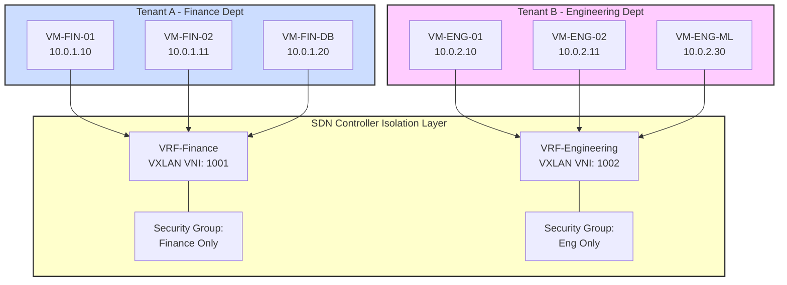
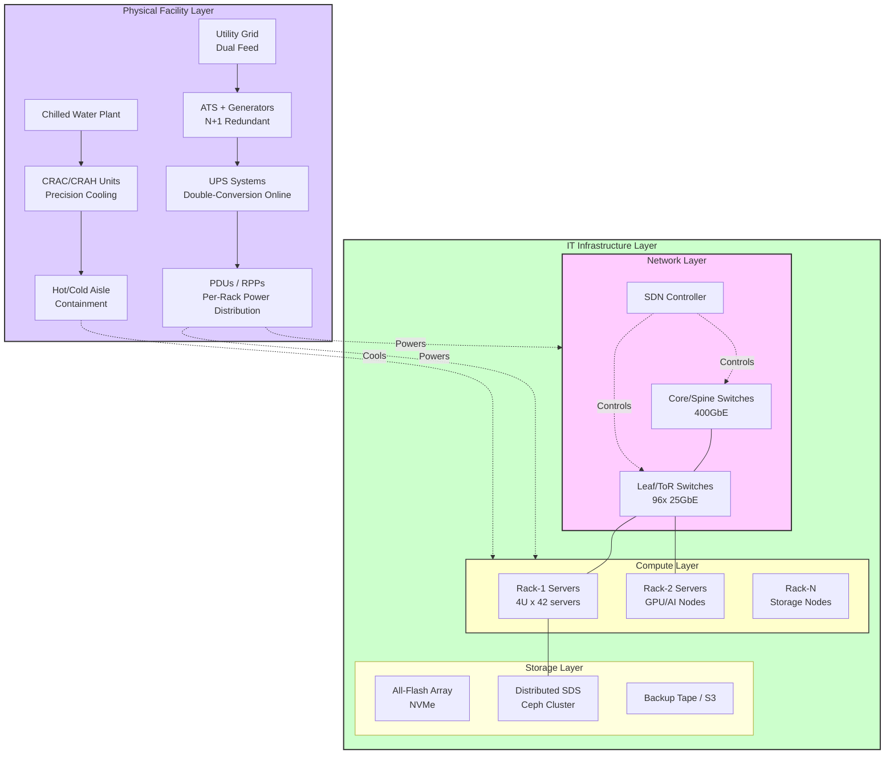
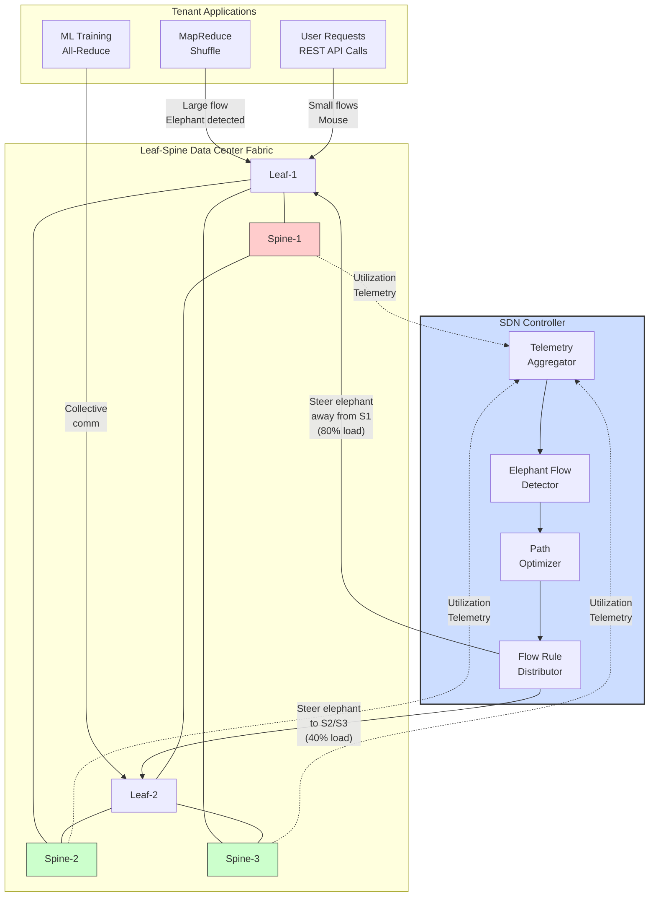
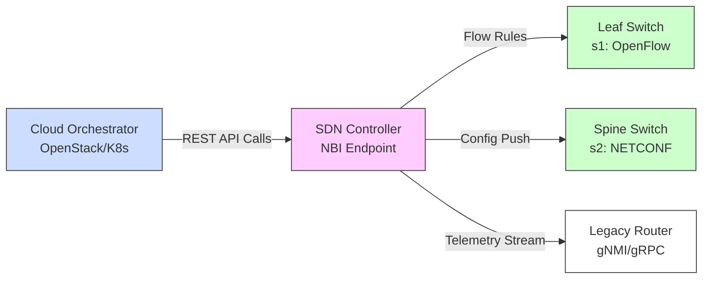

---

## Q1a) Adding, Moving, Deleting, Failure Recovery, and Multitenancy in Data Center Demands

### 1.1 Introduction: The Operational Lifecycle of Data Center Resources

Data centers are dynamic, continuously evolving infrastructures in which resources are perpetually being provisioned, reconfigured, relocated, decommissioned, and recovered following failures. The five operational activities enumerated in this question—Adding, Moving, Deleting, Failure Recovery, and Multitenancy—constitute the foundational lifecycle management operations through which the data center resource pool is maintained and adapted to meet changing business requirements, workload patterns, and failure conditions. In the era of software-defined data centers—characterized by elastic cloud computing, automated orchestration, and microservices architectures—these operations must be performed rapidly, reliably, automatically, and with policy compliance. Understanding each operation's requirements, mechanisms, and challenges is fundamental to comprehending the operational calculus of modern data center infrastructure management.

```
+---------------------------------------------------------------+
|           DATA CENTER RESOURCE LIFECYCLE                       |
+---------------------------------------------------------------+
|                                                               |
|   +------------+    +------------+    +------------+          |
|   |  Adding    |--> | Existing  |--> |  Moving     |          |
|   | Resources  |    | Resources  |    | Resources   |          |
|   +------------+    +------------+    +-----+------+          |
|                                            |                  |
|                                            v                  |
|   +------------+    +------------+    +------------+          |
|   |Deleting   |<--- | Operational|<---|Failure     |          |
|   |Resources  |    | Resources  |    |Recovery    |          |
|   +------------+    +------------+    +------------+          |
|                                                               |
|   ALL OPERATIONS GOVERNED BY:                                 |
|   - Multitenancy & Isolation Policies                          |
|   - SDN / NFV Orchestration                                   |
|   - Automated Policy Enforcement                               |
+---------------------------------------------------------------+
```

### 1.2 Adding Resources: Provisioning and Onboarding

**Adding** resources refers to the complete process of introducing new compute, storage, and network capacity into the data center environment. The addition operation spans physical provisioning (hardware procurement, racking, cabling, power-on), firmware installation (BIOS, BMC, NIC firmware, switch firmware), logical resource abstraction (hypervisor installation, VM/container runtime setup, storage pool creation), and policy association (security group assignment, VLAN/VNI tagging, QoS policy binding, monitoring agent deployment).

In software-defined data centers, the Adding operation is heavily automated. When a new server is racked and powered on, zero-touch provisioning mechanisms (PXE boot with iPXE, Redfish-based BMC management, CIMC/KVM out-of-band management) enable automatic OS installation, hypervisor deployment, and SDN controller registration without any human intervention. The new server is discovered by the orchestration platform, its inventory (CPU cores, memory, NIC ports, storage capacity) is registered, and its resources become available for workload scheduling.

Network resource additions follow a similar automated lifecycle: new switches are powered on, automatically authenticate against the SDN controller (opting in through certificate-based authentication or pre-shared keys), receive their configuration (VLAN/VNI assignments, routing protocol parameters, QoS policies) through the controller's NETCONF/gNMI management interface, and are integrated into the switching fabric. The entire process—from physical power-on to production-ready network participation—can be completed in under 30 minutes for a fully automated data center, compared to the days or weeks required by manual configuration approaches.

**Capacity Planning Considerations:** Resource additions must be guided by capacity planning models that anticipate future demand growth and seasonal inflection points. Hyperscale operators model workload growth trajectories months or years in advance, provisioning data center facilities, power, cooling, and network capacity well ahead of actual demand to ensure seamless scaling. Enterprise operators, operating at smaller scale, must balance the cost of over-provisioning (idle, depreciating capital assets) against the risk of under-provisioning (capacity shortages restricting business growth).

### 1.3 Moving Resources: Workload Mobility

**Moving** resources encompasses the repositioning of active computational workloads, data, and network service instances from one physical or logical location to another while maintaining uninterrupted service delivery. The quintessential example is Virtual Machine Live Migration (vMotion in VMware vSphere, KVM-based live migration in OpenStack, or container pod rescheduling in Kubernetes).

**VM Live Migration**: During live migration, the complete state of a virtual machine—CPU register state, memory pages, virtual device configuration, and IP/MAC addresses—is continuously synchronized between the source and destination physical hosts. The SDN controller plays an indispensable role: it detects the vNIC re-binding at the new host through port-status events, updates the topology and MAC-to-port mapping tables, and automatically pushs updated flow rules to all affected switches so that traffic for the migrated VM is rerouted transparently to the new physical location. The migration is seamless from the VM's communication peers' perspectives because the VM retains its original IP and MAC addresses.

**Data Movement**: Storage tiering in software-defined storage environments (Ceph, MinIO) automatically relocates data objects between hot, warm, and cold storage tiers based upon access frequency and policy rules. DRAM/SSD-backed hot tiers serve frequently accessed objects, while HDD-backed warm tiers and object archival tiers serve less frequently accessed data. Data movement must respect the data center's quality-of-service commitments: application-visible latency must remain within SLA bounds during tier transitions.

**Operational Drivers for Moving:** The Moving operation is triggered by several operational requirements: proactive hardware maintenance (migrating workloads off hosts scheduled for firmware upgrades or component replacement); power and thermal optimization (migrating workloads away from overheating zones or over-subscribed power circuits to balance power density across the data center); capacity balancing (redistributing workloads across underutilized server pools to improving utilization and reduce energy costs); and geolocation compliance (relocating workloads to satisfy data residency regulations by moving them to data centers within required jurisdictional boundaries).

### 1.4 Deleting Resources: Decommissioning and Resource Reclamation

**Deleting** resources is the systematic, secure, and complete decommissioning of data center assets that are no longer required. The deletion process is more nuanced than simply powering off and removing hardware. For virtual resources (VMs, VNFs, containers, virtual networks), the deletion workflow encompasses: deregistration from the orchestration platform, removal of associated network policies (security groups, ACL rules, firewall entries), reclamation of allocated IP addresses into the IPAM pool, de-provisioning of virtual network interfaces and associated VLAN/VNI tags, archival of workload data according to retention policies, and updating of capacity planning records. The SDN controller must propagate deletion events to clear relevant flow rules from switch forwarding tables.

For physical assets, secure data erasure (in accordance with NIST SP 800-88 media sanitization standards) must precede hardware disposal. All storage media—SSDs, HDDs, NVMe drives—must be sanitized through approved methods (cryptographic erase, secure erase commands, physical destruction) to prevent data leakage. The physical hardware is then processed through certified e-waste recycling streams in compliance with WEEE RoHS regulations.

**Deprovisioning Automation:** Modern orchestration platforms support automated deprovisioning workflows triggered by lifecycle events (workload completion, lease expiry, project termination). Automated deletion reduces the risk of "zombie" resources—orphaned VMs, unused storage volumes, and stale flow rules—accumulating in the environment and consuming resources unnecessarily.

### 1.5 Failure Recovery: Resilience Mechanisms

**Failure recovery** encompasses the detection, isolation, and remediation of infrastructure failures across compute, network, storage, power, and cooling domains. Data centers are designed with redundancy at every layer—N+1 or 2N configurations for critical systems—but redundancy alone is insufficient; automated detection and fast recovery are essential.

**Network Failure Recovery:** The SDN controller plays the most transformative role in network failure recovery. Through streaming telemetry (gNMI/gRPC, OpenFlow port-status messages, BFD sessions), the controller detects link failures and switch failures within milliseconds—far faster than legacy routing protocol convergence (which typically requires hundreds of milliseconds to seconds). The controller then: recomputes alternative paths through the remaining healthy fabric (using Dijkstra's or k-shortest-paths algorithms), pushes updated flow rules to affected switches to redirect traffic, and verifies successful failover through telemetry validation. The complete failover interval in well-architected SDN fabrics can be under 100 milliseconds.

**Compute Failure Recovery:** The orchestration platform continuously monitors compute node health through heartbeat mechanisms and BMC out-of-band monitoring. When a host failure is detected, the orchestrator automatically reschedules all affected workloads onto healthy compute nodes, retrieves workload images and state from distributed storage, and brings replacement instances online—a process typically completing within 2–5 minutes for stateless VMs.

**Storage Failure Recovery:** Distributed storage systems (Ceph, GlusterFS, HDFS) maintain data redundancy through configurable replication factors (typically 3× for enterprise data). When an OSD or storage node fails, the distributed storage orchestrator automatically redistributes data replicas to healthy storage nodes, restoring the configured replication factor without operator intervention.

### 1.6 Multitenancy: Isolation Requirements in Data Center Operations

**Multitenancy** is the architectural principle through which a single physical data center infrastructure serves multiple independent organizations (tenants), departments, or workload categories with strict isolation guarantees between each tenant's resources and data. Multitenancy is fundamental to cloud computing economics: without multitenancy, cloud providers could not achieve the resource utilization efficiencies that make cloud services economically viable.

Multitenancy requirements directly shape every data center lifecycle operation:

- **Adding:** New tenant workloads must be isolated from existing tenants at the network layer (dedicated VRFs, VNIs, VLANs), compute layer (dedicated resource quotas preventing noisy tenant workloads from impacting other tenants), and storage layer (encrypted volumes accessible only to the owning tenant).

- **Moving:** Tenant workload migration must preserve isolation—a VM migrated for maintenance must remain in its assigned tenant's logical network; its SDN policies (security groups, ACLs) must follow the workload automatically.

- **Deleting:** Secure deletion of tenant resources requires cryptographic erasure of encrypted storage volumes, complete reclamation of network resources (IP addresses, VLAN/VNI tags, firewall rules) to prevent information leakage to subsequent tenants, and audit logging for compliance verification.

- **Failure Recovery:** Multitenant failure recovery must prevent cross-tenant impact: a failed compute node hosting workloads from multiple tenants must trigger recovery for each tenant's workloads independently; storage recovery must maintain per-tenant encryption isolation throughout the recovery process; and network recovery must not cause security policy leakage between tenants during topology change events.

**Tenant Isolation Mechanisms:** Data centers implement multitenancy through a layered set of isolation mechanisms: network isolation through VLANs, VXLAN VNIs, EVPN routing instances, and SDN-controlled security groups; compute isolation through Linux cgroups, KVM/QEMU memory isolation, NUMA pinning, and resource quotas; storage isolation through volume-level encryption (LUKS, dm-crypt), per-tenant storage quotas, and access control at the storage API layer; and policy isolation through RBAC ensuring that tenants can manage only their own resources.

```

Mermaid diagram for Multitenancy:



Figure: Multitenancy Isolation in SDN-Managed Data Center. Tenant A (Finance) and Tenant B (Engineering) share the same physical infrastructure but are isolated through VRF/VXLAN VNI separation and security group policies enforced by the SDN controller.
```

### 1.7 Conclusion

The five operational activities—Adding, Moving, Deleting, Failure Recovery, and Multitenancy—constitute the complete lifecycle management framework for data center resources. Each activity has been fundamentally transformed by SDN and NFV technologies: automated provisioning replaces manual addition workflows; live migration enables workload mobility without reconfiguration; systematic decommissioning processes ensure secure resource reclamation; sub-second automated failover replaces hours of manual recovery; and comprehensive multitenancy mechanisms enable cloud economics at scale. The efficiency, reliability, and security of these operations directly determine the operational cost, service quality, and business value of the data center.

---

## Q1b) Write a Short Note on VLANs

### 2.1 Introduction to Virtual LANs (VLANs)

A Virtual Local Area Network (VLAN) is a Layer 2 (Data Link Layer) network segmentation technology that logically partitions a single physical Local Area Network into multiple, independent broadcast domains. Defined by the IEEE 802.1Q standard ratified in 1998, VLANs enable network administrators to segment traffic by function, department, application, or security zone without requiring physical rewiring of the network infrastructure. The term "virtual" precisely captures the technology's essential value: network isolation is achieved through software-controlled switch port assignments rather than through physically separate switching infrastructure.

VLANs address the fundamental scalability and security limitations of flat Layer 2 networks. In a flat network topology (no VLANs), all connected devices share a single broadcast domain: ARP requests, DHCP broadcasts, and multicast traffic propagate throughout the entire network, creating unnecessary traffic, potential security exposure, and suboptimal performance as network size grows. By partitioning the network into VLANs, broadcast traffic is confined to its originating VLAN, improving overall network efficiency and providing logical security boundaries between groups of users and applications.

```
+---------------------------------------------------------------+
|                    VLAN SEGMENTATION EXAMPLE                   |
|                                                               |
|   SWITCH (802.1Q Trunk or Access Ports)                       |
|                                                               |
|   VLAN 10 (SALES):         VLAN 20 (ENGINEERING):             |
|   +----------------+       +----------------+                  |
|   | Port 1: Sales  |       | Port 2: Eng    |                  |
|   | Workstation A   |       | Workstation D   |                  |
|   | IP: 10.0.10.5   |       | IP: 10.0.20.5   |                  |
|   +----------------+       +----------------+                  |
|                                                               |
|   VLAN 10 devices CANNOT directly communicate with            |
|   VLAN 20 devices at L2. A Layer 3 router is required.       |
|                                                               |
+---------------------------------------------------------------+
```

### 2.2 IEEE 802.1Q Frame Tagging Mechanism

The technical mechanism underlying VLANs is the insertion of a four-byte VLAN Tag field into the Ethernet frame header. The 802.1Q frame format consists of: the original Destination MAC Address (6 bytes), Source MAC Address (6 bytes), a 2-byte Tag Protocol Identifier (TPID, value 0x8100 indicating a tagged frame), the 2-byte Tag Control Information (TCI) comprising a 3-bit Priority Code Point (PCP) for IEEE 802.1p QoS, a 1-bit Drop Eligible Indicator (DEI), and the 12-bit VLAN Identifier (VID) identifying the VLAN to which the frame belongs, followed by the original EtherType/Length field and payload.

The 12-bit VID field provides 4,096 possible VLAN IDs (0–4095), of which VLAN 0 is reserved for priority-tagged frames, VLAN 4095 is reserved, and VLANs 1002–1005 are reserved for legacy Token Ring/FDDI networks, leaving VLANs 1–1001 and 1006–4094 available for network administrator assignment.

### 2.3 Switch Port Configuration Modes

**Access Mode**: An access switch port is assigned to exactly one VLAN. End devices (PCs, printers, IP phones) connect to access ports. Untagged frames arriving at an access port are implicitly associated with the access port's configured VLAN (the Port VLAN ID, PVID). Frames transmitted from an access port have their VLAN tags removed (untagged egress).

**Trunk Mode**: A trunk port carries traffic for multiple VLANs simultaneously. Trunk ports are used to interconnect switches. Frames traversing a trunk port are tagged with their VLAN IDs (except for frames belonging to the native VLAN, which are transmitted untagged by default). VLAN pruning can restrict which VLANs' traffic is permitted on a specific trunk, preventing unnecessary broadcast traffic propagation.

### 2.4 Key Characteristics and Benefits

- **Broadcast Containment**: VLANs limit broadcast traffic (ARP, DHCP, unknown unicast flooding) to within the originating VLAN, reducing unnecessary frame replication across the entire switched network.
- **Security Isolation**: VLANs create logical security boundaries at Layer 2. Devices in different VLANs cannot directly communicate at Layer 2; all inter-VLAN traffic must pass through a Layer 3 routing device where ACLs can be applied.
- **Operational Agility**: Users can be moved between physical locations without network reconfiguration—the administrator simply reassigns the user's new access port to the appropriate VLAN.
- **Simplified Administration**: Network segmentation aligns with organizational structure (departments, projects), making policy management more intuitive.
- **Traffic Segmentation**: Sensitive traffic (financial data, HR systems) can be isolated in dedicated VLANs with restricted access.

### 2.5 Limitations and Evolution

Despite their importance, VLANs have scaling limitations: the 4,096 VLAN ceiling (4094 usable) is insufficient for large cloud providers requiring millions of tenant virtual networks. This limitation drove the development of extended overlay tunneling technologies including VXLAN (with 16.7 million VNIs), NVGRE, and EVPN-VXLAN, which extend the VLAN segmentation concept to operate over Layer 3 IP underlay fabrics. VLANs remain architecturally essential as the underlying Layer 2 mechanism within VXLAN segments and within data center rack-level switching fabrics.

---

## Q1c) Write a Short Note on Traffic Engineering

### 3.4 Traffic Classification and Engineering Approaches

Data center traffic falls into distinct classes that require differentiated TE treatment. Mouse flows (API calls, database queries) are latency-sensitive and benefit from priority queuing and shortest-path routing. Elephant flows (MapReduce shuffle, ML training synchronization, backup transfers) dominate bandwidth and require proactive steering to prevent congestion. Storage traffic (distributed replication, erasure coding rebuilds) requires consistent bandwidth with bounded latency. Burst/scratch traffic from development environments must be rate-limited to prevent interference. SDN-based TE applications classify traffic through real-time flow statistics, apply DSCP marking from endpoints, and dynamically adjust ECMP hash weights to balance actual utilization across available paths.

### 3.5 MPLS-TE and Segment Routing in Data Centers

MPLS-TE uses RSVP-TE signaling to establish Label Switched Paths with explicit route control and bandwidth reservation—providing fast reroute (sub-50ms) and constraint-based routing. Segment Routing encodes paths as ordered SID stacks in packet headers, enabling centralized TE without per-flow state in intermediate routers. SDN controllers program SR policies via PCEP, achieving TE at 200x lower operational overhead than RSVP-TE per-flow tunnels. SR-MPLS and SRv6 (IPv6 data plane) are increasingly adopted in data center fabrics for their operational simplicity and compatibility with both MPLS and IP infrastructures.

### 3.1 Traffic Engineering: Definition and Conceptual Foundation

Traffic Engineering (TE) is the systematic, measurement-driven discipline of designing, planning, controlling, and optimizing network traffic flows to achieve specified performance objectives. Unlike routing, which determines the logical path from source to destination based primarily on reachability and metric information, Traffic Engineering actively manages how traffic traverses the network to achieve throughput, latency, utilization, and reliability targets. TE is the primary mechanism through which network operators transform the network from a passive, best-effort packet delivery service into an active, performance-engineered resource that can deliver predictable, SLA-guaranteed service quality.

In data center environments, TE acquires exceptional importance due to the distinctive and operationally challenging characteristics of data center traffic. Big data analytics workloads generate massive elephant flows (10–100+ Gbps sustained transfers during shuffle phases), AI/ML training workloads generate bursty, high-bandwidth collective communication patterns (all-reduce, all-gather), and latency-sensitive microservices workloads generate thousands of concurrent small flows requiring consistent microsecond-level latency. Without TE, elephant flows monopolize shared fabric links and impose head-of-line queuing delays on latency-sensitive flows—a direct violation of the latency SLAs that modern cloud services require.

### 3.2 TE Approaches and Technologies

**TE Approaches:**
Durationblind TE that optimizes based on current observed state) and Traffic Matrix-based TE (leveraging predicted traffic demands for proactive capacity planning).
- **Objective-driven TE**: Optimizes for specific objectives including minimum congestion (minimize maximum link utilization), minimum latency (prefer shortest propagation paths), maximum throughput (maximize feasible aggregate demand), and minimum cost (prefer lower-cost links, reduce premium transit usage).
- **Constraint-incorporating TE**: Enforces constraints including bandwidth guarantees (admission control ensures sufficient path bandwidth), latency bounds (paths must satisfy maximum RTT requirements), administrative exclusions (avoid specific links or nodes), and disjoint path requirements (resilience through physically separate path diversity).

**TE Implementation Technologies:**
- **MPLS-TE (Multi-Protocol Label Switching - Traffic Engineering)**: RSVP-TE signaling with explicit route objects (EROs) creates Label Switched Paths (LSPs) with explicit path control and bandwidth reservation.
- **SDN-based TE**: Centralized SDN controller collects real-time telemetry, computes optimal paths using Dijkstra, CSPF, or linear programming solvers, and dynamically programs flow rules on affected switches to redirect elephant flows from congested links.
- **Segment Routing (SR)**: Encodes paths as ordered SID (Segment Identifier) stacks pushed at packet ingress; no per-flow state in intermediate routers.
- **ECMP with Intelligent Hashing**: Load-balances flows across equal-cost paths using hashing on 5-tuple; SDN optimization dynamically adjusts hash buckets to balance per-pair utilization.

```
Mermaid diagram:

```mermaid
flowchart TD
    subgraph Telemetry["SDN TE: Telemetry-Driven Flow Steering"]
        direction LR
        A[Link: Spine-1
Util: 82%] -->|Telemetry| B[SDN Controller
TE Engine]
        B -->|"Detect: Spine-1
OVERLOADED"| C[Path Computation:
Find alternative via
Spine-2 (40%) or
Spine-3 (35%)]
        C -->|"Push rule:
Redirect flows
from Spine-1 to
Spine-2"| D[Leaf Switches
Update ECMP
hash buckets]
        D -->|"Flows rerouted"| E[New Equilibrium:
Spine-1: 55%
Spine-2: 60%
Spine-3: 50%]
    end

    style A fill:#fcc,stroke:#333,stroke-width:2px
    style E fill:#cfc,stroke:#333,stroke-width:2px
```

Figure: SDN-based Traffic Engineering Flow. Telemetry identifies congestion; the controller computes alternative paths; flow rules are dynamically reprogrammed; fabric utilization rebalances.
```

### 3.3 TE in Practice: Bandwidth Calendaring

Bandwidth Calendaring (BWC) represents a proactive, calendar-based TE approach where bandwidth is reserved for specific future time windows rather than allocated reactively. BWC is critical for operations requiring predictable connectivity: disaster recovery data replication windows, scheduled supercomputing data transfers, large-scale ML training synchronization, and commercial CDN bandwidth guarantees. The BWC system maintains a reservation calendar database, evaluates admission requests against available capacity, commits reservations with QoS guarantees, and enforces committed bandwidth through switch queue configurations during the reserved time window.

---

## Q2a) Data Center Architecture Components

### 4.1 Data Center as an Integrated System of Components

A modern data center is a complex, multi-domain ecosystem comprising physical facility infrastructure, IT hardware infrastructure, and software management layers—all operating in concert to deliver computational services. Understanding the data center as a system of interacting components is fundamental to data center design, operations, and the SDN/NFV technologies that transform traditional data centers into software-defined environments. The components are organized hierarchically: the facility infrastructure layer provides the environmental envelope within which IT equipment operates; the IT infrastructure layer provides the computational, storage, and network substrate; and the management and orchestration layer provides the software control that coordinates all lower layers.

### 4.2 Physical Facility Infrastructure

**Power Infrastructure:** The power delivery chain is the most critical facility subsystem. Data center electrical infrastructure includes: dual utility feeds from geographically separate grid substations; automatic transfer switches (ATS) providing seamless transition between utility sources; backup generators (diesel or natural gas; sized for complete critical load for 24–48+ hours); uninterruptible power supplies (UPS) providing conditioned, interruption-free power during generator startup intervals (typically 10–30 seconds); power distribution units (PDUs) and remote power panels (RPPs) distributing conditioned 120V/208V AC power to server racks; and intelligent PDUs with per-outlet metering for granular energy monitoring. Modern hyperscale data centers operate at Power Usage Effectiveness (PUE) ratios approaching 1.10, meaning 90%+ of incoming power reaches IT equipment.

**Cooling Infrastructure:** Data center cooling must continuously extract 10–30 kW of waste heat per server rack. Cooling architecture includes precision CRAC/CRAH units providing direct air cooling; chilled water plants with central or distributed chillers; hot-aisle/cold-aisle containment (physical barriers separating hot exhaust from cold supply air); free-cooling economizers (using ambient outdoor air or water when environmental conditions permit); and liquid cooling for high-density compute (direct-to-chip and immersion cooling for GPU/AI workloads exceeding 40 kW per rack).

```
Mermaid diagram:



Figure: Integrated Data Center Architecture Components. Facility layer provides power and cooling to IT infrastructure; the SDN-controlled leaf-spine network interconnects compute and storage resources; the SDN controller provides centralized control.
```

### 4.3 Compute Infrastructure Components

**Servers:** Modern data center servers are predominantly 1U or 2U rack-mounted units with multi-core x86-64 or ARM processors (8 to 128+ cores), ECC DRAM (128 GB to 6 TB), local NVMe SSDs (800 GB to 30+ TB), and multiple high-speed NICs (10/25/40/100/200/400 GbE). Dual-ported NICs with LACP provide fabric redundancy.

**Virtualization Abstraction:** Server virtualization (KVM, VMware ESXi, Hyper-V) abstracts physical servers into VMs. Container runtimes (containerd, CRI-O) provide application-container isolation. Kubernetes orchestrates containers across server clusters. Virtualization provides workload isolation, resource pooling, live migration, and snapshotting.

**Accelerators:** AI/ML workloads have driven NVIDIA GPU (A100/H100/B200), AMD Instinct, Intel Gaudi, and Google TPU deployment. SmartNICs/DPUs (NVIDIA BlueField, Intel IPU) offload networking, storage, and security processing from host CPUs.

### 4.4 Network Infrastructure Components

**Leaf/ToR Switches:** Rack-level aggregation switches with 48–96 x 25/100 GbE server-facing ports and 6–12 x 100/400 GbE spine-facing uplinks. In VXLAN architectures, leaf switches function as VTEPs.

**Spine Switches:** Non-blocking fabric backbone with high-radix (up to 128 x 400/800 GbE ports), interconnecting all leaf switches in a leaf-spine Clos topology. Provides O(N_spines × N_leaves) bisection bandwidth.

**SDN Controllers:** The central control layer that manages the switching fabric. Modern controllers support OpenFlow, NETCONF, gNMI, and OVSDB southbound interfaces.

### 4.5 Storage Infrastructure Components

**SAN (Storage Area Network):** Block-level storage via Fibre Channel (FC, FCoE) or NVMe-oF (RDMA over Converged Ethernet). Provides low-latency, high-throughput block access for databases.

**NAS (Network-Attached Storage):** File-level access via NFS (Linux/Unix) or SMB/CIFS (Windows). Supports shared home directories, application data, and backup targets.

**SDS (Software-Defined Storage):** Distributed storage platforms (Ceph, GlusterFS, MinIO) pooling commodity server disks into unified block/object/file storage. Provides horizontal scalability without monolithic array replacement.

### 4.6 Management and Orchestration Layer

**Cloud Orchestration:** OpenStack (Nova/Neutron/Cinder/Heat), Kubernetes (container orchestration), VMware vCenter (vSphere lifecycle management).

**SDN Controllers:** OpenDaylight, ONOS, Ryu, Floodlight, Juniper Contrail—providing centralized switch control.

**NFV-MANO:** ETSI-defined orchestration (NFVO/VNFM/VIM) for virtualized network function lifecycle management.

**Monitoring:** Prometheus (metrics), Grafana (visualization), ELK (logs), OpenTelemetry (traces), gNMI streaming telemetry (network device metrics).

---

## Q2b) SDN Use Cases in Data Centre

### 5.1 SDN as the Enabling Architectural Layer for Data Centre Innovation

Software-Defined Networking is the foundational architectural technology that enables programmable, centrally managed, policy-driven data center network infrastructure. In data centers, SDN's decoupling of control and data planes, combined with its logically centralized control architecture, unlocks a spectrum of capabilities that were architecturally infeasible in legacy distributed-switch environments. The SDN use cases in data centers span operational automation, agility, security, performance optimization, and service delivery innovation.

### 5.2 Traffic Engineering and Load Balancing

In leaf-spine data center fabrics, SDN provides the real-time, fabric-wide telemetry and programmability required for dynamic traffic engineering. The controller monitors per-link utilization through streaming telemetry, identifies congestion events (typically when spine link utilization exceeds 70–80%), and dynamically optimizes flow distribution across available ECMP paths. For elephant flows (large, long-lived transfers in MapReduce shuffle, distributed storage replication, ML training), SDN can detect flow size in real time and redirect individual flows to underutilized spine paths, preventing head-of-line blocking of latency-sensitive mouse flows. Compared to static ECMP hashing—which distributes flows without regard to actual per-path utilization—SDN-based TE improves fabric throughput by 15–30% and reduces latency for latency-sensitive flows by 40–60% in benchmark studies.

```
Mermaid diagram



Figure: SDN-based Traffic Engineering in Data Center. The controller detects elephant flows, steers them away from congested spine links to underloaded paths, and balances overall fabric utilization.
```

### 5.3 Multi-Tenancy and Network Virtualization

SDN enables efficient multi-tenancy through VXLAN overlay networks managed by SDN-controlled VTEPs. Each tenant receives an isolated virtual network (identified by a unique VNI), with full control over their IP address space, routing, and security policies—all operating over the shared physical underlay fabric. The SDN controller programs virtual switches (OVS) to implement tenant isolation at the point of encapsulation, ensuring that traffic from different tenants remains logically separated at every hop through the fabric.

### 5.4 Automated Provisioning and Change Deployment

SDN eliminates the manual per-device configuration bottleneck. When a new tenant virtual network is provisioned through the cloud orchestrator (OpenStack Neutron, Kubernetes CNI), the orchestrator calls the SDN controller's northbound API. The controller then atomically programs all affected switches with the required VLAN/VNI assignments, security group rules, routing policies, and QoS configurations—an operation that formerly required hours or days of per-switch CLI configuration is completed in seconds with consistent, auditable, policy-compliant results.

### 5.5 Network Analytics and Real-Time Monitoring

The SDN controller's centralized topology and telemetry database provides the data foundation for comprehensive network analytics: flow-level visibility (tracking every significant flow's source, destination, volume, and timing), anomaly detection (identifying unusual MAC movements, port scanning, data exfiltration patterns), and capacity planning (analyzing utilization trends to predict capacity exhaustion). Applications can subscribe to controller event streams to receive real-time notifications of topology changes, link failures, and policy violations, enabling automated incident response.

### 5.6 Security: Micro-Segmentation and Automated Threat Containment

SDN-based micro-segmentation applies firewall policies at every virtual switch port rather than at network perimeter choke points. When an IDS detects a compromised VM, the SDN controller can dynamically install quarantine rules—isolating the affected VM at the virtual switch level within milliseconds, preventing lateral movement while incident response is initiated. This capability, which requires the centralized visibility and control that SDN uniquely provides, implements the core zero-trust principle of least-privilege access at the workload level.

---

## Q2c) Data Center Demands

### 6.3 Quantitative Demand Analysis

**Throughput**: Hyperscale data centers support aggregate East-West fabric throughput measured in petabits per second. Individual servers require 100-400 GbE interfaces. AI/ML clusters use NVLink at 900 GB/s or InfiniBand HDR at 200 Gbps/port. Bisection bandwidth scales linearly with server count via leaf-spine topologies with spine counts proportional to per-rack bandwidth.

**Density**: Power densities of 20-40 kW/rack (conventional) to 40-100+ kW/rack (GPU/AI). Network port density of 48-96 server ports per ToR matching server NIC counts.

**Growth**: Cloud providers report 30-50% annual server count growth, 40-60% aggregate traffic growth. Modular design enables incremental power/cooling/network expansion over 10-15 year facility lifespans.

### 6.1 Definition and Framework

Data center demands constitute the comprehensive set of operational, performance, and organizational requirements that data center infrastructure must satisfy. Understanding these demands is essential because they directly determine architectural decisions, technology selection, and investment priorities in data center design and operation.

### 6.2 Core Demand Categories

**Availability Demands:** Data centers must deliver continuous service availability measured in "nines" of uptime: Tier III (99.982%, ~1.58 hours annual downtime) for business-critical workloads; Tier IV (99.995%, ~26 minutes downtime) for mission-critical infrastructure. Requirements drive redundancy at every layer: dual power feeds, N+1 or 2N cooling, redundant switching fabrics, and automated failover mechanisms with sub-second recovery times.

**Scalability Demands:** Cloud data centers must accommodate exponential growth—hyperscale operators add thousands of servers quarterly. Scalability demands drive the adoption of leaf-spine topologies (providing linear scaling of bisection bandwidth proportional to switch count), modular infrastructure designs (permitting incremental expansion), and elastic software-defined resource management (permitting dynamic scaling without physical intervention).

**Performance Demands:** Modern data center workloads impose stringent performance requirements: low-latency microservices requiring sub-millisecond East-West latency; AI/ML training requiring high-bandwidth collective communication (NCCL all-reduce over 400 Gbps+ InfiniBand or RoCE fabrics); high-frequency trading requiring microsecond-level round-trip times. Performance demands drive adoption of RDMA (RoCE, InfiniBand), kernel bypass networking (DPDK, XDP), and SmartNIC offloading.

**Security and Compliance Demands:** Data centers handling regulated data (PCI-DSS, HIPAA, GDPR, FedRAMP) require comprehensive controls: multi-tenant isolation (preventing cross-tenant data access), encryption in transit (TLS 1.3) and at rest (AES-256), comprehensive audit logging, and physical security (biometric access, surveillance, man-traps). These requirements drive SDN-based micro-segmentation, NFV-based security service chains, and zero-trust network architectures.

**Agility Demands:** Cloud economics depend on rapid provisioning: Infrastructure-as-a-Service platforms must support VM instantiation within minutes (not weeks). Agility demands drive adoption of software-defined infrastructure (SDN for network, NFV for network functions, Kubernetes for compute) that can be programmed and reconfigured through software without physical intervention.

**Cost Efficiency and Sustainability Demands:** Data center operators face CapEx pressure (reducing per-unit infrastructure cost) and OpEx pressure (reducing ongoing power, cooling, and bandwidth costs). Sustainability mandates (ESG, carbon-neutrality commitments) require PUE optimization toward 1.06–1.10, renewable energy adoption, and circular economy hardware management.

---

## Q3a) What is Mininet? What is SDN Programming?

### 7.1 Mininet: Network Emulation Platform

Mininet is a lightweight network emulation platform developed primarily at Stanford University that creates realistic virtual networks on a single Linux host. It instantiates virtual Ethernet network namespaces as virtual hosts, Open vSwitch (OVS) instances as virtual switches, and TCP/UDP connections with configurable bandwidth, delay, and loss characteristics as virtual links. Mininet has become the standard tool for SDN research and education because it enables rapid prototyping and testing of SDN applications without requiring physical network hardware.

**Key Technical Characteristics:**
- **Network Namespaces**: Each Mininet host is a Linux network namespace with its own network stack (routing tables, ARP tables, iptables), providing process-level isolation equivalent to separate physical hosts.
- **Virtual Ethernet Pairs (veth)**: Connect host namespaces to OVS bridges, creating virtual network cables.
- **Open vSwitch (OVS)**: Provides Layer 2/3 switching with OpenFlow support for SDN controller integration.
- **Traffic Control (tc)**: Linux kernel's traffic control subsystem emulates link characteristics—bandwidth limits (HTB qdiscs), propagation delays (netem), jitter, and packet loss.
- **Real Unmodified Applications**: Because Mininet hosts run real Linux TCP/IP stacks, standard network applications (ping, iperf, curl, Apache, iperf3, hping3) run unmodified.

**Typical Installation and Usage:**
Mininet is installed on Ubuntu via apt (`apt install mininet`) or from source. The `mn` command creates and runs a network topology. The `--topo` flag specifies predefined topologies: `single,3` (one switch, three hosts), `linear,4` (four switches in a line), `tree,depth=2,fanout=2` (k-ary tree). The `--controller=remote` flag connects to an external SDN controller.

**Mininet Python API** provides programmatic topology definition, enabling automated test generation and CI/CD integration. Researchers and engineers define custom topologies by subclassing the `Topo` class and implementing the `build()` method.

```
ASCII Art: Mininet Topology

         +------------------+
         |   Linux Host OS  |
         |  (Mininet VM)    |
         +--------+---------+
                  |
    +-------------+-------------+
    |  OVS Bridge (s1)          |
    |  +-----+-----+-----+      |
    |  |p1  |p2  |p3  |p4  |   |
    |  +--+--+--+--+--+--+---+ |
    |     |     |     |        |
    +-----+-----+-----+--------+
          |     |     |
    +-----v-+ +-v---+ +v-----+
    |h1 NS  | |h2 NS| |h3 NS  |
    |(Linux)| |(Lnx)| |(Lnx)  |
    |10.0.0.1|10.0.2|10.0.3  |
    +-------+ +-----+ +------+
```

### 7.2 SDN Programming Concepts

SDN Programming is the practice of writing software applications that control network behavior through APIs exposed by an SDN controller, rather than through direct per-device CLI configuration. The central premise that enables SDN programming is the separation of the control plane (decision-making logic) from the data plane (packet forwarding), with the control plane centralized in a software controller that can be programmed through well-defined interfaces.

SDN programming operates across three abstraction layers:
1. **Southbound Programming**: Direct interaction between the controller and data plane devices through OpenFlow, NETCONF, gNMI, P4Runtime, or OVSDB protocols. Programs flow tables, device configurations, and collects telemetry.
2. **Control Plane Programming**: Logic running within the controller—state management, topology maintenance, path computation, policy compilation. Implemented as controller modules or applications.
3. **Northbound Application Programming**: High-level applications expressing network intent through REST APIs, gRPC, or language-specific SDKs. Applications include firewalls, load balancers, traffic engineering engines, and WAN controllers.

**Event-Driven Programming Model**: Networks are inherently asynchronous. SDN applications register event handlers that respond to controller events: packet-in (new flow needs forwarding decision), port-status (link up/down), device-added/removed, and flow-removed. Applications react to events by computing forwarding actions, installing flow rules, and updating internal state. The Ryu framework uses Python decorators (`@set_ev_cls`) to bind event handlers; ONOS uses the Intent Framework.

**Flow Rule Programming**: The most fundamental SDN programming operation is installing OpenFlow flow rules—match-action entries specifying which packets match a rule (by Ethernet type, IP addresses, TCP/UDP ports, VLAN tags) and what action to take (forward to port, drop, modify headers, send to controller). Applications maintain flow rule lifecycles: temporary rules with idle/hard timeouts for dynamic flows, and permanent rules for infrastructure paths.

**Topology-Aware Programming**: Applications leverage the controller's real-time topology graph to make forwarding decisions that consider the complete fabric topology rather than individual switch perspectives. Graph algorithms (Dijkstra's shortest path, k-shortest paths for multipath, minimum spanning tree for broadcast) are applied to the topology graph to compute optimal paths, which are then programmed as flow rules across the switched fabric.

---

## Q3b) What is SDN Programming?

### 8.4 Programming Models: Imperative vs Declarative vs Intent-Based

**Imperative**: Application specifies exact flow rules per switch ("install rule X on switch Y"). Maximum control but requires device knowledge.

**Declarative**: Application specifies desired network state ("Host A can reach Host B"). Controller translates into necessary flow rules. ONOS Intent Framework uses this model.

**Intent-Based Networking (IBN)**: Operator declares outcomes (guarantee 10 Gbps between app and DB tiers). Controller continuously monitors compliance and autonomously corrects deviations through closed-loop automation.

### 8.5 Flow Table Pipeline Programming

Modern OpenFlow switches process packets through sequential tables: Table 0 classifies by ingress port and EtherType, Table 1 applies ACLs and security policies, Table 2 computes forwarding actions. Programming considerations include table-miss handling triggering controller packet-in events, priority-based rule matching (higher priority overrides lower), idle and hard timeouts for rule lifecycle management, per-rule counters for monitoring, and opaque cookie fields for application tracking.

### 8.1 SDN Programming: Definition and Significance

SDN Programming is the discipline of developing software applications that define, control, and manage network behavior through APIs exposed by a logically centralized SDN controller, rather than through distributed, device-by-device configuration of individual switches and routers. SDN programming represents a fundamental paradigm shift: from configuring individual network devices in isolation to expressing network-wide intent that the controller translates into per-device configurations automatically. This shift is what makes networks programmable at scale.

The characteristics that distinguish SDN programming from traditional network management:
- **Global view**: Applications see the whole network through the controller, not individual devices
- **Declarative operations**: Express desired network behavior rather than per-device CLI commands
- **Real-time programmability**: Network state can be modified in milliseconds via API calls
- **Event-driven model**: Applications respond to asynchronous network events (failures, congestion, new flows)
- **Abstraction**: Complex underlying protocols hidden behind clean APIs

### 8.2 SDN Programming Model and APIs

**The Three-Layer Model:**
- **Infrastructure Layer**: Data plane elements (OpenFlow switches, OVS, P4 switches, legacy routers)
- **Control Layer**: SDN controller providing topology, device, flow, and statistics services
- **Application Layer**: Network applications consuming controller APIs

**Northbound API Programming:**
Applications interact with the controller through northbound APIs—typically REST/JSON or gRPC interfaces. Key northbound API categories:
- Topology APIs: Query network graph, device list, link state
- Flow APIs: Install/remove/modify flow rules
- Path APIs: Request end-to-end paths with constraints
- Intent APIs: Declare high-level goals (ONOS Intent Framework)

**Example: ONOS Intent-Based Programming** simplifies network application development by letting developers declare desired connectivity ("connect host A to host B with bandwidth guarantee") while ONOS compiles the intent into optimized flow rules across the entire fabric.

**Southbound Protocol Programming:**
- **OpenFlow**: The primary southbound protocol. Applications design match-action pipelines, specify flow table entries with match fields (in_port, eth_src, eth_dst, eth_type, ipv4_src, ipv4_dst, tcp_src, tcp_dst, vlan_id) and actions (OUTPUT, DROP, SET_FIELD, CONTROLLER, GROUP).
- **NETCONF/YANG**: For configuration management beyond flow rules—interface configs, routing protocols, ACLs. Applications use YANG-modeled data trees for standardized, schema-validated device configuration.
- **gNMI**: For streaming telemetry and configuration in modern OpenConfig-based environments. Subscribe RPC provides real-time telemetry streams.

### 8.3 Complete SDN Programming Workflow

1. **Discover**: Controller discovers network topology through LLDP/BFD/BGP-LS; builds graph database
2. **Observe**: Controller collects telemetry (link utilization, flow counts, port statistics) through streaming or polling
3. **Decide**: Application applies business logic to determine desired network behavior
4. **Program**: Application installs/updates flow rules through southbound API
5. **Verify**: Controller monitors deployed rules and actual traffic to verify intended behavior
6. **React**: Controller detects deviations (link failures, congestion) and triggers remediation

---

## Q3c) Applications of SDN

### 9.1 Comprehensive SDN Application Taxonomy

SDN applications span five primary domains: data center networking, telecommunications, enterprise/campus networking, cloud computing, and network security. Each domain leverages SDN's programmable, centralized control model to address previously intractable operational challenges.

### 9.2 Data Center Applications

**1. Data Center Traffic Engineering**: The primary data center SDN application. Continuously monitors fabric utilization through telemetry, detects congestion events, dynamically computes optimal paths for affected flows, and installs updated flow rules to balance load. Demonstrated to improve bisection bandwidth utilization from 60% to 85%+ through proactive elephant flow steering. Applications: Google's B4 WAN TE, Microsoft Shakespeare data center TE.

**2. Multi-Tenant Cloud Networking**: SDN provides the virtual network isolation layer for IaaS platforms. OpenStack Neutron with ODL/Contrail backend enables each tenant to create independent virtual networks with custom subnets, routing, security groups, and VPNs—all operating over shared physical switches. Tenant creation that formerly required physical VLAN provisioning now completes via a single API call.

**3. Live Workload Migration**: SDN maintains network state continuity during VM live migration. When vMotion moves a VM from Host A to Host B, the SDN controller detects the vNIC re-attachment at Host B through port-status events, updates topology state, and automatically pushes new flow rules to all affected switches—achieving seamless migration without IP/MAC address reconfiguration or network disruption.

**4. Big Data Network Optimization**: Hadoop and Spark workloads generate large shuffle flows during reduce phases. SDN applications identify shuffle elephant flows and steer them along the least-congested paths, reducing job completion times significantly. SDN can also implement topology-aware job scheduling, co-locating task-trackers in the same rack to minimize cross-rack bandwidth consumption.

**5. AI/ML Cluster Networking**: Modern AI training over GPU clusters requires AllReduce collective operations. SDN-based topology-aware routing recognizes the physical GPU connectivity (NVLink/NVSwitch or InfiniBand fabric topology) and optimizes AllReduce paths to maximize effective aggregate bandwidth and minimize synchronization overhead.

### 9.3 Telecommunications Applications

**6. 5G Mobile Core (5GC)**: SDN controls the 5G User Plane Function (UPF), dynamically routing user plane traffic to edge UPF instances for ultra-low-latency access. Network slicing uses SDN to implement isolated logical networks per 5G service class (eMBB, URLLC, mMTC) with tailored QoS characteristics.

**7. Carrier Transport Network Automation**: SDN controllers automate MPLS and optical transport networks through PCEP-based path computation and gNMI-based device configuration. Service activation times reduced from weeks (field engineer dispatch) to minutes (automated remote configuration).

**8. SD-WAN**: Enterprise WAN management through centralized policy control. SD-WAN controllers apply application-aware traffic steering: voice/video over MPLS (guaranteed quality), general web over broadband (cost optimization), automatic failover on link degradation. Multi-billion dollar market.

### 9.4 Security Applications

**9. Micro-Segmentation**: SDN enforces security policy at every virtual switch port, not just at perimeter firewalls. VMware NSX, Cisco ACI, and Calico implement distributed firewalls that apply zero-trust policies per workload, preventing lateral movement of attackers who penetrate the perimeter.

**10. DDoS Mitigation**: SDN-based DDoS detectors use controller telemetry to identify volumetric attack patterns (abnormal traffic spikes, SYN floods, DNS amplification). The controller can install rate-limiting rules, redirect attack traffic to scrubbing appliances, or trigger BGP blackhole announcements—all within seconds.

### 9.5 Cloud-Native and Edge Applications

**11. Kubernetes Networking (CNI)**: SDN-based CNI plugins (Calico, Cilium, Antrea, Kube-OVN) provide pod networking, network policy enforcement, BGP route distribution, and eBPF-based observability—extending SDN principles to container orchestration.

**12. Edge Computing**: SDN enables network slicing, dynamic path computation, and local breakout at edge locations—bringing SDN-controlled connectivity closer to IoT data sources and 5G radio units, reducing latency for edge-native applications.

---

## Q4a) What is the Composition of SDN?

### 10.5 Network Functions in the Data Plane

Data plane elements implement functions beyond simple forwarding: L4/L7 load balancing, firewall ACL enforcement at line rate, NAT/CGN IP translation in hardware, QoS marking with DSCP/CoS classification and queuing, and VXLAN/NVGRE/MPLS encapsulation/decapsulation. The SDN controller programs these through flow rules configuring ACL actions, QoS queue outputs, tunnel header push/pop, and NAT action sets, enabling dynamic network function application without physical device reconfiguration.

### 10.6 Management and Monitoring Plane

The management plane provides operational visibility through gNMI streaming telemetry, NETCONF/RESTCONF for device configuration, fault detection via event notifications (CPU overload, port flapping, table full events), alarm management, and software lifecycle management through gNOI. Integration with northbound applications through event subscription APIs enables real-time dashboards and automated incident response.

### 10.1 SDN Composition: Architectural Layers

SDN is composed of four fundamental layers:

1. **Applications Layer**: Network applications that express business intent (traffic engineering, security, monitoring)
2. **Control Layer**: The SDN controller providing centralized decision-making
3. **Southbound Interface Layer**: Protocols connecting controller to data plane devices
4. **Data Plane (Infrastructure) Layer**: Forwarding devices executing controller instructions

**Detailed Layer Breakdown:**

**Data Plane Layer**: Composed of OpenFlow switches (hardware ASIC or software), Open vSwitch instances, P4-programmable switches, and legacy routers integrated through NETCONF/gNMI. Forwarding is performed through match-action pipelines.

**Southbound Interface Layer**: Programs and monitors data plane elements:
- OpenFlow: Flow table programming (match-action, packet-in/out, statistics)
- NETCONF/RESTCONF: Configuration management (YANG-validated)
- gNMI: Streaming telemetry and configuration
- OVSDB: OVS bridge/port/tunnel management
- P4Runtime: P4 pipeline programming
- BGP-LS: Topology information collection

**Control Layer (SDN Controller)**: Composed of:
- Topology Service: Network graph construction and maintenance
- Device Service: Switch/port management, capability negotiation
- Flow Service: Flow rule lifecycle management
- Statistics Service: Telemetry aggregation and storage
- Path Computation: Forwarding path algorithms
- Policy Engine: Security, QoS, routing policy enforcement

**Northbound Interface Layer**: Exposes controller services to applications:
- REST/JSON APIs (most common)
- gRPC (high-performance streaming)
- SDKs (Python, Java, Go)
- gNMI (model-driven management)

**Applications Layer**: Consuming NBI to implement specific services: traffic engineering, firewalls, load balancers, network analytics, SD-WAN, monitoring.

---

## Q4b) Explain Northbound Programming Interface

### 11.5 NBI Implementations Across Controllers

**OpenDaylight RESTCONF**: Data at `/restconf/data` (config) and `/restconf/operational` (state). RPCs via `/restconf/operations`. Schema discovery at `/restconf/operations/yanglib:yanglib`. Supports GET/POST/PUT/PATCH/DELETE with JSON/XML encoding. Atomic transactions with rollback on partial failure.

**ONOS Intent APIs**: Intent submission at `POST /onos/v1/intents` with JSON specifying source, destination, bandwidth. Intent compiler translates high-level intents into optimized flow rules automatically.

**Ryu WSGI API**: Applications register REST endpoints through the WSGI application context.

**Floodlight REST API**: `/wm` namespace with topology at `/wm/topology/links/json`, flow installation at `/wm/staticflowentry/json`, statistics at `/wm/statistics/flow/{dpid}/json`, SSE at `/wm/events/alarm`.

### 11.6 NBI Security Mechanisms

Production NBIs enforce authentication (OAuth2, JWT, mTLS client certs), authorization (RBAC with granular permissions), tenant data segregation (filtered responses preventing cross-tenant access), and rate limiting (controller DoS protection).

### 11.1 Northbound API: Definition and Role

The Northbound Programming Interface (NBI) is the API boundary through which all applications interact with the SDN controller. It abstracts the complexity of the southbound layer, enabling application developers to program network behavior without understanding OpenFlow, NETCONF, or device-specific protocols.

### 11.2 NBI Categories by Abstraction Level

**Level 1 - Infrastructure APIs**: Direct device control (flow rule CRUD, port config, statistics). Used by low-level applications and testing tools.

**Level 2 - Topology/Path APIs**: Graph-based network view. Retrieve topology, compute paths. Used by visualization, monitoring, and path computation services.

**Level 3 - Virtual Network APIs**: Tenant virtual network management (create VN, configure subnets, apply security groups). Primary interface for cloud orchestrators.

**Level 4 - Intent APIs**: Declarative policy specification. Express high-level goals rather than per-device configurations. Used by intent-based networking platforms.

### 11.3 Key NBI Protocols

**REST/HTTP (JSON)**: Universal API style. Resources: switches, ports, flows, topology, meters, groups. Verbs: GET, POST, PUT, DELETE. Most controllers (ODL via RESTCONF, Floodlight, ONOS REST) implement this.



Figure: Northbound API as the application-controller boundary. Multiple application types (orchestrator, analytics, security) interact with the controller through NBI; southbound protocols handle device-specific communication.

**gRPC**: High-performance alternative to REST for latency-sensitive applications. ONOS, gNMI-based systems use protobuf-defined service methods. Supports bidirectional streaming for push-based telemetry.

**SDKs**: Language-specific libraries (Ryu Python API, ONOS Java/Python gRPC client, OpenDaylight Karaf/Java API) abstracting raw protocol details.

### 11.4 NBI Security

Production NBI implementations require authentication (OAuth2, JWT, mTLS), authorization (RBAC with role-based permissions), and tenant isolation (multi-tenant data separation in API responses).

---

## Q4c) Current Languages and Tools in SDN

### 12.3 P4: Programmable Packet Processors

P4 is a domain-specific language for programming packet forwarding pipelines. Developers define custom header types, parsers, match-action tables, and reusable components beyond OpenFlow's fixed action set. Toolchain includes p4c (reference compiler), BMv2 (software switch for research), Tofino ASIC SDK (production hardware), and PTF (testing framework). P4 enables in-network telemetry, custom load-balancing hashes, and DDoS detection at line rate within the switch.

### 12.4 eBPF: Extended Berkeley Packet Filter

eBPF extends Linux with sandboxed programs at XDP (executing before kernel network stack at NIC driver level), tc-bpf (attached to traffic control), and cgroup/sock (socket-level control). In SDN: high-performance packet processing without kernel bypass, atomically updated dynamic forwarding logic without controller interaction, and integrated telemetry collection.

### 12.5 Data Serialization Standards

YANG defines schemas for ietf-interfaces, ietf-routing, openconfig models used by NETCONF, RESTCONF, and gNMI. JSON serves as universal REST API payload. Protobuf provides binary serialization for gRPC streaming. XML remains for legacy NETCONF in telecommunications.

### 12.1 SDN Programming Languages

**Python**: Dominant language for SDN application development (Ryu framework, ONOS client SDKs, Floodlight REST API clients). Advantages: simplicity, rapid prototyping, ML/analytics ecosystem integration (pandas, scikit-learn), DevOps integration (Ansible, NAPALM).

**Java**: Primary language for production-grade controller platforms (OpenDaylight, ONOS core). Advantages: enterprise reliability, type safety, garbage collection, Netty async I/O, mature ecosystem.

**Go (Golang)**: Growing adoption in cloud-native SDN (Kubernetes CNI plugins: Antrea, Kube-OVN; ONOS components). Advantages: lightweight goroutines, static compilation, low operational overhead, excellent standard library.

**C/C++**: Used for performance-critical components: Open vSwitch kernel datapath (C), P4 compiler (C++), DPDK-based VPP, SmartNIC SDKs. Provides maximum throughput and lowest latency.

### 12.2 Key SDN Tools and Platforms

**Mininet**: Primary SDN emulation and prototyping tool. Python API for programmatic topology creation. Integrates with all major controllers.

**OpenFlow Protocol Tools**: Wireshark (OpenFlow dissector for debugging), `ovs-ofctl` (Open vSwitch flow management CLI), `sFlow-RT` (real-time flow analytics).

**Controller Frameworks**:
- Ryu (Python): Rapid application development, education
- OpenDaylight (Java): Multi-vendor production deployments
- ONOS (Java/Go): Carrier-grade, distributed controller
- Floodlight (Java): Research, pedagogy

**Orchestration Integration**: OpenStack Neutron (cloud networking), Kubernetes CNI (container networking), Ansible/Terraform (infrastructure automation).

**Data Modeling**: YANG (configuration schema), JSON (API payloads), Protobuf (gRPC serialization), XML (legacy NETCONF).

---

## Q5a) Southbound Application Interface in Detail

### 13.7 SBI Selection Criteria

OpenFlow: best for dynamic flow programming; limited to flow table control without configuration management. NETCONF/RESTCONF: best for vendor-neutral device configuration; verbose for streaming. gNMI/gNOI: best for modern streaming telemetry on OpenConfig-capable devices. OVSDB: OVS-specific management. BGP-LS: topology collection across domains. P4Runtime: custom packet processing on programmable hardware. Production controllers routinely use multiple SBIs simultaneously through a unified abstraction layer.

### 13.8 Multi-Protocol SBI Integration

Production controllers use OpenFlow for OVS flow programming, NETCONF for legacy router configuration, BGP-LS for MPLS topology, gNMI for modern switch telemetry, and OVSDB for virtual switch management simultaneously. The abstraction layer enables transparent protocol translation.

### 13.9 SBI Security

SBIs require mutual TLS for NETCONF and gNMI, certificate-based authentication for OpenFlow, authorization ensuring mutual trust, and encryption via TLS/DTLS. Modern deployments use automated certificate enrollment.

### 13.1 Southbound Interfaces: Definition and Purpose

The Southbound Interface (SBI) comprises the protocols and mechanisms through which the SDN controller programs, configures, and monitors the data plane forwarding elements. The SBI is the translation layer between the controller's abstract network representation and the specific, vendor-defined control interfaces of individual switches and routers. Without a standardized southbound interface, the controller's centralized control model would be limited to a single vendor's equipment; the SBI is what enables multi-vendor SDN deployments.

### 13.2 OpenFlow: The Canonical SBI

OpenFlow, maintained by the Open Networking Foundation (ONF), is the most widely adopted SBI. The protocol defines a standardized message exchange between the controller and OpenFlow-enabled switches:

**Controller-to-Switch Messages**:
- `OFPT_HELLO`: Version negotiation
- `OFPT_FEATURES_REQUEST/REPLY`: Switch capability discovery (datapath ID, number of flow tables, supported match/action fields)
- `OFPT_SET_CONFIG/GET_CONFIG`: Switch configuration
- `OFPT_FLOW_MOD`: Add/modify/delete flow rules
- `OFPT_TABLE_MOD`: Configure flow table properties
- `OFPT_GROUP_MOD`: Manage group table entries (multicast, select, failover groups)
- `OFPT_METER_MOD`: Configure rate-limiting meters
- `OFPT_PORT_MOD`: Modify port configuration
- `OFPT_PACKET_OUT`: Inject packets into the data plane
- `OFPT_MULTIPART_REQUEST/REPLY`: Request/receive statistics (ports, flows, queues, counters)

**Switch-to-Controller Messages**:
- `OFPT_PACKET_IN`: Controller must decide how to forward this packet (no matching flow rule)
- `OFPT_FLOW_REMOVED`: A flow rule has expired
- `OFPT_PORT_STATUS`: Link/port state changed
- `OFPT_ERROR`: Error notification
- `OFPT_MULTIPART_REPLY`: Statistics response

**OpenFlow Switch Pipeline**: Packets traverse zero or more flow tables in sequence. Each table's flow entries match on header fields, assign instructions (apply actions, goto next table, write metadata, apply meters). Actions include: OUTPUT (to port or controller), SET_FIELD (modify header), COPY_FIELD, DROP, GROUP (indirect via group table).

### 13.3 NETCONF/RESTCONF: Configuration Management SBI

NETCONF (RFC 6241) provides structured, transactional device configuration management as an alternative to CLI-based management. Operations:
- `<get>`: Retrieve configuration/state
- `<edit-config>`: Modify configuration (merge, replace, delete)
- `<copy-config>`: Copy between config datastores
- `<delete-config>`: Remove config datastore

RESTCONF (RFC 8040) maps NETCONF to HTTP: GET → read, POST → create, PUT → replace, PATCH → partial update, DELETE → remove. Combined with YANG data models, RESTCONF provides schema-validated, vendor-neutral device configuration.

### 13.4 gNMI/gNOI: Modern Model-Driven SBI

gNMI (gRPC Network Management Interface) from the OpenConfig working group defines:
- `Get`: Retrieve config/state data (JSON, JSON_IETF, Protobuf encoding)
- `Set`: Atomic config update (create, replace, delete)
- `Subscribe`: Streaming telemetry (sync current + incremental updates)

gNMI has become the preferred SBI for modern network equipment (Juniper, Arista, Cisco, Nokia), replacing SNMP and proprietary CLIs. gNOI provides operational operations (software install, file transfer, certificate management, reboot).

### 13.5 OVSDB: Open vSwitch Management

The OVSDB protocol manages OVS instances through a JSON-RPC interface over TCP (port 6652). Operations: create/delete bridges, add/remove ports, configure tunnels (VXLAN, GRE), set QoS queues, configure flow-based mirroring. OVSDB complements OpenFlow: OpenFlow handles packet forwarding, OVSDB handles switch configuration.

### 13.6 BGP-LS: Topology Collection SBI

BGP-LS (RFC 7752) transports IGP link-state topology information to the SDN controller through BGP. The controller uses BGP-LS to: build a complete multi-domain topology graph, collect traffic engineering links attributes (bandwidth, admin group, delay), and enable centralized path computation across domains not directly managed by OpenFlow.

---

## Q5b) Distinguish between SDN and NVF

### 14.5 Forwarding Stack Comparison

In SDN: application programs controller through NBI; controller programs switches through SBI; packets follow installed flow rules under global controller state. In NVF: traffic flows through hypervisor vSwitch to VNF VM; each VNF independently implements forwarding without centralized controller.

### 14.6 Operational Velocity Comparison

Adding firewall rules: SDN via API in seconds vs NVF through VNFM per instance. Scaling bandwidth: SDN adjusts flow rules vs NVF adds instances. New service: SDN designs path/flow rules vs NVF packages VNF, creates NSD, instantiates. Failure recovery: SDN reroutes in <100ms vs NVF replaces in 30s-5min.

### 14.7 Business Value Comparison

SDN delivers efficiency, velocity, and simplicity through centralized control. NVF delivers agility, cost reduction, and vendor independence through virtualization. Combined deployment achieves compounded benefits.

### 14.1 Fundamental Distinction: Control Plane Separation vs. Function Virtualization

SDN and NVF address fundamentally different architectural problems:

| Dimension | SDN | NVF |
|-----------|-----|-----|
| Origin | Stanford/ONF (2008) | ETSI ISG NFV (2012) |
| Primary Goal | Centralize, programmabilize network control | Virtualize network function hardware |
| Control Plane | Logically CENTRALIZED (SDN controller) | DISTRIBUTED (per-VNF instance) |
| Data Plane | Forwarding elements (switches, OVS) | General-purpose x86 servers |
| Southbound API | OpenFlow, NETCONF, gNMI | Hypervisor API (KVM, ESXi) |
| State Management | GLOBAL (controller has complete fabric view) | LOCAL (per-VNF state) |
| Optimization Scope | Network-wide (flows, paths, fabric utilization) | Per-service or per-VNF |
| Primary Users | Data center operators, cloud providers | Telecom operators |
| Complementary Relationship | SDN provides connectivity layer for NVF | NVF provides service layer for SDN |

### 14.2 Complementary Architecture

Despite differences, SDN and NVF are highly complementary. NFV creates virtual network functions (firewalls, DPI, load balancers) as software on commodity servers. SDN provides the programmable network fabric that:
- Routes traffic between VNFs in correct order (Service Function Chaining)
- Provides VXLAN overlay isolation between VNF instances
- Enforces QoS and bandwidth guarantees for VNF-to-VNF communication
- Collects telemetry for VNF placement decisions

Modern production data centers implement both: the compute layer runs VNFs managed by NFV-MANO, the network layer runs SDN-controlled leaf-spine fabric, and the orchestration layer (OpenStack, Kubernetes) coordinates both.

---

## Q5c) How NVF Works?

### 15.9 VNF Packaging and Distribution Standards

VNFs are packaged per ETSI as VNF Packages containing software images (QCOW2, OVA, or container images), VNFD in YAML/TOSCA format defining VDUs, connection points, lifecycle scripts, monitoring requirements, scaling rules, and availability models, plus ancillary artifacts. The VNFD drives all MANO operations enabling fully automated lifecycle management.

### 15.10 vCPE Service Chain Example

A residential broadband vCPE chain operates as: customer requests service via portal triggering OSS order to NFVO; NFVO locates vCPE NSD defining vCPE VNF, firewall VNF, NAT VNF sequence; VNFMs instantiate on NFVI; SDN controller programs forwarding path from customer port through firewall to NAT to Internet; VNFM monitors and scales; on cancellation NFVO orchestrates teardown and resource reclamation for reuse.

### 15.1 NFV Operational Workflow

**1. Service Design**: Operator defines a Network Service Descriptor (NSD) specifying the required VNFs, their interconnections, resource requirements, QoS constraints, and availability requirements. NSDs are stored in a Network Service Catalogue.

**2. Service Request**: A customer request (via OSS, portal, or BSS) triggers the NFVO to locate the matching NSD and validate NFVI resource availability.

**3. VNF Instantiation**: The NFVO delegates to the VNFM, which interacts with the VIM to:
   - Create VM instances from VNF images
   - Attach virtual NICs to correct virtual networks
   - Allocate vCPU, memory, and storage per VNFD specifications
   - Apply initial configuration (via cloud-init, configuration scripts)

**4. Service Function Chain Configuration**: The SDN controller (or OVS configuration) programs forwarding paths to route traffic through VNFs in the sequence specified by the NSD's forwarding graph.

**5. Operational State**: VNFs process traffic; VNFM continuously monitors health and performance through VNF management APIs; telemetry feeds into operational dashboards and auto-scaling decision logic.

**6. Scaling**: When utilization thresholds are breached, the VNFM initiates scale-out (adds VNF instances) or scale-in (removes excess instances), updating load balancing and traffic steering rules.

**7. Healing**: Failed VNF instances are detected through health checks; the VNFM instantiates replacement VNFs, reconfigures the service chain, and decommissions the failed instance—all without operator intervention.

**8. Termination**: Upon service cancellation or event-driven decommissioning, the service chain is dismantled, VNFs are gracefully shut down, resources are reclaimed by the VIM, and physical capacity becomes available for new services.

---

## Q6a) NVF Architecture

### 16.8 Containerized Network Functions (CNFs)

CNFs represent cloud-native NFV evolution. Containers share host kernels achieving lower overhead with instantiation in seconds versus minutes. CNFs use OCI container images and Helm charts orchestrated by Kubernetes operators as VNFM equivalents. ETSI NFV Release 3 formally recognizes CNFs with container-VDU types. CNFs achieve 2-5x better resource density than VM-based VNFs with lifecycle management aligned to CI/CD pipelines. Service mesh integration provides traffic management, mTLS, and observability.

### 16.1 ETSI NFV Reference Architecture

The ETSI NFV Architecture defines three domains:

**NFVI (NFV Infrastructure) Domain**:
- Hardware resources: x86 servers, storage arrays, NICs, SmartNICs/DPUs
- Virtualization layer: Hypervisors (KVM, ESXi), container runtimes (containerd, CRI-O), virtual switches (OVS)
- Virtual resources: VMs, vCPUs, virtual memory, vNICs, virtual disks

**NFV-MANO Domain**:
- NFVO: Network service orchestration across VIMs
- VNFM: Individual VNF lifecycle management
- VIM: NFVI resource management (OpenStack, Kubernetes, vCenter)

**NFV Software and Services Domain**:
- VNFs: Software network functions
- PNFs: Legacy physical functions coexisting with VNFs
- OSS/BSS: Operational and business integration

### 16.2 NFVI Deep Dive

NFVI compute nodes must support high-performance packet processing for VNFs:
- **DPDK**: User-space packet processing bypassing kernel; achieves 50-100 Gbps+ throughput
- **SR-IOV**: Direct PCIe device assignment to VMs, bypassing hypervisor vSwitch (10-20μs latency)
- **SmartNIC/DPU**: Offload packet processing to NIC-embedded ARM processor; enables cryptographic acceleration and flow processing without host CPU consumption
- **NUMA awareness**: VNF resource allocation must respect CPU/memory NUMA topology to prevent cross-NUMA memory access penalties

---

## Q6b) Challenges of NVF

### 17.9 Integration and Testing Complexity

Production NFV requires testing across NFVO-VNFM (Ve-Vnfm), VNFM-VIM (Vi-Vnfm), VIM-NFVI (Nova/Neutron/Cinder APIs), SDN-MANO integration, and OSS/BSS-MANO for service order fulfillment. ETSI I-Test and OSM provide reference implementations but multi-vendor integration remains the dominant time-to-production challenge.

### 17.10 NVF Security Challenges

Security challenges include hypervisor VM escape vulnerabilities, Spectre/Meltdown side-channel attacks, MANO as high-value attack target, VNF supply chain integrity across multiple vendors, and isolation assurance verifying VXLAN/VLAN in multi-tenant NFVI.

### 17.11 Legacy OSS/BSS Integration

Legacy telecommunications OSS/BSS systems with decades-old architectures require comprehensive adapter layers and data model transformations to integrate with modern NFV-MANO APIs—a significantly underestimated adoption challenge.

### 17.1 The Performance Gap

The fundamental NVF challenge is the performance disparity between software-based VNFs and purpose-built hardware appliances. Dedicated hardware uses ASICs/NPUs achieving wire-rate at 100-400+ Gbps with microsecond latency. Software VNFs on general-purpose CPUs face: kernel network stack overhead, hypervisor virtualization overhead, interrupt-driven I/O latency, and memory virtualization penalties. The gap can exceed 10× for DPI engines requiring deep payload inspection.

**Mitigation Technologies**: DPDK (user-space polling eliminates kernel interrupts), SR-IOV (bypasses hypervisor for I/O), SmartNIC/DPU (offloads processing to NIC processor), and vCPU pinning (eliminates scheduling jitter).

### 17.2 VNF State Management

Stateful VNFs (firewalls with conntrack, SBCs with call state, CGN with translation tables) must maintain session state across lifecycle events. State must be: stored in volatile memory during normal operation, externalized to distributed stores for VM migration/healing, and kept consistent across scaled VNF instances during scale-out operations. The synchronization overhead and consistency requirements represent significant VNF software engineering challenges.

### 17.3 NFVI Fragmentation and Noisy Neighbors

Dynamic VNF placement/departure creates resource fragmentation where available resources are non-contiguous across compute nodes, preventing new VNF placement despite acceptable aggregate utilization. The noisy neighbor problem—where intensive VNFs (DPI, GPU-AI) degrade neighbors through shared resource contention—requires CPU pinning, NUMA-aware placement, and cgroups/quota enforcement.

### 17.4 Multi-Vendor MANO Interoperability

ETSI MANO specifications contain ambiguities and optional features that lead to inconsistent vendor implementations. Integrating NFVO/VNFM/VIM from different vendors requires extensive integration engineering, custom data model mapping, and vendor-specific workarounds.

### 17.5 Skills Gap

Operating NFV requires cloud infrastructure, orchestration, and cloud-native skills—fundamentally different from traditional telecommunications hardware expertise. Bridging this gap requires substantial training investment.

---

## Q6c) What is an In-Line Network Function?

### 18.2.1 Performance Requirements

In-line functions require four critical properties: wire-rate forwarding at full line speed without packet loss, deterministic latency bounded within SLA limits, burst absorption without tail latency spikes, and zero packet corruption through all processing stages.

### 18.2.2 Acceleration Technologies

Wire-rate in-line forwarding uses DPDK poll-mode drivers at 50-100+ Gbps on x86, SR-IOV virtual functions bypassing hypervisor at 10-20 microsecond latency, SmartNIC cryptographic and flow processing offload, CPU pinning eliminating scheduler interference, huge pages reducing TLB misses, and NUMA-local allocation matching memory and NIC to vCPU NUMA nodes.

### 18.2.3 Bypass TAPs and Graceful Degradation

Hardware bypass TAPs provide electrical fail-open for in-line security appliances maintaining traffic flow during appliance failure. SDN-based approaches trigger flow rule rerouting to healthy instances within milliseconds through health monitoring.

### 18.1 Definition and Core Characteristic

An in-line network function is a service function positioned directly within the active forwarding path of all traffic it processes. Every packet traversing an in-line function is subject to the function's processing (inspection, transformation, or forwarding decision) before proceeding to its destination. The defining characteristic is path dependency: if the in-line function fails, the associated traffic flows are disrupted.

**Contrast with Out-of-Path Functions**: Out-of-path functions (passive IDS, SIEM collectors, NetFlow analyzers) observe mirrored/spanned copies of traffic through TAPs or SPAN ports. They cannot affect live traffic and their failure does not impact production flows.

### 18.2 Common In-Line Network Functions

- **In-line Firewalls**: Mandatory transit point for security policy enforcement; drops/permits based on ACLs and stateful inspection.
- **In-line IDS/IPS**: IPS actively blocks attacks; bypass TAPs provide hardware fail-open to maintain traffic flow on IPS failure.
- **In-line Load Balancers**: Terminate client connections; distribute to backend pools; provide SSL termination and L7 routing. SSL/TLS inspection required for traffic visibility.
- **In-line DPI**: Wire-rate packet payload inspection for QoS enforcement, lawful intercept, broadband policy.
- **In-line NAT/CGN**: Address translation is inherently in-line; CGN VNFs translate thousands of concurrent subscriber sessions.
- **In-line WAF**: Positioned between users and application servers; blocks OWASP Top 10 attacks on HTTP/HTTPS traffic.

### 18.3 High Availability Requirements

In-line VNFs require automatic failover:
- **Active-Active**: Both instances process traffic simultaneously; RTO is milliseconds.
- **Active-Standby**: Primary processes traffic; standby takes over on failure; RTO is seconds. Requires continuous state synchronization (session tables, connection state).
- **SDN-Based Failover**: SDN controller detects VNF failure and redirects traffic to standby instance through flow rule updates, achieving sub-second failover without per-VNF HA mechanisms.

```
ASCII Art: In-Line Firewall HA

  INGRESS TRAFFIC
        |
        v
  +--------+     +--------+
  | vFW-A  |<--->| vFW-B  |  (Active-Active Sync)
  | (ACTIVE)|     |(ACTIVE)|
  +----+---+     +---+----+
       |              |
       +--- SDN Ctrl --+
              |
              v
  Health Monitor: HTTP/Netconf every 1s
  Failure detection: < 3s
  SDN reroutes: flow rules to healthy peer
        |
        v
  EGRESS TRAFFIC
```

## Q7a) Data Center Orchestration (Short Note)

### Orchestration Stack and Modern Patterns

The complete data center orchestration stack operates across four layers: Business UX with self-service portals and billing; Service orchestration layer using NFVO, OpenStack Heat, Kubernetes, and Terraform Enterprise; Infrastructure automation layer with Ansible, NAPALM, and Helm; and Physical infrastructure of servers, switches, storage, and firewalls. Modern orchestration spans Day-1 deployment and Day-2 operations including automated patching, certificate lifecycle management, backup orchestration, and continuous security posture compliance enforcement through GitOps workflows where Git repositories serve as the single source of truth with automated agents continuously reconciling actual infrastructure state.

Data Center Orchestration is the automated, policy-driven coordination of all infrastructure operations—compute provisioning, network configuration, storage allocation, and service lifecycle management—through software platforms that translate high-level service intents into executed, validated, and continuously maintained infrastructure states. Key platforms include OpenStack Heat (YAML templates for cloud services), Kubernetes (container orchestration with declarative API), Terraform (IaC with HCL for heterogeneous infrastructure), and Ansible Automation Platform (workflow orchestration with approvals). Modern orchestration incorporates GitOps (Git as single source of truth, automated agents for state reconciliation), and Day-2 operations (continuous compliance, automated patching, certificate lifecycle management).

---

## Q7b) IETF SDN Framework

The IETF provides the standardized protocol layer upon which SDN is built in production environments:

**NETCONF (RFC 6241)**: Structured configuration management over SSH/TLS. Four core operations: `<get>`, `<edit-config>`, `<copy-config>`, `<delete-config>`.

**RESTCONF (RFC 8040)**: HTTP-mapped NETCONF semantics. GET/POST/PUT/PATCH/DELETE on YANG-modeled resources.

**YANG (RFC 7950)**: Data modeling language defining schemas for all configurable/observable network data. Enables schema validation, automatic API generation, and cross-vendor interoperability.

**gNMI (OpenConfig)**: gRPC-based interface defining Get, Set, and Subscribe operations. Subscribe provides streaming telemetry with sync+delta updates. Preferred modern SBI.

**BGP-LS (RFC 7752)**: Transports IGP link-state topology to SDN controllers.

**PCEP (RFC 5440)**: Path Computation Element protocol for TE path computation and activation.

**Segment Routing (RFC 8402)**: Source-routing paradigm with SID stack encoding; enables centralized SDN traffic engineering.

**EVPN (RFC 7432, 8365)**: BGP-based Ethernet VPN providing control plane learning for VXLAN, eliminating flooding.

**SFC/NSH (RFC 7665, 8300)**: Service Function Chaining with Network Service Header for ordered service path traversal.

---

## Q7c) Juniper SDN Framework

### Contrail Deep Dive: XMPP, vRouter, and Multi-Site

Contrail Control Nodes implement full MP-BGP routing logic including route target import/export filtering, route aggregation, and policy-based routing distributed to vRouter agents through XMPP providing persistent TCP connections with PubSub for route distribution. The vRouter in DPDK mode achieves near-line-rate VXLAN encapsulation at 100 Gbps on appropriately sized x86 hardware. Multi-site DCI uses EVPN-based multi-homing, VXLAN stretched subnets across geographically distributed data centers, and BGP route distribution enabling live VM migration across sites. Apstra's intent-based networking enables declarative specification automatically translating to multi-vendor device configurations across Arista, Cisco, Juniper, and NVIDIA switches with continuous validation and autonomous remediation.

Juniper Networks' SDN framework comprises:

**Contrail Controller**: Distributed SDN platform (Configuration Node, Control Node with BGP/XMPP, vRouter Agent, Analytics Node). Provides virtual network management (L2/L3/VXLAN/MPLS overlays), security policy (security groups, network policies), service chaining, and multi-site DCI. Integrated with OpenStack Neutron and Kubernetes CNI.

**vRouter**: High-performance forwarding agent running on every compute node. Implements three modes: kernel mode (acceptable performance), DPDK mode (50–100 Gbps+), XDP mode (near-DPDK kernel performance). Handles VXLAN/MPLS encapsulation, VRF-based tenant isolation, and BUM traffic replication.

**Apstra (IBN)**: Intent-Based Networking platform for data center fabric automation. Express intent declaratively; translates to multi-vendor device configurations; continuously validates and autonomously remediates.

**Paragon Automation**: Telecommunications transport automation (optical, MPLS/SR) for service provider networks.

**Mist AI**: AI-driven network assurance for Wi-Fi, wired switching, and WAN—proactive anomaly detection with conversational operations interface.

---

## Q8a) Floodlight Controller (Brief)

Floodlight is the foundational open-source SDN controller developed at Stanford University and subsequently maintained by Big Switch Networks under the Apache 2.0 license. It is implemented in Java, deployed as an embedded Jetty server, and uses an OSGi-like module architecture for extensibility.

Key modules:
- **Topology Manager**: LLDP-based link discovery, graph-based topology representation
- **Device Manager**: Host/MAC/IP tracking through ARP and packet-in analysis
- **Forwarding Module**: L2 learning switch with L3 forwarding
- **Static Flow Pusher**: REST API for simplified flow rule installation (no OpenFlow protocol knowledge required)
- **Link Discovery**: Proactive LLDP exchange for real-time topology mapping
- **REST API**: Comprehensive HTTP/JSON endpoints for topology, devices, flows, statistics, and event subscriptions

Floodlight is the reference controller in Mininet tutorials and SDN pedagogy worldwide.

---

## Q8b) OpenDaylight (ODL) Controller

### ODL Technical Deep Dive: MD-SAL and Plugin Ecosystem

MD-SAL implements three interrelated data stores: Config Datastore for operator-declared desired state, Operational Datastore for actual current state reported by southbound plugins, and Binding-Aware layer providing typed programmatic interfaces with transaction semantics and change notification. YANG schemas define all managed data enabling automatic validation and schema generation. The plugin ecosystem supports OpenFlow for flow management, NETCONF for configuration, OVSDB for Open vSwitch, BGP-LS for topology collection, PCEP for path computation, P4Runtime for programmable switches, gNMI for streaming telemetry, and SNMP for legacy devices. ODL clustering uses the Distributed Manager framework with Raft consensus for data consistency in scale-out deployments.

OpenDaylight is the industry's most widely adopted open-source SDN controller, launched in 2013 under the Linux Foundation with multi-vendor governance (Cisco, Ericsson, Nokia, Red Hat, Juniper, Intel, VMware).

**Architecture**:
- **OSGi Runtime (Karaf)**: Dynamic bundle loading without restart; shell-based management
- **MD-SAL (Model-Driven Service Abstraction Layer)**: YANG-modeled transactional datastores (Config + Operational) decouple northbound/southbound implementations; enables transparent protocol translation
- **Plugin Architecture**: Independent OSGi bundles for OpenFlow (1.0–1.5), NETCONF, OVSDB, BGP-LS/PCEP, P4Runtime, gNMI, SNMP

**Key Capabilities**:
- RESTCONF northbound API (RFC 8040, YANG-modeled)
- DLUX Web UI (AngularJS topology visualization)
- BGP/EVPN service activation
- OVSDB management for OpenStack Neutron
- OPNFV reference SDN platform

**Ecosystem**: Commercial SDN products from multiple vendors built on ODL; telecommunications operator deployments for optical/packet transport; enterprise multi-vendor fabric management.

---

## Q8c) Bandwidth Calendaring (BWC)

### BWC Operational Implementation and Standards

BWC maintains a bandwidth inventory catalog of all available network paths with capacities and current commitments. Reservation requests specifying source, destination, bandwidth, start time, and duration are evaluated by admission control against existing calendar reservations and safety margins. Committed reservations are stored in a calendar database with efficient time-range queries and atomic operations preventing overbooking. At reservation start the SDN controller enforces commitment through OpenFlow meter tables with rate, burst size, and drop parameters, HTB queue configurations, or DiffServ DSCP marking. At reservation end capacity is released back to the available pool. The ODL BWC project implements this through YANG models, RESTCONF endpoints, and integration with topology and meter management services. IETF PCEP extensions provide standardized inter-domain bandwidth reservation signaling for multi-vendor network fabrics.

Bandwidth Calendaring treats network bandwidth as a reservable, schedulable resource—similar to an airline seat reservation or meeting room booking system. The operational model comprises:

**1. Bandwidth Inventory**: Catalog of all available paths with capacities and current commitments.

**2. Reservation Request Interface**: Accepts requests specifying (source, destination, bandwidth amount, start time, duration, optional QoS class).

**3. Admission Control Engine**: Evaluates each request against existing calendar reservations and safety margins. Accepts if capacity is available for the complete time window; rejects with alternative time recommendations otherwise.

**4. Calendar Database**: Persistent store of committed reservations. Requires efficient time-range queries and atomic operations to prevent overbooking.

**5. Traffic Enforcement**: At reservation start time, SDN controller or QoS infrastructure enforces the committed bandwidth through HTB queues, DiffServ DSCP marking, MPLS-TE LSP reservations, or OpenFlow meter tables. At reservation end, capacity is released back to available pool.

