# Paper 4: [6354]-502 — Answers

---

## Q1a) Explain the SDN strategies to centralize Management in the data center

### 1. Introduction to Centralized Management in Modern Data Centers

The contemporary data center has evolved from a monolithic physical infrastructure into a highly dynamic, software-driven ecosystem. As organizations migrate workloads to private and public cloud environments, the imperative for centralized, programmable network management has become paramount. Traditional networking paradigms relied on distributed control planes embedded within individual network devices—routers, switches, and firewalls—each operating serially-based protocols such as Spanning Tree Protocol (STP), Open Shortest Path First (OSPF), and Border Gateway Protocol (BGP). While these protocols provided resilience, they introduced operational complexity, slow convergence times, and significant human-configuration errors. The Software-Defined Networking (SDN) paradigm was conceived precisely to address these challenges by decoupling the control plane from the data plane and logically centralizing it within a dedicated SDN controller.

Centralized management via SDN does not merely refer to a single administrative console; it represents a fundamental architectural shift wherein a logically centralized controller possesses a global view of the entire network topology, link states, traffic flows, and resource utilization. This holistic visibility empowers network administrators to implement policies, optimize traffic paths, and respond to failures with unprecedented speed and coherence. The following sections delineate the primary strategies that SDN employs to achieve this centralized management paradigm.

### 2. Strategy One: Control Plane Centralization via the SDN Controller

The cornerstone of SDN's centralized management strategy is the **logical centralization of the control plane** within a software-based SDN controller. In traditional networks, each switch maintains its own control-plane state—MAC learning tables, routing tables, and forwarding information bases—independently. This distribution leads to phenomena such as black-hole routing, transient loops during convergence, and policy inconsistencies. The SDN controller resolves this by assuming responsibility for all forwarding decisions, maintaining a consolidated network graph, and programming the data-plane devices via standardized southbound protocols.

The controller functions as the network's operating system. It communicates with devices using the **OpenFlow** protocol, among others, to populate flow tables with rules that dictate how packets should be forwarded, dropped, or modified. Because the controller holds a global topology database—derived from LLDP discovery, BGP-LS, or proprietary agent communications—it can compute optimal paths, avoid congestion points, and implement fine-grained traffic engineering policies on a network-wide basis. This single point of control eliminates the "fog of war" that network operators face in conventional environments where any change to a device's configuration requires CLI access, local knowledge, and a high risk of misconfiguration.

Popular open-source SDN controllers such as **OpenDaylight (ODL)**, **ONOS (Open Network Operating System)**, **Open vSwitch Database (ovsdb)**, and **Ryu** provide clustered controller architectures for high availability. In a clustered deployment, multiple controller instances synchronize their state using protocols such as **RAFT consensus**, ensuring that the centralized control logic remains available even in the event of individual controller failures. The controller cluster exposes a unified northbound interface (REST API, gRPC, or CLI) through which applications can query network state and inject new forwarding rules.

```
+------------------------------------------------------------------+
|                    SDN Controller Cluster                         |
|  +----------------+   +----------------+   +----------------+     |
|  |    ODL Node A  |---|    ODL Node B  |---|    ODL Node C  |     |
|  |  (Leader)      |   |  (Follower)    |   |  (Follower)    |     |
|  +----------------+   +----------------+   +----------------+     |
|         |                                               |        |
+---------|-----------------------------------------------|--------+
          |             Consensus Protocol (RAFT)        |
          |                                               |
    +-----v-----+                                   +----v-----+
    |  REST API |                                   |  gRPC    |
    +-----------+                                   +----------+
```

**Figure 1.1:** Logical Centralization via Cluster-Based SDN Controller. The cluster maintains a single logical control plane partitioned across physical nodes using the RAFT consensus algorithm for fault tolerance.

### 3. Strategy Two: Northbound REST APIs and Programmable Interfaces

A second critical strategy for operationalizing centralized management is the exposure of **northbound application programming interfaces (APIs)**. Once the control plane is consolidated within a controller, the controller must expose its intelligence to business logic, orchestration systems, and network applications in a standardized, consumable manner. Northbound APIs—predominantly RESTful APIs with JSON payloads—allow centralized orchestration platforms, such as Kubernetes, OpenStack, and VMware vCenter, to program the network in response to workload lifecycle events.

Through northbound APIs, a centralized management system can implement network-wide policies that are automatically translated into device-specific flow rules by the controller's abstraction layer. For instance, when a Kubernetes pod is scheduled, the Kubernetes CNI (Container Network Interface) plugin communicates with the SDN controller via its REST API. The controller then pushes Microsegmentation flows to all relevant switches within the affected VLAN or VXLAN segment. This **declarative intent-based networking** paradigm abstracts low-level device configurations from administrators, allowing them to specify desired network behaviors rather than manual per-device configurations.

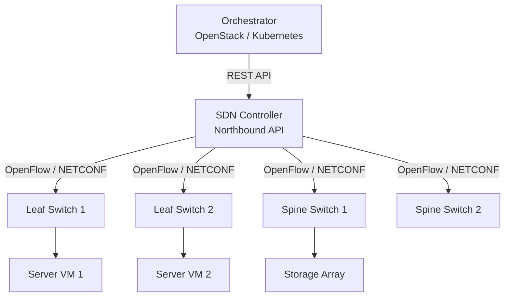

**Figure 1.2:** Northbound API enabling centralized intent-based management. The orchestrator communicates policy intents, which the controller translates into distributed device-level rules.

### 4. Strategy Three: Global Topology Discovery and State Aggregation

Centralized management requires not only a single control entity but also a **comprehensive, real-time view of the entire network**. SDN controllers implement topology discovery mechanisms that aggregate state information from every managed device. Using protocols such as **Link Layer Discovery Protocol (LLDP)**, **BGP-LS (BGP Link-State)**, or vendor-specific telemetry streams, the controller builds a graph representation of the data center fabric—comprising compute nodes, ToR (Top-of-Rack) switches, leaf switches, spine switches, and external interconnects.

This strategy enables centralized path computation. When a new flow arrives, the controller leverages its global topology database to compute the shortest path, the least-congested path, or a path that satisfies latency SLAs—and then programs this path as a series of flow rules across the relevant switches. Because the controller holds all topology state simultaneously, it can avoid the local-optima traps that plague distributed routing protocols. For example, in a traditional OSPF network, each router computes best paths based solely on its local Link-State Database (LSDB) synchronization, which may result in transient sub-optimal routes. In contrast, the SDN controller evaluates all paths globally and selects the optimal end-to-end route for each flow class.

### 5. Strategy Four: Centralized Policy Enforcement and Network Virtualization

The fourth strategy involves using the centralized controller to enforce **network-wide security policies and virtual network overlays**. In data centers hosting multiple tenants, centralized SDN controllers implement microsegmentation policies that restrict east-west traffic between tenants at the virtual switch level. The controller maintains a centralized policy repository—a database of Access Control Lists (ACLs), security groups, and quality-of-service (QoS) profiles—and dynamically programs these policies into the OpenFlow tables or OVSDB records of every switch in the affected segment.

This is particularly powerful when combined with **network virtualization technologies** such as VXLAN, NVGRE, or Geneve. The controller maintains mappings between virtual network identifiers (VNI/VTEP) and the physical network infrastructure, enabling the creation of isolated virtual Layer-2 and Layer-3 domains that span across physical boundaries. This abstraction layer simplifies tenant isolation, workload mobility, and disaster recovery orchestration from a single centralized management plane.

### 6. Strategy Five: Centralized Telemetry, Monitoring, and Closed-Loop Automation

Finally, centralized management in SDN data centers is augmented by comprehensive **telemetry and analytics pipelines** that operate under the controller's purview. Traditional network monitoring relies on Simple Network Management Protocol (SNMP) polling, which is asynchronous and coarse-grained. SDN controllers can consume streaming telemetry from devices using **gRPC/GPB (Google Protocol Buffers)**, **gNMI (gRPC Network Management Interface)**, or **INT (In-band Network Telemetry)** to obtain sub-second visibility into per-flow statistics, port utilization, buffer occupancy, and latency distributions.

This centralized telemetry feeds into **closed-loop automation systems**—sometimes referred to as intent-based networking (IBN) engines—where the controller continuously evaluates whether the network's actual behavior matches the operator's declared intent. If a link fails, the telemetry pipeline detects the event within milliseconds. The controller's path computation engine then reroutes affected flows through alternate paths and pushes updated flow rules to the relevant switches—an operation that can occur without any human intervention. This strategy transforms the data center network from a passively managed infrastructure into an autonomously orchestrated system.

### 7. Conclusion

In summary, SDN achieves centralized management in the data center through five interrelated strategies: logical control-plane centralization within a clustered controller, northbound REST APIs for intent-based automation, global topology discovery and state aggregation, centralized policy enforcement across virtual overlays, and closed-loop telemetry-driven automation. Together, these strategies reduce operational overhead, eliminate configuration drift, accelerate service delivery, and enable the elastic, multi-tenant data center environments demanded by modern cloud-native applications. As data center fabrics scale to hundreds of thousands of servers, centralized SDN management transitions from a competitive advantage to a fundamental operational necessity.
---

## Q1b) Write a short note on VLANs-EVPN-VxLAN-NVGRE

### 1. Introduction: The Need for Isolation and Scale in Data Center Networks

Modern data center networks host hundreds or thousands of virtual machines (VMs), containers, and bare-metal servers, often belonging to multiple distinct tenants or organizational units. The foundational requirement of any shared physical infrastructure is the ability to **isolate** broadcast and unicast traffic between tenants or applications so that one tenant's broadcast traffic does not flood the entire physical fabric. Additionally, as cloud computing scales, Layer-2 broadcast domains must extend beyond the boundaries of a single physical switch, and in some cases, beyond the boundaries of a single data center. The four technologies addressed in this question—**VLANs**, **EVPN**, **VXLAN**, and **NVGRE**—represent an evolutionary chain of increasingly sophisticated approaches to solving the problems of network segmentation, address-space scalability, and multi-tenancy in data center environments.

### 2. VLANs (Virtual Local Area Networks)

**VLANs** represent the earliest and most foundational Layer-2 segmentation technology, standardized by the IEEE 802.1Q specification. A VLAN tags Ethernet frames at ingress with a 12-bit **VLAN Identifier (VLAN ID)**, yielding a theoretical maximum of 4,094 VLANs (VLANs 0 and 4095 are reserved). Switches and trunks forward frames based on this tag, restricting broadcast domains to members of the same VLAN. This mechanism enables network administrators to partition a single physical switch or multi-switch fabric into multiple isolated logical networks without rewiring physical cables.

The principal advantage of VLANs is their simplicity, ubiquity, and hardware support across virtually all Ethernet switches and network interface cards. However, VLANs exhibit significant limitations in large-scale cloud data centers. The 4,094 VLAN limit is insufficient for large cloud providers that provision thousands of isolated tenant networks. Furthermore, VLAN-based isolation is inherently limited in scope; spanning a VLAN across geographically dispersed data centers requires a Layer-2 extension technology such as VPLS or a proprietary pseudowire, which introduces complexity and potential broadcast storms. Additionally, VLAN trunking protocols, including **Spanning Tree Protocol (STP)**, constrain the number of available paths and can lead to sub-optimal traffic forwarding. Despite these limitations, VLANs remain the foundational building block within data centers, used extensively to isolate management traffic, storage traffic, and tenant communication at the access layer.

```
+----------------------------------------------------------+
|              VLAN-Trunked Data Center Topology            |
|                                                          |
|  [VM-A VLAN 10]  [VM-B VLAN 10]  [VM-C VLAN 20]         |
|        |               |               |                 |
|  +-----v-----+   +-----v-----+   +-----v-----+          |
|  |  ToR Sw   |   |  ToR Sw   |   |  ToR Sw   |          |
|  |  (Tagged)  |   |  (Tagged)  |   |  (Tagged)  |          |
|  +-----+-----+   +-----+-----+   +-----+-----+          |
|        \               |               /                |
|        +------------------------------------+            |
|        |        Aggregation Switch          |            |
|        +------------------------------------+            |
|                                                          |
+----------------------------------------------------------+
```

**Figure 1.3:** VLAN-based segmentation. Each VLAN port group is isolated by 802.1Q tags.

### 3. VXLAN (Virtual Extensible LAN)

Recognizing the limitations of VLANs, the IETF standardized **VXLAN (Virtual Extensible LAN)** as documented in RFC 7348. VXLAN is a Layer-2 overlay encapsulation protocol that runs over a Layer-3 IP network, enabling the creation of **overlay networks** within the physical underlay. VXLAN solves VLAN's scalability problem through a 24-bit **VXLAN Network Identifier (VNI)**, providing approximately 16 million unique identifiers—sufficient for virtually any hypothetical data center deployment.

VXLAN encapsulates original Ethernet frames within a UDP/IP packet. The original frame is prepended with an 8-byte VXLAN header containing the VNI and flags, then encapsulated in a standard UDP datagram destined for a **VTEP (VXLAN Tunnel End Point)**. VTEPs may be implemented as software entities in hypervisors (e.g., Open vSwitch), hardware ToR switches, or dedicated hardware appliances. Because VXLAN leverages IP as the transport, VTEPs can reside anywhere the underlay IP network reaches, enabling true multi-tenant overlay networks that span pods, racks, and even geographically distributed data centers.

The VXLAN encapsulation process is as follows: a VM generates an Ethernet frame. The hypervisor (or VTEP) checks whether the destination MAC is local. If not, the VM's frame is encapsulated with the VNI corresponding to that VM's tenant network and sent via UDP to the destination VTEP's IP address. The destination VTEP decapsulates the packet and forwards the inner Ethernet frame to the target VM. This existing-MAC-learning behavior, combined with multicast or head-end-replication for broadcast, unknown-unicast, and multicast (BUM) traffic, enables transparent Layer-2 extension across an arbitrary Layer-3 underlay.

An important variant is **EVPN-VXLAN**, which combines VXLAN with EVPN as the control plane, as explained in the following section.

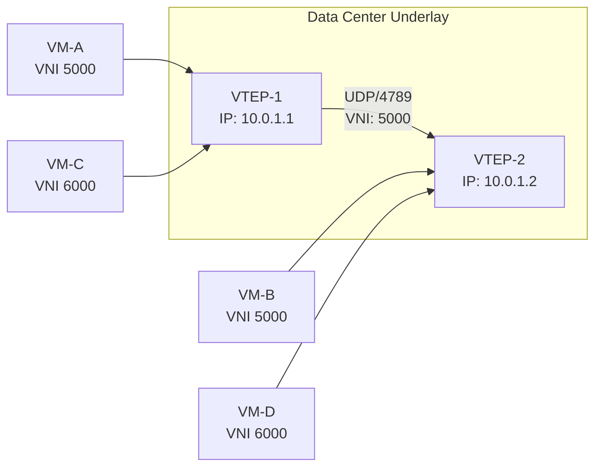

**Figure 1.4:** VXLAN encapsulation. Two VTEPs maintain separate VNIs (5000 and 6000) over a shared IP underlay, achieving tenant isolation without physical cabling.

### 4. NVGRE (Network Virtualization using Generic Routing Encapsulation)

**NVGRE** is an alternative overlay technology standardized by the IETF in RFC 7537. Similar to VXLAN, NVGRE uses a Layer-3 transport network (IP) to provide Layer-2 overlay connectivity. NVGRE encapsulates Ethernet frames within a GRE (Generic Routing Encapsulation) tunnel, using a 24-bit **Tenant Network Identifier (TNI)** for scalability (also supporting approximately 16 million tenants). The encapsulation header is 4 bytes (GRE) plus the outer IP and UDP headers (or directly GRE over IP), making NVGRE slightly more lightweight in its base encapsulation compared to VXLAN's UDP-based approach.

NVGRE was originally championed by Microsoft as part of its Hyper-V Network Virtualization solution and integrated into the Windows Server gateway architecture. It supports distributed load balancing and end-host routing, where the Hyper-V host itself terminates the GRE tunnel, removing the need for an external gateway appliance for most traffic flows. While NVGRE is functionally similar to VXLAN, industry adoption has heavily favored VXLAN due to its open IETF standardization process, broader vendor support, and the subsequent emergence of **EVPN-VXLAN** as a de facto standard for data center fabric designs. Nonetheless, NVGRE remains a valid and implemented technology in Microsoft-centric environments.

The core distinction between NVGRE and VXLAN at the encapsulation level lies in the use of GRE versus UDP as the outer transport protocol. VXLAN's UDP transport requires a source and destination port (typically 4789), enabling load balancing across Equal-Cost Multi-Path (ECMP) links in the underlay. NVGRE's GRE protocol uses a protocol number in the IP header (protocol 47) rather than a UDP port, which can complicate load balancing because GRE does not carry traditional UDP port information in the same manner, although modern switches support GRE-based ECMP through flow hashing on the inner packet fields.

### 5. EVPN (Ethernet VPN)

**EVPN (Ethernet VPN)**, specified in RFC 7432 and subsequently extended by the IEEE and IETF, is not an overlay encapsulation protocol itself but rather a **control plane** for Layer-2 and Layer-3 VPN services over IP/MPLS or IP-only networks. EVPN leverages **BGP (Border Gateway Protocol) as the signaling protocol** to distribute MAC address learning and Ethernet segment information between Provider Edge (PE) routers, replacing the traditional flooding-and-learning behavior of VLAN and VPLS networks.

In its most widely deployed form, **EVPN-VXLAN** combines the VXLAN data-plane encapsulation with the EVPN control plane. In this hybrid architecture, VTEPs act as BGP speakers that advertise their locally learned MAC addresses and VNI bindings to other VTEPs via **BGP EVPN routes**. When a VM sends traffic, the destination VTEP already knows the source MAC-to-VTEP mapping, enabling **ARP suppression**, **MAC learning avoidance**, and **efficient multicast replication** without relying on head-end-replication or IP multicast in the underlay.

The EVPN control plane eliminates the need for "data-plane learning" across VTEP boundaries, significantly reducing broadcast, unknown-unicast, and multicast (BUM) traffic in the data center underlay. EVPN also supports **All-Active Multi-Homing (A-A MH)**, enabling a server or ToR switch to be simultaneously active on multiple upstream links—a feature critical for active-active data center designs and non-blocking leaf-spine fabrics. Additionally, EVPN provides seamless support for **Layer-3 EVPN (EVPN-VRF)**, which enables distributed anycast gateways and efficient inter-VXLAN routing, all managed through a single control plane. The following Mermaid diagram illustrates the BGP EVPN control plane functioning across a leaf-spine fabric:

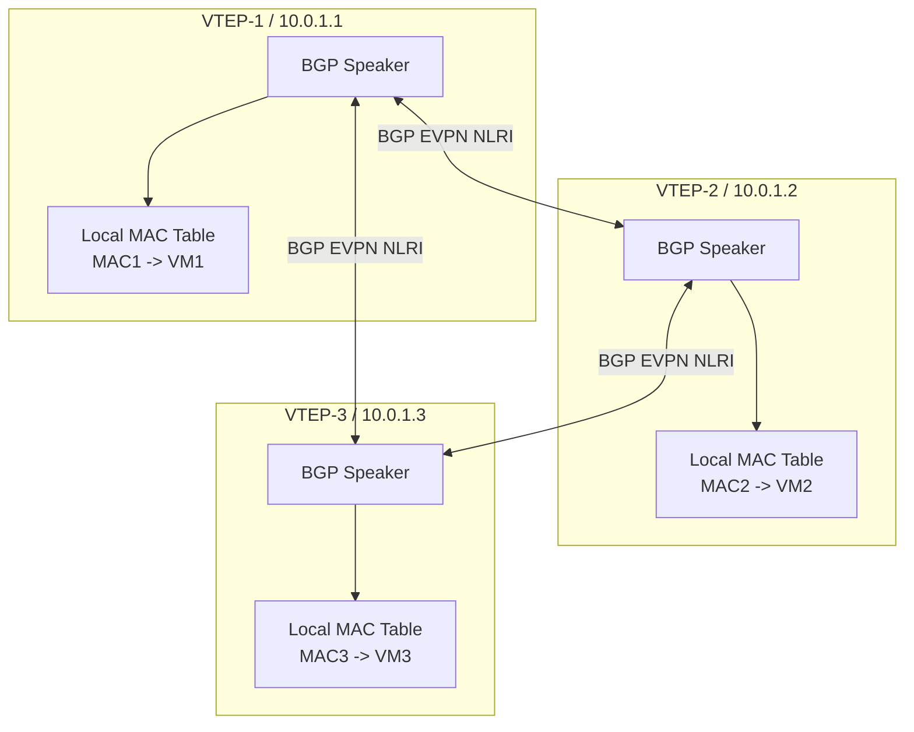

**Figure 1.5:** EVPN control plane operation using BGP. Each VTEP advertises MAC/VNI routes to all other VTEPs, enabling control-plane-driven forwarding without data-plane flooding.

### 6. Comparative Analysis and Technological Relationships

While VLANs, VXLAN, NVGRE, and EVPN each serve Layer-2 segmentation and multi-tenancy, they occupy distinct positions in the technology stack and possess different trade-offs:

| Technology | Layer | Identifier Space | Transport | Control Mechanism |
|---|---|---|---|---|
| VLAN (802.1Q) | L2 Tag | 12-bit (4,094) | Physical Ethernet | Data-plane learning / STP |
| VXLAN | L2 over L3 Overlay | 24-bit (~16M) | UDP/IP | Data-plane flood-and-learn (traditional) |
| NVGRE | L2 over L3 Overlay | 24-bit (~16M) | GRE/IP | Data-plane flood-and-learn (traditional) |
| EVPN | Control Plane | N/A | MPLS or IP-only | BGP control-plane routes (Type 2, 5) |

In contemporary data center architectures, **EVPN-VXLAN** has emerged as the dominant paradigm, combining VXLAN's ubiquitous data-plane support with EVPN's sophisticated control-plane signaling. This combination is the cornerstone of Cisco ACI (Application Centric Infrastructure), Arista CloudVision, Juniper QFabric, and numerous other modern data center networking solutions. VLANs continue to serve as the foundational technology in smaller deployments and at the access layer for out-of-band management. NVGRE, while architecturally sound, has largely been superseded by VXLAN in the broader market, though it retains value in Microsoft-centric environments.

### 7. Conclusion

The progression from VLANs to VXLAN, NVGRE, and EVPN represents a clear technological evolution driven by the insatiable demand for tenant isolation, address-space scalability, and multi-data-center workload mobility in modern cloud infrastructures. Understanding the distinctions, overlay mechanisms, and control-plane behaviors of each technology is essential for network architects designing flexible, scalable data center fabrics.

---

## Q1c) Write short note on Traffic Engineering

### 1. Definition and Conceptual Foundation

**Traffic Engineering (TE)** is a systematic methodology for managing and optimizing the flow of data packets through a communication network to achieve specific performance objectives. In the context of computer networking and data center architectures, traffic engineering encompasses the techniques, protocols, and algorithms employed to manipulate routing decisions, allocate bandwidth, control congestion, and measure network performance so that traffic traverses paths that satisfy defined quality-of-service (QoS) constraints. Unlike conventional routing, which relies primarily on shortest-path algorithms such as Dijkstra and makes forwarding decisions locally based on reachability information, traffic engineering adopts a broader, network-wide perspective that considers link utilization, delay, jitter, packet loss probability, and cost metrics simultaneously.

The objective of traffic engineering is to maximize network resource utilization while satisfying the service-level agreements (SLAs) imposed by applications. By actively controlling the path that traffic takes, TE minimizes congestion, avoids bottlenecks, and ensures that critical applications—such as voice-over-IP (VoIP), video conferencing, storage replication, and financial trading systems—receive the network resources they require. Modern traffic engineering architectures are heavily empowered by SDN, which provides the global visibility and programmatic control necessary to implement sophisticated traffic engineering strategies at scale.

### 2. Traffic Engineering in Traditional IP/MPLS Networks (Pre-SDN)

Before the advent of software-defined networking, traffic engineering was predominantly implemented using **Resource Reservation Protocol (RSVP-TE)** in MPLS (Multi-Protocol Label Switching) networks. RSVP-TE enables routers to establish Label-Switched Paths (LSPs) with reserved bandwidth that are independent of the underlying Interior Gateway Protocol (IGP) shortest path. Network operators use constraint-based routing to compute Explicit Routing Labels (ERLs) that are then signaled through RSVP messages toward the destination. Traffic is mapped to these LSPs, achieving guaranteed bandwidth, fast reroute around failed links, and path isolation for different service classes.

While RSVP-TE remains prevalent in service provider and carrier networks, it suffers from significant limitations in large, dynamic data center environments. The configuration and maintenance of LSPs require per-router CLI interactions or network management systems with proprietary SNMP/CLI adapters. The soft-state nature of RSVP requires periodic refresh messages, consuming control-plane bandwidth. Additionally, MPLS encapsulation is not universally supported on merchant silicon and commodity server network interface cards (NICs), making it impractical for east-west data center traffic, which represents the dominant traffic pattern in modern cloud environments. These constraints motivated the development of SDN-native traffic engineering frameworks.

```
+------------------------------------------------------------------+
|          RSVP-TE MPLS Traffic Engineered Path                    |
|                                                                  |
|  [Router-A] --(LSP-1, Label=40, 10Gbps)--> [Router-B]          |
|      |                                              |            |
|  [Router-C] --(Shortest Path, Best Effort)--> [Router-D]        |
|      |                                              |            |
|  [Router-E] --(LSP-1, Label=40)--> [Router-B] --(LSP-1)--> [F] |
|                                                                    |
+------------------------------------------------------------------+
```

**Figure 1.6:** RSVP-TE establishes explicit LSPs (LSP-1) that bypass IGP shortest paths, reserving dedicated bandwidth for premium traffic classes.

### 3. SDN-Based Traffic Engineering Strategies

The SDN paradigm transforms traffic engineering by providing a globally optimal computation engine—the SDN controller—that possesses simultaneous knowledge of all topology state, link utilization, and flow requirements. With this information, the controller can implement a suite of traffic engineering strategies that were impractical in distributed network environments.

#### 3.1 Global Path Computation and Flow Rule Programming

The most fundamental SDN TE strategy involves computing globally optimal paths for traffic flows and installing corresponding **OpenFlow flow rules** at every switch along the chosen path. For example, if the controller observes that the shortest-path route between two leaf switches has 90% link utilization, it can select an alternate longer path with available capacity to spread the load. This computation is performed centralized, using the controller's real-time network graph.

**Weighted Cost Multipath (WCMP)** is an extension of Equal-Cost Multi-Path (ECMP) where the controller assigns non-uniform traffic splitting ratios among equal-cost next-hops based on their individual utilization levels. The controller may install multiple flow entries, each matching on a hash of the five-tuple (src IP, dst IP, src port, dst port, protocol), and direct flows to different next-hops proportionally. The BATCH toolkit developed at UC Berkeley and the Hedera system from Google demonstrated that WCMP with 100 microsecond flow scheduling intervals can achieve throughput utilization within 5% of the global optimum in large-scale leaf-spine fabrics.

#### 3.2 Segment Routing for Traffic Engineering

**Segment Routing (SR)**, standardized by the IETF as RFC 8402 and 8665, is increasingly paired with SDN to enable scalable, source-routed traffic engineering. Instead of maintaining per-flow state at every hop, SR encodes the path as a **segment identifier (SID)** in the packet header. The segment list acts as an explicit route instruction that each router executes as the packet traverses the network. An SDN controller can compute the segment list (a sequence of SIDs) for any source-destination pair and then inject the necessary forwarding rules (or rely on the native SR data-plane behavior) to enforce the traffic-engineered path.

Segment routing can operate over MPLS (SR-MPLS) or IPv6 (SRv6) data planes. In SRv6, segments are represented as IPv6 addresses in the SRH (Segment Routing Header), enabling TE paths to be established without any signaling protocol—the segment list is computed by the controller and inserted by the ingress node. This approach simplifies traffic engineering deployment and significantly reduces control-plane overhead compared to RSVP-TE.

#### 3.3 TeNOR: Traffic Engineering on Network Operating Systems

Contemporary SDN controller platforms such as **OpenDaylight**, **ONOS**, and **FRRouting (FRR)** integrate traffic engineering modules that provide closed-loop, reactive TE. These systems continuously monitor per-port utilization via streaming telemetry (gNMI/gRPC) and recompute optimal paths when utilization thresholds are exceeded. Upon detecting congestion, the controller may trigger **path deflection**—installing new flow rules that redirect a portion of flows through alternate paths—without disrupting ongoing traffic.

**TeNOR (Traffic Engineering using Network Orchestrator)** is one such framework that abstracts the network as a set of bandwidth slices and uses constraint-satisfaction algorithms to map application demands onto the physical topology. Systems like ONOS's **SDN-IP** application and Cisco's **DNA Center** represent operational implementations of these principles, providing intent-based traffic engineering where operators declare application requirements (throughput, latency, jitter bounds) and the controller autonomously provisions the necessary forwarding state.

### 4. Applications and Use Cases of Traffic Engineering

Traffic engineering finds application across virtually every domain of data center and service provider networking. In **Hyperscale Data Centers**, TE enables efficient utilization of expensive leaf-spine bandwidth by distributing flows across available paths proportional to their capacities. This avoids the load-balancing inefficiencies caused by hashing collisions in traditional ECMP, where a small number of large "elephant" flows can occupy a disproportionate share of a link's bandwidth.

In **Wide-Area Networks (WANs)**, SDN-based TE can dynamically route flows around congested links, failed submarine cables, or maintenance windows while meeting strict latency budgets. Technologies such as **Google's B4** and **Microsoft's SWAN** demonstrated that centralized TE over a WAN can achieve near-optimal link utilization by periodically recomputing the optimal routing of scheduled bulk transfers using a centralized controller that has visibility into global link utilization and traffic demand matrices.

Within **enterprise networks**, TE enables priority isolation between business-critical applications and lower-priority user traffic, ensuring that ERP systems, backup operations, and video conferencing each receive an appropriate share of network resources. Bandwidth calendaring, discussed in detail in Q7a, represents a time-based extension of traffic engineering that schedules bandwidth reservations for known periodic workflows such as nightly ETL pipelines or weekly backup windows.

### 5. Traffic Engineering in Leaf-Spine Fabrics: A Detailed Illustration

In the prevalent **leaf-spine data center topology**, traffic engineering faces the challenge of optimizing utilization across the dozens or hundreds of spine switches that form the Clos network's aggregation layer. Every leaf switch is connected to every spine switch, forming an N×M full-mesh at the distribution level. ECMP enables up to M equal-cost paths between any pair of leaf switches, supporting up to M-way link aggregation.

However, the mere existence of ECMP paths does not guarantee efficient utilization. If traffic between two leaf switches is uneven, certain spine links may become highly congested while others remain underutilized, degrading throughput due to per-flow queueing. SDN-based traffic engineering addresses this by implementing weight-based flow steering that considers the current load on each spine link when making flow assignment decisions.

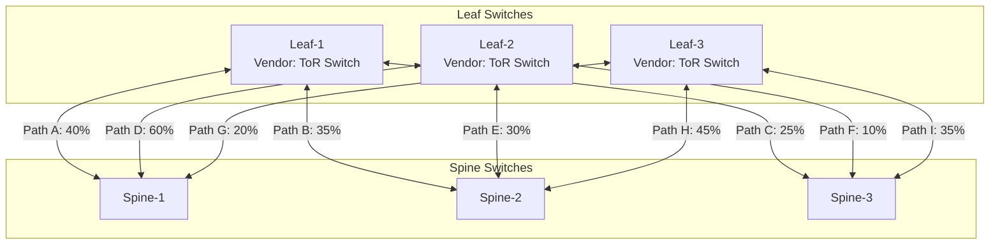

**Figure 1.7:** SDN-controlled traffic engineering in a leaf-spine fabric. The controller monitors per-link utilization and dynamically adjusts flow assignment percentages (A–I) to balance load across spine links.

### 6. Conclusion

Traffic engineering in SDN-enabled data centers represents a fundamental shift from reactive, protocol-driven path selection to proactive, application-aware, centrally orchestrated path optimization. Through controller-based global path computation, real-time telemetry, and programmable flow rule injection, SDN traffic engineering maximizes network utilization, minimizes congestion, and satisfies the stringent performance requirements of modern cloud-native applications.

---

## Q2a) Explain the data center architecture components

### 1. Introduction: What Constitutes a Data Center Architecture

A data center is a purpose-built facility that houses mission-critical computing equipment, networking infrastructure, environmental control systems, and security apparatuses necessary for the reliable operation of enterprise digital services. The architecture of a modern data center is a multi-layered engineering discipline that integrates mechanical, electrical, and information technologies into a cohesive, scalable, and highly available system. Data center architecture can be conceptualized at three distinct layers: the **physical facility and infrastructure layer**, the **network and connectivity layer**, and the **compute and storage resource layer**. Each of these layers contains discrete but interdependent components, and the design choices made at one layer profoundly affect the operational characteristics, cost, and scalability of the entire facility.

Modern enterprise data centers are classified into tiers based on the Uptime Institute's four-tier taxonomy, ranging from Tier I (basic capacity, no redundancy) to Tier IV (fault-tolerant, concurrent maintainability). Regardless of tier classification, a data center architecture must satisfy four fundamental requirements: **reliability** (continuous service availability), **scalability** (capacity to grow with demand), **security** (protection of data and physical assets), and **operational efficiency** (optimal resource utilization with minimal energy consumption). The following sections provide a detailed, component-level examination of data center architecture.

### 2. Physical Facility and Infrastructure Components

#### 2.1 Building Envelope and Structural Elements

The physical facility begins with the **building envelope**—the structural shell that protects equipment from environmental hazards. Data center buildings are typically constructed with reinforced concrete, steel framing, and fire-rated walls that satisfy stringent building codes. The structural design must account for floor loading capacities (typically 1,000–3,000 pounds per square foot for raised-floor systems) to support dense racks of computing and networking equipment. Seismic bracing is essential in earthquake-prone regions to prevent rack displacement during ground disturbances. Access control points—mantraps, turnstiles, and biometric readers—are integrated into the building architecture at the perimeter.

#### 2.2 Power Supply Architecture

The electrical infrastructure of a data center is arguably its most critical component, as a complete power failure renders all computing and networking systems inoperative. Data center electrical architectures follow a **redundant distribution model** comprising:

- **Utility Feed:** Primary electrical connection to the regional power grid, typically two independent utility feeds (Feed A and Feed B) from separate substations.
- **Transformers and Switchgear:** Step-down transformers and high-voltage switchgear that condition and distribute utility power.
- **Uninterruptible Power Supply (UPS):** Double-conversion or flywheel-based UPS systems that provide instantaneous bridging power during utility interruptions. Double-conversion UPS systems continuously convert AC to DC and back to AC, conditioning power quality and eliminating harmonics, sags, and surges.
- **Backup Generators:** Diesel, natural gas, or hydrogen fuel cell generators that provide long-duration alternative power during extended utility outages. Generators must be sized to support the full critical load of the facility and tested under load periodically.
- **Power Distribution Units (PDUs):** Rack-level or row-level PDUs distribute conditioned power to individual IT equipment racks. Intelligent PDUs provide per-outlet metering, remote power cycling, and environmental monitoring.
- **Redundant N+1 or 2N Configurations:** Critical facilities employ N+1 (one backup for every N units) or 2N (two independent complete systems) configurations to eliminate single points of failure.

```
+------------------+    +------------------+    +------------------+
|  Utility Feed A  |    |  Utility Feed B  |    |  Generator Set   |
|  (Independent)   |    |  (Independent)   |    |  (Diesel/Nat Gas)|
+--------+---------+    +--------+---------+    +--------+---------+
         |                       |                       |
+--------v---------+    +---------v---------+   +--------v---------+
|  ATS / Static    |    |  ATS / Static     |   |  ATS / Static    |
|  Transfer Switch |    |  Transfer Switch  |   |  Transfer Switch |
+--------+---------+    +---------+---------+   +--------+---------+
         |                       |                       |
         +-----------+-----------+-----------------------+
                     |
              +------v-------+
              |  UPS System   |
              |  (N+1 Config) |
              +------+-------+
                     |
              +------v-------+
              |  PDU Rows A/B |
              +------+-------+
                     |
          +----------+----------+
          |                     |
     [Rack PDU]           [Rack PDU]
```

**Figure 2.1:** Typical 2N redundant electrical distribution architecture for a Tier III/IV data center, showing dual utility feeds, automatic transfer switches (ATS), UPS, generator backup, and dual rack PDUs.

#### 2.3 Cooling and Environmental Control

Data centers consume approximately 40–60% of their electrical energy for cooling, as IT equipment generates enormous quantities of heat that must be continuously dissipated to maintain equipment within operational temperature and humidity tolerances (ASHRAE guidelines specify 18–27°C and 40–60% relative humidity). Cooling infrastructure includes:

- **Computer Room Air Conditioning (CRAC) Units:** Rack-mounted or aisle-contained air conditioning units that circulate chilled air through the plenum.
- **Computer Room Air Handler (CRAH) Units:** Larger chilling systems that use chilled water loops rather than direct refrigerant expansion, typically more efficient at scale.
- **Hot-Aisle/Cold-Aisle Containment:** Physical barriers (either in-row or overhead) that separate hot exhaust air from cold supply air, preventing thermal mixing and dramatically improving cooling efficiency.
- **Raised Floor / Overhead Plenum:** Air distribution pathways; raised floors are traditional, while overhead ducts are preferred in modern designs for better airflow management.
- **Chiller Plants and Cooling Towers:** Centralized water chilling systems and evaporative cooling towers that reject building heat to the external environment.
- **Free Cooling:** Economizer systems that use external ambient air or water for cooling when environmental conditions permit, eliminating compressor-based cooling costs for significant portions of the year.

### 3. Network and Connectivity Components

#### 3.1 Core, Aggregate, and Access Layers

Data center network architecture traditionally follows a hierarchical three-tier model: **Core**, **Aggregation (or Distribution)**, and **Access (or Edge) layers**. Modern cloud-scale data centers have evolved this into **leaf-spine architectures**, but understanding the three-tier model is foundational.

- **Core Layer:** The high-speed backbone of the data center network, interconnecting aggregation layers, external internet connections, and wide-area network (WAN) links. Core switches are engineered for maximum throughput and minimal latency, typically operating at 100Gbps or 400Gbps per port with cut-through switching capabilities.
- **Aggregation Layer:** Provides policy-based connectivity, routing between VLANs (inter-VLAN routing), firewall services, and load balancing. This layer aggregates multiple access-layer switches and uplinks to the core.
- **Access Layer:** The point of physical connection for servers, storage arrays, and other endpoints. ToR (Top-of-Rack) switches typically provide 1Gbps/10Gbps/25Gbps connectivity to servers with 40Gbps/100Gbps uplinks to the aggregation layer. Modern leaf-spine architectures collapse the aggregation and core functions into a flat leaf-spine mesh.

#### 3.2 Leaf-Spine (Clos) Architecture

The **leaf-spine architecture**, derived from Charles Clos's 1953 work on non-blocking switching networks, has become the de facto standard for modern cloud data centers. In a leaf-spine fabric:

- Every leaf switch connects to every spine switch (a full bipartite mesh).
- All leaf switches operate at the same tier, providing equal-cost paths between any pair of endpoint servers.
- The architecture is inherently non-blocking when the oversubscription ratio is 1:1, meaning every server can simultaneously communicate at full bandwidth.

```
Layer: Servers ---- Leaf Switches ---- Spine Switches ---- Core/Router

Servers    Leaf-1    Leaf-2    Leaf-3     Spine-1    Spine-2    Spine-3
[S1] ---- [L1] ---- [S1] ---- [CORE]
[S2] ---- [L1] ---- [S2] ---- [CORE]
[S3] ---- [L2] ---- [S1] ---- [CORE]
[S4] ---- [L2] ---- [S2] ---- [CORE]
[S5] ---- [L3] ---- [S1] ---- [CORE]
[S6] ---- [L3] ---- [S2] ---- [CORE]
```

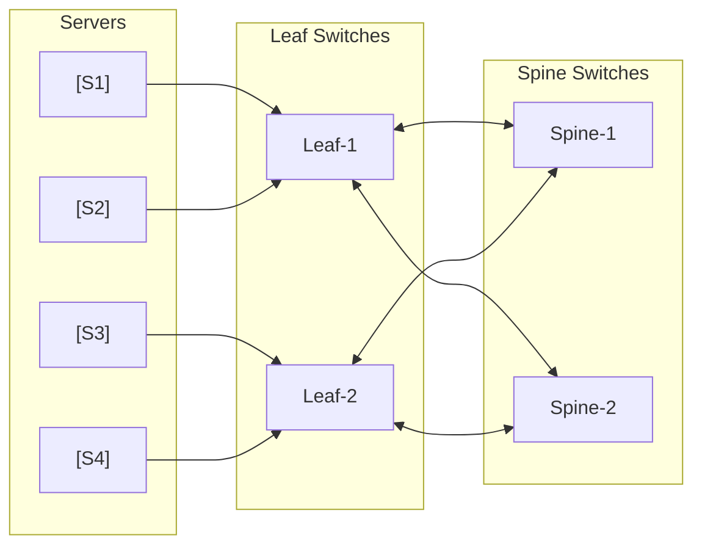

**Figure 2.2:** Leaf-spine (Clos) architecture. Every leaf switch connects to every spine switch, providing ECMP-based multipath connectivity.

#### 3.3 Network Connectivity Hardware

- **Ethernet Switches:** Ranging from 1U ToR switches to modular chassis-based aggregation switches. Key parameters include port density, switching capacity, throughput (often specified in Tbps), buffer size, and cut-through vs. store-and-forward latency.
- **Routers:** For inter-data-center routing, WAN edge connectivity, and peering with internet service providers. High-end routers employ modular line cards supporting multiple terabits of forwarding capacity.
- **Load Balancers:** Hardware (e.g., F5 BIG-IP, Citrix NetScaler) or software (e.g., NGINX, HAProxy) components that distribute application traffic across server pools.
- **Firewalls and WAFs:** Network security appliances that enforce access control policies and protect against application-layer attacks.
- **SDN Switches with OpenFlow:** Commodity or purpose-built switches that expose a programmable data plane, enabling centralized controller-based management and traffic engineering.

#### 3.4 SDN Controller and Network Management Systems

The strategic management and programmability of the data center network are vested in the **SDN controller cluster**. This software layer translates high-level network intents (from operators or orchestrators) into device-specific configuration and flow rules, monitors network performance via telemetry streams, and implements closed-loop automation. The control layer is the operational brain of the modern data center.

### 4. Compute and Storage Components

#### 4.1 Compute Infrastructure

- **Blade Servers:** High-density compute chassis that share power, cooling, and networking resources. Common in enterprise data centers.
- **Rack Servers:** 1U, 2U, or 4U server chassis mounted in standard 19-inch equipment racks, offering modularity and easy servicing.
- **Hyperconverged Infrastructure (HCI):** Integrated compute, storage, and sometimes networking within a single appliance node, managed through distributed software such as VMware vSAN, Nutanix AOS, or Red Hat HyperConverged Infrastructure.
- **GPU/TPU Accelerators:** Specialized hardware for high-performance computing (HPC), artificial intelligence, and machine learning workloads, contributing significantly to rack power density and cooling requirements.

#### 4.2 Storage Infrastructure

- **Direct-Attached Storage (DAS):** Storage devices directly connected to a compute server via SATA, SAS, or NVMe interfaces. Provides high performance but limited sharing.
- **Storage Area Network (SAN):** Dedicated high-speed Fibre Channel or Fibre Channel over Ethernet (FCoE) network connecting servers to shared storage arrays.
- **Network-Attached Storage (NAS):** File-level storage accessed over standard Ethernet (NFS, SMB protocols), typically less expensive than SAN but potentially lower-performing for random I/O.
- **Software-Defined Storage (SDS):** Storage resources abstracted and pooled by software, enabling policy-driven provisioning and elastic scaling. Examples include Ceph, GlusterFS, and MinIO.

### 5. Management and Orchestration Components

Enterprise data center management encompasses:

- **Data Center Infrastructure Management (DCIM):** Software platforms (e.g., Nlyte, Schneider EcoStruxure, Vertiv) that provide real-time monitoring of power, cooling, space utilization, and asset inventory across the facility.
- **Network Orchestration:** Platforms such as Ansible, Terraform, and vendor-specific orchestration systems that automate the provisioning and configuration of network devices.
- **Cloud Management Platforms (CMP):** Software such as OpenStack, VMware vRealize, or Kubernetes API servers that manage the lifecycle of workloads (VMs, containers) and their associated network and storage resources.
- **Security Operations:** SIEM (Security Information and Event Management) systems, intrusion detection/prevention systems (IDS/IPS), and physical security systems (CCTV, access control) that monitor and protect assets.

### 6. Conclusion

Data center architecture is a complex, multi-dimensional engineering discipline that integrates physical infrastructure, mechanical systems, electrical engineering, and information technology into a cohesive operational fabric. Each component—from the raised floor and UPS to the leaf-switch and SDN controller—plays an indispensable role in ensuring that data center services remain available, secure, and performant. A deep understanding of these components and their interdependencies is essential for architects, engineers, and operators tasked with designing, deploying, and managing modern data center environments.

---

## Q2b) Explain SDN Use Cases in Data Centre

### 1. Introduction: The SDN Opportunity in Data Center Networking

The data center represents the single most consequential environment where Software-Defined Networking delivers transformative operational, economic, and technological benefits. As enterprise and cloud service providers transition from traditional, vertically integrated proprietary networks to horizontally scalable, commodity-hardware-based fabrics, SDN has emerged as the foundational architectural paradigm that enables this transformation. The use cases for SDN in data center environments are both numerous and deeply impactful, spanning the entire operational lifecycle of the data center—from initial deployment and workload provisioning to ongoing optimization, security enforcement, and disaster recovery. Understanding these use cases requires examining the specific pain points that traditional data center networks create and how SDN's logically centralized control, programmatic interfaces, and global visibility directly address each of them.

The following sections explore the primary SDN use cases in data center environments. These use cases are not mutually exclusive; in production deployments, a single SDN platform simultaneously fulfills multiple roles, delivering compound operational value. The sections are organized by functional domain: network provisioning and automation, security and microsegmentation, workload mobility, traffic engineering and optimization, multi-tenancy and cloud enablement, and operational monitoring and analytics.

### 2. Network Provisioning and Zero-Touch Deployment

The most immediate and widely adopted use case for SDN in data centers is the **automation of network provisioning**. In traditional networks, provisioning connectivity for a new virtual machine or container requires a multi-step, error-prone manual process: a network operator logs into the switch CLI, configures VLAN or VXLAN settings on the appropriate switch ports, updates ACLs to control permitted traffic, adjusts QoS policies, and documents the change in a spreadsheet or IP Address Management (IPAM) system. This process may take hours to days and carries substantial risk of human error, particularly in large, multi-tenant environments where thousands of VMs are created and destroyed daily.

SDN eliminates this manual intervention through **closed-loop orchestration**. When an orchestration platform such as OpenStack Nova, Kubernetes, or VMware vSphere detects that a new VM is being scheduled onto a host, it triggers a notification to the SDN controller via the northbound API. The controller then automatically:

1. Allocates a VXLAN VNI (or VLAN ID) compatible with the tenant's virtual network.
2. Configures the hypervisor's virtual switch (Open vSwitch, DVS, or Linux bridge) with the appropriate VLAN tag or VXLAN tunnel.
3. Installs microsegmentation security group rules restricting which other VMs or subnets this new VM can communicate with.
4. Provisions QoS policies (bandwidth limits, priority queues) according to the VM's tier classification.
5. Registers the VM's MAC and IP addresses in a centralized IPAM database.

This entire process completes within seconds, with zero CLI access required. The result is an order-of-magnitude reduction in provisioning cycle time, a drastic reduction in human error, and a consistent, repeatable network configuration that adheres to organizational policy. Network architects refer to this as **Infrastructure as Code (IaC)**, where the desired network state is defined declaratively and automatically enforced by the SDN controller.

```
OPENSTACK NOVA                   SDN CONTROLLER
+-------------------+             +-------------------+
| VM Scheduler      |             | Topology Database  |
| Detects new VM    |--(1) REST-->| Allocates VNI 5000 |
+-------------------+             +-------------------+
                                        |
                                  (2) OpenFlow Config
                                        |
+-------------------+             +-------------------+
| Hypervisor OVS    |<------------| Flow Rules Push    |
| Port configured   |             +-------------------+
+-------------------+
```

**Figure 2.3:** Automated network provisioning workflow. The orchestration platform triggers a REST API call to the SDN controller, which configures the hypervisor switch within seconds.

### 3. Microsegmentation and Tenant Security

A second critical use case is **microsegmentation**, the practice of applying granular security policies at the individual workload level rather than at the network perimeter. Traditional data center security relies on perimeter firewalls that protect the internal network from external threats but provide little defense against lateral movement once an attacker breaches the perimeter. The modern threat landscape, characterized by sophisticated APTs (Advanced Persistent Threats) and ransomware, demands defense-in-depth that restricts east-west traffic between VMs and applications.

SDN-based microsegmentation addresses this by maintaining a centralized **security policy repository** within the controller. Each workload is associated with a security group or application profile that defines exactly which other workloads, ports, and protocols it may communicate with. When a new workload is provisioned, the controller automatically installs the necessary ACL rules at the virtual switch level on every host that may interact with this workload.

For example, a three-tier web application consisting of a load balancer, application servers, and database servers may have the following security policy: the load balancer may send TCP port 80 traffic to any application server; application servers may send TCP port 5432 traffic to the database tier; but the database tier may initiate no outbound connections. Using OpenFlow or OVSDB, the SDN controller enforces this policy at the virtual switch on every ESXi host, KVM host, or bare-metal server in the cluster. If an attacker compromises one application server, lateral movement to the database is blocked at the virtual switch level, even if the attacker has administrative access within the VM.

This approach to security is **context-aware and identity-based**. Policies are tied to workload attributes—namespace labels (in Kubernetes), security group IDs (in OpenStack), or VM tags—rather than static IP addresses. This means that security policies follow workloads as they migrate across hosts and even across data centers, maintaining consistent protection regardless of the workload's physical location. This capability is particularly valuable for regulated industries—healthcare, finance, and government—where network segmentation is a compliance requirement.

### 4. Workload Mobility and Live Migration

Modern data center operations rely heavily on **live migration** to achieve load balancing, hardware maintenance, and disaster recovery. VMware vMotion, KVM live migration, and container orchestration platforms all enable workloads to be moved from one physical host to another with minimal or no service interruption. However, network state—IP addresses, MAC addresses, VLAN memberships, VXLAN tunnels, and QoS policies—must be seamlessly transferred alongside the workload to maintain session continuity.

In traditional networking, live migration is problematic. If a VM with IP 10.0.1.50 on VLAN 100 migrates to a different physical host connected to a different access switch, the new host's switch port must be reconfigured to carry VLAN 100, and ARP caches across the network must be updated to reflect the VM's new physical location. Failure to do so causes packet loss and session disruption during the migration window.

SDN solves this through **distributed virtual switching and VTEP coordination**. When a workload migrates, the orchestration platform notifies the SDN controller. The controller then:

1. Updates its topology database to reflect the VM's new host location.
2. Reprograms the MAC-to-port forwarding entries on the new host's virtual switch.
3. If using EVPN-VXLAN, the controller (or the VTEPs themselves via EVPN control plane) advertises the VM's MAC address migration to all relevant VTEPs across the fabric, updating their forwarding tables.
4. Ensures that ARP caches are refreshed so that existing TCP sessions continue uninterrupted.

The result is **seamless live migration** that abstracts physical location entirely. From the application's perspective, the VM never moved; from the network's perspective, the controller orchestrates a seamless handoff. This capability is essential for zero-downtime data center maintenance, automated workload rebalancing based on resource pressure, and disaster recovery failover. Google's internal data center SDN (known as B4 and subsequently Jupiter) demonstrated that centralized workload mobility management can enable live migration of tens of thousands of VMs across geographically distributed data centers without user-visible impact.

### 5. Multi-Tenancy and Cloud Networking Enablement

Public cloud providers, private cloud operators, and large enterprises with multiple business units all require **multi-tenancy**—the ability to securely isolate different tenants' workloads on shared physical infrastructure while providing each tenant with network administration autonomy. Multi-tenancy requires three capabilities: network isolation (preventing one tenant's traffic from being visible to another), address-space independence (tenants may use any IP addresses without conflicts), and policy isolation (each tenant manages its own routing, security, and QoS policies).

SDN enables multi-tenancy through a combination of **overlay network virtualization** and **centralized policy management**. Using VXLAN, NVGRE, or Geneve overlays, the SDN controller creates thousands of logically isolated Layer-2 and Layer-3 networks on a single physical underlay. Each tenant's virtual network operates with a unique VNI, invisible to other tenants. The controller assigns IP address ranges from tenant-specific subnets, ensuring non-overlapping address spaces.

Furthermore, SDN allows **tenant-level RBAC (Role-Based Access Control)** within the controller itself. A tenant administrator can manage their own virtual networks—creating subnets, configuring routing, and modifying security policies—without having visibility into or control over other tenants' networks. The SDN controller's multi-tenancy framework enforces strict isolation between tenants' configuration namespaces. This is the same capability that OpenStack Neutron and VMware NSX provide, built upon an underlying SDN controller.

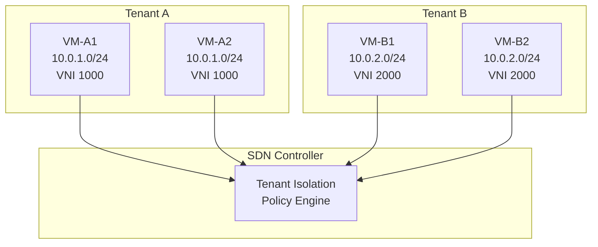

**Figure 2.4:** SDN-based multi-tenancy. The controller enforces isolation between Tenant A (VNI 1000) and Tenant B (VNI 2000) on shared physical infrastructure.

### 6. Traffic Engineering and Application-Aware Optimization

Data center applications exhibit vastly different network requirements. High-frequency trading applications require sub-microsecond latency, while nightly backup workloads require guaranteed bandwidth. Video streaming requires consistent throughput with controlled jitter, and database replication requires prioritized, loss-free delivery. Traditional data center networks treat all traffic equally, or apply coarse QoS policies that are difficult to tune precisely.

SDN-based traffic engineering enables **application-aware path selection and bandwidth allocation**. The SDN controller maintains a real-time view of current network utilization, link congestion, and flow-level telemetry. Applications register their requirements with the controller (or with an orchestrator that communicates these requirements to the controller). The controller then computes optimal paths, installs flow rules to steer traffic along those paths, and dynamically re-routes flows when congestion is detected.

This use case encompasses **bandwidth calendaring**—the time-based reservation of specific bandwidth quantities for scheduled, periodic workloads. For example, an organization may run nightly ETL (Extract-Transform-Load) pipelines that move terabytes of data between data warehouses and analytics clusters. Using SDN bandwidth calendaring, the controller reserves dedicated bandwidth paths (via explicit flow rules or segment routing tunnels) during the scheduled window, dramatically reducing completion time and eliminating interference with production OLTP (Online Transaction Processing) workloads.

Advanced SDN traffic engineering also includes **load balancing across application tiers**. The controller monitors server and link utilization and can dynamically adjust load balancer configurations to shift traffic away from congested or failed application instances. This closed-loop load balancing operates at finer granularity and faster timescales than traditional load balancer probes, because the controller receives telemetry directly from the switching infrastructure.

### 7. Disaster Recovery and Business Continuity

Enterprise data centers are increasingly deployed in pairs across geographically separated sites to achieve business continuity in the event of site-wide failures—whether from natural disasters, power grid failures, or ransomware attacks. SDN facilitates **disaster recovery (DR) networking** by enabling the dynamic reconfiguration of network paths, IP address management, and overlay tunnels during failover events.

In a traditional DR configuration, a stretched Layer-2 network using VPLS or dark fiber connects the two data centers. This approach is expensive and complex, requiring careful latency engineering to ensure that storage replication and database synchronization protocols do not experience timeouts due to excessive round-trip times. SDN simplifies DR architecture through **intent-based network reconfiguration**. During a DR event, the orchestration platform signals the SDN controller to restore network connectivity at the recovery site. The controller reprograms the entire fabric—vSwitches, physical switches, and VTEPs—to reflect the new topology, with the recovery site operating in active-active or active-passive mode depending on the DR strategy.

**Google's B4 WAN** and **Microsoft's SWAN** are canonical examples of SDN-based traffic engineering applied to inter-data-center WAN connectivity. These systems demonstrated that centralized SDN controllers could schedule and route bulk data transfers across wide-area links achieving utilization efficiencies between 70% and 90%, a dramatic improvement over traditional shortest-path routing.

### 8. Network Analytics and Operational Visibility

A final and increasingly important use case is **network analytics and predictive operational intelligence**. Traditional network monitoring tools (SNMP polling, NetFlow collection, CLI-based counters) provide only fragmented, delayed, and incomplete visibility into network behavior. SDN controllers, operating as the single network-wide database, can aggregate telemetry from all switches and endpoints into a unified real-time analytics platform.

SDN analytics supports use cases including:

- **Anomaly detection:** Machine learning models trained on historical telemetry can identify traffic patterns indicative of DDoS attacks, data exfiltration, or misconfigurations.
- **Capacity planning:** Long-term trend analysis of link utilization, flow counts, and buffer occupancy enables proactive infrastructure upgrades before performance degradation occurs.
- **Root-cause analysis:** When a user reports slow application performance, the SDN analytics platform can correlate metrics across the entire request path—server CPU, switch queue depths, link utilization—to pinpoint the exact source of congestion.
- **SLA verification:** Enterprises can programmatically validate that specific business applications are receiving network resources within the bounds defined by their SLAs, generating automated compliance reports.

### 9. Conclusion

SDN use cases in data centers span the complete operational lifecycle—from automated provisioning and security enforcement to workload mobility, traffic engineering, disaster recovery, and predictive analytics. Each use case derives value from SDN's core architectural innovations: logically centralized control, standardized programmable interfaces (OpenFlow, NETCONF/YANG), global network visibility, and automated closed-loop control. As data centers continue to grow in scale and complexity, driven by machine learning workloads, edge computing deployment, and hybrid cloud architectures, the SDN use case portfolio will continue to expand, establishing SDN as an indispensable infrastructure technology for the next decade of data center evolution.

---

## Q2b) Explain SDN Use Cases in Data Centers

### 1. Introduction: SDN as an Operational Enabler for Data Centers

Software-Defined Networking has emerged as one of the most transformative technologies in modern data center operations. By decoupling the control plane from the data plane and exposing network behavior through programmable interfaces, SDN addresses fundamental limitations of traditional networking: siloed device management, slow service delivery, poor visibility, and human-error-prone configuration processes. Data centers—whether private, public, or hybrid—are the primary beneficiaries of SDN, given their scale, complexity, and the need for rapid workload orchestration.

The adoption of SDN in data centers is not merely a technology upgrade; it represents a paradigm shift from circuit-based, hardware-bound networking to elastic, software-driven, intent-based networking. This section comprehensively examines the principal use cases where SDN delivers transformative value in data center environments, organized by operational domain.

### 2. Data Center Network Underlay Automation

One of the most foundational use cases of SDN in data centers is the **automated provisioning and lifecycle management of the physical underlay network**. In traditional deployments, connecting a new Top-of-Rack (ToR) switch to the aggregation layer required manual CLI configuration spanning VLAN trunking, port channels (LACP), routing protocol adjacencies, Spanning Tree parameters, ACLs, and QoS policies. With SDN, the underlay can be bootstrapped automatically.

When a new leaf switch is powered on, it can be configured via **Zero Touch Provisioning (ZTP)** using mechanisms such as DHCP option 67, PXE boot, or proprietary protocols. The switch contacts the SDN controller, authenticates, and receives a complete configuration template that enables its links to the spines, configures loopback interfaces for VTEP/VXLAN, installs baseline flow rules, and registers its capabilities with the controller's topology database. This process reduces what used to require hours of manual engineering to a matter of minutes.

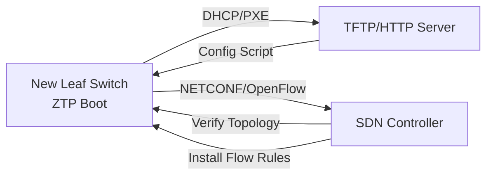

**Figure 2.1:** Zero Touch Provisioning (ZTP) flow for automated underlay switch onboarding via SDN controller.

This automation is particularly critical in hyperscale deployments where thousands of switches must be deployed rapidly. Microsoft's deployment of SDN in its Azure data centers demonstrated that ZTP combined with SDN reduced switch provisioning time from approximately four hours to under fifteen minutes per device.

### 3. Overlay Network Creation and Multi-Tenancy

The ability to rapidly create, modify, and tear down **isolated overlay networks** is perhaps the most impactful SDN use case in multi-tenant cloud data centers. When an OpenStack tenant creates a virtual private cloud (VPC), the Neutron networking component communicates with the SDN controller's northbound API. The controller then:

1. Allocates a unique VXLAN Network Identifier (VNI) for the new tenant network.
2. Programs VTEP-to-VTEP encapsulation rules on all leaf switches hosting VMs in that tenant's segment.
3. Configures distributed anycast gateways on the leaf switches for the tenant's subnets.
4. Installs default security group rules (microsegmentation ACLs) on each hypervisor's virtual switch and physical NIC.

This entire orchestration occurs in seconds, with complete network isolation between tenants. The SDN controller maintains the policy-to-VNI mapping centrally, eliminating the need for per-device configuration of VLANs or tunnels in conventional approaches.

### 4. Load Balancing and Application Delivery

Data centers host applications that must service millions of concurrent client connections. SDN enables **intelligent, application-aware load balancing** at the network layer. Rather than relying solely on hardware load balancers (F5, Citrix), SDN controllers can program OpenFlow rules that:

- Distribute incoming TCP connections across a pool of application servers using consistent hashing, weighted round-robin, or least-connection algorithms.
- Dynamically adjust server weights based on real-time health checks and response time metrics reported to the controller.
- Implement health-checking at Layer 4 (TCP SYN response) and Layer 7 (HTTP probe) without dedicated load balancer appliances.
- Redirect traffic away from degraded or overloaded servers in sub-second timeframes.

Projects such as **Ananta** (LinkedIn) and **Maglev** (Google) demonstrated that software-defined load balancing implemented at the network layer can match or exceed the performance of proprietary hardware appliances while providing superior flexibility and cost efficiency.

### 5. DDoS Mitigation and Network Security

Data centers are persistent targets of Distributed Denial of Service (DDoS) attacks, which can consume terabits of bandwidth and render services unavailable. SDN provides a powerful platform for **real-time DDoS detection and mitigation** by leveraging the controller's global view of traffic patterns.

When traffic to a specific destination IP exceeds a configurable threshold, the SDN controller can instantaneously:
- Deploy rate-limiting flow rules on the ingress switches.
- Redirect suspicious traffic to scrubbing appliances or honeypot systems via flow rule redirection.
- Install sinkhole rules that drop malformed packets before they reach the target server.
- Trigger BGP route withdrawal at the edge to block attack traffic at the network perimeter.

Because the controller can program rules on tens or hundreds of switches simultaneously, the scale and speed of attack mitigation in SDN environments vastly exceed what is achievable through per-device configuration. Commercial solutions such as **Aryaka**, **Radware DefensePro**, and **Versa Networks** integrate with SDN controllers to provide automated DDoS response workflows.

### 6. Traffic Engineering and Congestion Management

As examined in greater detail in Q1c, SDN-based traffic engineering is a primary data center use case. By maintaining real-time telemetry on link utilization, buffer occupancy, and flow-level statistics, the SDN controller can dynamically steer traffic to avoid congestion hotspots. Specific applications include:

- **Elephant Flow Management:** Identifying large flows (elephant flows) that exceed a configurable threshold (e.g., 100MB in 10 seconds) and rerouting them over less-congested paths, or rate-limiting them to prevent queue buildup at spine switches.
- **Deadlock Prevention:** In lossy data center fabrics, incast congestion occurs when multiple senders simultaneously transmit to a single receiver, overwhelming the receiver's buffer and causing TCP retransmission storms. SDN can implement Explicit Congestion Notification (ECN)-aware scheduling and pacing to mitigate incast.
- **Dynamic Bandwidth Allocation:** Time-sensitive workloads such as financial analytics or model training can trigger the controller to temporarily reserve guaranteed bandwidth paths, reverting to best-effort once the workload completes.

### 7. Network Telemetry and Operational Analytics

Data center operators require deep visibility into network behavior to troubleshoot issues, optimize performance, and ensure security compliance. SDN provides native, fine-grained telemetry collection through mechanisms such as:

- **OpenFlow Statistics:** The controller periodically requests port, flow, and aggregate counters from managed switches.
- **gNMI Streaming Telemetry:** Switches push incremental counter updates to the controller's time-series database using the gRPC-based gNMI protocol, enabling dashboarding at sub-second granularity.
- **In-band Network Telemetry (INT):** Switches embed telemetry metadata directly into data packets as they traverse the network, providing per-hop latency, queue depth, and congestion information without out-of-band polling.

These telemetry streams feed into centralized analytics platforms where operators build dashboards, anomaly detection models, and capacity planning tools. The controller's API facilitates integration with third-party analytics platforms such as Prometheus, Grafana, and Elasticsearch.

### 8. Disaster Recovery and Data Center Interconnect (DCI)

Organizations with multiple data center sites require resilient interconnectivity for disaster recovery (DR). SDN simplifies DCI by enabling dynamic, policy-driven connectivity between geographically dispersed data centers. When a primary site fails, the SDN controller can:

- Re-route application traffic from the primary to the secondary data center.
- Update routing policies across the entire fabric in seconds.
- Synchronize microsegmentation and security policies to ensure the DR site's network posture matches the primary.

**EVPN-VXLAN Multi-Site**, as standardized in RFC 8365 and enhanced by subsequent IETF drafts, provides an SDN-managed DCI architecture where the controller orchestrates inter-site MAC and IP route advertisement, maintaining L2 and L3 connectivity across hundreds or thousands of kilometers.

### 9. Network Migration and Live Workload Mobility

Modern data centers support live migration of virtual machines and containers (e.g., VMware vMotion, Kubernetes Live Migration). SDN ensures **network state continuity** during migration by pre-programming flow rules on both the source and destination hosts before the VM's memory state is transferred. The controller updates its topology database and redistribute ARP/ND entries to reflect the VM's new location, ensuring that existing TCP connections experience no disruption despite the host-level migration.

### 10. Conclusion

SDN use cases in data centers span the full operational lifecycle: from automated provisioning of the underlay, through dynamic overlay management, load balancing, security enforcement, traffic engineering, and disaster recovery. By centralizing control, programmability, and visibility, SDN transforms the data center network from a static, manually configured infrastructure into an agile, elastic, and autonomously orchestrated platform that can keep pace with the demands of cloud-native computing.

---

## Q2c) Explain: Adding, Moving, Deleting, Failure recovery, and Multitenancy (w.r.t data center demands)

### 1. Introduction: The Five Fundamental Data Center Operations

Contemporary data centers are characterized by extreme dynamism. Unlike traditional enterprise networks where devices, users, and services remained relatively static for months or years, modern cloud data center environments experience continuous, automated changes to their workloads, network policies, and physical device inventory. The operations of **Adding**, **Moving**, **Deleting**, **Failure Recovery**, and **Multitenancy** collectively define what is known as **data center agility**—the ability to rapidly and reliably respond to changing business requirements.

These five operations impose specific demands on data center networking infrastructure that were historically difficult or impossible to satisfy under traditional distributed networking paradigms. Software-Defined Networking (SDN) was architecturally designed to address precisely these demands, providing programmability, centralized control, and network-wide visibility. This section examines each operation in detail, the challenges it presents, and how SDN-based architectures address them.

### 2. Adding: Scalable Onboarding of Workloads and Devices

The **Add** operation refers to the introduction of new compute workloads (virtual machines, containers, bare-metal servers) and network devices (switches, routers, storage nodes) into the data center. The rate of addition in cloud environments is extraordinary: a hyperscale data center operator may provision tens of thousands of new compute instances daily, driven by customer demand, autoscaling policies, and disaster recovery replication events.

#### 2.1 Adding Workloads (Compute Instances)

When a new workload is added, the data center network must automatically:
- Assign a unique IP address (via DHCP or IPAM integration).
- Attach the workload to the appropriate logical network segment (VLAN/VXLAN/VNI).
- Install microsegmentation security rules (security groups/ACLs) governing the workload's permitted communication patterns.
- Apply quality-of-service (QoS) policies appropriate to the workload class (e.g., guaranteed bandwidth for a storage node, best-effort for a web server).
- Configure the workload's default gateway, DNS resolution, and any routing protocols required.

In SDN environments, this is achieved through a **declarative model**. An orchestration system such as Kubernetes or OpenStack submits a network attachment request to the SDN controller's northbound API. The controller automatically computes the required flow rules, updates VTEP mapping tables, programs the relevant leaf switches, and registers the new workload in its topology database. The entire process is automated, repeatable, and consistent.

#### 2.2 Adding Physical Network Devices

On the physical infrastructure side, new ToR switches, leaf switches, or spine switches must be integrated into the existing fabric. SDN's **Zero Touch Provisioning (ZTP)** capabilities enable new switches to auto-discover the controller, receive a bootstrapped configuration, establish NETCONF or OpenFlow sessions, and be fully operational within minutes. The controller detects the new switch's topology connections (via LLDP or BFD) and updates its internal graph accordingly.

### 3. Moving: Live Workload Mobility and Network State Continuity

The **Move** operation encompasses the relocation of workloads from one physical server to another—whether driven by maintenance events, hardware failures, resource optimization, or energy efficiency. The most visible manifestation of movement is **live migration** (VMware vMotion, KVM live migration, Kubernetes CRIU-based migration), where a running workload is suspended, copied to a destination host, and resumed with minimal downtime.

The challenge with movement is maintaining **network state continuity**. When a VM with IP address `10.0.5.23` moves from Host-A (connected to Leaf-1) to Host-B (connected to Leaf-2), the network's forwarding state must simultaneously update to reflect that `10.0.5.23` now resides behind Leaf-2. Without state updates:
- Existing TCP connections to the VM will be black-holed (traffic continues to be sent to Leaf-1).
- ARP/ND caches on other hosts remain stale.
- Security group policies and flow rules installed on the original hypervisor vSwitch remain orphaned.

SDN addresses this through **coordinated state migration**. The orchestration system triggers the SDN controller before the migration begins. The controller pre-installs the necessary flow rules on Leaf-2 and the destination hypervisor's vSwitch, updates its MAC/IP-to-port binding tables, and can proactively flush ARP entries on connected hosts. Some SDN implementations use **Proxy ARP** at the leaf switches to ensure that ARP requests for the migrating VM are always answered correctly regardless of its current physical location.

```
+----------+              Moving State              +----------+
|  Host-A  |   10.0.5.23  --->  moves to  --->     |  Host-B  |
| (Leaf-1) |                                      | (Leaf-2) |
+----+-----+                                      +----+-----+
     |                                                  |
     | [Before Move: ARP says MAC@Leaf-1]  [After Move: Switch MAC table updated]
     v                                                  v
+----v-----+                                  +----v-----+
| Leaf-1   | <--- Flow rules removed -------  | Leaf-2   |
| Flow:    |      via Controller API           | Flow:    |
| fwd to   |                                  | fwd to   |
| Host-A   |                                  | Host-B   |
+----------+                                  +----------+
```

**Figure 2.3:** SDN-coordinated workload migration. The controller updates flow rules on both source and destination leaf switches atomically, ensuring network continuity during the migration window.

### 4. Deleting: Lifecycle Management and Resource Reclamation

The **Delete** operation involves the decommissioning of workloads, release of network resources (VNI, IP addresses, security policies), and physical decommissioning of network devices. Inefficient deletion leads to **resource leakage**—orphaned VNIs consuming identifier space, stale MAC/IP entries polluting controller tables, and abandoned ACL rules creating security posture degradation.

SDN controllers implement lifecycle hooks that trigger when workloads are deleted. The orchestration system sends a deletion event to the controller's API. The controller then:
- Removes all flow rules associated with the workload's MAC and IP addresses across all switches.
- Releases the VNI (if the tenant network is now empty) back to a pool for reuse.
- Cleans up security group entries and QoS profiles.
- Updates the topology database and triggers topology rediscovery if the host's physical connections need to be retired.

For physical switch decommissioning, the controller detects the device's unresponsiveness (via BFD or keepalive timeouts), removes its links and flow entries from the topology, and redistributes any affected flows over alternate paths. Automated deletion ensures the network converges to a consistent, clean state without manual intervention.

### 5. Failure Recovery: Automated Resilience and Fast Convergence

**Failure recovery** represents the most operationally critical use case for SDN in data centers. Data center failures can occur at multiple levels:
- **Link Failures:** A fiber cut or transceiver failure disconnects a leaf-spine link.
- **Switch Failures:** A ToR or spine switch experiences a hardware fault or software crash.
- **Server Failures:** A compute node loses power or suffers a hardware malfunction.
- **Controller Failures:** The SDN controller cluster itself experiences a node loss.

In traditional networks, failure recovery depends on distributed protocol convergence. STP reconvergence takes 30–50 seconds in large bridged networks. OSPF or IS-IS reconvergence takes 1–5 seconds depending on timer tuning. During these convergence windows, packets are dropped, causing application-level retransmissions, connection timeouts, and user-visible service degradation.

SDN provides **sub-second failure recovery** through central path recomputation. When the controller detects a link failure (via LLDP loss, BFD session timeout, or telemetry gap), it:
1. Marks the failed link in its topology database.
2. Recomputes optimal paths for all affected flows using Dijkstra's algorithm or disjoint-path algorithms.
3. Pushes updated flow rules to the affected switches via OpenFlow `OFPFC_ADD` and `OFPFC_DELETE` messages.
4. Updates routing and ARP tables as necessary.

This process occurs in **tens to hundreds of milliseconds**, far faster than any distributed protocol convergence. Research published by Google on its B4 WAN and by Microsoft on its Azure data center fabric demonstrated that SDN-based failure recovery reduced packet loss during link failures by over 99% compared to traditional OSPF.

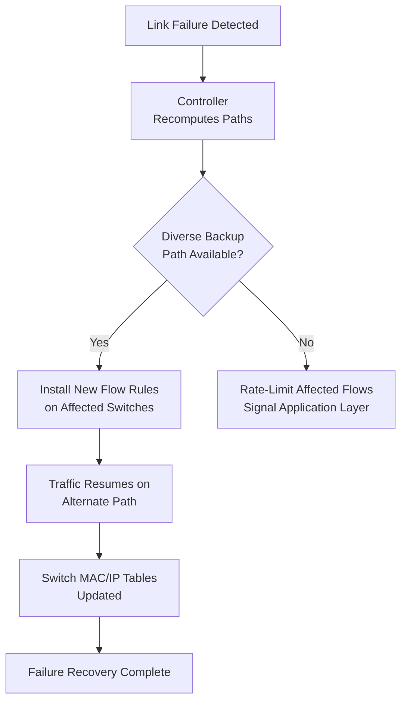

**Figure 2.4:** SDN failure recovery workflow. Failure detection triggers controller path recomputation and rapid flow rule installation, achieving sub-second convergence.

### 6. Multitenancy: Isolation and Policy Enforcement

**Multitenancy** is a foundational requirement of cloud data centers, where a single physical infrastructure must serve multiple independent customers (tenants) with strict isolation guarantees—similar to the isolation provided by separate physical networks. Tenants must not be able to observe or interfere with each other's traffic, and each tenant may have unique networking policies, address spaces, and routing requirements.

Traditional approaches to multitenancy—VLANs, physical firewalls, and VRFs—suffer from scalability limits and operational complexity. SDN addresses multitenancy through:

#### 6.1 Overlay-Based Tenant Isolation

By using VXLAN or NVGRE overlays with unique VNIs per tenant subnet, SDN creates fully isolated broadcast domains that coexist on a shared physical underlay. The 24-bit VNI space supports up to 16 million simultaneous tenant networks, effectively an unbounded resource for practical purposes.

#### 6.2 Distributed Microsegmentation

The SDN controller enforces **security group** policies at each leaf switch and hypervisor virtual switch. When a tenant creates a policy stating that "Web-tier VMs may communicate with API-tier VMs on port 8443 only," the controller programs OpenFlow rules on every switch that implement these filters at line rate. This distributed enforcement ensures that security policies are enforced regardless of the physical location of communicating VMs.

#### 6.3 Policy-Driven Automation

Tenant self-service portals submit network policy templates to the SDN controller. The controller validates the policies against organizational guardrails and deploys them automatically. This eliminates the need for network operations teams to service tenant network change requests, significantly reducing service delivery time and operational cost.

```
+------------------------------------------------------------------+
|                    SDN Multi-Tenant Architecture                  |
|                                                                  |
|  Tenant A (VNID 1000)          Tenant B (VNID 2000)              |
|  +--------------------+        +--------------------+            |
|  | VM-A1 (10.0.1.10)  |        | VM-B1 (10.0.2.10)  |            |
|  | VM-A2 (10.0.1.11)  |        | VM-B2 (10.0.2.11)  |            |
|  +---------+----------+        +----------+---------+            |
|            |                           |                        |
|  +---------v----------+    +----------v---------+              |
|  |   Leaf Switch L1   |    |   Leaf Switch L2   |              |
|  | (Policies enforced) |    | (Policies enforced) |              |
|  +--------------------+    +--------------------+              |
|            |                           |                        |
|  +---------v----------------------------------v---------+       |
|  |              SDN Controller (Shared)                  |       |
|  |  VNI 1000 policy DB        VNI 2000 policy DB       |       |
|  +------------------------------------------------------+       |
|                               |                                   |
|                    Physical Underlay (IP Fabric)                  |
+------------------------------------------------------------------+
```

**Figure 2.5:** SDN-based multitenancy. The shared SDN controller enforces per-tenant policies through VXLAN isolation, enabling strict security boundaries on a common physical infrastructure.

### 7. Conclusion

The five fundamental operations of adding, moving, deleting, failure recovery, and multitenancy represent the full operational lifecycle of a modern data center network. Each operation imposes demanding requirements for speed, reliability, and scale. SDN directly addresses these demands through centralized control, programmability, and global network visibility, transforming data center networking from a static utility into a dynamic, application-driven capability.

---

## Q3a) What is Mininet? Explain its basic commands

### 1. Introduction to Mininet

**Mininet** is an open-source network emulator and experimentation platform that enables researchers, students, and network engineers to create realistic software-defined networks on a single machine—whether a physical laptop, a virtual machine, or a cloud instance. Developed at Stanford University by Bob Lantz, Brandon Heller, and Nick McKeown, Mininet was initially released in 2010 as part of the OpenFlow research ecosystem and has since become the de facto standard tool for SDN prototyping, teaching, and rapid application development.

The fundamental principle underlying Mininet is **network namespace-based virtualization**. Mininet leverages Linux kernel features—specifically network namespaces for process and network-stack isolation, lightweight Linux containers (or, optionally, full KVM virtual machines) for host emulation, and the Linux kernel's built-in traffic control (tc) subsystem for link emulation. Each virtual host, switch, and controller in a Mininet topology runs as an independent Linux process with its own network stack and network interfaces, interconnected through virtual Ethernet (veth) pairs.

Mininet's power derives from the fact that the emulated network is functionally identical to a physical network. The code written and tested in Mininet—whether OpenFlow controller applications, host scripts, or network diagnostic tools—can often be deployed directly onto physical hardware with little or no modification. This "write once, deploy anywhere" capability dramatically reduces the cost and time of SDN development. Mininet supports a wide range of switch implementations, including:

- **Open vSwitch (OVS):** The most widely used software switch in Mininet. OVS supports OpenFlow versions 1.0 through 1.5+, MPLS, VLANs, and QoS features.
- **UserSwitch:** A simplified, reference OpenFlow switch written entirely in software (Python). It is useful for rapid prototyping but lacks many production switch features.
- **OVSSwitch:** Mininet's default OVS-based switch class, providing a balance of realism and performance.
- **OVSBrCompatibilityMode:** Experimental experimental support for full OVS bridge-compatible mode.

Beyond network devices, Mininet also emulates **links with configurable bandwidth, delay, jitter, and packet loss characteristics**. This allows researchers to evaluate controller behavior under realistic network conditions—simulating, for example, a long-haul WAN link with 100ms latency and 0.1% packet loss without any physical infrastructure.

### 2. Architecture of Mininet

Mininet follows a layered architecture:

```
+----------------------------------------------------------+
|                   Mininet CLI / API                       |
|              (Python scripts or interactive)              |
+-------------------------------|--------------------------+
                                |
+-------------------------------v--------------------------+
|                    Topology Engine                        |
|           (Topo subclasses: Linear, Tree, etc.)          |
+-------------------------------|--------------------------+
                                |
+-------------------------------v--------------------------+
|                    Host/Switch/Controller                 |
|           Creation using Linux Network Namespaces         |
|           + veth pairs + TC (emulation)                  |
+----------------------------------------------------------+
```

**Figure 3.1:** Mininet layered architecture, showing the progression from user scripts through the topology engine to Linux namespace-based emulated objects.

At the core of Mininet is the `Mininet` class, which manages the lifecycle of all emulated objects—hosts (`Host`), switches (`Switch`), and controllers (`Controller`). Each `Host` is a lightweight Linux container running a bash shell with its own network namespace containing virtual Ethernet interfaces. Each `Switch` runs an OpenFlow-capable switch process (typically `ovs-vswitchd`) that exposes a management interface (OpenFlow or NETCONF) to the controller. Controllers can be internal (running within Mininet as a process) or external (running on a separate physical or virtual machine, connecting via TCP to the Mininet switch's OpenFlow listening port).

### 3. Basic Mininet Commands and Operations

Mininet provides two primary interfaces: the **CLI (Command-Line Interface)**, which is an interactive shell for exploring and controlling the running network, and the **Python API**, which enables programmatic topology creation and experimentation. The following subsections enumerate the essential commands and operations.

#### 3.1 Creating a Simple Topology (Python API)

The most fundamental way to use Mininet is through its Python API. The canonical "Hello World" Mininet script creates a simple two-host, one-switch topology:

```python
from mininet.net import Mininet
from mininet.node import Controller, OVSSwitch
from mininet.cli import CLI
from mininet.log import setLogLevel

def simple_network():
    net = Mininet(controller=Controller, switch=OVSSwitch)

    # Add a controller
    c0 = net.addController('c0')

    # Add two hosts with IP and MAC addresses
    h1 = net.addHost('h1', ip='10.0.0.1/24', mac='00:00:00:00:00:01')
    h2 = net.addHost('h2', ip='10.0.0.2/24', mac='00:00:00:00:00:02')

    # Add an OpenFlow switch
    s1 = net.addSwitch('s1')

    # Create links between hosts and switch
    net.addLink(h1, s1)
    net.addLink(h2, s1)

    # Start the network
    net.start()

    # Launch interactive CLI
    CLI(net)

    # Cleanup on exit
    net.stop()

if __name__ == '__main__':
    setLogLevel('info')
    simple_network()
```

This script can be executed with `sudo python3 simple_topo.py`, and the resulting Mininet network is fully interactive.

#### 3.2 Mininet CLI Commands

Once a Mininet network is running, several commands are available in the CLI:

- **`nodes`**: Lists all nodes (hosts, switches, controllers) in the current topology.
- **`net`**: Displays network links and their current status.
- **`h1`, `h2`, etc.**: Switches to the shell of a specific host (e.g., typing `h1` and pressing Enter drops you into the bash shell of Host h1).
- **`py h1.cmd('ping -c1 h2')`**: Executes a Python one-liner to run a command on Host h1. Can also use `h1.cmdPrint('ping -c 3 h2')` to print output directly.
- **`link s1 h1 down`**: Brings down the link between s1 and h1, simulating a link outage.
- **`link s1 h1 up`**: Restores the link between s1 and h1.
- **`dump`**: Prints the current state of all nodes.
- **`xterm h1`**: Opens an xterm terminal window for Host h1.
- **`pingall`**: Sends a ping from every host to every other host, verifying full connectivity.
- **`iperf h1 h2`**: Runs a TCP throughput (iPerf) test between h1 and h2.
- **`exit`**: Exits the Mininet CLI and triggers network cleanup (`net.stop()`).

#### 3.3 Pre-built Topology Classes

Mininet provides several built-in topology classes suitable for standard test scenarios:

- **`SingleSwitchTopo(n=2)`**: A single switch with n hosts.
- **`SingleSwitchReversedTopo(n=2)`**: Single switch with hosts attached in reverse order.
- **`LinearTopo(n=4)`**: A linear chain of n switches, each with one host.
- **`TreeTopo(depth=2, fanout=2)`**: A tree topology with a specified depth and fanout, useful for evaluating large-scale switch fabrics.
- **`TorusTopo(sx=3, sy=3)`**: A 2D torus topology useful for HPC cluster emulation.

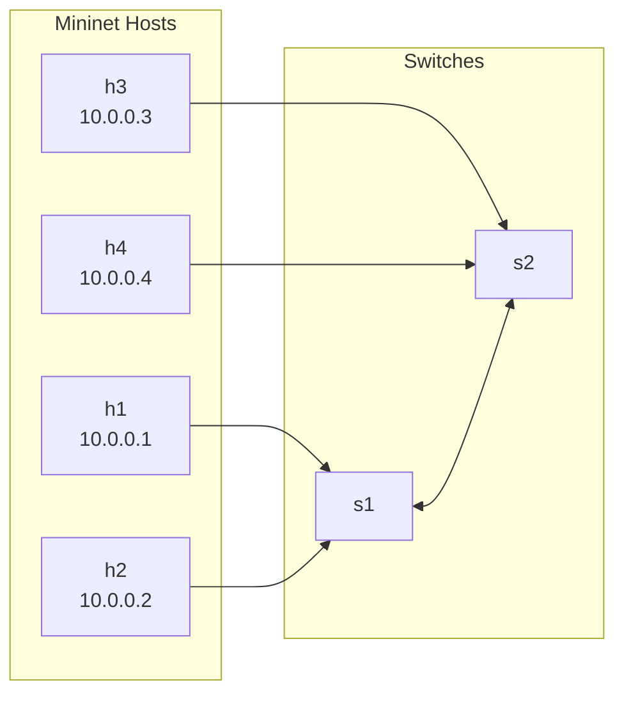

**Figure 3.2:** A two-switch Mininet topology with four hosts, illustrating veth-link connectivity.

### 4. Advanced Mininet Features

#### 4.1 Custom Topologies

Mininet's `Topo` base class enables arbitrary custom topology construction. By subclassing `Topo` and implementing the `build()` method, researchers can model accurately complex data center topologies such as fat-tree, BCube, or leaf-spine fabrics. The following snippet demonstrates a simple 4-host, 2-switch custom topology:

```python
from mininet.topo import Topo

class CustomTopo(Topo):
    def build(self):
        h1 = self.addHost('h1')
        h2 = self.addHost('h2')
        s1 = self.addSwitch('s1')
        s2 = self.addSwitch('s2')
        self.addLink(h1, s1)
        self.addLink(h2, s2)
        self.addLink(s1, s2)
```

#### 4.2 Link Emulation (Bandwidth, Delay, Loss)

Mininet's `TCLink` class wraps the Linux `tc` command to impose configurable link characteristics:

```python
from mininet.link import TCLink
net.addLink(h1, s1, cls=TCLink, bw=10, delay='5ms', loss=0)
```

Parameters available include:
- `bw`: Bandwidth in megabits per second (Mbps).
- `delay`: One-way delay (e.g., `'10ms'`, `'1s'`).
- `loss`: Percentage of packet loss (e.g., `0.1` for 0.1% loss).
- `max_queue_size`: Maximum queue size in packets.

#### 4.3 Monitoring and Pcap Capture

Mininet supports packet capture via `tcpdump` or `Wireshark` on any virtual interface. The `pox.py` monitor example in Mininet's `examples/` directory demonstrates how to implement a flow statistics collection script. Additionally, the `dumpNodeConnections()` utility function prints all node connections, which is useful for topology verification during automated experiments.

### 5. Mininet in Research and Education

Mininet has been cited in over 1,500 academic publications and is used as the primary teaching tool in SDN courses at leading universities including Stanford, Princeton, Georgia Tech, UC Berkeley, and many international institutions. Its widespread adoption is attributed to three characteristics:

1. **Reproducibility:** Experiments defined in Mininet Python scripts can be shared, rerun, and reproduced on any standard Linux system.
2. **Realism:** Emulated hosts and switches execute actual Linux and Open vSwitch code, making experiments representative of production environments.
3. **Extensibility:** Mininet can easily integrate with external controllers (ONOS, ODL, Ryu) and remote cluster resources.

### 6. Conclusion

Mininet serves as the foundational emulation platform for SDN research, development, and education. By harnessing Linux kernel virtualization primitives, Mininet enables the rapid construction of complex network topologies with realistic link properties, providing an accessible and reproducible environment for evaluating SDN controllers, designing network protocols, and developing network applications.

---

## Q3b) What is SDN Programming? What are Current Languages and tools used in SDN Programming?

### 1. Introduction: The Nature of SDN Programming

**SDN Programming** represents a fundamental departure from conventional network programming models, which historically relied on vendor-specific command-line interfaces (CLIs), Simple Network Management Protocol (SNMP) MIBs, and proprietary scripting against device APIs. In the SDN paradigm, programming encompasses three distinct but interrelated dimensions: (1) **controller-native application development** to implement network services and policy logic using the controller's northbound APIs; (2) **southbound protocol logic** to interact with data-plane devices; and (3) **intent-to-configuration translation** to convert high-level business requirements into device-specific forwarding rules.

SDN programming can be conceptualized as a layered activity. At the lowest layer, developers interact with southbound protocols (OpenFlow, NETCONF, P4Runtime) to install forwarding rules, monitor switch state, and respond to events. At the middle layer, developers build controller modules (sometimes called "applications" or "services") that subscribe to topology events, compute network-wide policies, and interact with the controller's datastore. At the highest layer, developers integrate the SDN controller with external orchestration systems, cloud management platforms, and business logic that declare network intents in a technology-agnostic manner.

Unlike traditional network scripting (e.g., using Python's Netmiko library to push CLI commands to routers), SDN programming is **state-driven and event-based**. Controllers expose a network-wide object model (the topology graph, flow tables, device inventory) that applications subscribe to via an event bus or callback mechanism. When events occur—such as a new link appearing, a switch joining the fabric, or a flow exceeding a utilization threshold—the controller dispatches events to registered applications, which execute their programmed logic and may mutate the network state via API calls.

### 2. SDN Programming Languages and Frameworks

#### 2.1 Python: The Dominant Language

**Python** has emerged as the overwhelmingly dominant language for SDN programming, used across virtually all major SDN controller platforms. Key reasons for Python's prevalence include:

- **Rapid prototyping:** Python's concise syntax, dynamic typing, and extensive standard library enable rapid development and iteration.
- **Controller-native support:** All major SDN controllers expose Python APIs or provide Python as a first-class application development language.
- **Large ecosystem:** Python libraries for REST APIs (`requests`), XML/JSON processing (`xml.etree`, `json`), concurrent programming (`asyncio`, `threading`), and networking (`scapy`, `socket`) are mature and well-supported.
- **Educational adoption:** Python is widely taught in computer science programs, making SDN accessible to a broad pool of students and researchers.

**ONOS (Open Network Operating System)**, **OpenDaylight (ODL)** Karaf, and **Ryu** all use Python for application development. Onos-apps are developed as Karaf OSGi features primarily using Java, but ONOS also exposes Python APIs via gRPC and REST. **Ryu**, developed by NTT Labs, is a Python-native SDN controller framework where all components—including the core controller and sample applications—are written in pure Python. Ryu exposes both OpenFlow and REST APIs, making it particularly accessible for developers building simple SDN applications.

#### 2.2 Java: Enterprise Controller Development

**Java** remains the primary language for large-scale, enterprise-grade SDN controllers, most notably **OpenDaylight (ODL)**. ODL's architecture is built on the **OSGi (Open Services Gateway initiative)** framework, specifically Apache Karaf, which provides modular runtime services, dynamic module loading, dependency injection, and versioned API management. ODL applications are developed as OSGi bundles (JAR files) deployed in the Karaf container.

Java's appeal for ODL development stems from:
- **Strong typing and compile-time checking**, reducing runtime errors in large codebases.
- **OSGi ecosystem integration**, which enables hot-deployment, service versioning, and modular architecture.
- **Enterprise integration libraries** for database access (JPA, JDBC), messaging (JMS), and web services.

The learning curve for ODL Java development is steep, but it enables the construction of production-grade carrier and enterprise network applications. ODL's **MD-SAL (Model-Driven Service Abstraction Layer)** uses YANG data models to define the structure of network state, auto-generates RESTCONF endpoints, and provides strongly-typed data access through generated APIs. Understanding ODL development requires proficiency in Java, YANG modeling, and MD-SAL concepts.

#### 2.3 C/C++: High-Performance Data Plane Programming

While C and C++ are less common for controller application development, they dominate **data plane programming** at the operating system and switch level. The **P4 programming language**, which enables definition of custom packet processing pipelines, is typically compiled to **target-specific C code** that runs on switch ASICs (via the P4 compiler's `dpdk` or `bmv2` backends). Similarly, the **Data Plane Development Kit (DPDK)** and the **eBPF (extended Berkeley Packet Filter)** subsystems in the Linux kernel are programmed in C (or via LLVM for eBPF).

**Open vSwitch (OVS)**, the most widely deployed open-source software switch, is implemented in C for its kernel module (`openvswitch.ko`) and userspace daemon (`ovs-vswitchd`). Developers writing custom OVS kernel modules, kernel datapath extensions, or performance-critical forwarding applications use C for its deterministic memory management and minimal runtime overhead.

#### 2.4 Go: Modern Systems Programming for SDN

**Go (Golang)**, developed by Google, has gained significant traction in the SDN ecosystem for projects requiring high performance, concurrency, and simple deployment. **gNMIc** (the reference gRPC Network Management Interface client) and **gnxi** tooling are developed in Go. The **Network Service Mesh (NSM)** and several CNI plugins are implemented in Go. The language's built-in concurrency primitives (goroutines and channels) simplify the implementation of streaming telemetry pipelines and high-throughput packet processing.

Go's main advantages in SDN contexts are:
- **Compiled binary deployment:** A single statically-linked binary can run as a microservice without external runtime dependencies, simplifying Kubernetes and container integration.
- **Excellent networking libraries:** The `net` and `net/http` standard libraries are mature.
- **Fast compilation and excellent tooling** for development velocity.

#### 2.5 P4: Domain-Specific Language for Data Plane Programmability

**P4 (Programming Protocol-independent Packet Processors)** is a domain-specific language specifically designed for describing how packets should be processed by network devices. Unlike general-purpose languages, P4 is tailored to the packet processing pipeline model found in configurable switch ASICs (e.g., Broadcom Tomahawk, Barefoot Tofino), SmartNICs, and software switches (BMv2). P4 programming is the highest-performance form of SDN programming, allowing network engineers to define custom header formats, matching fields, and actions beyond the confines of standard OpenFlow match fields.

A P4 program describes:
- **Header definitions:** The structure and parsing rules for packet headers.
- **Parser logic:** Finite state machine for extracting fields from raw packets.
- **Match-Action tables:** Tables that match extracted headers against rules and apply corresponding actions (forward, drop, modify, count).
- **Control flow:** The sequential application of tables and metadata manipulation.

```
P4 Pipeline:

+-----+    +------+    +--------+    +--------+
| Ingress |-->| LPM  |-->| VLAN   |-->| Egress |
|  Parser |   | Table|   | Table  |   | Parser |
+-----+    +------+    +--------+    +--------+
           Match: IP dst  Modify: VLAN  De-parse
           Action: Out   Action: Tag
```

**Figure 3.3:** Conceptual P4 packet processing pipeline showing ingress parser, match-action tables, and egress processing.

### 3. Current SDN Programming Tools and Frameworks

#### 3.1 Controller-Specific SDKs

Each major SDN controller provides or is paired with a set of tools for application development:

| Controller | Primary Language | SDK/Framework |
|---|---|---|
| OpenDaylight (ODL) | Java | MD-SAL, YANG Tools, RESTCONF |
| ONOS | Java (core), gRPC (API) | ONOS Apps Framework, Bazel build |
| Ryu | Python | Ryu library (openflow, of-config) |
| Floodlight | Java | Floodlight Module system, REST API |

#### 3.2 ROS (Repy-based OpenFlow Simulator)

Mininet's default XTerm environment, for interactive development, is supplemented by tools such as POX, the predecessor to Ryu. POX is a Python-based OpenFlow controller framework used extensively in academic environments.

#### 3.3 Ansible and Terraform for Network Automation

While not strictly SDN programming languages, **Infrastructure as Code (IaC)** tools play an increasing role in the SDN ecosystem. **Ansible** uses YAML playbooks to declaratively configure SDN controllers and automate policy deployment. **Terraform** with its provider plugins (e.g., `terraform-provider-aci`, `terraform-provider-nsxt`) enables the declarative management of data center networking infrastructure through infrastructure automation workflows.

#### 3.4 REST API and gRPC Client Libraries

Modern SDN programming increasingly emphasizes the southbound and northbound API layer over controller-specific application frameworks. Developers build controller-independent applications using general-purpose REST and gRPC clients in their language of choice (Python `requests`, Go `net/http`, Node.js `axios`, Java `OkHttp`). This approach aligns with the **composability** principle, where applications are decoupled from specific controllers.

#### 3.5 Network Simulation Tools

Beyond Mininet, several other tools serve as programming and testing environments for SDN:
- **NS-3:** A discrete-event network simulator supporting OpenFlow.
- **GNS3:** A graphical network simulator that can run OVS and real operating systems.
- **EVE-NG:** An enterprise network emulator supporting a wide range of vendor images.
- **Containerlab:** A modern container-based network emulator that uses containers for both routers and switches, providing more efficient resource utilization than VM-based emulators.

### 4. Conclusion

SDN programming is a multidisciplinary activity that spans controller application development, data-plane configuration, intent-based orchestration, and real-time telemetry processing. The primary programming languages reflect the distinct layers of the SDN stack: Python and Java for controller applications, C/C++ for data plane performance, Go for modern cloud-native integration, and P4 for custom packet processing pipelines. The choice of programming language and tools depends on the specific layer being addressed, the target controller platform, and the operational requirements of the deployment environment.

---

## Q3c) What are the applications of SDN?

### 1. Introduction: The Broad Applicability of SDN

Software-Defined Networking has rapidly transcended its initial research origins to become a foundational technology across virtually every domain of computer networking. What began as an architecture for simplifying campus and data center network management has evolved into a versatile paradigm being applied to enterprise WANs, service provider core networks, cellular radio access networks, industrial IoT deployments, and even satellite communication constellations. The applications of SDN are both diverse and deeply impactful, offering improvements in operational agility, cost efficiency, security, and programmability across traditional networking boundaries.

This section provides a comprehensive survey of the principal applications of SDN, organized by domain and use-case category. Each application is examined in terms of the specific networking pain points it addresses, the mechanisms through which SDN provides solutions, and real-world deployment examples that demonstrate the practical value delivered.

### 2. Data Center Networking: The Primary Domain of SDN

Data centers represent the most mature and impactful application domain for SDN. The scale, dynamism, and multi-tenant requirements of modern cloud data centers create precisely the conditions—rapid provisioning cycles, need for global visibility, requirement for workload orchestration—that SDN was designed to address.

**Enterprise Data Center SDN** deployments, such as VMware NSX, Cisco ACI (Application Centric Infrastructure), and Juniper Contrail, use SDN controllers to provide network virtualization as a core service. VMware NSX, acquired by VMware from Nicira Networks, encapsulates the NSX vision: providing overlay-based microsegmentation and logical switching/routing independent of the underlying physical network. NSX enables security policies to follow workloads and enables operators to divide their physical data center network into thousands of isolated virtual networks.

**Hyperscale Cloud Provider SDN**, as deployed by Google (B4), Microsoft (Azure Fabric), Amazon (AWS VPC), and Alibaba, goes further. These companies operate data centers with hundreds of thousands of servers and require custom SDN solutions to manage network complexity at unprecedented scale. Google's **B4** system, described in the ACM SIGCOMM paper "B4: Experience with a Globally-Deployed Software-Defined WAN," demonstrated that centralized SDN control could achieve near-optimal WAN link utilization and provide automated fast-failover for inter-data-center traffic. Microsoft's **Azure** fabric uses SDN to manage the entire cloud network, from the host's Hyper-V virtual switch to the fabric switches, enabling features such as on-demand VPC creation, DDoS protection, and network security groups.

### 3. Software-Defined WAN (SD-WAN): Enterprise WAN Transformation

**SD-WAN** represents the most commercially successful and widely deployed SDN application outside of data centers. Enterprise wide-area networks have historically been managed using proprietary WAN optimization appliances, static VPN configurations, and MPLS circuits leased from service providers. These approaches are expensive, inflexible, and provide poor visibility into application performance.

SD-WAN applies SDN principles to transform enterprise WAN architecture:

- **Centralized Control Plane:** All SD-WAN edge devices (customer premise equipment, or CPE) are managed from a centralized orchestrator that pushes policies, routing configurations, and security rules to the field.
- **Intelligent Path Selection:** The orchestrator monitors WAN link performance (latency, jitter, packet loss) across MPLS, broadband, LTE, and satellite links, dynamically routing application flows over the optimal path based on application importance.
- **Zero Touch Provisioning:** New branch-office CPE devices can be pre-configured and shipped, automatically contacting the orchestrator and establishing connectivity without on-site IT personnel.
- **Application-Aware Routing:** The SD-WAN controller performs deep packet inspection (or leverages application metadata from cloud connectors) to identify application types (SaaS, VoIP, ERP) and route them under appropriate policies.

Leading SD-WAN vendors including **VMware (VeloCloud)**, **Cisco (Viptela, Meraki)**, **Palo Alto Networks (Prisma SD-WAN, formerly CloudGenix)**, and **Fortinet (Secure SD-WAN)** have popularized SD-WAN as the standard approach for enterprise branch connectivity.

### 4. Network Function Virtualization (NFV): Telecom Infrastructure Modernization

NFV, while conceptually distinct from SDN (as discussed in Q6c), is deeply enabled by SDN. The **ETSI NFV** framework specifies that virtualized network functions (VNFs) such as firewalls, load balancers, and deep packet inspection systems should be deployed as software instances on commodity x86 servers. SDN provides the **connectivity fabric and policy engine** that orchestrates these VNFs.

SDN applications in the NFV context include:

- **Service Function Chaining (SFC):** The SDN controller creates ordered sequences of VNFs (e.g., firewall → DPI → load balancer → NAT) and programs forwarding rules that direct traffic through this chain. The SFC architecture, standardized by the IETF in RFC 7665, defines how metadata is added to packets to identify the required service function path.
- **Dynamic VNF Placement:** SDN facilitates the dynamic placement of VNFs in response to changing traffic loads. If a DPI VNF experiences overload, the orchestrator can spawn additional instances and use SDN to redirect traffic proportionally.
- **NFV Infrastructure (NFVI) Networking:** SDN manages the physical and virtual networking within the NFVI, connecting VNFs to management networks, storage, and external connectivity.

### 5. Network Security: Microsegmentation and Threat Response

SDN provides unique capabilities for enhancing network security posture:

**Microsegmentation** has been mentioned previously but warrants emphasis as a distinct security application. By enforcing security policies at the hypervisor vSwitch or physical leaf switch level, SDN implements a "zero trust" network model where east-west traffic between all workloads is subject to inspection and control. Traditional network security relied on perimeter firewalls, leaving internal traffic unchecked and vulnerable to lateral movement in the event of a breach.

**Automated Threat Response** leverages the SDN controller's global visibility to detect anomalous traffic patterns—such as a workload transmitting data to an external command-and-control server—and automatically respond by isolating the infected host, diverting traffic to a sandbox for analysis, or blocking communication with the suspicious external IP.

**DDoS Mitigation** (discussed in Q2b) is another security application where the controller's ability to install rules across hundreds of switches simultaneously enables defense-in-depth strategies that are impossible with traditional switch-based ACLs.

### 6. Internet of Things (IoT) and Edge Computing

The proliferation of IoT devices—expected to reach 30+ billion by 2030—creates massive networking challenges related to device onboarding, security isolation, and management at scale. SDN applications in IoT environments include:

- **IoT Network Slicing:** The SDN controller creates isolated logical networks (slices) for different IoT device classes—Industrial Control System (ICS) devices, environmental sensors, surveillance cameras—each with its own security policies and QoS guarantees.
- **Dynamic Topology Management:** IoT networks are highly dynamic, with devices frequently joining and leaving. SDN's centralized state management ensures that device connectivity and policies are applied correctly during these transitions.
- **Edge SDN:** At the network edge, SDN controllers manage connectivity between edge compute nodes (compute located near IoT data sources) and the central cloud, implementing policies that determine which data is processed locally versus forwarded to the cloud.

Fog computing architectures extend the SDN paradigm to edge nodes, enabling the distributed but coordinated management of edge resources. OpenFog Consortium reference architectures incorporate SDN as the networking substrate for fog node interconnectivity.

### 7. Telecommunications: Mobile Network Evolution (5G/SDN)

The **5G mobile network** specification, standardized by 3GPP, explicitly incorporates SDN and NFV as foundational enablers. SDN applications in 5G context include:

- **Radio Access Network (RAN) Slicing:** The SDN controller disaggregates the traditional monolithic base station into a centralized unit (CU) and distributed units (DUs), and allocates network slices to different 5G services (eMBB, URLLC, mMTC) with specific resource reservations.
- **User Plane Function (UPF) Steering:** The 5G core uses SDN to dynamically steer user traffic to the most appropriate UPF instance, enabling edge computing offload and reducing latency for latency-sensitive applications.
- **Network Slicing Orchestration:** SDN controllers manage the lifecycle of network slices—creating, modifying, and deleting them in response to tenant requests and dynamic load conditions.

The O-RAN (Open Radio Access Network) Alliance, founded to promote open interfaces in mobile networks, explicitly uses SDN as the control plane architecture for managing multivendor RAN equipment. O-RAN's RIC (RAN Intelligent Controller) is an SDN-based platform that applies AI/ML-driven control to optimize radio resource allocation in real time.

### 8. Research and Network Experimentation

Beyond production deployments, SDN programming serves as a powerful tool for networking research. Researchers use Mininet and OpenFlow-capable controllers to prototype new routing protocols, evaluate network measurement techniques, design energy-efficient data center topologies, and simulate large-scale internet routing behaviors.

The programmability of SDN makes it uniquely suited for implementing **network experiments that would be impractical or impossible on physical infrastructure**. Researchers can instantiate hundreds of virtual switches, control link characteristics programmatically, and collect fine-grained per-flow statistics—all on a single commodity server. The reproducibility of Mininet-based experiments has made SDN programming a standard methodology in computer networking research.

### 9. Conclusion

The applications of SDN span the entire modern networking landscape: from cloud data centers and enterprise WANs to telecommunications, IoT, industrial automation, and academic research. The unifying theme across all these applications is the transformative power of programmable, centrally controlled networking. As networks grow in scale and complexity, SDN's abstraction layer between application logic and device configuration becomes not merely convenient but essential.

---

## Q4a) What is the Composition of SDN?

### 1. Introduction: Decomposing the SDN Architecture

The **composition of Software-Defined Networking (SDN)** refers to the layered, modular architecture through which SDN achieves its transformative capabilities. Understanding the composition of SDN requires dissecting the paradigm into its constituent layers, components, protocols, and interfaces. The SDN model, as originally articulated by the Open Networking Foundation (ONF) and refined through subsequent standards efforts, identifies three primary architectural layers: the **Application Layer**, the **Control Layer**, and the **Infrastructure (Data) Layer**. These layers interact through well-defined northbound and southbound interfaces, with additional horizontal and vertical interfaces enabling vendor interoperability.

A key principle underlying SDN composition is **abstraction**. Each layer exposes only the information and control mechanisms relevant to the adjacent layer, hiding implementation details. The application layer does not need to know whether the underlying network uses OpenFlow, NETCONF, or P4Runtime. Similarly, the data plane switches do not need to understand the business logic driving the rules they execute. This layered composition enables independent evolution of each layer, fostering a vibrant ecosystem of applications, controllers, and switch implementations.

### 2. The Three-Layer SDN Architecture

#### 2.1 Application Layer (Northbound Layer)

The **Application Layer** sits at the top of the SDN stack and contains the network applications and business logic that drive the network's behavior. These applications consume the network abstraction provided by the control layer and translate business intents into specific network operations. Examples of SDN applications include:

- **Network Hypervisor/Virtualization Manager:** Enables the creation of isolated virtual networks on shared physical infrastructure (analogous to VMware ESX for compute virtualization).
- **Traffic Engineering Application:** Monitors link utilization and dynamically adjusts routing to balance load.
- **Security Policy Engine:** Translates security compliance requirements into ACLs, security groups, and microsegmentation rules.
- **Measurement and Monitoring Application:** Collects flow statistics, builds topology maps, and provides dashboards.
- **Access Control Application:** Authenticates and authorizes network access for users and devices.

Applications interact with the control layer via **Northbound APIs** (detailed in Q4b), predominantly REST APIs with JSON payloads, though gRPC, Thrift, and message-queue interfaces (Apache Kafka, RabbitMQ) are also used in production environments. This interface is the primary integration point between SDN and external systems such as cloud management platforms (OpenStack, Kubernetes), IT service management (ITSM) tools, and enterprise application stacks.

#### 2.2 Control Layer (SDN Controller)

The **Control Layer**, embodied in the SDN controller, is the operational core of the SDN architecture. The controller is responsible for translating high-level application directives into device-specific configuration and forwarding rules, maintaining a global view of the network, and providing abstractions that shield applications from device heterogeneity.

The control layer performs several critical functions:
- **Topology Management:** Discovers network devices and links, maintains an up-to-date graph of the network topology, and detects topology changes (link additions, removals, failures).
- **State Management:** Stores the authoritative state of the network—flow tables, port counters, device configurations—in a distributed datastore (e.g., Apache Cassandra, etcd, or an embedded database like SQLite or H2).
- **Path Computation:** Executes routing and traffic engineering algorithms (Dijkstra's, Yen's K-shortest paths, weighted ECMP) to determine optimal forwarding paths.
- **Policy Translation:** Converts application-level policies (expressed in intent languages or structured APIs) into device-specific rules in the appropriate protocol format.
- **Forwarding Rule Management:** Installs, modifies, and removes flow (or configuration) rules on managed devices.
- **Telemetry Processing:** Collects, aggregates, and exposes per-device and per-flow statistics.
- **Event Dispatch:** Publishes events to registered applications when topology or flow state changes.

```
+----------------------------------------------------------+
|                   Application Layer                       |
|  +------------+ +------------+ +---------------------+   |
|  | Traffic    | | Security   | | Orchestration       |   |
|  | Engineering| | Policy     | | (OpenStack/ K8s)    |   |
|  | App        | | Engine     | |                     |   |
|  +-----+------+ +-----+------+ +----------+----------+   |
|        |            |                |                   |
|  +-----v------------v----------------v----------+        |
|  |          Northbound API (REST/gRPC)          |        |
|  +-----+----------------+----------------+-------+        |
|        |                |                |              |
+--------|----------------|----------------|--------------+
         |      Control Layer (SDN Controller)    |
         |  +-----------------------------------+  |
         |  | Topology Manager | State Store     |  |
         |  | Path Computation | Policy Engine   |  |
         |  | Rule Manager     | Telemetry Svc   |  |
         |  +-----------------+-----------------+  |
+--------|------------------------------------------|------+
         |                Southbound API             |
+--------v------------------------------------------v------+
|                   Infrastructure Layer                    |
|  +--------+ +--------+ +--------+ +--------+ +--------+  |
|  | Switch | | Switch | | Switch | | Switch | | Switch |  |
|  | (OVS)  | | (Hard- | | (Hard- | | (Hard- | | (P4)   |  |
|  |        | |  ware)  | |  ware)  | |  ware)  | | Switch |  |
|  +--------+ +--------+ +--------+ +--------+ +--------+  |
+----------------------------------------------------------+
```

**Figure 4.1:** Layered SDN architecture showing Application, Control, and Infrastructure layers, along with Northbound and Southbound APIs.

The SDN controller itself is composed of modular sub-components. Major controllers decompose their functionality into separate software modules:

- **OpenDaylight:** Uses MD-SAL (Model-Driven Service Abstraction Layer), a modular service bus through which applications and protocol plugins communicate. MD-SAL ensures that all state modifications are serialized and consistent.
- **ONOS:** Provides a distributed architecture with a clustered controller, application-level store-and-forward messaging, and a graph abstraction (Network Graph) over which applications operate.
- **Ryu:** Offers a modular event-based architecture where applications are Python objects that register event handlers.

#### 2.3 Infrastructure Layer (Data Plane)

The **Infrastructure Layer** comprises the physical and virtual forwarding devices that constitute the network's data plane. This layer includes:

- **Hardware Switches:** Merchant-silicon or ASIC-based switches (Broadcom Tomahawk+, Barefoot Tofino, Intel Ethernet) that support OpenFlow, NETCONF, gNMI, or P4Runtime for remote configuration.
- **Virtual Switches:** Open vSwitch (OVS) in hypervisors (KVM, VMware ESXi, Hyper-V), Linux bridge, and container virtual Ethernet pairs.
- **Smart NICs:** DPU (Data Processing Unit) and SmartNIC devices (NVIDIA BlueField, Intel IPU) that offload network virtualization, encryption, and telemetry processing from the host CPU.
- **End Hosts:** Physical and virtual servers that originate and terminate network traffic.

Each data-plane device contains:
- **Forwarding Plane:** The pipeline that processes packets (match-action tables, TCAM, or software data paths).
- **Agent/Protocol Stack:** The software component that receives configuration commands from the controller and translates them into forwarding plane entries.
- **Telemetry Agent:** Collects flow and port statistics and reports them to the controller or a telemetry collector via streaming or polling.

### 3. Key SDN Interfaces

#### 3.1 Northbound Interface (NBI)

The **Northbound Interface** is the API through which applications communicate with the SDN controller. It is the primary abstraction boundary between business intent and network implementation. NBIs are typically RESTful HTTP APIs using JSON, providing a simple, language-agnostic, firewall-friendly interface. They expose network-wide abstractions such as:

- Topology graph objects (nodes, edges, ports).
- Network intent constructs (isolated domains, connectivity templates).
- Device and port management endpoints.
- Flow rule management.
- Tenant and policy CRUD operations.

The RESTful NBI enables integration with virtually any orchestration system, monitoring platform, or custom application without requiring controller-specific SDKs or libraries.

#### 3.2 Southbound Interface (SBI)

The **Southbound Interface** is the protocol or set of protocols through which the SDN controller communicates with and manages data-plane devices. The most prominent SBIs include:

- **OpenFlow (v1.0–v1.6+):** The original and most widely deployed SDN southbound protocol. OpenFlow defines a standardized match-action flow table abstraction, enabling the controller to install fine-grained forwarding rules on switches.
- **NETCONF/YANG:** A protocol for installing and managing device configuration rather than just forwarding rules. NETCONF is particularly well-suited for configuring device-level parameters (interfaces, routing protocols, VLANs) that fall outside OpenFlow's scope.
- **gNMI/gRPC:** The gRPC Network Management Interface, defined by the OpenConfig working group, provides streaming telemetry and configuration management using gRPC and Protocol Buffers. gNMI has gained widespread adoption in the telecommunications and hyperscale data center environments.
- **P4Runtime:** A protocol for controlling P4-programmable data planes, enabling the controller to install table entries defined by a custom P4 pipeline description.
- **OVSDB:** The Open vSwitch Database Management Protocol, used for managing OVS bridge configurations (ports, tunnels, QoS settings).

### 4. Supporting Components and Standards

Beyond the three primary layers and their interfaces, the SDN composition includes several supporting elements:

#### 4.1 Controller Clustering and Consensus

Production SDN deployments require high availability. Controllers are deployed in **cluster configurations** (3–5 nodes for optimal fault tolerance) using consensus protocols (RAFT, Paxos) to synchronize controller state. The ONIX distributed network control system and ONOS's distributed architecture are examples of clustered controller designs.

#### 4.2 Data Storage

The controller maintains persistent state in:
- **Operational Datastores:** Current device and topology state (often in-memory for performance, with periodic checkpoints).
- **Configuration Datastores:** Policies, templates, and user-defined intents.
- **Time-Series Databases:** Historical telemetry and flow statistics for capacity planning and diagnostics.

#### 4.3 Open Standards Bodies

The SDN ecosystem is held together by open standards developed by collaborative bodies:
- **Open Networking Foundation (ONF):** Defines OpenFlow specifications, TR-521 SDN architecture standards.
- **IETF:** Develops NETCONF (RFC 6241), BGP-LS (RFC 7752), PCE-based architectures, and Interface to the Routing System (I2RS) drafts.
- **OpenConfig:** Develops vendor-neutral YANG data models for network device configuration and gNMI telemetry.
- **ETSI:** Standardizes NFV Management and Orchestration (MANO), which interfaces with SDN controllers.
- **Broadband Forum:** Standardizes TR-369 (μONU) and related access-network SDN interfaces.

### 5. Conclusion

The composition of SDN is a carefully designed layered architecture comprising an Application Layer for business intent, a Control Layer for network-wide intelligence and abstraction, and an Infrastructure Layer for packet forwarding. These layers are connected through standardized northbound and southbound interfaces that enable multi-vendor interoperability, independent evolution, and rapid innovation. This decomposition is what makes SDN a foundational enabling technology for modern cloud and telecommunications networks.

---

## Q4b) Explain Northbound Application Programming Interface

### 1. Introduction: The Abstraction Boundary Between Intent and Infrastructure

The **Northbound Application Programming Interface (NBI)** is one of the most critical architectural components of Software-Defined Networking, serving as the primary abstraction boundary through which applications, orchestration systems, and management tools translate business intents into network actions. In the canonical three-layer SDN architecture, the northbound interface connects the **Application Layer** (business intelligence, orchestration platforms, and automation workflows) to the **Control Layer** (the SDN controller). It is the interface through which the full power of the centralized controller—its global topology view, its path computation engine, and its device-management capabilities—is exposed to the outside world in a consumable, programmable, and vendor-agnostic manner.

The design and capability of the northbound API fundamentally determines the ease with which an organization can adopt SDN, integrate it with existing IT management workflows, and build custom network applications. A well-designed NBI abstracts away the complexity of the underlying southbound protocols, the diversity of managed devices, and the internal state-management mechanisms of the controller, presenting instead a clean, declarative interface through which operators can express what the network should do, rather than how it should do it. This section provides a comprehensive examination of the Northbound Application Programming Interface, including its architectural role, design principles, prototypical operations, implementation technologies, and practical usage patterns.

### 2. Architectural Role of the Northbound Interface

```
+----------------------------------------------------------+
|              Application / Orchestration Layer            |
|                                                          |
|  +-------+  +-------+  +-------+  +-----------+         |
|  | Open- |  | Micro|  | Custom|  |  Monitor- |         |
|  | Stack |  |segm. |  | Apps  |  |   ing     |         |
|  +---+---+  +---+---+  +---+---+  +-----+-----+         |
|      |          |          |            |               |
+------|----------|----------|------------|---------------+
       |  Northbound API (REST, gRPC, CLI)  |
+------|----------|----------|------------|---------------+
       |          |          |            |               |
|  +---v---+  +---v---+  +---v---+  +-----v-----+         |
|  |  SDN  |  | Topo- |  | Policy|  |  Event /  |         |
|  | Ctrl  |  | logy  |  | Engine|  |  Telemetry|         |
|  | Plane |  | Mgmt  |  |       |  |           |         |
|  +---+---+  +---+---+  +---+---+  +-----+-----+         |
|      |          |          |            |               |
+------|----------|----------|------------|---------------|
       |  Southbound API (OpenFlow, NETCONF, gNMI)
+------v----------v----------v------------v---------------|
|              Infrastructure / Data Plane                  |
|    [Switches]  [Routers]  [Hosts]  [NICs]               |
+----------------------------------------------------------+
```

**Figure 4.1:** Architectural role of the Northbound Interface in the SDN stack. The NBI isolates application concerns from data-plane device heterogeneity.

The northbound interface occupies the boundary between the application and control layers in the SDN reference model defined by the Open Networking Foundation (ONF). Its role is threefold:

1. **Abstraction:** The NBI presents a simplified, network-wide, logical view of the physical network. An application need not know whether a flow is being implemented using OpenFlow, MPLS, or VLAN tagging; it specifies intent (e.g., "VM-A must communicate with VM-B"), and the controller resolves the implementation details.

2. **Abstraction Consistency:** All applications interact with the controller through the same interface. This means that a security application, a traffic engineering application, and a monitoring application can all coexist and compose cleanly without conflicting directly with underlying switch configurations.

3. **Versatility:** Because the NBI is typically technology-agnostic, organizations can build custom applications, integrate third-party tools, and migrate between SDN controllers with minimal application-level changes.

### 3. Key Design Principles of the Northbound Interface

Modern NBIs are designed around several guiding principles that ensure usability, interoperability, and extensibility.

#### 3.1 Declarative Intent-Based Interaction

The most important design principle is **declarative intent-based networking**. Rather than requiring applications to specify imperative sequences of device-level commands ("push flow rule X to switch Y via OpenFlow"), the NBI allows applications to declare desired network states ("allow VMs in security group SG-Web to communicate with VMs in SG-API on TCP port 8443"). The controller is responsible for computing the complete set of device-level actions required to achieve this intent, handling conflicts, absorbing device heterogeneity, and maintaining consistency in the face of topology changes. This declaration-based approach dramatically reduces the cognitive burden on application developers and eliminates the risk of configuration conflicts between multiple applications.

#### 3.2 RESTful Design

The dominant implementation paradigm for NBIs is **REST (Representational State Transfer)**, leveraging standard HTTP methods (GET, POST, PUT, DELETE) to manipulate network resources. REST is preferred because:

- **Ubiquitous tooling:** Every programming language has mature HTTP client libraries; organizations can integrate SDN into existing toolchains without proprietary SDKs.
- **Statelessness:** REST is stateless at the protocol level, making it suitable for load-balanced, horizontally scaled deployments.
- **Cacheability:** GET responses can be cached by intermediaries, improving performance for frequently-accessed resources such as topology maps.
- **Firewall compatibility:** HTTP/HTTPS traverses enterprise firewalls without requiring custom port configurations.

Most modern SDN controllers expose their NBI over **HTTPS** with JSON payloads, though XML and Protocol Buffers are also supported in certain implementations.

#### 3.3 Resource-Oriented URI Namespace

RESTful NBIs organize network resources into a hierarchical URI namespace, mirroring the logical structure of the network. A typical resource hierarchy might include:

```
/v1/topology                → Full network topology graph
/v1/devices                 → List of managed devices
/v1/devices/{device_id}     → Specific device details
/v1/devices/{device_id}/ports → Port list for a device
/v1/flows                   → Application-installed flow rules
/v1/flows/{flow_id}         → Specific flow rule
/v1/policies                → Network policy definitions
/v1/policies/{policy_id}   → Specific policy
/v1/groups                  → Switch group tables
/v1/intents                 → High-level intent definitions
/v1/tenants                 → Multi-tenant context
```

This resource model provides a predictable, discoverable interface that developers can explore and document consistently.

#### 3.4 Synchronous and Asynchronous Operations

The NBI supports both synchronous and asynchronous communication models:

- **Synchronous (Request-Response):** Applications that require immediate confirmation of an action receive synchronous HTTP responses. For example, `DELETE /v1/flows/{flow_id}` returns `204 No Content` when the flow has been successfully removed from all affected switches.
- **Asynchronous (Webhooks/Callbacks):** Long-running operations (e.g., policy deployment across thousands of switches) include an `Async-ID` in the response, and the controller delivers the final result via a webhook callback when the operation completes. This avoids HTTP timeouts for operations that may take seconds to minutes.

#### 3.5 Authentication and Authorization

Enterprise-grade NBIs implement robust security controls:

- **TLS/SSL:** All API communications use HTTPS with server-side and optionally mutual TLS (mTLS) certificates.
- **OAuth 2.0 / OpenID Connect:** Modern NBIs support token-based authentication, enabling integration with enterprise identity providers (Azure AD, Okta, Ping Identity).
- **Role-Based Access Control (RBAC):** API endpoints enforce fine-grained RBAC, restricting operations such as flow rule modification, topology export, and policy deletion to authenticated, authorized roles (admin, operator, read-only viewer, tenant admin).
- **Audit Logging:** All NBI requests and responses are logged to immutable audit trails for compliance (SOC 2, ISO 27001, PCI-DSS).

### 4. Prototypical Northbound API Operations

The following are representative NBI operations and their semantic meanings, expressed using standard REST patterns.

#### 4.1 Topology Discovery

```
GET /v1/topology
```

Returns a JSON representation of the network graph, including all nodes (switches, hosts), edges (links between switches), port attributes, and link utilization statistics. Applications use this to build visualizations or compute routing decisions.

#### 4.2 Flow Rule Installation

```
POST /v1/flows
Body: {
  "priority": 100,
  "match": {"in_port": 3, "eth_type": 0x0800, "ipv4_src": "10.0.1.0/24"},
  "actions": [{"type": "OUTPUT", "port": 4}],
  "table_id": 0,
  "app_id": "my-security-app"
}
```

Instructs the controller's policy engine to install the specified OpenFlow flow rule on all relevant switches. The controller returns a flow rule identifier that can be used for later modification or deletion.

#### 4.3 Device Configuration

```
PUT /v1/devices/{device_id}/vlans/{vlan_id}
Body: {"tagged_ports": [1, 2, 3], "untagged_port": 4, "vlan_name": "tenant-web"}
```

Configures VLAN membership on a specific device, abstracting the underlying CLI, SNMP, or NETCONF commands required on specific hardware.

#### 4.4 Policy Definition

```
POST /v1/intents
Body: {
  "name": "web-tier-isolation",
  "source": {"type": "security_group", "value": "sg-web-tier"},
  "destination": {"type": "security_group", "value": "sg-api-tier"},
  "action": "ALLOW",
  "protocol": "tcp",
  "port": 8443
}
```

Provides a declarative security policy that the controller translates into distributed flow rules across all affected switches and hosts.

### 5. Northbound API in Major SDN Controllers

Each SDN controller exposes its NBI with different characteristics:

| Controller | NBI Technology | Key Features |
|---|---|---|
| OpenDaylight | RESTCONF (YANG-based) | MD-SAL data brokerage, clustered, YANG model-driven |
| ONOS | REST + gRPC | Network Graph abstraction, Intent Framework, distributed |
| Ryu | WSGI-based REST | OpenFlow-native, Python-accessible |
| Floodlight | REST | Java module system, simple resource model |
| VMware NSX Manager | REST (comprehensive) | Deep NSX Manager API for all NSX operations |

### 6. Northbound API Ecosystem: Intent Frameworks

The most advanced NBIs provide **intent frameworks** that allow applications to express high-level goals rather than specific configurations. ONOS's Intent Framework is a canonical example: an application submits an intent (e.g., "connect Host-A and Host-B with bandwidth 1Gbps"), and the ONOS intent compiler resolves this into specific flow rules, monitors path availability, and self-heals when paths fail—completely abstracting flow management from the application.

Cisco's **Application Policy Infrastructure Controller (APIC)** for ACI provides a similar declarative model through its NX-API and REST interfaces, where an application's endpoint group (EPG) and contract definitions are compiled into ACI fabric policies.

### 7. Conclusion

The Northbound Application Programming Interface is the primary integration point between SDN and the broader IT ecosystem. By providing a RESTful, declarative, abstract, and secure interface to the full capabilities of the SDN controller, the NBI enables rapid development of network applications, seamless integration with cloud management platforms, and the realization of intent-based networking goals. As SDN matures, NBIs are evolving toward richer intent models, tighter orchestration integration, and native support for emerging paradigms such as network slicing for 5G and zero-trust security architectures.

---

## Q4c) Explain in detail Network Function Virtualization (NFV)

### 1. Introduction: The Problem NFV Was Designed to Solve

**Network Function Virtualization (NFV)** is a foundational architectural initiative aimed at transforming the telecommunications and data networking industries by decoupling network functions from dedicated, proprietary hardware appliances and instead implementing them as software instances—**Virtualized Network Functions (VNFs)**—running on commodity, general-purpose x86 servers, in virtual machines or containers, managed by cloud orchestration platforms. The concept was formally introduced in 2012 when seven leading telecommunications service providers—**AT&T, British Telecom (BT), Deutsche Telekom, Orange, Telecom Italia, Telefónica, and Verizon**—published a seminal white paper titled "Network Functions Virtualization — An Introduction, Benefits, Enablers, Challenges & Call for Action." This white paper, produced under the auspices of what would become the **European Telecommunications Standards Institute (ETSI) Industry Specification Group for NFV (ETSI ISG NFV)**, ignited a global industry movement that continues to reshape network infrastructure at service providers, enterprises, and cloud providers around the world.

The primary motivation for NFV stems from the operational, financial, and technological challenges inherent in the traditional **TCPP (Terminal, Cable, Packet, Platform)** model of network infrastructure. In this traditional model, each network function—such as firewalls, deep packet inspection (DPI) engines, load balancers, WAN optimizers, session border controllers (SBCs), and customer-premises equipment (CPE) gateways—is implemented as a dedicated, vertically integrated hardware appliance from a specialized vendor (e.g., Cisco, Juniper, F5, Palo Alto Networks, Radware). These appliances are housed in telco central offices or data center racks, interconnected via physical cabling, and managed through vendor-specific CLI or SNMP interfaces.

This traditional architecture suffers from a constellation of well-documented deficiencies:

1. **Capital Expense Inefficiency:** Network appliances are purpose-built with dedicated ASICs, FPGAs, and specialized processors that are significantly over-provisioned for handling peak loads that are sustained only a fraction of the time. This results in massive capital expenditure (CapEx) for hardware that is largely idle.
2. **Operational Complexity:** Each appliance type requires specialized skills to deploy, configure, and troubleshoot. The multi-vendor appliance environment creates combinatorial complexity, requiring network operators to be proficient in dozens of proprietary systems.
3. **Slow Service Velocity:** Deploying a new network service requires procuring, shipping, racking, cabling, and configuring new hardware—a process that can take weeks or months. This sluggish deployment cycle is incompatible with the rapid service innovation demanded by digital transformation.
4. **Vendor Lock-in:** The proprietary nature of network appliances creates significant switching costs, limiting operators' ability to negotiate favorable commercial terms or adopt best-of-breed components from different vendors.

NFV directly addresses all four of these deficiencies by virtualizing network functions as software instances on a shared compute pool, managed by a common orchestration platform, and connected through virtual network fabrics. The ETSI NFV framework defines this vision through a comprehensive reference architecture and set of management and orchestration (MANO) specifications.

### 2. The ETSI NFV Reference Architecture

The ETSI ISG NFV published a series of foundational documents, the most significant being **ETSI GS NFV 002 (Network Functions Virtualisation — Architectural Framework)**, which defines the NFV reference architecture. This architecture is composed of three primary domains:

#### 2.1 VNF (Virtualized Network Function)

A **Virtualized Network Function (VNF)** is a software implementation of a network function that operates on the NFV Infrastructure (NFVI). A VNF may be composed of one or more software components (processes, virtual machines, or containers) implementing the network function's logic. VNFs are packaged and distributed using standards-based descriptors:

- **VNF Descriptor (VNFD):** A YAML or TOSCA-structured file that describes the VNF's deployment and operational requirements—including the number of virtual CPU cores, amount of memory, storage requirements, connection points, and any dependencies on other VNFs or infrastructure services.
- **Image:** The software image (e.g., a QCOW2 virtual machine disk, a Docker container image, or a bare-metal OS image) that contains the VNF software stack.

Examples of VNFs include:
- **vRouter:** A virtualized IP/MPLS router running on a VM (e.g., VMware vRouter, Juniper vSRX).
- **vFirewall:** A virtual firewall instance (e.g., Palo Alto VM-Series, Fortinet FortiGate VM).
- **vLoad Balancer:** A software load balancer (e.g., NGINX Plus, F5 BIG-IP Virtual Edition).
- **vCPE:** A virtualized Customer Premises Equipment gateway providing routing, firewall, and VPN services.
- **vEPC (Evolved Packet Core):** A virtualized mobile core network for 4G/LTE or 5G networks.

#### 2.2 NFVI (NFV Infrastructure)

The **NFV Infrastructure (NFVI)** is the consolidated pool of physical and virtual resources upon which VNFs are deployed. It comprises:

- **Compute Resources:** Standard x86/ARM servers, blades, or hyperconverged nodes providing CPU, memory, and local storage. NFVI may use bare-metal provisioners (e.g., MaaS/MAAS, Ironic for OpenStack) or hypervisors (KVM, VMware ESXi, Microsoft Hyper-V) to provide virtualization isolation for VNFs.
- **Network Resources:** The physical and virtual interconnects that link VNF instances. Includes physical NICs (10/25/40/100G), virtual switches (OVS, VMware vDS), and SDN fabric components that provide tenant isolation, QoS, and bandwidth guarantees.
- **Storage Resources:** Persistent block storage, file storage, or object storage for VNF state, configuration data, and logging.
- **Hypervisor or Container Runtime:** The virtualization layer (KVM, Xen, VMware, Docker, Kubernetes) that provides resource isolation and abstraction for VNF workloads.

```
+-----------------------------------+  +-----------------------------------+
|          VNF 1 (vFW)              |  |          VNF 2 (vLB)              |
|  +----------+  +--------------+   |  |  +----------+  +--------------+   |
|  | vCPU: 4  |  | vRAM: 8GB    |   |  |  | vCPU: 2  |  | vRAM: 4GB    |   |
|  | vNIC: 2  |  | vDisk: 40GB  |   |  |  | vNIC: 2  |  | vDisk: 20GB  |   |
|  +----------+  +--------------+   |  |  +----------+  +--------------+   |
+-----------------------------------+  +-----------------------------------+
         |                    |                    |              |
         +----------+---------+---------+----------+--------------+
                    Virtual Network (OVS, VLAN, VXLAN)
                    +-------------------+-------------------+
                    |     NFVI Platform  |                   |
                    |  +------+  +------+ |  +-------------+  |
                    |  | KVM  |  | OVS  | |  |  Storage    |  |
                    |  |Hyper |  |Switch| |  |  (Ceph)     |  |
                    |  +------+  +------+ |  +-------------+  |
                    +-----------------------------------------+
                              Physical Resources
                    +------+  +------+  +------+  +------+
                    |SRV-1 |  |SRV-2 |  |SRV-3 |  |SRV-4 |
                    |x86   |  |x86   |  |x86   |  |x86   |
                    +------+  +------+  +------+  +------+
```

**Figure 4.2:** NFV Infrastructure layered architecture. VNFs run as software processes or VMs on standardized hypervisors and servers, connected through virtual network fabrics.

#### 2.3 NFV Management and Orchestration (NFV-MANO)

The **NFV-MANO** framework is the management and orchestration layer responsible for the lifecycle management of VNFs and the NFVI. MANO comprises several functional blocks:

- **NFV Orchestrator (NFVO):** The highest-level orchestrator responsible for network service lifecycle management. It processes service requests (e.g., "deploy a complete firewall service chain"), orchestrates the deployment of VNFs across multiple Virtualized Infrastructure Managers (VIMs), and manages network service descriptors (NSDs).
- **VNF Manager (VNFM):** Manages the lifecycle of individual VNFs—installation, instantiation, scaling (adding/removing VNF instances), upgrades, and termination. The VNFM communicates with VNFs via standardized interfaces (e.g., Ve-VNFM) to perform day-1 configuration (initial setup) and day-2 operations (ongoing management).
- **Virtualized Infrastructure Manager (VIM):** Manages the NFVI compute, network, and storage resources. VIMs are typically implemented using existing cloud management platforms—**OpenStack (Nova, Neutron, Cinder)**, **VMware vCenter**, or **Kubernetes** (as a container-based VIM). The VIM is responsible for VM/container lifecycle, virtual network creation, and resource reservation.
- **NFVI Monitoring and Performance Management:** Collects telemetry from the NFVI infrastructure (CPU, memory, network utilization per VNF), enabling capacity planning and automated scaling decisions.

```
+VNF Request--→+NFVO--→NSD/NSLCM--→+VNFM--→Lifecycle Operations--→+VNF Instances
               |              |                            |
               |              |                            |
               +--------------+                            |
               |                                         |
  +------------v------------+       +--------------------v------------+
  |     VIM (OpenStack)     |       |    Catalogue / Repositories    |
  |  (Compute, Net, Store)  |       |  (VNFD, NSD, Images)           |
  +-------------------------+       +--------------------------------+
```

**Figure 4.3:** ETSI NFV-MANO reference architecture showing the relationships between NFVO, VNFM, VIM, and supporting repositories.

### 3. Benefits of NFV

NFV delivers benefits across multiple dimensions:

#### 3.1 Capital Expenditure Reduction

By replacing dedicated hardware with software on commodity x86 servers, service providers reduce their hardware CapEx by 30–70% depending on the deployment scenario. Commoditized server hardware benefits from Moore's Law improvements and intense market competition, driving per-unit costs down over time. Additionally, the power and cooling requirements of standard servers can be lower than those of high-power network appliances.

#### 3.2 Operational Expenditure Reduction

Virtualization brings the operational disciplines of the cloud to network infrastructure—automated provisioning, centralized management, standardized monitoring, and self-service consumption models. The time to deploy a new network service drops from weeks to minutes.

#### 3.3 Agility and Innovation Velocity

New network services can be deployed as software upgrades rather than supply-chain-intensive hardware refresh cycles. Third-party developers can create and deploy VNF applications without requiring relationships with hardware vendors, fostering a vibrant ecosystem of network application innovation.

#### 3.4 Elastic Scalability

VNFs can be horizontally scaled in response to demand. A virtualized load balancer can be scaled from two instances to fifty instances in seconds when traffic spikes, and the instances can be automatically decommissioned when the load subsides. This elastic behavior is simply not achievable with physical hardware.

#### 3.5 Multi-Tenancy and Service Diversity

Multiple VNFs providing services for different tenants or markets can coexist on shared NFVI resources, isolated using SDN-based network virtualization (VXLAN, EVPN). This allows service providers to offer tiered, differentiated services to enterprise customers using the same physical infrastructure.

### 4. Challenges of NFV

Despite its compelling benefits, NFV presents significant challenges:

#### 4.1 Performance Overhead

Virtualization introduces overheads—hypervisor context switches, VM-to-VM communication delays, and packet processing through virtual switches rather than physical NICs. For performance-critical network functions such as deep packet inspection or carrier-grade NAT, these overheads can be significant. Solutions include **SR-IOV (Single Root I/O Virtualization)**, **DPDK (Data Plane Development Kit)**, and **vDPA (vHost Data Path Acceleration)** technologies that provide near-bare-metal I/O performance to VNFs.

#### 4.2 Management Complexity

NFV introduces new management complexity through the need to track and manage thousands of VNF instances across potentially hundreds of physical servers. The MANO framework addresses this, but operational tooling for NFV remains less mature than traditional network management systems.

#### 4.3 Service Assurance and Resilience

Network functions are traditionally engineered with high availability requirements—five-nines (99.999%) uptime is common in carrier networks. Replicating this reliability in a virtualized, shared-resource environment requires sophisticated fault management, live migration capabilities, and active-standby redundancy patterns.

#### 4.4 Integration with Legacy Systems

Most service provider networks have extensive investments in legacy physical network infrastructure and Operations Support Systems (OSS) and Business Support Systems (BSS). NFV must integrate with and coexist alongside these legacy systems during multi-year migration periods.

### 5. NFV Deployment Models

NFV can be deployed in several architectural configurations, depending on the service provider's requirements and existing infrastructure:

- **NFVI-only Deployment:** Virtualizes the underlying compute and network infrastructure but leaves the VNFs as monolithic applications (traditional deployment model).
- **Centralized VNF Deployment:** VNFs are centrally hosted in large data center facilities, providing economies of scale but potentially introducing latency for access-network services.
- **Distributed VNF Deployment (NFVI at Multiple Sites):** NFVI is deployed across central offices, edge data centers, and the cloud edge, with VNF placement optimized for latency and proximity to customers.
- **Hybrid SDN-NFV Deployment:** SDN controls the underlying NFVI network (implementing tenant isolation, QoS, bandwidth guarantees) while NFV MANO manages the VNF lifecycle. This combined architecture, championed by the Open Platform for NFV (OPNFV) project, is the production-grade deployment model in most carrier networks.

### 6. Conclusion

Network Function Virtualization represents a fundamental structural transformation of network infrastructure, moving from vertically integrated hardware appliances to a software-centric model built on commodity compute, cloud orchestration, and open standards. The ETSI NFV reference architecture provides the conceptual and technical framework for this transformation, defining the roles of VNFs, NFVI, and MANO in a cohesive, modular system. The benefits—in cost, agility, and innovation—are substantial, though overcoming performance and operational challenges requires careful architecture design and sophisticated tooling.

---

## Q5a) Discuss any one NFV deployment case study

### 1. Introduction: Selecting a Representative NFV Case Study

Among the many NFV deployment case studies documented by the ETSI NFV Industry Specification Group, service provider network operators, and open-source community projects, the **AT&T Network Cloud / AT&T Domain 2.0** initiative stands out as one of the most comprehensive, well-documented, and pioneering NFV deployments in the telecommunications industry. AT&T, one of the seven founding members of the original NFV white paper in 2012, committed to virtualizing 75% of its network functions by 2020 under its visionary **Domain 2.0 (D2.0)** program. This case study examines AT&T's journey from early NFV experimentation through production deployment, analyzing the deployment architecture, use cases, implementation challenges, operational outcomes, and lessons learned.

### 2. Background and Strategic Motivation

AT&T operates one of the world's largest telecommunications networks, serving over 200 million mobile subscribers, millions of enterprise customers, and providing global IP connectivity. Prior to NFV adoption, AT&T's network relied extensively on specialized hardware appliances: session border controllers (SBCs) from Genband (now Ribbit), policy and charging rules function (PCRF) systems, deep packet inspection (DPI) engines, EPC components from Ericsson and Cisco, and customer-premises equipment (CPE) from multiple vendors. The operational burden of managing this heterogeneous hardware fleet was substantial—requiring specialized teams for each appliance type, lengthy deployment cycles for new services, and aggressive capital spending on hardware refresh cycles.

The strategic motivations for AT&T's NFV adoption were multi-faceted:

1. **Service Velocity:** AT&T needed to reduce the time required to launch new services (such as IoT connectivity solutions, 5G edge services, and enterprise cloud products) from months to weeks or days.
2. **Cost Efficiency:** The company projected cumulative savings of billions of dollars over a five-year period as traditional CapEx-heavy hardware refresh cycles were replaced with software running on shared compute resources.
3. **Elasticity:** AT&T's network loads exhibit significant diurnal and event-driven spikes (e.g., stadium events, Black Friday traffic). NFV offered the ability to dynamically scale network function capacity in response to demand rather than deploying fixed, permanently provisioned hardware.
4. **Operational Agility:** Moving network functions to a software platform enabled AT&T's engineers to deploy updates, apply security patches, and roll out new features rapidly—using continuous integration and continuous delivery (CI/CD) practices borrowed from cloud software development.

### 3. AT&T Network Cloud Architecture

AT&T built its NFV deployment around a proprietary but principles-aligned infrastructure platform called the **AT&T Network Cloud**, based largely on the **OpenStack** open-source cloud platform. The architecture had several distinguishing characteristics:

#### 3.1 The Integrated Compute and Network Stack

AT&T designed its NFVI as an integrated stack:

- **Compute Layer:** Dell or Supermicro x86 servers, 1RU or 2RU form factors, dual Intel Xeon processors, 128–512GB RAM, and 10G/25G/40G/100G NICs. Servers were organized in racks of 20–40 nodes, with each rack managed as a unit.
- **Network Layer:** Open vSwitch (OVS) 2.x running on every compute node provided the virtual switching fabric. Physical leaf-spine switching provided rack uplinks. SR-IOV (Single Root I/O Virtualization) was implemented for latency-sensitive or high-throughput VNFs, passing physical NIC capacity directly to VMs with minimal overhead.
- **Storage Layer:** Distributed storage using Ceph provided block and object storage for VM images, VNF state data, and logging.
- **Hypervisor Layer:** KVM (Kernel-based Virtual Machine) was selected as the primary hypervisor based on its open-source pedigree, performance characteristics, and maturity.

#### 3.2 The ONAP Integration

AT&T was a key founder and contributor to the **ONAP (Open Network Automation Platform)** project, which was formed in 2017 through the merger of AT&T's ECOMP (Enhanced Control, Orchestration, Management, and Policy) platform and the Linux Foundation's Open-Orchestrator (Open-O) project. ONAP became the **NFV Management and Orchestration (MANO)** platform for AT&T, providing:

- **Service Design and Modeling:** ONAP's Design Studio allows network engineers to model services as directed graphs of VNFs using TOSCA (Topology and Orchestration Specification for Cloud Applications).
- **Service Orchestration:** ONAP's Service Orchestrator (MSO - Microservices Orchestrator) handles the full lifecycle of network services, including instantiation, modification, scaling, and termination.
- **Closed-Loop Control:** ONAP includes closed-loop controllers that monitor service performance and automatically trigger remediation actions (such as scaling, VNF restart, or traffic rerouting) when anomalies are detected.
- **Policy Management:** ONAP's Policy engine (DCAE - Data Collection, Analytics, and Events) evaluates real-time telemetry against policy rules and takes corrective action.

### 4. Representative NFV Use Cases Deployed by AT&T

AT&T implemented NFV across several key network function categories:

#### 4.1 vCPE (Virtualized Customer Premises Equipment)

The vCPE use case was one of AT&T's first and highest-impact NFV deployments. Traditionally, each business or residential customer receiving broadband service required a physical CPE device installed at their premises—a router terminating the broadband connection and providing Ethernet, Wi-Fi, and security services. The physical CPE required field technicians to install, configure, and maintain, creating significant operational cost and service delay.

AT&T's vCPE solution virtualized the CPE functionality:
- A simple, standardized Layer-2 handoff device (an **intelligent edge device**) at the customer premises terminates the broadband connection.
- The intelligent edge device establishes a secure IPsec or VXLAN tunnel to AT&T's central Network Cloud.
- Inside the Network Cloud, a **vCPE virtual appliance** running in a KVM VM provides all routing, firewall, NAT, quality-of-service, and VPN services for that customer.

This architecture eliminated physical CPE deployments, reduced truck rolls, and AT&T reported reducing service activation time from days to hours in many cases. The vCPE program alone was projected to save AT&T over $100 million annually.

#### 4.2 vEPC (Virtualized Evolved Packet Core)

AT&T's mobile LTE/5G network required an Evolved Packet Core (EPC) comprising the Mobility Management Entity (MME), Serving Gateway (S-GW), Packet Data Network Gateway (P-GW), and Home Subscriber Server (HSS). These components, traditionally implemented on dedicated hardware from Ericsson or Cisco, were virtualized and deployed in AT&T's central data centers. The vEPC infrastructure provided:

- **Elastic scaling** of PDN Gateway capacity during peak events (sports games, concerts, natural disaster communications surges).
- **Rapid feature rollout:** New EPC features and 5G migration features could be deployed as software updates to the VNF images rather than hardware refresh.

#### 4.3 vBNG (Virtualized Broadband Network Gateway)

The Broadband Network Gateway is the aggregation point for subscriber broadband traffic. AT&T virtualized the BNG to consolidate what were previously distributed physical BNG appliances into a small number of vBNG instances in central Network Cloud facilities. This consolidation dramatically simplified the network topology while providing improved scalability.

### 5. Deployment Outcomes and Metrics

AT&T tracked several key metrics to assess the success of its NFV deployment:

- **Service Deployment Time:** AT&T reported reducing new service deployment from 18–24 months to as little as 6–8 weeks, with the vCPE service achieving activation times under 4 hours in some scenarios.
- **Infrastructure Utilization:** Virtualization enabled server utilization rates of approximately 60–70%, compared to 10–20% utilization typical of dedicated network appliance deployments.
- **Power and Cooling:** Consolidated compute infrastructure consumed less energy per network function than equivalent distributed appliance fleets.
- **Vendor Diversity:** AT&T was able to deploy VNFs from multiple vendors (Cisco, Ericsson, Nokia, Affirmed, Metaswitch) on a common NFVI platform, reducing vendor lock-in.

### 6. Challenges Encountered and Lessons Learned

AT&T's NFV deployment journey, while ultimately successful, encountered significant challenges:

#### 6.1 VNF Performance Verification

Validating that VNFs met the performance requirements of production carrier networks—including packet forwarding throughput, latency, and jitter—required extensive benchmarking. AT&T established a dedicated **NFV Test Lab** where every VNF candidate was tested against a reference NFVI profile before production deployment.

#### 6.2 Multi-Vendor VNF Interoperability

Despite ETSI's efforts to standardize interfaces (VNF-Virtualization Infrastructure, Ve-VNFM, Os-Ma-Nfvo), VNF interoperability remained a practical challenge due to variations in how vendors implemented the specifications. AT&T invested heavily in conformance testing and established dedicated integration labs for VNF vendors to test against AT&T's rest production NFVI profiles.

#### 6.3 Operational Model Transformation

Transitioning network operations teams from a CLI-driven, appliance-centric model to a cloud-native, API-driven, software-oriented model required significant organizational change management. AT&T invested in extensive retraining programs for its network operations staff.

#### 6.4 VNF Lifecycle Management

Managing thousands of VNF instances across the lifecycle—including software upgrades, patching, and decommissioning—required the ONAP MANO platform to evolve from managing tens of VNFs to managing hundreds and ultimately thousands. ONAP's scalability was tested at scale through AT&T's production deployment.

### 7. Conclusion

AT&T's Network Cloud NFV deployment stands as one of the most significant real-world NFV implementations, demonstrating the feasibility of deploying carrier-grade network services on a virtualized infrastructure at scale. The project validated NFV's core value propositions—particularly cost reduction, service velocity, and operational agility—while surfacing important lessons about VNF performance, interoperability, and organizational transformation that have informed subsequent NFV deployments worldwide.

---

## Q5b) What is an in-line Network Function?

### 1. Introduction: The Role of Network Functions in Packet Processing

In any IP network, the packets traversing the infrastructure frequently require processing beyond simple forwarding—tasks such as security inspection, traffic shaping, address translation, quality-of-service marking, and content filtering. These processing tasks are collectively known as **Network Functions (NFs)**. Examples of network functions include firewalls, deep packet inspection (DPI) engines, network address translation (NAT) gateways, load balancers, intrusion detection and prevention systems (IDS/IPS), WAN optimization controllers, and lawful intercept gateways. 

Traditional network architecture implements these functions on **dedicated hardware appliances** or **out-of-path monitoring taps** that receive a copy of traffic via a SPAN (Switched Port Analyzer) or TAP (Test Access Point). Because these hardware appliances are physically separate from the forwarding path, they are constrained by bandwidth limitations, introduce additional points of failure, and cannot directly influence routing decisions. **In-line Network Functions** represent an architectural approach in which network processing functions are deployed directly within the primary forwarding path, receiving all traffic at line rate and having the ability to forward, drop, modify, or otherwise manipulate every passing packet in real time.

### 2. Definition and Core Characteristics of In-Line Network Functions

An **in-line network function** is a service or processing element that is placed directly in the active traffic path, such that all packets traversing between two network points must pass through (or "in-line with") the function. Unlike out-of-path monitoring systems that observe traffic passively via replicated copies (via SPAN, port mirroring, or network TAPs), in-line functions are **in the path**: every packet must be processed by the function before being forwarded toward its destination.

```
                    In-Line Network Function
                    =========================

Traffic Flow:

[Sender] ----->[IN-LINE NF]----->[Receiver]
              (Must process ALL packets)

vs.

Out-of-Path Monitoring:

[Sender] ----->[Switch]--TAP/SPAN-->[Monitoring System]
                                     
              Monitoring sees a COPY, traffic continues.
```

**Figure 5.1:** Conceptual distinction between in-line and out-of-path network function deployment.

The defining characteristics of in-line network functions include:

1. **Full Traffic Visibility:** Because the in-line function is positioned in the primary forwarding path, it observes all traffic that flows between its two endpoints. This makes it essential for security functions (firewalls, IDS/IPS) that must inspect every packet for policy compliance or threat signatures.

2. **Transitive Latency Contribution:** Every microsecond of processing latency at the in-line function is added to the total end-to-end packet transit time. In-line functions must therefore be engineered for predictable, bounded latency to avoid degrading application performance.

3. **Forwarding Integrity:** In-line functions are themselves forwarding elements; if they fail or become unresponsive, they can create a single point of failure that disrupts all traffic between their upstream and downstream neighbors. High-availability configurations (active-standby, active-active) are typical.

4. **Bidirectional Processing:** In-line network functions typically process traffic in both directions (upstream and downstream), applying policies consistently regardless of packet flow direction.

5. **Atomic Actionability:** In-line functions have the capability to execute actions on each packet (forward, drop, modify, redirect) based on their policy rules, enabling active remediation rather than passive observation.

### 3. Implementation Mechanisms for In-Line Network Functions

In-line network functions can be implemented at multiple points within a network architecture:

#### 3.1 Physical In-Line Appliance (Traditional)

In traditional network architectures, in-line functions are implemented as **physical network appliances** deployed in the traffic path between two network segments. A typical deployment places a firewall inline between the internet-facing WAN router and the internal LAN switch:

```
[Internet] --> [WAN Router] --> [IN-LINE Firewall Appliance] --> [LAN Switch] --> [Internal Servers]
```

Physical in-line appliances connect via dedicated network ports (typically copper or fiber Ethernet, 1Gbps to 400Gbps depending on the model). Traffic is received on one physical interface and forwarded out another after applying the network function's policy logic. These appliances are engineered with specialized hardware (packet processing ASICs, network processors, or TCAM) to achieve line-rate performance without dropping packets under maximum load conditions.

Hardware in-line appliances from vendors such as **Palo Alto Networks (PA-Series firewalls), F5 Networks (BIG-IP), Cisco (ASA/FTD firewalls, ACE load balancers), Radware (DefensePro DDoS mitigation),** and **A10 Networks (Thunder Series ADC)** represent the traditional approach to implementing in-line network functions.

#### 3.2 Virtual In-Line Function (NFV-Based)

In NFV and SDN architectures, in-line network functions are implemented as **VNFs deployed inline within a virtual network**. Rather than a physical appliance, the in-line function is a virtual machine or container that receives traffic via virtual Ethernet interfaces or a virtual switch port. Because the transport between VNFs and endpoints uses virtual networking, the function can be deployed, moved, and scaled elastically.

For example, in an OpenStack environment, a chain of in-line VNFs might be arranged as follows:

```
[External Network] --> [Router VM] --> [Firewall VNF VM] --> [LB VNF VM] --> [Tenant Network]
```

The **Service Function Chaining (SFC)** architecture, standardized by the IETF in RFC 7665, formalizes the notion of ordered in-line VNF sequences. In SFC, each VNF is represented as a Service Function (SF) in a Service Function Chain (SFC). Packets traversing the chain carry an SFC encapsulation header (NSH - Network Service Header) that identifies which chain they belong to and which functions they must traverse. This enables complex in-line service paths to be defined mathematically and enforced dynamically by an SDN controller.

#### 3.3 Linux Bridge and Namespace-Based In-Line Functions

At the simplest level, Linux-based in-line network functions can be implemented using Linux network namespaces and bridges. A network namespace provides complete network-stack isolation; multiple namespaces can be chained using veth pairs such that traffic forcing through a specific namespace is forced through a user-space or kernel-space in-line function. Tools such as **tc (traffic control)** can attach classifier or action (clsact) programs to implement packet inspection, policing, or marking inline within the kernel data path.

**eBPF (extended Berkeley Packet Filter)** is emerging as a particularly powerful mechanism for implementing high-performance in-line network functions within the Linux kernel. eBPF programs execute within the kernel's packet processing path without requiring kernel modules, can implement complex logic (connection tracking, packet filtering, rate limiting), and are manageable via standard toolchains (bpftool, libbpf). Projects such as **Cilium** leverage eBPF to implement microsegmentation firewalls, load balancing, and network observability as in-line kernel functions—with performance approaching or exceeding traditional kernel bypass solutions.

```
In-Line VNF Chain (NFV Stack):

     +------------+      +------------+      +------------+
     |  Router   | ---> | Firewall   | ---> | Load       |
     |   VNF     |      |  VNF       |      | Balancer   |
     +------------+      +------------+      +------------+
         |                   |                    |
         v                   v                    v
     vnet-0              vnet-1                vnet-2
       |                   |                     |
  +----v----+         +----v-----+          +----v-----+
  |  VIF 0  |         |  VIF 1   |          |  VIF 2   |
  +---------+         +----------+          +----------+
```

**Figure 5.2:** A three-element in-line VNF chain on a shared virtual network substrate. Traffic passes through Router → Firewall → Load Balancer before reaching the tenant network.

### 4. Critical Design Considerations for In-Line Network Functions

#### 4.1 High Availability and Failover

Because an in-line function sits squarely in the data path, its failure immediately disrupts all traffic. **High-availability (HA)** configurations for in-line functions typically employ:

- **Active-Standby:** A standby instance monitors the active instance; upon failure detection (via BFD, heartbeat, or health check), the standby assumes the active role, often using a floating IP or virtual MAC to minimize disruption.
- **Active-Active (Load-Sharing):** Multiple instances share the load; if one fails, traffic is redistributed to surviving instances. This is common in load balancer and firewall clusters.
- **Bypass Cards/Taps:** In physical appliance deployments, a hardware bypass mechanism ensures that if the appliance loses power, traffic is still forwarded through a mechanical relay or bypass path—preventing the appliance from becoming a network-breaking single point of failure.

#### 4.2 Transparency and Traffic Inspection

For security functions such as firewalls and IDS/IPS, the ability to inspect the full packet—including headers at all protocol layers—is paramount. In-line functions therefore support:
- **Full-decrypt/encrypt operations** for encrypted traffic (TLS interception via proxy certificates).
- **Protocol-aware parsing** that understands application-layer protocols and can detect anomalies at Layer 7.
- **Packet reassembly** for stream-based inspection.

#### 4.3 Performance and Throughput

In-line functions must process all traffic at line rate. If the function is unable to keep pace with the incoming packet rate, packets are dropped or delayed—potentially creating congestion that affects all dependent applications. Performance metrics for in-line functions include:
- **Throughput (Gbps):** Maximum packet forwarding rate at full line rate on all ports.
- **Latency (µs):** Transit time through the function; critical for latency-sensitive applications.
- **Connections per second (CPS):** For stateful functions such as firewalls and load balancers, the rate at which new TCP/UDP connections can be established.
- **Concurrent sessions:** The maximum number of tracked, established sessions the function can maintain.

#### 4.4 State Management and Connection Tracking

Stateful in-line functions (firewalls, NAT gateways, load balancers) must maintain connection state tables mapping source/destination IP/port tuples to NAT bindings, policy verdicts (allow/deny), and session metadata. In virtualized in-line functions, this state must be preserved during live migration, failover, and scaling operations. NFV MANO platforms implement state checkpointing and recovery mechanisms to ensure that in-line VNF state survives container or VM restarts.

### 5. In-Line Functions in Service Function Chaining

The **SFC (Service Function Chaining)** model formalizes the concept of in-line services as ordered sequences:

```
Client --> |SF1: DHCP| --> |SF2: Firewall| --> |SF3: DPI| --> |SF4: NAT| --> Internet
```

In SFC:
- Each service function is in-line by definition; traffic cannot bypass the function.
- The SFC Encapsulation (NSH) carries metadata identifying the SFF (Service Function Forwarder) path and SF chain.
- An **SFC Proxy** at each hop reads the NSH, dispatches the packet to the next Service Function, and updates the NSH path index.
- SDN controllers manage SFF configuration and the SFC-aware data-plane forwarding rules.

This architecture enables complex, policy-driven in-line service paths that can be modified dynamically—for example, inserting an additional DPI function when threat levels rise, or substituting a load-balancing function when application traffic patterns change.

### 6. Examples of In-Line Network Functions in Practice

- **Firewalls (FW):** The archetypal in-line security function. All packets crossing a zone boundary are inspected against security policies before being forwarded or dropped.
- **Intrusion Detection/Prevention Systems (IDS/IPS):** In-line IDS systems (e.g., Cisco Firepower, Palo Alto Threat Prevention) analyze every packet for known attack signatures, malware indicators, and anomalous behaviors.
- **DDoS Mitigation Appliances:** In-line DDoS scrubbing systems (e.g., Radware DefensePro, Arbor TMS) inspect traffic for volumetric and protocol-layer attack patterns and drop malicious packets while forwarding legitimate traffic.
- **WAN Optimizers:** Appliances such as Riverbed SteelHead and Cisco WAAS are deployed inline between branch offices and headquarters to apply WAN optimization (data deduplication, compression, TCP acceleration) transparently before forwarding traffic.
- **Network Address Translators (NAT):** Internet gateway routers and carrier-grade NAT (CGN) gateways are in-line functions that must translate IP addresses and port numbers for every passing packet while maintaining state.

### 7. Conclusion

In-line network functions are the fundamental building blocks of network service delivery, providing the processing, inspection, and transformation logic that makes modern IP networks useful beyond simple packet forwarding. Whether implemented as physical appliances, virtual machines, containers, or kernel-accelerated eBPF programs, in-line functions are deployed in the active traffic path and are responsible for the security, performance, and connectivity guarantees that define production-grade network services.

---

## Q5c) Explain Southbound Application Interface in detail

### 1. Introduction: The Critical Link Between Control and Data Planes

The **Southbound Application Interface (SBI)**, also referred to as the southbound API or southbound interface, is the protocol or set of protocols through which the SDN controller communicates with, manages, and controls data-plane devices in the network infrastructure. If the northbound interface is the window through which applications look into and interact with the SDN controller, the southbound interface is the controller's **hands and nervous system**—enabling it to push forwarding rules, configure device parameters, collect telemetry, and respond to device events across every managed node in the network.

The southbound interface is architecturally critical because it defines the boundary between the logically centralized control logic and the physically distributed hardware (or software) switches, routers, and hosts that actually forward packets. A well-designed SBI abstracts the heterogeneity of the underlying data-plane devices—enabling a single controller to manage switches from multiple vendors, running different firmware versions, and potentially implementing different hardware switch architectures—using a standardized, model-driven interface. This section comprehensively examines the Southbound Application Interface, covering its purpose, design principles, the major SBI protocols, their comparative characteristics, and their specific applications in data center deployment scenarios.

### 2. Architectural Role of the Southbound Interface

The southbound interface operates at the boundary between the **Control Layer (SDN Controller)** and the **Infrastructure Layer (Data-Plane Devices)** in the three-layer SDN architecture. Its responsibilities include:

```
Control Layer                          Infrastructure Layer
(SDN Controller)                       (Switches, Routers, Hosts)

+---------------------+    SBI      +----------------------------+
| Topology Manager    |<----------->| LLDP Agent / OpenFlow       |
| Path Computation    |<----------->| Agent / NETCONF Server      |
| Flow Rule Manager   |<----------->| Flow Table (TCAM/SRAM)      |
| Policy Engine       |<----------->| ACL Engine                  |
| Telemetry Collector |<----------->| gNMI gRPC Server            |
| Device Manager      |<----------->| OVSDB Manager               |
+---------------------+             +----------------------------+
                  ^                               ^
                  |                               |
            Southbound Interface           Data-Plane Device
```

**Figure 5.1:** Southbound interface connecting SDN controller to data-plane devices across multiple protocol channels.

The SBI must fulfill the following roles:

**Forwarding Rule Management:** The controller must be able to install, modify, and remove matc →## Q5c continued: Forwarding Rule Management and Configuration Management

### 3. Design Principles of the Southbound Interface

#### 3.1 Vendor Neutrality and Open Standards

The primary design goal of the SBI is to enable multi-vendor network management. A well-designed southbound protocol allows a controller to manage switches from different vendors (e.g., a Pica8 bare-metal switch, a Cisco Nexus, an Arista 7050X, and an Open vSwitch instance) using the same logical operations. This is achieved through **standardized protocol specifications** developed by open standards bodies rather than proprietary vendor extensions, though many vendors do implement proprietary features on top of standard protocols.

#### 3.2 Model-Driven Data Modeling

Modern SBIs such as NETCONF/YANG and gNMI/gRPC employ **model-driven data modeling** using YANG as the data modeling language. YANG is a data modeling language standardized by the IETF (RFC 7950) that provides a standardized, hierarchical way to define the structure, syntax, and semantics of configuration and operational data for network devices. A YANG model describes:

- Configuration parameters (e.g., interface speed, VLAN ID, IP address).
- Operational state (e.g., interface up/down status, port utilization).
- Remote procedure calls (RPCs) that the device supports (e.g., reboot, reset counters).

Because the same YANG model can be used by both the controller's northbound applications (generating configuration via RESTCONF) and the device's southbound agent (applying configuration to hardware), model-driven approaches eliminate a class of translation errors and enable automated validation of configuration correctness.

The **OpenConfig** initiative, led by a coalition of network operators including Google, Facebook, Microsoft, and Verizon, has published vendor-neutral YANG models for interface configuration, routing protocols (BGP, OSPF, IS-IS), and telemetry streams that are widely adopted across the industry. These models are referenced by the gNMI specification and form the basis for much of the modern southbound interface ecosystem.

#### 3.3 Asynchronous Event Notification

The SBI must support **bidirectional, asynchronous communication**. While most southbound interactions are controller-initiated (controller pushes a flow rule to a switch; controller requests statistics from a device), many critical events are device-initiated. These include:

- **Link Up/Down Events:** A switch detects that a physical link has gone down (via loss of signal) and immediately notifies the controller via the SBI.
- **New Device Detection:** A newly connected switch whose firmware performs auto-discovery (e.g., via LLDP) can initiate a connection to the controller.
- **Telemetry Push:** Without polling, a device can push updated flow counters, port statistics, or protocol state to the controller in real time.

Supporting asynchronous events within the SBI protocol specification obviates the need for controllers to implement separate discovery or event-ingress mechanisms, simplifying controller implementation and reducing event propagation latency.

#### 3.4 Security and Authentication

Southbound communications must be cryptographically secured. Every southbound protocol implementation supports:

- **TLS/DTLS Encryption:** All administrative communications (flow rule installation, configuration changes, telemetry) between the controller and data-plane devices are encrypted using TLS (for TCP-based protocols such as OpenFlow, NETCONF, gNMI) or DTLS (for UDP-based scenarios).
- **Certificate-Based Authentication:** Devices present X.509 certificates during connection establishment. The controller validates the certificate chain against a trusted certificate authority (CA), ensuring that only authorized devices can join the control domain.
- **Authorization:** Once authenticated, the device's role (e.g., read-only monitoring node, managed leaf switch, managed spine switch) determines which operations the device can request or receive.
- **Audit Logging:** All southbound interactions are logged at the controller for compliance, forensics, and operational review.

### 4. Major Southbound Interface Protocols

This subsection describes the five primary southbound interface protocols in operational use today.

#### 4.1 OpenFlow

**OpenFlow** is the foundational southbound protocol of the SDN movement, originally developed at Stanford University and the University of California, Berkeley, and subsequently maintained by the Open Networking Foundation (ONF). OpenFlow defined the first standardized, vendor-neutral interface between a logically centralized SDN controller and the packet forwarding tables of network switches.

OpenFlow's core abstraction is the **flow table**: a forwarding element in the switch that contains flow entries, each with match fields, counters, and instructions. When a packet arrives at the switch, the switch's ingress pipeline matches the packet against the highest-priority matching flow entry and executes the associated instructions (forward out a port, modify headers, enqueue on a specific queue, or send to the controller via a packet-in message).

Key OpenFlow concepts include:
- **Match Fields:** Packet header fields that can be matched, including ingress port, Ethernet source/destination MAC, VLAN ID, IP source/destination (with optional prefix), IP protocol, TCP/UDP source/destination ports, and extensible match fields via OXM (OpenFlow Extensible Match).
- **Actions:** Operations applied to matched packets: output (forward to port), set-field (modify headers), pop/push VLAN, decrement TTL, go-to-table (for multi-table pipelines).
- **Tables:** OpenFlow pipelines can contain multiple tables chained together, enabling complex forwarding behavior with matching across multiple stages.
- **Packet-In/Packet-Out:** When no flow entry matches a packet, or when a flow entry's instruction specifies it, the switch encapsulates the packet and forwards it to the controller (packet-in). The controller can respond by installing a new flow entry or sending the packet back with explicit forwarding instructions (packet-out).
- **Statistics:** The controller can query the switch for per-flow, per-port, and per-table counters (packet counts, byte counts, duration).

OpenFlow has evolved through numerous versions: v1.0 (first specification), v1.1 (added multiple tables), v1.3 (added IPv6 support, MPLS, improved matching), v1.4 (added ext arguably the most stable and widely deployed version), v1.5 (added atomic bundles, experimenter extensions), and v1.6 (refined features). Open vSwitch, Pica8, NoviFlow, and many hardware switch vendors support OpenFlow.

#### 4.2 NETCONF/YANG

**NETCONF (Network Configuration Protocol)**, defined by the IETF in RFC 6241, is a network management protocol that provides mechanisms to install, manipulate, and delete the configuration of network devices. Unlike OpenFlow, which operates at the forwarding-table level, NETCONF operates at the device configuration level—configuring interface settings, routing protocol parameters, VLANs, ACLs, and other administrative features.

NETCONF uses a simple RPC-based model over SSH or TLS. Configuration data is encoded in XML based on YANG data models. NETCONF supports confirmed-commit semantics: a configuration change is staged and then atomically committed upon operator confirmation, or rolled back on failure.

**NETCONF's relationship with YANG** is critical. YANG models define the schema of configuration and operational data. Vendors publish YANG models for their devices; open-source projects publish standard models (e.g., OpenConfig). A controller using NETCONF can retrieve the device's YANG schema, validate configuration against it, and push validated configuration changes. This model-driven approach dramatically reduces configuration errors and enables vendor-agnostic configuration management.

#### 4.3 gNMI/gRPC

**gNMI (gRPC Network Management Interface)** is a modern southbound protocol defined by the OpenConfig working group. gNMI operates over **gRPC** (a high-performance, HTTP/2-based RPC framework developed by Google) and uses Protocol Buffers (protobuf) for serialization. gNMI provides:

- **gNMI Set:** Install, modify, or delete device configuration.
- **gNMI Get:** Retrieve configuration or operational data (similar to NETCONF `<get>`).
- **gNMI Subscribe:** A streaming interface where the device pushes incremental updates to specified data paths (e.g., interface counters updated every 1 second) to the controller.

gNMI's streaming telemetry (Subscribe) is particularly powerful for large-scale environments. Instead of the controller polling thousands of devices periodically (creating control-plane overhead), devices proactively push telemetry updates only when values change or at configured intervals. This model has been adopted by hyperscale cloud providers, telco carriers, and major network equipment vendors.

#### 4.4 P4Runtime

**P4Runtime** is the southbound protocol for **P4-programmable data planes**. When switches are configured with a P4 pipeline (defined by a `.p4` file describing the header formats, parsers, and match-action tables), P4Runtime provides the controller with a protocol-independent way to install table entries and read counters. The P4Runtime API is auto-generated based on the P4 program's defined control-plane API (via the P4Info specification file).

P4Runtime is the preferred SBI for environments deploying P4-based switches (Barefoot Tofino, Netberg Aurora, Wedge 100BF-32X) or software targets (BMv2, eBPF-based switches). It enables the controller to populate custom match-action tables that match on application-defined header fields (e.g., a custom blockchain protocol header) that were not defined when the switch was manufactured.

#### 4.5 OVSDB (Open vSwitch Database Management Protocol)

**OVSDB** is the management protocol for **Open vSwitch (OVS)**. While OpenFlow manages the OVS flow tables, OVSDB manages the OVS bridge configuration: bridge creation and deletion, virtual interface (vif) port addition, tunnel configuration (VXLAN, GRE, Geneve), QoS policies, and other bridge-level settings. OVSDB uses the JSON-RPC protocol over TCP and is standardized in RFC 7047.

OVSDB is critical in environments where OVS is the primary data-plane implementation (KVM hypervisors, OpenStack nodes, Kubernetes nodes). It is also used by hardware switches that embed an OVS-compatible control plane (e.g., Mellanox Spectrum switches running MLNX-OS with OVSDB compatibility).

### 5. Comparing Southbound Protocols

| Protocol | Layer | Standardization Body | Primary Use Case |
|---|---|---|---|
| OpenFlow | Forwarding | ONF | Flow rule installation, real-time switching |
| NETCONF | Configuration | IETF | Device configuration management |
| YANG | Data modeling | IETF | Configuration and state data schema |
| gNMI | Management + Telemetry | OpenConfig | Configuration management + streaming telemetry |
| P4Runtime | Forwarding | P4.org | Control of P4-programmable data planes |
| OVSDB | Management | IETF (RFC 7047) | OVS bridge and tunnel configuration |

### 6. Conclusion

The southbound application interface is the critical technological foundation that enables the SDN control layer to program and manage the data plane at scale. Through a layered stack of protocols—OpenFlow for forwarding rule management, NETCONF/YANG for configuration, gNMI for streaming telemetry, P4Runtime for programmable pipelines, and OVSDB for virtual switching configuration—the southbound interface provides comprehensive, standardized, and secure control over modern heterogeneous network infrastructure. Understanding the roles, strengths, and appropriate applications of each southbound protocol is essential for architects designing production SDN solutions for data center, enterprise, and service provider environments.

---

## Q6a) Explain NFV architecture in detail

### 1. Introduction: From Concept to Formal Architecture

The **NFV (Network Functions Virtualization) Architecture** is the standardized, multi-layered structural framework through which network functions are decoupled from dedicated hardware appliances, virtualized as software instances, and orchestrated across shared, commodity compute infrastructure. The architecture was formally defined by the **European Telecommunications Standards Institute (ETSI) Industry Specification Group for NFV (ETSI ISG NFV)**, which published a series of foundational specifications between 2013 and 2017. The resulting architecture—documented primarily in ETSI GS NFV 002, ETSI GS NFV 003, and ETSI GS NFV 006—provides a comprehensive reference model that encompasses the virtualized execution environment, the management and orchestration framework, the service delivery model, and the interfaces between each component.

The ETSI NFV architecture is best understood as a layered stack of interdependent domains, each with clearly defined functional boundaries, interfaces, and responsibilities. The primary architectural domains are: (1) the **VNF (Virtualized Network Function) Domain**, representing the software network services themselves; (2) the **NFVI (NFV Infrastructure) Domain**, representing the underlying compute, network, and storage resources; and (3) the **NFV-MANO (NFV Management and Orchestration) Domain**, representing the control and lifecycle management layer. These three domains interact through a web of standardized reference points that define how components discover, communicate, and cooperate with one another. Additionally, the architecture encompasses supporting elements including virtualized resource record systems, security infrastructure, and integration points with external OSS/BSS systems.

### 2. The NFV Architectural Domains in Detail

#### 2.1 The VNF Domain

The **VNF Domain** comprises the software implementations of traditional network functions, packaged for execution on virtualized infrastructure. Each VNF is a self-contained software element—implemented as a virtual machine, a group of containers, or a bare-metal process—that provides a specific network service. The VNF Domain is defined by three primary constructs:

**VNF (Virtualized Network Function):** A VNF is an implementation of a network function running on NFVI. A single VNF may comprise one or more software components (e.g., a control-plane daemon and a data-plane forwarding engine) deployed across one or more virtualized compute instances. Key VNF examples include virtual routers (vRouter), virtual firewalls (vFW), virtual load balancers (vLB), virtual evolved packet cores (vEPC), and virtual customer-premises equipment (vCPE).

**VNF Descriptor (VNFD):** Every VNF is accompanied by a VNFD—a declarative descriptor file (encoded in YAML or TOSCA) that describes the VNF's deployment requirements and operational behavior. The VNFD specifies:
- Virtual resource requirements: number of virtual CPU cores, memory size, disk capacity.
- Network connectivity requirements: number and type of virtual network interfaces (management, external, internal), IP address requirements, VLAN/VXLAN attachment preferences.
- Lifecycle management operations: the VNFM should be able to trigger install, instantiate, query, scale, upgrade, and terminate operations.
- Monitoring and performance parameters: thresholds for CPU, memory, and network utilization; KPIs that trigger alerting.
- Configuration parameters: initial configuration values that must be applied when the VNF is instantiated (e.g., admin password, management IP, default gateway).

**VNF Image:** The VNF software is distributed as an image file—a templated disk image (e.g., QCOW2 for KVM, VMDK for VMware, or a container image for Docker/Kubernetes). The image is stored in a repository (e.g., Glance in OpenStack, Harbor for containers) and referenced by the VNFD.

```
+VNF Packaging=
+---------+
|  Image  |  (QCOW2 / VMDK / Docker)
+---------+
    |
    |  described by
    v
+---------------------------+
|        VNFD (YAML/TOSCA)  |
|  - CPU: 4 vCPU            |
|  - RAM: 8GB               |
|  - vNICs: 2 (mgmt/wrk)   |
|  - LCM: Install/Scale/etc |
+---------------------------+
    |
    v
+---------------------------+
|      VNF Instance         |
|  (Running in NFVI)        |
+---------------------------+
```

**Figure 6.1:** VNF packaging hierarchy. A VNF image is described by a VNFD that specifies deployment requirements; the orchestrated result is a running VNF instance.

A critical architectural concept within the VNF Domain is the distinction between a **VNF** and the **VNF software** that implements it. The VNF software is the executable code (the firewall enforcement engine, the routing daemon, the load-balancer process). The VNF is the complete, deployed, configured, and operational entity running on the NFVI—including its software, assigned virtual resources, network connections, and management agent.

#### 2.2 The NFVI Domain

The **NFV Infrastructure (NFVI)** represents the consolidated pool of computational, networking, and storage resources that host and interconnect VNFs. Unlike a traditional data center infrastructure, the NFVI is engineered specifically to support the requirements of virtualized network functions—including high I/O throughput, low and predictable latency, strong isolation between VNF tenants, and deterministic resource guarantees.

The NFVI Domain is composed of three resource categories:

**NFVI Compute Resources:** The physical or virtual compute substrate typically consists of industry-standard x86-64 servers. Each server is equipped with multi-core CPUs (Intel Xeon, AMD EPYC), large memory (128GB–4TB RAM depending on the deployment tier), and high-speed network interfaces (10G/25G/40G/100G Ethernet). For performance-sensitive VNFs, servers may incorporate hardware accelerators:
- **SR-IOV (Single Root I/O Virtualization):** PCIe capability enabling a single physical NIC to present multiple virtual PCIe functions (Virtual Functions) to VMs, providing near-bare-metal network I/O performance.
- **SmartNICs / DPUs (Data Processing Units):** Specialized PCIe cards (e.g., NVIDIA BlueField, Intel IPU, Pensando DPU) that offload network virtualization, encryption, firewall processing, and telemetry collection from the host CPU, improving both VNF performance and host CPU utilization.
- **FPGAs and GPUs:** For compute-intensive VNFs such as DPI engines or baseband processing, FPGAs and GPUs provide massive parallel computation.

**NFVI Network Resources:** The interconnect fabric within the NFVI connects compute nodes to each other, to storage arrays, and to external networks. The NFVI network must provide:
- **High bandwidth:** Links between compute nodes and between racks are typically 25G/40G/100G.
- **Low latency:** Critical for telco and financial services VNFs; cut-through switching and RDMA may be employed.
- **Tenant isolation:** Multiple tenant networks coexist on shared physical infrastructure using SDN overlay technologies (VXLAN, Geneve, MPLS L3VPN).
- **QoS guarantees:** Bandwidth reservations and priority queuing ensure that VNFs receive guaranteed bandwidth for their management and data traffic.

**NFVI Storage Resources:** VNFs require persistent storage for their state data, configuration files, logging, and (in some cases) packet buffers or session tables. NFVI storage is provided via:
- **Local SSD/NVMe:** High-performance, low-latency local storage for VNF boot disks and state data.
- **Distributed Block Storage:** Systems such as Ceph RBD, OpenStack Cinder, or Amazon EBS provide shared block storage with snapshot and cloning capabilities.
- **Shared File/Object Storage:** NFS or S3-compatible storage for log aggregation and large file transfer.

The hypervisor or container runtime layer that virtualizes the physical compute resources for VNF deployment is itself a critical component of the NFVI. ETSI ISG NFV supported multiple virtualization approaches:
- **Type-1 Hypervisors (Bare Metal):** KVM, VMware ESXi, and Xen run directly on the server hardware, providing hardware-enforced isolation between VNFs. Type-1 hypervisors are preferred for production carrier-grade NFV due to their performance and security characteristics.
- **Containers:** Docker, Podman, and container orchestrators (Kubernetes) provide lighter-weight isolation than full VMs. Container-based NFV is increasingly used for VNFs with less stringent security isolation requirements or that have been specifically designed for cloud-native deployment.
- **Bare Metal:** For the highest-performance VNFs, the NFVI can be provisioned to run VNF software directly on the physical server without a hypervisor layer, using control plane mechanisms to manage the bare-metal operating system instances.

```
+----------------------------------+
|        VNF Deployment            |
|                                  |
|  +-------------+                 |
|  |   vRouter   |                 |
|  |  (VNF VM)   |                 |
|  +------+------+                 |
|         | vNIC (SR-IOV PF)        |
|  +------v-------------------------+---------+
|  |         Hypervisor (KVM)              |
|  +------+-------------------------+---------+
|         | Physical NIC (100G)              |
+---------|---------------------------------+
          |
          +→ Physical Switch → Spine → Core
```

**Figure 6.2:** VNF deployment on NFVI. A virtualized router runs as a KVM guest, accessing the physical network via SR-IOV virtual functions for near-bare-metal performance.

#### 2.3 The NFV-MANO Domain

The **NFV Management and Orchestration (NFV-MANO)** framework provides the architectural glue that makes NFV operational at scale. MANO is responsible for managing the entire lifecycle of VNFs, network services (compositions of VNFs), and the NFVI resources themselves. The MANO framework consists of four primary functional blocks and several supporting repositories:

**NFV Orchestrator (NFVO):** The NFVO is the highest-level orchestration entity in the MANO framework. Its responsibilities include:
- Processing network service requests from operations support systems (OSS) or self-service portals.
- Managing Network Service Descriptors (NSDs) that define the topology, connectivity, and lifecycle requirements of complete network services.
- Orchestrating the deployment of network services across one or more NFVI Points of Presence (POPs).
- Managing the NFVI resources across multiple Virtualized Infrastructure Managers (VIMs) when a network service spans multiple geographic locations.
- Coordinating lifecycles of network services, including instantiation, scaling, updating, and termination.

**VNF Manager (VNFM):** The VNFM manages the lifecycle of individual VNF instances. Its responsibilities include:
- Day-1 Configuration: Applying initial configuration parameters to a newly instantiated VNF based on the VNFD.
- Day-2 Operations: Managing ongoing VNF lifecycle including scaling (adding or removing VNF instances in response to load), upgrading (rolling software updates with minimal disruption), healing (restarting or replacing failed VNF instances), and terminating (cleanly decommissioning VNF instances).
- Performance Monitoring: Collecting VNF-level telemetry (CPU utilization, memory usage, session counts, error rates) and reporting to the NFVO.
- Fault Management: Receiving fault notifications from the VNF (via a VNF Fault Management Interface) and taking corrective action or escalating to the NFVO.

**Virtualized Infrastructure Manager (VIM):** The VIM is the component responsible for managing the NFVI compute, network, and storage resources. VIMs are typically implemented using established cloud management platforms, with **OpenStack** being the most widely deployed VIM in carrier NFV environments. The VIM's responsibilities include:
- Resource allocation and reservation: Providing compute instances (VMs or containers), virtual network resources, and storage volumes to the VNFM/NFVO upon request.
- Virtual resource lifecycle management: Creating, starting, stopping, and destroying virtual compute instances.
- Virtual network management: Creating virtual networks, assigning VNFs to networks, and managing IP address allocation.
- Infrastructure monitoring: Collecting resource utilization data and reporting to the VNFM and NFVO.
- Image management: Storing and managing VM images, templates, and container images in a catalog.

```
+------------------------------------------------------------------+
|                     NFV-MANO Architecture                         |
|                                                                  |
|  +-----------+   +-------------+   +-------------------+         |
|  |    OSS/   |   |   NFVO      |   |    NSD Catalogue  |         |
|  |   BSS     |---|  (Service    |   |  (Network Svc     |         |
|  |           |   | Orchestrator)|   |   Descriptors)    |         |
|  +-----------+   +------+------+   +-------------------+         |
|                         |                            |           |
|                  +------v-------+          +---------v--------+  |
|                  |    VNFM      |<-------->|   VNFD Catalog   |  |
|                  | (VNF Manager)|          |   (VNF Images)   |  |
|                  +------+-------+          +---------+--------+  |
|                         |                            |           |
|                  +------v--------+         +--------v--------+  |
|                  |     VIM       |<------->|   NFVI Resources |  |
|                  | (OpenStack/   |         |   (Compute/Net/  |  |
|                  |  Kubernetes)  |         |    Storage)      |  |
|                  +---------------+         +------------------+  |
|                                                                  |
|  +-----------+   +-------------+   +-------------------+         |
|  |   NSD     |   | Event/Tele- |   |   Security / Auth |         |
|  |  Monitor  |   |  metry Mgmt |   |   Infrastructure  |         |
|  +-----------+   +-------------+   +-------------------+         |
|                                                                  |
+------------------------------------------------------------------+
```

**Figure 6.3:** Complete NFV-MANO reference architecture, showing the relationships between NFVO, VNFM, VIM, and supporting repositories and monitoring systems.

### 3. Operational Interfaces in the NFV Architecture

The ETSI ISG NFV specification defines a comprehensive set of interfaces (reference points) between the architectural components. These interfaces are critical for multi-vendor interoperability:

**VNF-NFVI Interface (Vi-VNF):** The interface between the VNF software and the NFVI. It includes the hardware abstraction layer (HAL) and hypervisor APIs that the VNF's operating system uses to access virtualized compute, network, and storage resources.

**VNF-VNFM Interface (Ve-VNFM):** The management interface through which the VNFM performs lifecycle operations on VNF instances. The VNF exposes a management agent (typically via REST API, SSH, or SNMP) that the VNFM calls to install, upgrade, configure, query, and terminate the VNF.

**VNFM-NFVO Interface (Or-Or-VNFM):** The interface through which the NFVO delegates lifecycle management of individual VNFs to the VNFM and receives status updates.

**NFVO-VIM Interface (Or-VI):** The interface through which the NFVO requests resource allocation from the VIM for network service instantiation.

**VIM-NFVI Interface (Vi-VI):** The interface between the VIM and the physical or virtual infrastructure resources it manages. Implemented using OpenStack APIs (Nova, Neutron, Cinder) or Kubernetes API.

**OSSM-NFVO Interface (Os-Ma-nfvo):** The interface between OSS/BSS systems and the NFVO, enabling business processes to trigger network service instantiation, modification, and billing.

### 4. Multi-Site and Multi-Vendor NFV Architectures

Production NFV deployments extend beyond single-site architectures. The ETSI ISG NFV specification and subsequent open-source projects (OPNFV, ONAP, OpenStack) address:

- **Multi-POP (Point of Presence) Orchestration:** A single NSD may be instantiated across multiple geographic locations (central offices, regional data centers, edge nodes). The NFVO coordinates resource allocation across multiple VIMs, each managing a different POP.
- **Multi-Vendor VNF Harmonization:** Enterprise and service provider NFV environments deploy VNFs from multiple vendors on a shared NFVI. Interoperability is ensured through standardized interfaces and conformance testing programs such as the ATIS/OPNFV plugfest.
- **Hybrid NFVI:** Production NFVI may combine bare-metal servers, KVM hypervisors, and Kubernetes clusters within the same NFVI domain. The VIM abstracts these heterogeneous resources, presenting a unified resource pool to the NFVO.

### 5. Conclusion

The NFV architecture, as defined by ETSI ISG NFV and refined through years of production deployment and open-source development, provides a comprehensive, layered framework for deploying network functions as software on shared commodity infrastructure. The three domains (VNF, NFVI, MANO) and their extensive set of interfaces enable multi-vendor interoperability, elastic scalability, and automated lifecycle management—transforming network infrastructure from a static, hardware-bound utility into an agile, programmable, cloud-native platform.

---

## Q6b) What are the challenges of NFV?

### 1. Introduction: The Gap Between Promise and Production Reality

Network Functions Virtualization promises a compelling vision: replace expensive, proprietary, dedicated hardware appliances with equivalent software functions running on commodity x86 servers, managed by cloud orchestration platforms, and interconnected through programmable virtual networks. While ETSI ISG NFV and hundreds of production deployments worldwide have demonstrated that NFV can deliver on many of these promises—reducing capital expenditure, accelerating service velocity, and enabling elastic scaling—the technology has also surfaced a constellation of significant challenges that have slowed widespread adoption in certain segments and necessitated sophisticated engineering solutions in successful deployments.

The challenges of NFV span multiple dimensions: **performance** (virtualization overheads and I/O bottlenecks), **reliability** (meeting carrier-grade five-nines availability), **operational complexity** (managing large populations of VNFs), **security** (multi-tenant isolation and attack surface expansion), **interoperability** (multi-vendor integration), **organizational transformation** (skill set migration), and **ecosystem maturity** (incomplete standards and reference implementations). A rigorous understanding of these challenges is essential for any organization planning an NFV deployment, as they represent the difference between a laboratory proof-of-concept and a production-grade service.

### 2. The Performance Challenge

#### 2.1 Virtualization Overhead

The most widely cited challenge of NFV is the **performance overhead introduced by virtualization**. Traditional network appliances are built with specialized hardware—packet processing ASICs, network processors (NPs), and TCAM (Ternary Content-Addressable Memory)—designed specifically for wire-speed packet forwarding, deep packet inspection, and high-throughput NAT with deterministic latency characteristics. When these functions are virtualized and run as software processes on general-purpose CPUs, several overheads compound:

- **Context Switch Overhead:** When a VNF running in a VM (or even a container) receives a packet, the packet traverses multiple software layers: the host operating system kernel, the hypervisor, the guest VM's kernel (if using full virtualization), the VNF's user-space or kernel-space process, and back again. Each layer transition incurs a context switch—a relatively expensive operation involving register state preservation, TLB (Translation Lookaside Buffer) flushes, and cache pollution.
- **Copy Overhead:** In traditional kernel-based virtualization, packets may be copied between kernel space and user space as many as four or five times as they traverse the network stack, consuming CPU cycles and memory bandwidth.
- **Interrupt Overhead:** Traditional Operating Systems process network I/O through interrupt-driven mechanisms. At high packet rates (e.g., 14.88 million packets per second on a single 10Gbps interface at minimum packet size), the interrupt processing overhead alone can consume a significant fraction of a CPU core, leaving insufficient processing capacity for the VNF's work.

**SR-IOV (Single Root I/O Virtualization)** addresses a portion of this challenge by exposing physical PCIe functions as virtual PCIe functions directly to VMs, bypassing the hypervisor's network stack. SR-IOV can achieve near-bare-metal network I/O performance but introduces its own challenges: limited port flexibility (each Virtual Function maps to a physical port), compatibility requirements, and complexity in virtual network topology management.

**DPDK (Data Plane Development Kit)** is another critical technology that addresses processing overhead. DPDK provides userspace network drivers that bypass the kernel's network stack entirely, delivering packets directly to userspace via zero-copy mechanisms (hugepages, DMA). DPDK-based VNFs can achieve wire-rate forwarding on commodity servers at 10Gbps, 25Gbps, and even 100Gbps. However, DPDK requires explicit application modifications and does not work with all operating systems or hypervisors.

**SmartNICs and DPUs** represent the latest evolution in NFV acceleration. Devices such as the NVIDIA BlueField-3 DPU or the Intel IPU offload an entire SDN data plane (vSwitch, firewall, DPI, telemetry) from the host CPU to a dedicated embedded Arm or x86 processor on the NIC itself. The host CPU sees the DPU as a standard PCIe device, but the DPU independently processes network traffic, applies security policies, and forwards packets—all without consuming host CPU cycles.

#### 2.2 Jitter and Latency Variability

In carrier networks, network functions often have stringent latency requirements—particularly for 5G User Plane Functions (UPFs), which must deliver end-to-end latency of less than 1 millisecond for ultra-reliable low-latency communications (URLLC) services. Virtualization introduces **non-deterministic latency** due to:

- **Hypervisor scheduling jitter:** When a VNF's vCPU is preempted by another VM's vCPU on the same physical core, the VNF experiences a scheduling gap that introduces variable latency.
- **Cache pollution:** When another VM's execution pollutes the CPU's L2/L3 cache, cache misses increase the VNF's instruction latency unpredictably.
- **Memory bandwidth contention:** Multiple VNFs sharing DRAM bandwidth can experience unpredictable memory access delays.
- **NUMA (Non-Uniform Memory Access) effects:** In multi-socket servers, accessing memory attached to a different CPU socket (remote NUMA node) is significantly slower than local access. VNF placement that ignores NUMA topology can suffer substantial performance degradation.

Techniques for mitigating latency variability include **CPU pinning** (binding vCPUs to specific physical cores to prevent migration), **hugepages** (using 2MB or 1GB page sizes to reduce TLB misses), **isolcpus** (dedicating CPU cores to VNF processing), and real-time Linux kernel configurations (PREEMPT_RT patchset).

### 3. The Reliability and Availability Challenge

Traditional network appliances are engineered for **five-nines (99.999%) availability**—permitting only approximately five minutes of downtime per year. This level of reliability is achieved through comprehensive redundancy: dual power supplies, hot-swappable fan trays, redundant route processors, automatic fault detection, and rapid failover mechanisms built into both the hardware and software.

Virtualized network functions face a fundamentally different reliability profile. The commodity server hardware used in NFVI may incorporate redundant power supplies and ECC memory, but the hypervisor, virtual network switches, and multi-tenant shared resource environment introduce new failure modes:

- **Noisy Neighbor Effect:** A VNF running alongside a CPU-intensive workload on the same physical server may experience resource starvation—especially if they share I/O queues or memory bandwidth. The noisy neighbor effect can cause VNF performance to degrade unpredictably.
- **Hypervisor Failure:** A hypervisor bug, kernel panic, or resource exhaustion can terminate all VNFs on the affected physical host simultaneously.
- **Live Migration Failures:** Live migration of VNFs during host maintenance can fail if the VNF's memory state is too large or the network path between source and destination hosts is congested.
- **VNF Self-Inflicted Failures:** A software bug in a VNF can crash the entire process or, in poorly isolated architectures, bring down the entire host.

Addressing these challenges requires **VNF High Availability (HA) architectures**: active-standby pairs of VNFs with state synchronization (using standards such as VRRP for virtual routers, or proprietary state replication protocols), automated health-checking, and orchestrator-driven failover that can detect failed VNFs within seconds and spin up replacement instances on healthy NFVI hosts.

### 4. The Operational Complexity Challenge

#### 4.1 VNF Lifecycle Management at Scale

In large-scale NFV deployments, an operator may manage tens or hundreds of thousands of VNF instances across geographically distributed data centers. Traditional network operations practices—which rely on relatively stable infrastructure with known device locations—break down at this scale and dynamism. Key operational challenges include:

- **Image Management:** Tracking which VNF image versions are deployed across which data centers, ensuring that security patches are applied consistently across all instances, and managing the storage and distribution of large VM images.
- **Configuration Consistency:** Ensuring that all instances of a given VNF type are consistently configured according to organizational policies and that configuration drift (unauthorized changes) is detected and remediated.
- **License Management:** Many commercial VNFs require per-socket or per-VM licensing. Managing license keys and entitlements across thousands of dynamically created and destroyed VNF instances is a significant operational burden.
- **Fault Correlation:** When a service degrades, identifying whether the root cause is a VNF crash, an NFVI resource exhaustion, a network connectivity issue, or a software bug in the application requires sophisticated monitoring and diagnostic tooling that integrates logs and metrics from VNFs, hypervisors, physical switches, and the MANO platform.

#### 4.2 VNF Packaging and Distribution

ETSI standardized the **VNF Descriptor (VNFD)** as the packaging format for VNFs. However, implementation of the VNFD specification varies across vendors. VNFD files are often complex TOSCA or YAML documents with dozens of parameters; creating and maintaining them requires specialized expertise. Vendors may also bundle VNFs with proprietary management agents (virtual appliances for management access, proprietary telemetry exporters) that must be deployed alongside the VNF itself, complicating orchestration.

### 5. The Security Challenge

NFV introduces several security considerations that are fundamentally different from those in traditional appliance-based networks:

#### 5.1 Multi-Tenant Isolation

In multi-tenant NFVI, VNFs from different service providers or different organizational units of the same provider share physical compute, network, and (potentially) storage resources. Ensuring that a VNF belonging to Tenant A cannot observe, interfere with, or attack the VNFs belonging to Tenant B requires robust isolation mechanisms at multiple layers:

- **Hypervisor Isolation:** The hypervisor must prevent one VM from reading or writing the memory space of another. In KVM, this is enforced by the virtualization hardware (Intel VT-x / AMD-V), but bugs in the hypervisor code can potentially be exploited to breach isolation (as demonstrated by attacks such as Venom, CVE-2015-3456).
- **Virtual Network Isolation:** SDN-based overlay networks (VXLAN, Geneve, MPLS VPN) must provide strict broadcast and unicast isolation between tenants' VNFs.
- **I/O Isolation:** SR-IOV Virtual Functions provide direct hardware access but must be carefully managed to prevent one tenant's VNF from monopolizing bandwidth via a maliciously crafted Virtual Function.

#### 5.2 Expanded Attack Surface

The shared NFVI environment creates a larger and more complex attack surface:
- The hypervisor and the VIM (e.g., OpenStack) themselves become high-value targets. Compromising the hypervisor provides access to all hosted VNFs.
- The open networking ports (REST APIs for OpenStack, VNF management interfaces) create additional vectors for attack.
- NFV MANO platforms (NFVO, VNFM) aggregate orchestration control over thousands of VNFs, making them critical security assets that must be hardened and monitored.

#### 5.3 Supply Chain Security

VNFs distributed as software images from multiple vendors must be validated for integrity and authenticity. Supply chain attacks—where malicious code is inserted into a VNF image during build or distribution—represent a growing concern. Mechanisms such as image signing (using GPG or sigstore), vulnerability scanning, and reproducible builds are essential.

### 6. The Interoperability and Standards Challenge

#### 6.1 ETSI ISG NFV Standards Maturity

ETSI ISG NFV has published over 50 specifications covering the full NFV architecture, reference points, information models, and security requirements. However, early versions of these specifications were vague on implementation details, leading to divergent vendor implementations with limited interoperability. Key challenging areas include:

- **VNF-VNFM Interface (Ve-VNFM):** The interface through which the VNFM communicates with VNF instances is not well standardized at the protocol level. Vendors implement proprietary management APIs (via SSH, SNMP, REST, or CLI adapters) that require custom integration work.
- **VNF Packaging (VNFD):** Initial TOSCA-based VNFD specifications were complex and required significant customization for each VNF. Subsequent versions simplified the model, but migration paths for existing VNFDs remain a challenge.
- **Performance Measurement and Monitoring:** Standardizing how VNF performance is measured and communicated to MANO components required several iterations of the ETSI ISG NFV specifications.

#### 6.2 Multi-Vendor Integration

Production NFV environments deploy VNFs from many vendors alongside infrastructure components from different vendors. Ensuring that a VNF from Vendor A works correctly on a KVM hypervisor managed by an OpenStack VIM, orchestrated by an ONAP-based NFVO, and connected to a network managed by an OpenDaylight SDN controller—all while meeting performance, scalability, and availability requirements—requires extensive integration testing, custom adapters, and vendor-specific knowledge.

### 7. The Organizational Transformation Challenge

Perhaps the most underappreciated challenge of NFV adoption is the required **organizational transformation**. The transition from a procurement model based on black-box appliances with defined SLAs to an operational model based on software-defined infrastructure requires:

- **New Skill Sets:** Network engineers trained on CLI-driven appliance management must become proficient in Linux system administration, cloud orchestration platforms, container orchestration (Kubernetes), and SDN.
- **New Operating Models:** Network operations teams must transition from change-management processes built around monthly or quarterly hardware refresh cycles to continuous integration and deployment pipelines for VNF software updates.
- **Cultural Change:** The acceptance of "COTS Failure" (failure of individual commodity servers) as normal and the design of systems that absorb such failures gracefully requires a cultural shift from the zero-tolerance-for-hardware-failure mindset of traditional appliance management.

### 8. Conclusion

The challenges of NFV are significant and multi-dimensional, spanning the entire stack from underlying hardware to organizational culture. However, as demonstrated by large-scale production deployments at AT&T, Verizon, Orange, BT, Deutsche Telekom, and Rakuten, these challenges are not insurmountable. The industry has developed an impressive array of solutions—SR-IOV, DPDK, SmartNICs, open-source MANO platforms (ONAP, OSM), mature Linux distributions optimized for carrier infrastructure (Red Hat OpenStack Platform, Canonical Charmed OpenStack), and comprehensive training and certification programs. NFV today is a proven, enterprise-grade technology whose challenges are engineering problems with known solutions rather than fundamental architectural impossibilities.

---

## Q6c) Distinguish between SDN Vs NFV

### 1. Introduction: Conceptual Foundations of Two Transformative Paradigms

In the modern networking landscape, **Software-Defined Networking (SDN)** and **Network Functions Virtualization (NFV)** are frequently discussed together as complementary technologies that are driving the transformation of telecommunications and data center networking. Both emerged in the early 2010s as responses to the limitations of traditional networking: SDN to address the rigidity and operational complexity of distributed control planes, and NFV to address the cost, inflexibility, and vendor lock-in of specialized network hardware appliances. Both leverage virtualization, both prioritize software-based programmability, and both are the object of extensive industry investment, standardization efforts, and production deployments.

However, SDN and NFV are **fundamentally distinct architectural paradigms** that solve different problems at different layers of the networking stack. Understanding the distinctions between them—at the level of their primary objectives, architectural layers, mechanisms, standards bodies, deployment domains, and integration patterns—is essential for network architects, operators, and engineers seeking to leverage these technologies effectively. This section provides a comprehensive, dimension-by-dimension analysis of the differences and relationships between SDN and NFV.

### 2. Primary Objectives: Separation of Control vs. Virtualization of Functions

The most fundamental distinction between SDN and NFV lies in what each paradigm seeks to achieve:

**SDN objectives** are centered on the **separation and centralized control of the network's control and forwarding planes**. SDN decomposes network devices into two logically distinct planes: the data plane (which forwards packets based on flow rules) and the control plane (which makes forwarding decisions). By decoupling these planes and centralizing the control logic in a dedicated SDN controller, SDN enables:
- Global network visibility and topology awareness.
- Network-wide, consistent policy enforcement.
- Programmable, software-based network behavior.
- Network innovation through open, programmable control interfaces.

SDN does not prescribe how network functions are deployed; it is agnostic to whether the underlying switches are physical appliances, virtual machines, or bare-metal P4-programmable devices. SDN's concern is **how packets are forwarded** through the network.

**NFV objectives** are centered on the **virtualization of network functions**—replacing dedicated hardware appliances with equivalent software instances that run on shared, commodity compute infrastructure. NFV's primary focus is reducing costs, increasing deployment agility, and improving operational flexibility by making network function software portable, scalable, and independent of underlying hardware. NFV does not address how forwarding decisions are made within the network; its concern is **where and how network services (firewall, load balancer, NAT, DPI) are executed**.

### 3. Architectural Layer and Scope

```
+-----------------------------------------------+
|  Application / Service Layer                   |
|  (Business logic, OSS, BSS, Cloud Platforms)  |
+--------------------+--------------------------+
                     | NBI
+--------------------v--------------------------+
|  SDN: Control Layer                           |
|  (SDN Controller - centralized logic)         |
+--------------------+--------------------------+
                     | SBI
+--------------------v--------------------------+    +--------------------------+
|  NOT NFV Scope:                            |    |  NFV: NFVI Layer          |
|  Data-Plane Devices                         |    |  (Compute + Network +     |
|  (Switches forwarding packets per rules)     |    |   Storage for VNFs)      |
+----------------------------------------------+    +--------------------------+
                                                      |
                                              +-------v--------+
                                              |  NFV-MANO       |
                                              |  (Orchestration) |
                                              +-----------------+
                                                      |
                                              +-------v--------+
                                              |  VNF Software    |
                                              |  (Firewall, LB,  |
                                              |   Router, etc.)  |
                                              +------------------+
```

**Figure 6.1:** SDN and NFV positioned in the network architecture stack. SDN controls the data plane; NFV virtualizes the network functions that process traffic.

SDN operates primarily at the **Control Layer** and **Data-Plane Layer** of the network—determining forwarding paths and managing the switches that execute those paths. NFV operates at the **Execution Layer**, providing the platform upon which network functions run.

### 4. Mechanisms: Flow Tables vs. Virtual Machines/Containers

**SDN's mechanism** is **flow-rule-based forwarding control**. The SDN controller computes forwarding decisions and installs flow entries (in OpenFlow tables, P4Runtime tables, or configuration state on NETCONF-managed devices). The mechanism is packet-centric and forwarding-plane-centric: SDN controls what happens to each packet or flow as it traverses the network.

**NFV's mechanism is virtualization-based resource abstraction**. The NFV infrastructure uses a hypervisor or container runtime to create isolated execution environments (VMs or containers) for network functions. The NFV-MANO framework manages the lifecycle, placement, and interconnection of these virtualized environments. The mechanism is compute-centric and function-centric: NFV controls where and how a network function's software process is hosted and connected.

### 5. Standards Bodies and Specifications

| Dimension | SDN | NFV |
|---|---|---|
| Primary Standards Body | Open Networking Foundation (ONF), IETF, OpenConfig | ETSI ISG NFV (dominant), 3GPP (mobile context) |
| Key Specifications | OpenFlow (ONF TR, OF_CONFIG), NETCONF (RFC 6241), YANG (RFC 7950), gNMI, P4, P4Runtime | ETSI GS NFV 002 (Architecture), ETSI GS NFV 003 (Framework), ETSI GS NFV 006 (MANO), ETSI GS NFV-SOL (SOL references) |
| Open-Source Projects | ONOS, ODL, Ryu, Floodlight, FRRouting | ONAP (Linux Foundation), OSM (ETSI OSM), OpenStack |
| Open Interfaces | OF-Config, NETCONF, RESTCONF, gNMI, P4Runtime, OVSDB | OS-Ma-nfvo, Or-Vi, Ve-Vnfm, Vi-Vnfm (reference points) |

### 6. Deployment Domains and Use Cases

**SDN** finds primary deployment in:
- Data center networking (enterprise and hyperscale).
- Enterprise campus and branch networks.
- Software-Defined WAN (SD-WAN) for multi-site enterprise connectivity.
- Telecommunications transport networks (optical SDN, IP/MPLS SDN).

**NFV** finds primary deployment in:
- Telecommunications service provider networks (mobile core, IMS, CPE).
- Enterprise network function consolidation (vCPE).
- Multi-access edge computing (MEC).

A critical distinction in practical use cases: SDN is equally applicable to physical and virtual data-plane equipment. NFV, by definition, provides the infrastructure on which network functions run, whether those functions are controlled by SDN or by traditional protocols.

### 7. Complementarity and Integration in Practice

Despite their fundamental differences, SDN and NFV are **highly complementary** in practice:

1. **SDN provides the NFVI network fabric:** SDN controllers manage the virtual switching and routing infrastructure that interconnects VNFs within the NFVI. Without SDN, VNFs would rely on traditional VLAN-based or static-routed networks, which do not scale to the population sizes that NFV requires.

2. **NFV enables the SDN controller as a VNF:** The SDN controller itself can be deployed as a VNF—running as a cluster of virtual machines or containers on the NFVI, rather than as dedicated hardware appliances (if such ever existed). This allows the SDN control infrastructure to be elastically scaled and managed using NFV MANO.

3. **Service Function Chaining (SFC):** The SFC model, defined by IETF and implemented by SDN controllers, creates an ordered path of in-line network functions (VNFs) for traffic. SDN's control capabilities (path computation, policy enforcement, telemetry) are essential for implementing SFC at scale.

4. **Hybrid Architectures:** Modern telecommunications deployment architectures increasingly converge SDN and NFV into a unified platform. The **OPNFV (Open Platform for NFV)** project, now part of the LF Networking umbrella, specifically integrated OpenDaylight SDN with OpenStack-based NFVI into a unified reference platform. Commercial solutions (e.g., Cisco ESC (Elastic Service Controller) + Cisco OpenSDN, Juniper Contrail, VMware NSX) offer converged controllers that combine SDN fabric management with NFV MANO capabilities in a single management plane.

### 8. Summary Comparison Table

| Attribute | SDN | NFV |
|---|---|---|
| Core Idea | Centralize control of network forwarding | Virtualize network functions as software |
| Primarily Addresses | Network agility, programmability, visibility | Cost, deployment velocity, hardware independence |
| Key Mechanism | Flow table management, path computation | VM/container lifecycle via MANO |
| Operates On | Switches, routers (data plane devices) | Network function VMs/containers |
| Typified By | OpenFlow, SDN controllers, flow rules | VNFs, NFVO, VIM, VNFM |
| Primary Domain | Data center, enterprise, WAN | Telecom core, access, MEC |
| Complementary Role | Provides flexible, programmable network fabric | Provides scalable, elastic function platform |

### 9. Conclusion

SDN and NFV are distinct but complementary architectural paradigms. SDN reforms the control and forwarding architecture of the network, while NFV reforms the execution platform on which network services run. Together, they enable the full vision of cloud-native, software-driven networking that is foundational to 5G, hyperscale cloud, and enterprise digital transformation initiatives. Organizations seeking to modernize their networks should understand both paradigms independently and in their integrated form.

---

## Q7a) Explain Bandwidth Calendaring (BWC)

### 1. Introduction: Time as a Dimension of Network Resource Management

**Bandwidth Calendaring (BWC)** is a network resource management concept and scheduling methodology that treats bandwidth as a time-ordered, reservable commodity—analogous to how a conference room booking system or an airline seat reservation system manages physical space and transportation capacity. Rather than treating bandwidth as a continuously available but implicitly shared resource (the traditional best-effort model), Bandwidth Calendaring imposes an explicit time dimension on bandwidth reservations, enabling network operators to schedule high-bandwidth, time-sensitive workloads (such as large-scale data replication, scientific dataset transfers, model training runs, or financial data feeds) during specific time windows with guaranteed bandwidth commitments.

Bandwidth Calendaring is particularly relevant in **Wide Area Networks (WANs)**, where inter-data-center bandwidth is expensive and capacity-constrained, and where organizations have predictable, recurring large-volume transfer requirements. The concept has been implemented and studied as part of the **Internet2 Advanced Networking** initiative, as a component of **Software-Defined Exchange Points (SDX)**, and within enterprise MPLS-based WAN optimization solutions. Google's **Bandwidth Reservation (BWR)** system on its B4 WAN SDN platform, and Microsoft's **Bandwidth Calendaring** research, have demonstrated that BWC can dramatically improve the efficiency and predictability of large-scale data transfers.

### 2. Conceptual Foundations of Bandwidth Calendaring

#### 2.1 Motivation: The Problem with Best-Effort Bandwidth Sharing

In traditional best-effort IP networks, bandwidth is treated as an inelastic, continuously available resource shared among competing flows using statistical multiplexing. While this model provides simplicity and resilience, it creates problems for workloads with predictable, large, and time-critical transfer requirements:

1. **Unpredictable Transfer Times:** A 1TB data replication job that might complete in 5 minutes on an idle 100Gbps link may take hours—or in extreme cases days—if the link is busy with other traffic. The transfer time is a function of the instantaneous bandwidth allocation, which is unpredictable.
2. **Workload Interference:** Unpredictable load from competing workloads degrades the performance of all ongoing transfers, causing J-curves in completion times that complicate workflow orchestration.
3. **Resource Contention Without Visibility:** Neither the application nor the network operator has visibility into when bandwidth will become available or how to coordinate competing transfers to minimize mutual interference.
4. **Over-Provisioning:** To guarantee transfer SLAs, organizations often over-provision their WAN links (purchasing expensive circuit upgrades) that remain massively underutilized during non-peak periods—a classic case of purchasing for peak capacity while paying for average utilization.

Bandwidth Calendaring solves these problems by introducing **time-based reservations**: an application (or its orchestrator) can schedule a bandwidth reservation for a specific time window in the future, specifying the required bandwidth (in Mbps or Gbps) and duration. The network's calendaring system validates that the requested bandwidth is available at the requested time, accepts or rejects the reservation, and guarantees that the reserved bandwidth will be available during the specified window.

```
Traditional Best-Effort Transfer:

  Bandwidth
  100Gbps ───────────────────────────────────────────── time -->
          ~~~~~~~~~~~~~~~~~~~~ (transfer over shared link)
  Q: When will transfer complete? A: Unknown

Bandwidth Calendaring:

  Bandwidth
  100Gbps ┤          ┌──────────────────┐                      time -->
         │──────────┤  RESERVED WINDOW  ├───────────────────
         10Gbps    └──────────────────┘   other traffic
         Q: When will transfer complete? A: Exactly at scheduled window end + buffer
```

**Figure 7.1:** Contrast between best-effort bandwidth sharing and Bandwidth Calendaring. BWC provides a guaranteed bandwidth window with known start and end times.

#### 2.2 The Bandwidth Reservation Model

A bandwidth reservation in a BWC system is typically specified using the following parameters:

- **Reservation Start Time:** When the reservation becomes active (agreed upon absolute time, e.g., 02:00 AM UTC).
- **Reservation Duration:** How long the reserved bandwidth remains committed.
- **Reserved Bandwidth:** The throughput rate guaranteed (e.g., 10 Gbps).
- **Source and Destination:** The network endpoints between which the reservation applies.
- **Priority Class:** The reservation's priority (preemptable vs. non-preemptable) determines whether it can be overridden by higher-priority requests.

```
A Bandwidth Reservation Record:

  Field                  | Value
  -----------------------|------------------
  Reservation ID         | RES-20250608-001
  Source                 | Data Center A (10.0.1.0/24)
  Destination            | Data Center B (10.0.2.0/24)
  Bandwidth              | 10 Gbps
  Start Time             | 2025-06-08 02:00:00 UTC
  End Time               | 2025-06-08 04:00:00 UTC
  Priority               | P1 (Non-preemptable)
  QoS Policy             | Low latency, no packet loss
  Status                 | Confirmed
```

### 3. Architectural Components of a Bandwidth Calendaring System

A production BWC system requires several integrated components:

#### 3.1 Reservation Scheduler (Calendar Engine)

The **calendar engine** is the core component responsible for accepting reservation requests, validating them against the available bandwidth pool, managing conflicts, and confirming or rejecting requests. The calendar engine models each network link (or aggregate path) as a resource pool with a total capacity and a series of already-committed reservations.

The calendar engine typically uses a **time-series calendar** data structure, conceptually similar to a room booking system. Each link in the network has an associated calendar—a time-ordered sequence of non-overlapping (or overlapping, if overcommit is allowed) bandwidth reservations. When a new reservation request arrives, the engine checks whether the requested time window is free and, if free, inserts the reservation into the calendar.

For more complex topologies, the calendar engine must perform **end-to-end path reservation**: verifying that the requested bandwidth is available on every link along the chosen path, not just on a single link. This requires the calendar engine to be integrated with the network's topology database and path computation engine.

The Microsoft **SWAN (Scheduled Wide-Area Networking)** system, described in the SIGCOMM 2015 paper "Scheduled and Flexible Data Transfers in Wide-Area Networks," implemented a calendar engine that accepts batch reservation requests for nightly inter-data-center bulk transfers. SWAN's calendar engine allocated committed bandwidth reservations while ensuring non-preemptable latency-sensitive traffic (such as user-facing search queries) received sufficient capacity guarantees.

#### 3.2 Bandwidth Scheduler

The **bandwidth scheduler** is responsible for activating and deactivating reservations at the scheduled times. When a reservation's start time arrives, the scheduler triggers the SDN controller (or the traffic engineering system) to install the forwarding rules, QoS policies, and policing configurations necessary to enforce the reservation. When the reservation's end time arrives, the scheduler triggers the removal of those rules and reverts the network to the baseline state.

Scheduling can be implemented in two ways:

- **Push-based:** The scheduler pre-installs the rules before the reservation window begins and activates them at the precise start time using a timer or scheduled command.
- **Pull-based (Admission Control at Activation):** The application itself triggers the reservation activation at start time by submitting an activation request, and the scheduler validates that the reservation is still valid before activating it.

#### 3.3 Admission Control and Overcommit Policy

Not all calendaring systems operate on a strict non-overbooking model. Real-world BWC systems must balance the needs for guaranteed bandwidth reservations with the need to maximize link utilization during non-reserved periods. **Admission control policies** determine when new reservation requests are accepted:

- **Strict Admission Control:** A reservation is accepted only if the exact requested bandwidth is available for the requested time window. No overcommit or overbooking is permitted.
- **Probabilistic Admission Control:** The system accepts requests with a probability that depends on historical utilization patterns, allowing controlled overcommit similar to airline overbooking.
- **Preemption-based Admission Control:** Lower-priority reservations can be preempted to admit higher-priority reservations. Preemptable reservations (e.g., batch analytics transfers) are cheaper or free, while non-preemptable reservations (e.g., financial data feeds) carry a premium.
- **Statistical Admission Control:** The system uses historical or model-predicted traffic patterns to estimate the probability of link congestion and accepts reservations only when the expected net utilization remains within acceptable bounds.

### 4. Bandwidth Calendaring in WAN and Data Center Interconnect Contexts

Bandwidth Calendaring is most impactful in environments where:
- **Bandwidth is scarce and expensive** (inter-data-center WAN links, undersea cables, satellite links).
- **Workloads are predictable** (nightly database backups, weekly financial reporting, scheduled HPC checkpoint data transfers).
- **Cooperation between multiple administrative domains** is required (multi-carrier networks, research and education networks).

#### 4.1 Google B4 WAN Bandwidth Calendaring

Google's **B4** network is a global SDN-powered WAN connecting Google's data centers. Google's production B4 deployment incorporates scheduling mechanisms that leverage its centralized controller's global view of link utilization to allocate bandwidth resources. Google engineers have published research on **Bandwidth-Aware Scheduling**, which pre-reserves bandwidth for known large transfers (such as video content replication from production to CDN edge nodes) and dynamically adjusts in response to changing traffic loads. This calendaring approach reduced per-flow completion times for large transfers by factors of two to four.

#### 4.2 Research and Education Networks: ESnet and Internet2

The **Energy Sciences Network (ESnet)**, operated by the U.S. Department of Energy, provides ultra-high-speed connectivity between DOE national laboratories. ESnet's **Advanced Networking** team has explored Bandwidth Calendaring through its **OSCARS** (On-demand Secure Circuits and Advance Reservation System) platform. OSCARS allows DOE scientists to reserve dedicated high-bandwidth paths between facilities for specific time windows, enabling applications such as climate simulation data transfer and particle physics data movement (e.g., LHC data from CERN to U.S. computation sites).

Internet2, the U.S. research and education network, offers **Dynamic Circuit Networks (DCN)** and **Advanced Layer 2 Services (AL2S)** that include reservation capabilities for scheduled high-capacity transfers between member institutions. These services leverage the **ODIN ( Orchestrated Dynamic intelligent networks)** orchestration platform to manage end-to-end circuit reservations.

#### 4.3 Data Center Interconnect (DCI) Scheduled Backups

In enterprise and cloud provider environments, scheduled data backups—typically executed nightly or during maintenance windows—represent perhaps the most common application of bandwidth calendaring. A cloud provider replicating data from a primary region to DR regions on a nightly schedule can use a BWC system to:

1. Submit a reservation request for 20 Gbps of cross-region bandwidth from 01:00–04:00 local time.
2. The calendaring engine confirms the reservation based on current and projected link utilization.
3. At 01:00, the scheduler activates the reservation, possibly adjusting routing and QoS policies to ensure the 20 Gbps commitment is enforced.
4. Upon completion of the transfer (or at the end of the scheduled window), the scheduler releases the reservation.

This scheduling eliminates the backup transfers' interference with daytime production traffic and provides data center operators with predictable, guaranteed network performance for their backup SLAs.

### 5. Integration with SDN Controllers

Bandwidth Calendaring systems are typically **implemented as applications running on top of an SDN controller**. The controller provides the calendar engine with:

- **Network topology information:** The set of links, paths, and capacities available for reservation.
- **Path computation capabilities:** The ability to compute a suitable path satisfying the reservation's bandwidth requirement, potentially using constraint-based shortest path algorithms.
- **Flow rule management:** The mechanism to install QoS policies, rate limiters, and forwarding rules that enforce the reservation.
- **Telemetry feedback:** The mechanism to monitor actual bandwidth utilization during the reservation window for accounting, anomaly detection, and future calendar optimization.

```

### 6. Challenges and Limitations of Bandwidth Calendaring

#### 6.1 Calendar Management Complexity

At scale—with thousands of users submitting millions of reservations across a network of thousands of links—managing the reservation calendar becomes computationally complex. The calendar engine must handle:
- Request queuing and batching.
- Conflict detection and resolution.
- Preemption cascade management (where preempting one reservation requires preempting downstream dependents).
- Capacity planning based on calendar utilization statistics.

#### 6.2 Workload Predictability Requirement

BWC is most effective when workloads are predictable and schedulable. Ad-hoc, unpredictable workloads (e.g., a sudden surge in video streaming traffic) cannot take advantage of calendaring. Furthermore, if a scheduled transfer exceeds its reserved time window or requires more bandwidth than reserved, it can cause congestion for other scheduled or best-effort flows.

#### 6.3 Multi-Domain Coordination

When a reservation spans multiple network administrative domains (e.g., a WAN link owned by two different carriers), coordinating the reservation across domains requires standardized inter-domain reservation protocols or bilateral agreements, which are not universally implemented.

#### 6.4 Trade-offs with Statistical Multiplexing

Bandwidth Calendaring, by definition, reserves dedicated bandwidth for specific time windows, reducing the statistical multiplexing benefits available in shared best-effort networks. Over-reservation reduces overall link utilization for non-reserved periods, potentially requiring organizations to purchase additional capacity to compensate.

### 7. Conclusion

Bandwidth Calendaring represents a thoughtful intersection of network resource management, real-time scheduling theory, and SDN-based programmability. By introducing an explicit time dimension to bandwidth reservations—similar to how calendar systems manage meeting rooms and equipment—BWC enables predictable, guaranteed large-scale data transfers while maximizing the efficient use of scarce, expensive WAN bandwidth. As data volumes between geographically dispersed data centers continue to grow exponentially (driven by AI/ML training, distributed analytics, and cloud replication workloads), Bandwidth Calendaring is likely to play an increasingly central role in WAN and data center interconnect management.

---

## Q7b) What is IETF SDN Framework?

### 1. Introduction: The Internet Engineering Task Force's Role in SDN Standardization

The **Internet Engineering Task Force (IETF)** is a large, open, international community of network designers, operators, vendors, and researchers whose mission is to produce high-quality, relevant technical and engineering documents that influence the way people design, use, and manage the Internet. Unlike standards development organizations (SDOs) such as the ITU-T or IEEE that use formal consensus-based voting procedures, the IETF operates through a rough-consensus-and-running-code culture, with working groups developing specifications through iterative document refinement and implementation experience.

The IETF's involvement in Software-Defined Networking is substantial and multifaceted. While the Open Networking Foundation (ONF) pioneered SDN architecture concepts and the OpenFlow protocol, the IETF has provided the broader infrastructure standards—**configuration management protocols (NETCONF, RESTCONF), data modeling languages (YANG), telemetry protocols (gNMI), routing protocol extensions (BGP-LS), interface-to-routing-system approaches (I2RS), and service function chaining standards**—that make SDN deployable, manageable, and interoperable in production environments. The IETF's SDN framework is not a monolithic specification but rather a coordinated collection of protocol and data model standards that, taken together, form a comprehensive foundation for SDN implementation.

This section examines the IETF's SDN-related specifications, work products, and architectural contributions, organized by functional category. Understanding the IETF framework is essential for engineers designing SDN solutions that must integrate with the broader Internet and telecommunications ecosystem.

### 2. IETF SDN Working Groups and Their Contributions

The IETF organizes its work into subject-specific **working groups (WGs)**. Several IETF working groups have produced specifications that are foundational to SDN:

#### 2.1 NETMOD (Network Modeling) — YANG and Model-Driven Management

The **NETCONF Working Group (NETMOD)** has been perhaps the single most impactful IETF group for SDN. NETMOD's primary output is the **YANG data modeling language**, defined in RFC 7950. YANG provides a standardized way to model the configuration and operational state of network devices and services. Every modern SDN northbound and southbound API relies on YANG:

- SDN controllers that use NETCONF/RESTCONF to manage devices validate all configuration against YANG models.
- gNMI uses YANG-defined data paths to identify telemetry streams.
- The OpenConfig initiative provides standard YANG models for interface configuration, routing, and telemetry, which hundreds of vendors implement.
- NFV MANO platforms use YANG to model VNF configuration parameters.

YANG is a hierarchical, tree-structured modeling language that defines nodes (leaves and containers), data types, constraints, and default values. YANG models are used to generate:
- **RESTCONF API endpoints:** YANG modules define the URI structure, payload schema, and semantics of the RESTCONF API.
- **NETCONF payload schemas:** YANG models describe the XML structure of NETCONF `<edit-config>` and `<get>` payloads.
- **gNMI data paths:** YANG paths (e.g., `/interfaces/interface[name=eth0]/state/counters/in-octets`) identify telemetry streams.

```
YANG Model Example:

module example-interfaces {
  yang-version 1.1;
  namespace "urn:example:interfaces";
  prefix if;
  import ietf-interfaces { prefix if; }

  list interface {
    key "name";
    leaf name { type string; }
    leaf enabled { type boolean; default true; }
    leaf mtu { type uint16 { range "68..65535"; } }
  }
}

RESTCONF API generated from this model:

GET /restconf/data/example:interfaces/interface
→ Returns all interface configuration

PUT /restconf/data/example:interfaces/interface/eth0
Body: { "enabled": false, "mtu": 1500 }
→ Configures eth0
```

**Figure 7.1:** YANG model and corresponding RESTCONF API interface. YANG models generate the RESTCONF API endpoints used by SDN controllers.

#### 2.2 NETCONF (Network Configuration Protocol)

**NETCONF** (RFC 6241) is the configuration management protocol standardized by the IETF's **NETCONF Working Group**. NETCONF provides mechanisms to install, manipulate, and delete the configuration of network devices. It is an XML-encoded RPC protocol that operates over SSH (port 830) or TLS.

NETCONF operations include:
- `<get>`: Retrieve running and/or candidate configuration data.
- `<get-config>`: Retrieve the entire configuration or a subtree.
- `<edit-config>`: Create, modify, or delete configuration elements (with confirmed-commit support).
- `<copy-config>`: Copy configuration between datastores (running, candidate, startup).
- `<delete-config>`: Delete a named configuration datastore.
- `<lock>` / `<unlock>`: Lock a configuration datastore for exclusive editing.
- `<commit>`: Commit the candidate configuration to the running configuration.

NETCONF is the most widely implemented southbound interface (SBI) protocol for device configuration in carrier and enterprise network management, complementing OpenFlow for forwarding rule management.

#### 2.3 RESTCONF (RESTful Configuration Protocol)

**RESTCONF**, defined in RFC 8040, provides a RESTful interface to the datastore and operations defined by YANG models. RESTCONF translates YANG's hierarchical data structures into a HTTP-accessible resource model, using standard HTTP methods (GET, POST, PUT, PATCH, DELETE) and JSON or XML encoding. RESTCONF is widely used in SDN northbound and southbound interfaces because it provides a URI-addressable, firewall-friendly, HTTP-compatible interface to device configuration.

#### 2.4 I2RS (Interface to the Routing System)

**I2RS** is an IETF effort to define a standardized, programmatic interface between applications and the routing information base of network devices. The I2RS working group produced a series of informational and standards-track RFCs defining:

- **I2RS Architecture (RFC 7921):** The overall I2S reference model, including the I2RS client (the application or controller), the I2RS agent (running on the routing device), and the I2RS protocol (based on NETCONF and YANG).
- **I2RS Use Cases (RFC 7922):** Scenarios where an external application needs to influence routing—including traffic engineering, topology-aware load balancing, and BGP route injection for SDx (SDN Exchange) deployments.
- **I2RS Information Model (RFC 7923):** The YANG information model for I2RS data, including route objects, next-hop objects, and policy objects.

I2RS is particularly relevant to SDN in service provider environments where centralized applications or controllers must influence the distributed routing state (OSPF, IS-IS, BGP) of provider edge routers without replacing those protocols entirely.

#### 2.5 SFC (Service Function Chaining)

The **SFC (Service Function Chaining)** architecture, standardized by the **SFC Working Group** in RFC 7665, defines how traffic can be directed through an ordered sequence of in-line service functions (e.g., firewall → DPI → load balancer) using a standardized encapsulation header (NSH - Network Service Header, defined in RFC 8300).

SFC is perhaps the most conceptually SDN-aligned IETF specification, as it defines a controller-managed, policy-driven, dynamic service path that can be modified in response to changing network conditions. The SDN controller's role in SFC includes:
- Computing the ordered service function path.
- Programming the SFC-aware forwarders (SFFs) in the network.
- Monitoring the health and performance of each service function in the chain.
- Dynamically inserting, removing, or reordering service functions based on policy events.

#### 2.6 PCE (Path Computation Element)

The **PCE Working Group** standardized the **Path Computation Element (PCE)** architecture, defined in RFC 5441. PCE is a network element (physical router or software server) that computes MPLS or GMPLS Label-Switched Paths (LSPs) on behalf of other network nodes. In SDN contexts, the PCE acts as the distributed path computation component for traffic-engineered paths, providing a standardized interface (PCEP - Path Computation Element Protocol) for requesting path computation from a centralized (or hierarchical set of) path computation servers.

The PCEP protocol (RFC 5440) defines messages for path computation requests, replies, error handling, and notifications. PCEP extensions (PCEP Extensions for Stateful PCE, RFC 8231) enable the PCE to maintain an active model of LSP state, suggest path modifications, and trigger automatic bandwidth re-optimization.

#### 2.7 BMP (BGP Monitoring Protocol)

The **BMP Working Group** defined the **BGP Monitoring Protocol (BMP)**, RFC 7854, which enables a monitoring station (such as an SDN controller) to receive near-real-time copies of BGP route updates from BGP-speaking routers. BMP is critical for SDN controllers in service provider topologies that must maintain a global view of BGP routing state for:
- BGP route visualization and debugging.
- BGP route analytics and anomaly detection.
- Bunched route-based traffic engineering.

### 3. The IETF SDN Architecture Framework

While the IETF has not produced a single monolithic "SDN Framework" document in the same way that ONF has published TR-521, the **IETF SDN Framework** can be understood as the aggregate architecture defined by the interrelated specifications produced across the IETF working groups listed above. This framework can be summarized as mapping to the three SDN layers:

```
IETF SDN Framework Components by Layer:

+---------------------------------------------------------------+
|              Application / Orchestration Layer                 |
|                                                               |
|  RESTCONF/HTTP (RFC 8040) <--- YANG Models                    |
|  gRPC/gNMI (OpenConfig)        <--- OpenConfig YANG           |
|  I2RS Applications             <--- Custom YANG + I2RS Agent   |
+-------------------------------+-------------------------------+
                        |
               +--------v--------+
               | Southbound APIs  |
               | (Controlled Plane)|
               +--------+--------+
                        |
+-----------------------v------------------+
|        Control / Management Layer         |
|                                          |
|  SDN Controller (not specified by IETF)  |
|  - Uses NETCONF/RESTCONF for config      |
|  - Uses gNMI for telemetry               |
|  - Uses PCEP for path computation        |
|  - Uses BMP for BGP state                |
+-------------------+----------------------+
                    |
    +---------------v---------------+
    |  Data-Plane / Infrastructure   |
    |                               |
    |  +---------+  +-----------+  |
    |  | Router  |  | Switch    |  |
    |  | (NET-   |  | (OpenFlow)|  |
    |  | CONF)   |  |           |  |
    |  +---------+  +-----------+  |
    |                               |
    | IETF SBIs: NETCONF, RESTCONF,  |
    |             SNMP (legacy)       |
    +-------------------------------+
```

**Figure 7.2:** IETF SDN Framework components mapped to the three-layer SDN architecture.

### 4. Key IETF Specifications Supporting SDN

The following table summarizes the most important IETF specifications in the SDN ecosystem:

| IETF Document | Category | SDN Relevance |
|---|---|---|
| YANG (RFC 7950) | Data Modeling | Vital for all SDN API data models |
| NETCONF (RFC 6241) | Configuration | Southbound device configuration |
| RESTCONF (RFC 8040) | Configuration API | Northbound and southbound REST interface |
| gNMI + gRPC (OpenConfig) | Configuration + Telemetry | Modern streaming telemetry SBI |
| BGP-LS (RFC 7752) | Topology | Controller topology discovery |
| PCEP (RFC 5440) | Path Computation | TE path requests from controller |
| I2RS (RFCs 7921–7923) | Routing Control | External influence on routing state |
| SFC (RFC 7665, 8300) | Service Chaining | SDN-managed in-line service paths |
| BMP (RFC 7854) | BGP Monitoring | Controller BGP routing state |
| OF-CONFIG (ONF/IETF) | Switch Configuration | OpenFlow switch configuration via NETCONF |

### 5. IETF vs. ONF: Complementary Roles in SDN Standardization

Understanding the relationship between the IETF and the Open Networking Foundation (ONF) is important for placing the IETF SDN Framework in context:

**ONF** focuses on the core SDN architectural principles and the OpenFlow southbound protocol. ONF's specifications are:
- Vendor-agnostic (in principle, though implementations vary).
- Focused on the forwarding layer: what a switch does with each packet.
- Primarily targeting the SDN controller–to–switch interface.

**IETF** focuses on the broader networking infrastructure: how devices are configured, how routing state is managed, how topology is discovered, and how services are modeled. IETF's specifications are designed to work alongside any SDN controller and are deeply integrated with the existing Internet standards ecosystem.

The **IETF SDN framework** thus provides the "plumbing" beneath the SDN architecture—the configuration management, telemetry collection, routing interaction, and data modeling standards that make the SDN vision interoperable and deployable in heterogeneous, multi-vendor environments.

### 6. Conclusion

The IETF SDN Framework represents a comprehensive, multi-specification architecture that addresses every layer of the SDN stack—from YANG data models and RESTCONF APIs at the application layer, through PCEP and BMP for controller-to-router communication, down to NETCONF for device configuration at the infrastructure layer. Unlike a single monolithic specification, the IETF framework is a cohesive ecosystem of mutually reinforcing standards that collectively enable vendor-neutral, interoperable, and production-grade SDN deployments across the global Internet and telecommunications infrastructure.

---

## Q7c) Explain Juniper SDN Framework

### 1. Introduction: Juniper Networks and its SDN Strategy

**Juniper Networks**, founded in 1996 by Pradeep Sindhu, is a multinational corporation that designs and markets networking products, including routers, switches, security, and networking software. Juniper was an early and influential participant in the SDN movement, developing one of the industry's first commercially available SDN solutions—the **JunosV Contrail** platform—before acquiring SDN startup Contrail Systems in 2012. Contrail Systems had been founded by ex-Google engineers (including Sanjay Berde and Ankur Singla) who had worked on the B4 SDN WAN project, giving Juniper deep expertise in SDN architecture.

Over the subsequent decade, Juniper evolved its SDN offering from the early Contrail SDN Controller into the **Juniper Apstra** platform (following Juniper's 2020 acquisition of Apstra, a startup specializing in intent-based networking and autonomous data center fabric automation). Simultaneously, Juniper maintained and enhanced **Junos Fusion**, an SDN-based architecture that enabled centralized management of multiple Junos-based devices in a campus or data center fabric.

Juniper's SDN framework is architecturally distinctive in its emphasis on **intent-based networking**, **cloud-native controller design**, **open protocols and APIs**, and **integration with JUNOS**—Juniper's flagship network operating system that runs on all Juniper network devices, from the MX Series universal routing platform to the QFX Series data center switches and the EX Series enterprise switches. This section provides a comprehensive examination of the Juniper SDN framework, covering its architecture, key components, protocols, open-source contributions, and enterprise use cases.

### 2. The Juniper SDN Architectural Vision

Juniper's SDN framework, like all SDN architectures, is built on the foundational principle of separating the control plane from the data plane. However, Juniper's approach is uniquely characterized by its dual emphasis on:

**Open, Standards-Based Protocols:** Juniper has been a strong advocate for open southbound and northbound protocols. Rather than locking customers into proprietary management interfaces, Juniper's SDN framework supports OpenFlow, NETCONF, gNMI/gRPC, and P4Runtime for southbound communication, and exposes comprehensive REST and gRPC northbound APIs. This approach is exemplified by Juniper's contributions to the OpenConfig effort and its support for open-source SDN controller platforms.

**Intent-Based Automation:** The evolution from Contrail to Apstra reflects a growing emphasis on intent-based networking. Instead of requiring operators to configure individual devices or even manage network-wide policies through controller APIs, Apstra enables operators to express high-level business intents (e.g., "connect all application servers in rack A to all storage servers in rack B with 10 Gbps guaranteed bandwidth and microsegmentation"). The system autonomously computes and applies the required configuration across all devices in the fabric, continuously reconciles actual state against intended state, and self-heals when anomalies are detected.

**Segmentation Across Physical and Virtual Planes:** Juniper recognized early that SDN in the data center requires consistent management across both physical switches (MX, QFX, PTX platforms) and virtual switches (vMX virtual router, vSRX virtual firewall, vQFX virtual switch, and Juniper's integration with VMware NSX). This holistic data center view is central to the Juniper SDN approach.

### 3. Key Components of the Juniper SDN Framework

#### 3.1 Junos Operating System (Junos OS)

**Junos OS** is Juniper's core network operating system, a FreeBSD-derived, Linux-compatible OS that runs on all Juniper physical network devices as well as in virtualized form (vMX, vSRX, vQFX, vRR). Junos OS is not solely an SDN component—it has been the foundation of Juniper's routing and switching platforms since the company's inception—but its architecture is inherently compatible with SDN principles. Key Junos OS characteristics relevant to SDN include:

- **Junos XML API:** Junos OS exposes a comprehensive XML-based management API over NETCONF, enabling external controllers and management systems to query and modify device configuration programmatically.
- **Junos Extensions for Automation (JEA):** Junos provides a rich set of Python libraries (PyEZ, pynetbox-compatible automation modules) and Ansible collections that enable infrastructure automation.
- **Telemetry Interface:** Junos OS supports streaming telemetry via gNMI/gRPC, enabling controllers to consume real-time interface counters, routing protocol state, and system telemetry in push rather than pull mode.
- **OpenFlow Agent:** Juniper's QFX Series switches support OpenFlow, enabling control by external OpenFlow controllers (including OpenDaylight, ONOS, and Ryu).
- **EVPN-VXLAN Implementation:** Junos OS provides comprehensive EVPN-VXLAN support, enabling the controller to manage BGP EVPN route exchange and VXLAN tunnel configuration across a leaf-spine fabric.

#### 3.2 Contrail SDN Controller (Historical and Current)

The **Contrail SDN Controller**—originally from Contrail Systems, then Juniper Contrail, and most recently evolved into the open-source **Tungsten Fabric** project—was Juniper's primary SDN controller platform for over a decade. Tungsten Fabric is now an open-source project under the Linux Foundation, with Juniper continuing to contribute and offer supported commercial distributions.

Contrail/Tungsten Fabric is architecturally distinctive:

- **Microservices Architecture:** The controller is implemented as a collection of containerized or process-isolated microservices, each responsible for a specific function (configuration database, analytics, control node, web UI, API gateway).
- **Distributed Control Plane:** Unlike monolithic SDN controllers such as early Floodlight or Ryu, Contrail/Tungsten Fabric distributes its control-plane logic across multiple **config nodes**, **control nodes**, and **analytics nodes**.
  - **Config Nodes:** Store the authoritative network configuration (similar to the controller datastore in other architectures). Config nodes use a **Cassandra** distributed database for high availability and scalability.
  - **Control Nodes:** Run the routing and forwarding protocol engines. Each control node implements BGP, XMPP (for communication with vRouter agents), and the control-plane path computation logic. Control nodes distribute forwarding state to data-plane agents.
  - **Analytics Nodes:** Collect telemetry data from vRouter agents, compute nodes, and physical switches. They provide Kibana/Grafana-based visualization dashboards and an alerting framework.
- **vRouter:** The Contrail vRouter is a distributed virtual router implemented as a kernel module (or user-space agent) on each compute node in the cloud. The vRouter uses a forwarding plane based on **MPLS** labels or **VXLAN** encapsulation, depending on configuration. Control nodes push forwarding state to vRouters using **XMPP** as the control protocol, providing fast convergence and scalable distribution of control state without requiring every forwarding decision to traverse the central controller.
- **OpenStack and Kubernetes Integration:** Contrail provides deep integration with OpenStack Neutron (as a Neutron ML2 mechanism driver) and Kubernetes (as a CNI plugin), enabling seamless SDN networking for both VM and container workloads.

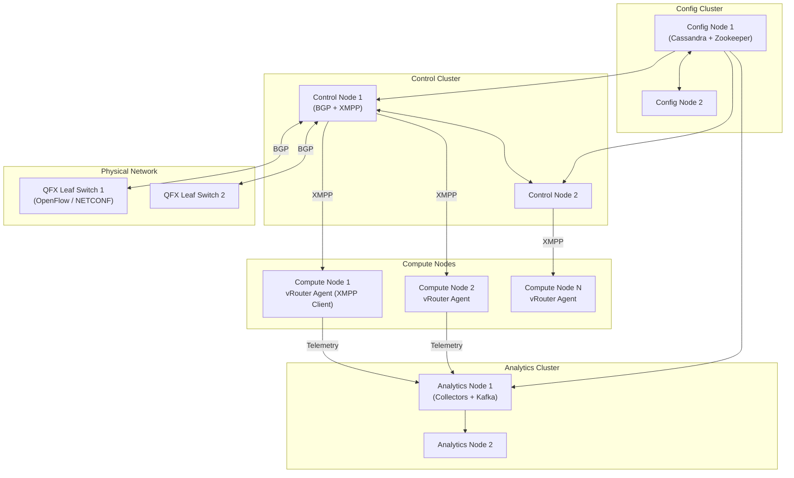

**Figure 7.3:** Juniper Contrail/Tungsten Fabric distributed control architecture. Config nodes store configuration; Control nodes run BGP/XMPP; Analytics nodes collect telemetry; vRouters on compute nodes receive control state via XMPP.

#### 3.3 Apstra: Intent-Based Data Center Automation

Acquired in 2020, **Juniper Apstra** represents Juniper's strategic direction for intent-based, multi-vendor data center automation. Apstra's forebear, the startup Apstra (founded by Sasha Ratkovic), was a pioneer in intent-based networking and autonomous data center fabric management, operating independently of any single vendor's proprietary control planes.

Apstra's architecture is organized around several core components:

- **AOS (Apstra Operating System):** The distributed, multi-tenant control and management engine that runs as a cluster of nodes. AOS maintains a graph-based representation of the entire data center fabric topology, device inventory, and policy state.
- **Intent Manager:** The user-facing component through which operators express intent using either a graphical UI, an API, or Infrastructure-as-Code templates. The Intent Manager validates intents against business rules and translates them into device-specific configuration.
- **Device Agents:** Lightweight software agents deployed on managed switches. The Apstra agent collects telemetry, applies configuration, and reports state back to AOS. Critically, Apstra is **vendor-agnostic**: it supports switches from multiple vendors (Arista, Cisco, Dell, HPE Aruba, Juniper, NVIDIA Mellanox, etc.) using open management protocols (gNMI/NETCONF for configuration, gNMI for telemetry).
- **Telemetry and Analytics Engine:** Continuously verifies that the actual state of the fabric matches the declared intent. If deviations are detected—such as a misconfigured interface, an unauthorized cabling change, or a failed link—Apstra flags the anomaly and can auto-remediate.

Apstra's intent-based approach aligns with the SDN philosophy but extends it to include **closed-loop verification and autonomous remediation**, topics at the forefront of modern network operations research.

#### 3.4 Junos Fusion and Virtual Chassis Fabric (VCF)

**Junos Fusion** is Juniper's SDN-based architecture for unifying campus and data center edge networks. Junos Fusion enables a cluster of access-layer switches (EX Series) to be managed as a single logical switch from the aggregation layer, simplifying spanning-tree management, providing consistent policy enforcement, and enabling rapid provisioning. Similarly, **Virtual Chassis Fabric (VCF)** enables clustering of up to 20 QFX or EX switches into a single logical switching entity, controlled centrally through the master switch's Junos OS instance.

While not a "full SDN controller" in the OpenFlow sense, Junos Fusion and VCF represent Juniper's implementation of **control-plane aggregation**—a form of SDN-style centralized management within a physical switching cluster—that predates and complements the external SDN controller architecture.

### 4. Juniper's Open-Source and Standards Contributions

Juniper has been a prolific contributor to open-source and open-standards initiatives relevant to SDN:

- **Tungsten Fabric:** The open-source SDN controller project, hosted at linuxfoundation.org, includes Juniper's core networking closed-source components as optional plugins while making the vRouter, analytics, and API gateway components available under open-source licenses.
- **OpenConfig:** Juniper actively participates in and contributes to the OpenConfig working group, which produces vendor-neutral YANG models and contributes to the gNMI specification.
- **P4:** Juniper has supported P4 programming on its hardware platforms (including the PTX and QFX Series built on Broadcom or Juniper-developed ASICs), enabling customers to define custom forwarding behaviors using P4.
- **Ansible Collections for Juniper:** Juniper maintains comprehensive Ansible collections that enable infrastructure-as-code declarations of Junos OS configuration, Contrail tenants, and Apstra fabrics.

### 5. Juniper SDN Deployment Use Cases

Juniper's SDN framework supports numerous enterprise and service provider use cases:

**Data Center Fabric Automation (Apstra):** Enterprises use Apstra to automate the deployment, configuration, and ongoing validation of data center leaf-spine fabrics. Apstra provides pre-validated reference designs for common topologies (3-stage Clos, 5-stage Clos), eliminating the manual, error-prone process of building and configuring complex multi-switch fabrics.

**Network Virtualization in Private Cloud (Contrail):** Service providers and large enterprises deploying OpenStack-based private clouds use Contrail as the Neutron ML2 plugin to provide tenant network isolation, floating IP management, and software-defined load balancing.

**Seamless Branch and Campus Integration (Junos Fusion):** Enterprises use Junos Fusion to simplify campus network management, reducing operational complexity and accelerating the deployment of new branch-office network services.

**Multi-Cloud Networking:** Juniper's SDN framework, particularly Contrail Cloud and Apstra, provides consistent L2/L3 connectivity, policy enforcement, and observability across on-premises data centers and public cloud environments (AWS, Azure, GCP), enabling hybrid and multi-cloud application deployments.

### 6. Conclusion

The Juniper SDN framework represents one of the industry's most mature and architecturally comprehensive SDN offerings, spanning from the Junos OS network operating system at the device level, through distributed SDN controller platforms (historical Contrail/Tungsten Fabric, current Apstra), to open-source and open-standards contributions that drive the broader SDN ecosystem. With its emphasis on vendor openness, intent-based automation, and multi-cloud data center connectivity, the Juniper SDN framework positions itself as a strong foundational platform for organizations seeking to build resilient, scalable, and automated network infrastructures.

---

## Q8a) Write in brief about Floodlight Controller

### 1. Introduction: Floodlight as an Early Open Source SDN Pioneer

**Floodlight** is an open-source, Java-based SDN controller that emerged in 2012 as one of the first production-grade, community-driven implementations of the OpenFlow controller architecture. Originally developed by **Big Switch Networks** (founded in 2010 by former Stanford SDN researchers Rob Sherwood and Glen Gibb) and subsequently released under the Apache 2.0 license, Floodlight was instrumental in democratizing SDN by providing a free, well-documented, and extensible controller platform that could be adopted by researchers, network engineers, and enterprises without vendor lock-in. While newer controllers such as OpenDaylight (ODL) and ONOS have grown in prominence, Floodlight remains widely used in research, education, and commercial proof-of-concept deployments, and its modular architecture serves as an instructive model for understanding SDN controller design principles.

### 2. Floodlight's Architectural Design

Floodlight is built on a **modular, service-oriented architecture** implemented in Java. Its design emphasizes extensibility, clean separation of concerns, and the ability to dynamically load and unload controller modules without restarting the controller process.

#### 2.1 Core Modules

The Floodlight controller is composed of several mandatory and optional modules:

**REST API Module:** Floodlight exposes a comprehensive REST API on a configurable HTTP/HTTPS port (default 8080/8443). The REST API provides programmatic access to:
- Network topology information (nodes, edges, links, ports).
- Flow rule management (install, modify, delete flows on managed switches).
- Device management (query connected devices, MAC addresses, attachment points).
- Switch and port statistics (packet/byte counters, port status).

**OpenFlow Protocol Module:** This module implements the OpenFlow protocol versions 1.0, 1.1, 1.2, 1.3, 1.4+ (depending on the Floodlight version). It handles:
- Switch connection establishment and secure channel management.
- Receiving and responding to OpenFlow messages (OFPT_HELLO, OFPT_FEATURES_REQUEST, OFPT_STATS_REQUEST, OFPT_FLOW_MOD).
- Sending Packet-Out messages in response to Packet-In events from switches.
- Processing asynchronous switch events (port status changes, flow removals, errors).

**Topology Manager Module:** Maintains a real-time graph representation of the data center or campus network fabric. It uses:
- **LLDP Discovery:** The Topology Manager periodically instructs switches to send LLDP packets through all ports. When LLDP packets are received at another switch's control plane, the controller assembles link-level topology information.
- **BDDP (Bidirectional Forwarding Detection):** An alternative mechanism for detecting links.
- **Graph Abstraction:** The topology is stored as a graph data structure with switch nodes, host nodes, and link edges, annotated with attributes such as port numbers, link speeds, and utilization.

**Forwarding Module:** The simplest forwarding module that provides basic Layer-2 MAC learning and switching behavior. When the Forwarding Module receives a Packet-In from a switch, and if the destination MAC address is known (learned from prior traffic), the module installs a flow rule to forward the packet out the appropriate port—effectively implementing the MAC learning behavior of a conventional L2 switch under controller supervision.

**Device Manager Module:** Tracks the devices attached to the Floodlight-managed network, including MAC addresses, IP addresses, VLAN tags, and attachment points (switch DPID and port). The Device Manager populates its device database from Packet-In events, ARP packets, and DHCP messages observed by the controller.

**Link Discovery Manager:** Uses LLDP and custom Floodlight-specific LLDP packets to discover and maintain a database of active links between switches. It detects link failures (via LLDP timeouts) and topology changes, updating the Topology Manager accordingly.

#### 2.2 Extensible Module System

Floodlight's modularity is its defining design feature. Modules are Java classes that implement the `IFloodlightModule` interface and register their services and event handlers in the controller's dependency injection framework. This allows third-party developers to create custom Floodlight modules—such as a load balancing module, a security monitoring module, or a custom routing module—without modifying the core controller code.

Modules can declare dependencies on services provided by other modules (e.g., a custom routing module depends on the Topology Manager), and the Floodlight module loader resolves and loads modules in dependency order. The `floodlightdefault.properties` file configures which modules are loaded at startup.

```
Floodlight Module Architecture:

  +--------------------------------------------------+
  |                Floodlight Core                    |
  |  (Module Loader, Dependency Injection, Event Bus) |
  +-------------------------+------------------------+
                            |
              +-------------+-------------+
              |                           |
  +-----------v-----------+   +-----------v-----------+
  |  Mandatory Modules    |   |  Optional Modules     |
  |                       |   |                       |
  |  - REST API           |   |  - Static Flow Pusher  |
  |  - OpenFlow Protocol  |   |  - Firewall            |
  |  - Topology Manager   |   |  - Virtual Tenant      |
  |  - Forwarding         |   |    Network (VTN)      |
  |  - Device Manager     |   |  - Link Discovery      |
  |  - Switch Manager     |   |  - QoS                 |
  +-----------------------+   |  - Web UI              |
                            |  - Packet Debugger     |
                            +-----------------------+
                            |
                     +------v-------+
                     | External Apps|
                     | (REST Client)|
                     +--------------+
```

**Figure 8.1:** Floodlight's modular service-oriented architecture showing core and optional modules.

### 3. Key Floodlight Features

#### 3.1 Virtual Tenant Network (VTN)

One of Floodlight's most notable and differentiating features was the **Virtual Tenant Network (VTN)** application. VTN enabled multi-tenant network virtualization on shared physical infrastructure using OpenFlow-controlled virtual networks. VTN provided:

- **Virtual Network Creation:** A tenant or application could create a virtual network with specific topology, addressing, and connectivity requirements using the Floodlight REST API.
- **MAC and IP Address Management:** Each VTN maintains its own MAC-to-port mapping database, providing MAC address isolation between tenants.
- **Dynamic Network Reconfiguration:** VTN permitted the dynamic reconfiguration of virtual network topology—adding or removing virtual switches, ports, and links—without disrupting the physical network.
- **Programmable Connectivity:** Applications could program VTN connectivity using the Floodlight API, enabling cloud management platforms (OpenStack, CloudStack) to manage network attachments for VMs dynamically.

#### 3.2 Static Flow Pusher

The **Static Flow Pusher** module allows operators to persistently install flows on OpenFlow switches. Even if a switch disconnects and reconnects, the Static Flow Pusher reinstalls the flows, providing configuration persistence. This module was widely used in laboratory and testing environments where deterministic forwarding behavior was required.

#### 3.3 Firewall Module

Floodlight includes a **Firewall Module** that demonstrates how to implement a network security application within the Floodlight framework. The Firewall Module:
- Maintains a rule database of permitted and denied flows (identified by source/destination MAC, source/destination IP, and protocol).
- On receiving a Packet-In event, the module queries the rule database.
- If the flow is denied, the module instructs the switch to drop the packet.
- If the flow is permitted, the module delegates to the Forwarding Module to establish the appropriate forwarding path.
- The firewall rules are managed through a REST API, enabling integration with external security management systems.

#### 3.4 Web User Interface

Floodlight provides a **web-based user interface** (hosted by the Web UI module on port 8080 by default) that provides real-time visualization of the network topology, connected devices, switch ports, and traffic statistics. The web UI is particularly useful for researchers and educators seeking to understand the state of their emulated (Mininet) or production networks.

### 4. Using Floodlight: A Developer Workflow

The typical workflow for developing applications with Floodlight involves:

1. **Obtain and Start Floodlight:** Download the Floodlight source code or pre-built JAR from GitHub. Build with Maven (`mvn clean install`) and start the controller with `java -jar target/floodlight.jar`.
2. **Connect Switches:** Configure OpenFlow switches (e.g., using OVS or physical Pica8 switches) to point to the Floodlight controller's IP and port (typically 6633 for OpenFlow). When a switch connects, it performs an OpenFlow HELLO handshake and advertises its features (port descriptions, supported actions, supported match fields).
3. **Deploy Custom Modules:** Create custom Java modules implementing the `IFloodlightModule` interface. Register event listeners for `OFMessage` events such as `OFType.PACKET_IN`, `OFType.FLOW_REMOVED`, or `OFType.PORT_STATUS`.
4. **Install Flow Rules:** In the event handler for PACKET_IN, compute the appropriate action (forward, drop, flood) and send an `OFMessage` (OFPT_FLOW_MOD) back to the switch to install the flow rule.
5. **Build External Applications:** Use Floodlight's REST API (operating on HTTP port 8080) to build external applications in any language (Python, Go, JavaScript) that manage Floodlight-managed network policies.

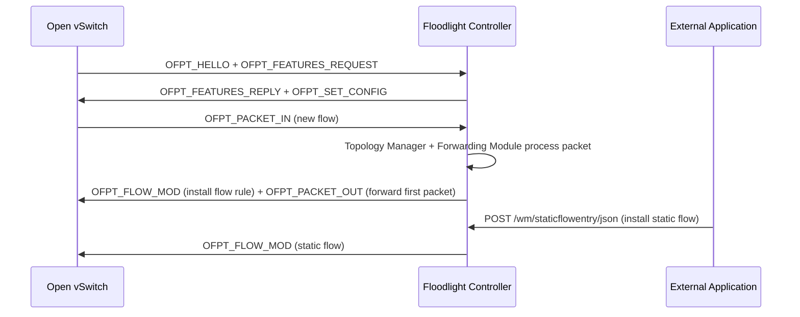

**Figure 8.2:** Floodlight message flow sequence showing switch connection, automatic forwarding rule installation, and external REST API flow installation.

### 5. Floodlight's Community and Legacy

Floodlight's release under the Apache 2.0 license and its active developer community contributed substantially to the early growth of the SDN ecosystem. The Floodlight community maintained:

- **Floodlight-Lighty:** A lightweight version targeting resource-constrained environments.
- **Floodlight Android Controller:** An Android-specific implementation for mobile network management.
- **Floodlight LISP:** A LISP (Location/ID Separation Protocol) controller module for LISP-based network virtualization.
- **Pyretic:** A Python-based domain-specific language (DSL) for SDN programming, developed at Stanford, that could compile to Floodlight-compatible flow rules.

While Big Switch Networks (which was later acquired by and integrated into VMware's networking business) shifted commercial focus to VMware NSX and the OpenDaylight-based VMware NSX Controllers, the Floodlight open-source project continues under the stewardship of its community maintainers, providing a lightweight, well-documented platform for SDN education and research worldwide.

### 6. Conclusion

Floodlight Controller represents an important chapter in the history of SDN, demonstrating that open-source, modular, application-centric SDN controller architectures could be built, deployed, and adopted at scale. Its contributions—the VTN for multi-tenant networking, the Static Flow Pusher for persistent flow management, the REST API for external programmability, and the modular software design pattern—have influenced subsequent SDN controller designs across both open-source and commercial platforms. For students and practitioners of SDN studying controller internals, Floodlight's Java codebase remains one of the most accessible and instructive implementations available.

---

## Q8b) Explain ODL (Open Daylight) controller

### 1. Introduction: ODL's Origin and Mission

**OpenDaylight (ODL)** is an open-source SDN controller platform initiated by **Linux Foundation** in 2013 with the goal of creating a vendor-neutral, community-driven SDN controller that would accelerate the adoption of open SDN standards and avoid the vendor fragmentation that was threatening to fragment the early SDN ecosystem. The project was launched with founding members including **Cisco, Brocade, Citrix, Ericsson, HP, IBM, Juniper Networks, Microsoft, NEC, and Red Hat**, among others. These diverse industry stakeholders—representing both traditional networking incumbents and cloud/software vendors—converged on ODL as a common upstream platform that individual vendors could customize and extend for their own commercial offerings, rather than each developing a proprietary SDN controller in isolation.

ODL distinguishes itself from other SDN controllers through three key attributes: its **modular OSGi-based architecture**, its **model-driven approach** using YANG data models, and its **comprehensive support for multiple southbound protocols** beyond OpenFlow. ODL's scope has expanded well beyond traditional SDN controller functions to include network service orchestration, network function virtualization management, device configuration management, and integration with Kubernetes and cloud orchestration platforms.

### 2. ODL Architectural Overview

ODL's architecture is defined by the **MD-SAL (Model-Driven Service Abstraction Layer)**, a middleware layer that sits between the ODL's functional modules and the underlying data stores and protocol plugins.

```
+-------------------------------------------------------------+
|                    ODL Application Layer                      |
|  +-----------+  +-----------+  +-----------+  +----------+  |
|  | Topology  |  | OVSDB     |  | NETCONF   |  | Group-   |  |
|  | Manager   |  | Manager   |  | Manager   |  | based    |  |
|  | App       |  | App       |  | App       |  | Fwd App  |  |
|  +-----+-----+  +-----+-----+  +-----+-----+  +-----+----+  |
|        |             |             |              |         |
+--------|-------------|-------------|--------------|---------+
         |             |             |              |
         +-------------+-------------+--------------+
                       |
              +--------v--------+
              |   MD-SAL Core    |
              |  (Data Broker,   |
              |   RPC Registry,  |
              |   Binding-aware  |
              |   Services)      |
              +--------+--------+
                        |
          +--------------+--------------+
          |              |              |
    +------v------+ +----v------+ +-----v------+
    | Config      | |Operational| | Binding-   |
    | Datastore   | | Datastore  | | Aware RPC  |
    | (MD-SAL)    | | (MD-SAL)   | | (MD-SAL)   |
    +------+------+ +-----+-----+ +------------+
           |              |                   
       +---v------+  +----v----+              
       |  MD-SAL  |  |  MD-SAL |              
       |  Binding |  |  Binding|              
       |  (YANG-  |  | (YANG-  |              
       |  generated|  | generated|              
       |  APIs)    |  | APIs)    |              
       +---+------+  +----+-----+             
           |              |                   
+----------v--------------+-----------------------------+
|              Southbound Protocol Plugins             |
|  +--------+  +--------+  +--------+  +-----------+  |
|  |OpenFlow|  | NETCONF |  | OVSDB  |  |  P4Runtime|  |
|  | Plugin |  | Plugin  |  | Plugin |  |  Plugin   |  |
|  +--------+  +--------+  +--------+  +-----------+  |
+-------------------------------------------------------+
       |
+------v--------+
| Managed Devices|
| (Switches, etc.)|
+----------------+
```

**Figure 8.3:** OpenDaylight (ODL) architecture showing the MD-SAL layer as the architectural core bridging YANG-generated APIs and southbound protocol plugins.

The MD-SAL is ODL's architectural innovation and the key to its model-driven design. The MD-SAL provides:

- **YANG Model-driven Data Broker:** The MD-SAL Data Broker stores and retrieves network state using YANG-defined data models. When a developer writes an ODL application, they interact with the network state through Java interfaces that are auto-generated from YANG models—ensuring compile-time type safety and eliminating runtime schema errors.
- **Binding-Aware RPC Registry:** The MD-SAL enables applications to expose and consume RPCs defined in YANG models. When an application calls an RPC (such as `add-flow`), the MD-SAL routes the call to the appropriate implementing module.
- **Notification Broker:** The MD-SAL publishes state-change events (link up, port down, flow removed) to subscribed applications, enabling event-driven controller logic.

### 3. ODL's YANG-Based Model-Driven Approach

Where many other SDN controllers expose REST APIs with JSON payloads that have minimal schema enforcement, ODL's design philosophy makes YANG models the **single source of truth** for all network state and operations. This model-driven approach has several advantages:

1. **Interoperability:** YANG is a standardized data modeling language. When an operator defines an ODL-managed network using YANG models, the same models can be used by other YANG-aware systems (other SDN controllers, configuration management tools, monitoring platforms) without data transformation.
2. **Vendor Neutrality:** OpenConfig and vendor YANG models (e.g., Cisco's `Cisco-IOS-XE` YANG models, Juniper's `junos-*` YANG modules) can be integrated into the MD-SAL, enabling ODL to manage heterogeneous multi-vendor environments.
3. **API Consistency:** The RESTCONF API is auto-generated from YANG models, ensuring that the REST API's URI structure, payload schema, and semantics are always consistent with the underlying data model.
4. **Validation and Type Safety:** YANG's type system and constraint language enable the MD-SAL to validate configuration data at write time, preventing invalid combinations of parameters from being applied to devices.

```
YANG Model (Conceptual)            Generated RESTCONF API

module openflow-plugin {            GET    /restconf/data/
  list flow {                        openflow-plugin:flow/
    key id;                          → Returns all flows
    leaf id { type string; }         PUT    /restconf/data/
    leaf priority { type uint16; }    openflow-plugin:flow/{id}
    leaf table-id { type uint8; }    → Creates/updates a flow
    container match { ... }
    list action { ... }
  }
}

A flow rule in YANG terms has a specific schema (id, priority,
table-id, match fields, actions). The RESTCONF API enforces
that PUT payloads conform to this schema.
```

**Figure 8.4:** YANG model-driven design. A YANG module for OpenFlow flows defines the schema, which is then exposed as a type-safe RESTCONF API.

### 4. ODL's Southbound Protocol Support

ODL distinguishes itself from many other SDN controllers through its extensive support for **multiple southbound protocols**. This multi-protocol capability is essential for deploying ODL in heterogeneous environments where different network components require different management protocols:

#### 4.1 OpenFlow Plugin

ODL's OpenFlow plugin enables the controller to manage OpenFlow-capable switches. The plugin supports OpenFlow versions 1.0 through 1.5, and the binding layer auto-generates Java APIs from YANG models that represent OpenFlow concepts (flow tables, flow entries, group tables, meter tables, ports). The OpenFlow plugin handles:
- Switch connection management (TLS and plaintext connections).
- Flow rule installation, modification, and deletion.
- Group table and bucket management.
- Meter table (QoS rate limiting) configuration.
- Async message processing (packet-in events, flow removed events, port status events, error messages).

#### 4.2 NETCONF Plugin

The NETCONF plugin provides configuration management for devices supporting NETCONF/YANG. ODL uses NETCONF to:
- Push and pull configuration from routers, switches, and other managed devices.
- Subscribe to NETCONF notifications for real-time state change events.
- Implement the IETF's RESTCONF protocol mapping over NETCONF.

#### 4.3 OVSDB Plugin

The OVSDB plugin manages **Open vSwitch (OVS)**-based virtual switches. This is critical for OpenStack environments where OVS is commonly used as the software switching layer. The OVSDB plugin:
- Creates and manages OVS bridges.
- Configures virtual interfaces (vif ports).
- Manages VXLAN, GRE, and Geneve tunnel termination points.
- Configures QoS policies and traffic shaping on OVS ports.
- Monitors OVS bridge port states and statistics.

#### 4.4 BGP and BGP-LS Plugin

The BGP plugin implements **BGP-LS (BGP Link-State)** for topology discovery from BGP-speaking routers. This allows ODL to build a topology view of remote network segments (such as a provider's MPLS network or an enterprise's routed campus) without relying solely on OpenFlow-based discovery.

#### 4.5 PCEP and P4Runtime Plugins

ODL also supports **PCEP (Path Computation Element Protocol)** for MPLS/GMPLS traffic engineering and **P4Runtime** for managing P4-programmable switches, extending ODL's applicability to service provider and data plane programmable environments.

### 5. ODL's Application Ecosystem

ODL's extensive application ecosystem—delivered as OSGi bundles—covers a broad spectrum of network automation use cases:

**L2 Switch Application:** Provides Layer-2 MAC learning and flood-and-forward behavior under OpenFlow controller management. It is functionally similar to Floodlight's Forwarding Module but leverages ODL's MD-SAL for state management.

**DIDM (Defense-in-Depth with In-network Monitoring):** Integrates with telemetry systems (sFlow, IPFIX) to detect anomalies such as port scanning, DDoS attacks, and ARP spoofing, and responds by installing high-priority drop flows.

**Group-based Policy (GBP):** Provides a high-level policy model where network administrators define application-centric policies based on security groups, endpoints, and contracts—similar to Cisco ACI's policy model but implemented on ODL's open infrastructure.

**Service Function Chaining (SFC):** Implements the IETF SFC architecture, enabling ordered paths of in-line network functions to be defined and dynamically reconfigured through ODL's MD-SAL API.

**AAA (Authentication, Authorization, and Accounting):** Provides role-based access to ODL resources and API endpoints.

**DLUX (Daylight User Experience):** A web-based user interface for ODL that provides topology visualization, switch and port inspection, and flow table inspection. DLUX is built using modern web technologies (HTML5, JavaScript) and is served directly by the ODL Jetty web server.

### 6. ODL Deployment and Operational Characteristics

#### 6.1 Clustering and High Availability

Production ODL deployments use a **cluster of ODL controller nodes** (typically 3 or 5 nodes for optimal consensus behavior) to achieve high availability. ODL clustering leverages:
- **Apache Karaf Cellar:** Provides Hazelcast-based clustering for ODL features, enabling module deployment, configuration data synchronization, and distributed event handling across cluster nodes.
- **Clustered Datastores:** The MD-SAL configuration and operational datastores are clustered using Apache Cassandra or etcd for strong consistency and high availability.
- **Distributed RPC:** Applications can invoke RPCs on any cluster member; the MD-SAL routes the call to the appropriate implementing module in the cluster.

#### 6.2 Karaf OSGi Container

ODL is distributed as an **Apache Karaf** OSGi container runtime. Karaf provides:
- **Dynamic module loading/unloading:** Applications (OSGi bundles) can be installed and started without restarting the entire ODL instance.
- **Dependency injection and versioned packages:** Each bundle declares its imported and exported packages, enabling multiple versions of the same library to coexist without conflicts.
- **Console and remote access:** Karaf provides a powerful SSH-accessible console for administration, bundle management, and troubleshooting.

The use of Karaf is architecturally significant: it enables ODL to support multi-tenancy within a single controller deployment (by running tenant-specific applications in isolated bundle classloaders) and enables third-party developers to extend ODL without modifying its core codebase.

### 7. ODL in Industry and Research

ODL is used extensively by:
- **Telecom operators** (AT&T, Orange, Deutsche Telekom) as part of their NFV MANO stacks and as the control plane for transport network SDN.
- **Cloud providers** (Red Hat, which contributed ODL to its OpenStack-based Red Hat OpenStack Platform) for network virtualization.
- **Enterprise IT** organizations using ODL for automated data center fabric management and network policy enforcement.
- **Research institutions** worldwide as the foundation for SDN research projects spanning network measurement, protocol design, and verification.

Notable ODL sub-projects include **TransportPCE** (a Path Computation Element for optical transport networks), **NetVirt** (a virtual network manager for OpenStack), and **ALTO (Application-Layer Traffic Optimization)** integration.

### 8. Conclusion

OpenDaylight stands as one of the most comprehensive and architecturally sophisticated SDN controllers in the world. Its model-driven design, powered by the MD-SAL and YANG data models, provides a robust, type-safe, vendor-neutral foundation for SDN applications across data center, enterprise, service provider, and optical transport domains. While ODL's learning curve is steep—requiring familiarity with Java, OSGi, YANG, and the MD-SAL's service abstraction model—the depth of its features, the breadth of its protocol support, and the strength of its open-source community make it an indispensable platform for anyone building production-grade SDN solutions at scale.

---

## Q8c) Write a short note on Data Center Orchestration

### 1. Introduction: Orchestration as the Operational Cohesive Force of the Data Center

**Data Center Orchestration** is the systematic, automated coordination and management of the compute, network, storage, and application resources within a data center environment to achieve business-defined objectives with minimal human intervention. In the same way that a conductor guides an orchestra to produce coherent music from individual instruments playing diverse parts, data center orchestration governs the multi-layered interactions between workloads, network infrastructure, storage systems, and external services to operate a modern data center as a unified, agile, and application-aware system.

Data center orchestration is not synonymous with **automation**, though automation is a necessary component. Orchestration is the higher-level discipline that defines **workflows**, **dependencies**, **ordering constraints**, and **policy guardrails** that govern how and when automated actions are performed. An orchestration system may automate the provisioning of compute instances, but it also defines the sequence in which compute is provisioned, the network is attached, storage is allocated, a configuration management agent is deployed, security scanning is performed, and monitoring agents are installed—coordinating these steps across potentially heterogeneous infrastructure and multiple management systems. This section provides a comprehensive examination of data center orchestration, its architectural components, technologies, workflow patterns, and practical applications.

### 2. Core Concepts and Principles of Data Center Orchestration

#### 2.1 Orchestration vs. Automation

The relationship between orchestration and automation can be understood through a practical example:

**Automation alone:** A script that provisions a virtual machine on a hypervisor. It provisions hardware resources, but does not handle network attachment, security policy, monitoring, or logging configuration. The result is a computer that lacks the context required to serve as a productive production resource.

**Orchestration:** A system that, upon request to deploy a new web server, performs the following orchestrated sequence:
1. Allocates a compute instance (via OpenStack Nova or Kubernetes).
2. Attaches a virtual network interface to the appropriate tenant network (via SDN controller OpenStack Neutron).
3. Associates a fixed or floating IP address.
4. Provisions and attaches a persistent storage volume (via OpenStack Cinder).
5. Injects the server's identity and network configuration into the VM's cloud-init process.
6. Applies security group rules (firewall rules) via the SDN controller.
7. Runs Ansible or Chef to apply the server's application-level configuration (install nginx, configure SSL).
8. Registers the server in the load balancer pool.
9. Configures monitoring (Prometheus exporter, log shipping to ELK).
10. Notifies the deployment pipeline that the server is ready.

This orchestrated workflow, defined and executed by an orchestration platform, transforms raw infrastructure resources into a fully operational, production-ready service.

#### 2.2 Key Orchestration Principles

- **Declarative Desired-State Modeling:** The orchestration system maintains a model of the desired state of the data center—what VMs should exist, what network policies should be in place, what storage volumes should be attached. The system continuously reconciles actual state against desired state, automatically remediating discrepancies.
- **Idempotency:** Orchestration workflows are designed to be safely re-executable. Running a workflow twice produces the same result as running it once, enabling reliable retry and recovery.
- **Dependency Management:** The orchestration system understands dependencies between resources. A virtual machine cannot be started before its network and security groups are configured; an application deployment cannot proceed before its database server is fully configured.
- **Event-Driven Reactivity:** Modern orchestration systems respond to events—VM failures, link failures, autoscaling triggers, security alerts—by invoking appropriate remediation workflows.

### 3. Data Center Orchestration in the NFVMANO Context

The most formalized incarnation of data center orchestration in the telecommunications domain is the **NFV Management and Orchestration (NFV-MANO)** framework defined by ETSI ISG NFV. In the MANO context, orchestration spans three primary contexts:

#### 3.1 Network Service Orchestration (NFVO)

The **NFV Orchestrator (NFVO)** orchestrates the deployment of network services. A network service descriptor (NSD) defines the service as a directed graph of VNFs and their connection requirements. The NFVO processes the NSD and:

1. Determines which VNFs to deploy and where (NFVI POP selection).
2. Invokes the VNFM to instantiate each VNF.
3. Coordinates the VIM (OpenStack) to create virtual networks, assign IP addresses, and configure connectivity.
4. Assembles the deployed VNFs into a complete network service with verified end-to-end connectivity.
5. Monitors the service throughout its lifecycle, triggering scaling or healing workflows when required.

#### 3.2 VNF Lifecycle Orchestration (VNFM)

The **VNF Manager (VNFM)** orchestrates the lifecycle of individual VNFs, managing day-1 (initial configuration), day-2 (modification, monitoring), and ongoing lifecycle operations (scaling, upgrading, healing, terminating).

#### 3.3 Infrastructure Resource Orchestration (VIM)

The **Virtualized Infrastructure Manager (VIM)** orchestrates the compute, network, and storage resources themselves—creating VM instances, establishing virtual networks, allocating storage volumes, and managing the placement of VNFs on the NFVI.

### 4. Data Center Orchestration in Cloud Computing: Kubernetes as the Primary Orchestration Platform

In the modern cloud-native data center, **Kubernetes** has emerged as the dominant orchestration platform. Kubernetes, originally developed by Google and now a CNCF (Cloud Native Computing Foundation) graduated project, is a container orchestration platform that automates the deployment, scaling, and management of containerized applications.

Kubernetes orchestrates the data center at multiple layers:

#### 4.1 Compute (Pod) Orchestration

Kubernetes manages the lifecycle of **Pods**—the atomic unit of Kubernetes scheduling, which are groups of one or more containers. When a user submits a Deployment, StatefulSet, or DaemonSet manifest, Kubernetes:
- Schedules each Pod to a healthy, resource-capable worker node.
- Pulls the specified container images from a registry.
- Creates the Pod's filesystem, network namespace, and cgroup resource constraints.
- Starts all containers within the Pod.
- Monitors Pod health and restarts failed containers.

#### 4.2 Network (CNI) Orchestration

Kubernetes delegates network management to **Container Network Interface (CNI)** plugins. CNI plugins are invoked by the kubelet when a Pod is created or destroyed, with the responsibility of:
- Attaching the Pod's network namespace to the host's network.
- Assigning an IP address to the Pod.
- Configuring network routes so Pods can communicate with each other across nodes.
- Implementing network policies (microsegmentation) between Pods from different namespaces or with different labels.

CNI plugins such as **Calico** (policy-driven routing), **Cilium** (eBPF-based), **Flannel** (simple overlay networking), and **Antrea** (Open vSwitch-based) implement various networking models. Advanced CNI implementations integrate with SDN controllers to provide centralized network policy management and global network visibility.

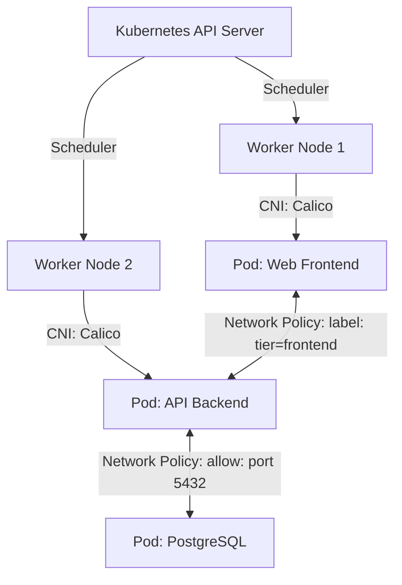

**Figure 8.5:** Kubernetes networking orchestration flow showing the API Server scheduling, CNI plugin providing connectivity, and Network Policies governing communication between Pods.

#### 4.3 Storage Orchestration

Kubernetes manages data persistence through **Persistent Volumes (PVs)** and **Persistent Volume Claims (PVCs)**. The orchestration layer:
- Provisions storage based on PVC specifications (size, access mode, performance tier).
- Attaches storage volumes to Pods via block, file, or object interfaces.
- Manages storage lifecycle—creating, snapshotting, and deleting volumes in response to application lifecycle events.

#### 4.4 Application and Service Orchestration

Kubernetes orchestrates higher-level application constructs beyond individual Pods:
- **Deployments and ReplicaSets:** Maintain a target replica count; automatically scale up or down in response to resource utilization or manual commands.
- **StatefulSets:** Provide ordered, stable deployment of stateful applications (databases, message queues) with stable network identities and persistent storage.
- **Jobs and CronJobs:** Manage one-off or scheduled batch workloads.
- **Horizontal Pod Autoscaler (HPA):** Automatically scales the number of Pod replicas based on CPU utilization, memory utilization, or custom metrics.
- **Service and Ingress:** Provides service discovery, load balancing, and externally accessible HTTP routing.

### 5. Data Center Orchestration: OpenStack as an Infrastructure Orchestration Platform

**OpenStack** is an open-source Infrastructure-as-a-Service (IaaS) platform that provides comprehensive compute, network, and storage orchestration for data centers. OpenStack is the dominant open-source orchestration platform for NFVI in telecommunications and large-scale enterprise data center environments.

OpenStack consists of modular services, each orchestrating a specific infrastructure domain:

- **Nova (Compute):** Orchestrates the lifecycle of virtual machine instances—flavor selection, host selection (scheduling), boot, and live migration.
- **Neutron (Networking):** Orchestrates the creation and management of virtual networks, subnets, routers, security groups, load balancers, and VPNs.
- **Cinder (Block Storage):** Orchestrates the provisioning of block storage volumes, snapshots, and volume attachments.
- **Swift (Object Storage):** Manages a distributed object storage system for large-scale unstructured data.
- **Heat (Orchestration):** Provides a declarative orchestration engine that accepts HOT (Heat Orchestration Template) files—YAML-based templates describing complete multi-resource stacks—orchestrating their deployment, update, and deletion.
- **Keystone (Identity):** Provides authentication and authorization across the OpenStack orchestration plane.
- **Ironic (Bare Metal Provisioning):** Orchestrates the provisioning of physical bare-metal servers using PXE, IPMI, and Redfish management interfaces.

```
OpenStack Heat Orchestration Template (HOT) Example:

heat_template_version: 2016-04-08
resources:
  web_server:
    type: OS::Nova::Server
    properties:
      image: Ubuntu 22.04
      flavor: m1.large
      networks:
        - network: public-net
      security_groups: [web-sg]
  db_server:
    type: OS::Nova::Server
    properties:
      image: PostgreSQL 15
      flavor: m1.xlarge
      networks:
        - network: private-net
```

**Figure 8.6:** OpenStack Heat HOT template for a two-tier web+database application. The Heat engine orchestrates the creation, connection, and configuration of both servers.

### 6. Infrastructure as Code (IaC) and Declarative Orchestration

The modern data center orchestration paradigm has been fundamentally reshaped by the **Infrastructure as Code (IaC)** approach, in which infrastructure topology, configuration, and policy are defined in human-readable, version-controlled code rather than manually executed procedures or proprietary point-and-click interfaces.

**Terraform**, developed by HashiCorp, is the dominant IaC tool for multi-cloud and hybrid data center orchestration. Terraform:
- Uses a declarative **HashiCorp Configuration Language (HCL)** to describe desired infrastructure state.
- Interfaces with hundreds of provider plugins (AWS, Azure, GCP, OpenStack, VMware, Kubernetes, Palo Alto firewalls, F5 load balancers) to create, update, and destroy infrastructure resources.
- Maintains a state database that tracks the current state of all managed resources, enabling Terraform to compute the minimal set of changes required to reach the desired state.
- Supports dependency inference, parallel resource creation, and state locking to prevent conflicting concurrent modifications.

**Ansible**, developed by Red Hat, provides **configuration orchestration**—orchestrating the software configuration of infrastructure resources after they have been provisioned. Ansible:
- Uses YAML playbooks to define configuration workflows.
- Communicates with managed nodes over SSH (no agents required on managed nodes) or WinRM (for Windows).
- Provides idempotent task execution, ensuring that running a playbook against a system in its desired state produces no changes.

The **combination of Terraform (for infrastructure provisioning) and Ansible (for configuration management)** represents the standard orchestration pattern for modern data center environments.

### 7. Closed-Loop Orchestration and Intent-Based Networking

The frontier of data center orchestration is the move toward **closed-loop, intent-based systems**. In traditional orchestration, the orchestrator receives a request, executes a workflow, reports success or failure, and stops. In closed-loop orchestration:

1. The operator declares an **intent**—a high-level statement of the desired network or infrastructure behavior (e.g., "Application X must survive the failure of any single data center rack").
2. The orchestrator uses AI/ML-assisted reasoning to translate the intent into a specific resource configuration.
3. The orchestrator continuously monitors the actual state of all resources via telemetry.
4. The orchestrator compares actual state against declared intent.
5. If a deviation is detected (e.g., a server failure violates the "any single rack" resilience intent), the orchestrator automatically triggers a remediation workflow—provisioning a replacement VM on a different rack, updating network policies, and verifying the restored intent compliance.

**Ansible ANAP (Ansible Automation Platform)**, **StackStorm**, and **Icinga Web 2** with its event automation features are examples of closed-loop orchestration frameworks. Data center management platforms (Cisco DCNM, VMware vRealize Automation) increasingly incorporate intent-based orchestration capabilities.

### 8. Data Center Orchestration Challenges

Despite significant advances, data center orchestration faces persistent challenges:

- **State Explosion:** Managing the state of tens of thousands of compute instances, millions of containers, hundreds of thousands of network policies, and petabytes of storage across hybrid cloud environments pushes state management systems to their limits.
- **Temporal Consistency:** Coordinating changes across multiple systems (compute, network, storage) requires distributed transactions or compensating transactions—neither of which is universally reliable.
- **Configuration Drift:** When systems are partially managed by orchestration and partially managed manually, configuration state can diverge from the declared model, causing orchestration workflows to fail or operate incorrectly.
- **Observability:** Achieving real-time, comprehensive observability across all orchestrated resources—including hardware, hypervisors, containers, networking, and applications—remains an open research and engineering challenge.

### 9. Conclusion

Data center orchestration is the central nervous system of the modern cloud-native and NFV-enabled data center. By automating the lifecycle and interconnection of compute, network, and storage resources, orchestration enables the rapid, reliable, and policy-consistent delivery of infrastructure services at cloud scale. As data centers continue to grow in complexity and scale to accommodate AI/ML workloads, 5G network functions, and globally distributed cloud applications, the role of orchestration will only become more central and more demanding.

