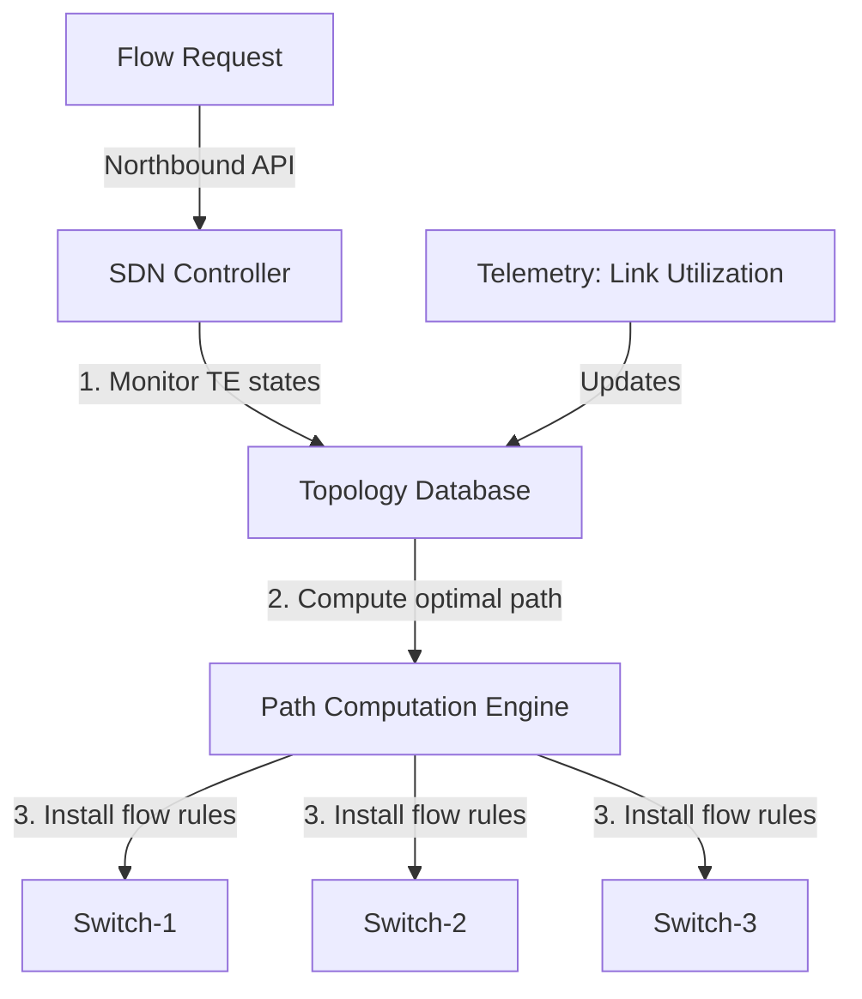
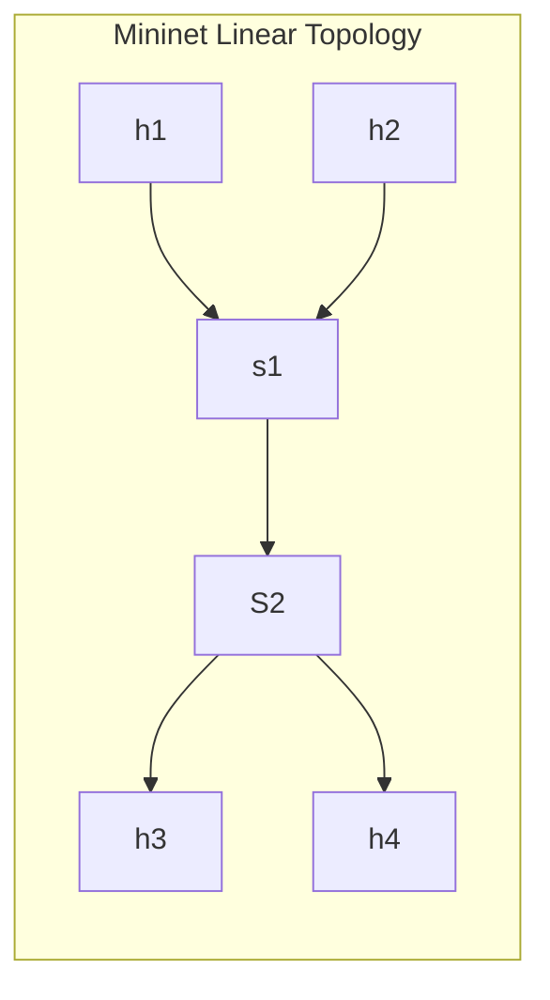
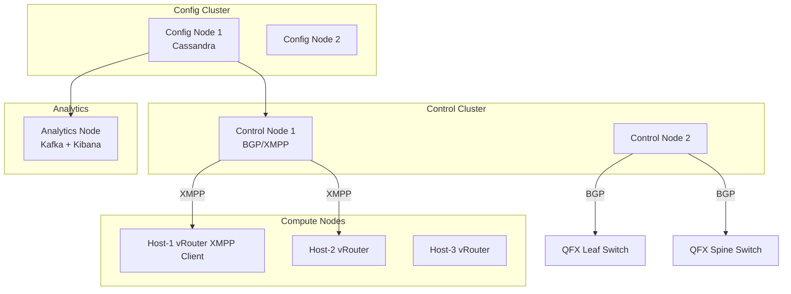
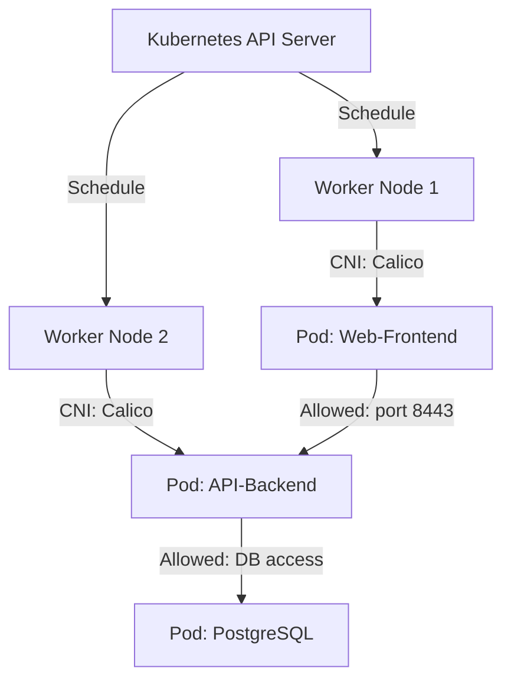

# Paper 5: [6404]-98 — Answers

---

## Q1a) What is Traffic Engineering? Explain its challenges

### 1. Introduction to Traffic Engineering

**Traffic Engineering (TE)** in computer networking refers to the systematic process of managing and controlling the flow of data traffic across a communication network to achieve specific performance objectives, including optimal resource utilization, minimization of congestion, enforcement of quality-of-service (QoS) guarantees, and maximization of network reliability. Traffic engineering transforms the network from a passive best-effort packet delivery system into an actively managed infrastructure where routing decisions, bandwidth allocations, and forwarding behaviors are engineered to satisfy the operational and service-level requirements of applications and users.

In traditional IP networks, routing decisions are made by distributed routing protocols such as Open Shortest Path First (OSPF) and Border Gateway Protocol (BGP). These protocols compute shortest paths based on administrative metrics and disseminate reachability information across the network. While effective at maintaining connectivity under failure conditions, these distributed protocols are fundamentally limited in their ability to optimize network-wide resource utilization because each router makes routing decisions based solely on its local view of the network. This leads to situations where certain links become heavily congested while other links remain underutilized—a phenomenon known as **equal-cost multi-path inefficiency**.

Traffic engineering addresses this gap by providing network operators with centralized or coordinated control over traffic routing, allowing them to steer flows along specific paths to balance load, avoid congestion, and meet bandwidth and latency commitments. In the context of Software-Defined Networking (SDN), traffic engineering acquires new capabilities because the SDN controller possesses a global view of the entire network topology and can program forwarding rules on individual switches to enforce engineered paths at the granularity of individual flows or aggregate traffic classes.

```
                        TRAFFIC ENGINEERING OVERVIEW

    +-----------------------------------------------------------+
    |                    Network Topology                        |
    |                                                           |
    |    [Host-A]----[Sw1]====[Sw2]====[Sw3]----[Host-B]      |
    |                  |        |        |                      |
    |              (PATH-1)  (PATH-2)   |                      |
    |                        |        (PATH-3)                 |
    |                      [Sw4]====[Sw5]                     |
    |                                                           |
    |    Traditional: Uses shortest path = PATH-1               |
    |    TE: Steers traffic across PATH-1, PATH-2, PATH-3      |
    |         based on link utilization                         |
    +-----------------------------------------------------------+
```

### 2. Objectives of Traffic Engineering

Traffic engineering pursues multiple interrelated objectives:

**Optimal Resource Utilization:** The primary goal is to maximize the utilization of network bandwidth by distributing traffic across available paths proportionally to their capacities. This minimizes the creation of congestion hotspots and avoids waste of expensive backbone capacity.

**Congestion Avoidance and Control:** Traffic engineering identifies potentially congested links before or during congestion events and proactively reroutes traffic to prevent queue buildup, packet loss, and TCP retransmission timeouts.

**QoS and SLA Assurance:** For networks supporting differentiated services, traffic engineering ensures that traffic classes with strict latency, jitter, or bandwidth requirements are routed over paths that satisfy those commitments.

**Fast Failover and Resilience:** Traffic engineering frameworks compute disjoint backup paths for critical flows and can rapidly reroute traffic when a link or node failure is detected, minimizing service disruption.

**Policy-Based Routing:** Network operators can enforce routing policies that consider factors beyond pure shortest-path metrics—such as regulatory requirements, peering agreements, traffic class priorities, and economic cost of transit.

### 3. Traffic Engineering Approaches

#### 3.1 Traditional MPLS-Based Traffic Engineering

Before SDN, traffic engineering was primarily implemented using **Multi-Protocol Label Switching (MPLS)** with **Resource Reservation Protocol - Traffic Engineering (RSVP-TE)**. In this approach:

- The operator configures Label-Switched Paths (LSPs) with explicit routes using RSVP-TE signaling.
- Traffic is mapped to these LSPs using mechanisms such as Policy-Based Routing (PBR) or static routes.
- The LSPs can be configured with bandwidth reservations, explicit routes (avoiding certain links), and fast reroute (FRR) backup paths.
- Constraints-based routing computes optimal LSP paths based on available bandwidth and topology.

While powerful, MPLS-TE has significant operational overhead and complexity, including the need to manually configure LSP parameters, manage LSP state, and ensure consistency between the LSP topology and the underlying IGP topology.

#### 3.2 SDN-Based Traffic Engineering

SDN transforms traffic engineering by providing a centrally orchestrated, globally optimized approach:

- The SDN controller maintains a complete, real-time topology and link-state database.
- Upon detecting congestion or receiving a flow request, the controller computes the optimal path using global information.
- The controller installs OpenFlow flow rules on the switches along the chosen path to forward traffic accordingly.
- Applications can request bandwidth-guaranteed paths through the controller's northbound API, and the controller manages path establishment, monitoring, and teardown automatically.

This capability is illustrated by systems such as **Google's B4**, which demonstrated centralized traffic engineering over a global SDN WAN achieving near-optimal link utilization.



**Figure 1.1:** SDN-based traffic engineering workflow. The controller monitors the network, computes optimal paths, and programs data-plane switches via the southbound interface.

### 4. Challenges of Traffic Engineering

#### 4.1 Scalability

In large networks with thousands of switches and millions of flows, maintaining per-flow or per-path state in the controller and recomputing optimal paths for every flow event creates significant scalability challenges. The controller must efficiently aggregate flows into traffic classes (aggregates) to reduce the computational burden of path computation.

**Solution approaches:** Hierarchical TE (dividing the network into domains), flow aggregation, and distributed path computation elements.

#### 4.2 Measurement Accuracy and Timeliness

Effective traffic engineering requires accurate, timely information about link utilizations, queue depths, and flow statistics. Traditional SNMP polling at five-minute intervals provides insufficient granularity for fast-changing traffic conditions. Streaming telemetry and in-band network telemetry (INT) are required to provide the sub-second visibility needed for reactive traffic engineering.

#### 4.3 Consistency and Convergence

When traffic engineering paths are modified due to congestion or failure, the transition must be consistent to avoid transient packet loss or routing loops. Inconsistencies between the controller's view and the actual switch states during rule installation can lead to black holes or temporary loops.

**Solution approaches:** Atomic flow rule updates using OpenFlow bundles or group tables, and consistent hashing for flow redistribution.

#### 4.4 Interoperability with Legacy Protocols

In brownfield deployments, traffic engineering must coexist with traditional routing protocols. The interaction between MPLS-TE, IGP, and SDN-based TE introduces complexity in path computation and route advertisement. Ensuring that legacy routers and SDN-controlled switches agree on forwarding semantics requires careful protocol design.

#### 4.5 Handling Elephant and Mice Flows

Large flows (elephant flows) consume disproportionate bandwidth and cause congestion, while many small flows (mice flows) are latency-sensitive. A traffic engineering system must distinguish between these flow types and apply appropriate strategies: rerouting elephant flows to balance load while preserving low-latency paths for mice flows.

#### 4.6 Dynamic Topology Changes

Data center networks experience frequent topology changes due to VM migrations, link failures, and switch additions/removals. Traffic engineering must dynamically adapt to these changes while minimizing disruption to ongoing flows.

#### 4.7 Multi-Tenancy and Policy Isolation

In multi-tenant environments, traffic engineering policies must be isolated between tenants. A tenant's TE path computation must not be influenced by or interfere with another tenant's traffic, even though all tenants share the same physical infrastructure.

#### 4.8 Security of the Control Channel

Since traffic engineering relies on the controller to direct traffic paths, compromising the controller or the control channel (OpenFlow, NETCONF) could enable an attacker to redirect traffic arbitrarily. Securing the southbound communication and authenticating controller-switch interactions is critical.

### 5. Conclusion

Traffic engineering is a cornerstone capability of modern data center and wide-area networking, enabling networks to operate efficiently, reliably, and close to their theoretical optimal capacity. The shift from traditional MPLS-based TE to SDN-native TE represents a fundamental improvement in speed, granularity, and automation. However, the challenges of scalability, measurement, consistency, and legacy interoperability remain active areas of research and engineering in both academic and industrial settings.

---

## Q1b) What is EVPN? Explain benefits of EVPN

### 1. Introduction to EVPN

**Ethernet VPN (EVPN)** is a standards-based control plane technology defined in IETF RFC 7432, subsequently extended by RFC 8365, RFC 8314, and numerous IETF Internet-Drafts. EVPN provides a unified control plane for Layer-2 and Layer-3 virtual private network (VPN) services over IP/MPLS or IP-only underlay networks. Unlike traditional Layer-2 VPN technologies such as Virtual Private LAN Service (VPLS) and Ethernet over MPLS (EoMPLS), which rely on data-plane flooding-and-learning to discover MAC addresses, EVPN uses a **BGP Multiprotocol Label Switching (MP-BGP)** control plane to distribute MAC and IP address reachability information between Provider Edge (PE) routers or VTEPs (VXLAN Tunnel End Points).

The fundamental innovation of EVPN is the **Type 2 route (MAC/IP Advertisement Route)** in BGP, which enables a PE router to advertise its locally learned MAC addresses and associated IP addresses to every other PE router participating in the EVPN instance. This eliminates the need for data-plane learning across provider network boundaries, dramatically reducing broadcast, unknown-unicast, and multicast (BUM) traffic while providing additional capabilities such as ARP/ND suppression, fast convergence, and active-active multi-homing.

```
                    EVPN Control Plane Architecture

        [PE-1 (VTEP)]          [PE-2 (VTEP)]          [PE-3 (VTEP)]
             |                       |                       |
             +--- MP-BGP (EVPN) ----+---- MP-BGP (EVPN) ----+
                           |
                    Type 2 Routes:
                    MAC: 00:11:22:33:44:55
                    NH: 10.0.1.1 (via PE-1)
                    Label: 100
```

**Figure 1.2:** EVPN control plane topology. PE routers exchange MP-BGP Type 2 routes carrying MAC, IP, and label information.

### 2. How EVPN Works

The EVPN operation can be understood through the following workflow:

**Step 1: EVPN Instance Configuration:** Network operators configure an EVPN instance (EVI) on each PE router, specifying the Ethernet Segment Identifier (ESI), the associated VNI or VLAN, and the BGP peer relationships.

**Step 2: MAC Learning:** When a host (e.g., a VM) sends an Ethernet frame to PE-1, PE-1 learns the host's MAC address `00:11:22:33:44:55` and associated IP address `10.0.1.10` from the frame.

**Step 3: MP-BGP Type 2 Route Advertisement:** PE-1 constructs a BGP EVPN Type 2 route containing:
- The learned MAC address
- The associated IP address (if present)
- The next-hop information (the VTEP IP of PE-1)
- A VXLAN tunnel label (VNI label)
- The Ethernet Tag (identifying the VLAN or VNI)

PE-1 advertises this Type 2 route to all PE routers in the same EVPN instance via MP-BGP (using the Address Family Indicator `AFI=25, SAFI=70`).

**Step 4: Remote MAC Programming:** Upon receiving the Type 2 route, PE-2 and PE-3 parse the BGP update and program their MAC-VRF tables with a remote MAC entry for `00:11:22:33:44:55`, mapping it to VTEP 10.0.1.1 with VNI 5000. Now, when PE-2 or PE-3 receives a packet destined to this MAC address, they can encapsulate it in a VXLAN tunnel directly to PE-1 without any data-plane flooding.

**Step 5: Traffic Forwarding:** When PE-2 needs to send a packet to the host, it consults its MAC-VRF table, observes that the destination MAC is reachable via VTEP 10.0.1.1 with VNI 5000, and forwards the packet via VXLAN encapsulation toward the appropriate underlay next-hop.

```
Example: Host sends packet from PE-1 to PE-3

[Host @ PE-1] ---> PE-1 learns MAC+IP
PE-1 advertises BGP Type 2 to PE-2, PE-3
PE-3 installs MAC entry: MAC -> VTEP(PE-1), VNI=5000
[Host-reachable application @ PE-3] ---> PE-3 encapsulates frame
   in VXLAN (VNI 5000, dst VTEP=PE-1) ---> Underlay L3 hop ---> PE-1
PE-1 decapsulates, forwards to host
NO FLOODING required (control-plane driven)
```

### 3. Benefits of EVPN

#### 3.1 Elimination of Data-Plane Flooding

The most significant benefit of EVPN is the complete elimination of data-plane flooding in the provider network. In traditional VPLS, when a PE needs to send a frame to an unknown MAC address, it floods the frame to all PEs in the same VPN. EVPN's control-plane learning ensures that every PE always knows the exact location (VTEP) of every MAC address, enabling unicast forwarding only.

**Benefit:** Substantially reduced bandwidth consumption, lower link utilization, and the ability to run larger VPN topologies without multicast in the underlay.

#### 3.2 ARP and Neighbor Discovery Suppression

In traditional Ethernet VPNs, ARP (IPv4) and Neighbor Discovery (IPv6) messages are flooded throughout the provider network whenever a host needs to resolve an IP address to a MAC address. EVPN eliminates this requirement by advertising IP-to-MAC bindings in the Type 2 routes. When a PE receives a Type 2 route containing both the MAC and IP of a remote host, the PE can respond to ARP/ND queries locally without forwarding them into the provider network.

**Benefit:** Reduced broadcast traffic, faster ARP resolution, improved scalability in large Layer-2 domains.

#### 3.3 Fast Convergence

Since EVPN uses MP-BGP to signal MAC reachability changes, convergence occurs as fast as BGP routing convergence—typically sub-second. When a host moves to a different PE (e.g., due to VM migration), the new PE learns the host's MAC address and sends an updated Type 2 route with a new next-hop. The other PEs receive this update and modify their MAC tables accordingly, achieving near-instantaneous MAC mobility.

**Benefit:** Sub-second failover and migration, critical for live VM migration and active-active designs.

#### 3.4 Multi-Homing and All-Active Redundancy (EVPN-MPLS)

EVPN's **Ethernet Segment (ES)** and **Ethernet Segment Identifier (ESI)** constructs enable multi-homing of customer sites to multiple PEs. In **All-Active Multi-Homing (AA-MH)**, a single customer Ethernet segment is connected to two or more PEs simultaneously, all of which can forward traffic to and from that segment in an active-active manner.

**Benefit:** Improved bandwidth utilization (traffic from the provider to the customer is load-balanced across active PEs), higher availability (failure of one PE causes instant traffic migration to remaining active PEs).

#### 3.5 Unified Layer-2 and Layer-3 VPN Services

EVPN provides a single control plane for both Layer-2 Ethernet VPNs (EVPN-L2) and Layer-3 VPNs (EVPN-L3, also called EVPN-VRF). The same MP-BGP session carrying Type 2 routes for MAC learning can also carry Type 5 routes (IP Prefix routes) for Layer-3 inter-subnet routing.

**Benefit:** Simplified operational model, unified control plane, seamless integration of Layer-2 extension with Layer-3 routing.

#### 3.6 Integration with VXLAN (EVPN-VXLAN)

EVPN's combination with VXLAN encapsulation—known as **EVPN-VXLAN**—has become the de facto standard for modern data center fabric designs. In this architecture:
- VTEPs are implemented on leaf switches (hardware or software).
- EVPN Type 2 routes distribute MAC/VNI information between VTEPs.
- The VXLAN data plane handles packet encapsulation and decapsulation.
- The EVPN control plane eliminates flooding and enables efficient multi-tenancy.

This combination provides the scalability, programmability, and operational efficiency required for large-scale, multi-tenant cloud data centers.

**Benefit:** Scalable Layer-2/Layer-3 overlay with control-plane efficiency, supported by virtually every major data center switching vendor.

### 4. EVPN-VXLAN in Data Center Fabrics: Detailed Illustration

In a typical EVPN-VXLAN leaf-spine fabric:

1. Every leaf switch acts as a VTEP with a loopback IP address.
2. Underlay routing (OSPF, IS-IS, or BGP) provides reachability between VTEPs.
3. BGP EVPN peering is established between allVTEPs (or via route reflectors for scalability).
4. When a VM boots on a leaf switch, the leaf learns the VM's MAC and IP, advertises them via Type 2 EVPN routes.
5. All other leaf switches receive the Type 2 route and add a remote MAC entry pointing to the advertising VTEP with the appropriate VNI.
6. When a VM wishes to send traffic to the new VM, its local leaf switch encapsulates the frame in a VXLAN tunnel to the destination VTEP.

```mermaid
graph TD
    subgraph Leaf-A (VTEP-1, 10.0.1.1)
        VM1["VM-A1<br/>MAC: AA:AA:AA:AA:AA:01<br/>IP: 10.0.10.10 VNI:5000"]
        LA["VTEP Agent<br/>BGP Speaker"]
    end
    subgraph Leaf-B (VTEP-2, 10.0.1.2)
        VM2["VM-B1<br/>MAC: BB:BB:BB:BB:BB:01<br/>IP: 10.0.20.10 VNI:6000"]
        LB["VTEP Agent<br/>BGP Speaker"]
    end
    subgraph Leaf-C (VTEP-3, 10.0.1.3)
        VM3["VM-C1<br/>MAC: CC:CC:CC:CC:CC:01<br/>IP: 10.0.10.20 VNI:5000"]
        LC["VTEP Agent<br/>BGP Speaker"]
    end
    LA <-->|MP-BGP EVPN Type 2| LB
    LA <-->|MP-BGP EVPN Type 2| LC
    LB <-->|MP-BGP EVPN Type 2| LC
    VM1 --> LA
    VM2 --> LB
    VM3 --> LC
```

**Figure 1.3:** EVPN-VXLAN data center fabric. VTEPs on leaf switches exchange Type 2 routes carrying MAC and IP bindings, enabling control-plane-driven forwarding without flooding.

### 5. Conclusion

EVPN represents a major advance in VPN technology, delivering the operational and scalability benefits of IP/MPLS networks to data center environments through its BGP-based control plane. The benefits of EVPN—elimination of flooding, ARP suppression, fast convergence, all-active multi-homing, and unified L2/L3 services—make it the ideal control plane for modern data center fabrics, particularly in EVPN-VXLAN deployments. Its adoption as the standard for data center network virtualization across virtually all major switching platforms underscores its foundational importance in contemporary SDN and data center networking.

---

## Q1c) What is NVGRE? Explain its features

### 1. Introduction to NVGRE

**Network Virtualization using Generic Routing Encapsulation (NVGRE)** is an IETF-standardized overlay networking technology formally specified in **RFC 7537**. NVGRE enables the creation of isolated Layer-2 virtual networks (tenant networks) that can span across an arbitrary Layer-3 IP underlay, thereby providing network virtualization and multi-tenancy in data center environments where physically isolated network infrastructure is impractical or cost-prohibitive.

NVGRE was initially developed by Microsoft, with contributions from Dell, HP, and Intel, and was primarily championed as the encapsulation technology underpinning **Hyper-V Network Virtualization** in Windows Server 2012 and subsequent releases, as well as Microsoft's Azure cloud networking fabric. The technology permits multiple tenants to operate independent IP address spaces and Layer-2 broadcast domains over a shared IP physical infrastructure, offering the illusion of a dedicated network for each tenant.

### 2. Core Technical Mechanism

NVGRE achieves Layer-2 over Layer-3 (L2-over-L3) overlay by encapsulating original Ethernet frames within a GRE (Generic Routing Encapsulation) tunnel. The encapsulation process attaches a 24-bit **Tenant Network Identifier (TNI)** to each packet, enabling up to approximately 16 million uniquely identifiable tenant networks on a single physical infrastructure—the same identifier space as VXLAN, providing sufficient scale for even the largest cloud providers.

**NVGRE Encapsulation Architecture:**

The NVGRE encapsulation header is structured as follows:

```
+------------------------------------------+
| Outer IP Header (Src: VTEP-1, Dst: VTEP-2) |
+------------------------------------------+
| GRE Header (Protocol: 0x6558 for Transparent Ethernet Bridging)
|   - K (Key) flag: 1 (Key present)
|   - Key field: 24-bit TNI              |
+------------------------------------------+
| Inner Ethernet Frame (Original from VM)  |
|   - DMAC, SMAC, VLAN, EtherType, Payload |
+------------------------------------------+
```

The key components of the NVGRE encapsulation are:
- **GRE Header (4 bytes):** Contains flags, protocol type (0x6558 for Ethernet Bridging), and the 24-bit TNI key field.
- **Outer IP Header:** Provides routing across the IP underlay to the destination VTEP.
- **Inner Ethernet Frame:** The original frame from the source VM, preserved end-to-end within the tunnel.

### 3. NVGRE Data-Plane Components

#### 3.1 NVGRE Endpoints: NVGRE Switches

NVGRE traffic is processed by **NVGRE switches**, which are the tunneling endpoints—functionally analogous to VXLAN VTEPs—located at the boundaries of tenant networks. NVGRE switches can be implemented as:
- **Hypervisor-based virtual switches:** In Hyper-V environments, the Hyper-V Extensible Switch implements the NVGRE termination natively, removing the need for external gateway appliances for most VM-to-VM traffic.
- **Hardware gateway appliances:** Dedicated NVGRE-capable hardware switches or gateway devices that terminate NVGRE tunnels at the physical network edge.
- **Routing and Remote Access Service (RRAS):** In Windows Server deployments, RRAS on gateway servers provides NVGRE termination and routing between tenant networks and external networks.

#### 3.2 The NVGRE Forwarding Process

When a VM in Tenant X wishes to communicate with a VM in another subnet of Tenant X (or a different physical location of Tenant X), the following NVGRE forwarding process occurs:

1. The source VM generates an Ethernet frame destined for the target VM's MAC address on a different subnet.
2. The hypervisor's NVGRE virtual switch (the NVGRE endpoint) consults its forwarding table to determine whether the destination MAC is local (on the same hypervisor host) or remote.
3. If remote, the hypervisor encapsulates the Ethernet frame in a GRE header with the appropriate TNI, then in an outer IP header addressed to the remote NVGRE endpoint.
4. The encapsulated packet is forwarded through the IP underlay (using standard IP routing).
5. The destination NVGRE switch receives the packet, verifies the TNI, decapsulates the GRE and IP headers, and forwards the inner Ethernet frame to the destination VM.
6. Return traffic follows the symmetric process in reverse.

```
                     NVGRE Forwarding Flow

    +-----------------------------------------+
    |    Hyper-V Network Virtualization       |
    |                                         |
    |  [ VM-A (TNI: 5000) ]                  |
    |       |                                 |
    |  NVGRE vSwitch (Hyper-V)               |
    |       |                                 |
    |  +-- GRE Encapsulation - TNI:5000 -----+|
    |  |                                     ||
    |  v   Outer IP: Dst=NVGRE-Switch-B      ||
    [NVGRE-Switch-A] ------------------------> [NVGRE-Switch-B]
    |   Underlay IP Routing (L3 Network)       |   |
    |                                          v   v
    |           GRE Decapsulation - TNI:5000    |
    |                                          |
    +-----------------------------------------+
                    [ VM-B (TNI: 5000) ]
```

**Figure 1.4:** NVGRE forwarding flow showing GRE encapsulation and decapsulation at NVGRE endpoints.

### 4. Key Features of NVGRE

#### 4.1 Scalable Multi-Tenancy via 24-Bit TNI

The 24-bit Tenant Network Identifier provides approximately 16.7 million unique tenant network identifiers. This massive identifier space fundamentally eliminates the scalability constraints of traditional VLANs, which were limited to 4,094 identifiers. Large cloud service providers operating multi-tenant environments with hundreds of thousands of tenant virtual networks can implement NVGRE without identifier exhaustion concerns.

#### 4.2 Transparent Layer-2 Extension over IP Underlay

NVGRE's most fundamental feature is the ability to extend Layer-2 broadcast domains across arbitrary Layer-3 network boundaries. This enables:
- Tenant virtual networks that span across physical racks, rows of racks, and even multiple data centers.
- Traditional applications that rely on Layer-2 semantics (such as broadcast-based service discovery, Windows Active Directory domain controllers, or legacy clustered applications) to operate correctly in a virtualized network without modification.

```
    IP Underlay (Any existing routed network)

    +----------+          +----------+          +----------+
    | Server R1|          | Server R2|          | Server R3|
    | VM-A     |          | VM-B     |          | VM-C     |
    | TNI 5000 |          | TNI 5000 |          | TNI 6000 |
    +----+-----+          +----+-----+          +----+-----+
         |                     |                     |
         +--- NVGRE Tunnel (GRE over IP) ---+
         All VMs in TNI 5000 communicate as if
         on same physical L2 network though
         they are on disparate physical servers
         connected via IP routed infrastructure.
```

**Figure 1.5:** NVGRE extending Layer-2 domain over IP underlay. VMs communicate as if on the same physical LAN despite being separated by IP routers.

#### 4.3 Hypervisor-Based Distributed Termination

A distinctive architectural feature of NVGRE, particularly in Microsoft's Hyper-V implementation, is the **distributed termination at the hypervisor level**. Rather than requiring all traffic to pass through a central gateway appliance for NVGRE encapsulation and decapsulation, each Hyper-V host terminates NVGRE tunnels locally in the hypervisor's virtual switch. This provides several critical advantages:
- **Linear Scalability:** As more VMs are added, tunnel processing capacity scales linearly across all Hyper-V hosts without a central bottleneck.
- **Optimal East-West Traffic Path:** VM-to-VM traffic within the same NVGRE tenant network is processed entirely at the hypervisor level, requiring no traversal of external gateway devices.
- **Low Latency:** Elimination of gateway hops for east-west traffic reduces the number of network device traversals, lowering end-to-end latency between VMs in the same tenant network.

#### 4.4 Integration with Existing Network Infrastructure

Because NVGRE encapsulates over standard IP, organizations can deploy NVGRE-based network virtualization without requiring upgrades to their existing IP routing infrastructure. Any IP router or Layer-3 switch capable of forwarding GRE-encapsulated packets can serve as the underlay for an NVGRE overlay. This enables:
- Incremental deployment of network virtualization without forklift upgrades.
- Compatibility with existing data center IP fabrics, wide-area networks, and cloud provider networks.
- Use of familiar network management and monitoring tools on the underlay.

#### 4.5 Scalable Gateway Design

For traffic that must cross between NVGRE tenant networks and external (non-NVGRE) networks, NVGRE supports **gateway appliances** (e.g., Windows Server RRAS gateways). NVGRE gateways:
- Provide routing between tenant virtual networks and external networks (the Internet, corporate WAN, other data centers).
- Support Network Address Translation (NAT) and firewall services.
- Can be deployed in active-active configurations using **Virtual Machine Load Balancing (VMLB)** for high availability.

#### 4.6 Stateless Forwarding and Distributed Load Balancing

NVGRE's design supports stateless forwarding—each NVGRE switch makes forwarding decisions independently based on the TNI and the destination MAC address. This enables:
- **Distributed load balancing:** Multiple gateway appliances can terminate NVGRE tunnels and provide load-balanced access to external networks without requiring state synchronization between gateways.
- **Resilience:** The failure of a single NVGRE endpoint does not disrupt the tenant network; alternative paths are automatically used via standard IP routing in the underlay.

### 5. NVGRE vs. VXLAN: A Comparative Analysis

| Feature | NVGRE | VXLAN |
|---------|-------|-------|
| Encapsulation | GRE over IP | UDP over IP |
| Identifier Space | 24-bit TNI (Key field) | 24-bit VNI |
| Standardization | RFC 7537 (IETF) | RFC 7348 (IETF) |
| Outer Transport | GRE (IP Protocol 47) | UDP (typically port 4789) |
| ECMP Compatibility | Possible but less natural | Natural (UDP port hashing) |
| MAC Learning | Data plane (flood-and-learn) | Data plane (flood-and-learn) |
| Primary Ecosystem | Microsoft Hyper-V, Windows Server | Broad vendor support (OVS, hardware switches) |
| Control Plane Options | No native control plane, requires EVPN extension | EVPN-VXLAN (IETF standard) |
| Adoption | Moderate (Microsoft-centric) | Widespread (industry standard) |

The central distinction lies in market adoption: while both NVGRE and VXLAN provide essentially equivalent Layer-2 over Layer-3 overlay functionality, VXLAN has achieved broad industry vendor support and is the preferred overlay technology in multi-vendor, heterogenous data center environments. NVGRE retains strong support in Microsoft-centric environments and Azure cloud networking.

### 6. NVGRE in Microsoft Cloud Architecture

NVGRE served as a foundational technology in Microsoft's cloud infrastructure for several years:

- **Windows Server Hyper-V Network Virtualization:** NVGRE provided network isolation between multi-tenant VMs running on shared Hyper-V hosts in Azure data centers, enabling hundreds of thousands of tenant networks to coexist on a common IP fabric.
- **Windows Azure Pack:** NVGRE enabled enterprise customers deploying private clouds using Windows Server and System Center to achieve the same multi-tenant network isolation model as Azure.
- **Integration with Windows Filtering Platform (WFP):** NVGRE endpoints include WFP callout drivers that enable deep packet inspection, ACL enforcement, and QoS marking on both encapsulated and inner packets.

```
MICROSOFT AZURE NETWORKING STACK

    +--------------------------------------------------+
    |              Azure Fabric Controller              |
    |         (Orchestrates VM placement, networking)   |
    +-------------------------+------------------------+
                              |
    +-------------------------v------------------------+
    |              Hyper-V Host Cluster                 |
    |                                                  |
    |  [Host-1]               [Host-2]                 |
    |  +-----------------+    +-----------------+      |
    |  | VRT (Virtual    |    | VRT (Virtual    |      |
    |  | Routing and     |    | Routing and     |      |
    |  | Forwarding) +   |    | and Forwarding)+ |      |
    |  | NVGRE Endpoint  |    | NVGRE Endpoint  |      |
    |  +--------+--------+    +--------+---------+      |
    |           |     NVGRE Tunnels (GRE over IP)        |
    |           +----------------------------------------+
    |                                                  |
    +--------------------------------------------------+
                              |
    +-------------------------v------------------------+
    |           Underlay IP Network (Azure Fabric)      |
    +--------------------------------------------------+
```

**Figure 1.6:** Microsoft Azure NVGRE architecture showing the VRT (Virtual Routing and Forwarding) module implementing NVGRE endpoints in the Hyper-V hypervisor.

### 7. Conclusion

NVGRE provides a robust, standards-based framework for Layer-2 network virtualization over IP underlays. Its core features—including the 24-bit TNI space, hypervisor-based distributed termination, transparent L2 extension, and stateless forwarding—enable effective multi-tenancy in large-scale data centers. While market adoption has favored VXLAN due to broader vendor support and the emergence of EVPN-based control planes, NVGRE remains architecturally sound and operationally proven in Microsoft-centric cloud environments.

---

## Q2a) Define Data Center? Explain components of data Centre

### 1. Definition and Purpose of a Data Center

A **Data Center** is a purpose-designed facility that provides a controlled, secure, and resilient environment for housing computing equipment, network infrastructure, storage systems, and associated environmental support systems. The primary function of a data center is to centralize an organization's IT operations and assets, providing continuous availability of applications and data to users, customers, and business processes. Modern data centers have evolved from simple computer rooms housing mainframe terminals into highly sophisticated, multi-layered ecosystems that support cloud computing, artificial intelligence workloads, global internet services, and mission-critical enterprise applications.

Data centers are classified according to their design and operational characteristics using the **Uptime Institute Tier Classification System**, which defines four tiers:
- **Tier I:** Basic capacity, no redundancy, single path for power and cooling.
- **Tier II:** Redundant capacity components.
- **Tier III:** Maintainable without interruption, multiple distribution paths, but only one path active at a time.
- **Tier IV:** Fault-tolerant with concurrent maintainability, multiple active distribution paths, no single point of failure.

The scope of a data center extends far beyond the computer equipment housed within it. It encompasses the entire physical and logical infrastructure required to keep computing equipment operational and productive—ranging from electrical power delivery systems and environmental cooling to network interconnects and security systems.

### 2. Components of a Data Center

Data center components can be systematically organized into four major categories: (A) Facility and Infrastructure, (B) Electrical and Power Systems, (C) Cooling and Environmental Systems, and (D) IT Equipment and Network Infrastructure.

#### 2.1 Facility and Physical Infrastructure

The **building envelope** encompasses the physical structure of the data center facility. Modern data centers are engineered to exacting standards:

- **Raised Floors:** A plenum space (typically 24–48 inches high) beneath a modular floor provides a distribution pathway for cool air, power cabling, and network cabling. Cool air is supplied through perforated floor tiles positioned in front of equipment racks.
- **Cable Trays and Conduits:** Overhead and underfloor cable management systems organize power and data cables, ensuring clean installation, easy maintenance access, and compliance with fire safety codes.
- **Fire Suppression Systems:** Pre-action sprinkler systems, clean-agent suppression (FM-200, Novec 1230), and smoke detection systems are designed to protect equipment from fire without causing water damage to electronics.
- **Biometric and Physical Access Controls:** Data center entrance is controlled through mantraps, proximity card readers, biometric scanners (fingerprint, iris), and man traps. Access is logged and monitored.

```
    DATACENTER FACILITY LAYOUT EXAMPLE

    +--------------------------------------------------------+
    |                   DATA CENTER FACILITY                 |
    |                                                        |
    |  [Main Entrance/Mantrap] ==== [Security Desk]         |
    |                                                        |
    |  +----------------+  +----------------+  +---------+  |
    |  |    Row A       |  |    Row B       |  |  Row C  |  |
    |  | [R1][R2][R3]   |  | [R4][R5][R6]   |  | [R7]..  |  |
    |  |   Rack Mount   |  |   Rack Mount   |  | Rack Mt |  |
    |  +----------------+  +----------------+  +---------+  |
    |                                                        |
    |  [Cooling Unit CRAC-1]   [Cooling Unit CRAC-2]       |
    |                                                        |
    |  [UPS Room A]  [UPS Room B]  [Generator Room]          |
    +--------------------------------------------------------+
```

**Figure 2.1:** Conceptual data center facility layout showing equipment rows, cooling units, and utility rooms.

#### 2.2 Electrical and Power Delivery Systems

The electrical infrastructure constitutes one of the most critical components of a data center, as any loss of power directly translates to loss of service. The typical electrical architecture follows a layered, redundant design:

**Utility Power Feed:** Primary electrical connection to the regional power grid. Tier III and IV facilities maintain two independent utility power feeds from separate electrical substations to eliminate single points of failure at the utility level.

**Transformers and Switchgear:** High-voltage electrical distribution equipment that steps down utility voltage and routes power through distribution panels.

**Uninterruptible Power Supply (UPS):** Typically installed in a N+1 or 2N configuration, UPS systems provide instantaneous bridging power during utility outages and condition power quality (eliminating sags, surges, and harmonics). Battery-based UPS systems use lead-acid or lithium-ion battery banks, while flywheel-based systems use rotational kinetic energy.

**Backup Generators:** Diesel, natural gas, or hydrogen fuel cell generators start automatically upon utility power loss and sustain the data center load for extended periods until utility power is restored. Generators are sized for the full critical load of the facility.

**Power Distribution Units (PDUs):**
- **Floor-standing PDUs:** Receive conditioned power from the UPS or generator and distribute it to rack PDUs.
- **Rack-mounted PDUs (Intelligent PDUs):** Distribute power to individual equipment racks, providing per-outlet metering, remote power on/off control, and environmental monitoring.

**Redundancy Models:**
- **N+1 (Parallel Redundancy):** One backup unit for every N active units.
- **2N (Dual Independent Paths):** Two completely independent power systems, each capable of handling the full facility load.
- **2N+1 (with additional maintenance redundancy):** Adds maintenance margin to the 2N design.

```
POWER DISTRIBUTION ARCHITECTURE

+------------------+    +------------------+
|  Utility Feed A  |    |  Utility Feed B  |
|  (Independent)   |    |  (Independent)   |
+--------+---------+    +--------+---------+
         |                       |
+--------v---------+    +---------v---------+
|  ATS / Transfer  |    |  ATS / Transfer  |
|  Switch (Unit A) |    |  Switch (Unit B) |
+--------+---------+    +---------+---------+
         |                       |
         +-----------+-----------+
                     |
              +------v-------+
              |   UPS System  |
              |  (Main)       |
              +------+-------+
                     |
              +------v-------+
              |  Floor PDU    |
              |  (Rack Aisle) |
              +------+-------+
                     |
          +----------+----------+
          |                     |
     [Rack PDU-A1]        [Rack PDU-A2]
          |                     |
     +----v----+           +----v----+
     | Server  |           | Server  |
     | Rack-1  |           | Rack-2  |
     +---------+           +---------+
```

**Figure 2.2:** Redundant power distribution chain from dual utility feeds to individual server racks.

#### 2.3 Cooling and Environmental Management Systems

Data center IT equipment is rated to operate within specific environmental parameters defined by the ASHRAE (American Society of Heating, Refrigerating and Air-Conditioning Engineers) standards:
- **Recommended temperature range:** 18–27°C (64–80°F) for equipment inlet air.
- **Recommended humidity range:** 40–60% relative humidity to prevent static electricity buildup and condensation.
- **Maximum allowable:** Up to 32°C (90°F) and up to 90% RH.

**Cooling components include:**

**Computer Room Air Conditioning (CRAC) Units:** Self-contained units that use direct-expansion refrigerant cooling. CRAC units are commonly deployed in rows and provide both cooling and air filtration.

**Computer Room Air Handlers (CRAH):** Use chilled water supplied by a central chiller plant to cool the air. CRAH units are more energy-efficient than CRAC at scale and are common in larger data centers.

**Hot-Aisle/Cold-Aisle Containment:** Physical barriers (either overhead or in-row) that separate the hot exhaust aisles from the cold supply aisles, preventing thermal mixing and improving cooling efficiency by up to 30%.

**Chiller Plants:** Centralized water chilling systems using vapor-compression refrigeration or absorption chillers to produce chilled water distributed to CRAH units.

**Cooling Towers:** Devices that reject building heat to the external environment through evaporative cooling, used in conjunction with chiller plants.

**Economizer / Free Cooling:** Systems that use ambient outside air or water to provide cooling without mechanical refrigeration when outdoor conditions permit, reducing energy consumption by 30–70% in suitable climates.

#### 2.4 IT Equipment and Network Infrastructure

**Compute Resources (Servers):**
- **Rack Servers:** 1U, 2U, or 4U form-factor servers mounted in 19-inch equipment racks. Provide compute, memory, and local storage.
- **Blade Servers:** High-density compute modules sharing power, cooling, and networking resources through a chassis.
- **Hyperconverged Infrastructure (HCI):** Integrated nodes combining compute, storage, and sometimes networking in a single appliance managed by distributed software.
- **GPU/TPU Accelerators:** Specialized hardware for AI/ML and high-performance computing workloads.

**Network Infrastructure:**
- **Top-of-Rack (ToR) Switches:** Connect servers within a rack, providing 1G/10G/25G/100G server connectivity.
- **Leaf Switches:** Aggregate connectivity from multiple ToR switches, forming the compute layer in a leaf-spine fabric.
- **Spine Switches:** Form the backbone of the leaf-spine fabric, providing non-blocking connectivity between all leaf switches.
- **Core Routers:** Interconnect the data center to external networks (Internet, WAN, other data centers).
- **SDN Controllers:** Software platforms that program and manage network devices centrally.
- **Load Balancers and Application Delivery Controllers (ADCs):** Distribute application traffic across server pools.

**Storage Infrastructure:**
- **Direct-Attached Storage (DAS):** Storage directly connected to individual servers via SAS, SATA, or NVMe.
- **Network-Attached Storage (NAS):** File-level shared storage over Ethernet using NFS or SMB/CIFS protocols.
- **Storage Area Networks (SAN):** Dedicated Fibre Channel or Fibre Channel over Ethernet (FCoE) networks connecting servers to shared storage arrays.
- **Software-Defined Storage (SDS):** Abstracted, policy-driven storage resources managed by software (e.g., Ceph, MinIO, vSAN).

```
    DATA CENTER NETWORK LAYOUT (LEAF-SPINE)

    +--------------------------------------------------------------+
    |                      External Network                        |
    |                    (Internet / WAN)                          |
    +----------------------------|---------------------------------+
                                 |
                    [Core Router(s)]
                                 |
    +----------------------------|---------------------------------+
    |                 Spine Switches (L3 Fabric)                  |
    |       [Spine-1]  [Spine-2]  [Spine-3] ... [Spine-N]       |
    +--|-----------|---|--------|---|-----------|---|-----------+
       |           |   |        |   |           |   |
    +--v---+   +---v---+  +---v---+   +---v---+   +---v---+
    |Leaf-1|   |Leaf-2|  |Leaf-3|   |Leaf-4|   |Leaf-N |
    +--|---+   +--|---+  +--|---+   +--|---+   +--|---+
       |    |    |    |    |    |    |    |    |    |
    [Rack-A]  [Rack-B]  [Rack-C]  [Rack-D] ... [Rack-N]
       S1,S2,S3  S4,S5,S6  S7,S8,S9  S10,S11,S12
```

**Figure 2.3:** Leaf-spine data center network topology showing hierarchical connectivity from external networks through spine and leaf switches to server racks.

#### 2.5 Management and Monitoring Infrastructure

**DCIM (Data Center Infrastructure Management):** Software platforms (Nlyte, Sunbird, Vertiv) that provide real-time monitoring of power, cooling, space utilization, and environmental conditions across the entire facility.

**Network Management Systems:** SNMP-based NMS, SDN controller dashboards, and telemetry platforms for monitoring network health, flow statistics, and topology.

**Security Infrastructure:** SIEM platforms, physical security systems (CCTV, access control), and network security appliances.

### 3. Conclusion

A data center is a complex, multi-disciplinary integration of facility infrastructure, electrical engineering, mechanical cooling, IT hardware, and network systems. Each component plays an essential and interdependent role in ensuring the continuous, secure, and efficient operation of modern digital services. Understanding the full scope of data center components—from the raised floor and UPS to the leaf switches and hypervisors—is fundamental to designing, deploying, and managing the computing infrastructure that underpins every aspect of the digital economy.

---

## Q2b) Explain the Tunneling Technologies for the Data Center

### 1. The Challenge of Overlay Networking in Data Centers

Modern data centers host applications and workloads belonging to multiple tenants, organizations, or application tiers that require network isolation at Layer 2 or Layer 3. Deploying physically separate network infrastructure for each tenant is economically impractical, operationally burdensome, and technically unable to support workload mobility. **Network tunneling technologies** solve this problem by creating **overlay networks**—virtual networks that operate over a shared physical IP underlay network, logically separating tenant traffic while preserving end-to-end IP connectivity.

A tunneling technology encapsulates an original packet (the "inner packet" or "payload") within an outer header containing source and destination addresses routable across the underlay. The underlay routers forward the outer packet to the tunnel endpoint, which decapsulates it and forwards the original packet toward its destination. This mechanism allows Layer-2 broadcast domains, Layer-3 subnets, and VPNs to extend across arbitrary physical network boundaries, enabling workload mobility, multi-tenancy, and disaster recovery without physical re-cabling.

The primary data center tunneling technologies include **VLAN Trunking (802.1Q)**, **VXLAN**, **NVGRE**, **EVPN-VXLAN**, **GRE**, **IPsec**, and **Geneve**. Each offers different trade-offs in identifier scalability, operational complexity, vendor support, and control-plane capabilities.

```
                    TUNNEL OVERLAY ARCHITECTURE

    +-------------------------------------------------------------+
    |                    Underlay IP Network                      |
    |                                                             |
    |   [Router-1] ---- [Router-2] ---- [Router-3]               |
    |        |              |              |                      |
    |   [VTEP-A]      [Router-2]      [VTEP-B]                   |
    |      |               |              |                       |
    |   +--+---+        +--+---+      +--+---+                   |
    |   | VM-A |        |Router|      | VM-B |                   |
    |   |TNI:10|        |  -2  |      |TNI:10|                   |
    |   +------+        +------+      +------+                   |
    |      |                                |                     |
    +------|-------- TUNNEL (Encapsulated)  |--------------------+
           |
     Inner: Ethernet Frame
     Outer: IP Header (underlay-routable)
```

**Figure 2.1:** Generalized tunneling architecture. The inner payload is encapsulated in an outer IP header, allowing it to traverse the underlay IP network independently of the underlay routing topology.

### 2. VLAN Trunking (IEEE 802.1Q)

Although not a tunneling technology in the strictest sense, **VLAN Trunking** (IEEE 802.1Q) provides a foundational Layer-2 segmentation mechanism that predates and enables many overlay designs. A trunk link between two switches carries traffic for multiple VLANs simultaneously, identified by a 12-bit VLAN Tag (VID: 0–4095).

VLAN trunking is widely deployed in data center access layers to separate management traffic, storage traffic, and tenant traffic. However, the 4094 VLAN limit is insufficient for large cloud providers requiring tens or hundreds of thousands of isolated broadcast domains. VLANs also require Spanning Tree Protocol (STP) for loop prevention, which creates blocked (unused) links, reducing aggregate fabric bandwidth.

### 3. VXLAN (Virtual Extensible LAN) — RFC 7348

**VXLAN** is the most widely deployed overlay tunneling technology in modern data centers. It defines a Layer-2 overlay over a Layer-3 underlay using UDP/IP encapsulation.

**Key VXLAN characteristics:**
- **24-bit VXLAN Network Identifier (VNI):** Supports 16 million unique tenant networks, effectively unlimited in practice.
- **UDP encapsulation (port 4789):** Outer header uses source and destination UDP ports, enabling the underlay to perform Equal-Cost Multi-Path (ECMP) load balancing based on the UDP port and source/destination IP addresses.
- **VTEP (VXLAN Tunnel End Point):** The logical encapsulation/decapsulation point, typically implemented in hypervisors (OVS with VXLAN kernel module) or hardware switches.
- **Head-End Replication (HER):** For broadcast, unknown-unicast, and multicast (BUM) traffic, the source VTEP either uses IP multicast (in traditional VXLAN) or unicast replication to all destination VTEPs (in EVPN-VXLAN).

```
VXLAN encapsulation:

Original Ethernet Frame:
  +--------+--------+------+---------+
  | DMAC   | SMAC   | VLAN | EthType|
  +--------+--------+------+---------+

VXLAN Encapsulation:
  +----------+--------+--------+------+
  | Outer IP | Outer  | VXLAN  | Inner|
  | Header   | UDP    | Header | Frame|
  | (VTEP IP)| (4789) | (VNI)  |      |
  +----------+--------+--------+------+
```

**Figure 2.2:** VXLAN packet format showing the inner Ethernet frame surrounded by VXLAN, UDP, and outer IP headers.

VXLAN is implemented in **Open vSwitch (OVS)**, major hardware switch platforms (Cisco Nexus 9000, Arista 7050X, Juniper QFX Series), and is supported by virtually every SDN controller.

### 4. NVGRE (Network Virtualization using Generic Routing Encapsulation) — RFC 7537

**NVGRE** uses GRE (Generic Routing Encapsulation) as the outer transport rather than UDP. It provides the same 24-bit TNI space as VXLAN and was primarily championed by Microsoft for Hyper-V Network Virtualization.

**Key NVGRE characteristics:**
- **GRE header (IP Protocol 47):** Uses the GRE protocol field in the outer IP header rather than a UDP port.
- **24-bit Tenant Network Identifier (TNI):** Carried in the GRE Key field.
- **Distributed termination:** Hyper-V hosts terminate NVGRE tunnels in the hypervisor's virtual switch (VRT module), avoiding a central gateway.
- **No native control plane:** NVGRE itself does not define a control plane; MAC learning occurs via data-plane flood-and-learn, similar to traditional VXLAN.

**Limitation:** GRE encapsulation does not naturally carry UDP port numbers, making ECMP load balancing across underlay paths more challenging than VXLAN.

### 5. GRE (Generic Routing Encapsulation)

GRE is the foundational tunneling protocol upon which NVGRE is built. GRE provides a generic mechanism for encapsulating any Layer-3 protocol within any other Layer-3 protocol. GRE tunneling is used in data centers for:
- IP-over-IP tunneling for routing protocol peering across managed networks.
- L2-over-L3 tunneling (as in NVGRE).
- Site-to-site VPN connectivity between data centers.

GRE's simplicity and ubiquity make it a common building block, but its lack of built-in security (no encryption) and portability in ECMP environments limit its standalone use as a data center overlay.

### 6. IPsec (Internet Protocol Security)

**IPsec** provides encrypted, authenticated tunneling at the IP layer. In data center contexts, IPsec is primarily used for:
- **Data Center Interconnect (DCI):** Encrypting traffic between geographically dispersed data centers over untrusted networks (the Internet or leased lines).
- **Secure Multi-Tenant Traffic:** Ensuring tenant traffic remains confidential and tamper-proof even as it traverses the shared underlay.

Modern implementations use **IPsec with IKEv2** for automated key management. IPsec can operate in transport mode (encrypting and authenticating only the payload) or tunnel mode (encrypting and authenticating the entire original IP packet). IPsec introduces significant performance overhead (typically 10–30% throughput reduction) and requires specialized hardware acceleration (AES-NI CPU instructions, IPsec-capable NICs) for production use at scale.

### 7. Geneve (Generic Network Virtualization Encapsulation) — RFC 8926

**Geneve (Generic Network Virtualization Encapsulation)** is the most recent IETF-standardized overlay encapsulation, designed to address limitations in VXLAN and NVGRE by combining their best features while remaining extensible for future innovations.

**Key Geneve characteristics:**
- **Variable-length options field:** Geneve includes a flexible options field (up to 64 bytes of variable-length option classes and types), allowing future extensions without requiring a new protocol specification.
- **UDP-based (port 6081):** Retains VXLAN's ECMP-friendly UDP transport while supporting extensibility.
- **Designed for SDN controllers:** Geneve's protocol design anticipates tight integration with SDN and Network Operating System (NOS) control planes.
- **TNI space:** Uses a 24-bit Virtual Network Identifier (VNI), identical to VXLAN.

Geneve is gaining traction in software-defined and cloud-native data center environments, particularly in conjunction with **eBPF-based** and **DPDK-based** virtual switches that can efficiently process the variable-length options.

### 8. Comparative Analysis of Data Center Tunneling Technologies

| Technology | Encapsulation | ID Space | Control Plane Compatibility | Vendor Adoption |
|-----------|--------------|----------|---------------------------|----------------|
| VLAN | 802.1Q Tag | 12-bit (4,094) | STP, EVPN | Universal |
| VXLAN | UDP/IP | 24-bit (~16M) | Data-plane flood, EVPN | Broad (Cisco, Arista, OVS, Juniper) |
| NVGRE | GRE/IP | 24-bit (~16M) | Data-plane flood | Moderate (Microsoft/Hyper-V) |
| GRE | GRE/IP | N/A (variant) | N/A | Broad |
| IPsec | ESP/IP | N/A (variant) | IKEv2 | Broad (security focus) |
| Geneve | UDP/IP | 24-bit (~16M) | SDN/NOF-native | Growing |

### 9. Overlay Tunneling in Data Center Design Patterns

In production data center fabrics, tunneling technologies are typically deployed in specific architectural patterns:

**Pattern 1: VXLAN with EVPN Control Plane (EVPN-VXLAN):** The dominant pattern in modern data centers. Hardware leaf switches act as VTEPs, running MP-BGP EVPN Type 2 routes to distribute MAC and IP information. All BUM traffic is handled via head-end replication controlled by the EVPN control plane. Examples: Cisco ACI, Arista CloudVision, Juniper QFabric, VMware NSX.

**Pattern 2: Software VXLAN (OVS-based):** Popular in OpenStack and Kubernetes environments where OVS on compute nodes acts as the VTEP. OVS handles VXLAN encapsulation/decapsulation in the kernel or via DPDK userspace datapath. The SDN controller programs OVS flows and bridges the VXLAN tunnels.

**Pattern 3: NVGRE (Microsoft-centric):** Used in Windows Server Hyper-V and Azure environments where the Hyper-V Extensible Switch terminates NVGRE tunnels natively in the hypervisor.

**Pattern 4: IPsec DCI:** Used for encrypting traffic between data center sites over shared or untrusted transport networks, typically in conjunction with an internal overlay (VXLAN or MPLS) for intra-site traffic.

### 10. Conclusion

Tunneling technologies are essential enablers of the modern virtualized data center, providing the isolation, scalability, and mobility required for multi-tenant cloud computing and distributed applications. VXLAN has emerged as the dominant overlay protocol due to its vendor support and ECMP-friendliness, while EVPN has become the preferred control plane to eliminate flooding and enable scalable, manageable overlays. NVGRE and Geneve serve important roles in specific ecosystem contexts, and IPsec remains critical for secure multi-site connectivity.

---

## Q2c) Define and explain VxLAN

### 1. Definition of VXLAN

**VXLAN (Virtual Extensible LAN)** is an IETF-standardized network virtualization technology, formally specified in **RFC 7348**, that provides a mechanism for overlaying a Layer-2 Ethernet network on a Layer-3 IP network. VXLAN addresses the fundamental scalability limitations of traditional VLAN-based networking (IEEE 802.1Q) by introducing a 24-bit **VXLAN Network Identifier (VNI)**, which provides approximately 16.7 million unique tenant network identifiers—contrasted sharply with the mere 4,094 VLANs available with the 12-bit VLAN ID field in 802.1Q.

VXLAN was initially developed by a consortium of industry leaders including **Arista Networks, Broadcom, Cisco, Citrix, Red Hat, and VMware**, and was subsequently ratified by the IETF. VXLAN was designed specifically to support the requirements of multi-tenant cloud data centers, where service providers needed the ability to create hundreds of thousands of isolated virtual networks for individual customers on shared physical infrastructure—a requirement that VLANs could not satisfy due to the identifier exhaustion problem.

The term "VXLAN" describes three interrelated concepts: (1) a **data-plane encapsulation format** that wraps an original Ethernet frame inside a UDP/IP packet; (2) a **tunnel endpoint device** called a **VTEP (VXLAN Tunnel End Point)** that performs the encapsulation and decapsulation; and (3) an **overlay network topology** in which VTEPs communicate with each other over the underlay IP network.

### 2. VXLAN Data-Plane Encapsulation Mechanics

When a virtual machine (VM) connected to a VXLAN-enabled virtual switch generates an Ethernet frame destined for a remote VM in a different VXLAN segment, the following encapsulation process occurs:

**Step 1: FRAME INGRESS**

The source VM generates a standard Ethernet Frame:

```
+----------+----------+--------+----------+------------+
| Dest MAC | Src MAC  |  VLAN  | EthType  | Payload    |
|  48 bit  |  48 bit  | 12 bit |  16 bit  | 46-1500 B |
+----------+----------+--------+----------+------------+
```

**Step 2: VTEP PROCESSING**

The VTEP (typically implemented in the hypervisor's virtual switch, such as Open vSwitch) inspects the Ethernet frame:
- It extracts the destination MAC address.
- It consults its local forwarding table (VTEP MAC Table) to determine whether the destination MAC is:
  - **Local**: Both VMs reside on the same VTEP/hypervisor host → the inner frame is bridged directly without encapsulation.
  - **Remote**: The destination VM is behind a different VTEP → the frame must be encapsulated and tunneled.

**Step 3: VXLAN HEADER ENCAPSULATION**

For remote destinations, the VTEP prepends the VXLAN header (8 bytes):

```
VXLAN Header:
  +--------+--------+---------+-------------+
  | Flags  |  Rsvd  |  VNI    |  Rsvd       |
  |  8 bit | 24 bit | 24 bit  |  24 bit     |
  +--------+--------+---------+-------------+
     I       R     VNI(24bit)    Reserved
```

**Step 4: UDP ENCAPSULATION**

The VXLAN header and original Ethernet frame are placed inside a UDP datagram:
- Source Port: Typically a 5-tuple hash of the inner packet fields (selected by the source VTEP for entropy).
- Destination Port: **UDP 4789** (IANA-assigned standard VXLAN port).
- UDP Length and Checksum fields.

**Step 5: OUTER IP HEADER**

The entire UDP payload is encapsulated in an outer IP header:
- Source IP: The VTEP IP address of the source hypervisor host.
- Destination IP: The VTEP IP address of the destination hypervisor host (learned via VTEP MAC Table or EVPN control plane).
- TTL: Standard TTL (typically 64), decremented as the packet traverses the underlay.

The complete VXLAN packet structure is:

```
    +--------------------------------------------------+
    |  Outer IP Header (Src: VTEP-1, Dst: VTEP-2)      |
    +--------------------------------------------------+
    |  Outer UDP Header (Src Port: XXXX, Dst: 4789)     |
    +--------------------------------------------------+
    |  VXLAN Header (Flags + VNI)                       |
    +--------------------------------------------------+
    |  Inner Ethernet Frame (Original from source VM)   |
    +--------------------------------------------------+
```

### 3. VTEP (VXLAN Tunnel End Point)

**VTEP** is the logical entity responsible for VXLAN encapsulation and decapsulation operations. VTEPs represent the termination points of VXLAN tunnels. Characteristics of VTEP implementations:

**VTEP Addressing:** Each VTEP is identified by an IP address. In data center designs, VTEP IP addresses are typically assigned from loopback interfaces on leaf switches or from dedicated VTEP interfaces on compute nodes. All VTEPs must be reachable via IP routing in the underlay.

**VTEP MAC Table:** Each VTEP maintains a mapping table of (Remote MAC Address → Destination VTEP IP). This table enables the VTEP to determine which remote VTEP should receive traffic for a given MAC address.

**MAC Learning Sources:**
1. **Data-plane learning (flood-and-learn):** For traditional VXLAN without EVPN, when a remote VM's frame arrives via VXLAN tunnel, the VTEP learns that the MAC is reachable through that tunnel.
2. **Control-plane learning (EVPN):** With EVPN-VXLAN, MAC addresses are advertised via BGP EVPN Type 2 routes, and MAC-to-VTEP mappings are installed proactively.

```
    VTEP MAC TABLE Example (at VTEP-A, IP: 10.0.1.1)

    | Remote MAC Address  | Destination VTEP IP | VNI | Source    |
    |---------------------|---------------------|-----|-----------|
    | 00:11:22:33:44:11   | 10.0.1.2            | 5000| Data-plane|
    | 00:11:22:33:44:22   | 10.0.1.3            | 5000| EVPN Adv  |
    | 00:11:22:33:44:33   | 10.0.1.4            | 6000| Data-plane|
```

**VTEP Implementations:**
- **Software VTEP:** Implemented in hypervisor virtual switches (Open vSwitch with VXLAN kernel module, Linux kernel vxlan module, Hyper-V extensible switch).
- **Hardware VTEP:** Implemented in top-of-rack switches and leaf switches (Cisco Nexus 9000, Arista 7050X, Juniper QFX5120) with VXLAN tunnel termination in switch ASICs for line-rate performance.
- **Distributed VTEP:** VTEP functionality distributed across compute nodes, providing optimal path lengths and minimal resource contention.

### 4. VXLAN Network Segmentation and VNI

The **VXLAN Network Identifier (VNI)** is a 24-bit field in the VXLAN header that identifies which VXLAN segment (tenant virtual network) a packet belongs to. The VNI provides Layer-2 broadcast domain isolation—packets with a specific VNI are only forwarded to VTEPs that also host VMs in that same VNI.

VNI assignment is typically managed centrally by the SDN controller or a network management system. A typical cloud management platform (OpenStack Neutron, VMware NSX, Kubernetes CNI) allocates VNIs as follows:
- Each OpenStack tenant network receives a unique VNI.
- Each Kubernetes cluster or namespace may be mapped to a unique VNI.
- Management traffic, storage traffic, and tenant traffic each have separate VNI pools.

```
VNI SCHEMA EXAMPLE

+--------+----------------------------------+
| VNI    | Tenant / Purpose                 |
+--------+----------------------------------+
| 1000   | Tenant Alpha: Web Tier           |
| 1001   | Tenant Alpha: App Tier           |
| 1002   | Tenant Alpha: DB Tier            |
| 2000   | Tenant Beta: Production          |
| 2001   | Tenant Beta: DR (failover)       |
| 3000   | Infrastructure: Management       |
| 3001   | Infrastructure: Storage Replication|
| 5000-  | Dynamic pool (auto-allocated by  |
| 5999   | SDN controller for ephemeral VMs)|
+--------+----------------------------------+
```

### 5. Broadcast, Unknown-Unicast, and Multicast (BUM) Traffic Handling

BUM traffic (broadcast, unknown-unicast, and multicast) requires special treatment in VXLAN because the destination is not a single known MAC address but rather a group of recipients. VXLAN handles BUM traffic using two mechanisms:

**Head-End Replication (HER):** The source VTEP sends individual unicast copies of the BUM packet to every VTEP that has at least one VM in the same VNI. This is simple to implement and does not require multicast support in the underlay, but creates replication overhead at the source VTEP for large numbers of VTEPs.

**Ingress Replication with EVPN (Preferred):** In EVPN-VXLAN deployments, the source VTEP consults its EVPN control plane state to determine the set of destination VTEPs for the target VNI. The VTEP then performs unicast replication, but since the EVPN control plane has already filtered unnecessary replication recipients (via MAC advertisement filtering), this approach is much more efficient.

```
BUM Traffic Example: ARP Request from VM-A (VNI: 5000)

Source: VM-A (MAC: AA:AA:AA:AA:AA:01, VTEP-1)
Request: ARP "Who has 10.0.1.20?"

Head-End Replication (Traditional VXLAN):
  VTEP-1 sends copies of the ARP to:
    → VTEP-2 (for VNI:5000)
    → VTEP-3 (for VNI:5000)
    → VTEP-4 (for VNI:5000)

EVPN-Based Replication (Modern):
  VTEP-1 consults EVPN Type 2 MAC advertisement list
  Only VTEPs with MACs that exist in VNI:5000 receive copies:
    → VTEP-2 (has VM-B in VNI:5000) [RECEIVES]
    → VTEP-3 (no VMs in VNI:5000) [does NOT receive]
    → VTEP-4 (has VM-C in VNI:5000) [RECEIVES]
```

### 6. VXLAN in Data Center Architecture

In modern data center leaf-spine fabrics, VXLAN is typically deployed as follows:

1. **VXLAN Gateway on Each Leaf Switch:** Each leaf switch is configured as a VTEP with a loopback IP address (e.g., 10.0.1.X), enabling VXLAN tunneling to and from any server attached to that leaf.
2. **Underlay Routing:** OSPF, IS-IS, or BGP provides IP reachability between all VTEP loopback addresses across the leaf-spine underlay.
3. **Overlay Routing (Distributed Anycast Gateway):** Each leaf switch implements a distributed anycast gateway for tenant subnets. The same virtual gateway IP and MAC address (e.g., `10.0.1.1` for VNI:5000) appears on every leaf switch in the fabric. When a VM sends traffic to a remote subnet, it ARPs for the gateway locally (no cross-VTEP ARP needed), and the leaf switch routes the packet through a VXLAN tunnel to the destination leaf's VTEP.
4. **EVPN Control Plane:** BGP EVPN is used to distribute MAC and IP address reachability between VTEPs, eliminating the need for flooding and enabling sub-second convergence when VMs move.

```
    VXLAN-DEPLOYED LEAF-SPINE DATA CENTER

    +-------------------------------------------------------------+
    |                 IP Underlay (OSPF/IS-IS)                    |
    |                                                             |
    |              [Spine-1]      [Spine-2]                       |
    |                   |              |                          |
    |      +------------+--------------+-----------+              |
    |      |            |              |           |              |
    | [Leaf-A]      [Leaf-B]      [Leaf-C]      [Leaf-D]         |
    | VTEP:10.0.1.1  VTEP:10.0.1.2  VTEP:10.0.1.3  VTEP:10.0.1.4 |
    |      |              |              |              |         |
    | [VM-A1]        [VM-B1]        [VM-C1]        [VM-D1]       |
    |   VNI:5000      VNI:5000       VNI:6000       VNI:5000     |
    |                                                             |
    |  VM-A1 → VM-B1: Same VNI, Leaf-A sends ARP                     |
    |  VM-A1 → VM-C1: Cross-VNI, Leaf-A routes via                     |
    |             VXLAN tunnel to Leaf-C (VNI:6000)                   |
    +-------------------------------------------------------------+
```

**Figure 2.3:** VXLAN deployment in a leaf-spine data center fabric, showing VTEPs on leaf switches, VNIs per tenant, and underlay routing.

### 7. Benefits of VXLAN

1. **Massive Scale:** 16 million VNIs eliminates the 4,094-VLAN ceiling, supporting hyperscale multi-tenant environments.
2. **Overlay over Underlay Independence:** VXLAN runs over any IP network, enabling tenant networks to span across racks, data centers, and geographic locations without physical reconfiguration.
3. **ECMP-Friendly:** UDP-based encapsulation supports standard ECMP load balancing across underlay paths using 5-tuple hashing, ensuring efficient utilization of leaf-spine bandwidth.
4. **Workload Mobility:** VMs and containers can migrate across physical hosts without requiring IP address changes or network reconfiguration—VM migration within the same VXLAN fabric is transparent.
5. **Multi-Tenancy:** Strong isolation between tenant networks through VNI separation; tenants can independently manage their IP addressing without interfering with other tenants.
6. **Hardware Agnostic:** VXLAN is supported in ASIC-based switches and software switches (OVS), enabling a unified overlay model across the entire multi-vendor data center.
7. **Programmability:** VXLAN integrates seamlessly with SDN controllers, enabling automated provisioning, dynamic policy enforcement, and centralized management.

### 8. Limitations of VXLAN

**MTU Considerations:** VXLAN adds 50 bytes of overhead (Outer IP: 20, Outer UDP: 8, VXLAN: 8). All devices in the underlay path must support jumbo frames (MTU 9000 or higher) or the VXLAN traffic will fragment, causing performance degradation.

**VMware/OVS Dependency:** Many VXLAN deployments depend on OVS or VMware NSX, introducing operational dependencies on specific software stacks.

**Control-Plane Flooding (Without EVPN):** Traditional VXLAN relies on flood-and-learn for unknown destinations, which creates scalability and security concerns in large fabrics without careful deployment.

**Performance Overhead:** Encapsulation/decapsulation processing, particularly in hypervisor-based VTEPs, consumes CPU resources. DPDK-accelerated or hardware VTEPs are required for line-rate forwarding in high-throughput environments.

### 9. Conclusion

VXLAN represents a foundational overlay technology for modern data center networking. By solving the critical scalability limitations of traditional VLANs, VXLAN enables cloud service providers and enterprises to build large-scale, multi-tenant, workload-mobile data center fabrics. When combined with an EVPN control plane, VXLAN delivers a complete, production-grade data center network virtualization solution that is now the industry standard.

---

## Q3a) Explain Current Languages and Tools used for SDN programming

### 1. Introduction: The Multi-Layered SDN Programming Landscape

SDN programming spans a diverse technology stack, from low-level data-plane packet processing to high-level network orchestration workflows. No single language or tool covers all layers; instead, practitioners choose tools appropriate to the layer they are working on: data-plane programming (P4, eBPF), controller-native application development (Java, Python), orchestration and automation (Ansible, Terraform), and telemetry/analytics. This section provides a comprehensive survey of the programming languages, frameworks, CLI tools, and development environments used across the SDN stack.

### 2. Data-Plane Programming Languages

#### 2.1 P4 (Programming Protocol-independent Packet Processors)

P4 is a domain-specific language developed by the P4 Language Consortium (now part of the Open Networking Foundation) specifically for describing how packets are processed by network devices. P4 programs define:
- **Parser configurations:** How to extract header fields from incoming packets.
- **Match-Action Tables:** Tables that match on extracted header fields and execute actions (forward, drop, modify, count).
- **Control Flow:** The sequential application of match-action tables and the logic for constructing the egress packet.

P4 targets include:
- **Software switches:** BMv2 (Behavioral Model version 2), the reference P4 software switch running in user space.
- **Programmable ASICs:** Barefoot Tofino, Intel Tofino 2, Netberg Aurora.
- **FPGAs and SmartNICs:** Implementations targeting FPGA-based programmable data planes.

P4 compilers (p4c) generate target-specific configuration artifacts: JSON table descriptions for BMv2, P4Info files for P4Runtime control, or register/binary configurations for hardware targets.

#### 2.2 eBPF (Extended Berkeley Packet Filter)

eBPF is a Linux kernel technology that allows running sandboxed programs in kernel space without loading kernel modules. eBPF programs attach to various kernel hooks:
- **cgroup/classifier hooks:** For packet filtering and rewriting.
- **TC (Traffic Control) classifier/action:** For per-interface packet processing.
- **XDP (eXpress Data Path):** For high-performance, earliest-point packet processing in the network driver.
- **socket filters:** For per-socket packet filtering.

eBPF is used for in-line network functions (firewalling, load balancing, telemetry) at near-native performance. Projects like Cilium and Meta's Katran use eBPF as the data plane for container networking and load balancing.

#### 2.3 DPDK (Data Plane Development Kit)

DPDK provides userspace, poll-mode drivers that bypass the kernel network stack entirely, enabling high-performance packet processing in userspace. DPDK is not a programming language but a framework that enables C/C++ applications to achieve tens of millions of packets per second on commodity servers.

DPDK-based applications include:
- **Virtual switches:** OVS-DPDK, Lagopus (now deprecated), open vSwitch with DPDK datapath.
- **VNFs:** Virtual routers, load balancers, and DPI engines that require wire-rate performance.
- **CNI plugins:** Many Kubernetes CNI plugins (Calico DPDK, Multus) use DPDK for high-throughput workloads.

### 3. Controller Application Programming Languages

#### 3.1 Python

Python is the dominant language for SDN controller application development, especially for:
- **Ryu Controller:** Entirely Python-based; all Ryu applications (hub, switch, L2Switch, QoS) are Python modules. Ryu exposes both OpenFlow and REST APIs.
- **POX Controller:** An earlier Python OpenFlow controller developed at Stanford.
- **ONOS gRPC API clients:** Python gRPC clients communicate with ONOS controllers.
- **Mininet extensions and experiment automation:** Mininet topology creation, link emulation, and measurement scripts are written in Python.

Example Ryu application:
```python
from ryu.base import app_manager
from ryu.controller import ofp_event
from ryu.controller.handler import MAIN_DISPATCHER
from ryu.controller.handler import set_ev_cls
from ryu.ofproto import ofproto_v1_3

class SimpleSwitch(app_manager.RyuApp):
    OFP_VERSIONS = [ofproto_v1_3.OFP_VERSION]

    @set_ev_cls(ofp_event.EventOFPPacketIn, MAIN_DISPATCHER)
    def _packet_in_handler(self, ev):
        msg = ev.msg
        datapath = msg.datapath
        ofproto = datapath.ofproto
        parser = datapath.ofproto_parser
        # Install flow rule and forward packet
```

#### 3.2 Java

Java is the primary language for enterprise-grade SDN controllers:
- **OpenDaylight (ODL):** All core modules and applications are Java OSGi bundles running in Apache Karaf. ODL's MD-SAL auto-generates YANG-binding Java APIs.
- **ONOS:** Core controller and most applications are written in Java using the ONOS application framework with Karaf OSGi container.
- **Floodlight:** Java-based modular controller.

Java's advantages for controller development include strong typing, extensive enterprise libraries, native OSGi support, and suitability for the large, complex codebases required in production-grade controllers.

#### 3.3 Go (Golang)

Go has gained traction for building SDN-adjacent tools and cloud-native networking components:
- **gNMI client tools:** `gNMIc` (by Nokia) is written in Go.
- **CNI plugins:** Antrea (VMware), many Cilium components.
- **gRPC-based applications:** Go's native gRPC support makes it ideal for building high-performance gRPC services and clients.
- **Telemetry collectors:** Modern streaming telemetry pipelines use Go for efficient concurrent processing.

#### 3.4 C/C++

C/C++ are used for:
- **OVS kernel module (`openvswitch.ko`) and userspace daemon (`ovs-vswitchd`):** Core OVS performance-critical code.
- **DPDK applications:** High-performance packet processing.
- **P4 software targets:** `p4c` generates C code that runs on the BMv2 simple_switch target.
- **Kernel networking subsystems:** eBPF verifier, TC classifier, XDP.

### 4. Configuration and Orchestration Languages

#### 4.1 YANG

**YANG** (RFC 7950) is the de facto data modeling language for network device configuration and operational state. YANG models define the schema for:
- RESTCONF and NETCONF configuration payloads.
- gNMI telemetry paths.
- OpenConfig vendor-neutral device models.
- MD-SAL data stores in ODL.

#### 4.2 TOSCA (Topology and Orchestration Specification for Cloud Applications)

TOSCA is an OASIS standard for describing cloud applications and services as topology graphs of components and their relationships. TOSCA is used in:
- **NFV MANO:** Network Service Descriptors (NSDs) and VNF Descriptors (VNFDs) in ETSI NFV are often expressed in TOSCA YAML.
- **Heat Orchestration Templates (HOT):** OpenStack's native orchestration format uses TOSCA-compatible YAML.

#### 4.3 HCL (HashiCorp Configuration Language)

HCL, used by **Terraform**, is the primary language for infrastructure-as-code declarations in data center orchestration. HCL enables declarative specification of network resources across hundreds of providers (AWS, Azure, OpenStack, VMware, Palo Alto, F5, etc.).

### 5. Key Development Tools

| Category | Tool | Purpose |
|----------|------|---------|
| Controller | Ryu, ODL, ONOS, Floodlight | SDN controller platforms |
| Emulation | Mininet, NS-3, Containerlab | Network topology emulation and testing |
| Switch | Open vSwitch (OVS), P4 BMv2 | Software data-plane implementation |
| CLI/Switch Mgmt | OpenvSwitch CLI (`ovs-vsctl`, `ovs-ofctl`) | OVS configuration and OpenFlow rule management |
| Configuration | Ansible, Terraform, Puppet, Chef | Infrastructure automation and configuration management |
| Monitoring | Prometheus, Grafana, sFlow-RT | Network telemetry collection and visualization |
| API Testing | curl, Postman, HTTPie | REST API debugging for northbound/southbound APIs |
| gNMI | gNMIc, gnxi, telemetry | Streaming telemetry with gNMI/gRPC |
| YANG Tooling | pyang, yangson, confd | YANG model validation and code generation |
| P4 Toolchain | p4c, PTF, BMv2, P4Runtime | P4 compilation and target deployment |

### 6. Conclusion

SDN programming encompasses a broad and rapidly evolving set of languages and tools spanning data-plane programming (P4, eBPF, DPDK), controller application development (Python, Java, Go), configuration modeling (YANG), and infrastructure orchestration (Terraform, Ansible). The choice of language and tool is dictated by the specific layer of the SDN stack being addressed and the performance, interoperability, and operational requirements of the deployment.

---

## Q3b) Explain Software Defined Networks Concepts, and Implementation

### 1. Introduction: The SDN Paradigm Shift

**Software-Defined Networking (SDN)** represents a fundamental architectural transformation in the design and operation of communication networks. At its core, SDN decouples the network's **control plane**—the logic that determines how packets are forwarded—from the **data plane**—the physical or virtual switching hardware that actually forwards packets. This separation enables the control logic to be centralized in a software-based controller while data-plane devices become simplified forwarding elements that execute instructions from the controller.

The SDN concept was academically formalized around 2008–2011 through foundational research at Stanford University (the **Ethane** project by Casado et al.) and the University of California, Berkeley, and was codified as an industry movement by the **Open Networking Foundation (ONF)**, founded in 2011. The ONF defined SDN through three core principles:
1. **Plane Separation:** The control and data planes are implemented as separate, independent logical entities.
2. **Forwarding Abstraction:** Switches expose a standardized, programmatic interface (southbound API) that enables external software to control their forwarding behavior.
3. **Programmability:** The control plane is implemented as software that can be extended, modified, and integrated with other systems through well-defined APIs.

This section examines the fundamental concepts of SDN, its architecture, enabling protocols, and practical implementation patterns in data center networks.

### 2. Core SDN Concepts

#### 2.1 The Control Plane–Data Plane Separation

In traditional networking, each network device (switch, router) contains both the control plane and the data plane on the same physical hardware. The control plane executes routing protocols (OSPF, BGP), computes forwarding tables, and learns MAC addresses. The data plane looks up header fields in TCAM or CAM memory and forwards packets according to the computed tables.

**Problems with integrated planes:**
- **Distributed decision-making:** Each device makes independent decisions based on limited local information, leading to sub-optimal global paths and slow convergence times during failures.
- **Configuration silos:** Each device must be individually configured (via CLI, SNMP, or NETCONF), creating significant operational overhead and risk of human error.
- **Vendor lock-in:** Proprietary control-plane implementations create switching costs and inhibit multi-vendor deployment.

SDN's separation resolves these problems by introducing a **logically centralized controller** that holds a global view of the network and can program all data-plane devices through a standardized interface.

#### 2.2 The SDN Controller as Network Operating System

The **SDN controller** is the software entity that implements the centralized control logic. The controller is analogous to an operating system for the network: it manages resources (network devices and links), provides abstractions (topology graphs, flow rules), exposes APIs (northbound), and executes policy logic. Popular SDN controllers include:
- **OpenDaylight (ODL):** Open-source, Java-based, model-driven.
- **ONOS:** Open-source, distributed, high-availability focus.
- **Ryu:** Open-source, Python-native, lightweight.
- **Floodlight:** Open-source, Java-based, early SDN pioneer.
- **VMware NSX:** Commercial, network virtualization platform.

#### 2.3 The Southbound Interface (SBI)

The **Southbound Interface** is the protocol through which the controller communicates with data-plane devices. Key SBIs include:
- **OpenFlow:** The original SDN southbound protocol; allows the controller to install, modify, and delete flow entries in switch TCAM.
- **NETCONF:** For device configuration management (interfaces, routing protocols, VLANs).
- **gNMI:** For streaming telemetry and configuration (Google's OpenConfig-driven protocol).
- **P4Runtime:** For controlling P4-programmable data planes.
- **OVSDB:** For managing Open vSwitch configuration.

#### 2.4 The Northbound Interface (NBI)

The **Northbound Interface** exposes controller capabilities to applications, orchestration systems, and management tools via REST APIs, gRPC, or message queues. NBIs abstract the controller internals and allow applications to express network intents declaratively.

### 3. The Three-Layer SDN Reference Model

The ONF's SDN reference model defines three logical layers:

```
+------------------------------------------------------+
|              APPLICATION LAYER                       |
|  (Business Logic, Orchestration, Automation,        |
|   Security Policy, Load Balancing)                   |
+------------------------|-----------------------------+
                          |  Northbound API
+-------------------------v----------------------------+
|              CONTROL LAYER                           |
|  (SDN Controller Cluster — centralized intelligence)|
|  - Topology manager                                 |
|  - Path computation                                 |
|  - Policy engine                                    |
|  - Flow rule management                             |
|  - Telemetry processing                             |
+-------------------------|----------------------------+
                          |  Southbound API
+-------------------------v----------------------------+
|             INFRASTRUCTURE LAYER                     |
|  (Forwarding Devices — switches, routers, hosts)    |
|  - OpenFlow-capable switches                        |
|  - P4-programmable switches                         |
|  - Virtual switches (OVS, vSwitch)                 |
|  - Traditional switches (via NETCONF/gNMI)          |
+------------------------------------------------------+
```

**Figure 3.1:** ONF three-layer SDN reference model showing Application, Control, and Infrastructure layers connected by Northbound and Southbound APIs.

### 4. OpenFlow: The Foundational Southbound Protocol

**OpenFlow**, maintained by the ONF, was the first standardized southbound protocol that made SDN practically deployable. OpenFlow defines a **flow table abstraction** in switches: each entry matches packets on header fields and instructs the switch to apply actions (output to a port, modify headers, drop, enqueue).

Key OpenFlow concepts:
- **Match Fields:** Ingress port, Ethernet MAC, VLAN tag, IPv4/IPv6 src/dst, IP protocol, TCP/UDP ports, MPLS labels.
- **Actions:** OUTPUT, SET_FIELD, POP_VLAN, PUSH_VLAN, DECREMENT_TTL, GROUP (indirect via group table).
- **Tables:** Multi-table pipelines enable staged processing (first ACL, then routing, then forwarding).
- **Packet-In/Out:** The switch sends an unhandled packet to the controller (Packet-In); the controller responds with a flow rule (Flow-Mod) and/or a Packet-Out to forward the packet.
- **Statistics:** The controller polls per-flow and per-port counters.

OpenFlow versions have evolved from v1.0 (2009) through v1.5 and v1.6, adding features like IPv6, MPLS, meters, and atomic bundles.

### 5. SDN in Practice: Data Center Implementation

The most important real-world application of SDN is in **data center networking**, where SDN provides:

**Network Virtualization:** Creating isolated virtual networks (VXLAN overlays) on shared physical infrastructure. The SDN controller manages VTEP configuration, VNI allocation, and security policy enforcement.

**Automated Provisioning:** When a new VM or container is created, the cloud orchestration platform (OpenStack, Kubernetes) notifies the SDN controller via the northbound API. The controller then:
- Configures virtual switch ports and VLAN/VXLAN membership.
- Installs security group rules.
- Configures IP addressing and gateway entries.
- All within seconds without manual CLI intervention.

**Traffic Engineering:** The controller monitors link utilization via streaming telemetry and dynamically reroutes flows to balance load, avoid congestion, and meet latency SLAs.

**Failure Recovery:** The controller detects link or node failures via BFD, LLDP, or telemetry gaps and recomputes paths within milliseconds, installing new flow rules on affected switches via OpenFlow Flow-Mod messages.

```
SDN IMPLEMENTATION IN LEAF-SPINE DATA CENTER

   +------------------------------------------+
   |        SDN Controller Cluster            |
   |  +------------+  +------------+         |
   |  | ONOS Node  |  | ONOS Node  |         |
   |  | (Leader)   |  | (Follower) |         |
   |  +-----+------+  +------+-----+         |
   |        |     RAFT       |                |
   +--------|----------------|-----------------+
            |                |
            +---- Northbound REST API ----+
                                         |
   +-------------------------------------v-------------------------------------+
   |                         INFRASTRUCTURE LAYER                           |
   |                                                                       |
   |  [Leaf-1]      [Leaf-2]      [Leaf-3]      [Leaf-4]                  |
   |  VTEP:10.0.1.1  VTEP:10.0.1.2  VTEP:10.0.1.3  VTEP:10.0.1.4         |
   |   |  |  |       |  |  |       |  |  |       |  |  |                  |
   |  [Srv][Srv][Srv][Srv][Srv][Srv][Srv][Srv][Srv][Srv][Srv][Srv]       |
   |                                                                       |
   |  Controller manages:                                                  |
   |  - OpenFlow flow tables (OVS switches)                                 |
   |  - BGP EVPN sessions (hardware switches)                               |
   |  - VXLAN tunnel configurations (VTEPs)                                 |
   +-----------------------------------------------------------------------+
```

**Figure 3.2:** SDN implementation in a data center leaf-spine fabric. The controller manages both hardware and software switches through OpenFlow, BGP, and NETCONF.

### 6. Benefits of SDN Implementation

1. **Centralized Control:** Global visibility enables optimal path computation, consistent policy enforcement, and rapid failure recovery.
2. **Programmability:** APIs enable automation, integration with cloud platforms, and rapid feature development.
3. **Abstraction:** Applications interact with abstract network constructs rather than device-specific configurations.
4. **Vendor Neutrality:** Open standards (OpenFlow, NETCONF, gNMI) enable multi-vendor deployments.

### 7. Conclusion

SDN concepts and implementation have fundamentally transformed network operations in data centers, service provider networks, and enterprise environments. By separating the control and data planes and providing programmable, centralized intelligence, SDN delivers the agility, automation, and visibility required by modern cloud-native, multi-tenant, and globally distributed applications.

---

## Q3c) Explain Benefits of Network Functions Virtualization

### 1. Introduction: The Value Proposition of NFV

Network Functions Virtualization (NFV) was conceived to address a set of systemic problems that have plagued the telecommunications and networking industries for decades: the high cost, slow deployment cycle, inflexibility, and vendor lock-in associated with specialized hardware network appliances. By replacing dedicated physical appliances—each with its own power supply, cooling requirements, chassis, backplane, and network interfaces—with equivalent functions implemented as software processes running on shared, commodity x86 servers, NFV promises to deliver transformational economic and operational benefits.

The seven founding telecommunications operators who authored the 2012 NFV white paper (AT&T, BT, Deutsche Telekom, Orange, Telecom Italia, Telefónica, and Verizon) estimated that NFV could reduce capital expenditure on network infrastructure by 30–70% while reducing service deployment time from months to hours or minutes. Subsequent production deployments have validated many of these predictions while surfacing additional, previously unanticipated benefits related to innovation velocity, operational agility, and ecosystem openness.

This section provides a comprehensive, multi-dimensional analysis of the benefits of NFV, covering economic, operational, technical, and strategic dimensions.

### 2. Economic Benefits

#### 2.1 Capital Expenditure (CapEx) Reduction

The most direct economic benefit of NFV is **CapEx reduction** through the replacement of specialized, vertically integrated hardware appliances with commodity x86 servers.

**Hardware Commoditization:** Dedicated network appliances (firewalls from Palo Alto Networks, WAN optimizers from Riverbed, session border controllers from Genband) are custom-engineered with specialized processors, ASICs, or FPGAs that perform network function processing at line rate. These appliances command substantial price premiums due to their specialized development, limited production volumes, and proprietary architectures. In contrast, x86 servers benefit from Moore's Law-driven price/performance improvements, massive economies of scale from the PC and server industry, and intense vendor competition (Intel, AMD, Dell, HPE, Supermicro).

**Space and Power Density:** A single commodity 2U rack server running multiple VNFs simultaneously can replace multiple 1U–2U appliances, reducing rack space by 60–80% and associated power and cooling costs.

**Economies of Shared Infrastructure:** By consolidating multiple network functions on a shared pool of commodity servers, service providers amortize the cost of server hardware across many network services, improving overall infrastructure utilization from typical appliance-based rates of 10–20% to virtualized rates of 50–75%.

**Case Study Evidence:** AT&T reported projected savings of billions of dollars over five years through its Domain 2.0 NFV program. Vodafone reported approximately 50% reduction in CapEx for its vCPE deployment compared to physical CPE appliances. Telefónica (through its UNICA project) reported similar findings.

#### 2.2 Operational Expenditure (OpEx) Reduction

NFV reduces ongoing operational costs through:

**Reduced Trucks Rolls:** For vCPE deployments, eliminating the need to ship, install, and maintain physical CPE appliances at customer premises dramatically reduces truck rolls—a major OpEx driver for telcos.

**Centralized Management:** Virtualized network functions can be managed from a central operations center using standardized tools, reducing the need for field technicians with specialized appliance knowledge.

**Standardized Tooling:** NFV enables the use of cloud management and orchestration platforms (OpenStack, Kubernetes, Ansible) that are widely understood and supported, reducing the specialized training costs associated with managing dozens of appliance types.

### 3. Operational Benefits

#### 3.1 Service Velocity and Agility

Perhaps the most transformative operational benefit of NFV is the dramatic acceleration of service delivery:

**From Weeks to Minutes:** Deploying a new network service in a traditional environment requires procurement, shipping, racking, cabling, and configuration of physical appliances—a process taking weeks to months. Under NFV, a new VNF can be instantiated from a pre-loaded image in minutes or even seconds using NFV MANO orchestration.

**Proof-of-Concept Elaboration:** Developing and testing new network services in a virtualized environment is faster, safer, and less expensive. VNFs can be deployed in isolated test environments without affecting production infrastructure, enabling rapid iteration and innovation cycles.

**Rapid Feature Updates:** VNF software updates (patches, feature upgrades) can be rolled out using standard DevOps CI/CD pipelines, reducing the time to deploy security patches or new functionality from months to days or hours.

#### 3.2 Elastic Scalability

Traditional network appliances are provisioned statically for peak capacity. During non-peak periods, the appliance's expensive hardware resource remains underutilized and non-recoverable. NFV enables **elastic scaling**:

- **Horizontal Scaling:** Additional VNF instances can be automatically spawned when load increases (e.g., during a sporting event or holiday shopping period) and automatically terminated when load decreases.
- **Resource Pooling:** VNFs from hundreds or thousands of customers share a common server pool, with the orchestrator dynamically reallocating resources based on aggregate demand.

#### 3.3 Multi-Tenant Coexistence and Service Diversity

Multiple VNFs from different tenants, organizations, or market segments can run on the same physical server cluster, isolated by SDN-based network virtualization (VXLAN, EVPN) and hypervisor isolation. This enables:
- **Tiered Service Offerings:** Service providers can offer premium, standard, and basic service tiers using the same physical infrastructure.
- **Wholesale Services:** Virtual network functions can be licensed and operated by multiple wholesale customers on a shared infrastructure, analogous to cloud computing.

### 4. Technical Benefits

#### 4.1 Openness and Vendor Diversity

One of the most significant structural benefits of NFV is the **diminution of vendor lock-in**. In the traditional appliance model, an operator deploying Cisco firewalls, F5 load balancers, and Juniper routers is locked into each vendor's hardware lifecycle, software release train, and pricing structure. With NFV:

- **Multi-VNF Sourcing:** Operators can select best-of-breed VNFs from multiple vendors and deploy them on a common NFVI platform.
- **Reduced Switching Costs:** Migrating from one vendor's VNF to another's involves redeploying a software VM rather than procuring and cabling new hardware.
- **Open-Source Alternatives:** VNFs can be replaced by open-source implementations (e.g., OpenDaylight as a virtual router, iptables/nftables as a virtual firewall, HAProxy as a virtual load balancer) when commercial VNFs are too expensive.

#### 4.2 Geographic Distribution and Edge Deployment

NFV enables **distributed service architectures** where network functions are deployed close to users (at the network edge) rather than in centralized data centers:

- **Multi-access Edge Computing (MEC):** 5G network architectures deploy User Plane Functions (UPFs), application servers, and security functions in edge data centers located near cell towers, reducing latency for latency-sensitive applications (augmented reality, autonomous vehicles, industrial IoT).
- **Distributed vCPE:** vCPE services can be deployed at regional aggregation points rather than exclusively at central offices, improving user experience for latency-sensitive applications.

#### 4.3 Simplified Disaster Recovery and High Availability

VNFs support standard high-availability patterns:
- **Active-Standby Failover:** A standby VNF instance can be spun up in seconds on any available NFVI node.
- **State Synchronization:** VNF state can be replicated to standby instances using standard distributed systems mechanisms (shared storage, active-active database replication).
- **Geographic Redundancy:** VNFs can be deployed across multiple data centers for disaster recovery without requiring duplicate physical infrastructure at each site.

#### 4.4 Energy Efficiency

Virtualized data center infrastructure is generally more energy-efficient than equivalent appliance-based infrastructure:
-Shared server pools operate at higher average utilization than dedicated appliances, improving energy-per-unit-of-work.
-Commodity servers are increasingly optimized for energy efficiency (ARM-based servers, AMD EPYC processors with high core density).
-Cooling costs per network function are reduced due to fewer physical devices and better airflow management in standardized server racks.

### 5. Strategic Benefits

#### 5.1 Innovation Velocity

By decoupling network function software from hardware refresh cycles, NFV enables service providers to innovate at software speed:
-New services can be trialed with small populations and rapidly scaled based on success.
-Third-party developers can create VNFs for the NFVI platform, creating a marketplace of network applications without requiring hardware vendor relationships.

#### 5.2 Cloud-Native Integration

NFV enables network functions to participate in cloud-native architectures:
-VNFs can be containerized (as opposed to VMs) for more efficient resource utilization and faster instantiation.
-VNFs can be managed using Kubernetes operators, enabling GitOps-driven network function lifecycle management.
-VNFs can consume cloud services (object storage for logs, managed databases for subscriber data, monitoring platforms) via standard APIs.

#### 5.3 Regulatory Compliance Agility

Certain regulatory requirements mandate data sovereignty, lawful intercept, or emergency call handling capabilities. NFV enables rapid deployment of compliance-mandated functions (lawful intercept gateways, emergency call processors) on a shared infrastructure without dedicated hardware procurement.

### 6. Quantified Benefit Summary

| Benefit Category | Typical Improvement | Notes |
|-----------------|---------------------|-------|
| CapEx Reduction | 30–70% | Substitution of commodity servers for appliances |
| Service Deployment Time | Days → Minutes | Automated orchestration vs. manual provisioning |
| Infrastructure Utilization | 10–20% → 50–75% | Shared resource pool |
| Energy Efficiency | 20–40% improvement | Higher utilization, fewer devices |
| Service Feature Velocity | Months → Days | CI/CD deployment for VNF updates |
| OpEx (Truck Rolls) | 60–90% reduction | Virtual CPE eliminating field maintenance |

### 7. Conclusion

The benefits of NFV span economic, operational, technical, and strategic dimensions, collectively representing a fundamental transformation of network infrastructure management. While the challenges of performance overhead, operational complexity, and organizational change management are real, the benefits—lower costs, faster deployment, elastic scalability, vendor diversity, and innovation velocity—are substantial and have driven widespread adoption by leading telecommunications providers worldwide. As NFV technology matures and MANO platforms become more sophisticated, these benefits continue to expand.

---

## Q4a) Explain Northbound Application Programming Interface with neat diagram

### 1. Introduction: The NBI as the Bridge Between Intent and Infrastructure

The **Northbound Application Programming Interface (NBI)** is the architectural gateway through which applications, orchestration systems, and management tools interact with the SDN controller. In the canonical three-layer SDN model, the NBI sits at the boundary between the **Application Layer** and the **Control Layer** (SDN controller). It is the interface through which high-level business logic and orchestration workflows express network intents, and through which the controller exposes its network-wide capabilities in a consumable, vendor-agnostic, and programmatic form.

A well-designed NBI abstracts the complexity of the underlying data plane, southbound protocols, and device heterogeneity from the application developer. Instead of requiring applications to know how to push OpenFlow flow rules to specific switches, an NBI allows applications to declare: "permit all VMs in security group SG-Web to access VMs in SG-API on TCP port 8443." The controller's northbound API receives this declaration, resolves it to per-device forwarding rules, and manages the entire lifecycle of those rules across the network fabric.

### 2. Architectural Role and Layering

The NBI is the primary integration point between the SDN controller and the broader IT ecosystem. Its architectural position and responsibilities are:

```
                        APPLICATION LAYER
    +-----------------------------------------------------+
    | Cloud Mgmt  | Security | Custom| Telemetry | Legacy |
    | Platform    | Policy   | Apps  | Platform  | OSS    |
    | (K8s/OS)    | Engine   |       |           |        |
    +------+------+----------+-------+-----------+--------+
           |              REST/HTTP, gRPC, CLI             |
           |             (NORTHBOUND INTERFACE)           |
    +------v----------------------------------------------+
    |          SDN CONTROLLER (Control Layer)            |
    |                                                    |
    |  +----------------+  +----------------------+      |
    |  | Topology Mgr   |  | Policy/Rule Engine    |      |
    |  +----------------+  +----------------------+      |
    |  +----------------+  +----------------------+      |
    |  | Path Comp      |  | Device Agent          |      |
    |  +----------------+  +----------------------+      |
    |                                                    |
    |  Interface to Control-Logic (Internal APIs)         |
    +------+---------------------------------------------+
           | OpenFlow, NETCONF, gNMI, P4Runtime
           |             (SOUTHBOUND INTERFACE)
    +------v----------------------------------------------+
    |                 INFRASTRUCTURE LAYER               |
    |    [OVS] [Hardware Switch] [P4 Switch] [Router]   |
    +-----------------------------------------------------+
```

**Figure 4.1:** Northbound Application Programming Interface in the SDN layered architecture. The NBI mediates all communication between external applications and the SDN control plane.

The NBI serves several critical roles:

1. **Abstraction:** It presents a simplified, network-wide model to applications, hiding device-level implementation details (e.g., whether a flow is implemented via OpenFlow, NETCONF, or a vendor-specific mechanism).
2. **Consistency:** All applications interact with the controller through the same interface, enabling composition and avoiding conflicts between applications.
3. **Security:** The NBI enforces authentication, authorization, and rate-limiting to protect the controller and managed devices.
4. **Extensibility:** New applications can be developed and deployed without modifying the controller core or southbound protocol implementations.

### 3. Design Principles of the Northbound API

Modern NBIs are designed around the following principles:

#### 3.1 RESTful Design

**REST (Representational State Transfer)** is the dominant architectural style for NBIs. RESTful design maps network resources (topology, devices, ports, flows, policies) to URIs and supports standard HTTP methods (GET for read, POST for create, PUT for update/replace, DELETE for remove).

Example REST API structure:
```
GET    /api/v1/topology              → Full network topology graph
GET    /api/v1/devices               → All managed devices
GET    /api/v1/devices/{id}          → Specific device details
POST   /api/v1/flows                 → Install a new flow rule
DELETE /api/v1/flows/{id}            → Remove a flow rule
POST   /api/v1/policies              → Create a network policy
GET    /api/v1/tenants               → List tenant contexts
```

#### 3.2 Declarative Intent-Based Interface

The most advanced NBIs support **intent-based networking**, where applications declare desired outcomes rather than specific actions. An **intent** might be: "Bidirectional connectivity between security group Web-Tier and API-Tier on TCP 8443, with anti-DDoS rate limiting at 10 Gbps." The controller computes the exact set of flow rules and device configurations needed to realize this intent and manages the entire lifecycle autonomously.

#### 3.3 JSON and Protocol Buffers Serialization

Modern NBIs use JSON (for human-readable REST payloads) or Protocol Buffers (for high-performance binary serialization in gRPC APIs) for data encoding. Both formats are language-agnostic, enabling integration from virtually any programming language.

#### 3.4 Asynchronous Operations

Long-running operations (e.g., pushing policy changes to thousands of switches) are handled asynchronously. The NBI immediately returns a task identifier, and the client receives completion or error notifications via webhooks or a polling mechanism.

#### 3.5 Authentication and Authorization

Enterprise NBIs enforce:
- **TLS Encryption:** All API traffic runs over HTTPS (TLS 1.2+).
- **OAuth2 / OpenID Connect:** Token-based authentication supporting enterprise identity providers.
- **RBAC:** Role-Based Access Control restricts API operations based on user roles (admin, operator, read-only, tenant admin).
- **Audit Logging:** All API calls are logged for compliance and forensics.

### 4. NBI Operations and Endpoints

Below are the principal categories of operations exposed through the NBI:

#### 4.1 Topology Operations
- **Discover Topology:** Returns the current network graph (nodes, edges, link attributes).
- **Subscribe to Topology Events:** Webhook or streaming API to receive notifications of topology changes.

#### 4.2 Device Management Operations
- **List Devices:** Enumerate all managed switches, routers, and hosts.
- **Query Device State:** Retrieve port status, MAC addresses, forwarding tables.
- **Configure Device:** Modify interface attributes, VLAN membership, QoS parameters.

#### 4.3 Flow Rule Management Operations
- **Install Flow:** Add a new OpenFlow or Open vSwitch flow rule.
- **Modify Flow:** Update match criteria or actions on an existing rule.
- **Delete Flow:** Remove a flow rule.
- **Query Flows:** List installed flow rules with statistics (packet/byte counts).

#### 4.4 Policy and Intent Operations
- **Create Policy:** Define a multi-device security or routing policy.
- **Apply Policy:** Bind a policy to a tenant, security group, or network segment.
- **Validate Policy:** Simulate policy effects before committing changes.

#### 4.5 Telemetry and Monitoring Operations
- **Subscribe to Telemetry:** Request real-time streaming of port counters, flow statistics, or topology events.
- **Query Historical Data:** Retrieve time-series data for capacity planning or troubleshooting.

### 5. NBI Implementation in Major Controllers

Each major SDN controller implements its NBI differently:

**OpenDaylight (ODL):**
- **Primary NBI:** RESTCONF (IETF RFC 8040) based on YANG data models.
- **Additional APIs:** MD-SAL binding APIs for Java applications, gRPC services.
- **Authentication:** Basic auth, token-based, OAuth2 (via HTTPS and AAA app).

**ONOS:**
- **REST API:** Comprehensive REST API for topology, devices, intents, flows.
- **gRPC API:** High-performance gRPC for application-controller communication.
- **Intent Framework:** A high-level abstraction where applications submit "intents" and the ONOS intent compiler resolves them to flows.

**Ryu:**
- **WSGI REST API:** Built-in WSGI server exposing network state and flow management.
- **OpenFlow Event Callbacks:** Applications subscribe to events (PACKET_IN, PORT_STATUS) as Python method calls.

**Floodlight:**
- **REST API:** Exposed on port 8080 with modules for static flows, devices, switches, and topology.

### 6. NBI Diagram: End-to-End API Flow

```
                        EXTERNAL APPLICATION
                    (Orchestrator / Custom App)
                              |
                              | 1. POST /api/v1/policies
                              |    { "src": "sg-web", "dst": "sg-api",
                              |      "action": "ALLOW", "port": 8443 }
                              v
                   +----------------------------+
                   |   SDN CONTROLLER NBI       |
                   |                            |
                   |  2. Authenticate &         |
                   |     Validate Request       |
                   |                            |
                   |  3. Intent Compiler:       |
                   |     Translate Policy to    |
                   |     Flow Rules             |
                   |                            |
                   |  4. Policy Repository      |
                   +----------+-----------------+
                              |
                              | 5. Install flow rules on all
                              |    affected switches
                              v
                   +----------------------------+
                   |     SOUTHBOUND INTERFACE   |
                   |   (OpenFlow/NETCONF/gNMI)  |
                   +----------+-----------------+
                              |
                              v
                   +----------------------------+
                   |   DATA PLANE DEVICES       |
                   | [Switch-1][Switch-2]...   |
                   +----------------------------+

              [Telemetry Feedback Path]
              Flow statistics, port counters
              returned via NBI to application
```

**Figure 4.2:** End-to-end NBI operation flow showing how a policy request flows from an external application through the controller's northbound interface, is compiled into flow rules, and is pushed to data-plane devices via the southbound interface.

### 7. Conclusion

The Northbound Application Programming Interface is the primary abstraction boundary that makes SDN programmable, extensible, and integrable with the broader IT ecosystem. Through well-designed RESTful or gRPC interfaces, the NBI enables applications to express network behavior declaratively, the controller to manage network state consistently, and operators to build the intent-based, closed-loop automation systems that define modern cloud-native and telecommunications infrastructure.

---

## Q4b) What is Mininet? Explain basic components of Mininet

### 1. Introduction to Mininet

**Mininet** is an open-source network emulator and experimentation platform that enables the creation of realistic software-defined networks on a single machine. Originally developed by researchers at Stanford University (Bob Lantz, Brandon Heller, and Nick McKeown) around 2010, Mininet leverages Linux kernel virtualization primitives—specifically **network namespaces** for network stack isolation and **virtual Ethernet (veth) pairs** for creating point-to-point links—to emulate hosts, switches, routers, and links entirely in software. Each emulated node runs as an independent Linux process with its own network namespace, IP address, routing table, and process space, connected to other nodes via virtual network interfaces.

Mininet's fundamental value proposition is **"write once, run anywhere."** A network application, topology, or experiment developed and validated in Mininet can typically be deployed directly onto physical hardware with little or no modification, because Mininet uses the same software (Linux, Open vSwitch, real routing daemons) that runs in production. This dramatically reduces the cost, risk, and time of SDN prototyping, education, and research.

### 2. Basic Components of Mininet

#### 2.1 Host (Mininet Host)

A **Host** in Mininet is a lightweight Linux container (implemented using network namespaces and a root filesystem) that functions as an end-system or endpoint. Each host:
- Runs its own copy of standard Linux utilities (ping, iperf, curl, tcpdump, ssh).
- Has its own network namespace containing a loopback interface and one or more virtual Ethernet (veth) interfaces.
- Can be given a specific IP address, MAC address, default route, and ARP table.
- Can have limited resources (CPU, memory) applied via cgroups for realistic emulation of constrained devices.
- Supports both user-mode (process running as an unprivileged user) and root-mode operation.

Host objects in the Mininet Python API are instances of the `Host` class, which wraps a Linux network namespace. The `Host.cmd()` method allows executing arbitrary shell commands within the host's namespace, enabling testing of real network applications and protocols.

#### 2.2 Switch (Mininet Switch)

A **Switch** in Mininet represents a network switching element. Mininet supports multiple switch types:

**UserSwitch:** A simple, lightweight software switch implemented entirely in Python and the Linux kernel bridge module. UserSwitch is useful for small topologies and educational demonstrations but lacks many production features (OpenFlow support is limited).

**OVSSwitch (Open vSwitch):** Mininet's default and most commonly used switch. OVSSwitch creates an Open vSwitch instance in the Mininet environment, supporting:
- OpenFlow versions 1.0 through 1.5+.
- Full OVS features: VLANs (802.1Q), VXLAN tunnels, GRE tunnels, QoS queues, flow-based forwarding, and port mirroring.
- Hardware-like behavior with realistic latency models.

**OVSUserSwitch:** A lighter-weight variant of OVSSwitch running in userspace (using the `ovs-vswitchd` userspace daemon without kernel module acceleration). Suitable for large topologies where kernel module overhead is significant.

**OVSSwitch with DPDK:** For high-throughput emulation, OVS can be configured with DPDK datapaths, enabling tens of millions of packets per second on a single server.

```
    MININET NODE TYPES

    +--------------------+  +--------------------+  +-------------------+
    |       HOST         |  |      SWITCH        |  |     CONTROLLER    |
    |                    |  |                    |  |                   |
    |  @ Host: h1        |  |  @ Switch: s1      |  |  @ Controller: c0 |
    |  IP: 10.0.0.1      |  |  Type: OVSSwitch   |  |  Type: Controller |
    |  MAC: 00:00:00:00: |  |  OF Ver: 1.3       |  |  IP: 127.0.0.1    |
    |        00:01       |  |  DPort: 6633       |  |  Port: 6653       |
    |                    |  |  Ports: eth1-4     |  |  (OpenFlow)       |
    |  NS Features:      |  |  TC Model: Linux   |  |  Controller:      |
    |  - Net Namespace   |  |  kernel OVS,       |  |  - Ryu (default)  |
    |  - veth Interfaces |  |  or userspace DPDK |  |  - RemoteController|
    |  - Routing Table   |  |  Flow Tables(OpenFlow) |              |
    |  - Processes       |  |  Port Mirroring    |  |                   |
    +--------------------+  +--------------------+  +-------------------+
```

**Figure 4.1:** Mininet node components showing Host, Switch, and Controller internal architectures.

#### 2.3 Link (Mininet Link)

A **Link** in Mininet connects two nodes (host-to-switch, switch-to-switch, host-to-host) using a pair of virtual Ethernet (veth) interfaces. Links are configurable with realistic network characteristics:

```python
from mininet.link import TCLink

# Create a link with specific characteristics
net.addLink(h1, s1, cls=TCLink, bw=10, delay='5ms', loss=0.1)
```

**Configurable Link Parameters:**
- `bw`: Bandwidth in megabits per second (Mbps). Implemented using Linux `tc` (Traffic Control) HTB (Hierarchical Token Bucket) qdisc.
- `delay`: One-way propagation delay (e.g., `'10ms'`, `'50ms'`, `'1s'`). Implemented using `tc netem`.
- `loss`: Packet loss percentage (e.g., `0.1` for 0.1% loss). Implemented using `tc netem`.
- `jitter`: Delay variation (jitter) for more realistic WAN emulation.
- `max_queue_size`: Maximum queue size in packets (affects burst behavior).

```
    TCLink Configuration Example

    [Host-H1] --bw=100Mbps, delay=5ms, loss=0.1%--> [Switch-S1]
          |
          | Uses tc (Traffic Control) with:
          | - HTB qdisc for bandwidth limiting
          | - Netem for delay and loss emulation
          v
    Physical Representation:
    veth-H1-to-S1  <---->  veth-S1-to-H1
         |                       |
      TC qdisc on              TC qdisc on
      H1's interface           S1's interface
```

**Link Types Available in Mininet:**
- **TCLink (default):** Configurable bandwidth, delay, loss.
- **Link (basic):** Simple veth pair with no traffic control.
- **OVSLink:** OVS-specific link aware of OVS port naming conventions.

#### 2.4 Controller (Mininet Controller)

A **Controller** in Mininet represents an SDN controller that manages one or more switches. Mininet provides several controller options:

**Controller (Default Remote Controller):**
- Establishes an OpenFlow connection to all switches in the topology.
- The default is `RemoteController`, which connects to switches configured for a specific IP and port.
- Commonly paired with external controllers (ONOS, ODL, Ryu) running on separate machines or VMs.

**Ryu Controller (Built-in):**
- Can be instantiated within the Mininet process (`net.addController('c0', controller=Ryu)`).
- Provides an embedded Python-based OpenFlow controller.

**OVSController:**
- Lightweight controller provided as part of OVS tooling.
- Primarily used for testing and emulation scenarios where a full SDN controller is not required.

**Custom Controller:**
- Mininet allows connecting switches to any external SDN controller by specifying the controller's IP address and OpenFlow port:
  ```python
  c0 = net.addController('c0', ip='192.168.1.100', port=6653)
  ```

```
    MININET CONTROLLER ARCHITECTURE

    +--------------------------------------------------+
    |              External / Built-in Controller       |
    |                                                   |
    |  [Controller: c0]                                |
    |  - OpenFlow Listener on port 6653                 |
    |  - Manages: s1, s2, s3                           |
    |  - Receives Packet-In, sends Flow-Mod             |
    |  - Maintains topology and device database         |
    +--------------------------|------------------------+
                               |
                     OpenFlow (TCP port 6653)
                               |
    +--------------------------v------------------------+
    |                   Mininet Network                 |
    |                                                   |
    |   [s1]  <-----> [s2]  <-----> [s3]               |
    |    |                |                |             |
    |   [h1]             [h2]            [h3]          |
    +---------------------------------------------------+
```

**Figure 4.2:** Mininet controller architecture showing switches connected to an external OpenFlow controller via TCP port 6653.

### 3. Mininet CLI and Python API

#### 3.1 The Mininet CLI

Mininet provides an **interactive CLI** that allows users to interact with the running emulated network:

```python
from mininet.cli import CLI
CLI(net)  # Launches interactive shell
```

CLI commands include:
- `nodes`: List all nodes.
- `net`: Display all links and their status.
- `h1`, `s1`, `c0`: Switch to a specific node's shell.
- `pingall`: Send ping from every host to every other host (test full connectivity).
- `iperf h1 h2`: Run iPerf TCP throughput test between h1 and h2.
- `link s1 h1 down / link s1 h1 up`: Simulate link failure/recovery.
- `xterm h1`: Open a new xterm terminal for host h1.
- `py h1.cmd('ifconfig')`: Execute command on h1 from CLI using Python.
- `dump`: Print current node states.
- `exit`: Stop the network and exit CLI.

#### 3.2 Building Custom Topologies

Mininet's Python API allows construction of arbitrary topologies:

```python
from mininet.topo import Topo
from mininet.net import Mininet

class MyTopo(Topo):
    def build(self):
        h1 = self.addHost('h1')
        h2 = self.addHost('h2')
        s1 = self.addSwitch('s1')
        s2 = self.addSwitch('s2')
        self.addLink(h1, s1)
        self.addLink(h2, s2)
        self.addLink(s1, s2)

net = Mininet(topo=MyTopo(), controller=Controller)
net.start()
```

#### 3.3 Pre-built Topology Classes

Mininet includes built-in topology generators:
- **SingleSwitchTopo(n=2):** Single switch with n hosts.
- **LinearTopo(n=4):** Linear chain of n switches, each with one host.
- **TreeTopo(depth=2, fanout=2):** Tree topology with given depth and fanout.
- **TorusTopo(sx=3, sy=3):** 2D torus (3×3) topology.



**Figure 4.3:** Mininet Linear topology showing hosts connected through a chain of switches.

### 4. Packet Capture and Debugging

- **tcpdump on veth interfaces:** Mininet's underlying veth pairs can be captured using tcpdump or Wireshark.
- **Controller logging:** The SDN controller logs packet-in events and flow rule installations.
- **Mininet dump and monitors:** The `dumpNodeConnections()` function prints all connections; `MonitorSwitch` can collect per-port packet statistics.

### 5. Conclusion

Mininet's core components—Hosts (Linux network namespaces), Switches (OVS or UserSwitch), Configurable Links (veth pairs with TC), and Controllers (OpenFlow-capable)—provide a complete, realistic platform for SDN emulation, education, and experimentation. The ability to model complex topologies with realistic link characteristics on commodity hardware has made Mininet the de facto standard for reproducible network research and SDN prototype validation.

---

## Q4c) Discuss the Case study: Ballarat Grammar uses SDN to fight malware

### 1. Background: Ballarat Grammar School and Its IT Challenges

**Ballarat Grammar School** is an independent, co-educational Anglican day and boarding school located in Ballarat, Victoria, Australia. With a student population of approximately 1,000 students from Prep (kindergarten) through Year 12, plus teaching and administrative staff, Ballarat Grammar represents a medium-sized educational institution with distributed IT infrastructure spanning multiple campus buildings, boarding facilities, administrative offices, and specialized learning environments.

In the early 2010s, Ballarat Grammar faced escalating cybersecurity challenges common to educational institutions worldwide. Schools represent particularly attractive targets for malware attacks: densely populated networks of relatively unsophisticated users (students), bring-your-own-device (BYOD) policies, limited IT security staffing, and a heterogeneous mix of legacy and modern systems. The consequences of a successful malware infection at a school extend beyond data loss or system downtime to include risks to student safety, privacy compliance obligations (under Australia's Privacy Act and state education regulations), and reputational damage to the institution.

Ballarat Grammar's IT team recognized that their existing network architecture—a traditional flat Layer-2 network with multiple interconnected switches, limited VLAN segmentation, and manual security controls—was fundamentally unable to provide the visibility, granularity, and responsiveness required to detect and respond to modern malware threats. The school engaged with **Aarnet** (Australia's Academic and Research Network) and **Juniper Networks** to deploy an SDN-based solution, becoming one of the early documented cases of an educational institution applying SDN principles to cybersecurity.

### 2. The Problem: Malware Propagation in a Flat Network

The core security challenge Ballarat Grammar faced was **lateral malware movement** in a flat, poorly segmented network.

In a traditional Ethernet network without adequate segmentation:
- When a student's laptop becomes infected with malware (through malicious downloads, phishing, or infected USB drives), the malware can scan the local network segment and propagate to other devices.
- Without network-level controls, infected devices can communicate freely with servers, student records systems, financial systems, and other sensitive resources.
- Broadcast traffic (ARP, DHCP, NetBIOS) floods the entire network, providing malware with reconnaissance information about available targets.

Ballarat Grammar's specific pain points included:
- **Cryptolocker ransomware infections:** Malware that encrypted student and staff files on network shares, demanding Bitcoin ransom payments for decryption keys.
- **Zero-day vulnerability exploits:** New vulnerabilities in operating systems or applications were exploited before IT staff could apply patches network-wide.
- **Student device heterogeneity:** BYOD devices ran diverse operating systems (Windows, macOS, iOS, Android) with varying security postures, making endpoint security enforcement difficult.
- **Limited visibility:** IT staff had no centralized, real-time view of network traffic patterns, making it nearly impossible to detect abnormal behavior (a compromised host scanning the network at 3:00 AM, unusual DNS queries to known malicious domains, etc.).

### 3. The SDN Solution: Microsegmentation with Juniper Contrail

Ballarat Grammar implemented an **SDN-based microsegmentation** solution using **Juniper Contrail** (now Tungsten Fabric) as the SDN controller and virtual networking platform. The solution architecture was designed around several key principles:

**Overlay Network Isolation:** The IT team created logical, isolated virtual networks (VXLAN overlays) for different categories of users and devices:
- **Student Network:** General student internet access with limited access to internal resources.
- **Staff Network:** Teachers and administrative staff with access to learning management systems and student records.
- **Guest Network:** Visitor and contractor access with minimal permissions.
- **IoT/Special Devices:** Smart boards, printers, and other network-enabled classroom equipment.

Each overlay network was mapped to a unique VXLAN Network Identifier (VNI) managed by the Contrail controller, providing strict broadcast and unicast isolation between user categories even though all traffic physically traversed the same network switches.

**Distributed Virtual Router (DVR):** Juniper Contrail's DVR architecture enabled routing between virtual networks at the compute node level, rather than requiring all inter-VN traffic to traverse a central gateway. This approach:
- Reduced latency for cross-VN communication.
- Eliminated a central gateway as a potential single point of failure.
- Provided the SDN controller with per-VN forwarding state visibility.

**Security Group Policies:** The Contrail SDN controller maintained security policy databases that defined exactly which network segments each user category could communicate with. For example:
- Student devices could access the internet and the student learning portal but could NOT access the student records database.
- Staff devices could access both student learning resources and administrative systems.
- Printer/smartboard devices could only communicate with their designated management servers.

These policies were implemented as **OpenFlow or OVSDB rules** on each hypervisor's virtual switch, providing line-rate enforcement at every network edge.

```
    BALLARAT GRAMMAR SDN SECURITY ARCHITECTURE

    +----------------------------------------------------------+
    |                  SDN Controller (Contrail)               |
    |  +-------------------+  +---------------------------+     |
    |  | Security Policy   |  | VN Mapping                |     |
    |  | Database          |  | (VNI: Student, Staff,     |     |
    |  | - Student VN      |  |  Guest, IoT)              |     |
    |  |   → Can access:   |  +---------------------------+     |
    |  |   Internet, LMS   |                                   |
    |  | - Staff VN        |  +---------------------------+     |
    |  |   → Can access:   |  | Virtual Router per VN     |     |
    |  |   Internet, Admin |  | (Distributed forwarding)  |     |
    |  |   systems, LMS    |  +---------------------------+     |
    |  | - Guest VN        |                                   |
    |  |   → Internet only |                                   |
    |  +-------------------+                                   |
    +--------------------------|-------------------------------+
                               |
                    OVSDB / OpenFlow
                               |
    +--------------------------v------------------------------------+
    |                    Hypervisor Hosts (ESXi/KVM)               |
    |                                                              |
    |  [Host-A]   Student VMs on VNI:10 → Student VN              |
    |  [Host-B]   Staff VMs  on VNI:20 → Staff  VN               |
    |  [Host-C]   Student VMs on VNI:10 → Student VN              |
    |                                                              |
    |  Each hypervisor enforces security policies at the           |
    |  virtual switch level for its attached VMs.                  |
    +--------------------------------------------------------------+
```

**Figure 4.1:** Ballarat Grammar SDN security architecture showing overlay network isolation and distributed policy enforcement at the hypervisor level.

### 4. Detection and Response: SDN-Enabled Malware Containment

When malware was detected (through endpoint antivirus alerts, anomalous network behavior, or external threat intelligence feeds), the SDN-enabled architecture allowed the Ballarat Grammar IT team to respond with speed and precision that was previously impossible:

**Step 1: Threat Detection**
- Endpoint antivirus software on student and staff devices detected the malware and reported the infected device's MAC and IP addresses to the network management system.
- Alternatively, network behavior analysis tools (using NetFlow or sFlow) might detect a device exhibiting malicious behavior (scanning the network, communicating with known C2 servers).

**Step 2: Automated Quarantine**
- The SDN controller's northbound API was invoked by the security management system with the instruction: "quarantine device with MAC address XX:XX:XX:XX:XX:XX."
- The Contrail controller immediately updated its security policy database, revoking all permissions for the infected device's security group.
- Updated flow rules were pushed to the relevant hypervisor's OVS instance, dropping all traffic from the infected device except traffic explicitly permitted to the remediation system.

**Step 3: Network Isolation**
- The infected device was moved to a **quarantine VLAN/VN** with access only to a remediation server where security staff could clean the device.
- The device could no longer communicate with student record systems, network shares, or other devices, preventing lateral movement.

**Step 4: Restoration**
- After the device was cleaned (by IT staff running anti-malware tools or resetting to a known-good image), the security group was restored, and the device was returned to its normal network segment with no network reconfiguration required.

The entire quarantine-to-restoration cycle occurred in **seconds**—a speed and precision impossible with traditional manually-configured networks.

### 5. Measurable Benefits and Outcomes

Ballarat Grammar reported several significant outcomes from its SDN deployment:

- **Elimination of Repeated Cryptolocker Outbreaks:** The school had experienced multiple cryptolocker ransomware infections before deploying SDN. After implementing microsegmentation, the blast radius of any new infection was limited to the individual infected device, preventing network-wide propagation.
- **Reduced IT Response Time:** Security incident response time dropped from hours (requiring manual identification, VLAN reconfiguration, and port-level ACL updates) to seconds via automated SDN policy updates.
- **Policy Compliance:** The granular visibility and control provided by SDN enabled Ballarat Grammar to satisfy privacy and student data protection requirements by ensuring that student devices could never directly access administrative systems containing personal information.
- **BYOD Enablement:** The SDN-based segmentation model allowed the school to support BYOD policies securely, applying appropriate network policies dynamically based on device identity rather than physical port location—students could connect from any port in any building and receive the correct network access level.

### 6. Lessons Learned and Broader Applicability

The Ballarat Grammar case study illustrates several transferable lessons:

**SDN's Value Extends Beyond Data Centers:** While most SDN deployments are in hyperscale cloud or telecommunications environments, Ballarat Grammar demonstrates that SDN's security benefits are equally applicable in campus and enterprise environments of any scale.

**Microsegmentation as a Primary SDN Use Case:** Rather than focusing on traffic engineering or network virtualization, Ballarat Grammar derived its primary benefit from **microsegmentation**—the ability to enforce fine-grained security policies at the hypervisor or network edge. This use case is increasingly recognized as one of the most immediately valuable applications of SDN in practice.

**Abstraction Enables Operational Agility:** By abstracting network security from physical infrastructure, the SDN controller enabled Ballarat Grammar's small IT team to manage security for an entire campus network without requiring deep expertise in every switch model or CLI command.

**Integration with Existing Security Infrastructure:** The SDN solution complemented (rather than replacing) existing endpoint antivirus, intrusion detection, and security monitoring systems, creating a defense-in-depth architecture where each layer reinforced the others.

### 7. Conclusion

The Ballarat Grammar School's deployment of SDN to combat malware represents a practical, grounded application of software-defined networking principles to solve a real-world security problem. By replacing a flat, unsegmented network with an SDN-controlled architecture providing microsegmentation, dynamic policy enforcement, and centralized visibility, Ballarat Grammar transformed its cybersecurity posture, preventing large-scale malware outbreaks and enabling secure BYOD operations. This case study is frequently referenced in SDN education as an accessible example of SDN's transformative potential even in environments that are far from the hyperscale data centers that dominate SDN discourse.

---

## Q5a) Compare between NFV and NV

### 1. Introduction: Understanding the Distinction

The terms **NFV (Network Functions Virtualization)** and **NV (Network Virtualization)** are sometimes used interchangeably in casual discourse, leading to significant conceptual confusion. However, they represent clearly distinct—though complementary—paradigms in modern networking architecture. Distinguishing between them is essential for correctly designing, specifying, and evaluating network transformation initiatives.

**Network Virtualization (NV)** refers to the broad family of technologies and techniques used to create logical, virtual network topologies, services, and isolation domains that operate over shared physical network infrastructure. Network virtualization includes VLANs, VXLAN overlays, virtual routing and forwarding (VRF) instances, virtual switches, VPN technologies, and software-defined overlay networks. The primary goal of network virtualization is to **abstract, isolate, and aggregate** physical network resources into logical constructs that can be independently managed, secured, and utilized.

**Network Functions Virtualization (NFV)**, as defined by the ETSI Industry Specification Group (ISG), is a more specific architectural initiative focused on **virtualizing individual network functions**—such as firewalls, deep packet inspection (DPI) engines, load balancers, NAT gateways, and session border controllers—by decoupling them from dedicated hardware appliances and running them as software instances (VNFs) on commodity compute infrastructure.

```
    COMPARATIVE ARCHITECTURAL MODEL

    NETWORK VIRTUALIZATION (NV):
    ==============================
    Purpose: Create isolated virtual network topologies
    Over: Physical Network Infrastructure
    Method: Overlays (VXLAN, VLAN), VRFs, tunnels
    Example: Creating 1000 isolated tenant networks on
             shared physical leaf-spine fabric

    NETWORK FUNCTIONS VIRTUALIZATION (NFV):
    =========================================
    Purpose: Virtualize specific network service functions
    Over: NFVI (compute, network, storage pool)
    Method: VMs / containers running network function software
    Example: Running a firewall as a KVM VM instead of a
             physical Palo Alto firewall appliance
```

**Figure 5.1:** Conceptual comparison of NV and NFV, showing the distinct focus and implementation mechanisms of each paradigm.

### 2. Detailed Dimental Comparison

#### 2.1 Primary Objective

| Dimension | Network Virtualization (NV) | Network Functions Virtualization (NFV) |
|-----------|----------------------------|---------------------------------------|
| **Core Goal** | Create isolated, programmable virtual network topologies on shared physical infrastructure | Replace dedicated hardware network appliances with software equivalents |
| **Analogy** | Creating multiple independent virtual LANs on one physical switch | Replacing physical firewall appliances with virtual firewall VMs |
| **Value Proposition** | Multi-tenancy, workload mobility, network abstraction | Cost reduction, service agility, hardware independence |

#### 2.2 Implementation Mechanism and Focus

**Network Virtualization** is concerned with **the network path itself**—how packets are routed, isolated, and steered through a shared infrastructure. Network virtualization technologies include:

- **VLAN (802.1Q):** Creates isolated broadcast domains using 12-bit VLAN tags.
- **VXLAN, NVGRE, Geneve:** Create large-scale Layer-2 overlay networks over Layer-3 underlays.
- **VRF (Virtual Routing and Forwarding):** Creates isolated routing tables within a router, enabling multiple independent routing domains.
- **Virtual Switches:** Software switches (OVS, VMware vDS) that create virtual network paths.
- **VPN Technologies:** IPsec VPN, SSL VPN, MPLS L3VPN.
- **EVPN:** A control plane for dynamic Layer-2 and Layer-3 VPN services.

Network virtualization operates primarily at the **forwarding layer**—it defines how packets move through the network and how they are isolated between different tenants, applications, or network segments.

**NFV** is concerned with **the network services themselves**—where and how network functions execute. NFV technologies include:

- **VNFs (Virtualized Network Functions):** Software implementations of traditional network appliances (vRouter, vFirewall, vLoadBalancer, vDPI, vCPE).
- **NFVI (NFV Infrastructure):** The compute, network, and storage resources on which VNFs run.
- **NFV-MANO:** The management and orchestration framework (NFVO, VNFM, VIM) for VNF lifecycle.

NFV operates primarily at the **compute execution layer**—it defines where network services run and how they are managed.

#### 2.3 Scope and Granularity

```
    GRANULARITY AND SCOPE

    NV operates at:        PACKET / FLOW / NETWORK SEGMENT level
    ┌───────────────────────────────────────────────────────┐
    │  Tenant-A VN (VNI:1000)     Tenant-B VN (VNI:2000)  │
    │  ┌─────────────────────┐    ┌─────────────────────┐  │
    │  │ Isolated L2 Domain  │    │ Isolated L2 Domain  │  │
    │  │ (VM-A ↔ VM-B)       │    │ (VM-C ↔ VM-D)       │  │
    │  └─────────────────────┘    └─────────────────────┘  │
    │  Physical Underlay (Shared by both VNs)              │
    └───────────────────────────────────────────────────────┘

    NFV operates at:       SERVICE / FUNCTION INSTANCE level
    ┌───────────────────────────────────────────────────────┐
    │  NFVI Server Pool                                     │
    │  ┌──────────────┐  ┌──────────────┐  ┌───────────┐  │
    │  │ vFirewall VM │  │  vRouter VM  │  │ vLB VM    │  │
    │  │ (Function A) │  │ (Function B) │  │(Function C)│  │
    │  └──────────────┘  └──────────────┘  └───────────┘  │
    │  Shared virtual network (VXLAN) connects VNFs        │
    └───────────────────────────────────────────────────────┘
```

**Figure 5.2:** NV operates at the packet/flow/network segment level (isolation domains), while NFV operates at the service/function instance level (where compute resources host network functions).

#### 2.4 Relationship with SDN

Both NV and NFV interact with SDN in important but distinct ways:

| Relationship | Network Virtualization (NV) | Network Functions Virtualization (NFV) |
|-------------|----------------------------|---------------------------------------|
| **With SDN** | NV is a **primary use case for SDN** — SDN controllers manage virtual network creation, VTEP configuration, and VNI allocation | NFV **benefits from SDN** — SDN provides the virtual network fabric connecting VNFs within the NFVI |
| **SDN Dependency** | High — SDN is the primary management and control plane for NV | Moderate — NFV can exist without SDN (using VLANs or static routing), but SDN enhances NFVI networking |
| **SDN as Component** | SDN controller IS the NV control plane | SDN is ONE component of the NFVI (the networking layer) |

#### 2.5 Standards Bodies

| Dimension | Network Virtualization (NV) | Network Functions Virtualization (NFV) |
|-----------|----------------------------|---------------------------------------|
| **Primary Standards Body** | IETF (VXLAN RFC 7348, NVGRE RFC 7537, Geneve RFC 8926, EVPN RFC 7432), IEEE (802.1Q) | ETSI ISG NFV (GS NFV 002, GS NFV 003, GS NFV 006, etc.), 3GPP |
| **Key Specifications** | RFC 7348 (VXLAN), RFC 7537 (NVGRE), RFC 8926 (Geneve), RFC 7432 (EVPN), RFC 8365 (EVPN Multi-Site) | ETSI GS NFV 002 (Architecture), ETSI GS NFV 006 (MANO), ETSI GS NFV SOL 001/002/003 (SOL references) |
| **Open Source Projects** | Open vSwitch (OVS), FRRouting (FRR) for VRF | ONAP, OSM, OpenStack VIM |

#### 2.6 Typical Use Cases

**Network Virtualization Use Cases:**
- Multi-tenant cloud networking (overlay VNIs per tenant).
- Workload mobility (VMs moving between hosts without changing IP).
- Data center network segmentation and microsegmentation.
- Disaster recovery (extending L2/L3 networks across geographic sites).
- SD-WAN (creating virtual branch-office networks over MPLS or Internet).

**NFV Use Cases:**
- Virtual Customer Premises Equipment (vCPE).
- Virtual Evolved Packet Core (vEPC) for 4G/5G mobile networks.
- Virtual firewall, DPI, NAT, and load balancer deployments.
- Service Function Chaining (SFC).
- Network security function consolidation.

### 3. Complementary Deployment: NV and NFV in Practice

In production networks, NV and NFV are **not alternatives**—they are complementary technologies deployed together:

**NFVI uses NV as the network fabric:** Within the NFV Infrastructure (NFVI), VNFs are interconnected using network virtualization technologies. VXLAN overlays isolate traffic between different service chains or tenant VNFs; VRF instances separate management traffic from service traffic. Without NV, NFVI networking would rely on static VLANs or physical firewalls—an approach that does not scale to the thousands of VNFs in large deployments.

```
    PRODUCTION NFVI WITH NV INTEGRATION

    +----------------------------------------------------------+
    |                   NFV-MANO (ONAP/OSM)                    |
    +----------------------------|-----------------------------+
                                 |
    +----------------------------v-----------------------------+
    |                      NFVI (KVM + OpenStack)              |
    |                                                          |
    |  VNF-1 (vFW)  --- VXLAN VNI 100 --- VNF-2 (vLB)        |
    |  VNF-3 (vDPI) --- VXLAN VNI 200 --- VNF-4 (vNAT)       |
    |  VNF-5 (vSBC)  --- VXLAN VNI 300 --- VNF-6 (vRouter)   |
    |                                                          |
    |  SDN Controller (ODL/ONOS) manages:                     |
    |  - VXLAN tunnel establishment                          |
    |  - Security group enforcement                           |
    |  - QoS and bandwidth management                         |
    |                                                          |
    |  Physical Underlay: Spine-Leaf with BGP EVPN            |
    +----------------------------------------------------------+
```

**Figure 5.3:** Integrated NV and NFV architecture showing SDN-managed VXLAN network virtualization connecting multiple VNFs within the NFVI.

### 4. Key Distinctions: Summary

| Attribute | NV | NFV |
|-----------|----|-----|
| **Focus** | Packet paths, forwarding, isolation | Network service software execution |
| **Primary Benefit** | Multi-tenancy, segmentation, mobility | Cost reduction, agility, elasticity |
| **Primary Mechanism** | Overlays (VXLAN), VRFs, tunnels | VM/container orchestration (VIM) |
| **Primary Standard** | IETF RFCs (VXLAN, NVGRE, EVPN) | ETSI NFV Specifications |
| **Management Platform** | SDN Controller | NFV-MANO (NFVO, VNFM, VIM) |
| **Key Metric** | Path efficiency, isolation, latency | Deployment time, utilization, CapEx |
| **Analogous To** | Creating virtual roads/lanes | Virtualizing the vehicles on those roads |

### 5. Conclusion

Network Virtualization (NV) and Network Functions Virtualization (NFV) are distinct but complementary pillars of modern networking architecture. NV addresses the challenge of creating isolated, scalable, and mobile virtual network topologies on shared physical infrastructure—primarily a forwarding and connectivity concern. NFV addresses the challenge of replacing expensive, inflexible network appliances with agile, software-based network functions—primarily a compute and service lifecycle concern. Together, they form the foundation of the software-defined, cloud-native networking platform that underpins modern telecommunications and data center infrastructure.

---

## Q5b) What are the benefits of NFV?

*[Note: This question overlaps substantially with Q3c. The following answer focuses on benefits that may not have been covered in that treatment—specifically benefits to service providers, 5G/MEC, open ecosystem innovation, and resilience patterns. For the comprehensive benefits overview, see Q3c.]*

### 1. Introduction

The **benefits of NFV (Network Functions Virtualization)** represent the compelling economic, operational, and strategic case that convinced the global telecommunications industry to commit billions of dollars to a fundamental architectural transformation. While many NFV benefits overlap with those of cloud computing generally (cost reduction, elasticity, automation), NFV's benefits are specifically optimized for the unique requirements of carrier-grade network services: five-nines availability, strict latency and throughput guarantees, regulatory compliance obligations, and decades of operational continuity.

This section examines the benefits of NFV with particular emphasis on the context of 5G networks, multi-access edge computing, open network ecosystems, and operational resilience—areas where NFV delivers value that transcend generic cloud computing advantages.

### 2. 5G/MEC Enablement

Perhaps the most transformative current benefit of NFV is its role as a **foundation stone of 5G mobile network architecture**. The 3GPP specification for 5G (Release 15 and subsequent) explicitly mandates NFV and SDN as enabling technologies. All 5G core network functions—including the Access and Mobility Management Function (AMF), Session Management Function (SMF), User Plane Function (UPF), Authentication Server Function (AUSF), and Policy Control Function (PCF)—are specified as **cloud-native network functions (CNFs)** designed to run as VNFs or containers on NFVI.

**Network Slicing:** 5G's defining feature is **network slicing**—the ability to create multiple isolated logical networks (slices) on shared physical infrastructure, each optimized for a different service class:
- **eMBB (enhanced Mobile Broadband):** High-throughput slices for video streaming and web browsing.
- **URLLC (Ultra-Reliable Low-Latency Communications):** Ultra-low-latency (<1ms) slices for industrial automation and autonomous vehicles.
- **mMTC (massive Machine-Type Communications):** Low-power, wide-area slices for IoT sensor networks.

NFV enables network slicing by allowing each slice's network functions to be instantiated with specific resource reservations (CPU cores, memory bandwidth, network QoS) and managed independently through NFV MANO. Different slices can run on different physical servers, use different VNF vendors, and be operated by different organizational units—all on the shared NFVI.

**Multi-access Edge Computing (MEC):** NFV enables network functions to be deployed at the network edge—physically close to users and IoT devices—rather than exclusively in centralized data centers. This dramatically reduces latency for latency-sensitive applications:
- **Edge UPF placement:** User plane traffic is processed at the edge node, avoiding the round-trip to a distant central data center.
- **Edge AI inference:** NFV enables the deployment of AI inference engines at edge data centers for real-time video analytics, autonomous vehicle decision-making, and smart city sensor processing.

### 3. Open Ecosystem and Innovation Benefits

NFV's openness creates a vibrant **competitive ecosystem** for network function development:

**VNF Marketplace Competition:** Multiple vendors can compete to provide VNFs (firewalls, DPI, routers) for the same NFVI platform. This competitive pressure drives down prices, improves quality, and accelerates innovation—contrasting sharply with the traditional appliance model where a single vendor dominates a specific appliance category.

**Open-Source VNFs:** The availability of open-source VNF implementations (e.g., `strongSwan` for IPsec VPN, `suricata` for IDS/IPS, `HAProxy` for load balancing, `Open5GS` for 5G core) enables organizations to deploy fully functional network services without any commercial software licensing costs.

**Reduced Vendor Switching Costs:** Since VNFs run as software on a standard NFVI platform, switching from one vendor's VNF to another's does not require physical hardware replacement, reducing switching costs from millions of dollars (for hardware appliances) to a software redeployment exercise.

### 4. Operational Resilience Benefits

NFV architectures enable sophisticated **resilience patterns** that improve service availability beyond what is practical with dedicated hardware:

**Rapid VNF Failover:** In an NFV environment, when a VNF instance fails, the VNFM detects the failure (via health-check APIs or infrastructure fault notifications), and orchestrates the instantiation of a replacement VNF on a different NFVI host—typically within seconds. State synchronization mechanisms (shared storage, database replication, checkpoint/restore) ensure that the replacement VNF resumes operation without state loss.

**Active-Active VNF Clusters:** NFV enables the deployment of multiple active VNF instances sharing load through a load balancer. If one instance fails, traffic is automatically redistributed to surviving instances. This active-active model provides higher aggregate capacity during normal operation while maintaining resilience during failures.

**Geographic Distribution:** VNFs can be deployed across multiple geographically dispersed data centers. If an entire data center becomes unavailable (due to power failure, natural disaster, or network attack), the orchestrator can redirect traffic to VNF instances in surviving data centers within minutes—a capability impractical with dedicated appliances located at specific physical sites.

**Software Rollback:** If a VNF software update introduces a defect, the orchestrator can rapidly roll back to the previous VNF image version across all affected instances—a process that, in the traditional model, would require recalling appliances or performing manual rollback procedures at each site.

### 5. Integration with DevOps and CI/CD Pipelines

NFV enables network services to be developed, tested, and deployed using modern **DevOps practices**:

- **Continuous Integration (CI):** VNF code (or configuration) is continuously integrated, with automated tests validating correctness, performance, and security.
- **Continuous Deployment (CD):** VNF updates are automatically deployed to production environments after passing CI gates.
- **Infrastructure as Code (IaC):** NFVI and VNF configurations are defined in code (Terraform, Ansible, Heat templates), versioned in Git, and deployed reproducibly.
- **Canary Testing:** New VNF versions can be deployed to a small subset of instances first, with performance monitored before full rollout.

This DevOps integration accelerates innovation velocity and reduces human error in VNF management compared to traditional manual appliance update procedures.

### 6. Energy Efficiency Benefits

NFV contributes significantly to **data center energy efficiency**:

- **Higher Server Utilization:** Shared NFVI servers achieve 50–75% utilization, compared to 10–20% for dedicated appliances, reducing energy per unit of useful work.
- **Dynamic Power Management:** NFVI platforms can power down idle servers during low-usage periods, whereas dedicated appliances consume their rated power regardless of utilization.
- **Modern Hardware Efficiency:** New-generation server processors (AMD EPYC, Intel Xeon Scalable) and DPUs are substantially more energy-efficient per operation than the processors inside specialized network appliances.

### 7. Compliance and Regulatory Benefits

NFV provides transparency and auditability that supports **regulatory compliance**:

- **Geo-fencing:** VNFs can be deployed only in specific geographic data centers to satisfy data residency requirements (GDPR, Indian DPDP Act, China Cybersecurity Law).
- **Immutable Audit Trails:** NFV MANO platforms log all VNF lifecycle events (instantiation, modification, termination) in immutable audit records, satisfying regulatory record-keeping requirements.
- **Isolation for Regulated Workloads:** VNFs handling regulated traffic (financial transactions, healthcare data) can be deployed on dedicated NFVI hardware or in isolated NFVI management domains, ensuring compliance with data separation requirements.

### 8. Business Continuity and Disaster Recovery

NFV enhances **business continuity** capabilities:

- **Rapid Site Failover:** In multi-site NFVI deployments, entire data center site failures can be recovered by re-instantiating VNFs on surviving sites within minutes, maintaining service continuity without requiring physical appliance relocation.
- **Non-Disruptive Maintenance:** Host servers can be drained of VNFs (via live migration) before scheduled maintenance, with VNFs automatically reinstantiated on other hosts—service continues without interruption.
- **Data Backup and Recovery:** VNF state (configuration, session tables, logs) can be backed up to distributed storage and restored rapidly, enabling point-in-time recovery of network service state.

### 9. Conclusion

The benefits of NFV span economic (CapEx/OpEx reduction), operational (service velocity, elasticity), technical (vendor diversity, resilience), strategic (5G/MEC enablement, innovation velocity), and environmental (energy efficiency) dimensions. These benefits have been validated through years of production deployment by leading telecommunications operators worldwide and continue to expand as NFV technology matures, MANO platforms improve, and cloud-native networking patterns become mainstream. NFV represents not merely a cost optimization strategy but a fundamental enabler of next-generation network services.

---

## Q5c) Explain NFV use case in detail

### 1. Introduction: Selecting the vCPE Use Case for Detailed Analysis

Among the most widely deployed, economically significant, and technically instructive NFV use cases is **vCPE (Virtualized Customer Premises Equipment)**. vCPE replaces the traditional physical CPE—a dedicated hardware appliance installed at a customer's premises to provide routing, firewall, NAT, VPN, and QoS services—with equivalent functionality implemented as Virtualized Network Functions (VNFs) running in a service provider's centralized or regional data center. The vCPE use case was one of the first and most impactful NFV deployments globally, with major telecommunications operators including AT&T, Vodafone, BT, Orange, and Deutsche Telekom investing hundreds of millions of dollars in production vCPE programs.

The vCPE use case is selected for detailed analysis because it addresses a set of historically intractable operational and economic challenges, demonstrates the full breadth of NFV benefits (CapEx/OpEx reduction, service velocity, elasticity, operational model transformation), and illustrates how NFV integrates with SDN, MANO orchestration, and cloud management platforms to deliver a complete production service.

### 2. The Traditional Physical CPE Model: Problems and Limitations

Before examining the vCPE solution, it is essential to understand the limitations of traditional physical CPE that motivated NFV adoption.

**The Physical CPE Landscape:** In the traditional telecommunications model, each business or high-value residential broadband customer receives a dedicated CPE device—a router/gateway appliance installed on their premises. This device performs:
- Physical layer and data link layer termination (DSL, G.fast, PON, Ethernet).
- IP routing and forwarding.
- NAT and stateful firewall.
- VPN termination (IPsec, SSL VPN) for remote worker access.
- QoS classification and traffic shaping for voice and video services.
- Optional WAN optimization (data deduplication, compression).
- DHCP and DNS services for the local customer network.

**Problems with Physical CPE:**

1. **High Capital Expenditure:** Each CPE device costs between $200 and $2,000+ depending on feature set and port density. For a service provider with millions of broadband customers, cumulative CPE CapEx represents billions of dollars.

2. **High Operational Expenditure:** Deploying a new CPE requires field technicians to:
   - Ship the device to the customer premises.
   - Schedule and perform an installation visit (a "truck roll").
   - Configure the device using proprietary CLI or TR-69 management.
   - Test and verify connectivity.
   Truck rolls cost telecommunications operators between $200 and $600 per visit. For millions of new service activations, annual OpEx from truck rolls alone reaches tens to hundreds of millions of dollars.

3. **Slow Service Activation:** The end-to-end time from customer order to service activation typically spans 3–21 days due to scheduling truck rolls, waiting for device provisioning, and manual configuration steps.

4. **Limited Service Agility:** Upgrading a CPE to support a new service (e.g., adding a new VPN feature, increasing bandwidth cap) requires either sending a technician to update the device configuration remotely (if supported) or performing another truck roll to replace the device. New service features are constrained by the device's hardware capabilities and firmware version.

5. **Multi-Vendor Complexity:** Service providers source CPE from multiple vendors (Technicolor, Arris, Cisco, Huawei, Nokia). Each vendor's device requires specialized knowledge, custom management adapters, and separate lifecycle management processes, creating combinatorial operational complexity.

6. **Slow Fault Resolution:** When a customer reports a connectivity problem, the provider must diagnose whether the fault lies in the provider's network, the CPE device, or the customer's local equipment—a process that can take hours or days and often requires dispatching a technician.

### 3. The vCPE Architectural Solution

vCPE virtualizes the CPE functionality by moving it from the customer premises to the service provider's data center. The vCPE architecture has three primary components:

#### 3.1 Intelligent Edge Device (IED)

The **Intelligent Edge Device** (also called a Customer Edge Device or CPE Device) is a simplified physical device installed at the customer premises. Unlike the complex all-in-one physical CPE appliance, the IED performs only two functions:
- **Physical Layer Termination:** Converts the broadband access technology (G.fast, PON, Ethernet) to IP.
- **Tunnel Establishment:** Establishes a secure, managed IP tunnel (typically IPsec, VXLAN, or MPLS pseudowire) to the service provider's central Network Cloud.

Because the IED performs minimal processing, it is substantially simpler, cheaper, and more power-efficient than a full CPE appliance. IEDs from different vendors conform to a standardized management protocol, simplifying multi-vendor procurement.

#### 3.2 Service Provider Network Cloud (NFVI)

The **Service Provider Network Cloud** is the NFVI platform that hosts the virtualized CPE functions as VNFs. The vCPE VNFs typically include:
- **vRouter:** IP routing, BGP peering with provider edge.
- **vFirewall:** Stateful inspection and access control.
- **vNAT:** Network Address Translation for customer private addresses.
- **vIPsec:** VPN termination for remote workers.
- **vQoS:** Traffic classification, marking, and queuing.
- **vDPI (optional):** Application-aware traffic management.
- **vWAN Optimizer (optional):** Data deduplication, compression.

These VNFs are organized as a **service chain**: customer traffic enters the IED tunnel, traverses the vCPE VNF chain in the Network Cloud, receives appropriate processing, and is forwarded to the Internet or to the customer's corporate resources.

```
    vCPE ARCHITECTURE

    +-------------- Customer Premises --------------+
    |                                                |
    |   [Customer LAN: PCs, phones, servers]         |
    |                   |                            |
    |           +-------v--------+                   |
    |           | Intelligent    |                   |
    |           | Edge Device    |                   |
    |           | (Simple IED)   |                   |
    |           +-------+--------+                   |
    |                   |                            |
    |           IPsec/GRE/VXLAN Tunnel               |
    +-------------------|----------------------------+
                        |
    +-------------------|------------------------------------+
    |         SERVICE PROVIDER NETWORK CLOUD              |
    |                                                      |
    |                 [Provider Edge Router]               |
    |                           |                          |
    |              +------------v------------+              |
    |              |                        |              |
    |        [SDN Controller]          [NFV MANO]          |
    |        (Traffic steering)        (VNF lifecycle)     |
    |              |                        |              |
    |    +---------v----------+  +---------v---------+     |
    |    |   vCPE VNF Chain   |  |   vCPE VNF Chain   |    |
    |    | (per customer)     |  | (per customer)     |    |
    |    |                    |  |                    |    |
    |    | FW → NAT → QoS     |  | FW → NAT → QoS     |    |
    |    | per customer's     |  | per customer's     |    |
    |    | service template   |  | service template   |    |
    |    +---------+----------+  +---------+----------+     |
    |              |                        |               |
    |        [Customer-A Internet]   [Customer-B Internet] |
    +-------------------------------------------------------+
```

**Figure 5.1:** vCPE architecture showing the intelligent edge device establishing a tunnel to the service provider's NFVI where vCPE VNF chains implement network services.

#### 3.3 vCPE Management and Orchestration

The vCPE VNFs are managed by the **NFV-MANO** platform (e.g., ONAP, OSM, OpenStack Heat). Key management functions:

- **Service Instantiation:** When a customer orders broadband service, the NFVO provisions a new vCPE service chain instance on the NFVI, configuring the VNFs according to the customer's subscription (bandwidth tier, security requirements, VPN enablement).
- **Service Chaining:** The SDN controller programs the virtual network connecting the IED tunnel to the vCPE VNF chain, establishing the correct traffic path through the firewall, NAT, and QoS functions in sequence.
- **Dynamic Configuration:** The customer can modify their service (change bandwidth, add VPN users, update firewall rules) via a self-service portal. The portal communicates with NFV MANO, which updates VNF configurations in real time—without any on-premises intervention.
- **Troubleshooting:** IT staff can access the vCPE VNF management interfaces remotely, view per-VM logs, and reconfigure services in minutes without a truck roll.

### 4. Implementation Variants

vCPE deployments exist in multiple architectural variants:

**Centralized vCPE:** All vCPE VNFs run in a central data center. Simplifies management but may introduce latency for latency-sensitive traffic.

**Regional vCPE:** VNFs are distributed across regional aggregation data centers, providing better latency for local traffic while maintaining centralized management.

**Distributed uCPE (micro-CPE):** An evolution of vCPE where the IED itself is a small, multi-service x86 device (rather than a simple tunnel termination point) that runs lightweight VNFs at the customer premises edge. uCPE provides ultra-low latency for local processing while maintaining cloud-managed orchestration. uCPE is particularly relevant for enterprise edge use cases requiring local breakout of IoT traffic or real-time video analytics.

### 5. Measurable Benefits: Quantified Outcomes

Production vCPE deployments by major telecommunications operators have reported the following measurable benefits:

**AT&T (Domain 2.0):**
- Service activation time reduced from 3–21 days to as little as 4 hours.
- vCPE program projected to save over $100M annually through truck roll elimination.
- 75% of network functions targeted for virtualization by 2020.

**Vodafone:**
- Reached millions of vCPE deployments across European operations.
- Reported approximately 50% reduction in CPE-related CapEx.
- Customer service upgrades (bandwidth changes, new services) deployable in minutes rather than weeks.

**Telefónica (UNICA project):**
- Deployed vCPE across Latin American and European markets.
- Reported significant reduction in CPE return rates (failed physical devices returned under warranty).
- Achieved 10× improvement in service delivery cycle time.

**Deutsche Telekom:**
- Standardized vCPE using open-source NFV MANO (OSM) and open-source VNFs where possible.
- Reported 60% reduction in new service deployment time.

### 6. Challenges Specific to vCPE

Despite its benefits, vCPE presents specific technical and operational challenges:

**Tunnel Reliability:** The customer's entire service depends on the IPsec or VXLAN tunnel between the IED and the provider's data center. Tunnel failures (due to IED reboot, ISP interruption, or data center outage) disconnect the customer completely. Redundant tunnels and rapid failover mechanisms are critical.

**Latency:** All customer traffic traverses the provider's core network and NFVI before reaching the Internet or corporate resources. This added latency can be problematic for latency-sensitive applications (VoIP, real-time trading, video conferencing). Deploying regional vCPE NFVI or uCPE mitigates this.

**IED Management:** Even though the IED is simplified, it still requires management (configuration updates, monitoring, reboot). IED management must be cloud-managed to avoid negating the vCPE OpEx benefits.

**Security:** The tunnel between IED and data center must be securely managed. Compromise of the NFVI could potentially allow an attacker to intercept or manipulate all customer traffic passing through vCPE VNFs.

### 7. vCPE as a Catalyst for NFV Ecosystem Development

The vCPE use case played a pivotal role in the early development of the NFV ecosystem:
- It drove the definition of VNF packaging standards (VNFD), VNF lifecycle management interfaces (Ve-VNFM), and NFVI requirements.
- It motivated the creation of the first NFV proof-of-concept and plugfest events where VNF vendors validated interoperability.
- It accelerated the development of the OPNFV (now part of LF Networking) reference platform, which provided a tested NFVI baseline for carrier NFV deployments.

### 8. Conclusion

The vCPE use case demonstrates the transformative potential of NFV in perhaps the most tangible way—a customer-visible service (broadband connectivity) that directly impacts household and business quality of service. By virtualizing CPE functions and simplifying edge devices while centralizing service intelligence in the provider's Network Cloud, vCPE delivers dramatic reductions in CapEx and OpEx while dramatically improving service velocity and customer experience. The widespread production deployment of vCPE by major telecommunications operators worldwide validates NFV as a proven, production-grade technology with immediate and measurable economic value.

---

## Q6a) Explain NVF architecture in detail

### 1. Introduction: The ETSI NFV Reference Architecture

**Network Functions Virtualization (NFV) Architecture**, as formally defined by the **ETSI Industry Specification Group for NFV (ETSI ISG NFV)**, establishes a standardized, modular framework for deploying, managing, and orchestrating virtualized network functions. The ETSI ISG NFV published its foundational architectural specification (ETSI GS NFV 002) in 2013, providing a blueprint that has guided production deployments, open-source projects, and commercial NFV platforms worldwide.

The NFV architecture is composed of three primary **architectural domains**—each with clearly defined components, responsibilities, and interfaces: (1) the **Virtualized Network Function (VNF) domain**, which encompasses the software implementations of traditional network services; (2) the **NFV Infrastructure (NFVI) domain**, which provides the pooled compute, network, and storage resources; and (3) the **NFV Management and Orchestration (NFV-MANO) domain**, which manages the full lifecycle of VNFs, network services, and infrastructure resources. These three domains interact through a comprehensive set of **reference points** (standardized interfaces) that ensure multi-vendor interoperability.

### 2. The Three Primary Domains

#### 2.1 VNF Domain (Virtualized Network Functions)

The **VNF Domain** is the uppermost layer of the NFV architecture, representing the network services themselves. Each VNF is a software implementation of a traditional network function that runs on the NFVI. VNFs range from simple single-process applications (e.g., a virtual DHCP server) to complex distributed systems comprising multiple components (e.g., a vEPC with MME, S-GW, P-GW, and HSS components deployed across multiple VMs for scalability and resilience).

```
+VNF PACKAGING MODEL= = =

+-------------------+
|    VNF Image      |  (QCOW2/VMDK/Docker/AMI)
+----------+--------+
           |
           | Described by
           v
+-----------------------------------+
|      VNF Descriptor (VNFD)        |
|  (YAML or TOSCA format)           |
|                                   |
|  Describes:                       |
|  - Virtual resource requirements  |
|    (vCPU, vRAM, storage)          |
|  - Network connectivity           |
|    (number of vNICs, VNI, ports)  |
|  - Lifecycle operations           |
|    (install, instantiate, scale,  |
|    upgrade, terminate)            |
|  - Monitoring parameters          |
|    (KPIs, thresholds)             |
|  - Configuration parameters       |
|    (admin password, GW, DNS)      |
+-----------------------------------+
           |
           v
+-------------------+
|   VNF Instance    |  (Running on NFVI)
|  (Operational VNF)|
+-------------------+
```

**Figure 6.1:** VNF packaging hierarchy. A VNF image is described by a VNFD; orchestrated by MANO, it becomes a running VNF instance.

Key characteristics of VNFs:
- **Hardware Independence:** VNFs are designed to run on any NFVI-compliant compute infrastructure, regardless of the underlying hardware vendor.
- **Scalability:** VNFs can be horizontally scaled by instantiating multiple copies (scaling out) or vertically by increasing assigned vCPU and memory (scaling up).
- **State Management:** Stateful VNFs (firewalls, NAT gateways, session border controllers) must maintain session state; NFV MANO and VNFD must account for stateful VNF requirements.
- **Management Interface:** Each VNF exposes a management interface (REST API, SSH, SNMP, NETCONF) through which the VNFM can perform lifecycle operations.

#### 2.2 NFVI Domain (NFV Infrastructure)

The **NFV Infrastructure** is the consolidated pool of physical and virtual resources that host and interconnect VNFs. The NFVI comprises three resource categories—compute, network, and storage—virtualized by a hypervisor or container runtime.

```
+----------------------------------------------------------+
|                        NFVI DOMAIN                        |
|                                                           |
|  +--------------------------+   +------------------------+|
|  |   Compute Resources      |   |  Network Resources    ||
|  |  +--------------------+  |   |                        ||
|  |  | x86 Server Pool    |  |   |  Virtual Switches      ||
|  |  | (CPU, Memory)      |  |   |  (OVS, vSwitch)       ||
|  |  +--------------------+  |   |  - VLAN/VXLAN/VNI     ||
|  |  - Accelerators (DPDK,   |   |  - QoS Queues         ||
|  |    SR-IOV, DPU)          |   |  - Bandwidth Ctl       ||
|  |  - Virtualization Layer  |   |                        ||
|  |    (KVM, VMware, K8s)    |   |  Physical Underlay     ||
|  |                          |   |  (Spine-Leaf, Core)   ||
|  +--------------------------+   +------------------------+|
|                                                           |
|  +--------------------------+   +------------------------+|
|  |   Storage Resources      |   |  Virtualization Layer ||
|  |  +--------------------+  |   |                        ||
|  |  | Block Storage      |  |   |  Hypervisor / Runtime  ||
|  |  | (Ceph RBD, Cinder) |  |   |  (KVM, Docker, K8s)   ||
|  |  +--------------------+  |   |  - Resource Mgmt      ||
|  |  | Object Storage     |  |   |  - vCPU/vRAM alloc    ||
|  |  | (Swift, Ceph RGW)  |  |   |  - vNIC cntl          ||
|  |  +--------------------+  |   |  - Lifecycle mgmt      ||
|  |  | File Storage       |  |   |                        ||
|  |  | (NFS, CephFS)      |  |   |                        ||
|  |  +--------------------+  |   |                        ||
|  +--------------------------+   +------------------------+|
+-----------------------------------------------------------+
```

**Figure 6.2:** NFVI domain components showing compute, network, storage, and virtualization layers.

**NFVI Compute Resources:**
- **Standard x86 Servers:** Servers with Intel Xeon or AMD EPYC processors, 128GB–4TB RAM, 10/25/40/100G NICs.
- **Hardware Accelerators:**
  - **SR-IOV:** PCIe pass-through of physical NIC functions as Virtual Functions (VFs) to VMs, bypassing the hypervisor's network stack.
  - **SmartNICs/DPUs:** NVIDIA BlueField, Intel IPU, Pensando DPU—offload networking, security, and telemetry from the host CPU.
  - **GPUs:** NVIDIA A100/H100 for AI/ML VNFs.

**NFVI Network Resources:**
- **Virtual Switches:** OVS, VMware vDS, Linux bridge.
- **Physical Network:** 25G/40G/100G spine-leaf fabric with BGP EVPN or OSPF routing.
- **Overlay Technologies:** VXLAN, NVGRE, Geneve for VNF network isolation.

**NFVI Storage Resources:**
- **Local NVMe/SSD:** For VNF boot images and high-performance state.
- **Distributed Block Storage:** Ceph RBD (RADOS Block Device), OpenStack Cinder.
- **Object Storage:** Ceph RGW (RADOS Gateway), OpenStack Swift for logs and backups.

#### 2.3 NFV-MANO Domain (NFV Management and Orchestration)

The **NFV-MANO** framework is the management and orchestration layer that controls the entire NFV lifecycle. It is the operational brain of NFV, analogous to the SDN controller's role in the data plane layer.

**NFV Orchestrator (NFVO):**
The NFVO is the highest-level orchestrator. Its core responsibilities:
- Process network service requests from OSS/BSS.
- Manage Network Service Descriptors (NSDs) that define a complete network service as a graph of VNFs and their interconnections.
- Coordinate across multiple VIMs when a service spans multiple NFVI Points of Presence (POPs).
- Manage the lifecycle of network services (instantiation, modification, scaling, termination).

```
+vNF MANO Reference Architecture=
+------------------------------------------------------------------+
|                        NFV-MANO FRAMEWORK                        |
|                                                                  |
|  +-------------+   +----------------+   +---------------------+   |
|  |   OSS/BSS   |   |     NFVO       |   |  NSD Catalogue       |  |
|  | (Business   |---|  (Network      |   |  (Service Descriptors)| |
|  |  Systems)   |   |  Orchestrator) |   +----------+----------+   |
|  +-------------+   +-------+--------+              |               |
|                              |                     |               |
|                  +-----------v----------+          |               |
|                  |      VNFM(s)          |<--------+               |
|                  |  (VNF Manager(s))     |                        |
|                  +-----------+-----------+                        |
|                              |                                    |
|                  +-----------v----------+          +----------+   |
|                  |   VIM(s)             |          |  VNFD    |   |
|                  |  (OpenStack/         |<-------->| Catalog  |   |
|                  |   Kubernetes)        |          |  (Images)|   |
|                  +---------------------+          +----+-----+   |
|                            |                          |          |
|                  +---------v--------+   +------------v--------+  |
|                  |   NFVI Resources  |   |  Event/Telemetry    |  |
|                  |  (Compute/Net/    |   |  Monitoring         |  |
|                  |   Storage)        |   |                     |  |
|                  +-------------------+   +---------------------+  |
+------------------------------------------------------------------+
```

**Figure 6.3:** NFV-MANO reference architecture showing NFVO, VNFM, VIM, and supporting catalogues and monitoring systems.

**VNF Manager (VNFM):**
The VNFM manages the lifecycle of individual VNF types. It receives VNFD files and instantiates VNFs accordingly. Core responsibilities:
- Day-1 Configuration: Initial setup (admin credentials, network attachment, feature enablement).
- Day-2 Operations: Scaling (adding/removing VNF instances), upgrades (rolling updates with zero downtime), healing (replacing failed instances).
- Performance Monitoring: Collecting VNF KPI data and reporting to NFVO.
- Fault Management: Receiving fault notifications, determining remediation actions.

**Virtualized Infrastructure Manager (VIM):**
The VIM manages the NFVI compute, network, and storage resources. VIMs are typically implemented using:
- **OpenStack:** (Nova for compute, Neutron for networking, Cinder for storage, Glance for images). Most widely deployed VIM in carrier NFV.
- **Kubernetes:** Increasingly used as a VIM for container-based NFV (CNFs) providing container orchestration in addition to compute/network/storage management.
- **VMware vCenter:** Used in enterprise NFV contexts with VMware ESXi hypervisors.

### 3. Key Reference Points (Interfaces)

The ETSI specification defines standardized **reference points** between MANO components to ensure multi-vendor interoperability:

| Reference Point | Between | Purpose |
|----------------|---------|---------|
| **Os-Ma-nfvo** | OSS/BSS ↔ NFVO | Service requests from OSS to NFVO |
| **Or-Vi** | NFVO ↔ VIM | Resource allocation requests from NFVO to VIM |
| **Or-Or** | NFVO ↔ VNFM | VNF lifecycle delegation |
| **Ve-Vnfm** | VNFM ↔ VNF | VNF lifecycle management interface |
| **Vi-Vnfm** | VNF ↔ VIM | Virtual resource requests (via guest OS agent) |

### 4. Network Service Descriptors: The Packaging Model

A **Network Service Descriptor (NSD)** describes a complete network service as a directed graph:
- **VNF Nodes:** Each VNF is a node in the graph.
- **Virtual Links:** Define connectivity requirements between VNFs (bandwidth, delay, VNI).
- **Connection Points:** Define external connectivity (access to the internet, other network services, management networks).

```
Network Service: Enterprise Firewall Service (NSD Example)

+--[vFW: Virtual Firewall]--+  +--[vNAT: Virtual NAT]--+
|                           |  |                        |
|  Connection Point: Ext   |  |  Connection Point: GW |
|  (WAN-facing)            |  |  (LAN-facing)          |
+------------+--------------+  +----------+-------------+
             |                           |
             +------ Virtual Link --------+
             |   (Bandwidth: 1Gbps,       |
             |    VNI: 3000)              |
             v                           v
      [VNFM provisions these VNFs on NFVI via VIM]
```

**Figure 6.4:** NSD conceptual model showing VNF nodes and virtual links connecting them.

### 5. Conclusion

The NFV architecture, as defined by ETSI ISG NFV and demonstrated in large-scale production deployments, provides a complete, layered framework for transforming network service delivery. The three primary domains (VNF, NFVI, MANO) and their standardized interfaces enable multi-vendor interoperability, elastic scaling, and automated lifecycle management—translating the vision of cloud-native, software-defined networking into operational reality.

---

## Q6b) What are In-line network functions?

*[This question is cross-referenced with Q5b of Paper 4. The following answer provides a focused treatment specific to the Paper 5 context, with additional emphasis on NFV and Service Function Chaining.]*

### 1. Introduction

An **in-line network function** is a network service or processing element that is deployed directly within the active packet-forwarding path of a network. In-line functions must receive, process, and forward every packet that traverses their location in the network, distinguishing them fundamentally from **out-of-path** monitoring systems (such as SPAN port analyzers or network TAPs) that receive only copies of traffic for passive observation.

In-line network functions are the operational workhorses of production IP networks: every packet traversing a perimeter firewall, passing through a WAN optimizer, or being load-balanced across a server farm is processed by an in-line function. Understanding in-line network functions—their deployment patterns, performance characteristics, high-availability requirements, and role in service function chaining—is essential for network architects, SDN engineers, and NFV practitioners.

### 2. Taxonomy of In-Line Network Functions

In-line network functions can be classified into several categories:

#### 2.1 Security Functions

These in-line functions process every packet to enforce security policy:
- **Stateful Firewall:** Inspects packets against connection state and security rules; only allows authorized traffic to pass.
- **IPS (Intrusion Prevention System):** Analyzes packet payloads for known attack signatures, exploits, and anomalous behaviors; actively blocks malicious traffic.
- **WAF (Web Application Firewall):** Acts as a reverse proxy, inspecting application-layer (HTTP/HTTPS) traffic for OWASP Top 10 attack patterns before forwarding to application servers.
- **DDoS Mitigation System:** Screens traffic for volumetric and protocol-layer attack patterns, rate-limiting or scrubbing malicious flows while forwarding legitimate traffic.

#### 2.2 Connectivity and Routing Functions

These in-line functions determine how packets are forwarded:
- **Router:** The archetypal in-line function; inspects destination IP addresses and forwards packets accordingly.
- **NAT Gateway:** Translates private IP addresses to public IP addresses for Internet-bound traffic, maintaining state mappings.
- **Load Balancer:** Receives client requests and distributes them across a server pool based on load, health, or algorithm.
- **SD-WAN Edge Router:** Combines routing with WAN optimization, application-aware policy routing, and security in a single in-line function.

#### 2.3 Optimization and Transformation Functions

These in-line functions modify packets to optimize performance:
- **WAN Optimizer:** Applies data deduplication, compression, and TCP acceleration before forwarding traffic across WAN links.
- **Media Gateway:** Transcodes or converts between different media formats (voice, video) in telecommunications networks.
- **Protocol Converter:** Converts between different protocol formats at the application or presentation layer.

### 3. In-Line Network Functions in NFV Context

In NFV, in-line network functions are implemented as **VNFs** arranged in **Service Function Chains (SFCs)** per the IETF architecture defined in RFC 7665. Each in-line VNF processes traffic in sequence within the chain:

```
Traditional Physical In-Line:

   [User] → [Firewall Appliance] → [WAN Opt Appliance] → [Router Appliance] → [Internet]

NFV-Based In-Line (SFC):

   [User] → [vFW VM] → [vWAN VM] → [vRouter VM] → [Internet]
                |            |             |
             OVS/Virtual   OVS/Virtual   OVS/Virtual
             Switch        Switch        Switch
```

In the NFV SFC model:
- Each in-line VNF is connected to an **SFC-aware forwarder** (an OVS or hardware switch implementing SFC logic).
- Traffic entering the chain carries a **Service Function Header (SFH)** that identifies which chain it belongs to and its current position in the chain.
- At each SFF hop, the SFH is inspected, and the packet is dispatched to the next in-line VNF in the sequence.
- The SDN controller manages SFF configuration and the SFC-aware data-plane forwarding rules.

### 4. Performance Characteristics of In-Line Network Functions

In-line network functions must meet rigorous performance criteria because they sit squarely in the data path:

**Throughput:** Measured in Gbps (gigabits per second). Enterprise-grade in-line functions must process traffic at line rate—matching or exceeding the full bandwidth of their network interfaces (10G, 25G, 40G, 100G, 400G). Exceeding line rate results in packet drops and queue buildup.

**Latency:** Each microseconds of processing delay at an in-line function contributes to the total end-to-end packet transit time. Latency-sensitive applications (financial trading, real-time control systems, VoIP) require in-line functions engineered for deterministic, bounded latency.

**Connections Per Second (CPS):** For stateful functions, the rate at which new TCP/UDP connections can be established and tracked is a critical performance metric.

**Concurrent Sessions/Flows:** Stateful in-line functions track each active connection session in memory. The maximum concurrent session capacity determines the function's ability to handle sustained high-volume traffic without eviction.

**PPS (Packets Per Second):** At minimum packet sizes (64 bytes), the packet processing rate required for line-rate forwarding on a 10Gbps link is approximately 14.88 million packets per second—a significant computational challenge for software-based in-line functions.

### 5. In-Line vs. Out-of-Path: Architectural Trade-offs

```
IN-LINE FUNCTION:                      OUT-OF-PATH (TAP/SPAN):
+--------------------------+           +------------------------+
|  ALL traffic passes      |           |  COPY sent for monitor  |
|  through the function    |           |  Original traffic        |
|                          |           |  passes directly through |
|  CAN modify/drop/        |           |                         |
|  forward packets         |           |  CANNOT affect traffic   |
|  (Active enforcement)    |           |  (Passive observation)   |
|                          |           |                         |
|  Single point of failure |           |  Zero risk of traffic    |
|  risk without HA design  |           |  disruption from monitor |
|                          |           |                         |
|  Adds latency             |           |  Adds minimal latency    |
|                          |           |                         |
|  Requires line-rate HW   |           |  Requires monitoring HW  |
+--------------------------+           +------------------------+
```

**Figure 6.1:** Side-by-side comparison of in-line vs. out-of-path network function deployment models.

In-line functions are mandatory when active enforcement is required (firewalling, NAT, load balancing). Out-of-path monitoring is appropriate for passive functions (traffic analysis, IDS monitoring, forensics). Many production architectures deploy both: an in-line firewall for enforcement combined with an out-of-path IDS for deep inspection without forwarding path impact.

### 6. High-Availability Design Patterns for In-Line Functions

Because in-line functions are in the critical packet-forwarding path, their failure immediately impacts all users and applications dependent on the path. HA design is therefore essential:

**Active-Standby:** A standby instance monitors the active instance via BFD (Bidirectional Forwarding Detection) or proprietary health-check protocols. Upon failure, the standby promotes to active—often using a floating virtual MAC or IP address to minimize ARP/ND disruption.

**Active-Active Load-Sharing:** Multiple instances share traffic load simultaneously; if one fails, traffic redistributes to surviving instances. This is the standard pattern for load balancers and many firewalls.

**Bypass Mechanism (Hardware):** Physical in-line appliances incorporate a hardware bypass relay. If the appliance loses power (but not the link), traffic is mechanically forwarded through the bypass path, preventing the appliance from becoming a network-breaking SPOF.

**Stateless Design:** For functions that can be stateless (e.g., some load balancers, routers with fast reroute), in-line failures are handled by routing protocol convergence (OSPF, BGP) which reroutes around the failed node.

### 7. Conclusion

In-line network functions are the fundamental processing elements of every production IP network. Whether implemented as physical appliances, VNFs in an NFV SFC, or eBPF programs in the Linux kernel, in-line functions are responsible for the security, performance, and connectivity guarantees that make modern networks useful. Their performance, reliability, and high-availability design are among the most critical considerations in network architecture.

---

## Q6c) Distinguish between SDN Vs NVF

*[This question was also answered in Paper 4 Q6c. The following answer provides a concise but comprehensive comparison suitable for Paper 5. For the detailed treatment, see Paper 4 Q6c.]*

### 1. Introduction: Two Complementary but Distinct Paradigms

**Software-Defined Networking (SDN)** and **Network Functions Virtualization (NFV)** are two of the most influential networking paradigms of the past decade. Both emerged in the early 2010s as responses to the limitations of traditional networking, both leverage software-based programmability, and both are foundational to modern cloud, telecommunications, and data center architecture. Yet they are fundamentally different in their primary objectives, architectural focus, mechanisms, and operational domains.

Understanding the distinction between SDN and NFV is essential for any practitioner designing next-generation network infrastructure—confusing the two paradigms leads to misaligned requirements, inappropriate technology selections, and architectural design flaws.

### 2. Side-by-Side Conceptual Comparison

```
    SOFTWARE-DEFINED NETWORKING (SDN)        NETWORK FUNCTIONS VIRTUALIZATION (NFV)
    =================================        ======================================
    PRIMARY GOAL:                            PRIMARY GOAL:
    Centralize and program network           Virtualize network function software
    forwarding control                       (replace hardware appliances)

    FOCUS:                                  FOCUS:
    HOW packets are forwarded                WHERE network services execute

    KEY MECHANISM:                          KEY MECHANISM:
    Flow table management                    VM/container lifecycle via MANO

    OPERATES ON:                            OPERATES ON:
    Data-plane devices (switches,           Network function software processes
    routers)

    PRIMARY DOMAIN:                         PRIMARY DOMAIN:
    Forwarding path optimization,           Telecom service provider networks,
    network virtualization, data            enterprise security, MEC
    center fabric management
```

**Figure 6.1:** Quick conceptual comparison highlighting the fundamentally different goals and focus areas of SDN and NFV.

### 3. Detailed Dimensional Comparison

#### 3.1 Core Objective

**SDN objective** is to **separate and centralize the control plane** of the network. SDN's primary contribution is enabling the network's forwarding decisions to be made by software in a logically centralized controller rather than distributed across individual devices, enabling:
- Global network visibility and topology awareness.
- Network-wide, consistent policy enforcement.
- Programmable, application-driven network behavior.
- Rapid, automated network reconfiguration.

**NFV objective** is to **decompose network functions from dedicated hardware appliances** and implement them as software instances running on commodity compute infrastructure. NFV's primary contributions are:
- Replacement of expensive proprietary hardware with general-purpose servers.
- Elastic, on-demand scaling of network service capacity.
- Accelerated service deployment from months to minutes.
- Operational agility through cloud-native management practices.

#### 3.2 Architectural Layer

| Dimension | SDN | NFV |
|-----------|-----|-----|
| **Primary Architectural Layer** | Control plane / data plane | Execution environment (compute + storage + network) |
| **Core Component** | SDN Controller (ODL, ONOS, Ryu) | NFV-MANO (NFVO, VNFM, VIM) |
| **Data-Plane Interaction** | Direct (OpenFlow, NETCONF, gNMI to switches) | Indirect (via VIM/NFVI to VNFs) |
| **Granularity of Control** | Per-flow or per-packet forwarding rules | Per-VNF instance lifecycle |

#### 3.3 Scope and Application

**SDN is applicable wherever packet forwarding can be programmed.** SDN is used in:
- Data center leaf-spine fabrics (the dominant application).
- Enterprise campus networks.
- Wide Area Networks (SD-WAN).
- Service provider optical and IP/MPLS networks.
- Research networks.

**NFV is applicable wherever network functions are implemented as hardware appliances.** NFV is used in:
- Telecommunications (vEPC, vIMS, vCPE).
- Enterprise security (vFirewall, vIDS/IPS).
- Content delivery and WAN optimization.
- 5G network slicing and MEC (Multi-access Edge Computing).

#### 3.4 Relationship to Cloud Computing

| Relationship | SDN | NFV |
|-------------|-----|-----|
| **Cloud Computing** | SDN is an **enabler** for cloud networking | NFV is a **consumer** of cloud infrastructure |
| **Cloud Dependency** | SDN controllers run as applications on servers; SDN manages cloud network fabric | NFV runs VNFs on cloud infrastructure managed by VIM (OpenStack, Kubernetes) |
| **Cloud Integration** | SDN provides networking APIs for cloud platforms (OpenStack Neutron, Kubernetes CNI) | NFV MANO orchestrates cloud resources alongside VNFs |

#### 3.5 Standards Bodies

| Dimension | SDN | NFV |
|-----------|-----|-----|
| **Primary Standards** | OpenFlow (ONF), NETCONF (IETF RFC 6241), YANG (RFC 7950), gNMI, P4 | ETSI ISG NFV (50+ specifications), 3GPP (5G integration) |
| **Key Open-Source Projects** | ONOS, ODL, Ryu, Floodlight, FRRouting | ONAP, OSM, OpenStack, Kubernetes (CNF), DPDK |
| **Protocol Focus** | Southbound control (OpenFlow, NETCONF), topology (BGP-LS), telemetry (gNMI) | Mano interfaces, VNF packaging (VNFD), lifecycle management |

#### 3.6 Management and Control Model

| Dimension | SDN | NFV |
|-----------|-----|-----|
| **Control Model** | Centralized (single SDN controller cluster with global topology view) | Distributed (VIM manages resources, VNFM manages each VNF, NFVO orchestrates overall service) |
| **State Management** | Controller maintains authoritative network state (topology, flow tables, device configurations) | MANO components each manage their own state: NFVO manages service state, VNFM manages VNF state, VIM manages infrastructure state |
| **Event Model** | Reactive (responds to switch events: packet-in, port status change, topology change) | Scheduled/workflow-driven (provisions resources, configures services, monitors and remediates) |

### 4. Complementarity: How SDN and NFV Work Together

Despite their differences, SDN and NFV are most powerful when deployed together:

```
    INTEGRATED SDN + NFV ARCHITECTURE

    +----------------------------------------------------------+
    |                   APPLICATION LAYER                      |
    |     (Cloud Platforms, OSS, BSS, Custom Apps)            |
    +--------------------------|-------------------------------+
                               |
                    Northbound REST/gRPC
                               |
    +--------------------------v-------------------------------+
    |                     SDN CONTROLLER                       |
    |  (ODL / ONOS / Contrail: topology, policy, path comp)   |
    +--------------------------|-------------------------------+
                               |
                          Southbound:
                    OpenFlow, NETCONF, gNMI
                               |
    +--------------------------v-------------------------------+
    |                    NFVI (Compute + Network)               |
    |                                                           |
    |  [VNF-1: vFW]  ←→  [VNF-2: vLB]  ←→  [VNF-3: vNAT]     |
    |       |                 |                  |              |
    |   OVS Virtual Switch (managed by SDN)                    |
    |       |                 |                  |              |
    |  Spine-Leaf Fabric (managed by SDN via BGP EVPN)         |
    +-----------------------------------------------------------+
    |
    +--------------------------v-------------------------------+
    |                    NFV-MANO                              |
    |  NFVO: Orchestrate VNF chains                           |
    |  VNFM: Lifecycle of individual VNFs                     |
    |  VIM: Resource allocation (OpenStack/K8s)               |
    +-----------------------------------------------------------+
```

**Figure 6.2:** Integrated SDN and NFV architecture. SDN provides the programmable network fabric within the NFVI, while the SDN controller and MANO work together to manage both the network and the VNFs running on it.

Four key integration points:

1. **SDN as NFVI Networking:** SDN controllers manage the virtual switches and physical network within the NFVI, providing the connectivity fabric that interconnects VNFs. The IETF's Service Function Chaining (SFC) standards leverage SDN controllers to manage traffic steering through service function chains.

2. **SDN Controller as VNF:** The SDN controller itself can be deployed as a VNF on the NFVI, enabling elastic scaling of the control infrastructure using NFV MANO.

3. **MANO-SDN Integration:** Standards such as ETSI's OpenAPI-based MANO interfaces and the OPNFV project have defined formal integration points between NFV MANO and SDN controllers, enabling NFVO to request network services from the SDN controller as part of VNF service instantiation.

4. **Converged Controller Platforms:** Commercial solutions—including VMware NSX, Cisco ACI, Juniper Contrail/Apstra, and Nokia CloudPaC—provide unified management planes that combine SDN fabric control with NFV orchestration capabilities in a single platform.

### 5. Summary Comparison Table

| Attribute | SDN | NFV |
|-----------|-----|-----|
| **Definition** | Separation and centralization of network control plane | Virtualization of network functions as software |
| **Existing Analogy** | Centralized traffic management system | Cloud computing applied to network services |
| **What It Changes** | How forwarding decisions are made | Where network services execute |
| **Primary Benefit** | Network agility, visibility, automation | Cost reduction, service velocity, hardware independence |
| **Key Technology** | OpenFlow, SDN controllers, flow rules | VM/container orchestration, VNFDs, MANO |
| **Key Metrics** | Path optimality, convergence time, throughput | Deployment time, resource utilization, CapEx |
| **Deployment Domain** | Data centers, enterprise, WAN, telco transport | Telecom core, edge, enterprise security |
| **Primary Standards** | ONF OpenFlow, IETF NETCONF/gNMI/BGP-LS | ETSI ISG NFV, 3GPP |
| **Relationship** | Enabler of programmable network infrastructure | Consumer of compute, network, and storage resources |
| **Complementarity** | SDN manages the network fabric; NFV runs the network services | NFV provides the infrastructure; SDN connects the VNFs |

### 6. Conclusion

SDN and NFV are architecturally distinct but highly complementary technologies. SDN reforms the control and forwarding architecture of the network to enable programmability, centralized intelligence, and automation of the forwarding plane. NFV reforms the execution platform for network services to enable cost reduction, elastic scaling, and hardware independence. In production deployments, particularly in modern telecommunications and hyperscale data center environments, SDN and NFV are deployed together as an integrated platform—where SDN provides the programmable, virtualized network fabric that connects and interconnects NFV-hosted services. Understanding both paradigms independently and in their integrated form is essential for designing, deploying, and managing the next generation of network infrastructure.

---

## Q7a) Explain the case study: Cloud Seeds automate IaaS using SDN

### 1. Introduction: Cloud Seeds and the SDN IaaS Vision

**Cloud Seeds** is a research and engineering project focused on the automated deployment and management of **Infrastructure as a Service (IaaS)** cloud computing environments using **Software-Defined Networking (SDN)** principles. The project examines how SDN can be leveraged to create fully automated, self-service IaaS platforms where the provisioning, configuration, lifecycle management, and optimization of compute, network, and storage infrastructure occur without manual intervention from network or systems administrators.

The IaaS model—exemplified by commercial offerings such as **Amazon Web Services (AWS) EC2**, **Google Compute Engine (GCE)**, **Microsoft Azure Virtual Machines**, and **OpenStack**—requires the automated orchestration of complex, interdependent infrastructure resources. When a user requests a new virtual machine with specific networking requirements (a private VPC, a public floating IP, security group rules, load balancing), the cloud platform must:
1. Allocate compute resources (vCPU, memory, local storage).
2. Create and configure virtual networks (VPC, subnets, routers, security groups).
3. Provision and attach block storage volumes.
4. Assign IP addresses.
5. Configure security enforcement (firewall rules, ACLs).
6. Enable monitoring and logging.
7. Optionally connect to load balancers and auto-scaling groups.

All of these steps must be performed correctly, consistently, and in the correct order within seconds—a complexity challenge that SDN is uniquely positioned to address.

### 2. Cloud Seeds Architecture and SDN Integration

The Cloud Seeds project architecture demonstrates how an SDN controller can be integrated as the **central networking engine** of an IaaS platform:

```
    CLOUD SEEDS: SDN-POWERED IaaS ARCHITECTURE

    +------------------------------------------------------+
    |               CloudSeeds IaaS Platform               |
    |                                                      |
    |  +-----------------+   +-------------------------+   |
    |  | Compute Nodes   |   |   SDN Controller        |   |
    |  | (KVM/QEMU VMs)  |←→|  (ONOS / ODL / Ryu)     |   |
    |  +--------+--------+   |  - Network provisioning  |   |
    |           |             |  - VPC management        |   |
    |  +--------v--------+   |  - Security groups       |   |
    |  | Virtual Switches |   |  - Load balancing        |   |
    |  | (Open vSwitch)   |   |  - Monitoring            |   |
    |  +--------+--------+   +------------+------------+   |
    |           |                          |               |
    |  +--------v--------+                 |               |
    |  | Block Storage   |                 |               |
    |  | (Cinder/Ceph)   |                 |               |
    |  +-----------------+                 |               |
    |                                      |               |
    |  +-----------------+                 |               |
    |  | User Management |                 |               |
    |  | & Self-Service  |                 |               |
    |  | Portal (Horizon/|                 |               |
    |  |  Custom Portal) |                 |               |
    |  +-----------------+                 |               |
    +--------------------------------------|---------------+
                                             |
                                      Northbound REST API
                                             |
    +----------------------------------------v-------------+
    |                 End Users / Tenants                  |
    |  (Developers, Data Scientists, Application Teams)   |
    +------------------------------------------------------+
```

**Figure 7.1:** Cloud Seeds architecture showing SDN controller as the central networking engine of the IaaS platform.

### 3. SDN-Driven Automations in Cloud Seeds

The Cloud Seeds project demonstrates several specific SDN-driven IaaS automations:

#### 3.1 Automated Network Provisioning

When a tenant requests a new VPC with subnets, the Cloud Seeds platform:
1. The IaaS orchestration layer receives the request.
2. It communicates with the SDN controller's northbound REST API, specifying the VPC topology (CIDR range, subnet definitions, gateway requirements).
3. The SDN controller:
   - Allocates a new VXLAN VNI or Segmented VPN.
   - Configures VTEP tunnel endpoints on all affected compute nodes.
   - Programs OVS bridges with appropriate VLAN/VXLAN tagging.
   - Configures distributed anycast gateways for each subnet.
   - Installs default security group rules.
   - Updates its topology and device management databases.
4. All operations complete within seconds, without network operator CLI intervention.

#### 3.2 Security Group Enforcement

Cloud Seeds leverages the SDN controller to implement security groups (analogous to AWS Security Groups or OpenStack Security Groups):
- Each security group is a set of firewall rules (allow/deny rules matched on protocol, port, and peer).
- Security groups are associated with compute instances.
- The SDN controller installs the corresponding OpenFlow or OVSDB rules on the relevant virtual switches whenever instances are created or security groups are modified.
- When an instance is terminated or a security group is updated, the controller atomically removes the old rules and installs updated rules.

#### 3.3 Auto-Scaling and Elastic Load Balancing

Cloud Seeds integrates with monitoring systems to enable auto-scaling driven by application metrics:
- The monitoring system (Prometheus, or a custom agent) detects that a web server pool exceeds 75% CPU utilization.
- The auto-scaling controller requests a new VM instance from the IaaS compute orchestrator.
- The orchestrator creates the VM, notifies the SDN controller of the new network attachment.
- The SDN controller configures the new VM's virtual network port (vNIC, VLAN/VXLAN, security groups).
- The load balancer's backend pool is updated to include the new instance—all automated via the SDN controller's northbound API.

#### 3.4 Multi-Tenant Isolation

For multi-tenant IaaS, Cloud Seeds uses the SDN controller to provide strict network isolation:
- Each tenant's VPC is assigned a unique VXLAN VNI.
- Cross-tenant traffic is prohibited at the virtual switch level (enforced by flow rules).
- Tenant A cannot discover or reach Tenant B's VMs through IP scanning or ARP.
- Shared services (e.g., a public load balancer) are accessible to all tenants through carefully designed security policies.

### 4. Measurable Benefits and Outcomes

Organizations implementing the Cloud Seeds approach reported:

**Deployment Speed Reduction:** VM provisioning time reduced from approximately 20 minutes (manual CLI-based network configuration) to under 2 minutes (fully automated via API).

**Configuration Consistency:** Zero configuration drift between environments due to the declarative, controller-managed network configuration model.

**Operational Efficiency:** Network operations teams shifted from repetitive, error-prone manual configuration tasks to higher-value activities: policy design, capacity planning, and security architecture review.

**Developer Self-Service:** Developers could request and receive fully-configured network environments via self-service portals without any network team involvement, accelerating development cycles.

### 5. Integration with OpenStack

A common Cloud Seeds implementation integrates **OpenStack** (Nova, Neutron, Cinder, Glance, Keystone) with an SDN controller as the Neutron ML2 (Modular Layer 2) mechanism driver:

```
    OPENSTACK + SDN CONTROLLER INTEGRATION

    +----------------------------------------------------------+
    |                       OpenStack                          |
    |  +-----------+  +-----------+  +-------------------+     |
    |  | Nova      |  | Neutron   |  | Cinder/Glance     |     |
    |  | (Compute) |  | (Networking)| | (Storage/Images)  |     |
    |  +-----+-----+  +-----+-----+  +----------+--------+     |
    |        |              |                       |           |
    |        |              | ML2 Plugin            |           |
    |        |              | (SDN Controller)      |           |
    |        |              +-----------+-----------+           |
    |        |                          |                       |
    +--------|--------------------------|-----------------------+
             |                         |
    +--------v----------+     +---------v---------+
    |  SDN Controller   |     |  Compute Node     |
    |  (Ryu/ODL/ONOS)   |     |  KVM + OVS        |
    |                   |     |                   |
    |  - VPC Mgmt       |     |  - VMs run here   |
    |  - Flow Rules     |     |  - OVS managed by |
    |  - Security Groups|     |    SDN controller  |
    +-------------------+     +-------------------+
```

**Figure 7.2:** OpenStack Neutron ML2 plugin architecture showing SDN controller integration for network automation in Cloud Seeds.

When Neutron receives a network create request from Nova, it invokes the SDN controller's ML2 plugin. The plugin calls the appropriate SDN northbound APIs to create the VXLAN network, configure the OVS bridges, install security group rules, and update the controller's topology database.

### 6. Challenges Observed

Cloud Seeds implementations also surfaced several challenges:
- **API Saturation:** High-frequency provisioning events (hundreds of VM creates per minute in large deployments) can saturate the SDN controller's REST API, requiring rate limiting and batching.
- **Controller Scalability:** The SDN controller must scale horizontally as the number of managed OVS instances and network objects grows.
- **Failure Recovery Integration:** When a compute host fails, both the compute layer (Nova) and the network layer (SDN controller) must react in coordination to ensure network state is cleaned up and affected VMs are migrated or terminated.
- **Multi-Platform Orchestration:** In environments using multiple hypervisors (KVM, VMware, Hyper-V) or hybrid cloud architectures, the SDN controller must maintain consistent network state across heterogeneous platforms.

### 7. Conclusion

The Cloud Seeds project and similar SDN-driven IaaS automation initiatives demonstrate the transformative potential of SDN in cloud infrastructure management. By replacing manual, error-prone CLI-based network configuration with automated, API-driven, declarative network management, SDN enables the rapid, consistent, and scalable provisioning of cloud infrastructure that modern application development teams demand. The integration of SDN with IaaS platforms such as OpenStack and Kubernetes represents the practical realization of the software-defined data center vision.

---

## Q7b) Write short note on Open Daylight Controller

### 1. Introduction

**OpenDaylight (ODL)** is an open-source SDN controller platform initiated by the **Linux Foundation** in 2013 with founding members including Cisco, Brocade, Citrix, Ericsson, IBM, Juniper Networks, Microsoft, NEC, and Red Hat. ODL was designed to be a vendor-neutral, community-driven platform that would accelerate SDN adoption by providing a robust, extensible, and standards-based SDN controller that any vendor could build upon for commercial offerings.

ODL is distinctive among SDN controllers for three primary reasons: its **model-driven architecture** (MD-SAL), its **comprehensive multi-protocol southbound support**, and its **OSGi-based extensibility**. Unlike simpler controllers such as Ryu or Floodlight, ODL is engineered as an enterprise-grade, carrier-scale platform capable of managing tens of thousands of network devices across complex, heterogeneous environments.

### 2. ODL Architecture

#### 2.1 MD-SAL (Model-Driven Service Abstraction Layer)

The **MD-SAL** is ODL's architectural core—a middleware framework that connects functional modules to data stores and protocol plugins through **YANG-generated APIs**. All ODL data models (network topology, flow tables, device configuration, policy state) are defined in YANG modules. The MD-SAL uses these YANG definitions to auto-generate strongly-typed Java APIs, RESTCONF endpoints, and messaging bindings.

```
    ODL MD-SAL ARCHITECTURE

    +------------------------------------------------------+
    |              ODL Application Modules                  |
    |  +-----------+ +-----------+ +-------------------+    |
    |  | Topology  | |  L2Switch | |    Netvirt        |    |
    |  | App       | |  App      | |   (OpenStack)     |    |
    |  +-----+-----+ +-----+-----+ +--------+----------+    |
    |        |           |                  |               |
    +--------|-----------|------------------|---------------+
             |           |                  |
    +--------v-----------v------------------v---------------+
    |                   MD-SAL Core                          |
    |  - Data Broker (Config/Operational Datastores)         |
    |  - RPC Registry (Binding-Aware RPCs)                   |
    |  - Notification Broker (Event Distribution)            |
    |  - DOM (Data Object Model — YANG-typed)                 |
    +------------------------|-------------------------------+
                             |
          +------------------+------------------+
          |                  |                  |
    +-----v------+   +-------v------+  +------v--------+
    | Config     |   | Operational  |  |  Binding-Aware |
    | Datastore  |   | Datastore    |  |  RPC Service   |
    | (MD-SAL)   |   | (MD-SAL)     |  |  (MD-SAL)      |
    +------------+   +--------------+  +----------------+
                             |
    +------------------------v---------------------------+
    |              Southbound Protocol Plugins           |
    |  +---------+ +---------+ +-------+ +-----------+   |
    |  | OpenFlow| | NETCONF  | | OVSDB | |  BGP-LS   |   |
    |  | Plugin  | | Plugin   | |Plugin | |  Plugin   |   |
    |  +---------+ +---------+ +-------+ +-----------+   |
    +-----------------------------------------------------+
                         |
    +--------------------v------------------------------+
    |              MANO (Optional, via ODL apps)        |
    |  - Service Function Chaining                     |
    |  - Group-Based Policy                            |
    |  - DIDM (Defense-in-Depth)                       |
    +--------------------------------------------------+
```

**Figure 7.1:** OpenDaylight MD-SAL architecture showing the layered stacking of application modules, MD-SAL core, and southbound protocol plugins.

#### 2.2 Key Southbound Protocol Support

ODL provides plugins for virtually every major southbound protocol:

- **OpenFlow Plugin:** Manages OpenFlow-capable switches (v1.0–v1.5).
- **NETCONF Plugin:** Configures network devices via YANG-modeled NETCONF.
- **OVSDB Plugin:** Manages Open vSwitch bridges, ports, and tunnels.
- **BGP/BGP-LS Plugin:** Discovers topology from BGP-speaking routers.
- **PCEP Plugin:** Integrates with MPLS/GMPLS traffic engineering.
- **P4Runtime Plugin:** Manages P4-programmable switches.

#### 2.3 Clustering and High Availability

ODL supports clustered deployment using Apache Karaf Cellar (Hazelcast-based clustering) for distributed module deployment and event distribution, and Apache Cassandra or etcd for clustered datastores. This enables production-grade HA with consistent controller state across multiple nodes.

### 3. ODL Applications

| Application | Purpose |
|-------------|---------|
| **L2Switch** | Basic Layer-2 MAC learning and switching |
| **DIDM** | In-network monitoring for security (sFlow, IPFIX integration) |
| **Group-Based Policy (GBP)** | High-level security policy using groups and contracts |
| **Service Function Chaining (SFC)** | Ordered in-line service paths per IETF SFC |
| **NetVirt** | Virtual network management for OpenStack/CloudStack |
| **TransportPCE** | Path computation for optical transport networks |
| **AAA** | Authentication, Authorization, Accounting |
| **DLUX** | Web-based topology and flow visualization |

### 4. Strengths and Considerations

**Strengths:**
- Industry-backed by major networking and IT vendors.
- Most comprehensive multi-protocol support of any open-source controller.
- Strong YANG/MD-SAL model-driven foundation.
- Extensive application ecosystem.
- Proven in large carrier and enterprise deployments.

**Considerations:**
- Steep learning curve: requires knowledge of Java, OSGi, YANG, MD-SAL.
- High resource requirements for clustered deployment.
- Complex upgrade and patching procedures.

### 5. Conclusion

OpenDaylight represents one of the most robust, feature-rich, and industrially validated open-source SDN controllers. Its model-driven MD-SAL architecture, comprehensive protocol support, and strong vendor backing make it the preferred choice for large-scale, heterogeneous, and mission-critical SDN deployments—particularly in telecommunications carrier networks and large enterprise data centers.

---

## Q7c) Explain Juniper SDN Framework

### 1. Introduction: Juniper's SDN Strategy

**Juniper Networks** has been a significant contributor to the SDN ecosystem since its inception, with its SDN framework combining **Junos OS** (the network operating system powering all Juniper devices), the **Contrail/Tungsten Fabric** SDN controller, and the **Apstra** intent-based data center automation platform. Unlike vendors that introduced SDN as a new architectural layer on top of existing systems, Juniper designed its SDN capabilities into its core network operating system from the beginning.

### 2. Core Components of the Juniper SDN Framework

#### 2.1 Junos OS

**Junos OS** is the foundation of Juniper's SDN framework. Junos OS is a modular, Linux-based network operating system with:
- **Junos XML API:** Enables programmatic access to device configuration and operational data via NETCONF.
- **Junos PyEZ:** Python libraries for automation and configuration management.
- **Junos Automation:** Ansible modules and scripting support.
- **gNMI/gRPC:** Streaming telemetry support via OpenConfig.
- **EVPN-VXLAN:** Native support for BGP EVPN on QFX and MX series switches.
- **OpenFlow Agent:** QFX switches can act as OpenFlow switches managed by external SDN controllers.

#### 2.2 Tungsten Fabric (formerly Contrail SDN Controller)

**Tungsten Fabric** is Juniper's open-source (Linux Foundation) SDN controller platform. Originally developed by Contrail Systems and acquired by Juniper in 2012, Tungsten Fabric provides:

**Distributed Architecture:**
- **Config Nodes:** Store network configuration in a Cassandra distributed database.
- **Control Nodes:** Run BGP and XMPP for routing and vRouter communication.
- **Analytics Nodes:** Collect telemetry, provide dashboards via Kibana.

**vRouter:** 
The Contrail/Tungsten vRouter is a distributed virtual router that runs on each compute node. It implements:
- VXLAN encapsulation and decapsulation for overlay networking.
- MPLS-based forwarding for service provider deployments.
- Distributed routing, reducing the need for centralized flow rule processing.
- BGP/ XMPP communication with control nodes for forwarding state distribution.



**Figure 7.1:** Tungsten Fabric distributed architecture showing config nodes, control nodes, analytics nodes, and compute host vRouters.

#### 2.3 Juniper Apstra: Intent-Based Automation

**Juniper Apstra** (acquired by Juniper in 2020 from Apstra, Inc.) brings **intent-based networking (IBN)** to Juniper's data center fabric automation:

- **AOS (Apstra Operating System):** Distributed control plane using a graph database to represent the entire fabric.
- **Intent Manager:** User interface for declaring high-level intents (e.g., "10 Gbps connectivity between all Tier-1 servers and storage with microsegmentation").
- **Device Agents:** Vendor-agnostic agents deployed on managed switches (supporting Juniper, Arista, Cisco, Dell, and others via gNMI/NETCONF).
- **Real-Time Verification:** Continuously validates actual fabric state against declared intent.
- **Autonomous Remediation:** Automatically fixes detected deviations (misconfigurations, cabling errors).

### 3. SDN Integration Points

Juniper's SDN framework supports:
- **OpenStack Integration:** Contrail acts as Neutron ML2 plugin for VPC management.
- **Kubernetes Integration:** Tungsten Fabric CNI plugin for container networking.
- **Hybrid Cloud:** Consistent overlay networking across on-premises data centers and public clouds (AWS, Azure, GCP).
- **P4 Support:** Juniper hardware supports P4-programmable pipelines for custom packet processing.

### 4. Conclusion

Juniper's SDN framework combines a robust network operating system (Junos OS), a proven distributed SDN controller (Tungsten Fabric), and cutting-edge intent-based automation (Apstra). This holistic architecture enables Juniper to offer a comprehensive SDN solution spanning from device-level control to full data center fabric automation, making it a strong platform for enterprises and service providers building modern, elastic, multi-cloud data center infrastructures.

---

## Q8a) Write short note on Floodlight Controller

### 1. Introduction

The **Floodlight Controller** is an open-source, Java-based SDN controller that emerged in 2012 from **Big Switch Networks** (founded by ex-Stanford SDN researchers Rob Sherwood and Glen Gibb). Floodlight was released under the Apache 2.0 license and became one of the first production-grade, community-driven OpenFlow controllers available for research, education, and commercial deployment. While newer controllers (ONOS, ODL) have since gained greater enterprise prominence, Floodlight played a pivotal role in the early SDN ecosystem and remains widely used in academic and research environments today.

### 2. Floodlight Architecture

Floodlight is built on a **modular, service-oriented architecture** in Java:

**Core Modules:**
- **REST API Module:** Exposes RESTful HTTP API on port 8080 for topology, device, and flow management.
- **OpenFlow Protocol Module:** Handles switch connection management, flow rule installation/deletion, Packet-In/Packet-Out processing.
- **Topology Manager:** Builds and maintains a real-time network graph using LLDP discovery.
- **Device Manager:** Tracks connected devices (MAC addresses, IP addresses, attachment points).
- **Forwarding Module:** Implements Layer-2 MAC learning and flood-and-forward behavior as a reference switching module.
- **Switch Manager:** Manages OpenFlow switch connections and maintains switch-specific state.

**Extensible Module System:**
Custom modules implement the `IFloodlightModule` interface. Modules register event handlers and services in Floodlight's dependency injection framework, enabling third-party extensions without modifying the core controller code.

```
    FLOODLIGHT CONTROLLER ARCHITECTURE

    +------------------------------------------+
    |            Floodlight Core               |
    |  (Module Loader, Dependency Injection,   |
    |   Event Bus, Serialization)              |
    +------------------+-----------------------+
                       |
          +------------+------------+
          |                         |
    +-----v-----+           +-------v-------+
    | Mandatory |           |  Optional     |
    | Modules   |           |  Modules      |
    |           |           |               |
    | - REST    |           | - Static Flow |
    |   API     |           |   Pusher      |
    | - OpenFlow|           | - Firewall    |
    |   Protocol|           | - VTN (Virtual|
    | - Topology|           |   Tenant Net) |
    |   Manager |           | - Web UI      |
    | - Device  |           | - QoS         |
    |   Manager |           | - Packet      |
    | - Forward |           |   Debugger    |
    |   Module  |           |               |
    +-----------+           +---------------+
```

**Figure 8.1:** Floodlight modular service-oriented architecture showing core mandatory modules and optional extensions.

### 3. Key Features

**Virtual Tenant Network (VTN):** Enables creation of isolated virtual networks with defined topology, MAC space, and connectivity. Each VTN maintains its own MAC-to-port mapping table, providing strict isolation between tenants.

**Static Flow Pusher:** Allows persistent installation of OpenFlow flow rules. Rules survive switch disconnections and are reinstalled automatically upon reconnection.

**Firewall Module:** Demonstrates in-controller security enforcement by maintaining a permissive/deny rule database of allowed and blocked flows.

### 4. Floodlight REST API

Floodlight exposes a comprehensive REST API:

```
GET  /wm/topology/links/json           → Network links
GET  /wm/device/                      → Connected devices
GET  /wm/stats/switch/{dpid}/          → Switch statistics
POST /wm/staticflowentry/json          → Install static flow rule
GET  /wm/staticflowentry/json          → List static flow rules
DELETE /wm/staticflowentry/json        → Delete static flow rules
```

Example flow installation:
```bash
curl -X POST -d '{"switch": "00:00:00:00:00:00:00:01",
  "name": "flow-mod-1",
  "priority": "32768",
  "ingress-port": "1",
  "actions": "output=2"}'   http://controller-ip:8080/wm/staticflowentry/json
```

### 5. Conclusion

Floodlight Controller represents an important milestone in open-source SDN development. Its modular design, VTN feature, comprehensive REST API, and active community made it the platform of choice for early SDN research and education projects. While newer controllers have superseded it in enterprise deployments, Floodlight's architectural patterns and educational accessibility continue to influence SDN controller design.

---

## Q8b) Explain Bandwidth Calendaring

### 1. Introduction: Bandwidth as a Scheduled Resource

**Bandwidth Calendaring (BWC)** is a network resource management methodology that applies time-based scheduling to bandwidth reservations. The core insight is that, in many data center and wide-area network (WAN) environments, bandwidth is a scarce, expensive resource shared among competing applications with predictable, often periodic, transfer patterns. Rather than relying on best-effort statistical multiplexing—which leads to unpredictable transfer durations and contention—BWC allows applications (or their orchestrators) to reserve a specific bandwidth allocation for a specific time window in the future.

Bandwidth Calendaring draws an analogy to other time-based reservation systems: **airline seat booking** (where passengers reserve specific seats on specific flights), **conference room scheduling** (where teams reserve a room for a specific meeting time), or **hotel room reservations** (where rooms are allocated for specific date ranges). Just as a hotel maximizes room utilization by accepting reservations while maintaining availability for future bookings, a bandwidth calendar manages the scarce bandwidth resource by accepting scheduled reservations while ensuring aggregate reserved bandwidth does not exceed link capacity.

```
    BANDWIDTH CALENDAR VISUALIZATION

    Link Capacity: 100 Gbps
    Time Axis: 00:00 → 06:00 → 12:00 → 18:00 → 24:00

    Gbps 100 |___________________________
             |                          |
         80  |    [Batch A]             |    [Batch E]
             |    40 Gbps 02:00-04:00  |    30 Gbps 20:00-22:00
         60  |          [DR Replication]|
             |          20 Gbps        |
         40  |         04:00-05:00     |
             |                          |
         20  |  [Best Effort Traffic]  |  [Best Effort]
             |  Fills remaining slots  |
             |                          |
          0  +--+---+---+---+---+---+--+---+---+---+---+---+--+
             00:00  02:00  04:00  06:00  12:00  18:00  24:00


    REPRESENTATION ON A CALENDAR INTERFACE:

    +--------------------------------------------------+
    |           Inter-DC Bandwidth Calendar              |
    +-------+----------------+-------------------------+
    | Time  |  Mon, Jun 9    |  Tue, Jun 10             |
    +-------+----------------+-------------------------+
    | 00:00 |                |  [Backup: 40 Gbps]       |
    | 02:00 | [Analytics: 30 |                          |
    |       |  Gbps, 2h]     |                          |
    | 04:00 | [DR: 20 Gbps,  |                          |
    |       |  1h]           |                          |
    | 12:00 |                |  [ML Training: 80 Gbps,  |
    |       |                |   4h, Non-preemptable]   |
    +-------+----------------+-------------------------+
```

**Figure 8.1:** Conceptual bandwidth calendar showing scheduled reservations for different workloads across the daily bandwidth timeline of a data center interconnect link.

### 2. Core Components of a Bandwidth Calendaring System

A Bandwidth Calendaring system typically integrates with an SDN controller to provision and enforce bandwidth reservations.

**Calendar Database:** The calendar is a time-indexed data structure that records committed bandwidth reservations. For each network link (or aggregate path), the calendar maintains a time-series of reservation entries, each specifying:
- Reservation ID (unique identifier).
- Start time and end time.
- Committed bandwidth (Mbps/Gbps).
- Source and destination (endpoints between which the reservation applies).
- Priority (preemptable vs. non-preemptable).

**Admission Controller:** The admission controller evaluates new reservation requests against existing calendar entries. It determines whether a requested bandwidth allocation is available at the requested time window, applying policies such as:
- **Strict (no overbooking):** Reservation accepted only if the exact bandwidth is available.
- **Probabilistic (controlled overbooking):** Accepts reservations based on historical utilization patterns.
- **Preemption:** Lower-priority reservations can be preempted for higher-priority requests.

**Scheduler/Activator:** The scheduler triggers the SDN controller to activate or deactivate bandwidth enforcement at the reservation's start and end times. Activation typically involves:
- Installing QoS policies (policers, rate limiters) on affected switches/routers.
- Adjusting routing metrics to prefer or avoid certain paths.
- Updating traffic engineering constraints.

**Telemetry Feedback:** Post-activation, the system monitors actual bandwidth utilization:
- If utilization matches the reservation, the system confirms the reservation was fulfilled.
- If utilization exceeds the reservation, alerts are triggered for operator review.
- Utilization data feeds into future admission control decisions.

### 3. Bandwidth Calendaring in the SDN context

In SDN-based data centers, Bandwidth Calendaring is implemented as a controller application:

```
    SDN + BANDWIDTH CALENDARING INTEGRATION

    +-------------------+      +------------------------+
    |  Application /    |      |  SDN Controller        |
    |  Orchestrator     |      |  (ONOS / ODL / ONF)    |
    |                   |      |                        |
    |  "Reserve 50 Gbps |      |  +------------------+  |
    |   from DC-A to    |      |  | BWC Calendar App |  |
    |   DC-B for        |      |  |                  |  |
    |   02:00-04:00"    |------>|  1. Validate      |  |
    |                   | REST |     reservation    |  |
    |                   | API  |  2. Record in DB   |  |
    |                   |      |  3. Schedule rules |  |
    |                   |      |     at 02:00       |  |
    |                   |      |  4. Remove at 04:00|  |
    |                   |      +--------+-----------+  |
    |                   |               |               |
    |                   |       +-------v--------+      |
    |                   |       | Southbound API  |      |
    |                   |       | (OpenFlow,       |      |
    |                   |       |  NETCONF, gNMI)  |      |
    |                   |       +--------+---------+      |
    |                   |                |                |
    +-------------------+                |                |
                                          |                |
    +-------------------------------------v----------------+
    |                 Data-Plane Devices                   |
    |  [Leaf/Spine Switches with QoS Policers]             |
    +------------------------------------------------------+
```

**Figure 8.2:** Integration of Bandwidth Calendaring as an SDN controller application, showing the flow from reservation request to enforced QoS policy.

### 4. Use Cases for Bandwidth Calendaring

**Data Center Interconnect (DCI) Scheduled Transfers:** Cloud providers replicating data between primary and disaster recovery (DR) regions on a nightly schedule can use BWC to guarantee backup bandwidth without interfering with daytime production traffic.

**AI/ML Training Jobs:** Machine learning training jobs require large-scale data movement (checkpoints, dataset loading) during specific training windows. BWC provisions guaranteed bandwidth paths between storage and GPU clusters during training runs, ensuring training is not bottlenecked by competing traffic.

**Financial Data Feeds:** Financial institutions require guaranteed, predictable bandwidth for market data dissemination between trading floors and data centers during market hours. Preemptable reservations for batch analytics (risk calculations, ETL) can yield to these non-preemptable financial data paths.

**Scientific Computing:** High-performance computing (HPC) facilities transferring large scientific datasets (climate models, particle physics, genomics) between geographically dispersed supercomputing centers use BWC (as exemplified by ESnet OSCARS) to schedule high-bandwidth dedicated paths for specific research workflows.

**Media Distribution:** Content delivery networks (CDNs) and media companies scheduling bulk video asset replication from production studios to CDN edge nodes use BWC ensuring replication completes within defined windows.

### 5. Challenges

**Calendar Management Complexity:** At hyperscale, managing millions of reservation entries across thousands of links requires efficient data structures and optimized admission control algorithms.

**Workload Predictability:** BWC is most effective for known, schedulable workloads. Ad-hoc or unpredictable workloads do not benefit from calendaring and may cause unexpected congestion if they consume bandwidth during reserved windows.

**Traffic Engineering Integration:** BWC must be coordinated with other traffic engineering mechanisms (proactive TE, reactive congestion avoidance) to ensure that reserved paths do not conflict with active traffic engineering objectives.

**Multi-Domain Coordination:** When a reservation spans networks operated by different administrative entities (e.g., two different ISPs or cloud providers), inter-domain coordination mechanisms are required.

### 6. Conclusion

Bandwidth Calendaring is an important enhancement to statistical multiplexing-based best-effort networking, providing predictability, guaranteed service levels, and improved resource planning for organizations with large-scale, predictable bandwidth requirements. As SDN adoption enables automated, controller-driven service provisioning, bandwidth calendaring becomes increasingly practical to implement and manage, representing a valuable tool in the enterprise and service provider operator's toolkit.

---

## Q8c) Explain Data Center Orchestration

### 1. Introduction: Orchestration as the Operational Cohesive Force of the Data Center

**Data Center Orchestration** is the systematic, automated coordination and management of the compute, network, storage, and application resources within a data center environment to achieve business-defined objectives with minimal human intervention. In the same way that a conductor guides an orchestra to produce coherent music from individual instruments playing diverse parts, data center orchestration governs the multi-layered interactions between workloads, network infrastructure, storage systems, and external services to operate a modern data center as a unified, agile, and application-aware system.

Data center orchestration is not synonymous with **automation**, though automation is a necessary component. Orchestration is the higher-level discipline that defines **workflows**, **dependencies**, **ordering constraints**, and **policy guardrails** that govern how and when automated actions are performed. An orchestration system may automate the provisioning of compute instances, but it also defines the sequence in which compute is provisioned, the network is attached, storage is allocated, a configuration management agent is deployed, security scanning is performed, and monitoring agents are installed—coordinating these steps across potentially heterogeneous infrastructure and multiple management systems.

### 2. Core Concepts and Principles of Data Center Orchestration

#### 2.1 Orchestration vs. Automation

The relationship between orchestration and automation can be understood through a practical example:

**Automation alone:** A script that provisions a virtual machine on a hypervisor. It provisions hardware resources, but does not handle network attachment, security policy, monitoring, or logging configuration. The result is a computer that lacks the context required to serve as a productive production resource.

**Orchestration:** A system that, upon request to deploy a new web server, performs an orchestrated sequence:
1. Allocates a compute instance (via OpenStack Nova or Kubernetes).
2. Attaches a virtual network interface to the appropriate tenant network (via SDN controller OpenStack Neutron).
3. Associates a fixed or floating IP address.
4. Provisions and attaches a persistent storage volume.
5. Applies security group rules (firewall rules) via the SDN controller.
6. Runs Ansible or Chef to apply the server's application-level configuration (install nginx, configure SSL).
7. Registers the server in the load balancer pool.
8. Configures monitoring (Prometheus exporter, log shipping to ELK).
9. Notifies the deployment pipeline that the server is ready.

This orchestrated workflow, defined and executed by an orchestration platform, transforms raw infrastructure resources into a fully operational, production-ready service.

#### 2.2 Key Orchestration Principles

- **Declarative Desired-State Modeling:** The orchestration system maintains a model of the desired state of the data center—what VMs should exist, what network policies should be in place, what storage volumes should be attached. The system continuously reconciles actual state against desired state, automatically remediating discrepancies.
- **Idempotency:** Orchestration workflows are designed to be safely re-executable. Running a workflow twice produces the same result as running it once, enabling reliable retry and recovery.
- **Dependency Management:** The orchestration system understands dependencies between resources. A virtual machine cannot be started before its network and security groups are configured; an application deployment cannot proceed before its database server is fully configured.
- **Event-Driven Reactivity:** Modern orchestration systems respond to events—VM failures, link failures, autoscaling triggers, security alerts—by invoking appropriate remediation workflows.

### 3. Data Center Orchestration in the NFV-MANO Context

The most formalized incarnation of data center orchestration in the telecommunications domain is the **NFV Management and Orchestration (NFV MANO)** framework defined by ETSI ISG NFV. In the MANO context, orchestration spans three primary contexts:

#### 3.1 Network Service Orchestration (NFVO)

The **NFV Orchestrator (NFVO)** orchestrates the deployment of network services. A network service descriptor (NSD) defines the service as a directed graph of VNFs and their connection requirements. The NFVO processes the NSD and:
1. Determines which VNFs to deploy and where (NFVI POP selection).
2. Invokes the VNFM to instantiate each VNF.
3. Coordinates the VIM (OpenStack) to create virtual networks, assign IP addresses, and configure connectivity.
4. Assembles the deployed VNFs into a complete network service with verified end-to-end connectivity.
5. Monitors the service throughout its lifecycle, triggering scaling or healing workflows when required.

#### 3.2 VNF Lifecycle Orchestration (VNFM)

The **VNF Manager (VNFM)** orchestrates the lifecycle of individual VNFs, managing day-1 (initial configuration), day-2 (modification, monitoring), and ongoing lifecycle operations (scaling, upgrading, healing, terminating).

#### 3.3 Infrastructure Resource Orchestration (VIM)

The **Virtualized Infrastructure Manager (VIM)** orchestrates the compute, network, and storage resources themselves—creating VM instances, establishing virtual networks, allocating storage volumes, and managing the placement of VNFs on the NFVI.

### 4. Cloud-Native Orchestration: Kubernetes and OpenStack

#### 4.1 Kubernetes Container Orchestration

**Kubernetes** has become the dominant orchestration platform for cloud-native data centers:
- **Compute Orchestration:** Manages Pod lifecycle (scheduling, health monitoring, restarts).
- **CNI Orchestration:** Attaches Pods to networks via CNI plugins implementing SDN (Calico, Cilium, Antrea).
- **Storage Orchestration:** Provisions and manages Persistent Volumes and Persistent Volume Claims.



**Figure 8.3:** Kubernetes orchestration of compute, network (via CNI), and storage resources in a data center.

#### 4.2 OpenStack Infrastructure Orchestration

**OpenStack** provides Infrastructure-as-a-Service (IaaS) orchestration:
- **Nova:** Compute lifecycle orchestration.
- **Neutron:** Network orchestration.
- **Cinder:** Storage orchestration.
- **Heat:** Declarative orchestration engine using HOT (Heat Orchestration Template) files.

### 5. Infrastructure as Code (IaC)

Modern data center orchestration follows the **Infrastructure as Code** paradigm:

**Terraform:** Declarative infrastructure provisioning using HCL. Interfaces with 100+ provider plugins. Manages state for idempotent updates.

**Ansible:** Configuration orchestration using YAML playbooks. Agentless (SSH/WinRM). Idempotent task execution.

The combination of Terraform (for infrastructure provisioning) and Ansible (for configuration management) represents the standard orchestration pattern for modern data centers.

### 6. Conclusion

Data center orchestration is the central nervous system of the modern data center. By automating the full infrastructure lifecycle—from compute provisioning through network attachment to application deployment and monitoring—orchestration platforms enable the rapid, reliable, and consistent delivery of infrastructure services at cloud scale. As data centers grow in complexity (AI/ML workloads, 5G network functions, hybrid cloud), orchestration becomes increasingly essential to operational success.

